# Verordnung zur Berechnung von Ablösungsbeträgen nach dem Eisenbahnkreuzungsgesetz, dem Bundesfernstraßengesetz und dem Bundeswasserstraßengesetz (ABBV)

Ausfertigungsdatum
:   2010-07-01

Fundstelle
:   BGBl I: 2010, 856

## Eingangsformel

Das Bundesministerium für Verkehr, Bau und Stadtentwicklung verordnet
auf Grund

–   des § 16 Absatz 1 Nummer 3 des Eisenbahnkreuzungsgesetzes in der
    Fassung der Bekanntmachung vom 21. März 1971 (BGBl. I S. 337), der
    zuletzt durch Artikel 2 des Gesetzes vom 22. April 2005 (BGBl. I S.
    1128) geändert worden ist,

–   des § 13b Nummer 3 des Bundesfernstraßengesetzes in der Fassung der
    Bekanntmachung vom 28. Juni 2007 (BGBl. I S. 1206) und

–   des § 42 Absatz 4a Satz 2 des Bundeswasserstraßengesetzes in der
    Fassung der Bekanntmachung vom 23. Mai 2007 (BGBl. I S. 962; 2008 I S.
    1980):

## § 1 Anwendungsbereich

(1) Diese Verordnung gilt für die Berechnung der zu leistenden
Ablösungsbeträge nach den Vorschriften des Eisenbahnkreuzungsgesetzes,
des Bundesfernstraßengesetzes und des Bundeswasserstraßengesetzes.

(2) Erhaltungskosten (Unterhaltungs- und Erneuerungskosten) im Sinne
dieser Verordnung entsprechen den Erhaltungs- und Betriebskosten im
Sinne des Eisenbahnkreuzungsgesetzes sowie den Unterhaltungskosten im
Sinne des Bundesfernstraßengesetzes und des
Bundeswasserstraßengesetzes.

## § 2 Berechnung

(1) Der Ablösungsbetrag ist durch Gegenüberstellung der
kapitalisierten Erhaltungskosten der alten und neuen baulichen Anlagen
gemäß der Anlage zu dieser Verordnung zu ermitteln.

(2) Sind die kapitalisierten Erhaltungskosten der neuen baulichen
Anlagen höher als die für die alten baulichen Anlagen ermittelten
Kosten, handelt es sich bei dem Differenzbetrag um die dem
erhaltungspflichtigen Baulastträger von dem anderen Beteiligten
abzulösenden Erhaltungsmehrkosten. Im umgekehrten Falle handelt es
sich bei dem Differenzbetrag um den vom erhaltungspflichtigen
Baulastträger dem anderen Beteiligten zu erstattenden
Vorteilsausgleich.

(3) Bei beiderseitigem Änderungsverlangen sind die von dem nicht
erhaltungspflichtigen Beteiligten zu erstattenden Mehrkosten oder der
von dem erhaltungspflichtigen Beteiligten zu erstattende
Vorteilsausgleich entsprechend seinem Anteil an den Baukosten der
Kreuzungsmaßnahme zu ermitteln. Satz 1 findet für die Berechnung des
Ablösungsbetrages nach § 13 Absatz 3 Satz 2 des
Bundesfernstraßengesetzes keine Anwendung.

(4) Der Ablösungsbetrag ist von dem für die Baudurchführung
verantwortlichen Kreuzungsbeteiligten zu ermitteln und auf volle 100
Euro kaufmännisch zu runden. Er ist dem anderen Kreuzungsbeteiligten
spätestens sechs Monate nach der verkehrsbereiten Fertigstellung der
baulichen Anlage prüfbar darzulegen.

(5) Der Ablösungsbetrag ist von dem verpflichteten
Kreuzungsbeteiligten spätestens sechs Monate nach Zugang der
Berechnung zu zahlen. Erfolgt die Zahlung zu einem späteren Zeitpunkt,
ist der Betrag mit 4 vom Hundert für das Jahr zu verzinsen.

## § 3 Inkrafttreten

Diese Verordnung tritt am Tag nach der Verkündung in Kraft.

## Schlussformel

Der Bundesrat hat zugestimmt.

## Anlage (zu § 2 Absatz 1)

(Fundstelle: BGBl. I 2010, 857 - 871)

## Inhaltsverzeichnis

*    *   **Kapitel 1**

    *   **Begriffe**

*    *   1.1

    *   Bauliche Anlagen

*    *   1.2

    *   Bauwerksteil, Bauteil

*    *   1.3

    *   Ingenieurbauwerke

*    *   1.4

    *   Brücken

*    *   1.5

    *   Unterbauten von Brücken

*    *   1.6

    *   Überbauten von Brücken

*    *   1.7

    *   Rahmenartige Tragwerke

*    *   1.8

    *   Sonstige Bauwerksteile von Brücken

*    *   1.9

    *   Tunnel

*    *   1.10

    *   Trogbauwerke

*    *   1.11

    *   Stützbauwerke

*    *   1.12

    *   Lärmschutzbauwerke

*    *   1.13

    *   Sonstige Ingenieurbauwerke

*    *   1.14

    *   Fahrwege von Eisenbahnen

*    *   1.15

    *   Straßen und Wege

*    *   1.16

    *   Oberbau von Straßen und Wegen

*    *   1.17

    *   Entwässerung von Straßen und Wegen

*    *   1.18

    *   Ausstattungen von Straßen und Wegen

*    *   1.19

    *   Ausstattungen von Bundeswasserstraßen und sonstigen schiffbaren
        Gewässern

*    *   **Kapitel 2**

    *   **Berechnung, Kapitalisierung**

*    *   2.1

    *   Ablösungsbetrag

*    *   2.2

    *   Erhaltungskosten

*    *   2.3

    *   Berechnungsformeln

*    *   2.4

    *   Anzuwendender Zinssatz

*    *   2.5

    *   Theoretische Nutzungsdauer

*    *   2.6

    *   Restnutzungsdauer

*    *   2.7

    *   Tabellen

*    *   **Kapitel 3**

    *   **Kostenermittlung**

*    *   3.1

    *   Ermittlung der Erneuerungskosten

*    *   3.2

    *   Zusammensetzung der Erneuerungskosten

*    *   3.3

    *   Reine Baukosten der Ingenieurbauwerke

*    *   3.4

    *   Reine Baukosten der Fahrwege von Eisenbahnen

*    *   3.5

    *   Reine Baukosten der Straßen und Wege sowie der Ausstattungen für
        Bundeswasserstraßen und sonstige schiffbare Gewässer

*    *   3.6

    *   Aufteilung der Kosten für Abbruch, Behelfszustände,
        Betriebserschwernisse, Umleitungsmaßnahmen bei Brückenbauwerken

*    *   3.7

    *   Aufteilung der Kosten für Abbruch, Behelfszustände,
        Umleitungsmaßnahmen bei Straßen und Wegen

*    *   3.8

    *   Zusammensetzung und Ermittlung der Unterhaltungskosten

*    *   3.8.1

    *   Unterhaltungskosten der Ingenieurbauwerke

*    *   3.8.2

    *   Unterhaltungskosten der Fahrwege von Eisenbahnen

*    *   3.8.3

    *   Unterhaltungskosten der Straßen und Wege sowie der Ausstattungen für
        Bundeswasserstraßen und sonstige schiffbare Gewässer

*    *   3.8.4

    *   Winterdienst

*    *   3.9

    *   Energiekosten

*    *   3.10

    *   Verwaltungskosten

*    *   **Kapitel 4**

    *   **Tabellen der Theoretischen Nutzungsdauern und der Prozentsätze der
        jährlichen Unterhaltungskosten**

*    *   Tabelle  1

    *   Brücken

*    *   Tabelle  2

    *   Tunnel

*    *   Tabelle  3

    *   Trogbauwerke

*    *   Tabelle  4

    *   Stützbauwerke

*    *   Tabelle  5

    *   Lärmschutzbauwerke

*    *   Tabelle  6

    *   Sonstige Ingenieurbauwerke

*    *   Tabelle  7

    *   Fahrwege von Eisenbahnen

*    *   Tabelle  8

    *   Oberbau von Straßen und Wegen

*    *   Tabelle  9

    *   Entwässerung von Straßen und Wegen

*    *   Tabelle 10

    *   Ausstattungen von Straßen und Wegen sowie Bundeswasserstraßen und
        sonstigen schiffbaren Gewässern

*    *   Tabelle 11

    *   Geländer, Zäune, Mauern, Böschungsbefestigungen an Straßen und Wegen

Kapitel 1
## **Begriffe**

**1.1** **Bauliche Anlagen**

    Ingenieurbauwerke, Fahrwege von Eisenbahnen sowie Straßen und Wege
    werden als bauliche Anlagen bezeichnet, unabhängig davon, ob es sich
    um ein Bauwerk oder ein Bauwerksteil handelt.

**1.2** **Bauwerksteil, Bauteil**

    Jede Untergliederung eines Ingenieurbauwerks wird mit Bauwerksteil,
    jede Untergliederung eines Fahrwegs von Eisenbahnen, einer Straße oder
    eines Weges mit Bauteil bezeichnet.

**1.3** **Ingenieurbauwerke**

    Zu den Ingenieurbauwerken gehören Brücken, Tunnel, Trogbauwerke,
    Stützbauwerke, Lärmschutzbauwerke und sonstige Ingenieurbauwerke.

**1.4** **Brücken**

    Brücken gliedern sich in der Regel in Unter- und Überbauten. Zu den
    Brücken, die nicht in Unter- und Überbauten gegliedert sind, gehören
    rahmenartige Tragwerke, Gewölbe sowie Wellstahlrohre einschließlich
    der jeweiligen Flügelwände und Gründungen.

**1.5** **Unterbauten von Brücken**

    Zu den Unterbauten von Brücken gehören Widerlager einschließlich
    Hohlwiderlager (aufgelöste Widerlager, die zur Durchführung von
    Verkehrswegen genutzt werden), Flügelwände, Pfeiler, Stützen
    einschließlich Schutzeinrichtungen (Anprallsockel, Anprallbalken),
    Pylone einschließlich der jeweiligen Gründungen, Abdichtungen und
    Bauwerksentwässerung. Pylone schließen unter anderem auch Ankerkörper,
    Seil- und Kabelaufhängungen ein.

**1.6** **Überbauten von Brücken**

    Zu den Überbauten von Brücken gehören die Tragkonstruktion
    einschließlich Lager, Fahrbahnübergänge, Abdichtungen mit
    Schutzschichten, Kappen, Schutzeinrichtungen wie z. B. Schrammborde,
    Aufkantungen, Schutzplanken, Schutzwände, Schutzschwellen,
    Anprallsockel, Geländer, Brüstungen, Einrichtungen für Spritzschutz,
    Blendschutz, Berührungsschutz über Bahnstrecken mit elektrischer
    Oberleitung, Lärmschutz, Schneefanggitter und Schutzdächer,
    Ausstattungen wie z. B. betriebstechnische Beleuchtungen, maschinelle
    Einrichtungen und Besichtigungseinrichtungen sowie die
    Bauwerksentwässerung. Zur Bauwerksentwässerung gehören bei
    Straßenüberführungen nicht die oberirdischen Entwässerungsrinnen neben
    der Fahrbahn und die Einlaufschächte.

    Bei Eisenbahnüberführungen gehören zu den Überbauten
    Entgleisungsschutz, Schienenauszüge und Vorrichtungen zur Verbindung
    der Gleise mit den Überbauten.

**1.7** **Rahmenartige Tragwerke**

    Zu den rahmenartigen Tragwerken gehören geschlossene Rahmen, unten
    offene Rahmen und vergleichbare Rahmenkonstruktionen.

**1.8** **Sonstige Bauwerksteile von Brücken**

    Zu den sonstigen Bauwerksteilen von Brücken gehören
    Schutzerdungsanlagen, Oberleitungseinrichtungen (ohne Masten und
    Ausleger) und sonstige Verankerungen von Leitungen,
    Berührungsschutzanlagen und Entgleisungsschutz.

**1.9** **Tunnel**

    Tunnel werden in geschlossener (bergmännischer) oder offener Bauweise
    hergestellt. In offener Bauweise erstellte Bauwerke gelten erst ab
    einer bestimmten Länge als Tunnel: für Eisenbahnen ab 250 m, für
    Straßen ab 80 m. Kürzere Bauwerke zählen zu den Brücken.

**1.10** **Trogbauwerke**

    Zu den Trogbauwerken gehören solche aus Stahlbeton, Pfahlwänden,
    Schlitzwänden und Stahlspundwänden.

**1.11** **Stützbauwerke**

    Zu den Stützbauwerken gehören Stützwände und sonstige
    Stützkonstruktionen.

**1.12** **Lärmschutzbauwerke**

    Zu den Lärmschutzbauwerken gehören Lärmschutzwände und
    Lärmschutzsteilwälle sowie deren Gründungen.

**1.13** **Sonstige Ingenieurbauwerke**

    Zu den sonstigen Ingenieurbauwerken gehören Verkehrszeichenbrücken
    einschließlich Beschilderungen, Signalausleger, Signalauslegerbrücken
    sowie Durchlässe.

**1.14** **Fahrwege von Eisenbahnen**

    Zu den Fahrwegen von Eisenbahnen gehören im Wesentlichen Schotterbett,
    Gleisschwellen, Schienen, Weichen, feste Fahrbahnen, Entwässerung,
    Geländer, Zäune, Mauern und Böschungsbefestigungen, Dienstgehwege
    einschließlich der erforderlichen Gründungen sowie
    Bahnübergangssicherungsanlagen.

    Für Oberleitungsanlagen und signaltechnische Anlagen sind die Werte
    der theoretischen Nutzungsdauern m und der Prozentsätze p der
    jährlichen Unterhaltungskosten im Einzelfall zu vereinbaren. Für
    Entwässerungsanlagen, Geländer, Zäune, Mauern und
    Böschungsbefestigungen sind die Werte m und p der Straßen und Wege
    maßgebend.

**1.15** **Straßen und Wege**

    Zu den Straßen und Wegen gehören Oberbau, Entwässerung, Ausstattungen
    sowie Geländer, Zäune, Mauern und Böschungsbefestigungen
    einschließlich der erforderlichen Gründungen.

**1.16** **Oberbau von Straßen und Wegen**

    Zum Oberbau von Straßen und Wegen gehören Tragschichten,
    Asphaltbinderschichten, Deckschichten, Decken aus Beton,
    Oberflächenbehandlungen, Pflasterdecken, Befestigungen von Geh- und
    Radwegen, Bordsteine.

**1.17** **Entwässerung von Straßen und Wegen**

    Zur Entwässerung von Straßen und Wegen gehören die
    Entwässerungseinrichtungen innerhalb der Straßenkörper, Rohrleitungen
    zum Vorfluter, Rohrdurchlässe, Rohrleitungen für Abwasser,
    Druckrohrleitungen mit Pumpanlagen, Sickerrohrleitungen, Sickerbecken,
    Gräben, Mulden, Straßenabläufe, Prüfschächte, Ablaufschächte,
    Schachtabdeckungen, mechanische Absetzbecken, Rückhaltebecken,
    Überlaufbecken sowie Leichtflüssigkeitsabscheider und deren
    mechanische Einbauten.

**1.18** **Ausstattungen von Straßen und Wegen**

    Zu den Ausstattungen von Straßen und Wegen gehören insbesondere
    Fahrbahnmarkierungssysteme, Fahrzeugrückhaltesysteme, Schutzwände,
    Verkehrsschilder, Leitpfosten, Straßenbeleuchtungen,
    Lichtsignalanlagen und Verkehrsbeeinflussungsanlagen.

**1.19** **Ausstattungen von Bundeswasserstraßen und sonstigen schiffbaren
    Gewässern**

    Zu den Ausstattungen an Bundeswasserstraßen gehören Leitwerke,
    Leitpfähle, Dalben, Absetzpfähle und Schifffahrtszeichen.

Kapitel 2
## **Berechnung, Kapitalisierung**

**2.1** **Ablösungsbetrag**

    Die einzelnen Bauwerksteile besitzen eine unterschiedliche
    theoretische Nutzungsdauer und erfordern unterschiedliche
    Unterhaltungskosten. Für diese Teile müssen deshalb grundsätzlich
    getrennte Berechnungen aufgestellt werden.

    Zur Verwaltungsvereinfachung werden

    1.  die unter Nummer 1.5 aufgeführten Bauwerksteile mit den für den
        Unterbau maßgeblichen Tabellenwerten (Kapitel 4, Tabelle 1, Nummer
        1\.1) einheitlich abgelöst und

    2.  die unter Nummer 1.6 aufgeführten Bauwerksteile mit den für den
        Überbau maßgeblichen Tabellenwerten (Kapitel 4, Tabelle 1, Nummer 1.2)
        einheitlich abgelöst,

    wenn diese Bauwerksteile zeitgleich mit der Brücke erstellt werden. §
    2 Absatz 1 Nummer 3 der Verordnung über Kreuzungsanlagen im Zuge von
    Bundesfernstraßen vom 2. Dezember 1975 (BGBl. I S. 2984) bleibt
    unberührt.

    Bei der Berechnung der Ablösungsbeträge für Brücken sind Fahrwege
    (Schiene) und Fahrbahnen (Straße) nicht gesondert abzulösen. In den
    Fällen, in denen die Erhaltungslast der Brücke und der Fahrbahn bei
    unterschiedlichen Erhaltungspflichtigen liegt, ist auf Verlangen eines
    Beteiligten die gesonderte Ablösung vorzunehmen.

    Sonstige Bauwerksteile werden nur dann gesondert abgelöst, wenn sie
    den Brücken nachträglich hinzugefügt werden oder beim Neubau als
    einzelne Bauwerksteile abzulösen sind, wie dies bei
    Schutzerdungsanlagen an Straßenbrücken aufgrund ihrer Zugehörigkeit
    zur Eisenbahnanlage (§ 14 Absatz 3 des Eisenbahnkreuzungsgesetzes) der
    Fall ist.

    Erdbauwerke (Rampen) für Fahrwege und Fahrbahnen sind nicht abzulösen.

    Bei Straßentunnel sind Bauwerk und betriebs- und verkehrstechnische
    Ausstattungen getrennt abzulösen.

**2.2** **Erhaltungskosten**

    Die Erhaltungskosten sind auf der Grundlage einer zeitlich
    unbegrenzten Erhaltungspflicht zu ermitteln. Besteht in Sonderfällen
    eine zeitlich begrenzte Erhaltungspflicht, so ist dies bei der
    Ermittlung der Erhaltungskosten entsprechend zu berücksichtigen.

**2.3** **Berechnungsformeln**

    (1) Die kapitalisierten Erhaltungskosten (E) sind zu ermitteln nach
    der Formel:

    *        *            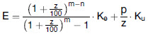

   (2) Der Ablösungsbetrag (A) der Erhaltungskosten ist zu ermitteln nach
    den Formeln:

    *        *            

   (3) Getrennte Ermittlung von Teilbereichen der Erhaltungskosten:

    Die Berechnungsformel der kapitalisierten Erhaltungskosten (E)

    *        *            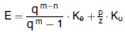   , wobei
            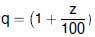            gesetzt ist,

    setzt sich zusammen aus dem Anteil für die kapitalisierten
    Erneuerungskosten (E
    e                   )

    *        *            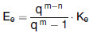

   und dem Anteil für die kapitalisierten jährlichen Unterhaltungskosten
    (E
    u                   )

    *        *            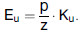

   Durch Erweiterung des untenstehenden ersten Summanden mit q
    m                    – 1 können die kapitalisierten Erhaltungskosten
    für die Erneuerungskosten (E
    e                   ) in den Anteil der kapitalisierten Kosten der
    nächsten Erneuerung (
    E
    nä
    e                   ), die erste Erneuerung nach der
    Ablösungsvereinbarung,

    *        *            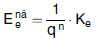

   und den Anteil der kapitalisierten Kosten für die weiteren
    Erneuerungen

    *        *            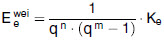

   aufgegliedert werden. Für die Aufwendungen der weiteren Erneuerungen
    steht nach n Jahren, also zum Zeitpunkt der ersten Erneuerung nach der
    Ablösungsvereinbarung, mathematisch ausgedrückt durch die
    Multiplikation der Gleichung mit q
    n                   , ein Betrag von

    *        *            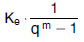

   Euro zur Verfügung. Nach weiteren m Jahren, also zum Zeitpunkt der
    zweiten Erneuerung nach der Ablösungsvereinbarung, mathematisch
    ausgedrückt durch die Multiplikation der Gleichung mit q
    m                   , steht ein Betrag von

    *        *            

   Euro zur Verfügung. K
    e                    wird entnommen, sodass wieder der gleiche Betrag
    wie nach der ersten Erneuerung zur Verfügung steht und die weiteren
    Erneuerungen durch Verzinsung bezahlt werden können.

    *        *            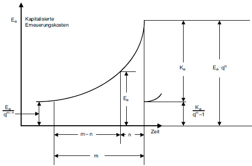

   (4) Ermittlung einer zeitlich unbegrenzten Unterhaltungsverpflichtung:

    Bei einer zeitlich unbegrenzten Unterhaltungsverpflichtung können die
    kapitalisierten jährlichen Unterhaltungskosten E
    u                    durch folgenden Ansatz hergeleitet werden: Das
    Kapital E
    u                    muss einen Zinsertrag bringen, der die laufenden
    jährlichen Unterhaltungskosten deckt:

    *        *            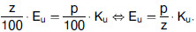

   (5) Ermittlung einer zeitlich begrenzten Unterhaltungsverpflichtung:

    Bei einer zeitlich nur begrenzten Unterhaltsverpflichtung über t Jahre
    ergibt sich die Berechnungsvorschrift für die kapitalisierten
    jährlichen Unterhaltungskosten (E
    t
    u                   ) durch die Betrachtung eines nachschüssigen
    Ansparmodells mit dem Zeithorizont t:

    *        *            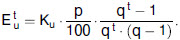

   Durch den Übergang t*                    ergibt sich wiederum die
    Formel für die zeitlich unbegrenzte Unterhaltungsverpflichtung.

    (6) In den Formeln haben die Berechnungsglieder folgende Bedeutung:

    *        *   Variable

        *   Bedeutung

        *   Dimension

    *        *   A

        *   Ablösungsbetrag der Erhaltungskosten

        *   Euro

    *        *   E

        *   Kapitalisierte Erhaltungskosten

        *   Euro

    *        *   E
            alt

        *   Kapitalisierte Erhaltungskosten der alten baulichen Anlage

        *   Euro

    *        *   E
            neu

        *   Kapitalisierte Erhaltungskosten der neuen baulichen Anlage

        *   Euro

    *        *   K
            e

        *   Erneuerungskosten der baulichen Anlage

        *   Euro

    *        *   K
            u

        *   Kosten der baulichen Anlage, die der Ermittlung der kapitalisierten
            Unterhaltungskosten zugrunde zu legen sind

        *   Euro

    *        *   z

        *   Zinssatz der Kapitalisierung

        *   vom Hundert

    *        *   q

        *   Zinsfaktor der Kapitalisierung

        *            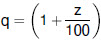
        *   [–]

    *        *   m

        *   Theoretische Nutzungsdauer der fiktiven baulichen Anlage

        *   Jahre

    *        *   n

        *   Restnutzungsdauer: Anzahl der Jahre vom Zeitpunkt der Fälligkeit
            der Ablösung bis zur nächsten fälligen theoretischen Erneuerung
            der alten vorhandenen baulichen Anlage

        *   Jahre

    *        *   p

        *   Jährliche Unterhaltungskosten der fiktiven baulichen Anlage
            in Hundertteilen der Kosten K
            u

        *   vom Hundert

    *        *   E
            t
            u

        *   zeitlich begrenzte Unterhaltungskosten über t Jahre

        *   Euro

    *        *   t

        *   Zeit der begrenzten Unterhaltungsverpflichtung

        *   Jahre

**2.4** **Anzuwendender Zinssatz**

    Der Zinssatz z ist mit 4 vom Hundert anzusetzen.

**2.5** **Theoretische Nutzungsdauer**

    Die theoretische Nutzungsdauer m der Bauwerksteile und der Bauteile
    beginnt mit dem Jahr der verkehrsbereiten Fertigstellung der baulichen
    Anlage. Falls bereits Bauwerksteile oder Bauteile erneuert wurden,
    gilt für diese das Jahr der letzten Erneuerung.

    Die theoretische Nutzungsdauer ist ein Erfahrungswert für die mögliche
    Nutzungsdauer einer baulichen Anlage, eines Bauwerksteils oder eines
    Bauteils und ist unabhängig von der tatsächlichen Nutzungsdauer bei
    der Ablösungsberechnung anzuwenden.

**2.6** **Restnutzungsdauer**

    Die Restnutzungsdauer n ist unabhängig vom tatsächlichen Zustand der
    baulichen Anlage stets die Anzahl der Jahre vom Zeitpunkt der Ablösung
    bis zur nächsten fälligen theoretischen Erneuerung. Nach Ablauf der
    theoretischen Nutzungsdauer ist die Restnutzungsdauer mit Null
    anzusetzen.

    Wird bei der Ermittlung der Erneuerungskosten nach Nummer 3.1 eine
    nach Unterbau und Überbau gegliederte Brücke im Fiktiventwurf
    beispielsweise durch ein Rahmenbauwerk ersetzt, so ist eine gemeinsame
    Restnutzungsdauer aus den Restnutzungsdauern von Unterbau und Überbau
    abzuleiten.

**2.7** **Tabellen**

    Die theoretischen Nutzungsdauern m und die Prozentsätze p der
    jährlichen Unterhaltungskosten der Ingenieurbauwerke sind in Kapitel 4
    in den Tabellen 1 bis 6 festgelegt.

    Auf beweglichen Brücken sind die Werte nach Tabelle 1 nicht ohne
    Weiteres anwendbar. Die hierfür anzusetzenden theoretischen
    Nutzungsdauern m und die Prozentsätze p der jährlichen
    Unterhaltungskosten bedürfen gegebenenfalls besonderer Vereinbarung.

    Die theoretischen Nutzungsdauern m und die Prozentsätze p der
    jährlichen Unterhaltungskosten der Fahrwege von Eisenbahnen, der
    Straßen und Wege sowie der Ausstattungen von Bundeswasserstraßen und
    sonstigen schiffbaren Gewässern sind in Kapitel 4 in den Tabellen 7
    bis 11 festgelegt.

Kapitel 3
## **Kostenermittlung**

**3.1** **Ermittlung der Erneuerungskosten**

    Die Ermittlung der Erneuerungskosten (K
    e                   ) erfolgt auf der Grundlage von Fiktiventwürfen.
    Im Falle der erstmaligen Herstellung einer baulichen Anlage ist ein
    Fiktiventwurf für die zukünftige Erneuerung zu erstellen. Im Falle der
    Änderung einer bestehenden baulichen Anlage sind zwei Fiktiventwürfe
    erforderlich, von denen der eine für die zukünftige Erneuerung der
    vorhandenen baulichen Anlage und der andere für die zukünftige
    Erneuerung der geänderten baulichen Anlage aufzustellen ist. Dabei
    werden jeweils der Preisstand zum Zeitpunkt der Ablösung und die
    baulichen Anlagen mit den vorhandenen Grundmaßen in einer zum
    Zeitpunkt der Ablösung üblichen, wirtschaftlichen Bauweise zugrunde
    gelegt.

    Wenn der zukünftige Erhaltungspflichtige kein Unternehmer im Sinne des
    Umsatzsteuergesetzes ist (z. B. Bund als Straßenbaulastträger), sind
    bei den anzusetzenden Kosten, sofern es sich um Unternehmerleistungen
    handelt, die Bruttokosten zugrunde zu legen. Ist der zukünftige
    Erhaltungspflichtige Unternehmer im Sinne des Umsatzsteuergesetzes,
    ist die Berechnung auf Basis von Nettokosten durchzuführen.

    Eigenleistungen sind auf der Grundlage von Unternehmerleistungen zu
    veranschlagen. Soweit Kostenanteile der Erneuerung nicht anhand von
    Unternehmerleistungen ermittelt werden können, sind diese
    Kostenanteile in geeigneter Weise nachzuweisen.

    Sind bei Lichtsignalanlagen die Erstellungskosten an
    Instandhaltungsverträge gebunden, so sind die Erneuerungskosten auf
    der Grundlage von Marktpreisen zu ermitteln.

    Erlöse aus der Verwertung oder der Wert nicht mehr benötigter
    Bauwerksteile und Altstoffe sind von den Kosten abzusetzen.

    Alle einmaligen Kosten, die nur bei der Erstellung oder Änderung
    anfallen, jedoch bei einer späteren Erneuerung nicht wiederkehren (z.
    B. Hebung von Gleisen, Absenkung von Straßen, Bodenaushub des
    Verkehrsraums, Pfahlgründungen, Rampen) sind bei der Ermittlung der
    Erneuerungskosten (K
    e                   ) und damit bei der Ablösung nicht zu
    berücksichtigen.

**3.2** **Zusammensetzung der Erneuerungskosten**

    Die Erneuerungskosten (K
    e                   ) für bauliche Anlagen setzen sich aus den reinen
    Baukosten nach Nummer 3.3 bis Nummer 3.5, den Kosten für Abbruch,
    Behelfszustände, Betriebserschwernisse, Umleitungsmaßnahmen und
    Sicherungsposten zusammen. Zu den Erneuerungskosten gehören auch die
    Verwaltungskosten gemäß Nummer 3.10.

    Bei der Ermittlung der Erneuerungskosten beziehen sich die Kosten für
    den Abbruch jeweils auf das abzulösende fiktive Bauwerk und nicht auf
    das alte vorhandene Bauwerk. Das alte vorhandene Bauwerk dient nur der
    Bestimmung der Restnutzungsdauer.

**3.3** **Reine Baukosten der Ingenieurbauwerke**

    Die reinen Baukosten der Ingenieurbauwerke umfassen die Aufwendungen
    für die Herstellung aller Bauwerksteile die zum dauernden Bestand der
    Ingenieurbauwerke gehören. Dies sind insbesondere die Kosten für
    zugehörige Erdbauarbeiten, Gründungen, Betonarbeiten,
    Stahlbauarbeiten, Korrosionsschutz, Abdichtungen und
    Bauwerksentwässerung. Ebenso gehören hierzu die Kosten für Traggerüste
    mit Ausnahme der Verschubbahnen (Nummer 3.6), Baugrubenverbau,
    Wasserhaltung, Baustelleneinrichtung und -räumung sowie die Kosten für
    die Erstellung der Ausführungsunterlagen (insbesondere statische
    Berechnungen, Konstruktions- und Ausführungszeichnungen,
    Baugrunduntersuchungen).

**3.4** **Reine Baukosten der Fahrwege von Eisenbahnen**

    Die reinen Baukosten der Fahrwege von Eisenbahnen umfassen neben den
    Aufwendungen für die Fahrwegsbestandteile im Sinne von Nummer 1.14,
    die auf den Bau des Fahrwegs entfallenden Kosten für
    Baustelleneinrichtung und -räumung sowie die Kosten für die Erstellung
    der Ausführungsunterlagen.

**3.5** **Reine Baukosten der Straßen und Wege sowie der Ausstattungen für
    Bundeswasserstraßen und sonstige schiffbare Gewässer**

    Die reinen Baukosten der Straßen und Wege sowie der Ausstattungen für
    Bundeswasserstraßen und sonstigen schiffbaren Gewässern umfassen neben
    den Aufwendungen für die Straßen- und Wegebestandteile im Sinne von
    Nummer 1.16 bis 1.19, die auf den Bau der Straßen und Wege
    entfallenden Kosten für Baustelleneinrichtung und -räumung.

    Die Kosten für Baustelleneinrichtung und -räumung werden bei
    Oberbauarbeiten gemäß Nummer 1.16 durch einen Zuschlag von 4 vom
    Hundert, bei Erd-, Entwässerungs- und Oberbauarbeiten gemäß Nummer
    1\.16 bis 1.18 durch einen Zuschlag von 8 vom Hundert zu den reinen
    Baukosten berücksichtigt, sofern sie nicht in die Kosten der
    abzulösenden Leistungen eingerechnet sind.

**3.6** **Aufteilung der Kosten für Abbruch, Behelfszustände,
    Betriebserschwernisse, Umleitungsmaßnahmen bei Brückenbauwerken**

    Bei Ingenieurbauwerken sind die Kosten für Abbruch und für die während
    der nächsten Erneuerung zur Aufrechterhaltung des Verkehrs notwendigen
    Behelfszustände einschließlich der Verschubbahnen,
    Betriebserschwernisse von Eisenbahnen, Umleitungsmaßnahmen auf
    Unterbau und Überbau und Sicherungsposten entsprechend den Anteilen
    dieser Bauwerksteile an den reinen Baukosten zu verteilen.

**3.7** **Aufteilung der Kosten für Abbruch, Behelfszustände,
    Umleitungsmaßnahmen bei Straßen und Wegen**

    Bei Straßen und Wegen sind die Kosten für die Aufnahme oder die
    Teilaufnahme des alten Oberbaus sowie die Kosten für die während der
    nächsten Erneuerung zur Aufrechterhaltung des Verkehrs notwendigen
    Behelfszustände und Umleitungsmaßnahmen im Verhältnis der Dicke der zu
    erneuernden Schichten auf diese aufzuteilen.

**3.8** **Zusammensetzung und Ermittlung der Unterhaltungskosten**

    Die jährlichen Unterhaltungskosten werden mit pauschalen Prozentsätzen
    p von K
    u                    ermittelt und kapitalisiert. Für die Ermittlung
    der Unterhaltungskosten ist der Preisstand zur Zeit der Ablösung
    maßgebend. Nummer 3.1 gilt entsprechend.

    Die Bezugsgröße K
    u                   , die der Ermittlung der kapitalisierten
    Unterhaltungskosten nach Nummer 3.8.1 bis Nummer. 3.8.3 zugrunde zu
    legen ist, setzt sich aus den reinen Baukosten nach Nummer 3.3 bis
    Nummer 3.5 und den anrechenbaren Verwaltungskosten zusammen.

    Die Unterhaltungskosten berücksichtigen alle Aufwendungen, die
    notwendig sind, damit die baulichen Anlagen die theoretische
    Nutzungsdauer erreichen können. Außerdem beinhalten die
    Unterhaltungskosten die Aufwendungen für die laufende Überwachung
    einschließlich Bauwerksprüfungen sowie für Behelfszustände,
    Betriebserschwernisse und Umleitungsmaßnahmen, die in diesem
    Zusammenhang anfallen.

**3.8.1** **Unterhaltungskosten der Ingenieurbauwerke**

    Zu den Unterhaltungskosten der Brücken zählen insbesondere die
    Aufwendungen für das Auswechseln von Lagern, die Erneuerung von
    Abdichtungen und Geländern, die Beseitigung von Setzungsdifferenzen,
    das Auspressen von Fugen sowie die Instandsetzung von Außenflächen,
    Kappen und Schutzeinrichtungen.

**3.8.2** **Unterhaltungskosten der Fahrwege von Eisenbahnen**

    Zu den Unterhaltungskosten der Fahrwege von Eisenbahnen gehören
    insbesondere Aufwendungen zur Unterhaltung der Fahrwegsbestandteile
    gemäß Nummer 1.14 Absatz 1.

**3.8.3** **Unterhaltungskosten der Straßen und Wege sowie der Ausstattungen für
    Bundeswasserstraßen und sonstige schiffbare Gewässer**

    Zu den Unterhaltungskosten der Straßen und Wege sowie der
    Ausstattungen für Bundeswasserstraßen und sonstige schiffbare Gewässer
    gehören insbesondere Aufwendungen zur Unterhaltung des Oberbaus, der
    zugehörigen Entwässerung und der Ausstattungen.

    Die Unterhaltungskosten für Straßen und Wege enthalten auch die
    Aufwendungen für deren Reinigung.

**3.8.4** **Winterdienst**

    Die Ablösung von Winterdienstaufgaben ist wegen der außerordentlich
    unterschiedlichen Gegebenheiten der Einzelfälle nicht Bestandteil
    dieser Verordnung.

**3.9** **Energiekosten**

    Kosten für den durch die bauliche Anlage bedingten Energieverbrauch,
    wie etwa bei Bahnübergängen und Lichtsignalanlagen, sind in den
    jährlichen Unterhaltungskosten nicht enthalten. Der Aufwand eines
    Jahres ist nach der Berechnungsvorschrift für Unterhaltungskosten in
    Nummer 2.3 zu kapitalisieren und den Unterhaltungskosten zuzuschlagen.
    § 15 Absatz 3 des Eisenbahnkreuzungsgesetzes bleibt unberührt.

    Bei der Berechnung der kapitalisierten Energiekosten gemäß dem zweiten
    Summanden der Formel in Nummer 2.3 entspricht die Bezugsgröße K
    u                    dem Aufwand eines Jahres zuzüglich
    Verwaltungskosten in Höhe von 10 vom Hundert dieses Aufwandes nach
    Nummer 3.10. Anstelle von p ist der Wert 100 anzusetzen.

**3.10** **Verwaltungskosten**

    Mit den Verwaltungskosten in Höhe von 10 vom Hundert der Kosten nach
    Nummer 3.3 bis 3.7 sind insbesondere die Aufwendungen für Vorarbeiten,
    Vorentwürfe, die Bearbeitung des vergabereifen Bauentwurfs, die
    Vergabe der Bauarbeiten, die Prüfung der statischen Berechnungen und
    der Ausführungspläne, die Einholung behördlicher Genehmigungen, die
    örtliche Bauaufsicht (Bauüberwachung) und Bauleitung (Baulenkung),
    ferner die Stellung von Prüf- und Messgeräten, Messfahrzeugen,
    Hilfsfahrzeugen für die Bauaufsicht und Bauleitung und von Fahrzeugen
    für die Probebelastung sowie sonstige Verwaltungstätigkeiten
    einschließlich des Rechnungs- und Kassendienstes abgegolten.

    Ferner sind damit die Aufwendungen für
    Umweltverträglichkeitsprüfungen, landschaftspflegerische Begleitpläne,
    schalltechnische Berechnungen sowie die Erstellung und Prüfung von
    Berechnungen der Ablösungsbeträge der Erhaltungskosten abgegolten.

Kapitel 4
Tabellen
der Theoretischen Nutzungsdauern
## **und der Prozentsätze der jährlichen Unterhaltungskosten**

Tabelle 1
### **Brücken**

*    *   lfd. Nr.

    *   Bauwerksteil

    *   Theoretische
        Nutzungs-
        dauer
        m [Jahre]

    *   Jährliche
        Unterhaltungs-
        kosten
        p [v. H.]

*    *   1

    *   2

    *   3

    *   4

*    *   **1.**

    *   **Brücken**

    *
    *

*    *   **1.1**

    *   **Unterbauten**
        **(Widerlager einschließlich Flügelwände, Pfeiler, Stützen, Pylone,
        jeweils einschließlich Gründungen)**

    *
    *

*    *   1.1.1

    *   aus Mauerwerk, Beton, Stahlbeton

    *   110

    *   0,5

*    *   1.1.2

    *   aus Pfahlwänden, Schlitzwänden

    *   90

    *   0,5

*    *   1.1.3

    *   aus Stahlspundwänden

    *
    *

*    *   1.1.3.1

    *   ohne Korrosionsschutz

    *   50

    *   0,6

*    *   1.1.3.2

    *   mit Korrosionsschutz

    *   70

    *   0,5

*    *   1.1.4

    *   aus Stahl

    *   100

    *   0,8

*    *   1.1.5

    *   aus Holz

    *   50

    *   2,0

*    *   **1.2**

    *   **Überbauten**
        **(Balken, Platten, Bögen, Kastenquerschnitte)**

    *
    *

*    *   1.2.1

    *   aus Stahlbeton

    *   70

    *   0,8

*    *   1.2.2

    *   aus Spannbeton

    *
    *

*    *   1.2.2.1

    *   mit internen Spanngliedern

    *   70

    *   1,3

*    *   1.2.2.2

    *   mit externen Spanngliedern

    *   70

    *   1,1

*    *   1.2.3

    *   aus Stahl

    *   100

    *   1,5

*    *   1.2.4

    *   aus Stahl-Beton-Verbundwerkstoffen

    *
    *

*    *   1.2.4.1

    *   Stahltragwerke mit Betonplatte

    *   70

    *   1,2

*    *   1.2.4.2

    *   Walzträger in Beton

    *   100

    *   0,8

*    *   1.2.4.3

    *   Stahlträger in Beton im Doppelverbund

    *   100

    *   0,6

*    *   1.2.5

    *   aus Holz

    *
    *

*    *   1.2.5.1

    *   für Geh- und Radwege (nicht geschützt)

    *   30

    *   2,5

*    *   1.2.5.2

    *   für Geh- und Radwege (geschütztes Haupttragwerk)

    *   60

    *   2,0

*    *   1.2.5.3

    *   für Straßen (geschütztes Haupttragwerk)

    *   60

    *   2,0

*    *   **1.3**

    *   **Rahmenartige Tragwerke**
        **(einschließlich Gründungen und Flügelwände)**

    *
    *

*    *   1.3.1

    *   aus Stahlbeton

    *   70

    *   0,8

*    *   1.3.2

    *   aus Spannbeton

    *   70

    *   1,2

*    *   1.3.3

    *   aus Stahl

    *   100

    *   1,5

*    *   **1.4**

    *   **Gewölbe (einschließlich Gründungen)**

    *
    *

*    *   1.4.1

    *   aus Mauerwerk, Beton

    *   130

    *   0,6

*    *   1.4.2

    *   aus Stahlbeton

    *   110

    *   0,5

*    *   **1.5**

    *   **Wellstahlrohre**

    *   70

    *   0,8

*    *   **1.6**

    *   **Sonstige Bauwerksteile**

    *
    *

*    *   1.6.1

    *   Schutzerdungsanlagen

    *
    *

*    *
    *   Kontaktschienen, Bügelanschlagschienen, Erdleitungen

    *   30

    *   5,0

*    *   1.6.2

    *   Fahrleitungseinrichtungen und sonstige Verankerungen von Leitungen an
        Straßenbrücken

    *
    *

*    *
    *   Leitungen der Bahn (einschließlich Fahrdrahtaufhängern)

    *   30

    *   5,0

*    *   1.6.3

    *   Berührungsschutzanlagen

    *
    *

*    *   1.6.3.1

    *   Schutzplatten aus Stahlbeton

    *   30

    *   0,8

*    *   1.6.3.2

    *   Schutzplatten aus Stahl

    *   30

    *   1,2

*    *   1.6.3.3

    *   Aufhöhung von Geländern und lückenlose Verkleidung der Geländerteile

    *   30

    *   1,5

*    *   1.6.4

    *   Entgleisungsschutz

    *   20

    *   1,0

Tabelle 2
### **Tunnel**

*    *   lfd. Nr.

    *   Bauwerksteil

    *   Theoretische
        Nutzungs-
        dauer
        m [Jahre]

    *   Jährliche
        Unterhaltungs-
        kosten
        p [v. H.]

*    *   1

    *   2

    *   3

    *   4

*    *   **2.**

    *   **Tunnel**

    *
    *

*    *   **2.1**

    *   **Herstellung in geschlossener Bauweise**

    *
    *

*    *   2.1.1

    *   mit Entwässerungsanlagen

    *   130

    *   0,9

*    *   2.1.2

    *   ohne Entwässerungsanlagen

    *   130

    *   0,6

*    *   **2.2**

    *   **Herstellung in offener Bauweise**

    *   90

    *   0,6

*    *   **2.3**

    *   Betriebstechnische und verkehrstechnische Ausstattungen
        **für Straßentunnel**
        (Beleuchtung, Lüftung, Sicherheitseinrichtungen, zentrale Anlagen,
        Wechselverkehrszeichen für dynamische Geschwindigkeitsbeschränkungen
        und Fahrstreifensignalisierung, Schranken (vor dem Tunnelportal) usw.)

    *   20

    *   2,0

Tabelle 3
### **Trogbauwerke**

*    *   lfd. Nr.

    *   Bauwerksteil

    *   Theoretische
        Nutzungs-
        dauer
        m [Jahre]

    *   Jährliche
        Unterhaltungs-
        kosten
        p [v. H.]

*    *   1

    *   2

    *   3

    *   4

*    *   **3.**

    *   **Trogbauwerke**

    *
    *

*    *   **3.1**

    *   **aus Stahlbeton**

    *   110

    *   0,5

*    *   **3.2**

    *   **aus Pfahlwänden, Schlitzwänden**

    *   90

    *   0,5

*    *   **3.3**

    *   **aus Stahlspundwänden**

    *   70

    *   0,5

Tabelle 4
### **Stützbauwerke**

*    *   lfd. Nr.

    *   Bauwerksteil

    *   Theoretische
        Nutzungs-
        dauer
        m [Jahre]

    *   Jährliche
        Unterhaltungs-
        kosten
        p [v. H.]

*    *   1

    *   2

    *   3

    *   4

*    *   **4.**

    *   **Stützbauwerke**

    *
    *

*    *   **4.1**

    *   **Stützwände**

    *
    *

*    *   4.1.1

    *   aus Mauerwerk, Beton, Stahlbeton

    *   110

    *   0,5

*    *   4.1.2

    *   aus Pfahlwänden, Schlitzwänden

    *   90

    *   0,5

*    *   4.1.3

    *   aus Stahlspundwänden, Trägerbohlwänden

    *   70

    *   0,5

*    *   **4.2**

    *   **Sonstige Stützkonstruktionen**

    *
    *

*    *   4.2.1

    *   aus mit Erdreich gefüllten Formteilen, vernetztem Erdmaterial

    *   60

    *   1,0

*    *   4.2.2

    *   aus Drahtgitterkörben mit Steinfüllung (Gabionen)

    *   50

    *   0,2

Tabelle 5
### **Lärmschutzbauwerke**

*    *   lfd. Nr.

    *   Bauwerksteil

    *   Theoretische
        Nutzungs-
        dauer
        m [Jahre]

    *   Jährliche
        Unterhaltungs-
        kosten
        p [v. H.]

*    *   1

    *   2

    *   3

    *   4

*    *   **5.**

    *   **Lärmschutzbauwerke**

    *
    *

*    *   **5.1**

    *   **Gründungen**

    *   100

    *   0

*    *   **5.2**

    *   **Lärmschutzwände**

    *
    *

*    *   5.2.1

    *   aus Stahlbeton

    *   60

    *   1,0

*    *   5.2.2

    *   aus Holz

    *   30

    *   1,0

*    *   5.2.3

    *   aus Acryl- oder Verbundglas

    *   30

    *   1,0

*    *   5.2.4

    *   aus Aluminium

    *   40

    *   1,0

*    *   **5.3**

    *   **Lärmschutzsteilwälle**

    *   60

    *   1,0

Tabelle 6
### **Sonstige Ingenieurbauwerke**

*    *   lfd. Nr.

    *   Bauwerksteil

    *   Theoretische
        Nutzungs-
        dauer
        m [Jahre]

    *   Jährliche
        Unterhaltungs-
        kosten
        p [v. H.]

*    *   1

    *   2

    *   3

    *   4

*    *   **6.**

    *   **Sonstige Ingenieurbauwerke**

    *
    *

*    *   **6.1**

    *   **Verkehrszeichenbrücken (einschließlich Beschilderungen)**

    *   30

    *   5,0

*    *   **6.2**

    *   **Durchlässe**

    *
    *

*    *
    *   aus Mauerwerk, Beton, Stahlbeton, Wellstahl

    *   70

    *   0,8

*    *   **6.3**

    *   **Leitwerke**

    *   30

    *   4,0

Tabelle 7
### **Fahrwege von Eisenbahnen**

*    *   lfd. Nr.

    *   Bauteil

    *   Theoretische
        Nutzungs-
        dauer
        m [Jahre]

    *   Jährliche
        Unterhaltungs-
        kosten
        p [v. H.]

*    *   1

    *   2

    *   3

    *   4

*    *   **7.**

    *   **Fahrwege von Eisenbahnen**

    *
    *

*    *   **7.1**

    *   **Schotterbett, Gleisschwellen, Schienen**

    *   30

    *   4,0

*    *   **7.2**

    *   **Weichen**

    *   20

    *   5,0

*    *   **7.3**

    *   **Feste Fahrbahnen**

    *   60

    *   1,0

*    *   **7.4**

    *   **Befestigungen an Bahnübergängen**

    *
    *

*    *   7.4.1

    *   schwere Befestigungen

    *   30

    *   2,0

*    *   7.4.2

    *   mittelschwere Befestigungen

    *   20

    *   4,0

*    *   7.4.3

    *   übrige Befestigungen

    *   20

    *   6,0

*    *   **7.5**

    *   **Sicherungen an Bahnübergängen**

    *
    *

*    *   7.5.1

    *   Lichtzeichen mit Schranken

    *   30

    *   4,0

*    *   7.5.2

    *   Lichtzeichen

    *   30

    *   3,0

*    *   7.5.3

    *   elektrische Schranken

    *   35

    *   4,0

*    *   7.5.4

    *   sonstige Absperrvorrichtungen

    *   25

    *   2,0

Tabelle 8
### **Oberbau von Straßen und Wegen**

*    *   lfd. Nr.

    *   Bauteil

    *   Theoretische
        Nutzungs-
        dauer
        m [Jahre]

    *   Jährliche
        Unterhaltungs-
        kosten
        p [v. H.]

*    *   1

    *   2

    *   3

    *   4

*    *   **8.**

    *   **Oberbau von Straßen und Wegen**

    *
    *

*    *   **8.1**

    *   **Tragschichten**

    *
    *

*    *   8.1.1

    *   ohne Bindemittel

    *   80

    *   0

*    *   8.1.2

    *   mit hydraulischen Bindemitteln

    *   35

    *   0

*    *   8.1.3

    *   aus Asphalt

    *   40

    *   0

*    *   **8.2**

    *   **Asphaltbinderschichten**

    *   20

    *   0

*    *   **8.3**

    *   **Deckschichten**

    *
    *

*    *   8.3.1

    *   aus Asphaltbeton, Splittmastixasphalt

    *   15

    *   2,0

*    *   8.3.2

    *   aus Gussasphalt

    *   25

    *   1,5

*    *   8.3.3

    *   aus offenporigem Asphalt

    *   10

    *   3,0

*    *   **8.4**

    *   **Decken aus Beton**

    *   30

    *   1,5

*    *   **8.5**

    *   **Asphaltbauweisen – Bauliche Erhaltung**

    *
    *

*    *   8.5.1

    *   Oberflächenbehandlungen

    *   6

    *   3,0

*    *   8.5.2

    *   dünne Asphaltdeckschichten

    *   8

    *   2,0

*    *   **8.6**

    *   **Pflasterdecken (einschließlich Bettungen)**

    *
    *

*    *   8.6.1

    *   für Fahrverkehrsflächen

    *   25

    *   3,0

*    *   8.6.2

    *   für Flächen mit überwiegend ruhendem Verkehr, Fußgängerzonen

    *   60

    *   0,5

*    *   **8.7**

    *   **Befestigungen von Gehwegen, Radwegen**

    *   25

    *   2,5

*    *   **8.8**

    *   **Ländliche Wege**

    *
    *

*    *   8.8.1

    *   Fundationsschichten

    *   35

    *   0

*    *   8.8.2

    *   Tragschichten

    *
    *

*    *   8.8.2.1

    *   ohne Bindemittel

    *   100

    *   0

*    *   8.8.2.2

    *   mit hydraulischen Bindemitteln

    *   35

    *   0

*    *   8.8.2.3

    *   aus Asphalt

    *   40

    *   0

*    *   8.8.3

    *   Asphalttragdeckschichten, Asphaltspurwege

    *   25

    *   2,0

*    *   8.8.4

    *   hydraulisch gebundene Tragdeckschichten, Betonspurwege

    *   25

    *   1,5

*    *   8.8.5

    *   Deckschichten

    *
    *

*    *   8.8.5.1

    *   ohne Bindemittel

    *   25

    *   5,0

*    *   8.8.5.2

    *   mit hydraulischen Bindemitteln

    *   30

    *   1,5

*    *   8.8.5.3

    *   aus Asphalt

    *   35

    *   2,0

*    *   8.8.5.4

    *   aus Beton

    *   40

    *   1,0

*    *   8.8.6

    *   Pflasterdecken (einschließlich Bettungen)

    *   30

    *   1,5

*    *   **8.9**

    *   **Bordsteine**

    *
    *

*    *   8.9.1

    *   aus Naturstein

    *   80

    *   0,5

*    *   8.9.2

    *   aus Beton

    *   40

    *   0,5

Tabelle 9
### **Entwässerung von Straßen und Wegen**

*    *   lfd. Nr.

    *   Bauteil

    *   Theoretische
        Nutzungs-
        dauer
        m [Jahre]

    *   Jährliche
        Unterhaltungs-
        kosten
        p [v. H.]

*    *   1

    *   2

    *   3

    *   4

*    *   **9.**

    *   **Entwässerung von Straßen und Wegen**

    *
    *

*    *   **9.1**

    *   **Entwässerungseinrichtungen innerhalb der Straßenkörper**

    *   80

    *   0,5

*    *   **9.2**

    *   **Rohrleitungen zum Vorfluter, Rohrdurchlässe**

    *   80

    *   2,0

*    *   **9.3**

    *   **Rohrleitungen für Abwasser**

    *
    *

*    *   9.3.1

    *   aus Steinzeug

    *   100

    *   2,0

*    *   9.3.2

    *   aus duktilem Guss

    *   80

    *   1,0

*    *   9.3.3

    *   aus Beton, Stahl, Kunststoff

    *   60

    *   2,0

*    *   **9.4**

    *   **Druckrohrleitungen mit Pumpanlagen**

    *
    *

*    *   9.4.1

    *   Druckrohrleitungen

    *   50

    *   1,0

*    *   9.4.2

    *   Pumpenanlagen (maschinen- und elektrotechnischer Teil)

    *   15

    *   2,0

*    *   **9.5**

    *   **Sickerrohrleitungen**

    *   60

    *   2,0

*    *   **9.6**

    *   **Gräben, Mulden**

    *   50

    *   5,0

*    *   **9.7**

    *   Straßenabläufe, Prüfschächte, Ablaufschächte, Schacht-
        **abdeckungen**

    *   50

    *   1,0

*    *   **9.8**

    *   **Mechanische Absetzbecken, Rückhaltebecken, Überlaufbecken,
        Versickerbecken, Leichtflüssigkeitsabscheider**

    *
    *

*    *   9.8.1

    *   aus Beton

    *   60

    *   1,0

*    *   9.8.2

    *   als Erdbauwerk

    *   90

    *   2,0

*    *   **9.9**

    *   **Mechanische Einbauten in Leichtflüssigkeitsabscheidern**

    *   25

    *   2,5

Tabelle 10
Ausstattungen von Straßen und Wegen sowie
### **Bundeswasserstraßen und sonstigen schiffbaren Gewässern**

*    *   lfd. Nr.

    *   Bauteil

    *   Theoretische
        Nutzungs-
        dauer
        m [Jahre]

    *   Jährliche
        Unterhaltungs-
        kosten
        p [v. H.]

*    *   1

    *   2

    *   3

    *   4

*    *   **10.**

    *   Ausstattungen von Straßen und Wegen sowie Bundeswasser-
        **straßen und sonstigen schiffbaren Gewässern**

    *
    *

*    *   **10.1**

    *   **Nicht vorgefertigte Markierungssysteme**

    *
    *

*    *   10.1.1

    *   Farben

    *
    *

*    *   10.1.1.1

    *   für stark belastete Straßen

    *   1

    *   0

*    *   10.1.1.2

    *   für schwach belastete Straßen

    *   3

    *   0

*    *   10.1.2

    *   High-Solid-Dispersionen, reaktive Stoffe, thermoplastische Stoffe

    *
    *

*    *   10.1.2.1

    *   für stark belastete Straßen

    *   2

    *   0

*    *   10.1.2.2

    *   für schwach belastete Straßen

    *   4

    *   0

*    *   **10.2**

    *   **Vorgefertigte Markierungssysteme (Folien)**

    *
    *

*    *   10.2.1

    *   für stark belastete Straßen

    *   4

    *   0

*    *   10.2.2

    *   für schwach belastete Straßen

    *   7

    *   0

*    *   **10.3**

    *   **Fahrzeugrückhaltesysteme**

    *
    *

*    *   10.3.1

    *   Stahlschutzplanken

    *   30

    *   0,5

*    *   10.3.2

    *   Schutzwände aus Beton, Stahl

    *   40

    *   2,0

*    *   **10.4**

    *   **Verkehrszeichen**

    *
    *

*    *   10.4.1

    *   Verkehrsschilder (einschließlich Aufstellvorrichtungen) – auch für
        Schifffahrt

    *
    *

*    *   10.4.1.1

    *   bis 1 m
        2

    *   10

    *   3,0

*    *   10.4.1.2

    *   über 1 m
        2

    *   15

    *   3,0

*    *   10.4.2

    *   Radarreflektoren (für die Schifffahrt)

    *   30

    *   3,0

*    *   **10.5**

    *   **Leitpfosten u. Ä.**

    *
    *

*    *   10.5.1

    *   Leitpfosten an Straßen und Wegen

    *   10

    *   10,0

*    *   10.5.2

    *   Leitpfähle, Dalben und Absetzpfähle im Bereich von Bundeswasserstraßen
        und sonstigen schiffbaren Gewässern

    *   15

    *   5,0

*    *   **10.6**

    *   **Straßenbeleuchtung**

    *   30

    *   1,0

*    *   **10.7**

    *   **Lichtsignalanlagen**

    *
    *

*    *   10.7.1

    *   Signalmaste

    *   30

    *   4,0

*    *   10.7.2

    *   Signalgeber

    *   20

    *   4,0

*    *   10.7.3

    *   Signalsteuergerät

    *   15

    *   4,0

*    *   10.7.4

    *   Kabel

    *   30

    *   0

*    *   10.7.5

    *   Kabelschächte

    *   50

    *   0

*    *   10.7.6

    *   Induktionsschleifen

    *   7

    *   0

*    *   10.7.7

    *   Infrarotdetektoren

    *   15

    *   0

*    *   **10.8**

    *   **Verkehrsbeeinflussungsanlagen**

    *   15

    *   6,0

Tabelle 11
### **Geländer, Zäune, Mauern, Böschungsbefestigungen an Straßen und
Wegen**

*    *   lfd. Nr.

    *   Bauteil

    *   Theoretische
        Nutzungs-
        dauer
        m [Jahre]

    *   Jährliche
        Unterhaltungs-
        kosten
        p [v. H.]

*    *   1

    *   2

    *   3

    *   4

*    *   **11.**

    *   **Geländer, Zäune, Mauern, Böschungsbefestigungen an Straßen und
        Wegen**

    *
    *

*    *   **11.1**

    *   **Geländer (nicht auf Ingenieurbauwerken)**

    *
    *

*    *   11.1.1

    *   aus Stahl

    *   50

    *   1,2

*    *   11.1.2

    *   aus Aluminium

    *   50

    *   0,6

*    *   11.1.3

    *   aus Holz

    *   20

    *   2,5

*    *   **11.2**

    *   **Zäune**

    *
    *

*    *   11.2.1

    *   mit Holzpfosten

    *   15

    *   2,0

*    *   11.2.2

    *   mit Betonpfosten, Stahlpfosten

    *   30

    *   1,5

*    *   11.2.3

    *   Wildschutzzäune

    *   20

    *   5,0

*    *   11.2.4

    *   Blendschutzzäune

    *   30

    *   2,0

*    *   11.2.5

    *   Steinschlagschutzzäune mit Fangnetz

    *   50

    *   3,0

*    *   **11.3**

    *   **Mauern, Begrenzungen**

    *
    *

*    *
    *   aus Mauerwerk, Beton, Stahlbeton

    *   110

    *   0,5

*    *   **11.4**

    *   **Böschungsbefestigungen**

    *
    *

*    *   11.4.1

    *   aus Pflaster

    *   110

    *   0,5

*    *   11.4.2

    *   aus Rasen (einschließlich Oberboden)

    *   100

    *   8,0

