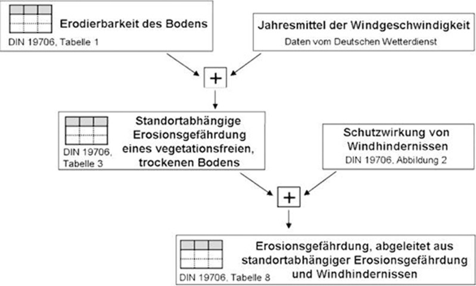

# Verordnung über die Einhaltung von Grundanforderungen und Standards im Rahmen unionsrechtlicher Vorschriften über Agrarzahlungen (AgrarZahlVerpflV)

Ausfertigungsdatum
:   2014-12-17

Fundstelle
:   BAnz: AT 23.12.2014 V1

Zuletzt geändert durch
:   Art. 2 V v. 17.9.2021 I 4302

## Eingangsformel

Das Bundesministerium für Ernährung und Landwirtschaft verordnet auf
Grund

–   des § 4 Absatz 1 Satz 1, auch in Verbindung mit Absatz 4, des
    Agrarzahlungen-Verpflichtungengesetzes vom
    2\. Dezember 2014                    (BGBl. I S. 1928) im Einvernehmen
    mit dem Bundesministerium der Finanzen und dem Bundesministerium für
    Umwelt, Naturschutz, Bau und Reaktorsicherheit,

–   des § 9a Satz 1 und des § 15 Satz 1 des Marktorganisationsgesetzes in
    der Fassung der Bekanntmachung vom 24. Juni 2005 (BGBl. I S. 1847),
    die durch Artikel 1 des Gesetzes vom 29. Juli 2009 (BGBl. I S. 2314)
    geändert worden sind, jeweils in Verbindung mit § 1 Absatz 2 des
    Agrarzahlungen-Verpflichtungengesetzes vom 2. Dezember 2014 (BGBl. I
    S. 1928) und mit § 1 Absatz 2 des Zuständigkeitsanpassungsgesetzes vom
    16\. August 2002 (BGBl. I S. 3165) und dem Organisationserlass vom 17.
    Dezember 2013 (BGBl. I S. 4310) im Einvernehmen mit dem
    Bundesministerium der Finanzen, dem Bundesministerium für Wirtschaft
    und Energie und dem Bundesministerium für Umwelt, Naturschutz, Bau und
    Reaktorsicherheit:

## Abschnitt 1 - Anwendungsbereich

### § 1 Anwendungsbereich

Diese Verordnung regelt

1.  die Anforderungen an die Erhaltung von Flächen in gutem
    landwirtschaftlichen und ökologischen Zustand im Sinne von Artikel 93
    Absatz 1 in Verbindung mit Anhang II der Verordnung (EU) Nr. 1306/2013
    des Europäischen Parlaments und des Rates vom 17. Dezember 2013 über
    die Finanzierung, die Verwaltung und das Kontrollsystem der
    Gemeinsamen Agrarpolitik und zur Aufhebung der Verordnungen (EWG) Nr.
    352/78, (EG) Nr. 165/94, (EG) Nr. 2799/98, (EG) Nr. 814/2000, (EG) Nr.
    1290/2005 und (EG) Nr. 485/2008 des Rates (ABl. L 347 vom 20.12.2013,
    S. 549) in
    der jeweils                    geltenden Fassung, die von dem
    Begünstigten im Sinne von Artikel 92 Satz 1 der Verordnung (EU) Nr.
    1306/2013 (Begünstigter) einzuhalten sind, sowie

2.  die Einzelheiten zur Kontrolle und Sanktionierung der Anforderungen
    und Standards nach Nummer 1 und nach Artikel 93 Absatz 1 bis 3 in
    Verbindung mit Anhang II der Verordnung (EU) Nr. 1306/2013.

## Abschnitt 2 - Anforderungen an die Erhaltung von Flächen in gutem landwirtschaftlichen und ökologischen Zustand

### § 2 Schaffung von Pufferzonen entlang von Wasserläufen

Wer landwirtschaftliche Flächen entlang von Wasserläufen
bewirtschaftet, hat zur Erhaltung des guten landwirtschaftlichen und
ökologischen Zustands die Anforderungen des § 5 Absatz 2 Satz 1 Nummer
1 in Verbindung mit Satz 2, Absatz 2 Satz 3 und 4 und Absatz 3,
jeweils in Verbindung mit Absatz 4, der Düngeverordnung zu beachten,
soweit sich die Anforderungen auf stickstoffhaltige Düngemittel
beziehen. Soweit die Landesregierungen durch Rechtsverordnungen nach §
13a Absatz 3 der Düngeverordnung von den in Satz 1 genannten
Anforderungen abweichende Anforderungen vorschreiben oder durch
Rechtsverordnungen nach § 13 Absatz 2 Satz 1 in Verbindung mit Satz 4
Nummer 5 der Düngeverordnung in der bis zum 30. April 2020 geltenden
Fassung abweichende Vorschriften erlassen haben, die sich jeweils auf
stickstoffhaltige Düngemittel beziehen, sind abweichend von Satz 1 die
Anforderungen nach Landesrecht zu beachten.

### § 3 Einhaltung von Genehmigungsverfahren für die Verwendung von Wasser zur Bewässerung

Wer landwirtschaftliche Flächen beregnet oder sonst bewässert, hat bei
einer erlaubnispflichtigen oder bewilligungspflichtigen
Gewässerbenutzung im Sinne von § 9 Absatz 1 Nummer 1 oder 5 des
Wasserhaushaltsgesetzes im Falle einer Kontrolle hinsichtlich der
Einhaltung der Verpflichtungen zur Erhaltung der landwirtschaftlichen
Flächen in einem guten landwirtschaftlichen und ökologischen Zustand
nachzuweisen, dass die Erlaubnis oder Bewilligung vorliegt.

### § 4 Schutz des Grundwassers gegen Verschmutzung

(1) Stoffe nach Liste I der Anlage 1 dürfen im Rahmen einer
landwirtschaftlichen Tätigkeit nicht in das Grundwasser eingeleitet
oder eingebracht werden.

(2) Wer im Rahmen seiner landwirtschaftlichen Tätigkeit Stoffe nach
Liste II der Anlage 1 in das Grundwasser einleitet oder einbringt, hat
im Falle einer Kontrolle hinsichtlich der Einhaltung der
Verpflichtungen zur Erhaltung der landwirtschaftlichen Flächen in
einem guten landwirtschaftlichen und ökologischen Zustand
nachzuweisen, dass eine Erlaubnis nach § 8 in Verbindung mit § 9
Absatz 1 Nummer 4 und mit § 48 Absatz 1 des Wasserhaushaltsgesetzes
vorliegt.

(3) Stoffe nach Liste I und Liste II der Anlage 1 sind im Rahmen einer
landwirtschaftlichen Tätigkeit so zu handhaben, dass eine nachteilige
Veränderung der Grundwasserbeschaffenheit nicht zu besorgen ist. Die
Anwendung von Düngemitteln und Pflanzenschutzmitteln im Rahmen der
guten fachlichen Praxis und der gesetzlichen Vorschriften bleibt
unberührt. Die Anforderung nach Satz 1 ist in der Regel erfüllt, wenn
die Vorgaben der Absätze 4 bis 7 eingehalten werden.

(4) Mineralölprodukte, Treibstoffe, Schmierstoffe und
Pflanzenschutzmittel sind in dichten Behältern zu lagern. Mit
Mineralölprodukten, Treibstoffen, Schmierstoffen und
Pflanzenschutzmitteln ist so umzugehen und ihre jeweiligen Reste sind
so zu beseitigen, dass eine nachteilige Veränderung der
Grundwasserbeschaffenheit nicht zu besorgen ist. Satz 2 gilt
entsprechend für die Beseitigung von Resten von Desinfektionsbädern
für landwirtschaftliche Nutztiere.

(5) Soweit es sich nicht um eine ortsfeste Anlage im Sinne des § 62
Absatz 1 Satz 3 des Wasserhaushaltsgesetzes handelt, darf Festmist nur
auf landwirtschaftlichen Flächen und nicht länger als sechs Monate und
nur so gelagert werden, dass keine nachteilige Veränderung der
Grundwasserbeschaffenheit durch Austreten von Sickersäften zu besorgen
ist. Der Platz, auf dem der Festmist auf landwirtschaftlichen Flächen
gelagert wird, ist jährlich zu wechseln.

(6) Silagemieten außerhalb ortsfester Anlagen sind nur auf
landwirtschaftlichen Flächen zulässig und nur sofern eine nachteilige
Veränderung der Grundwasserbeschaffenheit durch Austreten von
Sickersäften nicht zu besorgen ist.

(7) Zur Erhaltung des guten landwirtschaftlichen und ökologischen
Zustands sind außerdem die Vorgaben von
Wasserschutzgebietsverordnungen              und behördlichen
Entscheidungen nach § 52 Absatz 1 bis 3 des Wasserhaushaltsgesetzes
einzuhalten, soweit sie die Lagerung von Silage und Festmist außerhalb
von ortsfesten Anlagen betreffen.

### § 5 Mindestanforderungen an die Bodenbedeckung

(1) Ackerland, das durch den Betriebsinhaber als im Umweltinteresse
genutzte Fläche im Sinne von Artikel 46 Absatz 2 Buchstabe a, c, d
oder f der Verordnung (EU) Nr. 1307/2013 des Europäischen Parlaments
und des Rates vom 17. Dezember 2013 mit Vorschriften über
Direktzahlungen an Inhaber landwirtschaftlicher Betriebe im Rahmen von
Stützungsregelungen der Gemeinsamen Agrarpolitik und zur Aufhebung der
Verordnung (EG) Nr. 637/2008 des Rates und der Verordnung (EG) Nr.
73/2009 des Rates (ABl. L 347 vom 20.12.2013, S. 608) in der jeweils
geltenden Fassung ausgewiesen ist, ist der Selbstbegrünung zu
überlassen oder durch eine Ansaat zu begrünen, soweit keine
landwirtschaftliche Erzeugung stattfindet oder soweit nur eine
Beweidung oder Schnittnutzung zugelassen ist. Im Falle des Artikels 46
Absatz 2 Buchstabe c der Verordnung (EU) Nr. 1307/2013 gilt Satz 1
nur, soweit es sich um Feldränder im Sinne des § 28 der
Direktzahlungen-Durchführungsverordnung handelt, die keine Feldraine
im Sinne des § 8 Absatz 1 Nummer 6 sind. Ein Umbruch ist zu
Pflegezwecken mit unverzüglich folgender Ansaat oder zur Erfüllung von
Verpflichtungen im Rahmen von Agrarumwelt- und Klimamaßnahmen
außerhalb des in Absatz 5 genannten Zeitraums zulässig. Abweichend von
Satz 3 ist innerhalb des in Absatz 5 genannten Zeitraums ein Umbruch
zulässig, wenn der Betriebsinhaber auf Antrag einer Verpflichtung zur
Anlage von ein- oder mehrjährigen Blühflächen im Rahmen von
Agrarumwelt- und Klimamaßnahmen unterliegt und dieser Verpflichtung
durch Neuansaat nachkommen muss.

(2) Auf Ackerland, das durch den Betriebsinhaber als im
Umweltinteresse genutzte Fläche im Sinne von Artikel 46 Absatz 2
Buchstabe c, d oder f der Verordnung (EU) Nr. 1307/2013 ausgewiesen
ist, dürfen keine Pflanzenschutzmittel angewendet werden.

(3) Die Verpflichtungen der Absätze 1 und 2 enden zu dem Zeitpunkt
nach dem 31. Juli des Antragsjahres, ab dem eine Aussaat oder
Pflanzung, die nicht vor Ablauf dieses Antragsjahres zur Ernte führt,
vorbereitet und durchgeführt wird. Hiervon abweichende Vorschriften
des Bundes und der Länder auf dem Gebiet des Naturschutzes oder des
Wasserhaushalts bleiben unberührt. Antragsjahr ist das Jahr, in dem
die maßgebliche Fläche als im Umweltinteresse genutzte Fläche
beantragt wurde.

(4) Die Absätze 1 bis 3 finden entsprechende Anwendung auf
brachliegendes einschließlich stillgelegtes Ackerland im Sinne von
Artikel 4 Absatz 1 Buchstabe f der Verordnung (EU) Nr. 1307/2013, das
nicht als im Umweltinteresse genutzte Fläche durch den Betriebsinhaber
ausgewiesen ist. Satz 1 ist jedoch nicht auf Streifen oder Teilflächen
anzuwenden, die als Teil einer zusammenhängenden und bis auf diese
Streifen oder Teilflächen einheitlich bewirtschafteten Ackerfläche des
Betriebsinhabers dazu bestimmt sind, einen Beitrag zur Biodiversität
oder zur Regulierung von Schwarzwildbeständen zu leisten.

(5) In dem Zeitraum vom 1. April bis zum 30. Juni eines Jahres ist das
Mähen oder das Zerkleinern des Aufwuchses auf den Flächen im Sinne der
Absätze 1 und 4 verboten. Satz 1 gilt auch für Dauergrünlandflächen,
auf denen keine Erzeugung stattfindet.

(6) Zwischenfrüchte und Gründecken im Sinne von Artikel 46 Absatz 2
Buchstabe i der Verordnung (EU) Nr. 1307/2013 in Verbindung mit § 18
Absatz 3 des Direktzahlungen-Durchführungsgesetzes sind über den in §
31 Absatz 2 der Direktzahlungen-Durchführungsverordnung festgelegten
Zeitraum hinaus bis zum Ablauf des 15. Februar des auf das Antragsjahr
folgenden Jahres auf der Fläche zu belassen. Im Falle einer Untersaat
von Gras oder Leguminosen in die Hauptkultur ist diese von der Ernte
der Hauptkultur bis zum Ablauf des 15. Februar des auf das Antragsjahr
folgenden Jahres auf der Fläche zu belassen oder mindestens bis zur
Vorbereitung mit unverzüglich folgender Aussaat der nächsten
Hauptkultur, wenn diese vor dem 15. Februar ausgesät wird.
Winterkulturen und Winterzwischenfrüchte im Sinne von § 18 Absatz 4
des Direktzahlungen-Durchführungsgesetzes sind bis zum Ablauf des 15.
Februar des auf das Antragsjahr folgenden Jahres auf der Fläche zu
belassen. Das Beweiden und das Walzen, Schlegeln oder Häckseln der
Untersaat oder von Zwischenfrüchten auf den in den Sätzen 1 bis 3
genannten Flächen ist zulässig. In Gebieten, in denen die zuständigen
Behörden der Länder gemäß § 31 Absatz 4 der Direktzahlungen-
Durchführungsverordnung die Schnittnutzung für Futterzwecke zugelassen
haben, ist bei Zwischenfrüchten und Untersaaten auf den in den Sätzen
1 und 2 genannten Flächen, die

a)  bis zum Ablauf des 15. Februar 2022 oder

b)  im Fall einer Rechtsverordnung gemäß Satz 6 bis zum im Ablauf des in
    dieser Rechtsverordnung genannten Datums, mindestens aber bis zum
    Ablauf des 14. Januar 2022

auf der Fläche zu belassen sind, eine Schnittnutzung für Futterzwecke
zulässig. Die Landesregierungen können durch Rechtsverordnung für
bestimmte Gebiete, um

1.  witterungsbedingten Besonderheiten,

2.  besonderen Anforderungen bestimmter Kulturen,

3.  besonderen Erfordernissen des Bodenschutzes oder

4.  besonderen Erfordernissen des Pflanzenschutzes im Sinne von § 1 Nummer
    1 und 2 des Pflanzenschutzgesetzes

Rechnung zu tragen, abweichende frühere Termine bestimmen, jedoch
nicht vor dem Ablauf des 14. Januar des auf das Antragsjahr folgenden
Jahres.

### § 6 Mindestpraktiken der Bodenbearbeitung zur Begrenzung von Erosion

(1) Mindestanforderungen zur Begrenzung von Erosion sind durch
Maßnahmen zu gewährleisten, die sich an den aus der Einteilung
landwirtschaftlicher Flächen nach dem Grad der Wasser- oder
Winderosionsgefährdung (Erosionsgefährdung) nach Maßgabe einer
Rechtsverordnung nach Satz 2 in Verbindung mit den Absätzen 2 bis 4
ergebenden Anforderungen auszurichten haben. Die Landesregierungen
haben durch Rechtsverordnung nach § 4 Absatz 1 Satz 1 Nummer 2 in
Verbindung mit Absatz 4 Satz 1 des Agrarzahlungen-
Verpflichtungengesetzes die landwirtschaftlichen Flächen nach dem Grad
der Erosionsgefährdung einzuteilen. Der Einteilung nach Satz 2 sind

1.  bezüglich der Erosionsgefährdung durch Wasser die Anforderungen der
    Anlage 2 und

2.  bezüglich der Erosionsgefährdung durch Wind die Anforderungen der
    Anlage 3

zugrunde zu legen. In der Rechtsverordnung sind die Gebiete, die den
Erosionsgefährdungsklassen zugehören, zu bezeichnen.

(2) Eine Ackerfläche, die zur Wassererosionsgefährdungsklasse CC
Wasser1              im Sinne von Anlage 2 gehört und nicht in eine
besondere Fördermaßnahme zum Erosionsschutz einbezogen ist, darf vom
1\. Dezember bis zum Ablauf des 15. Februar nicht gepflügt werden. Das
Pflügen nach der Ernte der Vorfrucht ist nur bei einer Aussaat vor dem
1\. Dezember              zulässig. Im Falle einer Bewirtschaftung quer
zum Hang sind die Sätze 1 und 2 nicht anzuwenden.

(3) Eine Ackerfläche, die zur Wassererosionsgefährdungsklasse CC
Wasser2              im Sinne von Anlage 2 gehört und nicht in eine
besondere Fördermaßnahme zum Erosionsschutz einbezogen ist, darf vom
1\. Dezember bis zum Ablauf des 15. Februar nicht gepflügt werden. Das
Pflügen zwischen dem 16. Februar und dem Ablauf des 30. November ist
nur bei einer unmittelbar folgenden Aussaat zulässig. Spätester
Zeitpunkt der Aussaat ist der 30. November. Vor der Aussaat von
Kulturen mit einem Reihenabstand von 45 Zentimetern und mehr
(Reihenkultur) ist das Pflügen verboten.

(4) Eine Ackerfläche, die der Winderosionsgefährdungsklasse CC
Wind              im Sinne von Anlage 3 zugehört und die nicht in eine
besondere Fördermaßnahme zum Erosionsschutz einbezogen ist, darf nur
bei Aussaat vor dem 1. März gepflügt werden. Abweichend von Satz 1 ist
das Pflügen, außer bei Reihenkulturen, ab dem 1. März nur bei einer
unmittelbar folgenden Aussaat zulässig. Das Verbot des Pflügens bei
Reihenkulturen gilt nicht, soweit

1.  quer zur Hauptwindrichtung vor dem 1. Dezember Grünstreifen im Abstand
    von höchstens 100 Metern zueinander und in einer Breite von jeweils
    mindestens 2,5 Metern eingesät werden,

2.  im Falle des Anbaus von Kulturen in Dämmen die Dämme quer zur
    Hauptwindrichtung angelegt werden oder

3.  unmittelbar nach dem Pflügen Jungpflanzen gesetzt werden.

(5) Die nach Landesrecht zuständige Behörde kann im Einzelfall
anstelle der Anforderungen der Absätze 2 bis 4 genehmigen, dass
Stallmist zur Gefügestabilisierung eingesetzt wird.

(6) Die Landesregierungen können in der Rechtsverordnung nach Absatz 1
von den Absätzen 2 bis 4 abweichende Anforderungen festlegen, soweit
dies erforderlich ist, um

1.  in bestimmten Gebieten

    a)  witterungsbedingten Besonderheiten,

    b)  besonderen Anforderungen bestimmter Kulturen oder

    c)  besonderen Erfordernissen des Pflanzenschutzes im Sinne des § 1 Nummer
        1 und 2 des Pflanzenschutzgesetzes

    Rechnung zu tragen oder

2.  eine sachgerechte Kontrolle der Anforderungen der Absätze 2 bis 4 zu
    gewährleisten.

### § 7 Erhaltung des Anteils der organischen Substanz im Boden

Stoppelfelder dürfen nicht abgebrannt werden.

### § 8 Keine Beseitigung von Landschaftselementen

(1) Landschaftselemente dürfen nicht beseitigt werden.
Landschaftselemente im Sinne von Satz 1 sind

1.  Hecken oder Knicks: lineare Strukturelemente, die überwiegend mit
    Gehölzen bewachsen sind und eine Mindestlänge von 10 Metern sowie eine
    Durchschnittsbreite von bis zu 15 Metern aufweisen, wobei kleinere
    unbefestigte Unterbrechungen unschädlich sind,

2.  Baumreihen: mindestens fünf linear angeordnete, nicht
    landwirtschaftlich genutzte Bäume entlang einer Strecke von mindestens
    50 Metern Länge,

3.  Feldgehölze: überwiegend mit gehölzartigen Pflanzen bewachsene
    Flächen, die nicht der landwirtschaftlichen Erzeugung dienen, mit
    einer Größe von mindestens 50 Quadratmetern bis höchstens 2 000
    Quadratmetern; Flächen, für die eine Beihilfe zur Aufforstung oder
    eine Aufforstungsprämie gewährt worden ist, gelten nicht als
    Feldgehölze,

4.  Feuchtgebiete mit einer Größe von höchstens 2 000 Quadratmetern:

    a)  in Biotopen, die nach § 30 Absatz 2 Satz 1 Nummer 1 und 2 des
        Bundesnaturschutzgesetzes oder weitergehenden landesrechtlichen
        Vorschriften geschützt und über die Biotopkartierung erfasst sind,

    b)  Tümpel, Sölle, Dolinen und

    c)  andere mit Buchstabe b vergleichbare Feuchtgebiete,

5.  Einzelbäume: Bäume, die als Naturdenkmäler im Sinne von § 28 des
    Bundesnaturschutzgesetzes geschützt sind,

6.  Feldraine: überwiegend mit gras- und krautartigen Pflanzen bewachsene,
    schmale, lang gestreckte Flächen mit einer Gesamtbreite von mehr als
    zwei Metern, die innerhalb von oder zwischen landwirtschaftlichen
    Nutzflächen liegen oder an diese angrenzen und auf denen keine
    landwirtschaftliche Erzeugung stattfindet,

7.  Trocken- und Natursteinmauern: Mauern aus mit Erde oder Lehm verfugten
    oder nicht verfugten Feld- oder Natursteinen von mehr als fünf Metern
    Länge, die nicht Bestandteil einer Terrasse nach Nummer 10 sind,

8.  Lesesteinwälle: Aufschüttungen von Lesesteinen von mehr als fünf
    Metern Länge,

9.  Fels- und Steinriegel sowie naturversteinte Flächen mit einer Größe
    von höchstens 2 000 Quadratmetern,

10. Terrassen: von Menschen unter Verwendung von Hilfsmaterialien
    angelegte, linear-vertikale Strukturen in der Agrarlandschaft, die
    dazu bestimmt sind, die Hangneigung von Nutzflächen zu verringern.

(2) Trocken- und Natursteinmauern im Sinne von Absatz 1 Nummer 7, die
zugleich Bestandteil einer Terrasse im Sinne von Absatz 1 Nummer 10
sind, dürfen nicht beseitigt werden.

(3) § 39 Absatz 5 Satz 1 Nummer 2 und Satz 2 bis 4 des
Bundesnaturschutzgesetzes in Verbindung mit dem darauf gestützten
Landesrecht gilt entsprechend bei

1.  Hecken und Knicks,

2.  Bäumen in Baumreihen,

3.  Feldgehölzen und

4.  Einzelbäumen.

(4) Die Landesregierungen können durch Rechtsverordnung ergänzend zu
Absatz 1 weitere Landschaftselemente festlegen, die im Sinne von
Absatz 1 Satz 1 nicht beseitigt werden dürfen, soweit dies
erforderlich ist, um besonderen regionalen Gegebenheiten Rechnung
tragen zu können.

(5) Mit dem Beseitigungsverbot der Absätze 1 und 2, auch in Verbindung
mit einer Rechtsverordnung nach Absatz 4, ist eine Pflicht zur Pflege
nicht verbunden.

## Abschnitt 3 - Kontroll- und Sanktionsvorschriften

### § 9 Kontrollvorschriften

(1) Artikel 68 Absatz 1 Unterabsatz 4 Satz 2 der
Durchführungsverordnung (EU) Nr. 809/2014 der Kommission vom 17. Juli
2014 mit Durchführungsbestimmungen zur Verordnung (EU) Nr. 1306/2013
des Europäischen Parlaments und des Rates hinsichtlich des
integrierten Verwaltungs- und Kontrollsystems, der Maßnahmen zur
Entwicklung des ländlichen Raums und der Cross-Compliance (ABl. L 227
vom 31.7.2014, S. 69) in der jeweils geltenden Fassung ist anzuwenden.

(2) Enthält der Kontrollbericht im Sinne von Artikel 72 Absatz 1 der
Durchführungsverordnung (EU) Nr. 809/2014 keine Feststellungen, so ist
es nicht erforderlich, den Bericht unter den Voraussetzungen des
Artikels 72 Absatz 4 Unterabsatz 3 der Durchführungsverordnung (EU)
Nr. 809/2014 zu übermitteln.

## Abschnitt 4 - Schlussbestimmungen

### § 10 Übergangsregelungen

(1) Bis zum Erlass einer Rechtsverordnung nach § 6 Absatz 1 Satz 2,
auch in Verbindung mit Absatz 6, sind die auf Grund des § 2 Absatz 1
Satz 2 in Verbindung mit § 5 Absatz 1 Satz 1 Nummer 2 und Absatz 4 des
Direktzahlungen-
Verpflichtungengesetzes              und in Verbindung mit § 2 Absatz
1 und 7 der Direktzahlungen-Verpflichtungenverordnung erlassenen
landesrechtlichen Regelungen längstens bis zum Ablauf des 31. Dezember
2015 weiter anzuwenden.

(2) Bis zum Erlass einer Rechtsverordnung nach § 8 Absatz 4 sind die
auf Grund des § 2 Absatz 2 in Verbindung mit § 5 Absatz 1 Satz 1
Nummer 4 des Direktzahlungen-Verpflichtungengesetzes und in Verbindung
mit § 5 Absatz 1 und 4 der Direktzahlungen-Verpflichtungenverordnung
erlassenen landesrechtlichen Regelungen längstens bis zum Ablauf des
31\. Dezember 2015 anzuwenden.

(3) Soweit nach § 6 Absatz 1 Satz 2, auch in Verbindung mit Absatz 6,
eine landesrechtliche Regelung erlassen wird, ist Absatz 1 insoweit
nicht mehr anzuwenden.

(4) Soweit nach § 8 Absatz 4 eine landesrechtliche Regelung erlassen
wird, ist Absatz 2 nicht mehr anzuwenden.

### § 11 Inkrafttreten, Außerkrafttreten

Diese Verordnung tritt am 1. Januar 2015 in Kraft. Gleichzeitig tritt
die Direktzahlungen-Verpflichtungenverordnung vom 4. November 2004
(BGBl. I S. 2778), die zuletzt durch Artikel 1 der Verordnung vom 3.
Januar 2014 (BAnz AT 06.01.2014 V1) geändert worden ist, außer Kraft.

### Schlussformel

Der Bundesrat hat zugestimmt.

(zu § 4)

### Anlage 1 Liste der Stofffamilien und Stoffgruppen

## Liste I

Die Liste I umfasst die einzelnen Stoffe der nachstehend aufgeführten
Stofffamilien und -gruppen, mit Ausnahme der Stoffe, die aufgrund des
geringen Toxizitäts-, Langlebigkeits- oder Bioakkumulationsrisikos als
ungeeignet für die
Liste I              angesehen werden.

Stoffe, die im Hinblick auf Toxizität, Langlebigkeit oder
Bioakkumulation für die Liste II geeignet sind, sind als Stoffe der
Liste II zu behandeln.

1.  Organische Halogenverbindungen und Stoffe, die im Wasser derartige
    Verbindungen bilden können

2.  Organische Phosphorverbindungen

3.  Organische Zinnverbindungen

4.[^F788068_01_BJNR635700014BJNE001400000]
  Stoffe, die im oder durch Wasser krebserregende, mutagene oder
    teratogene Wirkung haben

5.  Quecksilber und Quecksilberverbindungen

6.  Cadmium und Cadmiumverbindungen

7.  Mineralöle und Kohlenwasserstoffe

8.  Cyanide

## Liste II

Die Liste II umfasst die einzelnen Stoffe und die Stoffkategorien aus
den nachstehend aufgeführten Stofffamilien und Stoffgruppen, die eine
schädliche Wirkung auf das Grundwasser haben können.

1.  Folgende Metalloide und Metalle und ihre Verbindungen:

    a)  Zink

    b)  Kupfer

    c)  Nickel

    d)  Chrom

    e)  Blei

    f)  Selen

    g)  Arsen

    h)  Antimon

    i)  Molybdän

    j)  Titan

    k)  Zinn

    l)  Barium

    m)  Beryllium

    n)  Bor

    o)  Uran

    p)  Vanadium

    q)  Kobalt

    r)  Thallium

    s)  Tellur

    t)  Silber

2.  Biozide und davon abgeleitete Verbindungen, die nicht in der Liste I
    enthalten sind;

3.  Stoffe, die eine für den Geschmack und/oder den Geruch des
    Grundwassers abträgliche Wirkung haben, sowie Verbindungen, die im
    Grundwasser zur Bildung solcher Stoffe führen und es für den
    menschlichen Gebrauch ungeeignet machen können;

4.  giftige oder langlebige organische Siliziumverbindungen und Stoffe,
    die im Wasser zur Bildung solcher Verbindungen führen können, mit
    Ausnahme derjenigen, die biologisch unschädlich sind oder sich im
    Wasser rasch in biologisch unschädliche Stoffe umwandeln;

5.  Anorganische Phosphorverbindungen und reiner Phosphor;

6.  Fluoride;

7.  Ammoniak und Nitrite.

    Sofern bestimmte Stoffe aus der Liste II krebserregende, mutagene oder
    teratogene Wirkung haben, fallen sie unter Kategorie 4 dieser Liste.
[^F788068_01_BJNR635700014BJNE001400000]: 
(zu § 6 Absatz 1 Satz 3 Nummer 1, Absatz 2 und 3)

### Anlage 2 Bestimmung der potenziellen Erosionsgefährdung durch Wasser

## Wassererosionsgefährdungsklasse

*    *   Wassererosionsgefährdungsklasse

    *[^F788068_02_BJNR635700014BJNE001500000]
   K \* S

    *[^F788068_03_BJNR635700014BJNE001500000]
   K \* S \* R

    *[^F788068_04_BJNR635700014BJNE001500000]
   K \* S \* R \* L

*    *   1

    *   3

    *   4

    *   5

*    *   CC
        Wasser1

    *   0,3 –*                        0,55

    *   15 –*                        27,5

    *   30 –*                        55

*    *   CC
        Wasser2

    *   *                        0,55

    *   *                        27,5

    *   *                        55

    Bestimmung der potenziellen (standortbedingten) Erosionsgefährdung
    durch Wasser in Anlehnung an DIN 19708 (Bodenbeschaffenheit –
    Ermittlung der Erosionsgefährdung von Böden durch Wasser mit Hilfe der
    ABAG, DIN – Deutsches Institut für Normung e.V., Februar 2005). Die
    DIN-Methode ist zu beziehen beim Beuth Verlag Berlin.
[^F788068_02_BJNR635700014BJNE001500000]:     Der Regenerosivitätsfaktor R kann optional verwendet werden. Er ist
    gemäß DIN 19708 Abschnitt 4.2 bzw. Tabelle C.1 gebietsspezifisch zu
    ermitteln und anzuwenden.
[^F788068_03_BJNR635700014BJNE001500000]:     Der Hanglängenfaktor L kann optional verwendet werden. Er ist gemäß
    DIN 19708 Abschnitt 4.5 standortspezifisch zu ermitteln und
    anzuwenden.
[^F788068_04_BJNR635700014BJNE001500000]: 

### Anlage 3 (zu § 6 Absatz 1 Satz 2 Nummer 2 und Absatz 4)

## **Bestimmung der potenziellen Erosionsgefährdung durch Wind**

Die Erosionsgefährdung durch Wind ist nach DIN 19706,
Bodenbeschaffenheit – Ermittlung der Erosionsgefährdung von Böden
durch Wind, zu ermitteln.

## Winderosionsgefährdungsklasse

*    *   Winderosionsgefährdungsklasse

    *[^F788068_05_BJNR635700014BJNE001600000]
   Stufe nach DIN 19706

*    *   1

    *   3

*    *   CC
        Wind

    *   E
        nat                       5

    Bestimmung der potenziellen (standortbedingten) Erosionsgefährdung
    durch Wind nach Tabelle 3 bzw. Tabelle 8 der DIN 19706
    (Bodenbeschaffenheit – Ermittlung der Erosionsgefährdung von Böden
    durch Wind, DIN – Deutsches Institut für Normung e.V., Mai 2004). Die
    DIN-Methode ist zu beziehen beim Beuth Verlag Berlin.
[^F788068_05_BJNR635700014BJNE001600000]: 
