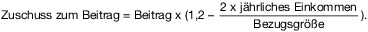

# Gesetz über die Alterssicherung der Landwirte (ALG)

Ausfertigungsdatum
:   1994-07-29

Fundstelle
:   BGBl I: 1994, 1890, 1891

Zuletzt geändert durch
:   Art. 20c G v. 22.11.2021 I 4906

## Erstes Kapitel - Versicherter Personenkreis

### § 1 Versicherte kraft Gesetzes

(1) Versicherungspflichtig sind

1.  Landwirte,

2.  mitarbeitende Familienangehörige.

(2) Landwirt ist, wer als Unternehmer ein auf Bodenbewirtschaftung
beruhendes Unternehmen der Landwirtschaft betreibt, das die
Mindestgröße (Absatz 5) erreicht. Unternehmer ist, wer seine
berufliche Tätigkeit selbständig ausübt. Beschränkt haftende
Gesellschafter einer Personenhandelsgesellschaft oder Mitglieder einer
juristischen Person gelten als Landwirt, wenn sie hauptberuflich im
Unternehmen tätig und wegen dieser Tätigkeit nicht kraft Gesetzes in
der gesetzlichen Rentenversicherung versichert sind.

(3) Der Ehegatte eines Landwirts nach Absatz 2 gilt als Landwirt, wenn
beide Ehegatten nicht dauernd getrennt leben und der Ehegatte nicht
voll erwerbsgemindert nach § 43 Abs. 2 des Sechsten Buches
Sozialgesetzbuch ist; dabei ist die jeweilige Arbeitsmarktlage nicht
zu berücksichtigen. Dies gilt nur für den Anwendungsbereich dieses
Gesetzes, nicht aber für den Anwendungsbereich anderer Gesetze,
insbesondere nicht den des Fünften Buches Sozialgesetzbuch. Die
Ehegatten sind verpflichtet, innerhalb von drei Monaten nach Übernahme
des Unternehmens der Landwirtschaft oder, sofern die Eheschließung
nach der Übernahme des Unternehmens der Landwirtschaft erfolgt,
innerhalb von drei Monaten nach der Eheschließung gegenüber der
landwirtschaftlichen Alterskasse zu erklären, welcher Ehegatte das
Unternehmen als Landwirt nach Absatz 2 betreibt. Sie können innerhalb
dieser Frist auch erklären, daß sie beide das Unternehmen
gemeinschaftlich betreiben. Wird eine Erklärung nicht fristgerecht
abgegeben, bestimmt die landwirtschaftliche Alterskasse, welcher
Ehegatte Landwirt nach Absatz 2 ist. Tritt eine wesentliche Änderung
der Verhältnisse ein, kann innerhalb von drei Monaten gegenüber der
landwirtschaftlichen Alterskasse erneut erklärt werden, welcher der
Ehegatten das Unternehmen betreibt oder daß beide das Unternehmen
gemeinschaftlich betreiben. Betreibt jeder der Ehegatten ein
Unternehmen der Landwirtschaft, sind beide Landwirte nach Absatz 2.
Die Sätze 1 bis 7 gelten entsprechend für Ehegatten von Unternehmern,
die ein Unternehmen der Imkerei, der Binnenfischerei oder der
Wanderschäferei betreiben.

(4) Unternehmen der Landwirtschaft sind Unternehmen der Land- und
Forstwirtschaft einschließlich des Garten- und Weinbaues, der
Fischzucht und der Teichwirtschaft; die hierfür genutzten Flächen
gelten als landwirtschaftlich genutzte Flächen. Zur
Bodenbewirtschaftung gehören diejenigen wirtschaftlichen Tätigkeiten
von nicht ganz kurzer Dauer, die der Unternehmer zum Zwecke einer
überwiegend planmäßigen Aufzucht von Bodengewächsen ausübt, sowie die
mit der Bodennutzung verbundene Tierhaltung, sofern diese nach den
Vorschriften des Bewertungsgesetzes zur landwirtschaftlichen Nutzung
rechnet. Der Bodenbewirtschaftung wird auch eine den Zielen des Natur-
und Umweltschutzes dienende Pflege stillgelegter Flächen zugerechnet,
wenn

1.  eine öffentlich-rechtliche Verpflichtung hierzu besteht,

2.  die Tätigkeit nicht im Rahmen eines Unternehmens des Garten- und
    Landschaftsbaus ausgeübt wird und

3.  das Unternehmen ohne die stillgelegten Flächen mindestens die Hälfte
    der Mindestgröße (Absatz 5) erreicht.

Als Unternehmen der Landwirtschaft gelten auch die Imkerei, die
Binnenfischerei und die Wanderschäferei. Betreibt ein Versicherter
mehrere Unternehmen, gelten sie als ein Unternehmen.

(5) Ein Unternehmen der Landwirtschaft erreicht dann die Mindestgröße,
wenn sein Wirtschaftswert einen von der landwirtschaftlichen
Alterskasse unter Berücksichtigung der örtlichen oder regionalen
Gegebenheiten festgesetzten Grenzwert erreicht; der Ertragswert für
Nebenbetriebe bleibt hierbei unberücksichtigt. Ein Unternehmen der
Imkerei muß grundsätzlich mindestens 100 Bienenvölker umfassen. Ein
Unternehmen der Binnenfischerei muß grundsätzlich mindestens 120
Arbeitstage jährlich erfordern. Ein Unternehmen der Wanderschäferei
muß grundsätzlich eine Herde von mindestens 240 Großtieren umfassen.

(6) Der Wirtschaftswert ist der durch die Finanzbehörden nach dem
Bewertungsgesetz im Einheitswertbescheid für das land- und
forstwirtschaftliche Vermögen festgesetzte Wirtschaftswert.
Pachtflächen sowie verpachtete oder nachhaltig nicht
landwirtschaftlich genutzte Flächen sind mit dem durchschnittlichen
Hektarwert der entsprechenden Nutzung der Eigentumsfläche zu bewerten
und bei der Festlegung des Wirtschaftswertes des Unternehmens
entsprechend zu berücksichtigen. Dies gilt auch für land- und
forstwirtschaftlich genutzte Flächen, die nach § 69 des
Bewertungsgesetzes dem Grundvermögen zugerechnet werden. Ist der
gesamte Betrieb gepachtet, ist der für den Verpächter maßgebende
Wirtschaftswert anzusetzen. Ist der Wirtschaftswert des Unternehmens
ganz oder teilweise nicht zu ermitteln, ist er zu schätzen. Weichen
bei gartenbaulicher Nutzung die dem Einheitswertbescheid zugrunde
liegenden betrieblichen Verhältnisse von den tatsächlichen ab, sind
die Flächen nach ihrer tatsächlichen Nutzung zu bewerten.

(7) Landwirt nach Absatz 2 ist nicht, wer ein Unternehmen der
Landwirtschaft ohne die Absicht der nachhaltigen Gewinnerzielung
betreibt.

(8) Mitarbeitende Familienangehörige sind

1.  Verwandte bis zum dritten Grade,

2.  Verschwägerte bis zum zweiten Grade und

3.  Pflegekinder

eines Landwirtes oder seines Ehegatten, die in seinem Unternehmen
hauptberuflich tätig sind. Pflegekinder sind Personen, die mit dem
Landwirt oder seinem Ehegatten durch ein auf längere Dauer angelegtes
Pflegeverhältnis mit häuslicher Gemeinschaft wie Kinder mit Eltern
verbunden sind.

### § 1a Geltung für Lebenspartner

Die für Ehegatten und ehemalige Ehegatten sowie Witwen und Witwer
geltenden Vorschriften dieses Gesetzes gelten entsprechend für
Lebenspartner, Lebenspartner, deren Lebenspartnerschaft aufgehoben
wurde, und hinterbliebene Lebenspartner.

### § 2 Versicherungsfreiheit

Versicherungsfrei sind

1.  Landwirte und mitarbeitende Familienangehörige, die

    a)  das 18. Lebensjahr noch nicht vollendet oder die Regelaltersgrenze
        bereits erreicht haben,

    b)  bei Beginn der Versicherung die Wartezeit nach § 13 Abs. 1 Nr. 3 für
        eine Rente wegen Erwerbsminderung nicht mehr erfüllen können oder

    c)  bereits eine vorzeitige Rente wegen Alters oder eine Rente wegen
        Erwerbsminderung beziehen, und

2.  (weggefallen)

3.  mitarbeitende Familienangehörige, solange sie als Landwirt in der
    Alterssicherung der Landwirte versichert sind.

### § 3 Befreiung von der Versicherungspflicht

(1) Landwirte und mitarbeitende Familienangehörige werden auf Antrag
von der Versicherungspflicht befreit, solange sie

1.  regelmäßig Arbeitsentgelt, Arbeitseinkommen, vergleichbares Einkommen
    oder Erwerbsersatzeinkommen (Absatz 4) beziehen, das ohne
    Berücksichtigung des Arbeitseinkommens aus Land- und Forstwirtschaft
    jährlich 4 800 Euro überschreitet,

1a. Arbeitslosengeld II beziehen, wenn sie im letzten Kalendermonat vor
    dem Bezug von Arbeitslosengeld II nicht versichert waren,

2.  wegen Erziehung eines Kindes in der gesetzlichen Rentenversicherung
    versicherungspflichtig sind oder nur deshalb nicht
    versicherungspflichtig sind, weil sie nach § 56 Abs. 4 des Sechsten
    Buches Sozialgesetzbuch von der Anrechnung von Kindererziehungszeiten
    ausgeschlossen sind,

3.  wegen der Pflege eines Pflegebedürftigen in der gesetzlichen
    Rentenversicherung versicherungspflichtig sind oder nur deshalb nicht
    versicherungspflichtig sind, weil sie von der Versicherungspflicht
    befreit sind, oder

4.  wegen der Ableistung von Wehr- und Zivildienst in der gesetzlichen
    Rentenversicherung versicherungspflichtig sind oder nur deshalb nicht
    versicherungspflichtig sind, weil sie versicherungsfrei oder von der
    Versicherungspflicht befreit sind.

(2) Die Befreiung wirkt vom Vorliegen der Befreiungsvoraussetzungen
an, wenn sie innerhalb von drei Monaten beantragt wird, sonst vom
Eingang des Antrags an. Der Antrag auf Befreiung kann im Falle der
Erfüllung einer neuen Befreiungsvoraussetzung nach einer anderen
Nummer des Absatzes 1 mit Wirkung für die Zukunft widerrufen werden;
der Widerruf ist nur innerhalb von drei Monaten nach Erfüllung der
neuen Befreiungsvoraussetzung möglich. Die Befreiung endet mit Ablauf
des Kalendermonats, in dem der Widerruf eingegangen ist. § 34 Absatz 2
Satz 3 und 4 gilt entsprechend.

(2a) Es wird unwiderlegbar vermutet, dass der Antrag auf Befreiung
aufrechterhalten wird, solange eine der Befreiungsvoraussetzungen des
Absatzes 1 erfüllt und der Antrag auf Befreiung nicht widerrufen
worden ist (Absatz 2 Satz 2 und 3). Die Befreiungsvoraussetzungen
gelten auch dann als ununterbrochen erfüllt im Sinne von Satz 1, wenn
für weniger als drei Kalendermonate das Vorliegen der
Befreiungsvoraussetzungen des Absatzes 1 unterbrochen worden ist.

(2b) Tritt innerhalb von weniger als sechs Kalendermonaten nach dem
Ende der Versicherungspflicht nach § 1 Absatz 1 Nummer 2 erneut eine
entsprechende Versicherungspflicht ein und galt für die Zeit der
vorherigen Versicherungspflicht eine Befreiung von der
Versicherungspflicht nach § 3 Absatz 1 Nummer 1, wird widerlegbar
vermutet, dass der frühere Befreiungsantrag auch für die erneute
versicherungspflichtige Tätigkeit nach § 1 Absatz 1 Nummer 2 gilt.

(3) Von der Versicherungspflicht wird auf Antrag auch befreit, wer die
Wartezeit von 15 Jahren bis zum Erreichen der Regelaltersgrenze nicht
mehr erfüllen kann. Absatz 2 gilt.

(4) Erwerbsersatzeinkommen sind Leistungen, die aufgrund oder in
entsprechender Anwendung öffentlich-rechtlicher Vorschriften erbracht
werden, um Erwerbseinkommen zu ersetzen. Hierzu zählen insbesondere

1.  Renten aus der gesetzlichen Rentenversicherung, der gesetzlichen
    Unfallversicherung, einer berufsständischen Versicherungs- oder
    Versorgungseinrichtung oder Versorgungsbezüge nach beamtenrechtlichen
    Vorschriften oder Grundsätzen und vergleichbare Bezüge aus einem
    öffentlich-rechtlichen Dienst- oder Amtsverhältnis oder aus der
    Versorgung der Abgeordneten,

2.  Krankengeld, Versorgungskrankengeld, Verletztengeld, soweit es nicht
    nach § 55a Absatz 2 des Siebten Buches Sozialgesetzbuch gewährt wird,
    oder Übergangsgeld, Arbeitslosengeld oder Unterhaltsgeld nach dem
    Dritten Buch Sozialgesetzbuch und vergleichbare Leistungen von einem
    Sozialleistungsträger.

Erwerbsersatzeinkommen sind auch den in Satz 2 genannten Leistungen
vergleichbare Leistungen, die von einer Stelle außerhalb des
Geltungsbereichs dieses Gesetzes erbracht werden, sowie die Renten
einer Einrichtung der betrieblichen oder überbetrieblichen Alters- und
Hinterbliebenenversorgung. Kinderzuschuß, Kinderzulage und
vergleichbare kindbezogene Leistungen bleiben außer Betracht. Wird
eine Kapitalleistung oder anstelle einer wiederkehrenden Leistung eine
Abfindung gezahlt, ist der Betrag als Einkommen zu berücksichtigen,
der bei einer Verrentung der Kapitalleistung oder als Rente ohne die
Abfindung zu zahlen wäre. Bei der Verletztenrente aus der gesetzlichen
Unfallversicherung bleibt ein der Grundrente nach dem
Bundesversorgungsgesetz entsprechender Betrag unberücksichtigt; bei
einer Minderung der Erwerbsfähigkeit um 20 vom Hundert bleiben zwei
Drittel der Mindestgrundrente, bei einer Minderung der
Erwerbsfähigkeit um 10 vom Hundert bleibt ein Drittel der
Mindestgrundrente unberücksichtigt.

### § 4 Freiwillige Versicherung

(1) Ehegatten von ehemaligen Landwirten können sich freiwillig
versichern, wenn

1.  sie weder versicherungspflichtig, versicherungsfrei noch von der
    Versicherungspflicht befreit sind,

2.  sie das 18. Lebensjahr vollendet und die Regelaltersgrenze noch nicht
    erreicht haben,

3.  sie eine Rente nicht beziehen und

4.  der ehemalige Landwirt eine Rente bezieht.

(2) Die Versicherung beginnt mit dem ersten Tag des Monats, der dem
Monat folgt, in dem die Versicherungspflicht endet, wenn der Antrag
innerhalb von drei Monaten nach dem Ende der Versicherungspflicht
gestellt wird, anderenfalls mit dem Tag des Eingangs des Antrags bei
der landwirtschaftlichen Alterskasse.

(3) Die Berechtigung zur freiwilligen Versicherung endet mit Beginn
des Kalendermonats, zu dessen Beginn

1.  die Voraussetzungen nach Absatz 1 Nr. 1 und 3 nicht mehr erfüllt sind
    oder

2.  die Regelaltersgrenze erreicht ist.

### § 5 Freiwillige Weiterversicherung

(1) Personen, die zuletzt als Landwirt versichert waren und die nicht
mehr versicherungspflichtig sind, können die Versicherung freiwillig
fortsetzen, wenn sie

1.  die Wartezeit von fünf Jahren erfüllt haben,

2.  die Wartezeit von 15 Jahren noch nicht erfüllt haben,

3.  noch keine Rente beziehen,

4.  die Regelaltersgrenze noch nicht erreicht haben und

5.  die Fortsetzung der Versicherung innerhalb von sechs Monaten nach dem
    Ende der Versicherungspflicht beantragen.

(2) Die Versicherung beginnt mit dem ersten Tag des Monats, der dem
Monat folgt, in dem die Versicherungspflicht endet.

(3) Die Berechtigung zur freiwilligen Weiterversicherung endet mit
Beginn des Kalendermonats, zu dessen Beginn die Voraussetzungen des
Absatzes 1 Nr. 2 bis 4 nicht mehr erfüllt sind.

### § 6 Verordnungsermächtigung

Das Bundesministerium für Arbeit und Soziales bestimmt im Einvernehmen
mit dem Bundesministerium für Ernährung und Landwirtschaft durch
Rechtsverordnung mit Zustimmung des Bundesrates auf der Grundlage der
für den Agrarbericht der Bundesregierung ausgewerteten
Gartenbaubetriebe

1.  die Zuordnung der tatsächlichen Nutzung zu gärtnerischen
    Nutzungsteilen und

2.  die Hektarwerte der gärtnerischen Nutzungsteile; dabei ist der
    fünfjährige Durchschnitt der Hektarwerte zugrunde zu legen.

## Zweites Kapitel - Leistungen

### Erster Abschnitt - Leistungen zur Teilhabe

#### Erster Unterabschnitt - Voraussetzungen für die Leistungen

##### § 7 Aufgabe der Leistungen zur Teilhabe

(1) Die Alterssicherung der Landwirte erbringt Leistungen zur
Prävention, Leistungen zur medizinischen Rehabilitation, Leistungen
zur Nachsorge sowie ergänzende Leistungen, um

1.  den Auswirkungen einer Krankheit oder einer körperlichen, geistigen
    oder seelischen Behinderung auf die Erwerbsfähigkeit der Versicherten
    vorzubeugen, entgegenzuwirken oder sie zu überwinden und

2.  dadurch Beeinträchtigungen der Erwerbsfähigkeit der Versicherten oder
    ihr vorzeitiges Ausscheiden aus dem Erwerbsleben zu verhindern oder
    sie möglichst dauerhaft in das Erwerbsleben wiedereinzugliedern.

Die Leistungen zur Teilhabe haben Vorrang vor Rentenleistungen, die
bei erfolgreichen Leistungen zur Teilhabe nicht oder voraussichtlich
erst zu einem späteren Zeitpunkt zu erbringen sind.

(2) Die Leistungen nach Absatz 1 sind zu erbringen, wenn die
persönlichen und versicherungsrechtlichen Voraussetzungen dafür
erfüllt sind.

(3) Die Alterssicherung der Landwirte kann zudem sonstige Leistungen
zur Teilhabe erbringen, wenn die persönlichen und
versicherungsrechtlichen Voraussetzungen erfüllt sind.

##### § 8 Persönliche und versicherungsrechtliche Voraussetzungen

(1) Die persönlichen Voraussetzungen für Leistungen zur Teilhabe haben
Versicherte erfüllt, bei denen die Voraussetzungen des § 10 des
Sechsten Buches Sozialgesetzbuch vorliegen.

(2) Für die versicherungsrechtlichen Voraussetzungen für Leistungen
zur Teilhabe gilt § 11 des Sechsten Buches Sozialgesetzbuch
entsprechend; § 17 Abs. 1 Satz 2 ist hierbei nicht anzuwenden.

##### § 9 Ausschluß von Leistungen

Für den Ausschluß von Leistungen zur Teilhabe nach diesem Abschnitt
gilt § 12 des Sechsten Buches Sozialgesetzbuch entsprechend.

#### Zweiter Unterabschnitt - Umfang und Ort der Leistungen

##### § 10 Umfang und Ort der Leistungen

(1) Für Umfang und Ort der Leistungen zur Teilhabe gelten die §§ 13,
14 Absatz 1 und 3, § 15 Absatz 1 und 2, § 15a Absatz 1 bis 4, § 17
Absatz 1, § 28 Absatz 2 Satz 2, § 31 Absatz 1 und 2 Satz 1 und 2 und §
32 Absatz 1, 2, 4 und 5 des Sechsten Buches Sozialgesetzbuch sowie die
§§ 31, 64 Absatz 1 Nummer 3 bis 6 und § 73 des Neunten Buches
Sozialgesetzbuch entsprechend. Als ergänzende Leistung kann auch
Betriebs- oder Haushaltshilfe erbracht werden. Die landwirtschaftliche
Alterskasse betreibt keine eigenen Rehabilitationseinrichtungen.
Leistungen nach den Absätzen 1 bis 3 müssen wirksam und wirtschaftlich
sein, sie dürfen das Maß des Notwendigen nicht übersteigen. Das Nähere
über Umfang, Ort und Durchführung der Leistungen nach den Absätzen 1
bis 3 wird in der Satzung der landwirtschaftlichen Alterskasse
geregelt. Für Leistungen zur Prävention, zur Kinderrehabilitation und
zur Nachsorge sind insbesondere die Ziele, die persönlichen
Voraussetzungen sowie Art und Umfang der medizinischen Leistungen in
der Satzung näher auszuführen. Für sonstige Leistungen zur Teilhabe
sind insbesondere die Ziele sowie Art und Umfang der Leistungen in der
Satzung näher auszuführen. Die Satzungsregelungen sind regelmäßig an
den medizinischen Fortschritt und die gewonnenen Erfahrungen
anzupassen.

(2) Betriebshilfe kann erbracht werden, wenn

1.  dem versicherten Landwirt wegen einer Leistung zur Prävention, einer
    Leistung zur medizinischen Rehabilitation, einer sonstigen Leistung
    oder während der Dauer einer ärztlich verordneten Schonungszeit die
    Weiterführung des Betriebs nicht möglich ist,

2.  die Leistung zur Aufrechterhaltung des Unternehmens der Landwirtschaft
    erforderlich ist und

3.  in dem Unternehmen keine Arbeitnehmer oder mitarbeitenden
    Familienangehörigen ständig beschäftigt werden.

Haushaltshilfe kann erbracht werden, wenn dem versicherten Landwirt
wegen einer Leistung zur Prävention, einer Leistung zur medizinischen
Rehabilitation, einer sonstigen Leistung oder während der Dauer einer
ärztlich verordneten Schonungszeit die Weiterführung des Haushalts
nicht möglich und diese auf andere Weise nicht sicherzustellen ist und

1.  die Leistung zur Aufrechterhaltung des Haushalts erforderlich ist und

2.  im Haushalt keine Arbeitnehmer oder mitarbeitenden Familienangehörigen
    ständig beschäftigt werden.

Betriebs- oder Haushaltshilfe kann auch erbracht werden, wenn im
übrigen Leistungen zur medizinischen Rehabilitation

1.  wegen § 9 dieses Gesetzes in Verbindung mit § 12 Abs. 1 Satz 1 Nr. 1
    und 3 des Sechsten Buches Sozialgesetzbuch ausgeschlossen sind oder

2.  von einem Träger der gesetzlichen Rentenversicherung erbracht werden.

Betriebs- oder Haushaltshilfe wird grundsätzlich bis zu einer Dauer
von höchstens drei Monaten erbracht. Betriebs- oder Haushaltshilfe
kann bei Inanspruchnahme einer Leistung nach § 31 Absatz 1 Nummer 2
des Sechsten Buches Sozialgesetzbuch auch an Bezieher einer Rente
erbracht werden.

(3) Als Betriebs- oder Haushaltshilfe wird eine Ersatzkraft gestellt.
Kann eine Ersatzkraft nicht gestellt werden oder besteht Grund, davon
abzusehen, werden die Kosten für eine selbstbeschaffte betriebsfremde
Ersatzkraft in angemessener Höhe erstattet. Für Verwandte und
Verschwägerte bis zum zweiten Grade werden Kosten nicht erstattet; die
erforderlichen Fahrkosten und der Verdienstausfall können jedoch
erstattet werden, wenn die Erstattung in einem angemessenen Verhältnis
zu den sonst für eine Ersatzkraft entstehenden Kosten steht.

(4) (weggefallen)

### Zweiter Abschnitt - Laufende Geldleistungen

#### Erster Unterabschnitt - Renten

##### Erster Titel - Anspruchsvoraussetzungen

###### Erster Untertitel - Renten wegen Alters

###### § 11 Regelaltersrente

(1) Landwirte haben Anspruch auf Regelaltersrente, wenn

1.  sie die Regelaltersgrenze erreicht haben und

2.  sie die Wartezeit von 15 Jahren erfüllt haben.

(2) Mitarbeitende Familienangehörige haben Anspruch auf
Regelaltersrente, wenn sie

1.  die Regelaltersgrenze erreicht haben und

2.  die Wartezeit von 15 Jahren erfüllt haben.

(3) Die Regelaltersgrenze wird mit Vollendung des 67. Lebensjahres
erreicht.

###### § 12 Vorzeitige Altersrente

(1) Landwirte können die Altersrente bis zu zehn Jahre vor Erreichen
der Regelaltersgrenze vorzeitig in Anspruch nehmen, wenn die
Voraussetzung des § 11 Absatz 1 Nummer 2 vorliegt und der Ehegatte
bereits Anspruch auf eine Regelaltersrente oder vorzeitige Altersrente
nach Absatz 2 hat oder gehabt hat.

(2) Landwirte können die Altersrente frühestens ab Vollendung des 65.
Lebensjahres vorzeitig in Anspruch nehmen, wenn die Wartezeit von 35
Jahren erfüllt ist. Satz 1 gilt für mitarbeitende Familienangehörige
entsprechend.

###### Zweiter Untertitel - Renten wegen Erwerbsminderung

###### § 13 Renten wegen Erwerbsminderung

(1) Landwirte haben Anspruch auf Rente wegen teilweiser
Erwerbsminderung, wenn

1.  sie teilweise erwerbsgemindert nach § 43 des Sechsten Buches
    Sozialgesetzbuch sind,

2.  sie in den letzten fünf Jahren vor Eintritt der Erwerbsminderung
    mindestens drei Jahre Pflichtbeiträge zur landwirtschaftlichen
    Alterskasse gezahlt haben und

3.  sie vor Eintritt der Erwerbsminderung die Wartezeit von fünf Jahren
    erfüllt haben.

Landwirte haben Anspruch auf Rente wegen voller Erwerbsminderung, wenn
sie voll erwerbsgemindert nach § 43 des Sechsten Buches
Sozialgesetzbuch sind und die sonstigen Voraussetzungen nach Satz 1
erfüllt sind.

(2) Der Zeitraum von fünf Jahren vor Eintritt der Erwerbsminderung
verlängert sich um

1.  vorhergehende Zeiten des Bezuges einer Rente wegen Erwerbsminderung
    oder einer Rente wegen verminderter Erwerbsfähigkeit nach dem Sechsten
    Buch Sozialgesetzbuch,

2.  Pflichtbeitragszeiten nach den Vorschriften der gesetzlichen
    Rentenversicherung oder Zeiten einer hauptberuflich
    außerlandwirtschaftlichen Tätigkeit,

3.  Berücksichtigungszeiten im Sinne des Sechsten Buches Sozialgesetzbuch,
    soweit während dieser Zeiten eine selbständige Tätigkeit nicht
    ausgeübt worden ist, die mehr als geringfügig war,

4.  Anrechnungszeiten im Sinne des Sechsten Buches Sozialgesetzbuch,

5.  Zeiten, die nur deshalb keine Anrechnungszeiten im Sinne des Sechsten
    Buches Sozialgesetzbuch sind, weil durch sie eine nach den
    Vorschriften des Sechsten Buches Sozialgesetzbuch versicherte
    Beschäftigung oder selbständige Tätigkeit nicht unterbrochen ist, wenn
    in den letzten sechs Kalendermonaten vor Beginn dieser Zeiten
    wenigstens ein Pflichtbeitrag nach den Vorschriften der gesetzlichen
    Rentenversicherung, eine Anrechnungszeit im Sinne des Sechsten Buches
    Sozialgesetzbuch oder eine Zeit nach Nummer 1 oder Nummer 3 liegt,

6.  Zeiten der Versicherungsfreiheit in der gesetzlichen
    Rentenversicherung nach § 5 Abs. 1 und 4 des Sechsten Buches
    Sozialgesetzbuch,

7.  Zeiten der Mitgliedschaft in einer berufsständischen
    Versorgungseinrichtung im Sinne des § 6 Abs. 1 Nr. 1 des Sechsten
    Buches Sozialgesetzbuch aufgrund einer Beschäftigung oder
    selbständigen Tätigkeit und

8.  (weggefallen)

9.  (weggefallen)

10. Zeiten des Bezugs einer Rente nach dem Gesetz zur Förderung der
    Einstellung der landwirtschaftlichen Erwerbstätigkeit.

(3) Mitarbeitende Familienangehörige haben Anspruch auf Rente wegen
Erwerbsminderung, wenn sie die Voraussetzungen des Absatzes 1
erfüllen; Absatz 2 Nr. 1 bis 7 und 10 gilt entsprechend.

(4) Die Voraussetzung nach Absatz 1 Nr. 2 muß nicht erfüllt sein, wenn
die Wartezeit von fünf Jahren vorzeitig erfüllt ist. Für die Erfüllung
der Voraussetzung nach Absatz 1 Nr. 2 stehen Zeiten nach § 17 Abs. 1
Satz 2 Pflichtbeiträgen gleich.

###### Dritter Untertitel - Renten wegen Todes

###### § 14 Witwenrente und Witwerrente

(1) Witwen oder Witwer, die nicht wieder geheiratet haben, haben nach
dem Tode des Versicherten Anspruch auf Witwenrente oder Witwerrente,
wenn

1.  (weggefallen)

2.  der verstorbene Ehegatte die Wartezeit von fünf Jahren erfüllt hat und

3.  (weggefallen)

4.  der überlebende Ehegatte

    a)  ein eigenes Kind oder ein Kind des verstorbenen Ehegatten, das das 18.
        Lebensjahr noch nicht vollendet hat, erzieht,

    b)  das 47. Lebensjahr vollendet hat oder

    c)  erwerbsgemindert nach den Vorschriften des Sechsten Buches
        Sozialgesetzbuch ist.

§ 46 Abs. 2a des Sechsten Buches Sozialgesetzbuch findet entsprechende
Anwendung. Als Kinder werden auch berücksichtigt

1.  Stiefkinder und Pflegekinder (§ 56 Abs. 2 Nr. 1 und 2 des Ersten
    Buches Sozialgesetzbuch), die in den Haushalt der Witwe oder des
    Witwers aufgenommen sind,

2.  Enkel und Geschwister, die in den Haushalt der Witwe oder des Witwers
    aufgenommen sind oder von diesen überwiegend unterhalten werden.

Der Erziehung steht die in häuslicher Gemeinschaft ausgeübte Sorge für
ein eigenes Kind oder ein Kind des versicherten Ehegatten, das wegen
körperlicher, geistiger oder seelischer Behinderung außerstande ist,
sich selbst zu unterhalten, auch nach dessen vollendetem 18.
Lebensjahr gleich.

(2) Überlebende Ehegatten, die wieder geheiratet haben, haben unter
den sonstigen Voraussetzungen des Absatzes 1 Anspruch auf Witwenrente
oder Witwerrente, wenn die erneute Ehe aufgelöst oder für nichtig
erklärt ist (Witwenrente oder Witwerrente nach dem vorletzten
Ehegatten).

(3) Die Absätze 1 und 2 gelten entsprechend für mitarbeitende
Familienangehörige.

###### § 14a (weggefallen)

###### § 15 Waisenrente

Kinder haben nach dem Tode eines Elternteils entsprechend § 48 des
Sechsten Buches Sozialgesetzbuch Anspruch auf Waisenrente. Die
Wartezeit ist erfüllt, wenn der verstorbene Elternteil die Wartezeit
von fünf Jahren erfüllt hat.

###### § 16 Renten wegen Todes bei Verschollenheit

Sind Ehegatten, geschiedene Ehegatten oder Elternteile verschollen,
gelten sie als verstorben, wenn die Umstände ihren Tod wahrscheinlich
machen und seit einem Jahr Nachrichten über ihr Leben nicht
eingegangen sind. Die landwirtschaftliche Alterskasse kann von den
Berechtigten die Versicherung an Eides Statt verlangen, daß ihnen
weitere als die angezeigten Nachrichten über den Verschollenen nicht
bekannt sind. Die landwirtschaftliche Alterskasse ist berechtigt, für
die Rente den nach den Umständen mutmaßlichen Todestag festzustellen.
Dieser bleibt auch bei gerichtlicher Feststellung oder Beurkundung
eines abweichenden Todesdatums maßgeblich.

###### Vierter Untertitel - Wartezeiterfüllung

###### § 17 Anrechenbare Zeiten

(1) Auf die Wartezeit von fünf, 15 und 35 Jahren werden Beitragszeiten
angerechnet. Ferner werden angerechnet

1.  Zeiten, für die Pflichtbeiträge nach den Vorschriften des Sechsten
    Buches Sozialgesetzbuch gezahlt sind,

2.  Zeiten, in denen Versicherungsfreiheit nach § 5 Abs. 1 des Sechsten
    Buches Sozialgesetzbuch oder den vor dem 1. Januar 1992 geltenden
    entsprechenden rentenrechtlichen Vorschriften bestand und

3.  Zeiten, in denen eine Befreiung von der Versicherungspflicht nach § 6
    Abs. 1 Nr. 1 bis 3 des Sechsten Buches Sozialgesetzbuch oder den vor
    dem 1. Januar 1992 geltenden entsprechenden rentenrechtlichen
    Vorschriften bestand oder die Voraussetzungen für eine Befreiung von
    der Versicherungspflicht nach § 6 Abs. 1 Nr. 1 des Sechsten Buches
    Sozialgesetzbuch erfüllt gewesen wären, wenn Versicherungspflicht nach
    den Vorschriften der gesetzlichen Rentenversicherung bestanden hätte.

Zeiten nach Satz 2 werden nicht angerechnet, wenn diese Zeiten bereits
mit Beiträgen belegt sind oder nur deshalb nicht mit Beiträgen belegt
sind, weil der Versicherte von der nach § 1 Abs. 2 bestehenden
Versicherungspflicht befreit worden ist.

(2) Die Wartezeit von fünf Jahren ist vorzeitig erfüllt, wenn
Versicherte wegen eines Arbeitsunfalls oder einer Berufskrankheit
erwerbsgemindert nach den Vorschriften des Sechsten Buches
Sozialgesetzbuch geworden oder gestorben sind. Satz 1 findet nur
Anwendung für Versicherte, die bei Eintritt des Arbeitsunfalls oder
der Berufskrankheit versicherungspflichtig waren.

(3) Ist zugunsten von Versicherten ein Versorgungsausgleich
durchgeführt worden, wird auf die Wartezeit die volle Anzahl an
Monaten angerechnet, die sich ergibt, wenn die Steigerungszahl für
übertragene oder begründete Anrechte durch die Zahl 0,0157 geteilt
wird. War der Ausgleichsberechtigte zuletzt als mitarbeitender
Familienangehöriger tätig, tritt an die Stelle der Zahl 0,0157 die
Zahl 0,0079. Von den auf die Wartezeit nach den Sätzen 1 und 2
anrechenbaren Monaten werden die in der Ehezeit zurückgelegten Monate
abgezogen, soweit sie bereits auf die Wartezeit anrechenbar sind. § 52
Abs. 1 Satz 3 und 4 des Sechsten Buches Sozialgesetzbuch gilt
entsprechend.

###### Fünfter Untertitel - Rentenrechtliche Zeiten

###### § 18 Beitragszeiten

Beitragszeiten sind Zeiten, für die Pflichtbeiträge oder freiwillige
Beiträge zur landwirtschaftlichen Alterskasse gezahlt sind.

###### § 19 Zurechnungszeit

(1) Zurechnungszeit ist die Zeit bis zur Vollendung des 67.
Lebensjahres, die bei der Berechnung einer Rente wegen
Erwerbsminderung oder einer Rente wegen Todes hinzugerechnet wird.

(2) Die Zurechnungszeit beginnt

1.  bei einer Rente wegen Erwerbsminderung mit dem Eintritt der hierfür
    maßgebenden Minderung der Erwerbsfähigkeit,

2.  bei einer Witwenrente, Witwerrente und einer Waisenrente mit dem Tode
    des Versicherten.

(3) Wird eine Rente wegen Erwerbsminderung oder wegen Todes nur unter
Berücksichtigung von § 13 Abs. 2 Nr. 1 bis 7 oder Zeiten nach § 17
Abs. 1 Satz 2 geleistet, bleibt die Zurechnungszeit unberücksichtigt,
soweit die gleiche Zeit bei einer vergleichbaren Leistung wegen
Erwerbsminderung oder wegen Todes des Versicherten berücksichtigt
wird.

(4) Hat der verstorbene Versicherte eine Altersrente bezogen, ist bei
einer nachfolgenden Rente wegen Todes eine Zurechnungszeit nicht zu
berücksichtigen.

###### § 20 Schadensersatz bei rentenrechtlichen Zeiten

Durch die Berücksichtigung von rentenrechtlichen Zeiten wird ein
Anspruch auf Schadensersatz wegen verminderter Erwerbsfähigkeit nicht
ausgeschlossen oder gemindert.

###### Sechster Untertitel - (weggefallen)

###### (XXXX) §§ 21, 22 (weggefallen)

##### Zweiter Titel - Berechnung der Renten

###### § 23 Berechnung der Renten

(1) Der Monatsbetrag der Rente ergibt sich, wenn

1.  die Steigerungszahl,

2.  der Rentenartfaktor und

3.  der allgemeine Rentenwert

mit ihrem Wert bei Rentenbeginn miteinander vervielfältigt werden.

(2) Die Steigerungszahl ergibt sich, indem die Anzahl der
Kalendermonate mit

1.  Beitragszeiten,

2.  einer Zurechnungszeit und

3.  Zeiten des Bezugs einer Rente wegen Erwerbsminderung, die mit einer
    Zurechnungszeit zusammentreffen, und der vor dem Beginn dieser Rente
    liegenden Zurechnungszeit

mit dem nach Absatz 3 maßgebenden Faktor vervielfältigt wird. Ein
zugunsten oder zu Lasten von Versicherten durchgeführter
Versorgungsausgleich wird durch einen Zuschlag zur Steigerungszahl
oder einen Abschlag von der Steigerungszahl berücksichtigt. Bei Renten
wegen Erwerbsminderung bleiben

1.  Beitragszeiten, die nach Eintritt der hierfür maßgebenden Minderung
    der Erwerbsfähigkeit liegen, und

2.  freiwillige Beiträge, die nach Eintritt der hierfür maßgebenden
    Minderung der Erwerbsfähigkeit gezahlt worden sind,

unberücksichtigt. Dies gilt nicht für freiwillige Beiträge nach Satz 3
Nr. 2, wenn die Minderung der Erwerbsfähigkeit während eines
Beitragsverfahrens oder eines Verfahrens über einen Rentenanspruch
eingetreten ist. Bei vorzeitigen Altersrenten werden eine
Abschlagsminderung nach Absatz 10 oder Beiträge, die für Zeiten nach
Beginn der Renten gezahlt worden sind, ab Beginn des Monats
berücksichtigt, der auf den Monat des Erreichens der Regelaltersgrenze
folgt. Beiträge, die nach Feststellung einer Rente für Zeiten vor
Rentenbeginn gezahlt werden, werden ab Beginn des auf die Zahlung
folgenden Kalenderjahres berücksichtigt.

(3) Der Faktor beträgt

1.  0,0833 für mit Beiträgen als Landwirt oder freiwilligen Beiträgen
    belegte Zeiten, Zurechnungszeiten für Berechtigte, die zuletzt als
    Landwirt versichert waren, und Zeiten des Bezugs einer Rente an
    Landwirte, wenn ein Anspruch auf Rente an Landwirte oder deren
    Hinterbliebene besteht, sowie für mit Beiträgen als mitarbeitender
    Familienangehöriger belegte Zeiten, wenn ein Anspruch auf Waisenrente
    besteht,

2.  0,0417 für alle anderen Zeiten.

(4) Der allgemeine Rentenwert entspricht ab 1. Januar 1995 dem Wert,
der sich ergibt, wenn das im Dezember 1994 für einen unverheirateten
Versicherten aufgrund von 40 Beitragsjahren ermittelte Altersgeld
durch 40 geteilt wird. Der allgemeine Rentenwert verändert sich zum 1.
Juli eines jeden Jahres entsprechend dem Vomhundertsatz, um den der
aktuelle Rentenwert in der gesetzlichen Rentenversicherung jeweils
verändert wird.

(5) Grundlage für die Ermittlung der Steigerungszahl sind die Zeiten

1.  des Versicherten bei einer Altersrente und bei einer Rente wegen
    Erwerbsminderung,

2.  des verstorbenen Versicherten bei einer Witwenrente, Witwerrente und
    Halbwaisenrente,

3.  der zwei verstorbenen Versicherten mit den höchsten Steigerungszahlen
    bei einer Vollwaisenrente.

Bei einer Rente an Witwen und Witwer, für die in der gesetzlichen
Rentenversicherung Zeiten der Kindererziehung berücksichtigt werden,
und bei einer Vollwaisenrente ist die Steigerungszahl um einen
Zuschlag zu erhöhen. Für die Ermittlung des Zuschlags zur Witwenrente
oder Witwerrente findet § 78a des Sechsten Buches Sozialgesetzbuch mit
der Maßgabe Anwendung, dass der Zuschlag für die ersten 36
Kalendermonate für Renten an Hinterbliebene von Landwirten jeweils
0,1010, für jeden weiteren Monat jeweils 0,0505 und für die ersten 36
Kalendermonate für Renten an Hinterbliebene von mitarbeitenden
Familienangehörigen jeweils 0,0506, für jeden weiteren Monat jeweils
0,0253 beträgt. Der Zuschlag zu einer Vollwaisenrente beträgt für
jeden Kalendermonat mit rentenrechtlichen Zeiten des verstorbenen
Versicherten mit der höchsten Anwartschaft 0,075; auf den Zuschlag
wird die Steigerungszahl des verstorbenen Versicherten mit der
zweithöchsten Steigerungszahl angerechnet. Der Monatsbetrag einer nur
zu einem Bruchteil zu leistenden Erwerbsminderungsrente wird ermittelt
durch Anwendung des Bruchteils auf den Betrag der jeweiligen Rente,
wenn sie in voller Höhe zu leisten wäre.

(6) Der Rentenartfaktor beträgt bei

*    *   1.

    *   Renten wegen Alters

    *   1,0

*    *   2.

    *   Renten wegen voller Erwerbsminderung

    *   1,0

*    *   3.

    *   Renten wegen teilweiser Erwerbsminderung

    *   0,5

*    *   4.

    *   Witwen- und Witwerrenten bis zum Ende des dritten Kalendermonats nach
        Ablauf des Monats, in dem der Ehegatte verstorben ist

    *   1,0

*    *
    *   anschließend

    *   0,55

*    *   5.

    *   Waisenrenten

    *   0,2.

Der Monatsbetrag einer Witwenrente und Witwerrente darf den
Monatsbetrag einer Altersrente oder Rente wegen voller
Erwerbsminderung des Verstorbenen unter Zugrundelegung eines ohne
Abschläge ermittelten allgemeinen Rentenwerts nicht überschreiten.

(7) (weggefallen)

(8) Für jeden Kalendermonat,

1.  für den eine Rente wegen Erwerbsminderung vor Ablauf des
    Kalendermonats der Vollendung des 65. Lebensjahres in Anspruch
    genommen wird,

2.  den bei einer Rente wegen Todes die Versicherten vor Ablauf des
    Kalendermonats der Vollendung des 65. Lebensjahres verstorben sind,

3.  für den eine Altersrente vorzeitig in Anspruch genommen wird,

vermindert sich der allgemeine Rentenwert um 0,3 vom Hundert
(Abschlag). Satz 1 gilt nicht für einen nach Absatz 5 zu gewährenden
Zuschlag zu Renten wegen Todes; für vorzeitige Altersrenten nach § 12
Abs. 2 gilt Satz 1 Nr. 3 nicht, wenn für insgesamt 45 Jahre

1.  Pflichtbeiträge als Landwirt oder für mitarbeitende Familienangehörige
    nach § 1 gezahlt sind,

1a. freiwillige Beiträge nach den §§ 4 oder 5, wenn für mindestens 18
    Jahre Beiträge nach Nummer 1 vorhanden sind,

2.  nach § 51 Abs. 3a und 4 des Sechsten Buches Sozialgesetzbuch auf die
    Wartezeit von 45 Jahren anrechenbare Zeiten in der gesetzlichen
    Rentenversicherung zurückgelegt sind, soweit diese Zeiten nicht
    bereits mit Beiträgen nach Nummer 1 belegt sind, und

3.  Zeiten nach § 17 Abs. 1 Satz 2 Nr. 2 und 3 wegen einer Beschäftigung
    oder Tätigkeit zurückgelegt sind, soweit diese Zeiten nicht bereits
    mit Beiträgen nach Nummer 1 belegt sind.

Bei Renten wegen Erwerbsminderung und bei Renten wegen Todes beträgt
der Abschlag höchstens 10,8 vom Hundert, es sei denn, aus den diesen
Renten zugrunde liegenden Steigerungszahlen wurde bereits eine
vorzeitige Altersrente ermittelt. Sind bei Eintritt der
Erwerbsminderung oder zum Zeitpunkt des Todes für insgesamt 40 Jahre
Zeiten nach Satz 2 Nr. 1 bis 3 zurückgelegt, ist bei Renten wegen
Erwerbsminderung und Renten wegen Todes Satz 1 Nr. 1 und 2 mit der
Maßgabe anzuwenden, dass an die Stelle des 65. Lebensjahres das 63.
Lebensjahr tritt. Der verminderte allgemeine Rentenwert gilt auch für
Bezugszeiten nach Erreichen der Regelaltersgrenze.

(9) Der Abschlag vom allgemeinen Rentenwert oder ein Zuschlag zum
allgemeinen Rentenwert bleiben unverändert, wenn aus Zeiten nach
Absatz 2 Satz 1, die bereits einer Rente zugrunde lagen, eine weitere
Rente zu ermitteln ist. Dies gilt nicht,

1.  wenn im Anschluss an eine Rente wegen Erwerbsminderung eine
    Altersrente vorzeitig in Anspruch genommen wird, falls der Abschlag
    der vorzeitigen Altersrente den zuvor nach Absatz 10 geminderten
    Abschlag der Rente wegen Erwerbsminderung übersteigt,

2.  soweit Absatz 10 Anwendung findet.

(10) Der Abschlag vom allgemeinen Rentenwert einer früheren Rente
vermindert sich für jeden Kalendermonat, für den

1.  eine Rente wegen Erwerbsminderung zwischen Vollendung des 62. und 65.
    Lebensjahres nicht mehr in Anspruch genommen wurde,

2.  eine Altersrente nicht mehr vorzeitig in Anspruch genommen wurde,

um den jeweiligen Vomhundertsatz, um den der allgemeine Rentenwert
nach Absatz 8 zu vermindern war; dies gilt vorbehaltlich der Sätze 2
und 3 nicht, wenn im Anschluss an eine Rente eine weitere Rente zu
ermitteln ist. Wurde während der Zeiten nach Satz 1 Nr. 1 wegen
Vorliegens nur teilweiser Erwerbsminderung eine Rente wegen voller
Erwerbsminderung nicht geleistet oder wegen Überschreitens einer
Hinzuverdienstgrenze eine Rente wegen Erwerbsminderung nicht in voller
Höhe geleistet, gilt Satz 1 mit der Maßgabe, dass sich der bisherige
Abschlag vom allgemeinen Rentenwert je Kalendermonat

1.  der Nichtleistung einer Rente wegen voller Erwerbsminderung um 50 vom
    Hundert,

2.  der nur teilweisen nicht in voller Höhe erbrachten Leistung in dem
    Umfang, in dem die Rente wegen Erwerbsminderung nicht geleistet wurde,

mindert. Satz 2 gilt entsprechend für Zeiten nach Satz 1 Nummer 2
wegen Überschreitens einer Hinzuverdienstgrenze, wenn dadurch eine
vorzeitige Altersrente nicht in voller Höhe geleistet wurde.

(11) Für Zeiten nach Absatz 2 Satz 1, die nach Beginn einer Rente, bei
der ein Abschlag zu berücksichtigen ist, zurückgelegt werden, wird ein
Monatsteilbetrag ermittelt. Die aus diesen Zeiten ermittelte
Steigerungszahl ist mit einem nach den Absätzen 8 bis 10 verminderten
allgemeinen Rentenwert zu vervielfältigen, wenn die in Absatz 8
genannten Voraussetzungen vorliegen.

###### § 24 Zuschläge oder Abschläge aufgrund eines Versorgungsausgleichs

(1) Die Übertragung von Anrechten auf Grund einer internen Teilung
führt zu einem Zuschlag zur Steigerungszahl. Der Übertragung von
Anrechten steht die Wiederauffüllung geminderter Anrechte gleich.

(2) Die Übertragung von Anrechten zu Lasten von Versicherten führt zu
einem Abschlag von der Steigerungszahl.

(3) Ein Zuschlag zur Steigerungszahl, der sich aus der Zahlung von
Beiträgen zur Wiederauffüllung eines geminderten Anrechts ergibt, wird
bei Renten wegen Erwerbsminderung nur berücksichtigt, wenn die
Beiträge bis zu dem Zeitpunkt gezahlt worden sind, bis zu dem eine
Steigerungszahl für freiwillige Beiträge zu ermitteln ist.

(4) Die Begründung von Anrechten durch externe Teilung nach § 43
Absatz 3 führt zu einem Zuschlag zur Steigerungszahl. Dieser ist zu
ermitteln, indem der vom Familiengericht nach § 222 Absatz 3 des
Gesetzes über das Verfahren in Familiensachen und in den
Angelegenheiten der freiwilligen Gerichtsbarkeit festgesetzte
Kapitalbetrag durch das Zwölffache des Beitrags geteilt wird, der nach
§ 68 als Beitrag für das Jahr maßgebend ist, in das das Ende der
Ehezeit fällt. Bei einer Vereinbarung nach § 6 des
Versorgungsausgleichsgesetzes tritt an die Stelle des Endes der
Ehezeit der Beitrag zum Zeitpunkt der Zahlung. § 76 Absatz 4 Satz 3
und 4 und § 187 Absatz 6 des Sechsten Buches Sozialgesetzbuch sind
entsprechend anzuwenden.

##### Dritter Titel - Anpassung der Renten

###### § 25 Anpassung

Zum 1. Juli eines jeden Jahres werden die Renten angepaßt, indem der
bisherige allgemeine Rentenwert durch den neuen allgemeinen Rentenwert
ersetzt wird.

###### § 26 Verordnungsermächtigung

Die Bundesregierung hat durch Rechtsverordnung mit Zustimmung des
Bundesrates den vom 1. Juli eines jeden Jahres an maßgebenden
allgemeinen Rentenwert zu bestimmen.

##### Vierter Titel - Zusammentreffen von Renten mit Einkommen

###### § 27 Zusammentreffen von Renten

(1) Bestehen für denselben Zeitraum Ansprüche auf Altersrente und
Rente wegen Erwerbsminderung oder mehrere Ansprüche auf Witwenrente,
Witwerrente oder Waisenrente, wird nur eine Rente geleistet. § 89
Absatz 1 Satz 3 bis 7 des Sechsten Buches Sozialgesetzbuch gilt
entsprechend.

(2) Besteht für denselben Zeitraum aus den Rentenanwartschaften eines
Versicherten Anspruch auf Witwenrente oder Witwerrente für mehrere
Berechtigte, erhält jeder Berechtigte den Teil der Witwenrente oder
Witwerrente, der dem Verhältnis der Dauer seiner Ehe mit dem
Versicherten zu der Dauer der Ehen des Versicherten mit allen
Berechtigten entspricht. Dies gilt nicht für Witwen oder Witwer,
solange der Rentenartfaktor 1,0 beträgt. Ergibt sich aus der Anwendung
des Rechts eines anderen Staates, daß mehrere Berechtigte vorhanden
sind, erfolgt die Aufteilung nach § 34 Abs. 2 des Ersten Buches
Sozialgesetzbuch.

###### § 27a Rente wegen Erwerbsminderung und Hinzuverdienst

(1) Eine Rente wegen Erwerbsminderung wird bis zum Erreichen der
Regelaltersgrenze in Abhängigkeit vom monatlich erzielten
Arbeitsentgelt oder Arbeitseinkommen aus einer Beschäftigung oder
selbständigen Tätigkeit oder von einem vergleichbaren Einkommen nach
Maßgabe von Absatz 2 in voller oder teilweiser Höhe geleistet, wenn
die in Absatz 2 genannten Hinzuverdienstgrenzen nicht überschritten
werden. Ein zweimaliges Überschreiten um jeweils einen Betrag bis zur
Hinzuverdienstgrenze nach Absatz 2 im Laufe eines jeden Kalenderjahres
bleibt außer Betracht. Für das zu berücksichtigende Einkommen findet §
96a Absatz 2, 3 und 4 des Sechsten Buches Sozialgesetzbuch mit der
Maßgabe entsprechend Anwendung, dass Arbeitseinkommen aus Land- und
Forstwirtschaft nur berücksichtigt wird, wenn der Rentenbezieher
Landwirt ist.

(2) Die Hinzuverdienstgrenze beträgt

1.  bei einer Rente wegen teilweiser Erwerbsminderung

    a)  in voller Höhe das 0,69fache,

    b)  in Höhe der Hälfte das 0,84fache

    der monatlichen Bezugsgröße,

2.  bei einer Rente wegen voller Erwerbsminderung in voller Höhe 450 Euro
    monatlich,

3.  bei einer Rente wegen voller Erwerbsminderung

    a)  in Höhe von drei Vierteln das 0,51fache,

    b)  in Höhe der Hälfte das 0,69fache,

    c)  in Höhe eines Viertels das 0,84fache

    der monatlichen Bezugsgröße.

###### § 27b Vorzeitige Altersrente und Hinzuverdienst

(1) Trifft eine vorzeitige Altersrente bis zum Erreichen der
Regelaltersgrenze mit Einkommen zusammen, findet § 27a mit Ausnahme
des § 96a Absatz 3 und 4 des Sechsten Buches Sozialgesetzbuch mit der
Maßgabe Anwendung, dass an die Stelle der dort genannten
Hinzuverdienstgrenzen die Hinzuverdienstgrenzen nach Absatz 2 treten.

(2) Die Hinzuverdienstgrenze beträgt

1.  bei einer vorzeitigen Altersrente in voller Höhe 450 Euro monatlich,

2.  bei einer vorzeitigen Altersrente

    a)  in Höhe von zwei Dritteln das 0,39fache,

    b)  in Höhe der Hälfte das 0,57fache,

    c)  in Höhe von einem Drittel das 0,75fache

    der monatlichen Bezugsgröße.

###### § 28 Einkommensanrechnung auf Renten wegen Todes

Trifft eine Rente wegen Todes mit Einkommen (§§ 18a bis 18e des
Vierten Buches Sozialgesetzbuch) des Berechtigten zusammen, gilt § 97
des Sechsten Buches Sozialgesetzbuch entsprechend mit der Maßgabe, daß
an die Stelle des 26,4fachen des aktuellen Rentenwerts der
gesetzlichen Rentenversicherung das 39,6fache des aktuellen
Rentenwerts der gesetzlichen Rentenversicherung tritt.

###### § 29 Reihenfolge bei der Anwendung von Berechnungsvorschriften

Für die Berechnung einer Rente, deren Leistung sich aufgrund eines
Aufenthalts von Berechtigten im Ausland oder aufgrund eines
Zusammentreffens mit Renten oder mit sonstigem Einkommen mindert oder
entfällt, sind, soweit nichts anderes bestimmt ist, die entsprechenden
Vorschriften in der folgenden Reihenfolge anzuwenden:

1.  Leistungen an Berechtigte im Ausland,

2.  Zusammentreffen von Renten,

3.  Aufteilung von Witwenrente und Witwerrente auf mehrere Berechtigte,

4.  Einkommensanrechnung auf Renten wegen Todes nach den Vorschriften des
    Sechsten und Siebten Buches Sozialgesetzbuch,

5.  Einkommensanrechnung auf Renten wegen Todes.

Mindert oder erhöht sich die Rente auch aufgrund einer internen
Teilung im Rahmen des Versorgungsausgleichs, ist dies vorrangig zu
berücksichtigen. Einkommen, das bei der Berechnung einer Rente
aufgrund einer Regelung über das Zusammentreffen von Renten und von
Einkommen bereits berücksichtigt wurde, wird bei der Berechnung dieser
Rente aufgrund einer weiteren solchen Regelung nicht nochmals
berücksichtigt.

##### Fünfter Titel - Beginn, Änderung, Ruhen und Ende von Renten

###### § 30 Beginn, Änderung, Ruhen und Ende von Renten

Die §§ 99, 100 Absatz 1, 3 und 4 sowie § 102 des Sechsten Buches
Sozialgesetzbuch gelten für Beginn, Änderung und Ende von Renten
entsprechend. § 101 Abs. 3 bis 3b sowie § 268a des Sechsten Buches
Sozialgesetzbuch gelten entsprechend, wenn eine interne Teilung im
Rahmen des Versorgungsausgleichs stattgefunden hat.

##### Sechster Titel - Ausschluß und Minderung von Renten

###### § 31 Ausschluß und Minderung von Renten

Für den Ausschluß und die Minderung von Renten gelten die §§ 103 bis
105 des Sechsten Buches Sozialgesetzbuch entsprechend.

#### Zweiter Unterabschnitt - Beitragszuschüsse

##### Erster Titel - Zuschuß zum Beitrag

###### § 32 Anspruchsvoraussetzungen

(1) Versicherungspflichtige Landwirte erhalten einen Zuschuss zu ihrem
Beitrag und zum Beitrag für mitarbeitende Familienangehörige, wenn das
jährliche Einkommen weniger als 60 Prozent der Bezugsgröße beträgt.

(2) Das jährliche Einkommen wird aus dem Jahreseinkommen des Landwirts
und seines nicht dauernd von ihm getrennt lebenden Ehegatten
ermittelt; das Einkommen wird jedem Ehegatten zur Hälfte zugerechnet.
Das Einkommen wird auf volle Euro abgerundet.

(3) Das Jahreseinkommen ist die Summe der in Satz 3 genannten
Einkommen. Ein Ausgleich mit Verlusten aus anderen Einkommen und mit
Verlusten aus Einkommen des Ehegatten ist nicht zulässig. Einkommen
sind

1.  die Einkünfte im Sinne des § 2 Abs. 1 und 2 des
    Einkommensteuergesetzes, soweit die Einkünfte nicht unter die Nummer 2
    fallen und

2.  Erwerbsersatzeinkommen im Sinne des § 3 Abs. 4, wobei Renten wegen
    Todes als Erwerbsersatzeinkommen gelten.

Maßgebend für die Feststellung des Einkommens nach Satz 3 Nr. 1 sind

1.  die sich aus dem sich auf das zeitnächste Veranlagungsjahr beziehenden
    Einkommensteuerbescheid ergebenden Einkünfte so, wie sie der
    Besteuerung zugrundegelegt worden sind, sofern eine Veranlagung zur
    Einkommensteuer für eines der letzten vier Kalenderjahre erfolgt ist,
    oder

2.  die im vorvergangenen Kalenderjahr erzielten entsprechenden Einkünfte,
    sofern eine Veranlagung zur Einkommensteuer für die letzten vier
    Kalenderjahre nicht erfolgt ist, wobei das Arbeitsentgelt um den
    Arbeitnehmerpauschbetrag (§ 9a Satz 1 Nr. 1 Einkommensteuergesetz) zu
    verringern ist.

Maßgebend für die Feststellung des Einkommens nach Satz 3 Nr. 2 ist

1.  das Erwerbsersatzeinkommen des Jahres, auf das sich der
    Einkommensteuerbescheid nach Satz 4 Nr. 1 bezieht, oder

2.  in den Fällen des Satzes 4 Nr. 2 das im vorvergangenen Kalenderjahr
    bezogene Erwerbsersatzeinkommen.

Die Anspruchsvoraussetzungen für den Zuschuss zum Beitrag sind in den
Fällen des Satzes 4 Nr. 1 frühestens vom Kalendermonat der
Ausfertigung des Einkommensteuerbescheides an erfüllt.

(4) Änderungen des Einkommens sind vom Beginn des dritten
Kalendermonats nach Ausfertigung des Einkommensteuerbescheides zu
berücksichtigten; dies gilt entsprechend, wenn vor erstmaliger
Bewilligung eines Zuschusses zum Beitrag Einkommensteuerbescheide aus
unterschiedlichen Veranlagungsjahren vorliegen.
Einkommensteuerbescheide, die dem Zuschuss zum Beitrag zugrunde
gelegte Einkommensteuerbescheide ändern, werden mit Wirkung für die
Vergangenheit berücksichtigt. Wird der Gewinn aus Land- und
Forstwirtschaft erstmals nach § 4 Abs. 1 oder 3 des
Einkommensteuergesetzes ermittelt, gilt Absatz 5 bis zum Ablauf des
zweiten Kalendermonats nach Ausfertigung des ersten
Einkommensteuerbescheides.

(5) Wird der Gewinn aus Land- und Forstwirtschaft nicht nach § 4 Abs.
1 oder 3 des Einkommensteuergesetzes ermittelt oder ist das
Jahreseinkommen nach Absatz 3 Satz 4 Nr. 2 zu ermitteln, wird für
Landwirte das Arbeitseinkommen aus der Land- und Forstwirtschaft nach
Absatz 6 von der landwirtschaftlichen Alterskasse festgesetzt. In
diesen Fällen ist Arbeitseinkommen aus der Land- und Forstwirtschaft
nur festzusetzen, wenn bei Vorliegen eines Einkommensteuerbescheides
im Sinne des Absatzes 3 Satz 4 Nr. 1 in dem Veranlagungsjahr, auf das
sich dieser Einkommensteuerbescheid bezieht, oder bei Fehlen eines
solchen Einkommensteuerbescheides im vorvergangenen Kalenderjahr ein
Unternehmen der Landwirtschaft betrieben wurde; das Arbeitseinkommen
nach Absatz 6 ist anteilig zu berücksichtigen, wenn nicht während des
gesamten maßgebenden Kalenderjahres ein Unternehmen der Landwirtschaft
betrieben wurde.

(6) Das Arbeitseinkommen aus der Land- und Forstwirtschaft nach Absatz
5 wird auf der Grundlage von Beziehungswerten ermittelt, die

1.  sich aus dem Wirtschaftswert und dem fünfjährigen Durchschnitt der
    Gewinne der für den Agrarbericht der Bundesregierung ausgewerteten
    landwirtschaftlichen Testbetriebe ergeben; dabei sind die mit
    steigendem Wirtschaftswert sich verändernde Ertragskraft je Deutsche
    Mark Wirtschaftswert und die bei zusätzlicher außerbetrieblicher
    Berufstätigkeit unterschiedliche Ertragskraft zu berücksichtigen und

2.  sich nach folgenden Gruppen unterscheiden:

    Gruppe 1:

    Betriebe, deren Unternehmer nach § 1 Abs. 2 oder Abs. 4 Satz 4 ein
    außerbetriebliches Erwerbs- und Erwerbsersatzeinkommen bis zu einem
    Sechstel der Bezugsgröße des Jahres, auf das für das außerbetriebliche
    Erwerbs- und Erwerbsersatzeinkommen abzustellen ist, erzielt hat,

    Gruppe 2:

    Betriebe, deren Unternehmer nach § 1 Abs. 2 oder Abs. 4 Satz 4 ein
    außerbetriebliches Erwerbs- und Erwerbsersatzeinkommen von mindestens
    fünf Sechsteln der Bezugsgröße des Jahres, auf das für das
    außerbetriebliche Erwerbs- und Erwerbsersatzeinkommen abzustellen ist,
    erzielt hat,

    Gruppe 3:

    Betriebe, deren Unternehmer nach § 1 Abs. 2 oder Abs. 4 Satz 4 ein
    außerbetriebliches Erwerbs- und Erwerbsersatzeinkommen zwischen einem
    Sechstel und fünf Sechsteln der Bezugsgröße des Jahres, auf das für
    das außerbetriebliche Erwerbs- und Erwerbsersatzeinkommen abzustellen
    ist, erzielt hat, wobei sich der Beziehungswert für diese Gruppe mit
    jedem zusätzlichen Euro, um die das außerbetriebliche Erwerbs- und
    Erwerbsersatzeinkommen ein Sechstel der jeweils maßgebenden
    Bezugsgröße übersteigt, dem Beziehungswert für die Gruppe 2 annähert.

Für die Ermittlung des außerbetrieblichen Erwerbs- und
Erwerbsersatzeinkommens nach Satz 1 Nr. 2 ist Absatz 3 Satz 3 bis 5
anzuwenden. Betriebe, die von mehr als einem Unternehmer, von einer
Personenhandelsgesellschaft oder einer juristischen Person betrieben
werden, sind der Gruppe 1 zuzuordnen. Für Unternehmen mit einem
Wirtschaftswert bis zu 25 000 Deutsche Mark gilt der für diesen
Wirtschaftswert ermittelte Beziehungswert. Maßgebend für den zugrunde
zu legenden Wirtschaftswert sind die am 1. Juli des vergangenen
Kalenderjahres bestehenden betrieblichen Verhältnisse; beginnt die
Versicherung nach dem 1. Juli des jeweiligen Vorjahres, sind die
betrieblichen Verhältnisse zum Zeitpunkt des Beginns der Versicherung
maßgebend. Betreibt ein Versicherter mehrere Unternehmen der
Landwirtschaft, gelten diese als ein Unternehmen. Mitunternehmern ist
das aus dem Wirtschaftswert des Unternehmens der Landwirtschaft
ermittelte Arbeitseinkommen entsprechend ihrer Gewinnbeteiligung
zuzurechnen.

###### § 33 Berechnung

(1) Bei einem jährlichen Einkommen bis zu 30 Prozent der Bezugsgröße
beträgt der Zuschuss zum Beitrag 60 Prozent des Beitrags. Bei einem
jährlichen Einkommen von mehr als 30 Prozent der Bezugsgröße berechnet
sich der Zuschuss zum Beitrag wie folgt:
Der Zuschuss zum Beitrag wird auf volle Euro gerundet.

(2) Der Zuschuß zum Beitrag für mitarbeitende Familienangehörige
beträgt die Hälfte des Zuschusses nach Absatz 1 und bemißt sich wie
der Zuschuß zum Beitrag für den Landwirt, mit dem der mitarbeitende
Familienangehörige verwandt oder verschwägert ist. Ist der
mitarbeitende Familienangehörige mit mehreren Mitunternehmern eines
Unternehmens der Landwirtschaft verwandt oder verschwägert, berechnet
sich der Beitragszuschuß für den mitarbeitenden Familienangehörigen
aus dem Durchschnitt der Beitragszuschüsse der Mitunternehmer, mit
denen der mitarbeitende Familienangehörige verwandt oder verschwägert
ist. Der Zuschuß zum Beitrag wird auf volle Euro gerundet.

###### § 34 Fälligkeit, Beginn und Änderung von Beitragszuschüssen

(1) Der Zuschuß zum Beitrag wird monatlich geleistet und zum selben
Zeitpunkt wie der Beitrag fällig.

(2) Der Zuschuß zum Beitrag wird von dem Kalendermonat an geleistet,
in dem die Voraussetzungen erfüllt sind, wenn der Antrag bis zum Ende
des dritten Kalendermonats nach Ablauf des Monats gestellt wird, in
dem die Anspruchsvoraussetzungen erfüllt sind. Bei späterer
Antragstellung wird der Zuschuß von dem Kalendermonat an geleistet, in
dem er beantragt wird. Bei rückwirkender Feststellung der
Versicherungspflicht gelten die Sätze 1 und 2 mit der Maßgabe, daß die
Frist mit Bekanntgabe des Bescheides über die Feststellung der
Versicherungspflicht beginnt. Wird die Versicherungspflicht als Folge
der Beendigung einer Befreiung von der Versicherungspflicht nach § 3
Abs. 1 oder § 85 Abs. 3b rückwirkend festgestellt, gilt Satz 3 nur,
wenn der Antrag aus Gründen, die der Berechtigte nicht zu vertreten
hat, nicht innerhalb der in Satz 1 genannten Frist gestellt worden
ist.

(3) Sind der landwirtschaftlichen Alterskasse die nach § 32 Abs. 3
maßgebenden Einkommen vom Leistungsberechtigten nicht nachgewiesen
worden, kann sie nur Vorschüsse zahlen. Ist das Einkommen aufgrund der
Mitwirkung des Leistungsberechtigten oder seiner mangelnden Mitwirkung
unrichtig festgestellt worden, ist der Verwaltungsakt mit Wirkung für
die Vergangenheit zurückzunehmen.

(4) Ändern sich die für Grund oder Höhe des Zuschusses zum Beitrag
maßgebenden Verhältnisse, ist der Verwaltungsakt vom Zeitpunkt der
Änderung der Verhältnisse an aufzuheben. In den Fällen des § 32 Abs. 4
Satz 2 ist der Verwaltungsakt von dem Zeitpunkt an aufzuheben, von dem
an er auf dem geänderten Einkommensteuerbescheid beruht hat. Einer
Anhörung nach § 24 des Zehnten Buches Sozialgesetzbuch bedarf es
nicht, wenn sich das nach § 32 Absatz 3 Satz 3 maßgebende Einkommen
geändert hat und diese Änderung berücksichtigt werden soll.

(5) (weggefallen)

###### § 35 Verordnungsermächtigung

Das Bundesministerium für Arbeit und Soziales wird ermächtigt, im
Einvernehmen mit dem Bundesministerium für Ernährung und
Landwirtschaft durch Rechtsverordnung mit Zustimmung des Bundesrates
das Nähere zur Ermittlung des Arbeitseinkommens aus der Land- und
Forstwirtschaft nach § 32 Abs. 6 zu bestimmen.

##### Zweiter Titel - Zuschuss zum Beitrag zur Krankenversicherung

###### § 35a Zuschuß zum Beitrag zur Krankenversicherung

(1) Rentenbezieher, die freiwillig in der gesetzlichen
Krankenversicherung oder bei einem Krankenversicherungsunternehmen,
das der deutschen Aufsicht unterliegt, versichert sind, erhalten zu
ihrer Rente einen Zuschuß zu den Aufwendungen für die
Krankenversicherung. Dies gilt nicht, wenn sie bereits von einem
Träger der gesetzlichen Krankenversicherung einen Zuschuß erhalten
oder wenn sie gleichzeitig in einer in- oder ausländischen
gesetzlichen Krankenversicherung pflichtversichert sind. Bei
rückwirkender Feststellung einer Pflichtmitgliedschaft in der
gesetzlichen Krankenversicherung gilt § 108 Absatz 2 des Sechsten
Buches Sozialgesetzbuch entsprechend.

(2) Der monatliche Zuschuss wird in Höhe des halben Betrages
geleistet, der sich aus der Anwendung des allgemeinen Beitragssatzes
der gesetzlichen Krankenversicherung zuzüglich des durchschnittlichen
Zusatzbeitragssatzes nach § 242a des Fünften Buches Sozialgesetzbuch
auf den Zahlbetrag der Rente ergibt. Der monatliche Zuschuß wird auf
die Hälfte der tatsächlichen Aufwendungen für die Krankenversicherung
begrenzt; von anderen Sozialleistungsträgern gezahlte Zuschüsse sind
zu berücksichtigen.

### Dritter Abschnitt - Betriebs- und Haushaltshilfe oder sonstige Leistungen zur Aufrechterhaltung des Unternehmens der Landwirtschaft

#### § 36 Betriebs- und Haushaltshilfe bei Arbeitsunfähigkeit, Schwangerschaft und medizinischen Vorsorge- und Rehabilitationsleistungen

(1) Betriebshilfe kann bei Arbeitsunfähigkeit des Versicherten
erbracht werden, wenn die Leistung zur Aufrechterhaltung des
Unternehmens der Landwirtschaft erforderlich ist. Haushaltshilfe kann
bei Arbeitsunfähigkeit des Versicherten erbracht werden, wenn die
Weiterführung des Haushalts nicht möglich und diese auf andere Weise
nicht sicherzustellen ist. Eine Leistung nach den Sätzen 1 und 2 ist
ausgeschlossen, wenn sie durch die landwirtschaftliche Krankenkasse
oder die landwirtschaftliche Berufsgenossenschaft erbracht oder nur
deshalb nicht erbracht wird, weil insoweit in der Satzung die
Möglichkeiten zur Ausweitung der Leistungsansprüche nicht ausgeschöpft
wurden. Eine Leistung nach Satz 1 und 2 ist auch ausgeschlossen, wenn
sie von einem Träger der Sozialversicherung nur deshalb nicht erbracht
wird, weil der Anspruch auf Leistungen nach § 8 Abs. 2a des Zweiten
Gesetzes über die Krankenversicherung der Landwirte oder nach § 16
Abs. 3a des Fünften Buches Sozialgesetzbuch ruht. Eine Leistung nach
Satz 2 ist ferner ausgeschlossen, soweit sie von anderen als den in
Satz 3 genannten Trägern der Sozialversicherung kraft Gesetzes oder
infolge satzungsmäßiger Ausweitung der Leistungsverpflichtung erbracht
wird.

(2) Absatz 1 gilt entsprechend bei

1.  Vorliegen einer Schwangerschaft und bis zum Ablauf von acht Wochen
    oder in den Fällen des § 3 Absatz 2 Satz 2 des Mutterschutzgesetzes
    bis zum Ablauf von zwölf Wochen nach der Entbindung. Bei vorzeitigen
    Entbindungen ist § 3 Absatz 2 Satz 3 des Mutterschutzgesetzes
    entsprechend anzuwenden,

2.  medizinische Vorsorgeleistungen nach den §§ 23 und 24 des Fünften
    Buches Sozialgesetzbuch und

3.  medizinische Rehabilitationsleistungen nach den §§ 40 und 41 des
    Fünften Buches Sozialgesetzbuch.

(3) § 10 Abs. 3 gilt.

(4) Leistungen nach den Absätzen 1 bis 3 müssen wirksam und
wirtschaftlich sein, sie dürfen das Maß des Notwendigen nicht
übersteigen. Das Nähere über die Durchführung der Leistungen nach den
Absätzen 1 bis 3 wird in der Satzung der landwirtschaftlichen
Alterskasse geregelt.

(5) Versicherter ist, wer im Zeitpunkt der Antragstellung oder, wenn
ein Antrag nicht gestellt ist, im Zeitpunkt des Leistungsbeginns als
Landwirt versicherungspflichtig ist.

#### § 37 Betriebs- und Haushaltshilfe bei Tod des Landwirts

(1) Betriebshilfe kann für den überlebenden Ehegatten eines Landwirts
erbracht werden, wenn er das Unternehmen des Verstorbenen als
versicherungspflichtiger Landwirt weiterführt und

1.  die Leistung zur Aufrechterhaltung des Unternehmens der Landwirtschaft
    erforderlich ist und

2.  in dem Unternehmen keine Arbeitnehmer oder mitarbeitenden
    Familienangehörigen ständig beschäftigt werden.

Haushaltshilfe kann in entsprechender Anwendung des Satzes 1 erbracht
werden, wenn die Weiterführung des Haushalts nicht möglich ist und
diese auf andere Weise nicht sicherzustellen ist.

(2) Betriebs- oder Haushaltshilfe kann innerhalb von zwei Jahren nach
dem Tode des Landwirts für insgesamt zwölf Monate erbracht werden. §
10 Abs. 3 gilt.

(3) Der Leistungsberechtigte beteiligt sich angemessen an den
entstehenden Aufwendungen unter Berücksichtigung seines Einkommens
(Selbstbeteiligung); die Selbstbeteiligung beträgt höchstens 50 vom
Hundert der entstehenden Aufwendungen.

(4) Leistungen nach den Absätzen 1 bis 3 müssen wirksam und
wirtschaftlich sein, sie dürfen das Maß des Notwendigen nicht
übersteigen. Das Nähere über die Durchführung der Leistungen nach den
Absätzen 1 bis 3 wird in der Satzung der landwirtschaftlichen
Alterskasse geregelt.

#### § 38 Überbrückungsgeld

(1) Nach dem Tode versicherter Landwirte erhalten Witwen oder Witwer
Überbrückungsgeld, wenn

1.  sie das Unternehmen der Landwirtschaft als versicherungspflichtiger
    Landwirt weiterführen,

2.  im Haushalt des Leistungsberechtigten mindestens ein
    waisenrentenberechtigtes Kind lebt, das das 18. Lebensjahr noch nicht
    vollendet hat oder das wegen körperlicher, geistiger oder seelischer
    Behinderung außerstande ist, sich selbst zu unterhalten,

3.  der verstorbene Unternehmer zum Zeitpunkt seines Todes Anspruch auf
    einen Zuschuß zum Beitrag hatte,

4.  der Leistungsberechtigte die Regelaltersgrenze nicht erreicht hat und

5.  der verstorbene Unternehmer zum Zeitpunkt seines Todes die
    Voraussetzungen nach § 13 Abs. 1 Nr. 2 und 3 erfüllt hat.

(2) Für die Berechnung des Überbrückungsgeldes gelten die Vorschriften
über die Berechnung einer Regelaltersrente entsprechend unter
Berücksichtigung der bis zum Tode des Unternehmers von diesem
gezahlten Beiträge.

(3) Das Überbrückungsgeld wird längstens für die Dauer der auf den
Sterbemonat des Unternehmers folgenden drei Jahre gezahlt. Es gelten
die Vorschriften über Beginn, Änderung, Ende, Ausschluß und Minderung
von Renten entsprechend.

(4) Der Anspruch ruht während der Zeit, in der Betriebs- oder
Haushaltshilfe bei Tod des Landwirts gestellt oder Witwenrente oder
Witwerrente bezogen wird.

#### § 39 Betriebs- und Haushaltshilfe in anderen Fällen

(1) Betriebshilfe kann für den versicherten Landwirt erbracht werden,
wenn

1.  eine Person, die die Aufgaben eines versicherten Landwirts oder seines
    Ehegatten außerhalb eines rentenversicherungspflichtigen
    Beschäftigungsverhältnisses ständig wahrgenommen hat, gestorben ist,

2.  die Leistung zur Aufrechterhaltung des Unternehmens der Landwirtschaft
    erforderlich ist und

3.  in dem Unternehmen keine Arbeitnehmer oder mitarbeitenden
    Familienangehörigen ständig beschäftigt werden.

Haushaltshilfe kann in entsprechender Anwendung des Satzes 1 erbracht
werden, wenn die Weiterführung des Haushalts nicht möglich ist und
diese auf andere Weise nicht sicherzustellen ist.

(2) Betriebs- und Haushaltshilfe kann in entsprechender Anwendung von
Absatz 1 auch erbracht werden, wenn

1.  ein alleinstehender versicherter Landwirt gestorben ist oder

2.  der versicherte Landwirt und sein Ehegatte gestorben sind.

(3) § 36 Abs. 5 und § 37 Abs. 2 bis 4 gelten entsprechend.

### Vierter Abschnitt - Rentenauskunft

#### § 40 Rentenauskunft

(1) Versicherte, die das 55. Lebensjahr vollendet haben, erhalten von
Amts wegen alle drei Jahre oder bei einem berechtigten Interesse in
kürzeren Abständen Auskunft über die Höhe der Anwartschaft, die ihnen
ohne weitere rentenrechtliche Zeiten als Regelaltersrente zustehen
würde. Diese Auskunft kann von Amts wegen oder auf Antrag auch
jüngeren Versicherten erteilt werden.

(2) Auf Antrag erhalten Versicherte, die das 55. Lebensjahr vollendet
haben, auch Auskunft über die Höhe der Anwartschaft auf Rente, die
ihnen bei verminderter Erwerbsfähigkeit oder im Falle ihres Todes
ihren Familienangehörigen zustehen würde. Diese Auskunft kann auf
Antrag auch jüngeren Versicherten erteilt werden, wenn sie daran ein
berechtigtes Interesse haben.

(3) Auf Antrag erhalten Versicherte Auskunft über die Höhe ihrer auf
die Ehezeit oder Lebenspartnerschaftszeit entfallenden
Rentenanwartschaft. Diese Auskunft erhält auf Antrag auch der Ehegatte
oder der geschiedene Ehegatte oder der Lebenspartner oder der frühere
Lebenspartner des Versicherten, wenn die landwirtschaftliche
Alterskasse diese Auskunft nach § 74 Absatz 1 Satz 1 Nummer 2
Buchstabe b des Zehnten Buches Sozialgesetzbuch erteilen darf, weil
der Versicherte seine Auskunftspflicht gegenüber dem Ehegatten oder
Lebenspartner nicht oder nicht vollständig erfüllt hat. Die nach Satz
2 erteilte Auskunft wird auch dem Versicherten mitgeteilt.

(4) Rentenauskünfte sind schriftlich oder elektronisch zu erteilen.
Sie sind nicht rechtsverbindlich.

### Fünfter Abschnitt - Leistungen an Berechtigte im Ausland

#### § 41 Grundsatz

(1) Berechtigte, die sich nur vorübergehend im Ausland aufhalten,
erhalten für diese Zeit Leistungen wie Berechtigte, die ihren
gewöhnlichen Aufenthalt im Inland haben. Dies gilt auch für
Berechtigte, die ihren gewöhnlichen Aufenthalt im Ausland haben,
soweit nicht die folgenden Vorschriften über Leistungen an Berechtigte
im Ausland etwas anderes bestimmen.

(2) Die Vorschriften dieses Abschnitts sind nur anzuwenden, soweit
nicht nach über- oder zwischenstaatlichem Recht etwas anderes bestimmt
ist.

#### § 42 Leistungen zur Teilhabe, Renten

(1) Berechtigte erhalten die Leistungen zur Teilhabe nur, wenn für den
Kalendermonat, in dem der Antrag gestellt ist, ein Beitrag gezahlt
worden ist.

(2) Berechtigte erhalten wegen voller Erwerbsminderung nach § 43 Abs.
2 des Sechsten Buches Sozialgesetzbuch eine Rente nur, wenn der
Anspruch unabhängig von der jeweiligen Arbeitsmarktlage besteht.

(3) Betriebs- oder Haushaltshilfe zur Aufrechterhaltung des
Unternehmens der Landwirtschaft wird nur im Inland erbracht.

(4) Berechtigten wird ein Überbrückungsgeld nicht gezahlt.

### Sechster Abschnitt - Versorgungsausgleich

#### § 43 Interne und externe Teilung

(1) Zum Ausgleich der nach diesem Gesetz erworbenen Anrechte findet
zwischen den geschiedenen Ehegatten die interne Teilung nach dem
Versorgungsausgleichsgesetz und den ergänzenden Vorschriften dieses
Gesetzes statt. Dies gilt entsprechend für den Versorgungsausgleich
nach dem Lebenspartnerschaftsgesetz.

(2) Die interne Teilung erfolgt, indem zu Lasten der von der
ausgleichspflichtigen Person nach diesem Gesetz erworbenen Anrechte
für die ausgleichsberechtigte Person Anrechte bei der
landwirtschaftlichen Alterskasse übertragen werden. Anrechte aus
Zeiten im Beitrittsgebiet (§ 102) und aus Zeiten im übrigen
Bundesgebiet sind getrennt intern zu teilen.

(3) Durch externe Teilung im Versorgungsausgleich können Anrechte nach
diesem Gesetz nur begründet werden, wenn die ausgleichsberechtigte
Person vor dem Ende der Ehezeit bereits Anrechte nach diesem Gesetz
erworben hat.

### Siebter Abschnitt - Durchführung

#### Erster Unterabschnitt - Beginn und Abschluß des Verfahrens

##### § 44 Beginn und Abschluß

(1) Für den Beginn und den Abschluß des Verfahrens gelten § 115 Abs. 1
bis 5, § 116 Abs. 2 sowie § 117 des Sechsten Buches Sozialgesetzbuch
entsprechend.

(2) Die landwirtschaftliche Alterskasse soll die Berechtigten in
geeigneten Fällen darauf hinweisen, daß sie eine Leistung erhalten
können, wenn sie diese beantragen.

(3) (weggefallen)

#### Zweiter Unterabschnitt - Auszahlung und Anpassung

##### § 45 Auszahlung und Anpassung

(1) Für die Auszahlung von Renten gelten die §§ 118, 118a und 272a des
Sechsten Buches Sozialgesetzbuch entsprechend.

(2) Das Auszahlungsverfahren wird durch die Satzung der
landwirtschaftlichen Alterskasse geregelt; dabei kann vorgesehen
werden, dass die Renten durch die Deutsche Post AG ausgezahlt und
angepasst werden. Werden der Deutschen Post AG diese Aufgaben
übertragen, gilt § 119 Absatz 2 bis 7 des Sechsten Buches
Sozialgesetzbuch entsprechend.

##### § 46 Verordnungsermächtigung

Das Bundesministerium für Arbeit und Soziales wird ermächtigt, im
Einvernehmen mit dem Bundesministerium der Finanzen und dem
Bundesministerium für Ernährung und Landwirtschaft das Nähere zu dem
Inhalt der von der Deutschen Post AG wahrzunehmenden Aufgaben, der
Höhe und Fälligkeit der Vorschüsse und Vergütungen entsprechend § 120
des Sechsten Buches Sozialgesetzbuch zu bestimmen, sofern die
landwirtschaftliche Alterskasse von der Möglichkeit nach § 45 Absatz 2
Satz 1 Gebrauch macht.

#### Dritter Unterabschnitt - Berechnungsgrundsätze

##### § 47 Berechnungsgrundsätze

Die Berechnungsgrundsätze der §§ 121 bis 123 des Sechsten Buches
Sozialgesetzbuch gelten entsprechend.

#### Vierter Unterabschnitt - Rechtsweg

##### § 48

(weggefallen)

## Drittes Kapitel - Organisation und Datenschutz

### Erster Abschnitt - Organisation

#### § 49 Träger der Alterssicherung der Landwirte

Träger der Alterssicherung der Landwirte ist die Sozialversicherung
für Landwirtschaft, Forsten und Gartenbau. In Angelegenheiten der
Alterssicherung der Landwirte und bei Durchführung der Aufgaben nach
diesem Gesetz führt sie die Bezeichnung landwirtschaftliche
Alterskasse.

#### § 50 Aufgaben der landwirtschaftlichen Alterskasse

(1) Neben den sich aus diesem Gesetz ergebenden Aufgaben nimmt die
landwirtschaftliche Alterskasse die Funktion als Verbindungsstelle
nach zwischenstaatlichem und überstaatlichem Recht für den Bereich der
Alterssicherung der Landwirte wahr.

(2) Zu den Aufgaben als Verbindungsstelle nach überstaatlichem Recht
gehören insbesondere

1.  die Prüfung und Entscheidung über die weitere Anwendbarkeit der
    deutschen Rechtsvorschriften für eine ausschließlich in der
    landwirtschaftlichen Sozialversicherung versicherte Person, die
    vorübergehend in einen anderen Mitgliedstaat der Europäischen Union,
    in einen Vertragsstaat des Abkommens über den Europäischen
    Wirtschaftsraum oder in die Schweiz entsandt oder dort vorübergehend
    selbständig tätig ist, und

2.  Aufklärung, Beratung und Information.

#### (XXXX) §§ 51 bis 58b (weggefallen)

### Zweiter Abschnitt - Datenschutz

#### § 59 Mitgliedsnummer

(1) Die landwirtschaftliche Alterskasse kann für Personen eine
Mitgliedsnummer vergeben, wenn dies zur personenbezogenen Zuordnung
der Daten für die Erfüllung einer ihr durch Gesetz oder aufgrund eines
Gesetzes zugewiesenen Aufgabe erforderlich ist. Für versicherte
Personen hat sie eine Mitgliedsnummer zu vergeben.

(2) Die Mitgliedsnummer einer Person darf an personenbezogenen
Merkmalen nur enthalten

1.  das Geburtsdatum,

2.  eine Seriennummer, die auch eine Aussage über das Geschlecht einer
    Person enthalten darf.

Es wird eine gemeinsame Mitgliedsnummer vergeben, die für die
Alterssicherung der Landwirte, die landwirtschaftliche
Unfallversicherung und die landwirtschaftliche Krankenversicherung
gilt.

(3) Jede Person, an die eine Mitgliedsnummer vergeben wird, ist
unverzüglich über diese zu unterrichten.

(4) Die §§ 18f und 18g des Vierten Buches Sozialgesetzbuch gelten
entsprechend.

#### § 60 Datenverarbeitung bei der landwirtschaftlichen Alterskasse

(1) Die landwirtschaftliche Alterskasse darf Sozialdaten nur
verarbeiten, soweit dies zur Erfüllung einer ihr durch Gesetz oder
aufgrund eines Gesetzes zugewiesenen Aufgabe erforderlich ist.
Aufgaben nach diesem Gesetz sind:

1.  die Feststellung eines Versicherungsverhältnisses einschließlich einer
    Versicherungsfreiheit oder Versicherungsbefreiung,

2.  der Nachweis von rentenrechtlichen Zeiten,

3.  die Festsetzung und Durchführung von Leistungen zur Teilhabe,

4.  die Festsetzung und Durchführung von Leistungen zur Betriebs- und
    Haushaltshilfe,

5.  die Festsetzung, Zahlung, Anpassung, Überwachung, Einstellung oder
    Abrechnung von Renten, Beitragszuschüssen und anderen Geldleistungen
    sowie

6.  der Nachweis von Beiträgen und deren Erstattung.

Für Daten, aus denen die Art einer Erkrankung erkennbar ist, gilt §
148 Absatz 2 des Sechsten Buches Sozialgesetzbuch entsprechend.

(2) Die Einrichtung eines automatisierten Verfahrens, das die
Übermittlung von Sozialdaten aus Dateien der landwirtschaftlichen
Alterskasse durch Abruf ermöglicht, ist mit Leistungsträgern außerhalb
des Geltungsbereichs des Sozialgesetzbuchs zulässig, soweit diese
Daten zur Feststellung von Leistungen nach über- und
zwischenstaatlichem Recht erforderlich sind und nicht Grund zur
Annahme besteht, dass dadurch schutzwürdige Belange der davon
betroffenen Personen beeinträchtigt werden.

#### § 61 Versicherungskonto

Für die Führung und den Inhalt des Versicherungskontos sowie die
Pflichten der landwirtschaftlichen Alterskasse und der Versicherten
gilt § 149 des Sechsten Buches Sozialgesetzbuch entsprechend mit der
Maßgabe, daß die Versicherten nur im Falle der Beendigung ihrer
Versicherung und auf Antrag über die in ihrem Versicherungskonto
gespeicherten personenbezogenen Daten, die für die Feststellung der
Höhe einer Rentenanwartschaft erheblich sind (Versicherungsverlauf),
zu unterrichten sind; § 149 Abs. 5 Satz 1 des Sechsten Buches
Sozialgesetzbuch findet keine Anwendung.

#### § 61a Überprüfung von Beitragszuschüssen

(1) Die landwirtschaftliche Alterskasse ist befugt, Personen, die
einen Beitragszuschuss erhalten, auch regelmäßig im Wege eines
automatisierten Datenabgleichs daraufhin zu überprüfen, ob ein
Anspruch auf den Beitragszuschuss weiterhin besteht. Sie übermittelt
hierzu in einem automatisierten Verfahren an zentrale
Vermittlungsstellen der Finanzbehörden Angaben zu

1.  Familienname,

2.  Vorname,

3.  Tag der Geburt,

4.  Geschlecht,

5.  Anschrift,

6.  Identifikationsnummer nach § 139b der Abgabenordnung,

7.  zuständiges Finanzamt

des Empfängers eines Beitragszuschusses und seines nicht dauernd von
ihm getrennt lebenden Ehegatten oder Lebenspartners sowie

8.  Mitgliedsnummer des Empfängers eines Beitragszuschusses,

9.  Ausfertigungsdatum des letzten vorliegenden Einkommensteuerbescheides
    des Empfängers eines Beitragszuschusses und seines nicht dauern von
    ihm getrennt lebenden Ehegatten oder Lebenspartners und

10. die nach § 32 Absatz 3 Satz 3 Nummer 1 maßgebenden Einkünfte.

Diese führen den Abgleich der ihnen übermittelten Daten durch und
leiten Feststellungen im Sinne des Satzes 1 an die landwirtschaftliche
Alterskasse zurück. Zusätzlich teilen sie der landwirtschaftlichen
Alterskasse mit,

1.  ob die Einkünfte aus Land- und Forstwirtschaft entweder nach § 4 des
    Einkommensteuergesetzes oder nach § 13a des Einkommensteuergesetzes
    ermittelt wurden,

2.  ob und welche Einkünfte nach § 22 des Einkommensteuergesetzes erzielt
    wurden,

3.  ob der Progressionsvorbehalt nach § 32b des Einkommensteuergesetzes
    angewendet wurde und

4.  ob und in welcher Höhe nach § 10 Absatz 1 Nummer 5 des
    Einkommensteuergesetzes abziehbare Kinderbetreuungskosten
    berücksichtigt wurden.

Die landwirtschaftliche Alterskasse darf die ihnen übermittelten Daten
nur zur Überprüfung nach Satz 1 nutzen. Sind übermittelte Daten für
die Überprüfung nach Satz 1 nicht mehr erforderlich, sind sie
unverzüglich zu löschen.

(2) Das Bundesministerium für Arbeit und Soziales wird ermächtigt, das
Nähere über das Verfahren des automatisierten Datenabgleichs durch
Rechtsverordnung im Einvernehmen mit dem Bundesministerium der
Finanzen und dem Bundesministerium für Ernährung und Landwirtschaft
und mit Zustimmung des Bundesrates zu regeln.

(3) Wird ein Verfahren nach Absatz 1 durchgeführt, ist der Empfänger
eines Beitragszuschusses bei jeder Bewilligung darauf hinzuweisen.

#### § 62 Dateisysteme der landwirtschaftlichen Sozialversicherung

Für die Führung und den Inhalt der Dateisysteme der
landwirtschaftlichen Sozialversicherung gilt § 150 mit Ausnahme des
Absatzes 1 Satz 1 Nummer 6 und 8 und des Absatzes 3 des Sechsten
Buches Sozialgesetzbuch entsprechend mit der Maßgabe, dass in die
Stammsatzdatei alle Personen und Unternehmen aufzunehmen sind, die von
der landwirtschaftlichen Alterskasse, der landwirtschaftlichen
Krankenkasse oder der landwirtschaftlichen Berufsgenossenschaft eine
Mitgliedsnummer erhalten haben.

#### § 63 Auskünfte der Deutschen Post AG

Für Auskünfte der Deutschen Post AG an die für Sozialleistungen
zuständigen Leistungsträger und diesen Gleichgestellte (§ 35 Erstes
Buch Sozialgesetzbuch sowie § 69 Abs. 2 Zehntes Buch Sozialgesetzbuch)
über personenbezogene Daten gilt § 151 Abs. 1 und 2 des Sechsten
Buches Sozialgesetzbuch entsprechend. Die landwirtschaftliche
Alterskasse darf der Deutschen Post AG Auskünfte über personenbezogene
Daten entsprechend § 151 Abs. 3 des Sechsten Buches Sozialgesetzbuch
erteilen.

#### § 64 (weggefallen)

-

#### § 65 Verordnungsermächtigung

Das Bundesministerium für Arbeit und Soziales wird ermächtigt, im
Einvernehmen mit dem Bundesministerium für Ernährung und
Landwirtschaft durch Rechtsverordnung mit Zustimmung des Bundesrates

1.  Personen, an die eine Mitgliedsnummer zu vergeben ist,

2.  den Zeitpunkt der Vergabe einer Mitgliedsnummer,

3.  das Nähere über die Zusammensetzung der Mitgliedsnummer sowie über
    ihre Änderung,

4.  das Nähere über Voraussetzungen, Form und Inhalt sowie Verfahren der
    Versendung von Versicherungsverläufen,

5.  die Art und den Umfang des Datenaustausches zwischen der
    landwirtschaftlichen Alterskasse und der Deutschen Post AG sowie die
    Führung des Versicherungskontos und die Art der Daten, die darin
    gespeichert werden dürfen,

6.  Fristen, mit deren Ablauf personenbezogene Daten spätestens zu löschen
    sind,

7.  die Behandlung von Versicherungsunterlagen einschließlich der
    Voraussetzungen, unter denen sie vernichtet werden können, sowie die
    Art, den Umfang und den Zeitpunkt ihrer Vernichtung

zu bestimmen.

## Viertes Kapitel - Finanzierung

### Erster Abschnitt - Finanzierungsgrundsatz und Lagebericht

#### § 66 Finanzierungsgrundsatz

(1) Die Ausgaben eines Kalenderjahres werden durch die Einnahmen des
gleichen Kalenderjahres gedeckt.

(2) Einnahmen sind insbesondere die Beiträge und die Mittel des Bundes
zum Ausgleich von Einnahmen und Ausgaben.

#### § 67 Lagebericht

(1) Die Bundesregierung erstellt alle vier Jahre einen Lagebericht.
Der Bericht enthält auf der Grundlage der letzten Ermittlungen der
Zahl der Versicherten und Leistungsempfänger sowie der Einnahmen und
der Ausgaben insbesondere Modellrechnungen zur Entwicklung von
Einnahmen und Ausgaben einschließlich der Beitragszuschüsse sowie des
jeweils sich ergebenden Beitrages in den künftigen zehn
Kalenderjahren. Daneben enthält der Bericht eine Übersicht über die
voraussichtliche finanzielle Entwicklung der Alterssicherung der
Landwirte in den künftigen fünf Kalenderjahren auf der Grundlage der
aktuellen Einschätzung der mittelfristigen Entwicklung in der
Landwirtschaft.

(2) Der Bericht ist bis zum 31. Dezember des jeweiligen Jahres den
gesetzgebenden Körperschaften zuzuleiten.

### Zweiter Abschnitt - Beiträge und Verfahren

#### Erster Unterabschnitt - Beitragshöhe

##### § 68 Beitragshöhe

Der monatliche Beitrag für ein Kalenderjahr ergibt sich, indem der
Beitragssatz in der allgemeinen Rentenversicherung dieses Jahres, das
der Ermittlung dieses Beitragssatzes zugrunde gelegte voraussichtliche
Durchschnittsentgelt in der allgemeinen Rentenversicherung und der
Wert 0,0346 miteinander vervielfältigt werden. Der Beitrag wird auf
volle Euro aufgerundet. Er wird vom Bundesministerium für Arbeit und
Soziales im Bundesgesetzblatt bekannt gemacht. Für mitarbeitende
Familienangehörige beträgt der Beitrag die Hälfte des Beitrags eines
Landwirts.

##### § 69 (weggefallen)

-

#### Zweiter Unterabschnitt - Verteilung der Beitragslast und Zahlung der Beiträge

##### § 70 Verteilung der Beitragslast und Zahlung der Beiträge

(1) Die Beiträge werden getragen

1.  bei Landwirten von ihnen selbst,

2.  bei mitarbeitenden Familienangehörigen von dem Landwirt, in dessen
    Unternehmen sie tätig sind.

Sind beide Ehegatten Landwirte, haften sie gesamtschuldnerisch. Die
Beiträge werden unmittelbar an die landwirtschaftliche Alterskasse
gezahlt; die Zahlung soll im Wege des Kontenabbuchungsverfahrens
durchgeführt werden. Für den Tag der Zahlung, die zulässigen
Zahlungsmittel und die Reihenfolge der Tilgung gelten die für den
Gesamtsozialversicherungsbeitrag geltenden Bestimmungen entsprechend.

(1a) (weggefallen)

(2) Die landwirtschaftliche Alterskasse rechnet mit Beitragsansprüchen
gegen Ansprüche auf einen Zuschuß zum Beitrag bis zur Höhe des
Zahlbetrages auf.

(3) Freiwillig Versicherte tragen ihre Beiträge selbst. Absatz 1 Satz
2 und 3 gilt.

#### Dritter Unterabschnitt - Fälligkeit und Wirksamkeit von Beiträgen

##### § 71 Fälligkeit und Wirksamkeit von Beiträgen

(1) Der Beitrag ist jeweils am Fünfzehnten eines Kalendermonats
fällig.

(2) Beiträge sind wirksam, wenn sie gezahlt werden, solange der
Anspruch auf ihre Zahlung noch nicht verjährt ist. Im übrigen gelten §
197 Abs. 2 bis 4 und § 198 des Sechsten Buches Sozialgesetzbuch
entsprechend.

#### Vierter Unterabschnitt - Versorgungsausgleich

##### § 72 Wiederauffüllung geminderter Anrechte

(1) Im Rahmen des Versorgungsausgleichs können Beiträge gezahlt
werden, um Anrechte, die um einen Abschlag von der Steigerungszahl
gemindert worden sind, ganz oder teilweise wieder aufzufüllen.

(2) Die Beiträge werden auf der Grundlage des auf dem
Versorgungsausgleich beruhenden Abschlags von der Steigerungszahl (§
24 Abs. 2, § 101) ermittelt; für jeden vollen Wert ist das Zwölffache
des Betrages zu zahlen, der nach § 68 als Beitrag für das Jahr, in dem
die Beiträge gezahlt werden, maßgebend ist. Für die Wirksamkeit der
Beitragszahlung gilt § 187 Abs. 4 und 5 des Sechsten Buches
Sozialgesetzbuch entsprechend.

(3) Sind Beiträge nach Absatz 1 gezahlt worden und ergeht eine
Entscheidung zur Abänderung des Wertausgleichs nach der Scheidung,
sind im Umfang der Abänderung zu viel gezahlte Beiträge unter
Anrechnung gewährter Leistungen zurückzuzahlen.

#### Fünfter Unterabschnitt - Auskunfts- und Mitteilungspflichten

##### § 73 Auskunfts- und Mitteilungspflichten

(1) Für die Auskunfts- und Mitteilungspflichten von Versicherten gilt
§ 196 Abs. 1 des Sechsten Buches Sozialgesetzbuch entsprechend.

(2) Die Datenstelle der Rentenversicherung übermittelt der
landwirtschaftlichen Alterskasse die in § 196 Absatz 2a Nummer 2 des
Sechsten Buches Sozialgesetzbuch genannten Daten mit der Maßgabe, dass
die übermittelten Daten zur Wahrnehmung der Aufgaben nach § 62 und zur
Feststellung der Versicherungspflicht von Ehegatten oder
Lebenspartnern nach § 1 Absatz 3 genutzt werden dürfen. Die
landwirtschaftliche Alterskasse übermittelt hierzu der Datenstelle in
einem automatisierten Verfahren den Familiennamen oder den
Lebenspartnerschaftsnamen, den Vornamen, den Familienstand, den Tag,
den Monat und das Jahr der Geburt und die Anschrift der alleinigen
oder der Hauptwohnung von nicht verheirateten oder verpartnerten
Landwirten im Sinne des § 1 Absatz 2 und von Empfängern einer
Witwenrente oder Witwerrente nach diesem Gesetz. Die Datenstelle führt
den Abgleich der ihr übermittelten Daten durch. Bei Eheschließung oder
Begründung einer Lebenspartnerschaft von Landwirten übermittelt die
Datenstelle das Datum der Eheschließung oder der Begründung einer
Lebenspartnerschaft und den Vor- und Familiennamen des Ehegatten oder
Lebenspartners, bei Eheschließung oder Begründung einer
Lebenspartnerschaft von Empfängern einer Witwenrente oder Witwerrente
das Datum der Eheschließung oder der Begründung der
Lebenspartnerschaft. § 196 Absatz 2a Satz 2 des Sechsten Buches
Sozialgesetzbuch gilt für die Datenstelle mit der Maßgabe, dass die
Daten erst gelöscht werden, nachdem der Abgleich nach den Sätzen 2 bis
4 erfolgt ist.

#### Sechster Unterabschnitt - (weggefallen)

##### § 74 (weggefallen)

#### Siebter Unterabschnitt - Beitragserstattung

##### § 75 Erstattungsberechtigte

Beiträge werden auf Antrag erstattet

1.  Versicherten, die die Wartezeit von 15 Jahren bis zum Erreichen der
    Regelaltersgrenze nicht mehr erfüllen können,

2.  Witwen, Witwern und Waisen, wenn wegen der Nichterfüllung der
    Wartezeit von fünf Jahren ein Anspruch auf Leistungen nach dem Tode
    des Versicherten nicht besteht, Halbwaisen aber nur, wenn eine Witwe
    oder ein Witwer nicht vorhanden ist. Mehreren Waisen steht der
    Erstattungsbetrag zu gleichen Teilen zu.

##### § 76 Umfang und Wirkung

(1) Erstattet wird die Hälfte der vom Versicherten getragenen
Beiträge. Vor Ermittlung des Erstattungsbetrages werden erbrachte
Zuschüsse zum Beitrag gegen die für den gleichen Zeitraum gezahlten
Beiträge aufgerechnet.

(2) Sind Leistungen mit Ausnahme eines Zuschusses zum Beitrag in
Anspruch genommen worden, werden nur die Beiträge erstattet, die für
Zeiten nach dem Erlaß des letzten Leistungsbescheides gezahlt worden
sind. Beiträge werden nicht erstattet, soweit ein Erstattungsanspruch
gegen Dritte bestanden hat oder besteht.

(3) Ist ein Zuschlag zur oder ein Abschlag von der Steigerungszahl zu
berücksichtigen, wird der Erstattungsbetrag um die Hälfte des Betrages
erhöht oder gemindert, der im Zeitpunkt des Endes der Ehezeit als
Beitrag für den Zuschlag oder den Abschlag zu zahlen gewesen wäre; die
Minderung ist bis zur Höhe des auf die Ehezeit entfallenden
Erstattungsbetrages vorzunehmen. Sind Beiträge zur Wiederauffüllung
der aufgrund eines Versorgungsausgleichs geminderten Anrechte gezahlt
worden, erhöht sich der Erstattungsbetrag um die Hälfte des hierfür
aufgewendeten Betrages.

(4) Der Antrag auf Erstattung kann nicht auf einzelne Beitragszeiten
beschränkt werden. Mit der Beitragserstattung wird das bisherige
Versicherungsverhältnis aufgelöst. Verwaltungsakte über die Erbringung
von Zuschüssen zum Beitrag sind mit Wirkung für die Vergangenheit
zurückzunehmen. Ansprüche aus den bis zur Erstattung zurückgelegten
rentenrechtlichen Zeiten bestehen nicht mehr.

##### § 77 Erstattung zu Unrecht entrichteter Beiträge

Bei der Erstattung zu Unrecht entrichteter Beiträge nach § 26 des
Vierten Buches Sozialgesetzbuch gilt § 76 Abs. 1 Satz 2 und Abs. 4
Satz 3 entsprechend; § 76 Abs. 3 gilt entsprechend, soweit zu Lasten
der Anrechte aus den zu Unrecht entrichteten Beiträgen ein
Versorgungsausgleich durchgeführt worden ist. Zu Unrecht entrichtete
Beiträge, die bereits verjährt sind, gelten als zu Recht entrichtete
Beiträge. § 26 Absatz 1 des Vierten Buches Sozialgesetzbuch findet
keine Anwendung.

### Dritter Abschnitt - Beteiligung des Bundes, Ausgabenbegrenzung

#### Erster Unterabschnitt - Beteiligung des Bundes

##### § 78 Beteiligung des Bundes

Der Bund trägt den Unterschiedsbetrag zwischen den Einnahmen und den
Ausgaben der Alterssicherung der Landwirte eines Kalenderjahres; er
stellt hiermit zugleich deren dauernde Leistungsfähigkeit sicher.

#### Zweiter Unterabschnitt - Ausgabenbegrenzung

##### § 79 Reduzierung der Kosten für Verwaltung und Verfahren

(1) Die landwirtschaftliche Alterskasse ergreift Maßnahmen, damit die
jährlichen Verwaltungs- und Verfahrenskosten für die Alterssicherung
der Landwirte spätestens im Jahr 2016 nicht mehr als 66 Millionen Euro
betragen. Die Sozialversicherung für Landwirtschaft, Forsten und
Gartenbau legt dem Bundesministerium für Arbeit und Soziales und dem
Bundesministerium für Ernährung und Landwirtschaft bis zum 31.
Dezember 2017 einen Bericht über die Entwicklung der Verwaltungs- und
Verfahrenskosten in der Alterssicherung der Landwirte vor. Das
Bundesministerium für Arbeit und Soziales und das Bundesministerium
für Ernährung und Landwirtschaft leiten den Bericht an den Deutschen
Bundestag und an den Bundesrat weiter und fügen eine Stellungnahme
bei.

(2) Bei der Ermittlung der Verwaltungs- und Verfahrenskosten nach
Absatz 1 Satz 1 bleiben Versorgungsaufwendungen und Zuführungen zum
Altersrückstellungsvermögen unberücksichtigt.

##### § 80 Ausgaben für Teilhabe sowie für Betriebs- und Haushaltshilfe

(1) Die jährlichen Ausgaben der landwirtschaftlichen Alterskasse für
Leistungen zur Teilhabe sowie für Betriebs- und Haushaltshilfe werden
entsprechend der voraussichtlichen Entwicklung der Bruttolöhne und
-gehälter je Arbeitnehmer (§ 68 Abs. 2 Satz 1 des Sechsten Buches
Sozialgesetzbuch) und der voraussichtlichen Entwicklung der Zahl der
Versicherten, die zugleich nach § 2 des Zweiten Gesetzes über die
Krankenversicherung der Landwirte versichert sind, festgesetzt. In der
Zeit vom 1. Januar 2014 bis zum 31. Dezember 2050 werden die
jährlichen Ausgaben nach Satz 1 unter zusätzlicher Berücksichtigung
einer Demografiekomponente fortgeschrieben; § 287b Absatz 2 des
Sechsten Buches Sozialgesetzbuch ist entsprechend anzuwenden.
Überschreiten die Ausgaben am Ende eines Kalenderjahres den für dieses
Kalenderjahr jeweils bestimmten Betrag, wird der sich für das zweite
Kalenderjahr nach dem Jahr der Überschreitung der Ausgaben nach Satz 1
ergebende Betrag entsprechend vermindert.

(2) Die landwirtschaftliche Alterskasse darf Mittel für Bauvorhaben im
Bereich der Teilhabe nicht aufwenden.

#### Dritter Unterabschnitt - (weggefallen)

##### § 81 (weggefallen)

## Fünftes Kapitel - Sonderregelungen

### Erster Abschnitt - Ergänzungen für Sonderfälle

#### Erster Unterabschnitt - Grundsatz

##### § 82 Grundsatz

Die Vorschriften dieses Abschnitts ergänzen die Vorschriften der
vorangegangenen Kapitel für Sachverhalte, die von dem Zeitpunkt des
Inkrafttretens der Vorschriften der vorangegangenen Kapitel an nicht
mehr oder nur noch übergangsweise eintreten können.

##### § 83 Besonderheiten für das Beitrittsgebiet

(1) Soweit Vorschriften dieses Gesetzes an die Bezugsgröße anknüpfen,
ist die Bezugsgröße (Ost) maßgebend, wenn die Einnahmen aus einer
Beschäftigung oder Tätigkeit im Beitrittsgebiet erzielt werden. Soweit
Vorschriften dieses Gesetzes bei Hinzuverdienstgrenzen für Renten
wegen Erwerbsminderung und vorzeitige Altersrenten an die Bezugsgröße
anknüpfen, ist die monatliche Bezugsgröße mit dem allgemeinen
Rentenwert (Ost) zu vervielfältigen und durch den allgemeinen
Rentenwert zu teilen, wenn das Arbeitsentgelt oder Arbeitseinkommen
aus der Beschäftigung oder Tätigkeit im Beitrittsgebiet erzielt wird;
dies gilt nicht, soweit in einem Kalendermonat Arbeitsentgelt oder
Arbeitseinkommen auch im Gebiet der Bundesrepublik Deutschland ohne
das Beitrittsgebiet erzielt wird.

(2) Soweit Vorschriften dieses Gesetzes bei der Einkommensanrechnung
auf Renten wegen Todes an den aktuellen Rentenwert anknüpfen, ist der
aktuelle Rentenwert (Ost) der gesetzlichen Rentenversicherung
maßgebend, wenn der Berechtigte seinen gewöhnlichen Aufenthalt im
Beitrittsgebiet hat.

(3) Soweit Vorschriften dieses Gesetzes an den Wirtschaftswert
anknüpfen, treten im Beitrittsgebiet an die Stelle des
Wirtschaftswerts der Ersatzwirtschaftswert nach § 125 des
Bewertungsgesetzes und an die Stelle des Einheitswertbescheids der
Grundsteuermeßbescheid, solange noch kein Einheitswert nach dem
Bewertungsgesetz festgestellt worden ist; insoweit ist § 1 Abs. 6 Satz
2 und 3 nicht anzuwenden.

(4) Bei der Bestimmung der Hektarwerte der gärtnerischen Nutzungsteile
durch Rechtsverordnung nach § 6 kann bis zum 30. Juni 2024 den
besonderen Verhältnissen im Beitrittsgebiet Rechnung getragen werden.

#### Zweiter Unterabschnitt - Versicherter Personenkreis

##### § 84 Versicherungspflicht

(1) Personen, die am 31. Dezember 1994 als Landwirte beitragspflichtig
waren und die Voraussetzungen des § 1 nicht erfüllen, bleiben
versicherungspflichtig, solange die Wartezeit von 15 Jahren noch nicht
erfüllt ist. Ist am 22. Dezember 1995 die Wartezeit von 15 Jahren
unter Berücksichtigung von Zeiten nach § 17 Abs. 1 Satz 2 erfüllt,
endet die Versicherungspflicht mit Wirkung vom 1. Januar 1996.

(1a) Personen, deren Versicherungspflicht als Folge einer Änderung der
Mindestgröße (§ 1 Abs. 5) wegen einer Vereinigung von
landwirtschaftlichen Alterskassen endet, bleiben
versicherungspflichtig, solange das Unternehmen der Landwirtschaft die
bisherige Mindestgröße nicht unterschreitet.

(1b) Personen, deren Versicherungspflicht als Folge einer durch die
landwirtschaftliche Alterskasse bis zum 31. Dezember 2013 erfolgten
Festsetzung der Mindestgröße nach § 1 Absatz 5 endet, bleiben
versicherungspflichtig, solange das Unternehmen der Landwirtschaft die
bisherige Mindestgröße nicht unterschreitet. Sie können innerhalb von
drei Monaten nach Inkrafttreten einer neuen Mindestgröße einen Antrag
auf Befreiung von der Versicherungspflicht stellen. Die Befreiung
wirkt vom Inkrafttreten der neuen Mindestgröße an. Für Personen, die
als Folge einer durch die landwirtschaftliche Alterskasse bis zum 31.
Dezember 2013 erfolgten Festsetzung der Mindestgröße nach § 1 Absatz 5
versicherungspflichtig werden, gelten die Sätze 2 und 3 entsprechend.

(2) Personen, die am 31. Dezember 1994 unabhängig von einer Tätigkeit
als Landwirt oder mitarbeitender Familienangehöriger beitragspflichtig
waren, bleiben versicherungspflichtig; sie werden auf Antrag mit
Wirkung vom 1. Januar 1995 oder, soweit zu diesem Zeitpunkt die
Wartezeit von 15 Jahren noch nicht erfüllt ist, mit Wirkung vom Ablauf
des Monats an, in dem die Wartezeit von 15 Jahren erfüllt ist, von der
Versicherungspflicht befreit. Die Befreiung ist bis zum 31. Dezember
1995 zu beantragen. Die Versicherungspflicht endet spätestens mit
Ablauf des Monats, in dem das 60. Lebensjahr vollendet wird oder
Erwerbsunfähigkeit im Sinne des bis zum 31. Dezember 2000 geltenden
Rechts eintritt; ist zu diesem Zeitpunkt die Wartezeit von 15 Jahren
noch nicht erfüllt, endet die Versicherungspflicht mit Ablauf des
Monats, in dem die Wartezeit erfüllt ist, spätestens aber mit Eintritt
der Erwerbsunfähigkeit im Sinne des Sechsten Buches Sozialgesetzbuch.
Ist bereits vor dem 23. Dezember 1995 die Befreiung von der
Versicherungspflicht mit Wirkung frühestens vom 1. Januar 1996 erfolgt
und war am 22. Dezember 1995 die Wartezeit von 15 Jahren unter
Berücksichtigung von Zeiten nach § 17 Abs. 1 Satz 2 erfüllt, endet die
Versicherungspflicht mit Wirkung vom 1. Januar 1996. Bestand am 31.
Dezember 1994 Anspruch auf eine Rente, endet die Versicherungspflicht
mit Ablauf des Monats, in dem für 15 Jahre auf die Wartezeit für eine
Rente an Landwirte anrechenbare Beiträge an die landwirtschaftliche
Alterskasse gezahlt sind.

(3) Personen, die am 31. Dezember 1994 die Voraussetzungen für die
Begründung der Beitragspflicht unabhängig von einer Tätigkeit als
Landwirt oder als mitarbeitender Familienangehöriger erfüllt haben,
sind versicherungspflichtig, wenn die Beitragspflicht oder das
vorzeitige Altersgeld oder Hinterbliebenengeld vor dem 1. Januar 1995
geendet hat und die Erklärung über die Fortsetzung der
Versicherungspflicht innerhalb von zwei Jahren nach dem Ende der
Beitragspflicht oder des Leistungsbezugs abgegeben wird. Die
Versicherungspflicht beginnt vom Beginn des Monats an, der auf das
Ende der Beitragspflicht oder auf den Monat folgt, für den letztmalig
vorzeitiges Altersgeld oder Hinterbliebenengeld geleistet worden ist.
Wird die Erklärung nach Satz 1 abgegeben, gilt Absatz 2 Satz 1 bis 4
entsprechend mit der Maßgabe, daß der Antrag auf Befreiung von der
Versicherungspflicht innerhalb eines Jahres nach Ablauf der in Satz 1
genannten Frist für die Erklärung zu stellen ist.

(4) Für Personen, die im Beitrittsgebiet als Landwirt im Sinne des § 2
Abs. 1 Nr. 1 des Zweiten Gesetzes über die Krankenversicherung der
Landwirte selbständig tätig sind und die Erklärung abgegeben haben,
daß sie die Zahlung von Beiträgen zur Altershilfe für Landwirte
fortsetzen wollen, gelten ab 1. Januar 1995 die für Landwirte
maßgebenden Vorschriften dieses Gesetzes; bei der Anwendung der
Vorschriften dieses Kapitels gelten sie als Personen, die am 31.
Dezember 1994 als Landwirte beitragspflichtig waren.

(5) Die nach dem am 31. Dezember 1994 geltenden Recht festgesetzten
Mindesthöhen gelten bis zur Festsetzung der Mindestgrößen nach § 1
Abs. 5, längstens bis zum 31. Dezember 1995, weiter. Die
landwirtschaftlichen Alterskassen können als Maßstab für die
Festlegung der Mindestgröße statt des Wirtschaftswertes den
Flächenwert oder den Arbeitsbedarf zugrunde legen. Für die in § 111
genannten Versicherungsträger gelten die Sätze 1 und 2 entsprechend
mit der Maßgabe, daß die nach dem am 31. Dezember 1994 geltenden Recht
festgesetzten Mindesthöhen der Träger der landwirtschaftlichen
Krankenversicherung im Beitrittsgebiet bis zur Festsetzung der
Mindestgröße nach § 1 Abs. 5, längstens bis zum 31. Dezember 1995,
gelten.

(6) Die am 31. Dezember 2012 geltenden Mindestgrößen gelten bis zur
Festsetzung der Mindestgröße nach § 1 Absatz 5, längstens bis zum 31.
Dezember 2013, weiter.

(7) Die Versicherungspflicht für nach § 1 Absatz 3 versicherte
Lebenspartner beginnt mit Inkrafttreten der Gleichstellungsvorschrift
für Lebenspartner (§ 1a).

##### § 85 Versicherungsfreiheit, Versicherungsbefreiung

(1) Personen, die am 31. Dezember 1994 als Landwirte oder
mitarbeitende Familienangehörige von der Beitragspflicht in der
Altershilfe für Landwirte befreit oder kraft Gesetzes beitragsfrei
waren, bleiben in dieser Tätigkeit versicherungsfrei. Personen, die am
31\. Dezember 1994 von der Beitragspflicht befreit waren, sind nach den
Vorschriften über den versicherten Personenkreis
versicherungspflichtig, wenn sie innerhalb von sechs Monaten nach
Vorliegen der für die Versicherungspflicht maßgebenden Voraussetzungen
beantragen, daß die Befreiung von der Beitragspflicht enden soll; die
Befreiung endet vom Eingang des Antrags, frühestens vom 1. Januar 1995
an. Satz 1 gilt nicht für den Ehegatten eines Landwirts, der am 31.
Dezember 1994 nur deshalb nicht beitragspflichtig war, weil der
Landwirt das Unternehmen der Landwirtschaft überwiegend geleitet hat;
er gilt als Landwirt nach § 1 Abs. 3.

(2) Im Beitrittsgebiet selbständig tätige Landwirte, die am 31.
Dezember 1994 im Beitrittsgebiet in dieser Tätigkeit in der
gesetzlichen Rentenversicherung versicherungspflichtig waren, sind
versicherungsfrei, solange sie in der gesetzlichen Rentenversicherung
als Landwirt versicherungspflichtig sind.

(3) Versicherte nach § 1 Abs. 3 sind ab 1. Januar 1995 von der
Versicherungspflicht befreit, wenn sie

1.  vor dem 2. Januar 1945 geboren sind,

2.  bis zum 31. Dezember 1995 für 216 Kalendermonate

    a)  Beiträge zur gesetzlichen Rentenversicherung gezahlt haben oder

    b)  in der gesetzlichen Rentenversicherung nach § 5 Abs. 1 des Sechsten
        Buches Sozialgesetzbuch oder den vor dem 1. Januar 1992 geltenden
        entsprechenden rentenrechtlichen Vorschriften versicherungsfrei waren,
        nach § 6 Abs. 1 Nr. 1 bis 3 des Sechsten Buches Sozialgesetzbuch oder
        den vor dem 1. Januar 1992 geltenden entsprechenden rentenrechtlichen
        Vorschriften von der Versicherungspflicht befreit waren oder die
        Voraussetzungen für eine Befreiung von der Versicherungspflicht nach §
        6 Abs. 1 Nr. 1 des Sechsten Buches Sozialgesetzbuch erfüllt hätten,
        wenn sie nach den Vorschriften der gesetzlichen Rentenversicherung
        versicherungspflichtig gewesen wären, oder

3.  vor dem 1. April 1996 mit einem öffentlichen oder privaten
    Versicherungsunternehmen für sich und ihre Hinterbliebenen einen
    Versicherungsvertrag für den Fall der Invalidität, des Todes und des
    Erlebens des 60. oder eines höheren Lebensjahres abgeschlossen haben
    und die Aufwendungen für diese Versicherung der Höhe des Beitrags zur
    Alterssicherung der Landwirte ohne Berücksichtigung von Zuschüssen zum
    Beitrag entsprechen.

Satz 1 gilt nur, wenn Versicherte nach § 1 Abs. 3

1.  am 31. Dezember 1994 nicht beitragspflichtig waren,

2.  am 31. Dezember 1994 mit einem zu diesem Zeitpunkt in der Altershilfe
    für Landwirte beitragspflichtigen oder einem vor dem 1. Januar 1995
    von der Beitragspflicht in der Altershilfe für Landwirte befreiten
    Landwirt verheiratet sind und

3.  die Befreiung bis zum 31. März 1996 bei der landwirtschaftlichen
    Alterskasse beantragen.

Eine Wiedereinsetzung in den vorigen Stand ist ausgeschlossen.

(3a) (weggefallen)

(3b) Versicherte nach § 1 Abs. 3 werden auf Antrag von der
Versicherungspflicht befreit, solange

1.  der nach § 1 Abs. 6 und § 32 Abs. 6 Satz 5 ermittelte Wirtschaftswert
    des Unternehmens der Landwirtschaft 15.000 Deutsche Mark nicht
    überschreitet,

2.  der Unternehmer nach § 1 Abs. 2 ohne Berücksichtigung des
    Arbeitseinkommens aus Land- und Forstwirtschaft regelmäßig Erwerbs-
    und Erwerbsersatzeinkommen von mehr als 20.452 Euro jährlich erzielt,

wenn

1.  die Ehe

    a)  in der Zeit vom 1. Januar 1995 bis zum 31. Dezember 1999 geschlossen
        wird und bis zum 31. Dezember 1999 eine selbständige
        landwirtschaftliche Tätigkeit aufgenommen wird oder

    b)  bereits am 31. Dezember 1994 bestanden hat und in der Zeit vom 1.
        Januar 1995 bis zum 31. Dezember 1999 eine am 31. Dezember 1994 noch
        nicht ausgeübte landwirtschaftliche Tätigkeit aufgenommen wird und

2.  der Unternehmer nach § 1 Abs. 2 bereits von der Versicherungspflicht
    befreit ist, es sei denn, er hat die Wartezeit von 15 Jahren zu dem
    Zeitpunkt, zu dem der Versicherte nach § 1 Abs. 3 den Antrag auf
    Befreiung von der Versicherungspflicht stellt, noch nicht erfüllt.

Der Antrag ist bis zum 31. Dezember 1999 zu stellen. Die Befreiung
wirkt vom Vorliegen der Befreiungsvoraussetzungen an, wenn sie
innerhalb von 3 Monaten oder bis zum 31. März 1996 beantragt wird,
sonst vom Eingang des Antrags an.

(4) Versicherte nach § 1 Abs. 3 sind ab 1. Januar 1995 von der
Versicherungspflicht auch dann befreit, wenn sie

1.  vor dem 2. Januar 1945 geboren sind,

2.  bis zum 31. Dezember 1995 für 216 Kalendermonate

    a)  Beiträge zur gesetzlichen Rentenversicherung gezahlt haben oder

    b)  in der gesetzlichen Rentenversicherung nach § 5 Abs. 1 des Sechsten
        Buches Sozialgesetzbuch oder den vor dem 1. Januar 1992 geltenden
        entsprechenden rentenrechtlichen Vorschriften versicherungsfrei waren,
        nach § 6 Abs. 1 Nr. 1 bis 3 des Sechsten Buches Sozialgesetzbuch oder
        vor dem 1. Januar 1992 geltenden entsprechenden rentenrechtlichen
        Vorschriften von der Versicherungspflicht befreit waren oder die
        Voraussetzungen für eine Befreiung von der Versicherungspflicht nach §
        6 Abs. 1 Nr. 1 des Sechsten Buches Sozialgesetzbuch erfüllt hätten,
        wenn sie nach den Vorschriften der gesetzlichen Rentenversicherung
        versicherungspflichtig gewesen wären, oder

3.  vor dem 1. April 1996 mit einem öffentlichen oder privaten
    Versicherungsunternehmen für sich und ihre Hinterbliebenen einen
    Versicherungsvertrag für den Fall der Invalidität, des Todes und des
    Erlebens des 60. oder eines höheren Lebensjahres abgeschlossen haben
    und die Aufwendungen für diese Versicherung der Höhe des Beitrags zur
    Alterssicherung der Landwirte ohne Berücksichtigung von Zuschüssen zum
    Beitrag entsprechen,

und wenn

1.  sie ihren gewöhnlichen Aufenthalt im Beitrittsgebiet haben,

2.  der Sitz des Unternehmens der Landwirtschaft im Beitrittsgebiet liegt,

3.  sie am 31. Dezember 1994 mit einem Landwirt verheiratet waren, der am
    31\. Dezember 1994 nicht als Landwirt beitragspflichtig war und

4.  sie die Befreiung bis zum 31. März 1996 bei der landwirtschaftlichen
    Alterskasse beantragen.

Eine Wiedereinsetzung in den vorigen Stand ist ausgeschlossen.

(5) Personen, die vor dem 23. Dezember 1995 von der
Versicherungspflicht nach den Absätzen 3 und 4 befreit worden sind,
können bis zum 30. Juni 1996 erklären, daß die Befreiung von der
Versicherungspflicht enden soll. Wird die Erklärung abgegeben, beseht
Versicherungspflicht ab 1. Januar 1995.

(6) Personen, die vor dem 23. Dezember 1995 nach § 3 von der
Versicherungspflicht befreit waren, bleiben in dieser Tätigkeit
befreit. Sie können bis zum 30. Juni 1996 erklären, daß die Befreiung
von der Versicherungspflicht von ihrem Beginn an enden soll.

(7) Personen, die bis zum 22. Dezember 1995 von der Berechtigung zur
freiwilligen Weiterversicherung nach § 5 Gebrauch gemacht haben, sowie
Personen, deren Versicherungspflicht nach § 84 Abs. 1 bis 3 vor dem
Zeitpunkt endet, zu dem für 15 Jahre auf die Wartezeit für eine Rente
an Landwirte anrechenbare Beiträge an die landwirtschaftliche
Alterskasse gezahlt sind, können die Versicherung bis zu dem Zeitpunkt
freiwillig fortsetzen, bis zu dem für 15 Jahre auf die Wartezeit für
eine Rente an Landwirte anrechenbare Beiträge an die
landwirtschaftliche Alterskasse gezahlt sind.

(8) Personen, die in der Zeit vom 23. Dezember 1995 bis zum 31. März
1996 einen Antrag auf Befreiung nach § 3 Abs. 1 Nr. 2 bis 4 stellen,
werden mit Wirkung vom Vorliegen der Befreiungsvoraussetzungen an von
der Versicherungspflicht befreit.

(9) Personen, die am 31. März 2003 nach § 3 Abs. 1 Nr. 1 in der bis
zum 31. März 2003 geltenden Fassung von der Versicherungspflicht
befreit waren, bleiben von der Versicherungspflicht befreit, solange
das für die Befreiung nach § 3 Abs. 1 Nr. 1 maßgebende Einkommen
jährlich ein Siebtel der Bezugsgröße oder 4800 Euro überschreitet. Sie
können bis zum 30. September 2003 erklären, dass die Befreiung von der
Versicherungspflicht zum 31. März 2003 enden soll.

#### Dritter Unterabschnitt - Teilhabe

##### § 86 Teilhabe

Sind die versicherungsrechtlichen Voraussetzungen für Leistungen zur
medizinischen Rehabilitation nur erfüllt, wenn der Versicherte in den
letzten zwei Jahren vor der Antragstellung sechs Monate versichert
war, stehen bis 31. Dezember 1996 den Beitragszeiten
Pflichtbeitragszeiten nach den Vorschriften der gesetzlichen
Rentenversicherung im Beitrittsgebiet gleich, wenn

1.  der Leistungsberechtigte seinen gewöhnlichen Aufenthalt im
    Beitrittsgebiet hat,

2.  der Sitz des Unternehmens der Landwirtschaft im Beitrittsgebiet liegt
    und

3.  vor dem 1. Januar 1995 keine Beiträge zur Altershilfe für Landwirte
    gezahlt worden sind.

#### Vierter Unterabschnitt - Vorzeitige Wartezeiterfüllung

##### § 87 Vorzeitige Wartezeiterfüllung

Die Vorschrift über die vorzeitige Wartezeiterfüllung findet nur
Anwendung, wenn der Arbeitsunfall oder die Berufskrankheit nach dem
31\. Dezember 1994 eingetreten ist.

##### § 87a Regelaltersrente

Versicherte, die vor 1964 geboren sind, erreichen die
Regelaltersgrenze abweichend von § 11 Abs. 3 mit Vollendung des
nachstehenden Lebensalters in Jahren und Monaten:

*    *   Geburtsjahrgänge

    *   maßgebende Regelaltersgrenze

*    *   Jahre

    *   Monate

*    *   vor 1947

    *   65

    *   0

*    *   1947

    *   65

    *   1

*    *   1948

    *   65

    *   2

*    *   1949

    *   65

    *   3

*    *   1950

    *   65

    *   4

*    *   1951

    *   65

    *   5

*    *   1952

    *   65

    *   6

*    *   1953

    *   65

    *   7

*    *   1954

    *   65

    *   8

*    *   1955

    *   65

    *   9

*    *   1956

    *   65

    *   10

*    *   1957

    *   65

    *   11

*    *   1958

    *   66

    *   0

*    *   1959

    *   66

    *   2

*    *   1960

    *   66

    *   4

*    *   1961

    *   66

    *   6

*    *   1962

    *   66

    *   8

*    *   1963

    *   66

    *   10.

##### § 87b Vorzeitige Altersrente

Bei Versicherten, die vor 1958 geboren sind, sind für die Ermittlung
des Zeitpunktes, ab dem eine vorzeitige Altersrente nach § 12 Abs. 1
in Anspruch genommen werden kann, abweichend von § 11 Abs. 3 und § 87a
folgende Regelaltersgrenzen zugrunde zu legen:

*    *   Geburtsjahrgänge Geburtsmonate

    *   maßgebende Regelaltersgrenze

*    *   Jahre

    *   Monate

*    *   vor 1957

    *   65

    *   0

*    *   1957

    *
    *

*    *   Januar

    *   65

    *   1

*    *   Februar

    *   65

    *   2

*    *   März

    *   65

    *   3

*    *   April

    *   65

    *   4

*    *   Mai

    *   65

    *   5

*    *   Juni

    *   65

    *   6

*    *   Juli

    *   65

    *   7

*    *   August

    *   65

    *   8

*    *   September

    *   65

    *   9

*    *   Oktober

    *   65

    *   10

*    *   November
        und Dezember

    *   65

    *   11.

##### § 87c Vorzeitige Altersrente für langjährig Versicherte

Versicherte, die vor 1964 geboren sind und insgesamt 45 Jahre Zeiten
nach § 23 Absatz 8 Satz 2 zweiter Halbsatz zurückgelegt haben, können
die vorzeitige Altersrente abweichend von § 12 Absatz 2 frühestens mit
Vollendung des nachstehenden Lebensalters in Jahren und Monaten in
Anspruch nehmen:

*    *   Geburtsjahrgänge

    *   Jahre

    *   Monate

*    *   vor 1953

    *   63

    *   0

*    *   1953

    *   63

    *   2

*    *   1954

    *   63

    *   4

*    *   1955

    *   63

    *   6

*    *   1956

    *   63

    *   8

*    *   1957

    *   63

    *   10

*    *   1958

    *   64

    *   0

*    *   1959

    *   64

    *   2

*    *   1960

    *   64

    *   4

*    *   1961

    *   64

    *   6

*    *   1962

    *   64

    *   8

*    *   1963

    *   64

    *   10.

##### § 87d Waisenrente

§ 304 Absatz 2 des Sechsten Buches Sozialgesetzbuch gilt entsprechend.

#### Fünfter Unterabschnitt - Anspruchsvoraussetzungen für Renten

##### Erster Titel - Renten wegen Alters und Renten wegen  Todes

###### § 88 Rente an frühere Ehegatten

Anspruch auf Witwen- oder Witwerrente besteht nach dem Tode des
versicherten Landwirts auch für frühere Ehegatten, deren Ehe mit dem
verstorbenen Landwirt vor dem 1. Juli 1977 geschieden, aufgelöst oder
für nichtig erklärt ist, wenn

1.  während der Dauer der Ehe Beiträge gezahlt sind,

2.  der frühere Ehegatte nicht wieder geheiratet hat, und

3.
    a)  der frühere Ehegatte erwerbsgemindert nach den Vorschriften des
        Sechsten Buches Sozialgesetzbuch ist und der verstorbene frühere
        Ehegatte für fünf Jahre auf die Wartezeit für eine Rente an Landwirte
        anrechenbare Beiträge an die landwirtschaftliche Alterskasse gezahlt
        hat oder

    b)  die Ehe vor Vollendung des 65. Lebensjahres des verstorbenen Landwirts
        geschlossen war und der Verstorbene

        aa) Anspruch auf Altersrente hatte oder

        bb) Anspruch auf Rente wegen Erwerbsminderung hatte oder

    c)  der frühere Ehegatte als Frau das 60. Lebensjahr oder als Mann das 65.
        Lebensjahr vollendet hat und der verstorbene frühere Ehegatte für 15
        Jahre auf die Wartezeit für eine Rente an Landwirte anrechenbare
        Beiträge an die landwirtschaftliche Alterskasse gezahlt hat.

Satz 1 gilt auch nach einer Wiederheirat, wenn diese Ehe aufgelöst
oder für nichtig erklärt ist. Der Anspruch auf Witwen- oder
Witwerrente besteht auch, wenn das Unternehmen des verstorbenen
Landwirts von dessen Witwe oder Witwer weitergeführt wird.

##### Zweiter Titel - Hinzuverdienstgrenze

###### § 89 Hinzuverdienstgrenze

Bestand am 31. Dezember 1994 Anspruch auf ein vorzeitiges Altersgeld,
das spätestens am 1. Januar 1984 begonnen hat, tritt an die Stelle des
Siebtels der monatlichen Bezugsgröße mindestens der Betrag von 320
Euro monatlich.

##### Dritter Titel - Wartezeiterfüllung

###### § 90 Wartezeit

(1) Beitragszeiten vor dem 1. Januar 1995 werden auf die Wartezeit für
eine Rente an Landwirte nur angerechnet, wenn der Versicherte
mindestens bis zur Vollendung des 60. Lebensjahres oder bis zum
Eintritt von Erwerbsunfähigkeit im Sinne des bis zum 31. Dezember 2000
geltenden Rechts, mit Ausnahme der Zeiten des Bezugs eines vorzeitigen
Altersgeldes, einer Landabgaberente oder eines Hinterbliebenengeldes,
längstens jedoch bis 31. Dezember 1994, anrechenbare Beitragszeiten
zurückgelegt hat. Satz 1 gilt für die Erfüllung der Wartezeit für eine
Rente wegen Erwerbsminderung nicht für Landwirte, die bis zum 1.
Oktober 1972 mindestens für 60 Kalendermonate Beiträge an die
landwirtschaftliche Alterskasse gezahlt haben, wenn die
Beitragspflicht bis zum 1. Oktober 1972 endete; § 13 Abs. 1 Satz 1 Nr.
2 gilt als erfüllt.

(2) Beitragszeiten des verstorbenen Landwirts vor dem 1. Januar 1995
werden auf die Wartezeit für eine Witwen- oder Witwerrente nur
angerechnet, wenn der Verstorbene mindestens bis zur Vollendung des
60\. Lebensjahres oder bis zu seinem Tode, mit Ausnahme der Zeiten
einer Erwerbsunfähigkeit nach dem bis zum 31. Dezember 2000 geltenden
Recht oder des Bezugs einer Landabgaberente, längstens jedoch bis 31.
Dezember 1994, Beiträge an die landwirtschaftliche Alterskasse gezahlt
hat. Satz 1 gilt auch für eine Rente an frühere Ehegatten.

(3) Ist ein beitragspflichtiger Landwirt vor dem 1. Januar 1995
verstorben und hat der überlebende Ehegatte nach dem Tode des
Unternehmers bereits für Zeiten vor dem 1. Januar 1995 Beiträge zur
landwirtschaftlichen Alterskasse weitergezahlt, werden auf Antrag
diese Beitragszeiten auch auf die Wartezeit bei einer Witwen- oder
Witwerrente angerechnet. Bei einer Witwen- oder Witwerrente wegen
Erwerbsminderung gilt dies nur für von dem überlebenden Ehegatten als
Unternehmer gezahlte Beiträge und für Beiträge, die aufgrund einer
Berechtigung zur Weiterentrichtung von Beiträgen gezahlt wurden, die
vor dem 1. Januar 1974 erlangt worden ist. Bei einer Witwen- oder
Witwerrente nach § 14 Abs. 1 Satz 1 Nr. 4 Buchstabe a und b gilt dies
nur für Beiträge, die als Unternehmer innerhalb von 18 Monaten nach
dem Tode des Landwirts gezahlt sind.

(4) Ein Anspruch auf Witwen- oder Witwerrente besteht unter den
sonstigen Voraussetzungen des bis zum 31. Dezember 1994 geltenden
Rechts auch dann, wenn für weniger als fünf Jahre Beiträge gezahlt
sind und

1.  der Verstorbene vor dem 1. April 1968

    a)  Landwirt im Saarland war und

    b)  erwerbsunfähig nach dem bis zum 31. Dezember 2000 geltenden Recht
        geworden war sowie

2.  für die Zeit, in der er nach dem 31. März 1963 Landwirt im Saarland
    war, Beiträge gezahlt sind.

(5) Beitragszeiten des verstorbenen Landwirts vor dem 1. Januar 1995
werden auf die Wartezeit für eine Waisenrente nur angerechnet, wenn
der Verstorbene mindestens bis zur Vollendung des 60. Lebensjahres
oder bis zu seinem Tode, mit Ausnahme der Zeiten einer
Erwerbsunfähigkeit nach dem bis zum 31. Dezember 2000 geltenden Recht
oder des Bezugs einer Landabgaberente, längstens jedoch bis 31.
Dezember 1994, Beiträge an die landwirtschaftliche Alterskasse gezahlt
hat. Beiträge, die ein vorverstorbener Ehegatte als Landwirt gezahlt
hat, werden angerechnet.

(6) Beiträge, die nach dem Gesetz zur Förderung der Einstellung der
landwirtschaftlichen Erwerbstätigkeit vom Bund für Personen mit
Anspruch auf eine Produktionsaufgaberente gezahlt worden sind, gelten
als Beiträge im Sinne der Absätze 1 bis 3 und 5.

(7) Beiträge, die vor dem 1. Januar 1995 für einen mitarbeitenden
Familienangehörigen an die landwirtschaftliche Alterskasse gezahlt
worden sind und nach § 92 angerechnete Beiträge gelten nicht als
Beiträge im Sinne der Absätze 1 bis 5.

(8) Bei Renten wegen Erwerbsminderung verlängert sich der Zeitraum von
fünf Jahren vor Eintritt der Erwerbsminderung gemäß § 13 Absatz 1 Satz
1 Nummer 2 auch um Zeiten bis zum 8. August 2018, in denen die
Voraussetzungen nach § 13 Absatz 2 Nummer 8 und 9 in der bis zum 8.
August 2018 geltenden Fassung erfüllt waren.

###### § 91 Wartezeit für Ehegatten befreiter Landwirte

Die Wartezeit von 15 Jahren gilt für Versicherte nach § 1 Abs. 3 als
erfüllt, wenn sie

1.  vor dem 2. Januar 1955 geboren sind,

2.  am 31. Dezember 1994 mit einem zu diesem Zeitpunkt von der
    Beitragspflicht in der Altershilfe für Landwirte befreiten Landwirt
    verheiratet sind und

3.  vom 1. Januar 1995 bis zum Beginn einer Altersrente anrechenbare
    Beitragszeiten zurückgelegt haben oder nur deshalb nicht zurückgelegt
    haben, weil Versicherungspflicht nach § 1 nicht bestanden hat,
    Versicherungsfreiheit nach § 2 oder eine Befreiung nach § 3 Abs. 1 Nr.
    2 und 3 vorlag.

##### Vierter Titel - Rentenrechtliche Zeiten

###### § 92 Beitragszeiten von Ehegatten und mitarbeitenden Familienangehörigen

(1) Für den Ehegatten gelten für die Ehezeit in der Zeit vom 1.
Oktober 1957 bis 31. Dezember 1994, für die der andere Ehegatte
Beiträge als Landwirt nach § 14 des Gesetzes über eine Altershilfe für
Landwirte gezahlt hat, Beiträge als gezahlt, soweit diese Zeiten nicht
vor Vollendung des 18. Lebensjahres des Ehegatten liegen und für den
Ehegatten nicht bereits mit anrechenbaren Beitragszeiten als Landwirt
belegt sind und sofern

1.  der Ehegatte nach dem 1. Januar 1930 geboren ist und, wenn der andere
    Ehegatte am 1. Januar 1995 Landwirt nach § 1 Abs. 2 ist,

    a)  für Januar 1995 Pflichtbeiträge gezahlt,

    b)  am 1. Januar 1995 nach dem zu diesem Zeitpunkt geltenden Recht
        unabhängig von der jeweiligen Arbeitsmarktlage erwerbsunfähig war oder

    c)  am 1. Januar 1995 von dem anderen Ehegatten getrennt lebt,

2.  die Ehe am 31. Dezember 1994 bestanden hat,

3.  die Ehegatten in dem zu berücksichtigenden Zeitraum nicht dauernd
    getrennt gelebt haben,

4.  der Ehegatte einen Zuschuß zur Nachzahlung von Beiträgen für Landwirte
    zur gesetzlichen Rentenversicherung nicht erhalten hat,

5.  die Beitragszeiten des Landwirts nach § 90 Abs. 1 berücksichtigt
    werden und

6.  der Ehegatte bis zum Rentenbeginn oder vor dem 1. Januar 2001 nicht
    nach § 3 Abs. 1 Nr. 1 von der Versicherungspflicht befreit worden ist.

Beiträge gelten längstens bis zu dem Zeitpunkt als gezahlt, zu dem der
Ehegatte nach dem bis zum 31. Dezember 2000 geltenden Recht unabhängig
von der jeweiligen Arbeitsmarktlage erwerbsunfähig geworden ist. Für
Zeiten im Saarland vor dem 1. April 1963 steht die Bewirtschaftung
eines Unternehmens der Landwirtschaft nach § 1 Abs. 2 der Zahlung von
Beiträgen zur Altershilfe für Landwirte gleich. Beiträge, die bei
Stillegung des landwirtschaftlichen Unternehmens nach den Vorschriften
des Gesetzes über die Förderung der Einstellung der
landwirtschaftlichen Erwerbstätigkeit gezahlt sind, gelten bei
Anwendung von Satz 1 nicht als Beiträge als Landwirt.

(2) Beitragszeiten nach Absatz 1 gelten als Zeiten einer Versicherung
nach § 1 Abs. 3; für diese Zeiten ist § 90 Abs. 1 bis 5 nicht
anzuwenden. Diese Zeiten sowie Zurechnungszeiten nach § 19 werden bei
Eintritt von Erwerbsunfähigkeit im Sinne des bis zum 31. Dezember 2000
geltenden Rechts oder Vollendung des 65. Lebensjahres bis
einschließlich 1995 zu 65 vom Hundert, im Jahre 1996 zu 80 vom
Hundert, im Jahre 1997 und später zu 100 vom Hundert bei der
Rentenberechnung berücksichtigt; wird eine vorzeitige Altersrente in
Anspruch genommen, ist das Jahr maßgebend, in dem die Rente beginnt.
Ist innerhalb von 24 Kalendermonaten vor dem Beginn einer Altersrente
eine Rente wegen Erwerbsminderung in Anspruch genommen worden, ist das
Jahr maßgebend, in dem die Erwerbsunfähigkeit im Sinne des bis zum 31.
Dezember 2000 geltenden Rechts eingetreten ist. Ist eine Witwen- oder
Witwerrente für einen Berechtigten festzustellen, von dem
Beitragsjahre nach den Absätzen 1 und 3 für den Verstorbenen nicht
anzurechnen gewesen sind, oder ist für den Berechtigten eine
Waisenrente festzustellen, ist für die Anrechnung der Beitragsjahre
nach den Absätzen 1 und 3 der Zeitpunkt des Beginns der Rente an den
verstorbenen Ehegatten maßgebend.

(3) Für den Ehegatten gelten für die Ehezeit unter den Voraussetzungen
des Absatzes 1 Satz 1 Nr. 2 und 3, Satz 2 und des Absatzes 2 für die
Zeit vom 1. Oktober 1957 bis 31. Dezember 1994, für die der andere
Ehegatte Beiträge nach den Vorschriften der gesetzlichen
Rentenversicherung im Beitrittsgebiet gezahlt hat, Beiträge als
gezahlt, soweit diese Zeiten nicht vor Vollendung des 18. Lebensjahres
des Ehegatten liegen und für den Ehegatten nicht bereits mit Beiträgen
nach den Vorschriften der gesetzlichen Rentenversicherung belegt sind,
und sofern

1.  der Ehegatte nach dem 1. Januar 1930 geboren ist und für Januar 1995
    Pflichtbeiträge zahlt oder nur deshalb nicht zahlt, weil er am 1.
    Januar 1995 nach dem zu diesem Zeitpunkt geltenden Recht unabhängig
    von der jeweiligen Arbeitsmarktlage erwerbsunfähig war oder von dem
    anderen Ehegatten getrennt lebt,

2.  beide Ehegatten ihren gewöhnlichen Aufenthalt im Beitrittsgebiet
    haben,

3.  der Sitz des Unternehmens der Landwirtschaft im Beitrittsgebiet liegt,

4.  keiner der Ehegatten am 31. Dezember 1994 in der Altershilfe für
    Landwirte als Landwirt beitragspflichtig war und

5.  der Ehegatte bis zum Rentenbeginn oder vor dem 1. Januar 2001 nicht
    nach § 3 Abs. 1 Nr. 1 von der Versicherungspflicht befreit worden ist.

(4) Für mitarbeitende Familienangehörige, die am 1. Mai 1980 das 50.
und noch nicht das 65. Lebensjahr vollendet hatten und vor dem 1.
Januar 1995 als mitarbeitende Familienangehörige beitragspflichtig zur
Altershilfe für Landwirte waren, gelten für Zeiten vom 1. Oktober 1957
bis 30. April 1980, die nicht mit Beiträgen belegt sind, für jeden
Kalendermonat, in denen sie mitarbeitende Familienangehörige waren,
Beiträge als gezahlt, wenn sie in der Zeit vom 1. Oktober 1972 bis 30.
April 1980 mindestens fünf Jahre in der Krankenversicherung der
Landwirte als mitarbeitender Familienangehöriger versichert waren oder
versichert gewesen wären, wenn sie sich nicht auf Antrag hätten
befreien lassen. Für Zeiten vom 1. Mai 1980 bis 31. Dezember 1985, die
nicht mit Beiträgen belegt sind, gelten für die in Satz 1 genannten
mitarbeitenden Familienangehörigen Beiträge als gezahlt, wenn sie

1.  in diesem Zeitraum in der Krankenversicherung der Landwirte als
    mitarbeitende Familienangehörige versichert waren oder versichert
    gewesen wären, wenn sie sich nicht auf Antrag hätten befreien lassen
    und

2.  nur deshalb in der Altershilfe für Landwirte nicht versichert waren,
    weil sie vor dem 1. Mai 1980 bereits eine Versicherungszeit von 15
    Jahren in der gesetzlichen Rentenversicherung zurückgelegt hatten.

(5) Für mitarbeitende Familienangehörige, die

1.  am 31. Dezember 1985 das 50. Lebensjahr vollendet, aber am 1. Mai 1980
    das 50. Lebensjahr noch nicht vollendet hatten und

2.  in der Zeit vom 1. Januar 1986 bis 31. Dezember 1994 in der
    Altershilfe für Landwirte als mitarbeitende Familienangehörige
    versichert waren,

gelten für Zeiten vom 1. Mai 1980 bis 31. Dezember 1985 für jeden
Kalendermonat, in dem sie mitarbeitende Familienangehörige waren,
Beiträge als gezahlt.

(6) Die Absätze 1 und 3 sind nicht anzuwenden, wenn eine Witwen- oder
Witwerrente oder Überbrückungsgeld für den Landwirt, dessen
Beitragsjahre dem verstorbenen Ehegatten nach den Absätzen 1 und 3
anzurechnen gewesen sind, festzustellen ist.

###### § 92a Zurechnungszeit

(1) Beginnt eine Rente wegen Erwerbsminderung im Jahr 2018 oder
verstirbt die versicherte Person bei einer Rente wegen Todes im Jahr
2018, endet die Zurechnungszeit mit Vollendung des 62. Lebensjahres
und drei Monaten.

(2) Beginnt eine Rente wegen Erwerbsminderung im Jahr 2019 oder
verstirbt die versicherte Person bei einer Rente wegen Todes im Jahr
2019, endet die Zurechnungszeit mit Vollendung des 65. Lebensjahres
und acht Monaten.

(3) Beginnt eine Rente wegen Erwerbsminderung nach dem 31. Dezember
2019 und vor dem 1. Januar 2031 oder verstirbt die versicherte Person
bei einer Rente wegen Todes nach dem 31. Dezember 2019 und vor dem 1.
Januar 2031, wird das Ende der Zurechnungszeit wie folgt angehoben:

*    *   Bei Beginn der Rente oder bei Tod der Versicherten im Jahr

    *   Anhebung
        um Monate

    *   auf Alter

*    *   Jahre

    *   Monate

*    *   2020

    *   1

    *   65

    *   9

*    *   2021

    *   2

    *   65

    *   10

*    *   2022

    *   3

    *   65

    *   11

*    *   2023

    *   4

    *   66

    *   0

*    *   2024

    *   5

    *   66

    *   1

*    *   2025

    *   6

    *   66

    *   2

*    *   2026

    *   7

    *   66

    *   3

*    *   2027

    *   8

    *   66

    *   4

*    *   2028

    *   10

    *   66

    *   6

*    *   2029

    *   12

    *   66

    *   8

*    *   2030

    *   14

    *   66

    *   10

(4) Die Zurechnungszeit endet spätestens mit dem Erreichen der
Regelaltersgrenze nach § 87a.

(5) Hat die verstorbene versicherte Person zum Zeitpunkt des Todes
Anspruch auf eine Rente wegen Erwerbsminderung, ist bei einer
nachfolgenden Rente wegen Todes eine Zurechnungszeit nur insoweit zu
berücksichtigen, wie sie in der vorangegangenen Rente wegen
Erwerbsminderung angerechnet wurde.

#### Sechster Unterabschnitt - Berechnung der Renten

##### § 93 Berechnung der Renten

(1) Beiträge von Personen, die unabhängig von einer Tätigkeit als
Landwirt oder mitarbeitender Familienangehöriger
versicherungspflichtig waren, gelten als Beiträge als Landwirt.

(2) Beiträge als Landwirt, die vor dem 1. Januar 1995 gezahlt wurden,
gelten als Beiträge als mitarbeitender Familienangehöriger, wenn

1.  sie nach § 90 nicht auf die Wartezeit angerechnet werden,

2.
    a)  nach dem letztmaligen, vor dem 1. Januar 1995 erfolgten Fortfall der
        Beitragspflicht für weniger als 15 Jahre Beiträge ohne
        Berücksichtigung von Beträgen als mitarbeitender Familienangehöriger
        an die landwirtschaftliche Alterskasse gezahlt wurden und eine
        Altersrente festzustellen ist oder

    b)  nach dem letztmaligen, vor dem 1. Januar 1995 erfolgten Fortfall der
        Beitragspflicht vom Verstorbenen für weniger als 5 Jahre Beiträge ohne
        Berücksichtigung von Beiträgen als mitarbeitender Familienangehöriger
        an die landwirtschaftliche Alterskasse gezahlt wurden und eine Witwen-
        oder Witwerrente oder eine Rente wegen Erwerbsminderung festzustellen
        ist und

3.  vor dem 1. Januar 1995 ein Beitrag als mitarbeitender
    Familienangehöriger gezahlt wurde.

(3) Beiträge, die vor dem 1. Januar 1995 gezahlt wurden, bleiben bei
der Rentenberechnung unberücksichtigt, wenn

1.  die Voraussetzungen nach Absatz 2 Nr. 1 und 2 vorliegen und vor dem 1.
    Januar 1995 ein Beitrag als mitarbeitender Familienangehöriger nicht
    gezahlt wurde,

2.  sie nach Vollendung des 65. Lebensjahres gezahlt wurden oder

3.  sie bereits bei einer Witwen- oder Witwerrente berücksichtigt sind und
    für den Überlebenden, der diese Beiträge gezahlt hat, eine Rente aus
    eigener Versicherung festzustellen ist.

##### § 93a Abschlag vom Rentenwert

(1) Bei Beginn einer Rente wegen Erwerbsminderung vor dem 1. Januar
2004 wird der Abschlag vom allgemeinen Rentenwert nach § 23 Abs. 8 in
Abhängigkeit vom Beginn der Rente in Höhe des Prozentsatzes nach
Anlage 3 berücksichtigt. Für Renten wegen Todes gilt Satz 1 mit der
Maßgabe, dass nicht auf den Rentenbeginn, sondern auf den auf den
Todesmonat folgenden Kalendermonat abzustellen ist.

(2) Bei Versicherten, die eine vorzeitige Altersrente nach § 12 Abs. 1
nach Maßgabe von § 87b in Anspruch nehmen können, ist bei der
Berechnung dieser Rente der Abschlag nach § 23 Abs. 8 unter Anwendung
der in § 87b genannten Regelaltersgrenze zu ermitteln.

(3) Beginnt eine Rente wegen Erwerbsminderung vor 2024 oder sind bei
einer Rente wegen Todes die Versicherten vor 2024 verstorben, tritt
bei der Berechnung der Abschläge bei diesen Renten nach § 23 Abs. 8
Satz 1 Nr. 1 und 2 und bei der Berechnung der Verminderung der
Abschläge nach § 23 Abs. 10 Satz 1 Nr. 1 an die Stelle des 65.
Lebensjahres die folgende Altersgrenze:

*    *   Rentenbeginn/Todeszeitpunkt

    *   maßgebende
        Altersgrenze

*    *   Jahr

    *   Monat

    *   Jahre

    *   Monate

*    *   vor 2012

    *
    *   63

    *   0

*    *   2012

    *
    *
    *

*    *
    *   Januar

    *   63

    *   1

*    *
    *   Februar

    *   63

    *   2

*    *
    *   März

    *   63

    *   3

*    *
    *   April

    *   63

    *   4

*    *
    *   Mai

    *   63

    *   5

*    *
    *   Juni bis Dezember

    *   63

    *   6

*    *   2013

    *
    *   63

    *   7

*    *   2014

    *
    *   63

    *   8

*    *   2015

    *
    *   63

    *   9

*    *   2016

    *
    *   63

    *   10

*    *   2017

    *
    *   63

    *   11

*    *   2018

    *
    *   64

    *   0

*    *   2019

    *
    *   64

    *   2

*    *   2020

    *
    *   64

    *   4

*    *   2021

    *
    *   64

    *   6

*    *   2022

    *
    *   64

    *   8

*    *   2023

    *
    *   64

    *   10.

An die Stelle des 62. Lebensjahres tritt bei der Berechnung der
Verminderung der Abschläge nach § 23 Abs. 10 Satz 1 Nr. 1 in den in
Satz 1 genannten Fällen jeweils die um 36 Kalendermonate geminderte
Altersgrenze nach Satz 1. In den in Satz 1 genannten Fällen berechnen
sich die Abschläge nach § 23 Abs. 8 Satz 4, wenn für insgesamt 35
Jahre Zeiten nach § 23 Abs. 8 Satz 2 Nr. 1 bis 3 zurückgelegt sind.

### Zweiter Abschnitt - Ausnahmen von der Anwendung neuen Rechts

#### Erster Unterabschnitt - Grundsatz

##### § 94 Grundsatz

(1) Die Vorschriften dieses Gesetzes sind von dem Zeitpunkt ihres
Inkrafttretens an auf einen Sachverhalt oder Anspruch auch dann
anzuwenden, wenn bereits vor diesem Zeitpunkt der Sachverhalt oder
Anspruch bestanden hat. Ist nach dem maßgebenden Zeitpunkt

1.  eine bereits vorher geleistete Rente neu festzustellen und dabei die
    Steigerungszahl neu zu ermitteln,

2.  innerhalb von 24 Monaten nach Ende des Bezugs einer Rente wegen
    Erwerbsminderung eine Altersrente für denselben Versicherten
    festzustellen,

3.  innerhalb von 24 Monaten nach Ende des Bezugs einer Rente aus eigener
    Versicherung des Verstorbenen eine Hinterbliebenenrente festzustellen
    oder

4.  innerhalb vom 24 Monaten nach Ende des Bezugs einer
    Hinterbliebenenrente erneut eine solche Rente festzustellen,

ist mindestens die Steigerungszahl zugrunde zu legen, die sich bei
Anwendung der bei Feststellung der bisherigen Rente geltenden
Vorschriften ergeben würde.

(2) Durch dieses Gesetz aufgehobene und ersetzte Vorschriften sind
auch nach dem Zeitpunkt ihrer Aufhebung noch auf den bis dahin
bestehenden Anspruch anzuwenden, wenn der Anspruch bis zum Ablauf von
drei Kalendermonaten nach der Aufhebung geltend gemacht wird.

(2a) Wird bis zum 31. März 2019 erstmals ein Antrag auf Rente gestellt
und waren am 1. Januar 2019 alle Voraussetzungen für den
Rentenanspruch mit Ausnahme der Abgabe des landwirtschaftlichen
Unternehmens erfüllt, wird die Rente von dem Kalendermonat an
geleistet, zu dessen Beginn die Anspruchsvoraussetzungen für die Rente
mit Ausnahme der Abgabe des landwirtschaftlichen Unternehmens erfüllt
sind, frühestens ab dem 1. September 2018.

(3) Der Anspruch auf eine Leistung, der am 31. Dezember 1994 bestand,
entfällt nicht allein deshalb, weil die Vorschriften, auf denen er
beruht, durch Vorschriften dieses Gesetzes ersetzt worden sind.
Verwenden die ersetzenden Vorschriften für den gleichen Sachverhalt
oder Anspruch andere Begriffe als die aufgehobenen Vorschriften,
treten insoweit diese Begriffe an die Stelle der aufgehobenen
Begriffe. Ab 1. Januar 1995 gelten

1.  Altersgelder als Altersrenten vom 65. Lebensjahr an,

2.  vorzeitige Altersgelder als Renten wegen Erwerbsunfähigkeit,

3.  Altersgelder für Witwen und Witwer, vorzeitige Altersgelder für Witwen
    und Witwer sowie Hinterbliebenengelder als Witwen- und Witwerrenten
    und

4.  Waisengelder als Waisenrenten.

(4) Bestand Anspruch auf Leistung einer Rente vor dem Zeitpunkt einer
Änderung rentenrechtlicher Vorschriften, wird aus Anlaß der
Rechtsänderung die Leistung nicht neu bestimmt.

(5) Ist am 31. Dezember 1994 eine Rente an Landwirte gezahlt worden
und ist diese Rente in Höhe von einem Drittel des Zahlbetrags an den
Ehegatten des Anspruchsberechtigten ausgezahlt worden, ist die Rente
in Höhe von einem Drittel des Zahlbetrags auch nach dem 31. Dezember
1994 an den Ehegatten des Anspruchsberechtigten weiter auszuzahlen,
längstens bis zu dem Zeitpunkt, bis zu dem der Ehegatte des
Anspruchsberechtigten Anspruch auf eine Rente hat.

(6) Die Absätze 1 bis 4 gelten nicht, soweit in den folgenden
Vorschriften etwas anderes bestimmt ist.

#### Zweiter Unterabschnitt - Leistungen zur Teilhabe

##### § 95 Leistungen zur Teilhabe

Für Leistungen zur Teilhabe sind bis zum Ende der Leistungen die
Vorschriften weiter anzuwenden, die im Zeitpunkt der Antragstellung
oder, wenn den Leistungen ein Antrag nicht vorausging, der
Inanspruchnahme galten.

#### Dritter Unterabschnitt - Anspruchsvoraussetzungen für einzelne Renten

##### § 95a Renten wegen Erwerbsunfähigkeit und wegen Todes

(1) Bestand am 31. Dezember 2000 Anspruch auf eine Rente wegen
Erwerbsunfähigkeit, besteht der Anspruch weiter, solange
Erwerbsunfähigkeit nach dem am 31. Dezember 2000 geltenden Recht
vorliegt; die Rente gilt ab 1. Januar 2001 als Rente wegen voller
Erwerbsminderung. Zeiten des Bezugs einer Rente wegen
Erwerbsunfähigkeit vor dem 1. Januar 2001 gelten als Zeiten des Bezugs
einer Rente wegen voller Erwerbsminderung. Für diese Rente ist § 27a
nicht anzuwenden.

(2) Verstirbt der Leistungsberechtigte nach Absatz 1 und entsteht
innerhalb vom 24 Kalendermonaten nach dem Tod des Versicherten ein
Anspruch auf Rente wegen Todes, ist ein Abschlag vom allgemeinen
Rentenwert nicht vorzunehmen.

##### § 96 Anspruchsvoraussetzungen für Witwen- oder Witwerrenten

(1) Anspruch auf eine Witwen- oder Witwerrente besteht abweichend von
§ 14 Abs. 1 Satz 1 Nr. 2 auch, wenn

1.  der verstorbene Landwirt am 31. Dezember 1994 Anspruch auf Altersgeld
    hatte und am 1. Oktober 1957 bereits nicht mehr Landwirt war oder am
    1\. Oktober 1957 bereits das 50. Lebensjahr vollendet hatte und

2.  die Ehe vor Vollendung seines 65. Lebensjahres geschlossen war.

Im Saarland tritt an die Stelle des 1. Oktober 1957 der 1. April 1963.

(2) Bestand am 31. Dezember 2000 Anspruch auf eine Witwen- oder
Witwerrente wegen Erwerbsunfähigkeit, besteht der Anspruch weiter,
solange Erwerbsunfähigkeit nach dem am 31. Dezember 2000 geltenden
Recht vorliegt.

(3) Anspruch auf Witwen- oder Witwerrente haben bei Erfüllung der
sonstigen Voraussetzungen auch Witwen oder Witwer, die am 31. Dezember
2000 bereits erwerbsunfähig waren und dies ununterbrochen sind.

(4) § 14 Abs. 1 Satz 2 findet keine Anwendung, wenn die Ehe vor dem 1.
Januar 2002 geschlossen wurde.

(5) Ist der Versicherte vor 2029 verstorben, besteht Anspruch auf
Witwenrente oder Witwerrente abweichend von § 14 Abs. 1 Satz 1 Nr. 4
Buchstabe b ab Vollendung des nachstehenden Lebensalters in Jahren und
Monaten:

*    *   Todesjahr
        des Versicherten

    *   maßgebendes Lebensalter

*    *   Jahre

    *   Monate

*    *   vor 2012

    *   45

    *   0

*    *   2012

    *   45

    *   1

*    *   2013

    *   45

    *   2

*    *   2014

    *   45

    *   3

*    *   2015

    *   45

    *   4

*    *   2016

    *   45

    *   5

*    *   2017

    *   45

    *   6

*    *   2018

    *   45

    *   7

*    *   2019

    *   45

    *   8

*    *   2020

    *   45

    *   9

*    *   2021

    *   45

    *   10

*    *   2022

    *   45

    *   11

*    *   2023

    *   46

    *   0

*    *   2024

    *   46

    *   2

*    *   2025

    *   46

    *   4

*    *   2026

    *   46

    *   6

*    *   2027

    *   46

    *   8

*    *   2028

    *   46

    *   10.

#### Vierter Unterabschnitt - Rentenhöhe

##### § 97 Zuschlag bei Zugangsrenten

(1) Beginnt die Rente erstmals in der Zeit vom 1. Juli 1995 bis 30.
Juni 2009 und sind bereits vor dem 1. Juli 1995 für mindestens fünf
Jahre anrechenbare Beitragszeiten als Landwirt zurückgelegt worden,
wird zu einer nach § 23 berechneten gleichartigen Rente ein Zuschlag
gezahlt. Der Zuschlag gilt als Rente. Der Zuschlag ergibt sich, indem
eine Rente nach dem am 31. Dezember 1994 geltenden Recht unter
Berücksichtigung des Absatzes 2 und nachfolgender Rentenanpassungen
berechnet und der Unterschiedsbetrag zu einer nach § 23 berechneten
gleichartigen Rente mit dem Abschmelzungsfaktor nach Absatz 3
vervielfältigt wird; die Vorschriften über das Zusammentreffen von
Renten mit Einkommen finden bei der jeweiligen Rentenberechnung keine
Anwendung. Eine Rente nach dem am 31. Dezember 1994 geltenden Recht
wird nicht ermittelt, wenn

1.  ein Anspruch auf Rente nur unter Berücksichtigung von Zeiten nach § 17
    Abs. 1 Satz 2 besteht,

2.  ein Anspruch auf Altersrente besteht und für 15 Jahre Beiträge nur
    unter Einschluß von Beiträgen gezahlt sind, die nach § 92 als gezahlt
    gelten oder nach § 93 Abs. 3 Nr. 1 oder 3 bei der Rentenberechnung
    unberücksichtigt bleiben,

3.  ein Anspruch auf vorzeitige Altersrente nach § 12 Abs. 1 besteht oder

4.  eine Rente wegen teilweiser Erwerbsminderung oder eine Witwen- oder
    Witwerrente wegen teilweiser Erwerbsminderung zu ermitteln ist.

Vollendet der Bezieher einer vorzeitigen Altersrente nach § 12 Abs. 1
vor dem 1. Juni 2009 das 65. Lebensjahr, wird eine Rente nach dem am
31\. Dezember 1994 geltenden Recht ermittelt, soweit die sonstigen
Voraussetzungen vorliegen.

(2) Ist der Landwirt verheiratet und hat sein Ehegatte Anspruch auf
eine Rente, gilt der Landwirt bei der Ermittlung einer Rente nach dem
am 31. Dezember 1994 geltenden Recht als unverheiratet.

(3) Der Zuschlag beträgt bei einem Beginn der Rente in der Zeit vom 1.
Juli 1995 bis 30. Juni 1996 14/15 (Abschmelzungsfaktor) des
Unterschiedsbetrages. Der Abschmelzungsfaktor wird für Renten, die bis
zum 30. Juni 2009 beginnen, für jedes weitere Jahr nach dem 30. Juni
1996 um ein weiteres Fünfzehntel vermindert, jedoch jeweils nur im
Jahr des Beginns der Rente. Ändert sich der Familienstand des
Leistungsberechtigten, tritt eine Rente des Ehegatten hinzu oder
entfällt sie, wird der Zuschlag neu berechnet; maßgebend ist der
Abschmelzungsfaktor des Jahres, in dem die Rente begonnen hat. Im Fall
von Absatz 1 Satz 5 ist der Abschmelzungsfaktor des Jahres maßgebend,
in dem das 65. Lebensjahr vollendet wird.

(4) Hat ein Versicherter eine Rente wegen Erwerbsminderung unter
Berücksichtigung des Absatzes 1 bezogen und beginnt spätestens
innerhalb von 24 Kalendermonaten nach Ende des Bezugs dieser Rente
erneut eine Rente, wird beim Zuschlag der bisherige
Abschmelzungsfaktor zugrunde gelegt. Satz 1 gilt entsprechend, wenn
vor dem 1. Juli 2009 eine Rente wegen teilweiser Erwerbsminderung
begonnen hat; maßgebend ist der Abschmelzungsfaktor des Jahres, in dem
die Rente wegen teilweiser Erwerbsminderung begonnen hat. Absatz 3
Satz 3 gilt.

(5) Hat der verstorbene Versicherte einen Zuschlag bezogen und beginnt
spätestens innerhalb von 24 Kalendermonaten nach Ende des Bezugs
dieser Rente eine Rente an Hinterbliebene, wird zu der
Hinterbliebenenleistung ein entsprechend den Absätzen 1 und 3
berechneter Zuschlag gezahlt; dabei ist für die Bestimmung des
Abschmelzungsfaktors das Jahr maßgebend, in dem erstmals ein Zuschlag
zu ermitteln war. Hat ein Hinterbliebener einen Zuschlag bezogen und
beginnt spätestens innerhalb von 24 Kalendermonaten nach Ende des
Bezugs dieser Rente erneut eine solche Rente, wird beim Zuschlag der
bisherige Abschmelzungsfaktor zugrunde gelegt.

(6) Treffen zwei Ansprüche auf Zuschlag in einer Person zusammen, wird
nur der höhere geleistet. Trifft eine nach den Absätzen 1 bis 5
berechnete Rente mit einer weiteren Rente zusammen, die nicht nach den
Absätzen 1 bis 5 zu berechnen ist oder bei der der Zuschlag nach Satz
1 ruht, mindert sich der nach den Absätzen 1 bis 5 berechnete Zuschlag
um den Betrag dieser weiteren Rente.

(7) Beginnt die Rente in der Zeit vom 1. Januar 1995 bis 30. Juni
1995, ist Absatz 1 mit der Maßgabe anzuwenden, daß der
Abschmelzungsfaktor 1 ist; § 98 Abs. 3 bis 5 gilt entsprechend.

(8) Für Renten an mitarbeitende Familienangehörige gelten die Absätze
1 bis 7 entsprechend.

(9) Für Bezieher einer Produktionsaufgaberente oder eines
Ausgleichsgeldes nach dem Gesetz zur Förderung der Einstellung der
landwirtschaftlichen Erwerbstätigkeit gelten die Absätze 1 bis 8
entsprechend, wenn unmittelbar nach Ende des Bezugs dieser Leistung
ein Anspruch auf Rente entsteht. Maßgebend ist der Abschmelzungsfaktor
des Jahres, in dem die Leistung nach dem Gesetz zur Förderung der
Einstellung der landwirtschaftlichen Erwerbstätigkeit begonnen hat.
Wird Produktionsaufgaberente oder Ausgleichsgeld nach dem Gesetz zur
Förderung der Einstellung der landwirtschaftlichen Erwerbstätigkeit
bereits am 31. Dezember 1994 bezogen, gilt der Anspruch auf Rente als
am 1. Januar 1995 entstanden. Gelten Beiträge nach § 14 des Gesetzes
zur Förderung der Einstellung der landwirtschaftlichen
Erwerbstätigkeit für Zeiten nach dem 31. Dezember 1994 als entrichtet,
werden diese Beiträge bei der nach dem am 31. Dezember 1994 geltenden
Recht zu berechnenden Rente berücksichtigt.

(10) Für Bezieher eines Überbrückungsgeldes gelten die Absätze 1, 3
und 7 entsprechend mit der Maßgabe, daß der Zuschlag auf der Grundlage
eines Betrages ermittelt wird, der sich ergibt, wenn der für 15
Beitragsjahre maßgebende Umrechnungsfaktor für Unverheiratete in der
Anlage 2 mit dem allgemeinen Rentenwert vervielfältigt wird.

(11) Für den Zuschlag wird eine Steigerungszahl ermittelt, indem der
Zahlbetrag des Zuschlags durch den allgemeinen Rentenwert oder, soweit
bei der nach § 23 berechneten Rente der allgemeine Rentenwert nach §
23 Abs. 8 zu mindern ist, durch den geminderten allgemeinen Rentenwert
geteilt wird. § 23 Abs. 5 Satz 5 ist entsprechend anzuwenden.

(12) Ist eine Rente, für die ein Zuschlag zu ermitteln war, neu
festzustellen, wird beim Zuschlag der bisherige Abschmelzungsfaktor
zugrunde gelegt.

(13) Für den Versorgungsausgleich gilt für die Summe der
Steigerungszahlen nach § 23 und nach Absatz 11 die zeitratierliche
Bewertung nach § 40 des Versorgungsausgleichsgesetzes, soweit die
Rente nicht ausschließlich nach § 23 zu berechnen ist. Abweichend von
§ 40 Abs. 5 des Versorgungsausgleichsgesetzes wird der Bewertung des
in den Versorgungsausgleich einzubeziehenden Anrechts das unter
Berücksichtigung einer familienstandsbedingten Erhöhung bemessene
Anrecht zugrunde gelegt, wenn der Ehegatte kein Anrecht auf eine Rente
aus eigener Versicherung hat.

##### § 98 Höhe von Bestandsrenten

(1) Bestand am 31. Dezember 1994 Anspruch auf eine Rente, wird diese
aus Anlaß der Rechtsänderung nicht neu bestimmt, soweit nicht
nachfolgend etwas anderes bestimmt ist.

(2) Bestand am 31. Dezember 1994 Anspruch auf eine Rente, wird dafür
eine Steigerungszahl ermittelt (Umwertung), indem der Monatsbetrag der
Rente durch den allgemeinen Rentenwert geteilt wird. Bei der Umwertung
ist der Rentenbetrag zugrunde zu legen, der sich vor Anwendung von
Ruhens-, Kürzungs- und Anrechnungsvorschriften ergibt. Die umgewertete
Rente ist auf zehn Deutsche Pfennig aufzurunden. Über die Umwertung
ist spätestens in der anschließenden Mitteilung über die
Rentenanpassung zu informieren. Ein besonderer Bescheid ist nicht
erforderlich.

(3) Ändert sich der Familienstand des verheirateten
Leistungsempfängers nach dem 31. Dezember 1994 oder ist nach diesem
Zeitpunkt auch für den Ehegatten des bisher Leistungsberechtigten ein
Anspruch auf eine Rente entstanden, wird die sich vor Anwendung von
Ruhens-, Kürzungs- oder Anrechnungsvorschriften ergebende Rente neu
berechnet, indem als Steigerungszahl der Umrechnungsfaktor für
Unverheiratete (Anlage 2) zugrunde gelegt wird, der für die der Rente
zugrunde liegende Anzahl an Beitragsjahren maßgebend ist. Wenn die Ehe
eines Leistungsempfängers nach dem 31. Dezember 1994 geschlossen wird
oder eine Rente seines Ehegatten entfällt, gilt Satz 1 mit der
Maßgabe, daß als Steigerungszahl der Umrechnungsfaktor für
Verheiratete (Anlage 2) zugrunde zu legen ist.

(3a) Bestand am 31. Dezember 1994 Anspruch auf eine Witwen- oder
Witwerrente, bei der nicht alle nach dem Tod des Versicherten
gezahlten Beiträge des Hinterbliebenen berücksichtigt worden sind,
wird die sich vor Anwendung von Ruhens-, Kürzungs- oder
Anrechnungsvorschriften ergebende Rente auf Antrag neu berechnet, wenn

1.  die Witwe das 60. Lebensjahr oder der Witwer das 65. Lebensjahr
    vollendet hat,

2.  mit den nach § 90 Abs. 2 anrechenbaren Beiträgen des verstorbenen
    Ehegatten sowie den Beiträgen, die der hinterbliebene Ehegatte nach
    dem Tod des anderen Ehegatten gezahlt hat, für 15 Jahre Beiträge an
    die landwirtschaftliche Alterskasse gezahlt sind und

3.  die Witwe oder der Witwer Beiträge nach diesem Gesetz nicht zahlt und

    a)  die Wartezeit von 15 Jahren bis zum Erreichen der Regelaltersgrenze
        nicht mehr erfüllen kann und eine Rente wegen Erwerbsminderung nicht
        bezieht oder

    b)  die Wartezeit von 15 Jahren nicht erfüllt hat, eine Rente wegen
        Erwerbsminderung nicht bezieht und Zeiten nach § 17 Abs. 1 S 2 nicht
        zurücklegt.

Als Steigerungszahl wird der Umrechnungsfaktor (Anlage 2) zugrunde
gelegt, der unter Einbeziehung aller nach dem Tod des Versicherten von
der Witwe oder dem Witwer zurückgelegten vollen Beitragsjahre
maßgebend ist.

(4) Für eine Rente, die spätestens innerhalb von 24 Kalendermonaten
nach Ende des Bezugs einer am 31. Dezember 1994 geleisteten Rente
beginnt, gilt § 97 Abs. 1 bis 6 und 8 mit der Maßgabe, daß der
Abschmelzungsfaktor 1 ist. Dies gilt auch, wenn eine am 31. Dezember
1994 geleistete Rente oder eine Rente nach Satz 1 neu festzustellen
ist.

(5) Verstirbt der am 31. Dezember 1994 bereits Leistungsberechtigte
und entsteht innerhalb von 24 Kalendermonaten nach dem Tode des
Versicherten ein Anspruch auf

1.  Witwen- oder Witwerrente oder

2.  Waisenrente,

gilt hierfür § 97 Abs. 1, 6 und 8 mit der Maßgabe, daß der
Abschmelzungsfaktor 1 ist. Dies gilt auch, wenn eine Rente nach Satz 1
neu festzustellen ist.

(6) Traf im Jahr 1994 eine laufende Geldleistung mit Einkommen
zusammen, sind die für dieses Jahr anzuwendenden Vorschriften über das
Zusammentreffen von Renten mit Einkommen für die Zeit des Bezugs der
Rente weiter anzuwenden. Dabei tritt an die Stelle der Anwendung des §
3b Abs. 1 Buchstabe e, § 4 Abs. 5 Satz 1 und § 10 Abs. 6a des Gesetzes
über eine Altershilfe für Landwirte in der am 31. Dezember 1994
geltenden Fassung die Anwendung des § 106 Absatz 2; § 106 Abs. 5
bleibt unberührt. Die Sätze 1 und 2 gelten entsprechend, wenn im Jahr
1994 ein Hinterbliebenengeld wegen des Zusammentreffens mit Einkommen
nicht gezahlt worden ist.

(7) § 97 Abs. 13 Satz 2 gilt entsprechend.

(8) Eine am 31. Dezember 2001 geleistete Rente wird ab 1. Januar 2002
in Euro umgerechnet, indem die bisherige Steigerungszahl mit dem neuen
allgemeinen Rentenwert oder dem allgemeinen Rentenwert (Ost)
vervielfältigt wird.

(9) Eine am 30. September 2013 geleistete Rente an Berechtigte im
Ausland, bei deren Berechnung der allgemeine Rentenwert mit 0,7
vervielfältigt wurde, wird ab 1. Oktober 2013 neu festgestellt. Bei
der Neufeststellung ist der § 42 in der am 1. Oktober 2013 geltenden
Fassung anzuwenden.

(10) Eine vor dem 1. Januar 1995 geleistete Rente an Berechtigte im
Ausland, bei deren Berechnung der allgemeine Rentenwert mit 0,7
vervielfältigt wurde, wird ab 1. Oktober 2013 neu festgestellt. Bei
der Neufeststellung ist § 42 in der am 1. Oktober 2013 geltenden
Fassung anzuwenden.

##### § 99 Ermittlung der nach dem am 31. Dezember 1994 geltenden Recht festzustellenden Renten

(1) Eine nach dem am 31. Dezember 1994 geltenden Recht vor Anwendung
von Ruhens-, Kürzungs- oder Anrechnungsvorschriften festzustellende
Rente wird ermittelt, indem der für die bis zum Rentenbeginn
zurückgelegte Anzahl an vollen Beitragsjahren maßgebende
Umrechnungsfaktor (Anlage 2) mit dem allgemeinen Rentenwert
vervielfältigt wird; der sich ergebende Betrag ist auf fünf Cent
aufzurunden. Sind sowohl Kalendermonate mit Beiträgen als Landwirt als
auch Kalendermonate mit Beiträgen als mitarbeitender
Familienangehöriger zurückgelegt und ist die Wartezeit für eine Rente
an Landwirte oder deren Hinterbliebene nur unter Berücksichtigung der
Kalendermonate mit Beiträgen als mitarbeitender Familienangehöriger
erfüllt, ist für die Ermittlung der Rente der für mitarbeitende
Familienangehörige geltende Umrechnungsfaktor mit der Maßgabe
anzuwenden, daß die Kalendermonate mit Beiträgen als Landwirt als
Kalendermonate mit Beiträgen als mitarbeitender Familienangehöriger
gelten. Ist die Wartezeit für eine Rente an Landwirte oder deren
Hinterbliebene auch ohne Berücksichtigung der Kalendermonate mit
Beiträgen als mitarbeitender Familienangehöriger erfüllt, ist für die
Ermittlung der Rente der für Landwirte geltende Umrechnungsfaktor mit
der Maßgabe anzuwenden, daß je zwei Kalendermonate mit Beiträgen als
mitarbeitender Familienangehöriger als je ein Kalendermonat mit
Beiträgen als Landwirt gelten; ein sich ergebender Rest von mindestens
sechs Kalendermonaten wird berücksichtigt, indem der anzuwendende
Umrechnungsfaktor bei Verheirateten um 0,513948 und bei
Unverheirateten um 0,342835 erhöht wird. Wenn eine Rente an
mitarbeitende Familienangehörige festzustellen ist, sind auch die
Kalendermonate mit Beiträgen als Landwirt zu berücksichtigen und die
Rente entsprechend Satz 2 zu ermitteln. Bis zum Ende des dritten
Kalendermonats nach Ablauf des Monats, in dem der Ehegatte verstorben
ist, wird der Umrechnungsfaktor für Verheiratete (Anlage 2) zugrunde
gelegt. Bei der Anwendung der Sätze 1 bis 5 sind § 93 und § 98 Abs. 3a
mit Ausnahme von Satz 1 Nr. 3 entsprechend anzuwenden. Ist bei der
nach § 23 berechneten Rente nach § 23 Abs. 8 ein Abschlag vom
allgemeinen Rentenwert vorzunehmen, ist dieser auch für die Berechnung
der Rente nach dem am 31. Dezember 1994 geltenden Recht maßgeblich.

(2) Bestand am 31. Juli 2003 Anspruch auf eine Witwen- oder
Witwerrente und lagen die Voraussetzungen des § 98 Abs. 3a Satz 1 Nr.
3 nicht vor, ist diese Rente auf Antrag ab dem 1. August 2003 neu zu
bestimmen.

##### § 100 Begrenzung der Steigerungszahl

(1) Die Steigerungszahl wird, soweit sie auf Zeiten nach § 92 Abs. 1
und sich hieran anschließende Zurechnungszeiten vor dem 1. Januar 1995
beruht, auf den halben Wert des Umrechnungsfaktors (Anlage 2) begrenzt
(Grenzsteigerungszahl), der für unverheiratete Landwirte und die
Anzahl an vollen Beitragsjahren maßgebend ist, die der Ehegatte des
Berechtigten, dessen Beitragsjahre dem Berechtigten nach § 92 Abs. 1
anzurechnen sind, bis zum erstmaligen Rentenbeginn des Berechtigten,
längstens bis zum Zeitpunkt der Auflösung oder Nichtigkeitserklärung
der Ehe zurückgelegt hat. Hat der Ehegatte des Berechtigten bis zu dem
in Satz 1 genannten Zeitpunkt weniger als 15 Beitragsjahre
zurückgelegt und vor Rentenbeginn des Berechtigten nicht einen
Anspruch auf Rente wegen Erwerbsminderung, wird die
Grenzsteigerungszahl ermittelt, indem der halbe Wert des für
unverheiratete Landwirte bis 15 Beitragsjahre maßgebenden
Umrechnungsfaktors mit dem Verhältnis vervielfältigt wird, in dem die
vom Ehegatten des Berechtigten bis zum erstmaligen Rentenbeginn des
Berechtigten, längstens bis zum Zeitpunkt der Auflösung oder
Nichtigkeitserklärung der Ehe zurückgelegte Anzahl an vollen
Beitragsjahren zu 15 Beitragsjahren stehen. Hat der Berechtigte eine
Rente wegen Erwerbsminderung bezogen und beginnt nicht unmittelbar
nach Ende des Bezugs dieser Rente erneut eine Rente, ist bei Anwendung
der Sätze 1 und 2 auf den letztmaligen Rentenbeginn des Berechtigten
abzustellen.

(2) Die Steigerungszahl wird, soweit sie auf Zeiten nach § 92 Abs. 3
und sich hieran anschließende Zurechnungszeiten vor dem 1. Januar 1995
beruht, entsprechend Absatz 1 mit der Maßgabe begrenzt, daß als
Beitragsjahre des Ehegatten des Berechtigten auch Zeiten nach dem 30.
September 1957 gelten, in denen Beiträge nach den Vorschriften der
gesetzlichen Rentenversicherung im Beitrittsgebiet gezahlt sind.

##### § 101 Auswirkungen eines Versorgungsausgleichs

Ist ein Versorgungsausgleich durchgeführt worden und wurde bei der
Berechnung des in den Versorgungsausgleich einzubeziehenden Anrechts
aus der Alterssicherung der Landwirte eine familienstandsbedingte
Erhöhung berücksichtigt, so ist bei dem Leistungsberechtigten, der
keinen Anspruch auf eine unter Berücksichtigung dieser Erhöhung
berechnete Rente hat, der Abschlag von der Steigerungszahl (§ 24 Abs.
2) um den Wert zu mindern, der dem auf die Ehezeit entfallenden Teil
der Minderung der Steigerungszahl als Folge der Anwendung des § 97
Abs. 3 Satz 3 oder des § 98 Abs. 3 entspricht.

##### § 102 Allgemeiner Rentenwert (Ost)

(1) Bis zum 30. Juni 2024 wird ein allgemeiner Rentenwert (Ost) für
die Ermittlung des Monatsbetrags der Renten gebildet. Er tritt an die
Stelle des allgemeinen Rentenwerts, soweit

1.  Zeiten im Beitrittsgebiet zurückgelegt worden sind, es sei denn,
    während dieser Zeiten bestand vor dem 1. Januar 1995 Beitragspflicht
    in der Altershilfe für Landwirte,

2.  (weggefallen)

3.  Versicherte Beiträge zur Wiederauffüllung eines Anrechts gezahlt
    haben, das um einen Abschlag von der Steigerungszahl gemindert ist,
    dessen Ermittlung der allgemeine Rentenwert (Ost) zugrunde lag.

Der Zuschlag zur Steigerungszahl bei Witwenrenten und Witwerrenten ist
für die Ermittlung des Monatsbetrages der Renten mit dem allgemeinen
Rentenwert (Ost) zu vervielfältigen, soweit in der gesetzlichen
Rentenversicherung den Zeiten der Kindererziehung Entgeltpunkte (Ost)
zugrunde liegen.

(2) Sind sowohl Zeiten mit dem allgemeinen Rentenwert als auch Zeiten
mit dem allgemeinen Rentenwert (Ost) zu vervielfältigen, sind
Monatsteilbeträge zu ermitteln, deren Summe den Monatsbetrag der Rente
ergibt.

(3) Der allgemeine Rentenwert (Ost) ist der Betrag, der sich im
Dezember 1994 ergibt, wenn der allgemeine Rentenwert mit dem
Verhältnis des aktuellen Rentenwerts (Ost) zu dem aktuellen Rentenwert
in der gesetzlichen Rentenversicherung vervielfältigt wird.

(4) Der allgemeine Rentenwert (Ost) verändert sich zu dem Zeitpunkt
der Veränderung des aktuellen Rentenwerts (Ost) in der gesetzlichen
Rentenversicherung und um den Vomhundertsatz, um den der aktuelle
Rentenwert (Ost) in der gesetzlichen Rentenversicherung jeweils
verändert wird. Rentenbezieher erhalten eine Anpassungsmitteilung,
wenn sich die Höhe des allgemeinen Rentenwerts (Ost) verändert.

(5) Besteht am 30. Juni 2024 Anspruch auf eine Rente, die ganz oder
teilweise nach Absatz 1 berechnet wurde, wird diese zum 1. Juli 2024
angepasst, indem an die Stelle des allgemeinen Rentenwerts (Ost) der
allgemeine Rentenwert tritt; Absatz 4 Satz 2 ist entsprechend
anzuwenden.

##### § 102a (weggefallen)

##### § 102b Abschlagsfreiheit vorzeitig in Anspruch genommener Altersrenten

Bei der Anwendung des § 23 Absatz 8 Satz 2 Nummer 2 gilt § 244 Absatz
3 Satz 1 des Sechsten Buches Sozialgesetzbuch entsprechend.

##### § 103 Höhe der Rente wegen Erwerbsminderung

In der Zeit bis zum 31. Dezember 2000 gelten für eine Rente wegen
Erwerbsminderung die nach den Vorschriften der gesetzlichen
Rentenversicherung im Beitrittsgebiet zurückgelegten
Pflichtbeitragszeiten bis zum Beginn einer Altersrente oder Rente
wegen verminderter Erwerbsfähigkeit nach dem Sechsten Buch
Sozialgesetzbuch als Beitragszeiten nach § 23 Abs. 2 Satz 1 Nr. 1,
wenn

1.  ein Anspruch auf Rente wegen Erwerbsminderung nur unter
    Berücksichtigung von Zeiten nach § 17 Abs. 1 Satz 2 besteht,

2.  der Leistungsberechtigte seinen gewöhnlichen Aufenthalt im
    Beitrittsgebiet hat und am 31. Dezember 1994 als selbständig tätiger
    Landwirt im Beitrittsgebiet in der gesetzlichen Rentenversicherung
    versicherungspflichtig war,

3.  der Sitz des Unternehmens der Landwirtschaft im Beitrittsgebiet liegt
    und

4.  der Leistungsberechtigte im Beitrittsgebiet in der gesetzlichen
    Rentenversicherung als Landwirt nicht versicherungspflichtig ist.

Die in Satz 1 genannten Beitragszeiten bleiben bei der Altersrente
unberücksichtigt.

##### § 104 Höhe der Rente für frühere Ehegatten

Eine Witwen- oder Witwerrente an frühere Ehegatten des Versicherten,
deren Ehe mit dem verstorbenen Landwirt vor dem 1. Juli 1977
geschieden, aufgelöst oder für nichtig erklärt ist, wird wie eine
Witwen- oder Witwerrente an den Ehegatten des Versicherten ermittelt.
Es wird der Teil des ermittelten Betrages gezahlt, der dem Verhältnis
der Dauer seiner Ehe mit dem Versicherten zu der Dauer der Ehen des
Versicherten mit allen Berechtigten entspricht, höchstens jedoch der
Anteil, der dem Verhältnis der in die Zeit der Ehe fallenden Zahl der
Beiträge zu der Zahl der Monate, für die der verstorbene Landwirt
insgesamt Beiträge gezahlt hat, entspricht. § 27 Abs. 2 gilt mit der
Maßgabe, daß der Betrag der Witwen- oder Witwerrente höchstens um den
an den früheren Ehegatten zu zahlenden Betrag gekürzt wird.

##### § 104a Rentenartfaktor

Der Rentenartfaktor beträgt bei Witwenrenten und Witwerrenten nach
Ablauf des dritten Kalendermonats nach Ablauf des Sterbemonats 0,6,
wenn der Ehegatte vor dem 1. Januar 2002 verstorben ist oder die Ehe
vor diesem Tag geschlossen wurde und mindestens ein Ehegatte vor dem
2\. Januar 1962 geboren ist. Eine Rente an frühere Ehegatten wird mit
einem Rentenartfaktor 0,6 ermittelt.

##### § 104b Zuschlag bei Witwenrenten und Witwerrenten

Für Witwenrenten und Witwerrenten mit einem Rentenartfaktor vor
mindestens 0,6 wird ein Zuschlag nach § 23 Abs. 5 Satz 3 nicht
ermittelt; dies gilt auch für eine Rente an frühere Ehegatten.

##### § 105 Verordnungsermächtigung

Die Bundesregierung wird ermächtigt, durch Rechtsverordnung mit
Zustimmung des Bundesrates den nach § 102 Abs. 4 ermittelten
allgemeinen Rentenwert (Ost) und den Termin für seine Veränderung zu
bestimmen.

##### § 105a Widerspruch und Klage gegen die Veränderung des Zahlbetrags der Rente zum 1. April 2004

Widerspruch und Klage gegen

1.  die Veränderung des Zahlbetrags der Rente,

2.  die Festsetzung des Beitragszuschusses nach § 35a oder

3.  den Wegfall des Beitragszuschusses nach § 35b

zum 1. April 2004 aufgrund einer Veränderung der allgemeinen
Beitragssätze der Krankenkassen, einer Veränderung des
durchschnittlichen allgemeinen Beitragssatzes der Krankenkassen oder
der Neuregelung der Tragung der Beiträge zur Pflegeversicherung haben
keine aufschiebende Wirkung.

#### Fünfter Unterabschnitt - Zusammentreffen von Renten mit Einkommen

##### § 106 Zusammentreffen von Renten mit Einkommen

(1) Beginnt in der Zeit vom 1. Januar 1995 bis zum 31. Dezember 1996
eine Rente wegen Todes und trifft die Rente in dieser Zeit mit
Einkommen zusammen, ist die Rente nach Maßgabe der Absätze 2 und 3 zu
zahlen, wenn der Berechtigte dies erklärt. Die Erklärung ist bis zum
Ende des fünften Kalendermonats abzugeben, der dem Monat folgt, in dem
die Rente erstmals mit Einkommen zusammentrifft. Die Erklärung ist für
die Zeit des Bezugs der Rente bindend. Wird eine Erklärung nicht
fristgerecht abgegeben, sind für die Zeit des Bezugs der Rente die
Vorschriften des Zweiten Kapitels über das Zusammentreffen von Renten
mit Einkommen anzuwenden. Absatz 2 ist ohne Erklärung anzuwenden, wenn
von Rentenbeginn an die Voraussetzungen nach Absatz 2 Satz 2 Nr. 1
oder Nr. 2 Buchstabe a erfüllt sind.

(2) Trifft ein Anspruch auf Rente an Witwen oder Witwer zusammen

1.  mit Arbeitsentgelt oder Arbeitseinkommen, das durchschnittlich im
    Monat drei Zehntel der für Monatsbezüge geltenden
    Beitragsbemessungsgrenze in der allgemeinen Rentenversicherung
    überschreitet, oder

2.  mit einem Anspruch auf Arbeitslosengeld oder Unterhaltsgeld nach dem
    Dritten Buch Sozialgesetzbuch oder Anspruch auf Krankengeld,
    Versorgungskrankengeld, Verletztengeld oder Übergangsgeld gegenüber
    einem Sozialleistungsträger und sind diese Sozialleistungen auf der
    Grundlage eines Betrages berechnet, der drei Zehntel der für
    Monatsbezüge geltenden Beitragsbemessungsgrenze in der allgemeinen
    Rentenversicherung überschreitet,

wird eine Rente nicht gezahlt. Dies gilt nicht, wenn

1.  für Zeiten nach Vollendung des 60. Lebensjahres der Witwe oder des 65.
    Lebensjahres des Witwers eine Witwen- oder Witwerrente bezogen wird
    und mit den nach § 90 Abs. 2 anrechenbaren Beiträgen des verstorbenen
    Ehegatten sowie den Beiträgen, die der hinterbliebene Ehegatte nach
    dem Tod des anderen Ehegatten gezahlt hat, für 15 Jahre Beiträge an
    die landwirtschaftliche Alterskasse gezahlt sind.

2.  eine Witwen- oder Witwerrente bezogen wird und der verstorbene
    Ehegatte im Zeitpunkt des Todes nach dem am 31. Dezember 1994
    geltenden Recht Anspruch auf,

a)  Altersgeld oder

b)  vorzeitiges Altersgeld

gehabt hätte und die Ehe vor Vollendung seines 65. Lebensjahres
geschlossen war oder

3.  die Witwe oder der Witwer nach dem bis zum 31. Dezember 2000 geltenden
    Recht erwerbsunfähig ist.

Trifft eine Rente an Witwen oder Witwer mit einer Rente aus der
gesetzlichen Rentenversicherung oder der gesetzlichen
Unfallversicherung oder Versorgungsbezügen nach beamtenrechtlichen
Vorschriften oder Grundsätzen zusammen, werden diese Renten oder
Bezüge bis zur Höhe eines Viertels der Rente an Witwen oder Witwer
angerechnet; Satz 2 Nr. 1 und Nr. 2 Buchstabe a ist anzuwenden.

(3) (weggefallen)

(4) Trifft ein bereits im Dezember 1994 geleistetes Altersgeld an
Witwen oder Witwer oder vorzeitiges Altersgeld an Witwen oder Witwer
oder Hinterbliebenengeld erstmals in der Zeit vom 1. Januar 1995 bis
zum 31. Dezember 1996 mit Einkommen zusammen, gelten die Absätze 1 und
2 entsprechend.

(5) Traf in der Zeit vom 1. August 1994 bis zum 31. Dezember 1994
erstmals vorzeitiges Altersgeld an Witwen oder Witwer oder
Hinterbliebenengeld mit Einkommen zusammen und ist vor dem 1. Januar
1995 eine Erklärung über das bei Zusammentreffen von Renten mit
Einkommen anzuwendende Recht nicht abgegeben worden, gilt Absatz 1
entsprechend mit der Maßgabe, daß der Berechtigte die Anwendung der
Vorschriften des Zweiten Kapitels über das Zusammentreffen von Renten
mit Einkommen erklären kann.

(6) Bestand am 31. Dezember 1994 Anspruch auf eine Übergangshilfe,
entfällt der Anspruch, wenn

1.  die Witwe das 60. Lebensjahr oder der Witwer das 65. Lebensjahr
    vollendet,

2.  Versicherungspflicht nicht mehr besteht,

3.  ein waisenrentenberechtigtes Kind, das das 18. Lebensjahr noch nicht
    vollendet hat oder das wegen körperlicher, geistiger oder seelischer
    Behinderung außerstande ist, sich selbst zu unterhalten, nicht mehr im
    Haushalt des Leistungsberechtigten lebt,

4.  der Wirtschaftswert des Unternehmens 30 000 Deutsche Mark
    überschreitet,

5.  das Arbeitsentgelt, Arbeitseinkommen und vergleichbares Einkommen des
    Leistungsberechtigten ohne Berücksichtigung des Arbeitseinkommens aus
    der Land- und Forstwirtschaft durchschnittlich im Monat drei Zehntel
    der für Monatsbezüge geltenden Beitragsbemessungsgrenze in der
    allgemeinen Rentenversicherung überschreitet,

6.  Renten aus der gesetzlichen Rentenversicherung, der gesetzlichen
    Unfallversicherung, einer berufsständischen Versicherungs- oder
    Versorgungseinrichtung, einer Einrichtung der betrieblichen oder
    überbetrieblichen Alters- und Hinterbliebenenversorgung oder
    Versorgungsbezüge nach beamtenrechtlichen Vorschriften oder
    Grundsätzen, die der Leistungsberechtigte erhält, ein Viertel der
    monatlichen Bezugsgröße überschreiten; Kinderzulagen aus der
    gesetzlichen Unfallversicherung und Kinderzuschüsse aus der
    gesetzlichen Rentenversicherung bleiben unberücksichtigt, soweit sie
    das Kindergeld nach dem Bundeskindergeldgesetz nicht überschreiten,

7.  Überbrückungsgeld nach § 38 bezogen wird.

Der Anspruch ruht während der Zeit,

1.  für die ein Anspruch auf Krankengeld, Versorgungskrankengeld,
    Verletztengeld oder Übergangsgeld von einem Sozialleistungsträger, auf
    Arbeitslosengeld oder Unterhaltsgeld nach dem Dritten Buch
    Sozialgesetzbuch oder auf vergleichbare Leistungen zuerkannt ist, wenn
    diese Sozialleistungen auf der Grundlage eines Betrages berechnet
    werden, der drei Zehntel der für Monatsbezüge geltenden
    Beitragsbemessungsgrenze in der allgemeinen Rentenversicherung
    überschreitet,

2.  in der Betriebs- oder Haushaltshilfe gestellt wird.

Für die Dauer des auf den Sterbemonat des Landwirts folgenden Jahres
gelten Satz 1 Nr. 5 und 6 sowie Satz 2 Nr. 1 nicht.

(7) Bestand am 31. Dezember 2002 Anspruch auf eine Rente wegen
Erwerbsminderung und dem Arbeitsentgelt oder Arbeitseinkommen aus
einer Beschäftigung oder selbständigen Tätigkeit vergleichbares
Einkommen mit Ausnahme von Vorruhestandsgeld, gilt für diese Rente
dieses vergleichbare Einkommen bis zum 31. Dezember 2007 nicht als
Hinzuverdienst.

(8) Bestand am 31. Dezember 2018 Anspruch auf eine vorzeitige
Altersrente, ist § 27b nicht anzuwenden.

(9) § 27b findet in der Zeit vom 1. Januar 2021 bis zum 31. Dezember
2022 keine Anwendung.

##### § 106a Einkommensanrechnung auf Renten wegen Todes

(1) Ist die Witwenrente oder Witwerrente ab dem vierten Kalendermonat
nach Ablauf des Sterbemonats mit einem Rentenartfaktor von mindestens
0,6 zu ermitteln, findet beim Zusammentreffen von Witwenrenten und
Witwerrenten mit Einkommen § 114 des Vierten Buches Sozialgesetzbuch
Anwendung. Bei der Bestimmung des anrechenbaren Einkommens für die in
Satz 1 genannten Renten ist das Einkommen anrechenbar, das monatlich
das 26,4fache des aktuellen Rentenwerts der gesetzlichen
Rentenversicherung übersteigt; 83 Abs. 2 findet Anwendung. Die Sätze 1
und 2 gelten auch für eine Rente an frühere Ehegatten.

(2) (weggefallen)

#### Sechster Unterabschnitt - Beitragszuschüsse

##### § 107 Beitragszuschüsse

Personen, die am 31. Dezember 1994 unabhängig von einer Tätigkeit als
Landwirt oder mitarbeitender Familienangehöriger beitragspflichtig
waren und weiterhin versicherungspflichtig sind, erhalten einen
Zuschuß zu ihrem Beitrag mit der Maßgabe, daß für Zeiten nach
Vollendung des 60. Lebensjahres ein Zuschuß zum Beitrag nur gezahlt
wird, solange noch nicht die Wartezeit von 15 Jahren erfüllt ist.

##### § 107a Ausfertigung von Einkommensteuerbescheiden

§ 32 Absatz 4 und § 34 Absatz 5 in der bis 31. Dezember 2012 geltenden
Fassung sind weiterhin anzuwenden, wenn der Einkommensteuerbescheid
vor dem 1. Januar 2013 ausgefertigt worden ist.

##### § 107b Neuregelung des Zuschusses zum Beitrag zum 1. April 2021

§ 32 Absatz 1 und § 33 Absatz 1 in der bis zum 31. März 2021 geltenden
Fassung sind weiterhin anzuwenden, soweit der Anspruch auf Zuschuss
zum Beitrag für Zeiträume vor dem 1. April 2021 festzustellen ist.

#### Siebter Unterabschnitt - Rentenauskunft

##### § 108 Anspruch auf Rentenauskunft

Ein Anspruch auf Rentenauskunft besteht erst ab 1. Januar 1997.

#### Achter Unterabschnitt - Betriebs- und Haushaltshilfe oder sonstige Leistungen zur Aufrechterhaltung des Unternehmens der Landwirtschaft

##### § 109 Betriebs- und Haushaltshilfe sowie sonstige Leistungen zur Aufrechterhaltung des Unternehmens der Landwirtschaft

Für die Erbringung von Betriebs- oder Haushaltshilfe zur
Aufrechterhaltung des Unternehmens der Landwirtschaft sind bis zum
Ende der Leistungen die Vorschriften weiter anzuwenden, die im
Zeitpunkt der Antragstellung oder, wenn den Leistungen ein Antrag
nicht vorausging, der Inanspruchnahme galten.

#### Neunter Unterabschnitt - (weggefallen)

##### § 110 (weggefallen)

-

#### Zehnter Unterabschnitt - Organisation und Datenschutz

##### § 111 Zuständige Versicherungsträger

Für die Erfüllung der Aufgaben der Alterssicherung der Landwirte wird
bei jeder landwirtschaftlichen Berufsgenossenschaft im Beitrittsgebiet
eine landwirtschaftliche Alterskasse errichtet.

##### § 112 Versicherungskonto

Die landwirtschaftlichen Alterskassen sind verpflichtet, spätestens ab
1\. Januar 1997 Versicherungskonten zu führen.

#### Elfter Unterabschnitt - Finanzierung

##### § 113 Lagebericht

Der Lagebericht ist erstmals zum 31. Oktober 1997 vorzulegen.

##### § 114 Beitragshöhe

Für Landwirte, deren Unternehmen ihren Sitz im Beitrittsgebiet haben,
wird der Beitrag bis zum 30. Juni 2024 ermittelt, indem der Beitrag
durch den Umrechnungswert nach Anlage 10 des Sechsten Buches
Sozialgesetzbuch geteilt wird. Der Beitrag wird auf volle Euro
aufgerundet. Er wird vom Bundesministerium für Arbeit und Soziales im
Bundesgesetzblatt bekannt gemacht.

##### § 115 Beitragstragung

Personen, die unabhängig von einer Tätigkeit als Landwirt oder
mitarbeitender Familienangehöriger beitragspflichtig sind, tragen ihre
Beiträge selbst.

##### § 116 Wiederauffüllung geminderter angleichungsdynamischer Anrechte

(1) Im Rahmen des Versorgungsausgleichs können Beiträge gezahlt
werden, um Anrechte, die durch einen aufgrund des allgemeinen
Rentenwerts (Ost) ermittelten Abschlag von der Steigerungszahl
gemindert worden sind, ganz oder teilweise wieder aufzufüllen.

(2) Die Beiträge werden auf der Grundlage des auf dem
Versorgungsausgleich beruhenden und unter Berücksichtigung des
allgemeinen Rentenwerts (Ost) ermittelten Abschlags von der
Steigerungszahl (§ 24 Abs. 2, § 101) berechnet. Für jeden vollen Wert
ist das zwölffache des Betrages zu zahlen, der nach § 68 und § 114 als
Beitrag für das Jahr, in dem die Beiträge gezahlt werden, maßgebend
ist. Für die Wirksamkeit der Beitragszahlung gilt § 187 Abs. 4 und 5
des Sechsten Buches Sozialgesetzbuch entsprechend.

(3) Sind Beiträge nach Absatz 1 gezahlt worden und ergeht eine
Entscheidung zur Abänderung des Wertausgleichs nach der Scheidung,
sind im Umfang der Abänderung zu viel gezahlte Beiträge unter
Anrechnung gewährter Leistungen zurückzuzahlen.

##### § 117 Beitragserstattung

(1) Personen, die am 31. Dezember 1994

a)  für 180 Kalendermonate Beiträge als Landwirt an die
    landwirtschaftliche Alterskasse gezahlt haben,

b)  als Landwirt oder unabhängig von einer Tätigkeit als Landwirt oder
    mitarbeitender Familienangehöriger nicht beitragspflichtig waren und

c)  mit den gezahlten Beiträgen bei Vollendung des 65. Lebensjahres einen
    Anspruch auf Rente wegen Alters nicht gehabt hätten,

werden innerhalb einer Frist von zwei Jahren nach dem Ende der
Beitragspflicht auf Antrag die Beiträge, die sie als Landwirt
entrichtet haben, erstattet. § 76 Abs. 1 Satz 2 und Abs. 2 bis 4 ist
anzuwenden.

(2) Beiträge für Zeiten vor dem 1. Januar 1995 werden nicht erstattet,
soweit am 31. Dezember 1994 keine Beiträge zur Altershilfe für
Landwirte gezahlt wurden und nach dem am 31. Dezember 1994 geltenden
Recht eine Erstattung von Beiträgen ausgeschlossen war.

##### § 117a Ausgaben für Leistungen zur Teilhabe sowie für Betriebs- und Haushaltshilfe

Abweichend von der Regelung über die Veränderung der jährlichen
Ausgaben zur Teilhabe sowie für Betriebs- und Haushaltshilfe nach § 80
Absatz 1 beträgt der Ausgabenbetrag für das Jahr 2017 für Leistungen
zur Teilhabe 19 Millionen Euro und für Betriebs- und Haushaltshilfe 12
Millionen Euro.

##### § 118 Aufrechnung mit Beitragsentlastungen

Entlastungen nach dem Sozialversicherungs-Beitragsentlastungsgesetz,
die für Beiträge für den landwirtschaftlichen Unternehmer gezahlt
wurden, werden vor Ermittlung des Erstattungsbetrages für eine
Beitragserstattung nach den Vorschriften der §§ 75 bis 77 und 117
gegen die für den gleichen Zeitraum gezahlten Beiträge aufgerechnet.
Verwaltungsakte über die Erbringung von Entlastungen nach dem
Sozialversicherungs-Beitragsentlastungsgesetz sind insoweit mit
Wirkung für die Vergangenheit zurückzunehmen.

##### § 119 Überführung der Betriebsmittel

(1) Die am 31. Dezember 1994 vorhandenen Betriebsmittel in der
Altershilfe für Landwirte sind den Einnahmen für das Kalenderjahr 1995
zuzurechnen.

(2) Für die Jahre vor 1995 findet ein Ausgleich der Bundesmittel nicht
mehr statt.

##### § 119a (weggefallen)

##### § 120 Berechnung des Zuschusses zum Beitrag für das Beitrittsgebiet

Der Zuschuss zum Beitrag für das Beitrittsgebiet errechnet sich nach
Maßgabe von § 33 Abs. 1 in Verbindung mit § 114. Der Zuschuss zum
Beitrag wird auf volle Euro gerundet. Die Zuschussbeträge werden vom
Bundesministerium für Arbeit und Soziales im Bundesgesetzblatt bekannt
gemacht.

### Dritter Abschnitt - Landabgaberente

#### § 121 Anspruchsvoraussetzungen

(1) Verstirbt der Empfänger einer Landabgaberente nach dem 31.
Dezember 1994, erhält die Witwe oder der Witwer Landabgaberente, wenn
sie nicht wieder geheiratet haben und nicht Landwirt sind. Dies gilt
auch nach einer Wiederheirat, wenn diese Ehe aufgelöst oder für
nichtig erklärt wird. § 16 gilt entsprechend.

(2) Anspruch auf Landabgaberente an Witwen oder Witwer besteht nicht
für die Personen, die den Tod vorsätzlich herbeigeführt haben.

(3) Anspruch auf Landabgaberente besteht nicht, wenn ein Zuschuß zur
Nachzahlung von Beiträgen für Landwirte zur gesetzlichen
Rentenversicherung gezahlt wurde.

(4) (weggefallen)

#### § 122 Leistungshöhe und Anpassung

(1) Eine am 31. Dezember 2001 geleistete Landabgaberente wird in Euro
umgerechnet, indem die bisherige Steigerungszahl mit dem neuen
allgemeinen Rentenwert vervielfältigt und dieser Betrag bei
Verheirateten um 89,50 Euro und bei Unverheirateten um 58,80 Euro
erhöht wird.

(2) Ändert sich der Familienstand eines verheirateten
Leistungsempfängers nach dem 31. Dezember 1994 oder ist nach diesem
Zeitpunkt auch für den Ehegatten des bisher Leistungsberechtigten ein
Anspruch auf eine Rente entstanden, wird die sich vor Anwendung von
Ruhens-, Kürzungs- oder Anrechnungsvorschriften ergebende Rente neu
berechnet, indem als Steigerungszahl der für 15 Beitragsjahre
maßgebende Umrechnungsfaktor für Unverheiratete (Anlage 2) zugrunde
gelegt wird; der sich nach Vervielfältigung mit dem allgemeinen
Rentenwert ergebende Betrag wird anschließend um 58,80 Euro erhöht
(Erhöhungsbetrag). Wenn die Ehe eines Leistungsempfängers nach dem 31.
Dezember 1994 geschlossen wird oder eine Rente seines Ehegatten
entfällt, gilt Satz 1 mit der Maßgabe, daß als Steigerungszahl der
Umrechnungsfaktor für Verheiratete (Anlage 2) zugrunde zu legen ist
und der Erhöhungsbetrag 89,50 Euro beträgt.

(3) Verstirbt der Empfänger einer Landabgaberente nach dem 31.
Dezember 1994, wird die Leistung dem überlebenden Ehegatten bis zum
Ende des dritten Kalendermonats nach Ablauf des Monats, in dem der
Ehegatte verstorben ist, in Höhe der Landabgaberente eines
Verheirateten geleistet. Im übrigen wird der Betrag der
Landabgaberente entsprechend Absatz 2 Satz 1 ermittelt.

#### § 123 Leistungen an Berechtigte im Ausland

Bei Leistungen ins Ausland gilt § 41 entsprechend.

#### § 124 Zusammentreffen von Renten mit Einkommen

Eine Rente, die mit einer Landabgaberente zusammentrifft, wird hierauf
angerechnet. Eine Rente aus der gesetzlichen Rentenversicherung oder
der gesetzlichen Unfallversicherung oder Versorgungsbezüge nach
beamtenrechtlichen Vorschriften oder Grundsätzen, die mit einer
Landabgaberente zusammentreffen, werden hierauf angerechnet, höchstens
jedoch bis zu einem Drittel des Unterschiedsbetrags zwischen der
Landabgaberente nach § 122 und einem Betrag, der dem
Leistungsempfänger als Altersrente zusteht oder bei Bezug einer
Landabgaberente vor Vollendung des 65. Lebensjahres zustehen würde.

#### § 125 Beginn, Änderung, Ruhen und Ende von Landabgaberenten

(1) Für Beginn, Änderung, Ruhen und Ende einer Landabgaberente gelten
§ 99 Abs. 2, § 100 Abs. 1 und 3 sowie § 102 Abs. 5 des Sechsten Buches
Sozialgesetzbuch entsprechend.

(2) (weggefallen)

(3) Werden Verträge über die strukturverbessernde Abgabe
landwirtschaftlich genutzter Flächen vor Ablauf der Mindestdauer von
zwölf Jahren beendet, ruht der Anspruch auf Landabgaberente vom Beginn
des dritten auf die Beendigung der Verträge folgenden Monats an. Die
Leistung wird vom Beginn des Monats an wieder erbracht, in dem
Vereinbarungen wirksam werden, die eine Verwendung der Flächen nach
den §§ 2 und 3 des Gesetzes zur Förderung der Einstellung der
landwirtschaftlichen Erwerbstätigkeit für die Dauer von zwölf Jahren
sicherstellen; die aufgrund der vorzeitig beendeten Verträge
zurückgelegte Zeit wird auf den Zwölfjahreszeitraum angerechnet.

(4) Entsteht nach dem 31. Dezember 1994 für den Empfänger einer
Landabgaberente Anspruch auf Altersrente oder Rente wegen
Erwerbsminderung, wird diese von Amts wegen festgestellt; § 98 Abs. 4
ist entsprechend anzuwenden.

#### § 126 Durchführende Stelle

Für die Durchführung der Bestimmungen über die Landabgaberente ist die
landwirtschaftliche Alterskasse zuständig.

#### § 127 Kostentragung

Die Aufwendungen für die Landabgaberente einschließlich der
Verwaltungskosten trägt der Bund.

### Vierter Abschnitt - Zuschuß zur Nachzahlung von Beiträgen für Landwirte zur gesetzlichen Rentenversicherung

#### § 128 Versicherungsfreiheit

Personen, die einen Zuschuß zur Nachzahlung von Beiträgen für
Landwirte zur gesetzlichen Rentenversicherung erhalten haben und nach
dem vor dem 1. Januar 1995 jeweils geltenden Recht aus der Altershilfe
für Landwirte ausgeschieden sind, bleiben als Landwirt
versicherungsfrei.

#### § 129 Kürzung der Renten

(1) Bezieht der Empfänger einer Altersrente, Rente wegen
Erwerbsminderung oder eine Rente wegen Todes, der einen Zuschuß zur
Nachzahlung von Beiträgen für Landwirte zur gesetzlichen
Rentenversicherung erhalten hat und deshalb nach dem vor dem 1. Januar
1995 jeweils geltenden Recht aus der Altershilfe für Landwirte
ausgeschieden ist, gleichzeitig eine Rente aus der gesetzlichen
Rentenversicherung, wird die Rente um den Teil der Rente aus der
gesetzlichen Rentenversicherung gekürzt, der dem Verhältnis
entspricht, in dem die Entgeltpunkte für Beitragszeiten, auf die der
Zuschuß entfällt, zur Summe aller Entgeltpunkte steht. Berechnet sich
die Rente nach Werteinheiten, bemißt sich die Kürzung nach dem
Verhältnis der Werteinheiten für Beitragszeiten, auf die der Zuschuß
entfällt, zur Summe der Werteinheiten, die der Ermittlung der für den
Versicherten maßgebenden Rentenbemessungsgrundlage zugrunde gelegt
worden ist. Das gleiche gilt, wenn eine Altersrente, Rente wegen
Erwerbsminderung oder Rente wegen Todes mit einer Rente wegen Todes
aus der gesetzlichen Rentenversicherung zusammentrifft und der
Verstorbene einen Zuschuß erhalten hatte.

(2) Die Höhe des Kürzungsbetrages sowie seine Veränderungen sind der
landwirtschaftlichen Alterskasse von dem Rentenversicherungsträger
mitzuteilen, der die Rente festgestellt hat.

#### Anlage 1

(weggefallen)

#### Anlage 2

Fundstelle: BGBl. I 1994, 1924 - 1925,
bzgl. der einzelnen Änderungen vgl. Fußnote.

*    *   A.

    *   Umrechnungsfaktoren für Landwirte

*    *   I.

    *   Umrechnungsfaktoren für Unverheiratete (Ledige, Geschiedene und
        Verwitwete)

*    *
    *   Beitragsjahre

    *   Umrechnungsfaktor

*    *
    *   bis 15

    *   22,855691

*    *
    *   16

    *   23,541667

*    *
    *   17

    *   24,227642

*    *
    *   18

    *   24,913618

*    *
    *   19

    *   25,599593

*    *
    *   20

    *   26,285569

*    *
    *   21

    *   26,971545

*    *
    *   22

    *   27,657520

*    *
    *   23

    *   28,343496

*    *
    *   24

    *   29,029472

*    *
    *   25

    *   29,715447

*    *
    *   26

    *   30,401423

*    *
    *   27

    *   31,087398

*    *
    *   28

    *   31,773374

*    *
    *   29

    *   32,459350

*    *
    *   30

    *   33,145325

*    *
    *   31

    *   33,826220

*    *
    *   32

    *   34,512195

*    *
    *   33

    *   35,198171

*    *
    *   34

    *   35,884146

*    *
    *   35

    *   36,570122

*    *
    *   36

    *   37,256098

*    *
    *   37

    *   37,942073

*    *
    *   38

    *   38,628049

*    *
    *   39

    *   39,314024

*    *
    *   40

    *   40,000000

*    *
    *   41

    *   40,685976

*    *
    *   42

    *   41,371951

*    *
    *   43

    *   42,057927

*    *
    *   44

    *   42,743902

*    *
    *   45

    *   43,429878

*    *
    *   46

    *   44,115854

*    *
    *   47

    *   44,801829

*    *
    *   48

    *   45,487805

*    *
    *   49

    *   46,168699

*    *
    *   50

    *   46,854675

*    *
    *   51

    *   47,540850

*    *
    *   52

    *   48,226626

*    *   II.

    *   Umrechnungsfaktoren für Verheiratete

*    *
    *   Beitragsjahre

    *   Umrechnungsfaktor

*    *
    *   bis 15

    *   34,263211

*    *
    *   16

    *   35,294715

*    *
    *   17

    *   36,321138

*    *
    *   18

    *   37,347561

*    *
    *   19

    *   38,379065

*    *
    *   20

    *   39,405488

*    *
    *   21

    *   40,431911

*    *
    *   22

    *   41,458333

*    *
    *   23

    *   42,489837

*    *
    *   24

    *   43,516260

*    *
    *   25

    *   44,542683

*    *
    *   26

    *   45,574187

*    *
    *   27

    *   46,600610

*    *
    *   28

    *   47,627033

*    *
    *   29

    *   48,658537

*    *
    *   30

    *   49,684959

*    *
    *   31

    *   50,711382

*    *
    *   32

    *   51,737805

*    *
    *   33

    *   52,769309

*    *
    *   34

    *   53,795732

*    *
    *   35

    *   54,822154

*    *
    *   36

    *   55,853659

*    *
    *   37

    *   56,880081

*    *
    *   38

    *   57,906504

*    *
    *   39

    *   58,932927

*    *
    *   40

    *   59,964431

*    *
    *   41

    *   60,990854

*    *
    *   42

    *   62,017276

*    *
    *   43

    *   63,048780

*    *
    *   44

    *   64,075203

*    *
    *   45

    *   65,101626

*    *
    *   46

    *   66,128049

*    *
    *   47

    *   67,159553

*    *
    *   48

    *   68,185976

*    *
    *   49

    *   69,212398

*    *
    *   50

    *   70,243902

*    *
    *   51

    *   71,270325

*    *
    *   52

    *   72,296748

*    *   B.

    *   Umrechnungsfaktoren für mitarbeitende Familienangehörige

*    *   I.

    *   Umrechnungsfaktoren für Unverheiratete (Ledige, Geschiedene und
        Verwitwete)

*    *
    *   Beitragsjahre

    *   Umrechnungsfaktor

*    *
    *   bis 15

    *   11,427846

*    *
    *   16

    *   11,770833

*    *
    *   17

    *   12,113821

*    *
    *   18

    *   12,456809

*    *
    *   19

    *   12,799797

*    *
    *   20

    *   13,142785

*    *
    *   21

    *   13,485772

*    *
    *   22

    *   13,828760

*    *
    *   23

    *   14,171748

*    *
    *   24

    *   14,514736

*    *
    *   25

    *   14,857724

*    *
    *   26

    *   15,200711

*    *
    *   27

    *   15,543699

*    *
    *   28

    *   15,886687

*    *
    *   29

    *   16,229675

*    *
    *   30

    *   16,572663

*    *
    *   31

    *   16,913110

*    *
    *   32

    *   17,256098

*    *
    *   33

    *   17,599085

*    *
    *   34

    *   17,942073

*    *
    *   35

    *   18,285061

*    *
    *   36

    *   18,628049

*    *
    *   37

    *   18,971037

*    *
    *   38

    *   19,314024

*    *
    *   39

    *   19,657012

*    *
    *   40

    *   20,000000

*    *   II.

    *   Umrechnungsfaktoren für Verheiratete

*    *
    *   Beitragsjahre

    *   Umrechnungsfaktor

*    *
    *   bis 15

    *   17,131606

*    *
    *   16

    *   17,647358

*    *
    *   17

    *   18,160569

*    *
    *   18

    *   18,673780

*    *
    *   19

    *   19,189533

*    *
    *   20

    *   19,702744

*    *
    *   21

    *   20,215955

*    *
    *   22

    *   20,729167

*    *
    *   23

    *   21,244919

*    *
    *   24

    *   21,758130

*    *
    *   25

    *   22,271341

*    *
    *   26

    *   22,787093

*    *
    *   27

    *   23,300305

*    *
    *   28

    *   23,813516

*    *
    *   29

    *   24,329268

*    *
    *   30

    *   24,842480

*    *
    *   31

    *   25,355691

*    *
    *   32

    *   25,868902

*    *
    *   33

    *   26,384654

*    *
    *   34

    *   26,897866

*    *
    *   35

    *   27,411077

*    *
    *   36

    *   27,926829

*    *
    *   37

    *   28,440041

*    *
    *   38

    *   28,953252

*    *
    *   39

    *   29,466463

*    *
    *   40

    *   29,982215

*    *
    *   41

    *   30,495427

*    *
    *   42

    *   31,008638

*    *
    *   43

    *   31,524390

*    *
    *   44

    *   32,037602

*    *
    *   45

    *   32,550813

*    *   C.

    *   Umrechnungsfaktor für Renten an Vollwaisen:

*    *
    *   11,427846

*    *   D.

    *   Umrechnungsfaktor für Renten an Halbwaisen:

*    *
    *   5,713923

#### Anlage 3

(Fundstelle: BGBl. I 2017, 2511)

*    *   Rentenbeginn/Monat
        nach Todesmonat

    *   Werte nach § 93a
        (in Prozent)

*    *   Jahr

    *   Monat

*    *   vor 2001

    *
    *   0,00

*    *   2001

    *   Januar

    *   2,78

*    *
    *   Februar

    *   5,56

*    *
    *   März

    *   8,33

*    *
    *   April

    *   11,11

*    *
    *   Mai

    *   13,89

*    *
    *   Juni

    *   16,67

*    *
    *   Juli

    *   19,44

*    *
    *   August

    *   22,22

*    *
    *   September

    *   25,00

*    *
    *   Oktober

    *   27,78

*    *
    *   November

    *   30,56

*    *
    *   Dezember

    *   33,33

*    *   2002

    *   Januar

    *   36,11

*    *
    *   Februar

    *   38,89

*    *
    *   März

    *   41,67

*    *
    *   April

    *   44,44

*    *
    *   Mai

    *   47,22

*    *
    *   Juni

    *   50,00

*    *
    *   Juli

    *   52,78

*    *
    *   August

    *   55,56

*    *
    *   September

    *   58,33

*    *
    *   Oktober

    *   61,11

*    *
    *   November

    *   63,89

*    *
    *   Dezember

    *   66,67

*    *   2003

    *   Januar

    *   69,44

*    *
    *   Februar

    *   72,22

*    *
    *   März

    *   75,00

*    *
    *   April

    *   77,78

*    *
    *   Mai

    *   80,56

*    *
    *   Juni

    *   83,33

*    *
    *   Juli

    *   86,11

*    *
    *   August

    *   88,89

*    *
    *   September

    *   91,67

*    *
    *   Oktober

    *   94,44

*    *
    *   November

    *   97,22

*    *
    *   Dezember

    *   100,00

