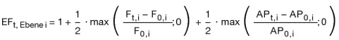
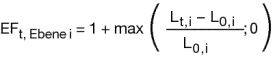

# Verordnung über die Anreizregulierung der Energieversorgungsnetze (ARegV)

Ausfertigungsdatum
:   2007-10-29

Fundstelle
:   BGBl I: 2007, 2529

Zuletzt geändert durch
:   Art. 2 V v. 20.7.2012 I 1635

## Teil 1 - Allgemeine Vorschriften

### § 1 Anwendungsbereich

(1) Diese Rechtsverordnung regelt die Bestimmung der Entgelte für den
Zugang zu den Energieversorgungsnetzen im Wege der Anreizregulierung.
Netzentgelte werden ab dem 1. Januar 2009 im Wege der
Anreizregulierung bestimmt.

(2) Diese Rechtsverordnung findet auf einen Netzbetreiber, für den
noch keine kalenderjährliche Erlösobergrenze nach § 4 Absatz 1
bestimmt worden ist, für eine Übergangszeit bis zum Ende der laufenden
Regulierungsperiode keine Anwendung. Die Rechtsverordnung bleibt bis
zum Abschluss der darauf folgenden Regulierungsperiode unangewendet,
wenn bei der nächsten Kostenprüfung nach § 6 Absatz 1 für diesen
Netzbetreiber noch keine hinreichenden Daten für das Basisjahr
vorliegen.

### § 2 Beginn des Verfahrens

Das Verfahren zur Bestimmung von Erlösobergrenzen wird von Amts wegen
eingeleitet.

## Teil 2 - Allgemeine Vorschriften zur Anreizregulierung

### Abschnitt 1 - Regulierungsperioden

#### § 3 Beginn und Dauer der Regulierungsperioden

(1) Die erste Regulierungsperiode beginnt am 1. Januar 2009. Die
nachfolgenden Regulierungsperioden beginnen jeweils am 1. Januar des
auf das letzte Kalenderjahr der vorangegangenen Regulierungsperiode
folgenden Kalenderjahres.

(2) Eine Regulierungsperiode dauert fünf Jahre.

### Abschnitt 2 - Allgemeine Vorgaben zur Bestimmung der Erlösobergrenzen

#### § 4 Erlösobergrenzen

(1) Die Obergrenzen der zulässigen Gesamterlöse eines Netzbetreibers
aus den Netzentgelten (Erlösobergrenze) werden nach Maßgabe der §§ 5
bis 16, 19, 22, 24 und 25 bestimmt.

(2) Die Erlösobergrenze ist für jedes Kalenderjahr der gesamten
Regulierungsperiode zu bestimmen. Eine Anpassung der Erlösobergrenze
während der laufenden Regulierungsperiode erfolgt nach Maßgabe der
Absätze 3 bis 5.

(3) Eine Anpassung der Erlösobergrenze erfolgt jeweils zum 1. Januar
eines Kalenderjahres bei einer Änderung

1.  des Verbraucherpreisgesamtindexes nach § 8,

2.  von nicht beeinflussbaren Kostenanteilen nach § 11 Absatz 2 Satz 1
    Nummer 1 bis 11, 13 und 14, Satz 2 und 3; abzustellen ist dabei auf
    die jeweils im vorletzten Kalenderjahr entstandenen Kosten; bei
    Kostenanteilen nach § 11 Absatz 2 Satz 1 Nummer 4 bis 6 und 8 ist auf
    das Kalenderjahr abzustellen, auf das die Erlösobergrenze Anwendung
    finden soll,

3.  von volatilen Kostenanteilen nach § 11 Absatz 5; abzustellen ist dabei
    auf das Kalenderjahr, auf das die Erlösobergrenze Anwendung finden
    soll.

Einer erneuten Festlegung der Erlösobergrenze bedarf es in diesen
Fällen nicht. Satz 1 gilt nicht im ersten Jahr der jeweiligen
Regulierungsperiode.

(4) Auf Antrag des Netzbetreibers

1.  erfolgt eine Anpassung der Erlösobergrenze nach Maßgabe des § 10;

2.  kann eine Anpassung der Erlösobergrenze erfolgen, wenn auf Grund des
    Eintritts eines unvorhersehbaren Ereignisses im Falle der Beibehaltung
    der Erlösobergrenze eine nicht zumutbare Härte für den Netzbetreiber
    entstehen würde.

Der Antrag auf Anpassung nach Satz 1 Nr. 1 kann einmal jährlich zum
30\. Juni des Kalenderjahres gestellt werden; die Anpassung erfolgt zum
1\. Januar des folgenden Kalenderjahres.

(5) Erfolgt eine Bestimmung des Qualitätselements nach Maßgabe des §
19, so hat die Regulierungsbehörde von Amts wegen die Erlösobergrenze
entsprechend anzupassen. Die Anpassung nach Satz 1 erfolgt höchstens
einmal jährlich zum 1. Januar des folgenden Kalenderjahres.

#### § 5 Regulierungskonto

(1) Die Differenz zwischen den nach § 4 zulässigen Erlösen und den vom
Netzbetreiber unter Berücksichtigung der tatsächlichen
Mengenentwicklung erzielbaren Erlösen wird jährlich auf einem
Regulierungskonto verbucht. Gleiches gilt für die Differenz zwischen
den für das Kalenderjahr tatsächlich entstandenen Kosten nach § 11
Absatz 2 Satz 1 Nummer 4 bis 6 und 8 sowie den im jeweiligen
Kalenderjahr entstandenen Kosten nach § 11 Absatz 5, soweit dies in
einer Festlegung nach § 32 Absatz 1 Nummer 4a vorgesehen ist, und den
in der Erlösobergrenze diesbezüglich enthaltenen Ansätzen. Darüber
hinaus wird zusätzlich die Differenz zwischen den für das Kalenderjahr
bei effizienter Leistungserbringung entstehenden Kosten des
Messstellenbetriebs oder der Messung und den in der Erlösobergrenze
diesbezüglich enthaltenen Ansätzen in das Regulierungskonto
einbezogen, soweit diese Differenz durch Änderungen der Zahl der
Anschlussnutzer, bei denen Messstellenbetrieb oder Messung durch den
Netzbetreiber durchgeführt wird, oder Maßnahmen nach § 21b Abs. 3a und
3b des Energiewirtschaftsgesetzes sowie nach § 18b der
Stromnetzzugangsverordnung und § 44 der Gasnetzzugangsverordnung
verursacht wird. Das Regulierungskonto wird von der
Regulierungsbehörde geführt.

(2) Die nach Absatz 1 verbuchten Differenzen sind in Höhe des im
jeweiligen Kalenderjahr durchschnittlich gebundenen Betrags zu
verzinsen. Der durchschnittlich gebundene Betrag ergibt sich aus dem
Mittelwert von Jahresanfangs- und Jahresendbestand. Die Verzinsung
nach Satz 1 richtet sich nach dem auf die letzten zehn abgeschlossenen
Kalenderjahre bezogenen Durchschnitt der von der Deutschen Bundesbank
veröffentlichten Umlaufrendite festverzinslicher Wertpapiere
inländischer Emittenten.

(3) Übersteigen die tatsächlich erzielten Erlöse die nach § 4
zulässigen Erlöse des letzten abgeschlossenen Kalenderjahres um mehr
als 5 Prozent, so ist der Netzbetreiber verpflichtet, seine
Netzentgelte nach Maßgabe des § 17 anzupassen. Bleiben die tatsächlich
erzielten Erlöse um mehr als 5 Prozent hinter den nach § 4 zulässigen
Erlösen des letzten abgeschlossenen Kalenderjahres zurück, so ist der
Netzbetreiber dazu berechtigt, seine Netzentgelte nach Maßgabe des §
17 anzupassen.

(4) Die Regulierungsbehörde ermittelt den Saldo des Regulierungskontos
im letzten Jahr der Regulierungsperiode für die vorangegangenen fünf
Kalenderjahre. Der Ausgleich des Saldos auf dem Regulierungskonto
erfolgt durch gleichmäßig über die folgende Regulierungsperiode
verteilte Zu- oder Abschläge. Die Zu- und Abschläge sind nach Absatz 2
Satz 3 zu verzinsen. Eine Anpassung der Erlösobergrenzen innerhalb der
Regulierungsperiode auf Grund der Änderung der jährlich verbuchten
Differenzen nach Absatz 1 findet nicht statt.

#### § 6 Bestimmung des Ausgangsniveaus der Erlösobergrenze

(1) Die Regulierungsbehörde ermittelt das Ausgangsniveau für die
Bestimmung der Erlösobergrenzen durch eine Kostenprüfung nach den
Vorschriften des Teils 2 Abschnitt 1 der Gasnetzentgeltverordnung und
des Teils 2 Abschnitt 1 der Stromnetzentgeltverordnung. Die §§ 28 bis
30 der Gasnetzentgeltverordnung sowie die §§ 28 bis 30 der
Stromnetzentgeltverordnung gelten entsprechend. Die Kostenprüfung
erfolgt im vorletzten Kalenderjahr vor Beginn der Regulierungsperiode
auf der Grundlage der Daten des letzten abgeschlossenen
Geschäftsjahres. Das Kalenderjahr, in dem das der Kostenprüfung
zugrunde liegende Geschäftsjahr endet, gilt als Basisjahr im Sinne
dieser Verordnung. Als Basisjahr für die erste Regulierungsperiode
gilt 2006.

(2) Als Ausgangsniveau für die erste Regulierungsperiode ist das
Ergebnis der Kostenprüfung der letzten Genehmigung der Netzentgelte
nach § 23a des Energiewirtschaftsgesetzes vor Beginn der
Anreizregulierung, die auf der Datengrundlage des Geschäftsjahres 2006
oder eines früheren Geschäftsjahres basiert, heranzuziehen.

(3) Soweit Kosten dem Grunde oder der Höhe nach auf einer Besonderheit
des Geschäftsjahres beruhen, auf das sich die Kostenprüfung bezieht,
bleiben sie bei der Ermittlung des Ausgangsniveaus unberücksichtigt. §
3 Absatz 1 Satz 4 zweiter Halbsatz der Gasnetzentgeltverordnung sowie
§ 3 Absatz 1 Satz 5 zweiter Halbsatz der Stromnetzentgeltverordnung
finden keine Anwendung.

#### § 7 Regulierungsformel

Die Bestimmung der Erlösobergrenzen für die Netzbetreiber erfolgt in
Anwendung der Regulierungsformel in Anlage 1.

#### § 8 Allgemeine Geldwertentwicklung

Der Wert für die allgemeine Geldwertentwicklung ergibt sich aus dem
durch das Statistische Bundesamt veröffentlichten
Verbraucherpreisgesamtindex. Für die Bestimmung der Erlösobergrenze
nach § 4 Abs. 1 wird der Verbraucherpreisgesamtindex des vorletzten
Kalenderjahres vor dem Jahr, für das die Erlösobergrenze gilt,
verwendet. Dieser wird ins Verhältnis gesetzt zum
Verbraucherpreisgesamtindex für das Basisjahr.

#### § 9 Genereller sektoraler Produktivitätsfaktor

(1) Der generelle sektorale Produktivitätsfaktor wird ermittelt aus
der Abweichung des netzwirtschaftlichen Produktivitätsfortschritts vom
gesamtwirtschaftlichen Produktivitätsfortschritt und der
gesamtwirtschaftlichen Einstandspreisentwicklung von der
netzwirtschaftlichen Einstandspreisentwicklung.

(2) In der ersten Regulierungsperiode beträgt der generelle sektorale
Produktivitätsfaktor für Gas- und Stromnetzbetreiber jährlich 1,25
Prozent, in der zweiten Regulierungsperiode jährlich 1,5 Prozent.

(3) Die Bundesnetzagentur hat den generellen sektoralen
Produktivitätsfaktor ab der dritten Regulierungsperiode jeweils vor
Beginn der Regulierungsperiode für die gesamte Regulierungsperiode
nach Maßgabe von Methoden, die dem Stand der Wissenschaft entsprechen,
zu ermitteln. Die Ermittlung hat unter Einbeziehung der Daten von
Netzbetreibern aus dem gesamten Bundesgebiet für einen Zeitraum von
mindestens vier Jahren zu erfolgen. Die Bundesnetzagentur kann jeweils
einen Wert für Stromversorgungsnetze und für Gasversorgungsnetze
ermitteln.

(4) Die Landesregulierungsbehörden können bei der Bestimmung der
Erlösobergrenzen den durch die Bundesnetzagentur nach Absatz 3
ermittelten generellen sektoralen Produktivitätsfaktor anwenden.

(5) Die Einbeziehung des generellen sektoralen Produktivitätsfaktors
in die Erlösobergrenzen erfolgt durch Potenzierung der Werte nach den
Absätzen 2 und 3 mit dem jeweiligen Jahr der Regulierungsperiode.

#### § 10 Erweiterungsfaktor

(1) Ändert sich während der Regulierungsperiode die Versorgungsaufgabe
des Netzbetreibers nachhaltig, wird dies bei der Bestimmung der
Erlösobergrenze durch einen Erweiterungsfaktor berücksichtigt. Die
Ermittlung des Erweiterungsfaktors erfolgt nach der Formel in Anlage
2\.

(2) Die Versorgungsaufgabe bestimmt sich nach der Fläche des
versorgten Gebietes und den von den Netzkunden bestimmten
Anforderungen an die Versorgung mit Strom und Gas, die sich auf die
Netzgestaltung unmittelbar auswirken. Eine nachhaltige Änderung der
Versorgungsaufgabe im Sinne des Absatz 1 Satz 1 liegt vor, wenn sich
einer oder mehrere der Parameter

1.  Fläche des versorgten Gebietes,

2.  Anzahl der Anschlusspunkte in Stromversorgungsnetzen und der
    Ausspeisepunkte in Gasversorgungsnetzen,

3.  Jahreshöchstlast oder

4.  sonstige von der Regulierungsbehörde nach § 32 Abs. 1 Nr. 3
    festgelegte Parameter

im Antragszeitpunkt dauerhaft und in erheblichem Umfang geändert
haben. Von einer Änderung in erheblichem Umfang nach Satz 2 ist in der
Regel auszugehen, wenn sich dadurch die Gesamtkosten des
Netzbetreibers nach Abzug der dauerhaft nicht beeinflussbaren
Kostenanteile um mindestens 0,5 Prozent erhöhen.

(3) Die Parameter nach Absatz 2 Satz 2 Nr. 4 dienen insbesondere der
Berücksichtigung des unterschiedlichen Erschließungs- und
Anschlussgrades von Gasversorgungsnetzen. Sie müssen hinsichtlich
ihrer Aussagekraft mit denjenigen nach Absatz 2 Satz 2 Nr. 1 bis 3
vergleichbar sein. Bei ihrer Auswahl ist § 13 Abs. 3 entsprechend
anzuwenden.

(4) Die Absätze 1 bis 3 finden bei Betreibern von Übertragungs- und
Fernleitungsnetzen keine Anwendung.

#### § 11 Beeinflussbare und nicht beeinflussbare Kostenanteile

(1) Als nicht beeinflussbare Kostenanteile gelten dauerhaft nicht
beeinflussbare Kostenanteile und vorübergehend nicht beeinflussbare
Kostenanteile.

(2) Als dauerhaft nicht beeinflussbare Kostenanteile gelten Kosten
oder Erlöse aus

1.  gesetzlichen Abnahme- und Vergütungspflichten,

2.  Konzessionsabgaben,

3.  Betriebssteuern,

4.  erforderlicher Inanspruchnahme vorgelagerter Netzebenen,

5.  der Nachrüstung von Wechselrichtern nach § 10 Absatz 1 der
    Systemstabilitätsverordnung,

6.  genehmigten Investitionsmaßnahmen nach § 23, soweit sie dem Inhalt der
    Genehmigung nach durchgeführt wurden sowie in der Regulierungsperiode
    kostenwirksam sind und die Genehmigung nicht aufgehoben worden ist,

6a. der Auflösung des Abzugsbetrags nach § 23 Absatz 2a,

7.  Mehrkosten für die Errichtung, den Betrieb und die Änderung von
    Erdkabeln nach § 43 Satz 1 Nr. 3 und Satz 3 des
    Energiewirtschaftsgesetzes, soweit diese nicht nach Nummer 6
    berücksichtigt werden und soweit die Kosten bei effizientem
    Netzbetrieb entstehen,

8.  vermiedenen Netzentgelten im Sinne von § 18 der
    Stromnetzentgeltverordnung, § 35 Absatz 2 des Erneuerbare-Energien-
    Gesetzes und § 4 Absatz 3 des Kraft-Wärme-Kopplungsgesetzes,

8a. dem erweiterten Bilanzausgleich gemäß § 35 der
    Gasnetzzugangsverordnung vom 3. September 2010 (BGBl. I S. 1261) in
    der jeweils geltenden Fassung, abzüglich der vom Einspeiser von Biogas
    zu zahlenden Pauschale,

    –   erforderliche Maßnahmen des Netzbetreibers gemäß § 33 Absatz 10, § 34
        Absatz 2 und § 36 Absatz 3 und 4 der Gasnetzzugangsverordnung,

    –   die Kosten für den effizienten Netzanschluss sowie für die Wartung
        gemäß § 33 Absatz 1 der Gasnetzzugangsverordnung,

    –   Entgelte für vermiedene Netzkosten, die vom Netzbetreiber gemäß § 20a
        der Gasnetzentgeltverordnung vom 25. Juli 2005 (BGBl. I S. 2197), die
        zuletzt durch Artikel 5 der Verordnung vom 3. September 2010 (BGBl. I
        S. 1261) geändert worden ist, in der jeweils geltenden Fassung, an den
        Transportkunden von Biogas zu zahlen sind,

    in der Höhe, in der die Kosten unter Berücksichtigung der Umlage nach
    § 20b der Gasnetzentgeltverordnung beim Netzbetreiber verbleiben.

8b. Zahlungen an Städte oder Gemeinden nach Maßgabe von § 5 Absatz 4 der
    Stromnetzentgeltverordnung,

9.  betrieblichen und tarifvertraglichen Vereinbarungen zu Lohnzusatz- und
    Versorgungsleistungen, soweit diese in der Zeit vor dem 31. Dezember
    2008 abgeschlossen worden sind,

10. der im gesetzlichen Rahmen ausgeübten Betriebs- und
    Personalratstätigkeit,

11. der Berufsausbildung und Weiterbildung im Unternehmen und von
    Betriebskindertagesstätten für Kinder der im Netzbereich beschäftigten
    Betriebsangehörigen,

12. pauschalierten Investitionszuschlägen nach Maßgabe des § 25,

13. der Auflösung von Netzanschlusskostenbeiträgen und Baukostenzuschüssen
    nach § 9 Abs. 1 Satz 1 Nr. 3 und 4 in Verbindung mit Satz 2 der
    Stromnetzentgeltverordnung und § 9 Abs. 1 Satz 1 Nr. 3 und 4 in
    Verbindung mit Satz 2 der Gasnetzentgeltverordnung,

14. dem bundesweiten Ausgleichsmechanismus nach § 2 Abs. 4 des
    Energieleitungsausbaugesetzes vom 21. August 2009 (BGBl. I S. 2870) in
    der jeweils geltenden Fassung.

Als dauerhaft nicht beeinflussbare Kostenanteile gelten bei
Stromversorgungsnetzen auch solche Kosten oder Erlöse, die sich aus
Maßnahmen des Netzbetreibers ergeben, die einer wirksamen
Verfahrensregulierung nach der Stromnetzzugangsverordnung oder der
Verordnung (EG) Nr. 1228/2003 des Europäischen Parlaments und des
Rates vom 26. Juni 2003 über die Netzzugangsbedingungen für den
grenzüberschreitenden Stromhandel (ABl. EU Nr. L 176 S. 1), zuletzt
geändert durch den Beschluss Nr. 2006/770/EG der Kommission vom 9.
November 2006 zur Änderung des Anhangs der Verordnung (EG) Nr.
1228/2003 über die Netzzugangsbedingungen für den
grenzüberschreitenden Stromhandel (ABl. EU Nr. L 312 S. 59),
unterliegen, insbesondere

1.  Kompensationszahlungen im Rahmen des Ausgleichsmechanismus nach
    Artikel 3 der Verordnung (EG) Nr. 1228/2003,

2.  Erlöse aus dem Engpassmanagement nach Artikel 6 der Verordnung (EG)
    Nr. 1228/2003 oder nach § 15 der Stromnetzzugangsverordnung, soweit
    diese entgeltmindernd nach Artikel 6 Abs. 6 Buchstabe c der Verordnung
    (EG) Nr. 1228/2003 oder § 15 Abs. 3 Satz 1 der
    Stromnetzzugangsverordnung geltend gemacht werden, und

3.  Kosten für die Beschaffung der Energie zur Erbringung von
    Ausgleichsleistungen, einschließlich der Kosten für die lastseitige
    Beschaffung.

Bei Gasversorgungsnetzen gelten als dauerhaft nicht beeinflussbare
Kosten auch solche Kosten oder Erlöse, die sich aus Maßnahmen des
Netzbetreibers ergeben, die einer wirksamen Verfahrensregulierung nach
der Gasnetzzugangsverordnung oder der Verordnung (EG) Nr. 1775/2005
des Europäischen Parlaments und des Rates vom 28. September 2005 über
die Bedingungen für den Zugang zu den Erdgasfernleitungsnetzen (ABl.
EU Nr. L 289 S. 1) unterliegen. Eine wirksame Verfahrensregulierung im
Sinne der Sätze 2 und 3 liegt vor, soweit eine umfassende Regulierung
des betreffenden Bereichs durch vollziehbare Entscheidungen der
Regulierungsbehörden oder freiwillige Selbstverpflichtungen der
Netzbetreiber erfolgt ist, die Regulierungsbehörde dies nach § 32 Abs.
1 Nr. 4 festgelegt hat und es sich nicht um volatile Kostenanteile
nach § 11 Absatz 5 handelt.

(3) Als vorübergehend nicht beeinflussbare Kostenanteile gelten die
mit dem nach § 15 ermittelten bereinigten Effizienzwert
multiplizierten Gesamtkosten nach Abzug der dauerhaft nicht
beeinflussbaren Kostenanteile. In diesen sind die auf nicht
zurechenbaren strukturellen Unterschieden der Versorgungsgebiete
beruhenden Kostenanteile enthalten.

(4) Als beeinflussbare Kostenanteile gelten alle Kostenanteile, die
nicht dauerhaft oder vorübergehend nicht beeinflussbare Kostenanteile
sind.

(5) Als volatile Kostenanteile gelten Kosten für die Beschaffung von
Treibenergie. Andere beeinflussbare oder vorübergehend nicht
beeinflussbare Kostenanteile, insbesondere Kosten für die Beschaffung
von Verlustenergie, deren Höhe sich in einem Kalenderjahr erheblich
von der Höhe des jeweiligen Kostenanteils im vorhergehenden
Kalenderjahr unterscheiden kann, gelten als volatile Kostenanteile,
soweit die Regulierungsbehörde dies nach § 32 Absatz 1 Nummer 4a
festgelegt hat. Kapitalkosten oder Fremdkapitalkosten gelten nicht als
volatile Kostenanteile.

#### § 12 Effizienzvergleich

(1) Die Bundesnetzagentur führt vor Beginn der Regulierungsperiode mit
den in Anlage 3 aufgeführten Methoden, unter Berücksichtigung der in
Anlage 3 genannten Vorgaben sowie nach Maßgabe der Absätze 2 bis 4 und
der §§ 13 und 14 jeweils einen bundesweiten Effizienzvergleich für die
Betreiber von Elektrizitätsverteilernetzen und Gasverteilernetzen mit
dem Ziel durch, die Effizienzwerte für diese Netzbetreiber zu
ermitteln. Bei der Ausgestaltung der in Anlage 3 aufgeführten Methoden
durch die Bundesnetzagentur sind Vertreter der betroffenen
Wirtschaftskreise und der Verbraucher rechtzeitig zu hören. Ergeben
sich auf Grund rechtskräftiger gerichtlicher Entscheidungen
nachträgliche Änderungen in dem nach § 6 ermittelten Ausgangsniveau,
so bleibt der Effizienzvergleich von diesen nachträglichen Änderungen
unberührt.

(2) Der Effizienzwert ist als Anteil der Gesamtkosten nach Abzug der
dauerhaft nicht beeinflussbaren Kostenanteile in Prozent auszuweisen.

(3) Weichen die im Effizienzvergleich mit den nach Anlage 3
zugelassenen Methoden ermittelten Effizienzwerte eines Netzbetreibers
voneinander ab, so ist der höhere Effizienzwert zu verwenden.

(4) Hat der Effizienzvergleich für einen Netzbetreiber einen
Effizienzwert von weniger als 60 Prozent ergeben, so ist der
Effizienzwert mit 60 Prozent anzusetzen. Satz 1 gilt auch, wenn für
einzelne Netzbetreiber keine Effizienzwerte ermittelt werden konnten,
weil diese ihren Mitwirkungspflichten zur Mitteilung von Daten nicht
nachgekommen sind.

(4a) Zusätzlich werden Effizienzvergleiche durchgeführt, bei denen der
Aufwandsparameter nach § 13 Abs. 1 für alle Netzbetreiber durch den
Aufwandsparameter ersetzt wird, der sich ohne Berücksichtigung der
Vergleichbarkeitsrechnung nach § 14 Abs. 1 Nr. 3, Abs. 2 und 3 ergibt.
Die nach § 13 Abs. 3 und 4 ermittelten Vergleichsparameter bleiben
unverändert. Weicht der so ermittelte Effizienzwert von dem nach
Absatz 1 ermittelten Effizienzwert ab, so ist für den jeweils
betrachteten Netzbetreiber der höhere Effizienzwert zu verwenden.

(5) Die Bundesnetzagentur übermittelt bis zum 1. Juli des
Kalenderjahres vor Beginn der Regulierungsperiode den
Landesregulierungsbehörden die von ihr nach den Absätzen 1 bis 3
ermittelten Effizienzwerte für die nach § 54 Abs. 2 des
Energiewirtschaftsgesetzes in die Zuständigkeit der jeweiligen Behörde
fallenden Netzbetreiber. Die Mitteilung hat die Ausgangsdaten nach den
§§ 13 und 14, die einzelnen Rechenschritte und die jeweiligen
Ergebnisse der nach Anlage 3 zugelassenen Methoden zu enthalten.
Soweit für einzelne Netzbetreiber keine Effizienzwerte aus dem
bundesweiten Effizienzvergleich ermittelt werden konnten, teilt die
Bundesnetzagentur dies den Landesregulierungsbehörden begründet mit.

(6) Die Landesregulierungsbehörden führen zur Bestimmung von
Effizienzwerten einen Effizienzvergleich nach den Absätzen 1 bis 3
durch, soweit sie nicht die Ergebnisse des Effizienzvergleichs der
Bundesnetzagentur verwenden. Zur Sicherstellung der Belastbarkeit der
Ergebnisse des Effizienzvergleichs sind auch Netzbetreiber, die nicht
in ihre Zuständigkeit nach § 54 Abs. 2 des Energiewirtschaftsgesetzes
fallen, in den Effizienzvergleich einzubeziehen.

#### § 13 Parameter für den Effizienzvergleich

(1) Die Regulierungsbehörde hat im Effizienzvergleich
Aufwandsparameter und Vergleichsparameter zu berücksichtigen.

(2) Als Aufwandsparameter sind die nach § 14 ermittelten Kosten
anzusetzen.

(3) Vergleichsparameter sind Parameter zur Bestimmung der
Versorgungsaufgabe und der Gebietseigenschaften, insbesondere die
geografischen, geologischen oder topografischen Merkmale und
strukturellen Besonderheiten der Versorgungsaufgabe auf Grund
demografischen Wandels des versorgten Gebietes. Die Parameter müssen
geeignet sein, die Belastbarkeit des Effizienzvergleichs zu stützen.
Dies ist insbesondere dann anzunehmen, wenn sie messbar oder
mengenmäßig erfassbar, nicht durch Entscheidungen des Netzbetreibers
bestimmbar und nicht in ihrer Wirkung ganz oder teilweise wiederholend
sind, insbesondere nicht bereits durch andere Parameter abgebildet
werden. Vergleichsparameter können insbesondere sein

1.  die Anzahl der Anschlusspunkte in Stromversorgungsnetzen und der
    Ausspeisepunkte in Gasversorgungsnetzen,

2.  die Fläche des versorgten Gebietes,

3.  die Leitungslänge,

4.  die Jahresarbeit,

5.  die zeitgleiche Jahreshöchstlast oder

6.  die dezentralen Erzeugungsanlagen in Stromversorgungsnetzen,
    insbesondere die Anzahl und Leistung von Anlagen zur Erzeugung von
    Strom aus Wind- und solarer Strahlungsenergie.

Bei der Bestimmung von Parametern zur Beschreibung geografischer,
geologischer oder topografischer Merkmale und struktureller
Besonderheiten der Versorgungsaufgabe auf Grund demografischen Wandels
des versorgten Gebietes können flächenbezogene Durchschnittswerte
gebildet werden. Die Vergleichsparameter können bezogen auf die
verschiedenen Netzebenen von Strom- und Gasversorgungsnetzen verwendet
werden; ein Vergleich einzelner Netzebenen findet nicht statt. Die
Auswahl der Vergleichsparameter hat mit qualitativen, analytischen
oder statistischen Methoden zu erfolgen, die dem Stand der
Wissenschaft entsprechen. Durch die Auswahl der Vergleichsparameter
soll die strukturelle Vergleichbarkeit möglichst weitgehend
gewährleistet sein. Dabei sind die Unterschiede zwischen Strom- und
Gasversorgungsnetzen zu berücksichtigen, insbesondere der
unterschiedliche Erschließungs- und Anschlussgrad von
Gasversorgungsnetzen. Bei der Auswahl der Vergleichsparameter sind
Vertreter der betroffenen Wirtschaftskreise und der Verbraucher
rechtzeitig zu hören.

(4) In der ersten und zweiten Regulierungsperiode hat die
Regulierungsbehörde die Vergleichsparameter

1.  Anzahl der Anschlusspunkte in Stromversorgungsnetzen und der
    Ausspeisepunkte in Gasversorgungsnetzen,

2.  Fläche des versorgten Gebietes,

2a. Leitungslänge (Systemlänge) und

3.  zeitgleiche Jahreshöchstlast

zu verwenden. Darüber hinaus können weitere Parameter nach Maßgabe des
Absatzes 3 verwendet werden.

#### § 14 Bestimmung der Kosten zur Durchführung des Effizienzvergleichs

(1) Die im Rahmen des Effizienzvergleichs als Aufwandsparameter
anzusetzenden Kosten werden nach folgenden Maßgaben ermittelt:

1.  Die Gesamtkosten des Netzbetreibers werden nach Maßgabe der zur
    Bestimmung des Ausgangsniveaus anzuwendenden Kostenprüfung nach § 6
    ermittelt.

2.  Von den so ermittelten Gesamtkosten sind die nach § 11 Abs. 2
    dauerhaft nicht beeinflussbaren Kostenanteile abzuziehen.

3.  Die Kapitalkosten zur Durchführung des Effizienzvergleichs sollen so
    bestimmt werden, dass ihre Vergleichbarkeit möglichst gewährleistet
    ist und Verzerrungen berücksichtigt werden, wie sie insbesondere durch
    unterschiedliche Altersstruktur der Anlagen, Abschreibungs- und
    Aktivierungspraktiken entstehen können; hierzu ist eine
    Vergleichbarkeitsrechnung zur Ermittlung von Kapitalkostenannuitäten
    nach Maßgabe des Absatzes 2 durchzuführen; dabei umfassen die
    Kapitalkosten die Kostenpositionen nach § 5 Abs. 2 sowie den §§ 6 und
    7 der Stromnetzentgeltverordnung und § 5 Abs. 2 sowie den §§ 6 und 7
    der Gasnetzentgeltverordnung.

(2) Die Vergleichbarkeitsrechnung nach Absatz 1 Nr. 3 erfolgt auf der
Grundlage der Tagesneuwerte des Anlagevermögens des Netzbetreibers.
Für die Ermittlung von einheitlichen Nutzungsdauern für jede
Anlagengruppe sind die unteren Werte der betriebsgewöhnlichen
Nutzungsdauern in Anlage 1 der Gasnetzentgeltverordnung und Anlage 1
der Stromnetzentgeltverordnung zu verwenden. Der zu verwendende
Zinssatz bestimmt sich als gewichteter Mittelwert aus
Eigenkapitalzinssatz und Fremdkapitalzinssatz, wobei der
Eigenkapitalzinssatz mit 40 Prozent und der Fremdkapitalzinssatz mit
60 Prozent zu gewichten ist. Von den 60 Prozent des
Fremdkapitalzinssatzes entfallen 25 Prozentpunkte auf unverzinsliches
Fremdkapital. Es sind die nach § 7 Abs. 6 der Gasnetzentgeltverordnung
und § 7 Abs. 6 der Stromnetzentgeltverordnung für Neuanlagen geltenden
Eigenkapitalzinssätze anzusetzen. Für das verzinsliche Fremdkapital
richtet sich die Verzinsung nach dem auf die letzten zehn
abgeschlossenen Kalenderjahre bezogenen Durchschnitt der von der
Deutschen Bundesbank veröffentlichten Umlaufrendite festverzinslicher
Wertpapiere inländischer Emittenten. Die Eigenkapitalzinssätze und der
Fremdkapitalzinssatz sind um den auf die letzten zehn abgeschlossenen
Kalenderjahre bezogenen Durchschnitt der Preisänderungsrate nach dem
vom Statistischen Bundesamt veröffentlichten
Verbraucherpreisgesamtindex zu ermäßigen.

#### § 15 Ermittlung der Ineffizienzen

(1) Weist ein Netzbetreiber nach, dass Besonderheiten seiner
Versorgungsaufgabe bestehen, die im Effizienzvergleich durch die
Auswahl der Parameter nach § 13 Abs. 3 und 4 nicht hinreichend
berücksichtigt wurden, und dies die nach § 14 Abs. 1 Nr. 1 und 2
ermittelten Kosten um mindestens 3 Prozent erhöht, so hat die
Regulierungsbehörde einen Aufschlag auf den nach §§ 12 bis 14 oder 22
ermittelten Effizienzwert anzusetzen (bereinigter Effizienzwert). Ist
der Effizienzwert nach § 12 Abs. 4 angesetzt worden, hat der
Netzbetreiber die erforderlichen Nachweise zu erbringen, dass die
Besonderheiten seiner Versorgungsaufgabe einen zusätzlichen Aufschlag
nach Satz 1 rechtfertigen.

(2) Die Landesregulierungsbehörden können zur Ermittlung der
bereinigten Effizienzwerte nach Absatz 1 die von der Bundesnetzagentur
im bundesweiten Effizienzvergleich nach den §§ 12 bis 14 ermittelten
Effizienzwerte zugrunde legen.

(3) Aus dem nach §§ 12 bis 14, 22 oder 24 ermittelten Effizienzwert
oder dem bereinigten Effizienzwert werden die Ineffizienzen ermittelt.
Die Ineffizienzen ergeben sich aus der Differenz zwischen den
Gesamtkosten nach Abzug der dauerhaft nicht beeinflussbaren
Kostenanteile und den mit dem in Satz 1 genannten Effizienzwert
multiplizierten Gesamtkosten nach Abzug der dauerhaft nicht
beeinflussbaren Kosten.

#### § 16 Effizienzvorgaben

(1) Die Festlegung der Erlösobergrenzen durch die Regulierungsbehörde
hat so zu erfolgen, dass die nach den §§ 12 bis 15 ermittelten
Ineffizienzen unter Anwendung eines Verteilungsfaktors rechnerisch
innerhalb einer oder mehrerer Regulierungsperioden gleichmäßig
abgebaut werden (individuelle Effizienzvorgabe). Für die erste
Regulierungsperiode wird die individuelle Effizienzvorgabe dahingehend
bestimmt, dass der Abbau der ermittelten Ineffizienzen nach zwei
Regulierungsperioden abgeschlossen ist. Für die folgenden
Regulierungsperioden wird die individuelle Effizienzvorgabe so
bestimmt, dass der Abbau der ermittelten Ineffizienzen jeweils zum
Ende der Regulierungsperiode abgeschlossen ist.

(2) Soweit ein Netzbetreiber nachweist, dass er die für ihn
festgelegte individuelle Effizienzvorgabe unter Nutzung aller ihm
möglichen und zumutbaren Maßnahmen nicht erreichen und übertreffen
kann, hat die Regulierungsbehörde die Effizienzvorgabe abweichend von
Absatz 1 zu bestimmen. Bei der Bewertung der Zumutbarkeit ist zu
berücksichtigen, inwieweit der Effizienzwert nach § 12 Abs. 4
angesetzt worden ist. Unzumutbar sind auch Maßnahmen, die dazu führen,
dass die wesentlichen Arbeitsbedingungen, die in dem nach dem
Energiewirtschaftsgesetz regulierten Bereich üblich sind, erheblich
unterschritten werden. Eine Berücksichtigung struktureller
Besonderheiten erfolgt ausschließlich nach Maßgabe des § 15 Abs. 1.

### Abschnitt 3 - Ermittlung der Netzentgelte

#### § 17 Netzentgelte

(1) Die nach § 32 Abs. 1 Nr. 1 festgelegten Erlösobergrenzen werden in
Entgelte für den Zugang zu den Energieversorgungsnetzen umgesetzt.
Dies erfolgt entsprechend der Vorschriften des Teils 2 Abschnitt 2 und
3 der Gasnetzentgeltverordnung und des Teils 2 Abschnitt 2 und 3 der
Stromnetzentgeltverordnung. Die §§ 16, 27 und 28 der
Gasnetzentgeltverordnung sowie die §§ 20, 27 und 28 der
Stromnetzentgeltverordnung gelten entsprechend. § 30 der
Gasnetzentgeltverordnung und § 30 der Stromnetzentgeltverordnung
bleiben unberührt.

(2) Der Netzbetreiber ist verpflichtet, bei einer Anpassung der
Erlösobergrenze nach § 4 Abs. 3 und 5 die Netzentgelte anzupassen,
soweit sich daraus nach Absatz 1 eine Absenkung der Netzentgelte
ergibt. Im Übrigen ist er im Falle einer Anpassung der Erlösobergrenze
nach § 4 Abs. 3 bis 5 zur Anpassung der Netzentgelte berechtigt.

(3) Die Anpassung der Netzentgelte nach Absatz 2 erfolgt zum 1. Januar
eines Kalenderjahres. Vorgelagerte Netzbetreiber haben die Höhe der
geplanten Anpassung der Netzentgelte den nachgelagerten Netzbetreibern
rechtzeitig vor dem Zeitpunkt nach Satz 1 mitzuteilen.

### Abschnitt 4 - Qualitätsvorgaben

#### § 18 Qualitätsvorgaben

Qualitätsvorgaben dienen der Sicherung eines langfristig angelegten,
leistungsfähigen und zuverlässigen Betriebs von
Energieversorgungsnetzen. Hierzu dienen Qualitätselemente nach den §§
19 und 20 und die Berichtspflichten nach § 21.

#### § 19 Qualitätselement in der Regulierungsformel

(1) Auf die Erlösobergrenzen können Zu- oder Abschläge vorgenommen
werden, wenn Netzbetreiber hinsichtlich der Netzzuverlässigkeit oder
der Netzleistungsfähigkeit von Kennzahlenvorgaben abweichen
(Qualitätselement). Die Kennzahlenvorgaben sind nach Maßgabe des § 20
unter Heranziehung der Daten von Netzbetreibern aus dem gesamten
Bundesgebiet zu ermitteln und in Zu- und Abschläge umzusetzen. Dabei
ist zwischen Gasverteilernetzen und Stromverteilernetzen zu
unterscheiden.

(2) Über den Beginn der Anwendung des Qualitätselements, der bei
Stromversorgungsnetzen zur zweiten Regulierungsperiode zu erfolgen
hat, entscheidet die Regulierungsbehörde. Er soll bereits zur oder im
Laufe der ersten Regulierungsperiode erfolgen, soweit der
Regulierungsbehörde hinreichend belastbare Datenreihen vorliegen.
Abweichend von Satz 1 soll der Beginn der Anwendung des
Qualitätselements bei Gasversorgungsnetzen zur oder im Laufe der
zweiten Regulierungsperiode erfolgen, soweit der Regulierungsbehörde
hinreichend belastbare Datenreihen vorliegen.

(3) Die Netzzuverlässigkeit beschreibt die Fähigkeit des
Energieversorgungsnetzes, Energie möglichst unterbrechungsfrei und
unter Einhaltung der Produktqualität zu transportieren. Die
Netzleistungsfähigkeit beschreibt die Fähigkeit des
Energieversorgungsnetzes, die Nachfrage nach Übertragung von Energie
zu befriedigen.

#### § 20 Bestimmung des Qualitätselements

(1) Zulässige Kennzahlen für die Bewertung der Netzzuverlässigkeit
nach § 19 sind insbesondere die Dauer der Unterbrechung der
Energieversorgung, die Häufigkeit der Unterbrechung der
Energieversorgung, die Menge der nicht gelieferten Energie und die
Höhe der nicht gedeckten Last. Eine Kombination und Gewichtung dieser
Kennzahlen ist möglich. Für die ausgewählten Kennzahlen sind
Kennzahlenwerte der einzelnen Netzbetreiber zu ermitteln.

(2) Aus den Kennzahlenwerten nach Absatz 1 sind Kennzahlenvorgaben als
gewichtete Durchschnittswerte zu ermitteln. Bei der Ermittlung der
Kennzahlenvorgaben sind gebietsstrukturelle Unterschiede zu
berücksichtigen. Dies kann durch Gruppenbildung erfolgen.

(3) Für die Gewichtung der Kennzahlen oder der Kennzahlenwerte sowie
die Bewertung der Abweichungen in Geld zur Ermittlung der Zu- und
Abschläge auf die Erlöse nach § 19 Abs. 1 (monetäre Bewertung) können
insbesondere die Bereitschaft der Kunden, für eine Änderung der
Netzzuverlässigkeit niedrigere oder höhere Entgelte zu zahlen, als
Maßstab herangezogen werden, analytische Methoden, insbesondere
analytische Kostenmodelle, die dem Stand der Wissenschaft entsprechen
müssen, oder eine Kombination von beiden Methoden verwendet werden.

(4) Die Landesregulierungsbehörden können bei der Bestimmung von
Qualitätselementen die von der Bundesnetzagentur ermittelten
Kennzahlenvorgaben, deren Kombination, Gewichtung oder monetäre
Bewertung verwenden.

(5) Auch für die Bewertung der Netzleistungsfähigkeit können
Kennzahlen herangezogen werden. Dies gilt nur, soweit der
Regulierungsbehörde hierfür hinreichend belastbare Datenreihen
vorliegen. Kennzahlen nach Satz 1 können insbesondere die Häufigkeit
und Dauer von Maßnahmen zur Bewirtschaftung von Engpässen und die
Häufigkeit und Dauer des Einspeisemanagements nach dem Erneuerbare-
Energien-Gesetz sein. Die Absätze 1 bis 4 finden in diesem Fall
entsprechende Anwendung, wobei bei Befragungen nach Absatz 3 nicht auf
die Kunden, sondern auf die Netznutzer, die Energie einspeisen,
abzustellen ist. Die Bundesnetzagentur nimmt eine Evaluierung nach §
33 Abs. 3 Satz 2 vor, inwieweit die Verwendung von Kennzahlen nach den
Sätzen 1 und 3 der Erfüllung der unter § 1 des
Energiewirtschaftsgesetzes genannten Zwecke dient.

#### § 21 Bericht zum Investitionsverhalten

Die Netzbetreiber sind verpflichtet, auf Anforderung der
Regulierungsbehörde einen Bericht zu ihrem Investitionsverhalten zu
erstellen und der Regulierungsbehörde zu übermitteln. Der Bericht
dient insbesondere dazu, festzustellen, ob die Anreizregulierung in
Hinblick auf die in § 1 des Energiewirtschaftsgesetzes genannten
Zwecke keine nachteiligen Auswirkungen auf das Investitionsverhalten
der Netzbetreiber hat. Aus dem Bericht muss sich ergeben, inwieweit
die jährlichen Investitionen der Netzbetreiber in einem angemessenen
Verhältnis zu Alter und Zustand ihrer Anlagen, ihren jährlichen
Abschreibungen und ihrer Versorgungsqualität stehen. Die
Regulierungsbehörde kann Ergänzungen und Erläuterungen des Berichts
verlangen.

## Teil 3 - Besondere Vorschriften zur Anreizregulierung

### Abschnitt 1 - Betreiber von Übertragungs- und Fernleitungsnetzen

#### § 22 Sondervorschriften für den Effizienzvergleich

(1) Bei Betreibern von Übertragungsnetzen ist vor Beginn der
Regulierungsperiode zur Ermittlung der Effizienzwerte ein
Effizienzvergleich unter Einbeziehung von Netzbetreibern in anderen
Mitgliedstaaten der Europäischen Union (internationaler
Effizienzvergleich) durchzuführen. Der internationale
Effizienzvergleich erfolgt mittels der in Anlage 3 genannten Methoden.
Stehen für die Durchführung einer stochastischen
Effizienzgrenzenanalyse nicht die Daten einer hinreichenden Anzahl von
Netzbetreibern zur Verfügung, findet ausschließlich die
Dateneinhüllungsanalyse Anwendung. Bei der Durchführung des
internationalen Effizienzvergleichs ist die strukturelle
Vergleichbarkeit der zum Vergleich herangezogenen Unternehmen
sicherzustellen, insbesondere auch durch Berücksichtigung nationaler
Unterschiede wie unterschiedlicher technischer und rechtlicher
Vorgaben oder von Unterschieden im Lohnniveau. § 12 Abs. 2 bis 4 und §
13 Abs. 1 und 3 Satz 2, 3, 7 und 9 finden entsprechend Anwendung.

(2) Ist die Belastbarkeit des internationalen Effizienzvergleichs nach
Absatz 1 für einzelne oder alle Betreiber von Übertragungsnetzen nicht
gewährleistet, so ist stattdessen für den oder die betreffenden
Netzbetreiber eine relative Referenznetzanalyse durchzuführen, die dem
Stand der Wissenschaft entspricht. Die relative Referenznetzanalyse
kann auch ergänzend zum internationalen Effizienzvergleich
durchgeführt werden, um die Belastbarkeit der Ergebnisse zu
verbessern. Die Referenznetzanalyse ist ein Optimierungsverfahren zur
Ermittlung von modellhaften Netzstrukturen und Anlagenmengengerüsten,
die unter den bestehenden Randbedingungen, insbesondere der
Notwendigkeit des Betriebs eines technisch sicheren Netzes, ein
optimales Verhältnis von Kosten und netzwirtschaftlichen Leistungen
aufweisen (Referenznetz). In der relativen Referenznetzanalyse werden
durch einen Vergleich mehrerer Netzbetreiber relative Abweichungen der
den tatsächlichen Anlagenmengen entsprechenden Kosten von den Kosten
eines Referenznetzes ermittelt. Der Netzbetreiber mit den geringsten
Abweichungen vom Referenznetz bildet den Effizienzmaßstab für die
Ermittlung der Effizienzwerte; der Effizienzwert dieses Netzbetreibers
beträgt 100 Prozent.

(3) Bei Betreibern von Fernleitungsnetzen werden die Effizienzwerte
mittels eines nationalen Effizienzvergleichs mit den in Anlage 3
genannten Methoden ermittelt. Stehen für die Durchführung einer
stochastischen Effizienzgrenzenanalyse nicht die Daten einer
hinreichenden Anzahl an Netzbetreibern zur Verfügung, findet
ausschließlich die Dateneinhüllungsanalyse Anwendung. § 12 Abs. 2 bis
4, § 13 Abs. 1 und 3 und § 14 finden entsprechend Anwendung. Stehen
für die Durchführung eines nationalen Effizienzvergleichs nach Satz 1
nicht die Daten einer hinreichenden Anzahl von Netzbetreibern zur
Verfügung, ist stattdessen ein internationaler Effizienzvergleich nach
Absatz 1 durchzuführen.

(4) Ist die Belastbarkeit des internationalen Effizienzvergleichs nach
Absatz 3 Satz 4 für einzelne oder alle Betreiber von
Fernleitungsnetzen nicht gewährleistet, so ist stattdessen für den
oder die betreffenden Netzbetreiber eine relative Referenznetzanalyse
nach Absatz 2 durchzuführen. Die relative Referenznetzanalyse kann
auch ergänzend zum internationalen Effizienzvergleich nach Absatz 3
Satz 4 durchgeführt werden, um die Belastbarkeit der Ergebnisse zu
verbessern.

#### § 23 Investitionsmaßnahmen

(1) Die Bundesnetzagentur genehmigt Investitionsmaßnahmen für
Erweiterungs- und Umstrukturierungsinvestitionen in die Übertragungs-
und Fernleitungsnetze, soweit diese Investitionen zur Stabilität des
Gesamtsystems, für die Einbindung in das nationale oder internationale
Verbundnetz oder für einen bedarfsgerechten Ausbau des
Energieversorgungsnetzes nach § 11 des Energiewirtschaftsgesetzes
notwendig sind. Dies umfasst insbesondere Investitionen, die
vorgesehen sind für

1.  Netzausbaumaßnahmen, die dem Anschluss von Stromerzeugungsanlagen nach
    § 17 Abs. 1 des Energiewirtschaftsgesetzes dienen,

2.  die Integration von Anlagen, die dem Erneuerbare-Energien-Gesetz und
    dem Kraft-Wärme-Kopplungsgesetz unterfallen,

3.  den Ausbau von Verbindungskapazitäten nach Artikel 16 Absatz 6
    Buchstabe b der Verordnung (EG) Nr. 714/2009 (ABl. L 211 vom
    14\.8.2009, S. 15),

4.  den Ausbau von Gastransportkapazitäten zwischen Marktgebieten, soweit
    dauerhaft technisch bedingte Engpässe vorliegen und diese nicht durch
    andere, wirtschaftlich zumutbare Maßnahmen beseitigt werden können,

5.  Leitungen zur Netzanbindung von Offshore-Anlagen nach § 17 Abs. 2a und
    § 43 Satz 1 Nr. 3 des Energiewirtschaftsgesetzes,

6.  Erweiterungsinvestitionen zur Errichtung von Hochspannungsleitungen
    auf neuen Trassen mit einer Nennspannung von 110 Kilovolt als
    Erdkabel, soweit die Gesamtkosten für Errichtung und Betrieb des
    Erdkabels die Gesamtkosten der technisch vergleichbaren Freileitung
    den Faktor 2,75 nicht überschreiten und noch kein Planfeststellungs-
    oder Plangenehmigungsverfahren für die Errichtung einer Freileitung
    eingeleitet wurde, sowie Erdkabel nach § 43 Satz 3 des
    Energiewirtschaftsgesetzes und § 2 Abs. 1 des
    Energieleitungsausbaugesetzes,

7.  grundlegende, mit erheblichen Kosten verbundene
    Umstrukturierungsmaßnahmen, die erforderlich sind, um die technischen
    Standards zur Gewährleistung der technischen Sicherheit des Netzes
    umzusetzen, die auf Grund einer behördlichen Anordnung nach § 49 Abs.
    5 des Energiewirtschaftsgesetzes erforderlich werden oder deren
    Notwendigkeit von der nach Landesrecht zuständigen Behörde bestätigt
    wird,

8.  den Einsatz des Leiterseil-Temperaturmonitorings und von
    Hochtemperatur-Leiterseilen oder

9.  Hochspannungsgleichstrom-Übertragungssysteme zum Ausbau der
    Stromübertragungskapazitäten und neue grenzüberschreitende
    Hochspannungsgleichstrom-Verbindungsleitungen jeweils als
    Pilotprojekte, die im Rahmen der Ausbauplanung für einen effizienten
    Netzbetrieb erforderlich sind.

Als Kosten einer genehmigten Investitionsmaßnahme können Betriebs- und
Kapitalkosten geltend gemacht werden. Als Betriebskosten können
jährlich pauschal 0,8 Prozent der für die Investitionsmaßnahme
ansetzbaren Anschaffungs- und Herstellungskosten geltend gemacht
werden, soweit die Bundesnetzagentur nicht gemäß § 32 Absatz 1 Nummer
8a für bestimmte Anlagegüter etwas Abweichendes festgelegt hat.

(2) Erlöse aus dem Engpassmanagement nach Artikel 16 der Verordnung
(EG) Nr. 714/2009 oder nach § 15 der Stromnetzzugangsverordnung,
soweit diese für Maßnahmen zur Beseitigung von Engpässen nach Artikel
16 Abs. 6 Buchstabe b der Verordnung (EG) Nr. 714/2009 oder § 15 Abs.
3 Satz 1 der Stromnetzzugangsverordnung verwendet werden, sind bei der
Ermittlung der aus genehmigten Investitionsmaßnahmen resultierenden
Kosten in Abzug zu bringen. Satz 1 gilt entsprechend für Erlöse aus
dem Engpassmanagement nach Artikel 16 der Verordnung (EG) Nr. 715/2009
(ABl. L 211 vom 14.8.2009, S. 36) oder § 17 Absatz 4 der
Gasnetzzugangsverordnung, soweit diese für Maßnahmen zur Beseitigung
von Engpässen nach Artikel 16 der Verordnung (EG) Nr. 715/2009 (ABl. L
211 vom 14.8.2009, S. 36) oder § 17 Absatz 4 der
Gasnetzzugangsverordnung verwendet werden.

(2a) Die in den letzten drei Jahren der Genehmigungsdauer der
Investitionsmaßnahme entstandenen Betriebs- und Kapitalkosten, die auf
Grund der Regelung nach § 4 Absatz 3 Satz 1 Nummer 2 sowohl im Rahmen
der genehmigten Investitionsmaßnahme als auch in der Erlösobergrenze
gemäß § 4 Absatz 1 der folgenden Regulierungsperiode berücksichtigt
werden, sind als Abzugsbetrag zu berücksichtigen. Die Betriebs- und
Kapitalkosten nach Satz 1 sind bis zum Ende der Genehmigungsdauer
aufzuzinsen. Für die Verzinsung gilt § 5 Absatz 2 Satz 3 entsprechend.
Die Auflösung des nach den Sätzen 1 bis 3 ermittelten Abzugsbetrags
erfolgt gleichmäßig über 20 Jahre, beginnend mit dem Jahr nach Ablauf
der Genehmigungsdauer der Investitionsmaßnahme.

(3) Der Antrag auf Genehmigung von Investitionsmaßnahmen ist
spätestens neun Monate vor Beginn des Kalenderjahres, in dem die
Investition erstmals ganz oder teilweise kostenwirksam werden soll,
bei der Bundesnetzagentur zu stellen. Der Antrag muss eine Analyse des
nach Absatz 1 ermittelten Investitionsbedarfs enthalten. Diese soll
insbesondere auf Grundlage der Angaben der Übertragungsnetzbetreiber
in den Netzzustands- und Netzausbauberichten nach § 12 Abs. 3a des
Energiewirtschaftsgesetzes erstellt werden; bei
Fernleitungsnetzbetreibern soll der Antrag entsprechende Angaben
enthalten. Der Antrag hat Angaben zu enthalten, ab wann, in welcher
Höhe und für welchen Zeitraum die Investitionen erfolgen und
kostenwirksam werden sollen. Der Zeitraum der Kostenwirksamkeit muss
sich hierbei an der betriebsgewöhnlichen Nutzungsdauer der jeweiligen
Anlagengruppe orientieren. Die betriebsgewöhnlichen Nutzungsdauern der
jeweiligen Anlagengruppen ergeben sich aus Anlage 1 der
Gasnetzentgeltverordnung und Anlage 1 der Stromnetzentgeltverordnung.
Der Antrag kann für mehrere Regulierungsperioden gestellt werden. Die
Angaben im Antrag müssen einen sachkundigen Dritten in die Lage
versetzen, ohne weitere Informationen das Vorliegen der
Genehmigungsvoraussetzungen prüfen und eine Entscheidung treffen zu
können.

(4) Bei der Prüfung der Voraussetzungen nach Absatz 1 sollen
Referenznetzanalysen nach § 22 Abs. 2 Satz 3 angewendet werden, die
dem Stand der Wissenschaft entsprechen; die Erstellung der
Referenznetze erfolgt auf der Grundlage der bestehenden Netze.

(5) Die Genehmigung ist mit einem Widerrufsvorbehalt für den Fall zu
versehen, dass die Investition nicht der Genehmigung entsprechend
durchgeführt wird. Sie kann mit weiteren Nebenbestimmungen versehen
werden. Insbesondere können durch Nebenbestimmungen finanzielle
Anreize geschaffen werden, die Kosten der genehmigten
Investitionsmaßnahme zu unterschreiten.

(6) Betreibern von Verteilernetzen können Investitionsmaßnahmen durch
die Regulierungsbehörde für solche Erweiterungs- und
Umstrukturierungsinvestitionen genehmigt werden, die durch die
Integration von Anlagen nach dem Erneuerbare-Energien-Gesetz oder dem
Kraft-Wärme-Kopplungsgesetz, zur Durchführung von Maßnahmen im Sinne
des Absatzes 1 Satz 2 Nr. 6 bis 8 sowie für Netzausbaumaßnahmen, die
dem Anschluss von Stromerzeugungsanlagen nach § 17 Abs. 1 des
Energiewirtschaftsgesetzes dienen, notwendig werden und die nicht
durch den Erweiterungsfaktor nach § 10 berücksichtigt werden.
Investitionsmaßnahmen nach Satz 1 sind nur für solche Maßnahmen zu
genehmigen, die mit erheblichen Kosten verbunden sind. Von erheblichen
Kosten nach Satz 2 ist in der Regel auszugehen, wenn sich durch die
Maßnahmen die Gesamtkosten des Netzbetreibers nach Abzug der dauerhaft
nicht beeinflussbaren Kostenanteile um mindestens 0,5 Prozent erhöhen.
Absatz 1 Satz 3 und 4 sowie die Absätze 2a bis 5 gelten entsprechend.

### Abschnitt 2 - Besondere Vorschriften für kleine Netzbetreiber

#### § 24 Vereinfachtes Verfahren

(1) Netzbetreiber, an deren Gasverteilernetz weniger als 15.000 Kunden
oder an deren Elektrizitätsverteilernetz weniger als 30.000 Kunden
unmittelbar oder mittelbar angeschlossen sind, können bezüglich des
jeweiligen Netzes statt des Effizienzvergleichs zur Ermittlung von
Effizienzwerten nach den §§ 12 bis 14 die Teilnahme an dem
vereinfachten Verfahren nach Maßgabe des Absatzes 2 wählen.

(2) Für die Teilnehmer am vereinfachten Verfahren beträgt der
Effizienzwert in der ersten Regulierungsperiode 87,5 Prozent. Ab der
zweiten Regulierungsperiode wird der Effizienzwert als gewichteter
durchschnittlicher Wert aller in dem bundesweiten Effizienzvergleich
nach den §§ 12 bis 14 für die vorangegangene Regulierungsperiode
ermittelten und nach § 15 Abs. 1 bereinigten Effizienzwerte
(gemittelter Effizienzwert) gebildet. Im vereinfachten Verfahren
gelten 45 Prozent der nach § 14 Abs. 1 Nr. 1 ermittelten Gesamtkosten
als dauerhaft nicht beeinflussbare Kostenanteile nach § 11 Abs. 2. Bei
der Ermittlung der Gesamtkosten bleiben die Konzessionsabgabe und der
Zuschlag aus dem Kraft-Wärme-Kopplungsgesetz unberücksichtigt. Die
Bundesnetzagentur übermittelt den Landesregulierungsbehörden die von
ihr nach Satz 2 ermittelten Werte. Die Landesregulierungsbehörden
ermitteln einen gemittelten Effizienzwert nach Maßgabe des Satzes 2,
soweit sie nicht die von der Bundesnetzagentur ermittelten Werte
verwenden.

(3) § 4 Abs. 3 Satz 1 Nr. 2 mit Ausnahme von § 4 Abs. 3 Satz 1 Nr. 2
in Verbindung mit § 11 Abs. 2 Satz 1 Nr. 4, 5 und 8, § 15 Abs. 1 und 2
sowie die §§ 19, 21, 23 Abs. 6 und § 25 finden im vereinfachten
Verfahren keine Anwendung.

(4) Netzbetreiber, die an dem vereinfachten Verfahren teilnehmen
wollen, haben dies bei der Regulierungsbehörde jeweils bis zum 30.
Juni des vorletzten der Regulierungsperiode vorangehenden
Kalenderjahres zu beantragen; abweichend hiervon ist der Antrag für
die erste Regulierungsperiode zum 15. Dezember 2007 zu stellen. Der
Antrag nach Satz 1 muss die notwendigen Angaben zum Vorliegen der
Voraussetzungen des Absatzes 1 enthalten. Die Regulierungsbehörde
genehmigt die Teilnahme am vereinfachten Verfahren innerhalb von vier
Wochen nach Eingang des vollständigen Antrags, wenn die
Voraussetzungen des Absatzes 1 vorliegen. Der Netzbetreiber ist an das
gewählte Verfahren für die Dauer einer Regulierungsperiode gebunden.
Die Regulierungsbehörde veröffentlicht den von ihr nach Absatz 2
ermittelten gemittelten Effizienzwert spätestens zum 1. Januar des
vorletzten der Regulierungsperiode vorangehenden Kalenderjahres. Die
Bundesnetzagentur ist über die Entscheidung über den Antrag durch die
Landesregulierungsbehörde zu unterrichten.

### Abschnitt 3 - Pauschalierter Investitionszuschlag

#### § 25 Pauschalierter Investitionszuschlag

(1) In die Erlösobergrenze ist vor Beginn der Regulierungsperiode bei
der Festlegung nach § 32 Abs. 1 Nr. 1 auf Verlangen des Netzbetreibers
ein pauschalierter Investitionszuschlag nach Maßgabe der Absätze 2 bis
5 einzubeziehen.

(2) Der pauschalierte Investitionszuschlag darf pro Kalenderjahr 1
Prozent der nach § 14 Abs. 1 Nr. 3 in Verbindung mit Abs. 2 bestimmten
Kapitalkosten nicht überschreiten.

(3) Lagen die Kapitalkosten aus den tatsächlich erfolgten
Investitionen des Netzbetreibers nach § 28 Nr. 7 zweiter Halbsatz,
unter Anwendung des § 14 Abs. 1 Nr. 3 in Verbindung mit Abs. 2, in der
Regulierungsperiode pro jeweiligem Kalenderjahr unter dem Wert nach
Absatz 2, so erfolgt in der folgenden Regulierungsperiode ein
Ausgleich der Differenz. § 5 Abs. 4 Satz 2 bis 4 und § 34 Abs. 2
gelten entsprechend. Lagen die Kapitalkosten nach Satz 1 über dem Wert
nach Absatz 2, findet kein Ausgleich statt.

(4) Das Verlangen nach Absatz 1 ist vom Netzbetreiber zum 31. März des
der Regulierungsperiode vorangehenden Kalenderjahres bei der
Regulierungsbehörde geltend zu machen.

(5) Die Absätze 1 bis 4 finden auf Betreiber von Übertragungs- und
Fernleitungsnetzen keine Anwendung.

### Abschnitt 4 - Übergang von Netzen, Netzzusammenschlüsse und -aufspaltungen

#### § 26 Übergang von Netzen, Netzzusammenschlüsse und -aufspaltungen

(1) Wird ein Energieversorgungsnetz oder werden mehrere
Energieversorgungsnetze, für das oder die jeweils eine oder mehrere
Erlösobergrenzen nach § 32 Abs. 1 Nr. 1 festgelegt sind, vollständig
von einem Netzbetreiber auf einen anderen Netzbetreiber übertragen, so
geht die Erlösobergrenze oder gehen die Erlösobergrenzen insgesamt auf
den übernehmenden Netzbetreiber über. Satz 1 gilt entsprechend bei
Zusammenschlüssen von mehreren Energieversorgungsnetzen.

(2) Bei einem teilweisen Übergang eines Energieversorgungsnetzes auf
einen anderen Netzbetreiber und bei Netzaufspaltungen sind die
Erlösobergrenzen auf Antrag der beteiligten Netzbetreiber nach § 32
Abs. 1 Nr. 1 neu festzulegen. Im Antrag ist anzugeben und zu
begründen, welcher Erlösanteil dem übergehenden und dem verbleibenden
Netzteil zuzurechnen ist. Die Summe beider Erlösanteile darf die für
dieses Netz insgesamt festgelegte Erlösobergrenze nicht überschreiten.

## Teil 4 - Sonstige Bestimmungen

### § 27 Datenerhebung

(1) Die Regulierungsbehörde ermittelt die zur Bestimmung der
Erlösobergrenzen nach Teil 2 und 3 notwendigen Tatsachen. Hierzu
erhebt sie bei den Netzbetreibern die notwendigen Daten

1.  zur Durchführung der Kostenprüfung nach § 6,

2.  zur Ermittlung des generellen sektoralen Produktivitätsfaktors nach §
    9,

3.  zur Ermittlung der Effizienzwerte nach den §§ 12 bis 14,

4.  zur Bestimmung des Qualitätselements nach § 19 und

5.  zur Durchführung der Effizienzvergleiche und relativen
    Referenznetzanalysen für Betreiber von Übertragungs- und
    Fernleitungsnetzen nach § 22;

die Netzbetreiber sind insoweit zur Auskunft verpflichtet. Im Übrigen
ermittelt sie insbesondere die erforderlichen Tatsachen

1.  zur Anpassung der Erlösobergrenze nach § 4 Abs. 4,

2.  zur Ausgestaltung des Erweiterungsfaktors nach § 10,

3.  zur Ermittlung der bereinigten Effizienzwerte nach § 15 und der
    individuellen Effizienzvorgaben nach § 16,

4.  zu den Anforderungen an die Berichte nach § 21 und

5.  zur Genehmigung von Investitionsmaßnahmen nach § 23.

(2) Die Bundesnetzagentur kann darüber hinaus die zur Evaluierung des
Anreizregulierungssystems und zur Erstellung der Berichte nach § 33
notwendigen Daten erheben.

### § 28 Mitteilungspflichten

Die Netzbetreiber teilen der Regulierungsbehörde mit

1.  die Anpassungen der Erlösobergrenzen nach § 4 Abs. 3 sowie die den
    Anpassungen zugrunde liegenden Änderungen von nicht beeinflussbaren
    Kostenanteilen nach § 4 Abs. 3 Satz 1 Nr. 2 und die den Anpassungen
    zugrunde liegenden Änderungen von Kostenanteilen nach § 4 Absatz 3
    Satz 1 Nummer 3, jeweils zum 1. Januar des Kalenderjahres;

2.  die zur Führung des Regulierungskontos nach § 5 notwendigen Daten,
    insbesondere die nach § 4 zulässigen und die tatsächlich erzielten
    Erlöse des abgelaufenen Kalenderjahres, jeweils zum 30. Juni des
    darauf folgenden Kalenderjahres,

3.  die zur Überprüfung der Netzentgelte nach § 17 notwendigen Daten,
    insbesondere die in dem Bericht nach § 28 in Verbindung mit § 16 Abs.
    2 der Gasnetzentgeltverordnung und § 28 in Verbindung mit § 20 Abs. 2
    der Stromnetzentgeltverordnung enthaltenen Daten,

4.  die Anpassung der Netzentgelte auf Grund von geänderten
    Erlösobergrenzen nach § 17 Abs. 2 jährlich zum 1. Januar,

5.  Abweichungen von den Kennzahlenvorgaben nach den §§ 19 und 20,

6.  Angaben dazu, inwieweit die den Investitionsmaßnahmen nach § 23
    zugrunde liegenden Investitionen tatsächlich durchgeführt und
    kostenwirksam werden sollen, sowie die entsprechende Anpassung der
    Erlösobergrenze nach § 4 Absatz 3 Satz 1 Nummer 2 und inwieweit die
    den Investitionsmaßnahmen nach § 23 zugrunde liegenden Investitionen
    im Vorjahr tatsächlich durchgeführt wurden und kostenwirksam geworden
    sind, jeweils jährlich zum 1. Januar eines Kalenderjahres,

7.  die Differenz nach § 25 Abs. 3 Satz 1; außerdem eine für einen
    sachkundigen Dritten nachvollziehbare Darstellung der in der
    Regulierungsperiode zur Ausschöpfung des beantragten pauschalierten
    Investitionszuschlags tatsächlich erfolgten Investitionen und ihrer
    Kostenwirksamkeit und

8.  den Übergang von Netzen, Netzzusammenschlüsse und -aufspaltungen nach
    § 26, insbesondere den Übergang oder die Addition von Erlösobergrenzen
    nach § 26 Abs. 1.

### § 29 Übermittlung von Daten

(1) Die Bundesnetzagentur und die Landesregulierungsbehörden
übermitteln einander die zur Durchführung ihrer Aufgaben nach den
Vorschriften dieser Verordnung notwendigen Daten einschließlich
personenbezogener Daten und Betriebs- und Geschäftsgeheimnisse.
Insbesondere übermitteln die Landesregulierungsbehörden der
Bundesnetzagentur die nach § 14 Abs. 1 Nr. 1 in Verbindung mit § 6
ermittelten Gesamtkosten zur Durchführung des bundesweiten
Effizienzvergleichs nach § 12 bis zum 31. März des der
Regulierungsperiode vorangehenden Kalenderjahres. Liegen die Daten
nach Satz 2 nicht rechtzeitig vor, so führt die Bundesnetzagentur den
bundesweiten Effizienzvergleich ausschließlich mit den vorhandenen
Daten durch.

(2) Die Bundesnetzagentur übermittelt die von ihr nach § 27 Abs. 1 und
2 erhobenen und die ihr nach Absatz 1 übermittelten Daten auf Ersuchen
den Landesregulierungsbehörden, soweit dies zur Erfüllung von deren
Aufgaben erforderlich ist. Die Bundesnetzagentur erstellt mit den von
ihr nach § 27 Abs. 1 und 2 erhobenen und mit den nach Absatz 1 durch
die Landesregulierungsbehörden übermittelten Daten eine bundesweite
Datenbank. Die Landesregulierungsbehörden haben Zugriff auf diese
Datenbank. Der Zugriff beschränkt sich auf die Daten, die zur
Aufgabenerfüllung der Landesregulierungsbehörden erforderlich sind.

### § 30 Fehlende oder unzureichende Daten

Soweit die für die Bestimmung der Erlösobergrenze nach § 4 Abs. 1,
insbesondere für die Anwendung der Regulierungsformel nach § 7 und zur
Durchführung des Effizienzvergleichs nach den §§ 12 bis 14 notwendigen
Daten vor Beginn der Regulierungsperiode nicht rechtzeitig vorliegen,
können die Daten für das letzte verfügbare Kalenderjahr verwendet
werden. Soweit keine oder offenkundig unzutreffende Daten vorliegen,
kann die Regulierungsbehörde die fehlenden Daten durch Schätzung oder
durch eine Referenznetzanalyse unter Verwendung von bei der
Regulierungsbehörde vorhandenen oder ihr bekannten Daten bestimmen. §
12 Abs. 4 Satz 2 und § 14 Abs. 3 Satz 4 und 5 bleiben unberührt.

### § 31 Veröffentlichung von Daten

(1) Die Regulierungsbehörde veröffentlicht die nach den §§ 12 bis 15
ermittelten Effizienzwerte netzbetreiberbezogen in nicht
anonymisierter Form in ihrem Amtsblatt und auf ihrer Internetseite.
Sie veröffentlicht weiterhin den nach § 9 ermittelten generellen
sektoralen Produktivitätsfaktor, die nach den §§ 19 und 20 ermittelten
Kennzahlenvorgaben sowie die Abweichungen der Netzbetreiber von diesen
Vorgaben und den nach § 24 ermittelten gemittelten Effizienzwert.

(2) Die Bundesnetzagentur veröffentlicht in nicht anonymisierter Form
die nach § 22 ermittelten Effizienzwerte in ihrem Amtsblatt und auf
ihrer Internetseite.

(3) Eine Veröffentlichung von Betriebs- und Geschäftsgeheimnissen
erfolgt nicht.

### § 32 Festlegungen oder Genehmigungen der Regulierungsbehörde

(1) Zur Verwirklichung eines effizienten Netzzugangs und der in § 1
Abs. 1 des Energiewirtschaftsgesetzes genannten Zwecke kann die
Regulierungsbehörde Entscheidungen durch Festlegungen oder
Genehmigungen nach § 29 Abs. 1 des Energiewirtschaftsgesetzes treffen

1.  zu den Erlösobergrenzen nach § 4, insbesondere zur Bestimmung der Höhe
    nach § 4 Abs. 1 und 2, zur Anpassung nach Abs. 3 bis 5, zu Form und
    Inhalt der Anträge auf Anpassung nach Abs. 4,

2.  zu Ausgestaltung und Ausgleich des Regulierungskontos nach § 5,

3.  zur Verwendung anderer Parameter zur Ermittlung des
    Erweiterungsfaktors nach § 10 Abs. 2 Satz 2 Nr. 4,

4.  zu den Bereichen, die nach § 11 Abs. 2 Satz 2 bis 4 einer wirksamen
    Verfahrensregulierung unterliegen; die Festlegung erfolgt für die
    Dauer der gesamten Regulierungsperiode,

4a. zu volatilen Kostenanteilen gemäß § 11 Absatz 5, insbesondere zum
    Verfahren, mit dem den Netzbetreibern oder einer Gruppe von
    Netzbetreibern Anreize gesetzt werden, die gewährleisten, dass
    volatile Kostenanteile nur in effizientem Umfang in der
    Erlösobergrenze berücksichtigt werden, sowie zu den Voraussetzungen,
    unter denen Kostenanteile als volatile Kostenanteile im Sinne des § 11
    Absatz 5 gelten,

4b. zu der Geltendmachung der Kosten nach § 10 Absatz 1 der
    Systemstabilitätsverordnung gemäß § 11 Absatz 2 Satz 1 Nummer 5,
    einschließlich der Verpflichtung zur Anpassung pauschaler Kostensätze,

5.  zur Durchführung einer Vergleichbarkeitsrechnung nach § 14 Abs. 1 Nr.
    3,

6.  über den Beginn der Anwendung, die nähere Ausgestaltung und das
    Verfahren der Bestimmung des Qualitätselements nach den §§ 19 und 20,

7.  zu formeller Gestaltung, Inhalt und Struktur des Berichts zum
    Investitionsverhalten nach § 21,

8.  zu Investitionsmaßnahmen nach § 23, einschließlich der formellen
    Gestaltung, Inhalt und Struktur des Antrags sowie zu finanziellen
    Anreizen nach § 23 Abs. 5 Satz 3, wobei auch die Zusammenfassung von
    Vorhaben verlangt werden kann, sowie zur Durchführung, näheren
    Ausgestaltung und zum Verfahren der Referenznetzanalyse,

8a. zur Berechnung der sich aus genehmigten Investitionsmaßnahmen
    ergebenden Kapital- und Betriebskosten sowie zu einer von § 23 Absatz
    1 Satz 3 abweichenden Höhe der Betriebskostenpauschale für bestimmte
    Anlagegüter, soweit dies erforderlich ist, um strukturelle
    Besonderheiten von Investitionen, für die Investitionsmaßnahmen
    genehmigt werden können, angemessen zu berücksichtigen,

9.  zur Teilnahme am vereinfachten Verfahren nach § 24 und zu Umfang,
    Zeitpunkt und Form des Antrags nach § 24 Abs. 4,

10. zu formeller Gestaltung, Inhalt und Struktur des Antrags nach § 26
    Abs. 2 und

11. zu Umfang, Zeitpunkt und Form der nach den §§ 27 und 28 zu erhebenden
    und mitzuteilenden Daten, insbesondere zu den zulässigen Datenträgern
    und Übertragungswegen.

(2) Die Bundesnetzagentur kann ferner Festlegungen treffen zur
Durchführung, näheren Ausgestaltung und zu den Verfahren des
Effizienzvergleichs und der relativen Referenznetzanalyse für
Betreiber von Übertragungs- und Fernleitungsnetzen nach § 22.

### § 33 Evaluierung und Berichte der Bundesnetzagentur

(1) Die Bundesnetzagentur legt dem Bundesministerium für Wirtschaft
und Technologie zum 1. Januar 2016 einen Bericht mit einer Evaluierung
und Vorschlägen zur weiteren Ausgestaltung der Anreizregulierung vor.
Sie kann im Rahmen der Evaluierung insbesondere Vorschläge machen

1.  zur Verwendung weiterer als der in Anlage 3 aufgeführten
    Vergleichsmethoden und zu ihrer sachgerechten Kombination,

2.  zur Verwendung monetär bewerteter Kennzahlen der Netzzuverlässigkeit
    als Aufwandsparameter im Effizienzvergleich,

3.  zur Vermeidung von Investitionshemmnissen und

4.  zu einem neuen oder weiterentwickelten Konzept für eine
    Anreizregulierung.

(2) Die Bundesnetzagentur soll den Bericht nach Absatz 1 unter
Beteiligung der Länder, der Wissenschaft und der betroffenen
Wirtschaftskreise erstellen sowie internationale Erfahrungen mit
Anreizregulierungssystemen berücksichtigen. Sie gibt den betroffenen
Wirtschaftskreisen Gelegenheit zur Stellungnahme und veröffentlicht
die erhaltenen Stellungnahmen im Internet.

(3) Zwei Jahre vor Beginn der zweiten Regulierungsperiode legt die
Bundesnetzagentur einen Bericht zu Notwendigkeit, Zweckdienlichkeit,
Inhalt und Umfang eines technisch-wirtschaftlichen Anlagenregisters
nach § 32 Abs. 1 Nr. 5 vor. Ein Jahr vor Beginn der zweiten
Regulierungsperiode legt sie einen Bericht zur Berücksichtigung von
Kennzahlen nach § 20 Abs. 5 sowie von Kennzahlen zur Berücksichtigung
der Vorsorge für eine langfristige Sicherung der Netzqualität im
Rahmen des Qualitätselements vor. Sie hat zur Erstellung dieser
Berichte die Vertreter von Wirtschaft und Verbrauchern zu hören sowie
internationale Erfahrungen zu berücksichtigen.

(4) Die Bundesnetzagentur legt zum 30. Juni 2013 einen Bericht zur
Entwicklung des Investitionsverhaltens der Netzbetreiber und zur
Notwendigkeit weiterer Maßnahmen zur Vermeidung von
Investitionshemmnissen vor.

## Teil 5 - Schlussvorschriften

### § 34 Übergangsregelungen

(1) Mehr- oder Mindererlöse nach § 10 der Gasnetzentgeltverordnung
oder § 11 der Stromnetzentgeltverordnung werden in der ersten
Regulierungsperiode als Kosten oder Erlöse nach § 11 Abs. 2 behandelt.
Der Ausgleich dieser Mehr- oder Mindererlöse erfolgt entsprechend § 10
der Gasnetzentgeltverordnung und § 11 der Stromnetzentgeltverordnung
über die erste Regulierungsperiode verteilt. Die Verzinsung dieser
Mehr- oder Mindererlöse erfolgt entsprechend § 10 der
Gasnetzentgeltverordnung und § 11 der Stromnetzentgeltverordnung.

(1a) Absatz 1 gilt im vereinfachten Verfahren nach § 24 entsprechend.

(1b) Abweichend von § 3 Abs. 2 beträgt die Dauer der ersten
Regulierungsperiode für Gas vier Jahre. Die Netzentgelte der
Gasnetzbetreiber werden unter anteiliger Berücksichtigung der
Effizienzvorgaben für die erste Regulierungsperiode bestimmt.

(2) Abweichend von § 5 Abs. 4 ermittelt die Regulierungsbehörde im
letzten Jahr der ersten Regulierungsperiode für Gas den Saldo des
Regulierungskontos für die ersten drei, für Strom für die ersten vier
Kalenderjahre der ersten Regulierungsperiode.

(3) § 6 findet bei Netzbetreibern, welche die Teilnahme am
vereinfachten Verfahren nach § 24 wählen, vor der ersten
Regulierungsperiode keine Anwendung, soweit die Netzbetreiber im
Rahmen der Genehmigung der Netzentgelte nach § 6 Abs. 2 keine Erhöhung
der Netzentgelte auf der Datengrundlage des Jahres 2006 beantragt
haben. In diesem Fall ergibt sich das Ausgangsniveau für die
Bestimmung der Erlösobergrenzen aus den Kosten, die im Rahmen der
letzten Genehmigung der Netzentgelte nach § 23a des
Energiewirtschaftsgesetzes anerkannt worden sind. Diese sind für die
Jahre 2005 und 2006 um einen jährlichen Inflationsfaktor in Höhe von
1,7 Prozent anzupassen. Wurde die letzte Genehmigung auf der
Datengrundlage des Jahres 2005 erteilt, erfolgt nur eine Anpassung um
einen Inflationsfaktor in Höhe von 1,7 Prozent für das Jahr 2006.

(3a) Abweichend von § 24 Abs. 2 Satz 3 gelten hinsichtlich der
Betreiber von Gasverteilernetzen im vereinfachten Verfahren 20 Prozent
der nach § 14 Abs. 1 Nr. 1 ermittelten Gesamtkosten als dauerhaft
nicht beeinflussbare Kostenanteile, solange keine Kostenwälzung aus
vorgelagerten Netzebenen erfolgt.

(4) § 25 ist nur bis zum 31. Dezember 2013 anzuwenden. § 4 Absatz 3
Satz 3 ist nur in der ersten Regulierungsperiode anzuwenden.

(5) Netzentgelte der Betreiber überregionaler Fernleitungsnetze, die
nach einer Anordnung der Bundesnetzagentur im Sinne des § 3 Abs. 3
Satz 4 der Gasnetzentgeltverordnung kostenorientiert gebildet werden
müssen, werden in der ersten Regulierungsperiode nur dann im Wege der
Anreizregulierung zum 1. Januar 2009 bestimmt, wenn die Anordnung der
Bundesnetzagentur bis zum 1. Oktober 2007 dem Betreiber gegenüber
ergangen ist. Im Falle einer späteren Anordnung werden die
Netzentgelte dieser Betreiber zum 1. Januar 2010 im Wege der
Anreizregulierung unter anteiliger Berücksichtigung der
Effizienzvorgaben für die erste Regulierungsperiode bestimmt. § 23a
Abs. 5 des Energiewirtschaftsgesetzes gilt entsprechend mit der
Maßgabe, dass die Bundesnetzagentur ein Entgelt nach den Grundsätzen
kostenorientierter Entgeltbildung auch dann vorläufig festsetzen kann,
wenn ein Netzbetreiber die zur Bestimmung der Erlösobergrenze
erforderlichen Daten nicht innerhalb einer von der Bundesnetzagentur
gesetzten Frist vorlegt.

(6) Bei einer Änderung von nicht beeinflussbaren Kostenanteilen nach §
11 Absatz 2 Satz 1 Nummer 6 in der bis zum 22. März 2012 geltenden
Fassung wegen Kosten und Erlösen, die in den Jahren 2010 oder 2011
entstanden sind, werden die Erlösobergrenzen nach dieser Verordnung in
ihrer bis zum 22. März 2012 geltenden Fassung angepasst, wobei
zuzüglich ein barwertneutraler Ausgleich berücksichtigt wird. Auf
Investitionsbudgets, die bis zum 30. Juni 2011 gemäß § 23 Absatz 3 in
der bis zum 22. März 2012 geltenden Fassung beantragt wurden und die
im Jahr 2012 kostenwirksam werden sollen, findet diese Verordnung in
der ab dem 22. März 2012 geltenden Fassung entsprechende Anwendung.

### Anlage 1 (zu § 7)

(Fundstelle: BGBl. I 2011, 3035)

Die Festsetzung der Erlösobergrenze nach den §§ 4 bis 16 erfolgt in
der ersten Regulierungsperiode nach der folgenden Formel:

EO
t              = KA
dnb,t              + (KA
vnb,0              + (1 – V
t             ) · KA
b,0             ) · (VPI
t              /VPI
0              – PF
t             ) · EF
t              + Q
t              + (VK
t              – VK
0             ).

Ab der zweiten Regulierungsperiode erfolgt die Festsetzung der
Erlösobergrenze nach den §§ 4 bis 16 nach der folgenden Formel:

EO
t              = KA
dnb,t              + (KA
vnb,0              + (1 – V
t             ) · KA
b,0             ) · (VPI
t              /VPI
0              – PF
t             ) · EF
t              + Q
t              + (VK
t              – VK
0             ) + S
t             .

Dabei ist:

*    *   EO
        t

    *   Erlösobergrenze aus Netzentgelten, die im Jahr t der jeweiligen
        Regulierungsperiode nach Maßgabe des § 4 Anwendung findet.

*    *   KA
        dnb,t

    *   Dauerhaft nicht beeinflussbarer Kostenanteil nach § 11 Absatz 2, der
        für das Jahr t der jeweiligen Regulierungsperiode unter
        Berücksichtigung der Änderungen nach § 4 Absatz 3 Satz 1 Nummer 2
        Anwendung findet.

*    *   KA
        vnb,0

    *   Vorübergehend nicht beeinflussbarer Kostenanteil nach § 11 Absatz 3 im
        Basisjahr.

*    *   V
        t

    *   Verteilungsfaktor für den Abbau der Ineffizienzen, der im Jahr t der
        jeweiligen Regulierungsperiode nach Maßgabe des § 16 Anwendung findet.

*    *   KA
        b,0

    *   Beeinflussbarer Kostenanteil nach § 11 Absatz 4 im Basisjahr. Er
        entspricht den Ineffizienzen nach § 15 Absatz 3.

*    *   VPI
        t

    *   Verbraucherpreisgesamtindex, der nach Maßgabe des § 8 Satz 2 für das
        Jahr t der jeweiligen Regulierungsperiode Anwendung findet.

*    *   VPI
        0

    *   Durch das Statistische Bundesamt veröffentlichter
        Verbraucherpreisgesamtindex für das Basisjahr.

*    *   PF
        t

    *   Genereller sektoraler Produktivitätsfaktor nach Maßgabe des § 9, der
        die Veränderungen des generellen sektoralen Produktivitätsfaktors für
        das Jahr t der jeweiligen Regulierungsperiode im Verhältnis zum ersten
        Jahr der Regulierungsperiode wiedergibt. In Analogie zu dem Term VPI
        t                       /VPI
        0                        ist PF
        t                        dabei durch Multiplikation der einzelnen
        Jahreswerte einer Regulierungsperiode zu bilden.

*    *   EF
        t

    *   Erweiterungsfaktor nach Maßgabe des § 10 für das Jahr t der jeweiligen
        Regulierungsperiode.

*    *   Q
        t

    *   Zu- und Abschläge auf die Erlösobergrenze nach Maßgabe des § 19 im
        Jahr t der jeweiligen Regulierungsperiode.

*    *   S
        t

    *   Im letzten Jahr einer Regulierungsperiode wird nach Maßgabe des § 5
        Absatz 4 der Saldo (S) des Regulierungskontos inklusive Zinsen
        ermittelt. Da nach § 5 Absatz 4 Satz 2 der Ausgleich des Saldos durch
        gleichmäßig über die folgende Regulierungsperiode verteilte Zu- oder
        Abschläge zu erfolgen hat, wird im Jahr t jeweils 1/5 des Saldos in
        Ansatz gebracht (St).

*    *   VK
        t

    *   volatiler Kostenanteil, der nach § 11 Absatz 5 im Jahr t der
        jeweiligen Regulierungsperiode Anwendung findet.

*    *   VK
        0

    *   volatiler Kostenanteil nach § 11 Absatz 5 im Basisjahr.

Das Basisjahr bestimmt sich jeweils nach Maßgabe des § 6 Absatz 1.

### Anlage 2 (zu § 10)

( Fundstelle: BGBl. I 2007, 2542)
Die Ermittlung eines Erweiterungsfaktors nach § 10 erfolgt nach der
folgenden Formel:

Für die Spannungsebenen Hochspannung, Mittelspannung und
Niederspannung (Strom) oder die Ebene der Gesamtheit aller
Leitungsnetze unabhängig von Druckstufen (Gas) ist:

Für die Umspannebenen Hochspannung/Mittelspannung und
Mittelspannung/Niederspannung (Strom) oder die Ebene der Gesamtheit
aller Regelanlagen unabhängig von der Druckstufe (Gas) ist:

Dabei ist:

    EF
t, Ebene i Erweiterungsfaktor der Ebene i im Jahr t der jeweiligen
    Regulierungsperiode.

    F
t,i Fläche des versorgten Gebietes der Ebene i im Jahr t der jeweiligen
    Regulierungsperiode.

    F
0,i Fläche des versorgten Gebietes der Ebene i im Basisjahr.

    AP
t,i Anzahl der Anschlusspunkte in der Ebene i im Jahr t der jeweiligen
    Regulierungsperiode.

    AP
0,i Anzahl der Anschlusspunkte in der Ebene i im Basisjahr.

    L
t,i Höhe der Last in der Ebene i im Jahr t der jeweiligen
    Regulierungsperiode.

    L
0,i Höhe der Last in der Ebene i im Basisjahr.

Der Erweiterungsfaktor für das gesamte Netz ist der gewichtete
Mittelwert über alle Netzebenen.

### Anlage 3 (zu § 12)

( Fundstelle: BGBl I 2007, 2543 )

1.  Die anzuwendenden Methoden bei der Durchführung des
    Effizienzvergleichs nach § 12 sind die

    a)  Dateneinhüllungsanalyse (Data Envelopment Analysis – DEA) und

    b)  Stochastische Effizienzgrenzenanalyse (Stochastic Frontier Analysis –
        SFA).

    DEA im Sinne dieser Verordnung ist eine nicht-parametrische Methode,
    in der die optimalen Kombinationen von Aufwand und Leistung aus einem
    linearen Optimierungsproblem resultieren. Durch die DEA erfolgt die
    Bestimmung einer Effizienzgrenze aus den Daten aller in den
    Effizienzvergleich einzubeziehenden Unternehmen und die Ermittlung der
    relativen Positionen der einzelnen Unternehmen gegenüber dieser
    Effizienzgrenze.

    Die SFA ist eine parametrische Methode, die einen funktionalen
    Zusammenhang zwischen Aufwand und Leistung in Form einer
    Kostenfunktion herstellt. Im Rahmen der SFA werden die Abweichungen
    zwischen den tatsächlichen und den regressionsanalytisch geschätzten
    Kosten in einen symmetrisch verteilten Störterm und eine positiv
    verteilte Restkomponente zerlegt. Die Restkomponente ist Ausdruck von
    Ineffizienz. Es wird somit von einer schiefen Verteilung der
    Restkomponente ausgegangen.

2.  Die Effizienzgrenze wird von den Netzbetreibern mit dem besten
    Verhältnis zwischen netzwirtschaftlicher Leistungserbringung und
    Aufwand gebildet. Für Netzbetreiber, die im Effizienzvergleich als
    effizient ausgewiesen werden, gilt ein Effizienzwert in Höhe von 100
    Prozent, für alle anderen Netzbetreiber ein entsprechend niedrigerer
    Wert.

3.  Die Ermittlung der Effizienzwerte im Effizienzvergleich erfolgt unter
    Einbeziehung aller Druckstufen oder Netzebenen. Es erfolgt keine
    Ermittlung von Teileffizienzen für die einzelnen Druckstufen oder
    Netzebenen.

4.  Bei der Durchführung einer DEA sind nicht-fallende Skalenerträge zu
    unterstellen.

5.  Die Regulierungsbehörde führt für die parametrische Methode und für
    die nicht-parametrische Methode Analysen zur Identifikation von
    extremen Effizienzwerten (Ausreißern) durch, die dem Stand der
    Wissenschaft entsprechen müssen. Ermittelte Ausreißer in dem Sinne,
    dass sie eine besonders hohe Effizienz aufweisen, werden mit einem
    Effizienzwert von 100 Prozent festgesetzt. Ausreißer in dem Sinne,
    dass sie eine besonders niedrige Effizienz aufweisen, erhalten den
    Mindesteffizienzwert nach § 12 Abs. 4 Satz 1.

    Bei der nicht-parametrischen Methode gilt ein Wert dann als Ausreißer,
    wenn er für einen überwiegenden Teil des Datensatzes als
    Effizienzmaßstab gelten würde. Zur Ermittlung von Ausreißern sind
    statistische Tests durchzuführen. Dabei ist die mittlere Effizienz
    aller Netzbetreiber einschließlich der potenziellen Ausreißer mit der
    mittleren Effizienz der Netzbetreiber zu vergleichen, die sich bei
    Ausschluss der potenziellen Ausreißer ergeben würde. Der dabei
    festgestellte Unterschied ist mit einer Vertrauenswahrscheinlichkeit
    von mindestens 95 Prozent zu identifizieren. Die auf diese Weise
    festgestellten Ausreißer sind aus dem Datensatz zu entfernen.
    Ergänzend ist eine Analyse der Supereffizienzwerte durchzuführen.
    Dabei sind diejenigen Ausreißer aus dem Datensatz zu entfernen, deren
    Effizienzwerte den oberen Quartilswert um mehr als den 1,5fachen
    Quartilsabstand übersteigen. Der Quartilsabstand ist dabei definiert
    als die Spannweite der zentralen 50 Prozent eines Datensatzes.

    Bei der parametrischen Methode gilt ein Wert dann als Ausreißer, wenn
    er die Lage der ermittelten Regressionsgerade zu einem erheblichen Maß
    beeinflusst. Zur Ermittlung des erheblichen Einflusses sind
    statistische Tests durchzuführen, mit denen ein numerischer Wert für
    den Einfluss zu ermitteln ist. Liegt der ermittelte Wert über einem
    methodisch angemessenen kritischen Wert, so ist der Ausreißer aus dem
    Datensatz zu entfernen. Methoden, die zur Anwendung kommen können,
    sind insbesondere Cooks-Distance, DFBETAS, DFFITS, Covariance-Ratio
    oder Robuste Regression.

