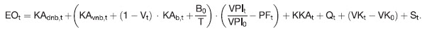
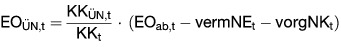

# Verordnung über die Anreizregulierung der Energieversorgungsnetze (ARegV)

Ausfertigungsdatum
:   2007-10-29

Fundstelle
:   BGBl I: 2007, 2529

Zuletzt geändert durch
:   Art. 2 V v. 23.11.2021 I 4955

## Teil 1 - Allgemeine Vorschriften

### § 1 Anwendungsbereich

(1) Diese Rechtsverordnung regelt die Bestimmung der Entgelte für den
Zugang zu den Energieversorgungsnetzen im Wege der Anreizregulierung.
Netzentgelte werden ab dem 1. Januar 2009 im Wege der
Anreizregulierung bestimmt.

(2) Diese Rechtsverordnung findet auf einen Netzbetreiber, für den
noch keine kalenderjährliche Erlösobergrenze nach § 4 Absatz 1
bestimmt worden ist, für eine Übergangszeit bis zum Ende der laufenden
Regulierungsperiode keine Anwendung. Die Rechtsverordnung bleibt bis
zum Abschluss der darauf folgenden Regulierungsperiode unangewendet,
wenn bei der nächsten Kostenprüfung nach § 6 Absatz 1 für diesen
Netzbetreiber noch keine hinreichenden Daten für das Basisjahr
vorliegen.

(3) Auf selbstständige Betreiber von grenzüberschreitenden
Elektrizitätsverbindungsleitungen im Sinne des § 3 Nummer 20a des
Energiewirtschaftsgesetzes ist diese Rechtsverordnung nicht
anzuwenden.

### § 2 Beginn des Verfahrens

Das Verfahren zur Bestimmung von Erlösobergrenzen wird von Amts wegen
eingeleitet.

## Teil 2 - Allgemeine Vorschriften zur Anreizregulierung

### Abschnitt 1 - Regulierungsperioden

#### § 3 Beginn und Dauer der Regulierungsperioden

(1) Die erste Regulierungsperiode beginnt am 1. Januar 2009. Die
nachfolgenden Regulierungsperioden beginnen jeweils am 1. Januar des
auf das letzte Kalenderjahr der vorangegangenen Regulierungsperiode
folgenden Kalenderjahres.

(2) Eine Regulierungsperiode dauert fünf Jahre.

### Abschnitt 2 - Allgemeine Vorgaben zur Bestimmung der Erlösobergrenzen

#### § 4 Erlösobergrenzen

(1) Die Erlösobergrenzen werden nach Maßgabe der §§ 5 bis 17, 19, 22
und 24 bestimmt.

(2) Die Erlösobergrenze ist für jedes Kalenderjahr der gesamten
Regulierungsperiode zu bestimmen. Eine Anpassung der Erlösobergrenze
während der laufenden Regulierungsperiode erfolgt nach Maßgabe der
Absätze 3 bis 5.

(3) Eine Anpassung der Erlösobergrenze erfolgt jeweils zum 1. Januar
eines Kalenderjahres bei einer Änderung

1.  des Verbraucherpreisgesamtindexes nach § 8,

2.  von nicht beeinflussbaren Kostenanteilen nach § 11 Absatz 2 Satz 1 bis
    3; abzustellen ist dabei auf die jeweils im vorletzten Kalenderjahr
    entstandenen Kosten; bei Kostenanteilen nach § 11 Absatz 2 Satz 1
    Nummer 4 bis 6a, 8, 13 und 15 bis 18 ist auf das Kalenderjahr
    abzustellen, auf das die Erlösobergrenze anzuwenden sein soll,

3.  von volatilen Kostenanteilen nach § 11 Absatz 5; abzustellen ist dabei
    auf das Kalenderjahr, auf das die Erlösobergrenze Anwendung finden
    soll.

Einer erneuten Festlegung der Erlösobergrenze bedarf es in diesen
Fällen nicht.

(4) Auf Antrag des Netzbetreibers

1.  erfolgt eine Anpassung der Erlösobergrenze nach Maßgabe des § 10 oder
    § 10a;

1a. erfolgt eine Anpassung der Erlösobergrenze nach Maßgabe des § 5;

2.  kann eine Anpassung der Erlösobergrenze erfolgen, wenn auf Grund des
    Eintritts eines unvorhersehbaren Ereignisses im Falle der Beibehaltung
    der Erlösobergrenze eine nicht zumutbare Härte für den Netzbetreiber
    entstehen würde.

Der Antrag auf Anpassung nach Satz 1 Nr. 1 kann einmal jährlich zum
30\. Juni des Kalenderjahres gestellt werden; die Anpassung erfolgt zum
1\. Januar des folgenden Kalenderjahres. Der Antrag auf Anpassung nach
Satz 1 Nummer 1a muss einmal jährlich zum 30. Juni des Kalenderjahres
gestellt werden; die Anpassung erfolgt zum 1. Januar des folgenden
Jahres.

(5) Erfolgt eine Bestimmung des Qualitätselements nach Maßgabe des §
19, so hat die Regulierungsbehörde von Amts wegen die Erlösobergrenze
entsprechend anzupassen. Satz 1 ist auf den Zu- oder Abschlag nach §
17, der im auf das Geltungsjahr folgenden Kalenderjahr ermittelt wird,
entsprechend anzuwenden. Die Anpassungen nach den Sätzen 1 und 2
erfolgen höchstens einmal jährlich zum 1. Januar des folgenden
Kalenderjahres.

#### § 5 Regulierungskonto

(1) Die Differenz zwischen den nach § 4 zulässigen Erlösen und den vom
Netzbetreiber unter Berücksichtigung der tatsächlichen
Mengenentwicklung erzielbaren Erlösen wird jährlich vom Netzbetreiber
ermittelt und auf einem Regulierungskonto verbucht. Gleiches gilt für
die Differenz zwischen den für das Kalenderjahr tatsächlich
entstandenen Kosten nach § 11 Absatz 2 Satz 1 Nummer 4 bis 6, 8, 13
und 15 bis 18 sowie den im jeweiligen Kalenderjahr entstandenen Kosten
nach § 11 Absatz 5, soweit dies in einer Festlegung nach § 32 Absatz 1
Nummer 4a vorgesehen ist, und den in der Erlösobergrenze diesbezüglich
enthaltenen Ansätzen. Einbezogen in das Regulierungskonto wird darüber
hinaus die Differenz zwischen den für das Kalenderjahr bei effizienter
Leistungserbringung entstehenden Kosten des Messstellenbetriebs, zu
dem auch die Messung gehört, und den in der Erlösobergrenze
diesbezüglich enthaltenen Ansätzen, soweit diese Differenz durch
Änderungen der Zahl der Anschlussnutzer, bei denen der
Messstellenbetrieb durch den Netzbetreiber durchgeführt wird,
verursacht wird und soweit es sich nicht um Kosten für den
Messstellenbetrieb von modernen Messeinrichtungen und intelligenten
Messsystemen im Sinne des Messstellenbetriebsgesetzes handelt. In das
Regulierungskonto wird auch die Differenz einbezogen, die durch
Maßnahmen des Netzbetreibers im Zusammenhang mit § 40 Absatz 2 Satz 3,
Absatz 3 Satz 1 und 2 des Energiewirtschaftsgesetzes in Verbindung mit
§ 55 Absatz 1 Nummer 4 oder Absatz 2 des Messstellenbetriebsgesetzes
verursacht wird, soweit der Netzbetreiber für die Durchführung
zuständig war. Das Regulierungskonto wird durch den Netzbetreiber
geführt.

(1a) Der Netzbetreiber ermittelt bis zum 30. Juni des Jahres, das dem
Kalenderjahr folgt, für das der Kapitalkostenaufschlag genehmigt
wurde, die Differenz aus dem genehmigten Kapitalkostenaufschlag nach §
10a und dem Kapitalkostenaufschlag, wie er sich bei der
Berücksichtigung der tatsächlich entstandenen Kapitalkosten ergibt.
Die Differenz ist auf dem Regulierungskonto des Jahres, für das der
Kapitalkostenaufschlag genehmigt wurde, zu verbuchen.

(2) Die nach den Absätzen 1 und 1a verbuchten Differenzen sind in Höhe
des im jeweiligen Kalenderjahr durchschnittlich gebundenen Betrags zu
verzinsen. Der durchschnittlich gebundene Betrag ergibt sich aus dem
Mittelwert von Jahresanfangs- und Jahresendbestand. Die Verzinsung
nach Satz 1 richtet sich nach dem auf die letzten zehn abgeschlossenen
Kalenderjahre bezogenen Durchschnitt der von der Deutschen Bundesbank
veröffentlichten Umlaufrendite festverzinslicher Wertpapiere
inländischer Emittenten.

(3) Die Regulierungsbehörde genehmigt den nach den Absätzen 1 bis 2
durch den Netzbetreiber ermittelten Saldo sowie dessen Verteilung nach
Maßgabe des Satzes 2. Der nach den Absätzen 1 und 1a ermittelte und
nach Absatz 2 verzinste Saldo des Regulierungskontos des letzten
abgeschlossenen Kalenderjahres wird annuitätisch über die drei dem
Jahr der Ermittlung folgenden Kalenderjahre durch Zu- und Abschläge
auf die Erlösobergrenze verteilt. Die Annuitäten werden gemäß Absatz 2
verzinst.

(4) Der Antrag nach § 4 Absatz 4 Satz 1 Nummer 1a muss neben dem
ermittelten Saldo die der Anpassung zugrunde liegenden Daten,
insbesondere die nach § 4 zulässigen und die tatsächlich erzielten
Erlöse des abgelaufenen Kalenderjahres enthalten. Der Antrag muss
weiterhin Angaben zur Höhe der tatsächlich entstandenen Kapitalkosten,
der dem Kapitalkostenaufschlag nach § 10a zugrunde gelegten
betriebsnotwendigen Anlagegüter enthalten. Hierzu gehören insbesondere
Angaben zu den Anschaffungs- und Herstellungskosten und die jeweils in
Anwendung gebrachte betriebsgewöhnliche Nutzungsdauer nach Anlage 1
der Stromnetzentgeltverordnung oder nach Anlage 1 der
Gasnetzentgeltverordnung.

#### § 6 Bestimmung des Ausgangsniveaus der Erlösobergrenze und des Kapitalkostenabzugs

(1) Die Regulierungsbehörde ermittelt das Ausgangsniveau für die
Bestimmung der Erlösobergrenzen durch eine Kostenprüfung nach den
Vorschriften des Teils 2 Abschnitt 1 der Gasnetzentgeltverordnung und
des Teils 2 Abschnitt 1 der Stromnetzentgeltverordnung. Die §§ 28 bis
30 der Gasnetzentgeltverordnung sowie die §§ 28 bis 30 der
Stromnetzentgeltverordnung gelten entsprechend. Die Kostenprüfung
erfolgt im vorletzten Kalenderjahr vor Beginn der Regulierungsperiode
auf der Grundlage der Daten des letzten abgeschlossenen
Geschäftsjahres. Das Kalenderjahr, in dem das der Kostenprüfung
zugrunde liegende Geschäftsjahr endet, gilt als Basisjahr im Sinne
dieser Verordnung. Als Basisjahr für die erste Regulierungsperiode
gilt 2006.

(2) Soweit Kosten dem Grunde oder der Höhe nach auf einer Besonderheit
des Geschäftsjahres beruhen, auf das sich die Kostenprüfung bezieht,
bleiben sie bei der Ermittlung des Ausgangsniveaus unberücksichtigt. §
3 Absatz 1 Satz 4 zweiter Halbsatz der Gasnetzentgeltverordnung sowie
§ 3 Absatz 1 Satz 5 zweiter Halbsatz der Stromnetzentgeltverordnung
finden keine Anwendung.

(3) Die Regulierungsbehörde ermittelt vor Beginn der
Regulierungsperiode für jedes Jahr der Regulierungsperiode den
Kapitalkostenabzug nach Maßgabe der Sätze 2 bis 5 und der Anlage 2a.
Kapitalkosten im Sinne des Kapitalkostenabzugs nach Satz 1 sind die
Summe der kalkulatorischen Abschreibungen, der kalkulatorischen
Eigenkapitalverzinsung, der kalkulatorischen Gewerbesteuer und des
Aufwandes für Fremdkapitalzinsen gemäß § 5 Absatz 2 der
Stromnetzentgeltverordnung und § 5 Absatz 2 der
Gasnetzentgeltverordnung. Der Kapitalkostenabzug ergibt sich aus den
im Ausgangsniveau nach den Absätzen 1 und 2 enthaltenen Kapitalkosten
im Basisjahr abzüglich der fortgeführten Kapitalkosten im jeweiligen
Jahr der Regulierungsperiode. Die fortgeführten Kapitalkosten werden
unter Berücksichtigung der im Zeitablauf sinkenden kalkulatorischen
Restbuchwerte der betriebsnotwendigen Anlagegüter des Ausgangsniveaus
nach § 6 Absatz 1 und 2 sowie der im Zeitablauf sinkenden Werte der
hierauf entfallenden Netzanschlusskostenbeiträge und
Baukostenzuschüsse ermittelt. Bei der Bestimmung des jährlichen
Kapitalkostenabzugs nach den Sätzen 1 bis 4 werden Kapitalkosten aus
Investitionen nach dem Basisjahr nicht berücksichtigt.

(4)(weggefallen)

#### § 7 Regulierungsformel

Die Bestimmung der Erlösobergrenzen für die Netzbetreiber erfolgt in
Anwendung der jeweiligen Regulierungsformel in Anlage 1.

#### § 8 Allgemeine Geldwertentwicklung

Der Wert für die allgemeine Geldwertentwicklung ergibt sich aus dem
durch das Statistische Bundesamt veröffentlichten
Verbraucherpreisgesamtindex. Für die Bestimmung der Erlösobergrenze
nach § 4 Abs. 1 wird der Verbraucherpreisgesamtindex des vorletzten
Kalenderjahres vor dem Jahr, für das die Erlösobergrenze gilt,
verwendet. Dieser wird ins Verhältnis gesetzt zum
Verbraucherpreisgesamtindex für das Basisjahr.

#### § 9 Genereller sektoraler Produktivitätsfaktor

(1) Der generelle sektorale Produktivitätsfaktor wird ermittelt aus
der Abweichung des netzwirtschaftlichen Produktivitätsfortschritts vom
gesamtwirtschaftlichen Produktivitätsfortschritt und der
gesamtwirtschaftlichen Einstandspreisentwicklung von der
netzwirtschaftlichen Einstandspreisentwicklung.

(2) In der ersten Regulierungsperiode beträgt der generelle sektorale
Produktivitätsfaktor für Gas- und Stromnetzbetreiber jährlich 1,25
Prozent, in der zweiten Regulierungsperiode jährlich 1,5 Prozent.

(3) Die Bundesnetzagentur hat den generellen sektoralen
Produktivitätsfaktor ab der dritten Regulierungsperiode jeweils vor
Beginn der Regulierungsperiode für die gesamte Regulierungsperiode
nach Maßgabe von Methoden, die dem Stand der Wissenschaft entsprechen,
zu ermitteln. Die Ermittlung hat unter Einbeziehung der Daten von
Netzbetreibern aus dem gesamten Bundesgebiet für einen Zeitraum von
mindestens vier Jahren zu erfolgen. Die Bundesnetzagentur kann bei der
Ermittlung auf die Verwendung der Daten von Netzbetreibern verzichten,
die die Teilnahme am vereinfachten Verfahren nach § 24 Absatz 2
gewählt haben. Die Bundesnetzagentur kann jeweils einen Wert für
Stromversorgungsnetze und für Gasversorgungsnetze ermitteln.

(4) Die Landesregulierungsbehörden können bei der Bestimmung der
Erlösobergrenzen den durch die Bundesnetzagentur nach Absatz 3
ermittelten generellen sektoralen Produktivitätsfaktor anwenden.

(5) Die Einbeziehung des generellen sektoralen Produktivitätsfaktors
in die Erlösobergrenzen erfolgt durch Potenzierung der Werte nach den
Absätzen 2 und 3 mit dem jeweiligen Jahr der Regulierungsperiode.

#### § 10 Erweiterungsfaktor

(1) Ändert sich während der Regulierungsperiode die Versorgungsaufgabe
des Netzbetreibers nachhaltig, wird dies bei der Bestimmung der
Erlösobergrenze durch einen Erweiterungsfaktor berücksichtigt. Die
Ermittlung des Erweiterungsfaktors erfolgt nach der Formel in Anlage
2\.

(2) Die Versorgungsaufgabe bestimmt sich nach der Fläche des
versorgten Gebietes und den von den Netzkunden bestimmten
Anforderungen an die Versorgung mit Strom und Gas, die sich auf die
Netzgestaltung unmittelbar auswirken. Eine nachhaltige Änderung der
Versorgungsaufgabe im Sinne des Absatz 1 Satz 1 liegt vor, wenn sich
einer oder mehrere der Parameter

1.  Fläche des versorgten Gebietes,

2.  Anzahl der Anschlusspunkte in Stromversorgungsnetzen und der
    Ausspeisepunkte in Gasversorgungsnetzen,

3.  Jahreshöchstlast oder

4.  sonstige von der Regulierungsbehörde nach § 32 Abs. 1 Nr. 3
    festgelegte Parameter

im Antragszeitpunkt dauerhaft und in erheblichem Umfang geändert
haben. Von einer Änderung in erheblichem Umfang nach Satz 2 ist in der
Regel auszugehen, wenn sich dadurch die Gesamtkosten des
Netzbetreibers nach Abzug der dauerhaft nicht beeinflussbaren
Kostenanteile um mindestens 0,5 Prozent erhöhen.

(3) Die Parameter nach Absatz 2 Satz 2 Nr. 4 dienen insbesondere der
Berücksichtigung des unterschiedlichen Erschließungs- und
Anschlussgrades von Gasversorgungsnetzen. Sie müssen hinsichtlich
ihrer Aussagekraft mit denjenigen nach Absatz 2 Satz 2 Nr. 1 bis 3
vergleichbar sein. Bei ihrer Auswahl ist § 13 Abs. 3 entsprechend
anzuwenden.

(4) Die Absätze 1 bis 3 finden bei Betreibern von Übertragungs- und
Fernleitungsnetzen sowie bei Hochspannungsnetzen von Betreibern von
Verteilernetzen keine Anwendung. Bei der Ermittlung der Gesamtkosten
des Netzbetreibers nach Absatz 2 Satz 3 bleiben die Kosten des
Hochspannungsnetzes unberücksichtigt.

#### § 10a Kapitalkostenaufschlag

(1) Die Regulierungsbehörde genehmigt nach Maßgabe der Absätze 2 bis 9
einen Kapitalkostenaufschlag auf die Erlösobergrenze für
Kapitalkosten, die aufgrund von nach dem Basisjahr getätigten
Investitionen in den Bestand betriebsnotwendiger Anlagegüter
entstehen. Kapitalkosten im Sinne des Kapitalkostenaufschlags nach
Satz 1 sind die Summe der kalkulatorischen Abschreibungen, der
kalkulatorischen Eigenkapitalverzinsung, der kalkulatorischen
Gewerbesteuer und des Aufwandes für Fremdkapitalzinsen. Die
Genehmigung gilt jeweils bis zum 31. Dezember des auf den Antrag
folgenden Jahres.

(2) Bei der Berechnung des Kapitalkostenaufschlags werden die
betriebsnotwendigen Anlagegüter berücksichtigt, deren Aktivierung

1.  ab dem 1. Januar des Jahres, das auf das Basisjahr der anzupassenden
    Erlösobergrenze folgt, stattgefunden hat oder

2.  bis zum 31. Dezember des Jahres, für das der Kapitalkostenaufschlag
    genehmigt wird, zu erwarten ist.

Dabei ist bis einschließlich des letzten abgeschlossenen
Kalenderjahres auf den tatsächlichen Bestand an betriebsnotwendigen
Anlagegütern abzustellen; im Übrigen ist bis einschließlich des
Kalenderjahres, für das die Anpassung der Erlösobergrenze erfolgt, auf
den zu erwartenden Bestand an betriebsnotwendigen Anlagegütern
abzustellen.

(3) Der Kapitalkostenaufschlag ist die Summe der auf der Grundlage der
Anschaffungs- und Herstellungskosten der betriebsnotwendigen
Anlagegüter nach Absatz 2 ermittelten kalkulatorischen Abschreibungen
nach § 6 Absatz 4 der Stromnetzentgeltverordnung oder § 6 Absatz 4 der
Gasnetzentgeltverordnung, der kalkulatorischen Verzinsung nach Maßgabe
der Absätze 4 bis 7 sowie der kalkulatorischen Gewerbesteuer nach
Maßgabe des Absatzes 8 und des § 8 der Stromnetzentgeltverordnung oder
des § 8 der Gasnetzentgeltverordnung.

(4) Die kalkulatorische Verzinsung bestimmt sich als Produkt der nach
den Absätzen 5 und 6 bestimmten kalkulatorischen Verzinsungsbasis und
dem nach Absatz 7 bestimmten kalkulatorischen Zinssatz.

(5) Die kalkulatorische Verzinsungsbasis bestimmt sich auf Grundlage
der übermittelten Anschaffungs- und Herstellungskosten nach Absatz 2
und den sich hieraus ergebenden kalkulatorischen Restwerten bewertet
zu Anschaffungs- und Herstellungskosten nach § 7 Absatz 1 Nummer 3 der
Stromnetzentgeltverordnung oder § 7 Absatz 1 Nummer 3 der
Gasnetzentgeltverordnung.

(6) Für die Bestimmung der kalkulatorischen Verzinsungsbasis nach
Absatz 5 sind die Restwerte der Netzanschlusskostenbeiträge und
Baukostenzuschüsse nach § 7 Absatz 2 Satz 2 Nummer 4 der
Stromnetzentgeltverordnung und § 7 Absatz 2 Satz 2 Nummer 4 der
Gasnetzentgeltverordnung zu berücksichtigen, deren Erhalt

1.  ab dem 1. Januar des Jahres, das auf das Basisjahr der anzupassenden
    Erlösobergrenze folgt, stattgefunden hat oder

2.  bis zum 31. Dezember des Jahres, für das der Kapitalkostenaufschlag
    genehmigt wird, zu erwarten ist.

Es ist jeweils der Mittelwert aus Jahresanfangs- und Jahresendbestand
anzusetzen. Dabei ist bis einschließlich des letzten abgeschlossenen
Kalenderjahres auf den tatsächlichen Bestand an
Netzanschlusskostenbeiträgen und Baukostenzuschüssen abzustellen; im
Übrigen ist bis einschließlich des Kalenderjahres, für das die
Anpassung der Erlösobergrenze erfolgt, auf den zu erwartenden Bestand
an Netzanschlusskostenbeiträgen und Baukostenzuschüssen abzustellen.

(7) Der auf die nach den Absätzen 5 und 6 bestimmte kalkulatorische
Verzinsungsbasis anzuwendende kalkulatorische Zinssatz bestimmt sich
als gewichteter Mittelwert aus kalkulatorischem Eigenkapitalzinssatz
und kalkulatorischem Fremdkapitalzinssatz, wobei der kalkulatorische
Eigenkapitalzinssatz mit 40 Prozent und der kalkulatorische
Fremdkapitalzinssatz mit 60 Prozent zu gewichten ist. Für den
kalkulatorischen Eigenkapitalzinssatz sind die nach § 7 Absatz 6 der
Stromnetzentgeltverordnung oder § 7 Absatz 6 der
Gasnetzentgeltverordnung für die jeweilige Regulierungsperiode
geltenden kalkulatorischen Eigenkapitalzinssätze für Neuanlagen
anzusetzen. Für den kalkulatorischen Fremdkapitalzinssatz bei
Betreibern von Verteilernetzen sind die Zinssätze anzusetzen, die nach
§ 7 Absatz 7 der Stromnetzentgeltverordnung oder nach § 7 Absatz 7 der
Gasnetzentgeltverordnung für die jeweilige Regulierungsperiode gelten.
Bei der Bestimmung des kalkulatorischen Fremdkapitalzinssatzes für
Betreiber von Übertragungs- und Fernleitungsnetzen ist für die
kalkulatorische Verzinsungsbasis in dem nach Satz 1 bestimmten Umfang
der sich nach Satz 5 für das jeweilige Anschaffungsjahr ergebende
kalkulatorische Fremdkapitalzinssatz anzuwenden, der nach den sich aus
den Sätzen 6 und 7 ergebenden Grundsätzen gewichtet wird. Für den
kalkulatorischen Fremdkapitalzinssatz ist das arithmetische Mittel aus
den folgenden von der Deutschen Bundesbank veröffentlichten
Umlaufsrenditen oder Zinsreihen anzusetzen:

1.  Umlaufsrenditen inländischer Inhaberschuldverschreibungen – Anleihen
    von Unternehmen und

2.  Kredite an nichtfinanzielle Kapitalgesellschaften über 1 Million Euro,
    bei einer anfänglichen Zinsbindung mit einer Laufzeit von über einem
    Jahr bis zu fünf Jahren.

Als Anschaffungsjahr für bereits fertiggestellte Anlagen ist das
Kalenderjahr maßgebend, in welchem das Anlagegut nach Fertigstellung
erstmals aktiviert wurde; dabei bleiben bei der Bestimmung des zur
Anwendung kommenden Fremdkapitalzinssatzes frühere Aktivierungen
derselben Anlagen als Anlagen im Bau außer Betracht. Im Übrigen bleibt
der kalkulatorische Fremdkapitalzinssatz für ein bestimmtes Anlagegut
bei Kapitalkostenaufschlägen für spätere Kalenderjahre, in welchen
dieses Anlagegut in der kalkulatorischen Verzinsungsbasis zu
berücksichtigen ist, unverändert. Weitere Zuschläge werden nicht
gewährt.

(8) Für die Ermittlung der kalkulatorischen Gewerbesteuer ist das
Produkt aus der mit 40 Prozent gewichteten kalkulatorischen
Verzinsungsbasis nach den Absätzen 5 und 6 und dem kalkulatorischen
Eigenkapitalzinssatz gemäß Absatz 7 Satz 2 heranzuziehen. Bei der
Ermittlung der kalkulatorischen Gewerbesteuer sind die
Gewerbesteuermesszahl und der Gewerbesteuerhebesatz im Basisjahr zu
verwenden.

(9) Der Antrag nach Absatz 1 muss die zur Berechnung des
Kapitalkostenaufschlags nach den Absätzen 1 bis 8 notwendigen Angaben
enthalten; insbesondere Angaben zu den Anschaffungs- und
Herstellungskosten für die nach dem Basisjahr in Betrieb genommenen
und geplanten betriebsnotwendigen Anlagegüter, die jeweils in
Anwendung gebrachte betriebsgewöhnliche Nutzungsdauer nach Anlage 1
der Stromnetzentgeltverordnung oder nach Anlage 1 der
Gasnetzentgeltverordnung sowie für die nach dem Basisjahr in Betrieb
genommenen oder geplanten betriebsnotwendigen Anlagegüter von den
Anschlussnehmern gezahlten oder zu erwartenden
Netzanschlusskostenbeiträge und Baukostenzuschüsse nach § 7 Absatz 2
Satz 2 Nummer 4 der Stromnetzentgeltverordnung oder § 7 Absatz 2 Satz
2 Nummer 4 der Gasnetzentgeltverordnung.

(10) (weggefallen)

#### § 11 Beeinflussbare und nicht beeinflussbare Kostenanteile

(1) Als nicht beeinflussbare Kostenanteile gelten dauerhaft nicht
beeinflussbare Kostenanteile und vorübergehend nicht beeinflussbare
Kostenanteile.

(2) Als dauerhaft nicht beeinflussbare Kostenanteile gelten Kosten
oder Erlöse aus

1.  gesetzlichen Abnahme- und Vergütungspflichten,

2.  Konzessionsabgaben,

3.  Betriebssteuern,

4.  erforderlicher Inanspruchnahme vorgelagerter Netzebenen,

5.  der Nachrüstung von Wechselrichtern nach § 10 Absatz 1 der
    Systemstabilitätsverordnung und der Nachrüstung von Anlagen zur
    Erzeugung von Strom aus erneuerbaren Energien und aus Kraft-Wärme-
    Kopplung gemäß § 22 der Systemstabilitätsverordnung,

6.  genehmigten Investitionsmaßnahmen nach § 23, soweit sie nicht zu den
    Kosten nach § 17 Absatz 1, den §§ 17a und 17b, des § 12b Absatz 1 Satz
    3 Nummer 7 oder des Flächenentwicklungsplans nach § 5 des Windenergie-
    auf-See-Gesetzes gehören und soweit sie dem Inhalt der Genehmigung
    nach durchgeführt wurden sowie in der Regulierungsperiode
    kostenwirksam sind und die Genehmigung nicht aufgehoben worden ist,

6a. der Auflösung des Abzugsbetrags nach § 23 Absatz 2a,

7.  Mehrkosten für die Errichtung, den Betrieb und die Änderung von
    Erdkabeln nach § 43 Absatz 1 Satz 1 Nummer 2 und Absatz 2 Satz 1
    Nummer 2 des Energiewirtschaftsgesetzes, soweit diese nicht nach
    Nummer 6 berücksichtigt werden und soweit die Kosten bei effizientem
    Netzbetrieb entstehen,

8.  vermiedenen Netzentgelten im Sinne von § 18 der
    Stromnetzentgeltverordnung, § 57 Absatz 3 des Erneuerbare-Energien-
    Gesetzes und § 6 Absatz 4 und § 13 Absatz 5 des Kraft-Wärme-
    Kopplungsgesetzes,

8a. (weggefallen)

8b. Zahlungen an Städte oder Gemeinden nach Maßgabe von § 5 Absatz 4 der
    Stromnetzentgeltverordnung,

9.  betrieblichen und tarifvertraglichen Vereinbarungen zu Lohnzusatz- und
    Versorgungsleistungen, soweit diese in der Zeit vor dem 31. Dezember
    2016 abgeschlossen worden sind,

10. der im gesetzlichen Rahmen ausgeübten Betriebs- und
    Personalratstätigkeit,

11. der Berufsausbildung und Weiterbildung im Unternehmen und von
    Betriebskindertagesstätten für Kinder der im Netzbereich beschäftigten
    Betriebsangehörigen,

12. Entscheidungen über die grenzüberschreitende Kostenaufteilung nach
    Artikel 12 der Verordnung (EU) Nr. 347/2013 des Europäischen
    Parlaments und des Rates vom 17. April 2013 zu Leitlinien für die
    transeuropäische Energieinfrastruktur und zur Aufhebung der
    Entscheidung Nr. 1364/2006/EG und zur Änderung der Verordnungen (EG)
    Nr. 713/2009, (EG) Nr. 714/2009 und (EG) Nr. 715/2009 (ABl. L 115 vom
    25\.4.2013, S. 39), die zuletzt durch die Delegierte Verordnung (EU)
    2020/389 (ABl. L 74 vom 11.3.2020, S. 1) geändert worden ist,

12a. Forschung und Entwicklung nach Maßgabe des § 25a,

13. der Auflösung von Netzanschlusskostenbeiträgen und Baukostenzuschüssen
    nach § 9 Abs. 1 Satz 1 Nr. 3 und 4 in Verbindung mit Satz 2 der
    Stromnetzentgeltverordnung und § 9 Abs. 1 Satz 1 Nr. 3 und 4 in
    Verbindung mit Satz 2 der Gasnetzentgeltverordnung,

14. dem bundesweiten Ausgleichsmechanismus nach § 2 Absatz 5 des
    Energieleitungsausbaugesetzes vom 21. August 2009 (BGBl. I S. 2870) in
    der jeweils geltenden Fassung und nach § 3 Absatz 5 Satz 2 und nach §
    4 Absatz 3 Satz 2 des Bundesbedarfsplangesetzes vom 23. Juli 2013
    (BGBl. I S. 2543; 2014 I S. 148) in der jeweils geltenden Fassung,

15. (weggefallen)

16. den Vorschriften der Kapazitätsreserve nach § 13e Absatz 3 des
    Energiewirtschaftsgesetzes und der Rechtsverordnung nach § 13h des
    Energiewirtschaftsgesetzes, den Bestimmungen zur Stilllegung von
    Braunkohlekraftwerken nach § 13g des Energiewirtschaftsgesetzes,

17. (weggefallen)

18. Kosten aus der Erfüllung des Zahlungsanspruchs nach § 28g des
    Energiewirtschaftsgesetzes, wobei Erlöse aus der Erfüllung von
    Zahlungsansprüchen nach § 28h des Energiewirtschaftsgesetzes mit den
    Kosten aus der Erfüllung von Zahlungsansprüchen nach § 28g des
    Energiewirtschaftsgesetzes zu verrechnen sind, soweit diese Kosten im
    Sinne von Artikel 19 Absatz 2 Buchstabe a der Verordnung (EU) 2019/943
    des Europäischen Parlaments und des Rates vom 5. Juni 2019 über den
    Elektrizitätsbinnenmarkt (ABl. L 158 vom 14.6.2019, S. 54) enthalten.

Als dauerhaft nicht beeinflussbare Kostenanteile gelten bei
Stromversorgungsnetzen auch solche Kosten oder Erlöse, die sich aus
Maßnahmen des Netzbetreibers ergeben, die einer wirksamen
Verfahrensregulierung nach der Stromnetzzugangsverordnung oder der
Verordnung (EU) 2019/943 des Europäischen Parlaments und des Rates vom
5\. Juni 2019 über den Elektrizitätsbinnenmarkt (ABl. L 158 vom
14\.6.2019, S. 54), unterliegen, insbesondere

1.  Kompensationszahlungen im Rahmen des Ausgleichsmechanismus nach
    Artikel 49 der Verordnung (EU) 2019/943,

2.  Erlöse aus dem Engpassmanagement nach Artikel 19 der Verordnung (EU)
    2019/943 oder nach § 15 der Stromnetzzugangsverordnung, soweit diese
    entgeltmindernd nach Artikel 19 Absatz 2 und 3 der Verordnung (EU)
    2019/943 oder nach § 15 Absatz 3 Satz 1 der Stromnetzzugangsverordnung
    geltend gemacht werden, und

3.  Kosten für die Beschaffung der Energie zur Erbringung von
    Ausgleichsleistungen, einschließlich der Kosten für die lastseitige
    Beschaffung.

Bei Gasversorgungsnetzen gelten als dauerhaft nicht beeinflussbare
Kosten auch solche Kosten oder Erlöse, die sich aus Maßnahmen des
Netzbetreibers ergeben, die einer wirksamen Verfahrensregulierung nach
der Gasnetzzugangsverordnung oder der Verordnung (EG) Nr. 715/2009 des
Europäischen Parlaments und des Rates vom 13. Juli 2009 über die
Bedingungen für den Zugang zu den Erdgasfernleitungsnetzen und zur
Aufhebung der Verordnung (EG) Nr. 1775/2005, die zuletzt durch die
Verordnung (EU) 2018/1999 (ABl. L 328 vom 21.12.2018, S. 1) geändert
worden ist, unterliegen. Eine wirksame Verfahrensregulierung im Sinne
der Sätze 2 und 3 liegt vor, soweit eine umfassende Regulierung des
betreffenden Bereichs durch vollziehbare Entscheidungen der
Regulierungsbehörden oder freiwillige Selbstverpflichtungen der
Netzbetreiber erfolgt ist, die Regulierungsbehörde dies nach § 32 Abs.
1 Nr. 4 festgelegt hat und es sich nicht um volatile Kostenanteile
nach § 11 Absatz 5 handelt.

(3) Als vorübergehend nicht beeinflussbare Kostenanteile des
jeweiligen Jahres der Regulierungsperiode gelten die mit dem nach § 15
ermittelten bereinigten Effizienzwert multiplizierten Gesamtkosten
nach Abzug der dauerhaft nicht beeinflussbaren Kostenanteile des
Ausgangsniveaus und nach Abzug des Kapitalkostenabzugs des jeweiligen
Jahres der Regulierungsperiode. In den nach Satz 1 ermittelten
vorübergehend nicht beeinflussbaren Kostenanteilen sind die auf nicht
zurechenbare strukturelle Unterschiede der Versorgungsgebiete
beruhenden Kostenanteile enthalten.

(4) Als beeinflussbare Kostenanteile des jeweiligen Jahres der
Regulierungsperiode gelten die Gesamtkosten nach Abzug der dauerhaft
nicht beeinflussbaren Kostenanteile des Ausgangsniveaus, nach Abzug
des Kapitalkostenabzugs des jeweiligen Jahres der Regulierungsperiode
und nach Abzug der vorübergehend nicht beeinflussbaren Kostenanteile
nach Absatz 3.

(5) Als volatile Kostenanteile sind folgende Kosten anzusehen:

1.  Kosten für die Beschaffung von Treibenergie und

2.  Kosten für Maßnahmen der Betreiber von Elektrizitätsverteilernetzen
    nach § 13 Absatz 1 Satz 1 Nummer 2 des Energiewirtschaftsgesetzes in
    Verbindung mit § 14 Absatz 1 Satz 1 des Energiewirtschaftsgesetzes.

Andere beeinflussbare oder vorübergehend nicht beeinflussbare
Kostenanteile, insbesondere Kosten für die Beschaffung von
Verlustenergie, deren Höhe sich in einem Kalenderjahr erheblich von
der Höhe des jeweiligen Kostenanteils im vorhergehenden Kalenderjahr
unterscheiden kann, gelten als volatile Kostenanteile, soweit die
Regulierungsbehörde dies nach § 32 Absatz 1 Nummer 4a festgelegt hat.
Kapitalkosten oder Fremdkapitalkosten gelten nicht als volatile
Kostenanteile.

#### § 12 Effizienzvergleich

(1) Die Bundesnetzagentur führt vor Beginn der Regulierungsperiode mit
den in Anlage 3 aufgeführten Methoden, unter Berücksichtigung der in
Anlage 3 genannten Vorgaben sowie nach Maßgabe der Absätze 2 bis 4 und
der §§ 13 und 14 jeweils einen bundesweiten Effizienzvergleich für die
Betreiber von Elektrizitätsverteilernetzen und Gasverteilernetzen mit
dem Ziel durch, die Effizienzwerte für diese Netzbetreiber zu
ermitteln. Bei der Ausgestaltung der in Anlage 3 aufgeführten Methoden
durch die Bundesnetzagentur sind Vertreter der betroffenen
Wirtschaftskreise und der Verbraucher rechtzeitig zu hören. Ergeben
sich auf Grund rechtskräftiger gerichtlicher Entscheidungen
nachträgliche Änderungen in dem nach § 6 Absatz 1 und 2 ermittelten
Ausgangsniveau, so bleibt der Effizienzvergleich von diesen
nachträglichen Änderungen unberührt.

(2) Der Effizienzwert ist als Anteil der Gesamtkosten nach Abzug der
dauerhaft nicht beeinflussbaren Kostenanteile in Prozent auszuweisen.

(3) Weichen die im Effizienzvergleich mit den nach Anlage 3
zugelassenen Methoden ermittelten Effizienzwerte eines Netzbetreibers
voneinander ab, so ist der höhere Effizienzwert zu verwenden.

(4) Hat der Effizienzvergleich für einen Netzbetreiber einen
Effizienzwert von weniger als 60 Prozent ergeben, so ist der
Effizienzwert mit 60 Prozent anzusetzen. Satz 1 gilt auch, wenn für
einzelne Netzbetreiber keine Effizienzwerte ermittelt werden konnten,
weil diese ihren Mitwirkungspflichten zur Mitteilung von Daten nicht
nachgekommen sind.

(4a) Zusätzlich werden Effizienzvergleiche durchgeführt, bei denen der
Aufwandsparameter nach § 13 Absatz 2 für alle Netzbetreiber durch den
Aufwandsparameter ersetzt wird, der sich ohne Berücksichtigung der
Vergleichbarkeitsrechnung nach § 14 Absatz 1 Nummer 3 und Absatz 2
ergibt. Die nach § 13 Abs. 3 und 4 ermittelten Vergleichsparameter
bleiben unverändert. Weicht der so ermittelte Effizienzwert von dem
nach Absatz 1 ermittelten Effizienzwert ab, so ist für den jeweils
betrachteten Netzbetreiber der höhere Effizienzwert zu verwenden.

(5) Die Bundesnetzagentur übermittelt bis zum 1. Juli des
Kalenderjahres vor Beginn der Regulierungsperiode den
Landesregulierungsbehörden die von ihr nach den Absätzen 1 bis 3
ermittelten Effizienzwerte sowie die nach § 12a in Verbindung mit
Anlage 3 ermittelten Supereffizienzwerte für die nach § 54 Abs. 2 des
Energiewirtschaftsgesetzes in die Zuständigkeit der jeweiligen Behörde
fallenden Netzbetreiber. Die Mitteilung hat die Ausgangsdaten nach den
§§ 13 und 14, die einzelnen Rechenschritte und die jeweiligen
Ergebnisse der nach Anlage 3 zugelassenen Methoden zu enthalten.
Soweit für einzelne Netzbetreiber keine Effizienzwerte aus dem
bundesweiten Effizienzvergleich ermittelt werden konnten, teilt die
Bundesnetzagentur dies den Landesregulierungsbehörden begründet mit.

(6) Die Landesregulierungsbehörden führen zur Bestimmung von
Effizienzwerten einen Effizienzvergleich nach den Absätzen 1 bis 3
sowie zur Bestimmung der Supereffizienzwerte eine
Supereffizienzanalyse nach § 12a in Verbindung mit Anlage 3 durch,
soweit sie nicht die Ergebnisse des Effizienzvergleichs und der
Supereffizienzanalyse der Bundesnetzagentur verwenden. Zur
Sicherstellung der Belastbarkeit der Ergebnisse des
Effizienzvergleichs sind auch Netzbetreiber, die nicht in ihre
Zuständigkeit nach § 54 Abs. 2 des Energiewirtschaftsgesetzes fallen,
in den Effizienzvergleich einzubeziehen.

#### § 12a Effizienzbonus

(1) Die Bundesnetzagentur ermittelt für im Effizienzvergleich nach §
12 als effizient ausgewiesene Netzbetreiber für die Dauer einer
Regulierungsperiode einen Aufschlag auf die Erlösobergrenze
(Effizienzbonus) auf Grundlage der Supereffizienzanalyse nach Anlage 3
Nummer 5 Satz 9. Die Bundesnetzagentur berücksichtigt dabei sowohl den
Aufwandsparameter nach § 13 Absatz 2 als auch den Aufwandsparameter
nach § 12 Absatz 4a. Der Supereffizienzwert eines Netzbetreibers
entspricht der Differenz aus den individuellen Effizienzwerten aus der
Supereffizienzanalyse abzüglich der individuellen Effizienzwerte aus
der nicht-parametrischen Methode nach Anlage 3.

(2) Hat die Supereffizienzanalyse für einen Netzbetreiber einen
Supereffizienzwert von über 5 Prozent ergeben, so ist der
Supereffizienzwert mit 5 Prozent anzusetzen.

(3) Weichen die nach den Absätzen 1 und 2 ermittelten
Supereffizienzwerte voneinander ab, so ist für den jeweils
betrachteten Netzbetreiber das arithmetische Mittel dieser beiden
Supereffizienzwerte zu verwenden.

(4) Der individuelle Effizienzbonus eines Netzbetreibers wird durch
Multiplikation des individuellen Supereffizienzwertes nach Absatz 3
mit den vorübergehend nicht beeinflussbaren Kostenanteilen nach § 11
Absatz 3 Satz 1 berechnet.

(5) Der Effizienzbonus ist gleichmäßig über die Regulierungsperiode zu
verteilen.

(6) Die Absätze 1 bis 5 sind nicht auf Betreiber von Übertragungs- und
Fernleitungsnetzen anzuwenden.

#### § 13 Parameter für den Effizienzvergleich

(1) Die Regulierungsbehörde hat im Effizienzvergleich
Aufwandsparameter und Vergleichsparameter zu berücksichtigen.

(2) Als Aufwandsparameter sind die nach § 14 ermittelten Kosten
anzusetzen.

(3) Vergleichsparameter sind Parameter zur Bestimmung der
Versorgungsaufgabe und der Gebietseigenschaften, insbesondere die
geografischen, geologischen oder topografischen Merkmale und
strukturellen Besonderheiten der Versorgungsaufgabe auf Grund
demografischen Wandels des versorgten Gebietes. Die Parameter müssen
geeignet sein, die Belastbarkeit des Effizienzvergleichs zu stützen.
Dies ist insbesondere dann anzunehmen, wenn sie messbar oder
mengenmäßig erfassbar, nicht durch Entscheidungen des Netzbetreibers
bestimmbar und nicht in ihrer Wirkung ganz oder teilweise wiederholend
sind, insbesondere nicht bereits durch andere Parameter abgebildet
werden. Vergleichsparameter können insbesondere sein

1.  die Anzahl der Anschlusspunkte oder der Zählpunkte in
    Stromversorgungsnetzen und der Ausspeisepunkte oder der Messstellen in
    Gasversorgungsnetzen,

2.  die Fläche des versorgten Gebietes,

3.  die Leitungslänge oder das Rohrvolumen,

4.  die Jahresarbeit,

5.  die zeitgleiche Jahreshöchstlast,

6.  die dezentralen Erzeugungsanlagen in Stromversorgungsnetzen,
    insbesondere die Anzahl und Leistung von Anlagen zur Erzeugung von
    Strom aus Wind- und solarer Strahlungsenergie oder

7.  die Maßnahmen, die der volkswirtschaftlich effizienten Einbindung von
    dezentralen Erzeugungsanlagen, insbesondere von dezentralen Anlagen
    zur Erzeugung von Elektrizität aus Windanlagen an Land und solarer
    Strahlungsenergie dienen.

Bei der Bestimmung von Parametern zur Beschreibung geografischer,
geologischer oder topografischer Merkmale und struktureller
Besonderheiten der Versorgungsaufgabe auf Grund demografischen Wandels
des versorgten Gebietes können flächenbezogene Durchschnittswerte
gebildet werden. Die Vergleichsparameter können bezogen auf die
verschiedenen Netzebenen von Strom- und Gasversorgungsnetzen verwendet
werden; ein Vergleich einzelner Netzebenen findet nicht statt. Die
Auswahl der Vergleichsparameter hat mit qualitativen, analytischen
oder statistischen Methoden zu erfolgen, die dem Stand der
Wissenschaft entsprechen. Durch die Auswahl der Vergleichsparameter
sollen die strukturelle Vergleichbarkeit möglichst weitgehend
gewährleistet sein und die Heterogenität der Aufgaben der
Netzbetreiber möglichst weitgehend abgebildet werden. Dabei sind die
Unterschiede zwischen Strom- und Gasversorgungsnetzen zu
berücksichtigen, insbesondere der unterschiedliche Erschließungs- und
Anschlussgrad von Gasversorgungsnetzen. Bei der Auswahl der
Vergleichsparameter sind Vertreter der betroffenen Wirtschaftskreise
und der Verbraucher rechtzeitig zu hören.

(4) (weggefallen)

#### § 14 Bestimmung der Kosten zur Durchführung des Effizienzvergleichs

(1) Die im Rahmen des Effizienzvergleichs als Aufwandsparameter
anzusetzenden Kosten werden nach folgenden Maßgaben ermittelt:

1.  Die Gesamtkosten des Netzbetreibers werden nach Maßgabe der zur
    Bestimmung des Ausgangsniveaus anzuwendenden Kostenprüfung nach § 6
    Absatz 1 und 2 ermittelt.

2.  Von den so ermittelten Gesamtkosten sind die nach § 11 Abs. 2
    dauerhaft nicht beeinflussbaren Kostenanteile abzuziehen.

3.  Die Kapitalkosten zur Durchführung des Effizienzvergleichs sollen so
    bestimmt werden, dass ihre Vergleichbarkeit möglichst gewährleistet
    ist und Verzerrungen berücksichtigt werden, wie sie insbesondere durch
    unterschiedliche Altersstruktur der Anlagen, Abschreibungs- und
    Aktivierungspraktiken entstehen können; hierzu ist eine
    Vergleichbarkeitsrechnung zur Ermittlung von Kapitalkostenannuitäten
    nach Maßgabe des Absatzes 2 durchzuführen; dabei umfassen die
    Kapitalkosten die Kostenpositionen nach § 5 Abs. 2 sowie den §§ 6 und
    7 der Stromnetzentgeltverordnung und § 5 Abs. 2 sowie den §§ 6 und 7
    der Gasnetzentgeltverordnung.

(2) Die Vergleichbarkeitsrechnung nach Absatz 1 Nr. 3 erfolgt auf der
Grundlage der Tagesneuwerte des Anlagevermögens des Netzbetreibers.
Für die Ermittlung von einheitlichen Nutzungsdauern für jede
Anlagengruppe sind die unteren Werte der betriebsgewöhnlichen
Nutzungsdauern in Anlage 1 der Gasnetzentgeltverordnung und Anlage 1
der Stromnetzentgeltverordnung zu verwenden. Der zu verwendende
Zinssatz bestimmt sich als gewichteter Mittelwert aus
Eigenkapitalzinssatz und Fremdkapitalzinssatz, wobei der
Eigenkapitalzinssatz mit 40 Prozent und der Fremdkapitalzinssatz mit
60 Prozent zu gewichten ist. Von den 60 Prozent des
Fremdkapitalzinssatzes entfallen 25 Prozentpunkte auf unverzinsliches
Fremdkapital. Es sind die nach § 7 Abs. 6 der Gasnetzentgeltverordnung
und § 7 Abs. 6 der Stromnetzentgeltverordnung für Neuanlagen geltenden
Eigenkapitalzinssätze anzusetzen. Für das verzinsliche Fremdkapital
richtet sich die Verzinsung nach dem auf die letzten zehn
abgeschlossenen Kalenderjahre bezogenen Durchschnitt der von der
Deutschen Bundesbank veröffentlichten Umlaufrendite festverzinslicher
Wertpapiere inländischer Emittenten. Die Eigenkapitalzinssätze und der
Fremdkapitalzinssatz sind um den auf die letzten zehn abgeschlossenen
Kalenderjahre bezogenen Durchschnitt der Preisänderungsrate nach dem
vom Statistischen Bundesamt veröffentlichten
Verbraucherpreisgesamtindex zu ermäßigen.

#### § 15 Ermittlung der Ineffizienzen

(1) Weist ein Netzbetreiber nach, dass Besonderheiten seiner
Versorgungsaufgabe im Sinne des Vorliegens außergewöhnlicher
struktureller Umstände bestehen, die im Effizienzvergleich durch die
Auswahl der Parameter nach § 13 Absatz 3 und 4 nicht hinreichend
berücksichtigt wurden und durch den Netzbetreiber nicht beeinflussbar
sind, und dies die nach § 14 Absatz 1 Nummer 1 und 2 ermittelten
Kosten um mindestens 5 Prozent erhöht, so hat die Regulierungsbehörde
einen Aufschlag auf den nach den §§ 12 bis 14 oder 22 ermittelten
Effizienzwert anzusetzen (bereinigter Effizienzwert). Ist der
Effizienzwert nach § 12 Abs. 4 angesetzt worden, hat der Netzbetreiber
die erforderlichen Nachweise zu erbringen, dass die Besonderheiten
seiner Versorgungsaufgabe einen zusätzlichen Aufschlag nach Satz 1
rechtfertigen.

(2) Die Landesregulierungsbehörden können zur Ermittlung der
bereinigten Effizienzwerte nach Absatz 1 die von der Bundesnetzagentur
im bundesweiten Effizienzvergleich nach den §§ 12 bis 14 ermittelten
Effizienzwerte zugrunde legen.

(3) Aus dem nach §§ 12 bis 14, 22 oder 24 ermittelten Effizienzwert
oder dem bereinigten Effizienzwert werden die Ineffizienzen ermittelt.
Die Ineffizienzen ergeben sich aus der Differenz zwischen den
Gesamtkosten nach Abzug der dauerhaft nicht beeinflussbaren
Kostenanteile und den mit dem in Satz 1 genannten Effizienzwert
multiplizierten Gesamtkosten nach Abzug der dauerhaft nicht
beeinflussbaren Kosten.

#### § 16 Effizienzvorgaben

(1) Die Festlegung der Erlösobergrenzen durch die Regulierungsbehörde
hat so zu erfolgen, dass die nach den §§ 12 und 13 bis 15 ermittelten
Ineffizienzen unter Anwendung eines Verteilungsfaktors rechnerisch bis
zum Ende der Regulierungsperiode gleichmäßig abgebaut werden
(individuelle Effizienzvorgabe).

(2) Soweit ein Netzbetreiber nachweist, dass er die für ihn
festgelegte individuelle Effizienzvorgabe unter Nutzung aller ihm
möglichen und zumutbaren Maßnahmen nicht erreichen und übertreffen
kann, hat die Regulierungsbehörde die Effizienzvorgabe abweichend von
Absatz 1 zu bestimmen. Bei der Bewertung der Zumutbarkeit ist zu
berücksichtigen, inwieweit der Effizienzwert nach § 12 Abs. 4
angesetzt worden ist. Unzumutbar sind auch Maßnahmen, die dazu führen,
dass die wesentlichen Arbeitsbedingungen, die in dem nach dem
Energiewirtschaftsgesetz regulierten Bereich üblich sind, erheblich
unterschritten werden. Eine Berücksichtigung struktureller
Besonderheiten erfolgt ausschließlich nach Maßgabe des § 15 Abs. 1.

### Abschnitt 3 - Anreizelement zur Verringerung von Engpassmanagementkosten

#### § 17 Anreizinstrument zur Verringerung von Engpassmanagementkosten der Übertragungsnetzbetreiber

(1) Die Übertragungsnetzbetreiber berechnen den für sie gemeinsam
geltenden Referenzwert jährlich zum 31. August für das folgende
Kalenderjahr als Geltungsjahr mittels einer linearen Trendfunktion und
teilen diesen Referenzwert der Bundesnetzagentur mit. Als Referenzwert
nach Satz 1 ist der Wert maßgebend, der sich aus der linearen
Trendfunktion für das der Berechnung vorangegangene Kalenderjahr
ergibt. In die Berechnung der linearen Trendfunktion gehen die
Engpassmanagementkosten nach Anlage 5 der jeweils letzten fünf
vorangegangenen Kalenderjahre ein.

(2) Die Übertragungsnetzbetreiber ermitteln gemeinsam im auf das
Geltungsjahr folgenden Kalenderjahr die tatsächlich entstandenen
Engpassmanagementkosten nach Anlage 5 für das Geltungsjahr. An der
positiven oder negativen Differenz zwischen den Kosten nach Satz 1 und
dem Referenzwert nach Absatz 1 für das entsprechende Geltungsjahr
werden die Übertragungsnetzbetreiber gemeinsam in Höhe von 6 Prozent,
jedoch höchstens in Höhe von jährlich 30 Millionen Euro, beteiligt.
Die Höhe der auf die einzelnen Übertragungsnetzbetreiber entfallenden
Beteiligung richtet sich grundsätzlich nach einem
Aufteilungsschlüssel, der von den Übertragungsnetzbetreibern gemeinsam
bestimmt wird. Wird ein Aufteilungsschlüssel nach Satz 3 nicht
bestimmt, erfolgt die Aufteilung entsprechend den §§ 26, 28 und 30 des
Kraft-Wärme-Kopplungsgesetzes.

(3) Die auf jeden einzelnen Übertragungsnetzbetreiber entfallende
Beteiligung wird im Falle einer negativen Differenz durch einen
entsprechenden Zuschlag und im Falle einer positiven Differenz durch
einen entsprechenden Abschlag auf die jährliche Erlösobergrenze des
jeweiligen Übertragungsnetzbetreibers nach § 4 Absatz 5
berücksichtigt. Die Zu- und Abschläge nach Absatz 2 Satz 3 und 4
werden in der Regulierungsformel nach Anlage 1 berücksichtigt. Hierzu
sind der Bundesnetzagentur bis zum 31. August des auf das Geltungsjahr
folgenden Kalenderjahres die nach Absatz 2 Satz 2 ermittelte Differenz
sowie der anzuwendende Aufteilungsschlüssel nach Absatz 2 Satz 3 oder
der gesetzliche Aufteilungsschlüssel nach Absatz 2 Satz 4 mitzuteilen.

### Abschnitt 4 - Qualitätsvorgaben

#### § 18 Qualitätsvorgaben

Qualitätsvorgaben dienen der Sicherung eines langfristig angelegten,
leistungsfähigen und zuverlässigen Betriebs von
Energieversorgungsnetzen. Hierzu dienen Qualitätselemente nach den §§
19 und 20 und die Berichtspflichten nach § 21.

#### § 19 Qualitätselement in der Regulierungsformel

(1) Auf die Erlösobergrenzen können Zu- oder Abschläge vorgenommen
werden, wenn Netzbetreiber hinsichtlich der Netzzuverlässigkeit oder
der Netzleistungsfähigkeit von Kennzahlenvorgaben abweichen
(Qualitätselement). Die Kennzahlenvorgaben sind nach Maßgabe des § 20
unter Heranziehung der Daten von Netzbetreibern aus dem gesamten
Bundesgebiet zu ermitteln und in Zu- und Abschläge umzusetzen. Dabei
ist zwischen Gasverteilernetzen und Stromverteilernetzen zu
unterscheiden.

(2) Über den Beginn der Anwendung des Qualitätselements, der bei
Stromversorgungsnetzen zur zweiten Regulierungsperiode zu erfolgen
hat, entscheidet die Regulierungsbehörde. Er soll bereits zur oder im
Laufe der ersten Regulierungsperiode erfolgen, soweit der
Regulierungsbehörde hinreichend belastbare Datenreihen vorliegen.
Abweichend von Satz 1 kann der Beginn der Anwendung des
Qualitätselements bei Gasversorgungsnetzen im Laufe der zweiten oder
zu Beginn oder im Laufe einer späteren Regulierungsperiode erfolgen,
soweit der Regulierungsbehörde hinreichend belastbare Datenreihen
vorliegen.

(3) Die Netzzuverlässigkeit beschreibt die Fähigkeit des
Energieversorgungsnetzes, Energie möglichst unterbrechungsfrei und
unter Einhaltung der Produktqualität zu transportieren. Die
Netzleistungsfähigkeit beschreibt die Fähigkeit des
Energieversorgungsnetzes, die Nachfrage nach Übertragung von Energie
zu befriedigen.

#### § 20 Bestimmung des Qualitätselements

(1) Zulässige Kennzahlen für die Bewertung der Netzzuverlässigkeit
nach § 19 sind insbesondere die Dauer der Unterbrechung der
Energieversorgung, die Häufigkeit der Unterbrechung der
Energieversorgung, die Menge der nicht gelieferten Energie und die
Höhe der nicht gedeckten Last. Eine Kombination und Gewichtung dieser
Kennzahlen ist möglich. Für die ausgewählten Kennzahlen sind
Kennzahlenwerte der einzelnen Netzbetreiber zu ermitteln.

(2) Aus den Kennzahlenwerten nach Absatz 1 sind Kennzahlenvorgaben als
gewichtete Durchschnittswerte zu ermitteln. Bei der Ermittlung der
Kennzahlenvorgaben sind gebietsstrukturelle Unterschiede zu
berücksichtigen. Dies kann durch Gruppenbildung erfolgen.

(3) Für die Gewichtung der Kennzahlen oder der Kennzahlenwerte sowie
die Bewertung der Abweichungen in Geld zur Ermittlung der Zu- und
Abschläge auf die Erlöse nach § 19 Abs. 1 (monetäre Bewertung) können
insbesondere die Bereitschaft der Kunden, für eine Änderung der
Netzzuverlässigkeit niedrigere oder höhere Entgelte zu zahlen, als
Maßstab herangezogen werden, analytische Methoden, insbesondere
analytische Kostenmodelle, die dem Stand der Wissenschaft entsprechen
müssen, oder eine Kombination von beiden Methoden verwendet werden.

(4) Die Landesregulierungsbehörden können bei der Bestimmung von
Qualitätselementen die von der Bundesnetzagentur ermittelten
Kennzahlenvorgaben, deren Kombination, Gewichtung oder monetäre
Bewertung verwenden.

(5) Auch für die Bewertung der Netzleistungsfähigkeit können
Kennzahlen herangezogen werden. Dies gilt nur, soweit der
Regulierungsbehörde hierfür hinreichend belastbare Datenreihen
vorliegen. Kennzahlen nach Satz 1 können insbesondere die Häufigkeit
und Dauer von Maßnahmen zur Bewirtschaftung von Engpässen und die
Häufigkeit und Dauer des Einspeisemanagements nach dem Erneuerbare-
Energien-Gesetz sein. Die Absätze 1 bis 4 finden in diesem Fall
entsprechende Anwendung, wobei bei Befragungen nach Absatz 3 nicht auf
die Kunden, sondern auf die Netznutzer, die Energie einspeisen,
abzustellen ist.

#### § 21 Bericht zum Investitionsverhalten

Die Netzbetreiber sind verpflichtet, auf Anforderung der
Regulierungsbehörde einen Bericht zu ihrem Investitionsverhalten zu
erstellen und der Regulierungsbehörde zu übermitteln. Der Bericht
dient insbesondere dazu, festzustellen, ob die Anreizregulierung in
Hinblick auf die in § 1 des Energiewirtschaftsgesetzes genannten
Zwecke keine nachteiligen Auswirkungen auf das Investitionsverhalten
der Netzbetreiber hat. Aus dem Bericht muss sich ergeben, inwieweit
die jährlichen Investitionen der Netzbetreiber in einem angemessenen
Verhältnis zu Alter und Zustand ihrer Anlagen, ihren jährlichen
Abschreibungen und ihrer Versorgungsqualität stehen. Die
Regulierungsbehörde kann Ergänzungen und Erläuterungen des Berichts
verlangen.

## Teil 3 - Besondere Vorschriften zur Anreizregulierung

### Abschnitt 1 - Betreiber von Übertragungs- und Fernleitungsnetzen

#### § 22 Sondervorschriften für den Effizienzvergleich

(1) Bei Betreibern von Übertragungsnetzen ist vor Beginn der
Regulierungsperiode zur Ermittlung der Effizienzwerte ein
Effizienzvergleich unter Einbeziehung von Netzbetreibern in anderen
Mitgliedstaaten der Europäischen Union (internationaler
Effizienzvergleich) durchzuführen. Der internationale
Effizienzvergleich erfolgt mittels der in Anlage 3 genannten Methoden.
Stehen für die Durchführung einer stochastischen
Effizienzgrenzenanalyse nicht die Daten einer hinreichenden Anzahl von
Netzbetreibern zur Verfügung, findet ausschließlich die
Dateneinhüllungsanalyse Anwendung. Bei der Durchführung des
internationalen Effizienzvergleichs ist die strukturelle
Vergleichbarkeit der zum Vergleich herangezogenen Unternehmen
sicherzustellen, insbesondere auch durch Berücksichtigung nationaler
Unterschiede wie unterschiedlicher technischer und rechtlicher
Vorgaben oder von Unterschieden im Lohnniveau oder durch die
Herstellung der Vergleichbarkeit der Aufwandsparameter nach Maßgabe
des § 14. § 12 Abs. 2 bis 4 und § 13 Abs. 1 und 3 Satz 2, 3, 7 und 9
finden entsprechend Anwendung.

(2) Ist die Belastbarkeit des internationalen Effizienzvergleichs nach
Absatz 1 für einzelne oder alle Betreiber von Übertragungsnetzen nicht
gewährleistet, insbesondere dadurch, dass der Bundesnetzagentur
vergleichbare Daten von einer hinreichenden Anzahl an Netzbetreibern
in anderen Mitgliedstaaten der Europäischen Union zum unmittelbaren
Zugriff nicht vorliegen, so ist stattdessen für den oder die
betreffenden Netzbetreiber eine relative Referenznetzanalyse
durchzuführen, die dem Stand der Wissenschaft entspricht. Die relative
Referenznetzanalyse kann auch ergänzend zum internationalen
Effizienzvergleich durchgeführt werden, um die Belastbarkeit der
Ergebnisse zu verbessern. Die Referenznetzanalyse ist ein
Optimierungsverfahren zur Ermittlung von modellhaften Netzstrukturen
und Anlagenmengengerüsten, die unter den bestehenden Randbedingungen,
insbesondere der Notwendigkeit des Betriebs eines technisch sicheren
Netzes, ein optimales Verhältnis von Kosten und netzwirtschaftlichen
Leistungen aufweisen (Referenznetz). In der relativen
Referenznetzanalyse werden durch einen Vergleich mehrerer
Netzbetreiber relative Abweichungen der den tatsächlichen
Anlagenmengen entsprechenden Kosten von den Kosten eines
Referenznetzes ermittelt. Der Netzbetreiber mit den geringsten
Abweichungen vom Referenznetz bildet den Effizienzmaßstab für die
Ermittlung der Effizienzwerte; der Effizienzwert dieses Netzbetreibers
beträgt 100 Prozent.

(3) Bei Betreibern von Fernleitungsnetzen werden die Effizienzwerte
mittels eines nationalen Effizienzvergleichs mit den in Anlage 3
genannten Methoden ermittelt. Stehen für die Durchführung einer
stochastischen Effizienzgrenzenanalyse nicht die Daten einer
hinreichenden Anzahl an Netzbetreibern zur Verfügung, findet
ausschließlich die Dateneinhüllungsanalyse Anwendung. § 12 Abs. 2 bis
4, § 13 Abs. 1 und 3 und § 14 finden entsprechend Anwendung. Stehen
für die Durchführung eines nationalen Effizienzvergleichs nach den
Sätzen 1 bis 3 nicht die Daten einer hinreichenden Anzahl von
Netzbetreibern zur Verfügung, ist stattdessen ein internationaler
Effizienzvergleich nach Absatz 1 durchzuführen.

(4) Ist die Belastbarkeit des internationalen Effizienzvergleichs nach
Absatz 3 Satz 4 für einzelne oder alle Betreiber von
Fernleitungsnetzen nicht gewährleistet, insbesondere dadurch, dass der
Bundesnetzagentur vergleichbare Daten von einer hinreichenden Anzahl
an Netzbetreibern in anderen Mitgliedstaaten der Europäischen Union
zum unmittelbaren Zugriff nicht vorliegen, so ist stattdessen für den
oder die betreffenden Netzbetreiber eine relative Referenznetzanalyse
nach Absatz 2 durchzuführen. Die relative Referenznetzanalyse kann
auch ergänzend zum internationalen Effizienzvergleich nach Absatz 3
Satz 4 durchgeführt werden, um die Belastbarkeit der Ergebnisse zu
verbessern.

#### § 23 Investitionsmaßnahmen

(1) Die Bundesnetzagentur genehmigt Investitionsmaßnahmen für
Erweiterungs- und Umstrukturierungsinvestitionen in die Übertragungs-
und Fernleitungsnetze, soweit diese Investitionen zur Stabilität des
Gesamtsystems, für die Einbindung in das nationale oder internationale
Verbundnetz oder für einen bedarfsgerechten Ausbau des
Energieversorgungsnetzes nach § 11 des Energiewirtschaftsgesetzes
notwendig sind. Dies umfasst insbesondere Investitionen, die
vorgesehen sind für

1.  Netzausbaumaßnahmen, die dem Anschluss von Stromerzeugungsanlagen nach
    § 17 Abs. 1 des Energiewirtschaftsgesetzes dienen,

2.  die Integration von Anlagen, die dem Erneuerbare-Energien-Gesetz und
    dem Kraft-Wärme-Kopplungsgesetz unterfallen,

3.  den Ausbau von Verbindungskapazitäten nach Artikel 19 Absatz 2
    Buchstabe b der Verordnung (EU) Nr. 2019/943,

4.  den Ausbau von Gastransportkapazitäten zwischen Marktgebieten, soweit
    dauerhaft technisch bedingte Engpässe vorliegen und diese nicht durch
    andere, wirtschaftlich zumutbare Maßnahmen beseitigt werden können,

5.  den Netzanschluss von LNG-Anlagen nach § 39b der
    Gasnetzzugangsverordnung,

6.  Erweiterungsinvestitionen zur Errichtung von Hochspannungsleitungen
    auf neuen Trassen mit einer Nennspannung von 110 Kilovolt als
    Erdkabel, soweit die Gesamtkosten für Errichtung und Betrieb des
    Erdkabels die Gesamtkosten der technisch vergleichbaren Freileitung
    den Faktor 2,75 nicht überschreiten und noch kein Planfeststellungs-
    oder Plangenehmigungsverfahren für die Errichtung einer Freileitung
    eingeleitet wurde, sowie Erdkabel nach § 43 Satz 5 des
    Energiewirtschaftsgesetzes und § 2 Abs. 1 des
    Energieleitungsausbaugesetzes,

7.  grundlegende, mit erheblichen Kosten verbundene
    Umstrukturierungsmaßnahmen, die erforderlich sind, um die technischen
    Standards zur Gewährleistung der technischen Sicherheit des Netzes
    umzusetzen, die auf Grund einer behördlichen Anordnung nach § 49 Abs.
    5 des Energiewirtschaftsgesetzes erforderlich werden oder deren
    Notwendigkeit von der nach Landesrecht zuständigen Behörde bestätigt
    wird,

8.  den Einsatz des Leiterseil-Temperaturmonitorings und von
    Hochtemperatur-Leiterseilen oder

9.  Hochspannungsgleichstrom-Übertragungssysteme zum Ausbau der
    Stromübertragungskapazitäten und neue grenzüberschreitende
    Hochspannungsgleichstrom-Verbindungsleitungen jeweils als
    Pilotprojekte, die im Rahmen der Ausbauplanung für einen effizienten
    Netzbetrieb erforderlich sind.

Als Kosten einer genehmigten Investitionsmaßnahme können Betriebs- und
Kapitalkosten geltend gemacht werden. Die Genehmigungen für
Investitionsmaßnahmen sind jeweils bis zum Ende derjenigen
Regulierungsperiode zu befristen, in der ein Antrag gestellt worden
ist. Wird ein Antrag erst nach dem Basisjahr, welches nach § 6 Absatz
1 Satz 4 für die folgende Regulierungsperiode zugrunde zu legen ist,
für die folgende Regulierungsperiode gestellt, ist die Genehmigung bis
zum Ende dieser folgenden Regulierungsperiode zu befristen.

(1a) Soweit die Bundesnetzagentur nicht gemäß § 32 Absatz 1 Nummer 8a
etwas Abweichendes festgelegt hat, können ab dem Zeitpunkt der
vollständigen Inbetriebnahme der Anlagegüter der Investitionsmaßnahme
oder eines Teils der Investitionsmaßnahme bis zum Ende der
Regulierungsperiode, in der die Genehmigung der Investitionsmaßnahme
nach Absatz 1 gilt, als Betriebskosten für die Anlagegüter, die
Gegenstand der Investitionsmaßnahme sind, jährlich pauschal 0,8
Prozent der für die Investitionsmaßnahme ansetzbaren Anschaffungs- und
Herstellungskosten geltend gemacht werden, abzüglich des
projektspezifischen oder des pauschal festgelegten Ersatzanteils. Für
den Zeitraum bis zum Zeitpunkt einer Inbetriebnahme von Anlagegütern
hat die Bundesnetzagentur eine Pauschale nach § 32 Absatz 1 Nummer 8c
festzulegen.

(2) Erlöse aus dem Engpassmanagement nach Artikel 19 der Verordnung
(EU) Nr. 2019/943 oder nach § 15 der Stromnetzzugangsverordnung,
soweit diese für Maßnahmen zur Beseitigung von Engpässen nach Artikel
19 Absatz 2 Buchstabe b der Verordnung (EU) Nr. 2019/943 oder § 15
Abs. 3 Satz 1 der Stromnetzzugangsverordnung verwendet werden, sind
bei der Ermittlung der aus genehmigten Investitionsmaßnahmen
resultierenden Kosten in Abzug zu bringen. Satz 1 gilt entsprechend
für Erlöse aus dem Engpassmanagement nach Artikel 16 der Verordnung
(EG) Nr. 715/2009 (ABl. L 211 vom 14.8.2009, S. 36), die zuletzt durch
die Verordnung (EU) 2018/1999 (ABl. L 328 vom 21.12.2018, S. 1)
geändert worden ist, oder § 17 Absatz 4 der Gasnetzzugangsverordnung,
soweit diese für Maßnahmen zur Beseitigung von Engpässen nach Artikel
16 der Verordnung (EG) Nr. 715/2009 (ABl. L 211 vom 14.8.2009, S. 36),
die zuletzt durch die Verordnung (EU) 2018/1999 (ABl. L 328 vom
21\.12.2018, S. 1) geändert worden ist, oder § 17 Absatz 4 der
Gasnetzzugangsverordnung verwendet werden.

(2a) Die in den letzten drei Jahren der Genehmigungsdauer der
Investitionsmaßnahme entstandenen Betriebs- und Kapitalkosten, die auf
Grund der Regelung nach § 4 Absatz 3 Satz 1 Nummer 2 sowohl im Rahmen
der genehmigten Investitionsmaßnahme als auch in der Erlösobergrenze
gemäß § 4 Absatz 1 der folgenden Regulierungsperiode berücksichtigt
werden, sind als Abzugsbetrag zu berücksichtigen. Die Betriebs- und
Kapitalkosten nach Satz 1 sind bis zum Ende der Genehmigungsdauer
aufzuzinsen. Für die Verzinsung gilt § 5 Absatz 2 Satz 3 entsprechend.
Die Auflösung des nach den Sätzen 1 bis 3 ermittelten Abzugsbetrags
erfolgt gleichmäßig über 20 Jahre, beginnend mit dem Jahr nach Ablauf
der Genehmigungsdauer der Investitionsmaßnahme.

(2b) Bei der Genehmigung von Erweiterungs- und
Umstrukturierungsmaßnahmen nach Absatz 1, die auch dem Ersatz von
Anlagen dienen und die nach dem 17. September 2016 beantragt werden,
ist ein projektspezifischer Ersatzanteil von den Anschaffungs- und
Herstellungskosten der Investitionsmaßnahme in Abzug zu bringen. Der
projektspezifische Ersatzanteil ermittelt sich aus dem Verhältnis der
Tagesneuwerte der ersetzten Anlagen zur Summe der Anschaffungs- und
Herstellungskosten der gesamten Anlagen der Investitionsmaßnahme. Der
Tagesneuwert der ersetzten Anlagen ist entsprechend § 6 Absatz 3 der
Stromnetzentgeltverordnung oder § 6 Absatz 3 der
Gasnetzentgeltverordnung zu ermitteln. Der projektspezifische
Ersatzanteil ist durch den Netzbetreiber darzulegen und zu beweisen,
damit seine Höhe von einem sachkundigen Dritten ohne weitere
Informationen nachzuvollziehen ist. Weist der Netzbetreiber nach, dass
es ihm nicht möglich ist, einen konkreten projektspezifischen
Ersatzanteil der Investitionsmaßnahme nach Satz 2 zu ermitteln,
schätzt die Regulierungsbehörde den Ersatzanteil von Amts wegen unter
Berücksichtigung der vom Netzbetreiber vorgetragenen Daten. Bei
Investitionsmaßnahmen, die nicht auch dem Ersatz vorhandener
Komponenten dienen, ist kein Ersatzanteil abzuziehen. Dies sind
insbesondere Investitionsmaßnahmen, die vorgesehen sind für

1.  (weggefallen)

2.  Hochspannungsgleichstrom-Übertragungssysteme zum Ausbau der
    Stromübertragungskapazitäten,

3.  neue grenzüberschreitende Hochspannungsgleichstrom-
    Verbindungsleitungen,

4.  Maßnahmen oder Teilmaßnahmen, die im Netzentwicklungsplan als Neubau
    in neuer Trasse enthalten sind oder

5.  neue Umspannanlagen, Schaltanlagen, Gasdruckregelanlagen oder
    Messanlagen an einem Standort, der bisher nicht als Standort für
    solche Anlagen genutzt wurde.

Soweit die Bundesnetzagentur dies nach § 32 Absatz 1 Nummer 8 für
Investitionsmaßnahmen eines bestimmten Typs festlegt, ist für diese
ebenfalls grundsätzlich kein Ersatzanteil abzuziehen. Im Fall von
Änderungsanträgen zu Erweiterungs- und Umstrukturierungsinvestitionen,
für die eine Investitionsmaßnahme bereits vor dem 17. September 2016
durch die Regulierungsbehörde genehmigt worden ist, bleibt der in
dieser Genehmigung festgesetzte Ersatzanteil unverändert und ist auf
die beantragten Änderungen anzuwenden.

(3) Der Antrag auf Genehmigung von Investitionsmaßnahmen ist
spätestens neun Monate vor Beginn des Kalenderjahres, in dem die
Investition erstmals ganz oder teilweise kostenwirksam werden soll,
bei der Bundesnetzagentur zu stellen. Der Antrag muss eine Analyse des
nach Absatz 1 ermittelten Investitionsbedarfs enthalten. Diese soll
insbesondere auf Grundlage der Angaben der Übertragungsnetzbetreiber
in den Netzzustands- und Netzausbauberichten nach § 12 Abs. 3a des
Energiewirtschaftsgesetzes erstellt werden; bei
Fernleitungsnetzbetreibern soll der Antrag entsprechende Angaben
enthalten. Der Antrag hat Angaben zu enthalten, ab wann, in welcher
Höhe und für welchen Zeitraum die Investitionen erfolgen und
kostenwirksam werden sollen. Der Zeitraum der Kostenwirksamkeit muss
sich hierbei an der betriebsgewöhnlichen Nutzungsdauer der jeweiligen
Anlagengruppe orientieren. Die betriebsgewöhnlichen Nutzungsdauern der
jeweiligen Anlagengruppen ergeben sich aus Anlage 1 der
Gasnetzentgeltverordnung und Anlage 1 der Stromnetzentgeltverordnung.
Die Angaben im Antrag müssen einen sachkundigen Dritten in die Lage
versetzen, ohne weitere Informationen das Vorliegen der
Genehmigungsvoraussetzungen prüfen und eine Entscheidung treffen zu
können.

(4) Bei der Prüfung der Voraussetzungen nach Absatz 1 sollen
Referenznetzanalysen nach § 22 Abs. 2 Satz 3 angewendet werden, die
dem Stand der Wissenschaft entsprechen; die Erstellung der
Referenznetze erfolgt auf der Grundlage der bestehenden Netze.

(5) Die Genehmigung ist mit einem Widerrufsvorbehalt für den Fall zu
versehen, dass die Investition nicht der Genehmigung entsprechend
durchgeführt wird. Sie kann mit weiteren Nebenbestimmungen versehen
werden. Insbesondere können durch Nebenbestimmungen finanzielle
Anreize geschaffen werden, die Kosten der genehmigten
Investitionsmaßnahme zu unterschreiten.

(6) Betreibern von Verteilernetzen können Investitionsmaßnahmen durch
die Regulierungsbehörde für solche Erweiterungs- und
Umstrukturierungsinvestitionen genehmigt werden, die durch die
Integration von Anlagen nach dem Erneuerbare-Energien-Gesetz oder dem
Kraft-Wärme-Kopplungsgesetz, zur Durchführung von Maßnahmen im Sinne
des Absatzes 1 Satz 2 Nr. 6 bis 8 sowie für Netzausbaumaßnahmen, die
dem Anschluss von Stromerzeugungsanlagen nach § 17 Abs. 1 des
Energiewirtschaftsgesetzes dienen, notwendig werden und die nicht
durch den Erweiterungsfaktor nach § 10 berücksichtigt werden.
Investitionsmaßnahmen nach Satz 1 sind nur für solche Maßnahmen zu
genehmigen, die mit erheblichen Kosten verbunden sind. Von erheblichen
Kosten nach Satz 2 ist in der Regel auszugehen, wenn sich durch die
Investitionsmaßnahmen eines Netzbetreibers nach Satz 1 oder Absatz 7
dessen Gesamtkosten nach Abzug der dauerhaft nicht beeinflussbaren
Kostenanteile um mindestens 0,5 Prozent erhöhen. Absatz 1 Satz 3 und 4
sowie die Absätze 2a bis 5 gelten entsprechend.

(7) Betreibern von Verteilernetzen können Investitionsmaßnahmen durch
die Regulierungsbehörde auch für Erweiterungs- und
Umstrukturierungsinvestitionen in die Hochspannungsebene genehmigt
werden, soweit diese Investitionen zur Stabilität des Gesamtsystems,
für die Einbindung in das nationale oder internationale Verbundnetz
oder für einen bedarfsgerechten Ausbau des Energieversorgungsnetzes
nach § 11 des Energiewirtschaftsgesetzes notwendig sind. Absatz 1 Satz
3 und 4 sowie die Absätze 2a bis 5 sind entsprechend anzuwenden.

### Abschnitt 2 - Besondere Vorschriften für kleine Netzbetreiber

#### § 24 Vereinfachtes Verfahren

(1) Netzbetreiber, an deren Gasverteilernetz weniger als 15 000 Kunden
oder an deren Elektrizitätsverteilernetz weniger als 30 000 Kunden
unmittelbar oder mittelbar angeschlossen sind, können bezüglich des
jeweiligen Netzes statt des Effizienzvergleichs zur Ermittlung von
Effizienzwerten nach den §§ 12 bis 14 die Teilnahme an dem
vereinfachten Verfahren nach Maßgabe des Absatzes 2 wählen.

(2) Für die Teilnehmer am vereinfachten Verfahren beträgt der
Effizienzwert in der ersten Regulierungsperiode 87,5 Prozent. Ab der
zweiten Regulierungsperiode wird der Effizienzwert als gewichteter
durchschnittlicher Wert aller in dem bundesweiten Effizienzvergleich
nach den §§ 12, 13 und 14 für die vorangegangene Regulierungsperiode
ermittelten und nach § 15 Absatz 1 bereinigten Effizienzwerte
(gemittelter Effizienzwert) gebildet. Im vereinfachten Verfahren
gelten 5 Prozent der nach § 14 Absatz 1 Nr. 1 ermittelten Gesamtkosten
als dauerhaft nicht beeinflussbare Kostenanteile nach § 11 Absatz 2
Satz 1 Nummer 1 bis 3, 5 bis 7, 8b bis 16 und Satz 2 bis 4. Bei der
Ermittlung der Gesamtkosten bleiben die Konzessionsabgabe und der
Zuschlag aus dem Kraft-Wärme-Kopplungsgesetz unberücksichtigt. Die
Bundesnetzagentur übermittelt den Landesregulierungsbehörden die von
ihr nach Satz 2 ermittelten Werte. Die Landesregulierungsbehörden
ermitteln einen gemittelten Effizienzwert nach Maßgabe des Satzes 2,
soweit sie nicht die von der Bundesnetzagentur ermittelten Werte
verwenden.

(3) § 4 Absatz 3 Satz 1 Nr. 2 mit Ausnahme von § 4 Absatz 3 Satz 1 Nr.
2 in Verbindung mit § 11 Absatz 2 Satz 1 Nr. 4, 5 und 8, § 15 Absatz 1
und 2 sowie die §§ 19, 21 und § 23 Absatz 6 finden im vereinfachten
Verfahren keine Anwendung.

(4) Netzbetreiber, die an dem vereinfachten Verfahren teilnehmen
wollen, haben dies bei der Regulierungsbehörde jeweils bis zum 31.
März des vorletzten der Regulierungsperiode vorangehenden
Kalenderjahres zu beantragen; abweichend hiervon ist der Antrag für
die erste Regulierungsperiode zum 15. Dezember 2007 zu stellen. Der
Antrag nach Satz 1 muss die notwendigen Angaben zum Vorliegen der
Voraussetzungen des Absatzes 1 enthalten. Die Regulierungsbehörde
genehmigt die Teilnahme am vereinfachten Verfahren innerhalb von vier
Wochen nach Eingang des vollständigen Antrags, wenn die
Voraussetzungen des Absatzes 1 vorliegen. Der Netzbetreiber ist an das
gewählte Verfahren für die Dauer einer Regulierungsperiode gebunden.
Die Regulierungsbehörde veröffentlicht den von ihr nach Absatz 2
ermittelten gemittelten Effizienzwert spätestens zum 1. Januar des
vorletzten der Regulierungsperiode vorangehenden Kalenderjahres. Die
Bundesnetzagentur ist über die Entscheidung über den Antrag durch die
Landesregulierungsbehörde zu unterrichten.

### Abschnitt 3 - Forschungs- und Entwicklungskosten

#### § 25 (weggefallen)

-

#### § 25a Forschungs- und Entwicklungskosten

(1) Auf Antrag des Netzbetreibers ist von der Regulierungsbehörde ein
Zuschlag für Kosten aus Forschung und Entwicklung in die
Erlösobergrenze für das jeweilige Kalenderjahr einzubeziehen. Der
einzubeziehende Zuschlag beträgt 50 Prozent der nach Absatz 2
berücksichtigungsfähigen Kosten des nicht öffentlich geförderten
Anteils der Gesamtkosten des Forschungs- und Entwicklungsvorhabens,
wie er sich aufgrund entsprechender Kostennachweise des Netzbetreibers
ergibt.

(2) Berücksichtigungsfähig sind ausschließlich Kosten aufgrund eines
Forschungs- und Entwicklungsvorhabens im Rahmen der staatlichen
Energieforschungsförderung, das durch eine zuständige Behörde eines
Landes oder des Bundes, insbesondere des Bundesministeriums für
Wirtschaft und Energie oder des Bundesministeriums für Bildung und
Forschung bewilligt wurde und fachlich betreut wird. Kosten für
Forschungs- und Entwicklungsvorhaben, die bereits bei der Bestimmung
des Ausgangsniveaus der Erlösobergrenzen nach § 6 Absatz 1 und 2, als
Teil des Kapitalkostenaufschlags nach § 10a oder als Teil einer
Investitionsmaßnahme nach § 23 berücksichtigt wurden, sind nicht
berücksichtigungsfähig.

(3) Der Antrag gemäß Absatz 1 ist rechtzeitig vor Beginn des
Kalenderjahres, für das die Aufwendungen für das jeweilige Forschungs-
und Entwicklungsvorhaben in der Erlösobergrenze in Ansatz gebracht
werden sollen, bei der Regulierungsbehörde zu stellen. Der Antrag kann
für mehrere Regulierungsperioden gestellt werden. Die Angaben im
Antrag müssen einen sachkundigen Dritten in die Lage versetzen, ohne
weitere Informationen das Vorliegen der Genehmigungsvoraussetzungen zu
prüfen und eine Entscheidung treffen zu können.

(4) Die Genehmigung ist zu befristen. Die Genehmigung ist mit einem
Widerrufsvorbehalt für den Fall zu versehen, dass die nach Absatz 1 in
der Erlösobergrenze berücksichtigten Kosten nicht entsprechend den
Vorgaben des Bewilligungsbescheides verwendet wurden, in ihrer Höhe
von den im Bescheid über die Prüfung des Verwendungsnachweises oder im
Bescheid über die Preisprüfung festgestellten, tatsächlich
verwendeten, Forschungsmitteln abweichen oder nachweisbar nicht im
Zusammenhang mit dem Forschungs- und Entwicklungsvorhaben stehen. Die
Genehmigung kann mit weiteren Nebenbestimmungen versehen werden.

(5) Nach Abschluss des Forschungs- und Entwicklungsvorhabens hat der
Netzbetreiber den Bescheid über die Prüfung des Verwendungsnachweises
und, sofern eine Preisprüfung erfolgt, den dazu von der für die
fachliche und administrative Prüfung des Projekts zuständigen Behörde
ausgestellten Bescheid bei der Regulierungsbehörde vorzulegen.

### Abschnitt 4 - Übergang von Netzen, Netzzusammenschlüsse und -aufspaltungen

#### § 26 Übergang von Netzen, Netzzusammenschlüsse und -aufspaltungen

(1) Wird ein Energieversorgungsnetz oder werden mehrere
Energieversorgungsnetze, für das oder die jeweils eine oder mehrere
Erlösobergrenzen nach § 32 Abs. 1 Nr. 1 festgelegt sind, vollständig
von einem Netzbetreiber auf einen anderen Netzbetreiber übertragen, so
geht die Erlösobergrenze oder gehen die Erlösobergrenzen insgesamt auf
den übernehmenden Netzbetreiber über. Satz 1 gilt entsprechend bei
Zusammenschlüssen von mehreren Energieversorgungsnetzen.

(2) Bei einem teilweisen Übergang eines Energieversorgungsnetzes auf
einen anderen Netzbetreiber ist der Anteil der Erlösobergrenze für den
übergehenden Netzteil auf übereinstimmenden Antrag der beteiligten
Netzbetreiber festzulegen. Die nach § 32 Absatz 1 Nummer 1
ursprünglich festgelegten Erlösobergrenzen des abgebenden
Netzbetreibers sind um den Anteil der Erlösobergrenze nach Satz 1 zu
vermindern. Die nach § 32 Absatz 1 Nummer 1 ursprünglich festgelegten
Erlösobergrenzen des übernehmenden Netzbetreibers sind um den Anteil
der Erlösobergrenze nach Satz 1 zu erhöhen. Der nach Satz 1 ermittelte
Anteil der Erlösobergrenze wird bis zur nächsten Ermittlung des
Ausgangsniveaus gemäß § 6 Absatz 1 fortgeführt. Einer erneuten
Festlegung der Erlösobergrenzen des abgebenden und des aufnehmenden
Netzbetreibers innerhalb der Regulierungsperiode bedarf es nicht. Der
aufnehmende Netzbetreiber ist berechtigt, bis zur Festlegung des
Anteils der Erlösobergrenze für den übergehenden Netzteil
vorübergehend angemessene Netzentgelte zu erheben.

(2a) Ab dem Zeitpunkt, in dem Anlagen in einem Wasserstoffnetz
betrieben werden oder werden sollen und nicht mehr dem
Gasversorgungsnetzbetrieb dienen, sind die nach § 32 Absatz 1 Nummer 1
ursprünglich festgelegten Erlösobergrenzen des Betreibers von
Gasversorgungsnetzen um den Anteil zu vermindern, der auf diese
Anlagen entfällt. Der Betreiber von Gasversorgungsnetzen bestimmt den
zu vermindernden Anteil nach Maßgabe des Absatzes 3 Satz 3, der
Absätze 4, 5 und 6 sowie der Anlage 4 und übermittelt diesen
unverzüglich nach dem Zeitpunkt nach Satz 1 an die zuständige
Regulierungsbehörde. Der Betreiber von Gasversorgungsnetzen kann bei
der Bestimmung des zu vermindernden Anteils von den Vorgaben des
Satzes 2 abweichen, wenn er diese Abweichung gegenüber der zuständigen
Regulierungsbehörde nachvollziehbar begründet.

(3) Erfolgt innerhalb von sechs Monaten nach Aufnahme des Netzbetriebs
kein übereinstimmender Antrag nach Absatz 2, legt die
Regulierungsbehörde den Anteil der Erlösobergrenze für den
übergehenden Netzteil nach Maßgabe des Satzes 3, der Absätze 4, 5 und
6 sowie der Anlage 4 fest. Absatz 2 Satz 2 und 3 ist entsprechend
anzuwenden. Der Anteil der Erlösobergrenze berechnet sich aus den
Kapitalkosten des übergehenden Netzteils nach Absatz 4 zuzüglich eines
Pauschalbetrags für die übrigen Kosten des übergehenden Netzteils nach
Absatz 5. Absatz 2 Satz 4 und 5 ist entsprechend anzuwenden. Machen
der aufnehmende oder der abgebende Netzbetreiber besondere Gründe
geltend, kann die Regulierungsbehörde den übergehenden Anteil der
Erlösobergrenze auf Antrag eines beteiligten Netzbetreibers oder von
Amts wegen vor Ablauf der Frist und der Entscheidung nach Satz 1
vorläufig festlegen.

(4) Zur Ermittlung der Kapitalkosten nach Absatz 3 Satz 3 ermittelt
die Regulierungsbehörde für jedes verbleibende Jahr der
Regulierungsperiode die Kapitalkosten des übergehenden Netzteils nach
den §§ 6 bis 8 der Stromnetzentgeltverordnung in Verbindung mit § 6
Absatz 3 oder nach den §§ 6 bis 8 der Gasnetzentgeltverordnung in
Verbindung mit § 6 Absatz 3. Grundlage für die Ermittlung der
Kapitalkosten des übergehenden Netzteils nach Satz 1 sind die zu
übertragenden Verteilungsanlagen, auf deren Übereignung sich die
Netzbetreiber verständigt haben. Besteht im Fall des § 46 Absatz 2
Satz 2 des Energiewirtschaftsgesetzes kein Einvernehmen über die zu
übereignenden Verteilungsanlagen, werden für die Bestimmung der
Kapitalkosten des übergehenden Netzteils die Daten und Informationen
zu Verteilungsanlagen zugrunde gelegt, die für das
Konzessionsvergabeverfahren gemäß § 46 Absatz 3 des
Energiewirtschaftsgesetzes der Gemeinde nach § 46a des
Energiewirtschaftsgesetzes übermittelt wurden. Etwaige Anpassungen der
Erlösobergrenze nach § 4 Absatz 3 und 4 bleiben unberücksichtigt.

(5) Der Pauschalbetrag für die übrigen Kosten des übergehenden
Netzteils nach Absatz 3 Satz 2 berechnet sich aus der Multiplikation
des Verhältnisses der Kapitalkosten des übergehenden Netzteils des
jeweiligen Kalenderjahres nach Absatz 3 zu den in der ursprünglich
festgelegten Erlösobergrenze des abgebenden Netzbetreibers enthaltenen
Kapitalkosten des jeweiligen Kalenderjahres nach § 6 Absatz 3 in
Verbindung mit Anlage 2a mit der ursprünglich festgelegten
Erlösobergrenze des jeweiligen Kalenderjahres nach § 32 Absatz 1
Nummer 1 abzüglich der darin enthaltenen Kapitalkosten nach § 6 Absatz
3 in Verbindung mit Anlage 2a, der vermiedenen Netzentgelte nach § 11
Absatz 2 Satz 1 Nummer 8 und der vorgelagerten Netzkosten nach § 11
Absatz 2 Satz 1 Nummer 4.

(6) Die Regulierungsbehörde legt den nach den Absätzen 3 bis 5
bestimmten Anteil der Erlösobergrenze im Laufe einer
Regulierungsperiode für die verbleibende Dauer der Regulierungsperiode
erneut fest, wenn die beteiligten Netzbetreiber einen
übereinstimmenden Antrag nach Absatz 2 stellen. Absatz 2 Satz 4 ist
entsprechend anzuwenden.

## Teil 4 - Sonstige Bestimmungen

### § 27 Datenerhebung

(1) Die Regulierungsbehörde ermittelt die zur Bestimmung der
Erlösobergrenzen nach Teil 2 und 3 notwendigen Tatsachen. Hierzu
erhebt sie bei den Netzbetreibern die notwendigen Daten

1.  zur Durchführung der Bestimmung des Ausgangsniveaus der
    Erlösobergrenze und des Kapitalkostenabzugs nach § 6,

2.  zur Ermittlung des generellen sektoralen Produktivitätsfaktors nach §
    9,

3.  zur Ermittlung der Effizienzwerte nach den §§ 12 bis 14,

4.  zur Bestimmung des Qualitätselements nach § 19 und

5.  zur Durchführung der Effizienzvergleiche und relativen
    Referenznetzanalysen für Betreiber von Übertragungs- und
    Fernleitungsnetzen nach § 22;

die Netzbetreiber sind insoweit zur Auskunft verpflichtet. Im Übrigen
ermittelt sie insbesondere die erforderlichen Tatsachen

1.  zur Anpassung der Erlösobergrenze nach § 4 Abs. 4,

2.  zur Ausgestaltung des Erweiterungsfaktors nach § 10,

3.  zur Ermittlung der bereinigten Effizienzwerte nach § 15 und der
    individuellen Effizienzvorgaben nach § 16,

4.  zu den Anforderungen an die Berichte nach § 21,

5.  zur Genehmigung von Investitionsmaßnahmen nach § 23,

6.  zur Festlegung nach § 32 Absatz 2 Satz 2 und

7.  zur Durchführung der Aufgaben nach § 17 sowie zur Festlegung nach § 32
    Absatz 1 Nummer 5a.

(2) Die Bundesnetzagentur kann darüber hinaus die zur Evaluierung des
Anreizregulierungssystems, jährlich zur Beobachtung des
Investitionsverhaltens der Netzbetreiber und zur Erstellung der
Berichte nach § 33 notwendigen Daten erheben.

### § 28 Mitteilungspflichten

Die Netzbetreiber teilen der Regulierungsbehörde mit

1.  die Anpassungen der Erlösobergrenzen nach § 4 Abs. 3 sowie die den
    Anpassungen zugrunde liegenden Änderungen von nicht beeinflussbaren
    Kostenanteilen nach § 4 Abs. 3 Satz 1 Nr. 2 und die den Anpassungen
    zugrunde liegenden Änderungen von Kostenanteilen nach § 4 Absatz 3
    Satz 1 Nummer 3, jeweils zum 1. Januar des Kalenderjahres;

2.  (weggefallen)

3.  die zur Überprüfung der Netzentgelte nach § 21 der
    Stromnetzentgeltverordnung und § 21 der Gasnetzentgeltverordnung
    notwendigen Daten, insbesondere die in dem Bericht nach § 28 in
    Verbindung mit § 16 Abs. 2 der Gasnetzentgeltverordnung und § 28 in
    Verbindung mit § 20 Abs. 2 der Stromnetzentgeltverordnung enthaltenen
    Daten,

4.  die Anpassung der Netzentgelte auf Grund von geänderten
    Erlösobergrenzen nach § 21 Absatz 2 der Stromnetzentgeltverordnung und
    § 21 Absatz 2 der Gasnetzentgeltverordnung jährlich zum 1. Januar,

5.  Abweichungen von den Kennzahlenvorgaben nach den §§ 19 und 20,

6.  Angaben dazu, inwieweit die den Investitionsmaßnahmen nach § 23
    zugrunde liegenden Investitionen tatsächlich durchgeführt und
    kostenwirksam werden sollen, sowie die entsprechende Anpassung der
    Erlösobergrenze nach § 4 Absatz 3 Satz 1 Nummer 2 und inwieweit die
    den Investitionsmaßnahmen nach § 23 zugrunde liegenden Investitionen
    im Vorjahr tatsächlich durchgeführt wurden und kostenwirksam geworden
    sind, jeweils jährlich zum 1. Januar eines Kalenderjahres und

7.  (weggefallen)

8.  den Übergang von Netzen, Netzzusammenschlüsse und -aufspaltungen nach
    § 26, insbesondere den Übergang oder die Addition von Erlösobergrenzen
    nach § 26 Abs. 1; die Netzbetreiber haben darüber hinaus unverzüglich
    den Übergang des Netzbetriebs anzuzeigen, soweit sich ein Wechsel des
    zuständigen Netzbetreibers ergeben hat.

Die Netzbetreiber haben darüber hinaus der Bundesnetzagentur sowie der
zuständigen Landesregulierungsbehörde jährlich zum 31. März die Zahl
der am 31. Dezember des Vorjahres unmittelbar oder mittelbar
angeschlossenen Kunden sowie die Belegenheit des Elektrizitäts- und
Gasverteilernetzes bezogen auf Bundesländer mitzuteilen.

### § 29 Übermittlung von Daten

(1) Die Bundesnetzagentur und die Landesregulierungsbehörden
übermitteln einander die zur Durchführung ihrer Aufgaben nach den
Vorschriften dieser Verordnung notwendigen Daten einschließlich
personenbezogener Daten und Betriebs- und Geschäftsgeheimnisse.
Insbesondere übermitteln die Landesregulierungsbehörden der
Bundesnetzagentur die nach § 14 Abs. 1 Nr. 1 in Verbindung mit § 6
Absatz 1 und 2 ermittelten Gesamtkosten zur Durchführung des
bundesweiten Effizienzvergleichs nach § 12 bis zum 31. März des der
Regulierungsperiode vorangehenden Kalenderjahres. Liegen die Daten
nach Satz 2 nicht rechtzeitig vor, so führt die Bundesnetzagentur den
bundesweiten Effizienzvergleich ausschließlich mit den vorhandenen
Daten durch.

(2) Die Bundesnetzagentur übermittelt die von ihr nach § 27 Abs. 1 und
2 erhobenen und die ihr nach Absatz 1 übermittelten Daten auf Ersuchen
den Landesregulierungsbehörden, soweit dies zur Erfüllung von deren
Aufgaben erforderlich ist. Die Bundesnetzagentur erstellt mit den von
ihr nach § 27 Abs. 1 und 2 erhobenen und mit den nach Absatz 1 durch
die Landesregulierungsbehörden übermittelten Daten eine bundesweite
Datenbank. Die Landesregulierungsbehörden haben Zugriff auf diese
Datenbank. Der Zugriff beschränkt sich auf die Daten, die zur
Aufgabenerfüllung der Landesregulierungsbehörden erforderlich sind.

### § 30 Fehlende oder unzureichende Daten

Soweit die für die Bestimmung der Erlösobergrenze nach § 4 Abs. 1,
insbesondere für die Anwendung der Regulierungsformel nach § 7 und zur
Durchführung des Effizienzvergleichs nach den §§ 12 bis 14 notwendigen
Daten vor Beginn der Regulierungsperiode nicht rechtzeitig vorliegen,
können die Daten für das letzte verfügbare Kalenderjahr verwendet
werden. Soweit keine oder offenkundig unzutreffende Daten vorliegen,
kann die Regulierungsbehörde die fehlenden Daten durch Schätzung oder
durch eine Referenznetzanalyse unter Verwendung von bei der
Regulierungsbehörde vorhandenen oder ihr bekannten Daten bestimmen. §
12 Abs. 4 Satz 2 und § 14 Abs. 3 Satz 4 und 5 bleiben unberührt.

### § 31 (weggefallen)

### § 32 Festlegungen oder Genehmigungen der Regulierungsbehörde

(1) Zur Verwirklichung eines effizienten Netzzugangs und der in § 1
Abs. 1 des Energiewirtschaftsgesetzes genannten Zwecke kann die
Regulierungsbehörde Entscheidungen durch Festlegungen oder
Genehmigungen nach § 29 Abs. 1 des Energiewirtschaftsgesetzes treffen

1.  zu den Erlösobergrenzen nach § 4, insbesondere zur Bestimmung der Höhe
    nach § 4 Abs. 1 und 2, zur Anpassung nach Abs. 3 bis 5, zu Form und
    Inhalt der Anträge auf Anpassung nach Abs. 4,

2.  zu Ausgestaltung und Ausgleich des Regulierungskontos nach § 5,

2a. zur Ermittlung des generellen sektoralen Produktivitätsfaktors nach §
    9,

3.  zur Verwendung anderer Parameter zur Ermittlung des
    Erweiterungsfaktors nach § 10 Abs. 2 Satz 2 Nr. 4,

3a. zum Kapitalkostenaufschlag nach § 10a, einschließlich der formellen
    Gestaltung, Inhalt und Struktur des Antrags,

4.  zu den Bereichen, die nach § 11 Abs. 2 Satz 2 bis 4 einer wirksamen
    Verfahrensregulierung unterliegen; die Festlegung erfolgt für die
    Dauer der gesamten Regulierungsperiode,

4a. zu volatilen Kostenanteilen gemäß § 11 Absatz 5, insbesondere zum
    Verfahren, mit dem den Netzbetreibern oder einer Gruppe von
    Netzbetreibern Anreize gesetzt werden, die gewährleisten, dass
    volatile Kostenanteile nur in effizientem Umfang in der
    Erlösobergrenze berücksichtigt werden, sowie zu den Voraussetzungen,
    unter denen Kostenanteile als volatile Kostenanteile im Sinne des § 11
    Absatz 5 gelten,

4b. zu der Geltendmachung der Kosten nach § 10 Absatz 1 und § 22 der
    Systemstabilitätsverordnung gemäß § 11 Absatz 2 Satz 1 Nummer 5,
    einschließlich der Verpflichtung zur Anpassung pauschaler Kostensätze,

5.  zur Durchführung einer Vergleichbarkeitsrechnung nach § 14 Abs. 1 Nr.
    3,

5a. zur Konkretisierung des Inhalts der Anlage 5,

6.  über den Beginn der Anwendung, die nähere Ausgestaltung und das
    Verfahren der Bestimmung des Qualitätselements nach den §§ 19 und 20,

7.  zu formeller Gestaltung, Inhalt und Struktur des Berichts zum
    Investitionsverhalten nach § 21,

8.  zu Investitionsmaßnahmen nach § 23, einschließlich der formellen
    Gestaltung, Inhalt und Struktur des Antrags sowie zu finanziellen
    Anreizen nach § 23 Abs. 5 Satz 3, wobei auch die Zusammenfassung von
    Vorhaben verlangt werden kann, sowie zur Durchführung, näheren
    Ausgestaltung und zum Verfahren der Referenznetzanalyse,

8a. zur Berechnung der sich aus genehmigten Investitionsmaßnahmen
    ergebenden Kapital- und Betriebskosten,

8b. zu einer von § 23 Absatz 1a Satz 1 abweichenden Höhe oder
    Betriebskostenpauschale, soweit dies erforderlich ist, um strukturelle
    Besonderheiten von Investitionen, für die Investitionsmaßnahmen
    genehmigt werden können, oder um die tatsächliche Höhe der notwendigen
    Betriebskosten angemessen zu berücksichtigen,

8c. zur Höhe der Betriebskostenpauschale nach § 23 Absatz 1a Satz 2, wobei
    die tatsächliche Höhe der für die genehmigten Investitionsmaßnahmen
    notwendigen Betriebskosten angemessen zu berücksichtigen ist,

9.  zur Teilnahme am vereinfachten Verfahren nach § 24 und zu Umfang,
    Zeitpunkt und Form des Antrags nach § 24 Abs. 4,

9a. zu formeller Gestaltung, Inhalt und Struktur des Antrags sowie zum
    Zeitpunkt der Stellung des Antrags nach § 25a Absatz 1,

10. zu formeller Gestaltung, Inhalt und Struktur des Antrags nach § 26
    Abs. 2 sowie zu den Erlösobergrenzenanteilen nach § 26 Absatz 2 und 3
    und

11. zu Umfang, Zeitpunkt und Form der nach den §§ 27 und 28 zu erhebenden
    und mitzuteilenden Daten, insbesondere zu den zulässigen Datenträgern
    und Übertragungswegen.

(2) Die Bundesnetzagentur kann ferner Festlegungen treffen zur
Durchführung, näheren Ausgestaltung und zu den Verfahren des
Effizienzvergleichs und der relativen Referenznetzanalyse für
Betreiber von Übertragungs- und Fernleitungsnetzen nach § 22. Die
Bundesnetzagentur kann Festlegungen zur angemessenen Berücksichtigung
eines zeitlichen Versatzes zwischen der Errichtung von Anlagen nach
dem Erneuerbare-Energien-Gesetz sowie dem entsprechenden und
notwendigen Ausbau der Verteilernetze im Effizienzvergleich treffen,
soweit ein solcher zeitlicher Versatz Kosten nach § 11 Absatz 5 Satz 1
Nummer 2 hervorruft und auf Gründen außerhalb der Einflusssphäre von
Verteilernetzbetreibern beruht.

### § 33 Evaluierung und Berichte der Bundesnetzagentur

(1) Die Bundesnetzagentur legt dem Bundesministerium für Wirtschaft
und Energie zum 31. Dezember 2024 einen Bericht mit einer Evaluierung
und Vorschlägen zur weiteren Ausgestaltung der Anreizregulierung vor.
Der Bericht enthält Angaben zur Entwicklung des Investitionsverhaltens
der Netzbetreiber und zur Notwendigkeit weiterer Maßnahmen zur
Vermeidung von Investitionshemmnissen. Sie kann im Rahmen der
Evaluierung insbesondere Vorschläge machen

1.  zur Verwendung weiterer als der in Anlage 3 aufgeführten
    Vergleichsmethoden und zu ihrer sachgerechten Kombination,

2.  zur Verwendung monetär bewerteter Kennzahlen der Netzzuverlässigkeit
    als Aufwandsparameter im Effizienzvergleich,

3.  zur Vermeidung von Investitionshemmnissen,

4.  zu einem neuen oder weiterentwickelten Konzept für eine
    Anreizregulierung und

5.  zur notwendigen Weiterentwicklung der Transparenzvorschriften zur
    besseren Nachvollziehbarkeit von Regulierungsentscheidungen,
    insbesondere zur Veröffentlichung netzbetreiberbezogener Daten.

(2) Die Bundesnetzagentur soll den Bericht nach Absatz 1 unter
Beteiligung der Länder, der Wissenschaft und der betroffenen
Wirtschaftskreise erstellen sowie internationale Erfahrungen mit
Anreizregulierungssystemen berücksichtigen. Sie gibt den betroffenen
Wirtschaftskreisen Gelegenheit zur Stellungnahme und veröffentlicht
die erhaltenen Stellungnahmen im Internet.

(3) Die Bundesnetzagentur legt dem Bundesministerium für Wirtschaft
und Energie zum 31. Dezember 2024 einen Bericht zur Notwendigkeit der
Weiterentwicklung der in Anlage 3 aufgeführten Vergleichsmethoden,
unter Berücksichtigung der internationalen Entwicklung von
Anreizregulierungssystemen, vor.

(4) Die Bundesnetzagentur beobachtet das Investitionsverhalten der
Netzbetreiber. Hierzu entwickelt sie ein Modell für ein
indikatorbasiertes Investitionsmonitoring. Sie veröffentlicht darüber
hinaus in regelmäßigen Abständen aussagekräftige Kennzahlen über das
Investitionsverhalten der Netzbetreiber.

(5) Die Bundesnetzagentur legt dem Bundesministerium für Wirtschaft
und Energie im Laufe der dritten Regulierungsperiode einen Bericht zum
Monitoring kurzer Versorgungsunterbrechungen unter drei Minuten bei
Elektrizitätsverteilernetzen vor.

(6) Die Bundesnetzagentur legt dem Bundesministerium für Wirtschaft
und Energie im Laufe der dritten Regulierungsperiode einen Bericht zur
Struktur und Effizienz von Elektrizitäts- und
Gasverteilernetzbetreibern vor, die sich für das vereinfachte
Verfahren nach § 24 entschieden haben. Sie soll im Rahmen des Berichts
insbesondere Vorschläge zur weiteren Ausgestaltung sowie zur Höhe der
Schwellenwerte nach § 24 Absatz 1 des vereinfachten Verfahrens machen.

(7) Die Bundesnetzagentur legt dem Bundesministerium für Wirtschaft
und Energie zum 31. Dezember 2027 einen Bericht mit einer Evaluierung
des Anreizinstruments zur Verringerung von Engpassmanagementkosten der
Übertragungsnetzbetreiber und mit Vorschlägen zur weiteren
Ausgestaltung einer sachgerechten Einbeziehung von Kosten aus dem
Engpassmanagement in die Anreizregulierung vor. Die Bundesnetzagentur
hat zur Erstellung des Berichts die Vertreter von Wirtschaft und
Verbrauchern zu hören.

## Teil 5 - Schlussvorschriften

### § 34 Übergangsregelungen

(1) Mehr- oder Mindererlöse nach § 10 der Gasnetzentgeltverordnung
oder § 11 der Stromnetzentgeltverordnung werden in der ersten
Regulierungsperiode als Kosten oder Erlöse nach § 11 Abs. 2 behandelt.
Der Ausgleich dieser Mehr- oder Mindererlöse erfolgt entsprechend § 10
der Gasnetzentgeltverordnung und § 11 der Stromnetzentgeltverordnung
über die erste Regulierungsperiode verteilt. Die Verzinsung dieser
Mehr- oder Mindererlöse erfolgt entsprechend § 10 der
Gasnetzentgeltverordnung und § 11 der Stromnetzentgeltverordnung.

(1a) Absatz 1 gilt im vereinfachten Verfahren nach § 24 entsprechend.

(1b) (weggefallen)

(2) (weggefallen)

(3) (weggefallen)

(4) Netzbetreiber können den Antrag nach § 4 Absatz 4 Satz 1 Nummer 1a
in Verbindung mit § 5 erstmals zum 30. Juni 2017 stellen. Bei der
ersten Auflösung des Regulierungskontos nach Satz 1 umfasst die
Auflösung des Regulierungskontos alle noch offenen Kalenderjahre.
Abweichend von § 5 Absatz 3 Satz 1 wird der nach § 5 Absatz 1 und 1a
in Verbindung mit Satz 1 ermittelte Saldo annuitätisch bis zum Ende
der dritten Regulierungsperiode durch Zu- und Abschläge auf die
Erlösobergrenze verteilt. § 5 Absatz 3 Satz 2 ist entsprechend
anzuwenden.

(5) § 6 Absatz 3 ist für die Dauer der dritten Regulierungsperiode
nicht anzuwenden auf Kapitalkosten aus Investitionen sowie die hierauf
entfallenden Baukostenzuschüsse, Netzanschlusskostenbeiträge und
Sonderposten für Investitionszuschüsse von Verteilernetzbetreibern in
betriebsnotwendige Anlagegüter, die im Zeitraum vom 1. Januar 2007 bis
einschließlich 31. Dezember 2016 erstmals aktiviert wurden. Handelt es
sich um Investitionen in Anlagen im Bau oder Investitionen, für die
eine Investitionsmaßnahme nach § 23 Absatz 6 oder Absatz 7 durch die
Regulierungsbehörde genehmigt wurde, ist Satz 1 nicht anzuwenden. Für
Verteilernetze ist § 23 Absatz 2a mit Beginn der dritten
Regulierungsperiode nicht mehr anzuwenden.

(6) (weggefallen)

(7) Ab der dritten Regulierungsperiode sind § 10 sowie § 23 Absatz 6
und 7 für Betreiber von Elektrizitäts- und Gasverteilernetzen nicht
mehr anzuwenden. Die Wirksamkeit von über die zweite
Regulierungsperiode hinaus nach § 23 Absatz 6 oder Absatz 7
genehmigten Investitionsmaßnahmen endet mit Ablauf der dritten
Regulierungsperiode. Eine Neubescheidung erfolgt in diesen Fällen
nicht. Für die der Investitionsmaßnahme zugrunde liegenden Anlagegüter
darf für die Dauer der Genehmigung der Investitionsmaßnahme kein
weiterer Kapitalkostenaufschlag nach § 4 Absatz 4 Satz 1 Nummer 1 in
Verbindung mit § 10a genehmigt werden. Abweichend von den Sätzen 2 und
3 steht es Netzbetreibern frei, bis zum 30. Juni 2017 für
Gasverteilernetze und bis zum 30. Juni 2018 für Stromverteilernetze
einen Antrag auf Genehmigung eines Kapitalkostenaufschlags nach § 10a
zu stellen. In diesem Fall endet die genehmigte Investitionsmaßnahme
abweichend von Satz 2 mit Ablauf der zweiten Regulierungsperiode.

(7a) Ab der dritten Regulierungsperiode ist § 23 nicht mehr anzuwenden
auf Offshore-Anbindungsleitungen nach § 17d Absatz 1 und den §§ 17a
und 17b des Energiewirtschaftsgesetzes sowie nach § 12b Absatz 1 Satz
3 Nummer 7 des Energiewirtschaftsgesetzes oder nach dem
Flächenentwicklungsplan nach § 5 des Windenergie-auf-See-Gesetzes. Die
Wirksamkeit von Investitionsmaßnahmen, die über die zweite
Regulierungsperiode hinaus genehmigt wurden, endet mit Ablauf der
zweiten Regulierungsperiode. Die Sätze 1 und 2 sind nicht anzuwenden,
soweit sich aus Absatz 14 etwas anderes ergibt.

(8) Bis zum Ende der dritten Regulierungsperiode gelten volatile
Kosten im Sinne von § 11 Absatz 5 Satz 1 Nummer 2 als dauerhaft nicht
beeinflussbare Kosten. Die volatilen Kosten nach § 11 Absatz 5 Satz 1
Nummer 2 werden erst dann und frühestens ab 2026 in den
Effizienzvergleich nach § 12 einbezogen, wenn die Bundesnetzagentur
eine Festlegung nach § 32 Absatz 2 Satz 2 getroffen hat.

(8a) Für besondere netztechnische Betriebsmittel, für die § 118 Absatz
33 des Energiewirtschaftsgesetzes anzuwenden ist, ist § 11 Absatz 2
Satz 1 Nummer 16 in der bis zum 27. Juli 2021 geltenden Fassung
anzuwenden.

(9) § 17 ist nach den Maßgaben der Sätze 2 und 3 anzuwenden. Bis zum
31\. Dezember 2023 erfolgt die gemeinsame Beteiligung an der Differenz
nach Absatz 2 Satz 2 in Höhe von 12 Prozent und nur dann, wenn die für
das Geltungsjahr tatsächlich entstandenen Kosten unter dem für das
Geltungsjahr bestimmten Referenzwert liegen. Die Höchstgrenze nach
Absatz 2 Satz 2 ist nicht anzuwenden. Die nach § 17 Absatz 1
methodisch ermittelten Referenzwerte sind bis einschließlich 2031 wie
folgt zu korrigieren:

1.  Erhöhung im Jahr 2022 um 60 Millionen Euro,

2.  Erhöhung im Jahr 2023 um 120 Millionen Euro,

3.  Erhöhung im Jahr 2024 um 144 Millionen Euro,

4.  Erhöhung im Jahr 2025 um 144 Millionen Euro,

5.  Erhöhung im Jahr 2026 um 132 Millionen Euro,

6.  Erhöhung im Jahr 2027 um 60 Millionen Euro,

7.  Reduzierung im Jahr 2029 um 24 Millionen Euro,

8.  Reduzierung im Jahr 2030 um 24 Millionen Euro,

9.  Reduzierung im Jahr 2031 um 12 Millionen Euro.

(10) Im Fall von Netzübergängen nach § 26 Absatz 2 haben die
beteiligten Netzbetreiber eine Aufnahme des Netzbetriebes im Sinne von
§ 26 Absatz 3 Satz 1 unverzüglich nach Inkrafttreten des § 26 in der
Fassung vom 17. September 2016 nach § 28 Nummer 8 anzuzeigen, wenn zu
diesem Zeitpunkt noch keine bestandskräftige Festlegung der
Erlösobergrenze nach Maßgabe des § 26 Absatz 2 der
Anreizregulierungsverordnung vom 29. Oktober 2007 in der Fassung von
Artikel 2 Absatz 6 des Gesetzes vom 21. Dezember 2015 erfolgt ist. Die
Frist des § 26 Absatz 3 Satz 1 beginnt in diesen Fällen zum Zeitpunkt
des Inkrafttretens des § 26 in der Fassung vom 17. September 2016. Bei
der Ermittlung des Anteils der Erlösobergrenze nach § 26 Absatz 3 bis
5 in Verbindung mit Anlage 4 ist § 6 Absatz 3 bis zum Beginn der
dritten Regulierungsperiode nicht anzuwenden. Die Kapitalkosten des
übergehenden Netzteils im jeweiligen Jahr der Regulierungsperiode sind
in Höhe der Kapitalkosten des übergehenden Netzteils im Basisjahr
anzuwenden.

(11) § 23 Absatz 1 Satz 4 und 5 ist nur für Investitionsmaßnahmen
anzuwenden, die nach dem 22. März 2019 erstmalig beantragt werden. Für
alle Investitionsmaßnahmen, die vor dem 31. Dezember 2018 beantragt
wurden, findet § 23 Absatz 1 Satz 4 in der bis zum 21. März 2019
geltenden Fassung Anwendung. Bei Investitionsmaßnahmen von
Übertragungsnetzbetreibern, die vor dem 22. März 2019 über die dritte
Regulierungsperiode hinaus nach § 23 Absatz 1 beantragt oder genehmigt
wurden, endet der Genehmigungszeitraum mit Ablauf der dritten
Regulierungsperiode, sofern sie bis zum 21. März 2019 für einen
längeren Zeitraum genehmigt wurden.

(12) Ab dem 22. März 2019 können bis zu der Festlegung der Pauschale
nach § 23 Absatz 1a Satz 2 für den Zeitraum bis zu der vollständigen
Inbetriebnahme der jeweiligen Anlagegüter als Betriebskosten für die
Anlagegüter, die Gegenstand der Investitionsmaßnahme sind, jährlich
pauschal 0,2 Prozent der für die Investitionsmaßnahme ansetzbaren
Anschaffungs- und Herstellungskosten geltend gemacht werden. Der
pauschale Wert nach Satz 1 kann durch Festlegung nach § 32 Absatz 1
Nummer 8c rückwirkend zum 22. März 2019 angepasst werden; eine
Absenkung dieses pauschalen Wertes darf aber erst mit Wirkung ab dem
Zeitpunkt dieser Festlegungsentscheidung erfolgen. Das
Festlegungsverfahren der Bundesnetzagentur nach § 32 Absatz 1 Nummer
8c soll unverzüglich nach dem 22. März 2019 eingeleitet werden.

(13) Auf Kapitalkosten von Übertragungsnetzbetreibern im Sinne des §
32b der Stromnetzentgeltverordnung sind ab dem 1. Januar 2019 die
Vorschriften dieser Rechtsverordnung in der bis zum 31. Juli 2021
geltenden Fassung entsprechend anzuwenden, soweit

1.  in dieser Verordnung nichts anderes bestimmt und

2.  die Anwendung dieser Vorschriften erforderlich ist, um hinsichtlich
    des Kapitalkostenanteils der Netzkosten im Sinne des § 3a der
    Stromnetzentgeltverordnung ein Ermittlungsergebnis herbeizuführen, das
    sich ergeben hätte, wenn die Kapitalkosten im Sinne des § 3a der
    Stromnetzentgeltverordnung für die Ermittlung von Erlösobergrenzen
    nach dieser Verordnung in die allgemeine Netzkostenermittlung nach § 3
    Absatz 1 Satz 1 der Stromnetzentgeltverordnung einbezogen worden
    wären.

Im Übrigen ist diese Verordnung nicht auf die Kosten von Offshore-
Anbindungsleitungen anzuwenden.

(14) Abweichend von Absatz 7a gelten bis zum 31. Dezember 2023 für die
Kapitalkosten von Offshore-Anbindungsleitungen nach § 32b der
Stromnetzentgeltverordnung, die in der Zeit vom 1. Januar 2017 bis zum
31\. Dezember 2019 fertiggestellt und in Betrieb genommen worden sind,
die Grundsätze für Investitionsmaßnahmen nach § 23. § 23 Absatz 1 Satz
2 Nummer 5 wird bis zum 31. Dezember 2023 in der bis zum 21. März 2019
geltenden Fassung auf diese Kapitalkosten angewendet; auf
Betriebskosten ist die Regelung nicht anzuwenden.

(15) Abweichend von § 5 Absatz 1 Satz 1 dürfen Netzbetreiber Kosten,
die vor dem 1. Oktober 2021 durch die Vorbereitung der Umsetzung der
Änderungen in den §§ 13, 13a und 14 Absatz 1c des
Energiewirtschaftsgesetzes durch Artikel 1 Nummer 9, 10 und 13 des
Gesetzes vom 13. Mai 2019 (BGBl. I S. 706) entstehen, als zusätzliche
zulässige Erlöse in das Regulierungskonto einbeziehen. Kosten ab dem
1\. Oktober 2021, die erforderlich sind zur Implementierung, zur
Weiterentwicklung und zum Betrieb der notwendigen Betriebsmittel zur
Erfüllung der gemeinsamen Kooperationsverpflichtung der Netzbetreiber
für den bundesweiten Datenaustausch nach § 11 Absatz 1 Satz 4, nach
den §§ 13, 13a und § 14 Absatz 1c des Energiewirtschaftsgesetzes vom
7\. Juli 2005 (BGBl. I S. 1970, 3621), das zuletzt durch Artikel 1 des
Gesetzes vom 16. Juli 2021 (BGBl. I S. 3026) geändert worden ist,
dürfen als zusätzliche zulässige Erlöse in das Regulierungskonto
einbezogen werden,

1.  wenn die mit ihnen verbundenen Dienstleistungen unentgeltlich und
    diskriminierungsfrei allen verpflichteten Netzbetreibern zur Verfügung
    gestellt werden und

2.  soweit sie vor dem 1. Januar 2024 entstanden sind.

Die sich aus den Sätzen 1 und 2 ergebende zusätzliche Differenz ist
nach § 5 Absatz 3 Satz 1 zu genehmigen, wenn die zusätzlichen Kosten
effizient sind und nicht bereits auf Grund anderer Regelungen dieser
Verordnung in den zulässigen Erlösen nach § 4 berücksichtigt wurden.

### § 34a Ergänzende Übergangsregelungen für Kapitalkosten der Betreiber von Energieverteilernetzen

(1) Die Regulierungsbehörde genehmigt für die Dauer der vierten
Regulierungsperiode auf Antrag eines Verteilernetzbetreibers eine
Anpassung der Erlösobergrenze bei Nachweis einer besonderen Härte
durch den Übergang auf den Kapitalkostenabgleich. Betreiber von
Gasverteilernetzen können den Antrag nach Satz 1 bis zum 30. Juni 2022
stellen, Betreiber von Elektrizitätsverteilernetzen bis zum 30. Juni
2023\.

(2) Ein Verteilernetzbetreiber kann eine Anpassung seiner
Erlösobergrenze nach Absatz 1 Satz 1 verlangen, wenn seine
Investitionen der Jahre 2009 bis 2016 mindestens in einem Kalenderjahr
größer waren als ein Fünfundzwanzigstel des Bruttoanlagevermögens zu
Tagesneuwerten gemäß § 6a der Stromnetzentgeltverordnung oder § 6a der
Gasnetzentgeltverordnung der jeweils korrespondierenden Jahre 2009 bis
2016\. Netzübergänge nach § 26 sind bei der Bestimmung der
Investitionen nach Satz 1 nicht zu berücksichtigen. Der aufnehmende
Netzbetreiber hat sowohl die Investitionen, die in den Jahren 2009 bis
2016 in dem übergegangenen Netzgebiet getätigt worden sind, als auch
die Anschaffungs- und Herstellungskosten der in diesem Zeitraum
hinzugetretenen Netzteile vollständig aus den Berechnungen der
Antragswerte zu eliminieren. Der abgebende Netzbetreiber hat sowohl
die Investitionen, die in den Jahren 2009 bis 2016 in dem abgegebenen
Netzgebiet getätigt worden sind, als auch die Anschaffungs- und
Herstellungskosten der in diesem Zeitraum abgegebenen Netze
vollständig aus den Berechnungen der Antragswerte zu eliminieren. Der
Antrag ist mit allen erforderlichen Angaben und Nachweisen zu
versehen, die einen sachkundigen Dritten in die Lage versetzen, das
Vorliegen der Voraussetzungen ohne weitere Informationen
nachzuvollziehen.

(3) Stellt die Regulierungsbehörde das Vorliegen der
Antragsvoraussetzungen gemäß Absatz 2 fest, ermittelt die
Regulierungsbehörde in der vierten Regulierungsperiode jährlich eine
Differenz zwischen dem Kapitalkostenabzug nach § 6 Absatz 3 und dem
Kapitalkostenabzug in entsprechender Anwendung des § 34 Absatz 5. Die
jährliche Differenz nach Satz 1 wird jeweils jährlich abgesenkt,
nämlich

1.  im ersten Jahr der vierten Regulierungsperiode um 20 Prozent,

2.  im zweiten Jahr der vierten Regulierungsperiode um 40 Prozent,

3.  im dritten Jahr der vierten Regulierungsperiode um 60 Prozent,

4.  im vierten Jahr der vierten Regulierungsperiode um 80 Prozent,

5.  im fünften Jahr der vierten Regulierungsperiode um 100 Prozent.

Der nach den Sätzen 1 und 2 ermittelte Betrag wird in der
Erlösobergrenze berücksichtigt und diese entsprechend angepasst.

Ergänzende Übergangsregelungen für Kapitalkosten der Betreiber

### § 35 von Übertragungs- und Fernleitungsnetzen

(1) § 23 Absatz 1 bis 5 ist für Übertragungs- und
Fernleitungsnetzbetreiber ab der fünften Regulierungsperiode nicht
mehr anzuwenden.

(2) Bis zum Ablauf der vierten Regulierungsperiode ist § 23 für die
Übertragungs- und Fernleitungsnetzbetreiber nur noch nach Maßgabe der
Absätze 3 bis 5 anzuwenden. Genehmigungen der Übertragungs- und
Fernleitungsnetzbetreiber nach § 23 enden mit Ablauf der vierten
Regulierungsperiode. Eine Neubescheidung erfolgt in diesen Fällen
nicht.

(3) Fernleitungsnetzbetreiber können Anträge nach § 23 nur noch bis
zum Ablauf des 31. Juli 2021 stellen. Abweichend von Satz 1 können
gestellt werden:

1.  Änderungsanträge zur Verlängerung einer bis zum Ende der dritten
    Regulierungsperiode befristeten Genehmigung von
    Fernleitungsnetzbetreibern bis zum 30. Juni 2022,

2.  sonstige Änderungsanträge zur Anpassung einer Genehmigung während
    ihrer Geltungsdauer bis zum Ablauf der vierten Regulierungsperiode.

(4) Übertragungsnetzbetreiber können Anträge nach § 23 nur noch bis
zum 31. März 2022 stellen. Abweichend von Satz 1 können gestellt
werden:

1.  Änderungsanträge zur Verlängerung einer bis zum Ende der dritten
    Regulierungsperiode befristeten oder nach § 34 Absatz 11 Satz 3
    endenden Genehmigung von Übertragungsnetzbetreibern bis zum 30. Juni
    2023,

2.  sonstige Änderungsanträge zur Anpassung einer Genehmigung während
    ihrer Geltungsdauer bis zum Ablauf der vierten Regulierungsperiode.

Im Falle der Verlängerung einer Genehmigung infolge eines
Änderungsantrags nach Absatz 4 Satz 2 Nummer 1 können
Übertragungsnetzbetreiber ab Beginn der vierten Regulierungsperiode
für den Zeitraum bis zu der vollständigen Inbetriebnahme der
jeweiligen Anlagegüter als Betriebskosten für die Anlagegüter, die
Gegenstand der verlängerten Investitionsmaßnahme sind, abweichend von
§ 34 Absatz 11 Satz 2 jährlich pauschal 0,2 Prozent der für die
Investitionsmaßnahme ansetzbaren Anschaffungs- und Herstellungskosten
geltend machen.

(5) § 23 Absatz 2a ist ab der vierten Regulierungsperiode nicht mehr
anzuwenden. Die für den Zeitraum der dritten Regulierungsperiode nach
§ 23 Absatz 2a aufzulösenden Beträge sind, soweit bereits in der
Erlösobergrenze kostenmindernd angesetzt, den jeweiligen Übertragungs-
und Fernleitungsnetzbetreibern zu erstatten. Ausgenommen von einer
Erstattung nach Satz 2 ist die Summe der für den gesamten Zeitraum der
dritten Regulierungsperiode aufzulösenden Beträge nach § 23 Absatz 2a,
soweit sie den anteilig im jeweiligen Abzugsbetrag enthaltenen
jeweiligen Betriebskostenpauschalen zuzuordnen sind. Für die
Erstattung nach den Sätzen 2 und 3 ist § 5 mit Ausnahme von Absatz 2
anzuwenden und Absatz 3 mit der Maßgabe, dass die Annuität ohne
Verzinsung bestimmt wird. Eine Erstattung der für den Zeitraum der
zweiten Regulierungsperiode nach § 23 Absatz 2a aufzulösenden Beträge
ist ausgeschlossen.

(6) Betreiber von Fernleitungsnetzen können einen Antrag nach § 4
Absatz 4 Satz 1 Nummer 1 in Verbindung mit § 10a erstmals zum 30. Juni
2022 stellen. Betreiber von Übertragungsnetzen können einen Antrag
nach § 4 Absatz 4 Satz 1 Nummer 1 in Verbindung mit § 10a erstmals zum
30\. Juni 2023 stellen. Für die der Investitionsmaßnahme zugrunde
liegenden Anlagegüter darf bis zum Ablauf der Wirksamkeit der
Genehmigung der Investitionsmaßnahme kein weiterer
Kapitalkostenaufschlag nach § 4 Absatz 4 Satz 1 Nummer 1 in Verbindung
mit § 10a genehmigt werden.

(7) § 6 Absatz 3 ist bis zum Ablauf der dritten Regulierungsperiode
nicht auf Übertragungs- und Fernleitungsnetzbetreiber anzuwenden.
Darüber hinaus ist § 6 Absatz 3 bis zum Ablauf der vierten
Regulierungsperiode nicht anzuwenden auf Kapitalkosten aus
Investitionen sowie die hierauf entfallenden Baukostenzuschüsse,
Netzanschlusskostenbeiträge und Sonderposten für Investitionszuschüsse
von Übertragungs- und Fernleitungsnetzbetreibern in betriebsnotwendige
Anlagegüter, die im Zeitraum vom 1. Januar 2007 bis einschließlich 31.
Dezember 2021 erstmals aktiviert wurden. Satz 2 ist nicht anzuwenden,
sofern es sich um Investitionen handelt, für die eine
Investitionsmaßnahme nach § 23 Absatz 1 durch die Regulierungsbehörde
genehmigt wurde.

### Anlage 1 (zu § 7)

(Fundstelle: BGBl. I 2011, 3035;
bzgl. der einzelnen Änderungen vgl. Fußnote)

Die Festsetzung der Erlösobergrenze nach den §§ 4 bis 16 erfolgt in
der ersten Regulierungsperiode nach der folgenden Formel:

EO
t              = KA
dnb,t              + (KA
vnb,0              + (1 – V
t             ) · KA
b,0             ) · (VPI
t              /VPI
0              – PF
t             ) · EF
t              + Q
t              + (VK
t              – VK
0             ).

Ab der zweiten Regulierungsperiode erfolgt die Festsetzung der
Erlösobergrenze nach den §§ 4 bis 16 nach der folgenden Formel:

EO
t              = KA
dnb,t              + (KA
vnb,0              + (1 – V
t             ) · KA
b,0             ) · (VPI
t              /VPI
0              – PF
t             ) · EF
t              + Q
t              + (VK
t              – VK
0             ) + S
t             .

Dabei ist:

*    *   EO
        t

    *   Erlösobergrenze aus Netzentgelten, die im Jahr t der jeweiligen
        Regulierungsperiode nach Maßgabe des § 4 Anwendung findet.

*    *
    *   Ab der dritten Regulierungsperiode erfolgt die Festsetzung der
        Erlösobergrenze nach den §§ 4 bis 17 für die Betreiber von
        Elektrizitäts- und Gasversorgungsnetzen nach der folgenden Formel:
        

*    *   KA
        dnb,t

    *   Dauerhaft nicht beeinflussbarer Kostenanteil nach § 11 Absatz 2, der
        für das Jahr t der jeweiligen Regulierungsperiode unter
        Berücksichtigung der Änderungen nach § 4 Absatz 3 Satz 1 Nummer 2
        Anwendung findet.

*    *   KA
        vnb,0

    *   Vorübergehend nicht beeinflussbarer Kostenanteil nach § 11 Absatz 3 im
        Basisjahr. KA
        vnb,t                        Vorübergehend nicht beeinflussbarer
        Kostenanteil nach § 11 Absatz 3, der für das Jahr t der jeweiligen
        Regulierungsperiode anzuwenden ist.

*    *   V
        t

    *   Verteilungsfaktor für den Abbau der Ineffizienzen, der im Jahr t der
        jeweiligen Regulierungsperiode nach Maßgabe des § 16 Anwendung findet.

*    *   KA
        b,0

    *   Beeinflussbarer Kostenanteil nach § 11 Absatz 4 im Basisjahr. Er
        entspricht den Ineffizienzen nach § 15 Absatz 3. KA
        b,t                        Beeinflussbarer Kostenanteil nach § 11
        Absatz 4, der für das Jahr t der jeweiligen Regulierungsperiode
        anzuwenden ist. B
        0                        Bonus nach § 12a im Basisjahr. T Dauer der
        jeweiligen Regulierungsperiode in Jahren.

*    *   VPI
        t

    *   Verbraucherpreisgesamtindex, der nach Maßgabe des § 8 Satz 2 für das
        Jahr t der jeweiligen Regulierungsperiode Anwendung findet.

*    *   VPI
        0

    *   Durch das Statistische Bundesamt veröffentlichter
        Verbraucherpreisgesamtindex für das Basisjahr.

*    *   PF
        t

    *   Genereller sektoraler Produktivitätsfaktor nach Maßgabe des § 9, der
        die Veränderungen des generellen sektoralen Produktivitätsfaktors für
        das Jahr t der jeweiligen Regulierungsperiode im Verhältnis zum ersten
        Jahr der Regulierungsperiode wiedergibt. In Analogie zu dem Term VPI
        t                       /VPI
        0                        ist PF
        t                        dabei durch Multiplikation der einzelnen
        Jahreswerte einer Regulierungsperiode zu bilden. KKA
        t                        Kapitalkostenaufschlag nach § 10a, der für
        das Jahr t der jeweiligen Regulierungsperiode anzuwenden ist.

*    *   EF
        t

    *   Erweiterungsfaktor nach Maßgabe des § 10 für das Jahr t der jeweiligen
        Regulierungsperiode.

*    *   Q
        t

    *   Bei Betreibern von Elektrizitäts- und Gasverteilernetzen die Zu- und
        Abschläge auf die Erlösobergrenze nach Maßgabe des § 19 im Jahr t der
        jeweiligen Regulierungsperiode; bei Betreibern von Übertragungsnetzen
        die Zu- und Abschläge auf die Erlösobergrenze nach Maßgabe des § 17 im
        Jahr t der jeweiligen Regulierungsperiode.

*    *   S
        t

    *   Summe der Zu- und Abschläge auf die Erlösobergrenze nach § 5 Absatz 3.

*    *   VK
        t

    *   volatiler Kostenanteil, der nach § 11 Absatz 5 im Jahr t der
        jeweiligen Regulierungsperiode Anwendung findet.

*    *   VK
        0

    *   volatiler Kostenanteil nach § 11 Absatz 5 im Basisjahr.

Das Basisjahr bestimmt sich jeweils nach Maßgabe des § 6 Absatz 1.

### Anlage 2 (zu § 10)

(Fundstelle: BGBl. I 2007, 2542)
Die Ermittlung eines Erweiterungsfaktors nach § 10 erfolgt nach der
folgenden Formel:

Für die Spannungsebenen Mittelspannung und Niederspannung (Strom) oder
die Ebene der Gesamtheit aller Leitungsnetze unabhängig von
Druckstufen (Gas) ist:

Für die Umspannebenen Hochspannung/Mittelspannung und
Mittelspannung/Niederspannung (Strom) oder die Ebene der Gesamtheit
aller Regelanlagen unabhängig von der Druckstufe (Gas) ist:

Dabei ist:

    EF
t, Ebene i Erweiterungsfaktor der Ebene i im Jahr t der jeweiligen
    Regulierungsperiode.

    F
t,i Fläche des versorgten Gebietes der Ebene i im Jahr t der jeweiligen
    Regulierungsperiode.

    F
0,i Fläche des versorgten Gebietes der Ebene i im Basisjahr.

    AP
t,i Anzahl der Anschlusspunkte in der Ebene i im Jahr t der jeweiligen
    Regulierungsperiode.

    AP
0,i Anzahl der Anschlusspunkte in der Ebene i im Basisjahr.

    L
t,i Höhe der Last in der Ebene i im Jahr t der jeweiligen
    Regulierungsperiode.

    L
0,i Höhe der Last in der Ebene i im Basisjahr.

Der Erweiterungsfaktor für das gesamte Netz ist der gewichtete
Mittelwert über alle Netzebenen.

### Anlage 2a (zu § 6)

(Fundstelle: BGBl. I 2016, 2155;
bzgl. der einzelnen Änderungen vgl. Fußnote)

(1) Die Ermittlung des Kapitalkostenabzugs nach § 6 Absatz 3 eines
Jahres der jeweiligen Regulierungsperiode erfolgt anhand der folgenden
Formel; wobei der Kapitalkostenabzug keine Werte kleiner als null
annehmen darf:

*    *   KKAb
        t                        = KK
        0                        — KK
        t

(2) Die Ermittlung der Kapitalkosten im Basisjahr erfolgt auf der
Grundlage des Bestands betriebsnotwendiger Anlagegüter des
Ausgangsniveaus nach § 6 Absatz 1 und 2 anhand folgender Formel:

*    *   KK
        0                        = AB
        0                        + EKZ
        0                        + GewSt
        0                        + FKZ
        0

(3) Die Ermittlung der fortgeführten Kapitalkosten im jeweiligen Jahr
der Regulierungsperiode erfolgt auf der Grundlage des fortgeführten
Bestands betriebsnotwendiger Anlagegüter des Ausgangsniveaus nach § 6
Absatz 1 und 2 anhand folgender Formel:

*    *   KK
        t                        = AB
        t                        + EKZ
        t                        + GewSt
        t                        + FKZ
        t

Dabei ist:

    KKAb
t   Kapitalkostenabzug nach § 6 Absatz 3, die im Jahr t der jeweiligen
    Regulierungsperiode anzuwenden ist,

    KK
0   Kapitalkosten nach § 6 Absatz 3 auf der Grundlage des Bestands
    betriebsnotwendiger Anlagegüter des Ausgangsniveaus nach § 6 Absatz 1
    und 2 im Basisjahr,

    KK
t   Kapitalkosten nach § 6 Absatz 3 auf der Grundlage des fortgeführten
    Bestands betriebsnotwendiger Anlagegüter des Ausgangsniveaus nach § 6
    Absatz 1 und 2 im Jahr t der jeweiligen Regulierungsperiode,

    AB
0   Kalkulatorische Abschreibungen nach § 6 Absatz 3 auf der Grundlage des
    Bestands betriebsnotwendiger Anlagegüter des Ausgangsniveaus nach § 6
    Absatz 1 und 2 im Basisjahr,

    AB
t   Kalkulatorische Abschreibungen nach § 6 Absatz 3 auf der Grundlage des
    fortgeführten Bestands betriebsnotwendiger Anlagegüter des
    Ausgangsniveaus nach § 6 Absatz 1 und 2 im Jahr t der jeweiligen
    Regulierungsperiode,

    EKZ
0   Kalkulatorische Eigenkapitalverzinsung nach § 6 Absatz 3 auf der
    Grundlage des Bestands betriebsnotwendiger Anlagegüter des
    Ausgangsniveaus nach § 6 Absatz 1 und 2 im Basisjahr,

    EKZ
t   Kalkulatorische Eigenkapitalverzinsung nach § 6 Absatz 3 auf der
    Grundlage des fortgeführten Bestands betriebsnotwendiger Anlagegüter
    des Ausgangsniveaus nach § 6 Absatz 1 und 2 im Jahr t der jeweiligen
    Regulierungsperiode,

    GewSt
0   Kalkulatorische Gewerbesteuer nach § 6 Absatz 3 auf der Grundlage des
    Bestands betriebsnotwendiger Anlagegüter des Ausgangsniveaus nach § 6
    Absatz 1 und 2 im Basisjahr,

    GewSt
t   Kalkulatorische Gewerbesteuer nach § 6 Absatz 3 auf der Grundlage des
    fortgeführten Bestands betriebsnotwendiger Anlagegüter des
    Ausgangsniveaus nach § 6 Absatz 1 und 2 im Jahr t der jeweiligen
    Regulierungsperiode,

    FKZ
0   Fremdkapitalzinsen nach § 6 Absatz 3 auf der Grundlage des Inhalts des
    Ausgangsniveaus nach § 6 Absatz 1 und 2 im Basisjahr,

    FKZ
t   Fremdkapitalzinsen nach § 6 Absatz 3 auf der Grundlage des
    fortgeführten Inhalts des Ausgangsniveaus nach § 6 Absatz 1 und 2 im
    Jahr t der jeweiligen Regulierungsperiode.

(4) Ferner sind von der Regulierungsbehörde bei der Ermittlung der
fortgeführten Kapitalkosten die folgenden Grundsätze anzuwenden:

1.  Die kalkulatorischen Abschreibungen eines Jahres der jeweiligen
    Regulierungsperiode sind gemäß § 6 der Stromnetzentgeltverordnung oder
    § 6 der Gasnetzentgeltverordnung zu ermitteln, wobei die Fremd- oder
    Eigenkapitalquote nach § 6 Absatz 2 der Stromnetzentgeltverordnung
    oder § 6 Absatz 2 der Gasnetzentgeltverordnung des Ausgangsniveaus im
    Basisjahr anzuwenden sind; der Bewertungszeitpunkt für die Ermittlung
    der kalkulatorischen Abschreibungen zu Tagesneuwerten ist das
    Basisjahr.

2.  Die kalkulatorischen Restwerte der Sachanlagen des betriebsnotwendigen
    Vermögens eines Jahres der jeweiligen Regulierungsperiode sind nach §
    7 Absatz 1 Nummer 1 bis 3 der Stromnetzentgeltverordnung oder § 7
    Absatz 1 Nummer 1 bis 3 der Gasnetzentgeltverordnung zu ermitteln,
    wobei die Fremd- oder Eigenkapitalquote nach § 6 Absatz 2 der
    Stromnetzentgeltverordnung oder § 6 Absatz 2 der
    Gasnetzentgeltverordnung des Ausgangsniveaus im Basisjahr anzuwenden
    sind; der Bewertungszeitpunkt für die Ermittlung der kalkulatorischen
    Restwerte zu Tagesneuwerten ist das Basisjahr.

3.  Die Bilanzwerte des übrigen betriebsnotwendigen Vermögens eines Jahres
    der jeweiligen Regulierungsperiode sind im Verhältnis der Bilanzwerte
    nach § 7 Absatz 1 Nummer 4 der Stromnetzentgeltverordnung oder § 7
    Absatz 1 Nummer 4 der Gasnetzentgeltverordnung und dem
    betriebsnotwendigen Vermögen nach § 7 Absatz 1 Nummer 1 bis 4 der
    Stromnetzentgeltverordnung oder § 7 Absatz 1 Nummer 1 bis 4 der
    Gasnetzentgeltverordnung des Ausgangsniveaus im Basisjahr anzuwenden.

4.  Die Werte der erhaltenen Baukostenzuschüsse einschließlich
    passivierter Leistungen der Anschlussnehmer zur Erstattung von
    Netzanschlusskosten eines Jahres der jeweiligen Regulierungsperiode
    sind nach § 7 Absatz 2 Nummer 4 der Stromnetzentgeltverordnung oder §
    7 Absatz 2 Nummer 4 der Gasnetzentgeltverordnung zu ermitteln.

5.  Das übrige Abzugskapital eines Jahres der jeweiligen
    Regulierungsperiode ist im Verhältnis des Abzugskapitals nach § 7
    Absatz 2 Nummer 1 bis 3 und 5 der Stromnetzentgeltverordnung oder § 7
    Absatz 2 Nummer 1 bis 3 und 5 der Gasnetzentgeltverordnung zum
    betriebsnotwendigen Vermögen nach § 7 Absatz 1 Nummer 1 bis 4 der
    Stromnetzentgeltverordnung oder § 7 Absatz 1 Nummer 1 bis 4 der
    Gasnetzentgeltverordnung des Ausgangsniveaus im Basisjahr anzuwenden.

6.  Das verzinsliche Fremdkapital eines Jahres der jeweiligen
    Regulierungsperiode ist im Verhältnis des verzinslichen Fremdkapitals
    nach § 7 Absatz 1 Satz 2 der Stromnetzentgeltverordnung oder § 7
    Absatz 1 Satz 2 der Gasnetzentgeltverordnung zum betriebsnotwendigen
    Vermögen nach § 7 Absatz 1 der Stromnetzentgeltverordnung oder § 7
    Absatz 1 der Gasnetzentgeltverordnung des Ausgangsniveaus im Basisjahr
    anzuwenden.

7.  Die Ermittlung des betriebsnotwendigen Eigenkapitalanteils am
    betriebsnotwendigen Vermögen eines Jahres der jeweiligen
    Regulierungsperiode erfolgt nach § 7 Absatz 1 Satz 5 der
    Stromnetzentgeltverordnung oder § 7 Absatz 1 Satz 5 der
    Gasnetzentgeltverordnung unter Berücksichtigung der Nummern 2 bis 6.

8.  Die Aufteilung des betriebsnotwendigen Eigenkapitals erfolgt nach § 7
    Absatz 3 der Stromnetzentgeltverordnung oder § 7 Absatz 3 der
    Gasnetzentgeltverordnung.

9.  Für die Berechnung der kalkulatorischen Eigenkapitalverzinsung eines
    Jahres der jeweiligen Regulierungsperiode sind die
    Eigenkapitalzinssätze nach § 7 Absatz 4 Satz 1 und 2 der
    Stromnetzentgeltverordnung oder § 7 Absatz 4 Satz 1 und 2 der
    Gasnetzentgeltverordnung des Ausgangsniveaus im Basisjahr sowie der
    Zinssatz nach § 7 Absatz 7 der Stromnetzentgeltverordnung oder § 7
    Absatz 7 der Gasnetzentgeltverordnung des Ausgangsniveaus im Basisjahr
    anzuwenden.

10. Die Ermittlung der kalkulatorischen Gewerbesteuer eines Jahres der
    Regulierungsperiode erfolgt nach § 8 der Stromnetzentgeltverordnung
    oder § 8 der Gasnetzentgeltverordnung und den Nummern 2 bis 9 unter
    Verwendung des Gewerbesteuerhebesatzes des Ausgangsniveaus im
    Basisjahr.

11. Der Fremdkapitalzinsaufwand eines Jahres der Regulierungsperiode
    ergibt sich als Produkt aus den Fremdkapitalzinsen des Basisjahres und
    dem Verhältnis aus dem betriebsnotwendigen Vermögen des jeweiligen
    Jahres der Regulierungsperiode nach den Nummern 1 bis 9 und dem
    betriebsnotwendigen Vermögen des Basisjahres nach § 7 Absatz 1 Nummer
    1 bis 4 der Stromnetzentgeltverordnung oder § 7 Absatz 1 Nummer 1 bis
    4 der Gasnetzentgeltverordnung.

### Anlage 3 (zu § 12)

(Fundstelle: BGBl. I 2007, 2543)

1.  Die anzuwendenden Methoden bei der Durchführung des
    Effizienzvergleichs nach § 12 sind die

    a)  Dateneinhüllungsanalyse (Data Envelopment Analysis – DEA) und

    b)  Stochastische Effizienzgrenzenanalyse (Stochastic Frontier Analysis –
        SFA).

    DEA im Sinne dieser Verordnung ist eine nicht-parametrische Methode,
    in der die optimalen Kombinationen von Aufwand und Leistung aus einem
    linearen Optimierungsproblem resultieren. Durch die DEA erfolgt die
    Bestimmung einer Effizienzgrenze aus den Daten aller in den
    Effizienzvergleich einzubeziehenden Unternehmen und die Ermittlung der
    relativen Positionen der einzelnen Unternehmen gegenüber dieser
    Effizienzgrenze.

    Die SFA ist eine parametrische Methode, die einen funktionalen
    Zusammenhang zwischen Aufwand und Leistung in Form einer
    Kostenfunktion herstellt. Im Rahmen der SFA werden die Abweichungen
    zwischen den tatsächlichen und den regressionsanalytisch geschätzten
    Kosten in einen symmetrisch verteilten Störterm und eine positiv
    verteilte Restkomponente zerlegt. Die Restkomponente ist Ausdruck von
    Ineffizienz. Es wird somit von einer schiefen Verteilung der
    Restkomponente ausgegangen.

2.  Die Effizienzgrenze wird von den Netzbetreibern mit dem besten
    Verhältnis zwischen netzwirtschaftlicher Leistungserbringung und
    Aufwand gebildet. Für Netzbetreiber, die im Effizienzvergleich als
    effizient ausgewiesen werden, gilt ein Effizienzwert in Höhe von 100
    Prozent, für alle anderen Netzbetreiber ein entsprechend niedrigerer
    Wert.

3.  Die Ermittlung der Effizienzwerte im Effizienzvergleich erfolgt unter
    Einbeziehung aller Druckstufen oder Netzebenen. Es erfolgt keine
    Ermittlung von Teileffizienzen für die einzelnen Druckstufen oder
    Netzebenen.

4.  Bei der Durchführung einer DEA sind konstante Skalenerträge zu
    unterstellen.

5.  Die Regulierungsbehörde führt für die parametrische Methode und für
    die nicht-parametrische Methode Analysen zur Identifikation von
    extremen Effizienzwerten (Ausreißern) durch, die dem Stand der
    Wissenschaft entsprechen müssen. Ermittelte Ausreißer in dem Sinne,
    dass sie eine besonders hohe Effizienz aufweisen, werden mit einem
    Effizienzwert von 100 Prozent festgesetzt. Ausreißer in dem Sinne,
    dass sie eine besonders niedrige Effizienz aufweisen, erhalten den
    Mindesteffizienzwert nach § 12 Abs. 4 Satz 1.

    Bei der nicht-parametrischen Methode gilt ein Wert dann als Ausreißer,
    wenn er für einen überwiegenden Teil des Datensatzes als
    Effizienzmaßstab gelten würde. Zur Ermittlung von Ausreißern sind
    statistische Tests durchzuführen. Dabei ist die mittlere Effizienz
    aller Netzbetreiber einschließlich der potenziellen Ausreißer mit der
    mittleren Effizienz der Netzbetreiber zu vergleichen, die sich bei
    Ausschluss der potenziellen Ausreißer ergeben würde. Der dabei
    festgestellte Unterschied ist mit einer Vertrauenswahrscheinlichkeit
    von mindestens 95 Prozent zu identifizieren. Die auf diese Weise
    festgestellten Ausreißer sind aus dem Datensatz zu entfernen.
    Ergänzend ist eine Analyse der Supereffizienzwerte durchzuführen.
    Dabei sind diejenigen Ausreißer aus dem Datensatz zu entfernen, deren
    Effizienzwerte den oberen Quartilswert um mehr als den 1,5fachen
    Quartilsabstand übersteigen. Der Quartilsabstand ist dabei definiert
    als die Spannweite der zentralen 50 Prozent eines Datensatzes.

    Bei der parametrischen Methode gilt ein Wert dann als Ausreißer, wenn
    er die Lage der ermittelten Regressionsgerade zu einem erheblichen Maß
    beeinflusst. Zur Ermittlung des erheblichen Einflusses sind
    statistische Tests durchzuführen, mit denen ein numerischer Wert für
    den Einfluss zu ermitteln ist. Liegt der ermittelte Wert über einem
    methodisch angemessenen kritischen Wert, so ist der Ausreißer aus dem
    Datensatz zu entfernen. Methoden, die zur Anwendung kommen können,
    sind insbesondere Cooks-Distance, DFBETAS, DFFITS, Covariance-Ratio
    oder Robuste Regression.

### Anlage 4 (zu § 26)

(Fundstelle: BGBl. I 2016, 2157)

Die Ermittlung des Anteils der Erlösobergrenze nach § 26 Absatz 3 bis
5 erfolgt anhand der folgenden Formel:

Dabei ist:

    EO
ÜN,t Anteil der Erlösobergrenze des übergehenden Netzteils nach § 26 Absatz
    3 im jeweiligen Jahr t der Regulierungsperiode,

    KK
ÜN,t Kapitalkosten nach § 26 Absatz 4 in Verbindung mit § 6 Absatz 3 auf
    der Grundlage des fortgeführten Bestands betriebsnotwendiger
    Anlagegüter des Ausgangsniveaus nach § 6 Absatz 1 und 2 des
    übergehenden Netzteils im Jahr t der jeweiligen Regulierungsperiode,

    KK
t   Kapitalkosten nach § 6 Absatz 3 auf der Grundlage des fortgeführten
    Bestands betriebsnotwendiger Anlagegüter des Ausgangsniveaus nach § 6
    Absatz 1 und 2 des abgebenden Netzbetreibers im Jahr t der jeweiligen
    Regulierungsperiode,

    EO
ab,t Die nach § 32 Absatz 1 Nummer 1 ursprünglich für den abgebenden
    Netzbetreiber festgelegte Erlösobergrenze im Jahr t der jeweiligen
    Regulierungsperiode,

    vermNE
t   Die in der nach § 32 Absatz 1 Nummer 1 ursprünglich für den abgebenden
    Netzbetreiber festgelegten Erlösobergrenze des Jahres t der
    Regulierungsperiode enthaltenen vermiedenen Netzentgelte nach § 11
    Absatz 2 Satz 1 Nummer 8,

    vorgNK
t   Die in der nach § 32 Absatz 1 Nummer 1 ursprünglich für den abgebenden
    Netzbetreiber festgelegten Erlösobergrenze des Jahres t der
    Regulierungsperiode enthaltenen vorgelagerten Netzkosten nach § 11
    Absatz 2 Satz 1 Nummer 4.

### Anlage 5 (zu § 17 Absatz 1 und 2)

(Fundstelle: BGBl. I 2021, 3234)

Als Kosten nach § 17 Absatz 1 und 2 sind folgende Kosten und Erlöse
anzuwenden:

1.  Kosten und Erlöse aus dem Abruf von Marktkraftwerken zum Zwecke des
    Engpassmanagements inklusive Kosten für das Anfahren,

2.  Kosten und Erlöse aus Einspeisemanagementmaßnahmen,

3.  Kosten und Erlöse aus Handelsgeschäften zum energetischen Ausgleich,

4.  Kosten und Erlöse aus dem Abruf der Kapazitätsreserve zum Zwecke des
    Engpassmanagements,

5.  Kosten und Erlöse aus dem Abruf der Netzreserve zum Zwecke des
    Engpassmanagements inklusive Kosten für das Anfahren im sogenannten
    Week-ahead-planning-Prozess,

6.  Kosten und Erlöse aus dem Abruf besonderer netztechnischer
    Betriebsmittel nach § 11 Absatz 3 des Energiewirtschaftsgesetzes in
    der bis zum Ablauf des 26. Juli 2021 geltenden Fassung zum Zwecke des
    Engpassmanagements,

7.  Kosten und Erlöse aus dem Abruf abschaltbarer Lasten nach der
    Verordnung zu abschaltbaren Lasten zum Zwecke des Engpassmanagements,

8.  Kosten und Erlöse aus dem Abruf zuschaltbarer Lasten zum Zwecke des
    Engpassmanagements sowie

9.  Kosten und Erlöse aus grenzüberschreitendem Redispatch und
    Countertrading einschließlich der von deutschen
    Übertragungsnetzbetreibern zu tragenden Anteile im Rahmen der Capacity
    Allocation & Congestion Management-Methode nach Artikel 74 der
    Verordnung (EU) 2015/1222 der Kommission vom 24. Juli 2015 zur
    Festlegung einer Leitlinie für die Kapazitätsvergabe und das
    Engpassmanagement (ABl. L 1976 vom 25.7.2015, S. 24), die zuletzt
    durch die Durchführungsverordnung (EU) 2021/280 (ABl. L 62 vom
    23\.3.2021, S. 24) geändert worden ist, mit Ausnahme von

    a)  Kosten aus dem trilateralen Redispatch Deutschland – Frankreich –
        Schweiz und

    b)  Kostenanteilen für Überlastungen auf ausländischen Leitungen oder
        Netzbetriebsmitteln, die auf Ringflüsse zurückzuführen sind.

