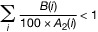
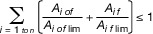

# Verordnung über die Deckungsvorsorge nach dem Atomgesetz (AtDeckV 1977)

Ausfertigungsdatum
:   1977-01-25

Fundstelle
:   BGBl I: 1977, 220

Neugefasst durch
:   Bek. v. 21.1.2022 I 118

## Eingangsformel

Auf Grund des § 13 Abs. 3 und des § 54 Abs. 1 und 2 des Atomgesetzes
in der Fassung der Bekanntmachung vom 31. Oktober 1976 (BGBl. I S.
3053) verordnet die Bundesregierung mit Zustimmung des Bundesrates:

## Erster Abschnitt - Allgemeine Vorschriften

### § 1 Arten der Deckungsvorsorge

Die Deckungsvorsorge für Anlagen und Tätigkeiten, bei denen eine
atomrechtliche Haftung nach internationalen Verträgen oder nach dem
Atomgesetz in Betracht kommt, kann durch

1.  eine Haftpflichtversicherung oder

2.  eine sonstige finanzielle Sicherheit

erbracht werden. Die Verwaltungsbehörde kann zulassen, dass mehrere
Vorsorgemaßnahmen gleicher oder verschiedener Art verbunden werden,
soweit die Wirksamkeit und die Übersichtlichkeit der Deckungsvorsorge
dadurch nicht beeinträchtigt werden.

### § 2 Haftpflichtversicherung

(1) Durch eine Haftpflichtversicherung kann die Deckungsvorsorge nur
erbracht werden, wenn sie bei einem im Inland zum Betrieb der
Haftpflichtversicherung befugten Versicherungsunternehmen genommen
wird. Für eine grenzüberschreitende Beförderung nach § 4a des
Atomgesetzes kann sie auch bei einem Versicherungsunternehmen eines
Drittstaates im Sinne des § 7 Nummer 34 des
Versicherungsaufsichtsgesetzes, das in seinem Sitzland zum Betrieb der
Haftpflichtversicherung befugt ist, genommen werden, wenn neben ihm
ein nach Satz 1 befugtes Versicherungsunternehmen oder ein Verband
solcher Versicherungsunternehmen die Pflichten eines
Haftpflichtversicherers übernimmt.

(2) Sofern der Bund und die Länder verpflichtet sind, den zur
Deckungsvorsorge Verpflichteten von Schadensersatzansprüchen
freizustellen oder die Befriedigung der gegen ihn gerichteten
Schadensersatzansprüche sicherzustellen, muss der Versicherungsvertrag
zugunsten der Bundesrepublik Deutschland und des betroffenen
Bundeslandes die Verpflichtung des Versicherers enthalten, der
Verwaltungsbehörde jede Änderung des Vertrages, jedes
Schadensereignis, jede Geltendmachung von Schadensersatzansprüchen und
jede Leistung zur Erfüllung von Schadensersatzverpflichtungen
unverzüglich anzuzeigen, sobald ihm diese Umstände bekannt werden.

### § 3 Sonstige finanzielle Sicherheit

(1) Durch eine sonstige finanzielle Sicherheit kann die
Deckungsvorsorge nur erbracht werden, wenn gewährleistet ist, dass
diese, solange mit ihrer Inanspruchnahme gerechnet werden muss, in dem
von der behördlichen Festsetzung der Deckungsvorsorge gesetzten Rahmen
zur Verfügung steht und unverzüglich zur Erfüllung gesetzlicher
Schadensersatzverpflichtungen der in § 13 Absatz 5 des Atomgesetzes
genannten Art herangezogen werden kann.

(2) Von einem Dritten, der seinen Hauptwohnsitz oder seine
geschäftliche Hauptniederlassung im Ausland hat, kann eine sonstige
finanzielle Sicherheit nur übernommen werden, wenn der Dritte entweder
für die Dauer seiner Verpflichtung im Inland hinreichende
Vermögenswerte zur Abdeckung seiner Verpflichtung besitzt oder wenn
sichergestellt ist, dass die Entscheidung eines deutschen Gerichts
über die Verpflichtung auf Grund einer völkerrechtlichen Vereinbarung
in dem Staat vollstreckt werden kann, in dem sich hinreichendes
Vermögen des Dritten befindet. Von einem anderen Staat kann eine
sonstige finanzielle Sicherheit nur übernommen werden, wenn er sich
der Gerichtsbarkeit der Bundesrepublik Deutschland unterwirft oder in
anderer Weise gewährleistet ist, dass er seine Verpflichtung erfüllt.

(3) § 2 Absatz 2 gilt entsprechend.

### § 4 Umfang der Deckungsvorsorge

(1) Bei einer Kernanlage muss sich die Deckungsvorsorge auf die
gesetzlichen Schadensersatzverpflichtungen im Sinne des § 13 Absatz 5
des Atomgesetzes in der Fassung der Bekanntmachung vom 15. Juli 1985
(BGBl. I S. 1565), das zuletzt durch Artikel 1 des Gesetzes vom 10.
August 2021 (BGBl. I S. 3530) geändert worden ist, in der jeweils
geltenden Fassung erstrecken, die sich für den Inhaber der Kernanlage
infolge eines nuklearen Ereignisses ergeben.

(2) Bei Tätigkeiten oder Anlagen, bei denen eine Haftung nach § 26 des
Atomgesetzes in Betracht kommt, muss sich die Deckungsvorsorge auf die
gesetzlichen Schadensersatzverpflichtungen im Sinne des § 13 Absatz 5
des Atomgesetzes erstrecken, die sich im Zusammenhang mit der
genehmigungspflichtigen Tätigkeit oder Anlage infolge von Wirkungen
der in § 26 Absatz 1 Satz 1 und Absatz 2 des Atomgesetzes bezeichneten
Art ergeben

1.  für den zur Deckungsvorsorge Verpflichteten,

2.  für die Personen, die von dem zur Deckungsvorsorge Verpflichteten zu
    einer Verrichtung bestellt sind,

3.  im Falle der Beförderung auch für die Personen, die neben dem zur
    Deckungsvorsorge Verpflichteten an der Beförderung beteiligt sind oder
    waren oder befugterweise Sach-, Dienst- oder Werkleistungen zur
    Beförderung bewirken oder bewirkt haben oder zu einer der Beförderung
    dienenden Verrichtung bestellt sind oder waren.

(3) Die Deckungsvorsorge muss Schadensereignisse einschließen, die im
Ausland eintreten oder sich dort auswirken und für die der zur
Deckungsvorsorge Verpflichtete nach internationalen Verträgen oder
nach im Ausland geltenden Haftpflichtbestimmungen der in § 13 Absatz 5
des Atomgesetzes genannten Art haftet.

(4) Die Deckungsvorsorge darf bis zur festgesetzten Höhe nicht für
andere als die in den Absätzen 1 bis 3 genannten Verpflichtungen
bestimmt sein oder verwendet werden.

(5) Die Verwaltungsbehörde kann Ausnahmen von den Absätzen 1 bis 3
zulassen, wenn sie

1.  mit Rücksicht auf die Art der Deckungsvorsorge gerechtfertigt sind und

2.  die Interessen der Gesamtheit der Geschädigten, sowie in Fällen, in
    denen eine Freistellung von Schadensersatzverpflichtungen nach § 34
    des Atomgesetzes in Betracht kommt, auch die Interessen der zur
    Freistellung Verpflichteten nicht unangemessen beeinträchtigen.

(6) Die von dem Inhaber einer Kernanlage zu erbringende
Deckungsvorsorge braucht sich nicht auf Schadensersatzverpflichtungen
zu erstrecken, die sich aus dem Umgang mit oder der Beförderung von
radioaktiven Stoffen außerhalb der Kernanlage für ihn ergeben.

(7) Die Absätze 1 und 3 bis 6 gelten für den Inhaber eines
Reaktorschiffs entsprechend.

### § 5 Nachweis der Deckungsvorsorge, Mitteilungen und Anzeigen

(1) Die Deckungsvorsorge ist der Verwaltungsbehörde in geeigneter Form
nachzuweisen.

(2) Die Verwaltungsbehörde hat den Versicherer oder den Dritten, der
eine sonstige finanzielle Sicherheit übernommen hat, von der
Erteilung, der Rücknahme und dem Widerruf einer Genehmigung zu
unterrichten.

(3) Wer Ansprüche geltend machen will, für deren Befriedigung die
Deckungsvorsorge in Betracht kommt, kann von der Verwaltungsbehörde
verlangen, dass sie ihm Namen und Anschrift des Versicherers oder des
Dritten bekanntgibt, der sich zur Gewährung einer sonstigen
finanziellen Sicherheit verpflichtet hat.

(4) Zuständige Stelle für die Entgegennahme einer Anzeige über das
Nichtbestehen oder die Beendigung des Versicherungsvertrages oder des
Vertrages über eine sonstige finanzielle Sicherheit (§ 14 des
Atomgesetzes in Verbindung mit § 117 Absatz 2 des
Versicherungsvertragsgesetzes) ist die Genehmigungsbehörde oder,
sofern eine Genehmigung nicht erforderlich ist, die sonst zuständige
Verwaltungsbehörde.

### § 6 Auflagen

Bei der Festsetzung der Deckungsvorsorge ist dem zur Deckungsvorsorge
Verpflichteten aufzuerlegen,

1.  Änderungen der Deckungsvorsorge nur mit vorheriger Zustimmung der
    Verwaltungsbehörde vorzunehmen,

2.  jede ohne sein Zutun eingetretene Änderung der Deckungsvorsorge und,
    soweit Schadensersatzverpflichtungen in Frage kommen, zu deren
    Erfüllung die Deckungsvorsorge oder die Freistellungsverpflichtung
    nach § 34 des Atomgesetzes bestimmt ist, jedes Schadensereignis, jede
    Geltendmachung von Schadensersatzansprüchen und jede Leistung zur
    Erfüllung von Schadensersatzverpflichtungen der Verwaltungsbehörde
    unverzüglich anzuzeigen, sobald ihm diese Umstände bekannt werden,

3.  der Verwaltungsbehörde auf deren Aufforderung hin nachzuweisen, dass
    die Deckungsvorsorge in der festgesetzten Höhe und in dem
    festgesetzten Umfang vorhanden ist und dass die Voraussetzungen
    fortbestehen, unter denen die Deckungsvorsorge auf andere Weise als
    durch eine Haftpflichtversicherung erbracht werden konnte, und

4.  die Deckungssumme, soweit sie nicht für jedes Schadensereignis in
    voller Höhe zur Verfügung steht, wiederaufzufüllen, wenn eine
    Minderung in mehr als 1 Prozent eingetreten oder auf Grund eines oder
    mehrerer eingetretener Schadensereignisse zu erwarten ist.

## Zweiter Abschnitt - Deckungssummen

### § 7 Deckungssumme und Regeldeckungssumme

(1) Bei der Festsetzung der Höhe der Deckungsvorsorge (Deckungssumme)
ist von einer für den Regelfall festzusetzenden Deckungssumme
(Regeldeckungssumme) auszugehen, sofern die Deckungssumme in diesem
Abschnitt nicht unmittelbar bestimmt ist.

(2) Die Deckungssumme beträgt

1.  im Fall des § 8a Absatz 1 nicht weniger als 80 Millionen Euro und
    höchstens 125 Millionen Euro,

2.  im Fall des § 8b höchstens 125 Millionen Euro,

3.  im Fall des § 9 Absatz 1 nicht weniger als 70 Millionen Euro und
    höchstens 2,5 Milliarden Euro,

4.  in den Fällen des § 11 Absatz 1 und des § 12 Absatz 1 nicht weniger
    als 70 Millionen Euro und höchstens 500 Millionen Euro und

5.  im Fall des § 11 Absatz 2 nicht weniger als 70 Millionen Euro und
    höchstens 700 Millionen Euro.

### § 8 Umgang und Beförderung

(1) Sofern sich aus diesem Abschnitt nichts anderes ergibt, bestimmt
sich die Regeldeckungssumme

1.  beim Umgang mit Kernbrennstoffen nach Anlage 1,

2.  beim Umgang mit sonstigen radioaktiven Stoffen nach Anlage 2,

und zwar jeweils nach der genehmigten Art, Masse, Aktivität oder
Beschaffenheit der radioaktiven Stoffe. Die Regeldeckungssumme beim
Umgang mit hochradioaktiven Strahlenquellen im Sinne des § 4 Absatz 36
des Strahlenschutzgesetzes bestimmt sich unabhängig von der Art des
radioaktiven Stoffes nach Anlage 2.

(2) Ist der Umgang mit sonstigen radioaktiven Stoffen darauf
gerichtet, dass sie bei der Ausübung der Heilkunde am Menschen
angewandt werden oder dass sie in die Luft, das Wasser, den Boden oder
den Bewuchs gelangen, ohne dass die weitere Verbreitung verhindert
werden kann, so beträgt die Regeldeckungssumme das Zweifache der in
der Anlage 2 angegebenen Werte.

(3) Beim Umgang mit radioaktiven Abfällen in einer Landessammelstelle
oder in einer sonstigen zur Beseitigung radioaktiver Abfälle
zugelassenen Einrichtung beträgt die Regeldeckungssumme 7 Millionen
Euro, sofern es sich bei der Landessammelstelle oder der sonstigen
Einrichtung nicht um eine Kernanlage im Sinne des § 2 Absatz 4 des
Atomgesetzes handelt. Wird in einer sonstigen zur Beseitigung
radioaktiver Abfälle zugelassenen Einrichtung nach Satz 1 mit
radioaktiven Abfällen umgegangen, die aus einer Anlage im Sinne des
§ 7 des Atomgesetzes stammen, beträgt die Regeldeckungssumme 70
Millionen Euro.

(4) Für die Beförderung radioaktiver Stoffe gilt Absatz 1
entsprechend; bei der Beförderung sonstiger radioaktiver Stoffe sind
die Werte der Anlage 2 Spalte 2 anzuwenden.

(5) Die Deckungssumme soll bei der Beförderung den Betrag von 35
Millionen Euro nicht überschreiten. Eine Überschreitung ist nur
zulässig, wenn nach den Umständen des Einzelfalls der Betrag nach Satz
1 nicht angemessen ist; in diesem Fall kann die Verwaltungsbehörde die
Deckungssumme bis zu einer Höchstgrenze des Zweifachen der Summe nach
Satz 1 erhöhen. § 16 Absatz 2 findet entsprechende Anwendung.

### § 8a Beförderung von Kernmaterialien

(1) Für die Beförderung von Kernmaterialien, die nicht auf Grund von
Absatz 2 von der Anwendung des Pariser Übereinkommens ausgenommen
sind, beträgt die Regeldeckungssumme 80 Millionen Euro und sie erhöht
sich

1.  gemäß Anlage 3, wenn Kernbrennstoffe im Sinne des § 2 Absatz 1 Satz 2
    des Atomgesetzes mit einer genehmigten Masse von mehr als 250
    Kilogramm befördert werden,

2.  gemäß Anlage 4, wenn die genehmigte Gesamtaktivität im Verlauf der
    Beförderung das 10
    12                   fache der Freigrenzen nach Anlage 4 Tabelle 1
    Spalte 2 der Strahlenschutzverordnung vom 29. November 2018 (BGBl. I
    S. 2034, 2036), die zuletzt durch Artikel 83 des Gesetzes vom 10.
    August 2021 (BGBl. I S. 3436) geändert worden ist, in der jeweils
    geltenden Fassung überschreitet.

Die Erhöhungsbeträge nach Anlage 3 und Anlage 4 sind getrennt zu
ermitteln und sodann mit dem Betrag von 80 Millionen Euro zu einer
Regeldeckungssumme von höchstens 125 Millionen Euro zusammenzurechnen.

(2) Kernmaterialien, die von einem Inhaber einer Kernanlage an einen
Empfänger zur Verwendung versandt werden, sind für den Zeitraum, in
dem sie sich außerhalb einer Kernanlage befinden, von der Anwendung
des Pariser Übereinkommens ausgenommen, wenn

1.  die Sendung die Festlegungen gemäß Anlage 5 erfüllt und

2.  die Kernmaterialien unter Beachtung der für den jeweiligen
    Verkehrsträger geltenden Rechtsvorschriften über die Beförderung
    gefährlicher Güter befördert werden oder, falls solche Vorschriften
    fehlen, auf andere Weise die nach dem Stand von Wissenschaft und
    Technik erforderliche Vorsorge gegen Schäden durch die Beförderung der
    Kernmaterialien getroffen ist.

Für die Anwendung der Anlage 5 sind die Begriffsbestimmungen der für
den jeweiligen Verkehrsträger geltenden Rechtsvorschriften über die
Beförderung gefährlicher Güter zugrunde zu legen.

(3) Für die Beförderung von Kernmaterialien, die auf Grund von Absatz
2 von der Anwendung des Pariser Übereinkommens ausgenommen sind, ist §
8 Absatz 4 und 5 anzuwenden.

### § 8b Deckung bei Schäden gemäß § 26 Absatz 1a des Atomgesetzes

Für die Bestimmung der Deckungsvorsorge bei Schäden gemäß § 26 Absatz
1a des Atomgesetzes gilt § 8a Absatz 1 entsprechend.

### § 9 Reaktoren

(1) Die Regeldeckungssumme beträgt für Reaktoren mit einer
Höchstleistung von bis zu 25 Megawatt 70 Millionen Euro und für jedes
weitere Megawatt 2,5 Millionen Euro bis zum Höchstbetrag von 2,5
Milliarden Euro. Die Regeldeckungssumme beträgt für Reaktoren 70
Millionen Euro erhöht um den auf Grund der genehmigten Masse der
Kernbrennstoffe nach Anlage 3 ermittelten Betrag, sofern diese
Berechnung einen höheren Wert als die Berechnung der
Regeldeckungssumme nach Satz 1 ergibt. Höchstleistung ist die
thermische Dauerleistung, mit welcher der Reaktor auf Grund der
Genehmigung betrieben werden darf.

(2) In der nach Absatz 1 zu ermittelnden Regeldeckungssumme ist die
Regeldeckungssumme für Einrichtungen für die Lagerung von
Kernbrennstoffen oder radioaktiven Erzeugnissen und Abfällen, die für
den Eigenbedarf bestimmt sind oder aus dem Reaktor stammen und bis zur
weiteren Verwendung oder Beseitigung vorübergehend gelagert werden,
eingeschlossen, sofern die Anlagen als eine Kernanlage im Sinne von §
2 Absatz 4 Satz 3 des Atomgesetzes gelten.

(3) Die nach Absatz 1 zu ermittelnde Deckungsvorsorge umfasst auch die
Deckungsvorsorge

1.  für eine Aufbewahrung nach § 6 Absatz 3 des Atomgesetzes oder

2.  für eine entsprechende Aufbewahrung auf dem Gelände einer Anlage zur
    Spaltung von Kernbrennstoffen zu Forschungszwecken,

sofern die Anlagen als eine Kernanlage im Sinne von § 2 Absatz 4 Satz
3 des Atomgesetzes gelten.

### § 10 Schiffsreaktoren

Die Regeldeckungssumme für Reaktoren, die zum Antrieb von Schiffen
dienen (Schiffsreaktoren), beträgt je Megawatt Höchstleistung 500 000
Euro, höchstens jedoch 200 Millionen Euro. § 9 Absatz 1 Satz 2 und 3
gilt entsprechend.

### § 11 Sonstige Kernanlagen

(1) Für Kernanlagen, die keine Reaktoren sind, beträgt die
Regeldeckungssumme 70 Millionen Euro und sie erhöht sich

1.  gemäß Anlage 3, wenn in der Anlage mit Kernbrennstoffen im Sinne des §
    2 Absatz 1 Satz 2 des Atomgesetzes mit einer genehmigten Masse von
    mehr als 250 Kilogramm umgegangen werden darf,

2.  gemäß Anlage 4, wenn die genehmigte Gesamtaktivität der Anlage das 10
    12                   fache der Freigrenzen nach Anlage 4 Tabelle 1
    Spalte 2 der Strahlenschutzverordnung überschreitet.

Die Erhöhungsbeträge nach Anlage 3 und Anlage 4 sind getrennt zu
ermitteln und sodann mit dem Betrag in Höhe von 70 Millionen Euro zu
einer Regeldeckungssumme von höchstens 500 Millionen Euro
zusammenzurechnen.

(2) Darf der Inhaber einer Kernanlage bestrahlte Kernbrennstoffe aus
Anlagen zur Spaltung von Kernbrennstoffen zur gewerblichen Erzeugung
von Elektrizität lagern, gilt Absatz 1 mit der Maßgabe, dass die
Regeldeckungssumme der Kernanlage höchstens 700 Millionen Euro
beträgt.

(3) Für Anlagen zur Erzeugung oder zur Bearbeitung oder Verarbeitung
von Kernbrennstoffen, deren Regeldeckungssumme sich nach Absatz 1
bestimmt, gilt § 9 Absatz 2 entsprechend.

### § 12 Stilllegung von Kernanlagen

(1) Wird eine Kernanlage stillgelegt oder in sonstiger Weise außer
Betrieb gesetzt und befinden sich in der Anlage nur noch die
aktivierten und kontaminierten Anlagenteile sowie radioaktive Stoffe
zu Prüfzwecken, so beträgt die Regeldeckungssumme 70 Millionen Euro
erhöht um den Betrag, der sich nach Maßgabe der in der Anlage noch
vorhandenen Aktivität nach Anlage 4 bestimmt.

(2) Sofern die Bestimmung der Aktivität wegen der Besonderheit des
Einzelfalls nicht oder nur mit unverhältnismäßigem Aufwand möglich
ist, kann die Verwaltungsbehörde die Deckungssumme bis auf 5 Prozent
der zuletzt vor der Stilllegung oder sonstigen Außerbetriebsetzung
festgesetzten Deckungssumme ermäßigen, wenn die ermäßigte
Deckungssumme nicht weniger als 70 Millionen Euro beträgt.

### § 12a Kernanlagen in fortgeschrittener Stilllegung

(1) Die zuständige Behörde nimmt auf Antrag des Inhabers eine
Kernanlage in Stilllegung, in der sich nur noch die aktivierten und
kontaminierten Anlagenteile und radioaktive Stoffe zu Prüfzwecken
befinden, von der Anwendung des Pariser Übereinkommens aus, wenn

1.  die Anlage die aktivitätsbezogenen Festlegungen gemäß Anlage 6 einhält
    und

2.  die mit der Anlage verbundene Exposition einer repräsentativen Person
    der Bevölkerung bei einem Ereignis, das zu einer unbeabsichtigten
    Exposition führt, ohne weitere Schutzmaßnahmen eine effektive Dosis
    von 1 Millisievert im Kalenderjahr nicht überschreitet.

(2) Für Kernanlagen, die auf Grund von Absatz 1 von der Anwendung des
Pariser Übereinkommens ausgenommen sind, bestimmt sich die
Regeldeckungssumme nach Maßgabe der in der Anlage noch vorhandenen
Aktivität nach Anlage 2 Spalte 3. Sofern die Bestimmung der Aktivität
wegen der Besonderheit des Einzelfalls nicht oder nur mit
unverhältnismäßigem Aufwand möglich ist, kann die Verwaltungsbehörde
die Deckungssumme bis auf 3,5 Millionen Euro ermäßigen.

### § 13 Anlagen zur Erzeugung ionisierender Strahlen

(1) Die Regeldeckungssumme beträgt für Anlagen zur Erzeugung
ionisierender Strahlen, deren Errichtung und Betrieb einer Genehmigung
bedarf, 25 Millionen Euro. Abweichend von Satz 1 beträgt für
Ionenbeschleuniger, die für die Erzeugung von Radioisotopen zur
Verwendung für die Positronen-Emissions-Tomographie oder Einzel-
Photonen-Emissions-Tomographie im Zusammenhang mit der Ausübung der
Heilkunde betrieben werden, die Regeldeckungssumme 1,5 Millionen Euro.

(2) Bedarf nur der Betrieb der Anlage einer Genehmigung, so beträgt
die Regeldeckungssumme

1.  5 Millionen Euro, sofern die Anlage bei der Ausübung der Heilkunde
    angewendet wird,

2.  1,5 Millionen Euro, sofern je Sekunde mehr als 10
    8                    Neutronen erzeugt werden oder die Endenergie der
    beschleunigten Elektronen mehr als 10 MeV oder die Endenergie der
    beschleunigten Ionen mehr als 1 MeV je Nukleon beträgt,

3.  500 000 Euro in allen übrigen Fällen.

### § 14 (weggefallen)

### § 15 Anwendung radioaktiver Stoffe am Menschen in der medizinischen Forschung

Bei der Anwendung radioaktiver Stoffe oder ionisierender Strahlung am
Menschen in der medizinischen Forschung muss die Deckungssumme in
einem angemessenen Verhältnis zu den mit der Anwendung verbundenen
Risiken stehen und auf der Grundlage der Risikoabschätzung so
festgelegt werden, dass für den Fall des Todes oder der dauernden
Erwerbsunfähigkeit einer jeden Person, an der die radioaktiven Stoffe
oder die ionisierende Strahlung angewendet werden, mindestens 500 000
Euro zur Verfügung stehen.

### § 16 Ermittlung der Deckungssumme im Einzelfall

(1) Ist die Regeldeckungssumme nach den Umständen des Einzelfalls
nicht angemessen, so kann die Verwaltungsbehörde die Deckungssumme im
Rahmen der Höchstgrenze des § 13 Absatz 3 Satz 2 des Atomgesetzes und
unter Beachtung der Höchst- und Mindestgrenzen nach § 7 Absatz 2 bis
auf das Zweifache der Regeldeckungssumme erhöhen oder bis auf ein
Drittel der Regeldeckungssumme ermäßigen.

(2) Bei der Ermittlung der nach den Umständen des Einzelfalls
angemessenen Deckungssumme ist insbesondere zu berücksichtigen,

1.  ob und in welchem Umfang die Möglichkeit besteht oder auszuschließen
    ist, dass andere Personen als der zur Deckungsvorsorge Verpflichtete
    und seine Beschäftigten Schäden an Leben, Gesundheit, Körper und
    Sachgütern erleiden,

2.  welches Maß an Sicherheit durch Schutzmaßnahmen und
    Schutzeinrichtungen erreicht wird,

3.  ob und in welchem Umfang unter Berücksichtigung der meteorologischen
    und hydrologischen Verhältnisse die Möglichkeit besteht oder
    auszuschließen ist, dass die radioaktiven Stoffe verbreitet werden,
    insbesondere als Gase, Aerosole oder Flüssigkeiten,

4.  welche Dauer der Gefährdung insbesondere mit Rücksicht auf die
    Halbwertzeit der radioaktiven Stoffe anzunehmen ist,

5.  ob wegen der Art, Masse oder Beschaffenheit der radioaktiven Stoffe
    Schäden auf Grund nuklearer Ereignisse infolge von
    Kernspaltungsvorgängen auch unter ungünstigsten Umständen
    ausgeschlossen werden können,

6.  ob und in welchem Umfang im Falle der Beförderung unter
    Berücksichtigung des Beförderungsmittels, des Beförderungsweges, der
    Verpackung und der Beschaffenheit der radioaktiven Stoffe besonders
    hohe oder geringe Gefahren bestehen.

### § 17 (weggefallen)

### § 18 Deckungssumme bei mehrfachem Umgang

(1) Geht der zur Deckungsvorsorge Verpflichtete auf Grund einer oder
weiterer Genehmigungen mit mehreren Stoffen oder mit mehreren
Teilmengen eines Stoffes um, so ist für jede zur Deckungsvorsorge
verpflichtende Tätigkeit die jeweils in Frage kommende Deckungssumme
gesondert festzusetzen.

(2) Es ist jedoch eine Gesamtdeckungssumme festzusetzen, wenn bei
einem mehrfachen Umgang außerhalb einer Kernanlage ein derartig enger
räumlicher und zeitlicher Zusammenhang vorliegt, dass die mehreren
Stoffe oder Teilmengen als ähnlich gefährlich angesehen werden müssen
wie ein einziger Stoff, dessen Aktivität oder Masse der
Gesamtaktivität oder Gesamtmasse der Stoffe oder Teilmengen
entspricht.

(3) Bei der Festsetzung der Gesamtdeckungssumme ist bei umschlossenen
und bei offenen sonstigen radioaktiven Stoffen jeweils von der
Gesamtaktivität, ausgedrückt im Vielfachen der Aktivitätsfreigrenzen,
auszugehen. Wird mit Stoffen umgegangen, die beiden der in Satz 1
genannten Gruppen angehören, so sind die für jede Gruppe getrennt
ermittelten Deckungssummen zusammenzurechnen; jedoch darf insgesamt
keine höhere als diejenige Deckungssumme angesetzt werden, die sich
ergeben würde, wenn die gesamten Stoffe offene sonstige radioaktive
Stoffe wären.

(4) Für die Beförderung gelten die Absätze 1 bis 3 entsprechend.

### § 19 Abrundung der Deckungssumme

(1) Die Deckungssumme ist auf volle 50 000 Euro festzusetzen.

(2) Ergibt sich aus den Vorschriften über die Deckungssumme ein
Zwischenbetrag unter 25 000 Euro, so ist nach unten, im übrigen ist
nach oben abzurunden.

## Dritter Abschnitt - Schlussvorschriften

### § 20 Neufestsetzung der Deckungsvorsorge

Entspricht die Deckungsvorsorge für eine vor Inkrafttreten dieser
Verordnung genehmigte Tätigkeit nicht mehr den Anforderungen dieser
Verordnung, so ist die Deckungsvorsorge bei der nächsten Festsetzung
nach § 13 Absatz 1 Satz 2 des Atomgesetzes neu festzusetzen, wobei die
Neufestsetzung für Kernanlagen und für die Beförderung von
Kernmaterialien spätestens innerhalb von sechs Monaten nach
Inkrafttreten dieser Verordnung und in den sonstigen Fällen innerhalb
eines Jahres nach Inkrafttreten dieser Verordnung zu erfolgen hat.

### § 21 (weggefallen)

### § 22 (Inkrafttreten)

### Anlage 1 Regeldeckungssumme bei Kernbrennstoffen in Millionen Euro

(Fundstelle: BGBl. I 2022, 125)

*    *   Masse der
[^F820132_01_BJNR002200977BJNE002802128]
        Kernbrennstoffe

    *   Plutonium

    *   Uran 233

    *   über 20 % mit
        Uran 235
        angereichertes Uran

    *   bis einschließlich
        20 % mit Uran 235
        angereichertes Uran

    *   Natürliches Uran,
        das Kernbrennstoff ist

*    *   1

    *   2

    *   3

    *   4

    *   5

    *   6

*    *   bis 10 g

    *   0,5

    *   0,25

    *   –

    *   –

    *   Für eine über die Freigrenzen hinausgehende Masse

        1.  bis zu 10 Tonnen
            0,5 je angefangene
            Tonne

        2.  über 10 bis
            zu 100 Tonnen
            0,125 je angefangene
            weitere Tonne,

        3.  über 100 Tonnen
            0,0125 je angefangene
            weitere Tonne

        bis zu einem Höchstbetrag von 50, im Falle
        der Beförderung von 25.

*    *   über 10 g
        bis 100 g

    *   1,0

    *   0,5

    *   –

    *   –

*    *   über 100 g
        bis 200 g

    *   1,5

    *   1,0

    *   –

    *   –

*    *   über 200 g
        bis 1 kg

    *   5,0

    *   5,0

    *   2,5

    *   0,5

*    *   über 1 kg
        bis 100 kg
        für jedes weitere angefangene
        Kilogramm

    *   0,5

    *   0,5

    *   0,15

    *   0,05

*    *   über 100 kg
        bis 1 000 kg
        für jede weiteren angefangenen
        10 Kilogramm

    *   1,0

    *   1,0

    *   0,3

    *   0,15

*    *   über 1 000 kg
        für jede weiteren angefangenen
        100 Kilogramm

    *   5,0

    *   5,0

    *   0,75

    *   0,15

    Bei der Berechnung der Masse der Kernbrennstoffe ist nur der
    Massengehalt von Plutonium 239, von Plutonium 241, Uran 233 und Uran
    235 zu berücksichtigen. Bei natürlichem Uran, das Kernbrennstoff ist,
    ist bei der Berechnung der Masse die Gesamtmasse des Urans maßgeblich.
[^F820132_01_BJNR002200977BJNE002802128]: 

### Anlage 2 Regeldeckungssummen bei sonstigen radioaktiven Stoffen in Millionen Euro

(Fundstelle: BGBl. I 2022, 126)

*    *
    *   Aktivitäten, angegeben in
        Vielfachen der Freigrenzen nach
        Anlage 4 Tabelle 1 Spalte 2
        der Strahlenschutzverordnung

    *   umschlossene
        radioaktive
        Stoffe

    *   offene
        radioaktive
        Stoffe

*    *
    *   1

    *   2

    *   3

*    *   1.

    *   hochradioaktive Strahlenquellen nach § 4 Absatz 36 des
        Strahlenschutzgesetzes, soweit nicht unter Nummer 2 bis 12 in der
        Spalte 3 höhere Summen genannt werden

    *   0,05

    *

*    *   2.

    *   vom 10
        5                       fachen bis zum 10
        6                       fachen

    *   0,05

    *   0,25 bis 0,5

*    *   3.

    *   vom 10
        6                       fachen bis zum 10
        7                       fachen

    *   0,05 bis 0,25

    *   0,5 bis 1

*    *   4.

    *   vom 10
        7                       fachen bis zum 10
        8                       fachen

    *   0,25 bis 0,5

    *   1 bis 2

*    *   5.

    *   vom 10
        8                       fachen bis zum 10
        9                       fachen

    *   0,5 bis 1

    *   2 bis 4

*    *   6.

    *   vom 10
        9                       fachen bis zum 10
        10                       fachen

    *   1 bis 2

    *   4 bis 6

*    *   7.

    *   vom 10
        10                        fachen bis zum 10
        11                       fachen

    *   2 bis 4

    *   6 bis 8

*    *   8.

    *   vom 10
        11                        fachen bis zum 10
        12                       fachen

    *   4 bis 6

    *   8 bis 10

*    *   9.

    *   vom 10
        12                       fachen bis zum 10
        13                       fachen

    *   6 bis 8

    *   über dem 10
        12                       fachen
        10 bis 15

*    *   10.

    *   vom 10
        13                       fachen bis zum 10
        14                       fachen

    *   8 bis 10

*    *   11.

    *   vom 10
        14                       fachen bis zum 10
        15                       fachen

    *   10 bis 12

*    *   12.

    *   über dem 10
        15                       fachen

    *   12 bis 14

(zu § 8a Absatz 1, § 9 Absatz 1, § 11 Absatz 1 und 2)

### Anlage 3 Massenabhängige Erhöhungsbeträge zur Ermittlung der Regeldeckungssumme für die Beförderung von Kernmaterialien und für Kernanlagen in Millionen Euro

(Fundstelle: BGBl. I 2022, 127)

*    *[^F820132_02_BJNR002200977BJNE003600128]
   Masse der Kernbrennstoffe
        im Sinne von § 2 Absatz 1 Satz 2 des Atomgesetzes

    *   Erhöhungsbeträge

*    *   über 250 bis 1 000 Kilogramm für jedes weitere angefangene Kilogramm

    *   0,0064

*    *   über 1 000 bis 5 000 Kilogramm für jedes weitere angefangene Kilogramm

    *   0,0056

*    *   über 5 000 bis 10 000 Kilogramm für jedes weitere angefangene
        Kilogramm

    *   0,0048

*    *   über 10 000 Kilogramm bis 30 000 Kilogramm für jedes weitere
        angefangene Kilogramm

    *   0,004

*    *   über 30 000 Kilogramm bis 60 000 Kilogramm für jedes weitere
        angefangene Kilogramm

    *   0,0032

*    *   über 60 000 Kilogramm für jedes weitere angefangene Kilogramm

    *   0,0024

    Bei der Berechnung der Masse der Kernbrennstoffe ist nur der
    Massengehalt von Plutonium 239, Plutonium 241, Uran 233 und Uran 235
    zu berücksichtigen. Bei bestrahlten Kernbrennstoffen ist bei der
    Berechnung der vor der Bestrahlung vorhandene Massengehalt dieser
    Stoffe maßgeblich.
[^F820132_02_BJNR002200977BJNE003600128]: 
(zu § 8a Absatz 1, § 11 Absatz 1 und 2, § 12 Absatz 1)

### Anlage 4 Aktivitätsabhängige Erhöhungsbeträge zur Ermittlung der Regeldeckungssumme für die Beförderung von Kernmaterialien, für sonstige Kernanlagen und Kernanlagen in Stilllegung in Millionen Euro

(Fundstelle: BGBl. I 2022, 128)

*    *[^F820132_03_BJNR002200977BJNE003301128]
   Gesamtaktivität, angegeben in Vielfachen der Freigrenzen
        nach Anlage 4 Tabelle 1 Spalte 2 der Strahlenschutzverordnung

    *   Erhöhungsbeträge

*    *   vom 10
        12                     fachen bis zum 10
        13                     fachen

    *   bis 10

*    *   vom 10
        13                     fachen bis zum 10
        14                     fachen

    *   10 bis 30

*    *   vom 10
        14                     fachen bis zum 10
        15                     fachen

    *   30 bis 70

*    *   vom 10
        15                     fachen bis zum 10
        16                     fachen

    *   70 bis 140

*    *   vom 10
        16                     fachen bis zum 10
        17                     fachen

    *   140 bis 280

*    *   über dem 10
        17                     fachen

    *   280 bis 460

    Ist die Bestimmung des Vielfachen der Freigrenzen wegen der
    Besonderheit des Einzelfalls nicht oder nur mit unverhältnismäßigem
    Aufwand möglich, so beträgt die Freigrenze für die Ermittlung der
    Gesamtaktivität 5 Kilobecquerel.
[^F820132_03_BJNR002200977BJNE003301128]: 
(zu § 8a Absatz 2)

### Anlage 5 Festlegungen zum Ausschluss kleiner Mengen von Kernmaterialien außerhalb einer Kernanlage von der Anwendung des Pariser Übereinkommens

(Fundstelle: BGBl. I 2022, 129 - 137)

**Teil A: Allgemeines**

Für Sendungen, die Radionuklide enthalten, gilt, vorbehaltlich des für
Sendungen spaltbarer Stoffe ergänzend anzuwendenden Teils B,
Folgendes:

1.  Enthält eine Sendung ein Radionuklid, so darf die Gesamtaktivität je
    Beförderungsmittel das Hundertfache des A
    2                   -Wertes des Radionuklids nicht überschreiten. Für
    das Radionuklid ist der jeweilige A
    2                   -Wert gemäß Tabelle 1 zugrunde zu legen, sofern
    die Art und die Aktivität des Radionuklids bekannt sind. Andernfalls
    ist für das vorkommende Radionuklid der jeweilige A
    2                   -Wert gemäß Tabelle 2 zugrunde zu legen.

2.  Enthält eine Sendung mehrere Radionuklide, so darf die Summe der
    Verhältniszahlen aus der Aktivität B(i) und dem Hundertfachen der
    jeweiligen A
    2                   (i)-Werte der einzelnen Radionuklide
    (Summenformel) den Wert 1 je Beförderungsmittel nicht überschreiten:

    *        *               ,

    wobei B(i) die Aktivität des Radionuklids i und A
    2                   (i) der A
    2                   -Wert des Radionuklids i ist. Für die Berechnung
    sind für die Radionuklide die jeweiligen A
    2                   -Werte gemäß Tabelle 1 zugrunde zu legen, sofern
    die Art und die Aktivität der Radionuklide bekannt sind. Andernfalls
    sind für die vorkommenden Radionuklide die jeweiligen A
    2                   -Werte gemäß Tabelle 2 zugrunde zu legen.

**Teil B: Sendungen spaltbarer Stoffe**

Eine Sendung, die spaltbare Stoffe enthält, muss die Voraussetzungen
gemäß Teil A erfüllen und die spaltbaren Stoffe müssen auf Grund der
für den jeweiligen Verkehrsträger geltenden Rechtsvorschriften über
die Beförderung gefährlicher Güter von der Klassifizierung „SPALTBAR“
freigestellt sein.

## **Tabelle 1**

*    *   Radionuklid (Atomzahl)

    *   A
        2
        (TBq)

*    *   Actinium (89)
        Ac-225
        Ac-227
        Ac-228

    *   6 × 10
        –3
        9 × 10
        –5
        5 × 10
        –1

*    *   Silber (47)
        Ag-105
        Ag-108m
        Ag-110m
        Ag-111

    *   2 × 10
        0
        7 × 10
        –1
        4 × 10
        –1
        6 × 10
        –1

*    *   Aluminium (13)
        Al-26

    *   1 × 10
        –1

*    *   Americium (95)
        Am-241
        Am-242m
        Am-243

    *   1 × 10
        –3
        1 × 10
        –3
        1 × 10
        –3

*    *   Argon (18)
        Ar-37
        Ar-39
        Ar-41

    *   4 × 10
        1
        2 × 10
        1
        3 × 10
        –1

*    *   Arsen (33)
        As-72
        As-73
        As-74
        As-76
        As-77

    *   3 × 10
        –1
        4 × 10
        1
        9 × 10
        –1
        3 × 10
        –1
        7 × 10
        –1

*    *   Astat (85)
        At-211

    *   5 × 10
        –1

*    *   Gold (79)
        Au-193
        Au-194
        Au-195
        Au-198
        Au-199

    *   2 × 10
        0
        1 × 10
        0
        6 × 10
        0
        6 × 10
        –1
        6 × 10
        –1

*    *   Barium (56)
        Ba-131
        Ba-133
        Ba-133m
        Ba-140

    *   2 × 10
        0
        3 × 10
        0
        6 × 10
        –1
        3 × 10
        –1

*    *   Beryllium (4)
        Be-7
        Be-10

    *   2 × 10
        1
        6 × 10
        –1

*    *   Bismut (83)
        Bi-205
        Bi-206
        Bi-207
        Bi-210
        Bi-210m
        Bi-212

    *   7 × 10
        –1
        3 × 10
        –1
        7 × 10
        –1
        6 × 10
        –1
        2 × 10
        –2
        6 × 10
        –1

*    *   Berkelium (97)
        Bk-247
        Bk-249

    *   8 × 10
        –4
        3 × 10
        –1

*    *   Brom (35)
        Br-76
        Br-77
        Br-82

    *   4 × 10
        –1
        3 × 10
        0
        4 × 10
        –1

*    *   Kohlenstoff (6)
        C-11
        C-14

    *   6 × 10
        –1
        3 × 10
        0

*    *   Calcium (20)
        Ca-41
        Ca-45
        Ca-47

    *   unbegrenzt
        1 × 10
        0
        3 × 10
        –1

*    *   Cadmium (48)
        Cd-109
        Cd-113m
        Cd-115
        Cd-115m

    *   2 × 10
        0
        5 × 10
        –1
        4 × 10
        –1
        5 × 10
        –1

*    *   Cerium (58)
        Ce-139
        Ce-141
        Ce-143
        Ce-144

    *   2 × 10
        0
        6 × 10
        –1
        6 × 10
        –1
        2 × 10
        –1

*    *   Californium (98)
        Cf-248
        Cf-249
        Cf-250
        Cf-251
        Cf-252
        Cf-253
        Cf-254

    *   6 × 10
        –3
        8 × 10
        –4
        2 × 10
        –3
        7 × 10
        –4
        3 × 10
        –3
        4 × 10
        –2
        1 × 10
        –3

*    *   Chlor (17)
        Cl-36
        Cl-38

    *   6 × 10
        –1
        2 × 10
        –1

*    *   Curium (96)
        Cm-240
        Cm-241
        Cm-242
        Cm-243
        Cm-244
        Cm-245
        Cm-246
        Cm-247
        Cm-248

    *   2 × 10
        –2
        1 × 10
        0
        1 × 10
        –2
        1 × 10
        –3
        2 × 10
        –3
        9 × 10
        –4
        9 × 10
        –4
        1 × 10
        –3
        3 × 10
        –4

*    *   Cobalt (27)
        Co-55
        Co-56
        Co-57
        Co-58
        Co-58m
        Co-60

    *   5 × 10
        –1
        3 × 10
        –1
        1 × 10
        1
        1 × 10
        0
        4 × 10
        1
        4 × 10
        –1

*    *   Chrom (24)
        Cr-51

    *   3 × 10
        1

*    *   Caesium (55)
        Cs-129
        Cs-131
        Cs-132
        Cs-134
        Cs-134m
        Cs-135
        Cs-136
        Cs-137

    *   4 × 10
        0
        3 × 10
        1
        1 × 10
        0
        7 × 10
        –1
        6 × 10
        –1
        1 × 10
        0
        5 × 10
        –1
        6 × 10
        –1

*    *   Kupfer (29)
        Cu-64
        Cu-67

    *   1 × 10
        0
        7 × 10
        –1

*    *   Dysprosium (66)
        Dy-159
        Dy-165
        Dy-166

    *   2 × 10
        1
        6 × 10
        –1
        3 × 10
        –1

*    *   Erbium (68)
        Er-169
        Er-171

    *   1 × 10
        0
        5 × 10
        –1

*    *   Europium (63)
        Eu-147
        Eu-148
        Eu-149
        Eu-150 (kurzlebig)
        Eu-150 (langlebig)
        Eu-152
        Eu-152m
        Eu-154
        Eu-155
        Eu-156

    *   2 × 10
        0
        5 × 10
        –1
        2 × 10
        1
        7 × 10
        –1
        7 × 10
        –1
        1 × 10
        0
        8 × 10
        –1
        6 × 10
        –1
        3 × 10
        0
        7 × 10
        –1

*    *   Fluor (9)
        F-18

    *   6 × 10
        –1

*    *   Eisen (26)
        Fe-52
        Fe-55
        Fe-59
        Fe-60

    *   3 × 10
        –1
        4 × 10
        1
        9 × 10
        –1
        2 × 10
        –1

*    *   Gallium (31)
        Ga-67
        Ga-68
        Ga-72

    *   3 × 10
        0
        5 × 10
        –1
        4 × 10
        –1

*    *   Gadolinium (64)
        Gd-146
        Gd-148
        Gd-153
        Gd-159

    *   5 × 10
        –1
        2 × 10
        –3
        9 × 10
        0
        6 × 10
        –1

*    *   Germanium (32)
        Ge-68
        Ge-71
        Ge-77

    *   5 × 10
        –1
        4 × 10
        1
        3 × 10
        –1

*    *   Hafnium (72)
        Hf-172
        Hf-175
        Hf-181
        Hf-182

    *   6 × 10
        –1
        3 × 10
        0
        5 × 10
        –1
        unbegrenzt

*    *   Quecksilber (80)
        Hg-194
        Hg-195m
        Hg-197
        Hg-197m
        Hg-203

    *   1 × 10
        0
        7 × 10
        –1
        1 × 10
        1
        4 × 10
        –1
        1 × 10
        0

*    *   Holmium (67)
        Ho-166
        Ho-166m

    *   4 × 10
        –1
        5 × 10
        –1

*    *   Iod (53)
        I-123
        I-124
        I-125
        I-126
        I-129
        I-131
        I-132
        I-133
        I-134
        I-135

    *   3 × 10
        0
        1 × 10
        0
        3 × 10
        0
        1 × 10
        0
        unbegrenzt
        7 × 10
        –1
        4 × 10
        –1
        6 × 10
        –1
        3 × 10
        –1
        6 × 10
        –1

*    *   Indium (49)
        In-111
        In-113m
        In-114m
        In-115m

    *   3 × 10
        0
        2 × 10
        0
        5 × 10
        –1
        1 × 10
        0

*    *   Iridium (77)
        Ir-189
        Ir-190
        Ir-192
        Ir-194

    *   1 × 10
        1
        7 × 10
        –1
        6 × 10
        –1
        3 × 10
        –1

*    *   Kalium (19)
        K-40
        K-42
        K-43

    *   9 × 10
        –1
        2 × 10
        –1
        6 × 10
        –1

*    *   Krypton (36)
        Kr-79
        Kr-81
        Kr-85
        Kr-85m
        Kr-87

    *   2 x 10
        0
        4 × 10
        1
        1 × 10
        1
        3 × 10
        0
        2 × 10
        –1

*    *   Lanthan (57)
        La-137
        La-140

    *   6 × 10
        0
        4 × 10
        –1

*    *   Lutetium (71)
        Lu-172
        Lu-173

    *   6 × 10
        –1
        8 × 10
        0

*    *   Lu-174
        Lu-174m
        Lu-177

    *   9 × 10
        0
        1 × 10
        1
        7 × 10
        –1

*    *   Magnesium (12)
        Mg-28

    *   3 × 10
        –1

*    *   Mangan (25)
        Mn-52
        Mn-53
        Mn-54
        Mn-56

    *   3 × 10
        –1
        unbegrenzt
        1 × 10
        0
        3 × 10
        –1

*    *   Molybdän (42)
        Mo-93
        Mo-99

    *   2 × 10
        1
        6 × 10
        –1

*    *   Stickstoff (7)
        N-13

    *   6 × 10
        –1

*    *   Natrium (11)
        Na-22
        Na-24

    *   5 × 10
        –1
        2 × 10
        –1

*    *   Niob (41)
        Nb-93m
        Nb-94
        Nb-95
        Nb-97

    *   3 × 10
        1
        7 × 10
        –1
        1 × 10
        0
        6 × 10
        –1

*    *   Neodym (60)
        Nd-147
        Nd-149

    *   6 × 10
        –1
        5 × 10
        –1

*    *   Nickel (28)
        Ni-59
        Ni-63
        Ni-65

    *   unbegrenzt
        3 × 10
        1
        4 × 10
        –1

*    *   Neptunium (93)
        Np-235
        Np-236 (kurzlebig)
        Np-236 (langlebig)
        Np-237
        Np-239

    *   4 × 10
        1
        2 × 10
        0
        2 × 10
        –2
        2 × 10
        –3
        4 × 10
        –1

*    *   Osmium (76)
        Os-185
        Os-191
        Os-191m
        Os-193
        Os-194

    *   1 × 10
        0
        2 × 10
        0
        3 × 10
        1
        6 × 10
        –1
        3 × 10
        –1

*    *   Phosphor (15)
        P-32
        P-33

    *   5 × 10
        –1
        1 × 10
        0

*    *   Protactinium (91)
        Pa-230
        Pa-231
        Pa-233

    *   7 × 10
        –2
        4 × 10
        –4
        7 × 10
        –1

*    *   Blei (82)
        Pb-201
        Pb-202
        Pb-203
        Pb-205
        Pb-210
        Pb-212

    *   1 × 10
        0
        2 × 10
        1
        3 × 10
        0
        unbegrenzt
        5 × 10
        –2
        2 × 10
        –1

*    *   Palladium (46)
        Pd-103
        Pd-107
        Pd-109

    *   4 × 10
        1
        unbegrenzt
        5 × 10
        –1

*    *   Promethium (61)
        Pm-143
        Pm-144
        Pm-145
        Pm-147
        Pm-148m
        Pm-149
        Pm-151

    *   3 × 10
        0
        7 × 10
        –1
        1 × 10
        1
        2 × 10
        0
        7 × 10
        –1
        6 × 10
        –1
        6 × 10
        –1

*    *   Polonium (84)
        Po-210

    *   2 × 10
        –2

*    *   Praseodym (59)
        Pr-142
        Pr-143

    *   4 × 10
        –1
        6 × 10
        –1

*    *   Platin (78)
        Pt-188
        Pt-191
        Pt-193
        Pt-193m
        Pt-195m
        Pt-197
        Pt-197m

    *   8 × 10
        –1
        3 × 10
        0
        4 × 10
        1
        5 × 10
        –1
        5 × 10
        –1
        6 × 10
        –1
        6 × 10
        –1

*    *   Plutonium (94)
        Pu-236
        Pu-237
        Pu-238
        Pu-239
        Pu-240
        Pu-241
        Pu-242
        Pu-244

    *   3 × 10
        –3
        2 × 10
        1
        1 × 10
        –3
        1 × 10
        –3
        1 × 10
        –3
        6 × 10
        –2
        1 × 10
        –3
        1 × 10
        –3

*    *   Radium (88)
        Ra-223
        Ra-224
        Ra-225
        Ra-226
        Ra-228

    *   7 × 10
        –3
        2 × 10
        –2
        4 × 10
        –3
        3 × 10
        –3
        2 × 10
        –2

*    *   Rubidium (37)
        Rb-81
        Rb-83
        Rb-84
        Rb-86
        Rb-87
        Rb (natürlich)

    *   8 × 10
        –1
        2 × 10
        0
        1 × 10
        0
        5 × 10
        –1
        unbegrenzt
        unbegrenzt

*    *   Rhenium (75)
        Re-184
        Re-184m
        Re-186
        Re-187
        Re-188
        Re-189
        Re (natürlich)

    *   1 × 10
        0
        1 × 10
        0
        6 × 10
        –1
        unbegrenzt
        4 × 10
        –1
        6 × 10
        –1
        unbegrenzt

*    *   Rhodium (45)
        Rh-99
        Rh-101
        Rh-102
        Rh-102m
        Rh-103m
        Rh-105

    *   2 × 10
        0
        3 × 10
        0
        5 × 10
        –1
        2 × 10
        0
        4 × 10
        1
        8 × 10
        –1

*    *   Radon (86)
        Rn-222

    *   4 × 10
        –3

*    *   Ruthenium (44)
        Ru-97
        Ru-103
        Ru-105
        Ru-106

    *   5 × 10
        0
        2 × 10
        0
        6 × 10
        –1
        2 × 10
        –1

*    *   Schwefel (16)
        S-35

    *   3 × 10
        0

*    *   Antimon (51)
        Sb-122
        Sb-124
        Sb-125
        Sb-126

    *   4 × 10
        –1
        6 × 10
        –1
        1 × 10
        0
        4 × 10
        –1

*    *   Scandium (21)
        Sc-44
        Sc-46
        Sc-47
        Sc-48

    *   5 × 10
        –1
        5 × 10
        –1
        7 × 10
        –1
        3 × 10
        –1

*    *   Selen (34)
        Se-75
        Se-79

    *   3 × 10
        0
        2 × 10
        0

*    *   Silicium (14)
        Si-31
        Si-32

    *   6 × 10
        –1
        5 × 10
        –1

*    *   Samarium (62)
        Sm-145
        Sm-147
        Sm-151
        Sm-153

    *   1 × 10
        1
        unbegrenzt
        1 × 10
        1
        6 × 10
        –1

*    *   Zinn (50)
        Sn-113
        Sn-117m
        Sn-119m
        Sn-121m
        Sn-123
        Sn-125
        Sn-126

    *   2 × 10
        0
        4 × 10
        –1
        3 × 10
        1
        9 × 10
        –1
        6 × 10
        –1
        4 × 10
        –1
        4 × 10
        –1

*    *   Strontium (38)
        Sr-82
        Sr-85
        Sr-85m
        Sr-87m
        Sr-89
        Sr-90
        Sr-91
        Sr-92

    *   2 × 10
        –1
        2 × 10
        0
        5 × 10
        0
        3 × 10
        0
        6 × 10
        –1
        3 × 10
        –1
        3 × 10
        –1
        3 × 10
        –1

*    *   Tritium (1)
        T(H-3)

    *   4 × 10
        1

*    *   Tantal (73)
        Ta-178 (langlebig)
        Ta-179
        Ta-182

    *   8 × 10
        –1
        3 × 10
        1
        5 × 10
        –1

*    *   Terbium (65)
        Tb-157
        Tb-158
        Tb-160

    *   4 × 10
        1
        1 × 10
        0
        6 × 10
        –1

*    *   Technetium (43)
        Tc-95m
        Tc-96
        Tc-96m
        Tc-97
        Tc-97m
        Tc-98
        Tc-99
        Tc-99m

    *   2 × 10
        0
        4 × 10
        –1
        4 × 10
        –1
        unbegrenzt
        1 × 10
        0
        7 × 10
        –1
        9 × 10
        –1
        4 × 10
        0

*    *   Tellur (52)
        Te-121
        Te-121m
        Te-123m
        Te-125m
        Te-127
        Te-127m
        Te-129
        Te-129m
        Te-131m
        Te-132

    *   2 × 10
        0
        3 × 10
        0
        1 × 10
        0
        9 × 10
        –1
        7 × 10
        –1
        5 × 10
        –1
        6 × 10
        –1
        4 × 10
        –1
        5 × 10
        –1
        4 × 10
        –1

*    *   Thorium (90)
        Th-227
        Th-228
        Th-229
        Th-230
        Th-231
        Th-232
        Th-234
        Th (natürlich)

    *   5 × 10
        –3
        1 × 10
        –3
        5 × 10
        –4
        1 × 10
        –3
        2 × 10
        –2
        unbegrenzt
        3 × 10
        –1
        unbegrenzt

*    *   Titan (22)
        Ti-44

    *   4 × 10
        –1

*    *   Thallium (81)
        Tl-200
        Tl-201
        Tl-202
        Tl-204

    *   9 × 10
        –1
        4 × 10
        0
        2 × 10
        0
        7 × 10
        –1

*    *   Thulium (69)
        Tm-167
        Tm-170
        Tm-171

    *   8 × 10
        –1
        6 × 10
        –1
        4 × 10
        1

*    *   Uran (92)
[^F820132_04_BJNR002200977BJNE003401128]
        U-230 (schnelle Lungenabsorption)
[^F820132_05_BJNR002200977BJNE003401128]
        U-230 (mittlere Lungenabsorption)
[^F820132_06_BJNR002200977BJNE003401128]
        U-230 (langsame Lungenabsorption)

    *   1 × 10
        –1
        4 × 10
        –3
        3 × 10
        –3

*    *   U-232 (schnelle Lungenabsorption)
        (a)
        U-232 (mittlere Lungenabsorption)
        (b)
        U-232 (langsame Lungenabsorption)
        (c)

    *   1 × 10
        –2
        7 × 10
        –3
        1 × 10
        –3

*    *   U-233 (schnelle Lungenabsorption)
        (a)
        U-233 (mittlere Lungenabsorption)
        (b)
        U-233 (langsame Lungenabsorption)
        (c)

    *   9 × 10
        –2
        2 × 10
        –2
        6 × 10
        –3

*    *   U-234 (schnelle Lungenabsorption)
        (a)
        U-234 (mittlere Lungenabsorption)
        (b)
        U-234 (langsame Lungenabsorption)
        (c)

    *   9 × 10
        –2
        2 × 10
        –2
        6 × 10
        –3

*    *   U-235 (alle Lungenabsorptionsklassen)
        (a) (b) (c)

    *   unbegrenzt

*    *   U-236 (schnelle Lungenabsorption)
        (a)
        U-236 (mittlere Lungenabsorption)
        (b)
        U-236 (langsame Lungenabsorption)
        (c)

    *   unbegrenzt
        2 × 10
        –2
        6 × 10
        –3

*    *   U-238 (alle Lungenabsorptionsklassen)
        (a) (b) (c)

    *   unbegrenzt

*    *   U (natürlich)
[^F820132_07_BJNR002200977BJNE003401128]
        U (angereichert bis maximal 20 %)
        U (abgereichert)

    *   unbegrenzt
        unbegrenzt
        unbegrenzt

*    *   Vanadium (23)
        V-48
        V-49

    *   4 × 10
        –1
        4 × 10
        1

*    *   Wolfram (74)
        W-178
        W-181
        W-185
        W-187
        W-188

    *   5 × 10
        0
        3 × 10
        1
        8 × 10
        –1
        6 × 10
        –1
        3 × 10
        –1

*    *   Xenon (54)
        Xe-122
        Xe-123
        Xe-127
        Xe-131m
        Xe-133
        Xe-135

    *   4 × 10
        –1
        7 × 10
        –1
        2 × 10
        0
        4 × 10
        1
        1 × 10
        1
        2 × 10
        0

*    *   Yttrium (39)
        Y-87
        Y-88
        Y-90
        Y-91
        Y-91m
        Y-92
        Y-93

    *   1 × 10
        0
        4 × 10
        –1
        3 × 10
        –1
        6 × 10
        –1
        2 × 10
        0
        2 × 10
        –1
        3 × 10
        –1

*    *   Ytterbium (70)
        Yb-169
        Yb-175

    *   1 × 10
        0
        9 × 10
        –1

*    *   Zink (30)
        Zn-65
        Zn-69
        Zn-69m

    *   2 × 10
        0
        6 × 10
        –1
        6 × 10
        –1

*    *   Zirconium (40)
        Zr-88
        Zr-93
        Zr-95
        Zr-97

    *   3 × 10
        0
        unbegrenzt
        8 × 10
        –1
        4 × 10
        –1

## **Tabelle 2**

*    *   Vorkommende Radionuklide

    *   A
        2
        (TBq)

*    *   Nuklide, die Beta- oder Gammastrahlen, jedoch
        keine Neutronenstrahlen emittieren

    *   0,02

*    *   Nuklide, die Alphastrahlen, jedoch
        keine Neutronenstrahlen emittieren

    *   9 × 10
        –5

*    *   Nuklide, die Neutronenstrahlen emittieren,
        oder soweit keine relevanten Angaben
        zur Strahlungsart verfügbar sind

    *   9 × 10
        –5

[^F820132_04_BJNR002200977BJNE003401128]:     Diese Werte gelten nur für Uranverbindungen, die sowohl unter normalen
    Beförderungsbedingungen als auch unter Unfall-Beförderungsbedingungen
    die chemische Form von UF             6             , UO             2
    F             2              und UO             2             (NO
    3             )             2              einnehmen.
[^F820132_05_BJNR002200977BJNE003401128]:     Diese Werte gelten nur für Uranverbindungen, die sowohl unter normalen
    Beförderungsbedingungen als auch unter Unfall-Beförderungsbedingungen
    die chemische Form von UO             3,              UF
    4,              UCI             4              und sechswertige
    Verbindungen einnehmen.
    Diese Werte gelten für alle unter den Fußnoten (a) und (b) nicht
    genannten Uranverbindungen.
[^F820132_06_BJNR002200977BJNE003401128]:     Diese Werte gelten nur für unbestrahltes Uran.
[^F820132_07_BJNR002200977BJNE003401128]: 
(zu § 12a Absatz 1)

### Anlage 6 Aktivitätsbezogene Festlegungen zum Ausschluss von Kernanlagen in fortgeschrittener Stilllegung von der Anwendung des Pariser Übereinkommens

(Fundstelle: BGBl. I 2022, 138)

1.  Kommt in einer Kernanlage in Stilllegung lediglich eines der in der
    Tabelle genannten Radionuklide vor, so darf die vorhandene Aktivität
    dieses Radionuklids in Form haftender Aktivität oder in jeder
    sonstigen Aktivitätsform den Wert gemäß der Tabelle nicht
    überschreiten.

2.  Kommen in einer Kernanlage in Stilllegung mehrere der in der Tabelle
    genannten Radionuklide vor, so ist die Summe der Verhältniszahlen A
    i f                   /A
    i f lim                    aus der vorhandenen Aktivität (A
    i f                   ) und den jeweiligen Werten (A
    i f lim                   ) der einzelnen Radionuklide i in Form
    haftender Aktivität gemäß der Tabelle und der Verhältniszahlen A
    i of                   /A
    i of lim                    aus der vorhandenen Aktivität (A
    i of                   ) und den jeweiligen Werten (A
    i of lim                   ) der einzelnen Radionuklide i jeder
    sonstigen Aktivitätsform gemäß der Tabelle zu berechnen
    (Summenformel). Diese Summe darf den Wert 1 nicht überschreiten:

    *        *            

   ## **Tabelle**

*    *   Radionuklid

    *[^F820132_08_BJNR002200977BJNE003501128]
   Haftende Aktivität
        (Bq)

    *   Alle sonstigen Aktivitätsformen (Bq)

*    *   Pu
        239

    *   1 E+13

    *   1 E+12

*    *   Pu
        241

    *   1 E+15

    *   1 E+14

*    *   U
        238

    *   1 E+14

    *   1 E+13

*    *   Cs
        137

    *   1 E+13

    *   1 E+12

*    *   Ni
        63

    *   1 E+16

    *   1 E+15

*    *   Co
        60

    *   1 E+14

    *   1 E+13

*    *   Fe
        55

    *   1 E+16

    *   1 E+15

*    *   Eu
        152

    *   1 E+14

    *   1 E+13

*    *   Eu
        154

    *   1 E+14

    *   1 E+13

*    *   Cl
        36

    *[^F820132_09_BJNR002200977BJNE003501128]
   1 E+12

*    *   Sr
        90

    *   1 E+14

    *   1 E+13

*    *   Ag
        108m

    *   1 E+13

    *   1 E+12

    Aktivität, die in den festen, nicht brennbaren Bauteilen der Anlage
    erzeugt wurde und während des Stillstands oder des Abbaus im
    Stilllegungszeitraum in nicht signifikantem Ausmaß einem Abrieb, einer
    Auswaschung oder Korrosion unterliegt.
[^F820132_08_BJNR002200977BJNE003501128]: [^F820132_09_BJNR002200977BJNE003501128]:     Es wird angenommen, dass Cl             36              in einer
    Kernanlage in Stilllegung in einer leicht freisetzbaren Form vorliegt.
    Es wird weiterhin angenommen, dass es im Falle eines Ereignisses, das
    zu einer unbeabsichtigten Exposition führt, vollständig freigesetzt
    wird.

