# Aufenthaltsverordnung (AufenthV)

Ausfertigungsdatum
:   2004-11-25

Fundstelle
:   BGBl I: 2004, 2945

Zuletzt geändert durch
:   Art. 5 Abs. 1 G v. 1.6.2012 I 1224

## Kapitel 1 - Allgemeine Bestimmungen

### § 1 Begriffsbestimmungen

(1) Schengen-Staaten sind die Staaten im Sinne des § 2 Absatz 5 des
Aufenthaltsgesetzes.

(2) Ein Kurzaufenthalt ist ein Aufenthalt im gemeinsamen Gebiet der
Schengen-Staaten von höchstens drei Monaten innerhalb einer Frist von
sechs Monaten von dem Tag der ersten Einreise an.

(3) Reiseausweise für Flüchtlinge sind Ausweise auf Grund

1.  des Abkommens vom 15. Oktober 1946 betreffend die Ausstellung eines
    Reiseausweises an Flüchtlinge, die unter die Zuständigkeit des
    zwischenstaatlichen Ausschusses für die Flüchtlinge fallen (BGBl. 1951
    II S. 160) oder

2.  des Artikels 28 in Verbindung mit dem Anhang des Abkommens vom 28.
    Juli 1951 über die Rechtsstellung der Flüchtlinge (BGBl. 1953 II S.
    559).

(4) Reiseausweise für Staatenlose sind Ausweise auf Grund des Artikels
28 in Verbindung mit dem Anhang des Übereinkommens vom 28. September
1954 über die Rechtsstellung der Staatenlosen (BGBl. 1976 II S. 473).

(5) Schülersammellisten sind Listen nach Artikel 2 des Beschlusses des
Rates vom 30. November 1994 über die vom Rat auf Grund von Artikel K.3
Absatz 2 Buchstabe b des Vertrages über die Europäische Union
beschlossene gemeinsame Maßnahme über Reiseerleichterungen für Schüler
von Drittstaaten mit Wohnsitz in einem Mitgliedstaat (ABl. EG Nr. L
327 S. 1).

(6) Flugbesatzungsausweise sind "Airline Flight Crew Licenses" und
"Crew Member Certificates" nach der Anlage des Anhangs 9 in der
jeweils geltenden Fassung zum Abkommen vom 7. Dezember 1944 über die
Internationale Zivilluftfahrt (BGBl. 1956 II S. 411).

(7) Binnenschifffahrtsausweise sind in zwischenstaatlichen
Vereinbarungen für den Grenzübertritt vorgesehene Ausweise für ziviles
Personal, das internationale Binnenwasserstraßen befährt, sowie dessen
Familienangehörige, soweit die Geltung für Familienangehörige in den
jeweiligen Vereinbarungen vorgesehen ist.

(8) Standardreisedokumente für die Rückführung sind Dokumente nach der
Empfehlung des Rates vom 30. November 1994 bezüglich der Einführung
eines Standardreisedokuments für die Rückführung von Staatsangehörigen
dritter Länder (ABl. EG 1996 Nr. C 274 S. 18).

## Kapitel 2 - Einreise und Aufenthalt im Bundesgebiet

### Abschnitt 1 - Passpflicht für Ausländer

#### § 2 Erfüllung der Passpflicht durch Eintragung in den Pass eines gesetzlichen Vertreters

Minderjährige Ausländer, die das 16. Lebensjahr noch nicht vollendet
haben, erfüllen die Passpflicht auch durch Eintragung in einem
anerkannten und gültigen Pass oder Passersatz eines gesetzlichen
Vertreters. Für einen minderjährigen Ausländer, der das zehnte
Lebensjahr vollendet hat, gilt dies nur, wenn im Pass oder Passersatz
sein eigenes Lichtbild angebracht ist.

#### § 3 Zulassung nichtdeutscher amtlicher Ausweise als Passersatz

(1) Von anderen Behörden als von deutschen Behörden ausgestellte
amtliche Ausweise sind als Passersatz zugelassen, ohne dass es einer
Anerkennung nach § 71 Abs. 6 des Aufenthaltsgesetzes bedarf, soweit
die Bundesrepublik Deutschland

1.  auf Grund zwischenstaatlicher Vereinbarungen oder

2.  auf Grund des Rechts der Europäischen Union

verpflichtet ist, dem Inhaber unter den dort festgelegten
Voraussetzungen den Grenzübertritt zu gestatten. Dies gilt nicht, wenn
der ausstellende Staat aus dem Geltungsbereich des Ausweises
ausgenommen oder wenn der Inhaber nicht zur Rückkehr in diesen Staat
berechtigt ist.

(2) Die Zulassung entfällt, wenn das Bundesministerium des Innern in
den Fällen des Absatzes 1 Satz 1 Nr. 1 feststellt, dass

1.  die Gegenseitigkeit, soweit diese vereinbart wurde, nicht gewahrt ist
    oder

2.  der amtliche Ausweis

    a)  keine hinreichenden Angaben zur eindeutigen Identifizierung des
        Inhabers oder der ausstellenden Behörde enthält,

    b)  keine Sicherheitsmerkmale aufweist, die in einem Mindestmaß vor
        Fälschung oder Verfälschung schützen, oder

    c)  die Angaben nicht in einer germanischen oder romanischen Sprache
        enthält.

(3) Zu den Ausweisen im Sinne des Absatzes 1 zählen insbesondere:

1.  Reiseausweise für Flüchtlinge (§ 1 Abs. 3),

2.  Reiseausweise für Staatenlose (§ 1 Abs. 4),

3.  Ausweise für Mitglieder und Bedienstete der Organe der Europäischen
    Gemeinschaften,

4.  Ausweise für Abgeordnete der Parlamentarischen Versammlung des
    Europarates,

5.  amtliche Personalausweise der Mitgliedstaaten der Europäischen Union,
    der anderen Vertragsstaaten des Abkommens über den Europäischen
    Wirtschaftsraum und der Schweiz für deren Staatsangehörige,

6.  Schülersammellisten (§ 1 Abs. 5),

7.  Flugbesatzungsausweise, soweit sie für einen Aufenthalt nach § 23
    gebraucht werden, und

8.  Binnenschifffahrtsausweise, soweit sie für einen Aufenthalt nach § 25
    gebraucht werden.

#### § 4 Deutsche Passersatzpapiere für Ausländer

(1) Durch deutsche Behörden ausgestellte Passersatzpapiere für
Ausländer sind:

1.  der Reiseausweis für Ausländer (§ 5 Absatz 1),

2.  der Notreiseausweis (§ 13 Absatz 1),

3.  der Reiseausweis für Flüchtlinge (§ 1 Absatz 3),

4.  der Reiseausweis für Staatenlose (§ 1 Absatz 4),

5.  die Schülersammelliste (§ 1 Absatz 5),

6.  die Bescheinigung über die Wohnsitzverlegung (§ 43 Absatz 2),

7.  das Standardreisedokument für die Rückführung (§ 1 Absatz 8).

Passersatzpapiere nach Satz 1 Nummer 3 und 4 werden mit einer
Gültigkeitsdauer von bis zu drei Jahren ausgestellt; eine Verlängerung
ist nicht zulässig. Passersatzpapiere nach Satz 1 Nummer 1, 3 und 4
werden abweichend von Absatz 4 Satz 1 auch als vorläufige Dokumente
ohne elektronisches Speicher- und Verarbeitungsmedium ausgegeben,
deren Gültigkeit, auch nach Verlängerungen, ein Jahr nicht
überschreiten darf. An Kinder bis zum vollendeten zwölften Lebensjahr
werden abweichend von Absatz 4 Satz 1 Passersatzpapiere nach Satz 1
Nummer 1, 3 und 4 ohne elektronisches Speicher- und
Verarbeitungsmedium ausgegeben; in begründeten Fällen können sie auch
mit elektronischem Speicher- und Verarbeitungsmedium ausgegeben
werden. Passersatzpapiere nach Satz 4 ohne elektronisches Speicher-
und Verarbeitungsmedium sind höchstens sechs Jahre gültig, längstens
jedoch bis zur Vollendung des zwölften Lebensjahres. Eine Verlängerung
dieser Passersatzpapiere ist vor Ablauf der Gültigkeit bis zur
Vollendung des zwölften Lebensjahres zulässig; es ist jeweils ein
aktuelles Lichtbild einzubringen.

(2) Passersatzpapiere nach Absatz 1 Satz 1 Nummer 1, 3 und 4 enthalten
neben der Angabe der ausstellenden Behörde, dem Tag der Ausstellung,
dem letzten Tag der Gültigkeitsdauer und der Seriennummer sowie dem
Lichtbild und der Unterschrift des Inhabers des Passersatzpapiers
ausschließlich folgende sichtbar aufgebrachte Angaben über den Inhaber
des Passersatzpapiers:

1.  Familienname und ggf. Geburtsname,

2.  den oder die Vornamen,

3.  Doktorgrad,

4.  Tag und Ort der Geburt,

5.  Geschlecht,

6.  Größe,

7.  Farbe der Augen,

8.  Wohnort,

9.  Staatsangehörigkeit.

(3) Passersatzpapiere nach Absatz 1 Satz 1 Nummer 1, 3 und 4 enthalten
eine Zone für das automatische Lesen. Diese darf lediglich enthalten:

1.  die Abkürzung „PT“ für Passtyp von Passersatzpapieren nach Absatz 1
    Satz 1 Nummer 1, 3 und 4 einschließlich vorläufiger Passersatzpapiere,

2.  die Abkürzung „D“ für Bundesrepublik Deutschland,

3.  den Familiennamen,

4.  den oder die Vornamen,

5.  die Seriennummer des Passersatzes, die sich aus der Behördenkennzahl
    der Ausländerbehörde und einer zufällig zu vergebenden
    Passersatznummer zusammensetzt, die neben Ziffern auch Buchstaben
    enthalten kann und bei vorläufigen Passersatzpapieren aus einem
    Serienbuchstaben und sieben Ziffern besteht,

6.  die Abkürzung der Staatsangehörigkeit,

7.  den Tag der Geburt,

8.  die Abkürzung „F“ für Passersatzpapierinhaber weiblichen Geschlechts
    und „M“ für Passersatzpapierinhaber männlichen Geschlechts,

9.  die Gültigkeitsdauer des Passersatzes,

10. die Prüfziffern und

11. Leerstellen.

Die Seriennummer und die Prüfziffern dürfen keine Daten über die
Person des Passersatzpapierinhabers oder Hinweise auf solche Daten
enthalten. Jedes Passersatzpapier erhält eine neue Seriennummer.

(4) Auf Grund der Verordnung (EG) Nr. 2252/2004 des Rates vom 13.
Dezember 2004 über Normen für Sicherheitsmerkmale und biometrische
Daten in von den Mitgliedstaaten ausgestellten Pässen und
Reisedokumenten (ABl. L 385 vom 29.12.2004, S. 1) sind
Passersatzpapiere nach Absatz 1 Satz 1 Nummer 1, 3 und 4 mit Ausnahme
der in § 6 Satz 2 und § 7 genannten Reiseausweise für Ausländer mit
einem elektronischen Speicher- und Verarbeitungsmedium zu versehen,
auf dem das Lichtbild, die Fingerabdrücke, die Bezeichnung der
erfassten Finger, die Angaben zur Qualität der Abdrücke und die in
Absatz 3 Satz 2 genannten Angaben gespeichert werden. Die
gespeicherten Daten sind nach dem Stand der Technik gegen unbefugtes
Auslesen, Verändern und Löschen zu sichern. Eine bundesweite Datenbank
der biometrischen Daten nach Satz 1 wird nicht errichtet.

(5) Abweichend von Absatz 4 Satz 1 werden in Passersatzpapieren mit
elektronischem Speicher- und Verarbeitungsmedium bei Antragstellern,
die das sechste Lebensjahr noch nicht vollendet haben, keine
Fingerabdrücke gespeichert. Die Unterschrift durch den Antragsteller
ist zu leisten, wenn er zum Zeitpunkt der Beantragung des Passersatzes
das zehnte Lebensjahr vollendet hat.

(6) Passersatzpapiere nach Absatz 1 Satz 1 Nummer 1 können mit dem
Hinweis ausgestellt werden, dass die Personendaten auf den eigenen
Angaben des Antragstellers beruhen. Das Gleiche gilt für
Passersatzpapiere nach Absatz 1 Nummer 3 und 4, wenn ernsthafte
Zweifel an den Identitätsangaben des Antragstellers bestehen.

(7) Ein Passersatz für Ausländer wird in der Regel entzogen, wenn die
Ausstellungsvoraussetzungen nicht mehr vorliegen. Er ist zu entziehen,
wenn der Ausländer auf Grund besonderer Vorschriften zur Rückgabe
verpflichtet ist und die Rückgabe nicht unverzüglich erfolgt.

(8) Deutsche Auslandsvertretungen entziehen einen Passersatz im
Benehmen mit der zuständigen oder zuletzt zuständigen Ausländerbehörde
im Inland. Ist eine solche Behörde nicht vorhanden oder feststellbar,
ist das Benehmen mit der Behörde herzustellen, die den Passersatz
ausgestellt hat, wenn er verlängert wurde, mit der Behörde, die ihn
verlängert hat.

#### § 5 Allgemeine Voraussetzungen der Ausstellung des Reiseausweises für Ausländer

(1) Einem Ausländer, der nachweislich keinen Pass oder Passersatz
besitzt und ihn nicht auf zumutbare Weise erlangen kann, kann nach
Maßgabe der nachfolgenden Bestimmungen ein Reiseausweis für Ausländer
ausgestellt werden.

(2) Als zumutbar im Sinne des Absatzes 1 gilt es insbesondere,

1.  derart rechtzeitig vor Ablauf der Gültigkeit eines Passes oder
    Passersatzes bei den zuständigen Behörden im In- und Ausland die
    erforderlichen Anträge für die Neuerteilung oder Verlängerung zu
    stellen, dass mit der Neuerteilung oder Verlängerung innerhalb der
    Gültigkeitsdauer des bisherigen Passes oder Passersatzes gerechnet
    werden kann,

2.  in der den Bestimmungen des deutschen Passrechts, insbesondere den §§
    6 und 15 des Passgesetzes in der jeweils geltenden Fassung,
    entsprechenden Weise an der Ausstellung oder Verlängerung mitzuwirken
    und die Behandlung eines Antrages durch die Behörden des
    Herkunftsstaates nach dem Recht des Herkunftsstaates zu dulden, sofern
    dies nicht zu einer unzumutbaren Härte führt,

3.  die Wehrpflicht, sofern deren Erfüllung nicht aus zwingenden Gründen
    unzumutbar ist, und andere zumutbare staatsbürgerliche Pflichten zu
    erfüllen oder

4.  für die behördlichen Maßnahmen die vom Herkunftsstaat allgemein
    festgelegten Gebühren zu zahlen.

(3) Ein Reiseausweis für Ausländer wird in der Regel nicht
ausgestellt, wenn der Herkunftsstaat die Ausstellung eines Passes oder
Passersatzes aus Gründen verweigert, auf Grund derer auch nach
deutschem Passrecht, insbesondere nach § 7 des Passgesetzes oder wegen
unterlassener Mitwirkung nach § 6 des Passgesetzes, der Pass versagt
oder sonst die Ausstellung verweigert werden kann.

(4) Ein Reiseausweis für Ausländer soll nicht ausgestellt werden, wenn
der Antragsteller bereits einen Reiseausweis für Ausländer
missbräuchlich verwendet hat oder tatsächliche Anhaltspunkte dafür
vorliegen, dass der Reiseausweis für Ausländer missbräuchlich
verwendet werden soll. Ein Missbrauch liegt insbesondere vor bei einem
im Einzelfall erheblichen Verstoß gegen im Reiseausweis für Ausländer
eingetragene Beschränkungen oder beim Gebrauch des Reiseausweises für
Ausländer zur Begehung oder Vorbereitung einer Straftat. Als
Anhaltspunkt für die Absicht einer missbräuchlichen Verwendung kann
insbesondere auch gewertet werden, dass der wiederholte Verlust von
Passersatzpapieren des Antragstellers geltend gemacht wird.

(5) Der Reiseausweis für Ausländer ohne elektronisches Speicher- und
Verarbeitungsmedium darf, soweit dies zulässig ist, nur verlängert
werden, wenn die Ausstellungsvoraussetzungen weiterhin vorliegen.

#### § 6 Ausstellung des Reiseausweises für Ausländer im Inland

Im Inland darf ein Reiseausweis für Ausländer nach Maßgabe des § 5
ausgestellt werden,

1.  wenn der Ausländer eine Aufenthaltserlaubnis, Niederlassungserlaubnis
    oder Erlaubnis zum Daueraufenthalt-EG besitzt,

2.  wenn dem Ausländer eine Aufenthaltserlaubnis, Niederlassungserlaubnis
    oder Erlaubnis zum Daueraufenthalt-EG erteilt wird, sobald er als
    Inhaber des Reiseausweises für Ausländer die Passpflicht erfüllt,

3.  um dem Ausländer die endgültige Ausreise aus dem Bundesgebiet zu
    ermöglichen oder,

4.  wenn der Ausländer Asylbewerber ist, für die Ausstellung des
    Reiseausweises für Ausländer ein dringendes öffentliches Interesse
    besteht, zwingende Gründe es erfordern oder die Versagung des
    Reiseausweises für Ausländer eine unbillige Härte bedeuten würde und
    die Durchführung des Asylverfahrens nicht gefährdet wird.

In den Fällen des Satzes 1 Nummer 3 und 4 wird der Reiseausweis für
Ausländer ohne elektronisches Speicher- und Verarbeitungsmedium
ausgestellt. Die ausstellende Behörde darf in den Fällen des Satzes 1
Nummer 3 und 4 Ausnahmen von § 5 Absatz 2 und 3 sowie in den Fällen
des Satzes 1 Nummer 3 Ausnahmen von § 5 Absatz 4 zulassen.

#### § 7 Ausstellung des Reiseausweises für Ausländer im Ausland

(1) Im Ausland darf ein Reiseausweis für Ausländer ohne elektronisches
Speicher- und Verarbeitungsmedium nach Maßgabe des § 5 ausgestellt
werden, um dem Ausländer die Einreise in das Bundesgebiet zu
ermöglichen, sofern die Voraussetzungen für die Erteilung eines
hierfür erforderlichen Aufenthaltstitels vorliegen.

(2) Im Ausland darf ein Reiseausweis für Ausländer ohne elektronisches
Speicher- und Verarbeitungsmedium zudem nach Maßgabe des § 5 einem in
§ 28 Abs. 1 Satz 1 Nr. 1 bis 3 des Aufenthaltsgesetzes bezeichneten
ausländischen Familienangehörigen oder dem Lebenspartner eines
Deutschen erteilt werden, wenn dieser im Ausland mit dem Deutschen in
familiärer Lebensgemeinschaft lebt.

#### § 8 Gültigkeitsdauer des Reiseausweises für Ausländer

(1) Die Gültigkeitsdauer des Reiseausweises für Ausländer darf die
Gültigkeitsdauer des Aufenthaltstitels oder der Aufenthaltsgestattung
des Ausländers nicht überschreiten. Der Reiseausweis für Ausländer
darf im Übrigen ausgestellt werden bis zu einer Gültigkeitsdauer von

1.  zehn Jahren, wenn der Inhaber im Zeitpunkt der Ausstellung das 24.
    Lebensjahr vollendet hat,

2.  sechs Jahren, wenn der Inhaber im Zeitpunkt der Ausstellung das 24.
    Lebensjahr noch nicht vollendet hat.

(2) In den Fällen des § 6 Satz 1 Nr. 3 und 4 und des § 7 Abs. 1 darf
der Reiseausweis für Ausländer abweichend von Absatz 1 nur für eine
Gültigkeitsdauer von höchstens einem Monat ausgestellt werden. In
Fällen, in denen der Staat, in oder durch den die beabsichtigte Reise
führt, die Einreise nur mit einem Reiseausweis für Ausländer
gestattet, der über den beabsichtigten Zeitpunkt der Einreise oder
Ausreise hinaus gültig ist, kann der Reiseausweis für Ausländer
abweichend von Satz 1 für einen entsprechend längeren
Gültigkeitszeitraum ausgestellt werden der auch nach Verlängerung
zwölf Monate nicht überschreiten darf.

(3) Ein nach § 6 Satz 1 Nr. 3 und 4 ausgestellter Reiseausweis für
Ausländer darf nicht verlängert werden. Der Ausschluss der
Verlängerung ist im Reiseausweis für Ausländer zu vermerken.

#### § 9 Räumlicher Geltungsbereich des Reiseausweises für Ausländer

(1) Der Reiseausweis für Ausländer kann für alle Staaten oder mit
einer Beschränkung des Geltungsbereichs auf bestimmte Staaten oder
Erdteile ausgestellt werden. Der Staat, dessen Staatsangehörigkeit der
Ausländer besitzt, ist aus dem Geltungsbereich auszunehmen, wenn nicht
in Ausnahmefällen die Erstreckung des Geltungsbereichs auf diesen
Staat gerechtfertigt ist.

(2) In den Fällen des § 6 Satz 1 Nr. 4 ist der Geltungsbereich des
Reiseausweises für Ausländer auf die den Zweck der Reise betreffenden
Staaten zu beschränken. Abweichend von Absatz 1 Satz 2 ist eine
Erstreckung des Geltungsbereichs auf den Herkunftsstaat unzulässig.

(3) Abweichend von Absatz 1 Satz 2 soll der Geltungsbereich eines
Reiseausweises für Ausländer im Fall des § 6 Satz 1 Nr. 3 den Staat
einschließen, dessen Staatsangehörigkeit der Ausländer besitzt.

(4) Der Geltungsbereich des im Ausland ausgestellten Reiseausweises
für Ausländer ist in den Fällen des § 7 Abs. 1 räumlich auf die
Bundesrepublik Deutschland, den Ausreisestaat, den Staat der
Ausstellung sowie die im Reiseausweis für Ausländer einzeln
aufzuführenden, auf dem geplanten Reiseweg zu durchreisenden Staaten
zu beschränken.

#### § 10 Sonstige Beschränkungen im Reiseausweis für Ausländer

In den Reiseausweis für Ausländer können zur Vermeidung von Missbrauch
bei oder nach der Ausstellung sonstige Beschränkungen aufgenommen
werden, insbesondere die Bezeichnung der zur Einreise in das
Bundesgebiet zu benutzenden Grenzübergangsstelle oder die Bezeichnung
der Person, in deren Begleitung sich der Ausländer befinden muss. § 46
Abs. 2 des Aufenthaltsgesetzes bleibt unberührt.

#### § 11 Verfahren der Ausstellung oder Verlängerung des Reiseausweises für Ausländer im Ausland

(1) Im Ausland darf ein Reiseausweis für Ausländer nur mit Zustimmung
des Bundesministeriums des Innern oder der von ihm bestimmten Stelle
ausgestellt werden. Dasselbe gilt für die zulässige Verlängerung eines
nach Satz 1 ausgestellten Reiseausweises für Ausländer im Ausland.

(2) Im Ausland darf ein im Inland ausgestellter oder verlängerter
Reiseausweis für Ausländer nur mit Zustimmung der zuständigen oder
zuletzt zuständigen Ausländerbehörde verlängert werden. Ist eine
solche Behörde nicht vorhanden oder feststellbar, ist die Zustimmung
bei der Behörde einzuholen, die den Reiseausweis ausgestellt hat, wenn
er verlängert wurde, bei der Behörde, die ihn verlängert hat.

(3) Die Aufhebung von Beschränkungen nach den §§ 9 und 10 im Ausland
bedarf der Zustimmung der zuständigen oder zuletzt zuständigen
Ausländerbehörde. Ist eine solche Behörde nicht vorhanden oder
feststellbar, ist die Zustimmung bei der Behörde einzuholen, die die
Beschränkung eingetragen hat.

#### § 12 Grenzgängerkarte

(1) Einem Ausländer kann mit Zustimmung der Bundesagentur für Arbeit
eine Grenzgängerkarte erteilt werden, wenn dieser im Bundesgebiet eine
Beschäftigung ausübt, gemeinsam mit seinem Ehegatten oder
Lebenspartner, der Deutscher oder sonstiger Unionsbürger ist und mit
dem er in familiärer Gemeinschaft lebt, seinen Wohnsitz vom
Bundesgebiet in einen angrenzenden Mitgliedstaat der Europäischen
Union verlegt hat und mindestens einmal wöchentlich an diesen Wohnsitz
zurückkehrt. Die Grenzgängerkarte kann bei der erstmaligen Erteilung
bis zu einer Gültigkeitsdauer von zwei Jahren ausgestellt werden. Sie
kann für jeweils zwei Jahre verlängert werden, solange die
Ausstellungsvoraussetzungen weiterhin vorliegen.

(2) Staatsangehörigen der Schweiz wird unter den Voraussetzungen und
zu den Bedingungen eine Grenzgängerkarte ausgestellt und verlängert,
die in Artikel 7 Abs. 2, Artikel 13 Abs. 2, Artikel 28 Abs. 1 und
Artikel 32 Abs. 2 des Anhangs I zum Abkommen vom 21. Juni 1999
zwischen der Europäischen Gemeinschaft und ihren Mitgliedstaaten
einerseits und der Schweizerischen Eidgenossenschaft andererseits über
die Freizügigkeit (BGBl. 2001 II S. 810) genannt sind.

#### § 13 Notreiseausweis

(1) Zur Vermeidung einer unbilligen Härte, oder soweit ein besonderes
öffentliches Interesse besteht, darf einem Ausländer ein
Notreiseausweis ausgestellt werden, wenn der Ausländer seine Identität
glaubhaft machen kann und er

1.  Unionsbürger oder Staatsangehöriger eines anderen Vertragsstaates des
    Abkommens über den Europäischen Wirtschaftsraum, der Schweiz oder
    eines Staates ist, der in Anhang II der Verordnung (EG) Nr. 539/2001
    aufgeführt ist, oder

2.  aus sonstigen Gründen zum Aufenthalt im Bundesgebiet, einem anderen
    Mitgliedstaat der Europäischen Union, einem anderen Vertragsstaat des
    Abkommens über den Europäischen Wirtschaftsraum oder in der Schweiz
    oder zur Rückkehr dorthin berechtigt ist.

(2) Die mit der polizeilichen Kontrolle des grenzüberschreitenden
Verkehrs beauftragten Behörden können nach Maßgabe des Absatzes 1 an
der Grenze einen Notreiseausweis ausstellen, wenn der Ausländer keinen
Pass oder Passersatz mitführt.

(3) Die Ausländerbehörde kann nach Maßgabe des Absatzes 1 einen
Notreiseausweis ausstellen, wenn die Beschaffung eines anderen Passes
oder Passersatzes, insbesondere eines Reiseausweises für Ausländer, im
Einzelfall nicht in Betracht kommt.

(4) Die ausstellende Behörde kann die bereits bestehende Berechtigung
zur Rückkehr in das Bundesgebiet auf dem Notreiseausweis bescheinigen,
sofern die Bescheinigung der beabsichtigten Auslandsreise dienlich
ist. Die in Absatz 2 genannten Behörden bedürfen hierfür der
Zustimmung der Ausländerbehörde.

(5) Abweichend von Absatz 1 können die mit der polizeilichen Kontrolle
des grenzüberschreitenden Verkehrs beauftragten Behörden

1.  zivilem Schiffspersonal eines in der See- oder Küstenschifffahrt oder
    in der Rhein-Seeschifffahrt verkehrenden Schiffes für den Aufenthalt
    im Hafenort während der Liegezeit des Schiffes und

2.  zivilem Flugpersonal für einen in § 23 Abs. 1 genannten Aufenthalt

sowie die jeweils mit einem solchen Aufenthalt verbundene Ein- und
Ausreise einen Notreiseausweis ausstellen, wenn es keinen Pass oder
Passersatz, insbesondere keinen der in § 3 Abs. 3 genannten
Passersatzpapiere, mitführt. Absatz 4 findet keine Anwendung.

(6) Die Gültigkeitsdauer des Notreiseausweises darf längstens einen
Monat betragen.

#### § 14 Befreiung von der Passpflicht in Rettungsfällen

Von der Passpflicht sind befreit

1.  Ausländer, die aus den Nachbarstaaten, auf dem Seeweg oder im Wege von
    Rettungsflügen aus anderen Staaten einreisen und bei Unglücks- oder
    Katastrophenfällen Hilfe leisten oder in Anspruch nehmen wollen, und

2.  Ausländer, die zum Flug- oder Begleitpersonal von Rettungsflügen
    gehören.

Die Befreiung endet, sobald für den Ausländer die Beschaffung oder
Beantragung eines Passes oder Passersatzes auch in Anbetracht der
besonderen Umstände des Falles und des Vorranges der Leistung oder
Inanspruchnahme von Hilfe zumutbar wird.

### Abschnitt 2 - Befreiung vom Erfordernis eines Aufenthaltstitels

#### Unterabschnitt 1 - Allgemeine Regelungen

##### § 15 Gemeinschaftsrechtliche Regelung der Kurzaufenthalte

Die Befreiung vom Erfordernis eines Aufenthaltstitels für die Einreise
und den Aufenthalt von Ausländern für Kurzaufenthalte richtet sich
nach dem Recht der Europäischen Union, insbesondere dem Schengener
Durchführungsübereinkommen und der Verordnung (EG) Nr. 539/2001 in
Verbindung mit den nachfolgenden Bestimmungen.

##### § 16 Vorrang älterer Sichtvermerksabkommen

Die Inhaber der in Anlage A zu dieser Verordnung genannten Dokumente
sind für die Einreise und den Aufenthalt im Bundesgebiet, auch bei
Überschreitung der zeitlichen Grenze eines Kurzaufenthalts, vom
Erfordernis eines Aufenthaltstitels befreit, soweit völkerrechtliche
Verpflichtungen, insbesondere aus einem Sichtvermerksabkommen, die vor
dem 1. September 1993 gegenüber den in Anlage A aufgeführten Staaten
eingegangen wurden, dem Erfordernis des Aufenthaltstitels oder dieser
zeitlichen Begrenzung entgegenstehen.

##### § 17 Nichtbestehen der Befreiung bei Erwerbstätigkeit während eines Kurzaufenthalts

(1) Für die Einreise und den Kurzaufenthalt sind die Staatsangehörigen
der in Anhang II der Verordnung (EG) Nr. 539/2001 in der jeweils
geltenden Fassung genannten Staaten vom Erfordernis eines
Aufenthaltstitels nicht befreit, sofern sie im Bundesgebiet eine
Erwerbstätigkeit ausüben.

(2) Absatz 1 findet keine Anwendung, soweit der Ausländer im
Bundesgebiet bis zu drei Monate innerhalb von zwölf Monaten lediglich
Tätigkeiten ausübt, die nach § 16 Satz 1 der Beschäftigungsverordnung
nicht als Beschäftigung gelten, oder diesen entsprechende selbständige
Tätigkeiten ausübt. Die zeitliche Beschränkung des Satzes 1 gilt nicht
für Kraftfahrer im grenzüberschreitenden Straßenverkehr, die lediglich
Güter oder Personen durch das Bundesgebiet hindurchbefördern, ohne
dass die Güter oder Personen das Transportfahrzeug wechseln.
Selbständige Tätigkeiten nach den Sätzen 1 und 2 dürfen unter den dort
genannten Voraussetzungen ohne den nach § 4 Abs. 3 Satz 1 des
Aufenthaltsgesetzes erforderlichen Aufenthaltstitel ausgeübt werden.

#### Unterabschnitt 2 - Befreiungen für Inhaber bestimmter Ausweise

##### § 18 Befreiung für Inhaber von Reiseausweisen für Flüchtlinge und Staatenlose

Inhaber von Reiseausweisen für Flüchtlinge oder für Staatenlose sind
für die Einreise und den Kurzaufenthalt vom Erfordernis eines
Aufenthaltstitels befreit, sofern

1.  der Reiseausweis von einem Mitgliedstaat der Europäischen Union, einem
    anderen Vertragsstaat des Abkommens über den Europäischen
    Wirtschaftsraum, der Schweiz oder von einem in Anhang II der
    Verordnung (EG) Nr. 539/2001 aufgeführten Staat ausgestellt wurde,

2.  der Reiseausweis eine Rückkehrberechtigung enthält, die bei der
    Einreise noch mindestens vier Monate gültig ist und

3.  sie keine Erwerbstätigkeit mit Ausnahme der in § 17 Abs. 2
    bezeichneten ausüben.

Satz 1 Nr. 2 gilt nicht für Inhaber von Reiseausweisen für
Flüchtlinge, die von einem der in Anlage A Nr. 3 genannten Staaten
ausgestellt wurden.

##### § 19 Befreiung für Inhaber dienstlicher Pässe

Für die Einreise und den Kurzaufenthalt sind Staatsangehörige der in
Anlage B zu dieser Verordnung aufgeführten Staaten vom Erfordernis
eines Aufenthaltstitels befreit, wenn sie einen der in Anlage B
genannten dienstlichen Pässe besitzen und keine Erwerbstätigkeit mit
Ausnahme der in § 17 Abs. 2 bezeichneten ausüben.

##### § 20 Befreiung für Inhaber von Ausweisen der Europäischen Union und zwischenstaatlicher Organisationen und der Vatikanstadt

Vom Erfordernis eines Aufenthaltstitels befreit sind Inhaber

1.  von Ausweisen für Mitglieder und Bedienstete der Organe der
    Europäischen Gemeinschaften,

2.  von Ausweisen für Abgeordnete der Parlamentarischen Versammlung des
    Europarates,

3.  von vatikanischen Pässen, wenn sie sich nicht länger als drei Monate
    im Bundesgebiet aufhalten,

4.  von Passierscheinen zwischenstaatlicher Organisationen, die diese den
    in ihrem Auftrag reisenden Personen ausstellen, soweit die
    Bundesrepublik Deutschland auf Grund einer Vereinbarung mit der
    ausstellenden Organisation verpflichtet ist, dem Inhaber die Einreise
    und den Aufenthalt zu gestatten.

##### § 21 Befreiung für Inhaber von Grenzgängerkarten

Inhaber von Grenzgängerkarten sind für die Einreise und den Aufenthalt
im Bundesgebiet vom Erfordernis eines Aufenthaltstitels befreit.

##### § 22 Befreiung für Schüler auf Sammellisten

(1) Schüler, die als Mitglied einer Schülergruppe in Begleitung einer
Lehrkraft einer allgemein bildenden oder berufsbildenden Schule an
einer Reise in oder durch das Bundesgebiet teilnehmen, sind für die
Einreise, Durchreise und einen Kurzaufenthalt im Bundesgebiet vom
Erfordernis eines Aufenthaltstitels befreit, wenn sie

1.  Staatsangehörige eines in Anhang I der Verordnung (EG) Nr. 539/2001
    aufgeführten Staates sind,

2.  ihren Wohnsitz innerhalb der Europäischen Union, in einem anderen
    Vertragsstaat des Abkommens über den Europäischen Wirtschaftsraum oder
    in einem in Anhang II der Verordnung (EG) Nr. 539/2001 aufgeführten
    Staat oder der Schweiz haben,

3.  in einer Sammelliste eingetragen sind, die den Voraussetzungen
    entspricht, die in Artikel 1 Buchstabe b in Verbindung mit dem Anhang
    des Beschlusses des Rates vom 30. November 1994 über die vom Rat auf
    Grund von Artikel K.3 Abs. 2 Buchstabe b des Vertrages über die
    Europäische Union beschlossene gemeinsame Maßnahme über
    Reiseerleichterungen für Schüler von Drittstaaten mit Wohnsitz in
    einem Mitgliedstaat festgelegt sind, und

4.  keine Erwerbstätigkeit ausüben.

(2) Schüler mit Wohnsitz im Bundesgebiet, die für eine Reise in das
Ausland in einer Schülergruppe in Begleitung einer Lehrkraft einer
allgemeinbildenden oder berufsbildenden inländischen Schule auf einer
von deutschen Behörden ausgestellten Schülersammelliste aufgeführt
sind, sind für die Wiedereinreise in das Bundesgebiet vom Erfordernis
eines Aufenthaltstitels befreit, wenn die Ausländerbehörde angeordnet
hat, dass die Abschiebung nach der Wiedereinreise ausgesetzt wird.
Diese Anordnung ist auf der Schülersammelliste zu vermerken.

#### Unterabschnitt 3 - Befreiungen im grenzüberschreitenden Beförderungswesen

##### § 23 Befreiung für ziviles Flugpersonal

(1) Ziviles Flugpersonal, das im Besitz eines Flugbesatzungsausweises
ist, ist vom Erfordernis eines Aufenthaltstitels befreit, sofern es

1.  sich nur auf dem Flughafen, auf dem das Flugzeug zwischengelandet ist
    oder seinen Flug beendet hat, aufhält,

2.  sich nur im Gebiet einer in der Nähe des Flughafens gelegenen Gemeinde
    aufhält oder

3.  zu einem anderen Flughafen wechselt.

(2) Ziviles Flugpersonal, das nicht im Besitz eines
Flugbesatzungsausweises ist, kann für einen in Absatz 1 genannten
Aufenthalt vom Erfordernis eines Aufenthaltstitels befreit werden,
sofern es die Passpflicht erfüllt. Zuständig sind die mit der
Kontrolle des grenzüberschreitenden Verkehrs beauftragten Behörden.
Zum Nachweis der Befreiung wird ein Passierschein ausgestellt.

##### § 24 Befreiung für Seeleute

(1) Ziviles Schiffspersonal ist für die Einreise und den Aufenthalt
vom Erfordernis eines Aufenthaltstitels befreit, sofern es sich
handelt um

1.  Lotsen im Sinne des § 1 des Seelotsgesetzes in Ausübung ihres Berufes,
    die sich durch amtliche Papiere über ihre Person und ihre
    Lotseneigenschaft ausweisen,

2\. Ausländer, die

*
    a)  ein deutsches Seefahrtbuch besitzen,

    b)  Staatsangehörige eines in Anhang II der Verordnung (EG) Nr. 539/2001
        genannten Staates sind und einen Pass oder Passersatz dieses Staates
        besitzen und

    c)  sich lediglich als ziviles Schiffspersonal eines Schiffes, das
        berechtigt ist, die Bundesflagge zu führen, an Bord oder im
        Bundesgebiet aufhalten.

(2) Ziviles Schiffspersonal eines in der See- oder Küstenschifffahrt
oder in der Rhein-Seeschifffahrt verkehrenden Schiffes kann, sofern es
nicht unter Absatz 1 fällt, für den Aufenthalt im Hafenort während der
Liegezeit des Schiffes vom Erfordernis eines Aufenthaltstitels befreit
werden, sofern es die Passpflicht erfüllt. Zuständig sind die mit der
Kontrolle des grenzüberschreitenden Verkehrs beauftragten Behörden.
Zum Nachweis der Befreiung wird ein Passierschein ausgestellt.

(3) Ziviles Schiffspersonal im Sinne der vorstehenden Absätze sind der
Kapitän eines Schiffes, die Besatzungsmitglieder, die angemustert und
auf der Besatzungsliste verzeichnet sind, sowie sonstige an Bord
beschäftigte Personen, die auf einer Besatzungsliste verzeichnet sind.

##### § 25 Befreiung in der internationalen zivilen Binnenschifffahrt

(1) Ausländer, die

1.  auf einem von einem Unternehmen mit Sitz im Ausland betriebenen Schiff
    in der Rhein- und Donauschifffahrt einschließlich der Schifffahrt auf
    dem Main-Donau-Kanal tätig sind,

2.  in die Besatzungsliste dieses Schiffes eingetragen sind und

3.  einen ausländischen Pass oder Passersatz, in dem die Eigenschaft als
    Rheinschiffer bescheinigt ist, oder einen Binnenschifffahrtsausweis
    besitzen,

sind für die Einreise und für Aufenthalte bis zu drei Monaten
innerhalb eines Zeitraums von zwölf Monaten seit der ersten Einreise
vom Erfordernis eines Aufenthaltstitels befreit.

(2) Die Befreiung nach Absatz 1 gilt für die Einreise und den
Aufenthalt

1.  an Bord,

2.  im Gebiet eines Liegehafens und einer nahe gelegenen Gemeinde und

3.  bei Reisen zwischen dem Grenzübergang und dem Schiffsliegeort oder
    zwischen Schiffsliegeorten auf dem kürzesten Wege

im Zusammenhang mit der grenzüberschreitenden Beförderung von Personen
oder Sachen sowie in der Donauschifffahrt zur Weiterbeförderung
derselben Personen oder Sachen.

(3) Die Absätze 1 und 2 gelten entsprechend für die in
Binnenschifffahrtsausweisen eingetragenen Familienangehörigen.

##### § 26 Transit ohne Einreise; Flughafentransitvisum

(1) Ausländer, die sich im Bundesgebiet befinden, ohne im Sinne des §
13 Abs. 2 des Aufenthaltsgesetzes einzureisen, sind vom Erfordernis
eines Aufenthaltstitels befreit.

(2) Das Erfordernis einer Genehmigung für das Betreten des
Transitbereichs eines Flughafens während einer Zwischenlandung oder
zum Umsteigen (Flughafentransitvisum) gilt für Personen, die auf Grund
von Artikel 3 Absatz 1 in Verbindung mit Absatz 5 der Verordnung (EG)
Nr. 810/2009 des Europäischen Parlaments und des Rates vom 13. Juli
2009 über einen Visakodex der Gemeinschaft (ABl. L 243 vom 15.9.2009,
S. 1) ein Flughafentransitvisum benötigen, sowie für Staatsangehörige
der in Anlage C genannten Staaten, sofern diese nicht nach Artikel 3
Absatz 5 der Verordnung (EG) Nr. 810/2009 von der
Flughafentransitvisumpflicht befreit sind. Soweit danach das
Erfordernis eines Flughafentransitvisums besteht, gilt die Befreiung
nach Absatz 1 nur, wenn der Ausländer ein Flughafentransitvisum
besitzt. Das Flughafentransitvisum ist kein Aufenthaltstitel.

(3) (weggefallen)

#### Unterabschnitt 4 - Sonstige Befreiungen

##### § 27 Befreiung für Personen bei Vertretungen ausländischer Staaten

(1) Vom Erfordernis eines Aufenthaltstitels befreit sind, wenn
Gegenseitigkeit besteht,

1.  die in die Bundesrepublik Deutschland amtlich entsandten Mitglieder
    des dienstlichen Hauspersonals berufskonsularischer Vertretungen im
    Bundesgebiet und ihre mit ihnen im gemeinsamen Haushalt lebenden,
    nicht ständig im Bundesgebiet ansässigen Familienangehörigen,

2.  die nicht amtlich entsandten, mit Zustimmung des Auswärtigen Amtes
    örtlich angestellten Mitglieder des diplomatischen und
    berufskonsularischen, des Verwaltungs- und technischen Personals sowie
    des dienstlichen Hauspersonals diplomatischer und berufskonsularischer
    Vertretungen im Bundesgebiet und ihre mit Zustimmung des Auswärtigen
    Amtes zugezogenen, mit ihnen im gemeinsamen Haushalt lebenden
    Ehegatten oder Lebenspartner, minderjährigen ledigen Kinder und
    volljährigen ledigen Kinder, die bei der Verlegung ihres ständigen
    Aufenthalts in das Bundesgebiet das 21. Lebensjahr noch nicht
    vollendet haben, sich in der Ausbildung befinden und wirtschaftlich
    von ihnen abhängig sind,

3.  die mit Zustimmung des Auswärtigen Amtes beschäftigten privaten
    Hausangestellten von Mitgliedern diplomatischer und
    berufskonsularischer Vertretungen im Bundesgebiet,

4.  die mitreisenden Familienangehörigen von Repräsentanten anderer
    Staaten und deren Begleitung im Sinne des § 20 des
    Gerichtsverfassungsgesetzes,

5.  Personen, die dem Haushalt eines entsandten Mitgliedes einer
    diplomatischen oder berufskonsularischen Vertretung im Bundesgebiet
    angehören, die mit dem entsandten Mitglied mit Rücksicht auf eine
    rechtliche oder sittliche Pflicht oder bereits zum Zeitpunkt seiner
    Entsendung ins Bundesgebiet in einer Haushalts- oder
    Betreuungsgemeinschaft leben, die nicht von dem entsandten Mitglied
    beschäftigt werden, deren Unterhalt einschließlich eines angemessenen
    Schutzes vor Krankheit und Pflegebedürftigkeit ohne Inanspruchnahme
    von Leistungen nach dem Sozialgesetzbuch gesichert ist und deren
    Aufenthalt das Auswärtige Amt zum Zweck der Wahrung der auswärtigen
    Beziehungen der Bundesrepublik Deutschland im Einzelfall zugestimmt
    hat.

(2) Die nach Absatz 1 als Familienangehörige oder Haushaltsmitglieder
vom Erfordernis des Aufenthaltstitels befreiten sowie die von § 1 Abs.
2 Nr. 2 oder 3 des Aufenthaltsgesetzes erfassten Familienangehörigen
sind auch im Fall der erlaubten Aufnahme und Ausübung einer
Erwerbstätigkeit oder Ausbildung vom Erfordernis eines
Aufenthaltstitels befreit, wenn Gegenseitigkeit besteht.

(3) Der Eintritt eines Befreiungsgrundes nach Absatz 1 oder 2 lässt
eine bestehende Aufenthaltserlaubnis oder Niederlassungserlaubnis
unberührt und steht der Verlängerung einer Aufenthaltserlaubnis oder
der Erteilung einer Niederlassungserlaubnis an einen bisherigen
Inhaber einer Aufenthaltserlaubnis nach den Vorschriften des
Aufenthaltsgesetzes nicht entgegen.

##### § 28 Befreiung für freizügigkeitsberechtigte Schweizer

Staatsangehörige der Schweiz sind nach Maßgabe des Abkommens vom 21.
Juni 1999 zwischen der Europäischen Gemeinschaft und ihren
Mitgliedstaaten einerseits und der Schweizerischen Eidgenossenschaft
andererseits über die Freizügigkeit vom Erfordernis eines
Aufenthaltstitels befreit. Soweit in dem Abkommen vorgesehen ist, dass
das Aufenthaltsrecht durch eine Aufenthaltserlaubnis bescheinigt wird,
wird diese wie folgt ausgestellt:

1.  auf einem Vordruckmuster nach § 58 Satz 1 Nummer 13 oder

2.  auf Antrag als Dokument mit elektronischem Speicher- und
    Verarbeitungsmedium nach § 78 Absatz 1 des Aufenthaltsgesetzes.

##### § 29 Befreiung in Rettungsfällen

Für die Einreise und den Aufenthalt im Bundesgebiet sind die in § 14
Satz 1 genannten Ausländer vom Erfordernis eines Aufenthaltstitels
befreit. Die Befreiung nach Satz 1 endet, sobald für den Ausländer die
Beantragung eines erforderlichen Aufenthaltstitels auch in Anbetracht
der besonderen Umstände des Falles und des Vorranges der Leistung oder
Inanspruchnahme von Hilfe zumutbar wird.

##### § 30 Befreiung für die Durchreise und Durchbeförderung

Für die Einreise in das Bundesgebiet aus einem anderen Schengen-Staat
und einen anschließenden Aufenthalt von bis zu drei Tagen sind
Ausländer vom Erfordernis eines Aufenthaltstitels befreit, wenn sie

1.  auf Grund einer zwischenstaatlichen Vereinbarung über die Gestattung
    der Durchreise durch das Bundesgebiet reisen, oder

2.  auf Grund einer zwischenstaatlichen Vereinbarung oder mit Einwilligung
    des Bundesministeriums des Innern oder der von ihm beauftragten Stelle
    durch das Bundesgebiet durchbefördert werden; in diesem Fall gilt die
    Befreiung auch für die sie begleitenden Aufsichtspersonen.

### Abschnitt 3 - Visumverfahren

#### § 30a Bestimmung der zuständigen Stelle bei der Beteiligung im Visumverfahren und bei der Unterrichtung über die Erteilung von Visa

Die zuständige Stelle im Sinne des § 73 Absatz 1 und des § 73a Absatz
1 des Aufenthaltsgesetzes ist das Auswärtige Amt.

#### § 31 Zustimmung der Ausländerbehörde zur Visumerteilung

(1) Ein Visum bedarf der vorherigen Zustimmung der für den
vorgesehenen Aufenthaltsort zuständigen Ausländerbehörde, wenn

1.  der Ausländer sich länger als drei Monate im Bundesgebiet aufhalten
    will,

2.  der Ausländer im Bundesgebiet eine Erwerbstätigkeit ausüben will oder

3.  die Daten des Ausländers nach § 73 Absatz 1 Satz 1 des
    Aufenthaltsgesetzes an die Sicherheitsbehörden übermittelt werden,
    soweit das Bundesministerium des Innern die Zustimmungsbedürftigkeit
    unter Berücksichtigung der aktuellen Sicherheitslage angeordnet hat.

Im Fall des Satzes 1 Nr. 3 gilt die Zustimmung als erteilt, wenn nicht
die Ausländerbehörde der Erteilung des Visums binnen zehn Tagen nach
Übermittlung der Daten des Visumantrages an sie widerspricht oder die
Ausländerbehörde im Einzelfall innerhalb dieses Zeitraums der
Auslandsvertretung mitgeteilt hat, dass die Prüfung nicht innerhalb
dieser Frist abgeschlossen wird. Dasselbe gilt bei Anträgen auf
Erteilung eines Visums zu einem Aufenthalt nach § 16 Abs. 1 oder 1a
oder nach § 20 des Aufenthaltsgesetzes, soweit das Visum nicht nach §
34 Nummer 3 und 4 zustimmungsfrei ist, mit der Maßgabe, dass die Frist
drei Wochen und zwei Werktage beträgt.

(2) Wird der Aufenthalt des Ausländers von einer öffentlichen Stelle
mit Sitz im Bundesgebiet vermittelt, kann die Zustimmung zur
Visumerteilung auch von der Ausländerbehörde erteilt werden, die für
den Sitz der vermittelnden Stelle zuständig ist. Im Visum ist ein
Hinweis auf diese Vorschrift aufzunehmen und die Ausländerbehörde zu
bezeichnen.

(3) Die Ausländerbehörde kann insbesondere in dringenden Fällen, im
Fall eines Anspruchs auf Erteilung eines Aufenthaltstitels, eines
öffentlichen Interesses oder in den Fällen des § 18 oder § 19 des
Aufenthaltsgesetzes der Visumerteilung vor der Beantragung des Visums
bei der Auslandsvertretung zustimmen (Vorabzustimmung).

#### § 32 Zustimmung der obersten Landesbehörde

Ein Visum bedarf nicht der Zustimmung der Ausländerbehörde nach § 31,
wenn die oberste Landesbehörde der Visumerteilung zugestimmt hat.

#### § 33 Zustimmungsfreiheit bei Spätaussiedlern

Abweichend von § 31 bedarf das Visum nicht der Zustimmung der
Ausländerbehörde bei Inhabern von Aufnahmebescheiden nach dem
Bundesvertriebenengesetz und den nach § 27 Abs. 1 Satz 2 bis 4 des
Bundesvertriebenengesetzes in den Aufnahmebescheid einbezogenen
Ehegatten und Abkömmlingen.

#### § 34 Zustimmungsfreiheit bei Wissenschaftlern und Studenten

Abweichend von § 31 bedarf das Visum nicht der Zustimmung der
Ausländerbehörde bei

1.  Wissenschaftlern, die für eine wissenschaftliche Tätigkeit von
    deutschen Wissenschaftsorganisationen oder einer deutschen
    öffentlichen Stelle vermittelt werden und in diesem Zusammenhang in
    der Bundesrepublik Deutschland ein Stipendium aus öffentlichen Mitteln
    erhalten, sowie ihren miteinreisenden Ehegatten oder Lebenspartnern
    und minderjährigen ledigen Kindern,

2.
    a)  Gastwissenschaftlern,

    b)  Ingenieuren und Technikern als technischen Mitarbeitern im
        Forschungsteam eines Gastwissenschaftlers und

    c)  Lehrpersonen und wissenschaftlichen Mitarbeitern,

    die auf Einladung an einer Hochschule oder einer öffentlich-
    rechtlichen, überwiegend aus öffentlichen Mitteln finanzierten oder
    als öffentliches Unternehmen in privater Rechtsform geführten
    Forschungseinrichtung tätig werden, sowie ihren miteinreisenden
    Ehegatten oder Lebenspartnern und minderjährigen ledigen Kindern,

3.  Ausländern, die für ein Studium von einer deutschen
    Wissenschaftsorganisation oder einer deutschen öffentlichen Stelle
    vermittelt werden, die Stipendien auch aus öffentlichen Mitteln
    vergibt, und in diesem Zusammenhang in der Bundesrepublik Deutschland
    ein Stipendium auf Grund eines auch für öffentliche Mittel verwendeten
    Vergabeverfahrens erhalten; dasselbe gilt für ihre miteinreisenden
    Ehegatten oder Lebenspartner und minderjährigen ledigen Kinder oder

4.  Forschern, die eine Aufnahmevereinbarung nach § 38f mit einer vom
    Bundesamt für Migration und Flüchtlinge anerkannten
    Forschungseinrichtung abgeschlossen haben, sowie ihren miteinreisenden
    Ehegatten oder Lebenspartnern und minderjährigen ledigen Kindern.

Satz 1 gilt entsprechend, wenn der Aufenthalt aus Mitteln der
Europäischen Union gefördert wird.

#### § 35 Zustimmungsfreiheit bei bestimmten Arbeitsaufenthalten und Praktika

Abweichend von § 31 bedarf das Visum nicht der Zustimmung der
Ausländerbehörde bei Ausländern, die

1.  auf Grund einer zwischenstaatlichen Vereinbarung als Gastarbeitnehmer
    oder als Werkvertragsarbeitnehmer tätig werden,

2.  eine von der Bundesagentur für Arbeit vermittelte Beschäftigung bis zu
    einer Höchstdauer von neun Monaten ausüben,

3.  ohne Begründung eines gewöhnlichen Aufenthalts im Bundesgebiet als
    Besatzungsmitglieder eines Seeschiffes tätig werden, das berechtigt
    ist, die Bundesflagge zu führen, und das in das internationale
    Seeschifffahrtsregister eingetragen ist (§ 12 des
    Flaggenrechtsgesetzes),

4.  auf Grund einer zwischenstaatlichen Vereinbarung im Rahmen eines
    Ferienaufenthalts von bis zu einem Jahr eine Beschäftigung ausüben
    dürfen oder

5.  eine Tätigkeit bis zu längstens drei Monaten ausüben wollen, für die
    sie nur ein Stipendium erhalten, das ausschließlich aus öffentlichen
    Mitteln gezahlt wird.

#### § 36 Zustimmungsfreiheit bei dienstlichen Aufenthalten von Mitgliedern ausländischer Streitkräfte

Abweichend von § 31 bedarf das Visum nicht der Zustimmung der
Ausländerbehörde, das einem Mitglied ausländischer Streitkräfte für
einen dienstlichen Aufenthalt im Bundesgebiet erteilt wird, der auf
Grund einer zwischenstaatlichen Vereinbarung stattfindet.
Zwischenstaatliche Vereinbarungen, die eine Befreiung von der
Visumpflicht vorsehen, bleiben unberührt.

#### § 37 Zustimmungsfreiheit in sonstigen Fällen

Abweichend von § 31 Abs. 1 Satz 1 Nr. 1 und 2 bedarf das Visum nicht
der Zustimmung der Ausländerbehörde für Ausländer, die im Bundesgebiet
bis zu drei Monate innerhalb von zwölf Monaten lediglich Tätigkeiten,
die nach § 16 Satz 1 der Beschäftigungsverordnung nicht als
Beschäftigung gelten, oder diesen entsprechende selbständige
Tätigkeiten ausüben wollen.

#### § 38 Ersatzzuständigkeit der Ausländerbehörde

Ein Ausländer kann ein nationales Visum bei der am Sitz des
Auswärtigen Amtes zuständigen Ausländerbehörde einholen, soweit die
Bundesrepublik Deutschland in dem Staat seines gewöhnlichen
Aufenthalts keine Auslandsvertretung unterhält oder diese
vorübergehend keine Visa erteilen kann und das Auswärtige Amt keine
andere Auslandsvertretung zur Visumerteilung ermächtigt hat.

### Abschnitt 3a - Anerkennung von Forschungseinrichtungen und Abschluss von Aufnahmevereinbarungen

#### § 38a Voraussetzungen für die Anerkennung von Forschungseinrichtungen

(1) Eine öffentliche oder private Einrichtung soll auf Antrag zum
Abschluss von Aufnahmevereinbarungen nach § 20 Abs. 1 Nr. 1 des
Aufenthaltsgesetzes anerkannt werden, wenn sie im Inland Forschung
betreibt. Forschung ist jede systematisch betriebene schöpferische und
rechtlich zulässige Tätigkeit, die den Zweck verfolgt, den
Wissensstand zu erweitern, einschließlich der Erkenntnisse über den
Menschen, die Kultur und die Gesellschaft, oder solches Wissen
einzusetzen, um neue Anwendungsmöglichkeiten zu finden.

(2) Der Antrag auf Anerkennung ist schriftlich beim Bundesamt für
Migration und Flüchtlinge zu stellen. Er hat folgende Angaben zu
enthalten:

1.  Name, Rechtsform und Anschrift der Forschungseinrichtung,

2.  Namen und Vornamen der gesetzlichen Vertreter der
    Forschungseinrichtung,

3.  die Anschriften der Forschungsstätten, in denen Ausländer, mit denen
    Aufnahmevereinbarungen abgeschlossen werden, tätig werden sollen,

4.  einen Abdruck der Satzung, des Gesellschaftsvertrages, des
    Stiftungsgeschäfts, eines anderen Rechtsgeschäfts oder der
    Rechtsnormen, aus denen sich Zweck und Gegenstand der Tätigkeit der
    Forschungseinrichtung ergeben, sowie

5.  Angaben zur Tätigkeit der Forschungseinrichtung, aus denen hervorgeht,
    dass sie im Inland Forschung betreibt.

Im Antragsverfahren sind amtlich vorgeschriebene Vordrucke,
Eingabemasken im Internet oder Dateiformate, die mit allgemein
verbreiteten Datenverarbeitungsprogrammen erzeugt werden können, zu
verwenden. Das Bundesamt für Migration und Flüchtlinge stellt die
jeweils gültigen Vorgaben nach Satz 3 auch im Internet zur Verfügung.

(3) Die Anerkennung kann von der Abgabe einer allgemeinen Erklärung
nach § 20 Abs. 3 des Aufenthaltsgesetzes und dem Nachweis der
hinreichenden finanziellen Leistungsfähigkeit zur Erfüllung einer
solchen Verpflichtung abhängig gemacht werden, wenn die Tätigkeit der
Forschungseinrichtung nicht überwiegend aus öffentlichen Mitteln
finanziert wird. Das Bundesamt für Migration und Flüchtlinge kann auf
Antrag feststellen, dass eine Forschungseinrichtung überwiegend aus
öffentlichen Mitteln finanziert wird oder dass die Durchführung eines
bestimmten Forschungsprojekts im öffentlichen Interesse liegt. Eine
Liste der wirksamen Feststellungen nach Satz 2 kann das Bundesamt für
Migration und Flüchtlinge im Internet veröffentlichen.

(4) Die Anerkennung soll auf mindestens fünf Jahre befristet werden.

(5) Eine anerkannte Forschungseinrichtung ist verpflichtet, dem
Bundesamt für Migration und Flüchtlinge unverzüglich Änderungen der in
Absatz 2 Satz 2 Nr. 1 bis 3 genannten Verhältnisse oder eine
Beendigung des Betreibens von Forschung anzuzeigen.

#### § 38b Aufhebung der Anerkennung

(1) Die Anerkennung ist zu widerrufen oder die Verlängerung ist
abzulehnen, wenn die Forschungseinrichtung

1.  keine Forschung mehr betreibt,

2.  erklärt, eine nach § 20 Abs. 1 Nr. 2 des Aufenthaltsgesetzes
    abgegebene Erklärung nicht mehr erfüllen zu wollen oder

3.  eine Verpflichtung nach § 20 Abs. 1 Nr. 2 des Aufenthaltsgesetzes
    nicht mehr erfüllen kann, weil sie nicht mehr leistungsfähig ist,
    insbesondere weil über ihr Vermögen das Insolvenzverfahren eröffnet,
    die Eröffnung des Insolvenzverfahrens mangels Masse abgelehnt wird
    oder eine vergleichbare Entscheidung ausländischen Rechts getroffen
    wurde.

Hat die Forschungseinrichtung ihre Anerkennung durch arglistige
Täuschung, Drohung, Gewalt oder Bestechung erlangt, ist die
Anerkennung zurückzunehmen.

(2) Die Anerkennung kann widerrufen werden, wenn die
Forschungseinrichtung schuldhaft Aufnahmevereinbarungen unterzeichnet
hat, obwohl die in § 38f genannten Voraussetzungen nicht vorlagen.

(3) Zusammen mit der Entscheidung über die Aufhebung der Anerkennung
aus den in Absatz 1 Satz 1 Nr. 2 oder 3, in Absatz 1 Satz 2 oder in
Absatz 2 genannten Gründen wird ein Zeitraum bestimmt, währenddessen
eine erneute Anerkennung der Forschungseinrichtung nicht zulässig ist
(Sperrfrist). Die Sperrfrist darf höchstens fünf Jahre betragen. Sie
gilt auch für abhängige Einrichtungen oder Nachfolgeeinrichtungen der
Forschungseinrichtung.

(4) Die Ausländerbehörden und die Auslandsvertretungen haben dem
Bundesamt für Migration und Flüchtlinge alle ihnen bekannten Tatsachen
mitzuteilen, die Anlass für die Aufhebung der Anerkennung einer
Forschungseinrichtung geben könnten.

#### § 38c Mitteilungspflichten anerkannter Forschungseinrichtungen gegenüber den Ausländerbehörden

Eine anerkannte Forschungseinrichtung ist verpflichtet, der
zuständigen Ausländerbehörde schriftlich mitzuteilen, wenn

1.  Umstände vorliegen, die dazu führen können, dass eine
    Aufnahmevereinbarung nicht erfüllt werden kann oder die
    Voraussetzungen ihres Abschlusses nach § 38f Abs. 2 entfallen oder

2.  ein Ausländer seine Tätigkeit für ein Forschungsvorhaben, für das sie
    eine Aufnahmevereinbarung abgeschlossen hat, beendet.

Die Mitteilung nach Satz 1 Nr. 1 muss unverzüglich, die Mitteilung
nach Satz 1 Nr. 2 innerhalb von zwei Monaten nach Eintritt der zur
Mitteilung verpflichtenden Tatsachen gemacht werden. In der Mitteilung
sind neben den mitzuteilenden Tatsachen und dem Zeitpunkt ihres
Eintritts die Namen, Vornamen und Staatsangehörigkeiten des Ausländers
anzugeben sowie die Aufnahmevereinbarung näher zu bezeichnen.

#### § 38d Beirat für Forschungsmigration

(1) Beim Bundesamt für Migration und Flüchtlinge wird ein Beirat für
Forschungsmigration gebildet, der es bei der Wahrnehmung seiner
Aufgaben nach diesem Abschnitt unterstützt. Die Geschäftsstelle des
Beirats für Forschungsmigration wird beim Bundesamt für Migration und
Flüchtlinge eingerichtet.

(2) Der Beirat für Forschungsmigration hat insbesondere die Aufgaben,

1.  Empfehlungen für allgemeine Richtlinien zur Anerkennung von
    Forschungseinrichtungen abzugeben,

2.  das Bundesamt für Migration und Flüchtlinge allgemein und bei der
    Prüfung einzelner Anträge zu Fragen der Forschung zu beraten,

3.  festzustellen, ob ein Bedarf an ausländischen Forschern durch die
    Anwendung des in § 20 des Aufenthaltsgesetzes und in diesem Abschnitt
    geregelten Verfahrens angemessen gedeckt wird,

4.  im Zusammenhang mit dem in § 20 des Aufenthaltsgesetzes und in diesem
    Abschnitt geregelten Verfahren etwaige Fehlentwicklungen aufzuzeigen
    und dabei auch Missbrauchsphänomene oder verwaltungstechnische und
    sonstige mit Migrationsfragen zusammenhängende Hindernisse bei der
    Anwerbung von ausländischen Forschern darzustellen.

(3) Der Beirat für Forschungsmigration berichtet dem Präsidenten des
Bundesamtes für Migration und Flüchtlinge mindestens einmal im
Kalenderjahr über die Erfüllung seiner Aufgaben.

(4) Die Mitglieder des Beirats für Forschungsmigration dürfen zur
Erfüllung ihrer Aufgaben Einsicht in Verwaltungsvorgänge nehmen, die
beim Bundesamt für Migration und Flüchtlinge geführt werden.

(5) Der Beirat hat neun Mitglieder. Der Präsident des Bundesamtes für
Migration und Flüchtlinge beruft den Vorsitzenden und jeweils ein
weiteres Mitglied des Beirats für Forschungsmigration auf Vorschlag

1.  des Bundesministeriums für Bildung und Forschung oder einer von ihm
    bestimmten Stelle,

2.  des Bundesrates,

3.  der Hochschulrektorenkonferenz,

4.  der Deutschen Forschungsgemeinschaft e.V.,

5.  des Auswärtigen Amts oder einer von ihm bestimmten Stelle,

6.  des Bundesverbandes der Deutschen Industrie und der Bundesvereinigung
    der Deutschen Arbeitgeberverbände,

7.  des Deutschen Gewerkschaftsbundes und

8.  des Deutschen Industrie- und Handelskammertags.

(6) Die Mitglieder des Beirats für Forschungsmigration werden für drei
Jahre berufen.

(7) Die Tätigkeit im Beirat für Forschungsmigration ist ehrenamtlich.
Den Mitgliedern werden Reisekosten entsprechend den Bestimmungen des
Bundesreisekostengesetzes erstattet. Das Bundesamt für Migration und
Flüchtlinge kann jedem Mitglied zudem Büromittelkosten in einer Höhe
von jährlich nicht mehr als 200 Euro gegen Einzelnachweis erstatten.

(8) Der Beirat für Forschungsmigration gibt sich eine
Geschäftsordnung, die der Genehmigung des Präsidenten des Bundesamtes
für Migration und Flüchtlinge bedarf.

#### § 38e Veröffentlichungen durch das Bundesamt für Migration und Flüchtlinge

Das Bundesamt für Migration und Flüchtlinge veröffentlicht im Internet
eine aktuelle Liste der Bezeichnungen und Anschriften der anerkannten
Forschungseinrichtungen und über den Umstand der Abgabe oder des Endes
der Wirksamkeit von Erklärungen nach § 20 Abs. 3 des
Aufenthaltsgesetzes. Die genaue Fundstelle der Liste gibt das
Bundesamt für Migration und Flüchtlinge auf seiner Internetseite
bekannt.

#### § 38f Inhalt und Voraussetzungen der Unterzeichnung der Aufnahmevereinbarung

(1) Eine Aufnahmevereinbarung muss folgende Angaben enthalten:

1.  die genaue Bezeichnung des Forschungsvorhabens,

2.  die Verpflichtung des Ausländers, das Forschungsvorhaben
    durchzuführen,

3.  die Verpflichtung der Forschungseinrichtung, den Ausländer zur
    Durchführung des Forschungsvorhabens aufzunehmen,

4.  die Angaben zum wesentlichen Inhalt des Rechtsverhältnisses, das
    zwischen der Forschungseinrichtung und dem Ausländer begründet werden
    soll, wenn ihm eine Aufenthaltserlaubnis nach § 20 des
    Aufenthaltsgesetzes erteilt wird, insbesondere zum Umfang der
    Tätigkeit des Ausländers, zum Gehalt, zum Urlaub, zur Arbeitszeit und
    zur Versicherung, sowie

5.  eine Bestimmung, wonach die Aufnahmevereinbarung unwirksam wird, wenn
    dem Ausländer keine Aufenthaltserlaubnis nach § 20 des
    Aufenthaltsgesetzes erteilt wird.

(2) Eine anerkannte Forschungseinrichtung kann eine
Aufnahmevereinbarung nur wirksam abschließen, wenn

1.  feststeht, dass das Forschungsvorhaben durchgeführt wird,
    insbesondere, dass über seine Durchführung von den zuständigen Stellen
    innerhalb der Forschungseinrichtung nach Prüfung seines Zwecks, seiner
    Dauer und seiner Finanzierung abschließend entschieden worden ist,

2.  der Ausländer, der die Forschung in dem Vorhaben, das in der
    Aufnahmevereinbarung bezeichnet ist, durchführen soll, dafür geeignet
    und befähigt ist, über den in der Regel hierfür notwendigen
    Hochschulabschluss verfügt, der Zugang zu Doktoratsprogrammen
    ermöglicht, und

3.  der Lebensunterhalt des Ausländers gesichert ist.

### Abschnitt 4 - Einholung des Aufenthaltstitels im Bundesgebiet

#### § 39 Verlängerung eines Aufenthalts im Bundesgebiet für längerfristige Zwecke

Über die im Aufenthaltsgesetz geregelten Fälle hinaus kann ein
Ausländer einen Aufenthaltstitel im Bundesgebiet einholen oder
verlängern lassen, wenn

1.  er ein nationales Visum (§ 6 Absatz 3 des Aufenthaltsgesetzes) oder
    eine Aufenthaltserlaubnis besitzt,

2.  er vom Erfordernis des Aufenthaltstitels befreit ist und die Befreiung
    nicht auf einen Teil des Bundesgebiets oder auf einen Aufenthalt bis
    zu längstens sechs Monaten beschränkt ist,

3.  er Staatsangehöriger eines in Anhang II der Verordnung (EG) Nr.
    539/2001 aufgeführten Staates ist und sich rechtmäßig im Bundesgebiet
    aufhält oder ein gültiges Schengen-Visum für kurzfristige Aufenthalte
    (§ 6 Absatz 1 Nummer 1 des Aufenthaltsgesetzes) besitzt, sofern die
    Voraussetzungen eines Anspruchs auf Erteilung eines Aufenthaltstitels
    nach der Einreise entstanden sind,

4.  er eine Aufenthaltsgestattung nach dem Asylverfahrensgesetz besitzt
    und die Voraussetzungen des § 10 Abs. 1 oder 2 des Aufenthaltsgesetzes
    vorliegen,

5.  seine Abschiebung nach § 60a des Aufenthaltsgesetzes ausgesetzt ist
    und er auf Grund einer Eheschließung oder der Begründung einer
    Lebenspartnerschaft im Bundesgebiet oder der Geburt eines Kindes
    während seines Aufenthalts im Bundesgebiet einen Anspruch auf
    Erteilung einer Aufenthaltserlaubnis erworben hat oder

6.  er einen von einem anderen Schengen-Staat ausgestellten
    Aufenthaltstitel besitzt und auf Grund dieses Aufenthaltstitels
    berechtigt ist, sich im Bundesgebiet aufzuhalten, sofern die
    Voraussetzungen eines Anspruchs auf Erteilung eines Aufenthaltstitels
    erfüllt sind; § 41 Abs. 3 findet Anwendung.

#### § 40 Verlängerung eines visumfreien Kurzaufenthalts

Staatsangehörige der in Anhang II der Verordnung (EG) Nr. 539/2001
aufgeführten Staaten können nach der Einreise eine
Aufenthaltserlaubnis für einen weiteren Aufenthalt von längstens drei
Monaten, der sich an einen Kurzaufenthalt anschließt, einholen, wenn

1.  ein Ausnahmefall im Sinne des Artikels 20 Abs. 2 des Schengener
    Durchführungsübereinkommens vorliegt und

2.  der Ausländer im Bundesgebiet keine Erwerbstätigkeit mit Ausnahme der
    in § 17 Abs. 2 genannten Tätigkeiten ausübt.

#### § 41 Vergünstigung für Angehörige bestimmter Staaten

(1) Staatsangehörige von Australien, Israel, Japan, Kanada, der
Republik Korea, von Neuseeland und der Vereinigten Staaten von Amerika
können auch für einen Aufenthalt, der kein Kurzaufenthalt ist,
visumfrei in das Bundesgebiet einreisen und sich darin aufhalten. Ein
erforderlicher Aufenthaltstitel kann im Bundesgebiet eingeholt werden.

(2) Dasselbe gilt für Staatsangehörige von Andorra, Honduras, Monaco
und San Marino, die keine Erwerbstätigkeit mit Ausnahme der in § 17
Abs. 2 genannten Tätigkeiten ausüben wollen.

(3) Ein erforderlicher Aufenthaltstitel ist innerhalb von drei Monaten
nach der Einreise zu beantragen. Die Antragsfrist endet vorzeitig,
wenn der Ausländer ausgewiesen wird oder sein Aufenthalt nach § 12
Abs. 4 des Aufenthaltsgesetzes zeitlich beschränkt wird.

### Abschnitt 5 - Aufenthalt aus völkerrechtlichen, humanitären oder politischen Gründen

#### § 42 Antragstellung auf Verlegung des Wohnsitzes

Ein Ausländer, der auf Grund eines Beschlusses des Rates der
Europäischen Union gemäß der Richtlinie 2001/ 55/EG des Rates vom 20.
Juli 2001 über Mindestnormen für die Gewährung vorübergehenden
Schutzes im Falle eines Massenzustroms von Vertriebenen und Maßnahmen
zur Förderung einer ausgewogenen Verteilung der Belastungen, die mit
der Aufnahme dieser Personen und den Folgen dieser Aufnahme verbunden
sind, auf die Mitgliedstaaten (ABl. EG Nr. L 212 S. 12) nach § 24 Abs.
1 des Aufenthaltsgesetzes im Bundesgebiet aufgenommen wurde, kann bei
der zuständigen Ausländerbehörde einen Antrag auf die Verlegung seines
Wohnsitzes in einen anderen Mitgliedstaat der Europäischen Union
stellen. Die Ausländerbehörde leitet den Antrag an das Bundesamt für
Migration und Flüchtlinge weiter. Dieses unterrichtet den anderen
Mitgliedstaat, die Europäische Kommission und den Hohen
Flüchtlingskommissar der Vereinten Nationen über den gestellten
Antrag.

#### § 43 Verfahren bei Zustimmung des anderen Mitgliedstaates zur Wohnsitzverlegung

(1) Sobald der andere Mitgliedstaat sein Einverständnis mit der
beantragten Wohnsitzverlegung erklärt hat, teilt das Bundesamt für
Migration und Flüchtlinge unverzüglich der zuständigen
Ausländerbehörde mit,

1.  wo und bei welcher Behörde des anderen Mitgliedstaates sich der
    aufgenommene Ausländer melden soll und

2.  welcher Zeitraum für die Ausreise zur Verfügung steht.

(2) Die Ausländerbehörde legt nach Anhörung des aufgenommenen
Ausländers einen Zeitpunkt für die Ausreise fest und teilt diesen dem
Bundesamt für Migration und Flüchtlinge mit. Dieses unterrichtet den
anderen Mitgliedstaat über die Einzelheiten der Ausreise und stellt
dem Ausländer die hierfür vorgesehene Bescheinigung über die
Wohnsitzverlegung aus, die der zuständigen Ausländerbehörde zur
Aushändigung an den Ausländer übersandt wird.

## Kapitel 3 - Gebühren

### § 44 Gebühren für die Niederlassungserlaubnis

An Gebühren sind zu erheben

*    *   1.

    *   für die Erteilung einer Niederlassungserlaubnis für Hochqualifizierte
        (§ 19 Abs. 1 des Aufenthaltsgesetzes)

    *   250 Euro,

*    *   2.

    *   für die Erteilung einer Niederlassungserlaubnis zur Ausübung einer
        selbständigen Tätigkeit (§ 21 Abs. 4 des Aufenthaltsgesetzes)

    *   200 Euro,

*    *   3.

    *   für die Erteilung einer Niederlassungserlaubnis in allen übrigen
        Fällen

    *   135 Euro.

### § 44a Gebühren für die Erlaubnis zum Daueraufenthalt-EG

An Gebühren sind zu erheben 135 Euro.

### § 45 Gebühren für die Aufenthaltserlaubnis

An Gebühren sind zu erheben

*    *   1.

    *   für die Erteilung einer Aufenthaltserlaubnis

    *

*    *
    *   a)

    *   mit einer Geltungsdauer von bis zu einem Jahr

    *   100 Euro,

*    *
    *   b)

    *   mit einer Geltungsdauer von mehr als einem Jahr

    *   110 Euro,

*    *   2.

    *   für die Verlängerung einer Aufenthaltserlaubnis

    *

*    *
    *   a)

    *   für einen weiteren Aufenthalt von bis zu drei Monaten

    *   65 Euro,

*    *
    *   b)

    *   für einen weiteren Aufenthalt von mehr als drei Monaten

    *   80 Euro,

*    *   3.

    *   für die durch einen Wechsel des Aufenthaltszwecks veranlasste Änderung
        der Aufenthaltserlaubnis einschließlich deren Verlängerung

    *   90 Euro.

### § 45a Gebühren für den elektronischen Identitätsnachweis

(1) Für die Einschaltung des elektronischen Identitätsnachweises in
einem Dokument nach § 78 des Aufenthaltsgesetzes ist eine Gebühr von 6
Euro zu erheben. Dies gilt nicht, wenn der elektronische
Identitätsnachweis bei Aushändigung des Dokuments erstmals
eingeschaltet wird.

(2) Für die Einleitung der Neusetzung der Geheimnummer ist eine Gebühr
von 6 Euro zu erheben. Sie ist nicht zu erheben, wenn die Einleitung
der Neusetzung mit einer gebührenpflichtigen Amtshandlung nach Absatz
1 zusammenfällt.

(3) Für die Entsperrung des elektronischen Identitätsnachweises in
einem Dokument nach § 78 des Aufenthaltsgesetzes ist eine Gebühr von 6
Euro zu erheben.

(4) Gebührenfrei sind

1.  die erstmalige Einschaltung des elektronischen Identitätsnachweises
    nach Vollendung des 16. Lebensjahres,

2.  die Ausschaltung des elektronischen Identitätsnachweises,

3.  die Sperrung des elektronischen Identitätsnachweises und

4.  die Änderung der Anschrift im elektronischen Speicher- und
    Verarbeitungsmedium sowie das Aufbringen eines Aufklebers zur
    Anschriftenänderung.

### § 45b Gebühren für Aufenthaltstitel in Ausnahmefällen

(1) Für die Ausstellung eines Aufenthaltstitels in den Fällen des §
78a Absatz 1 Satz 1 Nummer 1 des Aufenthaltsgesetzes ist eine Gebühr
in Höhe von 15 Euro zu erheben.

(2) Für die Ausstellung eines Aufenthaltstitels in den Fällen des §
78a Absatz 1 Satz 1 Nummer 2 des Aufenthaltsgesetzes ermäßigt sich die
nach den §§ 44, 44a oder § 45 zu erhebende Gebühr um 50 Euro.

### § 45c Gebühr bei Neuausstellung

(1) Für die Neuausstellung eines Dokuments nach § 78 Absatz 1 des
Aufenthaltsgesetzes beträgt die Gebühr 30 Euro, wenn die
Neuausstellung notwendig wird auf Grund

1.  des Ablaufs der Gültigkeitsdauer des bisherigen Pass- oder
    Passersatzpapiers,

2.  des Ablaufs der technischen Kartennutzungsdauer oder einer sonstigen
    Änderung der in § 78 Absatz 1 Satz 3 Nummer 1 bis 18 des
    Aufenthaltsgesetzes aufgeführten Angaben,

3.  des Verlustes des Dokuments nach § 78 Absatz 1 des Aufenthaltsgesetzes
    oder

4.  des Verlustes der technischen Funktionsfähigkeit des elektronischen
    Speicher- und Verarbeitungsmediums.

(2) Die Gebühr nach Absatz 1 Nummer 4 entfällt, wenn der Ausländer den
Defekt nicht durch einen unsachgemäßen Gebrauch oder eine unsachgemäße
Verwendung herbeigeführt hat.

### § 46 Gebühren für das Visum

(1) Die Erhebung von Gebühren für die Erteilung und Verlängerung von
Schengen-Visa und Flughafentransitvisa richtet sich nach der
Verordnung (EG) Nr. 810/2009. Ehegatten, Lebenspartner und
minderjährige ledige Kinder Deutscher sowie die Eltern minderjähriger
Deutscher sind von den Gebühren befreit.

(2) Die Gebührenhöhe beträgt

1.
    *        *   für die Erteilung eines
            nationalen Visums (Kategorie „D“),
            auch für mehrmalige Einreisen

        *   60 Euro,

2.
    *        *   für die Verlängerung eines
            nationalen Visums (Kategorie „D“)

        *   25 Euro,

3.
    *        *   für die Verlängerung eines
            Schengen-Visums im Bundes-
            gebiet über drei Monate
            hinaus als nationales Visum
            (§ 6 Absatz 2 des
            Aufenthaltsgesetzes)

        *   60 Euro.

### § 47 Gebühren für sonstige aufenthaltsrechtliche Amtshandlungen

(1) An Gebühren sind zu erheben

*    *   1.

    *   für die Befristung eines Einreise- und Aufenthaltsverbots (§ 11 Abs. 1
        Satz 3 des Aufenthaltsgesetzes)

    *   30 Euro,

*    *   2.

    *   für die Erteilung einer Betretenserlaubnis (§ 11 Abs. 2 des
        Aufenthaltsgesetzes)

    *   30 Euro,

*    *   3.

    *   für die Aufhebung oder Änderung einer Auflage zum Aufenthaltstitel auf
        Antrag

    *   30 Euro,

*    *   4.

    *   für einen Hinweis nach § 44a Abs. 3 Satz 1 des Aufenthaltsgesetzes in
        Form einer Beratung, die nach einem erfolglosen schriftlichen Hinweis
        zur Vermeidung der in § 44a Abs. 3 Satz 1 des Aufenthaltsgesetzes
        genannten Maßnahmen erfolgt

    *   15 Euro,

*    *   5.

    *   für die Ausstellung einer Bescheinigung über die Aussetzung der
        Abschiebung (§ 60a Abs. 4 des Aufenthaltsgesetzes)

    *

*    *
        a)  nur als Klebeetikett

    *   25 Euro,

*    *
        b)  mit Trägervordruck

    *   30 Euro,

*    *   6.

    *   für die Erneuerung einer Bescheinigung nach § 60a Abs. 4 des
        Aufenthaltsgesetzes

    *

*    *
        a)  nur als Klebeetikett

    *   15 Euro,

*    *
        b)  mit Trägervordruck

    *   20 Euro,

*    *   7.

    *   für die Aufhebung oder Änderung einer Auflage zur Aussetzung der
        Abschiebung auf Antrag

    *   20 Euro,

*    *   8.

    *   für die Ausstellung einer Fiktionsbescheinigung nach § 81 Abs. 5 des
        Aufenthaltsgesetzes

    *   20 Euro,

*    *   9.

    *   für die Ausstellung einer Bescheinigung über das Aufenthaltsrecht oder
        sonstiger Bescheinigungen auf Antrag

    *   10 Euro,

*    *   10.

    *   für die Ausstellung eines Aufenthaltstitels auf besonderem Blatt

    *   10 Euro,

*    *   11.

    *   für die Übertragung von Aufenthaltstiteln in ein anderes Dokument in
        den Fällen des § 78a Absatz 1 des Aufenthaltsgesetzes

    *   10 Euro,

*    *   12.

    *   für die Anerkennung einer Verpflichtungserklärung (§ 68 des
        Aufenthaltsgesetzes)

    *   25 Euro,

*    *   13.

    *   für die Ausstellung eines Passierscheins (§ 23 Abs. 2, § 24 Abs. 2)

    *   15 Euro,

*    *   14.

    *   für die Anerkennung einer Forschungseinrichtung (§ 38a Abs. 1), deren
        Tätigkeit nicht überwiegend aus öffentlichen Mitteln finanziert wird

    *   200 Euro.

(2) Keine Gebühren sind zu erheben für Änderungen des
Aufenthaltstitels, sofern diese eine Nebenbestimmung zur Ausübung
einer Beschäftigung betreffen.

(3) Für die Ausstellung einer Aufenthaltskarte (§ 5 Absatz 2 Satz 1
des Freizügigkeitsgesetzes/EU) und die Ausstellung einer
Daueraufenthaltskarte (§ 5 Absatz 6 Satz 2 des
Freizügigkeitsgesetzes/EU) ist jeweils eine Gebühr in Höhe von 28,80
Euro zu erheben. Wird die Aufenthaltskarte oder die
Daueraufenthaltskarte für eine Person ausgestellt, die

1.  zum Zeitpunkt der Mitteilung der erforderlichen Angaben nach § 5
    Absatz 2 Satz 1 des Freizügigkeitsgesetzes/EU oder

2.  zum Zeitpunkt der Antragstellung nach § 5 Absatz 6 Satz 2 des
    Freizügigkeitsgesetzes/EU

noch nicht 24 Jahre alt ist, beträgt die Gebühr jeweils 22,80 Euro.
Die Gebühren nach Satz 1 oder Satz 2 sind auch zu erheben, wenn eine
Neuausstellung der Aufenthaltskarte oder Daueraufenthaltskarte aus den
in § 45c Absatz 1 genannten Gründen notwendig wird; § 45c Absatz 2
gilt entsprechend. Für die Ausstellung einer Bescheinigung des
Daueraufenthalts (§ 5 Absatz 6 Satz 1 des Freizügigkeitsgesetzes/EU)
ist eine Gebühr in Höhe von 8 Euro zu erheben.

(4) Sollen eine Aufenthaltskarte (§ 5 Absatz 2 Satz 1 des
Freizügigkeitsgesetzes/EU) oder eine Daueraufenthaltskarte (§ 5 Absatz
6 Satz 2 des Freizügigkeitsgesetzes/EU) in den Fällen des § 78a Absatz
1 des Aufenthaltsgesetzes auf einheitlichem Vordruckmuster ausgestellt
werden, ist jeweils eine Gebühr in Höhe von 8 Euro zu erheben.

### § 48 Gebühren für pass- und ausweisrechtliche Maßnahmen

(1) An Gebühren sind zu erheben

*    *   1a.

    *   für die Ausstellung eines Reiseausweises für Ausländer (§ 4 Abs. 1
        Satz 1 Nr. 1, §§ 5 bis 7), eines Reiseausweises für Flüchtlinge oder
        eines Reiseausweises für Staatenlose (§ 4 Abs. 1 Satz 1 Nr. 3 und 4)

    *   59 Euro,

*    *   1b.

    *   für die Ausstellung eines Reiseausweises für Ausländer (§ 4 Abs. 1
        Satz 1 Nr. 1, §§ 5 bis 7), eines Reiseausweises für Flüchtlinge oder
        eines Reiseausweises für Staatenlose (§ 4 Abs. 1 Satz 1 Nr. 3 und 4)
        bis zum vollendeten 24. Lebensjahr

    *   37,50 Euro,

*    *   1c.

    *   für die Ausstellung eines vorläufigen Reiseausweises für Ausländer (§
        4 Abs. 1 Satz 1 Nr. 1, §§ 5 bis 7), eines vorläufigen Reiseausweises
        für Flüchtlinge oder eines vorläufigen Reiseausweises für Staatenlose
        (§ 4 Abs. 1 Satz 1 Nr. 3 und 4)

    *   30 Euro,

*    *   1d.

    *   für die Ausstellung eines Reiseausweises ohne Speichermedium für
        Ausländer (§ 4 Abs. 1 Satz 1 Nr. 1, §§ 5 bis 7), für Flüchtlinge oder
        für Staatenlose (§ 4 Abs. 1 Satz 1 Nr. 3 und 4) für Kinder bis zum
        vollendeten zwölften Lebensjahr (§ 4 Abs. 1 Satz 3 Halbsatz 1)

    *   13 Euro,

*    *   2.

    *   für die Verlängerung eines als vorläufiges Dokument (§ 4 Abs. 1 Satz
        2) ausgestellten Reiseausweises für Ausländer, eines Reiseausweises
        für Flüchtlinge oder eines Reiseausweises für Staatenlose

    *   20 Euro,

*    *   3.

    *   für die Ausstellung einer Grenzgängerkarte (§ 12) mit einer
        Gültigkeitsdauer von

    *

*    *
    *   a)

    *   bis zu einem Jahr

    *   25 Euro,

*    *
    *   b)

    *   bis zu zwei Jahren

    *   30 Euro,

*    *   4.

    *   für die Verlängerung einer Grenzgängerkarte um

    *

*    *
    *   a)

    *   bis zu einem Jahr

    *   15 Euro,

*    *
    *   b)

    *   bis zu zwei Jahren

    *   20 Euro,

*    *   5.

    *   für die Ausstellung eines Notreiseausweises (§ 4 Abs. 1 Nr. 2, § 13)

    *   25 Euro,

*    *   6.

    *   für die Bescheinigung der Rückkehrberechtigung in das Bundesgebiet auf
        dem Notreiseausweis (§ 13 Abs. 4)

    *   15 Euro,

*    *   7.

    *   für die Bestätigung auf einer Schülersammelliste (§ 4 Abs. 1 Nr. 5)

    *   5 Euro pro Person, auf die sich die Bestätigung jeweils bezieht,

*    *   8.

    *   für die Ausstellung einer Bescheinigung über die Wohnsitzverlegung (§
        4 Abs. 1 Nr. 6, § 43 Abs. 2)

    *   30 Euro,

*    *   9.

    *   für die Ausnahme von der Passpflicht (§ 3 Abs. 2 des
        Aufenthaltsgesetzes)

    *   20 Euro,

*    *   10.

    *   für die Erteilung eines Ausweisersatzes (§ 48 Abs. 2 in Verbindung mit
        § 78a Absatz 4 des Aufenthaltsgesetzes)

    *   20 Euro,

*    *   11.

    *   für die Erteilung eines Ausweisersatzes (§ 48 Absatz 2 in Verbindung
        mit § 78a Absatz 4 des Aufenthaltsgesetzes) im Fall des § 55 Abs. 2

    *   30 Euro,

*    *   12.

    *   für die Verlängerung eines Ausweisersatzes (§ 48 Absatz 2 in
        Verbindung mit § 78a Absatz 4 des Aufenthaltsgesetzes)

    *   10 Euro,

*    *   13.

    *   für die Änderung eines der in den Nummern 1 bis 12 bezeichneten
        Dokumente

    *   10 Euro,

*    *   14.

    *   für die Umschreibung eines der in den Nummern 1 bis 12 bezeichneten
        Dokumente

    *   15 Euro,

*    *   15.

    *   für die Neuausstellung eines Dokuments nach § 78 Absatz 1 Satz 1 des
        Aufenthaltsgesetzes mit dem Zusatz Ausweisersatz (§ 78 Absatz 1 Satz 4
        des Aufenthaltsgesetzes)

    *   30 Euro.

Wird der Notreiseausweis zusammen mit dem Passierschein (§ 23 Abs. 2
Satz 3, § 24 Abs. 2 Satz 3) ausgestellt, so wird die Gebühr nach § 47
Abs. 1 Nr. 13 auf die für den Notreiseausweis zu erhebende Gebühr
angerechnet.

(2) Keine Gebühren sind zu erheben

1.  für die Änderung eines der in Absatz 1 bezeichneten Dokumente, wenn
    die Änderung von Amts wegen eingetragen wird,

2.  für die Berichtigung der Wohnortangaben in einem der in Absatz 1
    bezeichneten Dokumente und

3.  für die Eintragung eines Vermerks über die Eheschließung in einem
    Reiseausweis für Ausländer, einem Reiseausweis für Flüchtlinge oder
    einem Reiseausweis für Staatenlose.

### § 49 Bearbeitungsgebühren

(1) Für die Bearbeitung eines Antrages auf Erteilung einer
Niederlassungserlaubnis und einer Erlaubnis zum Daueraufenthalt-EG
sind Gebühren in Höhe der Hälfte der in § 44 bestimmten Gebühr zu
erheben.

(2) Für die Beantragung aller übrigen gebührenpflichtigen
Amtshandlungen sind Bearbeitungsgebühren in Höhe der in den §§ 45 bis
48 Abs. 1 jeweils bestimmten Gebühr zu erheben.

(3) Eine Bearbeitungsgebühr wird nicht erhoben, wenn ein Antrag

1.  ausschließlich wegen Unzuständigkeit der Behörde oder der mangelnden
    Handlungsfähigkeit des Antragstellers abgelehnt wird oder

2.  vom Antragsteller zurückgenommen wird, bevor mit der sachlichen
    Bearbeitung begonnen wurde.

### § 50 Gebühren für Amtshandlungen zugunsten Minderjähriger

(1) Für Amtshandlungen zugunsten Minderjähriger und die Bearbeitung
von Anträgen Minderjähriger sind Gebühren in Höhe der Hälfte der in
den §§ 44, 45, 45a, 45b, 45c, 46 Absatz 2, §§ 47, 48 Abs. 1 Satz 1 Nr.
3 bis 14 und § 49 Abs. 1 und 2 bestimmten Gebühren zu erheben. Die
Gebühr für die Erteilung der Niederlassungserlaubnis nach § 35 Abs. 1
Satz 1 des Aufenthaltsgesetzes beträgt 55 Euro.

(2) Für die Verlängerung eines vorläufigen Reiseausweises für
Ausländer, für Flüchtlinge oder für Staatenlose an Kinder bis zum
vollendeten zwölften Lebensjahr sind jeweils 6 Euro an Gebühren zu
erheben.

### § 51 Widerspruchsgebühr

(1) An Gebühren sind zu erheben für den Widerspruch gegen

*    *   1.

    *   die Ablehnung einer gebührenpflichtigen Amtshandlung die Hälfte der
        für die Amtshandlung nach den §§ 44 bis 48 Abs. 1 und § 50 zu
        erhebenden Gebühr,

    *

*    *   2.

    *   eine Bedingung oder eine Auflage des Visums, der Aufenthaltserlaubnis
        oder der Aussetzung der Abschiebung

    *   50 Euro,

*    *   3.

    *   die Feststellung der Ausländerbehörde über die Verpflichtung zur
        Teilnahme an einem Integrationskurs (§ 44a Abs. 1 Satz 2 des
        Aufenthaltsgesetzes)

    *   20 Euro,

*    *   3a.

    *   die verpflichtende Aufforderung zur Teilnahme an einem
        Integrationskurs (§ 44a Abs. 1 Satz 1 Nr. 2 des Aufenthaltsgesetzes)

    *   50 Euro,

*    *   4.

    *   die Ausweisung

    *   55 Euro,

*    *   5.

    *   die Abschiebungsandrohung

    *   55 Euro,

*    *   6.

    *   eine Rückbeförderungsverfügung (§ 64 des Aufenthaltsgesetzes)

    *   55 Euro,

*    *   7.

    *   eine Untersagungs- oder Zwangsgeldverfügung (§ 63 Abs. 2 und 3 des
        Aufenthaltsgesetzes)

    *   55 Euro,

*    *   8.

    *   die Anordnung einer Sicherheitsleistung (§ 66 Abs. 5 des
        Aufenthaltsgesetzes)

    *   55 Euro,

*    *   9.

    *   einen Leistungsbescheid (§ 67 Abs. 3 des Aufenthaltsgesetzes)

    *   55 Euro,

*    *   10.

    *   den Widerruf oder die Rücknahme der Anerkennung einer
        Forschungseinrichtung (§ 38b Abs. 1 oder 2), deren Tätigkeit nicht
        überwiegend aus öffentlichen Mitteln finanziert wird

    *   55 Euro.

(2) Eine Gebühr nach Absatz 1 Nr. 5 wird nicht erhoben, wenn die
Abschiebungsandrohung nur mit der Begründung angefochten wird, dass
der Verwaltungsakt aufzuheben ist, auf dem die Ausreisepflicht beruht.

(3) § 49 Abs. 3 gilt entsprechend.

### § 52 Befreiungen und Ermäßigungen

(1) Ehegatten, Lebenspartner und minderjährige ledige Kinder Deutscher
sowie die Eltern minderjähriger Deutscher sind von den Gebühren für
die Erteilung eines nationalen Visums befreit.

(2) Bei Staatsangehörigen der Schweiz ermäßigt sich die Gebühr nach §
45 für die Erteilung oder Verlängerung einer Aufenthaltserlaubnis, die
auf Antrag als Dokument mit elektronischem Speicher- und
Verarbeitungsmedium nach § 78 Absatz 1 Satz 2 des Aufenthaltsgesetzes
ausgestellt wird, auf 28,80 Euro. Wird die Aufenthaltserlaubnis für
eine Person ausgestellt, die zum Zeitpunkt der Antragstellung noch
nicht 24 Jahre alt ist, ermäßigt sich die Gebühr auf 22,80 Euro. Die
Gebühren nach den Sätzen 1 und 2 sind auch zu erheben, wenn eine
Neuausstellung der Aufenthaltserlaubnis aus den in § 45c Absatz 1
genannten Gründen notwendig wird; § 45c Absatz 2 gilt entsprechend.
Für die Erteilung oder Verlängerung einer Aufenthaltserlaubnis, die
Staatsangehörigen der Schweiz auf einem Vordruckmuster nach § 58 Satz
1 Nummer 13 ausgestellt wird, ermäßigt sich die Gebühr auf 8 Euro. Die
Gebühr für die Ausstellung oder Verlängerung einer Grenzgängerkarte
nach § 48 Absatz 1 Satz 1 Nummer 3 und 4 ermäßigt sich bei
Staatsangehörigen der Schweiz auf 8 Euro. Die Gebühren nach § 47
Absatz 1 Nummer 8 für die Ausstellung einer Fiktionsbescheinigung und
nach § 49 Absatz 2 für die Bearbeitung von Anträgen auf Vornahme der
in den Sätzen 1 bis 5 genannten Amtshandlungen entfallen bei
Staatsangehörigen der Schweiz.

(3) Asylberechtigte und sonstige Ausländer, die im Bundesgebiet die
Rechtsstellung ausländischer Flüchtlinge genießen, sind von den
Gebühren nach

1.  § 44 Nr. 3, § 45c Absatz 1 Nummer 1 und 2, § 45b und § 47 Abs. 1 Nr.
    11 für die Erteilung, Neuausstellung sowie Ausstellung und Übertragung
    der Niederlassungserlaubnis in Ausnahmefällen,

2.  § 45 Nr. 1 und 2, § 45c Absatz 1 Nummer 1 und 2, § 45b und § 47 Abs. 1
    Nr. 11 für die Erteilung, Verlängerung, Neuausstellung sowie
    Ausstellung und Übertragung der Aufenthaltserlaubnis in
    Ausnahmefällen,

3.  § 47 Abs. 1 Nr. 8 für die Ausstellung einer Fiktionsbescheinigung,

4.  § 49 Abs. 1 und 2 für die Bearbeitung von Anträgen auf Vornahme der in
    den Nummern 1 und 2 genannten Amtshandlungen sowie

5.  § 45a für die Vornahme der den elektronischen Identitätsnachweis
    betreffenden Amtshandlungen

befreit.

(4) Personen, die aus besonders gelagerten politischen Interessen der
Bundesrepublik Deutschland ein Aufenthaltsrecht nach § 23 Abs. 2 des
Aufenthaltsgesetzes erhalten, sind von den Gebühren nach

1.  § 44 Nr. 3, § 45c Absatz 1 Nummer 1 und 2, § 45b und § 47 Abs. 1 Nr.
    11 für die Erteilung, Neuausstellung sowie Ausstellung und Übertragung
    der Niederlassungserlaubnis in Ausnahmefällen,

2.  § 49 Abs. 1 und 2 für die Bearbeitung von Anträgen auf Vornahme der in
    Nummer 1 genannten Amtshandlungen sowie

3.  § 45a für die Vornahme der den elektronischen Identitätsnachweis
    betreffenden Amtshandlungen

befreit.

(5) Ausländer, die für ihren Aufenthalt im Bundesgebiet ein Stipendium
aus öffentlichen Mitteln erhalten, sind von den Gebühren nach

1.  § 46 Absatz 2 Nummer 1 für die Erteilung eines nationalen Visums,

2.  § 45 Nr. 1 und 2, § 45c Absatz 1 Nummer 1 und 2, § 45b und § 47 Abs. 1
    Nr. 11 für die Erteilung, Verlängerung, Neuausstellung sowie
    Ausstellung und Übertragung der Aufenthaltserlaubnis in
    Ausnahmefällen,

3.  § 47 Abs. 1 Nr. 8 für die Erteilung einer Fiktionsbescheinigung,

4.  § 49 Abs. 2 für die Bearbeitung von Anträgen auf Vornahme der in
    Nummer 2 genannten Amtshandlungen sowie

5.  § 45a für die Vornahme der den elektronischen Identitätsnachweis
    betreffenden Amtshandlungen

befreit. Satz 1 Nr. 1 gilt auch für die Ehegatten oder Lebenspartner
und minderjährigen ledigen Kinder, soweit diese in die Förderung
einbezogen sind.

(6) Zugunsten von Ausländern, die im Bundesgebiet kein Arbeitsentgelt
beziehen und nur eine Aus-, Fort- oder Weiterbildung oder eine
Umschulung erhalten, können die in Absatz 5 bezeichneten Gebühren
ermäßigt oder kann von ihrer Erhebung abgesehen werden.

(7) Die zu erhebende Gebühr kann in Einzelfällen erlassen oder
ermäßigt werden, wenn dies der Förderung kultureller oder sportlicher
Interessen, außenpolitischer, entwicklungspolitischer oder sonstiger
erheblicher öffentlicher Interessen dient oder humanitäre Gründe hat.

(8) Schüler, Studenten, postgraduierte Studenten und begleitende
Lehrer im Rahmen einer Reise zu Studien- oder Ausbildungszwecken und
Forscher aus Drittstaaten im Sinne der Empfehlung 2005/761/EG des
Europäischen Parlaments und des Rates vom 28. September 2005 zur
Erleichterung der Ausstellung einheitlicher Visa durch die
Mitgliedstaaten für den kurzfristigen Aufenthalt an Forscher aus
Drittstaaten, die sich zu Forschungszwecken innerhalb der Gemeinschaft
bewegen (ABl. EU Nr. L 289 S. 23), sind von den Gebühren nach § 46 Nr.
1 und 2 befreit.

### § 53 Befreiung und Ermäßigung aus Billigkeitsgründen

(1) Ausländer, die ihren Lebensunterhalt nicht ohne Inanspruchnahme
von Leistungen nach dem Zweiten oder Zwölften Buch Sozialgesetzbuch
oder dem Asylbewerberleistungsgesetz bestreiten können, sind von den
Gebühren nach

1.  § 45 Nr. 1 und 2 für die Erteilung oder Verlängerung der
    Aufenthaltserlaubnis,

2.  § 47 Abs. 1 Nr. 5 und 6 für die Ausstellung oder Erneuerung der
    Bescheinigung über die Aussetzung der Abschiebung (§ 60a Abs. 4 des
    Aufenthaltsgesetzes),

3.  § 47 Abs. 1 Nr. 3 und 7 für die Aufhebung oder Änderung einer Auflage
    zur Aufenthaltserlaubnis oder zur Aussetzung der Abschiebung,

4.  § 47 Abs. 1 Nr. 4 für den Hinweis in Form der Beratung,

5.  § 47 Abs. 1 Nr. 8 für die Ausstellung einer Fiktionsbescheinigung,

6.  § 47 Abs. 1 Nr. 10 für die Ausstellung des Aufenthaltstitels auf
    besonderem Blatt,

7.  § 47 Abs. 1 Nr. 11 für die Übertragung eines Aufenthaltstitels in ein
    anderes Dokument und § 45c Absatz 1 Nummer 1 und 2 für die
    Neuausstellung eines Dokuments nach § 78 Absatz 1 des
    Aufenthaltsgesetzes,

8.  § 48 Abs. 1 Nr. 10 und 12 für die Erteilung und Verlängerung eines
    Ausweisersatzes,

9.  § 49 Abs. 2 für die Bearbeitung von Anträgen auf Vornahme der in den
    Nummern 1 bis 3 und 6 bis 8 bezeichneten Amtshandlungen und

10. § 45a für die Vornahme der den elektronischen Identitätsnachweis
    betreffenden Amtshandlungen

befreit; sonstige Gebühren können ermäßigt oder von ihrer Erhebung
kann abgesehen werden.

(2) Gebühren können ermäßigt oder von ihrer Erhebung kann abgesehen
werden, wenn es mit Rücksicht auf die wirtschaftlichen Verhältnisse
des Gebührenpflichtigen in Deutschland geboten ist.

### § 54 Zwischenstaatliche Vereinbarungen

Zwischenstaatliche Vereinbarungen über die Befreiung oder die Höhe von
Gebühren werden durch die Regelungen in diesem Kapitel nicht berührt.

## Kapitel 4 - Ordnungsrechtliche Vorschriften

### § 55 Ausweisersatz

(1) Einem Ausländer,

1.  der einen anerkannten und gültigen Pass oder Passersatz nicht besitzt
    und nicht in zumutbarer Weise erlangen kann oder

2.  dessen Pass oder Passersatz einer inländischen Behörde vorübergehend
    überlassen wurde,

wird auf Antrag ein Ausweisersatz (§ 48 Abs. 2 in Verbindung mit § 78
Absatz 1 Satz 4 oder § 78a Absatz 4 des Aufenthaltsgesetzes)
ausgestellt, sofern er einen Aufenthaltstitel besitzt oder seine
Abschiebung ausgesetzt ist. Eines Antrages bedarf es nicht, wenn ein
Antrag des Ausländers auf Ausstellung eines Reiseausweises für
Ausländer, eines Reiseausweises für Flüchtlinge oder eines
Reiseausweises für Staatenlose abgelehnt wird und die Voraussetzungen
des Satzes 1 erfüllt sind. § 5 Abs. 2 gilt entsprechend.

(2) Einem Ausländer, dessen Pass oder Passersatz der im Inland
belegenen oder für das Bundesgebiet konsularisch zuständigen
Vertretung eines auswärtigen Staates zur Durchführung eines
Visumverfahrens vorübergehend überlassen wurde, kann auf Antrag ein
Ausweisersatz ausgestellt werden, wenn dem Ausländer durch seinen
Herkunftsstaat kein weiterer Pass oder Passersatz ausgestellt wird.

(3) Die Gültigkeitsdauer des Ausweisersatzes richtet sich nach der
Gültigkeit des mit ihm verbundenen Aufenthaltstitels oder der Dauer
der Aussetzung der Abschiebung, sofern keine kürzere Gültigkeitsdauer
eingetragen ist.

### § 56 Ausweisrechtliche Pflichten

(1) Ein Ausländer, der sich im Bundesgebiet aufhält, ist verpflichtet,

1.  in Fällen, in denen er keinen anerkannten und gültigen Pass oder
    Passersatz besitzt, unverzüglich, ansonsten so rechtzeitig vor Ablauf
    der Gültigkeitsdauer seines Passes oder Passersatzes die Verlängerung
    oder Neuausstellung eines Passes oder Passersatzes zu beantragen, dass
    mit der Neuerteilung oder Verlängerung innerhalb der Gültigkeitsdauer
    des bisherigen Passes oder Passersatzes gerechnet werden kann,

2.  unverzüglich einen neuen Pass oder Passersatz zu beantragen, wenn der
    bisherige Pass oder Passersatz aus anderen Gründen als wegen Ablaufs
    der Gültigkeitsdauer ungültig geworden oder abhanden gekommen ist,

3.  unverzüglich einen neuen Pass oder Passersatz oder die Änderung seines
    bisherigen Passes oder Passersatzes zu beantragen, sobald im Pass oder
    Passersatz enthaltene Angaben unzutreffend sind,

4.  unverzüglich einen Ausweisersatz zu beantragen, wenn die
    Ausstellungsvoraussetzungen nach § 55 Abs. 1 oder 2 erfüllt sind und
    kein deutscher Passersatz beantragt wurde,

5.  der für den Wohnort, ersatzweise den Aufenthaltsort im Inland
    zuständigen Ausländerbehörde oder einer anderen nach Landesrecht
    zuständigen Stelle unverzüglich den Verlust und das Wiederauffinden
    seines Passes, seines Passersatzes oder seines Ausweisersatzes
    anzuzeigen; bei Verlust im Ausland kann die Anzeige auch gegenüber
    einer deutschen Auslandsvertretung erfolgen, welche die zuständige
    oder zuletzt zuständige Ausländerbehörde unterrichtet,

6.  einen wiederaufgefundenen Pass oder Passersatz unverzüglich zusammen
    mit sämtlichen nach dem Verlust ausgestellten Pässen oder in- oder
    ausländischen Passersatzpapieren der für den Wohnort, ersatzweise den
    Aufenthaltsort im Inland zuständigen Ausländerbehörde vorzulegen,
    selbst wenn er den Verlust des Passes oder Passersatzes nicht
    angezeigt hat; bei Verlust im Ausland kann die Vorlage auch bei einer
    deutschen Auslandsvertretung erfolgen, welche die zuständige oder
    zuletzt zuständige Ausländerbehörde unterrichtet,

7.  seinen deutschen Passersatz unverzüglich nach Ablauf der
    Gültigkeitsdauer oder, sofern eine deutsche Auslandsvertretung dies
    durch Eintragung im Passersatz angeordnet hat, nach der Einreise der
    zuständigen Ausländerbehörde vorzulegen; dies gilt nicht für
    Bescheinigungen über die Wohnsitzverlegung (§ 43 Abs. 2),
    Standardreisedokumente für die Rückführung (§ 1 Abs. 8) und für
    Schülersammellisten (§ 1 Abs. 5), und

8.  seinen Pass oder Passersatz zur Anbringung von Vermerken über Ort und
    Zeit der Ein- und Ausreise, des Antreffens im Bundesgebiet sowie über
    Maßnahmen und Entscheidungen nach dem Aufenthaltsgesetz in seinem Pass
    oder Passersatz durch die Ausländerbehörden oder die Polizeibehörden
    des Bundes oder der Länder sowie die sonstigen mit der polizeilichen
    Kontrolle des grenzüberschreitenden Verkehrs beauftragten Behörden auf
    Verlangen vorzulegen und die Vornahme einer solchen Eintragung zu
    dulden.

(2) Ausländer, denen nach dem Abkommen vom 21. Juni 1999 zwischen der
Europäischen Gemeinschaft und ihren Mitgliedstaaten einerseits und der
Schweizerischen Eidgenossenschaft andererseits über die Freizügigkeit
zum Nachweis ihres Aufenthaltsrechts eine Aufenthaltserlaubnis oder
eine Grenzgängerkarte auszustellen ist, haben innerhalb von drei
Monaten nach der Einreise ihren Aufenthalt der Ausländerbehörde
anzuzeigen. Die Anzeige muss folgende Daten des Ausländers enthalten:

1.  Namen,

2.  Vornamen,

3.  frühere Namen,

4.  Geburtsdatum und -ort,

5.  Anschrift im Inland,

6.  frühere Anschriften,

7.  gegenwärtige und frühere Staatsangehörigkeiten,

8.  Zweck, Beginn und Dauer des Aufenthalts und

9.  das eheliche oder Verwandtschaftsverhältnis zu der Person, von der er
    ein Aufenthaltsrecht ableitet.

### § 57 Vorlagepflicht beim Vorhandensein mehrerer Ausweisdokumente

Besitzt ein Ausländer mehr als einen Pass, Passersatz oder deutschen
Ausweisersatz, so hat er der zuständigen Ausländerbehörde jedes dieser
Papiere unverzüglich vorzulegen.

### § 57a Pflichten der Inhaber von Dokumenten mit elektronischem Speicher- und Verarbeitungsmedium nach § 78 des Aufenthaltsgesetzes

Ein Ausländer, dem ein Aufenthaltstitel nach § 4 Absatz 1 Satz 2
Nummer 2 bis 4 des Aufenthaltsgesetzes als Dokument mit elektronischem
Speicher- und Verarbeitungsmedium ausgestellt worden ist, ist
verpflichtet, unverzüglich

1.  der für den Wohnort, ersatzweise der für den Aufenthaltsort im Inland
    zuständigen Ausländerbehörde oder einer anderen nach Landesrecht
    zuständigen Stelle den Verlust und das Wiederauffinden des Dokuments
    anzuzeigen und das Dokument vorzulegen, wenn es wiederaufgefunden
    wurde; bei Verlust im Ausland können die Anzeige und die Vorlage auch
    gegenüber einer deutschen Auslandsvertretung erfolgen, welche die
    zuständige oder zuletzt zuständige Ausländerbehörde unterrichtet,

2.  nach Kenntnis vom Verlust der technischen Funktionsfähigkeit des
    elektronischen Speicher- und Verarbeitungsmediums der zuständigen
    Ausländerbehörde das Dokument vorzulegen und die Neuausstellung zu
    beantragen.

## Kapitel 5 - Verfahrensvorschriften

### Abschnitt 1 - Muster für Aufenthaltstitel, Pass- und Ausweisersatz und sonstige Dokumente

#### § 58 Vordruckmuster

Für die Ausstellung der Vordrucke sind als Vordruckmuster zu
verwenden:

1.  für den Ausweisersatz (§ 78a Absatz 4 des Aufenthaltsgesetzes) das in
    Anlage D1 abgedruckte Muster,

2.  für die Bescheinigung über die Aussetzung der Abschiebung (Duldung; §
    60a Abs. 4 des Aufenthaltsgesetzes) das in Anlage D2a abgedruckte
    Muster (Klebeetikett), sofern ein anerkannter und gültiger Pass oder
    Passersatz nicht vorhanden ist und die Voraussetzungen für die
    Ausstellung eines Ausweisersatzes nach § 55 nicht vorliegen, in
    Verbindung mit dem in Anlage D2b abgedruckten Muster (Trägervordruck),

3.  für die Fiktionsbescheinigung (§ 81 Abs. 5 des Aufenthaltsgesetzes)
    das in Anlage D3 abgedruckte Muster,

4.  für den Reiseausweis für Ausländer (§ 4 Abs. 1 Satz 1 Nr. 1)

    a)  das in Anlage D4c abgedruckte Muster,

    b)  für die Ausstellung als vorläufiges Dokument (§ 4 Abs. 1 Satz 2) das
        in Anlage D4d abgedruckte Muster,

5.  für die Grenzgängerkarte (§ 12) das in Anlage D5a abgedruckte Muster,

6.  für den Notreiseausweis (§ 4 Abs. 1 Nr. 2) das in Anlage D6
    abgedruckte Muster,

7.  für den Reiseausweis für Flüchtlinge (§ 4 Abs. 1 Satz 1 Nr. 3)

    a)  das in Anlage D7a abgedruckte Muster,

    b)  für die Ausstellung als vorläufiges Dokument (§ 4 Abs. 1 Satz 2) das
        in Anlage D7b abgedruckte Muster,

8.  für den Reiseausweis für Staatenlose (§ 4 Abs. 1 Satz 1 Nr. 4)

    a)  das in Anlage D8a abgedruckte Muster,

    b)  für die Ausstellung als vorläufiges Dokument (§ 4 Abs. 1 Satz 2) das
        in Anlage D8b abgedruckte Muster,

9.  für die Bescheinigung über die Wohnsitzverlegung (§ 4 Abs. 1 Nr. 6)
    das in Anlage D9 abgedruckte Muster,

10. für das Standardreisedokument für die Rückführung (§ 4 Abs. 1 Nr. 7)
    das in Anlage D10 abgedruckte Muster,

11. für das Zusatzblatt

    a)  zur Bescheinigung der Aussetzung der Abschiebung das in Anlage D11
        abgedruckte Muster,

    b)  zum Aufenthaltstitel in Ausnahmefällen (§ 78a Absatz 1 des
        Aufenthaltsgesetzes) das in Anlage D11 abgedruckte Muster,

    c)  zum Aufenthaltstitel mit elektronischem Speicher- und
        Verarbeitungsmedium (§ 78 Absatz 1 des Aufenthaltsgesetzes) das in
        Anlage D11a abgedruckte Muster,

12. für die Bescheinigung über die Aufenthaltsgestattung (§ 63 des
    Asylverfahrensgesetzes) das in Anlage D12 abgedruckte Muster,

13. für die Aufenthaltskarte für Familienangehörige eines Unionsbürgers
    oder eines Staatsangehörigen eines EWR-Staates (§ 5 Abs. 2 des
    Freizügigkeitsgesetzes/EU) in den Fällen des § 11 Absatz 1 Satz 6 des
    Freizügigkeitsgesetzes/EU und die Aufenthaltserlaubnis, die Ausländern
    ausgestellt wird, die auf Grund des Abkommens vom 21. Juni 1999
    zwischen der Europäischen Gemeinschaft und ihren Mitgliedstaaten
    einerseits und der Schweizerischen Eidgenossenschaft andererseits über
    die Freizügigkeit ein Aufenthaltsrecht besitzen, das in Anlage D15
    abgedruckte Muster,

14. für die Bescheinigung des Daueraufenthalts für Unionsbürger oder
    Staatsangehörige eines EWR-Staates und die Daueraufenthaltskarte für
    Familienangehörige von Unionsbürgern oder von Staatsangehörigen eines
    EWR-Staates (§ 5 Abs. 6 des Freizügigkeitsgesetzes/EU) in den Fällen
    des § 11 Absatz 1 Satz 6 des Freizügigkeitsgesetzes/EU das in Anlage
    D16 abgedruckte Muster und

15. für die Änderung der Anschrift auf Dokumenten mit elektronischem
    Speicher- und Verarbeitungsmedium (§ 78 Absatz 7 Satz 2 des
    Aufenthaltsgesetzes) das in Anlage D17 abgedruckte Muster.

Die nach den Mustern in den Anlagen D4c, D7a, D8a ausgestellten
Passersatzpapiere werden nicht verlängert.

#### § 59 Muster der Aufenthaltstitel

(1) Das Muster des Aufenthaltstitels nach § 4 Abs. 1 Satz 2 Nr. 1 des
Aufenthaltsgesetzes (Visum) richtet sich nach der Verordnung (EG) Nr.
1683/95 des Rates vom 29. Mai 1995 über eine einheitliche
Visagestaltung (ABl. EG Nr. L 164 S. 1), zuletzt geändert durch Anhang
II Nr. 18 Buchstabe B der Akte über die Bedingungen des Beitritts der
Tschechischen Republik, der Republik Estland, der Republik Zypern, der
Republik Lettland, der Republik Litauen, der Republik Ungarn, der
Republik Malta, der Republik Polen, der Republik Slowenien und der
Slowakischen Republik und die Anpassungen der die Europäische Union
begründenden Verträge (ABl. EU 2003 Nr. L 236 S. 718), in der jeweils
geltenden Fassung. Es ist in Anlage D13a abgedruckt. Für die
Verlängerung im Inland ist das in Anlage D13b abgedruckte Muster zu
verwenden.

(2) Die Muster der Aufenthaltstitel, die nach § 78 Absatz 1 des
Aufenthaltsgesetzes als eigenständige Dokumente mit elektronischem
Speicher- und Verarbeitungsmedium auszustellen sind, sowie die Muster
der Aufenthalts- und Daueraufenthaltskarten, die nach § 11 Absatz 1
des Freizügigkeitsgesetzes/EU in Verbindung mit § 78 Absatz 1 des
Aufenthaltsgesetzes als Dokumente mit elektronischem Speicher- und
Verarbeitungsmedium auszustellen sind, richten sich nach der
Verordnung (EG) Nr. 380/2008 des Rates vom 18. April 2008 zur Änderung
der Verordnung (EG) Nr. 1030/2002 zur einheitlichen Gestaltung des
Aufenthaltstitels für Drittstaatenangehörige (ABl. L 115 vom
29\.4.2008, S. 1) in der jeweils geltenden Fassung. Gleiches gilt für
Aufenthaltserlaubnisse, die nach Maßgabe des Abkommens vom 21. Juni
1999 zwischen der Europäischen Gemeinschaft und ihren Mitgliedstaaten
einerseits und der Schweizerischen Eidgenossenschaft andererseits auf
Antrag als Dokumente mit elektronischem Speicher- und
Verarbeitungsmedium ausgestellt werden. Die Muster für Dokumente nach
den Sätzen 1 und 2 sind in Anlage D14a abgedruckt.

(3) Die Muster für Vordrucke der Aufenthaltstitel nach § 4 Absatz 1
Nummer 2 bis 4 des Aufenthaltsgesetzes richten sich im Fall des § 78a
Absatz 1 Satz 1 des Aufenthaltsgesetzes nach der Verordnung (EG) Nr.
1030/2002 des Rates vom 13. Juni 2002 zur einheitlichen Gestaltung des
Aufenthaltstitels für Drittstaatenangehörige (ABl. L 157 vom
15\.6.2002, S. 1). Sie sind in Anlage D14 abgedruckt. Bei der
Niederlassungserlaubnis, der Erlaubnis zum Daueraufenthalt-EG und der
Aufenthaltserlaubnis ist im Feld für Anmerkungen die für die Erteilung
maßgebliche Rechtsgrundlage einzutragen.

(4) In einer Aufenthaltserlaubnis, die nach § 20 des
Aufenthaltsgesetzes erteilt wird, oder in einem zu dieser
Aufenthaltserlaubnis gehörenden Zusatzblatt nach Anlage D11 und D11a
oder in dem Trägervordruck nach Anlage D1 wird der Vermerk „Forscher“
eingetragen.

(5) Ist in einem Aufenthaltstitel die Nebenbestimmung eingetragen,
wonach die Ausübung einer Erwerbstätigkeit nicht gestattet ist,
bezieht sich diese Nebenbestimmung nicht auf die in § 17 Abs. 2
genannten Tätigkeiten, sofern im Aufenthaltstitel nicht ausdrücklich
etwas anderes bestimmt ist.

(6) Wenn die Grenzbehörde die Einreise nach § 60a Abs. 2a Satz 1 des
Aufenthaltsgesetzes zulässt und eine Duldung ausstellt, vermerkt sie
dies auf dem nach § 58 Nr. 2 vorgesehenen Vordruck.

#### § 60 Lichtbild

(1) Lichtbilder müssen den in § 5 der Passverordnung vom 19. Oktober
2007 in der jeweils geltenden Fassung festgelegten Anforderungen
entsprechen und den Ausländer zweifelsfrei erkennen lassen. Sie müssen
die Person ohne Gesichts- und Kopfbedeckung zeigen. Die zuständige
Behörde kann hinsichtlich der Kopfbedeckung Ausnahmen zulassen oder
anordnen, sofern gewährleistet ist, dass die Person hinreichend
identifiziert werden kann.

(2) Der Ausländer, für den ein Dokument nach § 58 oder § 59
ausgestellt werden soll, hat der zuständigen Behörde auf Verlangen ein
aktuelles Lichtbild nach Absatz 1 vorzulegen oder bei der Anfertigung
eines Lichtbildes mitzuwirken.

(3) Das Lichtbild darf von den zuständigen Behörden zum Zweck des
Einbringens in ein Dokument nach § 58 oder § 59 und zum späteren
Abgleich mit dem tatsächlichen Aussehen des Dokumenteninhabers
verarbeitet und genutzt werden.

    Hinweis der Schriftleitung: Die in Bezug genommene Passverordnung ist
    bislang noch nicht erlassen.
[^F756180_2053_BJNR294510004BJNE006102310]: 

#### § 61 Sicherheitsstandard, Ausstellungstechnik

(1) Die produktions- und sicherheitstechnischen Spezifikationen für
die nach dieser Verordnung bestimmten Vordruckmuster werden vom
Bundesministerium des Innern festgelegt. Sie werden nicht
veröffentlicht.

(2) Einzelheiten zum technischen Verfahren für das Ausfüllen der
bundeseinheitlichen Vordrucke werden vom Bundesministerium des Innern
festgelegt und bekannt gemacht.

### Abschnitt 2 - Datenerfassung, Datenverarbeitung und Datenschutz

#### Unterabschnitt 1 - Erfassung und Übermittlung von Antragsdaten zur Herstellung von Dokumenten mit elektronischem Speicher- und Verarbeitungsmedium nach § 4 sowie nach § 78 des Aufenthaltsgesetzes

##### § 61a Fingerabdruckerfassung bei der Beantragung von Dokumenten mit elektronischem Speicher- und Verarbeitungsmedium

(1) Die Fingerabdrücke werden in Form des flachen Abdrucks des linken
und rechten Zeigefingers des Antragstellers im elektronischen
Speicher- und Verarbeitungsmedium des Dokuments gespeichert. Bei
Fehlen eines Zeigefingers, ungenügender Qualität des Fingerabdrucks
oder Verletzungen der Fingerkuppe wird ersatzweise der flache Abdruck
entweder des Daumens, des Mittelfingers oder des Ringfingers
gespeichert. Fingerabdrücke sind nicht zu speichern, wenn die Abnahme
der Fingerabdrücke aus medizinischen Gründen, die nicht nur
vorübergehender Art sind, unmöglich ist.

(2) Auf Verlangen hat die Ausländerbehörde dem Dokumenteninhaber
Einsicht in die im elektronischen Speicher- und Verarbeitungsmedium
gespeicherten Daten zu gewähren. Die bei der Ausländerbehörde
gespeicherten Fingerabdrücke sind spätestens nach Aushändigung des
Dokuments zu löschen.

##### § 61b Form und Verfahren der Datenerfassung, -prüfung sowie der dezentralen Qualitätssicherung

(1) Die Ausländerbehörde hat durch technische und organisatorische
Maßnahmen die erforderliche Qualität der Erfassung des Lichtbildes und
der Fingerabdrücke sicherzustellen.

(2) Zur elektronischen Erfassung des Lichtbildes und der
Fingerabdrücke sowie zu deren Qualitätssicherung dürfen ausschließlich
solche technischen Systeme und Bestandteile eingesetzt werden, die dem
Stand der Technik entsprechen.

(3) Die Einhaltung des Standes der Technik wird vermutet, wenn die
eingesetzten Systeme und Bestandteile den für die
Produktionsdatenerfassung, -qualitätsprüfung und -übermittlung
maßgeblichen Technischen Richtlinien des Bundesamtes für Sicherheit in
der Informationstechnik in der jeweils geltenden Fassung entsprechen.
Diese Technischen Richtlinien sind vom Bundesamt für Sicherheit in der
Informationstechnik im Bundesanzeiger zu veröffentlichen.

(4) Beantragung, Ausstellung und Ausgabe von Dokumenten mit
elektronischem Speicher- und Verarbeitungsmedium dürfen nicht zum
Anlass genommen werden, die dafür erforderlichen Angaben und die
biometrischen Merkmale außer bei den zuständigen Ausländerbehörden zu
speichern. Entsprechendes gilt für die zur Ausstellung erforderlichen
Antragsunterlagen sowie für personenbezogene fotografische Datenträger
(Mikrofilme).

(5) Eine zentrale, alle Seriennummern umfassende Speicherung darf nur
bei dem Dokumentenhersteller und ausschließlich zum Nachweis des
Verbleibs der Dokumente mit elektronischem Speicher- und
Verarbeitungsmedium erfolgen. Die Speicherung weiterer Angaben
einschließlich der biometrischen Daten bei dem Dokumentenhersteller
ist unzulässig, soweit sie nicht ausschließlich und vorübergehend der
Herstellung der Dokumente dient; die Angaben sind anschließend zu
löschen.

(6) Die Seriennummern dürfen nicht so verwendet werden, dass mit ihrer
Hilfe ein Abruf personenbezogener Daten aus Dateien oder eine
Verknüpfung von Dateien möglich ist. Abweichend von Satz 1 dürfen die
Seriennummern verwendet werden:

1.  durch die Ausländerbehörden für den Abruf personenbezogener Daten aus
    ihren Dateien,

2.  durch die Polizeibehörden und -dienststellen des Bundes und der Länder
    für den Abruf der in Dateien gespeicherten Seriennummern solcher
    Dokumente mit elektronischem Speicher- und Verarbeitungsmedium, die
    für ungültig erklärt worden sind, abhanden gekommen sind oder bei
    denen der Verdacht einer Benutzung durch Nichtberechtigte besteht.

(7) Die Absätze 4 bis 6 sowie § 4 Absatz 3 Satz 2 und 3 und § 61a
Absatz 2 Satz 2 gelten entsprechend für alle übrigen, durch deutsche
Behörden ausgestellten Passersatzpapiere für Ausländer.

##### § 61c Übermittlung der Daten an den Dokumentenhersteller

(1) Nach der Erfassung werden sämtliche Antragsdaten in den
Ausländerbehörden zu einem digitalen Datensatz zusammengeführt und an
den Dokumentenhersteller übermittelt. Die Datenübermittlung umfasst
auch die Qualitätswerte zu den erhobenen Fingerabdrücken und – soweit
vorhanden – zu den Lichtbildern, die Behördenkennzahl, die
Versionsnummern der Qualitätssicherungssoftware und der
Qualitätssollwerte, den Zeitstempel des Antrags sowie die
Speichergröße der biometrischen Daten. Die Datenübermittlung erfolgt
durch elektronische Datenübertragung über verwaltungseigene
Kommunikationsnetze oder über das Internet. Sie erfolgt unmittelbar
zwischen Ausländerbehörde und Dokumentenhersteller oder über
Vermittlungsstellen. Die zu übermittelnden Daten sind zur
Sicherstellung von Datenschutz und Datensicherheit dem Stand der
Technik entsprechend elektronisch zu signieren und zu verschlüsseln.

(2) Zum Signieren und Verschlüsseln der nach Absatz 1 zu
übermittelnden Daten sind gültige Zertifikate nach den Anforderungen
der vom Bundesamt für Sicherheit in der Informationstechnik erstellten
Sicherheitsleitlinien der Wurzelzertifizierungsinstanz der Verwaltung
zu nutzen. Der Dokumentenhersteller hat geeignete technische und
organisatorische Regelungen zu treffen, die eine Weiterverarbeitung
von ungültig signierten Antragsdaten ausschließen.

(3) Die Datenübertragung nach Absatz 1 Satz 3 erfolgt unter Verwendung
eines XML-basierten Datenaustauschformats gemäß den für die
Produktionsdatenerfassung, -qualitätsprüfung und -übermittlung
maßgeblichen Technischen Richtlinien des Bundesamtes für Sicherheit in
der Informationstechnik und auf der Grundlage des
Übermittlungsprotokolls OSCI-Transport in der jeweils gültigen
Fassung. § 61b Absatz 3 Satz 2 gilt entsprechend.

(4) Soweit die Datenübermittlung über Vermittlungsstellen erfolgt,
finden die Absätze 1 bis 3 auf die Datenübermittlung zwischen
Vermittlungsstelle und Dokumentenhersteller entsprechende Anwendung.
Die Datenübermittlung zwischen Ausländerbehörde und Vermittlungsstelle
muss hinsichtlich Datensicherheit und Datenschutz ein den in Absatz 1
Satz 5 genannten Anforderungen entsprechendes Niveau aufweisen. Die
Anforderungen an das Verfahren zur Datenübermittlung zwischen
Ausländerbehörde und Vermittlungsstelle richten sich nach dem
jeweiligen Landesrecht.

##### § 61d Nachweis der Erfüllung der Anforderungen

(1) Die Einhaltung der Anforderungen nach den Technischen Richtlinien
ist vom Bundesamt für Sicherheit in der Informationstechnik vor dem
Einsatz der Systeme und Bestandteile festzustellen
(Konformitätsbescheid). Hersteller und Lieferanten von technischen
Systemen und Bestandteilen, die in den Ausländerbehörden zum Einsatz
bei den in § 61b Absatz 1 und 2 geregelten Verfahren bestimmt sind,
beantragen spätestens drei Monate vor der voraussichtlichen
Inbetriebnahme beim Bundesamt für Sicherheit in der
Informationstechnik einen Konformitätsbescheid nach Satz 1.

(2) Die Prüfung der Konformität erfolgt durch eine vom Bundesamt für
Sicherheit in der Informationstechnik anerkannte und für das Verfahren
nach dieser Vorschrift speziell autorisierte Prüfstelle. Die
Prüfstelle dokumentiert Ablauf und Ergebnis der Prüfung in einem
Prüfbericht. Das Bundesamt für Sicherheit in der Informationstechnik
stellt auf Grundlage des Prüfberichtes einen Konformitätsbescheid aus.
Die Kosten des Verfahrens, die sich nach der BSI-Kostenverordnung vom
3\. März 2005 (BGBl. I S. 519) in der jeweils gültigen Fassung richten,
und die Kosten, die von der jeweiligen Prüfstelle erhoben werden,
trägt der Antragsteller.

##### § 61e Qualitätsstatistik

Der Dokumentenhersteller erstellt eine Qualitätsstatistik. Sie enthält
anonymisierte Qualitätswerte zu Lichtbildern und Fingerabdrücken, die
sowohl in der Ausländerbehörde als auch beim Dokumentenhersteller
ermittelt und vom Dokumentenhersteller ausgewertet werden. Der
Dokumentenhersteller stellt die Ergebnisse der Auswertung dem
Bundesministerium des Innern und dem Bundesamt für Sicherheit in der
Informationstechnik zur Verfügung. Die Einzelheiten der Auswertung der
Statistikdaten bestimmen sich nach den Technischen Richtlinien des
Bundesamtes für Sicherheit in der Informationstechnik hinsichtlich der
Vorgaben zur zentralen Qualitätssicherungsstatistik.

##### § 61f Automatischer Abruf aus Dateien und automatische Speicherung im öffentlichen Bereich

(1) Behörden und sonstige öffentliche Stellen dürfen Dokumente mit
elektronischem Speicher- und Verarbeitungsmedium nicht zum
automatischen Abruf personenbezogener Daten verwenden. Abweichend von
Satz 1 dürfen die Polizeibehörden und -dienststellen des Bundes und
der Länder sowie, soweit sie Aufgaben der Grenzkontrolle wahrnehmen,
die Zollbehörden Dokumente mit elektronischem Speicher- und
Verarbeitungsmedium im Rahmen ihrer Aufgaben und Befugnisse zum
automatischen Abruf personenbezogener Daten verwenden, die für Zwecke

1.  der Grenzkontrolle,

2.  der Fahndung oder Aufenthaltsfeststellung aus Gründen der
    Strafverfolgung, Strafvollstreckung oder der Abwehr von Gefahren für
    die öffentliche Sicherheit

im polizeilichen Fahndungsbestand geführt werden. Über Abrufe, die zu
keiner Feststellung geführt haben, dürfen vorbehaltlich gesetzlicher
Regelungen nach Absatz 2 keine personenbezogenen Aufzeichnungen
gefertigt werden.

(2) Personenbezogene Daten dürfen, soweit gesetzlich nichts anderes
bestimmt ist, beim automatischen Lesen des Dokuments mit
elektronischem Speicher- und Verarbeitungsmedium nicht in Dateien
gespeichert werden; dies gilt auch für Abrufe aus dem polizeilichen
Fahndungsbestand, die zu einer Feststellung geführt haben.

##### § 61g Verwendung im nichtöffentlichen Bereich

(1) Das Passersatzpapier kann auch im nichtöffentlichen Bereich als
Ausweis und Legitimationspapier benutzt werden.

(2) Die Seriennummern dürfen nicht so verwendet werden, dass mit ihrer
Hilfe ein Abruf personenbezogener Daten aus Dateien oder eine
Verknüpfung von Dateien möglich ist.

(3) Das Passersatzpapier darf weder zum automatischen Abruf
personenbezogener Daten noch zur automatischen Speicherung
personenbezogener Daten verwendet werden.

(4) Beförderungsunternehmen dürfen personenbezogene Daten aus der
maschinenlesbaren Zone des Passersatzes elektronisch nur auslesen und
verarbeiten, soweit sie auf Grund internationaler Abkommen oder
Einreisebestimmungen zur Mitwirkung an Kontrolltätigkeiten im
internationalen Reiseverkehr und zur Übermittlung personenbezogener
Daten verpflichtet sind. Biometrische Daten dürfen nicht ausgelesen
werden. Die Daten sind unverzüglich zu löschen, wenn sie für die
Erfüllung dieser Pflichten nicht mehr erforderlich sind.

##### § 61h Anwendung der Personalausweisverordnung

(1) Hinsichtlich des elektronischen Identitätsnachweises gemäß § 78
Absatz 5 des Aufenthaltsgesetzes sind die §§ 1 bis 4, 5 Absatz 2, 3
und 4 Satz 1 bis 4, die §§ 10, 13 bis 17, 18 Absatz 1, 2 und 4, die §§
20, 21, 22 Absatz 1 Satz 1, Absatz 2 Satz 1 und 4, Absatz 3, die §§
23, 24, 25 Absatz 1, 2 Satz 1, Absatz 3, § 26 Absatz 1 und 3 sowie die
§§ 27 bis 36 der Personalausweisverordnung mit der Maßgabe
entsprechend anzuwenden, dass die Ausländerbehörde an die Stelle der
Personalausweisbehörde tritt.

(2) Die Nutzung des elektronischen Identitätsnachweises ist
ausgeschlossen, wenn die Identität des Ausländers durch die
Ausländerbehörde nicht zweifelsfrei festgestellt ist.

#### Unterabschnitt 2 - Führung von Ausländerdateien durch die Ausländerbehörden und die Auslandsvertretungen

##### § 62 Dateienführungspflicht der Ausländerbehörden

Die Ausländerbehörden führen zwei Dateien unter den Bezeichnungen
"Ausländerdatei A" und "Ausländerdatei B".

##### § 63 Ausländerdatei A

(1) In die Ausländerdatei A werden die Daten eines Ausländers
aufgenommen,

1.  der bei der Ausländerbehörde

    a)  die Erteilung oder Verlängerung eines Aufenthaltstitels beantragt oder

    b)  einen Asylantrag einreicht,

2.  dessen Aufenthalt der Ausländerbehörde von der Meldebehörde oder einer
    sonstigen Behörde mitgeteilt wird oder

3.  für oder gegen den die Ausländerbehörde eine ausländerrechtliche
    Maßnahme oder Entscheidung trifft.

(2) Die Daten sind unverzüglich in der Datei zu speichern, sobald die
Ausländerbehörde mit dem Ausländer befasst wird oder ihr eine
Mitteilung über den Ausländer zugeht.

##### § 64 Datensatz der Ausländerdatei A

(1) In die Ausländerdatei A sind über jeden Ausländer, der in der
Datei geführt wird, folgende Daten aufzunehmen:

1.  Familienname,

2.  Geburtsname,

3.  Vornamen,

4.  Tag und Ort mit Angabe des Staates der Geburt,

5.  Geschlecht,

6.  Staatsangehörigkeiten,

7.  Aktenzeichen der Ausländerakte,

8.  Hinweis auf andere Datensätze, unter denen der Ausländer in der Datei
    geführt wird,

9.  das Sperrkennwort und die Sperrsumme für die Sperrung oder Entsperrung
    des elektronischen Identitätsnachweises eines Dokuments nach § 78
    Absatz 1 des Aufenthaltsgesetzes und

10. Angaben zur Ausschaltung und Einschaltung sowie Sperrung und
    Entsperrung des elektronischen Identitätsnachweises eines Dokuments
    nach § 78 Absatz 1 des Aufenthaltsgesetzes.

(2) Aufzunehmen sind ferner frühere Namen, abweichende
Namensschreibweisen, Aliaspersonalien und andere von dem Ausländer
geführte Namen wie Ordens- oder Künstlernamen oder der Familienname
nach deutschem Recht, der von dem im Pass eingetragenen Familiennamen
abweicht.

(3) Die Ausländerbehörde kann den Datensatz auf die in Absatz 1
genannten Daten beschränken und für die in Absatz 2 genannten Daten
jeweils einen zusätzlichen Datensatz nach Maßgabe des Absatzes 1
einrichten.

##### § 65 Erweiterter Datensatz

In die Ausländerdatei A sollen, soweit die dafür erforderlichen
technischen Einrichtungen bei der Ausländerbehörde vorhanden sind,
zusätzlich zu den in § 64 genannten Daten folgende Daten aufgenommen
werden:

1.  Familienstand,

2.  gegenwärtige Anschrift,

3.  frühere Anschriften,

4.  Ausländerzentralregister-Nummer,

5.  Angaben zum Pass, Passersatz oder Ausweisersatz:

    a)  Art des Dokuments,

    b)  Seriennummer,

    c)  ausstellender Staat,

    d)  Gültigkeitsdauer,

6.  freiwillig gemachte Angaben zur Religionszugehörigkeit,

7.  Lichtbild,

8.  Visadatei-Nummer,

9.  folgende ausländerrechtliche Maßnahmen jeweils mit Erlassdatum:

    a)  Erteilung und Verlängerung eines Aufenthaltstitels unter Angabe der
        Rechtsgrundlage des Aufenthaltstitels und einer Befristung sowie einer
        Bescheinigung über das Bestehen des Freizügigkeitsrechts,

    b)  Ablehnung eines Antrages auf Erteilung oder Verlängerung eines
        Aufenthaltstitels,

    c)  Erteilung einer Bescheinigung über die Aufenthaltsgestattung unter
        Angabe der Befristung,

    d)  Anerkennung als Asylberechtigter oder die Feststellung, dass die
        Voraussetzungen des § 25 Abs. 2 in Verbindung mit § 60 Abs. 1 des
        Aufenthaltsgesetzes vorliegen, sowie Angaben zur Bestandskraft,

    e)  Ablehnung eines Asylantrags oder eines Antrages auf Anerkennung als
        heimatloser Ausländer und Angaben zur Bestandskraft,

    f)  Widerruf und Rücknahme der Anerkennung als Asylberechtigter oder der
        Feststellung, dass die Voraussetzungen des § 25 Abs. 2 in Verbindung
        mit § 60 Abs. 1 des Aufenthaltsgesetzes vorliegen,

    g)  Bedingungen, Auflagen und räumliche Beschränkungen,

    h)  nachträgliche zeitliche Beschränkungen,

    i)  Widerruf und Rücknahme eines Aufenthaltstitels oder Feststellung des
        Verlusts des Freizügigkeitsrechts nach § 5 Abs. 5 oder § 6 Abs. 1 des
        Freizügigkeitsgesetzes/EU,

    j)  sicherheitsrechtliche Befragung nach § 54 Nr. 6 des
        Aufenthaltsgesetzes,

    k)  Ausweisung,

    l)  Ausreiseaufforderung unter Angabe der Ausreisefrist,

    m)  Androhung der Abschiebung unter Angabe der Ausreisefrist,

    n)  Anordnung und Vollzug der Abschiebung einschließlich der
        Abschiebungsanordnung nach § 58a des Aufenthaltsgesetzes,

    o)  Verlängerung der Ausreisefrist,

    p)  Erteilung und Erneuerung einer Bescheinigung über die Aussetzung der
        Abschiebung (Duldung) nach § 60a des Aufenthaltsgesetzes unter Angabe
        der Befristung,

    q)  Untersagung oder Beschränkung der politischen Betätigung unter Angabe
        einer Befristung,

    r)  Überwachungsmaßnahmen nach § 54a des Aufenthaltsgesetzes,

    s)  Erlass eines Ausreiseverbots,

    t)  Zustimmung der Ausländerbehörde zur Visumserteilung,

    u)  Befristung nach § 11 Abs. 1 Satz 3 des Aufenthaltsgesetzes,

    v)  Erteilung einer Betretenserlaubnis nach § 11 Abs. 2 des
        Aufenthaltsgesetzes unter Angabe der Befristung,

    w)  Übermittlung von Einreisebedenken im Hinblick auf § 5 des
        Aufenthaltsgesetzes an das Ausländerzentralregister,

    x)  Übermittlung einer Verurteilung nach § 95 Abs. 1 Nr. 3 oder Abs. 2 Nr.
        1 des Aufenthaltsgesetzes,

    y)  Berechtigung oder Verpflichtung zur Teilnahme an Integrationskursen
        nach den §§ 43 bis 44a des Aufenthaltsgesetzes, Beginn und
        erfolgreicher Abschluss der Teilnahme an Integrationskursen nach den
        §§ 43 bis 44a des Aufenthaltsgesetzes sowie, bis zum Abschluss des
        Kurses, gemeldete Fehlzeiten, Abgabe eines Hinweises nach § 44a Abs. 3
        Satz 1 des Aufenthaltsgesetzes sowie Kennziffern, die von der
        Ausländerbehörde für die anonymisierte Mitteilung der vorstehend
        genannten Ereignisse an das Bundesamt für Migration und Flüchtlinge
        zur Erfüllung seiner Koordinierungs- und Steuerungsfunktion verwendet
        werden,

    z)  Zustimmung der Bundesagentur für Arbeit nach § 39 des
        Aufenthaltsgesetzes mit räumlicher Beschränkung und weiteren
        Nebenbestimmungen, deren Rücknahme sowie deren Versagung nach § 40 des
        Aufenthaltsgesetzes, deren Widerruf nach § 41 des Aufenthaltsgesetzes
        oder von der Ausländerbehörde festgestellte Zustimmungsfreiheit.

##### § 66 Datei über Passersatzpapiere

Über die ausgestellten Reiseausweise für Ausländer, Reiseausweise für
Flüchtlinge, Reiseausweise für Staatenlose und Notreiseausweise hat
die ausstellende Behörde oder Dienststelle eine Datei zu führen. Die
Vorschriften über das Passregister für deutsche Pässe gelten
entsprechend.

##### § 67 Ausländerdatei B

(1) Die nach § 64 in die Ausländerdatei A aufgenommenen Daten sind in
die Ausländerdatei B zu übernehmen, wenn der Ausländer

1.  gestorben,

2.  aus dem Bezirk der Ausländerbehörde fortgezogen ist oder

3.  die Rechtsstellung eines Deutschen im Sinne des Artikels 116 Absatz 1
    des Grundgesetzes erworben hat.

(2) Der Grund für die Übernahme der Daten in die Ausländerdatei B ist
in der Datei zu vermerken. In der Datei ist auch die Abgabe der
Ausländerakte an eine andere Ausländerbehörde unter Angabe der
Empfängerbehörde zu vermerken.

(3) Im Fall des Absatzes 1 Nr. 2 können auch die in § 65 genannten
Daten in die Ausländerdatei B übernommen werden.

##### § 68 Löschung

(1) In der Ausländerdatei A sind die Daten eines Ausländers zu
löschen, wenn sie nach § 67 Abs. 1 in die Ausländerdatei B übernommen
werden. Die nur aus Anlass der Zustimmung zur Visumerteilung
aufgenommenen Daten eines Ausländers sind zu löschen, wenn der
Ausländer nicht innerhalb von zwei Jahren nach Ablauf der
Geltungsdauer der Zustimmung eingereist ist.

(2) Die Daten eines Ausländers, der ausgewiesen, zurückgeschoben oder
abgeschoben wurde, sind in der Ausländerdatei B zu löschen, wenn die
Unterlagen über die Ausweisung und die Abschiebung nach § 91 Abs. 1
des Aufenthaltsgesetzes zu vernichten sind. Im Übrigen sind die Daten
eines Ausländers in der Ausländerdatei B zehn Jahre nach Übernahme der
Daten zu löschen. Im Fall des § 67 Absatz 1 Nummer 1 und 3 sollen die
Daten fünf Jahre nach Übernahme des Datensatzes gelöscht werden.

##### § 69 Visadateien der Auslandsvertretungen

(1) Jede Auslandsvertretung, die mit Visumangelegenheiten betraut ist,
führt eine Datei über Visumanträge, die Rücknahme von Visumanträgen
und die Erteilung, Versagung, Rücknahme, Annullierung und Aufhebung
sowie den Widerruf von Visa.

(2) In der Visadatei werden folgende Daten automatisiert gespeichert,
soweit die Speicherung für die Erfüllung der gesetzlichen Aufgaben der
Auslandsvertretung erforderlich ist:

1.  über den Ausländer:

    a)  Nachname und frühere Nachnamen,

    b)  Geburtsname,

    c)  Vornamen,

    d)  Datum, Ort und Land der Geburt,

    e)  Geschlecht,

    f)  Familienstand,

    g)  derzeitige Staatsangehörigkeiten sowie Staatsangehörigkeiten zum
        Zeitpunkt der Geburt,

    h)  nationale Identitätsnummer,

    i)  bei Minderjährigen Vor- und Nachnamen der Inhaber der elterlichen
        Sorge oder der Vormünder,

    j)  Heimatanschrift und Wohnanschrift,

    k)  Art, Seriennummer und Gültigkeitsdauer von Aufenthaltstiteln für
        andere Staaten als den Heimatstaat,

    l)  Angaben zur derzeitigen Beschäftigung und Name, Anschrift und
        Telefonnummer des Arbeitgebers; bei Studenten Name und Anschrift der
        Bildungseinrichtung,

    m)  Lichtbild,

    n)  Fingerabdrücke oder Gründe für die Befreiung von der Pflicht zur
        Abgabe von Fingerabdrücken und

    o)  Vor- und Nachnamen, Geburtsdatum, Nationalität, Nummer des
        Reisedokuments oder des Personalausweises des Ehegatten, der Kinder,
        Enkelkinder oder abhängigen Verwandten in aufsteigender Linie, soweit
        es sich bei diesen Personen um Unionsbürger, Staatsangehörige eines
        Staates des Europäischen Wirtschaftsraums oder der Schweiz handelt,
        und das Verwandtschaftsverhältnis des Ausländers zu der betreffenden
        Person,

2.  über die Reise:

    a)  Zielstaaten im Schengen-Raum,

    b)  Hauptzwecke der Reise,

    c)  Schengen-Staat der ersten Einreise,

    d)  Art, Seriennummer, ausstellende Behörde, Ausstellungsdatum und
        Gültigkeitsdauer des Reisedokuments oder Angaben zu einer Ausnahme von
        der Passpflicht,

    e)  das Vorliegen einer Verpflichtungserklärung nach § 66 Absatz 2 oder §
        68 Absatz 1 des Aufenthaltsgesetzes und die Stelle, bei der sie
        vorliegt, sowie das Ausstellungsdatum,

    f)  Angaben zu Aufenthaltsadressen des Antragstellers und

    g)  Vornamen, Nachname, Anschrift, Geburtsdatum, Staatsangehörigkeiten,
        Geschlecht, Telefonnummer und E-Mail-Adresse der Organisation

        aa) eines Einladers,

        bb) einer Person, die durch Abgabe einer Verpflichtungserklärung oder in
            anderer Weise die Sicherung des Lebensunterhalts garantiert, und

        cc) einer sonstigen Referenzperson;

        soweit eine Organisation an die Stelle einer in Doppelbuchstabe aa bis
        cc genannten Person tritt: Name, Anschrift, Telefonnummer und
        E-Mail-Adresse                          der Organisation sowie
        Vornamen und Nachname von deren Kontaktperson,

3.  sonstige Angaben:

    a)  Antragsnummer,

    b)  Angaben, ob der Antrag in Vertretung für einen anderen Schengen-Staat
        bearbeitet wurde,

    c)  Datum der Antragstellung,

    d)  Anzahl der beantragten Aufenthaltstage,

    e)  beantragte Geltungsdauer,

    f)  Visumgebühr und Auslagen,

    g)  Visadatei-Nummer des Ausländerzentralregisters,

    h)  Seriennummer des vorhergehenden Visums,

    i)  Informationen zum Bearbeitungsstand des Visumantrags,

    j)  Angabe, ob ge- oder verfälschte Dokumente vorgelegt wurden, und Art
        und Nummer der Dokumente, Angaben zum Aussteller, Ausstellungsdatum
        und Geltungsdauer,

    k)  Rückmeldungen der am Visumverfahren beteiligten Behörden und

    l)  bei Visa für Ausländer, die sich länger als drei Monate im
        Bundesgebiet aufhalten oder im Bundesgebiet eine Erwerbstätigkeit
        ausüben wollen, die Angabe der Rechtsgrundlage,

4.  über das Visum:

    a)  Nummer der Visummarke,

    b)  Datum der Erteilung,

    c)  Kategorie des Visums,

    d)  Geltungsdauer,

    e)  Anzahl der Aufenthaltstage,

    f)  Geltungsbereich des Visums sowie Anzahl der erlaubten Einreisen in das
        Gebiet des Geltungsbereichs und

    g)  Bedingungen, Auflagen und sonstige Beschränkungen,

5.  über die Versagung, die Rücknahme, die Annullierung, den Widerruf und
    die Aufhebung des Visums:

    a)  Datum der Entscheidung und

    b)  Angaben zu den Gründen der Entscheidung.

(3) Die nach Absatz 2 gespeicherten Daten sind spätestens zu löschen:

1.  bei Erteilung des Visums zwei Jahre nach Ablauf der Geltungsdauer des
    Visums,

2.  bei Rücknahme des Visumantrags zwei Jahre nach der Rücknahme und

3.  bei Versagung, Rücknahme, Annullierung, Widerruf oder Aufhebung des
    Visums fünf Jahre nach diesen Entscheidungen.

Die nach Absatz 2 Nummer 1 Buchstabe n gespeicherten Fingerabdrücke
sind unverzüglich zu löschen, sobald

1.  das Visum ausgehändigt wurde,

2.  der Antrag durch den Antragsteller zurückgenommen wurde,

3.  die Versagung eines Visums zugegangen ist oder

4.  nach Antragstellung ein gesetzlicher Ausnahmegrund von der Pflicht zur
    Abgabe von Fingerabdrücken vorliegt.

Die nach Absatz 2 Nummer 3 Buchstabe d und e gespeicherten Daten sind
unverzüglich bei Erteilung des Visums zu löschen. Die nach Absatz 2
Nummer 5 gespeicherten Daten sind unverzüglich zu löschen, wenn der
Grund für die Versagung, die Rücknahme, die Annullierung, die
Aufhebung oder den Widerruf wegfällt und das Visum erteilt wird.

(4) Die Auslandsvertretungen dürfen die in den Visadateien
gespeicherten Daten im Einzelfall einander übermitteln, soweit dies
für die Erfüllung der gesetzlichen Aufgaben der Auslandsvertretungen
erforderlich ist.

##### § 70 (weggefallen)

-

#### Unterabschnitt 3 - Datenübermittlungen an die Ausländerbehörden

##### § 71 Übermittlungspflicht

(1) Die

1.  Meldebehörden,

2.  Passbehörden,

3.  Ausweisbehörden,

4.  Staatsangehörigkeitsbehörden,

5.  Justizbehörden,

6.  Bundesagentur für Arbeit und

7.  Gewerbebehörden

sind unbeschadet der Mitteilungspflichten nach § 87 Abs. 2, 4 und 5
des Aufenthaltsgesetzes verpflichtet, den Ausländerbehörden zur
Erfüllung ihrer Aufgaben ohne Ersuchen die in den folgenden
Vorschriften bezeichneten erforderlichen Angaben über personenbezogene
Daten von Ausländern, Amtshandlungen, sonstige Maßnahmen gegenüber
Ausländern und sonstige Erkenntnisse über Ausländer mitzuteilen. Die
Daten sind an die für den Wohnort des Ausländers zuständige
Ausländerbehörde, im Fall mehrerer Wohnungen an die für die
Hauptwohnung zuständige Ausländerbehörde zu übermitteln. Ist die
Hauptwohnung unbekannt, sind die Daten an die für den Sitz der
mitteilenden Behörde zuständige Ausländerbehörde zu übermitteln.

(2) Bei Mitteilungen nach den §§ 71 bis 76 dieser Verordnung sind
folgende Daten des Ausländers, soweit sie bekannt sind, zu
übermitteln:

1.  Familienname,

2.  Geburtsname,

3.  Vornamen,

4.  Tag, Ort und Staat der Geburt,

5.  Staatsangehörigkeiten,

6.  Anschrift.

##### § 72 Mitteilungen der Meldebehörden

(1) Die Meldebehörden teilen den Ausländerbehörden mit

1.  die Anmeldung,

2.  die Abmeldung,

3.  die Änderung der Hauptwohnung,

4.  die Eheschließung oder die Begründung einer Lebenspartnerschaft, die
    Scheidung, Nichtigerklärung oder Aufhebung der Ehe, die Aufhebung der
    Lebenspartnerschaft,

5.  die Namensänderung,

6.  die Änderung oder Berichtigung des staatsangehörigkeitsrechtlichen
    Verhältnisses,

7.  die Geburt und

8.  den Tod

eines Ausländers.

(2) In den Fällen des Absatzes 1 sind zusätzlich zu den in § 71 Abs. 2
bezeichneten Daten zu übermitteln:

1.  bei einer Anmeldung

    a)  Doktorgrad,

    b)  Geschlecht,

    c)  Familienstand,

    d)  gesetzliche Vertreter mit Vor- und Familiennamen, Tag der Geburt und
        Anschrift,

    e)  Tag des Einzugs,

    f)  frühere Anschrift,

    g)  Pass, Passersatz oder Ausweisersatz mit Seriennummer, Angabe der
        ausstellenden Behörde und Gültigkeitsdauer,

2.  bei einer Abmeldung

    a)  Tag des Auszugs,

    b)  neue Anschrift,

3.  bei einer Änderung der Hauptwohnung

    die bisherige Hauptwohnung,

4.  bei einer Eheschließung oder Begründung einer Lebenspartnerschaft

    der Tag der Eheschließung oder der Begründung der Lebenspartnerschaft
    sowie

4a. bei einer Scheidung, Nichtigerklärung oder Aufhebung einer Ehe oder
    bei einer Aufhebung der Lebenspartnerschaft

    der Tag und Grund der Beendigung der Ehe oder der Lebenspartnerschaft,

5.  bei einer Namensänderung

    der bisherige und der neue Name,

6.  bei einer Änderung des staatsangehörigkeitsrechtlichen Verhältnisses

    die bisherige und die neue oder weitere Staatsangehörigkeit,

7.  bei Geburt

    a)  Geschlecht,

    b)  gesetzliche Vertreter mit Vor- und Familiennamen, Tag der Geburt und
        Anschrift,

8.  bei Tod

    der Sterbetag.

##### § 72a Mitteilungen der Pass- und Ausweisbehörden

(1) Die Passbehörden teilen den Ausländerbehörden die Einziehung eines
Passes nach § 12 Abs. 1 in Verbindung mit § 11 Nr. 2 des Passgesetzes
wegen des Verlustes der deutschen Staatsangehörigkeit mit.

(2) Die Ausweisbehörden teilen den Ausländerbehörden die Einziehung
eines Personalausweises nach den Personalausweisgesetzen der Länder
wegen des Verlustes der deutschen Staatsangehörigkeit mit.

##### § 73 Mitteilungen der Staatsangehörigkeits- und Bescheinigungsbehörden nach § 15 des Bundesvertriebenengesetzes

(1) Die Staatsangehörigkeitsbehörden teilen den Ausländerbehörden mit

1.  den Erwerb der deutschen Staatsangehörigkeit durch den Ausländer,

2.  die Feststellung der Rechtsstellung als Deutscher ohne deutsche
    Staatsangehörigkeit,

3.  den Verlust der Rechtsstellung als Deutscher und

4.  die Feststellung, dass eine Person zu Unrecht als Deutscher, fremder
    Staatsangehöriger oder Staatenloser geführt worden ist.

Die Mitteilung nach Satz 1 Nr. 2 entfällt bei Personen, die mit einem
Aufnahmebescheid nach dem Bundesvertriebenengesetz eingereist sind.

(2) Die Bescheinigungsbehörden nach § 15 des
Bundesvertriebenengesetzes teilen den Ausländerbehörden die Ablehnung
der Ausstellung einer Bescheinigung nach § 15 Abs. 1 oder 2 des
Bundesvertriebenengesetzes mit.

##### § 74 Mitteilungen der Justizbehörden

(1) Die Strafvollstreckungsbehörden teilen den Ausländerbehörden mit

1.  den Widerruf einer Strafaussetzung zur Bewährung,

2.  den Widerruf der Zurückstellung der Strafvollstreckung.

(2) Die Strafvollzugsbehörden teilen den Ausländerbehörden mit

1.  den Antritt der Auslieferungs-, Untersuchungs- und Strafhaft,

2.  die Verlegung in eine andere Justizvollzugsanstalt,

3.  die vorgesehenen und festgesetzten Termine für die Entlassung aus der
    Haft.

##### § 75 Mitteilungen der Bundesagentur für Arbeit

Die Bundesagentur für Arbeit teilt den Ausländerbehörden die
Zustimmung zur Erteilung eines Aufenthaltstitels nach § 39 des
Aufenthaltsgesetzes oder einer Grenzgängerkarte, deren Versagung nach
§ 40 des Aufenthaltsgesetzes, den Widerruf nach § 41 des
Aufenthaltsgesetzes und die Rücknahme einer Zustimmung mit.

##### § 76 Mitteilungen der Gewerbebehörden

Die für die Gewerbeüberwachung zuständigen Behörden teilen den
Ausländerbehörden mit

1.  Gewerbeanzeigen,

2.  die Erteilung einer gewerberechtlichen Erlaubnis,

3.  die Rücknahme und den Widerruf einer gewerberechtlichen Erlaubnis,

4.  die Untersagung der Ausübung eines Gewerbes sowie die Untersagung der
    Tätigkeit als Vertretungsberechtigter eines Gewerbetreibenden oder als
    mit der Leitung eines Gewerbebetriebes beauftragte Person.

##### § 76a Form und Verfahren der Datenübermittlung im Ausländerwesen

(1) Für die Datenübermittlung zwischen den mit der Ausführung des
Aufenthaltsgesetzes beauftragten Behörden werden der
Datenübermittlungsstandard „XAusländer“ und das Übermittlungsprotokoll
OSCI-Transport in der im Bundesanzeiger bekannt gemachten jeweils
gültigen Fassung verwendet. Die Möglichkeiten des OSCI-Standards zur
sicheren Verschlüsselung und Signatur sind bei der Übertragung zu
nutzen.

(2) Absatz 1 ist auf die Datenübermittlung über Vermittlungsstellen
entsprechend anzuwenden. Erfolgt die Datenübermittlung zwischen den
mit der Ausführung des Aufenthaltsgesetzes beauftragten Behörden über
Vermittlungsstellen in verwaltungseigenen Kommunikationsnetzen, kann
auch ein dem jeweiligen Landesrecht entsprechendes vom OSCI-Transport
abweichendes Übermittlungsprotokoll eingesetzt werden, soweit dies
hinsichtlich der Datensicherheit und des Datenschutzes ein den
genannten Anforderungen entsprechendes Niveau aufweist. Die
Gleichwertigkeit ist durch die verantwortliche Stelle zu
dokumentieren.

## Kapitel 6 - Ordnungswidrigkeiten

### § 77 Ordnungswidrigkeiten

Ordnungswidrig im Sinne des § 98 Abs. 3 Nr. 7 des Aufenthaltsgesetzes
handelt, wer vorsätzlich oder fahrlässig

1.  entgegen § 38c eine Mitteilung nicht, nicht richtig, nicht
    vollständig, nicht in der vorgeschriebenen Weise oder nicht
    rechtzeitig macht,

2.  entgegen § 56 Abs. 1 Nr. 1 bis 3 oder 4 einen Antrag nicht oder nicht
    rechtzeitig stellt,

3.  entgegen § 56 Abs. 1 Nr. 5 oder Abs. 2 Satz 1 eine Anzeige nicht,
    nicht richtig, nicht vollständig oder nicht rechtzeitig erstattet,

4.  entgegen § 56 Abs. 1 Nr. 6 oder 7 oder § 57 eine dort genannte Urkunde
    nicht oder nicht rechtzeitig vorlegt,

5.  entgegen § 57a Nummer 1 eine Anzeige nicht, nicht richtig, nicht
    vollständig oder nicht rechtzeitig erstattet oder ein Dokument nicht
    oder nicht rechtzeitig vorlegt oder

6.  entgegen § 57a Nummer 2 ein Dokument nicht oder nicht rechtzeitig
    vorlegt oder die Neuausstellung nicht oder nicht rechtzeitig
    beantragt.

### § 78 Verwaltungsbehörden im Sinne des Gesetzes über Ordnungswidrigkeiten

Die Zuständigkeit für die Verfolgung und Ahndung von
Ordnungswidrigkeiten wird bei Ordnungswidrigkeiten nach § 98 Abs. 2
des Aufenthaltsgesetzes, wenn sie bei der Einreise oder der Ausreise
begangen werden, und nach § 98 Abs. 3 Nr. 3 des Aufenthaltsgesetzes
auf die in der Rechtsverordnung nach § 58 Abs. 1 des
Bundespolizeigesetzes bestimmte Bundespolizeibehörde übertragen,
soweit nicht die Länder im Einvernehmen mit dem Bund Aufgaben des
grenzpolizeilichen Einzeldienstes mit eigenen Kräften wahrnehmen.

## Kapitel 7 - Übergangs- und Schlussvorschriften

### § 79 Anwendung auf Freizügigkeitsberechtigte

Die in Kapitel 2 Abschnitt 1, Kapitel 3, § 56, Kapitel 5 sowie in den
§§ 81 und 82 enthaltenen Regelungen finden auch Anwendung auf
Ausländer, deren Rechtsstellung durch das Freizügigkeitsgesetz/EU
geregelt ist.

### § 80 (weggefallen)

-

### § 81 Weitergeltung von nach bisherigem Recht ausgestellten Passersatzpapieren

(1) Es behalten die auf Grund des zum Zeitpunkt der Ausstellung
geltenden Rechts ausgestellten

1.  Reiseausweise für Flüchtlinge nach § 14 Abs. 2 Nr. 1 der Verordnung
    zur Durchführung des Ausländergesetzes und Reiseausweise für
    Staatenlose nach § 14 Abs. 2 Nr. 2 der Verordnung zur Durchführung des
    Ausländergesetzes,

2.  Grenzgängerkarten nach § 14 Abs. 1 Nr. 2 der Verordnung zur
    Durchführung des Ausländergesetzes in Verbindung mit § 19 der
    Verordnung zur Durchführung des Ausländergesetzes,

3.  Eintragungen in Schülersammellisten (§ 1 Abs. 5) und
    Standardreisedokumente für die Rückführung (§ 1 Abs. 8),

4.  Reiseausweise für Ausländer, die nach dem in Anlage D4b abgedruckten
    Muster ausgestellt wurden,

5.  Reiseausweise für Ausländer, die nach dem in Anlage D4a abgedruckten
    Muster mit einem Gültigkeitszeitraum von mehr als einem Jahr
    ausgestellt wurden,

6.  Reiseausweise für Staatenlose, die nach dem in Anlage D8 abgedruckten
    Muster mit einem Gültigkeitszeitraum von mehr als einem Jahr
    ausgestellt wurden,

7.  Reiseausweise für Flüchtlinge, die nach dem in Anlage D7 abgedruckten
    Muster mit einem Gültigkeitszeitraum von mehr als einem Jahr
    ausgestellt wurden, und

8.  Grenzgängerkarten, die nach dem in Anlage D5 abgedruckten Muster
    ausgestellt wurden,

für den jeweiligen Gültigkeitszeitraum ihre Geltung.

(2) Zudem gelten weiter die auf Grund des vor dem Inkrafttreten dieser
Verordnung geltenden Rechts ausgestellten oder erteilten

1.  Reisedokumente nach § 14 Abs. 1 Nr. 1 der Verordnung zur Durchführung
    des Ausländergesetzes in Verbindung mit den §§ 15 bis 18 der
    Verordnung zur Durchführung des Ausländergesetzes als Reiseausweise
    für Ausländer nach dieser Verordnung,

2.  Reiseausweise als Passersatz, die Ausländern nach § 14 Abs. 1 Nr. 3
    der Verordnung zur Durchführung des Ausländergesetzes in Verbindung
    mit § 20 der Verordnung zur Durchführung des Ausländergesetzes
    ausgestellt wurden, als Notreiseausweise nach dieser Verordnung,

3.  Befreiungen von der Passpflicht in Verbindung mit der Bescheinigung
    der Rückkehrberechtigung nach § 24 der Verordnung zur Durchführung des
    Ausländergesetzes auf dem Ausweisersatz nach § 39 Abs. 1 des
    Ausländergesetzes als Notreiseausweise nach dieser Verordnung, auf
    denen nach dieser Verordnung die Rückkehrberechtigung bescheinigt
    wurde,

4.  Passierscheine nach § 14 Abs. 1 Nr. 4 der Verordnung zur Durchführung
    des Ausländergesetzes, die nach § 21 Abs. 1 der Verordnung zur
    Durchführung des Ausländergesetzes an Flugpersonal ausgestellt wurden,
    und Landgangsausweise nach § 14 Abs. 1 Nr. 5 der Verordnung zur
    Durchführung des Ausländergesetzes, die nach § 21 Abs. 1 Satz 1 der
    Verordnung zur Durchführung des Ausländergesetzes an
    Besatzungsmitglieder eines in der See- oder Küstenschifffahrt oder in
    der Rhein-Seeschifffahrt verkehrenden Schiffes ausgestellt wurden, als
    Passierscheine und zugleich als Notreiseausweise nach dieser
    Verordnung und

5.  Grenzkarten, die bisher nach den Voraussetzungen ausgestellt wurden,
    die in Artikel 7 Abs. 2, Artikel 13 Abs. 2, Artikel 28 Abs. 1 und
    Artikel 32 Abs. 2 des Anhangs I zum Abkommen vom 21. Juni 1999
    zwischen der Europäischen Gemeinschaft und ihren Mitgliedstaaten
    einerseits und der Schweizerischen Eidgenossenschaft andererseits über
    die Freizügigkeit genannt sind, als Grenzgängerkarten nach dieser
    Verordnung.

(3) Der Gültigkeitszeitraum, der räumliche Geltungsbereich und der
Berechtigungsgehalt der in den Absätzen 1 und 2 genannten Ausweise
bestimmt sich nach den jeweils in ihnen enthaltenen Einträgen sowie
dem Recht, das zum Zeitpunkt der Ausstellung des jeweiligen Ausweises
galt.

(4) Die Entziehung der in den Absätzen 1 und 2 genannten Ausweise und
die nachträgliche Eintragung von Beschränkungen richten sich
ausschließlich nach den Vorschriften dieser Verordnung. Hat ein
Vordruck nach Absatz 1 Nr. 1 und 2 sowie nach Absatz 2 seine
Gültigkeit behalten, darf er dennoch nicht mehr für eine Verlängerung
verwendet werden.

(5) Die in den Absätzen 1 und 2 genannten Ausweise können von Amts
wegen entzogen werden, wenn dem Ausländer anstelle des bisherigen
Ausweises ein Passersatz oder Ausweisersatz nach dieser Verordnung
ausgestellt wird, dessen Berechtigungsgehalt demjenigen des bisherigen
Ausweises zumindest entspricht, und die Voraussetzungen für die
Ausstellung des neuen Passersatzes oder Ausweisersatzes vorliegen.
Anstelle der Einziehung eines Ausweisersatzes, auf dem die
Rückkehrberechtigung bescheinigt war, kann bei der Neuausstellung
eines Notreiseausweises die Bescheinigung der Rückkehrberechtigung auf
dem Ausweisersatz amtlich als ungültig vermerkt und der Ausweisersatz
dem Ausländer belassen werden. Absatz 4 bleibt unberührt.

(6) Andere als die in den Absätzen 1 und 2 genannten, von deutschen
Behörden ausgestellten Passersatzpapiere verlieren nach Ablauf von
einem Monat nach Inkrafttreten dieser Verordnung ihre Gültigkeit.

### § 82 Übergangsregelung zur Führung von Ausländerdateien

(1) Bis zum 31. Dezember 2004 gespeicherte Angaben zu
ausländerrechtlichen Maßnahmen und Entscheidungen bleiben auch nach
Inkrafttreten des Aufenthaltsgesetzes und des
Freizügigkeitsgesetzes/EU in der Ausländerdatei gespeichert. Nach dem
Aufenthaltsgesetz und dem Freizügigkeitsgesetz/EU zulässige neue
Maßnahmen und Entscheidungen sind erst zu speichern, wenn diese im
Einzelfall getroffen werden.

(2) Ausländerbehörden können bis zum 31. Dezember 2005 Maßnahmen und
Entscheidungen, für die noch keine entsprechenden Kennungen
eingerichtet sind, unter bestehenden Kennungen speichern. Es dürfen
nur Kennungen genutzt werden, die sich auf Maßnahmen und
Entscheidungen beziehen, die ab dem 1. Januar 2005 nicht mehr
getroffen werden.

(3) Die Ausländerbehörden haben beim Datenabruf der jeweiligen
Maßnahme oder Entscheidung festzustellen, ob diese nach dem bisherigen
Recht oder auf Grund des Aufenthaltsgesetzes oder des
Freizügigkeitsgesetzes/EU erfolgt ist.

(4) Die Ausländerbehörden sind verpflichtet, die nach Absatz 2
gespeicherten Daten spätestens am 31. Dezember 2005 auf die neuen
Speichersachverhalte umzuschreiben.

### § 82a Übergangsregelung aus Anlass des Inkrafttretens des Gesetzes zur Umsetzung aufenthalts- und asylrechtlicher Richtlinien der Europäischen Union

Angaben zu den mit dem Gesetz zur Umsetzung aufenthalts- und
asylrechtlicher Richtlinien der Europäischen Union neu geschaffenen
Speichersachverhalten werden in den Ausländerdateien gespeichert,
sobald hierfür die informationstechnischen Voraussetzungen geschaffen
worden sind, spätestens jedoch sechs Monate nach Inkrafttreten dieses
Gesetzes. Soweit bis dahin die Angaben noch nicht gespeichert worden
sind, sind die Ausländerbehörden verpflichtet, unverzüglich ihre
Speicherung nachzuholen.

### § 83 Erfüllung ausweisrechtlicher Verpflichtungen

Sofern die Voraussetzungen der Pflicht zur Vorlage nach § 57 zum
Zeitpunkt des Inkrafttretens dieser Verordnung erfüllt sind, hat der
Ausländer die genannten Papiere, die er zu diesem Zeitpunkt bereits
besaß, nach dieser Vorschrift nur auf Verlangen der Ausländerbehörde
oder dann vorzulegen, wenn er bei der Ausländerbehörde einen
Aufenthaltstitel, eine Duldung oder einen deutschen Passersatz
beantragt oder erhält oder eine Anzeige nach § 56 Nr. 5 erstattet. Auf
Grund anderer Vorschriften bestehende Rechtspflichten bleiben
unberührt.

### § 84 Beginn der Anerkennung von Forschungseinrichtungen

Anträge auf die Anerkennung von Forschungseinrichtungen werden ab dem
1\. Dezember 2007 bearbeitet.

### Anlage A (zu § 16)

1.  Inhaber von Nationalpässen und/oder Reiseausweisen für Flüchtlinge
    sowie sonstiger in den jeweiligen Abkommen genannten Reisedokumente
    von

*    *
    *   **Staat**

    *   **Zugehörige Fundstelle**

*    *
    *   Australien

    *   GMBl 1953 S. 575

*    *
    *   Brasilien

    *   BGBl. 2008 II S. 1179

*    *
    *   Chile

    *   GMBl 1955 S. 22

*    *
    *   El Salvador

    *   BAnz. 1998 S. 12 778

*    *
    *   Honduras

    *   GMBl 1963 S. 363

*    *
    *   Japan

    *   BAnz. 1998 S. 12 778

*    *
    *   Kanada

    *   GMBl 1953 S. 575

*    *
    *   Korea (Republik Korea)

    *   BGBl. 1974 II S. 682; BGBl. 1998 II S. 1390

*    *
    *   Kroatien

    *   BGBl. 1998 II S. 1388

*    *
    *   Monaco

    *   GMBl 1959 S. 287

*    *
    *   Neuseeland

    *   BGBl. 1972 II S. 1550

*    *
    *   Panama

    *   BAnz. 1967 Nr. 171, S. 1

*    *
    *   San Marino

    *   BGBl. 1969 II S. 203

*    *

*    *   2.

    *   Inhaber dienstlicher Pässe von

*    *
    *   **Staat**

    *   **Zugehörige Fundstelle**

*    *
    *   Ghana

    *   BGBl. 1998 II S. 2909

*    *
    *   Philippinen

    *   BAnz. 1968 Nr. 135, S. 2

*    *

*    *   3.

    *   Inhaber von Reiseausweisen für Flüchtlinge von

*    *
    *   Belgien,

    *

*    *
    *   Dänemark,

    *

*    *
    *   Finnland,

    *

*    *
    *   Irland,

    *

*    *
    *   Island,

    *

*    *
    *   Italien,

    *

*    *
    *   Liechtenstein,

    *

*    *
    *   Luxemburg

    *

*    *
    *   Malta,

    *

*    *
    *   Niederlande,

    *

*    *
    *   Norwegen,

    *

*    *
    *   Polen,

    *

*    *
    *   Portugal,

    *

*    *
    *   Rumänien,

    *

*    *
    *   Schweden,

    *

*    *
    *   Schweiz,

    *

*    *
    *   Slowakei,

    *

*    *
    *   Spanien,

    *

*    *
    *   Tschechische Republik, Ungarn

    *

*   nach Maßgabe des Europäischen Übereinkommens über die Aufhebung des
    Sichtvermerkszwangs für Flüchtlinge vom 20. April 1959 (BGBl. 1961 II
    S. 1097, 1098) sowie hinsichtlich der Inhaber von Reiseausweisen für
    Flüchtlinge der Schweiz auch nach Maßgabe des Abkommens zwischen der
    Regierung der Bundesrepublik Deutschland und dem Schweizerischen
    Bundesrat über die Abschaffung des Sichtvermerkszwangs für Flüchtlinge
    vom 4. Mai 1962 (BGBl.1962 II S. 2331, 2332).

### Anlage B (zu § 19)

1.  Inhaber dienstlicher Pässe (Dienst-, Ministerial-, Diplomaten- und
    anderer Pässe für in amtlicher Funktion oder im amtlichen Auftrag
    Reisende) von

    *   Bolivien,

    *   Ghana,

    *   Kolumbien,

    *   Philippinen,

    *   Thailand,

    *   Tschad,

    *   Türkei.

2.  Inhaber von Diplomatenpässen von

    *   Albanien,

    *   Algerien,

    *   Bosnien und Herzegowina,

    *   Indien,

    *   Jamaika, Kasachstan,

    *   Kenia,

    *   Malawi,

    *   Marokko,

    *   Mazedonien, ehemalige Jugoslawische Republik,

    *   Moldau,

    *   Montenegro,

    *   Namibia,

    *   Pakistan,

    *   Peru,

    *   Russische Föderation,

    *   Serbien,

    *   Südafrika,

    *   Tunesien,

    *   Ukraine,

    *   Vereinigte Arabische Emirate.

3.  Inhaber von Spezialpässen der Vereinigten Arabischen Emirate.

### Anlage C (zu § 26 Absatz 2 Satz 1)

Indien
Jordanien
Ausgenommen von der Flughafentransitvisumpflicht sind Staatsangehörige
Jordaniens, sofern sie

a)  im Besitz eines gültigen Visums Australiens, Israels oder Neuseelands
    sowie eines bestätigten Flugscheins oder einer gültigen Bordkarte für
    einen Flug sind, der in den betreffenden Staat führt, oder

b)  nach Beendigung eines erlaubten Aufenthalts in einem der vorstehend
    genannten Staaten nach Jordanien reisen und hierzu im Besitz eines
    bestätigten Flugscheins oder einer gültigen Bordkarte für einen Flug
    sind, der nach Jordanien führt.

Der Weiterflug muss innerhalb von zwölf Stunden nach der Ankunft in
Deutschland von demjenigen Flughafen ausgehen, in dessen
Transitbereich sich der Ausländer ausschließlich befindet.
Libanon
Myanmar
Sudan
Syrien
Türkei
Ausgenommen von der Flughafentransitvisumpflicht sind Staatsangehörige
der Türkei, die Inhaber von Dienstpässen, Ministerialpässen und
anderen Pässen für in amtlicher Funktion oder im amtlichen Auftrag
Reisende sind.

### Anlage D1 Ausweisersatz gemäß § 48 Absatz 2 des Aufenthaltsgesetzes in Verbindung mit § 78a Absatz 4 des Aufenthaltsgesetzes

(Fundstelle: BGBl. I 2011, 1536 - 1537)

## - Vorderseite -

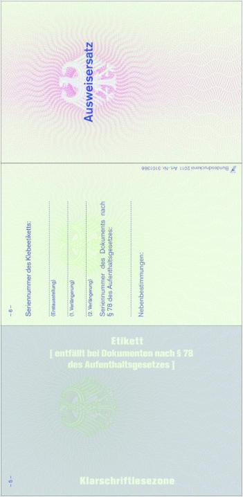

Auf Seite 5 ist eines der in den Anlagen D2a, D13b und D14
wiedergegebenen Klebeetiketten aufzukleben (entfällt bei Dokumenten
nach § 78 des Aufenthaltsgesetzes). Es dürfen bis zu zwei
Verlängerungen mit demselben Trägervordruck vorgenommen werden.
Jeweils ist die Seriennummer des Klebeetiketts oder die Seriennummer
des Dokuments nach § 78 des Aufenthaltsgesetzes auf Seite 6
einzutragen. Jede dieser Eintragungen ist mit einem Dienstsiegel zu
bestätigen.

## - Rückseite -

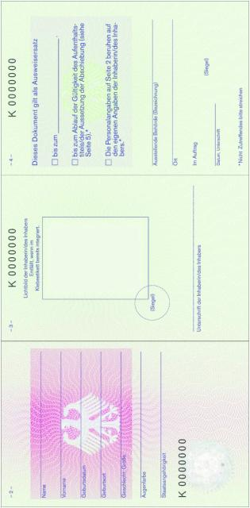

### Anlage D2a Bescheinigung über die Aussetzung der Abschiebung (Duldung) nach § 60a Abs. 4 Aufenthaltsgesetz

(Inhalt: nicht darstellbares Muster der Bescheinigung,
Fundstelle: BGBl. I 2004, 2972)

### Anlage D2b Bescheinigung über die Aussetzung der Abschiebung (Duldung) nach § 60a Abs. 4 Aufenthaltsgesetz

(Inhalt: nicht darstellbares Muster der Bescheinigung,
Fundstelle: BGBl. I 2004, 2973)

### Anlage D3 Fiktionsbescheinigung nach § 81 Abs. 5 Aufenthaltsgesetz

(Inhalt: nicht darstellbares Muster der Bescheinigung,
Fundstelle: BGBl. I 2004, 2975 - 2977)

### Anlage D4a (weggefallen)

-

### Anlage D4b (weggefallen)

-

### Anlage D4c Reiseausweis für Ausländer nach § 4 Abs. 1 Satz 1 Nr. 1

(Fundstelle des Originaltextes: BGBl. I 2007, 2056 - 2063)
- Deckseiten -
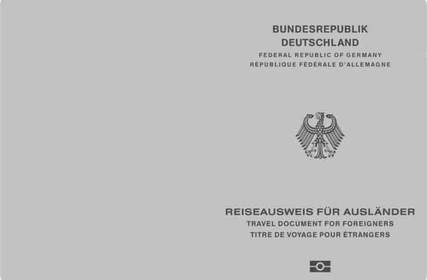
– Vorsatz und Passkartenrückseite –
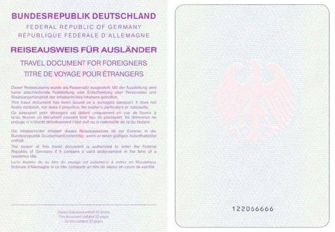
– Passkartenvorderseite und Innenseite 1 –
Die Seiten 1 bis 32 werden am unteren Rand mit der Seriennummer
versehen.

– Innenseiten 2 und 3 –

– Innenseiten 4 und 5 –

– Innenseiten 6 bis 11 –
Seiten 6 bis 11 gleichlautend.

– Innenseiten 12 bis 31 –
Seiten 12 bis 31 gleichlautend.

– Innenseite 32 und Vorsatz –
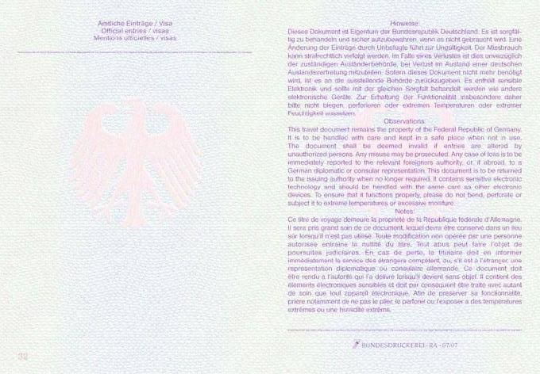

### Anlage D4d Vorläufiger Reiseausweis für Ausländer nach § 4 Abs. 1 Satz 2

(Fundstelle des Originaltextes: Fundstelle BGBl. I 2007, 2064 - 2072)
- Deckseiten -
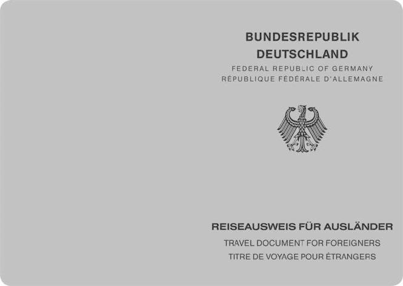
– Vorsatz und Innenseite 1 –
Die Seiten 1 bis 32 und die hintere Passdecke
werden am unteren Rand mit der Dokumentennummer versehen.

– Innenseiten 2 und 3 –

– Innenseiten 4 und 5 –

– Innenseiten 6 bis 11 –
Seiten 6 bis 11 gleichlautend.

– Innenseiten 12 bis 31 –
Seiten 12 bis 31 gleichlautend.

– Innenseite 32 und Vorsatz –
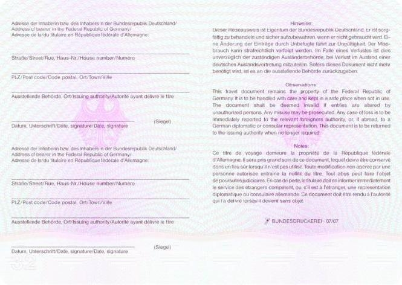
– Aufkleber für die Personendaten,
der auf den Seiten 2 und 3 des vorläufigen Reiseausweises aufgeklebt
wird –
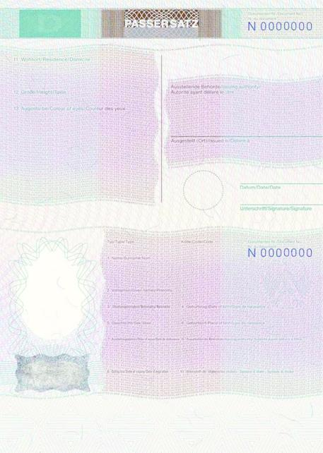
– Verlängerungsaufkleber, der auf unbenutzten Doppelseiten,
vorzugsweise den Seiten 6 bis 11, aufzukleben ist;
Überklebungen sind nicht zulässig –
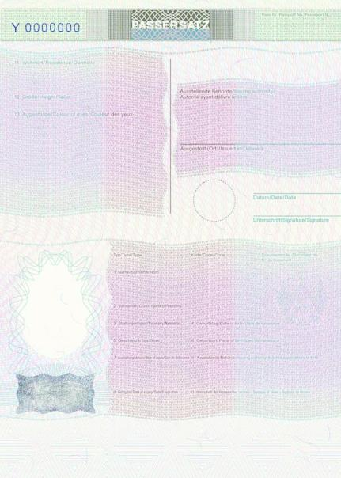

### Anlage D5 (weggefallen)

-

### Anlage D5a Grenzgängerkarte § 12

(Fundstelle des Originaltextes: Fundstelle BGBl I 2007, 2073 - 2074)
- Vorderseite -

– Rückseite –
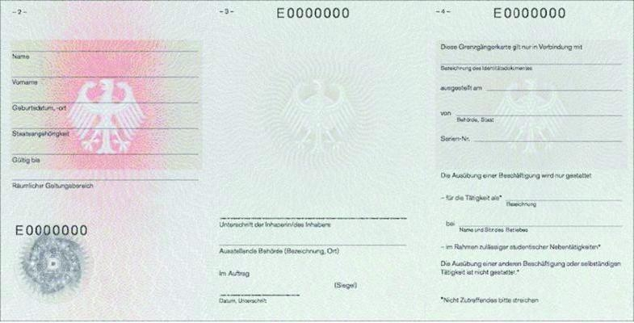

### Anlage D6 Notreiseausweis nach § 4 Abs. 1 Nr. 2

( Inhalt: nicht darstellbares Notreiseausweisemuster,
Fundstelle: BGBl. I 2004, 2996 - 2998,
bzgl. der einzelnen Änderungen vgl. Fußnote )

### Anlage D7 (weggefallen)

-

### Anlage D7a Reiseausweis für Flüchtlinge nach § 4 Abs. 1 Satz 1 Nr. 3

(Fundstelle des Originaltextes: Fundstelle BGBl. I 2007, 2075 - 2082)
- Deckseiten -

– Vorsatz und Passkartenrückseite –
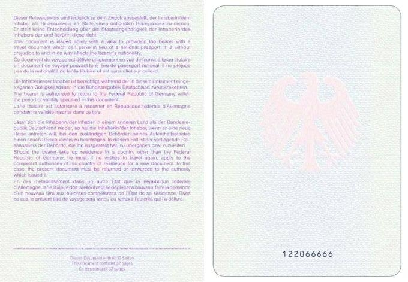
– Passkartenvorderseite und Innenseite 1 –
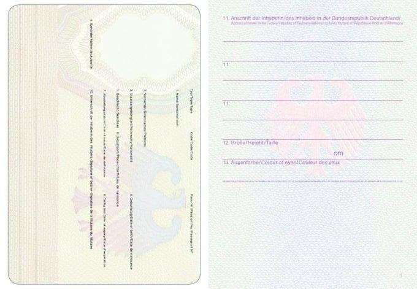Die Seiten 1 bis 32 werden am unteren Rand mit der Seriennummer
versehen.

– Innenseiten 2 und 3 –

– Innenseiten 4 und 5 –

– Innenseiten 6 bis 11 –
Seiten 6 bis 11 gleichlautend.

- Innenseiten 12 bis 31 –
Seiten 12 bis 31 gleichlautend.

– Innenseite 32 und Vorsatz –

### Anlage D7b Vorläufiger Reiseausweis für Flüchtlinge nach § 4 Abs. 1 Satz 2

(Fundstelle des Originaltextes: Fundstelle BGBl. I 2007, 2083 - 2091)
- Deckseiten -

– Vorsatz und Innenseite 1 –
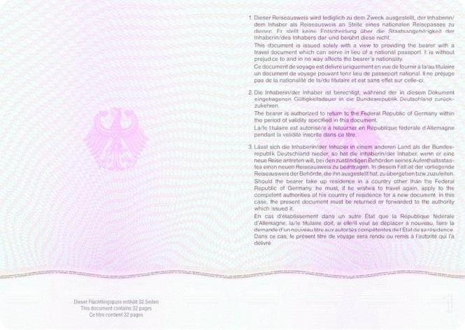Die Seiten 1 bis 32 und die hintere Passdecke
werden am unteren Rand mit der Dokumentennummer versehen.

– Innenseiten 2 und 3 –

– Innenseiten 4 und 5 –
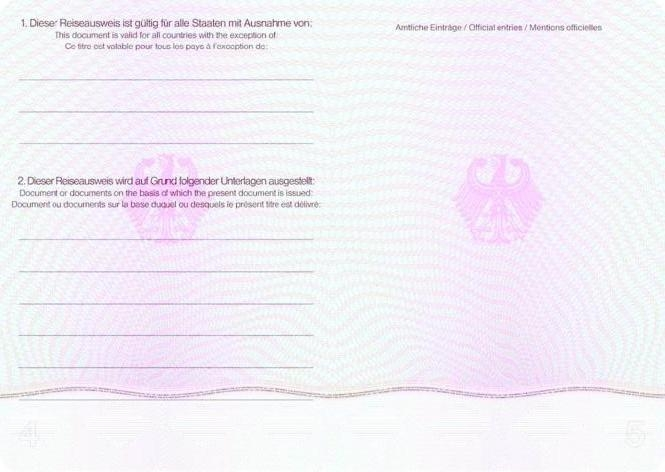
– Innenseiten 6 bis 11 –
Seiten 6 bis 11 gleichlautend.

– Innenseiten 12 bis 31 –
Seiten 12 bis 31 gleichlautend.

– Innenseite 32 und Vorsatz –
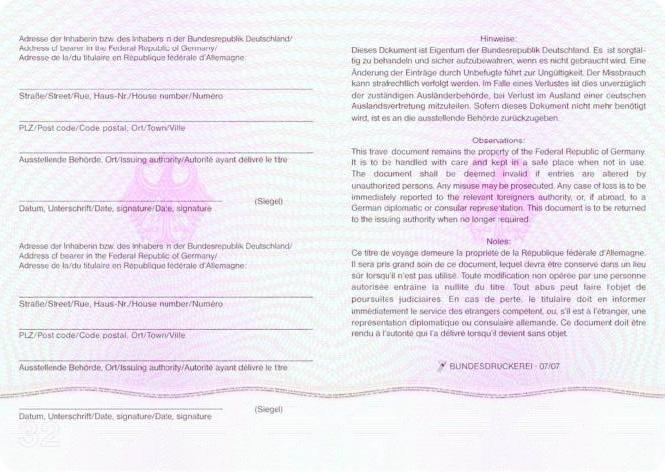
– Aufkleber für die Personendaten,
der auf den Seiten 2 und 3 des Reiseausweises aufgeklebt wird –
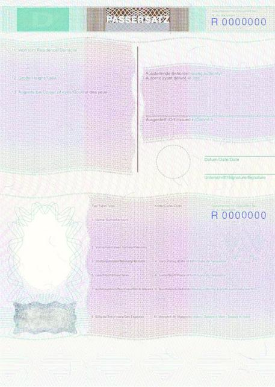
– Verlängerungsaufkleber, der auf unbenutzten Doppelseiten,
vorzugsweise den Seiten 6 bis 11, aufzukleben ist;
Überklebungen sind nicht zulässig –

### Anlage D8 (weggefallen)

-

### Anlage D8a Reiseausweis für Staatenlose nach § 4 Abs. 1 Satz 1 Nr. 4

(Fundstelle des Originaltextes: Fundstelle BGBl. I 2007, 2092 - 2099)
- Deckseiten -

– Vorsatz und Passkartenrückseite –
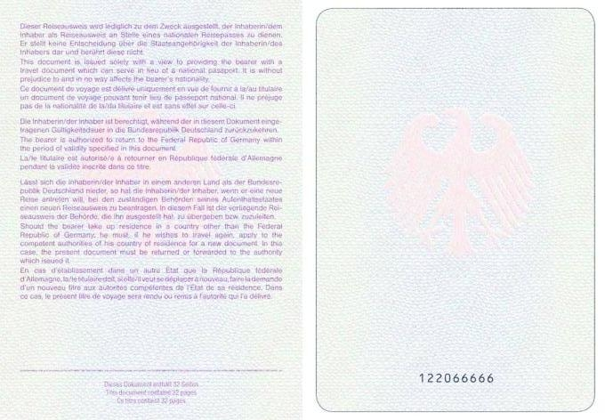
– Passkartenvorderseite und Innenseite 1 –
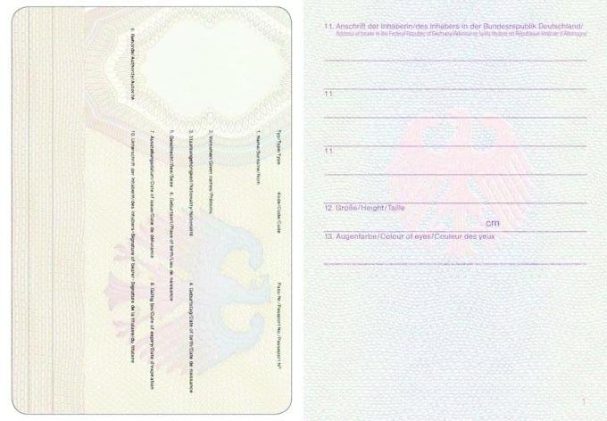Die Seiten 1 bis 32 werden am unteren Rand mit der Seriennummer
versehen.

– Innenseiten 2 und 3 –

– Innenseiten 4 und 5 –

– Innenseiten 6 bis 11 –
Seiten 6 bis 11 gleichlautend.

– Innenseiten 12 bis 31 –
Seiten 12 bis 31 gleichlautend.

– Innenseite 32 und Vorsatz –
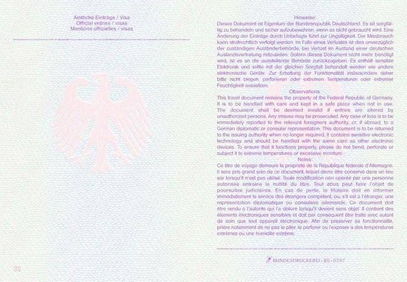

### Anlage D8b Vorläufiger Reiseausweis für Staatenlose nach § 4 Abs. 1 Satz 2

(Fundstelle des Originaltextes: Fundstelle BGBl. I 2007, 2100 - 2108)
- Deckseiten -

– Vorsatz und Innenseite 1 –
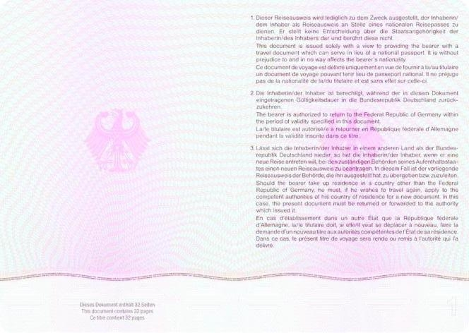Die Seiten 1 bis 32 und die hintere Passdecke
werden am unteren Rand mit der Dokumentennummer versehen.

– Innenseiten 2 und 3 –

– Innenseiten 4 und 5 –

– Innenseiten 6 bis 11 –
Seiten 6 bis 11 gleichlautend.

– Innenseiten 12 bis 31 –
Seiten 12 bis 31 gleichlautend.

– Innenseite 32 und Vorsatz –
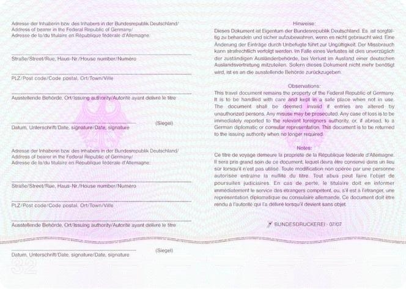
– Aufkleber für die Personendaten,
der auf den Seiten 2 und 3 des Reiseausweises aufgeklebt wird –
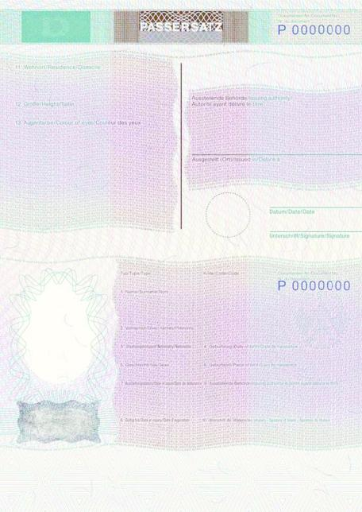
– Verlängerungsaufkleber, der auf unbenutzten Doppelseiten,
vorzugsweise den Seiten 6 bis 11, aufzukleben ist;
Überklebungen sind nicht zulässig –
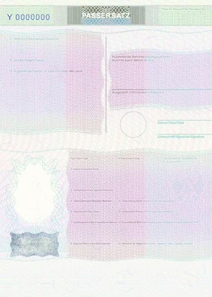

### Anlage D9 Bescheinigung über die Wohnsitzverlegung nach § 4 Abs. 1 Nr. 6

( Inhalt: nicht darstellbares Muster der Bescheinigung,
Fundstelle: BGBl. I 2004, 3019 - 3020;
bzgl. der einzelnen Änderungen vgl. Fußnote )

### Anlage D10 Standardreisedokument für die Rückführung nach § 4 Abs. 1 Nr. 7

( Inhalt: nicht darstellbares Standardreisedokumentmuster,
Fundstelle: BGBl. I 2004, 3021;
bzgl. der einzelnen Änderungen vgl. Fußnote )

### Anlage D11 Zusatzblatt zum Aufenthaltstitel und zur Bescheinigung über die Aussetzung der Abschiebung

(Inhalt: nicht darstellbares Muster,
Fundstelle: BGBl. I 2004, 3022)

### Anlage D11a Zusatzblatt zum Aufenthaltstitel mit elektronischem Speicher- und Verarbeitungsmedium nach § 78 Absatz 1 des Aufenthaltsgesetzes

(Fundstelle: BGBl. I 2011, 1538 - 1539)

## - Vorderseite -

## - Rückseite -

### Anlage D12 Bescheinigung über die Aufenthaltsgestattung (§ 63 des Asylverfahrensgesetzes)

(Inhalt: nicht darstellbares Muster der Bescheinigung,
Fundstelle: BGBl. I 2004, 3023 - 3025)

### Anlage D13a Visum (§ 4 Abs. 1 Nr. 1 Aufenthaltsgesetz)

(Inhalt: nicht darstellbares Visummuster,
Fundstelle: BGBl. I 2004, 3026)

### Anlage D13b Verlängerung des Visums im Inland

(Inhalt: nicht darstellbares Muster,
Fundstelle: BGBl. I 2004, 3027)

### Anlage D14 Aufenthaltstitel nach § 4 Abs. 1 Nr. 2 bis 4 Aufenthaltsgesetz

( Inhalt: nicht darstellbares Muster,
Fundstelle: BGBl. I 2004, 3028;
bzgl. der einzelnen Änderungen vgl. Fußnote )

### Anlage D14a Dokumente mit elektronischem Speicher- und Verarbeitungsmedium nach § 78 Absatz 1 des Aufenthaltsgesetzes

(Fundstelle: BGBl. I 2011, 1540 - 1547)

## - Vorderseite -

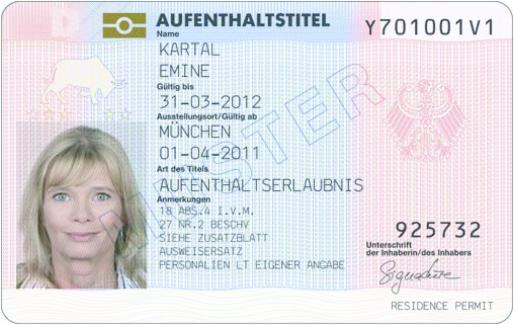
## - Rückseite -

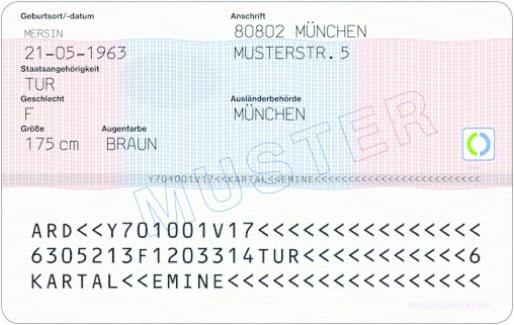
## - Vorderseite -

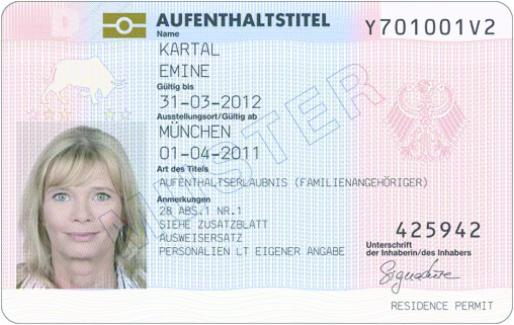
## - Rückseite -

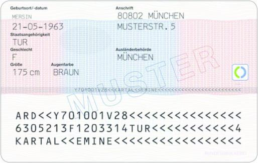
## - Vorderseite -

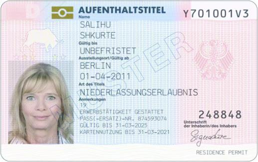
## - Rückseite -

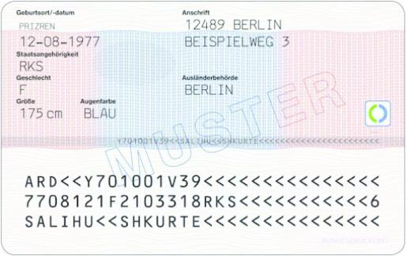
## - Vorderseite -

## - Rückseite -

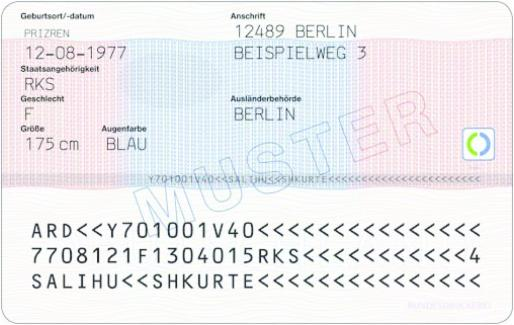
## - Vorderseite -

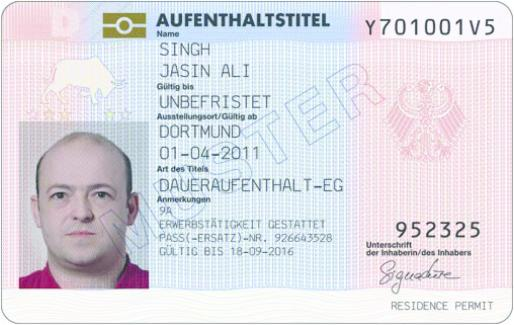
## - Rückseite -

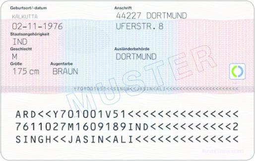
## - Vorderseite -

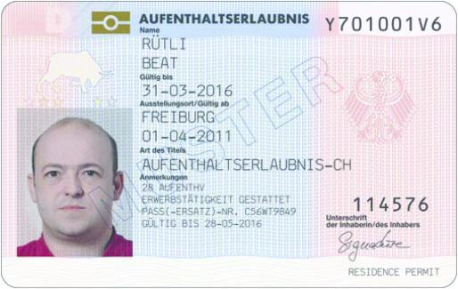
## - Rückseite -

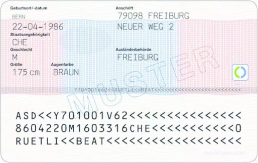
## - Vorderseite -

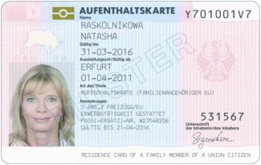
## - Rückseite -

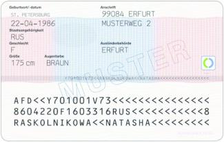
## - Vorderseite -

## - Rückseite -

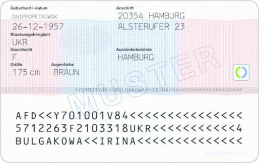

Aufenthaltskarte (§ 5 Abs. 2 des Freizügigkeitsgesetzes/EU) und
Aufenthaltserlaubnis,
die Ausländern ausgestellt wird, die auf Grund des Abkommens vom 21.
Juni 1999
zwischen der Europäischen Gemeinschaft und ihren Mitgliedstaaten
einerseits und der

### Anlage D15 Schweizerischen Eidgenossenschaft andererseits über die Freizügigkeit ein Aufenthaltsrecht besitzen

(Fundstelle des Originaltextes: Fundstelle BGBl. I 2007, 2110 - 2111)
- Vorderseite -
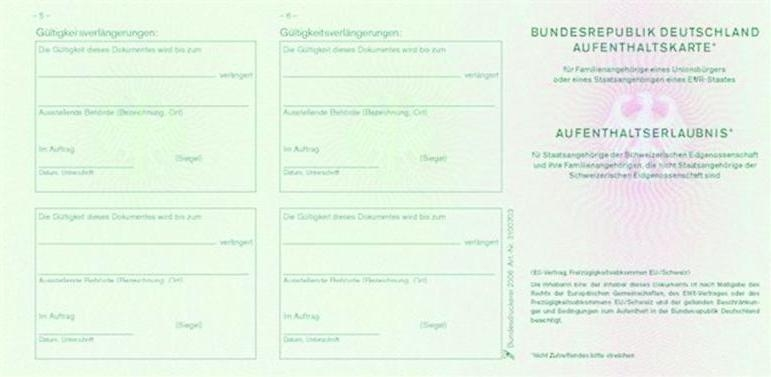
– Rückseite –
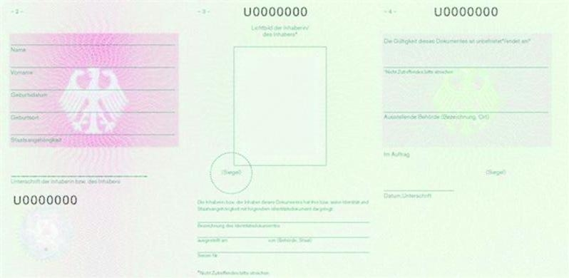
Bescheinigung des Daueraufenthalts und Daueraufenthaltskarte

### Anlage D16 (§ 5 Abs. 6 des Freizügigkeitsgesetzes/EU)

(Fundstelle des Originaltextes: Fundstelle BGBl. I 2007, 2112 - 2113)
- Vorderseite -

– Rückseite –

### Anlage D17 Aufkleber zur Anschriftenänderung (§ 78 Absatz 7 Satz 2 des Aufenthaltsgesetzes)

(Fundstelle: BGBl. I 2011, 1548)

