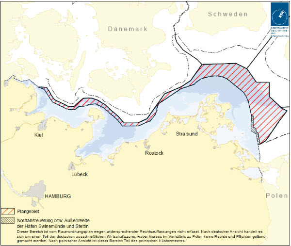
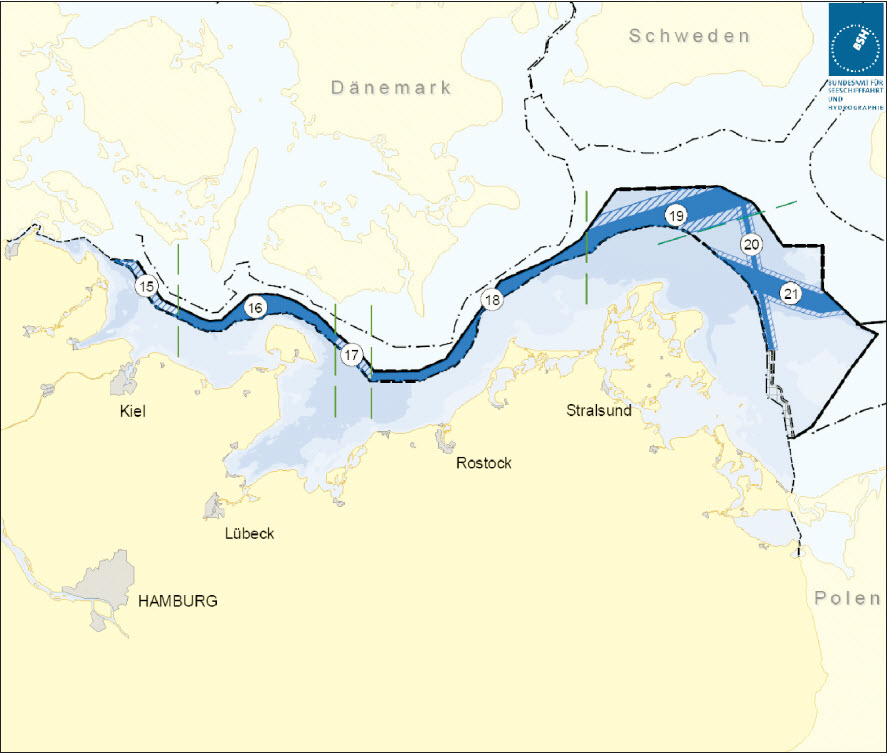
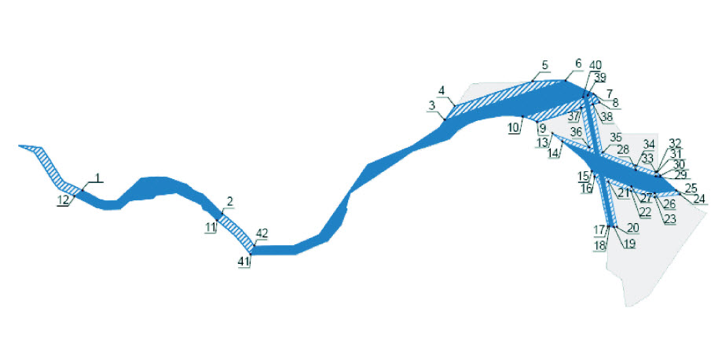
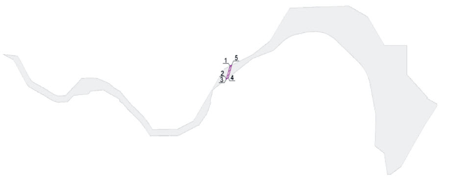
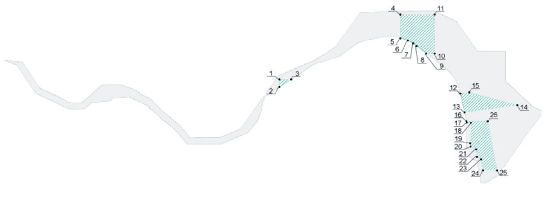
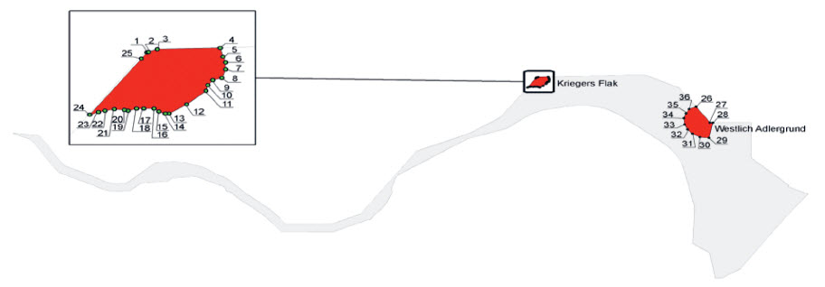

# Verordnung über die Raumordnung in der deutschen ausschließlichen Wirtschaftszone in der Ostsee (AWZ Ostsee-ROV)

Ausfertigungsdatum
:   2009-12-10

Fundstelle
:   BGBl I: 2009, 3861

## Eingangsformel

Auf Grund des § 18a Absatz 1 des Raumordnungsgesetzes vom 18. August
1997 (BGBl. I S. 2081, 2102), der durch Artikel 10 Nummer 2 des
Gesetzes vom 9. Dezember 2006 (BGBl. I S. 2833) geändert worden ist,
in Verbindung mit § 29 Absatz 1 des Raumordnungsgesetzes vom 22.
Dezember 2008 (BGBl. I S. 2986) verordnet das Bundesministerium für
Verkehr, Bau und Stadtentwicklung:

## § 1 Raumplanung in der deutschen ausschließlichen Wirtschaftszone in der Ostsee

[^F772779_01_BJNR386100009BJNE000200000]
Für die ausschließliche Wirtschaftszone der Bundesrepublik Deutschland
in der Ostsee werden Ziele und Grundsätze der Raumordnung hinsichtlich
der wirtschaftlichen und wissenschaftlichen Nutzung, hinsichtlich der
Gewährleistung der Sicherheit und Leichtigkeit der Seeschifffahrt
sowie zum Schutz der Meeresumwelt gemäß der Anlage zu dieser
Verordnung als Raumordnungsplan, bestehend aus einem Textteil und
einem Kartenteil, festgelegt.
[^F772779_02_BJNR386100009BJNE000200000]

    Die Anlage „Raumordnungsplan für die deutsche ausschließliche
    Wirtschaftszone in der Ostsee (Textteil und Kartenteil)“ wird als
    Anlageband zu dieser Ausgabe des Bundesgesetzblatts ausgegeben.
    Abonnenten des Bundesgesetzblatts Teil I wird der Anlageband auf
    Anforderung gemäß den Bezugsbedingungen des Verlags übersandt.
    Außerhalb des Abonnements erfolgt die Lieferung gegen
    Kostenerstattung.
[^F772779_01_BJNR386100009BJNE000200000]:     Der Raumordnungsplan mit der Begründung (vgl. Artikel 9 Absatz 1
    Nummer a der Richtlinie 2001/42/EG des Europäischen Parlaments und des
    Rates vom 27. Juni 2001 über die Prüfung der Umweltauswirkungen
    bestimmter Pläne und Programme (ABl. L 197 vom 21.7.2001, S. 30) (SUP-
    Richtlinie)), die zusammenfassende Umwelterklärung (vgl. Artikel 9
    Absatz 1 Nummer b der SUP-Richtlinie) und die Darstellung der
    Überwachungsmaßnahmen (vgl. Artikel 9 Absatz 1 Nummer c der SUP-
    Richtlinie) werden ab dem Zeitpunkt der Verkündung dieser
    Rechtsverordnung in den Diensträumen des Bundesamts für Seeschifffahrt
    und Hydrographie, Bernhard-Nocht-Straße 78, 20359 Hamburg, und
    Neptunallee 5, 18057 Rostock, zu jedermanns Einsicht bereitgehalten
    (vgl. auch § 19 Absatz 2 in Verbindung mit § 11 Absatz 2 des
    Raumordnungsgesetzes vom 22. Dezember 2008 (BGBl. I S. 2986)). Die
    zusammenfassende Umwelterklärung und die Darstellung der
    Überwachungsmaßnahmen sind zugleich als Kapitel 5 im Textteil des
    Raumordnungsplans abgedruckt.
[^F772779_02_BJNR386100009BJNE000200000]: 

## § 2 Inkrafttreten

Diese Verordnung tritt am Tag nach der Verkündung in Kraft.

(zu § 1)
Raumordnungsplan für die deutsche ausschließliche Wirtschaftszone in
der Ostsee

## Anlage (Textteil und Kartenteil)

(Fundstelle: Anlageband zum BGBl. I 2009, Nr. 78, S. 3861 vom 18.
Dezember 2009, S. 1 - 31, gesonderte Karte)

Raumordnungsplan
für die deutsche ausschließliche
Wirtschaftszone in der Ostsee
## **-Textteil-**

*    *        

   ## Inhaltsverzeichnis ****

**1.** **Einleitung**

**2.** **Leitlinien zur räumlichen Entwicklung der AWZ**

    2.1 Sicherung und Stärkung des Schiffsverkehrs

    2.2 Stärkung der Wirtschaftskraft durch geordnete Raumentwicklung und
        Optimierung der Flächennutzung

    2.3 Förderung der Offshore-Windenergienutzung entsprechend der
        Nachhaltigkeitsstrategie der Bundesregierung

    2.4 Langfristige Sicherung und Nutzung der besonderen Eigenschaften und
        Potenziale der AWZ durch Reversibilität von Nutzungen, sparsame
        Flächeninanspruchnahme sowie Priorität für meeresspezifische Nutzungen

    2.5 Sicherung der natürlichen Lebensgrundlagen durch die Vermeidung von
        Störungen und Verschmutzungen der Meeresumwelt

**3.** **Festlegungen des Raumordnungsplans**

    3.1 Schifffahrt

        3.1.1 Ziele und Grundsätze

        3.1.2 Begründung

    3.2 Rohstoffgewinnung

        3.2.1 Ziele und Grundsätze

        3.2.2 Begründung

    3.3 Rohrleitungen und Seekabel

        3.3.1 Ziele und Grundsätze

        3.3.2 Begründung

    3.4 Wissenschaftliche Meeresforschung

        3.4.1 Grundsätze

        3.4.2 Begründung

    3.5 Energiegewinnung, insbesondere Windenergie

        3.5.1 Ziele und Grundsätze

        3.5.2 Begründung

    3.6 Fischerei und Marikultur

        3.6.1 Grundsätze

        3.6.2 Begründung

    3.7 Meeresumwelt

        3.7.1 Grundsätze

        3.7.2 Begründung

**4.** **Berücksichtigung sonstiger Belange**

    4.1 Militärische Nutzung

    4.2 Freizeit und Tourismus

    4.3 Fehmarnbeltquerung

    4.4 Munitionsversenkungsgebiete und Sedimenteinbringung

**5.** **Zusammenfassende Umwelterklärung sowie Darstellung der Maßnahmen zur
    Überwachung der erheblichen Umweltauswirkungen**

    5.1 Zusammenfassende Umwelterklärung nach § 7 Absatz 8 Satz 2 ROG 1998

    5.2 Überwachungsmaßnahmen nach § 7 Absatz 8 Satz 3 ROG 1998

**6.** **Koordinatenübersicht und transnationale Leitungen**

    6.1 Koordinatenübersicht

        6.1.1 Schifffahrt

        6.1.2 Rohrleitungen

        6.1.3 Forschung

        6.1.4 Windenergie

    6.2 Transnationale Leitungen im Ostseeraum

**1.** Einleitung ****

Um die zunehmenden Nutzungskonflikte auf dem Meer insbesondere
zwischen der sich entwickelnden flächenintensiven Offshore-
Windenergienutzung und dem Meeresumweltschutz sowie den herkömmlichen
Nutzungen wie der Schifffahrt und der Fischerei koordinierten Lösungen
zuzuführen, bedarf die Entwicklung der deutschen ausschließlichen
Wirtschaftszone (AWZ) einer im Sinne der Nachhaltigkeit integrativen
Betrachtungsweise. Der als Rechtsverordnung aufgestellte
Raumordnungsplan legt gemäß § 18a des Raumordnungsgesetzes, der mit
Gesetz vom 24. Juni 2004 in das Raumordnungsgesetz eingefügt wurde, in
der AWZ der Ostsee erstmalig Ziele und Grundsätze der Raumordnung
hinsichtlich der wirtschaftlichen und wissenschaftlichen Nutzung,
hinsichtlich der Gewährleistung der Sicherheit und Leichtigkeit der
Seeschifffahrt sowie zum Schutz der Meeresumwelt fest.

Hinweis: Ermächtigungsgrundlage ist § 18a des Raumordnungsgesetzes vom
18\. August 1997 (BGBl. I S. 2081, 2102), der durch Artikel 10 Nummer 2
des Gesetzes vom 9. Dezember 2006 (BGBl. I S. 2833) geändert worden
ist – im Folgenden: ROG 1998. Nach § 29 Absatz 1 Satz 1 ROG vom 22.
Dezember 2008 (BGBl. I S. 2986) – im Folgenden: ROG – findet bei
Verfahren zur Aufstellung von Raumordnungsplänen, die vor dem 31.
Dezember 2008 förmlich eingeleitet wurden, der § 18a ROG 1998 weiter
Anwendung. Dies ist bei vorliegender Rechtsverordnung der Fall, da das
Verfahren spätestens mit der ersten Offenlage des Planentwurfs im
Rahmen der Öffentlichkeits- und Behördenbeteiligung im Juni 2008
förmlich eingeleitet wurde. Im Raumordnungsplan werden die
Vorschriften des neuen ROG zur besseren Nachvollziehbarkeit
informatorisch jeweils als Klammerzusatz mit angegeben.

Im Raumordnungsplan werden Leitlinien zur räumlichen Entwicklung
formuliert (Kapitel 2) und Ziele und Grundsätze, insbesondere Gebiete,
für Funktionen und Nutzungen festgelegt (Kapitel 3). Der
Raumordnungsplan trifft für die deutsche AWZ in der Ostsee
koordinierte Festlegungen für die einzelnen Nutzungen und Funktionen
Schifffahrt, Rohstoffgewinnung, Rohrleitungen und Seekabel,
wissenschaftliche Meeresforschung, Windenergiegewinnung, Fischerei und
Marikultur sowie Schutz der Meeresumwelt. Welche sonstigen Belange
berücksichtigt werden, wird in Kapitel 4 dargelegt. Kapitel 5
erläutert den Umgang mit den Ergebnissen des Umweltberichts. In
Kapitel 6 findet sich eine Koordinatenübersicht zu den Festlegungen
und Darstellungen der transnationalen Leitungen im Ostseeraum.

Die Gebietsfestlegungen für die Offshore-Windenergie dienen der
Umsetzung der „Strategie der Bundesregierung zur Windenergienutzung
auf See“ von 2002 im Rahmen der Nachhaltigkeitsstrategie, um die
Rahmenbedingungen für die Erschließung des Potenzials der Offshore-
Windenergie zu schaffen. Ebenso formuliert das Integrierte Energie-
und Klimaprogramm (IEKP) der Bundesregierung vom Dezember 2007 das
Ziel, den Anteil erneuerbarer Energien an der Stromerzeugung zu
erhöhen.

Mit dem Raumordnungsplan wird auch ein Beitrag zur Umsetzung der
Nationalen Strategie für die nachhaltige Nutzung und den Schutz der
Meere (Nationale Meeresstrategie) vom 1. Oktober 2008 geleistet, mit
der die Bundesregierung eine nachhaltige Entwicklung und einen
besseren Ausgleich von Nutzungs- und Schutzinteressen erreichen
möchte, und die die Raumordnung im Küsten- und Meeresbereich als
wichtiges Instrument zur koordinierten Lösung der zunehmenden
Konflikte benennt.

Bei der Aufstellung dieses Raumordnungsplans ist gemäß § 7 Absatz 5
ROG 1998 (vgl. § 9 ROG) begleitend bzw. integriert eine Umweltprüfung
des Plans (sogenannte „strategische Umweltprüfung“) nach den Vorgaben
der Richtlinie 2001/42/EG des Europäischen Parlaments und des Rates
vom 27. Juni 2001 über die Prüfung der Umweltauswirkungen bestimmter
Pläne und Programme (ABl. L 197 vom 21.7.2001, S. 30) (SUP-Richtlinie)
durchgeführt worden. Ziel der SUP-Richtlinie ist es laut Artikel 1,
„im Hinblick auf die Förderung einer nachhaltigen Entwicklung ein
hohes Umweltschutzniveau sicherzustellen und dazu beizutragen, dass
Umwelterwägungen bei der Ausarbeitung und Annahme von Plänen und
Programmen einbezogen werden, indem dafür gesorgt wird, dass bestimmte
Pläne und Programme, die voraussichtlich erhebliche Umweltauswirkungen
haben, entsprechend dieser Richtlinie einer Umweltprüfung unterzogen
werden.“ Die Festlegungen des Raumordnungsplans (siehe Kapitel 3) sind
unter Berücksichtigung der Ergebnisse der Strategischen Umweltprüfung
getroffen worden (siehe dazu Kapitel 5).

Die landesplanerischen Festlegungen der Küstenländer Mecklenburg-
Vorpommern und Schleswig-Holstein für das Küstenmeer sind
berücksichtigt worden. Das Landesraumentwicklungsprogramm Mecklenburg-
Vorpommern vom Mai 2005 trifft Festlegungen zu Windenergieanlagen,
Naturschutz, Leitungsführung sowie Rohstoffsicherung im Küstenmeer.
Die Aussagen des Raumordungsberichtes Küste und Meer des Landes
Schleswig-Holstein aus dem Februar 2006 wurden ebenfalls
berücksichtigt. Zurzeit befindet sich der Landesentwicklungsplan
Schleswig-Holstein 2009 in der Neuaufstellung, welcher Aussagen zum
schleswig-holsteinischen Küstenmeer trifft.

Der in der kartographischen Darstellung der Ostsee besonders
gekennzeichnete Bereich der Nordansteuerung der Häfen Swinemünde
(Swinoujscie) und Stettin (Szczecin) sowie der Reede Nummer 3 wird vom
Raumordnungsplan wegen widersprechender Rechtsauffassungen nicht
erfasst. Nach deutscher Ansicht handelt es sich um einen Teil der
deutschen AWZ der Ostsee, wobei hieraus im Verhältnis zu Polen keine
Rechte und Pflichten geltend gemacht werden. Nach polnischer Ansicht
ist dieser Bereich Teil des polnischen Küstenmeeres.

**2.** Leitlinien zur räumlichen Entwicklung der AWZ ****

Vor dem Hintergrund der Leitvorstellung einer nachhaltigen
Raumentwicklung sowie der entsprechenden Grundsätze des
Raumordnungsgesetzes ist die räumliche Entwicklung der AWZ an den
folgenden Leitlinien auszurichten.

**2.1** Sicherung und Stärkung des Schiffsverkehrs ****

Die Bundesrepublik Deutschland ist eine der führenden Exportnationen,
wobei ein Großteil der exportierten Güter über den Seeweg
transportiert wird. Darüber hinaus stellt die maritime Wirtschaft in
Deutschland nach dem Jahresbericht 2007 des Flottenkommandos eine
bedeutende Branche mit rund 500 000 direkt und indirekt abhängig
Beschäftigten und einem Umsatz von mehr als 54 Milliarden Euro dar.
Zudem sind die Nord- und Ostsee von großer Bedeutung für den
internationalen Transitschiffsverkehr. Die Schifffahrtsstraßen vor den
deutschen Küsten – insbesondere der Ostsee – gehören bereits jetzt zu
den am stärksten befahrenen der Welt, eine weitere Zunahme wird
prognostiziert. Auch für die deutschen Seehäfen wird eine dynamische
Entwicklung vorausgesagt. So geht beispielsweise die
Seeverkehrsprognose 2025, erstellt im Auftrag des Bundesministeriums
für Verkehr, Bau und Stadtentwicklung (BMVBS), davon aus, dass sich
der Umschlag in den deutschen Seehäfen bis 2025 mehr als verdoppeln
wird. Vor diesem Hintergrund besteht ein großes nationales und
internationales Interesse, den Seeverkehr so wenig wie möglich
einzuschränken, ihm wo möglich Vorrang einzuräumen und ihn so sicher
wie möglich zu gestalten. Gleichzeitig weist das
Seerechtsübereinkommen der Vereinten Nationen vom 10. Dezember 1982
(BGBl. 1994 II S. 1798, 1799) (SeeRÜbk) der Schifffahrt eine besondere
Stellung zu, indem es deren Freiheit garantiert und
Hauptschifffahrtsrouten Priorität einräumt. Künstliche Inseln, Anlagen
und Bauwerke und die umgebenden Sicherheitszonen dürfen dort nicht
errichtet werden, wo dies die Benutzung anerkannter und für die
internationale Schifffahrt wichtiger Schifffahrtswege behindern kann
(siehe Kapitel 3.1.2).

Im Zuge der Raumordnung gilt es, dieser wirtschaftlichen Bedeutung und
der völkerrechtlichen Vorrangstellung Ausdruck zu verleihen sowie die
Wettbewerbsfähigkeit der maritimen Wirtschaft zu erhalten. So bilden
die Hauptschifffahrtsrouten, welche sich aus den
Verkehrstrennungsgebieten (VTG) sowie weiteren viel befahrenen Routen
zusammensetzen, das Grundgerüst für die Gesamtplanung. Die anderen
Nutzungen in der AWZ haben sich hieran zu orientieren. Dieses Vorgehen
trägt durch die Minimierung von Barrierewirkungen für die Schifffahrt
zu einer Erhöhung der Sicherheit und Leichtigkeit im Seeverkehr bei.

**2.2** **Stärkung der Wirtschaftskraft durch geordnete Raumentwicklung und
    Optimierung der Flächennutzung**

Durch die Einführung einer Raumordnung in der AWZ in der Ostsee ergibt
sich die Möglichkeit, ggf. konkurrierende Nutzungen in einer
Gesamtschau zu betrachten und zu koordinieren und so einen
Interessenausgleich zu schaffen. Dieses dient einer geordneten
Raumentwicklung in der AWZ.

Diese geordnete Raumentwicklung ist eine wichtige Grundlage für die
künftige wirtschaftliche Entwicklung und berücksichtigt die Bedeutung
der einheimischen Rohstoffe Sand, Kies und Kohlenwasserstoffe sowie
die der Fischerei. Die Investitionssicherheit ist umso höher, je
weiter die verschiedenen Nutzungsansprüche aufeinander abgestimmt
werden und jeder Nutzung genügend Raum zur Entwicklung gegeben wird.
Des Weiteren stellt eine Optimierung der Flächennutzung sicher, dass
die Nutzungen nur an möglichst geeigneten Standorten realisiert
werden, ohne andere Nutzungen negativ zu beeinflussen, was wiederum
die Grundlage für eine insgesamt höhere Wertschöpfung darstellt.

**2.3** **Förderung der Offshore-Windenergienutzung entsprechend der
    Nachhaltigkeitsstrategie der Bundesregierung**

Eine Grundlage des Raumordnungsplans ist die „Strategie der
Bundesregierung zur Windenergienutzung auf See“ vom Januar 2002 im
Rahmen der Nachhaltigkeitsstrategie. Darin hat sich die
Bundesregierung zum Ziel gesetzt, die Rahmenbedingungen dafür zu
schaffen, dass die Potenziale der Offshore-Windenergie möglichst
schnell erschlossen werden. Hiermit wird neben anderen Maßnahmen
angestrebt, im Bereich der Energieerzeugung die Abhängigkeit von
Importen zu verringern und die Umweltverträglichkeit – vor allem unter
Klimaschutzgesichtspunkten – weiter zu verbessern. In dieser Strategie
werden bis zum Jahr 2010 die Installation von 2 000 bis 3 000 Megawatt
(MW) Leistung und bis zum Jahr 2030 die Installation von insgesamt 20
000 bis 25 000 MW Leistung Offshore-Windenergie (Küstenmeere und AWZ
in der Nordsee und in der Ostsee insgesamt) angestrebt. Diese
Strategie soll einen wichtigen Beitrag leisten, die Ziele des
Erneuerbare-Energien-Gesetzes vom 25. Oktober 2008 (BGBl. I S. 2074)
(EEG) zu erreichen. Vor diesem Hintergrund erfolgte bis zum 31.
Dezember 2005 die Festlegung von drei besonderen Eignungsgebieten für
die Windenergie nach § 3a der Seeanlagenverordnung vom 23. Januar 1997
(BGBl. I S. 57) (SeeAnlV) (siehe Kapitel 3.5).

Vor dem Hintergrund des Integrierten Energie- und Klimaprogramms
(IEKP) der Bundesregierung vom Dezember 2007 schreibt § 1 Absatz 2 EEG
vor, dass bis zum Jahr 2020 im Interesse des Klimaschutzes der Anteil
der Erneuerbaren Energien an der Stromversorgung mindestens 30 Prozent
betragen und danach kontinuierlich erhöht werden soll. Dazu soll nach
dem IEKP die Offshore-Windenergie im Küstenmeer und in der AWZ
maßgeblich beitragen (bis zu 25 000 MW bis zum Jahr 2030).

Sowohl die Nachhaltigkeitsstrategie aus dem Jahr 2002 als auch das
IEKP aus dem Jahr 2007 sind Grundlagen des Raumordnungsplans. Bei den
besonderen Eignungsgebieten nach § 3a SeeAnlV konnte nach Einbeziehung
weiterer Belange und abschließender Abwägung auch auf Ebene der
Raumordnung eine besondere Eignung dieser Flächen für die Nutzung für
die Windenergieerzeugung festgestellt werden. Nach nochmaliger
raumordnerischer Prüfung werden diese besonderen Eignungsgebiete nach
§ 3a SeeAnlV, wie es auch § 18a Absatz 3 ROG 1998 vorsieht, nunmehr
als Ziele der Raumordnung übernommen und als Vorranggebiete
festgelegt. Dieses gibt Investoren in die Offshore-Windenergie weitere
Planungssicherheit. Darüber hinaus werden zur Förderung der Offshore-
Windenergienutzung Regelungen zur Ableitung des in der AWZ gewonnenen
Stroms getroffen (siehe Kapitel 3.3).

Der Raumordnungsplan AWZ soll damit einen wichtigen Beitrag zur
Umsetzung der Beschlüsse der Bundesregierung zur Förderung der
Windenergienutzung auf See leisten (Näheres siehe Kapitel 3.5).

Auf der Fünften Maritimen Konferenz im Dezember 2006 wurde von der
maritimen Wirtschaft und der Windbranche die Erwartung geäußert, dass
bis Ende 2011 Offshore-Windparks mit einer Leistung von ca. 1 500 MW
in Bau bzw. Betrieb gehen werden.

**2.4** **Langfristige Sicherung und Nutzung der besonderen Eigenschaften und
    Potenziale der AWZ durch Reversibilität von Nutzungen, sparsame
    Flächeninanspruchnahme sowie Priorität für meeresspezifische
    Nutzungen**

Das Meer ist ein besonderer Planungs- und Lebensraum, welcher
insbesondere durch Weite, Offenheit und Barrierefreiheit
gekennzeichnet ist. Die räumliche Planung hat dafür Sorge zu tragen,
dass die Anordnung und Gestaltung von Nutzungen der Wahrung dieser
Eigenschaften nicht entgegenstehen. Zudem ist die besondere
Dreidimensionalität des Meeres zu berücksichtigen. Meeresoberfläche,
Wassersäule, Meeresboden, Meeresuntergrund sowie der Luftraum
unterliegen ggf. unterschiedlichen Schutzanforderungen und
Nutzungsansprüchen.

Es gilt die Leitlinie, dass ortsfeste Nutzungen reversibel sein
müssen, d. h. nur vorübergehend und zeitlich begrenzt stattfinden
dürfen. Diese Vorgabe entspricht den nationalen und internationalen
Regelungen, wonach bauliche und technische Anlagen nach Aufgabe der
Nutzung zurückzubauen bzw. zu entfernen sind.

Zudem ist für die langfristige Sicherung und Nutzung der Potenziale
der AWZ ein sparsamer Umgang mit Flächen anzustreben. Dieses
entspricht auch der Leitvorstellung einer nachhaltigen
Raumentwicklung. Durch eine Konzentration der Gebietsfestlegungen auf
bestimmte Bereiche wird es ermöglicht, weite Teile des Meeres von
ortsfester Bebauung frei zu halten und Zerschneidungseffekte zu
reduzieren. Indem so der Raumbedarf reduziert wird, kann ein wichtiger
Beitrag zum Schutz und zur Bewahrung charakteristischer Naturräume
geleistet werden.

Darüber hinaus ist bei der Inanspruchnahme von Gebieten bei geeigneten
Konstellationen im Sinne einer sparsamen Flächeninanspruchnahme eine
Mehrfachnutzung des Raumes anzustreben. Bei der Mehrfachnutzung ist
sicherzustellen, dass die vorrangige Nutzung nicht beeinträchtigt
wird. In bestimmten Fällen können beispielsweise Windenergienutzung
und Öl- und Gasgewinnung an manchen Standorten konfliktfrei zeitgleich
realisiert werden. Hiermit wird auch der besonderen Charakteristik der
Dreidimensionalität des Meeres Rechnung getragen, sodass
beispielsweise verschiedene Nutzungen für Meeresgrund sowie
Meeresoberfläche geregelt werden können.

Des Weiteren darf es nicht zu einer Verlagerung der Probleme vom Land
auf das Meer kommen. Es muss vermieden werden, dass es auf dem Meer zu
einer Ansammlung von Nutzungen kommt, die auf dem Land unerwünscht
sind. Nutzungen, die auf das Meer angewiesen sind, sollen Priorität
vor anderen Nutzungen haben.

**2.5** **Sicherung der natürlichen Lebensgrundlagen durch die Vermeidung von
    Störungen und Verschmutzungen der Meeresumwelt**

Zur Sicherung der natürlichen Lebensgrundlagen in Verantwortung für
künftige Generationen sind die Erhaltung, der Schutz sowie die
Förderung natürlicher Funktionen, Systeme und Prozesse anzustreben.
Störungen und Verschmutzungen des Ökosystems Meer und der darauf
bezogenen natürlichen Funktionen, Systeme und Prozesse sind zu
vermeiden; die biologische Vielfalt ist zu fördern und zu erhalten.

Meere sind für die Lebenserhaltung unersetzlich und müssen in einem
nationalen und internationalen Kontext gesichert werden. Um diesem
Umstand gerecht zu werden, ist es Aufgabe der Raumordnung, Naturräume
zu sichern und weitere Beeinträchtigungen der Meeresumwelt zu
minimieren. Da die Auswirkungen menschlicher Eingriffe in die
natürlichen Lebenszusammenhänge auf dem Meer bisher nur unvollständig
bekannt sind, besitzt das Vorsorgeprinzip in der AWZ einen besonderen
Stellenwert, zumal die Störanfälligkeit in diesem Naturraum auf Grund
der hohen Dynamik des Meeres besonders hoch ist. Eine möglichst
schonende Nutzung des Raums ist somit anzustreben. Dies umfasst auch,
dass jede Nutzung für sich so naturverträglich wie möglich und
entsprechend dem aktuellen Stand der Technik gestaltet werden sollte.
So wird zum Schutz der Meeresumwelt im Rahmen eines quellenbezogenen
Ansatzes bei verschiedenen Nutzungen festgelegt, dass die Beschädigung
oder Zerstörung von Sandbänken, von Riffen sowie von abgrenzbaren
Bereichen mit Vorkommen schutzwürdiger Benthoslebensgemeinschaften als
besonders sensiblen Lebensräumen vermieden werden soll. Dies gilt auch
außerhalb von Natura-2000-Gebieten.

Der Schutz der Meeresumwelt beinhaltet dabei insbesondere die Tier-
und Pflanzenwelt des Meeres einschließlich ihrer Lebensstätten und
Lebensräume sowie des Vogelzuges. Die Regenerationsfähigkeit und
nachhaltige Nutzungsfähigkeit der Naturgüter sollen auf Dauer
gesichert werden. Auch die Qualität des Meerwassers, die Hydrographie
und die Sedimentverhältnisse sind dem Begriff der Meeresumwelt
zuzurechnen.

Durch den Raumordnungsplan für die AWZ in der Ostsee wird damit auch
ein Beitrag zur Umsetzung der Richtlinie 2008/56/EG des Europäischen
Parlaments und des Rates vom 17. Juni 2008 zur Schaffung eines
Ordnungsrahmens für Maßnahmen der Gemeinschaft im Bereich der
Meeresumwelt (ABl. L 164 vom 25.6.2008, S. 19) (Meeresstrategie-
Rahmenrichtlinie) geleistet, die den Rahmen vorgibt, um spätestens bis
zum Jahr 2020 einen guten Zustand der Meeresumwelt zu erreichen oder
zu erhalten. Der Raumordnungsplan trägt auch zur Umsetzung des
Ostseeaktionsplans der Helsinki-Kommission zum Schutz der Meeresumwelt
des Ostseegebietes bei, der am 15. November 2007 verabschiedet wurde.
Ziel des Ostseeaktionsplans ist die Wiederherstellung des guten
ökologischen Zustandes der Ostsee bis 2021.

**3.** Festlegungen des Raumordnungsplans ****

Vorranggebiete werden für die Nutzungen Schifffahrt sowie Windenergie
festgelegt, in denen andere Nutzungen ausgeschlossen sind, sofern sie
mit den vorrangigen Nutzungen nicht vereinbar sind. Die
Gebietsfestlegungen für die Schifffahrt tragen dem völkerrechtlichen
Grundsatz des Vorrangs dieser Nutzung Rechnung; die anerkannten und
für die internationale Schifffahrt wichtigen Schifffahrtswege bilden
das Grundgerüst für die Gesamtplanung. Vorbehaltsgebiete werden für
die Nutzungen Schifffahrt, Rohrleitungen und Forschung festgelegt,
denen bei der Abwägung mit konkurrierenden raumbedeutsamen Nutzungen
besonderes Gewicht beigemessen wird.

Ziele der Raumordnung werden textlich durch Fettdruck hervorgehoben
und zusätzlich mit (Z) gekennzeichnet.

**3.1** **Schifffahrt**

**3.1.1** **Ziele und Grundsätze**

*    *   (1)

    *   **In den in der Karte dargestellten festgelegten Vorranggebieten für
        Schifffahrt wird der Schifffahrt Vorrang vor anderen raumbedeutsamen
        Nutzungen eingeräumt. Soweit raumbedeutsame Planungen, Maßnahmen und
        Vorhaben in diesen Gebieten mit der Funktion des Vorranggebietes
        Schifffahrt nicht vereinbar sind, sind diese ausgeschlossen. (Z)**

    *   Vorranggebiete
        Schifffahrt

*    *   (2)

    *   In den in der Karte dargestellten festgelegten Vorbehaltsgebieten für
        Schifffahrt wird der Schifffahrt ein besonderes Gewicht beigemessen.
        Dies ist bei der Abwägung mit anderen raumbedeutsamen Planungen,
        Maßnahmen und Vorhaben entsprechend zu Gunsten der Schifffahrt
        einzustellen.

    *   Vorbehaltsgebiete
        Schifffahrt

*    *   (3)

    *   Die Belastungen für die Meeresumwelt durch die Schifffahrt sollen
        reduziert werden. Neben den zu beachtenden Regelungen der
        International Maritime Organization (IMO) sollen die beste
        Umweltpraxis („best environmental practice“) gemäß dem Übereinkommen
        über den Schutz der Meeresumwelt des Ostseegebietes vom 9. April 1992
        (BGBl. 1994 II S. 1355, 1397) (Helsinki-Übereinkommen) sowie der
        jeweilige Stand der Technik berücksichtigt werden.

    *   Schutz der
        Meeresumwelt

**3.1.2** **Begründung**

*    *   Rechtlicher Hintergrund

        Die rechtliche Situation der Schifffahrt ist stark von internationalen
        Regelungen geprägt. Zu nennen ist hier insbesondere das Gesetz zu dem
        Seerechtsübereinkommen der Vereinten Nationen vom 10. Dezember 1982,
        in welchem nach Artikel 58 die Freiheit der Schifffahrt garantiert
        ist. Artikel 60 Absatz 7 SeeRÜbk besagt zudem, dass künstliche Inseln,
        Anlagen und Bauwerke und die sie umgebenden Sicherheitszonen dort
        nicht errichtet werden dürfen, wo dies die Benutzung anerkannter und
        für die internationale Schifffahrt wichtiger Schifffahrtswege
        behindern kann.

        Zudem werden von der IMO international geltende Regeln und Normen
        festgelegt. Für die räumliche Planung ist hier insbesondere die
        Festlegung von Verkehrstrennungsgebieten von Bedeutung. Sie schreiben
        an potentiellen Gefahrenpunkten eine verbindliche Linienführung im
        Einrichtungsverkehr mit getrennten Fahrspuren fest.

        -   Das Seeaufgabengesetz in der Fassung der Bekanntmachung vom 26. Juli
            2002 (BGBl. I S. 2876) (SeeAufgG) sowie insbesondere die auf Grund
            dieses Gesetzes erlassenen diversen Verordnungen bilden die
            Rechtsgrundlage für Maßnahmen zur Abwehr von Gefahren für die
            Sicherheit und Leichtigkeit des Verkehrs sowie für die Verhütung der
            von der Seeschifffahrt ausgehenden Gefahren einschließlich schädlicher
            Umwelteinwirkungen.

        Das SeeAufG gilt – soweit völkerrechtlich zulässig – auch in der AWZ.

Zu (1) und (2): Die Schifffahrt hat nach dem SeeRÜbk eine besondere
Stellung in der AWZ und genießt die nach Artikel 58 SeeRÜbk
garantierte Freiheit. Dementsprechend ist Schifffahrt auch außerhalb
der für sie vorgesehenen Gebietsfestlegungen grundsätzlich überall
möglich. Durch die Gebietsfestlegungen werden keine neuen
Schifffahrtswege begründet. Dafür wäre allein die IMO zuständig.

*   Die raumordnerischen Festlegungen zur Schifffahrt dienen insbesondere
    der zusätzlichen raumordnerischen Sicherung nautischer
    Grundanforderungen im Bereich wichtiger Routen. Etwaige darüber
    hinausgehende Anforderungen (nautisch erforderliche Ausdehnung von
    Schifffahrtswegen/Manövrierraum etc.) bleiben unberührt und sind von
    den zuständigen Behörden wahrzunehmen.

*   Die Festlegungen von Vorrang- und Vorbehaltsgebieten für die
    Schifffahrt sind das Ergebnis einer umfassenden raumplanerischen
    Abwägung. Da die Festlegungen sich demnach nicht nur auf nautische
    Erwägungen stützen – welche allerdings als Hauptaspekt zugrunde lagen
    – können diese von den tatsächlichen Schifffahrtsrouten sowie den aus
    nautischer Sicht erforderlichen Navigations- bzw. Sicherheitsräumen
    abweichen.

*   Ausgangspunkte für die Festlegung eines differenzierten Systems von
    Vorrang- und Vorbehaltsgebieten für die Schifffahrt waren insbesondere
    die VTG sowie die Hauptschifffahrtsrouten, welche auf einer Auswertung
    der aktuellen Verkehrsströme basieren. Die Vorrang- und
    Vorbehaltsgebiete für die Schifffahrt wurden – wo notwendig – zum Teil
    abweichend vom gegenwärtigen Verkehr an bestehende und geplante
    bauliche Anlagen angepasst.

*   Die Breite der festgelegten Gebiete orientiert sich insbesondere an
    den Notwendigkeiten der raumordnerischen Grundsicherung eines
    Routennetzes für die Schifffahrt. Nautische Erwägungen sind hierbei
    ein wichtiger Belang. Die Vorranggebiete stellen dabei das Grundgerüst
    dar, welches von allen unvereinbaren Nutzungen, insbesondere von
    Hochbauten, frei zu halten ist. Flankierend und ergänzend werden zudem
    Vorbehaltsgebiete festgelegt, in denen den Belangen der Schifffahrt in
    der Abwägung ein besonderes Gewicht beigemessen wird, insbesondere
    gegenüber der Errichtung ortsfester Anlagen.

*   Da die Schifffahrt in der AWZ die nach Artikel 58 SeeRÜbk garantierte
    Freiheit genießt, handelt es sich bei der Festlegung von
    Vorranggebieten insbesondere im Bereich der VTG um eine zusätzliche
    raumordnerische Sicherung der Belange der Schifffahrt. Artikel 60
    Absatz 7 SeeRÜbk besagt, dass künstliche Inseln, Anlagen und Bauwerke
    und die sie umgebenden Sicherheitszonen nicht dort errichtet werden
    dürfen, wo dies die Benutzung anerkannter und für die internationale
    Schifffahrt wichtiger Schifffahrtswege behindern kann. Bei den
    Hauptschifffahrtsrouten außerhalb der VTG wird über die Festlegung von
    Vorranggebieten sichergestellt, dass diese Gebiete von für die
    Schifffahrt unverträglichen Nutzungen – insbesondere von baulichen
    Anlagen – frei gehalten werden, sodass hier die Wirkung des Artikels
    60 Absatz 7 SeeRÜbk erzielt wird. Auf die Einrichtung von
    Sicherheitszonen bis zu 500 m um Anlagen gemäß § 7 SeeAnlV zur
    Gewährleistung der Sicherheit der Schifffahrt sowie der Anlagen wird
    hingewiesen.

*   Die Sicherheit und Leichtigkeit des Schiffsverkehrs werden somit auch
    für die Zukunft planerisch gesichert, was bedeutet, dass die
    Schifffahrt alle regelmäßig befahrenen Wege möglichst störungsfrei und
    unkompliziert nutzen kann. Auf Grund der dargestellten Sonderstellung
    der Schifffahrt nach SeeRÜbk sowie der bestandsorientierten
    nachvollziehenden Abgrenzung der Gebietsfestlegungen führen die
    Festlegungen des Raumordnungsplans zu keinen neuen Beeinträchtigungen
    der militärischen Nutzung.

*   Bei der deutschen AWZ in der Ostsee handelt es sich auf Grund der
    engmaschigen räumlichen Verflechtungen flächendeckend um einen viel
    befahrenen Schifffahrtsbereich.

    -   Der westliche Bereich (Nr. 15) wird auf Grund des moderaten
        Verkehrsaufkommens in diesem Bereich komplett als Vorbehaltsgebiet
        festgelegt.

    -   Der Bereich Nr. 16 ist durch die internationalen Schifffahrtswege von
        und zum Nord-Ostsee-Kanal sowie den T- und den H-Weg mit insgesamt 50
        000 Schifffahrtsbewegungen pro Jahr gekennzeichnet. Daher erfolgt hier
        die Festlegung als Vorranggebiet.

    -   Der Bereich Nr. 17 wird analog zu Nr. 15 in seiner gesamten Ausdehnung
        als Vorbehaltsgebiet festgelegt. Die internationalen Schifffahrtswege
        verlaufen hier unmittelbar nördlich des Gebietes. Dieser schmale
        Bereich wird insbesondere von Verkehren von und nach Rostock sowie der
        Sportschifffahrt genutzt.

    -   Im Bereich der Kadetrinne (Nr. 18) wird die gesamte AWZ als
        Vorranggebiet festgelegt. Hierbei handelt es sich um einen sehr
        schmalen Teilbereich mit einem hohen Verkehrsaufkommen, sodass eine
        weitere Ausdifferenzierung nicht notwendig ist. Der an das Gebiet Nr.
        17 angrenzende Teilbereich wird insbesondere auf Grund seiner
        Bedeutung für die Verkehre von und nach Lübeck in das Vorranggebiet
        aufgenommen.

    -   Im östlichen Bereich (Nr. 19) wird ausgehend vom VTG „North of Rügen“
        entlang einer gedachten Verlängerung zum VTG „Bornholmsgat“ in der
        Breite der VTG entsprechend dem Vorgehen in der Nordsee ein
        Vorranggebiet festgelegt. Analog wird flankierend ein
        Sicherheitsabstand von 2 Seemeilen (1 Seemeile (sm) entspricht 1,852
        km) plus 500 m als Vorbehaltsgebiet festgelegt.

    -   Der Trassenabschnitt der Fährverbindung Swinemünde (Swinoujscie) –
        Ystad in der deutschen AWZ (Nr. 20) wird auf einer Breite von 1 sm als
        Vorranggebiet festgelegt, auf der Westseite verläuft ein 1 sm breites
        Vorbehaltsgebiet Schifffahrt. Auf Grund der Nähe zum Vorranggebiet
        Windenergie „Westlich Adlergrund“ ist das Vorbehaltsgebiet Schifffahrt
        östlich des Vorranggebietes 0,8 sm breit. Bei konkreten Projekten zur
        Rohstoffgewinnung dürfen in diesem Vorranggebiet für die Schifffahrt
        nur Techniken eingesetzt werden, die die Schifffahrt nicht im Sinne
        des Seevölkerrechts behindern. Keine Festlegung wird im Zuge dieser
        Trasse für den Bereich der Nordansteuerung von Swinemünde
        (Swinoujscie) getroffen, der wegen der widersprechenden
        Rechtsauffassung Polens nicht vom Raumordnungsplan erfasst wird.

    -   Im Bereich südlich des Adlergrundes (Nr. 21) wird im Hinblick auf die
        geplante Einrichtung eines VTGs zur Ordnung der hier aus mehreren
        Richtungen zusammentreffenden Verkehre in der ganzen Breite ein
        Vorranggebiet Schifffahrt festgelegt. Hier wird ebenfalls beiderseits
        ein Vorbehaltsgebiet als Sicherheitsabstand von 1 sm festgelegt.

Zu (3): Internationale Vereinbarungen zur Verhütung von
Beeinträchtigungen der Meeresumwelt, wie insbesondere das
Internationale Übereinkommen zur Verhütung der Meeresverschmutzung
durch Schiffe vom 2. November 1973 (BGBl. 1982 II S. 2, 4) in der
Fassung des Protokolls vom 17. Februar 1978 (BGBl. 1982 II S. 2, 24)
(MARPOL) und das Übereinkommen über den Schutz der Meeresumwelt des
Ostseegebietes vom 9. April 1992 (BGBl. 1994 II S. 1355, 1397)
(Helsinki-Übereinkommen) zielen darauf ab, dass von der Schifffahrt
eine möglichst geringe Beeinträchtigung der Meeresumwelt ausgeht.
Neben den verbindlichen Regelungen der IMO sollen die beste
Umweltpraxis („best environmental practice“) gemäß dem Helsinki-
Übereinkommen sowie der jeweilige Stand der Technik berücksichtigt
werden.

*    *        

   Abbildung: Nummerierung der Festlegungsbereiche für die Schifffahrt in
der Ostsee

**3.2** **Rohstoffgewinnung**

**3.2.1** **Ziele und Grundsätze**

*    *   (1)

    *   Die Aufsuchung und Gewinnung von Rohstoffen soll unter Beachtung des
        Fachrechts umfassend ermöglicht und entwickelt werden.

    *   Grundsätzliches

*    *   (2)

    *   Zur langfristigen Sicherung des zukünftigen Bedarfs sollen Kenntnisse
        über Rohstoffvorkommen – insbesondere von Kohlenwasserstoffen – von
        den zuständigen Fachbehörden systematisch und dauerhaft dokumentiert
        und ausgewertet werden.

    *   Fortlaufende
        Dokumentation

*    *   (3)

    *   **Nach Aufgabe der Nutzung sind bauliche Anlagen zur Gewinnung von
        Rohstoffen zurückzubauen. (Z)**

    *   Rückbau

*    *   (4)

    *   Eine möglichst flächensparende und konzentrierte Gewinnung von
        Rohstoffvorkommen ist anzustreben. Vorhandene Gewinnungsstellen für
        Sand und Kies sollen – soweit verträglich mit den Belangen der
        Meeresumwelt und unter Erhalt einer für die Regeneration von
        Lebensgemeinschaften erforderlichen Restsedimentschicht – so
        vollständig wie möglich abgebaut und deren Erweiterung einem
        Aufschluss neuer Lagerstätten vorgezogen werden.

    *   Konzentration
        der Gewinnung

*    *   (5)

    *   Durch das Aufsuchen und Gewinnen von Rohstoffen sollen die Sicherheit
        und Leichtigkeit des Verkehrs nicht beeinträchtigt werden.

    *   Verkehr

*    *   (6)

    *   **Bei Maßnahmen der Rohstoffgewinnung ist auf vorhandene Rohrleitungen
        und Seekabel gebührend Rücksicht zu nehmen und ein angemessener
        Abstand einzuhalten. (Z)**

    *   Rohrleitungen und
        Seekabel

*    *   (7)

    *   Für den Fall einer zeitgleichen Flächeninanspruchnahme durch das
        Aufsuchen und die Gewinnung von Rohstoffen sowie die
        Windenergienutzung ist eine bestmögliche Koordination der Belange nach
        Maßgabe der von den zuständigen Fachbehörden zu entwickelnden
        Kriterien anzustreben.

    *   Windenergie

*    *   (8)

    *   Die Belange der Fischerei sollen bei der Aufsuchung sowie der
        Gewinnung von Rohstoffen berücksichtigt werden.

    *   Fischerei

*    *   (9)

    *   Nachteilige Auswirkungen auf die Meeresumwelt, insbesondere die
        natürlichen Funktionen und die ökosystemare Bedeutung des Meeres,
        durch das Aufsuchen und Gewinnen von Rohstoffen sollen vermieden
        werden. Die beste Umweltpraxis („best environmental practice“) gemäß
        Helsinki-Übereinkommen sowie der jeweilige Stand der Technik sollen
        berücksichtigt werden.
        Die Auswirkungen der Rohstoffgewinnung auf die Meeresumwelt sollen im
        Rahmen eines vorhabenbezogenen Monitorings nach Vorgaben der
        Genehmigungsbehörde untersucht und dargelegt werden.
        Ausbreitungsvorgänge und weiträumige ökologische Wechselbeziehungen
        von Tier- und Pflanzenarten im Meer sollen bei der Wahl des Standortes
        für die Rohstoffgewinnung berücksichtigt werden. Die Beschädigung oder
        Zerstörung von Sandbänken, Riffen sowie abgrenzbaren Bereichen mit
        Vorkommen schutzwürdiger Benthoslebensgemeinschaften als besonders
        sensible Lebensräume soll bei der Rohstoffgewinnung vermieden werden.

    *   Schutz der
        Meeresumwelt

*    *   (10)

    *   Bei der Standortwahl für die Rohstoffgewinnung sollen bekannte
        Fundstellen von Kulturgütern berücksichtigt werden. Sollten bei der
        Aufsuchung oder der Gewinnung von Rohstoffen bisher nicht bekannte im
        Meeresboden befindliche Kulturgüter aufgefunden werden, sollen
        entsprechende Maßnahmen zur Sicherung des Kulturgutes getroffen
        werden.

    *   Kulturgüter

**3.2.2** **Begründung**

*    *   Rechtlicher Hintergrund

        Die Erkundung, Sicherung und bedarfsgerechte Erschließung der
        Rohstoffvorkommen in der deutschen AWZ ist von hoher Bedeutung für das
        Gemeinwohl und wichtige Grundlage für die zukünftige wirtschaftliche
        Entwicklung Deutschlands. Diesem Umstand trägt auch die
        Rohstoffsicherungsklausel des § 48 Absatz 1 Satz 2 des
        Bundesberggesetzes vom 13. August 1980 (BGBl. I S. 1310) (BBergG)
        Rechnung. Diese besagt, dass die außerbergrechtlichen Vorschriften von
        den anderen zuständigen Behörden so anzuwenden sind, dass die
        Aufsuchung und Gewinnung von Rohstoffen so wenig wie möglich
        beeinträchtigt werden. Dem stehen differenzierte Regelungen in den §§
        48 ff. BBergG gegenüber, die zugunsten der Schifffahrt, des
        Fischfangs, der Verlegung und des Betriebes von Kabeln und
        Rohrleitungen sowie der Meeresumwelt bei der Aufsuchung bzw. Zulassung
        von Betriebsplänen für einen Betrieb im Bereich des Festlandsockels zu
        beachten sind.

        Da die Nutzung schon seit langer Zeit im Meer stattfindet, gibt es im
        Bereich der Rohstoffgewinnung bereits einen relativ hohen Bestand an
        erteilten Bergbauberechtigungen. Es ist zu unterscheiden zwischen
        Erlaubnissen und Bewilligungen.

        Erlaubnisse gewähren nach § 7 BBergG insbesondere das ausschließliche
        Recht, in einem bestimmten Feld Bodenschätze aufzusuchen. Die
        Bewilligung gewährt dagegen nach § 8 BBergG insbesondere das
        ausschließliche Recht zur Gewinnung des Rohstoffes. Die Versagung der
        Erlaubnis bzw. der Bewilligung richtet sich nach § 11 bzw. § 12
        BBergG. Werden bei der Aufsuchung Rohstoffe gefunden, so darf die
        Bewilligung nach § 12 Absatz 2 BBergG nur versagt werden, wenn hierfür
        einer der in § 12 Absatz 1 BBergG aufgezählten Gründe vorliegt und die
        Tatsachen, welche die Versagung rechtfertigen, erst nach der Erteilung
        der Erlaubnis eingetreten sind. Zuständig für Bergbauberechtigungen
        sind das Landesamt für Bergbau, Energie und Geologie Clausthal-
        Zellerfeld (Nordsee sowie Ostsee im Bereich Schleswig-Holstein) bzw.
        das Bergamt Stralsund (Ostsee im Bereich Mecklenburg-Vorpommern).

        Besteht nach der Verordnung über die Umweltverträglichkeitsprüfung
        bergbaulicher Vorhaben vom 13. Juli 1990 (BGBl. I S. 1420) (UVP-V
        Bergbau) eine Pflicht zur Umweltverträglichkeitsprüfung für die
        geplante Aktivität, so ist ein Rahmenbetriebsplan aufzustellen und ein
        Planfeststellungsverfahren inkl. Umweltverträglichkeitsprüfung (UVP)
        durchzuführen (§ 52 Absatz 2a BBergG). Dieses ist beispielsweise bei
        der Errichtung und dem Betrieb von Förderplattformen sowie bei
        umfangreicherer Sand- und Kiesgewinnung (ab 10 ha) der Fall. Für alle
        Anlagen, die im Zuge der Rohstoffaufsuchung bzw. -gewinnung errichtet
        werden, besteht nach § 55 Absatz 2 BBergG eine Rückbauverpflichtung
        bei Aufgabe der Nutzung. Weitere Regelungen trifft die Bergverordnung
        für den Festlandsockel vom 21. März 1989 (BGBl. I S. 554)
        (Festlandsockel-Bergverordnung – FlsBergV).

        Über die fachgesetzlichen Regelungen hinaus besagen die Grundsätze der
        Raumordnung, dass für die vorsorgende Sicherung sowie die geordnete
        Aufsuchung und Gewinnung von standortgebundenen Rohstoffen die
        räumlichen Voraussetzungen zu schaffen sind (§ 2 Absatz 2 Nummer 9 ROG
        1998; vgl. § 2 Absatz 2 Nummer 4 ROG).

        Auf die Mitteilung der Kommission an das Europäische Parlament und den
        Rat vom 4. November 2008 „Rohstoffinitiative – Sicherung der
        Versorgung Europas mit den für Wachstum und Beschäftigung notwendigen
        Gütern“ (KOM(2008) 699) wird hingewiesen.

Zu (1): Rohstoffe wie Sand, Kies und Kohlenwasserstoffe sind ein
wertvolles Wirtschaftsgut. Ihre Gewinnung findet auf dem Meer
besondere Standortvoraussetzungen vor, die nicht mit denen an Land
vergleichbar sind. Aus raumordnerischer Sicht stehen in der AWZ für
die Aufsuchung und Gewinnung von Rohstoffen in großem Umfang Flächen
zur Verfügung. Die Aufsuchung und Gewinnung von Rohstoffen soll unter
Beachtung des Fachrechts (Bergrecht, Umwelt- und Naturschutzrecht)
umfassend ermöglicht und entwickelt werden.

Zu (2): Die Rohstoffvorkommen in der AWZ – insbesondere die von
Kohlenwasserstoffen – sind derzeit nur ansatzweise erforscht. In
weiträumigen Erlaubnisfeldern finden vielfältige
Aufsuchungsaktivitäten statt. Die hierbei gewonnenen Kenntnisse gilt
es durch die dafür zuständigen Fachbehörden systematisch und dauerhaft
zu dokumentieren und auszuwerten. Nur bei einem ausreichenden
Wissensstand kann die Raumordnung ihre volle Steuerungskraft
entfalten. Zur Sicherung von Flächen für die Rohstoffgewinnung – d. h.
insbesondere das Freihalten von Nutzungen, die einer späteren
Gewinnung entgegenstehen könnten – sind belastbare Kenntnisse über
Rohstoffvorkommen notwendig. Diese können dann ggf. die Grundlage für
eine künftige Fortschreibung des Raumordnungsplans und darüber hinaus
für eine langfristige und nachhaltige Sicherung der Rohstoffvorkommen
im Interesse künftiger Generationen sein.

Zu (3): Entsprechend der raumordnerischen Leitlinie, dass ortsfeste
Nutzungen reversibel sein müssen, d. h. nur vorübergehend und zeitlich
begrenzt stattfinden dürfen, sind bauliche Anlagen im Zusammenhang mit
der Förderung von Rohstoffen nach Aufgabe der Nutzung zurückzubauen.
Diese Festlegung steht im Einklang mit den einschlägigen
internationalen sowie nationalen Regelungen, wie Artikel 60 Absatz 3
SeeRÜbk, der IMO-Resolution zu Offshore-Installationen, § 55 Absatz 2
BBergG, § 29 FlsBergV sowie dem OSPAR-Beschluss 98/3 über die
Entsorgung außer Betrieb genommener Offshore-Anlagen (BGBl. 1999 II S.
618, 619). Demnach ist die Entsorgung durch Versenken (Einbringen) und
das vollständige oder teilweise Zurücklassen außer Betrieb genommener
Offshore-Installationen zur Aufsuchung oder Gewinnung von
Kohlenwasserstoffen grundsätzlich verboten, sodass ein von den
Festlegungen für den Rückbau von Rohrleitungen und Seekabeln bzw.
Windenergieanlagen abweichendes Ziel formuliert wird. Die Anordnung
sowie die Ausgestaltung des Rückbaus im Einzelfall obliegen der
zuständigen Fachbehörde.

Zu (4): Die Gewinnung von Rohstoffen im Meer ist in der Regel
flächenintensiver als an Land, somit ist auch das Konfliktpotenzial
mit anderen Nutzungen verhältnismäßig hoch. Zudem sind Bodenschätze
begrenzt, ortsgebunden und nicht vermehrbar. Aus diesem Grund sollte
die Gewinnung von Rohstoffen möglichst flächensparend und konzentriert
geschehen. Die Rohstoffe Sand und Kies einer Lagerstätte sollten so
vollständig wie möglich gewonnen werden, soweit dieses mit den
Belangen der Meeresumwelt und unter Erhalt einer für die Regeneration
von Lebensgemeinschaften erforderlichen Restsedimentschicht vereinbar
ist. So können unvermeidbare Beeinträchtigungen, die mit der Gewinnung
von Rohstoffen und der Erschließung neuer Lagerstätten einhergehen,
reduziert werden. Dies entspricht zudem auch der Leitvorstellung einer
sparsamen Flächeninanspruchnahme (siehe Kapitel 2.4).

Zu (5): Die Sicherheit und Leichtigkeit des Verkehrs sollen durch das
Aufsuchen und Gewinnen von Rohstoffen nicht beeinträchtigt werden.

Zu (6): Um das Risiko der Beschädigung von Rohrleitungen und Seekabeln
zu reduzieren und um die Möglichkeiten der Reparatur nicht zu
beeinträchtigen, ist bei Maßnahmen der Rohstoffgewinnung auf
vorhandene Rohrleitungen und Seekabel gebührend Rücksicht zu nehmen
und ein angemessener Abstand zu diesen einzuhalten. Die Definition
eines angemessenen Abstandes ist im Einzelfall zu klären, da er sich
nach den konkreten Bedingungen vor Ort richtet, wie z. B. nach der
Wassertiefe. Dieses Ziel wird zudem gestützt durch die Festlegung
eines Vorbehaltsgebietes für Rohrleitungen (siehe Kapitel 3.3.1).

Zu (7): Für den Fall einer zeitgleichen Flächeninanspruchnahme durch
Windenergienutzung und das Aufsuchen und die Gewinnung von Rohstoffen
soll eine bestmögliche Koordination der Belange angestrebt werden.
Maßgeblich hierfür sollen von den zuständigen Fachbehörden noch zu
entwickelnde und abzustimmende Kriterien zur verträglichen
Ausgestaltung der Nutzungen sein.

Zu (8): Bei der Fischerei handelt es sich um eine traditionelle
Meeresnutzung, für die eigenständige raumordnerische Festlegungen
jedoch derzeit nur schwer möglich sind (siehe Kapitel 3.6.2). In
Fischereien, in denen dies wegen starker Variabilität auch zukünftig
nicht möglich ist, muss somit eine Berücksichtigung der Belange im
Rahmen von Festlegungen für andere Nutzungen stattfinden. Dieses gilt
demzufolge auch bei der Gewinnung von Rohstoffen.

Zu (9): Entsprechend der Leitvorstellung zum Schutz der Meeresumwelt
sollen nachteilige Auswirkungen auf die natürlichen Funktionen und die
ökosystemare Bedeutung des Meeres durch das Aufsuchen und die
Gewinnung von Rohstoffen vermieden werden. Zur weiteren Minimierung
sollen die beste Umweltpraxis („best environmental practice“) gemäß
dem Helsinki-Übereinkommen sowie der jeweilige Stand der Technik
berücksichtigt werden.

*   Um eine möglichst umweltverträgliche Gewinnung zu gewährleisten,
    sollen die vorhabenbezogenen Auswirkungen der Rohstoffgewinnung auf
    die Meeresumwelt im Rahmen eines Monitorings nach Vorgaben der
    Genehmigungsbehörde untersucht und dargelegt werden. Das angestrebte
    Monitoring kann durch entsprechende Vorgaben in den jeweiligen
    Genehmigungsbescheiden geregelt werden und entspricht der
    Genehmigungspraxis der Fachbehörden. Die Ergebnisse des
    vorhabenbezogenen Monitorings werden in das Monitoring der
    Durchführung des Raumordnungsplans einbezogen.

*   § 2 Absatz 2 Nummer 8 ROG 1998 (vgl. § 2 Absatz 2 Nummer 6 ROG)
    verbindet den Schutz, die Pflege und die Entwicklung von Natur und
    Landschaft mit den Erfordernissen eines Biotopverbundsystems. Es ist
    noch nicht ausreichend erforscht, inwieweit die durchgängigeren und
    barrierearmen marinen Ökosysteme im gleichen Maße wie die
    terrestrischen Ökosysteme auf raumordnerisch gesicherte
    Biotopverbundsysteme angewiesen sind und wie mögliche Bausteine
    abzugrenzen sind. Vor diesem Hintergrund sind nach jetzigem
    Kenntnisstand hinsichtlich eines Biotopverbundsystems keine
    detaillierten Festlegungen möglich. Bei der Wahl des Standortes der
    Rohstoffgewinnung sollte jedoch sichergestellt werden, dass die
    Ausbreitungsvorgänge und weiträumigen ökologischen Wechselbeziehungen
    der Arten und ihrer Lebensräume berücksichtigt werden.

*   Bei den in Grundsatz 9 genannten Strukturen handelt es sich um
    Lebensräume, deren Beschädigung oder Zerstörung auch außerhalb der
    Natura-2000-Gebiete vermieden werden soll. Nach derzeitigem
    Kenntnisstand besteht die Möglichkeit, dass die genannten Strukturen
    auch außerhalb der Vorkommen in den Natura-2000-Gebieten auftreten.
    Jedoch ist zum jetzigen Zeitpunkt keine konkrete Verräumlichung
    möglich. Sollten jedoch bei näheren Untersuchungen beispielsweise im
    konkreten Verfahren zur Genehmigung der Rohstoffgewinnung die
    genannten Strukturen aufgefunden werden, ist diesen bei der
    Entscheidungsfindung ein besonderes Gewicht einzuräumen.

Zu (10): Im Meeresboden können sich Kulturgüter von archäologischem
Wert befinden, wie z. B. Bodendenkmale, auch Siedlungsreste oder
historische Schiffswracks. Eine große Anzahl solcher Schiffswracks ist
bekannt und in der Unterwasserdatenbank des Bundesamtes für
Seeschifffahrt und Hydrographie (BSH) verzeichnet. Die bei den
zuständigen Stellen vorhandenen Informationen sollen bei der
Festlegung eines Gewinnungsgebietes berücksichtigt werden. Es ist
allerdings nicht auszuschließen, dass bei der Aufsuchung und Gewinnung
von Rohstoffen bisher nicht bekannte Kulturgüter aufgefunden werden.
Um diese nicht zu beschädigen, sollen in diesem Falle in Absprache mit
der zuständigen Behörde geeignete Sicherungsmaßnahmen durchgeführt
werden.

**3.3** **Rohrleitungen und Seekabel**

**3.3.1** **Ziele und Grundsätze**

*    *
    *   Rohrleitungen

    *

*    *   (1)

    *   In dem in der Karte dargestellten festgelegten Vorbehaltsgebiet
        Rohrleitungen wird der Verlegung, dem Betrieb sowie der Instandhaltung
        von Rohrleitungen ein besonderes Gewicht beigemessen. Dies ist bei der
        Abwägung mit anderen raumbedeutsamen Planungen, Maßnahmen und Vorhaben
        entsprechend zu berücksichtigen.

    *   Vorbehaltsgebiet
        Rohrleitungen

*    *
    *   Rohrleitungen und Seekabel (inkl. Seekabel zur Ableitung der in der
        AWZ erzeugten Energie)

    *

*    *   (2)

    *   **Für die Schifffahrt festgelegte Vorranggebiete sind von Seekabeln
        zur Ableitung der in der AWZ erzeugten Energie auf kürzestem Weg zu
        kreuzen, sofern eine Parallelführung zu bestehenden Strukturen und
        baulichen Anlagen nicht möglich ist. (Z)**
        Für die Schifffahrt festgelegte Vorranggebiete sollen von
        Rohrleitungen und sonstigen Seekabeln möglichst auf kürzestem Weg
        gekreuzt werden, sofern eine Parallelführung zu bestehenden baulichen
        Anlagen nicht möglich ist. Für die Schifffahrt festgelegte
        Vorbehaltsgebiete sollen möglichst auf kürzestem Weg gekreuzt werden,
        sofern eine Parallelführung zu bestehenden baulichen Anlagen nicht
        möglich ist.

    *   Kreuzung von
        Gebieten für die
        Schifffahrt

*    *   (3)

    *   **Rohrleitungen und Seekabel sind nach Aufgabe der Nutzung
        zurückzubauen. Verursacht der Rückbau größere nachteilige
        Umweltauswirkungen als der Verbleib, ist von ihm ganz oder teilweise
        abzusehen, es sei denn, der Rückbau ist aus Gründen der Sicherheit und
        Leichtigkeit des Verkehrs erforderlich. (Z)**
        Für den Fall eines Verbleibs sollen geeignete Überwachungsmaßnahmen
        hinsichtlich möglicher künftiger Gefährdungen vorgesehen werden.

    *   Rückbau

*    *   (4)

    *   Durch das Verlegen, Betreiben, Instandhalten sowie den etwaigen
        Verbleib nach Aufgabe des Betriebes oder den Rückbau von Rohrleitungen
        und Seekabeln sollen die Sicherheit und Leichtigkeit des Verkehrs
        nicht beeinträchtigt werden. Eine Verlegung von Rohrleitungen und
        Seekabeln parallel angrenzend an die für die Schifffahrt festgelegten
        Gebiete sollte vermieden werden.

    *   Verkehr

*    *   (5)

    *   Bei der Wahl der Streckenführung von Rohrleitungen und Seekabeln soll
        Rücksicht auf bestehende Nutzungen und Nutzungsrechte,
        Schutzgebietsausweisungen sowie die Belange der Fischerei genommen
        werden. Bei der Verlegung von Seekabeln ist eine größtmögliche
        Bündelung im Sinne einer Parallelverlegung anzustreben. Zudem soll die
        Trassenführung bei Seekabeln möglichst parallel zu vorhandenen
        Strukturen und baulichen Anlagen gewählt werden. Kreuzungen von
        Seekabeln sowohl untereinander als auch mit anderen bestehenden und
        geplanten Rohrleitungen und Seekabeln sollen so weit wie möglich
        vermieden werden.
        **Auf bereits vorhandene Rohrleitungen und Seekabel ist bei der Wahl
        des Streckenverlaufs für neue Rohrleitungen und Seekabel gebührend
        Rücksicht zu nehmen und ein angemessener Abstand einzuhalten. (Z)**

    *   Rücksichtnahme
        auf ausgeübte
        Nutzungen/
        bestehende
        Nutzungsrechte

*    *   (6)

    *   Bei der Verlegung von Rohrleitungen und Seekabeln sollen zur
        Minimierung möglicher Beeinträchtigungen der Meeresumwelt bei der
        Querung sensibler Habitate die artspezifisch besonders störanfälligen
        Zeiträume vermieden werden.
        Nachteilige Auswirkungen auf die Meeresumwelt, insbesondere die
        natürlichen Funktionen und die ökosystemare Bedeutung des Meeres,
        durch das Verlegen, Betreiben, Instandhalten sowie den etwaigen
        Verbleib nach Aufgabe des Betriebes oder den Rückbau von Rohrleitungen
        und Seekabeln sollen vermieden werden. Die beste Umweltpraxis („best
        environmental practice“) gemäß dem Helsinki-Übereinkommen sowie der
        jeweilige Stand der Technik sollen berücksichtigt werden.
        Ausbreitungsvorgänge und weiträumige ökologische Wechselbeziehungen
        von Tier- und Pflanzenarten im Meer sollen bei der Wahl des
        Streckenverlaufs von Rohrleitungen und Seekabeln berücksichtigt
        werden.

        Die Beschädigung oder Zerstörung von Sandbänken, Riffen sowie
        abgrenzbaren Bereichen mit Vorkommen schutzwürdiger
        Benthoslebensgemeinschaften als besonders sensible Lebensräume soll
        bei der Verlegung und dem Betrieb von Rohrleitungen und Seekabeln
        vermieden werden.

    *   Einschränkung des
        Verlegezeitraums/Schutz
        der Meeresumwelt

*    *   (7)

    *   Bei der Trassenwahl für die Verlegung von Rohrleitungen und Seekabeln
        sollen bekannte Fundstellen für Kulturgüter berücksichtigt werden.
        Sollten bei der Planung oder Verlegung von Rohrleitungen und Seekabeln
        bisher nicht bekannte im Meeresboden befindliche Kulturgüter
        aufgefunden werden, sollen entsprechende Maßnahmen zur Sicherung des
        Kulturgutes getroffen werden.

    *   Kulturgüter

*    *
    *   Seekabel zur Ableitung der in der AWZ erzeugten Energie

    *

*    *   (8)

    *   **Die Ableitung der in der AWZ gewonnenen Energie zu geeigneten
        Übergangsstellen an der Grenze zum Küstenmeer ist sicherzustellen.
        (Z)**
        **Am Übergang zum Küstenmeer sind Seekabel zur Ableitung von in der
        AWZ erzeugter Energie durch den in der Karte gekennzeichneten
        Zielkorridor zu führen. (Z)**

        Der Zielkorridor gilt für Seekabel zur Ableitung von in der AWZ
        erzeugter Energie im Übergangsbereich zum Küstenmeer wie folgt:

        **-** **mit Streckenführung in Richtung Lubmin (Mecklenburg-Vorpommern):
            Kartenausschnitt A. (Z)**

        ****

        Ist im Bereich des Zielkorridors mit der genannten Streckenführung die
        räumliche Aufnahmekapazität erschöpft, soll der Kabelverlauf für
        zusätzlich erforderlich werdende Kabelsysteme möglichst gebündelt und
        in Abstimmung mit dem betroffenen Küstenland zu geeigneten
        Übergangsstellen an der Grenze zum Küstenmeer erfolgen.

        **Der oben genannte Zielkorridor und die Regelungen gelten
        entsprechend für etwaige anderweitige technische Lösungen, die für die
        Netzanbindung von Offshore-Windparks realisiert werden bzw. realisiert
        werden sollen. (Z)**

    *   Übergang zum
        Küstenmeer/
        Definition von Zielkorridoren

*    *   (9)

    *   Bei der Verlegung von Seekabeln zur Ableitung von in der AWZ erzeugter
        Energie ist eine größtmögliche Bündelung im Sinne einer
        Parallelführung zueinander anzustreben. Zudem soll die Trassenführung
        möglichst parallel zu bestehenden Strukturen und baulichen Anlagen
        gewählt werden. Kreuzungen von Seekabeln zur Ableitung von in der AWZ
        erzeugter Energie sowohl untereinander als auch mit anderen
        bestehenden und geplanten Rohrleitungen und Seekabeln sollen so weit
        wie möglich vermieden werden.

    *   Bündelung und
        Parallelführung der
        Kabelverläufe/Vermeidung
        von Kreuzungen

*    *   (10)

    *   Bei der Wahl der Verlegetiefe von Seekabeln zur Ableitung von in der
        AWZ erzeugter Energie Verlegetiefen sollen insbesondere die Belange
        der Schifffahrt und der Fischerei sowie des Schutzes der Meeresumwelt
        berücksichtigt werden.

    *   Verlegetiefen

*    *   (11)

    *   Zur Vermeidung bzw. Verminderung kumulativer Auswirkungen soll eine
        zeitliche Gesamtkoordination der Verlegearbeiten von Seekabeln zur
        Ableitung von in der AWZ erzeugter Energie vorgesehen werden.

    *   Zeitliche
        Koordination

*    *   (12)

    *   Zum Schutz der Meeresumwelt soll bei der Verlegung von Seekabeln zur
        Ableitung von in der AWZ erzeugter Energie ein möglichst schonendes
        Verlegeverfahren gewählt werden.

    *   Verlegeverfahren

**3.3.2** **Begründung**

*    *   Rechtlicher Hintergrund

        Die Verlegung von unterseeischen Kabeln und Rohrleitungen auf dem
        Festlandsockel genießt grundsätzlich die von Artikel 58 SeeRÜbk
        gewährte Freiheit. Nach Artikel 79 Absatz 2 SeeRÜbk darf der
        Küstenstaat das Legen oder die Unterhaltung dieser Kabel oder
        Rohrleitungen nicht behindern, vorbehaltlich seines Rechts,
        angemessene Maßnahmen zur Erforschung des Festlandsockels, zur
        Ausbeutung seiner natürlichen Ressourcen und zur Verhütung,
        Verringerung und Überwachung der Verschmutzung durch Rohrleitungen zu
        ergreifen. Die Festlegung der Trasse für das Legen solcher
        Rohrleitungen auf dem Festlandsockel bedarf der Zustimmung des
        Küstenstaates (Artikel 79 Absatz 3 SeeRÜbk). Des Weiteren darf der
        Küstenstaat nach Artikel 79 Absatz 4 SeeRÜbk Bedingungen für Kabel
        oder Rohrleitungen festlegen, die in sein Hoheitsgebiet oder sein
        Küstenmeer führen, oder er darf seine Hoheitsbefugnisse über Kabel und
        Rohrleitungen begründen, die im Zusammenhang mit der
        wissenschaftlichen oder wirtschaftlichen Nutzung des Festlandsockels
        oder der AWZ gebaut oder genutzt werden. Zudem besagt Artikel 79
        Absatz 5 SeeRÜbk, dass die Staaten beim Legen unterseeischer Kabel
        oder Rohrleitungen auf bereits vorhandene Kabel oder Rohrleitungen
        gebührend Rücksicht nehmen müssen. Insbesondere dürfen die
        Möglichkeiten für die Reparatur vorhandener Kabel oder Rohrleitungen
        nicht beeinträchtigt werden.

        Hinsichtlich des Genehmigungsverfahrens ist eine weitere
        Differenzierung der Rohrleitungen und Seekabel notwendig. Während
        Rohrleitungen sowie transnationale Seekabel nach § 133 BBergG
        genehmigt werden, handelt es sich bei Seekabeln zur Ableitung von in
        der AWZ erzeugter Energie um „Einrichtungen, die anderen
        wirtschaftlichen Zwecken dienen“, welche nach § 1 Absatz 2 Nummer 2
        SeeAnlV zu genehmigen sind. Für Rohrleitungen besteht ab einer
        bestimmten Länge und einem bestimmten Umfang nach dem Gesetz über die
        Umweltverträglichkeitsprüfung in der Fassung der Bekanntmachung vom
        25\. Juni 2005 (BGBl. I S. 1757, 2797) (UVPG) in Verbindung mit § 133
        Absatz 2a BBergG die Pflicht zur Durchführung einer UVP. Nach § 17
        Absatz 2a des Energiewirtschaftsgesetzes vom 7. Juli 2005 (BGBl. I S.
        1970, 3621) (EnWG) haben die Betreiber von Übertragungsnetzen, in
        deren Regelzone die Netzanbindung von Offshore-Anlagen erfolgen soll,
        die Leitungen von dem Umspannwerk der Offshore-Anlagen bis zu dem
        technisch und wirtschaftlich günstigsten Verknüpfungspunkt des
        nächsten Übertragungs- oder Verteilernetzes zu errichten und zu
        betreiben; die Netzanbindungen müssen zu dem Zeitpunkt der Herstellung
        der technischen Betriebsbereitschaft der Offshore-Anlagen errichtet
        sein. Ab dem Zeitpunkt der Errichtung gilt diese Leitung als Teil des
        Energieversorgungsnetzes. Diese Regelung des § 17 Absatz 2a EnWG gilt
        gemäß § 118 Absatz 3 EnWG nur für Offshore-Anlagen, mit deren
        Errichtung bis zum 31. Dezember 2015 begonnen worden ist.

Bei Rohrleitungen und Seekabeln sind unterschiedliche Festlegungen zu
treffen, da der Regelungsbedarf in Teilen verschieden ist. Dies ergibt
sich insbesondere durch den erhöhten Steuerungsbedarf für Kabel zur
Ableitung von in der AWZ erzeugter Energie. Zwar birgt jedes einzelne
Kabel für sich ein nur geringes Konfliktpotenzial, allerdings ist
durch den geplanten Ausbau der Offshore-Windenergie auch eine
entsprechende Zunahme der Anzahl der Stromkabel absehbar, welche einen
Regelungsbedarf auslöst. Weitere raumordnerische Regelungen, die das
Konfliktpotenzial sowohl untereinander als auch mit anderen Nutzungen
minimieren und zudem eine geordnete Abführung an das landseitige Netz
sicherstellen, sind demnach notwendig.

Nach der vorgenommenen Aufteilung gelten für Rohrleitungen die
Festlegungen Nr. 1 bis 7 und für Seekabel die Festlegungen Nr. 2 bis
12, wobei sich die Festlegungen Nr. 8 bis 12 auf die Seekabel zur
Ableitung der in der AWZ erzeugten Energie beschränken.

Zu (1): Entlang der beantragten Rohrleitung Baltic Gas Interconnector
(BGI) wird ein Vorbehaltsgebiet Rohrleitungen inklusive eines
beidseitigen Schutzabstandes von 500 m festgelegt. Somit wird für
diese geplante Rohrleitung sichergestellt, dass andere Nutzungen
Rücksicht auf deren spezielle Schutzerfordernisse nehmen. Dies ist
notwendig, weil der Trassenverlauf der Leitung in der dänischen AWZ
schon feststeht und die deutsche AWZ in diesem Bereich äußerst schmal
ist (ca. 6 km), so dass für den vorgesehenen Trassenverlauf nur
geringe räumliche Abweichungsmöglichkeiten bestehen. Diese Festlegung
wird – nach Realisierung von BGI – unterstützt durch die Festlegung
Nr. 5 sowie die Festlegungen bei den entsprechenden Nutzungen, dass
bei bestimmten Maßnahmen gebührende Rücksicht auf bereits vorhandene
Rohrleitungen und Seekabel zu nehmen ist.

Zu (2): Zur Minimierung des Konfliktpotenzials ist es grundsätzlich
wünschenswert, dass Vorranggebiete für Schifffahrt auf möglichst
kurzem Wege gekreuzt werden. Dies gilt wegen der Vielzahl der zu
erwartenden Kabelsysteme im besonderen Maße für die Seekabel zur
Ableitung der in der AWZ erzeugten Energie, sodass eine Kreuzung auf
kürzestem Wege als Ziel festgelegt wird, es sei denn, eine
Parallelführung zu vorhandenen Strukturen und baulichen Anlagen ist
möglich. Für sonstige Seekabel, die nicht der Ableitung der in der AWZ
erzeugten Energie dienen, ist die Festlegung als Ziel derzeit nicht
erforderlich. Durch eine Parallelführung zu vorhandenen Strukturen
kann die Flächeninanspruchnahme reduziert werden. Da beispielsweise
beiderseits einer Rohrleitung bereits ein Ankerverbot gilt, ist die
zusätzliche Einschränkung für die Schifffahrt verhältnismäßig gering.
Von dieser Zielfestlegung sind die bei Inkrafttreten des
Raumordnungsplans nach der SeeAnlV genehmigten Kabel ausgenommen, was
auch für den Fall einer etwaig erforderlichen Verlängerung dieser
Genehmigungen gilt. Wegen unterschiedlicher technischer Gegebenheiten
(u. a. Verlegeradius, Druckverhältnisse) wird für die Kreuzung von
Vorranggebieten für die Schifffahrt durch Rohrleitungen lediglich ein
Grundsatz zur möglichst kurzen Kreuzung festgelegt. Vor diesem
Hintergrund sollen auch Vorbehaltsgebiete für Schifffahrt möglichst
auf kürzestem Wege gekreuzt werden, sofern eine Parallelführung zu
bestehenden Strukturen und baulichen Anlagen nicht möglich ist. Das
festgelegte Ziel und die Grundsätze bewegen sich im Rahmen der
Vorgaben des SeeRÜbk.

Zu (3): Entsprechend der raumordnerischen Leitlinie, dass ortsfeste
Nutzungen reversibel sein sollen, d. h. möglichst nur vorübergehend
und zeitlich begrenzt stattfinden sollen, sind Rohrleitungen und
Seekabel nach Aufgabe der Nutzung zurückzubauen. Die Anordnung sowie
die Ausgestaltung des Rückbaus im Einzelfall obliegen der zuständigen
Fachbehörde. Für den Fall, dass der Rückbau größere nachteilige
Umweltauswirkungen verursacht als der Verbleib, ist vom Rückbau ganz
oder teilweise abzusehen, es sei denn, Sicherheit und Leichtigkeit des
Verkehrs erfordern den Rückbau. Der Rückbau ist auch dann
erforderlich, wenn mit der Rohrleitung oder dem Seekabel toxische
Stoffe in wirkungsrelevanter Art und Weise oder Menge in der
Meeresumwelt verbleiben würden. Bei einem Verbleib sollte zudem im
Sinne einer nachwirkenden Verpflichtung seitens des Betreibers durch
geeignete Überwachungsmaßnahmen sichergestellt werden, dass auch
künftig mit keinen Gefährdungen anderer Nutzungen durch die
verbliebenen Rohrleitungen oder Seekabel zu rechnen ist. So sollten
beispielsweise die Lage und die ausreichende Überdeckung regelmäßig
überprüft werden. Diese Festlegung steht im Einklang mit
internationalen und nationalen Regelungen wie insbesondere Artikel 79
Absatz 4 SeeRÜbk, wonach der Küstenstaat Bedingungen für Kabel oder
Rohrleitungen festlegen kann, die in sein Hoheitsgebiet oder
Küstenmeer führen.

*   Rohrleitungen und Seekabel (ohne stromabführende Kabel)

*   Ein Rückbau ist insbesondere dann vorzunehmen, wenn durch den Verbleib
    der Rohrleitung oder des Seekabels im oder auf dem Meeresboden nach
    Ende der Nutzung eine Gefährdung des Lebens oder der Gesundheit von
    Personen oder von Sachgütern oder eine Beeinträchtigung überwiegender
    öffentlicher Interessen zu besorgen ist, die nicht durch eine
    Befristung und durch Bedingungen oder Auflagen verhütet oder
    ausgeglichen werden können. Dies ergibt sich aus den Regelungen des §
    133 Absatz 2 BBergG, der auf Transit-Rohrleitungen im Sinne des § 4
    Absatz 10 BBergG Anwendung findet, d. h. auf solche Rohrleitungen, die
    vom Festlandsockel oder vom Gebiet eines anderen Staates in den
    Festlandsockel der Bundesrepublik Deutschland führen oder diesen
    durchqueren. Die zugrunde liegenden Wertungen lassen sich aber auch
    auf andere Rohrleitungen und Seekabel übertragen.

*   Eine Beeinträchtigung überwiegender öffentlicher Interessen liegt
    gemäß § 132 Absatz 2 Nummer 3 BBergG insbesondere dann vor, wenn

    a)  der Betrieb und die Wirkung von Schifffahrtsanlagen und -zeichen,

    b)  die Benutzung der Schifffahrtswege und des Luftraumes, die
        Schifffahrt, der Fischfang und die Pflanzen- und Tierwelt in
        unvertretbarer Weise,

    c)  das Legen, die Unterhaltung und der Betrieb von anderen
        Unterwasserkabeln und Rohrleitungen sowie ozeanografische oder
        sonstige wissenschaftliche Forschungen mehr als nach den Umständen
        unvermeidbar

    beeinträchtigt würden,

    d)  eine Verunreinigung des Meeres zu besorgen ist oder

    e)  die Sicherheit der Bundesrepublik Deutschland gefährdet wird.

    Stromabführende Kabel
    Für stromabführende Kabel von Offshore-Windenergieparks trifft der §
    12 SeeAnlV eine vergleichbare Regelung. Danach sind stromabführende
    Kabel von Offshore-Windenergieparks in dem Umfang zu beseitigen, wie
    sie ein Hindernis für den Verkehr darstellen oder der Schutz der
    Meeresumwelt, die Erfordernisse der Raumordnung oder sonstige
    überwiegende öffentliche Belange dies erfordern. Dabei sind gemäß § 12
    Absatz 2 SeeAnlV die allgemein anerkannten internationalen Normen zur
    Beseitigung als Mindeststandards zu berücksichtigen. Der Rückbau ist
    im jeweiligen Zulassungsverfahren durch entsprechende Regelungen (z.
    B. als Auflage) sicherzustellen.

Zu (4): Die Verlegung, der Betrieb, die Instandhaltung sowie der
etwaige Verbleib nach Aufgabe des Betriebes oder der Rückbau von
Rohrleitungen und Seekabeln sollen so durchgeführt werden, dass die
Sicherheit und Leichtigkeit des Verkehrs nicht beeinträchtigt werden.
Dies beinhaltet, dass die für die Schifffahrt festgelegten Gebiete so
wenig wie möglich tangiert werden. Eine Streckenführung parallel
angrenzend zu diesen Gebieten soll vermieden werden. Die in Festlegung
Nr. 2 genannten Regelungen dienen ebenfalls dazu, mögliche
Beeinträchtigungen der Schifffahrt durch Rohrleitungen und Seekabel zu
reduzieren.

Zu (5): Im Zuge der Konfliktminimierung sollten bei der Wahl der
Streckenführung von Rohrleitungen und Seekabeln möglichst frühzeitig
bestehende Nutzungen/Nutzungsrechte und eigentumsähnliche Rechte sowie
Schutzgebietsausweisungen (insbesondere in Natura-2000-Gebieten)
berücksichtigt werden. Eine Streckenführung außerhalb dieser Gebiete
ist anzustreben. Auch auf die Belange der Fischerei sollte frühzeitig
Rücksicht genommen werden. Hierbei handelt es sich um eine
traditionelle Meeresnutzung, für die derzeit eigenständige
raumordnerische Festlegungen jedoch nur schwer möglich sind (siehe
Kapitel 3.6.2). In Fischereien, in denen dies wegen starker
Variabilität auch zukünftig nicht möglich ist, muss somit eine
Berücksichtigung der Belange im Rahmen von Festlegungen für andere
Nutzungen stattfinden.

*   Um Auswirkungen auf andere Nutzungen und den Koordinierungsbedarf
    untereinander sowie mit anderen Nutzungen zu minimieren und möglichst
    wenig Zwangspunkte für künftige Nutzungen zu schaffen, sollen Seekabel
    möglichst gebündelt werden. Eine Bündelung im Sinne der
    Parallelführung reduziert zudem Zerschneidungseffekte. Diese können
    weiter minimiert werden, wenn eine Kabelführung parallel zu
    bestehenden Strukturen und vorhandenen baulichen Anlagen gewählt wird.
    Entsprechend dem Grundsatz der Parallelführung sollten Kreuzungen
    sowohl der Seekabel untereinander als auch mit weiteren Rohrleitungen
    und Seekabeln so weit wie möglich vermieden werden. Kreuzungsbauwerke
    weisen eine erhöhte Störanfälligkeit und damit einen erhöhten
    Wartungsaufwand auf und führen somit wiederum zu einem erhöhten
    Verkehrsaufkommen durch Wartungs-/Reparaturschiffe, welches es zu
    vermeiden gilt.

*   Um das Risiko der Beschädigung bereits vorhandener Rohrleitungen und
    Seekabel zu reduzieren und um die Möglichkeiten der Reparatur nicht zu
    beeinträchtigen, ist bei der Wahl der Streckenführung neuer
    Rohrleitungen und Seekabel auf bereits vorhandene gebührend Rücksicht
    zu nehmen und ein angemessener Abstand einzuhalten. Die Definition
    eines angemessenen Abstandes ist im Einzelfall zu klären, da er sich
    nach den konkreten Bedingungen vor Ort richtet. Dieses Ziel wird zudem
    gestützt durch die Festlegung eines Vorbehaltsgebietes für
    Rohrleitungen (Nr. 1).

Zu (6): Die Verlegung von Rohrleitungen und Seekabeln führt zu
unvermeidbaren Beeinträchtigungen verschiedener Lebensräume. Um die
negativen Auswirkungen auf sensible Lebensräume zu begrenzen, sollen
Verlegearbeiten nur in Zeiträumen stattfinden, in denen sich die
jeweiligen Populationen nicht in besonders störanfälligen Lebensphasen
befinden. Die Bestimmung entsprechender Zeiträume ist Aufgabe der
jeweiligen Fachbehörde.

*   Darüber hinaus sollen entsprechend der Leitvorstellung zum Schutz der
    Meeresumwelt nachteilige Auswirkungen auf die natürlichen Funktionen
    und die ökosystemare Bedeutung des Meeres durch die Verlegung, den
    Betrieb, die Instandhaltung sowie den etwaigen Verbleib nach Aufgabe
    des Betriebes oder durch den Rückbau von Rohrleitungen und Seekabeln
    vermieden werden. Für den Fall, dass Rohrleitungen nach Aufgabe des
    Betriebes im Meer verbleiben, sollen diese von umweltschädlichen
    Substanzen geleert werden. Zur weiteren Minimierung sollen die beste
    Umweltpraxis („best environmental practice“) gemäß dem Helsinki-
    Übereinkommen sowie der jeweilige Stand der Technik berücksichtigt
    werden.

*   § 2 Absatz 2 Nummer 8 ROG 1998 (vgl. § 2 Absatz 2 Nummer 6 ROG)
    verbindet den Schutz, die Pflege und die Entwicklung von Natur und
    Landschaft mit den Erfordernissen eines Biotopverbundsystems. Es ist
    noch nicht ausreichend erforscht, inwieweit die durchgängigeren und
    barrierearmen marinen Ökosysteme im gleichen Maße wie die
    terrestrischen Ökosysteme auf raumordnerisch gesicherte
    Biotopverbundsysteme angewiesen sind und wie mögliche Bestandteile
    abzugrenzen sind. Vor diesem Hintergrund sind nach jetzigem
    Kenntnisstand hinsichtlich eines Biotopverbundsystems zwar keine
    detaillierten Festlegungen möglich. Bei der Wahl des Streckenverlaufs
    von Rohrleitungen und Seekabeln sollte jedoch sichergestellt werden,
    dass die Ausbreitungsvorgänge und die weiträumigen ökologischen
    Wechselbeziehungen der Arten und ihrer Lebensräume berücksichtigt
    werden.

*   Bei den in diesem Grundsatz genannten Strukturen handelt es sich um
    Lebensräume, deren Beschädigung oder Zerstörung auch außerhalb der
    Natura-2000-Gebiete vermieden werden soll. Nach derzeitigem
    Kenntnisstand besteht die Möglichkeit, dass die genannten Strukturen
    auch außerhalb der Vorkommen in den Natura-2000-Gebieten auftreten.
    Jedoch ist zum jetzigen Zeitpunkt keine konkrete Verräumlichung
    möglich. Sollten jedoch bei näheren Untersuchungen beispielsweise im
    konkreten Verfahren zur Genehmigung von Rohrleitungen und Seekabeln
    die genannten Strukturen aufgefunden werden, ist diesen bei der
    Entscheidungsfindung ein besonderes Gewicht einzuräumen.

Zu (7): Im Meeresboden können sich Kulturgüter von archäologischem
Wert befinden, wie z. B. Bodendenkmale, auch Siedlungsreste oder
historische Schiffswracks. Eine große Anzahl solcher Schiffswracks ist
bekannt und in der Unterwasserdatenbank des BSH verzeichnet. Die bei
den zuständigen Stellen vorhandenen Informationen sollten bei der
Auswahl einer geeigneten Trasse für Rohrleitungen und Seekabel
berücksichtigt werden. Es ist allerdings nicht auszuschließen, dass
bei näheren Untersuchungen einer geeigneten Trasse oder bei der
Verlegung von Rohrleitungen und Seekabeln bisher nicht bekannte
Kulturgüter aufgefunden werden. Um diese nicht zu beschädigen, sollen
in diesem Falle in Absprache mit der zuständigen Behörde geeignete
Sicherungsmaßnahmen durchgeführt werden.

Zu (8): Da Kabel zur Ableitung von in der AWZ erzeugter Energie eine
Anbindung an das landseitige Stromnetz benötigen, ist es notwendig,
die Führung der Kabel zu geeigneten Übergangspunkten an der Grenze zum
Küstenmeer sicherzustellen. Dies geschieht abgestimmt mit den
Anforderungen im Küstenmeer, die sich insbesondere aus geeigneten
Einspeisepunkten in das Hoch-/Höchstspannungsnetz an Land ergeben.

*   In dem Bereich, wo es nach jetzigem Kenntnisstand möglich ist, wird im
    Übergangsbereich zum Küstenmeer zur angestrebten Bündelung von
    Seekabeln ein Zielkorridor festgelegt, durch welchen Kabel zur
    Ableitung von in der AWZ erzeugter Energie zu führen sind. Hierdurch
    sollen die Kabel an dieser Stelle so weit wie möglich konzentriert und
    zur weiteren Ableitung in Richtung landseitiges Stromnetz gebündelt
    werden. Je nach Übertragungstechnik sind für die Ableitung der in
    einem Windpark gewonnenen Energie mehrere Kabelsysteme erforderlich.
    Ein Kabelsystem kann dabei aus mehreren Einzelkabeln bestehen, die in
    einer Hülle zusammengefasst werden. Zur besseren Lesbarkeit wird die
    Lage des Gates in der Planzeichnung in vergrößertem Maßstab im
    Ausschnitt A dargestellt.

*   Die Lage des Zielkorridors am Übergang zum Küstenmeer knüpft an
    raumordnerische Festlegungen und anderweitige planerische Erwägungen
    des Küstenlandes Mecklenburg-Vorpommern an. Dies beinhaltet das
    raumordnerisch festgelegte marine Vorbehaltsgebiet Leitungen im
    Greifswalder Bodden in Mecklenburg-Vorpommern, das wiederum die
    technischen Gegebenheiten des Hoch-/Höchstspannungsnetzes mit
    geeigneten Einspeisepunkten berücksichtigt.

*   Gemäß Festlegung Nr. 2 sind VTG auf kürzestem Wege – also rechtwinklig
    – zu kreuzen, es sei denn, eine Parallelführung zu vorhandenen
    Strukturen und baulichen Anlagen ist möglich.

*   Die Dimensionierung des Zielkorridors am Übergang zum Küstenmeer
    ergibt sich aus der Addition der Abstände zwischen den Kabelsystemen,
    die aus dem zu erwartenden technischen Raumbedarf der Betreiber und
    der Platzsituation am Übergang zum Küstenmeer sowie aus dem
    entsprechenden Schutzabstand zu beiden Seiten folgt. Dabei werden alle
    Kabelsysteme berücksichtigt, für die in absehbarer Zeit ein
    Koordinierungsbedarf prognostiziert wird. Dies sind in Richtung Lubmin
    zurzeit sechs Kabelsysteme.

*   Für die Ermittlung angemessener Abstände zwischen den Kabelsystemen am
    Übergabepunkt zum Küstenmeer sind der Ausschluss gegenseitiger
    thermischer Beeinflussung sowie ein ausreichender Sicherheitsabstand
    im Falle von Reparaturmaßnahmen zugrunde zu legen.

*   Ist in den Bereichen des Zielkorridors mit der genannten
    Streckenführung die räumliche Aufnahmekapazität erschöpft, soll der
    Trassenverlauf für zusätzlich erforderlich werdende Kabelsysteme
    möglichst gebündelt und in Abstimmung mit dem betroffenen Küstenland
    zu geeigneten Übergangsstellen an der Grenze zum Küstenmeer erfolgen.
    Somit wird sichergestellt, dass flexibel auf eine mögliche, zurzeit
    nicht absehbare veränderte Sachlage reagiert werden kann. Damit wird
    auch künftig dem Konzentrationsgedanken Rechnung getragen.

*   Der o. g. Zielkorridor und die Regelungen gelten entsprechend für
    etwaige anderweitige technische Lösungen, die z. B. der gemäß § 17a
    Absatz 2a in Verbindung mit § 118 Absatz 3 EnWG für die Netzanbindung
    von Offshore-Windparks zuständige Übertragungsnetzbetreiber z. B. im
    Sinne einer Bündelung realisiert. Sie können auch eine Grundlage für
    künftige grenzüberschreitende Entwicklungen wie z. B. den Aufbau eines
    europäischen Offshore-Windenergienetzes darstellen.

Zu (9): Um Auswirkungen auf andere Nutzungen, den Koordinierungsbedarf
untereinander sowie mit anderen Nutzungen zu minimieren und möglichst
wenig Zwangspunkte für künftige Nutzungen zu schaffen, sollen Seekabel
zur Ableitung von in der AWZ erzeugter Energie möglichst gebündelt
werden. Eine Bündelung im Sinne der Parallelführung reduziert zudem
Zerschneidungseffekte. Diese können weiter minimiert werden, wenn –
auch außerhalb von Gebieten für die Schifffahrt (vgl. Festlegung Nr.
4) – eine Kabelführung parallel zu vorhandenen Strukturen und
baulichen Anlagen gewählt wird. Für die Ermittlung angemessener
Abstände zwischen den Kabelsystemen sind der Ausschluss gegenseitiger
thermischer Beeinflussung sowie ein ausreichender Sicherheitsabstand
im Falle von Reparaturmaßnahmen zugrunde zu legen. Dabei ist auch die
gemeinsame Nutzung – soweit möglich – von Leitungen durch mehrere
Betreiber wünschenswert, was die Anzahl der Kabelsysteme reduzieren
könnte. Dadurch können der Flächenbedarf und die Umweltauswirkungen
bei Verlegung und Rückbau vermindert werden. Planungen für ein der
Küste vorgelagertes europaweites Windenergienetz zur Netzanbindung von
Offshore-Windparks sind für eine Darstellung im Plan noch nicht
hinreichend konkretisiert. Entsprechend dem Grundsatz der
Parallelführung sollten Kreuzungen sowohl der Seekabel zur Ableitung
von in der AWZ erzeugter Energie untereinander als auch mit weiteren
Rohrleitungen und Seekabeln so weit wie möglich vermieden werden.
Kreuzungsbauwerke weisen eine erhöhte Störanfälligkeit und damit einen
erhöhten Wartungsaufwand auf und führen somit wiederum zu einem
erhöhten Verkehrsaufkommen durch Wartungs-/Reparaturschiffe, welches
es zu vermeiden gilt.

Zu (10): Bei der Wahl der Verlegetiefe von Seekabeln zur Ableitung von
in der AWZ erzeugter Energie sind verschiedene Belange untereinander
abzuwägen. Die Belange der Schifffahrt, der fischenden
Fischereifahrzeuge sowie des Meeresumweltschutzes sollen besonders
berücksichtigt werden.

*   Auf der einen Seite kann mit größerer Verlegetiefe das
    Konfliktpotenzial mit anderen Nutzungen reduziert werden, wie z. B.
    die Gefahr der Beschädigung durch Ankerwurf oder durch
    Schleppnetze/Scherbretter. Die Gefahr des Freispülens von Kabeln und
    der Beschädigung wird gesenkt, womit Instandhaltungskosten reduziert
    und die mit Reparaturarbeiten möglicherweise einhergehenden
    Beeinträchtigungen für Verkehr und Umwelt erheblich reduziert werden
    können. Bei einer größeren Verlegetiefe können zudem eine mögliche
    Temperaturerhöhung im Sediment begrenzt sowie die Auswirkungen
    elektromagnetischer Felder reduziert werden, was auch auf der
    Zulassungsebene zu berücksichtigen ist. Auf der anderen Seite ergibt
    sich mit zunehmender Verlegetiefe ein hoher bautechnischer und
    wirtschaftlicher Mehraufwand. Da mehr Material für den Aushub
    umgelagert werden muss, sind auch verstärkt negative Auswirkungen auf
    die Umwelt sowie ein wiederum erhöhtes Störpotenzial für die
    Schifffahrt zu befürchten. Zwischen diesen Belangen ist ein
    bestmöglicher Ausgleich anzustreben.

Zu (11): Für die Verlegearbeiten benachbarter Kabelsysteme soll eine
zeitliche Gesamtkoordination angestrebt werden. Somit können die
Anzahl der störenden Eingriffe reduziert und mögliche kumulative
Auswirkungen vermieden bzw. vermindert werden.

Zu (12): Um mögliche negative Auswirkungen auf die Meeresumwelt durch
die Verlegung von Seekabeln zur Ableitung von in der AWZ erzeugter
Energie zu minimieren, sollte das Verlegeverfahren gewählt werden,
welches die geringsten Eingriffe und Auswirkungen auf die Meeresumwelt
erwarten lässt.

**3.4** **Wissenschaftliche Meeresforschung**

**3.4.1** **Grundsätze**

*    *   (1)

    *   In den in der Karte dargestellten festgelegten Vorbehaltsgebieten
        Forschung wird der Durchführung wissenschaftlicher
        Forschungshandlungen ein besonderes Gewicht beigemessen. Dies ist bei
        der Abwägung mit anderen raumbedeutsamen Planungen, Maßnahmen und
        Vorhaben entsprechend zu berücksichtigen.

    *   Vorbehaltsgebiete
        Forschung

*    *   (2)

    *   Geplante Nutzungen sollen zur Sicherung von
        Langzeituntersuchungsreihen zu vorhandenen Messstationen einen
        angemessenen Abstand einhalten.

    *   Abstand zu
        Messstationen

*    *   (3)

    *   Ergebnisse wissenschaftlicher Meeresforschung sollen zur möglichst
        großflächigen Erklärung ökosystemarer Zusammenhänge fortlaufend
        erfasst und zugänglich gemacht werden, um somit eine wichtige
        Grundlage für eine nachhaltige Entwicklung der AWZ zu schaffen.

    *   Großflächige
        Erfassung zur
        Erklärung
        ökosystemarer
        Zusammenhänge

*    *   (4)

    *   Durch die Durchführung von Forschungshandlungen sollen die Sicherheit
        und Leichtigkeit des Verkehrs nicht beeinträchtigt werden.

    *   Verkehr

*    *   (5)

    *   Nachteilige Auswirkungen auf die Meeresumwelt, insbesondere auf die
        natürlichen Funktionen und die ökosystemare Bedeutung des Meeres,
        durch die Durchführung von Forschungshandlungen sollen so weit wie
        möglich vermieden werden. Die beste Umweltpraxis („best environmental
        practice“) gemäß dem Helsinki-Übereinkommen sowie der jeweilige Stand
        der Technik sollen berücksichtigt werden.

    *   Schutz der
        Meeresumwelt

*    *   (6)

    *   Bei der Standortwahl für meereswissenschaftliche Forschungsaktivitäten
        sollen bekannte Fundstellen von Kulturgütern berücksichtigt werden.
        Sollten bei der Durchführung von Forschungsaktivitäten bisher nicht
        bekannte im Meeresboden befindliche Kulturgüter aufgefunden werden,
        sollen entsprechende Maßnahmen zur Sicherung des Kulturgutes getroffen
        werden.

    *   Kulturgüter

**3.4.2** **Begründung**

*    *   Rechtlicher Hintergrund

        Nach Artikel 238 SeeRÜbk besteht in der AWZ das Recht auf
        wissenschaftliche Meeresforschung. Sie unterliegt jedoch nach Artikel
        240 SeeRÜbk der Einschränkung, dass sie andere zulässige Nutzungen des
        Meeres nicht ungerechtfertigt beeinträchtigen darf. Andere Nutzungen
        müssen die Forschung im Gegenzug gebührend berücksichtigen. Der
        Küstenstaat hat nach Artikel 245 SeeRÜbk das Recht, die
        wissenschaftliche Forschung zu regeln. Forschungshandlungen in Bezug
        auf den Festlandsockel sind daher nach § 132 BBergG
        genehmigungspflichtig.

In der AWZ finden vielfältige Tätigkeiten der Meeresforschung statt.
Nur zum Teil sind diese verbunden mit der Installation von ortsfesten
Anlagen, die jedoch auf Grund geringer Größe nicht raumbedeutsam sind
und somit keinen weitergehenden Regelungsbedarf auslösen, zumal sie in
der Regel temporärer Natur sind. Kurzfristige Nutzungsgenehmigungen
ohne eine langfristige vorherige Festlegung von Standorten werden
dementsprechend auch künftig möglich sein.

Zu (1): Als Vorbehaltsgebiete Forschung werden Bereiche festgelegt, in
denen großflächige Langzeitforschungsreihen insbesondere zur
Untersuchung von Fischbeständen durchgeführt werden, welche durch
unverträgliche Nutzungen, insbesondere durch bauliche Installationen,
in ihrer Fortführung gefährdet werden könnten. Um Aussagen über
Veränderungen in der Fischfauna, z. B. im Zusammenhang mit
klimatischen Veränderungen, zu erhalten, sind Untersuchungen über
mehrere Jahre in denselben Gebieten notwendig. Vor diesem Hintergrund
wird der Forschung in diesen Gebieten ein besonderes Gewicht gegenüber
anderen Nutzungen eingeräumt, um eine Fortführung der
Forschungsaktivitäten sicherzustellen.

Zu (2): Die vorhandenen Messstationen von Behörden und
Forschungsinstituten führen in der Regel Langzeitmessungen durch. Um
diese Untersuchungsreihen zur Grundlagenforschung sowie zur
Umweltüberwachung nicht zu gefährden und damit zu entwerten, sollten
Nutzungen, die diese Messungen beeinträchtigen könnten, einen
angemessenen Abstand einhalten, welcher im Einzelfall zu bemessen ist.

Zu (3): Beim Meer handelt es sich um einen Lebens- und Naturraum, über
dessen Wirkungszusammenhänge im Einzelnen häufig nur ungenügend
Kenntnisse vorhanden sind. Prognosen über mögliche Auswirkungen,
Wechselwirkungen oder kumulative Wirkungen auf die Meeresumwelt, z. B.
durch die Ausübung bestimmter Nutzungen, fehlt häufig eine gesicherte
Basis. Vor diesem Hintergrund ist es notwendig, die Ergebnisse
meereswissenschaftlicher Forschungen zu erfassen, um so sukzessive
möglichst großflächige Erkenntnisse über ökosystemare Zusammenhänge zu
gewinnen. Diese Kenntnisse sollen für das Monitoring der Durchführung
des Raumordnungsplans herangezogen werden. Grundsätzlich sollte zudem
die Zugänglichkeit der Ergebnisse wissenschaftlicher Meeresforschung
sichergestellt werden. Nur bei einem ausreichenden Kenntnisstand ist
die Gestaltung einer nachhaltigen Entwicklung der AWZ möglich.

Zu (4) und (5): Grundsätzlich genießt die Forschung in der AWZ die
gemäß Artikel 238 SeeRÜbk garantierte Freiheit, jedoch unter der
Prämisse, dass andere zulässige Nutzungen nicht ungerechtfertigt
beeinträchtigt werden dürfen (Artikel 240 SeeRÜbk). Vor diesem
Hintergrund sind entsprechend der Leitvorstellung zum Schutz der
Meeresumwelt nachteilige Auswirkungen auf die Meeresumwelt,
insbesondere die natürlichen Funktionen und die ökosystemare Bedeutung
des Meeres, durch die Durchführung wissenschaftlicher
Forschungshandlungen zu vermeiden. Zur weiteren Minimierung sollen die
beste Umweltpraxis („best environmental practice“) gemäß dem Helsinki-
Übereinkommen sowie der jeweilige Stand der Technik berücksichtigt
werden. Darüber hinaus sollen diese so durchgeführt werden, dass die
Sicherheit und Leichtigkeit des Verkehrs nicht beeinträchtigt werden.

Zu (6): Im Meeresboden können sich Kulturgüter von archäologischem
Wert befinden, wie z. B. Bodendenkmale, auch Siedlungsreste oder
historische Schiffswracks. Eine große Anzahl solcher Schiffswracks ist
bekannt und in der Unterwasserdatenbank des BSH verzeichnet. Die bei
den zuständigen Stellen vorhandenen Informationen sollten bei der
Auswahl von Standorten für die meereswissenschaftliche Forschung
berücksichtigt werden. Es ist allerdings nicht auszuschließen, dass
bei der Durchführung von Forschungsaktivitäten bisher nicht bekannte
Kulturgüter aufgefunden werden. Um diese nicht zu beschädigen, sollen
in diesem Falle in Absprache mit der zuständigen Behörde geeignete
Sicherungsmaßnahmen durchgeführt werden.

**3.5** **Energiegewinnung, insbesondere Windenergie**

**3.5.1** **Ziele und Grundsätze**

*    *   (1)

    *   **In den in der Karte festgelegten Vorranggebieten für Windenergie
        wird der Gewinnung von Windenergie Vorrang vor anderen raumbedeutsamen
        Nutzungen eingeräumt. Soweit raumbedeutsame Planungen, Maßnahmen und
        Vorhaben in diesen Gebieten mit der Funktion des Vorranggebietes
        Windenergie nicht vereinbar sind, sind diese ausgeschlossen. (Z)**

    *   Vorranggebiete
        Windenergie

*    *   (2)

    *   **Durch die Errichtung und den Betrieb von Anlagen zur
        Energiegewinnung in Vorranggebieten für Windenergie darf die
        Sicherheit des Verkehrs nicht beeinträchtigt werden. (Z)**

    *   Verkehr I

*    *   (3)

    *   **Offshore-Windenergieanlagen außerhalb der dafür vorgesehenen
        Vorranggebiete sind in den Natura-2000-Gebieten unzulässig.
        Ausgenommen von dieser Regelung sind bereits genehmigte Offshore-
        Windenergieparks bzw. Offshore-Windenergieparks, die bei Inkrafttreten
        des Raumordungsplans planungsrechtlich verfestigt waren. (Z)**

    *

*    *   (4)

    *   **Nach Aufgabe der Nutzung sind Offshore-Windenergieanlagen
        zurückzubauen. Verursacht der Rückbau größere nachteilige
        Umweltauswirkungen als der Verbleib, ist von ihm ganz oder teilweise
        abzusehen, es sei denn, der Rückbau ist aus Gründen der Sicherheit und
        Leichtigkeit des Verkehrs erforderlich. (Z)**

    *   Rückbau

*    *   (5)

    *   Die einzelnen Windenergieanlagen in den entsprechenden
        Windenergieparks sollen möglichst flächensparend angeordnet werden.

    *   Anordnung von
        Windenergieanlagen

*    *   (6)

    *   Durch die Errichtung und den Betrieb von Anlagen zur Energiegewinnung
        sollen die Sicherheit und Leichtigkeit des Verkehrs nicht
        beeinträchtigt werden.

    *   Verkehr II

*    *   (7)

    *   **Die Nabenhöhe von Offshore-Windenergieanlagen darf maximal 125 m
        über NN betragen. Diese Beschränkung gilt nur für Offshore-
        Windenergieanlagen, die in Sichtweite der Küste oder der Inseln
        errichtet werden. (Z)**

    *   Höhenbegrenzung

*    *   (8)

    *   Für den Fall einer zeitgleichen Flächeninanspruchnahme durch
        Windenergienutzung sowie durch das Aufsuchen und die Gewinnung von
        Rohstoffen soll eine bestmögliche Koordination der Belange nach
        Maßgabe der von den zuständigen Fachbehörden zu entwickelnden
        Kriterien angestrebt werden.

    *   Rohstoffe

*    *   (9)

    *   **Bei Maßnahmen zur Energiegewinnung ist auf vorhandene Rohrleitungen
        und Seekabel gebührend Rücksicht zu nehmen und ein angemessener
        Abstand einzuhalten. (Z)**

    *   Rohrleitungen und
        Seekabel

*    *   (10)

    *   Die Belange der Fischerei und der Verteidigung sollen bei Planung,
        Betrieb und Bau von Anlagen zur Energiegewinnung berücksichtigt
        werden.

    *   Fischerei und
        Verteidigung

*    *   (11)

    *   Bei der konkreten Ausgestaltung von Errichtung und Betrieb von Anlagen
        zur Energiegewinnung sollen nachteilige Auswirkungen auf die
        Meeresumwelt, insbesondere die natürlichen Funktionen und die
        ökosystemare Bedeutung des Meeres vermieden werden. Die beste
        Umweltpraxis („best environmental practice“) gemäß dem Helsinki-
        Übereinkommen sowie der jeweilige Stand der Technik sollen
        berücksichtigt werden.
        Die Auswirkungen der Energiegewinnung auf die Meeresumwelt sollen nach
        den Vorgaben der Genehmigungsbehörde im Rahmen eines vorhabenbezogenen
        Monitorings untersucht und dargelegt werden.

        Ausbreitungsvorgänge und weiträumige ökologische Wechselbeziehungen
        von Tier- und Pflanzenarten im Meer sollen bei der Wahl von Standorten
        zur Energieerzeugung berücksichtigt werden.

        Die Beschädigung oder Zerstörung von Sandbänken, Riffen sowie
        abgrenzbaren Bereichen mit Vorkommen schutzwürdiger
        Benthoslebensgemeinschaften als besonders sensible Lebensräume durch
        die Energiegewinnung soll vermieden werden.

    *   Schutz der
        Meeresumwelt

*    *   (12)

    *   Bei der Standortwahl für Offshore-Windenergieparks sollen bekannte
        Fundstellen von Kulturgütern berücksichtigt werden. Sollten bei der
        Planung oder Errichtung von Offshore-Windenergieparks bisher nicht
        bekannte im Meeresboden befindliche Kulturgüter aufgefunden werden,
        sollen entsprechende Maßnahmen zur Sicherung des Kulturgutes getroffen
        werden.

    *   Kulturgüter

**3.5.2** **Begründung**

*    *   Rechtlicher Hintergrund

        Die im Raumordnungsplan festgelegten Vorranggebiete für Windenergie
        sind Ziele der Raumordnung im Sinne von § 3 Nummer 2 ROG 1998 (vgl. §
        3 Absatz 1 Nummer 2 ROG) und entfalten rechtliche Bindungswirkung nach
        § 4 ROG 1998 (vgl. § 4 ROG). Damit sind Nutzungen, die mit der
        Windenergiegewinnung nicht vereinbar sind, in den Vorranggebieten für
        Windenergie unzulässig. Das Vorranggebiet hat also im Hinblick auf
        andere entgegenstehende Nutzungen eine Freihaltefunktion zugunsten der
        vorrangigen Nutzung Windenergie.

        Nach der in § 2 Absatz 2 SeeAnlV geregelten Raumordnungsklausel sind
        bei der Entscheidung über den Antrag auf Genehmigung eines Offshore-
        Windparks die Ziele der Raumordnung zu beachten sowie die Grundsätze
        der Raumordnung und die in Aufstellung befindlichen Ziele der
        Raumordnung zu berücksichtigen.

        Die Festlegung eines Vorranggebietes nach § 7 Absatz 4 ROG 1998 (vgl.
        § 8 Absatz 7 ROG) erfolgte – vergleichbar der Festlegung von
        besonderen Eignungsgebieten nach § 3a SeeAnlV – erst nach Prüfung der
        Geeignetheit dieser Fläche für die vorrangige Nutzung. Grundlage
        hierfür sind insbesondere die Ergebnisse der Strategischen
        Umweltprüfung sowie der Abwägung mit anderen, durch die Festlegung für
        die vorrangige Nutzung berührten Belangen. Die UVP-Pflicht bleibt
        davon unberührt.

        Windenergieanlagen bedürfen in der AWZ der Projektgenehmigung nach der
        SeeAnlV. Nach § 2 Absatz 1 SeeAnlV dient die Genehmigungspflicht der
        Abwehr von Gefahren für die Sicherheit und Leichtigkeit des Verkehrs,
        für die Meeresumwelt und für sonstige überwiegende öffentliche
        Belange.

        Auf die Mitteilung der Kommission an das Europäische Parlament, den
        Rat, den Europäischen Wirtschafts- und Sozialausschuss und den
        Ausschuss der Regionen „Offshore-Windenergie: Zur Erreichung der
        energiepolitischen Ziele für 2020 und danach erforderliche Maßnahmen“
        vom 12. Dezember 2008 (KOM(2008) 768) wird hingewiesen.

Die Offshore-Windenergie ist aus Gründen des Klimaschutzes und zur
weiteren Entwicklung einer nachhaltigen Energieversorgung zu fördern.
Auf der Grundlage des Integrierten Energie- und Klimaprogramms der
Bundesregierung vom 5. Dezember 2007 soll der Anteil der Erneuerbaren
Energien an der Stromversorgung nach der am 1. Januar 2009 in Kraft
getretenen Neufassung des EEG bis zum Jahr 2020 auf mindestens 30
Prozent erhöht und danach kontinuierlich gesteigert werden. Dazu soll
die Offshore-Windenergie maßgeblich beitragen (bis zu 25 000 MW bis
zum Jahr 2030; Näheres siehe Kapitel 2.3).

Bereits im Jahr 2002 hatte die Bundesregierung eine Strategie zur
Windenergienutzung auf See entwickelt, in der unter Beteiligung aller
betroffenen Ressorts konfliktarme Flächen als potenzielle
Eignungsgebiete für Windenergie nach § 3a SeeAnlV identifiziert
wurden. Diese Gebiete wurden im Rahmen des Festlegungsverfahrens
insbesondere hinsichtlich der Belange der Schifffahrt sowie der
Meeresumwelt näher untersucht. Bis zum 31. Dezember 2005 traten
Festlegungen für die Gebiete „Kriegers Flak“ und „Westlich Adlergrund“
in der Ostsee (ca. 32 km nordwestlich bzw. nordöstlich von Rügen) in
Kraft. Nach Einbeziehung weiterer Belange und abschließender Abwägung
konnte auch auf Ebene der Raumordnung eine besondere Eignung dieser
Flächen für die Nutzung zur Windenergieerzeugung festgestellt werden,
sodass diese Gebiete als Vorranggebiete für Windenergie in den
Raumordnungsplan übernommen werden, so wie es auch § 18a Absatz 3 Satz
2 ROG 1998 vorsieht.

Zu (1): Die Vorranggebiete für Windenergie dienen vorrangig der
Gewinnung der Windenergie, andere raumbedeutsame Nutzungen haben
dieses zu beachten.

*   Der Vorrang der Gewinnung von Windenergie schließt die Errichtung von
    Windenergieanlagen, notwendigen Nebenanlagen wie Konverterplattformen,
    Umspannwerken und Messplattformen ein, ebenso die Verlegung von
    stromableitenden Kabeln in dem jeweiligen Vorranggebiet und ggf. auch
    aus weiteren Vorranggebieten für Windenergie bzw. von Windparks
    außerhalb von Vorranggebieten.

*   Auf das Ziel Nr. 5 in Kapitel 3.3.1, auf bereits vorhandene
    Rohrleitungen und Seekabel bei der Wahl des Streckenverlaufs für neue
    Seekabel gebührend Rücksicht zu nehmen und einen angemessenen Abstand
    einzuhalten, wird hingewiesen.

*   Die festgelegten Vorranggebiete der Ostsee haben eine Ausdehnung von
    insgesamt ca. 130 km
    2                   . In den Vorranggebieten sind drei Windparks mit
    insgesamt 240 Anlagen genehmigt worden, wobei noch keine
    Windenergieanlage (WEA) errichtet wurde (Stand: Oktober 2009). Für
    weitere vier Windparks in den festgelegten Vorranggebieten mit
    angestrebten 61 Anlagen liegen dem BSH Anträge vor. Dieses ergibt in
    der Summe 301 WEA mit einer rechnerischen Leistung von bis zu 1 505 MW
    (bei Verwendung von 5-MW-Anlagen). Somit kann mit den Vorranggebieten
    ein wichtiger Beitrag zum Erreichen der kurz- bis mittelfristigen
    Ausbauziele der Bundesregierung geleistet werden. Die Festlegung von
    Vorranggebieten hat keinen Einfluss auf Windenergieparkgenehmigungen
    außerhalb dieser Gebiete und ändert insbesondere nichts an der
    Verpflichtung gemäß § 17 Absatz 2a EnWG, Windparks unabhängig davon an
    das Netz anzuschließen, ob sie innerhalb oder außerhalb von
    Vorranggebieten liegen. Eine zeitliche Reihenfolge der Netzanbindung
    von Offshore-Windparks ist mit der Festlegung der Vorranggebiete nicht
    vorgegeben.

*
    *        *
        *   Gesamtgröße (km
            2)                             )

        *   Genehmigte Parks (WEA)

        *[^bjnr386100009bjne000400000_01_BJNR386100009BJNE000400000]
   Max MW (genehmigte Parks)

        *   Beantragte Parks (WEA)

        *   Max. MW (beantragte Parks)

        *[^bjnr386100009bjne000400000_03_BJNR386100009BJNE000400000]
   Belegungsgrad

    *        *   Vorranggebiete Nordsee

        *   880

        *   13 (809)

        *   4 045

        *   9 (544)

        *   2 720

        *   42 %

    *        *   Vorranggebiete Ostsee

        *   130

        *   3 (240)

        *   1 200

        *   4 (61)

        *   305

        *   71 %

    *        *   Parks außerhalb der Vorranggebiete

        *
        *   9 (720)

        *   3 600

        *[^bjnr386100009bjne000400000_02_BJNR386100009BJNE000400000]
   2 (90)

        *   450

        *

    *        *   Gesamt

        *   1 010

        *   25 (1 769)

        *   8 845

        *   15 (695)

        *   3 475

        *   46 %

    **

*   Tabelle: Flächenfestlegungen sowie aktuelle Planungs- und
    Genehmigungslage für Offshore-Windenergie (Angaben zur Nordsee nur
    nachrichtlich)

*   Militärische Belange wurden bei der Auswahl der Gebietsfestlegungen
    für die Windenergie ebenfalls berücksichtigt. Dieses geschah im
    Einzelnen wie folgt:

    -   „Kriegers Flak“: Das Vorranggebiet für Windenergie führt zu keiner
        erheblichen Beeinträchtigung der Belange des Militärs. Dies hat die
        Prüfung im Rahmen des Verfahrens zur Festlegung des besonderen
        Eignungsgebietes nach der SeeAnlV ergeben. Das Bundesministerium der
        Verteidigung (BMVg) hat zugunsten des Vorranggebietes für Windenergie
        das U-Boottauchgebiet Bravo 1 sowie einen kleinen Teil des
        U-Boottauchgebietes Bravo 2 aufgegeben. Während der Bauphasen der WEA
        wird die Nutzung für U-Bootübungen in dem verbleibenden
        U-Boottauchgebiet Bravo 2 eingeschränkt, jedoch bestehen laut BMVg
        keine Einwände gegen die Errichtung von WEA in diesem Bereich.

    -   „Westlich Adlergrund“: Das Vorranggebiet für Windenergie führt zu
        keiner erheblichen Beeinträchtigung der Belange des Militärs. Dies hat
        die Prüfung im Rahmen des Verfahrens zur Festlegung des besonderen
        Eignungsgebietes nach der SeeAnlV ergeben. Das Vorranggebiet liegt im
        Luftwarngebiet (Gefahrengebiet) ED-D 47 C, welches laut Auskunft der
        Wehrbereichsverwaltung Nord von der Luftwaffe in einer Höhe von 2 100
        – 9 200 m in Zukunft vermehrt genutzt werden wird. Schießübungen
        werden in dem Luftwarngebiet (Gefahrengebiet) ED-D 47 C nicht
        durchgeführt. Gemäß der Stellungnahme des BMVg zur Festlegung des
        besonderen Eignungsgebietes „Westlich Adlergrund“ bestehen keine
        Einwände gegen eine Nutzung für Offshore-Windenergie, wenn die
        Übungsschießgebiete ED-D 47 A und B für den militärischen Flug- und
        Schießbetrieb uneingeschränkt nutzbar bleiben. Es ist daher darauf
        hinzuweisen, dass in den Übungsschießgebieten der Luftwaffe ED-D 47 A
        und B sowie im Artillerieschießgebiet „Pommersche Bucht“ keine
        raumbedeutsamen, den Übungsbetrieb der Bundeswehr etwaig
        beeinträchtigenden Festlegungen getroffen werden.

Zu (2): Die Sicherheit des Verkehrs darf auch durch die
Energiegewinnung in den Vorranggebieten nicht beeinträchtigt werden,
dies gilt insbesondere für die periphere Bebauung. Zur Gewährleistung
der Sicherheit der Schifffahrt, aber auch der Anlagen, richtet die
Genehmigungsbehörde nach § 7 SeeAnlV um die Anlagen Sicherheitszonen
insbesondere bei angrenzenden Vorrang- bzw. Vorbehaltsgebieten für die
Schifffahrt ein. Die Vorranggebiete für Windenergie sind nach
großräumiger Betrachtung und unter Berücksichtigung der Belange der
Seeschifffahrt so gewählt, dass eine ordnungsgemäße und nach den
Regeln der guten Seemannschaft betriebene Schifffahrt auch weiterhin
gefahrlos möglich ist, auch wenn jede Errichtung eines Offshore-
Bauwerkes ein Schifffahrtshindernis darstellt und somit ein
Gefährdungspotenzial verkörpert (siehe auch die Festlegungen der
besonderen Eignungsgebiete nach § 3a SeeAnlV, z. B. „Westlich
Adlergrund“, S. 13 ff.). Auf Zulassungsebene sollen zudem unter
Berücksichtigung der konkreten Windparkkonfigurationen Risikoanalysen
für Einzelvorhaben sowie kumulative Betrachtungen der Risiken durch
mehrere Windparks in räumlicher Nähe erstellt und von der
Genehmigungsbehörde in die Entscheidung über das Vorhaben einbezogen
werden. Dieses entspricht der aktuellen Genehmigungspraxis. Ggf. kann
in den Genehmigungsbescheiden das Vorhalten von Notschleppkapazitäten
angeordnet werden (siehe die Festlegungen der besonderen
Eignungsgebiete nach § 3a SeeAnlV, z. B. „Westlich Adlergrund“, S.
15).

Zu (3): Außerhalb der Vorranggebiete für Windenergie sind Offshore-
Windenergieanlagen in den Natura-2000-Gebieten mit Ausnahme bereits
genehmigter bzw. bei Inkrafttreten des Raumordnungsplans
planungsrechtlich verfestigter Offshore-Windenergieparks unzulässig.
Damit werden ca. 56 Prozent der deutschen AWZ der Ostsee von der
Nutzung durch Offshore-Windenergieanlagen freigehalten.

*   Als planungsrechtlich verfestigt gelten Projekte, sobald die
    öffentliche Bekanntmachung und die Auslegung der Antragsunterlagen
    sowie der Unterlagen nach § 6 UVPG (in der Regel in Form einer
    Umweltverträglichkeitsstudie) gemäß § 9 Absatz 1b UVPG erfolgt sind.
    Das Vorhaben muss außerdem im Zeitpunkt der Beurteilung der
    planungsrechtlichen Verfestigung unter materiellen Gesichtspunkten als
    grundsätzlich genehmigungsfähig bewertet werden.

*   Wie unter Punkt 1 dargelegt, gibt es zum Zeitpunkt des Inkrafttretens
    des Raumordnungsplans Planungen für Offshore-Windenergieparks
    innerhalb der Vorranggebiete der Ostsee mit einer Gesamtleistung von
    bis zu 1 505 MW. Damit das Ausbauziel der Bundesregierung von ca. 25
    000 MW (Küstenmeere und AWZ in der Nordsee und Ostsee insgesamt) bis
    2030 erreicht werden kann, schließt der Raumordnungsplan
    Windparkprojekte außerhalb der festgelegten Vorranggebiete – mit
    Ausnahme der Natura-2000-Gebiete – nicht aus; dies gilt insbesondere
    für die Weißflächen des Plans. Vielmehr richtet sich die Zulässigkeit
    nach der SeeAnlV; in dem dort vorgesehenen Genehmigungsverfahren sind
    Einzelfragen zur Sicherheit und Leichtigkeit des Verkehrs, zur
    Meeresumwelt oder zu sonstigen überwiegenden öffentlichen Belangen zu
    klären.

*   Bei der zukünftigen Ausweisung neuer Vorranggebiete für Windenergie im
    Wege der Planänderung müssen diese neuen Gebiete großräumig so
    angeordnet werden, dass eine Barrierewirkung nicht oder nur in
    minimalem Umfang auftritt. Dieses gilt sowohl für den Seeraum,
    insbesondere in Bezug auf die Seeschifffahrt, als auch für den
    Luftraum, insbesondere in Bezug auf den Vogelzug. Für die
    Seeschifffahrt sind insbesondere großräumige Verbindungsachsen zu
    berücksichtigen. Für den Vogelzug gilt besonderes Augenmerk den
    Gebieten mit starkem Zugvogelaufkommen insbesondere zwischen Lolland
    und Fehmarn bzw. Schonen und Mecklenburg-Vorpommern.

Zu (4): Entsprechend der raumordnerischen Leitlinie, dass ortsfeste
Nutzungen reversibel sein müssen, d. h. nur vorübergehend und zeitlich
begrenzt stattfinden dürfen, sind auch Anlagen zur Energiegewinnung
nach Aufgabe der Nutzung zurückzubauen. Diese Rückbaupflicht bezieht
sich auch auf Hochbauten, die der Stromableitung dienen, wie etwa
Umspannstationen, und auf die parkinterne Verkabelung. Somit wird auch
einer Behinderung einer etwaigen weiteren Beplanbarkeit dieser Fläche
entgegengewirkt. Die Anordnung sowie die Ausgestaltung des Rückbaus im
Einzelfall obliegen der zuständigen Fachbehörde. Für den Fall, dass
der Rückbau größere nachteilige Umweltauswirkungen verursacht als der
Verbleib, ist von ihm ganz oder teilweise abzusehen, es sei denn,
Sicherheit und Leichtigkeit des Verkehrs erfordern den Rückbau,
wodurch auch der Belang der Sicherheit der fischenden
Fischereifahrzeuge gewahrt wird. Die vollständige Entfernung der
Fundamente unterhalb der Oberkante des Meeresbodens dürfte aus Gründen
der Sicherheit und Leichtigkeit des Verkehrs nicht erforderlich sein
und im Übrigen größere Auswirkungen auf die Meeresumwelt haben als der
teilweise Verbleib.

*   Durch die Rückbaupflicht können langfristige Optionen der
    Flächennutzung offengehalten werden, da Nachnutzungen erleichtert
    werden und somit ein Beitrag zur Nachhaltigkeit geleistet werden kann.
    Überdies dient sie dem Schutz der Meeresumwelt.

Zu (5): Entsprechend der Leitlinie einer sparsamen
Flächeninanspruchnahme sollen Windenergieanlagen in den
Windenergieparks möglichst konzentriert angeordnet werden, um den
Flächenverbrauch zu minimieren.

Zu (6): Auf Grund der hohen Bedeutung des Verkehrs sollen auch
außerhalb der Vorranggebiete für Windenergie die Sicherheit und
Leichtigkeit des Verkehrs durch die Energiegewinnung nicht
beeinträchtigt werden. Eine ordnungsgemäße und nach den Regeln der
guten Seemannschaft betriebene Schifffahrt ist auch weiterhin generell
gefahrlos möglich.

Zu (7): Um mögliche Beeinträchtigungen des Landschaftsbildes, wie es
von Land aus wahrgenommen wird, bzw. von Belangen des Tourismus so
weit wie möglich zu minimieren, dürfen Offshore-Windenergieanlagen
maximal eine Nabenhöhe von 125 m über NN aufweisen. Diese Beschränkung
gilt nur für Offshore-Windenergieanlagen, die in Sichtweite der Küste
und der Inseln errichtet werden. Die nähere Klärung erfolgt im
Genehmigungsverfahren nach der SeeAnlV, wobei bei der Bestimmung der
Sichtweite hervorgehobene touristische Aussichtspunkte wie Promenaden
zu berücksichtigen sind.

Zu (8): Für den Fall einer zeitgleichen Flächeninanspruchnahme durch
Windenergienutzung und das Aufsuchen und die Gewinnung von Rohstoffen
soll eine bestmögliche Koordination der Belange angestrebt werden.
Maßgeblich hierfür sollen von den zuständigen Fachbehörden noch zu
entwickelnde und abzustimmende Kriterien zur verträglichen
Ausgestaltung der Nutzungen sein. Diese Notwendigkeit für eine
Koordination der Belange gilt insbesondere für Offshore-
Windenergieparks außerhalb der Vorranggebiete für Windenergie, da sich
die Rohstoffgewinnung innerhalb der Vorranggebiete im Fall einer
Unvereinbarkeit mit der Vorrangstellung der Windenergie an deren
Belangen zu orientieren hat.

Zu (9): Um das Risiko der Beschädigung von Rohrleitungen und Seekabeln
zu reduzieren und um die Möglichkeiten der Instandhaltung nicht zu
beeinträchtigen, ist bei Maßnahmen der Energiegewinnung auf vorhandene
Rohrleitungen und Seekabel gebührend Rücksicht zu nehmen. Es ist ein
angemessener Abstand zu diesen einzuhalten. Die Definition eines
angemessenen Abstandes ist im Einzelfall zu klären, da er sich nach
den konkreten Bedingungen vor Ort richtet. Dieses Ziel wird zudem
gestützt durch die Festlegung eines Vorbehaltsgebietes für
Rohrleitungen (siehe Kapitel 3.3.1).

Zu (10): Bei der Fischerei und der Verteidigung handelt es sich um
traditionelle Meeresnutzungen, für die eigenständige raumordnerische
Festlegungen jedoch derzeit nur schwer (Fischerei siehe Kapitel 3.6.2)
bzw. nicht (Verteidigung siehe Kapitel 4.1) möglich sind. Gleichwohl
sind diese Nutzungen in der AWZ zulässig und müssen von den anderen
Nutzungen berücksichtigt werden. Entsprechend trifft die Festlegung
Nr. 10 keine (selbständige) Regelung zugunsten der Fischerei oder der
Verteidigung auf Raumplanungsebene, vielmehr wird auf der
Rechtsgrundlage von § 18a Absatz 1 Satz 1 ROG 1998 (§ 17 Absatz 3 ROG)
die Windenergie als wirtschaftliche Nutzug in der AWZ geregelt und im
Rahmen dieser Regelung auf die Rechtslage im Fachrecht bzw. auf
Projektebene hingewiesen: Windenergieanlagen in der AWZ bedürfen der
Projektgenehmigung. Nach § 2 Absatz 1 SeeAnlV dient die
Genehmigungspflicht der Abwehr von Gefahren für die Sicherheit und
Leichtigkeit des Verkehrs, für die Meeresumwelt und für sonstige
überwiegende öffentliche Belange. Sonstige öffentliche Belange sind
insbesondere auch die Belange der Fischerei und der Verteidigung;
diese müssen von der Zulassungsbehörde bei der Projektgenehmigung bzw.
von der Windenergiebranche bei Planung, Bau und Betrieb von
Windenergieanlagen berücksichtigt werden.

Zu (11): Entsprechend der Leitvorstellung zum Schutz der Meeresumwelt
sollen bei der konkreten Ausgestaltung von Errichtung und Betrieb der
Anlagen zur Energiegewinnung nachteilige Auswirkungen auf die
Meeresumwelt und insbesondere die natürlichen Funktionen des Gebietes
vermieden werden. Die konkrete Umsetzung, z. B. zum Schutz
lärmempfindlicher Meeressäuger, ist von der Genehmigungsbehörde unter
Berücksichtigung der Besonderheiten des Vorhabensgebietes auf
Projektebene zu regeln. Zur weiteren Minimierung sollen die beste
Umweltpraxis („best environmental practice“) gemäß dem Helsinki-
Übereinkommen sowie der jeweilige Stand der Technik berücksichtigt
werden.

*   Um eine möglichst umweltverträgliche Energiegewinnung zu
    gewährleisten, sind die Auswirkungen auf die Meeresumwelt im Rahmen
    eines vorhabenbezogenen Monitorings zu untersuchen und darzulegen. Für
    die Windenergiegewinnung sind für die Untersuchung und Überwachung der
    Auswirkungen von Offshore-Windenergieanlagen entsprechende
    vorhabenbezogene Untersuchungen nach den Vorgaben in den
    bestandskräftigen Genehmigungsbescheiden durchzuführen. Die hier
    gewonnenen Ergebnisse werden für das Monitoring der Durchführung des
    Raumordnungsplans herangezogen.

*   § 2 Absatz 2 Nummer 8 ROG 1998 (vgl. § 2 Absatz 2 Nummer 6 ROG)
    verbindet den Schutz, die Pflege und die Entwicklung von Natur und
    Landschaft mit den Erfordernissen eines Biotopverbundsystems. Es ist
    noch nicht ausreichend erforscht, inwieweit die durchgängigeren und
    barrierearmen marinen Ökosysteme im gleichen Maße wie die
    terrestrischen Ökosysteme auf raumordnerisch gesicherte
    Biotopverbundsysteme angewiesen sind und wie mögliche Bestandteile
    abzugrenzen sind. Vor diesem Hintergrund sind nach jetzigem
    Kenntnisstand hinsichtlich eines Biotopverbundsystems keine
    detaillierten Festlegungen möglich. Bei der Wahl von Standorten für
    die Energiegewinnung soll jedoch sichergestellt werden, dass die
    Ausbreitungsvorgänge und weiträumige ökologische Wechselbeziehungen
    der Arten und ihrer Lebensräume berücksichtigt werden.

*   Bei den in Grundsatz Nr. 11, letzter Absatz, genannten Strukturen
    handelt es sich um Lebensräume, deren Beschädigung oder Zerstörung
    auch außerhalb der Natura-2000-Gebiete vermieden werden soll. Nach
    derzeitigem Kenntnisstand besteht die Möglichkeit, dass die genannten
    Strukturen auch außerhalb der Vorkommen in den Natura-2000-Gebieten
    auftreten. Jedoch ist zum jetzigen Zeitpunkt keine konkrete
    Verräumlichung möglich. Sollten jedoch bei näheren Untersuchungen
    beispielsweise im konkreten Verfahren zur Genehmigung von Anlagen zur
    Energiegewinnung die genannten Strukturen aufgefunden werden, ist
    diesen bei der Entscheidungsfindung ein besonderes Gewicht
    einzuräumen.

Zu (12): Im Meeresboden können sich Kulturgüter von archäologischem
Wert befinden, wie z. B. Bodendenkmale, auch Siedlungsreste oder
historische Schiffswracks. Eine große Anzahl solcher Schiffswracks ist
bekannt und in der Unterwasserdatenbank des BSH verzeichnet. Die bei
den zuständigen Stellen vorhandenen Informationen sollten bei der
Auswahl von Standorten für die Errichtung von Offshore-
Windenergieparks berücksichtigt werden. Es ist allerdings nicht
auszuschließen, dass bei der näheren Untersuchung geplanter Standorte
bzw. bei der Errichtung von Offshore-Windenergieparks bisher nicht
bekannte Kulturgüter aufgefunden werden. Um diese nicht zu
beschädigen, sollen in diesem Falle in Absprache mit der zuständigen
Behörde geeignete Sicherungsmaßnahmen durchgeführt werden.

**3.6** **Fischerei und Marikultur**

**3.6.1** **Grundsätze**

*    *
    *   Fischerei und Marikultur

    *

*    *   (1)

    *   Die Fischerei ist ein traditioneller Wirtschaftszweig, der im
        Ostseeraum seit Jahrhunderten ausgeübt wird und sozial fest verankert
        ist. Die AWZ ist ein Raum mit hohem ökonomischen Potenzial für die
        Fischerei und die verarbeitende Fischwirtschaft. Die Marikultur wird
        als zukünftig bedeutsamer Wirtschaftsfaktor angesehen.

    *   Grundsätzliches

*    *   (2)

    *   Nachteilige Auswirkungen auf die Meeresumwelt, insbesondere die
        natürlichen Funktionen und die ökosystemare Bedeutung des Meeres,
        durch die Fischerei sowie die Errichtung und den Betrieb von
        Marikulturen sollen vermieden werden. Die ökologischen Vorgaben zur
        Aquakultur der Verordnung (EG) Nr. 834/2007 des Rates vom 28. Juni
        2007 über die ökologische/biologische Produktion und die Kennzeichnung
        von ökologischen/biologischen Erzeugnissen und zur Aufhebung der
        Verordnung (EWG) Nr. 2092/91 (ABl. L 189 vom 20.7.2007, S. 19) sollen
        berücksichtigt werden. Die beste Umweltpraxis („best environmental
        practice“) gemäß dem Helsinki-Übereinkommen sowie der jeweilige Stand
        der Technik sollen berücksichtigt werden.

    *   Schutz der
        Meeresumwelt

*    *
    *   Fischerei

    *

*    *   (3)

    *   Zur dauerhaften Sicherung der fischereilichen Nutzung sollen die
        Fischbestände nachhaltig bewirtschaftet werden. Die Mitteilung der
        Kommission an den Rat und das Europäische Parlament vom 4. Juli 2006
        über die Verwirklichung der Nachhaltigkeit im Fischereisektor der EU
        mithilfe des Konzepts des höchstmöglichen Dauerertrags (KOM(2006) 360)
        soll hierbei Berücksichtigung finden. Ebenso soll die Mitteilung der
        Kommission an den Rat und das Europäische Parlament vom 11. April 2008
        über die Rolle der Gemeinsamen Fischereipolitik bei der Umsetzung
        eines ökosystemorientierten Ansatzes zur Bewirtschaftung der
        Meeresgebiete (KOM(2008) 187) Berücksichtigung finden.

    *   Nachhaltige
        Bewirtschaftung

*    *   (4)

    *   Bei der Fischerei sollen bekannte Fundstellen von Kulturgütern
        berücksichtigt werden.

    *   Kulturgüter

*    *
    *   Marikultur

    *

*    *   (5)

    *   Die Errichtung von Anlagen für die Marikultur soll bevorzugt in
        Kombination mit bereits vorhandenen Installationen erfolgen. Wartung
        und Betrieb der vorhandenen Installationen sollen durch die Anlage und
        den Betrieb von Marikulturen nicht beeinträchtigt werden.

    *   Standortkombination mit
        bereits vorhandenen
        Installationen

*    *   (6)

    *   Durch die Errichtung und den Betrieb von Marikulturen sollen die
        Sicherheit und Leichtigkeit des Verkehrs nicht beeinträchtigt werden.

    *   Verkehr

**3.6.2** **Begründung**

*    *   Rechtlicher Hintergrund

        Völkerrecht

        Nach Artikel 56 des SeeRÜbk haben die Küstenstaaten das souveräne
        Recht zur Nutzung der lebenden marinen Ressourcen in der AWZ. Dieses
        Recht ist nach Artikel 61 ff. SeeRÜbk verknüpft mit der allgemeinen
        Pflicht, Erhaltungs- und Bewirtschaftungsmaßnahmen zu treffen, die
        eine dauerhafte Nutzung der Fischbestände gewährleisten.

        Des Weiteren ist auf internationaler Ebene der Verhaltenskodex für
        verantwortungsvolle Fischerei der Welternährungsorganisation der
        Vereinten Nationen („Food and Agriculture Organization – FAO“) zu
        nennen. Dieser ist zwar nicht unmittelbar verbindlich, formuliert
        jedoch Prinzipien und Verhaltensmaßregeln für verantwortungsvolle
        Fischereipraktiken im Interesse der Sicherstellung einer effektiven
        Erhaltung, Bewirtschaftung und Entwicklung der lebenden aquatischen
        Ressourcen unter gebührender Berücksichtigung der Ökosysteme und
        biologischen Vielfalt.

        Gemeinschaftsrecht

        Mit der Verordnung (EWG) Nr. 170/83 des Rates vom 25. Januar 1983 zur
        Einführung einer gemeinschaftlichen Regelung für die Erhaltung und
        Bewirtschaftung der Fischereiressourcen (ABl. L 24 vom 27.1.1983, S.
        1) wurde die Gemeinsame Fischereipolitik (GFP) eingeführt. Diese wurde
        seitdem mehrere Male reformiert. Ziel der GFP ist es, die verfügbaren
        und zugänglichen lebenden Meeresressourcen zu schützen und zu erhalten
        und dafür Sorge zu tragen, dass sie unter wirtschaftlich und sozial
        angemessenen Bedingungen rationell, verantwortungsvoll, dauerhaft und
        unter Berücksichtigung ihrer Auswirkungen auf das Ökosystem des Meeres
        bewirtschaftet werden, und dass dabei den Bedürfnissen sowohl der
        Erzeuger als auch der Verbraucher Rechnung getragen wird.

        Der Rechtsrahmen wird im Wesentlichen gesetzt durch
        Verordnung (EG) Nr. 2731/02                          des Rates vom 20.
        Dezember 2002 über die Erhaltung und nachhaltige Nutzung der
        Fischereiressourcen im Rahmen der Gemeinsamen Fischereipolitik (ABl. L
        358 vom 31.12.2002, S. 59) (GrundVO) sowie die Verordnung (EG) Nr.
        894/97 des Rates vom 29. April 1997 über technische Maßnahmen zur
        Erhaltung der Fischbestände (ABl. L 132 vom 23.5.1997, S. 1). Ergänzt
        werden diese Verordnungen durch die Festlegung der Gesamtfangmengen
        und Fangbedingungen bei der Ausübung der Fischerei. Insgesamt ergibt
        sich innerhalb der 200-Meilen-Zonen ein Meeresgebiet im
        Regelungsbereich der EG, zu dem alle Mitgliedstaaten freien Zugang
        haben. Der Rat der Europäischen Union setzt jährlich die
        Gesamtfangmenge, Quoten und Bestandsschutzmaßnahmen fest.

        Neben Bewirtschaftungs- und Erhaltungsregeln werden durch die GFP auch
        Vermarktungsregeln für die gemeinsame Marktorganisation der
        Fischereierzeugnisse sowie der Erzeugnisse der Aquakultur geregelt. Im
        Rahmen der GFP ist durch die Verordnung (EWG) Nr. 3094/86 des Rates
        vom 7. Oktober 1986 über technische Maßnahmen zur Erhaltung von
        Fischbeständen (ABl. L 288 vom 11.10.1986, S. 1) ein
        Schollenaufwuchsgebiet (sogenannte Schollenbox) mit
        Bewirtschaftungsregeln eingerichtet worden.

        Darüber hinaus hat die Europäische Kommission beschlossen, zukünftig
        zur nachhaltigen Gestaltung des Fischereisektors das Konzept des
        höchstmöglichen Dauerertrags („maximum sustainable yield“) zu
        verfolgen (Mitteilung der Kommission an den Rat und das Europäische
        Parlament vom 4. Juli 2006 über die Verwirklichung der Nachhaltigkeit
        im Fischereisektor der EU mithilfe des Konzepts des höchstmöglichen
        Dauerertrags (KOM(2006) 360). Die Gemeinsame Fischereipolitik soll
        nach Mitteilung der Kommission außerdem einen Beitrag bei der
        Umsetzung eines ökosystemorientierten Ansatzes zur Bewirtschaftung der
        Meeresgebiete leisten (Mitteilung der Kommission an den Rat und das
        Europäische Parlament vom 11. April 2008 über die Rolle der
        Gemeinsamen Fischereipolitik bei der Umsetzung eines
        ökosystemorientierten Ansatzes zur Bewirtschaftung der Meeresgebiete
        (KOM(2008) 187). Mit dem 2008 veröffentlichten rechtlich nicht
        bindenden Leitfaden „Fisheries Measures for Marine Natura 2000 Sites“
        stellt die Kommission eine Anleitung zur Verfügung, wie Maßnahmen für
        ein Fischerei-Management in marinen Natura-2000-Gebieten in der AWZ
        beantragt und eingeführt werden können.

        Bundesrecht

        Die deutsche Fischereipolitik ist seit 1983 vollständig in die GFP
        integriert. Somit hat die EU im Fischereisektor die fast
        ausschließliche Rechtsetzungskompetenz. Die nationale Rechtsetzung
        reduziert sich daher im Wesentlichen auf die Umsetzung der
        gemeinschaftsrechtlichen Bewirtschaftungsregelungen und Vorschriften
        über Ordnungswidrigkeiten. Darüber hinaus besteht die Möglichkeit, die
        Fischerei aus Gründen des Natur- und Artenschutzes weiter zu
        reglementieren, soweit diese Regelungen konform mit der GFP sind.

        Das Seefischereigesetz in der Fassung der Bekanntmachung vom 6. Juli
        1998 (BGBl. I S. 1791) (SeeFischG) regelt u. a. die Aufgaben und
        Befugnisse des Bundes und der Länder im Hinblick auf die Kontrolle von
        Fischereitätigkeiten. Zudem ist sie Ermächtigungsgrundlage für die
        Seefischereiverordnung, in welcher die Fischerei mengenmäßig, zeitlich
        oder in anderer Weise beschränkt wird sowie Regelungen zu Fanggebieten
        und Verbote hinsichtlich der Fischerei bestimmter Fischarten erlassen
        werden können.

        Marikultur

        Dienen die Anlagen für Marikulturen wirtschaftlichen Zwecken, sind sie
        nach der SeeAnlV genehmigungspflichtig. Zu beachten ist in Bezug auf
        die Vermeidung der Verbreitung nichtheimischer Arten die Verordnung
        (EG) Nr. 708/2007 des Rates vom 11. Juni 2007 über die Verwendung
        nicht heimischer und gebietsfremder Arten in der Aquakultur (ABl. L
        168 vom 28.6.2007, S. 1) in Verbindung mit der Verordnung (EG) Nr.
        506/2008 der Kommission vom 6. Juni 2008 zur Änderung von Anhang IV
        der Verordnung (EG) Nr. 708/2007 des Rates vom 11. Juni 2007 über die
        Verwendung nicht heimischer und gebietsfremder Arten in der Aquakultur
        (ABl. L 149 vom 7.6.2008, S. 36). Auf die Vorgaben der Verordnung über
        die Festsetzung des Naturschutzgebietes „Pommersche Bucht“ vom 15.
        September 2005 (BGBl. I S. 2778) wird hingewiesen.

Einschränkende Gebietsfestlegungen für die Fischerei sind auf Grund
der Regelungskompetenz der EU nicht möglich; auch ist es insbesondere
wegen der Gemeinsamen Fischereipolitik der EU zurzeit wenig sinnvoll,
Fanggebiete räumlich abzugrenzen. Regelungen zur Berücksichtigung der
Belange der Fischerei werden in erster Linie quellenbezogen bei den
Nutzungen Rohstoffgewinnung, Rohrleitungen und Seekabel sowie
Energiegewinnung getroffen (siehe Kapitel 3.2, 3.3 und 3.5). Bei
diesen Nutzungen soll der Berücksichtigung der Belange der Fischerei
ein besonderes Gewicht beigemessen werden.

Zu (1): Die Fischerei ist ein traditioneller Wirtschaftszweig, der im
Ostseeraum seit Jahrhunderten ausgeübt wird und sozial fest verankert
ist. Die AWZ ist ein Raum mit hohem ökonomischen Potenzial für die
Fischerei und die verarbeitende Fischwirtschaft. Die Marikultur wird
als zukünftig bedeutsamer Wirtschaftsfaktor angesehen.

Zu (2): Entsprechend der Leitvorstellung zum Schutz der Meeresumwelt
sollen bei der konkreten Ausgestaltung der Fischerei sowie von Betrieb
und Errichtung von Marikulturen nachteilige Auswirkungen auf die
Meeresumwelt und insbesondere die natürlichen Funktionen und die
ökosystemare Bedeutung des Gebietes vermieden werden. Zur weiteren
Minimierung sollen die beste Umweltpraxis („best environmental
practice“) gemäß dem Helsinki-Übereinkommen sowie der jeweilige Stand
der Technik berücksichtigt werden. In der Praxis wird dies u. a. durch
die Anwendung der technischen Maßnahmen der GFP umgesetzt. Die
vielfach angestrebte und teilweise bereits erreichte Zertifizierung
fordert von den Fischereibetrieben einen hohen Grad an umweltgerechter
Fischerei. Auf die Ergebnisse des Forschungsvorhabens des
Internationalen Rates für Meeresforschung (ICES) zu einem
„Ökosystemverträglichen Fischereimanagement in Schutzgebieten (EMPAS)“
wird hingewiesen. Darüber hinaus sollen Marikulturen möglichst
nachhaltig betrieben werden. Daher sollen die ökologischen Vorgaben
zur Aquakultur der Verordnung (EG) Nr. 834/2007 des Rates vom 28. Juni
2007 über die ökologische/biologische Produktion und die Kennzeichnung
von ökologischen/biologischen Erzeugnissen und zur Aufhebung der
Verordnung (EWG) Nr. 2092/91 (ABl. L 189 vom 20.7.2007, S. 19)
berücksichtigt werden. Die Verordnung (EG) Nr. 708/2007 des Rates vom
11\. Juni 2007 über die Verwendung nicht heimischer und gebietsfremder
Arten in der Aquakultur (ABl. L 168 vom 28.6.2007, S. 1) und die
Verordnung (EG) Nr. 506/2008 der Kommission vom 6. Juni 2008 zur
Änderung von Anhang IV der Verordnung (EG) Nr. 708/2007 des Rates vom
11\. Juni 2007 über die Verwendung nicht heimischer und gebietsfremder
Arten in der Aquakultur (ABl. L 149 vom 7.6.2008, S. 36) sollen dazu
beitragen, die Ausbreitung nicht heimischer und gebietsfremder Arten
durch Nutzung in der Marikultur in der Ostsee zu verhindern.

Zu (3): Die Bewahrung der natürlichen Ressourcen ist Voraussetzung für
ihre Nutzung. Daher sollen die Fischbestände zur dauerhaften Sicherung
der fischereilichen Nutzung nachhaltig bewirtschaftet werden.
Wichtiger Faktor ist hierbei die Orientierung am Konzept des
höchstmöglichen Dauerertrags. Dieser bezeichnet den größtmöglichen
Ertrag eines Fischbestands, ohne dabei die Leistungsfähigkeit für die
Zukunft zu verringern. Dieses Vorgehen mittels des Konzepts des
höchstmöglichen Dauerertrags entspricht laut Mitteilung der Kommission
über die Verwirklichung der Nachhaltigkeit im Fischereisektor der EU
den Zielsetzungen der EU. Darüber hinaus haben sich die EU-
Mitgliedstaaten auf dem Weltgipfel für Nachhaltige Entwicklung in
Johannesburg 2002 auf die Umsetzung des Prinzips der Nachhaltigkeit im
Fischfang bis zum Jahr 2015 geeinigt. Maßnahmen zur Entwicklung
größerer Fischbestände im Rahmen einer nachhaltigen Nutzung sollen
künftig im Rahmen der GFP u. a. reduzierte Fangquoten sowie weitere
Maßnahmen wie beispielsweise die Benennung von Fischerei-Schongebieten
sowie Regelungen zur Verminderung des Beifangs sowie der Rückwürfe
beinhalten. Anhaltspunkte für die Ausgestaltung einer nachhaltigen
Bewirtschaftung bietet zudem z. B. o. g. Verhaltenskodex für
verantwortungsvolle Fischerei der FAO. Die Gemeinsame Fischereipolitik
soll nach Mitteilung der Kommission außerdem einen Beitrag bei der
Umsetzung eines ökosystemorientierten Ansatzes zur Bewirtschaftung der
Meeresgebiete leisten (Mitteilung der Kommission an den Rat und das
Europäische Parlament vom 11. April 2008 über die Rolle der
Gemeinsamen Fischereipolitik bei der Umsetzung eines
ökosystemorientierten Ansatzes zur Bewirtschaftung der Meeresgebiete
(KOM(2008) 187). Die GFP schließt u. a. ein differenziertes
Gebietsmanagement wie z. B. bei der sogenannten Schollenbox ein.

Zu (4): Im Meeresboden können sich Kulturgüter von archäologischem
Wert befinden, wie z. B. Bodendenkmale, auch Siedlungsreste oder
historische Schiffswracks. Eine große Anzahl solcher Schiffswracks ist
bekannt und in der Unterwasserdatenbank des BSH verzeichnet. Die bei
den zuständigen Stellen vorhandenen Informationen sollen bei der
Fischerei berücksichtigt werden.

Zu (5): Bei der Marikultur handelt es sich um einen international
stark wachsenden Wirtschaftszweig, wobei die Entwicklung vor dem
Hintergrund stagnierender bzw. rückläufiger Fischereierträge zu sehen
ist.

*   Auch wenn die Errichtung von Marikulturen in der AWZ zurzeit noch
    nicht absehbar ist, soll bereits jetzt ein Rahmen für mögliche
    künftige Entwicklungen gegeben werden. Zur Schaffung von
    Synergieeffekten bietet sich bei der Errichtung von Marikulturen die
    Nutzung vorhandener Installationen – wie z. B. der Fundamente von
    Offshore-Windenergieanlagen – als Verankerungsmöglichkeiten für
    Aquakultursysteme an. Diese sind zur Befestigung z. B. von Langleinen
    oder Käfigen notwendig. Durch eine Konzentration auf Bereiche mit
    bereits vorhandenen Installationen soll ein Beitrag zur Reduzierung
    der Flächeninanspruchnahme durch Kombination von Nutzungen geleistet
    werden. Seitens der Marikultur soll sichergestellt werden, dass die
    reibungslose Wartung und der Betrieb der vorhandenen Installationen
    gewährleistet sind.

Zu (6): Die Sicherheit und Leichtigkeit des Verkehrs sollen durch
Marikulturen nicht beeinträchtigt werden. Grundsatz Nr. 5 zur
Kombination von Marikulturen mit bereits vorhandenen Installationen
leistet durch die Reduzierung weiterer möglicher Hindernisse für die
Schifffahrt hierzu einen Beitrag.

**3.7** **Meeresumwelt**

**3.7.1** **Grundsätze**

*    *
    *   Meeresnatur

    *

*    *   (1)

    *   Die AWZ soll als Naturraum in ihren jeweilig typischen, natürlichen
        Ausprägungen und mit ihren Austauschbeziehungen und Wechselwirkungen
        zur Erhaltung der biologischen Vielfalt dauerhaft gesichert und
        entwickelt werden. Die Naturgüter sollen dabei entsprechend der
        raumordnerischen Leitvorstellung der Nachhaltigkeit sparsam und
        schonend in Anspruch genommen werden. Beeinträchtigungen des
        Naturhaushalts sollen unter Berücksichtung des Vorsorgeprinzips sowie
        des Ökosystemansatzes vermieden und vermindert werden.

    *   Schutz und Pflege
        der Meeresnatur

*    *   (2)

    *   Auf dauerhaft nicht mehr genutzten Flächen sollen die Funktionen des
        Naturhaushaltes in ihrem ursprünglichen Zustand wiederhergestellt oder
        in einem den neuen Lebensverhältnissen angepassten Zustand eines neuen
        ökologischen Gleichgewichts in ihrer Leistungsfähigkeit gesichert
        werden.

    *   Dauerhaft nicht
        mehr genutzte
        Flächen

*    *
    *   Meereslandschaft/Freiraum

    *

*    *   (3)

    *   Die Meereslandschaft soll in ihrer natürlichen Eigenart gesichert und
        ihre charakteristische großflächige Freiraumstruktur erhalten werden.
        Die AWZ soll großflächig als ökologisch intakter Freiraum dauerhaft
        erhalten, entwickelt und in ihrer Bedeutung für funktionsfähige
        Meeresböden, für den Wasserhaushalt, die Tier- und Pflanzenwelt
        (Biodiversität) und das Klima gesichert werden.

    *   Schutz und Pflege
        der Meereslandschaft/
        des Freiraums

*    *   (4)

    *   Der Freiraum soll von Nutzungen, die vergleichbar auch an Land möglich
        wären – insbesondere von baulichen Anlagen – frei gehalten werden.
        Dieses umfasst nicht die Nutzungen, die grundsätzlich auch an Land
        möglich sind, aber auf dem Meer besondere Standortvoraussetzungen
        finden.

    *   Freihalten von
        bestimmten
        Nutzungen

**3.7.2** **Begründung**

*    *   Rechtlicher Hintergrund

        Die Bundesrepublik Deutschland ist Vertragspartei aller relevanten
        internationalen Übereinkommen zum Meeresumweltschutz.

        Weltweit gültige Übereinkommen, die ganz oder teilweise dem
        Meeresumweltschutz dienen:

        -   Seerechtsübereinkommen der Vereinten Nationen vom 10. Dezember 1982
            (BGBl. 1994 II S. 1798, 1799)

        -   Internationales Übereinkommen von 1973 zur Verhütung der
            Meeresverschmutzung durch Schiffe vom 2. November 1973 in der Fassung
            des Protokolls von 1978 vom 17. Februar 1978 (BGBl. 1982 II S. 2, 4,
            24) (MARPOL 73/78)

        -   Übereinkommen über die Verhütung der Meeresverschmutzung durch das
            Einbringen von Abfällen und anderen Stoffen vom 29. Dezember 1972
            (BGBl. 1977 II S. 165, 180) sowie das Protokoll vom 7. November 1996
            zum Übereinkommen über die Verhütung der Meeresverschmutzung durch das
            Einbringen von Abfällen und anderen Stoffen von 1972 (BGBl. 1998 II S.
            1345, 1346)

        -   Internationales Übereinkommen über Maßnahmen auf Hoher See bei
            Ölverschmutzungs-Unfällen vom 29. November 1969 (BGBl. 1975 II S. 137,
            139)

        -   Internationales Übereinkommen von 1990 über Vorsorge, Bekämpfung und
            Zusammenarbeit auf dem Gebiet der Ölverschmutzung vom 30. November
            1990 (BGBl. 1994 II S. 3798, 3799)

        Regionale Übereinkommen zum Meeresumweltschutz:

        -   Übereinkommen von 1992 über den Schutz der Meeresumwelt des
            Ostseegebiets vom 9. April 1992 (BGBl. 1994 II S. 1355, 1397)
            (Helsinki-Übereinkommen)

        Schutzgutspezifische Abkommen:

        -   Übereinkommen zur Erhaltung der wandernden wild lebenden Tierarten vom
            23\. Juni 1979 (BGBl. 1984 II S. 569, 571) (Bonner Konvention)

        Im Rahmen dieser Konvention geschlossene Abkommen:,

        -   Abkommen zur Erhaltung der Kleinwale in der Nord- und Ostsee, des
            Nordostatlantiks und der Irischen See vom 31. März 1992 (BGBl. 1993 II
            S. 1113, 1114) (ASCOBANS)

        -   Abkommen zur Erhaltung der Fledermäuse in Europa vom 4. Dezember 1991
            (BGBl. 1993 II S. 1106, 1107)

        -   Abkommen zur Erhaltung der afrikanisch-eurasischen wandernden
            Wasservögel vom 16. Juni 1995 (BGBl. 1998 II S. 2498, 2500)

        -   Übereinkommen über die biologische Vielfalt vom 5. Juni 1992 (BGBl.
            1993 II S. 1741, 1742)

        Gemeinschafts- und Bundesrecht:

        Neben der Richtlinie 2000/60/EG des Europäischen Parlaments und des
        Rates vom 23. Oktober 2000 zur Schaffung eines Ordnungsrahmens für
        Maßnahmen der Gemeinschaft im Bereich der Wasserpolitik (ABl. L 327
        vom 22.12.2000, S. 1) (Wasserrahmenrichtlinie) und den Vorschriften
        zur nachhaltigen Fischerei im Rahmen der GFP sind auf
        gemeinschaftsrechtlicher Ebene die Richtlinie 92/43/EWG des Rates vom
        21\. Mai 1992 zur Erhaltung der natürlichen Lebensräume sowie der wild
        lebenden Tiere und Pflanzen (ABl. L 206 vom 22.7.1992, S. 7) (Fauna-
        Flora-Habitat-Richtlinie) sowie die Richtlinie 79/409/EWG des Rates
        vom 2. April 1979 über die Erhaltung der wild lebenden Vogelarten
        (ABl. L 103 vom 25.4.1979, S. 1) (Vogelschutzrichtlinie) von
        Bedeutung. Diese verpflichten, gemeinschaftsweit ein Netz ökologisch
        wertvoller Schutzgebiete zu errichten (Natura 2000).

        Das Schutzgebietssystem Natura 2000 wird im Einzelnen gebildet aus den
        Gebieten von gemeinschaftlicher Bedeutung („Special Areas of
        Conservation – SAC“) nach der FFH-Richtlinie sowie den Europäischen
        Vogelschutzgebieten („Special Protected Areas – SPA“) gemäß der
        Vogelschutzrichtlinie. Ziel dieses Netzes ist der Erhalt der
        biologischen Vielfalt an Land, im Süßwasser und im Meer.

        Mit der Richtlinie 2008/56/EG des Europäischen Parlaments und des
        Rates vom 17. Juni 2008 zur Schaffung eines Ordnungsrahmens für
        Maßnahmen der Gemeinschaft im Bereich der Meeresumwelt (ABl. L 164 vom
        25\.6.2008, S. 19) (Meeresstrategie-Rahmenrichtlinie) wird ein Rahmen
        für Maßnahmen geschaffen, um spätestens bis zum Jahr 2020 einen guten
        Zustand der Meeresumwelt zu erreichen oder zu erhalten.

        Mit der Neuregelung des Bundesnaturschutzgesetzes (BNatSchG) im April
        2002 wurde die Rechtsgrundlage zur Umsetzung des Schutzgebietssystems
        Natura 2000 in den Meeresflächen der AWZ geschaffen. Nach § 38
        BNatSchG ist die Ausweisung geschützter Meeresflächen möglich. Etwaige
        Beschränkungen von Nutzungsmöglichkeiten in diesen Gebieten müssen den
        Vorgaben des SeeRÜbk entsprechen.

        Das ROG postuliert in seinen Grundsätzen u. a., dass Natur und
        Landschaft einschließlich der Meeresgebiete dauerhaft zu schützen, zu
        pflegen, zu entwickeln und, soweit erforderlich, möglich und
        angemessen, wiederherzustellen sind (§ 2 Absatz 2 Nummer 8 ROG 1998,
        vgl. § 2 Absatz 2 Nummer 6 ROG).

        Zu nennen ist auch die Nationale Strategie zur Biologischen Vielfalt
        vom 7. November 2007 und die Nationale Strategie für die nachhaltige
        Nutzung und den Schutz der Meere (Nationale Meeresstrategie) vom 1.
        Oktober 2008.

Der Raumordnungsplan AWZ trifft weitreichende raumplanerische
Festlegungen zugunsten der Meeresumwelt. Hierdurch werden die Belange
der Meeresumwelt umfassend gesichert, zum einen durch Bestimmungen
zugunsten der Meeresumwelt bei den Festlegungen zu den einzelnen
Nutzungen, zum anderen durch die unter Kapitel 3.7 getroffenen
originären Festlegungen zum Meeresumweltschutz.

Den Vogelschutz- und FFH-Gebieten in der AWZ der Ostsee kommt ein
umfänglicher naturschutzrechtlicher Schutzstatus zu. Da sie somit
Auswirkungen auf die raumordnerische Gesamtabwägung haben, werden sie
zwecks Koordinierung der Raumansprüche) nachrichtlich in die Karte des
Raumordnungsplans übernommen. Die Vogelschutz- und FFH-Gebiete sind
auf der Grundlage des Umweltberichts bei den im Raumordnungsplan
getroffenen Festlegungen berücksichtigt worden.

Zu (1): In § 2 Absatz 2 Nummer 8 ROG 1998 (vgl. § 2 Absatz 2 Nummer 6
ROG) findet sich eine Auflistung der für den Naturschutz maßgeblichen
Grundsatzformulierungen. Diese lassen sich nur in Teilen auf die
Meeresgebiete übertragen. Zum Teil müssen sie an den Planungsraum
angepasst werden, zum Teil können sie in der AWZ keine Anwendung
finden.

*   So enthält § 2 Absatz 2 Nummer 8 ROG 1998 (vgl. § 2 Absatz 2 Nummer 6
    ROG) u. a. folgende Inhalte, welche sich angepasst an die Verhältnisse
    in der AWZ in diesem Grundsatz wiederfinden:

    -   Natur und Landschaft einschließlich Meeresgebiete sind dauerhaft zu
        schützen, zu pflegen, zu entwickeln und, soweit erforderlich, möglich
        und angemessen, wiederherzustellen.

    -   Naturgüter sind sparsam und schonend in Anspruch zu nehmen.

    -   Bei dauerhaft nicht mehr genutzten Flächen soll der Boden in seiner
        Leistungsfähigkeit erhalten oder wiederhergestellt werden.

    Darüber hinaus gehört der Erhalt der biologischen Vielfalt und der sie
    bestimmenden charakteristischen Lebensräume und -funktionen ebenso zu
    einer nachhaltigen Planung im Sinne der Leitvorstellung nach § 1
    Absatz 2 ROG 1998 (vgl. § 1 Absatz 2 ROG) und zu dem gebotenen
    ökosystemaren Ansatz mit seiner ganzheitlichen Betrachtungsweise wie
    die Berücksichtigung von negativen kumulativen Auswirkungen,
    Wechselwirkungen und Austauschbeziehungen.

Zu (2): Grundsätzlich sollen auf dauerhaft nicht mehr genutzten
Flächen die Funktionen des Naturhaushaltes in ihrem ursprünglichen
Zustand wiederhergestellt werden (§ 2 Absatz 2 Nummer 8 ROG 1998 –
vgl. § 2 Absatz 2 Nummer 6 ROG). Da sich im Meer nach Eingriffen
schnell ein neues ökologisches Gleichgewicht bildet, ist die Erhaltung
bzw. Wiederherstellung des Bodens nach dauerhafter Aufgabe der Nutzung
aber nicht immer sinnvoll. Vielmehr sollte abgewogen werden, ob dieser
neue Zustand nicht ebenfalls schützenswert ist, sodass mit einer
Wiederherstellung des ursprünglichen Zustandes Mehrbelastungen
verbunden wären.

*   Weitere Regelungen zum Schutz der Meeresnatur finden sich
    quellenbezogen bei den einzelnen Nutzungen.

Zu (3): Nach § 2 Absatz 2 Nummer 8 ROG 1998 (vgl. § 2 Absatz 2 Nummer
6 ROG) sind Natur und Landschaft einschließlich Meeresgebiete
dauerhaft zu schützen, zu pflegen, zu entwickeln und, soweit
erforderlich, möglich und angemessen, wiederherzustellen. Dieses
spiegelt sich – angepasst an die Verhältnisse in der AWZ – in diesem
Grundsatz wider.

*   Darüber hinaus finden sich in § 2 Absatz 2 Nummer 3 ROG 1998 (vgl. § 2
    Absatz 2 Nummer 2 ROG) Grundsatzformulierungen zu Freiraumstrukturen,
    für die hinsichtlich der Anwendbarkeit Gleiches gilt wie für § 2
    Absatz 2 Nummer 8 ROG (siehe Begründung zu Grundsatz Nr. 1). So
    enthält § 2 Absatz 2 Nummer 3 ROG 1998 (vgl. § 2 Absatz 2 Nummer 2 und
    6 ROG) u. a. folgende Inhalte, welche sich angepasst an die
    Verhältnisse in der AWZ in diesem Grundsatz wiederfinden:

    -   Die großräumige und übergreifende Freiraumstruktur ist zu erhalten und
        zu entwickeln.

    -   Die Freiräume sind in ihrer Bedeutung für funktionsfähige Böden, den
        Wasserhaushalt, die Tier- und Pflanzenwelt sowie das Klima zu sichern
        oder in ihren Funktionen wiederherzustellen.

*   Der Grundsatz zielt damit im Wesentlichen auf die Bewahrung des
    Charakters der AWZ in der Ostsee als großflächigem Freiraum ab. Das
    von Offenheit geprägte und von Störungen weitgehend unbeeinflusste
    Landschaftsbild, wie es vor allem von Land aus wahrgenommen wird, soll
    möglichst wenig beeinträchtigt werden.

*   Vor diesem Hintergrund werden weite Teile der AWZ der Ostsee von
    Gebietsfestlegungen frei gehalten. Nutzungen sollen möglichst auf
    einige geeignete Flächen konzentriert werden. Hierzu trägt auch bei,
    dass in den Natura-2000-Gebieten, die ca. 56 Prozent der deutschen AWZ
    in der Ostsee umfassen, Offshore-Windenergieanlagen künftig unzulässig
    sind.

Zu (4): Zur Sicherung des Freiraums soll dieser möglichst von
Nutzungen frei gehalten werden, die vergleichbar auch an Land möglich
wären. An Land übliche Nutzungen sollen nicht ohne Weiteres auf den
maritimen Bereich übertragen werden. Dieses bezieht sich insbesondere
auf bauliche Anlagen, wie z. B. Hochbauten für Hotels o. Ä. Hiermit
soll einer möglichen Problemverlagerung vom Land auf das Meer
vorsorglich entgegengesteuert werden. Nicht umfasst werden dagegen
Nutzungen, die zwar grundsätzlich auch an Land möglich sind, aber auf
dem Meer besondere Standortvoraussetzungen vorfinden, die nicht mit
den Bedingungen an Land vergleichbar sind. Dieses gilt insbesondere
für die Rohstoff- sowie die Energiegewinnung.

**4.** Berücksichtigung sonstiger Belange ****

**4.1** **Militärische Nutzung**

Die militärische Nutzung der AWZ ist im SeeRÜbk nicht ausdrücklich
geregelt und stellt keinen Regelungstatbestand von § 18a ROG 1998
(vgl. § 17 Absatz 3 ROG) dar, daher werden im vorliegenden Plan keine
Regelungen zur militärischen Nutzung getroffen. Die Sicherung der
Funktionsfähigkeit der Bundeswehr ist jedoch von großem nationalen
Interesse. Daher wurden die bestehenden militärischen Übungsgebiete
nachrichtlich in den Raumordnungsplan übernommen und bei den
Gebietsfestlegungen für andere Nutzungen entsprechend koordinierend
berücksichtigt (siehe auch Kapitel 3.5.2). Zudem orientiert sich die
Mehrzahl der Gebietsfestlegungen nachvollziehend am Bestand (wie
beispielsweise Schifffahrt und Rohrleitungen) oder wird rechtlich
übernommen (wie die besonderen Eignungsgebiete für Windenergie nach
der SeeAnlV), sodass es hier zu keinen weiteren Beeinträchtigungen der
militärischen Nutzung kommen kann (siehe auch Kapitel 3.1.2). Im
Übrigen bedürfen Anlagen in der AWZ einer Projektgenehmigung. Nach § 2
Absatz 1 SeeAnlV dient die Genehmigungspflicht der Abwehr von Gefahren
für die Sicherheit und Leichtigkeit des Verkehrs, für die Meeresumwelt
und für sonstige überwiegende öffentliche Belange. Sonstige
öffentliche Belange sind insbesondere auch die Belange der
Verteidigung.

**4.2** **Freizeit und Tourismus**

Regelungen im Bereich Freizeit und Tourismus werden im Rahmen der
Raumordnung nicht getroffen. Das Verhältnis zwischen Offshore-
Windenergie und Sportbootverkehr muss fachbehördlich geklärt werden.

Beeinträchtigungen des Tourismus an der Küste durch die Errichtung von
Offshore-Windparks in den Vorranggebieten für Windenergie in der AWZ
sind nicht zu erwarten. Auf Grund der Distanz zur Küste bzw. zu den
Inseln von mindestens 32 km werden die Windenergieanlagen (WEA) in den
Vorranggebieten für Windenergie nur sehr eingeschränkt wahrnehmbar
sein, und dies auch nur bei guten Sichtverhältnissen. Die Sichtbarkeit
der WEA wird außerdem dadurch reduziert, dass bei WEA, die in
Sichtweite zur Küste oder zu den Inseln errichtet werden, die
Nabenhöhe auf maximal 125 m festgelegt wird (siehe Festlegung 3.5.7;
vgl. ausführliche Erläuterung dazu im Umweltbericht). Diese
Einschätzung wird durch mehrere aktuelle Gutachten und Studien zu
Auswirkungen auf den Tourismus im Nord- und Ostseeraum gestützt, u. a.
an den Beispielen des küstennahen Windparks „Horns Rev“ in der Nordsee
(ca. 14 bis 20 km vor der Küste Jütlands) und „Roedsand“ in der Ostsee
(ca. 10 km von Nystedt entfernt), in deren Umfeld kein Rückgang der
Übernachtungszahlen verzeichnet werden konnte.

**4.3** **Fehmarnbeltquerung**

Der Bereich der Fehmarnbeltquerung wird in der Festlegungskarte für
die AWZ in der Ostsee nachrichtlich dargestellt. Der Staatsvertrag
über die Errichtung einer Festen Fehmarnbeltquerung zwischen
Puttgarden und Rödbyhavn wurde am 3. September 2008 von den
zuständigen deutschen und dänischen Verkehrsministern unterzeichnet.
Das entsprechende Gesetz zu dem Vertrag vom 3. September 2008 zwischen
der Bundesrepublik Deutschland und dem Königreich Dänemark über eine
Feste Fehmarnbeltquerung ist am 24. Juli 2009 in Kraft getreten (BGBl.
II 2009 S. 799). Die Fertigstellung der Festen Fehmarnbeltquerung ist
bis zum Jahre 2018 vorgesehen (vgl. Pressemitteilung des BMVBS Nr.
235/2008 vom 3. September 2008).

**4.4** **Munitionsversenkungsgebiete und Sedimenteinbringung**

In der AWZ in der Ostsee liegen keine Erkenntnisse zu
Munitionsversenkungsgebieten vor. Regelungen sind im Rahmen der
Raumordnungsplanung nicht notwendig. Gleiches gilt für die
Sedimenteinbringung, da es hier weder aktuelle noch geplante
Aktivitäten in der deutschen AWZ gibt.

**5.** Zusammenfassende Umwelterklärung sowie Darstellung der Maßnahmen zur
    Überwachung der erheblichen Umweltauswirkungen ****

**5.1** **Zusammenfassende Umwelterklärung nach § 7 Absatz 8 Satz 2 ROG 1998**

Bei der Aufstellung dieses Raumordnungsplans ist gemäß § 7 Absatz 5
ROG 1998 (vgl. § 9 ROG) begleitend bzw. integriert eine Umweltprüfung
nach den Vorgaben der SUP-Richtlinie durchgeführt worden. Ziel der
SUP-Richtlinie ist es laut Artikel 1, „im Hinblick auf die Förderung
einer nachhaltigen Entwicklung ein hohes Umweltschutzniveau
sicherzustellen und dazu beizutragen, dass Umwelterwägungen bei der
Ausarbeitung und Annahme von Plänen und Programmen einbezogen werden,
indem dafür gesorgt wird, dass bestimmte Pläne und Programme, die
voraussichtlich erhebliche Umweltauswirkungen haben, entsprechend
dieser Richtlinie einer Umweltprüfung unterzogen werden.“

Umfang und Detaillierungsgrad des Umweltberichtes
(Untersuchungsrahmen, Scoping) sind in Zusammenarbeit mit dem
Bundesamt für Naturschutz (BfN) am 10. Mai 2005 mit Vertretern von
Behörden und Verbänden diskutiert worden.

Auf der Grundlage des Scopings ist ein Umweltbericht gemäß der
Kriterien des Anhangs I der SUP-Richtlinie erstellt worden. Dabei
wurden Beiträge des BfN zur Beschreibung der biologischen Schutzgüter
sowie zur voraussichtlichen Entwicklung bei Nichtdurchführung des
Plans verwendet. Der Planungsraum Ostsee ist entsprechend den
naturräumlichen und geologischen Gegebenheiten soweit möglich in
weitere Teilräume ausdifferenziert worden. Der Schwerpunkt des
Umweltberichts liegt insbesondere auf der Beschreibung und Bewertung
der voraussichtlichen erheblichen Auswirkungen der Durchführung des
Raumordnungsplans auf die Meeresumwelt, wobei die vorgenommene
Beschreibung und Einschätzung des Zustandes der Meeresumwelt als
Grundlage dient. Gleichzeitig werden die Maßnahmen dargestellt, die
erhebliche negative Auswirkungen durch die Durchführung des
Raumordnungsplans auf die Meeresumwelt verhindern, verringern und so
weit wie möglich ausgleichen sollen. Neben der Kurzdarstellung der
Gründe für die Wahl der geprüften Alternativen werden die geplanten
Maßnahmen zur Überwachung der erheblichen Auswirkungen der
Durchführung des Raumordnungsplans auf die Umwelt benannt und die
Ergebnisse der Verträglichkeitsprüfungen bezüglich der FFH- und
Vogelschutzgebiete dargestellt.

Der Plan ist das Ergebnis dieser vorangegangenen umfassenden
Umweltprüfung. Die Umweltbelange und die bei der Erstellung des
Umweltberichts gewonnenen Erkenntnisse sind in die Erarbeitung der
Festlegungen des Planentwurfs eingeflossen. So sind die in der
Strategischen Umweltprüfung ermittelten Ergebnisse hinsichtlich der
Bedeutung einzelner räumlicher Teilbereiche für biologische
Schutzgüter bei der Festlegung von Gebieten für einzelne Nutzungen,
insbesondere bei der Offshore-Windenergie, als Entscheidungsgrundlage
herangezogen worden. Gleichzeitig sind die raumordnerischen
Festlegungen während der Erarbeitung des Planentwurfs fortlaufend auf
ihre Umweltauswirkungen untersucht und angepasst worden. Die im
Umweltbericht erörterten voraussichtlichen erheblichen negativen
Auswirkungen der einzelnen Nutzungen führten zu allgemeinen sowie
quellenbezogenen Festlegungen im Raumordnungsplan zur Vermeidung und
Verminderung dieser Auswirkungen. Diese Festlegungen zur Vermeidung
und Verminderung von erheblichen negativen Auswirkungen stellen
zusätzlich zu der Berücksichtigung der Bedeutung einzelner räumlicher
Teilbereiche für biologische Schutzgüter sicher, dass durch die
Durchführung des Raumordnungsplans keine erheblichen
Beeinträchtigungen hervorgerufen, sondern vielmehr – verglichen mit
der dargestellten Entwicklung der Meeresumwelt bei Nichtdurchführung
des Raumordnungsplans – nachteilige Auswirkungen vermieden werden. Im
Raumordnungsplan werden nur Gebietsfestlegungen getroffen, die nach
der Verträglichkeitsprüfung im Umweltbericht keine erheblichen
Auswirkungen auf die Schutz- und Erhaltungsziele der FFH- und
Vogelschutzgebiete haben oder die nach den Vorgaben des SeeRÜbk in
Verbindung mit § 38 BNatSchG zulässig sind. Ab dem Zeitpunkt der
Verkündung des Raumordnungsplans wird der Umweltbericht im Bundesamt
für Seeschifffahrt und Hydrographie (BSH), Bernhard-Nocht-Straße 78,
20359 Hamburg, und Neptunallee 5, 18057 Rostock, sowie auf der
Internetseite des BSH zu jedermanns Einsicht bereitgehalten.

Der Umweltbericht inklusive der Verträglichkeitsprüfungen sowie die
Stellungnahmen aus der Behörden- und der Öffentlichkeitsbeteiligung
sind bei der Aufstellung des Raumordnungsplans gemäß § 7 Absatz 7 Satz
2 ROG 1998 (vgl. § 7 Absatz 2 ROG) berücksichtigt worden.

Im Rahmen des Beteiligungsverfahrens sind den Anrainerstaaten sowie
den deutschen Behörden und der Öffentlichkeit der Entwurf des
Raumordnungsplans und der Umweltbericht in zwei Beteiligungsrunden mit
der Möglichkeit der Stellungnahme zur Verfügung gestellt worden.
Mündliche Erörterungen fanden mit den Anrainerstaaten am 24./25.
September bzw. 12. Dezember 2008 sowie am 29. September 2009 statt,
mit den Behörden und der Öffentlichkeit am 30. September 2008. Nach
Auswertung der mündlich vorgetragenen und der schriftlich
eingegangenen Stellungnahmen ist eine Änderung der Ergebnisse des
Umweltberichts zu den Festlegungen des Raumordnungsplans nicht
erforderlich gewesen.

Nach der Durchführung und Auswertung der ersten Beteiligungsrunde
wurde der Planentwurf insbesondere in zwei Bereichen geändert:
Eine erste Änderung betrifft die Gebietsfestlegungen für Windenergie.
Damit das Klimaschutz- bzw. Ausbauziel der Bundesregierung für die
Offshore-Windenergie von 25 000 MW bis zum Jahr 2030 erreicht werden
kann, wird die im ersten Planentwurf vorgesehene Kopplung der
Vorranggebiete für Windenergie mit einem Ausschluss der Windenergie im
übrigen Plangebiet fallengelassen. Eine Ausschlusswirkung gilt nunmehr
nur noch für die Natura-2000-Gebiete. Diese Planänderung lässt die
Feststellung im Umweltbericht, dass mit der (unveränderten) Festlegung
der Vorranggebiete für Windenergie „Kriegers Flak“ und „Westlich
Adlergrund“ keine erheblichen Auswirkungen auf die Meeresumwelt
verbunden sind, unberührt.
Eine zweite Änderung ist die nach den Konsultationen mit den
Anrainerstaaten erfolgte Aufnahme von zwei neuen Vorranggebieten für
die Schifffahrt in der Ostsee (südlich des Adlergrundes sowie
Schifffahrtsroute zwischen Swinemünde (Swinoujscie) und Ystad).

Es kann zusammenfassend festgehalten werden, dass durch die
Durchführung der Festlegungen des Raumordnungsplans zu Schifffahrt,
Rohstoffgewinnung, Rohrleitungen und Seekabel, wissenschaftliche
Meeresforschung, Energiegewinnung (insbesondere Windenergie) sowie
Fischerei und Marikultur – insbesondere wegen der allgemeinen sowie
quellenbezogenen Festlegungen zur Vermeidung und Verminderung von
Auswirkungen – keine erheblichen Auswirkungen auf die Meeresumwelt zu
erwarten sind. Die im Raumordnungsplan getroffenen Gebietsfestlegungen
für Rohrleitungen und Seekabel sowie Windenergie haben nach der
Verträglichkeitsprüfung keine erheblichen Auswirkungen auf die Schutz-
und Erhaltungsziele der FFH- und Vogelschutzgebiete.

Als Gesamtergebnis ist festzustellen, dass – verglichen mit einer
künftigen Entwicklung der AWZ bei Nichtdurchführung des Plans – durch
die koordinierenden und konzentrierenden Wirkungen der
Nutzungsfestlegungen im Raumordnungsplan positive Auswirkungen auf die
Umwelt zu erwarten sind.

**5.2** **Überwachungsmaßnahmen nach § 7 Absatz 8 Satz 3 ROG 1998**

Als Maßnahme zur Überwachung der erheblichen Auswirkungen der
Durchführung des Plans auf die Meeresumwelt ist vorgesehen, auf
bestehende nationale und internationale Überwachungsprogramme in der
Ostsee zurückzugreifen. Des Weiteren ist im Raumordnungsplan zur
Gewährleistung einer möglichst umweltfreundlichen Ausübung der
Nutzungen Rohstoffgewinnung und Windenergie festgelegt worden, dass
die Auswirkungen auf die Meeresumwelt im Rahmen eines
vorhabenbezogenen Monitorings untersucht und dargelegt werden sollen,
siehe Festlegungen 3.2.1 (9) und 3.5.1 (11). Gleiches gilt für den
Fall des Verbleibs von Rohrleitungen und Seekabeln nach Aufgabe der
Nutzung, siehe Festlegung 3.3.1 (3). Das planbegleitende Monitoring
wird diese Ergebnisse zusammenführen und auswerten.

Die Auswertung wird sich auch auf die unvorhergesehenen erheblichen
Auswirkungen der Durchführung des Raumordnungsplans auf die
Meeresumwelt sowie auf die Überprüfung der Prognosen des
Umweltberichts beziehen. Das BSH wird in diesem Zusammenhang nach §
14m Absatz 4 UVPG bei den zuständigen Behörden die dort vorliegenden
Monitoring-Ergebnisse abfragen, die zur Wahrnehmung der
Überwachungsmaßnahmen erforderlich sind.

Zusammengefasst lassen sich die vorgesehenen planbezogenen Monitoring-
Maßnahmen in der Ostsee wie folgt darstellen:

-   Zusammenführung und Auswertung des vorhabenbezogenen, auf Projektebene
    durchgeführten Effekt-Monitorings und etwaiger begleitender Forschung;

-   Auswertung von nationalen und internationalen Überwachungsprogrammen,
    insbesondere

    -   Bund-Länder-Messprogramm (Überwachung der Meeresumwelt in den
        deutschen Gewässern der Nord- und Ostsee),

    -   marines Umweltmessnetz des BSH „MARNET“,

    -   Programme im Rahmen von Helcom,

    -   Überwachungsprogramme im Rahmen von ICES,

    -   Überwachung des Erhaltungszustands bestimmter Arten und Lebensräume
        nach Artikel 11 FFH-Richtlinie,

    -   Managementpläne für das Naturschutzgebiet „Pommersche Bucht“
        (Europäisches Vogelschutzgebiet) bzw. für die FFH-Gebiete
        „Fehmarnbelt“, „Kadetrinne“, „Westlich Rönnebank“, „Adlergrund“ und
        „Pommersche Bucht mit Oderbank“,

    -   Umweltbeobachtung nach § 6 BNatSchG,

    -   Maßnahmen nach der Meeresstrategie-Rahmenrichtlinie,

    -   Maßnahmen nach der Wasserrahmenrichtlinie.

Erste Erkenntnisse für das Monitoring auf Raumplanungsebene werden
durch das nach dem Standard zur Untersuchung der Auswirkungen von
Offshore-Windenergieanlagen auf die Meeresumwelt
(Standarduntersuchungskonzept des BSH, StUK) auf Projektebene
vorgeschriebene Effekt-Monitoring sowie durch die aus
Forschungsmitteln des Bundesministeriums für Umwelt, Naturschutz und
Reaktorsicherheit geförderte ökologische Begleitforschung zum im
Vorranggebiet für Windenergie „Nördlich Borkum“ gelegenen
Testfeldvorhaben (Offshore-Windpark „alpha ventus“ mit zwölf
Windenergieanlagen) der Stiftung der Deutschen Wirtschaft erwartet.
Dieser Windpark wurde im Jahr 2009 als erster Offshore-Windpark
Deutschlands errichtet. Im Rahmen der Festlegung des
projektspezifischen Untersuchungsrahmens für das Effekt-Monitoring und
der Entwicklung eines Konzepts zur begleitenden Forschung für das
Testfeldvorhaben wurden eine Reihe von Maßnahmen zur Überwachung der
Auswirkungen auf das marine Ökosystem erarbeitet. Zur Überwachung der
Durchführung des Raumordnungsplans sind darüber hinaus Maßnahmen
geplant, die helfen, aufgestellte Prognosen hinsichtlich erheblicher
Auswirkungen der Offshore-Windenergie zu verifizieren und ggf.
Nutzungsstrategien sowie vorgesehene Vermeidungs- und
Verminderungsmaßnahmen anzupassen bzw. Bewertungskriterien,
insbesondere im Hinblick auf kumulative Wirkungen, zu überprüfen.

**6.** Koordinatenübersicht und transnationale Leitungen ****

**6.1** **Koordinatenübersicht**

**6.1.1** **Schifffahrt**
    Nummerierung der Schifffahrtsrouten

    *        *            

    *        *            

    *        *   Nr.

        *   x-Koordinate

        *   y-Koordinate

        *   Nr.

        *   x-Koordinate

        *   y-Koordinate

    *        *   1

        *   10°29'53,84"E

        *   54°35'8,644"N

        *   22

        *   14°14'18,49"E

        *   54°35'01,14"N

    *        *   2

        *   11°27'08,12"E

        *   54°29'33,91"N

        *   23

        *   14°23'56,27"E

        *   54°33'30,13"N

    *        *   3

        *   12°58'12,53"E

        *   54°51'49,19"N

        *   24

        *   14°34'20,17"E

        *   54°34'14,70"N

    *        *   4

        *   13°02'15,56"E

        *   54°55'07,54"N

        *   25

        *   14°32'42,48"E

        *   54°35'07,08"N

    *        *   5

        *   13°34'06,63"E

        *   55°01'01,33"N

        *   26

        *   14°24'00,00"E

        *   54°34'30,00"N

    *        *   6

        *   13°47'31,37"E

        *   55°01'07,20"N

        *   27

        *   14°14'30,00"E

        *   54°36'00,00"N

    *        *   7

        *   13°58'50,28"E

        *   54°57'57,60"N

        *   28

        *   14°16'30,00"E

        *   54°40'00,00"N

    *        *   8

        *   14°01'28,68"E

        *   54°56'04,02"N

        *   29

        *   14°24'18,00"E

        *   54°38'30,00"N

    *        *   9

        *   13°35'56,56"E

        *   54°51'21,01"N

        *   30

        *   14°26'12,01"E

        *   54°38'42,00"N

    *        *   10

        *   13°29'59,05"E

        *   54°52'37,69"N

        *   31

        *   14°24'47,45"E

        *   54°39'33,41"N

    *        *   11

        *   11°24'58,16"E

        *   54°28'00,43"N

        *   32

        *   14°24'46,98"E

        *   54°39'27,86"N

    *        *   12

        *   10°26'34,34"E

        *   54°33'51,14"N

        *   33

        *   14°24'20,77"E

        *   54°39'30,60"N

    *        *   13

        *   13°42'06,62"E

        *   54°48'39,85"N

        *   34

        *   14°16'42,35"E

        *   54°40'58,76"N

    *        *   14

        *   13°46'09,08"E

        *   54°46'44,51"N

        *   35

        *   14°02'35,45"E

        *   54°44'06,86"N

    *        *   15

        *   13°58'18,70"E

        *   54°39'44,21"N

        *   36

        *   13°57'09,14"E

        *   54°45'12,13"N

    *        *   16

        *   13°59'29,26"E

        *   54°38'07,33"N

        *   37

        *   13°53'57,16"E

        *   54°54'40,79"N

    *        *   17

        *   14°04'39,83"E

        *   54°26'34,19"N

        *   38

        *   13°58'39,65"E

        *   54°55'32,74"N

    *        *   18

        *   14°05'19,90"E

        *   54°26'33,47"N

        *   39

        *   13°56'31,02"E

        *   54°57'31,86"N

    *        *   19

        *   14°07'09,62"E

        *   54°26'29,80"N

        *   40

        *   13°54'49,93"E

        *   54°57'13,03"N

    *        *   20

        *   14°08'34,40"E

        *   54°26'26,77"N

        *   41

        *   11°38'39,77"E

        *   54°19'50,66"N

    *        *   21

        *   14°04'56,32"E

        *   54°37'10,88"N

        *   42

        *   11°40'16,46"E

        *   54°21'54,40"N

**6.1.2** **Rohrleitungen**

    *        *            

    *        *   Nr..

        *   x-Koordinate

        *   y-Koordinate

    *        *   1

        *   12°30'20,63"E

        *   54°42'10,52"N

    *        *   2

        *   12°28'10,64"E

        *   54°38'19,06"N

    *        *   3

        *   12°27'41,68"E

        *   54°37'53,40"N

    *        *   4

        *   12°29'15,38"E

        *   54°38'29,91"N

    *        *   5

        *   12°31'28,90"E

        *   54°42'27,45"N

**6.1.3** **Forschung**

    *        *            

    *        *   Nr.

        *   x-Koordinate

        *   y-Koordinate

    *        *   1

        *   12°27'00,00"E

        *   54°40'00,01"N

    *        *   2

        *   12°27'00,00"E

        *   54°37'37,84"N

    *        *   3

        *   12°33'06,78"E

        *   54°40'00,01"N

    *        *   4

        *   13°30'00,00"E

        *   55°00'00,00"N

    *        *   5

        *   13°30'00,00"E

        *   54°52'37,61"N

    *        *   6

        *   13°33'55,91"E

        *   54°51'57,82"N

    *        *   7

        *   13°36'32,22"E

        *   54°51'10,12"N

    *        *   8

        *   13°38'31,70"E

        *   54°50'21,56"N

    *        *   9

        *   13°43'29,83"E

        *   54°48'00,00"N

    *        *   10

        *   13°48'00,00"E

        *   54°48'00,00"N

    *        *   11

        *   13°48'00,00"E

        *   55°00'00,00"N

    *        *   12

        *   14°01'21,85"E

        *   54°35'35,82"N

    *        *   13

        *   14°03'30,94"E

        *   54°29'42,61"N

    *        *   14

        *   14°31'00,01"E

        *   54°31'59,99"N

    *        *   15

        *   14°06'00,00"E

        *   54°36'00,00"N

    *        *   16

        *   14°04'30,27"E

        *   54°27'00,00"N

    *        *   17

        *   14°04'39,72"E

        *   54°26'34,07"N

    *        *   18

        *   14°06'51,98"E

        *   54°26'31,60"N

    *        *   19

        *   14°06'24,25"E

        *   54°20'06,35"N

    *        *   20

        *   14°06'43,62"E

        *   54°19'02,89"N

    *        *   21

        *   14°09'29,99"E

        *   54°18'11,99"N

    *        *   22

        *   14°10'01,99"E

        *   54°15'51,98"N

    *        *   23

        *   14°12'03,74"E

        *   54°15'07,88"N

    *        *   24

        *   14°13'07,92"E

        *   54°11'35,99"N

    *        *   25

        *   14°20'24,00"E

        *   54°11'35,99"N

    *        *   26

        *   14°15'36,00"E

        *   54°27'00,00"N

**6.1.4** **Windenergie**

    *        *            

    *        *   Nr.

        *   x-Koordinate

        *   y-Koordinate

        *   Nr.

        *   x-Koordinate

        *   y-Koordinate

    *        *   1

        *   13°08'57,78"E

        *   55°00'28,01"N

        *   19

        *   13°07'53,40"E

        *   54°58'02,65"N

    *        *   2

        *   13°09'02,88"E

        *   55°00'29,17"N

        *   20

        *   13°07'40,80"E

        *   54°58'04,43"N

    *        *   3

        *   13°09'32,04"E

        *   55°00'35,72"N

        *   21

        *   13°07'06,17"E

        *   54°58'06,20"N

    *        *   4

        *   13°13'05,09"E

        *   55°00'39,33"N

        *   22

        *   13°06'34,67"E

        *   54°58'02,65"N

    *        *   5

        *   13°13'14,52"E

        *   55°00'17,70"N

        *   23

        *   13°06'12,67"E

        *   54°57'59,09"N

    *        *   6

        *   13°13'23,99"E

        *   55°00'03,49"N

        *   24

        *   13°05'43,80"E

        *   54°57'52,39"N

    *        *   7

        *   13°13'23,99"E

        *   54°59'45,73"N

        *   25

        *   13°08'38,69"E

        *   55°00'12,70"N

    *        *   8

        *   13°13'11,39"E

        *   54°59'24,41"N

        *   26

        *   14°05'14,43"E

        *   54°52'50,36"N

    *        *   9

        *   13°12'39,90"E

        *   54°59'19,08"N

        *   27

        *   14°10'13,78"E

        *   54°48'40,68"N

    *        *   10

        *   13°12'24,18"E

        *   54°59'06,64"N

        *   28

        *   14°11'11,35"E

        *   54°48'40,67"N

    *        *   11

        *   13°12'17,88"E

        *   54°58'52,42"N

        *   29

        *   14°09'54,50"E

        *   54°44'41,70"N

    *        *   12

        *   13°11'11,76"E

        *   54°58'18,65"N

        *   30

        *   14°06'38,78"E

        *   54°44'54,62"N

    *        *   13

        *   13°10'11,93"E

        *   54°57'55,54"N

        *   31

        *   14°04'03,84"E

        *   54°45'48,26"N

    *        *   14

        *   13°09'59,33"E

        *   54°57'55,54"N

        *   32

        *   14°02'15,38"E

        *   54°46'53,80"N

    *        *   15

        *   13°09'37,32"E

        *   54°58'00,88"N

        *   33

        *   14°01'18,56"E

        *   54°48'14,19"N

    *        *   16

        *   13°09'21,54"E

        *   54°58'07,98"N

        *   34

        *   14°01'03,07"E

        *   54°49'49,42"N

    *        *   17

        *   13°08'46,92"E

        *   54°58'07,98"N

        *   35

        *   14°01'44,38"E

        *   54°51'06,74"N

    *        *   18

        *   13°08'21,70"E

        *   54°58'07,98"N

        *   36

        *   14°02'51,52"E

        *   54°52'12,14"N

**6.2** **Transnationale Leitungen im Ostseeraum**

[^bjnr386100009bjne000400000_01_BJNR386100009BJNE000400000]:     = rechnerische Leistung bei Verwendung von 5-MW-Anlagen
[^bjnr386100009bjne000400000_02_BJNR386100009BJNE000400000]:     = lediglich planungsrechtlich verfestigte Parks (Stand: 31. Oktober
    2009)
[^bjnr386100009bjne000400000_03_BJNR386100009BJNE000400000]:     = genehmigte und planungsrechtlich verfestigte Parks ohne
    Berücksichtigung der weiteren beantragten Parks (Stand: 31. Oktober
    2009)

