# Allgemeine Verordnung zum Beschussgesetz (BeschussV)

Ausfertigungsdatum
:   2006-07-13

Fundstelle
:   BGBl I: 2006, 1474

Zuletzt geändert durch
:   Art. 4 V v. 26.11.2010 I 1643

Die Verpflichtungen aus der Richtlinie 98/34/EG des Europäischen
Parlaments und des Rates vom 22. Juni 1998 über ein
Informationsverfahren auf dem Gebiet der Normen und technischen
Vorschriften und der Vorschriften für die Dienste der
Informationsgesellschaft (ABl. EG Nr. L 204 S. 37), geändert durch die
Richtlinie 98/48/EG des Europäischen Parlaments und des Rates vom 20.
Juli 1998 (ABl. EG Nr. L 217 S. 18), sind beachtet worden.

## Eingangsformel

Auf Grund der §§ 14 und 15 des Beschussgesetzes vom 11. Oktober 2002
(BGBl. I S. 3970, 4003), von denen § 14 Abs. 2 Satz 2 durch Artikel
116 der Verordnung vom 25. November 2003 (BGBl. I S. 2304) geändert
worden ist, des § 25 Abs. 1 Nr. 1 Buchstabe c und des § 36 Abs. 5 des
Waffengesetzes vom 11. Oktober 2002 (BGBl. I S. 3970, 4592, 2003 I S.
1957) in Verbindung mit § 1 des Zuständigkeitsanpassungsgesetzes vom
16\. August 2002 (BGBl. I S. 3165) und dem Organisationserlass vom 22.
November 2005 (BGBl. I S. 3197) verordnet das Bundesministerium des
Innern, soweit Schussapparate betroffen sind, im Einvernehmen mit dem
Bundesministerium für Arbeit und Soziales und in Bezug auf § 36 Abs. 5
des Waffengesetzes nach Anhörung der beteiligten Kreise:

## Abschnitt 1 - Beschussprüfung von Schusswaffen und Böllern

### § 1 Prüfverfahren

(1) Feuerwaffen, Böller sowie höchstbeanspruchte Teile nach § 2 Abs. 2
des Beschussgesetzes (Gesetzes), die ohne Nacharbeit ausgetauscht
werden können (Prüfgegenstände), sind nach den §§ 3 bis 6 und der
Anlage I Nr. 1 und 2 amtlich zu prüfen.

(2) Die amtliche Prüfung (Beschussprüfung) nach § 5 des Gesetzes
besteht aus der Vorprüfung, dem Beschuss und der Nachprüfung.

(3) Die Vorprüfung umfasst

1.  die Prüfung der Kennzeichnung nach § 24 Abs. 1 des Waffengesetzes und
    nach § 21 der Allgemeinen Waffengesetz-Verordnung,

2.  die Prüfung der Funktionssicherheit und die Sichtprüfung,

3.  die Prüfung der Maßhaltigkeit,

4.  die Beschaffenheitsprüfung bei Gegenständen, die auf Grund einer
    Zulassung oder Bewilligung nach den §§ 8 und 9 des Gesetzes
    hergestellt oder in den Geltungsbereich des Gesetzes verbracht wurden.

Die Sichtprüfung besteht aus der Prüfung aller höchstbeanspruchten
Teile auf Materialfehler, auf Ver- und Bearbeitungsmängel, die die
Haltbarkeit beeinträchtigen können, sowie aus der Prüfung auf Lauf-
und Lagerverformungen. Die Maßhaltigkeitsprüfung besteht aus der
Prüfung der Maße nach Anlage I Nr. 1.1.3 in Verbindung mit den durch
die Bekanntmachung des Bundesministeriums des Innern im Bundesanzeiger
vom 10. Januar 2000 (BAnz. Nr. 38a vom 24. Februar 2000)
veröffentlichten Maßtafeln in der jeweils geltenden Fassung. Neu
zugelassene Munition nach § 27 Abs. 1 steht der in den Maßtafeln
aufgeführten gleich. In der Beschaffenheitsprüfung überzeugt sich die
zuständige Behörde durch Sichtkontrollen davon, ob die Prüfgegenstände
die im Zulassungsbescheid festgelegten Merkmale aufweisen.

(4) Der Beschuss ist nach Maßgabe der Prüfvorschriften der Anlage I
Nr. 1 und 2 vorzunehmen.

(5) Bei der Nachprüfung sind die Prüfgegenstände erneut auf
Funktionssicherheit, Maßhaltigkeit und Mängel in der Haltbarkeit zu
prüfen sowie einer Sichtprüfung nach Absatz 3 Satz 2 zu unterziehen.

### § 2 Prüfung von Schwarzpulverwaffen und Böllern

(1) Auf die Prüfung von Vorderladerwaffen sowie Hinterladerwaffen, die
für die ausschließliche Verwendung von nichtpatroniertem Schwarzpulver
oder dem Schwarzpulver in der Wirkung ähnlichen Treibladungsmitteln
bestimmt sind (Schwarzpulverwaffen), sowie Böller sind die §§ 1, 3 bis
6 entsprechend anzuwenden. Es gelten folgende Besonderheiten:

1.  Bei Schwarzpulverwaffen und Handböllern kann die Beschussprüfung an
    weißfertigen Läufen mit fertigem Verschluss und Zündkanal vorgenommen
    werden. Bei Schwarzpulverwaffen darf der Zündkanal an der engsten
    Stelle im Durchmesser nicht größer als 1 Millimeter, bei Böllern und
    Modellkanonen nicht größer als 2 Millimeter sein. Für Böller - mit
    Ausnahme der Handböller - kann die zuständige Behörde in begründeten
    Fällen Ausnahmen von der Durchmesserbegrenzung bewilligen.

2.  Sofern die Böller Schildzapfenbohrungen aufweisen, dürfen diese nicht
    bis in die Rohrseele durchgehen; das gilt auch dann, wenn diese
    eingeschraubt, eingeschweißt, eingepresst oder eingelötet sind.
    Böller, deren Rohrende stumpf aufgeschweißt ist, werden nicht geprüft.

3.  Die Vorprüfung bei Böllern umfasst auch die Prüfung der Kennzeichnung
    mit der größten zulässigen Masse in Gramm des in den Prüfgegenständen
    zu verwendenden Böllerpulvers mit den Kennbuchstaben SP und der
    größten zulässigen Masse der Vorlage in Gramm.

4.  Die Prüfung der Maßhaltigkeit (§ 1 Abs. 3 Satz 1 Nr. 3 in Verbindung
    mit Satz 3) beschränkt sich auf die Ermittlung des Lauf- oder
    Rohrinnendurchmessers und auf die Prüfung, ob der Zündkanal den in
    Nummer 1 vorgeschriebenen höchstzulässigen Durchmesser nicht
    überschreitet.

5.  Die Prüfung der Funktionssicherheit (§ 1 Abs. 3 Satz 1 Nr. 2) umfasst
    die Kontrolle des Zündkanals, die Geeignetheit und Sicherheit von
    Zündvorrichtungen und Zündbohrlochbohrungen und Zündkanälen, bei
    Revolvern die freie Drehbarkeit und die einwandfreie Arretierung der
    Trommel und das richtige Eintreten des Hahns in die Sicherungs- und
    Spannraste, bei Böllern auch die Ladefähigkeit der Kartuschen und die
    Abfeuerungsvorrichtung.

(2) Der Beschuss ist nach den Bestimmungen der Anlage I Nr. 2
durchzuführen. Die Prüfung von Schwarzpulverwaffen und Böllern kann
auf Antrag mit einer anderen Ladung als in den Tabellen der Anlage I
Nr. 2 aufgeführt vorgenommen werden. Auf Schwarzpulverwaffen ist in
diesem Fall die größte zulässige Masse Pulver in Gramm des in der
Schwarzpulverwaffe zu verwendenden Schwarzpulvers mit dem
Kennbuchstaben SP und die größte zulässige Masse des Geschosses in
Gramm aufzubringen.

(3) Bei der Prüfung von Böllern sind folgende Auflagen in die Böller-
Beschussbescheinigung über die Prüfung aufzunehmen:

1.  Die minimale Pulverladung eines Böllers muss so bemessen sein, dass
    eine sichere Zündung grundsätzlich gewährleistet ist.

2.  Eine Zündung durch die Rohrmündung ist nicht erlaubt. Die Zündung muss
    bei Auslösung des Zündmechanismus sofort erfolgen. Die geprüfte und
    zulässige Zündungsart ist in die Böller-Beschussbescheinigung
    aufzunehmen.

3.  Als Vorlage in einem Böller dürfen nur Materialien verwendet werden,
    die zu keiner Überschreitung der zulässigen Masse der Vorlage
    entsprechend der Ladetabellen führen. Die Einbringung der Vorlage darf
    darüber hinaus keine Belastungserhöhung des Böllers verursachen.
    Zulässig sind Kork und sehr leichte, weiche und nicht brennbare
    Materialien.

### § 3 Mindestzustand des Prüfgegenstandes

(1) Die Beschussprüfung ist an gebrauchsfertigen Prüfgegenständen
durchzuführen. Bei Mehrladewaffen gehört zur gebrauchsfertigen Waffe
auch die Mehrladeeinrichtung. Die Beschussprüfung kann auch an
weißfertigen Waffen und weißfertigen Teilen vorgenommen werden.

(2) Bei der Prüfung höchstbeanspruchter Teile entfällt die Prüfung der
Funktionssicherheit, sofern das Teil für eine serienmäßig gefertigte
Waffe bestimmt ist. Eine aus bereits beschossenen höchstbeanspruchten
Teilen zusammengesetzte Feuerwaffe ist zu beschießen, wenn
Nacharbeiten an diesen Teilen erfolgt sind oder wenn nicht alle diese
Teile mit dem für diese Waffen vorgeschriebenen Beschussgasdruck
beschossen worden sind. Werden höchstbeanspruchte Teile als
Einzelteile zur Prüfung vorgelegt, erfolgt diese in einer minimal
tolerierten Referenzwaffe. Zur Identifizierung ist vom Antragsteller
auf jedem höchstbeanspruchten Teil eine Nummer anzubringen.

(3) Nicht mindestens weißfertige Prüfgegenstände sind dem
Antragsteller ohne Prüfung zurückzugeben.

(4) Feuerwaffen und Läufe, aus denen Munition verschossen wird, sind
dem Antragsteller auch dann ohne Prüfung zurückzugeben, wenn die
Munition nicht in den Maßtafeln aufgeführt ist. Dies gilt nicht, wenn

1.  eine Waffe für Munition, die nach § 11 Abs. 2 Nr. 2 des Gesetzes
    keiner Zulassung bedarf oder auf Grund einer Ausnahmebewilligung nach
    § 13 des Gesetzes oder von der Behörde eines Staates zugelassen ist,
    mit dem die gegenseitige Anerkennung der Prüfzeichen vereinbart ist,
    oder

2.  eine Waffe zur Beschussprüfung vorgelegt wird, deren Abmessungen noch
    nicht in den Maßtafeln enthalten sind; in diesen Fällen kann die
    Prüfung auf Grund der vom Antragsteller gelieferten Waffen- und
    Munitionsdaten vorgenommen werden.

### § 4 Zurückweisung vom Beschuss

Die Prüfgegenstände sind zurückzuweisen und dem Antragsteller nach
Aufbringung des Rückgabezeichens entsprechend § 9 Abs. 5
zurückzugeben, wenn

1.  bei der Vorprüfung festgestellt wird, dass eine der in Anlage I Nr.
    1\.1 genannten Anforderungen nicht erfüllt ist,

2.  sie durch den Beschuss erkennbar beschädigt wurden oder

3.  bei der Nachprüfung gemäß § 1 Abs. 5 unter Berücksichtigung von Anlage
    I Nr. 1.3 Mängel festgestellt werden.

### § 5 Instandsetzungsbeschuss

(1) Eine erneute amtliche Prüfung nach § 5 Abs. 1 des Gesetzes ist
vorzunehmen, wenn

1.  ein höchstbeanspruchtes Teil nach § 2 Abs. 2 Nr. 1 bis 3 des Gesetzes
    ausgetauscht und dabei eine Nacharbeit vorgenommen worden ist oder

2.  an einem höchstbeanspruchten Teil eines Prüfgegenstandes

    a)  die Maße nach Anlage I Nr. 1.1.3 verändert oder

    b)  materialschwächende oder -verändernde Arbeiten vorgenommen worden
        sind.

Satz 1 gilt nicht für Feuerwaffen, deren höchstbeanspruchte Teile ohne
Nacharbeit lediglich ausgetauscht worden sind, sofern alle
höchstbeanspruchten Teile mit dem für diese Waffen vorgeschriebenen
Beschussgasdruck beschossen worden sind.

(2) Ergibt sich anlässlich der Prüfung nach Absatz 1 einer der in
Anlage I Nr. 1.1 oder 1.3 angeführten Mängel, ist § 4 entsprechend
anzuwenden.

### § 6 Wiederholungsbeschuss und freiwillige Beschussprüfung

(1) Böller sind vor Ablauf von fünf Jahren einer Wiederholungsprüfung
zu unterziehen.

(2) Prüfgegenstände, die bereits ein Beschusszeichen tragen, sind auf
Antrag einer freiwilligen Beschussprüfung zu unterziehen. Satz 1 gilt
auch für Gegenstände der bezeichneten Art, die nicht der
Beschusspflicht unterliegen. Eine freiwillige Beschussprüfung kann
auch an einem Gegenstand nach Satz 1 durchgeführt werden, der von der
Behörde eines Staates, mit dem die gegenseitige Anerkennung der
Prüfzeichen vereinbart ist, geprüft worden ist und der nach dieser
Prüfung keine Bearbeitung nach § 4 erfahren hat. Auf die Vornahme
dieser Prüfung sind § 5 des Gesetzes sowie die §§ 1 bis 5 anzuwenden.

(3) Haben die Prüfgegenstände nach den Absätzen 1 und 2 die
Beschussprüfung bestanden, so sind die Prüfzeichen nach § 9 Abs. 1 bis
4 anzubringen.

(4) Haben die Prüfgegenstände nach den Absätzen 1 und 2 die
Beschussprüfung endgültig nicht bestanden, so ist auf ihnen das in § 9
Abs. 5 bezeichnete Rückgabezeichen anzubringen.

## Abschnitt 2 - Verfahren der Beschussprüfung

### § 7 Antragsverfahren

(1) Die Beschussprüfung ist in schriftlicher oder elektronischer Form
zu beantragen; die zuständige Behörde kann in begründeten Fällen
Ausnahmen zulassen. Der Antrag kann die Prüfung mehrerer Gegenstände
umfassen. Er muss folgende Angaben und Unterlagen enthalten:

1.  den Namen und die Anschrift des Antragstellers,

2.  die Bezeichnung des Prüfgegenstandes sowie die laufende Nummer und,
    soweit es sich um Gegenstände nach § 1 Abs. 3 Satz 1 Nr. 4 handelt,
    die zugehörigen Bescheide,

3.  die Bezeichnung der zugehörigen Munition oder die Angabe der Masse und
    der Art des Pulvers der stärksten Gebrauchsladung oder die
    Zusammensetzung des entzündbaren flüssigen oder gasförmigen Gemisches
    sowie Art und Masse der Vorlage,

4.  die Angabe, ob ein höchstbeanspruchtes Teil ausgetauscht, instand
    gesetzt oder verändert worden ist,

5.  bei Feuerwaffen mit glatten Läufen die Angabe, ob ein verstärkter
    Beschuss oder die Prüfung zur Verwendung von Stahlschrotmunition mit
    verstärkter Ladung beantragt wird,

6.  bei Feuerwaffen mit Polygonläufen die Angabe, ob die Prüfung für die
    Verwendung von Munition mit Massivgeschoss aus Tombak oder einem
    ähnlichen Werkstoff beantragt wird,

7.  bei Böllern auch den Rohrinnendurchmesser in Millimeter; außerdem ist
    dem erstmaligen Antrag eine Skizze mit Maß- und Werkstoffangaben
    beizufügen,

8.  bei Böllern die Ladungsstärke, wenn sie geringer sein soll als nach
    den Tabellen der Anlage I Nr. 2, und

9.  bei Schwarzpulverwaffen die Ladungsstärke, wenn sie von den in der
    Anlage I Nr. 2 aufgeführten Bestimmungen abweicht.

(2) Der Antragsteller hat, wenn er für Dritte tätig wird, in dem
Antrag eine Vollmacht vorzulegen, den Namen und die Anschrift seines
Auftraggebers anzugeben,

1.  wenn er seinen eigenen Namen, seine Firma oder seine eingetragene
    Marke nach § 21 Abs. 3 der Allgemeinen Waffengesetz-Verordnung auf den
    Prüfgegenstand angebracht hat,

2.  wenn der Prüfgegenstand nicht die vorgeschriebene Kennzeichnung nach §
    24 Abs. 1 Satz 1 Nr. 1 des Waffengesetzes trägt oder

3.  wenn er die Beschussprüfung im Auftrag einer Person vornehmen lässt,
    die den Prüfgegenstand in den Geltungsbereich des Gesetzes verbracht
    hat.

(3) Prüfgegenstände, die nach § 4 Satz 1 oder § 5 Abs. 2 mit dem
Rückgabezeichen versehen worden sind, können nur bei derselben Behörde
erneut zur Beschussprüfung vorgelegt werden, es sei denn, dass diese
der Vorlage bei einer anderen Behörde zustimmt.

### § 8 Überlassung von Prüfhilfsmitteln

(1) Wird in Feuerwaffen und sonstigen Prüfgegenständen Munition oder
eine Ladung verwendet, die von der zuständigen Behörde nicht beschafft
werden kann, so kann diese vom Antragsteller die Überlassung von
Gebrauchsmunition, bei Böllern von Kartuschen, Hülsen und Zündmitteln
verlangen.

(2) Zur Prüfung der Austauschläufe kann die zuständige Behörde vom
Antragsteller die Überlassung der zugehörigen Waffe oder eines
geeigneten Verschlusses verlangen. Einsteckläufe sind in der
zugehörigen Waffe zu beschießen; wenn diese nicht vorgelegt werden
kann, ist eine Bescheinigung nach § 12 Abs. 1 Satz 2 des Gesetzes
auszustellen mit der Auflage, dass der Beschuss vor dem
bestimmungsgemäßen Gebrauch des Einstecklaufes vorzunehmen ist. Die
Bescheinigung kann mehrere gleichartige Prüfgegenstände umfassen. Satz
2 gilt auch für Einsteckläufe nach § 2 Abs. 2 Satz 2 Nr. 1 Buchstabe c
des Gesetzes.

(3) Liegt ein Antrag nach § 6 vor, so kann die zuständige Behörde vom
Antragsteller die Überlassung der für die Prüfung erforderlichen
Hilfsmittel verlangen.

(4) Für die Prüfung eines Gasböllers ist vom Antragsteller der
zuständigen Behörde eine Bescheinigung der Physikalisch-Technischen
Bundesanstalt darüber vorzulegen, dass das Gerät den technischen
Anforderungen nach Anlage I Nr. 2.3.2 bis 2.3.5 entspricht.

### § 9 Aufbringen der Prüfzeichen

(1) Die Prüfgegenstände sind mit dem amtlichen Beschusszeichen nach
Anlage II zu versehen. In den Fällen des § 4 Abs. 1 Nr. 3 Buchstabe d
des Gesetzes ist das Prüfzeichen der jeweils zuständigen Stelle auf
die Prüfgegenstände aufzubringen. Beschuss- und Prüfzeichen müssen
deutlich sichtbar und dauerhaft aufgebracht werden.

(2) Das Beschusszeichen nach Absatz 1 besteht aus dem Bundesadler nach
Anlage II Abbildung 1 mit den jeweiligen Kennbuchstaben.

(3) Das Beschusszeichen ist auf jedem höchstbeanspruchten Teil
entsprechend § 2 Abs. 2 des Gesetzes aufzubringen. Als weitere
Prüfzeichen sind aufzubringen:

1.  das Ortszeichen nach Anlage II Abbildung 3 auf einem
    höchstbeanspruchten Teil,

2.  das Zeichen für die Stahlschrotprüfung nach Anlage II Abbildung 2 auf
    jedem Lauf zum Verschießen von Stahlschrotmunition mit verstärkter
    Ladung und

3.  das Jahreszeichen auf einem höchstbeanspruchten Teil. Das
    Jahreszeichen besteht aus den beiden letzten Ziffern der Jahreszahl,
    denen die Monatszahl angefügt werden kann. Auf Antrag können die
    beiden Ziffern der Jahreszahl durch die Buchstaben A = 0, B = 1, C =
    2, D = 3, E = 4, F = 5, G = 6, H = 7, I oder J = 8, K = 9
    verschlüsselt werden.

(4) Jedes geprüfte höchstbeanspruchte Teil, das einzeln zur Prüfung
vorgelegt wird, ist mit dem Beschusszeichen, dem Ortszeichen und dem
Jahreszeichen zu versehen.

(5) Das Rückgabezeichen besteht aus dem Ortszeichen und dem
Jahreszeichen; vorhandene Prüfzeichen sind durch ein "X" auf oder
neben dem Prüfzeichen zu entwerten. Sind höchstbeanspruchte Teile
unbrauchbar, so sind sie ebenfalls mit einem "X" zu kennzeichnen.

### § 10 Bescheinigung über das Beschussverfahren

(1) Die zuständige Behörde hat eine beschusstechnische Bescheinigung
auszustellen

1.  auf Antrag,

2.  nach einer Beschussprüfung gemäß § 3 Abs. 4 Satz 2 Nr. 2 oder an
    Waffen nach § 7 Abs. 1 Satz 3 Nr. 6 oder

3.  nach einer erstmaligen Prüfung und jeder weiteren Wiederholungsprüfung
    von Böllern.

(2) Bei Feuerwaffen, die der Beschusspflicht unterliegen oder die
historische Waffen sind, kann die zuständige Behörde auf Antrag eine
Bescheinigung darüber ausstellen, dass eine Prüfung nicht oder nur
unter der Gefahr einer Beschädigung oder Zerstörung der Waffe
durchgeführt werden kann. Die Bescheinigung muss den Hinweis
enthalten, dass die Waffe zum Schießen nicht mehr verwendet werden
darf.

(3) Für Prüfgegenstände, die die Beschussprüfung nicht bestanden
haben, ist dem Antragsteller ein schriftlicher Prüfhinweis
auszustellen,

1.  aus dem die Daten des Prüfgegenstandes, der Grund der Zurückweisung
    und das Datum des Beschusses hervorgehen und

2.  der die Forderung enthält, dass der Prüfgegenstand zum Schießen nicht
    mehr verwendet werden darf.

(4) Sind höchstbeanspruchte Teile nach § 9 Abs. 5 Satz 2 als
unbrauchbar gekennzeichnet worden, so stellt die zuständige Behörde
auf Antrag eine Bescheinigung im Sinne des Absatzes 3 aus.

## Abschnitt 3 - Bauartzulassung und Zulassung für besondere Schusswaffen und besondere Munition

### § 11 Bauartzulassung für besondere Schusswaffen, pyrotechnische Munition und Schussapparate

(1) Die nach § 7 des Gesetzes der Zulassung unterliegenden
Schussapparate, Einsteckläufe ohne eigenen Verschluss für Munition mit
einem zulässigen höchsten Gebrauchsgasdruck bis 2 100 bar und nicht
der Beschusspflicht unterliegenden Feuerwaffen müssen den in Anlage I
Nr. 3 bezeichneten technischen Anforderungen entsprechen.
Schussapparate, die Bolzensetzwerkzeuge nach § 7 des Gesetzes sind,
müssen, wenn sie einen Kolben enthalten und wenn sie zur Verwendung
magazinierter Kartuschen bestimmt sind, außer der Geräteprüfung einer
Prüfung des Systems aus Gerät, Kolben und Kartuschen unterzogen
werden. Die Systemkomponenten werden vom Antragsteller festgelegt. Zu
einem bereits zugelassenen System kann von dem Zulassungsinhaber oder
einem Dritten auch die Zulassung anderer Kartuschen beantragt werden.
Für die Anforderungen an die Maßhaltigkeit gilt Anlage I Nr. 1.1.3
entsprechend. Die Prüfmodalitäten für Geräte nach Satz 2 werden im
Einzelnen durch die Prüfregel der Physikalisch-Technischen
Bundesanstalt "Haltbarkeits- und Systemprüfung von
Bolzensetzwerkzeugen" in der jeweils gültigen Fassung beschrieben.

(2) Schusswaffen und sonstige Gegenstände nach § 8 des Gesetzes,
Schusswaffen nach § 9 Abs. 1 des Gesetzes sowie pyrotechnische
Munition nach § 10 des Gesetzes müssen den in der Anlage I Nr. 4, 5
und 6 bezeichneten technischen Anforderungen entsprechen. Hülsenlose
Munition ohne Geschoss nach § 11 Absatz 1 in Verbindung mit Anlage 1
Abschnitt 1 Unterabschnitt 3 Nummer 1.3 zum Waffengesetz muss den
Anforderungen nach § 6 Absatz 3 der Ersten Verordnung zum
Sprengstoffgesetz entsprechen. § 12c Absatz 3 der Ersten Verordnung
zum Sprengstoffgesetz findet entsprechende Anwendung.

(3) Die Zulassungsbehörde kann im Einzelfall von einzelnen
Anforderungen der Anlage I Ausnahmen zulassen, wenn

1.  im Falle der Zulassung nach § 7, 8 oder 10 des Gesetzes die Sicherheit
    des Benutzers oder Dritter in anderer Weise gesichert ist,

2.  im Falle der Zulassung nach § 9 des Gesetzes die Schusswaffen keine
    größere Gefahr hervorrufen als diejenigen, die die Anforderungen der
    Anlage I Nr. 4 erfüllen.

(4) Die Zulassungsbehörde kann im Einzelfall über die Anlage I
hinausgehende Anforderungen stellen, wenn der Schutz von Leben und
Gesundheit des Benutzers oder Dritter dies erfordert.

(5) Nach den Anforderungen der Anlage I Nr. 5.2.1 und 5.2.2 wird
pyrotechnische Munition entsprechend ihrer Gefährlichkeit in die
Klassen PM I und PM II eingeteilt.

(6) Für Schusswaffen, die nach § 9 Abs. 2 Nr. 1 des Gesetzes in
Verbindung mit Anlage 2 Abschnitt 2 Unterabschnitt 2 Nr. 1.1 des
Waffengesetzes anzuzeigen sind und deren Geschossen eine
Bewegungsenergie von höchstens 7,5 Joule erteilt wird, ist eine
Messung der Bewegungsenergie nach Anlage VI durchzuführen. Die Messung
kann bei einem Beschussamt beantragt werden oder durch den
Antragsteller mit einer kalibrierten
Geschossgeschwindigkeitsmessanlage selbst durchgeführt werden. Es sind
der Physikalisch-Technischen Bundesanstalt fünf Messprotokolle und ein
Hinterlegungsmuster, das aus der Serie der Prüfgegenstände ausgewählt
werden muss, einzureichen. Die Physikalisch-Technische Bundesanstalt
bestätigt die Anzeige und nach bestandener Prüfung die Berechtigung
zum Aufbringen des Kennzeichens nach Anlage II Abbildung 10. Soweit es
sich um Einzelstücke handelt, das heißt sofern nicht mehr als drei
Stücke eines bestimmten Modells hergestellt oder in den
Geltungsbereich des Gesetzes verbracht werden, die nicht das
Kennzeichen nach Anlage II Abbildung 10 tragen, können von einem
Beschussamt auf Antrag mit diesem Kennzeichen versehen werden. Dabei
müssen die Beschussämter das Ortszeichen nach Anlage II Abbildung 3
zusätzlich auf der Schusswaffe anbringen.

### § 12 Modellbezeichnung bei Bauartzulassungen

Die der Zulassung unterliegenden Gegenstände dürfen keine
Modellbezeichnung haben, die zur Irreführung geeignet ist oder eine
Verwechslung mit Waffen oder Munition anderer Beschaffenheit
hervorrufen kann. Die Vorschriften des Markenrechts bleiben unberührt.

### § 13 Inverkehrbringen von Schussapparaten aus Staaten, mit denen die gegenseitige Anerkennung der Prüfzeichen vereinbart ist

Wer Schussapparate, die von der Stelle eines Staates zugelassen sind,
mit dem die gegenseitige Anerkennung der Prüfzeichen vereinbart ist,
in den Geltungsbereich des Gesetzes verbringt, darf diese nur unter
Beifügung einer von der Physikalisch-Technischen Bundesanstalt
inhaltlich gebilligten Betriebsanleitung in deutscher Sprache in
Verkehr bringen. Der Physikalisch-Technischen Bundesanstalt ist zur
Prüfung der Betriebsanleitung auch ein zugelassener, serienmäßig
gefertigter Schussapparat zur Verfügung zu stellen. § 18 Abs. 2 Nr. 4
und Abs. 4 gilt entsprechend.

### § 14 Beschaffenheit pyrotechnischer Munition

(1) Wer pyrotechnische Munition herstellt oder in den Geltungsbereich
des Gesetzes verbringt, darf diese anderen nur überlassen, wenn ihre
Sätze

1.  mechanisch oder chemisch nicht verunreinigt sind,

2.  keine saure Reaktion zeigen, es sei denn, dass die Funktionssicherheit
    oder die Lagerbeständigkeit nicht beeinträchtigt wird,

3.  folgende Ausgangsstoffe nicht enthalten:

    a)  Schwefel mit freier Säure oder mit mehr als 0,1 Prozent
        unverbrennlichen Bestandteilen,

    b)  Schwefelblüte,

    c)  weißen (gelben) Phosphor,

    d)  Kaliumchlorat mit mehr als 0,15 Prozent Bromatgehalt.

(2) Der Hersteller pyrotechnischer Munition und derjenige, der
pyrotechnische Munition in den Geltungsbereich des Gesetzes verbringt,
haben sich auf Grund einer Analyse des Herstellers der Ausgangsstoffe
oder eines anerkannten Sachverständigen davon zu überzeugen, dass bei
den Ausgangsstoffen die Voraussetzungen nach Absatz 1 vorliegen. Die
Nachweise über die Prüfung sind drei Jahre lang aufzubewahren.

### § 15 Anforderungen an Reizstoffgeschosse, Reizstoffsprühgeräte und Reizstoffe sowie an Elektroimpulsgeräte

(1) Kartuschenmunition mit Reizstoffen und Geräte, aus denen zu
Angriffs- oder Verteidigungszwecken Reizstoffe versprüht oder
ausgestoßen werden, müssen hinsichtlich ihrer Beschaffenheit den
Anforderungen der Anlage IV Nr. 2 und die darin verwendeten Reizstoffe
hinsichtlich ihrer Reizwirkung und zulässigen Menge den Anforderungen
der Anlage IV Nr. 3 und 4 entsprechen sowie nach § 16 gekennzeichnet
sein.

(2) Die Vorschriften über den Verkehr mit Giften, Arzneimitteln und
Betäubungsmitteln sowie des Lebensmittelrechts bleiben unberührt.

(3) Für die Prüfung der Anforderungen nach Anlage IV ist die
Physikalisch-Technische Bundesanstalt zuständig. Die Physikalisch-
Technische Bundesanstalt kann mit der Durchführung von Teilen der
Prüfung auf Kosten des Antragstellers andere Fachinstitute
beauftragen.

(4) Die Prüfung ist nach Methoden und Verfahren durchzuführen, die dem
jeweiligen Stand der Wissenschaft und Technik entsprechen.

(5) Die Anforderungen an Elektroimpulsgeräte sind in Anlage V
geregelt. Die Physikalisch-Technische Bundesanstalt prüft nach den
anerkannten Methoden der Messtechnik an dem übersandten Muster, ob die
in Anlage V festgelegten Grenzwerte eingehalten werden. Wenn die
Grenzwerte eingehalten werden, wird der Antragsteller darüber
unterrichtet, dass er das Prüfzeichen nach Anlage II Abbildung 12 auf
die Elektroimpulsgeräte aufbringen darf. Ohne dieses Prüfzeichen
dürfen keine Elektroimpulsgeräte überlassen werden. Die Physikalisch-
Technische Bundesanstalt kann mit der Durchführung von Teilen der
Prüfung auf Kosten des Antragstellers andere Fachinstitute
beauftragen.

### § 16 Kennzeichnung der Verpackung von Reizstoffgeschossen und Reizstoffsprühgeräten

(1) Auf der kleinsten Verpackungseinheit von Reizstoffgeschossen sind
außer der Kennzeichnung nach § 24 Abs. 3 des Waffengesetzes folgende
Angaben anzubringen:

1.  die Aufschrift "Reizstoff",

2.  die gebräuchliche wissenschaftliche Bezeichnung des Reizstoffes,

3.  die Masse des in einem Geschoss enthaltenen Reizstoffes,

4.  der Zeitpunkt (Jahr und Monat), bis zu dem der Reizstoff versprüht
    oder die Geschosse verschossen werden dürfen, und

5.  die Aufschrift "In Entfernungen unter 1 m Gefahr gesundheitlicher
    Schädigungen!".

(2) Geräte, aus denen Reizstoffe versprüht oder ausgestoßen werden,
sind mit dem Namen oder einer eingetragenen Marke des Herstellers,
einer Produktbezeichnung und entsprechend Absatz 1 Nr. 1, 2, 4 und 5
sowie mit der Angabe des Inhalts und der Konzentration der
Reizstofflösung zu kennzeichnen. Geräte mit auswechselbaren
Reizstoffbehältern sind entsprechend Absatz 1 Nr. 1 und 5, die
auswechselbaren Reizstoffbehälter selbst nach Satz 1 zu kennzeichnen.
Kartuschenmunition mit Reizstoffen ist auf dem Hülsenboden mit der
Kurzbezeichnung des in der Kartusche enthaltenen Reizstoffes zu
kennzeichnen. Soweit sich die Kennzeichnung auf dem Hülsenboden wegen
der geringen Größe der Munition oder aus sonstigen technischen Gründen
nicht anbringen lässt, ist folgende Farbkennzeichnung am Hülsenmund
anzubringen:

*
    Blau - Reizstoffmunition mit CN,

    Gelb - Reizstoffmunition mit CS,

    Rot - sonstige Reizstoffmunition.

(3) Jeder kleinsten Verpackungseinheit von Reizstoffgeschossen und
jedem Sprühgerät nach Absatz 2 ist eine Gebrauchsanweisung beizufügen,
in der die Methoden sachgerechter Anwendung und die Gefahren einer
missbräuchlichen Benutzung zu beschreiben sind.

### § 17 Abweichungen vom Kennzeichnungsgrundsatz bei besonderen Munitionsarten

(1) Auf pyrotechnischer Munition der Klasse PM II ist außer der
Kennzeichnung nach § 24 Abs. 3 des Waffengesetzes die Jahreszahl der
Herstellung und die Verbrauchsdauer anzubringen. Lässt sich bei
pyrotechnischer Munition der Klassen PM I und PM II die Kennzeichnung
auf der Hülse oder dem Geschoss wegen deren geringer Größe oder aus
sonstigen technischen Gründen nicht anbringen, genügt die
Kennzeichnung der kleinsten Verpackungseinheit. Auf dieser ist ferner
das Bruttogewicht der Verpackungseinheit anzugeben.

(2) Munition, bei der der Zündsatz im Rand des Hülsenbodens
untergebracht ist (Randfeuermunition), ist auf dem Hülsenboden nur mit
dem Herstellerzeichen zu kennzeichnen. Bei Kartuschenmunition für
Schussapparate mit einem eingebuchteten oder gewölbten Boden, bei der
der Zündsatz weder in einem besonderen Zündhütchen im Hülsenboden
(Zentralfeuermunition) noch im Rand des Hülsenbodens untergebracht ist
und bei der der Zünd- und Treibsatz nicht schwerer als 0,5 Gramm ist,
braucht die Hülse nicht nach § 24 Abs. 3 des Waffengesetzes
gekennzeichnet zu sein. Schreckschussmunition mit gebördeltem
Hülsenmund ist auf der Abdeckung mit grüner Farbe zu kennzeichnen.

(3) Bei Randfeuermunition und bei Kartuschenmunition für
Schussapparate genügt es, das Fertigungszeichen anstatt auf der
kleinsten Verpackungseinheit auf einer besonderen Einlage in der
kleinsten Verpackungseinheit anzubringen. Bei Treibladungen nach
Anlage 1 Abschnitt 1 Unterabschnitt 3 Nr. 2 des Waffengesetzes für
Schussapparate braucht die Kennzeichnung nach § 24 Abs. 3 des
Waffengesetzes nur auf der magazinierten Verpackung angebracht werden.

(4) Bei Kartuschenmunition für Schussapparate ist auf der kleinsten
Verpackungseinheit ein deutlicher Hinweis auf die Art des Gerätes und
den Stärkegrad der Ladung anzubringen. Der Stärkegrad der Ladung ist
durch folgende Farben zu kennzeichnen:

*    *   Ladungsstufe 1 weiß oder braun

    *   schwächste Ladung

*    *   Ladungsstufe 2 grün

    *   schwache Ladung

*    *   Ladungsstufe 3 gelb

    *   mittlere Ladung

*    *   Ladungsstufe 4 blau

    *   starke Ladung

*    *   Ladungsstufe 5 rot

    *   sehr starke Ladung

*    *   Ladungsstufe 6 schwarz

    *   stärkste Ladung.

Die Farbkennzeichnung ist auch auf dem Hülsenboden der Kartusche oder
auf der Kartuschen- oder Zündsatzabdeckung anzubringen:

(5) Auf festen Körpern, die zum Verschießen aus Schussapparaten
bestimmt sind (Bolzen), ist das der Physikalisch-Technischen
Bundesanstalt angezeigte Herstellerkennzeichen anzubringen; werden
Führungs- oder Halterungsstücke verwendet, die auch nach dem Schuss
noch mit dem Geschoss verbunden bleiben, genügt die Angabe des
Herstellerkennzeichens auf einem dieser Teile. Die kleinste
Verpackungseinheit der Bolzen ist nach § 24 Abs. 3 des Waffengesetzes
sowie außerdem mit der Typenbezeichnung zu kennzeichnen.

## Abschnitt 4 - Verfahren bei der Bauartzulassung

### § 18 Antragsverfahren

(1) Die Bauartzulassung ist in schriftlicher oder elektronischer Form
zu beantragen. Der Antragsteller hat in dem Antrag anzugeben:

1.  seinen Namen oder seine Firma und seine Anschrift, bei der Verbringung
    in den Geltungsbereich des Gesetzes den Namen oder die Firma und die
    Anschrift dessen, der die Gegenstände verbringt,

2.  die angezeigte Marke, die auf dem Gegenstand angebracht werden soll,

3.  die Modellbezeichnung der Schusswaffe oder des Einstecklaufs oder die
    Bezeichnung der pyrotechnischen Munition, wobei für Schusswaffen neben
    einer vorrangigen weitere Modellbezeichnungen verwendet werden dürfen,
    wenn sie der zulassenden Behörde, auch nach der Erteilung der
    Zulassung, angezeigt wurden,

4.  im Falle der Zulassung nach § 10 des Gesetzes auch die
    Herstellungsstätte.

(2) Der Antragsteller hat dem Antrag beizufügen

1.  bei der Zulassung nach

    a)  den §§ 7, 8 und 9 Abs. 1 des Gesetzes ein oder zwei Baumuster des
        Gegenstandes der für die Systemprüfung benötigten Geräteteile und der
        dazugehörigen Munition oder Geschosse,

    b)  § 10 des Gesetzes eine ausreichende Stückzahl der pyrotechnischen
        Munition,

2.  eine nach den Regeln der Technik gefertigte Schnittzeichnung, die alle
    für die Zulassung wichtigen Angaben über die Maße und Werkstoffe
    enthält, eine Ansichtszeichnung gleicher Qualität, ersatzweise eine
    Fotografie, jeweils in dreifacher Ausfertigung, und eine
    Betriebsanleitung in deutscher Sprache, soweit sie den Gegenständen
    beim Vertrieb beigegeben wird,

3.  bei Bolzensetzwerkzeugen mit Kolben und magazinierten Kartuschen zur
    Durchführung der Systemprüfung die Angaben darüber, durch welche Teile
    das System bestimmt sein soll, sowie deren technische Daten,

4.  bei Schusswaffen, Schussapparaten oder Einsteckläufen, die zum
    Verschießen von nach § 11 Abs. 1 des Gesetzes zugelassener Munition
    bestimmt sind, die für die Prüfung erforderliche Munition und

5.  bei Schussapparaten, die im Geltungsbereich des Gesetzes verwendet
    werden sollen, außerdem eine Erklärung, aus der hervorgeht, an welchem
    Ort oder an welchen Orten er die für die Durchführung von
    Wiederholungsprüfungen erforderlichen Einrichtungen unterhält oder wen
    er mit der Durchführung dieser Prüfung beauftragt hat.

(3) Der Antragsteller hat der Zulassungsbehörde auf Verlangen

1.  das in Absatz 2 Nr. 1 Buchstabe a bezeichnete Baumuster oder an dessen
    Stelle einen serienmäßig gefertigten Gegenstand des zugelassenen
    Modells und, im Falle der Zulassung pyrotechnischer Munition, auch
    eine serienmäßig gefertigte Schusswaffe zum Verschießen dieser
    Munition zu überlassen und

2.  Teilzeichnungen des Modells einzureichen.

(4) Bei Anträgen auf Zulassung von Schussapparaten und anderen nicht
tragbaren Geräten, in denen zum Antrieb in Hülsen untergebrachte
Treibladungen verwendet werden und die für technische Zwecke bestimmt
sind, soll die Physikalisch-Technische Bundesanstalt die
Berufsgenossenschaftliche Zentrale für Sicherheit und Gesundheit der
Deutschen Gesetzlichen Unfallversicherung e. V. anhören; bestehen
Zweifel, ob der Prüfgegenstand den Anforderungen an den Werkstoff und
die Festigkeit entspricht, ist die Bundesanstalt für Materialforschung
und -prüfung zu beteiligen. Bei anderen nicht tragbaren Geräten, in
denen zum Antrieb in Hülsen untergebrachte Treibladungen verwendet
werden und die für technische Zwecke bestimmt sind, unterliegen der
Bauartzulassung nur die Auslösevorrichtung und die Teile des Gerätes,
die dem Druck der Pulvergase unmittelbar ausgesetzt sind.

(5) Bei nicht tragbaren Geräten, in denen zum Antrieb in Hülsen
untergebrachte Treibladungen verwendet werden und die für technische
Zwecke bestimmt sind, die ortsfest eingebaut werden, entfällt die
Vorlage eines Baumusters nach Absatz 2 Nr. 1 Buchstabe a. Die
Physikalisch-Technische Bundesanstalt kann im Benehmen mit der
Berufsgenossenschaftlichen Zentrale für Sicherheit und Gesundheit der
Deutschen Gesetzlichen Unfallversicherung e. V. Prüfungen am
Betriebsort vornehmen.

### § 19 Zuständigkeit und Zulassungsbescheid

(1) Über Anträge nach den §§ 7, 8 und 9 Abs. 2 und 4 des Gesetzes
entscheidet die Physikalisch-Technische Bundesanstalt. Über Anträge
nach § 9 Abs. 1 und 5 des Gesetzes entscheidet die nach Landesrecht
zuständige Stelle, über Anträge nach § 10 des Gesetzes die
Bundesanstalt für Materialforschung und -prüfung durch schriftlichen
Bescheid.

(2) Der Zulassungsbescheid hat Angaben zu enthalten über

1.  den Namen und die Anschrift des Antragstellers,

2.  die Art und Modellbezeichnung der Schusswaffe, des Schussapparates,
    des Einstecklaufes, der Schreckschuss-, Reizstoff- oder Signalwaffe
    und bei pyrotechnischer Munition deren Bezeichnung,

3.  die wesentlichen Merkmale der Bauart

    a)  der zugelassenen Schusswaffe, des Schussapparates, des Einstecklaufes,
        der Schreckschuss-, Reizstoff- oder Signalwaffe sowie die wesentlichen
        Merkmale und die Bezeichnung der daraus zu verschießenden
        Gebrauchsmunition,

    b)  der zugelassenen pyrotechnischen Munition,

4.  die Geltungsdauer der Zulassung und

5.  das Zulassungszeichen nach § 20 Abs. 2.

(3) Nebenbestimmungen und inhaltliche Beschränkungen der Zulassung,
welche die Verwendung der zugelassenen Waffen, Schussapparate,
Einsteckläufe und Munition betreffen, sind vom Verwender zu beachten.
Die Zulassung ist mit der Auflage zu verbinden, einen Auszug des
Zulassungsbescheides den Verwendern auszuhändigen, soweit darin die
Verwendung betreffende Nebenbestimmungen und inhaltliche
Beschränkungen enthalten sind. Die Bauartzulassung nach Maßgabe des §
9 Abs. 5 des Gesetzes kann auch mit der Auflage verbunden werden, den
zugelassenen Gegenständen sicherheitstechnische Hinweise und eine von
der Zulassungsbehörde gebilligte und bestätigte Betriebsanleitung
beizufügen und die zugelassenen Gegenstände einer
Einzelbeschussprüfung nach § 5 des Gesetzes zu unterziehen. Dies gilt
auch für andere nicht tragbare Geräte, in denen zum Antrieb in Hülsen
untergebrachte Treibladungen verwendet werden und die für technische
Zwecke bestimmt sind.

### § 20 Zulassungszeichen

(1) Die Zulassungsbehörde hat dem Zulassungsinhaber die Verwendung
eines Zulassungszeichens vorzuschreiben.

(2) Das Zulassungszeichen setzt sich aus dem in der Anlage II
Abbildung 5 bis 7 oder 10 bis 12 jeweils vorgesehenen Zeichen und
einer Kennnummer zusammen. Die Kennnummer besteht aus einer
fortlaufenden Nummer. Bei pyrotechnischer Munition gehört zum
Zulassungszeichen außerdem die Klassenbezeichnung "PM I" oder "PM II".

(3) Der Zulassungsinhaber hat dauerhaft und deutlich sichtbar auf
jedem nachgebauten Stück und bei pyrotechnischer Munition auf jeder
kleinsten Verpackungseinheit das vorgeschriebene Zulassungszeichen
anzubringen. Das Zulassungszeichen darf nicht auf einem Teil
angebracht werden, das üblicherweise zum Austausch bestimmt ist.
Soweit sich das Zulassungszeichen auf der pyrotechnischen Munition
wegen deren geringen Größe oder aus sonstigen technischen Gründen
nicht anbringen lässt, genügt die Anbringung auf der kleinsten
Verpackungseinheit.

### § 21 Bekanntmachungen

(1) Die Zulassung der Bauart der in den §§ 7, 8 und 9 Abs. 5 des
Gesetzes bezeichneten Gegenstände, ihre Änderung, Berichtigung,
Rücknahme und ihr Widerruf werden im Bundesanzeiger und im Amts- und
Mitteilungsblatt der Physikalisch-Technischen Bundesanstalt bekannt
gemacht. Die Bekanntmachung soll die in § 19 Abs. 2 Nr. 1, 2 und 4
bezeichneten Angaben, die Kennnummer nach § 20 Abs. 2 Satz 1 und die
Bezeichnung der zugehörigen Gebrauchsmunition enthalten.

(2) Bei Zulassungen nach § 10 des Gesetzes hat die Bundesanstalt für
Materialforschung und -prüfung eine Liste der erteilten Zulassungen
für pyrotechnische Munition zu führen und diese auf dem neuesten Stand
zu halten. Die Liste soll die folgenden Angaben enthalten:

1.  das vollständige Zulassungszeichen,

2.  die Bezeichnung der pyrotechnischen Munition,

3.  Name und Anschrift des Zulassungsinhabers,

4.  Beschränkungen, Befristungen und Auflagen, insbesondere die von der
    Bundesanstalt für Materialforschung und -prüfung festgelegten
    Verwendungshinweise in Code-Nummern. Die Bedeutung der Code-Nummern
    wird im Vorspann der Liste erläutert.

Die Liste ist bei der Bundesanstalt für Materialforschung und -prüfung
während der Dienststunden auszulegen. Auf Verlangen eines Dritten ist
diesem gegen Kostenerstattung eine Abschrift oder Vervielfältigung zu
überlassen.

(3) Die Physikalisch-Technische Bundesanstalt hat dem Ständigen Büro
der Ständigen Internationalen Kommission für die Prüfung der
Handfeuerwaffen Mitteilung zu machen über

1.  Anordnungen nach § 23 Abs. 2 Satz 2,

2.  die Erteilung, die Rücknahme oder den Widerruf einer Zulassung von
    Schussapparaten nach den §§ 7 und 8 des Gesetzes. Die Mitteilung über
    die Erteilung besteht aus einer Kopie des Zulassungsbescheides.

## Abschnitt 5 - Periodische Fabrikationskontrolle, Einzelfallprüfung, Wiederholungsprüfung

### § 22 Periodische Fabrikationskontrollen für Schussapparate und Einsteckläufe

Schussapparate und Einsteckläufe, deren Bauart von der Physikalisch-
Technischen Bundesanstalt zugelassen ist, sind in Abständen von
höchstens zwei Jahren an fünf Gegenständen jeder Bauart durch die
Physikalisch-Technische Bundesanstalt zu prüfen. Für die Prüfung sind
die Vorschriften der Anlage I Nr. 3.1 bis 3.4 maßgebend. Der
Zulassungsinhaber hat der Physikalisch-Technischen Bundesanstalt die
fünf Prüfgegenstände nach Satz 1 spätestens zwei Jahre nach der
Zulassung und dann im Abstand von zwei Jahren aus der laufenden
Produktion oder, wenn dies nicht möglich ist, aus dem Lagerbestand
vorzulegen.

### § 23 Überprüfung im Einzelfall

(1) Rechtfertigen Tatsachen die Annahme, dass Prüfgegenstände nach den
§§ 7 und 8 des Gesetzes, deren Bauart von der Physikalisch-Technischen
Bundesanstalt zugelassen worden ist, in ihren wesentlichen Merkmalen
nicht den Vorschriften der Anlage I Nr. 3 oder 4 oder der Zulassung
entsprechen, nimmt die Physikalisch-Technische Bundesanstalt eine
Prüfung vor. Können dabei festgestellte Mängel nicht unmittelbar
behoben werden, kann diese dem Zulassungsinhaber untersagen, weitere
Gegenstände dieser Bauart zu vertreiben und anderen zu überlassen.

(2) Werden der Physikalisch-Technischen Bundesanstalt Mängel nach
Absatz 1 bei Prüfgegenständen nach § 7 des Gesetzes bekannt, deren
Bauart von der Behörde eines Staates zugelassen worden ist, mit dem
die gegenseitige Anerkennung der Zulassungszeichen vereinbart ist,
unterrichtet sie diese Behörde. Die Physikalisch-Technische
Bundesanstalt kann den weiteren Vertrieb untersagen, wenn diese
Gegenstände Gefahren für Leben und Gesundheit des Benutzers oder
Dritter hervorrufen.

### § 24 Wiederholungsprüfung betriebener Schussapparate

(1) Der Betreiber eines Schussapparates oder eines nicht tragbaren
Gerätes, in dem zum Antrieb in Hülsen untergebrachte Treibladungen
verwendet werden und das für technische Zwecke bestimmt ist, hat das
Gerät dem Hersteller oder dessen Beauftragten jeweils nach zwei
Jahren, bei wesentlichen Funktionsmängeln unverzüglich vorzulegen.
Satz 1 gilt nicht für Leinenwurfgeräte, die auf Seeschiffen verwendet
werden, und nicht für Industriekanonen.

(2) Die Frist bis zur ersten Wiederholungsprüfung nach Absatz 1
beginnt

1.  bei Bolzensetzwerkzeugen, Press- und Kerbgeräten mit der Auslieferung
    des Gerätes an den Betreiber oder Händler,

2.  bei anderen Schussapparaten mit der Auslieferung des Gerätes an den
    Betreiber.

Der Fristbeginn ist nachzuweisen im Falle von Satz 1 Nr. 1 durch eine
vom Hersteller auf dem Gerät anzubringende Plakette, im Falle von Satz
1 Nr. 2 durch eine Bescheinigung, die der Hersteller oder Händler dem
Schussapparat beim Überlassen an den Betreiber beizufügen hat.

(3) Der Hersteller oder sein Beauftragter hat zu prüfen, ob ein Gerät
nach Absatz 1 funktionssicher (Anlage I) ist und ob es dem Baumuster
entspricht. Bei aus einem anderen Staat eingeführten Schussapparaten,
die ein anerkanntes Prüfzeichen tragen, gilt als Beauftragter des
Herstellers der Verbringer, der im Geltungsbereich des Gesetzes eine
Niederlassung besitzt.

### § 25 Prüfzeichen bei Wiederholungsprüfungen

(1) Hat die Prüfung eines Gerätes nach § 24 Abs. 1 keine
Beanstandungen ergeben, so hat die prüfende Stelle das Prüfzeichen
anzubringen.

(2) Das Prüfzeichen für Geräte nach § 24 Abs. 1 muss dem Muster der
Anlage II Abbildung 8 entsprechen. Es ist auf dem Lauf oder dem
Gehäuse dauerhaft so anzubringen, dass die Zahl des Quartals, in dem
das Gerät geprüft wurde, zur Laufmündung zeigt. Wird das Prüfzeichen
in Form einer Plakette angebracht, so muss diese in Schwarzdruck auf
silbrigem Grund ausgeführt sein.

(3) Über die Prüfung des Gerätes nach § 24 Abs. 1 hat der Hersteller
oder sein Beauftragter dem Betreiber eine Prüfbescheinigung
auszustellen, aus der das Ergebnis und das Datum der Prüfung, die
prüfende Stelle und der Name des mit der Prüfung Beauftragten
hervorgehen.

## Abschnitt 6 - Festlegung der Maße und Energiewerte für Feuerwaffen (Maßtafeln), Einsteck- und Austauschläufe sowie für Munition

### § 26 Zulässige und nicht zulässige Munition

(1) In den Maßtafeln werden festgelegt

1.  die Maße für die Patronen- oder Kartuschenlager und für die Übergänge,
    bei glatten Läufen die Innendurchmesser und bei gezogenen Läufen die
    Feld- und Zugdurchmesser, erforderlichenfalls auch die
    Laufquerschnitte von Feuerwaffen, Einsteckläufen und Austauschläufen
    sowie die Verschlussabstände von Feuerwaffen (Maßtafeln - § 14 Abs. 1
    Nr. 1 des Gesetzes),

2.  die zulässigen Höchst- und Mindestmaße, die zulässigen höchsten
    Gebrauchsgasdrücke, bei Schrotmunition auch für die verstärkte Ladung,
    oder die Höchst- und Mindestenergien, außerdem bei Stahlschrotmunition
    die höchstzulässigen Mündungsgeschwindigkeiten, Mündungsimpulse und
    Durchmesser der Schrote, und die Bezeichnung der Munition und der
    Treibladungen nach Anlage 1 Abschnitt 1 Unterabschnitt 3 Nr. 1 und 2
    des Waffengesetzes (§ 14 Abs. 3 des Gesetzes),

3.  die zulässigen Höchstmaße, die Höchst- und Mindestgasdrücke oder
    -energien und die Bezeichnung der pyrotechnischen Munition (§ 14 Abs.
    1 Nr. 1 des Gesetzes).

(2) Ist die Hülse einer Munition ummantelt, so gelten die in den
Maßtafeln festgelegten Maße nur für die Hülse.

(3) Nicht zulässig sind

1.  Munition nach Anlage 2 Abschnitt 1 Nr. 1.5.1 bis 1.5.6 des
    Waffengesetzes,

2.  Schrotpatronen mit Schroten mit einer Vickershärte HV 1 von über 110
    an der Oberfläche oder von über 100 im Inneren,

3.  Stahlschrotpatronen ohne geeignete Ummantelung der Schrotladung und

4.  Revolver- und Pistolenpatronen mit Geschossen, die überwiegend oder
    vollständig aus hartem Material - Brinellhärte größer als 25 HB
    5/62,5/30 - bestehen.

### § 27 Abweichungen von den Maßtafeln

(1) Anstelle der in den Maßtafeln für Munition festgelegten
Bezeichnung darf eine andere Bezeichnung zugelassen werden, wenn sie
eindeutig ist und sich von Bezeichnungen anderer zugelassener Munition
hinreichend unterscheidet. Die Physikalisch-Technische Bundesanstalt
veröffentlicht die Bezeichnungen nach Satz 1 jeweils in ihrem Amts-
und Mitteilungsblatt. Im Falle von pyrotechnischer Munition nach § 10
des Gesetzes erfolgt die Veröffentlichung durch die Bundesanstalt für
Materialforschung und -prüfung in der Liste gemäß § 21 Abs. 2.

(2) Lässt sich die Bezeichnung auf der Munition wegen deren geringer
Größe nicht anbringen, so genügt die Angabe des Kalibers mit einer
Kurzbezeichnung, die die Munition eindeutig charakterisiert. Ist die
Angabe der Hülsenlänge vorgeschrieben, muss auch diese angebracht
werden.

(3) Neue, noch nicht in den Maßtafeln aufgeführte Munition darf bei
übereinstimmenden oder ähnlichen Abmessungen im Vergleich zu bereits
zugelassener Munition nicht zugelassen werden, wenn

1.  sie einen höheren Gasdruck entwickelt und aus Waffen für zugelassene
    Munition mit einem niedrigeren Gasdruck verschossen werden kann oder

2.  bereits zugelassene Munition mit höherem Gasdruck aus Waffen für die
    neue Munition mit einem niedrigeren Gasdruck verschossen werden kann.

(4) Die zuständige Behörde kann in Ausnahmefällen zulassen, dass von
den normalen Feld- und Zugprofilen abgewichen wird, wenn
sichergestellt ist, dass die Abweichung zu keiner Überschreitung des
Gebrauchsgasdruckes führt und dass beim Beschuss mit Beschussmunition
ein Überdruck von 30 Prozent in jedem Fall erreicht wird.

(5) Die zuständige Behörde kann bei der Prüfung von Prüfgegenständen
auf Antrag eine Abweichung von den Maßen der Maßtafeln zulassen, wenn
sie zu Versuchs- oder Erprobungszwecken bestimmt sind. In diesen
Fällen wird ein Beschusszeichen nicht angebracht. In den Fällen des
Satzes 1 hat die zuständige Behörde auf Antrag eine Bescheinigung
darüber auszustellen, dass die Prüfgegenstände haltbar und
funktionssicher sind, dass deren Maße von den Maßen der Maßtafeln
abweichen und dass diese Gegenstände zu Versuchs- oder
Erprobungszwecken bestimmt sind. Aus der Bescheinigung müssen die
Abweichungen von den Maßen nach Anlage I Nr. 1.1.3 hervorgehen.

## Abschnitt 7 - Zulassung von Munition

### § 28 Begriffsbestimmungen

(1) Der Typ einer Patronen- oder Kartuschenmunition wird bestimmt
durch die in den Maßtafeln festgelegte Bezeichnung oder durch eine
zugelassene Bezeichnung nach § 27 Abs. 1 Satz 1.

(2) Das Los einer Patronen- oder Kartuschenmunition ist

1.  die Gesamtheit einer Munition desselben Typs, die von demselben
    Hersteller in einer Serie gefertigt wird, ohne Änderung wesentlicher
    Komponenten,

2.  bei Munition aus Staaten, mit denen die gegenseitige Anerkennung der
    Prüfzeichen nicht vereinbart ist, die Gesamtheit der Munition, die von
    demselben Verbringer in einer Lieferung in den Geltungsbereich des
    Gesetzes verbracht werden soll, wenn sie die Merkmale nach Nummer 1
    aufweist.

### § 29 Zulassung und Prüfung von Patronen- und Kartuschenmunition

Die Zulassungsprüfung nach § 11 des Gesetzes umfasst die Prüfung

1.  der vorgesehenen Bezeichnung der Munition,

2.  der vorgeschriebenen Kennzeichnung auf der kleinsten
    Verpackungseinheit,

3.  der vorgeschriebenen Kennzeichnung auf jeder Patrone oder Kartusche,

4.  der Maßhaltigkeit,

5.  des Gasdruckes oder an dessen Stelle im Falle fehlender Vorgabe oder
    erheblicher messtechnischer Schwierigkeiten der entsprechenden
    Vergleichswerte,

6.  des Aufbaus der Patronen, der Geschwindigkeit und des Impulses der
    Schrote bei Stahlschrotpatronen,

7.  der Funktionssicherheit.

### § 30 Antragsverfahren

(1) Der Antrag hat Angaben zu enthalten über

1.  Name, Firma oder Marke und Anschrift des Herstellers oder desjenigen,
    dessen Name, Firma oder Marke auf der Munition angebracht ist und der
    die Verantwortung für die Munition übernimmt; im Falle der Verbringung
    aus Staaten, mit denen die gegenseitige Anerkennung der Prüfzeichen
    nicht vereinbart ist, sind Name, Firma oder Marke und Anschrift des
    Verbringers anzugeben,

2.  Typenbezeichnung der Munition,

3.  Herstellungsstätte, es sei denn, der Antragsteller ist ein Verbringer
    nach Nummer 1,

4.  Prüfstätte für die Fabrikationskontrollen, es sei denn, diese werden
    der zuständigen Behörde übertragen, und

5.  Losgröße und Losnummer.

(2) Dem Antrag sind beizufügen:

1.  Zeichnungen mit Maßangaben für Patrone, Patronenlager und Lauf,

2.  Angaben über den zulässigen Höchstwert des Gebrauchsgasdruckes,

3.  ein der Anlage III entsprechender Messlauf für den Patronentyp und

4.  Patronenprüflehren.

Satz 1 gilt nicht für die Zulassung eines Munitionstyps, der bereits
in den Maßtafeln aufgeführt ist.

(3) Die Zulassungsbehörde kann vom Antragsteller die Vorlage von 3.000
Stück Patronen oder Kartuschen zur wahllosen Probennahme verlangen.

### § 31 Prüfmethoden

(1) Prüfungen nach § 29 Nr. 4, 5 und 6 und die der statistischen
Grenzwerte werden nach den anerkannten Methoden der Messtechnik
vorgenommen, wie sie in den Vorschriften der Anlage III und in
weiteren Einzelheiten in den jeweils gültigen und einschlägigen Prüf-
und Messrichtlinien der Physikalisch-Technischen Bundesanstalt
niedergelegt sind.

(2) Die Messung des Gasdruckes wird mittels mechanisch-elektrischen
Wandlers vorgenommen. Sofern in den Maßtafeln für das betreffende
Kaliber ein zulässiger Höchstwert des Gebrauchsgasdruckes nur für die
Messung mittels Kupferstauchkörperverfahren veröffentlicht ist, soll
nach diesem Verfahren gemessen werden. Die Verwendung anderer
Messverfahren ist zulässig, sofern sie sich zur Messung schnell
veränderlicher Drücke eignen und Vergleiche mit den in Satz 1
genannten Verfahren vorliegen, die eine Umrechnung gestatten.

(3) Die Funktionssicherheit der Munition ist nach den Vorschriften der
Anlage III zu prüfen.

(4) Wird die Zulassung eines Munitionstyps beantragt, der noch nicht
in den Maßtafeln aufgeführt ist, sind der Prüfung die Angaben des
Antragstellers über den Gasdruck und die Maße der Patrone, des Lagers
und gegebenenfalls des Laufes zugrunde zu legen. Die zuständige
Behörde hat in diesem Fall der Physikalisch-Technischen Bundesanstalt
zur Weiterleitung an das Ständige Büro der Ständigen Internationalen
Kommission für die Prüfung der Handfeuerwaffen gleichzeitig mit der
Typenzulassung (§ 36) den für die Munition zulässigen Höchstwert des
Gasdruckes, den gemessenen mittleren höchsten Gasdruck und die
zugelassenen Maße zu übermitteln.

### § 32 Form der Zulassung

(1) Die Zulassung ist dem Hersteller oder demjenigen, dessen Name,
Firma oder Marke auf der Munition angegeben ist, schriftlich zu
erteilen. Für Munition, die aus Staaten eingeführt wird, mit denen die
gegenseitige Anerkennung der Prüfzeichen nicht vereinbart ist, kann
die Zulassung auf Antrag einem Verbringer erteilt werden, der im
Geltungsbereich des Gesetzes eine gewerbliche Niederlassung hat.

(2) Der Zulassungsbescheid hat Angaben zu enthalten über

1.  den Namen und die Anschrift des Antragstellers,

2.  Typ und Bezeichnung der Munition und Name oder Marke, die auf der
    Munition angebracht sind,

3.  den zulässigen höchsten Gebrauchsgasdruck, die zulässigen Maße der
    Patrone oder Kartusche und des Lagers bei Munition, deren Munitionstyp
    neu zugelassen wird,

4.  das in Anlage II Abbildung 4 vorgeschriebene Prüfzeichen,

5.  den Vorbehalt der endgültigen Zustimmung durch die CIP, falls die
    Munition noch nicht in die Maßtafeln der CIP aufgenommen ist, und

6.  die Berechtigung zur Durchführung der Fabrikationskontrolle mit Angabe
    der Prüfstätte.

### § 33 Fabrikationskontrolle

(1) Der Zulassungsinhaber ist verpflichtet, alle Munitionslose
Fabrikationskontrollen nach Anlage III zu unterziehen, bevor sie in
Verkehr gebracht werden. Er kann diese Kontrollen einer zuständigen
Behörde oder einem Fachinstitut übertragen, dessen Messeinrichtungen
in angemessenen Abständen nach Anlage III Nr. 1.1 von der zuständigen
Behörde überprüft werden. § 32 Abs. 1 gilt entsprechend.

(2) Der Zulassungsinhaber hat über die durchgeführten
Fabrikationskontrollen Aufzeichnungen nach Satz 2 und Absatz 3 zu
machen. Die Aufzeichnungen sind in gebundener Form, in Karteiform oder
mit Hilfe der automatischen Datenverarbeitung (ADV) im Betrieb oder in
dem Betriebsteil, in dem die Munition hergestellt oder vertrieben
wird, zu führen.

(3) Aus den Aufzeichnungen müssen folgende Angaben hervorgehen:

1.  Munitionstyp, Losgröße und Fertigungszeichen des Loses,

2.  Art des Pulvers, Art und Masse der Geschosse, Zündungstyp,

3.  die ermittelten Gasdrücke,

4.  Art und Zahl der festgestellten Mängel

    a)  bei der Maß- und Sichtprüfung,

    b)  bei der Funktionsprüfung.

(4) Bei Munition, von der der Zulassungsinhaber höchstens 3.000 Stück
im Jahr herstellt, sind von ihm binnen zwei Wochen nach Fertigung
Aufzeichnungen nach Absatz 3 Nr. 1 und 2 zu machen. Die
Zulassungsbehörde kann weitere Kontrollen im Sinne von Absatz 1 und
Absatz 3 Nr. 3 und 4 sowie von § 34 festlegen. Begrenzungen der
Stückzahl oder zeitliche Befristungen sind zulässig.

(5) Der Zulassungsinhaber hat der zuständigen Behörde die
Aufzeichnungen nach Absatz 2 oder Absatz 4 auf Verlangen vorzulegen.

(6) Die Aufzeichnungen sind bis zur übernächsten behördlichen
Kontrolle, mindestens jedoch fünf Jahre aufzubewahren.

### § 34 Behördliche Kontrollen

(1) Der Zulassungsinhaber hat mindestens alle drei Jahre die
Durchführung einer behördlichen Kontrolle bei der Zulassungsbehörde zu
beantragen. Verbringer aus Staaten, mit denen eine gegenseitige
Anerkennung der Prüfzeichen nicht vereinbart ist, haben die
Durchführung dieser Kontrollen mindestens einmal jährlich zu
beantragen, wenn sie nicht für jedes Los eine Fabrikationskontrolle
durchführen oder durchführen lassen. Die Frist nach den Sätzen 1 und 2
beginnt mit dem auf die Zulassung folgenden Kalenderjahr.

(2) Wird Munition aus Staaten verbracht, mit denen eine gegenseitige
Anerkennung der Prüfzeichen nicht vereinbart ist, hat der Verbringer
eine Bescheinigung des Herstellers vorzulegen, aus der hervorgeht,
dass dieser Fabrikationskontrollen durchführt, die den in der Anlage
III vorgeschriebenen gleichwertig sind. Diese Bescheinigung muss jedes
Jahr erneuert werden. Der Verbringer hat ferner auf Verlangen der
Behörde das Protokoll über das Los, das Gegenstand der behördlichen
Kontrolle ist, vorzulegen. Die Sätze 1 bis 3 gelten nicht, wenn vom
Hersteller für jedes Los eine Fabrikationskontrolle durchgeführt und
diese durch eine Zulassungsbehörde überwacht wird.

(3) Bei der behördlichen Kontrolle sind die in Anlage III festgelegten
Prüfungen vorzunehmen.

(4) Wird bei der behördlichen Kontrolle festgestellt, dass die
Munition oder die Messgeräte den Vorschriften der Maßtafeln oder der
Anlage III oder der Zulassung nicht entsprechen, setzt die zuständige
Behörde eine angemessene Frist zur Beseitigung der Mängel.

### § 35 Überprüfung im Einzelfall

(1) Rechtfertigen Tatsachen die Annahme, dass Munition, deren Typ von
der zuständigen Behörde zugelassen ist, oder gewerbsmäßig
wiedergeladene Munition den Vorschriften der Maßtafeln oder der Anlage
III oder der Zulassung nicht entspricht, nimmt diese eine Kontrolle
vor. Können dabei festgestellte Fehler nicht unmittelbar behoben
werden, kann die zuständige Behörde den weiteren Vertrieb der
beanstandeten Munition untersagen.

(2) Werden der zuständigen Behörde Mängel nach Absatz 1 bei Munition
bekannt, deren Typ von der Behörde eines Staates zugelassen ist, mit
dem die gegenseitige Anerkennung der Prüfzeichen vereinbart ist,
unterrichtet sie diese Behörde. Die zuständige Behörde kann den
weiteren Vertrieb untersagen, wenn die Munition Gefahren für Leben und
Gesundheit des Benutzers oder Dritter hervorruft. Sie trifft die
erforderlichen Sicherheitsmaßnahmen.

### § 36 Bekanntmachung

(1) Die Zulassung nach § 11 des Gesetzes, ihre Änderung, Rücknahme und
ihr Widerruf werden im Amts- und Mitteilungsblatt der Physikalisch-
Technischen Bundesanstalt bekannt gemacht. Die Bekanntmachung soll die
in § 32 Abs. 2 Nr. 1 bis 3 bezeichneten Angaben enthalten.

(2) Die Physikalisch-Technische Bundesanstalt hat dem Ständigen Büro
der Ständigen Internationalen Kommission für die Prüfung der
Handfeuerwaffen Mitteilung zu machen über

1.  andere zugelassene Bezeichnungen nach § 27 Abs. 1,

2.  die Erteilung, die Rücknahme oder den Widerruf einer Zulassung,

3.  Anordnungen nach § 35 Abs. 2.

### § 37 Ausnahmen

(1) Der Zulassung nach § 11 Abs. 1 des Gesetzes sowie der
Fabrikationskontrolle und der periodischen behördlichen Kontrolle
unterliegen nicht

1.  Treibladungen nach § 11 Abs. 1 des Gesetzes,

2.  nicht gewerbsmäßig wiedergeladene Munition,

3.  Beschussmunition, die von der zuständigen Behörde geladen und
    verwendet wird oder durch einen Hersteller der zuständigen Behörde
    überlassen wird,

4.  Munition, die nicht mehr serienmäßig hergestellt wird und
    ausschließlich in kleinen Mengen zum Sammeln bestimmt ist.

Beschussmunition ist jedoch der Fabrikationskontrolle zu unterziehen.
Munition nach Satz 1 kann auf Antrag einer losbezogenen
Zulassungsprüfung unterzogen werden und darf das Prüfzeichen nach
Anlage II Abbildung 4 nur nach bestandener Zulassungsprüfung tragen.

(2) Patronen- und Kartuschenmunition nach Absatz 1 Satz 1 Nr. 3 und 4
muss den Anforderungen nach § 29 entsprechen.

## Abschnitt 8 - Verpackung, Kennzeichnung und Lagerung von Munition

### § 38 Verpackung von Munition

(1) Wer Munition gewerbsmäßig herstellt oder einführt, hat die
Gegenstände in der Verpackung so anzuordnen und zu verteilen, dass
weder durch Reibung noch durch Erschütterung, Stoß oder Flammenzündung
eine Explosion des gesamten Inhalts der Verpackung herbeigeführt
werden kann.

(2) Kartuschenmunition für Schussapparate, bei denen die festen Körper
den Schussapparat verlassen, muss so verpackt sein, dass die Munition
in der kleinsten Verpackungseinheit vor Feuchtigkeit geschützt wird.
Dies gilt nicht für Munition, deren Hülse so verschlossen ist, dass
auch in unverpacktem Zustand keine Feuchtigkeit eindringen kann. Die
in § 17 Abs. 5 bezeichneten Geschosse müssen in Behältern verpackt
sein.

(3) Treibladungen nach Anlage 1 Abschnitt 1 Unterabschnitt 3 Nr. 2 des
Waffengesetzes für Schussapparate sind in magazinierter Form zu
verpacken.

### § 39 Kennzeichnung der Verpackungen und Munition

(1) Außer der Kennzeichnung nach § 24 Abs. 3 des Waffengesetzes müssen
auf der kleinsten Verpackungseinheit angebracht werden

1.  die Anzahl der Patronen oder Kartuschen,

2.  bei Munition nach § 11 Abs. 1 des Gesetzes das Prüfzeichen nach Anlage
    II Abbildung 4 in einwandfrei erkennbarer Ausführung,

3.  bei Beschussmunition deutlich lesbar die Aufschrift: "Achtung!
    Beschussmunition!",

4.  bei Schrotmunition die Werkstoffangabe für die Schrote, sofern es sich
    nicht um Blei handelt,

5.  bei Stahlschrotmunition die Aufschrift: "Achtung, erhöhte Gefahr von
    Abprallern! Vermeiden Sie auf harte Oberflächen zu schießen!",

6.  bei Munition mit verstärkter Ladung der Hinweis, dass sie nur aus
    verstärkt beschossenen Waffen verschossen werden darf,

7.  bei Stahlschrotmunition mit verstärkter Ladung zusätzlich der Hinweis,
    dass sie nur aus Läufen verschossen werden darf, die der
    Stahlschrotprüfung unterzogen und mit dem Prüfzeichen nach Anlage II
    Abbildung 2 für die Stahlschrotprüfung versehen sind,

8.  bei Kartuschenmunition, die zum Verschießen von pyrotechnischer
    Munition geeignet ist, der Hinweis: "Geeignet zum Verschießen von
    pyrotechnischer Munition",

9.  bei Stahlschrotmunition Kaliber 12 mit Schroten über 4 Millimeter
    Durchmesser der Hinweis, dass sie aus Läufen mit Würgebohrung nur
    verschossen werden darf, wenn die Durchmesserverengung 0,5 Millimeter
    nicht überschreitet,

10. bei magazinierter Kartuschenmunition für Bolzensetzwerkzeuge die
    Gerätemodelle mit ihrer Zulassungsnummer, in denen sie auf Grund einer
    durchgeführten Systemprüfung verwendet werden darf.

(2) Außer der Kennzeichnung nach § 24 Abs. 3 des Waffengesetzes ist
auf Schrotpatronen der Durchmesser der Schrote sowie die Länge der
Hülse anzubringen, sofern sie größer ist als

-   65 Millimeter bei den Kalibern 20 und größer,

-   63,5 Millimeter bei den Kalibern 24 und kleiner,

bei Stahlschrotpatronen außerdem der Werkstoff der Schrote, bei
Schrotpatronen mit einem maximalen Gasdruck von 1.050 bar (Patronen
mit verstärkter Ladung) außerdem dieser Gasdruck auf der Hülse.
Hinweise nach Absatz 1 Nr. 3 bis 9 müssen deutlich lesbar und, sofern
die Munition zum Vertrieb im Geltungsbereich des Gesetzes bestimmt
ist, in deutscher Sprache abgefasst sein. Ein Beipackzettel hierfür
ist zulässig.

(3) Munition, die gewerbsmäßig wiedergeladen wird, muss auf der Hülse
oder dem Zündhütchen sichtbar und dauerhaft mit einem Zeichen versehen
werden, aus dem der Wiederlader zu erkennen ist. Bei Munition, die zur
Ausfuhr bestimmt ist, muss das Zeichen des Wiederladers auf der Hülse
angebracht werden. Bei einer Kennzeichnung auf der Hülse ist das
Zeichen des Herstellers oder früheren Wiederladers ungültig zu machen.
Wiedergeladene Munition darf nur in geschlossenen Packungen abgegeben
werden, auf denen die Anschrift des Wiederladers und die Aufschrift
"Wiedergeladene Munition" angebracht ist. Auf der kleinsten
Verpackungseinheit wiedergeladener Patronenmunition ist außerdem die
Masse und die Bezeichnung der Geschosse anzugeben. Die Sätze 1 bis 5
sind auf Munition, die nicht gewerbsmäßig wiedergeladen wird,
entsprechend anzuwenden, sofern der Wiederlader die Munition einem
Dritten überlässt, der nicht Mitglied der jagdlichen oder
schießsportlichen Vereinigung ist, der der Wiederlader angehört.

(4) Beschusspatronen sind auf dem Bodenrand durch eine Riffelung oder,
wenn dies nicht möglich ist, durch die deutlich lesbare Aufschrift
"Beschussmunition" auf dem Hülsenmantel, Schrotpatronen außerdem durch
die Angabe des Beschussgasdruckes zu kennzeichnen. Die Kennzeichnung
als Beschussmunition erfolgt bei Kartuschen durch rosa Farbe und bei
Randfeuerpatronen auf dem Boden oder dem Hülsenmantel oder der
Geschossspitze durch rote Farbe.

(5) Die Kennzeichnungs- und Verpackungsvorschriften über die
Beförderung gefährlicher Güter bleiben unberührt.

### § 40 Lagerung von Munition

(1) Wer gewerbsmäßig Munition oder Geschosse mit Reizstoffen vertreibt
oder anderen überlässt, darf sie nur in der verschlossenen
Originalverpackung des Herstellers verwahren. Geöffnete kleinste
Verpackungseinheiten sind unverzüglich wieder zu verschließen.

(2) Pyrotechnische Munition mit einer Satzmasse, bestehend aus
Treibladung und pyrotechnischem Satz, von mehr als 20 Gramm, darf in
der kleinsten Verpackungseinheit im Verkaufsraum nur in einem Muster
verwahrt werden.

## Abschnitt 9 - Beschussrat

### § 41 Beschussrat

(1) Beim Bundesministerium des Innern wird ein Beschussrat gebildet.
Den Vorsitz führt ein Vertreter des Bundesministeriums des Innern.

(2) Der Beschussrat setzt sich aus dem Vorsitzenden und folgenden
Mitgliedern zusammen:

1.  je einem Vertreter der für die Prüfung von Feuerwaffen und Munition
    nach Landesrecht zuständigen Behörden,

2.  je einem Vertreter der Physikalisch-Technischen Bundesanstalt, der
    Bundesanstalt für Materialforschung und -prüfung und des
    Bundeskriminalamts und einer Einrichtung des Bundes, in der der
    Beschuss von Waffen für den Bereich der Polizeien des Bundes
    durchgeführt wird,

3.  je einem Vertreter der Deutschen Versuchs- und Prüf-Anstalt für Jagd-
    und Sportwaffen e. V., des Deutschen Instituts für Normung und der
    Deutschen Gesetzlichen Unfallversicherung e. V.,

4.  je drei Vertretern der Hersteller von Schusswaffen und der Hersteller
    von Munition,

5.  je einem Vertreter der Hersteller von Schussapparaten und der
    Importeure von Schusswaffen und Munition,

6.  je einem Vertreter des Büchsenmacherhandwerks und der
    Waffenfachhändler.

(3) Die Mitglieder des Beschussrates müssen auf waffen- oder
munitionstechnischem Gebiet sachverständig und erfahren sein. Das
Bundesministerium des Innern kann zu den Sitzungen des Beschussrates
Vertreter von Bundes- und Landesministerien sowie weitere
Sachverständige hinzuziehen.

(4) Das Bundesministerium des Innern beruft

1.  die Vertreter der zuständigen Landesbehörden auf Vorschlag des Landes,

2.  die Vertreter der Physikalisch-Technischen Bundesanstalt, der
    Bundesanstalt für Materialforschung und -prüfung auf Vorschlag des
    Bundesministeriums für Wirtschaft und Technologie,

3.  die Vertreter der in Absatz 2 Nr. 3 bezeichneten Stellen nach Anhörung
    der Vorstände dieser Stellen,

4.  die Vertreter der in Absatz 2 Nr. 4, 5 und 6 bezeichneten
    Wirtschaftszweige nach Anhörung der jeweiligen Spitzenorganisationen.

(5) Die Mitglieder des Beschussrates üben ihre Tätigkeit ehrenamtlich
aus.

## Abschnitt 10 - Ordnungswidrigkeiten und Schlussvorschriften

### § 42 Ordnungswidrigkeiten

(1) Ordnungswidrig im Sinne des § 21 Abs. 1 Nr. 11 des Gesetzes
handelt, wer vorsätzlich oder fahrlässig

1.  entgegen § 13 Satz 1 Schussapparate in Verkehr bringt,

2.  entgegen § 20 Abs. 3 Satz 1 das Zulassungszeichen nicht, nicht
    richtig, nicht vollständig oder nicht rechtzeitig anbringt,

3.  entgegen § 20 Abs. 3 Satz 2 das Zulassungszeichen anbringt,

4.  entgegen § 22 Satz 3 oder § 24 Abs. 1 Satz 1 einen Prüfgegenstand oder
    ein dort bezeichnetes Gerät nicht oder nicht rechtzeitig vorlegt oder

5.  entgegen § 34 Abs. 1 Satz 1 oder 2 die Durchführung einer behördlichen
    Kontrolle nicht oder nicht rechtzeitig beantragt.

(2) Ordnungswidrig im Sinne des § 21 Abs. 1 Nr. 11 Buchstabe b des
Gesetzes handelt, wer vorsätzlich oder fahrlässig

1.  entgegen § 33 Abs. 2 Satz 1 oder Abs. 4 Satz 1 eine Aufzeichnung
    nicht, nicht richtig, nicht vollständig, nicht in der vorgeschriebenen
    Weise oder nicht rechtzeitig macht,

2.  entgegen § 33 Abs. 5 eine Aufzeichnung nicht oder nicht rechtzeitig
    vorlegt oder

3.  entgegen § 33 Abs. 6 eine Aufzeichnung nicht oder nicht mindestens
    fünf Jahre aufbewahrt.

### § 43 Inkrafttreten, Außerkrafttreten

Diese Verordnung tritt am Tag nach der Verkündung in Kraft.

### Schlussformel

Der Bundesrat hat zugestimmt.

### Anlage I Technische Anforderungen an und Prüfvorschriften für Feuerwaffen und sonstige Gegenstände, die der Beschussprüfung nach § 5 des Gesetzes unterliegen, und technische Anforderungen an Prüfgegenstände nach den §§ 7 bis 10 des Gesetzes

( Fundstelle: BGBl. I 2006, 1488 - 1499 )
**Symbole und ihre Bedeutung**

    V
i   Einzelwert der Geschwindigkeit

n   Gesamtzahl der Messungen

    V
n   Mittelwert der Geschwindigkeit bei n Messungen

    v
e, n Obere Anteilsgrenze bei einseitiger Abgrenzung für 95 % der
    Grundgesamtheit mit einem Vertrauensniveau von 95 % bei n Messungen

    k
2, n Anteilsfaktor für die Anteilsgrenze bei einseitiger Abgrenzung für 95
    % der Grundgesamtheit bei einem Vertrauensniveau von 95 %

    s
n   Standardabweichung bei n Messungen

    m
k   Masse des Zwischenelementes (Kolben)

    m
p   Masse des Prüfbolzens

    E
max Zulässiger Höchstwert der Energie der Gebrauchsmunition nach den
    Maßtafeln

    P
max Zulässiger Höchstwert des Gasdruckes der Gebrauchsmunition nach den
    Maßtafeln

    E
n   Mittelwert der Bewegungsenergie der Geschosse bei n Messungen

    E
a, n Mittelwert der Auftreffenergie

Soweit in dieser Anlage Symbole für Abmessungen verwendet werden, wird
bezüglich der Bedeutung auf die Bekanntmachung der Maßtafeln für
Handfeuerwaffen und Munition verwiesen (Bundesanzeiger Nummer 38a vom
24\. Februar 2000).

**1** **Beschussprüfung von Feuerwaffen und höchstbeanspruchten Teilen nach
    den §§ 5, 7 und 8 des Gesetzes**

1.1 Im Zuge der Vorprüfung ist zu prüfen, ob

1.1.1 die Kennzeichnung nach § 24 des Waffengesetzes und nach § 21 der
    Allgemeinen Verordnung zum Waffengesetz ordnungsgemäß auf dem
    Prüfgegenstand angebracht ist,

1.1.2 der Prüfgegenstand keine Materialfehler oder Bearbeitungsfehler
    aufweist, die die Funktionssicherheit und Haltbarkeit beeinträchtigen
    können,

1.1.3 folgende Mindest- und, soweit angegeben, Höchstmaße oder Toleranzen
    der Maßtafeln, unbeschadet der Regelung des § 3 Abs. 4, eingehalten
    sind:

1.1.3.1 bei Waffen mit gezogenen Läufen für Zentralfeuerpatronenmunition und
    bei Waffen für Kartuschenmunition*                   P
    1                   , L
    3                   ,*                   H
    2                   , L
    1                   /*                   P
    2                    und L
    2                   /*                   H
    1                   , R bzw. E,*                   G
    1                   , i, G,*                   F,*                   Z
    und VA;

1.1.3.2 bei Langwaffen mit glatten Läufen für Zentralfeuerpatronenmunition*
    D, L,*                   H, T, < )*
    1                   ,*                   B und VA;

1.1.3.3 bei Waffen für Randfeuerpatronenmunition*                   P
    1                   , L
    1                   , L
    3                   ,*                   H
    2                   , R,*                   F,*                   Z
    und VA;

1.1.3.4 im Falle der Nummer 1.1.3.2 können die Waffen, die einen
    Laufdurchmesser B über dem zulässigen Höchstwert haben, zur Prüfung
    angenommen werden, wenn das Kaliber und die entsprechende Lagerlänge
    sowie der Laufdurchmesser oder das entsprechende Kaliber auf dem Lauf
    angebracht sind;

1.1.4 der Prüfgegenstand, der auf Grund einer Zulassung nach § 7 oder 8 des
    Gesetzes gefertigt oder in den Geltungsbereich des Gesetzes verbracht
    wurde, in seinen wesentlichen Merkmalen, insbesondere denjenigen, die
    für die Freistellung von ordnungsrechtlichen Vorschriften des
    Beschussgesetzes entscheidend sind, dem zugehörigen Bescheid
    entspricht;

1.1.5 Revolver für Randfeuerpatronen in der Trommel Randeinsenkungen der
    Lager aufweisen;

1.1.6 der Prüfgegenstand keine Korrosionsschäden oder starke Verschmutzungen
    aufweist; bei gebrauchten Waffen können festgestellte Mängel
    unberücksichtigt bleiben, wenn der Beschuss mit der dreifachen der in
    Nummer 1.2 genannten Anzahl von Beschusspatronen vorgenommen wird.

1.2 Der Beschuss ist wie folgt vorzunehmen:

1.2.1 Die Haltbarkeit von Prüfgegenständen, die zum Verschießen von Munition
    bestimmt sind, ist mit Beschussmunition zu prüfen. Die
    Beschussmunition soll mit dem schwersten Geschoss der auf dem Markt
    befindlichen Gebrauchsmunition des entsprechenden Kalibers laboriert
    werden.

1.2.2 Die Haltbarkeit von Feuerwaffen, die zum Abschießen von Ladungen
    bestimmt sind, ist mit Beschussladungen zu prüfen.

1.2.3 Der Mittelwert des Gasdruckes der Beschussmunition muss den zulässigen
    Höchstwert des Gasdruckes der Gebrauchsmunition P
    max                    nach den Maßtafeln, der Mittelwert des
    Gasdruckes der Beschussladung oder des Prüfgemisches den zulässigen
    Höchstwert der Gebrauchsladung oder des Gebrauchsgemisches um
    mindestens 30 %, bei Langwaffen mit gezogenen Läufen 25 % sowie
    mindestens den Energiewert E
    Beschuss                    übersteigen. Ist anstelle des Gasdruckes
    die Bewegungsenergie der Geschosse zugrunde zu legen, so muss unter
    Verwendung eines gleichartigen Treibmittels der Mittelwert der
    Bewegungsenergie der Geschosse der Beschussmunition den zulässigen
    Höchstwert der Bewegungsenergie der Geschosse der Gebrauchsmunition E
    max                    nach den Maßtafeln, der Mittelwert der
    Bewegungsenergie der Beschussladung oder des Prüfgemisches den
    zulässigen Höchstwert der Gebrauchsladung oder des Gebrauchsgemisches
    um mindestens 10 % übersteigen. Kann mit der zur Verfügung stehenden
    Munition, der Ladung oder dem Gemisch die erforderliche Energie nicht
    erreicht werden, so ist unter Beibehaltung des Treibmittels ein
    Geschoss zu verwenden, dessen Masse um mindestens 10 % höher ist als
    die des Gebrauchsgeschosses. Bei Waffen mit glatten Läufen für
    Zentralfeuerpatronenmunition muss der Mittelwert des Gasdruckes der
    Beschussmunition 162 mm vor dem Stoßboden (Messstelle II) mindestens
    500 bar erreichen.

1.2.4 Langwaffen mit glatten Läufen für Zentralfeuerpatronenmunition sind
    dem normalen oder dem verstärkten Beschuss zu unterziehen.

1.2.4.1 Dem normalen Beschuss unterliegen Waffen mit einer Nenntiefe des
    Patronenlagers kleiner als 73 mm, die für Munition bestimmt sind,
    deren zulässiger Höchstwert des Gasdruckes der Gebrauchspatrone P
    max

    –   740 bar für Kaliber 14 und größere Durchmesser,

    –   780 bar für Kaliber zwischen 14 und 20 und

    –   830 bar für Kaliber 20 und kleinere Durchmesser

    beträgt.

1.2.4.2 Dem verstärkten Beschuss unterliegen Waffen für Munition, deren
    Gasdruck die in Nummer 1.2.4.1. genannten Werte, nicht aber 1.050 bar
    übersteigt, sowie Waffen mit einer Nenntiefe des Patronenlagers von 73
    mm und größer.

1.2.4.3 Für Beschusspatronen mit Bleischroten sollen deren Durchmesser
    zwischen 2,5 bis 3 mm liegen; die Beschussladungen sind in der Masse
    wie folgt zu begrenzen:

    *        *   Kaliberangabe

        *   Schrotmasse in g

    *        *   min.

        *   max.

    *        *   10

        *   38

        *   47

    *        *   12

        *   33

        *   42

    *        *   14

        *   30

        *   37

    *        *   16

        *   27

        *   34

    *        *   20

        *   23

        *   30

    *        *   24

        *   21

        *   28

    *        *   28

        *   19

        *   25

    *        *   32

        *   15

        *   21

    *        *   .410

        *   7

        *   13

    *        *   9 mm

        *   5

        *   10

1.2.4.4 Der Beschuss ist in der Regel mit mindestens zwei Patronen
    vorzunehmen, deren Gasdruck sowohl den Anforderungen der Nummer 5.6.4
    als auch der Nummer 5.6.5 der Anlage III genügt. Für den Fall, dass
    Patronen nicht verfügbar sind, deren Gasdruck beiden Anforderungen
    genügt, ist der Beschuss mit mindestens zwei Patronen, deren Gasdruck
    der Anforderung der Nr. 5.6.4 der Anlage III und einer Patrone, deren
    Gasdruck der Anforderung der Nummer 5.6.5 der Anlage III genügt,
    vorzunehmen. Für Patronen, die nur die Anforderung der Nummer 5.6.5
    der Anlage III erfüllen, kann die Schrotladung größer als in Nummer
    1\.2.4.3 sein.

1.2.4.5 Läufe in den Kalibern 12 und 20 für Stahlschrotmunition mit
    verstärkter Ladung sind wie folgt zu beschießen:

    –   je Lauf mit drei Beschusspatronen mit Stahlschroten einer Härte nach
        Vickers HV 1 zwischen 80 und 110 und einem Durchmesser von 4,6 mm für
        Kaliber 12 und von 3,7 mm für Kaliber 20,

    –   mit einem Gasdruck von mindestens 1.370 bar an der ersten und
        mindestens 500 bar an der zweiten Messstelle,

    –   bei einem Impuls der Schrotgabe von mindestens 17,5 Ns bei Kaliber
        12/76, 15 Ns bei Kaliber 12/70, 14,5 Ns bei Kaliber 20.

1.2.5 Der Beschuss sonstiger Waffen ist wie folgt vorzunehmen:

1.2.5.1 Bei Langwaffen, die für eine Gebrauchsmunition mit einem zulässigen
    Höchstwert des Gasdruckes P
    max                    nach den Maßtafeln von 1.800 bar oder mehr
    bestimmt sind, durch Beschuss mit mindestens zwei Beschusspatronen,

1.2.5.2 bei Langwaffen, die für eine Gebrauchsmunition mit einem zulässigen
    Höchstwert des Gasdruckes P
    max                    nach den Maßtafeln bis zu 1.800 bar bestimmt
    sind, durch Beschuss mit mindestens einer Beschusspatrone,

1.2.5.3 bei Pistolen, unabhängig vom Gasdruck der Gebrauchsmunition, durch
    Beschuss mit mindestens zwei Beschusspatronen,

1.2.5.4 bei Revolvern und bei Waffen, bei denen das Patronenlager vom Lauf
    getrennt ist, unabhängig vom Gasdruck der Gebrauchsmunition durch
    Beschuss mit mindestens einer Beschusspatrone in jedem Patronenlager,
    unbeschadet der Regelung in Nummer 1.2.5.1,

1.2.5.5 bei Waffen, für die nur die kinetische Energie des Geschosses der
    Gebrauchsmunition in den Maßtafeln angegeben ist, durch Beschuss mit
    mindestens zwei Beschusspatronen.

1.2.6 Werden beim Beschuss von Waffen für Kleinschrotmunition
    Funktionsstörungen festgestellt, so ist die Funktionssicherheit bei
    Waffen mit mehreren Lagern mit zwei derartigen Patronen je Lager zu
    prüfen. Die Waffen sind auf normale Funktion und Deformationen des
    Laufes zu untersuchen. Wenn der Lauf verstopft ist, wird er
    vollständig gereinigt und die Prüfung mit der doppelten Anzahl der in
    Satz 1 genannten Patronen wiederholt. Danach darf die Waffe keine
    Mängel aufweisen.

1.2.7 Der Beschuss von Waffen mit mehreren Läufen ist mit der in Nummern
    1\.2.4.2 bis 1.2.5.5 vorgeschriebenen Anzahl von Beschusspatronen aus
    jedem Lauf vorzunehmen.

1.2.8 Höchstbeanspruchte Teile im Sinne des § 2 Abs. 2 des Gesetzes sind
    nach den Vorschriften, die für die Waffe gelten, für die sie bestimmt
    sind, zu beschießen. Einsteckläufe für Waffen zum Verschießen von
    Zentralfeuerpatronen sind in der Waffe zu prüfen, für die sie bestimmt
    sind.

1.3 Nach dem Beschuss sind die Prüfgegenstände auf Funktionssicherheit und
    Mängel in der Haltbarkeit zu prüfen. Bei Kipplaufwaffen ist vor dem
    Entladen der abgeschossenen Hülse festzustellen, ob die größte
    zulässige Spaltweite zwischen Lauf und Basküle von 0,10 mm nicht
    überschritten ist. Außerdem ist zu überprüfen, ob keine Risse oder die
    Sicherheit der Waffe gefährdende Dehnungen am Lauf, am Patronen- oder
    Kartuschenlager oder am Verschluss eingetreten sind, bei mehrläufigen
    Waffen, ob die Laufverbindungen noch einwandfrei sind. Weist der
    Prüfgegenstand nach dem Beschuss Fehler auf oder ergeben sich Zweifel
    hinsichtlich der Haltbarkeit oder wird ein Mangel an einer
    abgeschossenen Beschusspatronenhülse festgestellt, so führt das
    Beschussamt über die vorgeschriebene Anzahl von Patronen hinaus
    zusätzliche Prüfungen mit Beschusspatronen durch. Wird ein
    Funktionsfehler vermutet, so sind für die Funktionsprüfung
    Gebrauchspatronen zu verwenden.

**2** **Beschussprüfung von Schwarzpulverwaffen und Böllern nach § 5 des
    Gesetzes**

2.1 Schwarzpulverwaffen

2.1.1 Als Beschusspulver ist Schwarzpulver in folgender Zusammensetzung und
    mit folgender Kontrolle und Vorbehandlung zu verwenden:

    *        *   –

        *   Feuchtegehalt

        *   max. 1,3 %,

    *        *   –

        *   Dichte

        *   1,70 g/cm
            3                              bis 1,80 g/cm
            3                             ,

    *        *   –

        *   Körnung:

        *   0,63 mm

        *   Rückstand max. 5 %

    *        *
        *
        *   0,20 mm

        *   Durchsatz max. 5 %,

    *        *   –

        *   Chemische Zusammensetzung:

        *

    *        *
        *   –

        *   Gehalt an Kaliumnitrat

        *   (75 ± 1,5) %,

    *        *
        *   –

        *   Gehalt an Schwefel

        *   (10 ± 1) %,

    *        *
        *   –

        *   Gehalt an Holzkohle

        *   (15 ± 1) %,

    *        *   –

        *   Aschegehalt

        *   max. 0,8 %,

    *        *   –

        *   Wasseraufnahme (12 Stunden)

        *   max. 1,8 %,

    *        *   –

        *   Schüttdichte

        *   mind. 0,85 g/cm
            3                             .

2.1.2 Zum Vergleich und zur Kontrolle des Gasdruckes wird eine Schrotpatrone
    im Kaliber 16 unter Verwendung folgender Bestandteile geladen:

    *        *   –

        *   Hülse:

        *   Papphülse mit einer Länge von 67,5 bis 70 mm, einer Bodenkappe aus
            Metall von 8 bis 20 mm Höhe sowie einer in den Boden der Hülse
            eingearbeiteten Einlage aus Pappe oder Plastik mit einer Stärke von
            ca. 0,6 mm und einer Höhe, die das Volumen des zu benutzenden
            Schwarzpulvers berücksichtigt,

    *        *   –

        *   Zündung:

        *   Schrotpatronenzündung, dreiteilig, Durchmesser 6,15 bis 6,20 mm,

    *        *   –

        *   Schwarzpulver nach 2.1.1:

        *   3 g,

    *        *   –

        *   Pfropfen:

        *   Fettfilzpfropfen mit einer Höhe von 10 bis 12 mm,

    *        *   –

        *   Schrote:

        *   33 g Schrote mit einem Durchmesser von 2,5 mm,

    *        *   –

        *   Bördelung:

        *   rund mit Verschlussscheibe aus Pappe, Dicke 1,5 mm,

    *        *   –

        *   Länge der geladenen Patrone:

        *   etwa 64 mm.

    Vor der Ermittlung des Gasdruckes sind die Patronen mindestens 24
    Stunden bei einer Temperatur von (21 ± 1) °C mit einer relativen
    Luftfeuchte von (60 ± 5) % zu lagern. Der Mittelwert des Gasdruckes
    von 10 dieser Patronen muss in einem entsprechenden Messlauf nach den
    Nummern 5.1.1 und 5.1.2 der Anlage III an der Messstelle I, gemessen
    mit einem Druckaufnehmer nach den Nummern 5.4.2 und 5.4.3 der Anlage
    III,*
    10                    = (275 ± 25) bar betragen. Andernfalls ist das
    Pulver für den Beschuss zu verwerfen.

2.1.2.1 Vor dem Beschuss ist das Schwarzpulver unter den in Nummer 2.1.2 Satz
    2 genannten Bedingungen zu lagern.

2.1.3 Ladetabelle für Schwarzpulverwaffen

    Der Beschuss ist bei den nachstehenden Kalibern mit den folgenden
    Beschussladungen durchzuführen:

    *        *   Kaliber

        *   zulässiger
            Gebrauchs-
            gasdruck

        *   Gebrauchsladung
            – zulässige Höchstwerte –

        *   Beschussladung

    *        *   in g

        *   in g

    *        *   Richtwert
            in bar

        *   Pulver

        *   Schrot
            bzw. Langgeschoss

        *   Pulver

        *   Schrot
            bzw. Langgeschoss

    *        *   a)

        *   10

        *   750

        *   6,5

        *   36

        *   13

        *   65

    *        *
        *   12

        *   750

        *   6,5

        *   36

        *   13

        *   65

    *        *
        *   14

        *   750

        *   6,5

        *   36

        *   13

        *   65

    *        *
        *   16

        *   800

        *   5,5

        *   32

        *   12

        *   60

    *        *
        *   20

        *   850

        *   5

        *   25

        *   10

        *   55

    *        *
        *   24

        *   850

        *   5

        *   25

        *   10

        *   55

    *        *
        *   28

        *   850

        *   4

        *   22

        *   9

        *   40

    *        *
        *   32

        *   850

        *   4

        *   22

        *   9

        *   40

    *        *
        *   36

        *   850

        *   3,5

        *   17

        *   8

        *   30

    *        *
        *   9 mm

        *   850

        *   3,5

        *   17

        *   8

        *   30

    *        *   b)

        *   .31

        *   1.200

        *   2,5

        *   6

        *   6

        *   10

    *        *
        *   .36

        *   1.200

        *   3,5

        *   8

        *   7

        *   12

    *        *
        *   .41

        *   1.200

        *   5

        *   12

        *   8

        *   16

    *        *
        *   .44

        *   1.400

        *   6

        *   15

        *   9,5

        *   19

    *        *
        *   .45

        *   1.400

        *   6

        *   16

        *   10

        *   19

    *        *
        *   .50

        *   1.400

        *   8

        *   20

        *   13

        *   24

    *        *
        *   .54

        *   1.400

        *   9

        *   28

        *   14,5

        *   28

    *        *
        *   .58

        *   1.400

        *   10

        *   31

        *   16,5

        *   31

    *        *
        *   .69

        *   1.400

        *   12

        *   40

        *   20

        *   45

    Buchstabe a = Waffen mit glatten Läufen
    Buchstabe b = Waffen mit gezogenen Läufen

2.1.4 Der Beschuss ist wie folgt durchzuführen:

    Waffen mit glatten Läufen sind in der Regel mit Schrot, sofern sie
    jedoch für den Kugelschuss bestimmt sind, mit einem Langgeschoss,
    Waffen mit gezogenen Läufen grundsätzlich mit einem Langgeschoss zu
    laden. Nach Einfüllen der vorgeschriebenen Pulverladung wird ein
    Filzpfropfen von mindestens 20 mm Höhe auf das Pulver gesetzt.
    Anschließend werden Schrote mit einem Durchmesser zwischen 2,5 mm und
    3 mm bzw. das Langgeschoss geladen. Im Falle der Schrotladung wird
    abschließend zur Fixierung der Schrote im Lauf ein Filzpfropfen von
    mindestens 10 mm Höhe gesetzt. Das Pulver darf beim Ladevorgang nicht
    gepresst werden.

2.1.5 Für die Pistolen mit einem oder mehreren Läufen, für die ein Beschuss
    nach Nummer 2.1.3 in Verbindung mit Nummer 2.1.2 nicht möglich ist,
    wird die Beschussladung unter Berücksichtigung der Länge des Laufes
    oder der Läufe nach der für diesen Waffentyp vorgesehenen maximalen
    Gebrauchsladung festgelegt. Das Pulver darf beim Ladevorgang nicht
    gepresst werden.

2.1.6 Für Revolver und Waffen, deren Pulverraum oder deren Ladehülse ohne
    Zündhütchen die Aufnahme der in Nummer 2.1.2 genannten Beschussladung
    nicht erlaubt, wird das Volumen des Pulverraumes durch die maximal
    mögliche Menge an Beschusspulver gefüllt. Das Geschoss wird eingeführt
    und bis zum glatten Abschließen eingedrückt.

2.1.7 Der Beschuss ist mit zwei Schüssen durchzuführen, bei Revolvern und
    Waffen, deren Lauf nicht mit dem Patronenlager verbunden ist, mit
    mindestens einem Schuss je Patronenlager.

2.1.8 Ladetabelle für Modellkanonen zum sportlichen Schießen

    Der Beschuss ist bei den nachstehenden Innendurchmessern mit folgenden
    Beschussladungen durchzuführen:

    *        *   Rohrinnen-
            durchmesser

        *   Gebrauchsladung
            – zulässige Höchstwerte –

        *   Beschussladung

    *        *   in mm

        *   in g

        *   in g

    *        *   min.

        *   max.

        *   Pulver

        *   Geschoss

        *   Pulver

        *   Geschoss

    *        *   7

        *   8,9

        *   2,0

        *   4,5

        *   2,0

        *   6,0

    *        *   9

        *   10,9

        *   3,0

        *   8,0

        *   3,0

        *   10,5

    *        *   11

        *   11,9

        *   6,0

        *   10,0

        *   6,0

        *   13,5

    *        *   12

        *   12,9

        *   8,0

        *   13,0

        *   8,0

        *   17,5

    *        *   13

        *   13,9

        *   9,0

        *   16,0

        *   9,0

        *   21,0

    *        *   14

        *   14,9

        *   10,0

        *   20,0

        *   10,0

        *   26,5

    *        *   15

        *   15,9

        *   12,0

        *   25,0

        *   12,0

        *   33,0

    *        *   16

        *   16,9

        *   13,0

        *   30,0

        *   13,0

        *   40,0

    *        *   17

        *   17,9

        *   15,0

        *   35,0

        *   15,0

        *   46,5

    *        *   18

        *   18,9

        *   20,0

        *   45,0

        *   20,0

        *   60,0

    *        *   19

        *   19,9

        *   25,0

        *   60,0

        *   25,0

        *   80,0

    *        *   20

        *   21,9

        *   30,0

        *   75,0

        *   30,0

        *   100,0

    *        *   22

        *   24,9

        *   35,0

        *   100,0

        *   35,0

        *   130,0

    *        *   25

        *   29,9

        *   40,0

        *   160,0

        *   40,0

        *   210,0

    *        *   30

        *   34,9

        *   45,0

        *   280,0

        *   45,0

        *   370,0

    *        *   35

        *   39,9

        *   50,0

        *   380,0

        *   50,0

        *   500,0

    *        *   40

        *   44,9

        *   60,0

        *   500,0

        *   60,0

        *   660,0

    *        *   45

        *   49,9

        *   80,0

        *   750,0

        *   80,0

        *   1.000,0

    *        *   50

        *   60,0

        *   100,0

        *   1.200,0

        *   100,0

        *   1.600,0

2.2 Böller für Schwarzpulver

2.2.1 Als Beschusspulver ist ein Schwarzpulver nach Nummer 2.1.1 zu
    verwenden.

2.2.2 Böller werden wie Schwarzpulverwaffen mit glatten Läufen beschossen.
    Die Haltbarkeit von Böllern, die zum Abschießen von Ladungen bestimmt
    sind, ist unter Zugrundelegung der in den Nummern 2.2.3 bis 2.2.7
    vorgeschriebenen Ladedaten mit Beschussladungen zu prüfen. Böller sind
    mit einem Schuss je Rohr zu beschießen. Weist der Böller nach dem
    Beschuss Fehler auf oder ergeben sich Zweifel hinsichtlich der
    Haltbarkeit, so kann das Beschussamt einen zusätzlichen Schuss
    abgeben.Das Beschussamt hat auf dem Böller eine fortlaufende
    Gerätenummer und sein Prüfzeichen anzubringen.

    Ladetabellen für Böller:

2.2.3 Handböller (auch Schaftböller)

    *        *   Rohrinnen-
            durchmesser

        *   Gebrauchsladung
            – zulässige Höchstwerte –

        *   Beschussladung

    *        *   in mm

        *   in g

        *   in g

    *        *   min.

        *   max.

        *   Böllerpulver

        *   Vorlage

        *   Pulver

        *   Schrot

    *        *   8

        *   8,9

        *   4,0

        *   3,0

        *   4,0

        *   15,0

    *        *   9

        *   9,9

        *   5,0

        *   3,0

        *   5,0

        *   20,0

    *        *   10

        *   10,9

        *   6,0

        *   4,0

        *   6,0

        *   25,0

    *        *   11

        *   11,9

        *   7,0

        *   4,0

        *   7,0

        *   30,0

    *        *   12

        *   12,9

        *   8,0

        *   5,0

        *   8,0

        *   35,0

    *        *   13

        *   13,9

        *   10,0

        *   5,0

        *   9,0

        *   40,0

    *        *   14

        *   14,9

        *   12,0

        *   6,0

        *   10,0

        *   45,0

    *        *   15

        *   15,9

        *   13,0

        *   6,0

        *   12,0

        *   50,0

    *        *   16

        *   16,9

        *   15,0

        *   7,0

        *   14,0

        *   55,0

    *        *   17

        *   17,9

        *   17,0

        *   8,0

        *   17,0

        *   60,0

    *        *   18

        *   18,9

        *   20,0

        *   8,0

        *   20,0

        *   65,0

    *        *   19

        *   19,9

        *   25,0

        *   9,0

        *   25,0

        *   70,0

    *        *   20

        *   22,9

        *   30,0

        *   10,0

        *   30,0

        *   75,0

    *        *   23

        *   24,9

        *   35,0

        *   13,0

        *   35,0

        *   90,0

    *        *   25

        *   30,0

        *   40,0

        *   15,0

        *   40,0

        *   100,0

2.2.4 Standböller

    *        *   Rohrinnen-
            durchmesser

        *   Gebrauchsladung
            – zulässige Höchstwerte –

        *   Beschussladung

    *        *   in mm

        *   in g

        *   in g

    *        *
        *   Böllerpulver

        *   Vorlage

        *   Pulver

        *   Schrot

    *        *   15,0

        *   20,0

        *   10,0

        *   25,0

        *   100,0

    *        *   23,0

        *   40,0

        *   15,0

        *   40,0

        *   190,0

    *        *   25,0

        *   50,0

        *   18,0

        *   50,0

        *   220,0

    *        *   30,0

        *   60,0

        *   20,0

        *   60,0

        *   300,0

    *        *   35,0

        *   80,0

        *   20,0

        *   80,0

        *   400,0

    *        *   40,0

        *   100,0

        *   25,0

        *   100,0

        *   500,0

    *        *   45,0

        *   120,0

        *   25,0

        *   120,0

        *   630,0

    *        *   50,0

        *   150,0

        *   30,0

        *   150,0

        *   750,0

    *        *   60,0

        *   200,0

        *   30,0

        *   200,0

        *   850,0

    *        *   70,0

        *   260,0

        *   35,0

        *   260,0

        *   950,0

    *        *   80,0

        *   330,0

        *   35,0

        *   330,0

        *   1.100,0

    *        *   90,0

        *   400,0

        *   40,0

        *   400,0

        *   1.200,0

2.2.5 Vorderlader – Böller – Kanonen

    *        *   Rohrinnen-
            durchmesser

        *   Gebrauchsladung
            – zulässige Höchstwerte –

        *   Beschussladung

    *        *   in mm

        *   in g

        *   in g

    *        *   min.

        *   max.

        *   Böllerpulver

        *   Vorlage

        *   Pulver

        *   Schrot

    *        *   7

        *   8,9

        *   3,0

        *   2,0

        *   3,0

        *   10,0

    *        *   9

        *   10,9

        *   4,0

        *   2,0

        *   4,0

        *   15,0

    *        *   11

        *   11,9

        *   6,0

        *   3,0

        *   6,0

        *   20,0

    *        *   12

        *   12,9

        *   7,0

        *   3,0

        *   7,0

        *   25,0

    *        *   13

        *   13,9

        *   8,0

        *   4,0

        *   8,0

        *   30,0

    *        *   14

        *   14,9

        *   10,0

        *   5,0

        *   10,0

        *   40,0

    *        *   15

        *   15,9

        *   11,0

        *   5,0

        *   11,0

        *   45,0

    *        *   16

        *   16,9

        *   13,0

        *   6,0

        *   13,0

        *   50,0

    *        *   17

        *   17,9

        *   14,0

        *   6,0

        *   14,0

        *   55,0

    *        *   18

        *   18,9

        *   16,0

        *   7,0

        *   16,0

        *   65,0

    *        *   19

        *   19,9

        *   18,0

        *   8,0

        *   18,0

        *   70,0

    *        *   20

        *   21,9

        *   20,0

        *   9,0

        *   20,0

        *   80,0

    *        *   22

        *   24,9

        *   24,0

        *   10,0

        *   24,0

        *   95,0

    *        *   25

        *   29,9

        *   30,0

        *   12,0

        *   30,0

        *   120,0

    *        *   30

        *   34,9

        *   45,0

        *   15,0

        *   45,0

        *   175,0

    *        *   35

        *   39,9

        *   60,0

        *   20,0

        *   60,0

        *   240,0

    *        *   40

        *   44,9

        *   80,0

        *   22,0

        *   80,0

        *   310,0

    *        *   45

        *   49,9

        *   100,0

        *   25,0

        *   100,0

        *   400,0

    *        *   50

        *   59,9

        *   125,0

        *   30,0

        *   125,0

        *   500,0

    *        *   60

        *   69,9

        *   180,0

        *   34,0

        *   180,0

        *   710,0

    *        *   70

        *   79,9

        *   240,0

        *   38,0

        *   240,0

        *   960,0

    *        *   80

        *   89,9

        *   320,0

        *   45,0

        *   320,0

        *   1.250,0

    *        *   90

        *   99,9

        *   410,0

        *   45,0

        *   410,0

        *   1.600,0

    *        *   100

        *   119,9

        *   500,0

        *   50,0

        *   500,0

        *   1.950,0

    *        *   120

        *   150,0

        *   600,0

        *   50,0

        *   600,0

        *   2.500,0

2.2.6 Salutkanonen mit Kartuschen

    *        *   Kartuschen
            Außendurchmesser

        *   Gebrauchsladung
            – zulässige Höchstwerte –

        *   Beschussladung

    *        *   in mm

        *   in g

        *   in g

    *        *
        *   Böllerpulver

        *   Vorlage

        *   Pulver

        *   Schrot

    *        *   18

        *   5,0

        *   5,0

        *   5,0

        *   50,0

    *        *   23

        *   15,0

        *   8,0

        *   15,0

        *   70,0

    *        *   26

        *   20,0

        *   10,0

        *   20,0

        *   90,0

    *        *   30

        *   30,0

        *   12,0

        *   30,0

        *   120,0

    *        *   40

        *   40,0

        *   18,0

        *   40,0

        *   200,0

    *        *   46

        *   60,0

        *   22,0

        *   60,0

        *   280,0

    *        *   50

        *   80,0

        *   24,0

        *   80,0

        *   330,0

    *        *   57

        *   100,0

        *   26,0

        *   110,0

        *   430,0

    *        *   64

        *   150,0

        *   30,0

        *   150,0

        *   550,0

    *        *   75

        *   350,0

        *   30,0

        *   350,0

        *   750,0

    *        *   81

        *   350,0

        *   30,0

        *   350,0

        *   750,0

2.2.7 Bei anderen Durchmessern sind die Ladedaten zwischen zwei angrenzenden
    Durchmessern linear zu interpolieren.

2.3 Gasböller

2.3.1 Gasböller sind mit Propan- oder Butangas oder anderen Alkanen zu
    betreiben. Sie müssen haltbar und funktionssicher sein und folgenden
    technischen Anforderungen genügen:

2.3.2 Der dem Explosionsdruck ausgesetzte Raum des Gasböllers muss nach den
    Technischen Regeln für Druckbehälter (TRB) rechnerisch für mindestens
    10 bar ausgelegt sein. Es dürfen keine mechanischen Beschädigungen des
    Gerätes auftreten.

2.3.3 Das Gerät muss über eine Dosiereinrichtung verfügen, die nach Abgabe
    einer bestimmten Gasmenge automatisch abschaltet und im Fehlerfall die
    Gaszufuhr unterbricht.

2.3.4 Das Gerät muss über eine elektrische Zündung verfügen.

2.3.5 Die zum Betrieb des Gasböllers verwendeten Zufuhrvorrichtungen und
    deren Verbindungen müssen gasdicht sein und den Anforderungen der
    Technischen Regeln Flüssiggas 1988 entsprechen.

2.3.6 Die Anforderungen nach den Nummern 2.3.2 bis 2.3.5 werden nicht
    geprüft, wenn die Physikalisch-Technische Bundesanstalt den Gerätetyp
    geprüft und die Prüfung Beanstandungen nicht ergeben hat. Die Prüfung
    der zuständigen Behörde beschränkt sich in diesem Fall auf die
    Feststellung, ob der zur Prüfung eingereichte Böller nach seiner
    Beschaffenheit und Funktionsweise mit dem geprüften Typ übereinstimmt.

**3** **Technische Anforderungen an Gegenstände nach § 7 des Gesetzes**

3.1 Feuerwaffen, Einsteckläufe, Einsätze und Schussapparate müssen im
    Sinne der Nummern 1.1 bis 1.3 haltbar, maßhaltig und funktionssicher
    sein.

3.2 Der Prüfgegenstand muss den beigefügten Unterlagen, insbesondere den
    eingereichten Zeichnungen entsprechen.

3.3.1 Die Abmessungen des Patronen- oder Kartuschenlagers und des Laufes
    müssen den in den Maßtafeln festgelegten Maßen entsprechen.

3.3.2 Sofern für Schussapparate in den Maßtafeln keine oder nicht alle Maße
    aufgeführt sind, müssen die Abmessungen den Angaben des Herstellers
    und den in den Maßtafeln festgelegten Maßen L
    1                   , L
    2                   , R,*                   R
    1                   ,*                   P
    1                   ,*                   P
    2                   ,*                   H
    1                    der vorgesehenen Munition entsprechen. Die Maße L
    3                    und*                   H
    2                    können der Faltung der Kartusche angepasst sein.

3.4 Die Festigkeitseigenschaften der verwendeten Werkstoffe, insbesondere
    der am höchsten beanspruchten Teile, müssen den zu erwartenden
    Belastungen genügen. Der Beschuss ist wie folgt vorzunehmen:

3.4.1 Bei Feuerwaffen nach § 7 Abs. 1 Satz 2 Nr. 1 des Gesetzes,
    Einsteckläufen und Einsätzen mit Beschusspatronen, die den nach Nummer
    1\.2.3 in Verbindung mit den Maßtafeln vorgeschriebenen Gasdruck
    entwickeln oder, falls keine Beschusspatronen hergestellt werden
    können, mit fünf Gebrauchspatronen des Typs, der den höchsten Gasdruck
    entwickelt,

3.4.2 bei Feuerwaffen zum einmaligen Abschießen nach § 7 Abs. 1 Satz 2 Nr. 2
    des Gesetzes durch Abschießen von fünf Geräten gleicher Bauart,

3.4.3 bei Schussapparaten mit zehn Beschusspatronen oder -kartuschen, die
    den nach Nummer 1.2.3 in Verbindung mit den Maßtafeln vorgeschriebenen
    Gasdruck entwickeln oder, falls keine Beschussmunition hergestellt
    werden kann, mit zehn Gebrauchspatronen oder -kartuschen mit der
    stärksten Ladung, wenn gleichzeitig Maßnahmen zur Erreichung des
    Gasdruckes im Sinne der Nummer 1.2.3 getroffen werden,

3.4.4 bei der behördlichen Kontrolle nach § 22 mit zwei Patronen oder
    Kartuschen nach Nummer 3.4.1 bzw. Nummer 3.4.3.

3.4.5 Der Prüfgegenstand darf nach dem Beschuss an den am höchsten
    beanspruchten Teilen keine Dehnungen, Risse oder andere Fehler
    aufweisen. Es dürfen keine Risse an der Hülse auftreten, ausgenommen
    kleine Längsrisse am Hülsenmund. Außerdem darf der Schlagbolzen den
    Hülsenboden nicht perforieren. Dies gilt jedoch nicht für
    Schussapparate, bei denen die Hülse in den Verbrennungsraum
    ausgestoßen wird. Bei Feuerwaffen nach § 7 Abs. 1 Satz 2 Nr. 2 des
    Gesetzes sind funktionsbedingte Formveränderungen und Risse zulässig,
    soweit sie keine Gefahr für den Benutzer darstellen.

3.4.6 Für die behördliche Kontrolle nach § 22 sind die Prüfgegenstände
    wahllos aus der laufenden Produktion oder dem Lager zu entnehmen.

3.5

3.5.1 Feuerwaffen, Schussapparate, nichttragbare Geräte, andere nicht
    tragbare Geräte, in denen zum Antrieb in Hülsen untergebrachte
    Treibladungen verwendet werden und die für technische Zwecke bestimmt
    sind und in Feuerwaffen eingebaute Einsteckläufe und Einsätze müssen
    leicht zu laden und zu entladen sein. Hülsen abgeschossener Munition
    und Magazine, unabhängig von der Zahl abgefeuerter Patronen oder
    Kartuschen, müssen sich leicht und ohne Gefahr entfernen lassen.

    Feuerwaffen, Schussapparate und nichttragbare Geräte, andere nicht
    tragbare Geräte, in denen zum Antrieb in Hülsen untergebrachte
    Treibladungen verwendet werden und die für technische Zwecke bestimmt
    sind, dürfen weder beim Laden noch beim Entladen unbeabsichtigt
    auslösen. Einsteckläufe müssen so beschaffen sein, dass sie nach
    Einbau in für sie vorgesehene Waffen weder beim Laden noch beim
    Entladen zu unbeabsichtigtem Auslösen führen. Schussapparate und nicht
    tragbare Geräte, andere nicht tragbare Geräte, in denen zum Antrieb in
    Hülsen untergebrachte Treibladungen verwendet werden und die für
    technische Zwecke bestimmt sind, dürfen keinen Explosionsknall oder
    Rückstoß verursachen, der nach dem Stand der Technik vermieden werden
    kann. Schussapparate müssen außerdem bei der Auslösung ohne
    Verkrampfung zu halten sein.

    Schussapparate müssen gegen ungewolltes Auslösen beim Zureichen,
    Anstoßen, Andrücken und Fallen ausreichend gesichert sein.

3.5.2 Schussapparate, die zum Verschießen fester Körper bestimmt sind –
    ausgenommen Leinenwurfgeräte –, werden nach der maximal erreichbaren
    Geschwindigkeit und Energie in die Klassen A und B eingeteilt. Als
    Geschwindigkeit gilt die mittlere Geschwindigkeit eines Prüfbolzens
    nach Durchdringen einer dünnen Prüfplatte aus Aluminiumknetlegierung
    zwischen zwei 0,5 m und 1,5 m von der Mündung entfernten Punkten der
    Flugbahn. Klasse A umfasst

3.5.2.1 Schussapparate, bei denen der Mittelwert der Geschwindigkeit 100 m/s
    und die obere Anteilsgrenze bei einseitiger Abgrenzung für 95 % der
    Grundgesamtheit bei einem Vertrauensniveau von 95 % 110 m/s nicht
    überschreitet;

3.5.2.2 andere Schussapparate, bei denen der Mittelwert der Geschwindigkeit
    100 m/s oder/und die obere Anteilsgrenze bei einseitiger Abgrenzung
    für 95 % der Grundgesamtheit bei einem Vertrauensniveau von 95 % 110
    m/s überschreitet, jedoch der Mittelwert der Geschwindigkeit 160 m/s
    und die obere Anteilsgrenze bei einseitiger Abgrenzung 95 % der
    Grundgesamtheit bei einem Vertrauensniveau von 95 % 176 m/s nicht
    überschreitet und der Mittelwert der Auftreffenergie kleiner als 420 J
    ist.

3.5.2.3 Klasse B umfasst sonstige Schussapparate, die zum Verschließen fester
    Körper bestimmt sind.

3.5.2.4 Bei der Klassifizierung der Schussapparate ist die höchste
    Geschwindigkeit zugrunde zu legen, die sich mit handelsüblicher
    Munition und bestimmungsgemäßem Zubehör erreichen lässt. Dabei ist
    jeweils die stärkste Ladung aller Patronen oder Kartuschen zu
    berücksichtigen, die sich ohne Gewaltanwendung laden lassen. Sofern zu
    dem Schussapparat unterschiedliche Zwischenelemente (Kolben) gehören,
    muss auch das Zwischenelement zugrunde gelegt werden, mit dem sich auf
    Grund der innerballistischen Verhältnisse die höchste Geschwindigkeit
    ergibt.

3.5.3 Schussapparate, die zum Verschießen fester Körper bestimmt sind –
    ausgenommen Leinenwurfgeräte –,

3.5.3.1 dürfen ohne die missbräuchliche Anwendung von Hilfsmitteln oder
    Vornahme von Änderungen nicht in den freien Raum auszulösen sein,

3.5.3.2 dürfen mit Ausnahme der Schussapparate, die durch einen Schlag mit dem
    Hammer ausgelöst werden, nicht auszulösen sein, ohne dass sie vor
    Betätigung des Abzuges mit einer Kraft, die mindestens das 1,5-fache
    ihres Gewichts, jedoch nicht weniger als 50 N beträgt, gegen die
    Arbeitsfläche gedrückt werden.

3.5.4 Schussapparate der Klasse A nach Nummer 3.5.2.2 dürfen nicht
    auszulösen sein, wenn die Laufachse und die Senkrechte zur
    Arbeitsfläche einen Winkel von mehr als 15° bilden,

3.5.5 Schussapparate der Klasse B dürfen nicht auszulösen sein, wenn die
    Laufachse und die Senkrechte zur Arbeitsfläche einen Winkel von mehr
    als 7° bilden,

3.5.6 Schussapparate der Klasse B, die zum Eintreiben eines festen Körpers
    in einen Werkstoff dienen, müssen mit einer Schutzkappe versehen sein,
    die den Benutzer gegen Rückpraller, Splitter oder sonstige sich
    ablösendefeste Körper schützt. Dies gilt auch für Sonderschutzkappen.
    Der Mindestabstand zwischen Schutzkappenrand und Laufbohrungsachse
    muss bei zentrischer Einstellung mindestens 50 mm betragen.

3.5.7 Schussapparate, die dazu bestimmt sind, feste Körper anzutreiben, die
    sich nicht vom Schussapparat trennen, müssen mit einer Vorrichtung
    versehen sein, die den festen Körper zuverlässig abfängt. Diese
    Schussapparate müssen gegen ein ungewolltes Auslösen beim Fallen auf
    die Mündung aus einer Höhe von 1,50 m gesichert sein. Für
    Schussapparate, die durch einen getrennten Vorgang vor dem Auslösen
    von Hand gespannt werden, gilt dies sowohl in gespanntem als auch
    ungespanntem Zustand.

3.5.8 Sofern diese Schussapparate vor dem Ansetzen und Auslösen durch einen
    gesonderten Vorgang von Hand gespannt werden, brauchen sie nur in
    ungespanntem Zustand gegen ungewolltes Auslösen beim Zureichen und
    Anstoßen gesichert zu sein.

3.5.9 Aus nicht tragbaren Selbstschussgeräten, in denen zum Antrieb in
    Hülsen untergebrachte Treibladungen verwendet werden und die für
    technische Zwecke bestimmt sind, darf zugelassene Patronenmunition
    ohne missbräuchliche Vornahme von Änderungen nicht zu verschießen
    sein.

3.6 Aus Leinenwurfgeräten darf bei Verwendung zugelassener Treibsätze kein
    Feuerstrahl entstehen, der bei sachgemäßer Bedienung zu
    Brandverletzungen führen kann. Die Befestigungselemente für die Leine
    müssen im Gerät so geführt sein, dass sie bei sachgemäßer Bedienung
    nicht zu Handverletzungen des Benutzers führen können.

**4** **Technische Anforderungen an Schreckschuss-, Reizstoff- und
    Signalwaffen nach § 8 des Gesetzes**

4.1 Schreckschuss-, Reizstoff- und Signalwaffen mit einem Durchmesser (P
    1                   ) des Kartuschenlagers kleiner als 6 mm, aus denen
    nur Kartuschen mit einer Länge (L
    6                   ) kleiner als 7 mm verschossen werden können,
    müssen haltbar, maßhaltig und funktionssicher sein.

4.2 An die Bauart der Schusswaffe sind folgende technische Anforderungen
    nach § 8 Abs. 2 Nr. 4 und 5 des Gesetzes zu stellen:

4.2.1 Über die gesamte Länge des dem Lauf entsprechenden Rohres, abgesehen
    von einer dem Innendurchmesser des Rohres entsprechenden Länge an der
    Mündung, müssen Sperren eingebaut sein, die mit allgemein
    gebräuchlichen Werkzeugen nicht zu entfernen sind.

4.2.2 In Kartuschenlager darf Patronenmunition nach den Maßtafeln weder zu
    laden noch abzufeuern sein. In Magazinen von Pistolen und in
    Trommelbohrungen von Revolvern darf keine handelsübliche
    Patronenmunition nach den Maßtafeln zu laden sein, die im
    Kartuschenlager gezündet werden kann. Entsprechend dürfen die
    Magazinschächte nur für Kartuschenmunition eingerichtete Magazine
    aufnehmen können.

4.2.3 Kartuschenlager und Rohr müssen mindestens 30° gegeneinander geneigt
    oder so gegeneinander versetzt sein, dass der Schlagbolzen zentrisch
    zum Rohr eingesetzte handelsübliche Munition mit einem größeren
    Durchmesser (*                   H
    2                   ) als 5 mm nicht zünden kann.

4.2.4 Bei Waffen nach Nummer 4.1 mit geneigtem Kartuschenlager kann auf den
    Einbau von Sperren verzichtet werden, sofern zu verschießende feste
    Körper keine höhere Energie als 7,5 J erreichen.

4.2.5 Bei Revolvern müssen die Ausströmungsöffnungen der Trommel gegenüber
    den Kartuschenlagern verengt und versetzt sein.

4.2.6 Bei Waffen mit versetzten Kartuschenlagern muss die Befestigung des
    Rohres bei dem Versuch, dieses zu entfernen, um einen zentrischen Lauf
    einschließlich Patronenlager einzusetzen, aufbrechen.

4.2.7 Bei Geräten und Zusatzteilen, die der Signalgebung mittels
    pyrotechnischer Munition dienen, darf das Geschoss über keine größere
    Länge als das 1,75-fache seines Durchmessers oder das 1,2-fache seiner
    Länge geführt werden. Der für den Antrieb erforderliche mittlere
    Mündungsgasdruck, gemessen direkt vor der Antriebseite der
    pyrotechnischen Munition, darf den kritischen Gasdruckwert von 50 bar
    nicht überschreiten. Ein aufgeschraubter Zusatzlauf (Schießbecher) für
    pyrotechnische Munition muss in Verbindung mit einer Waffe
    gewährleisten, dass pyrotechnische Munition ohne Eigenantrieb eine
    Anfangsgeschwindigkeit von mindestens 20 m/s erhält und die Zuordnung
    zur Waffe auf Grund entsprechender Kennzeichnung eindeutig ist.

4.3 Bei Schusswaffen, die aus mehreren Teilen bestehen und
    auseinandergenommen werden können, muss sichergestellt sein, dass mit
    den einzelnen Teilen nicht geschossen werden kann.

4.4 Ein Versagungsgrund nach § 8 Abs. 2 Nr. 4 des Gesetzes ist nicht
    gegeben, wenn bei der Umarbeitung der Schusswaffe

4.4.1 mit gebräuchlichen Werkzeugen nur die Wirkung erreicht werden kann,
    dass zu verschießende feste Körper keine höhere Energie als 7,5 J
    erreichen,

4.4.2 die Waffe oder wesentliche Teile der Waffe auseinander fallen.

**5** **Technische Anforderungen an pyrotechnische Munition nach § 10 des
    Gesetzes**

5.1 Die pyrotechnische Munition einschließlich der mit ihr verbundenen
    Antriebsvorrichtung muss folgenden Anforderungen entsprechen:

5.1.1 Pyrotechnische Munition muss so beschaffen sein, dass sie bei
    bestimmungsgemäßer Verwendung handhabungssicher ist; ihre Sätze dürfen
    weder herausfallen noch sich ablösen.

5.1.2 Pyrotechnische Munition muss gegen mechanische Beanspruchungen, denen
    sie üblicherweise beim Umgang oder bei der Beförderung ausgesetzt ist,
    durch die Art ihrer Verpackung gesichert sein.

5.1.3 Der Satzinhalt pyrotechnischer Munition muss so beschaffen, angeordnet
    und verteilt sein, dass die üblicherweise beim Transport oder beim
    Umgang auftretenden Beanspruchungen bei ihr keine Gefahrenerhöhung
    hervorrufen.

5.1.4 Die Zündvorrichtungen pyrotechnischer Munition müssen deutlich
    erkennbar und gegen unbeabsichtigtes Entzünden zuverlässig gesichert
    sein, insbesondere durch Schutzkappen oder gleichwertige Vorrichtungen
    oder durch die Art ihrer Verpackung.

5.1.5 Die pyrotechnischen Sätze in pyrotechnischer Munition dürfen nicht
    selbstentzündlich sein; eine vierwöchige Lagerung bei + 55° und*
    20 % relativer Luftfeuchte (Klima 55/20 DIN 50015, Ausgabe August
    1975) darf an den Sätzen und am Gegenstand keine Veränderungen
    hervorrufen, die eine Gefahrenerhöhung bedeuten. Enthält die
    pyrotechnische Munition verschiedene Sätze, so dürfen die Bestandteile
    dieser Sätze nicht in eine Reaktion untereinander treten können, die
    zur Selbstentzündung führt.

5.1.6 Die pyrotechnischen Sätze in pyrotechnischer Munition dürfen folgende
    Stoffe nicht enthalten:

    –   Chlorate zusammen mit Metallen, Antimonsulfiden oder
        Kaliumhexacyanoferrat (II),

    –   Ammoniumsalze oder Amine zusammen mit Chloraten, außer in
        raucherzeugenden Gemischen, wenn durch deren Zusammensetzung eine
        hinreichende Beständigkeit gewährleistet ist.

5.1.7 Enthält die pyrotechnische Munition mehrere zulässige Sätze, so sind
    diese so anzuordnen, dass keine Mischungen der in Nummer 5.1.6
    genannten Art entstehen können.

5.1.8 In den Sätzen der pyrotechnischen Munition, die Chlorate enthalten,
    darf der Anteil an Chlorate 70 % nicht übersteigen. In Leuchtsätzen
    auf Bariumchloratgrundlage sowie in Pfeifsätzen darf der Chloratanteil
    bis auf 80 % erhöht werden.

5.1.9 Geschosse oder Geschossreste von senkrecht nach oben abgeschossener
    pyrotechnischer Munition dürfen nicht brennend oder glühend auf den
    Erdboden fallen; sie sollen spätestens fünf Meter über dem Erdboden
    erloschen sein. Bei pyrotechnischen Geschossen ohne Eigenantrieb, die
    zum Verschießen aus dem Rohr oder aufgeschraubten Zusatzlauf
    (Schießbecher) von Schreckschuss- und Signalwaffen bestimmt sind,
    bezieht sich diese Anforderung auf eine Anfangsgeschwindigkeit von 20
    m/s.

5.1.10 Pyrotechnische Munition muss so beschaffen sein, dass sie einem
    Mindestgasdruck von 65 bar am Munitionsboden standhält.

5.2 Klasseneinteilung von pyrotechnischer Munition in PM I oder PM II

5.2.1 Pyrotechnische Munition ist der Klasse PM I zuzuordnen, wenn

5.2.1.1 sie keinen Knallsatz enthält,

5.2.1.2 die Masse ihrer pyrotechnischen Sätze und ihrer Treibladung zusammen
    nicht mehr als 10 g beträgt,

5.2.1.3 ihre Steighöhe 100 m nicht überschreitet,

5.2.1.4 sie auch bei einer unbeabsichtigten Zündung nicht in scharfkantige
    Wurfstücke zerlegt wird,

5.2.1.5 sie durch Brand nicht zur Explosion gebracht werden kann und

5.2.1.6 sie durch Schlag nicht zur Explosion gebracht werden kann.

5.2.2 Sofern eine der Forderungen nach Nr. 5.2.1 nicht erfüllt wird, ist die
    pyrotechnische Munition der Klasse PM II zuzuordnen.

5.3 Kaliberanforderungen an pyrotechnische Munition

5.3.1 Der Durchmesser der pyrotechnischen Munition muss dem Durchmesser des
    Laufes oder Rohres der Schusswaffe, aus der diese verschossen werden
    soll, entsprechen.

5.3.2 Bei Geschossen, die zum Verschießen aus dem Rohr oder aufgeschraubten
    Zusatzlauf (Schießbecher) von Schreckschuss-, Reizstoff- oder
    Signalwaffen bestimmt sind, muss der Durchmesser der Geschosse dem
    Innendurchmesser des dazugehörigen Rohres oder aufgeschraubten
    Zusatzlaufes (Schießbechers) entsprechen.

5.4 Gasdruckanforderungen an pyrotechnische Munition

5.4.1 Der Gasdruck muss bei pyrotechnischer Patronenmunition so bemessen
    sein, dass Fehlreaktionen im pyrotechnischen System des Geschosses
    ausgeschlossen sind.

5.4.2 Der von der Patronenmunition entwickelte Gasdruck darf den zulässigen
    Maximaldruck nicht überschreiten.

**6** **Technische Anforderungen an umgebaute und unbrauchbar gemachte
    Schusswaffen oder aus Schusswaffen hergestellte Gegenstände nach § 9
    Abs. 1 Nr. 1 und 2 des Beschussgesetzes**

6.1 Definition

6.1.1 Schusswaffen i. S. von § 9 Abs. 1 Nr. 1 des Gesetzes i. V. mit Anlage
    2, Abschnitt 2, Unterabschnitt 2 Nr. 1.5 WaffG, sind veränderte
    Langwaffen für Zier- oder Sammlerzwecke, zu Theateraufführungen, Film-
    oder Fernsehaufnahmen, die nur Kartuschenmunition verschießen können.

6.1.2 Unbrauchbar gemachte Schusswaffen oder aus Schusswaffen hergestellt
    Gegenstände i. S. von § 9 Abs. 1 Nr. 2 i. V. mit Anlage 1, Abschnitt
    1, Unterabschnitt 1, Nr. 1.4 des WaffG, sind erlaubnispflichtige
    Waffen, die auf Dauer so abgeändert sind, dass sich weder Munition
    noch Treibladungen laden oder verschießen lassen.

6.2 Umbau-/Abänderungs- und Prüfvorschriften für Schusswaffen nach Nr.
    6\.1.1

6.2.1 Schusswaffen sind so abzuändern oder auszuführen, dass

    –   das Patronenlager dauerhaft so verändert ist, damit sich außer
        Kartuschenmunition nach der Tabelle 5 der Maßtafeln keine sonstige
        Patronen-, pyrotechnische Munition oder Treibladungen laden und
        abfeuern lassen,

    –   der Lauf in dem dem Patronenlager zugekehrten Drittel mind. sechs
        kalibergroße, nach vorn gerichtete unverdeckte Bohrungen oder andere
        gleichwertige Laufveränderungen aufweist und vor diesen in Richtung
        Laufmündung mit einem kalibergroßen gehärteten Stahlstift dauerhaft
        durch Verschweißen im Abstand des halben Kaliberdurchmessers vor der
        Mündung verschlossen ist, damit sich keine Geschosse vorladen lassen,

    –   der Lauf mit dem Gehäuse fest verbunden ist, sofern es sich um eine
        Waffe handelt, bei der der Lauf ohne Anwendung von Werkzeugen
        ausgetauscht werden kann

6.2.2 Die Änderungen müssen so vorgenommen sein, dass sie nicht mit
    allgemein gebräuchlichen Werkzeugen rückgängig gemacht und die
    Gegenstände nicht so geändert werden können, dass aus ihnen Geschosse,
    Patronen- oder pyrotechnische Munition verschossen werden kann.

6.2.3 Dem schriftlichen Antrag zur Zulassung sind ein Muster sowie
    Zeichnungen aus denen die Art und Weise der Umbaumaßnahme mit Angabe
    der verwendeten Materialien ersichtlich ist, beizufügen. Dieses Muster
    ist bei der zulassenden Stelle zu hinterlegen.

6.2.4 Der Antragsteller erhält einen Zulassungsbescheid für das geprüfte
    Waffenmodell mit der Auflage das Zulassungszeichen nach Anlage II Abb.
    11 mit der erteilten Kennziffer auf jeder Waffe aufzubringen.

6.2.5 Sofern es sich um Einzelstücke handelt, ist bei jeder Waffe die
    Umbaumaßnahme entsprechend 6.2.1 und 6.2.2 zu prüfen. Die jeweilige
    Kennziffer ist unterhalb des Kennzeichens nach Anlage II, Abbildung
    11, aufzubringen.

6.2.6 Außerdem sind umgebaute Schusswaffen einer Beschussprüfung nach § 3
    des Gesetzes zu unterziehen, mit Ausnahme der Schusswaffen nach § 4
    Abs. 1 Nr. 2.

6.3 Unbrauchbar gemachte Schusswaffen oder aus Schusswaffen hergestellte
    Gegenstände nach Nr. 6.1.2

6.3.1 Schusswaffen sind unbrauchbar wenn,

    –   das Patronenlager dauerhaft so verändert ist, dass weder Munition noch
        Treibladungen geladen werden können,

    –   der Verschluss dauerhaft funktionsunfähig gemacht worden ist,

    –   in Griffstücken oder anderen wesentlichen Waffenteilen für Handfeuer-
        Kurzwaffen der Auslösemechanismus dauerhaft funktionsunfähig gemacht
        worden ist,

    –   bei Kurzwaffen der Lauf auf seiner ganzen Länge, bei Pistolen im
        Patronenlager beginnend,

        –   bis zur Laufmündung einen durchgehenden Schlitz von mindestens 4 mm
            Breite oder

        –   im Abstand von jeweils 30 mm, mindestens jedoch 3 kalibergroße
            Bohrungen oder

        –   andere gleichwertige Laufveränderungen

        aufweist

    –   bei Langwaffen der Lauf unmittelbar in dem dem Patronenlager
        zugekehrten Drittel

        –   mindestens 6 kalibergroße Bohrungen oder

        –   andere gleichwertige Laufveränderungen

        aufweist und vor diesen in Richtung der Laufmündung mit einem kaliber-
        großen gehärteten Stahlstift verschweißt und dauerhaft verschlossen
        ist.

6.3.2 Schusswaffen oder deren wesentliche Teile sind dann dauerhaft
    unbrauchbar gemacht, wenn ihre Schussfähigkeit oder Funktion mit
    allgemein gebräuchlichen Werkzeugen nicht wieder hergestellt werden
    können.

6.3.3 Dem schriftlichen Antrag zur Zulassung sind ein Muster sowie
    Zeichnungen aus denen die Art und Weise der Unbrauchbarmachung mit
    Angabe der verwendeten Materialien ersichtlich ist, beizufügen. Dieses
    Muster ist bei der zulassenden Stelle zu hinterlegen.

6.3.4 Der Antragsteller erhält einen Zulassungsbescheid für das geprüfte
    Waffenmodell mit der Auflage das Zulassungszeichen nach Anlage II Abb.
    11 mit der erteilten Kennziffer auf jeder Waffen aufzubringen.

6.3.5 Sofern es sich um Einzelstücke handelt, ist bei jeder Waffe die
    Umbaumaßnahme entsprechend 6.3.1 und 6.3.2 zu prüfen. Die jeweilige
    Kennziffer ist unterhalb des Kennzeichens nach Anlage II, Abbildung
    11, aufzubringen.

6.3.6 Die Festlegungen der Nr. 6.3.1 bis 6.3.5 sind sinngemäß auch auf aus
    Schusswaffen hergestellte Gegenstände anzuwenden.

### Anlage II Beschusszeichen, Prüfzeichen

( Fundstelle: BGBl. I 2006, 1500 - 1503; bzgl. der einzelnen
Änderungen vgl. Fußnote )

*    *   **Abbildung 1**

*    *   Bundesadler mit Kennbuchstaben
        **(§ 9 Abs. 2)**

*    *           **N**

    *   Beschuss
        bei Feuerwaffen oder höchstbeanspruchten Teilen nach § 2 Abs. 2 des
        Gesetzes, die zum Verschießen von Munition mit Nitropulver bestimmt
        sind

*    *           **V**

    *   Verstärkter Beschuss
        bei Waffen mit glatten Läufen oder höchstbeanspruchten Teilen nach § 2
        Abs. 2 des Gesetzes, die zum Verschießen von Munition mit überhöhtem
        Gasdruck bestimmt sind

*    *           **SP**

    *   Beschuss
        bei Feuerwaffen oder höchstbeanspruchten Teilen nach § 2 Abs. 2 des
        Gesetzes, die zum Verschießen von Schwarzpulver bestimmt sind

*    *           **L**

    *   Beschuss
        bei Feuerwaffen oder höchstbeanspruchten Teilen nach § 2 Abs. 2 des
        Gesetzes, bei denen zum Antrieb ein entzündbares flüssiges oder
        gasförmiges Gemisch oder eine Treibladung verwendet wird

*    *           **J**

    *   Instandsetzungsbeschuss
        bei Feuerwaffen oder höchstbeanspruchten Teilen nach § 2 Abs. 2 des
        Gesetzes, die nach § 3 Abs. 2 des Gesetzes erneut zu prüfen sind

*    *           **F**

    *   Freiwilliger Beschuss
        § 6 Abs. 2

*    *           **B**

    *   Beschuss
        bei Böllern

*    *   **Abbildung 2**

*    *        
    *   Prüfzeichen für Handfeuerwaffen zum Verschießen von
        Stahlschrotmunition mit verstärkter Ladung (§ 9 Abs. 3 Nr. 2)

*    *   Abbildung 3
        Ortszeichen der zuständigen Behörden
        **(§ 9 Abs. 3 Nr. 1)**

*    *        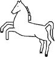   Hannover

    *           Kiel

    *           Köln

    *        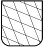   Mellrichstadt

*    *        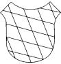   München

    *           Suhl

    *           Ulm

    *

*    *

*    *   Abbildung 4
        Prüfzeichen für Munition
        **(§ 32 Abs. 2 Nr. 4)**

*    *           Hannover

    *           Kiel

    *           Köln

    *           Mellrichstadt

    *           München

    *           Suhl

    *           Ulm

*    *
    *
    *
    *

*    *        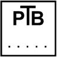
    *   **Abbildung 5**
        Zulassungszeichen für Handfeuerwaffen, Schussapparate und
        Einsteckläufe nach § 7 des Gesetzes und für nicht tragbare Geräte nach
        § 24 Abs. 1

*    *        
    *   **Abbildung 6**
        Zulassungszeichen für bauartgeprüfte Schreckschuss-, Reizstoff- und
        Signalwaffen nach § 8 Abs. 1 des Gesetzes und Zusatzgeräte zu diesen
        Waffen zum Verschießen pyrotechnischer Geschosse

*    *        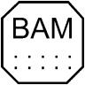
    *   **Abbildung 7**
        Zulassungszeichen für pyrotechnische Munition nach § 10 Abs. 1 des
        Gesetzes

*    *        
    *   **Abbildung 8**
        Prüfzeichen nach § 25 Abs. 2 für Geräte nach § 24 Abs. 1. Die Zahl im
        kleineren Quadrat bezeichnet die zwei letzten Ziffern der Jahreszahl,
        die einstellige Zahl in Richtung der Laufmündung das Quartal.

*    *
    *

*    *   Abbildung 9
        Prüfzeichen der Beschaffungsstellen
        für die Bundeswehr, der Bundespolizei und die Bereitschaftspolizeien
        der Länder
        **(§ 9 Abs. 1 Satz 2)**

*    *        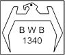
    *   Beschuss
        bei Schusswaffen, die vom Bundesamt für Wehrtechnik und Beschaffung
        beschossen wurden

*    *        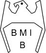
    *   Erstbeschuss
        bei Schusswaffen, die von der in der Rechtsverordnung nach § 58 Abs. 1
        des Bundespolizeigesetzes bestimmten Bundespolizeibehörde beschossen
        wurden

*    *        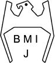
    *   Instandsetzungsbeschuss
        bei Schusswaffen, die von der in der Rechtsverordnung nach § 58 Abs. 1
        des Bundespolizeigesetzes bestimmten Bundespolizeibehörde erneut
        beschossen wurden

*    *

*    *        
    *   **Abbildung 10**
        Kennzeichen für Schusswaffen, deren Geschossen eine Bewegungsenergie
        von nicht mehr als 7,5 J erteilt wird (§ 7 Abs. 1 Satz 2 Nr. 1 und § 9
        Abs. 2 Satz 1 Nr. 1 des Gesetzes)

*    *   **Abbildung 11**
        Zulassungszeichen nach Bauartprüfungen gemäß § 9 Abs. 1 des Gesetzes

*    *        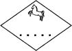   Hannover

    *        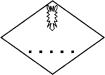   Kiel

    *        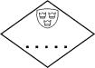   Köln

    *        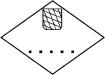   Mellrichstadt

*    *        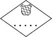   München

    *           Suhl

    *        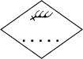   Ulm

    *           Berlin

*    *
    *
    *
    *

*    *   Bei Prüfungen von Einzelstücken wird die Kennziffer nicht innerhalb
        sondern außerhalb direkt beim Kennzeichen von Abb. 11 angebracht

*    *   **Abbildung 12**
        Zulassungszeichen nach Bauartprüfungen gemäß § 9 Abs. 2 Nr. 2 bis Nr.
        4 des Gesetzes

*    *        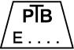   Elektroimpulsgeräte

    *        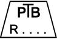   Reizstoffe

*    *

### Anlage III Prüfvorschriften für Patronen- und Kartuschenmunition

   (Fundstelle: BGBl. I 2006, 1504 - 1522;
bzgl. der einzelnen Änderungen vgl. Fußnote)

**Symbole und ihre Bedeutung**

*
    *
        *
            *
                *
                    d(tief)D Durchmesser der Druckübertragungsfläche des Druckaufnehmers

                    d(tief)M Durchmesser der Messbohrung

                    d(tief)L Durchmesser des Laufes an der Stelle der Messbohrung

                    d(tief)S Durchmesser des Druckübertragungsstempels

                    G(tief)1 Geschossdurchmesser am Hülsenmund

                    L(tief)3 Hülsenlänge nach den Maßtafeln

                    L(tief)c Länge des Messlaufes mit Patronenlager

                    s(tief)M Abstand der Messbohrung vom Stoßboden

P(tief)u, P(tief)o

*
    *
        *
            *
                *
                    *   unterer oder oberer Grenzgasdruck für die Auswahl des Stauchzylinders
                        und des Druckübertragungsstempels

                    P(tief)max zulässiger Höchstwert des Gasdruckes nach den Maßtafeln

                    P(tief)n aus einer Probe von n gemessenen Patronen errechneter Mittelwert des
                        Gasdruckes

                    P(tief)M von der Kartusche für Schussapparate entwickelter Gasdruck

                    a/b Koeffizient/Exponent zur Beschreibung des Gasdruckes von Kartuschen

                    V(hoch)+(tief)n auf das Patronenlager entfallender Volumenanteil des
                        Verbrennungsraumes

                    V(tief)a Zusatzvolumen zwischen Kolben und Kartuschenlager

                    E(tief)max zulässiger Höchstwert der Energie nach den Maßtafeln

                    E(tief)n aus einer Probe von n gemessenen Patronen errechneter Mittelwert der
                        Energie

                    E(tief)Beschuss Minimale Energie der Beschussmunition für Langwaffen mit gezogenen
                        Läufen

                    k(tief)1,n Anteilsfaktor für die Anteilsgrenze bei einseitiger Abgrenzung für 99%
                        der Grundgesamtheit bei einem Vertrauensniveau von 95%

                    k(tief)2,n Anteilsfaktor für die Anteilsgrenze bei einseitiger Abgrenzung von 95%
                        der Grundgesamtheit bei einem Vertrauensniveau von 95%

                    k(tief)3,n Anteilsfaktor für die Anteilsgrenze bei einseitiger Abgrenzung für 90%
                        der Grundgesamtheit bei einem Vertrauensniveau von 95%

                    S(tief)n Standardabweichung einer Probe von n gemessenen Patronen

*
    **1** **Zulassungsprüfung (Typenprüfung)**

    1.1 Bei der Zulassung sind zu prüfen

        –   die Übereinstimmung der Maße der für die Fabrikationskontrolle zu
            verwendenden Messgeräte mit den Vorschriften der Maßtafeln und Nummer
            5 dieser Anlage, wenn eine Kalibrierung nicht möglich ist,

        –   die Richtigkeit der Gasdruckmesser unter Verwendung von
            Vergleichspatronen mit Hilfe von Standardmessläufen oder mit anderen
            gleichwertigen Verfahren,

        –   die Lehren und Geräte zur Prüfung der Munition auf Maßhaltigkeit,

        –   die Waffen, die zur Kontrolle der Funktionssicherheit bestimmt sind.

    1.2 Für die Prüfung besteht das Los aus mindestens 3.000 Stück. Die
        Mindestgröße kann aus besonderen Gründen unterschritten werden. Die
        Prüfung für eine Munitionstype, von der weniger als 3.000 Stück
        hergestellt worden sind, ist jeweils an einer im gleichen Verhältnis
        zu dieser Zahl kleineren Anzahl von Munition vorzunehmen. Die
        Mindestzahl beträgt für die

    *        *   1.2.1

        *   Prüfung der Maßhaltigkeit und Sichtprüfung

        *   20 Stück,

    *        *   1.2.2

        *   Gasdruckprüfung

        *   10 Stück,

    *        *   1.2.3

        *   Prüfung der Funktionssicherheit

        *   10 Stück.

*
    1.3 Die Prüfung der Munition wird nach dem Verfahren der
        Fabrikationskontrolle (Nummer 2) und mit der doppelten Stückzahl
        vorgenommen.

    1.4 Die Munition wird aus einem Los ausgewählt, dessen Laborierung für den
        vorgelegten Munitionstyp den höchsten Gasdruck erwarten lässt.

    1.5 Die erste Einfuhr eines Munitionstyps aus Staaten, mit denen die
        gegenseitige Anerkennung der Prüfzeichen nicht vereinbart ist, in den
        Geltungsbereich des Gesetzes wird der Prüfung nach Nummer 1.3
        unterzogen.

    1.6 Die Prüfung eines Munitionstyps nach den Nummern 1.3 und 1.4 kann
        wiederholt werden, wenn die erste Prüfung Beanstandungen ergeben hat
        und der Hersteller dies fordert.

*
    **2** **Fabrikationskontrolle**

    2.1 Die Menge einer zugelassenen Munition, die der Fabrikationskontrolle
        zu unterziehen ist und ein Prüflos bildet, darf nicht überschreiten

        –   500.000 Stück bei Zentralfeuermunition,

        –   1.500.000 Stück bei Randfeuermunition.

    2.2 Entnahme der Stichproben

    2.2.1 Die Entnahme ist wahllos vorzunehmen. Die Stichproben müssen für das
        der Prüfung unterworfene Los repräsentativ sein.

    2.3 Umfang der Stichproben:

*    *   Prüfung

    *   Losgröße

*    *   bis zu
        35\.000 \*)

    *   35.001
        bis
        150\.000

    *   150.001
        bis
        500\.000

    *   500.001
        bis
        1\.500.000

*    *   a)

    *   Prüfung der Maßhaltigkeit und Sichtprüfung

    *   125

    *   200

    *   315

    *   500

*    *   b)

    *   Gasdruckprüfung

    *   20

    *   30

    *   30

    *   50

*    *   c)

    *   Prüfung der Funktionssicherheit

    *   20

    *   32

    *   32

    *   50

*    *   d)

    *   Prüfung der Funktionssicherheit bei Kartuschenmunition für
        Schreckschuss-, Reizstoff- und Signalwaffen

    *   50

*
    *   \*)

        *   Für kleinere Losgrößen bis zu 3.000 Stück sind die Stichprobenumfänge
            für die Buchstaben a, b und c nach Losgröße linear bis auf 20, 10 und
            10 zu reduzieren.

        Zur Gasdruckprüfung von Kartuschen für Schussapparate werden je
        Zusatzvolumen zwölf Kartuschen der stärksten Ladung als Stichprobe
        entnommen.

    2.4 Die für die Fabrikationskontrollen vorgeschriebenen Stückzahlen können
        vermindert werden, wenn der Zulassungsinhaber über ein wirksames
        Qualitätssicherungssystem verfügt. Dieser hat der zuständigen Behörde
        einen Prüfplan einzureichen. Die zuständige Behörde genehmigt die
        Änderung der Stückzahlen, wenn durch das Qualitätssicherungssystem die
        Maßhaltigkeit, die Funktionssicherheit sowie die Einhaltung des
        vorgeschriebenen Gasdruckes oder des Energiewertes gewährleistet ist
        und die Sichtprüfung Beanstandungen nicht ergeben hat.

*
    **3** **Behördliche Kontrolle**

    3.1 Die behördliche Kontrolle nach § 34 Abs. 1 wird nach folgendem
        Verfahren durchgeführt:

    3.1.1 bei Herstellern

        –   Kontrollen der Prüfeinrichtungen nach dem Verfahren nach Nummer 1.1,

        –   Prüfung, ob Fabrikationskontrollen durchgeführt worden sind, auf Grund
            der Aufzeichnungen über die Ergebnisse dieser Kontrollen,

        –   Vornahme einer Prüfung nach dem Verfahren der Fabrikationskontrolle,

    3.1.2 bei Verbringern

        –   Prüfung, ob die in § 34 Abs. 2 genannten Bescheinigungen vorliegen,

        –   Prüfung, ob beim Hersteller Fabrikationskontrollen durchgeführt worden
            sind, auf Grund von Prüfprotokollen des Herstellers,

        –   Vornahme einer Prüfung nach dem Verfahren der Fabrikationskontrolle
            für jeden eingeführten Munitionstyp.

*
    **4** **Einzelprüfungen und zulässige Anzahl von Fehlern**

    4.1 Sichtprüfung

    4.1.0 Die entnommene Munition ist auf folgende Merkmale und Fehler zu
        prüfen:

        –   die vorgeschriebene Kennzeichnung auf jeder Patrone,

        –   falsche Kaliberangabe,

        –   Längsrisse am Hülsenmund,

        –   Längs- und Querrisse,

        –   Brüche des Hülsenbodens.

        Falsche oder fehlende Kaliberangabe, Längsrisse am Hülsenmund von mehr
        als 3 mm Länge, Längs- und Querrisse sowie Brüche des Hülsenbodens
        sind unzulässig.

        Bei der vorgeschriebenen Kennzeichnung auf jeder Patrone sind keine
        Fehler sowie bei Längsrissen am Hülsenmund von bis zu 3 mm Länge sind
        in Abhängigkeit von der Losgröße in der in Nummer 2.3 genannten
        Reihenfolge die Fehlerzahlen 2, 3, 5 und 8 zulässig.

    4.1.1 Die kleinste Verpackungseinheit der entnommenen Munition ist auf
        folgende Merkmale und Mängel zu prüfen:

        –   die nach § 24 Abs. 3 des Waffengesetzes und nach § 39 vorgeschriebene
            Kennzeichnung,

        –   Vermischung von Patronen verschiedenen Typs in derselben kleinsten
            Verpackungseinheit.

        Fehler bei der Kaliberangabe, den Angaben nach § 16 Abs. 1 Nr. 1, 2, 4
        und 5 und bei den Angaben nach § 29 Abs. 1 Nr. 4, 5 und 6 und Abs. 4
        sowie die Vermischung von Patronen verschiedenen Typs sind nicht
        zulässig.

        Bei der übrigen Kennzeichnung sind je nach Losgröße dieselben
        Mängelzahlen zulässig wie nach Nummer 4.1.1 Satz 3.

    4.1.2 Wird festgestellt, dass die in den Nummern 4.1.1 und 4.1.2 zulässigen
        Fehler- und Mängelzahlen überschritten sind, wird das Los zur
        Nachbesserung zurückgegeben und kann zu einer späteren erneuten
        Prüfung vorgestellt werden.

    4.2 Prüfung der Maßhaltigkeit

    4.2.1 Bei der Prüfung der Maßhaltigkeit ist zu prüfen, ob

        –   die im technischen Anhang bezeichneten Patronenmaße den in den
            Maßtafeln angegebenen Werten einschließlich der Toleranzen für die
            Maximalpatrone für das Minimalpatronenlager oder im Falle des § 31
            Abs. 4 den vom Hersteller angegebenen Werten entsprechen; die Prüfung
            kann mit Hilfe von Patronenprüflehren durchgeführt werden, wobei die
            Gesamtlänge
            L(tief)3 von Kartuschen nach Tabelle 5 der Maßtafeln nach deren
            Verschießen aus einem Messlauf bestimmt wird,

        –   das Zündhütchen nicht über den Hülsenboden herausragt.

    4.2.2 Werden Mängel festgestellt, wird das Los zur Nachbesserung
        zurückgegeben und kann zu einer späteren erneuten Prüfung vorgestellt
        werden.

    4.3 Prüfung des Gasdruckes oder der Bewegungsenergie

    4.3.1 Die Messungen und die Versuchsauswertung für Gasdruck und Energie sind
        nach Nummer 5 durchzuführen. Die Ergebnisse müssen die nach den
        Maßtafeln zulässigen Grenzwerte von Druck und Energien einhalten,
        soweit sie angegeben sind.

    4.3.2 Die Gasdruckmessung ist unter normalen Versuchsbedingungen bei

        –   einer Temperatur von 21
            Grad C +- 1 Grad C und

        –   einer relativen Luftfeuchte von 60%
            +- 5%

        durchzuführen.

        Unmittelbar vor der Gasdruckprüfung im Rahmen der Zulassungsprüfung
        ist die Munition diesen Versuchsbedingungen 24 Stunden lang
        auszusetzen. Die Fabrikationskontrolle kann unter Gebrauchsbedingungen
        durchgeführt werden. Im Zweifelsfall ist das Ergebnis der Prüfung mit
        klimatisierter Munition unter normalen Versuchsbedingungen zu
        wiederholen.

    4.3.3 Wenn die errechnete obere Anteilsgrenze den zulässigen Höchstwert des
        Gasdruckes um nicht mehr als 25% überschreitet, ist eine
        Wiederholungsprüfung mit der auf das Doppelte erweiterten Patronenzahl
        zulässig. Bei Kartuschen für Schussapparate ist die
        Wiederholungsprüfung mit zwölf Kartuschen durchzuführen.

        Entspricht das Ergebnis der Wiederholungsprüfung nicht den
        Anforderungen, darf die Munition dieses Loses nicht vertrieben werden.

    4.4 Prüfung der Funktionssicherheit

    4.4.1 Die Prüfung der Funktionssicherheit im Rahmen der Zulassungsprüfung,
        der Fabrikationskontrolle und der behördlichen Kontrolle ist unter
        Verwendung eines Prüflaufes oder einer amtlich geprüften Waffe, deren
        Lagermaße den Maßen der Maßtafeln oder im Falle des § 31 Abs. 4 den
        vom Hersteller angegebenen Werten entsprechen, vorzunehmen. Für die
        Funktionssicherheitsprüfung der Patronen für Waffen mit glattem Lauf
        (glatten Läufen) wird eine Waffe verwendet, bei der die Maße des
        Lagers und des Verschlussabstandes Höchstmaße sind. Bei den
        Fabrikationskontrollen kann die Funktionssicherheit unter Verwendung
        einer Waffe geprüft werden, deren Maße von der zuständigen Behörde
        anerkannt wurden. Die Maße der Prüfläufe und der Waffen werden von der
        zuständigen Behörde aufgezeichnet.

    4.4.2 Folgende Fehler dürfen nicht auftreten:

        –   Ausströmen von Gas nach hinten aus dem Verschluss auf Grund von Rissen
            im Hülsenboden,

        –   Steckenbleiben des Geschosses oder von Teilen desselben im Lauf,

        –   Bruch der Hülse, die ganz oder teilweise im Lager bleibt,

        –   Bersten des Hülsenbodens.

        Werden diese Mängel festgestellt, ist das Los zurückzugeben und kann
        nach Nachbesserung zu einer späteren erneuten Prüfung vorgestellt
        werden. Bei Kartuschenmunition für Schreckschuss-, Reizstoff- und
        Signalwaffen darf höchstens einmal bei einer Probe von 50 Stück die
        Abdeckung, Teile der Abdeckung oder des Verschlusses der Kartuschen im
        Lauf der Waffe stecken bleiben. Die Funktionsprüfung dieser Munition
        ist mit den in Abbildung 3 dargestellten Läufen durchzuführen.

*
    **5** **Prüfung des Gasdruckes, Energiewertes, Mündungsimpulses und der
        Geschwindigkeit**

    5.1 Gasdruckmessung

    5.1.1 Die Innenmaße des Messlaufes, die den Gasdruck beeinflussen, müssen
        mit den in den Maßtafeln aufgeführten Maßen innerhalb der in Tabelle 1
        genannten Toleranzen übereinstimmen. Die Maßhaltigkeitsprüfung der
        Messläufe wird mit Hilfe von Messsystemen durchgeführt, die direkten
        Zugang zu den zu messenden Werten ermöglichen. Der Verschlussabstand
        darf nicht größer als 0,1 mm sein. Die Länge des Messlaufes, die die
        kinetische Energie beeinflusst, soll mit dem in Tabelle 1 des
        Technischen Anhangs aufgeführten Maß innerhalb der genannten
        Toleranzen übereinstimmen.

    5.1.2 Der Abstand der Achsen der Messbohrungen vom Stoßboden ist nach
        Tabelle 2 zu bemessen.

    5.1.3 Die Messung des Gasdruckes von Patronenmunition ist gemäß der
        Vorschrift des § 31 Abs. 2 vorzunehmen.

    5.1.4 Der Gasdruck von Kartuschenmunition – soweit für diese ein zulässiger
        Höchstwert
        P(tief)max in den Maßtafeln angegeben ist – und der Vergleichspatrone
        nach Nummer 2.1.1.2 der Anlage I ist mittels mechanisch-elektrischem
        Wandler zu messen.

    5.2 Stauchapparat

    5.2.1 Es sind die in Tabelle 3 angegebenen Kombinationen von
        Druckübertragungsstempel und Kupferstauchzylinder unter folgenden
        Bedingungen anzuwenden:

        Gebrauchs- und Beschussmunition eines Munitionstyps sind mit der
        gleichen Kombination von Druckübertragungsstempel und Stauchzylinder
        zu messen, soweit die in Tabelle 3 Spalten 5 und 6 angegebenen
        Auswahlbereiche dies zulassen.

        Erfüllen im Grenzfall zwei Kombinationen diese Anforderungen, so ist
        der Stauchzylinder mit den größeren Abmessungen zu wählen. In den
        Fällen, in denen die Auswahlbereiche unmittelbar aneinander
        anschließen, muss für die Gebrauchsmunition
        P(tief)u <= P(tief)max < P(tief)o, für die Beschussmunition
        P(tief)u <= 1,3 P(tief)max < P(tief)o sein. Für alle Munition, für die
        240 bar
        <= P(tief)max < 600 bar beträgt, ist der Druckübertragungsstempel von
        6,18 mm Durchmesser, in allen anderen Fällen der von 3,91 mm
        Durchmesser zu benutzen.

        Für Munition, für die
        P(tief)max < 240 bar ist, sind Stauchkegel 5 x 13 ohne
        Druckübertragsstempel zu verwenden.

    5.2.2 Die in Tabelle 3 Spalten 1, 2 und 3 angegebenen Durchmesser und die
        Massen der Druckübertragungsstempel sowie deren minimale
        Ausgangsführungslängen sind einzuhalten.

        Die Breite des Ringspaltes zwischen Druckübertragungsstempel und
        Stempelführungsbüchse darf 0,002 mm nicht unter- und 0,006 mm nicht
        überschreiten.

    5.2.3 Der Durchmesser der Messbohrung, der sich vor oder unter der
        Stirnfläche des Druckübertragungsstempels befindet, darf von dessen
        Durchmesser
        d(tief)s um nicht mehr als 1,0 mm abweichen. Die Messbohrung darf in
        der Achse nicht länger als 3 mm sein. Sofern
        d(tief)s > 0,6 dL ist, soll sich der Durchmesser der Messbohrung an
        der Stirnfläche des Druckübertragungsstempels ansetzend konisch mit
        einem Winkel von 60
        Grad auf 3 mm Durchmesser verengen (Abbildung 1). Toleranzen der
        Durchmesser bis zu + 0,2 mm sind zulässig. Die Hülsen der Patronen-
        oder Kartuschenmunition müssen so mit Anbohrungen versehen werden,
        dass diese nach dem Laden möglichst konzentrisch zur Messbohrung sind.
        Der Durchmesser der Anbohrung ist bei Munition für Waffen mit glatten
        Läufen 3 mm, bei aller anderen Munition 2 mm. Die Messbohrungen sind
        mit Siliconpaste mit einer Konuspenetration zwischen 180 und 210 (DIN
        51580, Ausgabe April 1989) \*) und einer Dichte von 1
        g/ccm zu füllen.

        Die Resthöhe des Stauchkörpers ist bei einer zulässigen Abweichung von
        +- 0,005 mm mit einem Mikrometer, einer Messuhr oder einem Messtaster
        zu ermitteln und der zugehörige Druck der beigefügten Stauchtabelle
        oder -kurve zu entnehmen oder mittels einer entsprechenden Gleichung
        (Ausgleichspolynom) zu berechnen.

        -----

        \*) Erschienen im Beuth-Verlag Berlin und Köln und beim Deutschen
            Patentamt in München archivmäßig gesichert niedergelegt.

    5.3 Mechanisch-elektrische Wandler für die Messung des Gasdruckes von
        Zentralfeuerpatronenmunition für Waffen mit glatten Läufen

    5.3.1 In der Regel ist der Gasdruck der Patronen mittels piezo-elektrischer
        oder gleichwertiger Druckaufnehmer in tangentialer oder
        zurückgesetzter Einbauweise zu messen. Es können auch mechanisch-
        elektrische Wandler anderer Bauart verwendet werden, wenn zwischen
        deren Anzeige und der der vorgenannten ein eindeutiger Zusammenhang
        bekannt ist. In jedem Falle ist auf die Anzeige der vorgenannten
        Druckaufnehmer umzurechnen.

    5.3.2 Der Durchmesser und die Tiefe der Messbohrungen sind abhängig von den
        Abmessungen des Aufnehmers und der Einbauart. Der Einbau ist gemäß
        Abbildung 2 vorzunehmen.

    5.3.3 Die Anbohrung der Hülse ist nach den Abbildungen 2a und 2b
        vorzunehmen. Bei Verwendung geeigneter Aufnehmer in tangentialer
        Einbauweise kann auch ohne Anbohrung der Hülse gemessen werden, sofern
        die Höhe der Bodenkappe 22 mm nicht übersteigt (Abbildung 2c). Im
        Falle von Gebrauchspatronen mit Papphülse ist dann der gemessene Wert
        mit 1,05 zu multiplizieren.

    5.3.4 Indirekte Messung des Gasdruckes an der Messstelle II
        (S(tief)M = (162 +- 0,5) mm). Die Messung des Gasdruckes an der
        Messstelle II erfolgt indirekt. Zu diesem Zweck wird die Zeit der des
        Durchgangs des Treibmittelbodens durch den Querschnitt an der
        Messstelle II registriert und der zur gleichen Zeit an der Messstelle
        I
        (S(tief)M siehe Tabelle 2) herrschende Druck gemessen. Die
        Registrierung des Durchgangs des Treibmittelbodens kann außer mit
        einem mechanisch-elektrischen Wandler auch mit einem anderen
        geeigneten Messfühler vorgenommen werden, z. B. mittels Fotodiode
        hinter einem Quarzglasfenster.

    5.3.5 Eigenschaften der Aufnehmer:

        *            *   Mindestempfindlichkeit

            *   1,8 pC/bar

        *            *   Messbereich

            *   0 bar bis max. 6.000 bar

        *            *   Kalibrierbereich

            *   300 bar bis 1.800 bar

        *            *   Eigenfrequenz

            *   >= 100 kHz

        *            *   Abweichung von der Linearität

            *   <= 1% des Endwertes.

*
    5.3.6 Wärmeschutz vor der Druckübertragungsfläche

        Zur Vermeidung bzw. Minderung des Wärmeübergangs auf Membrane und
        Druckplatte ist bei Anbohrung der Hülse eine geeignete Scheibe aus
        wärmeisolierendem, flexiblem Werkstoff (z. B. PTFE) vor der
        Druckübertragungsfläche anzubringen. Tangential eingebaute Abnehmer
        sind zusätzlich durch Aufkleben eines die Patronenanbohrung
        überspannenden, dehnbaren Klebebandes auf die Patrone zu schützen
        (siehe Abbildung 2a).

    5.3.7 Verstärker:

    *        *   Grenzfrequenz

        *   (– 3 dB) >= 80 kHz

    *        *   Abweichung von der Linearität

        *   <= 0,1% des Endwertes (Vollaussteuerung)

    *        *   Ladungsverstärker:
            Eingangswiderstand

        *   >= 10(hoch)12 omega.

*
    5.3.8 Elektrischer Filter

        Bessel-Tiefpass mit einer Grenzfrequenz von 20 kHz (– 3 dB), N = 2 (–
        12 dB/Oktave).

    5.4 Mechanisch-elektrische Wandler für die Messung des Gasdruckes von
        Kartuschenmunition und der Vergleichspatrone nach Nummer 2.1.2 der
        Anlage I für Schwarzpulverwaffen und Böller

    5.4.1 Der Gasdruck von Kartuschenmunition mit Metallhülsen ist mit
        Aufnehmern in zurückgesetzter Einbauweise zu messen (Abbildungen 5a
        und 5b in Verbindung mit Abbildung 2b). Dabei sind die Messbohrungen
        mit Siliconpaste nach Nummer 5.2.3 zu füllen. Soweit es sich um
        Kartuschenmunition für nach § 8 des Gesetzes zugelassene
        Schreckschuss-, Reizstoff- und Signalwaffen handelt, ist die Messung
        in Läufen nach den Abbildungen 3a und 3b ohne Vorladung eines
        Geschosses durchzuführen.

        Der Gasdruck von Kartuschenmunition für Schussapparate ist unter
        Verwendung eines Messlaufes nach Abbildung 5a und eines Kolbens nach
        Abbildung 5b in Abhängigkeit vom Zusatzvolumen zu messen. Störende
        Eigenschwingungen des Messlaufes sind durch Wahl einer ausreichenden
        Wandstärke gering zu halten. Im Bereich des Stoßbodens ist für gute
        Abdichtung durch die konstruktiven Maßnahmen nach Abbildung 5a oder
        auf andere geeignete Weise zu sorgen.

        Ausreißerwerte werden durch Anwendung des Dixon-Tests eliminiert.

        Der Auswertung wird die Abhängigkeit

        P(tief)M = a (V(hoch)+(tief)n + V(tief)a)(hoch)b

        zugrunde gelegt.

    5.4.2 Der Gasdruck von Kartuschenmunition mit Papp- oder Kunststoffhülsen
        von nicht unter 9 mm Durchmesser und der Vergleichspatrone für
        Schwarzpulverwaffen nach Nummer 2.1 der Anlage I ist mit Aufnehmern in
        zurückgesetzter oder in tangentialer Einbauweise mit Anbohrung der
        Hülse (Abbildungen 2a und 2b) zu messen.

    5.4.3 Sofern als Treibmittel Schwarzpulver geladen ist oder Gasdrücke unter
        1\.000 bar zu erwarten sind, sind abweichend von Nummer 5.3.5 Aufnehmer
        mit folgenden Eigenschaften zu verwenden:

        *            *   Mindestempfindlichkeit

            *   2,0 pC/bar

        *            *   Messbereich

            *   0 bar bis max. 2.500 bar

        *            *   Kalibrierbereich

            *   100 bar bis 1.000 bar.

*
    5.4.4 Bei Kartuschenmunition ist ein Filter nach Nummer 5.3.8 zu verwenden.
        Abweichend hiervon beträgt die Grenzfrequenz des Tiefpassfilters bei
        Kartuschenmunition für nach § 8 des Gesetzes zugelassene
        Schreckschuss-, Reizstoff- und Signalwaffen 10 kHz.

    5.5 Messung des Energiewertes

        Anstelle des Gasdruckes oder neben dem Gasdruck ist die auf ein
        bestimmtes Geschoss übertragene Bewegungsenergie zu ermitteln, wenn in
        den Maßtafeln die Bewegungsenergie der Geschosse festgelegt ist.

    5.5.1 Sofern es im gleichen Kaliber (Laufdurchmesser) eine entsprechende
        Patronenmunition gibt, sollen die gleichen Geschosse und Läufe
        verwendet werden. Sonst sind Flugbolzen und Prüfgeräte gemäß folgenden
        Abbildungen zu benutzen:

        Abbildung 4 für Munition der Tabelle 5 der Maßtafeln, mit einem
        Flugbolzen von 4 g nur für
        E(tief)max <= 100 J,

        Abbildung 5 für Munition nach Tabelle 6 der Maßtafeln.

    5.5.2 Die Innenabmessungen der Läufe müssen ebenfalls innerhalb der in
        Tabelle 1 angegebenen Toleranzen mit den in den Maßtafeln aufgeführten
        Maßen übereinstimmen. Die Abmessungen der Läufe für Kartuschenmunition
        für Schussapparate müssen außerdem den in Abbildung 5 festgelegten
        Maßen entsprechen. Die Lauflängen nach Tabelle 1 sind einzuhalten.

    5.5.3 Die Ermittlung der Bewegungsenergie erfolgt über eine Messung der
        Flugzeit zwischen zwei 0,5 m und 1,5 m vor der Mündung entfernten
        Punkten der Flugbahn (siehe Anlage VI).

    5.6 Auswertung der Messungen

        Die Auswertung der Messungen erfolgt nach den Regeln der statistischen
        Qualitätskontrolle. Der Umfang der Stichprobe bei der Feststellung von
        Mittelwerten und Anteilsgrenzen richtet sich nach Nummer 2.3.

        Die genannten Faktoren zur Bestimmung der Anteilsgrenze sind Tabelle 4
        zu entnehmen.

    5.6.1 Die Anforderungen, dass bei Gebrauchsmunition für Waffen mit gezogenen
        Läufen der Gasdruckmittelwert nicht über und kein Einzelwert mehr als
        15% über dem nach den Maßtafeln zulässigen Höchstwert

    P(tief)max liegt, gelten als erfüllt, wenn
    --------
    P(tief)n <= P(tief)max
    und bei Zentralfeuermunition
    --------
    P(tief)n + k(tief)1,n x S(tief)n <= 1,15 P(tief)max
    und bei Randfeuermunition
    --------
    P(tief)n + k(tief)2,n x S(tief)n <= 1,15 P(tief)max

*
    *   ist.

    5.6.2 Die Anforderungen, dass der Gasdruck bei Beschussmunition für
        Kurzwaffen mit gezogenen Läufen 30% über dem zulässigen Höchstwert des
        Gebrauchsgasdruckes
        P(tief)max liegt und dass eine zu starke Überlastung der Waffe
        vermieden wird, gelten als erfüllt, wenn

    -------- P(tief)n >= 1,30 P(tief)max, -------- P(tief)n – k(tief)3,n x
    S(tief)n >= 1,15 P(tief)max und P(tief)n + k(tief)3,n x S(tief)n <=
    1,50 P(tief)max

*
    *   ist.

    5.6.3 Die Anforderungen, dass der Gasdruck bei Beschussmunition für
        Langwaffen mit gezogenen Läufen 25% über dem zulässigen Höchstwert des
        Gebrauchsgasdruckes
        P(tief)max liegt, gelten als erfüllt, wenn

        --------
        P(tief)n >= 1,25 P(tief)max,
        --------
        P(tief)n – k(tief)3,n x S(tief)n >= 1,15 P(tief)max,
        P(tief)n + k(tief)3,n x S(tief)n <= 1,40 P(tief)max und
        E(tief)n >= E(tief)Beschuss

*
    *   ist.

    5.6.4 Die Anforderungen, dass der Gasdruck, bei Waffen mit glatten Läufen
        der Gasdruckmittelwert nicht über und kein Einzelwert mehr als 15%
        über dem nach Nummer 1.2.4 der Anlage I nach den Maßtafeln zulässigen
        Höchstwert des Gebrauchsgasdruckes
        P(tief)max liegt, gelten als erfüllt, wenn

        --------
        P(tief)n <= P(tief)max
        --------
        P(tief)n + k(tief)2,n x S(tief)n <= 1,15 P(tief)max

*
    *   ist.

    5.6.5 Die Anforderungen, dass der Gasdruck bei Beschussmunition für die
        normale oder die verstärkte Beschussprüfung für Waffen mit glatten
        Läufen 30% über dem gemäß Nummer 1.2.4 der Anlage I zulässigen
        Höchstwert des Gebrauchsgasdruckes
        P(tief)max liegt und dass eine zu starke Überlastung der Waffe
        vermieden wird, gelten als erfüllt, wenn

        an der Messstelle I nach Tabelle 2
        P(tief)n >= 1,30 P(tief)max
        --------
        und P(tief)n – k(tief)3,n x S(tief)n >= 1,15 P(tief)max
        --------
        und P(tief)n + k(tief)3,n x S(tief)n <= 1,70 P(tief)max
        und an der Messstelle II nach Tabelle 2
        P(tief)n + k(tief)3,n x S(tief)n <= 650 bar

*
    *   ist, wobei für 1,15
        P(tief)max und 1,30
        P(tief)max jeweils die gerundeten Werte der Maßtafeln einzusetzen
        sind.

    5.6.6 Die Anforderungen an die Beschusspatrone gemäß Nummer 1.2.3 der Anlage
        I, dass der Mittelwert des Gasdruckes an der Messstelle II mindestens
        500 bar sein soll und dass eine zu starke Überbelastung der Waffe
        vermieden wird, gelten als erfüllt, wenn

    -------- P(tief)n >= 500 bar, -------- P(tief)n – k(tief)3,n x
    S(tief)n >= 450 bar -------- und P(tief)n + k(tief)3,n x S(tief)n <=
    650 bar und an der Messstelle I -------- P(tief)n + k(tief)3,n x
    S(tief)n <= 1,70 P(tief)max

*
    *   ist.

    5.6.7 Die Anforderungen, dass bei Kartuschengebrauchsmunition der
        Gasdruckmittelwert nicht über und kein Einzelwert mehr als 15% über
        dem nach den Maßtafeln zulässigen Höchstwert
        P(tief)max liegt, gelten als erfüllt, wenn

        --------
        P(tief)n <= P(tief)max
        --------
        und P(tief)n + k(tief)3,n x S(tief)n <= 1,15 P(tief)max

*
    *   ist.

    5.6.8 Die Anforderungen, dass der Gasdruck bei Kartuschenbeschussmunition
        30% über dem zulässigen Höchstwert des Gebrauchsgasdruckes liegt und
        dass eine zu starke Überbelastung der Waffe vermieden wird, gelten als
        erfüllt, wenn

--------
P(tief)n >= 1,30 P(tief)max,
--------
P(tief)n – k(tief)3,n x S(tief)n >= 1,15 P(tief)max,
und
--------
P(tief)n + k(tief)3,n x S(tief)n <= 1,7 P(tief)max

*
    *   ist.

    5.6.9 Die Anforderungen, dass bei Gebrauchsmunition der Energiemittelwert
        nicht über und kein Einzelwert mehr als 7% über dem nach den Maßtafeln
        zulässigen Höchstwert
        E(tief)max liegt, gelten als erfüllt, wenn

--------
E(tief)n <= E(tief)max
--------
und E(tief)n + k(tief)3,n x S(tief)n <= 1,07 E(tief)max

*
    *   ist.

    5.6.10 In Analogie zur Gasdruckmessung sind bei Beschussmunition die
        Anforderungen

--------
E(tief)n >= 1,10 E(tief)max,
E(tief)n – k(tief)3,n x S(tief)n >= 1,07 E(tief)max
und E(tief)n + k(tief)3,n x S(tief)n <= 1,25 E(tief)max

*
    *   zu erfüllen.

**Technischer Anhang zur Anlage III**

*
    **1** **Unter dem Gesichtspunkt der Sicherheit zu prüfende Maße**

    1.1 Patronen für Waffen mit gezogenen Läufen, einschließlich Patronen für
        Pistolen und Revolver, Patronen mit Randfeuerzündung und Kartuschen
        für Schusswaffen und Bolzensetzgeräte:

        a)  L(tief)3 =

            *
                *
                    *   Gesamtlänge der Hülse (maximal)

                    L(tief)6 = Gesamtlänge der Kartuschenhülse vor dem Schuss

                    H(tief)2 = Durchmesser am Hülsenmund, bei Kartuschen am Ende des zylindrischen
                        Teils (maximal)

                    G(tief)1 = Geschossdurchmesser am Hülsenmund (maximal)

                    P(tief)1 = Pulverraumdurchmesser vor dem Rand oder im Abstand E vom Hülsenboden
                        bei Kleinschrotmunition

                    R = Randstärke der Hülse bei Kleinschrotmunition.

            Diese Maße müssen kleiner oder gleich den in den Maßtafeln
            vorgeschriebenen Maximalmaßen sein. Die vorgegebenen Toleranzen sind
            einzuhalten.

        b)  Die Entfernung
            L(tief)3 + G (L(tief)3: Gesamtlänge der Hülse, Patrone maximal, G:
            Abstand zwischen
            H(tief)2 und F im Patronenlager) unter Berücksichtigung der
            Durchmesser von:

            *
                *
                    F:  Durchmesser der Laufbohrung – Felddurchmesser (Patronenlager minimal)

                    G(tief)1: Durchmesser am Anfang des Übergangs (Patronenlager minimal)

                    H(tief)2: Durchmesser im vorderen Teil des Patronenlagers (bei der Entfernung
                        L(tief)3) (Patronenlager minimal)

            und der Längen von:

            s:  Entfernung von
                H(tief)2 bis zum Ende des zylindrischen Teils beim Durchmesser
                G(tief)1 (Patronenlager minimal)

            G:  Länge der Entfernung von
                H(tief)2 bis F (Patronenlager minimal) nach einer besonderen
                Prüfmethode.

            Die kontrollierte Entfernung muss kleiner oder darf höchstens gleich
            L(tief)3 + G, wie vorstehend definiert, sein.

        c)  Maße, die den Verschlussabstand beeinflussen:

*    *   1.

    *   Patronen ohne Rand mit Schulter:

*    *
    *   L(tief)1:

    *   Länge von Hülsenboden bis Durchmesser P(tief)2,

    *   Toleranz: – 0,20 mm;

*    *
    *   L(tief)2:

    *   Länge von Hülsenboden bis Durchmesser H(tief)1 des Übergangs,

    *   Toleranz: – 0,20 mm;

*    *
    *   H(tief)2:

    *   Durchmesser am Hülsenmund in der Entfernung L(tief)3,

    *   Toleranz: – 0,20 mm.

*    *   2.

    *   Patronen ohne Rand und Schulter:

*    *
    *   L(tief)3:

    *   Gesamtlänge der Hülse,

    *   Toleranz: – 0,25 mm.

*    *   3.

    *   Patronen mit Rand:

*    *
    *   R: Dicke des Hülsenrandes,

    *   Toleranz: – 0,25 mm.

*    *   4.

    *   Patronen mit Magnum-Hülsenboden:

*    *
    *   E: Dicke des Hülsenbodens,

    *   Toleranz: – 0,20 mm.

*    *   5.

    *   Pistolenpatronen ohne Schulter:

*    *
    *   L(tief)3:

    *   Gesamtlänge der Hülse,

    *   Toleranz: – 0,25 mm.

*    *   6.

    *   Revolverpatronen:

*    *
    *   R: Dicke des Hülsenrandes,

    *   Toleranz: – 0,25 mm.

*    *   7.

    *   Randfeuerpatronen:

*    *
    *   R: Dicke des Hülsenrandes,

    *   Toleranz: – 0,18 mm.

*
    *
        *   Diese Maße und Toleranzen, gemessen mit Hilfe einer geeigneten
            Methode, müssen denen der "Maßtafeln für Handfeuerwaffen und Munition"
            entsprechen und sind getrennt zu kontrollieren.

    1.2 Bei Patronen für Waffen mit glatten Läufen gilt entsprechend

        d   = Durchmesser der Bodenkappe der Hülse,

        t = Randstärke der Hülse.

        Diese Abmessungen und Toleranzen müssen den in den Maßtafeln
        vorgeschriebenen entsprechen.

*
    **2** **Zur Bestimmung des Typs zu prüfende Maße**

        Patronen für Waffen mit gezogenen Läufen, einschließlich Patronen für
        Pistolen und Revolver, Patronen mit Randfeuerzündung und Kartuschen
        für Schusswaffen und Bolzensetzgeräte:

        *
            *
                *
                    L(tief)1: Länge von Hülsenboden bis Durchmesser P(tief)2

                    L(tief)2: Länge von Hülsenboden bis Durchmesser H(tief)1 des Übergangs

                    L(tief)3: Gesamtlänge der Hülse

                    L(tief)6: bei Kartuschen deren Gesamtlänge vor dem Schuss

                    R:  Dicke des Hülsenrandes

                    R(tief)1: Randdurchmesser

                    E:  Dicke des Hülsenbodens

                    P(tief)1: Durchmesser der Hülse am Ende von Rille, Rand oder Gürtel

                    P(tief)2: Durchmesser der Hülse in der Entfernung L(tief)1

                    H(tief)1: Durchmesser am Hülsenhals in der Entfernung L(tief)2

                    H(tief)2: Durchmesser am Hülsenmund in der Entfernung L(tief)3

                    G(tief)1: Geschoßdurchmesser am Hülsenmund.

        Die Größe E ist maßgebend für die Festlegung der Position des
        Durchmessers
        P(tief)1, ausgenommen bei Patronen mit "Magnum"-Hülsenboden, bei denen
        der Wert E streng eingehalten werden muss.

    2.1 Patronen für Waffen mit glatten Läufen:

        Die unter Nummer 1.2 angegebenen Maße und außerdem:

        I = Gesamtlänge der Hülse vor dem Schuss.

        Unter Berücksichtigung der Toleranzen müssen die gemessenen Maße
        innerhalb der Grenzen liegen, die in den Maßtafeln vorgeschrieben
        sind. Außerdem muss sich die Hülse leicht in ein minimales
        Patronenlager mit den in den Maßtafeln vorgeschriebenen Maßen
        einpassen.

Tabelle 1:
Innenmaße der Messläufe

a)  Innenmaß-Toleranzen für gezogene Läufe für Zentralfeuermunition
    (Büchs- und Kurzwaffenläufe)

*    *   Linearabmessungen

*    *   Größenbezeichnung

    *   F

    *   Z

    *   L(tief)3

    *   P(tief)1

*    *   Toleranz in mm

    *   + 0,02

    *   + 0,03

    *   + 0,1

    *   + 0,03

*    *

*    *   Größenbezeichnung

    *   P(tief)2

    *   H(tief2)

    *   G(tief)1

    *

*    *   Toleranz in mm

    *   + 0,02

    *   + 0,02

    *   + 0,03

*    *   Übergangswinkel i

*    *   Winkelbereich i

    *   <= 12 Grad

    *   i > 12 Grad

    *

*    *   Toleranz –

    *   5/60 i

    *   – 1 Grad

*   Eine positive Toleranz für i ist ebenfalls zulässig, solange folgende
    Ungleichung erfüllt ist:

G(tief)1 ist - F
tan i(tief)ist <= ----------------      bei rein konischen Übergängen,
2 G + G(tief)1
- H(tief)2
G(tief)1 ist - F
tan i(tief)ist <= ---------------- tan i bei zylindrisch-konischen
G(tief)1 - F
Übergängen.

*   Die mit
    ist indizierten Größen sind Mess-, die anderen sind Tabellenwerte aus
    den Maßtafeln.

b)  Innenmaß-Toleranzen für glatte Läufe für Zentralfeuermunition
    (Flintenläufe)

*    *   Linearabmessungen

*    *   Größenbezeichnung

    *   Durchmesser B(tief)min

    *   G(tief)min

*    *   Toleranz in mm

    *   + 0,1

    *   + 0,05

*    *

*    *   Größenbezeichnung

    *   Durchmesser D(tief)min

    *   H(tief)min

*    *   Toleranz in mm

    *   + 0,05

    *   + 0,05

*    *

*    *   Größenbezeichnung

    *   T(tief)min

    *   L(tief)min

    *   i

*    *   Toleranz in mm

    *   + 0,05

    *   + 2

    *   - 30'

*    *

*    *   Der Übergangswinkel i(tief)ist mit i = 10 Grad +- 30' festgelegt.

c)  Toleranzen für gezogene Läufe für Randfeuerpatronen

*    *   Linearabmessungen

*    *   Größenbezeichnung

    *   F

    *   Z

    *   L(tief)3

    *   P(tief)1

*    *   Toleranz in mm

    *   + 0,02

    *   + 0,02

    *   + 0,1

    *   + 0,03

*    *
    *

*    *   Größenbezeichnung

    *   H(tief2)

    *   R

    *   R(tief)1

    *

*    *   Toleranz in mm

    *   + 0,02

    *   + 0,03

    *   + 0,05

*    *

*    *   Der Übergangswinkel i ist mit +- 20' toleriert.

d)  Toleranzen für glatte Läufe für Randfeuerpatronen

*    *   Linearabmessungen

*    *   Größenbezeichnung

    *   F = Z

    *   L(tief)3

    *   P(tief)1

    *   P(tief)2

*    *   Toleranz in mm

    *   + 0,02

    *   + 0,1

    *   + 0,05

    *   + 0,05

*    *
    *

*    *   Größenbezeichnung

    *   H(tief)2

    *   G(tief)1

    *

*    *   Toleranz in mm

    *   + 0,05

    *   + 0,03

*    *

*    *   Übergangswinkel i

    *

*    *   Winkelbereich

    *   i <= 12 Grad

    *   i > 12 Grad

    *

*    *   Toleranz

    *   – 5/60 i

    *   – 1 Grad

*    *   Der maximale Verschlussabstand für alle Messläufe beträgt 0,10 mm.

e)  Toleranzen für Messläufe für Schreckschuss-, Reizstoff- und
    Signalkartuschen und Kleinschrotmunition

*    *   Größenbezeichnung

    *   F = Z

    *   L(tief)3

    *   P(tief)1

    *   H(tief)2

*    *   Toleranz

    *   H(tief)8

    *   H(tief)11

    *   H(tief)8

    *   H(tief)8

*    *

*    *   Größenbezeichnung

    *   R

    *   R(tief)1

    *   G(tief)1

    *   i

*    *   Toleranz

    *   H(tief)9

    *   H(tief)10

    *   H(tief)11

    *   +- 20

f)  Lauflängen

*    *   lfd.
        Nr.

    *   Patronenart

    *   Lauflänge L(tief)c
        in mm

    *   Toleranz
        in mm

*    *   1

    *   Pistolen- und Revolverpatronen

    *   150

    *   +- 10

*    *   2

    *   Kartuschenmunition für Schussapparate, die nur einen Zündsatz enthält

    *   200

    *   +- 2

*    *   3

    *   Randfeuerpatronen (wenn die Messung des Gasdruckes nicht möglich ist)
        Für Waffen mit:

        a)  gezogenem Lauf

            aa) Felddurchmesser
                F: (4,05 +- 0,02) mm
                Zugdurchmesser
                Z: (4,30 +- 0,03) mm

            ab) Felddurchmesser
                F: (5,45 +- 0,02) mm
                Zugdurchmesser
                Z: (5,60 +- 0,03) mm

            Dralllänge u: 450 mm
            Breite der Züge b:
            (1,25 +- 0,10) mm
            Anzahl der Züge N: 6

        b)  glattem Lauf

            ba) F = (5,50 +- 0,03) mm

            bb) F = (8,38 +- 0,03) mm

    *   200

    *   +- 2

*    *   4

    *   Flobert-Schrotpatronen und Claybirding

    *   600

    *   +- 5

*    *   5

    *   Randfeuerpatronen

    *   600

    *   +- 10

*    *   6

    *   Zentralfeuerpatronen (ohne/mit Rand)

    *   600

    *   +- 10

*    *   7

    *   Munition für Langwaffen mit besonders hoher Leistung

    *   650

    *   +- 10

*    *   8

    *   Patronen mit Zentralfeuerzündung für Waffen mit glattem Lauf

    *   700
        (zylindrischer Lauf ohne Choke)

    *   +- 10

Tabelle 2:
Abstand der Messbohrungen (Bohrungsachse) vom Stoßboden
Für den Abstand der Messbohrungen gelten die nachstehenden
Bestimmungen, soweit in den Maßtafeln der CIP (TDCC) hierfür keine
anderen Werte angegeben sind.

a)  Gezogene Läufe für Zentralfeuermunition für Langwaffen

*    *   Bereich der Hülsenlänge L(tief)3

    *   L(tief)3 < 30 mm

    *   30 mm <= L(tief)3 <= 40 mm

*    *   Abstand S(tief)M

    *   7,5 mm <= S(tief)M
        <= 0,75 x L(tief)3

    *   (17,5 +- 1) mm

*    *
    *

*    *   Bereich der Hülsenlänge L(tief)3

    *   40 mm < L(tief)3

    *

*    *   Abstand S(tief)M

    *   (25 +- 2) mm

b)  Gezogene Läufe für Zentralfeuermunition für Kurzwaffen (Pistolen und
    Revolver)

    Die Lage der Messbohrung wird individuell für jede Pistolen- und
    Revolvermunition festgelegt. Die Festlegungen können den Maßtafeln der
    CIP (TDCC) entnommen werden.

c)  Gezogene Läufe für Randfeuermunition
    S(tief)M = L(tief)3 + (1,80 +- 0,20) mm

d)  Glatte Läufe

    Für alle Hülsenlängen

*    *   – bei Messung mittels mechanisch-elektrischem Wandler

*    *   Messstelle I:

    *   25 mm <= S(Tief)M <= 30 mm für Kaliber 24 und größere Durchmesser
        S(tief)M = (17 +- 1) mm für kleinere Durchmesser ausgenommen
        S(tief)M = (12,5 – 0,5) mm für Kaliber .410 mit L(tief)nom <= 51 mm
        und Kaliber 9 mm

*    *   Messstelle II:

    *   S(tief)M = (162 +- 0,5) mm für alle Kaliber

Tabelle 3:
Kombination von Druckübertragungsstempeln und Stauchzylindern
... (Tabelle nicht darstellbar, Fundstelle: BGBl. I 2006, 1514)

## Tabelle 4: Faktoren zur Berechnung der Anteilsgrenzen

*    *   n

    *   k(tief)1,n

    *   k(tief)2,n

    *   k(tief)3,n

*    *   5

    *   5,75

    *   4,21

    *   3,41

*    *   6

    *   5,07

    *   3,71

    *   3,01

*    *   7

    *   4,64

    *   3,40

    *   2,76

*    *   8

    *   4,36

    *   3,19

    *   2,58

*    *   9

    *   4,14

    *   3,03

    *   2,45

*    *   10

    *   3,98

    *   2,91

    *   2,36

*    *   11

    *   3,85

    *   2,82

    *   2,28

*    *   12

    *   3,75

    *   2,74

    *   2,21

*    *   13

    *   3,66

    *   2,67

    *   2,16

*    *   14

    *   3,59

    *   2,61

    *   2,11

*    *   15

    *   3,52

    *   2,57

    *   2,07

*    *   16

    *   3,46

    *   2,52

    *   2,03

*    *   17

    *   3,41

    *   2,49

    *   2,00

*    *   18

    *   3,37

    *   2,45

    *   1,97

*    *   19

    *   3,33

    *   2,42

    *   1,95

*    *   20

    *   3,30

    *   2,40

    *   1,93

*    *   25

    *   3,15

    *   2,29

    *   1,83

*    *   30

    *   3,06

    *   2,22

    *   1,78

*    *   35

    *   2,99

    *   2,17

    *   1,73

*    *   40

    *   2,94

    *   2,13

    *   1,70

*    *   45

    *   2,90

    *   2,09

    *   1,67

*    *   50

    *   2,86

    *   2,07

    *   1,65

*    *   60

    *   2,81

    *   2,02

    *   1,61

*    *   70

    *   2,77

    *   1,99

    *   1,58

*    *   80

    *   2,73

    *   1,97

    *   1,56

*    *   90

    *   2,71

    *   1,94

    *   1,54

*    *   100

    *   2,68

    *   1,93

    *   1,53

Toleranzfaktoren für n Messungen, um eine statistische Sicherheit von
95% zu erhalten bei:
k(tief)1,n 99% der Fälle.
k(tief)2,n 95% der Fälle.
k(tief)3,n 90% der Fälle.
Zwischenwerte für andere Zahlen n gemessener Patronen (Umfang der
Probe) sind linear zu interpolieren.
**Druckübertragungsstempel und Indizierkanal bei kleinen
Laufinnendurchmessern**
Abbildung 1
... (nicht darstellbare Abbildung eines Druckübertragungsstempels,
BGBl. I 2006, 1516)
**Einbauweise von Druckaufnehmern (mechanisch-elektrischer Wandler)
unterschiedlicher Bauart**
Abbildungen 2a, 2b und 2c
... (nicht darstellbare Abbildungen über die Einbauweise von
Druckaufnehmern, BGBl. I 2006, 1516 u. 1517)
**Prüfläufe zur Funktionsprüfung und Gasdruckmessung an
Kartuschenmunition (Platz- und Knallpatronen sowie Reiz- und
Wirkstoffmunition) nach Tabelle 5 der Maßtafeln**
Abbildungen 3a, 3b incl. Tabellen
... (nicht darstellbare Abbildungen von Prüfläufen zur
Funktionsprüfung und Gasdruckmessung an Kartuschenmunition, BGBl. II
2006, 1518 u. 1519)
**Flugbolzen und Prüfgerät für Kartuschenmunition nach Tabelle 5 der
Maßtafeln**
Abbildung 4
... (nicht darstellbare Abbildungen von Flugbolzen und Prüfgerät für
Kartuschenmunition, BGBl. I 2006, 1520)
**Prüfgeräte und Flugbolzen für Kartuschenmunition für Schussapparate
nach Tabelle 6 der Maßtafeln**
Abbildung 5a, 5b
... (nicht darstellbare Abbildungen von Prüfgeräten und Flugbolzen für
Kartuschenmunition für Schussapparate, BGBl. I 2006, 1521 u. 1522)

### Anlage IV Anforderungen an Reizstoffgeschosse, Reizstoffsprühgeräte und die dafür verwendeten Reizstoffe

( Fundstelle: BGBl. I 2006, 1523 )

**1** **Im Sinne dieser Anlage sind**

1.1 Reizstoffe,

    Stoffe, die bei ihrer bestimmungsgemäßen Anwendung auf den Menschen
    eine belästigende Wirkung durch Haut- und Schleimhautreizung,
    insbesondere durch einen Augenreiz ausüben und resorbtiv nicht giftig
    wirken.

1.2 Der LCt
    50                   -Wert,

    die Konzentration eines Reizstoffes, die nach einer Einwirkungszeit
    von einer Minute bei 50 % aller Versuchstiere eine tödliche Wirkung
    verursachen würde.

1.3 Der ICt
    50                   -Wert,

    die Konzentration eines Reizstoffes, die nach einer Einwirkungszeit
    von einer Minute bei 50 % aller ungeschützten Betroffenen bewirkt,
    dass sie nicht mehr in der Lage sind, den Angriff fortzusetzen.

**2** **Geschosse mit oder aus Reizstoffen und Geräte zum Versprühen oder
    Ausstoßen von Reizstoffen müssen so beschaffen sein, dass**

2.1 die Reizstoffe und etwaige Lösungsmittel beim Austritt aus dem Gerät
    nur gasförmig, als Aerosol oder in gelöster Form auftreten,

2.2 der Entladevorgang die Zeit von einer Sekunde nicht übersteigt, es sei
    denn, die Geräte enthalten nicht mehr Reizstoff als nach Halbsatz 2
    oder 3 je Entladung zulässig ist; bei Anwendung in gasförmigem Zustand
    und als Aerosol darf höchstens eine Reizstoffmenge freigegeben werden,
    die nicht mehr als seinem vierfachen ICt
    50                   -Wert in mg entspricht; bei der Anwendung in
    gelöster Form darf höchstens eine Reizstoffmenge freigegeben werden,
    die dem einfachen ICt
    50                   -Wert in mg entspricht,

2.3 bei einer Anwendung im Freien der Reizstoff in einer Entfernung von
    mindestens 1,5 m noch wirksam ist,

2.4 die Trägermaterialien der Reizstoffe, die Behälter und die
    Verschlußmaterialien beim Verschießen oder Versprühen keine
    mechanischen Verletzungen verursachen.

**3** Der verwendete Reizstoff muss folgenden Anforderungen entsprechen: Der
    ICt
    50 **-Wert des Reizstoffes darf**

3.1 100 mg x min/m
    3                    und

3.2 1/100 des LCt
    50                   -Wertes

    nicht überschreiten.

**4** **Der in gelöster Form angewandte Reizstoff muss folgenden
    Anforderungen entsprechen:**

4.1 Die Konzentration des Reizstoffes darf 0,1 MOL pro Kilogramm
    Lösungsmittel nicht überschreiten,

4.2 die Reizwirkung der Reizstofflösung in der Anwendungskonzentration auf
    die Haut von Versuchstieren darf bei einer Wirkungszeit von fünf
    Minuten bei Raumtemperatur, nicht blasenziehend oder gewebezerstörend
    wirken,

4.3 das Lösungsmittel oder das Lösungsmittelgemisch darf nicht giftig
    sein,

4.4 die Reizstofflösung darf bei – 10 °C nicht zur Bildung von Kristallen
    führen,

4.5 der gelöste Reizstoff muss in gasförmigem Zustand den Anforderungen
    der Nummer 3 entsprechen.

**5** **Arsenverbindungen sind als Reizstoffe ausgeschlossen.**

**6** **Bei den nachstehend genannten Reizstoffen in reiner Form gelten die
    Anforderungen nach Nummer 3 als erfüllt:**

    1.  Chloracetophenon (CN)

    2.  Ortho-Chlorbenzalmalondinitril (CS).

### Anlage V Grenzwerte für Elektroimpulsgeräte nach § 15 Abs. 5

( Fundstelle: BGBl. I 2006, 1524 - 1526;
bzgl. der einzelnen Änderungen vgl. Fußnote )

**1** **Dauer der Anwendung (Entladezeit) bis 4 s**

    Stromstärke (Körperstrom)
    I(tief)eff\* <= 500 mA (Lastwiderstand 1.000 Ohm)

    bei einer Impulsdauer t
    <= 0,1 ms und Impulsfrequenz <= 50/s

    und

    Spezifische
    Energie\* <= 5 x 10(hoch)-3 A(hoch)2s

    (\* = I2(tief)eff t (I(tief)ff = Körperstrom (Elektrodenstrom)
    Effektivwert))

**2** **Dauer der Anwendung (Entladezeit) bis 10 s**

    Stromstärke (Körperstrom)
    I(tief)eff\* <= 300 mA (Lastwiderstand 1.000 Ohm)

    bei einer Impulsdauer t
    <= 0,1 ms und Impulsfrequenz <= 50/s

    und

    Spezifische
    Energie\* <= 5 x 10(hoch)-3 A(hoch)2s

    (\* = I(hoch)2(tief)eff t (I(tief)eff = Körperstrom (Elektrodenstrom)
    Effektivwert))

**3** **Dauer der Anwendung (Entladezeit) bis 100 s**

    Stromstärke (Körperstrom)
    I(tief)eff\* <= 50 mA (Lastwiderstand 1.000 Ohm)

    bei einer Impulsdauer t
    <= 0,1 ms und Impulsfrequenz <= 50/s

    und

    Spezifische
    Energie\* <= 5 x 10(hoch)-3 A(hoch)2s

    (\* = I(hoch)2(tief)eff t (I(tief)eff = Körperstrom (Elektrodenstrom)
    Effektivwert))

**4** **Spezifische Energie**

    Die „spezifische Energie“, die sich auf Einzelimpulse bezieht, wird in
    den Nummern 1 bis 3 mit
    I(hoch)2(tief)eff x T
    bezeichnet. Es handelt sich hier nicht um eine Energie im
    physikalischen Sinn. Für die Berechnung dieser Größe ist das Quadrat
    der effektiven Stromstärke multipliziert mit der Periodendauer zu
    bestimmen.

**5** **Begrenzung der Anwendungsdauer**

    Die Geräte sollen sich nach der genannten Dauer der Entladezeit
    selbsttätig abschalten. Eine erneute Auslösung des Elektroimpulses vor
    Ablauf von 2 s nach der Abschaltung soll nicht möglich sein.

### Anlage VI Ermittlung der Bewegungsenergie der Geschosse

( Fundstelle des Originaltextes: BGBl. I 2006, 1527;
bzgl. der einzelnen Änderungen vgl. Fußnote )

Die Bewegungsenergie der Geschosse ist nach folgenden Grundsätzen zu
prüfen:

1.  Von einer wahllos aus einer Fertigung gegriffenen Waffe wird zunächst
    das arithmetische Mittel der aus zehn Einzelmessungen resultierenden
    Geschossenergie
    (E(tief)10) gebildet. Liegt
    E(tief)10 nicht über 5,0 J, so erübrigt sich die weitere Prüfung und
    es ist als gesichert anzusehen, dass die Bewegungsenergie bei diesem
    Waffenmodell nicht über 7,5 J liegt. Im anderen Fall sind vier weitere
    aus der Fertigungsserie entnommene Waffen zu prüfen. Liegt das
    Gesamtmittel
    E(tief)5 x (tief)10 nicht über 7,5 J und bei keiner der fünf geprüften
    Waffen die jeweilige obere Toleranzgrenze für 90% der Grundgesamtheit
    mit einer statistischen Sicherheit von 95% über 8,5 J
    (E(tief)10 + k(tief)3, (tief)10 x s(tief)10 <= 8,5 J, k(tief)3,
    (tief)10 = 2,36), so gilt die Bewegungsenergie der Geschosse von 7,5 J
    bei diesem Waffenmodell als eingehalten. Bei nur einer gegenteiligen
    Feststellung wird das Gegenteil angenommen. Bei den Spielzeugwaffen
    erfolgt die Prüfung in entsprechender Weise für das Gesamtmittel*
    5*
    10                    nicht über 0,5 J. Die Prüfung vier weiterer
    Waffen aus der Fertigungsserie erübrigt sich, wenn beim ersten
    geprüften Stück*
    10                   nicht über 0,4 J liegt. Die jeweilige obere
    Toleranzgrenze im obigen Sinne darf nicht über 0,6 J liegen (*
    10                    + K
    3                   ,
    10*                    S
    10*                    0,6 J).

2.  Wird die Prüfung der Bewegungsenergie der Geschosse von Amts wegen an
    einem Einzelstück durchgeführt, so gilt der Wert von 7,5 J als nicht
    überschritten, wenn der aus zehn Messungen resultierende Mittelwert
    E(tief)10 nicht über 8,0 J und die obere Toleranzgrenze für 90% der
    Grundgesamtheit mit einer statistischen Sicherheit von 95% nicht über
    8,5 J liegt
    (E(tief)10 + k(tief)3, (tief)10 x s(tief)10 <= 8,5 J). Der Wert der
    Bewegungsenergie von 0,5 J gilt als nicht überschritten, wenn der aus
    zehn Messungen resultierende Mittelwert*
    10                    nicht über 0,55 J und die obere Toleranzgrenze
    für 90 % der Grundgesamtheit mit einer statistischen Sicherheit von 95
    % nicht über 0,6 J liegt (*
    10                    + K
    3                   ,
    10*                    S
    10*                    0,6 J).

3.  Die Bewegungsenergie der Geschosse wird als halbes Produkt der Masse
    und des Quadrates der Geschossgeschwindigkeit errechnet. Die mittlere
    Geschossgeschwindigkeit zwischen zwei Punkten der Geschossbahn geht
    aus einer Messung der Flugzeit hervor. Gemessen wird die Flugzeit mit
    einer Lichtschrankenanlage, wobei sich die erste Lichtschranke 0,50 m
    und die zweite 1,50 m vor der Mündung befinden muss. Als Anzeigegerät
    ist ein elektronischer Zähler mit einer Zeitauflösung von mindestens
    10 x 10(hoch)-6s zu verwenden. Durch Division der Messstrecke zwischen
    den zwei Punkten der Flugbahn (I,00 m) durch die gemessene Zeit wird
    die mittlere Geschwindigkeit errechnet.

