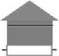
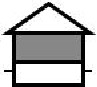
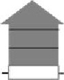
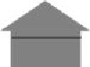
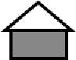
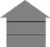
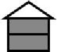
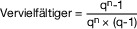
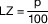
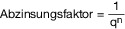

# Bewertungsgesetz (BewG)

Ausfertigungsdatum
:   1934-10-16

Fundstelle
:   RGBl I: 1934, 1035

Neugefasst durch
:   Bek. v. 1.2.1991 I 230;

Zuletzt geändert durch
:   Art. 2 G v. 16.7.2021 I 2931

Stand: Berichtigung v. 12.10.2021 I 4831 (Nr. 77) textlich nachgewiesen, dokumentarisch noch nicht abschließend bearbeitet

## Erster Teil - Allgemeine Bewertungsvorschriften

### § 1 Geltungsbereich

(1) Die allgemeinen Bewertungsvorschriften (§§ 2 bis 16) gelten für
alle öffentlich-rechtlichen Abgaben, die durch Bundesrecht geregelt
sind, soweit sie durch Bundesfinanzbehörden oder durch
Landesfinanzbehörden verwaltet werden.

(2) Die allgemeinen Bewertungsvorschriften gelten nicht, soweit im
Zweiten Teil dieses Gesetzes oder in anderen Steuergesetzen besondere
Bewertungsvorschriften enthalten sind.

### § 2 Wirtschaftliche Einheit

(1) Jede wirtschaftliche Einheit ist für sich zu bewerten. Ihr Wert
ist im ganzen festzustellen. Was als wirtschaftliche Einheit zu gelten
hat, ist nach den Anschauungen des Verkehrs zu entscheiden. Die
örtliche Gewohnheit, die tatsächliche Übung, die Zweckbestimmung und
die wirtschaftliche Zusammengehörigkeit der einzelnen Wirtschaftsgüter
sind zu berücksichtigen.

(2) Mehrere Wirtschaftsgüter kommen als wirtschaftliche Einheit nur
insoweit in Betracht, als sie demselben Eigentümer gehören.

(3) Die Vorschriften der Absätze 1 und 2 gelten nicht, soweit eine
Bewertung der einzelnen Wirtschaftsgüter vorgeschrieben ist.

### § 3 Wertermittlung bei mehreren Beteiligten

Steht ein Wirtschaftsgut mehreren Personen zu, so ist sein Wert im
ganzen zu ermitteln. Der Wert ist auf die Beteiligten nach dem
Verhältnis ihrer Anteile zu verteilen, soweit nicht nach dem
maßgebenden Steuergesetz die Gemeinschaft selbständig steuerpflichtig
ist.

### § 3a (weggefallen)

### § 4 Aufschiebend bedingter Erwerb

Wirtschaftsgüter, deren Erwerb vom Eintritt einer aufschiebenden
Bedingung abhängt, werden erst berücksichtigt, wenn die Bedingung
eingetreten ist.

### § 5 Auflösend bedingter Erwerb

(1) Wirtschaftsgüter, die unter einer auflösenden Bedingung erworben
sind, werden wie unbedingt erworbene behandelt. Die Vorschriften über
die Berechnung des Kapitalwerts der Nutzungen von unbestimmter Dauer
(§ 13 Abs. 2 und 3, § 14, § 15 Abs. 3) bleiben unberührt.

(2) Tritt die Bedingung ein, so ist die Festsetzung der nicht laufend
veranlagten Steuern auf Antrag nach dem tatsächlichen Wert des Erwerbs
zu berichtigen. Der Antrag ist bis zum Ablauf des Jahres zu stellen,
das auf den Eintritt der Bedingung folgt.

### § 6 Aufschiebend bedingte Lasten

(1) Lasten, deren Entstehung vom Eintritt einer aufschiebenden
Bedingung abhängt, werden nicht berücksichtigt.

(2) Für den Fall des Eintritts der Bedingung gilt § 5 Abs. 2
entsprechend.

### § 7 Auflösend bedingte Lasten

(1) Lasten, deren Fortdauer auflösend bedingt ist, werden, soweit
nicht ihr Kapitalwert nach § 13 Abs. 2 und 3, § 14, § 15 Abs. 3 zu
berechnen ist, wie unbedingte abgezogen.

(2) Tritt die Bedingung ein, so ist die Festsetzung der nicht laufend
veranlagten Steuern entsprechend zu berichtigen.

### § 8 Befristung auf einen unbestimmten Zeitpunkt

Die §§ 4 bis 7 gelten auch, wenn der Erwerb des Wirtschaftsguts oder
die Entstehung oder der Wegfall der Last von einem Ereignis abhängt,
bei dem nur der Zeitpunkt ungewiß ist.

### § 9 Bewertungsgrundsatz, gemeiner Wert

(1) Bei Bewertungen ist, soweit nichts anderes vorgeschrieben ist, der
gemeine Wert zugrunde zu legen.

(2) Der gemeine Wert wird durch den Preis bestimmt, der im
gewöhnlichen Geschäftsverkehr nach der Beschaffenheit des
Wirtschaftsgutes bei einer Veräußerung zu erzielen wäre. Dabei sind
alle Umstände, die den Preis beeinflussen, zu berücksichtigen.
Ungewöhnliche oder persönliche Verhältnisse sind nicht zu
berücksichtigen.

(3) Als persönliche Verhältnisse sind auch Verfügungsbeschränkungen
anzusehen, die in der Person des Steuerpflichtigen oder eines
Rechtsvorgängers begründet sind. Das gilt insbesondere für
Verfügungsbeschränkungen, die auf letztwilligen Anordnungen beruhen.

### § 10 Begriff des Teilwerts

Wirtschaftsgüter, die einem Unternehmen dienen, sind, soweit nichts
anderes vorgeschrieben ist, mit dem Teilwert anzusetzen. Teilwert ist
der Betrag, den ein Erwerber des ganzen Unternehmens im Rahmen des
Gesamtkaufpreises für das einzelne Wirtschaftsgut ansetzen würde.
Dabei ist davon auszugehen, daß der Erwerber das Unternehmen
fortführt.

### § 11 Wertpapiere und Anteile

(1) Wertpapiere und Schuldbuchforderungen, die am Stichtag an einer
deutschen Börse zum Handel im regulierten Markt zugelassen sind,
werden mit dem niedrigsten am Stichtag für sie im regulierten Markt
notierten Kurs angesetzt. Liegt am Stichtag eine Notierung nicht vor,
so ist der letzte innerhalb von 30 Tagen vor dem Stichtag im
regulierten Markt notierte Kurs maßgebend. Entsprechend sind die
Wertpapiere zu bewerten, die in den Freiverkehr einbezogen sind.

(2) Anteile an Kapitalgesellschaften, die nicht unter Absatz 1 fallen,
sind mit dem gemeinen Wert anzusetzen. Lässt sich der gemeine Wert
nicht aus Verkäufen unter fremden Dritten ableiten, die weniger als
ein Jahr zurückliegen, so ist er unter Berücksichtigung der
Ertragsaussichten der Kapitalgesellschaft oder einer anderen
anerkannten, auch im gewöhnlichen Geschäftsverkehr für
nichtsteuerliche Zwecke üblichen Methode zu ermitteln; dabei ist die
Methode anzuwenden, die ein Erwerber der Bemessung des Kaufpreises zu
Grunde legen würde. Die Summe der gemeinen Werte der zum
Betriebsvermögen gehörenden Wirtschaftsgüter und sonstigen aktiven
Ansätze abzüglich der zum Betriebsvermögen gehörenden Schulden und
sonstigen Abzüge (Substanzwert) der Gesellschaft darf nicht
unterschritten werden; die §§ 99 und 103 sind anzuwenden. Die §§ 199
bis 203 sind zu berücksichtigen.

(2a) (weggefallen)

(3) Ist der gemeine Wert einer Anzahl von Anteilen an einer
Kapitalgesellschaft, die einer Person gehören, infolge besonderer
Umstände (z. B. weil die Höhe der Beteiligung die Beherrschung der
Kapitalgesellschaft ermöglicht) höher als der Wert, der sich auf Grund
der Kurswerte (Absatz 1) oder der gemeinen Werte (Absatz 2) für die
einzelnen Anteile insgesamt ergibt, so ist der gemeine Wert der
Beteiligung maßgebend.

(4) Anteile oder Aktien, die Rechte an einem Investmentvermögen im
Sinne des Kapitalanlagegesetzbuchs verbriefen, sind mit dem
Rücknahmepreis anzusetzen.

### § 12 Kapitalforderungen und Schulden

(1) Kapitalforderungen, die nicht im § 11 bezeichnet sind, und
Schulden sind mit dem Nennwert anzusetzen, wenn nicht besondere
Umstände einen höheren oder geringeren Wert begründen. Liegen die
besonderen Umstände in einer hohen, niedrigen oder fehlenden
Verzinsung, ist bei der Bewertung vom Mittelwert einer jährlich
vorschüssigen und jährlich nachschüssigen Zahlungsweise auszugehen.

(2) Forderungen, die uneinbringlich sind, bleiben außer Ansatz.

(3) Der Wert unverzinslicher Forderungen oder Schulden, deren Laufzeit
mehr als ein Jahr beträgt und die zu einem bestimmten Zeitpunkt fällig
sind, ist der Betrag, der vom Nennwert nach Abzug von Zwischenzinsen
unter Berücksichtigung von Zinseszinsen verbleibt. Dabei ist von einem
Zinssatz von 5,5 Prozent auszugehen.

(4) Noch nicht fällige Ansprüche aus Lebens-, Kapital- oder
Rentenversicherungen werden mit dem Rückkaufswert bewertet.
Rückkaufswert ist der Betrag, den das Versicherungsunternehmen dem
Versicherungsnehmer im Falle der vorzeitigen Aufhebung des
Vertragsverhältnisses zu erstatten hat. Die Berechnung des Werts,
insbesondere die Berücksichtigung von ausgeschütteten und
gutgeschriebenen Gewinnanteilen kann durch Rechtsverordnung geregelt
werden.

### § 13 Kapitalwert von wiederkehrenden Nutzungen und Leistungen

(1) Der Kapitalwert von Nutzungen oder Leistungen, die auf bestimmte
Zeit beschränkt sind, ist mit dem aus Anlage 9a zu entnehmenden
Vielfachen des Jahreswerts anzusetzen. Ist die Dauer des Rechts
außerdem durch das Leben einer oder mehrerer Personen bedingt, darf
der nach § 14 zu berechnende Kapitalwert nicht überschritten werden.

(2) Immerwährende Nutzungen oder Leistungen sind mit dem 18,6fachen
des Jahreswerts, Nutzungen oder Leistungen von unbestimmter Dauer
vorbehaltlich des § 14 mit dem 9,3fachen des Jahreswerts zu bewerten.

(3) Ist der gemeine Wert der gesamten Nutzungen oder Leistungen
nachweislich geringer oder höher, so ist der nachgewiesene gemeine
Wert zugrunde zu legen. Der Ansatz eines geringeren oder höheren Werts
kann jedoch nicht darauf gestützt werden, daß mit einem anderen
Zinssatz als 5,5 Prozent oder mit einer anderen als mittelschüssigen
Zahlungsweise zu rechnen ist.

### § 14 Lebenslängliche Nutzungen und Leistungen

(1) Der Kapitalwert von lebenslänglichen Nutzungen und Leistungen ist
mit dem Vielfachen des Jahreswerts nach Maßgabe der Sätze 2 bis 4
anzusetzen. Die Vervielfältiger sind nach der Sterbetafel des
Statistischen Bundesamtes zu ermitteln und ab dem 1. Januar des auf
die Veröffentlichung der Sterbetafel durch das Statistische Bundesamt
folgenden Kalenderjahres anzuwenden. Der Kapitalwert ist unter
Berücksichtigung von Zwischenzinsen und Zinseszinsen mit einem
Zinssatz von 5,5 Prozent als Mittelwert zwischen dem Kapitalwert für
jährlich vorschüssige und jährlich nachschüssige Zahlungsweise zu
berechnen. Das Bundesministerium der Finanzen stellt die
Vervielfältiger für den Kapitalwert einer lebenslänglichen Nutzung
oder Leistung im Jahresbetrag von einem Euro nach Lebensalter und
Geschlecht der Berechtigten in einer Tabelle zusammen und
veröffentlicht diese zusammen mit dem Datum der Veröffentlichung der
Sterbetafel im Bundessteuerblatt.

(2) Hat eine nach Absatz 1 bewertete Nutzung oder Leistung bei einem
Alter

1.  bis zu 30 Jahren

    nicht mehr als 10 Jahre,

2.  von mehr als 30 Jahren bis zu 50 Jahren

    nicht mehr als 9 Jahre,

3.  von mehr als 50 Jahren bis zu 60 Jahren

    nicht mehr als 8 Jahre,

4.  von mehr als 60 Jahren bis zu 65 Jahren

    nicht mehr als 7 Jahre,

5.  von mehr als 65 Jahren bis zu 70 Jahren

    nicht mehr als 6 Jahre,

6.  von mehr als 70 Jahren bis zu 75 Jahren

    nicht mehr als 5 Jahre,

7.  von mehr als 75 Jahren bis zu 80 Jahren

    nicht mehr als 4 Jahre,

8.  von mehr als 80 Jahren bis zu 85 Jahren

    nicht mehr als 3 Jahre,

9.  von mehr als 85 Jahren bis zu 90 Jahren

    nicht mehr als 2 Jahre,

10. von mehr als 90 Jahren

    nicht mehr als 1 Jahr

bestanden und beruht der Wegfall auf dem Tod des Berechtigten oder
Verpflichteten, so ist die Festsetzung der nicht laufend veranlagten
Steuern auf Antrag nach der wirklichen Dauer der Nutzung oder Leistung
zu berichtigen. § 5 Abs. 2 Satz 2 gilt entsprechend. Ist eine Last
weggefallen, so bedarf die Berichtigung keines Antrags.

(3) Hängt die Dauer der Nutzung oder Leistung von der Lebenszeit
mehrerer Personen ab und erlischt das Recht mit dem Tod des zuletzt
Sterbenden, so ist das Lebensalter und das Geschlecht derjenigen
Person maßgebend, für die sich der höchste Vervielfältiger ergibt;
erlischt das Recht mit dem Tod des zuerst Sterbenden, so ist das
Lebensalter und Geschlecht derjenigen Person maßgebend, für die sich
der niedrigste Vervielfältiger ergibt.

(4) Ist der gemeine Wert der gesamten Nutzungen oder Leistungen
nachweislich geringer oder höher als der Wert, der sich nach Absatz 1
ergibt, so ist der nachgewiesene gemeine Wert zugrunde zu legen. Der
Ansatz eines geringeren oder höheren Werts kann jedoch nicht darauf
gestützt werden, daß mit einer kürzeren oder längeren Lebensdauer, mit
einem anderen Zinssatz als 5,5 Prozent oder mit einer anderen als
mittelschüssigen Zahlungsweise zu rechnen ist.

### § 15 Jahreswert von Nutzungen und Leistungen

(1) Der einjährige Betrag der Nutzung einer Geldsumme ist, wenn kein
anderer Wert feststeht, zu 5,5 Prozent anzunehmen.

(2) Nutzungen oder Leistungen, die nicht in Geld bestehen (Wohnung,
Kost, Waren und sonstige Sachbezüge), sind mit den üblichen
Mittelpreisen des Verbrauchsorts anzusetzen.

(3) Bei Nutzungen oder Leistungen, die in ihrem Betrag ungewiß sind
oder schwanken, ist als Jahreswert der Betrag zugrunde zu legen, der
in Zukunft im Durchschnitt der Jahre voraussichtlich erzielt werden
wird.

### § 16 Begrenzung des Jahreswerts von Nutzungen

Bei der Ermittlung des Kapitalwerts der Nutzungen eines
Wirtschaftsguts kann der Jahreswert dieser Nutzungen höchstens den
Wert betragen, der sich ergibt, wenn der für das genutzte
Wirtschaftsgut nach den Vorschriften des Bewertungsgesetzes
anzusetzende Wert durch 18,6 geteilt wird.

## Zweiter Teil - Besondere Bewertungsvorschriften

### § 17 Geltungsbereich

(1) Die besonderen Bewertungsvorschriften sind nach Maßgabe der
jeweiligen Einzelsteuergesetze anzuwenden.

(2) Die §§ 18 bis 94, 122 und 125 bis 132 gelten für die Grundsteuer
und die §§ 121a und 133 zusätzlich für die Gewerbesteuer.

(3) Soweit sich nicht aus den §§ 19 bis 150 etwas anderes ergibt,
finden neben diesen auch die Vorschriften des Ersten Teils des
Gesetzes (§§ 1 bis 16) Anwendung. § 16 findet auf die
Grunderwerbsteuer keine Anwendung.

### § 18 Vermögensarten

Das Vermögen, das nach den Vorschriften des Zweiten Teils dieses
Gesetzes zu bewerten ist, umfaßt die folgenden Vermögensarten:

1.  Land- und forstwirtschaftliches Vermögen (§§ 33 bis 67, § 31),

2.  Grundvermögen (§§ 68 bis 94, § 31),

3.  Betriebsvermögen (§§ 95 bis 109, § 31).

### Erster Abschnitt - Einheitsbewertung

#### A. - Allgemeines

##### § 19 Feststellung von Einheitswerten

(1) Einheitswerte werden für inländischen Grundbesitz, und zwar für
Betriebe der Land- und Forstwirtschaft (§§ 33, 48a und 51a), für
Grundstücke (§§ 68 und 70) und für Betriebsgrundstücke (§ 99)
festgestellt (§ 180 Abs. 1 Nr. 1 der Abgabenordnung).

(2) (weggefallen)

(3) In dem Feststellungsbescheid (§ 179 der Abgabenordnung) sind auch
Feststellungen zu treffen

1.  über die Art der wirtschaftlichen Einheit und bei Grundstücken auch
    über die Grundstücksart (§§ 72, 74 und 75) oder die
    Grundstückshauptgruppe (§ 32 der weiter anzuwendenden
    Durchführungsverordnung zum Reichsbewertungsgesetz vom 2. Februar
    1935, RGBl. I S. 81, zuletzt geändert durch die Verordnung zur
    Änderung der Durchführungsverordnung zum Vermögensteuergesetz, der
    Durchführungsverordnung zum Reichsbewertungsgesetz und der
    Aufbringungsumlage-Verordnung vom 8. Dezember 1944, RGBl. I S. 338);

2.  über die Zurechnung der wirtschaftlichen Einheit und bei mehreren
    Beteiligten über die Höhe ihrer Anteile.

(4) Feststellungen nach den Absätzen 1 und 3 erfolgen nur, wenn und
soweit sie für die Besteuerung von Bedeutung sind.

##### § 20 Ermittlung des Einheitswerts

Die Einheitswerte werden nach den Vorschriften dieses Abschnitts
ermittelt. Bei der Ermittlung der Einheitswerte ist § 163 der
Abgabenordnung nicht anzuwenden; dies gilt nicht für
Übergangsregelungen, die die oberste Finanzbehörde eines Landes im
Einvernehmen mit den obersten Finanzbehörden der übrigen Länder
trifft.

##### § 21 Hauptfeststellung

(1) Die Einheitswerte werden in Zeitabständen von je sechs Jahren
allgemein festgestellt (Hauptfeststellung).

(2) Der Hauptfeststellung werden die Verhältnisse zu Beginn des
Kalenderjahrs (Hauptfeststellungszeitpunkt) zugrunde gelegt. Die
Vorschriften in § 35 Abs. 2 und den §§ 54 und 59 über die
Zugrundelegung eines anderen Zeitpunkts bleiben unberührt.

##### § 22 Fortschreibungen

(1) Der Einheitswert wird neu festgestellt (Wertfortschreibung), wenn
der in Deutscher Mark ermittelte und auf volle hundert Deutsche Mark
abgerundete Wert, der sich für den Beginn eines Kalenderjahrs ergibt,
von dem entsprechenden Wert des letzten Feststellungszeitpunkts nach
oben um mehr als den zehnten Teil, mindestens aber um 5.000 Deutsche
Mark, oder um mehr als 100.000 Deutsche Mark, nach unten um mehr als
den zehnten Teil, mindestens aber um 500 Deutsche Mark, oder um mehr
als 5.000 Deutsche Mark, abweicht.

(2) Über die Art oder Zurechnung des Gegenstandes (§ 19 Abs. 3 Nr. 1
und 2) wird eine neue Feststellung getroffen (Artfortschreibung oder
Zurechnungsfortschreibung), wenn sie von der zuletzt getroffenen
Feststellung abweicht und es für die Besteuerung von Bedeutung ist.

(3) Eine Fortschreibung nach Absatz 1 oder Absatz 2 findet auch zur
Beseitigung eines Fehlers der letzten Feststellung statt. § 176 der
Abgabenordnung ist hierbei entsprechend anzuwenden. Dies gilt jedoch
nur für die Feststellungszeitpunkte, die vor der Verkündung der
maßgeblichen Entscheidung eines obersten Gerichts des Bundes liegen.

(4) Eine Fortschreibung ist vorzunehmen, wenn dem Finanzamt bekannt
wird, daß die Voraussetzungen für sie vorliegen. Der Fortschreibung
werden vorbehaltlich des § 27 die Verhältnisse im
Fortschreibungszeitpunkt zugrunde gelegt. Fortschreibungszeitpunkt ist

1.  bei einer Änderung der tatsächlichen Verhältnisse der Beginn des
    Kalenderjahrs, das auf die Änderung folgt;

2.  in den Fällen des Absatzes 3 der Beginn des Kalenderjahrs, in dem der
    Fehler dem Finanzamt bekannt wird, bei einer Erhöhung des
    Einheitswerts jedoch frühestens der Beginn des Kalenderjahrs, in dem
    der Feststellungsbescheid erteilt wird.

Die Vorschriften in § 35 Abs. 2 und den §§ 54 und 59 über die
Zugrundelegung eines anderen Zeitpunkts bleiben unberührt.

##### § 23 Nachfeststellung

(1) Für wirtschaftliche Einheiten, für die ein Einheitswert
festzustellen ist, wird der Einheitswert nachträglich festgestellt
(Nachfeststellung), wenn nach dem Hauptfeststellungszeitpunkt (§ 21
Abs. 2)

1.  die wirtschaftliche Einheit neu entsteht;

2.  eine bereits bestehende wirtschaftliche Einheit erstmals zu einer
    Steuer herangezogen werden soll.

(2) Der Nachfeststellung werden vorbehaltlich des § 27 die
Verhältnisse im Nachfeststellungszeitpunkt zugrunde gelegt.
Nachfeststellungszeitpunkt ist in den Fällen des Absatzes 1 Nr. 1 der
Beginn des Kalenderjahrs, das auf die Entstehung der wirtschaftlichen
Einheit folgt, und in den Fällen des Absatzes 1 Nr. 2 der Beginn des
Kalenderjahrs, in dem der Einheitswert erstmals der Besteuerung
zugrunde gelegt wird. Die Vorschriften in § 35 Abs. 2 und den §§ 54
und 59 über die Zugrundelegung eines anderen Zeitpunkts bleiben
unberührt.

##### § 24 Aufhebung des Einheitswerts

(1) Der Einheitswert wird aufgehoben, wenn dem Finanzamt bekannt wird,
daß

1.  die wirtschaftliche Einheit wegfällt;

2.  der Einheitswert der wirtschaftlichen Einheit infolge von
    Befreiungsgründen der Besteuerung nicht mehr zugrunde gelegt wird.

(2) Aufhebungszeitpunkt ist in den Fällen des Absatzes 1 Nr. 1 der
Beginn des Kalenderjahrs, das auf den Wegfall der wirtschaftlichen
Einheit folgt, und in den Fällen des Absatzes 1 Nr. 2 der Beginn des
Kalenderjahrs, in dem der Einheitswert erstmals der Besteuerung nicht
mehr zugrunde gelegt wird.

##### § 24a Änderung von Feststellungsbescheiden

Bescheide über Fortschreibungen oder Nachfeststellungen von
Einheitswerten des Grundbesitzes können schon vor dem maßgebenden
Feststellungszeitpunkt erteilt werden. Sie sind zu ändern oder
aufzuheben, wenn sich bis zu diesem Zeitpunkt Änderungen ergeben, die
zu einer abweichenden Feststellung führen.

##### § 25 Nachholung einer Feststellung

(1) Ist die Feststellungsfrist (§ 181 der Abgabenordnung) bereits
abgelaufen, kann eine Fortschreibung (§ 22) oder Nachfeststellung (§
23) unter Zugrundelegung der Verhältnisse vom Fortschreibungs- oder
Nachfeststellungszeitpunkt mit Wirkung für eine späteren
Feststellungszeitpunkt vorgenommen werden, für den diese Frist noch
nicht abgelaufen ist. § 181 Abs. 5 der Abgabenordnung bleibt
unberührt.

(2) Absatz 1 ist bei der Aufhebung des Einheitswerts (§ 24)
entsprechend anzuwenden.

##### § 26 Umfang der wirtschaftlichen Einheit bei Ehegatten oder Lebenspartnern

Die Zurechnung mehrerer Wirtschaftsgüter zu einer wirtschaftlichen
Einheit (§ 2) wird beim Grundbesitz im Sinne der §§ 33 bis 94, 99 und
125 bis 133 nicht dadurch ausgeschlossen, daß die Wirtschaftsgüter zum
Teil dem einen, zum Teil dem anderen Ehegatten oder Lebenspartner
gehören.

##### § 27 Wertverhältnisse bei Fortschreibungen und Nachfeststellungen

Bei Fortschreibungen und bei Nachfeststellungen der Einheitswerte für
Grundbesitz sind die Wertverhältnisse im Hauptfeststellungszeitpunkt
zugrunde zu legen.

##### § 28 Erklärungspflicht

(1) Erklärungen zur Feststellung des Einheitswerts sind auf jeden
Hauptfeststellungszeitpunkt abzugeben.

(2) Die Erklärungen sind innerhalb der Frist abzugeben, die das
Bundesministerium der Finanzen im Einvernehmen mit den obersten
Finanzbehörden der Länder bestimmt. Die Frist ist im Bundesanzeiger
bekanntzumachen. Fordert die Finanzbehörde zur Abgabe einer Erklärung
auf einen Hauptfeststellungszeitpunkt oder auf einen anderen
Feststellungszeitpunkt besonders auf (§ 149 Abs. 1 Satz 2 der
Abgabenordnung), hat sie eine besondere Frist zu bestimmen, die
mindestens einen Monat betragen soll.

(3) Erklärungspflichtig ist derjenige, dem Grundbesitz zuzurechnen
ist. Er hat die Steuererklärung eigenhändig zu unterschreiben.

##### § 29 Auskünfte, Erhebungen und Mitteilungen

(1) Die Eigentümer von Grundbesitz haben der Finanzbehörde auf
Anforderung alle Angaben zu machen, die sie für die Sammlung der
Kauf-, Miet- und Pachtpreise braucht. Bei dieser Erklärung ist zu
versichern, daß die Angaben nach bestem Wissen und Gewissen gemacht
sind.

(2) Die Finanzbehörden können zur Vorbereitung einer Hauptfeststellung
und zur Durchführung von Feststellungen der Einheitswerte des
Grundbesitzes örtliche Erhebungen über die Bewertungsgrundlagen
anstellen. Das Grundrecht der Unverletzlichkeit der Wohnung (Artikel
13 des Grundgesetzes) wird insoweit eingeschränkt.

(3) Die nach Bundes- oder Landesrecht zuständigen Behörden haben den
Finanzbehörden die rechtlichen und tatsächlichen Umstände mitzuteilen,
die ihnen im Rahmen ihrer Aufgabenerfüllung bekannt geworden sind und
die für die Feststellung von Einheitswerten des Grundbesitzes, für die
Feststellung von Grundbesitzwerten oder für die Grundsteuer von
Bedeutung sein können; mitzuteilen sind auch diejenigen Umstände, die
für die Erbschaftsteuer oder die Grunderwerbsteuer von Bedeutung sein
können, sofern die Finanzbehörden dies anordnen. Den Behörden stehen
die Stellen gleich, die für die Sicherung der Zweckbestimmung der
Wohnungen zuständig sind, die auf der Grundlage des Zweiten
Wohnungsbaugesetzes, des Wohnungsbaugesetzes für das Saarland oder auf
der Grundlage des Wohnraumförderungsgesetzes gefördert worden sind.

(4) Die Grundbuchämter teilen den für die Feststellung des
Einheitswerts und den für die Feststellung des Grundbesitzwerts
zuständigen Finanzbehörden für die in Absatz 3 bezeichneten Zwecke mit

1.  die Eintragung eines neuen Eigentümers oder Erbbauberechtigten sowie
    bei einem anderen als rechtsgeschäftlichen Erwerb auch die Anschrift
    des neuen Eigentümers oder Erbbauberechtigten; dies gilt nicht für die
    Fälle des Erwerbs nach den Vorschriften des Zuordnungsrechts,

2.  die Eintragung der Begründung von Wohnungseigentum oder Teileigentum,

3.  die Eintragung der Begründung eines Erbbaurechts, Wohnungserbbaurechts
    oder Teilerbbaurechts.

In den Fällen der Nummern 2 und 3 ist gleichzeitig der Tag des
Eingangs des Eintragungsantrags beim Grundbuchamt mitzuteilen. Bei
einer Eintragung aufgrund Erbfolge ist das Jahr anzugeben, in dem der
Erblasser verstorben ist. Die Mitteilungen sollen der Finanzbehörde
über die für die Führung des Liegenschaftskatasters zuständige Behörde
oder über eine sonstige Behörde, die das amtliche Verzeichnis der
Grundstücke (§ 2 Abs. 2 der Grundbuchordnung) führt, zugeleitet
werden.

(5) Die mitteilungspflichtige Stelle hat die Betroffenen vom Inhalt
der Mitteilung zu unterrichten. Eine Unterrichtung kann unterbleiben,
soweit den Finanzbehörden Umstände aus dem Grundbuch, den Grundakten
oder aus dem Liegenschaftskataster mitgeteilt werden.

(6) Die nach den Absätzen 3 oder 4 verpflichteten Behörden und Stellen
übermitteln die Mitteilungen den Finanzbehörden nach amtlich
vorgeschriebenem Datensatz durch Datenfernübertragung. Die
Grundbuchämter und die für die Führung des Liegenschaftskatasters
zuständigen Behörden übermitteln die bei ihnen geführten Daten
laufend, mindestens alle drei Monate.Das Bundesministerium der
Finanzen legt im Einvernehmen mit den obersten Finanzbehörden der
Länder und den obersten Vermessungs- und Katasterbehörden der Länder
die Einzelheiten und den Beginn der elektronischen Übermittlung in
einem Schreiben fest. Dieses Schreiben ist im Bundesanzeiger und im
Bundessteuerblatt zu veröffentlichen.

##### § 30 Abrundung

Die in Deutscher Mark ermittelten Einheitswerte werden auf volle
hundert Deutsche Mark nach unten abgerundet und danach in Euro
umgerechnet. Der umgerechnete Betrag wird auf volle Euro abgerundet.

##### § 31 Bewertung von ausländischem Sachvermögen

(1) Für die Bewertung des ausländischen land- und
forstwirtschaftlichen Vermögens, Grundvermögens und Betriebsvermögens
gelten die Vorschriften des Ersten Teils dieses Gesetzes, insbesondere
§ 9 (gemeiner Wert). Nach diesen Vorschriften sind auch die
ausländischen Teile einer wirtschaftlichen Einheit zu bewerten, die
sich sowohl auf das Inland als auch auf das Ausland erstreckt.

(2) Bei der Bewertung von ausländischem Grundbesitz sind Bestandteile
und Zubehör zu berücksichtigen. Zahlungsmittel, Geldforderungen,
Wertpapiere und Geldschulden sind nicht einzubeziehen.

##### § 32 Bewertung von inländischem Sachvermögen

Für die Bewertung des inländischen land- und forstwirtschaftlichen
Vermögens, Grundvermögens und Betriebsvermögens gelten die
Vorschriften der §§ 33 bis 109. Nach diesen Vorschriften sind auch die
inländischen Teile einer wirtschaftlichen Einheit zu bewerten, die
sich sowohl auf das Inland als auch auf das Ausland erstreckt.

#### B. - Land- und forstwirtschaftliches Vermögen

##### I. - Allgemeines

###### § 33 Begriff des land- und forstwirtschaftlichen Vermögens

(1) Zum land- und forstwirtschaftlichen Vermögen gehören alle
Wirtschaftsgüter, die einem Betrieb der Land- und Forstwirtschaft
dauernd zu dienen bestimmt sind. Betrieb der Land- und Forstwirtschaft
ist die wirtschaftliche Einheit des land- und forstwirtschaftlichen
Vermögens.

(2) Zu den Wirtschaftsgütern, die einem Betrieb der Land- und
Forstwirtschaft dauernd zu dienen bestimmt sind, gehören insbesondere
der Grund und Boden, die Wohn- und Wirtschaftsgebäude, die stehenden
Betriebsmittel und ein normaler Bestand an umlaufenden
Betriebsmitteln; als normaler Bestand gilt ein solcher, der zur
gesicherten Fortführung des Betriebes erforderlich ist.

(3) Zum land- und forstwirtschaftlichen Vermögen gehören nicht

1.  Zahlungsmittel, Geldforderungen, Geschäftsguthaben und Wertpapiere,

2.  Geldschulden,

3.  über den normalen Bestand hinausgehende Bestände (Überbestände) an
    umlaufenden Betriebsmitteln,

4.  Tierbestände oder Zweige des Tierbestands und die hiermit
    zusammenhängenden Wirtschaftsgüter (z. B. Gebäude und abgrenzbare
    Gebäudeteile mit den dazugehörenden Flächen, Betriebsmittel), wenn die
    Tiere weder nach § 51 oder § 51a zur landwirtschaftlichen Nutzung noch
    nach § 62 zur sonstigen land- und forstwirtschaftlichen Nutzung
    gehören. Die Zugehörigkeit der landwirtschaftlich genutzten Flächen
    zum land- und forstwirtschaftlichen Vermögen wird hierdurch nicht
    berührt.

###### § 34 Betrieb der Land- und Forstwirtschaft

(1) Ein Betrieb der Land- und Forstwirtschaft umfaßt

1.  den Wirtschaftsteil,

2.  den Wohnteil.

(2) Der Wirtschaftsteil eines Betriebs der Land- und Forstwirtschaft
umfaßt

1.  die land- und forstwirtschaftlichen Nutzungen:

    a)  die landwirtschaftliche Nutzung,

    b)  die forstwirtschaftliche Nutzung,

    c)  die weinbauliche Nutzung,

    d)  die gärtnerische Nutzung,

    e)  die sonstige land- und forstwirtschaftliche Nutzung;

2.  die folgenden nicht zu einer Nutzung nach Nummer 1 gehörenden
    Wirtschaftsgüter:

    a)  Abbauland (§ 43),

    b)  Geringstland (§ 44),

    c)  Unland (§ 45);

3.  die Nebenbetriebe (§ 42).

(3) Der Wohnteil eines Betriebs der Land- und Forstwirtschaft umfaßt
die Gebäude und Gebäudeteile, soweit sie dem Inhaber des Betriebs, den
zu seinem Haushalt gehörenden Familienangehörigen und den Altenteilern
zu Wohnzwecken dienen.

(4) In den Betrieb sind auch dem Eigentümer des Grund und Bodens nicht
gehörende Gebäude, die auf dem Grund und Boden des Betriebs stehen,
und dem Eigentümer des Grund und Bodens nicht gehörende
Betriebsmittel, die der Bewirtschaftung des Betriebs dienen,
einzubeziehen.

(5) Ein Anteil des Eigentümers eines Betriebs der Land- und
Forstwirtschaft an einem Wirtschaftsgut ist in den Betrieb
einzubeziehen, wenn es mit dem Betrieb zusammen genutzt wird.

(6) In einen Betrieb der Land- und Forstwirtschaft, der von einer
Gesellschaft oder Gemeinschaft des bürgerlichen Rechts betrieben wird,
sind auch die Wirtschaftsgüter einzubeziehen, die einem oder mehreren
Beteiligten gehören und dem Betrieb zu dienen bestimmt sind.

(6a) Einen Betrieb der Land- und Forstwirtschaft bildet auch die
gemeinschaftliche Tierhaltung (§ 51a) einschließlich der hiermit
zusammenhängenden Wirtschaftsgüter.

(7) Einen Betrieb der Land- und Forstwirtschaft bilden auch
Stückländereien. Stückländereien sind einzelne land- und
forstwirtschaftlich genutzte Flächen, bei denen die Wirtschaftsgebäude
oder die Betriebsmittel oder beide Arten von Wirtschaftsgütern nicht
dem Eigentümer des Grund und Boden gehören.

###### § 35 Bewertungsstichtag

(1) Für die Größe des Betriebs sowie für den Umfang und den Zustand
der Gebäude und der stehenden Betriebsmittel sind die Verhältnisse im
Feststellungszeitpunkt maßgebend.

(2) Für die umlaufenden Betriebsmittel ist der Stand am Ende des
Wirtschaftsjahres maßgebend, das dem Feststellungszeitpunkt
vorangegangen ist.

###### § 36 Bewertungsgrundsätze

(1) Bei der Bewertung ist unbeschadet der Regelung, die in § 47 für
den Wohnungswert getroffen ist, der Ertragswert zugrunde zu legen.

(2) Bei der Ermittlung des Ertragswerts ist von der Ertragsfähigkeit
auszugehen. Ertragsfähigkeit ist der bei ordnungsmäßiger und
schuldenfreier Bewirtschaftung mit entlohnten fremden Arbeitskräften
gemeinhin und nachhaltig erzielbare Reinertrag. Ertragswert ist das
Achtzehnfache dieses Reinertrags.

(3) Bei der Beurteilung der Ertragsfähigkeit sind die
Ertragsbedingungen zu berücksichtigen, soweit sie nicht unwesentlich
sind.

###### § 37 Ermittlung des Ertragswerts

(1) Der Ertragswert der Nutzungen wird durch ein vergleichendes
Verfahren (§§ 38 bis 41) ermittelt. Das vergleichende Verfahren kann
auch auf Nutzungsteile angewendet werden.

(2) Kann ein vergleichendes Verfahren nicht durchgeführt werden, so
ist der Ertragswert nach der Ertragsfähigkeit der Nutzung unmittelbar
zu ermitteln (Einzelertragswertverfahren).

###### § 38 Vergleichszahl, Ertragsbedingungen

(1) Die Unterschiede der Ertragsfähigkeit der gleichen Nutzung in den
verschiedenen Betrieben werden durch Vergleich der Ertragsbedingungen
beurteilt und vorbehaltlich der §§ 55 und 62 durch Zahlen ausgedrückt,
die dem Verhältnis der Reinerträge entsprechen (Vergleichszahlen).

(2) Bei dem Vergleich der Ertragsbedingungen sind zugrunde zu legen

1.  die tatsächlichen Verhältnisse für:

    a)  die natürlichen Ertragsbedingungen, insbesondere Bodenbeschaffenheit,
        Geländegestaltung, klimatische Verhältnisse,

    b)  die folgenden wirtschaftlichen Ertragsbedingungen:

        aa) innere Verkehrslage (Lage für die Bewirtschaftung der Betriebsfläche),

        bb) äußere Verkehrslage (insbesondere Lage für die Anfuhr der
            Betriebsmittel und die Abfuhr der Erzeugnisse),

        cc) Betriebsgröße;

2.  die in der Gegend als regelmäßig anzusehenden Verhältnisse für die in
    Nummer 1 Buchstabe b nicht bezeichneten wirtschaftlichen
    Ertragsbedingungen, insbesondere Preise und Löhne,
    Betriebsorganisation, Betriebsmittel.

(3) Bei Stückländereien sind die wirtschaftlichen Ertragsbedingungen
nach Absatz 2 Nr. 1 Buchstabe b mit den regelmäßigen Verhältnissen der
Gegend anzusetzen.

###### § 39 Bewertungsstützpunkte

(1) Zur Sicherung der Gleichmäßigkeit der Bewertung werden in
einzelnen Betrieben mit gegendüblichen Ertragsbedingungen die
Vergleichszahlen von Nutzungen und Nutzungsteilen vorweg ermittelt
(Hauptbewertungsstützpunkte). Die Vergleichszahlen der
Hauptbewertungsstützpunkte werden vom Bewertungsbeirat (§§ 63 bis 66)
vorgeschlagen und durch Rechtsverordnung festgesetzt. Die
Vergleichszahlen der Nutzungen und Nutzungsteile in den übrigen
Betrieben werden durch Vergleich mit den Vergleichszahlen der
Hauptbewertungsstützpunkte ermittelt. § 55 bleibt unberührt.

(2) Die Hauptbewertungsstützpunkte können durch Landes-
Bewertungsstützpunkte und Orts-Bewertungsstützpunkte als
Bewertungsbeispiele ergänzt werden. Die Vergleichszahlen der Landes-
Bewertungsstützpunkte werden vom Gutachterausschuß (§ 67), die
Vergleichszahlen der Orts-Bewertungsstützpunkte von den
Landesfinanzbehörden ermittelt. Die Vergleichszahlen der Landes-
Bewertungsstützpunkte und Orts-Bewertungsstützpunkte können
bekanntgegeben werden.

(3) Zugepachtete Flächen, die zusammen mit einem Bewertungsstützpunkt
bewirtschaftet werden, können bei der Ermittlung der Vergleichszahlen
mit berücksichtigt werden. Bei der Feststellung des Einheitswerts
eines Betriebs, der als Bewertungsstützpunkt dient, sind zugepachtete
Flächen nicht zu berücksichtigen (§ 2 Abs. 2).

###### § 40 Ermittlung des Vergleichswerts

(1) Zum Hauptfeststellungszeitpunkt wird für die landwirtschaftliche,
die weinbauliche und die gärtnerische Nutzung oder für deren Teile der
100 Vergleichszahlen entsprechende Ertragswert vorbehaltlich Absatz 2
durch besonderes Gesetz festgestellt. Aus diesem Ertragswert wird der
Ertragswert für die einzelne Nutzung oder den Nutzungsteil in den
Betrieben mit Hilfe der Vergleichszahlen abgeleitet (Vergleichswert).
Der auf einen Hektar bezogene Vergleichswert ist der Hektarwert.

(2) Für die Hauptfeststellung auf den Beginn des Kalenderjahres 1964
betragen die 100 Vergleichszahlen entsprechenden Ertragswerte bei

*    *   der landwirtschaftlichen Nutzung

    *

*    *
    *   ohne Hopfen und Spargel

    *   37,26 DM

*    *
    *   Hopfen

    *   254,00 DM

*    *
    *   Spargel

    *   76,50 DM

*    *   der weinbaulichen Nutzung

    *   200,00 DM

*    *   den gärtnerischen Nutzungsteilen

    *

*    *
    *   Gemüse-, Blumen- und Zierpflanzenbau

    *   108,00 DM

*    *
    *   Obstbau

    *   72,00 DM

*    *
    *   Baumschulen

    *   221,40 DM.

(3) Die Hoffläche und die Gebäudefläche des Betriebs sind in die
einzelne Nutzung einzubeziehen, soweit sie ihr dienen. Hausgärten bis
zur Größe von 10 Ar sind zur Hof- und Gebäudefläche zu rechnen.
Wirtschaftswege, Hecken, Gräben, Grenzraine und dergleichen sind in
die Nutzung einzubeziehen, zu der sie gehören; dies gilt auch für
Wasserflächen, soweit sie nicht Unland sind oder zur sonstigen land-
und forstwirtschaftlichen Nutzung (§ 62) gehören.

(4) Das Finanzamt hat bei Vorliegen eines rechtlichen Interesses dem
Steuerpflichtigen Bewertungsgrundlagen und Bewertungsergebnisse der
Nutzung oder des Nutzungsteils von Bewertungsstützpunkten, die bei der
Ermittlung der Vergleichswerte seines Betriebs herangezogen worden
sind, anzugeben.

(5) Zur Berücksichtigung der rückläufigen Reinerträge sind die nach
den Absätzen 1 und 2 ermittelten Vergleichswerte für Hopfen um 80
Prozent, für Spargel um 50 Prozent und für Obstbau um 60 Prozent zu
vermindern; es ist jedoch jeweils mindestens ein Hektarwert von 1 200
Deutsche Mark anzusetzen.

###### § 41 Abschläge und Zuschläge

(1) Ein Abschlag oder ein Zuschlag am Vergleichswert ist zu machen,

1.  soweit die tatsächlichen Verhältnisse bei einer Nutzung oder einem
    Nutzungsteil von den bei der Bewertung unterstellten regelmäßigen
    Verhältnissen der Gegend (§ 38 Abs. 2 Nr. 2) um mehr als 20 Prozent
    abweichen und

2.  wenn die Abweichung eine Änderung des Vergleichswerts der Nutzung oder
    des Nutzungsteils um mehr als den fünften Teil, mindestens aber um
    1\.000 Deutsche Mark, oder um mehr als 10.000 Deutsche Mark bewirkt.

(2) Der Abschlag oder der Zuschlag ist nach der durch die Abweichung
bedingten Minderung oder Steigerung der Ertragsfähigkeit zu bemessen.

(2a) Der Zuschlag wegen Abweichung des tatsächlichen Tierbestands von
den unterstellten regelmäßigen Verhältnissen der Gegend ist bei
Fortschreibungen (§ 22) oder Nachfeststellungen (§ 23) um 50 Prozent
zu vermindern.

(3) Bei Stückländereien sind weder Abschläge für fehlende
Betriebsmittel beim Eigentümer des Grund und Bodens noch Zuschläge für
Überbestand an diesen Wirtschaftsgütern bei deren Eigentümern zu
machen.

###### § 42 Nebenbetriebe

(1) Nebenbetriebe sind Betriebe, die dem Hauptbetrieb zu dienen
bestimmt sind und nicht einen selbständigen gewerblichen Betrieb
darstellen.

(2) Die Nebenbetriebe sind gesondert mit dem Einzelertragswert zu
bewerten.

###### § 43 Abbauland

(1) Zum Abbauland gehören die Betriebsflächen, die durch Abbau der
Bodensubstanz überwiegend für den Betrieb nutzbar gemacht werden
(Sand-, Kies-, Lehmgruben, Steinbrüche, Torfstiche und dergleichen).

(2) Das Abbauland ist gesondert mit dem Einzelertragswert zu bewerten.

###### § 44 Geringstland

(1) Zum Geringstland gehören die Betriebsflächen geringster
Ertragsfähigkeit, für die nach dem Bodenschätzungsgesetz keine
Wertzahlen festzustellen sind.

(2) Geringstland ist mit einem Hektarwert von 50 Deutschen Mark zu
bewerten.

###### § 45 Unland

(1) Zum Unland gehören die Betriebsflächen, die auch bei geordneter
Wirtschaftsweise keinen Ertrag abwerfen können.

(2) Unland wird nicht bewertet.

###### § 46 Wirtschaftswert

Aus den Vergleichswerten (§ 40 Abs. 1) und den Abschlägen und
Zuschlägen (§ 41), aus den Einzelertragswerten sowie aus den Werten
der nach den §§ 42 bis 44 gesondert zu bewertenden Wirtschaftsgüter
wird der Wert für den Wirtschaftsteil (Wirtschaftswert) gebildet. Für
seine Ermittlung gelten außer den Bestimmungen in den §§ 35 bis 45
auch die besonderen Vorschriften in den §§ 50 bis 62.

###### § 47 Wohnungswert

Der Wert für den Wohnteil (Wohnungswert) wird nach den Vorschriften
ermittelt, die beim Grundvermögen für die Bewertung der
Mietwohngrundstücke im Ertragswertverfahren (§§ 71, 78 bis 82 und 91)
gelten. Bei der Schätzung der üblichen Miete (§ 79 Abs. 2) sind die
Besonderheiten, die sich aus der Lage der Gebäude oder Gebäudeteile im
Betrieb ergeben, zu berücksichtigen. Der ermittelte Betrag ist um 15
Prozent zu vermindern.

###### § 48 Zusammensetzung des Einheitswerts

Der Wirtschaftswert und der Wohnungswert bilden zusammen den
Einheitswert des Betriebs.

###### § 48a Einheitswert bestimmter intensiv genutzter Flächen

Werden Betriebsflächen durch einen anderen Nutzungsberechtigten als
den Eigentümer bewirtschaftet, so ist

1.  bei der Sonderkultur Spargel (§ 52),

2.  bei den gärtnerischen Nutzungsteilen Gemüse, Blumen- und
    Zierpflanzenbau sowie Baumschulen (§ 61),

3.  bei der Saatzucht (§ 62 Abs. 1 Nr. 6)

der Unterschiedsbetrag zwischen dem für landwirtschaftliche Nutzung
maßgebenden Vergleichswert und dem höheren Vergleichswert, der durch
die unter den Nummern 1 bis 3 bezeichneten Nutzungen bedingt ist, bei
der Feststellung des Einheitswerts des Eigentümers nicht zu
berücksichtigen und für den Nutzungsberechtigten als selbständiger
Einheitswert festzustellen. Ist ein Einheitswert für land- und
forstwirtschaftliches Vermögen des Nutzungsberechtigten festzustellen,
so ist der Unterschiedsbetrag in diesen Einheitswert einzubeziehen.
Die Sätze 1 und 2 gelten nicht, wenn der Eigentümer die Flächen
bereits intensiv im Sinne der Nummern 1 bis 3 genutzt hat.

###### § 49 (weggefallen)

##### II. - Besondere Vorschriften

###### a) - Landwirtschaftliche Nutzung

###### § 50 Ertragsbedingungen

(1) Bei der Beurteilung der natürlichen Ertragsbedingungen (§ 38 Abs.
2 Nr. 1 Buchstabe a) ist von den Ergebnissen der Bodenschätzung nach
dem Bodenschätzungsgesetz auszugehen. Dies gilt auch für das
Bodenartenverhältnis.

(2) Ist durch die natürlichen Verhältnisse ein anderes als das in der
betreffenden Gegend regelmäßige Kulturartenverhältnis bedingt, so ist
abweichend von § 38 Abs. 2 Nr. 2 das tatsächliche
Kulturartenverhältnis maßgebend.

###### § 51 Tierbestände

(1) (weggefallen)

(1a) Für Feststellungszeitpunkte ab dem 1. Januar 1999 gehören
Tierbestände in vollem Umfang zur landwirtschaftlichen Nutzung, wenn
im Wirtschaftsjahr

*    *   für die ersten 20 Hektar

    *

*    *
    *   nicht mehr als 10 Vieheinheiten,

*    *   für die nächsten 10 Hektar

    *

*    *
    *   nicht mehr als 7 Vieheinheiten,

*    *   für die nächsten 20 Hektar

    *

*    *
    *   nicht mehr als 6 Vieheinheiten,

*    *   für die nächsten 50 Hektar

    *

*    *
    *   nicht mehr als 3 Vieheinheiten

*    *   und für die weitere Fläche

    *

*    *
    *   nicht mehr als 1,5 Vieheinheiten

je Hektar der vom Inhaber des Betriebs regelmäßig landwirtschaftlich
genutzten Flächen erzeugt oder gehalten werden. Die Tierbestände sind
nach dem Futterbedarf in Vieheinheiten umzurechnen. Diese Zuordnung
der Tierbestände steht einer Änderung der tatsächlichen Verhältnisse
gleich, die im Kalenderjahr 1998 eingetreten ist; § 27 ist insoweit
nicht anzuwenden.

(2) Übersteigt die Anzahl der Vieheinheiten nachhaltig die in Absatz
1a bezeichnete Grenze, so gehören nur die Zweige des Tierbestands zur
landwirtschaftlichen Nutzung, deren Vieheinheiten zusammen diese
Grenze nicht überschreiten. Zunächst sind mehr flächenabhängige Zweige
des Tierbestands und danach weniger flächenabhängige Zweige des
Tierbestands zur landwirtschaftlichen Nutzung zu rechnen. Innerhalb
jeder dieser Gruppe sind zuerst Zweige des Tierbestands mit der
geringeren Anzahl von Vieheinheiten und dann Zweige mit der größeren
Anzahl von Vieheinheiten zur landwirtschaftlichen Nutzung zu rechnen.
Der Tierbestand des einzelnen Zweiges wird nicht aufgeteilt.

(3) Als Zweig des Tierbestands gilt bei jeder Tierart für sich

1.  das Zugvieh,

2.  das Zuchtvieh,

3.  das Mastvieh,

4.  das übrige Nutzvieh.

Das Zuchtvieh einer Tierart gilt nur dann als besonderer Zweig des
Tierbestands, wenn die erzeugten Jungtiere überwiegend zum Verkauf
bestimmt sind. Ist das nicht der Fall, so ist das Zuchtvieh dem Zweig
des Tierbestands zuzurechnen, dem es überwiegend dient.

(4) Der Umrechnungsschlüssel für Tierbestände in Vieheinheiten sowie
die Gruppen der mehr oder weniger flächenabhängigen Zweige des
Tierbestands sind aus den Anlagen 1 und 2 zu entnehmen. Für die Zeit
von einem nach dem 1. Januar 1964 liegenden
Hauptfeststellungszeitpunkt an können der Umrechnungsschlüssel für
Tierbestände in Vieheinheiten sowie die Gruppen der mehr oder weniger
flächenabhängigen Zweige des Tierbestands durch Rechtsverordnung
Änderungen der wirtschaftlichen Gegebenheiten, auf denen sie beruhen,
angepaßt werden.

(5) Die Absätze 1a bis 4 gelten nicht für Pelztiere. Pelztiere gehören
nur dann zur landwirtschaftlichen Nutzung, wenn die erforderlichen
Futtermittel überwiegend von den vom Inhaber des Betriebs
landwirtschaftlich genutzten Flächen gewonnen sind.

###### § 51a Gemeinschaftliche Tierhaltung

(1) Zur landwirtschaftlichen Nutzung gehört auch die Tierzucht und
Tierhaltung von Erwerbs- und Wirtschaftsgenossenschaften (§ 97 Abs. 1
Nr. 2), von Gesellschaften, bei denen die Gesellschafter als
Unternehmer (Mitunternehmer) anzusehen sind (§ 97 Abs. 1 Nr. 5), oder
von Vereinen (§ 97 Abs. 2), wenn

1.  alle Gesellschafter oder Mitglieder

    a)  Inhaber eines Betriebs der Land- und Forstwirtschaft mit
        selbstbewirtschafteten regelmäßig landwirtschaftlich genutzten Flächen
        sind,

    b)  nach dem Gesamtbild der Verhältnisse hauptberuflich Land- und
        Forstwirte sind,

    c)  Landwirte im Sinne des § 1 Abs. 2 des Gesetzes über die
        Alterssicherung der Landwirte sind und dies durch eine Bescheinigung
        der landwirtschaftlichen Alterskasse nachgewiesen wird und

    d)  die sich nach § 51 Abs. 1a für sie ergebende Möglichkeit zur
        landwirtschaftlichen Tiererzeugung oder Tierhaltung in Vieheinheiten
        ganz oder teilweise auf die Genossenschaft, die Gesellschaft oder den
        Verein übertragen haben;

2.  die Anzahl der von der Genossenschaft, der Gesellschaft oder dem
    Verein im Wirtschaftsjahr erzeugten oder gehaltenen Vieheinheiten
    keine der nachfolgenden Grenzen nachhaltig überschreitet:

    a)  die Summe der sich nach Nummer 1 Buchstabe d ergebenden Vieheinheiten
        und

    b)  die Summe der Vieheinheiten, die sich nach § 51 Abs. 1a auf der
        Grundlage der Summe der von den Gesellschaftern oder Mitgliedern
        regelmäßig landwirtschaftlich genutzten Flächen ergibt;

3.  die Betriebe der Gesellschafter oder Mitglieder nicht mehr als 40 km
    von der Produktionsstätte der Genossenschaft, der Gesellschaft oder
    des Vereins entfernt liegen.

Die Voraussetzungen der Nummer 1 Buchstabe d und der Nummer 2 sind
durch besondere, laufend zu führende Verzeichnisse nachzuweisen.

(2) Der Anwendung des Absatzes 1 steht es nicht entgegen, wenn die
dort bezeichneten Genossenschaften, Gesellschaften oder Vereine die
Tiererzeugung oder Tierhaltung ohne regelmäßig landwirtschaftlich
genutzte Flächen betreiben.

(3) Von den in Absatz 1 bezeichneten Genossenschaften, Gesellschaften
oder Vereinen regelmäßig landwirtschaftlich genutzte Flächen sind bei
der Ermittlung der nach Absatz 1 Nr. 2 maßgebenden Grenzen wie Flächen
von Gesellschaftern oder Mitgliedern zu behandeln, die ihre
Möglichkeit zur landwirtschaftlichen Tiererzeugung oder Tierhaltung im
Sinne des Absatzes 1 Nr. 1 Buchstabe d auf die Genossenschaft, die
Gesellschaft oder den Verein übertragen haben.

(4) Bei dem einzelnen Gesellschafter oder Mitglied der in Absatz 1
bezeichneten Genossenschaften, Gesellschaften oder Vereine ist § 51
Abs. 1a mit der Maßgabe anzuwenden, daß die in seinem Betrieb
erzeugten oder gehaltenen Vieheinheiten mit den Vieheinheiten
zusammenzurechnen sind, die im Rahmen der nach Absatz 1 Nr. 1
Buchstabe d übertragenen Möglichkeiten erzeugt oder gehalten werden.

(5) Die Vorschriften des § 51 Abs. 2 bis 4 sind entsprechend
anzuwenden.

###### § 52 Sonderkulturen

Hopfen, Spargel und andere Sonderkulturen sind als landwirtschaftliche
Nutzungsteile (§ 37 Abs. 1) zu bewerten.

###### b) - Forstwirtschaftliche Nutzung

###### § 53 Umlaufende Betriebsmittel

Eingeschlagenes Holz gehört zum normalen Bestand an umlaufenden
Betriebsmitteln, soweit es den jährlichen Nutzungssatz nicht
übersteigt; bei Betrieben, die nicht jährlich einschlagen (aussetzende
Betriebe), tritt an die Stelle des jährlichen Nutzungssatzes ein den
Betriebsverhältnissen entsprechender mehrjähriger Nutzungssatz.

###### § 54 Bewertungsstichtag

Abweichend von § 35 Abs. 1 sind für den Umfang und den Zustand des
Bestandes an nicht eingeschlagenem Holz die Verhältnisse am Ende des
Wirtschaftsjahres zugrunde zu legen, das dem Feststellungszeitpunkt
vorangegangen ist.

###### § 55 Ermittlung des Vergleichswerts

(1) Das vergleichende Verfahren ist auf Hochwald als Nutzungsteil (§
37 Abs. 1) anzuwenden.

(2) Die Ertragsfähigkeit des Hochwaldes wird vorweg für
Nachhaltsbetriebe mit regelmäßigem Alters- oder
Vorratsklassenverhältnis ermittelt und durch Normalwerte ausgedrückt.

(3) Normalwert ist der für eine Holzart unter Berücksichtigung des
Holzertrags auf einen Hektar bezogene Ertragswert eines
Nachhaltsbetriebs mit regelmäßigem Alters- oder
Vorratsklassenverhältnis. Die Normalwerte werden für Bewertungsgebiete
vom Bewertungsbeirat vorgeschlagen und durch Rechtsverordnung
festgesetzt. Der Normalwert beträgt für die Hauptfeststellung auf den
Beginn des Kalenderjahres 1964 höchstens 3.200 Deutsche Mark (Fichte,
Ertragsklasse I A, Bestockungsgrad 1,0).

(4) Die Anteile der einzelnen Alters- oder Vorratsklassen an den
Normalwerten werden durch Prozentsätze ausgedrückt. Für jede Alters-
oder Vorratsklasse ergibt sich der Prozentsatz aus dem Verhältnis
ihres Abtriebswerts zum Abtriebswert des Nachhaltsbetriebs mit
regelmäßigem Alters- oder Vorratsklassenverhältnis. Die Prozentsätze
werden einheitlich für alle Bewertungsgebiete durch Rechtsverordnung
festgesetzt. Sie betragen für die Hauptfeststellung auf den Beginn des
Kalenderjahres 1964 höchstens 260 Prozent der Normalwerte.

(5) Ausgehend von den nach Absatz 3 festgesetzten Normalwerten wird
für die forstwirtschaftliche Nutzung des einzelnen Betriebs der
Ertragswert (Vergleichswert) abgeleitet. Dabei werden die Prozentsätze
auf die Alters- oder Vorratsklassen angewendet.

(6) Der Wert der einzelnen Alters- oder Vorratsklasse beträgt
mindestens 50 Deutsche Mark je Hektar.

(7) Mittelwald und Niederwald sind mit 50 Deutsche Mark je Hektar
anzusetzen.

(8) Zur Förderung der Gleichmäßigkeit der Bewertung wird, ausgehend
von den Normalwerten des Bewertungsgebiets nach Absatz 3, durch den
Bewertungsbeirat (§§ 63 bis 66) für den forstwirtschaftlichen
Nutzungsteil Hochwald in einzelnen Betrieben mit gegendüblichen
Ertragsbedingungen (Hauptbewertungsstützpunkte) der Vergleichswert
vorgeschlagen und durch Rechtsverordnung festgesetzt.

(9) Zur Berücksichtigung der rückläufigen Reinerträge sind die nach
Absatz 5 ermittelten Ertragswerte (Vergleichswerte) um 40 Prozent zu
vermindern; die Absätze 6 und 7 bleiben unberührt.

###### c) - Weinbauliche Nutzung

###### § 56 Umlaufende Betriebsmittel

(1) Bei ausbauenden Betrieben zählen die Vorräte an Weinen aus der
letzten und der vorletzten Ernte vor dem Bewertungsstichtag zum
normalen Bestand an umlaufenden Betriebsmitteln. Für die Weinvorräte
aus der vorletzten Ernte vor dem Bewertungsstichtag gilt dies jedoch
nur, soweit sie nicht auf Flaschen gefüllt sind.

(2) Für Feststellungszeitpunkte ab dem 1. Januar 1996 zählen bei
ausbauenden Betrieben die Vorräte an Weinen aus den Ernten der letzten
fünf Jahre vor dem Bewertungsstichtag zum normalen Bestand an
umlaufenden Betriebsmitteln. Diese Zuordnung der Weinvorräte steht
einer Änderung der tatsächlichen Verhältnisse gleich, die im
Kalenderjahr 1995 eingetreten ist; § 27 ist insoweit nicht anzuwenden.

(3) Abschläge für Unterbestand an Weinvorräten sind nicht zu machen.

###### § 57 Bewertungsstützpunkte

Als Bewertungsstützpunkte dienen Weinbaulagen oder Teile von
Weinbaulagen.

###### § 58 Innere Verkehrslage

Bei der Berücksichtigung der inneren Verkehrslage sind abweichend von
§ 38 Abs. 2 Nr. 1 nicht die tatsächlichen Verhältnisse, sondern die in
der Weinbaulage regelmäßigen Verhältnisse zugrunde zu legen; § 41 ist
entsprechend anzuwenden.

###### d) - Gärtnerische Nutzung

###### § 59 Bewertungsstichtag

(1) Die durch Anbau von Baumschulgewächsen genutzte Betriebsfläche
wird abweichend von § 35 Abs. 1 nach den Verhältnissen an dem 15.
September bestimmt, der dem Feststellungszeitpunkt vorangegangen ist.

(2) Die durch Anbau von Gemüse, Blumen und Zierpflanzen genutzte
Betriebsfläche wird abweichend von § 35 Abs. 1 nach den Verhältnissen
an dem 30. Juni bestimmt, der dem Feststellungszeitpunkt vorangegangen
ist.

###### § 60 Ertragsbedingungen

(1) Bei der Beurteilung der natürlichen Ertragsbedingungen (§ 38 Abs.
2 Nr. 1 Buchstabe a) ist von den Ergebnissen der Bodenschätzung nach
dem Bodenschätzungsgesetz auszugehen.

(2) Hinsichtlich der ertragsteigernden Anlagen, insbesondere der
überdachten Anbauflächen, sind - abweichend von § 38 Abs. 2 Nr. 2 -
die tatsächlichen Verhältnisse des Betriebs zugrunde zu legen.

###### § 61 Anwendung des vergleichenden Verfahrens

Das vergleichende Verfahren ist auf Gemüse-, Blumen- und
Zierpflanzenbau, auf Obstbau und auf Baumschulen als Nutzungsteile (§
37 Abs. 1 Satz 2) anzuwenden.

###### e) - Sonstige land- und forstwirtschaftliche Nutzung

###### § 62 Arten und Bewertung der sonstigen land- und forstwirtschaftlichen Nutzung

(1) Zur sonstigen land- und forstwirtschaftlichen Nutzung gehören
insbesondere

1.  die Binnenfischerei,

2.  die Teichwirtschaft,

3.  die Fischzucht für Binnenfischerei und Teichwirtschaft,

4.  die Imkerei,

5.  die Wanderschäferei,

6.  die Saatzucht.

(2) Für die Arten der sonstigen land- und forstwirtschaftlichen
Nutzung werden im vergleichenden Verfahren abweichend von § 38 Abs. 1
keine Vergleichszahlen, sondern unmittelbare Vergleichswerte
ermittelt.

##### III. - Bewertungsbeirat, Gutachterausschuß

###### § 63 Bewertungsbeirat

(1) Beim Bundesministerium der Finanzen wird ein Bewertungsbeirat
gebildet.

(2) Der Bewertungsbeirat gliedert sich in eine landwirtschaftliche
Abteilung, eine forstwirtschaftliche Abteilung, eine Weinbauabteilung
und eine Gartenbauabteilung. Die Gartenbauabteilung besteht aus den
Unterabteilungen für Gemüse-, Blumen- und Zierpflanzenbau, für Obstbau
und für Baumschulen.

(3) (weggefallen)

###### § 64 Mitglieder

(1) Dem Bewertungsbeirat gehören an

1.  in jeder Abteilung und Unterabteilung:

    a)  ein Beamter des Bundesministeriums der Finanzen als Vorsitzender,

    b)  ein Beamter des Bundesministeriums für Ernährung und Landwirtschaft;

2.  in der landwirtschaftlichen Abteilung und in der forstwirtschaftlichen
    Abteilung je zehn Mitglieder;

3.  in der Weinbauabteilung acht Mitglieder;

4.  in der Gartenbauabteilung vier Mitglieder mit allgemeiner Sachkunde,
    zu denen für jede Unterabteilung drei weitere Mitglieder mit
    besonderer Fachkenntnis hinzutreten.

(2) Nach Bedarf können weitere Mitglieder berufen werden.

(3) Die Mitglieder nach Absatz 1 Nr. 2 bis 4 und nach Absatz 2 werden
auf Vorschlag der obersten Finanzbehörden der Länder durch das
Bundesministerium der Finanzen im Einvernehmen mit dem
Bundesministerium für Ernährung und Landwirtschaft berufen. Die
Berufung kann mit Zustimmung der obersten Finanzbehörden der Länder
zurückgenommen werden. Scheidet eines der nach Absatz 1 Nr. 2 bis 4
berufenen Mitglieder aus, so ist ein neues Mitglied zu berufen. Die
Mitglieder müssen sachkundig sein.

(4) Die nach Absatz 3 berufenen Mitglieder haben bei den Verhandlungen
des Bewertungsbeirats ohne Rücksicht auf Sonderinteressen nach bestem
Wissen und Gewissen zu verfahren. Sie dürfen den Inhalt der
Verhandlungen des Bewertungsbeirats sowie die Verhältnisse der
Steuerpflichtigen, die ihnen im Zusammenhang mit ihrer Tätigkeit auf
Grund dieses Gesetzes bekanntgeworden sind, nicht unbefugt offenbaren
und Geheimnisse, insbesondere Betriebs- oder Geschäftsgeheimnisse,
nicht unbefugt verwerten. Sie werden bei Beginn ihrer Tätigkeit von
dem Vorsitzenden des Bewertungsbeirats durch Handschlag verpflichtet,
diese Obliegenheiten gewissenhaft zu erfüllen. Über diese
Verpflichtung ist eine Niederschrift aufzunehmen, die von dem
Verpflichteten mit unterzeichnet wird. Auf Zuwiderhandlungen sind die
Vorschriften über das Steuergeheimnis und die Strafbarkeit seiner
Verletzung entsprechend anzuwenden.

###### § 65 Aufgaben

Der Bewertungsbeirat hat die Aufgabe, Vorschläge zu machen

1.  für die durch besonderes Gesetz festzusetzenden Ertragswerte (§ 40
    Abs. 1),

2.  für die durch Rechtsverordnung festzusetzenden Vergleichszahlen (§ 39
    Abs. 1) und Vergleichswerte (§ 55 Abs. 8) der
    Hauptbewertungsstützpunkte,

3.  für die durch Rechtsverordnung festzusetzenden Normalwerte der
    forstwirtschaftlichen Nutzung für Bewertungsgebiete (§ 55 Abs. 3).

###### § 66 Geschäftsführung

(1) Der Vorsitzende führt die Geschäfte des Bewertungsbeirats und
leitet die Verhandlungen. Das Bundesministerium der Finanzen kann eine
Geschäftsordnung für den Bewertungsbeirat erlassen.

(2) Die einzelnen Abteilungen und Unterabteilungen des
Bewertungsbeirats sind beschlußfähig, wenn mindestens zwei Drittel der
Mitglieder anwesend sind. Bei Abstimmung entscheidet die
Stimmenmehrheit, bei Stimmengleichheit die Stimme des Vorsitzenden.

(3) Der Bewertungsbeirat hat seinen Sitz am Sitz des
Bundesministeriums der Finanzen. Er hat bei Durchführung seiner
Aufgaben die Ermittlungsbefugnisse, die den Finanzämtern nach der
Abgabenordnung zustehen.

(4) Die Verhandlungen des Bewertungsbeirats sind nicht öffentlich. Der
Bewertungsbeirat kann nach seinem Ermessen Sachverständige hören; § 64
Abs. 4 gilt entsprechend.

###### § 67 Gutachterausschuß

(1) Zur Förderung der Gleichmäßigkeit der Bewertung des land- und
forstwirtschaftlichen Vermögens in den Ländern, insbesondere durch
Bewertung von Landes-Bewertungsstützpunkten, wird bei jeder
Oberfinanzdirektion ein Gutachterausschuß gebildet. Bei jedem
Gutachterausschuß ist eine landwirtschaftliche Abteilung zu bilden.
Weitere Abteilungen können nach Bedarf entsprechend der Gliederung des
Bewertungsbeirats (§ 63) gebildet werden.

(2) Die landwirtschaftliche Abteilung des Gutachterausschusses
übernimmt auch die Befugnisse des Landesschätzungsbeirats nach dem
Bodenschätzungsgesetz.

(3) Dem Gutachterausschuß oder jeder seiner Abteilungen gehören an

1.  der Oberfinanzpräsident oder ein von ihm beauftragter Angehöriger
    seiner Behörde als Vorsitzender,

2.  ein von der für die Land- und Forstwirtschaft zuständigen obersten
    Landesbehörde beauftragter Beamter,

3.  fünf sachkundige Mitglieder, die durch die für die Finanzverwaltung
    zuständige oberste Landesbehörde im Einvernehmen mit der für die Land-
    und Forstwirtschaft zuständigen obersten Landesbehörde berufen werden.
    Die Berufung kann zurückgenommen werden. § 64 Abs. 2 und 4 gilt
    entsprechend. Die Landesregierungen werden ermächtigt, durch
    Rechtsverordnung die zuständigen Behörden abweichend von Satz 1 zu
    bestimmen. Sie können diese Ermächtigung auf oberste Landesbehörden
    übertragen.

(4) Der Vorsitzende führt die Geschäfte des Gutachterausschusses und
leitet die Verhandlungen. Die Verhandlungen sind nicht öffentlich. Für
die Beschlußfähigkeit und die Abstimmung gilt § 66 Abs. 2
entsprechend.

#### C. - Grundvermögen

##### I. - Allgemeines

###### § 68 Begriff des Grundvermögens

(1) Zum Grundvermögen gehören

1.  der Grund und Boden, die Gebäude, die sonstigen Bestandteile und das
    Zubehör,

2.  das Erbbaurecht,

3.  das Wohnungseigentum, Teileigentum, Wohnungserbbaurecht und
    Teilerbbaurecht nach dem Wohnungseigentumsgesetz,

soweit es sich nicht um land- und forstwirtschaftliches Vermögen (§
33) oder um Betriebsgrundstücke (§ 99) handelt.

(2) In das Grundvermögen sind nicht einzubeziehen

1.  Bodenschätze,

2.  die Maschinen und sonstigen Vorrichtungen aller Art, die zu einer
    Betriebsanlage gehören (Betriebsvorrichtungen), auch wenn sie
    wesentliche Bestandteile sind.

Einzubeziehen sind jedoch die Verstärkungen von Decken und die nicht
ausschließlich zu einer Betriebsanlage gehörenden Stützen und
sonstigen Bauteile wie Mauervorlagen und Verstrebungen.

###### § 69 Abgrenzung des Grundvermögens vom land- und forstwirtschaftlichen Vermögen

(1) Land- und forstwirtschaftlich genutzte Flächen sind dem
Grundvermögen zuzurechnen, wenn nach ihrer Lage, den im
Feststellungszeitpunkt bestehenden Verwertungsmöglichkeiten oder den
sonstigen Umständen anzunehmen ist, daß sie in absehbarer Zeit anderen
als land- und forstwirtschaftlichen Zwecken, insbesondere als Bauland,
Industrieland oder Land für Verkehrszwecke, dienen werden.

(2) Bildet ein Betrieb der Land- und Forstwirtschaft die
Existenzgrundlage des Betriebsinhabers, so sind dem Betriebsinhaber
gehörende Flächen, die von einer Stelle aus ordnungsgemäß nachhaltig
bewirtschaftet werden, dem Grundvermögen nur dann zuzurechnen, wenn
mit großer Wahrscheinlichkeit anzunehmen ist, daß sie spätestens nach
zwei Jahren anderen als land- und forstwirtschaftlichen Zwecken dienen
werden.

(3) Flächen sind stets dem Grundvermögen zuzurechnen, wenn sie in
einem Bebauungsplan als Bauland festgesetzt sind, ihre sofortige
Bebauung möglich ist und die Bebauung innerhalb des Plangebiets in
benachbarten Bereichen begonnen hat oder schon durchgeführt ist. Satz
1 gilt nicht für die Hofstelle und für andere Flächen in unmittelbarem
räumlichem Zusammenhang mit der Hofstelle bis zu einer Größe von
insgesamt einem Hektar.

(4) Absatz 2 findet in den Fällen des § 55 Abs. 5 Satz 1 des
Einkommensteuergesetzes keine Anwendung.

###### § 70 Grundstück

(1) Jede wirtschaftliche Einheit des Grundvermögens bildet ein
Grundstück im Sinne dieses Gesetzes.

(2) Ein Anteil des Eigentümers eines Grundstücks an anderem
Grundvermögen (z. B. an gemeinschaftlichen Hofflächen oder Garagen)
ist in das Grundstück einzubeziehen, wenn alle Anteile an dem
gemeinschaftlichen Grundvermögen Eigentümern von Grundstücken gehören,
die ihren Anteil jeweils zusammen mit ihrem Grundstück nutzen. Das
gilt nicht, wenn das gemeinschaftliche Grundvermögen nach den
Anschauungen des Verkehrs als selbständige wirtschaftliche Einheit
anzusehen ist (§ 2 Abs. 1 Satz 3 und 4).

(3) Als Grundstück im Sinne dieses Gesetzes gilt auch ein Gebäude, das
auf fremdem Grund und Boden errichtet oder in sonstigen Fällen einem
anderen als dem Eigentümer des Grund und Bodens zuzurechnen ist,
selbst wenn es wesentlicher Bestandteil des Grund und Bodens geworden
ist.

###### § 71 Gebäude und Gebäudeteile für den Zivilschutz

Gebäude, Teile von Gebäuden und Anlagen, die zum Schutz der
Bevölkerung sowie lebens- und verteidigungswichtiger Sachgüter vor der
Wirkung von Angriffswaffen geschaffen worden sind, bleiben bei der
Ermittlung des Einheitswerts außer Betracht, wenn sie im Frieden nicht
oder nur gelegentlich oder geringfügig für andere Zwecke benutzt
werden.

##### II. - Unbebaute Grundstücke

###### § 72 Begriff

(1) Unbebaute Grundstücke sind Grundstücke, auf denen sich keine
benutzbaren Gebäude befinden. Die Benutzbarkeit beginnt im Zeitpunkt
der Bezugsfertigkeit. Gebäude sind als bezugsfertig anzusehen, wenn
den zukünftigen Bewohnern oder sonstigen Benutzern zugemutet werden
kann, sie zu benutzen; die Abnahme durch die Bauaufsichtsbehörde ist
nicht entscheidend.

(2) Befinden sich auf einem Grundstück Gebäude, deren Zweckbestimmung
und Wert gegenüber der Zweckbestimmung und dem Wert des Grund und
Bodens von untergeordneter Bedeutung sind, so gilt das Grundstück als
unbebaut.

(3) Als unbebautes Grundstück gilt auch ein Grundstück, auf dem
infolge der Zerstörung oder des Verfalls der Gebäude auf die Dauer
benutzbarer Raum nicht mehr vorhanden ist.

###### § 73 Baureife Grundstücke

(1) Innerhalb der unbebauten Grundstücke bilden die baureifen
Grundstücke eine besondere Grundstücksart.

(2) Baureife Grundstücke sind unbebaute Grundstücke, wenn sie in einem
Bebauungsplan als Bauland festgesetzt sind, ihre sofortige Bebauung
möglich ist und die Bebauung innerhalb des Plangebiets in benachbarten
Bereichen begonnen hat oder schon durchgeführt ist. Zu den baureifen
Grundstücken gehören nicht Grundstücke, die für den Gemeinbedarf
vorgesehen sind.

##### III. - Bebaute Grundstücke

###### a) - Begriff und Bewertung

###### § 74 Begriff

Bebaute Grundstücke sind Grundstücke, auf denen sich benutzbare
Gebäude befinden, mit Ausnahme der in § 72 Abs. 2 und 3 bezeichneten
Grundstücke. Wird ein Gebäude in Bauabschnitten errichtet, so ist der
fertiggestellte und bezugsfertige Teil als benutzbares Gebäude
anzusehen.

###### § 75 Grundstücksarten

(1) Bei der Bewertung bebauter Grundstücke sind die folgenden
Grundstücksarten zu unterscheiden:

1.  Mietwohngrundstücke,

2.  Geschäftsgrundstücke,

3.  gemischtgenutzte Grundstücke,

4.  Einfamilienhäuser,

5.  Zweifamilienhäuser,

6.  sonstige bebaute Grundstücke.

(2) Mietwohngrundstücke sind Grundstücke, die zu mehr als achtzig
Prozent, berechnet nach der Jahresrohmiete (§ 79), Wohnzwecken dienen
mit Ausnahme der Einfamilienhäuser und Zweifamilienhäuser (Absätze 5
und 6).

(3) Geschäftsgrundstücke sind Grundstücke, die zu mehr als achtzig
Prozent, berechnet nach der Jahresrohmiete (§ 79), eigenen oder
fremden gewerblichen oder öffentlichen Zwecken dienen.

(4) Gemischtgenutzte Grundstücke sind Grundstücke, die teils
Wohnzwecken, teils eigenen oder fremden gewerblichen oder öffentlichen
Zwecken dienen und nicht Mietwohngrundstücke, Geschäftsgrundstücke,
Einfamilienhäuser oder Zweifamilienhäuser sind.

(5) Einfamilienhäuser sind Wohngrundstücke, die nur eine Wohnung
enthalten. Wohnungen des Hauspersonals (Pförtner, Heizer, Gärtner,
Kraftwagenführer, Wächter usw.) sind nicht mitzurechnen. Eine zweite
Wohnung steht, abgesehen von Satz 2, dem Begriff "Einfamilienhaus"
entgegen, auch wenn sie von untergeordneter Bedeutung ist. Ein
Grundstück gilt auch dann als Einfamilienhaus, wenn es zu gewerblichen
oder öffentlichen Zwecken mitbenutzt wird und dadurch die Eigenart als
Einfamilienhaus nicht wesentlich beeinträchtigt wird.

(6) Zweifamilienhäuser sind Wohngrundstücke, die nur zwei Wohnungen
enthalten. Die Sätze 2 bis 4 von Absatz 5 sind entsprechend
anzuwenden.

(7) Sonstige bebaute Grundstücke sind solche Grundstücke, die nicht
unter die Absätze 2 bis 6 fallen.

###### § 76 Bewertung

(1) Der Wert des Grundstücks ist vorbehaltlich des Absatzes 3 im Wege
des Ertragswertverfahrens (§§ 78 bis 82) zu ermitteln für

1.  Mietwohngrundstücke,

2.  Geschäftsgrundstücke,

3.  gemischtgenutzte Grundstücke,

4.  Einfamilienhäuser,

5.  Zweifamilienhäuser.

(2) Für die sonstigen bebauten Grundstücke ist der Wert im Wege des
Sachwertverfahrens (§§ 83 bis 90) zu ermitteln.

(3) Das Sachwertverfahren ist abweichend von Absatz 1 anzuwenden

1.  bei Einfamilienhäusern und Zweifamilienhäusern, die sich durch
    besondere Gestaltung oder Ausstattung wesentlich von den nach Absatz 1
    zu bewertenden Einfamilienhäusern und Zweifamilienhäusern
    unterscheiden;

2.  bei solchen Gruppen von Geschäftsgrundstücken und in solchen
    Einzelfällen bebauter Grundstücke der in § 75 Abs. 1 Nr. 1 bis 3
    bezeichneten Grundstücksarten, für die weder eine Jahresrohmiete
    ermittelt noch die übliche Miete nach § 79 Abs. 2 geschätzt werden
    kann;

3.  bei Grundstücken mit Behelfsbauten und bei Grundstücken mit Gebäuden
    in einer Bauart oder Bauausführung, für die ein Vervielfältiger (§ 80)
    in den Anlagen 3 bis 8 nicht bestimmt ist.

###### § 77 Mindestwert

[^BJNR010350934BJNE011002301]

Der für ein bebautes Grundstück anzusetzende Wert darf nicht geringer
sein als der Wert, mit dem der Grund und Boden allein als unbebautes
Grundstück zu bewerten wäre. Müssen Gebäude oder Gebäudeteile wegen
ihres baulichen Zustands abgebrochen werden, so sind die Abbruchkosten
zu berücksichtigen.

-----

[^BJNR010350934BJNE011002301]:     Nach Artikel 7 des Steueränderungsgesetzes 1969 vom 18. August 1969
    (BGBl. I S. 1211) ist § 77 im Hauptfeststellungszeitraum 1964 in
    folgender Fassung anzuwenden:              "Der für ein bebautes
    Grundstück anzusetzende Wert darf nicht geringer sein als 50 vom
    Hundert des Werts, mit dem der Grund und Boden allein als unbebautes
    Grundstück zu bewerten wäre."

###### b) - Verfahren

###### 1. - Ertragswertverfahren

###### § 78 Grundstückswert

Der Grundstückswert umfaßt den Bodenwert, den Gebäudewert und den Wert
der Außenanlagen. Er ergibt sich durch Anwendung eines
Vervielfältigers (§ 80) auf die Jahresrohmiete (§ 79) unter
Berücksichtigung der §§ 81 und 82.

###### § 79 Jahresrohmiete

(1) Jahresrohmiete ist das Gesamtentgelt, das die Mieter (Pächter) für
die Benutzung des Grundstücks auf Grund vertraglicher Vereinbarungen
nach dem Stand im Feststellungszeitpunkt für ein Jahr zu entrichten
haben. Umlagen und alle sonstigen Leistungen des Mieters sind
einzubeziehen. Zur Jahresrohmiete gehören auch Betriebskosten (z. B.
Gebühren der Gemeinde), die durch die Gemeinde von den Mietern
unmittelbar erhoben werden. Nicht einzubeziehen sind
Untermietzuschläge, Kosten des Betriebs der zentralen Heizungs-,
Warmwasserversorgungs- und Brennstoffversorgungsanlage sowie des
Fahrstuhls, ferner alle Vergütungen für außergewöhnliche
Nebenleistungen des Vermieters, die nicht die Raumnutzung betreffen
(z. B. Bereitstellung von Wasserkraft, Dampfkraft, Preßluft,
Kraftstrom und dergleichen), sowie Nebenleistungen des Vermieters, die
nur einzelnen Mietern zugute kommen.

(2) Statt des Betrags nach Absatz 1 gilt die übliche Miete als
Jahresrohmiete für solche Grundstücke oder Grundstücksteile,

1.  die eigengenutzt, ungenutzt, zu vorübergehendem Gebrauch oder
    unentgeltlich überlassen sind,

2.  die der Eigentümer dem Mieter zu einer um mehr als zwanzig Prozent von
    der üblichen Miete abweichenden tatsächlichen Miete überlassen hat.

Die übliche Miete ist in Anlehnung an die Jahresrohmiete zu schätzen,
die für Räume gleicher oder ähnlicher Art, Lage und Ausstattung
regelmäßig gezahlt wird.

(3) (weggefallen)

(4) (weggefallen)

(5) Bei Fortschreibungen und Nachfeststellungen gelten für die Höhe
der Miete die Wertverhältnisse im Hauptfeststellungszeitpunkt.

###### § 80 Vervielfältiger

(1) Die Zahl, mit der die Jahresrohmiete zu vervielfachen ist
(Vervielfältiger), ist aus den Anlagen 3 bis 8 zu entnehmen. Der
Vervielfältiger bestimmt sich nach der Grundstücksart, der Bauart und
Bauausführung, dem Baujahr des Gebäudes sowie nach der Einwohnerzahl
der Belegenheitsgemeinde im Hauptfeststellungszeitpunkt. Erstreckt
sich ein Grundstück über mehrere Gemeinden, so ist
Belegenheitsgemeinde die Gemeinde, in der der wertvollste Teil des
Grundstücks belegen ist. Bei Umgemeindungen nach dem
Hauptfeststellungszeitpunkt sind weiterhin die Einwohnerzahlen
zugrunde zu legen, die für die betroffenen Gemeinden oder
Gemeindeteile im Hauptfeststellungszeitpunkt maßgebend waren.

(2) Die Landesregierungen werden ermächtigt, durch Rechtsverordnung zu
bestimmen, daß Gemeinden oder Gemeindeteile in eine andere
Gemeindegrößenklasse eingegliedert werden, als es ihrer Einwohnerzahl
entspricht, wenn die Vervielfältiger wegen der besonderen
wirtschaftlichen Verhältnisse in diesen Gemeinden oder Gemeindeteilen
abweichend festgesetzt werden müssen (z. B. in Kurorten und
Randgemeinden).

(3) Ist die Lebensdauer eines Gebäudes gegenüber der nach seiner
Bauart und Bauausführung in Betracht kommenden Lebensdauer infolge
baulicher Maßnahmen wesentlich verlängert oder infolge nicht
behebbarer Baumängel und Bauschäden wesentlich verkürzt, so ist der
Vervielfältiger nicht nach dem tatsächlichen Baujahr des Gebäudes,
sondern nach dem um die entsprechende Zeit späteren oder früheren
Baujahr zu ermitteln.

(4) Befinden sich auf einem Grundstück Gebäude oder Gebäudeteile, die
eine verschiedene Bauart oder Bauausführung aufweisen oder die in
verschiedenen Jahren bezugsfertig geworden sind, so sind für die
einzelnen Gebäude oder Gebäudeteile die nach der Bauart und
Bauausführung sowie nach dem Baujahr maßgebenden Vervielfältiger
anzuwenden. Können die Werte der einzelnen Gebäude oder Gebäudeteile
nur schwer ermittelt werden, so kann für das ganze Grundstück ein
Vervielfältiger nach einem durchschnittlichen Baujahr angewendet
werden.

###### § 81 Außergewöhnliche Grundsteuerbelastung

Weicht im Hauptfeststellungszeitpunkt die Grundsteuerbelastung in
einer Gemeinde erheblich von der in den Vervielfältigern
berücksichtigten Grundsteuerbelastung ab, so sind die Grundstückswerte
in diesen Gemeinden bis zu 10 Prozent zu ermäßigen oder zu erhöhen.
Die Prozentsätze werden durch Rechtsverordnung bestimmt.

###### § 82 Ermäßigung und Erhöhung

(1) Liegen wertmindernde Umstände vor, die weder in der Höhe der
Jahresrohmiete noch in der Höhe des Vervielfältigers berücksichtigt
sind, so ist der sich nach den §§ 78 bis 81 ergebende Grundstückswert
zu ermäßigen. Als solche Umstände kommen z. B. in Betracht

1.  ungewöhnlich starke Beeinträchtigungen durch Lärm, Rauch oder Gerüche,

2.  behebbare Baumängel und Bauschäden und

3.  die Notwendigkeit baldigen Abbruchs.

(2) Liegen werterhöhende Umstände vor, die in der Höhe der
Jahresrohmiete nicht berücksichtigt sind, so ist der sich nach den §§
78 bis 81 ergebende Grundstückswert zu erhöhen. Als solche Umstände
kommen nur in Betracht

1.  die Größe der nicht bebauten Fläche, wenn sich auf dem Grundstück
    keine Hochhäuser befinden; ein Zuschlag unterbleibt, wenn die gesamte
    Fläche bei Einfamilienhäusern oder Zweifamilienhäusern nicht mehr als
    1\.500 qm, bei den übrigen Grundstücksarten nicht mehr als das
    Fünffache der bebauten Fläche beträgt,

2.  die nachhaltige Ausnutzung des Grundstücks für Reklamezwecke gegen
    Entgelt.

(3) Die Ermäßigung nach Absatz 1 Nr. 1 und 2 oder die Erhöhung nach
Absatz 2 darf insgesamt dreißig Prozent des Grundstückswerts (§§ 78
bis 81) nicht übersteigen. Treffen die Voraussetzungen für die
Ermäßigung nach Absatz 1 Nr. 1 und 2 und für die Erhöhung nach Absatz
2 zusammen, so ist der Höchstsatz nur auf das Ergebnis des Ausgleichs
anzuwenden.

###### 2. - Sachwertverfahren

###### § 83 Grundstückswert

Bei der Ermittlung des Grundstückswertes ist vom Bodenwert (§ 84), vom
Gebäudewert (§§ 85 bis 88) und vom Wert der Außenanlagen (§ 89)
auszugehen (Ausgangswert). Der Ausgangswert ist an den gemeinen Wert
anzugleichen (§ 90).

###### § 84 Bodenwert

Der Grund und Boden ist mit dem Wert anzusetzen, der sich ergeben
würde, wenn das Grundstück unbebaut wäre.

###### § 85 Gebäudewert

Bei der Ermittlung des Gebäudewertes ist zunächst ein Wert auf der
Grundlage von durchschnittlichen Herstellungskosten nach den
Baupreisverhältnissen des Jahres 1958 zu errechnen. Dieser Wert ist
nach den Baupreisverhältnissen im Hauptfeststellungszeitpunkt
umzurechnen (Gebäudenormalherstellungswert). Der
Gebäudenormalherstellungswert ist wegen des Alters des Gebäudes im
Hauptfeststellungszeitpunkt (§ 86) und wegen etwa vorhandener
baulicher Mängel und Schäden (§ 87) zu mindern (Gebäudesachwert). Der
Gebäudesachwert kann in besonderen Fällen ermäßigt oder erhöht werden
(§ 88).

###### § 86 Wertminderung wegen Alters

(1) Die Wertminderung wegen Alters bestimmt sich nach dem Alter des
Gebäudes im Hauptfeststellungszeitpunkt und der gewöhnlichen
Lebensdauer von Gebäuden gleicher Art und Nutzung. Sie ist in einem
Prozentsatz des Gebäudenormalherstellungswertes auszudrücken. Dabei
ist von einer gleichbleibenden jährlichen Wertminderung auszugehen.

(2) Als Alter des Gebäudes gilt die Zeit zwischen dem Beginn des
Jahres, in dem das Gebäude bezugsfertig geworden ist, und dem
Hauptfeststellungszeitpunkt.

(3) Als Wertminderung darf insgesamt kein höherer Betrag abgesetzt
werden, als sich bei einem Alter von siebzig Prozent der Lebensdauer
ergibt. Dieser Betrag kann nur überschritten werden, wenn eine
außergewöhnliche Wertminderung vorliegt.

(4) Ist die restliche Lebensdauer eines Gebäudes infolge baulicher
Maßnahmen verlängert, so ist der nach dem tatsächlichen Alter
errechnete Prozentsatz entsprechend zu mindern.

###### § 87 Wertminderung wegen baulicher Mängel und Schäden

Für bauliche Mängel und Schäden, die weder bei der Ermittlung des
Gebäudenormalherstellungswertes noch bei der Wertminderung wegen
Alters berücksichtigt worden sind, ist ein Abschlag zu machen. Die
Höhe des Abschlags richtet sich nach Bedeutung und Ausmaß der Mängel
und Schäden.

###### § 88 Ermäßigung und Erhöhung

(1) Der Gebäudesachwert kann ermäßigt oder erhöht werden, wenn
Umstände tatsächlicher Art vorliegen, die bei seiner Ermittlung nicht
berücksichtigt worden sind.

(2) Eine Ermäßigung kann insbesondere in Betracht kommen, wenn Gebäude
wegen der Lage des Grundstücks, wegen unorganischen Aufbaus oder
wirtschaftlicher Überalterung in ihrem Wert gemindert sind.

(3) Ein besonderer Zuschlag ist zu machen, wenn ein Grundstück
nachhaltig gegen Entgelt für Reklamezwecke genutzt wird.

###### § 89 Wert der Außenanlagen

Der Wert der Außenanlagen (z. B. Umzäunungen, Wege- oder
Platzbefestigungen) ist aus durchschnittlichen Herstellungskosten nach
den Baupreisverhältnissen des Jahres 1958 zu errechnen und nach den
Baupreisverhältnissen im Hauptfeststellungszeitpunkt umzurechnen.
Dieser Wert ist wegen des Alters der Außenanlagen im
Hauptfeststellungszeitpunkt und wegen etwaiger baulicher Mängel und
Schäden zu mindern; die Vorschriften der §§ 86 bis 88 gelten
sinngemäß.

###### § 90 Angleichung an den gemeinen Wert

(1) Der Ausgangswert (§ 83) ist durch Anwendung einer Wertzahl an den
gemeinen Wert anzugleichen.

(2) Die Wertzahlen werden durch Rechtsverordnung unter
Berücksichtigung der wertbeeinflussenden Umstände, insbesondere der
Zweckbestimmung und Verwendbarkeit der Grundstücke innerhalb
bestimmter Wirtschaftszweige und der Gemeindegrößen, im Rahmen von 85
bis 50 Prozent des Ausgangswertes festgesetzt. Dabei können für
einzelne Grundstücksarten oder Grundstücksgruppen oder Untergruppen in
bestimmten Gebieten, Gemeinden oder Gemeindeteilen besondere
Wertzahlen festgesetzt werden, wenn es die örtlichen Verhältnisse auf
dem Grundstücksmarkt erfordern.

##### IV. - Sondervorschriften

###### § 91 Grundstücke im Zustand der Bebauung

(1) Bei Grundstücken, die sich am Feststellungszeitpunkt im Zustand
der Bebauung befinden, bleiben die nicht bezugsfertigen Gebäude oder
Gebäudeteile (z. B. Anbauten oder Zubauten) bei der Ermittlung des
Wertes außer Betracht.

(2) (weggefallen)

###### § 92 Erbbaurecht

(1) Ist ein Grundstück mit einem Erbbaurecht belastet, so ist sowohl
für die wirtschaftliche Einheit des Erbbaurechts als auch für die
wirtschaftliche Einheit des belasteten Grundstücks jeweils ein
Einheitswert festzustellen. Bei der Ermittlung der Einheitswerte ist
von einem Gesamtwert auszugehen, der für den Grund und Boden
einschließlich der Gebäude und Außenanlagen festzustellen wäre, wenn
die Belastung nicht bestünde. Wird der Gesamtwert nach den
Vorschriften über die Bewertung der bebauten Grundstücke ermittelt, so
gilt jede wirtschaftliche Einheit als bebautes Grundstück der
Grundstücksart, von der bei der Ermittlung des Gesamtwerts ausgegangen
wird.

(2) Beträgt die Dauer des Erbbaurechts in dem für die Bewertung
maßgebenden Zeitpunkt noch 50 Jahre oder mehr, so entfällt der
Gesamtwert (Absatz 1) allein auf die wirtschaftliche Einheit des
Erbbaurechts.

(3) Beträgt die Dauer des Erbbaurechts in dem für die Bewertung
maßgebenden Zeitpunkt weniger als 50 Jahre, so ist der Gesamtwert
(Absatz 1) entsprechend der restlichen Dauer des Erbbaurechts zu
verteilen. Dabei entfallen auf

1.  die wirtschaftliche Einheit des Erbbaurechts:

    *        *   der Gebäudewert und ein Anteil am Bodenwert;
            dieser beträgt bei einer Dauer des Erbbaurechts

    *        *   unter 50 bis zu 40 Jahren

        *   95 Prozent,

    *        *   unter 40 bis zu 35 Jahren

        *   90 Prozent,

    *        *   unter 35 bis zu 30 Jahren

        *   85 Prozent,

    *        *   unter 30 bis zu 25 Jahren

        *   80 Prozent,

    *        *   unter 25 bis zu 20 Jahren

        *   70 Prozent,

    *        *   unter 20 bis zu 15 Jahren

        *   60 Prozent,

    *        *   unter 15 bis zu 10 Jahren

        *   45 Prozent,

    *        *   unter 10 bis zu 5 Jahren

        *   25 Prozent,

    *        *   unter 5 Jahren

        *   0 Prozent;

2.  die wirtschaftliche Einheit des belasteten Grundstücks:

    der Anteil am Bodenwert, der nach Abzug des in Nummer 1 genannten
    Anteils verbleibt.

Abweichend von den Nummern 1 und 2 ist in die wirtschaftliche Einheit
des belasteten Grundstücks ein Anteil am Gebäudewert einzubeziehen,
wenn besondere Vereinbarungen es rechtfertigen. Das gilt insbesondere,
wenn bei Erlöschen des Erbbaurechts durch Zeitablauf der Eigentümer
des belasteten Grundstücks keine dem Gebäudewert entsprechende
Entschädigung zu leisten hat. Geht das Eigentum an dem Gebäude bei
Erlöschen des Erbbaurechts durch Zeitablauf entschädigungslos auf den
Eigentümer des belasteten Grundstücks über, so ist der Gebäudewert
entsprechend der in den Nummern 1 und 2 vorgesehenen Verteilung des
Bodenwertes zu verteilen. Beträgt die Entschädigung für das Gebäude
beim Übergang nur einen Teil des Gebäudewertes, so ist der dem
Eigentümer des belasteten Grundstücks entschädigungslos zufallende
Anteil entsprechend zu verteilen. Eine in der Höhe des Erbbauzinses
zum Ausdruck kommende Entschädigung für den Gebäudewert bleibt außer
Betracht. Der Wert der Außenanlagen wird wie der Gebäudewert
behandelt.

(4) Hat sich der Erbbauberechtigte durch Vertrag mit dem Eigentümer
des belasteten Grundstücks zum Abbruch des Gebäudes bei Beendigung des
Erbbaurechts verpflichtet, so ist dieser Umstand durch einen
entsprechenden Abschlag zu berücksichtigen; der Abschlag unterbleibt,
wenn vorauszusehen ist, daß das Gebäude trotz der Verpflichtung nicht
abgebrochen werden wird.

(5) Das Recht auf den Erbbauzins ist nicht als Bestandteil des
Grundstücks und die Verpflichtung zur Zahlung des Erbbauzinses nicht
bei der Bewertung des Erbbaurechts zu berücksichtigen.

(6) Bei Wohnungserbbaurechten oder Teilerbbaurechten ist der
Gesamtwert (Absatz 1) in gleicher Weise zu ermitteln, wie wenn es sich
um Wohnungseigentum oder um Teileigentum handeln würde. Die Verteilung
des Gesamtwertes erfolgt entsprechend Absatz 3.

(7) Wertfortschreibungen für die wirtschaftlichen Einheiten des
Erbbaurechts und des belasteten Grundstücks sind abweichend von § 22
Abs. 1 nur vorzunehmen, wenn der Gesamtwert, der sich für den Beginn
eines Kalenderjahres ergibt, vom Gesamtwert des letzten
Feststellungszeitpunkts um das in § 22 Abs. 1 bezeichnete Ausmaß
abweicht. § 30 ist entsprechend anzuwenden. Bei einer Änderung der
Verteilung des Gesamtwerts nach Absatz 3 sind die Einheitswerte für
die wirtschaftlichen Einheiten des Erbbaurechts und des belasteten
Grundstücks ohne Beachtung von Wertfortschreibungsgrenzen
fortzuschreiben.

###### § 93 Wohnungseigentum und Teileigentum

(1) Jedes Wohnungseigentum und Teileigentum bildet eine
wirtschaftliche Einheit. Für die Bestimmung der Grundstücksart (§ 75)
ist die Nutzung des auf das Wohnungseigentum und Teileigentum
entfallenden Gebäudeteils maßgebend. Die Vorschriften der §§ 76 bis 91
finden Anwendung, soweit sich nicht aus den Absätzen 2 und 3 etwas
anderes ergibt.

(2) Das zu mehr als achtzig Prozent Wohnzwecken dienende
Wohnungseigentum ist im Wege des Ertragswertverfahrens nach den
Vorschriften zu bewerten, die für Mietwohngrundstücke maßgebend sind.
Wohnungseigentum, das zu nicht mehr als achtzig Prozent, aber zu nicht
weniger als zwanzig Prozent Wohnzwecken dient, ist im Wege des
Ertragswertverfahrens nach den Vorschriften zu bewerten, die für
gemischtgenutzte Grundstücke maßgebend sind.

(3) Entsprechen die im Grundbuch eingetragenen Miteigentumsanteile an
dem gemeinschaftlichen Eigentum nicht dem Verhältnis der
Jahresrohmiete zueinander, so kann dies bei der Feststellung des
Wertes entsprechend berücksichtigt werden. Sind einzelne Räume, die im
gemeinschaftlichen Eigentum stehen, vermietet, so ist ihr Wert nach
den im Grundbuch eingetragenen Anteilen zu verteilen und bei den
einzelnen wirtschaftlichen Einheiten zu erfassen.

###### § 94 Gebäude auf fremdem Grund und Boden

(1) Bei Gebäuden auf fremdem Grund und Boden ist der Bodenwert dem
Eigentümer des Grund und Bodens und der Gebäudewert dem
wirtschaftlichen Eigentümer des Gebäudes zuzurechnen. Außenanlagen (z.
B. Umzäunungen, Wegebefestigungen), auf die sich das wirtschaftliche
Eigentum am Gebäude erstreckt, sind unbeschadet der Vorschriften in §
68 Abs. 2 in die wirtschaftliche Einheit des Gebäudes einzubeziehen.
Für die Grundstücksart des Gebäudes ist § 75 maßgebend; der Grund und
Boden, auf dem das Gebäude errichtet ist, gilt als bebautes Grundstück
derselben Grundstücksart.

(2) Für den Grund und Boden ist der Wert nach den für unbebaute
Grundstücke geltenden Grundsätzen zu ermitteln; beeinträchtigt die
Nutzungsbehinderung, welche sich aus dem Vorhandensein des Gebäudes
ergibt, den Wert, so ist dies zu berücksichtigen.

(3) Die Bewertung der Gebäude erfolgt nach § 76. Wird das Gebäude nach
dem Ertragswertverfahren bewertet, so ist von dem sich nach den §§ 78
bis 80 ergebenden Wert der auf den Grund und Boden entfallende Anteil
abzuziehen. Ist vereinbart, daß das Gebäude nach Ablauf der Miet- oder
Pachtzeit abzubrechen ist, so ist dieser Umstand durch einen
entsprechenden Abschlag zu berücksichtigen; der Abschlag unterbleibt,
wenn vorauszusehen ist, daß das Gebäude trotz der Verpflichtung nicht
abgebrochen werden wird.

#### D. - Betriebsvermögen

##### § 95 Begriff des Betriebsvermögens

(1) Das Betriebsvermögen umfasst alle Teile eines Gewerbebetriebs im
Sinne des § 15 Absatz 1 und 2 des Einkommensteuergesetzes, die bei der
steuerlichen Gewinnermittlung zum Betriebsvermögen gehören. Als
Gewerbebetrieb im Sinne des Satzes 1 gilt auch der Betrieb von
Gesellschaften im Sinne des § 1 Absatz 1 des
Körperschaftsteuergesetzes mit Sitz im Ausland, deren Ort der
Geschäftsleitung im Inland belegen ist, und die nach inländischem
Gesellschaftsrecht nicht als juristische Person zu behandeln sind,
wenn dem Grunde nach eine Tätigkeit im Sinne des § 15 Absatz 1 und
Absatz 2 des Einkommensteuergesetzes vorliegt.

(2) Als Gewerbebetrieb gilt unbeschadet des § 97 nicht die Land- und
Forstwirtschaft, wenn sie den Hauptzweck des Unternehmens bildet.

(3) (weggefallen)

##### § 96 Freie Berufe

Dem Gewerbebetrieb steht die Ausübung eines freien Berufs im Sinne des
§ 18 Abs. 1 Nr. 1 des Einkommensteuergesetzes gleich; dies gilt auch
für die Tätigkeit als Einnehmer einer staatlichen Lotterie, soweit die
Tätigkeit nicht schon im Rahmen eines Gewerbebetriebs ausgeübt wird.

##### § 97 Betriebsvermögen von Körperschaften, Personenvereinigungen und Vermögensmassen

(1) Einen Gewerbebetrieb bilden insbesondere alle Wirtschaftsgüter,
die den folgenden Körperschaften, Personenvereinigungen und
Vermögensmassen gehören, wenn diese ihre Geschäftsleitung oder ihren
Sitz im Inland haben:

1.  Kapitalgesellschaften (Aktiengesellschaften, Kommanditgesellschaften
    auf Aktien, Gesellschaften mit beschränkter Haftung, Europäische
    Gesellschaften);

2.  Erwerbs- und Wirtschaftsgenossenschaften;

3.  Versicherungsvereinen auf Gegenseitigkeit;

4.  Kreditanstalten des öffentlichen Rechts;

5.  Gesellschaften im Sinne des § 15 Absatz 1 Satz 1 Nummer 2, des § 15
    Absatz 3, des § 18 Absatz 4 Satz 2 des Einkommensteuergesetzes und,
    wenn sie ihrer Tätigkeit nach einer Gesellschaft im Sinne des § 15
    Absatz 1 Satz 1 Nummer 2, des § 15 Absatz 3 oder des § 18 Absatz 4
    Satz 2 des Einkommensteuergesetzes entsprechen, Gesellschaften im
    Sinne des § 1a Absatz 1 des Körperschaftsteuergesetzes und
    Gesellschaften im Sinne des § 1 Absatz 1 des
    Körperschaftsteuergesetzes mit Sitz im Ausland, deren Ort der
    Geschäftsleitung im Inland belegen ist, und die nach inländischem
    Gesellschaftsrecht als Personengesellschaft zu behandeln sind. Zum
    Gewerbebetrieb einer solchen Gesellschaft gehören auch die
    Wirtschaftsgüter, die im Eigentum eines Gesellschafters, mehrerer oder
    aller Gesellschafter stehen, und Schulden eines Gesellschafters,
    mehrerer oder aller Gesellschafter, soweit die Wirtschaftsgüter und
    Schulden bei der steuerlichen Gewinnermittlung zum Betriebsvermögen
    der Gesellschaft gehören (§ 95); diese Zurechnung geht anderen
    Zurechnungen vor.

§ 34 Abs. 6a und § 51a bleiben unberührt.

(1a) Der gemeine Wert eines Anteils am Betriebsvermögen einer in § 97
Abs. 1 Satz 1 Nr. 5 genannten Personengesellschaft ist wie folgt zu
ermitteln und aufzuteilen:

1.  Der nach § 109 Abs. 2 ermittelte gemeine Wert des der
    Personengesellschaft gehörenden Betriebsvermögens
    (Gesamthandsvermögen) ist wie folgt aufzuteilen:

    a)  die Kapitalkonten aus der Gesamthandsbilanz sind dem jeweiligen
        Gesellschafter vorweg zuzurechnen;

    b)  der verbleibende Wert ist nach dem für die Gesellschaft maßgebenden
        Gewinnverteilungsschlüssel auf die Gesellschafter aufzuteilen;
        Vorabgewinnanteile sind nicht zu berücksichtigen.

2.  Für die Wirtschaftsgüter und Schulden des Sonderbetriebsvermögens
    eines Gesellschafters ist der gemeine Wert zu ermitteln. Er ist dem
    jeweiligen Gesellschafter zuzurechnen.

3.  Der Wert des Anteils eines Gesellschafters ergibt sich als Summe aus
    dem Anteil am Gesamthandsvermögen nach Nummer 1 und dem Wert des
    Sonderbetriebsvermögens nach Nummer 2.

(1b) Der gemeine Wert eines Anteils an einer in § 97 Abs. 1 Satz 1 Nr.
1 genannten Kapitalgesellschaft bestimmt sich nach dem Verhältnis des
Anteils am Nennkapital (Grund- oder Stammkapital) der Gesellschaft zum
gemeinen Wert des Betriebsvermögens der Kapitalgesellschaft im
Bewertungsstichtag. Dies gilt auch, wenn das Nennkapital noch nicht
vollständig eingezahlt ist. Richtet sich die Beteiligung am Vermögen
und am Gewinn der Gesellschaft auf Grund einer ausdrücklichen
Vereinbarung der Gesellschafter nach der jeweiligen Höhe des
eingezahlten Nennkapitals, bezieht sich der gemeine Wert nur auf das
tatsächlich eingezahlte Nennkapital. Abweichend von Satz 1 sind bei
der Wertermittlung des Anteils vorbehaltlich des § 9 Absatz 2 und 3
Regelungen zu berücksichtigen, die sich auf den Wert des Anteils
auswirken, wie insbesondere eine vom Verhältnis des Anteils am
Nennkapital (Grund- oder Stammkapital) abweichende Gewinnverteilung.

(2) Einen Gewerbebetrieb bilden auch die Wirtschaftsgüter, die den
sonstigen juristischen Personen des privaten Rechts, den
nichtrechtsfähigen Vereinen, Anstalten, Stiftungen und anderen
Zweckvermögen gehören, soweit sie einem wirtschaftlichen
Geschäftsbetrieb (ausgenommen Land- und Forstwirtschaft) dienen.

(3) (weggefallen)

##### § 98 (weggefallen)

##### § 98a (weggefallen)

##### § 99 Betriebsgrundstücke

(1) Betriebsgrundstück im Sinne dieses Gesetzes ist der zu einem
Gewerbebetrieb gehörige Grundbesitz, soweit er, losgelöst von seiner
Zugehörigkeit zu dem Gewerbebetrieb,

1.  zum Grundvermögen gehören würde oder

2.  einen Betrieb der Land- und Forstwirtschaft bilden würde.

(2) (weggefallen)

(3) Betriebsgrundstücke im Sinne des Absatzes 1 Nr. 1 sind wie
Grundvermögen, Betriebsgrundstücke im Sinne des Absatzes 1 Nr. 2 wie
land- und forstwirtschaftliches Vermögen zu bewerten.

##### (XXXX) §§ 100 bis 102 (weggefallen)

##### § 103 Schulden und sonstige Abzüge

(1) Schulden und sonstige Abzüge, die nach § 95 Abs. 1 zum
Betriebsvermögen gehören, werden vorbehaltlich des Absatzes 3
berücksichtigt, soweit sie mit der Gesamtheit oder einzelnen Teilen
des Betriebsvermögens im Sinne dieses Gesetzes in wirtschaftlichem
Zusammenhang stehen.

(2) Weist ein Gesellschafter in der Steuerbilanz Gewinnansprüche gegen
eine von ihm beherrschte Gesellschaft aus, ist bei dieser ein
Schuldposten in entsprechender Höhe abzuziehen.

(3) Rücklagen sind nur insoweit abzugsfähig, als ihr Abzug bei der
Bewertung des Betriebsvermögens für Zwecke der Erbschaftsteuer durch
Gesetz ausdrücklich zugelassen ist.

##### § 104 (weggefallen)

##### (XXXX) §§ 105 bis 108 (weggefallen)

##### § 109 Bewertung

(1) Das Betriebsvermögen von Gewerbebetrieben im Sinne des § 95 und
das Betriebsvermögen von freiberuflich Tätigen im Sinne des § 96 ist
jeweils mit dem gemeinen Wert anzusetzen. Für die Ermittlung des
gemeinen Werts gilt § 11 Abs. 2 entsprechend.

(2) Der Wert eines Anteils am Betriebsvermögen einer in § 97 genannten
Körperschaft, Personenvereinigung oder Vermögensmasse ist mit dem
gemeinen Wert anzusetzen. Für die Ermittlung des gemeinen Werts gilt §
11 Abs. 2 entsprechend.

##### § 109a (weggefallen)

### Zweiter Abschnitt - Sondervorschriften und Ermächtigungen

#### (XXXX) §§ 110 bis 120 (weggefallen)

#### § 121 Inlandsvermögen

Zum Inlandsvermögen gehören:

1.  das inländische land- und forstwirtschaftliche Vermögen;

2.  das inländische Grundvermögen;

3.  das inländische Betriebsvermögen. Als solches gilt das Vermögen, das
    einem im Inland betriebenen Gewerbe dient, wenn hierfür im Inland eine
    Betriebsstätte unterhalten wird oder ein ständiger Vertreter bestellt
    ist;

4.  Anteile an einer Kapitalgesellschaft, wenn die Gesellschaft Sitz oder
    Geschäftsleitung im Inland hat und der Gesellschafter entweder allein
    oder zusammen mit anderen ihm nahestehenden Personen im Sinne des § 1
    Abs. 2 des Außensteuergesetzes in der jeweils geltenden Fassung, am
    Grund- oder Stammkapital der Gesellschaft mindestens zu einem Zehntel
    unmittelbar oder mittelbar beteiligt ist;

5.  nicht unter Nummer 3 fallende Erfindungen, Gebrauchsmuster und
    Topographien, die in ein inländisches Buch oder Register eingetragen
    sind;

6.  Wirtschaftsgüter, die nicht unter die Nummern 1, 2 und 5 fallen und
    einem inländischen Gewerbebetrieb überlassen, insbesondere an diesen
    vermietet oder verpachtet sind;

7.  Hypotheken, Grundschulden, Rentenschulden und andere Forderungen oder
    Rechte, wenn sie durch inländischen Grundbesitz, durch inländische
    grundstücksgleiche Rechte oder durch Schiffe, die in ein inländisches
    Schiffsregister eingetragen sind, unmittelbar oder mittelbar gesichert
    sind. Ausgenommen sind Anleihen und Forderungen, über die
    Teilschuldverschreibungen ausgegeben sind;

8.  Forderungen aus der Beteiligung an einem Handelsgewerbe als stiller
    Gesellschafter und aus partiarischen Darlehen, wenn der Schuldner
    Wohnsitz oder gewöhnlichen Aufenthalt, Sitz oder Geschäftsleitung im
    Inland hat;

9.  Nutzungsrechte an einem der in den Nummern 1 bis 8 genannten
    Vermögensgegenstände.

#### § 121a Sondervorschrift für die Anwendung der Einheitswerte 1964

Während der Geltungsdauer der auf den Wertverhältnissen am 1. Januar
1964 beruhenden Einheitswerte des Grundbesitzes sind Grundstücke (§
70) und Betriebsgrundstücke im Sinne des § 99 Abs. 1 Nr. 1 für die
Gewerbesteuer mit 140 vom Hundert des Einheitswerts anzusetzen.

#### § 122 Besondere Vorschriften für Berlin (West)

§ 50 Abs. 1, § 60 Abs. 1 und § 67 gelten nicht für den Grundbesitz in
Berlin (West). Bei der Beurteilung der natürlichen Ertragsbedingungen
und des Bodenartenverhältnisses ist das Bodenschätzungsgesetz
sinngemäß anzuwenden.

#### § 123 Ermächtigungen

Die Bundesregierung wird ermächtigt, mit Zustimmung des Bundesrates
die in § 12 Abs. 4, § 21 Abs. 1, § 39 Abs. 1, § 51 Abs. 4, § 55 Abs.
3, 4 und 8, den §§ 81 und 90 Abs. 2 vorgesehenen Rechtsverordnungen zu
erlassen.

#### § 124 (weggefallen)

### Dritter Abschnitt - Vorschriften für die Bewertung von Vermögen in dem in Artikel 3 des Einigungsvertrages genannten Gebiet

#### A. - Land- und forstwirtschaftliches Vermögen

##### § 125 Land- und forstwirtschaftliches Vermögen

(1) Einheitswerte, die für Betriebe der Land- und Forstwirtschaft nach
den Wertverhältnissen vom 1. Januar 1935 festgestellt worden sind,
werden ab dem 1. Januar 1991 nicht mehr angewendet.

(2) Anstelle der Einheitswerte für Betriebe der Land- und
Forstwirtschaft werden abweichend von § 19 Abs. 1
Ersatzwirtschaftswerte für das in Absatz 3 bezeichnete Vermögen
ermittelt und ab 1. Januar 1991 der Besteuerung zugrunde gelegt. Der
Bildung des Ersatzwirtschaftswerts ist abweichend von § 2 und § 34
Abs. 1, 3 bis 6 und 7 eine Nutzungseinheit zugrunde zu legen, in die
alle von derselben Person (Nutzer) regelmäßig selbstgenutzten
Wirtschaftsgüter des land- und forstwirtschaftlichen Vermögens im
Sinne des § 33 Abs. 2 einbezogen werden, auch wenn der Nutzer nicht
Eigentümer ist. § 26 ist sinngemäß anzuwenden. Grundbesitz im Sinne
des § 3 Abs. 1 Satz 1 Nr. 6 und Satz 2 des Grundsteuergesetzes wird
bei der Bildung des Ersatzwirtschaftswerts nicht berücksichtigt.

(3) Zum land- und forstwirtschaftlichen Vermögen gehören abweichend
von § 33 Abs. 2 nicht die Wohngebäude einschließlich des dazugehörigen
Grund und Bodens. Wohngrundstücke sind dem Grundvermögen zuzurechnen
und nach den dafür geltenden Vorschriften zu bewerten.

(4) Der Ersatzwirtschaftswert wird unter sinngemäßer Anwendung der §§
35, 36, 38, 40, 42 bis 45, 50 bis 54, 56, 59, 60 Abs. 2 und § 62 in
einem vereinfachten Verfahren ermittelt. Bei dem Vergleich der
Ertragsbedingungen sind abweichend von § 38 Abs. 2 Nr. 1
ausschließlich die in der Gegend als regelmäßig anzusehenden
Verhältnisse zugrunde zu legen.

(5) Für die Ermittlung des Ersatzwirtschaftswerts sind die
Wertverhältnisse maßgebend, die bei der Hauptfeststellung der
Einheitswerte des land- und forstwirtschaftlichen Vermögens in der
Bundesrepublik Deutschland auf den 1. Januar 1964 zugrunde gelegt
worden sind.

(6) Aus den Vergleichszahlen der Nutzungen und Nutzungsteile,
ausgenommen die forstwirtschaftliche Nutzung und die sonstige land-
und forstwirtschaftliche Nutzung, werden unter Anwendung der
Ertragswerte des § 40 die Ersatzvergleichswerte als Bestandteile des
Ersatzwirtschaftswerts ermittelt. Für die Nutzungen und Nutzungsteile
gelten die folgenden Vergleichszahlen:

1.  Landwirtschaftliche Nutzung

    *        *   a)

        *   Landwirtschaftliche Nutzung ohne Hopfen und Spargel
            Die landwirtschaftliche Vergleichszahl in 100 je Hektar errechnet sich
            auf der Grundlage der Ergebnisse der Bodenschätzung unter
            Berücksichtigung weiterer natürlicher und wirtschaftlicher
            Ertragsbedingungen.

        *

    *        *   b)

        *   Hopfen
            Hopfenbau-Vergleichszahl je Ar

        *   40

    *        *   c)

        *   Spargel
            Spargelbau-Vergleichszahl je Ar

        *   70

2.  Weinbauliche Nutzung
    Weinbau-Vergleichszahlen je Ar:

    *        *   a)

        *   Traubenerzeugung (Nichtausbau)

        *   22

    *        *   b)

        *   Faßweinausbau

        *   25

    *        *   c)

        *   Flaschenweinausbau

        *   30

3.  Gärtnerische Nutzung
    Gartenbau-Vergleichszahlen je Ar:

    *        *   a)

        *   Nutzungsteil Gemüse-, Blumen- und Zierpflanzenbau:

        *

    *        *
        *   aa)

        *   Gemüsebau

        *   50

    *        *
        *   bb)

        *   Blumen- und Zierpflanzenbau

        *   100

    *        *   b)

        *   Nutzungsteil Obstbau

        *   50

    *        *   c)

        *   Nutzungsteil Baumschulen

        *   60

    *        *   d)

        *   Für Nutzungsflächen unter Glas und Kunststoffplatten, ausgenommen
            Niederglas, erhöhen sich die vorstehenden Vergleichszahlen bei

        *

    *        *
        *   aa)

        *   Gemüsebau

        *

    *        *
        *
        *   nicht heizbar

        *   um das 6fache,

    *        *
        *
        *   heizbar

        *   um das 8fache,

    *        *
        *   bb)

        *   Blumen- und Zierpflanzenbau, Baumschulen

        *

    *        *
        *
        *   nicht heizbar

        *   um das 4fache,

    *        *
        *
        *   heizbar

        *   um das 8fache.

(7) Für die folgenden Nutzungen werden unmittelbar
Ersatzvergleichswerte angesetzt:

1.  Forstwirtschaftliche Nutzung
    Der Ersatzvergleichswert beträgt 125 Deutsche Mark je Hektar.

2.  Sonstige land- und forstwirtschaftliche Nutzung
    Der Ersatzvergleichswert beträgt bei

    *        *   a)

        *   Binnenfischerei

        *   2 Deutsche Mark je kg des nachhaltigen Jahresfangs,

    *        *   b)

        *   Teichwirtschaft

        *

    *        *
        *   aa) Forellenteichwirtschaft

        *   20 000 Deutsche Mark je Hektar,

    *        *
        *   bb) übrige Teichwirtschaft

        *   1 000 Deutsche Mark je Hektar,

    *        *   c)

        *   Fischzucht für Binnenfischerei und Teichwirtschaft

        *

    *        *
        *   aa) für Forellenteichwirtschaft

        *   30 000 Deutsche Mark je Hektar,

    *        *
        *   bb) für übrige Binnenfischerei und Teichwirtschaft

        *   1 500 Deutsche Mark je Hektar,

    *        *   d)

        *   Imkerei

        *   10 Deutsche Mark je Bienenkasten,

    *        *   e)

        *   Wanderschäferei

        *   20 Deutsche Mark je Mutterschaft,

    *        *   f)

        *   Saatzucht

        *   15 Prozent der nachhaltigen Jahreseinnahmen,

    *        *   g)

        *   Weihnachtsbaumkultur

        *   3 000 Deutsche Mark je Hektar,

    *        *   h)

        *   Pilzanbau

        *   25 Deutsche Mark je Quadratmeter,

    *        *   i)

        *   Besamungsstationen

        *   20 Prozent der nachhaltigen Jahreseinnahmen.

##### § 126 Geltung des Ersatzwirtschaftswerts

(1) Der sich nach § 125 ergebende Ersatzwirtschaftswert gilt für die
Grundsteuer; er wird im Steuermeßbetragsverfahren ermittelt. Für eine
Neuveranlagung des Grundsteuermeßbetrags wegen Änderung des
Ersatzwirtschaftswerts gilt § 22 Abs. 1 sinngemäß.

(2) Für andere Steuern ist bei demjenigen, dem Wirtschaftsgüter des
land- und forstwirtschaftlichen Vermögens zuzurechnen sind, der
Ersatzwirtschaftswert oder ein entsprechender Anteil an diesem Wert
anzusetzen. Die Eigentumsverhältnisse und der Anteil am
Ersatzwirtschaftswert sind im Festsetzungsverfahren der jeweiligen
Steuer zu ermitteln.

##### § 127 Erklärung zum Ersatzwirtschaftswert

(1) Der Nutzer des land- und forstwirtschaftlichen Vermögens (§ 125
Abs. 2 Satz 2) hat dem Finanzamt, in dessen Bezirk das genutzte
Vermögen oder sein wertvollster Teil liegt, eine Erklärung zum
Ersatzwirtschaftswert abzugeben. Der Nutzer hat die Steuererklärung
eigenhändig zu unterschreiben.

(2) Die Erklärung ist erstmals für das Kalenderjahr 1991 nach den
Verhältnissen zum 1. Januar 1991 abzugeben. § 28 Abs. 2 gilt
entsprechend.

##### § 128 Auskünfte, Erhebungen, Mitteilungen, Abrundung

§ 29 und § 30 gelten bei der Ermittlung des Ersatzwirtschaftswerts
sinngemäß.

#### B. - Grundvermögen

##### § 129 Grundvermögen

(1) Für Grundstücke gelten die Einheitswerte, die nach den
Wertverhältnissen am 1. Januar 1935 festgestellt sind oder noch
festgestellt werden (Einheitswerte 1935).

(2) Vorbehaltlich der §§ 129a bis 131 werden für die Ermittlung der
Einheitswerte 1935 statt der §§ 27, 68 bis 94

1.  §§ 10, 11 Abs. 1 und 2 und Abs. 3 Satz 2, §§ 50 bis 53 des
    Bewertungsgesetzes der Deutschen Demokratischen Republik in der
    Fassung vom 18. September 1970 (Sonderdruck Nr. 674 des
    Gesetzblattes),

2.  § 3a Abs. 1, §§ 32 bis 46 der Durchführungsverordnung zum
    Reichsbewertungsgesetz vom 2. Februar 1935 (RGBl. I S. 81), zuletzt
    geändert durch die Verordnung zur Änderung der Durchführungsverordnung
    zum Vermögensteuergesetz, der Durchführungsverordnung zum
    Reichsbewertungsgesetz und der Aufbringungsumlage-Verordnung vom 8.
    Dezember 1944 (RGBl. I S. 338), und

3.  die Rechtsverordnungen der Präsidenten der Landesfinanzämter über die
    Bewertung bebauter Grundstücke vom 17. Dezember 1934
    (Reichsministerialblatt S. 785 ff.), soweit Teile des in Artikel 3 des
    Einigungsvertrages genannten Gebietes in ihrem Geltungsbereich liegen,

weiter angewandt.

##### § 129a Abschläge bei Bewertung mit einem Vielfachen der Jahresrohmiete

(1) Ist eine Ermäßigung wegen des baulichen Zustandes des Gebäudes (§
37 Abs. 1, 3 und 4 der weiter anzuwendenden Durchführungsverordnung
zum Reichsbewertungsgesetz) zu gewähren, tritt der Höchstsatz 50
Prozent anstelle des Höchstsatzes von 30 Prozent.

(2) Der Wert eines Grundstücks, der sich aus dem Vielfachen der
Jahresrohmiete ergibt, ist ohne Begrenzung auf 30 Prozent (§ 37 Abs. 3
der weiter anzuwendenden Durchführungsverordnung zum
Reichsbewertungsgesetz) zu ermäßigen, wenn die Notwendigkeit baldigen
Abbruchs besteht. Gleiches gilt, wenn derjenige, der ein Gebäude auf
fremdem Grund und Boden aufgrund eines Erbbaurechts errichtet hat,
vertraglich zum vorzeitigen Abbruch verpflichtet ist.

##### § 130 Nachkriegsbauten

(1) Nachkriegsbauten sind Grundstücke mit Gebäuden, die nach dem 20.
Juni 1948 bezugsfertig geworden sind.

(2) Soweit Nachkriegsbauten mit einem Vielfachen der Jahresrohmiete zu
bewerten sind, ist für Wohnraum die ab Bezugsfertigkeit preisrechtlich
zulässige Miete als Jahresrohmiete vom 1. Januar 1935 anzusetzen. Sind
Nachkriegsbauten nach dem 30. Juni 1990 bezugsfertig geworden, ist die
Miete anzusetzen, die bei unverändertem Fortbestand der
Mietpreisgesetzgebung ab Bezugsfertigkeit preisrechtlich zulässig
gewesen wäre. Enthält die preisrechtlich zulässige Miete Bestandteile,
die nicht zur Jahresrohmiete im Sinne von § 34 der weiter
anzuwendenden Durchführungsverordnung zum Reichsbewertungsgesetz
gehören, sind sie auszuscheiden.

(3) Für Nachkriegsbauten der Mietwohngrundstücke, der
gemischtgenutzten Grundstücke und der mit einem Vielfachen der
Jahresrohmiete zu bewertenden Geschäftsgrundstücke gilt einheitlich
der Vervielfältiger neun.

##### § 131 Wohnungseigentum und Teileigentum, Wohnungserbbaurecht und Teilerbbaurecht

(1) Jedes Wohnungseigentum und Teileigentum bildet eine
wirtschaftliche Einheit. Für die Bestimmung der Grundstückshauptgruppe
ist die Nutzung des auf das Wohnungseigentum und Teileigentum
entfallenden Gebäudeteils maßgebend. Die Vorschriften zur Ermittlung
der Einheitswerte 1935 bei bebauten Grundstücken finden Anwendung,
soweit sich nicht aus den Absätzen 2 und 3 etwas anderes ergibt.

(2) Das zu mehr als 80 Prozent Wohnzwecken dienende Wohnungseigentum
ist mit dem Vielfachen der Jahresrohmiete nach den Vorschriften zu
bewerten, die für Mietwohngrundstücke maßgebend sind.
Wohnungseigentum, das zu nicht mehr als 80 Prozent, aber zu nicht
weniger als 20 Prozent Wohnzwecken dient, ist mit dem Vielfachen der
Jahresrohmiete nach den Vorschriften zu bewerten, die für
gemischtgenutzte Grundstücke maßgebend sind.

(3) Entsprechen die im Grundbuch eingetragenen Miteigentumsanteile an
dem gemeinschaftlichen Eigentum nicht dem Verhältnis der
Jahresrohmiete zueinander, so kann dies bei der Feststellung des
Wertes entsprechend berücksichtigt werden. Sind einzelne Räume, die im
gemeinschaftlichen Eigentum stehen, vermietet, so ist ihr Wert nach
den im Grundbuch eingetragenen Anteilen zu verteilen und bei den
einzelnen wirtschaftlichen Einheiten zu erfassen.

(4) Bei Wohnungserbbaurechten oder Teilerbbaurechten gilt § 46 der
weiter anzuwendenden Durchführungsverordnung zum
Reichsbewertungsgesetz sinngemäß. Der Gesamtwert ist in gleicher Weise
zu ermitteln, wie wenn es sich um Wohnungseigentum oder um
Teileigentum handelte. Er ist auf den Wohnungserbbauberechtigten und
den Bodeneigentümer entsprechend zu verteilen.

##### § 132 Fortschreibung und Nachfeststellung der Einheitswerte 1935

(1) Fortschreibungen und Nachfeststellungen der Einheitswerte 1935
werden erstmals auf den 1. Januar 1991 vorgenommen, soweit sich aus
den Absätzen 2 bis 4 nichts Abweichendes ergibt.

(2) Für Mietwohngrundstücke und Einfamilienhäuser im Sinne des § 32
der weiter anzuwendenden Durchführungsverordnung zum
Reichsbewertungsgesetz unterbleibt eine Feststellung des Einheitswerts
auf den 1. Januar 1991, wenn eine ab diesem Zeitpunkt wirksame
Feststellung des Einheitswerts für die wirtschaftliche Einheit nicht
vorliegt und der Einheitswert nur für die Festsetzung der Grundsteuer
erforderlich wäre. Der Einheitswert für Mietwohngrundstücke und
Einfamilienhäuser wird nachträglich auf einen späteren
Feststellungszeitpunkt festgestellt, zu dem der Einheitswert erstmals
für die Festsetzung anderer Steuern als der Grundsteuer erforderlich
ist.

(3) Wird für Grundstücke im Sinne des Absatzes 2 ein Einheitswert
festgestellt, gilt er für die Grundsteuer von dem Kalenderjahr an, das
der Bekanntgabe des Feststellungsbescheids folgt.

(4) Änderungen der tatsächlichen Verhältnisse, die sich nur auf den
Wert des Grundstücks auswirken, werden erst durch Fortschreibung auf
den 1. Januar 1994 berücksichtigt, es sei denn, daß eine Feststellung
des Einheitswerts zu einem früheren Zeitpunkt für die Festsetzung
anderer Steuern als der Grundsteuer erforderlich ist.

##### § 133 Sondervorschrift für die Anwendung der Einheitswerte 1935

Die Einheitswerte 1935 der Betriebsgrundstücke sind für die
Gewerbesteuer wie folgt anzusetzen:

1.  Mietwohngrundstücke mit 100 Prozent des Einheitswerts 1935,

2.  Geschäftsgrundstücke mit 400 Prozent des Einheitswerts 1935,

3.  gemischtgenutzte Grundstücke, Einfamilienhäuser und sonstige bebaute
    Grundstücke mit 250 Prozent des Einheitswerts 1935,

4.  unbebaute Grundstücke mit 600 Prozent des Einheitswerts 1935.

Bei Grundstücken im Zustand der Bebauung bestimmt sich die
Grundstückshauptgruppe für den besonderen Einheitswert im Sinne des §
33a Abs. 3 der weiter anzuwendenden Durchführungsverordnung zum
Reichsbewertungsgesetz nach dem tatsächlichen Zustand, der nach
Fertigstellung des Gebäudes besteht.

#### C. - Betriebsvermögen

##### (XXXX) §§ 134 bis 136 (weggefallen)

##### § 137 Bilanzposten nach dem D-Markbilanzgesetz

Nicht zum Betriebsvermögen gehören folgende Bilanzposten nach dem
D-Markbilanzgesetz:

1.  das Sonderverlustkonto,

2.  das Kapitalentwertungskonto und

3.  das Beteiligungsentwertungskonto.

### Vierter Abschnitt - Vorschriften für die Bewertung von Grundbesitz für die Grunderwerbsteuer ab 1. Januar 1997

#### A. - Allgemeines

##### § 138 Feststellung von Grundbesitzwerten

(1) Grundbesitzwerte werden unter Berücksichtigung der tatsächlichen
Verhältnisse und der Wertverhältnisse zum Besteuerungszeitpunkt
festgestellt. § 29 Abs. 2 und 3 gilt sinngemäß.

(2) Für die wirtschaftlichen Einheiten des land- und
forstwirtschaftlichen Vermögens und für Betriebsgrundstücke im Sinne
des § 99 Abs. 1 Nr. 2 sind die Grundbesitzwerte unter Anwendung der §§
139 bis 144 zu ermitteln.

(3) Für die wirtschaftlichen Einheiten des Grundvermögens und für
Betriebsgrundstücke im Sinne des § 99 Abs. 1 Nr. 1 sind die
Grundbesitzwerte unter Anwendung der §§ 68, 69 und 99 Abs. 2 und der
§§ 139 und 145 bis 150 zu ermitteln. § 70 gilt mit der Maßgabe, dass
der Anteil des Eigentümers eines Grundstücks an anderem Grundvermögen
(beispielsweise an gemeinschaftlichen Hofflächen oder Garagen)
abweichend von Absatz 2 Satz 1 dieser Vorschrift in das Grundstück
einzubeziehen ist, wenn der Anteil zusammen mit dem Grundstück genutzt
wird. § 20 Satz 2 ist entsprechend anzuwenden.

(4) Weist der Steuerpflichtige nach, dass der gemeine Wert der
wirtschaftlichen Einheit im Besteuerungszeitpunkt niedriger ist als
der nach den §§ 143, 145 bis 149 ermittelte Wert, ist der gemeine Wert
als Grundbesitzwert festzustellen.

##### § 139 Abrundung

Die Grundbesitzwerte werden auf volle fünfhundert Euro nach unten
abgerundet.

#### B. - Land- und forstwirtschaftliches Vermögen

##### § 140 Wirtschaftliche Einheit und Umfang des land- und forstwirtschaftlichen Vermögens

(1) Der Begriff der wirtschaftlichen Einheit und der Umfang des land-
und forstwirtschaftlichen Vermögens richten sich nach § 33. Dazu
gehören auch immaterielle Wirtschaftsgüter (zum Beispiel Brennrechte,
Milchlieferrechte, Jagdrechte und Zuckerrübenlieferrechte), soweit sie
einem Betrieb der Land- und Forstwirtschaft dauernd zu dienen bestimmt
sind.

(2) Zu den Geldschulden im Sinne des § 33 Abs. 3 Nr. 2 gehören auch
Pensionsverpflichtungen.

##### § 141 Umfang des Betriebs der Land- und Forstwirtschaft

(1) Der Betrieb der Land- und Forstwirtschaft umfaßt

1.  den Betriebsteil,

2.  die Betriebswohnungen,

3.  den Wohnteil.

(2) Der Betriebsteil umfaßt den Wirtschaftsteil eines Betriebs der
Land- und Forstwirtschaft (§ 34 Abs. 2), jedoch ohne die
Betriebswohnungen (Absatz 3). § 34 Abs. 4 bis 7 ist bei der Ermittlung
des Umfangs des Betriebsteils anzuwenden.

(3) Betriebswohnungen sind Wohnungen einschließlich des dazugehörigen
Grund und Bodens, die einem Betrieb der Land- und Forstwirtschaft zu
dienen bestimmt, aber nicht dem Wohnteil zuzurechnen sind.

(4) Der Wohnteil umfaßt die Gebäude und Gebäudeteile im Sinne des § 34
Abs. 3 und den dazugehörigen Grund und Boden.

##### § 142 Betriebswert

(1) Der Wert des Betriebsteils (Betriebswert) wird unter sinngemäßer
Anwendung der §§ 35 und 36 Abs. 1 und 2, der §§ 42, 43 und 44 Abs. 1
und der §§ 45, 48a, 51, 53, 51a, 54, 56, 59 und 62 Abs. 1 ermittelt.
Abweichend von § 36 Abs. 2 Satz 3 ist der Ertragswert das 18,6fache
des Reinertrags.

(2) Der Betriebswert setzt sich zusammen aus den Einzelertragswerten
für Nebenbetriebe (§ 42), das Abbauland (§ 43), die gemeinschaftliche
Tierhaltung (§ 51a) und die in Nummer 5 nicht genannten Nutzungsteile
der sonstigen land- und forstwirtschaftlichen Nutzung sowie den
folgenden Ertragswerten:

1.  landwirtschaftliche Nutzung:

*    *
    *   a)

    *   landwirtschaftliche Nutzung ohne Hopfen und Spargel:
        Der Ertragswert ist auf der Grundlage der Ergebnisse der
        Bodenschätzung nach dem Bodenschätzungsgesetz zu ermitteln. Er beträgt
        0,35 Euro je Ertragsmesszahl;

*    *
    *   b)

    *   Nutzungsteil Hopfen

    *   57 Euro je Ar;

*    *   c)

    *   Nutzungsteil Spargel

    *   76 Euro je Ar;

*    *   2.

    *   forstwirtschaftliche Nutzung:

    *

*    *   a)

    *   Nutzungsgrößen bis zu 10 Hektar, Nichtwirtschaftswald, Baumartengruppe
        Kiefer, Baumartengruppe Fichte bis zu 60 Jahren, Baumartengruppe Buche
        und sonstiges Laubholz bis zu 100 Jahren und Eiche bis zu 140 Jahren

    *   0,26 Euro je Ar;

*    *   b)

    *   Baumartengruppe Fichte über 60 Jahren bis zu 80 Jahren und Plenterwald

    *   7,50 Euro je Ar;

*    *   c)

    *   Baumartengruppe Fichte über 80 bis zu 100 Jahren

    *   15 Euro je Ar;

*    *   d)

    *   Baumartengruppe Fichte über 100 Jahre

    *   20 Euro je Ar;

*    *   e)

    *   Baumartengruppe Buche und sonstiges Laubholz über 100 Jahre

    *   5 Euro je Ar;

*    *   f)

    *   Eiche über 140 Jahre

    *   10 Euro je Ar;

*    *   3.

    *   weinbauliche Nutzung:

    *

*    *   a)

    *   Traubenerzeugung und Fassweinausbau:

    *

*    *   aa)

    *   in den Weinbaugebieten Ahr, Franken und Württemberg

    *   36 Euro je Ar;

*    *   bb)

    *   in den übrigen Weinbaugebieten

    *   18 Euro je Ar;

*    *   b)

    *   Flaschenweinausbau:

    *

*    *   aa)

    *   in den Weinbaugebieten Ahr, Baden, Franken, Rheingau und Württemberg

    *   82 Euro je Ar;

*    *   bb)

    *   in den übrigen Weinbaugebieten

    *   36 Euro je Ar;

*    *   4.

    *   gärtnerische Nutzung:

    *

*    *   a)

    *   Nutzungsteil Gemüse-, Blumen- und Zierpflanzenbau:

    *

*    *   aa)

    *   Gemüsebau:

    *

*    *   - Freilandflächen

    *   56 Euro je Ar;

*    *   - Flächen unter Glas und Kunststoffen

    *   511 Euro je Ar;

*    *   bb)

    *   Blumen- und Zierpflanzenbau:

    *

*    *   - Freilandflächen

    *   184 Euro je Ar;

*    *   - beheizbare Flächen unter Glas und Kunststoffen

    *   1.841 Euro je Ar;

*    *   - nichtbeheizbare Flächen unter Glas und Kunststoffen

    *   920 Euro je Ar;

*    *   b)

    *   Nutzungsteil Obstbau

    *   20 Euro je Ar;

*    *   c)

    *   Nutzungsteil Baumschulen:

    *

*    *   - Freilandflächen

    *   164 Euro je Ar;

*    *   - Flächen unter Glas und Kunststoffen

    *   1.329 Euro je Ar;

*    *   5.

    *   sonstige land- und forstwirtschaftliche Nutzung:

    *

*    *   a)

    *   Nutzungsteil Wanderschäferei

    *   10 Euro je Mutterschaf;

*    *   b)

    *   Nutzungsteil Weihnachtsbaumkultur

    *   133 Euro je Ar;

*    *   6.

    *   Geringstland:

    *

*    *   Der Ertragswert für Geringstland beträgt

    *   0,26 Euro je Ar.

(3) Für die nach § 13a des Erbschaftsteuergesetzes begünstigten
Betriebe der Land- und Forstwirtschaft kann beantragt werden, den
Betriebswert abweichend von Absatz 2 Nr. 1 bis 6 insgesamt als
Einzelertragswert zu ermitteln. Der Antrag ist bei Abgabe der
Feststellungserklärung schriftlich zu stellen. Die dafür notwendigen
Bewertungsgrundlagen sind vom Steuerpflichtigen nachzuweisen.

(4) In den Fällen des § 34 Abs. 4 ist der Betriebswert nach § 19 Abs.
3 Nr. 2 zu verteilen. Bei der Verteilung wird für einen anderen
Beteiligten als den Eigentümer des Grund und Bodens ein Anteil nicht
festgestellt, wenn er weniger als 500 Euro beträgt. Die Verteilung
unterbleibt, wenn die Anteile der anderen Beteiligten zusammen weniger
als 500 Euro betragen. In den Fällen des § 34 Abs. 6 gelten die Sätze
1 bis 3 entsprechend. Soweit der Betriebswert des Eigentümers des
Grund und Bodens unter Berücksichtigung von § 48a festgestellt ist,
findet in den Fällen des § 34 Abs. 4 eine Verteilung nicht statt.

##### § 143 Wert der Betriebswohnungen und des Wohnteils

(1) Der Wert der Betriebswohnungen (§ 141 Abs. 3) und der Wert des
Wohnteils (§ 141 Abs. 4) sind nach den Vorschriften zu ermitteln, die
beim Grundvermögen für die Bewertung von Wohngrundstücken gelten (§§
146 bis 150).

(2) In den Fällen des § 146 Abs. 6 ist für die Betriebswohnungen und
für den Wohnteil bei Vorliegen der Voraussetzungen des Absatzes 3
jeweils höchstens das Fünffache der bebauten Fläche zugrunde zu legen.

(3) Zur Berücksichtigung von Besonderheiten, die sich im Falle einer
räumlichen Verbindung der Betriebswohnungen und des Wohnteils mit der
Hofstelle ergeben, sind deren Werte (§§ 146 bis 149) jeweils um 15
Prozent zu ermäßigen.

##### § 144 Zusammensetzung des land- und forstwirtschaftlichen Grundbesitzwerts

Der Betriebswert, der Wert der Betriebswohnungen und der Wert des
Wohnteils bilden zusammen den land- und forstwirtschaftlichen
Grundbesitzwert.

#### C. - Grundvermögen

##### I. - Unbebaute Grundstücke

###### § 145 Unbebaute Grundstücke

(1) Unbebaute Grundstücke sind Grundstücke, auf denen sich keine
benutzbaren Gebäude befinden. Die Benutzbarkeit beginnt im Zeitpunkt
der Bezugsfertigkeit. Gebäude sind als bezugsfertig anzusehen, wenn
den zukünftigen Bewohnern oder sonstigen Benutzern zugemutet werden
kann, sie zu benutzen; die Abnahme durch die Bauaufsichtsbehörde ist
nicht entscheidend.

(2) Befinden sich auf dem Grundstück Gebäude, die auf Dauer keiner
oder nur einer unbedeutenden Nutzung zugeführt werden können, gilt das
Grundstück als unbebaut; als unbedeutend gilt eine Nutzung, wenn die
hierfür erzielte Jahresmiete (§ 146 Abs. 2) oder die übliche Miete (§
146 Abs. 3) weniger als 1 Prozent des nach Absatz 3 anzusetzenden
Werts beträgt. Als unbebautes Grundstück gilt auch ein Grundstück, auf
dem infolge der Zerstörung oder des Verfalls der Gebäude auf Dauer
benutzbarer Raum nicht mehr vorhanden ist.

(3) Der Wert eines unbebauten Grundstücks bestimmt sich regelmäßig
nach seiner Fläche und dem um 20 Prozent ermäßigten Bodenrichtwert (§
196 des Baugesetzbuchs in der jeweils geltenden Fassung). Die
Bodenrichtwerte sind von den Gutachterausschüssen nach dem
Baugesetzbuch zu ermitteln und den Finanzämtern mitzuteilen. Bei der
Wertermittlung ist stets der Bodenrichtwert anzusetzen, der vom
Gutachterausschuss zuletzt zu ermitteln war. Wird von den
Gutachterausschüssen kein Bodenrichtwert ermittelt, ist der Bodenwert
aus den Werten vergleichbarer Flächen abzuleiten und um 20 Prozent zu
ermäßigen.

##### II. - Bebaute Grundstücke

###### § 146 Bebaute Grundstücke

(1) Grundstücke, auf die die in § 145 Abs. 1 genannten Merkmale nicht
zutreffen, sind bebaute Grundstücke.

(2) Der Wert eines bebauten Grundstücks ist das 12,5fache der im
Besteuerungszeitpunkt vereinbarten Jahresmiete, vermindert um die
Wertminderung wegen des Alters des Gebäudes (Absatz 4). Jahresmiete
ist das Gesamtentgelt, das die Mieter (Pächter) für die Nutzung der
bebauten Grundstücke aufgrund vertraglicher Vereinbarungen für den
Zeitraum von zwölf Monaten zu zahlen haben. Betriebskosten sind nicht
einzubeziehen.

(3) An die Stelle der Jahresmiete tritt die übliche Miete für solche
Grundstücke oder Grundstücksteile,

1.  die eigengenutzt, ungenutzt, zu vorübergehendem Gebrauch oder
    unentgeltlich überlassen sind,

2.  die der Eigentümer dem Mieter zu einer um mehr als 20 Prozent von der
    üblichen Miete abweichenden tatsächlichen Miete überlassen hat.

Die übliche Miete ist die Miete, die für nach Art, Lage, Größe,
Ausstattung und Alter vergleichbare, nicht preisgebundene Grundstücke
von fremden Mietern bezahlt wird; Betriebskosten (Absatz 2 Satz 3)
sind hierbei nicht einzubeziehen. Ungewöhnliche oder persönliche
Verhältnisse bleiben dabei außer Betracht.

(4) Die Wertminderung wegen Alters des Gebäudes beträgt für jedes
Jahr, das seit Bezugsfertigkeit des Gebäudes bis zum
Besteuerungszeitpunkt vollendet worden ist, 0,5 Prozent, höchstens
jedoch 25 Prozent des Werts nach den Absätzen 2 und 3. Sind nach
Bezugsfertigkeit des Gebäudes bauliche Maßnahmen durchgeführt worden,
die die gewöhnliche Nutzungsdauer des Gebäudes um mindestens 25 Jahre
verlängert haben, ist bei der Wertminderung wegen Alters von einer der
Verlängerung der gewöhnlichen Nutzungsdauer entsprechenden
Bezugsfertigkeit auszugehen.

(5) Enthält ein bebautes Grundstück, das ausschließlich Wohnzwecken
dient, nicht mehr als zwei Wohnungen, ist der nach den Absätzen 1 bis
4 ermittelte Wert um 20 Prozent zu erhöhen.

(6) Der für ein bebautes Grundstück nach den Absätzen 2 bis 5
anzusetzende Wert darf nicht geringer sein als der Wert, mit dem der
Grund und Boden allein als unbebautes Grundstück nach § 145 Abs. 3 zu
bewerten wäre.

(7) Die Vorschriften gelten entsprechend für Wohnungseigentum und
Teileigentum.

###### § 147 Sonderfälle

(1) Läßt sich für bebaute Grundstücke die übliche Miete (§ 146 Abs. 3)
nicht ermitteln, bestimmt sich der Wert abweichend von § 146 nach der
Summe des Werts des Grund und Bodens und des Werts der Gebäude. Dies
gilt insbesondere, wenn die Gebäude zur Durchführung bestimmter
Fertigungsverfahren, zu Spezialnutzungen oder zur Aufnahme bestimmter
technischer Einrichtungen errichtet worden sind und nicht oder nur mit
erheblichem Aufwand für andere Zwecke nutzbar gemacht werden können.

(2) Der Wert des Grund und Bodens ist gemäß § 145 mit der Maßgabe zu
ermitteln, daß an Stelle des in § 145 Abs. 3 vorgesehenen Abschlags
von 20 Prozent ein solcher von 30 Prozent tritt. Der Wert der Gebäude
bestimmt sich nach den ertragsteuerlichen Bewertungsvorschriften;
maßgebend ist der Wert im Besteuerungszeitpunkt.

###### § 148 Erbbaurecht

(1) Ist das Grundstück mit einem Erbbaurecht belastet, ist bei der
Ermittlung der Grundbesitzwerte für die wirtschaftliche Einheit des
belasteten Grundstücks und für die wirtschaftliche Einheit des
Erbbaurechts von dem Gesamtwert auszugehen, der sich für den Grund und
Boden einschließlich der Gebäude vor Anwendung des § 139 ergäbe, wenn
die Belastung nicht bestünde.

(2) Der Wert des Grund und Bodens entfällt auf die wirtschaftliche
Einheit des belasteten Grundstücks.

(3) Der Gebäudewert entfällt allein auf die wirtschaftliche Einheit
des Erbbaurechts, wenn die Dauer dieses Rechts im
Besteuerungszeitpunkt mindestens 40 Jahre beträgt oder der Eigentümer
des belasteten Grundstücks bei Erlöschen des Erbbaurechts durch
Zeitablauf eine dem Wert des Gebäudes entsprechende Entschädigung zu
leisten hat. Beträgt die Dauer des Erbbaurechts im
Besteuerungszeitpunkt weniger als 40 Jahre und ist eine Entschädigung
ausgeschlossen, ist der Gebäudewert zu verteilen. Dabei entfallen auf
die wirtschaftliche Einheit des Erbbaurechts bei einer Dauer dieses
Rechts von

*    *   unter 40 bis zu 35 Jahren

    *   90 Prozent

*    *   unter 35 bis zu 30 Jahren

    *   85 Prozent

*    *   unter 30 bis zu 25 Jahren

    *   80 Prozent

*    *   unter 25 bis zu 20 Jahren

    *   70 Prozent

*    *   unter 20 bis zu 15 Jahren

    *   60 Prozent

*    *   unter 15 bis zu 10 Jahren

    *   50 Prozent

*    *   unter 10 bis zu 8 Jahren

    *   40 Prozent

*    *   unter 8 bis zu 7 Jahren

    *   35 Prozent

*    *   unter 7 bis zu 6 Jahren

    *   30 Prozent

*    *   unter 6 bis zu 5 Jahren

    *   25 Prozent

*    *   unter 5 bis zu 4 Jahren

    *   20 Prozent

*    *   unter 4 bis zu 3 Jahren

    *   15 Prozent

*    *   unter 3 bis zu 2 Jahren

    *   10 Prozent

*    *   unter 2 Jahren bis zu 1 Jahr

    *   5 Prozent

*    *   unter 1 Jahr

    *   0 Prozent.

Auf die wirtschaftliche Einheit des belasteten Grundstücks entfällt
der verbleibende Teil des Gebäudewerts. Beträgt die Entschädigung für
das Gebäude beim Übergang nur einen Teil des gemeinen Werts, ist der
dem Eigentümer des belasteten Grundstücks entschädigungslos zufallende
Anteil entsprechend zu verteilen. Eine in der Höhe des Erbbauzinses
zum Ausdruck kommende Entschädigung für den gemeinen Wert des Gebäudes
bleibt außer Betracht.

(4) Bei den nach § 146 zu bewertenden Grundstücken beträgt der
Gebäudewert 80 Prozent des nach § 146 Abs. 2 bis 5 ermittelten Werts;
der verbleibende Teil des Gesamtwerts entspricht dem Wert des Grund
und Bodens. Bei bebauten Grundstücken im Sinne des § 147 Abs. 1 ist
der Wert des Grund und Bodens nach § 147 Abs. 2 Satz 1 und der
Gebäudewert nach § 147 Abs. 2 Satz 2 zu ermitteln.

(5) Für Wohnungserbbaurechte oder Teilerbbaurechte gelten die Absätze
1 bis 4 entsprechend.

(6) Das Recht auf den Erbbauzins wird weder als Bestandteil des
Grundstücks noch als gesondertes Recht angesetzt; die Verpflichtung
zur Zahlung des Erbbauzinses ist weder bei der Bewertung des
Erbbaurechts noch als gesonderte Verpflichtung abzuziehen.

###### § 148a Gebäude auf fremdem Grund und Boden

(1) Bei Gebäuden auf fremdem Grund und Boden ist § 148 Abs. 1
entsprechend anzuwenden. Der Bodenwert ist dem Eigentümer des Grund
und Bodens, der Gebäudewert dem Eigentümer des Gebäudes zuzurechnen.

(2) § 148 Abs. 4 und 6 ist entsprechend anzuwenden.

###### § 149 Grundstücke im Zustand der Bebauung

(1) Ein Grundstück im Zustand der Bebauung liegt vor, wenn mit den
Bauarbeiten begonnen wurde und Gebäude oder Gebäudeteile noch nicht
bezugsfertig sind. Der Zustand der Bebauung beginnt mit den
Abgrabungen oder der Einbringung von Baustoffen, die zur planmäßigen
Errichtung des Gebäudes führen.

(2) Der Wert ist entsprechend § 146 unter Zugrundelegung der üblichen
Miete zu ermitteln, die nach Bezugsfertigkeit des Gebäudes zu erzielen
wäre. Von diesem Wert sind 80 Prozent als Gebäudewert anzusetzen. Dem
Grundstückswert ohne Berücksichtigung der nicht bezugsfertigen Gebäude
oder Gebäudeteile, ermittelt bei unbebauten Grundstücken nach § 145
Abs. 3 und bei bereits bebauten Grundstücken nach § 146, sind die
nicht bezugsfertigen Gebäude oder Gebäudeteile mit dem Betrag als
Gebäudewert hinzuzurechnen, der dem Verhältnis der bis zum
Besteuerungszeitpunkt entstandenen Herstellungskosten zu den gesamten
Herstellungskosten entspricht. Dieser Wert darf den Wert des
Grundstücks, der nach Bezugsfertigkeit des Gebäudes anzusetzen wäre,
nicht übersteigen.

(3) Ist die übliche Miete nicht zu ermitteln, ist der Wert
entsprechend § 147 zu ermitteln.

###### § 150 Gebäude und Gebäudeteile für den Zivilschutz

Gebäude, Teile von Gebäuden und Anlagen, die wegen der in § 1 des
Zivilschutzgesetzes bezeichneten Zwecke geschaffen worden sind und im
Frieden nicht oder nur gelegentlich oder geringfügig für andere Zwecke
benutzt werden, bleiben bei der Ermittlung des Grundstückswerts außer
Betracht.

### Fünfter Abschnitt - Gesonderte Feststellungen

#### § 151 Gesonderte Feststellungen

(1) Gesondert festzustellen (§ 179 der Abgabenordnung) sind

1.  Grundbesitzwerte (§§ 138, 157),

2.  der Wert des Betriebsvermögens oder des Anteils am Betriebsvermögen
    (§§ 95, 96, 97),

3.  der Wert von Anteilen an Kapitalgesellschaften im Sinne des § 11 Abs.
    2,

4.  der Anteil am Wert von anderen als in den Nummern 1 bis 3 genannten
    Vermögensgegenständen und von Schulden, die mehreren Personen
    zustehen,

wenn die Werte für die Erbschaftsteuer oder eine andere Feststellung
im Sinne dieser Vorschrift von Bedeutung sind. Die Entscheidung über
eine Bedeutung für die Besteuerung trifft das für die Festsetzung der
Erbschaftsteuer oder die Feststellung nach Satz 1 Nr. 2 bis 4
zuständige Finanzamt.

(2) In dem Feststellungsbescheid für Grundbesitzwerte sind auch
Feststellungen zu treffen

1.  über die Art der wirtschaftlichen Einheit,

2.  über die Zurechnung der wirtschaftlichen Einheit und bei mehreren
    Beteiligten über die Höhe des Anteils, der für die Besteuerung oder
    eine andere Feststellung von Bedeutung ist; beim Erwerb durch eine
    Erbengemeinschaft erfolgt die Zurechnung in Vertretung der Miterben
    auf die Erbengemeinschaft. Entsprechendes gilt für die Feststellungen
    nach Absatz 1 Satz 1 Nr. 2 bis 4.

(3) Gesondert festgestellte Werte im Sinne des Absatzes 1 Satz 1
Nummer 1 bis 4 sind einer innerhalb einer Jahresfrist folgenden
Feststellung für dieselbe wirtschaftliche Einheit unverändert zu
Grunde zu legen, wenn sich die für die erste Bewertung maßgeblichen
Stichtagsverhältnisse nicht wesentlich geändert haben. Der
Erklärungspflichtige kann eine von diesem Wert abweichende
Feststellung nach den Verhältnissen am Bewertungsstichtag durch Abgabe
einer Feststellungserklärung beantragen.

(4) Ausländisches Vermögen unterliegt nicht der gesonderten
Feststellung.

(5) Grundbesitzwerte (Absatz 1 Satz 1 Nr. 1) sind auch festzustellen,
wenn sie für die Grunderwerbsteuer von Bedeutung sind. Absatz 1 Satz 2
gilt entsprechend. Absatz 2 ist nicht anzuwenden.

#### § 152 Örtliche Zuständigkeit

Für die gesonderten Feststellungen ist örtlich zuständig:

1.  in den Fällen des § 151 Abs. 1 Satz 1 Nr. 1 das Finanzamt, in dessen
    Bezirk das Grundstück, das Betriebsgrundstück oder der Betrieb der
    Land- und Forstwirtschaft oder, wenn sich das Grundstück, das
    Betriebsgrundstück oder der Betrieb der Land- und Forstwirtschaft auf
    die Bezirke mehrerer Finanzämter erstreckt, der wertvollste Teil
    liegt;

2.  in den Fällen des § 151 Abs. 1 Satz 1 Nr. 2 das Finanzamt, in dessen
    Bezirk sich die Geschäftsleitung des Gewerbebetriebs, bei
    Gewerbebetrieben ohne Geschäftsleitung im Inland das Finanzamt, in
    dessen Bezirk eine Betriebsstätte – bei mehreren Betriebsstätten die
    wirtschaftlich bedeutendste – unterhalten wird, und bei
    freiberuflicher Tätigkeit das Finanzamt, von dessen Bezirk aus die
    Berufstätigkeit vorwiegend ausgeübt wird;

3.  in den Fällen des § 151 Abs. 1 Satz 1 Nr. 3 das Finanzamt, in dessen
    Bezirk sich die Geschäftsleitung der Kapitalgesellschaft befindet, bei
    Kapitalgesellschaften ohne Geschäftsleitung im Inland oder, wenn sich
    der Ort der Geschäftsleitung nicht feststellen lässt, das Finanzamt,
    in dessen Bezirk die Kapitalgesellschaft ihren Sitz hat;

4.  in den Fällen des § 151 Abs. 1 Satz 1 Nr. 4 das Finanzamt, von dessen
    Bezirk die Verwaltung des Vermögens ausgeht, oder, wenn diese im
    Inland nicht feststellbar ist, das Finanzamt, in dessen Bezirk sich
    der wertvollste Teil des Vermögens befindet.

#### § 153 Erklärungspflicht, Verfahrensvorschriften für die gesonderte Feststellung, Feststellungsfrist

(1) Das Finanzamt kann von jedem, für dessen Besteuerung eine
gesonderte Feststellung von Bedeutung ist, die Abgabe einer
Feststellungserklärung verlangen. Die Frist zur Abgabe der
Feststellungserklärung muss mindestens einen Monat betragen.

(2) Ist der Gegenstand der Feststellung mehreren Personen zuzurechnen
oder ist eine Personengesellschaft oder Kapitalgesellschaft dessen
Eigentümer, kann das Finanzamt auch von der Gemeinschaft oder
Gesellschaft die Abgabe einer Feststellungserklärung verlangen. Dies
gilt auch, wenn Gegenstand der Feststellung ein Anteil am
Betriebsvermögen ist. Das Finanzamt kann in Erbbaurechtsfällen die
Abgabe einer Feststellungserklärung vom Erbbauberechtigten und vom
Erbbauverpflichteten verlangen. Absatz 4 Satz 2 ist nicht anzuwenden.

(3) In den Fällen des § 151 Abs. 1 Satz 1 Nr. 3 kann das Finanzamt nur
von der Kapitalgesellschaft die Abgabe einer Feststellungserklärung
verlangen.

(4) Der Erklärungspflichtige hat die Erklärung eigenhändig zu
unterschreiben. Hat ein Erklärungspflichtiger eine Erklärung zur
gesonderten Feststellung abgegeben, sind andere Beteiligte insoweit
von der Erklärungspflicht befreit.

(5) § 181 Abs. 1 und 5 der Abgabenordnung ist entsprechend anzuwenden.

#### § 154 Beteiligte am Feststellungsverfahren

(1) Am Feststellungsverfahren sind beteiligt

1.  diejenigen, denen der Gegenstand der Feststellung zuzurechnen ist,

2.  diejenigen, die das Finanzamt zur Abgabe einer Feststellungserklärung
    aufgefordert hat;

3.  diejenigen, die eine Steuer als Schuldner oder Gesamtschuldner
    schulden und für deren Festsetzung die Feststellung von Bedeutung ist.

Gegenüber mehreren Beteiligten nach Satz 1 erfolgt eine gesonderte und
einheitliche Feststellung (§ 179 Absatz 2 Satz 2 der Abgabenordnung).

(2) In den Fällen des § 151 Abs. 1 Satz 1 Nr. 3 ist der
Feststellungsbescheid auch der Kapitalgesellschaft bekannt zu geben.

(3) Soweit der Gegenstand der Feststellung einer Erbengemeinschaft in
Vertretung der Miterben zuzurechnen ist, ist § 183 der Abgabenordnung
entsprechend anzuwenden. Bei der Bekanntgabe des
Feststellungsbescheids ist darauf hinzuweisen, dass die Bekanntgabe
mit Wirkung für und gegen alle Miterben erfolgt.

#### § 155 Rechtsbehelfsbefugnis

Zur Einlegung von Rechtsbehelfen gegen den Feststellungsbescheid sind
die Beteiligten im Sinne des § 154 Abs. 1 sowie diejenigen befugt, für
deren Besteuerung nach dem Grunderwerbsteuergesetz der
Feststellungsbescheid von Bedeutung ist. Soweit der Gegenstand der
Feststellung einer Erbengemeinschaft in Vertretung der Miterben
zuzurechnen ist, sind § 352 der Abgabenordnung und § 48 der
Finanzgerichtsordnung entsprechend anzuwenden.

#### § 156 Außenprüfung

Eine Außenprüfung zur Ermittlung der Besteuerungsgrundlagen ist bei
jedem Beteiligten (§ 154 Abs. 1) zulässig.

### Sechster Abschnitt - Vorschriften für die Bewertung von Grundbesitz, von nicht notierten Anteilen an Kapitalgesellschaften und von Betriebsvermögen für die Erbschaftsteuer ab 1. Januar 2009

#### A. - Allgemeines

##### § 157 Feststellung von Grundbesitzwerten, von Anteilswerten und von Betriebsvermögenswerten

(1) Grundbesitzwerte werden unter Berücksichtigung der tatsächlichen
Verhältnisse und der Wertverhältnisse zum Bewertungsstichtag
festgestellt. § 29 Abs. 2 und 3 gilt sinngemäß.

(2) Für die wirtschaftlichen Einheiten des land- und
forstwirtschaftlichen Vermögens und für Betriebsgrundstücke im Sinne
des § 99 Abs. 1 Nr. 2 sind die Grundbesitzwerte unter Anwendung der §§
158 bis 175 zu ermitteln.

(3) Für die wirtschaftlichen Einheiten des Grundvermögens und für
Betriebsgrundstücke im Sinne des § 99 Abs. 1 Nr. 1 sind die
Grundbesitzwerte unter Anwendung der §§ 159 und 176 bis 198 zu
ermitteln. § 70 gilt mit der Maßgabe, dass der Anteil des Eigentümers
eines Grundstücks an anderem Grundvermögen (zum Beispiel an
gemeinschaftlichen Hofflächen oder Garagen) abweichend von Absatz 2
Satz 1 dieser Vorschrift in das Grundstück einzubeziehen ist, wenn der
Anteil zusammen mit dem Grundstück genutzt wird. § 20 Satz 2 ist
entsprechend anzuwenden.

(4) Der Wert von Anteilen an Kapitalgesellschaften im Sinne des § 11
Abs. 2 Satz 2 (Anteilswert) wird unter Berücksichtigung der
tatsächlichen Verhältnisse und der Wertverhältnisse zum
Bewertungsstichtag festgestellt. Der Anteilswert ist unter Anwendung
des § 11 Abs. 2 zu ermitteln.

(5) Der Wert von Betriebsvermögen oder des Anteils am Betriebsvermögen
im Sinne der §§ 95, 96 und 97 (Betriebsvermögenswert) wird unter
Berücksichtigung der tatsächlichen Verhältnisse und der
Wertverhältnisse zum Bewertungsstichtag festgestellt. Der
Betriebsvermögenswert ist unter Anwendung des § 109 Abs. 1 und 2 in
Verbindung mit § 11 Abs. 2 zu ermitteln.

#### B. - Land- und forstwirtschaftliches Vermögen

##### I. - Allgemeines

###### § 158 Begriff des land- und forstwirtschaftlichen Vermögens

(1) Land- und Forstwirtschaft ist die planmäßige Nutzung der
natürlichen Kräfte des Bodens zur Erzeugung von Pflanzen und Tieren
sowie die Verwertung der dadurch selbst gewonnenen Erzeugnisse. Zum
land- und forstwirtschaftlichen Vermögen gehören alle Wirtschaftgüter,
die einem Betrieb der Land- und Forstwirtschaft zu diesem Zweck auf
Dauer zu dienen bestimmt sind.

(2) Die wirtschaftliche Einheit des land- und forstwirtschaftlichen
Vermögens ist der Betrieb der Land- und Forstwirtschaft. Wird ein
Betrieb der Land- und Forstwirtschaft in Form einer
Personengesellschaft oder Gemeinschaft geführt, sind in die
wirtschaftliche Einheit auch die Wirtschaftsgüter einzubeziehen, die
einem oder mehreren Beteiligten gehören, wenn sie dem Betrieb der
Land- und Forstwirtschaft auf Dauer zu dienen bestimmt sind.

(3) Zu den Wirtschaftsgütern, die der wirtschaftlichen Einheit Betrieb
der Land- und Forstwirtschaft zu dienen bestimmt sind, gehören
insbesondere

1.  der Grund und Boden,

2.  die Wirtschaftsgebäude,

3.  die stehenden Betriebsmittel,

4.  der normale Bestand an umlaufenden Betriebsmitteln,

5.  die immateriellen Wirtschaftsgüter,

6.  die Wohngebäude und der dazugehörende Grund und Boden.

Als normaler Bestand an umlaufenden Betriebsmitteln gilt ein solcher,
der zur gesicherten Fortführung des Betriebs erforderlich ist.

(4) Zum land- und forstwirtschaftlichen Vermögen gehören nicht

1.  Grund und Boden sowie Gebäude und Gebäudeteile, die nicht land- und
    forstwirtschaftlichen Zwecken dienen,

2.  Kleingartenland und Dauerkleingartenland,

3.  Geschäftsguthaben, Wertpapiere und Beteiligungen,

4.  über den normalen Bestand hinausgehende Bestände an umlaufenden
    Betriebsmitteln,

5.  Tierbestände oder Zweige des Tierbestands und die hiermit
    zusammenhängenden Wirtschaftsgüter (zum Beispiel Gebäude und
    abgrenzbare Gebäudeteile mit den dazugehörenden Flächen,
    Betriebsmittel), wenn die Tiere weder zur landwirtschaftlichen Nutzung
    noch nach § 175 zu den übrigen land- und forstwirtschaftlichen
    Nutzungen gehören. Die Zugehörigkeit der landwirtschaftlich genutzten
    Flächen zum land- und forstwirtschaftlichen Vermögen wird hierdurch
    nicht berührt,

6.  Geldforderungen und Zahlungsmittel,

7.  Pensionsverpflichtungen.

(5) Verbindlichkeiten gehören zum land- und forstwirtschaftlichen
Vermögen, soweit sie nicht im unmittelbaren wirtschaftlichen
Zusammenhang mit den in Absatz 4 genannten Wirtschaftsgütern stehen.

###### § 159 Abgrenzung land- und forstwirtschaftlich genutzter Flächen zum Grundvermögen

(1) Land- und forstwirtschaftlich genutzte Flächen sind dem
Grundvermögen zuzurechnen, wenn nach ihrer Lage, den am
Bewertungsstichtag bestehenden Verwertungsmöglichkeiten oder den
sonstigen Umständen anzunehmen ist, dass sie in absehbarer Zeit
anderen als land- und forstwirtschaftlichen Zwecken, insbesondere als
Bauland, Industrieland oder Land für Verkehrszwecke, dienen werden.

(2) Bildet ein Betrieb der Land- und Forstwirtschaft die
Existenzgrundlage des Betriebsinhabers, so sind dem Betriebsinhaber
gehörende Flächen, die von einer Stelle aus ordnungsgemäß nachhaltig
bewirtschaftet werden, dem Grundvermögen nur dann zuzurechnen, wenn
mit großer Wahrscheinlichkeit anzunehmen ist, dass sie spätestens nach
zwei Jahren anderen als land- und forstwirtschaftlichen Zwecken dienen
werden.

(3) Flächen sind stets dem Grundvermögen zuzurechnen, wenn sie in
einem Bebauungsplan als Bauland festgesetzt sind, ihre sofortige
Bebauung möglich ist und die Bebauung innerhalb des Plangebiets in
benachbarten Bereichen begonnen hat oder schon durchgeführt ist. Satz
1 gilt nicht für die Hofstelle und für andere Flächen in unmittelbarem
räumlichen Zusammenhang mit der Hofstelle bis zu einer Größe von
insgesamt 1 Hektar.

###### § 160 Betrieb der Land- und Forstwirtschaft

(1) Ein Betrieb der Land- und Forstwirtschaft umfasst

1.  den Wirtschaftsteil,

2.  die Betriebswohnungen und

3.  den Wohnteil.

(2) Der Wirtschaftsteil eines Betriebs der Land- und Forstwirtschaft
umfasst

1.  die land- und forstwirtschaftlichen Nutzungen:

    a)  die landwirtschaftliche Nutzung,

    b)  die forstwirtschaftliche Nutzung,

    c)  die weinbauliche Nutzung,

    d)  die gärtnerische Nutzung,

    e)  die übrigen land- und forstwirtschaftlichen Nutzungen,

2.  die Nebenbetriebe,

3.  die folgenden nicht zu einer Nutzung nach den Nummern 1 und 2
    gehörenden Wirtschaftsgüter:

    a)  Abbauland,

    b)  Geringstland,

    c)  Unland.

Der Anbau von Hopfen, Tabak und Spargel gehört nur zu den
Sondernutzungen, wenn keine landwirtschaftliche Nutzung im Sinne des
Satzes 1 Nr. 1 Buchstabe a vorliegt.

(3) Nebenbetriebe sind Betriebe, die dem Hauptbetrieb zu dienen
bestimmt sind und nicht einen selbständigen gewerblichen Betrieb
darstellen.

(4) Zum Abbauland gehören die Betriebsflächen, die durch Abbau der
Bodensubstanz überwiegend für den Betrieb der Land- und
Forstwirtschaft nutzbar gemacht werden (Sand-, Kies-, Lehmgruben,
Steinbrüche, Torfstiche und dergleichen).

(5) Zum Geringstland gehören die Betriebsflächen geringster
Ertragsfähigkeit, für die nach dem Bodenschätzungsgesetz vom 20.
Dezember 2007 (BGBl. I S. 3150, 3176) keine Wertzahlen festzustellen
sind.

(6) Zum Unland gehören die Betriebsflächen, die auch bei geordneter
Wirtschaftsweise keinen Ertrag abwerfen können.

(7) Einen Betrieb der Land- und Forstwirtschaft bilden auch
Stückländereien, die als gesonderte wirtschaftliche Einheit zu
bewerten sind. Stückländereien sind einzelne land- und
forstwirtschaftlich genutzte Flächen, bei denen die Wirtschaftsgebäude
oder die Betriebsmittel oder beide Arten von Wirtschaftsgütern nicht
dem Eigentümer des Grund und Bodens gehören, sondern am
Bewertungsstichtag für mindestens 15 Jahre einem anderen Betrieb der
Land- und Forstwirtschaft zu dienen bestimmt sind.

(8) Betriebswohnungen sind Wohnungen, die einem Betrieb der Land- und
Forstwirtschaft zu dienen bestimmt, aber nicht dem Wohnteil
zuzurechnen sind.

(9) Der Wohnteil eines Betriebs der Land- und Forstwirtschaft umfasst
die Gebäude und Gebäudeteile, die dem Inhaber des Betriebs, den zu
seinem Haushalt gehörenden Familienangehörigen und den Altenteilern zu
Wohnzwecken dienen.

###### § 161 Bewertungsstichtag

(1) Für die Größe des Betriebs, für den Umfang und den Zustand der
Gebäude sowie für die stehenden Betriebsmittel sind die Verhältnisse
am Bewertungsstichtag maßgebend.

(2) Für die umlaufenden Betriebsmittel ist der Stand am Ende des
Wirtschaftsjahres maßgebend, das dem Bewertungsstichtag vorangegangen
ist.

###### § 162 Bewertung des Wirtschaftsteils

(1) Bei der Bewertung des Wirtschaftsteils ist der gemeine Wert zu
Grunde zu legen. Dabei ist davon auszugehen, dass der Erwerber den
Betrieb der Land- und Forstwirtschaft fortführt. Bei der Ermittlung
des gemeinen Werts für den Wirtschaftsteil sind die land- und
forstwirtschaftlichen Nutzungen, die Nebenbetriebe, das Abbau-,
Geringst- und Unland jeweils gesondert mit ihrem Wirtschaftswert (§
163) zu bewerten. Dabei darf ein Mindestwert nicht unterschritten
werden (§ 164).

(2) Der Wert des Wirtschaftsteils für einen Betrieb der Land- und
Forstwirtschaft im Sinne des § 160 Abs. 7 wird nach § 164 ermittelt.

(3) Wird ein Betrieb der Land- und Forstwirtschaft oder ein Anteil im
Sinne des § 158 Abs. 2 Satz 2 innerhalb eines Zeitraums von 15 Jahren
nach dem Bewertungsstichtag veräußert, erfolgt die Bewertung der
wirtschaftlichen Einheit abweichend von den §§ 163 und 164 mit dem
Liquidationswert nach § 166. Dies gilt nicht, wenn der
Veräußerungserlös innerhalb von sechs Monaten ausschließlich zum
Erwerb eines anderen Betriebs der Land- und Forstwirtschaft oder eines
Anteils im Sinne des § 158 Abs. 2 Satz 2 verwendet wird.

(4) Sind wesentliche Wirtschaftsgüter (§ 158 Abs. 3 Satz 1 Nr. 1 bis 3
und 5) dem Betrieb der Land- und Forstwirtschaft innerhalb eines
Zeitraumes von 15 Jahren nicht mehr auf Dauer zu dienen bestimmt,
erfolgt die Bewertung der Wirtschaftsgüter abweichend von den §§ 163
und 164 mit dem jeweiligen Liquidationswert nach § 166. Dies gilt
nicht, wenn der Veräußerungserlös innerhalb von sechs Monaten
ausschließlich im betrieblichen Interesse verwendet wird.

###### § 163 Ermittlung der Wirtschaftswerte

(1) Bei der Ermittlung der jeweiligen Wirtschaftswerte ist von der
nachhaltigen Ertragsfähigkeit land- und forstwirtschaftlicher Betriebe
auszugehen. Ertragsfähigkeit ist der bei ordnungsmäßiger
Bewirtschaftung gemeinhin und nachhaltig erzielbare Reingewinn. Dabei
sind alle Umstände zu berücksichtigen, die bei einer
Selbstbewirtschaftung den Wirtschaftserfolg beeinflussen.

(2) Der Reingewinn umfasst das ordentliche Ergebnis abzüglich eines
angemessenen Lohnansatzes für die Arbeitsleistung des Betriebsinhabers
und der nicht entlohnten Arbeitskräfte. Die im unmittelbaren
wirtschaftlichen Zusammenhang mit einem Betrieb der Land- und
Forstwirtschaft stehenden Verbindlichkeiten sind durch den Ansatz der
Zinsaufwendungen abgegolten. Zur Berücksichtigung der nachhaltigen
Ertragsfähigkeit ist der Durchschnitt der letzten fünf abgelaufenen
Wirtschaftsjahre vor dem Bewertungsstichtag zu Grunde zu legen.

(3) Der Reingewinn für die landwirtschaftliche Nutzung bestimmt sich
nach der Region, der maßgeblichen Nutzungsart (Betriebsform) und der
Betriebsgröße nach der Europäischen Größeneinheit (EGE). Zur
Ermittlung der maßgeblichen Betriebsform ist das
Klassifizierungssystem nach der Entscheidung 85/377/EWG der Kommission
vom 7. Juni 1985 zur Errichtung eines gemeinschaftlichen
Klassifizierungssystems der landwirtschaftlichen Betriebe (ABl. EG Nr.
L 220 S. 1), zuletzt geändert durch Entscheidung der Kommission vom
16\. Mai 2003 (ABl. EU Nr. L 127 S. 48), in der jeweils geltenden
Fassung heranzuziehen. Hierzu sind die Standarddeckungsbeiträge der
selbst bewirtschafteten Flächen und der Tiereinheiten der
landwirtschaftlichen Nutzung zu ermitteln und daraus die Betriebsform
zu bestimmen. Die Summe der Standarddeckungsbeiträge ist durch 1 200
Euro zu dividieren, so dass sich die Betriebsgröße in EGE ergibt, die
einer der folgenden Betriebsgrößenklassen zuzuordnen ist:

1.  Kleinbetriebe von 0 bis unter 40 EGE,

2.  Mittelbetriebe von 40 bis 100 EGE,

3.  Großbetriebe über 100 EGE.

Das Bundesministerium der Finanzen veröffentlicht die maßgeblichen
Standarddeckungsbeiträge im Bundessteuerblatt. Der entsprechende
Reingewinn ergibt sich aus der Spalte 4 der Anlage 14 in Euro pro
Hektar landwirtschaftlich genutzter Fläche (EUR/ha LF).

(4) Der Reingewinn für die forstwirtschaftliche Nutzung bestimmt sich
nach den Flächen der jeweiligen Nutzungsart (Baumartengruppe) und den
Ertragsklassen. Die jeweilige Nutzungsart umfasst:

1.  Die Baumartengruppe Buche, zu der auch sonstiges Laubholz
    einschließlich der Roteiche gehört,

2.  die Baumartengruppe Eiche, zu der auch alle übrigen Eichenarten
    gehören,

3.  die Baumartengruppe Fichte, zu der auch alle übrigen Nadelholzarten
    mit Ausnahme der Kiefer und der Lärche gehören,

4.  die Baumartengruppe Kiefer und Lärchen mit Ausnahme der
    Weymouthskiefer,

5.  die übrige Fläche der forstwirtschaftlichen Nutzung.

Die Ertragsklassen bestimmen sich für

1.  die Baumartengruppe Buche nach der von Schober für mäßige
    Durchforstung veröffentlichten Ertragstafel,

2.  die Baumartengruppe Eiche nach der von Jüttner für mäßige
    Durchforstung veröffentlichten Ertragstafel,

3.  die Baumartengruppe Fichte nach der von Wiedemann für mäßige
    Durchforstung veröffentlichten Ertragstafel,

4.  die Baumartengruppe Kiefer nach der von Wiedemann für mäßige
    Durchforstung veröffentlichten Ertragstafel.

Der nach den Sätzen 2 und 3 maßgebliche Reingewinn ergibt sich aus der
Spalte 4 der Anlage 15 in Euro pro Hektar (EUR/ha).

(5) Der Reingewinn für die weinbauliche Nutzung bestimmt sich nach den
Flächen der jeweiligen Nutzungsart (Verwertungsform). Er ergibt sich
aus der Spalte 3 der Anlage 16.

(6) Der Reingewinn für die gärtnerische Nutzung bestimmt sich nach dem
maßgeblichen Nutzungsteil, der Nutzungsart und den Flächen. Er ergibt
sich aus der Spalte 4 der Anlage 17.

(7) Der Reingewinn für die Sondernutzungen Hopfen, Spargel, Tabak
ergibt sich aus der Spalte 3 der Anlage 18.

(8) Der Reingewinn für die sonstigen land- und forstwirtschaftlichen
Nutzungen, für Nebenbetriebe sowie für Abbauland ist im
Einzelertragswertverfahren zu ermitteln, soweit für die jeweilige
Region nicht auf einen durch statistische Erhebungen ermittelten
pauschalierten Reingewinn zurückgegriffen werden kann. Der
Einzelertragswert ermittelt sich aus dem betriebsindividuellen
Ergebnis und dem Kapitalisierungszinssatz nach Absatz 11.

(9) Der Reingewinn für das Geringstland wird pauschal mit 5,40 Euro
pro Hektar festgelegt.

(10) Der Reingewinn für das Unland beträgt 0 Euro.

(11) Der jeweilige Reingewinn ist zu kapitalisieren. Der
Kapitalisierungszinssatz beträgt 5,5 Prozent und der
Kapitalisierungsfaktor beträgt 18,6.

(12) Der kapitalisierte Reingewinn für die landwirtschaftliche, die
forstwirtschaftliche, die weinbauliche, die gärtnerische Nutzung oder
für deren Nutzungsteile, die Sondernutzungen und das Geringstland ist
mit der jeweiligen Eigentumsfläche des Betriebs zum Bewertungsstichtag
zu vervielfältigen, der dieser Nutzung zuzurechnen ist.

(13) Die Hofflächen und die Flächen der Wirtschaftsgebäude sind dabei
anteilig in die einzelnen Nutzungen einzubeziehen. Wirtschaftswege,
Hecken, Gräben, Grenzraine und dergleichen sind in die Nutzung
einzubeziehen, zu der sie gehören; dies gilt auch für Wasserflächen,
soweit sie nicht Unland sind oder zu den übrigen land- und
forstwirtschaftlichen Nutzungen gehören.

(14) Das Bundesministerium der Finanzen wird ermächtigt, durch
Rechtsverordnung mit Zustimmung des Bundesrates die Anlagen 14 bis 18
zu diesem Gesetz dadurch zu ändern, dass es die darin aufgeführten
Reingewinne turnusmäßig an die Ergebnisse der Erhebungen nach § 2 des
Landwirtschaftsgesetzes anpasst.

###### § 164 Mindestwert

(1) Der Mindestwert des Wirtschaftsteils setzt sich aus dem Wert für
den Grund und Boden sowie dem Wert der übrigen Wirtschaftsgüter
zusammen und wird nach den Absätzen 2 bis 4 ermittelt.

(2) Der für den Wert des Grund und Bodens im Sinne des § 158 Abs. 3
Satz 1 Nr. 1 zu ermittelnde Pachtpreis pro Hektar (ha) bestimmt sich
nach der Nutzung, dem Nutzungsteil und der Nutzungsart des Grund und
Bodens. Bei der landwirtschaftlichen Nutzung ist dabei die
Betriebsgröße in EGE nach § 163 Abs. 3 Satz 4 Nr. 1 bis 3 zu
berücksichtigen. Der danach maßgebliche Pachtpreis ergibt sich jeweils
aus der Spalte 5 der Anlagen 14, 15 und 17 sowie aus der Spalte 4 der
Anlagen 16 und 18 und ist mit den Eigentumsflächen zu vervielfältigen.

(3) Der Kapitalisierungszinssatz des regionalen Pachtpreises beträgt
5,5 Prozent und der Kapitalisierungsfaktor beträgt 18,6.

(4) Der Wert für die übrigen Wirtschaftsgüter im Sinne des § 158 Abs.
3 Satz 1 Nr. 2 bis 5 (Besatzkapital) bestimmt sich nach der Nutzung,
dem Nutzungsteil und der Nutzungsart des Grund und Bodens. Bei der
landwirtschaftlichen Nutzung ist dabei die Betriebsgröße in EGE nach §
163 Abs. 3 Satz 4 Nr. 1 bis 3 zu berücksichtigen. Der danach
maßgebliche Wert für das Besatzkapital ergibt sich jeweils aus der
Spalte 6 der Anlagen 14, 15a und 17 sowie aus der Spalte 5 der Anlagen
16 und 18 und ist mit den selbst bewirtschafteten Flächen zu
vervielfältigen.

(5) Der Kapitalisierungszinssatz für die übrigen Wirtschaftsgüter (§
158 Abs. 3 Satz 1 Nr. 2 bis 5) beträgt 5,5 Prozent und der
Kapitalisierungsfaktor beträgt 18,6.

(6) Der kapitalisierte Wert für den Grund und Boden und der
kapitalisierte Wert für die übrigen Wirtschaftsgüter sind um die damit
in wirtschaftlichem Zusammenhang stehenden Verbindlichkeiten zu
mindern. Der Mindestwert, der sich hiernach ergibt, darf nicht weniger
als 0 Euro betragen.

(7) Das Bundesministerium der Finanzen wird ermächtigt, durch
Rechtsverordnung mit Zustimmung des Bundesrates die Anlagen 14 bis 18
zu diesem Gesetz dadurch zu ändern, dass es die darin aufgeführten
Pachtpreise und Werte für das Besatzkapital turnusmäßig an die
Ergebnisse der Erhebungen nach § 2 des Landwirtschaftsgesetzes
anpasst.

###### § 165 Bewertung des Wirtschaftsteils mit dem Fortführungswert

(1) Der Wert des Wirtschaftsteils wird aus der Summe der nach § 163 zu
ermittelnden Wirtschaftswerte gebildet.

(2) Der für einen Betrieb der Land- und Forstwirtschaft anzusetzende
Wert des Wirtschaftsteils darf nicht geringer sein als der nach § 164
ermittelte Mindestwert.

(3) Weist der Steuerpflichtige nach, dass der gemeine Wert des
Wirtschaftsteils niedriger ist als der nach den Absätzen 1 und 2
ermittelte Wert, ist dieser Wert anzusetzen; § 166 ist zu beachten.

###### § 166 Bewertung des Wirtschaftsteils mit dem Liquidationswert

(1) Im Falle des § 162 Abs. 3 oder Abs. 4 ist der Liquidationswert
nach Absatz 2 zu ermitteln und tritt mit Wirkung für die Vergangenheit
an die Stelle des bisherigen Wertansatzes.

(2) Bei der Ermittlung des jeweiligen Liquidationswerts nach Absatz 1

1.  ist der Grund und Boden im Sinne des § 158 Abs. 3 Satz 1 Nr. 1 mit den
    zuletzt vor dem Bewertungsstichtag ermittelten Bodenrichtwerten zu
    bewerten. § 179 Satz 2 bis 4 gilt entsprechend. Zur Berücksichtigung
    der Liquidationskosten ist der ermittelte Bodenwert um 10 Prozent zu
    mindern;

2.  sind die übrigen Wirtschaftsgüter im Sinne des § 158 Abs. 3 Satz 1 Nr.
    2 bis 5 mit ihrem gemeinen Wert zu bewerten. Zur Berücksichtigung der
    Liquidationskosten sind die ermittelten Werte um 10 Prozent zu
    mindern.

###### § 167 Bewertung der Betriebswohnungen und des Wohnteils

(1) Die Bewertung der Betriebswohnungen und des Wohnteils erfolgt nach
den Vorschriften, die für die Bewertung von Wohngrundstücken im
Grundvermögen (§§ 182 bis 196) gelten.

(2) Für die Abgrenzung der Betriebswohnungen und des Wohnteils vom
Wirtschaftsteil ist höchstens das Fünffache der jeweils bebauten
Fläche zu Grunde zu legen.

(3) Zur Berücksichtigung von Besonderheiten, die sich im Falle einer
engen räumlichen Verbindung von Wohnraum mit dem Betrieb ergeben, ist
der Wert des Wohnteils und der Wert der Betriebswohnungen nach den
Absätzen 1 und 2 um 15 Prozent zu ermäßigen.

(4) Weist der Steuerpflichtige nach, dass der gemeine Wert des
Wohnteils oder der Betriebswohnungen niedriger ist als der sich nach
den Absätzen 1 bis 3 ergebende Wert, ist der gemeine Wert anzusetzen.
Für den Nachweis des niedrigeren gemeinen Werts gelten grundsätzlich
die auf Grund des § 199 Abs. 1 des Baugesetzbuchs erlassenen
Vorschriften.

###### § 168 Grundbesitzwert des Betriebs der Land- und Forstwirtschaft

(1) Der Grundbesitzwert eines Betriebs der Land- und Forstwirtschaft
besteht aus

1.  dem Wert des Wirtschaftsteils (§ 160 Abs. 2),

2.  dem Wert der Betriebswohnungen (§ 160 Abs. 8) abzüglich der damit im
    unmittelbaren wirtschaftlichen Zusammenhang stehenden
    Verbindlichkeiten,

3.  dem Wert des Wohnteils (§ 160 Abs. 9) abzüglich der damit im
    unmittelbaren wirtschaftlichen Zusammenhang stehenden
    Verbindlichkeiten.

(2) Der Grundbesitzwert für Stückländereien als Betrieb der Land- und
Forstwirtschaft (§ 160 Abs. 7) besteht nur aus dem Wert des
Wirtschaftsteils.

(3) Der Grundbesitzwert für einen Anteil an einem Betrieb der Land-
und Forstwirtschaft im Sinne des § 158 Abs. 2 Satz 2 ist nach den
Absätzen 4 bis 6 aufzuteilen.

(4) Der Wert des Wirtschafteils ist nach den beim Mindestwert (§ 164)
zu Grunde gelegten Verhältnissen aufzuteilen. Dabei ist

1.  der Wert des Grund und Bodens und der Wirtschaftsgebäude oder ein
    Anteil daran (§ 158 Abs. 3 Satz 1 Nr. 1 und 2) dem jeweiligen
    Eigentümer zuzurechnen. Im Falle des Gesamthandseigentums ist der Wert
    des Grund und Bodens nach der Höhe der gesellschaftsrechtlichen
    Beteiligung aufzuteilen;

2.  der Wert der übrigen Wirtschaftsgüter (§ 158 Abs. 3 Satz 1 Nr. 3 bis
    5) nach dem Wertverhältnis der dem Betrieb zur Verfügung gestellten
    Wirtschaftsgüter aufzuteilen. Im Falle des Gesamthandseigentums ist
    der Wert der übrigen Wirtschaftsgüter nach der Höhe der
    gesellschaftsrechtlichen Beteiligung aufzuteilen;

3.  der Wert der zu berücksichtigenden Verbindlichkeiten (§ 164 Abs. 4)
    dem jeweiligen Schuldner zuzurechnen. Im Falle des
    Gesamthandseigentums ist der Wert der zu berücksichtigenden
    Verbindlichkeiten nach der Höhe der gesellschaftsrechtlichen
    Beteiligung aufzuteilen.

(5) Der Wert für die Betriebswohnungen ist dem jeweiligen Eigentümer
zuzurechnen. Im Falle des Gesamthandseigentums ist der Wert nach der
Höhe der gesellschaftsrechtlichen Beteiligung aufzuteilen.

(6) Der Wert für den Wohnteil ist dem jeweiligen Eigentümer
zuzurechnen. Im Falle des Gesamthandseigentums ist der Wert nach der
Höhe der gesellschaftsrechtlichen Beteiligung aufzuteilen.

##### II. - Besonderer Teil

###### a) - Landwirtschaftliche Nutzung

###### § 169 Tierbestände

(1) Tierbestände gehören in vollem Umfang zur landwirtschaftlichen
Nutzung, wenn im Wirtschaftsjahr

*    *   für die ersten 20 Hektar

    *   nicht mehr als 10 Vieheinheiten

*    *   für die nächsten 10 Hektar

    *   nicht mehr als 7 Vieheinheiten

*    *   für die nächsten 20 Hektar

    *   nicht mehr als 6 Vieheinheiten

*    *   für die nächsten 50 Hektar

    *   nicht mehr als 3 Vieheinheiten

*    *   und für die weitere Fläche

    *   nicht mehr als 1,5 Vieheinheiten

*    *   je Hektar der vom Inhaber des Betriebs regelmäßig landwirtschaftlich
        genutzten Flächen erzeugt oder gehalten werden. Die Tierbestände sind
        nach dem Futterbedarf in Vieheinheiten umzurechnen.

(2) Übersteigt die Anzahl der Vieheinheiten nachhaltig die in Absatz 1
bezeichnete Grenze, so gehören nur die Zweige des Tierbestands zur
landwirtschaftlichen Nutzung, deren Vieheinheiten zusammen diese
Grenze nicht überschreiten. Zunächst sind mehr flächenabhängige Zweige
des Tierbestands und danach weniger flächenabhängige Zweige des
Tierbestands zur landwirtschaftlichen Nutzung zu rechnen. Innerhalb
jeder dieser Gruppen sind zuerst Zweige des Tierbestands mit der
geringeren Anzahl von Vieheinheiten und dann Zweige mit der größeren
Anzahl von Vieheinheiten zur landwirtschaftlichen Nutzung zu rechnen.
Der Tierbestand des einzelnen Zweiges wird nicht aufgeteilt.

(3) Als Zweig des Tierbestands gilt bei jeder Tierart für sich

1.  das Zugvieh,

2.  das Zuchtvieh,

3.  das Mastvieh und

4.  das übrige Nutzvieh.

Das Zuchtvieh einer Tierart gilt nur dann als besonderer Zweig des
Tierbestands, wenn die erzeugten Jungtiere überwiegend zum Verkauf
bestimmt sind. Ist das nicht der Fall, so ist das Zuchtvieh dem Zweig
des Tierbestands zuzurechnen, dem es überwiegend dient.

(4) Die Absätze 1 bis 3 gelten nicht für Pelztiere. Pelztiere gehören
nur dann zur landwirtschaftlichen Nutzung, wenn die erforderlichen
Futtermittel überwiegend von den vom Inhaber des Betriebs
landwirtschaftlich genutzter Flächen gewonnen werden.

(5) Für die Umrechnung der Tierbestände in Vieheinheiten sowie für die
Gruppen der mehr flächenabhängigen oder weniger flächenabhängigen
Zweige des Tierbestands sind die in den Anlagen 19 und 20 aufgeführten
Werte maßgebend. Das Bundesministerium der Finanzen wird ermächtigt,
durch Rechtsverordnung mit Zustimmung des Bundesrates die Anlagen 19
und 20 zu diesem Gesetz dadurch zu ändern, dass der darin aufgeführte
Umrechnungsschlüssel und die Gruppen der Zweige eines Tierbestands an
geänderte wirtschaftliche oder technische Entwicklungen angepasst
werden können.

###### § 170 Umlaufende Betriebsmittel

Bei landwirtschaftlichen Betrieben zählen die umlaufenden
Betriebsmittel nur soweit zum normalen Bestand, als der Durchschnitt
der letzten fünf Jahre nicht überschritten wird.

###### b) - Forstwirtschaftliche Nutzung

###### § 171 Umlaufende Betriebsmittel

Eingeschlagenes Holz gehört zum normalen Bestand an umlaufenden
Betriebsmitteln, soweit es den jährlichen Nutzungssatz nicht
übersteigt. Bei Betrieben, die nicht jährlich einschlagen (aussetzende
Betriebe), tritt an die Stelle des jährlichen Nutzungssatzes ein den
Betriebsverhältnissen entsprechender mehrjähriger Nutzungssatz.

###### § 172 Abweichender Bewertungsstichtag

Bei der forstwirtschaftlichen Nutzung sind abweichend von § 161 Abs. 1
für den Umfang und den Zustand des Bestands an nicht eingeschlagenem
Holz die Verhältnisse am Ende des Wirtschaftsjahres zu Grunde zu
legen, das dem Bewertungsstichtag vorangegangen ist.

###### c) - Weinbauliche Nutzung

###### § 173 Umlaufende Betriebsmittel

(1) Bei ausbauenden Betrieben zählen die Vorräte an Weinen aus den
Ernten der letzten fünf Jahre vor dem Bewertungsstichtag zum normalen
Bestand an umlaufenden Betriebsmitteln.

(2) Abschläge für Unterbestand an Weinvorräten sind nicht zu machen.

###### d) - Gärtnerische Nutzung

###### § 174 Abweichende Bewertungsverhältnisse

(1) Die durch Anbau von Baumschulgewächsen genutzte Betriebsfläche
wird nach § 161 Abs. 1 bestimmt. Dabei sind die zum 15. September
feststellbaren Bewirtschaftungsverhältnisse zu Grunde zu legen, die
dem Bewertungsstichtag vorangegangen sind.

(2) Die durch Anbau von Gemüse, Blumen und Zierpflanzen genutzte
Betriebsfläche wird nach § 161 Abs. 1 bestimmt. Dabei sind die zum 30.
Juni feststellbaren Bewirtschaftungsverhältnisse zu Grunde zu legen,
die dem Bewertungsstichtag vorangegangen sind.

(3) Sind die Bewirtschaftungsverhältnisse nicht feststellbar, richtet
sich die Einordnung der Flächen nach der vorgesehenen Nutzung.

###### e) - Übrige land- und forstwirtschaftliche Nutzungen

###### § 175 Übrige land- und forstwirtschaftliche Nutzungen

(1) Zu den übrigen land- und forstwirtschaftlichen Nutzungen gehören

1.  die Sondernutzungen Hopfen, Spargel, Tabak und andere Sonderkulturen,

2.  die sonstigen land- und forstwirtschaftlichen Nutzungen.

(2) Zu den sonstigen land- und forstwirtschaftlichen Nutzungen gehören
insbesondere

1.  die Binnenfischerei,

2.  die Teichwirtschaft,

3.  die Fischzucht für Binnenfischerei und Teichwirtschaft,

4.  die Imkerei,

5.  die Wanderschäferei,

6.  die Saatzucht,

7.  der Pilzanbau,

8.  die Produktion von Nützlingen,

9.  die Weihnachtsbaumkulturen.

#### C. - Grundvermögen

##### I. - Allgemeines

###### § 176 Grundvermögen

(1) Zum Grundvermögen gehören

1.  der Grund und Boden, die Gebäude, die sonstigen Bestandteile und das
    Zubehör,

2.  das Erbbaurecht,

3.  das Wohnungseigentum, Teileigentum, Wohnungserbbaurecht und
    Teilerbbaurecht nach dem Wohnungseigentumsgesetz,

soweit es sich nicht um land- und forstwirtschaftliches Vermögen (§§
158 und 159) oder um Betriebsgrundstücke (§ 99) handelt.

(2) In das Grundvermögen sind nicht einzubeziehen

1.  Bodenschätze,

2.  die Maschinen und sonstigen Vorrichtungen aller Art, die zu einer
    Betriebsanlage gehören (Betriebsvorrichtungen), auch wenn sie
    wesentliche Bestandteile sind. Einzubeziehen sind jedoch die
    Verstärkungen von Decken und die nicht ausschließlich zu einer
    Betriebsanlage gehörenden Stützen und sonstigen Bauteile wie
    Mauervorlagen und Verstrebungen.

###### § 177 Bewertung

(1) Den Bewertungen nach den §§ 179 und 182 bis 196 ist der gemeine
Wert (§ 9) zu Grunde zu legen.

(2) Die für die Wertermittlung erforderlichen Daten des
Gutachterausschusses im Sinne des § 193 Absatz 5 Satz 2 des
Baugesetzbuchs sind bei den Bewertungen nach den §§ 182 bis 196 für
längstens zwei Jahre ab dem Ende des Kalenderjahres maßgeblich, in dem
der vom Gutachterausschuss zugrunde gelegte Auswertungszeitraum endet.
Soweit sich die maßgeblichen Wertverhältnisse nicht wesentlich
geändert haben, können die Daten auch über einen längeren Zeitraum als
zwei Jahre hinaus angewendet werden.

##### II. - Unbebaute Grundstücke

###### § 178 Begriff der unbebauten Grundstücke

(1) Unbebaute Grundstücke sind Grundstücke, auf denen sich keine
benutzbaren Gebäude befinden. Die Benutzbarkeit beginnt im Zeitpunkt
der Bezugsfertigkeit. Gebäude sind als bezugsfertig anzusehen, wenn
den zukünftigen Bewohnern oder sonstigen Benutzern zugemutet werden
kann, sie zu benutzen; die Abnahme durch die Bauaufsichtsbehörde ist
nicht entscheidend.

(2) Befinden sich auf dem Grundstück Gebäude, die auf Dauer keiner
Nutzung zugeführt werden können, gilt das Grundstück als unbebaut. Als
unbebaut gilt auch ein Grundstück, auf dem infolge von Zerstörung oder
Verfall der Gebäude auf Dauer kein benutzbarer Raum mehr vorhanden
ist.

###### § 179 Bewertung der unbebauten Grundstücke

Der Wert unbebauter Grundstücke bestimmt sich regelmäßig nach ihrer
Fläche und den Bodenrichtwerten (§ 196 des Baugesetzbuchs). Die
Bodenrichtwerte sind von den Gutachterausschüssen nach dem
Baugesetzbuch zu ermitteln und den Finanzämtern mitzuteilen. Bei der
Wertermittlung ist stets der Bodenrichtwert anzusetzen, der vom
Gutachterausschuss zuletzt vor dem Bewertungsstichtag zu ermitteln
war. Wird von den Gutachterausschüssen kein Bodenrichtwert ermittelt,
ist der Bodenwert aus den Werten vergleichbarer Flächen abzuleiten.

##### III. - Bebaute Grundstücke

###### § 180 Begriff der bebauten Grundstücke

(1) Bebaute Grundstücke sind Grundstücke, auf denen sich benutzbare
Gebäude befinden. Wird ein Gebäude in Bauabschnitten errichtet, ist
der fertiggestellte Teil als benutzbares Gebäude anzusehen.

(2) Als Grundstück im Sinne des Absatzes 1 gilt auch ein Gebäude, das
auf fremdem Grund und Boden errichtet oder in sonstigen Fällen einem
anderen als dem Eigentümer des Grund und Bodens zuzurechnen ist,
selbst wenn es wesentlicher Bestandteil des Grund und Bodens geworden
ist.

###### § 181 Grundstücksarten

(1) Bei der Bewertung bebauter Grundstücke sind die folgenden
Grundstücksarten zu unterscheiden:

1.  Ein- und Zweifamilienhäuser,

2.  Mietwohngrundstücke,

3.  Wohnungs- und Teileigentum,

4.  Geschäftsgrundstücke,

5.  gemischt genutzte Grundstücke und

6.  sonstige bebaute Grundstücke.

(2) Ein- und Zweifamilienhäuser sind Wohngrundstücke, die bis zu zwei
Wohnungen enthalten und kein Wohnungseigentum sind. Ein Grundstück
gilt auch dann als Ein- oder Zweifamilienhaus, wenn es zu weniger als
50 Prozent, berechnet nach der Wohn- oder Nutzfläche, zu anderen als
Wohnzwecken mitbenutzt und dadurch die Eigenart als Ein- oder
Zweifamilienhaus nicht wesentlich beeinträchtigt wird.

(3) Mietwohngrundstücke sind Grundstücke, die zu mehr als 80 Prozent,
berechnet nach der Wohn- oder Nutzfläche, Wohnzwecken dienen, und
nicht Ein- und Zweifamilienhäuser oder Wohnungseigentum sind.

(4) Wohnungseigentum ist das Sondereigentum an einer Wohnung in
Verbindung mit dem Miteigentumsanteil an dem gemeinschaftlichen
Eigentum, zu dem es gehört.

(5) Teileigentum ist das Sondereigentum an nicht zu Wohnzwecken
dienenden Räumen eines Gebäudes in Verbindung mit dem Miteigentum an
dem gemeinschaftlichen Eigentum, zu dem es gehört.

(6) Geschäftsgrundstücke sind Grundstücke, die zu mehr als 80 Prozent,
berechnet nach der Wohn- und Nutzfläche, eigenen oder fremden
betrieblichen oder öffentlichen Zwecken dienen und nicht Teileigentum
sind.

(7) Gemischt genutzte Grundstücke sind Grundstücke, die teils
Wohnzwecken, teils eigenen oder fremden betrieblichen oder
öffentlichen Zwecken dienen und nicht Ein- und Zweifamilienhäuser,
Mietwohngrundstücke, Wohnungseigentum, Teileigentum oder
Geschäftsgrundstücke sind.

(8) Sonstige bebaute Grundstücke sind solche Grundstücke, die nicht
unter die Absätze 2 bis 7 fallen.

(9) Eine Wohnung ist die Zusammenfassung einer Mehrheit von Räumen,
die in ihrer Gesamtheit so beschaffen sein müssen, dass die Führung
eines selbständigen Haushalts möglich ist. Die Zusammenfassung einer
Mehrheit von Räumen muss eine von anderen Wohnungen oder Räumen,
insbesondere Wohnräumen, baulich getrennte, in sich abgeschlossene
Wohneinheit bilden und einen selbständigen Zugang haben. Außerdem ist
erforderlich, dass die für die Führung eines selbständigen Haushalts
notwendigen Nebenräume (Küche, Bad oder Dusche, Toilette) vorhanden
sind. Die Wohnfläche muss mindestens 23 Quadratmeter (m²) betragen.

###### § 182 Bewertung der bebauten Grundstücke

(1) Der Wert der bebauten Grundstücke ist nach dem
Vergleichswertverfahren (Absatz 2 und § 183), dem Ertragswertverfahren
(Absatz 3 und §§ 184 bis 188) oder dem Sachwertverfahren (Absatz 4 und
§§ 189 bis 191) zu ermitteln.

(2) Im Vergleichswertverfahren sind grundsätzlich zu bewerten

1.  Wohnungseigentum,

2.  Teileigentum,

3.  Ein- und Zweifamilienhäuser.

(3) Im Ertragswertverfahren sind zu bewerten

1.  Mietwohngrundstücke,

2.  Geschäftsgrundstücke und gemischt genutzte Grundstücke, für die sich
    auf dem örtlichen Grundstücksmarkt eine übliche Miete ermitteln lässt.

(4) Im Sachwertverfahren sind zu bewerten

1.  Grundstücke im Sinne des Absatzes 2, wenn kein Vergleichswert
    vorliegt,

2.  Geschäftsgrundstücke und gemischt genutzte Grundstücke mit Ausnahme
    der in Absatz 3 Nr. 2 genannten Grundstücke,

3.  sonstige bebaute Grundstücke.

###### § 183 Bewertung im Vergleichswertverfahren

(1) Bei Anwendung des Vergleichswertverfahrens sind Kaufpreise von
Grundstücken heranzuziehen, die hinsichtlich der ihren Wert
beeinflussenden Merkmale mit dem zu bewertenden Grundstück hinreichend
übereinstimmen (Vergleichsgrundstücke). Grundlage sind vorrangig die
von den Gutachterausschüssen im Sinne der §§ 192 ff. des
Baugesetzbuchs mitgeteilten Vergleichspreise.

(2) Anstelle von Preisen für Vergleichsgrundstücke können von den
Gutachterausschüssen für geeignete Bezugseinheiten, insbesondere
Flächeneinheiten des Gebäudes, ermittelte und mitgeteilte
Vergleichsfaktoren herangezogen werden. Bei Verwendung von
Vergleichsfaktoren, die sich nur auf das Gebäude beziehen, ist der
Bodenwert nach § 179 gesondert zu berücksichtigen. Anzuwenden sind die
Vergleichsfaktoren, die von den Gutachterausschüssen für den letzten
Auswertungszeitraum abgeleitet werden, der vor dem Kalenderjahr endet,
in dem der Bewertungsstichtag liegt.

(3) Besonderheiten, insbesondere die den Wert beeinflussenden
Belastungen privatrechtlicher und öffentlich-rechtlicher Art, werden
im Vergleichswertverfahren nach den Absätzen 1 und 2 nicht
berücksichtigt.

###### § 184 Bewertung im Ertragswertverfahren

(1) Bei Anwendung des Ertragswertverfahrens ist der Wert der Gebäude
(Gebäudeertragswert) getrennt von dem Bodenwert auf der Grundlage des
Ertrags nach § 185 zu ermitteln.

(2) Der Bodenwert ist der Wert des unbebauten Grundstücks nach § 179.

(3) Der Bodenwert und der Gebäudeertragswert (§ 185) ergeben den
Ertragswert des Grundstücks. Es ist mindestens der Bodenwert
anzusetzen. Sonstige bauliche Anlagen, insbesondere Außenanlagen, sind
regelmäßig mit dem Ertragswert des Gebäudes abgegolten.

###### § 185 Ermittlung des Gebäudeertragswerts

(1) Bei der Ermittlung des Gebäudeertragswerts ist von dem Reinertrag
des Grundstücks auszugehen. Dieser ergibt sich aus dem Rohertrag des
Grundstücks (§ 186) abzüglich der Bewirtschaftungskosten (§ 187).

(2) Der Reinertrag des Grundstücks ist um den Betrag zu vermindern,
der sich durch eine angemessene Verzinsung des Bodenwerts ergibt; dies
ergibt den Gebäudereinertrag. Der Verzinsung des Bodenwerts ist der
Liegenschaftszinssatz (§ 188) zu Grunde zu legen. Ist das Grundstück
wesentlich größer, als es einer den Gebäuden angemessenen Nutzung
entspricht, und ist eine zusätzliche Nutzung oder Verwertung einer
Teilfläche zulässig und möglich, ist bei der Berechnung des
Verzinsungsbetrags der Bodenwert dieser Teilfläche nicht zu
berücksichtigen.

(3) Der Gebäudereinertrag ist mit dem sich aus der Anlage 21
ergebenden Vervielfältiger zu kapitalisieren. Maßgebend für den
Vervielfältiger sind der Liegenschaftszinssatz und die
Restnutzungsdauer des Gebäudes. Die Restnutzungsdauer wird
grundsätzlich aus dem Unterschiedsbetrag zwischen der wirtschaftlichen
Gesamtnutzungsdauer, die sich aus der Anlage 22 ergibt, und dem Alter
des Gebäudes am Bewertungsstichtag ermittelt. Sind nach
Bezugsfertigkeit des Gebäudes Veränderungen eingetreten, die die
wirtschaftliche Gesamtnutzungsdauer des Gebäudes verlängert oder
verkürzt haben, ist von einer der Verlängerung oder Verkürzung
entsprechenden Restnutzungsdauer auszugehen. Die Restnutzungsdauer
eines noch nutzbaren Gebäudes beträgt regelmäßig mindestens 30 Prozent
der wirtschaftlichen Gesamtnutzungsdauer.

###### § 186 Rohertrag des Grundstücks

(1) Rohertrag ist das Entgelt, das für die Benutzung des bebauten
Grundstücks nach den am Bewertungsstichtag geltenden vertraglichen
Vereinbarungen für den Zeitraum von zwölf Monaten zu zahlen ist.
Umlagen, die zur Deckung der Betriebskosten gezahlt werden, sind nicht
anzusetzen.

(2) Für Grundstücke oder Grundstücksteile,

1.  die eigengenutzt, ungenutzt, zu vorübergehendem Gebrauch oder
    unentgeltlich überlassen sind,

2.  die der Eigentümer dem Mieter zu einer um mehr als 20 Prozent von der
    üblichen Miete abweichenden tatsächlichen Miete überlassen hat,

ist die übliche Miete anzusetzen. Die übliche Miete ist in Anlehnung
an die Miete zu schätzen, die für Räume gleicher oder ähnlicher Art,
Lage und Ausstattung regelmäßig gezahlt wird. Betriebskosten sind
nicht einzubeziehen.

###### § 187 Bewirtschaftungskosten

(1) Bewirtschaftungskosten sind die bei gewöhnlicher Bewirtschaftung
nachhaltig entstehenden Verwaltungskosten, Betriebskosten,
Instandhaltungskosten und das Mietausfallwagnis; durch Umlagen
gedeckte Betriebskosten bleiben unberücksichtigt.

(2) Die Bewirtschaftungskosten sind nach Erfahrungssätzen anzusetzen.
Anzuwenden sind die Erfahrungssätze, die von den Gutachterausschüssen
für den letzten Auswertungszeitraum abgeleitet werden, der vor dem
Kalenderjahr endet, in dem der Bewertungsstichtag liegt. Soweit von
den Gutachterausschüssen keine geeigneten Erfahrungssätze zur
Verfügung stehen, ist von den pauschalierten Bewirtschaftungskosten
nach Anlage 23 auszugehen.

###### § 188 Liegenschaftszinssatz

(1) Der Liegenschaftszinssatz ist der Zinssatz, mit dem der
Verkehrswert von Grundstücken im Durchschnitt marktüblich verzinst
wird.

(2) Anzuwenden sind die Liegenschaftszinssätze, die von den
Gutachterausschüssen für den letzten Auswertungszeitraum abgeleitet
werden, der vor dem Kalenderjahr endet, in dem der Bewertungsstichtag
liegt. Soweit von den Gutachterausschüssen keine geeigneten
Liegenschaftszinssätze zur Verfügung stehen, gelten die folgenden
Zinssätze:

1.  5 Prozent für Mietwohngrundstücke,

2.  5,5 Prozent für gemischt genutzte Grundstücke mit einem gewerblichen
    Anteil von bis zu 50 Prozent, berechnet nach der Wohn- und Nutzfläche,

3.  6 Prozent für gemischt genutzte Grundstücke mit einem gewerblichen
    Anteil von mehr als 50 Prozent, berechnet nach der Wohn- und
    Nutzfläche, und

4.  6,5 Prozent für Geschäftsgrundstücke.

###### § 189 Bewertung im Sachwertverfahren

(1) Bei Anwendung des Sachwertverfahrens ist der Wert der Gebäude
(Gebäudesachwert) getrennt vom Bodenwert nach § 190 zu ermitteln.
Sonstige bauliche Anlagen, insbesondere Außenanlagen, und der Wert der
sonstigen Anlagen sind regelmäßig mit dem Gebäudewert und dem
Bodenwert abgegolten.

(2) Der Bodenwert ist der Wert des unbebauten Grundstücks nach § 179.

(3) Der Bodenwert und der Gebäudesachwert (§ 190) ergeben den
vorläufigen Sachwert des Grundstücks. Dieser ist zur Anpassung an den
gemeinen Wert mit einer Wertzahl nach § 191 zu multiplizieren.

###### § 190 Ermittlung des Gebäudesachwerts

(1) Bei der Ermittlung des Gebäudesachwerts ist von den
Regelherstellungskosten des Gebäudes auszugehen.
Regelherstellungskosten sind die gewöhnlichen Herstellungskosten je
Flächeneinheit. Durch Multiplikation der jeweiligen nach Absatz 2 an
den Bewertungsstichtag angepassten Regelherstellungskosten mit der
Brutto-Grundfläche des Gebäudes ergibt sich der
Gebäuderegelherstellungswert. Die Regelherstellungskosten sind in der
Anlage 24 enthalten.

(2) Die Anpassung der Regelherstellungskosten erfolgt anhand der vom
Statistischen Bundesamt veröffentlichten Baupreisindizes. Dabei ist
auf die Preisindizes für die Bauwirtschaft abzustellen, die das
Statistische Bundesamt für den Neubau in konventioneller Bauart von
Wohn- und Nichtwohngebäuden jeweils als Jahresdurchschnitt ermittelt.
Diese Preisindizes sind für alle Bewertungsstichtage des folgenden
Kalenderjahres anzuwenden. Das Bundesministerium der Finanzen
veröffentlicht die maßgebenden Baupreisindizes im Bundessteuerblatt.

(3) Das Bundesministerium der Finanzen wird ermächtigt, durch
Rechtsverordnung mit Zustimmung des Bundesrates die Anlage 24 zu
diesem Gesetz dadurch zu ändern, dass es die darin aufgeführten
Regelherstellungskosten nach Maßgabe marktüblicher gewöhnlicher
Herstellungskosten aktualisiert, soweit dies zur Ermittlung des
gemeinen Werts erforderlich ist.

(4) Vom Gebäuderegelherstellungswert ist eine Alterswertminderung
abzuziehen. Diese wird regelmäßig nach dem Verhältnis des Alters des
Gebäudes am Bewertungsstichtag zur wirtschaftlichen
Gesamtnutzungsdauer nach Anlage 22 bestimmt. Sind nach
Bezugsfertigkeit des Gebäudes Veränderungen eingetreten, die die
wirtschaftliche Gesamtnutzungsdauer des Gebäudes verlängert haben, so
ist von einem entsprechenden späteren Baujahr auszugehen. Bei
bestehender Abbruchverpflichtung für das Gebäude ist bei der
Ermittlung der Alterswertminderung von der tatsächlichen
Gesamtnutzungsdauer des Gebäudes auszugehen. Der nach Abzug der
Alterswertminderung verbleibende Gebäudewert ist regelmäßig mit
mindestens 30 Prozent des Gebäuderegelherstellungswerts anzusetzen.

###### § 191 Wertzahlen

(1) Als Wertzahlen im Sinne des § 189 Abs. 3 sind die Sachwertfaktoren
anzuwenden, die von den Gutachterausschüssen im Sinne der §§ 192 ff.
des Baugesetzbuchs für das Sachwertverfahren bei der
Verkehrswertermittlung abgeleitet wurden. Anzuwenden sind die
Sachwertfaktoren, die von den Gutachterausschüssen für den letzten
Auswertungszeitraum abgeleitet werden, der vor dem Kalenderjahr endet,
in dem der Bewertungsstichtag liegt.

(2) Soweit von den Gutachterausschüssen keine geeigneten
Sachwertfaktoren zur Verfügung stehen, sind die in der Anlage 25
bestimmten Wertzahlen zu verwenden.

##### IV. - Sonderfälle

###### § 192 Bewertung in Erbbaurechtsfällen

Ist das Grundstück mit einem Erbbaurecht belastet, sind die Werte für
die wirtschaftliche Einheit Erbbaurecht (§ 193) und für die
wirtschaftliche Einheit des belasteten Grundstücks (§ 194) gesondert
zu ermitteln. Mit der Bewertung des Erbbaurechts (§ 193) ist die
Verpflichtung zur Zahlung des Erbbauzinses und mit der Bewertung des
Erbbaurechtsgrundstücks (§ 194) ist das Recht auf den Erbbauzins
abgegolten; die hiernach ermittelten Grundbesitzwerte dürfen nicht
weniger als 0 Euro betragen.

###### § 193 Bewertung des Erbbaurechts

(1) Der Wert des Erbbaurechts ist im Vergleichswertverfahren nach §
183 zu ermitteln, wenn für das zu bewertende Erbbaurecht
Vergleichskaufpreise oder aus Kaufpreisen abgeleitete
Vergleichsfaktoren vorliegen.

(2) In allen anderen Fällen setzt sich der Wert des Erbbaurechts
zusammen aus einem Bodenwertanteil nach Absatz 3 und einem
Gebäudewertanteil nach Absatz 5.

(3) Der Bodenwertanteil ergibt sich aus der Differenz zwischen

1.  dem angemessenen Verzinsungsbetrag des Bodenwerts des unbelasteten
    Grundstücks nach Absatz 4 und

2.  dem vertraglich vereinbarten jährlichen Erbbauzins.

Der so ermittelte Unterschiedsbetrag ist über die Restlaufzeit des
Erbbaurechts mit dem sich aus Anlage 21 ergebenden Vervielfältiger zu
kapitalisieren.

(4) Der angemessene Verzinsungsbetrag des Bodenwerts des unbelasteten
Grundstücks ergibt sich durch Anwendung des Liegenschaftszinssatzes im
Sinne des § 188 Absatz 2 Satz 1 auf den Bodenwert nach § 179. Soweit
von den Gutachterausschüssen keine geeigneten Liegenschaftszinssätze
zur Verfügung stehen, gelten die folgenden Zinssätze:

1.  3 Prozent für Ein- und Zweifamilienhäuser und Wohnungseigentum, das
    wie Ein- und Zweifamilienhäuser gestaltet ist,

2.  5 Prozent für Mietwohngrundstücke und Wohnungseigentum, das nicht
    unter Nummer 1 fällt,

3.  5,5 Prozent für gemischt genutzte Grundstücke mit einem gewerblichen
    Anteil von bis zu 50 Prozent, berechnet nach der Wohn- und Nutzfläche,
    sowie sonstige bebaute Grundstücke,

4.  6 Prozent für gemischt genutzte Grundstücke mit einem gewerblichen
    Anteil von mehr als 50 Prozent, berechnet nach der Wohn- und
    Nutzfläche, und

5.  6,5 Prozent für Geschäftsgrundstücke und Teileigentum.

(5) Der Gebäudewertanteil ist bei der Bewertung des bebauten
Grundstücks im Ertragswertverfahren der Gebäudeertragswert nach § 185,
bei der Bewertung im Sachwertverfahren der Gebäudesachwert nach § 190.
Ist der bei Ablauf des Erbbaurechts verbleibende Gebäudewert nicht
oder nur teilweise zu entschädigen, ist der Gebäudewertanteil des
Erbbaurechts um den Gebäudewertanteil des Erbbaugrundstücks nach § 194
Abs. 4 zu mindern.

###### § 194 Bewertung des Erbbaugrundstücks

(1) Der Wert des Erbbaugrundstücks ist im Vergleichswertverfahren nach
§ 183 zu ermitteln, wenn für das zu bewertende Grundstück
Vergleichskaufpreise oder aus Kaufpreisen abgeleitete
Vergleichsfaktoren vorliegen.

(2) In allen anderen Fällen bildet der Bodenwertanteil nach Absatz 3
den Wert des Erbbaugrundstücks. Dieser ist um einen Gebäudewertanteil
nach Absatz 4 zu erhöhen, wenn der Wert des Gebäudes vom Eigentümer
des Erbbaugrundstücks nicht oder nur teilweise zu entschädigen ist.

(3) Der Bodenwertanteil ist die Summe des über die Restlaufzeit des
Erbbaurechts abgezinsten Bodenwerts nach § 179 und der über diesen
Zeitraum kapitalisierten Erbbauzinsen. Der Abzinsungsfaktor für den
Bodenwert wird in Abhängigkeit vom Zinssatz nach § 193 Abs. 4 und der
Restlaufzeit des Erbbaurechts ermittelt; er ist Anlage 26 zu
entnehmen. Als Erbbauzinsen sind die am Bewertungsstichtag
vereinbarten jährlichen Erbbauzinsen anzusetzen; sie sind mit dem sich
aus Anlage 21 ergebenden Vervielfältiger zu kapitalisieren.

(4) Der Gebäudewertanteil des Erbbaugrundstücks entspricht dem
Gebäudewert oder dem anteiligen Gebäudewert, der dem Eigentümer des
Erbbaugrundstücks bei Beendigung des Erbbaurechts durch Zeitablauf
entschädigungslos zufällt; er ist nach Maßgabe der Anlage 26 auf den
Bewertungsstichtag abzuzinsen.

###### § 195 Gebäude auf fremdem Grund und Boden

(1) In Fällen von Gebäuden auf fremdem Grund und Boden sind die Werte
für die wirtschaftliche Einheit des Gebäudes auf fremdem Grund und
Boden (Absatz 2) und die wirtschaftliche Einheit des belasteten
Grundstücks (Absatz 3) gesondert zu ermitteln.

(2) Das Gebäude auf fremdem Grund und Boden wird bei einer Bewertung
im Ertragswertverfahren mit dem Gebäudeertragswert nach § 185, bei
einer Bewertung im Sachwertverfahren mit dem Gebäudesachwert nach §
190 bewertet. Ist der Nutzer verpflichtet, das Gebäude bei Ablauf des
Nutzungsrechts zu beseitigen, ist bei der Ermittlung des
Gebäudeertragswerts der Vervielfältiger nach Anlage 21 anzuwenden, der
sich für die am Bewertungsstichtag verbleibende Nutzungsdauer ergibt.
§ 185 Abs. 3 Satz 5 ist nicht anzuwenden. Ist in diesen Fällen der
Gebäudesachwert zu ermitteln, bemisst sich die Alterswertminderung im
Sinne des § 190 Absatz 4 Satz 1 bis 3 nach dem Alter des Gebäudes am
Bewertungsstichtag und der tatsächlichen Gesamtnutzungsdauer. § 190
Absatz 4 Satz 5 ist nicht anzuwenden.

(3) Der Wert des belasteten Grundstücks ist der auf den
Bewertungsstichtag abgezinste Bodenwert nach § 179 zuzüglich des über
die Restlaufzeit des Nutzungsrechts kapitalisierten Entgelts. Der
Abzinsungsfaktor für den Bodenwert wird in Abhängigkeit vom Zinssatz
nach § 193 Abs. 4 und der Restlaufzeit des Nutzungsverhältnisses
ermittelt; er ist Anlage 26 zu entnehmen. Das über die Restlaufzeit
des Nutzungsrechts kapitalisierte Entgelt ergibt sich durch Anwendung
des Vervielfältigers nach Anlage 21 auf das zum Bewertungsstichtag
vereinbarte jährliche Entgelt.

###### § 196 Grundstücke im Zustand der Bebauung

(1) Ein Grundstück im Zustand der Bebauung liegt vor, wenn mit den
Bauarbeiten begonnen wurde und Gebäude und Gebäudeteile noch nicht
bezugsfertig sind. Der Zustand der Bebauung beginnt mit den
Abgrabungen oder der Einbringung von Baustoffen, die zur planmäßigen
Errichtung des Gebäudes führen.

(2) Die Gebäude oder Gebäudeteile im Zustand der Bebauung sind mit den
bereits am Bewertungsstichtag entstandenen Herstellungskosten dem Wert
des bislang unbebauten oder bereits bebauten Grundstücks
hinzuzurechnen.

###### § 197 Gebäude und Gebäudeteile für den Zivilschutz

Gebäude, Teile von Gebäuden und Anlagen, die wegen der in § 1 des
Zivilschutzgesetzes vom 25. März 1997 (BGBl. I S. 726), das zuletzt
durch Artikel 2 des Gesetzes vom 27. April 2004 (BGBl. I S. 630)
geändert worden ist, in der jeweils geltenden Fassung bezeichneten
Zwecke geschaffen worden sind und im Frieden nicht oder nur
gelegentlich oder geringfügig für andere Zwecke benutzt werden,
bleiben bei der Ermittlung des Grundbesitzwerts außer Betracht.

##### V. - Nachweis des niedrigeren gemeinen Werts

###### § 198 Nachweis des niedrigeren gemeinen Werts

(1) Weist der Steuerpflichtige nach, dass der gemeine Wert der
wirtschaftlichen Einheit am Bewertungsstichtag niedriger ist als der
nach den §§ 179, 182 bis 196 ermittelte Wert, so ist dieser Wert
anzusetzen. Für den Nachweis des niedrigeren gemeinen Werts gelten
grundsätzlich die auf Grund des § 199 Abs. 1 des Baugesetzbuchs
erlassenen Vorschriften.

(2) Als Nachweis des niedrigeren gemeinen Werts kann regelmäßig ein
Gutachten des zuständigen Gutachterausschusses im Sinne der §§ 192 ff.
des Baugesetzbuchs oder von Personen, die von einer staatlichen,
staatlich anerkannten oder nach DIN EN ISO/IEC 17024 akkreditierten
Stelle als Sachverständige oder Gutachter für die Wertermittlung von
Grundstücken bestellt oder zertifiziert worden sind, dienen.

(3) Als Nachweis des niedrigeren gemeinen Werts kann ein im
gewöhnlichen Geschäftsverkehr innerhalb eines Jahres vor oder nach dem
Bewertungsstichtag zustande gekommener Kaufpreis über das zu
bewertende Grundstück dienen, wenn die maßgeblichen Verhältnisse
hierfür gegenüber den Verhältnissen am Bewertungsstichtag unverändert
sind.

#### D. - Nicht notierte Anteile an Kapitalgesellschaften und Betriebsvermögen

##### § 199 Anwendung des vereinfachten Ertragswertverfahrens

(1) Ist der gemeine Wert von Anteilen an einer Kapitalgesellschaft
nach § 11 Abs. 2 Satz 2 unter Berücksichtigung der Ertragsaussichten
der Kapitalgesellschaft zu ermitteln, kann das vereinfachte
Ertragswertverfahren (§ 200) angewendet werden, wenn dieses nicht zu
offensichtlich unzutreffenden Ergebnissen führt.

(2) Ist der gemeine Wert des Betriebsvermögens oder eines Anteils am
Betriebsvermögen nach § 109 Abs. 1 und 2 in Verbindung mit § 11 Abs. 2
Satz 2 unter Berücksichtigung der Ertragsaussichten des
Gewerbebetriebs oder der Gesellschaft zu ermitteln, kann das
vereinfachte Ertragswertverfahren (§ 200) angewendet werden, wenn
dieses nicht zu offensichtlich unzutreffenden Ergebnissen führt.

##### § 200 Vereinfachtes Ertragswertverfahren

(1) Zur Ermittlung des Ertragswerts ist vorbehaltlich der Absätze 2
bis 4 der zukünftig nachhaltig erzielbare Jahresertrag (§§ 201 und
202) mit dem Kapitalisierungsfaktor (§ 203) zu multiplizieren.

(2) Können Wirtschaftsgüter und mit diesen in wirtschaftlichem
Zusammenhang stehende Schulden aus dem zu bewertenden Unternehmen im
Sinne des § 199 Abs. 1 oder 2 herausgelöst werden, ohne die
eigentliche Unternehmenstätigkeit zu beeinträchtigen (nicht
betriebsnotwendiges Vermögen), so werden diese Wirtschaftsgüter und
Schulden neben dem Ertragswert mit dem eigenständig zu ermittelnden
gemeinen Wert oder Anteil am gemeinen Wert angesetzt.

(3) Hält ein zu bewertendes Unternehmen im Sinne des § 199 Abs. 1 oder
2 Beteiligungen an anderen Gesellschaften, die nicht unter Absatz 2
fallen, so werden diese Beteiligungen neben dem Ertragswert mit dem
eigenständig zu ermittelnden gemeinen Wert angesetzt.

(4) Innerhalb von zwei Jahren vor dem Bewertungsstichtag eingelegte
Wirtschaftsgüter, die nicht unter die Absätze 2 und 3 fallen, und mit
diesen im wirtschaftlichen Zusammenhang stehende Schulden werden neben
dem Ertragswert mit dem eigenständig zu ermittelnden gemeinen Wert
angesetzt.

##### § 201 Ermittlung des Jahresertrags

(1) Die Grundlage für die Bewertung bildet der zukünftig nachhaltig zu
erzielende Jahresertrag. Für die Ermittlung dieses Jahresertrags
bietet der in der Vergangenheit tatsächlich erzielte
Durchschnittsertrag eine Beurteilungsgrundlage.

(2) Der Durchschnittsertrag ist regelmäßig aus den Betriebsergebnissen
(§ 202) der letzten drei vor dem Bewertungsstichtag abgelaufenen
Wirtschaftsjahre herzuleiten. Das gesamte Betriebsergebnis eines am
Bewertungsstichtag noch nicht abgelaufenen Wirtschaftsjahres ist
anstelle des drittletzten abgelaufenen Wirtschaftsjahres
einzubeziehen, wenn es für die Herleitung des künftig zu erzielenden
Jahresertrags von Bedeutung ist. Die Summe der Betriebsergebnisse ist
durch drei zu dividieren und ergibt den Durchschnittsertrag. Das
Ergebnis stellt den Jahresertrag dar.

(3) Hat sich im Dreijahreszeitraum der Charakter des Unternehmens nach
dem Gesamtbild der Verhältnisse nachhaltig verändert oder ist das
Unternehmen neu entstanden, ist von einem entsprechend verkürzten
Ermittlungszeitraum auszugehen. Bei Unternehmen, die durch Umwandlung,
durch Einbringung von Betrieben oder Teilbetrieben oder durch
Umstrukturierungen entstanden sind, ist bei der Ermittlung des
Durchschnittsertrags von den früheren Betriebsergebnissen des
Gewerbebetriebs oder der Gesellschaft auszugehen. Soweit sich die
Änderung der Rechtsform auf den Jahresertrag auswirkt, sind die
früheren Betriebsergebnisse entsprechend zu korrigieren.

##### § 202 Betriebsergebnis

(1) Zur Ermittlung des Betriebsergebnisses ist von dem Gewinn im Sinne
des § 4 Abs. 1 Satz 1 des Einkommensteuergesetzes auszugehen
(Ausgangswert); dabei bleiben bei einem Anteil am Betriebsvermögen
Ergebnisse aus den Sonderbilanzen und Ergänzungsbilanzen
unberücksichtigt. Der Ausgangswert ist noch wie folgt zu korrigieren:

1.  Hinzuzurechnen sind

    a)  Investitionsabzugsbeträge, Sonderabschreibungen oder erhöhte
        Absetzungen, Bewertungsabschläge, Zuführungen zu steuerfreien
        Rücklagen sowie Teilwertabschreibungen. Es sind nur die normalen
        Absetzungen für Abnutzung zu berücksichtigen. Diese sind nach den
        Anschaffungs- oder Herstellungskosten bei gleichmäßiger Verteilung
        über die gesamte betriebsgewöhnliche Nutzungsdauer zu bemessen. Die
        normalen Absetzungen für Abnutzung sind auch dann anzusetzen, wenn für
        die Absetzungen in der Steuerbilanz vom Restwert auszugehen ist, der
        nach Inanspruchnahme der Sonderabschreibungen oder erhöhten
        Absetzungen verblieben ist;

    b)  Absetzungen auf den Geschäfts- oder Firmenwert oder auf
        firmenwertähnliche Wirtschaftsgüter;

    c)  einmalige Veräußerungsverluste sowie außerordentliche Aufwendungen;

    d)  im Gewinn nicht enthaltene Investitionszulagen, soweit in Zukunft mit
        weiteren zulagebegünstigten Investitionen in gleichem Umfang gerechnet
        werden kann;

    e)  der Ertragsteueraufwand (Körperschaftsteuer, Zuschlagsteuern und
        Gewerbesteuer);

    f)  Aufwendungen, die im Zusammenhang stehen mit Vermögen im Sinne des §
        200 Abs. 2 und 4, und übernommene Verluste aus Beteiligungen im Sinne
        des § 200 Abs. 2 bis 4;

2.  abzuziehen sind

    a)  gewinnerhöhende Auflösungsbeträge steuerfreier Rücklagen sowie Gewinne
        aus der Anwendung des § 6 Abs. 1 Nr. 1 Satz 4 und Nr. 2 Satz 3 des
        Einkommensteuergesetzes;

    b)  einmalige Veräußerungsgewinne sowie außerordentliche Erträge;

    c)  im Gewinn enthaltene Investitionszulagen, soweit in Zukunft nicht mit
        weiteren zulagebegünstigten Investitionen in gleichem Umfang gerechnet
        werden kann;

    d)  ein angemessener Unternehmerlohn, soweit in der bisherigen
        Ergebnisrechnung kein solcher berücksichtigt worden ist. Die Höhe des
        Unternehmerlohns wird nach der Vergütung bestimmt, die eine nicht
        beteiligte Geschäftsführung erhalten würde. Neben dem Unternehmerlohn
        kann auch fiktiver Lohnaufwand für bislang unentgeltlich tätige
        Familienangehörige des Eigentümers berücksichtigt werden;

    e)  Erträge aus der Erstattung von Ertragsteuern (Körperschaftsteuer,
        Zuschlagsteuern und Gewerbesteuer);

    f)  Erträge, die im Zusammenhang stehen mit Vermögen im Sinne des § 200
        Abs. 2 bis 4;

3.  hinzuzurechnen oder abzuziehen sind auch sonstige wirtschaftlich nicht
    begründete Vermögensminderungen oder -erhöhungen mit Einfluss auf den
    zukünftig nachhaltig zu erzielenden Jahresertrag und mit
    gesellschaftsrechtlichem Bezug, soweit sie nicht nach den Nummern 1
    und 2 berücksichtigt wurden.

(2) In den Fällen des § 4 Abs. 3 des Einkommensteuergesetzes ist vom
Überschuss der Betriebseinnahmen über die Betriebsausgaben auszugehen.
Absatz 1 Satz 2 Nr. 1 bis 3 gilt entsprechend.

(3) Zur Abgeltung des Ertragsteueraufwands ist ein positives
Betriebsergebnis nach Absatz 1 oder Absatz 2 um 30 Prozent zu mindern.

##### § 203 Kapitalisierungsfaktor

(1) Der in diesem Verfahren anzuwendende Kapitalisierungsfaktor
beträgt 13,75.

(2) Das Bundesministerium der Finanzen wird ermächtigt, durch
Rechtsverordnung mit Zustimmung des Bundesrates den
Kapitalisierungsfaktor an die Entwicklung der Zinsstrukturdaten
anzupassen.

### Siebenter Abschnitt - Bewertung des Grundbesitzes für die Grundsteuer ab 1. Januar 2022

#### A. - Allgemeines

##### § 218 Vermögensarten

Für Vermögen, das nach diesem Abschnitt zu bewerten ist, erfolgt
abweichend von § 18 eine Unterscheidung in folgende Vermögensarten:

1.  Land- und forstwirtschaftliches Vermögen (§ 232),

2.  Grundvermögen (§ 243).

Betriebsgrundstücke im Sinne des § 99 Absatz 1 Nummer 2 werden dem
land- und forstwirtschaftlichen Vermögen zugeordnet und sind wie land-
und forstwirtschaftliches Vermögen zu bewerten. Betriebsgrundstücke im
Sinne des § 99 Absatz 1 Nummer 1 werden dem Grundvermögen zugeordnet
und sind wie Grundvermögen zu bewerten.

##### § 219 Feststellung von Grundsteuerwerten

(1) Grundsteuerwerte werden für inländischen Grundbesitz, und zwar für
Betriebe der Land- und Forstwirtschaft (§§ 232 bis 234, 240) und für
Grundstücke (§§ 243 und 244) gesondert festgestellt (§ 180 Absatz 1
Satz 1 Nummer 1 der Abgabenordnung).

(2) In dem Feststellungsbescheid (§ 179 der Abgabenordnung) sind auch
Feststellungen zu treffen über:

1.  die Vermögensart und beim Grundvermögen auch über die Grundstücksart
    (§ 249) sowie

2.  die Zurechnung der wirtschaftlichen Einheit und bei mehreren
    Beteiligten über die Höhe ihrer Anteile.

(3) Die Feststellungen nach den Absätzen 1 und 2 erfolgen nur, soweit
sie für die Besteuerung von Bedeutung sind.

##### § 220 Ermittlung der Grundsteuerwerte

Die Grundsteuerwerte werden nach den Vorschriften dieses Abschnitts
ermittelt. Bei der Ermittlung der Grundsteuerwerte ist § 163 der
Abgabenordnung nicht anzuwenden; hiervon unberührt bleiben
Übergangsregelungen, die die oberste Finanzbehörde eines Landes im
Einvernehmen mit den obersten Finanzbehörden der übrigen Länder
trifft.

##### § 221 Hauptfeststellung

(1) Die Grundsteuerwerte werden in Zeitabständen von je sieben Jahren
allgemein festgestellt (Hauptfeststellung).

(2) Der Hauptfeststellung werden die Verhältnisse zu Beginn des
Kalenderjahres (Hauptfeststellungszeitpunkt) zugrunde gelegt.

##### § 222 Fortschreibungen

(1) Der Grundsteuerwert wird neu festgestellt (Wertfortschreibung),
wenn der in Euro ermittelte und auf volle 100 Euro abgerundete Wert,
der sich für den Beginn eines Kalenderjahres ergibt, von dem
entsprechenden Wert des letzten Feststellungszeitpunkts nach oben oder
unten um mehr als 15 000 Euro abweicht.

(2) Über die Art oder Zurechnung der wirtschaftlichen Einheit (§ 219
Absatz 2) wird eine neue Feststellung getroffen (Artfortschreibung
oder Zurechnungsfortschreibung), wenn sie von der zuletzt getroffenen
Feststellung abweicht und es für die Besteuerung von Bedeutung ist.

(3) Eine Fortschreibung nach Absatz 1 oder 2 findet auch zur
Beseitigung eines Fehlers der letzten Feststellung statt. § 176 der
Abgabenordnung über den Vertrauensschutz bei der Aufhebung und
Änderung von Steuerbescheiden ist hierbei entsprechend anzuwenden.
Satz 2 gilt nur für die Feststellungszeitpunkte, die vor der
Verkündung der maßgeblichen Entscheidung eines der in § 176 der
Abgabenordnung genannten Gerichte liegen.

(4) Eine Fortschreibung ist vorzunehmen, wenn dem Finanzamt bekannt
wird, dass die Voraussetzungen für sie vorliegen. Der Fortschreibung
werden vorbehaltlich des § 227 die Verhältnisse im
Fortschreibungszeitpunkt zugrunde gelegt. Fortschreibungszeitpunkt
ist:

1.  bei einer Änderung der tatsächlichen Verhältnisse der Beginn des
    Kalenderjahres, das auf die Änderung folgt, und

2.  in den Fällen des Absatzes 3 der Beginn des Kalenderjahres, in dem der
    Fehler dem Finanzamt bekannt wird, bei einer Erhöhung des
    Grundsteuerwerts jedoch frühestens der Beginn des Kalenderjahres, in
    dem der Feststellungsbescheid erteilt wird.

##### § 223 Nachfeststellung

(1) Für wirtschaftliche Einheiten, für die ein Grundsteuerwert
festzustellen ist, wird der Grundsteuerwert nachträglich festgestellt
(Nachfeststellung), wenn nach dem Hauptfeststellungszeitpunkt:

1.  die wirtschaftliche Einheit neu entsteht oder

2.  eine bereits bestehende wirtschaftliche Einheit erstmals zur
    Grundsteuer herangezogen werden soll.

(2) Der Nachfeststellung werden vorbehaltlich des § 227 die
Verhältnisse im Nachfeststellungszeitpunkt zugrunde gelegt.
Nachfeststellungszeitpunkt ist:

1.  in den Fällen des Absatzes 1 Nummer 1 der Beginn des Kalenderjahres,
    das auf die Entstehung der wirtschaftlichen Einheit folgt, und

2.  in den Fällen des Absatzes 1 Nummer 2 der Beginn des Kalenderjahres,
    in dem der Grundsteuerwert erstmals der Besteuerung zugrunde gelegt
    wird.

##### § 224 Aufhebung des Grundsteuerwerts

(1) Der Grundsteuerwert wird aufgehoben, wenn dem Finanzamt bekannt
wird, dass:

1.  die wirtschaftliche Einheit wegfällt oder

2.  der Grundsteuerwert der wirtschaftlichen Einheit infolge von
    Befreiungsgründen der Besteuerung nicht mehr zugrunde gelegt wird.

(2) Aufhebungszeitpunkt ist:

1.  in den Fällen des Absatzes 1 Nummer 1 der Beginn des Kalenderjahres,
    das auf den Wegfall der wirtschaftlichen Einheit folgt, und

2.  in den Fällen des Absatzes 1 Nummer 2 der Beginn des Kalenderjahres,
    in dem der Grundsteuerwert erstmals der Besteuerung nicht mehr
    zugrunde gelegt wird.

##### § 225 Änderung von Feststellungsbescheiden

Bescheide über Fortschreibungen oder über Nachfeststellungen von
Grundsteuerwerten können schon vor dem maßgeblichen
Feststellungszeitpunkt erteilt werden. Sie sind zu ändern oder
aufzuheben, wenn sich bis zu diesem Zeitpunkt Änderungen ergeben, die
zu einer abweichenden Feststellung führen.

##### § 226 Nachholung einer Feststellung

(1) Ist die Feststellungsfrist (§ 181 der Abgabenordnung) abgelaufen,
kann eine Fortschreibung (§ 222) oder Nachfeststellung (§ 223) unter
Zugrundelegung der Verhältnisse vom Fortschreibungs- oder
Nachfeststellungszeitpunkt mit Wirkung für einen späteren
Feststellungszeitpunkt vorgenommen werden, für den diese Frist noch
nicht abgelaufen ist. § 181 Absatz 5 der Abgabenordnung bleibt hiervon
unberührt.

(2) Absatz 1 ist bei der Aufhebung des Grundsteuerwerts (§ 224)
entsprechend anzuwenden.

##### § 227 Wertverhältnisse bei Fortschreibungen und Nachfeststellungen

Bei Fortschreibungen und bei Nachfeststellungen der Grundsteuerwerte
sind die Wertverhältnisse im Hauptfeststellungszeitpunkt zugrunde zu
legen.

##### § 228 Erklärungs- und Anzeigepflicht

(1) Die Steuerpflichtigen haben Erklärungen zur Feststellung der
Grundsteuerwerte für den Hauptfeststellungszeitpunkt oder einen
anderen Feststellungszeitpunkt abzugeben, wenn sie hierzu durch die
Finanzbehörde aufgefordert werden (§ 149 Absatz 1 Satz 2 der
Abgabenordnung). Fordert die Finanzbehörde zur Abgabe einer Erklärung
auf, hat sie eine Frist zur Abgabe der Erklärung zu bestimmen, die
mindestens einen Monat betragen soll. Die Aufforderung zur Abgabe
einer Erklärung kann vom Bundesministerium der Finanzen im
Einvernehmen mit den obersten Finanzbehörden der Länder durch
öffentliche Bekanntmachung erfolgen.

(2) Eine Änderung der tatsächlichen Verhältnisse, die sich auf die
Höhe des Grundsteuerwerts, die Vermögensart oder die Grundstücksart
auswirken oder zu einer erstmaligen Feststellung führen kann, ist auf
den Beginn des folgenden Kalenderjahres anzuzeigen. Gleiches gilt,
wenn das Eigentum oder das wirtschaftliche Eigentum an einem auf
fremdem Grund und Boden errichteten Gebäude übergegangen ist. Die
Frist für die Abgabe dieser Anzeige beträgt einen Monat und beginnt
mit Ablauf des Kalenderjahres, in dem sich die tatsächlichen
Verhältnisse geändert haben oder das Eigentum oder das wirtschaftliche
Eigentum an einem auf fremdem Grund und Boden errichteten Gebäude
übergegangen ist.

(3) Die Erklärung nach Absatz 1 und die Anzeige nach Absatz 2 sind
abzugeben

1.  von dem Steuerpflichtigen, dem die wirtschaftliche Einheit zuzurechnen
    ist,

2.  bei einem Grundstück, das mit einem Erbbaurecht belastet ist, vom
    Erbbauberechtigten unter Mitwirkung des Erbbauverpflichteten oder

3.  bei einem Gebäude auf fremdem Grund und Boden vom Eigentümer des Grund
    und Bodens unter Mitwirkung des Eigentümers oder des wirtschaftlichen
    Eigentümers des Gebäudes.

(4) Die Erklärungen nach Absatz 1 und die Anzeigen nach Absatz 2 sind
bei dem für die gesonderte Feststellung zuständigen Finanzamt
abzugeben.

(5) Die Erklärungen nach Absatz 1 und die Anzeigen nach Absatz 2 sind
Steuererklärungen im Sinne der Abgabenordnung, die eigenhändig zu
unterschreiben sind.

(6) Die Erklärungen nach Absatz 1 und die Anzeigen nach Absatz 2 sind
nach amtlich vorgeschriebenem Datensatz durch Datenfernübertragung zu
übermitteln. Auf Antrag kann die Finanzbehörde zur Vermeidung
unbilliger Härten auf eine Übermittlung durch Datenfernübertragung
verzichten. Für die Entscheidung über den Antrag gilt § 150 Absatz 8
der Abgabenordnung.

##### § 229 Auskünfte, Erhebungen und Mitteilungen

(1) Die Eigentümer von Grundbesitz haben der Finanzbehörde auf
Anforderung alle Angaben zu machen, die sie für die Sammlung der
Kauf-, Miet- und Pachtpreise braucht. Dabei haben sie zu versichern,
dass sie die Angaben nach bestem Wissen und Gewissen gemacht haben.

(2) Die Finanzbehörden können zur Vorbereitung einer Hauptfeststellung
und zur Durchführung von Feststellungen der Grundsteuerwerte örtliche
Erhebungen über die Bewertungsgrundlagen anstellen. Das Grundrecht der
Unverletzlichkeit der Wohnung (Artikel 13 des Grundgesetzes) wird
insoweit eingeschränkt.

(3) Die nach Bundes- oder Landesrecht zuständigen Behörden haben den
Finanzbehörden die rechtlichen und tatsächlichen Umstände mitzuteilen,
die ihnen im Rahmen ihrer Aufgabenerfüllung bekannt geworden sind und
die für die Feststellung von Grundsteuerwerten oder für die
Grundsteuer von Bedeutung sein können.

(4) Die Grundbuchämter haben den für die Feststellung des
Grundsteuerwerts zuständigen Finanzbehörden mitzuteilen:

1.  die Eintragung eines neuen Eigentümers oder Erbbauberechtigten sowie
    bei einem anderen als einem rechtsgeschäftlichen Erwerb zusätzlich die
    Anschrift des neuen Eigentümers oder Erbbauberechtigten; dies gilt
    nicht für die Fälle des Erwerbs nach den Vorschriften des
    Zuordnungsrechts,

2.  die Eintragung der Begründung von Wohnungseigentum oder Teileigentum,

3.  die Eintragung der Begründung eines Erbbaurechts, Wohnungserbbaurechts
    oder Teilerbbaurechts.

In den Fällen des Satzes 1 Nummer 2 und 3 ist gleichzeitig der Tag des
Eingangs des Eintragungsantrags beim Grundbuchamt mitzuteilen. Bei
einer Eintragung aufgrund Erbfolge ist das Jahr anzugeben, in dem der
Erblasser verstorben ist. Die Mitteilungen sollen der Finanzbehörde
über die für die Führung des Liegenschaftskatasters zuständige Behörde
oder über eine sonstige Behörde, die das amtliche Verzeichnis der
Grundstücke (§ 2 Absatz 2 der Grundbuchordnung) führt, zugeleitet
werden.

(5) Die nach den Absätzen 3 oder 4 mitteilungspflichtige Stelle hat
die betroffenen Personen vom Inhalt der Mitteilung zu unterrichten.
Eine Unterrichtung kann unterbleiben, soweit den Finanzbehörden
Umstände aus dem Grundbuch, den Grundakten oder aus dem
Liegenschaftskataster mitgeteilt werden.

(6) Die nach den Absätzen 3 oder 4 mitteilungspflichtigen Stellen
übermitteln die Mitteilungen den Finanzbehörden nach amtlich
vorgeschriebenem Datensatz über die amtlich bestimmte Schnittstelle.
Die Grundbuchämter und die für die Führung des Liegenschaftskatasters
zuständigen Behörden übermitteln die bei ihnen geführten Daten
laufend, mindestens alle drei Monate. Das Bundesministerium der
Finanzen legt im Einvernehmen mit den obersten Finanzbehörden der
Länder und den obersten Vermessungs- und Katasterbehörden der Länder
die Einzelheiten der elektronischen Übermittlung und deren Beginn in
einem Schreiben fest. Dieses Schreiben ist im Bundesanzeiger und im
Bundessteuerblatt zu veröffentlichen.

##### § 230 Abrundung

Die ermittelten Grundsteuerwerte werden auf volle 100 Euro nach unten
abgerundet.

##### § 231 Abgrenzung von in- und ausländischem Vermögen

(1) Für die Bewertung des inländischen nach diesem Abschnitt zu
bewertenden Vermögens gelten die §§ 232 bis 262. Nach diesen
Vorschriften sind auch die inländischen Teile einer wirtschaftlichen
Einheit zu bewerten, die sich sowohl auf das Inland als auch auf das
Ausland erstrecken.

(2) Die ausländischen Teile einer wirtschaftlichen Einheit unterliegen
nicht der gesonderten Feststellung nach § 219.

#### B. - Land- und forstwirtschaftliches Vermögen

##### I. - Allgemeines

###### § 232 Begriff des land- und forstwirtschaftlichen Vermögens

(1) Land- und Forstwirtschaft ist die planmäßige Nutzung der
natürlichen Kräfte des Bodens zur Erzeugung von Pflanzen und Tieren
sowie die Verwertung der dadurch selbst gewonnenen Erzeugnisse. Zum
land- und forstwirtschaftlichen Vermögen gehören alle
Wirtschaftsgüter, die einem Betrieb der Land- und Forstwirtschaft
dauernd zu dienen bestimmt sind.

(2) Die wirtschaftliche Einheit des land- und forstwirtschaftlichen
Vermögens ist der Betrieb der Land- und Forstwirtschaft. Wird der
Betrieb der Land- und Forstwirtschaft oder werden Teile davon einem
anderen Berechtigten zur Erzeugung von Pflanzen und Tieren sowie zur
Verwertung der dadurch selbst gewonnenen Erzeugnisse überlassen, so
gilt dies als Fortsetzung der land- und forstwirtschaftlichen
Tätigkeit des Überlassenden.

(3) Zu den Wirtschaftsgütern, die dem Betrieb der Land- und
Forstwirtschaft dauernd zu dienen bestimmt sind, gehören insbesondere:

1.  der Grund und Boden,

2.  die Wirtschaftsgebäude,

3.  die stehenden Betriebsmittel,

4.  der normale Bestand an umlaufenden Betriebsmitteln,

5.  die immateriellen Wirtschaftsgüter.

Als normaler Bestand an umlaufenden Betriebsmitteln gilt ein Bestand,
der zur gesicherten Fortführung des Betriebs erforderlich ist.

(4) Nicht zum land- und forstwirtschaftlichen Vermögen gehören:

1.  Grund und Boden sowie Gebäude und Gebäudeteile, die Wohnzwecken oder
    anderen nicht land- und forstwirtschaftlichen Zwecken dienen,

2.  Tierbestände oder Zweige des Tierbestands und die hiermit
    zusammenhängenden Wirtschaftsgüter (zum Beispiel Gebäude und
    abgrenzbare Gebäudeteile mit den dazugehörenden Flächen, stehende und
    umlaufende Betriebsmittel), wenn die Tiere weder nach § 241 zur
    landwirtschaftlichen Nutzung noch nach § 242 Absatz 2 zu den sonstigen
    land- und forstwirtschaftlichen Nutzungen gehören; die Zugehörigkeit
    der landwirtschaftlich genutzten Flächen zum land- und
    forstwirtschaftlichen Vermögen wird hierdurch nicht berührt,

3.  Zahlungsmittel, Geldforderungen, Geschäftsguthaben, Wertpapiere und
    Beteiligungen sowie

4.  Geldschulden und Pensionsverpflichtungen.

###### § 233 Abgrenzung des land- und forstwirtschaftlichen Vermögens vom Grundvermögen in Sonderfällen

(1) Dienen im Umgriff einer Windenergieanlage Flächen einem Betrieb
der Land- und Forstwirtschaft, sind abweichend von § 232 Absatz 4
Nummer 1 die Standortflächen der Windenergieanlage und der
dazugehörenden Betriebsvorrichtungen (abgegrenzte Standortfläche der
Windenergieanlage) dem land- und forstwirtschaftlichen Vermögen
zuzurechnen.

(2) Land- und forstwirtschaftlich genutzte Flächen sind dem
Grundvermögen zuzurechnen, wenn nach ihrer Lage, den am
Feststellungszeitpunkt bestehenden Verwertungsmöglichkeiten oder den
sonstigen Umständen anzunehmen ist, dass sie innerhalb eines Zeitraums
von sieben Jahren anderen als land- und forstwirtschaftlichen Zwecken,
insbesondere als Bau-, Gewerbe- oder Industrieland oder als Land für
Verkehrszwecke, dienen werden.

(3) Flächen sind stets dem Grundvermögen zuzurechnen, wenn sie in
einem Bebauungsplan als Bauland festgesetzt sind, ihre sofortige
Bebauung möglich ist und die Bebauung innerhalb des Plangebiets in
benachbarten Bereichen begonnen hat oder schon durchgeführt ist. Satz
1 gilt nicht für die Hofstelle.

###### § 234 Betrieb der Land- und Forstwirtschaft

(1) Ein Betrieb der Land- und Forstwirtschaft umfasst:

1.  die land- und forstwirtschaftlichen Nutzungen:

    a)  die landwirtschaftliche Nutzung,

    b)  die forstwirtschaftliche Nutzung,

    c)  die weinbauliche Nutzung,

    d)  die gärtnerische Nutzung,

        aa) Nutzungsteil Gemüsebau,

        bb) Nutzungsteil Blumen- und Zierpflanzenbau,

        cc) Nutzungsteil Obstbau,

        dd) Nutzungsteil Baumschulen,

    e)  die übrigen land- und forstwirtschaftlichen Nutzungen,

2.  die Nutzungsarten:

    a)  Abbauland,

    b)  Geringstland,

    c)  Unland,

    d)  Hofstelle,

3.  die Nebenbetriebe.

(2) Die land- und forstwirtschaftlichen Betriebsflächen sind einer
Nutzung, innerhalb der gärtnerischen Nutzung einem Nutzungsteil, oder
einer Nutzungsart zuzuordnen (gesetzliche Klassifizierung).

(3) Zum Abbauland gehören die Betriebsflächen, die durch Abbau der
Bodensubstanz überwiegend für den Betrieb der Land- und
Forstwirtschaft nutzbar gemacht werden, zum Beispiel Steinbrüche,
Torfstiche, Sand-, Kies- und Lehmgruben.

(4) Zum Geringstland gehören die Betriebsflächen geringster
Ertragsfähigkeit, für die nach dem Bodenschätzungsgesetz keine
Wertzahlen festzustellen sind.

(5) Zum Unland gehören die Betriebsflächen, die auch bei geordneter
Wirtschaftsweise keinen Ertrag abwerfen können.

(6) Zur Hofstelle gehören alle Hof- und Wirtschaftsgebäudeflächen
einschließlich der Nebenflächen, wenn von dort land- und
forstwirtschaftliche Flächen nachhaltig bewirtschaftet werden.

(7) Als Nebenbetrieb gilt ein Betrieb, der dem Hauptbetrieb zu dienen
bestimmt ist und nicht einen selbständigen gewerblichen Betrieb
darstellt.

###### § 235 Bewertungsstichtag

(1) Für die Größe des Betriebs sowie für den Umfang und den Zustand
der Gebäude sind die Verhältnisse im Feststellungszeitpunkt maßgebend.

(2) Für die stehenden und umlaufenden Betriebsmittel ist der Stand am
Ende des Wirtschaftsjahres maßgebend, das dem Feststellungszeitpunkt
vorangegangen ist.

###### § 236 Bewertungsgrundsätze

(1) Der Bewertung eines Betriebs der Land- und Forstwirtschaft ist der
Ertragswert zugrunde zu legen.

(2) Bei der Ermittlung des Ertragswerts ist von der Ertragsfähigkeit
auszugehen. Ertragsfähigkeit ist der bei ordnungsmäßiger
Bewirtschaftung gemeinhin und nachhaltig erzielbare Reinertrag eines
pacht- und schuldenfreien Betriebs mit entlohnten fremden
Arbeitskräften (Reinertrag). Er ermittelt sich aus dem
Betriebseinkommen abzüglich des Lohnaufwands für die entlohnten
Arbeitskräfte und des angemessenen Anteils für die Arbeitsleistung des
Betriebsleiters sowie der nicht entlohnten Arbeitskräfte. Hierbei sind
alle Umstände zu berücksichtigen, die bei einer Selbstbewirtschaftung
des Betriebs den Wirtschaftserfolg beeinflussen.

(3) Der Reinertrag wird aus den Erhebungen nach § 2 des
Landwirtschaftsgesetzes oder aus Erhebungen der Finanzverwaltung für
jede gesetzliche Klassifizierung gesondert ermittelt. Bei der
Ermittlung des jeweiligen Reinertrags ist zur Berücksichtigung der
nachhaltigen Ertragsfähigkeit ein Durchschnitt aus den letzten zehn
vorliegenden Wirtschaftsjahren zu bilden, die vor dem
Hauptfeststellungszeitpunkt geendet haben.

(4) Der Ertragswert ist das 18,6fache der Summe der Reinerträge des
Betriebs.

###### § 237 Bewertung des Betriebs der Land- und Forstwirtschaft

(1) Bei der Ermittlung des Ertragswerts für einen Betrieb der Land-
und Forstwirtschaft sind die land- und forstwirtschaftlichen
Nutzungen, Nutzungsarten und die Nebenbetriebe (§ 234 Absatz 1) mit
ihrem jeweiligen Reinertrag nach den Absätzen 2 bis 8 zu bewerten. Mit
dem Ansatz des jeweiligen Reinertrags sind auch dem Eigentümer des
Grund und Bodens nicht gehörende stehende und umlaufende
Betriebsmittel, die der Bewirtschaftung des Betriebs dienen,
abgegolten.

(2) Der Reinertrag der landwirtschaftlichen Nutzung ermittelt sich aus
der Summe der Flächenwerte. Der jeweilige Flächenwert ist das Produkt
aus der Größe der gesetzlich klassifizierten Eigentumsfläche des
Betriebs und den Bewertungsfaktoren der Anlage 27. Die
Bewertungsfaktoren Grundbetrag und Ertragsmesszahl nach § 9 des
Bodenschätzungsgesetzes sind für jede Eigentumsfläche gesondert zu
ermitteln.

(3) Der Reinertrag der forstwirtschaftlichen Nutzung ermittelt sich
aus der Summe der Flächenwerte. Der jeweilige Flächenwert ist das
Produkt aus der Größe der gesetzlich klassifizierten Eigentumsfläche
des Betriebs und dem jeweiligen gegendüblichen Bewertungsfaktor gemäß
Anlage 28. Die gegendüblichen Bewertungsfaktoren bestimmen sich nach
den forstwirtschaftlichen Wuchsgebieten und deren Baumartenanteilen
nach der zuletzt vor dem Hauptfeststellungszeitpunkt durchgeführten
Bundeswaldinventur (§ 41a des Bundeswaldgesetzes). Abweichend hiervon
werden klassifizierte Eigentumsflächen mit katastermäßig
nachgewiesenen Bewirtschaftungsbeschränkungen als Geringstland
bewertet, wenn infolge der Bewirtschaftungsbeschränkungen eine
nachhaltige forstwirtschaftliche Nutzung unterbleibt.

(4) Der Reinertrag der weinbaulichen Nutzung ermittelt sich aus der
Summe der Flächenwerte. Der jeweilige Flächenwert ist das Produkt aus
der Größe der gesetzlich klassifizierten Eigentumsfläche des Betriebs
und dem Bewertungsfaktor für die Verwertungsform Traubenerzeugung
gemäß Anlage 29.

(5) Der Reinertrag der gärtnerischen Nutzung ist gegliedert nach den
Nutzungsteilen zu ermitteln. Der Reinertrag eines Nutzungsteils
ermittelt sich aus der Summe der Flächenwerte. Der jeweilige
Flächenwert ist das Produkt aus der gesetzlich klassifizierten
Eigentumsfläche des Betriebs und dem jeweiligen Bewertungsfaktor gemäß
Anlage 30. Abweichend hiervon wird der Nutzungsteil Gemüsebau wie eine
landwirtschaftliche Nutzung bewertet, wenn im Wechsel
landwirtschaftliche und gärtnerische Erzeugnisse gewonnen werden und
keine Bewässerungsmöglichkeiten bestehen.

(6) Der Reinertrag für die übrigen land- und forstwirtschaftlichen
Nutzungen ist für jede Nutzung nach § 242 gesondert zu ermitteln. Der
Reinertrag einer übrigen land- und forstwirtschaftlichen Nutzung
ermittelt sich aus der Summe der Flächenwerte. Der jeweilige
Flächenwert ist das Produkt aus der Größe der gesetzlich
klassifizierten Eigentumsfläche des Betriebs und dem jeweiligen
Bewertungsfaktor einschließlich des Zuschlags gemäß Anlage 31. Für die
sonstigen land- und forstwirtschaftlichen Nutzungen, für die kein
Bewertungsfaktor festgelegt wurde, ist der Reinertrag der jeweiligen
Nutzung durch Multiplikation der Bruttogrundflächen der nachhaltig
genutzten Wirtschaftsgebäude mit dem Zwölffachen des Werts gemäß
Anlage 31 und für den dazu gehörenden Grund und Boden nach Absatz 8 zu
ermitteln; dies gilt unabhängig von einer gesetzlichen Klassifizierung
als Hofstelle.

(7) Der Reinertrag für die Nutzungsarten Abbauland, Geringstland und
Unland ermittelt sich aus der Summe der Flächenwerte der jeweiligen
Nutzungsart. Der jeweilige Flächenwert ist das Produkt aus der Größe
der gesetzlich klassifizierten Eigentumsfläche des Betriebs und dem
jeweiligen Bewertungsfaktor gemäß Anlage 31.

(8) Der Reinertrag für die Hofflächen und die Nebenbetriebe ermittelt
sich aus der Summe der Flächenwerte. Der Flächenwert ist das Produkt
aus der jeweils als Hofstelle gesetzlich klassifizierten
Eigentumsfläche des Betriebs und dem dreifachen Bewertungsfaktor gemäß
Anlage 32.

###### § 238 Zuschläge zum Reinertrag

(1) Ein Zuschlag zum Reinertrag einer Nutzung oder Nutzungsart ist
vorzunehmen,

1.  bei der landwirtschaftlichen Nutzung gemäß Anlage 27, wenn der
    tatsächliche Tierbestand am maßgeblichen Bewertungsstichtag (§ 235)
    die in Anlage 27 genannte Grenze nachhaltig überschreitet,

2.  bei der gärtnerischen Nutzung gemäß Anlage 30, wenn in einem
    Nutzungsteil Flächen unter Glas und Kunststoffen dem Betrieb zu dienen
    bestimmt sind. Zu den Flächen unter Glas und Kunststoffen gehören
    insbesondere mit Gewächshäusern, begehbaren Folientunneln,
    Foliengewächshäusern und anderen Kulturräumen überbaute
    Bruttogrundflächen. Unerheblich ist, ob die Flächen unter Glas und
    Kunststoffen neben der Erzeugung auch zur Lagerung oder zum Vertrieb
    der Erzeugnisse zu dienen bestimmt sind,

3.  bei der Nutzungsart Hofstelle gemäß Anlage 32 für die weinbauliche
    Nutzung und für Nebenbetriebe. Der Zuschlag ermittelt sich durch
    Multiplikation der Bruttogrundflächen der nachhaltig genutzten
    Wirtschaftsgebäude mit dem Zwölffachen des jeweiligen
    Bewertungsfaktors. Unerheblich ist, ob die Wirtschaftsgebäude neben
    der Erzeugung auch zur Lagerung oder zum Vertrieb der Erzeugnisse zu
    dienen bestimmt sind.

(2) Der Reinertrag einer Nutzung oder Nutzungsart ist um einen
Zuschlag zu erhöhen, wenn die Eigentumsflächen des Betriebs zugleich
der Stromerzeugung aus Windenergie dienen. Der Zuschlag ermittelt sich
aus dem Produkt der abgegrenzten Standortfläche der Windenergieanlage
und dem Bewertungsfaktor gemäß Anlage 33.

###### § 239 Grundsteuerwert des Betriebs der Land- und Forstwirtschaft

(1) Die Summe der Reinerträge des Betriebs einschließlich der
Zuschläge (§§ 237, 238) ist zur Ermittlung des Ertragswerts mit dem
Faktor 18,6 zu kapitalisieren und ergibt den Grundsteuerwert des
Betriebs der Land- und Forstwirtschaft.

(2) Die Summe der Reinerträge einschließlich der Zuschläge (§§ 237,
238) eines Betriebs der Land- und Forstwirtschaft ist für jede
Gemeinde gesondert zu ermitteln, wenn sich die wirtschaftliche Einheit
über mehrere Gemeinden erstreckt. Der auf eine Gemeinde entfallende
Anteil am Grundsteuerwert berechnet sich aus der jeweils für eine
Gemeinde gesondert ermittelten Summe der Reinerträge im Verhältnis zur
Gesamtsumme der Reinerträge des Betriebs der Land- und
Forstwirtschaft.

###### § 240 Kleingartenland und Dauerkleingartenland

(1) Als Betrieb der Land- und Forstwirtschaft gelten auch
Kleingartenland und Dauerkleingartenland im Sinne des
Bundeskleingartengesetzes.

(2) Bei der Ermittlung des Ertragswerts für Kleingartenland und
Dauerkleingartenland ist abweichend von § 237 der Reinertrag für den
Nutzungsteil Gemüsebau anzusetzen. Der Reinertrag ergibt sich aus der
Summe der Produkte der jeweils gesetzlich klassifizierten
Eigentumsfläche und dem Reinertrag für das Freiland gemäß Anlage 30.

(3) Gartenlauben von mehr als 30 Quadratmetern Brutto-Grundfläche
gelten als Wirtschaftsgebäude. § 237 Absatz 8 findet entsprechende
Anwendung.

(4) Die Summe der Reinerträge nach den Absätzen 2 und 3 ist zur
Ermittlung des Ertragswerts mit dem Faktor 18,6 zu kapitalisieren und
ergibt den Grundsteuerwert des Betriebs der Land-und Forstwirtschaft.

##### II. - Besondere Vorschriften

###### a) - Landwirtschaftliche Nutzung

###### § 241 Tierbestände

(1) Tierbestände gehören in vollem Umfang zur landwirtschaftlichen
Nutzung, wenn im Wirtschaftsjahr

*    *   für die ersten
        20 Hektar

    *   nicht mehr als

    *   10 Vieheinheiten,

*    *   für die nächsten 10 Hektar

    *   nicht mehr als

    *   7 Vieheinheiten,

*    *   für die nächsten 20 Hektar

    *   nicht mehr als

    *   6 Vieheinheiten,

*    *   für die nächsten 50 Hektar

    *   nicht mehr als

    *   3 Vieheinheiten,

*    *   und für die
        weitere Fläche

    *   nicht mehr als

    *   1,5 Vieheinheiten

je Hektar der vom Inhaber des Betriebs selbst bewirtschafteten Flächen
der landwirtschaftlichen Nutzung erzeugt oder gehalten werden. Zu den
selbst bewirtschafteten Flächen gehören die Eigentumsflächen und die
zur Nutzung überlassenen Flächen. Die Tierbestände sind nach dem
Futterbedarf in Vieheinheiten umzurechnen.

(2) Übersteigt die Anzahl der Vieheinheiten nachhaltig die in Absatz 1
bezeichnete Grenze, so gehören nur die Zweige des Tierbestands zur
landwirtschaftlichen Nutzung, deren Vieheinheiten zusammen diese
Grenze nicht überschreiten. Zunächst sind mehr flächenabhängige Zweige
des Tierbestands und danach weniger flächenabhängige Zweige des
Tierbestands zur landwirtschaftlichen Nutzung zu rechnen. Innerhalb
jeder dieser Gruppen sind zuerst Zweige des Tierbestands mit der
geringeren Anzahl von Vieheinheiten und dann Zweige mit der größeren
Anzahl von Vieheinheiten zur landwirtschaftlichen Nutzung zu rechnen.
Der Tierbestand des einzelnen Zweiges wird nicht aufgeteilt.

(3) Als Zweig des Tierbestands gilt bei jeder Tierart für sich:

1.  das Zugvieh,

2.  das Zuchtvieh,

3.  das Mastvieh,

4.  das übrige Nutzvieh.

Das Zuchtvieh einer Tierart gilt nur dann als besonderer Zweig des
Tierbestands, wenn die erzeugten Jungtiere überwiegend zum Verkauf
bestimmt sind. Ist das nicht der Fall, so ist das Zuchtvieh dem Zweig
des Tierbestands zuzurechnen, dem es überwiegend dient.

(4) Die Absätze 1 bis 3 gelten nicht für Pelztiere. Pelztiere gehören
nur dann zur landwirtschaftlichen Nutzung, wenn die erforderlichen
Futtermittel überwiegend von den vom Inhaber des Betriebs
landwirtschaftlich genutzten Flächen gewonnen werden.

(5) Der Umrechnungsschlüssel für Tierbestände in Vieheinheiten sowie
die Gruppen der mehr oder weniger flächenabhängigen Zweige des
Tierbestands sind den Anlagen 34 und 35 zu entnehmen.

###### b) - Übrige land- und forstwirtschaftliche Nutzungen

###### § 242 Übrige land- und forstwirtschaftliche Nutzungen

(1) Zu den übrigen land- und forstwirtschaftlichen Nutzungen gehören:

1.  Hopfen, Spargel und andere Sonderkulturen,

2.  die sonstigen land- und forstwirtschaftlichen Nutzungen.

(2) Zu den sonstigen land- und forstwirtschaftlichen Nutzungen gehören
insbesondere:

1.  die Binnenfischerei,

2.  die Teichwirtschaft,

3.  die Fischzucht für Binnenfischerei und Teichwirtschaft,

4.  die Imkerei,

5.  die Wanderschäferei,

6.  die Saatzucht,

7.  der Pilzanbau,

8.  die Produktion von Nützlingen,

9.  die Weihnachtsbaumkulturen,

10. die Kurzumtriebsplantagen.

#### C. - Grundvermögen

##### I. - Allgemeines

###### § 243 Begriff des Grundvermögens

(1) Zum Grundvermögen gehören, soweit es sich nicht um land- und
forstwirtschaftliches Vermögen (§§ 232 bis 242) handelt:

1.  der Grund und Boden, die Gebäude, die sonstigen Bestandteile und das
    Zubehör,

2.  das Erbbaurecht,

3.  das Wohnungseigentum und das Teileigentum,

4.  das Wohnungserbbaurecht und das Teilerbbaurecht nach § 30 Absatz 1 des
    Wohnungseigentumsgesetzes.

(2) In das Grundvermögen sind nicht einzubeziehen:

1.  Bodenschätze,

2.  die Maschinen und sonstigen Vorrichtungen aller Art, die zu einer
    Betriebsanlage gehören (Betriebsvorrichtungen), auch wenn sie
    wesentliche Bestandteile sind.

(3) Einzubeziehen sind jedoch die Verstärkungen von Decken und die
nicht ausschließlich zu einer Betriebsanlage gehörenden Stützen und
sonstigen Bauteile wie Mauervorlagen und Verstrebungen.

###### § 244 Grundstück

(1) Jede wirtschaftliche Einheit des Grundvermögens bildet ein
Grundstück im Sinne dieses Abschnitts.

(2) Ein Anteil des Eigentümers eines Grundstücks an anderem
Grundvermögen (zum Beispiel an gemeinschaftlichen Hofflächen oder
Garagen) ist in die wirtschaftliche Einheit Grundstück einzubeziehen,
wenn der Anteil zusammen mit dem Grundstück genutzt wird. Das gilt
nicht, wenn das gemeinschaftliche Grundvermögen nach den Anschauungen
des Verkehrs als selbständige wirtschaftliche Einheit anzusehen ist (§
2 Absatz 1 Satz 3 und 4).

(3) Als Grundstück gelten auch:

1.  das Erbbaurecht zusammen mit dem Erbbaurechtsgrundstück,

2.  ein Gebäude auf fremdem Grund und Boden zusammen mit dem
    dazugehörenden Grund und Boden,

3.  jedes Wohnungseigentum und Teileigentum nach dem
    Wohnungseigentumsgesetz sowie

4.  jedes Wohnungserbbaurecht und Teilerbbaurecht zusammen mit dem
    anteiligen belasteten Grund und Boden.

###### § 245 Gebäude, Gebäudeteile und Anlagen für den Zivilschutz

Gebäude, Gebäudeteile und Anlagen, die wegen der in § 1 des
Zivilschutz- und Katastrophenhilfegesetzes bezeichneten Zwecke
geschaffen worden sind und im Frieden nicht oder nur gelegentlich oder
geringfügig für andere Zwecke benutzt werden, bleiben bei der
Ermittlung des Grundsteuerwerts außer Betracht.

##### II. - Unbebaute Grundstücke

###### § 246 Begriff der unbebauten Grundstücke

(1) Unbebaute Grundstücke sind Grundstücke, auf denen sich keine
benutzbaren Gebäude befinden. Die Benutzbarkeit beginnt zum Zeitpunkt
der Bezugsfertigkeit. Gebäude sind als bezugsfertig anzusehen, wenn
den zukünftigen Bewohnern oder sonstigen vorgesehenen Benutzern die
bestimmungsgemäße Gebäudenutzung zugemutet werden kann. Nicht
entscheidend für den Zeitpunkt der Bezugsfertigkeit ist die Abnahme
durch die Bauaufsichtsbehörde.

(2) Befinden sich auf dem Grundstück Gebäude, die auf Dauer keiner
Nutzung zugeführt werden können, so gilt das Grundstück als unbebaut.
Als unbebaut gilt auch ein Grundstück, auf dem infolge von Zerstörung
oder Verfall der Gebäude auf Dauer kein benutzbarer Raum mehr
vorhanden ist.

###### § 247 Bewertung der unbebauten Grundstücke

(1) Der Grundsteuerwert unbebauter Grundstücke ermittelt sich
regelmäßig durch Multiplikation ihrer Fläche mit dem jeweiligen
Bodenrichtwert (§ 196 des Baugesetzbuchs). Soweit in den §§ 243 bis
262 sowie in den Anlagen 36 bis 43 nichts anderes bestimmt ist, werden
Abweichungen zwischen den Grundstücksmerkmalen des
Bodenrichtwertgrundstücks und des zu bewertenden Grundstücks mit
Ausnahme unterschiedlicher

1.  Entwicklungszustände und

2.  Arten der Nutzung bei überlagernden Bodenrichtwertzonen

nicht berücksichtigt.

(2) Die Bodenrichtwerte sind von den Gutachterausschüssen im Sinne der
§§ 192 ff. des Baugesetzbuchs auf den Hauptfeststellungzeitpunkt zu
ermitteln, zu veröffentlichen und nach amtlich vorgeschriebenem
Datensatz durch Datenfernübertragung an die zuständigen Finanzbehörden
zu übermitteln.

(3) Wird von den Gutachterausschüssen im Sinne der §§ 192 ff. des
Baugesetzbuchs kein Bodenrichtwert ermittelt, ist der Wert des
unbebauten Grundstücks aus den Werten vergleichbarer Flächen
abzuleiten.

##### III. - Bebaute Grundstücke

###### § 248 Begriff der bebauten Grundstücke

Bebaute Grundstücke sind Grundstücke, auf denen sich benutzbare
Gebäude befinden. Wird ein Gebäude in Bauabschnitten errichtet, ist
der bezugsfertige Teil als benutzbares Gebäude anzusehen.

###### § 249 Grundstücksarten

(1) Bei der Bewertung bebauter Grundstücke sind die folgenden
Grundstücksarten zu unterscheiden:

1.  Einfamilienhäuser,

2.  Zweifamilienhäuser,

3.  Mietwohngrundstücke,

4.  Wohnungseigentum,

5.  Teileigentum,

6.  Geschäftsgrundstücke,

7.  gemischt genutzte Grundstücke und

8.  sonstige bebaute Grundstücke.

(2) Einfamilienhäuser sind Wohngrundstücke, die eine Wohnung enthalten
und kein Wohnungseigentum sind. Ein Grundstück gilt auch dann als
Einfamilienhaus, wenn es zu weniger als 50 Prozent der Wohn- und
Nutzfläche zu anderen als Wohnzwecken mitbenutzt und dadurch die
Eigenart als Einfamilienhaus nicht wesentlich beeinträchtigt wird.

(3) Zweifamilienhäuser sind Wohngrundstücke, die zwei Wohnungen
enthalten und kein Wohnungseigentum sind. Ein Grundstück gilt auch
dann als Zweifamilienhaus, wenn es zu weniger als 50 Prozent der Wohn-
und Nutzfläche zu anderen als Wohnzwecken mitbenutzt und dadurch die
Eigenart als Zweifamilienhaus nicht wesentlich beeinträchtigt wird.

(4) Mietwohngrundstücke sind Grundstücke, die zu mehr als 80 Prozent
der Wohn- und Nutzfläche Wohnzwecken dienen und nicht Ein- und
Zweifamilienhäuser oder Wohnungseigentum sind.

(5) Wohnungseigentum ist das Sondereigentum an einer Wohnung in
Verbindung mit dem Miteigentumsanteil an dem gemeinschaftlichen
Eigentum, zu dem es gehört.

(6) Teileigentum ist das Sondereigentum an nicht zu Wohnzwecken
dienenden Räumen eines Gebäudes in Verbindung mit dem Miteigentum an
dem gemeinschaftlichen Eigentum, zu dem es gehört.

(7) Geschäftsgrundstücke sind Grundstücke, die zu mehr als 80 Prozent
der Wohn- und Nutzfläche eigenen oder fremden betrieblichen oder
öffentlichen Zwecken dienen und nicht Teileigentum sind.

(8) Gemischt genutzte Grundstücke sind Grundstücke, die teils
Wohnzwecken, teils eigenen oder fremden betrieblichen oder
öffentlichen Zwecken dienen und nicht Ein- und Zweifamilienhäuser,
Mietwohngrundstücke, Wohnungseigentum, Teileigentum oder
Geschäftsgrundstücke sind.

(9) Sonstige bebaute Grundstücke sind solche Grundstücke, die nicht
unter die Absätze 2 bis 8 fallen.

(10) Eine Wohnung ist in der Regel die Zusammenfassung mehrerer Räume,
die in ihrer Gesamtheit so beschaffen sein müssen, dass die Führung
eines selbständigen Haushalts möglich ist. Die Zusammenfassung der
Räume muss eine von anderen Wohnungen oder Räumen, insbesondere
Wohnräumen, baulich getrennte, in sich abgeschlossene Wohneinheit
bilden und einen selbständigen Zugang haben. Daneben ist erforderlich,
dass die für die Führung eines selbständigen Haushalts notwendigen
Nebenräume (Küche, Bad oder Dusche, Toilette) vorhanden sind. Die
Wohnfläche soll mindestens 20 Quadratmeter betragen.

###### § 250 Bewertung der bebauten Grundstücke

(1) Der Grundsteuerwert bebauter Grundstücke ist nach dem
Ertragswertverfahren (Absatz 2) oder dem Sachwertverfahren (Absatz 3)
zu ermitteln.

(2) Im Ertragswertverfahren nach den §§ 252 bis 257 sind zu bewerten:

1.  Einfamilienhäuser,

2.  Zweifamilienhäuser,

3.  Mietwohngrundstücke,

4.  Wohnungseigentum.

(3) Im Sachwertverfahren nach den §§ 258 bis 260 sind zu bewerten:

1.  Geschäftsgrundstücke,

2.  gemischt genutzte Grundstücke,

3.  Teileigentum,

4.  sonstige bebaute Grundstücke.

###### § 251 Mindestwert

Der für ein bebautes Grundstück anzusetzende Wert darf nicht geringer
sein als 75 Prozent des Werts, mit dem der Grund und Boden allein als
unbebautes Grundstück zu bewerten wäre (§ 247). Bei der Bewertung von
Ein- und Zweifamilienhäusern im Sinne des § 249 Absatz 2 und 3 ist bei
der Ermittlung des Mindestwerts § 257 Absatz 1 Satz 2 anzuwenden.

###### § 252 Bewertung im Ertragswertverfahren

Im Ertragswertverfahren ermittelt sich der Grundsteuerwert aus der
Summe des kapitalisierten Reinertrags nach § 253 (Barwert des
Reinertrags) und des abgezinsten Bodenwerts nach § 257. Mit dem
Grundsteuerwert sind die Werte für den Grund und Boden, die Gebäude,
die baulichen Anlagen, insbesondere Außenanlagen, und die sonstigen
Anlagen abgegolten.

###### § 253 Ermittlung des kapitalisierten Reinertrags

(1) Zur Ermittlung des kapitalisierten Reinertrags ist vom Reinertrag
des Grundstücks auszugehen. Dieser ergibt sich aus dem Rohertrag des
Grundstücks (§ 254) abzüglich der Bewirtschaftungskosten (§ 255).

(2) Der Reinertrag des Grundstücks ist mit dem sich aus Anlage 37
ergebenden Vervielfältiger zu kapitalisieren. Maßgebend für den
Vervielfältiger sind der Liegenschaftszinssatz nach § 256 und die
Restnutzungsdauer des Gebäudes. Die Restnutzungsdauer ist
grundsätzlich der Unterschiedsbetrag zwischen der wirtschaftlichen
Gesamtnutzungsdauer, die sich aus Anlage 38 ergibt, und dem Alter des
Gebäudes im Hauptfeststellungszeitpunkt. Sind nach der
Bezugsfertigkeit des Gebäudes Veränderungen eingetreten, die die
wirtschaftliche Gesamtnutzungsdauer des Gebäudes wesentlich verlängert
haben, ist von einer der Verlängerung entsprechenden Restnutzungsdauer
auszugehen. Die Restnutzungsdauer eines noch nutzbaren Gebäudes
beträgt mindestens 30 Prozent der wirtschaftlichen
Gesamtnutzungsdauer. Bei einer bestehenden Abbruchverpflichtung für
das Gebäude ist die Restnutzungsdauer abweichend von den Sätzen 3 bis
5 auf den Unterschiedsbetrag zwischen der tatsächlichen
Gesamtnutzungsdauer und dem Alter des Gebäudes im
Hauptfeststellungszeitpunkt begrenzt.

###### § 254 Rohertrag des Grundstücks

Der jährliche Rohertrag des Grundstücks ergibt sich aus den in Anlage
39 nach Land, Gebäudeart, Wohnfläche und Baujahr des Gebäudes
angegebenen monatlichen Nettokaltmieten je Quadratmeter Wohnfläche
einschließlich der in Abhängigkeit der Mietniveaustufen festgelegten
Zu- und Abschläge.

###### § 255 Bewirtschaftungskosten

Als Bewirtschaftungskosten werden die bei ordnungsgemäßer
Bewirtschaftung und zulässiger Nutzung marktüblich entstehenden
jährlichen Verwaltungskosten, Betriebskosten, Instandhaltungskosten
und das Mietausfallwagnis berücksichtigt, die nicht durch Umlagen oder
sonstige Kostenübernahmen gedeckt sind. Sie ergeben sich aus den
pauschalierten Erfahrungssätzen nach Anlage 40.

###### § 256 Liegenschaftszinssätze

(1) Liegenschaftszinssätze sind die Zinssätze, mit denen der Wert von
Grundstücken abhängig von der Grundstücksart durchschnittlich und
marktüblich verzinst wird. Bei der Bewertung bebauter Grundstücke
gelten die folgenden Zinssätze:

1.  2,5 Prozent für Ein- und Zweifamilienhäuser,

2.  3,0 Prozent für Wohnungseigentum,

3.  4,0 Prozent für Mietwohngrundstücke mit bis zu sechs Wohnungen,

4.  4,5 Prozent für Mietwohngrundstücke mit mehr als sechs Wohnungen.

(2) Bei der Bewertung von Ein- und Zweifamilienhäusern im Sinne des §
249 Absatz 2 und 3 verringert sich der Zinssatz nach Absatz 1 Satz 2
Nummer 1 um jeweils 0,1 Prozentpunkte für jede vollen 100 Euro, die
der Bodenrichtwert oder der Bodenwert nach § 247 Absatz 3 je
Quadratmeter den Betrag von 500 Euro je Quadratmeter übersteigt. Ab
einem Bodenrichtwert oder Bodenwert nach § 247 Absatz 3 je
Quadratmeter in Höhe von 1 500 Euro je Quadratmeter beträgt der
Zinssatz für Ein- und Zweifamilienhäuser einheitlich 1,5 Prozent.

(3) Bei der Bewertung von Wohnungseigentum im Sinne des § 249 Absatz 5
verringert sich der Zinssatz nach Absatz 1 Satz 2 Nummer 1 um jeweils
0,1 Prozentpunkte für jede vollen 100 Euro, die der Bodenrichtwert
oder der Bodenwert nach § 247 Absatz 3 je Quadratmeter den Betrag von
2 000 Euro je Quadratmeter übersteigt. Ab einem Bodenrichtwert oder
Bodenwert nach § 247 Absatz 3 je Quadratmeter in Höhe von 3 000 Euro
je Quadratmeter beträgt der Zinssatz für Wohnungseigentum einheitlich
2 Prozent.

###### § 257 Ermittlung des abgezinsten Bodenwerts

(1) Zur Ermittlung des abgezinsten Bodenwerts ist vom Bodenwert nach §
247 auszugehen. Bei der Bewertung von Ein- und Zweifamilienhäusern im
Sinne des § 249 Absatz 2 und 3 sind zur Berücksichtigung abweichender
Grundstücksgrößen beim Bodenwert die Umrechnungskoeffizienten nach
Anlage 36 anzuwenden.

(2) Der Bodenwert nach Absatz 1 ist mit Ausnahme des Werts von
selbständig nutzbaren Teilflächen nach Absatz 3 mit dem sich aus
Anlage 41 ergebenden Abzinsungsfaktor abzuzinsen. Der jeweilige
Abzinsungsfaktor bestimmt sich nach dem Liegenschaftszinssatz nach §
256 und der Restnutzungsdauer des Gebäudes nach § 253 Absatz 2 Satz 3
bis 6.

(3) Eine selbständig nutzbare Teilfläche ist ein Teil eines
Grundstücks, der für die angemessene Nutzung der Gebäude nicht
benötigt wird und selbständig genutzt oder verwertet werden kann.

###### § 258 Bewertung im Sachwertverfahren

(1) Bei Anwendung des Sachwertverfahrens ist der Wert der Gebäude
(Gebäudesachwert) getrennt vom Bodenwert zu ermitteln.

(2) Der Bodenwert ist der Wert des unbebauten Grundstücks nach § 247.

(3) Die Summe aus Bodenwert (§ 247) und Gebäudesachwert (§ 259) ergibt
den vorläufigen Sachwert des Grundstücks. Dieser ist zur Ermittlung
des Grundsteuerwerts im Sachwertverfahren mit der Wertzahl nach § 260
zu multiplizieren. Mit dem Grundsteuerwert sind die Werte für den
Grund und Boden, die Gebäude, die baulichen Anlagen, insbesondere
Außenanlagen, und die sonstigen Anlagen abgegolten.

###### § 259 Ermittlung des Gebäudesachwerts

(1) Bei der Ermittlung des Gebäudesachwerts ist von den
Normalherstellungskosten des Gebäudes in Anlage 42 auszugehen.

(2) Der Gebäudenormalherstellungswert ergibt sich durch Multiplikation
der jeweiligen nach Absatz 3 an den Hauptfeststellungszeitpunkt
angepassten Normalherstellungskosten mit der Brutto-Grundfläche des
Gebäudes.

(3) Die Anpassung der Normalherstellungskosten erfolgt anhand der vom
Statistischen Bundesamt veröffentlichten Baupreisindizes. Dabei ist
auf die Preisindizes für die Bauwirtschaft abzustellen, die das
Statistische Bundesamt für den Neubau in konventioneller Bauart von
Wohn- und Nichtwohngebäuden jeweils für das Vierteljahr vor dem
Hauptfeststellungzeitpunkt ermittelt hat. Diese Preisindizes sind für
alle Bewertungsstichtage des folgenden Hauptfeststellungszeitraums
anzuwenden. Das Bundesministerium der Finanzen veröffentlicht die
maßgebenden Baupreisindizes im Bundessteuerblatt.

(4) Vom Gebäudenormalherstellungswert ist eine Alterswertminderung
abzuziehen. Die Alterswertminderung ergibt sich durch Multiplikation
des Gebäudenormalherstellungswerts mit dem Verhältnis des Alters des
Gebäudes im Hauptfeststellungszeitpunkt zur wirtschaftlichen
Gesamtnutzungsdauer nach Anlage 38. Sind nach Bezugsfertigkeit des
Gebäudes Veränderungen eingetreten, die die wirtschaftliche
Gesamtnutzungsdauer des Gebäudes wesentlich verlängert haben, ist von
einem der Verlängerung entsprechenden späteren Baujahr auszugehen. Der
nach Abzug der Alterswertminderung verbleibende Gebäudewert ist mit
mindestens 30 Prozent des Gebäudenormalherstellungswerts anzusetzen.
Bei bestehender Abbruchverpflichtung für das Gebäude ist die
Alterswertminderung abweichend von den Sätzen 2 bis 4 auf das
Verhältnis des Alters des Gebäudes im Hauptfeststellungszeitpunkt zur
tatsächlichen Gesamtnutzungsdauer begrenzt.

###### § 260 Wertzahlen

Zur Ermittlung des Grundsteuerwerts ist der vorläufige Sachwert des
Grundstücks im Sinne des § 258 Absatz 3 mit der sich aus Anlage 43
ergebenden Wertzahl zu multiplizieren.

##### IV. - Sonderfälle

###### § 261 Erbbaurecht

Bei Erbbaurechten ist für das Erbbaurecht und das
Erbbaurechtsgrundstück ein Gesamtwert nach den §§ 243 bis 260 zu
ermitteln, der festzustellen wäre, wenn die Belastung mit dem
Erbbaurecht nicht bestünde. Der ermittelte Wert ist dem
Erbbauberechtigten zuzurechnen. Für Wohnungserbbaurechte und
Teilerbbaurechte gelten die Sätze 1 und 2 entsprechend.

###### § 262 Gebäude auf fremdem Grund und Boden

Bei einem Gebäude auf fremdem Grund und Boden ist für den Grund und
Boden sowie für das Gebäude auf fremdem Grund und Boden ein Gesamtwert
nach den §§ 243 bis 260 zu ermitteln. Der ermittelte Wert ist dem
Eigentümer des Grund und Bodens zuzurechnen.

##### V. - Ermächtigungen

###### § 263 Ermächtigungen

(1) Das Bundesministerium der Finanzen wird ermächtigt, durch
Rechtsverordnung mit Zustimmung des Bundesrates die folgenden Anlagen
zu ändern:

1.  die Anlagen 27 bis 33 durch Anpassung der darin aufgeführten
    Bewertungsfaktoren und Zuschläge zum Reinertrag an die Ergebnisse der
    Erhebungen nach § 2 des Landwirtschaftsgesetzes oder an die Erhebungen
    der Finanzverwaltung zum nächsten Feststellungszeitpunkt,

2.  im Einvernehmen mit dem Bundesministerium für Ernährung und
    Landwirtschaft die Anlagen 34 und 35 durch Anpassung des darin
    aufgeführten Umrechnungsschlüssels und der Gruppen der Zweige eines
    Tierbestands an geänderte wirtschaftliche oder technische
    Entwicklungen und

3.  die Anlagen 36 bis 43 durch Anpassung der darin aufgeführten
    Bewertungsfaktoren des Ertrags- und Sachwertverfahrens an geänderte
    wirtschaftliche oder technische Verhältnisse.

In der jeweiligen Rechtsverordnung kann das Bundesministerium der
Finanzen zur Sicherstellung der Gleichmäßigkeit der Besteuerung,
insbesondere zur Sicherstellung einer relations- und
realitätsgerechten Abbildung der Grundsteuerwerte, anordnen, dass ab
dem nächsten Feststellungszeitpunkt Grundsteuerwerte unter
Berücksichtigung der tatsächlichen Verhältnisse und der geänderten
Wertverhältnisse durch Anwendung der jeweils angepassten Anlagen 27
bis 43 festgestellt werden.

(2) Das Bundesministerium der Finanzen wird ermächtigt, durch
Rechtsverordnung mit Zustimmung des Bundesrates die gemeindebezogene
Einordnung in die jeweilige Mietniveaustufe zur Ermittlung der Zu- und
Abschläge nach § 254 in Verbindung mit Anlage 39 Teil II auf der
Grundlage der Einordnung nach § 12 des Wohngeldgesetzes in Verbindung
mit § 1 Absatz 3 und der Anlage der Wohngeldverordnung für steuerliche
Zwecke herzuleiten und den dafür maßgeblichen Gebietsstand
festzulegen.

## Dritter Teil - Schlussbestimmungen

### § 264 Bekanntmachung

Das Bundesministerium der Finanzen wird ermächtigt, den Wortlaut
dieses Gesetzes und der zu diesem Gesetz erlassenen Rechtsverordnungen
in der jeweils geltenden Fassung satzweise nummeriert bekannt zu
machen.

### § 265 Anwendungsvorschriften

(1) Dieses Gesetz in der Fassung des Artikels 7 des Gesetzes vom 1.
November 2011 (BGBl. I S. 2131) ist auf Bewertungsstichtage nach dem
30\. Juni 2011 anzuwenden.

(2) Soweit die §§ 40, 41, 44, 55 und 125 Beträge in Deutscher Mark
enthalten, gelten diese nach dem 31. Dezember 2001 als
Berechnungsgrößen fort.

(3) § 145 Absatz 3 Satz 1 und 4, § 166 Absatz 2 Nummer 1, § 179 Satz 4
und § 192 Satz 2 in der Fassung des Artikels 10 des Gesetzes vom 7.
Dezember 2011 (BGBl. I S. 2592) sind auf Bewertungsstichtage nach dem
13\. Dezember 2011 anzuwenden.

(4) Anlage 1, Anlage 19 und Teil II der Anlage 24 in der Fassung des
Artikels 10 des Gesetzes vom 7. Dezember 2011 (BGBl. I S. 2592) sind
auf Bewertungsstichtage nach dem 31. Dezember 2011 anzuwenden.

(5) § 11 Absatz 4 in der Fassung des Artikels 3 des Gesetzes vom 18.
Dezember 2013 (BGBl. I S. 4318) ist auf Bewertungsstichtage ab dem 22.
Juli 2013 anzuwenden.

(6) § 48a in der Fassung des Artikels 20 des Gesetzes vom 26. Juni
2013 (BGBl. I S. 1809) ist auf Bewertungsstichtage ab dem 1. Januar
2014 anzuwenden.

(7) § 26 in der Fassung des Artikels 6 des Gesetzes vom 18. Juli 2014
(BGBl. I S. 1042) ist auf Bewertungsstichtage ab dem 1. August 2001
anzuwenden, soweit Feststellungsbescheide noch nicht bestandskräftig
sind.

(8) § 97 Absatz 1b Satz 4 in der am 6. November 2015 geltenden Fassung
ist auf Bewertungsstichtage nach dem 31. Dezember 2015 anzuwenden.

(9) § 154 Absatz 1 Satz 1 Nummer 3 und Satz 2 in der am 6. November
2015 geltenden Fassung ist auf Bewertungsstichtage nach dem 31.
Dezember 2015 anzuwenden.

(10) Die §§ 190, 195 Absatz 2 Satz 4 und 5 sowie die Anlagen 22, 24
und 25 in der am 6. November 2015 geltenden Fassung sind auf
Bewertungsstichtage nach dem 31. Dezember 2015 anzuwenden.

(11) § 203 in der Fassung des Artikels 2 des Gesetzes vom 4. November
2016 (BGBl. I S. 2464) ist auf Bewertungsstichtage nach dem 31.
Dezember 2015 anzuwenden.

(12) § 177 Absatz 1 und 2, § 179 Satz 3, § 183 Absatz 2 Satz 3, § 187
Absatz 2 Satz 2 und 3, § 188 Absatz 2 Satz 1, § 191 Absatz 1 Satz 2, §
193 Absatz 4 Satz 1 und § 198 Absatz 1 bis 3 in der Fassung des
Artikels 1 des Gesetzes vom 16. Juli 2021 (BGBl. I S. 2931) sind auf
Bewertungsstichtage nach dem 22. Juli 2021 anzuwenden.

### § 266 Erstmalige Anwendung des Siebenten Abschnitts des Zweiten Teils

(1) Die erste Hauptfeststellung für die Grundsteuerwerte nach § 221
wird auf den 1. Januar 2022 für die Hauptveranlagung auf den 1. Januar
2025 durchgeführt.

(2) Für die Anwendung des § 219 Absatz 3 bei der Hauptfeststellung
nach Absatz 1 ist zu unterstellen, dass anstelle von Einheitswerten
Grundsteuerwerte für die Besteuerung nach dem Grundsteuergesetz in der
am 1. Januar 2022 geltenden Fassung von Bedeutung sind. Die
Steuerbefreiungen des Grundsteuergesetzes in der am 1. Januar 2022
gültigen Fassung sind bei der Hauptfeststellung nach Absatz 1 zu
beachten. Bei Artfortschreibungen und Zurechnungsfortschreibungen nach
§ 222 Absatz 2 ist von der Hauptfeststellung auf den 1. Januar 2022
bis zum 1. Januar 2025 zu unterstellen, dass anstelle von
Einheitswerten Grundsteuerwerte nach dem Grundsteuergesetz in der
jeweils geltenden Fassung von Bedeutung sind.

(3) Werden der Finanzbehörde durch eine Erklärung im Sinne des § 228
auf den 1. Januar 2022 für die Bewertung eines Betriebs der Land- und
Forstwirtschaft oder eines Grundstücks vor dem 1. Januar 2022
eingetretene Änderungen der tatsächlichen Verhältnisse erstmals
bekannt, sind diese bei Fortschreibungen nach § 22 und
Nachfeststellungen nach § 23 auf Feststellungszeitpunkte vor dem 1.
Januar 2022 nicht zu berücksichtigen.

(4) Einheitswertbescheide, Grundsteuermessbescheide und
Grundsteuerbescheide, die vor dem 1. Januar 2025 erlassen wurden,
werden kraft Gesetzes zum 31. Dezember 2024 mit Wirkung für die
Zukunft aufgehoben, soweit sie auf den §§ 19 bis 23, 27, 76, 79 Absatz
5, § 93 Absatz 1 Satz 2 des Bewertungsgesetzes in Verbindung mit
Artikel 2 Absatz 1 Satz 1 und 3 des Gesetzes zur Änderung des
Bewertungsgesetzes in der Fassung des Artikels 2 des Gesetzes vom 22.
Juli 1970 (BGBl. I S. 1118) beruhen. Gleiches gilt für
Einheitswertbescheide, Grundsteuermessbescheide und
Grundsteuerbescheide, die vor dem 1. Januar 2025 erlassen wurden,
soweit sie auf den §§ 33, 34, 125, 129 des Bewertungsgesetzes in der
Fassung vom 1. Februar 1991 (BGBl. I S. 230), das zuletzt durch
Artikel 2 des Gesetzes vom 4. November 2016 (BGBl. I S. 2464) und § 42
des Grundsteuergesetzes vom 7. August 1973 (BGBl. I S. 965), das
zuletzt durch Artikel 38 des Gesetzes vom 19. Dezember 2008 (BGBl. I
S. 2794) geändert worden ist, beruhen. Für die Bewertung des
inländischen Grundbesitzes (§ 19 Absatz 1 in der Fassung vom 31.
Dezember 2024) für Zwecke der Grundsteuer bis einschließlich zum
Kalenderjahr 2024 ist das Bewertungsgesetz in der Fassung vom 1.
Februar 1991 (BGBl. I S. 230), das zuletzt durch Artikel 2 des
Gesetzes vom 4. November 2016 (BGBl. I S. 2464) geändert worden ist,
weiter anzuwenden.

(5) Bestehende wirtschaftliche Einheiten, die für Zwecke der
Einheitsbewertung unter Anwendung der §§ 26 oder 34 Absatz 4 bis 6 in
der bis zum 31. Dezember 2024 gültigen Fassung gebildet wurden, können
weiterhin für Zwecke der Feststellung von Grundsteuerwerten nach den
Regelungen des Siebenten Abschnitts zugrunde gelegt werden.

(zu § 51)

### Anlage 1 Umrechnungsschlüssel für Tierbestände in Vieheinheiten nach dem Futterbedarf

(Fundstelle: BGBl. I 2011, 2619 - 2620)

*    *   Tierart

    *   1 Tier

*    *   **Alpakas**

    *   0,08

    *   VE

*    *
    *
    *

*    *   **Damtiere**

    *
    *

*    *   Damtiere unter 1 Jahr

    *   0,04

    *   VE

*    *   Damtiere 1 Jahr und älter

    *   0,08

    *   VE

*    *
    *
    *

*    *   **Geflügel**

    *
    *

*    *   Legehennen (einschließlich einer normalen Aufzucht zur Ergänzung des
        Bestandes)

    *   0,02

    *   VE

*    *   Legehennen aus zugekauften Junghennen

    *   0,0183

    *   VE

*    *   Zuchtputen, -enten, -gänse

    *   0,04

    *   VE

*    *
    *
    *

*    *   **Kaninchen**

    *
    *

*    *   Zucht- und Angorakaninchen

    *   0,025

    *   VE

*    *
    *
    *

*    *   **Lamas**

    *   0,1

    *   VE

*    *
    *
    *

*    *   **Pferde**

    *
    *

*    *   Pferde unter 3 Jahren und Kleinpferde

    *   0,7

    *   VE

*    *   Pferde 3 Jahre und älter

    *   1,1

    *   VE

*    *
    *
    *

*    *   **Rindvieh**

    *
    *

*    *   Kälber und Jungvieh unter 1 Jahr (einschließlich Mastkälber,
        Starterkälber und Fresser)

    *   0,3

    *   VE

*    *   Jungvieh 1 bis 2 Jahre alt

    *   0,7

    *   VE

*    *   Färsen (älter als 2 Jahre)

    *   1

    *   VE

*    *   Masttiere (Mastdauer weniger als 1 Jahr)

    *   1

    *   VE

*    *   Kühe (einschließlich Mutter- und Ammenkühe mit den dazugehörigen
        Saugkälbern)

    *   1

    *   VE

*    *   Zuchtbullen, Zugochsen

    *   1,2

    *   VE

*    *
    *
    *

*    *   **Schafe**

    *
    *

*    *   Schafe unter 1 Jahr einschließlich Mastlämmer

    *   0,05

    *   VE

*    *   Schafe 1 Jahr und älter

    *   0,1

    *   VE

*    *
    *
    *

*    *   **Schweine**

    *
    *

*    *   Zuchtschweine (einschließlich Jungzuchtschweine über etwa 90 kg)

    *   0,33

    *   VE

*    *
    *
    *

*    *   **Strauße**

    *
    *

*    *   Zuchttiere 14 Monate und älter

    *   0,32

    *   VE

*    *   Jungtiere/Masttiere unter 14 Monate

    *   0,25

    *   VE

*    *
    *
    *

*    *   **Ziegen**

    *   0,08

    *   VE

*    *
    *
    *

*    *   **Geflügel**

    *
    *

*    *   Jungmasthühner (bis zu 6 Durchgänge je Jahr – schwere Tiere)

    *   0,0017

    *   VE

*    *   (mehr als 6 Durchgänge je Jahr – leichte Tiere)

    *   0,0013

    *   VE

*    *   Junghennen

    *   0,0017

    *   VE

*    *   Mastenten

    *   0,0033

    *   VE

*    *   Mastenten in der Aufzuchtphase

    *   0,0011

    *   VE

*    *   Mastenten in der Mastphase

    *   0,0022

    *   VE

*    *   Mastputen aus selbst erzeugten Jungputen

    *   0,0067

    *   VE

*    *   Mastputen aus zugekauften Jungputen

    *   0,005

    *   VE

*    *   Jungputen (bis etwa 8 Wochen)

    *   0,0017

    *   VE

*    *   Mastgänse

    *   0,0067

    *   VE

*    *
    *
    *

*    *   **Kaninchen**

    *
    *

*    *   Mastkaninchen

    *   0,0025

    *   VE

*    *
    *
    *

*    *   **Rindvieh**

    *
    *

*    *   Masttiere (Mastdauer 1 Jahr und mehr)

    *   1

    *   VE

*    *
    *
    *

*    *   **Schweine**

    *
    *

*    *   Leichte Ferkel (bis etwa 12 kg)

    *   0,01

    *   VE

*    *   Ferkel (über etwa 12 bis etwa 20 kg)

    *   0,02

    *   VE

*    *   Schwere Ferkel und leichte Läufer (über etwa 20 bis etwa 30 kg)

    *   0,04

    *   VE

*    *   Läufer (über etwa 30 bis etwa 45 kg)

    *   0,06

    *   VE

*    *   Schwere Läufer (über etwa 45 bis etwa 60 kg)

    *   0,08

    *   VE

*    *   Mastschweine

    *   0,16

    *   VE

*    *   Jungzuchtschweine bis etwa 90 kg

    *   0,12

    *   VE

### Anlage 2 Gruppen der Zweige des Tierbestands nach der Flächenabhängigkeit

(Fundstelle: BGBl. I 1991, 263)

*    *   1.

    *   Mehr flächenabhängige Zweige des Tierbestands

*    *   Pferdehaltung,

*    *   Pferdezucht,

*    *   Schafzucht,

*    *   Schafhaltung,

*    *   Rindviehzucht,

*    *   Milchviehhaltung,

*    *   Rindviehmast.

*    *   2.

    *   Weniger flächenabhängige Zweige des Tierbestands

*    *   Schweinezucht,

*    *   Schweinemast,

*    *   Hühnerzucht,

*    *   Entenzucht,

*    *   Gänsezucht,

*    *   Putenzucht,

*    *   Legehennenhaltung,

*    *   Junghühnermast,

*    *   Entenmast,

*    *   Gänsemast,

*    *   Putenmast.

Mietwohngrundstücke

### Anlage 3 Vervielfältiger

(Fundstelle des Originaltextes: BGBl. I 1991, 264)

*    *
        A.  bei Massivbauten mit Mauerwerk aus Ziegelsteinen, Natursteinen,
            Kalksandsteinen, Schwemmsteinen oder ähnlichen Steinen sowie bei
            Stahl- und Stahlbetonskelettbauten außer bei solchen Bauten, die unter
            B fallen

*    *

*    *
    *   Gemeindegrößenklassen

*    *   bis 2.000

    *   über
        2\.000
        bis
        5\.000

    *   über
        5\.000
        bis
        10\.000

    *   über
        10\.000
        bis
        50\.000

    *   über
        50\.000
        bis
        100\.000

    *   über
        100\.000
        bis
        200\.000

    *   über
        200\.000
        bis
        500\.000

    *   über
        500\.000 Einwohner

*    *   Altbauten

    *
    *
    *
    *
    *
    *
    *
    *

*    *   vor 1895

    *   7,2

    *   6,9

    *   5,8

    *   5,8

    *   5,7

    *   5,5

    *   5,4

    *   5,3

*    *   1895 bis 1899

    *   7,4

    *   7,1

    *   6,0

    *   5,9

    *   5,8

    *   5,7

    *   5,5

    *   5,4

*    *   1900 bis 1904

    *   7,8

    *   7,5

    *   6,2

    *   6,2

    *   6,0

    *   5,9

    *   5,7

    *   5,6

*    *   1905 bis 1915

    *   8,3

    *   7,9

    *   6,6

    *   6,5

    *   6,3

    *   6,2

    *   6,0

    *   5,8

*    *   1916 bis 31.3.1924

    *   8,7

    *   8,4

    *   6,9

    *   6,7

    *   6,5

    *   6,4

    *   6,2

    *   6,1

*    *   Neubauten

    *
    *
    *
    *
    *
    *
    *
    *

*    *   1. 4.1924 bis 31.12.1934

    *   9,8

    *   9,5

    *   8,3

    *   8,2

    *   8,0

    *   7,8

    *   7,7

    *   7,5

*    *   1. 1.1935 bis 20. 6.1948

    *   10,2

    *   9,8

    *   8,6

    *   8,4

    *   8,2

    *   8,0

    *   7,9

    *   7,7

*    *   Nachkriegsbauten
        nach dem

    *
    *
    *
    *
    *
    *
    *
    *

*    *   20. 6.1948

    *   9,8

    *   9,7

    *   9,5

    *   9,2

    *   9,0

    *   9,0

    *   9,0

    *   9,1

*    *

*    *
        B.  bei Holzfachwerkbauten mit Ziegelsteinausmauerung, Gebäuden aus
            großformatigen Bimsbetonplatten oder ähnlichen Platten sowie bei
            anderen eingeschossigen massiven Gebäuden in leichter Bauausführung

*    *

*    *   Altbauten

    *
    *
    *
    *
    *
    *
    *
    *

*    *   vor 1908

    *   6,6

    *   6,3

    *   5,3

    *   5,4

    *   5,3

    *   5,2

    *   5,1

    *   5,0

*    *   1908 bis 1915

    *   6,9

    *   6,6

    *   5,6

    *   5,6

    *   5,5

    *   5,4

    *   5,3

    *   5,1

*    *   1916 bis 31.3.1924

    *   7,7

    *   7,4

    *   6,1

    *   6,1

    *   6,0

    *   5,8

    *   5,7

    *   5,5

*    *   Neubauten

    *
    *
    *
    *
    *
    *
    *
    *

*    *   1. 4.1924 bis 31.12.1934

    *   9,0

    *   8,7

    *   7,7

    *   7,6

    *   7,5

    *   7,3

    *   7,2

    *   7,0

*    *   1. 1.1935 bis 20. 6.1948

    *   9,6

    *   9,3

    *   8,2

    *   8,0

    *   7,8

    *   7,7

    *   7,5

    *   7,4

*    *   Nachkriegsbauten
        nach dem

    *
    *
    *
    *
    *
    *
    *
    *

*    *   20. 6.1948

    *   9,5

    *   9,4

    *   9,2

    *   8,9

    *   8,7

    *   8,7

    *   8,7

    *   8,8

*    *

*    *
        C.  bei Holzfachwerkbauten mit Lehmausfachung und besonders haltbaren
            Holzbauten mit massiven Fundamenten

*    *

*    *   Altbauten
        vor dem

    *
    *
    *
    *
    *
    *
    *
    *

*    *   1. 4.1924

    *   5,7

    *   5,5

    *   4,7

    *   4,9

    *   4,8

    *   4,7

    *   4,6

    *   4,5

*    *   Neubauten

    *
    *
    *
    *
    *
    *
    *
    *

*    *   1. 4.1924 bis 31.12.1934

    *   7,3

    *   7,0

    *   6,4

    *   6,4

    *   6,3

    *   6,2

    *   6,1

    *   6,0

*    *   1. 1.1935 bis 20. 6.1948

    *   8,5

    *   8,2

    *   7,3

    *   7,2

    *   7,1

    *   7,0

    *   6,8

    *   6,7

*    *   Nachkriegsbauten
        nach dem

    *
    *
    *
    *
    *
    *
    *
    *

*    *   20. 6.1948

    *   8,9

    *   8,7

    *   8,6

    *   8,3

    *   8,1

    *   8,1

    *   8,1

    *   8,3

Gemischtgenutzte Grundstücke mit einem gewerblichen Anteil an der
Jahresrohmiete bis zu 50 v. H.

### Anlage 4 Vervielfältiger

(Fundstelle des Originaltextes: BGBl. I 1991, 265)

*    *
        A.  bei Massivbauten mit Mauerwerk aus Ziegelsteinen, Natursteinen,
            Kalksandsteinen, Schwemmsteinen oder ähnlichen Steinen sowie bei
            Stahl- und Stahlbetonskelettbauten außer bei solchen Bauten, die unter
            B fallen

*    *

*    *
    *   Gemeindegrößenklassen

*    *   bis 2.000

    *   über
        2\.000
        bis
        5\.000

    *   über
        5\.000
        bis
        10\.000

    *   über
        10\.000
        bis
        50\.000

    *   über
        50\.000
        bis
        100\.000

    *   über
        100\.000
        bis
        200\.000

    *   über
        200\.000
        bis
        500\.000

    *   über
        500\.000 Einwohner

*    *   Altbauten

    *
    *
    *
    *
    *
    *
    *
    *

*    *   vor 1895

    *   7,6

    *   7,3

    *   6,4

    *   6,4

    *   6,1

    *   6,0

    *   5,9

    *   6,1

*    *   1895 bis 1899

    *   7,8

    *   7,6

    *   6,6

    *   6,5

    *   6,3

    *   6,2

    *   6,0

    *   6,3

*    *   1900 bis 1904

    *   8,2

    *   7,9

    *   6,9

    *   6,8

    *   6,5

    *   6,4

    *   6,3

    *   6,4

*    *   1905 bis 1915

    *   8,7

    *   8,4

    *   7,2

    *   7,1

    *   6,8

    *   6,7

    *   6,5

    *   6,7

*    *   1916 bis 31.3.1924

    *   9,1

    *   8,8

    *   7,6

    *   7,4

    *   7,1

    *   6,9

    *   6,8

    *   6,9

*    *   Neubauten

    *
    *
    *
    *
    *
    *
    *
    *

*    *   1. 4.1924 bis 31.12.1934

    *   10,2

    *   9,6

    *   8,4

    *   8,1

    *   8,0

    *   7,8

    *   7,7

    *   7,8

*    *   1. 1.1935 bis 20. 6.1948

    *   10,5

    *   9,8

    *   8,6

    *   8,3

    *   8,2

    *   8,0

    *   7,9

    *   7,9

*    *   Nachkriegsbauten
        nach dem

    *
    *
    *
    *
    *
    *
    *
    *

*    *   20. 6.1948

    *   9,9

    *   9,6

    *   9,2

    *   9,1

    *   9,0

    *   9,0

    *   9,0

    *   9,0

*    *

*    *
        B.  bei Holzfachwerkbauten mit Ziegelsteinausmauerung, Gebäuden aus
            großformatigen Bimsbetonplatten oder ähnlichen Platten sowie bei
            anderen eingeschossigen massiven Gebäuden in leichter Bauausführung

*    *

*    *   Altbauten

    *
    *
    *
    *
    *
    *
    *
    *

*    *   vor 1908

    *   7,0

    *   6,7

    *   5,9

    *   6,0

    *   5,7

    *   5,6

    *   5,5

    *   5,8

*    *   1908 bis 1915

    *   7,3

    *   7,0

    *   6,2

    *   6,2

    *   5,9

    *   5,8

    *   5,7

    *   6,0

*    *   1916 bis 31.3.1924

    *   8,1

    *   7,8

    *   6,8

    *   6,7

    *   6,4

    *   6,3

    *   6,2

    *   6,4

*    *   Neubauten

    *
    *
    *
    *
    *
    *
    *
    *

*    *   1. 4.1924 bis 31.12.1934

    *   9,3

    *   8,8

    *   7,7

    *   7,6

    *   7,5

    *   7,3

    *   7,2

    *   7,3

*    *   1. 1.1935 bis 20. 6.1948

    *   9,9

    *   9,3

    *   8,2

    *   8,0

    *   7,8

    *   7,7

    *   7,5

    *   7,6

*    *   Nachkriegsbauten
        nach dem

    *
    *
    *
    *
    *
    *
    *
    *

*    *   20. 6.1948

    *   9,6

    *   9,3

    *   9,0

    *   8,9

    *   8,7

    *   8,7

    *   8,7

    *   8,8

*    *

*    *
        C.  bei Holzfachwerkbauten mit Lehmausfachung und besonders haltbaren
            Holzbauten mit massiven Fundamenten

*    *

*    *   Altbauten
        vor dem

    *
    *
    *
    *
    *
    *
    *
    *

*    *   1. 4.1924

    *   6,1

    *   5,9

    *   5,2

    *   5,4

    *   5,2

    *   5,1

    *   5,0

    *   5,4

*    *   Neubauten

    *
    *
    *
    *
    *
    *
    *
    *

*    *   1. 4.1924 bis 31.12.1934

    *   7,7

    *   7,2

    *   6,4

    *   6,5

    *   6,4

    *   6,3

    *   6,1

    *   6,4

*    *   1. 1.1935 bis 20. 6.1948

    *   8,8

    *   8,3

    *   7,3

    *   7,3

    *   7,1

    *   7,0

    *   6,9

    *   7,1

*    *   Nachkriegsbauten
        nach dem

    *
    *
    *
    *
    *
    *
    *
    *

*    *   20. 6.1948

    *   9,0

    *   8,7

    *   8,4

    *   8,4

    *   8,2

    *   8,2

    *   8,2

    *   8,4

Gemischtgenutzte Grundstücke mit einem gewerblichen Anteil an der
Jahresrohmiete von mehr als 50 v. H.

### Anlage 5 Vervielfältiger

(Fundstelle: BGBl. I 1991, 266)

*    *   A.

    *   bei Massivbauten mit Mauerwerk aus Ziegelsteinen, Natursteinen,
        Kalksandsteinen, Schwemmsteinen oder ähnlichen Steinen sowie bei
        Stahl- und Stahlbetonskelettbauten außer bei solchen Bauten, die unter
        B fallen

*    *
    *   Gemeindegrößenklassen

*    *   bis 2.000

    *   über 2.000 bis 5.000

    *   über 5.000 bis 10.000

    *   über 10.000 bis 50.000

    *   über 50.000 bis 100.000

    *   über 100.000 bis 200.000

    *   über 200.000 bis 500.000

    *   über 500.000 Einwohner

*    *   Altbauten

*    *   vor 1895

    *   7,6

    *   7,2

    *   6,4

    *   6,6

    *   6,4

    *   6,4

    *   6,4

    *   6,4

*    *   1895 bis 1899

    *   7,8

    *   7,4

    *   6,6

    *   6,8

    *   6,5

    *   6,5

    *   6,5

    *   6,5

*    *   1900 bis 1904

    *   8,2

    *   7,8

    *   6,8

    *   7,0

    *   6,7

    *   6,7

    *   6,7

    *   6,7

*    *   1905 bis 1915

    *   8,6

    *   8,2

    *   7,1

    *   7,2

    *   7,0

    *   7,0

    *   7,0

    *   7,0

*    *   1916 bis 31.3.1924

    *   9,0

    *   8,6

    *   7,4

    *   7,5

    *   7,2

    *   7,2

    *   7,2

    *   7,2

*    *   Neubauten

*    *   1. 4.1924 bis 31.12.1934

    *   9,7

    *   9,1

    *   8,0

    *   8,1

    *   7,9

    *   7,9

    *   7,9

    *   7,9

*    *   1. 1.1935 bis 20. 6.1948

    *   10,0

    *   9,4

    *   8,2

    *   8,3

    *   8,1

    *   8,1

    *   8,1

    *   8,1

*    *   Nachkriegsbauten

*    *   nach dem 20. 6.1948

    *   9,6

    *   9,3

    *   8,9

    *   8,9

    *   8,7

    *   8,8

    *   8,8

    *   8,8

*    *   B.

    *   bei Holzfachwerkbauten mit Ziegelsteinausmauerung, Gebäuden aus
        großformatigen Bimsbetonplatten oder ähnlichen Platten sowie bei
        anderen eingeschossigen massiven Gebäuden in leichter Bauausführung

*    *   Altbauten

*    *   vor 1908

    *   7,0

    *   6,7

    *   6,0

    *   6,3

    *   6,1

    *   6,1

    *   6,1

    *   6,1

*    *   1908 bis 1915

    *   7,3

    *   7,0

    *   6,2

    *   6,5

    *   6,2

    *   6,2

    *   6,2

    *   6,2

*    *   1916 bis 31.3.1924

    *   8,1

    *   7,7

    *   6,7

    *   6,9

    *   6,7

    *   6,7

    *   6,7

    *   6,7

*    *   Neubauten

*    *   1. 4.1924 bis 31.12.1934

    *   9,0

    *   8,4

    *   7,5

    *   7,6

    *   7,5

    *   7,5

    *   7,5

    *   7,5

*    *   1. 1.1935 bis 20. 6.1948

    *   9,5

    *   8,9

    *   7,8

    *   7,9

    *   7,8

    *   7,8

    *   7,8

    *   7,8

*    *   Nachkriegsbauten

*    *   nach dem 20. 6.1948

    *   9,3

    *   9,0

    *   8,6

    *   8,7

    *   8,5

    *   8,6

    *   8,6

    *   8,6

*    *   C.

    *   bei Holzfachwerkbauten mit Lehmausfachung und besonders haltbaren
        Holzbauten mit massiven Fundamenten

*    *   Altbauten

*    *   vor dem 1. 4.1924

    *   6,2

    *   5,9

    *   5,5

    *   5,8

    *   5,6

    *   5,6

    *   5,6

    *   5,6

*    *   Neubauten

*    *   1. 4.1924 bis 31.12.1934

    *   7,4

    *   7,0

    *   6,4

    *   6,7

    *   6,5

    *   6,5

    *   6,5

    *   6,5

*    *   1. 1.1935 bis 20. 6.1948

    *   8,5

    *   8,0

    *   7,2

    *   7,3

    *   7,2

    *   7,2

    *   7,2

    *   7,2

*    *   Nachkriegsbauten

*    *   nach dem 20. 6.1948

    *   8,8

    *   8,5

    *   8,1

    *   8,2

    *   8,1

    *   8,2

    *   8,2

    *   8,2

Geschäftsgrundstücke

### Anlage 6 Vervielfältiger

(Fundstelle des Originaltextes: BGBl. I 1991, 267)

*    *
        A.  bei Massivbauten mit Mauerwerk aus Ziegelsteinen, Natursteinen,
            Kalksandsteinen, Schwemmsteinen oder ähnlichen Steinen sowie bei
            Stahl- und Stahlbetonskelettbauten außer bei solchen Bauten, die unter
            B fallen

*    *

*    *
    *   Gemeindegrößenklassen

*    *   bis
        2\.000

    *   über
        2\.000
        bis
        5\.000

    *   über
        5\.000
        bis
        10\.000

    *   über
        10\.000
        bis
        50\.000

    *   über
        50\.000
        bis
        100\.000

    *   über
        100\.000
        bis
        200\.000

    *   über
        200\.000
        bis
        500\.000

    *   über
        500\.000
        Einwohner

*    *   Altbauten

    *
    *
    *
    *
    *
    *
    *
    *

*    *   vor 1895

    *   7,8

    *   7,5

    *   6,7

    *   6,9

    *   6,8

    *   6,8

    *   6,8

    *   6,8

*    *   1895 bis 1899

    *   8,0

    *   7,7

    *   6,9

    *   7,0

    *   7,0

    *   7,0

    *   7,0

    *   7,0

*    *   1900 bis 1904

    *   8,3

    *   7,9

    *   7,1

    *   7,2

    *   7,1

    *   7,1

    *   7,1

    *   7,1

*    *   1905 bis 1915

    *   8,7

    *   8,3

    *   7,4

    *   7,5

    *   7,4

    *   7,4

    *   7,4

    *   7,4

*    *   1916 bis 31.3.1924

    *   9,0

    *   8,6

    *   7,7

    *   7,8

    *   7,6

    *   7,6

    *   7,6

    *   7,6

*    *   Neubauten

    *
    *
    *
    *
    *
    *
    *
    *

*    *   1. 4.1924 bis 31.12.1934

    *   9,4

    *   9,0

    *   8,0

    *   8,0

    *   8,0

    *   8,0

    *   8,0

    *   8,0

*    *   1. 1.1935 bis 20. 6.1948

    *   9,6

    *   9,2

    *   8,1

    *   8,2

    *   8,1

    *   8,1

    *   8,1

    *   8,1

*    *   Nachkriegsbauten
        nach dem

    *
    *
    *
    *
    *
    *
    *
    *

*    *   20. 6.1948

    *   9,4

    *   9,2

    *   9,0

    *   9,0

    *   8,9

    *   8,9

    *   8,9

    *   8,9

*    *

*    *
        B.  bei Holzfachwerkbauten mit Ziegelsteinausmauerung, Gebäuden aus
            großformatigen Bimsbetonplatten oder ähnlichen Platten sowie bei
            anderen eingeschossigen massiven Gebäuden in leichter Bauausführung

*    *

*    *   Altbauten

    *
    *
    *
    *
    *
    *
    *
    *

*    *   vor 1908

    *   7,3

    *   7,0

    *   6,3

    *   6,5

    *   6,5

    *   6,5

    *   6,5

    *   6,5

*    *   1908 bis 1915

    *   7,6

    *   7,2

    *   6,5

    *   6,7

    *   6,7

    *   6,7

    *   6,7

    *   6,7

*    *   1916 bis 31.3.1924

    *   8,2

    *   7,8

    *   7,0

    *   7,2

    *   7,1

    *   7,1

    *   7,1

    *   7,1

*    *   Neubauten

    *
    *
    *
    *
    *
    *
    *
    *

*    *   1. 4.1924 bis 31.12.1934

    *   8,8

    *   8,4

    *   7,5

    *   7,6

    *   7,6

    *   7,6

    *   7,6

    *   7,6

*    *   1. 1.1935 bis 20. 6.1948

    *   9,2

    *   8,8

    *   7,8

    *   7,9

    *   7,8

    *   7,8

    *   7,8

    *   7,8

*    *   Nachkriegsbauten
        nach dem

    *
    *
    *
    *
    *
    *
    *
    *

*    *   20. 6.1948

    *   9,1

    *   9,0

    *   8,7

    *   8,8

    *   8,7

    *   8,7

    *   8,7

    *   8,7

*    *

*    *
        C.  bei Holzfachwerkbauten mit Lehmausfachung und besonders haltbaren
            Holzbauten mit massiven Fundamenten

*    *

*    *   Altbauten
        vor dem

    *
    *
    *
    *
    *
    *
    *
    *

*    *   1. 4.1924

    *   6,6

    *   6,3

    *   5,7

    *   6,0

    *   6,1

    *   6,1

    *   6,1

    *   6,1

*    *   Neubauten

    *
    *
    *
    *
    *
    *
    *
    *

*    *   1. 4.1924 bis 31.12.1934

    *   7,5

    *   7,2

    *   6,5

    *   6,7

    *   6,8

    *   6,8

    *   6,8

    *   6,8

*    *   1. 1.1935 bis 20. 6.1948

    *   8,4

    *   8,0

    *   7,2

    *   7,3

    *   7,3

    *   7,3

    *   7,3

    *   7,3

*    *   Nachkriegsbauten
        nach dem

    *
    *
    *
    *
    *
    *
    *
    *

*    *   20. 6.1948

    *   8,7

    *   8,6

    *   8,3

    *   8,4

    *   8,3

    *   8,3

    *   8,4

    *   8,4

Einfamilienhäuser

### Anlage 7 Vervielfältiger

(Fundstelle: BGBl. I 1991, 268)

*    *   A.

    *   bei Massivbauten mit Mauerwerk aus Ziegelsteinen, Natursteinen,
        Kalksandsteinen, Schwemmsteinen oder ähnlichen Steinen sowie bei
        Stahl- und Stahlbetonskelettbauten außer bei solchen Bauten, die unter
        B fallen

*    *
    *   Gemeindegrößenklassen

*    *   bis 2.000

    *   über 2.000 bis 5.000

    *   über 5.000 bis 10.000

    *   über 10.000 bis 50.000

    *   über 50.000 bis 100.000

    *   über 100.000 bis 200.000

    *   über 200.000 bis 500.000

    *   über 500.000 Einwohner

*    *   Altbauten

*    *   vor 1895

    *   9,5

    *   9,0

    *   7,7

    *   7,4

    *   7,8

    *   7,8

    *   7,8

    *   7,8

*    *   1895 bis 1899

    *   9,8

    *   9,3

    *   7,9

    *   7,6

    *   8,0

    *   8,0

    *   8,0

    *   8,0

*    *   1900 bis 1904

    *   10,3

    *   9,8

    *   8,3

    *   7,9

    *   8,2

    *   8,2

    *   8,2

    *   8,2

*    *   1905 bis 1915

    *   11,0

    *   10,4

    *   8,7

    *   8,4

    *   8,6

    *   8,6

    *   8,6

    *   8,6

*    *   1916 bis 31.3.1924

    *   11,6

    *   11,0

    *   9,1

    *   8,8

    *   8,9

    *   8,9

    *   8,9

    *   8,9

*    *   Neubauten

*    *   1. 4.1924 bis 31.12.1934

    *   13,1

    *   12,4

    *   10,6

    *   10,2

    *   10,2

    *   10,2

    *   10,2

    *   10,2

*    *   1. 1.1935 bis 20. 6.1948

    *   13,5

    *   12,9

    *   10,9

    *   10,5

    *   10,4

    *   10,4

    *   10,4

    *   10,4

*    *   Nachkriegsbauten

*    *   nach dem 20. 6.1948

    *   13,0

    *   12,4

    *   12,0

    *   11,8

    *   11,8

    *   11,8

    *   11,8

    *   11,9

*    *   B.

    *   bei Holzfachwerkbauten mit Ziegelsteinausmauerung, Gebäuden aus
        großformatigen Bimsbetonplatten oder ähnlichen Platten sowie bei
        anderen eingeschossigen massiven Gebäuden in leichter Bauausführung

*    *   Altbauten

*    *   vor 1908

    *   8,7

    *   8,3

    *   7,1

    *   6,8

    *   7,3

    *   7,3

    *   7,3

    *   7,3

*    *   1908 bis 1915

    *   9,1

    *   8,7

    *   7,4

    *   7,1

    *   7,6

    *   7,6

    *   7,6

    *   7,6

*    *   1916 bis 31.3.1924

    *   10,2

    *   9,6

    *   8,1

    *   7,8

    *   8,1

    *   8,1

    *   8,1

    *   8,1

*    *   Neubauten

*    *   1. 4.1924 bis 31.12.1934

    *   11,9

    *   11,3

    *   9,7

    *   9,4

    *   9,4

    *   9,4

    *   9,4

    *   9,4

*    *   1. 1.1935 bis 20. 6.1948

    *   12,7

    *   12,1

    *   10,3

    *   9,9

    *   9,9

    *   9,9

    *   9,9

    *   9,9

*    *   Nachkriegsbauten

*    *   nach dem 20. 6.1948

    *   12,5

    *   11,9

    *   11,5

    *   11,4

    *   11,4

    *   11,4

    *   11,4

    *   11,5

*    *   C.

    *   bei Holzfachwerkbauten mit Lehmausfachung und besonders haltbaren
        Holzbauten mit massiven Fundamenten

*    *   Altbauten

*    *   vor dem 1. 4.1924

    *   7,7

    *   7,3

    *   6,3

    *   6,1

    *   6,7

    *   6,7

    *   6,7

    *   6,7

*    *   Neubauten

*    *   1. 4.1924 bis 31.12.1934

    *   9,6

    *   9,1

    *   8,0

    *   7,7

    *   8,0

    *   8,0

    *   8,0

    *   8,0

*    *   1. 1.1935 bis 20. 6.1948

    *   11,1

    *   10,6

    *   9,2

    *   8,9

    *   9,0

    *   9,0

    *   9,0

    *   9,0

*    *   Nachkriegsbauten

*    *   nach dem 20. 6.1948

    *   11,5

    *   10,9

    *   10,6

    *   10,6

    *   10,6

    *   10,6

    *   10,6

    *   10,8

Zweifamilienhäuser

### Anlage 8 Vervielfältiger

(Fundstelle: BGBl. I 1991, 269)

*    *   A.

    *   bei Massivbauten mit Mauerwerk aus Ziegelsteinen, Natursteinen,
        Kalksandsteinen, Schwemmsteinen oder ähnlichen Steinen sowie bei
        Stahl- und Stahlbetonskelettbauten außer bei solchen Bauten, die unter
        B fallen

*    *
    *   Gemeindegrößenklassen

*    *   bis 2.000

    *   über 2.000 bis 5.000

    *   über 5.000 bis 10.000

    *   über 10.000 bis 50.000

    *   über 50.000 bis 100.000

    *   über 100.000 bis 200.000

    *   über 200.000 bis 500.000

    *   über 500.000 Einwohner

*    *   Altbauten

*    *   vor 1895

    *   8,6

    *   8,1

    *   6,9

    *   6,7

    *   7,0

    *   6,8

    *   6,8

    *   6,8

*    *   1895 bis 1899

    *   8,8

    *   8,4

    *   7,1

    *   6,9

    *   7,1

    *   7,0

    *   7,0

    *   7,0

*    *   1900 bis 1904

    *   9,3

    *   8,8

    *   7,4

    *   7,1

    *   7,4

    *   7,2

    *   7,2

    *   7,2

*    *   1905 bis 1915

    *   9,8

    *   9,3

    *   7,8

    *   7,5

    *   7,7

    *   7,5

    *   7,5

    *   7,5

*    *   1916 bis 31.3.1924

    *   10,3

    *   9,7

    *   8,2

    *   7,8

    *   8,0

    *   7,8

    *   7,8

    *   7,8

*    *   Neubauten

*    *   1. 4.1924 bis 31.12.1934

    *   11,6

    *   11,0

    *   9,5

    *   9,1

    *   9,0

    *   9,0

    *   9,0

    *   9,0

*    *   1. 1.1935 bis 20. 6.1948

    *   11,9

    *   11,3

    *   9,7

    *   9,3

    *   9,2

    *   9,2

    *   9,2

    *   9,2

*    *   Nachkriegsbauten

*    *   nach dem 20. 6.1948

    *   11,4

    *   11,0

    *   10,6

    *   10,5

    *   10,5

    *   10,5

    *   10,5

    *   10,5

*    *   B.

    *   bei Holzfachwerkbauten mit Ziegelsteinausmauerung, Gebäuden aus
        großformatigen Bimsbetonplatten oder ähnlichen Platten sowie bei
        anderen eingeschossigen massiven Gebäuden in leichter Bauausführung

*    *   Altbauten

*    *   vor 1908

    *   7,9

    *   7,5

    *   6,4

    *   6,2

    *   6,6

    *   6,5

    *   6,5

    *   6,5

*    *   1908 bis 1915

    *   8,3

    *   7,8

    *   6,7

    *   6,4

    *   6,8

    *   6,7

    *   6,7

    *   6,7

*    *   1916 bis 31.3.1924

    *   9,1

    *   8,6

    *   7,3

    *   7,0

    *   7,3

    *   7,1

    *   7,1

    *   7,1

*    *   Neubauten

*    *   1. 4.1924 bis 31.12.1934

    *   10,6

    *   10,1

    *   8,7

    *   8,4

    *   8,5

    *   8,5

    *   8,5

    *   8,5

*    *   1. 1.1935 bis 20. 6.1948

    *   11,2

    *   10,7

    *   9,2

    *   8,9

    *   8,8

    *   8,8

    *   8,8

    *   8,8

*    *   Nachkriegsbauten

*    *   nach dem 20. 6.1948

    *   11,0

    *   10,6

    *   10,2

    *   10,1

    *   10,1

    *   10,1

    *   10,1

    *   10,2

*    *   C.

    *   bei Holzfachwerkbauten mit Lehmausfachung und besonders haltbaren
        Holzbauten mit massiven Fundamenten

*    *   Altbauten

*    *   vor dem 1. 4.1924

    *   7,0

    *   6,7

    *   5,8

    *   5,6

    *   6,1

    *   6,0

    *   6,0

    *   6,0

*    *   Neubauten

*    *   1. 4.1924 bis 31.12.1934

    *   8,7

    *   8,3

    *   7,3

    *   7,0

    *   7,3

    *   7,3

    *   7,3

    *   7,3

*    *   1. 1.1935 bis 20. 6.1948

    *   10,0

    *   9,5

    *   8,3

    *   8,0

    *   8,1

    *   8,1

    *   8,1

    *   8,1

*    *   Nachkriegsbauten

*    *   nach dem 20. 6.1948

    *   10,2

    *   9,8

    *   9,5

    *   9,5

    *   9,5

    *   9,5

    *   9,5

    *   9,7

### Anlage 9 (weggefallen)

(zu § 13)

### Anlage 9a Kapitalwert einer wiederkehrenden, zeitlich beschränkten Nutzung oder Leistung im Jahresbetrag von einem Euro

(Fundstelle: BGBl. I 1992, 1860 u. 1861;
bezüglich der einzelnen Änderungen vgl. Fußnote)
Der Kapitalwert ist unter Berücksichtigung von Zwischenzinsen und
Zinseszinsen mit 5,5 Prozent errechnet worden. Er ist der Mittelwert
zwischen dem Kapitalwert für jährlich vorschüssige und jährlich
nachschüssige Zahlungsweise.

*    *   Laufzeit
        in Jahren

    *   Kapitalwert

*    *   1

    *   0,974

*    *   2

    *   1,897

*    *   3

    *   2,772

*    *   4

    *   3,602

*    *   5

    *   4,388

*    *
    *

*    *   6

    *   5,133

*    *   7

    *   5,839

*    *   8

    *   6,509

*    *   9

    *   7,143

*    *   10

    *   7,745

*    *
    *

*    *   11

    *   8,315

*    *   12

    *   8,856

*    *   13

    *   9,368

*    *   14

    *   9,853

*    *   15

    *   10,314

*    *
    *

*    *   16

    *   10,750

*    *   17

    *   11,163

*    *   18

    *   11,555

*    *   19

    *   11,927

*    *   20

    *   12,279

*    *
    *

*    *   21

    *   12,613

*    *   22

    *   12,929

*    *   23

    *   13,229

*    *   24

    *   13,513

*    *   25

    *   13,783

*    *
    *

*    *   26

    *   14,038

*    *   27

    *   14,280

*    *   28

    *   14,510

*    *   29

    *   14,727

*    *   30

    *   14,933

*    *
    *

*    *   31

    *   15,129

*    *   32

    *   15,314

*    *   33

    *   15,490

*    *   34

    *   15,656

*    *   35

    *   15,814

*    *
    *

*    *   36

    *   15,963

*    *   37

    *   16,105

*    *   38

    *   16,239

*    *   39

    *   16,367

*    *   40

    *   16,487

*    *
    *

*    *   41

    *   16,602

*    *   42

    *   16,710

*    *   43

    *   16,813

*    *   44

    *   16,910

*    *   45

    *   17,003

*    *
    *

*    *   46

    *   17,090

*    *   47

    *   17,173

*    *   48

    *   17,252

*    *   49

    *   17,326

*    *   50

    *   17,397

*    *
    *

*    *   51

    *   17,464

*    *   52

    *   17,528

*    *   53

    *   17,588

*    *   54

    *   17,645

*    *   55

    *   17,699

*    *
    *

*    *   56

    *   17,750

*    *   57

    *   17,799

*    *   58

    *   17,845

*    *   59

    *   17,888

*    *   60

    *   17,930

*    *
    *

*    *   61

    *   17,969

*    *   62

    *   18,006

*    *   63

    *   18,041

*    *   64

    *   18,075

*    *   65

    *   18,106

*    *
    *

*    *   66

    *   18,136

*    *   67

    *   18,165

*    *   68

    *   18,192

*    *   69

    *   18,217

*    *   70

    *   18,242

*    *
    *

*    *   71

    *   18,264

*    *   72

    *   18,286

*    *   73

    *   18,307

*    *   74

    *   18,326

*    *   75

    *   18,345

*    *
    *

*    *   76

    *   18,362

*    *   77

    *   18,379

*    *   78

    *   18,395

*    *   79

    *   18,410

*    *   80

    *   18,424

*    *
    *

*    *   81

    *   18,437

*    *   82

    *   18,450

*    *   83

    *   18,462

*    *   84

    *   18,474

*    *   85

    *   18,485

*    *
    *

*    *   86

    *   18,495

*    *   87

    *   18,505

*    *   88

    *   18,514

*    *   89

    *   18,523

*    *   90

    *   18,531

*    *
    *

*    *   91

    *   18,539

*    *   92

    *   18,546

*    *   93

    *   18,553

*    *   94

    *   18,560

*    *   95

    *   18,566

*    *
    *

*    *   96

    *   18,572

*    *   97

    *   18,578

*    *   98

    *   18,583

*    *   99

    *   18,589

*    *   100

    *   18,593

*    *
    *

*    *   101

    *   18,598

*    *   mehr als 101

    *   18,600

### (XXXX) Anlagen 10 bis 13 (weggefallen)

(zu § 163 Abs. 3, § 164 Abs. 2 und 4)

### Anlage 14 Landwirtschaftliche Nutzung

(Fundstelle: BGBl. I 2008, 3043 - 3059)

*    *   1

    *   2

    *   3

    *   4

    *   5

    *   6

*    *   Region
        Land/Reg.bezirk

    *   Nutzungsart
        Betriebsform

    *   Betriebsgröße

    *   Reingewinn
        EUR/ha LF

    *   Pachtpreis
        EUR/ha LF

    *   Wert für das
        Besatzkapital
        EUR/ha LF

*    *   Schleswig-
        Holstein

    *   Ackerbau

    *   Kleinbetriebe 0 bis unter 40 EGE

    *   –428

    *   240

    *   129

*    *   Mittelbetriebe 40 bis 100 EGE

    *   –19

    *   286

    *   90

*    *   Großbetriebe über 100 EGE

    *   124

    *   338

    *   78

*    *
    *   Milchvieh

    *   Kleinbetriebe 0 bis unter 40 EGE

    *   –572

    *   161

    *   241

*    *
    *
    *   Mittelbetriebe 40 bis 100 EGE

    *   –98

    *   201

    *   238

*    *
    *
    *   Großbetriebe über 100 EGE

    *   143

    *   235

    *   203

*    *
    *   Sonstiger
        Futterbau

    *   Kleinbetriebe 0 bis unter 40 EGE

    *   –535

    *   122

    *   160

*    *
    *   Mittelbetriebe 40 bis 100 EGE

    *   –143

    *   162

    *   142

*    *
    *   Großbetriebe über 100 EGE

    *   73

    *   250

    *   152

*    *
    *   Veredlung

    *   Kleinbetriebe 0 bis unter 40 EGE

    *   –917

    *   338

    *   343

*    *
    *
    *   Mittelbetriebe 40 bis 100 EGE

    *   –124

    *   388

    *   358

*    *
    *
    *   Großbetriebe über 100 EGE

    *   224

    *   389

    *   313

*    *
    *   Pflanzenbau-
        Verbund

    *   Kleinbetriebe 0 bis unter 40 EGE

    *   –586

    *   201

    *   161

*    *
    *   Mittelbetriebe 40 bis 100 EGE

    *   –169

    *   245

    *   150

*    *
    *   Großbetriebe über 100 EGE

    *   77

    *   301

    *   148

*    *
    *   Vieh-Verbund

    *   Kleinbetriebe 0 bis unter 40 EGE

    *   –833

    *   214

    *   188

*    *
    *
    *   Mittelbetriebe 40 bis 100 EGE

    *   –253

    *   263

    *   222

*    *
    *
    *   Großbetriebe über 100 EGE

    *   66

    *   348

    *   238

*    *
    *   Pflanzen- und Viehverbund

    *   Kleinbetriebe 0 bis unter 40 EGE

    *   –648

    *   202

    *   169

*    *
    *   Mittelbetriebe 40 bis 100 EGE

    *   –136

    *   243

    *   172

*    *
    *   Großbetriebe über 100 EGE

    *   68

    *   302

    *   153

*    *   Braunschweig

    *   Ackerbau

    *   Kleinbetriebe 0 bis unter 40 EGE

    *   –456

    *   226

    *   121

*    *
    *
    *   Mittelbetriebe 40 bis 100 EGE

    *   –20

    *   270

    *   84

*    *
    *
    *   Großbetriebe über 100 EGE

    *   116

    *   318

    *   72

*    *
    *   Milchvieh

    *   Kleinbetriebe 0 bis unter 40 EGE

    *   –564

    *   164

    *   244

*    *
    *
    *   Mittelbetriebe 40 bis 100 EGE

    *   –96

    *   203

    *   241

*    *
    *
    *   Großbetriebe über 100 EGE

    *   144

    *   238

    *   205

*    *
    *   Sonstiger
        Futterbau

    *   Kleinbetriebe 0 bis unter 40 EGE

    *   –532

    *   122

    *   161

*    *
    *   Mittelbetriebe 40 bis 100 EGE

    *   –143

    *   162

    *   143

*    *
    *   Großbetriebe über 100 EGE

    *   73

    *   250

    *   152

*    *
    *   Veredlung

    *   Kleinbetriebe 0 bis unter 40 EGE

    *   –1 001

    *   312

    *   315

*    *
    *
    *   Mittelbetriebe 40 bis 100 EGE

    *   –136

    *   354

    *   326

*    *
    *
    *   Großbetriebe über 100 EGE

    *   206

    *   359

    *   287

*    *
    *   Pflanzenbau-
        Verbund

    *   Kleinbetriebe 0 bis unter 40 EGE

    *   –617

    *   190

    *   153

*    *
    *   Mittelbetriebe 40 bis 100 EGE

    *   –176

    *   234

    *   144

*    *
    *   Großbetriebe über 100 EGE

    *   74

    *   288

    *   141

*    *
    *   Vieh-Verbund

    *   Kleinbetriebe 0 bis unter 40 EGE

    *   –868

    *   205

    *   180

*    *
    *
    *   Mittelbetriebe 40 bis 100 EGE

    *   –268

    *   249

    *   209

*    *
    *
    *   Großbetriebe über 100 EGE

    *   62

    *   330

    *   224

*    *
    *   Pflanzen- und Viehverbund

    *   Kleinbetriebe 0 bis unter 40 EGE

    *   –687

    *   190

    *   160

*    *
    *   Mittelbetriebe 40 bis 100 EGE

    *   –146

    *   227

    *   160

*    *
    *   Großbetriebe über 100 EGE

    *   64

    *   281

    *   142

*    *   Hannover

    *   Ackerbau

    *   Kleinbetriebe 0 bis unter 40 EGE

    *   –461

    *   224

    *   119

*    *
    *
    *   Mittelbetriebe 40 bis 100 EGE

    *   –21

    *   268

    *   83

*    *
    *
    *   Großbetriebe über 100 EGE

    *   114

    *   315

    *   71

*    *
    *   Milchvieh

    *   Kleinbetriebe 0 bis unter 40 EGE

    *   –565

    *   163

    *   244

*    *
    *
    *   Mittelbetriebe 40 bis 100 EGE

    *   –97

    *   203

    *   240

*    *
    *
    *   Großbetriebe über 100 EGE

    *   144

    *   237

    *   205

*    *
    *   Sonstiger
        Futterbau

    *   Kleinbetriebe 0 bis unter 40 EGE

    *   –534

    *   122

    *   160

*    *
    *   Mittelbetriebe 40 bis 100 EGE

    *   –143

    *   161

    *   142

*    *
    *   Großbetriebe über 100 EGE

    *   73

    *   249

    *   152

*    *
    *   Veredlung

    *   Kleinbetriebe 0 bis unter 40 EGE

    *   –1 006

    *   310

    *   313

*    *
    *
    *   Mittelbetriebe 40 bis 100 EGE

    *   –137

    *   352

    *   325

*    *
    *
    *   Großbetriebe über 100 EGE

    *   205

    *   357

    *   286

*    *
    *   Pflanzenbau-
        Verbund

    *   Kleinbetriebe 0 bis unter 40 EGE

    *   –622

    *   189

    *   152

*    *
    *   Mittelbetriebe 40 bis 100 EGE

    *   –178

    *   234

    *   143

*    *
    *   Großbetriebe über 100 EGE

    *   73

    *   286

    *   140

*    *
    *   Vieh-Verbund

    *   Kleinbetriebe 0 bis unter 40 EGE

    *   –872

    *   204

    *   179

*    *
    *
    *   Mittelbetriebe 40 bis 100 EGE

    *   –269

    *   248

    *   208

*    *
    *
    *   Großbetriebe über 100 EGE

    *   62

    *   328

    *   223

*    *
    *   Pflanzen- und Viehverbund

    *   Kleinbetriebe 0 bis unter 40 EGE

    *   –691

    *   189

    *   159

*    *
    *   Mittelbetriebe 40 bis 100 EGE

    *   –147

    *   226

    *   159

*    *
    *   Großbetriebe über 100 EGE

    *   63

    *   279

    *   141

*    *   Lüneburg

    *   Ackerbau

    *   Kleinbetriebe 0 bis unter 40 EGE

    *   –478

    *   216

    *   115

*    *
    *
    *   Mittelbetriebe 40 bis 100 EGE

    *   –21

    *   258

    *   80

*    *
    *
    *   Großbetriebe über 100 EGE

    *   110

    *   304

    *   69

*    *
    *   Milchvieh

    *   Kleinbetriebe 0 bis unter 40 EGE

    *   –578

    *   160

    *   238

*    *
    *
    *   Mittelbetriebe 40 bis 100 EGE

    *   –99

    *   198

    *   234

*    *
    *
    *   Großbetriebe über 100 EGE

    *   140

    *   231

    *   199

*    *
    *   Sonstiger
        Futterbau

    *   Kleinbetriebe 0 bis unter 40 EGE

    *   –536

    *   121

    *   160

*    *
    *   Mittelbetriebe 40 bis 100 EGE

    *   –145

    *   160

    *   141

*    *
    *   Großbetriebe über 100 EGE

    *   72

    *   245

    *   150

*    *
    *   Veredlung

    *   Kleinbetriebe 0 bis unter 40 EGE

    *   –1 011

    *   309

    *   311

*    *
    *
    *   Mittelbetriebe 40 bis 100 EGE

    *   –138

    *   350

    *   323

*    *
    *
    *   Großbetriebe über 100 EGE

    *   204

    *   355

    *   284

*    *
    *   Pflanzenbau-
        Verbund

    *   Kleinbetriebe 0 bis unter 40 EGE

    *   –632

    *   186

    *   149

*    *
    *   Mittelbetriebe 40 bis 100 EGE

    *   –181

    *   230

    *   140

*    *
    *   Großbetriebe über 100 EGE

    *   72

    *   281

    *   138

*    *
    *   Vieh-Verbund

    *   Kleinbetriebe 0 bis unter 40 EGE

    *   –880

    *   202

    *   178

*    *
    *
    *   Mittelbetriebe 40 bis 100 EGE

    *   –272

    *   246

    *   206

*    *
    *
    *   Großbetriebe über 100 EGE

    *   61

    *   325

    *   221

*    *
    *   Pflanzen- und Viehverbund

    *   Kleinbetriebe 0 bis unter 40 EGE

    *   –699

    *   187

    *   157

*    *
    *   Mittelbetriebe 40 bis 100 EGE

    *   –149

    *   222

    *   156

*    *
    *   Großbetriebe über 100 EGE

    *   62

    *   275

    *   139

*    *   Weser-Ems

    *   Ackerbau

    *   Kleinbetriebe 0 bis unter 40 EGE

    *   –476

    *   217

    *   116

*    *
    *
    *   Mittelbetriebe 40 bis 100 EGE

    *   –21

    *   261

    *   81

*    *
    *
    *   Großbetriebe über 100 EGE

    *   113

    *   315

    *   71

*    *
    *   Milchvieh

    *   Kleinbetriebe 0 bis unter 40 EGE

    *   –577

    *   160

    *   239

*    *
    *
    *   Mittelbetriebe 40 bis 100 EGE

    *   –99

    *   198

    *   235

*    *
    *
    *   Großbetriebe über 100 EGE

    *   140

    *   232

    *   200

*    *
    *   Sonstiger
        Futterbau

    *   Kleinbetriebe 0 bis unter 40 EGE

    *   –540

    *   120

    *   158

*    *
    *   Mittelbetriebe 40 bis 100 EGE

    *   –145

    *   159

    *   140

*    *
    *   Großbetriebe über 100 EGE

    *   72

    *   245

    *   149

*    *
    *   Veredlung

    *   Kleinbetriebe 0 bis unter 40 EGE

    *   –966

    *   323

    *   326

*    *
    *
    *   Mittelbetriebe 40 bis 100 EGE

    *   –131

    *   367

    *   339

*    *
    *
    *   Großbetriebe über 100 EGE

    *   213

    *   372

    *   298

*    *
    *   Pflanzenbau-
        Verbund

    *   Kleinbetriebe 0 bis unter 40 EGE

    *   –622

    *   190

    *   152

*    *
    *   Mittelbetriebe 40 bis 100 EGE

    *   –178

    *   233

    *   143

*    *
    *   Großbetriebe über 100 EGE

    *   74

    *   288

    *   142

*    *
    *   Vieh-Verbund

    *   Kleinbetriebe 0 bis unter 40 EGE

    *   –862

    *   207

    *   181

*    *
    *
    *   Mittelbetriebe 40 bis 100 EGE

    *   –264

    *   253

    *   213

*    *
    *
    *   Großbetriebe über 100 EGE

    *   63

    *   335

    *   228

*    *
    *   Pflanzen- und Viehverbund

    *   Kleinbetriebe 0 bis unter 40 EGE

    *   –684

    *   192

    *   160

*    *
    *   Mittelbetriebe 40 bis 100 EGE

    *   –144

    *   230

    *   162

*    *
    *   Großbetriebe über 100 EGE

    *   64

    *   286

    *   144

*    *   Düsseldorf

    *   Ackerbau

    *   Kleinbetriebe 0 bis unter 40 EGE

    *   –443

    *   233

    *   124

*    *
    *
    *   Mittelbetriebe 40 bis 100 EGE

    *   –20

    *   281

    *   87

*    *
    *
    *   Großbetriebe über 100 EGE

    *   123

    *   338

    *   77

*    *
    *   Milchvieh

    *   Kleinbetriebe 0 bis unter 40 EGE

    *   –548

    *   169

    *   251

*    *
    *
    *   Mittelbetriebe 40 bis 100 EGE

    *   –94

    *   209

    *   247

*    *
    *
    *   Großbetriebe über 100 EGE

    *   147

    *   244

    *   210

*    *
    *   Sonstiger
        Futterbau

    *   Kleinbetriebe 0 bis unter 40 EGE

    *   –492

    *   132

    *   174

*    *
    *   Mittelbetriebe 40 bis 100 EGE

    *   –131

    *   176

    *   155

*    *
    *   Großbetriebe über 100 EGE

    *   79

    *   268

    *   165

*    *
    *   Veredlung

    *   Kleinbetriebe 0 bis unter 40 EGE

    *   –964

    *   323

    *   327

*    *
    *
    *   Mittelbetriebe 40 bis 100 EGE

    *   –131

    *   368

    *   340

*    *
    *
    *   Großbetriebe über 100 EGE

    *   214

    *   373

    *   299

*    *
    *   Pflanzenbau-
        Verbund

    *   Kleinbetriebe 0 bis unter 40 EGE

    *   –593

    *   198

    *   159

*    *
    *   Mittelbetriebe 40 bis 100 EGE

    *   –171

    *   242

    *   148

*    *
    *   Großbetriebe über 100 EGE

    *   77

    *   301

    *   149

*    *
    *   Vieh-Verbund

    *   Kleinbetriebe 0 bis unter 40 EGE

    *   –824

    *   215

    *   190

*    *
    *
    *   Mittelbetriebe 40 bis 100 EGE

    *   –256

    *   261

    *   219

*    *
    *
    *   Großbetriebe über 100 EGE

    *   65

    *   345

    *   235

*    *
    *   Pflanzen- und Viehverbund

    *   Kleinbetriebe 0 bis unter 40 EGE

    *   –658

    *   199

    *   167

*    *
    *   Mittelbetriebe 40 bis 100 EGE

    *   –140

    *   237

    *   167

*    *
    *   Großbetriebe über 100 EGE

    *   66

    *   294

    *   149

*    *   Köln

    *   Ackerbau

    *   Kleinbetriebe 0 bis unter 40 EGE

    *   –432

    *   239

    *   127

*    *
    *
    *   Mittelbetriebe 40 bis 100 EGE

    *   –19

    *   288

    *   90

*    *
    *
    *   Großbetriebe über 100 EGE

    *   127

    *   348

    *   80

*    *
    *   Milchvieh

    *   Kleinbetriebe 0 bis unter 40 EGE

    *   –566

    *   163

    *   243

*    *
    *
    *   Mittelbetriebe 40 bis 100 EGE

    *   –97

    *   202

    *   239

*    *
    *
    *   Großbetriebe über 100 EGE

    *   142

    *   235

    *   203

*    *
    *   Sonstiger
        Futterbau

    *   Kleinbetriebe 0 bis unter 40 EGE

    *   –493

    *   132

    *   174

*    *
    *   Mittelbetriebe 40 bis 100 EGE

    *   –132

    *   174

    *   154

*    *
    *   Großbetriebe über 100 EGE

    *   78

    *   264

    *   163

*    *
    *   Veredlung

    *   Kleinbetriebe 0 bis unter 40 EGE

    *   –962

    *   324

    *   327

*    *
    *
    *   Mittelbetriebe 40 bis 100 EGE

    *   –131

    *   369

    *   340

*    *
    *
    *   Großbetriebe über 100 EGE

    *   215

    *   374

    *   300

*    *
    *   Pflanzenbau-
        Verbund

    *   Kleinbetriebe 0 bis unter 40 EGE

    *   –586

    *   200

    *   161

*    *
    *   Mittelbetriebe 40 bis 100 EGE

    *   –169

    *   244

    *   150

*    *
    *   Großbetriebe über 100 EGE

    *   79

    *   305

    *   151

*    *
    *   Vieh-Verbund

    *   Kleinbetriebe 0 bis unter 40 EGE

    *   –829

    *   214

    *   189

*    *
    *
    *   Mittelbetriebe 40 bis 100 EGE

    *   –257

    *   259

    *   218

*    *
    *
    *   Großbetriebe über 100 EGE

    *   65

    *   343

    *   234

*    *
    *   Pflanzen- und Viehverbund

    *   Kleinbetriebe 0 bis unter 40 EGE

    *   –655

    *   200

    *   167

*    *
    *   Mittelbetriebe 40 bis 100 EGE

    *   –139

    *   238

    *   168

*    *
    *   Großbetriebe über 100 EGE

    *   67

    *   296

    *   149

*    *   Münster

    *   Ackerbau

    *   Kleinbetriebe 0 bis unter 40 EGE

    *   –460

    *   223

    *   120

*    *
    *
    *   Mittelbetriebe 40 bis 100 EGE

    *   –21

    *   264

    *   83

*    *
    *
    *   Großbetriebe über 100 EGE

    *   113

    *   309

    *   70

*    *
    *   Milchvieh

    *   Kleinbetriebe 0 bis unter 40 EGE

    *   –554

    *   167

    *   249

*    *
    *
    *   Mittelbetriebe 40 bis 100 EGE

    *   –95

    *   206

    *   244

*    *
    *
    *   Großbetriebe über 100 EGE

    *   145

    *   240

    *   207

*    *
    *   Sonstiger
        Futterbau

    *   Kleinbetriebe 0 bis unter 40 EGE

    *   –493

    *   132

    *   174

*    *
    *   Mittelbetriebe 40 bis 100 EGE

    *   –132

    *   174

    *   154

*    *
    *   Großbetriebe über 100 EGE

    *   79

    *   265

    *   163

*    *
    *   Veredlung

    *   Kleinbetriebe 0 bis unter 40 EGE

    *   –1 014

    *   308

    *   310

*    *
    *
    *   Mittelbetriebe 40 bis 100 EGE

    *   –138

    *   349

    *   322

*    *
    *
    *   Großbetriebe über 100 EGE

    *   203

    *   354

    *   284

*    *
    *   Pflanzenbau-
        Verbund

    *   Kleinbetriebe 0 bis unter 40 EGE

    *   –613

    *   191

    *   154

*    *
    *   Mittelbetriebe 40 bis 100 EGE

    *   –177

    *   234

    *   143

*    *
    *   Großbetriebe über 100 EGE

    *   73

    *   285

    *   139

*    *
    *   Vieh-Verbund

    *   Kleinbetriebe 0 bis unter 40 EGE

    *   –848

    *   208

    *   184

*    *
    *
    *   Mittelbetriebe 40 bis 100 EGE

    *   –266

    *   251

    *   211

*    *
    *
    *   Großbetriebe über 100 EGE

    *   62

    *   332

    *   226

*    *
    *   Pflanzen- und Viehverbund

    *   Kleinbetriebe 0 bis unter 40 EGE

    *   –680

    *   192

    *   161

*    *
    *   Mittelbetriebe 40 bis 100 EGE

    *   –147

    *   225

    *   159

*    *
    *   Großbetriebe über 100 EGE

    *   63

    *   278

    *   141

*    *   Detmold

    *   Ackerbau

    *   Kleinbetriebe 0 bis unter 40 EGE

    *   –450

    *   229

    *   122

*    *
    *
    *   Mittelbetriebe 40 bis 100 EGE

    *   –20

    *   274

    *   85

*    *
    *
    *   Großbetriebe über 100 EGE

    *   117

    *   321

    *   73

*    *
    *   Milchvieh

    *   Kleinbetriebe 0 bis unter 40 EGE

    *   –552

    *   167

    *   250

*    *
    *
    *   Mittelbetriebe 40 bis 100 EGE

    *   –95

    *   207

    *   245

*    *
    *
    *   Großbetriebe über 100 EGE

    *   146

    *   241

    *   208

*    *
    *   Sonstiger
        Futterbau

    *   Kleinbetriebe 0 bis unter 40 EGE

    *   –493

    *   132

    *   174

*    *
    *   Mittelbetriebe 40 bis 100 EGE

    *   –132

    *   174

    *   154

*    *
    *   Großbetriebe über 100 EGE

    *   79

    *   265

    *   164

*    *
    *   Veredlung

    *   Kleinbetriebe 0 bis unter 40 EGE

    *   –1 014

    *   308

    *   311

*    *
    *
    *   Mittelbetriebe 40 bis 100 EGE

    *   –138

    *   349

    *   322

*    *
    *
    *   Großbetriebe über 100 EGE

    *   204

    *   355

    *   284

*    *
    *   Pflanzenbau-
        Verbund

    *   Kleinbetriebe 0 bis unter 40 EGE

    *   –607

    *   192

    *   155

*    *
    *   Mittelbetriebe 40 bis 100 EGE

    *   –175

    *   237

    *   145

*    *
    *   Großbetriebe über 100 EGE

    *   74

    *   290

    *   142

*    *
    *   Vieh-Verbund

    *   Kleinbetriebe 0 bis unter 40 EGE

    *   –847

    *   209

    *   185

*    *
    *
    *   Mittelbetriebe 40 bis 100 EGE

    *   –265

    *   252

    *   211

*    *
    *
    *   Großbetriebe über 100 EGE

    *   62

    *   333

    *   226

*    *
    *   Pflanzen- und Viehverbund

    *   Kleinbetriebe 0 bis unter 40 EGE

    *   –677

    *   193

    *   162

*    *
    *   Mittelbetriebe 40 bis 100 EGE

    *   –146

    *   227

    *   160

*    *
    *   Großbetriebe über 100 EGE

    *   64

    *   281

    *   143

*    *   Arnsberg

    *   Ackerbau

    *   Kleinbetriebe 0 bis unter 40 EGE

    *   –439

    *   235

    *   126

*    *
    *
    *   Mittelbetriebe 40 bis 100 EGE

    *   –20

    *   282

    *   88

*    *
    *
    *   Großbetriebe über 100 EGE

    *   121

    *   332

    *   76

*    *
    *   Milchvieh

    *   Kleinbetriebe 0 bis unter 40 EGE

    *   –564

    *   164

    *   244

*    *
    *
    *   Mittelbetriebe 40 bis 100 EGE

    *   –97

    *   202

    *   240

*    *
    *
    *   Großbetriebe über 100 EGE

    *   143

    *   235

    *   204

*    *
    *   Sonstiger
        Futterbau

    *   Kleinbetriebe 0 bis unter 40 EGE

    *   –493

    *   132

    *   174

*    *
    *   Mittelbetriebe 40 bis 100 EGE

    *   –132

    *   174

    *   154

*    *
    *   Großbetriebe über 100 EGE

    *   78

    *   263

    *   163

*    *
    *   Veredlung

    *   Kleinbetriebe 0 bis unter 40 EGE

    *   –1 013

    *   308

    *   311

*    *
    *
    *   Mittelbetriebe 40 bis 100 EGE

    *   –138

    *   349

    *   322

*    *
    *
    *   Großbetriebe über 100 EGE

    *   204

    *   355

    *   284

*    *
    *   Pflanzenbau-
        Verbund

    *   Kleinbetriebe 0 bis unter 40 EGE

    *   –601

    *   194

    *   157

*    *
    *   Mittelbetriebe 40 bis 100 EGE

    *   –173

    *   239

    *   147

*    *
    *   Großbetriebe über 100 EGE

    *   75

    *   294

    *   144

*    *
    *   Vieh-Verbund

    *   Kleinbetriebe 0 bis unter 40 EGE

    *   –850

    *   208

    *   184

*    *
    *
    *   Mittelbetriebe 40 bis 100 EGE

    *   –266

    *   251

    *   210

*    *
    *
    *   Großbetriebe über 100 EGE

    *   62

    *   331

    *   226

*    *
    *   Pflanzen- und Viehverbund

    *   Kleinbetriebe 0 bis unter 40 EGE

    *   –674

    *   194

    *   163

*    *
    *   Mittelbetriebe 40 bis 100 EGE

    *   –145

    *   228

    *   161

*    *
    *   Großbetriebe über 100 EGE

    *   64

    *   283

    *   143

*    *   Darmstadt

    *   Ackerbau

    *   Kleinbetriebe 0 bis unter 40 EGE

    *   –485

    *   215

    *   114

*    *
    *
    *   Mittelbetriebe 40 bis 100 EGE

    *   –21

    *   261

    *   80

*    *
    *
    *   Großbetriebe über 100 EGE

    *   113

    *   318

    *   71

*    *
    *   Milchvieh

    *   Kleinbetriebe 0 bis unter 40 EGE

    *   –607

    *   152

    *   227

*    *
    *
    *   Mittelbetriebe 40 bis 100 EGE

    *   –105

    *   187

    *   222

*    *
    *
    *   Großbetriebe über 100 EGE

    *   132

    *   218

    *   188

*    *
    *   Sonstiger
        Futterbau

    *   Kleinbetriebe 0 bis unter 40 EGE

    *   –537

    *   121

    *   159

*    *
    *   Mittelbetriebe 40 bis 100 EGE

    *   –146

    *   158

    *   139

*    *
    *   Großbetriebe über 100 EGE

    *   71

    *   242

    *   148

*    *
    *   Veredlung

    *   Kleinbetriebe 0 bis unter 40 EGE

    *   –926

    *   336

    *   340

*    *
    *
    *   Mittelbetriebe 40 bis 100 EGE

    *   –125

    *   385

    *   355

*    *
    *
    *   Großbetriebe über 100 EGE

    *   223

    *   387

    *   310

*    *
    *   Pflanzenbau-
        Verbund

    *   Kleinbetriebe 0 bis unter 40 EGE

    *   –617

    *   193

    *   153

*    *
    *   Mittelbetriebe 40 bis 100 EGE

    *   –177

    *   236

    *   144

*    *
    *   Großbetriebe über 100 EGE

    *   75

    *   292

    *   144

*    *
    *   Vieh-Verbund

    *   Kleinbetriebe 0 bis unter 40 EGE

    *   –850

    *   210

    *   184

*    *
    *
    *   Mittelbetriebe 40 bis 100 EGE

    *   –257

    *   258

    *   218

*    *
    *
    *   Großbetriebe über 100 EGE

    *   64

    *   342

    *   233

*    *
    *   Pflanzen- und Viehverbund

    *   Kleinbetriebe 0 bis unter 40 EGE

    *   –672

    *   196

    *   163

*    *
    *   Mittelbetriebe 40 bis 100 EGE

    *   –141

    *   236

    *   166

*    *
    *   Großbetriebe über 100 EGE

    *   65

    *   293

    *   146

*    *   Gießen

    *   Ackerbau

    *   Kleinbetriebe 0 bis unter 40 EGE

    *   –492

    *   212

    *   112

*    *
    *
    *   Mittelbetriebe 40 bis 100 EGE

    *   –22

    *   256

    *   78

*    *
    *
    *   Großbetriebe über 100 EGE

    *   106

    *   301

    *   66

*    *
    *   Milchvieh

    *   Kleinbetriebe 0 bis unter 40 EGE

    *   –591

    *   156

    *   233

*    *
    *
    *   Mittelbetriebe 40 bis 100 EGE

    *   –102

    *   193

    *   228

*    *
    *
    *   Großbetriebe über 100 EGE

    *   136

    *   225

    *   194

*    *
    *   Sonstiger
        Futterbau

    *   Kleinbetriebe 0 bis unter 40 EGE

    *   –535

    *   122

    *   160

*    *
    *   Mittelbetriebe 40 bis 100 EGE

    *   –145

    *   159

    *   141

*    *
    *   Großbetriebe über 100 EGE

    *   72

    *   245

    *   150

*    *
    *   Veredlung

    *   Kleinbetriebe 0 bis unter 40 EGE

    *   –929

    *   335

    *   339

*    *
    *
    *   Mittelbetriebe 40 bis 100 EGE

    *   –125

    *   384

    *   354

*    *
    *
    *   Großbetriebe über 100 EGE

    *   221

    *   384

    *   309

*    *
    *   Pflanzenbau-
        Verbund

    *   Kleinbetriebe 0 bis unter 40 EGE

    *   –624

    *   191

    *   151

*    *
    *   Mittelbetriebe 40 bis 100 EGE

    *   –179

    *   234

    *   142

*    *
    *   Großbetriebe über 100 EGE

    *   72

    *   286

    *   138

*    *
    *   Vieh-Verbund

    *   Kleinbetriebe 0 bis unter 40 EGE

    *   –846

    *   211

    *   185

*    *
    *
    *   Mittelbetriebe 40 bis 100 EGE

    *   –256

    *   260

    *   219

*    *
    *
    *   Großbetriebe über 100 EGE

    *   64

    *   343

    *   234

*    *
    *   Pflanzen- und Viehverbund

    *   Kleinbetriebe 0 bis unter 40 EGE

    *   –673

    *   196

    *   163

*    *
    *   Mittelbetriebe 40 bis 100 EGE

    *   –142

    *   235

    *   165

*    *
    *   Großbetriebe über 100 EGE

    *   65

    *   290

    *   145

*    *   Kassel

    *   Ackerbau

    *   Kleinbetriebe 0 bis unter 40 EGE

    *   –488

    *   213

    *   113

*    *
    *
    *   Mittelbetriebe 40 bis 100 EGE

    *   –22

    *   256

    *   79

*    *
    *
    *   Großbetriebe über 100 EGE

    *   108

    *   304

    *   67

*    *
    *   Milchvieh

    *   Kleinbetriebe 0 bis unter 40 EGE

    *   –584

    *   158

    *   236

*    *
    *
    *   Mittelbetriebe 40 bis 100 EGE

    *   –100

    *   195

    *   231

*    *
    *
    *   Großbetriebe über 100 EGE

    *   138

    *   228

    *   197

*    *
    *   Sonstiger
        Futterbau

    *   Kleinbetriebe 0 bis unter 40 EGE

    *   –534

    *   122

    *   160

*    *
    *   Mittelbetriebe 40 bis 100 EGE

    *   –144

    *   160

    *   141

*    *
    *   Großbetriebe über 100 EGE

    *   72

    *   247

    *   151

*    *
    *   Veredlung

    *   Kleinbetriebe 0 bis unter 40 EGE

    *   –928

    *   335

    *   339

*    *
    *
    *   Mittelbetriebe 40 bis 100 EGE

    *   –125

    *   385

    *   355

*    *
    *
    *   Großbetriebe über 100 EGE

    *   222

    *   385

    *   309

*    *
    *   Pflanzenbau-
        Verbund

    *   Kleinbetriebe 0 bis unter 40 EGE

    *   –621

    *   192

    *   152

*    *
    *   Mittelbetriebe 40 bis 100 EGE

    *   –178

    *   235

    *   142

*    *
    *   Großbetriebe über 100 EGE

    *   73

    *   287

    *   139

*    *
    *   Vieh-Verbund

    *   Kleinbetriebe 0 bis unter 40 EGE

    *   –843

    *   212

    *   185

*    *
    *
    *   Mittelbetriebe 40 bis 100 EGE

    *   –255

    *   260

    *   219

*    *
    *
    *   Großbetriebe über 100 EGE

    *   65

    *   344

    *   235

*    *
    *   Pflanzen- und Viehverbund

    *   Kleinbetriebe 0 bis unter 40 EGE

    *   –671

    *   196

    *   163

*    *
    *   Mittelbetriebe 40 bis 100 EGE

    *   –141

    *   236

    *   165

*    *
    *   Großbetriebe über 100 EGE

    *   65

    *   291

    *   146

*    *   Rheinland-Pfalz

    *   Ackerbau

    *   Kleinbetriebe 0 bis unter 40 EGE

    *   –501

    *   208

    *   110

*    *
    *   Mittelbetriebe 40 bis 100 EGE

    *   –22

    *   253

    *   77

*    *
    *   Großbetriebe über 100 EGE

    *   109

    *   306

    *   68

*    *
    *   Milchvieh

    *   Kleinbetriebe 0 bis unter 40 EGE

    *   –588

    *   157

    *   234

*    *
    *
    *   Mittelbetriebe 40 bis 100 EGE

    *   –101

    *   194

    *   229

*    *
    *
    *   Großbetriebe über 100 EGE

    *   136

    *   226

    *   195

*    *
    *   Sonstiger
        Futterbau

    *   Kleinbetriebe 0 bis unter 40 EGE

    *   –535

    *   122

    *   160

*    *
    *   Mittelbetriebe 40 bis 100 EGE

    *   –145

    *   159

    *   141

*    *
    *   Großbetriebe über 100 EGE

    *   72

    *   244

    *   149

*    *
    *   Veredlung

    *   Kleinbetriebe 0 bis unter 40 EGE

    *   –1 003

    *   311

    *   314

*    *
    *
    *   Mittelbetriebe 40 bis 100 EGE

    *   –136

    *   356

    *   328

*    *
    *
    *   Großbetriebe über 100 EGE

    *   206

    *   357

    *   287

*    *
    *   Pflanzenbau-
        Verbund

    *   Kleinbetriebe 0 bis unter 40 EGE

    *   –641

    *   185

    *   147

*    *
    *   Mittelbetriebe 40 bis 100 EGE

    *   –182

    *   229

    *   139

*    *
    *   Großbetriebe über 100 EGE

    *   72

    *   282

    *   138

*    *
    *   Vieh-Verbund

    *   Kleinbetriebe 0 bis unter 40 EGE

    *   –879

    *   203

    *   178

*    *
    *
    *   Mittelbetriebe 40 bis 100 EGE

    *   –269

    *   247

    *   208

*    *
    *
    *   Großbetriebe über 100 EGE

    *   61

    *   326

    *   222

*    *
    *   Pflanzen- und Viehverbund

    *   Kleinbetriebe 0 bis unter 40 EGE

    *   –703

    *   187

    *   156

*    *
    *   Mittelbetriebe 40 bis 100 EGE

    *   –148

    *   224

    *   157

*    *
    *   Großbetriebe über 100 EGE

    *   62

    *   277

    *   139

*    *   Stuttgart

    *   Ackerbau

    *   Kleinbetriebe 0 bis unter 40 EGE

    *   –481

    *   216

    *   115

*    *
    *
    *   Mittelbetriebe 40 bis 100 EGE

    *   –21

    *   261

    *   80

*    *
    *
    *   Großbetriebe über 100 EGE

    *   107

    *   302

    *   67

*    *
    *   Milchvieh

    *   Kleinbetriebe 0 bis unter 40 EGE

    *   –567

    *   163

    *   243

*    *
    *
    *   Mittelbetriebe 40 bis 100 EGE

    *   –98

    *   201

    *   238

*    *
    *
    *   Großbetriebe über 100 EGE

    *   141

    *   233

    *   202

*    *
    *   Sonstiger
        Futterbau

    *   Kleinbetriebe 0 bis unter 40 EGE

    *   –501

    *   130

    *   171

*    *
    *   Mittelbetriebe 40 bis 100 EGE

    *   –135

    *   171

    *   151

*    *
    *   Großbetriebe über 100 EGE

    *   77

    *   259

    *   160

*    *
    *   Veredlung

    *   Kleinbetriebe 0 bis unter 40 EGE

    *   –1 017

    *   306

    *   309

*    *
    *
    *   Mittelbetriebe 40 bis 100 EGE

    *   –138

    *   350

    *   323

*    *
    *
    *   Großbetriebe über 100 EGE

    *   203

    *   352

    *   282

*    *
    *   Pflanzenbau-
        Verbund

    *   Kleinbetriebe 0 bis unter 40 EGE

    *   –628

    *   187

    *   150

*    *
    *   Mittelbetriebe 40 bis 100 EGE

    *   –180

    *   232

    *   141

*    *
    *   Großbetriebe über 100 EGE

    *   71

    *   282

    *   136

*    *
    *   Vieh-Verbund

    *   Kleinbetriebe 0 bis unter 40 EGE

    *   –858

    *   206

    *   182

*    *
    *
    *   Mittelbetriebe 40 bis 100 EGE

    *   –267

    *   250

    *   210

*    *
    *
    *   Großbetriebe über 100 EGE

    *   62

    *   329

    *   224

*    *
    *   Pflanzen- und Viehverbund

    *   Kleinbetriebe 0 bis unter 40 EGE

    *   –690

    *   190

    *   159

*    *
    *   Mittelbetriebe 40 bis 100 EGE

    *   –148

    *   224

    *   158

*    *
    *   Großbetriebe über 100 EGE

    *   62

    *   276

    *   139

*    *   Karlsruhe

    *   Ackerbau

    *   Kleinbetriebe 0 bis unter 40 EGE

    *   –500

    *   208

    *   110

*    *
    *
    *   Mittelbetriebe 40 bis 100 EGE

    *   –22

    *   250

    *   77

*    *
    *
    *   Großbetriebe über 100 EGE

    *   103

    *   290

    *   64

*    *
    *   Milchvieh

    *   Kleinbetriebe 0 bis unter 40 EGE

    *   –577

    *   160

    *   239

*    *
    *
    *   Mittelbetriebe 40 bis 100 EGE

    *   –100

    *   197

    *   233

*    *
    *
    *   Großbetriebe über 100 EGE

    *   138

    *   229

    *   197

*    *
    *   Sonstiger
        Futterbau

    *   Kleinbetriebe 0 bis unter 40 EGE

    *   –503

    *   129

    *   170

*    *
    *   Mittelbetriebe 40 bis 100 EGE

    *   –136

    *   169

    *   150

*    *
    *   Großbetriebe über 100 EGE

    *   76

    *   256

    *   158

*    *
    *   Veredlung

    *   Kleinbetriebe 0 bis unter 40 EGE

    *   –1 020

    *   306

    *   309

*    *
    *
    *   Mittelbetriebe 40 bis 100 EGE

    *   –138

    *   349

    *   322

*    *
    *
    *   Großbetriebe über 100 EGE

    *   202

    *   351

    *   282

*    *
    *   Pflanzenbau-
        Verbund

    *   Kleinbetriebe 0 bis unter 40 EGE

    *   –638

    *   185

    *   148

*    *
    *   Mittelbetriebe 40 bis 100 EGE

    *   –183

    *   228

    *   138

*    *
    *   Großbetriebe über 100 EGE

    *   69

    *   276

    *   133

*    *
    *   Vieh-Verbund

    *   Kleinbetriebe 0 bis unter 40 EGE

    *   –864

    *   205

    *   181

*    *
    *
    *   Mittelbetriebe 40 bis 100 EGE

    *   –268

    *   248

    *   209

*    *
    *
    *   Großbetriebe über 100 EGE

    *   61

    *   326

    *   222

*    *
    *   Pflanzen- und Viehverbund

    *   Kleinbetriebe 0 bis unter 40 EGE

    *   –697

    *   188

    *   157

*    *
    *   Mittelbetriebe 40 bis 100 EGE

    *   –150

    *   222

    *   156

*    *
    *   Großbetriebe über 100 EGE

    *   61

    *   272

    *   137

*    *   Freiburg

    *   Ackerbau

    *   Kleinbetriebe 0 bis unter 40 EGE

    *   –499

    *   208

    *   110

*    *
    *
    *   Mittelbetriebe 40 bis 100 EGE

    *   –22

    *   251

    *   77

*    *
    *
    *   Großbetriebe über 100 EGE

    *   105

    *   295

    *   65

*    *
    *   Milchvieh

    *   Kleinbetriebe 0 bis unter 40 EGE

    *   –586

    *   157

    *   235

*    *
    *
    *   Mittelbetriebe 40 bis 100 EGE

    *   –101

    *   193

    *   229

*    *
    *
    *   Großbetriebe über 100 EGE

    *   136

    *   224

    *   193

*    *
    *   Sonstiger
        Futterbau

    *   Kleinbetriebe 0 bis unter 40 EGE

    *   –503

    *   129

    *   170

*    *
    *   Mittelbetriebe 40 bis 100 EGE

    *   –136

    *   168

    *   149

*    *
    *   Großbetriebe über 100 EGE

    *   76

    *   255

    *   157

*    *
    *   Veredlung

    *   Kleinbetriebe 0 bis unter 40 EGE

    *   –1 020

    *   306

    *   309

*    *
    *
    *   Mittelbetriebe 40 bis 100 EGE

    *   –138

    *   349

    *   322

*    *
    *
    *   Großbetriebe über 100 EGE

    *   202

    *   351

    *   282

*    *
    *   Pflanzenbau-
        Verbund

    *   Kleinbetriebe 0 bis unter 40 EGE

    *   –637

    *   185

    *   148

*    *
    *   Mittelbetriebe 40 bis 100 EGE

    *   –183

    *   229

    *   138

*    *
    *   Großbetriebe über 100 EGE

    *   70

    *   278

    *   135

*    *
    *   Vieh-Verbund

    *   Kleinbetriebe 0 bis unter 40 EGE

    *   –867

    *   204

    *   180

*    *
    *
    *   Mittelbetriebe 40 bis 100 EGE

    *   –269

    *   247

    *   208

*    *
    *
    *   Großbetriebe über 100 EGE

    *   61

    *   325

    *   222

*    *
    *   Pflanzen- und Viehverbund

    *   Kleinbetriebe 0 bis unter 40 EGE

    *   –698

    *   188

    *   157

*    *
    *   Mittelbetriebe 40 bis 100 EGE

    *   –150

    *   222

    *   155

*    *
    *   Großbetriebe über 100 EGE

    *   61

    *   273

    *   137

*    *   Tübingen

    *   Ackerbau

    *   Kleinbetriebe 0 bis unter 40 EGE

    *   –484

    *   215

    *   114

*    *
    *
    *   Mittelbetriebe 40 bis 100 EGE

    *   –22

    *   258

    *   79

*    *
    *
    *   Großbetriebe über 100 EGE

    *   106

    *   298

    *   66

*    *
    *   Milchvieh

    *   Kleinbetriebe 0 bis unter 40 EGE

    *   –559

    *   165

    *   246

*    *
    *
    *   Mittelbetriebe 40 bis 100 EGE

    *   –96

    *   204

    *   241

*    *
    *
    *   Großbetriebe über 100 EGE

    *   144

    *   237

    *   205

*    *
    *   Sonstiger
        Futterbau

    *   Kleinbetriebe 0 bis unter 40 EGE

    *   –499

    *   130

    *   172

*    *
    *   Mittelbetriebe 40 bis 100 EGE

    *   –134

    *   172

    *   152

*    *
    *   Großbetriebe über 100 EGE

    *   77

    *   261

    *   161

*    *
    *   Veredlung

    *   Kleinbetriebe 0 bis unter 40 EGE

    *   –1 018

    *   306

    *   309

*    *
    *
    *   Mittelbetriebe 40 bis 100 EGE

    *   –138

    *   350

    *   323

*    *
    *
    *   Großbetriebe über 100 EGE

    *   202

    *   352

    *   282

*    *
    *   Pflanzenbau-
        Verbund

    *   Kleinbetriebe 0 bis unter 40 EGE

    *   –630

    *   187

    *   150

*    *
    *   Mittelbetriebe 40 bis 100 EGE

    *   –181

    *   232

    *   140

*    *
    *   Großbetriebe über 100 EGE

    *   70

    *   280

    *   135

*    *
    *   Vieh-Verbund

    *   Kleinbetriebe 0 bis unter 40 EGE

    *   –855

    *   207

    *   183

*    *
    *
    *   Mittelbetriebe 40 bis 100 EGE

    *   –266

    *   251

    *   211

*    *
    *
    *   Großbetriebe über 100 EGE

    *   62

    *   330

    *   225

*    *
    *   Pflanzen- und Viehverbund

    *   Kleinbetriebe 0 bis unter 40 EGE

    *   –690

    *   190

    *   159

*    *
    *   Mittelbetriebe 40 bis 100 EGE

    *   –148

    *   224

    *   157

*    *
    *   Großbetriebe über 100 EGE

    *   62

    *   276

    *   139

*    *   Oberbayern

    *   Ackerbau

    *   Kleinbetriebe 0 bis unter 40 EGE

    *   –476

    *   220

    *   116

*    *
    *
    *   Mittelbetriebe 40 bis 100 EGE

    *   –21

    *   268

    *   81

*    *
    *
    *   Großbetriebe über 100 EGE

    *   109

    *   312

    *   68

*    *
    *   Milchvieh

    *   Kleinbetriebe 0 bis unter 40 EGE

    *   –556

    *   166

    *   248

*    *
    *
    *   Mittelbetriebe 40 bis 100 EGE

    *   –96

    *   205

    *   243

*    *
    *
    *   Großbetriebe über 100 EGE

    *   144

    *   239

    *   206

*    *
    *   Sonstiger
        Futterbau

    *   Kleinbetriebe 0 bis unter 40 EGE

    *   –493

    *   132

    *   174

*    *
    *   Mittelbetriebe 40 bis 100 EGE

    *   –132

    *   174

    *   154

*    *
    *   Großbetriebe über 100 EGE

    *   79

    *   266

    *   164

*    *
    *   Veredlung

    *   Kleinbetriebe 0 bis unter 40 EGE

    *   –942

    *   330

    *   334

*    *
    *
    *   Mittelbetriebe 40 bis 100 EGE

    *   –127

    *   379

    *   350

*    *
    *
    *   Großbetriebe über 100 EGE

    *   219

    *   380

    *   305

*    *
    *   Pflanzenbau-
        Verbund

    *   Kleinbetriebe 0 bis unter 40 EGE

    *   –610

    *   194

    *   155

*    *
    *   Mittelbetriebe 40 bis 100 EGE

    *   –176

    *   240

    *   144

*    *
    *   Großbetriebe über 100 EGE

    *   73

    *   292

    *   140

*    *
    *   Vieh-Verbund

    *   Kleinbetriebe 0 bis unter 40 EGE

    *   –819

    *   217

    *   191

*    *
    *
    *   Mittelbetriebe 40 bis 100 EGE

    *   –251

    *   265

    *   223

*    *
    *
    *   Großbetriebe über 100 EGE

    *   66

    *   349

    *   238

*    *
    *   Pflanzen- und Viehverbund

    *   Kleinbetriebe 0 bis unter 40 EGE

    *   –660

    *   200

    *   166

*    *
    *   Mittelbetriebe 40 bis 100 EGE

    *   –140

    *   238

    *   167

*    *
    *   Großbetriebe über 100 EGE

    *   66

    *   293

    *   147

*    *   Niederbayern

    *   Ackerbau

    *   Kleinbetriebe 0 bis unter 40 EGE

    *   –468

    *   224

    *   118

*    *
    *
    *   Mittelbetriebe 40 bis 100 EGE

    *   –21

    *   273

    *   83

*    *
    *
    *   Großbetriebe über 100 EGE

    *   112

    *   320

    *   70

*    *
    *   Milchvieh

    *   Kleinbetriebe 0 bis unter 40 EGE

    *   –564

    *   163

    *   244

*    *
    *
    *   Mittelbetriebe 40 bis 100 EGE

    *   –97

    *   202

    *   239

*    *
    *
    *   Großbetriebe über 100 EGE

    *   142

    *   235

    *   203

*    *
    *   Sonstiger
        Futterbau

    *   Kleinbetriebe 0 bis unter 40 EGE

    *   –493

    *   132

    *   174

*    *
    *   Mittelbetriebe 40 bis 100 EGE

    *   –132

    *   174

    *   154

*    *
    *   Großbetriebe über 100 EGE

    *   78

    *   265

    *   163

*    *
    *   Veredlung

    *   Kleinbetriebe 0 bis unter 40 EGE

    *   –941

    *   330

    *   334

*    *
    *
    *   Mittelbetriebe 40 bis 100 EGE

    *   –127

    *   380

    *   350

*    *
    *
    *   Großbetriebe über 100 EGE

    *   219

    *   380

    *   305

*    *
    *   Pflanzenbau-
        Verbund

    *   Kleinbetriebe 0 bis unter 40 EGE

    *   –606

    *   195

    *   156

*    *
    *   Mittelbetriebe 40 bis 100 EGE

    *   –174

    *   241

    *   146

*    *
    *   Großbetriebe über 100 EGE

    *   74

    *   295

    *   142

*    *
    *   Vieh-Verbund

    *   Kleinbetriebe 0 bis unter 40 EGE

    *   –821

    *   216

    *   191

*    *
    *
    *   Mittelbetriebe 40 bis 100 EGE

    *   –252

    *   264

    *   223

*    *
    *
    *   Großbetriebe über 100 EGE

    *   65

    *   348

    *   237

*    *
    *   Pflanzen- und Viehverbund

    *   Kleinbetriebe 0 bis unter 40 EGE

    *   –658

    *   200

    *   167

*    *
    *   Mittelbetriebe 40 bis 100 EGE

    *   –139

    *   239

    *   168

*    *
    *   Großbetriebe über 100 EGE

    *   66

    *   295

    *   148

*    *   Oberpfalz

    *   Ackerbau

    *   Kleinbetriebe 0 bis unter 40 EGE

    *   –484

    *   217

    *   114

*    *
    *
    *   Mittelbetriebe 40 bis 100 EGE

    *   –21

    *   265

    *   80

*    *
    *
    *   Großbetriebe über 100 EGE

    *   108

    *   309

    *   67

*    *
    *   Milchvieh

    *   Kleinbetriebe 0 bis unter 40 EGE

    *   –563

    *   164

    *   245

*    *
    *
    *   Mittelbetriebe 40 bis 100 EGE

    *   –97

    *   202

    *   239

*    *
    *
    *   Großbetriebe über 100 EGE

    *   142

    *   235

    *   203

*    *
    *   Sonstiger
        Futterbau

    *   Kleinbetriebe 0 bis unter 40 EGE

    *   –495

    *   131

    *   173

*    *
    *   Mittelbetriebe 40 bis 100 EGE

    *   –133

    *   173

    *   153

*    *
    *   Großbetriebe über 100 EGE

    *   78

    *   264

    *   163

*    *
    *   Veredlung

    *   Kleinbetriebe 0 bis unter 40 EGE

    *   –944

    *   330

    *   334

*    *
    *
    *   Mittelbetriebe 40 bis 100 EGE

    *   –127

    *   379

    *   349

*    *
    *
    *   Großbetriebe über 100 EGE

    *   218

    *   379

    *   304

*    *
    *   Pflanzenbau-
        Verbund

    *   Kleinbetriebe 0 bis unter 40 EGE

    *   –615

    *   193

    *   153

*    *
    *   Mittelbetriebe 40 bis 100 EGE

    *   –177

    *   238

    *   143

*    *
    *   Großbetriebe über 100 EGE

    *   73

    *   291

    *   140

*    *
    *   Vieh-Verbund

    *   Kleinbetriebe 0 bis unter 40 EGE

    *   –823

    *   216

    *   190

*    *
    *
    *   Mittelbetriebe 40 bis 100 EGE

    *   –252

    *   264

    *   222

*    *
    *
    *   Großbetriebe über 100 EGE

    *   65

    *   347

    *   237

*    *
    *   Pflanzen- und Viehverbund

    *   Kleinbetriebe 0 bis unter 40 EGE

    *   –664

    *   199

    *   165

*    *
    *   Mittelbetriebe 40 bis 100 EGE

    *   –141

    *   237

    *   166

*    *
    *   Großbetriebe über 100 EGE

    *   65

    *   292

    *   146

*    *   Oberfranken

    *   Ackerbau

    *   Kleinbetriebe 0 bis unter 40 EGE

    *   –519

    *   201

    *   106

*    *
    *
    *   Mittelbetriebe 40 bis 100 EGE

    *   –23

    *   242

    *   74

*    *
    *
    *   Großbetriebe über 100 EGE

    *   100

    *   286

    *   63

*    *
    *   Milchvieh

    *   Kleinbetriebe 0 bis unter 40 EGE

    *   –556

    *   166

    *   248

*    *
    *
    *   Mittelbetriebe 40 bis 100 EGE

    *   –96

    *   205

    *   242

*    *
    *
    *   Großbetriebe über 100 EGE

    *   144

    *   238

    *   205

*    *
    *   Sonstiger
        Futterbau

    *   Kleinbetriebe 0 bis unter 40 EGE

    *   –496

    *   131

    *   172

*    *
    *   Mittelbetriebe 40 bis 100 EGE

    *   –133

    *   173

    *   153

*    *
    *   Großbetriebe über 100 EGE

    *   78

    *   264

    *   162

*    *
    *   Veredlung

    *   Kleinbetriebe 0 bis unter 40 EGE

    *   –947

    *   329

    *   332

*    *
    *
    *   Mittelbetriebe 40 bis 100 EGE

    *   –128

    *   377

    *   348

*    *
    *
    *   Großbetriebe über 100 EGE

    *   217

    *   377

    *   303

*    *
    *   Pflanzenbau-
        Verbund

    *   Kleinbetriebe 0 bis unter 40 EGE

    *   –631

    *   188

    *   150

*    *
    *   Mittelbetriebe 40 bis 100 EGE

    *   –182

    *   231

    *   139

*    *
    *   Großbetriebe über 100 EGE

    *   70

    *   280

    *   135

*    *
    *   Vieh-Verbund

    *   Kleinbetriebe 0 bis unter 40 EGE

    *   –824

    *   215

    *   190

*    *
    *
    *   Mittelbetriebe 40 bis 100 EGE

    *   –253

    *   263

    *   222

*    *
    *
    *   Großbetriebe über 100 EGE

    *   65

    *   347

    *   236

*    *
    *   Pflanzen- und Viehverbund

    *   Kleinbetriebe 0 bis unter 40 EGE

    *   –674

    *   196

    *   163

*    *
    *   Mittelbetriebe 40 bis 100 EGE

    *   –143

    *   233

    *   163

*    *
    *   Großbetriebe über 100 EGE

    *   64

    *   286

    *   144

*    *   Mittelfranken

    *   Ackerbau

    *   Kleinbetriebe 0 bis unter 40 EGE

    *   –507

    *   207

    *   109

*    *
    *
    *   Mittelbetriebe 40 bis 100 EGE

    *   –23

    *   251

    *   76

*    *
    *
    *   Großbetriebe über 100 EGE

    *   101

    *   292

    *   63

*    *
    *   Milchvieh

    *   Kleinbetriebe 0 bis unter 40 EGE

    *   –552

    *   167

    *   250

*    *
    *
    *   Mittelbetriebe 40 bis 100 EGE

    *   –95

    *   207

    *   244

*    *
    *
    *   Großbetriebe über 100 EGE

    *   145

    *   241

    *   207

*    *
    *   Sonstiger
        Futterbau

    *   Kleinbetriebe 0 bis unter 40 EGE

    *   –495

    *   131

    *   173

*    *
    *   Mittelbetriebe 40 bis 100 EGE

    *   –133

    *   173

    *   153

*    *
    *   Großbetriebe über 100 EGE

    *   78

    *   265

    *   163

*    *
    *   Veredlung

    *   Kleinbetriebe 0 bis unter 40 EGE

    *   –946

    *   329

    *   333

*    *
    *
    *   Mittelbetriebe 40 bis 100 EGE

    *   –128

    *   378

    *   348

*    *
    *
    *   Großbetriebe über 100 EGE

    *   218

    *   378

    *   304

*    *
    *   Pflanzenbau-
        Verbund

    *   Kleinbetriebe 0 bis unter 40 EGE

    *   –626

    *   190

    *   151

*    *
    *   Mittelbetriebe 40 bis 100 EGE

    *   –180

    *   234

    *   141

*    *
    *   Großbetriebe über 100 EGE

    *   71

    *   283

    *   136

*    *
    *   Vieh-Verbund

    *   Kleinbetriebe 0 bis unter 40 EGE

    *   –822

    *   216

    *   190

*    *
    *
    *   Mittelbetriebe 40 bis 100 EGE

    *   –252

    *   264

    *   222

*    *
    *
    *   Großbetriebe über 100 EGE

    *   65

    *   348

    *   237

*    *
    *   Pflanzen- und Viehverbund

    *   Kleinbetriebe 0 bis unter 40 EGE

    *   –671

    *   197

    *   163

*    *
    *   Mittelbetriebe 40 bis 100 EGE

    *   –142

    *   235

    *   164

*    *
    *   Großbetriebe über 100 EGE

    *   65

    *   288

    *   145

*    *   Unterfranken

    *   Ackerbau

    *   Kleinbetriebe 0 bis unter 40 EGE

    *   –488

    *   214

    *   113

*    *
    *
    *   Mittelbetriebe 40 bis 100 EGE

    *   –22

    *   258

    *   79

*    *
    *
    *   Großbetriebe über 100 EGE

    *   105

    *   300

    *   66

*    *
    *   Milchvieh

    *   Kleinbetriebe 0 bis unter 40 EGE

    *   –549

    *   168

    *   251

*    *
    *
    *   Mittelbetriebe 40 bis 100 EGE

    *   –94

    *   208

    *   246

*    *
    *
    *   Großbetriebe über 100 EGE

    *   146

    *   242

    *   209

*    *
    *   Sonstiger
        Futterbau

    *   Kleinbetriebe 0 bis unter 40 EGE

    *   –494

    *   132

    *   173

*    *
    *   Mittelbetriebe 40 bis 100 EGE

    *   –132

    *   174

    *   154

*    *
    *   Großbetriebe über 100 EGE

    *   79

    *   267

    *   164

*    *
    *   Veredlung

    *   Kleinbetriebe 0 bis unter 40 EGE

    *   –943

    *   330

    *   334

*    *
    *
    *   Mittelbetriebe 40 bis 100 EGE

    *   –127

    *   379

    *   349

*    *
    *
    *   Großbetriebe über 100 EGE

    *   218

    *   379

    *   304

*    *
    *   Pflanzenbau-
        Verbund

    *   Kleinbetriebe 0 bis unter 40 EGE

    *   –616

    *   192

    *   153

*    *
    *   Mittelbetriebe 40 bis 100 EGE

    *   –178

    *   236

    *   143

*    *
    *   Großbetriebe über 100 EGE

    *   72

    *   287

    *   138

*    *
    *   Vieh-Verbund

    *   Kleinbetriebe 0 bis unter 40 EGE

    *   –818

    *   217

    *   191

*    *
    *
    *   Mittelbetriebe 40 bis 100 EGE

    *   –251

    *   265

    *   223

*    *
    *
    *   Großbetriebe über 100 EGE

    *   66

    *   349

    *   238

*    *
    *   Pflanzen- und Viehverbund

    *   Kleinbetriebe 0 bis unter 40 EGE

    *   –664

    *   198

    *   165

*    *
    *   Mittelbetriebe 40 bis 100 EGE

    *   –141

    *   237

    *   166

*    *
    *   Großbetriebe über 100 EGE

    *   65

    *   291

    *   146

*    *   Schwaben

    *   Ackerbau

    *   Kleinbetriebe 0 bis unter 40 EGE

    *   –466

    *   224

    *   118

*    *
    *
    *   Mittelbetriebe 40 bis 100 EGE

    *   –21

    *   273

    *   83

*    *
    *
    *   Großbetriebe über 100 EGE

    *   113

    *   320

    *   71

*    *
    *   Milchvieh

    *   Kleinbetriebe 0 bis unter 40 EGE

    *   –546

    *   169

    *   252

*    *
    *
    *   Mittelbetriebe 40 bis 100 EGE

    *   –94

    *   210

    *   248

*    *
    *
    *   Großbetriebe über 100 EGE

    *   148

    *   244

    *   211

*    *
    *   Sonstiger
        Futterbau

    *   Kleinbetriebe 0 bis unter 40 EGE

    *   –491

    *   133

    *   174

*    *
    *   Mittelbetriebe 40 bis 100 EGE

    *   –131

    *   176

    *   156

*    *
    *   Großbetriebe über 100 EGE

    *   79

    *   269

    *   165

*    *
    *   Veredlung

    *   Kleinbetriebe 0 bis unter 40 EGE

    *   –941

    *   330

    *   335

*    *
    *
    *   Mittelbetriebe 40 bis 100 EGE

    *   –127

    *   380

    *   350

*    *
    *
    *   Großbetriebe über 100 EGE

    *   219

    *   380

    *   305

*    *
    *   Pflanzenbau-
        Verbund

    *   Kleinbetriebe 0 bis unter 40 EGE

    *   –604

    *   196

    *   156

*    *
    *   Mittelbetriebe 40 bis 100 EGE

    *   –174

    *   242

    *   146

*    *
    *   Großbetriebe über 100 EGE

    *   74

    *   296

    *   143

*    *
    *   Vieh-Verbund

    *   Kleinbetriebe 0 bis unter 40 EGE

    *   –814

    *   218

    *   192

*    *
    *
    *   Mittelbetriebe 40 bis 100 EGE

    *   –250

    *   266

    *   224

*    *
    *
    *   Großbetriebe über 100 EGE

    *   66

    *   351

    *   239

*    *
    *   Pflanzen- und Viehverbund

    *   Kleinbetriebe 0 bis unter 40 EGE

    *   –656

    *   201

    *   167

*    *
    *   Mittelbetriebe 40 bis 100 EGE

    *   –139

    *   240

    *   168

*    *
    *   Großbetriebe über 100 EGE

    *   67

    *   296

    *   149

*    *   Saarland

    *   Ackerbau

    *   Kleinbetriebe 0 bis unter 40 EGE

    *   –531

    *   198

    *   104

*    *
    *
    *   Mittelbetriebe 40 bis 100 EGE

    *   –24

    *   240

    *   73

*    *
    *
    *   Großbetriebe über 100 EGE

    *   98

    *   284

    *   61

*    *
    *   Milchvieh

    *   Kleinbetriebe 0 bis unter 40 EGE

    *   –589

    *   157

    *   234

*    *
    *
    *   Mittelbetriebe 40 bis 100 EGE

    *   –101

    *   193

    *   229

*    *
    *
    *   Großbetriebe über 100 EGE

    *   136

    *   225

    *   194

*    *
    *   Sonstiger
        Futterbau

    *   Kleinbetriebe 0 bis unter 40 EGE

    *   –538

    *   121

    *   159

*    *
    *   Mittelbetriebe 40 bis 100 EGE

    *   –146

    *   158

    *   139

*    *
    *   Großbetriebe über 100 EGE

    *   71

    *   243

    *   149

*    *
    *   Veredlung

    *   Kleinbetriebe 0 bis unter 40 EGE

    *   –953

    *   327

    *   330

*    *
    *
    *   Mittelbetriebe 40 bis 100 EGE

    *   –129

    *   375

    *   345

*    *
    *
    *   Großbetriebe über 100 EGE

    *   216

    *   375

    *   301

*    *
    *   Pflanzenbau-
        Verbund

    *   Kleinbetriebe 0 bis unter 40 EGE

    *   –648

    *   185

    *   146

*    *
    *   Mittelbetriebe 40 bis 100 EGE

    *   –185

    *   228

    *   137

*    *
    *   Großbetriebe über 100 EGE

    *   69

    *   277

    *   133

*    *
    *   Vieh-Verbund

    *   Kleinbetriebe 0 bis unter 40 EGE

    *   –860

    *   208

    *   182

*    *
    *
    *   Mittelbetriebe 40 bis 100 EGE

    *   –261

    *   255

    *   215

*    *
    *
    *   Großbetriebe über 100 EGE

    *   63

    *   337

    *   229

*    *
    *   Pflanzen- und Viehverbund

    *   Kleinbetriebe 0 bis unter 40 EGE

    *   –694

    *   190

    *   158

*    *
    *   Mittelbetriebe 40 bis 100 EGE

    *   –146

    *   229

    *   160

*    *
    *   Großbetriebe über 100 EGE

    *   63

    *   281

    *   141

*    *   Brandenburg

    *   Ackerbau

    *   Kleinbetriebe 0 bis unter 40 EGE

    *   –566

    *   88

    *   97

*    *
    *
    *   Mittelbetriebe 40 bis 100 EGE

    *   –25

    *   97

    *   68

*    *
    *
    *   Großbetriebe über 100 EGE

    *   92

    *   126

    *   57

*    *
    *   Milchvieh

    *   Kleinbetriebe 0 bis unter 40 EGE

    *   –605

    *   63

    *   228

*    *
    *
    *   Mittelbetriebe 40 bis 100 EGE

    *   –104

    *   74

    *   223

*    *
    *
    *   Großbetriebe über 100 EGE

    *   133

    *   97

    *   190

*    *
    *   Sonstiger
        Futterbau

    *   Kleinbetriebe 0 bis unter 40 EGE

    *   –584

    *   54

    *   147

*    *
    *   Mittelbetriebe 40 bis 100 EGE

    *   –160

    *   44

    *   127

*    *
    *   Großbetriebe über 100 EGE

    *   66

    *   51

    *   137

*    *
    *   Veredlung

    *   Kleinbetriebe 0 bis unter 40 EGE

    *   –926

    *   92

    *   340

*    *
    *
    *   Mittelbetriebe 40 bis 100 EGE

    *   –125

    *   92

    *   355

*    *
    *
    *   Großbetriebe über 100 EGE

    *   222

    *   92

    *   310

*    *
    *   Pflanzenbau-
        Verbund

    *   Kleinbetriebe 0 bis unter 40 EGE

    *   –666

    *   97

    *   142

*    *
    *   Mittelbetriebe 40 bis 100 EGE

    *   –189

    *   81

    *   134

*    *
    *   Großbetriebe über 100 EGE

    *   68

    *   104

    *   131

*    *
    *   Vieh-Verbund

    *   Kleinbetriebe 0 bis unter 40 EGE

    *   –875

    *   90

    *   179

*    *
    *
    *   Mittelbetriebe 40 bis 100 EGE

    *   –261

    *   34

    *   214

*    *
    *
    *   Großbetriebe über 100 EGE

    *   63

    *   86

    *   230

*    *
    *   Pflanzen- und Viehverbund

    *   Kleinbetriebe 0 bis unter 40 EGE

    *   –704

    *   59

    *   156

*    *
    *   Mittelbetriebe 40 bis 100 EGE

    *   –147

    *   70

    *   159

*    *
    *   Großbetriebe über 100 EGE

    *   63

    *   102

    *   140

*    *   Mecklenburg-
        Vorpommern

    *   Ackerbau

    *   Kleinbetriebe 0 bis unter 40 EGE

    *   –506

    *   99

    *   109

*    *
    *   Mittelbetriebe 40 bis 100 EGE

    *   –23

    *   111

    *   76

*    *
    *   Großbetriebe über 100 EGE

    *   102

    *   146

    *   64

*    *
    *   Milchvieh

    *   Kleinbetriebe 0 bis unter 40 EGE

    *   –601

    *   64

    *   229

*    *
    *
    *   Mittelbetriebe 40 bis 100 EGE

    *   –103

    *   75

    *   225

*    *
    *
    *   Großbetriebe über 100 EGE

    *   135

    *   98

    *   192

*    *
    *   Sonstiger
        Futterbau

    *   Kleinbetriebe 0 bis unter 40 EGE

    *   –569

    *   54

    *   150

*    *
    *   Mittelbetriebe 40 bis 100 EGE

    *   –155

    *   45

    *   132

*    *
    *   Großbetriebe über 100 EGE

    *   68

    *   53

    *   141

*    *
    *   Veredlung

    *   Kleinbetriebe 0 bis unter 40 EGE

    *   –919

    *   91

    *   342

*    *
    *
    *   Mittelbetriebe 40 bis 100 EGE

    *   –124

    *   91

    *   358

*    *
    *
    *   Großbetriebe über 100 EGE

    *   223

    *   91

    *   312

*    *
    *   Pflanzenbau-
        Verbund

    *   Kleinbetriebe 0 bis unter 40 EGE

    *   –635

    *   100

    *   148

*    *
    *   Mittelbetriebe 40 bis 100 EGE

    *   –182

    *   84

    *   140

*    *
    *   Großbetriebe über 100 EGE

    *   71

    *   111

    *   136

*    *
    *   Vieh-Verbund

    *   Kleinbetriebe 0 bis unter 40 EGE

    *   –862

    *   91

    *   181

*    *
    *
    *   Mittelbetriebe 40 bis 100 EGE

    *   –258

    *   34

    *   217

*    *
    *
    *   Großbetriebe über 100 EGE

    *   64

    *   87

    *   232

*    *
    *   Pflanzen- und Viehverbund

    *   Kleinbetriebe 0 bis unter 40 EGE

    *   –682

    *   62

    *   161

*    *
    *   Mittelbetriebe 40 bis 100 EGE

    *   –143

    *   74

    *   164

*    *
    *   Großbetriebe über 100 EGE

    *   65

    *   108

    *   144

*    *   Chemnitz

    *   Ackerbau

    *   Kleinbetriebe 0 bis unter 40 EGE

    *   –475

    *   105

    *   116

*    *
    *
    *   Mittelbetriebe 40 bis 100 EGE

    *   –21

    *   118

    *   81

*    *
    *
    *   Großbetriebe über 100 EGE

    *   113

    *   157

    *   71

*    *
    *   Milchvieh

    *   Kleinbetriebe 0 bis unter 40 EGE

    *   –584

    *   65

    *   236

*    *
    *
    *   Mittelbetriebe 40 bis 100 EGE

    *   –100

    *   76

    *   232

*    *
    *
    *   Großbetriebe über 100 EGE

    *   138

    *   100

    *   197

*    *
    *   Sonstiger
        Futterbau

    *   Kleinbetriebe 0 bis unter 40 EGE

    *   –538

    *   56

    *   159

*    *
    *   Mittelbetriebe 40 bis 100 EGE

    *   –145

    *   47

    *   141

*    *
    *   Großbetriebe über 100 EGE

    *   72

    *   56

    *   150

*    *
    *   Veredlung

    *   Kleinbetriebe 0 bis unter 40 EGE

    *   –887

    *   96

    *   355

*    *
    *
    *   Mittelbetriebe 40 bis 100 EGE

    *   –120

    *   96

    *   370

*    *
    *
    *   Großbetriebe über 100 EGE

    *   232

    *   96

    *   324

*    *
    *   Pflanzenbau-
        Verbund

    *   Kleinbetriebe 0 bis unter 40 EGE

    *   –605

    *   103

    *   156

*    *
    *   Mittelbetriebe 40 bis 100 EGE

    *   –174

    *   86

    *   146

*    *
    *   Großbetriebe über 100 EGE

    *   76

    *   116

    *   145

*    *
    *   Vieh-Verbund

    *   Kleinbetriebe 0 bis unter 40 EGE

    *   –825

    *   98

    *   189

*    *
    *
    *   Mittelbetriebe 40 bis 100 EGE

    *   –249

    *   35

    *   225

*    *
    *
    *   Großbetriebe über 100 EGE

    *   67

    *   90

    *   242

*    *
    *   Pflanzen- und Viehverbund

    *   Kleinbetriebe 0 bis unter 40 EGE

    *   –654

    *   66

    *   168

*    *
    *   Mittelbetriebe 40 bis 100 EGE

    *   –136

    *   78

    *   171

*    *
    *   Großbetriebe über 100 EGE

    *   68

    *   112

    *   152

*    *   Dresden

    *   Ackerbau

    *   Kleinbetriebe 0 bis unter 40 EGE

    *   –497

    *   100

    *   111

*    *
    *
    *   Mittelbetriebe 40 bis 100 EGE

    *   –22

    *   112

    *   78

*    *
    *
    *   Großbetriebe über 100 EGE

    *   107

    *   148

    *   67

*    *
    *   Milchvieh

    *   Kleinbetriebe 0 bis unter 40 EGE

    *   –583

    *   65

    *   236

*    *
    *
    *   Mittelbetriebe 40 bis 100 EGE

    *   –100

    *   77

    *   232

*    *
    *
    *   Großbetriebe über 100 EGE

    *   139

    *   101

    *   198

*    *
    *   Sonstiger
        Futterbau

    *   Kleinbetriebe 0 bis unter 40 EGE

    *   –543

    *   56

    *   158

*    *
    *   Mittelbetriebe 40 bis 100 EGE

    *   –146

    *   47

    *   139

*    *
    *   Großbetriebe über 100 EGE

    *   71

    *   55

    *   149

*    *
    *   Veredlung

    *   Kleinbetriebe 0 bis unter 40 EGE

    *   –890

    *   95

    *   354

*    *
    *
    *   Mittelbetriebe 40 bis 100 EGE

    *   –121

    *   95

    *   369

*    *
    *
    *   Großbetriebe über 100 EGE

    *   231

    *   95

    *   323

*    *
    *   Pflanzenbau-
        Verbund

    *   Kleinbetriebe 0 bis unter 40 EGE

    *   –618

    *   101

    *   153

*    *
    *   Mittelbetriebe 40 bis 100 EGE

    *   –177

    *   85

    *   143

*    *
    *   Großbetriebe über 100 EGE

    *   74

    *   113

    *   142

*    *
    *   Vieh-Verbund

    *   Kleinbetriebe 0 bis unter 40 EGE

    *   –830

    *   96

    *   188

*    *
    *
    *   Mittelbetriebe 40 bis 100 EGE

    *   –250

    *   35

    *   225

*    *
    *
    *   Großbetriebe über 100 EGE

    *   66

    *   89

    *   241

*    *
    *   Pflanzen- und Viehverbund

    *   Kleinbetriebe 0 bis unter 40 EGE

    *   –662

    *   64

    *   165

*    *
    *   Mittelbetriebe 40 bis 100 EGE

    *   –138

    *   76

    *   169

*    *
    *   Großbetriebe über 100 EGE

    *   67

    *   110

    *   150

*    *   Leipzig

    *   Ackerbau

    *   Kleinbetriebe 0 bis unter 40 EGE

    *   –488

    *   102

    *   113

*    *
    *
    *   Mittelbetriebe 40 bis 100 EGE

    *   –22

    *   115

    *   79

*    *
    *
    *   Großbetriebe über 100 EGE

    *   109

    *   151

    *   68

*    *
    *   Milchvieh

    *   Kleinbetriebe 0 bis unter 40 EGE

    *   –566

    *   68

    *   243

*    *
    *
    *   Mittelbetriebe 40 bis 100 EGE

    *   –97

    *   80

    *   240

*    *
    *
    *   Großbetriebe über 100 EGE

    *   144

    *   104

    *   205

*    *
    *   Sonstiger
        Futterbau

    *   Kleinbetriebe 0 bis unter 40 EGE

    *   –540

    *   56

    *   158

*    *
    *   Mittelbetriebe 40 bis 100 EGE

    *   –145

    *   47

    *   140

*    *
    *   Großbetriebe über 100 EGE

    *   73

    *   56

    *   151

*    *
    *   Veredlung

    *   Kleinbetriebe 0 bis unter 40 EGE

    *   –889

    *   95

    *   354

*    *
    *
    *   Mittelbetriebe 40 bis 100 EGE

    *   –120

    *   95

    *   369

*    *
    *
    *   Großbetriebe über 100 EGE

    *   232

    *   95

    *   323

*    *
    *   Pflanzenbau-
        Verbund

    *   Kleinbetriebe 0 bis unter 40 EGE

    *   –613

    *   102

    *   154

*    *
    *   Mittelbetriebe 40 bis 100 EGE

    *   –176

    *   86

    *   144

*    *
    *   Großbetriebe über 100 EGE

    *   74

    *   114

    *   143

*    *
    *   Vieh-Verbund

    *   Kleinbetriebe 0 bis unter 40 EGE

    *   –823

    *   97

    *   190

*    *
    *
    *   Mittelbetriebe 40 bis 100 EGE

    *   –248

    *   36

    *   226

*    *
    *
    *   Großbetriebe über 100 EGE

    *   67

    *   91

    *   243

*    *
    *   Pflanzen- und Viehverbund

    *   Kleinbetriebe 0 bis unter 40 EGE

    *   –658

    *   65

    *   166

*    *
    *   Mittelbetriebe 40 bis 100 EGE

    *   –137

    *   78

    *   171

*    *
    *   Großbetriebe über 100 EGE

    *   68

    *   113

    *   151

*    *   Dessau

    *   Ackerbau

    *   Kleinbetriebe 0 bis unter 40 EGE

    *   –506

    *   99

    *   109

*    *
    *
    *   Mittelbetriebe 40 bis 100 EGE

    *   –23

    *   111

    *   76

*    *
    *
    *   Großbetriebe über 100 EGE

    *   104

    *   146

    *   65

*    *
    *   Milchvieh

    *   Kleinbetriebe 0 bis unter 40 EGE

    *   –595

    *   65

    *   232

*    *
    *
    *   Mittelbetriebe 40 bis 100 EGE

    *   –102

    *   76

    *   228

*    *
    *
    *   Großbetriebe über 100 EGE

    *   136

    *   100

    *   195

*    *
    *   Sonstiger
        Futterbau

    *   Kleinbetriebe 0 bis unter 40 EGE

    *   –573

    *   54

    *   149

*    *
    *   Mittelbetriebe 40 bis 100 EGE

    *   –155

    *   44

    *   131

*    *
    *   Großbetriebe über 100 EGE

    *   68

    *   53

    *   141

*    *
    *   Veredlung

    *   Kleinbetriebe 0 bis unter 40 EGE

    *   –876

    *   95

    *   359

*    *
    *
    *   Mittelbetriebe 40 bis 100 EGE

    *   –118

    *   95

    *   376

*    *
    *
    *   Großbetriebe über 100 EGE

    *   234

    *   95

    *   327

*    *
    *   Pflanzenbau-
        Verbund

    *   Kleinbetriebe 0 bis unter 40 EGE

    *   –625

    *   102

    *   151

*    *
    *   Mittelbetriebe 40 bis 100 EGE

    *   –179

    *   85

    *   142

*    *
    *   Großbetriebe über 100 EGE

    *   72

    *   112

    *   139

*    *
    *   Vieh-Verbund

    *   Kleinbetriebe 0 bis unter 40 EGE

    *   –840

    *   95

    *   186

*    *
    *
    *   Mittelbetriebe 40 bis 100 EGE

    *   –249

    *   35

    *   225

*    *
    *
    *   Großbetriebe über 100 EGE

    *   66

    *   90

    *   241

*    *
    *   Pflanzen- und Viehverbund

    *   Kleinbetriebe 0 bis unter 40 EGE

    *   –665

    *   63

    *   165

*    *
    *   Mittelbetriebe 40 bis 100 EGE

    *   –138

    *   75

    *   170

*    *
    *   Großbetriebe über 100 EGE

    *   67

    *   109

    *   150

*    *   Halle

    *   Ackerbau

    *   Kleinbetriebe 0 bis unter 40 EGE

    *   –477

    *   105

    *   115

*    *
    *
    *   Mittelbetriebe 40 bis 100 EGE

    *   –21

    *   118

    *   81

*    *
    *
    *   Großbetriebe über 100 EGE

    *   112

    *   156

    *   70

*    *
    *   Milchvieh

    *   Kleinbetriebe 0 bis unter 40 EGE

    *   –598

    *   64

    *   230

*    *
    *
    *   Mittelbetriebe 40 bis 100 EGE

    *   –102

    *   75

    *   226

*    *
    *
    *   Großbetriebe über 100 EGE

    *   136

    *   99

    *   193

*    *
    *   Sonstiger
        Futterbau

    *   Kleinbetriebe 0 bis unter 40 EGE

    *   –564

    *   55

    *   152

*    *
    *   Mittelbetriebe 40 bis 100 EGE

    *   –152

    *   45

    *   134

*    *
    *   Großbetriebe über 100 EGE

    *   69

    *   54

    *   143

*    *
    *   Veredlung

    *   Kleinbetriebe 0 bis unter 40 EGE

    *   –873

    *   95

    *   360

*    *
    *
    *   Mittelbetriebe 40 bis 100 EGE

    *   –118

    *   95

    *   377

*    *
    *
    *   Großbetriebe über 100 EGE

    *   235

    *   95

    *   328

*    *
    *   Pflanzenbau-
        Verbund

    *   Kleinbetriebe 0 bis unter 40 EGE

    *   –609

    *   103

    *   155

*    *
    *   Mittelbetriebe 40 bis 100 EGE

    *   –175

    *   86

    *   145

*    *
    *   Großbetriebe über 100 EGE

    *   75

    *   116

    *   144

*    *
    *   Vieh-Verbund

    *   Kleinbetriebe 0 bis unter 40 EGE

    *   –835

    *   97

    *   187

*    *
    *
    *   Mittelbetriebe 40 bis 100 EGE

    *   –248

    *   35

    *   226

*    *
    *
    *   Großbetriebe über 100 EGE

    *   67

    *   90

    *   242

*    *
    *   Pflanzen- und Viehverbund

    *   Kleinbetriebe 0 bis unter 40 EGE

    *   –654

    *   64

    *   167

*    *
    *   Mittelbetriebe 40 bis 100 EGE

    *   –135

    *   77

    *   172

*    *
    *   Großbetriebe über 100 EGE

    *   68

    *   111

    *   152

*    *   Magdeburg

    *   Ackerbau

    *   Kleinbetriebe 0 bis unter 40 EGE

    *   –500

    *   100

    *   110

*    *
    *
    *   Mittelbetriebe 40 bis 100 EGE

    *   –22

    *   112

    *   77

*    *
    *
    *   Großbetriebe über 100 EGE

    *   107

    *   147

    *   67

*    *
    *   Milchvieh

    *   Kleinbetriebe 0 bis unter 40 EGE

    *   –611

    *   62

    *   225

*    *
    *
    *   Mittelbetriebe 40 bis 100 EGE

    *   –105

    *   73

    *   221

*    *
    *
    *   Großbetriebe über 100 EGE

    *   132

    *   96

    *   189

*    *
    *   Sonstiger
        Futterbau

    *   Kleinbetriebe 0 bis unter 40 EGE

    *   –572

    *   54

    *   150

*    *
    *   Mittelbetriebe 40 bis 100 EGE

    *   –155

    *   45

    *   131

*    *
    *   Großbetriebe über 100 EGE

    *   67

    *   52

    *   140

*    *
    *   Veredlung

    *   Kleinbetriebe 0 bis unter 40 EGE

    *   –876

    *   95

    *   359

*    *
    *
    *   Mittelbetriebe 40 bis 100 EGE

    *   –118

    *   95

    *   376

*    *
    *
    *   Großbetriebe über 100 EGE

    *   235

    *   95

    *   327

*    *
    *   Pflanzenbau-
        Verbund

    *   Kleinbetriebe 0 bis unter 40 EGE

    *   –622

    *   102

    *   152

*    *
    *   Mittelbetriebe 40 bis 100 EGE

    *   –178

    *   85

    *   142

*    *
    *   Großbetriebe über 100 EGE

    *   73

    *   112

    *   141

*    *
    *   Vieh-Verbund

    *   Kleinbetriebe 0 bis unter 40 EGE

    *   –844

    *   96

    *   185

*    *
    *
    *   Mittelbetriebe 40 bis 100 EGE

    *   –250

    *   34

    *   224

*    *
    *
    *   Großbetriebe über 100 EGE

    *   66

    *   89

    *   240

*    *
    *   Pflanzen- und Viehverbund

    *   Kleinbetriebe 0 bis unter 40 EGE

    *   –664

    *   63

    *   165

*    *
    *   Mittelbetriebe 40 bis 100 EGE

    *   –137

    *   74

    *   170

*    *
    *   Großbetriebe über 100 EGE

    *   67

    *   107

    *   150

*    *   Thüringen

    *   Ackerbau

    *   Kleinbetriebe 0 bis unter 40 EGE

    *   –469

    *   106

    *   117

*    *
    *
    *   Mittelbetriebe 40 bis 100 EGE

    *   –21

    *   119

    *   82

*    *
    *
    *   Großbetriebe über 100 EGE

    *   114

    *   158

    *   72

*    *
    *   Milchvieh

    *   Kleinbetriebe 0 bis unter 40 EGE

    *   –587

    *   65

    *   235

*    *
    *
    *   Mittelbetriebe 40 bis 100 EGE

    *   –101

    *   76

    *   230

*    *
    *
    *   Großbetriebe über 100 EGE

    *   138

    *   100

    *   197

*    *
    *   Sonstiger
        Futterbau

    *   Kleinbetriebe 0 bis unter 40 EGE

    *   –537

    *   56

    *   159

*    *
    *   Mittelbetriebe 40 bis 100 EGE

    *   –144

    *   47

    *   141

*    *
    *   Großbetriebe über 100 EGE

    *   72

    *   56

    *   151

*    *
    *   Veredlung

    *   Kleinbetriebe 0 bis unter 40 EGE

    *   –839

    *   99

    *   375

*    *
    *
    *   Mittelbetriebe 40 bis 100 EGE

    *   –113

    *   99

    *   393

*    *
    *
    *   Großbetriebe über 100 EGE

    *   245

    *   99

    *   342

*    *
    *   Pflanzenbau-
        Verbund

    *   Kleinbetriebe 0 bis unter 40 EGE

    *   –591

    *   105

    *   160

*    *
    *   Mittelbetriebe 40 bis 100 EGE

    *   –171

    *   88

    *   148

*    *
    *   Großbetriebe über 100 EGE

    *   77

    *   117

    *   148

*    *
    *   Vieh-Verbund

    *   Kleinbetriebe 0 bis unter 40 EGE

    *   –801

    *   101

    *   195

*    *
    *
    *   Mittelbetriebe 40 bis 100 EGE

    *   –239

    *   36

    *   235

*    *
    *
    *   Großbetriebe über 100 EGE

    *   69

    *   93

    *   252

*    *
    *   Pflanzen- und Viehverbund

    *   Kleinbetriebe 0 bis unter 40 EGE

    *   –632

    *   66

    *   173

*    *
    *   Mittelbetriebe 40 bis 100 EGE

    *   –131

    *   79

    *   179

*    *
    *   Großbetriebe über 100 EGE

    *   70

    *   112

    *   157

*    *   Stadtstaaten

    *   Ackerbau

    *   Kleinbetriebe 0 bis unter 40 EGE

    *   –487

    *   213

    *   113

*    *
    *
    *   Mittelbetriebe 40 bis 100 EGE

    *   –22

    *   256

    *   79

*    *
    *
    *   Großbetriebe über 100 EGE

    *   110

    *   307

    *   69

*    *
    *   Milchvieh

    *   Kleinbetriebe 0 bis unter 40 EGE

    *   –593

    *   155

    *   232

*    *
    *
    *   Mittelbetriebe 40 bis 100 EGE

    *   –102

    *   192

    *   228

*    *
    *
    *   Großbetriebe über 100 EGE

    *   136

    *   225

    *   194

*    *
    *   Sonstiger
        Futterbau

    *   Kleinbetriebe 0 bis unter 40 EGE

    *   –554

    *   117

    *   155

*    *
    *   Mittelbetriebe 40 bis 100 EGE

    *   –150

    *   154

    *   136

*    *
    *   Großbetriebe über 100 EGE

    *   70

    *   238

    *   145

*    *
    *   Veredlung

    *   Kleinbetriebe 0 bis unter 40 EGE

    *   –965

    *   323

    *   326

*    *
    *
    *   Mittelbetriebe 40 bis 100 EGE

    *   –131

    *   368

    *   340

*    *
    *
    *   Großbetriebe über 100 EGE

    *   214

    *   372

    *   298

*    *
    *   Pflanzenbau-
        Verbund

    *   Kleinbetriebe 0 bis unter 40 EGE

    *   –630

    *   188

    *   150

*    *
    *   Mittelbetriebe 40 bis 100 EGE

    *   –180

    *   231

    *   141

*    *
    *   Großbetriebe über 100 EGE

    *   73

    *   284

    *   140

*    *
    *   Vieh-Verbund

    *   Kleinbetriebe 0 bis unter 40 EGE

    *   –874

    *   205

    *   179

*    *
    *
    *   Mittelbetriebe 40 bis 100 EGE

    *   –266

    *   251

    *   211

*    *
    *
    *   Großbetriebe über 100 EGE

    *   62

    *   332

    *   226

*    *
    *   Pflanzen- und Viehverbund

    *   Kleinbetriebe 0 bis unter 40 EGE

    *   –691

    *   190

    *   159

*    *
    *   Mittelbetriebe 40 bis 100 EGE

    *   –145

    *   228

    *   161

*    *
    *   Großbetriebe über 100 EGE

    *   64

    *   283

    *   142

(zu § 163 Abs. 4 und § 164 Abs. 2)

### Anlage 15 Forstwirtschaftliche Nutzung

(Fundstelle: BGBl. I 2008, 3060;
bezüglich der einzelnen Änderungen vgl. Fußnote)

*    *   1

    *   2

    *   3

    *   4

    *   5

    *   6

*    *   Land

    *   Nutzungsart

    *   Ertragsklasse

    *   Reingewinn

    *   Pachtpreis

    *   Wert für das
        Besatzkapital

*    *   Baumartengruppe

    *   EUR/ha

    *   EUR/ha

    *   EUR/ha

*    *   Deutschland

    *   Baumartengruppe
        Buche

    *   I. Ertragsklasse und besser

    *   78

    *   5,40

    *   Anlage 15a

*    *   II. Ertragsklasse

    *   51

*    *   III. Ertragsklasse
        und schlechter

    *   25

*    *   Baumartengruppe
        Eiche

    *   I. Ertragsklasse und besser

    *   90

    *   5,40

    *   Anlage 15a

*    *   II. Ertragsklasse

    *   58

*    *   III. Ertragsklasse
        und schlechter

    *   17

*    *   Baumartengruppe
        Fichte

    *   I. Ertragsklasse und besser

    *   105

    *   5,40

    *   Anlage 15a

*    *   II. Ertragsklasse

    *   75

*    *   III. Ertragsklasse
        und schlechter

    *   49

*    *   Baumartengruppe
        Kiefer

    *   I. Ertragsklasse und besser

    *   26

    *   5,40

    *   Anlage 15a

*    *   II. Ertragsklasse

    *   11

*    *   III. Ertragsklasse
        und schlechter

    *   11

*    *   übrige Fläche der forstwirtschaftlichen Nutzung

    *
    *   11

    *   5,40

    *   Anlage 15a

*    *

*    *

   (zu § 164 Abs. 4)

### Anlage 15a Forstwirtschaftliche Nutzung

(Fundstelle: BGBl. I 2008, 3061)

*    *   6

*    *   Werte für das Besatzkapital nach Altersklassen in €/ha

*    *   Alters-
        klasse

    *
    *   I.

    *   II.

    *   III.

    *   IV.

    *   V.

    *   VI.

    *   VII.

    *   VIII.

    *   IX.

    *   X.

*    *   Jahre

    *
    *   1–20

    *   21–40

    *   41–60

    *   61–80

    *   81–100

    *   101–120

    *   121–140

    *   141–160

    *   161–180

    *   *                     180

*    *   Buche

    *   I. EKL.
        und besser

    *   32,30

    *   32,30

    *   39,70

    *   61,90

    *   99,70

    *   147,60

    *   179,00

    *   167,30

    *   167,30

    *   167,30

*    *   Buche

    *   II. EKL.

    *   19,30

    *   19,30

    *   22,20

    *   34,60

    *   54,80

    *   83,30

    *   104,20

    *   99,60

    *   99,60

    *   99,60

*    *   Buche

    *   III. EKL.
        und schlechter

    *   6,70

    *   6,70

    *   7,00

    *   12,20

    *   21,30

    *   33,70

    *   45,10

    *   44,60

    *   44,60

    *   44,60

*    *   Eiche

    *   I. EKL.
        und besser

    *   38,30

    *   38,50

    *   45,90

    *   60,90

    *   80,20

    *   102,50

    *   129,30

    *   155,40

    *   177,70

    *   200,40

*    *   Eiche

    *   II. EKL.

    *   22,80

    *   22,80

    *   25,60

    *   33,80

    *   45,50

    *   58,90

    *   76,30

    *   93,80

    *   107,30

    *   120,90

*    *   Eiche

    *   III. EKL.
        und schlechter

    *   5,40

    *   5,40

    *   5,50

    *   8,00

    *   12,00

    *   17,20

    *   23,00

    *   29,90

    *   37,50

    *   44,20

*    *   Fichte

    *   I. EKL.
        und besser

    *   45,20

    *   61,50

    *   112,50

    *   158,60

    *   186,20

    *   186,20

    *   186,20

    *   186,20

    *   186,20

    *   186,20

*    *   Fichte

    *   II. EKL.

    *   30,70

    *   35,90

    *   68,30

    *   102,60

    *   123,80

    *   133,60

    *   133,60

    *   133,60

    *   133,60

    *   133,60

*    *   Fichte

    *   III. EKL.
        und schlechter

    *   18,40

    *   18,90

    *   34,90

    *   59,20

    *   77,70

    *   88,40

    *   88,40

    *   88,40

    *   88,40

    *   88,40

*    *   Kiefer

    *   I. EKL.
        und besser

    *   7,10

    *   7,70

    *   15,20

    *   23,10

    *   29,10

    *   34,40

    *   37,60

    *   37,60

    *   37,60

    *   37,60

*    *   Kiefer

    *   II. EKL.

    *   0,00

    *   0,10

    *   2,40

    *   6,10

    *   9,00

    *   11,30

    *   12,70

    *   12,70

    *   12,70

    *   12,70

*    *   Kiefer

    *   III. EKL.
        und schlechter

    *   0,00

    *   0,00

    *   1,10

    *   5,20

    *   8,80

    *   11,20

    *   12,70

    *   12,70

    *   12,70

    *   12,70

(zu § 163 Abs. 5 und § 164 Abs. 2 und 4)

### Anlage 16 Weinbauliche Nutzung

(Fundstelle: BGBl. I 2008, 3062)

*    *   1

    *   2

    *   3

    *   4

    *   5

*    *   Land

    *   Nutzungsart

    *   Reingewinn

    *   Pachtpreis

    *   Wert für das
        Besatzkapital

*    *   Verwertungsform

    *   EUR/ha LF

    *   EUR/ha LF

    *   EUR/ha LF

*    *   Deutschland

    *   Flaschenweinerzeuger

    *   –193

    *   970

    *   1 522

*    *   Fassweinerzeuger

    *   –759

    *   589

    *   588

*    *   Traubenerzeuger

    *   –1 252

    *   859

    *   509

(zu § 163 Abs. 6 und § 164 Abs. 2 und 4)

### Anlage 17 Gärtnerische Nutzung

(Fundstelle: BGBl. I 2008, 3062)

*    *   1

    *   2

    *   3

    *   4

    *   5

    *   6

*    *   Land

    *   Nutzungsteil

    *   Nutzungsart

    *   Reingewinn

    *   Pachtpreis

    *   Wert für das
        Besatzkapital

*    *   EUR/ha LF

    *   EUR/ha LF

    *   EUR/ha LF

*    *   Deutschland

    *   Gemüsebau

    *   Freilandflächen

    *   –1 365

    *   657

    *   484

*    *   Flächen unter Glas
        und Kunststoffen

    *   6 098

    *   2 414

    *   2 750

*    *   Blumen- und
        Zierpflanzenbau

    *   Freilandflächen

    *   –108

    *   1 044

    *   1 393

*    *   Flächen unter Glas
        und Kunststoffen

    *   –6 640

    *   5 516

    *   6 895

*    *   Baumschulen

    *
    *   894

    *   223

    *   2 359

*    *   Obstbau

    *
    *   –379

    *   325

    *   426

(zu § 163 Abs. 7 und § 164 Abs. 2 und 4)

### Anlage 18 Sondernutzungen

(Fundstelle: BGBl. I 2008, 3062)

*    *   1

    *   2

    *   3

    *   4

    *   5

*    *   Land

    *   Nutzungen

    *   Reingewinn

    *   Pachtpreis

    *   Wert für das Besatzkapital

*    *   EUR/ha LF

    *   EUR/ha LF

    *   EUR/ha LF

*    *   Deutschland

    *   Hopfen

    *   –414

    *   492

    *   348

*    *   Spargel

    *   –1 365

    *   657

    *   612

*    *   Tabak

    *   –820

    *   492

    *   129

(zu § 169)

### Anlage 19 Umrechnungsschlüssel für Tierbestände in Vieheinheiten nach dem Futterbedarf

(Fundstelle: BGBl. I 2011, 2621 - 2622)

*    *   Tierart

    *   1 Tier

*    *   **Alpakas**

    *   0,08

    *   VE

*    *
    *
    *

*    *   **Damtiere**

    *
    *

*    *   Damtiere unter 1 Jahr

    *   0,04

    *   VE

*    *   Damtiere 1 Jahr und älter

    *   0,08

    *   VE

*    *
    *
    *

*    *   **Geflügel**

    *
    *

*    *   Legehennen (einschließlich einer normalen Aufzucht zur Ergänzung des
        Bestandes)

    *   0,02

    *   VE

*    *   Legehennen aus zugekauften Junghennen

    *   0,0183

    *   VE

*    *   Zuchtputen, -enten, -gänse

    *   0,04

    *   VE

*    *
    *
    *

*    *   **Kaninchen**

    *
    *

*    *   Zucht- und Angorakaninchen

    *   0,025

    *   VE

*    *
    *
    *

*    *   **Lamas**

    *   0,1

    *   VE

*    *
    *
    *

*    *   **Pferde**

    *
    *

*    *   Pferde unter 3 Jahren und Kleinpferde

    *   0,7

    *   VE

*    *   Pferde 3 Jahre und älter

    *   1,1

    *   VE

*    *
    *
    *

*    *   **Rindvieh**

    *
    *

*    *   Kälber und Jungvieh unter 1 Jahr (einschließlich Mastkälber,
        Starterkälber und Fresser)

    *   0,3

    *   VE

*    *   Jungvieh 1 bis 2 Jahre alt

    *   0,7

    *   VE

*    *   Färsen (älter als 2 Jahre)

    *   1

    *   VE

*    *   Masttiere (Mastdauer weniger als 1 Jahr)

    *   1

    *   VE

*    *   Kühe (einschließlich Mutter- und Ammenkühe mit den dazugehörigen
        Saugkälbern)

    *   1

    *   VE

*    *   Zuchtbullen, Zugochsen

    *   1,2

    *   VE

*    *
    *
    *

*    *   **Schafe**

    *
    *

*    *   Schafe unter 1 Jahr einschließlich Mastlämmer

    *   0,05

    *   VE

*    *   Schafe 1 Jahr und älter

    *   0,1

    *   VE

*    *
    *
    *

*    *   **Schweine**

    *
    *

*    *   Zuchtschweine (einschließlich Jungzuchtschweine über etwa 90 kg)

    *   0,33

    *   VE

*    *
    *
    *

*    *   **Strauße**

    *
    *

*    *   Zuchttiere 14 Monate und älter

    *   0,32

    *   VE

*    *   Jungtiere/Masttiere unter 14 Monate

    *   0,25

    *   VE

*    *
    *
    *

*    *   **Ziegen**

    *   0,08

    *   VE

*    *
    *
    *

*    *   **Geflügel**

    *
    *

*    *   Jungmasthühner (bis zu 6 Durchgänge je Jahr – schwere Tiere)

    *   0,0017

    *   VE

*    *   (mehr als 6 Durchgänge je Jahr – leichte Tiere)

    *   0,0013

    *   VE

*    *   Junghennen

    *   0,0017

    *   VE

*    *   Mastenten

    *   0,0033

    *   VE

*    *   Mastenten in der Aufzuchtphase

    *   0,0011

    *   VE

*    *   Mastenten in der Mastphase

    *   0,0022

    *   VE

*    *   Mastputen aus selbst erzeugten Jungputen

    *   0,0067

    *   VE

*    *   Mastputen aus zugekauften Jungputen

    *   0,005

    *   VE

*    *   Jungputen (bis etwa 8 Wochen)

    *   0,0017

    *   VE

*    *   Mastgänse

    *   0,0067

    *   VE

*    *
    *
    *

*    *   **Kaninchen**

    *
    *

*    *   Mastkaninchen

    *   0,0025

    *   VE

*    *
    *
    *

*    *   **Rindvieh**

    *
    *

*    *   Masttiere (Mastdauer 1 Jahr und mehr)

    *   1

    *   VE

*    *
    *
    *

*    *   **Schweine**

    *
    *

*    *   Leichte Ferkel (bis etwa 12 kg)

    *   0,01

    *   VE

*    *   Ferkel (über etwa 12 bis etwa 20 kg)

    *   0,02

    *   VE

*    *   Schwere Ferkel und leichte Läufer (über etwa 20 bis etwa 30 kg)

    *   0,04

    *   VE

*    *   Läufer (über etwa 30 bis etwa 45 kg)

    *   0,06

    *   VE

*    *   Schwere Läufer (über etwa 45 bis etwa 60 kg)

    *   0,08

    *   VE

*    *   Mastschweine

    *   0,16

    *   VE

*    *   Jungzuchtschweine bis etwa 90 kg

    *   0,12

    *   VE

(zu § 169 Abs. 5)

### Anlage 20 Gruppen der Zweige des Tierbestands nach der Flächenabhängigkeit

(Fundstelle: BGBl. I 2008, 3065)

1.  Mehr flächenabhängige Zweige des Tierbestands

    Pferdehaltung,

    Pferdezucht,

    Schafzucht,

    Schafhaltung,

    Rindviehzucht,

    Milchviehhaltung,

    Rindviehmast.

2.  Weniger flächenabhängige Zweige des Tierbestands

    Schweinezucht,

    Schweinemast,

    Hühnerzucht,

    Entenzucht,

    Gänsezucht,

    Putenzucht,

    Legehennenhaltung,

    Junghühnermast,

    Entenmast,

    Gänsemast,

    Putenmast.

(zu § 185 Abs. 3 Satz 1,
§ 193 Abs. 3 Satz 2, § 194 Abs. 3 Satz 3 und
§ 195 Abs. 2 Satz 2 und Abs. 3 Satz 3)

### Anlage 21 Vervielfältiger

(Fundstelle: BGBl. I 2008, 3066 - 3068)

*    *   Restnutzungsdauer; Restlaufzeit des Erbbaurechts bzw. des
        Nutzungsrechts (in Jahren)

    *   Zinssatz

*    *   3 %

    *   3,5 %

    *   4 %

    *   4,5 %

    *   5 %

    *   5,5 %

    *   6 %

    *   6,5 %

    *   7 %

    *   7,5 %

    *   8 %

*    *   1

    *   0,97

    *   0,97

    *   0,96

    *   0,96

    *   0,95

    *   0,95

    *   0,94

    *   0,94

    *   0,93

    *   0,93

    *   0,93

*    *   2

    *   1,91

    *   1,90

    *   1,89

    *   1,87

    *   1,86

    *   1,85

    *   1,83

    *   1,82

    *   1,81

    *   1,80

    *   1,78

*    *   3

    *   2,83

    *   2,80

    *   2,78

    *   2,75

    *   2,72

    *   2,70

    *   2,67

    *   2,65

    *   2,62

    *   2,60

    *   2,58

*    *   4

    *   3,72

    *   3,67

    *   3,63

    *   3,59

    *   3,55

    *   3,51

    *   3,47

    *   3,43

    *   3,39

    *   3,35

    *   3,31

*    *   5

    *   4,58

    *   4,52

    *   4,45

    *   4,39

    *   4,33

    *   4,27

    *   4,21

    *   4,16

    *   4,10

    *   4,05

    *   3,99

*    *   6

    *   5,42

    *   5,33

    *   5,24

    *   5,16

    *   5,08

    *   5,00

    *   4,92

    *   4,84

    *   4,77

    *   4,69

    *   4,62

*    *   7

    *   6,23

    *   6,11

    *   6,00

    *   5,89

    *   5,79

    *   5,68

    *   5,58

    *   5,48

    *   5,39

    *   5,30

    *   5,21

*    *   8

    *   7,02

    *   6,87

    *   6,73

    *   6,60

    *   6,46

    *   6,33

    *   6,21

    *   6,09

    *   5,97

    *   5,86

    *   5,75

*    *   9

    *   7,79

    *   7,61

    *   7,44

    *   7,27

    *   7,11

    *   6,95

    *   6,80

    *   6,66

    *   6,52

    *   6,38

    *   6,25

*    *   10

    *   8,53

    *   8,32

    *   8,11

    *   7,91

    *   7,72

    *   7,54

    *   7,36

    *   7,19

    *   7,02

    *   6,86

    *   6,71

*    *   11

    *   9,25

    *   9,00

    *   8,76

    *   8,53

    *   8,31

    *   8,09

    *   7,89

    *   7,69

    *   7,50

    *   7,32

    *   7,14

*    *   12

    *   9,95

    *   9,66

    *   9,39

    *   9,12

    *   8,86

    *   8,62

    *   8,38

    *   8,16

    *   7,94

    *   7,74

    *   7,54

*    *   13

    *   10,63

    *   10,30

    *   9,99

    *   9,68

    *   9,39

    *   9,12

    *   8,85

    *   8,60

    *   8,36

    *   8,13

    *   7,90

*    *   14

    *   11,30

    *   10,92

    *   10,56

    *   10,22

    *   9,90

    *   9,59

    *   9,29

    *   9,01

    *   8,75

    *   8,49

    *   8,24

*    *   15

    *   11,94

    *   11,52

    *   11,12

    *   10,74

    *   10,38

    *   10,04

    *   9,71

    *   9,40

    *   9,11

    *   8,83

    *   8,56

*    *   16

    *   12,56

    *   12,09

    *   11,65

    *   11,23

    *   10,84

    *   10,46

    *   10,11

    *   9,77

    *   9,45

    *   9,14

    *   8,85

*    *   17

    *   13,17

    *   12,65

    *   12,17

    *   11,71

    *   11,27

    *   10,86

    *   10,48

    *   10,11

    *   9,76

    *   9,43

    *   9,12

*    *   18

    *   13,75

    *   13,19

    *   12,66

    *   12,16

    *   11,69

    *   11,25

    *   10,83

    *   10,43

    *   10,06

    *   9,71

    *   9,37

*    *   19

    *   14,32

    *   13,71

    *   13,13

    *   12,59

    *   12,09

    *   11,61

    *   11,16

    *   10,73

    *   10,34

    *   9,96

    *   9,60

*    *   20

    *   14,88

    *   14,21

    *   13,59

    *   13,01

    *   12,46

    *   11,95

    *   11,47

    *   11,02

    *   10,59

    *   10,19

    *   9,82

*    *   21

    *   15,42

    *   14,70

    *   14,03

    *   13,40

    *   12,82

    *   12,28

    *   11,76

    *   11,28

    *   10,84

    *   10,41

    *   10,02

*    *   22

    *   15,94

    *   15,17

    *   14,45

    *   13,78

    *   13,16

    *   12,58

    *   12,04

    *   11,54

    *   11,06

    *   10,62

    *   10,20

*    *   23

    *   16,44

    *   15,62

    *   14,86

    *   14,15

    *   13,49

    *   12,88

    *   12,30

    *   11,77

    *   11,27

    *   10,81

    *   10,37

*    *   24

    *   16,94

    *   16,06

    *   15,25

    *   14,50

    *   13,80

    *   13,15

    *   12,55

    *   11,99

    *   11,47

    *   10,98

    *   10,53

*    *   25

    *   17,41

    *   16,48

    *   15,62

    *   14,83

    *   14,09

    *   13,41

    *   12,78

    *   12,20

    *   11,65

    *   11,15

    *   10,67

*    *   26

    *   17,88

    *   16,89

    *   15,98

    *   15,15

    *   14,38

    *   13,66

    *   13,00

    *   12,39

    *   11,83

    *   11,30

    *   10,81

*    *   27

    *   18,33

    *   17,29

    *   16,33

    *   15,45

    *   14,64

    *   13,90

    *   13,21

    *   12,57

    *   11,99

    *   11,44

    *   10,94

*    *   28

    *   18,76

    *   17,67

    *   16,66

    *   15,74

    *   14,90

    *   14,12

    *   13,41

    *   12,75

    *   12,14

    *   11,57

    *   11,05

*    *   29

    *   19,19

    *   18,04

    *   16,98

    *   16,02

    *   15,14

    *   14,33

    *   13,59

    *   12,91

    *   12,28

    *   11,70

    *   11,16

*    *   30

    *   19,60

    *   18,39

    *   17,29

    *   16,29

    *   15,37

    *   14,53

    *   13,76

    *   13,06

    *   12,41

    *   11,81

    *   11,26

*    *   31

    *   20,00

    *   18,74

    *   17,59

    *   16,54

    *   15,59

    *   14,72

    *   13,93

    *   13,20

    *   12,53

    *   11,92

    *   11,35

*    *   32

    *   20,39

    *   19,07

    *   17,87

    *   16,79

    *   15,80

    *   14,90

    *   14,08

    *   13,33

    *   12,65

    *   12,02

    *   11,43

*    *   33

    *   20,77

    *   19,39

    *   18,15

    *   17,02

    *   16,00

    *   15,08

    *   14,23

    *   13,46

    *   12,75

    *   12,11

    *   11,51

*    *   34

    *   21,13

    *   19,70

    *   18,41

    *   17,25

    *   16,19

    *   15,24

    *   14,37

    *   13,58

    *   12,85

    *   12,19

    *   11,59

*    *   35

    *   21,49

    *   20,00

    *   18,66

    *   17,46

    *   16,37

    *   15,39

    *   14,50

    *   13,69

    *   12,95

    *   12,27

    *   11,65

*    *   36

    *   21,83

    *   20,29

    *   18,91

    *   17,67

    *   16,55

    *   15,54

    *   14,62

    *   13,79

    *   13,04

    *   12,35

    *   11,72

*    *   37

    *   22,17

    *   20,57

    *   19,14

    *   17,86

    *   16,71

    *   15,67

    *   14,74

    *   13,89

    *   13,12

    *   12,42

    *   11,78

*    *   38

    *   22,49

    *   20,84

    *   19,37

    *   18,05

    *   16,87

    *   15,80

    *   14,85

    *   13,98

    *   13,19

    *   12,48

    *   11,83

*    *   39

    *   22,81

    *   21,10

    *   19,58

    *   18,23

    *   17,02

    *   15,93

    *   14,95

    *   14,06

    *   13,26

    *   12,54

    *   11,88

*    *   40

    *   23,11

    *   21,36

    *   19,79

    *   18,40

    *   17,16

    *   16,05

    *   15,05

    *   14,15

    *   13,33

    *   12,59

    *   11,92

*    *   41

    *   23,41

    *   21,60

    *   19,99

    *   18,57

    *   17,29

    *   16,16

    *   15,14

    *   14,22

    *   13,39

    *   12,65

    *   11,97

*    *   42

    *   23,70

    *   21,83

    *   20,19

    *   18,72

    *   17,42

    *   16,26

    *   15,22

    *   14,29

    *   13,45

    *   12,69

    *   12,01

*    *   43

    *   23,98

    *   22,06

    *   20,37

    *   18,87

    *   17,55

    *   16,36

    *   15,31

    *   14,36

    *   13,51

    *   12,74

    *   12,04

*    *   44

    *   24,25

    *   22,28

    *   20,55

    *   19,02

    *   17,66

    *   16,46

    *   15,38

    *   14,42

    *   13,56

    *   12,78

    *   12,08

*    *   45

    *   24,52

    *   22,50

    *   20,72

    *   19,16

    *   17,77

    *   16,55

    *   15,46

    *   14,48

    *   13,61

    *   12,82

    *   12,11

*    *   46

    *   24,78

    *   22,70

    *   20,88

    *   19,29

    *   17,88

    *   16,63

    *   15,52

    *   14,54

    *   13,65

    *   12,85

    *   12,14

*    *   47

    *   25,02

    *   22,90

    *   21,04

    *   19,41

    *   17,98

    *   16,71

    *   15,59

    *   14,59

    *   13,69

    *   12,89

    *   12,16

*    *   48

    *   25,27

    *   23,09

    *   21,20

    *   19,54

    *   18,08

    *   16,79

    *   15,65

    *   14,64

    *   13,73

    *   12,92

    *   12,19

*    *   49

    *   25,50

    *   23,28

    *   21,34

    *   19,65

    *   18,17

    *   16,86

    *   15,71

    *   14,68

    *   13,77

    *   12,95

    *   12,21

*    *   50

    *   25,73

    *   23,46

    *   21,48

    *   19,76

    *   18,26

    *   16,93

    *   15,76

    *   14,72

    *   13,80

    *   12,97

    *   12,23

*    *   51

    *   25,95

    *   23,63

    *   21,62

    *   19,87

    *   18,34

    *   17,00

    *   15,81

    *   14,76

    *   13,83

    *   13,00

    *   12,25

*    *   52

    *   26,17

    *   23,80

    *   21,75

    *   19,97

    *   18,42

    *   17,06

    *   15,86

    *   14,80

    *   13,86

    *   13,02

    *   12,27

*    *   53

    *   26,37

    *   23,96

    *   21,87

    *   20,07

    *   18,49

    *   17,12

    *   15,91

    *   14,84

    *   13,89

    *   13,04

    *   12,29

*    *   54

    *   26,58

    *   24,11

    *   21,99

    *   20,16

    *   18,57

    *   17,17

    *   15,95

    *   14,87

    *   13,92

    *   13,06

    *   12,30

*    *   55

    *   26,77

    *   24,26

    *   22,11

    *   20,25

    *   18,63

    *   17,23

    *   15,99

    *   14,90

    *   13,94

    *   13,08

    *   12,32

*    *   56

    *   26,97

    *   24,41

    *   22,22

    *   20,33

    *   18,70

    *   17,28

    *   16,03

    *   14,93

    *   13,96

    *   13,10

    *   12,33

*    *   57

    *   27,15

    *   24,55

    *   22,33

    *   20,41

    *   18,76

    *   17,32

    *   16,06

    *   14,96

    *   13,98

    *   13,12

    *   12,34

*    *   58

    *   27,33

    *   24,69

    *   22,43

    *   20,49

    *   18,82

    *   17,37

    *   16,10

    *   14,99

    *   14,00

    *   13,13

    *   12,36

*    *   59

    *   27,51

    *   24,82

    *   22,53

    *   20,57

    *   18,88

    *   17,41

    *   16,13

    *   15,01

    *   14,02

    *   13,15

    *   12,37

*    *   60

    *   27,68

    *   24,94

    *   22,62

    *   20,64

    *   18,93

    *   17,45

    *   16,16

    *   15,03

    *   14,04

    *   13,16

    *   12,38

*    *   61

    *   27,84

    *   25,07

    *   22,71

    *   20,71

    *   18,98

    *   17,49

    *   16,19

    *   15,05

    *   14,06

    *   13,17

    *   12,39

*    *   62

    *   28,00

    *   25,19

    *   22,80

    *   20,77

    *   19,03

    *   17,52

    *   16,22

    *   15,07

    *   14,07

    *   13,18

    *   12,39

*    *   63

    *   28,16

    *   25,30

    *   22,89

    *   20,83

    *   19,08

    *   17,56

    *   16,24

    *   15,09

    *   14,08

    *   13,19

    *   12,40

*    *   64

    *   28,31

    *   25,41

    *   22,97

    *   20,89

    *   19,12

    *   17,59

    *   16,27

    *   15,11

    *   14,10

    *   13,20

    *   12,41

*    *   65

    *   28,45

    *   25,52

    *   23,05

    *   20,95

    *   19,16

    *   17,62

    *   16,29

    *   15,13

    *   14,11

    *   13,21

    *   12,42

*    *   66

    *   28,60

    *   25,62

    *   23,12

    *   21,01

    *   19,20

    *   17,65

    *   16,31

    *   15,14

    *   14,12

    *   13,22

    *   12,42

*    *   67

    *   28,73

    *   25,72

    *   23,19

    *   21,06

    *   19,24

    *   17,68

    *   16,33

    *   15,16

    *   14,13

    *   13,23

    *   12,43

*    *   68

    *   28,87

    *   25,82

    *   23,26

    *   21,11

    *   19,28

    *   17,70

    *   16,35

    *   15,17

    *   14,14

    *   13,24

    *   12,43

*    *   69

    *   29,00

    *   25,91

    *   23,33

    *   21,16

    *   19,31

    *   17,73

    *   16,37

    *   15,19

    *   14,15

    *   13,24

    *   12,44

*    *   70

    *   29,12

    *   26,00

    *   23,39

    *   21,20

    *   19,34

    *   17,75

    *   16,38

    *   15,20

    *   14,16

    *   13,25

    *   12,44

*    *   71

    *   29,25

    *   26,09

    *   23,46

    *   21,25

    *   19,37

    *   17,78

    *   16,40

    *   15,21

    *   14,17

    *   13,25

    *   12,45

*    *   72

    *   29,37

    *   26,17

    *   23,52

    *   21,29

    *   19,40

    *   17,80

    *   16,42

    *   15,22

    *   14,18

    *   13,26

    *   12,45

*    *   73

    *   29,48

    *   26,25

    *   23,57

    *   21,33

    *   19,43

    *   17,82

    *   16,43

    *   15,23

    *   14,18

    *   13,27

    *   12,45

*    *   74

    *   29,59

    *   26,33

    *   23,63

    *   21,37

    *   19,46

    *   17,84

    *   16,44

    *   15,24

    *   14,19

    *   13,27

    *   12,46

*    *   75

    *   29,70

    *   26,41

    *   23,68

    *   21,40

    *   19,48

    *   17,85

    *   16,46

    *   15,25

    *   14,20

    *   13,27

    *   12,46

*    *   76

    *   29,81

    *   26,48

    *   23,73

    *   21,44

    *   19,51

    *   17,87

    *   16,47

    *   15,26

    *   14,20

    *   13,28

    *   12,46

*    *   77

    *   29,91

    *   26,55

    *   23,78

    *   21,47

    *   19,53

    *   17,89

    *   16,48

    *   15,26

    *   14,21

    *   13,28

    *   12,47

*    *   78

    *   30,01

    *   26,62

    *   23,83

    *   21,50

    *   19,56

    *   17,90

    *   16,49

    *   15,27

    *   14,21

    *   13,29

    *   12,47

*    *   79

    *   30,11

    *   26,68

    *   23,87

    *   21,54

    *   19,58

    *   17,92

    *   16,50

    *   15,28

    *   14,22

    *   13,29

    *   12,47

*    *   80

    *   30,20

    *   26,75

    *   23,92

    *   21,57

    *   19,60

    *   17,93

    *   16,51

    *   15,28

    *   14,22

    *   13,29

    *   12,47

*    *   81

    *   30,29

    *   26,81

    *   23,96

    *   21,59

    *   19,62

    *   17,94

    *   16,52

    *   15,29

    *   14,23

    *   13,30

    *   12,48

*    *   82

    *   30,38

    *   26,87

    *   24,00

    *   21,62

    *   19,63

    *   17,96

    *   16,53

    *   15,30

    *   14,23

    *   13,30

    *   12,48

*    *   83

    *   30,47

    *   26,93

    *   24,04

    *   21,65

    *   19,65

    *   17,97

    *   16,53

    *   15,30

    *   14,23

    *   13,30

    *   12,48

*    *   84

    *   30,55

    *   26,98

    *   24,07

    *   21,67

    *   19,67

    *   17,98

    *   16,54

    *   15,31

    *   14,24

    *   13,30

    *   12,48

*    *   85

    *   30,63

    *   27,04

    *   24,11

    *   21,70

    *   19,68

    *   17,99

    *   16,55

    *   15,31

    *   14,24

    *   13,30

    *   12,48

*    *   86

    *   30,71

    *   27,09

    *   24,14

    *   21,72

    *   19,70

    *   18,00

    *   16,56

    *   15,32

    *   14,24

    *   13,31

    *   12,48

*    *   87

    *   30,79

    *   27,14

    *   24,18

    *   21,74

    *   19,71

    *   18,01

    *   16,56

    *   15,32

    *   14,25

    *   13,31

    *   12,48

*    *   88

    *   30,86

    *   27,19

    *   24,21

    *   21,76

    *   19,73

    *   18,02

    *   16,57

    *   15,32

    *   14,25

    *   13,31

    *   12,49

*    *   89

    *   30,93

    *   27,23

    *   24,24

    *   21,78

    *   19,74

    *   18,03

    *   16,57

    *   15,33

    *   14,25

    *   13,31

    *   12,49

*    *   90

    *   31,00

    *   27,28

    *   24,27

    *   21,80

    *   19,75

    *   18,03

    *   16,58

    *   15,33

    *   14,25

    *   13,31

    *   12,49

*    *   91

    *   31,07

    *   27,32

    *   24,30

    *   21,82

    *   19,76

    *   18,04

    *   16,58

    *   15,33

    *   14,26

    *   13,31

    *   12,49

*    *   92

    *   31,14

    *   27,37

    *   24,32

    *   21,83

    *   19,78

    *   18,05

    *   16,59

    *   15,34

    *   14,26

    *   13,32

    *   12,49

*    *   93

    *   31,20

    *   27,41

    *   24,35

    *   21,85

    *   19,79

    *   18,06

    *   16,59

    *   15,34

    *   14,26

    *   13,32

    *   12,49

*    *   94

    *   31,26

    *   27,45

    *   24,37

    *   21,87

    *   19,80

    *   18,06

    *   16,60

    *   15,34

    *   14,26

    *   13,32

    *   12,49

*    *   95

    *   31,32

    *   27,48

    *   24,40

    *   21,88

    *   19,81

    *   18,07

    *   16,60

    *   15,35

    *   14,26

    *   13,32

    *   12,49

*    *   96

    *   31,38

    *   27,52

    *   24,42

    *   21,90

    *   19,82

    *   18,08

    *   16,60

    *   15,35

    *   14,26

    *   13,32

    *   12,49

*    *   97

    *   31,44

    *   27,56

    *   24,44

    *   21,91

    *   19,82

    *   18,08

    *   16,61

    *   15,35

    *   14,27

    *   13,32

    *   12,49

*    *   98

    *   31,49

    *   27,59

    *   24,46

    *   21,92

    *   19,83

    *   18,09

    *   16,61

    *   15,35

    *   14,27

    *   13,32

    *   12,49

*    *   99

    *   31,55

    *   27,62

    *   24,49

    *   21,94

    *   19,84

    *   18,09

    *   16,61

    *   15,35

    *   14,27

    *   13,32

    *   12,49

*    *   100

    *   31,60

    *   27,66

    *   24,50

    *   21,95

    *   19,85

    *   18,10

    *   16,62

    *   15,36

    *   14,27

    *   13,32

    *   12,49

In den Fällen anderer Zinssätze der Gutachterausschüsse ist der
Vervielfältiger nach folgender Formel zu bilden:

*    *
    *
    *
    *
    *
    *   q = Zinsfaktor = 1 + p : 100

*    *   V (Vervielfältiger) =

    *   1

    *   ×

    *   q
        n                      – 1

    *
    *   p = Zinssatz

*    *   q
        n

    *   q                      – 1

    *

*    *
    *
    *
    *
    *
    *   n = Restnutzungsdauer/Restlaufzeit

(zu § 185 Absatz 3 Satz 3, § 190 Absatz 4 Satz 2)

### Anlage 22 Wirtschaftliche Gesamtnutzungsdauer

(Fundstelle: BGBl. I 2015, 1846)

*    *   **Ein- und Zweifamilienhäuser**

    *   70

    *   Jahre

*    *   **Mietwohngrundstücke, Mehrfamilienhäuser**

    *   70

    *   Jahre

*    *   **Wohnungseigentum**

    *   70

    *   Jahre

*    *   **Geschäftsgrundstücke, gemischt genutzte Grundstücke und sonstige
        bebaute Grundstücke:**

    *
    *

*    *   Gemischt genutzte Grundstücke (Wohnhäuser mit Mischnutzung)

    *   70

    *   Jahre

*    *   Museen, Theater, Sakralbauten, Friedhofsgebäude

    *   70

    *   Jahre

*    *   Bürogebäude/Verwaltungsgebäude

    *   60

    *   Jahre

*    *   Banken und ähnliche Geschäftshäuser

    *   60

    *   Jahre

*    *   Einzelgaragen/Mehrfachgaragen

    *   60

    *   Jahre

*    *   Kindergärten (Kindertagesstätten), Allgemeinbildende und
        Berufsbildende Schulen, Hochschulen, Sonderschulen

    *   50

    *   Jahre

*    *   Wohnheime/Internate, Alten-/Pflegeheime

    *   50

    *   Jahre

*    *   Kauf-/Warenhäuser

    *   50

    *   Jahre

*    *   Krankenhäuser, Tageskliniken, Ärztehäuser

    *   40

    *   Jahre

*    *   Gemeindezentren, Saalbauten/Veranstaltungsgebäude, Vereinsheime

    *   40

    *   Jahre

*    *   Beherbergungsstätten, Hotels, Verpflegungseinrichtungen

    *   40

    *   Jahre

*    *   Sport-/Tennishallen, Freizeitbäder/Kur- und Heilbäder

    *   40

    *   Jahre

*    *   Tief-,Hoch- und Nutzfahrzeuggaragen als Einzelbauwerke, Carports

    *   40

    *   Jahre

*    *   Betriebs-/Werkstätten, Industrie-/Produktionsgebäude

    *   40

    *   Jahre

*    *   Lager-/Versandgebäude

    *   40

    *   Jahre

*    *   Verbrauchermärkte, Autohäuser

    *   30

    *   Jahre

*    *   Reithallen, ehemalige landwirtschaftliche Mehrzweckhallen, u. Ä.

    *   30

    *   Jahre

**Teileigentum**              ist in Abhängigkeit von der baulichen
Gestaltung den vorstehenden Gebäudearten zuzuordnen.

(zu § 187 Abs. 2 Satz 2)

### Anlage 23 Pauschalierte Bewirtschaftungskosten für Verwaltung, Instandhaltung und Mietausfallwagnis in Prozent der Jahresmiete oder üblichen Miete (ohne Betriebskosten)

(Fundstelle: BGBl. I 2008, 3070)

*    *   Restnutzungsdauer

    *   Grundstücksart

*    *   1

    *   2

    *   3

    *   4

*    *   Mietwohngrundstück

    *   gemischt genutztes Grundstück mit
        einem gewerblichen Anteil von bis
        zu 50% (berechnet nach der Wohn- bzw. Nutzfläche)

    *   gemischt genutztes Grundstück mit
        einem gewerblichen Anteil von mehr
        als 50% (berechnet nach der Wohn- bzw. Nutzfläche)

    *   Geschäftsgrundstück

*    *   *                      60 Jahre

    *   21

    *   21

    *   18

*    *   40 bis 59 Jahre

    *   23

    *   22

    *   20

*    *   20 bis 39 Jahre

    *   27

    *   24

    *   22

*    *   *                      20 Jahre

    *   29

    *   26

    *   23

(zu § 190 Absatz 1 Satz 4 und Absatz 3)

### Anlage 24 Ermittlung des Gebäuderegelherstellungswerts

(Fundstelle: BGBl. I 2015, 1847 – 1862)

**I. Begriff der Brutto-Grundfläche (BGF)**

1.  Die BGF ist die Summe der bezogen auf die jeweilige Gebäudeart
    marktüblich nutzbaren Grundflächen aller Grundrissebenen eines
    Bauwerks. In Anlehnung an die DIN 277-1:2005-02 sind bei den
    Grundflächen folgende Bereiche zu unterscheiden:

    Bereich a: überdeckt und allseitig in voller Höhe umschlossen,

    Bereich b: überdeckt, jedoch nicht allseitig in voller Höhe
    umschlossen,

    Bereich c: nicht überdeckt.

    Für die Anwendung der Regelherstellungskosten (RHK) sind im Rahmen der
    Ermittlung der BGF nur die Grundflächen der Bereiche a und b zugrunde
    zu legen. Balkone, auch wenn sie überdeckt sind, sind dem Bereich c
    zuzuordnen.

    Für die Ermittlung der BGF sind die äußeren Maße der Bauteile
    einschließlich Bekleidung, z. B. Putz und Außenschalen mehrschaliger
    Wandkonstruktionen, in Höhe der Bodenbelagsoberkanten anzusetzen.

2.  Nicht zur BGF gehören z. B. Flächen von Spitzböden und Kriechkellern,
    Flächen, die ausschließlich der Wartung, Inspektion und Instandsetzung
    von Baukonstruktionen und technischen Anlagen dienen sowie Flächen
    unter konstruktiven Hohlräumen, z. B. über abgehängten Decken.

**II. Regelherstellungskosten (RHK)**

**Regelherstellungskosten**

auf Grundlage der Normalherstellungskosten 2010 (NHK 2010) in Euro/m
2              BGF einschließlich Baunebenkosten und Umsatzsteuer für
die jeweilige Gebäudeart (Kostenstand 2010)

*    *   **1-3**

    *   **Ein- und Zweifamilienhäuser**

*    *
    *   **Standardstufe**

*    *   **Keller- und Erdgeschoss**

    *   **1**

    *   **2**

    *   **3**

    *   **4**

    *   **5**

*    *        
    *   Dachgeschoss ausgebaut

    *
    *
    *
    *
    *

*    *   1.01

    *   freistehende Einfamilienhäuser

    *   655

    *   725

    *   835

    *   1005

    *   1260

*    *   1.011

    *[^f791494_02_BJNR010350934BJNE027803123]
   freistehende Zweifamilienhäuser

    *   688

    *   761

    *   877

    *   1055

    *   1323

*    *   2.01

    *   Doppel- und Reihenendhäuser

    *   615

    *   685

    *   785

    *   945

    *   1180

*    *   3.01

    *   Reihenmittelhäuser

    *   575

    *   640

    *   735

    *   885

    *   1105

*    *        
    *   Dachgeschoss nicht ausgebaut

    *
    *
    *
    *
    *

*    *   1.02

    *   freistehende Einfamilienhäuser

    *   545

    *   605

    *   695

    *   840

    *   1050

*    *   1.021

    *   freistehende Zweifamilienhäuser
        1

    *   572

    *   635

    *   730

    *   882

    *   1103

*    *   2.02

    *   Doppel- und Reihenendhäuser

    *   515

    *   570

    *   655

    *   790

    *   985

*    *   3.02

    *   Reihenmittelhäuser

    *   480

    *   535

    *   615

    *   740

    *   925

*    *        
    *   Flachdach oder flach geneigtes Dach

    *
    *
    *
    *
    *

*    *   1.03

    *   freistehende Einfamilienhäuser

    *   705

    *   785

    *   900

    *   1085

    *   1360

*    *   1.031

    *   freistehende Zweifamilienhäuser
        1

    *   740

    *   824

    *   945

    *   1139

    *   1428

*    *   2.03

    *   Doppel- und Reihenendhäuser

    *   665

    *   735

    *   845

    *   1020

    *   1275

*    *   3.03

    *   Reihenmittelhäuser

    *   620

    *   690

    *   795

    *   955

    *   1195

*    *
    *   **Standardstufe**

*    *   **Keller-, Erd- und Obergeschoss**

    *   **1**

    *   **2**

    *   **3**

    *   **4**

    *   **5**

*    *        
    *   Dachgeschoss ausgebaut

    *
    *
    *
    *
    *

*    *   1.11

    *   freistehende Einfamilienhäuser

    *   655

    *   725

    *   835

    *   1005

    *   1260

*    *   1.111

    *   freistehende Zweifamilienhäuser
        1

    *   688

    *   761

    *   877

    *   1055

    *   1323

*    *   2.11

    *   Doppel- und Reihenendhäuser

    *   615

    *   685

    *   785

    *   945

    *   1180

*    *   3.11

    *   Reihenmittelhäuser

    *   575

    *   640

    *   735

    *   885

    *   1105

*    *        
    *   Dachgeschoss nicht ausgebaut

    *
    *
    *
    *
    *

*    *   1.12

    *   freistehende Einfamilienhäuser

    *   570

    *   635

    *   730

    *   880

    *   1100

*    *   1.121

    *   freistehende Zweifamilienhäuser
        1

    *   599

    *   667

    *   767

    *   924

    *   1155

*    *   2.12

    *   Doppel- und Reihenendhäuser

    *   535

    *   595

    *   685

    *   825

    *   1035

*    *   3.12

    *   Reihenmittelhäuser

    *   505

    *   560

    *   640

    *   775

    *   965

*    *        
    *   Flachdach oder flach geneigtes Dach

    *
    *
    *
    *
    *

*    *   1.13

    *   freistehende Einfamilienhäuser

    *   665

    *   740

    *   850

    *   1025

    *   1285

*    *   1.131

    *   freistehende Zweifamilienhäuser
        1

    *   698

    *   777

    *   893

    *   1076

    *   1349

*    *   2.13

    *   Doppel- und Reihenendhäuser

    *   625

    *   695

    *   800

    *   965

    *   1205

*    *   3.13

    *   Reihenmittelhäuser

    *   585

    *   650

    *   750

    *   905

    *   1130

*    *
    *   **Standardstufe**

*    *   **Erdgeschoss, nicht unterkellert**

    *   **1**

    *   **2**

    *   **3**

    *   **4**

    *   **5**

*    *        
    *   Dachgeschoss ausgebaut

    *
    *
    *
    *
    *

*    *   1.21

    *   freistehende Einfamilienhäuser

    *   790

    *   875

    *   1005

    *   1215

    *   1515

*    *   1.211

    *   freistehende Zweifamilienhäuser
        1

    *   830

    *   919

    *   1055

    *   1276

    *   1591

*    *   2.21

    *   Doppel- und Reihenendhäuser

    *   740

    *   825

    *   945

    *   1140

    *   1425

*    *   3.21

    *   Reihenmittelhäuser

    *   695

    *   770

    *   885

    *   1065

    *   1335

*    *        
    *   Dachgeschoss nicht ausgebaut

    *
    *
    *
    *
    *

*    *   1.22

    *   freistehende Einfamilienhäuser

    *   585

    *   650

    *   745

    *   900

    *   1125

*    *   1.221

    *   freistehende Zweifamilienhäuser
        1

    *   614

    *   683

    *   782

    *   945

    *   1181

*    *   2.22

    *   Doppel- und Reihenendhäuser

    *   550

    *   610

    *   700

    *   845

    *   1055

*    *   3.22

    *   Reihenmittelhäuser

    *   515

    *   570

    *   655

    *   790

    *   990

*    *        
    *   Flachdach oder flach geneigtes Dach

    *
    *
    *
    *
    *

*    *   1.23

    *   freistehende Einfamilienhäuser

    *   920

    *   1025

    *   1180

    *   1420

    *   1775

*    *   1.231

    *   freistehende Zweifamilienhäuser
        1

    *   966

    *   1076

    *   1239

    *   1491

    *   1864

*    *   2.23

    *   Doppel- und Reihenendhäuser

    *   865

    *   965

    *   1105

    *   1335

    *   1670

*    *   3.23

    *   Reihenmittelhäuser

    *   810

    *   900

    *   1035

    *   1250

    *   1560

*    *
    *   **Standardstufe**

*    *   **Erd- und Obergeschoss, nicht unterkellert**

    *   **1**

    *   **2**

    *   **3**

    *   **4**

    *   **5**

*    *        
    *   Dachgeschoss ausgebaut

    *
    *
    *
    *
    *

*    *   1.31

    *   freistehende Einfamilienhäuser

    *   720

    *   800

    *   920

    *   1105

    *   1385

*    *   1.311

    *   freistehende Zweifamilienhäuser
        1

    *   756

    *   840

    *   966

    *   1160

    *   1454

*    *   2.31

    *   Doppel- und Reihenendhäuser

    *   675

    *   750

    *   865

    *   1040

    *   1300

*    *   3.31

    *   Reihenmittelhäuser

    *   635

    *   705

    *   810

    *   975

    *   1215

*    *        
    *   Dachgeschoss nicht ausgebaut

    *
    *
    *
    *
    *

*    *   1.32

    *   freistehende Einfamilienhäuser

    *   620

    *   690

    *   790

    *   955

    *   1190

*    *   1.321

    *   freistehende Zweifamilienhäuser
        1

    *   651

    *   725

    *   830

    *   1003

    *   1250

*    *   2.32

    *   Doppel- und Reihenendhäuser

    *   580

    *   645

    *   745

    *   895

    *   1120

*    *   3.32

    *   Reihenmittelhäuser

    *   545

    *   605

    *   695

    *   840

    *   1050

*    *        
    *   Flachdach oder flach geneigtes Dach

    *
    *
    *
    *
    *

*    *   1.33

    *   freistehende Einfamilienhäuser

    *   785

    *   870

    *   1000

    *   1205

    *   1510

*    *   1.331

    *   freistehende Zweifamilienhäuser
        1

    *   824

    *   914

    *   1050

    *   1265

    *   1586

*    *   2.33

    *   Doppel- und Reihenendhäuser

    *   735

    *   820

    *   940

    *   1135

    *   1415

*    *   3.33

    *   Reihenmittelhäuser

    *   690

    *   765

    *   880

    *   1060

    *   1325

*    *   **4**

    *   Wohnungseigentum und vergleichbares Teileigentum in
        Mehrfamilienhäusern
        **(ohne Tiefgaragenplatz)/Mehrfamilienhäuser**
        Für Wohnungseigentum in Gebäuden, die wie Ein- und Zweifamilienhäuser
        im Sinne des § 181 Absatz 2 des Bewertungsgesetzes gestaltet sind,
        werden die Regelherstellungskosten der Ein- und Zweifamilienhäuser
        zugrunde gelegt.
        Umrechnungsfaktor hinsichtlich der Brutto-Grundfläche (BGF) für
        Wohnungseigentum in Mehrfamilienhäusern: BGF = 1,55 x Wohnfläche

*    *
    *   **Standardstufe**

*    *   **1**

    *   **2**

    *   **3**

    *   **4**

    *   **5**

*    *   4.1

    *   Mehrfamilienhäuser mit bis zu 6 WE

    *   650

    *   720

    *   825

    *   985

    *   1190

*    *   4.2

    *   Mehrfamilienhäuser mit 7 bis 20 WE

    *   600

    *   665

    *   765

    *   915

    *   1105

*    *   4.3

    *   Mehrfamilienhäuser mit mehr als 20 WE

    *   590

    *   655

    *   755

    *   900

    *   1090

*    *   **5-18**

    *   **Gemischt genutzte Grundstücke, Geschäftsgrundstücke und sonstige
        bebaute Grundstücke**

*    *
    *   **Standardstufe**

*    *   **1**

    *   **2**

    *   **3**

    *   **4**

    *   **5**

*    *   5.1

    *   Gemischt genutzte Grundstücke (Wohnhäuser mit Mischnutzung)

    *   605

    *   675

    *   860

    *   1085

    *   1375

*    *   5.2

    *[^f791494_03_BJNR010350934BJNE027803123]
   Banken und ähnliche Geschäftshäuser mit Wohnanteil

    *   625

    *   695

    *   890

    *   1375

    *   1720

*    *   5.3

    *   Banken und ähnliche Geschäftshäuser ohne Wohnanteil

    *   655

    *   730

    *   930

    *   1520

    *   1900

*    *
    *   **Standardstufe**

*    *   **1**

    *   **2**

    *   **3**

    *   **4**

    *   **5**

*    *   6.1

    *   Bürogebäude/Verwaltungsgebäude

    *   735

    *   815

    *   1040

    *   1685

    *   1900

*    *
    *   **Standardstufe**

*    *   **1**

    *   **2**

    *   **3**

    *   **4**

    *   **5**

*    *   7.1

    *   Gemeindezentren/Vereinsheime

    *   795

    *   885

    *   1130

    *   1425

    *   1905

*    *   7.2

    *   Saalbauten/Veranstaltungsgebäude

    *   955

    *   1060

    *   1355

    *   1595

    *   2085

*    *
    *   **Standardstufe**

*    *   **1**

    *   **2**

    *   **3**

    *   **4**

    *   **5**

*    *   8.1

    *   Kindergärten

    *   915

    *   1020

    *   1300

    *   1495

    *   1900

*    *   8.2

    *   Allgemeinbildende Schulen, Berufsbildende Schulen, Hochschulen

    *   1020

    *   1135

    *   1450

    *   1670

    *   2120

*    *   8.3

    *   Sonderschulen

    *   1115

    *   1240

    *   1585

    *   1820

    *   2315

*    *
    *   **Standardstufe**

*    *   **1**

    *   **2**

    *   **3**

    *   **4**

    *   **5**

*    *   9.1

    *   Wohnheime/Internate

    *   705

    *   785

    *   1000

    *   1225

    *   1425

*    *   9.2

    *   Alten-/Pflegeheime

    *   825

    *   915

    *   1170

    *   1435

    *   1665

*    *
    *   **Standardstufe**

*    *   **1**

    *   **2**

    *   **3**

    *   **4**

    *   **5**

*    *   10.1

    *   Krankenhäuser/Kliniken

    *   1210

    *   1345

    *   1720

    *   2080

    *   2765

*    *   10.2

    *   Tageskliniken/Ärztehäuser

    *   1115

    *   1240

    *   1585

    *   1945

    *   2255

*    *
    *   **Standardstufe**

*    *   **1**

    *   **2**

    *   **3**

    *   **4**

    *   **5**

*    *   11.1

    *   Beherbergungsstätten/Hotels/Verpflegungseinrichtungen

    *   975

    *   1085

    *   1385

    *   1805

    *   2595

*    *
    *   **Standardstufe**

*    *   **1**

    *   **2**

    *   **3**

    *   **4**

    *   **5**

*    *   12.1

    *   Sporthallen (Einfeldhallen)

    *   930

    *   1035

    *   1320

    *   1670

    *   1955

*    *   12.2

    *   Sporthallen (Dreifeldhallen/Mehrzweckhallen)

    *   1050

    *   1165

    *   1490

    *   1775

    *   2070

*    *   12.3

    *   Tennishallen

    *   710

    *   790

    *   1010

    *   1190

    *   1555

*    *   12.4

    *   Freizeitbäder/Kur- und Heilbäder

    *   1725

    *   1920

    *   2450

    *   2985

    *   3840

*    *
    *   **Standardstufe**

*    *   **1**

    *   **2**

    *   **3**

    *   **4**

    *   **5**

*    *   13.1

    *   Verbrauchermärkte

    *   510

    *   565

    *   720

    *   870

    *   1020

*    *   13.2

    *   Kauf-/Warenhäuser

    *   930

    *   1035

    *   1320

    *   1585

    *   1850

*    *   13.3

    *   Autohäuser ohne Werkstatt

    *   665

    *   735

    *   940

    *   1240

    *   1480

*    *
    *   **Standardstufe**

*    *   **1**

    *   **2**

    *   **3**

    *   **4**

    *   **5**

*    *   14.1

    *[^f791494_04_BJNR010350934BJNE027803123]
   Einzelgaragen/Mehrfachgaragen

    *   245

    *   485

    *   780

*    *   14.2

    *[^f791494_05_BJNR010350934BJNE027803123]
   Hochgaragen

    *   480

    *   655

    *   780

*    *   14.3

    *   Tiefgaragen
        4

    *   560

    *   715

    *   850

*    *   14.4

    *   Nutzfahrzeuggaragen

    *   530

    *   680

    *   810

*    *   14.5

    *   Carports

    *   190

*    *
    *   **Standardstufe**

*    *   **1**

    *   **2**

    *   **3**

    *   **4**

    *   **5**

*    *   15.1

    *   Betriebs-/Werkstätten, eingeschossig

    *   685

    *   760

    *   970

    *   1165

    *   1430

*    *   15.2

    *   Betriebs-/Werkstätten, mehrgeschossig ohne Hallenanteil

    *   640

    *   715

    *   910

    *   1090

    *   1340

*    *   15.3

    *   Betriebs-/Werkstätten, mehrgeschossig, hoher Hallenanteil

    *   435

    *   485

    *   620

    *   860

    *   1070

*    *   15.4

    *   Industrielle Produktionsgebäude, Massivbauweise

    *   670

    *   745

    *   950

    *   1155

    *   1440

*    *   15.5

    *   Industrielle Produktionsgebäude, überwiegend Skelettbauweise

    *   495

    *   550

    *   700

    *   965

    *   1260

*    *
    *   **Standardstufe**

*    *   **1**

    *   **2**

    *   **3**

    *   **4**

    *   **5**

*    *   16.1

    *   Lagergebäude ohne Mischnutzung, Kaltlager

    *   245

    *   275

    *   350

    *   490

    *   640

*    *   16.2

    *[^f791494_06_BJNR010350934BJNE027803123]
   Lagergebäude mit bis zu 25 % Mischnutzung

    *   390

    *   430

    *   550

    *   690

    *   880

*    *   16.3

    *   Lagergebäude mit mehr als 25 % Mischnutzung
        5

    *   625

    *   695

    *   890

    *   1095

    *   1340

*    *
    *   **Standardstufe**

*    *   **1**

    *   **2**

    *   **3**

    *   **4**

    *   **5**

*    *   17.1

    *   Museen

    *   1325

    *   1475

    *   1880

    *   2295

    *   2670

*    *   17.2

    *   Theater

    *   1460

    *   1620

    *   2070

    *   2625

    *   3680

*    *   17.3

    *   Sakralbauten

    *   1185

    *   1315

    *   1510

    *   2060

    *   2335

*    *   17.4

    *   Friedhofsgebäude

    *   1035

    *   1150

    *   1320

    *   1490

    *   1720

*    *
    *   **Standardstufe**

*    *   **1**

    *   **2**

    *   **3**

    *   **4**

    *   **5**

*    *   18.1

    *   Reithallen

    *   235

    *   260

    *   310

*    *   18.2

    *   ehemalige landwirtschaftliche Mehrzweckhallen, Scheunen, u. Ä.

    *   245

    *   270

    *   350

*    *   **19**

    *   **Teileigentum**
        Teileigentum ist in Abhängigkeit von der baulichen Gestaltung den
        vorstehenden Gebäudearten zuzuordnen.

*    *   **20**

    *   **Auffangklausel**
        Regelherstellungskosten für nicht aufgeführte Gebäudearten sind aus
        den Regelherstellungskosten vergleichbarer Gebäudearten abzuleiten.

**III. Beschreibung der Gebäudestandards**

Die Beschreibung der Gebäudestandards ist beispielhaft und dient der
Orientierung. Sie kann nicht alle in der Praxis auftretenden
Standardmerkmale aufführen. Es müssen nicht alle aufgeführten Merkmale
zutreffen. Die in der Tabelle angegebenen Jahreszahlen beziehen sich
auf die im jeweiligen Zeitraum gültigen Wärmeschutzanforderungen; in
Bezug auf das konkrete Bewertungsobjekt ist zu prüfen, ob von diesen
Wärmeschutzanforderungen abgewichen wird. Die Beschreibung der
Gebäudestandards basiert auf dem Bezugsjahr der
Normalherstellungskosten (2010).

*    *   **1-5.1**

    *   * **1.01-3.33**

    *   **Ein- und Zweifamilienhäuser**

*    *
    *   * **4.1-5.1**

    *   Wohnungseigentum und vergleichbares Teileigentum in
        Mehrfamilienhäusern (ohne Tiefgaragenplatz)/Mehrfamilienhäuser sowie
        gemischt genutzte Grundstücke
        **(Wohnhäuser mit Mischnutzung)**

*    *
    *   **Standardstufe**

    *   **Wägungsanteil**

*    *   **1**

    *   **2**

    *   **3**

    *   **4**

    *   **5**

*    *   **nicht zeitgemäß**

    *   **zeitgemäß**

*    *   **einfachst**

    *   **einfach**

    *   **Basis**

    *   **gehoben**

    *   **aufwendig**

*    *   **Außenwände**

    *   Holzfachwerk, Ziegelmauerwerk;
        Fugenglattstrich, Putz, Verkleidung mit Faserzementplatten,
        Bitumenschindeln oder einfachen Kunststoffplatten; kein oder deutlich
        nicht zeitgemäßer Wärmeschutz (vor ca. 1980)

    *   ein-/zweischaliges Mauerwerk, z. B. Gitterziegel oder Hohlblocksteine;
        verputzt und gestrichen oder Holzverkleidung;
        nicht zeitgemäßer Wärmeschutz (vor ca. 1995)

    *   ein-/zweischaliges Mauerwerk, z. B. aus Leichtziegeln,
        Kalksandsteinen, Gasbetonsteinen;
        Edelputz;
        Wärmedämmverbundsystem oder Wärmedämmputz (nach ca. 1995)

    *   Verblendmauerwerk, zweischalig, hinterlüftet, Vorhangfassade (z. B.
        Naturschiefer);
        Wärmedämmung (nach ca. 2005)

    *   aufwendig gestaltete Fassaden mit konstruktiver Gliederung
        (Säulenstellungen, Erker etc.), Sichtbeton-Fertigteile,
        Natursteinfassade, Elemente aus Kupfer-/
        Eloxalblech, mehrgeschossige Glasfassaden; hochwertigste Dämmung (z.
        B. Passivhausstandard)

    *   23

*    *   **Dach**

    *   Dachpappe, Faserzementplatten/Wellplatten;
        keine bis geringe Dachdämmung

    *   einfache Betondachsteine oder Tondachziegel, Bitumenschindeln;
        nicht zeitgemäße Dachdämmung (vor ca. 1995)

    *   Faserzement-Schindeln, beschichtete Betondachsteine und Tondachziegel,
        Folienabdichtung;
        Dachdämmung (nach ca. 1995);
        Rinnen und Fallrohre aus Zinkblech;

    *   glasierte Tondachziegel, Flachdachausbildung tlw. als Dachterrassen;
        Konstruktion in Brettschichtholz, schweres Massivflachdach; besondere
        Dachformen, z. B. Mansarden-, Walmdach; Aufsparrendämmung,
        überdurchschnittliche Dämmung (nach ca. 2005)

    *   hochwertige Eindeckung, z. B. aus Schiefer oder Kupfer, Dachbegrünung,
        befahrbares Flachdach; hochwertigste Dämmung (z. B.
        Passivhausstandard); Rinnen und Fallrohre aus Kupfer
        *                       aufwendig gegliederte Dachlandschaft,
        sichtbare Bogendach-konstruktionen

    *   15

*    *   **Fenster und Außentüren**

    *   Einfachverglasung;
        einfache Holztüren

    *   Zweifachverglasung (vor ca. 1995);
        Haustür mit nicht zeitgemäßem Wärmeschutz (vor ca. 1995)

    *   Zweifachverglasung (nach ca. 1995), Rollläden (manuell); Haustür mit
        zeitgemäßem Wärmeschutz (nach ca. 1995)

    *   Dreifachverglasung, Sonnenschutzglas, aufwendigere Rahmen, Rollläden
        (elektr.);
        höherwertige Türanlage z. B. mit Seitenteil, besonderer Einbruchschutz

    *   große, feststehende Fensterflächen, Spezialverglasung (Schall- und
        Sonnenschutz);
        Außentüren in hochwertigen Materialien

    *   11

*    *   **Innenwände und -türen**

    *   Fachwerkwände, einfache Putze/Lehmputze, einfache Kalkanstriche;
        Füllungstüren, gestrichen, mit einfachen Beschlägen ohne Dichtungen

    *   massive tragende Innenwände, nicht tragende Wände in Leichtbauweise
        (z. B. Holzständerwände mit Gipskarton), Gipsdielen;
        leichte Türen, Stahlzargen

    *   nicht tragende Innenwände in massiver Ausführung bzw. mit Dämmmaterial
        gefüllte Ständerkonstruktionen;
        schwere Türen
        *                       Holzzargen

    *   Sichtmauerwerk; Massivholztüren, Schiebetürelemente, Glastüren,
        strukturierte Türblätter
        *                       Wandvertäfelungen (Holzpaneele)

    *   gestaltete Wandabläufe (z. B. Pfeilervorlagen, abgesetzte oder
        geschwungene Wandpartien); Brandschutzverkleidung; raumhohe aufwendige
        Türelemente
        *                       Vertäfelungen (Edelholz, Metall), Akustikputz

    *   11

*    *   **Deckenkonstruktion und Treppen**

    *   Holzbalkendecken ohne Füllung, Spalierputz;
        Weichholztreppen in einfacher Art und Ausführung;
        kein Trittschallschutz
        *                       Weichholztreppen in einfacher Art und
        Ausführung;
        kein Trittschallschutz

    *   Holzbalkendecken mit Füllung, Kappendecken;
        Stahl- oder Hartholztreppen in einfacher Art und Ausführung
        *                       Stahl- oder Hartholztreppen in einfacher Art
        und Ausführung

    *   *                       Beton- und Holzbalkendecken mit Tritt- und
        Luftschallschutz (z. B. schwimmender Estrich); geradläufige Treppen
        aus Stahlbeton oder Stahl, Harfentreppe, Trittschallschutz
        *                       Betondecken mit Tritt- und Luftschallschutz
        (z. B. schwimmender Estrich); einfacher Putz

    *   *                       Decken mit größerer Spannweite,
        Deckenverkleidung (Holzpaneele/Kassetten);
        gewendelte Treppen aus Stahlbeton oder Stahl, Hartholztreppenanlage in
        besserer Art und Ausführung
        *                       zusätzlich Deckenverkleidung

    *   Deckenvertäfelungen (Edelholz, Metall)
        *                       Decken mit großen Spannweiten, gegliedert;
        breite Stahlbeton-, Metall- oder Hartholztreppenanlage mit
        hochwertigem Geländer

    *   11

*    *   **Fußböden**

    *   ohne Belag

    *   Linoleum-, Teppich-, Laminat- und PVC-Böden einfacher Art und
        Ausführung

    *   Linoleum-, Teppich-, Laminat- und PVC-Böden besserer Art und
        Ausführung, Fliesen, Kunststeinplatten

    *   Natursteinplatten, Fertigparkett, hochwertige Fliesen, Terrazzobelag,
        hochwertige Massivholzböden auf gedämmter Unterkonstruktion

    *   hochwertiges Parkett, hochwertige Natursteinplatten, hochwertige
        Edelholzböden auf gedämmter Unterkonstruktion

    *   5

*    *   **Sanitäreinrichtungen**

    *   einfaches Bad mit Stand-WC;
        Installation auf Putz; Ölfarbenanstrich, einfache PVC-Bodenbeläge

    *   1 Bad mit WC, Dusche oder Badewanne;
        einfache Wand- und Bodenfliesen, teilweise gefliest

    *   Wand- und Bodenfliesen, raumhoch gefliest; Dusche und Badewanne
        *                       1 Bad mit WC, Gäste-WC
        *                       1 Bad mit WC je Wohneinheit

    *   1–2 Bäder (*                       je Wohneinheit) mit tlw. zwei
        Waschbecken, tlw. Bidet/Urinal, Gäste-WC, bodengleiche Dusche; Wand-
        und Bodenfliesen;
        jeweils in gehobener Qualität

    *   hochwertige Wand- und Bodenplatten (oberflächenstrukturiert, Einzel-
        und Flächendekors)
        *                       mehrere großzügige, hochwertige Bäder, Gäste-
        WC;*                       2 und mehr Bäder je Wohneinheit

    *   9

*    *   **Heizung**

    *   Einzelöfen, Schwerkraftheizung

    *   Fern- oder Zentralheizung, einfache Warmluftheizung, einzelne
        Gasaußenwandthermen, Nachtstromspeicher-, Fußbodenheizung (vor ca.
        1995)

    *   elektronisch gesteuerte Fern- oder Zentralheizung, Niedertemperatur-
        oder Brennwertkessel

    *   Fußbodenheizung, Solarkollektoren für Warmwassererzeugung
        *                       zusätzlicher Kaminanschluss

    *   Solarkollektoren für Warmwassererzeugung und Heizung,
        Blockheizkraftwerk, Wärmepumpe, Hybrid-Systeme
        *                       aufwendige zusätzliche Kaminanlage

    *   9

*    *   **Sonstige technische Ausstattung**

    *   sehr wenige Steckdosen, Schalter und Sicherungen, kein
        Fehlerstromschutzschalter (FI-Schalter), Leitungen teilweise auf Putz

    *   wenige Steckdosen, Schalter und Sicherungen

    *   zeitgemäße Anzahl an Steckdosen und Lichtauslässen, Zählerschrank (ab
        ca. 1985) mit Unterverteilung und Kippsicherungen

    *   zahlreiche Steckdosen und Lichtauslässe, hochwertige Abdeckungen,
        dezentrale Lüftung mit Wärmetauscher, mehrere LAN- und
        Fernsehanschlüsse
        *                       Personenaufzugsanlagen

    *   Video- und zentrale Alarmanlage, zentrale Lüftung mit Wärmetauscher,
        Klimaanlage, Bussystem
        *                       aufwendige Personenaufzugsanlagen

    *   6

*    *   **5.2-17.4**

    *   * **5.2-6.1**

    *   **Banken und ähnliche Geschäftshäuser,
        Bürogebäude/Verwaltungsgebäude**

*    *
    *   * **7.1-8.3**

    *   **Gemeindezentren/Vereinsheime, Saalbauten/Veranstaltungsgebäude,
        Kindergärten, Schulen**

*    *
    *   * **9.1-11.1**

    *   **Wohnheime, Alten-/Pflegeheime, Krankenhäuser, Tageskliniken,
        Beherbergungsstätten, Hotels, Verpflegungseinrichtungen**

*    *
    *   * **12.1-12.4**

    *   **Sporthallen, Tennishallen, Freizeitbäder/Kur- und Heilbäder**

*    *
    *   * **13.1-13.3**

    *   **Verbrauchermärkte, Kauf-/Warenhäuser, Autohäuser**

*    *
    *   * **15.1-16.3**

    *   **Betriebs-/Werkstätten, Produktionsgebäude, Lagergebäude**

*    *
    *   * **17.1-17.4**

    *   **Museen, Theater, Sakralbauten, Friedhofsgebäude**

*    *
    *   **Standardstufe**

*    *
    *   **1**

    *   **2**

    *   **3**

    *   **4**

    *   **5**

*    *
    *   **nicht zeitgemäß**

    *   **zeitgemäß**

*    *
    *   **einfachst**

    *   **einfach**

    *   **Basis**

    *   **gehoben**

    *   **aufwendig**

*    *   **Außenwände**

    *   Mauerwerk mit Putz oder mit Fugenglattstrich und Anstrich; einfache
        Wände, Holz-, Blech-, Faserzementbekleidung,
        Bitumenschindeln oder einfache Kunststoffplatten; kein oder deutlich
        nicht zeitgemäßer Wärmeschutz (vor ca. 1980)

    *   ein-/zweischaliges Mauerwerk, z. B. Gitterziegel oder Hohlblocksteine;
        verputzt und gestrichen oder Holzverkleidung; einfache Metall-
        Sandwichelemente; nicht zeitgemäßer Wärmeschutz (vor ca. 1995)

    *   Wärmedämmverbundsystem oder Wärmedämmputz (nach ca. 1995);
        ein-/zweischalige Konstruktion, z. B. Mauerwerk aus Leichtziegeln,
        Kalksandsteinen, Gasbetonsteinen;
        Edelputz; gedämmte Metall-Sandwichelemente

    *   Verblendmauerwerk, zweischalig, hinterlüftet, Vorhangfassade (z. B.
        Naturschiefer);
        Wärmedämmung (nach ca. 2005)

    *   Sichtbeton-Fertigteile, Natursteinfassade, Elemente aus
        Kupfer-/Eloxalblech, mehrgeschossige Glasfassaden; stark
        überdurchschnittliche Dämmung
        *****                       aufwendig gestaltete Fassaden mit
        konstruktiver Gliederung (Säulenstellungen, Erker etc.)
        *                       Vorhangfassade aus Glas

*    *   Konstruktion* ****

    *   Holzkonstruktion in nicht zeitgemäßer statischer Ausführung

    *   Mauerwerk, Stahl- oder Stahlbetonkonstruktion in nicht zeitgemäßer
        statischer Ausführung

    *   Stahl- und Betonfertigteile

    *   überwiegend Betonfertigteile; große stützenfreie Spannweiten; hohe
        Deckenhöhen; hohe Belastbarkeit der Decken und Böden

    *   größere stützenfreie Spannweiten; hohe Deckenhöhen; höhere
        Belastbarkeit der Decken und Böden

*    *   **Dach**

    *   Dachpappe, Faserzementplatten/Wellplatten, Blecheindeckung;
        kein Unterdach; keine bis geringe Dachdämmung

    *   einfache Betondachsteine oder Tondachziegel, Bitumenschindeln;
        nicht zeitgemäße Dachdämmung (vor ca. 1995)

    *   Faserzement-Schindeln, beschichtete Betondachsteine und Tondachziegel,
        Folienabdichtung; Dachdämmung (nach ca. 1995); Rinnen und Fallrohre
        aus Zinkblech

    *   besondere Dachformen; überdurchschnittliche Dämmung (nach ca. 2005)
        *****                       glasierte Tondachziegel
        **                       schweres Massivflachdach
        *                       Biberschwänze

    *   hochwertige Eindeckung z. B. aus Schiefer oder Kupfer; Dachbegrünung;
        aufwendig gegliederte Dachlandschaft
        ***                       befahrbares Flachdach
        **                       stark überdurchschnittliche Dämmung
        ****                       hochwertigste Dämmung

*    *   **Fenster- und Außentüren**

    *   Einfachverglasung;
        einfache Holztüren

    *   Isolierverglasung, Zweifachverglasung (vor ca. 1995);
        Eingangstüren mit nicht zeitgemäßem Wärmeschutz (vor ca. 1995)

    *   Zweifachverglasung (nach ca. 1995)
        *                       nur Wohnheime, Altenheime, Pflegeheime,
        Krankenhäuser und Tageskliniken: Automatik-
        Eingangstüren
        *                       kunstvoll gestaltetes farbiges Fensterglas,
        Ornamentglas

    *   Dreifachverglasung, Sonnenschutzglas, aufwendigere Rahmen
        *****                       höherwertige Türanlagen
        *                       nur Beherbergungsstätten und
        Verpflegungseinrichtungen: Automatik-Eingangstüren
        *                       besonders große kunstvoll gestaltete farbige
        Fensterflächen

    *   große, feststehende Fensterflächen, Spezialverglasung (Schall- und
        Sonnenschutz)
        ****                       Außentüren in hochwertigen Materialien
        *                       Automatiktüren
        *                       Automatik-Eingangstüren
        *                       Bleiverglasung mit Schutzglas, farbige
        Maßfenster

*    *   **Innenwände und -türen**

    *   Fachwerkwände, einfache Putze/Lehmputze, einfache Kalkanstriche;
        Füllungstüren, gestrichen, mit einfachen Beschlägen ohne Dichtungen

    *   massive tragende Innenwände, nicht tragende Wände in Leichtbauweise
        (z. B. Holzständerwände mit Gipskarton), Gipsdielen;
        leichte Türen, Kunststoff-/ Holztürblätter, Stahlzargen

    *   ****                       nicht tragende Innenwände in massiver
        Ausführung bzw. mit Dämmmaterial gefüllte Ständerkonstruktionen
        ***                       schwere Türen
        *                       nicht tragende Innenwände in massiver
        Ausführung; schwere Türen
        *                       schwere und große Türen
        *                       nur Wohnheime, Altenheime, Pflegeheime,
        Krankenhäuser und Tageskliniken: Automatik-Flurzwischentüren;
        rollstuhlgerechte Bedienung
        *                       Anstrich

    *   *****                       Sichtmauerwerk
        **                       Massivholztüren, Schiebetürelemente,
        Glastüren
        *                       Innenwände für flexible Raumkonzepte (größere
        statische Spannweiten der Decken)
        *                       nur Beherbergungsstätten und
        Verpflegungseinrichtungen: Automatik-Flurzwischentüren;
        rollstuhlgerechte Bedienung
        *                       rollstuhlgerechte Bedienung
        *                       tlw. gefliest, Sichtmauerwerk;
        Schiebetürelemente, Glastüren
        *                       schmiedeeiserne Türen

    *   *****                       gestaltete Wandabläufe (z. B.
        Pfeilervorlagen, abgesetzte oder geschwungene Wandpartien)
        *                       Vertäfelungen (Edelholz, Metall), Akustikputz
        *                       Wände aus großformatigen Glaselementen,
        Akustikputz, tlw. Automatiktüren, rollstuhlgerechte Bedienung
        *                       raumhohe aufwendige Türelemente; tlw.
        Automatiktüren, rollstuhlgerechte Bedienung
        ***                       Akustikputz, raumhohe aufwendige Türelemente
        *                       rollstuhlgerechte Bedienung, Automatiktüren
        *                       überwiegend gefliest; Sichtmauerwerk;
        gestaltete Wandabläufe

*    *   Deckenkonstruktion und Treppen (nicht bei* **)**

    *   Weichholztreppen in einfacher Art und Ausführung; kein
        Trittschallschutz
        ***                       Holzbalkendecken ohne Füllung, Spalierputz

    *   Stahl- oder Hartholztreppen in einfacher Art und Ausführung
        *****                       Holzbalkendecken mit Füllung, Kappendecken

    *   ****                       Betondecken mit
        Tritt- und                        Luftschallschutz; einfacher Putz
        **                       abgehängte Decken
        **                       Deckenverkleidung
        *                       Betondecke

    *   *                       höherwertige abgehängte Decken
        ****                       Decken mit großen Spannweiten
        *                       Deckenverkleidung

    *   hochwertige breite Stahlbeton-/Metalltreppenanlage mit hochwertigem
        Geländer
        **                       Deckenvertäfelungen (Edelholz, Metall)
        ****                       Decken mit größeren Spannweiten

*    *   **Fußböden**

    *   ohne Belag

    *   Linoleum-, Teppich-, Laminat- und PVC-Böden einfacher Art und
        Ausführung
        *                       Holzdielen

    *   ****                       Fliesen, Kunststeinplatten
        **                       Linoleum- oder Teppich-Böden besserer Art und
        Ausführung
        **                       Linoleum- oder PVC-
        Böden besserer Art und Ausführung
        *                       nur Sporthallen: Beton, Asphaltbeton, Estrich
        oder Gussasphalt auf Beton; Teppichbelag, PVC;
        nur Freizeitbäder/Heilbäder: Fliesenbelag
        *                       Beton
        *                       Betonwerkstein, Sandstein

    *   ***                       Natursteinplatten, hochwertige Fliesen,
        Terrazzobelag, hochwertige Massivholzböden auf gedämmter
        Unterkonstruktion
        **                       Fertigparkett
        *                       nur Sporthallen: hochwertigere
        flächenstatische Fußbodenkonstruktion, Spezialteppich mit
        Gummigranulatauflage; hochwertigerer Schwingboden
        *                       Estrich, Gussasphalt

    *   ****                       hochwertiges Parkett, hochwertige
        Natursteinplatten, hochwertige Edelholzböden auf gedämmter
        Unterkonstruktion
        *                       nur Sporthallen: hochwertigste
        flächenstatische Fußbodenkonstruktion, Spezialteppich mit
        Gummigranulatauflage; hochwertigster Schwingboden;
        nur Freizeitbäder/Heilbäder: hochwertiger Fliesenbelag und
        Natursteinboden
        *                       beschichteter Beton oder Estrichboden;
        Betonwerkstein, Verbundpflaster
        *                       Marmor, Granit

*    *   **Sanitäreinrichtungen**

    *   einfache Toilettenanlagen (Stand-WC); Installation auf Putz;
        Ölfarbenanstrich, einfache PVC-Bodenbeläge, WC und Bäderanlage
        geschossweise

    *   Toilettenanlagen in einfacher Qualität; Installation unter Putz; WCs
        und Duschräume je Geschoss; einfache Wand- und Bodenfliesen, tlw.
        gefliest

    *   Sanitäreinrichtung in Standard-Ausführung
        **                       ausreichende Anzahl von Toilettenräumen
        *                       mehrere WCs und Duschbäder je Geschoss;
        Waschbecken im Raum
        *                       wenige Toilettenräume und Duschräume bzw.
        Waschräume

    *   Sanitäreinrichtung in besserer Qualität
        **                       höhere Anzahl Toilettenräume
        *                       je Raum ein Duschbad mit WC
        nur Wohnheime, Altenheime, Pflegeheime, Krankenhäuser und
        Tageskliniken: behindertengerecht

    *   Sanitäreinrichtung in gehobener Qualität
        **                       großzügige Toilettenanlagen jeweils mit
        Sanitäreinrichtung in gehobener Qualität
        *                       je Raum ein Duschbad mit WC in guter
        Ausstattung;
        nur Wohnheime, Altenheime, Pflegeheime, Krankenhäuser

*    *
    *
    *
    *   **                       wenige Toilettenräume

    *   *                       ausreichende Anzahl von Toilettenräumen und
        Duschräumen
        **                       ausreichende Anzahl von Toilettenräumen

    *   und Tageskliniken: behindertengerecht
        *                       großzügige Toilettenanlagen und Duschräume mit
        Sanitäreinrichtung in gehobener Qualität
        *                       großzügige Toilettenanlagen mit
        Sanitäreinrichtung in gehobener Qualität
        *                       großzügige Toilettenanlagen

*    *   **Heizung**

    *   Einzelöfen, Schwerkraftheizung, dezentrale Warmwasserversorgung
        *                       Elektroheizung im Gestühl

    *   Zentralheizung mit Radiatoren (Schwerkraftheizung); einfache
        Warmluftheizung, mehrere Ausblasöffnungen; Lufterhitzer mit
        Wärmetauscher mit zentraler Kesselanlage, Fußbodenheizung (vor ca.
        1995)
        *                       einfache Warmluftheizung, eine Ausblasöffnung

    *   elektronisch gesteuerte Fern- oder Zentralheizung, Niedertemperatur-
        oder Brennwertkessel

    *   Solarkollektoren für Warmwassererzeugung
        *****                       Fußbodenheizung
        *                       zusätzlicher Kaminanschluss

    *   Solarkollektoren für Warmwassererzeugung und Heizung,
        Blockheizkraftwerk, Wärmepumpe, Hybrid-
        Systeme
        ****                       Klimaanlage
        *                       Kaminanlage

*    *   **Sonstige technische Ausstattung**

    *   sehr wenige Steckdosen, Schalter und Sicherungen, kein
        Fehlerstromschutzschalter (FI-Schalter), Leitungen auf Putz, einfache
        Leuchten

    *   wenige Steckdosen, Schalter und Sicherungen, Installation unter Putz

    *   ***                       zeitgemäße Anzahl an Steckdosen und
        Lichtauslässen, Zählerschrank (ab ca. 1985) mit Unterverteilung und
        Kippsicherungen; Kabelkanäle; Blitzschutz
        ***                       zeitgemäße Anzahl an Steckdosen und
        Lichtauslässen; Blitzschutz
        **                       Personenaufzugsanlagen
        *                       Teeküchen

    *   zahlreiche Steckdosen und Lichtauslässe, hochwertige Abdeckungen
        *****                       dezentrale Lüftung mit Wärmetauscher
        *                       Lüftung mit Wärmetauscher
        **                       mehrere LAN- und Fernsehanschlüsse
        ***                       hochwertige Beleuchtung; Doppelboden mit
        Bodentanks zur Verkabelung; ausreichende Anzahl von LAN-Anschlüssen

    *   Video- und zentrale Alarmanlage, Klimaanlage, Bussystem
        *****                       zentrale Lüftung mit Wärmetauscher
        *                       Doppelboden mit Bodentanks zur Verkabelung
        *                       aufwendige Personenaufzugsanlagen
        ***                       aufwendige Aufzugsanlagen
        *                       Küchen, Kantinen

*    *
    *
    *
    *
    *   *                       Messverfahren von Verbrauch, Regelung von
        Raumtemperatur und Raumfeuchte
        ***                       Sonnenschutzsteuerung
        **                       elektronische Zugangskontrolle;
        Personenaufzugsanlagen
        **                       Messverfahren von Raumtemperatur,
        Raumfeuchte, Verbrauch, Einzelraumregelung
        *                       Kabelkanäle; kleinere Einbauküchen mit
        Kochgelegenheit, Aufenthaltsräume; Aufzugsanlagen

    *

*    *   **14.2-14.4**

    *   **14.2-14.4**

    *   **Hoch-,Tief- und Nutzfahrzeuggaragen**

*    *
    *   **Standardstufe**

*    *
    *   **1-3**

    *   **4**

    *   **5**

*    *
    *   **Basis**

    *   **gehoben**

    *   **aufwendig**

*    *   **Außenwände**

    *   offene Konstruktion

    *   Einschalige Konstruktion

    *   aufwendig gestaltete Fassaden mit konstruktiver Gliederung
        (Säulenstellungen, Erker etc.)

*    *   **Konstruktion**

    *   Stahl- und Betonfertigteile

    *   überwiegend Betonfertigteile; große stützenfreie Spannweiten

    *   größere stützenfreie Spannweiten

*    *   **Dach**

    *   Flachdach, Folienabdichtung

    *   Flachdachausbildung; Wärmedämmung

    *   befahrbares Flachdach (Parkdeck)

*    *   **Fenster und Außentüren**

    *   einfache Metallgitter

    *   begrünte Metallgitter, Glasbausteine

    *   Außentüren in hochwertigen Materialien

*    *   **Fußböden**

    *   Beton

    *   Estrich, Gussasphalt

    *   beschichteter Beton oder Estrichboden

*    *   **Sonstige technische Ausstattung**

    *   Strom- und Wasseranschluss; Löschwasseranlage;
        Treppenhaus; Brandmelder

    *   Sprinkleranlage; Rufanlagen; Rauch- und Wärmeabzugsanlagen;
        mechanische Be- und Entlüftungsanlagen; Parksysteme für zwei PKWs
        übereinander; Personenaufzugsanlagen

    *   Video- und zentrale Alarmanlage; Beschallung; Parksysteme für drei
        oder mehr PKWs übereinander; aufwendigere Aufzugsanlagen

*    *   **18.1-18.2**

    *   * **18.1**

    *   **Reithallen**

*    *
    *   ** **18.2**

    *   **Ehemalige landwirtschaftliche Mehrzweckhallen, Scheunen u. Ä.**

*    *
    *   **Standardstufe**

*    *
    *   **1-3**

    *   **4**

    *   **5**

*    *
    *   **Basis**

    *   **gehoben**

    *   **aufwendig**

*    *   **Außenwände**

    *   Holzfachwerkwand; Holzstützen, Vollholz; Brettschalung oder
        Profilblech auf Holz-Unterkonstruktion

    *   Kalksandstein- oder Ziegel-Mauerwerk; Metallstützen, Profil; Holz-
        Blockbohlen zwischen Stützen, Wärmedämmverbundsystem, Putz

    *   Betonwand, Fertigteile, mehrschichtig; Stahlbetonstützen, Fertigteil;
        Kalksandstein-Vormauerung oder Klinkerverblendung mit Dämmung

*    *   **Dach**

    *   Holzkonstruktionen, Nagelbrettbinder; Bitumenwellplatten, Profilblech

    *   Stahlrahmen mit Holzpfetten; Faserzementwellplatten; Hartschaumplatten

    *   Brettschichtholzbinder; Betondachsteine oder Dachziegel; Dämmung mit
        Profilholz oder
        Paneelen

*    *   **Fenster und**
        **Außentüren bzw.**
        **-tore**

    *   Lichtplatten aus Kunststoff
        *                       Holz-Brettertüren
        **                       Holztore

    *   Kunststofffenster
        *                       Windnetze aus Kunststoff, Jalousien mit
        Motorantrieb
        **                       Metall-Sektionaltore

    *   Türen und Tore mehrschichtig mit Wärmedämmung, Holzfenster, hoher
        Fensteranteil

*    *   **Innenwände**

    *   keine

    *   tragende bzw. nicht tragende Innenwände aus Holz; Anstrich

    *   tragende bzw. nicht tragende Innenwände als Mauerwerk; Sperrholz,
        Gipskarton, Fliesen

*    *   **Decken-konstruk-**
        **tionen**

    *   keine

    *   Holzkonstruktionen über Nebenräumen; Hartschaumplatten

    *   Stahlbetonplatte über Nebenräumen; Dämmung mit Profilholz oder
        Paneelen

*    *   **Fußböden**

    *   *                       Tragschicht: Schotter,
        Trennschicht: Vlies,
        Tretschicht: Sand
        **                       Beton-Verbundsteinpflaster

    *   *                       zusätzlich/alternativ:
        Tragschicht: Schotter,
        Trennschicht: Kunststoffgewebe,
        Tretschicht: Sand und Holzspäne
        **                       zusätzlich/alternativ: Stahlbetonplatte

    *   *                       Estrich auf Dämmung, Fliesen oder Linoleum in
        Nebenräumen;
        zusätzlich/alternativ:
        Tragschicht: Schotter, Trennschicht: Kunststoffplatten, Tretschicht:
        Sand und Textilflocken, Betonplatte im Bereich der Nebenräume
        **                       zusätzlich/alternativ: Oberfläche maschinell
        geglättet, Anstrich

*    *   **baukonstruktive**
        Einbauten* ****

    *   *                       Reithallenbande aus Nadelholz zur Abgrenzung
        der Reitfläche

    *   *                       zusätzlich/alternativ: Vollholztafeln fest
        eingebaut

    *   *                       zusätzlich/alternativ: Vollholztafeln,
        Fertigteile zum Versetzen

*    *   **Abwasser-,**
        **Wasser-,**
        **Gasanlagen**

    *   Regenwasserableitung

    *   zusätzlich/alternativ: Abwasserleitungen, Sanitärobjekte (einfache
        Qualität)

    *   zusätzlich/alternativ: Sanitärobjekte (gehobene Qualität),
        Gasanschluss

*    *   **Wärme-**
        **versorgungs-**
        **anlagen**

    *   keine

    *   Raumheizflächen in Nebenräumen, Anschluss an Heizsystem

    *   zusätzlich/alternativ: Heizkessel

*    *   **luft-**
        **technische**
        **Anlagen**

    *   keine

    *   Firstentlüftung

    *   Be- und Entlüftungsanlage

*    *   **Starkstrom-**
        **Anlage**

    *   Leitungen, Schalter, Dosen, Langfeldleuchten

    *   zusätzlich/alternativ: Sicherungen und Verteilerschrank

    *   zusätzlich/alternativ: Metall-Dampfleuchten

*    *   **nutzungs-**
        **spezifische**
        **Anlagen**

    *   keine

    *   *                       Reitbodenbewässerung (einfache Ausführung)
        **                       Schüttwände aus Holz zwischen Stahlstützen,
        Trocknungsanlage für Getreide

    *   *                       Reitbodenbewässerung (komfortable Ausführung)
        **                       Schüttwände aus Beton-Fertigteilen

    ermittelt mit Korrekturfaktor 1,05 bezogen auf die
    Regelherstellungskosten für freistehende Einfamilienhäuser
[^f791494_02_BJNR010350934BJNE027803123]:     Anteil der Wohnfläche bis 20 Prozent
[^f791494_03_BJNR010350934BJNE027803123]:     Standardstufe 1–3: Fertiggaragen; Standardstufe 4: Garagen in
    Massivbauweise; Standardstufe 5: individuelle Garagen in
    Massivbauweise mit besonderen Ausführungen wie Ziegeldach, Gründach,
    Bodenbeläge, Fliesen o. ä., Wasser, Abwasser und Heizung
[^f791494_04_BJNR010350934BJNE027803123]:     Umrechnungsfaktor hinsichtlich der Brutto-Grundfläche (BGF) für Tief-
    und Hochgaragen: BGF = tatsächliche Stellplatzfläche (Länge x Breite)
    x 1,55
[^f791494_05_BJNR010350934BJNE027803123]:     Lagergebäude mit Mischnutzung sind Gebäude mit einem überwiegenden
    Anteil an Lagernutzung und einem geringeren Anteil an anderen
    Nutzungen wie Büro, Sozialräume, Ausstellungs- oder Verkaufsflächen
    etc.
[^f791494_06_BJNR010350934BJNE027803123]: 
(zu § 191 Absatz 2)

### Anlage 25 Wertzahlen für Ein- und Zweifamilienhäuser nach § 181 Absatz 1 Nummer 1 BewG und Wohnungseigentum nach § 181 Absatz 1 Nummer 3 BewG

(Fundstelle: BGBl. I 2015, 1863)

*    *
    *   Bodenrichtwert

*    *   Vorläufiger Sachwert § 189 Absatz 3

    *   bis

*    *
    *   15 EUR/m
        2

    *   30 EUR/m
        2

    *   50 EUR/m
        2

    *   100 EUR/m
        2

    *   150 EUR/m
        2

*    *   bis

    *   50 000 EUR

    *   1,0

    *   1,1

    *   1,2

    *   1,2

    *   1,2

*    *
    *   100 000 EUR

    *   0,8

    *   0,9

    *   1,0

    *   1,1

    *   1,1

*    *
    *   150 000 EUR

    *   0,8

    *   0,9

    *   0,9

    *   1,0

    *   1,0

*    *
    *   200 000 EUR

    *   0,7

    *   0,8

    *   0,8

    *   0,9

    *   0,9

*    *
    *   300 000 EUR

    *   0,6

    *   0,7

    *   0,7

    *   0,8

    *   0,8

*    *
    *   400 000 EUR

    *   0,5

    *   0,6

    *   0,7

    *   0,7

    *   0,8

*    *
    *   500 000 EUR

    *   0,5

    *   0,6

    *   0,6

    *   0,7

    *   0,8

*    *   über

    *   500 000 EUR

    *   0,5

    *   0,5

    *   0,5

    *   0,6

    *   0,7

*    *
    *   Bodenrichtwert

*    *   Vorläufiger Sachwert § 189 Absatz 3

    *   bis

    *   über

*    *
    *   200 EUR/m
        2

    *   300 EUR/m
        2

    *   400 EUR/m
        2

    *   500 EUR/m
        2

    *   500 EUR/m
        2

*    *   bis

    *   50 000 EUR

    *   1,3

    *   1,3

    *   1,4

    *   1,4

    *   1,5

*    *
    *   100 000 EUR

    *   1,1

    *   1,2

    *   1,2

    *   1,3

    *   1,3

*    *
    *   150 000 EUR

    *   1,0

    *   1,1

    *   1,1

    *   1,2

    *   1,2

*    *
    *   200 000 EUR

    *   1,0

    *   1,1

    *   1,1

    *   1,2

    *   1,2

*    *
    *   300 000 EUR

    *   0,9

    *   1,0

    *   1,0

    *   1,1

    *   1,2

*    *
    *   400 000 EUR

    *   0,8

    *   0,9

    *   1,0

    *   1,0

    *   1,1

*    *
    *   500 000 EUR

    *   0,8

    *   0,9

    *   1,0

    *   1,0

    *   1,1

*    *   über

    *   500 000 EUR

    *   0,7

    *   0,8

    *   0,9

    *   0,9

    *   1,0

Wertzahlen für Teileigentum,
Geschäftsgrundstücke, gemischt genutzte Grundstücke und
## sonstige bebaute Grundstücke nach § 181 Absatz 1 Nummer 3 bis 6
BewG

*    *   Vorläufiger Sachwert § 189 Absatz 3

    *

*    *   bis

    *   500 000 EUR

    *   0,90

*    *
    *   750 000 EUR

    *   0,85

*    *
    *   1 000 000 EUR

    *   0,80

*    *
    *   1 500 000 EUR

    *   0,75

*    *
    *   2 000 000 EUR

    *   0,70

*    *
    *   3 000 000 EUR

    *   0,65

*    *   über

    *   3 000 000 EUR

    *   0,60

(zu § 194 Abs. 3 Satz 2 und Abs. 4 sowie § 195 Abs. 3 Satz 2)

### Anlage 26 Abzinsungsfaktoren

(Fundstelle: BGBl. I 2008, 3078 - 3080;
bezüglich der einzelnen Änderungen vgl. Fußnote)

*    *   Restlaufzeit des Erbbaurechts bzw.
        des Nutzungsrechts (in Jahren)

    *   Zinssatz

*    *   3 %

    *   3,5 %

    *   4 %

    *   4,5 %

    *   5 %

    *   5,5 %

    *   6 %

    *   6,5 %

    *   7 %

    *   7,5 %

    *   8 %

*    *   1

    *   0,9709

    *   0,9662

    *   0,9615

    *   0,9569

    *   0,9524

    *   0,9479

    *   0,9434

    *   0,9390

    *   0,9346

    *   0,9302

    *   0,9259

*    *   2

    *   0,9426

    *   0,9335

    *   0,9246

    *   0,9157

    *   0,9070

    *   0,8985

    *   0,8900

    *   0,8817

    *   0,8734

    *   0,8653

    *   0,8573

*    *   3

    *   0,9151

    *   0,9019

    *   0,8890

    *   0,8763

    *   0,8638

    *   0,8516

    *   0,8396

    *   0,8278

    *   0,8163

    *   0,8050

    *   0,7938

*    *   4

    *   0,8885

    *   0,8714

    *   0,8548

    *   0,8386

    *   0,8227

    *   0,8072

    *   0,7921

    *   0,7773

    *   0,7629

    *   0,7488

    *   0,7350

*    *   5

    *   0,8626

    *   0,8420

    *   0,8219

    *   0,8025

    *   0,7835

    *   0,7651

    *   0,7473

    *   0,7299

    *   0,7130

    *   0,6966

    *   0,6806

*    *   6

    *   0,8375

    *   0,8135

    *   0,7903

    *   0,7679

    *   0,7462

    *   0,7252

    *   0,7050

    *   0,6853

    *   0,6663

    *   0,6480

    *   0,6302

*    *   7

    *   0,8131

    *   0,7860

    *   0,7599

    *   0,7348

    *   0,7107

    *   0,6874

    *   0,6651

    *   0,6435

    *   0,6227

    *   0,6028

    *   0,5835

*    *   8

    *   0,7894

    *   0,7594

    *   0,7307

    *   0,7032

    *   0,6768

    *   0,6516

    *   0,6274

    *   0,6042

    *   0,5820

    *   0,5607

    *   0,5403

*    *   9

    *   0,7664

    *   0,7337

    *   0,7026

    *   0,6729

    *   0,6446

    *   0,6176

    *   0,5919

    *   0,5674

    *   0,5439

    *   0,5216

    *   0,5002

*    *   10

    *   0,7441

    *   0,7089

    *   0,6756

    *   0,6439

    *   0,6139

    *   0,5854

    *   0,5584

    *   0,5327

    *   0,5083

    *   0,4852

    *   0,4632

*    *   11

    *   0,7224

    *   0,6849

    *   0,6496

    *   0,6162

    *   0,5847

    *   0,5549

    *   0,5268

    *   0,5002

    *   0,4751

    *   0,4513

    *   0,4289

*    *   12

    *   0,7014

    *   0,6618

    *   0,6246

    *   0,5897

    *   0,5568

    *   0,5260

    *   0,4970

    *   0,4697

    *   0,4440

    *   0,4199

    *   0,3971

*    *   13

    *   0,6810

    *   0,6394

    *   0,6006

    *   0,5643

    *   0,5303

    *   0,4986

    *   0,4688

    *   0,4410

    *   0,4150

    *   0,3906

    *   0,3677

*    *   14

    *   0,6611

    *   0,6178

    *   0,5775

    *   0,5400

    *   0,5051

    *   0,4726

    *   0,4423

    *   0,4141

    *   0,3878

    *   0,3633

    *   0,3405

*    *   15

    *   0,6419

    *   0,5969

    *   0,5553

    *   0,5167

    *   0,4810

    *   0,4479

    *   0,4173

    *   0,3888

    *   0,3624

    *   0,3380

    *   0,3152

*    *   16

    *   0,6232

    *   0,5767

    *   0,5339

    *   0,4945

    *   0,4581

    *   0,4246

    *   0,3936

    *   0,3651

    *   0,3387

    *   0,3144

    *   0,2919

*    *   17

    *   0,6050

    *   0,5572

    *   0,5134

    *   0,4732

    *   0,4363

    *   0,4024

    *   0,3714

    *   0,3428

    *   0,3166

    *   0,2925

    *   0,2703

*    *   18

    *   0,5874

    *   0,5384

    *   0,4936

    *   0,4528

    *   0,4155

    *   0,3815

    *   0,3503

    *   0,3219

    *   0,2959

    *   0,2720

    *   0,2502

*    *   19

    *   0,5703

    *   0,5202

    *   0,4746

    *   0,4333

    *   0,3957

    *   0,3616

    *   0,3305

    *   0,3022

    *   0,2765

    *   0,2531

    *   0,2317

*    *   20

    *   0,5537

    *   0,5026

    *   0,4564

    *   0,4146

    *   0,3769

    *   0,3427

    *   0,3118

    *   0,2838

    *   0,2584

    *   0,2354

    *   0,2145

*    *   21

    *   0,5375

    *   0,4856

    *   0,4388

    *   0,3968

    *   0,3589

    *   0,3249

    *   0,2942

    *   0,2665

    *   0,2415

    *   0,2190

    *   0,1987

*    *   22

    *   0,5219

    *   0,4692

    *   0,4220

    *   0,3797

    *   0,3418

    *   0,3079

    *   0,2775

    *   0,2502

    *   0,2257

    *   0,2037

    *   0,1839

*    *   23

    *   0,5067

    *   0,4533

    *   0,4057

    *   0,3634

    *   0,3256

    *   0,2919

    *   0,2618

    *   0,2349

    *   0,2109

    *   0,1895

    *   0,1703

*    *   24

    *   0,4919

    *   0,4380

    *   0,3901

    *   0,3477

    *   0,3101

    *   0,2767

    *   0,2470

    *   0,2206

    *   0,1971

    *   0,1763

    *   0,1577

*    *   25

    *   0,4776

    *   0,4231

    *   0,3751

    *   0,3327

    *   0,2953

    *   0,2622

    *   0,2330

    *   0,2071

    *   0,1842

    *   0,1640

    *   0,1460

*    *   26

    *   0,4637

    *   0,4088

    *   0,3607

    *   0,3184

    *   0,2812

    *   0,2486

    *   0,2198

    *   0,1945

    *   0,1722

    *   0,1525

    *   0,1352

*    *   27

    *   0,4502

    *   0,3950

    *   0,3468

    *   0,3047

    *   0,2678

    *   0,2356

    *   0,2074

    *   0,1826

    *   0,1609

    *   0,1419

    *   0,1252

*    *   28

    *   0,4371

    *   0,3817

    *   0,3335

    *   0,2916

    *   0,2551

    *   0,2233

    *   0,1956

    *   0,1715

    *   0,1504

    *   0,1320

    *   0,1159

*    *   29

    *   0,4243

    *   0,3687

    *   0,3207

    *   0,2790

    *   0,2429

    *   0,2117

    *   0,1846

    *   0,1610

    *   0,1406

    *   0,1228

    *   0,1073

*    *   30

    *   0,4120

    *   0,3563

    *   0,3083

    *   0,2670

    *   0,2314

    *   0,2006

    *   0,1741

    *   0,1512

    *   0,1314

    *   0,1142

    *   0,0994

*    *   31

    *   0,4000

    *   0,3442

    *   0,2965

    *   0,2555

    *   0,2204

    *   0,1902

    *   0,1643

    *   0,1420

    *   0,1228

    *   0,1063

    *   0,0920

*    *   32

    *   0,3883

    *   0,3326

    *   0,2851

    *   0,2445

    *   0,2099

    *   0,1803

    *   0,1550

    *   0,1333

    *   0,1147

    *   0,0988

    *   0,0852

*    *   33

    *   0,3770

    *   0,3213

    *   0,2741

    *   0,2340

    *   0,1999

    *   0,1709

    *   0,1462

    *   0,1252

    *   0,1072

    *   0,0919

    *   0,0789

*    *   34

    *   0,3660

    *   0,3105

    *   0,2636

    *   0,2239

    *   0,1904

    *   0,1620

    *   0,1379

    *   0,1175

    *   0,1002

    *   0,0855

    *   0,0730

*    *   35

    *   0,3554

    *   0,3000

    *   0,2534

    *   0,2143

    *   0,1813

    *   0,1535

    *   0,1301

    *   0,1103

    *   0,0937

    *   0,0796

    *   0,0676

*    *   36

    *   0,3450

    *   0,2898

    *   0,2437

    *   0,2050

    *   0,1727

    *   0,1455

    *   0,1227

    *   0,1036

    *   0,0875

    *   0,0740

    *   0,0626

*    *   37

    *   0,3350

    *   0,2800

    *   0,2343

    *   0,1962

    *   0,1644

    *   0,1379

    *   0,1158

    *   0,0973

    *   0,0818

    *   0,0688

    *   0,0580

*    *   38

    *   0,3252

    *   0,2706

    *   0,2253

    *   0,1878

    *   0,1566

    *   0,1307

    *   0,1092

    *   0,0914

    *   0,0765

    *   0,0640

    *   0,0537

*    *   39

    *   0,3158

    *   0,2614

    *   0,2166

    *   0,1797

    *   0,1491

    *   0,1239

    *   0,1031

    *   0,0858

    *   0,0715

    *   0,0596

    *   0,0497

*    *   40

    *   0,3066

    *   0,2526

    *   0,2083

    *   0,1719

    *   0,1420

    *   0,1175

    *   0,0972

    *   0,0805

    *   0,0668

    *   0,0554

    *   0,0460

*    *   41

    *   0,2976

    *   0,2440

    *   0,2003

    *   0,1645

    *   0,1353

    *   0,1113

    *   0,0917

    *   0,0756

    *   0,0624

    *   0,0516

    *   0,0426

*    *   42

    *   0,2890

    *   0,2358

    *   0,1926

    *   0,1574

    *   0,1288

    *   0,1055

    *   0,0865

    *   0,0710

    *   0,0583

    *   0,0480

    *   0,0395

*    *   43

    *   0,2805

    *   0,2278

    *   0,1852

    *   0,1507

    *   0,1227

    *   0,1000

    *   0,0816

    *   0,0667

    *   0,0545

    *   0,0446

    *   0,0365

*    *   44

    *   0,2724

    *   0,2201

    *   0,1780

    *   0,1442

    *   0,1169

    *   0,0948

    *   0,0770

    *   0,0626

    *   0,0509

    *   0,0415

    *   0,0338

*    *   45

    *   0,2644

    *   0,2127

    *   0,1712

    *   0,1380

    *   0,1113

    *   0,0899

    *   0,0727

    *   0,0588

    *   0,0476

    *   0,0386

    *   0,0313

*    *   46

    *   0,2567

    *   0,2055

    *   0,1646

    *   0,1320

    *   0,1060

    *   0,0852

    *   0,0685

    *   0,0552

    *   0,0445

    *   0,0359

    *   0,0290

*    *   47

    *   0,2493

    *   0,1985

    *   0,1583

    *   0,1263

    *   0,1009

    *   0,0807

    *   0,0647

    *   0,0518

    *   0,0416

    *   0,0334

    *   0,0269

*    *   48

    *   0,2420

    *   0,1918

    *   0,1522

    *   0,1209

    *   0,0961

    *   0,0765

    *   0,0610

    *   0,0487

    *   0,0389

    *   0,0311

    *   0,0249

*    *   49

    *   0,2350

    *   0,1853

    *   0,1463

    *   0,1157

    *   0,0916

    *   0,0725

    *   0,0575

    *   0,0457

    *   0,0363

    *   0,0289

    *   0,0230

*    *   50

    *   0,2281

    *   0,1791

    *   0,1407

    *   0,1107

    *   0,0872

    *   0,0688

    *   0,0543

    *   0,0429

    *   0,0339

    *   0,0269

    *   0,0213

*    *   51

    *   0,2215

    *   0,1730

    *   0,1353

    *   0,1059

    *   0,0831

    *   0,0652

    *   0,0512

    *   0,0403

    *   0,0317

    *   0,0250

    *   0,0197

*    *   52

    *   0,2150

    *   0,1671

    *   0,1301

    *   0,1014

    *   0,0791

    *   0,0618

    *   0,0483

    *   0,0378

    *   0,0297

    *   0,0233

    *   0,0183

*    *   53

    *   0,2088

    *   0,1615

    *   0,1251

    *   0,0970

    *   0,0753

    *   0,0586

    *   0,0456

    *   0,0355

    *   0,0277

    *   0,0216

    *   0,0169

*    *   54

    *   0,2027

    *   0,1560

    *   0,1203

    *   0,0928

    *   0,0717

    *   0,0555

    *   0,0430

    *   0,0334

    *   0,0259

    *   0,0201

    *   0,0157

*    *   55

    *   0,1968

    *   0,1508

    *   0,1157

    *   0,0888

    *   0,0683

    *   0,0526

    *   0,0406

    *   0,0313

    *   0,0242

    *   0,0187

    *   0,0145

*    *   56

    *   0,1910

    *   0,1457

    *   0,1112

    *   0,0850

    *   0,0651

    *   0,0499

    *   0,0383

    *   0,0294

    *   0,0226

    *   0,0174

    *   0,0134

*    *   57

    *   0,1855

    *   0,1407

    *   0,1069

    *   0,0814

    *   0,0620

    *   0,0473

    *   0,0361

    *   0,0276

    *   0,0211

    *   0,0162

    *   0,0124

*    *   58

    *   0,1801

    *   0,1360

    *   0,1028

    *   0,0778

    *   0,0590

    *   0,0448

    *   0,0341

    *   0,0259

    *   0,0198

    *   0,0151

    *   0,0115

*    *   59

    *   0,1748

    *   0,1314

    *   0,0989

    *   0,0745

    *   0,0562

    *   0,0425

    *   0,0321

    *   0,0243

    *   0,0185

    *   0,0140

    *   0,0107

*    *   60

    *   0,1697

    *   0,1269

    *   0,0951

    *   0,0713

    *   0,0535

    *   0,0403

    *   0,0303

    *   0,0229

    *   0,0173

    *   0,0130

    *   0,0099

*    *   61

    *   0,1648

    *   0,1226

    *   0,0914

    *   0,0682

    *   0,0510

    *   0,0382

    *   0,0286

    *   0,0215

    *   0,0161

    *   0,0121

    *   0,0091

*    *   62

    *   0,1600

    *   0,1185

    *   0,0879

    *   0,0653

    *   0,0486

    *   0,0362

    *   0,0270

    *   0,0202

    *   0,0151

    *   0,0113

    *   0,0085

*    *   63

    *   0,1553

    *   0,1145

    *   0,0845

    *   0,0625

    *   0,0462

    *   0,0343

    *   0,0255

    *   0,0189

    *   0,0141

    *   0,0105

    *   0,0078

*    *   64

    *   0,1508

    *   0,1106

    *   0,0813

    *   0,0598

    *   0,0440

    *   0,0325

    *   0,0240

    *   0,0178

    *   0,0132

    *   0,0098

    *   0,0073

*    *   65

    *   0,1464

    *   0,1069

    *   0,0781

    *   0,0572

    *   0,0419

    *   0,0308

    *   0,0227

    *   0,0167

    *   0,0123

    *   0,0091

    *   0,0067

*    *   66

    *   0,1421

    *   0,1033

    *   0,0751

    *   0,0547

    *   0,0399

    *   0,0292

    *   0,0214

    *   0,0157

    *   0,0115

    *   0,0085

    *   0,0062

*    *   67

    *   0,1380

    *   0,0998

    *   0,0722

    *   0,0524

    *   0,0380

    *   0,0277

    *   0,0202

    *   0,0147

    *   0,0107

    *   0,0079

    *   0,0058

*    *   68

    *   0,1340

    *   0,0964

    *   0,0695

    *   0,0501

    *   0,0362

    *   0,0262

    *   0,0190

    *   0,0138

    *   0,0100

    *   0,0073

    *   0,0053

*    *   69

    *   0,1301

    *   0,0931

    *   0,0668

    *   0,0480

    *   0,0345

    *   0,0249

    *   0,0179

    *   0,0130

    *   0,0094

    *   0,0068

    *   0,0049

*    *   70

    *   0,1263

    *   0,0900

    *   0,0642

    *   0,0459

    *   0,0329

    *   0,0236

    *   0,0169

    *   0,0122

    *   0,0088

    *   0,0063

    *   0,0046

*    *   71

    *   0,1226

    *   0,0869

    *   0,0617

    *   0,0439

    *   0,0313

    *   0,0223

    *   0,0160

    *   0,0114

    *   0,0082

    *   0,0059

    *   0,0042

*    *   72

    *   0,1190

    *   0,0840

    *   0,0594

    *   0,0420

    *   0,0298

    *   0,0212

    *   0,0151

    *   0,0107

    *   0,0077

    *   0,0055

    *   0,0039

*    *   73

    *   0,1156

    *   0,0812

    *   0,0571

    *   0,0402

    *   0,0284

    *   0,0201

    *   0,0142

    *   0,0101

    *   0,0072

    *   0,0051

    *   0,0036

*    *   74

    *   0,1122

    *   0,0784

    *   0,0549

    *   0,0385

    *   0,0270

    *   0,0190

    *   0,0134

    *   0,0095

    *   0,0067

    *   0,0047

    *   0,0034

*    *   75

    *   0,1089

    *   0,0758

    *   0,0528

    *   0,0368

    *   0,0258

    *   0,0180

    *   0,0126

    *   0,0089

    *   0,0063

    *   0,0044

    *   0,0031

*    *   76

    *   0,1058

    *   0,0732

    *   0,0508

    *   0,0353

    *   0,0245

    *   0,0171

    *   0,0119

    *   0,0083

    *   0,0058

    *   0,0041

    *   0,0029

*    *   77

    *   0,1027

    *   0,0707

    *   0,0488

    *   0,0337

    *   0,0234

    *   0,0162

    *   0,0113

    *   0,0078

    *   0,0055

    *   0,0038

    *   0,0027

*    *   78

    *   0,0997

    *   0,0683

    *   0,0469

    *   0,0323

    *   0,0222

    *   0,0154

    *   0,0106

    *   0,0074

    *   0,0051

    *   0,0035

    *   0,0025

*    *   79

    *   0,0968

    *   0,0660

    *   0,0451

    *   0,0309

    *   0,0212

    *   0,0146

    *   0,0100

    *   0,0069

    *   0,0048

    *   0,0033

    *   0,0023

*    *   80

    *   0,0940

    *   0,0638

    *   0,0434

    *   0,0296

    *   0,0202

    *   0,0138

    *   0,0095

    *   0,0065

    *   0,0045

    *   0,0031

    *   0,0021

*    *   81

    *   0,0912

    *   0,0616

    *   0,0417

    *   0,0283

    *   0,0192

    *   0,0131

    *   0,0089

    *   0,0061

    *   0,0042

    *   0,0029

    *   0,0020

*    *   82

    *   0,0886

    *   0,0596

    *   0,0401

    *   0,0271

    *   0,0183

    *   0,0124

    *   0,0084

    *   0,0057

    *   0,0039

    *   0,0027

    *   0,0018

*    *   83

    *   0,0860

    *   0,0575

    *   0,0386

    *   0,0259

    *   0,0174

    *   0,0118

    *   0,0079

    *   0,0054

    *   0,0036

    *   0,0025

    *   0,0017

*    *   84

    *   0,0835

    *   0,0556

    *   0,0371

    *   0,0248

    *   0,0166

    *   0,0111

    *   0,0075

    *   0,0050

    *   0,0034

    *   0,0023

    *   0,0016

*    *   85

    *   0,0811

    *   0,0537

    *   0,0357

    *   0,0237

    *   0,0158

    *   0,0106

    *   0,0071

    *   0,0047

    *   0,0032

    *   0,0021

    *   0,0014

*    *   86

    *   0,0787

    *   0,0519

    *   0,0343

    *   0,0227

    *   0,0151

    *   0,0100

    *   0,0067

    *   0,0044

    *   0,0030

    *   0,0020

    *   0,0013

*    *   87

    *   0,0764

    *   0,0501

    *   0,0330

    *   0,0217

    *   0,0143

    *   0,0095

    *   0,0063

    *   0,0042

    *   0,0028

    *   0,0019

    *   0,0012

*    *   88

    *   0,0742

    *   0,0484

    *   0,0317

    *   0,0208

    *   0,0137

    *   0,0090

    *   0,0059

    *   0,0039

    *   0,0026

    *   0,0017

    *   0,0011

*    *   89

    *   0,0720

    *   0,0468

    *   0,0305

    *   0,0199

    *   0,0130

    *   0,0085

    *   0,0056

    *   0,0037

    *   0,0024

    *   0,0016

    *   0,0011

*    *   90

    *   0,0699

    *   0,0452

    *   0,0293

    *   0,0190

    *   0,0124

    *   0,0081

    *   0,0053

    *   0,0035

    *   0,0023

    *   0,0015

    *   0,0010

*    *   91

    *   0,0679

    *   0,0437

    *   0,0282

    *   0,0182

    *   0,0118

    *   0,0077

    *   0,0050

    *   0,0032

    *   0,0021

    *   0,0014

    *   0,0009

*    *   92

    *   0,0659

    *   0,0422

    *   0,0271

    *   0,0174

    *   0,0112

    *   0,0073

    *   0,0047

    *   0,0030

    *   0,0020

    *   0,0013

    *   0,0008

*    *   93

    *   0,0640

    *   0,0408

    *   0,0261

    *   0,0167

    *   0,0107

    *   0,0069

    *   0,0044

    *   0,0029

    *   0,0019

    *   0,0012

    *   0,0008

*    *   94

    *   0,0621

    *   0,0394

    *   0,0251

    *   0,0160

    *   0,0102

    *   0,0065

    *   0,0042

    *   0,0027

    *   0,0017

    *   0,0011

    *   0,0007

*    *   95

    *   0,0603

    *   0,0381

    *   0,0241

    *   0,0153

    *   0,0097

    *   0,0062

    *   0,0039

    *   0,0025

    *   0,0016

    *   0,0010

    *   0,0007

*    *   96

    *   0,0586

    *   0,0368

    *   0,0232

    *   0,0146

    *   0,0092

    *   0,0059

    *   0,0037

    *   0,0024

    *   0,0015

    *   0,0010

    *   0,0006

*    *   97

    *   0,0569

    *   0,0355

    *   0,0223

    *   0,0140

    *   0,0088

    *   0,0056

    *   0,0035

    *   0,0022

    *   0,0014

    *   0,0009

    *   0,0006

*    *   98

    *   0,0552

    *   0,0343

    *   0,0214

    *   0,0134

    *   0,0084

    *   0,0053

    *   0,0033

    *   0,0021

    *   0,0013

    *   0,0008

    *   0,0005

*    *   99

    *   0,0536

    *   0,0332

    *   0,0206

    *   0,0128

    *   0,0080

    *   0,0050

    *   0,0031

    *   0,0020

    *   0,0012

    *   0,0008

    *   0,0005

*    *   100

    *   0,0520

    *   0,0321

    *   0,0198

    *   0,0123

    *   0,0076

    *   0,0047

    *   0,0029

    *   0,0018

    *   0,0012

    *   0,0007

    *   0,0005

In den Fällen anderer Zinssätze der Gutachterausschüsse ist der
Abzinsungsfaktor nach folgender Formel zu bilden:

*    *   Abzinsungsfaktor =

    *
    *
    *   q = Zinsfaktor = 1 + p : 100

*    *   1

    *
    *   p = Zinssatz

*    *   q
        n

    *
    *   n = Restlaufzeit

(zu § 237 Absatz 2)

### Anlage 27 Landwirtschaftliche Nutzung

(Fundstelle: BGBl. I 2021, 2291)

*    *   **Bewertungsfaktoren**

    *   **Bezugseinheit**

    *   **in EUR**

*    *   Grundbetrag

    *   pro Ar

    *   2,52

*    *   Ertragsmesszahl

    *   pro Ertragsmesszahl (Produkt aus Acker-/Grünlandzahl und Ar)

    *   0,041

*    *   **Zuschläge für**

    *   **Bezugseinheit**

    *   **in EUR**

*    *   Verstärkte Tierhaltung

    *   je Vieheinheit über einem Besatz von 2,0 Vieheinheiten je Hektar
        selbst bewirtschafteter Fläche der landwirtschaftlichen Nutzung

    *   79,00

(zu § 237 Absatz 3)

### Anlage 28 Forstwirtschaftliche Nutzung

(Fundstelle: BGBl. I 2021, 2292 – 2294)

*    *   **Bewertungsfaktor für Wuchsgebiet**

    *   **in EUR/ha**

*    *   1

    *   Schleswig-Holstein Nordwest

    *   86,17

*    *   2

    *   Jungmoränenlandschaft Schleswig-Holstein Ost/Nordwest-Mecklenburg

    *   80,53

*    *   3

    *   Schleswig-Holstein Südwest

    *   90,24

*    *   4

    *   Mecklenburg-Westvorpommersches Küstenland

    *   64,57

*    *   5

    *   Ostholsteinisch-Westmecklenburger Jungmoränenland

    *   73,13

*    *   6

    *   (Mittel-)Mecklenburger Jungmoränenland

    *   62,38

*    *   7

    *   Ostmecklenburg-Vorpommersches Jungmoränenland

    *   78,03

*    *   8

    *   Ostvorpommersches Küstenland

    *   56,36

*    *   9

    *   Nordostbrandenburger Jungmoränenland (Mittelbrandenburger
        Jungmoränenland)

    *   53,83

*    *   10

    *   Ostmecklenburg-Nordbrandenburger Jungmoränenland (Nordbrandenburger
        Jungmoränenland)

    *   55,09

*    *   11

    *   Ostniedersächsisch-Altmärkisches Altmoränenland (Westprignitz-
        Altmärkisches Altmoränenland)

    *   46,03

*    *   12

    *   Südost-Holsteinisch-Südwestmecklenburger Altmoränenland

    *   57,31

*    *   13

    *   Ostniedersächsisches Tiefland

    *   66,34

*    *   14

    *   Niedersächsischer Küstenraum

    *   79,05

*    *   15

    *   Mittelwestniedersächsisches Tiefland

    *   67,41

*    *   16

    *   Westfälische Bucht

    *   70,03

*    *   17

    *   Weserbergland

    *   101,93

*    *   18

    *   Nordwestdeutsche Berglandschwelle

    *   73,10

*    *   19

    *   Nordwestliches Harzvorland

    *   65,70

*    *   20

    *   Nordöstliche Harzvorländer

    *   43,24

*    *   21

    *   Sachsen-Anhaltinische Löss-Ebene

    *   51,09

*    *   22

    *   Mittleres nordostdeutsches Altmoränenland

    *   38,39

*    *   23

    *   Hoher Fläming

    *   47,69

*    *   24

    *   Mittelbrandenburger Talsand- und Moränenland

    *   37,53

*    *   25

    *   Düben-Niederlausitzer Altmoränenland

    *   37,65

*    *   26

    *   Lausitzer Löss-Hügelland

    *   84,73

*    *   27

    *   Zittauer Gebirge

    *   163,92

*    *   28

    *   Oberlausitzer Bergland

    *   155,56

*    *   29

    *   Elbsandsteingebirge

    *   123,19

*    *   30

    *   Westlausitzer Platte und Elbtalzone

    *   68,56

*    *   31

    *   Sächsisch-Thüringisches Löss-Hügelland

    *   63,80

*    *   32

    *   Leipziger Sandlöss-Ebene

    *   50,58

*    *   33

    *   Ostthüringisches Trias-Hügelland

    *   72,24

*    *   34

    *   Thüringer Becken

    *   64,12

*    *   35

    *   Nordthüringisches Trias-Hügelland

    *   60,06

*    *   36

    *   Harz

    *   142,70

*    *   37

    *   Mitteldeutsches Trias-Berg- und Hügelland

    *   98,77

*    *   38

    *   Nordwesthessisches Bergland

    *   88,55

*    *   39

    *   Nördliches hessisches Schiefergebirge

    *   99,86

*    *   40

    *   Sauerland

    *   145,62

*    *   41

    *   Bergisches Land

    *   113,51

*    *   42

    *   Niederrheinisches Tiefland

    *   68,33

*    *   43

    *   Niederrheinische Bucht

    *   68,27

*    *   44

    *   Nordwesteifel

    *   135,51

*    *   45

    *   Osteifel

    *   99,15

*    *   46

    *   Mittelrheintal

    *   62,52

*    *   47

    *   Westerwald

    *   112,73

*    *   48

    *   Taunus

    *   94,94

*    *   49

    *   Wetterau und Gießener Becken

    *   73,66

*    *   50

    *   Vogelsberg und östlich angrenzende Sandsteingebiete

    *   102,75

*    *   51

    *   Rhön

    *   97,18

*    *   52

    *   Südthüringisches-Oberfränkisches Trias-Hügelland

    *   106,95

*    *   53

    *   Thüringer Gebirge

    *   162,51

*    *   54

    *   Vogtland

    *   140,47

*    *   55

    *   Erzgebirgsvorland

    *   93,22

*    *   56

    *   Erzgebirge

    *   171,75

*    *   57

    *   Frankenwald, Fichtelgebirge und Steinwald

    *   183,51

*    *   58

    *   Oberpfälzer Wald

    *   147,30

*    *   59

    *   Oberpfälzer Becken- und Hügelland

    *   78,21

*    *   60

    *   Frankenalb und Oberpfälzer Jura

    *   106,82

*    *   61

    *   Fränkischer Keuper und Albvorland

    *   73,44

*    *   62

    *   Fränkische Platte

    *   67,76

*    *   63

    *   Spessart

    *   105,47

*    *   64

    *   Odenwald

    *   124,93

*    *   65

    *   Oberrheinisches Tiefland und Rhein-Main-Ebene

    *   64,13

*    *   66

    *   Hunsrück

    *   116,75

*    *   67

    *   Moseltal

    *   87,42

*    *   68

    *   Gutland

    *   97,81

*    *   69

    *   Saarländisch-Pfälzisches Muschelkalkgebiet

    *   78,64

*    *   70

    *   Saar-Nahe-Bergland

    *   75,52

*    *   71

    *   Westricher Moorniederung

    *   79,49

*    *   72

    *   Pfälzerwald

    *   78,67

*    *   73

    *   Schwarzwald

    *   181,38

*    *   74

    *   Baar-Wutach

    *   172,51

*    *   75

    *   Neckarland

    *   117,23

*    *   76

    *   Schwäbische Alb

    *   123,63

*    *   77

    *   Südwestdeutsches Alpenvorland

    *   177,56

*    *   78

    *   Tertiäres Hügelland

    *   166,59

*    *   79

    *   Bayerischer Wald

    *   160,79

*    *   80

    *   Schwäbisch-Bayerische Schotterplatten- und Altmoränenlandschaft

    *   165,45

*    *   81

    *   Schwäbisch-Bayerische Jungmoräne und Molassevorberge

    *   157,93

*    *   82

    *   Bayerische Alpen

    *   135,61

(zu § 237 Absatz 4)

### Anlage 29 Weinbauliche Nutzung

(Fundstelle: BGBl. I 2021, 2295)

*    *   **Bewertungsfaktor für**

    *   **Flächeneinheit**

    *   **in EUR**

*    *   Traubenerzeugung

    *   pro Ar

    *   11,70

(zu § 237 Absatz 5)

### Anlage 30 Gärtnerische Nutzung

(Fundstelle: BGBl. I 2021, 2296)

*    *   **Nutzungsteil Gemüsebau**

*    *   **Bewertungsfaktor für**

    *   **Flächeneinheit**

    *   **in EUR**

*    *   Flächen
        im Freiland und für Kleingarten- und Dauerkleingartenland

    *   pro Ar

    *   12,35

*    *   **Zuschläge für**

    *   **Flächeneinheit**

    *   **in EUR**

*    *   Flächen
        unter Glas und Kunststoffen

    *   pro Ar

    *   45,00

*    *   **Nutzungsteil Blumen-/Zierpflanzenbau**

*    *   **Bewertungsfaktor für**

    *   **Flächeneinheit**

    *   **in EUR**

*    *   Flächen
        im Freiland

    *   pro Ar

    *   27,60

*    *   **Zuschläge für**

    *   **Flächeneinheit**

    *   **in EUR**

*    *   Flächen
        unter Glas und Kunststoffen

    *   pro Ar

    *   65,15

*    *   **Nutzungsteil Obstbau**

*    *   **Bewertungsfaktor für**

    *   **Flächeneinheit**

    *   **in EUR**

*    *   Flächen
        im Freiland

    *   pro Ar

    *   9,53

*    *   **Zuschläge für**

    *   **Flächeneinheit**

    *   **in EUR**

*    *   Flächen
        unter Glas und Kunststoffen

    *   pro Ar

    *   45,00

*    *   **Nutzungsteil Baumschulen**

*    *   **Bewertungsfaktor für**

    *   **Flächeneinheit**

    *   **in EUR**

*    *   Flächen
        im Freiland

    *   pro Ar

    *   22,29

*    *   **Zuschläge für**

    *   **Flächeneinheit**

    *   **in EUR**

*    *   Flächen
        unter Glas und Kunststoffen

    *   pro Ar

    *   65,15

(zu § 237 Absatz 6 und 7)
Übrige land- und forstwirtschaftliche Nutzungen

### Anlage 31 sowie Abbauland, Geringstland und Unland

(Fundstelle: BGBl. I 2021, 2297)

*    *   **Sondernutzungen**

*    *   **Bewertungsfaktor für**

    *   **Flächeneinheit**

    *   **in EUR**

*    *   Hopfen

    *   pro Ar

    *   13,75

*    *   Spargel

    *   pro Ar

    *   12,69

*    *   **Sonstige land- und forstwirtschaftliche Nutzungen**

*    *   **Bewertungsfaktor für**

    *   **Bezugseinheit**

    *   **in EUR**

*    *   Wasserflächen

    *   pro Ar

    *   1,00

*    *   **Zuschläge für stehende Gewässer**

*    *   Wasserflächen für Binnenfischerei,
        Teichwirtschaft und Fischzucht für
        Binnenfischerei und Teichwirtschaft

    *   ab 1,00 kg bis 4,00 kg
        Fischertrag/Ar pro Ar

    *   2,00

*    *   Wasserflächen für Binnenfischerei,
        Teichwirtschaft und Fischzucht für
        Binnenfischerei und Teichwirtschaft

    *   über 4,00 kg
        Fischertrag/Ar pro Ar

    *   2,50

*    *   **Zuschläge für fließende Gewässer**

*    *   Teichwirtschaft und Fischzucht für Binnenfischerei und Teichwirtschaft

    *   bis 500 Liter/Sekunde
        Durchfluss pro Liter/Sekunde

    *   12,50

*    *   Teichwirtschaft und Fischzucht für Binnenfischerei und Teichwirtschaft

    *   über 500 Liter/Sekunde
        Durchfluss pro Liter/Sekunde

    *   15,00

*    *

*    *   Saatzucht

    *   pro Ar

    *   Anlage 27

*    *   Weihnachtsbaumkulturen

    *   pro Ar

    *   19,40

*    *   Kurzumtriebsplantagen

    *   pro Ar

    *   Anlage 27

*    *   **Sonstige land- und forstwirtschaftliche Nutzungen, für die kein
        Bewertungsfaktor festgelegt wurde**

*    *   Wirtschaftsgebäude

    *   pro Quadratmeter Bruttogrundfläche und Monat

    *   1,23

*    *   **Nutzungsarten Abbauland, Geringstland und Unland**

*    *   **Bewertungsfaktor für**

    *   **Flächeneinheit**

    *   **in EUR**

*    *   Abbauland

    *   pro Ar

    *   1,00

*    *   Geringstland

    *   pro Ar

    *   0,38

*    *   Unland

    *   pro Ar

    *   0,00

(zu § 237 Absatz 8)

### Anlage 32 Nutzungsart Hofstelle

(Fundstelle: BGBl. I 2021, 2298)

*    *   **Bewertungsfaktor für**

    *   **Flächeneinheit**

    *   **in EUR**

*    *   Hofflächen

    *   pro Ar

    *   6,62

*    *   **Zuschläge für**

    *   **Flächeneinheit**

    *   **in EUR**

*    *   Wirtschaftsgebäude der weinbaulichen Nutzung bei Fass- und
        Flaschenweinerzeugung

    *   pro Quadratmeter Bruttogrundfläche und Monat

    *   1,23

*    *   Wirtschaftsgebäude der Nebenbetriebe

    *   pro Quadratmeter Bruttogrundfläche und Monat

    *   1,23

(zu § 238 Absatz 2)

### Anlage 33 Weitere den Ertragswert erhöhende Umstände

(Fundstelle: BGBl. I 2021, 2299)

*    *   **Bewertungsfaktor für**

    *   **Flächeneinheit**

    *   **in EUR**

*    *   Abgegrenzte Standortfläche der
        Windenergieanlage

    *   pro Ar

    *   59,58

(zu § 241 Absatz 5)
Umrechnungsschlüssel für Tierbestände in Vieheinheiten (VE)

### Anlage 34 nach dem Futterbedarf

(Fundstelle: BGBl. I 2019, 1824 – 25)

*    *   **Tierart**

    *   **1 Tier**

*    *   **Nach dem Durchschnittsbestand in Stück:**

    *
    *

*    *   **Alpakas**

    *   0,08

    *   VE

*    *   **Damtiere**

    *
    *

*    *   Damtiere unter 1 Jahr

    *   0,04

    *   VE

*    *   Damtiere 1 Jahr und älter

    *   0,08

    *   VE

*    *   **Geflügel**

    *
    *

*    *   Legehennen (einschließlich einer normalen Aufzucht zur Ergänzung des
        Bestandes)

    *   0,02

    *   VE

*    *   Legehennen aus zugekauften Junghennen

    *   0,0183

    *   VE

*    *   Zuchtputen, -enten, -gänse

    *   0,04

    *   VE

*    *   **Kaninchen**

    *
    *

*    *   Zucht- und Angorakaninchen

    *   0,025

    *   VE

*    *   **Lamas**

    *   0,1

    *   VE

*    *   **Pferde**

    *
    *

*    *   Pferde unter 3 Jahren und Kleinpferde

    *   0,7

    *   VE

*    *   Pferde 3 Jahre und älter

    *   1,1

    *   VE

*    *   **Rindvieh**

    *
    *

*    *   Kälber und Jungvieh unter 1 Jahr (einschließlich Mastkälber,
        Starterkälber und Fresser)

    *   0,3

    *   VE

*    *   Jungvieh 1 bis 2 Jahre alt

    *   0,7

    *   VE

*    *   Färsen (älter als 2 Jahre)

    *   1

    *   VE

*    *   Masttiere (Mastdauer weniger als 1 Jahr)

    *   1

    *   VE

*    *   Kühe (einschließlich Mutter- und Ammenkühe mit den dazugehörigen
        Saugkälbern)

    *   1

    *   VE

*    *   Zuchtbullen, Zugochsen

    *   1,2

    *   VE

*    *   **Schafe**

    *
    *

*    *   Schafe unter 1 Jahr (einschließlich Mastlämmer)

    *   0,05

    *   VE

*    *   Schafe 1 Jahr und älter

    *   0,1

    *   VE

*    *   **Schweine**

    *
    *

*    *   Zuchtschweine (einschließlich Jungzuchtschweine über etwa 90 kg)

    *   0,33

    *   VE

*    *   **Strauße**

    *
    *

*    *   Zuchttiere 14 Monate und älter

    *   0,32

    *   VE

*    *   Jungtiere/Masttiere unter 14 Monate

    *   0,25

    *   VE

*    *   **Ziegen**

    *   0,08

    *   VE

*    *   **Nach der Erzeugung in Stück:**

    *
    *

*    *   **Geflügel**

    *
    *

*    *   Jungmasthühner (bis zu 6 Durchgänge je Jahr – schwere Tiere)

    *   0,0017

    *   VE

*    *   (mehr als 6 Durchgänge je Jahr – leichte Tiere)

    *   0,0013

    *   VE

*    *   Junghennen

    *   0,0017

    *   VE

*    *   Mastenten

    *   0,0033

    *   VE

*    *   Mastenten in der Aufzuchtphase

    *   0,0011

    *   VE

*    *   Mastenten in der Mastphase

    *   0,0022

    *   VE

*    *   Mastputen aus selbst erzeugten Jungputen

    *   0,0067

    *   VE

*    *   Mastputen aus zugekauften Jungputen

    *   0,005

    *   VE

*    *   Jungputen (bis etwa 8 Wochen)

    *   0,0017

    *   VE

*    *   Mastgänse

    *   0,0067

    *   VE

*    *   **Kaninchen**

    *
    *

*    *   Mastkaninchen

    *   0,0025

    *   VE

*    *   **Rindvieh**

    *
    *

*    *   Masttiere (Mastdauer 1 Jahr und mehr)

    *   1

    *   VE

*    *   **Schweine**

    *
    *

*    *   Leichte Ferkel (bis etwa 12 kg)

    *   0,01

    *   VE

*    *   Ferkel (über etwa 12 bis etwa 20 kg)

    *   0,02

    *   VE

*    *   Schwere Ferkel und leichte Läufer (über etwa 20 bis etwa 30 kg)

    *   0,04

    *   VE

*    *   Läufer (über etwa 30 bis etwa 45 kg)

    *   0,06

    *   VE

*    *   Schwere Läufer (über etwa 45 bis etwa 60 kg)

    *   0,08

    *   VE

*    *   Mastschweine

    *   0,16

    *   VE

*    *   Jungzuchtschweine bis etwa 90 kg

    *   0,12

    *   VE

(zu § 241 Absatz 5)

### Anlage 35 Gruppen der Zweige des Tierbestands nach der Flächenabhängigkeit

(Fundstelle: BGBl. I 2019, 1826)

1.  Mehr flächenabhängige Zweige des Tierbestands:

    Pferdehaltung,

    Pferdezucht,

    Schafzucht,

    Schafhaltung,

    Rindviehzucht,

    Milchviehhaltung,

    Rindviehmast.

2.  Weniger flächenabhängige Zweige des Tierbestands:

    Schweinezucht,

    Schweinemast,

    Hühnerzucht,

    Entenzucht,

    Gänsezucht,

    Putenzucht,

    Legehennenhaltung,

    Junghühnermast,

    Entenmast,

    Gänsemast,

    Putenmast.

(zu den §§ 251 und 257 Absatz 1)
Umrechnungskoeffizienten zur Berücksichtigung abweichender
Grundstücksgrößen

### Anlage 36 beim Bodenwert von Ein- und Zweifamilienhäusern

(Fundstelle: BGBl. I 2019, 1827)

*    *   **Grundstücksgröße**

    *   **Umrechnungskoeffizient**

*    *   *                        250 m
        2

    *   1,24

*    *   *                        250 m
        2

    *   1,19

*    *   *                        300 m
        2

    *   1,14

*    *   *                        350 m
        2

    *   1,10

*    *   *                        400 m
        2

    *   1,06

*    *   *                        450 m
        2

    *   1,03

*    *   *                        500 m
        2

    *   1,00

*    *   *                        550 m
        2

    *   0,98

*    *   *                        600 m
        2

    *   0,95

*    *   *                        650 m
        2

    *   0,94

*    *   *                        700 m
        2

    *   0,92

*    *   *                        750 m
        2

    *   0,90

*    *   *                        800 m
        2

    *   0,89

*    *   *                        850 m
        2

    *   0,87

*    *   *                        900 m
        2

    *   0,86

*    *   *                        950 m
        2

    *   0,85

*    *   *                      1 000 m
        2

    *   0,84

*    *   *                      1 050 m
        2

    *   0,83

*    *   *                      1 100 m
        2

    *   0,82

*    *   *                      1 150 m
        2

    *   0,81

*    *   *                      1 200 m
        2

    *   0,80

*    *   *                      1 250 m
        2

    *   0,79

*    *   *                      1 300 m
        2

    *   0,78

*    *   *                      1 350 m
        2

    *   0,77

*    *   *                      1 400 m
        2

    *   0,76

*    *   *                      1 450 m
        2

    *   0,75

*    *   *                      1 500 m
        2

    *   0,74

*    *   *                      1 550 m
        2

    *   0,73

*    *   *                      1 600 m
        2

    *   0,72

*    *   *                      1 650 m
        2

    *   0,71

*    *   *                      1 700 m
        2

    *   0,70

*    *   *                      1 750 m
        2

    *   0,69

*    *   *                      1 800 m
        2

    *   0,68

*    *   *                      1 850 m
        2

    *   0,67

*    *   *                      1 900 m
        2

    *   0,66

*    *   *                      1 950 m
        2

    *   0,65

*    *   *                      2 000 m
        2

    *   0,64

(zu § 253 Absatz 2)

### Anlage 37 Vervielfältiger

(Fundstelle: BGBl. I 2019, 1828 — 1833)

*    *   Rest-
        nutzungs-
        dauer
        **(Jahre)**

    *   **Zinssatz**

*    *   **1,5 %**

    *   **1,6 %**

    *   **1,7 %**

    *   **1,8 %**

    *   **1,9 %**

    *   **2,0 %**

    *   **2,1 %**

    *   **2,2 %**

    *   **2,3 %**

    *   **2,4 %**

    *   **2,5 %**

*    *   1

    *   0,99

    *   0,98

    *   0,98

    *   0,98

    *   0,98

    *   0,98

    *   0,98

    *   0,98

    *   0,98

    *   0,98

    *   0,98

*    *   2

    *   1,96

    *   1,95

    *   1,95

    *   1,95

    *   1,94

    *   1,94

    *   1,94

    *   1,94

    *   1,93

    *   1,93

    *   1,93

*    *   3

    *   2,91

    *   2,91

    *   2,90

    *   2,90

    *   2,89

    *   2,88

    *   2,88

    *   2,87

    *   2,87

    *   2,86

    *   2,86

*    *   4

    *   3,85

    *   3,84

    *   3,84

    *   3,83

    *   3,82

    *   3,81

    *   3,80

    *   3,79

    *   3,78

    *   3,77

    *   3,76

*    *   5

    *   4,78

    *   4,77

    *   4,75

    *   4,74

    *   4,73

    *   4,71

    *   4,70

    *   4,69

    *   4,67

    *   4,66

    *   4,65

*    *   6

    *   5,70

    *   5,68

    *   5,66

    *   5,64

    *   5,62

    *   5,60

    *   5,58

    *   5,56

    *   5,55

    *   5,53

    *   5,51

*    *   7

    *   6,60

    *   6,57

    *   6,55

    *   6,52

    *   6,50

    *   6,47

    *   6,45

    *   6,42

    *   6,40

    *   6,37

    *   6,35

*    *   8

    *   7,49

    *   7,45

    *   7,42

    *   7,39

    *   7,36

    *   7,33

    *   7,29

    *   7,26

    *   7,23

    *   7,20

    *   7,17

*    *   9

    *   8,36

    *   8,32

    *   8,28

    *   8,24

    *   8,20

    *   8,16

    *   8,12

    *   8,08

    *   8,05

    *   8,01

    *   7,97

*    *   10

    *   9,22

    *   9,17

    *   9,13

    *   9,08

    *   9,03

    *   8,98

    *   8,94

    *   8,89

    *   8,84

    *   8,80

    *   8,75

*    *   11

    *   10,07

    *   10,01

    *   9,96

    *   9,90

    *   9,84

    *   9,79

    *   9,73

    *   9,68

    *   9,62

    *   9,57

    *   9,51

*    *   12

    *   10,91

    *   10,84

    *   10,77

    *   10,71

    *   10,64

    *   10,58

    *   10,51

    *   10,45

    *   10,38

    *   10,32

    *   10,26

*    *   13

    *   11,73

    *   11,65

    *   11,58

    *   11,50

    *   11,42

    *   11,35

    *   11,27

    *   11,20

    *   11,13

    *   11,05

    *   10,98

*    *   14

    *   12,54

    *   12,45

    *   12,37

    *   12,28

    *   12,19

    *   12,11

    *   12,02

    *   11,94

    *   11,85

    *   11,77

    *   11,69

*    *   15

    *   13,34

    *   13,24

    *   13,14

    *   13,04

    *   12,95

    *   12,85

    *   12,75

    *   12,66

    *   12,57

    *   12,47

    *   12,38

*    *   16

    *   14,13

    *   14,02

    *   13,91

    *   13,80

    *   13,69

    *   13,58

    *   13,47

    *   13,37

    *   13,26

    *   13,16

    *   13,06

*    *   17

    *   14,91

    *   14,78

    *   14,66

    *   14,53

    *   14,41

    *   14,29

    *   14,17

    *   14,06

    *   13,94

    *   13,83

    *   13,71

*    *   18

    *   15,67

    *   15,53

    *   15,40

    *   15,26

    *   15,12

    *   14,99

    *   14,86

    *   14,73

    *   14,60

    *   14,48

    *   14,35

*    *   19

    *   16,43

    *   16,27

    *   16,12

    *   15,97

    *   15,82

    *   15,68

    *   15,53

    *   15,39

    *   15,25

    *   15,12

    *   14,98

*    *   20

    *   17,17

    *   17,00

    *   16,83

    *   16,67

    *   16,51

    *   16,35

    *   16,19

    *   16,04

    *   15,89

    *   15,74

    *   15,59

*    *   21

    *   17,90

    *   17,72

    *   17,54

    *   17,36

    *   17,18

    *   17,01

    *   16,84

    *   16,67

    *   16,51

    *   16,35

    *   16,18

*    *   22

    *   18,62

    *   18,42

    *   18,23

    *   18,03

    *   17,84

    *   17,66

    *   17,47

    *   17,29

    *   17,11

    *   16,94

    *   16,77

*    *   23

    *   19,33

    *   19,12

    *   18,91

    *   18,70

    *   18,49

    *   18,29

    *   18,09

    *   17,90

    *   17,71

    *   17,52

    *   17,33

*    *   24

    *   20,03

    *   19,80

    *   19,57

    *   19,35

    *   19,13

    *   18,91

    *   18,70

    *   18,49

    *   18,29

    *   18,08

    *   17,88

*    *   25

    *   20,72

    *   20,47

    *   20,23

    *   19,99

    *   19,75

    *   19,52

    *   19,30

    *   19,07

    *   18,85

    *   18,64

    *   18,42

*    *   26

    *   21,40

    *   21,13

    *   20,87

    *   20,62

    *   20,37

    *   20,12

    *   19,88

    *   19,64

    *   19,41

    *   19,18

    *   18,95

*    *   27

    *   22,07

    *   21,79

    *   21,51

    *   21,24

    *   20,97

    *   20,71

    *   20,45

    *   20,20

    *   19,95

    *   19,70

    *   19,46

*    *   28

    *   22,73

    *   22,43

    *   22,13

    *   21,84

    *   21,56

    *   21,28

    *   21,01

    *   20,74

    *   20,48

    *   20,22

    *   19,96

*    *   29

    *   23,38

    *   23,06

    *   22,75

    *   22,44

    *   22,14

    *   21,84

    *   21,56

    *   21,27

    *   20,99

    *   20,72

    *   20,45

*    *   30

    *   24,02

    *   23,68

    *   23,35

    *   23,02

    *   22,71

    *   22,40

    *   22,09

    *   21,79

    *   21,50

    *   21,21

    *   20,93

*    *   31

    *   24,65

    *   24,29

    *   23,94

    *   23,60

    *   23,27

    *   22,94

    *   22,62

    *   22,30

    *   21,99

    *   21,69

    *   21,40

*    *   32

    *   25,27

    *   24,89

    *   24,52

    *   24,17

    *   23,81

    *   23,47

    *   23,13

    *   22,80

    *   22,48

    *   22,16

    *   21,85

*    *   33

    *   25,88

    *   25,48

    *   25,10

    *   24,72

    *   24,35

    *   23,99

    *   23,63

    *   23,29

    *   22,95

    *   22,62

    *   22,29

*    *   34

    *   26,48

    *   26,07

    *   25,66

    *   25,27

    *   24,88

    *   24,50

    *   24,13

    *   23,77

    *   23,41

    *   23,06

    *   22,72

*    *   35

    *   27,08

    *   26,64

    *   26,22

    *   25,80

    *   25,40

    *   25,00

    *   24,61

    *   24,23

    *   23,86

    *   23,50

    *   23,15

*    *   36

    *   27,66

    *   27,21

    *   26,76

    *   26,33

    *   25,90

    *   25,49

    *   25,08

    *   24,69

    *   24,30

    *   23,93

    *   23,56

*    *   37

    *   28,24

    *   27,76

    *   27,30

    *   26,84

    *   26,40

    *   25,97

    *   25,55

    *   25,14

    *   24,73

    *   24,34

    *   23,96

*    *   38

    *   28,81

    *   28,31

    *   27,82

    *   27,35

    *   26,89

    *   26,44

    *   26,00

    *   25,57

    *   25,16

    *   24,75

    *   24,35

*    *   39

    *   29,36

    *   28,85

    *   28,34

    *   27,85

    *   27,37

    *   26,90

    *   26,45

    *   26,00

    *   25,57

    *   25,14

    *   24,73

*    *   40

    *   29,92

    *   29,38

    *   28,85

    *   28,34

    *   27,84

    *   27,36

    *   26,88

    *   26,42

    *   25,97

    *   25,53

    *   25,10

*    *   41

    *   30,46

    *   29,90

    *   29,35

    *   28,82

    *   28,30

    *   27,80

    *   27,31

    *   26,83

    *   26,36

    *   25,91

    *   25,47

*    *   42

    *   30,99

    *   30,41

    *   29,85

    *   29,29

    *   28,76

    *   28,23

    *   27,73

    *   27,23

    *   26,75

    *   26,28

    *   25,82

*    *   43

    *   31,52

    *   30,92

    *   30,33

    *   29,76

    *   29,20

    *   28,66

    *   28,14

    *   27,62

    *   27,12

    *   26,64

    *   26,17

*    *   44

    *   32,04

    *   31,41

    *   30,81

    *   30,21

    *   29,64

    *   29,08

    *   28,54

    *   28,01

    *   27,49

    *   26,99

    *   26,50

*    *   45

    *   32,55

    *   31,90

    *   31,27

    *   30,66

    *   30,07

    *   29,49

    *   28,93

    *   28,38

    *   27,85

    *   27,34

    *   26,83

*    *   46

    *   33,06

    *   32,39

    *   31,73

    *   31,10

    *   30,49

    *   29,89

    *   29,31

    *   28,75

    *   28,20

    *   27,67

    *   27,15

*    *   47

    *   33,55

    *   32,86

    *   32,19

    *   31,54

    *   30,90

    *   30,29

    *   29,69

    *   29,11

    *   28,55

    *   28,00

    *   27,47

*    *   48

    *   34,04

    *   33,33

    *   32,63

    *   31,96

    *   31,31

    *   30,67

    *   30,06

    *   29,46

    *   28,88

    *   28,32

    *   27,77

*    *   49

    *   34,52

    *   33,79

    *   33,07

    *   32,38

    *   31,70

    *   31,05

    *   30,42

    *   29,81

    *   29,21

    *   28,63

    *   28,07

*    *   50

    *   35,00

    *   34,24

    *   33,50

    *   32,79

    *   32,09

    *   31,42

    *   30,77

    *   30,14

    *   29,53

    *   28,94

    *   28,36

*    *   51

    *   35,47

    *   34,68

    *   33,92

    *   33,19

    *   32,48

    *   31,79

    *   31,12

    *   30,47

    *   29,84

    *   29,24

    *   28,65

*    *   52

    *   35,93

    *   35,12

    *   34,34

    *   33,58

    *   32,85

    *   32,14

    *   31,46

    *   30,79

    *   30,15

    *   29,53

    *   28,92

*    *   53

    *   36,38

    *   35,55

    *   34,75

    *   33,97

    *   33,22

    *   32,50

    *   31,79

    *   31,11

    *   30,45

    *   29,81

    *   29,19

*    *   54

    *   36,83

    *   35,98

    *   35,15

    *   34,35

    *   33,58

    *   32,84

    *   32,12

    *   31,42

    *   30,74

    *   30,09

    *   29,46

*    *   55

    *   37,27

    *   36,39

    *   35,55

    *   34,73

    *   33,94

    *   33,17

    *   32,44

    *   31,72

    *   31,03

    *   30,36

    *   29,71

*    *   56

    *   37,71

    *   36,81

    *   35,94

    *   35,10

    *   34,29

    *   33,50

    *   32,75

    *   32,02

    *   31,31

    *   30,63

    *   29,96

*    *   57

    *   38,13

    *   37,21

    *   36,32

    *   35,46

    *   34,63

    *   33,83

    *   33,05

    *   32,31

    *   31,58

    *   30,88

    *   30,21

*    *   58

    *   38,56

    *   37,61

    *   36,70

    *   35,82

    *   34,97

    *   34,15

    *   33,35

    *   32,59

    *   31,85

    *   31,14

    *   30,45

*    *   59

    *   38,97

    *   38,00

    *   37,07

    *   36,16

    *   35,29

    *   34,46

    *   33,65

    *   32,87

    *   32,11

    *   31,38

    *   30,68

*    *   60

    *   39,38

    *   38,39

    *   37,43

    *   36,51

    *   35,62

    *   34,76

    *   33,93

    *   33,14

    *   32,37

    *   31,63

    *   30,91

*    *   61

    *   39,78

    *   38,77

    *   37,79

    *   36,84

    *   35,94

    *   35,06

    *   34,22

    *   33,40

    *   32,62

    *   31,86

    *   31,13

*    *   62

    *   40,18

    *   39,14

    *   38,14

    *   37,17

    *   36,25

    *   35,35

    *   34,49

    *   33,66

    *   32,86

    *   32,09

    *   31,35

*    *   63

    *   40,57

    *   39,51

    *   38,48

    *   37,50

    *   36,55

    *   35,64

    *   34,76

    *   33,92

    *   33,10

    *   32,31

    *   31,56

*    *   64

    *   40,96

    *   39,87

    *   38,82

    *   37,82

    *   36,85

    *   35,92

    *   35,03

    *   34,16

    *   33,33

    *   32,53

    *   31,76

*    *   65

    *   41,34

    *   40,23

    *   39,16

    *   38,13

    *   37,15

    *   36,20

    *   35,28

    *   34,41

    *   33,56

    *   32,75

    *   31,96

*    *   66

    *   41,71

    *   40,58

    *   39,49

    *   38,44

    *   37,43

    *   36,47

    *   35,54

    *   34,64

    *   33,78

    *   32,96

    *   32,16

*    *   67

    *   42,08

    *   40,92

    *   39,81

    *   38,74

    *   37,72

    *   36,73

    *   35,79

    *   34,88

    *   34,00

    *   33,16

    *   32,35

*    *   68

    *   42,44

    *   41,26

    *   40,13

    *   39,04

    *   38,00

    *   36,99

    *   36,03

    *   35,11

    *   34,22

    *   33,36

    *   32,54

*    *   69

    *   42,80

    *   41,60

    *   40,44

    *   39,33

    *   38,27

    *   37,25

    *   36,27

    *   35,33

    *   34,42

    *   33,56

    *   32,72

*    *   70

    *   43,15

    *   41,93

    *   40,75

    *   39,62

    *   38,54

    *   37,50

    *   36,50

    *   35,55

    *   34,63

    *   33,75

    *   32,90

*    *   71

    *   43,50

    *   42,25

    *   41,05

    *   39,90

    *   38,80

    *   37,74

    *   36,73

    *   35,76

    *   34,83

    *   33,93

    *   33,07

*    *   72

    *   43,84

    *   42,57

    *   41,35

    *   40,18

    *   39,06

    *   37,98

    *   36,95

    *   35,97

    *   35,02

    *   34,11

    *   33,24

*    *   73

    *   44,18

    *   42,88

    *   41,64

    *   40,45

    *   39,31

    *   38,22

    *   37,17

    *   36,17

    *   35,21

    *   34,29

    *   33,40

*    *   74

    *   44,51

    *   43,19

    *   41,93

    *   40,72

    *   39,56

    *   38,45

    *   37,39

    *   36,37

    *   35,40

    *   34,46

    *   33,57

*    *   75

    *   44,84

    *   43,50

    *   42,21

    *   40,98

    *   39,80

    *   38,68

    *   37,60

    *   36,57

    *   35,58

    *   34,63

    *   33,72

*    *   76

    *   45,16

    *   43,79

    *   42,49

    *   41,24

    *   40,04

    *   38,90

    *   37,81

    *   36,76

    *   35,76

    *   34,80

    *   33,88

*    *   77

    *   45,48

    *   44,09

    *   42,76

    *   41,49

    *   40,28

    *   39,12

    *   38,01

    *   36,95

    *   35,93

    *   34,96

    *   34,03

*    *   78

    *   45,79

    *   44,38

    *   43,03

    *   41,74

    *   40,51

    *   39,33

    *   38,21

    *   37,13

    *   36,10

    *   35,11

    *   34,17

*    *   79

    *   46,10

    *   44,66

    *   43,29

    *   41,98

    *   40,73

    *   39,54

    *   38,40

    *   37,31

    *   36,27

    *   35,27

    *   34,31

*    *   80

    *   46,41

    *   44,95

    *   43,55

    *   42,22

    *   40,96

    *   39,74

    *   38,59

    *   37,48

    *   36,43

    *   35,42

    *   34,45

*    *   81

    *   46,71

    *   45,22

    *   43,81

    *   42,46

    *   41,17

    *   39,95

    *   38,77

    *   37,66

    *   36,59

    *   35,56

    *   34,59

*    *   82

    *   47,00

    *   45,49

    *   44,06

    *   42,69

    *   41,39

    *   40,14

    *   38,96

    *   37,82

    *   36,74

    *   35,71

    *   34,72

*    *   83

    *   47,29

    *   45,76

    *   44,31

    *   42,92

    *   41,60

    *   40,34

    *   39,13

    *   37,99

    *   36,89

    *   35,85

    *   34,85

*    *   84

    *   47,58

    *   46,03

    *   44,55

    *   43,14

    *   41,80

    *   40,53

    *   39,31

    *   38,15

    *   37,04

    *   35,98

    *   34,97

*    *   85

    *   47,86

    *   46,29

    *   44,79

    *   43,36

    *   42,00

    *   40,71

    *   39,48

    *   38,31

    *   37,19

    *   36,12

    *   35,10

*    *   86

    *   48,14

    *   46,54

    *   45,02

    *   43,58

    *   42,20

    *   40,89

    *   39,65

    *   38,46

    *   37,33

    *   36,25

    *   35,22

*    *   87

    *   48,41

    *   46,79

    *   45,25

    *   43,79

    *   42,40

    *   41,07

    *   39,81

    *   38,61

    *   37,47

    *   36,37

    *   35,33

*    *   88

    *   48,68

    *   47,04

    *   45,48

    *   44,00

    *   42,59

    *   41,25

    *   39,97

    *   38,76

    *   37,60

    *   36,50

    *   35,45

*    *   89

    *   48,95

    *   47,28

    *   45,70

    *   44,20

    *   42,77

    *   41,42

    *   40,13

    *   38,90

    *   37,73

    *   36,62

    *   35,56

*    *   90

    *   49,21

    *   47,52

    *   45,92

    *   44,40

    *   42,96

    *   41,59

    *   40,28

    *   39,04

    *   37,86

    *   36,74

    *   35,67

*    *   91

    *   49,47

    *   47,76

    *   46,14

    *   44,60

    *   43,14

    *   41,75

    *   40,43

    *   39,18

    *   37,99

    *   36,85

    *   35,77

*    *   92

    *   49,72

    *   47,99

    *   46,35

    *   44,79

    *   43,32

    *   41,91

    *   40,58

    *   39,32

    *   38,11

    *   36,97

    *   35,87

*    *   93

    *   49,97

    *   48,22

    *   46,56

    *   44,98

    *   43,49

    *   42,07

    *   40,73

    *   39,45

    *   38,23

    *   37,08

    *   35,98

*    *   94

    *   50,22

    *   48,44

    *   46,76

    *   45,17

    *   43,66

    *   42,23

    *   40,87

    *   39,58

    *   38,35

    *   37,18

    *   36,07

*    *   95

    *   50,46

    *   48,67

    *   46,96

    *   45,35

    *   43,83

    *   42,38

    *   41,01

    *   39,70

    *   38,47

    *   37,29

    *   36,17

*    *   96

    *   50,70

    *   48,88

    *   47,16

    *   45,53

    *   43,99

    *   42,53

    *   41,14

    *   39,83

    *   38,58

    *   37,39

    *   36,26

*    *   97

    *   50,94

    *   49,10

    *   47,36

    *   45,71

    *   44,15

    *   42,68

    *   41,28

    *   39,95

    *   38,69

    *   37,49

    *   36,35

*    *   98

    *   51,17

    *   49,31

    *   47,55

    *   45,89

    *   44,31

    *   42,82

    *   41,41

    *   40,07

    *   38,80

    *   37,59

    *   36,44

*    *   99

    *   51,40

    *   49,52

    *   47,74

    *   46,06

    *   44,47

    *   42,96

    *   41,53

    *   40,18

    *   38,90

    *   37,68

    *   36,53

*    *   100

    *   51,62

    *   49,72

    *   47,92

    *   46,22

    *   44,62

    *   43,10

    *   41,66

    *   40,30

    *   39,00

    *   37,78

    *   36,61

*    *   Rest-
        nutzungs-
        dauer
        **(Jahre)**

    *   **Zinssatz**

*    *   **2,6 %**

    *   **2,7 %**

    *   **2,8 %**

    *   **2,9 %**

    *   **3,0 %**

    *   **3,5 %**

    *   **4 %**

    *   **4,5 %**

*    *   1

    *   0,97

    *   0,97

    *   0,97

    *   0,97

    *   0,97

    *   0,97

    *   0,96

    *   0,96

*    *   2

    *   1,92

    *   1,92

    *   1,92

    *   1,92

    *   1,91

    *   1,90

    *   1,89

    *   1,87

*    *   3

    *   2,85

    *   2,85

    *   2,84

    *   2,83

    *   2,83

    *   2,80

    *   2,78

    *   2,75

*    *   4

    *   3,75

    *   3,74

    *   3,73

    *   3,73

    *   3,72

    *   3,67

    *   3,63

    *   3,59

*    *   5

    *   4,63

    *   4,62

    *   4,61

    *   4,59

    *   4,58

    *   4,52

    *   4,45

    *   4,39

*    *   6

    *   5,49

    *   5,47

    *   5,45

    *   5,44

    *   5,42

    *   5,33

    *   5,24

    *   5,16

*    *   7

    *   6,33

    *   6,30

    *   6,28

    *   6,25

    *   6,23

    *   6,11

    *   6,00

    *   5,89

*    *   8

    *   7,14

    *   7,11

    *   7,08

    *   7,05

    *   7,02

    *   6,87

    *   6,73

    *   6,60

*    *   9

    *   7,93

    *   7,90

    *   7,86

    *   7,82

    *   7,79

    *   7,61

    *   7,44

    *   7,27

*    *   10

    *   8,71

    *   8,66

    *   8,62

    *   8,57

    *   8,53

    *   8,32

    *   8,11

    *   7,91

*    *   11

    *   9,46

    *   9,41

    *   9,36

    *   9,30

    *   9,25

    *   9,00

    *   8,76

    *   8,53

*    *   12

    *   10,20

    *   10,13

    *   10,07

    *   10,01

    *   9,95

    *   9,66

    *   9,39

    *   9,12

*    *   13

    *   10,91

    *   10,84

    *   10,77

    *   10,70

    *   10,63

    *   10,30

    *   9,99

    *   9,68

*    *   14

    *   11,61

    *   11,53

    *   11,45

    *   11,37

    *   11,30

    *   10,92

    *   10,56

    *   10,22

*    *   15

    *   12,29

    *   12,20

    *   12,11

    *   12,02

    *   11,94

    *   11,52

    *   11,12

    *   10,74

*    *   16

    *   12,95

    *   12,85

    *   12,76

    *   12,66

    *   12,56

    *   12,09

    *   11,65

    *   11,23

*    *   17

    *   13,60

    *   13,49

    *   13,38

    *   13,27

    *   13,17

    *   12,65

    *   12,17

    *   11,71

*    *   18

    *   14,23

    *   14,11

    *   13,99

    *   13,87

    *   13,75

    *   13,19

    *   12,66

    *   12,16

*    *   19

    *   14,84

    *   14,71

    *   14,58

    *   14,45

    *   14,32

    *   13,71

    *   13,13

    *   12,59

*    *   20

    *   15,44

    *   15,30

    *   15,16

    *   15,02

    *   14,88

    *   14,21

    *   13,59

    *   13,01

*    *   21

    *   16,03

    *   15,87

    *   15,72

    *   15,56

    *   15,42

    *   14,70

    *   14,03

    *   13,40

*    *   22

    *   16,59

    *   16,43

    *   16,26

    *   16,10

    *   15,94

    *   15,17

    *   14,45

    *   13,78

*    *   23

    *   17,15

    *   16,97

    *   16,79

    *   16,62

    *   16,44

    *   15,62

    *   14,86

    *   14,15

*    *   24

    *   17,69

    *   17,50

    *   17,31

    *   17,12

    *   16,94

    *   16,06

    *   15,25

    *   14,50

*    *   25

    *   18,22

    *   18,01

    *   17,81

    *   17,61

    *   17,41

    *   16,48

    *   15,62

    *   14,83

*    *   26

    *   18,73

    *   18,51

    *   18,30

    *   18,08

    *   17,88

    *   16,89

    *   15,98

    *   15,15

*    *   27

    *   19,23

    *   19,00

    *   18,77

    *   18,55

    *   18,33

    *   17,29

    *   16,33

    *   15,45

*    *   28

    *   19,72

    *   19,47

    *   19,23

    *   19,00

    *   18,76

    *   17,67

    *   16,66

    *   15,74

*    *   29

    *   20,19

    *   19,93

    *   19,68

    *   19,43

    *   19,19

    *   18,04

    *   16,98

    *   16,02

*    *   30

    *   20,65

    *   20,38

    *   20,12

    *   19,86

    *   19,60

    *   18,39

    *   17,29

    *   16,29

*    *   31

    *   21,11

    *   20,82

    *   20,54

    *   20,27

    *   20,00

    *   18,74

    *   17,59

    *   16,54

*    *   32

    *   21,55

    *   21,25

    *   20,96

    *   20,67

    *   20,39

    *   19,07

    *   17,87

    *   16,79

*    *   33

    *   21,97

    *   21,66

    *   21,36

    *   21,06

    *   20,77

    *   19,39

    *   18,15

    *   17,02

*    *   34

    *   22,39

    *   22,07

    *   21,75

    *   21,44

    *   21,13

    *   19,70

    *   18,41

    *   17,25

*    *   35

    *   22,80

    *   22,46

    *   22,13

    *   21,80

    *   21,49

    *   20,00

    *   18,66

    *   17,46

*    *   36

    *   23,20

    *   22,84

    *   22,50

    *   22,16

    *   21,83

    *   20,29

    *   18,91

    *   17,67

*    *   37

    *   23,58

    *   23,22

    *   22,86

    *   22,51

    *   22,17

    *   20,57

    *   19,14

    *   17,86

*    *   38

    *   23,96

    *   23,58

    *   23,21

    *   22,85

    *   22,49

    *   20,84

    *   19,37

    *   18,05

*    *   39

    *   24,33

    *   23,93

    *   23,55

    *   23,17

    *   22,81

    *   21,10

    *   19,58

    *   18,23

*    *   40

    *   24,69

    *   24,28

    *   23,88

    *   23,49

    *   23,11

    *   21,36

    *   19,79

    *   18,40

*    *   41

    *   25,03

    *   24,61

    *   24,20

    *   23,80

    *   23,41

    *   21,60

    *   19,99

    *   18,57

*    *   42

    *   25,37

    *   24,94

    *   24,52

    *   24,10

    *   23,70

    *   21,83

    *   20,19

    *   18,72

*    *   43

    *   25,71

    *   25,26

    *   24,82

    *   24,40

    *   23,98

    *   22,06

    *   20,37

    *   18,87

*    *   44

    *   26,03

    *   25,57

    *   25,12

    *   24,68

    *   24,25

    *   22,28

    *   20,55

    *   19,02

*    *   45

    *   26,34

    *   25,87

    *   25,41

    *   24,96

    *   24,52

    *   22,50

    *   20,72

    *   19,16

*    *   46

    *   26,65

    *   26,16

    *   25,69

    *   25,23

    *   24,78

    *   22,70

    *   20,88

    *   19,29

*    *   47

    *   26,95

    *   26,45

    *   25,96

    *   25,49

    *   25,02

    *   22,90

    *   21,04

    *   19,41

*    *   48

    *   27,24

    *   26,73

    *   26,23

    *   25,74

    *   25,27

    *   23,09

    *   21,20

    *   19,54

*    *   49

    *   27,53

    *   27,00

    *   26,48

    *   25,99

    *   25,50

    *   23,28

    *   21,34

    *   19,65

*    *   50

    *   27,80

    *   27,26

    *   26,74

    *   26,23

    *   25,73

    *   23,46

    *   21,48

    *   19,76

*    *   51

    *   28,07

    *   27,52

    *   26,98

    *   26,46

    *   25,95

    *   23,63

    *   21,62

    *   19,87

*    *   52

    *   28,34

    *   27,77

    *   27,22

    *   26,68

    *   26,17

    *   23,80

    *   21,75

    *   19,97

*    *   53

    *   28,59

    *   28,01

    *   27,45

    *   26,90

    *   26,37

    *   23,96

    *   21,87

    *   20,07

*    *   54

    *   28,84

    *   28,25

    *   27,68

    *   27,12

    *   26,58

    *   24,11

    *   21,99

    *   20,16

*    *   55

    *   29,09

    *   28,48

    *   27,89

    *   27,33

    *   26,77

    *   24,26

    *   22,11

    *   20,25

*    *   56

    *   29,33

    *   28,71

    *   28,11

    *   27,53

    *   26,97

    *   24,41

    *   22,22

    *   20,33

*    *   57

    *   29,56

    *   28,93

    *   28,31

    *   27,72

    *   27,15

    *   24,55

    *   22,33

    *   20,41

*    *   58

    *   29,78

    *   29,14

    *   28,52

    *   27,91

    *   27,33

    *   24,69

    *   22,43

    *   20,49

*    *   59

    *   30,00

    *   29,35

    *   28,71

    *   28,10

    *   27,51

    *   24,82

    *   22,53

    *   20,57

*    *   60

    *   30,22

    *   29,55

    *   28,90

    *   28,28

    *   27,68

    *   24,94

    *   22,62

    *   20,64

*    *   61

    *   30,43

    *   29,75

    *   29,09

    *   28,45

    *   27,84

    *   25,07

    *   22,71

    *   20,71

*    *   62

    *   30,63

    *   29,94

    *   29,27

    *   28,62

    *   28,00

    *   25,19

    *   22,80

    *   20,77

*    *   63

    *   30,83

    *   30,12

    *   29,44

    *   28,79

    *   28,16

    *   25,30

    *   22,89

    *   20,83

*    *   64

    *   31,02

    *   30,31

    *   29,61

    *   28,95

    *   28,31

    *   25,41

    *   22,97

    *   20,89

*    *   65

    *   31,21

    *   30,48

    *   29,78

    *   29,10

    *   28,45

    *   25,52

    *   23,05

    *   20,95

*    *   66

    *   31,39

    *   30,65

    *   29,94

    *   29,26

    *   28,60

    *   25,62

    *   23,12

    *   21,01

*    *   67

    *   31,57

    *   30,82

    *   30,10

    *   29,40

    *   28,73

    *   25,72

    *   23,19

    *   21,06

*    *   68

    *   31,75

    *   30,99

    *   30,25

    *   29,55

    *   28,87

    *   25,82

    *   23,26

    *   21,11

*    *   69

    *   31,92

    *   31,14

    *   30,40

    *   29,69

    *   29,00

    *   25,91

    *   23,33

    *   21,16

*    *   70

    *   32,08

    *   31,30

    *   30,55

    *   29,82

    *   29,12

    *   26,00

    *   23,39

    *   21,20

*    *   71

    *   32,24

    *   31,45

    *   30,69

    *   29,95

    *   29,25

    *   26,09

    *   23,46

    *   21,25

*    *   72

    *   32,40

    *   31,60

    *   30,82

    *   30,08

    *   29,37

    *   26,17

    *   23,52

    *   21,29

*    *   73

    *   32,56

    *   31,74

    *   30,96

    *   30,20

    *   29,48

    *   26,25

    *   23,57

    *   21,33

*    *   74

    *   32,71

    *   31,88

    *   31,09

    *   30,32

    *   29,59

    *   26,33

    *   23,63

    *   21,37

*    *   75

    *   32,85

    *   32,02

    *   31,21

    *   30,44

    *   29,70

    *   26,41

    *   23,68

    *   21,40

*    *   76

    *   32,99

    *   32,15

    *   31,34

    *   30,56

    *   29,81

    *   26,48

    *   23,73

    *   21,44

*    *   77

    *   33,13

    *   32,28

    *   31,45

    *   30,67

    *   29,91

    *   26,55

    *   23,78

    *   21,47

*    *   78

    *   33,27

    *   32,40

    *   31,57

    *   30,77

    *   30,01

    *   26,62

    *   23,83

    *   21,50

*    *   79

    *   33,40

    *   32,52

    *   31,68

    *   30,88

    *   30,11

    *   26,68

    *   23,87

    *   21,54

*    *   80

    *   33,53

    *   32,64

    *   31,79

    *   30,98

    *   30,20

    *   26,75

    *   23,92

    *   21,57

*    *   81

    *   33,65

    *   32,76

    *   31,90

    *   31,08

    *   30,29

    *   26,81

    *   23,96

    *   21,59

*    *   82

    *   33,77

    *   32,87

    *   32,00

    *   31,17

    *   30,38

    *   26,87

    *   24,00

    *   21,62

*    *   83

    *   33,89

    *   32,98

    *   32,11

    *   31,27

    *   30,47

    *   26,93

    *   24,04

    *   21,65

*    *   84

    *   34,01

    *   33,09

    *   32,20

    *   31,36

    *   30,55

    *   26,98

    *   24,07

    *   21,67

*    *   85

    *   34,12

    *   33,19

    *   32,30

    *   31,45

    *   30,63

    *   27,04

    *   24,11

    *   21,70

*    *   86

    *   34,23

    *   33,29

    *   32,39

    *   31,53

    *   30,71

    *   27,09

    *   24,14

    *   21,72

*    *   87

    *   34,34

    *   33,39

    *   32,48

    *   31,62

    *   30,79

    *   27,14

    *   24,18

    *   21,74

*    *   88

    *   34,44

    *   33,49

    *   32,57

    *   31,70

    *   30,86

    *   27,19

    *   24,21

    *   21,76

*    *   89

    *   34,54

    *   33,58

    *   32,66

    *   31,77

    *   30,93

    *   27,23

    *   24,24

    *   21,78

*    *   90

    *   34,64

    *   33,67

    *   32,74

    *   31,85

    *   31,00

    *   27,28

    *   24,27

    *   21,80

*    *   91

    *   34,74

    *   33,76

    *   32,82

    *   31,93

    *   31,07

    *   27,32

    *   24,30

    *   21,82

*    *   92

    *   34,84

    *   33,84

    *   32,90

    *   32,00

    *   31,14

    *   27,37

    *   24,32

    *   21,83

*    *   93

    *   34,93

    *   33,93

    *   32,98

    *   32,07

    *   31,20

    *   27,41

    *   24,35

    *   21,85

*    *   94

    *   35,02

    *   34,01

    *   33,05

    *   32,14

    *   31,26

    *   27,45

    *   24,37

    *   21,87

*    *   95

    *   35,10

    *   34,09

    *   33,12

    *   32,20

    *   31,32

    *   27,48

    *   24,40

    *   21,88

*    *   96

    *   35,19

    *   34,17

    *   33,19

    *   32,27

    *   31,38

    *   27,52

    *   24,42

    *   21,90

*    *   97

    *   35,27

    *   34,24

    *   33,26

    *   32,33

    *   31,44

    *   27,56

    *   24,44

    *   21,91

*    *   98

    *   35,35

    *   34,32

    *   33,33

    *   32,39

    *   31,49

    *   27,59

    *   24,46

    *   21,92

*    *   99

    *   35,43

    *   34,39

    *   33,39

    *   32,45

    *   31,55

    *   27,62

    *   24,49

    *   21,94

*    *   100

    *   35,51

    *   34,46

    *   33,46

    *   32,51

    *   31,60

    *   27,66

    *   24,50

    *   21,95

Berechnungsvorschrift für die Vervielfältiger (Barwertfaktoren für die
Kapitalisierung):

q   = 1 + LZ wobei
    

LZ  = Zinssatz (Liegenschaftszinssatz)

n   = Restnutzungsdauer

p   = Zinsfuß

(zu § 253 Absatz 2 und § 259 Absatz 4)

### Anlage 38 Wirtschaftliche Gesamtnutzungsdauer

(Fundstelle: BGBl. I 2019, 1834)

*    *   **Ein- und Zweifamilienhäuser**

    *   80 Jahre

*    *   **Mietwohngrundstücke, Mehrfamilienhäuser**

    *   80 Jahre

*    *   **Wohnungseigentum**

    *   80 Jahre

*    *   **Geschäftsgrundstücke, gemischt genutzte Grundstücke und sonstige
        bebaute Grundstücke:**

    *

*    *   Gemischt genutzte Grundstücke (Wohnhäuser mit Mischnutzung)

    *   80 Jahre

*    *   Museen, Theater, Sakralbauten

    *   70 Jahre

*    *   Bürogebäude, Verwaltungsgebäude

    *   60 Jahre

*    *   Banken und ähnliche Geschäftshäuser

    *   60 Jahre

*    *   Einzelgaragen und Mehrfachgaragen

    *   60 Jahre

*    *   Kindergärten (Kindertagesstätten), allgemeinbildende Schulen und
        berufsbildende Schulen, Hochschulen, Sonderschulen

    *   50 Jahre

*    *   Wohnheime, Internate, Alten- und Pflegeheime

    *   50 Jahre

*    *   Kauf-/Warenhäuser

    *   50 Jahre

*    *   Krankenhäuser, Kliniken, Tageskliniken, Ärztehäuser

    *   40 Jahre

*    *   Gemeindezentren, Saalbauten, Veranstaltungsgebäude, Vereinsheime

    *   40 Jahre

*    *   Beherbergungsstätten, Hotels, Verpflegungseinrichtungen

    *   40 Jahre

*    *   Sport- und Tennishallen, Freizeitbäder, Kur- und Heilbäder

    *   40 Jahre

*    *   Tief-, Hoch- und Nutzfahrzeuggaragen als Einzelbauwerke, Carports

    *   40 Jahre

*    *   Betriebs- und Werkstätten, Industrie- und Produktionsgebäude

    *   40 Jahre

*    *   Lager- und Versandgebäude

    *   40 Jahre

*    *   Verbrauchermärkte, Autohäuser

    *   30 Jahre

*    *   Reithallen, ehemalige landwirtschaftliche Mehrzweckhallen, Scheunen
        und Ähnliches

    *   30 Jahre

**Teileigentum**              ist in Abhängigkeit von der baulichen
Gestaltung den vorstehenden Gebäudearten zuzuordnen.

**Auffangklausel**

Für nicht aufgeführte Gebäudearten ist die wirtschaftliche
Gesamtnutzungsdauer aus der wirtschaftlichen Gesamtnutzungsdauer
vergleichbarer Gebäudearten abzuleiten.

(zu § 254)

### Anlage 39 Ermittlung des Rohertrags

(Fundstelle: BGBl. I 2021, 2932 – 2936;
bzgl. der einzelnen Änderungen vgl. Fußnote)

I.  Monatliche Nettokaltmieten in EUR/Quadratmeter Wohnfläche\*\*
    **(Wertverhältnisse/Stand: 1. Januar 2022)**

    *        *   **Land**

        *   **Gebäudeart**

        *   **Wohnfläche**

        *   **Baujahr des Gebäudes**

    *        *   **bis 1948**

        *   1949
            **bis 1978**

        *   1979
            **bis 1990**

        *   1991
            **bis 2000**

        *   **ab 2001**

    *        *   Baden-Württemberg

        *   Einfamilienhaus

        *   unter 60 m
            2

        *   7,13

        *   6,88

        *   7,01

        *   8,73

        *   9,40

    *        *   von 60 m
            2                              bis unter 100 m
            2

        *   6,24

        *   6,41

        *   6,62

        *   7,58

        *   7,51

    *        *   100 m
            2                              und mehr

        *   5,53

        *   6,10

        *   6,37

        *   6,61

        *   7,78

    *        *   Zweifamilienhaus

        *   unter 60 m
            2

        *   7,63

        *   8,16

        *   8,15

        *   8,56

        *   8,89

    *        *   von 60 m
            2                              bis unter 100 m
            2

        *   5,60

        *   6,06

        *   6,11

        *   6,55

        *   7,60

    *        *   100 m
            2                              und mehr

        *   5,10

        *   5,38

        *   5,45

        *   6,20

        *   7,31

    *        *   Mietwohngrundstück

        *   unter 60 m
            2

        *   8,60

        *   9,17

        *   9,11

        *   10,10

        *   12,44

    *        *   von 60 m
            2                              bis unter 100 m
            2

        *   6,78

        *   7,09

        *   7,33

        *   7,82

        *   8,97

    *        *   100 m
            2                              und mehr

        *   6,84

        *   6,42

        *   6,82

        *   7,27

        *   8,97

    *        *   Bayern

        *   Einfamilienhaus

        *   unter 60 m
            2

        *   7,86

        *   7,54

        *   7,76

        *   9,28

        *   10,64

    *        *   von 60 m
            2                              bis unter 100 m
            2

        *   6,89

        *   7,04

        *   7,34

        *   8,07

        *   8,50

    *        *   100 m
            2                              und mehr

        *   6,09

        *   6,69

        *   7,06

        *   7,03

        *   8,80

    *        *   Zweifamilienhaus

        *   unter 60 m
            2

        *   6,91

        *   7,35

        *   7,41

        *   7,48

        *   8,25

    *        *   von 60 m
            2                              bis unter 100 m
            2

        *   5,06

        *   5,45

        *   5,57

        *   5,72

        *   7,07

    *        *   100 m
            2                              und mehr

        *   4,61

        *   4,85

        *   4,96

        *   5,42

        *   6,79

    *        *   Mietwohngrundstück

        *   unter 60 m
            2

        *   9,82

        *   10,41

        *   10,44

        *   11,12

        *   14,56

    *        *   von 60 m
            2                              bis unter 100 m
            2

        *   7,74

        *   8,04

        *   8,40

        *   8,61

        *   10,50

    *        *   100 m
            2                              und mehr

        *   7,80

        *   7,29

        *   7,81

        *   8,00

        *   10,50

    *        *   Berlin

        *   Einfamilienhaus

        *   unter 60 m
            2

        *   9,04

        *   7,79

        *   7,28

        *   10,70

        *   14,45

    *        *   von 60 m
            2                              bis unter 100 m
            2

        *   7,92

        *   7,25

        *   6,89

        *   9,28

        *   11,56

    *        *   100 m
            2                              und mehr

        *   7,01

        *   6,91

        *   6,63

        *   8,09

        *   11,96

    *        *   Zweifamilienhaus

        *   unter 60 m
            2

        *   8,95

        *   8,55

        *   7,83

        *   9,70

        *   12,62

    *        *   von 60 m
            2                              bis unter 100 m
            2

        *   6,56

        *   6,33

        *   5,87

        *   7,43

        *   10,79

    *        *   100 m
            2                              und mehr

        *   5,97

        *   5,64

        *   5,23

        *   7,02

        *   10,37

    *        *   Mietwohngrundstück

        *   unter 60 m
            2

        *   8,47

        *   8,07

        *   7,34

        *   9,60

        *   14,83

    *        *   von 60 m
            2                              bis unter 100 m
            2

        *   6,68

        *   6,23

        *   5,91

        *   7,44

        *   10,70

    *        *   100 m
            2                              und mehr

        *   6,73

        *   5,65

        *   5,50

        *   6,91

        *   10,70

    *        *   Brandenburg

        *   Einfamilienhaus

        *   unter 60 m
            2

        *   8,34

        *   7,20

        *   7,28

        *   10,66

        *   12,20

    *        *   von 60 m
            2                              bis unter 100 m
            2

        *   7,31

        *   6,71

        *   6,88

        *   9,26

        *   9,75

    *        *   100 m
            2                              und mehr

        *   6,47

        *   6,39

        *   6,62

        *   8,07

        *   10,09

    *        *   Zweifamilienhaus

        *   unter 60 m
            2

        *   7,50

        *   7,17

        *   7,10

        *   8,79

        *   9,68

    *        *   von 60 m
            2                              bis unter 100 m
            2

        *   5,50

        *   5,31

        *   5,32

        *   6,72

        *   8,28

    *        *   100 m
            2                              und mehr

        *   5,00

        *   4,73

        *   4,75

        *   6,36

        *   7,96

    *        *   Mietwohngrundstück

        *   unter 60 m
            2

        *   7,45

        *   7,11

        *   7,00

        *   9,13

        *   11,94

    *        *   von 60 m
            2                              bis unter 100 m
            2

        *   5,88

        *   5,49

        *   5,63

        *   7,07

        *   8,61

    *        *   100 m
            2                              und mehr

        *   5,92

        *   4,98

        *   5,24

        *   6,58

        *   8,61

    *        *   Bremen

        *   Einfamilienhaus

        *   unter 60 m
            2

        *   7,03

        *   6,49

        *   6,73

        *   7,62

        *   9,00

    *        *   von 60 m
            2                              bis unter 100 m
            2

        *   6,16

        *   6,06

        *   6,36

        *   6,62

        *   7,19

    *        *   100 m
            2                              und mehr

        *   5,45

        *   5,77

        *   6,11

        *   5,77

        *   7,44

    *        *   Zweifamilienhaus

        *   unter 60 m
            2

        *   7,88

        *   8,09

        *   8,19

        *   7,84

        *   8,91

    *        *   von 60 m
            2                              bis unter 100 m
            2

        *   5,78

        *   6,00

        *   6,15

        *   6,00

        *   7,62

    *        *   100 m
            2                              und mehr

        *   5,26

        *   5,33

        *   5,48

        *   5,67

        *   7,33

    *        *   Mietwohngrundstück

        *   unter 60 m
            2

        *   8,08

        *   8,26

        *   8,33

        *   8,38

        *   11,33

    *        *   von 60 m
            2                              bis unter 100 m
            2

        *   6,38

        *   6,38

        *   6,71

        *   6,49

        *   8,17

    *        *   100 m
            2                              und mehr

        *   6,42

        *   5,79

        *   6,24

        *   6,04

        *   8,17

    *        *   Hamburg

        *   Einfamilienhaus

        *   unter 60 m
            2

        *   8,69

        *   7,01

        *   7,52

        *   9,56

        *   10,26

    *        *   von 60 m
            2                              bis unter 100 m
            2

        *   7,62

        *   6,53

        *   7,11

        *   8,31

        *   8,20

    *        *   100 m
            2                              und mehr

        *   6,74

        *   6,22

        *   6,84

        *   7,24

        *   8,49

    *        *   Zweifamilienhaus

        *   unter 60 m
            2

        *   10,45

        *   9,34

        *   9,82

        *   10,55

        *   10,89

    *        *   von 60 m
            2                              bis unter 100 m
            2

        *   7,67

        *   6,92

        *   7,37

        *   8,07

        *   9,31

    *        *   100 m
            2                              und mehr

        *   6,97

        *   6,16

        *   6,57

        *   7,64

        *   8,96

    *        *   Mietwohngrundstück

        *   unter 60 m
            2

        *   9,18

        *   8,19

        *   8,57

        *   9,70

        *   11,89

    *        *   von 60 m
            2                              bis unter 100 m
            2

        *   7,23

        *   6,32

        *   6,89

        *   7,51

        *   8,58

    *        *   100 m
            2                              und mehr

        *   7,30

        *   5,73

        *   6,42

        *   6,98

        *   8,58

    *        *   Hessen

        *   Einfamilienhaus

        *   unter 60 m
            2

        *   7,96

        *   6,97

        *   6,91

        *   7,83

        *   10,02

    *        *   von 60 m
            2                              bis unter 100 m
            2

        *   6,97

        *   6,50

        *   6,54

        *   6,80

        *   8,00

    *        *   100 m
            2                              und mehr

        *   6,17

        *   6,18

        *   6,29

        *   5,93

        *   8,29

    *        *   Zweifamilienhaus

        *   unter 60 m
            2

        *   7,45

        *   7,23

        *   7,02

        *   6,72

        *   8,27

    *        *   von 60 m
            2                              bis unter 100 m
            2

        *   5,46

        *   5,36

        *   5,26

        *   5,15

        *   7,08

    *        *   100 m
            2                              und mehr

        *   4,97

        *   4,77

        *   4,70

        *   4,87

        *   6,81

    *        *   Mietwohngrundstück

        *   unter 60 m
            2

        *   9,44

        *   9,13

        *   8,81

        *   8,90

        *   13,01

    *        *   von 60 m
            2                              bis unter 100 m
            2

        *   7,45

        *   7,05

        *   7,10

        *   6,89

        *   9,39

    *        *   100 m
            2                              und mehr

        *   7,50

        *   6,39

        *   6,60

        *   6,40

        *   9,39

    *        *   Mecklenburg-Vorpommern

        *   Einfamilienhaus

        *   unter 60 m
            2

        *   7,02

        *   5,75

        *   5,50

        *   8,12

        *   8,77

    *        *   von 60 m
            2                              bis unter 100 m
            2

        *   6,15

        *   5,37

        *   5,20

        *   7,05

        *   7,01

    *        *   100 m
            2                              und mehr

        *   5,44

        *   5,11

        *   5,01

        *   6,14

        *   7,26

    *        *   Zweifamilienhaus

        *   unter 60 m
            2

        *   7,48

        *   6,80

        *   6,35

        *   7,92

        *   8,24

    *        *   von 60 m
            2                              bis unter 100 m
            2

        *   5,48

        *   5,05

        *   4,77

        *   6,07

        *   7,05

    *        *   100 m
            2                              und mehr

        *   4,99

        *   4,49

        *   4,25

        *   5,74

        *   6,78

    *        *   Mietwohngrundstück

        *   unter 60 m
            2

        *   8,20

        *   7,44

        *   6,92

        *   9,09

        *   11,22

    *        *   von 60 m
            2                              bis unter 100 m
            2

        *   6,48

        *   5,74

        *   5,57

        *   7,04

        *   8,10

    *        *   100 m
            2                              und mehr

        *   6,52

        *   5,21

        *   5,18

        *   6,55

        *   8,10

    *        *   Niedersachsen

        *   Einfamilienhaus

        *   unter 60 m
            2

        *   6,62

        *   6,36

        *   6,31

        *   7,72

        *   8,40

    *        *   von 60 m
            2                              bis unter 100 m
            2

        *   5,80

        *   5,93

        *   5,97

        *   6,70

        *   6,71

    *        *   100 m
            2                              und mehr

        *   5,13

        *   5,64

        *   5,74

        *   5,84

        *   6,95

    *        *   Zweifamilienhaus

        *   unter 60 m
            2

        *   6,78

        *   7,21

        *   7,00

        *   7,23

        *   7,58

    *        *   von 60 m
            2                              bis unter 100 m
            2

        *   4,98

        *   5,34

        *   5,25

        *   5,53

        *   6,48

    *        *   100 m
            2                              und mehr

        *   4,52

        *   4,76

        *   4,68

        *   5,24

        *   6,24

    *        *   Mietwohngrundstück

        *   unter 60 m
            2

        *   8,07

        *   8,57

        *   8,28

        *   9,00

        *   11,22

    *        *   von 60 m
            2                              bis unter 100 m
            2

        *   6,36

        *   6,62

        *   6,67

        *   6,98

        *   8,10

    *        *   100 m
            2                              und mehr

        *   6,42

        *   6,01

        *   6,20

        *   6,48

        *   8,10

    *        *   Nordrhein-Westfalen

        *   Einfamilienhaus

        *   unter 60 m
            2

        *   6,97

        *   6,56

        *   6,82

        *   8,30

        *   8,32

    *        *   von 60 m
            2                              bis unter 100 m
            2

        *   6,10

        *   6,11

        *   6,44

        *   7,20

        *   6,65

    *        *   100 m
            2                              und mehr

        *   5,40

        *   5,82

        *   6,19

        *   6,28

        *   6,88

    *        *   Zweifamilienhaus

        *   unter 60 m
            2

        *   7,07

        *   7,38

        *   7,50

        *   7,70

        *   7,44

    *        *   von 60 m
            2                              bis unter 100 m
            2

        *   5,19

        *   5,47

        *   5,62

        *   5,89

        *   6,37

    *        *   100 m
            2                              und mehr

        *   4,71

        *   4,87

        *   5,02

        *   5,57

        *   6,12

    *        *   Mietwohngrundstück

        *   unter 60 m
            2

        *   7,83

        *   8,13

        *   8,23

        *   8,90

        *   10,22

    *        *   von 60 m
            2                              bis unter 100 m
            2

        *   6,17

        *   6,29

        *   6,62

        *   6,90

        *   7,38

    *        *   100 m
            2                              und mehr

        *   6,22

        *   5,69

        *   6,15

        *   6,41

        *   7,38

    *        *   Rheinland-Pfalz

        *   Einfamilienhaus

        *   unter 60 m
            2

        *   7,12

        *   6,81

        *   6,88

        *   8,13

        *   9,32

    *        *   von 60 m
            2                              bis unter 100 m
            2

        *   6,23

        *   6,36

        *   6,50

        *   7,06

        *   7,45

    *        *   100 m
            2                              und mehr

        *   5,52

        *   6,05

        *   6,25

        *   6,15

        *   7,72

    *        *   Zweifamilienhaus

        *   unter 60 m
            2

        *   7,30

        *   7,77

        *   7,66

        *   7,64

        *   8,44

    *        *   von 60 m
            2                              bis unter 100 m
            2

        *   5,35

        *   5,76

        *   5,75

        *   5,85

        *   7,22

    *        *   100 m
            2                              und mehr

        *   4,87

        *   5,13

        *   5,13

        *   5,53

        *   6,94

    *        *   Mietwohngrundstück

        *   unter 60 m
            2

        *   8,33

        *   8,82

        *   8,67

        *   9,11

        *   11,95

    *        *   von 60 m
            2                              bis unter 100 m
            2

        *   6,57

        *   6,81

        *   6,98

        *   7,06

        *   8,62

    *        *   100 m
            2                              und mehr

        *   6,62

        *   6,18

        *   6,49

        *   6,57

        *   8,62

    *        *   Saarland

        *   Einfamilienhaus

        *   unter 60 m
            2

        *   6,07

        *   6,18

        *   6,13

        *   8,39

        *   9,03

    *        *   von 60 m
            2                              bis unter 100 m
            2

        *   5,32

        *   5,76

        *   5,79

        *   7,29

        *   7,21

    *        *   100 m
            2                              und mehr

        *   4,71

        *   5,48

        *   5,57

        *   6,35

        *   7,47

    *        *   Zweifamilienhaus

        *   unter 60 m
            2

        *   6,33

        *   7,13

        *   6,93

        *   8,00

        *   8,30

    *        *   von 60 m
            2                              bis unter 100 m
            2

        *   4,63

        *   5,28

        *   5,19

        *   6,13

        *   7,09

    *        *   100 m
            2                              und mehr

        *   4,22

        *   4,71

        *   4,63

        *   5,80

        *   6,82

    *        *   Mietwohngrundstück

        *   unter 60 m
            2

        *   7,74

        *   8,70

        *   8,41

        *   10,24

        *   12,62

    *        *   von 60 m
            2                              bis unter 100 m
            2

        *   6,10

        *   6,73

        *   6,77

        *   7,94

        *   9,10

    *        *   100 m
            2                              und mehr

        *   6,15

        *   6,10

        *   6,30

        *   7,37

        *   9,10

    *        *   Sachsen

        *   Einfamilienhaus

        *   unter 60 m
            2

        *   6,70

        *   6,21

        *   5,71

        *   8,23

        *   8,97

    *        *   von 60 m
            2                              bis unter 100 m
            2

        *   5,87

        *   5,79

        *   5,39

        *   7,15

        *   7,17

    *        *   100 m
            2                              und mehr

        *   5,19

        *   5,52

        *   5,19

        *   6,23

        *   7,43

    *        *   Zweifamilienhaus

        *   unter 60 m
            2

        *   5,92

        *   6,09

        *   5,47

        *   6,67

        *   7,00

    *        *   von 60 m
            2                              bis unter 100 m
            2

        *   4,34

        *   4,51

        *   4,11

        *   5,11

        *   5,99

    *        *   100 m
            2                              und mehr

        *   3,94

        *   4,01

        *   3,67

        *   4,83

        *   5,75

    *        *   Mietwohngrundstück

        *   unter 60 m
            2

        *   7,57

        *   7,77

        *   6,95

        *   8,93

        *   11,12

    *        *   von 60 m
            2                              bis unter 100 m
            2

        *   5,98

        *   6,01

        *   5,60

        *   6,92

        *   8,02

    *        *   100 m
            2                              und mehr

        *   6,02

        *   5,44

        *   5,20

        *   6,42

        *   8,02

    *        *   Sachsen-Anhalt

        *   Einfamilienhaus

        *   unter 60 m
            2

        *   6,23

        *   5,78

        *   5,53

        *   7,43

        *   7,79

    *        *   von 60 m
            2                              bis unter 100 m
            2

        *   5,45

        *   5,39

        *   5,22

        *   6,45

        *   6,23

    *        *   100 m
            2                              und mehr

        *   4,83

        *   5,14

        *   5,02

        *   5,62

        *   6,45

    *        *   Zweifamilienhaus

        *   unter 60 m
            2

        *   6,19

        *   6,37

        *   5,96

        *   6,75

        *   6,83

    *        *   von 60 m
            2                              bis unter 100 m
            2

        *   4,54

        *   4,72

        *   4,47

        *   5,17

        *   5,85

    *        *   100 m
            2                              und mehr

        *   4,13

        *   4,20

        *   3,98

        *   4,89

        *   5,62

    *        *   Mietwohngrundstück

        *   unter 60 m
            2

        *   7,22

        *   7,41

        *   6,90

        *   8,24

        *   9,90

    *        *   von 60 m
            2                              bis unter 100 m
            2

        *   5,69

        *   5,72

        *   5,55

        *   6,38

        *   7,14

    *        *   100 m
            2                              und mehr

        *   5,74

        *   5,19

        *   5,16

        *   5,93

        *   7,14

    *        *   Schleswig-Holstein

        *   Einfamilienhaus

        *   unter 60 m
            2

        *   7,16

        *   6,92

        *   6,87

        *   8,47

        *   9,24

    *        *   von 60 m
            2                              bis unter 100 m
            2

        *   6,28

        *   6,45

        *   6,49

        *   7,35

        *   7,37

    *        *   100 m
            2                              und mehr

        *   5,55

        *   6,14

        *   6,24

        *   6,41

        *   7,64

    *        *   Zweifamilienhaus

        *   unter 60 m
            2

        *   7,55

        *   8,10

        *   7,86

        *   8,18

        *   8,58

    *        *   von 60 m
            2                              bis unter 100 m
            2

        *   5,54

        *   6,01

        *   5,90

        *   6,27

        *   7,34

    *        *   100 m
            2                              und mehr

        *   5,03

        *   5,34

        *   5,26

        *   5,92

        *   7,06

    *        *   Mietwohngrundstück

        *   unter 60 m
            2

        *   7,85

        *   8,39

        *   8,10

        *   8,89

        *   11,09

    *        *   von 60 m
            2                              bis unter 100 m
            2

        *   6,19

        *   6,47

        *   6,52

        *   6,89

        *   7,99

    *        *   100 m
            2                              und mehr

        *   6,24

        *   5,87

        *   6,06

        *   6,40

        *   7,99

    *        *   Thüringen

        *   Einfamilienhaus

        *   unter 60 m
            2

        *   7,36

        *   6,58

        *   6,41

        *   8,31

        *   9,59

    *        *   von 60 m
            2                              bis unter 100 m
            2

        *   6,45

        *   6,13

        *   6,05

        *   7,22

        *   7,66

    *        *   100 m
            2                              und mehr

        *   5,71

        *   5,83

        *   5,82

        *   6,29

        *   7,94

    *        *   Zweifamilienhaus

        *   unter 60 m
            2

        *   7,07

        *   7,00

        *   6,67

        *   7,30

        *   8,12

    *        *   von 60 m
            2                              bis unter 100 m
            2

        *   5,19

        *   5,19

        *   5,00

        *   5,59

        *   6,95

    *        *   100 m
            2                              und mehr

        *   4,71

        *   4,62

        *   4,45

        *   5,29

        *   6,68

    *        *   Mietwohngrundstück

        *   unter 60 m
            2

        *   7,70

        *   7,61

        *   7,22

        *   8,33

        *   11,00

    *        *   von 60 m
            2                              bis unter 100 m
            2

        *   6,08

        *   5,88

        *   5,81

        *   6,45

        *   7,94

    *        *   100 m
            2                              und mehr

        *   6,12

        *   5,33

        *   5,40

        *   6,00

        *   7,94

[^f809323_01_BJNR010350934BJNE034101123]
[^f809323_02_BJNR010350934BJNE034101123]

II. **Mietniveaustufen**

    Zur Berücksichtigung von Mietniveauunterschieden zwischen Gemeinden
    eines Landes sind die Nettokaltmieten zu I. durch folgende Ab- oder
    Zuschläge anzupassen:

    *        *   Mietniveaustufe 1

        *   – 20,0 %

    *        *   Mietniveaustufe 2

        *   – 10,0 %

    *        *   Mietniveaustufe 3

        *   +/– 0 %

    *        *   Mietniveaustufe 4

        *   + 10,0 %

    *        *   Mietniveaustufe 5

        *   + 20,0 %

    *        *   Mietniveaustufe 6

        *   + 30,0 %

    *        *   Mietniveaustufe 7

        *   + 40,0 %

    Die gemeindebezogene Einordnung in die Mietniveaustufen und der dafür
    maßgebliche Gebietsstand ergibt sich aus der Rechtsverordnung zur
    Durchführung des § 254 des Bewertungsgesetzes in der jeweils aktuellen
    Fassung.

    Für Wohnungseigentum gelten die Nettokaltmieten für
    Mietwohngrundstücke.
[^f809323_01_BJNR010350934BJNE034101123]: [^f809323_02_BJNR010350934BJNE034101123]:     Flächen, die zu anderen als Wohnzwecken genutzt werden, gelten als
    Wohnfläche. Für diese Flächen ist bei Mietwohngrundstücken die für
    Wohnungen mit einer Fläche unter 60 m             2
    geltende monatliche Nettokaltmiete in Euro je Quadratmeter Nutzfläche
    (ohne Zubehörräume) anzusetzen. Bei Ein- und Zweifamilienhäusern sind
    diese Flächen zu der jeweiligen Wohnfläche zu addieren.
    Nettokaltmiete – Festwert – für einen Garagenstellplatz
    (Einzelgarage/Tiefgarage)

35 EUR/Monat

(zu § 255)

### Anlage 40 Bewirtschaftungskosten

(Fundstelle: BGBl. I 2019, 1840)

Pauschalierte Bewirtschaftungskosten für Verwaltung, Instandhaltung
und Mietausfallwagnis in Prozent des Rohertrags des Grundstücks nach §
254

*    *   **Restnutzungsdauer**

    *   **Grundstücksart**

*    *   **1**

    *   **2**

    *   **3**

*    *   Ein- und
        **Zweifamilienhäuser**

    *   **Wohnungseigentum**

    *   **Mietwohngrundstück**

*    *   *                        60 Jahre

    *   18

    *   23

    *   21

*    *   40 bis 59 Jahre

    *   21

    *   25

    *   23

*    *   20 bis 39 Jahre

    *   25

    *   29

    *   27

*    *   *                        20 Jahre

    *   27

    *   31

    *   29

(zu § 257 Absatz 2)

### Anlage 41 Abzinsungsfaktoren

(Fundstelle: BGBl. I 2019, 1841 – 1846)

*    *   Rest-
        nutzungs-
        dauer
        **(Jahre)**

    *   **Zinssatz**

*    *   **1,5 %**

    *   **1,6 %**

    *   **1,7 %**

    *   **1,8 %**

    *   **1,9 %**

    *   **2,0 %**

    *   **2,1 %**

    *   **2,2 %**

    *   **2,3 %**

    *   **2,4 %**

    *   **2,5 %**

*    *   1

    *   0,9852

    *   0,9843

    *   0,9833

    *   0,9823

    *   0,9814

    *   0,9804

    *   0,9794

    *   0,9785

    *   0,9775

    *   0,9766

    *   0,9756

*    *   2

    *   0,9707

    *   0,9688

    *   0,9668

    *   0,9649

    *   0,9631

    *   0,9612

    *   0,9593

    *   0,9574

    *   0,9555

    *   0,9537

    *   0,9518

*    *   3

    *   0,9563

    *   0,9535

    *   0,9507

    *   0,9479

    *   0,9451

    *   0,9423

    *   0,9396

    *   0,9368

    *   0,9341

    *   0,9313

    *   0,9286

*    *   4

    *   0,9422

    *   0,9385

    *   0,9348

    *   0,9311

    *   0,9275

    *   0,9238

    *   0,9202

    *   0,9166

    *   0,9131

    *   0,9095

    *   0,9060

*    *   5

    *   0,9283

    *   0,9237

    *   0,9192

    *   0,9147

    *   0,9102

    *   0,9057

    *   0,9013

    *   0,8969

    *   0,8925

    *   0,8882

    *   0,8839

*    *   6

    *   0,9145

    *   0,9092

    *   0,9038

    *   0,8985

    *   0,8932

    *   0,8880

    *   0,8828

    *   0,8776

    *   0,8725

    *   0,8674

    *   0,8623

*    *   7

    *   0,9010

    *   0,8948

    *   0,8887

    *   0,8826

    *   0,8766

    *   0,8706

    *   0,8646

    *   0,8587

    *   0,8528

    *   0,8470

    *   0,8413

*    *   8

    *   0,8877

    *   0,8807

    *   0,8738

    *   0,8670

    *   0,8602

    *   0,8535

    *   0,8468

    *   0,8402

    *   0,8337

    *   0,8272

    *   0,8207

*    *   9

    *   0,8746

    *   0,8669

    *   0,8592

    *   0,8517

    *   0,8442

    *   0,8368

    *   0,8294

    *   0,8221

    *   0,8149

    *   0,8078

    *   0,8007

*    *   10

    *   0,8617

    *   0,8532

    *   0,8449

    *   0,8366

    *   0,8284

    *   0,8203

    *   0,8123

    *   0,8044

    *   0,7966

    *   0,7889

    *   0,7812

*    *   11

    *   0,8489

    *   0,8398

    *   0,8307

    *   0,8218

    *   0,8130

    *   0,8043

    *   0,7956

    *   0,7871

    *   0,7787

    *   0,7704

    *   0,7621

*    *   12

    *   0,8364

    *   0,8266

    *   0,8169

    *   0,8073

    *   0,7978

    *   0,7885

    *   0,7793

    *   0,7702

    *   0,7612

    *   0,7523

    *   0,7436

*    *   13

    *   0,8240

    *   0,8135

    *   0,8032

    *   0,7930

    *   0,7830

    *   0,7730

    *   0,7632

    *   0,7536

    *   0,7441

    *   0,7347

    *   0,7254

*    *   14

    *   0,8118

    *   0,8007

    *   0,7898

    *   0,7790

    *   0,7684

    *   0,7579

    *   0,7475

    *   0,7374

    *   0,7273

    *   0,7175

    *   0,7077

*    *   15

    *   0,7999

    *   0,7881

    *   0,7766

    *   0,7652

    *   0,7540

    *   0,7430

    *   0,7322

    *   0,7215

    *   0,7110

    *   0,7006

    *   0,6905

*    *   16

    *   0,7880

    *   0,7757

    *   0,7636

    *   0,7517

    *   0,7400

    *   0,7284

    *   0,7171

    *   0,7060

    *   0,6950

    *   0,6842

    *   0,6736

*    *   17

    *   0,7764

    *   0,7635

    *   0,7508

    *   0,7384

    *   0,7262

    *   0,7142

    *   0,7024

    *   0,6908

    *   0,6794

    *   0,6682

    *   0,6572

*    *   18

    *   0,7649

    *   0,7515

    *   0,7383

    *   0,7253

    *   0,7126

    *   0,7002

    *   0,6879

    *   0,6759

    *   0,6641

    *   0,6525

    *   0,6412

*    *   19

    *   0,7536

    *   0,7396

    *   0,7259

    *   0,7125

    *   0,6993

    *   0,6864

    *   0,6738

    *   0,6614

    *   0,6492

    *   0,6372

    *   0,6255

*    *   20

    *   0,7425

    *   0,7280

    *   0,7138

    *   0,6999

    *   0,6863

    *   0,6730

    *   0,6599

    *   0,6471

    *   0,6346

    *   0,6223

    *   0,6103

*    *   21

    *   0,7315

    *   0,7165

    *   0,7019

    *   0,6875

    *   0,6735

    *   0,6598

    *   0,6463

    *   0,6332

    *   0,6203

    *   0,6077

    *   0,5954

*    *   22

    *   0,7207

    *   0,7052

    *   0,6901

    *   0,6754

    *   0,6609

    *   0,6468

    *   0,6330

    *   0,6196

    *   0,6064

    *   0,5935

    *   0,5809

*    *   23

    *   0,7100

    *   0,6941

    *   0,6786

    *   0,6634

    *   0,6486

    *   0,6342

    *   0,6200

    *   0,6062

    *   0,5927

    *   0,5796

    *   0,5667

*    *   24

    *   0,6995

    *   0,6832

    *   0,6673

    *   0,6517

    *   0,6365

    *   0,6217

    *   0,6073

    *   0,5932

    *   0,5794

    *   0,5660

    *   0,5529

*    *   25

    *   0,6892

    *   0,6724

    *   0,6561

    *   0,6402

    *   0,6247

    *   0,6095

    *   0,5948

    *   0,5804

    *   0,5664

    *   0,5527

    *   0,5394

*    *   26

    *   0,6790

    *   0,6619

    *   0,6451

    *   0,6289

    *   0,6130

    *   0,5976

    *   0,5825

    *   0,5679

    *   0,5536

    *   0,5398

    *   0,5262

*    *   27

    *   0,6690

    *   0,6514

    *   0,6344

    *   0,6177

    *   0,6016

    *   0,5859

    *   0,5706

    *   0,5557

    *   0,5412

    *   0,5271

    *   0,5134

*    *   28

    *   0,6591

    *   0,6412

    *   0,6238

    *   0,6068

    *   0,5904

    *   0,5744

    *   0,5588

    *   0,5437

    *   0,5290

    *   0,5148

    *   0,5009

*    *   29

    *   0,6494

    *   0,6311

    *   0,6133

    *   0,5961

    *   0,5794

    *   0,5631

    *   0,5473

    *   0,5320

    *   0,5171

    *   0,5027

    *   0,4887

*    *   30

    *   0,6398

    *   0,6211

    *   0,6031

    *   0,5856

    *   0,5686

    *   0,5521

    *   0,5361

    *   0,5206

    *   0,5055

    *   0,4909

    *   0,4767

*    *   31

    *   0,6303

    *   0,6114

    *   0,5930

    *   0,5752

    *   0,5580

    *   0,5412

    *   0,5251

    *   0,5094

    *   0,4941

    *   0,4794

    *   0,4651

*    *   32

    *   0,6210

    *   0,6017

    *   0,5831

    *   0,5650

    *   0,5476

    *   0,5306

    *   0,5143

    *   0,4984

    *   0,4830

    *   0,4682

    *   0,4538

*    *   33

    *   0,6118

    *   0,5923

    *   0,5733

    *   0,5550

    *   0,5373

    *   0,5202

    *   0,5037

    *   0,4877

    *   0,4722

    *   0,4572

    *   0,4427

*    *   34

    *   0,6028

    *   0,5829

    *   0,5638

    *   0,5452

    *   0,5273

    *   0,5100

    *   0,4933

    *   0,4772

    *   0,4616

    *   0,4465

    *   0,4319

*    *   35

    *   0,5939

    *   0,5737

    *   0,5543

    *   0,5356

    *   0,5175

    *   0,5000

    *   0,4832

    *   0,4669

    *   0,4512

    *   0,4360

    *   0,4214

*    *   36

    *   0,5851

    *   0,5647

    *   0,5451

    *   0,5261

    *   0,5078

    *   0,4902

    *   0,4732

    *   0,4568

    *   0,4410

    *   0,4258

    *   0,4111

*    *   37

    *   0,5764

    *   0,5558

    *   0,5360

    *   0,5168

    *   0,4984

    *   0,4806

    *   0,4635

    *   0,4470

    *   0,4311

    *   0,4158

    *   0,4011

*    *   38

    *   0,5679

    *   0,5471

    *   0,5270

    *   0,5077

    *   0,4891

    *   0,4712

    *   0,4540

    *   0,4374

    *   0,4214

    *   0,4061

    *   0,3913

*    *   39

    *   0,5595

    *   0,5385

    *   0,5182

    *   0,4987

    *   0,4800

    *   0,4619

    *   0,4446

    *   0,4280

    *   0,4120

    *   0,3966

    *   0,3817

*    *   40

    *   0,5513

    *   0,5300

    *   0,5095

    *   0,4899

    *   0,4710

    *   0,4529

    *   0,4355

    *   0,4188

    *   0,4027

    *   0,3873

    *   0,3724

*    *   41

    *   0,5431

    *   0,5216

    *   0,5010

    *   0,4812

    *   0,4622

    *   0,4440

    *   0,4265

    *   0,4097

    *   0,3936

    *   0,3782

    *   0,3633

*    *   42

    *   0,5351

    *   0,5134

    *   0,4926

    *   0,4727

    *   0,4536

    *   0,4353

    *   0,4178

    *   0,4009

    *   0,3848

    *   0,3693

    *   0,3545

*    *   43

    *   0,5272

    *   0,5053

    *   0,4844

    *   0,4644

    *   0,4452

    *   0,4268

    *   0,4092

    *   0,3923

    *   0,3761

    *   0,3607

    *   0,3458

*    *   44

    *   0,5194

    *   0,4974

    *   0,4763

    *   0,4561

    *   0,4369

    *   0,4184

    *   0,4007

    *   0,3838

    *   0,3677

    *   0,3522

    *   0,3374

*    *   45

    *   0,5117

    *   0,4895

    *   0,4683

    *   0,4481

    *   0,4287

    *   0,4102

    *   0,3925

    *   0,3756

    *   0,3594

    *   0,3440

    *   0,3292

*    *   46

    *   0,5042

    *   0,4818

    *   0,4605

    *   0,4402

    *   0,4207

    *   0,4022

    *   0,3844

    *   0,3675

    *   0,3513

    *   0,3359

    *   0,3211

*    *   47

    *   0,4967

    *   0,4742

    *   0,4528

    *   0,4324

    *   0,4129

    *   0,3943

    *   0,3765

    *   0,3596

    *   0,3434

    *   0,3280

    *   0,3133

*    *   48

    *   0,4894

    *   0,4668

    *   0,4452

    *   0,4247

    *   0,4052

    *   0,3865

    *   0,3688

    *   0,3518

    *   0,3357

    *   0,3203

    *   0,3057

*    *   49

    *   0,4821

    *   0,4594

    *   0,4378

    *   0,4172

    *   0,3976

    *   0,3790

    *   0,3612

    *   0,3443

    *   0,3282

    *   0,3128

    *   0,2982

*    *   50

    *   0,4750

    *   0,4522

    *   0,4305

    *   0,4098

    *   0,3902

    *   0,3715

    *   0,3538

    *   0,3369

    *   0,3208

    *   0,3055

    *   0,2909

*    *   51

    *   0,4680

    *   0,4451

    *   0,4233

    *   0,4026

    *   0,3829

    *   0,3642

    *   0,3465

    *   0,3296

    *   0,3136

    *   0,2983

    *   0,2838

*    *   52

    *   0,4611

    *   0,4381

    *   0,4162

    *   0,3955

    *   0,3758

    *   0,3571

    *   0,3394

    *   0,3225

    *   0,3065

    *   0,2913

    *   0,2769

*    *   53

    *   0,4543

    *   0,4312

    *   0,4093

    *   0,3885

    *   0,3688

    *   0,3501

    *   0,3324

    *   0,3156

    *   0,2996

    *   0,2845

    *   0,2702

*    *   54

    *   0,4475

    *   0,4244

    *   0,4024

    *   0,3816

    *   0,3619

    *   0,3432

    *   0,3255

    *   0,3088

    *   0,2929

    *   0,2778

    *   0,2636

*    *   55

    *   0,4409

    *   0,4177

    *   0,3957

    *   0,3749

    *   0,3552

    *   0,3365

    *   0,3188

    *   0,3021

    *   0,2863

    *   0,2713

    *   0,2572

*    *   56

    *   0,4344

    *   0,4111

    *   0,3891

    *   0,3682

    *   0,3485

    *   0,3299

    *   0,3123

    *   0,2956

    *   0,2799

    *   0,2650

    *   0,2509

*    *   57

    *   0,4280

    *   0,4046

    *   0,3826

    *   0,3617

    *   0,3420

    *   0,3234

    *   0,3059

    *   0,2893

    *   0,2736

    *   0,2588

    *   0,2448

*    *   58

    *   0,4217

    *   0,3983

    *   0,3762

    *   0,3553

    *   0,3357

    *   0,3171

    *   0,2996

    *   0,2830

    *   0,2674

    *   0,2527

    *   0,2388

*    *   59

    *   0,4154

    *   0,3920

    *   0,3699

    *   0,3490

    *   0,3294

    *   0,3109

    *   0,2934

    *   0,2769

    *   0,2614

    *   0,2468

    *   0,2330

*    *   60

    *   0,4093

    *   0,3858

    *   0,3637

    *   0,3429

    *   0,3233

    *   0,3048

    *   0,2874

    *   0,2710

    *   0,2555

    *   0,2410

    *   0,2273

*    *   61

    *   0,4032

    *   0,3797

    *   0,3576

    *   0,3368

    *   0,3172

    *   0,2988

    *   0,2815

    *   0,2652

    *   0,2498

    *   0,2353

    *   0,2217

*    *   62

    *   0,3973

    *   0,3738

    *   0,3516

    *   0,3309

    *   0,3113

    *   0,2929

    *   0,2757

    *   0,2594

    *   0,2442

    *   0,2298

    *   0,2163

*    *   63

    *   0,3914

    *   0,3679

    *   0,3458

    *   0,3250

    *   0,3055

    *   0,2872

    *   0,2700

    *   0,2539

    *   0,2387

    *   0,2244

    *   0,2111

*    *   64

    *   0,3856

    *   0,3621

    *   0,3400

    *   0,3193

    *   0,2998

    *   0,2816

    *   0,2645

    *   0,2484

    *   0,2333

    *   0,2192

    *   0,2059

*    *   65

    *   0,3799

    *   0,3564

    *   0,3343

    *   0,3136

    *   0,2942

    *   0,2761

    *   0,2590

    *   0,2430

    *   0,2281

    *   0,2140

    *   0,2009

*    *   66

    *   0,3743

    *   0,3508

    *   0,3287

    *   0,3081

    *   0,2887

    *   0,2706

    *   0,2537

    *   0,2378

    *   0,2230

    *   0,2090

    *   0,1960

*    *   67

    *   0,3688

    *   0,3452

    *   0,3232

    *   0,3026

    *   0,2834

    *   0,2653

    *   0,2485

    *   0,2327

    *   0,2179

    *   0,2041

    *   0,1912

*    *   68

    *   0,3633

    *   0,3398

    *   0,3178

    *   0,2973

    *   0,2781

    *   0,2601

    *   0,2434

    *   0,2277

    *   0,2130

    *   0,1993

    *   0,1865

*    *   69

    *   0,3580

    *   0,3345

    *   0,3125

    *   0,2920

    *   0,2729

    *   0,2550

    *   0,2384

    *   0,2228

    *   0,2082

    *   0,1947

    *   0,1820

*    *   70

    *   0,3527

    *   0,3292

    *   0,3073

    *   0,2869

    *   0,2678

    *   0,2500

    *   0,2335

    *   0,2180

    *   0,2036

    *   0,1901

    *   0,1776

*    *   71

    *   0,3475

    *   0,3240

    *   0,3021

    *   0,2818

    *   0,2628

    *   0,2451

    *   0,2287

    *   0,2133

    *   0,1990

    *   0,1857

    *   0,1732

*    *   72

    *   0,3423

    *   0,3189

    *   0,2971

    *   0,2768

    *   0,2579

    *   0,2403

    *   0,2239

    *   0,2087

    *   0,1945

    *   0,1813

    *   0,1690

*    *   73

    *   0,3373

    *   0,3139

    *   0,2921

    *   0,2719

    *   0,2531

    *   0,2356

    *   0,2193

    *   0,2042

    *   0,1901

    *   0,1771

    *   0,1649

*    *   74

    *   0,3323

    *   0,3089

    *   0,2872

    *   0,2671

    *   0,2484

    *   0,2310

    *   0,2148

    *   0,1998

    *   0,1859

    *   0,1729

    *   0,1609

*    *   75

    *   0,3274

    *   0,3041

    *   0,2824

    *   0,2624

    *   0,2437

    *   0,2265

    *   0,2104

    *   0,1955

    *   0,1817

    *   0,1689

    *   0,1569

*    *   76

    *   0,3225

    *   0,2993

    *   0,2777

    *   0,2577

    *   0,2392

    *   0,2220

    *   0,2061

    *   0,1913

    *   0,1776

    *   0,1649

    *   0,1531

*    *   77

    *   0,3178

    *   0,2946

    *   0,2731

    *   0,2532

    *   0,2347

    *   0,2177

    *   0,2018

    *   0,1872

    *   0,1736

    *   0,1610

    *   0,1494

*    *   78

    *   0,3131

    *   0,2899

    *   0,2685

    *   0,2487

    *   0,2304

    *   0,2134

    *   0,1977

    *   0,1832

    *   0,1697

    *   0,1573

    *   0,1457

*    *   79

    *   0,3084

    *   0,2854

    *   0,2640

    *   0,2443

    *   0,2261

    *   0,2092

    *   0,1936

    *   0,1792

    *   0,1659

    *   0,1536

    *   0,1422

*    *   80

    *   0,3039

    *   0,2809

    *   0,2596

    *   0,2400

    *   0,2219

    *   0,2051

    *   0,1896

    *   0,1754

    *   0,1622

    *   0,1500

    *   0,1387

*    *   81

    *   0,2994

    *   0,2764

    *   0,2553

    *   0,2357

    *   0,2177

    *   0,2011

    *   0,1857

    *   0,1716

    *   0,1585

    *   0,1465

    *   0,1353

*    *   82

    *   0,2950

    *   0,2721

    *   0,2510

    *   0,2316

    *   0,2137

    *   0,1971

    *   0,1819

    *   0,1679

    *   0,1550

    *   0,1430

    *   0,1320

*    *   83

    *   0,2906

    *   0,2678

    *   0,2468

    *   0,2275

    *   0,2097

    *   0,1933

    *   0,1782

    *   0,1643

    *   0,1515

    *   0,1397

    *   0,1288

*    *   84

    *   0,2863

    *   0,2636

    *   0,2427

    *   0,2235

    *   0,2058

    *   0,1895

    *   0,1745

    *   0,1607

    *   0,1481

    *   0,1364

    *   0,1257

*    *   85

    *   0,2821

    *   0,2594

    *   0,2386

    *   0,2195

    *   0,2019

    *   0,1858

    *   0,1709

    *   0,1573

    *   0,1447

    *   0,1332

    *   0,1226

*    *   86

    *   0,2779

    *   0,2554

    *   0,2346

    *   0,2156

    *   0,1982

    *   0,1821

    *   0,1674

    *   0,1539

    *   0,1415

    *   0,1301

    *   0,1196

*    *   87

    *   0,2738

    *   0,2513

    *   0,2307

    *   0,2118

    *   0,1945

    *   0,1786

    *   0,1640

    *   0,1506

    *   0,1383

    *   0,1270

    *   0,1167

*    *   88

    *   0,2698

    *   0,2474

    *   0,2269

    *   0,2081

    *   0,1908

    *   0,1751

    *   0,1606

    *   0,1473

    *   0,1352

    *   0,1241

    *   0,1138

*    *   89

    *   0,2658

    *   0,2435

    *   0,2231

    *   0,2044

    *   0,1873

    *   0,1716

    *   0,1573

    *   0,1442

    *   0,1322

    *   0,1211

    *   0,1111

*    *   90

    *   0,2619

    *   0,2396

    *   0,2193

    *   0,2008

    *   0,1838

    *   0,1683

    *   0,1541

    *   0,1411

    *   0,1292

    *   0,1183

    *   0,1084

*    *   91

    *   0,2580

    *   0,2359

    *   0,2157

    *   0,1972

    *   0,1804

    *   0,1650

    *   0,1509

    *   0,1380

    *   0,1263

    *   0,1155

    *   0,1057

*    *   92

    *   0,2542

    *   0,2322

    *   0,2121

    *   0,1937

    *   0,1770

    *   0,1617

    *   0,1478

    *   0,1351

    *   0,1234

    *   0,1128

    *   0,1031

*    *   93

    *   0,2504

    *   0,2285

    *   0,2085

    *   0,1903

    *   0,1737

    *   0,1586

    *   0,1447

    *   0,1321

    *   0,1207

    *   0,1102

    *   0,1006

*    *   94

    *   0,2467

    *   0,2249

    *   0,2050

    *   0,1869

    *   0,1705

    *   0,1554

    *   0,1418

    *   0,1293

    *   0,1179

    *   0,1076

    *   0,0982

*    *   95

    *   0,2431

    *   0,2214

    *   0,2016

    *   0,1836

    *   0,1673

    *   0,1524

    *   0,1389

    *   0,1265

    *   0,1153

    *   0,1051

    *   0,0958

*    *   96

    *   0,2395

    *   0,2179

    *   0,1982

    *   0,1804

    *   0,1642

    *   0,1494

    *   0,1360

    *   0,1238

    *   0,1127

    *   0,1026

    *   0,0934

*    *   97

    *   0,2359

    *   0,2144

    *   0,1949

    *   0,1772

    *   0,1611

    *   0,1465

    *   0,1332

    *   0,1211

    *   0,1102

    *   0,1002

    *   0,0912

*    *   98

    *   0,2324

    *   0,2111

    *   0,1917

    *   0,1741

    *   0,1581

    *   0,1436

    *   0,1305

    *   0,1185

    *   0,1077

    *   0,0979

    *   0,0889

*    *   99

    *   0,2290

    *   0,2077

    *   0,1885

    *   0,1710

    *   0,1552

    *   0,1408

    *   0,1278

    *   0,1160

    *   0,1053

    *   0,0956

    *   0,0868

*    *   100

    *   0,2256

    *   0,2045

    *   0,1853

    *   0,1680

    *   0,1523

    *   0,1380

    *   0,1251

    *   0,1135

    *   0,1029

    *   0,0933

    *   0,0846

*    *   Rest-
        nutzungs-
        dauer
        **(Jahre)**

    *   **Zinssatz**

*    *   **2,6 %**

    *   **2,7 %**

    *   **2,8 %**

    *   **2,9 %**

    *   **3,0 %**

    *   **3,5 %**

    *   **4 %**

    *   **4,5 %**

*    *   1

    *   0,9747

    *   0,9737

    *   0,9728

    *   0,9718

    *   0,9709

    *   0,9662

    *   0,9615

    *   0,9569

*    *   2

    *   0,9500

    *   0,9481

    *   0,9463

    *   0,9444

    *   0,9426

    *   0,9335

    *   0,9246

    *   0,9157

*    *   3

    *   0,9259

    *   0,9232

    *   0,9205

    *   0,9178

    *   0,9151

    *   0,9019

    *   0,8890

    *   0,8763

*    *   4

    *   0,9024

    *   0,8989

    *   0,8954

    *   0,8919

    *   0,8885

    *   0,8714

    *   0,8548

    *   0,8386

*    *   5

    *   0,8796

    *   0,8753

    *   0,8710

    *   0,8668

    *   0,8626

    *   0,8420

    *   0,8219

    *   0,8025

*    *   6

    *   0,8573

    *   0,8523

    *   0,8473

    *   0,8424

    *   0,8375

    *   0,8135

    *   0,7903

    *   0,7679

*    *   7

    *   0,8355

    *   0,8299

    *   0,8242

    *   0,8186

    *   0,8131

    *   0,7860

    *   0,7599

    *   0,7348

*    *   8

    *   0,8144

    *   0,8080

    *   0,8018

    *   0,7956

    *   0,7894

    *   0,7594

    *   0,7307

    *   0,7032

*    *   9

    *   0,7937

    *   0,7868

    *   0,7799

    *   0,7731

    *   0,7664

    *   0,7337

    *   0,7026

    *   0,6729

*    *   10

    *   0,7736

    *   0,7661

    *   0,7587

    *   0,7514

    *   0,7441

    *   0,7089

    *   0,6756

    *   0,6439

*    *   11

    *   0,7540

    *   0,7460

    *   0,7380

    *   0,7302

    *   0,7224

    *   0,6849

    *   0,6496

    *   0,6162

*    *   12

    *   0,7349

    *   0,7264

    *   0,7179

    *   0,7096

    *   0,7014

    *   0,6618

    *   0,6246

    *   0,5897

*    *   13

    *   0,7163

    *   0,7073

    *   0,6984

    *   0,6896

    *   0,6810

    *   0,6394

    *   0,6006

    *   0,5643

*    *   14

    *   0,6981

    *   0,6887

    *   0,6794

    *   0,6702

    *   0,6611

    *   0,6178

    *   0,5775

    *   0,5400

*    *   15

    *   0,6804

    *   0,6706

    *   0,6609

    *   0,6513

    *   0,6419

    *   0,5969

    *   0,5553

    *   0,5167

*    *   16

    *   0,6632

    *   0,6529

    *   0,6429

    *   0,6329

    *   0,6232

    *   0,5767

    *   0,5339

    *   0,4945

*    *   17

    *   0,6464

    *   0,6358

    *   0,6253

    *   0,6151

    *   0,6050

    *   0,5572

    *   0,5134

    *   0,4732

*    *   18

    *   0,6300

    *   0,6191

    *   0,6083

    *   0,5978

    *   0,5874

    *   0,5384

    *   0,4936

    *   0,4528

*    *   19

    *   0,6140

    *   0,6028

    *   0,5917

    *   0,5809

    *   0,5703

    *   0,5202

    *   0,4746

    *   0,4333

*    *   20

    *   0,5985

    *   0,5869

    *   0,5756

    *   0,5645

    *   0,5537

    *   0,5026

    *   0,4564

    *   0,4146

*    *   21

    *   0,5833

    *   0,5715

    *   0,5599

    *   0,5486

    *   0,5375

    *   0,4856

    *   0,4388

    *   0,3968

*    *   22

    *   0,5685

    *   0,5565

    *   0,5447

    *   0,5332

    *   0,5219

    *   0,4692

    *   0,4220

    *   0,3797

*    *   23

    *   0,5541

    *   0,5419

    *   0,5299

    *   0,5181

    *   0,5067

    *   0,4533

    *   0,4057

    *   0,3634

*    *   24

    *   0,5401

    *   0,5276

    *   0,5154

    *   0,5035

    *   0,4919

    *   0,4380

    *   0,3901

    *   0,3477

*    *   25

    *   0,5264

    *   0,5137

    *   0,5014

    *   0,4893

    *   0,4776

    *   0,4231

    *   0,3751

    *   0,3327

*    *   26

    *   0,5131

    *   0,5002

    *   0,4877

    *   0,4756

    *   0,4637

    *   0,4088

    *   0,3607

    *   0,3184

*    *   27

    *   0,5001

    *   0,4871

    *   0,4744

    *   0,4622

    *   0,4502

    *   0,3950

    *   0,3468

    *   0,3047

*    *   28

    *   0,4874

    *   0,4743

    *   0,4615

    *   0,4491

    *   0,4371

    *   0,3817

    *   0,3335

    *   0,2916

*    *   29

    *   0,4750

    *   0,4618

    *   0,4490

    *   0,4365

    *   0,4243

    *   0,3687

    *   0,3207

    *   0,2790

*    *   30

    *   0,4630

    *   0,4497

    *   0,4367

    *   0,4242

    *   0,4120

    *   0,3563

    *   0,3083

    *   0,2670

*    *   31

    *   0,4513

    *   0,4378

    *   0,4248

    *   0,4122

    *   0,4000

    *   0,3442

    *   0,2965

    *   0,2555

*    *   32

    *   0,4398

    *   0,4263

    *   0,4133

    *   0,4006

    *   0,3883

    *   0,3326

    *   0,2851

    *   0,2445

*    *   33

    *   0,4287

    *   0,4151

    *   0,4020

    *   0,3893

    *   0,3770

    *   0,3213

    *   0,2741

    *   0,2340

*    *   34

    *   0,4178

    *   0,4042

    *   0,3911

    *   0,3783

    *   0,3660

    *   0,3105

    *   0,2636

    *   0,2239

*    *   35

    *   0,4072

    *   0,3936

    *   0,3804

    *   0,3677

    *   0,3554

    *   0,3000

    *   0,2534

    *   0,2143

*    *   36

    *   0,3969

    *   0,3832

    *   0,3700

    *   0,3573

    *   0,3450

    *   0,2898

    *   0,2437

    *   0,2050

*    *   37

    *   0,3869

    *   0,3732

    *   0,3600

    *   0,3472

    *   0,3350

    *   0,2800

    *   0,2343

    *   0,1962

*    *   38

    *   0,3771

    *   0,3633

    *   0,3502

    *   0,3375

    *   0,3252

    *   0,2706

    *   0,2253

    *   0,1878

*    *   39

    *   0,3675

    *   0,3538

    *   0,3406

    *   0,3279

    *   0,3158

    *   0,2614

    *   0,2166

    *   0,1797

*    *   40

    *   0,3582

    *   0,3445

    *   0,3313

    *   0,3187

    *   0,3066

    *   0,2526

    *   0,2083

    *   0,1719

*    *   41

    *   0,3491

    *   0,3354

    *   0,3223

    *   0,3097

    *   0,2976

    *   0,2440

    *   0,2003

    *   0,1645

*    *   42

    *   0,3403

    *   0,3266

    *   0,3135

    *   0,3010

    *   0,2890

    *   0,2358

    *   0,1926

    *   0,1574

*    *   43

    *   0,3316

    *   0,3180

    *   0,3050

    *   0,2925

    *   0,2805

    *   0,2278

    *   0,1852

    *   0,1507

*    *   44

    *   0,3232

    *   0,3097

    *   0,2967

    *   0,2843

    *   0,2724

    *   0,2201

    *   0,1780

    *   0,1442

*    *   45

    *   0,3150

    *   0,3015

    *   0,2886

    *   0,2763

    *   0,2644

    *   0,2127

    *   0,1712

    *   0,1380

*    *   46

    *   0,3071

    *   0,2936

    *   0,2807

    *   0,2685

    *   0,2567

    *   0,2055

    *   0,1646

    *   0,1320

*    *   47

    *   0,2993

    *   0,2859

    *   0,2731

    *   0,2609

    *   0,2493

    *   0,1985

    *   0,1583

    *   0,1263

*    *   48

    *   0,2917

    *   0,2784

    *   0,2657

    *   0,2535

    *   0,2420

    *   0,1918

    *   0,1522

    *   0,1209

*    *   49

    *   0,2843

    *   0,2710

    *   0,2584

    *   0,2464

    *   0,2350

    *   0,1853

    *   0,1463

    *   0,1157

*    *   50

    *   0,2771

    *   0,2639

    *   0,2514

    *   0,2395

    *   0,2281

    *   0,1791

    *   0,1407

    *   0,1107

*    *   51

    *   0,2701

    *   0,2570

    *   0,2445

    *   0,2327

    *   0,2215

    *   0,1730

    *   0,1353

    *   0,1059

*    *   52

    *   0,2632

    *   0,2502

    *   0,2379

    *   0,2262

    *   0,2150

    *   0,1671

    *   0,1301

    *   0,1014

*    *   53

    *   0,2566

    *   0,2437

    *   0,2314

    *   0,2198

    *   0,2088

    *   0,1615

    *   0,1251

    *   0,0970

*    *   54

    *   0,2501

    *   0,2372

    *   0,2251

    *   0,2136

    *   0,2027

    *   0,1560

    *   0,1203

    *   0,0928

*    *   55

    *   0,2437

    *   0,2310

    *   0,2190

    *   0,2076

    *   0,1968

    *   0,1508

    *   0,1157

    *   0,0888

*    *   56

    *   0,2375

    *   0,2249

    *   0,2130

    *   0,2017

    *   0,1910

    *   0,1457

    *   0,1112

    *   0,0850

*    *   57

    *   0,2315

    *   0,2190

    *   0,2072

    *   0,1960

    *   0,1855

    *   0,1407

    *   0,1069

    *   0,0814

*    *   58

    *   0,2257

    *   0,2133

    *   0,2016

    *   0,1905

    *   0,1801

    *   0,1360

    *   0,1028

    *   0,0778

*    *   59

    *   0,2199

    *   0,2077

    *   0,1961

    *   0,1851

    *   0,1748

    *   0,1314

    *   0,0989

    *   0,0745

*    *   60

    *   0,2144

    *   0,2022

    *   0,1907

    *   0,1799

    *   0,1697

    *   0,1269

    *   0,0951

    *   0,0713

*    *   61

    *   0,2089

    *   0,1969

    *   0,1855

    *   0,1748

    *   0,1648

    *   0,1226

    *   0,0914

    *   0,0682

*    *   62

    *   0,2036

    *   0,1917

    *   0,1805

    *   0,1699

    *   0,1600

    *   0,1185

    *   0,0879

    *   0,0653

*    *   63

    *   0,1985

    *   0,1867

    *   0,1756

    *   0,1651

    *   0,1553

    *   0,1145

    *   0,0845

    *   0,0625

*    *   64

    *   0,1935

    *   0,1818

    *   0,1708

    *   0,1605

    *   0,1508

    *   0,1106

    *   0,0813

    *   0,0598

*    *   65

    *   0,1885

    *   0,1770

    *   0,1661

    *   0,1560

    *   0,1464

    *   0,1069

    *   0,0781

    *   0,0572

*    *   66

    *   0,1838

    *   0,1723

    *   0,1616

    *   0,1516

    *   0,1421

    *   0,1033

    *   0,0751

    *   0,0547

*    *   67

    *   0,1791

    *   0,1678

    *   0,1572

    *   0,1473

    *   0,1380

    *   0,0998

    *   0,0722

    *   0,0524

*    *   68

    *   0,1746

    *   0,1634

    *   0,1529

    *   0,1431

    *   0,1340

    *   0,0964

    *   0,0695

    *   0,0501

*    *   69

    *   0,1702

    *   0,1591

    *   0,1488

    *   0,1391

    *   0,1301

    *   0,0931

    *   0,0668

    *   0,0480

*    *   70

    *   0,1658

    *   0,1549

    *   0,1447

    *   0,1352

    *   0,1263

    *   0,0900

    *   0,0642

    *   0,0459

*    *   71

    *   0,1616

    *   0,1508

    *   0,1408

    *   0,1314

    *   0,1226

    *   0,0869

    *   0,0617

    *   0,0439

*    *   72

    *   0,1575

    *   0,1469

    *   0,1369

    *   0,1277

    *   0,1190

    *   0,0840

    *   0,0594

    *   0,0420

*    *   73

    *   0,1535

    *   0,1430

    *   0,1332

    *   0,1241

    *   0,1156

    *   0,0812

    *   0,0571

    *   0,0402

*    *   74

    *   0,1497

    *   0,1392

    *   0,1296

    *   0,1206

    *   0,1122

    *   0,0784

    *   0,0549

    *   0,0385

*    *   75

    *   0,1459

    *   0,1356

    *   0,1260

    *   0,1172

    *   0,1089

    *   0,0758

    *   0,0528

    *   0,0368

*    *   76

    *   0,1422

    *   0,1320

    *   0,1226

    *   0,1139

    *   0,1058

    *   0,0732

    *   0,0508

    *   0,0353

*    *   77

    *   0,1386

    *   0,1286

    *   0,1193

    *   0,1107

    *   0,1027

    *   0,0707

    *   0,0488

    *   0,0337

*    *   78

    *   0,1351

    *   0,1252

    *   0,1160

    *   0,1075

    *   0,0997

    *   0,0683

    *   0,0469

    *   0,0323

*    *   79

    *   0,1316

    *   0,1219

    *   0,1129

    *   0,1045

    *   0,0968

    *   0,0660

    *   0,0451

    *   0,0309

*    *   80

    *   0,1283

    *   0,1187

    *   0,1098

    *   0,1016

    *   0,0940

    *   0,0638

    *   0,0434

    *   0,0296

*    *   81

    *   0,1250

    *   0,1156

    *   0,1068

    *   0,0987

    *   0,0912

    *   0,0616

    *   0,0417

    *   0,0283

*    *   82

    *   0,1219

    *   0,1125

    *   0,1039

    *   0,0959

    *   0,0886

    *   0,0596

    *   0,0401

    *   0,0271

*    *   83

    *   0,1188

    *   0,1096

    *   0,1011

    *   0,0932

    *   0,0860

    *   0,0575

    *   0,0386

    *   0,0259

*    *   84

    *   0,1158

    *   0,1067

    *   0,0983

    *   0,0906

    *   0,0835

    *   0,0556

    *   0,0371

    *   0,0248

*    *   85

    *   0,1128

    *   0,1039

    *   0,0956

    *   0,0880

    *   0,0811

    *   0,0537

    *   0,0357

    *   0,0237

*    *   86

    *   0,1100

    *   0,1011

    *   0,0930

    *   0,0856

    *   0,0787

    *   0,0519

    *   0,0343

    *   0,0227

*    *   87

    *   0,1072

    *   0,0985

    *   0,0905

    *   0,0832

    *   0,0764

    *   0,0501

    *   0,0330

    *   0,0217

*    *   88

    *   0,1045

    *   0,0959

    *   0,0880

    *   0,0808

    *   0,0742

    *   0,0484

    *   0,0317

    *   0,0208

*    *   89

    *   0,1018

    *   0,0934

    *   0,0856

    *   0,0785

    *   0,0720

    *   0,0468

    *   0,0305

    *   0,0199

*    *   90

    *   0,0993

    *   0,0909

    *   0,0833

    *   0,0763

    *   0,0699

    *   0,0452

    *   0,0293

    *   0,0190

*    *   91

    *   0,0967

    *   0,0885

    *   0,0810

    *   0,0742

    *   0,0679

    *   0,0437

    *   0,0282

    *   0,0182

*    *   92

    *   0,0943

    *   0,0862

    *   0,0788

    *   0,0721

    *   0,0659

    *   0,0422

    *   0,0271

    *   0,0174

*    *   93

    *   0,0919

    *   0,0839

    *   0,0767

    *   0,0700

    *   0,0640

    *   0,0408

    *   0,0261

    *   0,0167

*    *   94

    *   0,0896

    *   0,0817

    *   0,0746

    *   0,0681

    *   0,0621

    *   0,0394

    *   0,0251

    *   0,0160

*    *   95

    *   0,0873

    *   0,0796

    *   0,0726

    *   0,0662

    *   0,0603

    *   0,0381

    *   0,0241

    *   0,0153

*    *   96

    *   0,0851

    *   0,0775

    *   0,0706

    *   0,0643

    *   0,0586

    *   0,0368

    *   0,0232

    *   0,0146

*    *   97

    *   0,0829

    *   0,0755

    *   0,0687

    *   0,0625

    *   0,0569

    *   0,0355

    *   0,0223

    *   0,0140

*    *   98

    *   0,0808

    *   0,0735

    *   0,0668

    *   0,0607

    *   0,0552

    *   0,0343

    *   0,0214

    *   0,0134

*    *   99

    *   0,0788

    *   0,0715

    *   0,0650

    *   0,0590

    *   0,0536

    *   0,0332

    *   0,0206

    *   0,0128

*    *   100

    *   0,0768

    *   0,0697

    *   0,0632

    *   0,0573

    *   0,0520

    *   0,0321

    *   0,0198

    *   0,0123

Berechnungsvorschrift für die Abzinsungsfaktoren (Barwertfaktoren für
die Abzinsung):

q   = 1 + LZ wobei
    

LZ  = Zinssatz (Liegenschaftszinssatz)

n   = Restnutzungsdauer

p   = Zinsfuß

(zu § 259 Absatz 1)

### Anlage 42 Normalherstellungskosten

(Fundstelle: BGBl. I 2019, 1847 – 1848)

**I.** **Begriff der Brutto-Grundfläche (BGF)**

    1.  Die BGF ist die Summe der bezogen auf die jeweilige Gebäudeart
        marktüblich nutzbaren Grundflächen aller Grundrissebenen eines
        Bauwerks. In Anlehnung an die DIN 277-1:2005-02 sind bei den
        Grundflächen folgende Bereiche zu unterscheiden:

        Bereich a: überdeckt und allseitig in voller Höhe umschlossen,

        Bereich b: überdeckt, jedoch nicht allseitig in voller Höhe
        umschlossen,

        Bereich c: nicht überdeckt.

        Für die Anwendung der Normalherstellungskosten (NHK) sind im Rahmen
        der Ermittlung der BGF nur die Grundflächen der Bereiche a und b
        zugrunde zu legen. Balkone, auch wenn sie überdeckt sind, sind dem
        Bereich c zuzuordnen.

        Für die Ermittlung der BGF sind die äußeren Maße der Bauteile
        einschließlich Bekleidung, z. B. Putz und Außenschalen mehrschaliger
        Wandkonstruktionen, in Höhe der Bodenbelagsoberkanten anzusetzen.

    2.  Nicht zur BGF gehören z. B. Flächen von Spitzböden und Kriechkellern,
        Flächen, die ausschließlich der Wartung, Inspektion und Instandsetzung
        von Baukonstruktionen und technischen Anlagen dienen, sowie Flächen
        unter konstruktiven Hohlräumen, z. B. über abgehängten Decken.

**II.** **Normalherstellungskosten (NHK)**

    Normalherstellungskosten in Euro/m
    2                    BGF auf der Grundlage der
    Normalherstellungskosten 2010 (NHK 2010), einschließlich
    Baunebenkosten und Umsatzsteuer für die jeweilige Gebäudeart
    (Kostenstand 2010) sowie eines pauschalen Zuschlages für bauliche
    Anlagen, insbesondere Außenanlagen, und sonstige Anlagen (3 %)

    *        *   **Gebäudeart**

        *   **Baujahrgruppe**

    *        *   **vor 1995**

        *   **1995 – 2004**

        *   **ab 2005**

    *        *   1

        *   Gemischt genutzte Grundstücke (Wohnhäuser mit Mischnutzung)

        *   695

        *   886

        *   1 118

    *        *   2

        *   Banken und ähnliche Geschäftshäuser

        *   736

        *   937

        *   1 494

    *        *   3

        *   Bürogebäude, Verwaltungsgebäude

        *   839

        *   1 071

        *   1 736

    *        *   4

        *   Gemeindezentren, Vereinsheime, Saalbauten, Veranstaltungsgebäude

        *   1 004

        *   1 282

        *   1 555

    *        *   5

        *   Kindergärten (Kindertagesstätten), allgemeinbildende Schulen,
            berufsbildende Schulen, Hochschulen, Sonderschulen

        *   1 164

        *   1 488

        *   1 710

    *        *   6

        *   Wohnheime, Internate, Alten-, Pflegeheime

        *   876

        *   1 118

        *   1 370

    *        *   7

        *   Krankenhäuser, Kliniken, Tageskliniken, Ärztehäuser

        *   1 334

        *   1 705

        *   2 075

    *        *   8

        *   Beherbergungsstätten, Hotels, Verpflegungseinrichtungen

        *   1 118

        *   1 427

        *   1 859

    *        *   9.1

        *   Sporthallen

        *   1 133

        *   1 447

        *   1 777

    *        *   9.2

        *   Tennishallen

        *   814

        *   1 040

        *   1 226

    *        *   9.3

        *   Freizeitbäder, Kur- und Heilbäder

        *   1 978

        *   2 524

        *   3 075

    *        *   10.1

        *   Verbrauchermärkte

        *   582

        *   742

        *   896

    *        *   10.2

        *   Kauf- und Warenhäuser

        *   1 066

        *   1 360

        *   1 633

    *        *   10.3

        *   Autohäuser ohne Werkstatt

        *   757

        *   968

        *   1 277

    *        *   11.1

        *   Betriebs- und Werkstätten eingeschossig oder mehrgeschossig ohne
            Hallenanteil; industrielle Produktionsgebäude, Massivbauweise

        *   762

        *   973

        *   1 200

    *        *   11.2

        *   Betriebs- und Werkstätten, mehrgeschossig, hoher Hallenanteil;
            industrielle Produktionsgebäude, überwiegend Skelettbauweise

        *   536

        *   680

        *   942

    *        *   12.1

        *   Lagergebäude ohne Mischnutzung, Kaltlager

        *   283

        *   361

        *   505

    *        *   12.2

        *   Lagergebäude mit bis zu 25 Prozent Mischnutzung

        *   443

        *   567

        *   711

    *        *   12.3

        *   Lagergebäude mit mehr als 25 Prozent Mischnutzung

        *   716

        *   917

        *   1 128

    *        *   13

        *   Museen, Theater, Sakralbauten

        *   1 514

        *   1 875

        *   2 395

    *        *   14

        *   Reithallen, ehemalige landwirtschaftliche Mehrzweckhallen, Scheunen
            und Ähnliches

        *   263

    *        *   15

        *   Stallbauten

        *   422

    *        *   16

        *   Hochgaragen, Tiefgaragen und Nutzfahrzeuggaragen

        *   623

    *        *   17

        *   Einzelgaragen, Mehrfachgaragen

        *   500

    *        *   18

        *   Carports und Ähnliches

        *   196

    *        *   **19**

        *   **Teileigentum**
            Teileigentum ist in Abhängigkeit von der baulichen Gestaltung den
            vorstehenden Gebäudearten zuzuordnen.

    *        *   **20**

        *   **Auffangklausel**
            Normalherstellungskosten für nicht aufgeführte Gebäudearten sind aus
            den Normalherstellungskosten vergleichbarer Gebäudearten abzuleiten.

(zu § 260)
Wertzahlen
für Teileigentum, Geschäftsgrundstücke, gemischt genutzte Grundstücke

### Anlage 43 und sonstige bebaute Grundstücke nach § 249 Absatz 1 Nummer 5 bis 8

(Fundstelle: BGBl. I 2019, 1849)

*    *
    *   **Bodenrichtwert**

*    *   **Vorläufiger Sachwert**

    *   bis 100 EUR/m
        2 ****

    *   bis 300 EUR/m
        2 ****

    *   über 300 EUR/m
        2 ****

*    *   bis

    *   500 000 EUR

    *   0,80

    *   0,90

    *   1,00

*    *   750 000 EUR

    *   0,75

    *   0,85

    *   0,95

*    *   1 000 000 EUR

    *   0,70

    *   0,80

    *   0,90

*    *   1 500 000 EUR

    *   0,65

    *   0,75

    *   0,85

*    *   2 000 000 EUR

    *   0,60

    *   0,70

    *   0,80

*    *   3 000 000 EUR

    *   0,55

    *   0,65

    *   0,75

*    *   über

    *   3 000 000 EUR

    *   0,50

    *   0,60

    *   0,70

