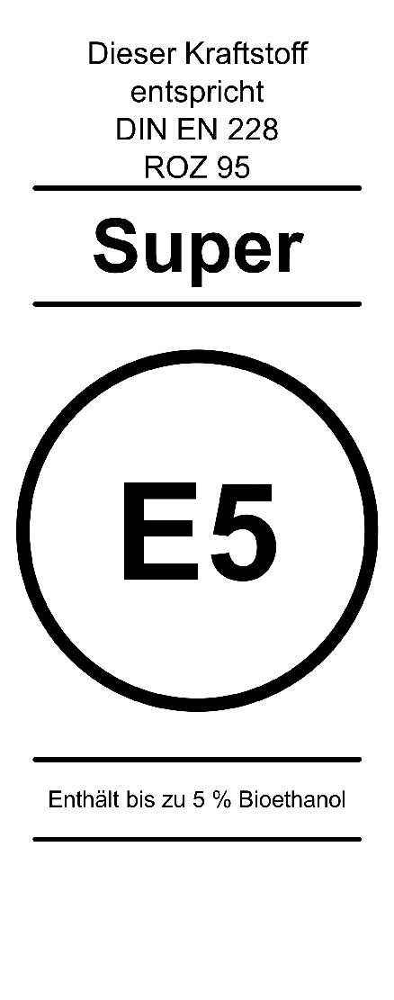
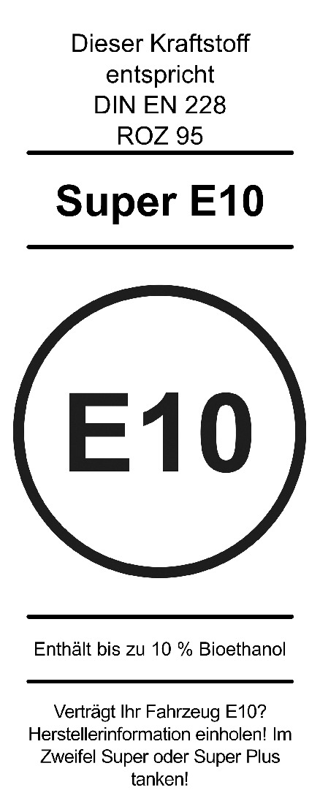
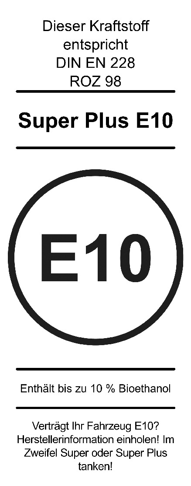
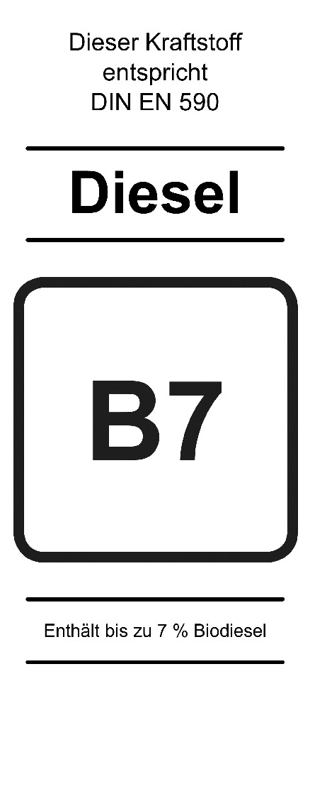

# Zehnte Verordnung zur Durchführung des Bundes-Immissionsschutzgesetzes (BImSchV 10 2010)

Ausfertigungsdatum
:   2010-12-08

Fundstelle
:   BGBl I: 2010, 1849

Zuletzt geändert durch
:   Art. 1 V v. 13.12.2019 I 2739

[^F1_774781_BJNR184900010]:     Diese Verordnung dient der Umsetzung der:
    –                                    Richtlinie 98/70/EG des
    Europäischen Parlaments und des Rates vom 13. Oktober 1998 über die
    Qualität von Otto- und Dieselkraftstoffen und zur Änderung der
    Richtlinie 93/12/EWG des Rates (ABl. L 350 vom 28.12.1998, S. 58), die
    zuletzt durch die Richtlinie 2009/30/EG (ABl. L 140 vom 5.6.2009, S.
    88) geändert worden ist,

    –                                    Richtlinie 1999/32/EG des Rates
    vom 26. April 1999 über eine Verringerung des Schwefelgehalts
    bestimmter flüssiger Kraft- oder Brennstoffe und zur Änderung der
    Richtlinie 93/12/EWG (ABl. L 121 vom 11.5.1999, S. 13), die zuletzt
    durch die Richtlinie 2009/30/EG (ABl. L 140 vom 5.6.2009, S. 88)
    geändert worden ist.

[^F1_774781_01_BJNR184900010]: Die Verpflichtungen aus der Richtlinie 98/34/EG des Europäischen
Parlaments und des Rates vom 22. Juni 1998 über ein
Informationsverfahren auf dem Gebiet der Normen und technischen
Vorschriften und der Vorschriften für die Dienste der
Informationsgesellschaft (ABl. L 204 vom 21.7.1998, S. 37), die
zuletzt durch die Richtlinie 2006/96/EG (ABl. L 363 vom 20.12.2006, S.
81) geändert worden ist, sind beachtet worden.

## Eingangsformel

Es verordnen

–   die Bundesregierung auf Grund des § 34 Absatz 1 und 3 des Bundes-
    Immissionsschutzgesetzes in der Fassung der Bekanntmachung vom 26.
    September 2002 (BGBl. I S. 3830), von dem Absatz 3 durch Artikel 1
    Nummer 3 des Gesetzes vom 26. November 2010 (BGBl. I S. 1728)
    eingefügt worden ist, nach Anhörung der beteiligten Kreise, sowie auf
    Grund des § 34 Absatz 2 und des § 37 Satz 1 des Bundes-
    Immissionsschutzgesetzes und auf Grund des § 2a Absatz 3 des
    Benzinbleigesetzes, der durch Artikel 1 Nummer 3 des Gesetzes vom 25.
    November 1975 (BGBl. I S. 2919) eingefügt worden ist,

–   das Bundesministerium für Verkehr, Bau und Stadtentwicklung und das
    Bundesministerium für Umwelt, Naturschutz und Reaktorsicherheit im
    Einvernehmen mit dem Bundesministerium für Arbeit und Soziales auf
    Grund des § 3 Absatz 1 Nummer 2 Buchstabe a in Verbindung mit Absatz 2
    Nummer 2 und Absatz 5 Satz 1 und 2 des
    Binnenschifffahrtsaufgabengesetzes, von dem die Absätze 1 und 5
    zuletzt durch Artikel 313 Nummer 2 Buchstabe a und b der Verordnung
    vom 31. Oktober 2006 (BGBl. I S. 2407) geändert worden sind und Absatz
    2 durch Artikel 1 Nummer 3 Buchstabe b des Gesetzes vom 19. Juli 2005
    (BGBl. I S. 2186) geändert worden ist,

–   das Bundesministerium für Verkehr, Bau und Stadtentwicklung und das
    Bundesministerium für Umwelt, Naturschutz und Reaktorsicherheit nach
    Anhörung der beteiligten Kreise auf Grund des § 38 Absatz 2 des
    Bundes-Immissionsschutzgesetzes, der durch Artikel 60 Nummer 1 der
    Verordnung vom 31. Oktober 2006 (BGBl. I S. 2407) geändert worden ist:

## § 1 Begriffsbestimmungen

(1) Für diese Verordnung gelten die in den Absätzen 2 bis 18
geregelten Begriffsbestimmungen.

(2) Ottokraftstoff ist jedes flüchtige Mineralölerzeugnis im Sinne des
Kapitels 27 der Kombinierten Nomenklatur, einschließlich der
Zubereitungen mit einem Gehalt an Mineralöl von mindestens 70
Gewichtshundertteilen, in denen diese Öle Grundbestandteil sind, das

1.  unter die Unterpositionen 2710 12 41, 2710 12 45, 2710 12 49 oder 2710
    12 50 der Kombinierten Nomenklatur fällt und

2.  zum Betrieb von Fahrzeugverbrennungsmotoren mit Fremdzündung bestimmt
    ist.

(3) Dieselkraftstoff ist jedes Gasölerzeugnis im Sinne des Kapitels 27
der Kombinierten Nomenklatur, einschließlich der Zubereitungen mit
einem Gehalt an Mineralöl von mindestens 70 Gewichtshundertteilen, in
denen diese Öle Grundbestandteil sind, das

1.  unter die Unterpositionen 2710 20 11, 2710 20 15, 2710 20 17 (bis zu
    einem Schwefelgehalt von 0,05 Gewichtshundertteilen), 2710 19 43,
    2710 19 46                    oder 2710 19 47 (bis zu einem
    Schwefelgehalt von 0,05 Gewichtshundertteilen) der Kombinierten
    Nomenklatur fällt und

2.  verwendet wird zum Antrieb von Fahrzeugen im Sinne

    a)  der Verordnung (EG) Nr. 715/2007 des Europäischen Parlaments und des
        Rates vom 20. Juni 2007 über die Typgenehmigung von Kraftfahrzeugen
        hinsichtlich der Emissionen von leichten Personenkraftwagen und
        Nutzfahrzeugen (Euro 5 und Euro 6) und über den Zugang zu Reparatur-
        und Wartungsinformationen für Fahrzeuge (ABl. L 171 vom 29.6.2007, S.
        1), die zuletzt durch die Verordnung (EU) 2018/858 (ABl. L 151 vom
        14\.6.2018, S. 1) geändert worden ist, oder

    b)  der Verordnung (EG) Nr. 595/2009 des Europäischen Parlaments und des
        Rates vom 18. Juni 2009 über die Typgenehmigung von Kraftfahrzeugen
        und Motoren hinsichtlich der Emissionen von schweren Nutzfahrzeugen
        (Euro VI) und über den Zugang zu Fahrzeugreparatur- und
        -wartungsinformationen, zur Änderung der Verordnung (EG) Nr. 715/2007
        und der Richtlinie 2007/46/EG sowie zur Aufhebung der Richtlinien
        80/1269/EWG, 2005/55/EG und 2005/78/EG (ABl. L 188 vom 18.7.2009, S.
        1; L 200 vom 31.7.2009, S. 52), die zuletzt durch die Verordnung (EU)
        2019/1242 (ABl. L 198 vom 25.7.2019, S. 202) geändert worden ist.

(4) Dieselkraftstoff zur Verwendung für mobile Maschinen und Geräte,
für land- und forstwirtschaftliche Zugmaschinen sowie für
Binnenschiffe und Sportboote ist jeder aus Erdöl gewonnene flüssige
Kraftstoff im Sinne des Kapitels 27 der Kombinierten Nomenklatur,
einschließlich der Zubereitungen mit einem Gehalt an Mineralöl von
mindestens 70 Gewichtshundertteilen, in denen diese Öle der
Grundbestandteil sind, der

1.  unter die Unterpositionen 2710 20 11, 2710 20 15, 2710 20 17 (bis zu
    einem Schwefelgehalt von 0,05 Gewichtshundertteilen), 2710 19 43,
    2710 19 46 oder 2710 19 47 (bis zu einem Schwefelgehalt von 0,05
    Gewichtshundertteilen) der Kombinierten Nomenklatur fällt und

2.  für den Betrieb von Kompressionszündungsmotoren bestimmt ist, die in
    den folgenden Rechtsakten der Europäischen Union genannt werden:

    a)  Richtlinie 2013/53/EU des Europäischen Parlaments und des Rates vom
        20\. November 2013 über Sportboote und Wassermotorräder und zur
        Aufhebung der Richtlinie 94/25/EG (ABl. L 354 vom 28.12.2013, S. 90; L
        297 vom 13.11.2015, S. 9),

    b)  Verordnung (EU) 2016/1628 des Europäischen Parlaments und des Rates
        vom 14. September 2016 über die Anforderungen in Bezug auf die
        Emissionsgrenzwerte für gasförmige Schadstoffe und luftverunreinigende
        Partikel und die Typgenehmigung für Verbrennungsmotoren für nicht für
        den Straßenverkehr bestimmte mobile Maschinen und Geräte, zur Änderung
        der Verordnungen (EU) Nr. 1024/2012 und (EU) Nr. 167/2013 und zur
        Änderung und Aufhebung der Richtlinie 97/68/EG (ABl. L 252 vom
        16\.9.2016, S. 53; L 231 vom 6.9.2019, S. 29) oder

    c)  Verordnung (EU) Nr. 167/2013 des Europäischen Parlaments und des Rates
        vom 5. Februar 2013 über die Genehmigung und Marktüberwachung von
        land- und forstwirtschaftlichen Fahrzeugen (ABl. L 60 vom 2.3.2013, S.
        1), die zuletzt durch die Verordnung (EU) 2019/519 (ABl. L 91 vom
        29\.3.2019, S. 42) geändert worden ist.

(5) Schiffskraftstoff ist jeder aus Erdöl gewonnene flüssige Kraft-
oder Brennstoff, der zur Verwendung auf einem Schiff bestimmt ist oder
auf einem Schiff verwendet wird, einschließlich Kraft- oder
Brennstoffen im Sinne der Definition nach DIN ISO 8217, Ausgabe
Oktober 2018.

(6) Gasöl für den Seeverkehr ist jeder Schiffskraftstoff gemäß der
Definition der Güteklassen DMX, DMA und DMZ nach Tabelle 1 der DIN ISO
8217, Ausgabe Oktober 2018, ohne Berücksichtigung des Schwefelgehalts.

(7) Schiffsdiesel ist jeder Schiffskraftstoff gemäß der Definition der
Güteklasse DMB nach Tabelle 1 der DIN ISO 8217, Ausgabe Oktober 2018,
ohne Berücksichtigung des Schwefelgehalts.

(8) Sonstige Schiffskraftstoffe sind die nicht in den Absätzen 6 und 7
genannten Schiffskraftstoffe.

(9) Leichtes Heizöl ist jedes Erdölerzeugnis, einschließlich der
Zubereitungen, die Komponenten aus Synthese oder Hydrotreatment oder
Komponenten biogener Herkunft enthalten, mit Ausnahme der in den
Absätzen 3 bis 8 genannten Kraft- und Brennstoffe, das nach dem
Prüfverfahren der DIN EN ISO 3405, Ausgabe April 2011, bei 350 Grad
Celsius mindestens 85 oder bei 360 Grad Celsius mindestens 95
Raumhundertteile Destillat ergibt.

(10) Schweres Heizöl ist jeder aus Erdöl gewonnene flüssige Kraft-
oder Brennstoff mit Ausnahme der in den Absätzen 3 bis 9 genannten
Kraft- und Brennstoffe, der nach dem Prüfverfahren der DIN EN ISO
3405, Ausgabe April 2011, bei 250 Grad Celsius weniger als 65
Raumhundertteile Destillat ergibt. Kann die Destillation nicht anhand
der Methode DIN EN ISO 3405, Ausgabe April 2011, durchgeführt werden,
wird das Erdölerzeugnis ebenfalls als Schweres Heizöl eingestuft.

(11) Einführer ist, wer Kraft- oder Brennstoffe gewerbsmäßig oder im
Rahmen wirtschaftlicher Unternehmungen einführt.

(12) Vermischer ist, wer Kraft- oder Brennstoffe gewerbsmäßig oder im
Rahmen wirtschaftlicher Unternehmungen vermischt oder die Vermischung
veranlasst.

(13) Großverteiler ist, wer Kraft- oder Brennstoffe gewerbsmäßig oder
im Rahmen wirtschaftlicher Unternehmungen verteilt und über eine
Lagerkapazität von mehr als 1 000 Kubikmeter verfügt. Das Verteilen
nach Satz 1 schließt die Abgabe an Schiffe ein.

(14) Inverkehrbringen ist jedes Überlassen an andere.

(15) Kombinierte Nomenklatur ist die Warennomenklatur nach Artikel 1
in Verbindung mit Anhang I der Verordnung (EWG) Nr. 2658/87 des Rates
vom 23. Juli 1987 über die zolltarifliche und statistische Nomenklatur
sowie den Gemeinsamen Zolltarif (ABl. L 256 vom 7.9.1987, S. 1; L 341
vom 3.12.1987, S. 38; L 378 vom 31.12.1987, S. 120; L 130 vom
26\.5.1988, S. 42; L 151 vom 8.6.2016, S. 22), die zuletzt durch die
Durchführungsverordnung (EU) 2019/13 (ABl. L 3 vom 7.1.2019, S. 1)
geändert worden ist, einschließlich ihrer Anmerkungen, in der am 1.
Januar 2019 geltenden Fassung.

(16) Tankstelle ist eine Tankanlage zur Abgabe eines Kraftstoffs – mit
Ausnahme von Flüssigerdgas (LNG) – über eine ortsfeste oder mobile
Vorrichtung.

(17) LNG-Tankstelle ist eine Tankanlage für die Abgabe von
Flüssigerdgas (LNG), die aus einer ortsfesten oder mobilen Anlage,
einer Offshore-Anlage oder einem anderen System besteht.

(18) Alternative Kraftstoffe sind Kraftstoffe oder Energiequellen, die
zumindest teilweise als Ersatz für Erdöl als Energieträger für den
Verkehrssektor dienen und die zur Reduzierung der
Kohlenstoffdioxidemissionen beitragen und die Umweltverträglichkeit
des Verkehrssektors erhöhen können. Hierzu zählen insbesondere:

1.  Elektrizität,

2.  Wasserstoff,

3.  Biokraftstoffe gemäß der Definition in Artikel 2 Buchstabe i der
    Richtlinie 2009/28/EG des Europäischen Parlaments und des Rates vom
    23\. April 2009 zur Förderung der Nutzung von Energie aus erneuerbaren
    Quellen und zur Änderung und anschließenden Aufhebung der Richtlinien
    2001/77/EG und 2003/30/EG (ABl. L 140 vom 5.6.2009, S. 16; L 216 vom
    22\.7.2014, S. 5; L 265 vom 5.9.2014, S. 33), die zuletzt durch die
    Richtlinie (EU) 2015/1513 (ABl. L 239 vom 15.9.2015, S. 1) geändert
    worden ist,

4.  synthetische und paraffinhaltige Kraftstoffe,

5.  Erdgas, einschließlich Biogas, gasförmig (komprimiertes Erdgas (CNG))
    und flüssig (verflüssigtes Erdgas (LNG)), und

6.  Autogas (LPG).

## § 2 Chlor- und Bromverbindungen

(1) Kraftstoffe für Kraftfahrzeuge im Sinne des § 1 Absatz 2 des
Straßenverkehrsgesetzes dürfen nur dann gewerbsmäßig oder im Rahmen
wirtschaftlicher Unternehmungen in den Verkehr gebracht werden, wenn
sie keine Chlor- oder Bromverbindungen als Zusatz enthalten.

(2) Chlor- oder Bromverbindungen als Zusatz zu Kraftstoffen nach
Absatz 1 dürfen gewerbsmäßig oder im Rahmen wirtschaftlicher
Unternehmungen nicht in den Verkehr gebracht werden.

(3) Die Absätze 1 und 2 gelten nicht für das Inverkehrbringen zum
Zweck der Forschung, Entwicklung oder Analyse.

## § 3 Anforderungen an Ottokraftstoffe; Bestandsschutzsortenregelung

(1) Ottokraftstoff darf nur dann gewerbsmäßig oder im Rahmen
wirtschaftlicher Unternehmungen gegenüber dem Letztverbraucher in den
Verkehr gebracht werden, wenn er den Anforderungen der DIN EN 228,
Ausgabe August 2017, genügt.

(2) Wer Ottokraftstoffe nach Absatz 1 der Qualität „Super“ mit mehr
als 5 Volumenprozent Ethanol anbietet, ist verpflichtet, an derselben
Abgabestelle auch Ottokraftstoffe nach Absatz 1 der Qualität „Super“
mit einem maximalen Sauerstoffgehalt von 2,7 Massenprozent und einem
maximalen Ethanolgehalt von 5 Volumenprozent anzubieten.

(3) Wer Ottokraftstoffe nach Absatz 1 der Qualität „Super Plus“ mit
mehr als 5 Volumenprozent Ethanol anbietet, ist verpflichtet, an
derselben Abgabestelle auch Ottokraftstoffe nach Absatz 1 der Qualität
„Super Plus“ mit einem maximalen Sauerstoffgehalt von 2,7
Massenprozent und einem maximalen Ethanolgehalt von 5 Volumenprozent
anzubieten.

(4) An Abgabestellen, an denen im Durchschnitt der zwei jeweils
vorangegangenen Kalenderjahre weniger als 500 Kubikmeter
Ottokraftstoffe nach Absatz 1 in den Verkehr gebracht wurden, gelten
die Verpflichtungen nach Absatz 2 und Absatz 3 nicht. Die
Voraussetzungen des Satzes 1 sind durch geeignete Belege gegenüber der
zuständigen Behörde auf Verlangen nachzuweisen.

(5) Zweitaktmischungen zur Verwendung in Zweitakt-Ottomotoren dürfen
nur dann gewerbsmäßig oder im Rahmen wirtschaftlicher Unternehmungen
gegenüber dem Letztverbraucher in den Verkehr gebracht werden, wenn
der dafür verwendete Ottokraftstoff vor der Herstellung der Mischung
den Anforderungen der DIN EN 228, Ausgabe August 2017, genügt hat.

## § 4 Anforderungen an Dieselkraftstoff, Gasöl und andere flüssige Kraftstoffe; Schwefelgehalt; Verwendung für Binnenschiffe und Sportboote

(1) Dieselkraftstoff darf nur dann gewerbsmäßig oder im Rahmen
wirtschaftlicher Unternehmungen gegenüber dem Letztverbraucher in den
Verkehr gebracht werden, wenn er den Anforderungen der DIN EN 590,
Ausgabe Oktober 2017, genügt.

(2) Dieselkraftstoff zur Verwendung für mobile Maschinen und Geräte,
für land- und forstwirtschaftliche Zugmaschinen sowie für
Binnenschiffe und Sportboote darf nur dann gewerbsmäßig oder im Rahmen
wirtschaftlicher Unternehmungen gegenüber dem Letztverbraucher in den
Verkehr gebracht werden, wenn sein Gehalt an Schwefelverbindungen,
berechnet als Schwefel, 10 Milligramm pro Kilogramm Dieselkraftstoff
nicht überschreitet.

(3) Gasöl für den Seeverkehr darf nur dann gewerbsmäßig oder im Rahmen
wirtschaftlicher Unternehmungen gegenüber dem Letztverbraucher in den
Verkehr gebracht werden, wenn sein Gehalt an Schwefelverbindungen,
berechnet als Schwefel, 1,0 Gramm pro Kilogramm Gasöl für den
Seeverkehr nicht überschreitet.

(4) Schiffsdiesel darf nur dann gewerbsmäßig oder im Rahmen
wirtschaftlicher Unternehmungen gegenüber dem Letztverbraucher in den
Verkehr gebracht werden, wenn sein Gehalt an Schwefelverbindungen,
berechnet als Schwefel, 15,0 Gramm pro Kilogramm Schiffsdiesel nicht
überschreitet.

(5) Für Binnenschiffe und Sportboote dürfen Gasöle für Binnenschiffe
und andere flüssige Kraftstoffe nur dann verwendet werden, wenn ihr
Schwefelgehalt den für Dieselkraftstoff nach Absatz 2 zulässigen
Schwefelgehalt nicht überschreitet.

## § 5 Anforderungen an Biodiesel

Biodiesel darf nur dann gewerbsmäßig oder im Rahmen wirtschaftlicher
Unternehmungen gegenüber dem Letztverbraucher in den Verkehr gebracht
werden, wenn er den Anforderungen der DIN EN 14214, Ausgabe Mai 2019,
genügt. Das gilt auch für Biodiesel als Zusatz zum Dieselkraftstoff.

## § 6 Anforderungen an Ethanolkraftstoff (E85)

Ethanolkraftstoff (E85) darf nur dann gewerbsmäßig oder im Rahmen
wirtschaftlicher Unternehmungen als Kraftstoff gegenüber dem
Letztverbraucher in den Verkehr gebracht werden, wenn er den
Anforderungen der DIN EN 15293, Ausgabe Oktober 2018, genügt.

## § 7 Anforderungen an Autogas

Autogas darf nur dann gewerbsmäßig oder im Rahmen wirtschaftlicher
Unternehmungen gegenüber dem Letztverbraucher in den Verkehr gebracht
werden, wenn er den Anforderungen der DIN EN 589, Ausgabe März 2019,
genügt.

## § 8 Anforderungen an Erdgas und Biogas als Kraftstoffe

(1) Erdgas und Biogas dürfen nur dann als Kraftstoff gewerbsmäßig oder
im Rahmen wirtschaftlicher Unternehmungen gegenüber dem
Letztverbraucher in den Verkehr gebracht werden, wenn sie den
Anforderungen der DIN EN 16723-2, Ausgabe Oktober 2017, genügen. Für
Mischungen von Erdgas und Biogas in jedem Verhältnis gilt Satz 1
entsprechend mit der Maßgabe, dass das fertige Produkt den
Anforderungen der DIN EN 16723-2, Ausgabe Oktober 2017, genügt. Für
Anforderungen, Grenzwerte und zugehörige Prüfverfahren für Erdgas und
Biogas als Kraftstoffe für Kraftfahrzeuge ist in den Fällen der Sätze
1 und 2 Tabelle D.1 der DIN EN 16723-2, Ausgabe Oktober 2017,
anzuwenden. Für Anforderungen an zugesetzte Additive gilt Abschnitt
5\.2 der DIN 51624, Ausgabe Februar 2008.

(2) Erdgas und Biogas der Qualität „L“ müssen in den Fällen von Absatz
1 Satz 1 und 2 abweichend von Absatz 1 Satz 3 einen unteren Wobbe-
Index von mindestens 36,3 Megajoule pro Kubikmeter und einen Heizwert
von mindestens 39 Megajoule pro Kilogramm aufweisen. Im Übrigen gelten
die Anforderungen der Tabelle D.1 der DIN EN 16723-2, Ausgabe Oktober
2017, und die Anforderungen nach Absatz 1 Satz 4 entsprechend.

(3) Die Absätze 1 und 2 gelten entsprechend für verflüssigtes Erdgas
und Biogas sowie Mischungen hieraus.

## § 9 Anforderung an Pflanzenölkraftstoffe

(1) Pflanzenölkraftstoff – Rapsöl – darf nur dann gewerbsmäßig oder im
Rahmen wirtschaftlicher Unternehmungen gegenüber dem Letztverbraucher
in den Verkehr gebracht werden, wenn er den Anforderungen der DIN
51605, Ausgabe Januar 2016, genügt.

(2) Pflanzenölkraftstoff – alle Saaten – darf nur dann gewerbsmäßig
oder im Rahmen wirtschaftlicher Unternehmungen gegenüber dem
Letztverbraucher in den Verkehr gebracht werden, wenn er den
Anforderungen der DIN 51623, Ausgabe Dezember 2015, genügt.

## § 9a Anforderungen an Wasserstoff als Kraftstoff

Wasserstoff darf nur dann gewerbsmäßig oder im Rahmen wirtschaftlicher
Unternehmungen als Kraftstoff gegenüber dem Letztverbraucher in den
Verkehr gebracht werden, wenn er den Anforderungen der DIN EN 17124,
Ausgabe Juli 2019, genügt.

## § 10 Schwefelgehalt von Heizöl

(1) Leichtes Heizöl darf nur dann gewerbsmäßig oder im Rahmen
wirtschaftlicher Unternehmungen gegenüber dem Letztverbraucher in den
Verkehr gebracht werden, wenn sein Gehalt an Schwefelverbindungen,
berechnet als Schwefel, 1,0 Gramm pro Kilogramm leichtes Heizöl nicht
überschreitet.

(2) Schweres Heizöl darf nur dann gewerbsmäßig oder im Rahmen
wirtschaftlicher Unternehmungen gegenüber dem Letztverbraucher in den
Verkehr gebracht werden, wenn sein Gehalt an Schwefelverbindungen,
berechnet als Schwefel, 10,0 Gramm pro Kilogramm schweres Heizöl nicht
überschreitet. Schweres Heizöl mit höheren Schwefelgehalten darf nur
dann gewerbsmäßig oder im Rahmen wirtschaftlicher Unternehmungen
gegenüber dem Letztverbraucher in den Verkehr gebracht werden, wenn
dieses Heizöl:

1.  in Übereinstimmung mit den Anforderungen der Verordnung über
    Großfeuerungs-, Gasturbinen- und Verbrennungsmotoranlagen in
    Verbrennungseinrichtungen eingesetzt werden darf oder

2.  in Übereinstimmung mit den Anforderungen zur Vorsorge gegen schädliche
    Umwelteinwirkungen der Technischen Anleitung zur Reinhaltung der Luft
    vom 24. Juli 2002 (GMBl. 2002 S. 511) in Verbrennungseinrichtungen
    eingesetzt werden darf und sichergestellt ist, dass die maximalen
    Schwefeldioxidemissionen von 1 700 Milligramm Schwefeldioxid pro
    Normkubikmeter bei einem Sauerstoffgehalt des Rauchgases von 3
    Volumeneinheiten im trockenen Bezugszustand nicht überschritten
    werden.

## § 11 Gleichwertigkeitsklausel

Den Kraftstoffen nach § 3 und § 4 Absatz 1 sowie den §§ 5 bis 9a sind
solche Kraftstoffe gleichgestellt, die den Anforderungen anderer
Normen oder technischer Spezifikationen genügen, die in einem anderen
Mitgliedstaat der Europäischen Union oder einem anderen Vertragsstaat
des Abkommens über den Europäischen Wirtschaftsraum oder in der Türkei
oder einem anderen Mitglied der Welthandelsorganisation in Kraft sind,
sofern

1.  diese Normen oder technischen Spezifikationen mit einer der folgenden
    Normen übereinstimmen:

    a)  DIN EN 228, Ausgabe August 2017,

    b)  DIN EN 590, Ausgabe Oktober 2017,

    c)  DIN EN 14214, Ausgabe Mai 2019,

    d)  DIN EN 15293, Ausgabe Oktober 2018,

    e)  DIN EN 589, Ausgabe März 2019,

    f)  DIN EN 16723-2, Ausgabe Oktober 2017, mit der Maßgabe, dass für
        Anforderungen, Grenzwerte und zugehörige Prüfverfahren für Erdgas und
        Biogas als Kraftstoffe für Kraftfahrzeuge Tabelle D.1 der DIN EN
        16723-2, Ausgabe Oktober 2017, gilt und dass für Anforderungen an
        zugesetzte Additive Abschnitt 5.2 der DIN 51624, Ausgabe Februar 2008,
        gilt,

    g)  DIN 51605, Ausgabe Januar 2016,

    h)  DIN 51623, Ausgabe Dezember 2015, oder

    i)  DIN EN 17124, Ausgabe Juli 2019, und

2.  die Kraftstoffe die klimatischen Anforderungen erfüllen, die in den
    unter Nummer 1 angegebenen Normen für die Bundesrepublik Deutschland
    festgelegt sind.

## § 12 Einschränkungen

(1) Für Kraft- und Brennstoffe nach § 1 Absatz 4 bis 10, die
eingeführt oder sonst in den Geltungsbereich dieser Verordnung
verbracht werden und die unter diese Verordnung fallen, sind § 4
Absatz 2 bis 4 und § 10 erst von dem Zeitpunkt an anzuwenden, an dem
sie in den zollrechtlich freien Verkehr überführt werden.

(2) Die in dieser Verordnung festgelegten Grenzwerte für den
Schwefelgehalt bestimmter flüssiger Kraft- oder Brennstoffe, die aus
Erdöl gewonnen werden, gelten nicht für Kraft- oder Brennstoffe zur
Verwendung auf Kriegsschiffen und anderen zu militärischen Zwecken
eingesetzten Schiffen.

(3) Die in dieser Verordnung festgelegten Anforderungen gelten nicht
für Kraft- oder Brennstoffe zur Verwendung in Luftfahrzeugen.

## § 13 Auszeichnung von Kraft- und Brennstoffen

(1) Wer gewerbsmäßig oder im Rahmen wirtschaftlicher Unternehmungen
gegenüber dem Letztverbraucher Kraftstoffe in den Verkehr bringt, hat
die Qualität an den entsprechenden Zapfsäulen der Tankstelle oder LNG-
Tankstelle und ihren Zapfventilen gemäß Satz 2 und 3 sowie Absatz 3
Satz 1 in folgender Weise deutlich sichtbar zu machen:

1.  Schwefelfreier Ottokraftstoff mit einem maximalen Sauerstoffgehalt von
    2,7 Massenprozent und einem maximalen Ethanolgehalt von 5
    Volumenprozent, der den Anforderungen der DIN EN 228, Ausgabe August
    2017, genügt oder gleichwertig nach § 11 ist, wird mit der Bezeichnung
    „Super“ oder „Super Plus“ und dem jeweils zutreffenden Zeichen nach
    Anlage 1 oder 2 gekennzeichnet; der Hinweis „Enthält bis zu 5 %
    Bioethanol“ muss im Zeichen Teil a enthalten sein;

2.  Schwefelfreier Ottokraftstoff, der den Anforderungen der DIN EN 228,
    Ausgabe August 2017, genügt oder gleichwertig nach § 11 ist und dessen
    Sauerstoffgehalt 2,7 Massenprozent oder dessen Ethanolgehalt 5
    Volumenprozent überschreiten kann, wird mit der Bezeichnung
    „Super E10“                    oder „Super Plus E10“ und dem jeweils
    zutreffenden Zeichen nach Anlage 3 oder 4 gekennzeichnet; die Hinweise
    „Enthält bis zu 10 % Bioethanol“ und „Verträgt Ihr Fahrzeug E10?
    Herstellerinformation einholen! Im Zweifel Super oder Super Plus
    tanken!“ müssen im Zeichen Teil a enthalten sein;

3.  Dieselkraftstoff, der den Anforderungen der DIN EN 590, Ausgabe
    Oktober 2017, genügt oder gleichwertig nach § 11 ist, wird mit der
    Bezeichnung „Diesel“ und dem Zeichen nach Anlage 5 gekennzeichnet; der
    Hinweis „Enthält bis zu 7 % Biodiesel“ muss im Zeichen Teil a
    enthalten sein;

4.  Fettsäure-Methylester für Dieselmotoren, die den Anforderungen der DIN
    EN 14214, Ausgabe Mai 2019, genügen oder gleichwertig nach § 11 sind,
    werden mit der Bezeichnung „Biodiesel“ und dem Zeichen nach Anlage 6
    gekennzeichnet;

5.  Ethanol für Kraftfahrzeuge, das den Anforderungen der DIN EN 15293,
    Ausgabe Oktober 2018, genügt oder gleichwertig nach § 11 ist, wird mit
    der Bezeichnung „Ethanolkraftstoff (E85)“ und dem Zeichen nach Anlage
    7 gekennzeichnet;

6.  Autogas, das den Anforderungen der DIN EN 589, Ausgabe März 2019,
    genügt oder gleichwertig nach § 11 ist, wird mit der Bezeichnung
    „Autogas“ und dem Zeichen nach Anlage 8 gekennzeichnet;

7.  Erdgas- und Biogaskraftstoffe, die den Anforderungen der DIN EN
    16723-2, Ausgabe Oktober 2017, genügen, wobei für die Anforderungen,
    Grenzwerte und zugehörigen Prüfverfahren für Erdgas und Biogas als
    Kraftstoffe für Kraftfahrzeuge Tabelle D.1 der DIN EN 16723-2, Ausgabe
    Oktober 2017 anzuwenden ist, oder gleichwertige Kraftstoffe nach § 11,
    werden gekennzeichnet

    a)  sofern sie als komprimiertes Erdgas (CNG) in den Verkehr gebracht
        werden

        aa) mit der Bezeichnung „Erdgas H“ und dem Zeichen nach Anlage 9 oder

        bb) mit der Bezeichnung „Erdgas L“ und dem Zeichen nach Anlage 10, sofern
            abweichend von Tabelle D.1 der DIN EN 16723-2, Ausgabe Oktober 2017,
            die Qualität nur den Anforderungen eines unteren Wobbe-Index von
            mindestens 36,3 Megajoule pro Kubikmeter genügt und einen Heizwert von
            mindestens 39 Megajoule pro Kilogramm aufweist, oder

    b)  sofern sie als verflüssigtes Erdgas (LNG) in Verkehr gebracht werden

        aa) mit der Bezeichnung „Erdgas H“ und dem Zeichen nach Anlage 11 oder

        bb) mit der Bezeichnung „Erdgas L“ und dem Zeichen nach Anlage 12, sofern
            abweichend von Tabelle D.1 der DIN EN 16723-2, Ausgabe Oktober 2017,
            die Qualität nur den Anforderungen eines unteren Wobbe-Index von
            mindestens 36,3 Megajoule pro Kubikmeter genügt und einen Heizwert von
            mindestens 39 Megajoule pro Kilogramm aufweist;

8.  Pflanzenölkraftstoff, der den Anforderungen der DIN 51605, Ausgabe
    Januar 2016, genügt oder gleichwertig nach § 11 ist, wird mit der
    Bezeichnung „Pflanzenölkraftstoff – Rapsöl –“ und dem Zeichen nach
    Anlage 13 gekennzeichnet;

9.  Pflanzenölkraftstoff, der den Anforderungen der DIN 51623, Ausgabe
    Dezember 2015, genügt oder gleichwertig nach § 11 ist, wird mit der
    Bezeichnung „Pflanzenölkraftstoff – alle Saaten –“ und dem Zeichen
    nach Anlage 14 gekennzeichnet;

10. Wasserstoff als Kraftstoff, der den Anforderungen der DIN EN 17124,
    Ausgabe Juli 2019, genügt oder gleichwertig nach § 11 ist, wird mit
    der Bezeichnung „Wasserstoff“ und dem Zeichen nach Anlage 15
    gekennzeichnet.

Für die Auszeichnung der Zapfsäulen ist das Zeichen nach Teil a der
jeweils zutreffenden Anlage zu verwenden. Für die Auszeichnung des
Zapfventils ist das Zeichen nach Teil b der jeweils zutreffenden
Anlage zu verwenden.

(2) Wer gewerbsmäßig oder im Rahmen wirtschaftlicher Unternehmungen
gegenüber dem Letztverbraucher Kraftstoffe mit metallhaltigen Zusätzen
in den Verkehr bringt, hat im untersten Abschnitt des Zeichens an der
Zapfsäule den folgenden Hinweis nach Absatz 3 Satz 1 anzubringen:
„Enthält metallhaltige Zusätze. Fragen Sie Ihren Fahrzeughersteller,
ob diese Zusätze für Ihr Fahrzeug geeignet sind. Verwenden Sie im
Zweifelsfall Kraftstoff ohne metallhaltige Zusätze.“

(3) Für die Auszeichnung nach den Absätzen 1 und 2 gilt die DIN EN
16942, Ausgabe Dezember 2016. Für das Zeichen nach Teil a der jeweils
zutreffenden Anlage wird eine Mindestbreite von 40 Millimetern
empfohlen.

(4) Leichtes Heizöl, das nach § 11 Absatz 1 in den Verkehr gebracht
wird, kann

1.  als „schwefelarm“ bezeichnet werden, wenn sein Schwefelgehalt 50
    Milligramm pro Kilogramm leichtes Heizöl nicht überschreitet,

2.  als „stickstoffarm“ bezeichnet werden, wenn sein Schwefelgehalt 50
    Milligramm und sein Stickstoffgehalt 140 Milligramm pro Kilogramm
    leichtes Heizöl nicht überschreitet.

(5) Die Absätze 1 bis 3 finden keine Anwendung im Bereich der Kraft-
und Brennstoffe nach § 1 Absatz 4 bis 10.

(6) Wer gewerbsmäßig oder im Rahmen wirtschaftlicher Unternehmungen
einen Ladepunkt betreibt im Sinne des § 2 Nummer 12 der
Ladesäulenverordnung vom 9. März 2016 (BGBl. I S. 457), die durch
Artikel 1 der Verordnung vom 1. Juni 2017 (BGBl. I S. 1520) geändert
worden ist, hat deutlich sichtbar

1.  einen Hinweis auf die Verträglichkeit der am Ladepunkt
    bereitgestellten elektrischen Verbindung nach den Anforderungen der
    DIN EN 17186, Ausgabe Oktober 2019, anzubringen und

2.  die Verbraucherinformation nach Abschnitt 6.3 der DIN EN 17186,
    Ausgabe Oktober 2019, gemäß Satz 2 und 4 anzubringen.

In der Verbraucherinformation ist in Abschnitt A des Zeichens nach
Abschnitt 6.3.1 der DIN EN 17186, Ausgabe Oktober 2019, die
Bezeichnung „Laden von E-Fahrzeugen“ einzutragen. Für das Zeichen in
Abschnitt B wird eine Mindestbreite von 40 Millimetern empfohlen. In
Abschnitt C ist gemäß der Empfehlung der DIN EN 17186, Ausgabe Oktober
2019, die berechnete Leistung anzugeben.

## § 14 Nachweisführung

(1) Wer gewerbsmäßig oder im Rahmen einer wirtschaftlichen
Unternehmung Kraftstoffe in den Verkehr bringt, hat den nach § 13
Absatz 1 bis 5 Auszeichnungspflichtigen bei Anlieferung der Ware
darüber zu unterrichten, dass die Kraftstoffe

1.  den in den § 3 und § 4 Absatz 1 sowie den §§ 5 bis 9a genannten
    Anforderungen genügen oder

2.  nach § 11 gleichwertig sind.

Die Unterrichtung erfolgt schriftlich oder elektronisch. Sie kann für
jede einzelne Lieferung separat vorgenommen werden oder für mehrere
zeitlich aufeinander folgende Lieferungen; in diesem Fall ist sie bei
der ersten Lieferung vorzunehmen.

(2) Auskunftspflichtige nach § 52 Absatz 3 Satz 1 in Verbindung mit
Absatz 2 Satz 1 des Bundes-Immissionsschutzgesetzes, die Kraft- und
Brennstoffe nach § 1 Absatz 4 bis 10 als Hersteller, Vermischer,
Einführer oder Großverteiler lagern, haben Tankbelegbücher zu führen
und auf Verlangen vorzulegen, aus denen hervorgeht, welche Lieferanten
den Kraft- und Brennstoff geliefert haben.

## § 15 Bekanntmachung der Kraftstoffqualität für den Betrieb von Kraftfahrzeugen

(1) Wer gewerbsmäßig oder im Rahmen einer wirtschaftlichen
Unternehmung Kraftfahrzeuge herstellt, einführt oder im Rahmen
wirtschaftlicher Unternehmungen gegenüber dem Letztverbraucher in den
Verkehr bringt, hat die vom Kraftfahrzeughersteller empfohlenen und
verwendbaren Kraftstoffqualitäten für den Betrieb der Kraftfahrzeuge,
die er in den Verkehr bringt, bekannt zu machen. Die Bekanntmachung
der Kraftstoffqualitäten umfasst

1.  die Bekanntgabe gegenüber den Vertragswerkstätten und -händlern sowie
    der Öffentlichkeit,

2.  die Angabe in den Betriebsanleitungen oder anderen für den
    Kraftfahrzeughalter bestimmten Unterlagen und

3.  die deutlich sichtbare Anbringung an allen Kraftstoffeinfüllstutzen
    oder Fahrzeugsteckern von Kraftfahrzeugen, für die der betreffende
    Kraftstoff empfohlen und geeignet ist, oder in unmittelbarer Nähe der
    Einfüllstutzen oder Fahrzeugstecker dieser Fahrzeuge.

(2) Die Bekanntmachung der Kraftstoffqualität muss

1.  für flüssige oder gasförmige Kraftstoffe gemäß den Anforderungen der
    DIN EN 16942, Ausgabe Dezember 2016, erfolgen,

2.  für Strom für das Laden von Elektrofahrzeugen gemäß den Anforderungen
    der DIN EN 17186, Ausgabe Oktober 2019, erfolgen.

(3) Bei der Bekanntmachung der Kraftstoffqualität sind

1.  für flüssige oder gasförmige Kraftstoffe die Bezeichnungen nach § 13
    für die Qualität der Kraftstoffe und die Zeichen nach den Anlagen 1
    bis 15, jeweils Teil b, gemäß den Anforderungen der DIN EN 16942,
    Ausgabe Dezember 2016, zu verwenden,

2.  für Strom für das Laden von Elektrofahrzeugen die Bezeichnungen und
    Zeichen gemäß DIN EN 17186, Ausgabe Oktober 2019, zu verwenden.

## § 16 Ausnahmen

(1) Die zuständige Behörde kann auf Antrag Ausnahmen von den
Anforderungen der § 3 und § 4 Absatz 1 sowie §§ 5 bis 9a bewilligen,
soweit dies in besonderen Einzelfällen zu Forschungs- und
Erprobungszwecken erforderlich ist und schädliche Umwelteinwirkungen
nicht zu erwarten sind. Die Bewilligung ist zu befristen.

(2) Keine Ausnahmebewilligung nach Absatz 1 Satz 1 ist erforderlich
für Kraftstoffe, die betriebsintern zu Forschungs- und
Erprobungszwecken verwandt und nicht über öffentliche Tankstellen oder
LNG-Tankstellen in den Verkehr gebracht werden und die keine
schädlichen Umwelteinwirkungen erwarten lassen.

(3) Die zuständige Behörde bewilligt im Benehmen mit dem Bundesamt für
Wirtschaft und Ausfuhrkontrolle auf Antrag Ausnahmen von § 4 Absatz 2
bis 5 und § 10 für Kraft- und Brennstoffe nach § 1 Absatz 4 bis 10,
soweit die Einhaltung des zulässigen Höchstgehalts an
Schwefelverbindungen zu einer erheblichen Gefährdung der Versorgung
des Verbrauchers mit Kraft- und Brennstoffen nach § 1 Absatz 4 bis 10
führen würde. Die Bewilligungen können unter Bedingungen erteilt und
mit Auflagen verbunden werden. Die Bewilligungen sind zu befristen.
Sie können widerrufen werden, wenn die Voraussetzungen für ihre
Erteilung nicht mehr vorliegen.

## § 17 Zugänglichkeit der Normen

DIN-, DIN EN-, ISO-, DIN ISO- und DIN EN ISO-Normen, auf die in dieser
Verordnung verwiesen wird, sind bei der Beuth-Verlag GmbH, Berlin und
Köln, erschienen und dort zu beziehen. Das in § 18 Absatz 1 genannte
DVGW-Arbeitsblatt ist bei der Wirtschafts- und Verlagsgesellschaft Gas
und Wasser mbH, Bonn, erschienen und dort zu beziehen. Die DIN-, DIN
EN-, ISO-, DIN ISO- und DIN EN, ISO-Normen und das DVGW-Arbeitsblatt
sind beim Deutschen Patent- und Markenamt in München archivmäßig
gesichert niedergelegt.

## § 18 Überwachung

(1) Die zuständigen Behörden überwachen die in den §§ 3 bis 9a
gestellten Anforderungen an Kraftstoffe sowie die in § 13 gestellten
Anforderungen an die Auszeichnungspflicht dieser Kraftstoffe anhand
der in den §§ 3 bis 9a genannten DIN- und DIN EN-Normen angegebenen
Prüfverfahren und nach den in DIN EN 14274, Ausgabe Mai 2013, DIN EN
ISO 3170, Ausgabe Juni 2004, DIN EN ISO 3171, Ausgabe November 2000,
und DIN 51610, Ausgabe Juni 1983, sowie in dem DVGW Arbeitsblatt G
264, Ausgabe September 2016, vorgeschriebenen Verfahren. Abweichend
von den Angaben in DIN EN 590, Ausgabe Oktober 2017, und DIN EN 14214,
Ausgabe Mai 2019, findet für die Bestimmung der Gesamtverschmutzung
bei der Überprüfung des in Verkehr gebrachten Kraftstoffes das
Prüfverfahren nach DIN EN 12662, Ausgabe Juli 2008, weiterhin
Anwendung.

(2) Der Auszeichnungspflichtige nach § 13, § 14 Absatz 1 oder 2 hat
auf Verlangen der zuständigen Behörde den nach § 14 Absatz 1
erhaltenen Unterrichtungsnachweis vorzulegen. Auskunftspflichtige nach
§ 14 Absatz 2, die Kraft- und Brennstoffe nach § 1 Absatz 4 bis 10
lagern, haben auf Verlangen der zuständigen Behörde eine Erklärung des
Herstellers oder Vermischers über die Beschaffenheit dieser Kraft-
oder Brennstoffe vorzulegen. Sofern der Hersteller oder Vermischer
nicht selbst geliefert hat, muss die Erklärung zusätzlich Angaben des
Lieferanten über die gelieferte Menge enthalten. Für die Erklärung ist
ein Vordruck nach dem Muster der Anlage 16 zu verwenden. Die
zuständige Behörde kann dem Auskunftspflichtigen für die Vorlage der
Erklärung eine Frist setzen.

(3) Die zuständigen Behörden überwachen durch Probenahmen, ob der
Schwefelgehalt der verwendeten und der in Verkehr gebrachten Kraft-
und Brennstoffe den Anforderungen nach § 4 Absatz 2 bis 5 und nach §
10 entspricht. Die Probenahmen müssen mit ausreichender Häufigkeit und
ausreichenden Mengen vorgenommen werden, so dass die Ergebnisse für
den geprüften Kraft- und Brennstoff repräsentativ sind.

(4) Der Schwefelgehalt in Dieselkraftstoff zur Verwendung für mobile
Maschinen und Geräte, für land- und forstwirtschaftliche Zugmaschinen
sowie für Binnenschiffe und Sportboote ist im Rahmen der Überwachung
nach Absatz 3 durch eines der folgenden Prüfverfahren zu bestimmen:

1.  nach DIN EN ISO 20846, Ausgabe Januar 2012,

2.  nach DIN EN ISO 20884, Ausgabe Juli 2011, oder

3.  nach DIN EN ISO 13032, Ausgabe Juni 2012.

Als Referenzverfahren dient das Prüfverfahren nach DIN EN ISO 20846,
Ausgabe Januar 2012, oder nach DIN EN ISO 20884, Ausgabe Juli 2011.

(5) Für die Bestimmung des Schwefelgehalts in leichtem Heizöl ist im
Rahmen der Überwachung nach Absatz 3 eines der folgenden Prüfverfahren
zu verwenden:

1.  nach DIN EN ISO 8754, Ausgabe Dezember 2003, oder

2.  nach DIN EN ISO 14596, Ausgabe Dezember 2007.

Als Referenzverfahren dient das Prüfverfahren nach ISO 8754, Ausgabe
Dezember 2003.
Bei leichtem Heizöl, das zusätzlich nach § 14 Absatz 4 Nummer 1 mit
dem Begriff „schwefelarm“ ausgezeichnet ist, ist eines der folgenden
Prüfverfahren zu verwenden:

1.  nach DIN EN ISO 20846, Ausgabe Januar 2012, oder

2.  nach DIN EN ISO 20884, Ausgabe Juli 2011.

Bei leichtem Heizöl, das zusätzlich nach § 14 Absatz 4 Nummer 2 mit
dem Begriff „stickstoffarm“ ausgezeichnet ist, ist das Prüfverfahren
nach DIN 51444, Ausgabe November 2003, zu verwenden.

(6) Für die Bestimmung des Schwefelgehalts in schwerem Heizöl ist im
Rahmen der Überwachung nach Absatz 3 eines der folgenden Prüfverfahren
zu verwenden:

1.  nach DIN 51400-3, Ausgabe Juni 2001,

2.  nach DIN EN ISO 8754, Ausgabe Dezember 2003, oder

3.  nach DIN EN ISO 14596, Ausgabe Dezember 2007.

Als Referenzverfahren dient das Prüfverfahren nach DIN EN ISO 14596,
Ausgabe Dezember 2007.

(7) Für die Bestimmung des Schwefelgehalts in Gasöl für den
Seeverkehr, für Schiffsdiesel und für sonstige Schiffskraftstoffe nach
§ 1 Absatz 8 ist im Rahmen der Überwachung nach Absatz 3 eines der
folgenden Prüfverfahren zu verwenden:

1.  nach DIN EN ISO 8754, Ausgabe Dezember 2003, oder

2.  nach DIN EN ISO 14596, Ausgabe Dezember 2007.

Als Referenzverfahren dient das Prüfverfahren nach DIN EN ISO 8754,
Ausgabe Dezember 2003.

(8) Die nach Landesrecht zuständigen obersten Landesbehörden oder die
von ihnen bestimmten Behörden übermitteln dem Umweltbundesamt bis
spätestens zum 30. April eine jährliche Übersicht der
Überwachungsergebnisse nach Absatz 1 und 3 zur Weiterleitung an die
Europäische Kommission.

## § 19 Einfuhr von Heizöl, Schiffskraftstoff und Dieselkraftstoff

(1) Der Einführer von Kraft- und Brennstoffen nach § 1 Absatz 4 bis 10
hat der für den ersten Bestimmungsort zuständigen Behörde die Sendung
so rechtzeitig zu melden, dass die Behörde vor dem Eintreffen der
Sendung am ersten Bestimmungsort davon Kenntnis erhält.

(2) Der Einführer von Kraft- und Brennstoffen nach § 1 Absatz 4 bis 10
hat die für die Zollabfertigung vom Einführer vorgelegten Qualitäts-
oder Analysezertifikate am ersten Bestimmungsort der Sendung verfügbar
zu halten, solange sich die Sendung oder Teile der Sendung dort
befinden. Der Einführer hat die Qualitäts- oder Analysezertifikate ab
dem Zeitpunkt des Eintreffens der Sendung am ersten Bestimmungsort
mindestens ein Jahr aufzubewahren.

(3) Die Absätze 1 und 2 sind nicht anzuwenden beim Verbringen aus
Staaten der Europäischen Union.

## § 20 Ordnungswidrigkeiten

(1) Ordnungswidrig im Sinne des § 62 Absatz 1 Nummer 7 des Bundes-
Immissionsschutzgesetzes handelt, wer vorsätzlich oder fahrlässig

1.  entgegen

    a)  § 2 Absatz 1, § 4 Absatz 2, Absatz 3 oder Absatz 4 oder § 10 Absatz 1
        oder Absatz 2 Satz 1 oder

    b)  § 3 Absatz 1, § 4 Absatz 1, §§ 5 bis 9 oder § 9a, jeweils auch in
        Verbindung mit § 11,

    einen Brenn- oder Kraftstoff in den Verkehr bringt,

2.  entgegen § 2 Absatz 2 Chlor- oder Bromverbindungen als Zusatz zu
    Kraftstoffen in den Verkehr bringt,

3.  entgegen § 3 Absatz 2 oder Absatz 3 einen dort genannten Kraftstoff
    nicht anbietet,

4.  entgegen § 4 Absatz 5 einen dort genannten Kraftstoff verwendet,

5.  entgegen § 13 Absatz 1 Satz 1 eine Qualität nicht oder nicht richtig
    sichtbar macht,

6.  entgegen § 13 Absatz 2 einen dort genannten Hinweis nicht, nicht
    richtig, nicht vollständig oder nicht in der vorgeschriebenen Weise
    anbringt,

7.  entgegen § 14 Absatz 1 Satz 1 den Auszeichnungspflichtigen nicht,
    nicht richtig oder nicht rechtzeitig unterrichtet,

8.  entgegen § 14 Absatz 2 ein Tankbelegbuch nicht oder nicht richtig
    führt oder nicht oder nicht rechtzeitig vorlegt,

9.  entgegen § 18 Absatz 2 Satz 1 oder Satz 2 einen Unterrichtungsnachweis
    oder eine dort genannte Erklärung nicht oder nicht rechtzeitig
    vorlegt,

10. entgegen § 19 Absatz 1 eine Meldung nicht, nicht richtig oder nicht
    rechtzeitig macht,

11. entgegen § 19 Absatz 2 Satz 1 die Qualitäts- oder Analysezertifikate
    nicht oder nicht für die vorgeschriebene Dauer verfügbar hält oder

12. entgegen § 19 Absatz 2 Satz 2 die Qualitäts- oder Analysezertifikate
    nicht oder nicht mindestens ein Jahr aufbewahrt.

(2) Ordnungswidrig im Sinne des § 95 Absatz 1 Nummer 5 Buchstabe c des
Energiewirtschaftsgesetzes handelt, wer vorsätzlich oder fahrlässig
entgegen § 13 Absatz 6 Satz 1 einen dort genannten Hinweis oder eine
dort genannte Verbraucherinformation nicht, nicht richtig, nicht
vollständig oder nicht in der vorgeschriebenen Weise anbringt.

(3) Die Zuständigkeit für die Verfolgung und Ahndung von
Ordnungswidrigkeiten nach Absatz 1 Nummer 4 wird im Anwendungsbereich
des § 1 Absatz 1 Nummer 2 erster Halbsatz des
Binnenschifffahrtsaufgabengesetzes in der Fassung der Bekanntmachung
vom 5. Juli 2001 (BGBl. I S. 2026), das zuletzt durch Artikel 146 des
Gesetzes vom 20. November 2019 (BGBl. I S. 1626) geändert worden ist,
auf die Generaldirektion Wasserstraßen und Schifffahrt übertragen.

## § 21 Übergangsvorschriften

(1) Die Verwaltungsbehörde hat in den Fällen des § 20 Absatz 1 Nummer
5 und 6 bis zum 19. Juni 2020 von einer Ahndung abzusehen, sofern bis
zu diesem Tag die Auszeichnung gemäß § 13 Absatz 1 und 2 dieser
Verordnung in der bis zum 19. Dezember 2019 geltenden Fassung deutlich
sichtbar an den Zapfsäulen sowie an der Tankstelle angebracht ist.

(2) § 13 Absatz 6, § 15 Absatz 2 Nummer 2 und Absatz 3 Nummer 2 sowie
§ 20 Absatz 2 sind erst ab dem 19. März 2021 anzuwenden.

(3) § 15 Absatz 1 ist für den alternativen Kraftstoff Strom, erst ab
dem 19. März 2021 anzuwenden.

## Schlussformel

Der Bundesrat hat zugestimmt.

## § 22 Inkrafttreten, Außerkrafttreten

Diese Verordnung tritt am Tag nach der Verkündung in Kraft.
Gleichzeitig treten die Verordnung über den Schwefelgehalt bestimmter
flüssiger Kraft- oder Brennstoffe vom 24. Juni 2002 (BGBl. I S. 2243),
die durch die Verordnung vom 3. Juli 2009 (BGBl. I S. 1720, 3140)
geändert worden ist, die Verordnung über die Beschaffenheit und die
Auszeichnung der Qualitäten von Kraftstoffen vom 27. Januar 2009
(BGBl. I S. 123) sowie die Verordnung über Chlor- und Bromverbindungen
als Kraftstoffzusatz vom 17. Januar 1992 (BGBl. I S. 75), die durch
Artikel 35 des Gesetzes vom 21. Dezember 2000 (BGBl. I S. 1956)
geändert worden ist, außer Kraft.

(zu § 13 Absatz 1 Satz 1 Nummer 1)

## Anlage 1 Zeichen Super

(Fundstelle: BGBl. I 2019, 2746)

*    *        
    *        

*    *   Teil a

    *   Teil b

(zu § 13 Absatz 1 Satz 1 Nummer 1)

## Anlage 2 Zeichen Super Plus

(Fundstelle: BGBl. I 2019, 2746)

*    *        
    *        

*    *   Teil a

    *   Teil b

(zu § 13 Absatz 1 Satz 1 Nummer 2)

## Anlage 3 Zeichen Super E10

(Fundstelle: BGBl. I 2019, 2747)

*    *        
    *        

*    *   Teil a

    *   Teil b

(zu § 13 Absatz 1 Satz 1 Nummer 2)

## Anlage 4 Zeichen Super Plus E10

(Fundstelle: BGBl. I 2019, 2747)

*    *        
    *        

*    *   Teil a

    *   Teil b

(zu § 13 Absatz 1 Satz 1 Nummer 3)

## Anlage 5 Zeichen Diesel

(Fundstelle: BGBl. I 2019, 2748)

*    *        
    *        

*    *   Teil a

    *   Teil b

(zu § 13 Absatz 1 Satz 1 Nummer 4)

## Anlage 6 Zeichen Biodiesel

(Fundstelle: BGBl. I 2019, 2748)

*    *        
    *        

*    *   Teil a

    *   Teil b

(zu § 13 Absatz 1 Satz 1 Nummer 5)

## Anlage 7 Zeichen Ethanolkraftstoff

(Fundstelle: BGBl. I 2019, 2749)

*    *        
    *        

*    *   Teil a

    *   Teil b

(zu § 13 Absatz 1 Satz 1 Nummer 6)

## Anlage 8 Zeichen Autogas

(Fundstelle: BGBl. I 2019, 2749)

*    *        
    *        

*    *   Teil a

    *   Teil b

(zu § 13 Absatz 1 Satz 1 Nummer 7 Buchstabe a Doppelbuchstabe aa)

## Anlage 9 Zeichen Erdgas und Biogas als Kraftstoff – CNG Gruppe H

(Fundstelle: BGBl. I 2019, 2750)

*    *        
    *        

*    *   Teil a

    *   Teil b

(zu § 13 Absatz 1 Satz 1 Nummer 7 Buchstabe a Doppelbuchstabe bb)

## Anlage 10 Zeichen Erdgas und Biogas als Kraftstoff – CNG Gruppe L

(Fundstelle: BGBl. I 2019, 2750)

*    *        
    *        

*    *   Teil a

    *   Teil b

(zu § 13 Absatz 1 Satz 1 Nummer 7 Buchstabe b Doppelbuchstabe aa)

## Anlage 11 Zeichen Erdgas und Biogas als Kraftstoff – LNG Gruppe H

(Fundstelle: BGBl. I 2019, 2751)

*    *        
    *        

*    *   Teil a

    *   Teil b

(zu § 13 Absatz 1 Satz 1 Nummer 7 Buchstabe b Doppelbuchstabe bb)

## Anlage 12 Zeichen Erdgas und Biogas als Kraftstoff – LNG Gruppe L

(Fundstelle: BGBl. I 2019, 2751)

*    *        
    *        

*    *   Teil a

    *   Teil b

(zu § 13 Absatz 1 Satz 1 Nummer 8)

## Anlage 13 Zeichen Pflanzenölkraftstoff – Rapsöl

(Fundstelle: BGBl. I 2019, 2752)

*    *        
    *        

*    *   Teil a

    *   Teil b

(zu § 13 Absatz 1 Satz 1 Nummer 9)

## Anlage 14 Zeichen Pflanzenölkraftstoff – alle Saaten

(Fundstelle: BGBl. I 2019, 2752)

*    *        
    *        

*    *   Teil a

    *   Teil b

(zu § 13 Absatz 1 Satz 1 Nummer 10)

## Anlage 15 Zeichen Wasserstoff

(Fundstelle: BGBl. I 2019, 2753)

*    *        
    *        

*    *   Teil a

    *   Teil b

(zu § 18 Absatz 2 Satz 4)

## Anlage 16 Erklärung des Herstellers, Vermischers oder Lieferanten über die Beschaffenheit flüssiger Kraft- und Brennstoffe

(Fundstelle: BGBl. I 2019, 2753)

1.  Erklärung des Herstellers oder Vermischers über die Beschaffenheit
    flüssiger Kraft- und Brennstoffe

    Nummer der Ausfertigung:

    *        *
        *   Dieselkraftstoff
            gemäß § 1 Absatz 4

        *   Gasöl für
            den See-
            verkehr
            gemäß § 1 Absatz 6

        *   Schiffs-
            diesel
            gemäß § 1
            Absatz 7

        *   Sonstige Schiffs-
            kraftstoffe
            gemäß § 1 Absatz 8

        *   Leichtes Heizöl
            gemäß § 1
            Absatz 9

        *   Schweres Heizöl
            gemäß § 1
            Absatz 10

    *        *   Menge in t

        *
        *
        *
        *
        *
        *

    *        *   Erster Bestimmungsort der Sendung

        *
        *
        *
        *
        *
        *

    *        *   Kenndaten

        *
        *
        *
        *
        *
        *

    *        *   a)

        *[^F809877_03_BJNR184900010BJNE003702116]
   Dichte bei 15 Grad C nach DIN EN ISO 3675
            , Ausgabe November 1999, oder DIN EN ISO 12185 (Referenzverfahren),
            Ausgabe November 1997, in kg/cbm;

        *
        *
        *
        *
        *
        *

    *        *
        *   bei schwerem Heizöl DIN 51757, Ausgabe Januar 2011, in kg/cbm:

        *
        *
        *
        *
        *
        *

    *        *   b)

        *   Viskosität
            in mm
            2                             /s:

        *   bei
            40 Grad C nach DIN EN ISO 3104, Ausgabe Dezember 1999:

        *   bei
            40 Grad C nach DIN EN ISO 3104, Ausgabe Dezember 1999:

        *   bei
            40 Grad C nach DIN EN ISO 3104, Ausgabe Dezember 1999:

        *   bei
            40 Grad C nach DIN EN ISO 3104, Ausgabe Dezember 1999:

        *   bei
            20 Grad C nach DIN 51562-1, Ausgabe Januar 1999:

        *   bei 100 und 150 Grad C nach DIN EN ISO 3104, Ausgabe Januar 1999, DIN
            51366, Ausgabe Dezember 2013, oder DIN
            51562-1,                              Ausgabe Januar 1999:

    *        *   c)

        *   Siedeverlauf; aufgefangene
            Destillatmenge in Vol.-%:

        *   nach DIN EN ISO 3405, Ausgabe April 2011, oder DIN EN ISO 3924,
            Ausgabe Juni 2006:
            bis
            250 Grad C:

        *
        *
        *
        *   nach DIN EN ISO 3405, Ausgabe April 2011:
            bis
            250 Grad C:

        *

    *        *
        *
        *
        *
        *
        *
        *
        *

    *        *
        *
        *   bis
            350 Grad C:

        *
        *
        *
        *   bis
            350 Grad C:

        *

    *        *
        *
        *   bis
            360 Grad C:

        *
        *
        *
        *
        *

    *        *   d)

        *   Schwefelgehalt:

        *   nach DIN EN ISO 20846, Ausgabe Januar 2012, oder DIN EN ISO 20884,
            Ausgabe Juli 2011, oder DIN EN ISO 13032, Ausgabe Juni 2012,
            in mg/kg:

        *   nach DIN EN ISO 8754, Ausgabe Dezember 2003, oder DIN EN ISO 14596,
            Ausgabe Dezember 2007,
            in Gew.-%:

        *   nach DIN EN ISO 8754, Ausgabe Dezember 2003, oder DIN EN ISO 14596,
            Ausgabe Dezember 2007,
            in Gew.-%:

        *   nach DIN EN ISO 8754, Ausgabe Dezember 2003, oder DIN EN ISO 14596,
            Ausgabe Dezember 2007,
            in Gew.-%:

        *   nach DIN EN ISO 8754, Ausgabe Dezember 2003, oder DIN EN ISO 14596,
            Ausgabe Dezember 2007,
            in %
            (m/m)
            oder mg/kg:

        *   nach DIN 51400-3, Ausgabe Juni 2001, DIN EN ISO 8754, Ausgabe Dezember
            2003, oder DIN EN ISO 14596, Ausgabe Dezember 2007,
            in Gew.-%:

    *        *
        *
        *
        *
        *
        *
        *   bzw. bei Auszeichnung als „Schwefelarm“ nach DIN EN ISO 20846, Ausgabe
            Januar 2012, oder DIN EN ISO 20884, Ausgabe Juli 2011,
            in % (m/m) oder mg/kg:

        *

    *        *
        *
        *
        *
        *
        *
        *
        *

    *        *   e)

        *   Stickstoffgehalt:

        *
        *
        *
        *
        *   bei Auszeichnung als „Stickstoffarm“ nach DIN 51444, Ausgabe November
            2003,
            in mg/kg:

        *

   Ort, Datum und Nummer der Prüfung:

    Hersteller (Name und Anschrift):

    Unterschrift:

2.  Zusätzliche Erklärung des Lieferanten nach § 18 Absatz 2 Satz 3

    Firmenname und Geschäftssitz:

    Gelieferte Menge:

    Empfänger:

    Bestimmungsort:

    Ort, Datum:

    Unterschrift:

    Referenzverfahren im Streitfall.
[^F809877_03_BJNR184900010BJNE003702116]: 
