[^F1_774781_BJNR184900010]
Zehnte Verordnung zur Durchführung des Bundes-Immissionsschutzgesetzes
[^F1_774781_01_BJNR184900010]
---
Title: ''
layout: default
slug: bimschv_10_2010

---

#  (BImSchV 10 2010)

Ausfertigungsdatum
:   2010-12-08

Fundstelle
:   BGBl I: 2010, 1849

[^F1_774781_BJNR184900010]:     Diese Verordnung dient der Umsetzung der:
    –                                                         Richtlinie
    98/70/EG des Europäischen Parlaments und des Rates vom 13. Oktober
    1998 über die Qualität von Otto- und Dieselkraftstoffen und zur
    Änderung der Richtlinie 93/12/EWG des Rates (ABl. L 350 vom
    28\.12.1998, S. 58), die zuletzt durch die Richtlinie 2009/30/EG (ABl.
    L 140 vom 5.6.2009, S. 88) geändert worden ist,

    –                                                         Richtlinie
    1999/32/EG des Rates vom 26. April 1999 über eine Verringerung des
    Schwefelgehalts bestimmter flüssiger Kraft- oder Brennstoffe und zur
    Änderung der Richtlinie 93/12/EWG (ABl. L 121 vom 11.5.1999, S. 13),
    die zuletzt durch die Richtlinie 2009/30/EG (ABl. L 140 vom 5.6.2009,
    S. 88) geändert worden ist.

[^F1_774781_01_BJNR184900010]: Die Verpflichtungen aus der Richtlinie 98/34/EG des Europäischen
Parlaments und des Rates vom 22. Juni 1998 über ein
Informationsverfahren auf dem Gebiet der Normen und technischen
Vorschriften und der Vorschriften für die Dienste der
Informationsgesellschaft (ABl. L 204 vom 21.7.1998, S. 37), die
zuletzt durch die Richtlinie 2006/96/EG (ABl. L 363 vom 20.12.2006, S.
81) geändert worden ist, sind beachtet worden.

## Eingangsformel

Es verordnen

–   die Bundesregierung auf Grund des § 34 Absatz 1 und 3 des Bundes-
    Immissionsschutzgesetzes in der Fassung der Bekanntmachung vom 26.
    September 2002 (BGBl. I S. 3830), von dem Absatz 3 durch Artikel 1
    Nummer 3 des Gesetzes vom 26. November 2010 (BGBl. I S. 1728)
    eingefügt worden ist, nach Anhörung der beteiligten Kreise, sowie auf
    Grund des § 34 Absatz 2 und des § 37 Satz 1 des Bundes-
    Immissionsschutzgesetzes und auf Grund des § 2a Absatz 3 des
    Benzinbleigesetzes, der durch Artikel 1 Nummer 3 des Gesetzes vom 25.
    November 1975 (BGBl. I S. 2919) eingefügt worden ist,

–   das Bundesministerium für Verkehr, Bau und Stadtentwicklung und das
    Bundesministerium für Umwelt, Naturschutz und Reaktorsicherheit im
    Einvernehmen mit dem Bundesministerium für Arbeit und Soziales auf
    Grund des § 3 Absatz 1 Nummer 2 Buchstabe a in Verbindung mit Absatz 2
    Nummer 2 und Absatz 5 Satz 1 und 2 des
    Binnenschifffahrtsaufgabengesetzes, von dem die Absätze 1 und 5
    zuletzt durch Artikel 313 Nummer 2 Buchstabe a und b der Verordnung
    vom 31. Oktober 2006 (BGBl. I S. 2407) geändert worden sind und Absatz
    2 durch Artikel 1 Nummer 3 Buchstabe b des Gesetzes vom 19. Juli 2005
    (BGBl. I S. 2186) geändert worden ist,

–   das Bundesministerium für Verkehr, Bau und Stadtentwicklung und das
    Bundesministerium für Umwelt, Naturschutz und Reaktorsicherheit nach
    Anhörung der beteiligten Kreise auf Grund des § 38 Absatz 2 des
    Bundes-Immissionsschutzgesetzes, der durch Artikel 60 Nummer 1 der
    Verordnung vom 31. Oktober 2006 (BGBl. I S. 2407) geändert worden ist:

## § 1 Begriffsbestimmungen

(1) Für diese Verordnung gelten die in den Absätzen 2 bis 15
geregelten Begriffsbestimmungen.

(2) „Ottokraftstoff“ ist jedes flüchtige Mineralölerzeugnis, das zum
Betrieb von Fahrzeugverbrennungsmotoren mit Fremdzündung bestimmt ist
und unter die Unterpositionen 2710 11 41, 2710 11 45, 2710 11 49, 2710
11 51 oder 2710 11 59 der Kombinierten Nomenklatur fällt.

(3) „Dieselkraftstoffe“ sind Gasölerzeugnisse, die unter die
Unterposition 2710 19 41 der Kombinierten Nomenklatur fallen und zum
Antrieb von Fahrzeugen im Sinne der folgenden Richtlinien verwendet
werden:

1.  Richtlinie 70/220/EWG des Rates vom 20. März 1970 zur Angleichung der
    Rechtsvorschriften der Mitgliedstaaten über Maßnahmen gegen die
    Verunreinigung der Luft durch Abgase von Kraftfahrzeugmotoren mit
    Fremdzündung (ABl. L 76 vom 6.4.1970, S. 1), die zuletzt durch die
    Richtlinie 2006/96/EG (ABl. L 363 vom 20.12.2006, S. 81) geändert
    worden ist, sowie

2.  Richtlinie 88/77/EWG des Rates vom 3. Dezember 1987 zur Angleichung
    der Rechtsvorschriften der Mitgliedstaaten über Maßnahmen gegen die
    Emission gasförmiger Schadstoffe und luftverunreinigender Partikel aus
    Selbstzündungsmotoren zum Antrieb von Fahrzeugen und die Emission
    gasförmiger Schadstoffe aus mit Erdgas oder Flüssiggas betriebenen
    Fremdzündungsmotoren zum Antrieb von Fahrzeugen (ABl. L 36 vom
    9\.2.1988, S. 33), die zuletzt durch die Richtlinie 2001/27/EG (ABl. L
    107 vom 18.4.2001, S. 10) geändert worden ist.

(4) „Dieselkraftstoffe, die zur Verwendung für mobile Maschinen und
Geräte, für land- und forstwirtschaftliche Zugmaschinen sowie für
Binnenschiffe und Sportboote bestimmt sind“, sind alle aus Erdöl
gewonnenen flüssigen Kraftstoffe, die unter die Unterpositionen 2710
19 41 oder 2710 19 45 der Kombinierten Nomenklatur fallen und für den
Betrieb in Kompressionszündungsmotoren bestimmt sind, welche in den
folgenden Richtlinien genannt werden:

1.  Richtlinie 94/25/EG des Europäischen Parlaments und des Rates vom 16.
    Juni 1994 zur Angleichung der Rechts- und Verwaltungsvorschriften der
    Mitgliedstaaten über Sportboote (ABl. L 164 vom 30.6.1994, S. 15), die
    zuletzt durch die Verordnung (EG) Nr. 1137/2008 (ABl. L 311 vom
    21\.11.2008, S. 1) geändert worden ist,

2.  Richtlinie 97/68/EG des Europäischen Parlaments und des Rates vom 16.
    Dezember 1997 zur Angleichung der Rechtsvorschriften der
    Mitgliedstaaten über Maßnahmen zur Bekämpfung der Emission von
    gasförmigen Schadstoffen und luftverunreinigenden Partikeln aus
    Verbrennungsmotoren für mobile Maschinen und Geräte (ABl. L 59 vom
    27\.2.1998, S. 1), die zuletzt durch die Richtlinie 2010/26/EU (ABl. L
    86 vom 1.4.2010, S. 29) geändert worden ist, oder

3.  Richtlinie 2000/25/EG des Europäischen Parlaments und des Rates vom
    22\. Mai 2000 über Maßnahmen zur Bekämpfung der Emission gasförmiger
    Schadstoffe und luftverunreinigender Partikel aus Motoren, die für den
    Antrieb von land- und forstwirtschaftlichen Zugmaschinen bestimmt
    sind, und zur Änderung der Richtlinie 74/150/EWG des Rates (ABl. L 173
    vom 12.7.2000, S. 1), die zuletzt durch die Richtlinie 2010/22/EU
    (ABl. L 91 vom 10.4.2010, S. 1) geändert worden ist.

(5) „Schiffskraftstoff“ ist jeder aus Erdöl gewonnene flüssige Kraft-
oder Brennstoff, der zur Verwendung auf einem Schiff bestimmt ist oder
auf einem Schiff verwendet wird, einschließlich Kraft-oder
Brennstoffen im Sinne der Definition nach DIN ISO 8217, Ausgabe August
2009\.

(6) „Gasöl für den Seeverkehr“ ist jeder Schiffskraftstoff, dessen
Viskosität und Dichte im Rahmen der Werte für Viskosität und Dichte
der Güteklassen DMX und DMA nach Tabelle 1 der DIN ISO 8217, Ausgabe
August 2009, liegen.

(7) „Schiffsdiesel“ ist jeder Schiffskraftstoff, dessen Viskosität und
Dichte im Rahmen der Werte für Viskosität und Dichte der Güteklassen
DMB und DMC nach Tabelle 1 der DIN ISO 8217, Ausgabe August 2009,
liegen.

(8) „Sonstige Schiffskraftstoffe“ sind die nicht in den Absätzen 6 und
7 genannten Schiffskraftstoffe.

(9) „Leichtes Heizöl“ ist jedes Erdölerzeugnis mit Ausnahme der in den
Absätzen 3 bis 8 genannten Kraft- und Brennstoffe, das nach dem
Prüfverfahren der DIN EN ISO 3405, Ausgabe August 2001, bei 350 Grad
Celsius mindestens 85 oder bei 360 Grad Celsius mindestens 95
Raumhundertteile Destillat ergibt.

(10) „Schweres Heizöl“ ist jeder aus Erdöl gewonnene flüssige Kraft-
oder Brennstoff mit Ausnahme der in den Absätzen 3 bis 9 genannten
Kraft- und Brennstoffe, der nach dem Prüfverfahren der
DIN EN ISO 3405,              Ausgabe August 2001, bei 250 Grad
Celsius weniger als 65 Raumhundertteile Destillat ergibt.

(11) „Einführer“ ist, wer Kraft- oder Brennstoffe gewerbsmäßig oder im
Rahmen wirtschaftlicher Unternehmungen einführt.

(12) „Vermischer“ ist, wer Kraft- oder Brennstoffe gewerbsmäßig oder
im Rahmen wirtschaftlicher Unternehmungen vermischt oder die
Vermischung veranlasst.

(13) „Großverteiler“ ist, wer Kraft- oder Brennstoffe gewerbsmäßig
oder im Rahmen wirtschaftlicher Unternehmungen verteilt und über eine
Lagerkapazität von mehr als 1 000 Kubikmeter verfügt. Das Verteilen
nach Satz 1 schließt die Abgabe an Schiffe ein.

(14) „Inverkehrbringen“ ist jedes Überlassen an andere.

(15) „Kombinierte Nomenklatur“ ist die Warennomenklatur nach Artikel 1
der Verordnung (EWG) Nr. 2658/87 des Rates vom 23. Juli 1987 über die
zolltarifliche und statistische Nomenklatur sowie den Gemeinsamen
Zolltarif (ABl. L 256 vom 7.9.1987, S. 1, L 341 vom 3.12.1987, S. 38,
L 378 vom 31.12.1987, S. 120, L 130 vom 26.5.1988, S. 42), die zuletzt
durch die Verordnung (EG) Nr. 1031/2008 (ABl. L 291 vom 31.10.2008, S.
1) geändert worden ist, in der am 1. Januar 2002 geltenden Fassung.

## § 2 Chlor- und Bromverbindungen

(1) Kraftstoffe für Kraftfahrzeuge im Sinne des § 1 Absatz 2 des
Straßenverkehrsgesetzes dürfen nur dann gewerbsmäßig oder im Rahmen
wirtschaftlicher Unternehmungen in den Verkehr gebracht werden, wenn
sie keine Chlor- oder Bromverbindungen als Zusatz enthalten.

(2) Chlor- oder Bromverbindungen als Zusatz zu Kraftstoffen nach
Absatz 1 dürfen gewerbsmäßig oder im Rahmen wirtschaftlicher
Unternehmungen nicht in den Verkehr gebracht werden.

(3) Die Absätze 1 und 2 gelten nicht für das Inverkehrbringen zum
Zweck der Forschung, Entwicklung oder Analyse.

## § 3 Anforderungen an Ottokraftstoffe; Bestandsschutzsortenregelung

(1) Ottokraftstoff darf nur dann gewerbsmäßig oder im Rahmen
wirtschaftlicher Unternehmungen gegenüber dem Letztverbraucher in den
Verkehr gebracht werden, wenn er den Anforderungen der DIN EN 228,
Ausgabe November 2008, oder der E DIN 51626-1, Ausgabe November 2010,
genügt.

(2) Wer Ottokraftstoffe nach Absatz 1 der Qualität „Normal“ oder
„Super“ mit mehr als 5 Volumenprozent Ethanol anbietet, ist
verpflichtet, an derselben Abgabestelle auch Ottokraftstoffe nach
Absatz 1 der Qualität „Super“ mit einem maximalen Sauerstoffgehalt von
2,7 Massenprozent und einem maximalen Ethanolgehalt von 5
Volumenprozent anzubieten.

(3) Wer Ottokraftstoffe nach Absatz 1 der Qualität „Super Plus“ mit
mehr als 5 Volumenprozent Ethanol anbietet, ist verpflichtet, an
derselben Abgabestelle auch Ottokraftstoffe nach Absatz 1 der Qualität
„Super Plus“ mit einem maximalen Sauerstoffgehalt von 2,7
Massenprozent und einem maximalen Ethanolgehalt von 5 Volumenprozent
anzubieten.

(4) An Abgabestellen, an denen im Durchschnitt der zwei jeweils
vorangegangenen Kalenderjahre weniger als 500 Kubikmeter
Ottokraftstoffe nach Absatz 1 in den Verkehr gebracht wurden, gelten
die Verpflichtungen nach Absatz 2 und Absatz 3 nicht. Die
Voraussetzungen des Satzes 1 sind durch geeignete Belege gegenüber der
zuständigen Behörde auf Verlangen nachzuweisen.

## § 4 Anforderungen an Dieselkraftstoff, Gasöl und andere flüssige Kraftstoffe; Schwefelgehalt

(1) Dieselkraftstoff darf nur dann gewerbsmäßig oder im Rahmen
wirtschaftlicher Unternehmungen gegenüber dem Letztverbraucher in den
Verkehr gebracht werden, wenn er den Anforderungen der DIN EN 590,
Ausgabe Mai 2010, genügt.

(2) Dieselkraftstoff zur Verwendung für mobile Maschinen und Geräte,
für land- und forstwirtschaftliche Zugmaschinen sowie für
Binnenschiffe und Sportboote darf nur dann gewerbsmäßig oder im Rahmen
wirtschaftlicher Unternehmungen gegenüber dem Letztverbraucher in den
Verkehr gebracht werden, wenn sein Gehalt an Schwefelverbindungen,
berechnet als Schwefel, 1 000 Milligramm pro Kilogramm
Dieselkraftstoff nicht überschreitet. Ab dem 1. Januar 2011 beträgt
der zulässige Schwefelgehalt höchstens 10 Milligramm pro Kilogramm
Dieselkraftstoff. Für Binnenschiffe und Sportboote dürfen andere
flüssige Kraftstoffe nicht verwendet werden, es sei denn ihr
Schwefelgehalt überschreitet den für Dieselkraftstoff nach den Sätzen
1 und 2 zulässigen Schwefelgehalt nicht.

(3) Gasöl für den Seeverkehr darf nur dann gewerbsmäßig oder im Rahmen
wirtschaftlicher Unternehmungen gegenüber dem Letztverbraucher in den
Verkehr gebracht werden, wenn sein Gehalt an Schwefelverbindungen,
berechnet als Schwefel, 1 Gramm pro Kilogramm Gasöl für den Seeverkehr
nicht überschreitet.

(4) Schiffsdiesel darf nur dann gewerbsmäßig oder im Rahmen
wirtschaftlicher Unternehmungen gegenüber dem Letztverbraucher in den
Verkehr gebracht werden, wenn sein Gehalt an Schwefelverbindungen,
berechnet als Schwefel, 15 Gramm pro Kilogramm Schiffsdiesel nicht
überschreitet.

## § 5 Anforderungen an Biodiesel

Biodiesel darf nur dann gewerbsmäßig oder im Rahmen wirtschaftlicher
Unternehmungen gegenüber dem Letztverbraucher in den Verkehr gebracht
werden, wenn er den Anforderungen der DIN EN 14214, Ausgabe April
2010, genügt. Das gilt auch für Biodiesel als Zusatz zum
Dieselkraftstoff.

## § 6 Anforderungen an Ethanolkraftstoff (E85)

Ethanolkraftstoff (E85) darf nur dann gewerbsmäßig oder im Rahmen
wirtschaftlicher Unternehmungen als Kraftstoff gegenüber dem
Letztverbraucher in den Verkehr gebracht werden, wenn er den
Anforderungen der DIN 51625, Ausgabe August 2008, genügt.

## § 7 Anforderungen an Flüssiggaskraftstoff

Flüssiggaskraftstoff darf nur dann gewerbsmäßig oder im Rahmen
wirtschaftlicher Unternehmungen gegenüber dem Letztverbraucher in den
Verkehr gebracht werden, wenn er den Anforderungen der DIN EN 589,
Ausgabe November 2008, genügt.

## § 8 Anforderungen an Erdgas und Biogas als Kraftstoffe

(1) Erdgas und Biogas dürfen nur dann gewerbsmäßig oder im Rahmen
wirtschaftlicher Unternehmungen als Kraftstoffe gegenüber dem
Letztverbraucher in den Verkehr gebracht werden, wenn sie den
jeweiligen Anforderungen der DIN 51624, Ausgabe Februar 2008, genügen.

(2) Erdgas und Biogas dürfen nur dann, in jedem Verhältnis gemischt,
als Kraftstoff gewerbsmäßig oder im Rahmen wirtschaftlicher
Unternehmungen gegenüber dem Letztverbraucher in den Verkehr gebracht
werden, wenn das fertige Produkt den Anforderungen der DIN 51624,
Ausgabe Februar 2008, genügt.

## § 9 Anforderungen an Pflanzenölkraftstoff

Pflanzenölkraftstoff darf nur dann gewerbsmäßig oder im Rahmen
wirtschaftlicher Unternehmungen gegenüber dem Letztverbraucher in den
Verkehr gebracht werden, wenn er den Anforderungen der DIN V 51605,
Ausgabe Juli 2006, genügt.

## § 10 Schwefelgehalt von Heizöl

(1) Leichtes Heizöl darf nur dann gewerbsmäßig oder im Rahmen
wirtschaftlicher Unternehmungen gegenüber dem Letztverbraucher in den
Verkehr gebracht werden, wenn sein Gehalt an Schwefelverbindungen,
berechnet als Schwefel, 1,0 Gramm pro Kilogramm leichtes Heizöl nicht
überschreitet.

(2) Schweres Heizöl darf nur dann gewerbsmäßig oder im Rahmen
wirtschaftlicher Unternehmungen gegenüber dem Letztverbraucher in den
Verkehr gebracht werden, wenn sein Gehalt an Schwefelverbindungen,
berechnet als Schwefel, von 10,0 Gramm pro Kilogramm schweres Heizöl
nicht überschritten wird. Schweres Heizöl mit höheren Schwefelgehalten
darf nur dann gewerbsmäßig oder im Rahmen wirtschaftlicher
Unternehmungen gegenüber dem Letztverbraucher in den Verkehr gebracht
werden, soweit dieses Heizöl:

1.  in Übereinstimmung mit den Anforderungen der Verordnung über
    Großfeuerungs- und Gasturbinenanlagen oder

2.  in Übereinstimmung mit den Anforderungen zur Vorsorge gegen schädliche
    Umwelteinwirkungen der Technischen Anleitung zur Reinhaltung der Luft
    vom 24. Juli 2002 (GMBl. 2002 S. 511) in Verbrennungseinrichtungen
    eingesetzt werden darf und sichergestellt ist, dass die maximalen
    Schwefeldioxidemissionen von 1 700 Milligramm Schwefeldioxid pro
    Normkubikmeter schwerem Heizöl bei einem Sauerstoffgehalt des
    Rauchgases von 3 Volumeneinheiten im trockenen Bezugszustand nicht
    überschritten werden.

## § 11 Gleichwertigkeitsklausel

Den Kraftstoffen nach § 3 und § 4 Absatz 1 sowie den §§ 5 bis 9 sind
solche Kraftstoffe gleichgestellt, die den Anforderungen anderer
Normen oder technischer Spezifikationen genügen, die in einem anderen
Mitgliedstaat der Europäischen Union oder einem anderen Vertragsstaat
des Abkommens über den Europäischen Wirtschaftsraum oder in der Türkei
oder einem anderen Mitglied der Welthandelsorganisation in Kraft sind,
sofern

1.  diese Normen oder technischen Spezifikationen mit den folgenden Normen
    übereinstimmen:

    a)  DIN EN 228, Ausgabe November 2008,

    b)  E DIN 51626-1, Ausgabe November 2010,

    c)  DIN EN 590, Ausgabe Mai 2010,

    d)  DIN EN 14214, Ausgabe April 2010,

    e)  DIN 51625, Ausgabe August 2008,

    f)  DIN EN 589, Ausgabe November 2008,

    g)  DIN 51624, Ausgabe Februar 2008 oder

    h)  DIN V 51605, Ausgabe Juli 2006 und

2.  die Kraftstoffe die klimatischen Anforderungen erfüllen, die in den
    unter Nummer 1 angegebenen Normen für die Bundesrepublik Deutschland
    festgelegt sind.

## § 12 Einschränkungen

(1) Für Kraft- und Brennstoffe nach § 1 Absatz 4 bis 10, die
eingeführt oder sonst in den Geltungsbereich dieser Verordnung
verbracht werden und die unter diese Verordnung fallen, sind § 4
Absatz 2 bis 4 und § 10 erst von dem Zeitpunkt an anzuwenden, an dem
sie in den zollrechtlich freien Verkehr überführt werden.

(2) Die in dieser Verordnung festgelegten Grenzwerte für den
Schwefelgehalt bestimmter flüssiger Kraft- oder Brennstoffe, die aus
Erdöl gewonnen werden, gelten nicht für Kraft- oder Brennstoffe zur
Verwendung auf Kriegsschiffen und anderen zu militärischen Zwecken
eingesetzten Schiffen.

## § 13 Auszeichnung von Kraft- und Brennstoffen

(1) Wer gewerbsmäßig oder im Rahmen wirtschaftlicher Unternehmungen
gegenüber dem Letztverbraucher Kraftstoffe in den Verkehr bringt, hat
die Qualität an den Zapfsäulen sowie an der Tankstelle in folgender
Weise deutlich sichtbar zu machen:

1.  Schwefelfreier Ottokraftstoff mit einem maximalen Sauerstoffgehalt von
    2,7 Massenprozent und einem maximalen Ethanolgehalt von 5
    Volumenprozent, der den Anforderungen der DIN EN 228, Ausgabe November
    2008, oder der E DIN 51626-1, Ausgabe November 2010, genügt oder
    gleichwertig nach § 11 ist, wird mit der Bezeichnung „Super
    schwefelfrei“, „Super Plus schwefelfrei“ oder „Normal schwefelfrei“
    und dem jeweils zutreffenden Zeichen nach Anlage 1a, 1b oder 1c
    gekennzeichnet; statt der Bezeichnung „Normal schwefelfrei“ kann auch
    „Benzin schwefelfrei“ verwendet werden; an den Zapfsäulen ist
    zusätzlich der Hinweis „Enthält bis zu 5 % Bioethanol“ deutlich
    sichtbar anzubringen.

2.  Schwefelfreier Ottokraftstoff, der den Anforderungen der E DIN
    51626-1, Ausgabe November 2010, genügt oder gleichwertig nach § 11 ist
    und dessen Sauerstoffgehalt 2,7 Massenprozent oder dessen
    Ethanolgehalt 5 Volumenprozent überschreiten kann, wird mit der
    Bezeichnung „Super E10 schwefelfrei“, „Super Plus E10 schwefelfrei“
    oder „Normal E10 schwefelfrei“ und dem jeweils zutreffenden Zeichen
    nach Anlage 2a, 2b oder 2c gekennzeichnet; statt der Bezeichnung
    „Normal E10 schwefelfrei“ kann auch „Benzin E10 schwefelfrei“
    verwendet werden; an den Zapfsäulen sind zusätzlich die Hinweise
    „Enthält bis zu 10 % Bioethanol“ und „Verträgt Ihr Fahrzeug E10?
    Herstellerinformation einholen! Im Zweifel Super oder Super Plus
    tanken!“ deutlich sichtbar anzubringen.

3.  Dieselkraftstoff, der den Anforderungen der DIN EN 590, Ausgabe Mai
    2010, genügt oder gleichwertig nach § 11 ist, wird mit der Bezeichnung
    „Dieselkraftstoff schwefelfrei“ und dem Zeichen nach Anlage 3
    gekennzeichnet; an den Zapfsäulen ist zusätzlich der Hinweis „Enthält
    bis zu 7 % Biodiesel“ deutlich sichtbar anzubringen.

4.  Fettsäure-Methylester für Dieselmotoren, die den Anforderungen der DIN
    EN 14214, Ausgabe April 2010, genügen oder gleichwertig nach § 11
    sind, werden mit der Bezeichnung „Biodiesel“ und dem Zeichen nach
    Anlage 4 gekennzeichnet.

5.  Ethanol für Kraftfahrzeuge, das den Anforderungen der DIN 51625,
    Ausgabe August 2008, genügt oder gleichwertig nach § 11 ist, wird mit
    der Bezeichnung „Ethanolkraftstoff (E85)“ und dem Zeichen nach Anlage
    5 gekennzeichnet.

6.  Flüssiggaskraftstoff, der den Anforderungen der DIN EN 589, Ausgabe
    November 2008, genügt oder gleichwertig nach § 11 ist, wird mit der
    Bezeichnung „Flüssiggas“ und dem Zeichen nach Anlage 6 gekennzeichnet.

7.  Erdgaskraftstoffe, die den Anforderungen der DIN 51624, Ausgabe
    Februar 2008, genügen oder gleichwertig nach § 11 sind, werden mit der
    Bezeichnung „Erdgas H“ oder „Erdgas L“ und dem jeweils zutreffenden
    Zeichen nach Anlage 7a oder 7b gekennzeichnet.

8.  Pflanzenölkraftstoff, der den Anforderungen der DIN V 51605, Ausgabe
    Juli 2006, genügt oder gleichwertig nach § 11 ist, wird mit der
    Bezeichnung „Pflanzenölkraftstoff“ und dem Zeichen nach Anlage 8
    gekennzeichnet.

(2) Wer gewerbsmäßig oder im Rahmen wirtschaftlicher Unternehmungen
gegenüber dem Letztverbraucher Kraftstoffe mit metallhaltigen Zusätzen
in den Verkehr bringt, hat dort, wo die Informationen nach Absatz 1
angezeigt werden, die folgende Kennzeichnung anzubringen: „Enthält
metallhaltige Zusätze. Fragen Sie Ihren Fahrzeughersteller, ob diese
Zusätze für Ihr Fahrzeug geeignet sind. Verwenden Sie im Zweifelsfall
Kraftstoff ohne metallhaltige Zusätze. “ Die Kennzeichnung muss durch
ihre Größe deutlich sichtbar sein und ihre Schriftart muss gut lesbar
sein.

(3) Leichtes Heizöl, das nach § 10 Absatz 1 in den Verkehr gebracht
wird, kann als „schwefelarm“ bezeichnet werden, wenn sein
Schwefelgehalt 50 Milligramm pro Kilogramm leichtes Heizöl nicht
überschreitet.

(4) Die Absätze 1 und 2 finden keine Anwendung im Bereich der Kraft-
und Brennstoffe nach § 1 Absatz 4 bis 10.

## § 14 Nachweisführung

(1) Wer gewerbsmäßig oder im Rahmen einer wirtschaftlichen
Unternehmung Kraftstoffe in den Verkehr bringt, hat den nach § 13
Auszeichnungspflichtigen bei Anlieferung der Ware darüber zu
unterrichten, dass die Kraftstoffe

1.  den in den § 3 und § 4 Absatz 1 sowie in den §§ 5 bis 9 genannten
    Anforderungen genügen oder

2.  nach § 11 gleichwertig sind.

Die Unterrichtung erfolgt schriftlich. Sie kann für jede einzelne
Lieferung separat vorgenommen werden oder für mehrere zeitlich
aufeinander folgende Lieferungen; in diesem Fall ist sie bei der
ersten Lieferung vorzunehmen.

(2) Auskunftspflichtige nach § 52 Absatz 3 Satz 1 in Verbindung mit
Absatz 2 Satz 1 des Bundes-Immissionsschutzgesetzes, die Kraft- und
Brennstoffe nach § 1 Absatz 4 bis 10 als Hersteller, Vermischer,
Einführer oder Großverteiler lagern, haben Tankbelegbücher zu führen
und auf Verlangen vorzulegen, aus denen hervorgeht, welche Lieferanten
den Kraft- und Brennstoff geliefert haben.

## § 15 Bekanntmachung der Kraftstoffqualität für den Betrieb von Kraftfahrzeugen

(1) Wer gewerbsmäßig oder im Rahmen einer wirtschaftlichen
Unternehmung Kraftfahrzeuge herstellt oder einführt, hat für den
Betrieb der Kraftfahrzeuge, die er in den Verkehr bringt, die
empfohlenen und verwendbaren Kraftstoffqualitäten

1.  den Vertragswerkstätten und -händlern sowie der Öffentlichkeit in
    geeigneter Weise bekannt zu geben und

2.  in den Betriebsanleitungen oder anderen für den Kraftfahrzeughalter
    bestimmten Unterlagen anzugeben.

(2) Um die Verpflichtungen nach Absatz 1 zu erfüllen, genügt es, dass
die Bezeichnungen nach § 13 für die Qualität der Kraftstoffe verwendet
werden. Auf die Zeichen nach den Anlagen 1a bis 8 kann verzichtet
werden.

## § 16 Ausnahmen

(1) Die zuständige Behörde kann auf Antrag Ausnahmen von den
Anforderungen der § 3, § 4 Absatz 1 sowie §§ 5 bis 9 bewilligen,
soweit dies in besonderen Einzelfällen zu Forschungs- und
Erprobungszwecken erforderlich ist und schädliche Umwelteinwirkungen
nicht zu erwarten sind. Die Bewilligung ist zu befristen.

(2) Keine Ausnahmebewilligung nach Absatz 1 Satz 1 ist erforderlich
für Kraftstoffe, die betriebsintern zu Forschungs- und
Erprobungszwecken verwandt und nicht über öffentliche Tankstellen in
den Verkehr gebracht werden und die keine schädlichen
Umwelteinwirkungen erwarten lassen.

(3) Die zuständige Behörde bewilligt im Benehmen mit dem Bundesamt für
Wirtschaft und Ausfuhrkontrolle auf Antrag Ausnahmen von § 4 Absatz 2
bis 4 und § 10 für Kraft- und Brennstoffe nach § 1 Absatz 4 bis 10,
soweit die Einhaltung des zulässigen Höchstgehalts an
Schwefelverbindungen zu einer erheblichen Gefährdung der Versorgung
des Verbrauchers mit Kraft- und Brennstoffen nach § 1 Absatz 4 bis 10
führen würde. Die Bewilligungen können unter Bedingungen erteilt und
mit Auflagen verbunden werden.Die Bewilligungen sind zu befristen. Sie
können widerrufen werden, wenn die Voraussetzungen für ihre Erteilung
nicht mehr vorliegen.

## § 17 Zugänglichkeit der Normen

DIN-, E DIN-, DIN EN- und DIN V-, ISO-, DIN ISO- und DIN EN ISO-
Normen, auf die in dieser Verordnung verwiesen wird, sind bei der
Beuth-Verlag GmbH, Berlin und Köln, erschienen. Das in § 18 Absatz 1
genannte DVGW-Arbeitsblatt ist bei der Wirtschafts- und
Verlagsgesellschaft Gas und Wasser mbH, Bonn, erschienen. Die DIN-, E
DIN-, DIN EN- und DIN V-, ISO-, DIN ISO- und DIN EN ISO-Normen und das
DVGW-Arbeitsblatt sind beim Deutschen Patent- und Markenamt in München
archivmäßig gesichert niedergelegt.

## § 18 Überwachung

(1) Die zuständigen Behörden überwachen die in den §§ 3 bis 9
gestellten Anforderungen an Kraftstoffe sowie die in § 13 gestellten
Anforderungen an die Auszeichnungspflicht dieser Kraftstoffe anhand
der in den §§ 3 bis 9 genannten DIN-, E DIN-, DIN EN- und DIN V-Normen
angegebenen Prüfverfahren und nach den in DIN EN 14274, Ausgabe Mai
2004, DIN 51750 Teil 1, Ausgabe Dezember 1990, und Teil 2, Ausgabe
Dezember 1990, DIN 51610, Ausgabe Juni 1983 sowie in dem DVGW
Arbeitsblatt G 264, Ausgabe Mai 2009, vorgeschriebenen Verfahren.

(2) Der Auszeichnungspflichtige nach § 13 hat auf Verlangen der
zuständigen Behörde den nach § 14 Absatz 1 erhaltenen
Unterrichtungsnachweis vorzulegen. Auskunftspflichtige nach § 14
Absatz 2, die Kraft- und Brennstoffe nach § 1 Absatz 4 bis 10 lagern,
haben auf Verlangen der zuständigen Behörde eine Erklärung des
Herstellers oder Vermischers über die Beschaffenheit dieser Kraft-
oder Brennstoffe vorzulegen. Sofern der Hersteller oder Vermischer
nicht selbst geliefert hat, muss die Erklärung zusätzlich Angaben des
Lieferanten über die gelieferte Menge enthalten. Für die Erklärung ist
ein Vordruck nach dem Muster der Anlage 9 zu verwenden. Die zuständige
Behörde kann dem Auskunftspflichtigen für die Vorlage der Erklärung
eine Frist setzen.

(3) Die zuständigen Behörden überwachen durch Probenahmen, ob der
Schwefelgehalt der verwendeten und in den Verkehr gebrachten Kraft-
und Brennstoffe dem § 4 Absatz 2 bis 4 und des § 10 entspricht. Die
Probenahmen müssen mit ausreichender Häufigkeit vorgenommen werden, so
dass die Ergebnisse für den geprüften Kraft- und Brennstoff
repräsentativ sind. Für die Bestimmung des Schwefelgehalts sind
folgende Prüfverfahren zu verwenden:

1.  schweres Heizöl und Schiffskraftstoff: DIN EN ISO 8754, Ausgabe
    Dezember 2003, oder DIN EN ISO 14596, Ausgabe Dezember 2007;

2.  leichtes Heizöl und Dieselkraftstoff: DIN EN 24260, Ausgabe Mai 1994,
    DIN EN ISO 8754, Ausgabe Dezember 2003, oder DIN EN ISO 14596, Ausgabe
    Dezember 2007.

Als Referenzverfahren dient das Prüfverfahren nach DIN EN ISO 14596,
Ausgabe Dezember 2007.

(4) Die nach Landesrecht zuständigen obersten Landesbehörden oder die
von ihnen bestimmten Behörden übermitteln dem Umweltbundesamt bis
spätestens zum 30. April eine jährliche Übersicht der
Überwachungsergebnisse nach Absatz 1 und 3 zur Weiterleitung an die
Europäische Kommission.

## § 19 Einfuhr von Heizöl, Schiffskraftstoff und Dieselkraftstoff

(1) Der Einführer von Kraft- und Brennstoffen nach § 1 Absatz 4 bis 10
hat der für den ersten Bestimmungsort zuständigen Behörde die Sendung
so rechtzeitig zu melden, dass die Behörde vor dem Eintreffen der
Sendung am ersten Bestimmungsort davon Kenntnis erhält.

(2) Der Einführer von Kraft- und Brennstoffen nach § 1 Absatz 4 bis 10
hat die für die Zollabfertigung vom Einführer vorgelegten Qualitäts-
oder Analysezertifikate am ersten Bestimmungsort der Sendung verfügbar
zu halten, solange sich die Sendung oder Teile der Sendung dort
befinden. Der Einführer hat die Qualitäts- oder Analysezertifikate ab
dem Zeitpunkt des Eintreffens der Sendung am ersten Bestimmungsort
mindestens ein Jahr aufzubewahren.

(3) Die Absätze 1 und 2 sind nicht anzuwenden beim Verbringen aus
Staaten der Europäischen Union.

## § 20 Ordnungswidrigkeiten

(1) Ordnungswidrig im Sinne des § 62 Absatz 1 Nummer 7 des Bundes-
Immissionsschutzgesetzes handelt, wer vorsätzlich oder fahrlässig

1.  entgegen

    a)  § 2 Absatz 1, § 4 Absatz 2 Satz 1 oder Satz 2, Absatz 3 oder Absatz 4
        oder § 10 Absatz 1 oder Absatz 2 Satz 1 oder

    b)  § 3 Absatz 1, § 4 Absatz 1, §§ 5 bis 8 oder § 9, jeweils auch in
        Verbindung mit § 11,

    einen Brenn- oder Kraftstoff in den Verkehr bringt,

2.  entgegen § 2 Absatz 2 Chlor- oder Bromverbindungen als Zusatz zu
    Kraftstoffen in den Verkehr bringt,

3.  entgegen § 3 Absatz 2 oder Absatz 3 einen dort genannten Kraftstoff
    nicht anbietet,

4.  entgegen § 13 Absatz 1 eine Qualität nicht oder nicht richtig sichtbar
    macht,

5.  entgegen § 13 Absatz 2 die Kennzeichnung nicht, nicht richtig, nicht
    vollständig oder nicht in der vorgeschriebenen Weise anbringt,

6.  entgegen § 14 Absatz 1 Satz 1 den Auszeichnungspflichtigen nicht,
    nicht richtig oder nicht rechtzeitig unterrichtet,

7.  entgegen § 14 Absatz 2 ein Tankbelegbuch nicht oder nicht richtig
    führt oder nicht oder nicht rechtzeitig vorlegt,

8.  entgegen § 18 Absatz 2 Satz 1 oder Satz 2 einen Unterrichtungsnachweis
    oder eine dort genannte Erklärung nicht oder nicht rechtzeitig
    vorlegt,

9.  entgegen § 19 Absatz 1 eine Meldung nicht, nicht richtig oder nicht
    rechtzeitig macht,

10. entgegen § 19 Absatz 2 Satz 1 die Qualitäts- oder Analysezertifikate
    nicht oder nicht für die vorgeschriebene Dauer verfügbar hält oder

11. entgegen § 19 Absatz 2 Satz 2 die Qualitäts- oder Analysezertifikate
    nicht oder nicht mindestens ein Jahr aufbewahrt.

(2) Ordnungswidrig im Sinne des § 7 Absatz 1 des
Binnenschifffahrtsaufgabengesetzes handelt, wer vorsätzlich oder
fahrlässig entgegen § 4 Absatz 2 Satz 3 flüssige Kraftstoffe
verwendet.

## § 21 Inkrafttreten, Außerkrafttreten

Diese Verordnung tritt am Tag nach der Verkündung in Kraft.
Gleichzeitig treten die Verordnung über den Schwefelgehalt bestimmter
flüssiger Kraft- oder Brennstoffe vom 24. Juni 2002 (BGBl. I S. 2243),
die durch die Verordnung vom 3. Juli 2009 (BGBl. I S. 1720, 3140)
geändert worden ist, die Verordnung über die Beschaffenheit und die
Auszeichnung der Qualitäten von Kraftstoffen vom 27. Januar 2009
(BGBl. I S. 123) sowie die Verordnung über Chlor- und Bromverbindungen
als Kraftstoffzusatz vom 17. Januar 1992 (BGBl. I S. 75), die durch
Artikel 35 des Gesetzes vom 21. Dezember 2000 (BGBl. I S. 1956)
geändert worden ist, außer Kraft.

## Schlussformel

Der Bundesrat hat zugestimmt.

## Anlage 1a (zu § 13 Absatz 1 Nummer 1)

(Fundstelle: BGBl. I 2010, 1856)

*    *        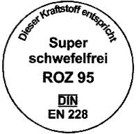
    *        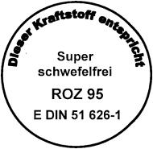

*    *   Ø = 85 mm bis 100 mm

    *   Ø = 85 mm bis 100 mm

## Anlage 1b (zu § 13 Absatz 1 Nummer 1)

(Fundstelle: BGBl. I 2010, 1856)

*    *        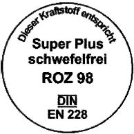
    *        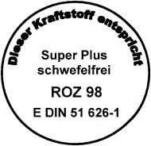

*    *   Ø = 85 mm bis 100 mm

    *   Ø = 85 mm bis 100 mm

## Anlage 1c (zu § 13 Absatz 1 Nummer 1)

(Fundstelle: BGBl. I 2010, 1856)

*    *        
    *        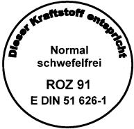

*    *   Ø = 85 mm bis 100 mm

    *   Ø = 85 mm bis 100 mm

## Anlage 2a (zu § 13 Absatz 1 Nummer 2)

(Fundstelle: BGBl. I 2010, 1857)

*    *        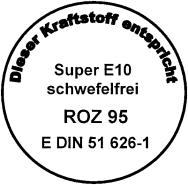

*    *   Ø = 85 mm bis 100 mm

## Anlage 2b (zu § 13 Absatz 1 Nummer 2)

(Fundstelle: BGBl. I 2010, 1857)

*    *        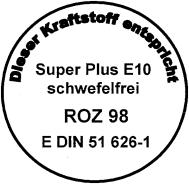

*    *   Ø = 85 mm bis 100 mm

## Anlage 2c (zu § 13 Absatz 1 Nummer 2)

(Fundstelle: BGBl. I 2010, 1857)

*    *        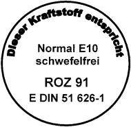

*    *   Ø = 85 mm bis 100 mm

## Anlage 3 (zu § 13 Absatz 1 Nummer 3)

(Fundstelle: BGBl. I 2010, 1858)

*    *        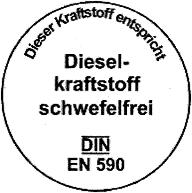

*    *   Ø = 85 mm bis 100 mm

## Anlage 4 (zu § 13 Absatz 1 Nummer 4)

(Fundstelle: BGBl. I 2010, 1858)

*    *        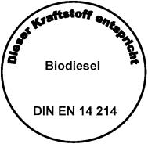

*    *   Ø = 85 mm bis 100 mm

## Anlage 5 (zu § 13 Absatz 1 Nummer 5)

(Fundstelle: BGBl. I 2010, 1858)

*    *        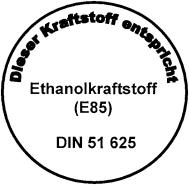

*    *   Ø = 85 mm bis 100 mm

## Anlage 6 (zu § 13 Absatz 1 Nummer 6)

(Fundstelle: BGBl. I 2010, 1859)

*    *        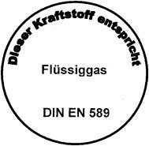

*    *   Ø = 85 mm bis 100 mm

## Anlage 7a (zu § 13 Absatz 1 Nummer 7)

(Fundstelle: BGBl. I 2010, 1859)

*    *        

*    *   Ø = 85 mm bis 100 mm

## Anlage 7b (zu § 13 Absatz 1 Nummer 7)

(Fundstelle: BGBl. I 2010, 1859)

*    *        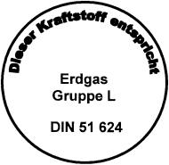

*    *   Ø = 85 mm bis 100 mm

## Anlage 8 (zu § 13 Absatz 1 Nummer 8)

(Fundstelle: BGBl. I 2010, 1860)

*    *        

*    *   Ø = 85 mm bis 100 mm

## Anlage 9 (zu § 18 Absatz 2 Satz 4)

(Fundstelle: BGBl. I 2010, 1861)

1.  Erklärung des Herstellers oder Vermischers über die Beschaffenheit
    flüssiger Kraft- und Brennstoffe

    Nummer der Ausfertigung:

    *        *
        *   Dieselkraftstoff
            gemäß § 1 Absatz 4

        *   Gasöl für
            den Seeverkehr
            gemäß § 1 Absatz 6

        *   Schiffs-
            diesel
            gemäß § 1
            Absatz 7

        *   Sonstige Schiffskraftstoffe
            gemäß § 1 Absatz 8

        *   Leichtes Heizöl
            gemäß § 1
            Absatz 9

        *   Schweres Heizöl
            gemäß § 1
            Absatz 10

    *        *   Menge in t

        *
        *
        *
        *
        *
        *

    *        *   Erster Bestimmungsort der Sendung

        *
        *
        *
        *
        *
        *

    *        *   Kenndaten

        *
        *
        *
        *
        *
        *

    *        *   a)

        *   Dichte bei 15 Grad C nach
            DIN EN ISO 3675 (1999) und
            DIN EN ISO 12185 (1997) in kg/cbm:

        *
        *
        *
        *
        *
        *

    *        *   b)

        *   Viskosität bei 40 Grad C nach DIN EN ISO 3104, Ausgabe Dezember 1999:

        *
        *
        *
        *
        *
        *

    *        *   c)

        *   Siedeverlauf nach DIN EN ISO 3405 Ausgabe August 2001:
            Bis 250 Grad C aufgefangene
            Destillatmenge in Vol.-%:
            Bis 350 Grad C aufgefangene
            Destillatmenge in Vol.-%:
            Bis 360 Grad C aufgefangene
            Destillatmenge in Vol.-%:

        *
        *
        *
        *
        *
        *

    *        *   d)

        *   Schwefelgehalt nach
            DIN EN ISO 8754 (2003),
            DIN EN ISO 14596 (2007) und
            DIN EN 24260 (1994) in Gew.-%:

        *
        *
        *
        *
        *
        *

   Ort, Datum und Nummer der Prüfung:

    Hersteller (Name und Anschrift):

    Unterschrift:

2.  Zusätzliche Erklärung des Lieferanten nach § 18 Absatz 2 Satz 3

    Firmenname und Geschäftssitz:

    Gelieferte Menge:

    Empfänger:

    Bestimmungsort:

    Ort, Datum:

    Unterschrift:

