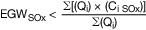

# Dreizehnte Verordnung zur Durchführung des Bundes-Immissionsschutzgesetzes (BImSchV 13 2021)

Ausfertigungsdatum
:   2021-07-06

Fundstelle
:   BGBl I: 2021, 2514

Stand: Ersetzt V 2129-8-13-2 v. 2.5.2013 I 1021, 1023, 3754 (BImSchV 13 2013)

## Abschnitt 1 - Gemeinsame Vorschriften

### Unterabschnitt 1 - Anwendungsbereich, Begriffsbestimmungen, Bezugssauerstoffgehalt und Aggregationsregeln

#### § 1 Anwendungsbereich

(1) Diese Verordnung gilt für die Errichtung, die Beschaffenheit und
den Betrieb von Feuerungsanlagen, einschließlich Gasturbinenanlagen
und Verbrennungsmotoranlagen sowie Gasturbinenanlagen und
Verbrennungsmotoranlagen zum Antrieb von Arbeitsmaschinen, mit einer
Feuerungswärmeleistung von mindestens 50 Megawatt (MW), unabhängig
davon, welche Brennstoffe oder welche Arten von Brennstoffen
eingesetzt werden.

(2) Für jede Feuerungsanlage nach Absatz 1 gelten die Vorschriften der
Abschnitte 1 und 7 dieser Verordnung in Verbindung mit den
zusätzlichen Vorschriften des für die Feuerungsanlage jeweils
maßgeblichen Abschnitts 2, 3, 4, 5 oder 6.

(3) Diese Verordnung gilt nicht für folgende Feuerungsanlagen:

1.  Anlagen, in denen die Verbrennungsprodukte unmittelbar zum Erwärmen,
    zum Trocknen oder zu einer anderweitigen Behandlung von Gegenständen
    oder Materialien verwendet werden, zum Beispiel Wärme- und
    Wärmebehandlungsöfen und Hochöfen,

2.  Nachverbrennungsanlagen, die dafür ausgelegt sind, die Abgase durch
    Verbrennung zu reinigen und die nicht als unabhängige Feuerungsanlagen
    betrieben werden,

3.  Einrichtungen zum Regenerieren von Katalysatoren für katalytisches
    Kracken,

4.  Einrichtungen für die Umwandlung von Schwefelwasserstoff in Schwefel
    nach dem Claus-Prozess,

5.  Feuerungsanlagen in der chemischen Industrie, die der unmittelbaren
    Beheizung von Gütern in Reaktoren dienen,

6.  Koksöfen,

7.  Winderhitzer,

8.  technische Geräte, die unmittelbar zum Antrieb von Fahrzeugen,
    Schiffen oder Flugzeugen eingesetzt werden,

9.  Gasturbinen und Gasmotoren, die auf Offshore-Plattformen eingesetzt
    werden,

10. Anlagen, die als Brennstoff andere feste oder flüssige Abfälle als die
    in § 2 Absatz 4 Nummer 2 genannten Abfälle verwenden, und

11. Feuerungsanlagen, die der Forschung, Entwicklung oder Erprobung neuer
    Einsatzstoffe, Brennstoffe, Erzeugnisse oder Verfahren im Labor- oder
    Technikumsmaßstab dienen, sowie Prüfstände für oder mit
    Verbrennungsmotoren und Prüfstände für oder mit Gasturbinen oder
    Triebwerke von Luftfahrzeugen.

(4) Diese Verordnung enthält Anforderungen an Feuerungsanlagen

1.  zur Vorsorge gegen schädliche Umwelteinwirkungen nach § 5 Absatz 1
    Nummer 2 des Bundes-
    Immissionsschutzgesetzes                    und zur Nutzung der
    entstehenden Wärme nach § 5 Absatz 1 Nummer 4 des Bundes-
    Immissionsschutzgesetzes und

2.  zur Erfüllung von Luftqualitätsanforderungen der Europäischen
    Gemeinschaften oder der Europäischen Union nach § 48a Absatz 1 und 3
    des Bundes-Immissionsschutzgesetzes.

#### § 2 Begriffsbestimmungen

(1) „Abgas“ im Sinne dieser Verordnung ist das Trägergas mit den
festen, flüssigen oder gasförmigen Emissionen, angegeben als
Volumenstrom in der Einheit Kubikmeter je Stunde (m³/h) und bezogen
auf das Abgasvolumen im Normzustand (Temperatur 273,15 Kelvin (K),
Druck 101,3 Kilopascal (kPa)) nach Abzug des Feuchtegehalts an
Wasserdampf.

(2) „Abgasreinigungseinrichtung“ im Sinne dieser Verordnung ist eine
der Feuerung nachgeschaltete Einrichtung zur Verminderung von
Luftverunreinigungen einschließlich Einrichtungen zur selektiven
nichtkatalytischen Reduktion und zur selektiven katalytischen
Oxidation.

(3) „Bezugssauerstoffgehalt“ im Sinne dieser Verordnung ist der
jeweils vorgegebene oder zu berechnende Volumengehalt an Sauerstoff im
Abgas, auf den der jeweilige Emissionsgrenzwert nach Anlage 5 zu
beziehen ist.

(4) „Biobrennstoffe“ im Sinne dieser Verordnung sind

1.  die Produkte land- oder forstwirtschaftlichen Ursprungs aus
    pflanzlichem Material oder Teilen davon, soweit sie zur Nutzung ihres
    Energieinhalts verwendet werden, und

2.  nachstehende Abfälle, wenn die erzeugte Wärme genutzt wird:

    a)  pflanzliche Abfälle aus der Land- und Forstwirtschaft,

    b)  pflanzliche Abfälle aus der Nahrungsmittelindustrie,

    c)  natürliche, nicht gefährliche Hölzer aus der Landschaftspflege, wenn
        sie aufgrund ihrer stofflichen Beschaffenheit mit den Hölzern aus der
        Forstwirtschaft vergleichbar sind,

    d)  faserige pflanzliche Abfälle und Ablaugen aus der Herstellung von
        natürlichem Zellstoff und aus der Herstellung von Papier aus
        Zellstoff, sofern sie am Herstellungsort mitverbrannt werden,

    e)  Korkabfälle,

    f)  Holzabfälle; hiervon ausgenommen sind Holzabfälle, die infolge einer
        Behandlung mit Holzschutzmitteln oder infolge einer Beschichtung
        halogenorganische Verbindungen oder Schwermetalle enthalten können,
        insbesondere Holzabfälle aus Bau- und Abbruchabfällen.

(5) „Brennstoffbezogener Nettowirkungsgrad“ im Sinne dieser Verordnung
ist das Verhältnis der Summe von elektrischer oder mechanischer
Nettoleistung und von der nutzbaren Nettowärmeleistung zur
Feuerungswärmeleistung.

(6) „Brennstoffe“ im Sinne dieser Verordnung sind alle festen,
flüssigen oder gasförmigen brennbaren Stoffe einschließlich ihrer
nicht brennbaren Bestandteile; hiervon ausgenommen sind brennbare
Stoffe, soweit sie dem Anwendungsbereich der Verordnung über die
Verbrennung und die Mitverbrennung von Abfällen unterliegen.

(7) „Dieselkraftstoff“ im Sinne dieser Verordnung ist Kraftstoff, der
die Anforderungen nach § 4 Absatz 1 der Verordnung über die
Beschaffenheit und die Auszeichnung der Qualitäten von Kraft- und
Brennstoffen erfüllt.

(8) „Dieselmotoranlage“ im Sinne dieser Verordnung ist eine nach dem
Dieselprinzip arbeitende Verbrennungsmotoranlage mit Selbstzündung des
Kraftstoffs.

(9) „Elektrischer Nettowirkungsgrad“ im Sinne dieser Verordnung ist
das Verhältnis der netto bereitstellbaren elektrischen Leistung zur
Feuerungswärmeleistung.

(10) „Emissionen“ im Sinne dieser Verordnung sind die von einer Anlage
ausgehenden Luftverunreinigungen, angegeben als Massenkonzentrationen
in der Einheit Milligramm je Kubikmeter Abgas (mg/m³) oder Nanogramm
je Kubikmeter Abgas (ng/m³) oder als Massenstrom in der Einheit
Megagramm pro Jahr (Mg/a); Staubemissionen können als Rußzahl
angegeben werden.

(11) „Emissionsgrenzwert“ im Sinne dieser Verordnung ist die Emission
einer Anlage, die zulässigerweise in die Luft abgeleitet werden darf,
angegeben als Massenkonzentration und bezogen auf den jeweiligen
Bezugssauerstoffgehalt, im Fall von Staubemission auch angegeben als
zulässige Rußzahl.

(12) „Entschwefelungsgrad der Rauchgasentschwefelungseinrichtung“ im
Sinne dieser Verordnung ist das Verhältnis der Menge an
Schwefeloxiden, die von der Rauchgasentschwefelungseinrichtung
abgeschieden worden ist, zu der Menge an Schwefeloxiden, die der
Rauchgasentschwefelungseinrichtung mit dem Abgas zugeführt worden ist.

(13) „Erdgas“ im Sinne dieser Verordnung ist oder sind

1.  natürlich vorkommendes Methangas mit nicht mehr als 20 Volumen-Prozent
    an Inertgasen und sonstigen Bestandteilen, das den Anforderungen des
    DVGW-Arbeitsblatts G 260 (DVGW: Deutscher Verein des Gas- und
    Wasserfaches e. V.), Ausgabe März 2013, für Gase der zweiten
    Gasfamilie entspricht, sowie

2.  Klär-, Bio- und Grubengase nach dem DVGW-Arbeitsblatt G 262, Ausgabe
    September 2011, die die Bedingungen des DVGW-Arbeitsblatts G 260 als
    Austauschgas oder als Zusatzgas zur Konditionierung erfüllen und
    insoweit die Grundgase der zweiten Gasfamilie in der öffentlichen
    Gasversorgung ersetzen oder ergänzen.

(14) „Feuerungsanlage“ im Sinne dieser Verordnung ist jede Anlage, in
der Brennstoff zur Nutzung der erzeugten Wärme oxidiert wird.

(15) „Feuerungswärmeleistung“ im Sinne dieser Verordnung ist der auf
den unteren Heizwert bezogene Wärmeinhalt der Brennstoffe, der einer
Anlage im Dauerbetrieb je Zeiteinheit zugeführt wird, angegeben in
Megawatt.

(16) „Gasturbinenanlage“ im Sinne dieser Verordnung ist eine
Feuerungsanlage mit einer rotierenden Maschine, die thermische Energie
in mechanische Arbeit umwandelt und im Wesentlichen aus einem
Verdichter, aus einer Brennkammer, in der Brennstoff zur Erhitzung des
Arbeitsmediums oxidiert wird, und aus einer Turbine besteht.

(17) „Gasturbine mit Zusatzfeuerung“ im Sinne dieser Verordnung ist
eine Gasturbine, deren Abgase einer nachgeschalteten Feuerung mit
eigener Brennstoffzufuhr als Verbrennungsluft zugeführt werden.

(18) „Gasmotoranlage“ im Sinne dieser Verordnung ist eine arbeitende
Verbrennungsmotoranlage

1.  mit Fremdzündung des Kraftstoffs oder

2.  im Fall von Zweistoffmotoren mit Selbstzündung des Kraftstoffs.

(19) „Großfeuerungsanlage“ im Sinne dieser Verordnung ist eine
Feuerungsanlage, die keine Gasturbinenanlage oder
Verbrennungsmotoranlage ist.

(20) „Leichtes Heizöl“ im Sinne dieser Verordnung ist Heizöl nach DIN
51603 Teil 1, Ausgabe September 2020, oder Heizöl nach DIN SPEC 51603
Teil 6, Ausgabe März 2017.

(20a) „Magerbetrieb“ im Sinne dieser Verordnung liegt vor, wenn ein
Motor im Dauerbetrieb mit hohem Luftüberschuss gefahren wird.

(21) „Mechanischer Nettowirkungsgrad“ im Sinne dieser Verordnung ist
das Verhältnis der netto bereitstellbaren mechanischen Leistung zur
Feuerungswärmeleistung.

(22) „Mehrstofffeuerung“ im Sinne dieser Verordnung ist eine
Einzelfeuerung, die mit zwei oder mehr Brennstoffen wechselweise
betrieben werden kann.

(23) „Mischfeuerung“ im Sinne dieser Verordnung ist eine
Einzelfeuerung, die mit zwei oder mehr Brennstoffen gleichzeitig
betrieben werden kann.

(24) „Netzstabilitätsanlage“ ist eine Anlage zur Stromerzeugung, die
nicht am Strommarkt teilnimmt und deren Einsatz als besonderes
netztechnisches Betriebsmittel nach § 11 Absatz 3 des
Energiewirtschaftsgesetzes vom 7. Juli 2005 (BGBl. I S. 1970, 3621),
das zuletzt durch Artikel 4 des Gesetzes vom 8. August 2020 (BGBl. I
S. 1818) geändert worden ist, sich auf einen Notbetrieb zur
Wiederherstellung der Sicherheit und Zuverlässigkeit des
Elektrizitätsversorgungssystems bei einem tatsächlichen örtlichen
Ausfall eines oder mehrerer Betriebsmittel im Übertragungsnetz
beschränkt.

(24a) „Periodische Messung“ ist die Ermittlung einer Messgröße (einer
bestimmten, quantitativ zu messenden Größe) in festgelegten
Zeitabständen.

(25) „Rauchgasentschwefelungseinrichtung“ ist eine aus einer
Abgasreinigungseinrichtung oder aus einer Kombination von
Abgasreinigungseinrichtungen bestehende Einrichtung zur Senkung der
Schwefeloxid-Emissionen einer Feuerungsanlage.

(26) „Schornstein“ im Sinne dieser Verordnung ist eine Konstruktion,
die einen oder mehrere Züge aufweist, über die Abgase in die Luft
abgeleitet werden.

(27) „Schwefelabscheidegrad“ im Sinne dieser Verordnung ist das
Verhältnis der Schwefelmenge, die von einer Feuerungsanlage in einem
bestimmten Zeitraum nicht in die Luft abgeleitet wird, zu der
Schwefelmenge des Brennstoffs, der im gleichen Zeitraum in die
Feuerungsanlage eingebracht und verbraucht wird, angegeben als
Prozentsatz.

(28) „Verbrennungsmotoranlage“ im Sinne dieser Verordnung ist eine
Feuerungsanlage in Form einer Dieselmotoranlage oder einer
Gasmotoranlage.

#### § 3 Bezugssauerstoffgehalt

Emissionsgrenzwerte beziehen sich auf einen Volumengehalt an
Sauerstoff im Abgas von

1.  3 Prozent bei Großfeuerungsanlagen für flüssige und gasförmige
    Brennstoffe,

2.  6 Prozent bei Großfeuerungsanlagen für feste Brennstoffe und
    Biobrennstoffe,

3.  15 Prozent bei Gasturbinenanlagen sowie

4.  5 Prozent bei Verbrennungsmotoranlagen.

#### § 4 Aggregationsregeln

(1) Werden in einer gemeinsamen Anlage im Sinne des § 1 Absatz 3 der
Verordnung über genehmigungsbedürftige Anlagen die Abgase von zwei
oder mehr gesonderten Feuerungsanlagen gemeinsam über einen
Schornstein abgeleitet, so gilt die von solchen Feuerungsanlagen
gebildete Kombination als eine einzige Feuerungsanlage; die
Feuerungswärmeleistung dieser Feuerungsanlage ergibt sich durch
Addition der Feuerungswärmeleistungen der gesonderten
Feuerungsanlagen.

(2) Wird eine gemeinsame Anlage im Sinne des § 1 Absatz 3 der
Verordnung über genehmigungsbedürftige Anlagen

1.  aus zwei oder mehr gesonderten Feuerungsanlagen derart errichtet oder

2.  als bestehende Anlage durch eine oder mehrere neue Feuerungsanlagen
    derart erweitert,

dass ihre Abgase unter Berücksichtigung technischer und
wirtschaftlicher Faktoren nach Beurteilung der zuständigen Behörde
gemeinsam über einen Schornstein abgeleitet werden können, so gilt die
von solchen Feuerungsanlagen gebildete Kombination als eine einzige
Feuerungsanlage; die Feuerungswärmeleistung dieser Feuerungsanlage
ergibt sich durch Addition der Feuerungswärmeleistungen der
gesonderten Feuerungsanlagen. Die Behörde kann von der Addition nach
Satz 1 im Einzelfall absehen, wenn der Betreiber plausible Gründe
benennt, die der Addition entgegenstehen.

(3) Für die Berechnung der Feuerungswärmeleistung einer in den
Absätzen 1 und 2 genannten Kombination gesonderter Feuerungsanlagen
werden einzelne Feuerungsanlagen mit einer Feuerungswärmeleistung von
weniger als 15 MW nicht berücksichtigt. Die Grenzwerte dieser
Verordnung sind bei diesen Anlagen nicht anzuwenden.

(4) Leitet ein Teil einer Feuerungsanlage, die die Voraussetzungen von
Absatz 1 oder 2 erfüllt, seine Abgase über einen oder mehrere
gesonderte Schornsteinzüge oder Rauchgaskanäle im Schornstein ab und
ist er im gleitenden Durchschnitt über einen Zeitraum von fünf Jahren
höchstens 1 500 Stunden jährlich in Betrieb, kann dieser Teil der
Feuerungsanlage für die Zwecke dieser Verordnung gesondert betrachtet
werden. In Fällen dieser Art werden die durch jeden dieser
Schornsteinzüge oder Rauchgaskanäle abgeleiteten Emissionen des
Anlagenteils gesondert überwacht und die zugehörigen Betriebsstunden
erfasst. Der Betreiber einer Feuerungsanlage nach Satz 1 hat jeweils
bis zum 31. März eines Jahres einen Nachweis über die Einhaltung der
Betriebszeit zu führen und der zuständigen Behörde auf Verlangen
vorzulegen.

### Unterabschnitt 2 - Gemeinsame Anforderungen an die Errichtung und den Betrieb

#### § 5 Anforderungen und im Jahresmittel einzuhaltende Emissionsgrenzwerte zur Absicherung von Umweltqualitätszielen

(1) Großfeuerungsanlagen mit einer Feuerungswärmeleistung von mehr als
300 MW sind so zu errichten und zu betreiben, dass kein
Jahresmittelwert von Gesamtstaub einen Emissionsgrenzwert von 10 mg/m³
überschreitet.

(2) Großfeuerungsanlagen sind bei Einsatz fester Brennstoffe und
Biobrennstoffe so zu errichten und zu betreiben, dass kein
Jahresmittelwert von Quecksilber und seinen Verbindungen, angegeben
als Quecksilber, einen Emissionsgrenzwert von 0,01 mg/m³
überschreitet.

(3) Großfeuerungsanlagen, die nach dem 6. Januar 2014 in Betrieb
gegangen sind oder gehen, sind bei Einsatz von festen oder flüssigen
Brennstoffen oder bei Einsatz von Biobrennstoffen so zu errichten und
zu betreiben, dass kein Jahresmittelwert die folgenden
Emissionsgrenzwerte von Stickstoffmonoxid und Stickstoffdioxid,
angegeben als Stickstoffdioxid, überschreitet:

1.
    *        *   bei Anlagen mit einer Feuerungswärmeleistung von 50 MW bis 100 MW:

        *   250 mg/m³;

2.
    *        *   bei Anlagen mit einer Feuerungswärmeleistung von mehr als 100 MW:

        *   100 mg/m³.

(4) Die Anforderungen der Absätze 2 und 3 gelten nicht für
Großfeuerungsanlagen,

1.  die ausschließlich zur Abdeckung der Spitzenlast bei der
    Energieversorgung während bis zu 300 Stunden im Kalenderjahr dienen
    oder

2.  die ausschließlich dem Notbetrieb während bis zu 300 Stunden im
    Kalenderjahr dienen.

(5) Der Betreiber einer Anlage nach Absatz 4 Nummer 1 oder 2 hat
jeweils bis zum Ablauf des 31. März eines Kalenderjahres für das
vorhergehende Kalenderjahr einen Nachweis über die Einhaltung der
Betriebszeit zu führen. Der Betreiber hat den Nachweis nach dem Ende
des Nachweiszeitraums fünf Jahre lang aufzubewahren und der
zuständigen Behörde auf Verlangen vorzulegen.

#### § 6 Emissionsgrenzwerte bei Betrieb mit mehreren Brennstoffen

(1) Feuerungsanlagen sind beim Betrieb mit mehreren Brennstoffen so zu
betreiben, dass

1.  kein Jahres- und kein Tagesmittelwert den sich aus Absatz 2 oder 3
    jeweils ergebenden Emissionsgrenzwert für das Jahr und den Tag
    überschreitet und

2.  kein Halbstundenmittelwert das Doppelte des gemäß Nummer 1 bestimmten
    Emissionsgrenzwertes für den Tag überschreitet.

(2) Bei Mischfeuerungen sind die für den jeweiligen Brennstoff
maßgeblichen Emissionsgrenzwerte und der jeweilige
Bezugssauerstoffgehalt nach dem Verhältnis der mit diesem Brennstoff
zugeführten Feuerungswärmeleistung zu der insgesamt zugeführten
Feuerungswärmeleistung zu ermitteln. Die für die Feuerungsanlage
maßgeblichen Emissionsgrenzwerte und der für die Feuerungsanlage
maßgebliche Bezugssauerstoffgehalt ergeben sich durch Addition der
nach Satz 1 ermittelten Werte.

(3) Bei Mehrstofffeuerungen gelten die Anforderungen, die für den
jeweils eingesetzten Brennstoff gelten.

#### § 7 Kraft-Wärme-Kopplung und Kopplung von Gas- und Dampfturbinen

(1) Der Betreiber hat bei der Errichtung oder der wesentlichen
Änderung einer Feuerungsanlage Maßnahmen zur Kraft-Wärme-Kopplung
durchzuführen, es sei denn, dies ist technisch nicht möglich oder
unverhältnismäßig. Ist die Durchführung der Maßnahmen zur Kraft-Wärme-
Kopplung technisch nicht möglich oder unverhältnismäßig, hat der
Betreiber diesen Umstand unverzüglich der zuständigen Behörde
anzuzeigen.

(2) Wird bei der Errichtung oder der wesentlichen Änderung einer mit
Erdgas betriebenen Gasturbinen- oder Verbrennungsmotoranlage zur
Stromerzeugung, die auch für einen Betrieb mit jährlich 1 500
Betriebsstunden oder mehr im gleitenden Durchschnitt über einen
Zeitraum von fünf Jahren verfügbar sein soll, keine Maßnahme zur
Kraft-Wärme-Kopplung durchgeführt, so hat der Betreiber Maßnahmen zur
Kopplung von Gas- und Dampfturbinen (Gas- und Dampfturbinenprozess)
oder von Verbrennungsmotoren und Dampfturbinen durchzuführen, es sei
denn, dies ist technisch nicht möglich oder unverhältnismäßig. Ist die
Durchführung der Maßnahmen zur Kopplung von Gas- und Dampfturbinen
oder von Verbrennungsmotoren und Dampfturbinen nicht möglich, hat der
Betreiber diesen Umstand der zuständigen Behörde anzuzeigen.

#### § 8 Wesentliche Änderung einer Feuerungsanlage

Wird eine Feuerungsanlage wesentlich geändert, sind die Anforderungen
dieses Unterabschnitts sowie die zusätzlichen Anforderungen an die
Errichtung und den Betrieb im jeweils maßgeblichen Abschnitt 2, 3, 4,
5 oder 6 anzuwenden auf

1.  die Anlagenteile und Verfahrensschritte, die geändert werden sollen,
    sowie

2.  die Anlagenteile und Verfahrensschritte, auf die sich die Änderung
    auswirken wird.

Für die Bestimmung, welche Anforderungen anzuwenden sind, ist die
Gesamtleistung der Feuerungsanlage nach erfolgter wesentlicher
Änderung maßgeblich.

#### § 9 Anlagen zur Abscheidung und Kompression von Kohlendioxid

(1) Vor der erstmaligen Genehmigung der Errichtung oder des Betriebs
einer Feuerungsanlage zur Erzeugung von Strom mit einer elektrischen
Nennleistung von 300 MW oder mehr hat der Betreiber zu prüfen, ob

1.  geeignete Kohlendioxidspeicher zur Verfügung stehen und

2.  der Zugang zu Anlagen für den Transport des Kohlendioxids sowie die
    Nachrüstung von Anlagen für die Abscheidung und Kompression von
    Kohlendioxid technisch möglich und wirtschaftlich zumutbar sind.

(2) Dies gilt entsprechend für die Änderung oder Erweiterung einer
Feuerungsanlage um eine elektrische Nennleistung von 300 MW oder mehr.
Der Betreiber hat das Ergebnis der Prüfung der zuständigen Behörde
darzulegen. Sind die Voraussetzungen nach Absatz 1 erfüllt, hat der
Betreiber auf dem Betriebsgelände eine hinreichend große Fläche für
die Nachrüstung der errichteten Anlage mit den für die Abscheidung und
Kompression von Kohlendioxid erforderlichen Anlagen freizuhalten.

#### § 10 Begrenzung der Emissionen bei Lagerungs- und Transportvorgängen

(1) Bei der Lagerung und beim Transport von Stoffen sind nach näherer
Bestimmung der zuständigen Behörde Maßnahmen zur Begrenzung der
Emissionen nach den Anforderungen der Technischen Anleitung zur
Reinhaltung der Luft zu treffen.

(2) Staubförmige Emissionen, die beim Entleeren von Filteranlagen
entstehen können, sind dadurch zu vermindern, dass die Stäube in
geschlossene Behältnisse abgezogen oder an den Austragsstellen
befeuchtet werden.

(3) Für staubförmige Verbrennungsrückstände sind geschlossene
Transporteinrichtungen und geschlossene Zwischenlager zu verwenden.

#### § 11 Ableitbedingungen für Abgase

Abgase sind in kontrollierter Weise so abzuleiten, dass ein
ungestörter Abtransport mit der freien Luftströmung ermöglicht wird.
Zur Ermittlung der Ableitungshöhen sind die Anforderungen der
Technischen Anleitung zur Reinhaltung der Luft heranzuziehen. Die
näheren Bestimmungen sind in der Genehmigung festzulegen.

#### § 12 Abgasreinigungseinrichtungen

(1) Soweit zur Einhaltung der Emissionsgrenzwerte
Abgasreinigungseinrichtungen erforderlich sind, muss der gesamte
Abgasstrom behandelt werden.

(2) Der Betreiber einer Anlage hat bei einer Betriebsstörung an einer
Abgasreinigungseinrichtung oder bei ihrem Ausfall unverzüglich die
erforderlichen Maßnahmen für die Wiederherstellung eines
ordnungsgemäßen Betriebs zu ergreifen. Er hat den Betrieb der Anlage
einzuschränken oder sie außer Betrieb zu nehmen, wenn ein
ordnungsgemäßer Betrieb nicht innerhalb von 24 Stunden sichergestellt
werden kann. In jedem Fall hat er die zuständige Behörde unverzüglich,
spätestens innerhalb von 48 Stunden zu unterrichten.

(3) Die zuständige Behörde hat in der Genehmigung geeignete Maßnahmen
für den Fall einer Betriebsstörung an der Abgasreinigungseinrichtung
oder ihres Ausfalls vorzusehen. Beim Ausfall einer
Abgasreinigungseinrichtung darf eine Anlage während eines Zeitraums
von zwölf aufeinanderfolgenden Monaten höchstens 120 Stunden ohne
diese Abgasreinigungseinrichtung betrieben werden.

### Unterabschnitt 3 - Gemeinsame Vorschriften zur Messung, Überwachung und Berichterstattung

#### § 13 Brennstoffkontrolle

(1) Der Betreiber hat die Brennstoffdaten der der Feuerungsanlage
zugeführten Brennstoffe, ausgenommen Zündbrennstoffe, gemäß Anlage 1
zu ermitteln (Brennstoffkontrolle). Der Betreiber hat dazu mit einer
Stichprobe die Brennstoffdaten nach allgemein anerkannten Regeln der
Technik im Sinne von § 66 Absatz 3 zu ermitteln.

(2) Der Betreiber kann die Pflicht zur Durchführung der
Brennstoffkontrolle auf den Brennstofflieferanten übertragen.
Überträgt der Betreiber die Pflicht auf den Brennstofflieferanten,
verpflichtet der Betreiber diesen, ihm die vollständigen Ergebnisse
der Brennstoffkontrolle in Form einer Produkt- oder
Brennstoffspezifikation oder einer Garantie vorzulegen.

(3) Der Betreiber führt die Brennstoffkontrolle bei Einsatz von
Braunkohle regelmäßig wiederkehrend einmal vierteljährlich durch, bei
Einsatz von anderen Brennstoffen regelmäßig wiederkehrend jedes
Kalenderjahr. Weicht das Ergebnis einer Brennstoffkontrolle vom
Mittelwert der drei vorhergehenden Brennstoffkontrollen um weniger als
15 Prozent ab, ist abweichend von Satz 1 bei Einsatz von Braunkohle
die Brennstoffkontrolle wiederkehrend einmal halbjährlich und bei
Einsatz von anderen Brennstoffen wiederkehrend alle zwei Kalenderjahre
durchzuführen.

(4) Bei Einsatz eines bisher nicht eingesetzten Brennstoffs, führt der
Betreiber umgehend eine erneute Ermittlung nach Absatz 1 aus.

(5) Die Ergebnisse der nach den Absätzen 1 bis 4 vorgenommenen
Brennstoffkontrollen sind der zuständigen Behörde auf Verlangen
unverzüglich vorzulegen. Die Ergebnisse sind nach dem Ende des
Zeitraums, für den die Brennstoffkontrolle durchgeführt worden ist,
fünf Jahre lang aufzubewahren.

#### § 14 Energieeffizienzkontrolle

(1) Der Betreiber einer Feuerungsanlage zur Bereitstellung von
elektrischer oder mechanischer Energie hat den elektrischen oder
mechanischen Nettowirkungsgrad zu bestimmen. Bei Feuerungsanlagen nach
Satz 1, die in Kraft-Wärme-Kopplung betrieben werden, bestimmt der
Betreiber zusätzlich den brennstoffbezogenen Nettowirkungsgrad. Bei
Feuerungsanlagen zur ausschließlichen Bereitstellung von Nutzwärme
bestimmt der Betreiber den brennstoffbezogenen Nettowirkungsgrad.

(2) Die Bestimmungen nach Absatz 1 hat der Betreiber im Zuge eines
Leistungstests, wenn die Anlage mit der höchsten Leistung betrieben
wird, für die sie für den Dauerbetrieb zugelassen ist, nach der
Inbetriebnahme der Feuerungsanlage und nach jeder Änderung der
Feuerungsanlage mit signifikanter Auswirkung auf die Bestimmungsgrößen
vorzunehmen. Der Leistungstest ist nach den allgemein anerkannten
Regeln der Technik im Sinne des § 66 Absatz 3 durchzuführen. Ist ein
Betrieb mit der höchsten Leistung während der Messung nicht möglich,
erfolgt die Messung unter repräsentativen Betriebsbedingungen.

(3) Kann der Leistungstest nach Absatz 2 Satz 1 bei Feuerungsanlagen
mit Kraft-Wärme-Kopplung aus technischen Gründen nicht mit Volllast in
der Wärmeabgabe gefahren werden, erfolgt der Leistungstest bei der
aktuell möglichen Wärmeabgabe und seine Ergebnisse fließen in die
rechnerische Bestimmung der volllastbezogenen Werte ein.

(4) Der Betreiber kann die sich aus den Absätzen 1 bis 3 ergebenden
Pflichten auf den Hersteller oder den Lieferanten der Feuerungsanlage
übertragen. Überträgt der Betreiber die Pflicht auf den Hersteller
oder den Lieferanten, verpflichtet der Betreiber diesen, ihm einen
Bericht über das Ergebnis des Leistungstests vorzulegen.

(5) Die Ergebnisse der nach Absatz 1 vorgenommenen Bestimmungen des
Nettowirkungsgrades sind der zuständigen Behörde auf Verlangen
vorzulegen. Die Ergebnisse sind bis zur Durchführung einer erneuten
Bestimmung aufzubewahren, mindestens jedoch für einen Zeitraum von
fünf Jahren nach dem Ende des Leistungstests.

#### § 15 Messplätze

Der Betreiber hat vor der Inbetriebnahme einer Anlage für die
Messungen zur Feststellung der Emissionen sowie zur Ermittlung der
Bezugs- oder Betriebsgrößen Messplätze einzurichten. Die Messplätze
sollen ausreichend groß, leicht begehbar und so beschaffen sein sowie
so ausgewählt werden, dass die Vorgaben der DIN EN 15259, Ausgabe
Januar 2008, erfüllt und repräsentative und einwandfreie Messungen
gewährleistet sind. Näheres bestimmt die zuständige Behörde.

#### § 16 Messverfahren und Messeinrichtungen

(1) Der Betreiber hat sicherzustellen, dass für Messungen die dem
Stand der Messtechnik entsprechenden Messverfahren angewendet und
geeignete Messeinrichtungen, die den Anforderungen der Anlage 4
entsprechen, verwendet werden. Näheres bestimmt die zuständige
Behörde.

(2) Der Betreiber hat sicherzustellen, dass die Probenahme und Analyse
aller Schadstoffe sowie die Qualitätssicherung von automatischen
Messsystemen und die Referenzmessverfahren zur Kalibrierung
automatischer Messsysteme nach allgemein anerkannten Regeln der
Technik im Sinne des § 66 Absatz 3 durchgeführt werden.

(3) Der Betreiber hat den ordnungsgemäßen Einbau von Mess- und
Auswerteeinrichtungen zur kontinuierlichen Überwachung vor der
Inbetriebnahme der Feuerungsanlage der zuständigen Behörde
nachzuweisen. Hierzu hat der Betreiber der zuständigen Behörde die
Bescheinigung einer Stelle für Kalibrierungen, die von der zuständigen
Landesbehörde oder von der nach Landesrecht bestimmten Behörde nach §
29b des Bundes-Immissionsschutzgesetzes für diesen Tätigkeitsbereich
bekannt gegeben wurde, vorzulegen.

(4) Der Betreiber hat Messeinrichtungen, die zur kontinuierlichen
Feststellung der Emissionen oder der Betriebsgrößen eingesetzt werden,
durch eine Stelle, die von der zuständigen Landesbehörde oder von der
nach Landesrecht bestimmten Behörde nach § 29b des Bundes-
Immissionsschutzgesetzes für diesen Tätigkeitsbereich bekannt gegeben
wurde, gemäß Absatz 5

1.  kalibrieren zu lassen und

2.  auf Funktionsfähigkeit prüfen zu lassen.

(5) Die Funktionsfähigkeit der Messeinrichtung ist jährlich mittels
Parallelmessungen unter Verwendung der Referenzmethode prüfen zu
lassen. Die Kalibrierung ist nach der Errichtung und nach jeder
wesentlichen Änderung der Feuerungsanlage durchführen zu lassen,
sobald der ungestörte Betrieb erreicht ist, jedoch frühestens drei
Monate und spätestens sechs Monate nach der Inbetriebnahme. Die
Kalibrierung der Messeinrichtung ist nach ihrer Errichtung und jeder
wesentlichen Änderung an der Messeinrichtung durchführen zu lassen,
sobald die Errichtung oder Instandsetzung der Messeinrichtung
abgeschlossen ist. Eine Kalibrierung ist mindestens alle drei Jahre
vorzunehmen.

(6) Der Betreiber hat die Berichte über das Ergebnis der Kalibrierung
und der Prüfung der Funktionsfähigkeit und über die entsprechende
Konfiguration der Datenerfassungs- und Auswerteeinrichtung innerhalb
von zwölf Wochen nach der Kalibrierung oder der Prüfung der
zuständigen Behörde vorzulegen.

#### § 17 Kontinuierliche Messungen

(1) Der Betreiber hat folgende Parameter kontinuierlich zu ermitteln,
zu registrieren, gemäß § 19 Absatz 1 Satz 1 bis 4 und Absatz 2 und 3
auszuwerten und im Fall von § 19 Absatz 4 Satz 3 der zuständigen
Behörde unverzüglich zu übermitteln:

1.  die Massenkonzentration der Emissionen an Gesamtstaub, Quecksilber,
    Gesamtkohlenstoff, Kohlenmonoxid, Stickstoffmonoxid, Stickstoffdioxid,
    Schwefeldioxid, Schwefeltrioxid, Ammoniak, gasförmigen anorganischen
    Chlorverbindungen, angegeben als Chlorwasserstoff, und die Rußzahl,
    soweit Emissionsgrenzwerte oder eine Begrenzung der Rußzahl festgelegt
    sind oder ist,

2.  den Volumengehalt an Sauerstoff im Abgas und

3.  die zur Beurteilung des ordnungsgemäßen Betriebs erforderlichen
    Betriebsgrößen, insbesondere Leistung, Abgastemperatur,
    Abgasvolumenstrom, Feuchtegehalt, Wasserstoffgehalt und Druck.

Der Betreiber hat hierzu die Anlagen vor der Inbetriebnahme mit
geeigneten Mess- und Auswerteeinrichtungen auszurüsten.

(2) Messeinrichtungen für den Feuchtegehalt sind nicht notwendig,
soweit das Abgas vor der Ermittlung der Massenkonzentration der
Emissionen getrocknet wird. Ergibt sich aufgrund der Bauart und
Betriebsweise von Nass-Abgasentschwefelungsanlagen infolge des
Sättigungszustandes des Abgases und der konstanten Abgastemperatur,
dass der Feuchtegehalt im Abgas an der Messstelle einen konstanten
Wert annimmt, soll die zuständige Behörde auf die kontinuierliche
Messung des Feuchtegehalts verzichten und die Verwendung des in
periodischen Messungen ermittelten Wertes zulassen. In diesem Fall hat
der Betreiber Nachweise über das Vorliegen der vorgenannten
Voraussetzungen bei der Kalibrierung zu führen und der zuständigen
Behörde auf Verlangen vorzulegen. Der Betreiber hat die Nachweise nach
der Kalibrierung fünf Jahre lang aufzubewahren.

(3) Die Gesamtstaubemission ist ohne Beitrag des Schwefeltrioxids zum
Messwert auszuweisen.

(4) Ergibt sich aufgrund der Einsatzstoffe, der Bauart, der
Betriebsweise oder aufgrund von periodischen Messungen, dass der
Anteil des Stickstoffdioxids an den Stickstoffoxidemissionen unter 5
Prozent liegt, soll die zuständige Behörde auf die kontinuierliche
Messung des Stickstoffdioxids verzichten und die Bestimmung des
Anteils durch Berechnung zulassen. In diesem Fall hat der Betreiber
Nachweise über den Anteil des Stickstoffdioxids bei der Kalibrierung
zu führen und der zuständigen Behörde auf Verlangen vorzulegen. Der
Betreiber hat die Nachweise nach der Kalibrierung jeweils fünf Jahre
lang aufzubewahren.

(5) Wird die Massenkonzentration an Schwefeldioxid kontinuierlich
gemessen, kann die Massenkonzentration an Schwefeltrioxid bei der
Kalibrierung ermittelt und durch Berechnung berücksichtigt werden.

(6) Zur Feststellung des Schwefelabscheidegrades sind die Messwerte
der Emissionen an Schwefeldioxid und Schwefeltrioxid im Abgas sowie
der nach § 13 ermittelte Wert des Schwefelgehalts im eingesetzten
Brennstoff heranzuziehen. Die zuständige Behörde bestimmt näher, wie
nachgewiesen wird, dass die Schwefelabscheidegrade als Tagesmittelwert
eingehalten werden.

#### § 18 Ausnahmen vom Erfordernis kontinuierlicher Messungen

(1) Die zuständige Behörde kann bei Feuerungsanlagen mit einer
Lebensdauer von weniger als
10 000 Betriebsstunden              beschließen, von den
kontinuierlichen Messungen gemäß § 17 Absatz 1 abzusehen.

(2) Abweichend von § 17 Absatz 1 sind bei Feuerungsanlagen, die
ausschließlich mit Erdgas, Wasserstoff oder Flüssiggas betrieben
werden, kontinuierliche Messungen zur Feststellung der Emissionen an
Gesamtstaub nicht erforderlich.

(3) Abweichend von § 17 Absatz 1 sind bei Großfeuerungsanlagen mit
einer Feuerungswärmeleistung von höchstens 100 MW, die im gleitenden
Durchschnitt über einen Zeitraum von fünf Jahren höchstens 1 500
Stunden jährlich in Betrieb sind und die ausschließlich mit leichtem
Heizöl betrieben werden, Messungen zur Feststellung der Emissionen an
Gesamtstaub nicht erforderlich. In diesem Fall hat der Betreiber
periodische Messungen für Staub regelmäßig wiederkehrend nach § 20
Absatz 3 durchführen zu lassen.

(4) Abweichend von § 17 Absatz 1 sind bei Feuerungsanlagen, die
ausschließlich mit leichtem Heizöl, Dieselkraftstoff oder Erdgas
betrieben werden, einzeln oder bei Einsatz in Zweistoffmotoren auch in
Kombination, Messungen zur Feststellung der Emissionen an
Schwefeloxiden nicht erforderlich. In diesem Fall hat der Betreiber
die Brennstoffkontrolle bezüglich des Schwefelgehalts und des unteren
Heizwertes abweichend von § 13 Absatz 3 bei Einsatz von Erdgas
regelmäßig wiederkehrend halbjährlich und bei ausschließlichem Einsatz
von leichtem Heizöl oder Dieselkraftstoff regelmäßig wiederkehrend
vierteljährlich vorzunehmen. Der Betreiber hat die Nachweise nach
ihrer Erstellung jeweils fünf Jahre lang aufzubewahren.

(5) Abweichend von § 17 Absatz 1 sind bei Feuerungsanlagen, die
ausschließlich mit Biobrennstoffen betrieben werden, Messungen zur
Feststellung der Emissionen an Schwefeloxiden nicht erforderlich, wenn
die Emissionsgrenzwerte durch den Einsatz entsprechender Brennstoffe
eingehalten werden. In diesem Fall hat der Betreiber die
Brennstoffkontrolle bezüglich des Schwefelgehalts und des unteren
Heizwertes abweichend von § 13 Absatz 3 regelmäßig wiederkehrend
einmal halbjährlich auszuführen.

(6) Abweichend von § 17 Absatz 1 sind bei mit Erdgas oder flüssigen
Brennstoffen betriebenen Gasturbinen- und Verbrennungsmotoranlagen mit
einer Feuerungswärmeleistung von weniger als 100 MW, die im gleitenden
Durchschnitt über einen Zeitraum von fünf Jahren höchstens 1 500
Betriebsstunden jährlich in Betrieb sind, kontinuierliche Messungen
zur Feststellung der Emissionen an Kohlenmonoxid, Stickstoffmonoxid
und Stickstoffdioxid nicht erforderlich, wenn durch andere Prüfungen,
insbesondere der Prozessbedingungen, und durch Nachweise über den
dauerhaften emissionsmindernden Betrieb von
Abgasreinigungseinrichtungen nach § 20 Absatz 7 sichergestellt ist,
dass die Emissionsgrenzwerte eingehalten werden. In diesem Fall hat
der Betreiber periodische Messungen nach § 20 Absatz 3 durchführen zu
lassen sowie Nachweise über die Korrelation zwischen den Prüfungen und
den Emissionsgrenzwerten zu führen und der zuständigen Behörde
zusammen mit dem Messbericht nach § 21 Absatz 1 vorzulegen.

(7) Für Quecksilber und seine Verbindungen, angegeben als Quecksilber,
soll die zuständige Behörde auf Antrag auf die kontinuierliche Messung
verzichten, wenn durch andere Prüfungen, insbesondere der Brennstoffe
nach § 13, sichergestellt ist, dass

1.  die Emissionen nach § 5 Absatz 2 und nach § 28 Absatz 1 Satz 2 Nummer
    1 Buchstabe b und Nummer 2 Buchstabe b oder nach § 29 Absatz 1 Satz 2
    Nummer 2 Buchstabe b oder nach § 42 Absatz 1 Satz 2 Nummer 1 Buchstabe
    b für Quecksilber und seine Verbindungen weniger als 50 Prozent der
    Emissionsgrenzwerte betragen und

2.  sich aus den periodischen Messungen ergibt, dass die jeweils geltenden
    Emissionsgrenzwerte für den Jahresmittelwert und den Tagesmittelwert
    sicher eingehalten werden.

In diesem Fall hat der Beteiber periodische Messungen nach § 20 Absatz
3 durchführen zu lassen sowie Nachweise über die Korrelation zwischen
den Prüfungen und den Emissionsgrenzwerten zu führen und der
zuständigen Behörde auf Verlangen vorzulegen. Der Betreiber hat die
Nachweise nach dem Ende des Nachweiszeitraums jeweils fünf Jahre lang
aufzubewahren. Bei Feuerungsanlagen für den alleinigen Einsatz von
naturbelassenem Holz, das den Anforderungen der DIN EN 17225, Ausgabe
September 2014, genügt, sind Quecksilbermessungen nicht erforderlich.

(8) Für die Überwachung der im Jahresmittel einzuhaltenden
Emissionsgrenzwerte nach § 28 Absatz 3 Nummer 2 Buchstabe a für
Quecksilber und seine Verbindungen, angegeben als Quecksilber, kann
auf Antrag des Betreibers alternativ zur kontinuierlichen Messung der
Einsatz eines anderen geeigneten, validierten Verfahrens erfolgen. Die
Überwachung der im Tagesmittel und der im Halbstundenmittel
einzuhaltenden Emissionsgrenzwerte für Quecksilber und seine
Verbindungen, angegeben als Quecksilber, durch kontinuierliche Messung
nach § 17 Absatz 1 Satz 1 Nummer 1 bleibt unberührt.

(9) Die Nachweise in den Fällen der Absätze 3 bis 7 sind durch
Verfahren nach den allgemein anerkannten Regeln der Technik im Sinne
des § 66 Absatz 3 zu erbringen. Das Verfahren ist der zuständigen
Behörde anzuzeigen und von dieser billigen zu lassen. Die Billigung
gilt als erteilt, wenn die zuständige Behörde nicht innerhalb einer
Frist von vier Wochen widerspricht.

#### § 19 Auswertung und Beurteilung von kontinuierlichen Messungen

(1) Während des Betriebs der Anlage ist aus den nach § 17 ermittelten
Messwerten für jede halbe Stunde jeweils der Halbstundenmittelwert zu
bilden und nach Anlage 5 auf den Bezugssauerstoffgehalt umzurechnen.
Für die Stoffe, deren Emissionen durch Abgasreinigungseinrichtungen
gemindert und begrenzt werden, darf die Umrechnung der Messwerte in
Tages- und Halbstundenmittelwerte nur für die Zeiten erfolgen, in
denen der gemessene Sauerstoffgehalt über dem Bezugssauerstoffgehalt
liegt. Aus den Halbstundenmittelwerten ist für jeden Tag der
Tagesmittelwert, bezogen auf die tägliche Betriebszeit, zu bilden.
Jeder Tagesmittelwert, der aus mehr als sechs Halbstundenmittelwerten
gebildet wird, welche wegen Störung oder Wartung des kontinuierlichen
Messsystems ungültig sind, ist ungültig. Sind mehr als zehn
Tagesmittelwerte im Jahr wegen solcher Situationen ungültig, hat der
Betreiber geeignete Maßnahmen einzuleiten, um die Zuverlässigkeit des
kontinuierlichen Überwachungssystems zu verbessern und die Behörde
unaufgefordert innerhalb von vier Wochen über die eingeleiteten
Maßnahmen zu informieren. Für An- und Abfahrvorgänge, bei denen ein
Überschreiten des Zweifachen der festgelegten Emissionsgrenzwerte
nicht verhindert werden kann, sind durch die zuständige Behörde
Sonderregelungen zu treffen.

(2) Jahresmittelwerte hat der Betreiber auf der Grundlage der
validierten Halbstundenmittelwerte ohne Anwendung von Absatz 1 Satz 2
zu berechnen; hierzu sind die validierten Halbstundenmittelwerte eines
Kalenderjahres ohne Anwendung von Absatz 1 Satz 2 zusammenzuzählen und
durch die Anzahl der validierten Halbstundenmittelwerte zu teilen.

(3) Monatsmittelwerte hat der Betreiber auf der Grundlage der
validierten Halbstundenmittelwerte zu berechnen; hierzu sind über
einen gleitenden Zeitraum von 30 Tagen die validierten
Halbstundenmittelwerte zusammenzuzählen und durch die Anzahl der
validierten Halbstundenmittelwerte zu teilen.

(4) Über die Ergebnisse der kontinuierlichen Messungen hat der
Betreiber für jedes Kalenderjahr einen Messbericht zu erstellen und
der zuständigen Behörde bis zum Ablauf des 31. März des Folgejahres
vorzulegen. Der Betreiber hat den Bericht nach Satz 1 sowie die
zugehörigen Aufzeichnungen der Messgeräte nach dem Ende des
Berichtszeitraums nach Satz 1 fünf Jahre lang aufzubewahren. Soweit
die Messergebnisse der zuständigen Behörde durch geeignete
telemetrische Übermittlung vorliegen, entfällt die Pflicht nach Satz
1, ihr den Messbericht vorzulegen.

(5) Die Emissionsgrenzwerte sind eingehalten, wenn

1.  kein Ergebnis eines nach Anlage 4 validierten Jahres-, Monats-, Tages-
    und Halbstundenmittelwertes den jeweils maßgebenden Emissionsgrenzwert
    überschreitet und

2.  kein Ergebnis den jeweils maßgebenden Schwefelabscheidegrad und den
    Entschwefelungsgrad der Rauchgasentschwefelungseinrichtung
    unterschreitet.

(6) Bei Anwendung der Langzeitprobenahme zur Bestimmung der Emissionen
an Quecksilber und seinen Verbindungen, angegeben als Quecksilber,
nach § 18 Absatz 8 gilt der im Jahresmittel einzuhaltende
Emissionsgrenzwert als eingehalten, wenn der Durchschnittswert der im
Jahr erhaltenen Messwerte den vorgeschriebenen Grenzwert nicht
übersteigt.

#### § 20 Periodische Messungen

(1) Soweit auf der Grundlage dieser Verordnung periodische Messungen
durchzuführen sind, hat der Betreiber diese nach Inbetriebnahme oder
wesentlicher Änderung der Feuerungsanlage von einer nach § 29b des
Bundes-Immissionsschutzgesetzes für diesen Tätigkeitsbereich bekannt
gegebenen Stelle gemäß den Absätzen 2 und 4 durchführen zu lassen.
Abweichend von Satz 1 kann die zuständige Behörde für die
wiederkehrende Durchführung von Einzelmessungen mit Intervallen kürzer
als drei Jahre auf Antrag zulassen, dass die Durchführung durch den
Immissionsschutzbeauftragten erfolgt, wenn dieser hierfür die
erforderliche Fachkunde, Zuverlässigkeit und gerätetechnische
Ausstattung besitzt.

(2) Der Betreiber hat Messungen nach Absatz 1 nach Erreichen des
ungestörten Betriebs, jedoch frühestens drei Monate und spätestens
sechs Monate nach Inbetriebnahme an mindestens drei Tagen durchführen
zu lassen. Soweit die Abschnitte 2, 3, 4, 5 oder 6 keine abweichenden
Vorschriften zur Wiederholungsmessung enthalten, hat der Betreiber
Wiederholungsmessungen regelmäßig wiederkehrend spätestens alle drei
Jahre nach der letzten Messung durchführen zu lassen. Messungen nach
Satz 1 und Wiederholungsmessungen nach Satz 2 umfassen mindestens
sechs einzelne Messungen über jeweils 30 Minuten. Abweichend von Satz
3 sind im Fall der Überwachung von Emissionen nach Anlage 2 Nummer 1
bis 5 mindestens drei einzelne Messungen vorgeschrieben. Die
zuständige Behörde kann Ausnahmen von den sich aus diesem Absatz
ergebenden Überwachungshäufigkeiten in Fällen vorsehen, in denen der
Anlagenbetrieb dem alleinigen Zweck der Durchführung einer
Emissionsmessung dienen würde.

(3) Soweit § 18 Ausnahmen von der kontinuierlichen Messung zulässt und
anstelle dessen periodische Messungen allein oder in Verbindung mit
anderen Prüfungen vorschreibt, sind die periodischen Messungen nach
Absatz 1 vorzunehmen. Der Betreiber hat Wiederholungsmessungen nach §
18 Absatz 3, 6 und 7 abweichend von Absatz 2 Satz 2 regelmäßig
wiederkehrend halbjährlich an mindestens drei Tagen durchführen zu
lassen. Für den Fall, dass der Maximalwert der periodischen Messungen
nach Satz 2 mit einem Vertrauensniveau von 50 Prozent nach der
Richtlinie VDI 2448 Blatt 2, Ausgabe Juli 1997, (VDI: Verein Deutscher
Ingenieure e. V.) den jeweiligen Emissionsgrenzwert nicht
überschreitet, hat der Betreiber die Wiederholungsmessungen abweichend
von Satz 2 einmal jährlich durchführen zu lassen. Absatz 2 Satz 3 und
5 gilt entsprechend.

(4) Der Betreiber hat die Messungen nach Absatz 1 durchführen zu
lassen, wenn die Anlage mit der höchsten Leistung betrieben wird, für
die sie bei den während der Messung verwendeten Einsatzstoffen für den
Dauerbetrieb zugelassen ist. Ist ein Betrieb mit der höchsten Leistung
in begründeten Einzelfällen während der Messung nicht mit
verhältnismäßigem Aufwand möglich, erfolgt die Messung unter
repräsentativen Betriebsbedingungen. Bei Verbrennungsmotoranlagen sind
die Emissionen auch im Teillastbetrieb nach Maßgabe der zuständigen
Behörde zu ermitteln. Bei Anlagen mit überwiegend zeitlich
veränderlichen Betriebsbedingungen sind Messungen in ausreichender
Zahl und unter Einschluss von Betriebsbedingungen, die erfahrungsgemäß
zu den höchsten Emissionen führen können, durchzuführen. Näheres
bestimmt die zuständige Behörde.

(5) Zur Überwachung der Anforderungen nach § 28 Absatz 1 Satz 2 Nummer
4 Buchstabe c, § 29 Absatz 1 Satz 2 Nummer 4 Buchstabe b, § 30 Absatz
1 Satz 2 Nummer 4, § 32 Absatz 1 Satz 2 Nummer 4 Buchstabe d, § 42
Absatz 1 Satz 2 Nummer 3 und § 49 Absatz 1 Satz 2 Nummer 3 ist die
Probenahmedauer in Abhängigkeit des Probenahmeverfahrens und des
Probenahmegeräts festzulegen. Dabei ist die Dauer der Probenahme
mindestens auf einen Wert festzusetzen, der garantiert, dass die
jeweils maßgebliche Nachweisgrenze überschritten wird. Für die in
Anlage 2 Nummer 4 und 5 und die in Anlage 3 genannten Stoffe soll die
Bestimmungsgrenze des eingesetzten Analyseverfahrens nicht über 0,005
ng/m
3              Abgas liegen.

(6) Wiederholungsmessungen zur Überprüfung der Anforderungen nach § 28
Absatz 1 Satz 2 Nummer 4 Buchstabe c, § 29 Absatz 1 Satz 2 Nummer 4
Buchstabe b, § 30 Absatz 1 Satz 2 Nummer 4, § 42 Absatz 1 Satz 2
Nummer 3 und § 49 Absatz 1 Satz 2 Nummer 3 sind nicht erforderlich,
wenn durch regelmäßige Kontrollen der Brennstoffe nach § 13 und des
bestimmungsgemäßen Betriebs der Abgasreinigungseinrichtungen nach
Absatz 7 zuverlässig nachgewiesen ist, dass die Emissionen weniger als
50 Prozent der Emissionsgrenzwerte betragen. § 13 Absatz 4 bleibt
unberührt. Satz 1 gilt nicht bei einer wesentlichen Änderung der
Abgasreinigungseinrichtung.

(7) Wird zur Minderung der Emission eines Schadstoffs, dessen Emission
durch periodische Messung überwacht wird, eine
Abgasreinigungseinrichtung eingesetzt, hat der Betreiber Nachweise
über ihren dauerhaften emissionsmindernden Betrieb zu führen und der
zuständigen Behörde zusammen mit den Ergebnissen der Einzelmessung für
den entsprechenden Schadstoff auf Verlangen vorzulegen.

#### § 21 Messberichte; Beurteilung von periodischen Messungen

(1) Der Betreiber hat über die Ergebnisse der Messungen nach § 20
einen Messbericht gemäß Satz 2 zu erstellen. Den Messbericht hat der
Betreiber der zuständigen Behörde innerhalb von zwölf Wochen nach
Durchführung der Messung vorzulegen. Der Messbericht muss Folgendes
enthalten:

1.  Angaben über die Messplanung,

2.  das Ergebnis jeder periodischen Messung,

3.  das verwendete Messverfahren und

4.  die Betriebsbedingungen, die für die Beurteilung der Messergebnisse
    von Bedeutung sind

und soll dem Anhang A der VDI 4220 Blatt 2 (Ausgabe November 2018)
entsprechen.

(2) Die Emissionsgrenzwerte gelten als eingehalten, wenn kein Ergebnis
einer periodischen Messung den jeweils geltenden Emissionsgrenzwert
überschreitet.

#### § 22 Jährliche Berichte über Emissionen

(1) Der Betreiber hat der zuständigen Behörde jährlich jeweils bis zum
Ablauf des 30. April des Folgejahres für jede einzelne Anlage unter
Beachtung der Aggregationsregeln nach § 4 Folgendes zu berichten:

1.  die installierte Feuerungswärmeleistung der Feuerungsanlage, in
    Megawatt,

2.  die Art der Feuerungsanlage: Kesselfeuerung, Gasturbine, Gasmotor,
    Dieselmotor, andere Feuerungsanlage mit genauer Angabe der Art der
    Feuerungsanlage,

3.  die Angabe, ob die Feuerungsanlage Teil einer Raffinerie ist,

4.  das Datum der Betriebsaufnahme und der letzten wesentlichen Änderung
    der Feuerungsanlage, einschließlich der Benennung der wesentlichen
    Änderung,

5.  die Jahresgesamtemissionen, in Megagramm pro Jahr, an Schwefeloxiden,
    angegeben als Schwefeldioxid, Stickstoffoxiden, angegeben als
    Stickstoffdioxid, und Staub, angegeben als Schwebstoffe insgesamt;
    hierbei sind die normierten Messwerte zur Berechnung entsprechend § 19
    Absatz 2 heranzuziehen,

6.  die jährlichen Betriebsstunden der Feuerungsanlage,

7.  den jährlichen Gesamtenergieeinsatz, in Terajoule pro Jahr, bezogen
    auf den unteren Heizwert, aufgeschlüsselt nach den folgenden
    Brennstoffkategorien:

    a)  Steinkohle,

    b)  Braunkohle,

    c)  Biobrennstoffe,

    d)  Torf,

    e)  andere feste Brennstoffe mit genauer Angabe der Bezeichnung des festen
        Brennstoffs,

    f)  flüssige Brennstoffe,

    g)  Erdgas,

    h)  sonstige Gase mit genauer Angabe der Bezeichnung des Gases,

8.  für Feuerungsanlagen, die schwefelreiche einheimische feste
    Brennstoffe einsetzen, den Schwefelgehalt dieser Brennstoffe und den
    erzielten Schwefelabscheidegrad, gemittelt über jeden Monat;
    Feuerungsanlagen, auf die § 28 Absatz 5 oder 10 anzuwenden ist,
    berichten zusätzlich den Jahresbetriebswert des Entschwefelungsgrades
    der Rauchgasentschwefelungseinrichtung und im ersten Jahr der
    Anwendung des § 28 Absatz 5 oder 10 auch die technische Begründung
    dafür, warum die in § 28 genannten Regel-Emissionsgrenzwerte nicht
    eingehalten werden können,

9.  für Feuerungsanlagen, die im gleitenden Durchschnitt über einen
    Zeitraum von fünf Jahren nicht mehr als 1 500 Stunden pro Jahr in
    Betrieb sind, die Zahl der Betriebsstunden pro Jahr für das
    Berichtsjahr und die vorangegangenen vier Kalenderjahre.

(2) Die nach Landesrecht zuständigen obersten Landesbehörden oder die
von ihnen bestimmten Behörden prüfen den Bericht nach Absatz 1 auf
Plausibilität und leiten ihn dem Umweltbundesamt bis zum Ablauf des
31\. Oktober des auf das Berichtsjahr folgenden Jahres auf
elektronischem Weg zur Weiterleitung an die Europäische Kommission zu.
Das Umweltbundesamt hat die Berichte zu Aufstellungen für jedes
einzelne Berichtsjahr und für Dreijahreszeiträume zusammenzustellen.
Die Angaben zu Feuerungsanlagen in Raffinerien sind gesondert
aufzuführen.

### Unterabschnitt 4 - Zulassung von Ausnahmen und weitergehende Anforderungen

#### § 23 Zulassung von Ausnahmen

(1) Die zuständige Behörde kann auf Antrag des Betreibers Ausnahmen
von Vorschriften dieser Verordnung zulassen, soweit unter
Berücksichtigung der besonderen Umstände des Einzelfalls

1.  einzelne Anforderungen dieser Verordnung nicht oder nur mit
    unverhältnismäßigem Aufwand erfüllbar sind,

2.  im Übrigen die dem Stand der Technik entsprechenden Maßnahmen zur
    Emissionsbegrenzung durchgeführt werden,

3.  die Schornsteinhöhe nach der Technischen Anleitung zur Reinhaltung der
    Luft in der jeweils geltenden Fassung auch für einen als Ausnahme
    zugelassenen Emissionsgrenzwert ausgelegt ist, es sei denn, auch
    insoweit liegen die Voraussetzungen der Nummer 1 vor, und

4.  die Ausnahmen den Anforderungen aus der Richtlinie 2010/75/EU des
    Europäischen Parlaments und des Rates vom 24. November 2010 über
    Industrieemissionen (integrierte Vermeidung und Verminderung der
    Umweltverschmutzung) (Neufassung) (ABl. L 334 vom 17.12.2010, S. 17)
    nicht entgegenstehen.

(2) Soweit in Übereinstimmung mit der Richtlinie 2010/75/EU Ausnahmen
zugelassen werden, die zu einer Berichtspflicht an die Europäische
Kommission führen, hat die zuständige Behörde unverzüglich eine
Ausfertigung der Ausnahmegenehmigung nach Absatz 1 dem
Bundesministerium für Umwelt, Naturschutz und nukleare Sicherheit zur
Weiterleitung an die Europäische Kommission zuzuleiten.

#### § 24 Weitergehende Anforderungen

(1) Die Befugnis der zuständigen Behörde, andere oder weitergehende
Anforderungen, insbesondere zur Vermeidung schädlicher
Umwelteinwirkungen nach § 5 Absatz 1 Nummer 1 des Bundes-
Immissionsschutzgesetzes, zu stellen, bleibt unberührt.

(2) Hat die zuständige Behörde bei einer Anlage im Einzelfall bereits
Anforderungen zur Vorsorge gegen schädliche Umwelteinwirkungen durch
Luftverunreinigungen gestellt, die über die Anforderungen dieser
Verordnung hinausgehen, sind diese weiterhin maßgeblich.

## Abschnitt 2 - Vorschriften für Feuerungsanlagen im Anwendungsbereich des Durchführungsbeschlusses (EU) 2017/1442 der Kommission vom 31. Juli 2017 zu den besten verfügbaren Techniken für Großfeuerungsanlagen

### Unterabschnitt 1 - Allgemeine Vorschriften zu Abschnitt 2

#### § 25 Anwendungsbereich

Die Vorschriften dieses Abschnitts gelten für alle Feuerungsanlagen im
Anwendungsbereich nach § 1, soweit die Feuerungsanlagen nicht in den
Anwendungsbereich des Abschnitts 3, 4, 5 oder 6 fallen.

#### § 26 Begriffsbestimmungen

(1) Altanlage im Sinne dieses Abschnitts ist eine bestehende Anlage,

1.  die nach § 67 Absatz 2 oder § 67a Absatz 1 des Bundes-
    Immissionsschutzgesetzes oder vor Inkrafttreten des Bundes-
    Immissionsschutzgesetzes nach § 16 Absatz 4 der Gewerbeordnung
    anzuzeigen war,

2.  für die die erste Genehmigung zur Errichtung und zum Betrieb nach § 4
    oder § 16 des Bundes-Immissionsschutzgesetzes vor dem 7. Januar 2013
    erteilt worden ist und die vor dem 7. Januar 2014 in Betrieb gegangen
    ist, oder

3.  für die der Betreiber vor dem 7. Januar 2013 einen vollständigen
    Genehmigungsantrag zur Errichtung und zum Betrieb nach § 4 oder § 16
    des Bundes-Immissionsschutzgesetzes gestellt hat und die vor dem 7.
    Januar 2014 in Betrieb gegangen ist.

(2) Bestehende Anlage im Sinne dieses Abschnitts ist eine Anlage,

1.  die nach § 67 Absatz 2 oder § 67a Absatz 1 des Bundes-
    Immissionsschutzgesetzes oder vor Inkrafttreten des Bundes-
    Immissionsschutzgesetzes nach § 16 Absatz 4 der Gewerbeordnung
    anzuzeigen war, oder

2.  für die die erste Genehmigung zur Errichtung und zum Betrieb nach § 4
    oder § 16 des Bundes-Immissionsschutzgesetzes vor dem 18. August 2017
    erteilt worden ist und die vor dem 18. August 2021 in Betrieb gegangen
    ist.

(3) 2003-Altanlage im Sinne dieses Abschnitts ist eine bestehende
Anlage,

1.  die nach § 67 Absatz 2 oder § 67a Absatz 1 des Bundes-
    Immissionsschutzgesetzes oder vor Inkrafttreten des Bundes-
    Immissionsschutzgesetzes nach § 16 Absatz 4 der Gewerbeordnung
    anzuzeigen war,

2.  für die die erste Genehmigung zur Errichtung und zum Betrieb nach § 4
    oder § 16 des Bundes-Immissionsschutzgesetzes vor dem 27. November
    2002 erteilt worden ist und die vor dem 27. November 2003 in Betrieb
    gegangen ist, oder

3.  für die der Betreiber vor dem 27. November 2002 einen vollständigen
    Genehmigungsantrag zur Errichtung und zum Betrieb nach § 4 oder § 16
    des Bundes-Immissionsschutzgesetzes gestellt hat und die vor dem 27.
    November 2003 in Betrieb gegangen ist.

### Unterabschnitt 2 - Zusätzliche Anforderungen an Errichtung und Betrieb zu Abschnitt 2

#### § 27 Emissionsgrenzwerte für Ammoniak

Sofern zur Minderung der Emissionen von Stickstoffoxiden ein Verfahren
zur selektiven katalytischen Reduktion oder ein Verfahren zur
selektiven nichtkatalytischen Reduktion eingesetzt wird, sind
Feuerungsanlagen so zu errichten und zu betreiben, dass für Ammoniak
ein Emissionsgrenzwert von 10 mg/m³ für den Jahres- und den
Tagesmittelwert und von 20 mg/m³ für den Halbstundenmittelwert nicht
überschritten wird. Gasturbinenanlagen sind so zu errichten und zu
betreiben, dass Gasturbinen, die zur Minderung der Emissionen von
Stickstoffoxiden ein Verfahren zur selektiven katalytischen Reduktion
einsetzen, für Ammoniak einen Emissionsgrenzwert von 5 mg/m³ für den
Jahresmittelwert, 10 mg/m³ für den Tagesmittelwert und 20 mg/m³ für
den Halbstundenmittelwert nicht überschreiten. Die Emissionsgrenzwerte
nach den Sätzen 1 und 2 sind auf den nach § 3 jeweils maßgeblichen
Bezugssauerstoffgehalt zu beziehen.

#### § 28 Emissionsgrenzwerte für Großfeuerungsanlagen bei Einsatz fester Brennstoffe, ausgenommen Biobrennstoffe

(1) Großfeuerungsanlagen, die feste Brennstoffe mit Ausnahme von
Biobrennstoffen einsetzen, sind so zu errichten und zu betreiben, dass
die Anforderungen dieses Absatzes und der Absätze 2 bis 5, des
Absatzes 6 Satz 1, des Absatzes 7, des Absatzes 8 Satz 1 und 3, des
Absatzes 9 Satz 1 und der Absätze 10 bis 15 eingehalten werden. Der
Betreiber hat dafür zu sorgen, dass

1.  kein Jahresmittelwert die folgenden Emissionsgrenzwerte überschreitet:

    a)
        *            *   Gesamtstaub:

            *   5 mg/m³,

    b)  Quecksilber und seine Verbindungen, angegeben als Quecksilber, bei
        einer Feuerungswärmeleistung von

        aa)
            *                *   50 MW bis weniger
                    als 300 MW:

                *   0,002 mg/m³,

        bb)
            *                *   300 MW oder mehr:

                *   0,001 mg/m³,

    c)  Stickstoffmonoxid und Stickstoffdioxid, angegeben als
        Stickstoffdioxid, bei einer Feuerungswärmeleistung von

        aa)
            *                *   50 MW bis weniger
                    als 100 MW:

                *   150 mg/m³,

        bb)
            *                *   100 MW bis weniger
                    als 300 MW:

                *   100 mg/m³,

        cc)
            *                *   300 MW oder mehr:

                *   85 mg/m³,

    d)  Schwefeldioxid und Schwefeltrioxid, angegeben als Schwefeldioxid, bei
        einer Feuerungswärmeleistung von

        aa)
            *                *   50 MW bis weniger
                    als 100 MW:

                *   200 mg/m³,

        bb)
            *                *   100 MW bis weniger
                    als 300 MW:

                *   150 mg/m³,

        cc)
            *                *   300 MW oder mehr:

                *   75 mg/m³;

2.  kein Tagesmittelwert die folgenden Emissionsgrenzwerte überschreitet
    und kein Tagesmittelwert die folgenden Schwefelabscheidegrade
    unterschreitet:

    a)
        *            *   Gesamtstaub:

            *   10 mg/m³,

    b)
        *            *   Quecksilber und seine Verbindun-
                gen, angegeben als Quecksilber:

            *   0,02 mg/m³,

    c)  Kohlenmonoxid bei einer Feuerungswärmeleistung von

        aa)
            *                *   50 MW bis weniger
                    als 100 MW:

                *   150 mg/m³,

        bb)
            *                *   100 MW oder mehr:

                *   200 mg/m³,

    d)  Stickstoffmonoxid und Stickstoffdioxid, angegeben als
        Stickstoffdioxid, bei einer Feuerungswärmeleistung von

        aa)
            *                *   50 bis weniger
                    als 100 MW:

                *   200 mg/m³,

        bb)
            *                *   100 MW bis weniger
                    als 300 MW:

                *   130 mg/m³,

        cc)
            *                *   300 MW oder mehr:

                *   125 mg/m³,

    e)  Schwefeldioxid und Schwefeltrioxid, angegeben als Schwefeldioxid, bei
        einer Feuerungswärmeleistung von

        aa)
            *                *   50 MW bis weniger
                    als 100 MW:

                *   220 mg/m³,

        bb)
            *                *   100 MW bis weniger
                    als 300 MW:

                *   200 mg/m³,

        cc)
            *                *   300 MW oder mehr:

                *   110 mg/m³,

        es darf zusätzlich zur Begrenzung der Massenkonzentration ein
        Schwefelabscheidegrad von mindestens 85 Prozent nicht unterschritten
        werden; soweit diese Anforderung zu Emissionen von weniger als 50
        mg/m³ für den Tagesmittelwert führt, ist mindestens ein
        Schwefelabscheidegrad einzuhalten, der zu Emissionen von nicht mehr
        als 50 mg/m³ für den Tagesmittelwert führt;

3.  kein Halbstundenmittelwert das Doppelte der in Nummer 2 bestimmten
    Emissionsgrenzwerte überschreitet und

4.  kein Mittelwert, der über die jeweilige Probenahmezeit gebildet ist,
    die nachfolgenden Emissionsgrenzwerte überschreitet:

    a)  anorganische gasförmige Chlorverbindungen, angegeben als
        Chlorwasserstoff, bei einer Feuerungswärmeleistung von

        aa)
            *                *   50 MW bis weniger
                    als 100 MW:

                *   6 mg/m³,

        bb)
            *                *   100 MW oder mehr:

                *   3 mg/m³,

    b)  anorganische gasförmige Fluorverbindungen, angegeben als
        Fluorwasserstoff, bei einer Feuerungswärmeleistung von

        aa)
            *                *   50 MW bis weniger
                    als 100 MW:

                *   3 mg/m³,

        bb)
            *                *   100 MW oder mehr:

                *   2 mg/m³,

    c)  die Emissionsgrenzwerte nach Anlage 2 Nummer 1 bis 4.

(2) Die Emissionsgrenzwerte dieser Vorschrift sind auch bei der
Heizflächenreinigung einzuhalten.

(3) Abweichend von den in Absatz 1 Satz 2 Nummer 1 Buchstabe b
bestimmten Emissionsgrenzwerten für Quecksilber und seine
Verbindungen, angegeben als Quecksilber, dürfen bei bestehenden
Anlagen die folgenden Emissionsgrenzwerte für den Jahresmittelwert
nicht überschritten werden:

1.  bei bestehenden Anlagen mit einer Feuerungswärmeleistung von 50 MW bis
    weniger als 300 MW bei Einsatz von

    a)
        *            *   Steinkohle:

            *   0,005 mg/m³,

    b)
        *            *   Braunkohle:

            *   0,010 mg/m³;

2.  bei bestehenden Anlagen mit einer Feuerungswärmeleistung von 300 MW
    oder mehr bei Einsatz von

    a)
        *            *   Steinkohle:

            *   0,004 mg/m³

        *            *   und ab dem 15. Juli 2025

            *   0,003 mg/m³,

    b)
        *            *   Braunkohle:

            *   0,005 mg/m³

        *            *   und ab dem 15. Juli 2025

            *   0,004 mg/m³.

Abweichend von Satz 1 Nummer 2 Buchstabe a ist bei einer Anlage oder
einer gesonderten Feuerungsanlage, die vor dem 15. Juli 2025 nach §
13b Absatz 5 des Energiewirtschaftsgesetzes vom 7. Juli 2005 (BGBl. I
S. 1970, 3621), das zuletzt durch Artikel 2 des Gesetzes vom 25.
Februar 2021 (BGBl. I S. 298) geändert worden ist, als systemrelevant
ausgewiesen worden ist oder nach § 13e des Energiewirtschaftsgesetzes
in der Kapazitätsreserve gebunden worden ist, der Emissionsgrenzwert
für Quecksilber von 0,004 mg/m³ einzuhalten.

(4) Abweichend von Absatz 3 Satz 1 Nummer 2 Buchstabe b darf bei
Altanlagen mit einer Feuerungswärmeleistung von 300 MW oder mehr ein
Emissionsgrenzwert von 0,007 mg/m³ und ab dem 15. Juli 2025 von 0,006
mg/m³ für den Jahresmittelwert nicht überschritten werden, wenn

1.  der Quecksilbergehalt im eingesetzten Brennstoff 0,1 mg/kg oder mehr
    aufweist oder

2.  die betreffende Anlage über einen Dampferzeuger mit einer Verweilzeit
    des Rauchgases von 4 Sekunden oder mehr im Dampferzeuger bis zum Ende
    der Brennkammer verfügt.

Abweichend von Satz 1 darf bei Altanlagen mit einer auf die gesonderte
Feuerungsanlage bezogene Feuerungswärmeleistung von weniger als 1 500
MW ein Emissionsgrenzwert von 0,007 mg/m³ für den Jahresmittelwert
nicht überschritten werden, wenn der Quecksilbergehalt im eingesetzten
Brennstoff 0,15 mg/kg oder mehr aufweist. Für die Zwecke nach Satz 1
Nummer 1 und Satz 2 hat der Betreiber den Nachweis zu führen, dass der
Quecksilbergehalt im eingesetzten Brennstoff (wasser- und aschefrei)
den Mindestwert im Jahresmittel erreicht oder überschritten hat. Der
Betreiber hat der zuständigen Behörde auf Verlangen einmal jährlich
geeignete Unterlagen vorzulegen, die den Quecksilbergehalt im
eingesetzten Brennstoff belegen. Verfügt die Anlage über einen
Dampferzeuger nach Satz 1 Nummer 2, hat der Anlagenbetreiber die
Verweilzeit des Rauchgases in der Brennkammer gegenüber der
zuständigen Behörde nachzuweisen. Der Nachweis der Verweilzeit erfolgt
einmalig durch ein von der zuständigen Behörde anerkanntes Gutachten.

(5) Abweichend von Absatz 1 Satz 2 Nummer 1 Buchstabe d, Nummer 2
Buchstabe e und Nummer 3 darf für die Emissionen an Schwefeldioxid und
Schwefeltrioxid, angegeben als Schwefeldioxid, soweit auf Grund des
Schwefelgehalts der eingesetzten einheimischen Brennstoffe die in
Absatz 1 bestimmten Emissionsgrenzwerte mit einem verhältnismäßigen
Aufwand nicht eingehalten werden können, bei einer
Feuerungswärmeleistung von

1.  50 MW bis weniger als 100 MW alternativ ein Schwefelabscheidegrad von
    mindestens 93 Prozent als Tagesmittelwert nicht unterschritten werden,

2.  100 MW bis weniger als 300 MW alternativ ein Emissionsgrenzwert von
    300 mg/m³ für den Tagesmittelwert und 600 mg/m
    3                    für den Halbstundenmittelwert nicht überschritten
    und zusätzlich ein Schwefelabscheidegrad von mindestens 93 Prozent als
    Tagesmittelwert nicht unterschritten werden,

3.  300 MW oder mehr alternativ ein Emissionsgrenzwert von 200 mg/m³ für
    den Jahresmittelwert, 400 mg/m³ für den Tagesmittelwert und 800 mg/m³
    für den Halbstundenmittelwert nicht überschritten werden und
    zusätzlich ein Entschwefelungsgrad der
    Rauchgasentschwefelungseinrichtung von 99 Prozent als Jahresmittelwert
    und ein Schwefelabscheidegrad von 97 Prozent als Tagesmittelwert nicht
    unterschritten werden.

(6) Abweichend von den in Absatz 1 Satz 2 Nummer 1 Buchstabe a, Nummer
2 Buchstabe a und Nummer 3 bestimmten Emissionsgrenzwerten für
Gesamtstaub darf

1.  bei bestehenden Anlagen mit einer Feuerungswärmeleistung von 50 MW bis
    weniger als 1 000 MW ein Emissionsgrenzwert von 10 mg/m³ für den
    Jahresmittelwert, 10 mg/m³ für den Tagesmittelwert und 20 mg/m³ für
    den Halbstundenmittelwert nicht überschritten werden;

2.  bei bestehenden Anlagen mit einer Feuerungswärmeleistung von 1 000 MW
    oder mehr ein Emissionsgrenzwert von 8 mg/m³ für den Jahresmittelwert,
    10 mg/m³ für den Tagesmittelwert und 20 mg/m³ für den
    Halbstundenmittelwert nicht überschritten werden;

3.  bei Altanlagen mit einer Feuerungswärmeleistung von 50 MW bis weniger
    als 100 MW ein Emissionsgrenzwert von 18 mg/m³ für den
    Jahresmittelwert, 20 mg/m³ für den Tagesmittelwert und 40 mg/m³ für
    den Halbstundenmittelwert nicht überschritten werden;

4.  bei Altanlagen mit einer Feuerungswärmeleistung von 100 MW bis weniger
    als 300 MW ein Emissionsgrenzwert von 14 mg/m³ für den
    Jahresmittelwert, 20 mg/m³, für den Tagesmittelwert und 40 mg/m³ für
    den Halbstundenmittelwert nicht überschritten werden;

5.  bei Altanlagen mit einer Feuerungswärmeleistung von 300 MW bis weniger
    als 1 000 MW ein Emissionsgrenzwert von 10 mg/m³ für den
    Jahresmittelwert, 20 mg/m³ für den Tagesmittelwert und 40 mg/m³ für
    den Halbstundenmittelwert nicht überschritten werden;

6.  bei Altanlagen mit einer Feuerungswärmeleistung von 1 000 MW oder mehr
    ein Emissionsgrenzwert von 8 mg/m³ für den Jahresmittelwert, 14 mg/m³
    für den Tagesmittelwert und 28 mg/m³ für den Halbstundenmittelwert
    nicht überschritten werden.

Die Behörde kann auf Antrag des Betreibers eine bestehende Anlage, die
im gleitenden Durchschnitt über einen Zeitraum von fünf Jahren
höchstens 1 500 Betriebsstunden jährlich in Betrieb ist, von der
Pflicht zur Einhaltung der Emissionsgrenzwerte für den
Jahresmittelwert nach Satz 1 Nummern 1, 2, 3, 4, 5 oder 6 befreien.

(7) Abweichend von den in Absatz 1 Satz 2 Nummer 2 Buchstabe c und
Nummer 3 bestimmten Emissionsgrenzwerten für Kohlenmonoxid darf bei
2003-Altanlagen mit einer Feuerungswärmeleistung von 100 MW oder mehr
ein Emissionsgrenzwert von 250 mg/m³ für den Tagesmittelwert und von
500 mg/m³              für den Halbstundenmittelwert nicht
überschritten werden.

(8) Abweichend von den in Absatz 1 Satz 2 Nummer 1 Buchstabe c, Nummer
2 Buchstabe d und Nummer 3 bestimmten Emissionsgrenzwerten für
Stickstoffmonoxid und Stickstoffdioxid, angegeben als
Stickstoffdioxid, darf

1.  bei bestehenden Anlagen mit einer Feuerungswärmeleistung von 50 MW bis
    weniger als 100 MW ein Emissionsgrenzwert von 250 mg/m³ für den
    Jahresmittelwert, 300 mg/m
    3                    für den Tagesmittelwert und 600 mg/m³ für den
    Halbstundenmittelwert nicht überschritten werden;

2.  bei bestehenden Anlagen mit einer Feuerungswärmeleistung von 100 MW
    oder mehr ein Emissionsgrenzwert von 100 mg/m³ für den
    Jahresmittelwert, 200 mg/m³ für den Tagesmittelwert, davon abweichend
    für andere als Braunkohlestaubfeuerungen bei einer
    Feuerungswärmeleistung von 300 MW oder mehr 150 mg/m
    3                    für den Tagesmittelwert, und 400 mg/m³ für den
    Halbstundenmittelwert nicht überschritten werden;

3.  bei Altanlagen mit einer Feuerungswärmeleistung von 100 MW bis weniger
    als 300 MW ein Emissionsgrenzwert von 180 mg/m³ für den
    Jahresmittelwert, 200 mg/m³ für den Tagesmittelwert und 400 mg/m³ für
    den Halbstundenmittelwert nicht überschritten werden;

4.  bei Altanlagen mit steinkohlegefeuerten Staubfeuerungen mit einer
    Feuerungswärmeleistung von 300 MW oder mehr ein Emissionsgrenzwert von
    150 mg/m³ für den Jahresmittelwert, 200 mg/m³ für den Tagesmittelwert
    und 400 mg/m³ für den Halbstundenmittelwert nicht überschritten
    werden;

5.  bei Altanlagen mit Wirbelschichtfeuerung mit einer
    Feuerungswärmeleistung von 300 MW oder mehr ein Emissionsgrenzwert von
    175 mg/m³ für den Jahresmittelwert, 200 mg/m³ für den Tagesmittelwert
    und 400 mg/m³ für den Halbstundenmittelwert nicht überschritten
    werden;

6.  bei Altanlagen mit braunkohlegefeuerter Staubfeuerung mit einer
    Feuerungswärmeleistung von 300 MW oder mehr ein Emissionsgrenzwert von
    175 mg/m³ für den Jahresmittelwert, 200 mg/m³ für den Tagesmittelwert
    und 400 mg/m³ für den Halbstundenmittelwert nicht überschritten
    werden.

Die Behörde kann auf Antrag des Betreibers eine bestehende Anlage, die
im gleitenden Durchschnitt über einen Zeitraum von fünf Jahren
höchstens 1 500 Betriebsstunden jährlich in Betrieb ist, von der
Pflicht zur Einhaltung der Emissionsgrenzwerte für den
Jahresmittelwert nach Satz 1 Nummer 1, 2, 3, 4, 5 oder 6 oder nach
Absatz 1 Satz 2 Nummer 1 Buchstabe c befreien. 2003-Altanlagen mit
einer Feuerungswärmeleistung von 50 MW bis weniger als 100 MW, die im
gleitenden Durchschnitt über einen Zeitraum von fünf Jahren höchstens
1 500 Stunden jährlich in Betrieb sind, sowie steinkohlegefeuerte
Altanlagen mit einer Feuerungswärmeleistung von 100 MW bis weniger als
300 MW, die vor dem 1. Juli 1987 in Betrieb gegangen sind und die im
gleitenden Durchschnitt über einen Zeitraum von fünf Jahren höchstens
1 500 Stunden jährlich in Betrieb sind, dürfen abweichend von Satz 1
Nummer 1, 2 und 3 einen Emissionsgrenzwert von 330 mg/m³ für den
Tagesmittelwert und 660 mg/m³ für den Halbstundenmittelwert nicht
überschreiten, wobei der Emissionsgrenzwert für den Jahresmittelwert
keine Anwendung findet.

(9) Abweichend von den in Absatz 1 Satz 2 Nummer 1 Buchstabe d, Nummer
2 Buchstabe e und Nummer 3 bestimmten Emissionsgrenzwerten für
Schwefeldioxid und Schwefeltrioxid, angegeben als Schwefeldioxid, darf

1.  bei bestehenden Anlagen mit Wirbelschichtfeuerung mit einer
    Feuerungswärmeleistung von 50 MW bis weniger als 100 MW ein
    Emissionsgrenzwert von 350 mg/m³ für den Jahres- und den
    Tagesmittelwert und von 700 mg/m³ für den Halbstundenmittelwert nicht
    überschritten werden, wobei der Schwefelabscheidegrad einen Wert von
    mindestens 75 Prozent nicht unterschreiten darf;

2.  bei anderen als den in Nummer 1 genannten bestehenden Anlagen mit
    einer Feuerungswärmeleistung von 50 MW bis weniger als 100 MW ein
    Emissionsgrenzwert von 360 mg/m³ für den Jahresmittelwert, 400 mg/m³
    für den Tagesmittelwert und von 800 mg/m³ für den
    Halbstundenmittelwert nicht überschritten werden;

3.  bei bestehenden Anlagen mit einer Feuerungswärmeleistung von 100 MW
    bis weniger als 300 MW ein Emissionsgrenzwert von 200 mg/m³ für den
    Jahres- und den Tagesmittelwert und von 400 mg/m³ für den
    Halbstundenmittelwert nicht überschritten werden, wobei der
    Schwefelabscheidegrad einen Wert von mindestens 85 Prozent nicht
    unterschreiten darf;

4.  bei 2003-Altanlagen mit einer Feuerungswärmeleistung von 100 MW bis
    weniger als 300 MW ein Emissionsgrenzwert von 200 mg/m³ für den
    Jahresmittelwert, 250 mg/m³ für den Tagesmittelwert und von 500 mg/m³
    für den Halbstundenmittelwert nicht überschritten werden, wobei der
    Schwefelabscheidegrad einen Wert von mindestens 75 Prozent nicht
    unterschreiten darf;

5.  bei bestehenden Anlagen mit zirkulierender oder druckaufgeladener
    Wirbelschichtfeuerung mit einer Feuerungswärmeleistung von 300 MW oder
    mehr ein Emissionsgrenzwert von 180 mg/m³ für den Jahresmittelwert,
    200 mg/m³ für den Tagesmittelwert und von 400 mg/m³ für den
    Halbstundenmittelwert nicht überschritten werden, wobei der
    Schwefelabscheidegrad einen Wert von mindestens 85 Prozent nicht
    unterschreiten darf;

6.  bei bestehenden sonstigen Anlagen mit einer Feuerungswärmeleistung von
    300 MW oder mehr eine Emissionsgrenzwert von 130 mg/m³ für den
    Jahresmittelwert, 150 mg/m³ für den Tagesmittelwert und von 300 mg/m³
    für den Halbstundenmittelwert nicht überschritten werden, wobei der
    Schwefelabscheidegrad einen Wert von mindestens 85 Prozent nicht
    unterschreiten darf;

7.  bei Altanlagen, ausgenommen Anlagen mit zirkulierender oder
    druckaufgeladener Wirbelschichtfeuerung, mit einer
    Feuerungswärmeleistung von 300 MW oder mehr ein Emissionsgrenzwert von
    130 mg/m³ für den Jahresmittelwert, 200 mg/m³ für den Tagesmittelwert
    und von 400 mg/m³ für den Halbstundenmittelwert nicht überschritten
    werden, wobei der Schwefelabscheidegrad einen Wert von mindestens 85
    Prozent nicht unterschreiten darf;

8.  bei 2003-Altanlagen mit einer Feuerungswärmeleistung von 300 MW oder
    mehr, die im gleitenden Durchschnitt über einen Zeitraum von fünf
    Jahren höchstens 1 500 Stunden jährlich in Betrieb sind, ein
    Emissionsgrenzwert von 220 mg/m³ für den Tagesmittelwert und von 440
    mg/m³ für den Halbstundenmittelwert nicht überschritten werden, wobei
    der Emissionsgrenzwert für den Jahresmittelwert keine Anwendung findet
    und der Schwefelabscheidegrad einen Wert von 85 Prozent nicht
    unterschreiten darf.

Die Behörde kann auf Antrag des Betreibers eine bestehende Anlage, die
im gleitenden Durchschnitt über einen Zeitraum von fünf Jahren
höchstens 1 500 Betriebsstunden jährlich in Betrieb ist, von der
Pflicht zur Einhaltung der Emissionsgrenzwerte für den
Jahresmittelwert in Satz 1 Nummer 1, 2, 3, 4, 5, 6 oder 7 befreien.

(10) Abweichend von Absatz 1 Satz 2 Nummer 1 Buchstabe d, Nummer 2
Buchstabe e und Nummer 3 und Absatz 4 darf nach Validierung des
Schwefelgehalts des eingesetzten einheimischen Brennstoffs und des
erzielten Schwefelabscheidegrades, gemittelt über jeden Monat, bei
bestehenden Anlagen für die Emissionen an Schwefeldioxid und
Schwefeltrioxid, angegeben als Schwefeldioxid, soweit auf Grund des
Schwefelgehalts der eingesetzten einheimischen Brennstoffe die in
Absatz 1 bestimmten Emissionsgrenzwerte mit einem verhältnismäßigen
Aufwand nicht eingehalten werden können, bei einer
Feuerungswärmeleistung von 300 MW oder mehr ein Emissionsgrenzwert von
320 mg/m
3              für den Jahresmittelwert, 400 mg/m³ für den
Tagesmittelwert und 800 mg/m³ für den Halbstundenmittelwert nicht
überschritten werden und zusätzlich ein Entschwefelungsgrad der
Rauchgasentschwefelungseinrichtung von 97 Prozent als Jahresmittelwert
und ein Schwefelabscheidegrad von 97 Prozent als Tagesmittelwert nicht
unterschritten werden.

(11) Abweichend von Absatz 1 Satz 2 Nummer 1 Buchstabe d, Nummer 2
Buchstabe e und Nummer 3 und Absatz 4 darf nach Validierung des
Schwefelgehalts des eingesetzten einheimischen Brennstoffs und des
erzielten Schwefelabscheidegrades, gemittelt über jeden Monat, bei
Altanlagen für die Emissionen an Schwefeldioxid und Schwefeltrioxid,
angegeben als Schwefeldioxid, soweit auf Grund des Schwefelgehalts der
eingesetzten einheimischen Brennstoffe die in Absatz 1 bestimmten
Emissionsgrenzwerte mit einem verhältnismäßigen Aufwand nicht
eingehalten werden können, bei einer Feuerungswärmeleistung von

1.  50 MW bis weniger als 100 MW alternativ ein Schwefelabscheidegrad von
    mindestens 92 Prozent als Tagesmittelwert nicht unterschritten werden,

2.  100 MW bis weniger als 300 MW alternativ ein Emissionsgrenzwert von
    300 mg/m
    3                    für den Tagesmittelwert und 600 mg/m
    3                    für den Halbstundenmittelwert nicht überschritten
    und zusätzlich ein Schwefelabscheidegrad von mindestens 92 Prozent als
    Tagesmittelwert nicht unterschritten werden,

3.  300 MW oder mehr ein Emissionsgrenzwert von 320 mg/m³ für den
    Jahresmittelwert, 400 mg/m³ für den Tagesmittelwert und 800 mg/m³ für
    den Halbstundenmittelwert nicht überschritten werden und zusätzlich
    ein Entschwefelungsgrad der Rauchgasentschwefelungseinrichtung von 97
    Prozent als Jahresmittelwert und ein Schwefelabscheidegrad von 96
    Prozent als Tagesmittelwert nicht unterschritten werden.

(12) Abweichend von den in Absatz 1 Satz 2 Nummer 4 Buchstabe a
bestimmten Emissionsgrenzwerten für die Emissionen an anorganischen
gasförmigen Chlorverbindungen, angegeben als Chlorwasserstoff, darf
bei bestehenden Anlagen bei Einsatz von Brennstoffen mit einem
mittleren Chlorgehalt von 1 000 mg/kg trocken oder mehr, oder bei
bestehenden Anlagen mit Wirbelschichtfeuerung oder bei bestehenden
Anlagen, die im gleitenden Durchschnitt über einen Zeitraum von fünf
Jahren höchstens 1 500 Stunden jährlich in Betrieb sind, ein
Emissionsgrenzwert von 20 mg/m³ für den Jahresmittelwert nicht
überschritten werden. Andere als in Satz 1 genannte bestehende Anlagen
mit einer Feuerungswärmeleistung von 50 MW bis weniger als 100 MW
dürfen einen Emissionsgrenzwert von 10 mg/m³ nicht überschreiten.
Andere als in Satz 1 genannte bestehende Anlagen mit einer
Feuerungswärmeleistung von 100 MW oder mehr dürfen bei Einsatz einer
nass arbeitenden Entschwefelungseinrichtung mit nachgeschaltetem
rotierendem Gas-Gas-Wärmetauscher einen Emissionsgrenzwert von 7
mg/m³, ansonsten von 5 mg/m³ für den Jahresmittelwert nicht
überschreiten.

(13) Abweichend von den in Absatz 1 Satz 2 Nummer 4 Buchstabe b
bestimmten Emissionsgrenzwerten für die Emissionen an anorganischen
gasförmigen Fluorverbindungen, angegeben als Fluorwasserstoff, darf
bei bestehenden Anlagen bei Einsatz einer nass arbeitenden
Entschwefelungseinrichtung mit nachgeschaltetem rotierendem Gas-Gas-
Wärmetauscher, bei bestehenden Anlagen mit Wirbelschichtfeuerung oder
bei bestehenden Anlagen, die im gleitenden Durchschnitt über einen
Zeitraum von fünf Jahren höchstens 1 500 Stunden jährlich in Betrieb
sind, ein Emissionsgrenzwert von 7 mg/m³ für den Jahresmittelwert
nicht überschritten werden. Andere als in Satz 1 genannte bestehende
Anlagen mit einer Feuerungswärmeleistung von 50 MW bis weniger als 100
MW dürfen einen Emissionsgrenzwert von 6 mg/m³, Anlagen mit einer
Feuerungswärmeleistung von 100 MW oder mehr einen Emissionsgrenzwert
von 3 mg/m³ für den Jahresmittelwert nicht überschreiten.

(14) Der Betreiber hat in dem Fall von Absatz 12 Satz 1, soweit der
abweichende Emissionsgrenzwert von 20 mg/m³ für den Jahresmittelwert
auf den mittleren Chlorgehalt im Brennstoff zurückgeht, Nachweise über
das Vorliegen der Voraussetzungen für die Inanspruchnahme der
abweichenden Anforderung, insbesondere auf der Grundlage der
Brennstoffkontrollen nach § 13, jeweils bis zum Ablauf des 31. März
eines Jahres für das vorhergehende Kalenderjahr zu führen und der
zuständigen Behörde auf Verlangen vorzulegen. Der Betreiber hat die
Nachweise nach dem Ende des Nachweiszeitraums nach Satz 1 jeweils fünf
Jahre lang aufzubewahren.

(15) Der Betreiber einer Anlage, die die Behörde nach Absatz 6 Satz 2,
Absatz 8 Satz 2 oder Absatz 9 Satz 2 von der Pflicht zur Einhaltung
des Emissionsgrenzwertes für den Jahresmittelwert befreit hat und der
Betreiber einer Anlage nach Absatz 8 Satz 3 oder Absatz 9 Satz 1
Nummer 8 sowie der Betreiber einer Anlage nach Absatz 12 Satz 1 oder
Absatz 13 Satz 1, soweit der abweichende Emissionsgrenzwert von 20
mg/m³ für den Jahresmittelwert für die Emissionen an anorganischen
gasförmigen Chlorverbindungen oder von 7 mg/m³ für den
Jahresmittelwert für die Emissionen an anorganischen gasförmigen
Fluorverbindungen auf die Begrenzung der jährlichen Betriebsstunden
zurückgeht, hat jeweils bis zum Ablauf des 31. März eines Jahres für
die vorhergehenden fünf Kalenderjahre einen Nachweis über die
Einhaltung der Betriebszeit zu führen und diesen der zuständigen
Behörde auf Verlangen vorzulegen. Der Betreiber hat den Nachweis nach
dem Ende des Nachweiszeitraums jeweils fünf Jahre lang aufzubewahren.

#### § 29 Emissionsgrenzwerte für Großfeuerungsanlagen bei Einsatz von Biobrennstoffen

(1) Großfeuerungsanlagen, die Biobrennstoffe einsetzen, sind so zu
errichten und zu betreiben, dass die Anforderungen dieses Absatzes und
des Absatzes 2, des Absatzes 3 Satz 1, des Absatzes 4 Satz 1, des
Absatzes 5 Satz 1, des Absatzes 6 Satz 1 bis 3, des Absatzes 7, des
Absatzes 8 Satz 1 und der Absätze 9 und 10 eingehalten werden. Der
Betreiber hat dafür zu sorgen, dass

1.  kein Jahresmittelwert die folgenden Emissionsgrenzwerte überschreitet:

    a)
        *            *   Gesamtstaub:

            *   5 mg/m³,

    b)  Stickstoffmonoxid und Stickstoffdioxid, angegeben als
        Stickstoffdioxid, bei einer Feuerungswärmeleistung von

        aa) 50 MW bis weniger als 100 MW

            aaa)
                *                    *   bei Einsatz von Brennstoffen
                        mit einem Kaliumgehalt von
                        2 000 mg/kg trocken oder
                        mehr oder von Brennstoffen
                        mit einem Natriumgehalt
                        von 300 mg/kg oder mehr:

                    *   200 mg/m³,

            bbb)
                *                    *   bei Einsatz von sonstigen
                        Biobrennstoffen:

                    *   150 mg/m³,

        bb)
            *                *   100 MW oder mehr:

                *   100 mg/m³,

    c)  Schwefeldioxid und Schwefeltrioxid, angegeben als Schwefeldioxid, bei
        einer Feuerungswärmeleistung von

        aa)
            *                *   50 MW bis weniger
                    als 100 MW:

                *   70 mg/m³,

        bb)
            *                *   100 MW bis weniger
                    als 300 MW:

                *   50 mg/m³,

        cc)
            *                *   300 MW oder mehr:

                *   35 mg/m³,

    d)  anorganische gasförmige Chlorverbindungen, angegeben als
        Chlorwasserstoff, bei einer Feuerungswärmeleistung von

        aa)
            *                *   50 MW bis weniger
                    als 100 MW:

                *   7 mg/m³,

        bb)
            *                *   100 MW oder mehr:

                *   5 mg/m³,

2.  kein Tagesmittelwert die folgenden Emissionsgrenzwerte überschreitet:

    a)
        *            *   Gesamtstaub:

            *   10 mg/m³,

    b)
        *            *   Quecksilber und seine Verbindun-
                gen, angegeben als Quecksilber:

            *   0,005 mg/m³,

    c)  Kohlenmonoxid

        aa) bei einer Feuerungswärmeleistung von 50 MW bis weniger als 100 MW

            aaa)
                *                    *   bei dem Einsatz von
                        naturbelassenem Holz:

                    *   150 mg/m³,

            bbb)
                *                    *   bei dem Einsatz von
                        sonstigen Biobrennstoffen:

                    *   250 mg/m³,

        bb) bei einer Feuerungswärmeleistung von 100 MW oder mehr

            aaa)
                *                    *   bei dem Einsatz von
                        naturbelassenem Holz:

                    *   200 mg/m³,

            bbb)
                *                    *   bei dem Einsatz von
                        sonstigen Biobrennstoffen:

                    *   250 mg/m³,

    d)  Stickstoffmonoxid und Stickstoffdioxid, angegeben als
        Stickstoffdioxid,

        aa) bei einer Feuerungswärmeleistung von 50 MW bis weniger als 100 MW

            aaa)
                *                    *   bei Einsatz von Brennstoffen
                        mit einem Kaliumgehalt von
                        2 000 mg/kg trocken oder
                        mehr oder von Brennstoffen
                        mit einem Natriumgehalt
                        von 300 mg/kg oder mehr:

                    *   250 mg/m³,

            bbb)
                *                    *   bei Einsatz von
                        sonstigen Biobrennstoffen:

                    *   200 mg/m³,

        bb)
            *                *   bei einer Feuerungswärmeleis-
                    tung von 100 MW bis
                    weniger als 300 MW:

                *   200 mg/m³,

        cc)
            *                *   bei einer Feuerungswärmeleis-
                    tung von 300 MW oder mehr:

                *   150 mg/m³,

    e)  Schwefeldioxid und Schwefeltrioxid, angegeben als Schwefeldioxid, bei
        einer Feuerungswärmeleistung von

        aa)
            *                *   50 MW bis weniger
                    als 100 MW:

                *   175 mg/m³,

        bb)
            *                *   100 MW bis weniger
                    als 300 MW:

                *   85 mg/m³,

        cc)
            *                *   300 MW oder mehr:

                *   70 mg/m³,

    f)
        *            *   anorganische gasförmige Chlor-
                verbindungen, angegeben
                als Chlorwasserstoff:

            *   12 mg/m³,

    g)
        *            *   organische Stoffe, angegeben
                als Gesamtkohlenstoff:

            *   10 mg/m³,

3.  kein Halbstundenmittelwert das Doppelte der in Nummer 2 bestimmten
    Emissionsgrenzwerte überschreitet und

4.  kein Mittelwert, der über die jeweilige Probenahmezeit gebildet ist,
    die nachfolgenden Emissionsgrenzwerte überschreitet:

    a)
        *            *   anorganische gasförmige Fluor-
                verbindungen, angegeben
                als Fluorwasserstoff:

            *   1 mg/m³,

    b)  die Emissionsgrenzwerte nach Anlage 2 Nummer 1, 2, 3 und 4.

(2) Die Emissionsgrenzwerte dieser Vorschrift sind auch bei der
Heizflächenreinigung einzuhalten.

(3) Abweichend von den in Absatz 1 Satz 2 Nummer 1 Buchstabe a, Nummer
2 Buchstabe a und Nummer 3 bestimmten Emissionsgrenzwerten für
Gesamtstaub darf

1.  bei bestehenden Anlagen ein Emissionsgrenzwert von 10 mg/m³ für den
    Jahres- und den Tagesmittelwert und 20 mg/m³ für den
    Halbstundenmittelwert nicht überschritten werden;

2.  bei Altanlagen mit einer Feuerungswärmeleistung von 50 MW bis weniger
    als 100 MW ein Emissionsgrenzwert von 15 mg/m³ für den
    Jahresmittelwert, 20 mg/m³ für den Tagesmittelwert und 40 mg/m³ für
    den Halbstundenmittelwert nicht überschritten werden;

3.  bei Altanlagen mit einer Feuerungswärmeleistung von 100 MW bis weniger
    als 300 MW ein Emissionsgrenzwert von 12 mg/m³ für den
    Jahresmittelwert, 18 mg/m³ für den Tagesmittelwert und 36 mg/m³ für
    den Halbstundenmittelwert nicht überschritten werden;

4.  bei Altanlagen mit einer Feuerungswärmeleistung von 300 MW oder mehr
    ein Emissionsgrenzwert von 10 mg/m³ für den Jahresmittelwert, 16 mg/m³
    für den Tagesmittelwert und 32 mg/m³ für den Halbstundenmittelwert
    nicht überschritten werden.

Die Behörde kann auf Antrag des Betreibers eine bestehende Anlage, die
im gleitenden Durchschnitt über einen Zeitraum von fünf Jahren
höchstens 1 500 Betriebsstunden jährlich in Betrieb ist, von der
Pflicht zur Einhaltung der Emissionsgrenzwerte für den
Jahresmittelwert nach Satz 1 Nummer 1, 2, 3 oder 4 befreien.

(4) Abweichend von den in Absatz 1 Satz 2 Nummer 1 Buchstabe b, Nummer
2 Buchstabe d und Nummer 3 bestimmten Emissionsgrenzwerten für
Stickstoffmonoxid und Stickstoffdioxid, angegeben als
Stickstoffdioxid, darf

1.  bei bestehenden Anlagen mit einer Feuerungswärmeleistung von 50 MW bis
    weniger als 100 MW bei Einsatz von Brennstoffen mit einem Kaliumgehalt
    von 2 000 mg/kg trocken oder mehr oder von Brennstoffen mit einem
    Natriumgehalt von 300 mg/kg oder mehr ein Emissionsgrenzwert von 250
    mg/m³ für den Jahres- und den Tagesmittelwert und 500 mg/m³ für den
    Halbstundenmittelwert nicht überschritten werden;

2.  bei bestehenden Anlagen mit einer Feuerungswärmeleistung von 50 MW bis
    weniger als 100 MW bei Einsatz anderer als in Nummer 1 genannter
    Biobrennstoffe ein Emissionsgrenzwert von 225 mg/m³ für den
    Jahresmittelwert, 250 mg/m³ für den Tagesmittelwert und 500 mg/m³ für
    den Halbstundenmittelwert nicht überschritten werden;

3.  bei Altanlagen mit einer Feuerungswärmeleistung von 50 MW bis weniger
    als 100 MW bei Einsatz von Brennstoffen mit einem Kaliumgehalt von
    2 000 mg/kg trocken oder mehr oder von Brennstoffen mit einem
    Natriumgehalt von 300 mg/kg oder mehr ein Emissionsgrenzwert von 250
    mg/m³ für den Jahresmittelwert, 300 mg/m³ für den Tagesmittelwert und
    600 mg/m³ für den Halbstundenmittelwert nicht überschritten werden;

4.  bei Altanlagen mit einer Feuerungswärmeleistung von 100 MW bis weniger
    als 300 MW ein Emissionsgrenzwert von 180 mg/m³ für den
    Jahresmittelwert, 220 mg/m³ für den Tagesmittelwert und 440 mg/m³ für
    den Halbstundenmittelwert nicht überschritten werden;

5.  bei Altanlagen mit einer Feuerungswärmeleistung von 300 MW oder mehr
    ein Emissionsgrenzwert von 150 mg/m³ für den Jahresmittelwert, 200
    mg/m³ für den Tagesmittelwert und 400 mg/m³ für den
    Halbstundenmittelwert nicht überschritten werden.

Die Behörde kann auf Antrag des Betreibers eine bestehende Anlage, die
im gleitenden Durchschnitt über einen Zeitraum von fünf Jahren
höchstens 1 500 Betriebsstunden jährlich in Betrieb ist, von der
Pflicht zur Einhaltung der Emissionsgrenzwerte für den
Jahresmittelwert nach Satz 1 Nummer 1, 2, 3, 4 oder 5 befreien.

(5) Abweichend von den in Absatz 1 Satz 2 Nummer 1 Buchstabe c, Nummer
2 Buchstabe e und Nummer 3 bestimmten Emissionsgrenzwerten für
Schwefeldioxid und Schwefeltrioxid, angegeben als Schwefeldioxid, darf

1.  bei bestehenden Anlagen mit einer Feuerungswärmeleistung von 50 MW bis
    weniger als 100 MW ein Emissionsgrenzwert von 100 mg/m³ für den
    Jahresmittelwert, 200 mg/m³ für den Tagesmittelwert und von 400 mg/m³
    für den Halbstundenmittelwert nicht überschritten werden;

2.  bei bestehenden Anlagen mit einer Feuerungswärmeleistung von 100 MW
    bis weniger als 300 MW bei Einsatz von Brennstoffen mit einem
    Schwefelgehalt von 0,1 Gewichts-Prozent oder mehr ein
    Emissionsgrenzwert von 100 mg/m³ für den Jahresmittelwert, 200 mg/m³
    für den Tagesmittelwert und von 400 mg/m³ für den
    Halbstundenmittelwert nicht überschritten werden, bei Einsatz von
    sonstigen Biobrennstoffen ein Emissionsgrenzwert von 70 mg/m³ für den
    Jahresmittelwert, 175 mg/m³ für den Tagesmittelwert und von 350 mg/m³
    für den Halbstundenmittelwert nicht überschritten werden;

3.  bei bestehenden Anlagen mit einer Feuerungswärmeleistung von 300 MW
    oder mehr bei Einsatz von Brennstoffen mit einem Schwefelgehalt von
    0,1 Gewichts-Prozent oder mehr ein Emissionsgrenzwert von 100 mg/m³
    für den Jahresmittelwert, 150 mg/m³ für den Tagesmittelwert und von
    300 mg/m³ für den Halbstundenmittelwert, bei Einsatz von sonstigen
    Biobrennstoffen ein Emissionsgrenzwert von 50 mg/m³ für den
    Jahresmittelwert, 85 mg/m³ für den Tagesmittelwert und von 170 mg/m³
    für den Halbstundenmittelwert nicht überschritten werden;

4.  bei Altanlagen mit einer Feuerungswärmeleistung von 300 MW oder mehr
    bei Einsatz von Brennstoffen mit einem Schwefelgehalt von 0,1
    Gewichts-Prozent oder mehr ein Emissionsgrenzwert von 100 mg/m³ für
    den Jahresmittelwert, 200 mg/m³ für den Tagesmittelwert und von 400
    mg/m³ für den Halbstundenmittelwert nicht überschritten werden.

Die Behörde kann auf Antrag des Betreibers eine bestehende Anlage, die
im gleitenden Durchschnitt über einen Zeitraum von fünf Jahren
höchstens 1 500 Betriebsstunden jährlich in Betrieb ist, von der
Pflicht zur Einhaltung der Emissionsgrenzwerte für den
Jahresmittelwert nach Satz 1 Nummer 1, 2, 3 oder 4 befreien.

(6) Abweichend von den in Absatz 1 Satz 2 Nummer 1 Buchstabe d, Nummer
2 Buchstabe f und Nummer 3 bestimmten Emissionsgrenzwerten für
anorganische Chlorverbindungen, angegeben als Chlorwasserstoff, darf

1.  bei Einsatz von Brennstoffen mit einem mittleren Chlorgehalt von 0,1
    Gewichts-Prozent trocken oder mehr sowie in Anlagen, die im gleitenden
    Durchschnitt über einen Zeitraum von fünf Jahren höchstens 1 500
    Stunden jährlich in Betrieb sind, ein Emissionsgrenzwert von 15 mg/m³
    für den Jahresmittelwert, 35 mg/m³ für den Tagesmittelwert und 70
    mg/m³ für den Halbstundenmittelwert nicht überschritten werden;

2.  bei bestehenden Anlagen mit einer Feuerungswärmeleistung von 50 MW bis
    weniger als 100 MW ein Emissionsgrenzwert von 15 mg/m³ für den
    Jahresmittelwert, 35 mg/m³ für den Tagesmittelwert und 70 mg/m³ für
    den Halbstundenmittelwert nicht überschritten werden;

3.  bei bestehenden Anlagen mit einer Feuerungswärmeleistung von 100 MW
    bis weniger als 300 MW ein Emissionsgrenzwert von 9 mg/m³ für den
    Jahresmittelwert, 12 mg/m³ für den Tagesmittelwert und 24 mg/m³ für
    den Halbstundenmittelwert nicht überschritten werden.

Abweichend von Satz 1 Nummer 2 und 3 darf bei bestehenden Anlagen bei
Einsatz von Brennstoffen mit einem mittleren Chlorgehalt von 0,1
Gewichts-Prozent trocken oder mehr sowie bei bestehenden Anlagen, die
im gleitenden Durchschnitt über einen Zeitraum von fünf Jahren
höchstens 1 500 Stunden jährlich in Betrieb sind, ein
Emissionsgrenzwert von 25 mg/m³ für den Jahresmittelwert, 50 mg/m³ für
den Tagesmittelwert und 100 mg/m³ für den Halbstundenmittelwert nicht
überschritten werden. Abweichend von Satz 1 Nummer 1 dürfen bei
bestehenden Anlagen mit einer Feuerungswärmeleistung von 300 MW oder
mehr die in Satz 2 vorgeschriebenen Emissionsgrenzwerte nicht
überschritten werden. Die Behörde kann auf Antrag des Betreibers eine
bestehende Anlage, die im gleitenden Durchschnitt über einen Zeitraum
von fünf Jahren höchstens 1 500 Betriebsstunden jährlich in Betrieb
ist, von der Pflicht zur Einhaltung der Emissionsgrenzwerte für den
Jahresmittelwert nach Satz 1 Nummer 1, 2 oder 3 oder nach Satz 2
befreien.

(7) Abweichend von dem in Absatz 1 Satz 2 Nummer 4 Buchstabe a
bestimmten Emissionsgrenzwert für anorganische Fluorverbindungen,
angegeben als Fluorwasserstoff, darf bei bestehenden Anlagen mit einer
Feuerungswärmeleistung von 50 MW bis weniger als 100 MW ein
Emissionsgrenzwert von 1,5 mg/m³ nicht überschritten werden.

(8) Die Emissionsgrenzwerte nach Absatz 1 Satz 2 Nummer 4 Buchstabe b
gelten bezüglich der Anforderung in Anlage 2 Nummer 4 nicht für den
Einsatz von

1.  naturbelassenem Holz,

2.  Holzabfällen gemäß § 2 Absatz 4 Nummer 2 Buchstabe f oder

3.  ausschließlich aus naturbelassenem Holz hergestellten Brennstoffen,
    soweit dadurch keine anderen oder höheren Emissionen entstehen als bei
    Einsatz von naturbelassenem Holz.

Die Emissionsgrenzwerte nach Absatz 1 Satz 2 Nummer 4 Buchstabe b
gelten bezüglich der Anforderungen in Anlage 2 Nummer 1, 2 und 3 nicht
für den Einsatz von Stoffen nach Satz 1, wenn die Ergebnisse der
Brennstoffkontrollen nach § 13 zweifelsfrei die Einhaltung dieser
Emissionsgrenzwerte belegen können.

(9) Der Betreiber hat in den Fällen von Absatz 1 Satz 2 Nummer 2
Buchstabe d Doppelbuchstabe aa Dreifachbuchstabe aaa, Absatz 4 Satz 1
Nummer 1 oder 3, Absatz 5 Nummer 2, 3 oder 4, Absatz 6 Satz 1 Nummer
1, 2 und Absatz 8 Satz 1 Nummer 3 Nachweise über die Einhaltung der
die abweichenden Regelungen begründenden brennstoffspezifischen
Voraussetzungen, insbesondere durch regelmäßige Kontrollen der
Brennstoffe auf der Grundlage der Brennstoffkontrollen nach § 13,
jeweils bis zum Ablauf des 31. März eines Jahres für das vorhergehende
Kalenderjahr zu führen und diese der zuständigen Behörde auf Verlangen
vorzulegen. Der Betreiber hat die Nachweise nach dem Ende des
Nachweiszeitraums nach Satz 1 jeweils fünf Jahre lang aufzubewahren.

(10) Der Betreiber einer Anlage, die die Behörde nach Absatz 3 Satz 2,
Absatz 4 Satz 2, Absatz 5 Satz 2 oder nach Absatz 6 Satz 4 von der
Pflicht zur Einhaltung des Emissionsgrenzwertes für den
Jahresmittelwert befreit hat, sowie der Betreiber einer Anlage nach
Absatz 6 Satz 1 Nummer 1 oder Satz 2, soweit die Inanspruchnahme
dieser abweichenden Regelungen auf die Begrenzung der jährlichen
Betriebsstunden zurückgeht, hat jeweils bis zum Ablauf des 31. März
eines Jahres für die vorhergehenden fünf Kalenderjahre einen Nachweis
über die Einhaltung der Betriebszeit zu führen und der zuständigen
Behörde auf Verlangen vorzulegen. Der Betreiber hat den Nachweis nach
dem Ende des Nachweiszeitraums jeweils fünf Jahre lang aufzubewahren.

#### § 30 Emissionsgrenzwerte für Großfeuerungsanlagen bei Einsatz flüssiger Brennstoffe, ausgenommen flüssige Brennstoffe aus Produktionsrückständen der chemischen Industrie

(1) Großfeuerungsanlagen, die flüssige Brennstoffe, ausgenommen
flüssige Brennstoffe aus Produktionsrückständen der chemischen
Industrie, einsetzen, sind so zu errichten und zu betreiben, dass die
Anforderungen dieses Absatzes und der Absätze 2 bis 4, des Absatzes 5
Satz 1, des Absatzes 6, des Absatzes 7 Satz 1 bis 6, des Absatzes 8
Satz 1 und 2 und des Absatzes 9 eingehalten werden. Der Betreiber hat
dafür zu sorgen, dass

1.  kein Jahresmittelwert die folgenden Emissionsgrenzwerte überschreitet:

    a)  Gesamtstaub bei einer Feuerungswärmeleistung von

        aa)
            *                *   50 MW bis weniger
                    als 300 MW:

                *   10 mg/m³,

        bb)
            *                *   300 MW oder mehr:

                *   5 mg/m³,

    b)
        *            *   Stickstoffmonoxid und Stickstoff-
                dioxid, angegeben
                als Stickstoffdioxid:

            *   75 mg/m³,

    c)  Schwefeldioxid und Schwefeltrioxid, angegeben als Schwefeldioxid, bei
        einer Feuerungswärmeleistung von

        aa)
            *                *   50 MW bis weniger
                    als 300 MW:

                *   175 mg/m³,

        bb)
            *                *   300 MW oder mehr:

                *   50 mg/m³;

2.  kein Tagesmittelwert die folgenden Emissionsgrenzwerte überschreitet
    und kein Tagesmittelwert die folgenden Schwefelabscheidegrade
    unterschreitet:

    a)
        *            *   Gesamtstaub:

            *   10 mg/m³,

    b)
        *            *   Kohlenmonoxid:

            *   80 mg/m³,

    c)
        *            *   Stickstoffmonoxid und Stickstoff-
                dioxid, angegeben
                als Stickstoffdioxid:

            *   100 mg/m³,

    d)  Schwefeldioxid und Schwefeltrioxid, angegeben als Schwefeldioxid, bei
        einer Feuerungswärmeleistung von

        aa)
            *                *   50 MW bis weniger
                    als 300 MW:

                *   200 mg/m³,

        bb)
            *                *   300 MW oder mehr:

                *   120 mg/m³,

        es darf zusätzlich zur Begrenzung der Massenkonzentration ein
        Schwefelabscheidegrad von mindestens 85 Prozent nicht unterschritten
        werden; soweit diese Anforderung zu Emissionen von weniger als 50
        mg/m³ für den Tagesmittelwert führt, ist mindestens ein
        Schwefelabscheidegrad einzuhalten, der zu Emissionen von nicht mehr
        als 50 mg/m³ für den Tagesmittelwert führt;

3.  kein Halbstundenmittelwert das Doppelte der in Nummer 2 bestimmten
    Emissionsgrenzwerte überschreitet und

4.  kein Mittelwert, der über die jeweilige Probenahmezeit gebildet ist,
    die Emissionsgrenzwerte nach Anlage 2 Nummer 1, 2, 3 und 4
    überschreitet.

(2) Die Emissionsgrenzwerte dieser Vorschrift sind auch bei der
Heizflächenreinigung einzuhalten.

(3) Abweichend von den in Absatz 1 Satz 2 Nummer 1 Buchstabe a und
Nummer 2 Buchstabe a festgelegten Emissionsgrenzwerten für Gesamtstaub
kann bei Einsatz von leichtem Heizöl die Rußzahlbegrenzung auf den
Wert 1 für den Drei-Minuten-Mittelwert festgelegt werden, wenn durch
periodische Messung der Staubkonzentration nachgewiesen wird, dass mit
der Einhaltung der vorgenannten Rußzahlbegrenzung die Anforderungen
des Absatzes 1 Satz 2 Nummer 1 Buchstabe a und Nummer 2 Buchstabe a
stets erfüllt sind.

(4) Abweichend von Absatz 1 Satz 2 Nummer 1 Buchstabe a
Doppelbuchstabe bb für Gesamtstaub darf bei bestehenden Anlagen mit
einer Feuerungswärmeleistung von 300 MW oder mehr ein
Emissionsgrenzwert von 10 mg/m³ für den Jahres- und Tagesmittelwert
und 20 mg/m³ für den Halbstundenmittelwert nicht überschritten werden.
Die Behörde kann auf Antrag des Betreibers eine bestehende Anlage, die
im gleitenden Durchschnitt über einen Zeitraum von fünf Jahren
höchstens 1 500 Betriebsstunden jährlich in Betrieb ist, von der
Pflicht zur Einhaltung der Emissionsgrenzwerte für den
Jahresmittelwert nach Satz 1 befreien.

(5) Abweichend von Absatz 1 Satz 2 Nummer 1 Buchstabe a, Nummer 2
Buchstabe a und Nummer 3 für Gesamtstaub darf bei Altanlagen mit einer
Feuerungswärmeleistung von

1.  50 MW bis weniger als 300 MW ein Emissionsgrenzwert von 20 mg/m³ für
    den Jahres- und den Tagesmittelwert und 40 mg/m³ für den
    Halbstundenmittelwert nicht überschritten werden,

2.  300 MW oder mehr ein Emissionsgrenzwert von 10 mg/m³ für den
    Jahresmittelwert, 15 mg/m
    3                    für den Tagesmittelwert und 30 mg/m³ für den
    Halbstundenmittelwert nicht überschritten werden.

Die Behörde kann auf Antrag des Betreibers eine Altanlage, die im
gleitenden Durchschnitt über einen Zeitraum von fünf Jahren höchstens
1 500 Betriebsstunden jährlich in Betrieb ist, von der Pflicht zur
Einhaltung der Emissionsgrenzwerte für den Jahresmittelwert nach Satz
1 befreien.

(6) Abweichend von den in Absatz 1 Satz 2 Nummer 1 Buchstabe b, Nummer
2 Buchstabe c und Nummer 3 bestimmten Emissionsgrenzwerten für
Stickstoffmonoxid und Stickstoffdioxid, angegeben als
Stickstoffdioxid, dürfen bei Anlagen mit einer Feuerungswärmeleistung
von 50 MW bis weniger als 100 MW, die ausschließlich mit leichtem
Heizöl betrieben werden und die im gleitenden Durchschnitt über einen
Zeitraum von fünf Jahren höchstens 1 500 Stunden jährlich in Betrieb
sind, sowie bei bestehenden Anlagen mit einer Feuerungswärmeleistung
von 50 MW bis weniger als 100 MW, die ausschließlich mit leichtem
Heizöl betrieben werden, die folgenden Emissionsgrenzwerte nicht
überschritten werden:

1.  bei Kesseln mit einem Einstellwert der Sicherheitseinrichtung,
    insbesondere durch einen Sicherheitstemperaturbegrenzer oder ein
    Sicherheitsdruckventil, gegen Überschreitung einer Temperatur von
    weniger als 383,15 K oder eines Überdrucks von weniger als 0,05 MPa:
    150 mg/m³ für den Jahres- und den Tagesmittelwert und 300 mg/m³ für
    den Halbstundenmittelwert,

2.  bei Kesseln mit einem Einstellwert der Sicherheitseinrichtung,
    insbesondere durch einen Sicherheitstemperaturbegrenzer oder ein
    Sicherheitsdruckventil, gegen Überschreitung einer Temperatur von
    383,15 K bis 483,15 K oder eines Überdrucks von 0,05 MPa bis 1,8 MPa:
    170 mg/m³ für den Jahres- und den Tagesmittelwert und 340 mg/m³ für
    den Halbstundenmittelwert,

3.  bei Kesseln mit einem Einstellwert der Sicherheitseinrichtung,
    insbesondere durch einen Sicherheitstemperaturbegrenzer oder ein
    Sicherheitsdruckventil, gegen Überschreitung einer Temperatur von mehr
    als 483,15 K oder eines Überdrucks von mehr als 1,8 MPa: 200 mg/m³ für
    den Jahres- und den Tagesmittelwert und 400 mg/m³ für den
    Halbstundenmittelwert.

(7) Abweichend von den in Absatz 1 Satz 2 Nummer 1 Buchstabe b, Nummer
2 Buchstabe c und Nummer 3 bestimmten Emissionsgrenzwerten für
Stickstoffmonoxid und Stickstoffdioxid, angegeben als
Stickstoffdioxid, darf bei bestehenden Anlagen mit einer
Feuerungswärmeleistung von

1.  50 MW bis weniger als 100 MW bei Einsatz von anderen flüssigen
    Brennstoffen als leichtem Heizöl ein Emissionsgrenzwert von 250 mg/m³
    für den Jahresmittelwert, 300 mg/m³ für den Tagesmittelwert und 600
    mg/m³ für den Halbstundenmittelwert nicht überschritten werden,

2.  100 MW bis weniger als 300 MW ein Emissionsgrenzwert von 100 mg/m³ für
    den Jahresmittelwert, 145 mg/m³ für den Tagesmittelwert und 290 mg/m³
    für den Halbstundenmittelwert nicht überschritten werden,

3.  300 MW oder mehr ein Emissionsgrenzwert von 100 mg/m³ für den Jahres-
    und den Tagesmittelwert und 200 mg/m³ für den Halbstundenmittelwert
    nicht überschritten werden.

Abweichend von Satz 1 Nummer 1 darf bei Altanlagen ein
Emissionsgrenzwert von 270 mg/m³ für den Jahresmittelwert, 330 mg/m³
für den Tagesmittelwert und 660 mg/m³ für den Halbstundenmittelwert
nicht überschritten werden. Abweichend von Satz 1 Nummer 1 darf bei
2003-Altanlagen, die im gleitenden Durchschnitt über einen Zeitraum
von fünf Jahren höchstens 1 500 Stunden jährlich in Betrieb sind, ein
Emissionsgrenzwert von 400 mg/m³ für den Tagesmittelwert und 800 mg/m³
für den Halbstundenmittelwert nicht überschritten werden, wobei der
Emissionsgrenzwert für den Jahresmittelwert keine Anwendung findet.
Abweichend von Satz 1 Nummer 2 darf bei 2003-Altanlagen, die im
gleitenden Durchschnitt über einen Zeitraum von fünf Jahren höchstens
1 500 Stunden jährlich in Betrieb sind, bei Einsatz von anderen
flüssigen Brennstoffen als leichtem Heizöl ein Emissionsgrenzwert von
365 mg/m³ für den Tagesmittelwert und 730 mg/m³ für den
Halbstundenmittelwert nicht überschritten werden, wobei der
Emissionsgrenzwert für den Jahresmittelwert keine Anwendung findet.
Abweichend von Satz 1 Nummer 3 darf bei Altanlagen bei Einsatz von
anderen flüssigen Brennstoffen als leichtem Heizöl ein
Emissionsgrenzwert von 110 mg/m³ für den Jahresmittelwert, 145 mg/m³
für den Tagesmittelwert und 290 mg/m³ für den Halbstundenmittelwert
nicht überschritten werden. Abweichend von den in Absatz 1 Satz 2
Nummer 2 Buchstabe c und Nummer 3 bestimmten Emissionsgrenzwerten für
Stickstoffmonoxid und Stickstoffdioxid, angegeben als
Stickstoffdioxid, darf bei 2003-Altanlagen, die ausschließlich zur
Abdeckung der Spitzenlast bei der Energieversorgung während bis zu 300
Stunden im Jahr dienen, bei Einsatz von leichtem Heizöl ein
Emissionsgrenzwert von 300 mg/m³ für den Tagesmittelwert und 600 mg/m³
für den Halbstundenmittelwert nicht überschritten werden, wobei der
Emissionsgrenzwert für den Jahresmittelwert keine Anwendung findet.
Die Behörde kann auf Antrag des Betreibers eine bestehende Anlage, die
im gleitenden Durchschnitt über einen Zeitraum von fünf Jahren
höchstens 1 500 Betriebsstunden jährlich in Betrieb ist, von der
Pflicht zur Einhaltung der Emissionsgrenzwerte für den
Jahresmittelwert nach Satz 1, Satz 2 oder Satz 5 befreien.

(8) Abweichend von den in Absatz 1 Satz 2 Nummer 1 Buchstabe c, Nummer
2 Buchstabe d und Nummer 3 bestimmten Emissionsgrenzwerten darf für
Schwefeldioxid und Schwefeltrioxid, angegeben als Schwefeldioxid,

1.  bei bestehenden Anlagen mit einer Feuerungswärmeleistung von 300 MW
    oder mehr ein Emissionsgrenzwert von 110 mg/m³ für den
    Jahresmittelwert, 150 mg/m³ für den Tagesmittelwert und von 300 mg/m³
    für den Halbstundenmittelwert nicht überschritten werden;

2.  bei 2003-Altanlagen für den Einsatz von anderen flüssigen Brennstoffen
    als leichtem Heizöl, die im gleitenden Durchschnitt über einen
    Zeitraum von fünf Jahren höchstens 1 500 Stunden jährlich in Betrieb
    sind, mit einer Feuerungswärmeleistung von

    a)  50 MW bis weniger als 300 MW ein Emissionsgrenzwert von 350 mg/m³ für
        den Tagesmittelwert und von 700 mg/m³ für den Halbstundenmittelwert
        nicht überschritten werden,

    b)  300 MW oder mehr ein Emissionsgrenzwert von 200 mg/m³ für den
        Tagesmittelwert und von 400 mg/m³ für den Halbstundenmittelwert nicht
        überschritten werden,

    wobei die Emissionsgrenzwerte für den Jahresmittelwert keine Anwendung
    finden.

Für 2003-Altanlagen nach Satz 1 Nummer 2 Buchstabe a darf zusätzlich
zur Begrenzung der Massenkonzentration ein Schwefelabscheidegrad von
mindestens 75 Prozent nicht unterschritten werden. Für alle nicht
unter Satz 1 Nummer 2 Buchstabe a fallenden 2003-Altanlagen sowie für
bestehende Anlagen und Altanlagen bleiben die Vorschriften des
Absatzes 1 Satz 2 Nummer 2 Buchstabe d zum Schwefelabscheidegrad
unberührt. Die Behörde kann auf Antrag des Betreibers eine bestehende
Anlage, die im gleitenden Durchschnitt über einen Zeitraum von fünf
Jahren höchstens
1 500 Betriebsstunden              jährlich in Betrieb ist, von der
Pflicht zur Einhaltung der Emissionsgrenzwerte für den
Jahresmittelwert nach Satz 1 Nummer 1 befreien.

(9) Der Betreiber einer Anlage, die die Behörde nach Absatz 5 Satz 2,
Absatz 7 Satz 7 oder Absatz 8 Satz 4 von der Pflicht zur Einhaltung
des Emissionsgrenzwertes für den Jahresmittelwert befreit hat, der
Betreiber einer Anlage, auf die die abweichenden Vorschriften des
Absatzes 6 infolge der begrenzten Jahresbetriebsstunden Anwendung
finden, der Betreiber einer Anlage nach Absatz 7 Satz 3, 4 oder 6
sowie der Betreiber einer Anlage nach Absatz 8 Satz 1 Nummer 2 hat
jeweils bis zum Ablauf des 31. März eines Jahres für die
vorhergehenden fünf Kalenderjahre einen Nachweis über die Einhaltung
der Betriebszeit zu führen und diesen der zuständigen Behörde auf
Verlangen vorzulegen. Der Betreiber hat den Nachweis nach dem Ende des
Nachweiszeitraums jeweils fünf Jahre lang aufzubewahren.

(10) Bei Einsatz von leichtem Heizöl, das die Anforderungen an
leichtes Heizöl der Verordnung über die Beschaffenheit und die
Auszeichnung der Qualitäten von Kraft- und Brennstoffen bezüglich des
Schwefelgehalts erfüllt, sind die in Absatz 1 Satz 2 Nummer 2
Buchstabe d genannten Anforderungen zum Schwefelabscheidegrad nicht
anzuwenden.

(11) Bei Einsatz von leichtem Heizöl sind die Emissionsgrenzwerte nach
Absatz 1 Satz 2 Nummer 4 nicht anzuwenden.

#### § 31 Emissionsgrenzwerte für Großfeuerungsanlagen bei Einsatz von gasförmigen Brennstoffen, ausgenommen gasförmige Brennstoffe aus Produktionsrückständen der chemischen Industrie

(1) Großfeuerungsanlagen, die gasförmige Brennstoffe, ausgenommen
gasförmige Brennstoffe aus Produktionsrückständen der chemischen
Industrie, einsetzen, sind so zu errichten und zu betreiben, dass die
Anforderungen dieses Absatzes und des Absatzes 2 eingehalten werden.
Der Betreiber hat dafür zu sorgen, dass

1.  kein Jahresmittelwert die folgenden Emissionsgrenzwerte überschreitet:

    a)
        *            *   Gesamtstaub bei Einsatz von
                Hochofengas oder Koksofengas:

            *   7 mg/m³,

    b)
        *            *   Stickstoffmonoxid und Stickstoff-
                dioxid, angegeben
                als Stickstoffdioxid:

            *   60 mg/m³,

    c)
        *            *   Schwefeldioxid und Schwefeltrioxid,
                angegeben als Schwefeldioxid,
                bei Einsatz von Hochofengas oder
                Koksofengas:

            *   150 mg/m³,

2.  kein Tagesmittelwert die folgenden Emissionsgrenzwerte überschreitet:

    a)  Gesamtstaub bei Einsatz von

        aa)
            *                *   Hochofengas oder Koksofengas:

                *   10 mg/m³,

        bb)
            *                *   sonstigen gasförmigen Brennstoffen,
                    ausgenommen Erdgas, Flüssiggas
                    und Wasserstoff:

                *   5 mg/m³,

    b)  Kohlenmonoxid bei Einsatz von

        aa)
            *                *   Erdgas:

                *   50 mg/m³,

        bb)
            *                *   Hochofengas oder Koksofengas:

                *   100 mg/m³,

        cc)
            *                *   sonstigen gasförmigen
                    Brennstoffen:

                *   80 mg/m³,

    c)
        *            *   Stickstoffmonoxid und Stickstoff-
                dioxid, angegeben
                als Stickstoffdioxid:

            *   85 mg/m³,

    d)  Schwefeldioxid und Schwefeltrioxid, angegeben als Schwefeldioxid, bei
        Einsatz von

        aa)
            *                *   Flüssiggas:

                *   5 mg/m³,

        bb)
            *                *   Erdgas:

                *   35 mg/m³,

        cc)
            *                *   Hochofengas und Koksofengas
                    mit einem Koksofengasanteil
                    von bis zu 50 Prozent:

                *   200 mg/m³,

        dd)
            *                *   Hochofengas und Koksofengas
                    mit einem Koksofengasanteil
                    von mehr als 50 Prozent:

                *   300 mg/m³,

        ee)
            *                *   sonstigen gasförmigen
                    Brennstoffen:

                *   35 mg/m³,

3.  kein Halbstundenmittelwert das Doppelte der in Nummer 2 bestimmten
    Emissionsgrenzwerte überschreitet.

(2) Abweichend von den in Absatz 1 Satz 2 Nummer 1 Buchstabe b, Nummer
2 Buchstabe c und Nummer 3 bestimmten Emissionsgrenzwerten darf für
Stickstoffmonoxid und Stickstoffdioxid, angegeben als
Stickstoffdioxid, bei bestehenden Anlagen ein Emissionsgrenzwert von
100 mg/m³ für den Jahres- und den Tagesmittelwert und 200 mg/m³ für
den Halbstundenmittelwert nicht überschritten werden. Abweichend von
Satz 1 darf bei Altanlagen mit einer Feuerungswärmeleistung von 50 MW
bis weniger als 300 MW

1.  bei Einsatz von Hochofengas und Koksofengas mit einem
    Koksofengasanteil von bis zu 50 Prozent ein Emissionsgrenzwert von 100
    mg/m³ für den Jahresmittelwert, 160 mg/m³ für den Tagesmittelwert und
    320 mg/m³ für den Halbstundenmittelwert nicht überschritten werden,

2.  bei Einsatz von Hochofengas und Koksofengas mit einem
    Koksofengasanteil von mehr als 50 Prozent ein Emissionsgrenzwert von
    100 mg/m³ für den Jahresmittelwert, 200 mg/m³ für den Tagesmittelwert
    und 400 mg/m³ für den Halbstundenmittelwert nicht überschritten
    werden.

Abweichend von Satz 1 darf bei 2003-Altanlagen mit einer
Feuerungswärmeleistung von 300 MW oder mehr bei Einsatz von
Hochofengas oder Koksofengas ein Emissionsgrenzwert von 100 mg/m³ für
den Jahresmittelwert, 135 mg/m³ für den Tagesmittelwert und 270 mg/m³
für den Halbstundenmittelwert nicht überschritten werden. Abweichend
von Satz 1 darf bei bestehenden Anlagen, die andere gasförmige
Brennstoffe als Erdgas, Hochofengas oder Koksofengas einsetzen, bei
einer Feuerungswärmeleistung

1.  bis weniger als 300 MW ein Emissionsgrenzwert von 150 mg/m³ für den
    Tagesmittelwert und 300 mg/m³ für den Halbstundenmittelwert nicht
    überschritten werden,

2.  von 300 MW oder mehr ein Emissionsgrenzwert von 100 mg/m³ für den
    Tagesmittelwert und 200 mg/m³ für den Halbstundenmittelwert nicht
    überschritten werden,

wobei der Emissionsgrenzwert für den Jahresmittelwert keine Anwendung
findet.

#### § 32 Emissionsgrenzwerte für Großfeuerungsanlagen bei Einsatz von flüssigen und gasförmigen Produktionsrückständen aus der chemischen Industrie

(1) Großfeuerungsanlagen, die flüssige oder gasförmige
Produktionsrückstände aus der chemischen Industrie einsetzen, sind so
zu errichten und zu betreiben, dass die Anforderungen dieses Absatzes
und der Absätze 2 bis 5, des Absatzes 6 Satz 2 und 3 und des Absatzes
7 eingehalten werden. Der Betreiber hat dafür zu sorgen, dass

1.  kein Jahresmittelwert die folgenden Emissionsgrenzwerte überschreitet:

    a)
        *            *   Gesamtstaub:

            *   5 mg/m³,

    b)  Stickstoffmonoxid und Stickstoffdioxid, angegeben als
        Stickstoffdioxid:

        aa)
            *                *   bei ausschließlichem Einsatz von gas-
                    förmigen Produktionsrückständen
                    aus der chemischen Industrie:

                *   80 mg/m³,

        bb)
            *                *   in allen nicht in Doppelbuch-
                    stabe aa genannten Fällen:

                *   85 mg/m³,

    c)
        *            *   Schwefeldioxid und Schwefeltrioxid,
                angegeben als Schwefeldioxid:

            *   100 mg/m³,

2.  kein Tagesmittelwert die folgenden Emissionsgrenzwerte überschreitet:

    a)
        *            *   Gesamtstaub:

            *   10 mg/m³,

    b)
        *            *   Kohlenmonoxid:

            *   80 mg/m³,

    c)  Stickstoffmonoxid und Stickstoffdioxid, angegeben als
        Stickstoffdioxid, bei einer Feuerungswärmeleistung von

        aa) 50 MW bis weniger als 300 MW:

            aaa)
                *                    *   bei ausschließlichem Einsatz
                        von gasförmigen Produktions-
                        rückständen aus der
                        chemischen Industrie:

                    *   100 mg/m³,

            bbb)
                *                    *   in allen nicht in Dreifach-
                        buchstabe aaa
                        genannten Fällen:

                    *   110 mg/m³,

        bb)
            *                *   300 MW oder mehr:

                *   100 mg/m³,

    d)  Schwefeldioxid und Schwefeltrioxid, angegeben als Schwefeldioxid:

        aa)
            *                *   bei ausschließlichem Einsatz von gas-
                    förmigen Produktionsrückständen
                    der chemischen Industrie:

                *   35 mg/m³,

        bb) in allen nicht in Doppelbuchstabe aa genannten Fällen:

            aaa)
                *                    *   bei einer Feuerungswärme-
                        leistung von 50 MW
                        bis weniger als 300 MW:

                    *   200 mg/m³,

            bbb)
                *                    *   bei einer Feuerungswärme-
                        leistung von 300 MW
                        oder mehr:

                    *   150 mg/m³,

3.  kein Halbstundenmittelwert das Doppelte der in Nummer 2 bestimmten
    Emissionsgrenzwerte überschreitet und

4.  kein Mittelwert, der über die jeweilige Probenahmezeit gebildet ist,
    die folgenden Emissionsgrenzwerte überschreitet:

    a)  gasförmige anorganische Chlorverbindungen, angegeben als
        Chlorwasserstoff, bei einer Feuerungswärmeleistung von

        aa)
            *                *   50 MW bis weniger als 100 MW:

                *   7 mg/m³,

        bb)
            *                *   100 MW oder mehr:

                *   5 mg/m³,

    b)  gasförmige anorganische Fluorverbindungen, angegeben als
        Fluorwasserstoff, bei einer Feuerungswärmeleistung von

        aa)
            *                *   50 MW bis weniger
                    als 100 MW:

                *   3 mg/m³,

        bb)
            *                *   100 MW oder mehr:

                *   2 mg/m³,

    c)
        *            *   organische Stoffe, angegeben
                als Gesamtkohlenstoff:

            *   10 mg/m³,

    d)  den Emissionsgrenzwert nach Anlage 2 Nummer 5.

(2) Die Emissionsgrenzwerte dieser Vorschrift sind auch bei der
Heizflächenreinigung einzuhalten.

(3) Abweichend von den in Absatz 1 Satz 2 Nummer 1 Buchstabe a, Nummer
2 Buchstabe a und Nummer 3 bestimmten Emissionsgrenzwerten für
Gesamtstaub darf bei Einsatz von flüssigen Produktionsrückständen der
chemischen Industrie allein oder zusammen mit gasförmigen Brennstoffen
der chemischen Industrie in

1.  bestehenden Anlagen ein Emissionsgrenzwert von 10 mg/m³ für den
    Jahres- und den Tagesmittelwert und 20 mg/m³ für den
    Halbstundenmittelwert nicht überschritten werden,

2.  Altanlagen mit einer Feuerungswärmeleistung von

    a)  50 MW bis weniger als 300 MW ein Emissionsgrenzwert von 15 mg/m³ für
        den Jahresmittelwert, 20 mg/m³ für den Tagesmittelwert und 40 mg/m³
        für den Halbstundenmittelwert nicht überschritten werden,

    b)  300 MW oder mehr ein Emissionsgrenzwert von 10 mg/m³ für den
        Jahresmittelwert, 20 mg/m³ für den Tagesmittelwert und 40 mg/m³ für
        den Halbstundenmittelwert nicht überschritten werden.

(4) Abweichend von den in Absatz 1 Satz 2 Nummer 1 Buchstabe b, Nummer
2 Buchstabe c Doppelbuchstabe aa und Nummer 3 bestimmten
Emissionsgrenzwerten für Stickstoffmonoxid und Stickstoffdioxid,
angegeben als Stickstoffdioxid, darf in bestehenden Anlagen mit einer
Feuerungswärmeleistung von 50 MW bis weniger 300 MW, in denen
gasförmige Produktionsrückstände der chemischen Industrie eingesetzt
werden, ein Emissionsgrenzwert von 100 mg/m³ für den Jahresmittelwert,
110 mg/m³ für den Tagesmittelwert und 220 mg/m³ für den
Halbstundenmittelwert nicht überschritten werden. Abweichend von Satz
1 darf in Altanlagen ein Emissionsgrenzwert von 180 mg/m³ für den
Jahresmittelwert, 200 mg/m³ für den Tagesmittelwert und 400 mg/m³ für
den Halbstundenmittelwert nicht überschritten werden.

(5) Abweichend von den in Absatz 1 Satz 2 Nummer 1 Buchstabe b, Nummer
2 Buchstabe c und Nummer 3 bestimmten Emissionsgrenzwerten für
Stickstoffmonoxid und Stickstoffdioxid, angegeben als
Stickstoffdioxid, darf in bestehenden Anlagen, in denen flüssige
Produktionsrückstände der chemischen Industrie eingesetzt werden, bei
einer Feuerungswärmeleistung von

1.  50 MW bis weniger als 100 MW ein Emissionsgrenzwert von 250 mg/m³ für
    den Jahresmittelwert, 300 mg/m³ für den Tagesmittelwert und 600 mg/m³
    für den Halbstundenmittelwert nicht überschritten werden,

2.  100 MW bis weniger als 300 MW ein Emissionsgrenzwert von 100 mg/m³ für
    den Jahresmittelwert, 150 mg/m³ für den Tagesmittelwert und 300 mg/m³
    für den Halbstundenmittelwert nicht überschritten werden,

3.  300 MW oder mehr ein Emissionsgrenzwert von 100 mg/m³ für den Jahres-
    und den Tagesmittelwert und 200 mg/m³ für den Halbstundenmittelwert
    nicht überschritten werden.

Abweichend von Satz 1 Nummer 1 darf bei Altanlagen ein
Emissionsgrenzwert von 290 mg/m³ für den Jahresmittelwert, 330 mg/m³
für den Tagesmittelwert und 660 mg/m³ für den Halbstundenmittelwert
nicht überschritten werden. Abweichend von Satz 2 darf bei
2003-Altanlagen, deren Brennstoff einen Stickstoffgehalt von 0,6
Gewichts-Prozent übersteigt, ein Emissionsgrenzwert von 380 mg/m³ für
den Jahres- und den Tagesmittelwert und 760 mg/m³ für den
Halbstundenmittelwert nicht überschritten werden. Abweichend von Satz
1 Nummer 2 darf bei Altanlagen ein Emissionsgrenzwert von 200 mg/m³
für den Jahres- und den Tagesmittelwert und 400 mg/m³ für den
Halbstundenmittelwert nicht überschritten werden. Abweichend von Satz
4 darf bei 2003-Altanlagen, die im gleitenden Durchschnitt über einen
Zeitraum von fünf Jahren höchstens 1 500 Stunden jährlich in Betrieb
sind und deren Brennstoff einen Stickstoffgehalt von 0,6 Gewichts-
Prozent übersteigt, ein Emissionsgrenzwert von 380 mg/m³ für den
Tagesmittelwert und 760 mg/m³ für den Halbstundenmittelwert nicht
überschritten werden, wobei der Emissionsgrenzwert für den
Jahresmittelwert keine Anwendung findet. Abweichend von Satz 1 Nummer
3 darf bei Altanlagen ein Emissionsgrenzwert von 150 mg/m³ für den
Jahres- und den Tagesmittelwert und 300 mg/m³ für den
Halbstundenmittelwert nicht überschritten werden.

(6) Die Behörde kann auf Antrag des Betreibers eine bestehende Anlage,
die im gleitenden Durchschnitt über einen Zeitraum von fünf Jahren
höchstens 1 500 Betriebsstunden jährlich in Betrieb ist, von der
Pflicht zur Einhaltung der Emissionsgrenzwerte für den
Jahresmittelwert nach Absatz 1, 3, 4 oder 5 befreien. Hat die Behörde
nach Satz 1 die Anlage von der Pflicht zur Einhaltung der
Emissionsgrenzwerte für den Jahresmittelwert befreit oder betreibt der
Betreiber eine Anlage nach Absatz 5 Satz 5, so hat der Betreiber bis
zum Ablauf des 31. März eines Jahres für die vorhergehenden fünf
Kalenderjahre einen Nachweis über die Einhaltung der Betriebszeit zu
führen und diesen der zuständigen Behörde auf Verlangen vorzulegen.
Der Betreiber hat den Nachweis nach dem Ende des Nachweiszeitraums
fünf Jahre lang aufzubewahren.

(7) Der Betreiber hat in den Fällen des Absatzes 5 Satz 3 oder 5
Nachweise über die Erfüllung der die abweichenden Regelungen
begründenden brennstoffspezifischen Voraussetzungen, insbesondere
durch regelmäßige Kontrollen der Brennstoffe auf der Grundlage der
Brennstoffkontrollen nach § 13, jeweils bis zum Ablauf des 31. März
eines Jahres für das vorhergehende Kalenderjahr zu führen und diese
der zuständigen Behörde auf Verlangen vorzulegen. Der Betreiber hat
die Nachweise nach dem Ende des Nachweiszeitraums nach Satz 1 jeweils
fünf Jahre lang aufzubewahren.

#### § 33 Emissionsgrenzwerte für Gasturbinenanlagen

(1) Gasturbinenanlagen sind so zu errichten und zu betreiben, dass die
Anforderungen dieses Absatzes und der Absätze 2 bis 4, des Absatzes 5
Satz 1 Nummer 1, der Absätze 6 bis 10 und des Absatzes 13 eingehalten
werden. Der Betreiber hat dafür zu sorgen, dass

1.  kein Jahresmittelwert die folgenden Emissionsgrenzwerte überschreitet:

    a)
        *            *   Gesamtstaub bei Einsatz von
                flüssigen Brennstoffen:

            *   5 mg/m³,

    b)  Stickstoffmonoxid und Stickstoffdioxid, angegeben als
        Stickstoffdioxid, bei Einsatz

        aa) von Erdgas

            aaa)
                *                    *   in Anlagen im Kombibetrieb
                        (Gas- und Dampfturbinen-
                        prozess):

                    *   15 mg/m³,

            bbb)
                *                    *   in sonstigen Gasturbinen-
                        anlagen:

                    *   30 mg/m³,

        bb)
            *                *   von Hochofengas oder
                    Koksofengas:

                *   35 mg/m³;

2.  kein Tagesmittelwert die folgenden Emissionsgrenzwerte überschreitet:

    a)
        *            *   Gesamtstaub bei Einsatz von
                flüssigen Brennstoffen:

            *   10 mg/m³,

    b)
        *            *   Kohlenmonoxid:

            *   100 mg/m³,

    c)  Stickstoffmonoxid und Stickstoffdioxid, angegeben als
        Stickstoffdioxid, bei Einsatz

        aa) von Erdgas

            aaa)
                *                    *   in Anlagen im Kombibetrieb
                        (Gas- und Dampfturbinen-
                        prozess):

                    *   40 mg/m³,

            bbb)
                *                    *   in sonstigen Gasturbinen-
                        anlagen:

                    *   50 mg/m³,

        bb)
            *                *   von anderen gasförmigen Brenn-
                    stoffen, ausgenommen Wasserstoff
                    und gasförmige Brennstoffe mit
                    einem Wasserstoffanteil von
                    10 Volumen-Prozent oder mehr,
                    und flüssigen Brennstoffen:

                *   50 mg/m³;

3.  kein Halbstundenmittelwert das Doppelte der in Nummer 2 bestimmten
    Emissionsgrenzwerte überschreitet;

4.  kein Mittelwert, der über die jeweilige Probenahmezeit gebildet ist,
    den Emissionsgrenzwert von
    5 mg/m
    3                    für Formaldehyd bei Betrieb mit einer Last von 70
    Prozent überschreitet; für den Betrieb bei einer Last unter 70 Prozent
    legt die zuständige Behörde den zu überwachenden Teillastbereich sowie
    die in diesem Bereich einzuhaltende Emissionsbegrenzung fest.

Abweichend von Satz 1 Nummer 1 Buchstabe b Doppelbuchstabe aa ist für
Anlagen, die im gleitenden Durchschnitt über einen Zeitraum von fünf
Jahren höchstens 1 500 Stunden jährlich in Betrieb sind, oder in
Anlagen, für die der Betreiber vor dem 15. Juli 2022 einen
vollständigen Genehmigungsantrag zur Errichtung und zum Betrieb nach §
4 oder § 16 des Bundes-Immissionsschutzgesetzes gestellt hat, in
Anlagen im Kombibetrieb ein Emissionsgrenzwert von 30 mg/m³ und in
sonstigen Gasturbinenanlagen ein Emissionsgrenzwert von 35 mg/m³ im
Jahresmittel einzuhalten.

(2) Soweit zur Einhaltung der Anforderungen an die Begrenzung der
Emissionen von Stickstoffmonoxid und Stickstoffdioxid, angegeben als
Stickstoffdioxid, nach Absatz 1 Satz 2 Nummer 1 Buchstabe b, Nummer 2
Buchstabe c oder Satz 3 der erstmalige Einsatz eines Verfahrens zur
selektiven katalytischen Reduktion von Stickstoffoxiden erforderlich
ist, ist diese Maßnahme zur Emissionsminderung so zu errichten und zu
betreiben, dass ein Emissionsgrenzwert von 20 mg/m³ für den
Jahresmittelwert nicht überschritten wird; die Anforderungen zur
Einhaltung der auf den Tagesmittelwert bezogenen Emissionsgrenzwerte
nach Absatz 1 Satz 2 Nummer 2 Buchstabe c bleiben unberührt.

(3) Die in den Absätzen 1 und 2 festgelegten Emissionsgrenzwerte zur
Begrenzung der Emissionen von Kohlenmonoxid und von Stickstoffmonoxid
und Stickstoffdioxid, angegeben als Stickstoffdioxid, gelten bei
Betrieb ab einer Last von 70 Prozent bei einer Temperatur von 288,15
K, einem Druck von 101,3 kPa und einer relativen Luftfeuchte von 60
Prozent (ISO-Bedingungen). Für den Betrieb bei Lasten unter 70 Prozent
legt die zuständige Behörde den zu überwachenden Teillastbereich sowie
die in diesem Bereich einzuhaltenden Emissionsgrenzwerte für die in
Satz 1 genannten Schadstoffe fest. Abweichend von den Sätzen 1 und 2
gelten für den Einsatz von Erdgas in Gasturbinen, die mit
Einrichtungen zur trockenen Vormischung von Brennstoff und
Verbrennungsluft (NOx-arme Trockenbrenner) ausgestattet sind, die in
Absatz 1 festgelegten Emissionsgrenzwerte zur Begrenzung der
Emissionen von Kohlenmonoxid und von Stickstoffmonoxid und
Stickstoffdioxid, angegeben als Stickstoffdioxid, in dem Lastbereich,
in dem der Betrieb des NOx-armen Trockenbrenners wirksam ist,
mindestens jedoch ab einer Last von 70 Prozent unter ISO-Bedingungen.
Der Betreiber hat den Minimallastpunkt für einen wirksamen Betrieb des
NOx-armen Trockenbrenners, ab dem ein sicherer und stabiler Betrieb
der Anlage möglich ist, der zuständigen Behörde mitzuteilen. Für den
Lastbereich zwischen dem vom Betreiber anzugebenden Minimallastpunkt
nach Satz 4 und einem vom Betreiber zu benennenden tieferen Lastpunkt,
ab dem ein bestimmungsgemäßer Betrieb der Anlage möglich ist, legt die
Behörde die in diesem Bereich einzuhaltenden Emissionsgrenzwerte von
Kohlenmonoxid und von Stickstoffmonoxid und Stickstoffdioxid,
angegeben als Stickstoffdioxid, fest.

(4) Abweichend von Absatz 1 Satz 2 Nummer 1 Buchstabe b, Nummer 2
Buchstabe c und Satz 3 ist in den folgenden Fällen der
Emissionsgrenzwert für den Jahresmittelwert und den Tagesmittelwert
entsprechend der prozentualen Wirkungsgraderhöhung heraufzusetzen:

1.  für Gasturbinenanlagen, ausgenommen Gasturbinen im Kombibetrieb, deren
    elektrischer oder mechanischer Nettowirkungsgrad bei Betrieb unter
    ISO-Bedingungen mehr als 39 Prozent beträgt,

2.  für Gasturbinen im Kombibetrieb, deren elektrischer oder mechanischer
    Nettowirkungsgrad bei Betrieb ohne Wärmeauskopplung unter ISO-
    Bedingungen mehr als 55 Prozent beträgt.

(5) Bei Gasturbinen, die ausschließlich dem Notbetrieb während bis zu
300 Stunden im Jahr dienen, sind bei Einsatz von

1.  Erdgas die Absätze 1 bis 4 anzuwenden, es sei denn, die Prüfung durch
    die zuständige Behörde ergibt, dass ihre Anwendung unverhältnismäßig
    ist,

2.  anderen gasförmigen Brennstoffen als Erdgas die Absätze 1 bis 4 nicht
    anzuwenden.

Bei Gasturbinen, die ausschließlich dem Notbetrieb während bis zu 300
Stunden im Jahr dienen, sind bei Einsatz von flüssigen Brennstoffen
die Absätze 1 bis 4 mit Ausnahme von Absatz 1 Satz 2 Nummer 1
Buchstabe a und Nummer 2 Buchstabe a nicht anzuwenden; Absatz 1 Satz 2
Nummer 1 Buchstabe a und Nummer 2 Buchstabe a ist nicht anzuwenden,
wenn die Prüfung durch die zuständige Behörde ergibt, dass die
Anwendung dieser Vorschriften unverhältnismäßig ist.

(6) Anstelle der in Absatz 1 Satz 2 Nummer 1 Buchstabe a und in Nummer
2 Buchstabe a festgelegten Emissionsgrenzwerte für Gesamtstaub kann
bei Einsatz von flüssigen Brennstoffen die Rußzahlbegrenzung auf den
Wert 2 im Dauerbetrieb und den Wert 4 beim Anfahren festgelegt werden,
wenn durch periodische Messung der Staubkonzentration nachgewiesen
wird, dass mit der Einhaltung der vorgenannten Rußzahlbegrenzung die
Anforderungen des Absatzes 1 Satz 2 Nummer 1 Buchstabe a und Nummer 2
Buchstabe a stets erfüllt sind.

(7) Bei Einsatz flüssiger Brennstoffe darf bei Gasturbinen nur
Dieselkraftstoff oder leichtes Heizöl, das bezüglich des
Schwefelgehalts die Anforderungen an leichtes Heizöl nach der
Verordnung über die Beschaffenheit und die Auszeichnung der Qualitäten
von Kraft- und Brennstoffen erfüllt, verwendet werden. Abweichend von
Satz 1 dürfen andere Brennstoffe verwendet werden, wenn gleichwertige
Maßnahmen zur Emissionsminderung von Schwefeloxiden angewendet werden.

(8) Für Schwefeldioxid und Schwefeltrioxid, angegeben als
Schwefeldioxid, sind bei Einsatz gasförmiger Brennstoffe, ausgenommen
Erdgas und Wasserstoff, die Emissionsgrenzwerte des § 31 Absatz 1 Satz
2 Nummer 2 Buchstabe d und Nummer 3 für Schwefeldioxid und
Schwefeltrioxid, angegeben als Schwefeldioxid, auf einen
Bezugssauerstoffgehalt von 15 Prozent umzurechnen.

(9) Abweichend von den in Absatz 1 Satz 2 Nummer 1 Buchstabe b, Nummer
2 Buchstabe c, Nummer 3 und Satz 3 festgelegten Emissionsgrenzwerten
für Stickstoffmonoxid und Stickstoffdioxid, angegeben als
Stickstoffdioxid, darf bei bestehenden Anlagen bei Einsatz von Erdgas

1.  im Kombibetrieb (Gas- und Dampfturbinenprozess) ein Emissionsgrenzwert
    für den Tagesmittelwert von 50 mg/m³, für den Halbstundenmittelwert
    von 100 mg/m³ und für den Jahresmittelwert bei Anlagen mit

    a)  einem brennstoffbezogenen Nettowirkungsgrad von weniger als 75 Prozent
        und einer Feuerungswärmeleistung von

        aa)
            *                *   bis zu 600 MW:

                *   45 mg/m³,

        bb)
            *                *   600 MW oder mehr:

                *   40 mg/m³,

    b)
        *            *   einem brennstoffbezogenen
                Nettowirkungsgrad von 75 Prozent
                oder mehr:

            *   50 mg/m³,

    nicht überschritten werden;

2.  in anderen als den in Nummer 1 aufgeführten Gasturbinenanlagen ein
    Emissionsgrenzwert von 50 mg/m³ für den Jahres- und den
    Tagesmittelwert sowie 100 mg/m³ für den Halbstundenmittelwert nicht
    überschritten werden.

Abweichend von Satz 1 Nummer 1 darf bei Altanlagen mit einem
brennstoffbezogenen Nettowirkungsgrad von mindestens 75 Prozent und
einer Feuerungswärmeleistung von

1.  bis zu 600 MW ein Emissionsgrenzwert von
    55 mg/m³                    für den Jahresmittelwert, 75 mg/m³ für den
    Tagesmittelwert und 150 mg/m³ für den Halbstundenmittelwert nicht
    überschritten werden,

2.  600 MW oder mehr ein Emissionsgrenzwert von 50 mg/m³ für den
    Jahresmittelwert, 65 mg/m³ für den Tagesmittelwert und 130 mg/m³ für
    den Halbstundenmittelwert nicht überschritten werden.

Abweichend von Satz 1 Nummer 1 darf bei Altanlagen mit einem
brennstoffbezogenen Nettowirkungsgrad von weniger als 75 Prozent und
einer Feuerungswärmeleistung von

1.  bis zu 600 MW ein Emissionsgrenzwert von
    45 mg/m³                    für den Jahresmittelwert, 50 mg/m³ für den
    Tagesmittelwert und 100 mg/m³ für den Halbstundenmittelwert nicht
    überschritten werden,

2.  600 MW oder mehr ein Emissionsgrenzwert von 40 mg/m³ für den
    Jahresmittelwert, 50 mg/m³ für den Tagesmittelwert und 100 mg/m³ für
    den Halbstundenmittelwert nicht überschritten werden.

Abweichend von Satz 1 Nummer 2 darf

1.  bei Altanlagen zum Antrieb von Arbeitsmaschinen ein Emissionsgrenzwert
    von 60 mg/m³ für den Jahresmittelwert, 65 mg/m³ für den
    Tagesmittelwert und 130 mg/m³ für den Halbstundenmittelwert nicht
    überschritten werden,

2.  bei 2003-Altanlagen, die ausschließlich zur Abdeckung der Spitzenlast
    bei der Energieversorgung während bis zu 300 Betriebsstunden jährlich
    in Betrieb sind, ein Emissionsgrenzwert von 150 mg/m³ für den
    Tagesmittelwert und von 300 mg/m³ für den Halbstundenmittelwert nicht
    überschritten werden, wobei der Emissionsgrenzwert für den
    Jahresmittelwert keine Anwendung findet.

Abweichend von Satz 1 darf in 2003-Altanlagen, die im gleitenden
Durchschnitt über einen Zeitraum von fünf Jahren höchstens 1 500
Stunden jährlich in Betrieb sind, ein Emissionsgrenzwert von 75 mg/m³
für den Tagesmittelwert und 150 mg/m³ für den Halbstundenmittelwert
nicht überschritten werden, wobei der Emissionsgrenzwert für den
Jahresmittelwert keine Anwendung findet. Satz 4 Nummer 2 bleibt
unberührt. Für die von Absatz 1 abweichenden Vorschriften dieses
Absatzes findet Absatz 2 entsprechend Anwendung.

(10) Abweichend von dem in Absatz 1 Satz 2 Nummer 1 Buchstabe b
Doppelbuchstabe bb festgelegten Emissionsgrenzwert für
Stickstoffmonoxid und Stickstoffdioxid, angegeben als
Stickstoffdioxid, darf bei bestehenden Anlagen bei Einsatz von
Hochofengas oder Koksofengas ein Emissionsgrenzwert von 50 mg/m³ für
den Jahresmittelwert nicht überschritten werden. Abweichend von dem in
Absatz 1 Satz 2 Nummer 2 Buchstabe c Doppelbuchstabe bb festgelegten
Emissionsgrenzwert für Stickstoffmonoxid und Stickstoffdioxid,
angegeben als Stickstoffdioxid, darf bei Altanlagen bei Einsatz von
Hochofengas oder Koksofengas ein Emissionsgrenzwert von 70 mg/m³ für
den Tagesmittelwert nicht überschritten werden. Für die von Absatz 1
abweichenden Vorschriften dieses Absatzes findet Absatz 2 keine
Anwendung.

(11) Abweichend von den in Absatz 1 Satz 2 Nummer 2 Buchstabe c und
Nummer 3 festgelegten Emissionsgrenzwerten für Stickstoffmonoxid und
Stickstoffdioxid, angegeben als Stickstoffdioxid, darf bei

1.  Altanlagen, die flüssige Brennstoffe oder andere gasförmige
    Brennstoffe als Erdgas, Hochofengas und Koksofengas einsetzen, ein
    Emissionsgrenzwert von 120 mg/m³ für den Tagesmittelwert und von 240
    mg/m³ für den Halbstundenmittelwert nicht überschritten werden,

2.  2003-Altanlagen, die flüssige Brennstoffe oder andere gasförmige
    Brennstoffe als Erdgas, Hochofengas und Koksofengas einsetzen und im
    gleitenden Durchschnitt über einen Zeitraum von fünf Jahren höchstens
    1 500 Stunden jährlich in Betrieb sind, ein Emissionsgrenzwert von 150
    mg/m³ für den Tagesmittelwert und von 300 mg/m³ für den
    Halbstundenmittelwert nicht überschritten werden,

3.  2003-Altanlagen, die ausschließlich zur Abdeckung der Spitzenlast bei
    der Energieversorgung während bis zu 300 Betriebsstunden jährlich in
    Betrieb sind, bei Einsatz von anderen gasförmigen Brennstoffen als
    Erdgas, Hochofengas und Koksofengas oder bei Einsatz von flüssigen
    Brennstoffen ein Emissionsgrenzwert von 200 mg/m³ für den
    Tagesmittelwert und von 400 mg/m³ für den Halbstundenmittelwert nicht
    überschritten werden.

Für die von Absatz 1 abweichenden Vorschriften dieses Absatzes findet
Absatz 2 entsprechend Anwendung.

(12) Die Behörde kann auf Antrag des Betreibers eine bestehende
Anlage, die im gleitenden Durchschnitt über einen Zeitraum von fünf
Jahren höchstens 1 500 Betriebsstunden jährlich in Betrieb ist, von
der Pflicht zur Einhaltung der Emissionsgrenzwerte für den
Jahresmittelwert nach Absatz 1 Satz 2 Nummer 1 Buchstabe a, Absatz 9
Satz 1 Nummer 1 oder 2, Absatz 9 Satz 2 Nummer 1 oder 2, Absatz 9 Satz
3 Nummer 1 oder 2, Absatz 9 Satz 4 Nummer 1 oder Absatz 10 Satz 1
befreien.

(13) Der Betreiber einer Anlage nach Absatz 9 Satz 4 Nummer 2, Satz 5
oder Absatz 11 Satz 1 Nummer 2 oder 3 oder einer Anlage, die die
Behörde nach Absatz 12 von der Pflicht zur Einhaltung des
Emissionsgrenzwertes für den Jahresmittelwert befreit hat, hat jeweils
bis zum Ablauf des 31. März eines Jahres für die vorhergehenden fünf
Kalenderjahre einen Nachweis über die Einhaltung der Betriebszeit zu
führen und diesen der zuständigen Behörde auf Verlangen vorzulegen.
Der Betreiber einer Anlage nach Absatz 9 Satz 1 Nummer 1 Buchstabe b
oder Satz 2 Nummer 1 oder 2 hat einen Nachweis über die Einhaltung des
jeweiligen brennstoffbezogenen Nettowirkungsgrades zu führen und
diesen der zuständigen Behörde auf Verlangen vorzulegen. Der Betreiber
hat den Nachweis nach Satz 1 jeweils fünf Jahre nach dem Ende des
Nachweiszeitraums aufzubewahren. Der Betreiber hat den Nachweis nach
Satz 2 fünf Jahre nach der Erbringung des Nachweises aufzubewahren.

(14) Für Gasturbinen mit Zusatzfeuerung hat die Behörde die
Emissionsgrenzwerte und die zugehörigen Bezugssauerstoffgehalte auf
der Grundlage der jeweils maßgeblichen Anforderungen an die Gasturbine
nach dieser Vorschrift und an die Zusatzfeuerung nach § 30 oder 31 im
Einzelfall festzulegen.

#### § 34 Emissionsgrenzwerte für Verbrennungsmotoranlagen

(1) Verbrennungsmotoranlagen sind so zu errichten und zu betreiben,
dass die Anforderungen dieses Absatzes, der Absätze 2 bis 6 Nummer 1
Satz 1 und Nummer 2 und der Absätze 7 und 8 eingehalten werden. Der
Betreiber hat dafür zu sorgen, dass

1.  kein Jahresmittelwert die folgenden Emissionsgrenzwerte überschreitet:

    a)
        *            *   Gesamtstaub bei Einsatz von
                flüssigen Brennstoffen:

            *   20 mg/m³,

    b)  Stickstoffmonoxid und Stickstoffdioxid, angegeben als
        Stickstoffdioxid, bei Einsatz von

        aa)
            *                *   flüssigen Brennstoffen:

                *   140 mg/m³,

        bb)
            *                *   gasförmigen Brennstoffen:

                *   100 mg/m³;

2.  kein Tagesmittelwert die folgenden Emissionsgrenzwerte überschreitet:

    a)  Gesamtstaub bei Einsatz von

        aa)
            *                *   flüssigen Brennstoffen:

                *   20 mg/m³,

        bb)
            *                *   gasförmigen Brennstoffen,
                    ausgenommen Erdgas,
                    Flüssiggas und Wasserstoff:

                *   10 mg/m³,

    b)  Kohlenmonoxid bei Einsatz von

        aa)
            *                *   flüssigen Brennstoffen:

                *   300 mg/m³,

        bb)
            *                *   gasförmigen Brennstoffen:

                *   250 mg/m³,

    c)  Methan bei Einsatz von gasförmigen Brennstoffen

        aa)
            *                *   in Fremdzündungsmotoren
                    im Magerbetrieb:

                *   900 mg/m³,

        bb)
            *                *   in anderen als in Doppelbuch-
                    stabe aa genannten
                    Fremdzündungsmotoren:

                *   300 mg/m³,

        cc)
            *                *   in Zweistoffmotoren:

                *   1 330 mg/m³,

    d)  Stickstoffmonoxid und Stickstoffdioxid, angegeben als
        Stickstoffdioxid, bei Einsatz von

        aa)
            *                *   flüssigen Brennstoffen:

                *   140 mg/m³,

        bb)
            *                *   gasförmigen Brennstoffen:

                *   100 mg/m³;

3.  kein Halbstundenmittelwert das Doppelte der in Nummer 2 bestimmten
    Emissionsgrenzwerte überschreitet;

4.  kein Mittelwert, der über die jeweilige Probenahmezeit gebildet ist,
    für Formaldehyd den Emissionsgrenzwert von 20 mg/m
    3                    überschreitet.

(2) Bis zum Beginn des 15. Juli 2024 gilt abweichend von Absatz 1 Satz
2 Nummer 2 Buchstabe c Doppelbuchstabe aa ein Emissionsgrenzwert für
Methan von 1 050 mg/m³ für den Tagesmittelwert.

(3) Der in Absatz 1 Satz 2 Nummer 2 Buchstabe c sowie in Absatz 2
festgelegte Emissionsgrenzwert wird als Gesamtkohlenstoff (C) bei
Volllastbetrieb ausgedrückt.

(4) Bei Einsatz flüssiger Brennstoffe darf bei Verbrennungsmotoren nur
Dieselkraftstoff oder leichtes Heizöl, das bezüglich des
Schwefelgehalts die Anforderungen an leichtes Heizöl nach der
Verordnung über die Beschaffenheit und die Auszeichnung der Qualitäten
von Kraft- und Brennstoffen erfüllt, verwendet werden. Abweichend von
Satz 1 dürfen andere Brennstoffe verwendet werden, wenn gleichwertige
Maßnahmen zur Emissionsminderung von Schwefeloxiden angewendet werden.

(5) Für Schwefeldioxid und Schwefeltrioxid, angegeben als
Schwefeldioxid, sind bei Einsatz gasförmiger Brennstoffe, ausgenommen
Erdgas und Wasserstoff, die Emissionsgrenzwerte des § 31 Absatz 1 Satz
2 Nummer 2 Buchstabe d und Nummer 3 für Schwefeldioxid und
Schwefeltrioxid, angegeben als Schwefeldioxid, auf einen
Bezugssauerstoffgehalt von 5 Prozent umzurechnen.

(6) Auf Verbrennungsmotoranlagen, die ausschließlich für den
Notbetrieb während bis zu 300 Stunden im Jahr dienen und die flüssige
Brennstoffe einsetzen, finden folgende abweichende Regelungen
Anwendung:

1.  Abweichend von den in Absatz 1 Satz 2 Nummer 1 Buchstabe b
    Doppelbuchstabe aa und Nummer 2 Buchstabe d Doppelbuchstabe aa und
    Nummer 3 festgelegten Emissionsgrenzwerten für Stickstoffmonoxid und
    Stickstoffdioxid, angegeben als Stickstoffdioxid, darf ein
    Emissionsgrenzwert von 500 mg/m³ für den Jahresmittelwert, 800 mg/m³
    für den Tagesmittelwert und 1 600 mg/m³ für den Halbstundenmittelwert
    nicht überschritten werden. Auf bestehende Anlagen finden die
    emissionsbegrenzenden Anforderungen dieser Nummer keine Anwendung.

2.  Abweichend von dem in Absatz 1 Satz 2 Nummer 4 festgelegten
    Emissionsgrenzwert für Formaldehyd darf kein Mittelwert einen
    Emissionsgrenzwert von 60 mg/m³ überschreiten.

(7) Auf Verbrennungsmotoranlagen, die ausschließlich dem Notbetrieb
während bis zu 300 Stunden im Jahr dienen und die gasförmige
Brennstoffe einsetzen, finden folgende abweichende Regelungen
Anwendung:

1.  Abweichend von den in Absatz 1 Satz 2 Nummer 1 Buchstabe b
    Doppelbuchstabe bb und Nummer 2 Buchstabe d Doppelbuchstabe bb und
    Nummer 3 festgelegten Emissionsgrenzwerten für Stickstoffmonoxid und
    Stickstoffdioxid, angegeben als Stickstoffdioxid, darf ein
    Emissionsgrenzwert von 200 mg/m³ für den Jahresmittelwert, 225 mg/m³
    für den Tagesmittelwert und 450 mg/m³ für den Halbstundenmittelwert
    nicht überschritten werden; abweichend hiervon dürfen bestehende
    Anlagen einen Emissionsgrenzwert von 450 mg/m³ für den Tagesmittelwert
    und 900 mg/m³ für den Halbstundenmittelwert nicht überschreiten, wobei
    der Jahresgrenzwert keine Anwendung findet.

2.  Abweichend von dem in Absatz 1 Satz 2 Nummer 4 festgelegten
    Emissionsgrenzwert für Formaldehyd darf kein Mittelwert einen
    Emissionsgrenzwert von 60 mg/m³ überschreiten.

(8) Der Betreiber einer Anlage nach Absatz 6 oder 7 hat jeweils bis
zum Ablauf des 31. März eines Jahres für das vorhergehende
Kalenderjahr einen Nachweis über die Einhaltung der Betriebszeit zu
führen und diesen der zuständigen Behörde auf Verlangen vorzulegen.
Der Betreiber hat den Nachweis nach dem Ende des Nachweiszeitraums
jeweils fünf Jahre lang aufzubewahren.

#### § 35 Netzstabilitätsanlagen

(1) Vor der erstmaligen Genehmigung zur Errichtung oder zum Betrieb
einer Netzstabilitätsanlage hat der Betreiber die maximal zu
erwartenden jährlichen Betriebsstunden festzustellen. Übersteigt der
nach Satz 1 festzustellende Wert einen Wert von 300 Stunden im Jahr,
hat der Betreiber die Anlage so zu errichten, dass eine technische
Nachrüstung durchführbar ist, soweit diese zur Einhaltung der
Regelanforderungen zur Emissionsbegrenzung nach § 33 oder 34 notwendig
ist.

(2) Der Betreiber hat gemäß Absatz 3 die Nachrüstung nach Absatz 1
Satz 2 durchzuführen, wenn die jährlichen Betriebsstunden der
Netzstabilitätsanlage im gleitenden Durchschnitt über einen Zeitraum
von fünf Jahren einen Wert von 300 Stunden übersteigen.

(3) Die Nachrüstung nach Absatz 2 ist innerhalb von zwei Jahren
durchzuführen, gerechnet ab dem Zeitpunkt, ab dem die jährlichen
Betriebsstunden im gleitenden Durchschnitt über einen Zeitraum von
fünf Jahren erstmals über einem Wert von 300 Stunden liegen.

(4) Der Betreiber eine Netzstabilitätsanlage hat der zuständigen
Behörde jährlich jeweils bis zum Ablauf des 31. März des Folgejahres
die Betriebsstunden des abgelaufenen Kalenderjahres zu berichten.

### Unterabschnitt 3 - Zusätzliche Anforderungen an Messung und Überwachung zu Abschnitt 2

#### § 36 Ausnahme vom Erfordernis kontinuierlicher Messungen

(1) Abweichend von § 17 Absatz 1 sind bei Feuerungsanlagen mit einer
Feuerungswärmeleistung von 50 MW bis weniger als 100 MW, die im
gleitenden Durchschnitt über einen Zeitraum von fünf Jahren höchstens
1 500 Stunden jährlich in Betrieb sind und die ausschließlich mit
Biobrennstoffen betrieben werden, Messungen zur Feststellung der
Emissionen an Schwefeloxiden nicht erforderlich. In diesem Fall hat
der Betreiber regelmäßig wiederkehrend einmal halbjährlich periodische
Messungen gemäß § 20 Absatz 1, 2 Satz 1 und Absatz 4 durchführen zu
lassen. § 18 Absatz 5 bleibt unberührt.

(2) Abweichend von § 17 Absatz 1 sind bei Feuerungsanlagen mit einer
Feuerungswärmeleistung von 50 MW bis weniger als 100 MW, die im
gleitenden Durchschnitt über einen Zeitraum von fünf Jahren höchstens
1 500 Stunden jährlich in Betrieb sind, Messungen zur Feststellung der
Emissionen an Ammoniak nicht erforderlich. In diesem Fall hat der
Betreiber regelmäßig wiederkehrend einmal halbjährlich periodische
Messungen gemäß § 20 Absatz 1, 2 Satz 1 und Absatz 4 durchführen zu
lassen.

(3) Abweichend von § 17 Absatz 1 sind bei Feuerungsanlagen, die zur
Minderung der Emissionen von Stickstoffoxiden ein Verfahren zur
selektiven katalytischen oder selektiven nichtkatalytischen Reduktion
einsetzen, und die nachfolgend mit Einrichtungen zur nassen
Entschwefelung oder mit einem Sprühabsorptionsverfahren ausgestattet
sind, Messungen zur Feststellung der Emissionen an Ammoniak nicht
erforderlich. In diesem Fall hat der Betreiber regelmäßig
wiederkehrend einmal jährlich periodische Messungen gemäß § 20 Absatz
1, 2 Satz 1 und Absatz 4 durchführen zu lassen.

(4) Messungen von Methan, angegeben als Gesamtkohlenstoff, nach § 34
Absatz 2 hat der Betreiber regelmäßig wiederkehrend einmal jährlich
durchführen zu lassen.

#### § 37 Abweichende Vorschriften zu periodischen Messungen

(1) Abweichend von § 20 Absatz 2 Satz 2 hat der Betreiber
Wiederholungsmessungen zur Überwachung der Einhaltung der
Anforderungen nach § 28 Absatz 1 Satz 2 Nummer 4 Buchstabe c, nach §
29 Absatz 1 Satz 2 Nummer 4 Buchstabe b und nach § 30 Absatz 1 Satz 2
Nummer 4, jeweils bezüglich der Emissionsgrenzwerte nach Anlage 2
Nummer 1 bis 3, regelmäßig wiederkehrend einmal jährlich durchführen
zu lassen.

(2) Abweichend von § 20 Absatz 2 Satz 2 hat der Betreiber
Wiederholungsmessungen zur Überwachung der Einhaltung der
Anforderungen nach § 32 Absatz 1 Satz 2 Nummer 4 Buchstabe d
regelmäßig wiederkehrend einmal halbjährlich durchführen zu lassen.
Sofern der Chlorgehalt in den eingesetzten Brennstoffen nachweislich
im Zuge der Brennstoffkontrollen nach § 13 unter der Nachweisgrenze
liegt, entfällt die Wiederholungsmessung nach Satz 1.

(3) Abweichend von § 20 Absatz 2 Satz 2 hat der Betreiber
Wiederholungsmessungen zur Überwachung der Einhaltung der
Anforderungen nach § 28 Absatz 1 Satz 2 Nummer 4 Buchstabe a und b und
nach § 32 Absatz 1 Satz 2 Nummer 4 Buchstabe a und b jeweils einmal
vierteljährlich, bei Anlagen mit einer Feuerungswärmeleistung von
weniger als 100 MW, die im gleitenden Durchschnitt über einen Zeitraum
von fünf Jahren höchstens 1 500 Stunden jährlich in Betrieb sind,
jeweils einmal halbjährlich, regelmäßig wiederkehrend durchführen zu
lassen.

(4) Abweichend von § 20 Absatz 2 Satz 2 hat der Betreiber
Wiederholungsmessungen zur Überwachung der Einhaltung der Anforderung
nach § 29 Absatz 1 Satz 2 Nummer 4 Buchstabe a regelmäßig
wiederkehrend einmal jährlich durchführen zu lassen.

(5) Abweichend von § 20 Absatz 2 Satz 2 hat der Betreiber
Wiederholungsmessungen zur Überwachung der Einhaltung der Anforderung
nach § 32 Absatz 1 Satz 2 Nummer 4 Buchstabe c regelmäßig
wiederkehrend einmal halbjährlich durchführen zu lassen.

(6) Abweichend von § 20 Absatz 2 Satz 2 hat der Betreiber bei
Verbrennungsmotoranlagen Wiederholungsmessungen zur Überwachung der
Einhaltung der Anforderungen nach § 34 Absatz 1 Satz 2 Nummer 4 und
Absatz 6 Nummer 2 und Absatz 7 Nummer 2 wiederkehrend einmal jährlich
durchführen zu lassen.

(7) § 20 Absatz 3 Satz 3 gilt für die Absätze 2, 3 und 6 entsprechend.

#### § 38 Zusätzliche periodische Messungen

Der Betreiber von Großfeuerungsanlagen mit zirkulierender
Wirbelschichtfeuerung zum Einsatz von festen Brennstoffen oder
Biobrennstoffen hat einmal jährlich die Emission von Distickstoffoxid
als Mittelwert über die jeweilige Probenahmezeit und unter
Zugrundelegung eines für die Messaufgabe maßgeblichen Richtwertes von
150 mg/m
3              zu ermitteln. Dabei finden die auf die Durchführung und
den Bericht von periodischen Messungen bezogenen Vorschriften der §§
20 und 21 Anwendung.

### Unterabschnitt 4 - Übergangsvorschriften zu Abschnitt 2

#### § 39 Übergangsregelungen

(1) Für bestehende Anlagen im Anwendungsbereich des Abschnitts 2
gelten die Anforderungen dieser Verordnung ab dem 18. August 2021.
Abweichend von Satz 1 gelten die jahresbezogenen Emissionsgrenzwerte
ab dem Kalenderjahr 2022. Bis zu den in den Sätzen 1 und 2 genannten
Stichtagen ist insoweit die Verordnung über Großfeuerungs- und
Gasturbinenanlagen vom 2. Mai 2013 (BGBl. I S. 1021, 1023, 3754), die
zuletzt durch Artikel 108 der Verordnung vom 19. Juni 2020 (BGBl. I S.
1328) geändert worden ist, weiter anzuwenden. Anforderungen, die die
zuständige Behörde im Einzelfall zur Vorsorge gegen schädliche
Umwelteinwirkungen durch Luftverunreinigungen gestellt hat, bleiben
unberührt.

(2) Abweichend von Absatz 1 gelten für 2003-Altanlagen im
Anwendungsbereich des Abschnitts 2 mit einer Feuerungswärmeleistung
von 50 MW bis 200 MW, die mindestens 50 Prozent der erzeugten
Nutzwärme der Anlage, berechnet als gleitender Durchschnitt über einen
Zeitraum von fünf Jahren, als Dampf oder Warmwasser in ein
öffentliches Fernwärmenetz abgeben, die Anforderungen dieser
Verordnung ab dem 1. Januar 2023. Bis zu dem in Satz 1 genannten
Stichtag ist für die betreffenden Anlagen die Verordnung über
Großfeuerungs- und Gasturbinenanlagen vom 20. Juli 2004 (BGBl. I S.
1717), die zuletzt durch Artikel 1 der Verordnung vom 27. Januar 2009
(BGBl. I S. 129) geändert worden ist, in der bis zum Ablauf des 2. Mai
2013 geltenden Fassung weiter anzuwenden. Darüber hinaus gelten bis zu
den in Satz 1 genannten Stichtagen die Anforderungen der Richtlinie
2010/75/EU, soweit sie über die Anforderungen der in Satz 2 genannten
Verordnung hinausgehen. Sofern eine Anlage nach Satz 1 den
Anforderungen zur Begrenzung der Emissionen von Schwefeldioxid,
Stickstoffoxiden, Kohlenmonoxid und Staub des Anhangs V Teil 1 und im
Fall des Einsatzes von schwefelreichen einheimischen Brennstoffen den
Anforderungen an den Mindest-Schwefelabscheidegrad des Anhangs V Teil
5 zu der Richtlinie 2010/75/EU nicht genügt, hat der Betreiber für
jedes Kalenderjahr eine Aufstellung über den Anteil der erzeugten
Nutzwärme der Anlage, der als Dampf oder Warmwasser in ein
öffentliches Fernwärmenetz abgegeben wurde, berechnet als Durchschnitt
über den Zeitraum der vorangegangenen fünf Kalenderjahre, zu erstellen
und diese Aufstellung bis zum Ablauf des 31. März des Folgejahres der
zuständigen Behörde vorzulegen. Anforderungen, die die zuständige
Behörde im Einzelfall zur Vorsorge gegen schädliche Umwelteinwirkungen
durch Luftverunreinigungen gestellt hat, bleiben unberührt.

(3) Abweichend von Absatz 1 gelten für eine bestehende Anlage im
Anwendungsbereich des Abschnitts 2, für die der Betreiber bis zum
Ablauf des 1. Januar 2014 gegenüber der zuständigen Behörde
schriftlich erklärt hat, dass er diese Anlage unter Verzicht auf die
Berechtigung zum Betrieb aus der Genehmigung bis zum Ablauf des 31.
Dezember 2023 stilllegt und ab dem 1. Januar 2016 höchstens 17 500
Stunden betreibt, die Anforderungen der Richtlinie 2001/80/EG des
Europäischen Parlaments und des Rates vom 23. Oktober 2001 zur
Begrenzung von Schadstoffemissionen von Großfeuerungsanlagen in die
Luft (ABl. L 309 vom 27.11.2001, S. 1), die zuletzt durch die
Richtlinie 2006/105/EG (ABl. L 363 vom 20.12.2006, S. 368) geändert
worden ist. Abweichend von Satz 1 gelten die Anforderungen der
Verordnung über Großfeuerungs- und Gasturbinenanlagen vom 20. Juli
2004 (BGBl. I S. 1717), die zuletzt durch Artikel 1 der Verordnung vom
27\. Januar 2009 (BGBl. I S. 129) geändert worden ist‚ in der bis zum
Ablauf des 2. Mai 2013 geltenden Fassung, soweit sie über die
Anforderungen der in Satz 1 genannten Richtlinie hinausgehen.
Anforderungen, die die zuständige Behörde im Einzelfall zur Vorsorge
gegen schädliche Umwelteinwirkungen durch Luftverunreinigungen
gestellt hat, bleiben unberührt.

(4) Sofern eine Anlage nach Absatz 3 den Anforderungen zur Begrenzung
der Emissionen von Schwefeldioxid, Stickstoffoxiden, Kohlenmonoxid und
Gesamtstaub des Anhangs V Teil 1 zu der Richtlinie 2010/75/EU nicht
genügt und im Fall des Einsatzes von schwefelreichen einheimischen
Brennstoffen den Anforderungen an den Mindest-Schwefelabscheidegrad
des Anhangs V Teil 5 zu der Richtlinie 2010/75/EU nicht genügt, hat
der Betreiber dieser Anlage für jedes Kalenderjahr eine Übersicht über
die Zahl der geleisteten Betriebsstunden zu erstellen und diese
Übersicht der zuständigen Behörde bis zum Ablauf des 31. März des
Folgejahres vorzulegen.

(5) Die nach Landesrecht zuständigen obersten Landesbehörden oder die
von ihnen bestimmten Behörden prüfen die in der Aufstellung nach
Absatz 2 Satz 4 und die in der Übersicht nach Absatz 4 vorgelegten
Angaben auf Plausibilität. Sie leiten diese Angaben dem
Umweltbundesamt bis zum Ablauf des 31. Oktober des auf das
Berichtsjahr folgenden Kalenderjahres elektronisch zu. Das
Umweltbundesamt leitet die übermittelten Daten an die Europäische
Kommission weiter.

(6) Das Bundesministerium für Umwelt, Naturschutz und nukleare
Sicherheit prüft im Einvernehmen mit dem Bundesministerium für
Wirtschaft und Energie im Jahr 2025 das Emissionsverhalten der von den
Anforderungen nach § 34 betroffenen und im Dauerbetrieb befindlichen
Gasmotoranlagen und die zur Minderung der Emissionen eingesetzte
Anlagentechnik im Hinblick auf Methan und legt erforderlichenfalls
einen Vorschlag zur Fortschreibung der Emissionsanforderungen gemäß §
34 Absatz 1 Satz 2 Nummer 2 Buchstabe c unter Berücksichtigung des
Standes der Technik, der Verhältnismäßigkeit und angemessener
Übergangsfristen für bis dahin errichtete Anlagen vor.

## Abschnitt 3 - Vorschriften für Großfeuerungsanlagen im Anwendungsbereich des Durchführungsbeschlusses (EU) 2014/687 der Kommission vom 26. September 2014 zu den besten verfügbaren Techniken in Bezug auf die Herstellung von Zellstoff, Papier und Karton

### Unterabschnitt 1 - Allgemeine Vorschriften zu Abschnitt 3

#### § 40 Anwendungsbereich

Die Vorschriften dieses Abschnitts gelten für Großfeuerungsanlagen der
Zellstoffindustrie, die Brennstoffe nach § 2 Absatz 4 Nummer 2
Buchstabe d einsetzen.

#### § 41 Begriffsbestimmungen

(1) Altanlage im Sinne dieses Abschnitts ist eine bestehende Anlage,

1.  die nach § 67 Absatz 2 oder § 67a Absatz 1 des Bundes-
    Immissionsschutzgesetzes oder vor Inkrafttreten des Bundes-
    Immissionsschutzgesetzes nach § 16 Absatz 4 der Gewerbeordnung
    anzuzeigen war,

2.  für die die erste Genehmigung zur Errichtung und zum Betrieb nach § 4
    oder § 16 des Bundes-Immissionsschutzgesetzes vor dem 27. November
    2002 erteilt worden ist und die vor dem 27. November 2003 in Betrieb
    gegangen ist oder

3.  für die der Betreiber vor dem 27. November 2002 einen vollständigen
    Genehmigungsantrag zur Errichtung und zum Betrieb nach § 4 oder § 16
    des Bundes-Immissionsschutzgesetzes gestellt hat und die vor dem 27.
    November 2003 in Betrieb gegangen ist.

(2) Bestehende Anlage im Sinne dieses Abschnitts ist eine Anlage,

1.  die nach § 67 Absatz 2 oder § 67a Absatz 1 des Bundes-
    Immissionsschutzgesetzes oder vor Inkrafttreten des Bundes-
    Immissionsschutzgesetzes nach § 16 Absatz 4 der Gewerbeordnung
    anzuzeigen war,

2.  für die die erste Genehmigung zur Errichtung und zum Betrieb nach § 4
    oder § 16 des Bundes-Immissionsschutzgesetzes vor dem 1. Oktober 2014
    erteilt worden ist und die vor dem 1. Oktober 2015 in Betrieb gegangen
    ist oder

3.  für die der Betreiber einen vollständigen Genehmigungsantrag zur
    Errichtung und zum Betrieb vor dem 1. Oktober 2014 gestellt hat und
    die vor dem 1. Oktober 2015 in Betrieb gegangen ist.

### Unterabschnitt 2 - Zusätzliche Anforderungen an Errichtung und Betrieb zu Abschnitt 3

#### § 42 Gemeinsame Emissionsgrenzwerte für Großfeuerungsanlagen bei Einsatz von Ablaugen der Zellstoffherstellung

(1) Großfeuerungsanlagen, die Ablaugen aus der Zellstoffindustrie
einsetzen, sind so zu errichten und zu betreiben, dass die
Anforderungen dieses Absatzes und der Absätze 2 und 3 eingehalten
werden. Der Betreiber hat dafür zu sorgen, dass

1.  kein Tagesmittelwert die folgenden Emissionsgrenzwerte überschreitet:

    a)
        *            *   Gesamtstaub:

            *   10 mg/m³,

    b)
        *            *   Quecksilber und seine Verbindun-
                gen, angegeben als Quecksilber:

            *   0,03 mg/m³,

    c)
        *            *   Kohlenmonoxid:

            *   250 mg/m³,

2.  kein Halbstundenmittelwert das Doppelte der in Nummer 1 bestimmten
    Emissionsgrenzwerte überschreitet,

3.  kein Mittelwert, der über die jeweilige Probenahmezeit gebildet ist,
    die Emissionsgrenzwerte nach Anlage 2 Nummer 1 bis 4 überschreitet.

(2) Abweichend von Absatz 1 Satz 2 Nummer 2 darf für die Emissionen an
Quecksilber und seinen Verbindungen, angegeben als Quecksilber, ein
Emissionsgrenzwert von 0,05 mg/m³ für den Halbstundenmittelwert nicht
überschritten werden.

(3) Abweichend von den in Absatz 1 Satz 2 Nummer 1 Buchstabe a und
Nummer 2 bestimmten Emissionsgrenzwerten darf für Gesamtstaub bei
bestehenden Anlagen ein Emissionsgrenzwert von 20 mg/m³ für den
Tagesmittelwert und von 40 mg/m³ für den Halbstundenmittelwert nicht
überschritten werden.

(4) Die Emissionsgrenzwerte der §§ 42 bis 44 sind auch bei der
Heizflächenreinigung einzuhalten.

#### § 43 Zusätzliche Emissionsgrenzwerte für Großfeuerungsanlagen bei Einsatz von Sulfat-Ablaugen der Zellstoffherstellung

(1) Großfeuerungsanlagen, die Sulfat-Ablaugen aus der
Zellstoffindustrie einsetzen, sind so zu errichten und zu betreiben,
dass zusätzlich die Anforderungen dieses Absatzes und des Absatz 2
eingehalten werden. Der Betreiber hat dafür zu sorgen, dass

1.  kein Jahresmittelwert die folgenden Emissionsgrenzwerte überschreitet:

    a)  Stickstoffmonoxid und Stickstoffdioxid, angegeben als
        Stickstoffdioxid, bei einer Feuerungswärmeleistung von

        aa)
            *                *   50 MW bis 300 MW:

                *   200 mg/m³,

        bb)
            *                *   mehr als 300 MW:

                *   150 mg/m³,

    b)
        *            *   Schwefeldioxid und Schwefeltrioxid,
                angegeben als Schwefeldioxid:

            *   25 mg/m³,

2.  kein Tagesmittelwert die folgenden Emissionsgrenzwerte überschreitet:

    a)  Stickstoffmonoxid und Stickstoffdioxid, angegeben als
        Stickstoffdioxid, bei einer Feuerungswärmeleistung von

        aa)
            *                *   50 MW bis 100 MW:

                *   250 mg/m³,

        bb)
            *                *   mehr als 100 MW bis 300 MW:

                *   200 mg/m³,

        cc)
            *                *   mehr als 300 MW:

                *   150 mg/m³,

    b)
        *            *   Schwefeldioxid und Schwefeltrioxid,
                angegeben als Schwefeldioxid:

            *   50 mg/m³,

    c)
        *            *   Gesamtkohlenstoff:

            *   10 mg/m³,

3.  kein Halbstundenmittelwert das Doppelte der in Nummer 2 bestimmten
    Emissionsgrenzwerte überschreitet.

(2) Abweichend von den in Absatz 1 Satz 2 Nummer 1 Buchstabe a
Doppelbuchstabe bb bestimmten Emissionsgrenzwerten für
Stickstoffmonoxid und Stickstoffdioxid, angegeben als
Stickstoffdioxid, darf bei bestehenden Anlagen ein Jahresmittelwert
von 200 mg/m³ nicht überschritten werden. Abweichend von den in Absatz
1 Satz 2 Nummer 2 Buchstabe a und Nummer 3 bestimmten
Emissionsgrenzwerten für Stickstoffmonoxid und Stickstoffdioxid,
angegeben als Stickstoffdioxid, darf bei bestehenden Anlagen mit einer
Feuerungswärmeleistung von

1.  50 MW bis 100 MW ein Emissionsgrenzwert von 300 mg/m³ für den
    Tagesmittelwert und von 600 mg/m³ für den Halbstundenmittelwert nicht
    überschritten werden,

2.  mehr als 100 MW bis 300 MW ein Emissionsgrenzwert von 250 mg/m³ für
    den Tagesmittelwert und von 500 mg/m³ für den Halbstundenmittelwert
    nicht überschritten werden,

3.  mehr als 300 MW ein Emissionsgrenzwert von 200 mg/m³ für den
    Tagesmittelwert und von 400 mg/m³ für den Halbstundenmittelwert nicht
    überschritten werden.

#### § 44 Zusätzliche Emissionsgrenzwerte für Großfeuerungsanlagen bei Einsatz von Sulfit-Ablaugen der Zellstoffherstellung

(1) Großfeuerungsanlagen, die Sulfit-Ablaugen aus der
Zellstoffindustrie einsetzen, sind so zu errichten und zu betreiben,
dass zusätzlich die Anforderungen dieses Absatzes sowie der Absätze 2
bis 4 eingehalten werden. Der Betreiber hat dafür zu sorgen, dass

1.  kein Tagesmittelwert die folgenden Emissionsgrenzwerte überschreitet:

    a)  Stickstoffmonoxid und Stickstoffdioxid, angegeben als
        Stickstoffdioxid, bei einer Feuerungswärmeleistung von

        aa)
            *                *   50 MW bis 100 MW:

                *   250 mg/m³,

        bb)
            *                *   mehr als 100 MW bis 300 MW:

                *   200 mg/m³,

        cc)
            *                *   mehr als 300 MW:

                *   150 mg/m³,

    b)  Schwefeldioxid und Schwefeltrioxid, angegeben als Schwefeldioxid, bei
        einer Feuerungswärmeleistung von

        aa)
            *                *   50 MW bis 300 MW:

                *   200 mg/m³,

        bb)
            *                *   mehr als 300 MW:

                *   150 mg/m³,

2.  kein Halbstundenmittelwert das Doppelte der in Nummer 1 bestimmten
    Emissionsgrenzwerte überschreitet.

(2) Für Ammoniak darf, sofern zur Minderung der Emissionen von
Stickstoffoxiden ein Verfahren der selektiven nichtkatalytischen
Reduktion eingesetzt wird, ein Emissionsgrenzwert von 5 mg/m³ für den
Jahresmittelwert, von 10 mg/m³ für den Tagesmittelwert und von 15
mg/m³ für den Halbstundenmittelwert nicht überschritten werden.

(3) Abweichend von den in Absatz 1 Satz 2 Nummer 1 Buchstabe a
Doppelbuchstabe bb und Nummer 2 bestimmten Emissionsgrenzwerten für
Stickstoffmonoxid und Stickstoffdioxid, angegeben als
Stickstoffdioxid, darf bei Altanlagen ein Emissionsgrenzwert von 325
mg/m³ für den Tagesmittelwert und von 650 mg/m³ für den
Halbstundenmittelwert nicht überschritten werden.

(4) Abweichend von den in Absatz 1 Satz 2 Nummer 1 Buchstabe b
Doppelbuchstabe aa bestimmten Emissionsgrenzwerten für Schwefeldioxid
und Schwefeltrioxid, angegeben als Schwefeldioxid, darf bei Altanlagen
ein Emissionsgrenzwert von 280 mg/m³ für den Tagesmittelwert und von
560 mg/m³ für den Halbstundenmittelwert sowie zusätzlich ein
Emissionsgrenzwert von 230 mg/m³ für den Jahresmittelwert nicht
überschritten werden. Abweichend von Satz 1 darf in Altanlagen, die
mehrstufige Venturiwäscher für die Abscheidung von Staub und
Schwefeloxiden einsetzen, ein Emissionsgrenzwert von 375 mg/m³ für den
Tagesmittelwert und von 750 mg/m³ für den Halbstundenmittelwert sowie
zusätzlich ein Emissionsgrenzwert von 320 mg/m³ für den
Jahresmittelwert nicht überschritten werden.

### Unterabschnitt 3 - Übergangsvorschriften zu Abschnitt 3

#### § 45 Übergangsregelungen

(1) Soweit Anforderungen aus Abschnitt 1 dieser Verordnung über die
Anforderungen der Verordnung über Großfeuerungs-, Gasturbinen- und
Verbrennungsmotoranlagen vom 2. Mai 2013 (BGBl. I S. 1021, 1023,
3754), die zuletzt durch Artikel 108 der Verordnung vom 19. Juni 2020
(BGBl. I S. 1328) geändert worden ist, hinausgehen, gelten diese
Anforderungen für bestehende Anlagen im Anwendungsbereich des
Abschnitts 3 ab dem Kalenderjahr, das auf das Inkrafttreten der
vorliegenden Verordnung folgt.

(2) Für Anforderungen, für die die Übergangsfrist aus Absatz 1
anzuwenden ist, sind bis zum Ablauf des 31. Dezember des
Kalenderjahres, in dem die vorliegende Verordnung in Kraft tritt, die
Anforderungen der Verordnung über Großfeuerungs-, Gasturbinen- und
Verbrennungsmotoranlagen vom 2. Mai 2013 (BGBl. I S. 1021, 1023,
3754), die zuletzt durch Artikel 108 der Verordnung vom 19. Juni 2020
(BGBl. I S. 1328) geändert worden ist, in der bis zum Ablauf des 14.
Juli 2021 geltenden Fassung weiter anzuwenden. Anforderungen, die die
zuständige Behörde im Einzelfall zur Vorsorge gegen schädliche
Umwelteinwirkungen durch Luftverunreinigungen gestellt hat, bleiben
unberührt.

## Abschnitt 4 - Vorschriften für Feuerungsanlagen im Anwendungsbereich des Durchführungsbeschlusses (EU) 2014/738 der Kommission vom 9. Oktober 2014 zu den besten verfügbaren Techniken in Bezug auf das Raffinieren von Mineralöl und Gas

### Unterabschnitt 1 - Allgemeine Vorschriften zu Abschnitt 4

#### § 46 Anwendungsbereich

Die Vorschriften dieses Abschnitts gelten für Feuerungsanlagen in
Raffinerien, die Raffinerieheizgase oder Destillations- oder
Konversionsrückstände einsetzen.

#### § 47 Begriffsbestimmungen

(1) Altanlage im Sinne dieses Abschnitts ist eine bestehende Anlage,

1.  die nach § 67 Absatz 2 oder § 67a Absatz 1 des Bundes-
    Immissionsschutzgesetzes oder vor Inkrafttreten des Bundes-
    Immissionsschutzgesetzes nach § 16 Absatz 4 der Gewerbeordnung
    anzuzeigen war,

2.  für die die erste Genehmigung zur Errichtung und zum Betrieb nach § 4
    oder § 16 des Bundes-Immissionsschutzgesetzes vor dem 27. November
    2002 erteilt worden ist und die vor dem 27. November 2003 in Betrieb
    gegangen ist oder

3.  für die der Betreiber vor dem 27. November 2002 einen vollständigen
    Genehmigungsantrag zur Errichtung und zum Betrieb nach § 4 oder § 16
    des Bundes-Immissionsschutzgesetzes gestellt hat und die vor dem 27.
    November 2003 in Betrieb gegangen ist.

(2) Bestehende Anlage im Sinne dieses Abschnitts ist eine Anlage,

1.  die nach § 67 Absatz 2 oder § 67a Absatz 1 des Bundes-
    Immissionsschutzgesetzes oder vor Inkrafttreten des Bundes-
    Immissionsschutzgesetzes nach § 16 Absatz 4 der Gewerbeordnung
    anzuzeigen war,

2.  für die die erste Genehmigung zur Errichtung und zum Betrieb nach § 4
    oder § 16 des Bundes-Immissionsschutzgesetzes vor dem 29. Oktober 2014
    erteilt worden ist und die vor dem 29. Oktober 2015 in Betrieb
    gegangen ist oder

3.  für die der Betreiber einen vollständigen Genehmigungsantrag zur
    Errichtung und zum Betrieb vor dem 29. Oktober 2014 gestellt hat und
    die vor dem 29. Oktober 2015 in Betrieb gegangen ist.

### Unterabschnitt 2 - Zusätzliche Anforderungen an Errichtung und Betrieb zu Abschnitt 4

#### § 48 Gemeinsame Emissions- grenzwerte für Großfeuerungsanlagen in Raffinerien, die Raffinerieheizgase oder Destillations- oder Konversionsrückstände einsetzen

Großfeuerungsanlagen in Raffinerien sind so zu errichten und zu
betreiben, dass

1.  kein Tagesmittelwert die folgenden Emissionsgrenzwerte überschreitet:

    a)
        *            *   Ammoniak, sofern zur Minderung
                der Emissionen von Stickstoffoxiden
                ein Verfahren der selektiven
                katalytischen oder nichtkatalytischen
                Reduktion eingesetzt wird:

            *   10 mg/m³,

    b)
        *            *   Kohlenmonoxid:

            *   80 mg/m³,

2.  kein Halbstundenmittelwert das Doppelte der in Nummer 1 bestimmten
    Emissionsgrenzwerte überschreitet.

#### § 49 Emissionsgrenzwerte für Großfeuerungsanlagen für den Einsatz von Destillations- oder Konversionsrückständen

(1) Großfeuerungsanlagen in Raffinerien, die Destillations- oder
Konversionsrückstände einsetzen, sind so zu errichten und zu
betreiben, dass die Anforderungen dieses Absatzes, der Absätze 2 und
3, des Absatzes 4 Satz 1, des Absatzes 5 Satz 1 und der Absätze 6 bis
8 sowie die Anforderungen des § 48 eingehalten werden. Der Betreiber
hat dafür zu sorgen, dass

1.  kein Tagesmittelwert die folgenden Emissionsgrenzwerte überschreitet:

    a)
        *            *   Gesamtstaub:

            *   10 mg/m³,

    b)  Stickstoffmonoxid und Stickstoffdioxid, angegeben als
        Stickstoffdioxid, bei einer Feuerungswärmeleistung von

        aa)
            *                *   50 MW bis 100 MW:

                *   300 mg/m³,

        bb)
            *                *   mehr als 100 MW bis 300 MW:

                *   150 mg/m³,

        cc)
            *                *   mehr als 300 MW:

                *   100 mg/m³,

    c)  Schwefeldioxid und Schwefeltrioxid, angegeben als Schwefeldioxid, bei
        einer Feuerungswärmeleistung von

        aa)
            *                *   50 MW bis 100 MW:

                *   350 mg/m³,

        bb)
            *                *   mehr als 100 MW bis 300 MW:

                *   200 mg/m³,

        cc)
            *                *   mehr als 300 MW:

                *   150 mg/m³;

        bei Großfeuerungsanlagen mit einer Feuerungswärmeleistung von mehr als
        100 MW darf zusätzlich zur Begrenzung der Massenkonzentration ein
        Schwefelabscheidegrad von mindestens 85 Prozent nicht unterschritten
        werden; soweit diese Anforderung zu Emissionen von weniger als 50
        mg/m³ für den Tagesmittelwert führt, ist mindestens ein
        Schwefelabscheidegrad einzuhalten, der zu Emissionen von nicht mehr
        als 50 mg/m³ für den Tagesmittelwert führt;

2.  kein Halbstundenmittelwert das Doppelte der in Nummer 1 bestimmten
    Emissionsgrenzwerte überschreitet und

3.  kein Mittelwert, der über die jeweilige Probenahmezeit gebildet ist,
    die Emissionsgrenzwerte nach Anlage 2 Nummer 1 bis 4 überschreitet.

(2) Abweichend von den in Absatz 1 Satz 2 Nummer 1 Buchstabe a und
Nummer 2 bestimmten Emissionsgrenzwerten für Gesamtstaub darf bei
bestehenden Anlagen ein Emissionsgrenzwert von 20 mg/m³ für den
Tagesmittelwert und von 40 mg/m³ für den Halbstundenmittelwert nicht
überschritten werden.

(3) Abweichend von den in Absatz 1 Satz 2 Nummer 1 Buchstabe b
Doppelbuchstabe bb oder cc und Nummer 2 bestimmten
Emissionsgrenzwerten für Stickstoffmonoxid und Stickstoffdioxid,
angegeben als Stickstoffdioxid, darf bei bestehenden Anlagen mit einer
Feuerungswärmeleistung von

1.  mehr als 100 MW bis 300 MW ein Emissionsgrenzwert von 200 mg/m³ für
    den Tagesmittelwert und von 400 mg/m³ für den Halbstundenmittelwert
    nicht überschritten werden,

2.  mehr als 300 MW ein Emissionsgrenzwert von 150 mg/m³ für den
    Tagesmittelwert und von 300 mg/m³ für den Halbstundenmittelwert nicht
    überschritten werden.

Abweichend von Satz 1 Nummer 1 darf bei Altanlagen ein
Emissionsgrenzwert von 300 mg/m³ für den Tagesmittelwert und von 600
mg/m³ für den Halbstundenmittelwert nicht überschritten werden.

(4) Abweichend von den in Absatz 1 Satz 2 Nummer 1 Buchstabe c
Doppelbuchstabe bb oder cc und Nummer 2 bestimmten
Emissionsgrenzwerten für Schwefeldioxid und Schwefeltrioxid, angegeben
als Schwefeldioxid, darf bei bestehenden Anlagen mit einer
Feuerungswärmeleistung von

1.  mehr als 100 MW bis 300 MW ein Emissionsgrenzwert von 250 mg/m³ für
    den Tagesmittelwert und von 500 mg/m³ für den Halbstundenmittelwert
    nicht überschritten werden,

2.  mehr als 300 MW ein Emissionsgrenzwert von 200 mg/m³ für den
    Tagesmittelwert und von 400 mg/m³ für den Halbstundenmittelwert nicht
    überschritten werden.

Die Anforderungen an den Schwefelabscheidegrad nach Absatz 1 Satz 2
Nummer 1 Buchstabe c bleiben unberührt.

(5) Abweichend von den in Absatz 1 Satz 2 Nummer 1 Buchstabe c und
Nummer 2 bestimmten Emissionsgrenzwerten für Schwefeldioxid und
Schwefeltrioxid, angegeben als Schwefeldioxid, darf bei Altanlagen,
die im gleitenden Durchschnitt über einen Zeitraum von fünf Jahren
höchstens 1 500 Betriebsstunden jährlich in Betrieb sind, mit einer
Feuerungswärmeleistung von

1.  50 MW bis 100 MW ein Emissionsgrenzwert von 850 mg/m³ für den
    Tagesmittelwert und von
    1 700 mg/m³                    für den Halbstundenmittelwert nicht
    überschritten werden,

2.  mehr als 100 MW bis 300 MW ein Emissionsgrenzwert von 850 mg/m³ für
    den Tagesmittelwert und von
    1 700 mg/m³                    für den Halbstundenmittelwert nicht
    überschritten werden sowie ein Schwefelabscheidegrad von mindestens 60
    Prozent nicht unterschritten werden,

3.  mehr als 300 MW ein Emissionsgrenzwert von 300 mg/m³ für den
    Tagesmittelwert und von 600 mg/m³ für den Halbstundenmittelwert nicht
    überschritten werden.

Soweit dieser Absatz keine abweichenden Regelungen zum
Schwefelabscheidegrad vorsieht, bleiben die Vorschriften des Absatzes
1 Satz 2 Nummer 1 Buchstabe c zum Schwefelabscheidegrad unberührt.

(6) Abweichend von Absatz 1 Satz 2 Nummer 3 ist bei Anlagen, in denen
Destillations- oder Konversionsrückstände zum Eigenverbrauch in
Raffinerien eingesetzt werden, der Emissionsgrenzwert nach Anlage 2
Nummer 2 ohne die Berücksichtigung von Vanadium zu bilden; für
Vanadium und seine Verbindungen, angegeben als Vanadium, darf ein
Emissionsgrenzwert von 0,5 mg/m³ nicht überschritten werden.
Abweichend von Satz 1 zweiter Halbsatz darf bei bestehenden Anlagen
für Vanadium und seine Verbindungen, angegeben als Vanadium, ein
Emissionsgrenzwert von 1,0 mg/m³ nicht überschritten werden.

(7) Die Emissionsgrenzwerte dieser Vorschrift sind auch bei der
Heizflächenreinigung einzuhalten.

(8) Der Betreiber einer Anlage nach Absatz 3 Satz 2 oder Absatz 5 hat
jeweils bis zum Ablauf des 31. März eines Jahres für die
vorhergehenden fünf Kalenderjahre einen Nachweis über die Einhaltung
der Betriebszeit zu führen und diesen der zuständigen Behörde auf
Verlangen vorzulegen. Der Betreiber hat den Nachweis nach dem Ende des
Nachweiszeitraums jeweils fünf Jahre lang aufzubewahren.

#### § 50 Emissionsgrenzwerte für Großfeuerungsanlagen für den Einsatz von Raffinerieheizgasen

(1) Großfeuerungsanlagen in Raffinerien, die Raffinerieheizgase
einsetzen, sind so zu errichten und zu betreiben, dass die
Anforderungen dieses Absatzes und des Absatzes 2 sowie die
Anforderungen des § 48 eingehalten werden. Der Betreiber hat dafür zu
sorgen, dass

1.  kein Tagesmittelwert die folgenden Emissionsgrenzwerte überschreitet:

    a)
        *            *   Gesamtstaub:

            *   5 mg/m³,

    b)
        *            *   Stickstoffmonoxid und Stickstoff-
                dioxid, angegeben
                als Stickstoffdioxid:

            *   100 mg/m³,

    c)
        *            *   Schwefeldioxid und Schwefeltrioxid,
                angegeben als Schwefeldioxid:

            *   35 mg/m³;

2.  kein Halbstundenmittelwert das Doppelte der in Nummer 1 bestimmten
    Emissionsgrenzwerte überschreitet.

(2) Abweichend von Absatz 1 Satz 2 Nummer 1 Buchstabe b und Nummer 2
darf bei bestehenden Anlagen für Stickstoffmonoxid und
Stickstoffdioxid, angegeben als Stickstoffdioxid, ein
Emissionsgrenzwert von 150 mg/m³ für den Monatsmittelwert und von 500
mg/m³ für den Halbstundenmittelwert nicht überschritten werden.
Abweichend von Satz 1 darf bei bestehenden Anlagen, wenn

1.  die zugeführte Verbrennungsluft eine Temperatur von mehr als 200 Grad
    Celsius hat oder

2.  der Wasserstoffgehalt des eingesetzten Brennstoffs mehr als 50 Prozent
    beträgt und der Betreiber die Anlage mit geeigneten Messeinrichtungen
    für die kontinuierliche Bestimmung des Wasserstoffgehalts im
    eingesetzten gasförmigen Brennstoff ausgerüstet hat,

für Stickstoffmonoxid und Stickstoffdioxid, angegeben als
Stickstoffdioxid, ein Emissionsgrenzwert von 200 mg/m³ für den
Monatsmittelwert und von 500 mg/m³ für den Halbstundenmittelwert nicht
überschritten werden.

#### § 51 Emissionsgrenzwerte in Raffinerien bei Betrieb mit mehreren Brennstoffen

Bei bestehenden Mischfeuerungen in Feuerungsanlagen, in denen
Destillations- oder Konversionsrückstände zum Eigenverbrauch in
Raffinerien eingesetzt werden, gilt

1.  der Emissionsgrenzwert für den Brennstoff mit dem höchsten
    Emissionsgrenzwert, sofern die mit dem Brennstoff mit dem höchsten
    Emissionsgrenzwert zugeführte Feuerungswärmeleistung mindestens 50
    Prozent der insgesamt zugeführten Feuerungswärmeleistung ausmacht,

2.  im Übrigen § 6 Absatz 2 mit der Maßgabe, dass als Emissionsgrenzwert
    für den Brennstoff mit dem höchsten Emissionsgrenzwert das Doppelte
    dieses Wertes abzüglich des Emissionsgrenzwertes für den Brennstoff
    mit dem niedrigsten Emissionsgrenzwert angesetzt wird.

Abweichend von Satz 1 kann innerhalb einer Raffinerie die zuständige
Behörde auf Antrag für bestehende Großfeuerungsanlagen, die
Destillations- oder Konversionsrückstände aus der Rohölraffinierung
allein oder zusammen mit anderen Brennstoffen für den Eigenverbrauch
verfeuern, für Schwefeldioxid und Schwefeltrioxid, angegeben als
Schwefeldioxid, einen Emissionsgrenzwert von 600 mg/m³ für den
Tagesmittelwert und von
1 200 mg/m³              für den Halbstundenmittelwert als über die
Abgasvolumenströme gewichteten Durchschnittswert zulassen.

#### § 52 Emissionsgrenzwerte für Gasturbinen in Raffinerien, die Raffinerieheizgase einsetzen

(1) Gasturbinenanlagen in Raffinerien, die Raffinerieheizgase
einsetzen, sind so zu errichten und zu betreiben, dass die
Anforderungen dieses Absatzes und der Absätze 2 bis 6 eingehalten
werden. Der Betreiber hat dafür zu sorgen, dass

1.  kein Tagesmittelwert die folgenden Emissionsgrenzwerte überschreitet:

    a)
        *            *   Stickstoffmonoxid und Stickstoff-
                dioxid, angegeben
                als Stickstoffdioxid:

            *   50 mg/m³,

    b)
        *            *   Kohlenmonoxid:

            *   100 mg/m³,

    c)
        *            *   Ammoniak, sofern zur Minderung der
                Emissionen von Stickstoffoxiden ein
                Verfahren der selektiven katalytischen
                oder nichtkatalytischen Reduktion
                eingesetzt wird:

            *   10 mg/m³;

2.  kein Halbstundenmittelwert das Doppelte der in Nummer 1 bestimmten
    Emissionsgrenzwerte überschreitet.

(2) Die Emissionsgrenzwerte nach Absatz 1 gelten bei Betrieb ab einer
Last von 70 Prozent, bei einer Temperatur von 288,15 K, einem Druck
von 101,3 kPa und einer relativen Luftfeuchte von 60 Prozent
(ISO-Bedingungen).              Für den Betrieb bei Lasten bis 70
Prozent legt die zuständige Behörde den zu überwachenden
Teillastbereich sowie die in diesem Bereich einzuhaltenden
Emissionsbegrenzungen für die in Absatz 1 genannten Schadstoffe fest.

(3) Abweichend von Absatz 1 Satz 2 Nummer 1 Buchstabe a ist bei
Gasturbinen im Solobetrieb, deren Wirkungsgrad unter ISO-Bedingungen
mehr als 35 Prozent beträgt, der Emissionsgrenzwert für
Stickstoffmonoxid und Stickstoffdioxid, angegeben als
Stickstoffdioxid, entsprechend der prozentualen Wirkungsgraderhöhung
heraufzusetzen. Ein Emissionsgrenzwert von 75 mg/m³ für den
Tagesmittelwert darf nicht überschritten werden.

(4) Abweichend von Absatz 1 Satz 2 Nummer 1 Buchstabe a und Nummer 2
darf bei bestehenden Anlagen für Stickstoffmonoxid und
Stickstoffdioxid, angegeben als Stickstoffdioxid, ein
Emissionsgrenzwert von 120 mg/m³ für den Tagesmittelwert und von 240
mg/m³ für den Halbstundenmittelwert nicht überschritten werden.

(5) Bei Einsatz gasförmiger Brennstoffe sind die Emissionsgrenzwerte
von § 50 Absatz 1 Satz 2 Nummer 1 Buchstabe c und Nummer 2 für
Schwefeldioxid und Schwefeltrioxid, angegeben als Schwefeldioxid, auf
einen Bezugssauerstoffgehalt von 15 Prozent umzurechnen.

(6) Für Gasturbinen mit Zusatzfeuerung sind Emissionsgrenzwerte und
zugehörige Bezugssauerstoffgehalte auf der Grundlage der jeweils
maßgeblichen Anforderungen an die Gasturbine nach dieser Vorschrift
und den jeweils maßgeblichen Anforderungen an die Zusatzfeuerung nach
§ 49 oder § 50 durch die Behörde im Einzelfall festzulegen.

#### § 53 Kompensationsmöglichkeit in Raffinerien

(1) Abweichend von den in den §§ 6, 49 bis 52 bestimmten
Emissionsgrenzwerten für Stickstoffmonoxid und Stickstoffdioxid,
angegeben als Stickstoffdioxid, kann die zuständige Behörde auf Antrag
innerhalb einer Raffinerie für einige oder sämtliche Feuerungsanlagen,
bei Einsatz von Raffinerieheizgasen oder Destillations- oder
Konversionsrückständen, im alleinigen Einsatz oder bei
gleichzeitigiger Verwendung mit anderen Brennstoffen, lediglich einen
Emissionsgrenzwert nach folgender Berechnung zulassen:

*    *        
    *   .

Darin bedeuten:

1.  EGW
    NOx                   : berechneter Emissionsgrenzwert für
    Stickstoffmonoxid und Stickstoffdioxid, angegeben als
    Stickstoffdioxid, in mg/m³ für den Tagesmittelwert,

2.  Q
    i                   : repräsentativer Abgasvolumenstrom der jeweiligen
    Anlage im Normalbetrieb in m³/h,

3.  C
    i NOx                   : nach § 6 oder 51 oder den §§ 49, 50 oder 52
    bestimmter Emissionsgrenzwert für Stickstoffmonoxid und
    Stickstoffdioxid, angegeben als Stickstoffdioxid, der jeweiligen
    Anlage in mg/m³ für den Tagesmittelwert; vorhandene Monatsmittelwerte
    sind nach den Kriterien zur Beurteilung der Einhaltung der
    Emissionsgrenzwerte für validierte Tagesmittelwerte des Anhangs V Teil
    4 zu der Richtlinie 2010/75/EU in Tagesmittelwerte umzurechnen,

4.  *                   Q
    i                   : repräsentativer Abgasvolumenstrom der Anlagen im
    Normalbetrieb in m³/h.

In diese Berechnung können auf Antrag bei der zuständigen Behörde
innerhalb einer Raffinerie Anlagen nach der Allgemeinen
Verwaltungsvorschrift zur Umsetzung des Durchführungsbeschlusses
2014/738/EU der Kommission vom 9. Oktober 2014 über Schlussfolgerungen
zu den besten verfügbaren Techniken (BVT) gemäß der Richtlinie
2010/75/EU des Europäischen Parlaments und des Rates über
Industrieemissionen in Bezug auf das Raffinieren von Mineralöl und Gas
mit einbezogen werden, für die eine gleichlautende Regelung zur
Berechnung vorgegeben ist. Es ist sicherzustellen, dass die bei
Anwendung der Sätze 1 bis 3 entstehenden Emissionen geringer sind als
die, die bei Einhaltung der einzelquellbezogenen Emissionsbegrenzungen
entstehen würden. Bei Änderung einer der in dieser Berechnung
berücksichtigten Anlage ist der berechnete Emissionsgrenzwert zu
überprüfen und gegebenenfalls neu zu ermitteln.

(2) Abweichend von den in den §§ 6, 49 bis 51 Satz 1 bestimmten
Emissionsgrenzwerten für Schwefeldioxid und Schwefeltrioxid, angegeben
als Schwefeldioxid, kann die zuständige Behörde auf Antrag innerhalb
einer Raffinerie für einige oder sämtliche Großfeuerungsanlagen, bei
Einsatz von Raffinerieheizgasen oder Destillations- oder
Konversionsrückständen, im alleinigen Einsatz oder bei gleichzeitiger
Verwendung mit anderen Brennstoffen, lediglich einen
Emissionsgrenzwert nach folgender Berechnung zulassen:

*    *        
    *   .

Darin bedeuten:

1.  EGW
    SOx                   : berechneter Emissionsgrenzwert für
    Schwefeldioxid und Schwefeltrioxid, angegeben als Schwefeldioxid, in
    mg/m³ für den Tagesmittelwert,

2.  Q
    i                   : repräsentativer Abgasvolumenstrom der jeweiligen
    Anlage im Normalbetrieb in m³/h,

3.  C
    i SOx                   : nach § 6 oder 51 Satz 1 oder § 49 oder 50
    bestimmter Emissionsgrenzwert für Schwefeldioxid und Schwefeltrioxid,
    angegeben als Schwefeldioxid, der jeweiligen Anlage in mg/m³ für den
    Tagesmittelwert,

4.  *                   Q
    i                   : repräsentativer Abgasvolumenstrom der Anlagen im
    Normalbetrieb in m³/h.

In diese Berechnung können auf Antrag bei der zuständigen Behörde
innerhalb einer Raffinerie Anlagen nach der Allgemeinen
Verwaltungsvorschrift zur Umsetzung des Durchführungsbeschlusses
2014/738/EU der Kommission vom 9. Oktober 2014 über Schlussfolgerungen
zu den besten verfügbaren Techniken (BVT) gemäß der Richtlinie
2010/75/EU des Europäischen Parlaments und des Rates über
Industrieemissionen in Bezug auf das Raffinieren von Mineralöl und Gas
mit einbezogen werden, für die eine gleichlautende Regelung zur
Berechnung vorgegeben ist. Es ist sicherzustellen, dass die bei
Anwendung der Sätze 1 bis 3 entstehenden Emissionen geringer sind als
die, die bei Einhaltung der einzelquellbezogenen Emissionsbegrenzungen
entstehen würden. Bei Änderung einer der in dieser Berechnung
berücksichtigten Anlage ist der berechnete Emissionsgrenzwert zu
überprüfen und gegebenenfalls neu zu ermitteln.

### Unterabschnitt 3 - Zusätzliche Anforderungen an Messung und Überwachung zu Abschnitt 4

#### § 54 Kontinuierliche Messungen

Bei Anwendung von § 53 bleiben die Anforderungen zur Messung und
Überwachung an der jeweiligen Einzelquelle nach § 17 sowie die
Anforderungen der Technischen Anleitung zur Reinhaltung der Luft
unberührt.

#### § 55 Abweichende Vorschriften zu periodischen Messungen

Abweichend von § 20 Absatz 2 Satz 2 hat der Betreiber die
Wiederholungsmessungen zur Überwachung der Einhaltung der Anforderung
nach § 49 Absatz 1 Satz 2 Nummer 3 bezüglich der Einhaltung der
Grenzwerte nach Anlage 2 Nummer 2 einmal halbjährlich durchführen zu
lassen. § 20 Absatz 6 bleibt unberührt. § 20 Absatz 3 Satz 3 gilt
entsprechend.

### Unterabschnitt 4 - Übergangsvorschriften zu Abschnitt 4

#### § 56 Übergangsregelungen

(1) Soweit Anforderungen aus Abschnitt 1 dieser Verordnung über die
Anforderungen der Verordnung über Großfeuerungs-, Gasturbinen- und
Verbrennungsmotoranlagen vom 2. Mai 2013 (BGBl. I S. 1021, 1023,
3754), die zuletzt durch Artikel 108 der Verordnung vom 19. Juni 2020
(BGBl. I S. 1328) geändert worden ist, hinausgehen, gelten diese
Anforderungen für bestehende Anlagen im Anwendungsbereich des
Abschnitts 4 ab dem Kalenderjahr, das auf das Inkrafttreten der
vorliegenden Verordnung folgt.

(2) Für Anforderungen, für die die Übergangsfrist aus Absatz 1
anzuwenden ist, sind bis zum Ablauf des 31. Dezember des
Kalenderjahres, in dem die vorliegende Verordnung in Kraft tritt, die
Anforderungen der Verordnung über Großfeuerungs-, Gasturbinen- und
Verbrennungsmotoranlagen vom 2. Mai 2013 (BGBl. I S. 1021, 1023,
3754), die zuletzt durch Artikel 108 der Verordnung vom 19. Juni 2020
(BGBl. I S. 1328) geändert worden ist, in der bis zum Ablauf des 14.
Juli 2021 geltenden Fassung weiter anzuwenden. Anforderungen, die die
zuständige Behörde im Einzelfall zur Vorsorge gegen schädliche
Umwelteinwirkungen durch Luftverunreinigungen gestellt hat, bleiben
unberührt.

## Abschnitt 5 - Vorschriften für Großfeuerungsanlagen im Anwendungsbereich des Durchführungsbeschlusses (EU) 2017/2117 der Kommission vom 21. November 2017 zu den besten verfügbaren Techniken in Bezug auf die Herstellung von organischen Grundchemikalien

### Unterabschnitt 1 - Allgemeine Vorschriften zu Abschnitt 5

#### § 57 Anwendungsbereich

Die Vorschriften dieses Abschnitts gelten für Großfeuerungsanlagen zur
Herstellung von Alkenen durch Spalten von Kohlenwasserstoffen und für
Großfeuerungsanlagen zum Spalten von 1,2-Dichlorethan.

#### § 58 Begriffsbestimmungen

(1) Altanlage im Sinne dieses Abschnitts ist eine Anlage,

1.  die nach § 67 Absatz 2 oder § 67a Absatz 1 des Bundes-
    Immissionsschutzgesetzes oder vor Inkrafttreten des Bundes-
    Immissionsschutzgesetzes nach § 16 Absatz 4 der Gewerbeordnung
    anzuzeigen war,

2.  für die die erste Genehmigung zur Errichtung und zum Betrieb nach § 4
    oder § 16 des Bundes-Immissionsschutzgesetzes vor dem 27. November
    2002 erteilt worden ist und die vor dem 27. November 2003 in Betrieb
    gegangen ist oder

3.  für die der Betreiber vor dem 27. November 2002 einen vollständigen
    Genehmigungsantrag zur Errichtung und zum Betrieb nach § 4 oder § 16
    des Bundes-Immissionsschutzgesetzes gestellt hat und die vor dem 27.
    November 2003 in Betrieb gegangen ist.

(2) Bestehende Anlage im Sinne dieses Abschnitts ist eine Anlage,

1.  die nach § 67 Absatz 2 oder § 67a Absatz 1 des Bundes-
    Immissionsschutzgesetzes oder vor Inkrafttreten des Bundes-
    Immissionsschutzgesetzes nach § 16 Absatz 4 der Gewerbeordnung
    anzuzeigen war,

2.  für die die erste Genehmigung zur Errichtung und zum Betrieb nach § 4
    oder § 16 des Bundes-Immissionsschutzgesetzes vor dem 8. Dezember 2017
    erteilt worden ist und die vor dem 8. Dezember 2018 in Betrieb
    gegangen ist oder

3.  für die der Betreiber einen vollständigen Genehmigungsantrag zur
    Errichtung und zum Betrieb vor dem 8. Dezember 2017 gestellt hat und
    die vor dem 8. Dezember 2018 in Betrieb gegangen ist.

### Unterabschnitt 2 - Zusätzliche Anforderungen an Errichtung und Betrieb zu Abschnitt 5

#### § 59 Emissionsgrenzwerte

(1) Großfeuerungsanlagen im Anwendungsbereich dieses Abschnitts sind
so zu errichten und zu betreiben, dass die Anforderungen dieses
Absatzes und der Absätze 2 bis 3 eingehalten werden. Der Betreiber hat
dafür zu sorgen, dass

1.  kein Tagesmittelwert die folgenden Emissionsgrenzwerte überschreitet:

    a)
        *            *   Ammoniak, sofern zur Minderung der
                Emissionen von Stickstoffoxiden ein
                Verfahren der selektiven katalytischen
                oder nichtkatalytischen Reduktion
                eingesetzt wird:

            *   10 mg/m³,

    b)
        *            *   Gesamtstaub:

            *   5 mg/m³,

    c)  Kohlenmonoxid bei Einsatz von

        aa)
            *                *   Erdgas:

                *   50 mg/m³,

        bb)
            *                *   sonstigen Gasen:

                *   80 mg/m³,

    d)
        *            *   Stickstoffmonoxid und Stickstoff-
                dioxid, angegeben
                als Stickstoffdioxid:

            *   100 mg/m³,

    e)
        *            *   Schwefeldioxid und Schwefeltrioxid,
                angegeben als Schwefeldioxid:

            *   35 mg/m³,

2.  kein Halbstundenmittelwert das Doppelte der in Nummer 1 bestimmten
    Emissionsgrenzwerte überschreitet.

(2) Abweichend von den in Absatz 1 Satz 2 Nummer 1 Buchstabe d und
Nummer 2 bestimmten Emissionsgrenzwerten für Stickstoffmonoxid und
Stickstoffdioxid, angegeben als Stickstoffdioxid, darf bei bestehenden
Anlagen zur Herstellung von Alkenen durch Spalten von
Kohlenwasserstoffen mit einer Feuerungswärmeleistung von 50 MW bis
weniger als 300 MW bei Einsatz von anderen Gasen als Erdgas ein
Emissionsgrenzwert von 200 mg/m³ für den Tagesmittelwert und von 400
mg/m³ für den Halbstundenmittelwert nicht überschritten werden.

(3) Abweichend von den in Absatz 1 Satz 2 Nummer 1 Buchstabe d und
Nummer 2 bestimmten Emissionsgrenzwerten für Stickstoffmonoxid und
Stickstoffdioxid, angegeben als Stickstoffdioxid, darf bei Altanlagen
zur Herstellung von Alkenen durch Spalten von Kohlenwasserstoffen

1.  mit einer Feuerungswärmeleistung von 50 MW bis weniger als 300 MW ein
    Emissionsgrenzwert von 200 mg/m³ für den Tagesmittelwert und von 400
    mg/m³ für den Halbstundenmittelwert nicht überschritten werden;

2.  mit einer Feuerungswärmeleistung von 300 MW oder mehr ein
    Emissionsgrenzwert von 150 mg/m³ für den Tagesmittelwert und von 300
    mg/m³ für den Halbstundenmittelwert nicht überschritten werden.

### Unterabschnitt 3 - Zusätzliche Vorschriften zur Messung und Überwachung zu Abschnitt 5

#### § 60 Ausnahmen vom Erfordernis kontinuierlicher Messungen

Abweichend von § 17 Absatz 1 sind bei Feuerungsanlagen, die
ausschließlich mit gasförmigen Brennstoffen betrieben werden,
Messungen zur Feststellung der Emissionen an Gesamtstaub nicht
erforderlich.

### Unterabschnitt 4 - Übergangsvorschriften zu Abschnitt 5

#### § 61 Übergangsregelungen

(1) Soweit Anforderungen aus Abschnitt 1 dieser Verordnung über die
Anforderungen der Verordnung über Großfeuerungs-, Gasturbinen- und
Verbrennungsmotoranlagen vom 2. Mai 2013 (BGBl. I S. 1021, 1023,
3754), die zuletzt durch Artikel 108 der Verordnung vom 19. Juni 2020
(BGBl. I S. 1328) geändert worden ist, hinausgehen, gelten diese
Anforderungen für bestehende Anlagen im Anwendungsbereich des
Abschnitts 5 ab dem Kalenderjahr, das auf das Inkrafttreten der
vorliegenden Verordnung folgt. Für Anforderungen, für die die
Übergangsfrist aus Satz 1 anzuwenden ist, sind bis zum Ablauf des 31.
Dezember des Kalenderjahres, in dem die vorliegende Verordnung in
Kraft tritt, die Anforderungen der Verordnung über Großfeuerungs-,
Gasturbinen- und Verbrennungsmotoranlagen vom 2. Mai 2013 (BGBl. I S.
1021, 1023, 3754), die zuletzt durch Artikel 108 der Verordnung vom
19\. Juni 2020 (BGBl. I S. 1328) geändert worden ist, in der bis zum
Ablauf des 14. Juli 2021 geltenden Fassung weiter anzuwenden.
Anforderungen, die die zuständige Behörde im Einzelfall zur Vorsorge
gegen schädliche Umwelteinwirkungen durch Luftverunreinigungen
gestellt hat, bleiben unberührt.

(2) Für bestehende Anlagen im Anwendungsbereich des Abschnitts 5
gelten die Anforderungen dieser Verordnung, ausgenommen die unter
Absatz 1 fallenden Anforderungen, ab dem 8. Dezember 2021. Für
Anforderungen, für die die Übergangsfrist aus Satz 1 anzuwenden ist,
sind bis zum Ablauf des 7. Dezember 2021 die Anforderungen der
Verordnung über Großfeuerungs-, Gasturbinen- und
Verbrennungsmotoranlagen vom 2. Mai 2013 (BGBl. I S. 1021, 1023,
3754), die zuletzt durch Artikel 108 der Verordnung vom 19. Juni 2020
(BGBl. I S. 1328) geändert worden ist, in der bis zum Ablauf des 14.
Juli 2021 geltenden Fassung weiter anzuwenden. Anforderungen, die die
zuständige Behörde im Einzelfall zur Vorsorge gegen schädliche
Umwelteinwirkungen durch Luftverunreinigungen gestellt hat, bleiben
unberührt.

## Abschnitt 6 - Vorschriften für Großfeuerungsanlagen in der chemischen Industrie, die der mittelbaren Beheizung von Gütern in Reaktoren dienen

### Unterabschnitt 1 - Allgemeine Vorschriften zu Abschnitt 6

#### § 62 Anwendungsbereich

Die Vorschriften dieses Abschnitts gelten für Großfeuerungsanlagen zum
Reformieren von Erdgas sowie in anderen Großfeuerungsanlagen der
chemischen Industrie, die der mittelbaren Beheizung von Gütern in
chemischen Reaktoren dienen und die nicht im Anwendungsbereich von
Abschnitt 5 liegen.

#### § 63 Begriffsbestimmungen

Altanlage im Sinne dieses Abschnitts ist eine Anlage,

1.  die nach § 67 Absatz 2 oder § 67a Absatz 1 des Bundes-
    Immissionsschutzgesetzes oder vor Inkrafttreten des Bundes-
    Immissionsschutzgesetzes nach § 16 Absatz 4 der Gewerbeordnung
    anzuzeigen war,

2.  für die die erste Genehmigung zur Errichtung und zum Betrieb nach § 4
    oder § 16 des Bundes-Immissionsschutzgesetzes vor dem 27. November
    2002 erteilt worden ist und die vor dem 27. November 2003 in Betrieb
    gegangen ist oder

3.  für die der Betreiber einen vollständigen Genehmigungsantrag zur
    Errichtung und zum Betrieb vor dem 27. November 2002 gestellt hat und
    die vor dem 27. November 2003 in Betrieb gegangen ist.

### Unterabschnitt 2 - Zusätzliche Anforderungen an Errichtung und Betrieb zu Abschnitt 6

#### § 64 Emissionsgrenzwerte

(1) Großfeuerungsanlagen im Anwendungsbereich dieses Abschnitts sind
so zu errichten und zu betreiben, dass die Anforderungen dieses
Absatzes und des Absatzes 2 eingehalten werden. Der Betreiber hat
dafür zu sorgen, dass

1.  kein Tagesmittelwert die folgenden Emissionsgrenzwerte überschreitet:

    a)
        *            *   Gesamtstaub:

            *   5 mg/m³,

    b)  Kohlenmonoxid bei Einsatz von

        aa)
            *                *   Erdgas:

                *   50 mg/m³,

        bb)
            *                *   sonstigen gasförmigen
                    Brennstoffen:

                *   80 mg/m³,

    c)  Stickstoffmonoxid und Stickstoffdioxid, angegeben als
        Stickstoffdioxid, bei einer Feuerungswärmeleistung von

        aa) 50 MW bis 300 MW und bei Einsatz von

            aaa)
                *                    *   Erdgas:

                    *   100 mg/m³,

            bbb)
                *                    *   sonstigen gasförmigen
                        Brennstoffen:

                    *   200 mg/m³

        bb)
            *                *   mehr als 300 MW:

                *   100 mg/m³,

    d)
        *            *   Schwefeldioxid und Schwefeltrioxid,
                angegeben als Schwefeldioxid:

            *   35 mg/m³,

2.  kein Halbstundenmittelwert das Doppelte der in Nummer 1 bestimmten
    Emissionsgrenzwerte überschreitet.

(2) Abweichend von den in Absatz 1 Satz 2 Nummer 1 Buchstabe c und
Nummer 2 bestimmten Emissionsgrenzwerten für Stickstoffmonoxid und
Stickstoffdioxid, angegeben als Stickstoffdioxid, darf bei Altanlagen
zum Reformieren von Erdgas mit einer Feuerungswärmeleistung von

1.  mehr als 100 MW bis 300 MW ein Emissionsgrenzwert von 200 mg/m³ für
    den Tagesmittelwert und von 400 mg/m³ für den Halbstundenmittelwert
    nicht überschritten werden,

2.  mehr als 300 MW ein Emissionsgrenzwert von 150 mg/m³ für den
    Tagesmittelwert und von 300 mg/m³ für den Halbstundenmittelwert nicht
    überschritten werden.

### Unterabschnitt 3 - Übergangsvorschriften zu Abschnitt 6

#### § 65 Übergangsregelungen

(1) Soweit Anforderungen aus Abschnitt 1 dieser Verordnung über die
Anforderungen der Verordnung über Großfeuerungs-, Gasturbinen- und
Verbrennungsmotoranlagen vom 2. Mai 2013 (BGBl. I S. 1021, 1023,
3754), die zuletzt durch Artikel 108 der Verordnung vom 19. Juni 2020
(BGBl. I S. 1328) geändert worden ist, hinausgehen, gelten diese
Anforderungen für bestehende Anlagen im Anwendungsbereich des
Abschnitts 6 ab dem Kalenderjahr, das auf das Inkrafttreten der
vorliegenden Verordnung folgt.

(2) Für Anforderungen, für die die Übergangsfrist aus Absatz 1
anzuwenden ist, sind bis zum Ablauf des 31. Dezember des
Kalenderjahres, in dem die vorliegende Verordnung in Kraft tritt, die
Anforderungen der Verordnung über Großfeuerungs-, Gasturbinen- und
Verbrennungsmotoranlagen vom 2. Mai 2013 (BGBl. I S. 1021, 1023,
3754), die zuletzt durch Artikel 108 der Verordnung vom 19. Juni 2020
(BGBl. I S. 1328) geändert worden ist, in der bis zum Ablauf des 14.
Juli 2021 geltenden Fassung weiter anzuwenden. Anforderungen, die die
zuständige Behörde im Einzelfall zur Vorsorge gegen schädliche
Umwelteinwirkungen durch Luftverunreinigungen gestellt hat, bleiben
unberührt.

## Abschnitt 7 - Schlussvorschriften

### § 66 Zugänglichkeit und Gleichwertigkeit von Normen und Arbeitsblättern

(1) Die in den §§ 2, 15 und 18 genannten DIN-, DIN-SPEC- oder DIN-EN-
Normen sind bei der Beuth Verlag GmbH, Berlin, zu beziehen. Die in § 2
Absatz 13 genannten DVGW-Arbeitsblätter sind bei der Wirtschafts- und
Verlagsgesellschaft Gas und Wasser mbH, Bonn, zu beziehen. Die in § 20
Absatz 3 genannte VDI-Richtlinie ist bei dem VDI Verein Deutscher
Ingenieure e. V., Düsseldorf, zu beziehen. Die genannten DIN-Normen
sind in der Deutschen Nationalbibliothek, die genannten CEN-Normen
sowie die genannten Arbeitsblätter sind beim Deutschen Patent- und
Markenamt in München archivmäßig gesichert niedergelegt.

(2) Den in den §§ 2, 15 und 18 genannten DIN- oder DIN-SPEC-Normen und
DVGW-Arbeitsblättern stehen diesen entsprechende einschlägige CEN-
Normen und, soweit keine solchen CEN-Normen verfügbar sind, ISO-Normen
oder sonstige internationale Normen, die den nationalen Normen
nachgewiesenermaßen gleichwertige Anforderungen stellen, gleich.

(3) Die allgemein anerkannten Regeln der Technik im Sinne von § 13
Absatz 1, § 14 Absatz 2, § 16 Absatz 2, § 18 Absatz 9 werden durch
CEN-Normen bestimmt. ISO-Normen, nationale oder andere internationale
Normen können angewendet werden, wenn sie die Bereitstellung von Daten
gleichwertiger wissenschaftlicher Qualität gewährleisten.

### § 67 Ordnungswidrigkeiten

(1) Ordnungswidrig im Sinne des § 62 Absatz 1 Nummer 2 des Bundes-
Immissionsschutzes handelt, wer vorsätzlich oder fahrlässig

1.  entgegen § 6 Absatz 1, § 27 Satz 1 oder 2, § 28 Absatz 1 Satz 1, § 29
    Absatz 1 Satz 1, § 30 Absatz 1 Satz 1, § 31 Absatz 1 Satz 1, § 32
    Absatz 1 Satz 1, § 33 Absatz 1 Satz 1, § 34 Absatz 1 Satz 1, § 35
    Absatz 1 Satz 2, § 42 Absatz 1 Satz 1, § 43 Absatz 1 Satz 1, § 44
    Absatz 1 Satz 1, den § 48, 49 Absatz 1 Satz 1, § 50 Absatz 1 Satz 1, §
    52 Absatz 1 Satz 1, § 59 Absatz 1 Satz 1 oder § 64 Absatz 1 Satz 1
    eine dort genannte Anlage nicht richtig errichtet oder nicht richtig
    betreibt,

2.  entgegen § 7 Absatz 1 Satz 2 eine Anzeige nicht, nicht richtig oder
    nicht rechtzeitig erstattet,

3.  entgegen § 9 Absatz 2 eine dort genannte Fläche nicht freihält,

4.  entgegen § 12 Absatz 2 Satz 1 eine dort genannte Maßnahme nicht, nicht
    richtig oder nicht rechtzeitig ergreift,

5.  entgegen § 12 Absatz 2 Satz 2 den Betrieb einer Anlage nicht oder
    nicht rechtzeitig einschränkt oder eine Anlage nicht oder nicht
    rechtzeitig außer Betrieb nimmt,

6.  entgegen § 12 Absatz 2 Satz 3 eine Unterrichtung nicht, nicht richtig,
    nicht vollständig oder nicht rechtzeitig vornimmt,

7.  entgegen § 13 Absatz 5 oder § 14 Absatz 5 ein dort genanntes Ergebnis
    nicht, nicht richtig, nicht vollständig oder nicht rechtzeitig vorlegt
    oder nicht oder nicht mindestens fünf Jahre aufbewahrt,

8.  entgegen § 15 Satz 1 einen Messplatz nicht, nicht richtig oder nicht
    rechtzeitig einrichtet,

9.  entgegen § 16 Absatz 1 Satz 1 nicht sicherstellt, dass ein dort
    genanntes Messverfahren angewendet oder eine dort genannte
    Messeinrichtung verwendet wird,

10. entgegen § 16 Absatz 3 Satz 1 einen dort genannten Nachweis nicht,
    nicht richtig, nicht in der vorgeschriebenen Weise oder nicht
    rechtzeitig erbringt,

11. entgegen § 16 Absatz 4 eine Messeinrichtung nicht oder nicht
    rechtzeitig kalibrieren lässt oder nicht oder nicht rechtzeitig auf
    Funktionsfähigkeit prüfen lässt,

12. entgegen § 16 Absatz 6, § 19 Absatz 4 Satz 1 oder 2, § 21 Absatz 1
    Satz 2, § 22 Absatz 1, § 35 Absatz 4, § 39 Absatz 2 Satz 4 oder Absatz
    4 einen dort genannten Bericht, eine dort genannte Aufstellung oder
    eine Übersicht nicht, nicht richtig, nicht vollständig oder nicht
    rechtzeitig vorlegt oder nicht oder nicht mindestens fünf Jahre
    aufbewahrt,

13. entgegen § 17 Absatz 1 Satz 1 einen dort genannten Parameter nicht,
    nicht richtig oder nicht vollständig ermittelt, nicht, nicht richtig
    oder nicht vollständig registriert, nicht, nicht richtig, nicht
    vollständig oder nicht rechtzeitig auswertet oder nicht, nicht
    richtig, nicht vollständig oder nicht rechtzeitig übermittelt,

14. entgegen § 17 Absatz 1 Satz 2 eine Anlage nicht, nicht richtig oder
    nicht rechtzeitig ausrüstet,

15. entgegen § 17 Absatz 2 Satz 3 oder 4 oder Absatz 4 Satz 2 oder 3, § 18
    Absatz 4 Satz 3, Absatz 6 Satz 2 oder Absatz 7 Satz 2 oder 3 oder § 20
    Absatz 7 einen dort genannten Nachweis nicht, nicht richtig oder nicht
    vollständig führt, nicht, nicht richtig, nicht vollständig oder nicht
    rechtzeitig vorlegt oder nicht oder nicht mindestens fünf Jahre
    aufbewahrt,

16. einer vollziehbaren Anordnung nach § 17 Absatz 6 Satz 2, § 19 Absatz 1
    Satz 6 oder § 52 Absatz 2 Satz 2 zuwiderhandelt,

17. entgegen § 18 Absatz 3 Satz 2, Absatz 6 Satz 2 oder Absatz 7 Nummer 2
    Satz 2, § 20 Absatz 1 Satz 1, § 36 Absatz 1 Satz 2, Absatz 2 Satz 2
    oder Absatz 3 Satz 2, § 37 Absatz 1, 2 Satz 1, Absatz 3, 4, 5 oder 6
    oder § 55 Satz 1 eine dort genannte Messung nicht, nicht richtig oder
    nicht rechtzeitig durchführen lässt oder

18. entgegen § 35 Absatz 2 eine Nachrüstung nicht, nicht richtig oder
    nicht rechtzeitig durchführt.

(2) Ordnungswidrig im Sinne des § 62 Absatz 1 Nummer 7 des Bundes-
Immissionsschutzgesetzes handelt, wer vorsätzlich oder fahrlässig

1.  entgegen § 5 Absatz 1, 2 oder 3 eine dort genannte Anlage nicht
    richtig errichtet oder nicht richtig betreibt oder

2.  entgegen § 5 Absatz 5 einen Nachweis nicht, nicht richtig oder nicht
    vollständig führt, nicht, nicht richtig, nicht vollständig oder nicht
    rechtzeitig vorlegt oder nicht oder nicht mindestens fünf Jahre
    aufbewahrt.

(zu § 13 Absatz 1)

### Anlage 1 Brennstoffkontrolle

(Fundstelle: BGBl. I 2021, 2554 - 2556)

Bei den Brennstoffkontrollen gemäß § 13 sind die nachfolgenden
brennstoffbezogenen Größen zu ermitteln:

1.  bei Einsatz von Biobrennstoffen:

    a)  unterer Heizwert

    b)  Feuchtegehalt

    c)  Aschegehalt

    d)  Gehalt der nachfolgend genannten Stoffe (Bezug wasserfrei):

        aa) Kohlenstoff

        bb) Chlor

        cc) Fluor

        dd) Stickstoff

        ee) Schwefel

        ff) Kalium

        gg) Natrium

    e)  Gehalt der nachfolgend genannten Schwermetalle (Bezug wasserfrei):

        aa) Arsen

        bb) Cadmium

        cc) Chrom

        dd) Kupfer

        ee) Quecksilber

        ff) Blei

        gg) Zink

2.  bei Einsatz von festen Brennstoffen, ausgenommen Biobrennstoffe:

    a)  unterer Heizwert

    b)  Feuchtegehalt

    c)  Asche

    d)  flüchtige Bestandteile

    e)  gebundener Kohlenstoff

    f)  Gehalt der nachfolgend genannten Stoffe (Bezug wasserfrei):

        aa) Kohlenstoff

        bb) Wasserstoff

        cc) Stickstoff

        dd) Sauerstoff

        ee) Schwefel

        ff) Brom

        gg) Chlor

        hh) Fluor

    g)  Gehalt der nachfolgend genannten Schwermetalle (Bezug wasserfrei):

        aa) Arsen

        bb) Cadmium

        cc) Cobalt

        dd) Chrom

        ee) Kupfer

        ff) Quecksilber

        gg) Mangan

        hh) Nickel

        ii) Blei

        jj) Antimon

        kk) Thallium

        ll) Vanadium

        mm) Zink

3.  bei Einsatz von flüssigen Brennstoffen, ausgenommen leichtes Heizöl:

    a)  unterer Heizwert

    b)  Aschegehalt

    c)  Gehalt der nachfolgend genannten Stoffe:

        aa) Kohlenstoff

        bb) Schwefel

        cc) Stickstoff

    d)  Gehalt der nachfolgend genannten Schwermetalle:

        aa) Nickel

        bb) Vanadium

4.  bei Einsatz von leichtem Heizöl:

    a)  unterer Heizwert

    b)  Aschegehalt

    c)  Gehalt der nachfolgend genannten Stoffe:

        aa) Kohlenstoff

        bb) Schwefel

        cc) Stickstoff

5.  bei Einsatz von Erdgas:

    a)  unterer Heizwert

    b)  Wobbe-Index

    c)  Gehalt der nachfolgend genannten Stoffe:

        aa) Methan

        bb) Ethan

        cc) Propan

        dd) Butan

        ee) Kohlendioxid

        ff) Stickstoff

6.  bei Einsatz von flüssigen und gasförmigen Rückständen aus der
    chemischen Industrie:

    a)  Gehalt der nachfolgend genannten Stoffe:

        aa) Brom

        bb) Chlor

        cc) Fluor

        dd) Kohlenstoff

        ee) Wasserstoff

        ff) Stickstoff

        gg) Sauerstoff

        hh) Schwefel

    b)  Gehalt der nachfolgend genannten Schwermetalle:

        aa) Arsen

        bb) Cadmium

        cc) Cobalt

        dd) Chrom

        ee) Kupfer

        ff) Quecksilber

        gg) Mangan

        hh) Nickel

        ii) Blei

        jj) Antimon

        kk) Thallium

        ll) Vanadium

        mm) Zink

    die Liste der nach Nummer 6 zu bestimmenden Stoffe kann auf jene
    Stoffe begrenzt werden, von denen auf der Grundlage von Informationen
    über die vorgelagerten Prozesse und die dort eingesetzten
    Einsatzstoffe erwartet werden kann, dass sie im Brennstoff vorhanden
    sind;

7.  bei Einsatz von Koksofen- und Hochofengas:

    a)  unterer Heizwert

    b)  Wobbe-Index

    c)  Gehalt der nachfolgenden Stoffe:

        aa) Methan (bei Einsatz von Koksofengas)

        bb) höhere Kohlenwasserstoffe (bei Einsatz von Koksofengas)

        cc) Kohlenmonoxid

        dd) Kohlendioxid

        ee) Wasserstoff

        ff) Stickstoff

        gg) Schwefel

        hh) Staub

8.  bei Einsatz von anderen als den in den Nummern 5 und 7 genannten
    gasförmigen Brennstoffen:

    a)  unterer Heizwert

    b)  Wobbe-Index

    c)  Gehalt der nachfolgend genannten Stoffe:

        aa) Methan

        bb) Ethan

        cc) Propan

        dd) Butan

        ee) Kohlenmonoxid

        ff) Kohlendioxid

        gg) Wasserstoff

        hh) Stickstoff

        ii) Schwefel

        jj) Staub

(zu § 20 Absatz 5, § 28 Absatz 1,
§ 29 Absatz 1 und 8, § 30 Absatz 1,
§ 32 Absatz 1, § 42 Absatz 1,
§ 49 Absatz 1 und 6 und § 55)

### Anlage 2 Emissionsgrenzwerte für Schwermetalle und krebserzeugende Stoffe

(Fundstelle: BGBl. I 2021, 2557)

Für die in den Nummern 1 bis 5 genannten Schwermetalle und
krebserzeugenden Stoffe gelten folgende Emissionsgrenzwerte:

1.  insgesamt 0,05 mg/m³ für:

    a)  Cadmium und seine Verbindungen, angegeben als Cadmium,

    b)  Thallium und seine Verbindungen, angegeben als Thallium;

2.  insgesamt 0,5 mg/m³ für:

    a)  Antimon und seine Verbindungen, angegeben als Antimon,

    b)  Arsen und seine Verbindungen, angegeben als Arsen,

    c)  Blei und seine Verbindungen, angegeben als Blei,

    d)  Chrom und seine Verbindungen, angegeben als Chrom,

    e)  Cobalt und seine Verbindungen, angegeben als Cobalt,

    f)  Kupfer und seine Verbindungen, angegeben als Kupfer,

    g)  Mangan und seine Verbindungen, angegeben als Mangan,

    h)  Nickel und seine Verbindungen, angegeben als Nickel,

    i)  Vanadium und seine Verbindungen, angegeben als Vanadium,

    j)  Zinn und seine Verbindungen, angegeben als Zinn;

3.  insgesamt 0,05 mg/m³ für:

    a)  Arsen und seine Verbindungen (außer Arsenwasserstoff), angegeben als
        Arsen,

    b)  Benzo(a)pyren,

    c)  Cadmium und seine Verbindungen, angegeben als Cadmium,

    d)  wasserlösliche Cobaltverbindungen, angegeben als Cobalt,

    e)  Chrom(VI)verbindungen (außer Bariumchromat und Bleichromat), angegeben
        als Chrom

    oder insgesamt 0,05 mg/m³ für:

    a)  Arsen und seine Verbindungen, angegeben als Arsen,

    b)  Benzo(a)pyren,

    c)  Cadmium und seine Verbindungen, angegeben als Cadmium,

    d)  Cobalt und seine Verbindungen, angegeben als Cobalt,

    e)  Chrom und seine Verbindungen, angegeben als Chrom;

4.  insgesamt 0,1 ng/m³ für Dioxine, Furane und polychlorierte Biphenyle
    gemäß Anlage 3;

5.  abweichend von Nummer 4 insgesamt 0,036 ng/m³ für Dioxine, Furane und
    polychlorierte Biphenyle gemäß Anlage 3 für § 32 Absatz 1 Satz 2
    Nummer 4 Buchstabe d.

(zu § 20 Absatz 5 und
Anlage 2 Nummer 4 und 5)

### Anlage 3 Äquivalenzfaktoren

(Fundstelle: BGBl. I 2021, 2558)

Für den nach Anlage 2 zu bildenden Summenwert für polychlorierte
Dibenzodioxine, Dibenzofurane und dl-PCB sind die im Abgas ermittelten
Konzentrationen der nachstehend genannten Dioxine, Furane und dl-PCB
mit den angegebenen Äquivalenzfaktoren zu multiplizieren und zu
summieren:

*    *   Stoff

    *   Äquivalenzfaktor

*    *   **Polychlorierte Dibenzodioxine (PCDD)**

    *   **WHO-TEF 2005**

*    *   2,3,7,8

    *   – Tetrachlordibenzodioxin (TCDD)

    *   1

*    *   1,2,3,7,8

    *   – Pentachlordibenzodioxin (PeCDD)

    *   1

*    *   1,2,3,4,7,8

    *   – Hexachlordibenzodioxin (HxCDD)

    *   0,1

*    *   1,2,3,7,8,9

    *   – Hexachlordibenzodioxin (HxCDD)

    *   0,1

*    *   1,2,3,6,7,8

    *   – Hexachlordibenzodioxin (HxCDD)

    *   0,1

*    *   1,2,3,4,6,7,8

    *   – Heptachlordibenzodioxin (HpCDD)

    *   0,01

*    *   Octachlordibenzodioxin (OCDD)

    *   0,0003

*    *   **Polychlorierte Dibenzofurane (PCDF)**

    *   **WHO-TEF 2005**

*    *   2,3,7,8

    *   – Tetrachlordibenzofuran (TCDF)

    *   0,1

*    *   2,3,4,7,8

    *   – Pentachlordibenzofuran (PeCDF)

    *   0,3

*    *   1,2,3,7,8

    *   – Pentachlordibenzofuran (PeCDF)

    *   0,03

*    *   1,2,3,4,7,8

    *   – Hexachlordibenzofuran (HxCDF)

    *   0,1

*    *   1,2,3,7,8,9

    *   – Hexachlordibenzofuran (HxCDF)

    *   0,1

*    *   1,2,3,6,7,8

    *   – Hexachlordibenzofuran (HxCDF)

    *   0,1

*    *   2,3,4,6,7,8

    *   – Hexachlordibenzofuran (HxCDF)

    *   0,1

*    *   1,2,3,4,6,7,8

    *   – Heptachlordibenzofuran (HpCDF)

    *   0,01

*    *   1,2,3,4,7,8,9

    *   – Heptachlordibenzofuran (HpCDF)

    *   0,01

*    *   Octachlordibenzofuran (OCDF)

    *   0,0003

*    *   **Polychlorierte Biphenyle**

    *   **WHO-TEF 2005**

*    *   **Non ortho PCB**

    *

*    *   PCB 77

    *
    *   0,0001

*    *   PCB 81

    *
    *   0,0003

*    *   PCB 126

    *
    *   0,1

*    *   PCB 169

    *
    *   0,03

*    *   **Mono ortho PCB**

    *

*    *   PCB 105

    *
    *   0,00003

*    *   PCB 114

    *
    *   0,00003

*    *   PCB 118

    *
    *   0,00003

*    *   PCB 123

    *
    *   0,00003

*    *   PCB 156

    *
    *   0,00003

*    *   PCB 157

    *
    *   0,00003

*    *   PCB 167

    *
    *   0,00003

*    *   PCB 189

    *
    *   0,00003

(zu § 16 Absatz 1 und § 19 Absatz 5)

### Anlage 4 Anforderungen an die kontinuierlichen Messeinrichtungen und die Validierung der Messergebnisse

(Fundstelle: BGBl. I 2021, 2559)

1.  Der Wert des Konfidenzintervalls von 95 Prozent eines einzelnen
    Messergebnisses darf an dem für den Tagesmittelwert und den
    Jahresmittelwert festgelegten Emissionsgrenzwert die folgenden
    Prozentsätze dieses Emissionsgrenzwertes nicht überschreiten:

    a)
        *            *   Kohlenmonoxid

            *   10 Prozent,

    b)
        *            *   Schwefeldioxid

            *   20 Prozent,

    c)
        *            *   Stickstoffoxide

            *   20 Prozent,

    d)
        *            *   Methan

            *   20 Prozent,

    e)
        *            *   Gesamtstaub

            *   30 Prozent,

    f)
        *            *   organisch gebundener Gesamtkohlenstoff

            *   30 Prozent,

    g)
        *            *   Formaldehyd

            *   30 Prozent,

    h)
        *            *   Quecksilber

            *   40 Prozent,

    i)
        *            *   Ammoniak

            *   40 Prozent,

    j)
        *            *   Chlorwasserstoff

            *   40 Prozent.

    Für Quecksilber bezieht sich abweichend von Satz 1 Buchstabe h der
    genannte Prozentsatz auf die für den Tagesmittelwert festgelegte
    Emissionsbegrenzung und soweit für den kontinuierlich zu überwachenden
    Luftschadstoff keine für den Jahresmittelwert festgelegte
    Emissionsbegrenzung vorgegeben ist, bezieht sich Satz 1 insoweit auf
    die für den Tagesmittelwert festgelegte Emissionsbegrenzung.

2.  Abweichend von Nummer 1 bezieht sich der in Buchstabe e festgelegte
    Prozentsatz für Gesamtstaub auf die für den Halbstundenmittelwert
    festgelegte Emissionsbegrenzung, sofern die Emissionsbegrenzung einen
    Tagesmittelwert von 10 mg/m³ unterschreitet.

3.  Der Wert des Konfidenzintervalls von 95 Prozent eines einzelnen
    Messergebnisses darf an dem für den Monatsmittelwert nach § 50 Absatz
    2 festgelegten Emissionsgrenzwert für Stickstoffoxide den Prozentsatz
    von 20 Prozent nicht überschreiten.

4.  Die validierten Halbstunden-, Tages-, Monats- und Jahresmittelwerte
    werden auf Grund der gemessenen Halbstundenmittelwerte und nach Abzug
    der in der Kalibrierung ermittelten Messunsicherheit bestimmt.

5.  Die Halbstundenmittelwerte vor Abzug der in der Kalibrierung
    ermittelten Messunsicherheit (normierte Werte) müssen für die Zwecke
    der nach § 22 zu ermittelnden Jahresemissionsfrachten verfügbar sein.

(zu § 2 Absatz 3
und § 19 Absatz 1)

### Anlage 5 Umrechnungsformel

(Fundstelle: BGBl. I 2021, 2560)

Soweit Emissionsgrenzwerte auf Bezugssauerstoffgehalte im Abgas
bezogen sind, sind die im Abgas gemessenen Massenkonzentrationen nach
der folgenden Gleichung umzurechnen:

*    *        
    *   .

E
B              = Massenkonzentration, bezogen auf den
Bezugssauerstoffgehalt

E
M              = gemessene Massenkonzentration

O
B              = Bezugssauerstoffgehalt

O
M              = gemessener Sauerstoffgehalt

