# Sechzehnte Verordnung zur Durchführung des Bundes-Immissionsschutzgesetzes (BImSchV 16)

Ausfertigungsdatum
:   1990-06-12

Fundstelle
:   BGBl I: 1990, 1036

Geändert durch
:   Art. 3 G v. 19.9.2006 I 2146

## Eingangsformel

Auf Grund des § 43 Abs. 1 Satz 1 Nr. 1 des
Bundesimmissionsschutzgesetzes vom 15. März 1974 (BGBl. I S. 721,
1193) verordnet die Bundesregierung nach Anhörung der beteiligten
Kreise:

## § 1 Anwendungsbereich

(1) Die Verordnung gilt für den Bau oder die wesentliche Änderung von
öffentlichen Straßen sowie von Schienenwegen der Eisenbahnen und
Straßenbahnen (Straßen und Schienenwege).

(2) Die Änderung ist wesentlich, wenn

1.  eine Straße um einen oder mehrere durchgehende Fahrstreifen für den
    Kraftfahrzeugverkehr oder ein Schienenweg um ein oder mehrere
    durchgehende Gleise baulich erweitert wird oder

2.  durch einen erheblichen baulichen Eingriff der Beurteilungspegel des
    von dem zu ändernden Verkehrsweg ausgehenden Verkehrslärms um
    mindestens 3 Dezibel (A) oder auf mindestens 70 Dezibel (A) am Tage
    oder mindestens 60 Dezibel (A) in der Nacht erhöht wird.

Eine Änderung ist auch wesentlich, wenn der Beurteilungspegel des von
dem zu ändernden Verkehrsweg ausgehenden Verkehrslärms von mindestens
70 Dezibel (A) am Tage oder 60 Dezibel (A) in der Nacht durch einen
erheblichen baulichen Eingriff erhöht wird; dies gilt nicht in
Gewerbegebieten.

## § 2 Immissionsgrenzwerte

(1) Zum Schutz der Nachbarschaft vor schädlichen Umwelteinwirkungen
durch Verkehrsgeräusche ist bei dem Bau oder der wesentlichen Änderung
sicherzustellen, daß der Beurteilungspegel einen der folgenden
Immissionsgrenzwerte nicht überschreitet:

*    *
    *
    *   Tag

    *   Nacht

*    *   1.

    *   an Krankenhäusern, Schulen, Kurheimen und Altenheimen

*    *
    *
    *   57 Dezibel (A)

    *   47 Dezibel (A)

*    *   2.

    *   in reinen und allgemeinen Wohngebieten und Kleinsiedlungsgebieten

*    *
    *
    *   59 Dezibel (A)

    *   49 Dezibel (A)

*    *   3.

    *   in Kerngebieten, Dorfgebieten und Mischgebieten

*    *
    *
    *   64 Dezibel (A)

    *   54 Dezibel (A)

*    *   4.

    *   in Gewerbegebieten

    *
    *

*    *
    *
    *   69 Dezibel (A)

    *   59 Dezibel (A)

(2) Die Art der in Absatz 1 bezeichneten Anlagen und Gebiete ergibt
sich aus den Festsetzungen in den Bebauungsplänen. Sonstige in
Bebauungsplänen festgesetzte Flächen für Anlagen und Gebiete sowie
Anlagen und Gebiete, für die keine Festsetzungen bestehen, sind nach
Absatz 1, bauliche Anlagen im Außenbereich nach Absatz 1 Nr. 1, 3 und
4 entsprechend der Schutzbedürftigkeit zu beurteilen.

(3) Wird die zu schützende Nutzung nur am Tage oder nur in der Nacht
ausgeübt, so ist nur der Immissionsgrenzwert für diesen Zeitraum
anzuwenden.

## § 3 Berechnung des Beurteilungspegels

Der Beurteilungspegel ist für Straßen nach Anlage 1 und für
Schienenwege nach Anlage 2 zu dieser Verordnung zu berechnen. Der in
Anlage 2 zur Berücksichtigung der Besonderheiten des Schienenverkehrs
vorgesehene Abschlag in Höhe von 5 Dezibel (A) gilt nicht für
Schienenwege, auf denen in erheblichem Umfang Güterzüge gebildet oder
zerlegt werden.

## § 4 (weggefallen)

-

## § 5 Inkrafttreten

Diese Verordnung tritt am Tage nach der Verkündung in Kraft.

## Schlußformel

Der Bundesrat hat zugestimmt.

## Anlage 1 (zu § 3) Berechnung der Beurteilungspegel an Straßen

Fundstelle des Originaltextes: BGBl. I 1990, 1037 - 1044
Der Beurteilungspegel L
r,T              in Dezibel (A) (dB(A)) für den Tag (6.00 bis 22.00
Uhr) und der Beurteilungspegel L
r,N              in dB(A) für die Nacht (22.00 bis 6.00 Uhr) werden
für einen Fahrstreifen nach folgenden Gleichungen berechnet:
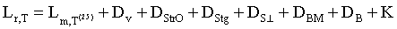(1)
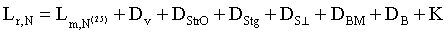(2)
Es bedeuten:
L
m             ,T
(25)              ...

*
    *
        *
            *
                *
                    *
                        *   Mittelungspegel in dB(A) für den Tag (6.00 bis 22.00 Uhr) nach
                            Diagramm I.

L
m             ,N
(25)              ...

*
    *
        *
            *
                *
                    *
                        *   Mittelungspegel in dB(A) für die Nacht (22.00 bis 6.00 Uhr) nach
                            Diagramm I.

Die maßgebende stündliche Verkehrsstärke M und der maßgebende Lkw-
Anteil p werden mit Hilfe der der Planung zugrundeliegenden,
prognostizierten durchschnittlichen täglichen Verkehrsstärke (DTV)
nach Tabelle A berechnet, sofern keine geeigneten projektbezogenen
Untersuchungsergebnisse vorliegen, die unter Berücksichtigung der
Verkehrsentwicklung im Prognosezeitraum zur Ermittlung

a)  der maßgebenden stündlichen Verkehrsstärke M (in Kfz/h)

b)  des maßgebenden Lkw-Anteils p (über 2,8 t zulässiges Gesamtgewicht) in
    % am Gesamtverkehr

für den Zeitraum zwischen 22.00 und 6.00 Uhr als Mittelwert über alle
Tage des Jahres herangezogen werden können. Das Verkehrsaufkommen
einer Straße ist den beiden äußeren Fahrstreifen jeweils zur Hälfte
zuzuordnen. Die Emissionsorte sind in 0,5 m Höhe über der Mitte dieser
Fahrstreifen anzunehmen.
D
V              ...

*
    *
        *
            *   Korrektur für unterschiedliche zulässige Höchstgeschwindigkeiten in
                Abhängigkeit vom Lkw-Anteil p nach Diagramm II.

D
StrO              ...

*
    *
        *
            *   Korrektur für unterschiedliche Straßenoberflächen nach Tabelle B.

D
Stg              ...

*
    *
        *
            *   Korrektur für Steigungen und Gefälle nach Tabelle C.

D
S⊥              ...

*
    *
        *
            *   Pegeländerung durch unterschiedliche Abstände
                S⊥                                      zwischen dem Emissionsort (0,5
                m über der Mitte des betrachteten Fahrstreifens) und dem maßgebenden
                Immissionsort ohne Boden- und Meteorologiedämpfung nach Diagramm III.
                Der maßgebende Immissionsort richtet sich nach den Umständen im
                Einzelfall; vor Gebäuden liegt er in Höhe der Geschoßdecke (0,2 m über
                der Fensteroberkante) des zu schützenden Raumes; bei
                Außenwohnbereichen liegt der Immissionsort 2 m über der Mitte der als
                Außenwohnbereich genutzten Fläche.

D
BM              ...

*
    *
        *
            *   Pegeländerung durch Boden- und Meteorologiedämpfung in Abhängigkeit
                von der mittleren Höhe
                h
                m                                      nach Diagramm IV. Die mittlere
                Höhe
                h
                m                                      ist der mittlere Abstand
                zwischen dem Grund und der Verbindungslinie zwischen Emissions- und
                Immissionsort. In ebenem Gelände ergibt sich
                h
                m                                      als arithmetischer Mittelwert
                der Höhen des Emissionsortes und des Immissionsortes über Grund,

D
B              ...

*
    *
        *
            *   Pegeländerung durch topographische Gegebenheiten, bauliche Maßnahmen
                und Reflexionen. Je nach den örtlichen Gegebenheiten sind dies
                insbesondere Lärmschutzwälle und -wände. Einschnitte, Bodenerhebungen
                und Abschirmung durch bauliche Anlagen. Die Pegeländerung
                D
                B                                      ist zu ermitteln nach den
                Richtlinien für den Lärmschutz an Straßen - Ausgabe 1990 - RLS-90,
                Kapitel 4.0, bekanntgemacht im Verkehrsblatt, Amtsblatt des
                Bundesministers für Verkehr der Bundesrepublik Deutschland (VkBl.) Nr.
                7 vom 14. April 1990 unter lfd. Nr. 79. Die Richtlinien sind zu
                beziehen von der Forschungsgesellschaft für Straßen- und
                Verkehrswesen, Alfred-Schütte-Allee 10, 5000 Köln 21.

            K ... Zuschlag für erhöhte Störwirkung von lichtzeichengeregelten Kreuzungen
                und Einmündungen nach Tabelle D.

Mit Hilfe der Gleichungen (1) und (2) werden die Beurteilungspegel für
lange, gerade Fahrstreifen berechnet, die auf ihrer gesamten Länge
konstante Emissionen und unveränderte Ausbreitungsbedingungen
aufweisen.
Falls eine dieser Voraussetzungen nicht zutrifft, müssen die
Fahrstreifen in einzelne Abschnitte unterteilt werden, deren einzelne
Beurteilungspegel zu ermitteln sind nach den Richtlinien für den
Lärmschutz an Straßen - Ausgabe 1990 - RLS-90, Kapitel 4.0,
bekanntgemacht im Verkehrsblatt, Amtsblatt des Bundesministers für
Verkehr der Bundesrepublik Deutschland (VkBl.) Nr. 7 vom 14. April
1990 unter lfd. Nr. 79. Die Richtlinien sind zu beziehen von der
Forschungsgesellschaft für Straßen- und Verkehrswesen, Alfred-Schütte-
Allee 10, 5000 Köln 21.
Die Beurteilungspegel der beiden äußeren Fahrstreifen sind nach
Diagramm V zum Gesamtbeurteilungspegel für die Straße
zusammenzufassen.
Die Gesamtbeurteilungspegel
L
r,T              und
L
r,N              sind auf ganze dB(A) aufzurunden. Im Falle des § 1
Abs. 2 Nr. 2 ist erst die Differenz der Beurteilungspegel aufzurunden.
Diagramm I : Mittelungspegel L
m,T
(25)              bzw. L
m,N
(25)              in dB (A)
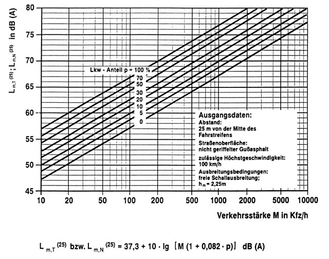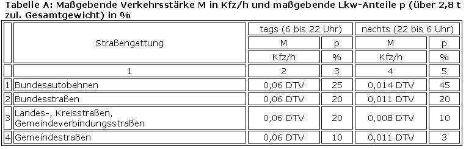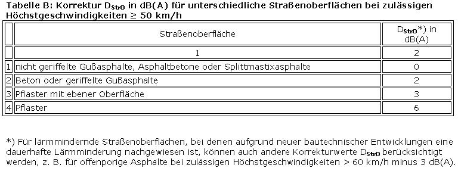Diagramm II : Korrektur D
v              in dB(A) für unterschiedliche zulässige
Höchstgeschwindigkeiten in Abhängigkeit vom Lkw-Anteil p
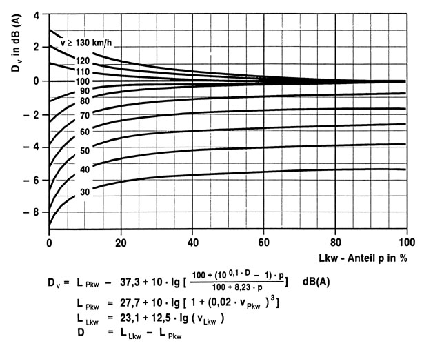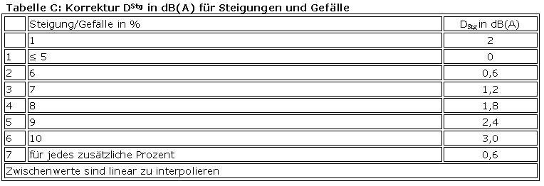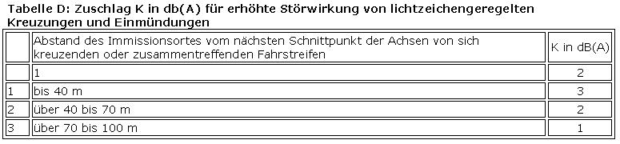Diagramm III: Pegeländerung D
s⊥              in dB(A) durch unterschiedliche Abstände s⊥ zwischen
dem Emissionsort (0,5 m über der Mitte des betrachteten Fahrstreifens)
und dem maßgebenden Immissionsort
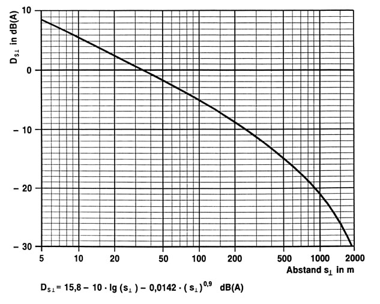Diagramm IV: Pegeländerung D
BM              in dB(A) durch Boden- und Meteorologiedämpfung in
Abhängigkeit von der mittleren Höhe h
m
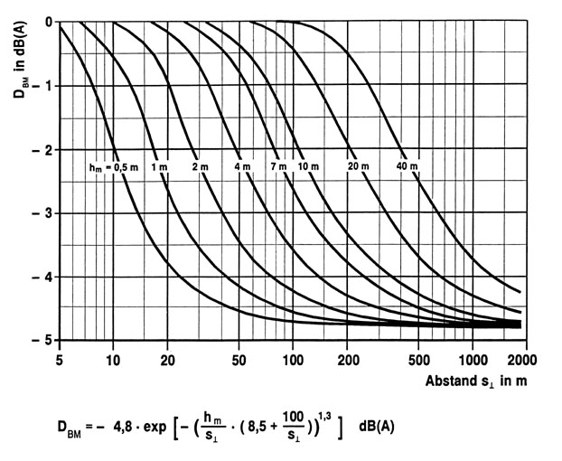Diagramm V: Gesamtbeurteilungspegel L
r,ges              aus zwei Beurteilungspegeln L
r,1              und L
r,2
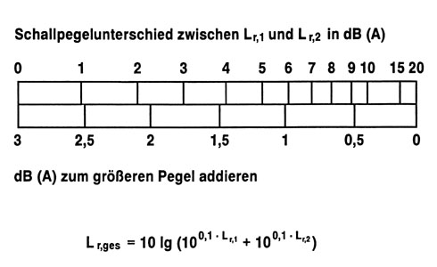

## Anlage 2 (zu § 3) Berechnung der Beurteilungspegel bei Schienenwegen

Fundstelle des Originaltextes: BGBl. I 1990, 1045 - 1052
Der Beurteilungspegel
L
r,T              in Dezibel (A) (dB(A)) für den Tag (6.00 bis 22.00
Uhr) und der Beurteilungspegel
L
r,N              in dB(A) für die Nacht (22.00 bis 6.00 Uhr) werden
für ein Gleis nach folgenden Gleichungen berechnet:
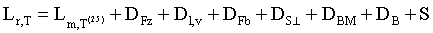(1)
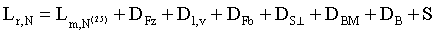(2)
Es bedeuten:
L
m,T
(25)              ...

*
    *
        *
            *
                *
                    *
                        *   Mittelungspegel in dB(A) für den Tag (6.00 bis 22.00 Uhr) nach
                            Diagramm I.

L
m,N
(25)              ...

*
    *
        *
            *
                *
                    *
                        *   Mittelungspegel in dB(A) für die Nacht (22.00 bis 6.00 Uhr) nach
                            Diagramm I.

Es sind die Züge zu Zugklassen zusammenzufassen, die sowohl

a)  nach Tabelle A derselben Fahrzeugart angehören als auch

b)  gleiche mittlere Zuglängen und Geschwindigkeiten und zusätzlich

c)  gleichen Anteil an scheibengebremsten Fahrzeugen haben.

Die Emissionsorte sind in Höhe von Schienenoberkante in Gleisachse
anzunehmen.
Aus den für den Beurteilungszeitraum ermittelten Zugzahlen ist die
mittlere Zugzahl n pro Stunde für die jeweilige Zugklasse zu
bestimmen. Die für die verschiedenen Zugklassen nach Diagramm I
ermittelten Mittelungspegel sind nach Diagramm V zusammenzufassen.
D
FZ              ...

*
    *
        *
            *   Korrektur nach Tabelle A zur Berücksichtigung der Fahrzeugart

D
I,V              ...

*
    *
        *
            *   Korrektur für die Zuglänge I in m und Geschwindigkeit v in km/h nach
                Diagramm II. Sind die tatsächlichen Längen und Geschwindigkeiten nicht
                bekannt, können I und v Tabelle B entnommen werden.

D
FB              ...

*
    *
        *
            *   Korrektur nach Tabelle C zur Berücksichtigung unterschiedlicher
                Fahrbahnen.

D
S⊥              ...

*
    *
        *
            *   Pegeländerung durch unterschiedliche Abstände
                S⊥ zwischen dem Emissionsort (Achse des betrachteten Gleises in Höhe
                der Schienenoberkante) und dem maßgebenden Immissionsort ohne Boden-
                und Meteorologiedämpfung nach Diagramm III. Der maßgebende
                Immissionsort richtet sich nach den Umständen im Einzelfall; vor
                Gebäuden liegt er in Höhe der Geschoßdecke (0,2 m über der
                Fensteroberkante) des zu schützenden Raumes; bei Außenwohnbereichen
                liegt der Immissionsort 2 m über der Mitte der als Außenwohnbereich
                genutzten Fläche.

D
BM              ...

*
    *
        *
            *   Pegeländerung durch Boden- und Meteorologiedämpfung in Abhängigkeit
                von der mittleren Höhe
                h(tief)m nach Diagramm IV. Die mittlere Höhe
                h
                m                                      ist der mittlere Abstand
                zwischen dem Grund und der Verbindungslinie zwischen Emissions- und
                Immissionsort. In ebenem Gelände ergibt sich
                h
                m                                      als arithmetischer Mittelwert
                der Höhen des Emissionsortes und des Immissionsortes über Grund.

D
B              ...

*
    *
        *
            *   Pegeländerung durch topographische Gegebenheiten, bauliche Maßnahmen
                und Reflexionen. Je nach den örtlichen Gegebenheiten sind dies
                insbesondere Lärmschutzwälle und -wände, Einschnitte, Bodenerhebungen
                und Abschirmung durch bauliche Anlagen. Die Pegeländerung
                D
                B                                      ist zu ermitteln nach der
                Richtlinie zur Berechnung der Schallimmissionen von Schienenwegen -
                Ausgabe 1990 - Schall 03, bekanntgemacht im Amtsblatt der Deutschen
                Bundesbahn Nr. 14 vom 4. April 1990 unter lfd. Nr. 133. Die Richtlinie
                ist zu beziehen von der Deutschen Bundesbahn, Drucksachenzentrale der
                Bundesbahndirektion Karlsruhe, Stuttgarter Straße 61a, 7500 Karlsruhe.

            S ... Korrektur um minus 5 dB(A) zur Berücksichtigung der geringeren
                Störwirkung des Schienenverkehrslärms.

Mit Hilfe der Gleichungen (1) und (2) werden die Beurteilungspegel für
lange, gerade Gleise berechnet, die auf ihrer gesamten Länge konstante
Emissionen und unveränderte Ausbreitungsbedingungen aufweisen.
Falls eine dieser Voraussetzungen nicht zutrifft, muß das Gleis in
einzelne Abschnitte unterteilt werden, deren einzelne
Beurteilungspegel zu bestimmen sind nach der Richtlinie zur Berechnung
der Schallimmissionen von Schienenwegen - Ausgabe 1990 - Schall 03,
bekanntgemacht im Amtsblatt der Deutschen Bundesbahn Nr. 14 vom 4.
April 1990 unter lfd. Nr. 133. Bei der Bestimmung der
Beurteilungspegel sind auch die in der Richtlinie genannten
Besonderheiten für Brücken, Bahnübergänge, Bahnhöfe usw. zu beachten.
Die Richtlinie ist zu beziehen von der Deutschen Bundesbahn,
Drucksachenzentrale der Bundesbahndirektion Karlsruhe, Stuttgarter
Straße 61a, 7500 Karlsruhe.
Die Beurteilungspegel mehrerer Gleise sind nach Diagramm V zum
Gesamtbeurteilungspegel für den Schienenweg zusammenzufassen.
Die Gesamtbeurteilungspegel
L
r,T              und
L
r,N              sind auf ganze dB(A) aufzurunden. Im Falle des § 1
Abs. 2 Nr. 2 ist erst die Differenz des Beurteilungspegels
aufzurunden.
Für die Berechnung des Beurteilungspegels des Lärms, der von
Schienenwegen ausgeht, auf denen in erheblichem Umfang Güterzüge
gebildet oder zerlegt werden, sind die anerkannten
Berechnungsverfahren anzuwenden, welche die Besonderheiten der
Lärmquellenverteilung und der Lärmausbreitungsbedingungen solcher
Anlagen berücksichtigen. Das Berechnungsverfahren ergibt sich aus der
Richtlinie für schalltechnische Untersuchungen bei der Planung von
Rangier- und Umschlagbahnhöfen - Ausgabe 1990 - Akustik 04,
bekanntgemacht im Amtsblatt der Deutschen Bundesbahn Nr. 14 vom 4.
April 1990 unter lfd. Nr. 134. Die Richtlinie ist zu beziehen von der
Deutschen Bundesbahn, Drucksachenzentrale der Bundesbahndirektion
Karlsruhe, Stuttgarter Straße 61a, 7500 Karlsruhe.
Diagramm I: Mittelungspegel L
m,T
(25)             bzw. L
m,N
(25)             in dB(A)
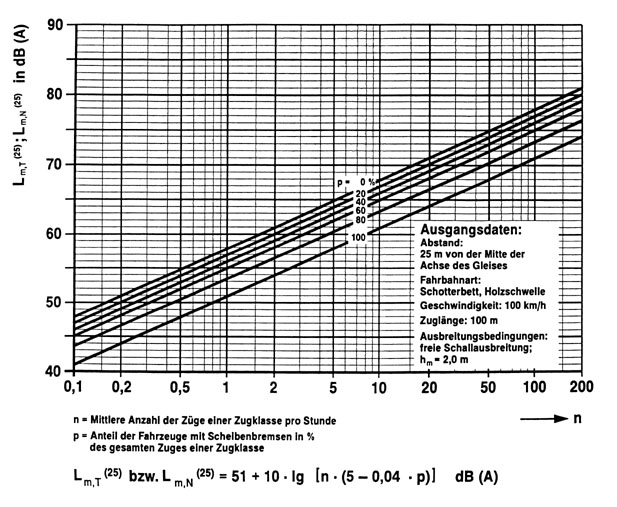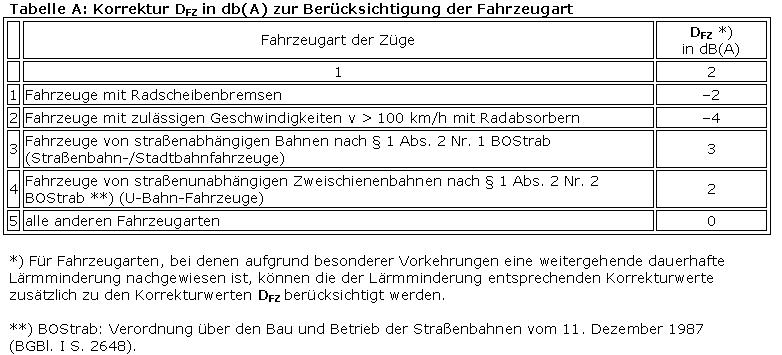Diagramm II: Korrektur D
l,v              in dB(A) für unterschiedliche Zuglängen und
Zuggeschwindigkeiten
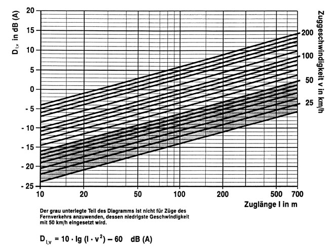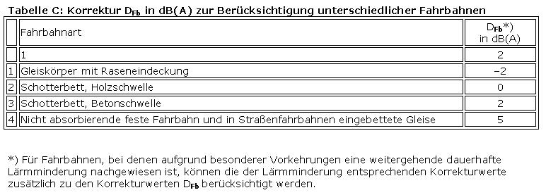Diagramm III: Pegeländerung D
s⊥              in dB(A) durch unterschiedliche Abstände s⊥ zwischen
dem Emissionsort (Achse des betrachteten Gleises in Höhe der
Schienenoberkante) und dem maßgebenden Immissionsort
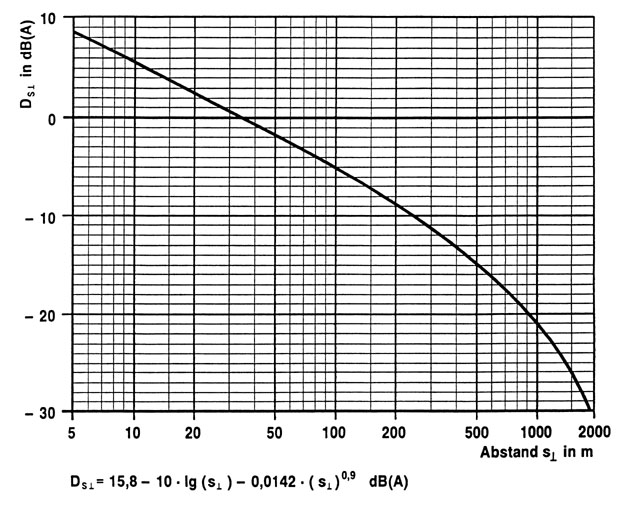Diagramm IV: Pegeländerung D
BM              in dB(A) durch Boden- und Meteorologiedämpfung in
Abhängigkeit von der mittleren Höhe h
m
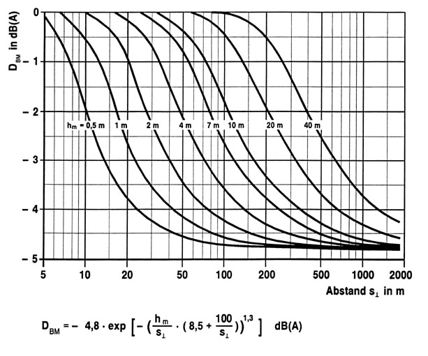Diagramm V: Gesamtbeurteilungspegel L
r,ges              aus zwei Beurteilungspegeln L
r,1              und L
r,2
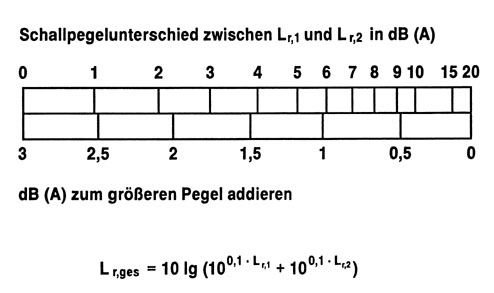
