# Sechzehnte Verordnung zur Durchführung des Bundes-Immissionsschutzgesetzes (BImSchV 16)

Ausfertigungsdatum
:   1990-06-12

Fundstelle
:   BGBl I: 1990, 1036

Zuletzt geändert durch
:   Art. 1 V v. 4.11.2020 I 2334

## Eingangsformel

Auf Grund des § 43 Abs. 1 Satz 1 Nr. 1 des
Bundesimmissionsschutzgesetzes vom 15. März 1974 (BGBl. I S. 721,
1193) verordnet die Bundesregierung nach Anhörung der beteiligten
Kreise:

## § 1 Anwendungsbereich

(1) Die Verordnung gilt für den Bau oder die wesentliche Änderung von
öffentlichen Straßen sowie von Schienenwegen der Eisenbahnen und
Straßenbahnen (Straßen und Schienenwege).

(2) Die Änderung ist wesentlich, wenn

1.  eine Straße um einen oder mehrere durchgehende Fahrstreifen für den
    Kraftfahrzeugverkehr oder ein Schienenweg um ein oder mehrere
    durchgehende Gleise baulich erweitert wird oder

2.  durch einen erheblichen baulichen Eingriff der Beurteilungspegel des
    von dem zu ändernden Verkehrsweg ausgehenden Verkehrslärms um
    mindestens 3 Dezibel (A) oder auf mindestens 70 Dezibel (A) am Tage
    oder mindestens 60 Dezibel (A) in der Nacht erhöht wird.

Eine Änderung ist auch wesentlich, wenn der Beurteilungspegel des von
dem zu ändernden Verkehrsweg ausgehenden Verkehrslärms von mindestens
70 Dezibel (A) am Tage oder 60 Dezibel (A) in der Nacht durch einen
erheblichen baulichen Eingriff erhöht wird; dies gilt nicht in
Gewerbegebieten.

## § 2 Immissionsgrenzwerte

(1) Zum Schutz der Nachbarschaft vor schädlichen Umwelteinwirkungen
durch Verkehrsgeräusche ist bei dem Bau oder der wesentlichen Änderung
sicherzustellen, daß der Beurteilungspegel einen der folgenden
Immissionsgrenzwerte nicht überschreitet:

*    *
    *
    *   Tag

    *   Nacht

*    *   1.

    *   an Krankenhäusern, Schulen, Kurheimen und Altenheimen

*    *
    *
    *   57 Dezibel (A)

    *   47 Dezibel (A)

*    *   2.

    *   in reinen und allgemeinen Wohngebieten und Kleinsiedlungsgebieten

*    *
    *
    *   59 Dezibel (A)

    *   49 Dezibel (A)

*    *   3.

    *   in Kerngebieten, Dorfgebieten, Mischgebieten und Urbanen Gebieten

*    *
    *
    *   64 Dezibel (A)

    *   54 Dezibel (A)

*    *   4.

    *   in Gewerbegebieten

    *

*    *
    *
    *   69 Dezibel (A)

    *   59 Dezibel (A)

(2) Die Art der in Absatz 1 bezeichneten Anlagen und Gebiete ergibt
sich aus den Festsetzungen in den Bebauungsplänen. Sonstige in
Bebauungsplänen festgesetzte Flächen für Anlagen und Gebiete sowie
Anlagen und Gebiete, für die keine Festsetzungen bestehen, sind nach
Absatz 1, bauliche Anlagen im Außenbereich nach Absatz 1 Nr. 1, 3 und
4 entsprechend der Schutzbedürftigkeit zu beurteilen.

(3) Wird die zu schützende Nutzung nur am Tage oder nur in der Nacht
ausgeübt, so ist nur der Immissionsgrenzwert für diesen Zeitraum
anzuwenden.

(4) Die Bundesregierung erstattet spätestens im Jahre 2025 und dann
fortlaufend alle zehn Jahre dem Deutschen Bundestag Bericht über die
Durchführung der Verordnung. In dem Bericht wird insbesondere
dargestellt, ob die in § 2 Absatz 1 genannten Immissionsgrenzwerte dem
Stand der Lärmwirkungsforschung entsprechen und ob weitere Maßnahmen
zum Schutz vor schädlichen Umwelteinwirkungen durch Verkehrsgeräusche
erforderlich sind.

## § 3 Berechnung des Beurteilungspegels für Straßen

(1) Der Beurteilungspegel für Straßen ist nach Abschnitt 3 in
Verbindung mit Abschnitt 1 der Richtlinien für den Lärmschutz an
Straßen – Ausgabe 2019 – RLS-19 (VkBl. 2019, Heft 20, lfd. Nr. 139, S.
698) zu berechnen. Die Berechnung hat getrennt für den
Beurteilungszeitraum Tag (6 Uhr bis 22 Uhr) und den
Beurteilungszeitraum Nacht (22 Uhr bis 6 Uhr) zu erfolgen.

(2) Bei der Berechnung sind insbesondere folgende Rahmenbedingungen zu
beachten:

1.  die Geräuschemissionen von den Kraftfahrzeugen,

2.  die akustischen Eigenschaften der Straßendeckschicht und

3.  die Einflüsse auf dem Ausbreitungsweg.

(3) Die akustischen Eigenschaften der Straßendeckschicht nach Absatz 2
Nummer 2 werden beachtet, indem die Bauweise einem
Straßendeckschichttyp zugeordnet wird, der aufgeführt ist in der
jeweils jüngsten veröffentlichten Fassung der Tabellen 4a oder 4b der
Richtlinien für den Lärmschutz an Straßen – Ausgabe 2019 – RLS-19
(VkBl. 2019, Heft 20, lfd. Nr. 139, S. 698) und mit der festgelegten
Straßendeckschichtkorrektur in die Berechnung eingestellt wird.

## § 3a Festlegung der Straßendeckschichtkorrektur

(1) Für eine Bauweise, die keinem Straßendeckschichttyp entspricht,
der aufgeführt ist in der jeweils jüngsten veröffentlichten Fassung
der Tabellen 4a oder 4b der Richtlinien für den Lärmschutz an Straßen
– Ausgabe 2019 – RLS-19 (VkBl. 2019, Heft 20, lfd. Nr. 139, S. 698),
legt das Bundesministerium für Verkehr und digitale Infrastruktur im
Einvernehmen mit dem Bundesministerium für Umwelt, Naturschutz und
nukleare Sicherheit eine Straßendeckschichtkorrektur fest, wenn

1.  die Bauweise mindestens den allgemein anerkannten Regeln der Technik
    entspricht und

2.  die Bundesanstalt für Straßenwesen eine Straßendeckschichtkorrektur
    nach den Technischen Prüfvorschriften zur Korrekturwertbestimmung der
    Geräuschemission von Straßendeckschichten – Ausgabe 2019 – TP KoSD-19
    (VkBl. 2019, Heft 20, lfd. Nr. 140, S. 698) ermittelt hat.

(2) Das Bundesministerium für Verkehr und digitale Infrastruktur gibt
die Straßendeckschichtkorrektur im Verkehrsblatt bekannt. Die
Bekanntgabe erfolgt durch die Ergänzung oder Änderung der Tabellen 4a
oder 4b der Richtlinien für den Lärmschutz an Straßen – Ausgabe 2019 –
RLS-19 (VkBl. 2019, Heft 20, lfd. Nr. 139, S. 698). Ab dem Zeitpunkt
der Bekanntmachung ist die Straßendeckschichtkorrektur in die
Berechnung nach § 3 einzustellen.

(3) Ändert sich die Bauweise für einen Straßendeckschichttyp, der
aufgeführt ist in der jeweils jüngsten veröffentlichten Fassung der
Tabellen 4a oder 4b der Richtlinien für den Lärmschutz an Straßen –
Ausgabe 2019 – RLS-19 (VkBl. 2019, Heft 20, lfd. Nr. 139, S. 698),
kann das Bundesministerium für Verkehr und digitale Infrastruktur im
Einvernehmen mit dem Bundesministerium für Umwelt, Naturschutz und
nukleare Sicherheit festlegen, dass die bisherige
Straßendeckschichtkorrektur anzuwenden ist, wenn die geänderte
Bauweise

1.  mindestens den allgemein anerkannten Regeln der Technik entspricht und

2.  die akustischen Eigenschaften der Straßendeckschicht nicht
    verschlechtert.

Die bisherige Straßendeckschichtkorrektur ist solange anzuwenden, bis
für die geänderte Bauweise eine neue Straßendeckschichtkorrektur nach
Maßgabe der Absätze 1 und 2 festgelegt und bekanntgemacht wird.

## § 4 Berechnung des Beurteilungspegels für Schienenwege

(1) Der Beurteilungspegel für Schienenwege ist nach Anlage 2 zu
berechnen. Die Berechnung hat getrennt für den Beurteilungszeitraum
Tag (6 Uhr bis 22 Uhr) und den Beurteilungszeitraum Nacht (22 Uhr bis
6 Uhr) zu erfolgen.

(2) Bei der Berechnung sind insbesondere folgende Rahmenbedingungen zu
beachten:

1.  die Schallpegelkennwerte von Fahrzeugen und Fahrwegen,

2.  die Einflüsse auf dem Ausbreitungsweg,

3.  die Besonderheiten des Schienenverkehrs durch Auf- oder Abschläge

    a)  für die Lästigkeit von Geräuschen infolge ihres zeitlichen Verlaufs,
        ihrer Dauer, ihrer Häufigkeit und ihrer Frequenz sowie

    b)  für die Lästigkeit ton- oder impulshaltiger Geräusche.

(3) Abweichend von Absatz 1 Satz 1 ist für Abschnitte von Vorhaben,
für die bis zum 31. Dezember 2014 das Planfeststellungsverfahren
bereits eröffnet und die Auslegung des Plans öffentlich bekannt
gemacht worden ist, § 3 in Verbindung mit Anlage 2 in der bis zum 31.
Dezember 2014 geltenden Fassung weiter anzuwenden. § 43 Absatz 1 Satz
3 des Bundes-Immissionsschutzgesetzes bleibt unberührt.

## § 5 Festlegung akustischer Kennwerte für abweichende Bahntechnik und schalltechnische Innovationen

(1) Abweichende Bahntechnik oder schalltechnische Innovationen dürfen
bei der Berechnung des Beurteilungspegels nach § 4 Absatz 1 Satz 1 nur
berücksichtigt werden, wenn die zuständige Behörde in einem Verfahren
nach Maßgabe der Absätze 2 bis 4 für die Berechnung akustische
Kennwerte festgelegt hat. Abweichende Bahntechnik ist Technik, die
nicht in Anlage 2 Nummer 3 bis 6 oder Beiblatt 1 bis 3 aufgeführt ist
und die einem der folgenden Bereiche zuzuordnen ist:

1.  Fahrbahnarten,

2.  Schallminderungsmaßnahmen am Gleis oder am Rad oder

3.  bahnspezifische Schallminderungsmaßnahmen im Ausbreitungsweg.

Schalltechnische Innovationen sind technische Neu- und
Weiterentwicklungen zu der in Anlage 2 Nummer 3 bis 6 oder Beiblatt 1
bis 3 aufgeführten Bahntechnik, die Auswirkungen auf die
Geräuschemission und -immission dieser Bahntechnik haben.

(2) Über die Festlegung akustischer Kennwerte entscheidet auf Antrag
für die Eisenbahnen des Bundes das Eisenbahn-Bundesamt und für
sonstige Bahnen die jeweils nach Landesrecht zuständige Behörde. Ein
akustischer Kennwert ist festzulegen, wenn die Emissionsdaten der
abweichenden Bahntechnik oder der schalltechnischen Innovationen für
diese Technik bezeichnend sind und wenn bei schalltechnischen
Innovationen die akustischen Kennwerte von den in Anlage 2 Nummer 3
bis 6 oder Beiblatt 1 bis 3 jeweils genannten Kennwerten wesentlich
abweichen. Eine wesentliche Abweichung muss mindestens die in der
Anlage 2 Nummer 9.2.2 genannten Werte erreichen.

(3) Berechtigt, einen Antrag nach Absatz 2 Satz 1 zu stellen, sind

1.  Eisenbahninfrastrukturunternehmen,

2.  Inhaber der Schutzrechte von abweichenden Bahntechniken oder von
    schalltechnischen Innovationen und

3.  Lizenznehmer von abweichenden Bahntechniken oder von schalltechnischen
    Innovationen.

(4) Der Antrag nach Absatz 2 Satz 1 muss folgende Angaben und
Unterlagen enthalten:

1.  eine Beschreibung der abweichenden Bahntechnik oder schalltechnischen
    Innovation, für die die Festlegung akustischer Kennwerte beantragt
    wird, wobei insbesondere darzulegen ist, worin sich die abweichende
    Bahntechnik oder schalltechnische Innovation von der in Anlage 2
    aufgeführten entsprechenden Technik unterscheidet,

2.  das Gutachten einer anerkannten Messstelle nach Anlage 2 Nummer 9.3,

3.  einen Vorschlag, zu welcher Regelung der Anlage 2 Nummer 3 bis 6 oder
    Beiblatt 1 bis 3 die abweichende Bahntechnik ergänzend oder die
    schalltechnische Innovation abweichend beschrieben werden kann, unter
    Beifügung eines Datenblattes, das die in der vorgeschlagenen Zuordnung
    üblichen akustischen Kennwerte darstellt,

4.  eine Beschreibung, wie sich die akustische Wirksamkeit durch
    betriebsüblichen Verschleiß verändert.

(5) Die zuständige Behörde gibt dem Antragsteller die Entscheidung
nach Absatz 2 Satz 1 schriftlich bekannt. Die zuständige Behörde macht
zudem eine Festlegung akustischer Kennwerte nach Absatz 2 Satz 1
öffentlich bekannt.

## § 6 Übergangsregelung für die Berechnung des Beurteilungspegels für Straßen

Der Beurteilungspegel für den jeweiligen Abschnitt eines
Straßenbauvorhabens berechnet sich nach den Vorschriften dieser
Verordnung in der bis zum Ablauf des 28. Februar 2021 geltenden
Fassung, wenn vor dem Ablauf des 1. März 2021

1.  der Antrag auf Durchführung des Planfeststellungs- oder
    Plangenehmigungsverfahrens gestellt worden ist oder

2.  für den Fall, dass ein Bebauungsplan die Planfeststellung ersetzt, der
    Beschluss nach § 2 Absatz 1 Satz 2 des Baugesetzbuchs in der Fassung
    der Bekanntmachung vom 3. November 2017 (BGBl. I S. 3634), gefasst und
    ortsüblich bekannt gemacht worden ist.

## Schlußformel

Der Bundesrat hat zugestimmt.

## Anlage 1 (weggefallen)

(zu § 4)

## Anlage 2 Berechnung des Beurteilungspegels für Schienenwege (Schall 03)

(Fundstelle: BGBl. I 2014 S. 2271 – 2313)

Inhaltsverzeichnis

1.  Berechnungsverfahren

2.  Begriffe, Festlegungen

3.  Modellierung der Schallquellen

4.  Schallemissionen von Eisenbahnen

5.  Schallemissionen von Straßenbahnen

6.  Schallausbreitung

7.  Berechnung der Schallimmission

8.  Beurteilungspegel

9.  Berücksichtigung von abweichender Bahntechnik und von
    schalltechnischen Innovationen

10. Zugänglichkeit von technischen Regeln und Normen

1.  **Berechnungsverfahren**

    Für Schienenwege wird der Beurteilungspegel
    L
    r                    in der Nachbarschaft getrennt für den
    Beurteilungszeitraum Tag (6 Uhr bis 22 Uhr) und den
    Beurteilungszeitraum Nacht (22 Uhr bis 6 Uhr) entsprechend Nummer 8.1
    angegeben. Grundlage für die Berechnung des Beurteilungspegels sind
    die Anzahl der prognostizierten Züge der jeweiligen Zugart sowie die
    den betrieblichen Planungen zugrunde liegenden Geschwindigkeiten auf
    dem zu betrachtenden Planungsabschnitt einer Bahnstrecke.

    Auf der Grundlage dieser Prognosedaten erfolgt die Berechnung des
    Beurteilungspegels in folgenden Schritten:

    –   Aufteilung der zu betrachtenden Bahnstrecke in einzelne Gleise und
        Abschnitte u. a. mit gleicher Verkehrszusammensetzung, gleicher
        Geschwindigkeit, gleicher Fahrbahnart und gleichem Fahrflächenzustand
        nach Nummer 3.1 sowie Identifizierung und Festlegung der Schallquellen
        von Rangier- und Umschlagbahnhöfen nach Nummer 4.8;

    –   ausgehend von den Mengen je Stunde
        n
        Fz                          aller Arten
        Fz                          von Fahrzeugeinheiten, Berechnung der
        längenbezogenen bzw. flächenbezogenen Pegel der Schallleistung in
        Oktavbändern, getrennt für jeden Abschnitt einer Strecke nach Nummer
        3\.2 bzw. für jede Schallquelle eines Rangier- und Umschlagbahnhofs in
        allen Höhenbereichen
        h                          nach Nummer 3.3;

    –   Zerlegung der Abschnitte in Teilstücke
        k
        S                          bzw. Zerlegung der Flächen in Teilflächen
        k
        ƒ                          zur Bildung von Punktschallquellen mit
        zugeordnetem Pegel der Schallleistung unter Berücksichtigung der
        Richtwirkung und der Abstrahlcharakteristik nach den Nummern 3.4 und
        3\.5;

    –   Berechnung der Schallemissionen von Eisenbahnen nach Nummer 4 und
        Beiblatt 1 bzw. Beiblatt 3 und von Straßenbahnen nach Nummer 5 und
        Beiblatt 2;

    –   Berechnung der Schallimmission durch Ausbreitungsrechnung nach Nummer
        6;

    –   Zusammenfassung der Schallimmissionsanteile am Immissionsort nach
        Nummer 7;

    –   Bildung des Beurteilungspegels für die maßgeblichen
        Beurteilungszeiträume nach Nummer 8.

    Die für die Berechnung verwendeten Softwareprodukte müssen die
    normgerechte Abbildung dieser Vorschrift sicherstellen; dies kann
    erfolgen in Anlehnung an die DIN 45687, Akustik – Software-Erzeugnisse
    zur Berechnung der Schallimmissionen im Freien –
    Qualitätsanforderungen und Prüfbestimmungen, Ausgabe Mai 2006.

2.  **Begriffe, Festlegungen**

    **2.1** **Bahntechnische Begriffe**

        2.1.1 Eisenbahnen

            Fahrzeuge und Infrastruktureinrichtungen, die im Allgemeinen
            Eisenbahngesetz (AEG) aufgeführt sind; zur Abgrenzung von
            Straßenbahnen (vgl. 2.1.9)

        2.1.2 Fahrzeugeinheit

            Kleinster im Fahrbetrieb nicht zerlegbarer Teil eines Eisenbahnzuges
            bzw. ein Straßenbahnfahrzeug

        2.1.3 Personenbahnhöfe, Haltepunkte und Haltestellen

            Einrichtungen, an denen Fahrgäste ein-, um- oder aussteigen

            Anmerkung 1: Bei Eisenbahnen wird in der EBO begrifflich zwischen
            Bahnhof (§ 4 Absatz 2 EBO), Haltepunkt (§ 4 Absatz 8 EBO) und
            Haltestelle (§ 4 Absatz 9 EBO) unterschieden. Bei Straßenbahnen wird
            der Begriff der Haltestelle im Allgemeinen (§ 31 der Straßenbahn-Bau-
            und Betriebsordnung – BOStrab) und der Doppelhaltestelle (§ 31 Absatz
            1 Nummer 3 BOStrab) gebraucht. In dieser Anlage werden die Begriffe je
            nach Verkehrsart (Eisenbahn/Straßenbahn) verwendet.

            Anmerkung 2: Bei Eisenbahnen können Personenbahnhöfe mit anderen
            Bahnanlagen, z. B. mit Verladeeinrichtungen von Autoreisezügen,
            kombiniert sein.

        2.1.4 Rangierbahnhöfe

            Bahnhöfe für den Güterverkehr, an denen in erheblichem Umfang
            Güterzüge gebildet oder zerlegt werden

        2.1.5 Schienenstegdämpfer

            Vorrichtungen zur Dämpfung der Schallabstrahlung von Schienenstegen

        2.1.6 Schienenstegabschirmung

            Vorrichtungen zur Abschirmung der Schallabstrahlung von Schienenstegen

        2.1.7 Schienenweg

            Gleisanlagen mit Unter- und Oberbau einschließlich einer Oberleitung,
            nach den Nummern 2.1.1 und 2.1.9, auf denen durch Fahrvorgänge
            Schallimmissionen hervorgerufen werden.

            Anmerkung 1: Die Schallimmissionen können von den Rollgeräuschen,
            aerodynamischen Geräuschen, Aggregat- und Antriebsgeräuschen der
            Schienenfahrzeuge hervorgerufen werden.

            Anmerkung 2: Betriebsanlagen, von denen andere Schallimmissionen
            ausgehen, wie z. B. Unterwerke oder Umrichterwerke, Wartungs- und
            Verladeeinrichtungen sowie Waschanlagen, sind nicht Gegenstand dieser
            Verordnung.

        2.1.8 Schwellengleis

            Oberbau, bestehend aus Schienen auf Holz-, Beton- oder Stahlschwellen
            im Schotterbett

        2.1.9 Straßenbahnen

            Fahrzeuge und Infrastruktureinrichtungen, die im
            Personenbeförderungsgesetz (PBefG) und der Straßenbahn-Bau- und
            Betriebsordnung (BOStrab) aufgeführt sind; zur Abgrenzung von
            Eisenbahnen (vgl. 2.1.1), abweichend von § 4 Absatz 2 PBefG werden
            Schwebebahnen oder ähnliche Bahnen besonderer Bauart nicht als
            Straßenbahnen im Sinne dieser Anlage angesehen.

        2.1.10 Straßenbündiger Bahnkörper

            Gleise, die in Straßenfahrbahnen oder Gehwegflächen eingebettet sind

        2.1.11 U-Bahnen

            Bahnen mit Stromschienen, die als unabhängige Bahnen durch ihre Bauart
            oder Lage auf der gesamten Streckenlänge von anderen öffentlichen
            Verkehren unabhängig sind und keine Bahnübergänge (§ 1 Absatz 2 des
            Eisenbahnkreuzungsgesetzes) aufweisen

        2.1.12 Umschlagbahnhöfe

            Anlagen des kombinierten Verkehrs als Teil des öffentlichen
            Eisenbahnverkehrs mit Gleisen für an- und abfahrende Güterzüge, mit
            Lademitteln und Ladestraßen, die an das öffentliche Straßennetz
            anbinden, ggf. mit Abstell- oder Zwischenlagerflächen

        2.1.13 Verbundstoff-Klotzbremse

            Klotzbremsen mit Bremssohlen aus Verbundstoffen; diese Bremsen
            verwenden z. B. Verbundstoffbremsklotzsohlen mit hohem Reibwertniveau
            (K-Sohle) oder niedrigem Reibwertniveau (LL-Sohle).

    **2.2** **Schalltechnische Begriffe**

        2.2.1 A-bewerteter Schalldruckpegel

            L
            pA

            Zehnfacher dekadischer Logarithmus des Quotienten aus dem Quadrat des
            Effektivwerts des Schalldrucks mit der Frequenzbewertung A zusammen
            mit einer Zeitbewertung und dem Quadrat des Bezugsschalldrucks
            p
            0                                = 20*
            Pa in Luft

            Anmerkung 1: Die Frequenzbewertung A und die Zeitbewertung (z. B. F,
            S) werden als Index des Schalldruckpegels
            L
            p                                angegeben, z. B.
            L
            pAF                               .

            Anmerkung 2: Der Schalldruckpegel wird in Dezibel, dB, angegeben.

        2.2.2 A-Bewertung

            A

            Frequenzbewertung nach DIN EN 61672-1, Elektroakustik –
            Schallpegelmesser – Teil 1; Anforderungen, Ausgabe Oktober 2003

            Anmerkung: Die Kennzeichnung eines A-bewerteten Pegels wird
            normgerecht durch den Index A am Formelzeichen
            L                                vorgenommen, nicht durch Anhängen des
            Formelzeichens A an die Einheit dB.

        2.2.3 Abschirmmaß

            D
            z

            Abnahme des Schalldruckpegels an einem Ort hinter einem Hindernis
            gegenüber dem Schalldruckpegel ohne Hindernis bei einer frei
            fortschreitenden Schallwelle

            Anmerkung: Das Abschirmmaß wird in Dezibel, dB, angegeben.

        2.2.4 Absorptionsverlust

            D
            ƿ

            Verlust von Schallenergie bei Reflexionen

            Anmerkung: Der Absorptionsverlust wird in Dezibel, dB, angegeben.

        2.2.5 Äquivalenter Dauerschalldruckpegel

            L
            p,Aeq,T

            A-bewerteter energieäquivalenter Mittelungspegel für einen über die
            Zeit
            T                                veränderlichen Schalldruckpegel

            Anmerkung: Der äquivalente Dauerschallpegel
            L
            p
            eq,T                                wird (beispielsweise für die
            Frequenzbewertung A und Zeitbewertung F) wie folgt gebildet:

            
            (siehe auch Mittelungspegel)

            Anmerkung: Der äquivalente Dauerschalldruckpegel wird in Dezibel, dB,
            angegeben.

        2.2.6 Beurteilungspegel

            L
            r

            Größe zur Kennzeichnung der Stärke der Schallimmission während der
            Beurteilungszeit
            T
            r                                unter Berücksichtigung von Zu- oder
            Abschlägen für bestimmte Geräusche, Zeiten oder Situationen; wenn
            keine Zu- oder Abschläge zu berücksichtigen sind, ist der äquivalente
            Dauerschallpegel der Beurteilungspegel:

            Anmerkung 1: Der Beurteilungspegel
            L
            r                                wird wie folgt aus dem äquivalenten
            Dauerschallpegel
            L
            pAFeq,T
            i                                und den Zuschlägen
            K
            i                                während der Teilzeitintervalle
            T
            i                                für die Beurteilungszeit
            T
            r                                gebildet:

            
            Anmerkung 2: Der Beurteilungspegel wird in Dezibel, dB, angegeben.

        2.2.7 Bezugshöhe für Schallquellen

            SO

            Schienenoberkante für Schienenfahrzeuge, bezogen auf die Gleisachse

            FO

            Fahrwegoberkante für Straßenfahrzeuge, bezogen auf die Fahrbahn

        2.2.8 Einzelereignispegel

            L
            p,T
            0= 1
            s

            Der auf 1 Sekunde bezogene äquivalente Dauerschalldruckpegel eines in
            der Zeitspanne
            T                                auftretenden Schallereignisses

            Anmerkung 1:
            
            Anmerkung 2: In Oktavbändern wird der A-bewertete Einzelereignispegel
            mit
            L
            EA,
            ƒ                                bezeichnet.

            Anmerkung 3: Der Einzelereignisschalldruckpegel wird in Dezibel, dB,
            angegeben.

        2.2.9 Emissionspegel

            L
            mE

            Äquivalenter Dauerschalldruckpegel nach Akustik 03: Richtlinie zur
            Berechnung der Schallimmissionen von Schienenwegen – Schall 03,
            Ausgabe 1990, bekannt gemacht im Amtsblatt der Deutschen Bundesbahn
            Nr. 14 vom 4. April 1990 unter der lfd. Nummer 133 für einen
            bestimmten Zeitraum, z. B. für die Tagzeit, bei freier
            Schallausbreitung von einem unabgeschirmten Gleis/Fahrweg, abhängig
            von Fahrbahneigenschaften, vom Fahrflächenzustand und von
            Zug-/Fahrzeugmengen, in 25 m Abstand von der Gleis-/Fahrwegachse und
            in 3,5 m Höhe über der Schienen-/Fahrwegoberkante

            Anmerkung: Der Emissionspegel lässt sich für ebenes Gelände durch
            L
            mE                                  = L
            W'A                                –19 dB aus dem Pegel der
            längenbezogenen Schallleistung
            L
            W'A                                abschätzen.

        2.2.10 Immissionsort

            IO

            Maßgeblicher Ort für die Ermittlung eines Beurteilungspegels, nach
            dieser Anlage

            –   bei Gebäuden in Höhe der Geschossdecke (0,2 m über der
                Fensteroberkante) auf der Fassade der zu schützenden Räume und

            –   bei Außenwohnbereichen 2 m über der Mitte der als Außenwohnbereich
                genutzten Fläche

            Anmerkung: Für Immissionsorte an Gebäuden werden Reflexionen an der
            zugehörigen Fassade nicht berücksichtigt.

        2.2.11 Mittelungspegel

            L
            m

            Einzahlwert zur Beschreibung von Schallvorgängen mit zeitlich beliebig
            schwankendem Pegel oder von Schallfeldern mit örtlich
            unterschiedlichen Schallpegeln oder eine Kombination daraus

            Anmerkung: Der A-bewertete Mittelungspegel für einen zeitlich
            veränderlichen Schalldruckpegel wird äquivalenter
            Dauerschalldruckpegel genannt.

        2.2.12 Oktavpegel

            Im Frequenzbereich einer Oktave angegebener Schallpegel

        2.2.13 Pegel der flächenbezogenen A-bewerteten Schallleistung

            L
            W"A

            A-bewerteter Mittelungspegel zur Beschreibung der Schallemission von
            einer Flächenschallquelle; nach dieser Anlage angegeben für die
            mittlere Höhe der Schienen-/Fahrwegoberkanten in einer flächenhaften
            Bahnanlage

            Anmerkung: Der Pegel wird unter Bezug auf eine Schallleistung von 1 pW
            und eine Fläche von 1 m
            2                                in Dezibel, dB, angegeben.

        2.2.14 Pegel der längenbezogenen A-bewerteten Schallleistung

            L
            W'A

            A-bewerteter Mittelungspegel zur Beschreibung der Schallemission von
            einer Linienschallquelle; nach dieser Anlage angegeben für
            verschiedene Höhenbereiche über einem Strecken- oder Fahrbahnabschnitt
            mit bestimmten Fahrbahneigenschaften und Fahrflächenzuständen bei
            Betrieb mit bestimmten Fahrzeugen und Geschwindigkeiten

            Anmerkung: Der Pegel wird unter Bezug auf eine Schallleistung von 1 pW
            und eine Länge von 1 m in Dezibel, dB, angegeben.

        2.2.15 Pegelkorrektur für die Auffälligkeit von Geräuschen

            K
            L

            Pegelkorrektur zur Berücksichtigung der erhöhten Auffälligkeit von
            Geräuschen mit ausgeprägter Tonhöhe, Impuls- oder
            Informationshaltigkeit

            Anmerkung: Die Pegelkorrektur für die Auffälligkeit von Geräuschen
            wird in Dezibel, dB, angegeben.

        2.2.16 Pegelkorrekturen für Geräusche von Brücken und Viadukten ohne
            Schallschutz

            K
            Br

            Pegelkorrekturen zur Berücksichtigung des rad- und schienenbedingten
            Rollgeräusches bei der Fahrt über Brücken und Viadukte ohne
            Schallschutz

            Anmerkung 1: Diese Pegelkorrektur beinhaltet auch die Störwirkung von
            tieffrequenten Geräuschanteilen, die durch die A-Bewertung des
            Schallpegels nicht angemessen berücksichtigt wird.

            Anmerkung 2: Als Viadukt wird in dieser Anlage eine Brücke mit
            mehreren Feldern bezeichnet.

            Anmerkung 3: Die Pegelkorrekturen für Geräusche von Brücken und
            Viadukten werden in Dezibel, dB, angegeben.

        2.2.17 Pegelkorrekturen für Geräusche von Brücken und Viadukten mit
            Schallschutz

            K
            Br                                +
            K
            LM

            Pegelkorrekturen zur Berücksichtigung des rad- und schienenbedingten
            Rollgeräusches bei der Fahrt über Brücken mit Schallschutz

            Anmerkung 1: Die gesonderte Ausweisung der Wirkung von
            Schallminderungsmaßnahmen dient dem Anreiz zur Anwendung
            emissionsarmer Brückenkonstruktionen.

            Anmerkung 2: Die Pegelkorrekturen für Geräusche von Brücken und
            Viadukten mit Schallschutz werden in Dezibel, dB, angegeben.

        2.2.18 Pegelkorrektur Straße – Schiene

            K
            S

            Pegelkorrektur zur Berücksichtigung der geringeren Störwirkung von
            Schienenverkehrsgeräuschen gegenüber Straßenverkehrsgeräuschen

            Anmerkung 1: Die Anwendung der Pegelkorrektur wurde in § 3 in
            Verbindung mit Anlage 2 der Verkehrslärmschutzverordnung vom 12. Juni
            1990 (BGBl. I S. 1036) festgelegt und durch das Elfte Gesetz zur
            Änderung des Bundes-Immissionsschutzgesetzes vom 2. Juli 2013 (BGBl. I
            S. 1943) mit Wirkung zum 1. Januar 2015 für Eisenbahnen und zum 1.
            Januar 2019 für Straßenbahnen abgeschafft (vgl. § 43 Absatz 2 Satz 2
            und 3 des Bundes-Immissionsschutzgesetzes).

            Anmerkung 2: Die Pegelkorrektur Straße – Schiene wird in Dezibel, dB,
            angegeben.

        2.2.19 Richtwirkungsmaß

            D
            I

            Maß zur Beschreibung der ungleichförmigen Abstrahlung einer
            Schallquelle in der Luft; nach dieser Anlage einheitlich für alle
            Schallquellen einer Strecke in allen Frequenzbändern

            Anmerkung: Das Richtwirkungsmaß wird in Dezibel, dB, angegeben.

        2.2.20 Schallabsorption

            Umwandlung von Schallenergie aus einem Raum oder Raumbereich in Wärme

            Anmerkung: Die Schallabsorption wird in Dezibel, dB, angegeben.

        2.2.21 Schalldruckpegel

            L
            p

            Zehnfacher dekadischer Logarithmus des Quotienten aus dem Quadrat des
            Schalldrucks
            p                                und dem Quadrat des
            Bezugsschalldrucks
            p
            0                                = 20 µPa

            Anmerkung: Der Schalldruckpegel wird in Dezibel, dB, angegeben.

        2.2.22 Schallemission

            Aussendung von Schall

        2.2.23 Schallimmission

            Auftreffen von Schall am Immissionsort

        2.2.24 Schallleistungspegel

            L
            W

            Mittelungspegel zur Beschreibung der Schallemission einer
            Einzelschallquelle

            Anmerkung: Der Schallleistungspegel wird unter Bezug auf eine
            Schallleistung von 1 pW in Dezibel, dB, angegeben.

        2.2.25 Schallreflexionsgrad

            *

            Reflektierter Anteil der Schallenergie, bezogen auf die einfallende
            Schallenergie, für eine gegebene Frequenz und festgelegte Bedingungen
            einer reflektierenden Fläche

    **2.3** **Formelzeichen, Einheiten, Zähler**

        **Tabelle 1: Formelzeichen, Einheiten und Bedeutung**

        *            *   Spalte

            *   A

            *   B

            *   C

        *            *   Zeile

            *   Formelzeichen

            *   Einheit

            *   Bedeutung

        *            *   1

            *   *
                A

            *   dB

            *   A-bewerteter Gesamtpegel der längenbezogenen Schallleistung unter
                bestimmten Bedingungen

        *            *   2

            *   Δ*

            *   dB

            *   Differenz zum Gesamtpegel*
                A                                    im Oktavband ƒ

        *            *   3

            *   A

            *   dB

            *   Ausbreitungs-Dämpfungsmaß

        *            *   4

            *   A
                div

            *   dB

            *   Dämpfungsmaß infolge geometrischer Ausbreitung

        *            *   5

            *   A
                atm

            *   dB

            *   Dämpfungsmaß infolge Luftabsorption

        *            *   6

            *   A
                gr

            *   dB

            *   Dämpfungsmaß infolge Bodeneinfluss

        *            *   7

            *   A
                bar

            *   dB

            *   Dämpfungsmaß infolge Abschirmung durch Hindernisse

        *            *   8

            *   b

            *   –

            *   Geschwindigkeitsfaktor

        *            *   9

            *   c

            *   dB

            *   Zähler für Pegelkorrekturen
                c                                   1 und
                c                                   2

        *            *   10

            *   c                                   1

            *   dB

            *   Pegelkorrektur für Fahrbahnarten

        *            *   11

            *   c                                   2

            *   dB

            *   Pegelkorrektur für Fahrflächenzustand

        *            *   12

            *   C
                2

            *   –

            *   Abschirmfaktor bei Einfachbeugung

        *            *   13

            *   C
                3

            *   –

            *   Zusätzlicher Abschirmfaktor bei Mehrfachbeugung

        *            *   14

            *   d

            *   m

            *   Laufweglänge des Schalls zwischen Schallquelle und Immissionsort

        *            *   15

            *   d
                p

            *   m

            *   Horizontale Entfernung zwischen Schallquelle und Immissionsort

        *            *   16

            *   d
                r

            *   m

            *   Abstand letzte Beugungskante – Immissionsort

        *            *   17

            *   d
                s

            *   m

            *   Abstand Schallquelle – 1. Beugungskante

        *            *   18

            *   d
                so

            *   m

            *   Abstand Schallquelle – Reflektor

        *            *   19

            *   d
                or

            *   m

            *   Abstand Reflektor – Immissionsort

        *            *   20

            *   d*

            *   m

            *   Abstand Schallquelle – Immissionsort parallel zur Beugungskante

        *            *   21

            *   D
                I

            *   dB

            *   Richtwirkungsmaß

        *            *   22

            *   D
                Ir

            *   dB

            *   Richtwirkungsmaß des reflektierten Schalls

        *            *   23

            *   D
                re
                ƒ
                l

            *   dB

            *   Pegelkorrektur für reflektierende Schallschutzwand mit absorbierendem
                Sockel

        *            *   24

            *   D
                z

            *   dB

            *   Abschirmmaß

        *            *   25

            *   D
                ρ

            *   dB

            *   Reflexionsdämpfungsmaß

        *            *   26

            *   D
                Ω

            *   dB

            *   Raumwinkelmaß

        *            *   27

            *   e, e
                1                                   ...

            *   m

            *   Abstand zwischen Beugungskanten

        *            *   28

            *   ƒ

            *   –

            *   Zähler für Oktavband

        *            *   29

            *   ƒ
                m

            *   –

            *   Oktavbandmittenfrequenz

        *            *   30

            *   Fz

            *   –

            *   Zähler für Fahrzeugkategorie

        *            *   31

            *   h

            *   –

            *   Zähler für Höhenbereich

        *            *   32

            *   h
                abs

            *   m

            *   Höhe des absorbierenden Sockels einer Schallschutzwand

        *            *   33

            *   h
                g

            *   m

            *   Höhe der Schallquelle über dem Boden

        *            *   34

            *   h
                LSW

            *   m

            *   Mittlere Höhe einer Schallschutzwand über der Schienenoberkante

        *            *   35

            *   h
                m

            *   m

            *   Mittlere Höhe über dem Boden

        *            *   36

            *   h
                s

            *   m

            *   Höhe der Schallquelle über der Schienenoberkante

        *            *   37

            *   h
                r

            *   m

            *   Höhe des Immissionsortes über dem Boden

        *            *   38

            *   i

            *   –

            *   Zähler für Einzelschallquelle

        *            *   39

            *   j

            *   –

            *   Zähler für Linienquelle

        *            *   40

            *   k

            *   dB

            *   Zähler für Pegelkorrekturen
                K

        *            *   41

            *   K

            *   dB

            *   Pegelkorrekturen

        *            *   42

            *   K
                Br

            *   dB

            *   Pegelkorrektur für Brücken

        *            *   43

            *   k
                F

            *   –

            *   Zähler für Teilstück einer Fläche

        *            *   44

            *   K
                LM

            *   dB

            *   Pegelkorrektur für Schallminderungsmaßnahmen an Brücken

        *            *   45

            *   K
                L

            *   dB

            *   Pegelkorrektur für die Auffälligkeit von Geräuschen

        *            *   46

            *   K
                LA

            *   dB

            *   Pegelkorrektur für Schallschutzmaßnahmen gegen die Auffälligkeit von
                Geräuschen

        *            *   47

            *   K
                met

            *   –

            *   Korrekturfaktor für meteorologische Einflüsse

        *            *   48

            *   k
                S

            *   –

            *   Zähler für Teilstück einer Linie bzw. Strecke

        *            *   49

            *   K
                S

            *   dB

            *   Pegelkorrektur zur Berücksichtigung der geringeren Störwirkung des
                Schienenverkehrslärms

        *            *   50

            *   l

            *   m

            *   Länge

        *            *   51

            *   l
                h

            *   m

            *   Horizontalabmessung eines Hindernisses auf dem Schallausbreitungsweg

        *            *   52

            *   l
                l

            *   m

            *   Senkrechter Abstand zwischen Verbindungslinie Quelle – Empfänger und
                1\. Endpunkt des Hindernisses auf dem Schallausbreitungsweg

        *            *   53

            *   l
                r

            *   m

            *   Senkrechter Abstand zwischen Verbindungslinie Quelle – Empfänger und
                2\. Endpunkt des Hindernisses auf dem Schallausbreitungsweg

        *            *   54

            *   l
                min

            *   m

            *   Kleinste Abmessung des Reflektors

        *            *   55

            *   L
                EA

            *   dB

            *   A-bewerteter Einzelereignispegel je Oktavband ƒ

        *            *   56

            *   L
                p,Aeq

            *   dB

            *   Äquivalenter Dauerschalldruckpegel

        *            *   57

            *   L
                p,Aeq,Tag

            *   dB

            *   Äquivalenter Dauerschalldruckpegel für den Beurteilungszeitraum Tag (6
                Uhr bis 22 Uhr)

        *            *   58

            *   L
                p,Aeq,Nacht

            *   dB

            *   Äquivalenter Dauerschalldruckpegel für den Beurteilungszeitraum Nacht
                (22 Uhr bis 6 Uhr)

        *            *   59

            *   L
                r

            *   dB

            *   Beurteilungspegel

        *            *   60

            *   L
                WA

            *   dB

            *   A-bewerteter Gesamtpegel der Schallleistung

        *            *   61

            *   Δ
                L
                W,
                ƒ

            *   dB

            *   Pegeldifferenz zum A-bewerteten Gesamtpegel der Schallleistung im
                Oktavband ƒ

        *            *   62

            *   L
                W'A

            *   dB

            *   A-bewerteter Gesamtpegel der längenbezogenen Schallleistung

        *            *   63

            *   L
                W"A

            *   dB

            *   A-bewerteter Gesamtpegel der flächenbezogenen Schallleistung

        *            *   64

            *   Δ
                L
                W',
                ƒ

            *   dB

            *   Pegeldifferenz zum A-bewerteten Gesamtpegel der längenbezogenen
                Schallleistung im Oktavband ƒ

        *            *   65

            *   L
                WA,im

            *   dB

            *   A-bewerteter Gesamtpegel der Schallleistung der Spiegelschallquelle

        *            *   66

            *   m

            *   –

            *   Teilquellennummer

        *            *   67

            *   n
                Achs

            *   –

            *   Anzahl der Achsen je Fahrzeugeinheit

        *            *   68

            *   n
                Fz

            *   –

            *   Anzahl der Fahrzeuge je Stunde

        *            *   69

            *   n
                i

            *   –

            *   Anzahl der Ereignisse je Stunde an der Punktschallquelle

        *            *   70

            *   n
                j

            *   –

            *   Anzahl der Ereignisse je Stunde an der Linienschallquelle

        *            *   71

            *   n
                Q

            *   –

            *   Anzahl der Schallquellen je Fahrzeugeinheit

        *            *   72

            *   q

            *   –

            *   Anzahl der Schallquellen im Rangier- und Umschlagbahnhof

        *            *   73

            *   r

            *   m

            *   Radius

        *            *   74

            *   R

            *   –

            *   Index für Rangierbahnhof

        *            *   75

            *   S

            *   m
                2

            *   Fläche

        *            *   76

            *   T

            *   s

            *   Zeitdauer

        *            *   77

            *   v

            *   km/h

            *   Geschwindigkeit

        *            *   78

            *   w

            *   –

            *   Zähler für Ausbreitungsweg

        *            *   79

            *   z

            *   m

            *   Umweg eines Schallstrahls durch Beugung

        *            *   80

            *   α

            *   dB/km

            *   Absorptionskoeffizient

        *            *   81

            *   β

            *   Rad

            *   Reflexionswinkel

        *            *   82

            *   *

            *   Rad

            *   Winkel der Schallabstrahlung

        *            *   83

            *   λ

            *   m

            *   Schallwellenlänge

        *            *   84

            *   ρ

            *   –

            *   Schallreflexionsgrad

        **Tabelle 2: Abkürzungen**

        *            *   Spalte

            *   A

            *   B

        *            *   Zeile

            *   Abkürzungen

            *   Bedeutung

        *            *   1

            *   büG

            *   besonders überwachtes Gleis

        *            *   2

            *   E-Lok

            *   Elektrolokomotive

        *            *   3

            *   ET

            *   Elektrotriebwagen

        *            *   4

            *   FO

            *   Fahrbahnoberkante

        *            *   5

            *   HGV

            *   Hochgeschwindigkeitsverkehr

        *            *   6

            *   IO

            *   Immissionsort

        *            *   7

            *   Rbf

            *   Rangierbahnhof

        *            *   8

            *   SO

            *   Schienenoberkante

        *            *   9

            *   Ubf

            *   Umschlagbahnhof

        *            *   10

            *   V-Lok

            *   Verbrennungslokomotive (Diesellok)

        *            *   11

            *   VT

            *   Verbrennungstriebwagen

3.  **Modellierung der Schallquellen**

    **3.1** **Aufteilung in Abschnitte gleichmäßiger Schallemission**

        Zu beurteilende Strecken werden in Abschnitte mit gleichmäßiger
        Schallemission nach folgenden Kriterien aufgeteilt:

        –   Verkehrszusammensetzung,

        –   Geschwindigkeitsklassen,

        –   Fahrbahnart,

        –   Fahrflächenzustand,

        –   Bahnhofsbereiche und Haltestellen,

        –   Brücken und Viadukte,

        –   Bahnübergänge,

        –   Kurvenradien.

        Für die so entstehenden Abschnitte sind einheitliche Pegel der
        längenbezogenen Schallleistung zu ermitteln.

        Zu beurteilende Rangier- und Umschlagbahnhöfe werden durch
        Schallquellen nach Tabelle 10 beschrieben. Die jeweilige Lage der
        Schallquelle wird entsprechend ihrer geometrischen Ausdehnung als
        Punkt- oder Linienschallquelle mit der dazugehörigen Quellhöhe nach
        Tabelle 10 in kartesischen Koordinaten angegeben. Bereiche des
        Rangier- bzw. Umschlagbahnhofs mit mehreren unterschiedlichen
        Schallquellen eines Höhenbereichs, jedoch mit gleichmäßiger
        Schallabstrahlung dürfen zu größeren Flächenschallquellen
        zusammengefasst werden. Maßgeblich für die Aufteilung von Rangier- und
        Umschlagbahnhöfen in Flächenschallquellen sind gleichartige
        Anlagenteile und Betriebsabläufe auf der jeweiligen Fläche, die
        einheitlich durch einen Pegel der flächenbezogenen Schallleistung zu
        beschreiben sind.

        An Rangier- und Umschlagbahnhöfen vorbeiführende Eisenbahn- oder
        Straßenbahnstrecken werden wie sonstige Strecken behandelt (siehe
        Nummer 2.2.18).

    **3.2** **Schallleistungspegel für Eisenbahn- und Straßenbahnstrecken**

        Der Pegel der längenbezogenen Schallleistung
        L
        W'A,
        ƒ
        ,h,m,Fz                          im Oktavband ƒ, im Höhenbereich
        h                         , infolge einer Teil-Schallquelle
        m                          (siehe Tabelle 5 und Tabelle 13), für eine
        Fahrzeugeinheit der Fahrzeug-Kategorie
        Fz                          je Stunde wird nach folgender Gleichung
        (Gl. 1) berechnet:

        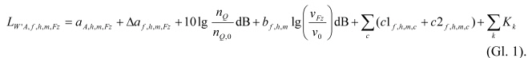

        Dabei bezeichnet:

        *            *   *
                A,h,m,Fz

            *   A-bewerteter Gesamtpegel der längenbezogenen Schallleistung bei
                der Bezugsgeschwindigkeit
                v
                0                                    = 100 km/h auf Schwellengleis mit
                durchschnittlichem Fahrflächenzustand, nach Beiblatt 1 und 2, in dB,

        *            *   Δ*
                ƒ
                ,h,m,Fz

            *   Pegeldifferenz im Oktavband ƒ, nach Beiblatt 1 und 2, in dB,

        *            *   n
                Q

            *   Anzahl der Schallquellen der Fahrzeugeinheit nach Nummer 4.1 bzw. 5.1,

        *            *   n
                Q,
                0

            *   Bezugsanzahl der Schallquellen der Fahrzeugeinheit nach Nummer 4.1
                bzw. 5.1,

        *            *   b
                ƒ
                ,h,m

            *   Geschwindigkeitsfaktor nach Tabelle 6 bzw. 14,

        *            *   v
                Fz

            *   Geschwindigkeit nach Nummer 4.3 bzw. 5.3.2, in km/h,

        *            *   v
                0

            *   Bezugsgeschwindigkeit,
                v
                0                                    = 100 km/h,

        *            *                
            *   Summe der
                c                                    Pegelkorrekturen für Fahrbahnart
                (
                c                                   1) nach Tabelle 7 bzw. 15 und
                Fahrfläche (
                c                                   2) nach Tabelle 8, in dB,

        *            *                
            *   Summe der
                k                                    Pegelkorrekturen für Brücken nach
                Tabelle 9 bzw. 16 und die Auffälligkeit von Geräuschen nach Tabelle
                11, in dB.

        Anmerkung: In Beiblatt 1 und 2 sind die Indizes
        h                         ,
        m                          und
        Fz                          nicht mitgeführt.

        In den Berechnungen werden die acht Oktavbänder ƒ mit den
        Mittenfrequenzen von 63 Hz bis 8 000 Hz berücksichtigt. Die zu
        verwendenden Parameter sind in Nummer 4 für Eisenbahnen und in Nummer
        5 für Straßenbahnen zusammengestellt.

        Bei Verkehr von
        n
        Fz                          Fahrzeugeinheiten pro Stunde der Art
        Fz                          wird der Pegel der längenbezogenen
        Schallleistung im Oktavband ƒ und Höhenbereich
        h                          nach folgender Gleichung (Gl. 2) berechnet:

        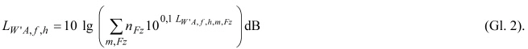

    **3.3** **Schallleistungspegel für Rangier- und Umschlagbahnhöfe**

        Die Schallemission wird in acht Oktavbändern ƒ bei Mittenfrequenzen
        von 63 Hz bis 8 000 Hz als Schallleistungspegel für Abstrahlung in den
        Raumwinkel 4*                          angegeben. Es gilt das
        Raumwinkelmaß nach der Gleichung (Gl. 9). Zu unterscheiden sind
        Schallquellen nach Tabelle 10. Die Quellen sind punktförmig oder
        linienförmig ausgeformt.

        Der Pegel der A-bewerteten Schallleistung von Punktschallquellen
        L
        W,
        ƒ
        ,h,i                          im Oktavband ƒ, im Höhenbereich
        h                         , infolge einer Einzelquelle
        i                          wird abhängig von der Anzahl
        n
        i                          der Ereignisse bzw. Einheiten pro Stunde
        nach folgender Gleichung (Gl. 3) berechnet:

        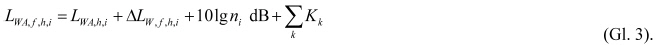

        Der Pegel der A-bewerteten längenbezogenen Schallleistung von
        Linienschallquellen
        L
        W'A,
        ƒ
        ,h,j                          im Oktavband ƒ, im Höhenbereich
        h                         , infolge einer Einzelquelle
        j                          wird abhängig von der Anzahl
        n
        j                          der Ereignisse bzw. Einheiten pro Stunde
        nach folgender Gleichung (Gl. 4) berechnet:

        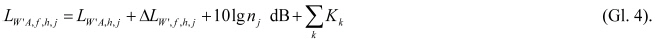

        Dabei bezeichnet:

        *            *   L
                WA,h,i                                    ,
                L
                W'A,h,j

            *   A-bewerteter Gesamtpegel der Schallleistung bzw. der längenbezogenen
                Schallleistung der Einzelquelle i bzw. j nach Beiblatt 3, in dB,

        *            *   Δ
                L
                W,
                ƒ
                ,h,i                                   , Δ
                L
                W',
                ƒ
                ,h,j

            *   Pegeldifferenz im Oktavband ƒ nach Beiblatt 3, in dB,

        *            *   n
                i                                   ,
                n
                j

            *   Anzahl der Ereignisse bzw. Einheiten pro Stunde,

        *            *   K
                k

            *   Pegelkorrektur für die Auffälligkeit der Geräusche nach Tabelle 9 und
                Tabelle 11, in dB.

        Anmerkung: Im Beiblatt 3 sind die Indizes
        h, i                          und
        j                          nicht mitgeführt.

        Teilflächen von Rangier- und Umschlagbahnhöfen mit gleichmäßiger
        Schallemission können zu Flächenschallquellen zusammengefasst werden.
        Die Emission der Flächenschallquelle, zusammengefasst aus Punkt- und
        Linienschallquellen, wird durch deren A-bewerteten
        Schallleistungspegel
        L
        W”A,
        ƒ
        ,h                          im Oktavband ƒ und Höhenbereich
        h                          nach folgender Gleichung (Gl. 5) angegeben:

        

        Dabei bezeichnet:

        *            *   S
                F

            *   Teilfläche mit gleichmäßiger Schallemission, in m
                2                                   ,

        *            *   S
                0                                    = 1 m
                2

            *   Bezugsfläche,

        *            *   l
                j

            *   Länge der Linienquelle j, in m,

        *            *   l
                0                                    = 1 m

            *   Bezugslänge,

        *            *   q
                i,h

            *   Anzahl der Punktschallquellen der Art
                i                                    im Höhenbereich
                h                                   ,

        *            *   q
                j,h

            *   Anzahl der Linienschallquellen der Art
                j                                    im Höhenbereich
                h                                   .

        Fahrbewegungen von ein-, aus- und vorbeifahrenden Zügen sowie von
        Rangierfahrten werden nach Nummer 3.2 berücksichtigt.

    **3.4** **Bildung von Punktschallquellen durch Teilstückzerlegung**

        Der Berechnung der Beurteilungspegel liegen Punktschallquellen
        zugrunde. Dazu werden alle linien- und flächenförmigen Quellen in
        Punktschallquellen zerlegt (siehe Bild 1). Eine ausgedehnte Quelle,
        für die von allen Teilen bis zu einem Immissionsort gleichmäßige
        Schallausbreitungsbedingungen herrschen, wird als Punktschallquelle
        modelliert. Darüber hinaus ist die Länge der Teilstücke
        l
        ks                          bzw. die Größe der Teilfläche
        S
        kF                          durch weitere Zerlegung so zu begrenzen,
        dass bei Halbierung aller Teilstücke bzw. Teilflächen der
        Immissionsanteil nach der Gleichung (Gl. 29) für alle Beiträge am
        jeweiligen Immissionsort sich um weniger als 0,1 dB verändert.

        *            *                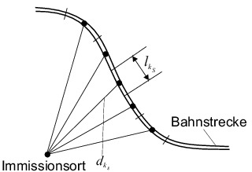
            *                

   Bild 1: Beispiele für die Zerlegung von Linien- und
        Flächenschallquellen in Teilstücke und Teilflächen

        Anmerkung 1: In Rangierbahnhöfen werden z. B. Gleisbremsen als
        Punktschallquellen betrachtet.

        Anmerkung 2: Die Forderung nach gleichmäßigen Ausbreitungsbedingungen
        an jedem betrachteten Punkt eines Teilstückes zum Immissionsort wird
        durch den Schwellenwert von 0,1 dB präzisiert. Sie schließt
        Anforderungen an Abstände, Schallstrahlhöhe über dem Boden,
        Abschirmungen und Reflexionen ein. Als Richtwert für eine geeignete
        Länge
        l
        ks                          bei freier Schallausbreitung über ebenem
        Boden dient die Hälfte der Weglänge
        d
        kS                          von der Mitte des Teilstückes bis zum
        Immissionsort. Als Richtwert für eine geeignete Teilflächengröße
        S
        kF                          bei freier Schallausbreitung über ebenem
        Boden dient ein Viertel des Quadrats der Weglänge
        d
        kF                          von der Mitte der Teilfläche bis zum
        Immissionsort.

        Aus der Länge
        l
        kS                          eines Teilstückes
        k
        s                          und aus A-bewerteten Pegeln der
        längenbezogenen Oktav-Schallleistung
        L
        W'A,
        ƒ
        ,h                          nach der Gleichung (Gl. 5) in den nach
        dieser Anlage festgelegten Höhenbereichen
        h                          (siehe Tabelle 5 bzw. Tabelle 10) in diesem
        Abschnitt werden die A-bewerteten Schallleistungspegel
        L
        WA,
        ƒ
        ,h,kS                          im Oktavband ƒ nach folgender Gleichung
        (Gl. 6) berechnet:

        

        mit
        l
        0                          = 1 m.

        Oktav-Schallleistungspegel nach der Gleichung (Gl. 6) beschreiben
        zusammen mit dem Richtwirkungsmaß nach der Gleichung (Gl. 8) und dem
        Raumwinkelmaß nach der Gleichung (Gl. 9) die Schallemission, mit der
        von einer Punktschallquelle in der Mitte eines Teilstückes
        k
        s                          in der Höhe
        h
        s                          über der Schienenoberkante zu rechnen ist.

        Mit der Fläche
        S
        kF                          einer Teilfläche und aus den Pegeln
        L
        W"A,
        ƒ
        ,h                          der flächenbezogenen Schallleistung nach
        der Gleichung (Gl. 5) in den nach Tabelle 10 festgelegten
        Höhenbereichen
        h                          werden die Schallleistungspegel
        L
        WA,
        ƒ
        ,h,kF                          nach der folgenden Gleichung (Gl. 7)
        berechnet:

        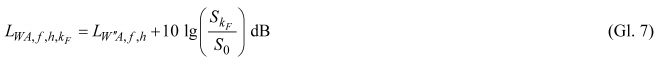

        mit
        S
        0                          = 1 m
        2                         .

        Der Oktav-Schallleistungspegel nach der Gleichung (Gl. 7) beschreibt
        zusammen mit dem Raumwinkelmaß nach der Gleichung (Gl. 9) die
        ungerichtete Schallemission einer Punktschallquelle in der Mitte einer
        Teilfläche
        k
        F                          in der Höhe
        h
        s                          über der Schienen- bzw. der
        Fahrbahnoberkante.

    **3.5** **Richtwirkung und Raumwinkelmaß**

        3.5.1 Richtwirkung

            Das Richtwirkungsmaß
            D
            I,kS                                wird nach folgender Gleichung (Gl.
            8) für Teilstücke von Streckenabschnitten berechnet:

            

            Dabei bezeichnet
            δ
            kS                                den Winkel zwischen einem
            Schallstrahl, der von der Punktschallquelle ausgeht, und der
            Gleisachse (siehe Bild 2):

            

            Bild 2: Definition des Winkels
            δ
            kS                                an einer Bahnstrecke

            Anmerkung: Das Richtwirkungsmaß ist grafisch in Bild 3 dargestellt:

            

            Bild 3: Richtwirkungsmaß
            D
            I,kS                                in dB nach Gleichung (Gl. 8) für
            δ
            kS                                in Grad

            Anmerkung 1: Das Richtwirkungsmaß kennzeichnet die mittlere
            Abstrahlung des Rollgeräusches bei Zugfahrten in beiden Richtungen.

            Anmerkung 2: Der Winkel
            δ
            kS                                kann aus geometrischen
            Beschreibungen der Gleisachse und des Immissionsorts ermittelt werden.

            Für Quellen in Rangier- und Umschlagbahnhöfen wird nach dieser
            Rechenvorschrift keine Richtwirkung berücksichtigt.

        3.5.2 Raumwinkelmaß

            Die Schallleistungspegel aller Quellen dieser Anlage geben die
            Abstrahlung in den Raumwinkel 4*                                an.
            Dabei wird der scheinbare Anstieg des Schallleistungspegels der
            Schallquelle aufgrund von Reflexionen am Boden durch das Raumwinkelmaß
            nach folgender Gleichung (Gl. 9) berücksichtigt:

            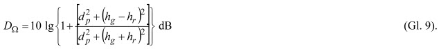

            Dabei bezeichnet:

                h
            g   Höhe der Schallquelle über dem Boden, in m,

                h
            r   Höhe des Immissionsorts über dem Boden, in m,

                d
            p   horizontaler Abstand zwischen Schallquelle und Immissionsort, in m.

            Anmerkung: Angaben zur Schallquellenhöhe nach den Tabellen 5, 10 und
            13 beziehen sich auf die Fahrbahnoberkante. Entsprechend ist zu der
            angegebenen Schallquellenhöhe die Höhe der Fahrbahnoberkante über dem
            Boden hinzuzufügen.

4.  Schallemissionen von Eisenbahnen ****

    **4.1** **Fahrzeugarten**

        Zur Berechnung der Schallemission werden Fahrzeugkategorien
        Fz                          nach Tabelle 3 unterschieden:

        **Tabelle 3: Fahrzeugarten, Fz-Kategorien und Bezugsanzahl der Achsen
        für Eisenbahnen**

        *            *   Spalte

            *   A

            *   B

            *   C

        *            *   Zeile

            *   Fahrzeugart

            *   Fahrzeug-Kategorie
                Fz

            *   Bezugsanzahl
                der Achsen
                n
                Achs,
                0

        *            *   1

            *   HGV-Triebkopf

            *   1

            *   4

        *            *   2

            *   HGV-Mittel-/Steuerwagen, nicht angetrieben

            *   2

            *   4

        *            *   3

            *   HGV-Triebzug

            *   3

            *   32

        *            *   4

            *   HGV-Neigezug

            *   4

            *   28

        *            *   5

            *   E-Triebzug und S-Bahn (ET)

            *   5

            *   10

        *            *   6

            *   V-Triebzug (VT)

            *   6

            *   6

        *            *   7

            *   Elektrolok (E-Lok)

            *   7

            *   4

        *            *   8

            *   Diesellok (V-Lok)

            *   8

            *   4

        *            *   9

            *   Reisezugwagen

            *   9

            *   4

        *            *   10

            *   Güterwagen

            *   10

            *   4

        Festlegung zu Tabelle 3, Spalte C:

        Die Schallleistung des Rollgeräusches nimmt mit der Anzahl der Achsen
        zu. Bei Abweichung der Anzahl der Achsen
        n
        Achs                          einer Fahrzeugeinheit von der
        Bezugsanzahl der Achsen
        n
        Achs,
        0                          wird eine Korrektur in der Gleichung (Gl.
        1) mit
        n
        Q                          =
        n
        achs                          vorgenommen. Diese Korrektur wird nur
        für die Schallquellenart Rollgeräusche nach Tabelle 5 angesetzt. Bei
        allen anderen Schallquellenarten gilt
        n
        Q                          =
        n
        Q,
        0                         . Der A-bewertete Gesamtpegel*
        A,h,m,Fz                          der längenbezogenen Schallleistung
        und die Pegeldifferenz**
        ƒ
        ,h,m,Fz                          im Oktavband ƒ bei der
        Bezugsgeschwindigkeit
        v
        0                          = 100 km/h auf Schwellengleis mit
        durchschnittlichem Fahrflächenzustand sind für jede Fahrzeugart in
        Beiblatt 1 zusammengestellt (siehe auch die Gleichung Gl. 1). Die
        Zusammensetzung und die Anzahl von Fahrzeugeinheiten von Zügen können,
        sofern diese für die Berechnung nicht vorgegeben werden, der Tabelle 4
        entnommen werden.

        **Tabelle 4: Verkehrsdaten für Eisenbahnen**

        *            *   Spalte

            *   A

            *   B

            *   C

            *   D

            *   E

            *   F

            *   G

            *   H

            *   I

            *   J

            *   K

            *   L

        *            *   Zeile

            *   Zugart

            *   Höchstgeschwindigkeit
                im Regelverkehr
                in km/h

            *   Anzahl der Fahrzeugeinheiten je
                Fz                                   -Kategorie

        *            *
            *
            *   1

            *   2

            *   3

            *   4

            *   5

            *   6

            *   7

            *   8

            *   9

            *   10

        *            *   1

            *   ICE-1-Zug

            *   250

            *   2

            *   12

            *
            *
            *
            *
            *
            *
            *
            *

        *            *   2

            *   ICE-2-Halbzug

            *   250

            *   1

            *   7

            *
            *
            *
            *
            *
            *
            *
            *

        *            *   3

            *   ICE-2-Vollzug

            *   250

            *   2

            *   14

            *
            *
            *
            *
            *
            *
            *
            *

        *            *   4

            *   ICE-3-Halbzug

            *   300

            *
            *
            *   1

            *
            *
            *
            *
            *
            *
            *

        *            *   5

            *   ICE-3-Vollzug

            *   300

            *
            *
            *   2

            *
            *
            *
            *
            *
            *
            *

        *            *   6

            *   ICE-T

            *   230

            *
            *
            *
            *   1

            *
            *
            *
            *
            *
            *

        *            *   7

            *   Thalys-PBKA-Halbzug

            *   300

            *   2

            *   5

            *
            *
            *
            *
            *
            *
            *
            *

        *            *   8

            *   Thalys-PBKA-Vollzug

            *   300

            *   4

            *   10

            *
            *
            *
            *
            *
            *
            *
            *

        *            *   9

            *   ETR 470 Cisalpino

            *   200

            *
            *
            *
            *   1

            *
            *
            *
            *
            *
            *

        *            *   10

            *   IC-Zug (bespannt mit
                E-Lok)

            *   200

            *
            *
            *
            *
            *
            *
            *   1

            *
            *   12

            *

        *            *   11

            *   IC-Zug (bespannt mit
                V-Lok)

            *   160

            *
            *
            *
            *
            *
            *
            *
            *   1

            *   12

            *

        *            *   12

            *   Nahverkehrszug
                (bespannt mit E-Lok)

            *   160

            *
            *
            *
            *
            *
            *
            *   1

            *
            *   5

            *

        *            *   13

            *   Nahverkehrszug
                (bespannt mit V-Lok)

            *   140

            *
            *
            *
            *
            *
            *
            *
            *   1

            *   5

            *

        *            *   14

            *   Nahverkehrszug (ET)

            *   140

            *
            *
            *
            *
            *   1

            *
            *
            *
            *
            *

        *            *   15

            *   Nahverkehrszug (VT)

            *   120

            *
            *
            *
            *
            *
            *   1

            *
            *
            *
            *

        *            *   16

            *   IC3

            *   180

            *
            *
            *
            *
            *
            *   1

            *
            *
            *
            *

        *            *   17

            *   S-Bahn

            *   120

            *
            *
            *
            *
            *   1

            *
            *
            *
            *
            *

        *            *   18

            *   Güterzug (bespannt mit
                E-Lok)

            *   100

            *
            *
            *
            *
            *
            *
            *   1

            *
            *
            *   24

        *            *   19

            *   Güterzug (bespannt mit
                V-Lok)

            *   100

            *
            *
            *
            *
            *
            *
            *
            *   1

            *
            *   24

        Anmerkungen zu Tabelle 4:

        Zeile 6: Die 7-teilige Version (BR 411) und die 5-teilige Version (BR
        415) des ICE-T werden schalltechnisch nicht unterschieden.

        Zeilen 10 und 11: Radsätze der Wagen mit Wellenscheibenbremsen.

        Zeilen 14 und 17: Detaillierung nach Baureihen siehe Datenblatt der
        Fahrzeug-Kategorie 5.

        Zeile 15: Detaillierung nach Baureihen siehe Datenblatt der Fahrzeug-
        Kategorie 6.

        Zeile 16: Zu behandeln wie BR 612 im Datenblatt der Fahrzeug-Kategorie
        6\.

        Bei Güterzügen kann damit gerechnet werden, dass bis zum Jahr 2020 80
        Prozent und bis zum Jahr 2030 100 Prozent der Güterwagen mit
        Verbundstoff-Klotzbremsen ausgestattet sind. Dies betrifft Güterwagen
        gemäß den Zeilen 5 bis 7 sowie 18 bis 20 von Beiblatt 1, Fahrzeug-
        Kategorie 10.

    **4.2** **Schallquellenarten**

        Zur Berechnung der Schallemission werden die in Tabelle 5 aufgeführten
        vier Schallquellenarten in den zugehörigen Höhenbereichen
        berücksichtigt.

        **Tabelle 5: Schallquellenarten an Fahrzeugen für Eisenbahnen**

        *            *   Spalte

            *   A

            *   B

            *   C

            *   D

            *   E

        *            *   Zeile

            *   Schallquellenart

            *   Höhenbereich
                h

            *   Höhe
                h
                s                                    über SO

            *   Teilquellen
                m

            *   Geräuschursache,
                Komponente

        *            *   1

            *   Rollgeräusche

            *   1

            *   0 m

            *   1

            *   Schienenrauheit

        *            *   2

            *   1

            *   0 m

            *   2

            *   Radrauheit

        *            *   3

            *   2

            *   4 m

            *   3

            *   Abstrahlung des als Körperschall übertragenen Rollgeräusches aufgrund
                der Schienenrauheit durch Kesselwagenaufbauten

        *            *   4

            *   2

            *   4 m

            *   4

            *   Abstrahlung des als Körperschall übertragenen Rollgeräusches aufgrund
                der Radrauheit durch Kesselwagenaufbauten

        *            *   5

            *   Aerodynamische Geräusche

            *   3

            *   5 m

            *   5

            *   Stromabnehmerwippe

        *            *   6

            *   2

            *   4 m

            *   6

            *   Stromabnehmerfuß, Gitter von Kühl- und Klimaanlagen im Dachbereich

        *            *   7

            *   1

            *   0 m

            *   7

            *   Umströmung der Drehgestelle

        *            *   8

            *   Aggregatgeräusche

            *   2

            *   4 m

            *   8

            *   Ventilatoren von Kühl- und Klimaanlagen, Saugseite im Dachbereich

        *            *   9

            *   1

            *   0 m

            *   9

            *   Ventilatoren von Kühl- und Klimaanlagen, Saug- und Druckseite im
                Unterflurbereich

        *            *   10

            *   Antriebsgeräusche

            *   2

            *   4 m

            *   10

            *   Abgasanlage

        *            *   11

            *   1

            *   0 m

            *   11

            *   Motor, Getriebe

        Festlegungen zu Tabelle 5:

        Zeilen 1 und 2: Bei Gefällestrecken mit einer Neigung*
        20*                          und einer Länge*
        500 m ist für Güterzüge mit Graugussklotzbremsen auf dem talwärts
        befahrenen Gleis ein Zuschlag von 3 dB auf das Rollgeräusch in der
        Höhe
        h
        s                          = 0 m aufgrund von Bremsgeräuschen zu
        berücksichtigen.

        Zeilen 3 und 4: Bei Kesselwagen wirken sich die Rauheiten der
        Rollgeräusche durch Schallabstrahlung der Aufbauten auch in der Höhe
        h
        s                          = 4 m aus. Die entsprechende Teilquelle
        wird nur für Kesselwagen angewendet. Sofern nicht genauer bekannt,
        wird ein Anteil von 20 Prozent Kesselwagen für jeden Güterzug
        angenommen.

    **4.3** **Geschwindigkeit**

        Die in Beiblatt 1 aufgeführten A-bewerteten Gesamtpegel der
        längenbezogenen Schallleistung gelten für die Bezugsgeschwindigkeit
        v
        0                          = 100 km/h. Der Einfluss davon abweichender
        Geschwindigkeiten wird in der Gleichung (Gl. 1) mit dem
        Geschwindigkeitsfaktor
        b                          nach Tabelle 6 berücksichtigt.

        **Tabelle 6: Geschwindigkeitsfaktor**
        b **für Eisenbahnen**

        *            *   Spalte

            *   A

            *   B

            *   C

        *            *   Zeile

            *   Schallquellenart

            *   Teil-
                quellen
                m

            *   Geschwindigkeitsfaktor
                b                                    in der
                Oktavband-Mittenfrequenz, in Hz

        *            *   1

            *
            *
            *   63

            *   125

            *   250

            *   500

            *   1 000

            *   2 000

            *   4 000

            *   8 000

        *            *   2

            *   Rollgeräusche

            *   1, 2, 3, 4

            *   –5

            *   –5

            *   –5

            *   0

            *   10

            *   25

            *   25

            *   25

        *            *   3

            *   Aerodynamische Geräusche

            *   5, 6, 7

            *   50

        *            *   4

            *   Aggregatgeräusche

            *   8, 9

            *   –10

        *            *   5

            *   Antriebsgeräusche

            *   10, 11

            *   20

        Die Geschwindigkeit
        v
        Fz                          wird wie folgt ermittelt:

        Ausgangspunkt ist die zulässige fahrzeugbedingte Höchstgeschwindigkeit
        im Regelverkehr. Haben mehrere Fahrzeuge eines Zuges unterschiedliche
        Höchstgeschwindigkeiten, ist die Höchstgeschwindigkeit des langsamsten
        Fahrzeugs für alle Fahrzeuge zu verwenden. Ist die zulässige
        Streckengeschwindigkeit geringer, ist diese anzusetzen.

        Im Bereich von Personenbahnhöfen (innerhalb der Einfahrsignale) und
        von Haltepunkten bzw. Haltestellen (Bahnsteiglänge zuzüglich auf jeder
        Seite 100 m) ist die zulässige Geschwindigkeit der freien Strecke,
        mindestens aber 70 km/h anzusetzen. Mit
        v
        Fz                          = 70 km/h werden die in Bahnhöfen und an
        Haltepunkten bzw. in Haltestellenbereichen anfallenden Geräusche, die
        z. B. durch das Türenschließen oder beim Überfahren von Weichen
        und/oder beim Bremsen und Anfahren entstehen, berücksichtigt.

        Anmerkung: Eine Zusammenstellung von Höchstgeschwindigkeiten für
        verschiedene Zugarten kann Tabelle 4 entnommen werden.

    **4.4** **Fahrbahnarten, Bahnübergänge**

        Die in Beiblatt 1 aufgeführten akustischen Kenndaten gelten für
        Schwellengleise (siehe Nummer 2.1.8). Für andere Fahrbahnarten sind
        nach der Gleichung (Gl. 1) Pegelkorrekturen nach Tabelle 7
        vorzunehmen.

        **Tabelle 7: Pegelkorrekturen**
        c                         1 **für Fahrbahnarten**

        *            *   Spalte

            *   A

            *   B

            *   C

        *            *   Zeile

            *   Einflussgröße

            *   Pegelkorrekturen
                c                                   1 in dB
                für Oktavband-Mittenfrequenz, in Hz

        *            *   63

            *   125

            *   250

            *   500

            *   1 000

            *   2 000

            *   4 000

            *   8 000

        *            *   1

            *   Feste Fahrbahn

            *   Erhöhte Schienenabstrahlung

            *   0

            *   0

            *   0

            *   7

            *   3

            *   0

            *   0

            *   0

        *            *   2

            *   Reflexion an der Fahrbahn

            *   1

            *   1

            *   1

            *   1

            *   1

            *   1

            *   1

            *   1

        *            *   3

            *   Feste Fahrbahn
                mit Absorber

            *   Erhöhte Schienenabstrahlung

            *   0

            *   0

            *   0

            *   7

            *   3

            *   0

            *   0

            *   0

        *            *   4

            *   Reflexion an der Fahrbahn

            *   0

            *   0

            *   0

            *   –2

            *   –2

            *   –3

            *   0

            *   0

        *            *   5

            *   Bahnübergang

            *   Erhöhte Schienenrauheit

            *   0

            *   0

            *   0

            *   8

            *   4

            *   0

            *   0

            *   0

        *            *   6

            *   Reflexion an der Fahrbahn

            *   1

            *   1

            *   1

            *   1

            *   1

            *   1

            *   1

            *   1

        Festlegungen zu Tabelle 7:

        Zeilen 1 und 3: Pegelkorrektur für die erhöhte Schallabstrahlung der
        Schiene aufgrund der bei festen Fahrbahnen erforderlichen elastischen
        Schienenbefestigung; die Korrektur ist auf das Rollgeräusch infolge
        Schienenrauheit und Radrauheit (Teilquellen 1 und 2) anzuwenden. Bei
        allen anderen Teilquellen
        m                          gilt
        c                         1 = 0 dB.

        Zeilen 2, 4 und 6: Pegelkorrektur für die veränderte Schallabstrahlung
        aufgrund der veränderten Reflexionen gegenüber dem Schotterbett; die
        Korrektur ist auf alle Teilquellen auf Höhe der Schiene (Teilquellen
        1, 2, 7, 9 und 11) anzuwenden. Bei allen anderen Teilquellen
        m                          gilt
        c                         1 = 0 dB.

        Zeilen 3 und 4: Absorber sind als Schallschutzmaßnahme einzustufen.

        Zeile 5: Pegelkorrektur für die Schallabstrahlung der Schiene aufgrund
        der erhöhten Fahrbahnrauheit. Die Korrektur ist auf das Rollgeräusch
        aufgrund der Schienenrauheit und der Radrauheit (Teilquellen 1 und 2)
        anzuwenden. Bei allen anderen Teilquellen
        m                          gilt
        c                         1 = 0 dB.

        Zeilen 5 und 6: Die Pegelkorrektur für Bahnübergänge ist für
        Teilstücke, die der 2-fachen Straßenbreite entsprechen, anzusetzen.
        Pegelkorrekturen für andere Fahrbahnarten sind nicht zusätzlich zu
        berücksichtigen.

        Anmerkung 1: Schwellengleise im Schotterbett schließen Betonschwellen,
        Holzschwellen und Stahlschwellen ein.

        Anmerkung 2: Im Bereich von Weichen können in der Regel keine Absorber
        verlegt werden.

        Anmerkung 3: Auf eine Pegelkorrektur für Bahnübergänge, die nur als
        Fuß- und Radwege dienen, kann nach Zeile 5 vollständig, nach Zeile 6
        bei einer Wegbreite des befestigten Bahnüberganges von*
        7 m verzichtet werden.

    **4.5** **Schallminderungstechniken am Gleis**

        Die in Beiblatt 1 aufgeführten akustischen Kenndaten gelten für einen
        durchschnittlichen Fahrflächenzustand und ohne besondere akustische
        Maßnahmen an der Schiene. Für den Fahrflächenzustand „besonders
        überwachtes Gleis (büG)“ und für Maßnahmen an den Schienenstegen sind
        nach der Gleichung (Gl. 1) Pegelkorrekturen nach Tabelle 8
        vorzunehmen.

        **Tabelle 8:** **Pegelkorrekturen**
        c                         2 **für Fahrflächenzustand „besonders
        überwachtes Gleis (büG)“ sowie für Schienenstegdämpfer und
        -abschirmung**

        *            *   Spalte

            *   A

            *   B

            *   C

        *            *   Zeile

            *   Maßnahme

            *   Teilquelle
                m

            *   Pegelkorrekturen
                c                                   2 in dB in der
                Oktavband-Mittenfrequenz, in Hz

        *            *
            *
            *   63

            *   125

            *   250

            *   500

            *   1 000

            *   2 000

            *   4 000

            *   8 000

        *            *   1

            *   besonders überwachtes Gleis (büG)

            *   1, 3

            *   0

            *   0

            *   0

            *   –4

            *   –5

            *   –5

            *   –4

            *   0

        *            *   2

            *   Schienenstegdämpfer

            *   1, 3

            *   0

            *   0

            *   0

            *   –2

            *   –3

            *   –3

            *   0

            *   0

        *            *   3

            *   2, 4

            *   0

            *   0

            *   0

            *   –1

            *   –3

            *   –2

            *   0

            *   0

        *            *   4

            *   Schienenstegabschirmung

            *   1

            *   0

            *   0

            *   0

            *   –3

            *   –4

            *   –5

            *   0

            *   0

        Die Korrekturwerte
        c                         2 werden für das „büG“ auf die Teilquellen
        Rollgeräusch aufgrund der Schienenrauheit, Teilquellen 1 und 3, bei
        den Einflussgrößen Schienenstegdämpfer auf die Teilquellen 1 bis 4 und
        bei der Schienenstegabschirmung nur auf die Teilquelle 1 angesetzt.
        Bei allen anderen Teilquellen gilt
        c                         2 = 0 dB. Die Maßnahmen nach Tabelle 8
        gelten als Schallschutzmaßnahme. Die eingesetzten Schienenstegdämpfer
        und -abschirmungen müssen die akustische Wirksamkeit nach Tabelle 8
        aufweisen. Eine Addition der Korrekturwerte
        c                         2 aus den Zeilen 1 und 2 sowie den Zeilen 1
        und 4 ist möglich.

        Anmerkung 1: Das „besonders überwachte Gleis (büG)“ ist eine
        Schallschutzmaßnahme mit einer besonderen Form der Überwachung und
        Pflege der Schienenfahrflächen. Sie beruht auf der Erkenntnis, dass
        neben dem fahrzeugartabhängigen Zustand der Radlaufflächen vor allem
        der Fahrflächenzustand der Schienen eine entscheidende Rolle bei der
        Entstehung des Rollgeräusches spielt. Beim Einsatz dieser Maßnahme
        werden bestimmte Gleisabschnitte in regelmäßigen Abständen auf ihren
        akustischen Zustand hin überprüft und im Bedarfsfall mit einem
        besonderen Schleifverfahren geschliffen (akustisches Schleifen). Die
        Maßnahme zielt darauf ab, dass auf solchen Gleisabschnitten stets ein
        überdurchschnittlich guter, d. h. glatter Fahrflächenzustand der
        Schienen vorhanden ist und das Rollgeräusch entsprechend gering
        auftritt.

        Anmerkung 2: Schienenstegdämpfer ist eine Dämpfungsmaßnahme,
        Schienenstegabschirmung ist eine Abschirmmaßnahme für Schienenfuß und
        Schienensteg; beide Technologien sind Schallschutzmaßnahmen.

        Die Maßnahme „büG“ ist mit folgenden Festlegungen verbunden:

        –   Vor der Inbetriebnahme von Streckenabschnitten mit der Maßnahme „büG“
            und nach jedem akustischen Schleifen gilt das Gleis als abgenommen,
            wenn es mit den für das büG-Schleifen anerkannten Verfahren Verfügung
            Pr.1110 Rap/Rau 98 vom 16.3.1998 (VkBl. 1998, Heft 7, S. 262, lfd. Nr.
            74) bearbeitet wurde.

        –   Die schalltechnische Überwachung des „büG“ erfolgt durch eine
            Befahrung mit dem Schallmesswagen (SMW). Die erste Befahrung ist
            spätestens zwölf Monate nach der Inbetriebnahme des
            Streckenabschnittes mit der Maßnahme „büG“ durchzuführen. Jede weitere
            Befahrung mit dem SMW findet spätestens zwölf Monate nach der vorigen
            Befahrung statt.

        –   Zeigt der SMW für einen Gleisabschnitt einen Messwert von +2 dB
            (Auslöseschwelle) oder mehr an, so wird dieser Gleisabschnitt
            innerhalb der nächsten zwölf Monate nach der Befahrung akustisch
            geschliffen. Ein akustisches Schleifen ist nicht erforderlich, wenn
            der Gleisabschnitt nicht länger als 50 m ist und auf den an einer
            Seite oder an beiden Seiten anschließenden Gleisabschnitten von
            mindestens 200 m Länge die Auslöseschwelle nicht überschritten oder
            dort die Maßnahme „büG“ nicht durchgeführt wird.

        –   Das akustische Schleifen kann entfallen, wenn durch geeignete
            Schleifverfahren wie z. B. das Hochgeschwindigkeitsschleifen
            nachgewiesen wird, dass der durch den SMW angezeigte Messwert kleiner
            als +1 dB ist.

        Gemäß § 5 Absatz 3 Satz 2 sind weitergehende Festlegungen der
        zuständigen Behörde zu beachten.

    **4.6** **Brücken**

        Bei der Überfahrt eines Zuges über eine Brücke ist die Schallemission
        des Brückenüberbaus durch eine Korrektur, die auch die Belästigung
        aufgrund tieffrequenter Geräuschanteile enthält, zu berücksichtigen.
        Sie wird als kombinierte Brücken- und Fahrbahnkorrektur
        K
        Br                          dargestellt, da sie neben der
        Schallemission der Brücke auch den Einfluss der Fahrbahn auf der
        Brücke enthält. Maßnahmen, die zu einer Minderung der Schallemission
        einer Brücke führen, werden durch eine Korrektur
        K
        LM                          berücksichtigt und sind als
        Schallschutzmaßnahme anzusetzen. Für die gebräuchlichsten fünf
        Brücken- und Oberbautypen sind in Tabelle 9 Pegelkorrekturen
        angegeben. Die Korrektur erfolgt für die lichte Weite der Brücke
        zuzüglich auf jeder Seite 2 m. Die Pegelkorrekturen gelten für die
        Teilquellen 1 und 2. Für alle anderen Teilquellen ist
        K
        Br                          +
        K
        LM                          = 0 dB anzusetzen. Korrekturen für
        Fahrbahnarten nach Tabelle 7 Zeile 1 bis 4 sind nicht anzusetzen.

        **Tabelle 9: Korrekturen**
        K
        Br **und**
        K
        LM **für Brücken**

        *            *   Spalte

            *   A

            *   B

            *   C

        *            *   Zeile

            *   Brücken- und Fahrbahnart

            *   K
                Br
                in dB

            *   K
                LM
                in dB

        *            *   1

            *   Brücken mit stählernem Überbau, Gleise direkt aufgelagert

            *   12

            *   –6

        *            *   2

            *   Brücken mit stählernem Überbau und Schwellengleis im Schotterbett

            *   6

            *   –3

        *            *   3

            *   Brücken mit massiver Fahrbahnplatte oder mit besonderem stählernen
                Überbau und Schwellengleis im Schotterbett

            *   3

            *   –3

        *            *   4

            *   Brücken mit fester Fahrbahn

            *   4

            *   –

        Festlegungen zu Tabelle 9:

        Zeile 1: Schienen sind direkt oder über Holzschwellen auf der
        Brückenkonstruktion befestigt. Die Abschläge für
        Schallminderungsmaßnahmen nach Spalte C sind anzusetzen, wenn zur
        Minderung der Schallemission der Brücke hochelastische
        Schienenbefestigungen mit den für die vorliegenden Bedingungen
        geringsten zugelassenen Werten für die Stützpunktsteifigkeit verwendet
        werden.

        Zeile 4: Ist eine Beeinträchtigung durch Schallemissionen nach unten
        zu erwarten, muss die Beeinträchtigung durch eine geeignete Maßnahme,
        z. B. eine elastische Matte zwischen Fahrbahn und Überbau, gemindert
        werden. Im Zweifelsfall ist die Maßnahme durch eine schalltechnische
        Stellungnahme abzuklären.

        Spalte C: Die Pegelkorrekturen für Schallminderungsmaßnahmen an
        Brücken mit Schotterbett (Zeilen 2 und 3) sind anzusetzen, wenn zur
        Minderung der Schallemissionen der Brücke Unterschottermatten mit den
        für die vorliegenden Bedingungen geringsten zugelassenen Werten für
        den Bettungsmodul verwendet werden.

        Anmerkung zu Tabelle 9 Zeile 3:

        Fahrbahnplatte aus Stahlbeton, Spannbeton, Walzträger in Beton,
        Doppelverbundträger oder Gewölbebrücke; auch Verbundbrücke aus
        massiver Betonfahrbahnplatte und stählernen Brückenteilen. Der
        besondere stählerne Überbau unterscheidet sich von den unter Zeile 2
        beschriebenen Brücken durch konstruktive Maßnahmen zur Verhinderung
        von Resonanzen.

        Befindet sich eine Schallschutzwand auf einer Brücke nach Tabelle 9
        Zeile 1 bis 3, sind Schallminderungsmaßnahmen mit einer
        Mindestwirksamkeit nach Tabelle 9 Spalte C vorzusehen und in der
        Berechnung zu berücksichtigen.

    **4.7** **Schallemission von Bauwerken**

        Im Bereich von Tunnelöffnungen und Bahnhofshallen sind die dort
        austretenden Schallemissionen zu berücksichtigen. Dabei ist von den in
        den Nummern 4.1 bis 4.6 festgelegten Schallleistungen auszugehen. Die
        Absorptions- und Transmissionseigenschaften der Bauwerke sind nach den
        anerkannten Regeln der Technik anzusetzen.

        Anmerkung 1: Anerkannte Regel der Technik ist die DIN EN 12354-4
        Bauakustik – Berechnung der akustischen Eigenschaften von Gebäuden aus
        den Bauteileigenschaften, Teil 4: Schallübertragung von Räumen ins
        Freie, Ausgabe April 2001.

        Anmerkung 2: Die beim Hochgeschwindigkeitsverkehr ggf. an
        Tunnelportalen auftretenden Mikrodruckwellen („Tunnelknall“) werden
        von dieser Richtlinie nicht erfasst und sind außerhalb dieser
        Verordnung gesondert zu betrachten.

    **4.8** **Rangier- und Umschlagbahnhöfe**

        Zur Berechnung der Schallemissionen von Rangier- und Umschlagbahnhöfen
        werden die in Tabelle 10 aufgeführten Schallquellen berücksichtigt.

        **Tabelle 10: Schallquellen in Rangier- und Umschlagbahnhöfen**

        *            *   Spalte

            *   A

            *   B

            *   C

            *   D

            *   E

        *            *   Zeile

            *   Anlagenteil

            *   Schallquellenart

            *   Höhenbereich
                h

            *   Höhe
                h
                s                                    über
                SO/FO

            *   Geräuschursache

        *            *   1

            *   Rangier- und Umschlagbahnhöfe

        *            *   2

            *   Einfahr-, Richtungs-, Nachordnungs- und Ausfahrgruppe in Rangier- und
                Umschlagbahnhöfen sowie in Autoreisezuganlagen

            *   Rollgeräusche von Lok und Güterwagen, Aggregate und Antriebsgeräusch
                der Lok

            *   1

            *   0 m

            *   Rauheit der Schienen und Radlaufflächen, Ventilatoren, Motor,
                Getriebe

        *            *   3

            *   Antriebsgeräusche
                der Rangierlok

            *   2

            *   4 m

            *   Abgasanlage

        *            *   4

            *   Kurvenfahrgeräusch

            *   1

            *   0 m

            *   Stick-slip, Anlaufen der Radspurkränze am Schienenkopf

        *            *   5

            *   Einfahrgruppe

            *   Abdrückgeräusch von Güterwagen über den Ablaufberg

            *   2

            *   4 m

            *   Aggregate und Antrieb der abdrückenden Lok

        *            *   6

            *   Richtungs- und Nachordnungsgruppe

            *   Gleisbremsengeräusch

            *   1

            *   0 m

            *   Reibung der Radflanken an Bremsbalken

        *            *   7

            *   Retardergeräusch
                (Klingelgeräusch)

            *   1

            *   0 m

            *   Eindrücken von Stoßdämpfern

        *            *   8

            *   Hemmschuhauflaufgeräusch

            *   1

            *   0 m

            *   Reibung des Radsatzes auf Metall

        *            *   9

            *   Auflaufstoßgeräusch

            *   6

            *   1,5 m

            *   Pufferstoß

        *            *   10

            *   Richtungs- und Ausfahrgruppe

            *   Geräusch beim Anreißen und Abbremsen von lose gekuppelten Wagen

            *   6

            *   1,5 m

            *   ruckartiges Beschleunigen und Abbremsen von lose gekuppelten
                Güterwagen

        Festlegungen zu Tabelle 10:

        Zeilen 2 bis 4: Rollgeräusche von Lok und Güterwagen sowie Aggregat-
        und Antriebsgeräusche der Lok (Höhenbereich 1 und 2) sind in allen
        Teilen der Rangier- und Umschlagbahnhöfe mit 70 km/h anhand von
        Beiblatt 1 zu ermitteln. Jede Fahrbewegung ist als ein Ereignis zu
        werten. Nicht zu berücksichtigen sind Rollgeräusche der abzudrückenden
        Güterwagen und der abdrückenden Loks sowie die Rollgeräusche der vom
        Ablaufberg in Richtungs- oder Nachordnungsgruppen ablaufenden
        Güterwagen.

        Zeile 4: Kurvenfahrgeräusche sind in allen Teilen der Rangier- und
        Umschlagbahnhöfe zu ermitteln, wobei jedes Fahrzeug (Lok, Güterwagen)
        als jeweils ein Ereignis auf der gesamten Länge jedes Gleisbogens mit
        r*                          300 m betrachtet werden muss.

        Zeile 5: Die Zahl der Schallereignisse richtet sich nach der Anzahl
        der Vorgänge des Abdrückens durch die abdrückende Rangierlok. Die
        Berechnung der Geräusche der abdrückenden Lok erfolgt nach Beiblatt 1,
        Fz                         -Kategorie 7 oder 8.

        Zeilen 6 und 7: Jede Fahrt eines Güterwagens durch eine Gleisbremse
        oder über Retarder ist als ein Schallereignis zu werten. In
        Beharrungsstrecken sind auch die Lokfahrten als Schallereignisse zu
        ermitteln, wenn die Retarder dafür nicht weggeklappt werden können.

        Zeilen 8 und 9: Jeder Güterwagenablauf verursacht je ein
        Hemmschuhauflaufgeräusch. In den schalltechnischen Ermittlungen ist
        anzunehmen, dass 15 Prozent aller Schallereignisse im ersten, 25
        Prozent im zweiten und 60 Prozent im letzten Drittel der Gleisharfen
        der Richtungs- oder Nachordnungsgruppen entstehen. Geräusche der
        Hemmschuhauswurfeinrichtungen sind in den Schallleistungspegeln für
        Hemmschuhauflaufgeräusche (Beiblatt 3) bereits enthalten. Für
        Pufferstöße gelten die Sätze 1 und 2 zu den Zeilen 8 und 9 sinngemäß.

        Zeile 10: Die Anzahl der Schallereignisse ist abhängig von der Anzahl
        der angerissenen und abgebremsten, lose gekuppelten Wagengruppen. Fest
        miteinander gekuppelte Güterwagen bleiben unberücksichtigt.

        Angaben zum A-bewerteten Gesamtpegel der Schallleistung und zur
        Verteilung in Oktavbändern enthält Beiblatt 3.

    **4.9** **Auffälligkeit von Eisenbahngeräuschen**

        Ton-, impuls- oder informationshaltige Geräusche von Teilstrecken oder
        Teilflächen werden mit einem frequenzunabhängigen Zuschlag
        K
        L                          zum Schallleistungspegel nach Tabelle 11
        auf die Teilquellen 1 und 2 nach Beiblatt 1 berücksichtigt. Falls
        dauerhaft wirksame Vorkehrungen gegen das Auftreten von
        Quietschgeräuschen getroffen werden, ist eine zusätzliche
        Pegelkorrektur
        K
        LA                          vorzunehmen.

        **Tabelle 11: Pegelkorrekturen**
        K
        L **für die Auffälligkeit von Geräuschen**

        *            *   Spalte

            *   A

            *   B

            *   C

            *   D

            *   E

        *            *   Zeile

            *   Schallquellenart

            *   Geräuschquelle

            *   K
                L
                dB

            *   K
                LA
                dB

            *   Bemerkung

        *            *   1

            *   Kurvenfahrgeräusch bei Eisenbahnstrecken

            *   Kurvenradius*                                    300 m

            *   8

            *   –3

            *

        *            *   2

            *   Kurvenradius von 300 m bis*                                    500 m

            *   3

            *   –3

        *            *   3

            *   Kurvenradius*                                    500 m

            *   0

            *

        *            *   4

            *   Kurvenfahrgeräusch
                in Rangier- und Umschlagbahnhöfen

            *   alle Radien*                                    300 m

            *   6

            *   –3

        *            *   5

            *   Gleisbremsengeräusch

            *   Zulaufbremse

            *   6

            *   –3

            *

        *            *   6

            *   Talbremse TW ohne oder mit Segmenten, Richtungsgleisbremse TWE
                einseitig mit Segmenten, Talbremse FEW Leipzig

            *   6

            *   –3

        *            *   7

            *   Talbremse TW beidseitig mit GG-Segmenten, TW schalloptimiert

            *   3

            *

        *            *   8

            *   Schraubenbremse

            *   3

            *

        *            *   9

            *   Retarder

            *   3

            *
            *   gilt auch für Rangierfahrten über Retarderstrecken

        *            *   10

            *   Sonstige Geräusche

            *   Hemmschuhaufläufe

            *   6

            *
            *   Geräusche treten nur
                in Rangierbahnhöfen ohne moderne Rangiertechnik auf

        *            *   11

            *   Auflaufstöße

            *   3

            *
            *   in Rangierbahnhöfen mit moderner Technik

        *            *   12

            *   6

            *
            *   in Rangierbahnhöfen mit älterer Technik

        *            *   13

            *   Anreißen und Abbremsen von lose gekuppelten Güterwagen

            *   6

            *
            *   Geräusche vermeidbar durch festes Kuppeln der Wagen untereinander

        Festlegungen zu Tabelle 11, Spalte D:

        Die Pegelkorrekturen für Schallminderungsmaßnahmen zur Vermeidung
        auffälliger Geräusche
        K
        LA                          im Bereich enger Kurvenradien und
        Bremsanlagen in Rangierbahnhöfen sind anzusetzen, wenn zur Minderung
        der Schallemissionen Reibmodifikatoren angewendet werden, die das
        Auftreten von Quietschgeräuschen dauerhaft verhindern.

5.  **Schallemissionen von Straßenbahnen**

    **5.1** **Fahrzeugarten**

        Zur Berechnung der Schallemission wird von Fahrzeugarten nach Tabelle
        12 ausgegangen.

        **Tabelle 12:** **Fahrzeugarten, Fahrzeug-Kategorien**
        Fz **und Bezugsanzahl der Achsen für Straßenbahnen**

        *            *   Spalte

            *   A

            *   B

            *   C

        *            *   Zeile

            *   Fahrzeugart

            *   Fahrzeug-Kategorie
                Fz

            *   Bezugsanzahl
                der Achsen
                n
                Achs,
                0

        *            *   1

            *   Straßenbahn-Niederflurfahrzeuge

            *   21

            *   8

        *            *   2

            *   Straßenbahn-Hochflurfahrzeuge

            *   22

        *            *   3

            *   U-Bahn-Fahrzeuge

            *   23

        Festlegung zu Tabelle 12 Spalte C:

        Die Schallleistung des Rollgeräusches nimmt mit der Anzahl der Achsen
        zu. Bei Abweichung der Anzahl der Achsen
        n
        Achs                          einer Fahrzeugeinheit von der
        Bezugsanzahl der Achsen
        n
        Achs,
        0                          = 8 wird der dritte Term in der Gleichung
        (Gl. 1) mit
        n
        Q                          =
        n
        Achs                          und
        n
        Q
        ,0                          =
        n
        Achs
        ,0                          berücksichtigt. Dieser Term wird für die
        Schallquellenart Fahrgeräusche nach Tabelle 13 angesetzt. Bei allen
        anderen Schallquellen
        n
        Q                          =
        n
        Q
        ,0                         . Der A-bewertete Gesamtpegel*
        A,h,m,Fz                          der längenbezogenen Schallleistung
        und die Pegeldifferenz**
        ƒ
        ,h,m,Fz                          im Oktavband ƒ bei der
        Bezugsgeschwindigkeit
        v
        0                          = 100 km/h auf Schwellengleis mit
        durchschnittlichem Fahrflächenzustand sind für jede Fahrzeug-Kategorie
        im Beiblatt 2 zusammengestellt (siehe auch Gl. 1). Die Anzahl von
        Fahrzeugeinheiten je Stunde und die Zusammensetzung von Straßenbahnen
        sind den Unterlagen der Verkehrsunternehmen zu entnehmen.

        Anmerkungen zu Tabelle 12:

        Zeile 1: Die Quellen der Aggregatgeräusche liegen überwiegend auf dem
        Dach.

        Zeilen 2 und 3: Die Quellen der Aggregatgeräusche liegen überwiegend
        unter dem Fahrzeugboden.

    **5.2** **Schallquellenarten**

        Bei der Berechnung der Schallemission sind die in Tabelle 13
        aufgeführten Schallquellenarten und Höhenbereiche anzusetzen.

        **Tabelle 13: Schallquellenarten bei Straßenbahnen**

        *            *   Spalte

            *   A

            *   B

            *   C

            *   D

            *   E

            *   F

        *            *   Zeile

            *   Schallquellenart

            *   Höhenbereich
                h

            *   Höhe
                über SO
                h
                S

            *   Teilquelle
                m

            *   Geräuschursache, Komponente

            *   Fahrzeug-Kategorie
                Fz

        *            *   1

            *   Fahrgeräusche

            *   1

            *   0 m

            *   1

            *   Schienenrauheit

            *   21, 22, 23

        *            *   2

            *   1

            *   0 m

            *   2

            *   Radrauheit, Motor, Getriebe

        *            *   3

            *   Aggregatgeräusche

            *   1

            *   0 m

            *   3

            *   Stromrichter, Kompressor,
                Klima- bzw. Lüftungsaggregate

            *   22, 23

        *            *   4

            *   2

            *   4 m

            *   4

            *   Stromrichter, Kompressor,
                Klima- bzw. Lüftungsaggregate

            *   21

    **5.3** **Geschwindigkeit**

        5.3.1 Bezugsgeschwindigkeit

            Die in Beiblatt 2 aufgeführten Gesamtpegel der längenbezogenen
            Schallleistung gelten für die Bezugsgeschwindigkeit
            v
            0                                = 100 km/h. Der Einfluss davon
            abweichender Geschwindigkeiten wird in der Gleichung (Gl. 1) durch den
            Geschwindigkeitsfaktor
            b                                nach Tabelle 14 berücksichtigt.

            **Tabelle 14: Geschwindigkeitsfaktor für Straßenbahnen**

            *                *   Spalte

                *   A

                *   B

                *   C

            *                *   Zeile

                *   Schallquellenart

                *   Teilquelle
                    m

                *   Geschwindigkeitsfaktor
                    b
                    für Oktavband-Mittenfrequenz, in Hz

            *                *
                *
                *
                *   63

                *   125

                *   250

                *   500

                *   1 000

                *   2 000

                *   4 000

                *   8 000

            *                *   1

                *   Fahrgeräusch von Niederflur- und Hochflurfahrzeugen

                *   1, 2

                *   0

                *   0

                *   –5

                *   5

                *   20

                *   15

                *   15

                *   20

            *                *   2

                *   Fahrgeräusch von
                    U-Bahn-Fahrzeugen

                *   1,2

                *   15

                *   10

                *   20

                *   20

                *   30

                *   25

                *   25

                *   20

            *                *   3

                *   Aggregatgeräusche

                *   3, 4

                *   –10

            Festlegung zu Tabelle 14, Zeile 3:

            Hochflurfahrzeuge haben teilweise auch Aggregate (z. B. Klimaanlage
            für den Fahrgastraum) auf dem Dach. Sofern für solche Fahrzeuge ein
            spezielles Datenblatt vorhanden ist, bildet dieses die
            Berechnungsgrundlage.

            Anmerkung zu Tabelle 14, Zeile 1 und 2:

            Die Geschwindigkeitsfaktoren sind bauartbedingt. Große
            Geschwindigkeitsfaktoren b bewirken gegenüber der
            Bezugsgeschwindigkeit von 100 km/h hohe Abschläge für bauartbedingt
            langsame Fahrzeuge.

        5.3.2 Für die Berechnung anzusetzende Geschwindigkeit

            Grundsätzlich wird auf allen Strecken mit der zulässigen
            Streckenhöchstgeschwindigkeit gerechnet. Ist die
            Fahrzeughöchstgeschwindigkeit niedriger als die
            Streckenhöchstgeschwindigkeit, ist die Fahrzeughöchstgeschwindigkeit
            anzusetzen. Ist die Streckenhöchstgeschwindigkeit geringer als 50
            km/h, wird ersatzweise mit einer Geschwindigkeit von
            v                                = 50 km/h gerechnet. Es sind folgende
            Längen zu berücksichtigen:

            –   Weichen: Weichenlänge plus je 25 m davor und dahinter,

            –   Kreuzungen: Länge der Kreuzung plus je 25 m davor und dahinter,

            –   Haltestellen an Strecken: Bahnsteiglänge plus je 25 m davor und
                dahinter.

            Ausgenommen sind Strecken mit dauerhaft
            v*                                30 km/h (z. B. Langsamfahrstellen
            und Fußgängerbereiche), sofern es sich um Streckenabschnitte mit
            r*                                200 m und Bereiche ohne Weichen,
            Haltestellen oder Kreuzungen handelt. In diesen Fällen wird mit einer
            Geschwindigkeit von
            v                                = 30 km/h gerechnet.

            Anmerkung 1: Die erhöhten Schallemissionen an Gleisbögen mit kleinen
            Radien, Weichen und Kreuzungen, an Isolier- und Schweißstößen, an
            Beschleunigungs- und Bremsstrecken sowie an Haltestellen werden durch
            eine angenommene Geschwindigkeit berücksichtigt, die in diesen
            Bereichen höher ist als die tatsächlich gefahrene Geschwindigkeit.
            Hierdurch werden auch die für Haltestellen typischen Geräusche wie z.
            B. tonhaltige Anfahr- und Bremsgeräusche, Türschließgeräusche und
            Kommunikation von Fahrgästen berücksichtigt.

            Werden in Gleisbögen mit Radien
            r*                                200 m keine wirksamen
            Schallminderungsmaßnahmen zur Reduzierung der Kurvengeräusche
            getroffen, ist – zusätzlich zur Annahme der ersatzweise angenommenen
            Geschwindigkeit von
            v                                = 50 km/h – der Pegel der
            längenbezogenen Schallleistung von Rollgeräuschen nach der Gleichung
            (Gl. 1) wegen der besonderen Auffälligkeit des Kurvengeräusches um
            K
            L                                = 4 dB zu erhöhen.

            Anmerkung 2: Wirksame Schallminderungsmaßnahmen können z. B.
            Behandlungsmaßnahmen am Schienenkopf und Radabsorber sein.
            Spurkranzschmiereinrichtungen können einen Beitrag zur Minderung der
            typischen Geräusche in Gleisbögen leisten, sie verhindern jedoch nicht
            vollständig das Auftreten dieser Geräusche.

    **5.4** **Fahrbahnarten**

        Die in Beiblatt 2 aufgeführten akustischen Kenndaten gelten für
        Fahrzeugarten auf Schwellengleisen im Schotterbett und für ein
        durchschnittlich gepflegtes Rad-Schiene-System. Für andere
        Fahrbahnarten sind aufgrund der Schienen- und Radrauheit für die
        Teilquellen 1 und 2 Pegelkorrekturen nach Tabelle 15 vorzunehmen.

        Anmerkung: Schwellengleise im Schotterbett schließen Beton-, Holz- und
        Stahlschwellen ein.

        **Tabelle 15:** **Pegelkorrekturen**
        c                         1 **für andere Fahrbahnarten im Vergleich
        zum Schwellengleis im Schotterbett**

        *            *   Spalte

            *   A

            *   B

            *   C

        *            *   Zeile

            *   Fahrbahnart

            *   Anwendung
                Teilquelle
                m

            *   Pegelkorrekturen
                c                                   1 in dB
                für Oktavband-Mittenfrequenz, in Hz

        *            *   63

            *   125

            *   250

            *   500

            *   1 000

            *   2 000

            *   4 000

            *   8 000

        *            *   1

            *   Straßenbündiger Bahnkörper und feste Fahrbahn

            *   1, 2

            *   2

            *   3

            *   2

            *   5

            *   8

            *   4

            *   2

            *   1

        *            *   2

            *   Begrünter Bahnkörper – Gleiseindeckung mit *tief*
                liegender Vegetationsebene

            *   1, 2

            *   –2

            *   –4

            *   –3

            *   –1

            *   –1

            *   –1

            *   –1

            *   –3

        *            *   3

            *   Begrünter Bahnkörper – Gleiseindeckung mit *hoch*
                liegender Vegetationsebene

            *   1, 2

            *   1

            *   –1

            *   –3

            *   –4

            *   –4

            *   –7

            *   –7

            *   –5

        Festlegungen zu Tabelle 15:

        Bei Bahnübergängen im Bereich von Schwellengleisen im Schotterbett
        oder im Bereich von Fahrbahnarten nach den Zeilen 2 und 3 ist die
        Pegelkorrektur
        c                         1 nach Zeile 1 für Teilstücke, die der
        2-fachen Straßenbreite entsprechen, anzusetzen; Pegelkorrekturen für
        andere Fahrbahnarten sind nicht zusätzlich zu berücksichtigen.

    **5.5** **Brücken und Viadukte**

        Bei der Überfahrt eines Zuges über eine Brücke ist die Schallemission
        des Brückenüberbaus durch eine Korrektur, die auch die Belästigung
        aufgrund tieffrequenter Geräuschanteile enthält, zu berücksichtigen.
        Die Korrektur wird als „kombinierte Brücken- und Fahrbahn-Korrektur“
        K
        Br                          angegeben, da sie neben der
        Schallabstrahlung der Brücke auch den Einfluss der Fahrbahn auf der
        Brücke enthält. Eine Korrektur für die Fahrbahnart nach Tabelle 15 ist
        daher nicht zusätzlich anzusetzen.

        Maßnahmen, die zu einer Minderung der Schallabstrahlung einer Brücke
        führen, werden durch einen Abschlag – die Korrektur
        K
        LM                          – berücksichtigt und sind als
        Schallminderungsmaßnahme, nicht als Änderung der Brücken- oder
        Fahrbahnart anzusetzen. Für die gebräuchlichsten Brücken- und Oberbau-
        Typen sind die Pegelkorrekturen
        K                          in Tabelle 16 angegeben. Abweichungen von
        Tabelle 16 sind nur nach Festlegung durch die zuständige Behörde nach
        § 5 Absatz 2 zu berücksichtigen. Die Korrektur erfolgt für die lichte
        Weite der Brücke zwischen den Widerlagern zuzüglich auf jeder Seite 2
        m. Die Pegelkorrekturen gelten für die Teilquellen 1 und 2 der Tabelle
        13\. Für die anderen Teilquellen
        m                          ist
        K                          = 0 anzusetzen. Korrekturen für
        Fahrbahnarten nach Tabelle 15 Zeile 1 bis 3 sind nicht anzusetzen.

        **Tabelle 16: Korrekturen**
        K
        Br **und**
        K
        LM **für Brücken und Viadukte**

        *            *   Spalte

            *   A

            *   B

            *   C

        *            *   Zeile

            *   Brücken- und Fahrbahnart

            *   K
                Br
                dB

            *   K
                LM
                dB

        *            *   1

            *   Brücken mit stählernem Überbau, Gleise direkt aufgelagert

            *   12

            *   –6

        *            *   2

            *   Brücken mit stählernem Überbau und Schwellengleis im Schotterbett

            *   6

            *   –3

        *            *   3

            *   Brücken mit stählernem Überbau oder massiver Fahrbahnplatte, Gleise
                in Straßenfahrbahn eingebettet (Rillenschiene)

            *   4

            *   –

        *            *   4

            *   Brücken mit massiver Fahrbahnplatte oder mit besonderem stählernen
                Überbau, Gleise auf Schwellengleis im Schotterbett

            *   3

            *   –3

        *            *   5

            *   Brücken mit massiver Fahrbahnplatte, Gleise direkt aufgelagert
                (feste Fahrbahn)

            *   4

            *   –

        Festlegungen zu Tabelle 16:

        Zeile 1: Schienen sind direkt oder über Holzschwellen auf der
        Brückenkonstruktion befestigt. Die Abschläge für
        Schallminderungsmaßnahmen nach Spalte C sind anzusetzen, wenn zur
        Minderung der Schallabstrahlung der Brücke hochelastische
        Schienenbefestigungen mit den für die vorliegenden Bedingungen
        geringsten zugelassenen Werten für die Stützpunktsteifigkeit verwendet
        werden.

        Spalte C: Die Pegelkorrekturen für Lärmminderungsmaßnahmen an Brücken
        mit Schotterbett (Zeilen 2 und 4) sind anzusetzen, wenn zur Minderung
        der Schallabstrahlung der Brücke Unterschottermatten mit den für die
        vorliegenden Bedingungen geringsten zugelassenen Werten für den
        Bettungsmodul verwendet werden.

        Anmerkung zu Tabelle 16, Zeile 3, 4 und 5:

        Fahrbahnplatte aus Stahlbeton, Spannbeton, Walzträger in Beton,
        Doppelverbundträger oder Gewölbebrücke; auch Verbundbrücke aus
        massiver Betonfahrbahnplatte und stählernen Brückenteilen. Der
        besondere stählerne Überbau unterscheidet sich von den in Zeile 2
        beschriebenen Brücken durch konstruktive Maßnahmen zur Verhinderung
        von Resonanzen.

        Bei einer Schallschutzwand auf einer direkt befahrenen oder einer mit
        Schotterbett ausgestatteten Brücke sind Schallminderungsmaßnahmen mit
        einer Mindestwirksamkeit nach Tabelle 16 Spalte C vorzusehen und in
        der Berechnung zu berücksichtigen.

6.  Schallausbreitung ****

    **6.1** **Einflussgrößen auf den Ausbreitungswegen**

        Auf den Ausbreitungswegen des Schalls von einer Punktschallquelle zu
        einem Immissionsort ist das Ausbreitungsdämpfungsmaß
        A                          nach folgender Gleichung (Gl. 10) zu
        berücksichtigen:

        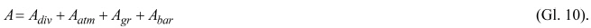

        Dabei bezeichnet:

        *            *   A
                div

            *   A                                    durch geometrische Ausbreitung
                nach Nummer 6.2,

        *            *   A
                atm

            *   A                                    durch Luftabsorption nach Nummer
                6\.3,

        *            *   A
                gr

            *   A                                    durch Bodeneinfluss nach Nummer
                6\.4,

        *            *   A
                bar

            *   A                                    durch Abschirmung durch
                Hindernisse nach Nummer 6.5.

        Schalldruckpegelerhöhungen durch Reflexionen sind nach Nummer 6.6 zu
        ermitteln, das Raumwinkelmaß
        D
        Ω                          infolge von Reflexionen, die am Boden nahe
        der Quelle entstehen, nach Nummer 3.5.

        Unberücksichtigt bleiben nach dieser Anlage

        –   Pegelminderung durch Bewuchs und

        –   Schallausbreitung mit Reflexionen höher als der 3. Ordnung.

        Anmerkung 1: Die Berechnungsverfahren beschreiben die
        ausbreitungsgünstigen Witterungsbedingungen, wie sie bei leichtem
        Mitwind oder/und leichter Bodeninversion auftreten, beispielsweise in
        klaren, windstillen Nächten.

        Anmerkung 2: Indizes
        k
        S                          für den Abschnitt einer Linienschallquelle
        oder
        k
        F                          für den einer Flächenschallquelle sind in
        den Gleichungen der Nummer 6 nicht mitgeführt.

    **6.2** **Geometrische Ausbreitung**

        Die Dämpfung der geometrischen Ausbreitung wird für die kugelförmige
        Schallausbreitung von einer ungerichtet abstrahlenden
        Punktschallquelle im Freifeld nach folgender Gleichung (Gl. 11)
        berechnet:

        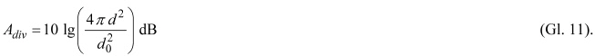

        Dabei bezeichnet:

        *            *   d

            *   Laufweglänge zwischen Punktschallquelle und Immissionsort, in m,

        *            *   d
                0                                    = 1 m

            *   Bezugslänge.

    **6.3** **Luftabsorption**

        Die Dämpfung durch Luftabsorption während der Schallausbreitung wird
        nach folgender Gleichung (Gl. 12) berechnet:

        

        Dabei bezeichnet:

        *            *   α

            *   Absorptionskoeffizient der Luft, in dB je 1 000 m für jedes Oktavband
                bei der Bandmittenfrequenz.

        Als Standardwerte sind die Absorptionskoeffizienten nach Tabelle 17
        anzusetzen.

        **Tabelle 17: Absorptionskoeffizienten der Luft für Oktavbänder**

        *            *   Spalte

            *   A

            *   B

        *            *   Zeile

            *   Bezeichnung

            *   Oktavband-Mittenfrequenz ƒ, in Hz

        *            *   1

            *
            *   63

            *   125

            *   250

            *   500

            *   1 000

            *   2 000

            *   4 000

            *   8 000

        *            *   2

            *   Absorptionskoeffizient α in dB je 1 000 m

            *   0,1

            *   0,4

            *   1,0

            *   1,9

            *   3,7

            *   9,7

            *   32,8

            *   117

        Anmerkung zu Tabelle 17:

        Die in dieser Anlage zu verwendenden Absorptionskoeffizienten
        entsprechen den Angaben von DIN ISO 9613-2, Akustik – Dämpfung des
        Schalls bei der Ausbreitung im Freien, Teil 2: Allgemeines
        Berechnungsverfahren, Ausgabe Oktober 1999, für eine Temperatur von 10
        °C und eine relative Luftfeuchte von 70 Prozent.

    **6.4** **Bodeneinfluss**

        Die Dämpfung durch Bodeneinfluss errechnet sich nach dieser Anlage
        frequenzunabhängig nach folgender Gleichung (Gl. 13):

        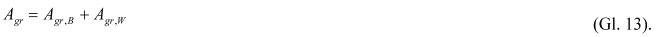

        Dabei bezeichnet:

        *            *   A
                gr,B

            *   Dämpfungsmaß durch Bodenabsorption über Boden nach (Gl. 14),

        *            *   A
                gr,W

            *   Dämpfungsmaß durch Reflexion über Wasser nach (Gl. 16),

        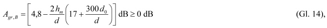

        Dabei bezeichnet:

        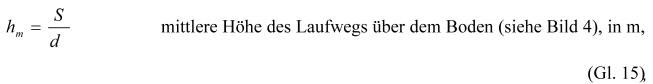

        *            *   d

            *   Abstand zwischen Schallquellenmitte und Immissionsort, in m,

        *            *   S

            *   Fläche zwischen Laufweg und Boden, in m².

        Anmerkung: Die Schreibweise der Gleichung (Gl. 14) soll angeben, dass
        nach dem mittleren Teil der Formel negativ berechnete Werte durch 0 dB
        ersetzt werden.

        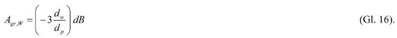

        Dabei bezeichnet:

        *            *   d
                W

            *   Abschnitt der horizontalen Entfernung zwischen Schallquellenmitte und
                Immissionsort über Wasserflächen, in m.

        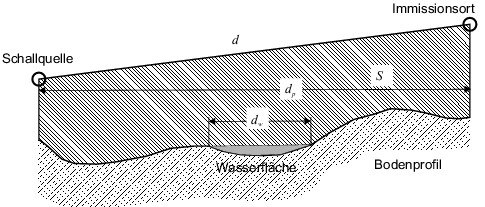

        Bild 4: Verfahren zur Bestimmung der mittleren Höhe h
        m                          = S/d

    **6.5** **Abschirmung durch Hindernisse**

        Ein Objekt auf dem Ausbreitungsweg zwischen Punktschallquelle und
        Immissionsort ist als Hindernis zu berücksichtigen, wenn es die
        folgenden Anforderungen erfüllt:

        –   In der Projektion auf den Grundriss durchquert der Schallstrahl eine
            oder mehrere Beugungskanten des Hindernisses (siehe Bild 5),

        –   die flächenbezogene Masse des Hindernisses beträgt mindestens 10 kg/m
            2                               ,

        –   das Hindernis hat eine akustisch geschlossene Oberfläche und

        –   die Horizontalabmessung
            l
            h                                des Hindernisses senkrecht zur
            Verbindungslinie zwischen Quelle und Empfänger ist größer als die
            Schallwellenlänge*                                bei der Oktavband-
            Mittenfrequenz nach folgender Gleichung (Gl. 17):

        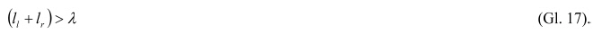

        Dabei bezeichnet:

        *            *                
            *   Schallwellenlänge bei der Oktavband-Mittenfrequenz ƒ
                m                                   , in m,

        *            *   l
                l

            *   senkrechter Abstand zwischen Verbindungslinie Quelle – Empfänger und
                1\. Endpunkt des Hindernisses, in m,

        *            *   l
                r

            *   senkrechter Abstand zwischen Verbindungslinie Quelle – Empfänger und
                2\. Endpunkt des Hindernisses, in m.

        

        Bild 5: Schallweg über ein Hindernis mit zwei wirksamen parallelen
        Kanten

        Eine Schirmkante, über die der Schall hinweg gebeugt wird, ist dann
        als Oberkante zu bezeichnen, wenn sie mit der Horizontalen einen
        Winkel von weniger als 45° bildet. Anderenfalls wird sie als
        Seitenkante bezeichnet, um die herum eine seitliche Beugung auftritt.
        Eine Oberkante wird als Folge von Geradenstücken modelliert, eine
        Seitenkante als eine Gerade. Bahnsteige, Bahnsteigdächer sowie
        stehende oder bewegte Reise- bzw. Güterzüge, einzelne Reise- oder
        Güterzugwagen, Straßenbahnen, abgestellte und aufgestapelte Container
        sowie andere bewegliche Hindernisse gelten nicht als Hindernisse im
        Ausbreitungsweg. Für niedrige Schallschutzwände 1,0 m*
        h
        LSW*                          0,5 m mit einem Abstand von
        d
        s*                          2 m zur nächstgelegenen Gleisachse ist die
        Höhe
        h
        LSW                          über der Schienenoberkante für die
        Schallausbreitungsberechnung um 30 Prozent zu reduzieren.
        Bahnsteigkanten sind nicht als Hindernisse zu betrachten.

        Die Dämpfung des Schalls durch seitliche Beugung um ein Hindernis
        herum wird nach folgender Gleichung (Gl. 18) berechnet:

        

        Dabei bezeichnet:

        *            *   D
                z

            *   Abschirmmaß nach Gleichung (Gl. 21), in dB.

        Bei der Beugung über ein Hindernis wird die Dämpfung durch Abschirmung
        nach folgender Gleichung (Gl. 19) berechnet:

        

        Dabei bezeichnet:

        *            *                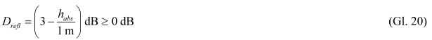

        *            *
            *   Pegelkorrektur für reflektierende Schallschutzwände im Abstand
                d
                s*                                    5 m mit absorbierendem Sockel
                der Höhe
                h
                abs                                    über der Schienenoberkante, in
                dB,

        *            *   A
                gr

            *   Bodeneinfluss nach der Gleichung (Gl. 13), in dB.

        Anmerkung 1: Infolge von Gleichung (Gl. 19) beinhaltet die Gleichung
        (Gl. 10) anstelle der getrennten Ausweisung von
        A
        bar                          und
        A
        gr                          zusammenfassend das Abschirmmaß
        D
        z                          – ggf. mit einer Pegeldifferenz für
        reflektierende Aufsätze nach der Gleichung (Gl. 20) – zur Beschreibung
        der Schirmwirkung.

        Anmerkung 2: Die Ausbreitung des Schalls ist für die Ausbreitungswege
        w                          über die Oberkante und die Seitenkanten des
        Hindernisses zu berechnen.

        Anmerkung 3:
        D
        re
        ƒ
        l                          berücksichtigt die Mehrfachreflexion
        zwischen reflektierender Schallschutzwand und Wagenaufbau. Zusätzlich
        sind Reflexionen an der Schallschutzwand nach Nummer 6.6 zu
        berücksichtigen.

        Anmerkung 4: Die Schreibweise der Gleichungen (Gl. 18), (Gl. 19) und
        (Gl. 20) soll angeben, dass nach dem mittleren Teil der Formel negativ
        berechnete Werte durch 0 dB ersetzt werden.

        Anmerkung 5: Bei Abständen*                          5 m zwischen
        Schallquelle und reflektierender Schallschutzwand kann
        D
        re
        ƒ
        l                          vernachlässigt werden.

        Das Abschirmmaß
        D
        z                          ist nach folgender Gleichung (Gl. 21) zu
        berechnen:

        

        Dabei bezeichnet:

        *            *   C
                2                                    = 40

            *   Abschirmfaktor für Bahnstrecken mit Schallquellenarten nach den
                Tabellen 5 und 13,

        *            *   C
                2                                    = 20

            *   Abschirmfaktor für flächenhafte Bahnanlagen mit Schallquellenarten
                nach Tabelle 10,

        *            *   C
                3                                    = 1

            *   Abschirmfaktor für Einfachbeugung,

        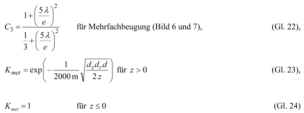

        Korrekturfaktor für meteorologische Einflüsse.

        Bei parallelen Beugungskanten gilt:

        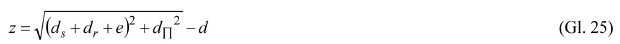

        *            *   Schirmwert als Differenz zwischen den Laufweglängen des gebeugten und
                des direkten Schalls. Wenn eine Sichtverbindung zwischen Schallquelle
                und Immissionsort besteht, wird
                z                                    mit negativem Vorzeichen
                versehen.

        *            *   d
                s

            *   Abstand von der Punktschallquelle zur (ersten) Beugungskante, in m,

        *            *   d
                r

            *   Abstand von der (letzten) Beugungskante zum Immissionsort, in m,

        *            *   e

            *   Laufweglänge zwischen erster und letzter Schirmkante, in m,

        *            *   d
                П

            *   Abstand zwischen Punktschallquelle und Immissionsort, gemessen
                parallel zur Beugungskante (siehe Bild 5), in m,

        *            *   d

            *   Laufweglänge zwischen Quelle und Immissionsort, in m.

        

        Bild 6: Beispiel für einen Schallweg über mehr als zwei maßgebliche
        *parallele*                          Beugungskanten; zu
        vernachlässigende Kanten sind durch x markiert

        Die Auswahl der maßgeblichen Beugungskanten erfolgt nach der
        sogenannten Gummibandmethode. Kanten, die von einem Gummiband, das von
        der Punktschallquelle zum Immissionsort gespannt wird, nicht berührt
        werden, bleiben für die Mehrfachbeugung unberücksichtigt.

        Bei nicht parallelen Beugungskanten, d. h. wenn mindestens eine
        Beugungskante nicht parallel zu den übrigen am Gummiband beteiligten
        Beugungskanten ist, gilt:

        
        
        Bild 7: Beispiel für einen Schallweg über mehr als zwei maßgebliche
        nicht
        parallele Beugungskanten; zu vernachlässigende Kanten sind durch x
        markiert

        Mehrfachbeugung wird nur berücksichtigt, wenn der Weg des gebeugten
        Schalls, wie in Bild 6 beispielhaft dargestellt, über mehrere Kanten
        führt.

        Bei der Festlegung von Schallminderungsmaßnahmen sind die akustischen
        Eigenschaften zur Schalldämmung und Schallabsorption nach dem Stand
        der Technik zu beachten.

        Das Abschirmmaß
        D
        z                          in einem beliebigen Oktavband sollte bei
        Einfachbeugung (d. h. bei dünnen Schallschirmen) nicht größer als 20
        dB und bei Doppelbeugung (d. h. bei dicken Schallschirmen) nicht
        größer als 25 dB angenommen werden.

    **6.6** **Pegelerhöhung durch Reflexionen**

        Bei reflektierenden oder teilweise reflektierenden Schallschutzwänden
        (z. B. bei Glasaufsätzen) sind die reflektierenden oder absorbierenden
        Eigenschaften der Schallschutzwände in der Berechnung durch
        Spiegelquellen oder Spiegelempfänger zu berücksichtigen. Zusätzlich
        werden die Reflexionen zwischen reflektierender Schallschutzwand und
        Wagenaufbauten durch Verminderung der Abschirmwirkung nach der
        Gleichung (Gl. 20) berücksichtigt.

        Reflexionen werden nach dieser Anlage durch inkohärente Spiegelquellen
        berücksichtigt. Am Boden in Quellnähe werden sie nach der Gleichung
        (Gl. 9) über ein Raumwinkelmaß mit der Stärke der Originalquelle
        verbunden. Reflexionen an Gebäuden und Schallschirmen sind für alle
        Oktavbänder nur dann zu berechnen, wenn jede der nachfolgend genannten
        Anforderungen erfüllt ist:

        –   Eine geometrische/spiegelnde Reflexion ist, wie in Bild 8 schematisch
            dargestellt, konstruierbar.

        –   Der Schallreflexionsgrad der Hindernisoberfläche ist größer als ρ =
            0,2.

        –   Die kleinste Abmessung des Reflektors genügt der folgenden Gleichung
            (Gl. 27):

        

        Dabei bezeichnet:

        *            *   l
                min

            *   kleinste Abmessung des Reflektors, in m,

        *            *   β

            *   Winkel zwischen der Verbindungslinie Quelle zu Immissionsort und der
                Reflektornormalen,

        *            *                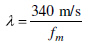
            *   Schallwellenlänge bei der Oktavband-Mittenfrequenz ƒ
                m                                   , in m,

        *            *   d
                so

            *   Laufweg des Schalls von der Punktschallquelle Q zum Reflektor R, in m,

        *            *   d
                or

            *   Laufweg des Schalls vom Reflektor R zum Immissionsort IO, in m.

        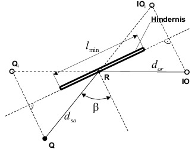

        Bild 8: Spiegelreflexion an einem Hindernis

        Der A-bewertete Schallleistungspegel der Spiegelschallquelle
        L
        WA,im                          ist nach folgender Gleichung (Gl. 28)
        zu berechnen:

        

        Dabei bezeichnet:

        *            *   L
                WA

            *   A-bewerteter Schallleistungspegel nach den Gleichungen (Gl. 7) und
                (Gl. 8), in dB,

        *            *   D
                ρ

            *   Absorptionsverlust für Reflexionen an der Wandoberfläche nach Tabelle
                18, in dB,

        *            *   D
                Ir

            *   Richtwirkungsmaß der Punktschallquelle in der Richtung des
                Spiegelschallempfängers (siehe Gleichung (Gl. 8)), in dB.

        Die Frequenzabhängigkeit von Absorptionsverlust und Richtwirkungsmaß
        bleibt in dieser Anlage unberücksichtigt.

        **Tabelle 18: Absorptionsverlust an Wänden**

        *            *   Spalte

            *   A

            *   B

        *            *   Zeile

            *   Wandoberfläche

            *   Absorptionsverlust
                D
                ρ                                    in dB

        *            *   1

            *   Ebene und harte Wände

            *   0

        *            *   2

            *   Gebäudewände mit Fenstern und kleinen Anbauten

            *   1

        *            *   3

            *   Absorbierende Schallschutzwände

            *   4

        *            *   4

            *   Hoch absorbierende Schallschutzwände

            *   8

        Anmerkung zu Zeile 1: z. B. gekachelte Stützwände, glatte
        Betonoberflächen.

        Direkte und reflektierte Beiträge werden getrennt ermittelt. Für
        Spiegelquellen sind die Dämpfungsterme nach der Gleichung (Gl. 10)
        sowie
        D
        ρ                          und
        D
        Ir                          nach der Gleichung (Gl. 28) entsprechend
        dem Ausbreitungsweg des reflektierten Schalls zu bestimmen. Es sind
        Reflexionen bis einschließlich der 3. Ordnung zu berechnen.

7.  **Berechnung der Schallimmission**

    Die Schallimmission an einem Immissionsort wird als äquivalenter
    Dauerschalldruckpegel
    L
    pAeq                    für den Zeitraum einer vollen Stunde
    errechnet: Er wird gebildet durch energetische Addition der Beiträge
    von

    –   allen Teilschallquellen in Oktavbändern mit Mittenfrequenzen von 63 Hz
        bis 8 000 Hz,

    –   allen Höhenbereichen
        h                         ,

    –   allen Teilstücken
        k
        S                         ,

    –   allen Teilflächen
        k
        F                          und

    –   allen Ausbreitungswegen
        w                         .

    An Strecken der Eisenbahn und Straßenbahn sind Summationen der
    Schalldruckpegel nach folgender Gleichung (Gl. 29) durchzuführen:

    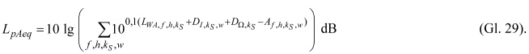

    Dabei bezeichnet:

    *        *   ƒ

        *   Zähler für Oktavband,

    *        *   h

        *   Zähler für Höhenbereich,

    *        *   k
            S

        *   Zähler für Teilstück oder einen Abschnitt davon,

    *        *   w

        *   Zähler für unterschiedliche Ausbreitungswege,

    *        *   L
            WA,f,h,kS

        *   A-bewerteter Schallleistungspegel der Punktschallquelle in der Mitte
            des Teilstücks
            k
            S                             , der die Emission aus dem Höhenbereich
            h                              angibt nach der Gleichung (Gl. 6), in
            dB,

    *        *   D
            I,kS
            ,w

        *   Richtwirkungsmaß für den Ausbreitungsweg
            w                              nach der Gleichung (Gl. 8), in dB,

    *        *   D
            Ω
            kS

        *   Raumwinkelmaß nach der Gleichung (Gl. 9), in dB,

    *        *   A
            f,h,kS
            ,w

        *   Ausbreitungsdämpfungsmaß im Oktavband ƒ im Höhenbereich
            h                              vom Teilstück
            k
            S                              längs des Weges
            w                              nach der Gleichung (Gl. 10), in dB.

    An Rangier- und Umschlagbahnhöfen sind Summationen der Energie unter
    Berücksichtigung der Gleichungen (Gl. 3), (Gl. 4) und (Gl. 7)
    vorzunehmen:

    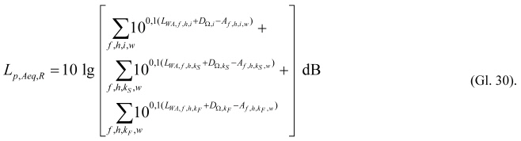

    Dabei bezeichnet:

    *        *   R

        *   Index für Rangierbahnhof,

    *        *   ƒ

        *   Zähler für Oktavband,

    *        *   h

        *   Zähler für Höhenbereich,

    *        *   i

        *   Zähler für Punktschallquellen,

    *        *   k
            S

        *   Zähler für Teilstück,

    *        *   k
            F

        *   Zähler für Teilfläche,

    *        *   w

        *   Zähler für Ausbreitungsweg,

    *        *   L
            WA,
            ƒ
            ,h,i

        *   A-bewerteter Schallleistungspegel der Punktschallquelle
            i                              nach der Gleichung (Gl. 3), in dB,

    *        *   L
            WA,f,h,kS

        *   A-bewerteter Schallleistungspegel des Teilstücks
            k
            S                              nach der Gleichung (Gl. 6), in dB,

    *        *   L
            WA,f,h,kF

        *   A-bewerteter Schallleistungspegel der Teilfläche
            k
            F                              nach der Gleichung (Gl. 7), in dB,

    *        *   D
            Ω

        *   Raumwinkelmaß nach der Gleichung (Gl. 9), in dB,

    *        *   A
            ƒ
            ,w

        *   Ausbreitungsdämpfungsmaß im Oktavband ƒ längs des Weges
            w                              nach der Gleichung (Gl. 10), in dB.

8.  Beurteilungspegel ****

    **8.1** **Äquivalenter Dauerschalldruckpegel in Beurteilungszeiträumen**

        Liegen die Verkehrsmengen als Gesamtangaben über die gemäß § 4 Absatz
        1 Satz 2 maßgeblichen Beurteilungszeiträume Tag (16 Stunden) bzw.
        Nacht (8 Stunden) vor, sind diese Verkehrsmengen auf mittlere
        Verkehrsmengen je Stunde für diese Zeiträume umzurechnen. Die
        äquivalenten Dauerschalldruckpegel werden daraus nach der Gleichung
        (Gl. 29) und der Gleichung (Gl. 30) berechnet und für Strecken der
        Eisenbahn und Straßenbahn mit
        L
        p,Aeq,Tag                         ,
        L
        p,Aeq,Nacht                          bzw. für Rangier- und
        Umschlagbahnhöfe mit
        L
        p,Aeq,Tag,R                         ,
        L
        p,Aeq,Nacht,R                          bezeichnet.

        Liegen die Verkehrsmengen getrennt für jede Stunde in dem
        Beurteilungszeitraum vor, so sind die äquivalenten
        Dauerschalldruckpegel für den Beurteilungszeitraum Tag und für den
        Beurteilungszeitraum Nacht nach den folgenden Gleichungen (Gl. 31) und
        (Gl. 32) zu ermitteln:

        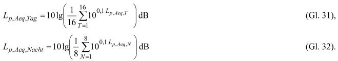

        Dabei bezeichnet:

        *            *   T

            *   Zähler für volle Stunden des Beurteilungszeitraums Tag (6 Uhr bis 22
                Uhr),

        *            *   N

            *   Zähler für volle Stunden des Beurteilungszeitraums Nacht (22 Uhr bis 6
                Uhr).

    **8.2** **Beurteilungspegel für Eisenbahnen**

        8.2.1 Strecken

            An einem Immissionsort, der durch Geräusche von einer Strecke für
            Eisenbahnen mit oder ohne Bahnhöfe, Haltestellen oder Haltepunkte
            betroffen ist, wird der Beurteilungspegel nach § 4 Absatz 1 Satz 2
            getrennt für den Beurteilungszeitraum Tag (6 Uhr bis 22 Uhr) und den
            Beurteilungszeitraum Nacht (22 Uhr bis 6 Uhr) nach folgenden
            Gleichungen (Gl. 33) und (Gl. 34) berechnet:

            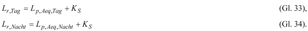

            Dabei bezeichnet:

            *                *   L
                    r,Tag

                *   Beurteilungspegel für den Beurteilungszeitraum Tag (6 Uhr bis 22 Uhr),
                    in dB,

            *                *   L
                    r,Nacht

                *   Beurteilungspegel für den Beurteilungszeitraum Nacht (22 Uhr bis 6
                    Uhr), in dB,

            *                *   L
                    p,Aeq,Tag                                         ,
                    L
                    p,Aeq,Nacht

                *   äquivalenter Dauerschalldruckpegel von Strecken, in dB,

            *                *   K
                    S                                            = –5 dB

                *   Pegelkorrektur Straße – Schiene nach Nummer 2.2.18.

            Pegelkorrekturen für ton-, impuls- oder informationshaltige Geräusche
            sind in der Berechnung der Schallemission enthalten und werden bei der
            Bildung des Beurteilungspegels nicht gesondert angesetzt.

            Zum Vergleich mit den Immissionsgrenzwerten nach § 2 sind die
            Beurteilungspegel
            L
            r,Tag                                und
            L
            r,Nacht                                auf ganze dB aufzurunden. Im
            Fall des § 1 Absatz 2 Nummer 2 ist erst die Differenz des
            Beurteilungspegels aufzurunden.

        8.2.2 Rangier- und Umschlagbahnhöfe

            An einem Immissionsort, der durch Geräusche von einem Rangier- oder
            Umschlagbahnhof sowie von Eisenbahnstrecken betroffen ist, wird der
            Beurteilungspegel gemäß § 4 Absatz 1 Satz 2 getrennt für den
            Beurteilungszeitraum Tag (6 Uhr bis 22 Uhr) und den
            Beurteilungszeitraum Nacht (22 Uhr bis 6 Uhr) nach folgenden
            Gleichungen (Gl. 35) und (Gl. 36) berechnet:

            

            Dabei bezeichnet:

            *                *   L
                    r,Tag

                *   Beurteilungspegel für den Beurteilungszeitraum Tag (6 Uhr bis 22 Uhr),
                    in dB,

            *                *   L
                    r,Nacht

                *   Beurteilungspegel für den Beurteilungszeitraum Nacht (22 Uhr bis 6
                    Uhr), in dB,

            *                *   L
                    p,Aeq,Tag,R                                         ,
                    L
                    p,Aeq,Nacht,R

                *   äquivalenter Dauerschalldruckpegel aus dem Bereich des Rangier- oder
                    Umschlagbahnhofs, in dB,

            *                *   L
                    p,Aeq,Tag                                         ,
                    L
                    p,Aeq,Nacht

                *   äquivalenter Dauerschalldruckpegel aus dem Bereich durchgehender
                    Streckengleise, in dB,

            *                *   K
                    S                                            = –5 dB

                *   Pegelkorrektur Straße – Schiene im Sinne von Nummer 2.2.18 (gilt nicht
                    für ein- und ausfahrende Züge und Rangierfahrten).

            Pegelkorrekturen für ton-, impuls- oder informationshaltige Geräusche
            werden nicht gesondert angesetzt. Solche Korrekturen sind in der
            Schallemission enthalten.

            Zum Vergleich mit den Immissionsgrenzwerten nach § 2 sind die
            Beurteilungspegel
            L
            r,Tag                                und
            L
            r,Nacht                                auf ganze dB aufzurunden. Im
            Fall des § 1 Absatz 2 Nummer 2 ist erst die Differenz des
            Beurteilungspegels aufzurunden.

    **8.3** **Beurteilungspegel für Straßenbahnen**

        An einem Immissionsort, der durch Geräusche von einer Strecke für
        Straßenbahnen betroffen ist, wird der Beurteilungspegel nach § 4
        Absatz 1 Satz 2 getrennt für den Beurteilungszeitraum Tag (6 Uhr bis
        22 Uhr) und den Beurteilungszeitraum Nacht (22 Uhr bis 6 Uhr) nach
        folgenden Gleichungen (Gl. 37) und (Gl. 38) berechnet:

        

        Dabei bezeichnet:

        *            *   L
                r,Tag

            *   Beurteilungspegel für den Beurteilungszeitraum Tag (6 Uhr bis 22 Uhr),
                in dB,

        *            *   L
                r,Nacht

            *   Beurteilungspegel für den Beurteilungszeitraum Nacht (22 Uhr bis 6
                Uhr), in dB,

        *            *   L
                p,Aeq,Tag                                   ,
                L
                p,Aeq,Nacht

            *   äquivalenter Dauerschalldruckpegel von Strecken, in dB,

        *            *   K
                S                                      = –5 dB

            *   Pegelkorrektur zur Berücksichtigung der geringeren Störwirkung des
                Schienenverkehrslärms gegenüber dem Straßenverkehr nach Nummer 2.2.18.

        Pegelkorrekturen für ton-, impuls- oder informationshaltige Geräusche
        sind in der Berechnung der Schallemission enthalten und werden bei der
        Bildung des Beurteilungspegels nicht gesondert angesetzt (siehe Nummer
        4\.9). Die Regelungen nach § 43 Absatz 1 Satz 2 und 3 des Bundes-
        Immissionsschutzgesetzes in der Fassung vom 12. Juli 2013 bleiben
        unberührt.

        Zum Vergleich mit den Immissionsgrenzwerten nach § 2 sind die
        Beurteilungspegel
        L
        r,Tag                          und
        L
        r,Nacht                          auf ganze dB aufzurunden. Im Fall des
        § 1 Absatz 2 Nummer 2 ist erst die Differenz des Beurteilungspegels
        aufzurunden.

9.  Berücksichtigung von abweichender Bahntechnik und von
    schalltechnischen Innovationen ****

    **9.1** **Messtechnische Ermittlung der Emissionsdaten von abweichender
        Bahntechnik und von schalltechnischen Innovationen**

        9.1.1 Fahrzeuge

            Der Nachweis von schalltechnischen Innovationen an Fahrzeugeinheiten
            hat nach folgenden Maßgaben zu erfolgen: Die Schallemissionen solcher
            Fahrzeugeinheiten sind zu ermitteln durch Vorbeifahrtmessungen auf
            einem Schwellengleis und Standmessungen nach DIN EN ISO 3095:2014-7,
            Akustik – Bahnanwendungen – Messung der Geräuschemissionen von
            spurgebundenen Fahrzeugen (ISO 3095:2014-7); Deutsche Fassung EN ISO
            3095:2014-7, unter Berücksichtigung der zusätzlichen Messanforderungen
            der Entscheidung 2008/232/EG der Kommission vom 21. Februar 2008 über
            die technische Spezifikation für die Interoperabilität des Teilsystems
            „Fahrzeuge“ des transeuropäischen Hochgeschwindigkeitsbahnsystems
            (bekannt gemacht unter Aktenzeichen K(2008) 648) (ABl. L 84 vom 26.
            März 2008, S. 132) (TSI) für Eisenbahnen und VDV-Schrift 154 Geräusche
            von Schienenfahrzeugen des Öffentlichen Personen-Nahverkehrs (ÖPNV),
            November 2011 für Straßenbahnen. Die Vorbeifahrtmessungen sollen nach
            mindestens drei Betriebsbremsungen durchgeführt worden sein.

            Anmerkung 1: Es können Ergebnisse von Messungen genutzt werden, die
            aus anderen Gründen ohnehin durchgeführt worden sind, wie z. B. im
            Rahmen der Zulassung neuer interoperabler Fahrzeuge von Eisenbahnen
            nach Entscheidung 2008/232/EG der Kommission oder von Straßenbahnen
            nach VDV-Schrift 154 bzw. im Ausland ermittelte Emissionsdaten.

            Anmerkung 2: In Sonderfällen kann die Anwendung von Richtmikrofonen
            oder einer Array-Messtechnik zur Erfassung von einzelnen Schallquellen
            zweckmäßig sein.

            Anmerkung 3: Schalltechnische Innovationen können geringere oder
            höhere Schallemissionen als die in dieser Anlage geregelte Technik
            hervorrufen. Höhere Schallemissionen können z. B. durch schnellere
            Hochgeschwindigkeitszüge, zugkräftigere Lokomotiven oder auch ältere,
            importierte Eisenbahntechnik oder Straßenbahntechnik auftreten.

            Die Ergebnisse der Vorbeifahrtmessungen sind für die
            Höchstgeschwindigkeit im Regelverkehr rechnerisch aufzuteilen auf
            Beiträge von

            –   Rollgeräuschen,

            –   aerodynamischen Geräuschen (nur für Eisenbahnen),

            –   Aggregatgeräuschen,

            –   Antriebsgeräuschen und

            –   Fahrgeräuschen (nur Straßenbahnen).

            Dazu dienen Angaben von Pegeln der auf eine Länge von 100 km bezogenen
            A-bewerteten Schallleistung in den acht Oktavbändern mit
            Mittenfrequenzen von 63 Hz bis 8 000 Hz. Sofern nicht durch
            Standmessungen und besondere Messungen – z. B. hinter einem
            Schallschirm, mit einem Richtmikrofon oder im Windkanal – bekannt,
            sind die Geräuschemissionsdaten für aerodynamische Geräusche,
            Aggregate- und Antriebsgeräusche für die gemäß Beiblatt 1 oder
            Beiblatt 2 zugeordnete Fahrzeugart in dem jeweiligen Höhenbereich der
            Emission zu übernehmen.

            Anmerkung 4: Ergibt beispielsweise die Vorbeifahrtmessung einer V-Lok
            bei der Geschwindigkeit
            v                                im Abstand
            d                                in der Höhe
            h                                über SO im Oktavband ƒ einen
            A-bewerteten Einzelereignispegel
            L
            EA,
            ƒ                                und die Messung der Abgasgeräusche im
            Stand bei gleicher Motorleistung einen Schallleistungspegel
            L
            WA,aggr                               , so wird – unter
            Berücksichtigung von Emissionswerten der aerodynamischen und
            Antriebsgeräusche sowie von Aggregatgeräuschen, die zusätzlich zum
            Abgasgeräusch nach dem Einzelblatt für V-Loks bei der Geschwindigkeit
            v                                auftreten – das Rollgeräusch auf sehr
            glatten Schienen nach folgender Gleichung ermittelt:

            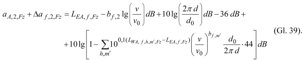

            Dabei bezeichnet:

            *                *   *
                    A,
                    2,
                    Fz

                *   A-bewerteter Summenschallpegel der längenbezogenen Schallleistung bei
                    der Bezugsgeschwindigkeit
                    v
                    0                                          = 100 km/h auf
                    Schwellengleis für das Rollgeräusch aufgrund der Radrauheit
                    (Teilquelle
                    m                                          = 2), in dB,

            *                *   *
                    a
                    ƒ
                    ,2,
                    Fz

                *   Pegeldifferenz der längenbezogenen Schallleistung bei der
                    Bezugsgeschwindigkeit
                    v
                    0                                          = 100 km/h auf
                    Schwellengleis für das Rollgeräusch aufgrund der Radrauheit
                    (Teilquelle
                    m                                          = 2), im Oktavband ƒ, in
                    dB,

            *                *   L
                    EA,
                    ƒ

                *   A-bewerteter Einzelereignispegel je Oktavband, in dB,

            *                *   b
                    ƒ
                    ,2

                *   Geschwindigkeitsfaktor für Rollgeräusche (Teilquelle
                    m                                          = 2) nach Tabelle 6,

            *                *   v

                *   Geschwindigkeit während der Vorbeifahrt, in km/h,

            *                *   v
                    0                                          =
                    100 km/h

                *   Bezugsgeschwindigkeit,

            *                *   L
                    WA,
                    ƒ
                    ,h,m´,Fz

                *   A-bewerteter Oktav-Schallleistungspegel anderer Teilquellen, in dB,

            *                *   b
                    ƒ
                    ,m´

                *   Geschwindigkeitsfaktor für andere Teilquellen nach Tabelle 6,

            *                *   m                                         ´

                *   Zähler für Teilquellen ohne
                    m                                          = 2.

            Der Ausdruck unter dem Summenzeichen darf höchstens den Wert 0,5
            annehmen, um eine Fremdgeräuschkorrektur zuzulassen. Die Zahlenwerte
            36 und 44 gelten als Näherungen für Abstände
            d                                von 5 bis 10 m.

            **Tabelle 19: Abschätzung der schienenrauheitsbedingten Emission
            (Teilquelle**
            m **= 1)**

            *                *   Spalte

                *   A

                *   B

                *   C

            *                *   Zeile

                *   Fahrflächenzustand der Schienen

                *   Energetischer Beitrag zur Gesamt-
                    emission

                *   Pegeldifferenz zur Radrauheit
                    (Teilquelle
                    m                                          = 2)

            *                *   1

                *   Sehr glatt

                *   0 %

                *   –20 dB

            *                *   2

                *   Glatt, Grenzwert nach TSI bzw. VDV 154

                *   20 %

                *   –7 dB

            *                *   3

                *   Glatt, Grenzwert nach DIN EN ISO 3095:2014-7

                *   40 %

                *   –4 dB

            Die Rollgeräusche sind auf radrauheits- und schienenrauheitsbedingte
            Emissionen aufzuspalten. Dazu sind nachfolgende drei Verfahren
            zulässig:

            a)  Die Messungen wurden auf sehr glatten Schienen durchgeführt, deren
                Fahrflächenzustand jedoch nicht gemessen wurde. Dann wird die
                Rollgeräuschemission allein dem Fahrzeug zugeordnet (siehe Zeile 1 von
                Tabelle 19).

            b)  Die Messungen wurden auf glatten Schienen mit nachgewiesenem
                Fahrflächenzustand durchgeführt. Dann wird nach Tabelle 19 eine
                Abschätzung der schienenrauheitsbedingten Emission vorgenommen. Der
                verbleibende Beitrag zur Gesamtemission, wenigstens aber 50 Prozent
                der Energie entsprechend einer Pegeldifferenz zur Radrauheit von –3
                dB, wird dem Fahrzeug zugeordnet. Dies stellt den Regelfall dar.

            c)  In begründeten Ausnahmefällen und für Straßenbahnen dürfen Messungen
                herangezogen werden, die auf Schienen mit unbekanntem
                Fahrflächenzustand durchgeführt wurden. Dann sind energetisch gleiche
                Beiträge von Rad- und Schienenrauheiten anzunehmen.

            Das Verfahren nach Buchstabe c darf nicht für Fahrzeuge mit Grauguss-
            Klotzbremsen angewendet werden.

            Anmerkung 5: Für Fahrzeuge ist allein die radrauheitsbedingte Emission
            von Interesse. Sie kann für Schienen mit gutem Fahrflächenzustand nach
            Verfahren nach Buchstabe a um bis zu 3 dB höher bestimmt werden als
            nach Verfahren nach Buchstabe c, während das Verfahren nach Buchstabe
            b im Mittelfeld liegt. Messungen an Schienen mit schlechterem
            Fahrflächenzustand liefern nach den drei Verfahren in der Regel
            unbeabsichtigt hohe radrauheitsbedingte Emissionswerte. Die
            schienenrauheitsbedingte Emission wird aus den Beiblättern 1 bis 3 für
            die zugeordnete Fahrzeugart übernommen. Für die radrauheitsbedingte
            Emission sind vorzugsweise Messergebnisse nach Verfahren nach
            Buchstabe b zu verwenden.

            Anmerkung 6: Die Messergebnisse können unabhängig von Grenzwerten für
            Emissionsdaten nach der Entscheidung 2008/232/EG der Kommission für
            Eisenbahnen und VDV-Schrift 154 für Straßenbahnen herangezogen werden.
            Allerdings kann für Neufahrzeuge angenommen werden, dass die
            Grenzwerte nicht überschritten werden.

            Die Ergebnisse für die radrauheitsbedingte Emission sind zur
            Umrechnung auf den durchschnittlichen Betriebszustand mit einem
            Zuschlag zu versehen, der nach Tabelle 20 von den Messbedingungen
            abhängt.

            Anmerkung 7: Die Zuschläge wurden aus Erfahrungswerten zur Streuung
            von Messergebnissen in einer Datenbank abgeschätzt.

            **Tabelle 20:** **Zuschläge zur Umrechnung auf den durchschnittlichen
            Betriebszustand in Abhängigkeit von den Messbedingungen**

            *                *   Spalte

                *   A

                *   B

                *   C

                *   D

            *                *   Zeile

                *
                *   1 Messort,
                    Mittelwert über
                    verschiedene Fz,
                    in dB

                *   3 Messorte,
                    Mittelwert über
                    verschiedene Fz,
                    in dB

                *   1 Messort
                    (z. B. TSI, VDV 154),
                    Mittelwert über
                    gleiche Fz,
                    in dB

            *                *   1

                *   Fahrzeuge mit Scheibenbremsen

                *   2

                *   0

                *   3

            *                *   2

                *   Fahrzeuge mit Verbundstoff-Klotzbremsen

                *   2

                *   1

                *   4

            *                *   3

                *   Fahrzeuge mit Grauguss-Klotzbremsen

                *   3

                *   2

                *   5

            Wurden die Messungen nicht auf einem Schwellengleis (im Schotterbett)
            durchgeführt, sondern auf einer anderen Fahrbahn, sind bei der
            Aufteilung der Rollgeräusche die Pegelkorrekturen für Fahrbahnarten
            nach Tabelle 7 bzw. 15 anzuwenden.

        9.1.2 Komponenten von Fahrzeugen

            Die Schallemission einer Fahrzeugkomponente als schalltechnische
            Innovation zu einer bereits geregelten Fahrzeugkategorie ist im
            Vergleich mit der Schallemission von Teilquellen bestehender Fahrzeuge
            (siehe Tabelle 5 und 13 Spalte D Beiblatt 1 und 2) zu erfassen und zu
            beurteilen. Dazu sind vor dem Nachweis vorab Messungen durchzuführen,
            aus denen sich ein maßgeblicher Beitrag der Komponente ableiten lässt.
            Als maßgeblich gilt ein Beitrag, der im Pegel höchstens um 3 dB unter
            dem Messwert für das Gesamtgeräusch liegt. Messungen nach DIN EN ISO
            3095:2014-7 oder Sondermessungen – z. B. hinter einer Abschirmwand
            oder mit einem Richtmikrofon – sind zu beschreiben.

            Anmerkung: Für hoch liegende Quellen wird empfohlen, hinter einer
            Abschirmwand oder mit einem Richtmikrofon gewonnene Messergebnisse
            heranzuziehen.

        9.1.3 Komponenten von Rangier- und Umschlagbahnhöfen

            Die Schallemission einer Komponente als schalltechnische Innovation
            ist im Vergleich mit der Schallemission von bestehenden Teilquellen
            (siehe Tabelle 10 und Beiblatt 3) zu erfassen und zu beurteilen. Dazu
            sind vor dem Nachweis vorab Messungen durchzuführen, aus denen sich
            ein maßgeblicher Beitrag der Komponente ableiten lässt. Als maßgeblich
            gilt ein Beitrag, der im Pegel höchstens um 3 dB unter dem Messwert
            für das Gesamtgeräusch liegt. Die Messungen sind zu beschreiben.

        9.1.4 Fahrbahnen

            Abweichende Bahntechnik und schalltechnische Innovationen an
            Fahrbahnen umfassen zum Beispiel die Steife der Schienenbefestigung
            oder eine bessere Absorptionseigenschaft der Fahrbahn. Sie sind im
            Vergleich mit bekannten Fahrbahnen ähnlicher Bauart nach den Tabellen
            7 und 15 bei Betrieb mit gleichen Fahrzeugen zu erfassen und zu
            beurteilen. Die Emissionen sind durch Vorbeifahrtmessungen nach DIN EN
            ISO 3095:2014-7 unter Bedingungen, bei denen das Rollgeräusch
            überwiegt, zu ermitteln. Durch besondere Prüfung der Rad- und
            Schienenfahrflächen ist sicherzustellen, dass die resultierenden
            Fahrflächenrauheiten im Wellenlängenbereich, der nach Entscheidung
            2008/232/EG der Kommission und VDV-Schrift 154 zu beachten ist, bei
            den Vergleichsmessungen sich in Oktavbändern um nicht mehr als 1 dB
            unterscheiden.

            Vorzugsweise ist für die Vergleichsmessung ein Messfahrzeug
            einzusetzen, dessen Radfahrflächen glatt gegenüber den
            Schienenfahrflächen sind. Dann beschränkt sich die Prüfung auf die
            vergleichbare Rauheit der Schienenfahrflächen von konventionellen und
            neuartigen Fahrbahnen. Alternativ kann ein Messfahrzeug mit
            unverändert hoher Fahrflächenrauheit der Räder eingesetzt werden. Dann
            ist nur die Einhaltung eines zulässigen Grenzwerts für die
            Fahrflächenrauheit der Schienen zu prüfen, um sicherzustellen, dass
            bei Vergleichsmessungen von konventionellen und neuartigen Fahrbahnen
            der Einfluss der Schienenrauheit klein bleibt.

        9.1.5 Brücken

            Neuartige Brücken können sich als schalltechnische Innovationen durch
            besondere Konstruktionen des Brückenüberbaus oder
            Schallminderungsmaßnahmen auszeichnen. Sie sind im Vergleich mit
            bekannten Brücken ähnlicher Bauart nach den Tabellen 9 und 16 bei
            Betrieb mit gleichen Fahrzeugen zu erfassen und zu beurteilen. Die
            Emissionen sind durch Vorbeifahrtmessungen an der Brücke und an der
            anschließenden freien Strecke unter Bedingungen, bei denen das
            Rollgeräusch überwiegt, zu ermitteln. Es ist der unbewertete
            Schalldruckpegel zu ermitteln. Durch besondere Prüfung der Rad- und
            Schienenfahrflächen ist sicherzustellen, dass die resultierenden
            Fahrflächenrauheiten im Wellenlängenbereich, der nach Entscheidung
            2008/232/EG der Kommission und VDV-Schrift 154 zu beachten ist, bei
            den Vergleichsmessungen sich in Oktavbändern um nicht mehr als 1 dB
            unterscheiden.

            Anmerkung: Durch die Auswertung des unbewerteten Schalldruckpegels
            wird die Belästigung aufgrund tieffrequenter Geräuschanteile
            berücksichtigt.

        9.1.6 Schallminderungsmaßnahmen am Gleis und am Rad

            Schallminderungsmaßnahmen am Gleis und am Rad kommen sowohl als
            abweichende Bahntechnik als auch als schalltechnische Innovationen in
            Betracht. Abweichende Bahntechnik können auch Gleispflegemaßnahmen wie
            das besonders überwachte Gleis bei Straßenbahnen sein.

            Die schalltechnischen Innovationen können zu einer Änderung des
            Rollgeräusches führen und sind in ihrer Wirkung mit der
            Schallquellenart Rollgeräusch, Teilquellen Schienenrauheit- oder
            Radrauheit der Tabellen 5 und 13 in Verbindung mit den Beiblättern 1
            und 2 zu vergleichen. Zur Beschreibung dienen:

            –   direkte Rauheitsmessungen mit umsetzbaren Aufnehmern,

            –   indirekte Rauheitsmessungen an Bord eines Messfahrzeugs,

            –   Vorbeifahrtmessungen mit einem Messfahrzeug oder

            –   Schallmessungen während Zugvorbeifahrten.

            Das verwendete Verfahren ist unter Angabe des Zeitraums der Messung
            und der Bestimmung eines Mittelwerts über einen Beurteilungszeitraum
            darzustellen. Zum Nachweis von Veränderungen sind die Messergebnisse
            als Gesamtpegel der A-bewerteten Schallleistung und als
            Pegeldifferenzen in den acht Oktavbändern mit Mittenfrequenzen von 63
            Hz bis 8 000 Hz anzugeben.

        9.1.7 Bahnspezifische Schallschutzmaßnahme im Ausbreitungsweg

            Abschirmeinrichtungen und ähnliche Maßnahmen, deren Wirkung nicht nach
            Nummer 6.5 berechenbar ist, sind als abweichende Bahntechnik in
            Zuordnung zu den bestehenden Regelungen zu beschreiben. Zur
            Nachweisführung von Veränderungen sind Messergebnisse in den acht
            Oktavbändern mit Mittenfrequenzen von 63 Hz bis 8 000 Hz als
            Pegeldifferenzen zum berechneten Abschirmmaß nach Nummer 6.5
            anzugeben.

        9.1.8 Anerkannte Messstelle

            Der Antragsteller hat die Nachweismessungen nach den Nummern 9.1.1 bis
            9\.1.7 durch eine anerkannte Messstelle durchführen zu lassen.
            Anerkannte Messstellen sind die nach § 29b Absatz 2 des Bundes-
            Immissionsschutzgesetzes bekannt gegebenen Stellen.

    **9.2** **Bewertung der Messergebnisse für abweichende Bahntechnik und für
        schalltechnische Innovationen**

        9.2.1 Abweichende Bahntechnik

            Die anerkannte Messstelle hat auf der Grundlage der Messungen nach
            Nummer 9.1 festzustellen, welche schalltechnischen Abweichungen zu
            bekannter und in der Anlage 2 aufgeführter Bahntechnik mit ähnlicher
            Bauart vorliegen. Bei Fahrbahnen nach Nummer 9.1.4 wird das Ergebnis
            als Pegelkorrektur gegenüber der Fahrbahn ähnlicher Bauart in den
            Oktavbändern um 500 Hz, 1 000 Hz und 2 000 Hz angegeben. Die übrigen
            Oktavbänder bleiben unberücksichtigt; für sie wird keine
            Pegelkorrektur angegeben. Bei Schallminderungsmaßnahmen am Gleis oder
            am Rad nach Nummer 9.1.6 sind zum Nachweis von Veränderungen die
            Messergebnisse als Gesamtpegel der A-bewerteten Schallleistung und als
            Pegeldifferenzen in den acht Oktavbändern mit Mittenfrequenzen von 63
            Hz bis 8 000 Hz anzugeben.

            Kennzeichnend für die abweichende Bahntechnik sind Pegeldifferenzen
            zur Emission von vergleichbaren, in den Beiblättern 1 bis 3
            beschriebenen Teilquellen. Bei bahnspezifischen Schallschutzmaßnahmen
            im Ausbreitungsweg nach Nummer 9.1.7 sind zum Nachweis von
            Veränderungen Messergebnisse in den acht Oktavbändern mit
            Mittenfrequenzen von 63 Hz bis 8 000 Hz als Pegeldifferenzen zum
            berechneten Abschirmmaß nach Nummer 6.5 anzugeben.

        9.2.2 Schalltechnische Innovationen

            Die anerkannte Messstelle hat auf der Grundlage der Messungen nach
            Nummer 9.1 festzustellen, ob der Antragsgegenstand von den
            schalltechnischen Angaben dieser Anlage wesentlich abweicht.

            Eine wesentliche Abweichung liegt bei schalltechnischen Innovationen
            nach den Nummern 9.1.1 bis 9.1.6 vor, wenn für eine Teilquelle nach
            Tabelle 5 bzw. 13 die Abweichung im A-bewerteten Gesamtpegel für
            einzelne Fahrzeugarten nach Tabelle 3 bzw. 12 mindestens 2 dB oder in
            einzelnen Oktavbändern mindestens 4 dB beträgt. Für eine
            Schallschutzmaßnahme im Ausbreitungsweg nach Nummer 9.1.7 liegt in der
            Regel eine wesentliche Abweichung von den Rechenergebnissen nach
            Nummer 6 vor, wenn an einem Immissionsort nach DIN EN ISO 3095:2014-7
            die Abweichung für das Rechenergebnis im A-bewerteten Gesamtpegel
            mindestens 2 dB oder in einzelnen Oktavbändern mindestens 4 dB
            beträgt.

            Die anerkannte Messstelle hat für alle schalltechnischen Innovationen
            die Zuordnung des Antragsgegenstandes zu den bestehenden Beiblättern
            oder Festlegungen in den Nummern 3 bis 6 und die abweichende
            schalltechnische Wirkung zu beschreiben. Die schalltechnische Wirkung
            wird durch den Nachweis auf ganze dB nach mathematischer Rundung
            geführt.

            Bei schalltechnischen Innovationen nach den Nummern 9.1.1, 9.1.2 und
            9\.1.3 sind die Ergebnisse als Gesamtpegel der A-bewerteten
            Schallleistung und als Pegeldifferenzen in acht Oktavbändern mit
            Mittenfrequenzen von 63 Hz bis 8 000 Hz für die Bezugsgeschwindigkeit
            von 100 km/h entsprechend den Beiblättern 1 bis 3 anzugeben.
            Kennzeichnend für schalltechnische Innovationen sind Pegeldifferenzen
            zur Emission von vergleichbaren, in den Beiblättern 1 bis 3
            beschriebenen Teilquellen.

            Bei schalltechnischen Innovationen nach Nummer 9.1.4 ist das Ergebnis
            als Pegelkorrektur gegenüber der Fahrbahn ähnlicher Bauart in den
            Oktavbändern um 500 Hz, 1 000 Hz und 2 000 Hz anzugeben. Die übrigen
            Oktavbänder bleiben unberücksichtigt; für sie wird keine
            Pegelkorrektur angegeben.

            Bei schalltechnischen Innovationen nach Nummer 9.1.5 wird das Ergebnis
            als Pegelkorrektur
            K
            Br                                oder für Schallminderungsmaßnahmen
            als Pegelkorrektur
            K
            LM                                angegeben, die sich aus der
            Differenz der unbewerteten Schalldruckpegel an der Brücke und der
            freien Strecke ergibt.

    **9.3** **Gutachten der anerkannten Messstelle**

        Die vom Antragsteller beauftragte anerkannte Messstelle nach Nummer
        9\.1.8 erstellt über die nach Maßgabe der Nummern 9.1.1 bis 9.1.7
        durchgeführten Messungen ein Gutachten, das die folgenden Angaben und
        Unterlagen enthalten muss:

        a)  die Beschreibung des Messaufbaus,

        b)  die Beschreibung der örtlichen Verhältnisse sowie die Beschreibung des
            Zustands des Gleises und der Schienenoberflächen,

        c)  die Beschreibung der meteorologischen Verhältnisse,

        d)  die Beschreibung des Unterhaltungszustandes, der Laufleistung und der
            Radrauheit des bei der Messung eingesetzten Fahrzeugs,

        e)  die Messprotokolle der durchgeführten Messungen,

        f)  die Angabe der Zahl der durchgeführten Messungen, wenn mehr als die in
            der Begutachtung enthaltenen Messungen durchgeführt wurden,

        g)  die Bewertung der Messergebnisse nach Maßgabe von Nummer 9.2.

10. Zugänglichkeit von technischen Regeln und Normen ****

    1.  Die in der Verordnung genannten DIN-Normen, DIN-EN-Normen und DIN-ISO-
        Normen sind bei der Beuth Verlag GmbH, Berlin, zu beziehen und in der
        Deutschen Nationalbibliothek archivmäßig gesichert niedergelegt.

    2.  Die VDV-Schrift 154 ist zu beziehen beim

        Verband Deutscher Verkehrsunternehmen (VDV)
        Kamekestraße 37–39
        50672 Köln

    und in der Deutschen Nationalbibliothek archivmäßig gesichert
    niedergelegt.

    **Beiblatt 1 Datenblätter Eisenbahnen – Festlegungen**

    
    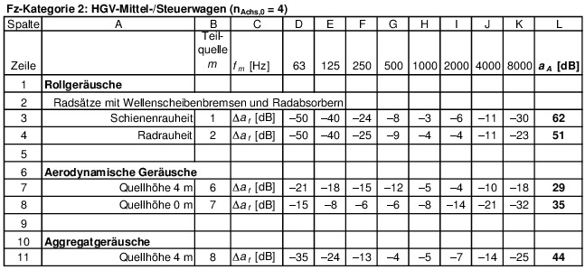
    Für den Thalys-PBKA-Halbzug und Thalys-PBKA-Vollzug ohne Radabsorber:

    *
    A                    der Teilquellen 1 und 2 sind um je 5 dB zu
    erhöhen.

    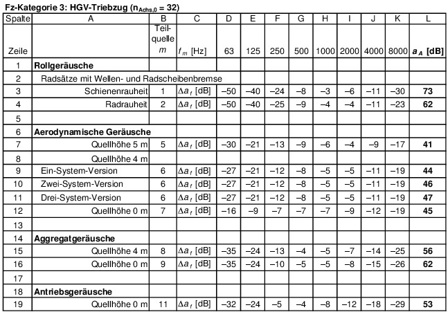
    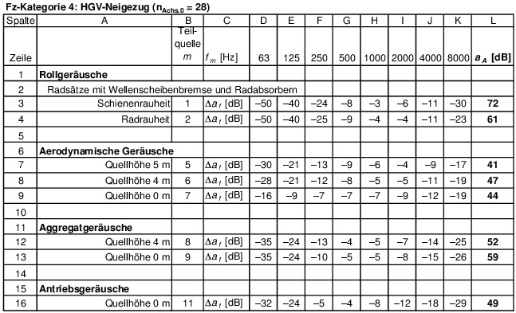

    Für den ETR 470 Cisalpino ohne Radabsorber:

    *
    A                    der Teilquellen 1 und 2 sind um je 5 dB, alle
    weiteren Teilquellen um je 2 dB zu erhöhen.

    
    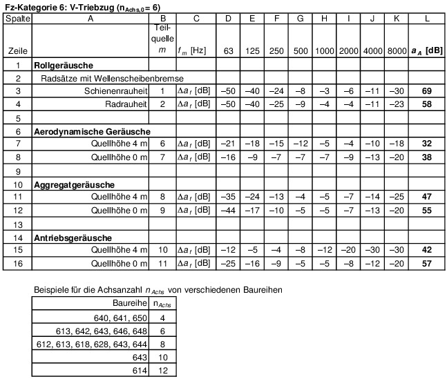
    
    
    
    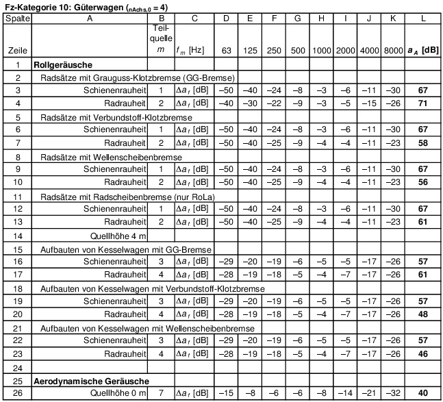
    **Beiblatt 2 Datenblätter Straßenbahnen – Festlegungen**

    
    Für Fahrzeuge mit Klimaanlage:

    *
    A                    der Teilquelle 4 ist um 8 dB zu erhöhen.

    
    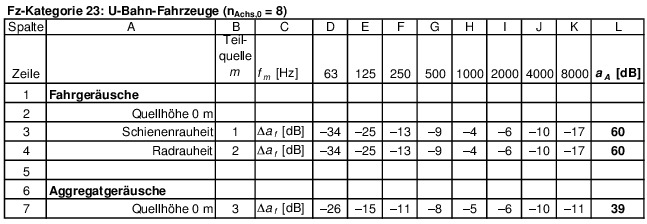
    Die angegebenen Werte gelten für durchschnittliche Fahrzeuge neuerer
    Bauart. Insbesondere bei älteren Fahrzeugen ist eine Überprüfung nach
    Abschnitt 9.1.1 erforderlich.

    **Beiblatt 3 Datenblätter Rangier- und Umschlagbahnhöfe –
    Festlegungen**

    
    
    \* Der angegebene
    L
    WA                    gilt für ein Bremselement mit der Länge von ca.
    1,2 m.

    
    
    \*
    n
    ret                    ist die Anzahl der Retarder pro laufenden Meter
    Gleis.

    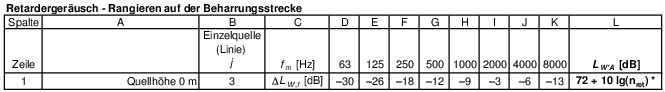
    \*
    n
    ret                    ist die Anzahl der Retarder pro laufenden Meter
    Gleis.

    
    
    \* Die Auflaufgeschwindigkeit darf
    v                    = 1,25 m/s nicht überschreiten.

    
    * Der Wert bezieht sich auf eine Rangiergruppe von 20 Wagen (400 m
    Länge).

