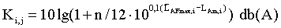
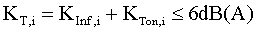
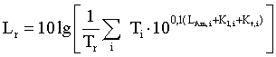
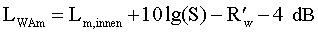
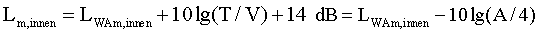
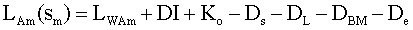
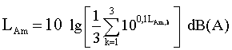
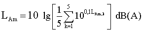

# Achtzehnte Verordnung zur Durchführung des Bundes-Immissionsschutzgesetzes (BImSchV 18)

Ausfertigungsdatum
:   1991-07-18

Fundstelle
:   BGBl I: 1991, 1588 (1790)

Zuletzt geändert durch
:   Art. 1 V v. 1.6.2017 I 1468

Änderung durch
:   Art. 1 V v. 8.10.2021 I 4644 (Nr. 72) textlich nachgewiesen, dokumentarisch noch nicht abschließend bearbeitet

## Eingangsformel

Auf Grund des § 23 Abs. 1 des Bundes-Immissionsschutzgesetzes in der
Fassung der Bekanntmachung vom 14. Mai 1990 (BGBl. I S. 880) verordnet
die Bundesregierung nach Anhörung der beteiligten Kreise:

## § 1 Anwendungsbereich

(1) Diese Verordnung gilt für die Errichtung, die Beschaffenheit und
den Betrieb von Sportanlagen, soweit sie zum Zwecke der Sportausübung
betrieben werden und einer Genehmigung nach § 4 des Bundes-
Immissionsschutzgesetzes nicht bedürfen.

(2) Sportanlagen sind ortsfeste Einrichtungen im Sinne des § 3 Abs. 5
Nr. 1 des Bundes-Immissionsschutzgesetzes, die zur Sportausübung
bestimmt sind.

(3) Zur Sportanlage zählen auch Einrichtungen, die mit der Sportanlage
in einem engen räumlichen und betrieblichen Zusammenhang stehen. Zur
Nutzungsdauer der Sportanlage gehören auch die Zeiten des An- und
Abfahrverkehrs sowie des Zu- und Abgangs.

## § 2 Immissionsrichtwerte

(1) Sportanlagen sind so zu errichten und zu betreiben, daß die in den
Absätzen 2 bis 4 genannten Immissionsrichtwerte unter Einrechnung der
Geräuschimmissionen anderer Sportanlagen nicht überschritten werden.

(2) Die Immissionsrichtwerte betragen für Immissionsorte außerhalb von
Gebäuden

1.  in Gewerbegebieten

    tags außerhalb der Ruhezeiten 65 dB(A),

    tags innerhalb der Ruhezeiten am Morgen
    60 dB(A),                    im Übrigen 65 dB(A),

    nachts 50 dB(A),

1a. in urbanen Gebieten

    tags außerhalb der Ruhezeiten 63 dB(A),

    tags innerhalb der Ruhezeiten am Morgen
    58 dB(A),                    im Übrigen 63 dB(A),

    nachts 45 dB(A),

2.  in Kerngebieten, Dorfgebieten und Mischgebieten

    tags außerhalb der Ruhezeiten 60 dB(A),

    tags innerhalb der Ruhezeiten am Morgen
    55 dB(A),                    im Übrigen 60 dB(A),

    nachts 45 dB(A),

3.  in allgemeinen Wohngebieten und Kleinsiedlungsgebieten

    tags außerhalb der Ruhezeiten 55 dB(A),

    tags innerhalb der Ruhezeiten am Morgen
    50 dB(A),                    im Übrigen 55 dB(A),

    nachts 40 dB(A),

4.  in reinen Wohngebieten

    tags außerhalb der Ruhezeiten 50 dB(A),

    tags innerhalb der Ruhezeiten am Morgen
    45 dB(A),                    im Übrigen 50 dB(A),

    nachts 35 dB(A),

5.  in Kurgebieten, für Krankenhäuser und Pflegeanstalten

    tags außerhalb der Ruhezeiten 45 dB(A),

    tags innerhalb der Ruhezeiten 45 dB(A),

    nachts 35 dB(A).

(3) Werden bei Geräuschübertragung innerhalb von Gebäuden in
Aufenthaltsräumen von Wohnungen, die baulich aber nicht betrieblich
mit der Sportanlage verbunden sind, von der Sportanlage verursachte
Geräuschimmissionen mit einem Beurteilungspegel von mehr als 35 dB(A)
tags oder 25 dB(A) nachts festgestellt, hat der Betreiber der
Sportanlage Maßnahmen zu treffen, welche die Einhaltung der genannten
Immissionsrichtwerte sicherstellen; dies gilt unabhängig von der Lage
der Wohnung in einem der in Absatz 2 genannten Gebiete.

(4) Einzelne kurzzeitige Geräuschspitzen sollen die
Immissionsrichtwerte nach Absatz 2 tags um nicht mehr als 30 dB(A)
sowie nachts um nicht mehr als 20 dB(A) überschreiten; ferner sollen
einzelne kurzzeitige Geräuschspitzen die Immissionsrichtwerte nach
Absatz 3 um nicht mehr als 10 dB(A) überschreiten.

(5) Die Immissionsrichtwerte beziehen sich auf folgende Zeiten:

*    *   1. tags

    *   an Werktagen

    *   6.00 bis 22.00 Uhr,

*    *
    *   an Sonn- und Feiertagen

    *   7.00 bis 22.00 Uhr,

*    *   2. nachts

    *   an Werktagen

    *   0.00 bis 6.00 Uhr,

*    *
    *   und

    *   22.00 bis 24.00 Uhr

*    *
    *   an Sonn- und Feiertagen

    *   0.00 bis 7.00 Uhr,

*    *
    *   und

    *   22.00 bis 24.00 Uhr,

*    *   3. Ruhezeit

    *   an Werktagen

    *   6.00 bis 8.00 Uhr

*    *
    *   und

    *   20.00 bis 22.00 Uhr,

*    *
    *   an Sonn- und Feiertagen

    *   7.00 bis 9.00 Uhr,

*    *
    *
    *   13.00 bis 15.00 Uhr

*    *
    *   und

    *   20.00 bis 22.00 Uhr.

Die Ruhezeit von 13.00 bis 15.00 Uhr an Sonn- und Feiertagen ist nur
zu berücksichtigen, wenn die Nutzungsdauer der Sportanlage oder der
Sportanlagen an Sonn- und Feiertagen in der Zeit von 9.00 bis 20.00
Uhr 4 Stunden oder mehr beträgt.

(6) Die Art der in Absatz 2 bezeichneten Gebiete und Anlagen ergibt
sich aus den Festsetzungen in den Bebauungsplänen. Sonstige in
Bebauungsplänen festgesetzte Flächen für Gebiete und Anlagen sowie
Gebiete und Anlagen, für die keine Festsetzungen bestehen, sind nach
Absatz 2 entsprechend der Schutzbedürftigkeit zu beurteilen. Weicht
die tatsächliche bauliche Nutzung im Einwirkungsbereich der Anlage
erheblich von der im Bebauungsplan festgesetzten baulichen Nutzung ab,
ist von der tatsächlichen baulichen Nutzung unter Berücksichtigung der
vorgesehenen baulichen Entwicklung des Gebietes auszugehen.

(7) Die von der Sportanlage oder den Sportanlagen verursachten
Geräuschimmissionen sind nach dem Anhang zu dieser Verordnung zu
ermitteln und zu beurteilen.

## § 3 Maßnahmen

Zur Erfüllung der Pflichten nach § 2 Abs. 1 hat der Betreiber
insbesondere

1.  an Lautsprecheranlagen und ähnlichen Einrichtungen technische
    Maßnahmen, wie dezentrale Aufstellung von Lautsprechern und Einbau von
    Schallpegelbegrenzern, zu treffen,

2.  technische und bauliche Schallschutzmaßnahmen, wie die Verwendung
    lärmgeminderter oder lärmmindernder Ballfangzäune, Bodenbeläge,
    Schallschutzwände und -wälle, zu treffen,

3.  Vorkehrungen zu treffen, daß Zuschauer keine übermäßig lärmerzeugenden
    Instrumente wie pyrotechnische Gegenstände oder druckgasbetriebene
    Lärmfanfaren verwenden, und

4.  An- und Abfahrtswege und Parkplätze durch Maßnahmen betrieblicher und
    organisatorischer Art so zu gestalten, daß schädliche
    Umwelteinwirkungen durch Geräusche auf ein Mindestmaß beschränkt
    werden.

## § 4 Weitergehende Vorschriften

Weitergehende Vorschriften, vor allem zum Schutz der Sonn- und
Feiertags-, Mittags- und Nachtruhe oder zum Schutz besonders
empfindlicher Gebiete, bleiben unberührt.

## § 5 Nebenbestimmungen und Anordnungen im Einzelfall

(1) Die zuständige Behörde soll von Nebenbestimmungen zu
erforderlichen Zulassungsentscheidungen und Anordnungen zur
Durchführung dieser Verordnung absehen, wenn die von der Sportanlage
ausgehenden Geräusche durch ständig vorherrschende Fremdgeräusche nach
Nummer 1.4 des Anhangs überlagert werden.

(2) Die zuständige Behörde kann zur Erfüllung der Pflichten nach § 2
Abs. 1 außer der Festsetzung von Nebenbestimmungen zu erforderlichen
Zulassungsentscheidungen oder der Anordnung von Maßnahmen nach § 3 für
Sportanlagen Betriebszeiten (ausgenommen für Freibäder von 7.00 Uhr
bis 22.00 Uhr) festsetzen; hierbei sind der Schutz der Nachbarschaft
und der Allgemeinheit sowie die Gewährleistung einer sinnvollen
Sportausübung auf der Anlage gegeneinander abzuwägen.

(3) Die zuständige Behörde soll von einer Festsetzung von
Betriebszeiten absehen, soweit der Betrieb einer Sportanlage dem
Schulsport oder der Durchführung von Sportstudiengängen an Hochschulen
dient. Dient die Anlage auch der allgemeinen Sportausübung, sind bei
der Ermittlung der Geräuschimmissionen die dem Schulsport oder der
Durchführung von Sportstudiengängen an Hochschulen zuzurechnenden
Teilzeiten nach Nummer 1.3.2.3 des Anhangs außer Betracht zu lassen;
die Beurteilungszeit wird um die dem Schulsport oder der Durchführung
von Sportstudiengängen an Hochschulen tatsächlich zuzurechnenden
Teilzeiten verringert. Die Sätze 1 und 2 gelten entsprechend für
Sportanlagen, die der Sportausbildung im Rahmen der Landesverteidigung
dienen.

(4) Bei Sportanlagen, die vor Inkrafttreten dieser Verordnung
baurechtlich genehmigt oder - soweit eine Baugenehmigung nicht
erforderlich war - errichtet waren und danach nicht wesentlich
geändert werden, soll die zuständige Behörde von einer Festsetzung von
Betriebszeiten absehen, wenn die Immissionsrichtwerte an den in § 2
Abs. 2 genannten Immissionsorten jeweils um weniger als 5 dB(A)
überschritten werden; dies gilt nicht an den in § 2 Abs. 2 Nr. 5
genannten Immissionsorten.

(5) Die zuständige Behörde soll von einer Festsetzung von
Betriebszeiten absehen, wenn infolge des Betriebs einer oder mehrerer
Sportanlagen bei seltenen Ereignissen nach Nummer 1.5 des Anhangs
Überschreitungen der Immissionsrichtwerte nach § 2 Abs. 2

1.  die Geräuschimmissionen außerhalb von Gebäuden die
    Immissionsrichtwerte nach § 2 Abs. 2 um nicht mehr als 10 dB(A),
    keinesfalls aber die folgenden Höchstwerte überschreiten:

*    *   tags außerhalb der Ruhezeiten

    *   70 dB(A),

*    *   tags innerhalb der Ruhezeiten

    *   65 dB(A),

*    *   nachts

    *   55 dB(A)

*   und

2.  einzelne kurzzeitige Geräuschspitzen die nach Nummer 1 für seltene
    Ereignisse geltenden Immissionsrichtwerte tags um nicht mehr als 20
    dB(A) und nachts um nicht mehr als 10 dB(A) überschreiten.

(6) In dem in Artikel 3 des Einigungsvertrages genannten Gebiet soll
die zuständige Behörde für die Durchführung angeordneter Maßnahmen
nach § 3 Nr. 1 und 2 eine Frist setzen, die bis zu zehn Jahre betragen
kann.

(7) Im übrigen Geltungsbereich dieser Verordnung soll die zuständige
Behörde bei Sportanlagen, die vor Inkrafttreten der Verordnung
baurechtlich genehmigt oder - soweit eine Baugenehmigung nicht
erforderlich war - errichtet waren, für die Durchführung angeordneter
Maßnahmen nach § 3 Nr. 1 und 2 eine angemessene Frist gewähren.

## § 6 Zulassung von Ausnahmen

Die zuständige Behörde kann für internationale oder nationale
Sportveranstaltungen von herausragender Bedeutung im öffentlichen
Interesse Ausnahmen von den Bestimmungen des § 5 Abs. 5,
einschließlich einer Überschreitung der Anzahl der seltenen Ereignisse
nach Nummer 1.5 des Anhangs, zulassen. Satz 1 gilt entsprechend auch
für Verkehrsgeräusche auf öffentlichen Verkehrsflächen außerhalb der
Sportanlage durch das der Anlage zuzurechnende Verkehrsaufkommen nach
Nummer 1.1 Satz 2 des Anhangs einschließlich der durch den Zu- und
Abgang der Zuschauer verursachten Geräusche.

## § 7 Zugänglichkeit der Norm- und Richtlinienblätter

Die in den Nummern 2.1, 2.3, 3.1 und 3.2 des Anhangs genannten DIN-
Normblätter und VDI-Richtlinien sind bei der Beuth Verlag GmbH,
Berlin, zu beziehen. Die genannten Normen und Richtlinien sind bei dem
Deutschen Patentamt archivmäßig gesichert niedergelegt.

## Schlußformel

Der Bundesrat hat zugestimmt.

## § 8 Inkrafttreten

Diese Verordnung tritt drei Monate nach der Verkündung in Kraft.

## Anhang 1

(Fundstelle des Originaltextes: BGBl. I 1991, 1591 - 1596;
bzgl. der einzelnen Änderungen vgl. Fußnote)

Ermittlungs- und Beurteilungsverfahren

*
    1.  **Allgemeines**

    1.1. Zuzurechnende Geräusche

        Den Sportanlagen sind folgende bei bestimmungsgemäßer Nutzung
        auftretende Geräusche zuzurechnen:

        a)  Geräusche durch technische Einrichtungen und Geräte,

        b)  Geräusche durch die Sporttreibenden,

        c)  Geräusche durch die Zuschauer und sonstigen Nutzer,

        d)  Geräusche, die von Parkplätzen auf dem Anlagengelände ausgehen.

        Verkehrsgeräusche einschließlich der durch den Zu- und Abgang der
        Zuschauer verursachten Geräusche auf öffentlichen Verkehrsflächen
        außerhalb der Sportanlage durch das der Anlage zuzuordnende
        Verkehrsaufkommen sind bei der Beurteilung gesondert von den anderen
        Anlagengeräuschen zu betrachten und nur zu berücksichtigen, sofern sie
        nicht im Zusammenhang mit seltenen Ereignissen (Nummer 1.5) auftreten
        und im Zusammenhang mit der Nutzung der Sportanlage den vorhandenen
        Pegel der Verkehrsgeräusche rechnerisch um mindestens 3 dB(A) erhöhen.
        Hierbei ist das Berechnungs- und Beurteilungsverfahren der
        Verkehrslärmschutzverordnung vom 12. Juni 1990 (BGBl. I S. 1036)
        sinngemäß anzuwenden. Lediglich die Berechnung der durch den Zu- und
        Abgang der Zuschauer verursachten Geräusche erfolgt nach diesem
        Anhang.

    1.2 Maßgeblicher Immissionsort

        Der für die Beurteilung maßgebliche Immissionsort liegt

        a)  bei bebauten Flächen 0,5 m außerhalb, etwa vor der Mitte des
            geöffneten, vom Geräusch am stärksten betroffenen Fensters eines zum
            dauernden Aufenthalt von Menschen bestimmten Raumes einer Wohnung,
            eines Krankenhauses, einer Pflegeanstalt oder einer anderen ähnlich
            schutzbedürftigen Einrichtung;

        b)  bei unbebauten Flächen, die aber mit zum Aufenthalt von Menschen
            bestimmten Gebäuden bebaut werden dürfen, an dem am stärksten
            betroffenen Rand der Fläche, wo nach dem Bau- und Planungsrecht
            Gebäude mit zu schützenden Räumen erstellt werden dürfen;

        c)  bei mit der Anlage baulich aber nicht betrieblich verbundenen
            Wohnungen in dem am stärksten betroffenen, nicht nur dem
            vorübergehenden Aufenthalt dienenden Raum.

        Einzelheiten hierzu sind in Nr. 3.2.2.1 geregelt.

    1.3 Ermittlung der Geräuschimmission

    1.3.1. Beurteilungspegel, einzelne kurzzeitige Geräuschspitzen

        Der Beurteilungspegel
        L
        r                          kennzeichnet die Geräuschimmission während
        der Beurteilungszeit nach Nr. 1.3.2. Er wird gemäß Nr. 1.6 mit den
        Immissionsrichtwerten verglichen.

        Der Beurteilungspegel wird gebildet aus dem für die jeweilige
        Beurteilungszeit ermittelten Mittelungspegel
        L
        Am                          und gegebenenfalls den Zuschlägen
        K
        I                          für Impulshaltigkeit und/oder auffällige
        Pegeländerungen nach Nr. 1.3.3 und
        K
        T                          für Ton- und Informationshaltigkeit nach
        Nr. 1.3.4.

        Für die Beurteilung einzelner kurzzeitiger Geräuschspitzen wird deren
        Maximalpegel
        L
        AFmax                          herangezogen.

        Für die Beurteilung von Geräuschen bei neu zu errichtenden
        Sportanlagen sind die Geräuschimmissionen nach dem in Nr. 2
        beschriebenen Prognoseverfahren, bei bestehenden Sportanlagen in der
        Regel nach Nr. 3 durch Messung zu bestimmen.

    1.3.2 Beurteilungszeiten
        T
        r

1\.3.2.1

*
    *   Werktags

        An Werktagen gilt für Geräuscheinwirkungen

        tags außerhalb der Ruhezeiten (8 bis 20 Uhr) eine Beurteilungszeit von
        12 Stunden,

        tags während der Ruhezeiten (6 bis 8 Uhr und 20 bis 22 Uhr) jeweils
        eine Beurteilungszeit von 2 Stunden,

        nachts (22 bis 6 Uhr) eine Beurteilungszeit von 1 Stunde (ungünstigste
        volle Stunde).

    1.3.2.2 Sonn- und feiertags

        An Sonn- und Feiertagen gilt für Geräuscheinwirkungen

        tags außerhalb der Ruhezeiten (9 bis 13 Uhr und 15 bis 20 Uhr) eine
        Beurteilungszeit von 9 Stunden,

        tags während der Ruhezeiten (7 bis 9 Uhr, 13 bis 15 Uhr und 20 bis 22
        Uhr) jeweils eine Beurteilungszeit von 2 Stunden,

        nachts (0 bis 7 Uhr und 22 bis 24 Uhr) eine Beurteilungszeit von 1
        Stunde (ungünstigste volle Stunde).

        Beträgt die gesamte Nutzungszeit der Sportanlage oder Sportanlagen
        zusammenhängend weniger als 4 Stunden und fallen mehr als 30 Minuten
        der Nutzungszeit in die Zeit von 13 bis 15 Uhr, gilt als
        Beurteilungszeit ein Zeitabschnitt von 4 Stunden, der die volle
        Nutzungszeit umfaßt.

    1.3.2.3 Teilzeiten
        T
        i

        Treten während einer Beurteilungszeit unterschiedliche Emissionen,
        jeweils unter Einschluß der Impulshaltigkeit, auffälliger
        Pegeländerungen, der Ton- und Informationshaltigkeit sowie
        kurzzeitiger Geräuschspitzen, auf, ist zur Ermittlung der
        Geräuschimmission während der gesamten Beurteilungszeit diese in
        geeigneter Weise in Teilzeiten
        T
        i                          aufzuteilen, in denen die Emissionen im
        wesentlichen gleichartig sind. Eine solche Unterteilung ist z.B. bei
        zeitlich abgrenzbarem unterschiedlichem Betrieb der Sportanlage
        erforderlich.

    1.3.3 Zuschlag
        K
        l,i                          für Impulshaltigkeit und/oder auffällige
        Pegeländerungen

        Enthält das zu beurteilende Geräusch während einer Teilzeit
        T
        i                          der Beurteilungszeit nach Nr. 1.3.2 Impulse
        und/oder auffällige Pegeländerungen, wie z.B. Aufprallgeräusche von
        Bällen, Geräusche von Startpistolen, Trillerpfeifen oder Signalgebern,
        ist für diese Teilzeit ein Zuschlag
        K
        l,i                         zum Mittelungspegel
        L
        Am,i                          zu berücksichtigen.

        Bei Geräuschen durch die menschliche Stimme ist, soweit sie nicht
        technisch verstärkt sind, kein Zuschlag
        K
        l,i                          anzuwenden .

        Treten die Impulse und/oder auffälligen Pegeländerungen in der
        Teilzeit
        T
        i                          im Mittel höchstens einmal pro Minute auf,
        sind neben dem Mittelungspegel
        L
        Am,i                          der mittlere Maximalpegel
        L
        AFmax,i                          (energetischer Mittelwert) und die
        mittlere Anzahl n pro Minute der Impulse und/oder auffälligen
        Pegeländerungen zu bestimmen. Der Zuschlag
        K
        l,i                          beträgt dann :

        *            *                
            *   (1)

        Sofern Impulse und/oder auffällige Pegeländerungen in der Teilzeit
        T
        i                          mehr als einmal pro Minute auftreten, ist
        der Wirkpegel
        L
        AFTm,i                          nach dem Taktmaximalverfahren mit
        einer Taktzeit von 5 Sekunden zu bestimmen. Dieser beinhaltet bereits
        den Zuschlag
        K
        l,i                          für Impulshaltigkeit und/oder auffällige
        Pegeländerungen
        ( L
        Am,i                          K
        l,i                          für Impulshaltigkeit und/oder auffällige
        Pegeländerungen
        (L
        Am,i                          + K
        l,i                          = L
        AFTm,i                         ). Bei Anlagen, die Geräuschimmissionen
        mit Impulsen und/oder auffälligen Pegeländerungen in der Teilzeit
        T
        i                          mehr als einmal pro Minute hervorrufen und
        vor Inkrafttreten dieser Verordnung baurechtlich genehmigt oder -
        soweit eine Baugenehmigung nicht erforderlich war - errichtet waren,
        ist für die betreffende Teilzeit ein Abschlag von 3 dB(A) zu
        berücksichtigen.

    1.3.4. Zuschlag
        K
        T,i                          für Ton- und Informationshaltigkeit

        Wegen der erhöhten Belästigung beim Mithören ungewünschter
        Informationen ist je nach Auffälligkeit in den entsprechenden
        Teilzeiten
        T
        i                          ein Informationszuschlag K
        Inf,i                          von 3 dB oder 6 dB zum Mittelungspegel
        L
        Am,i                          zu addieren. K
        Inf,i                          ist in der Regel nur bei
        Lautsprecherdurchsagen oder bei Musikwiedergaben anzuwenden. Ein
        Zuschlag von 6 dB ist zu wählen, wenn Lautsprecherdurchsagen gut
        verständlich oder Musikwiedergaben deutlich hörbar sind.

        Heben sich aus dem Geräusch von Sportanlagen Einzeltöne heraus, ist
        ein Tonzuschlag
        K
        Ton,i                          von 3 dB oder 6 dB zum Mittelungspegel
        L
        Am,i                          für die Teilzeiten hinzuzurechnen, in
        denen die Töne auftreten. Der Zuschlag von 6 dB gilt nur bei
        besonderer Auffälligkeit der Töne. In der Regel kommen tonhaltige
        Geräusche bei Sportanlagen nicht vor.

        Die hier genannten Zuschläge sind so zusammenzufassen, daß der
        Gesamtzuschlag auf maximal 6 dB begrenzt bleibt:

        *            *                
            *   (2).

*
    1.3.5 Bestimmung der Beurteilungspegel

        Die Beurteilungspegel werden für die Beurteilungszeit
        T
        r                          unter Berücksichtigung der Zuschläge
        K
        l,i                          für Impulshaltigkeit und/oder auffällige
        Pegeländerungen und
        K
        T,i                          für Ton- und Informationshaltigkeit nach
        Gleichung (3) ermittelt:

                (3)

        mit

        a)  für den Tag außerhalb der Ruhezeiten

*    *
    *   an Werktagen

    *   T(tief)r = Summe i T(tief)i = 12 h,

*    *
    *   an Sonn- und Feiertagen

    *   T(tief)r = Summe i T(tief)i = 9 h,

*    *   b)

    *   für den Tag innerhalb der Ruhezeiten

*    *
    *
    *   T(tief)r = Summe i T(tief)i = 2 h,

*    *   c)

    *   für die Nacht

    *   T(tief)r = Summe i T(tief)i = 1 h

*    *
    *
    *   BGBl. I 1991, 1593)

*
    *   und
        L
        Am,i                          , K
        l,i                          und K
        T,i                          die Mittelungspegel und Zuschläge für
        Impulshaltigkeit und/oder auffällige Pegeländerungen oder der Abschlag
        nach Nr. 1.3.3 sowie der Zuschlag für Ton- und Informationshaltigkeit
        nach Nr. 1.3.4 während der zugehörigen Teilzeiten
        T
        i                          .

        Im Falle von Nr. 1.3.2.2 Satz 2 beträgt
        T
        r                          = 4 Stunden.

        Zur Bestimmung der Beurteilungszeit
        T
        r                          im Falle von § 5 Abs. 3 sind die
        Beurteilungszeiten nach Buchstaben a, b oder c um die außer Betracht
        zu lassenden Teilzeiten
        T
        i                          nach Nr. 1.3.2.3 (tatsächliche
        Nutzungszeit) zu kürzen.

    1.4 Ständig vorherrschende Fremdgeräusche

        Fremdgeräusche sind Geräusche am Immissionsort, die unabhängig von dem
        Geräusch der zu beurteilenden Anlage oder Anlagen auftreten.

        Sie sind dann als ständig vorherrschend anzusehen, wenn der
        Mittelungspegel des Anlagengeräusches gegebenenfalls zuzüglich der
        Zuschläge für Impulshaltigkeit und/oder auffällige Pegeländerungen in
        mehr als 95% der Nutzungszeit vom Fremdgeräusch übertroffen wird.

    1.5 Seltene Ereignisse

        Überschreitungen der Immissionsrichtwerte gelten als selten, wenn sie
        an höchstens 18 Kalendertagen eines Jahres in einer Beurteilungszeit
        oder mehreren Beurteilungszeiten auftreten. Dies gilt unabhängig von
        der Zahl der einwirkenden Sportanlagen.

    1.6 Vergleich des Beurteilungspegels mit dem Immissionsrichtwert

        Der durch Prognose nach Nr. 2 ermittelte Beurteilungspegel nach Nr.
        1\.3.5 ist direkt mit den Immissionsrichtwerten nach § 2 der Verordnung
        zu vergleichen.

        Wird der Beurteilungspegel durch Messung nach Nr. 3 ermittelt, ist zum
        Vergleich mit den Immissionsrichtwerten nach § 2 der Verordnung der um
        3 dB(A) verminderte Beurteilungspegel nach Nr. 1.3.5 heranzuziehen.

    2.  **Ermittlung der Geräuschimmission durch Prognose**

    2.1. Grundlagen

        Der Mittelungspegel
        L
        Am                          ist in Anlehnung an VDI-Richtlinie 2714
        "Schallausbreitung im Freien" (Januar 1988) und Entwurf VDI-Richtlinie
        2720/1 "Schallschutz durch Abschirmung im Freien" (November 1987) zu
        berechnen.

        Für die Berechnung der Mittelungspegel werden für alle Schallquellen
        die mittleren Schalleistungspegel
        L
        WAm                         , die Einwirkzeiten , die Raumwinkelmaße,
        gegebenenfalls die Richtwirkungsmaße, die Koordinaten der
        Schallquellen und der Immissionsorte, die Lage und Abmessungen von
        Hindernissen und außerdem für schallabstrahlende Außenbauteile von
        Gebäuden die Flächen S und die bewerteten Bauschalldämm-Maße
        R'
        w                          benötigt.

        Als Eingangsdaten für die Berechnung können Meßwerte oder
        Erfahrungswerte, soweit sie auf den Meßvorschriften dieses Anhangs
        beruhen, verwendet werden. Wenn aufgrund besonderer Vorkehrungen eine
        im Vergleich zu den Erfahrungswerten weitergehende dauerhafte
        Lärmminderung nachgewiesen ist, können die der Lärmminderung
        entsprechenden Korrekturwerte bei den Eingangsdaten berücksichtigt
        werden.

        Der Mittelungspegel der Geräusche, die von den der Anlage
        zuzurechnenden Parkflächen ausgehen, ist zu berechnen nach den
        Richtlinien für den Lärmschutz an Straßen - Ausgabe 1990 - RLS-90,
        bekanntgemacht im Verkehrsblatt, Amtsblatt des Bundesministers für
        Verkehr der Bundesrepublik Deutschland (VkBl.) Nr. 7 vom 14. April
        1990 unter lfd. Nr. 79. Bei der Bestimmung der Anzahl der
        Fahrzeugbewegungen je Stellplatz und Stunde ist, sofern keine
        genaueren Zahlen vorliegen, von bei vergleichbaren Anlagen gewonnenen
        Erfahrungswerten auszugehen. Die Richtlinien sind zu beziehen von der
        Forschungsgesellschaft für Straßen- und Verkehrswesen, Alfred-Schütte-
        Allee 10, 5000 Köln 21.

        Der Beurteilungspegel für den Verkehr auf öffentlichen Verkehrsflächen
        ist zu berechnen nach den Richtlinien für den Lärmschutz an Straßen -
        Ausgabe 1990 - RLS-90, bekanntgemacht im Verkehrsblatt, Amtsblatt des
        Bundesministers für Verkehr der Bundesrepublik Deutschland (VkBl.) Nr.
        7 vom 14. April 1990 unter lfd. Nr. 79. Die Richtlinien sind zu
        beziehen von der Forschungsgesellschaft für Straßen- und
        Verkehrswesen, Alfred-Schütte-Allee 10, 5000 Köln 21.

    2.2 Von Teilflächen der Außenhaut eines Gebäudes abgestrahlte
        Schalleistungen

        Wenn sich Schallquellen in einem Gebäude befinden, ist jedes
        Außenhautelement des Gebäudes als eine Schallquelle zu betrachten. Der
        durch ein Außenhautelement ins Freie abgestrahlte Schalleistungspegel
        L
        WAm                          ist aus dem mittleren Innenpegel
        L
        m,innen                          im Raum, den es nach außen
        abschließt, in ca. 1 m Abstand von dem Element, aus seiner Fläche S
        (in
        m
        2                         ) und aus seinem bewerteten Bauschalldämm-
        Maß
        R'
        w                          nach der Gleichung

                (4)

        zu berechnen. Für den mittleren Innenpegel kann von Meß- oder
        Erfahrungswerten ausgegangen werden. Er kann für einen Raum aus dem
        Schalleistungspegel
        L
        WAm,innen                          aller Schallquellen im Raum
        zusammen nach der Gleichung

                (5)

        berechnet werden, worin T die Nachhallzeit (in s) bei mittleren
        Frequenzen, V das Volumen (in
        cbm) und A die äquivalente Absorptionsfläche des Raumes (in
        qm) bei mittleren Frequenzen ist.

        Für Öffnungen ist das bewertete Bauschalldämm-Maß mit Null anzusetzen.

    2.3 Schallausbreitungsrechnung

        Die Rechnung ist für jede Schallquelle entsprechend VDI-Richtlinie
        2714, Abschnitt 3 bis 7, und Entwurf VDI-Richtlinie 2720/1, Abschnitt
        3, durchzuführen. Bei den frequenzabhängigen Einflüssen ist von einer
        Frequenz von 500 Hz auszugehen.

        Werden bei der Schallausbreitungsrechnung Abschirmungen
        berücksichtigt, ist nach Entwurf VDI-Richtlinie 2720/1, Abschnitt 3.1,
        gegebenenfalls eine feinere Zerlegung in Einzelschallquellen als nach
        VDI-Richtlinie 2714, Abschnitte 3.3 und 3.4 erforderlich.

        Reflexionen, die nicht bereits im Raumwinkelmaß enthalten sind, sind
        nach VDI-Richtlinie 2714, Abschnitt 7.1, durch die Annahme von
        Spiegelschallquellen zu berücksichtigen.

        Der Mittelungspegel
        L
        Am                          (S
        m                         ) von einer Schallquelle an einem
        Immissionsort im Abstand
        S
        m                          von ihrem Mittelpunkt ist nach Gleichung
        (6) zu berechnen:

                (6).

        Die Bedeutung der einzelnen Glieder in Gleichung (6) ist Tabelle 1 zu
        entnehmen.

        Die Eigenabschirmung von Gebäuden ist in Anlehnung an VDI-Richtlinie
        2714, Abschnitt 5.1, durch das Richtwirkungsmaß zu berücksichtigen.
        Mit DI ≤ -10 dB für die dem Immissionsort abgewandte Seite darf jedoch
        nur gerechnet werden, wenn sich ihr gegenüber keine reflektierenden
        Flächen (z.B. Wände von Gebäuden) befinden.

        Das Boden- und Meteorologie- Dämpfungsmaß D
        BM                          ist nach VDI-Richtlinie 2714, Abschnitt
        6\.3, Gleichung (7), anzusetzen.

        Die Einfügungsdämpfungsmaße D
        e                          von Abschirmungen sind nach Entwurf VDI-
        Richtlinie 2720/1, Abschnitt 3, zu berechnen. Dabei ist in Gleichung
        (5) dieser Richtlinie
        C(tief)2 = 20 zu setzen. Der Korrekturfaktor für Witterungseinflüsse
        ist für alle Anlagen nach Abschnitt 3.4.3, Gleichung (7a), zu
        berechnen.

## Tabelle 1: Bedeutung der Glieder in Gleichung (6)

*    *   Größe

    *   Bedeutung

    *   Fundstelle

*    *   \*A L(tief)WAm

    *   mittlerer

    *

*    *
    *   Schalleistungspegel

    *

*    *
    *
    *   \*G VDI-Richtlinie 2714 \*/

*    *   DI

    *   Richtwirkungsmaß

    *   Abschnitt 5.1

*    *   K(tief)o

    *   Raumwinkelmaß

    *   Abschnitt 5.2, Gleichung (3) oder Tabelle 2

*    *   D(tief)s

    *   Abstandsmaß

    *   Abschnitt 6.1, Gleichung (4)

*    *   D(tief)L

    *   Luftabsorptionsmaß

    *   Abschnitt 6.2, Gleichung (5) in Verbindung mit Tabelle 3

*    *   D(tief)BM

    *   Boden- und Meteorologiedämpfungsmaß

    *   Abschnitt 6.3,
        Gleichung (7) \*G VDI-Richtlinie 2720/1 \*/

*    *   D(tief)e

    *   Einfügungsdämpfungsmaß von Schallschirmen

    *   Abschnitt 3

*
    2.4 Bestimmung des Mittelungspegels
        L
        Am,i                            sowie der Zuschläge K
        l,i                            und K
        T,i                            in der Teilzeit T
        i

        Zur Bestimmung des Mittelungspegels
        L
        Am,i                          in der Teilzeit T
        i                          sind die nach Gleichung (6) bestimmten
        Mittelungspegel aller einwirkenden Schallquellen energetisch zu
        addieren. Die Zuschläge
        K
        l,i                          für Impulshaltigkeit und/oder auffällige
        Pegeländerungen und K
        T,i                          für Ton- und Informationshaltigkeit sind
        entsprechend Nr. 1.3.3 und Nr. 1.3.4 nach Erfahrungswerten zu
        bestimmen.

    2.5 Berechnung der Pegel kurzzeitiger Geräuschspitzen

        Wenn einzelne kurzzeitige Geräuschspitzen zu erwarten sind, ist die
        Berechnung nach Nr. 2.3 statt mit den mittleren Schalleistungspegeln
        aller Schallquellen mit den maximalen Schalleistungspegeln
        L
        WAmax                          der Schallquellen mit kurzzeitigen
        Geräuschspitzen zu wiederholen.

    3.  **Ermittlung der Geräuschimmission durch Messung**

    3.1 Meßgeräte

        Bei Messungen dürfen Schallpegelmesser der Klasse 1 nach DIN IEC 651,
        Ausgabe Dezember 1981, oder DIN IEC 804, Ausgabe Januar 1987,
        verwendet werden, die zusätzlich die Anforderungen des Entwurfes DIN
        45657, Ausgabe Juli 1989, erfüllen. Schallpegelmesser müssen den
        eichrechtlichen Vorschriften entsprechen.

    3.2 Meßverfahren und Auswertung

    3.2.1 Meßwertarten

        Meßgröße ist der A-bewertete mit der Zeitwertung F ermittelte
        Schalldruckpegel
        L
        AF(t)                          nach DIN IEC 651, Ausgabe Dezember
        1981\. Der Mittelungspegel L
        Am                          wird nach DIN 45641, Ausgabe Juni 1990,
        aus dem zeitlichen Verlauf des Schalldruckpegels oder mit Hilfe von
        Schallpegelmessern nach DIN IEC 804, Ausgabe Januar 1987, gebildet.

        Im Falle von Nr. 1.3.3 sind neben dem Mittelungspegel
        L
        Am                          die Maximalpegel L
        AFmax                          der Impulse und/oder auffälligen
        Pegeländerungen oder aus den im 5-s-Takt ermittelten Taktmaximalpegeln
        L
        AFT,5                          nach DIN 45641, Ausgabe Juni 1990, der
        Wirkpegel L
        AFTm                          zu bestimmen.

        Für die Beurteilung einzelner, kurzzeitiger Geräuschspitzen ist der
        Maximalpegel
        L
        AFmax                          heranzuziehen.

    3.2.2 Ort und Zeit der Messungen

        Es ist an den in Nr. 3.2.2.1 genannten Orten und zu den in Nr. 3.2.2.2
        genannten Zeiten zu messen.

    3.2.2.1 Ort der Messungen

        Der Ort der Messungen ist entsprechend Nr. 1.2 zu wählen. Ergänzend
        gilt:

        a)  Bei bebauten Flächen kann abweichend von den Bestimmungen in Nr. 1.2
            Buchstabe a das Mikrofon an einem geeigneten Ersatzmeßpunkt (z.B. in
            einer Baulücke neben dem betroffenen Gebäude) möglichst in Höhe des am
            stärksten betroffenen Fensters aufgestellt werden, insbesondere wenn
            der Bewohner nicht informiert oder nicht gestört werden soll.

        b)  Bei unbebauten Flächen ist in mindestens 3 m Höhe über dem Erdboden zu
            messen. Besondere Gründe bei der nach Nr. 1.2 erforderlichen Auswahl
            des am stärksten betroffenen Randes der Fläche (z.B. Abschattung durch
            Mauern, Hanglage, geplante hohe Wohngebäude) sind im Meßprotokoll
            anzugeben.

        c)  Sind Messungen in Wohnungen durchzuführen, die mit der zu
            beurteilenden Anlage baulich aber nicht betrieblich verbunden sind,
            ist in den Räumen bei geschlossenen Türen und Fenstern und bei
            üblicher Raumausstattung mindestens 0,4 m von den Begrenzungsflächen
            entfernt zu messen. Die Messung ist an mehreren Stellen im Raum, in
            der Regel an den bevorzugten Aufenthaltsplätzen, durchzuführen, und
            die gemessenen Mittelungspegel sind entsprechend Gleichung (7) in Nr.
            3\.2.2.2 energetisch zu mitteln.

    3.2.2.2 Zeit und Dauer der Messungen

        Zeit und Dauer der Messungen haben sich an den für die zu beurteilende
        Anlage kennzeichnenden Nutzungen unter Berücksichtigung aller nach Nr.
        1\.1 zuzurechnenden Geräusche zu orientieren. Dabei sollen die bei
        bestimmungsgemäßer Nutzung der Anlage auftretenden Emissionen,
        gegebenenfalls getrennt für Teilzeiten
        T
        i                          mit unterschiedlichen Emissionen, erfaßt
        werden.

        Die Meßdauer ist nach der Regelmäßigkeit des Pegelverlaufs zu
        bestimmen. Bei Nutzungszyklen soll sich die Meßdauer für eine Messung
        mindestens über einen typischen Geräuschzyklus erstrecken.

        Treten am Meßort Fremdgeräusche auf, ist grundsätzlich nur dann zu
        messen, wenn erwartet werden kann, daß der Mittelungspegel des
        Fremdgeräusches während der Meßdauer um mindestens 6 dB(A) unter dem
        Mittelungspegels des Anlagengeräusches liegt. Ist das Fremdgeräusch
        unterbrochen und ist in diesen Zeiten das Anlagengeräusch
        pegelbestimmend, ist in den Pausenzeiten zu messen.

        Bei Abständen zwischen Quelle und Immissionsort ab 200 m sind die
        Messungen in der Regel bei Mitwind durchzuführen. Die Mitwindbedingung
        ist erfüllt, wenn der Wind von der Anlage in Richtung Meßort in einem
        Sektor bis zu
        +- 60 Grad C weht und wenn die Windgeschwindigkeit im Bereich
        weitgehend ungestörter Windströmungen (z.B. auf freiem Feld) in ca. 5
        m Höhe etwa zwischen 1 m/s und 3 m/s liegt. Im Verlauf der Messungen
        ist darauf zu achten, daß die am Mikrofon auftretenden Windgeräusche
        die Meßergebnisse nicht beeinflussen.

        Bei außergewöhnlichen Wetterbedingungen sollen keine
        Schallpegelmessungen vorgenommen werden. Außergewöhnliche
        Wetterbedingungen können beispielsweise stärkerer Regen, Schneefall,
        größere Windgeschwindigkeit, gefrorener oder schneebedeckter Boden
        sein.

        In der Regel sind an jedem Meßort drei unabhängige Messungen
        durchzuführen und die Mittelungspegel
        L
        Am,k                          aus diesen Messungen nach Gleichung (7)
        zu mitteln (energetische Mittelung):

                (7).

        Sofern aus vorliegenden Erkenntnissen bekannt ist, daß der
        Schwankungsbereich der Mittelungspegel der zu beurteilenden
        Geräuschimmissionen in der Beurteilungszeit kleiner ist als 3 dB(A),
        genügt eine einmalige Messung. Dies gilt auch, wenn der aus dem
        Meßwert für die Geräuschimmission bestimmte Beurteilungspegel um mehr
        als 6 dB(A) unter oder über dem geltenden Immissionsrichtwert liegt.

        Wenn bei regulärer Nutzung der Anlage innerhalb der Beurteilungszeit
        der Schwankungsbereich der Mittelungspegel
        L
        Am,k                          aus den drei Einzelmessungen größer ist
        als 6 dB(A), ist zu prüfen, ob durch getrennte Erfassung von
        Teilzeiten der Schwankungsbereich auf weniger als 6 dB(A) verringert
        werden kann. In diesem Fall erfolgt die Bestimmung des
        Mittelungspegels für jede einzeln erfaßte Teilzeit nach Gleichung (7)
        aus drei Einzelmessungen. Andernfalls sind an fünf verschiedenen
        Meßterminen die Mittelungspegel
        L
        Am,k                          zu bestimmen und nach Gleichung (8)
        energetisch zu mitteln:

                (8).

        Im Falle von Nr. 1.3.3 Abs. 4 gelten Gleichung (7) und (8) für
        L
        AFTm                          entsprechend.

    3.3 Meßprotokoll

        Die Meßwerte sind in einem Protokoll festzuhalten. Das Protokoll muß
        eine eindeutige Bezeichnung der Meßorte (Lageplan) und die
        erforderlichen Angaben über Nutzungsarten und -dauern, Meßzeit und
        Meßdauer, Wetterlage, Geräuschquellen, Einzeltöne,
        Informationshaltigkeit, Impulshaltigkeit, auffällige Pegeländerungen,
        Fremdgeräusche und verwendete Meßgeräte oder Meßketten sowie
        gegebenenfalls über Maßnahmen zur Sicherstellung einer ausreichenden
        Meßsicherheit bei Verwendung von Meßketten enthalten.

## Anhang 2

Maßnahmen, die in der Regel keine wesentliche Änderung im Sinne von §
5 Absatz 4 darstellen:

–   Flutlichtanlagen,

–   nicht überdachte Stellplätze bis insgesamt 100 m
    2                   ,

–   nicht überdachte Lagerflächen bis 300 m
    2                   ,

–   Einrichtung von Sport- und Spielflächen,

–   Werbeanlagen,

–   Zugänge und Zufahrten,

–   Anlagen zur Nutzung erneuerbarer Energien, insbesondere von
    Solaranlagen in, an und auf Dach- und Außenwandflächen,

–   Änderungen der äußeren Gebäudegestaltung,

–   Nutzungsänderungen durch Solaranlagen an Dach und Wänden,

–   Auswechseln von Belägen auf Sport- und Spielflächen,

–   Instandhaltungsmaßnahmen,

–   Sanierungs- und Modernisierungsmaßnahmen, insbesondere die Umwandlung
    von Tennen- oder Rasenspielflächen in Kunststoffrasenspielflächen,

–   Erneuerung von Ballfangzäunen, Einzäunungen, Barrieren, Kantsteinen,
    Zuschauerplätzen,

–   Erweiterung der Sanitär- und Umkleidebereiche,

–   Neubau von Garagen,

–   Umbau der Spielflächen nach dem Stand der Technik,

–   Umbau von Anlagen zur Erfüllung immissionsschutzrechtlicher und
    anderer öffentlich-rechtlicher Anforderungen,

–   Beregnungsanlagen,

–   Modifizierung der Sportanlage, insbesondere durch den Neubau von
    Spiel- und Klettergeräten, Trimm- und Kräftigungsgeräten,
    Kletterwänden oder Boulebahnen,

–   Rückbau von Teilen der Anlage,

–   Lärmschutzmaßnahmen,

–   Neubau von Vereinsheimen und

–   Neubau oder Austausch von Lautsprecheranlagen.

