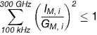

# Sechsundzwanzigste Verordnung zur Durchführung des Bundes-Immissionsschutzgesetzes (BImSchV 26)

Ausfertigungsdatum
:   1996-12-16

Fundstelle
:   BGBl I: 1996, 1966

Neugefasst durch
:   Bek. v. 14.8.2013 I 3266

## § 1 Anwendungsbereich

(1) Diese Verordnung gilt für die Errichtung und den Betrieb von
Hochfrequenzanlagen, Niederfrequenzanlagen und Gleichstromanlagen nach
Absatz 2. Sie enthält Anforderungen zum Schutz der Allgemeinheit und
der Nachbarschaft vor schädlichen Umwelteinwirkungen und zur Vorsorge
gegen schädliche Umwelteinwirkungen durch elektrische, magnetische und
elektromagnetische Felder. Die Verordnung berücksichtigt nicht die
Wirkungen elektrischer, magnetischer und elektromagnetischer Felder
auf elektrisch oder elektronisch betriebene Implantate.

(2) Im Sinne dieser Verordnung sind:

1.  Hochfrequenzanlagen:

    ortsfeste Anlagen, die elektromagnetische Felder im Frequenzbereich
    von 9 Kilohertz bis 300 Gigahertz erzeugen, ausgenommen sind Anlagen,
    die breitbandige elektromagnetische Impulse erzeugen und der
    Landesverteidigung dienen,

2.  Niederfrequenzanlagen:

    ortsfeste Anlagen zur Umspannung und Fortleitung von Elektrizität mit
    einer Nennspannung von
    1 000 Volt                    oder mehr, einschließlich Bahnstromfern-
    und Bahnstromoberleitungen und sonstiger vergleichbarer Anlagen im
    Frequenzbereich von 1 Hertz bis
    9 Kilohertz,

3.  Gleichstromanlagen:

    ortsfeste Anlagen zur Fortleitung, Umspannung und Umrichtung,
    einschließlich der Schaltfelder, von Gleichstrom mit einer
    Nennspannung von 2 000 Volt oder mehr.

## § 2 Hochfrequenzanlagen

(1) Zum Schutz vor schädlichen Umwelteinwirkungen sind
Hochfrequenzanlagen mit einer äquivalenten isotropen
Strahlungsleistung (EIRP) von 10 Watt oder mehr so zu errichten und zu
betreiben, dass in ihrem Einwirkungsbereich an Orten, die zum
dauerhaften oder vorübergehenden Aufenthalt von Menschen bestimmt
sind, bei höchster betrieblicher Anlagenauslastung

1.  die in Anhang 1a und 1b bestimmten Grenzwerte für den jeweiligen
    Frequenzbereich unter Berücksichtigung von Immissionen durch andere
    ortsfeste Hochfrequenzanlagen sowie Niederfrequenzanlagen gemäß Anhang
    2 nicht überschritten werden und

2.  bei gepulsten elektromagnetischen Feldern zusätzlich die in Anhang 3
    festgelegten Kriterien eingehalten werden.

Das Gleiche gilt für eine Hochfrequenzanlage mit einer äquivalenten
isotropen Strahlungsleistung (EIRP) von weniger als 10 Watt, wenn
diese an einem Standort gemäß § 2 Nummer 3 der Verordnung über das
Nachweisverfahren zur Begrenzung elektromagnetischer Felder vom 20.
August 2002 (BGBl. I S. 3366), die zuletzt durch Artikel 3 Absatz 20
des Gesetzes vom 7. Juli 2005 (BGBl. I S. 1970) geändert worden ist,
in der jeweils geltenden Fassung, mit einer äquivalenten isotropen
Strahlungsleistung (EIRP) der dort vorhandenen Hochfrequenzanlagen
(Gesamtstrahlungsleistung) von 10 Watt oder mehr errichtet wird oder
wenn durch diese die Gesamtstrahlungsleistung von 10 Watt erreicht
oder überschritten wird. Satz 2 gilt nicht für Hochfrequenzanlagen,
die eine äquivalente isotrope Strahlungsleistung (EIRP) von 100
Milliwatt oder weniger aufweisen.

(2) Kurzzeitige Überschreitungen der nach Absatz 1 Satz 1 Nummer 1,
auch in Verbindung mit Absatz 1 Satz 2, zu beachtenden Grenzwerte
aufgrund einer vorübergehenden Gefahr für die öffentliche Sicherheit
und Ordnung oder zum Schutz der Sicherheit des Staates bleiben außer
Betracht.

## § 3 Niederfrequenzanlagen

(1) Zum Schutz vor schädlichen Umwelteinwirkungen sind
Niederfrequenzanlagen, die vor dem 22. August 2013 errichtet worden
sind, so zu betreiben, dass sie in ihrem Einwirkungsbereich an Orten,
die zum nicht nur vorübergehenden Aufenthalt von Menschen bestimmt
sind, bei höchster betrieblicher Anlagenauslastung die im Anhang 1a
genannten Grenzwerte nicht überschreiten, wobei Niederfrequenzanlagen
mit einer Frequenz von 50 Hertz die Hälfte des in Anhang 1a genannten
Grenzwertes der magnetischen Flussdichte nicht überschreiten dürfen.
Dabei bleiben, soweit nicht im Einzelfall hinreichende Anhaltspunkte
für insbesondere durch Berührungsspannungen hervorgerufene
Belästigungen bestehen, die nach Art, Ausmaß oder Dauer für die
Nachbarschaft unzumutbar sind, außer Betracht

1.  kurzzeitige Überschreitungen der Grenzwerte nach Satz 1 in Verbindung
    mit Anhang 1a um nicht mehr als 100 Prozent mit einer Dauer von nicht
    mehr als 5 Prozent eines Beurteilungszeitraumes von einem Tag und

2.  kleinräumige Überschreitungen der Grenzwerte der elektrischen
    Feldstärke nach Satz 1 in Verbindung mit Anhang 1a um nicht mehr als
    100 Prozent außerhalb von Gebäuden.

(2) Zum Schutz vor schädlichen Umwelteinwirkungen sind
Niederfrequenzanlagen, die nach dem 22. August 2013 errichtet werden,
so zu errichten und zu betreiben, dass sie bei höchster betrieblicher
Anlagenauslastung in ihrem Einwirkungsbereich an Orten, die zum nicht
nur vorübergehenden Aufenthalt von Menschen bestimmt sind, die im
Anhang 1a genannten Grenzwerte nicht überschreiten, wobei
Niederfrequenzanlagen mit einer Frequenz von 50 Hertz die Hälfte des
in Anhang 1a genannten Grenzwertes der magnetischen Flussdichte nicht
überschreiten dürfen. Bestehende Genehmigungen und
Planfeststellungsbeschlüsse bleiben unberührt.

(3) Bei der Ermittlung der elektrischen Feldstärke und der
magnetischen Flussdichte nach Absatz 1 und Absatz 2 sind alle
Immissionen zu berücksichtigen, die durch andere Niederfrequenzanlagen
sowie durch ortsfeste Hochfrequenzanlagen mit Frequenzen zwischen 9
Kilohertz und 10 Megahertz, die einer Standortbescheinigung nach §§ 4
und 5 der Verordnung über das Nachweisverfahren zur Begrenzung
elektromagnetischer Felder bedürfen, gemäß Anhang 2a entstehen.

(4) Wirkungen wie Funkenentladungen auch zwischen Personen und
leitfähigen Objekten sind zu vermeiden, wenn sie zu erheblichen
Belästigungen oder Schäden führen können.

## § 3a Gleichstromanlagen

Zum Schutz vor schädlichen Umwelteinwirkungen sind Gleichstromanlagen
so zu errichten und zu betreiben, dass in ihrem Einwirkungsbereich an
Orten, die zum dauerhaften oder vorübergehenden Aufenthalt von
Menschen bestimmt sind, bei höchster betrieblicher Anlagenauslastung

1.  der in Anhang 1a genannte Grenzwert der magnetischen Flussdichte nicht
    überschritten wird, sowie

2.  Wirkungen wie Funkenentladungen auch zwischen Personen und leitfähigen
    Objekten, die zu erheblichen Belästigungen oder Schäden führen können,
    vermieden werden.

Dabei sind alle relevanten Immissionen zu berücksichtigen.

## § 4 Anforderungen zur Vorsorge

(1) Zum Zweck der Vorsorge darf eine wesentliche Änderung von
Niederfrequenzanlagen in der Nähe von Wohnungen, Krankenhäusern,
Schulen, Kindergärten, Kinderhorten, Spielplätzen oder ähnlichen
Einrichtungen nur vorgenommen werden, wenn in diesen Gebäuden oder auf
diesen Grundstücken abweichend von § 3 Absatz 1 Satz 2 auch die
maximalen Effektivwerte der elektrischen Feldstärke und magnetischen
Flussdichte den Anforderungen nach § 3 Absatz 1 Satz 1 entsprechen.
Für Niederfrequenzanlagen, die nach dem 16. Dezember 1996 errichtet
oder wesentlich geändert wurden, gelten die Vorsorgeanforderungen aus
der Verordnung über elektromagnetische Felder in der Fassung vom 16.
Dezember 1996 weiter fort.

(2) Bei Errichtung und wesentlicher Änderung von Niederfrequenzanlagen
sowie Gleichstromanlagen sind die Möglichkeiten auszuschöpfen, die von
der jeweiligen Anlage ausgehenden elektrischen, magnetischen und
elektromagnetischen Felder nach dem Stand der Technik unter
Berücksichtigung von Gegebenheiten im Einwirkungsbereich zu
minimieren. Das Nähere regelt eine Verwaltungsvorschrift gemäß § 48
des Bundes-Immissionsschutzgesetz.

(3) Niederfrequenzanlagen zur Fortleitung von Elektrizität mit einer
Frequenz von 50 Hertz und einer Nennspannung von 220 Kilovolt und
mehr, die in einer neuen Trasse errichtet werden, dürfen Gebäude oder
Gebäudeteile nicht überspannen, die zum dauerhaften Aufenthalt von
Menschen bestimmt sind. Bestehende Genehmigungen und
Planfeststellungsbeschlüsse sowie bis zum 22. August 2013 beantragte
Planfeststellungs- und Plangenehmigungsverfahren, für die ein
vollständiger Antrag zu diesem Zeitpunkt vorlag, bleiben unberührt.

## § 5 Ermittlung der Feldstärke- und Flussdichtewerte

Messgeräte, Mess- und Berechnungsverfahren, die bei der Ermittlung der
elektrischen und magnetischen Feldstärke und magnetischen Flussdichte
einschließlich der Berücksichtigung der vorhandenen Immissionen
eingesetzt werden, müssen dem Stand der Mess- und Berechnungstechnik
entsprechen. Soweit anwendbar sind die Mess- und Berechnungsverfahren
der DIN EN 50413 (Ausgabe August 2009) einzusetzen, die bei der VDE-
Verlag GmbH oder der Beuth Verlag GmbH, beide Berlin, zu beziehen und
beim Deutschen Patent- und Markenamt archivmäßig gesichert
niedergelegt ist. Messungen sind an den nach den §§ 2, 3 oder 3a
maßgeblichen Einwirkungsorten mit der jeweils stärksten Exposition
durchzuführen. Sie sind nicht erforderlich, wenn die Einhaltung der
Grenzwerte durch Berechnungsverfahren festgestellt werden kann.

## § 6 Weitergehende Anforderungen

Weitergehende Anforderungen aufgrund anderer Rechtsvorschriften,
insbesondere von Rechtsvorschriften zur elektromagnetischen
Verträglichkeit und des Telekommunikationsrechts, bleiben unberührt.

## § 7 Anzeige

(1) Die zuständige Behörde ist berechtigt, die vom Betreiber einer
ortsfesten Funkanlage, die privaten oder gewerblichen Zwecken dient
oder im Rahmen wirtschaftlicher Unternehmungen Anwendung findet, nach
den §§ 9, 11 und 12 der Verordnung über das Nachweisverfahren zur
Begrenzung elektromagnetischer Felder angezeigten Daten sowie die nach
§ 5 der vorgenannten Verordnung erteilten Standortbescheinigungen,
einschließlich der nach § 4 Absatz 5 der vorgenannten Verordnung
vorgelegten Antragsunterlagen, bei der Bundesnetzagentur für
Elektrizität, Gas, Telekommunikation, Post und Eisenbahnen abzurufen,
soweit dies zur Wahrnehmung ihrer Aufgaben zum Vollzug dieser
Verordnung erforderlich ist. Die Bundesnetzagentur für Elektrizität,
Gas, Telekommunikation, Post und Eisenbahnen stellt der zuständigen
Behörde die Daten nach Satz 1 spätestens eine Woche nach Erhalt
elektronisch zur Verfügung.

(2) Der Betreiber einer Niederfrequenzanlage mit einer Nennspannung
von 110 Kilovolt und mehr oder einer Gleichstromanlage hat diese der
zuständigen Behörde mindestens zwei Wochen vor der Inbetriebnahme oder
einer wesentlichen Änderung anzuzeigen, soweit

1.  die Anlage auf einem Grundstück im Bereich eines Bebauungsplans oder
    innerhalb eines im Zusammenhang bebauten Ortsteils oder auf einem mit
    Wohngebäuden bebauten Grundstück im Außenbereich belegen ist oder
    derartige Grundstücke überquert und

2.  die Anlage oder ihre wesentliche Änderung nicht einer Genehmigung,
    Planfeststellung oder sonstigen behördlichen Entscheidung nach anderen
    Rechtsvorschriften bedarf, bei der die Belange des Immissionsschutzes
    berücksichtigt werden.

Bei Leitungen genügt die Anzeige derjenigen Leitungsabschnitte, für
die die Voraussetzungen nach Satz 1 vorliegen.

(3) Bei Anzeigen nach Absatz 2 soll der Betreiber die für die Anlage
maßgebenden Daten angeben und der Anzeige einen Lageplan beifügen. Der
Betreiber einer Niederfrequenzanlage mit einer Nennspannung von
weniger als 110 Kilovolt hat für diejenigen Leitungsabschnitte, für
die die Voraussetzungen nach Absatz 2 Satz 1 Nummer 1 und 2 vorliegen,
die maßgeblichen Daten sowie einen Lageplan vorzuhalten und der
zuständigen Behörde auf Verlangen unverzüglich vorzulegen.

## § 7a Beteiligung der Kommunen

Die Kommune, in deren Gebiet die Hochfrequenzanlage errichtet werden
soll, wird bei der Auswahl von Standorten für Hochfrequenzanlagen, die
nach dem 22. August 2013 errichtet werden, durch die Betreiber gehört.
Sie erhält rechtzeitig die Möglichkeit zur Stellungnahme und zur
Erörterung der Baumaßnahme. Die Ergebnisse der Beteiligung sind zu
berücksichtigen.

## § 8 Zulassung von Ausnahmen

(1) Die zuständige Behörde kann auf Antrag Ausnahmen von den
Anforderungen der §§ 2, 3 und 3a zulassen, soweit unter
Berücksichtigung der besonderen Umstände des Einzelfalls, insbesondere
Art und Dauer der Anlagenauslastung und des tatsächlichen Aufenthalts
von Personen im Einwirkungsbereich der Anlage, schädliche
Umwelteinwirkungen nicht zu erwarten sind.

(2) Die zuständige Behörde kann Ausnahmen von den Anforderungen des §
4 zulassen, soweit die Anforderungen des § 4 im Einzelfall
unverhältnismäßig sind.

## § 9 Ordnungswidrigkeiten

Ordnungswidrig im Sinne des § 62 Absatz 1 Nr. 7 des Bundes-
Immissionsschutzgesetzes handelt, wer vorsätzlich oder fahrlässig

1.  entgegen § 2 Satz 1 auch in Verbindung mit Satz 2, entgegen § 3 Absatz
    1 Satz 1 oder Absatz 2 Satz 1 oder entgegen § 3a Satz 1 eine dort
    genannte Anlage errichtet oder betreibt,

2.  entgegen § 4 Absatz 1 eine Niederfrequenzanlage wesentlich ändert,

3.  entgegen § 7 Absatz 2 Satz 1 oder entgegen § 10 Absatz 2 eine Anzeige
    nicht, nicht richtig, nicht vollständig oder nicht rechtzeitig
    erstattet.

## § 10 Übergangsvorschriften

(1) Niederfrequenzanlagen mit einer Frequenz von 16,7 Hertz, die vor
dem 22. August 2013 errichtet worden sind, sind bis zum 22. August
2018 so zu betreiben, dass sie in ihrem Einwirkungsbereich an Orten,
die zum nicht nur vorübergehenden Aufenthalt von Menschen bestimmt
sind, bei höchster betrieblicher Anlagenauslastung das Doppelte des im
Anhang 1a genannten Grenzwerts der elektrischen Feldstärke nicht
überschreiten.

(2) Werden Gleichstromanlagen am 22. August 2013 bereits betrieben, so
hat die Anzeige des Betriebs nach § 7 Absatz 2 bis zum 23. September
2013 zu erfolgen. Wurde mit ihrer Errichtung bereits vor dem 22.
August 2013 begonnen, erfolgt der Betrieb aber erst vor dem 23.
September 2013, so hat die Anzeige des Betriebs nach § 7 Absatz 2
innerhalb von vier Wochen nach Inbetriebnahme zu erfolgen.

## Anhang 1 (zu §§ 2, 3, 3a, 10)

(Fundstelle: BGBl I 2013, 3270)

*    *   Frequenz (f)
        in Hertz (Hz)

    *   Grenzwerte

*    *   Elektrische Feldstärke
        in Kilovolt pro Meter (kV/m)
        (effektiv)

    *   Magnetische Flussdichte
        in Mikrotesla (µT)
        (effektiv)

*    *   0

    *   –

    *   500

*    *   1 – 8

    *   5

    *   40 000/f
        2

*    *   8 – 25

    *   5

    *   5 000/f

*    *   25 – 50

    *   5

    *   200

*    *   50 – 400

    *   250/f

    *   200

*    *   400 – 3 000

    *   250/f

    *   80 000/f

*    *   3 000 – 10 000 000

    *   0,083

    *   27

## **Anhang 1b**

*    *   Frequenz (f)
        in Megahertz (MHz)

    *   Grenzwerte, quadratisch gemittelt über 6-Minuten-Intervalle

*    *   Elektrische Feldstärke
        in Volt pro Meter (V/m)
        (effektiv)

    *   Magnetische Feldstärke
        in Ampere pro Meter (A/m)
        (effektiv)

*    *   0,1 – 1

    *   87

    *   0,73/f

*    *   1 – 10

    *   87/f
        1/2

    *   0,73/f

*    *   10 – 400

    *   28

    *   0,073

*    *   400 – 2 000

    *   1,375 f
        1/2

    *   0,0037 f
        1/2

*    *   2 000 – 300 000

    *   61

    *   0,16

(zu §§ 2, 3)

## Anhang 2 Berücksichtigung von Immissionsbeiträgen anderer Anlagen

(Fundstelle: BGBl I 2013, 3271)

## **Anhang 2a**

Immissionsbeiträge der elektrischen und magnetischen Felder aller
Niederfrequenzanlagen und von Hochfrequenzanlagen mit Frequenzen
zwischen 9 kHz und 10 MHz müssen die folgenden Bedingungen erfüllen:

**Elektrische Felder:**

mit
I
E,i              = Immissionsbeitrag des elektrischen Feldes bei der
Frequenz i im Bereich von 1 Hz bis 10 MHz,
G
E,i              = Grenzwert der elektrischen Feldstärke bei der
Frequenz i im Bereich von 1 Hz bis 10 MHz, gemäß Anhang 1a

**Magnetische Felder:**

mit
I
M,i              = Immissionsbeitrag des magnetischen Feldes bei der
Frequenz i im Bereich von 1 Hz bis 10 MHz,
G
M,i              = Grenzwert der magnetischen Flussdichte bei der
Frequenz i im Bereich von 1 Hz bis 10 MHz, gemäß Anhang 1a in
Verbindung mit § 3

## **Anhang 2b**

Immissionsbeiträge der elektrischen und magnetischen Felder von
Hochfrequenzanlagen mit Frequenzen > 100 kHz müssen zusätzlich die
folgenden Bedingungen erfüllen:

**Elektrische Felder:**

mit
I
E,j              = Immissionsbeitrag des elektrischen Feldes bei der
Frequenz j im Bereich von 100 kHz bis 300 GHz (quadratisch gemittelt
über 6-Minuten-Intervalle),
G
E,j              = Grenzwert der elektrischen Feldstärke bei der
Frequenz j im Frequenzbereich von 100 kHz bis 300 GHz (quadratisch
gemittelt über 6-Minuten-Intervalle), gemäß Anhang 1b

**Magnetische Felder:**

mit
I
M,j              = Immissionsbeitrag des magnetischen Feldes bei der
Frequenz j im Bereich von 100 kHz bis 300 GHz (quadratisch gemittelt
über 6-Minuten-Intervalle),
G
M,j              = Grenzwert der magnetischen Feldstärke bei der
Frequenz j im Frequenzbereich von 100 kHz bis 300 GHz (quadratisch
gemittelt über 6-Minuten-Intervalle), gemäß Anhang 1b.

## Anhang 3 (zu § 2)

(Fundstelle: BGBl I 2013, 3272)

## **Gepulste Felder von Hochfrequenzanlagen**

Bei gepulsten elektromagnetischen Feldern im Frequenzbereich von 9 kHz
bis 100 kHz darf der Spitzenwert für die elektrische und die
magnetische Feldstärke das 1,5-fache der Werte des Anhangs 1a nicht
überschreiten.

Bei gepulsten elektromagnetischen Feldern im Frequenzbereich über 100
kHz bis 10 MHz darf der Spitzenwert für die elektrische und die
magnetische Feldstärke das 6,93 f
0,664             -fache der Werte des Anhangs 1b (f in MHz) nicht
überschreiten.

Bei gepulsten elektromagnetischen Feldern im Frequenzbereich über 10
MHz bis 300 GHz darf der Spitzenwert für die elektrische und die
magnetische Feldstärke das 32-fache der Werte des Anhangs 1b nicht
überschreiten.

