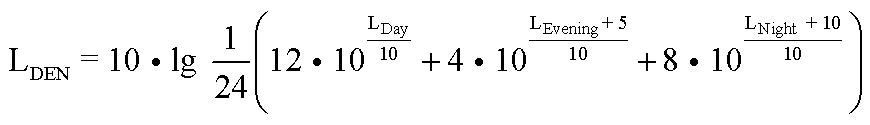

# Vierunddreißigste Verordnung zur Durchführung des Bundes-Immissionsschutzgesetzes (Verordnung über die Lärmkartierung) (BImSchV 34)

Ausfertigungsdatum
:   2006-03-06

Fundstelle
:   BGBl I: 2006, 516

Zuletzt geändert durch
:   Art. 111 V v. 19.6.2020 I 1328

Änderung durch
:   Art. 1 V v. 28.5.2021 I 1251 (Nr. 27) textlich nachgewiesen, dokumentarisch noch nicht abschließend bearbeitet

Die Rechtsverordnung dient der Umsetzung der Richtlinie 2002/49/EG des
Europäischen Parlaments und des Rates vom 25. Juni 2002 über die
Bewertung und Bekämpfung von Umgebungslärm (ABl. EG Nr. L 189 S. 12)
in deutsches Recht.

## Eingangsformel

Auf Grund des § 47f des Bundes-Immissionsschutzgesetzes, der durch
Artikel 1 des Gesetzes zur Umsetzung der EG-Richtlinie über die
Bewertung und Bekämpfung von Umgebungslärm vom 24. Juni 2005 (BGBl. I
S. 1794) eingefügt worden ist, verordnet die Bundesregierung nach
Anhörung der beteiligten Kreise:

## § 1 Anwendungsbereich

Diese Verordnung gilt für die Kartierung von Umgebungslärm. Sie
konkretisiert Anforderungen an Lärmkarten nach § 47c des Bundes-
Immissionsschutzgesetzes.

## § 2 Lärmindizes

(1) Die Lärmindizes
L
Day              , L
Evening              und L
Night              sind die A-bewerteten äquivalenten Dauerschallpegel
in Dezibel gemäß ISO 1996-2: 1987, wobei der Beurteilungszeitraum ein
Jahr beträgt und die Bestimmungen an allen Tagen in folgenden
Zeiträumen erfolgen:

1.  L
    Day                    : 12 Stunden, beginnend um 6.00 Uhr,

2.  L
    Evening                    : 4 Stunden, beginnend um 18.00 Uhr,

3.  L
    Night                    : 8 Stunden, beginnend um 22.00 Uhr.

Ein Jahr ist das für die Schallemission ausschlaggebende und ein
hinsichtlich der Witterungsbedingungen durchschnittliches
Kalenderjahr.

(2) Der Lärmindex
L
DEN              in Dezibel ist wie folgt definiert:

## § 3 Datenerhebung und Datenübermittlung

(1) Soweit die für die Ausarbeitung der Lärmkarten zuständigen
Behörden nicht auf Bestände zurückgreifen können, können sie anordnen,
dass ihnen vorhandene, nach den §§ 4 und 5 für die Erarbeitung von
Lärmkarten erforderliche Daten sowie vorhandene Ergebnisdaten für
Lärmkarten unentgeltlich zur Verfügung gestellt werden von

1.  Eisenbahninfrastrukturunternehmen für den durch Eisenbahnen
    hervorgerufenen Umgebungslärm,

2.  Verkehrsunternehmen für den durch Straßenbahnen im Sinne des § 4 des
    Personenbeförderungsgesetzes hervorgerufenen Umgebungslärm,

3.  Betreibern von Verkehrsflughäfen für den durch Flugzeuge in der
    Umgebung von Verkehrsflughäfen hervorgerufenen Umgebungslärm,

4.  Anlagenbetreibern und Betreibern von Häfen für den durch Anlagen und
    Häfen nach § 4 Absatz 1 Nummer 5 hervorgerufenen Umgebungslärm,

5.  Trägern der Straßenbaulast für den durch Straßenverkehr
    hervorgerufenen Umgebungslärm.

Sofern für die Ausarbeitung der Lärmkarten die Erhebung von Daten
erforderlich ist, sind die Betreiber und Unternehmen nach Satz 1 zur
Mitwirkung verpflichtet, insbesondere dazu, während der üblichen
Geschäftszeiten das Betreten von Betriebsgrundstücken und -räumen zu
dulden, Anlagen und Einrichtungen zugänglich zu machen oder vorhandene
Unterlagen zur Verfügung zu stellen. § 52 Absatz 5 und 7 des Bundes-
Immissionsschutzgesetzes gilt entsprechend.

(2) Die Gemeinden haben die für die Lärmkarten erforderlichen Daten
über die vom Umgebungslärm betroffene Wohnbevölkerung, soweit
vorhanden, den für die Ausarbeitung der Lärmkarten zuständigen
Behörden unentgeltlich zur Verfügung zu stellen.

(3) Andere Behörden haben den für die Ausarbeitung der Lärmkarten
zuständigen Behörden die dort vorhandenen und für die Lärmkarten
erforderlichen Daten unentgeltlich zur Verfügung zu stellen.

## § 4 Ausarbeitung von Lärmkarten

(1) Lärmkarten für Ballungsräume erstrecken sich auf sämtliche darin
gelegene Hauptlärmquellen, sowie ferner auf

1.  sonstige Straßen,

2.  sonstige Schienenwege von Eisenbahnen nach dem Allgemeinen
    Eisenbahngesetz,

3.  Schienenwege von Straßenbahnen im Sinne des § 4 des
    Personenbeförderungsgesetzes,

4.  sonstige Flugplätze für den zivilen Luftverkehr,

5.  Industrie- oder Gewerbegelände, auf denen sich eine oder mehrere
    Anlagen gemäß Anhang I der Richtlinie 2010/75/EU des Europäischen
    Parlaments und des Rates vom 24. November 2010 über
    Industrieemissionen (integrierte Vermeidung und Verminderung der
    Umweltverschmutzung) (ABl. L 334 vom 17.12.2010, S. 17; L 158 vom
    19\.6.2012, S. 25) in der jeweils geltenden Fassung befinden,
    einschließlich Häfen für die Binnen- oder Seeschifffahrt mit einer
    Gesamtumschlagsleistung von mehr als 1,5 Millionen Tonnen pro Jahr,

soweit diese sonstigen Lärmquellen erheblichen Umgebungslärm
hervorrufen.

(2) Die Ausarbeitung von Lärmkarten hat getrennt für jede Lärmart
(Straßenlärm, Schienenlärm, Fluglärm, Industrie- und Gewerbelärm
einschließlich Hafenlärm) auf der Grundlage der Lärmindizes L
DEN              und L
Night              zu erfolgen.

(3) Lärmkarten müssen georeferenziert sein. Alle Daten sind in einer
Form vorzuhalten, die ihre digitale Weiterverarbeitung ermöglicht.
Lärmkarten sind in elektronischer Form zu erstellen; sie müssen in
körperlicher Form herstellbar sein.

(4) Lärmkarten bestehen aus

1.  einer graphischen Darstellung der Lärmsituation mit den Isophonen-
    Bändern für

    a)  den L
        DEN                          ab 55 dB(A) bis 59 dB(A), ab 60 dB(A) bis
        64 dB(A), ab 65 dB(A) bis 69 dB(A), ab 70 dB(A) bis 74 dB(A) sowie ab
        75 dB(A) und

    b)  den L
        Night                          ab 50 dB(A) bis 54 dB(A), ab 55 dB(A)
        bis 59 dB(A), ab 60 dB(A) bis 64 dB(A), ab 65 dB(A) bis 69 dB(A) sowie
        ab 70 dB(A) und optional ab 45 dB(A) bis 49 dB(A)

    mit den Farben nach DIN 45682, Ausgabe April 2020, wobei auf ganze
    Zahlen auf- oder abzurunden ist,

2.  einer graphischen Darstellung der Überschreitung eines Wertes, bei
    dessen Überschreitung Lärmschutzmaßnahmen in Erwägung gezogen oder
    eingeführt werden,

3.  tabellarischen Angaben über die geschätzte Zahl der Menschen, die in
    Gebieten wohnen, die innerhalb der Isophonen-Bänder nach Nummer 1
    liegen, wobei die Abschätzung nach Absatz 5 zu erfolgen hat,

4.  einer allgemeinen Beschreibung der Hauptlärmquellen nach Lage, Größe
    und Verkehrsaufkommen,

5.  einer Beschreibung der Umgebung: Ballungsräume (Lage, Größe,
    Einwohnerzahl), Städte, Dörfer, ländliche Gegend oder nicht ländliche
    Gegend, Flächennutzung, andere Hauptlärmquellen,

6.  Angaben über durchgeführte und laufende Lärmaktionspläne und
    Lärmschutzprogramme,

7.  einer tabellarischen Angabe über lärmbelastete Flächen sowie über die
    geschätzte Zahl der Wohnungen, Schulen und Krankenhäuser in diesen
    Gebieten, nach Maßgabe des Absatzes 6,

8.  Angaben über die zuständigen Behörden für die Lärmkartierung,

9.  tabellarischen Angaben über

    a)  die geschätzte Zahl der Fälle ischämischer Herzkrankheiten,

    b)  die geschätzte Zahl der Fälle starker Belästigung und

    c)  die geschätzte Zahl der Fälle starker Schlafstörung

    in Gebieten, die innerhalb der Isophonen-Bänder nach Nummer 1 liegen.

In den Lärmkarten können zusätzliche Texterläuterungen und
Informationen verwendet werden.

(5) Die Zahl der in ihren Wohnungen durch Umgebungslärm belasteten
Menschen (Absatz 4 Satz 1 Nummer 3) ist separat für jede Lärmart
anzugeben. Die Zahlenangaben sind auf die nächste Hunderterstelle auf-
oder abzurunden.

(6) Die Gesamtfläche der lärmbelasteten Gebiete (Absatz 4 Satz 1
Nummer 7) ist anzugeben. Die Angabe hat in Quadratkilometern zu
erfolgen und ist aufzugliedern nach L
DEN             -Werten über 55 dB(A), über 65 dB(A) und über 75
dB(A). Entsprechendes gilt für die Zahl der Wohnungen, Schulen und
Krankenhäuser. Bei der Zahlenangabe für Wohnungen ist auf 100
Wohnungen zu runden.

(7) Die Zahl der Fälle gesundheitsschädlicher Auswirkungen und
Belästigungen nach Absatz 4 Satz 1 Nummer 9 ist separat für jede
Lärmart anzugeben. Die Angabe zu ischämischen Herzkrankheiten hat für
Straßenlärm für den L
DEN              zu erfolgen. Die Angabe zu starken Belästigungen hat
jeweils für die Lärmarten Straßenlärm, Schienenlärm und Fluglärm für
den L
DEN              zu erfolgen. Die Angabe zu starken Schlafstörungen
hat jeweils für die Lärmarten Straßenlärm, Schienenlärm und Fluglärm
für den L
Night              zu erfolgen. Die Angaben sind auf ganze Zahlen zu
runden.

## § 5 Berechnungsverfahren

(1) Die Lärmindizes werden nach Verfahren berechnet, die den allgemein
anerkannten Regeln der Technik entsprechen. Die Berechnungsverfahren
werden

1.  für die Lärmarten nach § 4 Absatz 1 Nummer 1 bis 3 vom
    Bundesministerium für Verkehr und digitale Infrastruktur,

2.  für Fluglärm (§ 4 Absatz 1 Nummer 4) vom Bundesministerium für Umwelt,
    Naturschutz und nukleare Sicherheit im Einvernehmen mit dem
    Bundesministerium für Verkehr und digitale Infrastruktur,

3.  für Industrie- und Gewerbelärm (§ 4 Absatz 1 Nummer 5) vom
    Bundesministerium für Umwelt, Naturschutz und nukleare Sicherheit

durch Veröffentlichung im Bundesanzeiger konkretisiert.

(2) Die Berechnungspunkte zur Ermittlung von L
DEN              und L
Night              für die Lärmbelastung in der Nähe von Gebäuden
liegen in einer Höhe von vier Meter über dem Boden.

(3) Für die Ermittlung der Belastetenzahlen nach § 4 Absatz 5 liegen
die Berechnungspunkte auf der Gebäudefassade. Für diesen Fall wird die
letzte Reflexion an der Gebäudefassade, auf der der Berechnungspunkt
liegt, nicht berücksichtigt. Für die flächenmäßige Darstellung der
Lärmbelastung nach § 4 Absatz 4 ist ein Raster von 50 Meter mal 50
Meter oder weniger zu Grunde zu legen.

(3a) Die geschätzte Zahl der gesundheitsschädlichen Auswirkungen und
Belästigungen nach § 4 Absatz 7 wird berechnet nach den Methoden zur
Bewertung der gesundheitsschädlichen Auswirkungen, die in Anhang III
der Richtlinie 2002/49/EG des Europäischen Parlaments und des Rates
vom 25. Juni 2002 über die Bewertung und Bekämpfung von Umgebungslärm
(ABl. L 189 vom 18.7.2002, S. 12), die zuletzt durch die Richtlinie
(EU) 2020/367 (ABl. L 67 vom 5.3.2020, S. 132) geändert worden ist, in
der jeweils geltenden Fassung aufgeführt sind.

(3b) Für die Ermittlung der Zahlen nach § 4 Absatz 4 Satz 1 Nummer 9
sind als mittlere Werte jedes Isophonen-Bandes anzusetzen:

1.  für den L
    DEN                    57 dB(A), 62 dB(A), 67 dB(A), 72 dB(A) sowie 77
    dB(A) und

2.  für den L
    Night                    52 dB(A), 57 dB(A), 62 dB(A), 67 dB(A) sowie
    72 dB(A) und optional 47 dB(A).

Die Inzidenzrate von ischämischen Herzkrankheiten in Deutschland, die
als Eingangsgröße für die Ermittlung der Zahl der Fälle ischämischer
Herzkrankheiten für Straßenverkehrslärm nach § 4 Absatz 4 Satz 1
Nummer 9 Buchstabe a dient, wird aus den aktuellen
Gesundheitsstatistiken ermittelt. Das Bundesministerium für Umwelt,
Naturschutz und nukleare Sicherheit gibt die aktuelle Inzidenzrate im
Einvernehmen mit dem Bundesministerium für Gesundheit im
Bundesanzeiger bekannt.

(4) Das Bundesamt für Kartographie und Geodäsie stellt den für die
Ausarbeitung von Lärmkarten zuständigen Behörden zentral das Digitale
Geländemodell für Deutschland (DGM-D) zur Verfügung. Liegen in den
Ländern detailliertere geographische Daten vor, können diese ergänzend
zu dem DGM-D verwendet werden.

(5) Für die Berechnung sind für jede Lärmart dieselben Gebäude- und
Einwohnerdaten zu verwenden. Gleiches gilt für sonstige Bauwerke auf
dem Ausbreitungsweg.

## § 6 Übermittlung von Daten für den digitalen Informationsaustausch

(1) Die nach § 47e Absatz 2 und 3 des Bundes-Immissionsschutzgesetzes
zuständigen Behörden übermitteln binnen vier Monaten nach den in § 47c
Absatz 1 des Bundes-Immissionsschutzgesetzes aufgeführten Fristen dem
Bundesministerium für Umwelt, Naturschutz und nukleare Sicherheit oder
einer von ihm benannten Stelle diejenigen Daten zu Lärmkarten, die in
Anhang VI der Richtlinie 2002/49/EG in ihrer jeweils geltenden Fassung
bezeichnet sind.

(2) Die nach § 47e Absatz 1 des Bundes-Immissionsschutzgesetzes
zuständigen Behörden übermitteln zu den in § 47c Absatz 1 des Bundes-
Immissionsschutzgesetzes aufgeführten Fristen den obersten
Landesbehörden oder den von ihnen benannten Stellen die vollständigen
Lärmkarten.

## § 7 Information der Öffentlichkeit über Lärmkarten

Geeignete Ausfertigungen der Lärmkarten, die der Unterrichtung der
Öffentlichkeit dienen, werden von den zuständigen Behörden nach § 47e
Absatz 1 und 3 des Bundes-Immissionsschutzgesetzes verbreitet. Die
Verbreitung der Lärmkarten hat in für die Öffentlichkeit
verständlicher Darstellung und leicht zugänglichen Formaten zu
erfolgen. Erforderlichenfalls ist eine Zusammenfassung mit den
wichtigsten Punkten der Öffentlichkeit zur Verfügung zu stellen. Für
die Verbreitung sollen, soweit vorhanden, elektronische
Kommunikationsmittel verwendet werden. Die Anforderungen an die
Unterrichtung der Öffentlichkeit können auch dadurch erfüllt werden,
dass Verknüpfungen zu Internet-Seiten eingerichtet werden, auf denen
die zu verbreitenden Lärmkarten zu finden sind.

## § 7a Zugänglichkeit der Normen

DIN- und ISO-Normen, auf die in dieser Verordnung verwiesen wird, sind
bei der Beuth Verlag GmbH, Berlin, zu beziehen. Die DIN- und ISO-
Normen sind bei dem Deutschen Patent- und Markenamt, München,
archivmäßig gesichert niedergelegt.

## § 8 Inkrafttreten

Diese Verordnung tritt am 16. März 2006 in Kraft.

## Schlussformel

Der Bundesrat hat zugestimmt.

