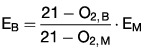

# Vierundvierzigste Verordnung zur Durchführung des Bundes-Immissionsschutzgesetzes (BImSchV 44)

Ausfertigungsdatum
:   2019-06-13

Fundstelle
:   BGBl I: 2019, 804

Änderung durch
:   Art. 3 Abs. 1 V v. 6.7.2021 I 2514 (Nr. 42) textlich nachgewiesen, dokumentarisch noch nicht abschließend bearbeitet

[^F807597_01_BJNR080410019]:     Diese Verordnung dient der Umsetzung der Richtlinie (EU) 2015/2193 des
    Europäischen Parlaments und des Rates vom 25. November 2015 zur
    Begrenzung der Emissionen bestimmter Schadstoffe aus mittelgroßen
    Feuerungsanlagen in die Luft (ABl. L 313 vom 28.11.2015, S. 1).

## Abschnitt 1 - Allgemeine Vorschriften

### § 1 Anwendungsbereich

(1) Diese Verordnung gilt für die Errichtung, die Beschaffenheit und
den Betrieb von

1.  genehmigungsbedürftigen und nicht genehmigungsbedürftigen
    Feuerungsanlagen (mittelgroße Feuerungsanlagen, Gasturbinen- und
    Verbrennungsmotoranlagen) mit einer Feuerungswärmeleistung von
    mindestens 1 Megawatt und weniger als 50 Megawatt, unabhängig davon,
    welche Brennstoffe oder welche Arten von Brennstoffen eingesetzt
    werden;

2.  genehmigungsbedürftigen Feuerungsanlagen (mittelgroße
    Feuerungsanlagen, Gasturbinen- und Verbrennungsmotoranlagen) mit einer
    Feuerungswärmeleistung von weniger als 1 Megawatt, unabhängig davon,
    welche Brennstoffe oder welche Arten von Brennstoffen eingesetzt
    werden; und

3.  gemeinsamen Feuerungsanlagen gemäß § 4 mit einer
    Feuerungswärmeleistung von mindestens 1 Megawatt, unabhängig davon,
    welche Brennstoffe oder welche Arten von Brennstoffen eingesetzt
    werden, es sei denn, diese Kombination bildet eine Feuerungsanlage mit
    einer Feuerungswärmeleistung von 50 Megawatt oder mehr, die unter den
    Anwendungsbereich der Verordnung über Großfeuerungs-, Gasturbinen- und
    Verbrennungsmotoranlagen fällt.

(2) Diese Verordnung gilt nicht für

1.  Feuerungsanlagen, die dem Anwendungsbereich der Verordnung über
    Großfeuerungs-, Gasturbinen- und Verbrennungsmotoranlagen unterliegen;

2.  Feuerungsanlagen, die dem Anwendungsbereich der Verordnung (EU)
    2016/1628 des Europäischen Parlaments und des Rates vom 14. September
    2016 über die Anforderungen in Bezug auf die Emissionsgrenzwerte für
    gasförmige Schadstoffe und luftverunreinigende Partikel und die
    Typgenehmigung für Verbrennungsmotoren für nicht für den
    Straßenverkehr bestimmte mobile Maschinen und Geräte, zur Änderung der
    Verordnungen (EU) Nr. 1024/2012 und (EU) Nr. 167/2013 und zur Änderung
    und Aufhebung der Richtlinie 97/68/EG (ABl. L 252 vom 16.9.2016, S.
    53) unterliegen;

3.  Feuerungsanlagen in landwirtschaftlichen Betrieben mit einer
    Gesamtfeuerungswärmeleistung von höchstens 5 Megawatt, die als
    Brennstoff ausschließlich unverarbeitete Geflügelgülle gemäß Artikel 9
    Buchstabe a der Verordnung (EG) Nr. 1069/2009 des Europäischen
    Parlaments und des Rates vom 21. Oktober 2009 mit Hygienevorschriften
    für nicht für den menschlichen Verzehr bestimmte tierische
    Nebenprodukte und zur Aufhebung der Verordnung (EG) Nr. 1774/2002
    (Verordnung über tierische Nebenprodukte) (ABl. L 300 vom 14.11.2009,
    S. 1) verwenden;

4.  Feuerungsanlagen, in denen die Verbrennungsprodukte unmittelbar zum
    Erwärmen, zum Trocknen oder zu einer anderweitigen Behandlung von
    Gegenständen oder Materialien genutzt werden, zum Beispiel Schmelzöfen
    und -wannen, Wärme- und Wärmebehandlungsöfen und Hochöfen;

5.  Nachverbrennungsanlagen, die dafür ausgelegt sind, die Abgase aus
    industriellen Prozessen durch Verbrennung zu reinigen, und die nicht
    als unabhängige Feuerungsanlagen betrieben werden;

6.  technische Geräte, die zum Antrieb von Fahrzeugen, Schiffen oder
    Flugzeugen in diesen eingesetzt werden;

7.  Einrichtungen zum Regenerieren von Katalysatoren für katalytisches
    Kracken;

8.  Einrichtungen für die Umwandlung von Schwefelwasserstoff in Schwefel
    nach dem Claus-Prozess;

9.  Reaktoren, die in der chemischen Industrie verwendet werden;

10. Koksöfen;

11. Winderhitzer;

12. Krematorien;

13. Feuerungsanlagen, die Raffineriebrennstoffe allein oder zusammen mit
    anderen Brennstoffen zur Energieerzeugung in Mineralöl- und
    Gasraffinerien verfeuern;

14. Ablaugekessel in Anlagen für die Zellstofferzeugung;

15. Feuerungsanlagen, die der Forschung, Entwicklung oder Erprobung neuer
    Einsatzstoffe, Brennstoffe, Erzeugnisse oder Verfahren im Labor- oder
    Technikumsmaßstab dienen, sowie Prüfstände für oder mit
    Verbrennungsmotoren und Prüfstände für oder mit Gasturbinen oder
    Triebwerke von Luftfahrzeugen;

16. Anlagen, die als Brennstoff andere feste oder flüssige Abfälle als die
    in § 1 Absatz 2 der Verordnung über die Verordnung über die
    Verbrennung und die Mitverbrennung von Abfällen genannten Stoffe
    verwenden.

### § 2 Begriffsbestimmungen

(1) „Abgas“ im Sinne dieser Verordnung ist das Trägergas mit den
festen, flüssigen oder gasförmigen Emissionen, angegeben als
Volumenstrom in der Einheit Kubikmeter je Stunde (m
3             /h) und bezogen auf das Abgasvolumen im Normzustand,
Temperatur 273,15 Kelvin (K), Druck 101,3 Kilopascal (kPa), nach Abzug
des Feuchtegehalts an Wasserdampf.

(2) „Abgasreinigungseinrichtung“ im Sinne dieser Verordnung ist eine
der Feuerung nachgeschaltete Einrichtung zur Verminderung von
Luftverunreinigungen einschließlich Einrichtungen zur selektiven
katalytischen Reduktion oder Einrichtungen zur selektiven
nichtkatalytischen Reduktion.

(3) „Abgasverlust“ im Sinne dieser Verordnung ist die Differenz
zwischen dem Wärmeinhalt des Abgases und dem Wärmeinhalt der
Verbrennungsluft bezogen auf den Heizwert des Brennstoffes.

(4) „Bestehende Anlage“ im Sinne dieser Verordnung ist eine
Feuerungsanlage,

1.  die vor dem 20. Dezember 2018 in Betrieb genommen wurde oder

2.  für die vor dem 19. Dezember 2017 nach § 4 oder § 16 des Bundes-
    Immissionsschutzgesetzes eine Genehmigung erteilt wurde, sofern die
    Anlage spätestens am 20. Dezember 2018 in Betrieb genommen wurde.

(5) „Betriebsstunden“ im Sinne dieser Verordnung ist der in Stunden
ausgedrückte Zeitraum, in dem sich eine Feuerungsanlage in Betrieb
befindet und Emissionen in die Luft abgibt, ohne An- und Abfahrzeiten.

(6) „Bezugssauerstoffgehalt“ im Sinne dieser Verordnung ist der
jeweils vorgegebene oder zu berechnende Volumengehalt an Sauerstoff im
Abgas, auf den der jeweilige Emissionsgrenzwert zu beziehen ist.

(7) „Biobrennstoffe“ im Sinne dieser Verordnung sind

1.  die Produkte land- oder forstwirtschaftlichen Ursprungs aus
    pflanzlichem Material oder aus Teilen davon, sofern sie zur Nutzung
    ihres Energieinhalts verwendet werden, und

2.  folgende Abfälle, falls die erzeugte Wärme genutzt wird:

    a)  pflanzliche Abfälle aus der Land- und Forstwirtschaft;

    b)  pflanzliche Abfälle aus der Nahrungsmittelindustrie;

    c)  natürliche, nicht gefährliche Hölzer aus der Landschaftspflege, sofern
        sie auf Grund ihrer stofflichen Beschaffenheit mit den Hölzern aus der
        Forstwirtschaft vergleichbar sind;

    d)  faserige pflanzliche Abfälle und Ablaugen aus der Herstellung von
        natürlichem Zellstoff und aus der Herstellung von Papier aus
        Zellstoff, sofern sie am Herstellungsort mitverbrannt werden;

    e)  Korkabfälle;

    f)  Holzabfälle mit Ausnahme von Holzabfällen, die infolge einer
        Behandlung mit Holzschutzmitteln oder infolge einer Beschichtung
        halogenorganische Verbindungen oder Schwermetalle enthalten können;
        hierzu gehören insbesondere Holzabfälle aus Bau- und Abbruchabfällen.

(8) „Brennstoffe“ im Sinne dieser Verordnung sind alle festen,
flüssigen oder gasförmigen brennbaren Stoffe einschließlich ihrer
nicht brennbaren Bestandteile; hiervon ausgenommen sind brennbare
Stoffe, die dem Anwendungsbereich der Verordnung über die Verbrennung
und die Mitverbrennung von Abfällen unterliegen.

(9) „Brennstofftypen“ im Sinne dieser Verordnung sind

1.  feste Biobrennstoffe;

2.  andere feste Brennstoffe;

3.  Gasöl;

4.  flüssige Brennstoffe, ausgenommen Gasöl;

5.  Erdgas;

6.  gasförmige Brennstoffe, ausgenommen Erdgas.

(10) „Brennwertgerät“ im Sinne dieser Verordnung ist ein
Wärmeerzeuger, bei dem die Verdampfungswärme des im Abgas enthaltenen
Wasserdampfes konstruktionsbedingt durch Kondensation nutzbar gemacht
wird.

(11) „Dieselmotoranlage“ im Sinne dieser Verordnung ist eine nach dem
Dieselprinzip arbeitende Verbrennungsmotoranlage mit Selbstzündung des
Kraftstoffs.

(12) „Emissionen“ im Sinne dieser Verordnung sind die von einer Anlage
ausgehenden Luftverunreinigungen, angegeben als Massenkonzentrationen
in der Einheit Gramm je Kubikmeter Abgas (g/m
3             ), Milligramm je Kubikmeter Abgas (mg/m
3             ) oder Nanogramm je Kubikmeter Abgas (ng/m
3             ) oder als Massenstrom in der Einheit Megagramm pro Jahr
(Mg/a); Gesamtstaubemissionen können auch als Rußzahl angegeben
werden.

(13) „Emissionsgrenzwert“ im Sinne dieser Verordnung ist der Wert, der
die Menge der Emission einer Anlage festlegt, die zulässigerweise in
die Luft abgeleitet werden darf, angegeben als Massenkonzentration und
bezogen auf den jeweiligen Bezugssauerstoffgehalt der Emission, im
Fall von Gesamtstaubemissionen alternativ auch angegeben als zulässige
Rußzahl.

(14) „Emissionsrelevante Änderung“ im Sinne dieser Verordnung ist jede
Änderung an einer Feuerungsanlage, die sich auf die anzuwendenden
Emissionsgrenzwerte auswirken würde.

(15) „Erdgas“ im Sinne dieser Verordnung ist natürlich vorkommendes
Methangas mit nicht mehr als 20 Volumenprozent Inertgasen und
sonstigen Bestandteilen, das den Anforderungen des DVGW-Arbeitsblatts
G 260 vom März 2013 für Gase der 2. Gasfamilie entspricht.

(16) „Feuerungsanlage“ im Sinne dieser Verordnung ist jede Anlage, in
der Brennstoff zur Nutzung der erzeugten Wärme oxidiert wird.

(17) „Feuerungswärmeleistung“ im Sinne dieser Verordnung ist der auf
den unteren Heizwert bezogene Wärmeinhalt der Brennstoffe, der einer
Feuerungsanlage im Dauerbetrieb je Zeiteinheit zugeführt wird,
angegeben in Kilowatt oder Megawatt.

(18) „Gasöl“ im Sinne dieser Verordnung ist

1.  aus Erdöl gewonnener flüssiger Kraft- oder Brennstoff der KN-Codes
    2710 19 25,
    2710 19 29,
    2710 19 47,
    2710 19 48,
    2710 20 17                    oder
    2710 20 19                    nach Anhang I der Verordnung (EWG) Nr.
    2658/87 des Rates vom 23. Juli 1987 über die zolltarifliche und
    statistische Nomenklatur sowie den Gemeinsamen Zolltarif (ABl. L 256
    vom 7.9.1987, S. 1; L 341 vom 3.12.1987, S. 38; L 378 vom 31.12.1987,
    S. 120; L 130 vom 26.5.1988, S. 42; L 151 vom 8.6.2016, S. 22), die
    zuletzt durch die Durchführungsverordnung (EU) 2017/1344 (ABl. L 186
    vom 19.7.2017, S. 3) geändert worden ist, oder

2.  aus Erdöl gewonnener flüssiger Kraft- oder Brennstoff, bei dessen
    Destillation bei 250 °C nach den Methoden, die nach dem Stand von
    Wissenschaft und Technik festgelegt sind, weniger als 65
    Volumenprozent, einschließlich Verlusten, und bei 350 °C mindestens 85
    Volumenprozent, einschließlich Verlusten, übergehen.

(19) „Gasturbinenanlage“ im Sinne dieser Verordnung ist eine
Feuerungsanlage mit einer rotierenden Maschine, die thermische Energie
in mechanische Arbeit umwandelt und im Wesentlichen aus einem
Verdichter, aus einer Brennkammer, in der Brennstoff zur Erhitzung des
Arbeitsmediums oxidiert wird, und aus einer Turbine besteht.

(20) „Genehmigungsbedürftige Anlage“ im Sinne dieser Verordnung ist
eine Anlage, die nach § 4 des Bundes-Immissionsschutzgesetzes einer
Genehmigung bedarf.

(21) „Inbetriebnahme“ im Sinne dieser Verordnung ist die erstmalige
Aufnahme des Betriebs einer neu errichteten Feuerungsanlage.

(22) „Mittelgroße Feuerungsanlage“ im Sinne dieser Verordnung ist eine
Feuerungsanlage, die keine Gasturbinenanlage oder
Verbrennungsmotoranlage ist.

(23) „Mehrstofffeuerung“ im Sinne dieser Verordnung ist eine
Einzelfeuerung, die mit zwei oder mehr Brennstoffen wechselweise
betrieben werden kann.

(24) „Mischfeuerung“ im Sinne dieser Verordnung ist eine
Einzelfeuerung, die mit zwei oder mehr Brennstoffen gleichzeitig
betrieben werden kann.

(25) „Naturbelassenes Holz“ im Sinne dieser Verordnung ist Holz, das
ausschließlich mechanischer Bearbeitung ausgesetzt war und bei seiner
Verwendung nicht mehr als nur unerheblich mit Schadstoffen
kontaminiert wurde. Holzabfälle, mit Ausnahme der Altholzkategorie A I
nach § 2 Nummer 4 Buchstabe a der Altholzverordnung vom 15. August
2002 (BGBl. I S. 3302), die zuletzt durch Artikel 62 des Gesetzes vom
29\. März 2017 (BGBl. I S. 626) geändert worden ist, stellen kein
naturbelassenes Holz im Sinne dieser Verordnung dar. Holzabfälle, die
infolge einer Behandlung mit Holzschutzmitteln oder infolge einer
Beschichtung halogenorganische Verbindungen oder Schwermetalle
enthalten können, stellen kein naturbelassenes Holz im Sinne dieser
Verordnung dar; hierzu gehören insbesondere Holzabfälle aus Bau- und
Abbruchabfällen.

(26) „Nicht genehmigungsbedürftige Anlage“ im Sinne dieser Verordnung
ist eine Anlage, die keiner Genehmigung nach dem Bundes-
Immissionsschutzgesetz bedarf.

(27) „Raffineriebrennstoffe“ im Sinne dieser Verordnung sind alle
festen, flüssigen oder gasförmigen brennbaren Stoffe aus den
Destillations- und Konversionsstufen der Rohölraffinierung,
einschließlich Raffineriebrenngas, Synthesegas, Raffinerieöl und
Petrolkoks.

(28) „Verbrennungsmotoranlage“ im Sinne dieser Verordnung ist eine
Anlage, bei der durch Oxidation von Brennstoffen im Inneren des
Arbeitsraums eines Motors die Brennstoffenergie in mechanische Energie
umgewandelt wird.

(29) „Zweistoffmotoranlage“ im Sinne dieser Verordnung ist eine
Verbrennungsmotoranlage mit Selbstzündung des Brennstoffs, die bei der
Verbrennung flüssiger Brennstoffe nach dem Dieselprinzip und bei der
Verbrennung gasförmiger Brennstoffe nach dem Ottoprinzip arbeitet.

### § 3 Bezugssauerstoffgehalt

Emissionsgrenzwerte beziehen sich auf einen Volumengehalt an
Sauerstoff im Abgas von

1.  3 Prozent bei mittelgroßen Feuerungsanlagen für flüssige oder
    gasförmige Brennstoffe;

2.  6 Prozent bei mittelgroßen Feuerungsanlagen für feste Brennstoffe;

3.  15 Prozent bei Gasturbinenanlagen sowie

4.  5 Prozent bei Verbrennungsmotoranlagen.

### § 4 Aggregationsregeln

(1) Werden in einer Anlage nach § 1 Absatz 3 der Verordnung über
genehmigungsbedürftige Anlagen in der Fassung der Bekanntmachung vom
31\. Mai 2017 (BGBl. I S. 1440) die Abgase von zwei oder mehr
Einzelfeuerungen gemeinsam über einen Schornstein abgeleitet, so gilt
die von solchen Feuerungsanlagen gebildete Kombination als eine
Feuerungsanlage im Sinne dieser Verordnung. Bei nicht
genehmigungsbedürftigen Anlagen gilt § 1 Absatz 3 der Verordnung über
genehmigungsbedürftige Anlagen entsprechend.

(2) Absatz 1 gilt auch, wenn in einer Anlage die Abgase aus zwei oder
mehr Einzelfeuerungen unter Berücksichtigung technischer und
wirtschaftlicher Faktoren gemeinsam über einen Schornstein abgeleitet
werden können. Der Betreiber hat die Gründe, aus denen die
Aggregationsregel in Satz 1 nicht zur Anwendung kommen kann, der
zuständigen Behörde zur Beurteilung vorzulegen.

(3) Bei einer in den Absätzen 1 und 2 beschriebenen Kombination von
Einzelfeuerungen werden nur Einzelfeuerungen mit einer
Feuerungswärmeleistung von 1 Megawatt oder mehr berücksichtigt. Satz 1
gilt nicht für Einzelfeuerungen, die Teil einer
genehmigungsbedürftigen Feuerungsanlage sind.

### § 5 Emissionsrelevante Änderung in einer Feuerungsanlage

(1) Eine emissionsrelevante Änderung an einer nicht
genehmigungsbedürftigen Feuerungsanlage liegt regelmäßig vor bei

1.  der Umstellung des Brennstoffs auf einen anderen Brennstoff, es sei
    denn, die Feuerungsanlage ist bereits für wechselweisen
    Brennstoffeinsatz eingerichtet;

2.  dem Austausch eines Kessels.

(2) Eine emissionsrelevante Änderung an einer genehmigungsbedürftigen
Feuerungsanlage liegt regelmäßig vor bei einer Änderung einer
Feuerungsanlage nach § 16 Absatz 1 des Bundes-
Immissionsschutzgesetzes.

### § 6 Registrierung von Feuerungsanlagen

(1) Der Betreiber einer Feuerungsanlage nach § 1 Absatz 1 Nummer 1 und
3 hat vor der Inbetriebnahme den beabsichtigten Betrieb der
Feuerungsanlage schriftlich oder elektronisch der zuständigen Behörde
anzuzeigen und dabei die in der Anlage 1 genannten Angaben vorzulegen.

(2) Abweichend von Absatz 1 hat der Betreiber einer bestehenden
Feuerungsanlage den Betrieb der Feuerungsanlage schriftlich oder
elektronisch der zuständigen Behörde bis zum 1. Dezember 2023
anzuzeigen und dabei die in der Anlage 1 genannten Angaben vorzulegen.

(3) Die Absätze 1 und 2 gelten nicht für Einzelfeuerungen, die nach §
4 Absatz 3 Satz 2 als Teil einer genehmigungsbedürftigen
Feuerungsanlage zu aggregieren sind, sofern die Feuerungswärmeleistung
der Einzelfeuerungen weniger als 1 Megawatt beträgt.

(4) Die zuständige Behörde kann verlangen, dass der Betreiber

1.  bei einer schriftlichen Anzeige Mehrfachausfertigungen der Unterlagen,
    die der Anzeige beizufügen sind, übermittelt oder

2.  bei einer elektronischen Anzeige die Unterlagen, die er der Anzeige
    beizufügen hat, auch in schriftlicher Form übermittelt.

Die zuständige Behörde teilt dem Betreiber nach Eingang der Anzeige
unverzüglich mit, welche zusätzlichen Unterlagen sie für die
Registrierung benötigt. Sie registriert die Feuerungsanlage innerhalb
eines Monats nach dem Eingang der Anzeige und der vollständigen
Unterlagen. Die zuständige Behörde unterrichtet den Betreiber über die
Registrierung.

(5) Der Betreiber einer nach den Absätzen 1 und 2 anzuzeigenden
Feuerungsanlage hat der zuständigen Behörde jede emissionsrelevante
Änderung vor ihrer Durchführung sowie den Wechsel des Betreibers und
die endgültige Stilllegung der Anlage unverzüglich, spätestens jedoch
innerhalb eines Monats, schriftlich oder elektronisch anzuzeigen. Die
zuständige Behörde aktualisiert die Registrierung erforderlichenfalls.
Die Pflicht zur Durchführung eines Änderungsgenehmigungsverfahrens
nach § 16 des Bundes-Immissionsschutzgesetzes oder eines
Anzeigeverfahrens nach § 15 des Bundes-Immissionsschutzgesetzes bleibt
davon unberührt.

### § 7 Aufzeichnungs- und Aufbewahrungspflichten des Betreibers

(1) Der Betreiber einer Feuerungsanlage hat folgende Aufzeichnungen zu
führen:

1.  Aufzeichnungen über Betriebsstunden, auch bei Inanspruchnahme
    folgender Regelungen:

    a)  der Regelungen des § 15 Absatz 9, des § 16 Absatz 7 Satz 2 oder des §
        29 Absatz 2 oder

    b)  der Regelungen für den Notbetrieb gemäß § 15 Absatz 6, § 16 Absatz 5
        Satz 1 oder 7 oder Absatz 10 Nummer 4;

2.  Aufzeichnungen über die Art und Menge der in der Feuerungsanlage
    verwendeten Brennstoffe;

3.  Aufzeichnungen über etwaige Störungen oder Ausfälle der
    Abgasreinigungseinrichtung und

4.  Aufzeichnungen über die Fälle, in denen die Emissionsgrenzwerte nicht
    eingehalten wurden, und über die diesbezüglich ergriffenen Maßnahmen
    gemäß § 20 Absatz 3.

(2) Der Betreiber einer Feuerungsanlage hat Folgendes aufzubewahren:

1.  die Genehmigung zum Betrieb der Feuerungsanlage oder den Nachweis der
    Registrierung der Feuerungsanlage durch die zuständige Behörde und,
    falls vorhanden, die aktualisierte Fassung der Genehmigung oder der
    Registrierung sowie die zur Genehmigung oder zum Nachweis der
    Registrierung zugehörigen von der zuständigen Behörde übersandten
    Informationen;

2.  die Überwachungsergebnisse nach den §§ 21, 22 Absatz 1 bis 6 Satz 1, §
    23 Absatz 1 bis 5 und 7 bis 10 Satz 1, § 24 Absatz 1, 2, 4, 5, 7 Satz
    2, Absatz 8, 10, 11, 12 Satz 1 und 2 und Absatz 13, § 25 Absatz 1, 2,
    5 und 6 und nach § 26 Satz 1 sowie die Nachweise über den
    kontinuierlichen effektiven Betrieb von Abgasreinigungseinrichtungen
    gemäß § 20 Absatz 2 und gemäß § 24 Absatz 3 und 6;

3.  Aufzeichnungen nach Absatz 1 Nummer 1;

4.  Aufzeichnungen nach Absatz 1 Nummer 2;

5.  Aufzeichnungen nach Absatz 1 Nummer 4.

Der Betreiber hat die in Satz 1 Nummer 1 genannten Unterlagen ein Jahr
nach der Einstellung des gesamten Betriebs der Anlage aufzubewahren.
Der Betreiber hat die in Satz 1 Nummer 2 bis 5 genannten Unterlagen
mindestens sechs Jahre lang ab dem Zeitpunkt des Vorliegens der
Überwachungsergebnisse oder der Aufzeichnungen aufzubewahren.

(3) Der Betreiber hat der zuständigen Behörde die in den Absätzen 1
und 2 genannten Unterlagen auf deren Verlangen vorzulegen. Die
zuständige Behörde verlangt die Vorlage insbesondere, um sie der
Öffentlichkeit nach den Bestimmungen über den Zugang zu
Umweltinformationen zugänglich zu machen.

### § 8 An- und Abfahrzeiten

Der Betreiber hält die An- und Abfahrzeiten von Feuerungsanlagen
möglichst kurz.

## Abschnitt 2 - Anforderungen an die Errichtung und den Betrieb

### § 9 Emissionsgrenzwerte für Ammoniak

Feuerungsanlagen, die selektive katalytische Reduktion oder selektive
nichtkatalytische Reduktion einsetzen, sind so zu errichten und zu
betreiben, dass die Emissionen an Ammoniak im Abgas eine
Massenkonzentration von 30 mg/m
3              nicht überschreiten.

### § 10 Emissionsgrenzwerte für Feuerungsanlagen bei Einsatz von festen Brennstoffen

(1) Feuerungsanlagen, die feste Brennstoffe einsetzen, sind so zu
errichten und zu betreiben, dass die Anforderungen der Absätze 2 bis
6, 7 Satz 1 und der Absätze 8 bis 19 eingehalten werden.

(2) Der Betreiber hat sicherzustellen, dass die Emissionen an
Kohlenmonoxid im Abgas bei Einsatz von

*    *   1.

    *   Stroh oder ähnlichen halmgutartigen pflanzlichen Stoffen eine
        Massenkonzentration von 0,37 g/m
        3                        nicht überschreiten;

*    *   2.

    *   sonstigen Biobrennstoffen eine Massenkonzentration von 0,22 g/m
        3                        nicht überschreiten und

*    *   3.

    *   sonstigen Brennstoffen eine Massenkonzentration von 0,16 g/m
        3                        nicht überschreiten.

(3) Der Gesamtstaub im Abgas darf eine Massenkonzentration von 20 mg/m
3              nicht überschreiten.

(4) Die Emissionen an Stickstoffmonoxid und Stickstoffdioxid im Abgas
dürfen folgende Massenkonzentrationen, angegeben als Stickstoffdioxid,
nicht überschreiten:

*    *   1.

    *   bei Einsatz von Biobrennstoffen

    *

*    *
    *   a)

    *   in Anlagen mit einer Feuerungswärmeleistung von 20 Megawatt oder mehr

    *   0,2 g/m
        3                       ;

*    *
    *   b)

    *   in Anlagen mit einer Feuerungswärmeleistung von 5 Megawatt bis weniger
        als 20 Megawatt

    *   0,30 g/m
        3                       ;

*    *
    *   c)

    *   bei Anlagen mit einer Feuerungswärmeleistung von weniger als 5
        Megawatt

    *   0,37 g/m
        3                       ;

*    *   2.

    *   bei Einsatz von sonstigen Brennstoffen

    *   0,2 g/m
        3                       .

(5) Die Emissionen an Distickstoffoxid im Abgas dürfen bei
Wirbelschichtfeuerungen für den Einsatz von Kohle eine
Massenkonzentration von 0,15 g/m
3              nicht überschreiten.

(6) Bei Einsatz von fossilen Brennstoffen dürfen die Emissionen an
Schwefeldioxid und Schwefeltrioxid im Abgas folgende
Massenkonzentrationen, angegeben als Schwefeldioxid, nicht
überschreiten:

*    *   1.

    *   bei Wirbelschichtfeuerungen

    *   0,375 g/m
        3                       ;

*    *   2.

    *   bei sonstigen Feuerungen

    *   0,40 g/m
        3                       .

(7) Bei Einsatz von Biobrennstoffen dürfen die Emissionen an
Schwefeldioxid und Schwefeltrioxid im Abgas eine Massenkonzentration,
angegeben als Schwefeldioxid, von 0,20 g/m
3              nicht überschreiten. Satz 1 gilt nicht bei Einsatz von
naturbelassenem Holz oder Holzabfällen.

(8) Bei Einsatz von Biobrennstoffen, ausgenommen naturbelassenem Holz,
dürfen die Emissionen an gasförmigen anorganischen Chlorverbindungen
im Abgas eine Massenkonzentration von 45 mg/m
3             , angegeben als Chlorwasserstoff, nicht überschreiten.
Satz 1 gilt nicht für Anlagen mit nasser Schwefeldioxid-
Abgasreinigung.

(9) Bei Einsatz von Biobrennstoffen dürfen die Emissionen an
organischen Stoffen im Abgas eine Massenkonzentration von 10 mg/m
3             , angegeben als Gesamtkohlenstoff, nicht überschreiten.
Abweichend von Satz 1 dürfen bei Einsatz von Biobrennstoffen in
bestehenden Anlagen die Emissionen an organischen Stoffen im Abgas
eine Massenkonzentration von 15 mg/m
3             , angegeben als Gesamtkohlenstoff, nicht überschreiten.

(10) Bei Einsatz von fossilen Brennstoffen oder Holzabfällen,
ausgenommen Holzabfälle der Altholzkategorie A I nach § 2 Nummer 4
Buchstabe a der Altholzverordnung, dürfen die Emissionen an
Quecksilber und seinen Verbindungen im Abgas eine Massenkonzentration
von 0,05 mg/m
3              nicht überschreiten.

(11) Abweichend von den Absätzen 2, 4 und 9 dürfen bei Einsatz von
Biobrennstoffen in genehmigungsbedürftigen Feuerungsanlagen mit einer
Feuerungswärmeleistung von weniger als 1 Megawatt

*    *   1.

    *   die Emissionen an Stickstoffmonoxid und Stickstoffdioxid im Abgas eine
        Massenkonzentration von 0,75 g/m
        3                       , angegeben als Stickstoffdioxid, nicht
        überschreiten;

*    *   2.

    *   die Emissionen von Kohlenmonoxid im Abgas eine Massenkonzentration von
        0,37 g/m
        3                        nicht überschreiten;

*    *   3.

    *   die Emissionen von organischen Stoffen im Abgas eine
        Massenkonzentration von 50 mg/m
        3                       , angegeben als Gesamtkohlenstoff, nicht
        überschreiten.

(12) Abweichend von Absatz 3 darf der Gesamtstaub im Abgas bei Anlagen
mit einer Feuerungswärmeleistung von weniger als 5 Megawatt, die
naturbelassenes Holz verbrennen, eine Massenkonzentration von 35 mg/m
3              nicht überschreiten. Abweichend von Absatz 3 und Satz 1
darf der Gesamtstaub im Abgas von bestehenden Anlagen, die am 20. Juni
2019 bereits mit filternden oder elektrostatischen Abscheidern
ausgerüstet sind, bei Einsatz von naturbelassenem Holz folgende
Massenkonzentration nicht überschreiten:

*    *   1.

    *   bei einer Feuerungswärmeleistung von weniger als 5 Megawatt

    *   50 mg/m
        3                       ;

*    *   2.

    *   bei einer Feuerungswärmeleistung von 5 Megawatt oder mehr

    *   30 mg/m
        3                       .

(13) Abweichend von Absatz 3 darf der Gesamtstaub im Abgas bei Anlagen
mit einer Feuerungswärmeleistung von weniger als 20 Megawatt, die
sonstige Biobrennstoffe verbrennen, eine Massenkonzentration von 30
mg/m
3              nicht überschreiten. Abweichend von Satz 1 und von
Absatz 3 darf der Gesamtstaub im Abgas von bestehenden Anlagen, die
sonstige Biobrennstoffe verbrennen, die folgenden
Massenkonzentrationen nicht überschreiten:

*    *   1.

    *   bei einer Feuerungswärmeleistung von weniger als 1 Megawatt

    *   50 mg/m
        3                       ;

*    *   2.

    *   bei einer Feuerungswärmeleistung von 1 Megawatt oder mehr

    *   30 mg/m
        3                       .

Abweichend von Absatz 3 und den Sätzen 1 und 2 darf der Gesamtstaub im
Abgas von bestehenden Anlagen mit einer Feuerungswärmeleistung von
weniger als 2,5 Megawatt, die am 20. Juni 2019 bereits mit filternden
oder elektrostatischen Abscheidern ausgerüstet sind, bei Einsatz von
Holzabfällen, ausgenommen Holzabfälle der Altholzkategorie A I nach §
2 Nummer 4 Buchstabe a der Altholzverordnung, eine Massenkonzentration
von 50 mg/m
3              nicht überschreiten.

(14) Abweichend von Absatz 4 dürfen bei Einsatz von naturbelassenem
Holz in bestehenden Anlagen mit einer Feuerungswärmeleistung von 5
Megawatt oder mehr die Emissionen von Stickstoffmonoxid und
Stickstoffdioxid im Abgas eine Massenkonzentration von 0,37 g/m
3             , angegeben als Stickstoffdioxid, nicht überschreiten.

(15) Abweichend von Absatz 4 dürfen bei Einsatz von sonstigen
Biobrennstoffen in bestehenden Anlagen die Emissionen von
Stickstoffmonoxid und Stickstoffdioxid im Abgas die folgenden
Massenkonzentrationen, angegeben als Stickstoffdioxid, nicht
überschreiten:

*    *   1.

    *   bei einer Feuerungswärmeleistung von 20 Megawatt oder mehr

    *   0,37 g/m
        3                       ;

*    *   2.

    *   bei einer Feuerungswärmeleistung von weniger als 20 Megawatt

    *   0,60 g/m
        3                       .

(16) Abweichend von Absatz 4 dürfen bei Einsatz fossiler Brennstoffe
die Emissionen an Stickstoffmonoxid und Stickstoffdioxid im Abgas von
bestehenden Anlagen die folgenden Massenkonzentrationen, angegeben als
Stickstoffdioxid, nicht überschreiten:

*    *   1.

    *   bei Wirbelschichtfeuerungen

    *   0,32 g/m
        3                       ;

*    *   2.

    *   bei sonstigen Feuerungen in Anlagen mit einer Feuerungswärmeleistung

    *

*    *
    *   a)

    *   von 10 Megawatt bis weniger als 20 Megawatt

    *   0,43 g/m
        3                       ;

*    *
    *   b)

    *   von weniger als 10 Megawatt

    *   0,54 g/m
        3                       .

(17) Abweichend von Absatz 6 dürfen bei Einsatz fossiler Brennstoffe
die Emissionen an Schwefeldioxid und Schwefeltrioxid im Abgas von
bestehenden Anlagen mit einer Feuerungswärmeleistung von weniger als
20 Megawatt, ausgenommen Wirbelschichtfeuerungen, eine
Massenkonzentration von 1,0 g/m
3             , angegeben als Schwefeldioxid, nicht überschreiten.

(18) Abweichend von Absatz 7 dürfen bei Einsatz von Biobrennstoffen
die Emissionen an Schwefeldioxid und Schwefeltrioxid im Abgas von
bestehenden Anlagen mit einer Feuerungswärmeleistung von weniger als 1
Megawatt eine Massenkonzentration von 0,30 g/m
3             , angegeben als Schwefeldioxid, nicht überschreiten.

(19) Abweichend von Absatz 7 dürfen bei Einsatz von Stroh die
Emissionen an Schwefeldioxid und Schwefeltrioxid im Abgas von
bestehenden Anlagen mit einer Feuerungswärmeleistung von weniger als
20 Megawatt eine Massenkonzentration von 0,30 g/m
3             , angegeben als Schwefeldioxid, nicht überschreiten.

### § 11 Emissionsgrenzwerte bei Einsatz von flüssigen Brennstoffen in nicht genehmigungsbedürftigen mittelgroßen Feuerungsanlagen mit einer Feuerungswärmeleistung von 10 Megawatt oder mehr oder in genehmigungsbedürftigen mittelgroßen Feuerungsanlagen

(1) Nicht genehmigungsbedürftige mittelgroße Feuerungsanlagen mit
einer Feuerungswärmeleistung von 10 Megawatt oder mehr und
genehmigungsbedürftige mittelgroße Feuerungsanlagen, die flüssige
Brennstoffe einsetzen, sind so zu errichten und zu betreiben, dass die
Anforderungen der Absätze 2 bis 9 eingehalten werden.

(2) Der Betreiber hat sicherzustellen, dass bei Einsatz von Heizölen
nach DIN 51603 Teil 1, Ausgabe März 2017, von Heizölen nach DIN SPEC
51603 Teil 6, Ausgabe März 2017, von Methanol, Ethanol,
naturbelassenen Pflanzenölen oder Pflanzenölmethylestern die Rußzahl
den Wert 1 nicht überschreitet.

(3) Der Betreiber hat sicherzustellen, dass die Abgase so weit frei
von Ölderivaten sind, dass das für die Rußmessung verwendete
Filterpapier keine sichtbaren Spuren von Ölderivaten aufweist.

(4) Bei Einsatz von sonstigen flüssigen Brennstoffen dürfen die
Gesamtstaubemissionen folgende Massenkonzentrationen nicht
überschreiten:

*    *   1.

    *   bei Feuerungsanlagen mit einer Feuerungswärmeleistung von 20 Megawatt
        oder mehr

    *   10 mg/m
        3                       ;

*    *   2.

    *   bei Feuerungsanlagen mit einer Feuerungswärmeleistung von weniger als
        20 Megawatt

    *   20 mg/m
        3                       .

(5) Die Emissionen an Kohlenmonoxid im Abgas dürfen eine
Massenkonzentration von 80 mg/m
3              nicht überschreiten.

(6) Die Emissionen an Stickstoffmonoxid und Stickstoffdioxid im Abgas
dürfen folgende Massenkonzentrationen, angegeben als Stickstoffdioxid,
nicht überschreiten:

1.  bei Einsatz von Heizölen nach DIN 51603 Teil 1, Ausgabe März 2017, und
    von Heizölen nach DIN SPEC 51603 Teil 6, Ausgabe März 2017, bei
    Kesseln mit einem Einstellwert der Sicherheitseinrichtung,
    insbesondere durch einen Sicherheitstemperaturbegrenzer oder ein
    Sicherheitsdruckventil, gegen Überschreitung

    *        *   a)

        *   einer Temperatur von weniger als 110 °C oder eines Überdrucks von
            weniger als 0,05 MPa

        *   0,15 g/m
            3                             ;

    *        *   b)

        *   einer Temperatur von 110 °C bis 210 °C oder eines Überdrucks von 0,05
            MPa bis 1,8 MPa

        *   0,17 g/m
            3                             ;

    *        *   c)

        *   einer Temperatur von mehr als
            210 °C                              oder eines Überdrucks von mehr als
            1,8 MPa

        *   0,20 g/m
            3                             ;

2.
    *        *   bei Einsatz von sonstigen flüssigen
            Brennstoffen

        *   0,20 g/m
            3                             .

(7) Andere flüssige Brennstoffe als Heizöle mit einem Massengehalt an
Schwefel für leichtes Heizöl nach der Verordnung über die
Beschaffenheit und die Auszeichnung der Qualitäten von Kraft- und
Brennstoffen vom 8. Dezember 2010 (BGBl. I S. 1849), die zuletzt durch
Artikel 1 der Verordnung vom 1. Dezember 2014 (BGBl. I S. 1890)
geändert worden ist, dürfen nur eingesetzt werden, wenn sichergestellt
wird, insbesondere durch den Schwefelgehalt im Brennstoff oder durch
Entschwefelungseinrichtungen, dass keine höheren Emissionen an
Schwefeloxiden als bei Einsatz von leichtem Heizöl mit einem
Massengehalt an Schwefel nach der genannten Verordnung entstehen.

(8) Abweichend von Absatz 6 dürfen bei Einsatz von leichten Heizölen
in bestehenden Anlagen mit einer Feuerungswärmeleistung von 10
Megawatt bis weniger als 20 Megawatt, die im gleitenden Durchschnitt
über einen Zeitraum von fünf Jahren höchstens 300 Betriebsstunden
jährlich in Betrieb sind, die Emissionen an Stickstoffmonoxid und
Stickstoffdioxid, angegeben als Stickstoffdioxid, im Abgas bei allen
Betriebstemperaturen die Massenkonzentration von 0,25 mg/m
3              nicht überschreiten.

(9) Abweichend von Absatz 7 dürfen bei Einsatz von flüssigen
Brennstoffen mit einem höheren Massengehalt an Schwefel als leichtes
Heizöl nach der Verordnung über die Beschaffenheit und die
Auszeichnung der Qualitäten von Kraft- und Brennstoffen in der jeweils
geltenden Fassung, in bestehenden Anlagen mit einer
Feuerungswärmeleistung von 5 Megawatt oder mehr die Emissionen an
Schwefeldioxid und Schwefeltrioxid im Abgas eine Massenkonzentration
von 0,35 g/m
3             , angegeben als Schwefeldioxid, nicht überschreiten.

### § 12 Emissionsgrenzwerte bei Einsatz von flüssigen Brennstoffen in nicht genehmigungsbedürftigen mittelgroßen Feuerungsanlagen mit einer Feuerungswärmeleistung von weniger als 10 Megawatt

(1) Nicht genehmigungsbedürftige mittelgroße Feuerungsanlagen mit
einer Feuerungswärmeleistung von weniger als 10 Megawatt, die flüssige
Brennstoffe einsetzen, sind so zu errichten und zu betreiben, dass die
Anforderungen dieses Absatzes, des Absatzes 2 und des § 39 Absatz 4
Nummer 2 eingehalten werden. Der Betreiber hat sicherzustellen, dass
Ölfeuerungsanlagen so errichtet und betrieben werden, dass

1.  die Rußzahl bei Verdampfungsbrennern den Wert 2 und bei
    Zerstäubungsbrennern den Wert 1 nicht überschreitet;

2.  die Abgase frei von Ölderivaten sind;

3.  die Emissionen an Kohlenmonoxid im Abgas eine Massenkonzentration von
    80 mg/m
    3                    nicht überschreiten und

4.  die Emissionen an Stickstoffoxiden im Abgas eine Massenkonzentration
    von 200 mg/m
    3                   , angegeben als Stickstoffdioxid, nicht
    überschreiten.

(2) Abweichend von Absatz 1 Satz 2 Nummer 3 dürfen bei bestehenden
Anlagen die Emissionen an Kohlenmonoxid im Abgas eine
Massenkonzentration von 150 mg/m
3              nicht überschreiten.

(3) Bei Einsatz von nicht in Absatz 1 genannten flüssigen Brennstoffen
gelten die Anforderungen des § 11 entsprechend.

### § 13 Emissionsgrenzwerte bei Einsatz von gasförmigen Brennstoffen in nicht genehmigungsbedürftigen mittelgroßen Feuerungsanlagen mit einer Feuerungswärmeleistung von 10 Megawatt oder mehr oder in genehmigungsbedürftigen mittelgroßen Feuerungsanlagen

(1) Nicht genehmigungsbedürftige mittelgroße Feuerungsanlagen mit
einer Feuerungswärmeleistung von 10 Megawatt oder mehr und
genehmigungsbedürftige mittelgroße Feuerungsanlagen, die gasförmige
Brennstoffe einsetzen, sind so zu errichten und zu betreiben, dass die
Anforderungen des Absatzes 2 Satz 1 und der Absätze 3 bis 8 und des §
39 Absatz 4 Nummer 3 eingehalten werden.

(2) Der Betreiber hat sicherzustellen, dass der Gesamtstaub im Abgas
folgende Massenkonzentrationen nicht überschreitet:

*    *   1.

    *   bei Einsatz von Raffineriegas, Klärgas oder Biogas

    *   5 mg/m
        3                       ;

*    *   2.

    *   bei Einsatz sonstiger Gase

    *   10 mg/m
        3                       .

Die in Satz 1 genannten Emissionsgrenzwerte gelten nicht für Gase der
öffentlichen Gasversorgung, Flüssiggas und Wasserstoffgas.

(3) Die Emissionen an Kohlenmonoxid im Abgas dürfen folgende
Massenkonzentrationen nicht überschreiten:

*    *   1.

    *   bei Einsatz von Gasen der öffentlichen Gasversorgung

    *   50 mg/m
        3                       ;

*    *   2.

    *   bei Einsatz anderer als in Nummer 1 genannter Gase

    *   80 mg/m
        3                       .

(4) Die Emissionen an Stickstoffmonoxid und Stickstoffdioxid im Abgas
dürfen folgende Massenkonzentrationen, angegeben als Stickstoffdioxid,
nicht überschreiten:

*    *   1.

    *   bei Einsatz von Gasen der öffentlichen Gasversorgung oder Flüssiggas

    *   0,10 g/m
        3                       ;

*    *   2.

    *   bei Einsatz anderer als in Nummer 1 genannter Gase

    *   0,20 g/m
        3                       .

(5) Die Emissionen an Schwefeldioxid und Schwefeltrioxid im Abgas
dürfen folgende Massenkonzentrationen, angegeben als Schwefeldioxid,
nicht überschreiten:

*    *   1.

    *   bei Einsatz von Flüssiggas

    *   5 mg/m
        3                       ;

*    *   2.

    *   bei Einsatz von Gasen der öffentlichen Gasversorgung

    *   10 mg/m
        3                       ;

*    *   3.

    *   bei Einsatz von Biogas oder Klärgas

    *   0,10 g/m
        3                       ;

*    *   4.

    *   bei Einsatz von Erdölgas auf Offshore-Plattformen, das als Brennstoff
        zur Dampferzeugung bei Tertiärmaßnahmen zur Erdölförderung verwendet
        wird,

    *   1,7 g/m
        3                       ;

*    *   5.

    *   bei Einsatz von Brenngasen, die im Verbund zwischen Eisenhüttenwerk
        und Kokerei verwendet werden:

*    *
    *   a)

    *   bei Einsatz von Hochofengas

    *   0,20 g/m
        3                       ;

*    *
    *   b)

    *   bei Einsatz von Koksofengas

    *   0,35 g/m
        3                       ;

*    *   6.

    *   bei Einsatz anderer als in den Nummern 1 bis 5 genannter Gase

    *   35 mg/m
        3                       .

(6) Abweichend von Absatz 4 Nummer 1 dürfen die Emissionen an
Stickstoffmonoxid und Stickstoffdioxid im Abgas, angegeben als
Stickstoffdioxid, in bestehenden Anlagen bei Einsatz von Gasen der
öffentlichen Gasversorgung oder bei Einsatz von Flüssiggas bei Kesseln
mit einem Einstellwert der Sicherheitseinrichtung gegen Überschreitung

*    *   1.

    *   einer Temperatur von weniger als 110 °C oder eines Überdrucks von
        weniger als 0,05 MPa eine Massenkonzentration von

    *   0,10 g/m
        3                       ;

*    *   2.

    *   einer Temperatur von 110 °C bis
        210 °C                        oder eines Überdrucks von 0,05 MPa bis
        1,8 MPa eine Massenkonzentration von

    *   0,11 g/m
        3                       ;

*    *   3.

    *   einer Temperatur von mehr als 210 °C oder eines Überdrucks von mehr
        als 1,8 MPa eine Massenkonzentration von

    *   0,15 g/m
        3

nicht überschreiten.

(7) Abweichend von Absatz 3 dürfen bei Einsatz von Gasen der
öffentlichen Gasversorgung oder bei Einsatz von Flüssiggas in
bestehenden Anlagen mit einer Feuerungswärmeleistung von weniger als
20 Megawatt die Emissionen an Kohlenmonoxid eine Massenkonzentration
von 80 mg/m
3              nicht überschreiten.

(8) Abweichend von Absatz 5 Nummer 3 dürfen bei Einsatz von Biogas
oder Klärgas in bestehenden Anlagen die Emissionen an Schwefeldioxid
und Schwefeltrioxid im Abgas folgende Massenkonzentrationen, angegeben
als Schwefeldioxid, nicht überschreiten:

*    *   1.

    *   in Anlagen mit einer Feuerungswärmeleistung von 5 Megawatt oder mehr

    *   170 mg/m
        3                       ;

*    *   2.

    *   in Anlagen mit einer Feuerungswärmeleistung von weniger als 5 Megawatt

    *   200 mg/m
        3                       .

### § 14 Emissionsgrenzwerte bei Einsatz von gasförmigen Brennstoffen in nicht genehmigungsbedürftigen mittelgroßen Feuerungsanlagen mit einer Feuerungswärmeleistung von weniger als 10 Megawatt

(1) Nicht genehmigungsbedürftige mittelgroße Feuerungsanlagen mit
einer Feuerungswärmeleistung von weniger als 10 Megawatt, die
gasförmige Brennstoffe einsetzen, sind so zu errichten und zu
betreiben, dass die Anforderungen dieses Absatzes, der Absätze 2 und 3
und des § 39 Absatz 4 Nummer 3 eingehalten werden. Der Betreiber hat
sicherzustellen, dass Gasfeuerungsanlagen bei Einsatz von Gasen der
öffentlichen Gasversorgung und von Flüssiggas so errichtet und
betrieben werden, dass

*    *   1.

    *   die Emissionen an Kohlenmonoxid im Abgas eine Massenkonzentration von
        80 mg/m
        3                        nicht überschreiten;

*    *   2.

    *   die Emissionen an Stickstoffmonoxid und Stickstoffdioxid im Abgas eine
        Massenkonzentration von 0,10 g/m
        3                       , angegeben als Stickstoffdioxid, nicht
        überschreiten.

(2) Abweichend von Absatz 1 Satz 2 Nummer 1 dürfen bei bestehenden
Anlagen die Emissionen an Kohlenmonoxid eine Massenkonzentration von
110 mg/m
3              nicht überschreiten. Abweichend von Absatz 1 Satz 2
Nummer 2 dürfen bei bestehenden Anlagen die Emissionen an
Stickstoffmonoxid und Stickstoffdioxid im Abgas eine
Massenkonzentration von 0,15 g/m
3             , angegeben als Stickstoffdioxid, bis zum 31. Dezember
2035 nicht überschreiten.

(3) Bei Einsatz von nicht in Absatz 1 Satz 2 genannten Gasen gelten
die Anforderungen des § 13 entsprechend.

### § 15 Emissionsgrenzwerte für Gasturbinenanlagen

(1) Gasturbinenanlagen sind so zu errichten und zu betreiben, dass die
Anforderungen der Absätze 2, 3 Satz 1, des Absatzes 4 Satz 1, der
Absätze 5, 7 Satz 1, der Absätze 8, 9, 10 Satz 1 bis 3, des Absatzes
11 und des § 39 Absatz 4 Nummer 5 eingehalten werden.

(2) Der Betreiber hat sicherzustellen, dass die Rußzahl bei Einsatz
flüssiger Brennstoffe im Dauerbetrieb den Wert 2 und beim Anfahren den
Wert 4 nicht überschreitet.

(3) Die Emissionen an Kohlenmonoxid im Abgas dürfen bei Betrieb mit
einer Last von 70 Prozent oder mehr eine Massenkonzentration von 0,10
g/m
3              nicht überschreiten. Für den Betrieb bei Lasten unter
70 Prozent legt die zuständige Behörde den zu überwachenden
Teillastbereich sowie die in diesem Bereich einzuhaltende
Emissionsbegrenzung fest.

(4) Bei Einsatz von Erdgas dürfen die Emissionen an Stickstoffmonoxid
und Stickstoffdioxid im Abgas bei Betrieb mit einer Last von 70
Prozent oder mehr eine Massenkonzentration von 50 mg/m
3             , angegeben als Stickstoffdioxid, nicht überschreiten.
Für den Betrieb bei Lasten unter 70 Prozent legt die zuständige
Behörde den zu überwachenden Teillastbereich sowie die in diesem
Bereich einzuhaltende Emissionsbegrenzung fest.

(5) Bei Einsatz von sonstigen gasförmigen oder von flüssigen
Brennstoffen dürfen die Emissionen an Stickstoffmonoxid und
Stickstoffdioxid im Abgas eine Massenkonzentration von 75 mg/m
3             , angegeben als Stickstoffdioxid, nicht überschreiten.

(6) Abweichend von Absatz 4 Satz 1 und Absatz 5 sind bei Gasturbinen,
die ausschließlich dem Notbetrieb dienen, die Emissionsgrenzwerte für
Stickstoffoxide nicht anzuwenden.

(7) Bei Einsatz flüssiger Brennstoffe dürfen nur folgende Brennstoffe
verwendet werden:

1.  Heizöle nach DIN 51603 Teil 1, Ausgabe März 2017, mit einem
    Massengehalt an Schwefel für leichtes Heizöl nach der Verordnung über
    die Beschaffenheit und die Auszeichnung der Qualitäten von Kraft- und
    Brennstoffen;

2.  Heizöle nach DIN SPEC 51603 Teil 6, Ausgabe März 2017, mit einem
    Massengehalt an Schwefel für leichtes Heizöl nach der Verordnung über
    die Beschaffenheit und die Auszeichnung der Qualitäten von Kraft- und
    Brennstoffen;

3.  Dieselkraftstoffe mit einem Massengehalt an Schwefel nach der
    Verordnung über die Beschaffenheit und die Auszeichnung der Qualitäten
    von Kraft- und Brennstoffen.

Abweichend von Satz 1 dürfen andere Brennstoffe verwendet werden, wenn
gleichwertige Maßnahmen zur Emissionsminderung angewendet werden.

(8) Abweichend von Absatz 4 dürfen in bestehenden Anlagen die
Emissionen an Stickstoffmonoxid und Stickstoffdioxid im Abgas bei
Betrieb mit einer Last von 70 Prozent oder mehr folgende
Massenkonzentrationen, angegeben als Stickstoffdioxid, nicht
überschreiten:

*    *   1.

    *   bei Einsatz von Erdgas

    *   75 mg/m
        3                       ;

*    *   2.

    *   bei Einsatz von sonstigen gasförmigen oder flüssigen Brennstoffen

    *   120 mg/m
        3                       .

(9) Abweichend von Absatz 4 Satz 1 und Absatz 5 dürfen bei bestehenden
Anlagen, die ausschließlich zur Abdeckung der Spitzenlast bei der
Energieversorgung bis zu 300 Stunden jährlich in Betrieb sind, die
Emissionen an Stickstoffmonoxid und Stickstoffdioxid folgende
Massenkonzentrationen, angegeben als Stickstoffdioxid, nicht
überschreiten:

*    *   1.

    *   bei Einsatz von Erdgas

    *   0,15 g/m
        3                       ;

*    *   2.

    *   bei Einsatz von sonstigen gasförmigen Brennstoffen oder flüssigen
        Brennstoffen

    *   0,20 g/m
        3                       .

(10) Bei Einsatz gasförmiger Brennstoffe gelten die Anforderungen des
§ 13 Absatz 5 an die Emissionen von Schwefeloxiden entsprechend. Die
Emissionsgrenzwerte sind auf einen Bezugssauerstoffgehalt von 15
Prozent umzurechnen. Abweichend von Satz 1 dürfen in Anlagen, die
keine bestehenden Anlagen sind, bei Einsatz von Koksofengas oder
Hochofengas die Emissionen an Schwefeldioxid und Schwefeltrioxid im
Abgas eine Massenkonzentration von 15 mg/m
3             , angegeben als Schwefeldioxid, nicht überschreiten. Die
Anforderungen nach Satz 1 gelten für Anlagen, die Erdgas einsetzen,
als erfüllt, wenn einmalig sowie zusätzlich jeweils nach
Anbieterwechsel oder nach einer Änderung der Gasqualität durch den
Anbieter nachgewiesen wird, dass der Gesamtschwefelgehalt des
eingesetzten Erdgases den Anforderungen an die Gasbeschaffenheit des
DVGW-Arbeitsblatts G 260 vom März 2013 für Gase der 2. Gasfamilie
entspricht.

(11) Die Emissionen an Formaldehyd im Abgas dürfen bei Betrieb mit
einer Last von 70 Prozent oder mehr die Massenkonzentration von 5 mg/m
3              nicht überschreiten. Für den Betrieb bei einer Last
unter 70 Prozent legt die zuständige Behörde den zu überwachenden
Teillastbereich sowie die in diesem Bereich einzuhaltende
Emissionsbegrenzung fest.

### § 16 Emissionsgrenzwerte für Verbrennungsmotoranlagen

(1) Verbrennungsmotoranlagen sind so zu errichten und zu betreiben,
dass die Anforderungen des Absatzes 2 Satz 1, der Absätze 3, 4 Satz 1,
des Absatzes 5 Satz 1, 6 und 7, des Absatzes 6 Satz 1, des Absatzes 7
Satz 1, des Absatzes 8 Satz 1, des Absatzes 9 Satz 1, der Absätze 10,
11 Satz 1, der Absätze 12 bis 15, des § 39 Absatz 4 Nummer 5 bis 7 und
Absatz 5 bis 8 eingehalten werden.

(2) Bei Einsatz gasförmiger Brennstoffe mit Ausnahme von Gasen der
öffentlichen Gasversorgung, Flüssiggas, Biogas, Klärgas und
Wasserstoffgas gelten für die Gesamtstaubemissionen die Anforderungen
des § 13 Absatz 2 Satz 1 entsprechend. Die in § 13 Absatz 2 Satz 1
genannten Emissionsgrenzwerte sind auf einen Bezugssauerstoffgehalt
von 5 Prozent umzurechnen.

(3) Bei Einsatz von Heizöl EL nach DIN 51603 Teil 1, Ausgabe März
2017, von Heizölen nach DIN SPEC 51603 Teil 6, Ausgabe März 2017, von
Dieselkraftstoff nach DIN EN 590, Ausgabe April 2014, von Methanol,
Ethanol, Pflanzenölen oder Pflanzenölmethylestern darf der Gesamtstaub
im Abgas eine Massenkonzentration von 20 mg/m
3              nicht überschreiten.

(4) Bei Einsatz sonstiger flüssiger Brennstoffe gelten für die
Emissionen von Gesamtstaub die Anforderungen des § 11 Absatz 4
entsprechend. Die in § 11 Absatz 4 genannten Emissionsgrenzwerte sind
auf einen Bezugssauerstoffgehalt von 5 Prozent umzurechnen.

(5) Bei Einsatz flüssiger Brennstoffe in Anlagen, die zur Abdeckung
der Spitzenlast bei der Energieversorgung bis zu 300 Stunden jährlich
in Betrieb sind oder ausschließlich dem Notbetrieb dienen, hat der
Betreiber die Anlage mit einem Rußfilter nach dem Stand der Technik
auszustatten. Satz 1 gilt nicht für bestehende Anlagen. Der Betreiber
hat der zuständigen Behörde innerhalb von vier Monaten nach
Inbetriebnahme eine Prüfbescheinigung darüber vorzulegen, dass die
Emissionen an Gesamtstaub eine Massenkonzentration von 5 mg/m
3              nicht überschreiten. Der Betreiber hat den Rußfilter
ordnungsgemäß zu warten. Der Betreiber kann auf den Einbau eines
Rußfilters nach Satz 1 verzichten. In diesem Fall darf die Emission an
Gesamtstaub eine Massenkonzentration von 50 mg/m
3              nicht überschreiten. Bei Einsatz flüssiger Brennstoffe
in bestehenden Anlagen, die zur Abdeckung der Spitzenlast bei der
Energieversorgung bis zu 300 Stunden jährlich in Betrieb sind oder
ausschließlich dem Notbetrieb dienen, darf der Gesamtstaub eine
Massenkonzentration von 80 mg/m
3              nicht überschreiten.

(6) Die Emissionen an Kohlenmonoxid im Abgas dürfen folgende
Massenkonzentrationen nicht überschreiten:

*    *   1.

    *   bei Motoren, die mit flüssigen Brennstoffen betrieben werden,

    *   0,30 g/m
        3                       ;

*    *   2.

    *   bei Motoren, die mit Biogas, Klärgas, Grubengas oder mit Gasen aus der
        thermochemischen Vergasung von naturbelassenem Holz betrieben werden,

    *   0,50 g/m
        3                       ;

*    *   3.

    *   bei Motoren, die mit anderen Brennstoffen, insbesondere mit Gasen der
        öffentlichen Gasversorgung oder mit Flüssiggas, betrieben werden,

    *   0,25 g/m
        3                       .

Satz 1 ist nicht anzuwenden bei Verbrennungsmotoranlagen, die zur
Abdeckung der Spitzenlast bei der Energieversorgung bis zu 300 Stunden
jährlich in Betrieb sind oder ausschließlich dem Notbetrieb dienen.
Bei Anlagen nach Satz 2 sind die Möglichkeiten der Emissionsminderung
für Kohlenmonoxid durch motorische Maßnahmen nach dem Stand der
Technik auszuschöpfen.

(7) Die Emissionen an Stickstoffmonoxid und Stickstoffdioxid im Abgas
dürfen folgende Massenkonzentrationen, angegeben als Stickstoffdioxid,
nicht überschreiten:

*    *   1.

    *   bei Motoren, die mit flüssigen Brennstoffen betrieben werden,

    *   0,1 g/m
        3                       ;

*    *   2.

    *   bei Motoren, die mit Klärgas, Grubengas oder Gasen aus der
        thermochemischen Vergasung von naturbelassenem Holz betrieben werden,

    *   0,50 g/m
        3                       ;

*    *   3.

    *   bei Motoren, die mit Biogas betrieben werden,

    *   0,1 g/m
        3                       ;

*    *   4.

    *   bei Motoren, die mit anderen als in den Nummern 1 bis 3 genannten
        Brennstoffen                       , insbesondere mit Gasen der
        öffentlichen Gasversorgung oder Flüssiggas, betrieben werden,

    *   0,1 g/m
        3                       .

Die Emissionsgrenzwerte für Stickstoffoxide nach Satz 1 Nummer 1, 3
und 4 sind nicht anzuwenden bei Verbrennungsmotoranlagen, die weniger
als 300 Stunden pro Jahr betrieben werden oder ausschließlich dem
Notbetrieb dienen. Bei Anlagen nach Satz 1 Nummer 3, die weniger als
300 Stunden pro Jahr betrieben werden, gilt der Emissionsgrenzwert
nach Satz 1 Nummer 2. Bei Anlagen nach Satz 2 sind die Möglichkeiten
der Emissionsminderung für Stickstoffoxide durch motorische Maßnahmen
nach dem Stand der Technik auszuschöpfen.

(8) Bei Einsatz flüssiger mineralischer Brennstoffe dürfen nur
folgende Brennstoffe verwendet werden:

1.  Heizöle nach DIN 51603 Teil 1, Ausgabe März 2017, mit einem
    Massengehalt an Schwefel für leichtes Heizöl nach der Verordnung über
    die Beschaffenheit und die Auszeichnung der Qualitäten von Kraft- und
    Brennstoffen;

2.  Heizöle nach DIN SPEC 51603 Teil 6, Ausgabe März 2017, mit einem
    Massengehalt an Schwefel für leichtes Heizöl nach der Verordnung über
    die Beschaffenheit und die Auszeichnung der Qualitäten von Kraft- und
    Brennstoffen;

3.  Dieselkraftstoffe mit einem Massengehalt an Schwefel nach der
    Verordnung über die Beschaffenheit und die Auszeichnung der Qualitäten
    von Kraft- und Brennstoffen.

Abweichend von Satz 1 dürfen andere Brennstoffe verwendet werden, wenn
gleichwertige Maßnahmen zur Emissionsminderung angewendet werden.

(9) Bei Einsatz gasförmiger Brennstoffe gelten die Anforderungen des §
13 Absatz 5 an die Emissionen von Schwefeldioxid und Schwefeltrioxid
entsprechend. Die Emissionsgrenzwerte sind auf einen
Bezugssauerstoffgehalt von 5 Prozent umzurechnen. Abweichend von Satz
1 dürfen die Emissionen von Schwefeldioxid und Schwefeltrioxid im
Abgas bei Einsatz von Hochofengas und Koksofengas eine
Massenkonzentration von 0,04 g/m
3             , angegeben als Schwefeldioxid, nicht überschreiten. Die
Anforderungen nach Satz 1 gelten für Anlagen, die Erdgas einsetzen,
als erfüllt, wenn einmalig sowie zusätzlich jeweils nach
Anbieterwechsel oder nach einer Änderung der Gasqualität durch den
Anbieter nachgewiesen wird, dass der Gesamtschwefelgehalt des
eingesetzten Erdgases den Anforderungen an die Gasbeschaffenheit des
DVGW-Arbeitsblatts G 260 vom März 2013 für Gase der 2. Gasfamilie
entspricht. Satz 1 ist nicht anzuwenden bei Verbrennungsmotoranlagen,
die zur Abdeckung der Spitzenlast bei der Energieversorgung bis zu 300
Stunden jährlich in Betrieb sind oder ausschließlich dem Notbetrieb
dienen.

(10) Die Emissionen an Formaldehyd im Abgas dürfen folgende
Massenkonzentrationen nicht überschreiten:

*    *   1.

    *   bei Zündstrahl- oder Magermotoren, die mit Biogas, Erdgas, Klärgas
        oder Grubengas betrieben werden,

    *   20 mg/m
        3                       ;

*    *   2.

    *   bei Motoren, die mit flüssigen Brennstoffen betrieben werden,

    *   20 mg/m
        3                       ;

*    *   3.

    *   bei Motoren, die mit sonstigen Brennstoffen, insbesondere mit Gasen
        aus der thermochemischen Vergasung von naturbelassenem Holz, betrieben
        werden,

    *   10 mg/m
        3                       ;

*    *   4.

    *   bei Motoren, die ausschließlich dem Notbetrieb dienen,

    *   60 mg/m
        3                       ;

*    *   5.

    *   bei nicht in den Nummern 1 bis 4 genannten Motoren

    *   5 mg/m
        3                       .

(11) Die Emissionen an organischen Stoffen im Abgas dürfen ab dem 1.
Januar 2025 folgende Massenkonzentrationen, angegeben als
Gesamtkohlenstoff, nicht überschreiten:

*    *   1.

    *   bei Motoren, die mit Biogas, Klärgas oder Grubengas betrieben werden,

    *   1,3 g/m
        3                       ;

*    *   2.

    *   bei Motoren, die mit Gasen der öffentlichen Gasversorgung oder mit
        Flüssiggas betrieben werden,

*    *
    *   a)

    *   bei Fremdzündungsmotoren im Magerbetrieb und bei Selbstzündungsmotoren

    *   1,3 g/m
        3                       ;

*    *
    *   b)

    *   bei nicht in Buchstabe a genannten Fremdzündungsmotoren

    *   0,30 g/m
        3                       .

Bis zum 31. Dezember 2024 gelten die Anforderungen der Technischen
Anleitung zur Reinhaltung der Luft in der Fassung vom 24. Juli 2002
(GMBI S. 511) fort. Satz 1 ist nicht anzuwenden bei
Verbrennungsmotoranlagen, die zur Abdeckung der Spitzenlast bei der
Energieversorgung bis zu 300 Stunden jährlich in Betrieb sind oder
ausschließlich dem Notbetrieb dienen.

(12) Bei Verbrennungsmotoranlagen, die mit Gasen aus der
thermochemischen Vergasung von Holz betrieben werden, dürfen die
Emissionen an Benzol eine Massenkonzentration von 1,0 mg/m
3              nicht überschreiten.

(13) Abweichend von Absatz 10 dürfen bei bestehenden Zündstrahl- oder
Magermotoren, die mit Biogas, Erdgas, Grubengas oder Klärgas betrieben
werden, die Emissionen an Formaldehyd im Abgas eine
Massenkonzentration von 30 mg/m
3              nicht überschreiten.

(14) Bei Einsatz von Deponiegas gelten die Anforderungen des Absatzes
2 für Biogas und Klärgas in Bezug auf die Gesamtstaubemissionen und
die Anforderungen des Absatzes 7 Satz 1 Nummer 2 für Klärgas in Bezug
auf die Emissionen an Stickstoffmonoxid und Stickstoffdioxid
entsprechend. Abweichend von Absatz 6 dürfen bei Einsatz von
Deponiegas die Emissionen an Kohlenmonoxid im Abgas eine
Massenkonzentration von 0,65 g/m
3              nicht überschreiten. Abweichend von Absatz 10 dürfen
bei Einsatz von Deponiegas die Emissionen an Formaldehyd im Abgas eine
Massenkonzentration von 40 mg/m
3              nicht überschreiten.

(15) Abweichend von Absatz 9 dürfen bei Einsatz von Deponiegas die
Emissionen an Schwefeldioxid und Schwefeltrioxid im Abgas die
folgenden Massenkonzentrationen, angegeben als Schwefeldioxid, nicht
überschreiten:

*    *   1.

    *   bei bestehenden Anlagen mit einer Feuerungswärmeleistung von weniger
        als 1 Megawatt

    *   0,31 g/m
        3                       ;

*    *   2.

    *   bei nicht in Nummer 1 genannten Anlagen

    *   31 mg/m
        3                       .

### § 17 Anforderungen an die Abgasverluste von nicht genehmigungsbedürftigen mittelgroßen Öl- und Gasfeuerungsanlagen

(1) Nicht genehmigungsbedürftige mittelgroße Öl- und
Gasfeuerungsanlagen sind so zu errichten und zu betreiben, dass der
Abgasverlust nicht mehr als 9 Prozent beträgt.

(2) Nicht genehmigungsbedürftige mittelgroße Öl- und
Gasfeuerungsanlagen, bei denen der Grenzwert für den Abgasverlust
gemäß Absatz 1 auf Grund ihrer bestimmungsgemäßen Funktionen nicht
eingehalten werden kann, sind so zu errichten und zu betreiben, dass
sie dem Stand der Technik des jeweiligen Prozesses oder der jeweiligen
Bauart entsprechen.

### § 18 Anforderungen an Mischfeuerungen und Mehrstofffeuerungen

(1) Mischfeuerungen sind so zu errichten und zu betreiben, dass die
Anforderungen dieses Absatzes eingehalten werden. Der Betreiber hat
sicherzustellen, dass kein Emissionsgrenzwert die nach den Sätzen 3
und 4 zu ermittelnden Emissionsgrenzwerte überschreitet. Bei
Mischfeuerungen sind die für den jeweiligen Brennstoff festgelegten
Emissionsgrenzwerte und Bezugssauerstoffgehalte nach dem Verhältnis
der mit diesem Brennstoff zugeführten Feuerungswärmeleistung zur
insgesamt zugeführten Feuerungswärmeleistung zu ermitteln. Die für die
Feuerungsanlage maßgeblichen Emissionsgrenzwerte und der für die
Feuerungsanlage maßgebliche Bezugssauerstoffgehalt ergeben sich durch
Addition der nach Satz 3 ermittelten Werte.

(2) Mehrstofffeuerungen sind so zu errichten und zu betreiben, dass
die Anforderungen für den jeweils verwendeten Brennstoff eingehalten
werden.

### § 19 Ableitbedingungen

(1) Der Betreiber einer Anlage hat die Abgase in kontrollierter Weise
so abzuleiten, dass ein ungestörter Abtransport mit der freien
Luftströmung ermöglicht wird.

(2) Bei nicht genehmigungsbedürftigen Öl- und Gasfeuerungsanlagen mit
einer Feuerungswärmeleistung von 1 bis 10 Megawatt hat die Höhe der
Austrittsöffnung die höchste Kante des Dachfirstes um mindestens 3
Meter zu überragen und mindestens 10 Meter über Gelände zu liegen. Bei
einer Dachneigung von weniger als 20 Grad ist die Höhe der
Austrittsöffnung auf einen fiktiven Dachfirst zu beziehen, dessen Höhe
unter Zugrundelegung einer Dachneigung von 20 Grad zu berechnen ist.

(3) Bei genehmigungsbedürftigen Anlagen sowie nicht
genehmigungsbedürftigen Öl- und Gasfeuerungsanlagen mit einer
Feuerungswärmeleistung von 10 bis 20 Megawatt sind die Ableitungshöhen
anhand der Anforderungen der Technischen Anleitung zur Reinhaltung der
Luft in der jeweils zum Zeitpunkt der Errichtung der Anlage geltenden
Fassung zu ermitteln. Die Anforderungen an die Ableitbedingungen sind
für genehmigungsbedürftige Anlagen in der Genehmigung festzulegen.

### § 20 Abgasreinigungseinrichtungen

(1) Sofern zur Einhaltung der Emissionsgrenzwerte
Abgasreinigungseinrichtungen erforderlich sind, ist der gesamte
Abgasstrom zu behandeln.

(2) Bei Feuerungsanlagen, in denen zur Einhaltung der
Emissionsgrenzwerte eine Abgasreinigungseinrichtung verwendet wird,
hat der Betreiber Nachweise über den kontinuierlichen effektiven
Betrieb der Abgasreinigungseinrichtung zu führen.

(3) Der Betreiber einer Anlage hat bei einer Betriebsstörung an einer
Abgasreinigungseinrichtung oder bei ihrem Ausfall unverzüglich die
erforderlichen Maßnahmen für einen ordnungsgemäßen Betrieb zu
ergreifen. Er hat den Betrieb der Anlage einzuschränken oder sie außer
Betrieb zu nehmen, wenn ein ordnungsgemäßer Betrieb nicht innerhalb
von 24 Stunden sichergestellt werden kann. In jedem Fall hat er die
zuständige Behörde unverzüglich, spätestens jedoch innerhalb von 48
Stunden nach dem Zeitpunkt des Eintretens der Betriebsstörung oder des
Ausfalls, zu unterrichten.

(4) Bei Ausfall einer Abgasreinigungseinrichtung darf eine Anlage
während eines Zeitraums von zwölf aufeinanderfolgenden Monaten
höchstens 400 Stunden ohne diese Abgasreinigungseinrichtung betrieben
werden.

## Abschnitt 3 - Messung und Überwachung

### § 21 Messungen an mittelgroßen Feuerungsanlagen bei Einsatz von festen Brennstoffen

(1) Der Betreiber hat bei Einsatz von festen Brennstoffen in
Feuerungsanlagen mit einer Feuerungswärmeleistung von 25 Megawatt oder
mehr die Massenkonzentration der Gesamtstaubemissionen kontinuierlich
zu ermitteln. Der Betreiber hat bei Einsatz von festen Brennstoffen in
Feuerungsanlagen mit einer Feuerungswärmeleistung von 20 Megawatt bis
weniger als 25 Megawatt die Massenkonzentration der
Gesamtstaubemissionen jährlich zu ermitteln.

(2) Der Betreiber hat bei Einsatz von festen Brennstoffen in
Feuerungsanlagen mit einer Feuerungswärmeleistung von 5 Megawatt bis
weniger als 25 Megawatt die Massenkonzentration der
Gesamtstaubemissionen qualitativ kontinuierlich zu ermitteln. Absatz 7
bleibt unberührt.

(3) Für Feuerungsanlagen mit einer Feuerungswärmeleistung von weniger
als 5 Megawatt, die mit einer Abgasreinigungseinrichtung für
Gesamtstaub ausgerüstet sind, gilt Absatz 2 Satz 1 entsprechend.
Abweichend von Satz 1 kann der Betreiber statt einer qualitativ
kontinuierlichen Messung auch Nachweise über den kontinuierlichen
effektiven Betrieb des Staubabscheiders führen, sobald hierfür ein
Verfahren nach dem Stand der Technik zur Verfügung steht. Absatz 7
bleibt unberührt.

(4) Der Betreiber hat bei Feuerungsanlagen mit einer
Feuerungswärmeleistung von 2,5 Megawatt oder mehr die
Massenkonzentration der Emissionen an Kohlenmonoxid kontinuierlich zu
ermitteln. Abweichend von Satz 1 hat der Betreiber bei
Einzelfeuerungen in Altanlagen im Sinne von Nummer 2.10 der
Technischen Anleitung zur Reinhaltung der Luft mit einer
Feuerungswärmeleistung von weniger als 20 Megawatt die Emissionen an
Kohlenmonoxid alle drei Jahre zu ermitteln.

(5) Der Betreiber hat bei Feuerungsanlagen, die Entschwefelungsanlagen
einsetzen, die Massenkonzentration der Emissionen an Schwefeloxiden
kontinuierlich zu ermitteln oder den effektiven kontinuierlichen
Betrieb der Entschwefelungsanlage anderweitig nachzuweisen.

(6) Der Betreiber hat bei Feuerungsanlagen mit einer
Feuerungswärmeleistung von 20 Megawatt oder mehr folgende Emissionen
jährlich zu ermitteln: die Emissionen an

1.  Stickstoffmonoxid und Stickstoffdioxid, anzugeben als
    Stickstoffdioxid;

2.  Schwefeldioxid und Schwefeltrioxid, sofern die Feuerungsanlage nicht
    ausschließlich mit naturbelassenem Holz oder Holzabfällen betrieben
    wird.

(7) Der Betreiber hat bei Feuerungsanlagen mit einer
Feuerungswärmeleistung von weniger als 20 Megawatt folgende Emissionen
alle drei Jahre zu ermitteln: die Emissionen an

1.  Gesamtstaub;

2.  Stickstoffmonoxid und Stickstoffdioxid, anzugeben als
    Stickstoffdioxid;

3.  Schwefeldioxid und Schwefeltrioxid, sofern die Feuerungsanlage nicht
    ausschließlich mit naturbelassenem Holz oder Holzabfällen betrieben
    wird.

(8) Der Betreiber hat bei Feuerungsanlagen mit einer
Feuerungswärmeleistung von weniger als 2,5 Megawatt, deren Emissionen
an Kohlenmonoxid nicht kontinuierlich gemessen werden müssen, die
Emissionen an Kohlenmonoxid alle drei Jahre zu ermitteln.

(9) Der Betreiber hat die Emissionen an gasförmigen anorganischen
Chlorverbindungen, Quecksilber und seinen Verbindungen sowie an
organischen Stoffen nach § 10 Absatz 8, 10 und 11 Nummer 3 alle drei
Jahre zu ermitteln.

### § 22 Messungen an mittelgroßen Feuerungsanlagen bei Einsatz von gasförmigen Brennstoffen

(1) Bei Einsatz von gasförmigen Brennstoffen in Feuerungsanlagen, die
selektive katalytische Reduktion oder selektive nichtkatalytische
Reduktion einsetzen, hat der Betreiber Nachweise über den
kontinuierlichen effektiven Betrieb der Abgasreinigungseinrichtung zur
Minderung der Emissionen an Stickstoffoxiden zu führen.

(2) Der Betreiber hat bei Feuerungsanlagen mit einer
Feuerungswärmeleistung von 20 Megawatt oder mehr die Emissionen an
Stickstoffmonoxid und Stickstoffdioxid, anzugeben als
Stickstoffdioxid, und Kohlenmonoxid jährlich zu ermitteln.

(3) Der Betreiber hat bei Feuerungsanlagen mit einer
Feuerungswärmeleistung von weniger als 20 Megawatt die Emissionen an
Stickstoffmonoxid und Stickstoffdioxid, anzugeben als
Stickstoffdioxid, und Kohlenmonoxid alle drei Jahre zu ermitteln.

(4) Der Betreiber hat bei Feuerungsanlagen für Brennstoffe außer
Flüssiggas, Wasserstoffgas und Gasen der öffentlichen Gasversorgung
mit einer Feuerungswärmeleistung von 20 Megawatt oder mehr die
Emissionen an Schwefeloxiden und Gesamtstaub jährlich zu ermitteln.

(5) Der Betreiber hat bei Feuerungsanlagen für Brennstoffe außer
Flüssiggas, Wasserstoffgas und Gasen der öffentlichen Gasversorgung
mit einer Feuerungswärmeleistung von weniger als 20 Megawatt die
Emissionen an Schwefeloxiden und Gesamtstaub alle drei Jahre zu
ermitteln.

(6) Der Betreiber hat bei nicht genehmigungsbedürftigen
Feuerungsanlagen den Abgasverlust alle drei Jahre nach der Anlage 2
Nummer 3.4 zur Verordnung über kleine und mittlere Feuerungsanlagen
vom 26. Januar 2010 (BGBl. I S. 38), die zuletzt durch Artikel 16
Absatz 4 des Gesetzes vom 10. März 2017 (BGBl. I S. 420) geändert
worden ist, zu ermitteln. Satz 1 gilt nicht für Brennwertgeräte.

### § 23 Messungen an mittelgroßen Feuerungsanlagen bei Einsatz von flüssigen Brennstoffen

(1) Der Betreiber hat bei Einsatz von flüssigen Brennstoffen in
Feuerungsanlagen mit einer Feuerungswärmeleistung von 20 Megawatt oder
mehr die Emissionen an Stickstoffmonoxid und Stickstoffdioxid,
anzugeben als Stickstoffdioxid, jährlich zu ermitteln.

(2) Der Betreiber hat bei Einsatz von flüssigen Brennstoffen in
Feuerungsanlagen mit einer Feuerungswärmeleistung von weniger als 20
Megawatt die Emissionen an Stickstoffmonoxid und Stickstoffdioxid,
anzugeben als Stickstoffdioxid, alle drei Jahre zu ermitteln.

(3) Der Betreiber hat bei Einzelfeuerungen mit einer
Feuerungswärmeleistung von 10 Megawatt oder mehr für den Einsatz von
Heizölen nach DIN 51603 Teil 1, Ausgabe März 2017, von Heizölen nach
DIN SPEC 51603 Teil 6, Ausgabe März 2017, von Methanol, Ethanol,
naturbelassenen Pflanzenölen oder Pflanzenölmethylestern, die
Bestandteil einer Feuerungsanlage mit einer Feuerungswärmeleistung von
20 Megawatt oder mehr sind, die Rußzahl nach DIN 51402 Teil 1, Ausgabe
Oktober 1986, und die Massenkonzentration der Emissionen an
Kohlenmonoxid im Abgas kontinuierlich zu ermitteln.

(4) Der Betreiber hat bei Einsatz von Heizölen nach DIN 51603 Teil 1,
Ausgabe März 2017, von Heizölen nach DIN SPEC 51603 Teil 6, Ausgabe
März 2017, von Methanol, Ethanol, naturbelassenen Pflanzenölen oder
Pflanzenölmethylestern in Feuerungsanlagen, die nicht in Absatz 3
genannt sind, die Emissionen an Kohlenmonoxid sowie die Rußzahl

1.  an Feuerungsanlagen mit einer Feuerungswärmeleistung von 20 Megawatt
    oder mehr jährlich zu ermitteln;

2.  an Feuerungsanlagen mit einer Feuerungswärmeleistung von weniger als
    20 Megawatt alle drei Jahre zu ermitteln.

(5) Der Betreiber hat bei Feuerungsanlagen, die emulgiertes
Naturbitumen oder Heizöle, ausgenommen Heizöle nach DIN 51603 Teil 1,
Ausgabe März 2017, und Heizöle nach DIN SPEC 51603 Teil 6, Ausgabe
März 2017, einsetzen, die Emissionen an Schwefeloxiden

1.  an Feuerungsanlagen mit einer Feuerungswärmeleistung von 20 Megawatt
    oder mehr jährlich zu ermitteln;

2.  an Feuerungsanlagen mit einer Feuerungswärmeleistung von weniger als
    20 Megawatt alle drei Jahre zu ermitteln.

(6) Bei Feuerungsanlagen, die Methanol, Ethanol, naturbelassenes
Pflanzenöl oder Pflanzenölmethylester einsetzen, hat der Betreiber den
Schwefelgehalt und den unteren Heizwert des verwendeten Brennstoffs
regelmäßig zu überprüfen, einen Nachweis zu führen und den Nachweis

1.  bei Anlagen mit einer Feuerungswärmeleistung von 20 Megawatt oder mehr
    jährlich der zuständigen Behörde vorzulegen;

2.  bei Anlagen mit einer Feuerungswärmeleistung von weniger als 20
    Megawatt alle drei Jahre der zuständigen Behörde vorzulegen.

(7) Der Betreiber hat bei Einzelfeuerungen mit einer
Feuerungswärmeleistung von 20 Megawatt oder mehr, die emulgiertes
Naturbitumen oder Heizöle, ausgenommen Heizöle nach DIN 51603 Teil 1,
Ausgabe März 2017, und Heizöle nach DIN SPEC 51603 Teil 6, Ausgabe
März 2017, einsetzen, die Massenkonzentrationen der Emissionen an
Gesamtstaub und Kohlenmonoxid im Abgas kontinuierlich zu ermitteln.

(8) Der Betreiber hat bei Einzelfeuerungen mit einer
Feuerungswärmeleistung von weniger als 20 Megawatt, die emulgiertes
Naturbitumen oder Heizöle, ausgenommen Heizöle nach DIN 51603 Teil 1,
Ausgabe März 2017, und Heizöle nach DIN SPEC 51603 Teil 6, Ausgabe
März 2017, einsetzen, die Massenkonzentration der
Gesamtstaubemissionen im Abgas qualitativ kontinuierlich zu ermitteln.

(9) Der Betreiber hat bei nicht in Absatz 7 genannten
Feuerungsanlagen, die emulgiertes Naturbitumen oder Heizöle,
ausgenommen Heizöle nach DIN 51603 Teil 1, Ausgabe März 2017, und
Heizöle nach DIN SPEC 51603 Teil 6, Ausgabe März 2017, einsetzen, die
Emissionen an Kohlenmonoxid und Gesamtstaub

1.  bei Feuerungsanlagen mit einer Feuerungswärmeleistung von 20 Megawatt
    oder mehr jährlich zu ermitteln;

2.  bei Feuerungsanlagen mit einer Feuerungswärmeleistung von weniger als
    20 Megawatt alle drei Jahre zu ermitteln.

(10) Der Betreiber hat bei nicht genehmigungsbedürftigen
Feuerungsanlagen den Abgasverlust alle drei Jahre nach der Anlage 2
Nummer 3.4 zur Verordnung über kleine und mittlere Feuerungsanlagen zu
ermitteln. Satz 1 gilt nicht für Brennwertgeräte.

### § 24 Messungen an Verbrennungsmotoranlagen

(1) Der Betreiber hat bei einer Feuerungswärmeleistung von 1 Megawatt
oder mehr bei Verbrennungsmotoranlagen, die mit flüssigen Brennstoffen
betrieben werden, sowie bei Zündstrahlmotoren die Emissionen an
Gesamtstaub jährlich zu ermitteln.

(2) Der Betreiber hat bei nicht in Absatz 1 genannten
Verbrennungsmotoranlagen die Emissionen an Gesamtstaub alle drei Jahre
zu ermitteln, sofern die Staubemissionen in § 16 begrenzt sind.

(3) Bei Verbrennungsmotoranlagen, die mit Rußfiltern ausgerüstet sind,
hat der Betreiber Nachweise über den kontinuierlichen effektiven
Betrieb des Rußfilters zu führen.

(4) Der Betreiber hat bei Verbrennungsmotoranlagen mit einer
Feuerungswärmeleistung von 1 Megawatt oder mehr die Emissionen an
Kohlenmonoxid jährlich zu ermitteln. Abweichend von Satz 1 sind bei
Verbrennungsmotoranlagen mit einer Feuerungswärmeleistung von weniger
als 20 Megawatt, die mit thermischer Nachverbrennung ausgestattet
sind, die Emissionen an Kohlenmonoxid alle drei Jahre zu messen.

(5) Der Betreiber hat bei Verbrennungsmotoranlagen, die mit
thermischer Nachverbrennung ausgestattet sind, die Temperatur der
Nachverbrennung kontinuierlich zu ermitteln.

(6) Bei Verbrennungsmotoranlagen, die mit Oxidationskatalysatoren
ausgestattet sind, hat der Betreiber Nachweise über den
kontinuierlichen effektiven Betrieb des Katalysators zu führen.

(7) Der Betreiber einer Verbrennungsmotoranlage hat Nachweise über die
dauerhafte Einhaltung der Emissionsgrenzwerte für Stickstoffoxide, zum
Beispiel über den kontinuierlichen effektiven Betrieb der
Abgasreinigungseinrichtung, zu führen. Der Betreiber einer
Gasmotoranlage nach dem Magergasprinzip hat die Emissionen an
Stickstoffoxiden im Abgas jedes Motors mit geeigneten qualitativen
Messeinrichtungen wie beispielsweise NO
x             -Sensoren als Tagesmittelwert zu überwachen.

(8) Der Betreiber hat bei Verbrennungsmotoranlagen mit einer
Feuerungswärmeleistung von 1 Megawatt oder mehr die Emissionen an
Stickstoffmonoxid und Stickstoffdioxid, anzugeben als
Stickstoffdioxid, jährlich zu ermitteln.

(9) Der Betreiber hat abweichend von Absatz 8 bei
Verbrennungsmotoranlagen, die weniger als 300 Stunden pro Jahr
betrieben werden oder ausschließlich dem Notbetrieb dienen, die
Emissionen an Stickstoffmonoxid und Stickstoffdioxid, anzugeben als
Stickstoffdioxid, alle drei Jahre zu ermitteln.

(10) Für die Messung von Schwefeloxiden gelten für
Verbrennungsmotoranlagen mit einer Feuerungswärmeleistung von 1
Megawatt oder mehr die Vorgaben des § 22 Absatz 4 und 5 entsprechend.

(11) Der Betreiber hat bei Verbrennungsmotoranlagen mit einer
Feuerungswärmeleistung von 1 Megawatt oder mehr, die gasförmige
Brennstoffe einsetzen, die Emissionen an organischen Stoffen,
anzugeben als Gesamtkohlenstoff, jährlich zu ermitteln.

(12) Der Betreiber hat bei Verbrennungsmotoranlagen zur Verbrennung
von Biogas, Erdgas, Grubengas oder Klärgas die Emissionen an
Formaldehyd jährlich zu ermitteln. Bei sonstigen
Verbrennungsmotoranlagen mit einer Feuerungswärmeleistung von 1
Megawatt oder mehr sind die Emissionen an Formaldehyd alle drei Jahre
zu ermitteln. Für nicht genehmigungsbedürftige
Verbrennungsmotoranlagen, die ausschließlich dem Notbetrieb dienen,
ist ein Nachweis der Einhaltung des Emissionsgrenzwerts einmalig
binnen drei Monaten nach der Inbetriebnahme oder der Registrierung als
bestehende Anlage zu erbringen.

(13) Der Betreiber hat bei Verbrennungsmotoranlagen, die mit Gasen aus
der thermochemischen Vergasung von Holz betrieben werden, die
Emissionen an Benzol jährlich zu ermitteln.

(14) Der Betreiber hat bei Verbrennungsmotoranlagen zur Verbrennung
von Deponiegas mit einer Feuerungswärmeleistung von weniger als 1
Megawatt die Emissionen an Gesamtstaub, Kohlenmonoxid,
Stickstoffmonoxid und Stickstoffdioxid, anzugeben als
Stickstoffdioxid, an Schwefeloxiden, an organischen Stoffen, anzugeben
als Gesamtkohlenstoff, und an Formaldehyd alle drei Jahre zu
ermitteln.

### § 25 Messungen an Gasturbinenanlagen

(1) Der Betreiber hat bei Gasturbinenanlagen mit einer
Feuerungswärmeleistung von 20 Megawatt oder mehr die Emissionen an
Kohlenmonoxid sowie an Stickstoffmonoxid und Stickstoffdioxid,
anzugeben als Stickstoffdioxid, jährlich zu ermitteln.

(2) Der Betreiber hat bei Gasturbinenanlagen mit einer
Feuerungswärmeleistung von weniger als 20 Megawatt die Emissionen an
Kohlenmonoxid sowie an Stickstoffmonoxid und Stickstoffdioxid,
anzugeben als Stickstoffdioxid, alle drei Jahre zu ermitteln.

(3) Die Anforderungen der Absätze 1 und 2 an die Überwachung der
Emissionen an Stickstoffoxiden gelten nicht für die Fälle, in denen
die Massenkonzentration an Stickstoffmonoxid und Stickstoffdioxid,
anzugeben als Stickstoffdioxid, kontinuierlich gemessen wird.

(4) Für die Messung von Schwefeloxiden gelten für Gasturbinenanlagen
die Vorgaben von § 22 Absatz 4 und 5 bezogen auf den verwendeten
Brennstoff entsprechend.

(5) Der Betreiber hat bei Einsatz flüssiger Brennstoffe in
Gasturbinenanlagen mit einer Feuerungswärmeleistung von 20 Megawatt
oder mehr die Rußzahl jährlich zu ermitteln.

(6) Der Betreiber hat bei Einsatz flüssiger Brennstoffe in
Gasturbinenanlagen mit einer Feuerungswärmeleistung von weniger als 20
Megawatt die Rußzahl alle drei Jahre zu ermitteln.

(7) Der Betreiber hat bei Gasturbinen die Emissionen an Formaldehyd
alle drei Jahre zu ermitteln.

### § 26 Messungen an Feuerungsanlagen mit Abgasreinigungseinrichtung für Stickstoffoxide

Der Betreiber hat bei Feuerungsanlagen, die selektive katalytische
Reduktion oder selektive nichtkatalytische Reduktion einsetzen, die
Emissionen an Ammoniak gleichzeitig mit den Emissionen an
Stickstoffmonoxid und Stickstoffdioxid zu ermitteln. Diese Anforderung
gilt nicht für

1.  Anlagen, die über eine nasse Rauchgaswäsche verfügen, die der
    selektiven katalytischen Reduktion oder selektiven nichtkatalytischen
    Reduktion nachgeschaltet ist,

2.  Anlagen, die über einen der selektiven katalytischen Reduktion
    nachgeschalteten Oxidationskatalysator verfügen.

### § 27 Messplätze

Der Betreiber hat vor Inbetriebnahme einer Anlage für die Messungen
zur Feststellung der Emissionen sowie zur Ermittlung der Bezugs- oder
Betriebsgrößen Messplätze einzurichten. Die Messplätze sollen
ausreichend groß, leicht begehbar und so beschaffen sein, dass
repräsentative und einwandfreie Messungen gewährleistet sind.

### § 28 Messverfahren und Messeinrichtungen

(1) Der Betreiber hat sicherzustellen, dass für Messungen die dem
Stand der Messtechnik entsprechenden Messverfahren, die den
Anforderungen der Anlage 2 Nummer 3 entsprechen, und Mess- und
Auswerteeinrichtungen, die den Anforderungen der Anlage 2 Nummer 1 und
2 entsprechen, verwendet werden.

(2) Der Betreiber hat Feuerungsanlagen vor Inbetriebnahme mit
geeigneten Mess- und Auswerteeinrichtungen auszurüsten. Der Betreiber
hat vor der Inbetriebnahme der Feuerungsanlage der zuständigen Behörde
den ordnungsgemäßen Einbau von Mess- und Auswerteeinrichtungen zur
kontinuierlichen Überwachung durch die Vorlage der Bescheinigung einer
Stelle für Kalibrierungen nachzuweisen. Diese Stelle für
Kalibrierungen muss von der zuständigen Landesbehörde oder von der
nach Landesrecht bestimmten Behörde nach § 29b Absatz 2 des Bundes-
Immissionsschutzgesetzes in Verbindung mit der Bekanntgabeverordnung
vom 2. Mai 2013 (BGBl. I S. 973, 1001, 3756), die zuletzt durch
Artikel 60 des Gesetzes vom 29. März 2017 (BGBl. I S. 626) geändert
worden ist, in der jeweils geltenden Fassung, für den
Tätigkeitsbereich der Gruppe II Nummer 1 und für die jeweiligen
Stoffbereiche gemäß der Anlage 1 zur Bekanntgabeverordnung bekannt
gegeben worden sein.

(3) Der Betreiber hat Messeinrichtungen, die zur kontinuierlichen
Feststellung der Emissionen oder der Betriebsgrößen eingesetzt werden,
durch eine Stelle, die bekannt gegeben wurde von der zuständigen
Landesbehörde oder der nach Landesrecht bestimmten Behörde nach § 29b
Absatz 2 des Bundes-Immissionsschutzgesetzes in Verbindung mit der
Bekanntgabeverordnung, in der jeweils geltenden Fassung, für den
Tätigkeitsbereich der Gruppe II Nummer 1 und für die jeweiligen
Stoffbereiche gemäß der Anlage 1 zur Bekanntgabeverordnung, gemäß
Absatz 4

1.  kalibrieren zu lassen und

2.  auf Funktionsfähigkeit prüfen zu lassen.

(4) Die Prüfung auf Funktionsfähigkeit ist jährlich, die Kalibrierung
jeweils nach der Errichtung und nach jeder wesentlichen Änderung einer
Feuerungsanlage durchführen zu lassen, sobald der ungestörte Betrieb
erreicht ist, jedoch spätestens vier Monate nach Inbetriebnahme oder
der wesentlichen Änderung. Die Kalibrierung ist mindestens alle drei
Jahre zu wiederholen.

(5) Der Betreiber hat die Berichte über das Ergebnis der Kalibrierung
und der Prüfung der Funktionsfähigkeit der zuständigen Behörde
innerhalb von zwölf Wochen nach Kalibrierung und Prüfung vorzulegen.

### § 29 Kontinuierliche Messungen

(1) Abweichend von § 21 Absatz 8, § 22 Absatz 2 und 3, § 23 Absatz 3
und 4 und § 25 Absatz 1 und 2 hat der Betreiber die Emissionen von
Kohlenmonoxid durch kontinuierliche Messungen zu ermitteln, sofern ein
Massenstrom von 5 Kilogramm Kohlenmonoxid pro Stunde überschritten
wird. Satz 1 gilt nicht für Verbrennungsmotoranlagen, die mit
thermischer Nachverbrennung ausgestattet sind. Der Betreiber hat
Feuerungsanlagen, die den Massenstrom nach Satz 1 überschreiten, vor
Inbetriebnahme mit entsprechenden Messeinrichtungen auszurüsten. Für
die Bestimmung des Massenstroms ist die Festlegung im
Genehmigungsbescheid maßgeblich.

(2) Auf die kontinuierliche Überwachung einer Quelle einer Anlage nach
§ 21 Absatz 1 Satz 1, Absatz 4 Satz 1 und Absatz 5, § 23 Absatz 3 und
7 und § 24 Absatz 5 wird verzichtet, wenn diese weniger als 500
Stunden im Jahr emittiert oder weniger als 10 Prozent zur
Jahresemission der Anlage beiträgt.

(3) Der Betreiber hat folgende Parameter kontinuierlich zu ermitteln,
aufzuzeichnen und gemäß § 30 Absatz 1 Satz 1 bis 3 auszuwerten:

1.  die Massenkonzentrationen der kontinuierlich zu messenden Emissionen
    nach Absatz 1, § 21 Absatz 1 Satz 1, Absatz 4 und 5, § 23 Absatz 3 und
    7 und § 24 Absatz 5;

2.  den Volumengehalt an Sauerstoff im Abgas und

3.  die zur Beurteilung des ordnungsgemäßen Betriebs erforderlichen
    Betriebsgrößen, insbesondere Leistung, Abgastemperatur,
    Abgasvolumenstrom, Feuchtegehalt und Druck.

(4) Messeinrichtungen für den Feuchtegehalt sind nicht notwendig,
sofern das Abgas vor der Ermittlung der Massenkonzentration der
Emissionen getrocknet wird. Ergibt sich auf Grund der Bauart und
Betriebsweise von Nass-Abgasentschwefelungsanlagen infolge des
Sättigungszustands des Abgases und der konstanten Abgastemperatur,
dass der Feuchtegehalt im Abgas an der Messstelle einen konstanten
Wert annimmt, soll die zuständige Behörde auf die kontinuierliche
Messung des Feuchtegehalts verzichten und die Verwendung des in
Einzelmessungen ermittelten Wertes zulassen. In diesem Fall hat der
Betreiber Nachweise über das Vorliegen der vorgenannten
Voraussetzungen bei der Kalibrierung der Messeinrichtungen zu führen
und der zuständigen Behörde auf Verlangen vorzulegen. Der Betreiber
hat die Nachweise sechs Jahre nach der Kalibrierung aufzubewahren.

(5) Ergibt sich auf Grund der Einsatzstoffe, der Bauart, der
Betriebsweise oder auf Grund von Einzelmessungen, dass der Anteil des
Stickstoffdioxids an den Stickstoffoxidemissionen unter 5 Prozent
liegt, soll die zuständige Behörde auf die kontinuierliche Messung des
Stickstoffdioxids verzichten und die Bestimmung des Anteils durch
Berechnung zulassen. In diesem Fall ist ein Nachweis über den Anteil
des Stickstoffdioxids bei der Kalibrierung zu führen.

(6) Wird die Massenkonzentration an Schwefeldioxid kontinuierlich
gemessen, kann die Massenkonzentration an Schwefeltrioxid bei der
Kalibrierung ermittelt und durch Berechnung berücksichtigt werden.

(7) Abweichend von den Absätzen 1 und 3 kann die zuständige Behörde
auf die kontinuierliche Messung der Emissionen verzichten, wenn durch
andere Prüfungen, insbesondere durch fortlaufende Feststellung der
Wirksamkeit von Einrichtungen zur Emissionsminderung, der
Zusammensetzung von Brenn- und Einsatzstoffen oder der
Prozessbedingungen, sichergestellt ist, dass die Emissionsgrenzwerte
eingehalten werden.

(8) Abweichend von den §§ 21 bis 26 kann der Betreiber die Emissionen
der dort genannten Schadstoffe auch kontinuierlich nach den Vorgaben
der Absätze 3, 4 und 6 ermitteln. In diesem Fall entfällt die Pflicht
zur Einzelmessung der betreffenden Luftschadstoffe nach § 31. Für die
kontinuierlichen Messungen nach Satz 1 gilt § 30 entsprechend.

### § 30 Auswertung und Beurteilung von kontinuierlichen Messungen, Messbericht

(1) Während des Betriebs der Anlage ist aus den nach § 29 Absatz 1
Satz 1, Absatz 3 und 6 ermittelten Messwerten aus kontinuierlichen
Messungen für jede aufeinanderfolgende halbe Stunde jeweils der
Halbstundenmittelwert zu bilden und nach der Anlage 3 auf den
Bezugssauerstoffgehalt umzurechnen. Aus den Halbstundenmittelwerten
ist für jeden Tag der Tagesmittelwert, bezogen auf die tägliche
Betriebszeit, zu bilden. Für Tage, an denen mehr als sechs
Halbstundenmittelwerte wegen Störung oder Wartung des Messsystems für
kontinuierliche Messungen ungültig sind, können keine gültigen
Tagesmittelwerte gebildet werden. Für An- und Abfahrvorgänge, bei
denen ein Überschreiten des Zweifachen der festgelegten
Emissionsbegrenzungen nicht verhindert werden kann, sind durch die
zuständige Behörde Sonderregelungen zu treffen. Sind die
Tagesmittelwerte für mehr als zehn Tage im Jahr wegen Störung oder
Wartung des Messsystems für kontinuierliche Messungen ungültig, hat
die zuständige Behörde den Betreiber zu verpflichten, geeignete
Maßnahmen einzuleiten, um die Zuverlässigkeit des Messsystems für
kontinuierliche Messungen zu verbessern.

(2) Über die Ergebnisse der kontinuierlichen Messungen hat der
Betreiber für jedes Kalenderjahr einen Messbericht zu erstellen und
der zuständigen Behörde bis zum 31. März des Folgejahres vorzulegen.
Der Betreiber hat den Messbericht sowie die zugrunde liegenden
Aufzeichnungen der Messgeräte sechs Jahre nach Ende des
Berichtszeitraums nach Satz 1 aufzubewahren. Messergebnisse, die der
zuständigen Behörde durch geeignete telemetrische Übermittlung
vorliegen, müssen nicht im Messbericht enthalten sein.

(3) Die Emissionsgrenzwerte sind eingehalten, wenn

1.  kein Ergebnis eines nach der Anlage 2 validierten Tagesmittelwerts den
    jeweils maßgebenden Emissionsgrenzwert nach den §§ 9 bis 11 Absatz 2,
    4 bis 6, 8 und 9, den §§ 12 bis 15 Absatz 2 bis 5 und 8 bis 10, § 16
    Absatz 2 Satz 1, Absatz 3 und 4 Satz 1, Absatz 5 Satz 6, Absatz 6 Satz
    1, Absatz 7 Satz 1 und 3 und Absatz 9 Satz 1 und 2, Absatz 10, 11 Satz
    1, Absatz 12 bis 15 oder § 18 überschreitet und

2.  kein Ergebnis eines nach der Anlage 2 validierten
    Halbstundenmittelwerts das Doppelte der in Nummer 1 genannten
    Emissionsgrenzwerte überschreitet.

### § 31 Einzelmessungen

(1) Der Betreiber hat innerhalb von vier Monaten nach der
Inbetriebnahme der Feuerungsanlage folgende erste Messung nach den
Vorgaben der Absätze 3 bis 6 und 9 vornehmen zu lassen:

1.  der Emissionen an Stickstoffoxiden nach § 21 Absatz 6 Nummer 1, § 22
    Absatz 2 und 3, § 23 Absatz 1 und 2, § 24 Absatz 8, 9 und 14, § 25
    Absatz 1 und 2;

2.  der Emissionen an Schwefeloxiden nach § 21 Absatz 6 Nummer 2, § 22
    Absatz 4 und 5, § 23 Absatz 5, § 24 Absatz 10 und 14, § 25 Absatz 4;

3.  der Emissionen an Gesamtstaub beziehungsweise der Rußzahl nach § 21
    Absatz 7 Nummer 1, § 22 Absatz 4 und 5, § 23 Absatz 4 und 9, § 24
    Absatz 1, 2 und 14, § 25 Absatz 5 und 6;

4.  der Emissionen an Kohlenmonoxid nach § 21 Absatz 8, § 22 Absatz 2 und
    3, § 23 Absatz 4 und 9, § 24 Absatz 4 und 14, § 25 Absatz 1 und 2;

5.  der Emissionen an chlorhaltigen anorganischen Stoffen sowie
    Quecksilber und seinen Verbindungen nach § 21 Absatz 9;

6.  der Emissionen an organischen Stoffen nach § 21 Absatz 9, § 24 Absatz
    11 und 14;

7.  der Emissionen an Formaldehyd nach § 24 Absatz 12 und 14;

8.  der Emissionen an Benzol nach § 24 Absatz 13;

9.  des Abgasverlustes nach § 22 Absatz 6 Satz 1.

Der Betreiber hat zudem Messungen nach Satz 1 spätestens vier Monate
nach einer emissionsrelevanten Änderung der Feuerungsanlage vornehmen
zu lassen.

(2) Der Betreiber einer bestehenden Anlage, für die bei Inkrafttreten
dieser Verordnung noch keine Messung nach Absatz 1 durchgeführt wurde,
hat die erste regelmäßige Messung nach § 21 Absatz 6, § 22 Absatz 2
und 4, § 23 Absatz 1, 4 Nummer 1, Absatz 5 Nummer 1 und Absatz 9
Nummer 1, § 24 Absatz 1, 4 Satz 1, Absatz 8, 10 bis 13, § 25 Absatz 1,
4 und 5 bis zum 20. Juni 2020 und nach § 21 Absatz 7 bis 9, § 22
Absatz 3, 5 und 6, § 23 Absatz 2, 4 Nummer 2, Absatz 5 Nummer 2,
Absatz 9 Nummer 2 und Absatz 10, § 24 Absatz 2, 4 Satz 2, Absatz 9,
10, 12 und 14, § 25 Absatz 2, 4 und 6 bis zum 20. Juni 2022 nach den
Vorgaben der Absätze 3 bis 6 und 9 vornehmen zu lassen.

(3) Während jeder Einzelmessung muss die Anlage unter stabilen
Bedingungen und bei einer repräsentativen gleichmäßigen Last laufen.
Insbesondere An- und Abfahrzeiten sind in diesem Zusammenhang
auszunehmen. Abweichend von Satz 1 hat die Einzelmessung zur
Überprüfung der Einhaltung der Anforderungen nach § 16 Absatz 11 bei
Volllast zu erfolgen, soweit dies bei Einsatz von Biogas, Grubengas,
Klärgas oder Deponiegas möglich ist.

(4) Der Betreiber hat Einzelmessungen zur Feststellung, ob die
Emissionsgrenzwerte nach den §§ 9 bis 11 Absatz 1, 2, 4 bis 6, 8 und
9, den §§ 12 bis 15 Absatz 2 bis 5 und 8 bis 10, § 16 Absatz 2 bis 7
und 9 bis 15 und § 18 und die Anforderungen zu den Abgasverlusten nach
§ 17 erfüllt werden, durch Stellen durchführen zu lassen, die nach §
29b des Bundes-Immissionsschutzgesetzes in Verbindung mit der
Bekanntgabeverordnung in der jeweils geltenden Fassung, für den
Tätigkeitsbereich der Gruppe I Nummer 1 und für die jeweiligen
Stoffbereiche gemäß der Anlage 1 zur Bekanntgabeverordnung bekannt
gegeben worden sind.

(5) Die Dauer der Einzelmessung soll eine halbe Stunde betragen; das
Ergebnis der Einzelmessung ist als Halbstundenmittelwert zu ermitteln
und anzugeben.

(6) Der Betreiber hat über die Ergebnisse der Einzelmessungen einen
Messbericht zu erstellen und der zuständigen Behörde unverzüglich
vorzulegen. Der Messbericht muss Folgendes enthalten:

1.  Angaben über die Messplanung;

2.  das Ergebnis jeder Einzelmessung nach Absatz 1;

3.  das verwendete Messverfahren und

4.  die Betriebsbedingungen, die für die Beurteilung der Messergebnisse
    von Bedeutung sind.

(7) Die Emissionsgrenzwerte gelten als eingehalten, wenn kein Ergebnis
einer Einzelmessung zuzüglich der Messunsicherheit einen
Emissionsgrenzwert nach den §§ 9 bis 11 Absatz 1, 2, 4 bis 6, 8 und 9,
den §§ 12 bis 15 Absatz 2 bis 5 und 8 bis 10, § 16 Absatz 2 bis 7 und
9 bis 15 oder § 18 überschreitet. Sollten durch nachträgliche
Anordnungen, die auf der Ermittlung von Emissionen beruhen,
zusätzliche Emissionsminderungsmaßnahmen gefordert werden, ist die
Messunsicherheit zugunsten des Betreibers zu berücksichtigen.

(8) Die Anforderungen an den Abgasverlust gelten als eingehalten, wenn
kein Ergebnis einer Einzelmessung einen in § 17 genannten Wert für den
zulässigen Abgasverlust überschreitet.

(9) Abweichend von den Absätzen 4 bis 6 kann der Betreiber die
Einzelmessungen bei nicht genehmigungsbedürftigen mittelgroßen
Feuerungsanlagen mit einer Feuerungswärmeleistung von weniger als 10
Megawatt zur Feststellung, ob die Anforderungen nach § 12 Absatz 1 und
2, § 14 Absatz 1 und 2, den §§ 17 und 18 erfüllt werden, von einem
Schornsteinfeger oder einer Schornsteinfegerin vornehmen lassen. Die
Messungen sind während der üblichen Betriebszeit einer Feuerungsanlage
gemäß den Nummern 1 und 3 der Anlage 2 zur Verordnung über kleine und
mittlere Feuerungsanlagen in der jeweils geltenden Fassung
durchzuführen. Über das Ergebnis der Messungen hat die
Schornsteinfegerin oder der Schornsteinfeger dem Betreiber der
Feuerungsanlage eine Bescheinigung auszustellen, die mindestens die in
Absatz 6 Satz 2 Nummer 2 bis 4 genannten Angaben enthält. Der
Betreiber hat die Bescheinigung der zuständigen Überwachungsbehörde
unverzüglich vorzulegen. § 13 der Verordnung über kleine und mittlere
Feuerungsanlagen ist zu beachten.

## Abschnitt 4 - Gemeinsame Vorschriften

### § 32 Zulassung von Ausnahmen

(1) Die zuständige Behörde kann auf Antrag des Betreibers Ausnahmen
von den Anforderungen nach den §§ 9 bis 17 sowie 21 bis 29 zulassen,
falls unter Berücksichtigung der besonderen Umstände des Einzelfalls

1.  einzelne Anforderungen nicht oder nur mit unverhältnismäßigem Aufwand
    erfüllbar sind;

2.  im Übrigen die dem Stand der Technik entsprechenden Maßnahmen zur
    Emissionsbegrenzung ausgeschöpft werden;

3.  die Schornsteinhöhe auch für einen als Ausnahme zugelassenen
    Emissionsgrenzwert ausgelegt ist und

4.  die Ausnahmen den Anforderungen aus dem Recht der Europäischen Union
    nicht entgegenstehen, insbesondere nicht

    a)  der Richtlinie 2010/75/EU des Europäischen Parlaments und des Rates
        vom 24. November 2010 über Industrieemissionen (integrierte Vermeidung
        und Verminderung der Umweltverschmutzung) (ABl. L 334 vom 17.12.2010,
        S. 17; L 158 vom 19.6.2012, S. 25),

    b)  der Richtlinie (EU) 2015/2193 des Europäischen Parlaments und des
        Rates vom 25. November 2015 zur Begrenzung der Emissionen bestimmter
        Schadstoffe aus mittelgroßen Feuerungsanlagen in die Luft (ABl. L 313
        vom 28.11.2015, S. 1) und

    c)  der Richtlinie 2009/125/EG des Europäischen Parlaments und des Rates
        vom 21. Oktober 2009 zur Schaffung eines Rahmens für die Festlegung
        von Anforderungen an die umweltgerechte Gestaltung
        energieverbrauchsrelevanter Produkte (ABl. L 285 vom 31.10.2009, S.
        10).

(2) Die zuständige Behörde kann eine Abweichung von der Verpflichtung
zur Einhaltung der in den §§ 13, 14 und 16 vorgesehenen
Emissionsgrenzwerte in den Fällen gewähren, in denen eine mittelgroße
Feuerungs- oder Verbrennungsmotoranlage, in der regelmäßig gasförmiger
Brennstoff eingesetzt wird, wegen einer plötzlichen Unterbrechung der
Gasversorgung ausnahmsweise auf andere Brennstoffe ausweichen muss und
aus diesem Grund mit einer sekundären Emissionsminderungsvorrichtung
ausgestattet werden müsste. Eine solche Abweichung wird für einen
Zeitraum von nicht mehr als zehn Tagen gewährt, es sei denn, der
Betreiber weist der zuständigen Behörde nach, dass ein längerer
Zeitraum gerechtfertigt ist.

### § 33 Weitergehende Anforderungen

(1) Die Befugnis der zuständigen Behörde, andere oder weitergehende
Anforderungen, insbesondere zur Vermeidung schädlicher
Umwelteinwirkungen nach § 5 Absatz 1 Nummer 1 oder nach § 22 Absatz 1
Nummer 1 und 2 des Bundes-Immissionsschutzgesetzes, zu stellen, bleibt
unberührt.

(2) Hat die zuständige Behörde bei einer Anlage im Einzelfall bereits
Anforderungen zur Vorsorge gegen schädliche Umwelteinwirkungen durch
Luftverunreinigungen nach § 5 Absatz 1 Nummer 2 oder nach § 23 Absatz
1 des Bundes-Immissionsschutzgesetzes gestellt, die über die
Anforderungen dieser Verordnung hinausgehen, sind die bereits
gestellten Anforderungen weiterhin maßgeblich.

### § 34 Verhältnis zu anderen Vorschriften

Andere oder weitergehende Anforderungen nach anderen Gesetzen oder
Rechtsverordnungen bleiben unberührt, insbesondere die Anforderungen

1.  der Verordnung über die Verbrennung und die Mitverbrennung von
    Abfällen,

2.  der Tierische Nebenprodukte-Beseitigungsverordnung vom 27. Juli 2006
    (BGBl. I S. 1735), die zuletzt durch Artikel 3 des Gesetzes vom 4.
    Dezember 2018 (BGBl. I S. 2254) geändert worden ist, und

3.  der Verordnung über Großfeuerungs-, Gasturbinen- und
    Verbrennungsmotoranlagen.

Satz 1 gilt entsprechend für Anforderungen nach der Technischen
Anleitung zur Reinhaltung der Luft.

### § 35 Ordnungswidrigkeiten

(1) Ordnungswidrig im Sinne des § 62 Absatz 1 Nummer 2 des Bundes-
Immissionsschutzgesetzes handelt, wer vorsätzlich oder fahrlässig

1.  entgegen § 7 Absatz 1, § 20 Absatz 2, § 22 Absatz 1 oder § 24 Absatz
    3, 6 oder 7 Satz 1 eine Aufzeichnung oder einen Nachweis nicht, nicht
    richtig oder nicht vollständig führt,

2.  entgegen § 7 Absatz 2 Satz 2 eine Genehmigung oder einen Nachweis
    nicht oder nicht mindestens ein Jahr aufbewahrt,

3.  entgegen § 7 Absatz 2 Satz 3, § 29 Absatz 4 Satz 4 oder Absatz 5 Satz
    2 oder § 30 Absatz 2 Satz 2 eine Unterlage, einen Nachweis oder einen
    Bericht nicht oder nicht mindestens sechs Jahre aufbewahrt,

4.  entgegen § 7 Absatz 3 Satz 1, § 28 Absatz 5, § 30 Absatz 2 Satz 1 oder
    § 31 Absatz 6 Satz 1 eine Unterlage oder einen Bericht nicht, nicht
    richtig, nicht vollständig oder nicht rechtzeitig vorlegt,

5.  entgegen § 10 Absatz 1, § 11 Absatz 1, § 13 Absatz 1, § 15 Absatz 1, §
    16 Absatz 1 oder § 18 Absatz 1 Satz 1 oder Absatz 2 eine dort genannte
    Anlage oder eine Misch- oder Mehrstofffeuerung nicht richtig errichtet
    oder nicht richtig betreibt,

6.  einer vollziehbaren Anordnung nach § 15 Absatz 3 Satz 2 oder Absatz 4
    Satz 2 zuwiderhandelt,

7.  entgegen § 16 Absatz 5 Satz 3, § 28 Absatz 2 Satz 2 oder Absatz 5, §
    29 Absatz 4 Satz 3 oder Absatz 5 Satz 2 oder § 31 Absatz 6 Satz 1 eine
    Prüfbescheinigung, einen Nachweis oder einen Bericht nicht, nicht
    richtig, nicht vollständig oder nicht rechtzeitig vorlegt,

8.  entgegen § 19 Absatz 1 Abgase nicht richtig ableitet,

9.  entgegen § 20 Absatz 3 Satz 1 eine dort genannte Maßnahme nicht, nicht
    richtig oder nicht rechtzeitig ergreift,

10. entgegen § 20 Absatz 3 Satz 2 den Betrieb einer Anlage nicht, nicht
    richtig oder nicht rechtzeitig einschränkt oder die Anlage nicht,
    nicht richtig oder nicht rechtzeitig außer Betrieb nimmt,

11. entgegen § 20 Absatz 3 Satz 3 eine Unterrichtung nicht, nicht richtig,
    nicht vollständig oder nicht rechtzeitig vornimmt,

12. entgegen § 20 Absatz 4 eine dort genannte Anlage betreibt,

13. entgegen § 23 Absatz 6 einen Nachweis nicht, nicht richtig oder nicht
    vollständig führt oder nicht, nicht richtig, nicht vollständig oder
    nicht rechtzeitig vorlegt,

14. entgegen § 27 Satz 1 einen Messplatz nicht oder nicht rechtzeitig
    einrichtet,

15. entgegen § 28 Absatz 1 nicht sicherstellt, dass eine Mess- oder
    Auswerteeinrichtung nach der Anlage 2 Nummer 1 oder 2 verwendet wird,

16. entgegen § 28 Absatz 3 eine Messeinrichtung nicht, nicht richtig oder
    nicht rechtzeitig kalibrieren oder nicht, nicht richtig oder nicht
    rechtzeitig auf Funktionsfähigkeit prüfen lässt oder

17. entgegen § 29 Absatz 1 Satz 3 eine Anlage nicht, nicht richtig oder
    nicht rechtzeitig ausrüstet.

(2) Ordnungswidrig im Sinne des § 62 Absatz 1 Nummer 7 des Bundes-
Immissionsschutzgesetzes handelt, wer vorsätzlich oder fahrlässig

1.  entgegen § 6 Absatz 1, 2 oder 5 Satz 1 eine Anzeige nicht, nicht
    richtig, nicht vollständig, nicht in der vorgeschriebenen Weise oder
    nicht rechtzeitig erstattet,

2.  entgegen § 12 Absatz 1 Satz 1 oder § 14 Absatz 1 Satz 1 eine dort
    genannte Anlage nicht richtig errichtet oder nicht richtig betreibt
    oder

3.  eine in Absatz 1 Nummer 1 bis 5, 8, 9, 11 bis 15 oder 17 bezeichnete
    Handlung in Bezug auf eine nicht genehmigungsbedürftige Anlage begeht,
    die Teil eines Betriebsbereichs ist.

## Abschnitt 5 - Anlagenregister, Informationsformate und Übermittlungswege

### § 36 Anlagenregister

(1) Die zuständige Behörde führt ein Register mit Informationen über
jede gemäß § 6 zu registrierende Feuerungsanlage (Anlagenregister).

(2) Im Anlagenregister werden folgende Informationen aufgezeichnet:

1.  die nach der Anlage 1 für jede Anlage mitzuteilenden Informationen und

2.  die Informationen, die bei emissionsrelevanten Änderungen einer Anlage
    mitzuteilen sind.

(3) Bestehende Anlagen werden spätestens bis zum 30. September 2024 in
das Anlagenregister aufgenommen.

(4) Die zuständige Behörde macht die im Anlagenregister enthaltenen
Informationen nach den Bestimmungen über den Zugang zu
Umweltinformationen öffentlich zugänglich, unter anderem auch über das
Internet.

(5) Sofern beim Einsatz eines EDV-Systems vom Betreiber gemäß § 30
Absatz 2 und § 31 Absatz 6 über Absatz 2 hinausgehende Angaben
elektronisch zu übermitteln sind, gelten diese nicht als Bestandteil
des Anlagenregisters. Absatz 4 findet insoweit keine Anwendung.

### § 37 Informationsformate und Übermittlungswege

Die zuständige oberste Landesbehörde oder die nach Landesrecht
bestimmte Behörde kann verlangen, dass der Betreiber zur Erfüllung der
Anzeigepflichten nach § 6 Absatz 1, 2, 4 oder 5 sowie zur Erfüllung
der Vorlagepflichten von Messberichten nach § 30 Absatz 2 oder § 31
Absatz 6 das von ihr festgelegte Format und den elektronischen Weg zu
nutzen hat. Die zuständige oberste Landesbehörde oder die nach
Landesrecht bestimmte Behörde kann auch verlangen, dass der Betreiber
die in § 30 Absatz 2 Satz 1 genannten Ergebnisse der kontinuierlichen
Messungen oder die in § 31 Absatz 6 Satz 2 Nummer 2 genannten
Ergebnisse der Einzelmessungen im von ihr festgelegten Format
vorzulegen und auf elektronischem Weg zu übermitteln hat.

## Abschnitt 6 - Schlussvorschriften

### § 38 Zugänglichkeit und Gleichwertigkeit von Normen

(1) Die genannten DIN-, DIN-EN- und DIN-SPEC-Normen sind bei der Beuth
Verlag GmbH, Berlin, zu beziehen und sind in der Deutschen
Nationalbibliothek archivmäßig gesichert niedergelegt.

(2) Den genannten DIN-, DIN-EN- und DIN-SPEC-Normen stehen
entsprechende einschlägige CEN-Normen und, sofern keine solchen CEN-
Normen verfügbar sind, ISO-Normen oder sonstige internationale Normen,
die den nationalen Normen nachgewiesenermaßen gleichwertige
Anforderungen stellen, gleich.

(3) Das DVGW-Arbeitsblatt G 260 vom März 2013 ist bei der Wirtschafts-
und Verlagsgesellschaft Gas und Wasser mbH, Bonn, zu beziehen.

### § 39 Übergangsregelungen

(1) Für bestehende Anlagen gelten

1.  die Anforderungen dieser Verordnung, ausgenommen die §§ 9 bis 17, ab
    dem 20. Juni 2019;

2.  die Anforderungen nach den §§ 9 bis 17 ab dem 1. Januar 2025.

(2) Bis zum 31. Dezember 2024 gelten für bestehende
genehmigungsbedürftige Anlagen die Anforderungen der Technischen
Anleitung zur Reinhaltung der Luft in der Fassung vom 24. Juli 2002
(GMBl S. 511) fort.

(3) Bis zum 31. Dezember 2024 gelten für bestehende nicht
genehmigungsbedürftige Anlagen die Vorschriften der Verordnung über
kleine und mittlere Feuerungsanlagen in der vor dem 20. Juni 2019
geltenden Fassung.

(4) Abweichend von Absatz 1 Nummer 2 gilt, dass

1.  bestehende Anlagen mit einer Feuerungswärmeleistung von weniger als 5
    Megawatt, die feste Biobrennstoffe einsetzen, die Anforderungen nach
    den §§ 9 und 10 ab dem 1. Januar 2028 einhalten müssen; abweichend von
    Absatz 2 gilt für diese Anlagen die Technische Anleitung zur
    Reinhaltung der Luft in der Fassung vom 24. Juli 2002 (GMBl S. 511)
    bis zum 31. Dezember 2027 fort;

2.  bei Anlagen mit Zerstäubungsbrennern, die bis zum 1. Oktober 1988
    sowie in dem in Artikel 3 des Einigungsvertrages genannten Gebiet bis
    zum 3. Oktober 1990 errichtet worden sind, abweichend von § 12 Absatz
    1 Satz 2 Nummer 1 bis zum 31. Dezember 2024 die Rußzahl den Wert 2
    nicht überschreiten darf; dies gilt nicht für Anlagen, bei denen seit
    den dort genannten Zeitpunkten eine emissionsrelevante Änderung
    vorgenommen worden ist oder bei denen eine emissionsrelevante Änderung
    vorgenommen wird;

3.  bei bestehenden Anlagen zur Verbrennung von Prozessgasen, die
    Stickstoffverbindungen enthalten, abweichend von § 13 Absatz 4 Nummer
    2 und § 14 Absatz 1 Satz 2 Nummer 2 die Emissionen an
    Stickstoffmonoxid und Stickstoffdioxid im Abgas eine
    Massenkonzentration von 0,25 g/m
    3                   , angegeben als Stickstoffdioxid, nicht
    überschreiten dürfen; dies gilt für

    a)  Anlagen mit einer Feuerungswärmeleistung von 5 Megawatt oder mehr ab
        dem 1. Januar 2025 und

    b)  Anlagen mit einer Feuerungswärmeleistung von weniger als 5 Megawatt ab
        dem 1. Januar 2030;

    bis zu den genannten Zeitpunkten sind die Emissionen durch Maßnahmen
    nach dem Stand der Technik zu begrenzen;

4.  bei bestehenden mittelgroßen Feuerungsanlagen mit einer
    Feuerungswärmeleistung von weniger als 5 Megawatt bei Einsatz von
    Erdölgas, das als Brennstoff zur Dampferzeugung bei Tertiärmaßnahmen
    zur Erdölförderung verwendet wird, § 13 Absatz 5 Nummer 4 und 6 ab dem
    1\. Januar 2030 gilt; bei diesen Anlagen dürfen bis zum 31. Dezember
    2029 die Emissionen an Schwefeldioxid und Schwefeltrioxid einen
    Emissionsgrenzwert von 1,7 g/m
    3                   , angegeben als Schwefeldioxid, nicht
    überschreiten;

5.  bei bestehenden Gasturbinen- und Verbrennungsmotoranlagen mit einer
    Feuerungswärmeleistung von weniger als 5 Megawatt bei Einsatz von
    Erdölgas, das als Brennstoff zur Dampferzeugung bei Tertiärmaßnahmen
    zur Erdölförderung verwendet wird, § 15 Absatz 10 und § 16 Absatz 9 ab
    dem 1. Januar 2030 gelten; Nummer 4 zweiter Halbsatz gilt
    entsprechend; der Emissionsgrenzwert nach Nummer 4 zweiter Halbsatz
    ist für Gasturbinenanlagen auf einen Sauerstoffbezugswert von 15
    Prozent und für Verbrennungsmotoranlagen auf einen
    Sauerstoffbezugswert von 5 Prozent umzurechnen;

6.  bestehende Anlagen zur Verbrennung von Deponiegas

    a)  mit einer Feuerungswärmeleistung von 5 Megawatt oder mehr die
        Anforderungen des § 16 Absatz 15 an die Emissionen an Schwefeloxiden
        ab dem 1. Januar 2025 erfüllen müssen und

    b)  mit einer Feuerungswärmeleistung von mindestens 1 Megawatt bis weniger
        als 5 Megawatt die Anforderungen des § 16 Absatz 15 an die Emissionen
        an Schwefeloxiden ab dem 1. Januar 2030 erfüllen müssen;

    bis zu den genannten Zeitpunkten dürfen die Emissionen an
    Schwefeldioxid und Schwefeltrioxid im Abgas eine Massenkonzentration,
    angegeben als Schwefeldioxid, von 0,31 g/m
    3                    nicht überschreiten;

7.  bestehende Zündstrahl- und Magergasmotoren, die mit Biogas, Erdgas,
    Grubengas oder Klärgas betrieben werden, die Anforderungen des § 16
    Absatz 13 ab dem 20. Juni 2019 einhalten müssen. Abweichend gelten für
    bestehende Zündstrahl- und Magergasmotoren, die mit Biogas, Erdgas,
    Grubengas oder Klärgas betrieben werden und bei denen bei der letzten
    Emissionsmessung vor dem 5. Dezember 2016 Emissionen an Formaldehyd im
    Abgas von bis zu 40 mg/m
    3                    gemessen wurden, die Anforderungen des § 16
    Absatz 13 ab dem 5. Februar 2019.

(5) Abweichend von § 16 Absatz 7 Satz 1 Nummer 4 dürfen bei Motoren,
die mit Gasen der öffentlichen Gasversorgung oder mit Flüssiggas
betrieben werden, die Emissionen an Stickstoffmonoxid und
Stickstoffdioxid im Abgas bis zum 31. Dezember 2024 die
Massenkonzentration, angegeben als Stickstoffdioxid, von 0,25 g/m
3              nicht überschreiten. Abweichend von § 16 Absatz 7 Satz
1 Nummer 3 dürfen bei Motoren, die mit Biogas betrieben werden, die
Emissionen an Stickstoffmonoxid und Stickstoffdioxid im Abgas bis zum
31\. Dezember 2022 die Massenkonzentration, angegeben als
Stickstoffdioxid, von 0,50 g/m
3              nicht überschreiten. Abweichend von den Sätzen 1 und 2
sowie von § 16 Absatz 7 Satz 1 gelten bei bestehenden Motoren, die mit
Biogas oder mit anderen als den in § 16 Absatz 7 Satz 1 Nummer 1 bis 3
genannten Brennstoffen, insbesondere mit Gasen der öffentlichen
Gasversorgung oder Flüssiggas, betrieben werden, die Anforderungen der
Technischen Anleitung zur Reinhaltung der Luft in der Fassung vom 24.
Juli 2002 (GMBl S. 511) bis zum 31. Dezember 2028 fort.

(6) Abweichend von § 16 Absatz 10 Nummer 1 dürfen die Emissionen an
Formaldehyd in Zündstrahl- oder Magermotoren, die mit Biogas, Erdgas,
Klärgas oder Grubengas betrieben werden, bis zum 31. Dezember 2019 im
Abgas eine Massenkonzentration von 30 mg/m
3              nicht überschreiten.

(7) Abweichend von § 16 Absatz 11 Satz 1 dürfen bei Einsatz von Biogas
die Emissionen an organischen Stoffen im Abgas die
Massenkonzentration, angegeben als Gesamtkohlenstoff, von 1,3 g/m
3              ab dem 1. Januar 2023 nicht überschreiten. Abweichend
von Satz 1 dürfen die Emissionen an organischen Stoffen im Abgas
bestehender Motoren die Massenkonzentration, angegeben als
Gesamtkohlenstoff, von 1,3 g/m
3              ab dem 1. Januar 2029 nicht überschreiten. Bis zu den
in den Sätzen 1 und 2 genannten Zeitpunkten gelten die Anforderungen
der Technischen Anleitung zur Reinhaltung der Luft in der Fassung vom
24\. Juli 2002 (GMBl S. 511) fort.

(8) Abweichend von § 16 Absatz 13 dürfen die Emissionen an Formaldehyd
in Zündstrahl- oder Magermotoren, die mit Deponiegas betrieben werden,
bis zum 31. Dezember 2024 eine Massenkonzentration im Abgas von 60
mg/m
3              nicht überschreiten.

(9) Die in den §§ 21 bis 26 genannten Messungen haben nur ab dem
Zeitpunkt zu erfolgen, ab dem Emissionsgrenzwerte für die Anlagen
gelten.

(zu § 6)

### Anlage 1 Informationen, die der Betreiber der zuständigen Behörde vorzulegen hat

(Fundstelle: BGBl. I 2019, 825)

1.  Feuerungswärmeleistung der Feuerungsanlage (in Megawatt);

2.  Art der Feuerungsanlage (Dieselmotoranlage, Gasturbine,
    Zweistoffmotoranlage, sonstige Motoranlage, sonstige Feuerungsanlage);

3.  Art der verwendeten Brennstoffe und jeweiliger Anteil am gesamten
    Energieeinsatz gemäß den in § 2 Absatz 9 genannten Brennstofftypen;

4.  Datum der Inbetriebnahme der Feuerungsanlage;

5.  der NACE-Code, dem die weitere Tätigkeit zuzuordnen ist, nach dem
    Anhang I zur Verordnung (EG) Nr. 1893/2006 des Europäischen Parlaments
    und des Rates vom 20. Dezember 2006 zur Aufstellung der statistischen
    Systematik der Wirtschaftszweige NACE Revision 2 und zur Änderung der
    Verordnung (EWG) Nr. 3037/90 des Rates sowie einiger Verordnungen der
    EG über bestimmte Bereiche der Statistik (ABl. L 393 vom 30.12.2006,
    S. 1);

6.  voraussichtliche Zahl der jährlichen Betriebsstunden der
    Feuerungsanlage und durchschnittliche Betriebslast;

7.  wenn von einer Regelung für Anlagen mit wenigen Betriebsstunden gemäß
    § 15 Absatz 9, § 16 Absatz 7 Satz 2 und 3 oder § 29 Absatz 2 Gebrauch
    gemacht wird: eine vom Betreiber unterzeichnete Erklärung, der zufolge
    die Feuerungsanlage nicht mehr als die Zahl der in jenen Absätzen
    genannten Stunden in Betrieb sein wird;

8.  wenn von einer Regelung für den Notbetrieb gemäß § 15 Absatz 6, § 16
    Absatz 5, 6 oder Absatz 10 Nummer 4 Gebrauch gemacht wird: eine vom
    Betreiber unterzeichnete Erklärung, der zufolge die Feuerungsanlage
    nur im Notfall in Betrieb sein wird;

9.  Name und Geschäftssitz des Betreibers sowie Standort der Anlage mit
    Anschrift;

10. Geokoordinaten des Schornsteins und Höhe über Gelände.

(zu § 28)

### Anlage 2 Anforderungen an die Probenahme und Analyse, an die kontinuierlichen Messeinrichtungen und an die Validierung der Messergebnisse

(Fundstelle: BGBl. I 2019, 826)

1.  Der Wert des Konfidenzintervalls von 95 Prozent eines einzelnen
    Messergebnisses darf an der für den Tagesmittelwert festgelegten
    Emissionsbegrenzung die folgenden Prozentsätze dieser
    Emissionsbegrenzung nicht überschreiten:

    a)
        *            *   Kohlenmonoxid:

            *   10 Prozent;

    b)
        *            *   Schwefeldioxid:

            *   20 Prozent;

    c)
        *            *   Stickstoffoxide:

            *   20 Prozent;

    d)
        *            *   Gesamtstaub:

            *   30 Prozent;

    e)
        *            *   Ammoniak:

            *   40 Prozent.

2.  Die validierten Halbstunden- und Tagesmittelwerte werden auf Grund der
    gemessenen Halbstundenmittelwerte und nach Abzug der in der
    Kalibrierung ermittelten Messunsicherheit bestimmt.

3.  Die Probenahme und die Analyse aller Schadstoffe sowie die
    Referenzmessverfahren zur Kalibrierung automatischer Messsysteme sind
    nach CEN-Normen des Europäischen Komitees für Normung durchzuführen.
    Sind keine CEN-Normen verfügbar, so werden ISO-Normen, nationale
    Normen oder sonstige internationale Normen angewandt, die
    sicherstellen, dass Daten von gleichwertiger wissenschaftlicher
    Qualität ermittelt werden.

(zu § 30)

### Anlage 3 Umrechnungsformel

(Fundstelle: BGBl. I 2019, 827)

Die gemessenen Emissionen sind nach folgender Gleichung auf den
Bezugssauerstoffgehalt umzurechnen:

*    *
    *        
    *

   Es bedeuten:

    E
B   = Emissionen, bezogen auf den Bezugssauerstoffgehalt

    E
M   = gemessene Emissionen

    O
2,B = Bezugssauerstoffgehalt in Volumenprozent

    O
2,M = gemessener Sauerstoffgehalt in Volumenprozent.

