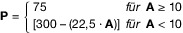

# Vierte Verordnung zur Durchführung des Bundes-Immissionsschutzgesetzes (BImSchV 4 2013)

Ausfertigungsdatum
:   2013-05-02

Fundstelle
:   BGBl I: 2013, 973 (3756)

Neugefasst durch
:   Bek. v. 31.5.2017 I 1440;

Geändert durch
:   Art. 1 V v. 12.1.2021 I 69

## § 1 Genehmigungsbedürftige Anlagen

(1) Die Errichtung und der Betrieb der im Anhang 1 genannten Anlagen
bedürfen einer Genehmigung, soweit den Umständen nach zu erwarten ist,
dass sie länger als während der zwölf Monate, die auf die
Inbetriebnahme folgen, an demselben Ort betrieben werden. Für die in
Nummer 8 des Anhangs 1 genannten Anlagen, ausgenommen Anlagen zur
Behandlung am Entstehungsort, gilt Satz 1 auch, soweit sie weniger als
während der zwölf Monate, die auf die Inbetriebnahme folgen, an
demselben Ort betrieben werden sollen. Für die in den Nummern 2.10.2,
7\.4, 7.5, 7.25, 7.28, 9.1, 9.3 und 9.11 des Anhangs 1 genannten
Anlagen gilt Satz 1 nur, soweit sie gewerblichen Zwecken dienen oder
im Rahmen wirtschaftlicher Unternehmungen verwendet werden. Hängt die
Genehmigungsbedürftigkeit der im Anhang 1 genannten Anlagen vom
Erreichen oder Überschreiten einer bestimmten Leistungsgrenze oder
Anlagengröße ab, ist jeweils auf den rechtlich und tatsächlich
möglichen Betriebsumfang der durch denselben Betreiber betriebenen
Anlage abzustellen.

(2) Das Genehmigungserfordernis erstreckt sich auf alle vorgesehenen

1.  Anlagenteile und Verfahrensschritte, die zum Betrieb notwendig sind,
    und

2.  Nebeneinrichtungen, die mit den Anlagenteilen und Verfahrensschritten
    nach Nummer 1 in einem räumlichen und betriebstechnischen Zusammenhang
    stehen und die von Bedeutung sein können für

    a)  das Entstehen schädlicher Umwelteinwirkungen,

    b)  die Vorsorge gegen schädliche Umwelteinwirkungen oder

    c)  das Entstehen sonstiger Gefahren, erheblicher Nachteile oder
        erheblicher Belästigungen.

(3) Die im Anhang 1 bestimmten Voraussetzungen sind auch erfüllt, wenn
mehrere Anlagen derselben Art in einem engen räumlichen und
betrieblichen Zusammenhang stehen (gemeinsame Anlage) und zusammen die
maßgebenden Leistungsgrenzen oder Anlagengrößen erreichen oder
überschreiten werden. Ein enger räumlicher und betrieblicher
Zusammenhang ist gegeben, wenn die Anlagen

1.  auf demselben Betriebsgelände liegen,

2.  mit gemeinsamen Betriebseinrichtungen verbunden sind und

3.  einem vergleichbaren technischen Zweck dienen.

(4) Gehören zu einer Anlage Teile oder Nebeneinrichtungen, die je
gesondert genehmigungsbedürftig wären, so bedarf es lediglich einer
Genehmigung.

(5) Soll die für die Genehmigungsbedürftigkeit maßgebende
Leistungsgrenze oder Anlagengröße durch die Erweiterung einer
bestehenden Anlage erstmals überschritten werden, bedarf die gesamte
Anlage der Genehmigung.

(6) Keiner Genehmigung bedürfen Anlagen, soweit sie der Forschung,
Entwicklung oder Erprobung neuer Einsatzstoffe, Brennstoffe,
Erzeugnisse oder Verfahren im Labor- oder Technikumsmaßstab dienen;
hierunter fallen auch solche Anlagen im Labor- oder Technikumsmaßstab,
in denen neue Erzeugnisse in der für die Erprobung ihrer Eigenschaften
durch Dritte erforderlichen Menge vor der Markteinführung hergestellt
werden, soweit die neuen Erzeugnisse noch weiter erforscht oder
entwickelt werden.

(7) Keiner Genehmigung bedürfen Anlagen zur Lagerung von Stoffen, die
eine Behörde in Erfüllung ihrer gesetzlichen Aufgabe zur
Gefahrenabwehr sichergestellt hat.

## § 2 Zuordnung zu den Verfahrensarten

(1) Das Genehmigungsverfahren wird durchgeführt nach

1.  § 10 des Bundes-Immissionsschutzgesetzes für

    a)  Anlagen, die in Spalte c des Anhangs 1 mit dem Buchstaben G
        gekennzeichnet sind,

    b)  Anlagen, die sich aus in Spalte c des Anhangs 1 mit dem Buchstaben G
        und dem Buchstaben V gekennzeichneten Anlagen zusammensetzen,

    c)  Anlagen, die in Spalte c des Anhangs 1 mit dem Buchstaben V
        gekennzeichnet sind und zu deren Genehmigung nach den §§ 3a bis 3f des
        Gesetzes über die Umweltverträglichkeitsprüfung eine
        Umweltverträglichkeitsprüfung durchzuführen ist,

2.  § 19 des Bundes-Immissionsschutzgesetzes im vereinfachten Verfahren
    für in Spalte c des Anhangs 1 mit dem Buchstaben V gekennzeichnete
    Anlagen.

Soweit die Zuordnung zu den Genehmigungsverfahren von der
Leistungsgrenze oder Anlagengröße abhängt, gilt § 1 Absatz 1 Satz 4
entsprechend.

(2) Kann eine Anlage vollständig verschiedenen Anlagenbezeichnungen im
Anhang 1 zugeordnet werden, so ist die speziellere Anlagenbezeichnung
maßgebend.

(3) Für in Spalte c des Anhangs 1 mit dem Buchstaben G gekennzeichnete
Anlagen, die ausschließlich oder überwiegend der Entwicklung und
Erprobung neuer Verfahren, Einsatzstoffe, Brennstoffe oder Erzeugnisse
dienen (Versuchsanlagen), wird das vereinfachte Verfahren
durchgeführt, wenn die Genehmigung für einen Zeitraum von höchstens
drei Jahren nach Inbetriebnahme der Anlage erteilt werden soll; dieser
Zeitraum kann auf Antrag um höchstens ein Jahr verlängert werden. Satz
1 ist auf Anlagen der Anlage 1 (Liste „UVP-pflichtige Vorhaben“) zum
Gesetz über die Umweltverträglichkeitsprüfung nur anzuwenden, soweit
nach den Vorschriften dieses Gesetzes keine
Umweltverträglichkeitsprüfung durchzuführen ist. Soll die Lage, die
Beschaffenheit oder der Betrieb einer nach Satz 1 genehmigten Anlage
für einen anderen Entwicklungs- oder Erprobungszweck geändert werden,
ist ein Verfahren nach Satz 1 durchzuführen.

(4) Wird die für die Zuordnung zu einer Verfahrensart maßgebende
Leistungsgrenze oder Anlagengröße durch die Errichtung und den Betrieb
einer weiteren Teilanlage oder durch eine sonstige Erweiterung der
Anlage erreicht oder überschritten, so wird die Genehmigung für die
Änderung in dem Verfahren erteilt, dem die Anlage nach der Summe ihrer
Leistung oder Größe entspricht.

## § 3 Anlagen nach der Industrieemissions-Richtlinie

Anlagen nach Artikel 10 in Verbindung mit Anhang I der Richtlinie
2010/75/EU des Europäischen Parlaments und des Rates vom 24. November
2010 über Industrieemissionen (integrierte Vermeidung und Verminderung
der Umweltverschmutzung) (Neufassung) (ABl. L 334 vom 17.12.2010, S.
17) sind Anlagen, die in Spalte d des Anhangs 1 mit dem Buchstaben E
gekennzeichnet sind.

## Anhang 1

(Fundstelle: BGBl. I 2017, 1443 — 1465)

**Rohstoffbegriff in Nummer 7**

Der in Anlagenbeschreibungen unter Nummer 7 verwendete Begriff
„Rohstoff“ gilt unabhängig davon, ob dieser zuvor verarbeitet wurde
oder nicht.

**Abfallbegriff in Nummer 8**

Der in den Anlagenbeschreibungen unter den Nummern 8.2 bis 8.15
verwendete Begriff „Abfall“ betrifft jeweils ausschließlich Abfälle,
auf die die Vorschriften des Kreislaufwirtschaftsgesetzes Anwendung
finden.

**Mischungsregel**

Wird in Anlagenbeschreibungen unter Nummer 7 auf diese Mischungsregel
Bezug genommen, errechnet sich die Produktionskapazität **P**
beim Einsatz tierischer und pflanzlicher Rohstoffe wie folgt:

wobei **A**              den gewichtsprozentualen Anteil der
tierischen Rohstoffe an den insgesamt eingesetzten Rohstoffen
darstellt.

**Legende**

Nr.:
Ordnungsnummer der Anlagenart

Anlagenbeschreibung:

Die vollständige Beschreibung der Anlagenart ergibt sich aus dem
fortlaufenden Text von der 2. bis zur jeweils letzten Gliederungsebene
der Ordnungsnummer.
(z. B. ergibt sich die vollständige Beschreibung der Anlagenart von
Nummer 1.2.4.1 aus dem fortlaufenden Text der Nummern 1.2, 1.2.4 und
1\.2.4.1)

Verfahrensart:

*    *
    *   **G**                       :

    *   **G**                       enehmigungsverfahren gemäß § 10 BImSchG
        (mit Öffentlichkeitsbeteiligung)

*    *
    *   **V**                       :

    *   **V**                       ereinfachtes Verfahren gemäß § 19 BImSchG
        (ohne Öffentlichkeitsbeteiligung)

Anlage gemäß Art. 10 der Richtlinie 2010/75/EU:

*    *
    *   **E**                       :

    *   Anlage gemäß § 3

*    *   Nr.

    *   Anlagenbeschreibung

    *   Verfahrensart

    *   Anlage
        gemäß
        Art. 10 der RL 2010/75/EU

*    *   a

    *   b

    *   c

    *   d

*    *   **1.**

    *   **Wärmeerzeugung, Bergbau und Energie**

    *
    *

*    *   **1.1**

    *   Anlagen zur Erzeugung von Strom, Dampf, Warmwasser, Prozesswärme oder
        erhitztem Abgas durch den Einsatz von Brennstoffen in einer
        Verbrennungseinrichtung (wie Kraftwerk, Heizkraftwerk, Heizwerk,
        Gasturbinenanlage, Verbrennungsmotoranlage, sonstige Feuerungsanlage),
        einschließlich zugehöriger Dampfkessel, mit einer
        Feuerungswärmeleistung von 50 Megawatt oder mehr;

    *   **G**

    *   **E**

*    *   **1.2**

    *   Anlagen zur Erzeugung von Strom, Dampf, Warmwasser, Prozesswärme oder
        erhitztem Abgas in einer Verbrennungseinrichtung (wie Kraftwerk,
        Heizkraftwerk, Heizwerk, Gasturbinenanlage, Verbrennungsmotoranlage,
        sonstige Feuerungsanlage), einschließlich zugehöriger Dampfkessel,
        ausgenommen Verbrennungsmotoranlagen für Bohranlagen und
        Notstromaggregate, durch den Einsatz von

    *
    *

*    *   1.2.1

    *   Kohle, Koks einschließlich Petrolkoks, Kohlebriketts, Torfbriketts,
        Brenntorf, naturbelassenem Holz sowie in der eigenen Produktionsanlage
        anfallendem gestrichenem, lackiertem oder beschichtetem Holz oder
        Sperrholz, Spanplatten, Faserplatten oder sonst verleimtem Holz sowie
        daraus anfallenden Resten, soweit keine Holzschutzmittel aufgetragen
        oder infolge einer Behandlung enthalten sind und Beschichtungen keine
        halogenorganischen Verbindungen oder Schwermetalle enthalten,
        emulgiertem Naturbitumen, Heizölen, ausgenommen Heizöl EL, mit einer
        Feuerungswärmeleistung von 1 Megawatt bis weniger als 50 Megawatt,

    *   **V**

    *

*    *   1.2.2

    *   gasförmigen Brennstoffen (insbesondere Koksofengas, Grubengas,
        Stahlgas, Raffineriegas, Synthesegas, Erdölgas aus der
        Tertiärförderung von Erdöl, Klärgas, Biogas), ausgenommen
        naturbelassenem Erdgas, Flüssiggas, Gasen der öffentlichen
        Gasversorgung oder Wasserstoff, mit einer Feuerungswärmeleistung von

    *
    *

*    *   1.2.2.1

    *   10 Megawatt bis weniger als 50 Megawatt,

    *   **V**

    *

*    *   1.2.2.2

    *   1 Megawatt bis weniger als 10 Megawatt, bei Verbrennungsmotoranlagen
        oder Gasturbinenanlagen,

    *   **V**

    *

*    *   1.2.3

    *   Heizöl EL, Dieselkraftstoff, Methanol, Ethanol, naturbelassenen
        Pflanzenölen oder Pflanzenölmethylestern, naturbelassenem Erdgas,
        Flüssiggas, Gasen der öffentlichen Gasversorgung oder Wasserstoff mit
        einer Feuerungswärmeleistung von

    *
    *

*    *   1.2.3.1

    *   20 Megawatt bis weniger als 50 Megawatt,

    *   **V**

    *

*    *   1.2.3.2

    *   1 Megawatt bis weniger als 20 Megawatt, bei Verbrennungsmotoranlagen
        oder Gasturbinenanlagen,

    *   **V**

    *

*    *   1.2.4

    *   anderen als in Nummer 1.2.1 oder 1.2.3 genannten festen oder flüssigen
        Brennstoffen mit einer Feuerungswärmeleistung von 100 Kilowatt bis
        weniger als 50 Megawatt;

    *   **V**

    *

*    *   **1.3**

    *   (nicht besetzt)

    *
    *

*    *   **1.4**

    *   Verbrennungsmotoranlagen oder Gasturbinenanlagen zum Antrieb von
        Arbeitsmaschinen für den Einsatz von

    *
    *

*    *   1.4.1

    *   Heizöl EL, Dieselkraftstoff, Methanol, Ethanol, naturbelassenen
        Pflanzenölen, Pflanzenölmethylestern, Koksofengas, Grubengas,
        Stahlgas, Raffineriegas, Synthesegas, Erdölgas aus der
        Tertiärförderung von Erdöl, Klärgas, Biogas, naturbelassenem Erdgas,
        Flüssiggas, Gasen der öffentlichen Gasversorgung oder Wasserstoff mit
        einer Feuerungswärmeleistung von

    *
    *

*    *   1.4.1.1

    *   50 Megawatt oder mehr,

    *   **G**

    *   **E**

*    *   1.4.1.2

    *   1 Megawatt bis weniger als 50 Megawatt, ausgenommen
        Verbrennungsmotoranlagen für Bohranlagen,

    *   **V**

    *

*    *   1.4.2

    *   anderen als in Nummer 1.4.1 genannten Brennstoffen mit einer
        Feuerungswärmeleistung von

    *
    *

*    *   1.4.2.1

    *   50 Megawatt oder mehr,

    *   **G**

    *   **E**

*    *   1.4.2.2

    *   100 Kilowatt bis weniger als 50 Megawatt;

    *   **V**

    *

*    *   **1.5**

    *   (nicht besetzt)

    *
    *

*    *   **1.6**

    *   Anlagen zur Nutzung von Windenergie mit einer Gesamthöhe von mehr als
        50 Metern und

    *
    *

*    *   1.6.1

    *   20 oder mehr Windkraftanlagen,

    *   **G**

    *

*    *   1.6.2

    *   weniger als 20 Windkraftanlagen;

    *   **V**

    *

*    *   **1.7**

    *   (nicht besetzt)

    *
    *

*    *   **1.8**

    *   Elektroumspannanlagen mit einer Oberspannung von 220 Kilovolt oder
        mehr einschließlich der Schaltfelder, ausgenommen eingehauste
        Elektroumspannanlagen;

    *   **V**

    *

*    *   **1.9**

    *   Anlagen zum Mahlen oder Trocknen von Kohle mit einer Kapazität von 1
        Tonne oder mehr je Stunde;

    *   **V**

    *

*    *   **1.10**

    *   Anlagen zum Brikettieren von Braun- oder Steinkohle;

    *   **G**

    *

*    *   **1.11**

    *   Anlagen zur Trockendestillation (z. B. Kokereien, Gaswerke und
        Schwelereien), insbesondere von Steinkohle oder Braunkohle, Holz, Torf
        oder Pech, ausgenommen Holzkohlenmeiler;

    *   **G**

    *   **E**

*    *   **1.12**

    *   Anlagen zur Destillation oder Weiterverarbeitung von Teer oder
        Teererzeugnissen oder von Teer- oder Gaswasser;

    *   **G**

    *

*    *   **1.13**

    *   (nicht besetzt)

    *
    *

*    *   **1.14**

    *   Anlagen zur Vergasung oder Verflüssigung von

    *
    *

*    *   1.14.1

    *   Kohle,

    *   **G**

    *   **E**

*    *   1.14.2

    *   bituminösem Schiefer mit einem Energieäquivalent von

    *
    *

*    *   1.14.2.1

    *   20 Megawatt oder mehr,

    *   **G**

    *   **E**

*    *   1.14.2.2

    *   weniger als 20 Megawatt,

    *   **G**

    *

*    *   1.14.3

    *   anderen Brennstoffen als Kohle oder bituminösem Schiefer, insbesondere
        zur Erzeugung von Generator-, Wasser-, oder Holzgas, mit einer
        Produktionskapazität an Stoffen, entsprechend einem Energieäquivalent
        von

    *
    *

*    *   1.14.3.1

    *   20 Megawatt oder mehr,

    *   **G**

    *   **E**

*    *   1.14.3.2

    *   1 Megawatt bis weniger als 20 Megawatt;

    *   **V**

    *

*    *   **1.15**

    *   Anlagen zur Erzeugung von Biogas, soweit nicht von Nummer 8.6 erfasst,
        mit einer Produktionskapazität von 1,2 Million Normkubikmetern je Jahr
        Rohgas oder mehr;

    *   **V**

    *

*    *   **1.16**

    *   Anlagen zur Aufbereitung von Biogas mit einer Verarbeitungskapazität
        von 1,2 Million Normkubikmetern je Jahr Rohgas oder mehr;

    *   **V**

    *

*    *   **2.**

    *   **Steine und Erden, Glas, Keramik, Baustoffe**

    *
    *

*    *   **2.1**

    *   Steinbrüche mit einer Abbaufläche von

    *
    *

*    *   2.1.1

    *   10 Hektar oder mehr,

    *   **G**

    *

*    *   2.1.2

    *   weniger als 10 Hektar, soweit Sprengstoffe verwendet werden;

    *   **V**

    *

*    *   **2.2**

    *   Anlagen zum Brechen, Trocknen, Mahlen oder Klassieren von natürlichem
        oder künstlichem Gestein, ausgenommen Klassieranlagen für Sand oder
        Kies sowie Anlagen, die nicht mehr als zehn Tage im Jahr betrieben
        werden;

    *   **V**

    *

*    *   **2.3**

    *   Anlagen zur Herstellung von Zementklinker oder Zementen mit einer
        Produktionskapazität von

    *
    *

*    *   2.3.1

    *   500 Tonnen oder mehr je Tag,

    *   **G**

    *   **E**

*    *   2.3.2

    *   50 Tonnen bis weniger als 500 Tonnen je Tag, soweit nicht in
        Drehrohröfen hergestellt,

    *   **G**

    *   **E**

*    *   2.3.3

    *   weniger als 500 Tonnen je Tag, soweit in Drehrohröfen hergestellt,

    *   **V**

    *

*    *   2.3.4

    *   weniger als 50 Tonnen je Tag, soweit nicht in Drehrohröfen
        hergestellt;

    *   **V**

    *

*    *   **2.4**

    *   Anlagen zum Brennen von

    *
    *

*    *   2.4.1

    *   Kalkstein, Magnesit oder Dolomit mit einer Produktionskapazität von

    *
    *

*    *   2.4.1.1

    *   50 Tonnen oder mehr Branntkalk oder Magnesiumoxid je Tag,

    *   **G**

    *   **E**

*    *   2.4.1.2

    *   weniger als 50 Tonnen Branntkalk oder Magnesiumoxid je Tag,

    *   **V**

    *

*    *   2.4.2

    *   Bauxit, Gips, Kieselgur, Quarzit oder Ton zu Schamotte;

    *   **V**

    *

*    *   **2.5**

    *   Anlagen zur Gewinnung von Asbest;

    *   **G**

    *   **E**

*    *   **2.6**

    *   Anlagen zur Be- oder Verarbeitung von Asbest oder Asbesterzeugnissen;

    *   **G**

    *   **E**

*    *   **2.7**

    *   Anlagen zum Blähen von Perlite oder Schiefer;

    *   **V**

    *

*    *   **2.8**

    *   Anlagen zur Herstellung von Glas, auch soweit es aus Altglas
        hergestellt wird, einschließlich Anlagen zur Herstellung von
        Glasfasern, mit einer Schmelzkapazität von

    *
    *

*    *   2.8.1

    *   20 Tonnen oder mehr je Tag,

    *   **G**

    *   **E**

*    *   2.8.2

    *   100 Kilogramm bis weniger als 20 Tonnen je Tag, ausgenommen in Anlagen
        zur Herstellung von Glasfasern, die für medizinische oder
        fernmeldetechnische Zwecke bestimmt sind;

    *   **V**

    *

*    *   **2.9**

    *   (nicht besetzt)

    *
    *

*    *   **2.10**

    *   Anlagen zum Brennen keramischer Erzeugnisse (einschließlich Anlagen
        zum Blähen von Ton) mit einer Produktionskapazität von

    *
    *

*    *   2.10.1

    *   75 Tonnen oder mehr je Tag,

    *   **G**

    *   **E**

*    *   2.10.2

    *   weniger als 75 Tonnen je Tag, soweit der Rauminhalt der Brennanlage 4
        Kubikmeter oder mehr beträgt oder die Besatzdichte mehr als 100
        Kilogramm je Kubikmeter Rauminhalt der Brennanlage beträgt,
        ausgenommen elektrisch beheizte Brennöfen, die diskontinuierlich und
        ohne Abluftführung betrieben werden;

    *   **V**

    *

*    *   **2.11**

    *   Anlagen zum Schmelzen mineralischer Stoffe einschließlich Anlagen zur
        Herstellung von Mineralfasern mit einer Schmelzkapazität von

    *
    *

*    *   2.11.1

    *   20 Tonnen oder mehr je Tag,

    *   **G**

    *   **E**

*    *   2.11.2

    *   weniger als 20 Tonnen je Tag;

    *   **V**

    *

*    *   **2.12**

    *   (nicht besetzt)

    *
    *

*    *   **2.13**

    *   (nicht besetzt)

    *
    *

*    *   **2.14**

    *   Anlagen zur Herstellung von Formstücken unter Verwendung von Zement
        oder anderen Bindemitteln durch Stampfen, Schocken, Rütteln oder
        Vibrieren mit einer Produktionskapazität von 10 Tonnen oder mehr je
        Stunde;

    *   **V**

    *

*    *   **2.15**

    *   Anlagen zur Herstellung oder zum Schmelzen von Mischungen aus Bitumen
        oder Teer mit Mineralstoffen, ausgenommen Anlagen, die Mischungen in
        Kaltbauweise herstellen, einschließlich Aufbereitungsanlagen für
        bituminöse Straßenbaustoffe und Teersplittanlagen;

    *   **V**

    *

*    *   **3.**

    *   **Stahl, Eisen und sonstige Metalle einschließlich Verarbeitung**

    *
    *

*    *   **3.1**

    *   Anlagen zum Rösten (Erhitzen unter Luftzufuhr zur Überführung in
        Oxide), Schmelzen oder Sintern (Stückigmachen von feinkörnigen Stoffen
        durch Erhitzen) von Erzen;

    *   **G**

    *   **E**

*    *   **3.2**

    *   Anlagen zur Herstellung oder zum Erschmelzen von Roheisen

    *
    *

*    *   3.2.1

    *   und zur Weiterverarbeitung zu Rohstahl, bei denen sich Gewinnungs- und
        Weiterverarbeitungseinheiten nebeneinander befinden und in
        funktioneller Hinsicht miteinander verbunden sind (Integrierte
        Hüttenwerke), mit einer Schmelzkapazität von

    *
    *

*    *   3.2.1.1

    *   2,5 Tonnen oder mehr je Stunde,

    *   **G**

    *   **E**

*    *   3.2.1.2

    *   weniger als 2,5 Tonnen je Stunde,

    *   **G**

    *

*    *   3.2.2

    *   oder Stahl, einschließlich Stranggießen, auch soweit Konzentrate oder
        sekundäre Rohstoffe eingesetzt werden, mit einer Schmelzkapazität von

    *
    *

*    *   3.2.2.1

    *   2,5 Tonnen oder mehr je Stunde,

    *   **G**

    *   **E**

*    *   3.2.2.2

    *   weniger als 2,5 Tonnen je Stunde;

    *   **V**

    *

*    *   **3.3**

    *   Anlagen zur Herstellung von Nichteisenrohmetallen aus Erzen,
        Konzentraten oder sekundären Rohstoffen durch metallurgische,
        chemische oder elektrolytische Verfahren;

    *   **G**

    *   **E**

*    *   **3.4**

    *   Anlagen zum Schmelzen, zum Legieren oder zur Raffination von
        Nichteisenmetallen mit einer Schmelzkapazität von

    *
    *

*    *   3.4.1

    *   4 Tonnen je Tag oder mehr bei Blei und Cadmium oder von 20 Tonnen je
        Tag oder mehr bei sonstigen Nichteisenmetallen,

    *   **G**

    *   **E**

*    *   3.4.2

    *   0,5 Tonnen bis weniger als 4 Tonnen je Tag bei Blei und Cadmium oder
        von 2 Tonnen bis weniger als 20 Tonnen je Tag bei sonstigen
        Nichteisenmetallen, ausgenommen

        1.  Vakuum-Schmelzanlagen,

        2.  Schmelzanlagen für Gusslegierungen aus Zinn und Wismut oder aus
            Feinzink und Aluminium in Verbindung mit Kupfer oder Magnesium,

        3.  Schmelzanlagen, die Bestandteil von Druck- oder Kokillengießmaschinen
            sind oder die ausschließlich im Zusammenhang mit einzelnen Druck-
            oder Kokillengießmaschinen gießfertige Nichteisenmetalle oder
            gießfertige Legierungen niederschmelzen,

        4.  Schmelzanlagen für Edelmetalle oder für Legierungen, die nur aus
            Edelmetallen oder aus Edelmetallen und Kupfer bestehen,

        5.  Schwalllötbäder und

        6.  Heißluftverzinnungsanlagen;

    *   **V**

    *

*    *   **3.5**

    *   Anlagen zum Abziehen der Oberflächen von Stahl, insbesondere von
        Blöcken, Brammen, Knüppeln, Platinen oder Blechen, durch Flämmen;

    *   **V**

    *

*    *   **3.6**

    *   Anlagen zur Umformung von

    *
    *

*    *   3.6.1

    *   Stahl durch Warmwalzen mit einer Kapazität je Stunde von

    *
    *

*    *   3.6.1.1

    *   20 Tonnen oder mehr,

    *   **G**

    *   **E**

*    *   3.6.1.2

    *   weniger als 20 Tonnen,

    *   **V**

    *

*    *   3.6.2

    *   Stahl durch Kaltwalzen mit einer Bandbreite von 650 Millimetern oder
        mehr,

    *   **V**

    *

*    *   3.6.3

    *   Schwermetallen, ausgenommen Eisen oder Stahl, durch Walzen mit einer
        Kapazität von 1 Tonne oder mehr je Stunde,

    *   **V**

    *

*    *   3.6.4

    *   Leichtmetallen durch Walzen mit einer Kapazität von 0,5 Tonnen oder
        mehr je Stunde;

    *   **V**

    *

*    *   **3.7**

    *   Eisen-, Temper- oder Stahlgießereien mit einer Verarbeitungskapazität
        an Flüssigmetall von

    *
    *

*    *   3.7.1

    *   20 Tonnen oder mehr je Tag,

    *   **G**

    *   **E**

*    *   3.7.2

    *   2 Tonnen bis weniger als 20 Tonnen je Tag;

    *   **V**

    *

*    *   **3.8**

    *   Gießereien für Nichteisenmetalle mit einer Verarbeitungskapazität an
        Flüssigmetall von

    *
    *

*    *   3.8.1

    *   4 Tonnen oder mehr je Tag bei Blei und Cadmium oder 20 Tonnen oder
        mehr je Tag bei sonstigen Nichteisenmetallen,

    *   **G**

    *   **E**

*    *   3.8.2

    *   0,5 Tonnen bis weniger als 4 Tonnen je Tag bei Blei und Cadmium oder 2
        Tonnen bis weniger als 20 Tonnen je Tag bei sonstigen
        Nichteisenmetallen, ausgenommen

        1.  Gießereien für Glocken- oder Kunstguss,

        2.  Gießereien, in denen in metallische Formen abgegossen wird, und

        3.  Gießereien, in denen das Material in ortsbeweglichen Tiegeln

        niedergeschmolzen wird;

    *   **V**

    *

*    *   **3.9**

    *   Anlagen zum Aufbringen von metallischen Schutzschichten

    *
    *

*    *   3.9.1

    *   mit Hilfe von schmelzflüssigen Bädern auf Metalloberflächen mit einer
        Verarbeitungskapazität von

    *
    *

*    *   3.9.1.1

    *   2 Tonnen oder mehr Rohstahl je Stunde,

    *   **G**

    *   **E**

*    *   3.9.1.2

    *   2 Tonnen oder mehr Rohgut je Stunde, soweit nicht von der Nummer
        3\.9.1.1 erfasst,

    *   **G**

    *

*    *   3.9.1.3

    *   500 Kilogramm bis weniger als 2 Tonnen Rohgut je Stunde, ausgenommen
        Anlagen zum kontinuierlichen Verzinken nach dem Sendzimirverfahren,

    *   **V**

    *

*    *   3.9.2

    *   durch Flamm-, Plasma- oder Lichtbogenspritzen

    *
    *

*    *   3.9.2.1

    *   auf Metalloberflächen mit einer Verarbeitungskapazität von 2 Tonnen
        oder mehr Rohstahl je Stunde,

    *   **G**

    *   **E**

*    *   3.9.2.2

    *   auf Metall- oder Kunststoffoberflächen mit einem Durchsatz an Blei,
        Zinn, Zink, Nickel, Kobalt oder ihren Legierungen von 2 Kilogramm oder
        mehr je Stunde;

    *   **V**

    *

*    *   **3.10**

    *   Anlagen zur Oberflächenbehandlung mit einem Volumen der Wirkbäder von

    *
    *

*    *   3.10.1

    *   30 Kubikmeter oder mehr bei der Behandlung von Metall- oder
        Kunststoffoberflächen durch ein elektrolytisches oder chemisches
        Verfahren,

    *   **G**

    *   **E**

*    *   3.10.2

    *   1 Kubikmeter bis weniger als 30 Kubikmeter bei der Behandlung von
        Metalloberflächen durch Beizen oder Brennen unter Verwendung von
        Fluss- oder Salpetersäure;

    *   **V**

    *

*    *   **3.11**

    *   Anlagen, die aus einem oder mehreren maschinell angetriebenen Hämmern
        oder Fallwerken bestehen, wenn die Schlagenergie eines Hammers oder
        Fallwerkes

    *
    *

*    *   3.11.1

    *   50 Kilojoule oder mehr und die Feuerungswärmeleistung der
        Wärmebehandlungsöfen 20 Megawatt oder mehr beträgt,

    *   **G**

    *   **E**

*    *   3.11.2

    *   50 Kilojoule oder mehr beträgt, soweit nicht von Nummer 3.11.1
        erfasst,

    *   **G**

    *

*    *   3.11.3

    *   1 Kilojoule bis weniger als 50 Kilojoule beträgt;

    *   **V**

    *

*    *   **3.12**

    *   (nicht besetzt)

    *
    *

*    *   **3.13**

    *   Anlagen zur Sprengverformung oder zum Plattieren mit Sprengstoffen bei
        einem Einsatz von 10 Kilogramm Sprengstoff oder mehr je Schuss;

    *   **V**

    *

*    *   **3.14 – 3.15**

    *   (nicht besetzt)

    *
    *

*    *   **3.16**

    *   Anlagen zur Herstellung von warmgefertigten nahtlosen oder
        geschweißten Rohren aus Stahl mit einer Produktionskapazität von

    *
    *

*    *   3.16.1

    *   20 Tonnen oder mehr je Stunde,

    *   **G**

    *   **E**

*    *   3.16.2

    *   weniger als 20 Tonnen je Stunde;

    *   **G**

    *

*    *   **3.17**

    *   (nicht besetzt)

    *
    *

*    *   **3.18**

    *   Anlage zur Herstellung oder Reparatur von Schiffskörpern oder
        -sektionen (Schiffswerft) aus Metall mit einer Länge von 20 Metern
        oder mehr;

    *   **G**

    *

*    *   **3.19**

    *   Anlagen zum Bau von Schienenfahrzeugen mit einer Produktionskapazität
        von 600 Schienenfahrzeugeinheiten oder mehr je Jahr; 1
        Schienenfahrzeugeinheit entspricht 0,5 Lokomotiven, 1 Straßenbahn, 1
        Wagen eines Triebzuges, 1 Triebkopf, 1 Personenwagen oder 3
        Güterwagen;

    *   **G**

    *

*    *   **3.20**

    *   Anlagen zur Oberflächenbehandlung von Gegenständen aus Stahl, Blech
        oder Guss mit festen Strahlmitteln, die außerhalb geschlossener Räume
        betrieben werden, ausgenommen nicht begehbare Handstrahlkabinen sowie
        Anlagen mit einem Luftdurchsatz von weniger als 300 Kubikmetern je
        Stunde;

    *   **V**

    *

*    *   **3.21**

    *   Anlagen zur Herstellung von Bleiakkumulatoren;

    *   **V**

    *

*    *   **3.22**

    *   Anlagen zur Behandlung von Schrotten in Schredderanlagen, sofern nicht
        von Nummer 8.9 erfasst, mit einer Durchsatzkapazität an
        Eingangsstoffen von

    *
    *

*    *   3.22.1

    *   50 Tonnen oder mehr je Tag,

    *   **G**

    *

*    *   3.22.2

    *   10 Tonnen bis weniger als 50 Tonnen je Tag;

    *   **V**

    *

*    *   **3.23**

    *   Anlagen zur Herstellung von Metallpulvern oder -pasten, insbesondere
        Aluminium-, Eisen- oder Magnesiumpulver oder -pasten oder blei- oder
        nickelhaltigen Pulvern oder Pasten, ausgenommen Anlagen zur
        Herstellung von Edelmetallpulver;

    *   **V**

    *

*    *   **3.24**

    *   Anlagen für den Bau und die Montage von Kraftfahrzeugen oder Anlagen
        für den Bau von Kraftfahrzeugmotoren mit einer Kapazität von jeweils
        100 000 Stück oder mehr je Jahr;

    *   **G**

    *

*    *   **3.25**

    *   Anlagen für Bau und Instandhaltung, ausgenommen die Wartung
        einschließlich kleinerer Reparaturen, von Luftfahrzeugen,

    *
    *

*    *   3.25.1

    *   soweit je Jahr mehr als 50 Luftfahrzeuge hergestellt werden können,

    *   **G**

    *

*    *   3.25.2

    *   soweit je Jahr mehr als 50 Luftfahrzeuge instand gehalten werden
        können;

    *   **V**

    *

*    *   **4.**

    *   **Chemische Erzeugnisse, Arzneimittel, Mineralölraffination und
        Weiterverarbeitung**

    *
    *

*    *   **4.1**

    *   Anlagen zur Herstellung von Stoffen oder Stoffgruppen durch chemische,
        biochemische oder biologische Umwandlung in industriellem Umfang,
        ausgenommen Anlagen zur Erzeugung oder Spaltung von Kernbrennstoffen
        oder zur Aufarbeitung bestrahlter Kernbrennstoffe, zur Herstellung von

    *
    *

*    *   4.1.1

    *   Kohlenwasserstoffen (lineare oder ringförmige, gesättigte oder
        ungesättigte, aliphatische oder aromatische),

    *   **G**

    *   **E**

*    *   4.1.2

    *   sauerstoffhaltigen Kohlenwasserstoffen wie Alkohole, Aldehyde, Ketone,
        Carbonsäuren, Ester, Acetate, Ether, Peroxide, Epoxide,

    *   **G**

    *   **E**

*    *   4.1.3

    *   schwefelhaltigen Kohlenwasserstoffen,

    *   **G**

    *   **E**

*    *   4.1.4

    *   stickstoffhaltigen Kohlenwasserstoffen wie Amine, Amide, Nitroso-,
        Nitro- oder Nitratverbindungen, Nitrile, Cyanate, Isocyanate,

    *   **G**

    *   **E**

*    *   4.1.5

    *   phosphorhaltigen Kohlenwasserstoffen,

    *   **G**

    *   **E**

*    *   4.1.6

    *   halogenhaltigen Kohlenwasserstoffen,

    *   **G**

    *   **E**

*    *   4.1.7

    *   metallorganischen Verbindungen,

    *   **G**

    *   **E**

*    *   4.1.8

    *   Kunststoffen (Kunstharzen, Polymeren, Chemiefasern, Fasern auf
        Zellstoffbasis),

    *   **G**

    *   **E**

*    *   4.1.9

    *   synthetischen Kautschuken,

    *   **G**

    *   **E**

*    *   4.1.10

    *   Farbstoffen und Pigmenten sowie von Ausgangsstoffen für Farben und
        Anstrichmittel,

    *   **G**

    *   **E**

*    *   4.1.11

    *   Tensiden,

    *   **G**

    *   **E**

*    *   4.1.12

    *   Gasen wie Ammoniak, Chlor und Chlorwasserstoff, Fluor und
        Fluorwasserstoff, Kohlenstoffoxiden, Schwefelverbindungen,
        Stickstoffoxiden, Wasserstoff, Schwefeldioxid, Phosgen,

    *   **G**

    *   **E**

*    *   4.1.13

    *   Säuren wie Chromsäure, Flusssäure, Phosphorsäure, Salpetersäure,
        Salzsäure, Schwefelsäure, Oleum, schwefelige Säuren,

    *   **G**

    *   **E**

*    *   4.1.14

    *   Basen wie Ammoniumhydroxid, Kaliumhydroxid, Natriumhydroxid,

    *   **G**

    *   **E**

*    *   4.1.15

    *   Salzen wie Ammoniumchlorid, Kaliumchlorat, Kaliumkarbonat,
        Natriumkarbonat, Perborat, Silbernitrat,

    *   **G**

    *   **E**

*    *   4.1.16

    *   Nichtmetallen, Metalloxiden oder sonstigen anorganischen Verbindungen
        wie Kalziumkarbid, Silizium, Siliziumkarbid, anorganische Peroxide,
        Schwefel,

    *   **G**

    *   **E**

*    *   4.1.17

    *   phosphor-, stickstoff- oder kaliumhaltigen Düngemitteln (Einnährstoff-
        oder Mehrnährstoffdünger),

    *   **G**

    *   **E**

*    *   4.1.18

    *   Pflanzenschutzmittel oder Biozide,

    *   **G**

    *   **E**

*    *   4.1.19

    *   Arzneimittel einschließlich Zwischenerzeugnisse,

    *   **G**

    *   **E**

*    *   4.1.20

    *   Explosivstoffen,

    *   **G**

    *   **E**

*    *   4.1.21

    *   Stoffen oder Stoffgruppen, die keiner oder mehreren der Nummern 4.1.1
        bis 4.1.20 entsprechen,

    *   **G**

    *   **E**

*    *   4.1.22

    *
        –   organischen Grundchemikalien,

        –   anorganischen Grundchemikalien,

        –   phosphor-, stickstoff- oder kaliumhaltigen Düngemitteln (Einnährstoff
            oder Mehrnährstoff),

        –   Ausgangsstoffen für Pflanzenschutzmittel und Bioziden,

        –   Grundarzneimitteln unter Verwendung eines chemischen oder
            biologischen Verfahrens oder

        –   Explosivstoffen,

        im Verbund, bei denen sich mehrere Einheiten nebeneinander befinden
        und in funktioneller Hinsicht miteinander verbunden sind (integrierte
        chemische Anlagen);

    *   **G**

    *   **E**

*    *   **4.2**

    *   Anlagen, in denen Pflanzenschutzmittel, Biozide oder ihre Wirkstoffe
        gemahlen oder maschinell gemischt, abgepackt oder umgefüllt werden,
        soweit diese Stoffe in einer Menge von 5 Tonnen je Tag oder mehr
        gehandhabt werden;

    *   **V**

    *

*    *   **4.3**

    *   Anlagen zur Herstellung von Arzneimitteln oder
        Arzneimittelzwischenprodukten im industriellen Umfang, soweit nicht
        von Nummer 4.1.19 erfasst, ausgenommen Anlagen, die ausschließlich der
        Herstellung der Darreichungsform dienen, in denen

    *
    *

*    *   4.3.1

    *   Pflanzen, Pflanzenteile oder Pflanzenbestandteile extrahiert,
        destilliert oder auf ähnliche Weise behandelt werden, ausgenommen
        Extraktionsanlagen mit Ethanol ohne Erwärmen,

    *   **V**

    *

*    *   4.3.2

    *   Tierkörper, auch lebender Tiere, sowie Körperteile, Körperbestandteile
        und Stoffwechselprodukte von Tieren eingesetzt werden;

    *   **V**

    *

*    *   **4.4**

    *   Anlagen zur Destillation oder Raffination oder sonstigen
        Weiterverarbeitung von Erdöl oder Erdölerzeugnissen in

    *
    *

*    *   4.4.1

    *   Mineralölraffinerien,

    *   **G**

    *   **E**

*    *   4.4.2

    *   Schmierstoffraffinerien,

    *   **G**

    *

*    *   4.4.3

    *   Gasraffinerien,

    *   **G**

    *   **E**

*    *   4.4.4

    *   petrochemischen Werken oder bei der Gewinnung von Paraffin;

    *   **G**

    *

*    *   **4.5**

    *   Anlagen zur Herstellung von Schmierstoffen, wie Schmieröle,
        Schmierfette, Metallbearbeitungsöle;

    *   **V**

    *

*    *   **4.6**

    *   Anlagen zur Herstellung von Ruß;

    *   **G**

    *   **E**

*    *   **4.7**

    *   Anlagen zur Herstellung von Kohlenstoff (Hartbrandkohle) oder
        Elektrographit durch Brennen oder Graphitieren, zum Beispiel für
        Elektroden, Stromabnehmer oder Apparateteile;

    *   **G**

    *   **E**

*    *   **4.8**

    *   Anlagen zum Destillieren von flüchtigen organischen Verbindungen, die
        bei einer Temperatur von 293,15 Kelvin einen Dampfdruck von mindestens
        0,01 Kilopascal haben, mit einer Durchsatzkapazität von 1 Tonne oder
        mehr je Stunde;

    *   **V**

    *

*    *   **4.9**

    *   Anlagen zum Erschmelzen von Naturharzen oder Kunstharzen mit einer
        Kapazität von 1 Tonne oder mehr je Tag;

    *   **V**

    *

*    *   **4.10**

    *   Anlagen zur Herstellung von Anstrich- oder Beschichtungsstoffen
        (Lasuren, Firnis, Lacke, Dispersionsfarben) oder Druckfarben unter
        Einsatz von 25 Tonnen oder mehr je Tag an flüchtigen organischen
        Verbindungen, die bei einer Temperatur von 293,15 Kelvin einen
        Dampfdruck von mindestens 0,01 Kilopascal haben;

    *   **G**

    *

*    *   **5.**

    *   **Oberflächenbehandlung mit organischen Stoffen, Herstellung von
        bahnenförmigen Materialien aus Kunststoffen, sonstige Verarbeitung von
        Harzen und Kunststoffen**

    *
    *

*    *   **5.1**

    *   Anlagen zur Behandlung von Oberflächen, ausgenommen Anlagen, soweit
        die Farben oder Lacke ausschließlich hochsiedende Öle (mit einem
        Dampfdruck von weniger als 0,01 Kilopascal bei einer Temperatur von
        293,15 Kelvin) als organische Lösungsmittel enthalten und die
        Lösungsmittel unter den jeweiligen Verwendungsbedingungen keine höhere
        Flüchtigkeit aufweisen,

    *
    *

*    *   5.1.1

    *   von Stoffen, Gegenständen oder Erzeugnissen einschließlich der
        dazugehörigen Trocknungsanlagen unter Verwendung von organischen
        Lösungsmitteln, insbesondere zum Appretieren, Bedrucken, Beschichten,
        Entfetten, Imprägnieren, Kaschieren, Kleben, Lackieren, Reinigen oder
        Tränken mit einem Verbrauch an organischen Lösungsmitteln von

    *
    *

*    *   5.1.1.1

    *   150 Kilogramm oder mehr je Stunde oder 200 Tonnen oder mehr je Jahr,

    *   **G**

    *   **E**

*    *   5.1.1.2

    *   25 Kilogramm bis weniger als 150 Kilogramm je Stunde oder 15 Tonnen
        bis weniger als 200 Tonnen je Jahr, ausgenommen zum Bedrucken,

    *   **V**

    *

*    *   5.1.2

    *   von bahnen- oder tafelförmigen Materialien mit Rotationsdruckmaschinen
        einschließlich der zugehörigen Trocknungsanlagen, soweit die Farben
        oder Lacke

    *
    *

*    *   5.1.2.1

    *   organische Lösungsmittel mit einem Anteil von mehr als 50 Gew.-% an
        Ethanol enthalten und in der Anlage insgesamt 50 Kilogramm bis weniger
        als 150 Kilogramm je Stunde oder 30 Tonnen bis weniger als 200 Tonnen
        je Jahr an organischen Lösungsmitteln verbraucht werden,

    *   **V**

    *

*    *   5.1.2.2

    *   sonstige organische Lösungsmittel enthalten und in der Anlage
        insgesamt 25 Kilogramm bis weniger als 150 Kilogramm organische
        Lösungsmittel je Stunde oder 15 Tonnen bis weniger als 200 Tonnen je
        Jahr an organischen Lösungsmitteln verbraucht werden,

    *   **V**

    *

*    *   5.1.3

    *   zum Isolieren von Drähten unter Verwendung von phenol- oder
        kresolhaltigen Drahtlacken mit einem Verbrauch an organischen
        Lösungsmitteln von weniger als 150 Kilogramm je Stunde oder von
        weniger als 200 Tonnen je Jahr;

    *   **V**

    *

*    *   **5.2**

    *   Anlagen zum Beschichten, Imprägnieren, Kaschieren, Lackieren oder
        Tränken von Gegenständen, Glas- oder Mineralfasern oder bahnen- oder
        tafelförmigen Materialien einschließlich der zugehörigen
        Trocknungsanlagen mit Kunstharzen, die unter weitgehender
        Selbstvernetzung ausreagieren (Reaktionsharze), wie Melamin-,
        Harnstoff-, Phenol-, Epoxid-, Furan-, Kresol-, Resorcin- oder
        Polyesterharzen, ausgenommen Anlagen für den Einsatz von
        Pulverbeschichtungsstoffen, mit einem Harzverbrauch von

    *
    *

*    *   5.2.1

    *   25 Kilogramm oder mehr je Stunde,

    *   **G**

    *

*    *   5.2.2

    *   10 Kilogramm bis weniger als 25 Kilogramm je Stunde;

    *   **V**

    *

*    *   **5.3**

    *   Anlagen zur Konservierung von Holz oder Holzerzeugnissen mit
        Chemikalien, ausgenommen die ausschließliche Bläueschutzbehandlung,
        mit einer Produktionskapazität von mehr als 75 Kubikmetern je Tag;

    *   **G**

    *   **E**

*    *   **5.4**

    *   Anlagen zum Tränken oder Überziehen von Stoffen oder Gegenständen mit
        Teer, Teeröl oder heißem Bitumen, soweit die Menge dieser
        Kohlenwasserstoffe 25 Kilogramm oder mehr je Stunde beträgt,
        ausgenommen Anlagen zum Tränken oder Überziehen von Kabeln mit heißem
        Bitumen;

    *   **V**

    *

*    *   **5.5**

    *   (nicht besetzt)

    *
    *

*    *   **5.6**

    *   Anlagen zur Herstellung von bahnenförmigen Materialien auf
        Streichmaschinen einschließlich der zugehörigen Trocknungsanlagen
        unter Verwendung von Gemischen aus Kunststoffen und Weichmachern oder
        von Gemischen aus sonstigen Stoffen und oxidiertem Leinöl;

    *   **V**

    *

*    *   **5.7**

    *   Anlagen zur Verarbeitung von flüssigen ungesättigten Polyesterharzen
        mit Styrol-Zusatz oder flüssigen Epoxidharzen mit Aminen zu Formmassen
        (zum Beispiel Harzmatten oder Faserformmassen) oder Formteilen oder
        Fertigerzeugnissen, soweit keine geschlossenen Werkzeuge (Formen)
        verwendet werden, für einen Harzverbrauch von 500 Kilogramm oder mehr
        je Woche;

    *   **V**

    *

*    *   **5.8**

    *   Anlagen zur Herstellung von Gegenständen unter Verwendung von Amino-
        oder Phenoplasten, wie Furan-, Harnstoff-, Phenol-, Resorcin- oder
        Xylolharzen mittels Wärmebehandlung, soweit die Menge der
        Ausgangsstoffe 10 Kilogramm oder mehr je Stunde beträgt;

    *   **V**

    *

*    *   **5.9**

    *   Anlagen zur Herstellung von Reibbelägen unter Verwendung von 10
        Kilogramm oder mehr je Stunde an Phenoplasten oder sonstigen
        Kunstharzbindemitteln, soweit kein Asbest eingesetzt wird;

    *   **V**

    *

*    *   **5.10**

    *   Anlagen zur Herstellung von künstlichen Schleifscheiben, -körpern,
        -papieren oder -geweben unter Verwendung organischer Binde- oder
        Lösungsmittel, ausgenommen Anlagen, die von Nummer 5.1 erfasst werden;

    *   **V**

    *

*    *   **5.11**

    *   Anlagen zur Herstellung von Polyurethanformteilen, Bauteilen unter
        Verwendung von Polyurethan, Polyurethanblöcken in Kastenformen oder
        zum Ausschäumen von Hohlräumen mit Polyurethan, soweit die Menge der
        Polyurethan-Ausgangsstoffe 200 Kilogramm oder mehr je Stunde beträgt,
        ausgenommen Anlagen zum Einsatz von thermoplastischem
        Polyurethangranulat;

    *   **V**

    *

*    *   **5.12**

    *   Anlagen zur Herstellung von PVC-Folien durch Kalandrieren unter
        Verwendung von Gemischen aus Kunststoffen und Zusatzstoffen mit einer
        Kapazität von 10 000 Tonnen oder mehr je Jahr;

    *   **V**

    *

*    *   **6.**

    *   **Holz, Zellstoff**

    *
    *

*    *   **6.1**

    *   Anlagen zur Gewinnung von Zellstoff aus Holz, Stroh oder ähnlichen
        Faserstoffen;

    *   **G**

    *   **E**

*    *   **6.2**

    *   Anlagen zur Herstellung von Papier, Karton oder Pappe mit einer
        Produktionskapazität von

    *
    *

*    *   6.2.1

    *   20 Tonnen oder mehr je Tag,

    *   **G**

    *   **E**

*    *   6.2.2

    *   weniger als 20 Tonnen je Tag, ausgenommen Anlagen, die aus einer oder
        mehreren Maschinen zur Herstellung von Papier, Karton oder Pappe
        bestehen, soweit die Bahnlänge des Papiers, des Kartons oder der Pappe
        bei allen Maschinen weniger als 75 Meter beträgt;

    *   **V**

    *

*    *   **6.3**

    *   Anlagen zur Herstellung von Holzspanplatten, Holzfaserplatten oder
        Holzfasermatten mit einer Produktionskapazität von

    *
    *

*    *   6.3.1

    *   600 Kubikmetern oder mehr je Tag,

    *   **G**

    *   **E**

*    *   6.3.2

    *   weniger als 600 Kubikmetern je Tag;

    *   **V**

    *

*    *   **6.4**

    *   Anlagen zur Herstellung von Holzpresslingen (z. B. Holzpellets,
        Holzbriketts) mit einer Produktionskapazität von 10 000 Tonnen oder
        mehr je Jahr;

    *   **V**

    *

*    *   **7.**

    *   **Nahrungs-, Genuss- und Futtermittel, landwirtschaftliche
        Erzeugnisse**

    *
    *

*    *   **7.1**

    *   Anlagen zum Halten oder zur Aufzucht von

    *
    *

*    *   7.1.1

    *   Hennen mit

    *
    *

*    *   7.1.1.1

    *   40 000 oder mehr Hennenplätzen,

    *   **G**

    *   **E**

*    *   7.1.1.2

    *   15 000 bis weniger als 40 000 Hennenplätzen,

    *   **V**

    *

*    *   7.1.2

    *   Junghennen mit

    *
    *

*    *   7.1.2.1

    *   40 000 oder mehr Junghennenplätzen,

    *   **G**

    *   **E**

*    *   7.1.2.2

    *   30 000 bis weniger als 40 000 Junghennenplätzen,

    *   **V**

    *

*    *   7.1.3

    *   Mastgeflügel mit

    *
    *

*    *   7.1.3.1

    *   40 000 oder mehr Mastgeflügelplätzen,

    *   **G**

    *   **E**

*    *   7.1.3.2

    *   30 000 bis weniger als 40 000 Mastgeflügelplätzen,

    *   **V**

    *

*    *   7.1.4

    *   Truthühnern mit

    *
    *

*    *   7.1.4.1

    *   40 000 oder mehr Truthühnermastplätzen,

    *   **G**

    *   **E**

*    *   7.1.4.2

    *   15 000 bis weniger als 40 000 Truthühnermastplätzen,

    *   **V**

    *

*    *   7.1.5

    *   Rindern (ausgenommen Plätze für Mutterkuhhaltung mit mehr als sechs
        Monaten Weidehaltung je Kalenderjahr) mit 600 oder mehr Rinderplätzen,

    *   **V**

    *

*    *   7.1.6

    *   Kälbern mit 500 oder mehr Kälbermastplätzen,

    *   **V**

    *

*    *   7.1.7

    *   Mastschweinen (Schweine von 30 Kilogramm oder mehr Lebendgewicht) mit

    *
    *

*    *   7.1.7.1

    *   2 000 oder mehr Mastschweineplätzen,

    *   **G**

    *   **E**

*    *   7.1.7.2

    *   1 500 bis weniger als 2 000 Mastschweineplätzen,

    *   **V**

    *

*    *   7.1.8

    *   Sauen einschließlich dazugehörender Ferkelaufzuchtplätze (Ferkel bis
        weniger als 30 Kilogramm Lebendgewicht) mit

    *
    *

*    *   7.1.8.1

    *   750 oder mehr Sauenplätzen,

    *   **G**

    *   **E**

*    *   7.1.8.2

    *   560 bis weniger als 750 Sauenplätzen,

    *   **V**

    *

*    *   7.1.9

    *   Ferkeln für die getrennte Aufzucht (Ferkel von 10 Kilogramm bis
        weniger als 30 Kilogramm Lebendgewicht) mit

    *
    *

*    *   7.1.9.1

    *   6 000 oder mehr Ferkelplätzen,

    *   **G**

    *

*    *   7.1.9.2

    *   4 500 bis weniger als 6 000 Ferkelplätzen,

    *   **V**

    *

*    *   7.1.10

    *   Pelztieren mit

    *
    *

*    *   7.1.10.1

    *   1 000 oder mehr Pelztierplätzen,

    *   **G**

    *

*    *   7.1.10.2

    *   750 bis weniger als 1 000 Pelztierplätzen,

    *   **V**

    *

*    *   7.1.11

    *   gemischten Beständen mit einem Wert von 100 oder mehr der Summe der
        Vom Hundert-Anteile, bis zu denen die Platzzahlen jeweils ausgeschöpft
        werden

    *
    *

*    *   7.1.11.1

    *   in den Nummern 7.1.1.1, 7.1.2.1, 7.1.3.1, 7.1.4.1, 7.1.7.1 oder
        7\.1.8.1,

    *   **G**

    *   **E**

*    *   7.1.11.2

    *   in den Nummern 7.1.1.1, 7.1.2.1, 7.1.3.1, 7.1.4.1, 7.1.7.1, 7.1.8.1 in
        Verbindung mit den Nummern 7.1.9.1 oder 7.1.10.1, soweit nicht von
        Nummer 7.1.11.1 erfasst,

    *   **G**

    *

*    *   7.1.11.3

    *   in den Nummern 7.1.1.2, 7.1.2.2, 7.1.3.2, 7.1.4.2, 7.1.5, 7.1.6,
        7\.1.7.2, 7.1.8.2, 7.1.9.2 oder 7.1.10.2, soweit nicht von Nummer
        7\.1.11.1 oder 7.1.11.2 erfasst;

    *   **V**

    *

*    *   **7.2**

    *   Anlagen zum Schlachten von Tieren mit einer Kapazität von

    *
    *

*    *   7.2.1

    *   50 Tonnen Lebendgewicht oder mehr je Tag,

    *   **G**

    *   **E**

*    *   7.2.2

    *   0,5 Tonnen bis weniger als 50 Tonnen Lebendgewicht je Tag bei
        Geflügel,

    *   **V**

    *

*    *   7.2.3

    *   4 Tonnen bis weniger als 50 Tonnen Lebendgewicht je Tag bei sonstigen
        Tieren;

    *   **V**

    *

*    *   **7.3**

    *   Anlagen

    *
    *

*    *   7.3.1

    *   zur Erzeugung von Speisefetten aus tierischen Rohstoffen, ausgenommen
        bei Verarbeitung von ausschließlich Milch, mit einer
        Produktionskapazität von

    *
    *

*    *   7.3.1.1

    *   75 Tonnen Fertigerzeugnissen oder mehr je Tag,

    *   **G**

    *   **E**

*    *   7.3.1.2

    *   weniger als 75 Tonnen Fertigerzeugnissen je Tag, ausgenommen Anlagen
        zur Erzeugung von Speisefetten aus selbst gewonnenen tierischen Fetten
        in Fleischereien mit einer Kapazität von weniger als 200 Kilogramm
        Speisefett je Woche,

    *   **V**

    *

*    *   7.3.2

    *   zum Schmelzen von tierischen Fetten mit einer Produktionskapazität von

    *
    *

*    *   7.3.2.1

    *   75 Tonnen Fertigerzeugnissen oder mehr je Tag,

    *   **G**

    *   **E**

*    *   7.3.2.2

    *   weniger als 75 Tonnen Fertigerzeugnissen je Tag, ausgenommen Anlagen
        zur Verarbeitung von selbst gewonnenen tierischen Fetten zu
        Speisefetten in Fleischereien mit einer Kapazität von weniger als 200
        Kilogramm Speisefett je Woche;

    *   **V**

    *

*    *   **7.4**

    *   Anlagen zur Herstellung von Nahrungs- oder Futtermittelkonserven aus

    *
    *

*    *   7.4.1

    *   tierischen Rohstoffen, allein, ausgenommen bei Verarbeitung von
        ausschließlich Milch, oder mit pflanzlichen Rohstoffen, mit einer
        Produktionskapazität von

    *
    *

*    *   7.4.1.1

    *   **P**                      Tonnen Konserven oder mehr je Tag gemäß
        Mischungsregel,

    *   **G**

    *   **E**

*    *   7.4.1.2

    *   1 Tonne bis weniger als **P**                      Tonnen Konserven je
        Tag gemäß Mischungsregel, ausgenommen Anlagen zum Sterilisieren oder
        Pasteurisieren von Nahrungs- oder Futtermitteln in geschlossenen
        Behältnissen,

    *   **V**

    *

*    *   7.4.2

    *   ausschließlich pflanzlichen Rohstoffen mit einer Produktionskapazität
        von

    *
    *

*    *   7.4.2.1

    *   300 Tonnen Konserven oder mehr je Tag oder 600 Tonnen Konserven oder
        mehr je Tag, sofern die Anlage an nicht mehr als 90 aufeinander
        folgenden Tagen im Jahr in Betrieb ist,

    *   **G**

    *   **E**

*    *   7.4.2.2

    *   10 Tonnen bis weniger als 300 Tonnen Konserven je Tag, ausgenommen
        Anlagen zum Sterilisieren oder Pasteurisieren dieser Nahrungsmittel in
        geschlossenen Behältnissen oder weniger als 600 Tonnen Konserven je
        Tag, sofern die Anlage an nicht mehr als 90 aufeinander folgenden
        Tagen im Jahr in Betrieb ist;

    *   **V**

    *

*    *   **7.5**

    *   Anlagen zum Räuchern von Fleisch- oder Fischwaren mit einer
        Produktionskapazität von

    *
    *

*    *   7.5.1

    *   75 Tonnen geräucherten Waren oder mehr je Tag,

    *   **G**

    *   **E**

*    *   7.5.2

    *   weniger als 75 Tonnen geräucherten Waren je Tag, ausgenommen

        1.  Anlagen in Gaststätten oder

        2.  Räuchereien mit einer Produktionskapazität von weniger als 1 Tonne
            Fleisch- oder Fischwaren je Woche;

    *   **V**

    *

*    *   **7.6**

    *   (nicht besetzt)

    *
    *

*    *   **7.7**

    *   (nicht besetzt)

    *
    *

*    *   **7.8**

    *   Anlagen zur Herstellung von Gelatine mit einer Produktionskapazität je
        Tag von

    *
    *

*    *   7.8.1

    *   75 Tonnen Fertigerzeugnissen oder mehr,

    *   **G**

    *   **E**

*    *   7.8.2

    *   weniger als 75 Tonnen Fertigerzeugnissen, sowie Anlagen zur
        Herstellung von Hautleim, Lederleim oder Knochenleim;

    *   **V**

    *

*    *   **7.9**

    *   Anlagen zur Herstellung von Futter- oder Düngemitteln oder technischen
        Fetten aus den Schlachtnebenprodukten Knochen, Tierhaare, Federn,
        Hörner, Klauen oder Blut, soweit nicht durch Nummer 9.11 erfasst, mit
        einer Produktionskapazität von

    *
    *

*    *   7.9.1

    *   75 Tonnen oder mehr Fertigerzeugnissen je Tag,

    *   **G**

    *   **E**

*    *   7.9.2

    *   weniger als 75 Tonnen Fertigerzeugnissen je Tag;

    *   **G**

    *

*    *   **7.10**

    *   (nicht besetzt)

    *
    *

*    *   **7.11**

    *   Anlagen zum Lagern unbehandelter Knochen, ausgenommen Anlagen für
        selbst gewonnene Knochen in

        1.  Fleischereien mit einer Verarbeitungskapazität von weniger als
            4 000 Kilogramm Fleisch je Woche,

        2.  Anlagen, die nicht durch Nummer 7.2 erfasst werden;

    *   **V**

    *

*    *   **7.12**

    *   Anlagen zur

    *
    *

*    *   7.12.1

    *   Beseitigung oder Verwertung von Tierkörpern oder tierischen Abfällen
        mit einer Verarbeitungskapazität von

    *
    *

*    *   7.12.1.1

    *   10 Tonnen oder mehr je Tag,

    *   **G**

    *   **E**

*    *   7.12.1.2

    *   50 Kilogramm je Stunde bis weniger als 10 Tonnen je Tag,

    *   **G**

    *

*    *   7.12.1.3

    *   weniger als 50 Kilogramm je Stunde und weniger als 50 Kilogramm je
        Charge,

    *   **V**

    *

*    *   7.12.2

    *   Sammlung oder Lagerung von Tierkörpern, Tierkörperteilen oder Abfällen
        tierischer Herkunft zum Einsatz in Anlagen nach Nummer 7.12.1,
        ausgenommen die Aufbewahrung gemäß § 10 des Tierische Nebenprodukte-
        Beseitigungsgesetzes vom 25. Januar 2004 (BGBl. I S. 82), das zuletzt
        durch Artikel 1 des Gesetzes vom 4. August 2016 (BGBl. I S. 1966)
        geändert worden ist, und Anlagen mit einem gekühlten Lagervolumen von
        weniger als 2 Kubikmetern;

    *   **G**

    *

*    *   **7.13**

    *   Anlagen zum Trocknen, Einsalzen oder Lagern ungegerbter Tierhäute oder
        Tierfelle, ausgenommen Anlagen, in denen weniger Tierhäute oder
        Tierfelle je Tag behandelt werden können als beim Schlachten von
        weniger als 4 Tonnen sonstiger Tiere nach Nummer 7.2.3 anfallen;

    *   **V**

    *

*    *   **7.14**

    *   Anlagen zum Gerben einschließlich Nachgerben von Tierhäuten oder
        Tierfellen mit einer Verarbeitungskapazität von

    *
    *

*    *   7.14.1

    *   12 Tonnen Fertigerzeugnissen oder mehr je Tag,

    *   **G**

    *   **E**

*    *   7.14.2

    *   weniger als 12 Tonnen Fertigerzeugnissen je Tag, ausgenommen Anlagen,
        in denen weniger Tierhäute oder Tierfelle behandelt werden können als
        beim Schlachten von weniger als 4 Tonnen sonstiger Tiere nach Nummer
        7\.2.3 anfallen;

    *   **V**

    *

*    *   **7.15**

    *   Kottrocknungsanlagen;

    *   **V**

    *

*    *   **7.16**

    *   Anlagen zur Herstellung von Fischmehl oder Fischöl mit einer
        Produktionskapazität von

    *
    *

*    *   7.16.1

    *   75 Tonnen oder mehr je Tag,

    *   **G**

    *   **E**

*    *   7.16.2

    *   weniger als 75 Tonnen je Tag;

    *   **G**

    *

*    *   **7.17**

    *   Anlagen zur Aufbereitung, Verarbeitung, Lagerung oder zum Umschlag von
        Fischmehl oder Fischöl

    *
    *

*    *   7.17.1

    *   mit einer Aufbereitungs- oder Verarbeitungskapazität von 75 Tonnen
        oder mehr je Tag,

    *   **G**

    *   **E**

*    *   7.17.2

    *   mit einer Aufbereitungs- oder Verarbeitungskapazität von weniger als
        75 Tonnen je Tag,

    *   **V**

    *

*    *   7.17.3

    *   in denen Fischmehl ungefasst gelagert wird,

    *   **V**

    *

*    *   7.17.4

    *   mit einer Umschlagkapazität für ungefasstes Fischmehl von 200 Tonnen
        oder mehr je Tag;

    *   **V**

    *

*    *   **7.18**

    *   Anlagen zum Brennen von Melasse, soweit nicht von Nummer 4.1.2
        erfasst, mit einer Produktionskapazität von

    *
    *

*    *   7.18.1

    *   300 Tonnen oder mehr je Tag oder 600 Tonnen oder mehr je Tag, sofern
        die Anlage an nicht mehr als 90 aufeinanderfolgenden Tagen im Jahr in
        Betrieb ist,

    *   **G**

    *   **E**

*    *   7.18.2

    *   weniger als 300 Tonnen je Tag oder weniger als 600 Tonnen je Tag,
        sofern die Anlage an nicht mehr als 90 aufeinanderfolgenden Tagen im
        Jahr in Betrieb ist;

    *   **V**

    *

*    *   **7.19**

    *   Anlagen zur Herstellung von Sauerkraut mit einer Produktionskapazität
        von

    *
    *

*    *   7.19.1

    *   300 Tonnen Sauerkraut oder mehr je Tag oder 600 Tonnen Sauerkraut oder
        mehr je Tag, sofern die Anlage an nicht mehr als 90 aufeinander
        folgenden Tagen im Jahr in Betrieb ist,

    *   **G**

    *   **E**

*    *   7.19.2

    *   10 Tonnen bis weniger als 300 Tonnen Sauerkraut je Tag oder weniger
        als 600 Tonnen Sauerkraut je Tag, sofern die Anlage an nicht mehr als
        90 aufeinander folgenden Tagen im Jahr in Betrieb ist;

    *   **V**

    *

*    *   **7.20**

    *   Anlagen zur Herstellung von Braumalz (Mälzereien) mit einer
        Produktionskapazität von

    *
    *

*    *   7.20.1

    *   300 Tonnen Darrmalz oder mehr je Tag oder 600 Tonnen Braumalz oder
        mehr je Tag, sofern die Anlage an nicht mehr als 90 aufeinander
        folgenden Tagen im Jahr in Betrieb ist,

    *   **G**

    *   **E**

*    *   7.20.2

    *   weniger als 300 Tonnen Darrmalz je Tag oder weniger als 600 Tonnen
        Braumalz je Tag, sofern die Anlage an nicht mehr als 90 aufeinander
        folgenden Tagen im Jahr in Betrieb ist;

    *   **V**

    *

*    *   **7.21**

    *   Anlagen zum Mahlen von Nahrungsmitteln, Futtermitteln oder ähnlichen
        nicht als Nahrungs- oder Futtermittel bestimmten pflanzlichen Stoffen
        (Mühlen) mit einer Produktionskapazität von 300 Tonnen
        Fertigerzeugnissen oder mehr je Tag oder 600 Tonnen Fertigerzeugnissen
        oder mehr je Tag, sofern die Anlage an nicht mehr als 90 aufeinander
        folgenden Tagen im Jahr in Betrieb ist;

    *   **G**

    *   **E**

*    *   **7.22**

    *   Anlagen zur Herstellung von Hefe oder Stärkemehlen mit einer
        Produktionskapazität von

    *
    *

*    *   7.22.1

    *   300 Tonnen oder mehr Hefe oder Stärkemehlen je Tag oder 600 Tonnen
        Hefe oder Stärkemehlen oder mehr je Tag, sofern die Anlage an nicht
        mehr als 90 aufeinander folgenden Tagen im Jahr in Betrieb ist,

    *   **G**

    *   **E**

*    *   7.22.2

    *   1 Tonne bis weniger als 300 Tonnen Hefe oder Stärkemehlen je Tag oder
        weniger als 600 Tonnen Hefe oder Stärkemehlen je Tag, sofern die
        Anlage an nicht mehr als 90 aufeinander folgenden Tagen im Jahr in
        Betrieb ist;

    *   **V**

    *

*    *   **7.23**

    *   Anlagen zur Herstellung oder Raffination von Ölen oder Fetten aus
        pflanzlichen Rohstoffen mit einer Produktionskapazität von

    *
    *

*    *   7.23.1

    *   300 Tonnen Fertigerzeugnissen oder mehr je Tag oder 600 Tonnen
        Fertigerzeugnissen oder mehr je Tag, sofern die Anlage an nicht mehr
        als 90 aufeinander folgenden Tagen im Jahr in Betrieb ist,

    *   **G**

    *   **E**

*    *   7.23.2

    *   weniger als 300 Tonnen Fertigerzeugnissen je Tag mit Hilfe von
        Extraktionsmitteln, soweit die Menge des eingesetzten
        Extraktionsmittels 1 Tonne oder mehr beträgt oder weniger als 600
        Tonnen Fertigerzeugnissen je Tag mit Hilfe von Extraktionsmittel,
        sofern die Anlage an nicht mehr als 90 aufeinander folgenden Tagen im
        Jahr in Betrieb ist;

    *   **V**

    *

*    *   **7.24**

    *   Anlagen zur Herstellung oder Raffination von Zucker unter Verwendung
        von Zuckerrüben oder Rohzucker mit einer Produktionskapazität je Tag
        von

    *
    *

*    *   7.24.1

    *   300 Tonnen Fertigerzeugnissen oder mehr oder 600 Tonnen
        Fertigerzeugnissen oder mehr je Tag, sofern die Anlage an nicht mehr
        als 90 aufeinander folgenden Tagen im Jahr in Betrieb ist,

    *   **G**

    *   **E**

*    *   7.24.2

    *   weniger als 300 Tonnen Fertigerzeugnissen oder weniger als 600 Tonnen
        Fertigerzeugnissen je Tag, sofern die Anlage an nicht mehr als 90
        aufeinander folgenden Tagen im Jahr in Betrieb ist;

    *   **G**

    *

*    *   **7.25**

    *   Anlagen zur Trocknung von Grünfutter mit einer Produktionskapazität
        von

    *
    *

*    *   7.25.1

    *   300 Tonnen oder mehr je Tag oder 600 Tonnen oder mehr je Tag, sofern
        die Anlage an nicht mehr als 90 aufeinanderfolgenden Tagen im Jahr in
        Betrieb ist,

    *   **G**

    *   **E**

*    *   7.25.2

    *   weniger als 300 Tonnen je Tag oder weniger als 600 Tonnen je Tag,
        sofern die Anlage an nicht mehr als 90 aufeinanderfolgenden Tagen im
        Jahr in Betrieb ist, ausgenommen Anlagen zur Trocknung von selbst
        gewonnenem Grünfutter im landwirtschaftlichen Betrieb;

    *   **V**

    *

*    *   **7.26**

    *   Anlagen zur Trocknung von Biertreber mit einer Produktionskapazität
        von

    *
    *

*    *   7.26.1

    *   300 Tonnen oder mehr je Tag oder 600 Tonnen oder mehr je Tag, sofern
        die Anlage an nicht mehr als 90 aufeinanderfolgenden Tagen im Jahr in
        Betrieb ist,

    *   **G**

    *   **E**

*    *   7.26.2

    *   weniger als 300 Tonnen je Tag oder weniger als 600 Tonnen je Tag,
        sofern die Anlage an nicht mehr als 90 aufeinanderfolgenden Tagen im
        Jahr in Betrieb ist;

    *   **V**

    *

*    *   **7.27**

    *   Brauereien mit einer Produktionskapazität von

    *
    *

*    *   7.27.1

    *   3 000 Hektoliter Bier oder mehr je Tag oder 6 000 Hektoliter Bier oder
        mehr je Tag, sofern die Anlage an nicht mehr als 90 aufeinander
        folgenden Tagen im Jahr in Betrieb ist,

    *   **G**

    *   **E**

*    *   7.27.2

    *   200 Hektoliter Bier oder mehr je Tag als
        Vierteljahresdurchschnittswert, soweit nicht durch Nummer 7.27.1
        erfasst;

    *   **V**

    *

*    *   **7.28**

    *   Anlagen zur Herstellung von Speisewürzen aus

    *
    *

*    *   7.28.1

    *   tierischen Rohstoffen, allein, ausgenommen bei Verarbeitung von
        ausschließlich Milch, oder mit pflanzlichen Rohstoffen mit einer
        Produktionskapazität von

    *
    *

*    *   7.28.1.1

    *   **P**                      Tonnen Speisewürzen oder mehr je Tag gemäß
        Mischungsregel,

    *   **G**

    *   **E**

*    *   7.28.1.2

    *   weniger als **P**                      Tonnen Speisewürzen je Tag
        gemäß Mischungsregel,

    *   **V**

    *

*    *   7.28.2

    *   ausschließlich pflanzlichen Rohstoffen mit einer Produktionskapazität
        von

    *
    *

*    *   7.28.2.1

    *   300 Tonnen Speisewürzen oder mehr je Tag oder 600 Tonnen Speisewürzen
        oder mehr je Tag, sofern die Anlage an nicht mehr als 90 aufeinander
        folgenden Tagen im Jahr in Betrieb ist,

    *   **G**

    *   **E**

*    *   7.28.2.2

    *   weniger als 300 Tonnen Speisewürzen je Tag oder weniger als 600 Tonnen
        Speisewürzen je Tag, sofern die Anlage an nicht mehr als 90
        aufeinander folgenden Tagen im Jahr in Betrieb ist;

    *   **V**

    *

*    *   **7.29**

    *   Anlagen zum Rösten oder Mahlen von Kaffee oder Abpacken von gemahlenem
        Kaffee mit einer Produktionskapazität von

    *
    *

*    *   7.29.1

    *   300 Tonnen geröstetem Kaffee oder mehr je Tag oder 600 Tonnen
        geröstetem Kaffee oder mehr je Tag, sofern die Anlage an nicht mehr
        als 90 aufeinander folgenden Tagen im Jahr in Betrieb ist,

    *   **G**

    *   **E**

*    *   7.29.2

    *   0,5 Tonnen bis weniger als 300 Tonnen geröstetem Kaffee je Tag oder
        weniger als 600 Tonnen geröstetem Kaffee je Tag, sofern die Anlage an
        nicht mehr als 90 aufeinander folgenden Tagen im Jahr in Betrieb ist;

    *   **V**

    *

*    *   **7.30**

    *   Anlagen zum Rösten von Kaffee-Ersatzprodukten, Getreide, Kakaobohnen
        oder Nüssen mit einer Produktionskapazität von

    *
    *

*    *   7.30.1

    *   300 Tonnen gerösteten Erzeugnissen oder mehr je Tag oder 600 Tonnen
        Erzeugnissen oder mehr je Tag, sofern die Anlage an nicht mehr als 90
        aufeinander folgenden Tagen im Jahr in Betrieb ist,

    *   **G**

    *   **E**

*    *   7.30.2

    *   1 Tonne bis weniger als 300 Tonnen gerösteten Erzeugnissen je Tag oder
        weniger als 600 Tonnen Erzeugnissen je Tag, sofern die Anlage an nicht
        mehr als 90 aufeinander folgenden Tagen im Jahr in Betrieb ist;

    *   **V**

    *

*    *   **7.31**

    *   Anlagen zur Herstellung von

    *
    *

*    *   7.31.1

    *   Süßwaren oder Sirup mit einer Produktionskapazität von

    *
    *

*    *   7.31.1.1

    *   **P**                      Tonnen oder mehr je Tag gemäß
        Mischungsregel bei der Verwendung von tierischen Rohstoffen, allein,
        ausgenommen bei Verarbeitung von ausschließlich Milch, oder mit
        pflanzlichen Rohstoffen,

    *   **G**

    *   **E**

*    *   7.31.1.2

    *   300 Tonnen oder mehr je Tag bei der Verwendung ausschließlich
        pflanzlicher Rohstoffe oder 600 Tonnen oder mehr je Tag bei der
        Verwendung ausschließlich pflanzlicher Rohstoffe, sofern die Anlage an
        nicht mehr als 90 aufeinander folgenden Tagen im Jahr in Betrieb ist,

    *   **G**

    *   **E**

*    *   7.31.2

    *   Kakaomasse aus Rohkakao oder thermischen Veredelung von Kakao oder
        Schokoladenmasse mit einer Produktionskapazität von

    *
    *

*    *   7.31.2.1

    *   50 Kilogramm bis weniger als **P**                      Tonnen je Tag
        gemäß Mischungsregel bei der Verwendung tierischer Rohstoffe, allein,
        ausgenommen bei Verarbeitung von ausschließlich Milch, oder mit
        pflanzlichen Rohstoffen,

    *   **V**

    *

*    *   7.31.2.2

    *   50 Kilogramm bis weniger als 300 Tonnen je Tag bei der Verwendung
        ausschließlich pflanzlicher Rohstoffe oder weniger als 600 Tonnen je
        Tag bei der Verwendung ausschließlich pflanzlicher Rohstoffe, sofern
        die Anlage an nicht mehr als 90 aufeinander folgenden Tagen im Jahr in
        Betrieb ist,

    *   **V**

    *

*    *   7.31.3

    *   Lakritz mit einer Produktionskapazität von

    *
    *

*    *   7.31.3.1

    *   50 Kilogramm bis weniger als **P**                      Tonnen je Tag
        gemäß Mischungsregel bei der Verwendung tierischer Rohstoffe, allein,
        ausgenommen bei Verarbeitung von ausschließlich Milch, oder mit
        pflanzlichen Rohstoffen,

    *   **V**

    *

*    *   7.31.3.2

    *   weniger als 300 Tonnen je Tag bei der Verwendung ausschließlich
        pflanzlicher Rohstoffe oder weniger als 600 Tonnen je Tag bei der
        Verwendung ausschließlich pflanzlicher Rohstoffe, sofern die Anlage an
        nicht mehr als 90 aufeinander folgenden Tagen im Jahr in Betrieb ist;

    *   **V**

    *

*    *   **7.32**

    *   Anlagen zur Behandlung oder Verarbeitung von

    *
    *

*    *   7.32.1

    *   ausschließlich Milch mit einer Kapazität der eingehenden Milchmenge
        als Jahresdurchschnittswert von 200 Tonnen oder mehr Milch je Tag,

    *   **G**

    *   **E**

*    *   7.32.2

    *   ausschließlich Milch in Sprühtrocknern mit einer Kapazität der
        eingehenden Milchmenge als Jahresdurchschnittswert von 5 Tonnen bis
        weniger als 200 Tonnen je Tag,

    *   **V**

    *

*    *   7.32.3

    *   Milcherzeugnissen oder Milchbestandteilen in Sprühtrocknern mit einer
        Produktionskapazität von 5 Tonnen oder mehr je Tag, soweit nicht von
        Nummer 7.34.1 erfasst;

    *   **V**

    *

*    *   **7.33**

    *   (nicht besetzt)

    *
    *

*    *   **7.34**

    *   Anlagen zur Herstellung von sonstigen Nahrungs- oder
        Futtermittelerzeugnissen aus

    *
    *

*    *   7.34.1

    *   tierischen Rohstoffen, allein, ausgenommen bei Verarbeitung von
        ausschließlich Milch, oder mit pflanzlichen Rohstoffen mit einer
        Produktionskapazität von **P**                      Tonnen
        Fertigerzeugnissen oder mehr je Tag gemäß Mischungsregel,

    *   **G**

    *   **E**

*    *   7.34.2

    *   ausschließlich pflanzlichen Rohstoffen mit einer Produktionskapazität
        von 300 Tonnen Fertigerzeugnissen oder mehr je Tag;

    *   **G**

    *   **E**

*    *   **7.35**

    *   (nicht besetzt)

    *
    *

*    *   **8.**

    *   **Verwertung und Beseitigung von Abfällen und sonstigen Stoffen**

    *
    *

*    *   **8.1**

    *   Anlagen zur Beseitigung oder Verwertung fester, flüssiger oder in
        Behältern gefasster gasförmiger Abfälle, Deponiegas oder anderer
        gasförmiger Stoffe mit brennbaren Bestandteilen durch

    *
    *

*    *   8.1.1

    *   thermische Verfahren, insbesondere Entgasung, Plasmaverfahren,
        Pyrolyse, Vergasung, Verbrennung oder eine Kombination dieser
        Verfahren mit einer Durchsatzkapazität von

    *
    *

*    *   8.1.1.1

    *   10 Tonnen gefährlichen Abfällen oder mehr je Tag,

    *   **G**

    *   **E**

*    *   8.1.1.2

    *   weniger als 10 Tonnen gefährlichen Abfällen je Tag,

    *   **G**

    *

*    *   8.1.1.3

    *   3 Tonnen nicht gefährlichen Abfällen oder mehr je Stunde,

    *   **G**

    *   **E**

*    *   8.1.1.4

    *   weniger als 3 Tonnen nicht gefährlichen Abfällen je Stunde,
        ausgenommen die Verbrennung von Altholz der Altholzkategorie A I und A
        II nach der Altholzverordnung vom 15. August 2002 (BGBl. I S. 3302),
        die zuletzt durch Artikel 6 der Verordnung vom 2. Dezember 2016 (BGBl.
        I S. 2770) geändert worden ist,

    *   **V**

    *

*    *   8.1.1.5

    *   weniger als 3 Tonnen nicht gefährlichen Abfällen je Stunde, soweit
        ausschließlich Altholz der Altholzkategorie A I und A II nach der
        Altholzverordnung verbrannt wird und die Feuerungswärmeleistung 1
        Megawatt oder mehr beträgt,

    *   **V**

    *

*    *   8.1.2

    *   Verbrennen von Altöl oder Deponiegas in einer Verbrennungsmotoranlage
        mit einer Feuerungswärmeleistung von

    *
    *

*    *   8.1.2.1

    *   50 Megawatt oder mehr,

    *   **G**

    *   **E**

*    *   8.1.2.2

    *   weniger als 50 Megawatt,

    *   **V**

    *

*    *   8.1.3

    *   Abfackeln von Deponiegas oder anderen gasförmigen Stoffen, ausgenommen
        über Notfackeln, die für den nicht bestimmungsgemäßen Betrieb
        erforderlich sind;

    *   **V**

    *

*    *   **8.2**

    *   (nicht besetzt)

    *
    *

*    *   **8.3**

    *   Anlagen zur

    *
    *

*    *   8.3.1

    *   thermischen Aufbereitung von Stahlwerksstäuben für die Gewinnung von
        Metallen oder Metallverbindungen im Drehrohr oder in einer
        Wirbelschicht,

    *   **G**

    *

*    *   8.3.2

    *   Behandlung zum Zweck der Rückgewinnung von Metallen oder
        Metallverbindungen durch thermische Verfahren, insbesondere Pyrolyse,
        Verbrennung oder eine Kombination dieser Verfahren, sofern diese
        Abfälle nicht gefährlich sind, von

    *
    *

*    *   8.3.2.1

    *   edelmetallhaltigen Abfällen, einschließlich der Präparation, soweit
        die Menge der Einsatzstoffe 10 Kilogramm oder mehr je Tag beträgt,

    *   **V**

    *

*    *   8.3.2.2

    *   von mit organischen Verbindungen verunreinigten Metallen, Metallspänen
        oder Walzzunder;

    *   **V**

    *

*    *   **8.4**

    *   Anlagen, in denen Stoffe aus in Haushaltungen anfallenden oder aus
        hausmüllähnlichen Abfällen durch Sortieren für den
        Wirtschaftskreislauf zurückgewonnen werden, mit einer
        Durchsatzkapazität von 10 Tonnen Einsatzstoffen oder mehr je Tag;

    *   **V**

    *

*    *   **8.5**

    *   Anlagen zur Erzeugung von Kompost aus organischen Abfällen mit einer
        Durchsatzkapazität an Einsatzstoffen von

    *
    *

*    *   8.5.1

    *   75 Tonnen oder mehr je Tag,

    *   **G**

    *   **E**

*    *   8.5.2

    *   10 Tonnen bis weniger als 75 Tonnen je Tag;

    *   **V**

    *

*    *   **8.6**

    *   Anlagen zur biologischen Behandlung, soweit nicht durch Nummer 8.5
        oder 8.7 erfasst, von

    *
    *

*    *   8.6.1

    *   gefährlichen Abfällen mit einer Durchsatzkapazität an Einsatzstoffen
        von

    *
    *

*    *   8.6.1.1

    *   10 Tonnen oder mehr je Tag,

    *   **G**

    *   **E**

*    *   8.6.1.2

    *   1 Tonne bis weniger als 10 Tonnen je Tag,

    *   **V**

    *

*    *   8.6.2

    *   nicht gefährlichen Abfällen, soweit nicht durch Nummer 8.6.3 erfasst,
        mit einer Durchsatzkapazität an Einsatzstoffen von

    *
    *

*    *   8.6.2.1

    *   50 Tonnen oder mehr je Tag,

    *   **G**

    *   **E**

*    *   8.6.2.2

    *   10 Tonnen bis weniger als 50 Tonnen je Tag,

    *   **V**

    *

*    *   8.6.3

    *   Gülle, soweit die Behandlung ausschließlich zur Verwertung durch
        anaerobe Vergärung (Biogaserzeugung) erfolgt, mit einer
        Durchsatzkapazität von

    *
    *

*    *   8.6.3.1

    *   100 Tonnen oder mehr je Tag,

    *   **G**

    *   **E**

*    *   8.6.3.2

    *   weniger als 100 Tonnen je Tag, soweit die Produktionskapazität von
        Rohgas 1,2 Mio. Normkubikmetern je Jahr oder mehr beträgt;

    *   **V**

    *

*    *   **8.7**

    *   Anlagen zur Behandlung von verunreinigtem Boden durch biologische
        Verfahren, Entgasen, Strippen oder Waschen mit einem Einsatz an
        verunreinigtem Boden bei

    *
    *

*    *   8.7.1

    *   gefährlichen Abfällen von

    *
    *

*    *   8.7.1.1

    *   10 Tonnen oder mehr je Tag,

    *   **G**

    *   **E**

*    *   8.7.1.2

    *   1 Tonne bis weniger als 10 Tonnen je Tag,

    *   **V**

    *

*    *   8.7.2

    *   nicht gefährlichen Abfällen von

    *
    *

*    *   8.7.2.1

    *   50 Tonnen oder mehr je Tag,

    *   **G**

    *   **E**

*    *   8.7.2.2

    *   10 Tonnen bis weniger als 50 Tonnen je Tag;

    *   **V**

    *

*    *   **8.8**

    *   Anlagen zur chemischen Behandlung, insbesondere zur chemischen
        Emulsionsspaltung, Fällung, Flockung, Kalzinierung, Neutralisation
        oder Oxidation, von

    *
    *

*    *   8.8.1

    *   gefährlichen Abfällen mit einer Durchsatzkapazität an Einsatzstoffen
        von

    *
    *

*    *   8.8.1.1

    *   10 Tonnen oder mehr je Tag,

    *   **G**

    *   **E**

*    *   8.8.1.2

    *   weniger als 10 Tonnen je Tag,

    *   **G**

    *

*    *   8.8.2

    *   nicht gefährlichen Abfällen mit einer Durchsatzkapazität an
        Einsatzstoffen von

    *
    *

*    *   8.8.2.1

    *   50 Tonnen oder mehr je Tag,

    *   **G**

    *   **E**

*    *   8.8.2.2

    *   10 Tonnen bis weniger als 50 Tonnen je Tag;

    *   **V**

    *

*    *   **8.9**

    *   Anlagen zur Behandlung von

    *
    *

*    *   8.9.1

    *   nicht gefährlichen metallischen Abfällen in Schredderanlagen mit einer
        Durchsatzkapazität an Einsatzstoffen von

    *
    *

*    *   8.9.1.1

    *   50 Tonnen oder mehr je Tag,

    *   **G**

    *   **E**

*    *   8.9.1.2

    *   10 Tonnen bis weniger als 50 Tonnen je Tag,

    *   **V**

    *

*    *   8.9.2

    *   Altfahrzeugen, sonstigen Nutzfahrzeugen, Bussen oder Sonderfahrzeugen
        (einschließlich der Trockenlegung) mit einer Durchsatzkapazität je
        Woche von 5 oder mehr Altfahrzeugen, sonstigen Nutzfahrzeugen, Bussen
        oder Sonderfahrzeugen;

    *   **V**

    *

*    *   **8.10**

    *   Anlagen zur physikalisch-chemischen Behandlung, insbesondere zum
        Destillieren, Trocknen oder Verdampfen, mit einer Durchsatzkapazität
        an Einsatzstoffen bei

    *
    *

*    *   8.10.1

    *   gefährlichen Abfällen von

    *
    *

*    *   8.10.1.1

    *   10 Tonnen je Tag oder mehr,

    *   **G**

    *   **E**

*    *   8.10.1.2

    *   1 Tonne bis weniger als 10 Tonnen je Tag,

    *   **V**

    *

*    *   8.10.2

    *   nicht gefährlichen Abfällen von

    *
    *

*    *   8.10.2.1

    *   50 Tonnen je Tag oder mehr,

    *   **G**

    *   **E**

*    *   8.10.2.2

    *   10 Tonnen bis weniger als 50 Tonnen je Tag;

    *   **V**

    *

*    *   **8.11**

    *   Anlagen zur

    *
    *

*    *   8.11.1

    *   Behandlung von gefährlichen Abfällen, ausgenommen Anlagen, die durch
        die Nummern 8.1 und 8.8 erfasst werden,

        1.  durch Vermengung oder Vermischung sowie durch Konditionierung,

        2.  zum Zweck der Hauptverwendung als Brennstoff oder der Energieerzeugung
            durch andere Mittel,

        3.  zum Zweck der Ölraffination oder anderer Wiedergewinnungsmöglichkeiten
            von Öl,

        4.  zum Zweck der Regenerierung von Basen oder Säuren,

        5.  zum Zweck der Rückgewinnung oder Regenerierung von organischen
            Lösungsmitteln oder

        6.  zum Zweck der Wiedergewinnung von Bestandteilen, die der Bekämpfung
            von Verunreinigungen dienen, einschließlich der Wiedergewinnung von
            Katalysatorbestandteilen,

        mit einer Durchsatzkapazität an Einsatzstoffen von

    *
    *

*    *   8.11.1.1

    *   10 Tonnen oder mehr je Tag,

    *   **G**

    *   **E**

*    *   8.11.1.2

    *   1 Tonne bis weniger als 10 Tonnen je Tag,

    *   **V**

    *

*    *   8.11.2

    *   sonstigen Behandlung, ausgenommen Anlagen, die durch die Nummern 8.1
        bis 8.10 erfasst werden, mit einer Durchsatzkapazität von

    *
    *

*    *   8.11.2.1

    *   gefährlichen Abfällen von 10 Tonnen oder mehr je Tag,

    *   **G**

    *   **E**

*    *   8.11.2.2

    *   gefährlichen Abfällen von 1 Tonne bis weniger als 10 Tonnen je Tag,

    *   **V**

    *

*    *   8.11.2.3

    *   nicht gefährlichen Abfällen, soweit diese für die Verbrennung oder
        Mitverbrennung vorbehandelt werden oder es sich um Schlacken oder
        Aschen handelt, von 50 Tonnen oder mehr je Tag,

    *   **G**

    *   **E**

*    *   8.11.2.4

    *   nicht gefährlichen Abfällen, soweit nicht durch die Nummer 8.11.2.3
        erfasst, von 10 Tonnen oder mehr je Tag;

    *   **V**

    *

*    *   **8.12**

    *   Anlagen zur zeitweiligen Lagerung von Abfällen, auch soweit es sich um
        Schlämme handelt, ausgenommen die zeitweilige Lagerung bis zum
        Einsammeln auf dem Gelände der Entstehung der Abfälle und Anlagen, die
        durch Nummer 8.14 erfasst werden bei

    *
    *

*    *   8.12.1

    *   gefährlichen Abfällen mit einer Gesamtlagerkapazität von

    *
    *

*    *   8.12.1.1

    *   50 Tonnen oder mehr,

    *   **G**

    *   **E**

*    *   8.12.1.2

    *   30 Tonnen bis weniger als 50 Tonnen,

    *   **V**

    *

*    *   8.12.2

    *   nicht gefährlichen Abfällen mit einer Gesamtlagerkapazität von 100
        Tonnen oder mehr,

    *   **V**

    *

*    *   8.12.3

    *   Eisen- oder Nichteisenschrotten, einschließlich Autowracks, mit

    *
    *

*    *   8.12.3.1

    *   einer Gesamtlagerfläche von 15 000 Quadratmetern oder mehr oder einer
        Gesamtlagerkapazität von 1 500 Tonnen oder mehr,

    *   **G**

    *

*    *   8.12.3.2

    *   einer Gesamtlagerfläche von 1 000 bis weniger als 15 000 Quadratmetern
        oder einer Gesamtlagerkapazität von 100 bis weniger als 1 500 Tonnen;

    *   **V**

    *

*    *   **8.13**

    *   Anlagen zur zeitweiligen Lagerung von nicht gefährlichen Abfällen,
        soweit es sich um Gülle oder Gärreste handelt, mit einer
        Lagerkapazität von 6 500 Kubikmetern oder mehr;

    *   **V**

    *

*    *   **8.14**

    *   Anlagen zum Lagern von Abfällen über einen Zeitraum von jeweils mehr
        als einem Jahr mit

    *
    *

*    *   8.14.1

    *   einer Gesamtlagerkapazität von mehr als 50 Tonnen, soweit die Lagerung
        untertägig erfolgt,

    *   **G**

    *   **E**

*    *   8.14.2

    *   einer Aufnahmekapazität von 10 Tonnen oder mehr je Tag oder einer
        Gesamtlagerkapazität von 25 000 Tonnen oder mehr,

    *
    *

*    *   8.14.2.1

    *   für andere Abfälle als Inertabfälle,

    *   **G**

    *   **E**

*    *   8.14.2.2

    *   für Inertabfälle,

    *   **G**

    *

*    *   8.14.3

    *   einer Aufnahmekapazität von weniger als 10 Tonnen je Tag und einer
        Gesamtlagerkapazität von

    *
    *

*    *   8.14.3.1

    *   weniger als 25 000 Tonnen, soweit es sich um gefährliche Abfälle
        handelt,

    *   **G**

    *

*    *   8.14.3.2

    *   150 Tonnen bis weniger als 25 000 Tonnen, soweit es sich um nicht
        gefährliche Abfälle handelt,

    *   **G**

    *

*    *   8.14.3.3

    *   weniger als 150 Tonnen, soweit es sich um nicht gefährliche Abfälle
        handelt;

    *   **V**

    *

*    *   **8.15**

    *   Anlagen zum Umschlagen von Abfällen, ausgenommen Anlagen zum
        Umschlagen von Erdaushub oder von Gestein, das bei der Gewinnung oder
        Aufbereitung von Bodenschätzen anfällt, soweit nicht von Nummer 8.12
        oder 8.14 erfasst, mit einer Kapazität von

    *
    *

*    *   8.15.1

    *   10 Tonnen oder mehr gefährlichen Abfällen je Tag,

    *   **G**

    *

*    *   8.15.2

    *   1 Tonne bis weniger als 10 Tonnen gefährlichen Abfällen je Tag,

    *   **V**

    *

*    *   8.15.3

    *   100 Tonnen oder mehr nicht gefährlichen Abfällen je Tag;

    *   **V**

    *

*    *   **9.**

    *   **Lagerung, Be- und Entladen von Stoffen und Gemischen**

    *
    *

*    *   **9.1**

    *   Anlagen, die der Lagerung von Stoffen oder Gemischen, die bei einer
        Temperatur von 293,15 Kelvin und einem Standarddruck von 101,3
        Kilopascal vollständig gasförmig vorliegen und dabei einen
        Explosionsbereich in Luft haben (entzündbare Gase), in Behältern oder
        von Erzeugnissen, die diese Stoffe oder Gemische z. B. als Treibmittel
        oder Brenngas enthalten, dienen, ausgenommen Erdgasröhrenspeicher und
        Anlagen, die von Nummer 9.3 erfasst werden,

    *
    *

*    *   9.1.1

    *   soweit es sich nicht ausschließlich um Einzelbehältnisse mit einem
        Volumen von jeweils nicht mehr als 1 000 Kubikzentimeter handelt, mit
        einem Fassungsvermögen von

    *
    *

*    *   9.1.1.1

    *   30 Tonnen oder mehr,

    *   **G**

    *

*    *   9.1.1.2

    *   3 Tonnen bis weniger als 30 Tonnen,

    *   **V**

    *

*    *   9.1.2

    *   soweit es sich ausschließlich um Einzelbehältnisse mit einem Volumen
        von jeweils nicht mehr als 1 000 Kubikzentimeter handelt, mit einem
        Fassungsvermögen entzündbarer Gase von 30 Tonnen oder mehr;

    *   **V**

    *

*    *   **9.2**

    *   Anlagen, die der Lagerung von Flüssigkeiten dienen, ausgenommen
        Anlagen, die von Nummer 9.3 erfasst werden, mit einem Fassungsvermögen
        von

    *
    *

*    *   9.2.1

    *   10 000 Tonnen oder mehr, soweit die Flüssigkeiten einen Flammpunkt von
        373,15 Kelvin oder weniger haben,

    *   **G**

    *

*    *   9.2.2

    *   5 000 Tonnen bis weniger als 10 000 Tonnen, soweit die Flüssigkeiten
        einen Flammpunkt unter 294,15 Kelvin haben und deren Siedepunkt bei
        Normaldruck (101,3 Kilopascal) über 293,15 Kelvin liegt;

    *   **V**

    *

*    *   **9.3**

    *   Anlagen, die der Lagerung von in der Stoffliste zu Nummer 9.3 (Anhang
        2) genannten Stoffen dienen, mit einer Lagerkapazität von

    *
    *

*    *   9.3.1

    *   den in Spalte 4 der Stoffliste (Anhang 2) ausgewiesenen Mengen oder
        mehr,

    *   **G**

    *

*    *   9.3.2

    *   den in Spalte 3 der Stoffliste (Anhang 2) bis weniger als den in
        Spalte 4 der Anlage ausgewiesenen Mengen;

    *   **V**

    *

*    *   **9.4 – 9.10**

    *   (nicht besetzt)

    *
    *

*    *   **9.11**

    *   Offene oder unvollständig geschlossene Anlagen, ausgenommen Anlagen
        die von Nummer 9.3 erfasst werden,

    *
    *

*    *   9.11.1

    *   zum Be- oder Entladen von Schüttgütern, die im trockenen Zustand
        stauben können, durch Kippen von Wagen oder Behältern oder unter
        Verwendung von Baggern, Schaufelladegeräten, Greifern, Saughebern oder
        ähnlichen Einrichtungen, soweit 400 Tonnen Schüttgüter oder mehr je
        Tag bewegt werden können, ausgenommen Anlagen zum Be- oder Entladen
        von Erdaushub oder von Gestein, das bei der Gewinnung oder
        Aufbereitung von Bodenschätzen anfällt, sowie Anlagen zur Erfassung
        von Getreide, Ölsaaten oder Hülsenfrüchten,

    *   **V**

    *

*    *   9.11.2

    *   zur Erfassung von Getreide, Ölsaaten oder Hülsenfrüchten, soweit 400
        Tonnen oder mehr je Tag bewegt werden können und 25 000 Tonnen oder
        mehr je Kalenderjahr umgeschlagen werden können;

    *   **V**

    *

*    *   9.12 –
        **9.35**

    *   (nicht besetzt)

    *
    *

*    *   **9.36**

    *   Anlagen zur Lagerung von Gülle oder Gärresten mit einer Lagerkapazität
        von 6 500 Kubikmetern oder mehr;

    *   **V**

    *

*    *   **9.37**

    *   Anlagen, die der Lagerung von Erdöl, petrochemischen oder chemischen
        Stoffen oder Erzeugnissen dienen, ausgenommen Anlagen, die von den
        Nummern 9.1, 9.2 oder 9.3 erfasst werden, mit einem Fassungsvermögen
        von 25 000 Tonnen oder mehr;

    *   **G**

    *

*    *   **10.**

    *   **Sonstige Anlagen**

    *
    *

*    *   **10.1**

    *   Anlagen, in denen mit explosionsgefährlichen oder explosionsfähigen
        Stoffen im Sinne des Sprengstoffgesetzes umgegangen wird zur

        1.  Herstellung, Bearbeitung oder Verarbeitung dieser Stoffe, zur
            Verwendung als Sprengstoffe, Zündstoffe, Treibstoffe, pyrotechnische
            Sätze oder zur Herstellung derselben, ausgenommen Anlagen im
            handwerklichen Umfang und zur Herstellung von Zündhölzern sowie
            ortsbewegliche Mischladegeräte, oder

        2.  Wiedergewinnung oder Vernichtung dieser Stoffe;

    *   **G**

    *

*    *   **10.2**

    *   (nicht besetzt)

    *
    *

*    *   **10.3**

    *   Eigenständig betriebene Anlagen zur Behandlung der Abgase
        (Verminderung von Luftschadstoffen) aus nach den Nummern dieses
        Anhangs genehmigungsbedürftigen Anlagen,

    *
    *

*    *   10.3.1

    *   soweit in Spalte d mit dem Buchstaben **E**
        gekennzeichnet,

    *   **G**

    *   **E**

*    *   10.3.2

    *   soweit in Spalte d mit dem Buchstaben **E**                      nicht
        gekennzeichnet und

    *
    *

*    *   10.3.2.1

    *   in Spalte c mit dem Buchstaben **G**
        gekennzeichnet,

    *   **G**

    *

*    *   10.3.2.2

    *   in Spalte c mit dem Buchstaben **V**
        gekennzeichnet;

    *   **V**

    *

*    *   **10.4**

    *   Eigenständig betriebene Anlagen zur Abscheidung von Kohlendioxid-
        Strömen aus nach den Nummern dieses Anhangs genehmigungsbedürftiger
        Anlagen zum Zwecke der dauerhaften geologischen Speicherung, soweit in
        Spalte d mit dem Buchstaben **E**                      gekennzeichnet;

    *   **G**

    *   **E**

*    *   **10.5**

    *   (nicht besetzt)

    *
    *

*    *   **10.6**

    *   Anlagen zur Herstellung von Klebemitteln, ausgenommen Anlagen, die
        diese Mittel ausschließlich unter Verwendung von Wasser als
        Verdünnungsmittel herstellen, mit einer Kapazität von 1 Tonne oder
        mehr je Tag;

    *   **V**

    *

*    *   **10.7**

    *   Anlagen zum Vulkanisieren von Natur- oder Synthesekautschuk unter
        Verwendung von

    *
    *

*    *   10.7.1

    *   Schwefel oder Schwefelverbindungen mit einem Einsatz von

    *
    *

*    *   10.7.1.1

    *   25 Tonnen oder mehr Kautschuk je Stunde,

    *   **G**

    *

*    *   10.7.1.2

    *   weniger als 25 Tonnen Kautschuk je Stunde, ausgenommen Anlagen, in
        denen weniger als 50 Kilogramm Kautschuk je Stunde verarbeitet werden
        oder ausschließlich vorvulkanisierter Kautschuk eingesetzt wird,

    *   **V**

    *

*    *   10.7.2

    *   halogenierten Peroxiden mit einem Einsatz von

    *
    *

*    *   10.7.2.1

    *   25 Tonnen oder mehr Kautschuk je Stunde,

    *   **G**

    *

*    *   10.7.2.2

    *   weniger als 25 Tonnen Kautschuk je Stunde, ausgenommen Anlagen, in
        denen weniger als 30 Kilogramm Kautschuk je Stunde verarbeitet werden;

    *   **V**

    *

*    *   **10.8**

    *   Anlagen zur Herstellung von Bautenschutz-, Reinigungs- oder
        Holzschutzmitteln, soweit diese Produkte organische Lösungsmittel
        enthalten und von diesen 20 Tonnen oder mehr je Tag eingesetzt werden;

    *   **V**

    *

*    *   **10.9**

    *   Anlagen zur Herstellung von Holzschutzmitteln unter Verwendung von
        halogenierten aromatischen Kohlenwasserstoffen;

    *   **V**

    *

*    *   **10.10**

    *   Anlagen zur Vorbehandlung (Waschen, Bleichen, Mercerisieren) oder zum
        Färben von Fasern oder Textilien mit

    *
    *

*    *   10.10.1

    *   einer Verarbeitungskapazität von 10 Tonnen oder mehr Fasern oder
        Textilien je Tag,

    *   **G**

    *   **E**

*    *   10.10.2

    *   einer Färbekapazität von 2 Tonnen bis weniger als 10 Tonnen Fasern
        oder Textilien je Tag bei Anlagen zum Färben von Fasern oder Textilien
        unter Verwendung von Färbebeschleunigern einschließlich der
        Spannrahmenanlagen, ausgenommen Anlagen, die unter erhöhtem Druck
        betrieben werden,

    *   **V**

    *

*    *   10.10.3

    *   einer Bleichkapazität von weniger als 10 Tonnen Fasern oder Textilien
        je Tag bei Anlagen zum Bleichen von Fasern oder Textilien unter
        Verwendung von Chlor oder Chlorverbindungen;

    *   **V**

    *

*    *   **10.11 –10.14**

    *   (nicht besetzt)

    *
    *

*    *   **10.15**

    *   Prüfstände für oder mit

    *
    *

*    *   10.15.1

    *   Verbrennungsmotoren, ausgenommen

        1.  Rollenprüfstände, die in geschlossenen Räumen betrieben werden, und

        2.  Anlagen, in denen mit Katalysator oder Dieselrußfilter ausgerüstete
            Serienmotoren geprüft werden,

        mit einer Feuerungswärmeleistung von insgesamt 300 Kilowatt oder mehr,

    *   **V**

    *

*    *   10.15.2

    *   Gasturbinen oder Triebwerken mit einer Feuerungswärmeleistung von
        insgesamt

    *
    *

*    *   10.15.2.1

    *   200 Megawatt oder mehr,

    *   **G**

    *

*    *   10.15.2.2

    *   weniger als 200 Megawatt;

    *   **V**

    *

*    *   **10.16**

    *   Prüfstände für oder mit Luftschrauben;

    *   **V**

    *

*    *   **10.17**

    *   Renn- oder Teststrecken für Kraftfahrzeuge,

    *
    *

*    *   10.17.1

    *   als ständige Anlagen,

    *   **G**

    *

*    *   10.17.2

    *   zur Übung oder Ausübung des Motorsports an fünf Tagen oder mehr je
        Jahr, ausgenommen Anlagen mit Elektromotorfahrzeugen und Anlagen in
        geschlossenen Hallen sowie Modellsportanlagen;

    *   **V**

    *

*    *   **10.18**

    *   Schießstände für Handfeuerwaffen, ausgenommen solche in geschlossenen
        Räumen und solche für Schusswaffen bis zu einem Kaliber von 5,6 mm lfB
        (.22 l.r.) für Munition mit Randfeuerzündung, wenn die Mündungsenergie
        der Geschosse höchstens 200 Joule (J) beträgt, (Kleinkaliberwaffen)
        und Schießplätze, ausgenommen solche für Kleinkaliberwaffen;

    *   **V**

    *

*    *   **10.19**

    *   (nicht besetzt)

    *
    *

*    *   **10.20**

    *   Anlagen zur Reinigung von Werkzeugen, Vorrichtungen oder sonstigen
        metallischen Gegenständen durch thermische Verfahren, soweit der
        Rauminhalt des Ofens 1 Kubikmeter oder mehr beträgt;

    *   **V**

    *

*    *   **10.21**

    *   Anlagen zur Innenreinigung von Eisenbahnkesselwagen,
        Straßentankfahrzeugen, Tankschiffen oder Tankcontainern sowie Anlagen
        zur automatischen Reinigung von Fässern einschließlich zugehöriger
        Aufarbeitungsanlagen, soweit die Behälter von organischen Stoffen
        gereinigt werden, ausgenommen Anlagen, in denen Behälter
        ausschließlich von Nahrungs-, Genuss- oder Futtermitteln gereinigt
        werden;

    *   **V**

    *

*    *   **10.22**

    *   Anlagen zur Begasung, Sterilisation oder Entgasung,

    *
    *

*    *   10.22.1

    *   mit einem Rauminhalt der Begasungs- oder Sterilisationskammer oder des
        zu begasenden Behälters von 1 Kubikmeter oder mehr, soweit Stoffe oder
        Gemische eingesetzt werden, die gemäß der Verordnung (EG) Nr.
        1272/2008 des Europäischen Parlaments und des Rates vom 16. Dezember
        2008 über die Einstufung, Kennzeichnung und Verpackung von Stoffen und
        Gemischen, zur Änderung und Aufhebung der Richtlinie 67/548/EWG und
        1999/45/EG und zur Änderung der Verordnung (EG) Nr. 1907/2006 (ABl. L
        353 vom 31.12.2008, S. 1), die zuletzt durch die Verordnung (EU) Nr.
        2016/918 (ABl. L 156 vom 14.6.2016, S. 1) geändert worden ist, in die
        Gefahrenklassen „akute Toxizität“ Kategorien 1, 2 oder 3, „spezifische
        Zielorgan-Toxizität (einmalige Exposition)“ Kategorie 1 oder
        „Spezifische Zielorgan-Toxizität (wiederholte Exposition)“ Kategorie 1
        einzustufen sind,

    *   **V**

    *

*    *   10.22.2

    *   soweit 40 Entgasungen oder mehr je Jahr gemäß TRGS 512 Nummer 5.4.3
        durchzuführen sind;

    *   **V**

    *

*    *   **10.23**

    *   Anlagen zur Textilveredlung durch Sengen, Thermofixieren,
        Thermosolieren, Beschichten, Imprägnieren oder Appretieren,
        einschließlich der zugehörigen Trocknungsanlagen, ausgenommen Anlagen,
        in denen weniger als 500 Quadratmeter Textilien je Stunde behandelt
        werden;

    *   **V**

    *

*    *   **10.24**

    *   (nicht besetzt)

    *
    *

*    *   **10.25**

    *   Kälteanlagen mit einem Gesamtinhalt an Kältemittel von 3 Tonnen
        Ammoniak oder mehr.

    *   **V**

    *

## Anhang 2 Stoffliste zu Nr. 9.3 des Anhangs 1

   (Fundstelle: BGBl. I 2017, 1466 — 1467)

*    *   Nr.

    *   Stoffe

    *   Mengen-
        schwelle
        Nr. 9.3.2
        Anhang 1
        (Tonnen)

    *   Mengen-
        schwelle
        Nr. 9.3.1
        Anhang 1
        (Tonnen)

*    *   Spalte 1

    *   Spalte 2

    *   Spalte 3

    *   Spalte 4

*    *   1

    *   Acrylnitril

    *   20

    *   200

*    *   2

    *   Chlor

    *   10

    *   75

*    *   3

    *   Schwefeldioxid

    *   20

    *   250

*    *   4

    *   Sauerstoff

    *   200

    *   2 000

*    *   5

    *   Ammoniumnitrat oder ammoniumnitrathaltige Zubereitungen der Gruppe A
        nach Anhang I Nummer 5 der Gefahrstoffverordnung

    *   25

    *   500

*    *   6

    *   Alkalichlorat

    *   5

    *   100

*    *   7

    *   Schwefeltrioxid

    *   15

    *   100

*    *   8

    *   ammoniumnitrathaltige Zubereitungen der Gruppe B nach Anhang I Nummer
        5 der Gefahrstoffverordnung

    *   100

    *   2 500

*    *   9

    *   Ammoniak

    *   3

    *   30

*    *   10

    *   Phosgen

    *   0,075

    *   0,75

*    *   11

    *   Schwefelwasserstoff

    *   5

    *   50

*    *   12

    *   Fluorwasserstoff

    *   5

    *   50

*    *   13

    *   Cyanwasserstoff

    *   5

    *   20

*    *   14

    *   Schwefelkohlenstoff

    *   20

    *   200

*    *   15

    *   Brom

    *   20

    *   200

*    *   16

    *   Acetylen (Ethin)

    *   5

    *   50

*    *   17

    *   Wasserstoff

    *   3

    *   30

*    *   18

    *   Ethylenoxid

    *   5

    *   50

*    *   19

    *   Propylenoxid

    *   5

    *   50

*    *   20

    *   Acrolein

    *   20

    *   200

*    *   21

    *   Formaldehyd oder Paraformaldehyd (Konzentration*
        90 %)

    *   5

    *   50

*    *   22

    *   Brommethan

    *   20

    *   200

*    *   23

    *   Methylisocyanat

    *   0,015

    *   0,15

*    *   24

    *   Tetraethylblei oder Tetramethylblei

    *   5

    *   50

*    *   25

    *   1,2-Dibromethan

    *   5

    *   50

*    *   26

    *   Chlorwasserstoff (verflüssigtes Gas)

    *   20

    *   200

*    *   27

    *   Diphenylmethandiisocyanat (MDI)

    *   20

    *   200

*    *   28

    *   Toluylendiisocyanat (TDI)

    *   10

    *   100

*    *   29

    *   Stoffe oder Gemische, die gemäß der Verordnung (EG) Nr. 1272/2008 in
        die Gefahrenklasse „akute Toxizität“ Kategorien 1 oder 2 einzustufen
        sind

    *   2

    *   20

*    *   30

    *
        1.  Stoffe oder Gemische, die gemäß der Verordnung (EG) Nr. 1272/2008 in
            die Gefahrenklassen

            –   „akute Toxizität“ Kategorien 1, 2 oder 3,

            –   „spezifische Zielorgan-Toxizität (einmalige Exposition)“
                Kategorie 1,

            –   „spezifische Zielorgan-Toxizität (wiederholte Exposition)“
                Kategorie 1,

            –   „explosive Stoffe, Gemische und Erzeugnisse mit Explosivstoff“,

            –   „selbstzersetzliche Stoffe und Gemische“,

            –   „organische Peroxide“,

            –   „oxidierende Gase“,

            –   „oxidierende Flüssigkeiten“ oder

            –   „oxidierende Feststoffe“

            einzustufen sind, ausgenommen Stoffe oder Gemische, die in die
            Gefahrenklassen

            –   „explosive Stoffe, Gemische und Erzeugnisse mit Explosivstoff“,
                Unterklasse 1.6,

            –   „selbstzersetzliche Stoffe und Gemische“, Typ G, oder

            –   „organische Peroxide“, Typ G,

            einzustufen sind, sowie

        2.  Stoffe und Gemische mit explosiven Eigenschaften nach Methode A.14 der
            Verordnung (EG) Nr. 440/2008 der Kommission vom 30. Mai 2008 zur
            Festlegung von Prüfmethoden gemäß der Verordnung (EG) Nr. 1907/2006
            des Europäischen Parlaments und des Rates zur Registrierung,
            Bewertung, Zulassung und Beschränkung chemischer Stoffe (REACH) (ABl.
            L 142 vom 31.5.2008, S. 1), die zuletzt durch die Verordnung (EU) Nr.
            2016/266 (ABl. L 54 vom 1.3.2016, S. 1) geändert worden ist, die nicht
            einzustufen sind in die Gefahrenklassen

            –   „explosive Stoffe, Gemische und Erzeugnisse mit Explosivstoff“,

            –   „selbstzersetzliche Stoffe und Gemische“ oder

            –   „organische Peroxide“

        gemäß der Verordnung (EG) Nr. 1272/2008

    *   10

    *   200

