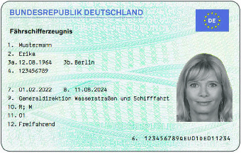
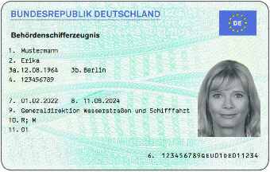
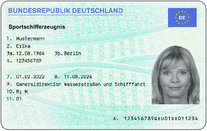
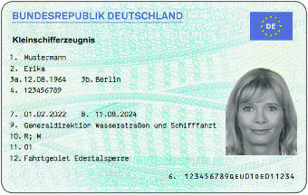
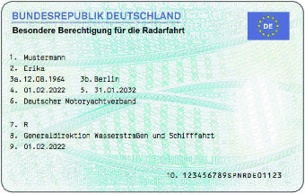

# Verordnung über die Besatzung und über die Befähigungen der Besatzung von Fahrzeugen in der Binnenschifffahrt (BinSchPersV)

Ausfertigungsdatum
:   2021-11-26

Fundstelle
:   BGBl I: 2021, 4982 (5204)

Änderung durch
:   Art. 9 V v. 5.1.2022 I 2 (Nr. 1) textlich nachgewiesen, dokumentarisch noch nicht abschließend bearbeitet

## Teil 1 - Allgemeine Bestimmungen

### § 1 Anwendungsbereich

(1) Diese Verordnung gilt auf allen Bundeswasserstraßen der Zonen 1
bis 4 nach Anhang I der Binnenschiffsuntersuchungsordnung vom 21.
September 2018 (BGBl. I S. 1398, 2032), die durch Artikel 7 der
Verordnung vom 31. Oktober 2019 (BGBl. I S. 1518) geändert worden ist,
in der jeweils geltenden Fassung nach Maßgabe des Absatzes 2.

(2) Unberührt bleiben

1.  die Schiffspersonalverordnung-Rhein vom 16. Dezember 2011 (BGBl. 2011
    II S. 1300) mit Ausnahme

    a)  des § 3.09 Nummer 1, hinsichtlich des Nachweises der Streckenfahrten
        auf dem Rhein,

    b)  des Kapitels 7 Abschnitt 1 Unterabschnitt 2,

    c)  des § 7.09 Nummer 1 Buchstabe c, Nummer 2 Buchstabe d hinsichtlich des
        Nachweises der Streckenfahrten auf dem Rhein und Nummer 5,

    d)  des § 7.10,

    e)  des § 7.11 Nummer 2 und 4,

    f)  des § 7.12 Nummer 1 Buchstabe b,

    g)  des § 7.13 Nummer 3 hinsichtlich der Streckenkenntnisse auf dem Rhein,

    h)  des § 7.15,

    i)  der Anlage D 3 und

    j)  der Anlage D 7 Nummer 1.1 hinsichtlich der Streckenkenntnisse auf dem
        Rhein und Nummer 2.2,

2.  die Talsperrenverordnung vom 15. März 2013 (VkBl. S. 331), die zuletzt
    durch Artikel 2 Absatz 1 der Verordnung vom 26. November 2021 (BGBl. I
    S. 4982) geändert worden ist,

3.  die Sportbootführerscheinverordnung vom 3. Mai 2017 (BGBl. I S. 1016,
    4043), die zuletzt durch Artikel 2 Absatz 7 der Verordnung vom 26.
    November 2021 (BGBl. I S. 4982) geändert worden ist,

4.  die Seeleute-Befähigungsverordnung vom 8. Mai 2014 (BGBl. I S. 460),
    die durch Artikel 1 der Verordnung vom 28. Juli 2021 (BGBl. I S. 3236)
    geändert worden ist, und

5.  alle Vorschriften über die Besatzung und über die Befähigung der
    Besatzung der Fahrzeuge, die ausschließlich zur Verwendung im
    Hamburger Hafen bestimmt sind.

### § 2 Begriffsbestimmungen

Im Sinne dieser Verordnung ist oder sind

1.  „Binnenwasserstraße“ eine für die in § 25 Absatz 3 bis 5 genannten
    Fahrzeuge befahrbare Wasserstraße der Zonen 1 bis 4;

2.  „Fahrzeug“ ein Binnenschiff, einschließlich Fähre, schwimmendes Gerät
    oder ein Seeschiff;

3.  „Binnenschiff“ ein Schiff, das ausschließlich oder vorwiegend für die
    Fahrt auf Binnenwasserstraßen bestimmt ist;

4.  „Seeschiff“ ein Schiff, das zur See- oder Küstenfahrt zugelassen und
    vorwiegend dafür bestimmt ist;

5.  „Motorschiff“ ein zur Güterbeförderung bestimmtes Schiff, das mit
    eigener Triebkraft allein fahren kann;

6.  „Fähre“ ein Fahrzeug, das dem Übersetzverkehr von einem Ufer zum
    anderen auf der Wasserstraße dient und von der zuständigen Behörde als
    Fähre behandelt wird;

7.  „Kahnfähre“ eine zur Beförderung von Personen gebaute, offene Fähre,
    die durch Muskelkraft fortbewegt wird; auch mit einem – zur
    Beherrschung besonderer Betriebslagen – Hilfsantrieb ausgestattet;

8.  „Behördenfahrzeug“ ein Fahrzeug, das von einer Behörde im Rahmen ihrer
    gesetzlichen Aufgaben eingesetzt wird;

9.  „Feuerlöschboot“ ein Fahrzeug, das ausschließlich oder überwiegend zum
    Feuerlöschen eingesetzt wird;

10. „Schleppboot“ ein eigens zum Schleppen gebautes Schiff;

11. „Schubboot“ ein eigens zur Fortbewegung eines Schubverbandes gebautes
    Schiff;

12. „Schleppkahn“ ein zur Güterbeförderung bestimmtes und zur Fortbewegung
    durch Schleppen gebautes Schiff ohne eigene Triebkraft oder mit
    eigener Triebkraft, die nur erlaubt, kleine Ortsveränderungen
    vorzunehmen;

13. „Schubleichter“ ein zur Güterbeförderung bestimmtes und zur
    Fortbewegung durch Schieben gebautes oder eigens eingerichtetes Schiff
    ohne eigene Triebkraft oder mit eigener Triebkraft, die nur erlaubt,
    außerhalb des Schubverbandes kleine Ortsveränderungen vorzunehmen;

14. „Verband“ ein starrer Verband oder ein Schleppverband;

15. „starrer Verband“ ein Schubverband oder gekuppelte Fahrzeuge;

16. „Schubverband“ eine starre Verbindung von Fahrzeugen, von denen sich
    mindestens eines vor dem oder den beiden Fahrzeugen mit
    Maschinenantrieb befindet, das oder die den Verband fortbewegt oder
    fortbewegen und als „schiebendes Fahrzeug“ oder „schiebende Fahrzeuge“
    bezeichnet werden; als starr gilt auch ein Verband aus einem
    schiebenden und einem geschobenen Fahrzeug, deren Kupplungen ein
    gesteuertes Knicken ermöglichen;

17. „gekuppelte Fahrzeuge“ eine Zusammenstellung von längsseits starr
    gekuppelten Fahrzeugen, von denen sich keines vor dem Fahrzeug mit
    Maschinenantrieb befindet, das die Zusammenstellung fortbewegt;

18. „Schleppverband“ eine Zusammenstellung von einem oder mehreren
    Fahrzeugen, schwimmenden Anlagen oder Schwimmkörpern, die von einem
    oder mehreren zum Verband gehörigen Fahrzeugen mit Maschinenantrieb
    geschleppt wird;

19. „Großverband“ ein Schubverband, bei dem das Produkt aus Gesamtlänge
    und Gesamtbreite der geschobenen Fahrzeuge 7 000 Quadratmeter oder
    mehr beträgt;

20. „Fahrgastschiff“ ein zur Beförderung von mehr als 12 Fahrgästen
    gebautes und eingerichtetes Tagesausflugs- oder Kabinenschiff;

21. „Fahrgastboot“ ein zur Beförderung von Fahrgästen zugelassenes
    Fahrzeug, das kein Fahrgastschiff ist;

22. „Tagesausflugsschiff“ ein Fahrgastschiff ohne Kabinen für die
    Übernachtung von Fahrgästen;

23. „Kabinenschiff“ ein Fahrgastschiff mit Kabinen für die Übernachtung
    von Fahrgästen;

24. „Sportfahrzeug“ ein für Sport- oder Erholungszwecke bestimmtes Schiff,
    das kein Fahrgastschiff oder Fahrgastboot ist;

25. „schwimmendes Gerät“ eine schwimmende Konstruktion mit auf ihr
    vorhandenen Arbeitseinrichtungen wie Krane, Bagger, Rammen,
    Elevatoren;

26. „schwimmende Anlage“ eine schwimmende Einrichtung, die in der Regel
    nicht zur Fortbewegung bestimmt ist, wie eine Badeanstalt, ein Dock,
    eine Landebrücke oder ein Bootshaus;

27. „Schwimmkörper“ ein Floß sowie andere einzeln oder in Verbindungen
    fahrtauglich gemachte Gegenstände, soweit es sich nicht um ein Schiff,
    ein schwimmendes Gerät oder eine schwimmende Anlage handelt;

28. „Länge“ oder „L“ die größte Länge eines Fahrzeugkörpers in Metern,
    ohne Ruder und Bugspriet;

29. „Breite“ oder „B“ die größte Breite eines Fahrzeugkörpers in Metern,
    gemessen an der Außenseite der Beplattung, ohne Schaufelräder,
    Scheuerleisten und Ähnliches;

30. „Tiefgang“ oder „T“ der senkrechte Abstand vom tiefsten Punkt eines
    Fahrzeugkörpers in Metern, ohne Berücksichtigung des Kiels oder
    anderer fester Anbauten, bis zur Ebene der größten Einsenkung des
    Schiffskörpers, in Metern;

31. „Besatzung“ die Decksmannschaft und das Maschinenpersonal;

32. „Decksmannschaft“ Personen, die Funktionen auf Einstiegs-, Betriebs-
    und Führungsebene überwiegend an Deck ausüben;

33. „Maschinenpersonal“ die Maschinisten und Maschinistinnen im Sinne der
    Schiffspersonalverordnung-Rhein und die Maschinenkundigen nach dieser
    Verordnung;

34. „Einstiegsebene“ der Verantwortungsbereich, der mit den Funktionen des
    Decksmannes und der Decksfrau (Decksleute) sowie des Leichtmatrosen
    und der Leichtmatrosin verbunden ist;

35. „Betriebsebene“ der Verantwortungsbereich, der mit den Funktionen des
    Matrosen und der Matrosin, des Bootsmanns und der Bootsfrau
    (Bootsleute) sowie des Steuermannes und der Steuerfrau (Steuerleute)
    verbunden ist;

36. „Führungsebene“ der Verantwortungsbereich, der mit der Funktion des
    Schiffsführers und der Schiffsführerin (Schiffsführung) verbunden ist;

37. „Bordpersonal“ alle an Bord eines Fahrgastschiffes Beschäftigten, die
    nicht zur Besatzung gehören;

38. „Sicherheitspersonal“ die Sachkundigen für Flüssigerdgas (LNG), die
    Sachkundigen für die Fahrgastschifffahrt, die Ersthelfer und die
    Ersthelferinnen sowie die atemschutzgerättragenden Personen;

39. „Sicherheitspersonal für Fahrgastschiffe“ die Sachkundigen für die
    Fahrgastschifffahrt, die Ersthelfer und die Ersthelferinnen sowie die
    atemschutzgerättragenden Personen;

40. „Sachkundiger für die Fahrgastschifffahrt“ eine an Bord tätige Person,
    die befähigt ist, in Notsituationen an Bord von Fahrgastschiffen
    Maßnahmen zu ergreifen;

41. „Sachkundiger für Flüssigerdgas“ eine Person, die befähigt ist, am
    Bunkervorgang von Fahrzeugen, die Flüssigerdgas als Brennstoff nutzen,
    beteiligt zu sein oder der Schiffsführer eines solchen Fahrzeugs zu
    sein;

42. „Fährführer“ wer berechtigt ist, eine Fähre zu führen;

43. „Decksmann 180“ ein Decksmann oder eine Decksfrau mit 180 Tagen
    nachgewiesener und bestätigter Fahrzeit nach § 27 Absatz 1;

44. „Radarfahrt“ eine Fahrt bei unsichtigem Wetter mit Radar;

45. „Unionsbefähigungszeugnis“ das Befähigungszeugnis der Europäischen
    Union für Funktionen auf der Einstiegsebene und Betriebsebene sowie
    für Sachkundige nach Artikel 3 Nummer 7 der Richtlinie
    (EU) 2017/2397                    des Europäischen Parlaments und des
    Rates vom 12. Dezember 2017 über die Anerkennung von
    Berufsqualifikationen in der Binnenschifffahrt und zur Aufhebung der
    Richtlinien
    91/672/EWG                    und
    96/50/EG                    des Rates (ABl. L 345 vom 27.12.2017, S.
    53);

46. „Unionspatent“ das Befähigungszeugnis der Europäischen Union für
    Schiffsführer und Schiffsführerinnen nach Artikel 4 Absatz 1 in
    Verbindung mit Artikel 11 Absatz 5 der Richtlinie
    (EU) 2017/2397                   ;

47. „Schifferzeugnis“ das Fährschifferzeugnis, das
    Behördenschifferzeugnis, das Sportschifferzeugnis und das
    Kleinschifferzeugnis;

48. „Sprechfunkzeugnis“ ein auf der Grundlage der Anlage 5 der Regionalen
    Vereinbarung über den Binnenschifffahrtsfunk (Bekanntmachung vom 28.
    August 2000, BGBl. II S. 1213) erteiltes Sprechfunkzeugnis;

49. „Rheinpatent“ ein Befähigungszeugnis für Schiffsführer und
    Schiffsführerinnen nach § 6.04 Nummer 1 der Schiffspersonalverordnung-
    Rhein;

50. „Schifferdienstbuch“ eine persönliche Aufzeichnung der Berufserfahrung
    eines Besatzungsmitglieds, insbesondere Einzelheiten zu seinen
    Fahrzeiten und Reisen;

51. „aktives Schifferdienstbuch“ ein für Eintragungen offenes
    Schifferdienstbuch;

52. „Bordbuch“ eine zum Zwecke der Überwachung geführte Aufzeichnung der
    von einem Fahrzeug und seiner Besatzung durchgeführten Reisen;

53. „aktives Bordbuch“ ein für Eintragungen offenes Bordbuch;

54. „Prüfling“ eine Person, die eine Prüfung zum Erwerb eines
    Befähigungszeugnisses ablegt;

55. „Untersuchungskommission“ die nach § 4 der
    Binnenschiffsuntersuchungsordnung gebildete Einrichtung;

56. „ausstellende Behörde“ diejenige zuständige Behörde, die das
    Befähigungszeugnis ausstellt;

57. „Mitgliedsstaat der Zentralkommission für die Rheinschifffahrt“ die
    Bundesrepublik Deutschland, die Niederlande, die Französische
    Republik, die Schweizerische Eidgenossenschaft und das Königreich
    Belgien;

58. „Flüssigerdgas“ (LNG) Erdgas, das durch Abkühlung auf eine Temperatur
    von –161 °C verflüssigt wurde;

59. „ES-TRIN“ der Europäische Standard der technischen Vorschriften für
    Binnenschiffe in der jeweils nach § 2 Absatz 1 Nummer 2 der
    Binnenschiffsuntersuchungsordnung geltenden Fassung;

60. „STCW-Übereinkommen“ das Internationale Übereinkommen vom 7. Juli 1978
    über Normen für die Ausbildung, die Erteilung von
    Befähigungszeugnissen und den Wachdienst von Seeleuten (BGBl. 1982 II
    S. 297, 298) in der jeweils geltenden Fassung;

61. „Schiffspersonalverordnung-Rhein“ die Schiffspersonalverordnung-Rhein
    der Zentralkommission für die Rheinschifffahrt vom 16. Dezember 2011
    (BGBl. 2011 II S. 1300);

62. „Berufsgenossenschaft“ die Berufsgenossenschaft Verkehrswirtschaft
    Post-Logistik Telekommunikation.

### § 3 Vorübergehende Abweichungen; Verordnungsermächtigung

(1) Die Generaldirektion Wasserstraßen und Schifffahrt wird
ermächtigt, durch Rechtsverordnung von dieser Verordnung abweichende
Vorschriften bis zur Dauer von drei Jahren zu erlassen

1.  zur Anpassung an die technische Entwicklung der Binnenschifffahrt oder

2.  zu Versuchszwecken.

(2) Die abweichenden Vorschriften

1.  müssen mit den Vorgaben der Richtlinie (EU)
    2017/2397                    und den aufgrund dieser Richtlinie
    erlassenen Rechtsakten der Europäischen Union vereinbar sein,

2.  dürfen den Jugendarbeitsschutz, den Arbeitsschutz sowie die Sicherheit
    und den Gesundheitsschutz von Besatzung nicht gefährden und

3.  dürfen die Sicherheit und Leichtigkeit des Schiffsverkehrs nicht
    gefährden.

### § 4 Zuständige Behörde

Zuständige Behörde für die Wahrnehmung der Aufgaben nach dieser
Verordnung ist die Generaldirektion Wasserstraßen und Schifffahrt,
soweit in dieser Verordnung nichts Abweichendes bestimmt ist.

### § 5 Identitätsnachweis

Ist für die Erteilung oder die Verlängerung von Befähigungszeugnissen
nach dieser Verordnung der Nachweis der Identität des die Erteilung
oder die Verlängerung Beantragenden erforderlich, kann diese durch
Vorlage des Personalausweises, des Reisepasses oder eines anderen
amtlichen Identitätsdokuments nachgewiesen werden. Zudem kann die
Identität nach Maßgabe des § 18 des Personalausweisgesetzes, des § 12
des
eID-Karte-Gesetzes              oder des § 78 Absatz 5 des
Aufenthaltsgesetzes elektronisch nachgewiesen werden.

### § 6 Handlungsfähigkeit von Minderjährigen

Verfahrenshandlungen im Zusammenhang mit dem Erwerb von Befähigungen
oder Schifferdienstbüchern sowie der Aussetzung und dem Entzug von
Befähigungszeugnissen kann wirksam vornehmen, wer das 15. Lebensjahr
vollendet hat.

### § 7 Übersetzungen

Wenn nach dieser Verordnung ausländische, fremdsprachige Dokumente
vorgelegt werden können, sind diese in amtlich beglaubigter deutscher
Übersetzung vorzulegen, soweit es sich nicht um Dokumente der
Binnenschifffahrt nach Mustern der Europäischen Union oder der
Zentralkommission für die Rheinschifffahrt handelt.

### § 8 Gebühren und Auslagen

Die Gebühren und Auslagen für individuell zurechenbare öffentliche
Leistungen nach dieser Verordnung bemessen sich nach der BMVI-
Wasserstraßen und Schifffahrt Besonderen Gebührenverordnung vom 28.
Oktober 2021 (BGBl. I S. 4744) in der jeweils geltenden Fassung.

## Teil 2 - Befähigungen

### Kapitel 1 - Befähigungszeugnisse der Besatzung

#### § 9 Befähigungszeugnisse für Besatzungsmitglieder auf Einstiegsebene und Betriebsebene

(1) Wer als Mitglied der Besatzung eines Fahrzeugs auf der
Einstiegsebene oder der Betriebsebene tätig ist, bedarf für die von
ihm wahrzunehmende Funktion an Bord eines im Schifferdienstbuch
eingetragenen Unionsbefähigungszeugnisses, das nach § 61 erteilt
worden ist.

(2) Dem Unionsbefähigungszeugnis nach Absatz 1 ist gleichgestellt ein
im Schifferdienstbuch eingetragenes Unionsbefähigungszeugnis, das von
einem anderen Mitgliedstaat der Europäischen Union erteilt worden ist.

(3) Die Unionsbefähigungszeugnisse werden erteilt für die Befähigung
als Decksmann oder Decksfrau, Leichtmatrose oder Leichtmatrosin,
Matrose oder Matrosin, Bootsmann oder Bootsfrau, Steuermann oder
Steuerfrau.

(4) Für Besatzungsmitglieder von Seeschiffen ist bei Fahrten auf
Wasserstraßen der Zonen 3 und 4 ausreichend ein Zeugnis, das nach dem
STCW-Übereinkommen erteilt oder nach dem STCW-Übereinkommen anerkannt
ist. Dies gilt nicht für Befähigungszeugnisse für GMDSS-Funker, die
nach dem STCW-Übereinkommen erteilt oder anerkannt worden sind.

(5) Statt eines Unionsbefähigungszeugnisses nach Absatz 1 ist
ausreichend ein Befähigungszeugnis für die Einstiegsebene oder
Betriebsebene eines Staates, der nicht der Europäischen Union
angehört, soweit das Zeugnis nach der Richtlinie
(EU) 2017/2397              von der Kommission der Europäischen Union
anerkannt worden ist.

#### § 10 Befähigungszeugnisse für das Maschinenpersonal

(1) Wer als Mitglied des Maschinenpersonals tätig ist, bedarf hierfür
eines im Schifferdienstbuch eingetragenen Befähigungszeugnisses für
die Befähigung als Maschinenkundiger oder Maschinenkundige, das nach §
64 Absatz 1 Satz 1 erteilt worden ist.

(2) Dem Unionsbefähigungszeugnis nach Absatz 1 ist gleichgestellt ein
im Schifferdienstbuch eingetragenes Befähigungszeugnis für
maschinenkundiges Personal, das von einem anderen Mitgliedstaat der
Europäischen Union erteilt worden ist.

(3) Bei Fahrten auf Seeschiffen, die auf Wasserstraßen der Zonen 3 und
4 fahren, ist ausreichend ein Zeugnis, das nach den Anforderungen des
STCW-Übereinkommens erteilt oder anerkannt ist.

(4) Statt eines Befähigungszeugnisses nach Absatz 1 ist ausreichend
für die Fahrt auf der Donau ein ukrainisches oder serbisches
Befähigungszeugnis für maschinenkundiges Personal.

#### § 11 Befähigungszeugnisse für Besatzungsmitglieder auf Führungsebene

(1) Wer ein Schiff führt, bedarf eines nach

1.  § 78 Absatz 3 Nummer 1 erteilten Unionspatentes oder

2.  § 78 Absatz 3 Nummer 2 bis 5 erteilten Fährschifferzeugnisses,
    Behördenschifferzeugnisses, Sportschifferzeugnisses oder
    Kleinschifferzeugnisses für die entsprechende Fahrzeugkategorie.

(2) Einem Unionspatent nach Absatz 1 Nummer 1 ist gleichgestellt ein
Unionspatent, das erteilt worden ist

1.  von der zuständigen Behörde eines Landes oder

2.  von der zuständigen Behörde eines anderen Mitgliedstaates der
    Europäischen Union.

(3) Wer eine frei fahrende Fähre führt, benötigt zusätzlich zum
Fährschifferzeugnis ein Unionsbefähigungszeugnis mindestens für die
Einstiegsebene.

(4) Statt eines Befähigungszeugnisses nach Absatz 1 ist ausreichend
das Befähigungszeugnis für Schiffsführer eines Staates, der nicht der
Europäischen Union angehört, soweit das Zeugnis nach der Richtlinie
(EU) 2017/2397              von der Kommission der Europäischen Union
anerkannt worden ist.

#### § 12 Ausnahme von der Pflicht zum Besitz eines Befähigungszeugnisses für die Besatzungsmitglieder auf Führungsebene

(1) Keines Befähigungszeugnisses für Schiffsführer und
Schiffsführerinnen bedarf nach dieser Verordnung, wer

1.  ein Fahrzeug führt, das bei einem anderen Fahrzeug längsseits
    gekuppelt oder sonst von ihm in einer Weise mitgeführt wird, dass
    durch das mitgeführte Fahrzeug weder Kurs noch Geschwindigkeit
    bestimmt werden kann,

2.  ein Fahrzeug führt, das nur mit Muskelkraft oder unter Segel
    angetrieben wird oder mit einer Antriebsmaschine ausgerüstet ist,
    deren effektive Nutzleistung nicht mehr als 11,03 Kilowatt beträgt,

3.  ein nicht in Fahrt befindliches schwimmendes Gerät ohne eigenen
    Antrieb auf den Wasserstraßen der Zonen 3 und 4 sowie außerhalb des
    Fahrwassers der Wasserstraßen der Anlage 1
    2                    führt,

4.  das 16. Lebensjahr vollendet hat und als Mitglied der Besatzung eines
    schwimmenden Gerätes ein dazugehöriges Hilfsfahrzeug mit einer Länge
    von weniger als 20 Metern und einer effektiven Nutzleistung von nicht
    mehr als 25 Kilowatt führt.

Satz 1 gilt nicht für Fahrgastboote.

(2) Zum Führen von Fahrzeugen mit einer Länge von weniger als 20
Metern berechtigen auch

1.  auf Wasserstraßen der Zonen 1 und 2 ein Fährschifferzeugnis, wenn es
    für wenigstens eine Strecke dieser Zonen gilt,

2.  auf Wasserstraßen der Zonen 3 und 4 ein Fährschifferzeugnis, wenn es
    für wenigstens eine Strecke dieser Zonen gilt, oder ein
    Sportschifferzeugnis.

Satz 1 gilt nicht für Fahrgastschiffe, Fahrgastboote, Sportfahrzeuge,
die nach § 34 der Binnenschiffsuntersuchungsordnung zur Beförderung
von Fahrgästen eingesetzt werden, Schub- und Schleppboote, schwimmende
Geräte sowie Fähren.

#### § 13 Amtlicher Berechtigungsschein

(1) Wer eines der folgenden Fahrzeuge führt, kann seine Befähigung
auch durch einen amtlichen Berechtigungsschein nachweisen:

1.  Dienstfahrzeuge der Bundeswehr, der Bundeszollverwaltung, der
    Bundespolizei, der Bereitschaftspolizei und der Wasserschutzpolizei
    der Länder, jeweils mit einer Länge von nicht mehr als 25 Metern,

2.  Dienstfahrzeuge des Zivil- und Katastrophenschutzes, der
    Wasserstraßen- und Schifffahrtsverwaltung des Bundes, der
    Schifffahrtsverwaltung eines Landes, eines Landeskriminalamtes und der
    Feuerwehr, jeweils mit einer Länge von weniger als 20 Metern,

3.  Wasserrettungsfahrzeuge einer als gemeinnützig anerkannten
    Körperschaft mit einer Länge von weniger als 20 Metern.

(2) Der amtliche Berechtigungsschein muss von der Dienst- oder
Ausbildungsstelle des Betreffenden nach deren Vorgaben ausgestellt
sein.

#### § 14 Befreiungsmöglichkeiten

Das örtlich zuständige Wasserstraßen- und Schifffahrtsamt kann
erlauben, dass

1.  Personen ohne Befähigungszeugnis für Schiffsführer und
    Schiffsführerinnen Kahnfähren mit einem Hilfsantrieb mit einer
    effektiven Nutzleistung von mehr als 11,03 Kilowatt auf Wasserstraßen
    mit geringem Verkehr führen,

2.  Personen ohne besondere Berechtigung für Risikostrecken Fahrzeuge im
    Baustellenbetrieb im Rahmen behördlicher Maßnahmen auf der Teilstrecke
    einer Risikostrecke nach Anlage 2 führen.

#### § 15 Geltungsbereich der Befähigungszeugnisse auf Führungsebene

(1) Das Unionspatent berechtigt zum Führen von Fahrzeugen aller Art
auf Wasserstraßen der Zonen 3 und 4.

(2) Das Fährschifferzeugnis berechtigt zum Führen von Fähren für die
im Fährschifferzeugnis eingetragene Fährstelle. Es wird für frei
fahrende, für seil- oder kettengebundene Fähren oder für beide Arten
von Fähren erteilt.

(3) Das Sportschifferzeugnis berechtigt zum Führen von Sportfahrzeugen
mit einer Länge von nicht mehr als 25 Metern auf den Wasserstraßen der
Zonen 3 und 4.

(4) Das Behördenschifferzeugnis berechtigt zum Führen von
Behördenfahrzeugen, Feuerlöschbooten und Fahrzeugen des
Katastrophenschutzes auf den Wasserstraßen der Zonen 3 und 4.

(5) Das Kleinschifferzeugnis berechtigt zum Führen von Fahrzeugen, die
nicht in den Anwendungsbereich der Richtlinie
(EU) 2017/2397              fallen und für die nach anderen
Vorschriften kein Schifferzeugnis erforderlich ist. Die Fahrzeugart,
für die das jeweilige Kleinschifferzeugnis gilt, ist durch die
zuständige Behörde bei seiner Erteilung festzulegen und auf dem
Befähigungszeugnis zu vermerken. Zur Vermeidung unbilliger Härten kann
die zuständige Behörde auf Antrag genehmigen, dass das
Kleinschifferzeugnis vorübergehend auch zum Führen von Fahrzeugen
berechtigt, die in den Anwendungsbereich der Richtlinie (EU) 2017/2397
fallen. Dies setzt den erfolgreichen Abschluss einer theoretischen
Prüfung für das Unionspatent durch den Inhaber oder die Inhaberin des
Kleinschifferzeugnisses voraus.

(6) Die in den Absätzen 1 bis 5 genannten Befähigungszeugnisse gelten
auch auf den Wasserstraßen der Zonen 1 und 2, wenn zusätzlich eine
besondere Berechtigung für maritime Wasserstraßen vorliegt.

(7) Für das Führen von Fähren auf

1.  der Flensburger Förde,

2.  der Kieler Förde,

3.  der Trave unterhalb des Lübecker Hafens,

4.  der Elbe, soweit diese zur Zone 2-See gehört,

5.  der Weser unterhalb der Eisenbahnbrücke in Bremen,

6.  der Jade und

7.  der Ems unterhalb des Emdener Hafens

ist ein Unionspatent mit der besonderen Berechtigung für maritime
Wasserstraßen erforderlich.

#### § 16 Besondere Berechtigungen für das Führen von Fahrzeugen

(1) Wer als Schiffsführer oder Schiffsführerin ein Fahrzeug führt,
bedarf zusätzlich zu dem nach § 11 Absatz 1, auch in Verbindung mit
den Absätzen 2 und 4, erforderlichen Befähigungszeugnis folgender
besonderer Berechtigungen:

1.  einer besonderen Berechtigung für Radar, wenn nach der
    Binnenschifffahrtsstraßenordnung, der
    Rheinschifffahrtspolizeiverordnung, der
    Moselschifffahrtspolizeiverordnung oder der
    Donauschifffahrtspolizeiverordnung nur unter Verwendung des Radars
    gefahren werden darf;

2.  einer besonderen Berechtigung für Risikostrecken, wenn Wasserstraßen
    befahren werden, die nach der Anlage 2 als
    Binnenwasserstraßenabschnitte mit besonderen Risiken (Risikostrecken)
    ausgewiesen wurden;

3.  einer besonderen Berechtigung für maritime Wasserstraßen, wenn
    Wasserstraßen der Zonen 1 und 2 (Binnenwasserstraßen mit maritimem
    Charakter) befahren werden;

4.  einer besonderen Berechtigung für Flüssigerdgas, wenn ein Fahrzeug
    geführt wird, das mit Flüssigerdgas betrieben wird;

5.  einer besonderen Berechtigung für Großverbände, wenn ein Großverband
    geführt wird.

Satz 1 Nummer 2 gilt für das Führen von Schiffen unter 20 Metern nur,
soweit es sich um Fahrgastschiffe, Fahrgastboote oder Fähren handelt.
Satz 1 Nummer 3 gilt vorbehaltlich des § 15 Absatz 7 nicht für Fähren,
die mit einem Fährschifferzeugnis geführt werden dürfen.

(2) Eine besondere Berechtigung nach Absatz 1 Satz 1 Nummer 1, 2, 3
oder 5 wird durch einen entsprechenden Eintrag in dem
Befähigungszeugnis nachgewiesen. Die Berechtigung nach Absatz 1 Satz 1
Nummer 4 wird durch ein Unionsbefähigungszeugnis für Sachkundige für
Flüssigerdgas nachgewiesen.

(3) Die besonderen Berechtigungen nach Absatz 1 benötigt auch, wer in
den dort genannten Fällen ein Fahrzeug mit einem amtlichen
Berechtigungsschein nach § 13 führt. Dies gilt im Falle des Absatzes 1
Satz 1 Nummer 2 bis 4 nur für das Führen von Fahrzeugen mit einer
Länge ab 20 Metern. In diesem Fall wird die besondere Berechtigung als
gesonderte Karte von der zuständigen Behörde erteilt.

(4) Eine von der Wasserschutzpolizei-Schule in Hamburg ausgestellte
Bescheinigung über eine bestandene Radarbefähigungsprüfung steht in
Verbindung mit einem amtlichen Berechtigungsschein, einem
Behördenschifferzeugnis oder einem Unionspatent einer besonderen
Berechtigung für Radar im Sinne des Absatzes 1 Satz 1 Nummer 1 gleich.
Die Bescheinigung kann bei der zuständigen Behörde gegen eine
besondere Berechtigung für Radar umgetauscht werden, soweit die
Radarbefähigungsprüfung den Anforderungen an die Befähigungsprüfung
nach § 41 Absatz 2 und 3 entspricht.

#### § 17 Befähigungszeugnisse für das Sicherheitspersonal

(1) Wer als Sachkundiger oder Sachkundige für Flüssigerdgas (LNG) oder
als Sachkundiger oder Sachkundige für die Fahrgastschifffahrt tätig
ist, bedarf hierfür eines Unionsbefähigungszeugnisses, das nach § 85
Absatz 1 Satz 1 oder Absatz 2 Satz 1 erteilt worden ist.

(2) Dem Unionsbefähigungszeugnis nach Absatz 1 ist gleichgestellt ein
Unionsbefähigungszeugnis, das von einem anderen Mitgliedstaat der
Europäischen Union erteilt worden ist.

(3) Statt eines Unionsbefähigungszeugnisses nach Absatz 1 ist
ausreichend das Befähigungszeugnis eines Staates, der nicht der
Europäischen Union angehört, soweit das Zeugnis nach der Richtlinie
(EU) 2017/2397              von der Kommission der Europäischen Union
anerkannt worden ist.

(4) Ersthelfer oder Ersthelferinnen bedürfen

1.  einer Bescheinigung einer von der Deutschen Gesetzlichen
    Unfallversicherung auf der Grundlage arbeitsschutzrechtlicher
    Vorschriften ermächtigten Ausbildungsstelle oder

2.  eines dieser Bescheinigung entsprechenden Dokuments der nationalen
    oder regionalen Organisationen eines anderen Mitgliedstaates der
    Zentralkommission für die Rheinschifffahrt, die von dieser bekannt
    gemacht worden sind.

(5) Atemschutzgerättragende Personen bedürfen

1.  einer Bescheinigung eines Anbieters eines nach § 58 zugelassenen
    Lehrgangs nach dem Muster in Anlage 3 oder

2.  einer der Bescheinigung nach Nummer 1 entsprechende Bescheinigung
    einer anerkannten Ausbildungsstelle eines anderen Mitgliedstaates der
    Zentralkommission für die Rheinschifffahrt, die von dieser bekannt
    gemacht worden ist.

#### § 18 Erfassung der Befähigungszeugnisse und Schifferdienstbücher im Befähigungsregister

(1) Die ausstellende Behörde ist befugt, jedes nach dieser Verordnung
erteilte oder verlängerte Befähigungszeugnis, mit Ausnahme der
Befähigungszeugnisse für Ersthelfer und Ersthelferinnen sowie
atemschutzgerättragende Personen, sowie jedes ausgestellte
Schifferdienstbuch mit den darin enthaltenen Daten durch Eintragung in
dem jeweiligen Register nach § 13 oder § 14 des
Binnenschifffahrtsaufgabengesetzes zu erheben und zu speichern und zu
verwenden, soweit dies für die Registerführung in dem jeweiligen
Register nach § 13 oder § 14 des Binnenschifffahrtsaufgabengesetzes
erforderlich ist.

(2) Ein erstmals erteiltes Befähigungszeugnis sowie ein erstmals
ausgestelltes Schifferdienstbuch ist mit dem Status „aktiv“ in das
jeweilige Register einzutragen. Ein verlängertes Zeugnis ist mit dem
Status „verlängert“ einzutragen.

(3) Das jeweilige Register ist nach den Vorgaben der Delegierten
Verordnung
(EU) 2020/473              der Kommission vom 20. Januar 2020 zur
Ergänzung der Richtlinie
(EU) 2017/2397              des Europäischen Parlaments und des Rates
in Bezug auf die Standards der Datenbanken für
Unionsbefähigungszeugnisse, Schifferdienstbücher und Bordbücher (ABl.
L 100 vom 1.4.2020, S. 1) an die Unionsdatenbank der EU-Kommission
anzubinden.

#### § 19 Abhandengekommene Befähigungszeugnisse, Schifferdienstbücher und Bordbücher

(1) Ist ein Befähigungszeugnis, ein Schifferdienstbuch oder ein
Bordbuch zerstört oder, insbesondere durch Diebstahl oder Verlust,
abhandengekommen, so hat der Inhaber oder die Inhaberin

1.  den Verlust der ausstellenden Behörde unverzüglich anzuzeigen und ihr
    gegenüber die Zerstörung oder das Abhandenkommen glaubhaft zu machen
    und

2.  das Befähigungszeugnis, Schifferdienstbuch oder Bordbuch unverzüglich
    der zuständigen Behörde auszuhändigen, wenn es noch vorhanden ist oder
    sobald es nachträglich wieder aufgefunden wird.

(2) Im Falle des Absatzes 1 ist die ausstellende Behörde befugt, den
Status des betroffenen Befähigungszeugnisses oder Schifferdienstbuches
im jeweiligen Register auf „zerstört“, „gestohlen“ oder „verloren“ zu
ändern. Bei Bordbüchern ist die ausstellende Behörde befugt, dies in
der zentralen Binnenschiffsbestandsdatei nach § 9 des
Binnenschifffahrtsaufgabengesetzes zu vermerken oder dies zu
veranlassen.

(3) Zudem stellt die ausstellende Behörde auf Antrag des Inhabers oder
der Inhaberin

1.  bei Nachweis der Identität ein neues Befähigungszeugnis oder ein neues
    Schifferdienstbuch oder

2.  bei Vorlage einer Fahrtauglichkeitsbescheinigung ein neues Bordbuch
    aus.

Die neuen Dokumente werden mit einer neuen Dokumentennummer und dem
Datum der erneuten Ausstellung als Ausstellungsdatum ausgestellt.
Darüber hinaus sind in dem neuen Dokument die Daten des vorherigen
Dokumentes eingetragen, bei Befähigungszeugnissen einschließlich des
Gültigkeitsdatums des vorherigen Dokuments. Für die Berechnung von
Gültigkeitszeiten ist das Gültigkeitsdatum des vorherigen Dokuments
maßgeblich.

### Kapitel 2 - Erwerb von Befähigungszeugnissen

#### Abschnitt 1 - Allgemeine Voraussetzungen für den Erwerb

##### § 20 Medizinische Tauglichkeit

Alle Mitglieder der Besatzung müssen medizinisch tauglich sein. Das
ist der Fall, wenn sie die Voraussetzungen für die medizinische
Tauglichkeit nach der Anlage 4 erfüllen. Für die Maschinenkundigen
gilt Satz 2 vorbehaltlich der Bestimmungen des § 23.

##### § 21 Erstmaliger Nachweis der medizinischen Tauglichkeit

(1) Die medizinische Tauglichkeit ist vom Besatzungsmitglied für jede
Erteilung eines Befähigungszeugnisses durch den Tauglichkeitsnachweis
nach Anlage 5, abweichend hiervon von angehenden Mitgliedern des
Maschinenpersonals durch den Tauglichkeitsnachweis nach Anlage 6
nachzuweisen, der nicht älter als drei Monate ist. Für eine höhere
Befähigung innerhalb von Einstiegs- und Betriebsebene ist die
medizinische Tauglichkeit nicht erneut nachzuweisen.

(2) Bestehen Zweifel an der medizinischen Tauglichkeit, kann die
zuständige Behörde oder, auf Einstiegs- und Betriebsebene und für das
Maschinenpersonal, ein Wasserstraßen- und Schifffahrtsamt eine
Tauglichkeitsuntersuchung durch einen anderen Arzt verlangen, deren
Ergebnis vom Besatzungsmitglied durch einen Tauglichkeitsnachweis nach
Absatz 1 Satz 1 nachzuweisen ist.

(3) Wird in dem Tauglichkeitsnachweis nach Absatz 1 Satz 1

1.  eine dauerhaft eingeschränkte medizinische Tauglichkeit oder

2.  eine vorübergehend eingeschränkte medizinische Tauglichkeit

bescheinigt, so ordnet die ausstellende Behörde
Risikominderungsmaßnahmen und Beschränkungen nach Maßgabe der Angaben
in dem Tauglichkeitsnachweis durch Eintrag im Befähigungszeugnis an.
Wird nachträglich ein Tauglichkeitsnachweis nach Absatz 1 Satz 1
vorgelegt, der dem Besatzungsmitglied eine unbeschränkte medizinische
Tauglichkeit bescheinigt, hat die ausstellende Behörde die
eingetragenen Risikominderungsmaßnahmen und Beschränkungen nach Satz 1
im Befähigungszeugnis ungültig zu machen.

(4) Tritt eine Einschränkung der medizinischen Tauglichkeit nach
Erteilung des Befähigungszeugnisses ein, so ordnet die ausstellende
Behörde Risikominderungsmaßnahmen und Beschränkungen nach Maßgabe der
Angaben im Tauglichkeitsnachweis nach Absatz 1 Satz 1 durch Eintrag im
Befähigungszeugnis an. Hierzu hat der Inhaber oder die Inhaberin der
ausstellenden Behörde das Befähigungszeugnis auszuhändigen. Wird
danach ein Tauglichkeitsnachweis im Sinne des Absatzes 1 Satz 1
vorgelegt, das dem Besatzungsmitglied eine unbeschränkte medizinische
Tauglichkeit bescheinigt, hat die ausstellende Behörde die
eingetragenen Risikominderungsmaßnahmen und Beschränkungen nach Satz 1
aus dem Befähigungszeugnis ungültig zu machen.

##### § 22 Regelmäßiger Nachweis der medizinischen Tauglichkeit

(1) Die medizinische Tauglichkeit ist ab Vollendung des 60.
Lebensjahres alle fünf Jahre und ab Vollendung des 70. Lebensjahres
alle zwei Jahre durch einen in § 21 Absatz 1 Satz 1 genannten
Tauglichkeitsnachweis nachzuweisen, der nicht älter als drei Monate
sein darf.

(2) Schiffsführer und Schiffsführerinnen haben den
Tauglichkeitsnachweis nach § 21 Absatz 1 Satz 1 der ausstellenden
Behörde vorzulegen. Besatzungsmitglieder auf Einstiegsebene und auf
Betriebsebene und das Maschinenpersonal haben den
Tauglichkeitsnachweis nach § 21 Absatz 1 Satz 1 einem Wasserstraßen-
und Schifffahrtsamt vorzulegen. § 21 Absatz 2, 3 und 4 gilt
entsprechend.

(3) Hat das Besatzungsmitglied Anhaltspunkte dafür, dass seine
Tauglichkeit eingeschränkt sein könnte, muss es auch außerhalb der in
Absatz 1 genannten Zeiträume seine Tauglichkeit untersuchen lassen.
Erweist es sich dabei als eingeschränkt tauglich oder untauglich, hat
es den Tauglichkeitsnachweis nach § 21 Absatz 1 Satz 1 hierüber
unverzüglich der ausstellenden Behörde zu übermitteln.

(4) Rechtfertigen Tatsachen die Annahme, dass die medizinische
Tauglichkeit eines Besatzungsmitglieds nicht mehr besteht, kann sein
Arbeitgeber, der Schiffsführer oder die ausstellende Behörde von ihm
die Vorlage eines aktuellen Tauglichkeitsnachweises im Sinne des § 21
Absatz 1 Satz 1 über die entsprechende Tauglichkeit anordnen, was das
Besatzungsmitglied bei Vorlage gegenüber dem Arbeitgeber oder dem
Schiffsführer gegenüber der Behörde nachzuweisen hat. In der
behördlichen Anordnung kann vorgegeben werden, dass die Untersuchung
auf bestimmte Krankheitsbilder zu erstrecken ist. Erweist sich die
Annahme als ungerechtfertigt, trägt die anordnende Behörde die Kosten
für den Tauglichkeitsnachweis nach § 21 Absatz 1 Satz 1.

(5) Ein Wasserstraßen- und Schifffahrtsamt ist befugt, die Anordnung
nach Absatz 4 zu treffen, auch wenn das Befähigungszeugnis von einem
anderen Wasserstraßen- und Schifffahrtsamt erteilt worden ist.

##### § 23 Medizinische Tauglichkeit der Maschinenkundigen

Abweichend von § 20 gelten für die medizinische Tauglichkeit der
Maschinenkundigen in Hinblick auf ihr Sehvermögen die Vorgaben für den
Dienstzweig „Technischer Dienst“ in der Tabelle zu Nummer 2.1 der
Anlage 1 der Maritime-Medizin-Verordnung.

##### § 24 Zuständigkeit für die Durchführung von Tauglichkeitsuntersuchungen

(1) Die Tauglichkeitsuntersuchungen nach den §§ 21, 22 dürfen nur von
Ärzten und Ärztinnen durchgeführt werden, die hierzu vor dem 18.
Januar 2022 von der Berufsgenossenschaft auf Grundlage
binnenschifffahrtsrechtlicher Vorschriften ermächtigt worden sind. Die
bis zum 17. Januar 2022 erteilten Ermächtigungen gelten in dem
bisherigen Umfang bis zu einer Neuregelung weiter, längstens bis zum
17\. Januar 2024.

(2) Die zuständige Behörde veröffentlicht elektronisch eine Übersicht
über die ermächtigten Ärzte und Ärztinnen.

##### § 25 Fahrzeit

(1) Fahrzeit kann von Mitgliedern der Besatzung erworben werden, wenn
sie an Bord eines Fahrzeugs eingesetzt sind, das sich auf
Binnenwasserstraßen auf Reisen befindet. Als Fahrzeit zählen auch Be-
und Entladetätigkeiten, soweit für sie aktiver Schiffsbetrieb
erforderlich ist. Fahrzeit wird in Tagen berechnet.

(2) Fahrzeit kann auch erwerben, wer nicht Mitglied der
Mindestbesatzung ist und ein Schifferdienstbuch mit einem
Befähigungszeugnis mindestens auf Einstiegsebene besitzt.

(3) Fahrzeiten können auf folgenden Fahrzeugen erworben werden:

1.  Schiffen mit einer Länge von 20 Metern oder mehr;

2.  Schiffen, deren Produkt aus Länge, Breite und Tiefgang ein Volumen von
    100 Kubikmetern oder mehr ergibt;

3.  Schlepp- oder Schubbooten, die ausgelegt sind zum

    a)  Schleppen oder Schieben von Schiffen nach den Nummern 1 und 2,

    b)  Schleppen oder Schieben von schwimmendem Gerät,

    c)  längsseitigen Fortbewegen von Schiffen nach den Nummern 1 und 2 oder
        von schwimmendem Gerät;

4.  Fahrgastschiffen;

5.  Schiffen, für die ein Zulassungszeugnis nach dem Europäischen
    Übereinkommen über die internationale Beförderung von gefährlichen
    Gütern auf Binnenwasserstraßen oder nach der Richtlinie
    2008/68/EG                    des Europäischen Parlaments und des
    Rates vom 24. September 2008 über die Beförderung gefährlicher Güter
    im Binnenland (ABl. L 260 vom 30.9.2008, S. 13) verlangt wird;

6.  schwimmendem Gerät mit eigenem Antrieb.

(4) Fahrzeiten können auch auf Fähren erworben werden. Dabei werden
für das Unionspatent nur Fahrzeiten anerkannt, die erworben wurden

1.  auf frei fahrenden Fähren mit einer Länge von 20 Metern oder mehr,

2.  auf Fähren, deren Produkt aus Länge, Breite und Tiefgang ein Volumen
    von 100 Kubikmetern oder mehr ergibt oder

3.  auf Fähren, die zur Beförderung von mehr als 12 Fahrgästen gebaut und
    eingerichtet sind.

Fahrzeiten auf seil- oder kettengebundenen Fähren werden nur für das
Fährschifferzeugnis anerkannt.

(5) Auf Behördenfahrzeugen können unabhängig von ihrer Länge
Fahrzeiten erworben werden, sofern es sich um geschlossene Fahrzeuge
handelt.

(6) Fahrzeiten auf den in den Absätzen 3 bis 5 genannten Fahrzeugen
können auch erworben werden

1.  auf Landeswasserstraßen sowie

2.  auf jenen ausländischen Wasserstraßen, die ganz oder zum Teil auf dem
    Gebiet der Europäischen Union verlaufen.

Dies gilt auch dann, wenn die in Satz 1 genannten Wasserstraßen keine
schiffbare Verbindung zu einer anderen Wasserstraße aufweisen.

(7) Fahrzeiten können bis zum Ablauf der Übergangsfrist nach § 34 der
Binnenschiffsuntersuchungsordnung auch auf einem Sportboot erworben
werden, das den Anforderungen des § 34 Absatz 1 Satz 1 Nummer 1 und 2
der Binnenschiffsuntersuchungsordnung genügt.

##### § 26 Nachweis der Fahrzeiten

(1) Fahrzeiten werden durch ein ordnungsgemäß ausgefülltes und von
einem Wasserstraßen- und Schifffahrtsamt geprüftes Schifferdienstbuch
nachgewiesen.

(2) Für den Erwerb eines Behördenschifferzeugnisses oder hierzu
erforderlicher besonderer Berechtigungen kann die Fahrzeit abweichend
von Absatz 1 auch durch eine amtliche Urkunde des Wohnsitzstaates oder
durch ein amtliches Schreiben insbesondere einer Gebietskörperschaft
nachgewiesen werden. Die Urkunde oder das Schreiben muss folgende
Angaben enthalten:

1.  Art, Größe und Name der Fahrzeuge, auf denen die Person gefahren ist,
    sowie im Falle der Verwendung des Fahrzeuges zur Personenbeförderung
    jeweils die Anzahl der Fahrgäste für jede einzelne Fahrt;

2.  Namen der Schiffsführer oder Schiffsführerinnen;

3.  Zeitpunkt des Beginns und des Endes jeder Fahrt;

4.  Art der Beschäftigung;

5.  genaue Bezeichnung der jeweils befahrenen Strecke mit Anfangs- und
    Endpunkt.

(3) Die Fahrzeit kann auch durch ein Befähigungszeugnis für
Schiffsführer und Schiffsführerinnen nach § 11 Absatz 1, auch in
Verbindung mit den Absätzen 2 und 4, nachgewiesen werden. Die Fahrzeit
wird dabei in dem Umfang anerkannt, in dem sie für die Erteilung
dieses Zeugnisses bereits nachgewiesen worden ist.

(4) Die Fahrzeit auf See sowie in der Küsten- oder
Fischereischifffahrt ist durch eine Dienstbescheinigung nach § 33 des
Seearbeitsgesetzes nachzuweisen.

(5) Die Fahrzeit sowie die Streckenfahrten auf einem Sportboot nach §
25 Absatz 7 können bis zum Ablauf der dort bezeichneten Übergangsfrist
auch durch die Arbeitsverträge, Bescheinigungen des Arbeitgebers oder
eidesstattliche Versicherung nachgewiesen werden. Wird der Nachweis
durch Arbeitsverträge oder Bescheinigungen des Arbeitgebers erbracht,
müssen diese die folgenden Angaben enthalten:

1.  die Namen der Fahrzeuge, auf denen die Fahrten durchgeführt wurden,

2.  die konkreten Fahrzeiten und

3.  die Art der Beschäftigung.

##### § 27 Anerkennung von Fahrzeit

(1) Sind für den Erwerb eines Befähigungszeugnisses Fahrzeiten
vorgeschrieben, müssen diese von einem Wasserstraßen- und
Schifffahrtsamt oder der zuständigen Behörde eines anderen
Mitgliedstaates der Europäischen Union oder der Zentralkommission für
die Rheinschifffahrt im Schifferdienstbuch geprüft und mit einem
Kontrollvermerk versehen (validiert) worden sein. Im Falle des § 26
Absatz 2 oder 5 sind die dort genannten Dokumente ausreichend.

(2) Das Wasserstraßen- und Schifffahrtsamt darf nur solche Reisen
validieren, die nicht länger als 15 Monate zurückliegen. Es darf zur
Prüfung der ausgeführten Reisen die Vorlage von Bordbüchern oder von
anderen geeigneten Belegen verlangen.

##### § 28 Schifferdienstbuch

(1) Mitglieder der Mindestbesatzung auf Einstiegsebene und
Betriebsebene sowie das Maschinenpersonal benötigen stets ein
Schifferdienstbuch nach dem Muster des Anhangs II der
Durchführungsverordnung (EU) 2020/182 der Kommission vom 14. Januar
2020 über Muster im Bereich der Berufsqualifikationen in der
Binnenschifffahrt (ABl. L 38 vom 11.2.2020, S. 1). Statt eines
Schifferdienstbuches nach Satz 1 ist ausreichend das
Schifferdienstbuch eines Staates, der nicht der Europäischen Union
angehört, soweit es nach der Richtlinie
(EU) 2017/2397              von der Kommission der Europäischen Union
anerkannt worden ist.

(2) Mitglieder der Mindestbesatzung auf Führungsebene benötigen ein
Schifferdienstbuch nach dem Muster des Anhangs IV der
Durchführungsverordnung (EU) 2020/182, wenn sie Fahrzeiten sammeln und
nachweisen möchten. Absatz 1 Satz 2 gilt entsprechend.

(3) Ein Besatzungsmitglied darf nur im Besitz eines einzigen aktiven
Schifferdienstbuches sein, wenn dieses nach dem 17. Januar 2022
ausgegeben wurde.

(4) Das Wasserstraßen- und Schifffahrtsamt ist zuständig für die
Eintragung der persönlichen Angaben zum Besatzungsmitglied und für die
Kontrollvermerke zu den durchgeführten Reisen im Schifferdienstbuch.

(5) Wer über ein Schifferdienstbuch verfügen muss, hat dies bei
erstmaliger Aufnahme des Dienst-, Arbeits- oder sonstigen
Verhältnisses an Bord der Schiffsführung auszuhändigen.

(6) Für die Eintragung der Angaben zu den durchgeführten Reisen im
Schifferdienstbuch ist die Schiffsführung verantwortlich. Hierzu hat
sie

1.  im Schifferdienstbuch regelmäßig alle Eintragungen vorzunehmen,

2.  das Schifferdienstbuch bis zur Beendigung des Dienst-, Arbeits- oder
    sonstigen Verhältnisses sicher zu verwahren und

3.  das Schifferdienstbuch auf Verlangen den kontrollierenden Behörden
    oder auf Wunsch dem Inhaber oder der Inhaberin jederzeit und
    unverzüglich auszuhändigen.

#### Abschnitt 2 - Einstiegsebene, Betriebsebene und Maschinenpersonal

##### § 29 Decksleute

Wer ein Unionsbefähigungszeugnis als Decksmann oder Decksfrau erwerben
will, muss

1.  mindestens 16 Jahre alt sein und

2.  an einer grundlegenden Sicherheitsausbildung nach Anlage 7
    teilgenommen haben, die

    a)  nach § 53 zugelassen wurde oder

    b)  durchgeführt wurde von einer Person, die die Anforderungen an die
        persönliche und fachliche Eignung als Ausbilder oder Ausbilderin nach
        den berufsbildungsrechtlichen oder handwerksrechtlichen Vorschriften
        und die Voraussetzungen nach Abschnitt 2 Nummer 1.6 der Anlage 21
        erfüllt.

    Im Falle des Satzes 1 Nummer 2 Buchstabe b ist eine
    Teilnahmebescheinigung auszustellen, aus der sich Datum, Ort, Dauer
    und Inhalt der Sicherheitsausbildung, der Name der ausbildenden Person
    sowie der Name und das Geburtsdatum der teilnehmenden Person ergibt.

##### § 30 Leichtmatrose und Leichtmatrosin

Wer ein Unionsbefähigungszeugnis als Leichtmatrose oder Leichtmatrosin
erwerben will, muss

1.  mindestens 15 Jahre alt sein und

2.  einen Ausbildungsvertrag im Rahmen eines nach
    § 55                    Absatz 1 oder 4 zugelassenen
    Ausbildungsprogramms für die Betriebsebene vorweisen können.

##### § 31 Matrose und Matrosin

Wer ein Unionsbefähigungszeugnis als Matrose oder Matrosin erwerben
will, muss

1.  entweder

    a)  mindestens 17 Jahre alt sein,

    b)  ein nach § 55 Absatz 4 zugelassenes Ausbildungsprogramm für die
        Betriebsebene erfolgreich abgeschlossen haben und

    c)  eine Fahrzeit von mindestens 90 Tagen als Teil dieses
        Ausbildungsprogramms nachweisen

2.  oder

    a)  mindestens 18 Jahre alt sein,

    b)  eine behördliche Befähigungsprüfung zur Betriebsebene bestanden haben
        und

    c)  eine Fahrzeit als Mitglied der Decksmannschaft von mindestens 360
        Tagen nachweisen können

3.  oder

    a)  ein nach § 55 Absatz 1 zugelassenes, mindestens neun Monate
        umfassendes Ausbildungsprogramm für die Betriebsebene erfolgreich
        abgeschlossen haben,

    b)  eine Fahrzeit von mindestens 90 Tagen als Teil dieses
        Ausbildungsprogramms nachweisen und

    c)  vor Beginn des Ausbildungsprogramms über eine Berufserfahrung von
        mindestens fünf Jahren, eine Fahrzeit von 500 Tagen als Mitglied der
        Decksmannschaft auf einem Seeschiff oder über eine abgeschlossene,
        mindestens dreijährige Berufsausbildung verfügen.

    Im Falle des Satzes 1 Nummer 2 Buchstabe c können bis zu 180 Tage
    Fahrzeit durch 250 Tage Berufserfahrung als Mitglied der
    Decksmannschaft auf einem Seeschiff ersetzt werden.

##### § 32 Bootsleute

Wer ein Unionsbefähigungszeugnis als Bootsmann oder Bootsfrau erwerben
will, muss

1.  entweder eine Fahrzeit in der Binnenschifffahrt von mindestens 180
    Tagen als Matrose oder Matrosin nachweisen

2.  oder

    a)  ein nach § 55 Absatz 4 zugelassenes Ausbildungsprogramm für die
        Betriebsebene erfolgreich abgeschlossen haben und

    b)  eine Fahrzeit von mindestens 270 Tagen als Teil dieses
        Ausbildungsprogramms nachweisen.

##### § 33 Steuerleute

Wer ein Unionsbefähigungszeugnis als Steuermann oder Steuerfrau
erwerben will, muss

1.  entweder

    a)  eine Fahrzeit in der Binnenschifffahrt von mindestens 180 Tagen als
        Bootsmann oder Bootsfrau nachweisen und

    b)  ein Sprechfunkzeugnis besitzen

2.  oder

    a)  ein nach § 55 Absatz 4 zugelassenes Ausbildungsprogramm für die
        Betriebsebene erfolgreich abgeschlossen haben,

    b)  eine Fahrzeit von mindestens 360 Tagen als Teil dieses
        Ausbildungsprogramms nachweisen und

    c)  ein Sprechfunkzeugnis besitzen

3.  oder

    a)  eine Berufserfahrung von mindestens 500 Tagen als Kapitän oder
        Kapitänin auf einem Seeschiff nachweisen,

    b)  eine behördliche Befähigungsprüfung für die Betriebsebene bestanden
        haben und

    c)  ein Sprechfunkzeugnis besitzen.

##### § 34 Maschinenkundige

(1) Wer ein Befähigungszeugnis als Maschinenkundiger oder
Maschinenkundige erwerben will, muss

1.  mindestens 18 Jahre alt sein und

2.  die zur Bedienung der Maschinenanlage erforderlichen Kenntnisse
    besitzen.

(2) Erforderlich sind Kenntnisse

1.  der Fachausdrücke im Schiffsmaschinenbau, Maschinenbau und der
    Elektrotechnik,

2.  der Maschinenelemente, insbesondere Lager, Kupplungen, Getriebe und
    Armaturen, sowie Pumpen und Verdichter,

3.  der Arten und Verwendung von Schiffsantriebsmaschinen, Decks- und
    Arbeitsmaschinen,

4.  der zum Betrieb von Verbrennungs- oder Elektromotoren notwendigen
    Systeme und Betriebsstoffe oder Energiequellen sowie

5.  der Bedeutung der Überwachung der Einsatzbereitschaft von Maschinen,
    Systemen, Einrichtungen und Ausrüstungen für einen sicheren
    Schiffsbetrieb.

(3) Die erforderlichen Kenntnisse werden nachgewiesen durch

1.  eine schriftliche oder elektronische Bestätigung des Herstellers der
    zu bedienenden Maschinenanlage, dass die betreffende Person eine
    Unterweisung in die Maschinenanlage erhalten hat,

2.  einen Nachweis über die Teilnahme an einem nach § 54 zugelassenen
    Lehrgang für Maschinenkunde in der Binnenschifffahrt,

3.  einen Berufsbildungsabschluss im Kraftfahrzeug-, Maschinen- oder
    Elektronikgewerbe oder

4.  eine Berechtigung der Vollzugsbehörden zum Umgang mit Maschinenanlagen
    auf dienstlichen Fahrzeugen.

##### § 35 Behördliche Befähigungsprüfung für die Betriebsebene

(1) Gegenstand der behördlichen Befähigungsprüfung für die
Betriebsebene sind die Kenntnisse und Fertigkeiten der Anlage 8. Die
Prüfung wird als theoretische Prüfung durchgeführt.

(2) Die Prüfung wird in digitaler Form durchgeführt und besteht aus
Antwort-Wahl-Aufgaben.

##### § 36 Nachweis der Ausbildung

Der erfolgreiche Abschluss eines zugelassenen Ausbildungsprogramms
wird nachgewiesen durch

1.  das Abschlusszeugnis eines nach § 55 Absatz 1 oder 4 zugelassenen
    Ausbildungsprogramms oder

2.  das Abschlusszeugnis eines von einem anderen Mitgliedstaat der
    Europäischen Union zugelassenen, von der Kommission der Europäischen
    Union veröffentlichten Ausbildungsprogramms.

#### Abschnitt 3 - Führungsebene

##### § 37 Erwerb des Unionspatentes

Wer ein Unionspatent erwerben will, muss

1.  entweder

    a)  mindestens 18 Jahre alt sein,

    b)  ein nach § 55 Absatz 3 zugelassenes Ausbildungsprogramm für die
        Führungsebene erfolgreich abgeschlossen haben,

    c)  eine Fahrzeit von mindestens 360 Tagen als Teil dieses
        Ausbildungsprogramms oder danach nachweisen und

    d)  ein Sprechfunkzeugnis besitzen

2.  oder

    a)  mindestens 18 Jahre alt sein,

    b)  ein Unionsbefähigungszeugnis für Steuerleute nach dieser Verordnung
        oder nach den Rechtsvorschriften der anderen Mitgliedstaaten der
        Europäischen Union zur Umsetzung der Richtlinie (EU) 2017/2397
        besitzen,

    c)  eine Fahrzeit von mindestens 180 Tagen als Steuermann oder Steuerfrau
        nachweisen,

    d)  eine behördliche Befähigungsprüfung zum Unionspatent bestanden haben
        und

    e)  ein Sprechfunkzeugnis besitzen

3.  oder

    a)  mindestens 18 Jahre alt sein,

    b)  eine Fahrzeit

        aa) von mindestens 540 Tagen nachweisen, oder

        bb) von mindestens 180 Tagen nachweisen, wenn zusätzlich eine als Mitglied
            einer Decksmannschaft auf einem Seeschiff erworbene Berufserfahrung
            von mindestens 500 Tagen nachgewiesen werden kann,

    c)  eine behördliche Befähigungsprüfung zum Unionspatent bestanden haben
        und

    d)  ein Sprechfunkzeugnis besitzen.

##### § 38 Behördliche Befähigungsprüfung zum Unionspatent

(1) Gegenstand der Prüfung zum Unionspatent sind die Kenntnisse und
Fertigkeiten nach Anlage 9. Die Prüfung besteht aus einem
theoretischen und einem praktischen Teil.

(2) Die theoretische Prüfung wird in schriftlicher oder digitaler Form
durchgeführt und besteht aus Antwort-Wahl-Aufgaben. Jeder Prüfling
eines Prüfungstermins erhält andere Prüfungsfragen als die übrigen
Teilnehmenden der Prüfung.

(3) Die praktische Prüfung wird entsprechend den Vorgaben der Anlage
10 durchgeführt. Sie umfasst die Prüfungsteile Reiseplanung und
Reisedurchführung. Der Prüfungsteil Reiseplanung wird als mündliche
Prüfung durchgeführt. Der Prüfungsteil Reisedurchführung wird an einem
Simulator abgenommen, der nach § 89 zugelassen ist. Auf Wunsch des
Prüflings wird ihm ein Zeugnis über das Bestehen der praktischen
Prüfung am Simulator nach dem Muster des Anhangs III der
Durchführungsverordnung (EU) 2020/182 ausgestellt, wenn er das
Unionspatent im Ausland erwerben möchte. Der Prüfungsteil
Reisedurchführung kann zur Vermeidung unbilliger Härten auch an Bord
eines Schiffes abgenommen werden.

(4) Für Prüflinge, die weder ein zugelassenes Ausbildungsprogramm
abgeschlossen haben, das auf den Befähigungsstandards für die
Betriebsebene beruht, noch eine behördliche Befähigungsprüfung
bestanden haben, in deren Rahmen überprüft wurde, dass die
Befähigungsstandards für die Betriebsebene erfüllt sind, sind

1.  die Anforderungen der praktischen Prüfung um die besonderen
    Anforderungen zu ergänzen, die in den Standards in Anlage 11
    festgelegt sind, und

2.  die Anforderungen der theoretischen Prüfung um die besonderen
    Anforderungen zu ergänzen, die im Abschnitt 0 des Standards in Anlage
    9 festgelegt sind.

Satz 1 gilt nicht für Prüflinge, die das Befähigungszeugnis als
Matrose oder Matrosin vor dem 18. Januar 2022 erworben haben.

##### § 39 Erwerb des Schifferzeugnisses

(1) Wer ein Schifferzeugnis erwerben möchte, muss

1.  mindestens das 18. Lebensjahr vollendet haben,

2.  eine behördliche Befähigungsprüfung zum Erwerb des jeweiligen
    Schifferzeugnisses erfolgreich abgelegt haben,

3.  ein Sprechfunkzeugnis besitzen und

4.  für das Fährschifferzeugnis oder für das Behördenschifferzeugnis eine
    Fahrzeit von 180 Tagen nachweisen.

Sofern Fahrzeiten überwiegend oder ganz auf seil- oder
kettengebundenen Fähren nachgewiesen werden, wird das
Fährschifferzeugnis auf diesen Fährtyp beschränkt.

(2) Die zuständige Behörde kann zur Vermeidung unbilliger Härten für
die Erteilung eines Schifferzeugnisses Ausnahmen von dem Besitz eines
Sprechfunkzeugnisses oder von den Anforderungen an die Fahrzeit
zulassen. Die zuständige Behörde kann die Erteilung mit Auflagen
verbinden. Ausnahmen sind insbesondere möglich bei Personen, die

1.  in einem geografisch abgegrenzten Gebiet Fahrten unternehmen oder

2.  im Saisonbetrieb fahren.

(3) Zudem muss die das Schifferzeugnis beantragende Person die
notwendige Zuverlässigkeit zum Führen eines Fahrzeugs besitzen.
Unzuverlässig ist insbesondere,

1.  wer erheblich gegen eine verkehrsstrafrechtliche Vorschrift verstoßen
    hat und deswegen rechtskräftig verurteilt worden ist,

2.  wer wiederholt mit Geldbuße geahndete Zuwiderhandlungen gegen
    Schifffahrtspolizeivorschriften begangen hat oder

3.  wer nach seinem bisherigen Verhalten nicht erwarten lässt, die sichere
    Führung eines Fahrzeuges sowie die Vorgesetztenfunktion an Bord zu
    übernehmen zu können.

##### § 40 Behördliche Befähigungsprüfung zum Erwerb des Schifferzeugnisses

(1) Die behördlichen Befähigungsprüfungen zum Erwerb des
Schifferzeugnisses bestehen aus einem theoretischen und einem
praktischen Teil.

(2) Die Inhalte der jeweiligen theoretischen Prüfungsteile ergeben
sich aus den Anforderungen für das jeweilige Zeugnis nach Anlage 12.
Bezieht sich die Fährschifferprüfung auf eine Fährstelle in einer
Binnenwasserstraße mit maritimem Charakter, ist die Prüfung durch
besondere maritime Fragen zur Fährstelle zu ergänzen.

(3) In der praktischen Prüfung muss der Prüfling nachweisen, dass er
den Umgang mit dem jeweiligen Fahrzeug beherrscht. Der Prüfling kann
mit der zuständigen Behörde abstimmen, dass die Prüfung an einem nach
§ 89 zugelassenen Simulator abgenommen wird.

(4) Abweichend von Absatz 1 besteht die Prüfung nur aus einem
theoretischen Teil, wenn der Prüfling über Folgendes verfügt:

1.  einen Fährführerschein oder ein Fährschifferzeugnis,

2.  einen amtlichen Berechtigungsschein,

3.  eine Fahrerlaubnis für Sportboote unter Antriebsmaschine nach § 3
    Absatz 1 oder § 4 Absatz 1 der Sportbootführerscheinverordnung oder
    ein Befähigungszeugnis nach § 3 Absatz 4 der
    Sportbootführerscheinverordnung oder

4.  mindestens ein Befähigungszeugnis als Matrose in der
    Binnenschifffahrt, ein Befähigungszeugnis als Kapitän oder als
    Nautischer Schiffsoffizier oder einen Befähigungsnachweis als
    Schiffsmechaniker nach seeverkehrsrechtlichen Vorschriften.

(5) Abweichend von Absatz 1 besteht die Prüfung für das
Kleinschifferzeugnis nur aus einem theoretischen Teil, der abweichend
von Absatz 2 die Prüfungsteile „Navigation und Verkehrsvorschriften“,
„Betrieb des Fahrzeugs“, „Wartung und Instandhaltung“ und „Gesundheit,
Sicherheit und Umweltschutz“ der Prüfung zum Unionspatent umfasst. Die
Prüfung kann durch Fragen bezogen auf den jeweiligen Einsatzbereich
des Kleinschifferzeugnisses ergänzt werden. Wenn das
Kleinschifferzeugnis für das Führen von Fahrzeugen erworben werden
soll, die in den Anwendungsbereich der Richtlinie
(EU) 2017/2397              fallen, ist abweichend von Satz 1
zusätzlich eine praktische Prüfung nach Absatz 3 sowie eine
theoretische Prüfung erforderlich, die alle Prüfungsteile der
theoretischen Prüfung zum Unionspatent umfasst. Wenn das
Kleinschifferzeugnis unter Gewährung von Ausnahmen nach § 39 Absatz 2
erworben wird, kann die zuständige Behörde abweichend von Satz 1 das
Ablegen einer praktischen Prüfung nach Absatz 3 verlangen.

#### Abschnitt 4 - Voraussetzungen für besondere Berechtigungen

##### § 41 Erwerb der besonderen Berechtigung für Radar

(1) Wer eine besondere Berechtigung für Radar erwerben will, muss

1.  verfügen über

    a)  ein Befähigungszeugnis als Schiffsführer oder Schiffsführerin oder

    b)  einen amtlichen Berechtigungsschein oder

    c)  einen Sportbootführerschein und

2.  die behördliche Befähigungsprüfung für Radar bestanden haben.

(2) Gegenstand der behördlichen Befähigungsprüfung sind die Kenntnisse
und Fertigkeiten nach Anlage 13. Die Prüfung besteht aus einem
theoretischen und einem praktischen Prüfungsteil.

(3) Die praktische Prüfung wird nach Maßgabe der Anlage 14
durchgeführt. Sie wird entweder an einem hierfür nach § 89
zugelassenen Simulator oder an Bord eines hierfür geeigneten
Fahrzeuges abgenommen.

(4) Inhaber oder Inhaberinnen eines Fährschifferzeugnisses können
statt einer besonderen Berechtigung für Radar eine besondere
Berechtigung für Radar auf Fähren unter folgenden Bedingungen
erwerben:

1.  Der praktische Teil beschränkt sich auf Prüfungsinhalte, die der
    Prüfling zum Führen von Fähren auf derjenigen Fährstrecke beherrschen
    muss, für die er die besondere Berechtigung für Radar beantragt hat.
    Dabei sind die jeweiligen örtlichen Verhältnisse zu berücksichtigen.

2.  Der praktische Teil ist an der betreffenden Fährstelle durchzuführen.

3.  Soll eine besondere Berechtigung für Radar für Fähren auf eine andere
    Fährstelle erweitert werden, kann die Prüfungskommission Befreiungen
    und Erleichterungen gewähren oder von einer Prüfung ganz absehen;
    dabei sind die örtlichen Verhältnisse der Fährstrecke und das
    jeweilige Fährgefäß bei der Prüfung zu berücksichtigen.

Die besondere Berechtigung für Radar auf Fähren ist auf die jeweilige
Fährstelle begrenzt.

##### § 42 Erwerb der besonderen Berechtigung für Risikostrecken

(1) Wer eine besondere Berechtigung für Risikostrecken erwerben will,
muss

1.  verfügen über

    a)  ein Befähigungszeugnis als Schiffsführer oder Schiffsführerin oder

    b)  einen amtlichen Berechtigungsschein,

2.  den betroffenen Abschnitt der Risikostrecke innerhalb der letzten drei
    Jahre mindestens drei Mal zu Berg und drei Mal zu Tal durchfahren
    haben und während dieser Fahrten

    a)  im Steuerhaus anwesend gewesen sein sowie

    b)  mindestens je einmal zu Berg und zu Tal selbstständig Kurs und
        Geschwindigkeit bestimmt haben und

3.  die behördliche Befähigungsprüfung für Risikostrecken bestanden haben.

Die Fahrten auf dem Risikostreckenabschnitt werden anhand des
Schifferdienstbuches nachgewiesen. Die Fahrten müssen nach § 27 Absatz
1 validiert worden sein.

(2) Gegenstand der behördlichen Befähigungsprüfung für Risikostrecken
sind die Kenntnisse und Fertigkeiten nach Anlage 15. Die Prüfung ist
mündlich abzunehmen.

(3) Die zuständige Behörde kann mit Zustimmung der zuständigen Behörde
eines anderen Staates auch für eine Risikostrecke des anderen Staates
die Prüfung abnehmen nach den Anforderungen des anderen Staates, in
dem sich die Risikostrecke befindet.

##### § 43 Erwerb der besonderen Berechtigung für maritime Wasserstraßen

(1) Wer eine besondere Berechtigung für maritime Wasserstraßen
erwerben will, muss

1.  verfügen über

    a)  ein Befähigungszeugnis als Schiffsführer oder Schiffsführerin oder

    b)  einen amtlichen Berechtigungsschein und

2.  die behördliche Befähigungsprüfung für maritime Wasserstraßen
    bestanden haben.

(2) Gegenstand der behördlichen Befähigungsprüfung für maritime
Wasserstraßen sind die Kenntnisse und Fertigkeiten nach Anlage 16. Die
Prüfung ist mündlich abzunehmen.

##### § 44 Erwerb der besonderen Berechtigung für Großverbände

Wer die besondere Berechtigung für Großverbände erwerben will, muss

1.  verfügen über ein Unionspatent,

2.  eine Fahrzeit von mindestens 720 Tagen vorweisen können, davon
    mindestens 540 Tage als Schiffsführer oder Schiffsführerin und

3.  mindestens 180 Tage Kurs und Geschwindigkeit eines Großverbandes
    selbstständig bestimmt haben.

##### § 45 Zeitpunkt der Prüfungen für besondere Berechtigungen für Radar, maritime Wasserstraßen und Risikostrecken

Wer noch kein Befähigungszeugnis als Schiffsführer oder
Schiffsführerin besitzt, aber bereits den theoretischen Prüfungsteil
und, soweit für das Befähigungszeugnis erforderlich, den Prüfungsteil
Reiseplanung bestanden hat, kann die Prüfung für eine besondere
Berechtigung bereits ablegen. In diesem Fall ist die besondere
Berechtigung nur zusammen mit dem Befähigungszeugnis als Schiffsführer
oder Schiffsführerin zu erteilen. Die bestandene Prüfung der
besonderen Berechtigung ist zwei Jahre gültig. Wenn innerhalb dieser
Frist die praktische Prüfung nicht bestanden wird, muss die Prüfung
für die besondere Berechtigung neu abgelegt werden.

#### Abschnitt 5 - Sicherheitspersonal

##### § 46 Erwerb des Unionsbefähigungszeugnisses für Sachkundige für Flüssigerdgas

Wer ein Unionsbefähigungszeugnis für Sachkundige für Flüssigerdgas
erwerben möchte, muss

1.  mindestens 18 Jahre alt sein und

2.  den Lehrgang für Sachkundige für Flüssigerdgas erfolgreich absolviert
    haben.

##### § 47 Lehrgang zur Sachkunde für Flüssigerdgas

(1) Der Lehrgang zur Sachkunde für Flüssigerdgas muss nach § 56 Absatz
1 zugelassen sein und enthalten:

1.  eine theoretische Ausbildung, die das Erlangen der in Anlage 17
    aufgeführten Kenntnisse ermöglicht;

2.  eine praktische Ausbildung, die das Erlangen der in Anlage 17
    aufgeführten Fertigkeiten ermöglicht.

(2) Der Lehrgang ist erfolgreich abgeschlossen, wenn die
Abschlussprüfung bestanden ist. Die Abschlussprüfung besteht aus einem
theoretischen und einem praktischen Teil. Der Lehrgangsanbieter stellt
über den erfolgreich abgeschlossenen Lehrgang einen Nachweis aus.

(3) Der theoretische Teil der Prüfung ist bestanden, wenn der Prüfling
den Erwerb der im Lehrgang vermittelten Kenntnisse unter Beweis
gestellt hat.

(4) Der praktische Teil der Prüfung ist bestanden, wenn der Prüfling
die praktische Prüfung zum Erlangen des Unionsbefähigungszeugnisses
für Sachkundige für LNG nach Anlage 18 erfolgreich abgelegt hat.

(5) Der praktische Teil der Prüfung wird an Bord eines Fahrzeugs oder
ganz oder teilweise an einer Landanlage abgenommen, das oder die den
technischen Anforderungen nach Anlage 18 entspricht.

##### § 48 Erwerb des Unionsbefähigungszeugnisses für Sachkundige für die Fahrgastschifffahrt

Wer ein Unionsbefähigungszeugnis für Sachkundige für die
Fahrgastschifffahrt erwerben will, muss

1.  mindestens 18 Jahre alt sein und

2.  den Basislehrgang für Sachkundige für die Fahrgastschifffahrt
    erfolgreich absolviert haben.

##### § 49 Basislehrgang für Sachkundige für die Fahrgastschifffahrt

(1) Der Basislehrgang muss nach § 56 Absatz 1 zugelassen sein und
enthalten:

1.  eine theoretische Ausbildung, die das Erlangen der in Anlage 19
    aufgeführten Kenntnisse ermöglicht;

2.  eine praktische Ausbildung, die das Erlangen der in Anlage 19
    aufgeführten Fertigkeiten ermöglicht.

(2) Der Lehrgang ist erfolgreich abgeschlossen, wenn die
Abschlussprüfung bestanden ist. Die Abschlussprüfung besteht aus einem
theoretischen und einem praktischen Teil. Der Lehrgangsanbieter hat
über den erfolgreich abgeschlossenen Lehrgang einen Nachweis
auszustellen.

(3) Der theoretische Teil der Prüfung ist bestanden, wenn der Prüfling
den Erwerb der im Basislehrgang vermittelten Kenntnisse unter Beweis
gestellt hat.

(4) Der praktische Teil der Prüfung ist bestanden, wenn der Prüfling
die praktische Prüfung nach Anlage 20 erfolgreich abgelegt hat.

(5) Der praktische Teil der Prüfung wird an Bord eines Fahrzeugs oder
an einer Landanlage abgenommen, das oder die den technischen
Anforderungen nach Anlage 20 entspricht.

##### § 50 Auffrischungslehrgang für Sachkundige für die Fahrgastschifffahrt

(1) Der Auffrischungslehrgang muss nach § 56 Absatz 1 zugelassen sein
und aus der Anlage 19 Schwerpunkte zu typischen Gefahrensituationen,
insbesondere Panikverhütung und Brandbekämpfung, enthalten und
gegebenenfalls Informationen über neue Erkenntnisse zur
Fahrgastsicherheit vermitteln.

(2) Während des Auffrischungslehrganges muss mittels Übungen und Tests
sichergestellt werden, dass die Teilnehmenden sich aktiv am Lehrgang
beteiligen.

##### § 51 Atemschutzgerättragende Personen

(1) Wer eine Bescheinigung als atemschutzgerättragende Person erwerben
will, muss

1.  mindestens 18 Jahre alt sein und

2.  die erforderliche Eignung besitzen, um Atemschutzgeräte nach Artikel
    19\.12 Nummer 10 Buchstabe a des ES-TRIN zur Rettung von Personen
    benutzen zu können.

(2) Die erforderliche Eignung ist vorhanden, wenn die betreffende
Person ihre Tauglichkeit und Befähigung mit einer
Teilnahmebescheinigung eines nach § 58 zugelassenen Lehrgangs
nachweist.

##### § 52 Durchführung der Prüfungen

Die nach diesem Abschnitt für den Erwerb von Befähigungszeugnissen
vorgeschriebenen Prüfungen sind im Rahmen des zugelassenen
Ausbildungsprogramms durch den Anbieter abzunehmen.

#### Abschnitt 6 - Zulassung von Ausbildungsprogrammen

##### § 53 Lehrgänge für die grundlegende Sicherheitsausbildung

Das Verfahren zur Zulassung von Lehrgängen für die grundlegende
Sicherheitsausbildung bestimmt sich nach Anlage 21.

##### § 54 Lehrgänge für Maschinenkundige

Lehrgänge für Maschinenkundige kann das Bundesministerium für Verkehr
und digitale Infrastruktur zulassen. Die Voraussetzungen und das
Verfahren hierzu bestimmen sich nach Anlage 22.

##### § 55 Ausbildungsprogramme für die Betriebs- und die Führungsebene

(1) Ein Ausbildungsprogramm wird zugelassen, wenn folgende
Voraussetzungen erfüllt sind:

1.  Ausbildungsziele, Lerninhalte, Methoden, eingesetzte Medien,
    Verfahren, auch unter Einsatz von Simulatoren, und Lernmaterialien
    sind ordnungsgemäß dokumentiert und ermöglichen den Teilnehmenden das
    Erreichen der jeweiligen Befähigungsstandards;

2.  das Programm zur Vermittlung der jeweiligen Befähigungen wird von
    befähigten Personen durchgeführt, die über sichere Kenntnisse des
    Ausbildungsprogramms verfügen;

3.  die Prüfung zur Feststellung der Erfüllung der jeweiligen
    Befähigungsstandards wird von befähigten Prüfenden durchgeführt, die
    nicht von Interessenskonflikten betroffen sind.

(2) Zuständig für die Zulassung nach Absatz 1 ist das
Bundesministerium für Verkehr und digitale Infrastruktur. Es
veröffentlicht die danach zugelassenen Ausbildungsprogramme im
Bundesanzeiger. § 56 Absatz 2 und § 57 Absatz 2, 4 und 5 gelten
entsprechend.

(3) Als Ausbildungsprogramme, welche die für
Unionsbefähigungszeugnisse erforderlichen Befähigungen für die
Führungsebene vermitteln, können allein Berufsausbildungen im Bereich
der Binnenschifffahrt, die den Anforderungen des
Berufsbildungsgesetzes genügen, zugelassen werden.

(4) Zugelassenes Ausbildungsprogramm für die Betriebsebene ist die
duale Berufsausbildung zum Binnenschiffer nach der Verordnung über die
Berufsausbildung zum Binnenschiffer/zur Binnenschifferin vom 20.
Januar 2005 (BGBl. I S. 121, 925).

##### § 56 Voraussetzungen für die Zulassung von Ausbildungsprogrammen für Sachkundige

(1) Ausbildungsprogramme für Basislehrgänge oder
Auffrischungslehrgänge lässt die zuständige Behörde unter den
folgenden Voraussetzungen zu:

1.  die Lehrgänge und Prüfungen entsprechen

    a)  bei Sachkundigen für Flüssigerdgas den Vorgaben nach § 47,

    b)  bei Sachkundigen für die Fahrgastschifffahrt den Vorgaben nach § 49;

2.  die Ausbildungsziele, Lerninhalte, Methoden, eingesetzte Medien,
    Verfahren, auch unter Einsatz von Simulatoren, und Lernmaterialien
    sind ordnungsgemäß dokumentiert und ermöglichen den Teilnehmenden das
    Erreichen des jeweiligen Befähigungsstandards;

3.  die Programme zur Vermittlung der jeweiligen Befähigungen werden von
    befähigten Personen durchgeführt, die über sichere Kenntnisse des
    Ausbildungsprogramms verfügen;

4.  die Prüfungen zur Feststellung der Erfüllung der jeweiligen
    Befähigungsstandards werden von befähigten Prüfenden durchgeführt, die
    nicht von Interessenskonflikten betroffen sind.

(2) Der Antrag auf Zulassung muss Folgendes enthalten:

1.  einen ausführlichen Lehrgangsplan mit Angabe des Inhalts und der Dauer
    der unterrichteten Fächer sowie der Lehrmethode;

2.  ein Verzeichnis des Lehrpersonals, einschließlich des Nachweises ihrer
    Fachkenntnisse und der Angabe der jeweiligen Unterrichtsfächer;

3.  Informationen über den Standort der Ausbildung und über das
    Lehrmaterial sowie Angabe der Einrichtungen, die für die Übungen und
    die praktische Prüfung zur Verfügung stehen;

4.  die Teilnahmebedingungen für die Ausbildung, insbesondere die Anzahl
    der Teilnehmenden;

5.  eine Beschreibung des Prüfungsprogramms für die theoretischen und
    praktischen Prüfungen und der für das Bestehen der Prüfung
    erforderlichen Ergebnisse, sowohl für die erste Prüfung als auch für
    die zur Verlängerung der Befähigung erforderlichen Prüfung;

6.  die Erklärung, dass die Ausbildungsstätte sich dazu verpflichtet, die
    zuständige Behörde unverzüglich über jede Änderung der im
    Zulassungsantrag enthaltenen Informationen zu informieren, sobald ein
    Antrag auf Zulassung gestellt oder eine Zulassung erteilt wurde.

##### § 57 Verfahren zur Zulassung von Ausbildungsprogrammen für Sachkundige

(1) Der Antrag auf Zulassung von Ausbildungsprogrammen für
Basislehrgänge oder Auffrischungslehrgänge für Sachkundige ist
schriftlich oder elektronisch bei der zuständigen Behörde zu stellen.
Der Generaldirektion Wasserstraßen und Schifffahrt wird die Befugnis
übertragen, durch Rechtsverordnung Einzelheiten des Verfahrens zu
regeln.

(2) Die Zulassung von Ausbildungsprogrammen für Sachkundige wird
befristet auf fünf Jahre erteilt. Die Zulassung wird auf schriftlich
oder elektronisch gestellten Antrag jeweils um fünf Jahre verlängert,
wenn die antragstellende Person nachweist, dass die Voraussetzungen
nach § 56 Absatz 1 weiterhin vorliegen.

(3) Das Verzeichnis der zugelassenen Ausbildungsprogramme wird von der
zuständigen Behörde im Bundesanzeiger veröffentlicht.

(4) Erfüllt ein Ausbildungsprogramm die Voraussetzungen des § 56
Absatz 1 nicht mehr, so kann die zuständige Behörde die Zulassung
unverzüglich

1.  widerrufen oder

2.  aussetzen, soweit anzunehmen ist, dass die Voraussetzungen in
    angemessener Frist wieder erfüllt werden.

Ab dem Zeitpunkt des Widerrufes oder der Aussetzung dürfen die im
Rahmen des Ausbildungsprogramms ausgestellten Zeugnisse von den
Wasserstraßen- und Schifffahrtsämtern nicht mehr zur Ausstellung eines
Befähigungszeugnisses berücksichtigt werden.

(5) Die zuständige Behörde überwacht die Ausbildungsprogramme und
die Durchführung der Prüfungen.

##### § 58 Lehrgänge für atemschutzgerättragende Personen

Die Voraussetzungen und das Verfahren zur Zulassung von
Grundlehrgängen und Auffrischungslehrgängen für
atemschutzgerättragende Personen bestimmen sich nach Anlage 23.

### Kapitel 3 - Verfahren für die Prüfung der Befähigung, die Erteilung von Befähigungszeugnissen und Ausstellung von Schifferdienstbüchern und ihre Gültigkeit und Verlängerung

#### Abschnitt 1 - Verfahren auf Einstiegsebene und Betriebsebene sowie für das Maschinenpersonal

##### § 59 Durchführung der behördlichen Befähigungsprüfung

(1) Die behördliche Befähigungsprüfung für die Betriebsebene wird im
Auftrag des Bundes von der Industrie- und Handelskammer Magdeburg oder
der Niederrheinischen Industrie- und Handelskammer Duisburg-Wesel-
Kleve zu Duisburg für den Bund durchgeführt. Sie werden dabei als Teil
der Wasserstraßen- und Schifffahrtsverwaltung des Bundes tätig.

(2) Der Generaldirektion Wasserstraßen und Schifffahrt wird die
Befugnis übertragen, durch Rechtsverordnung die Einzelheiten des
Verfahrens zur Zulassung zur Prüfung und zur Durchführung und
Bewertung der Prüfung in einer Prüfungsordnung zu regeln.

(3) Der Prüfling kann bei Anmeldung zwischen den genannten Kammern
wählen.

##### § 60 Ausstellung des Schifferdienstbuches

Das Schifferdienstbuch für die Besatzungsmitglieder auf der
Einstiegsebene und der Betriebsebene sowie für das Maschinenpersonal
wird nach dem Muster des Anhangs II der Durchführungsverordnung (EU)
2020/182 von einem Wasserstraßen- und Schifffahrtsamt auf Antrag
ausgestellt.

##### § 61 Erteilung des Unionsbefähigungszeugnisses

Ein Wasserstraßen- und Schifffahrtsamt erteilt auf Antrag ein
Unionsbefähigungszeugnis für die Einstiegsebene oder die
Betriebsebene, wenn die antragstellende Person die jeweiligen
Voraussetzungen nach Kapitel 2 Abschnitt 1 und 2 erfüllt und ihre
Identität nachweist. Hierzu wird das Befähigungszeugnis an der dafür
vorgesehenen Stelle in das Schifferdienstbuch eingetragen. Der Antrag
ist schriftlich oder elektronisch bei einem Wasserstraßen- und
Schifffahrtsamt mit dem von ihm bereitgestellten Formular zu stellen.

##### § 62 Erteilung des Unionsbefähigungszeugnisses nach Abschluss eines zugelassenen Ausbildungsprogramms

(1) Wer ein zugelassenes Ausbildungsprogramm auf Betriebsebene
erfolgreich abgeschlossen hat, kann die Erteilung eines
Unionsbefähigungszeugnisses bei einem Wasserstraßen- und
Schifffahrtsamt beantragen.

(2) Das Unionsbefähigungszeugnis ist vom Wasserstraßen- und
Schifffahrtsamt nach § 61 zu erteilen, wenn die antragstellende Person

1.  die entsprechenden Voraussetzungen des § 31 Nummer 1, § 32 Nummer 2
    oder § 33 Nummer 2 erfüllt,

2.  ihre Identität nachweist und

3.  den Nachweis über den erfolgreichen Abschluss des zugelassenen
    Ausbildungsprogramms durch ein Abschlusszeugnis erbringt.

##### § 63 Ablaufen und Verlängerung der Unionsbefähigungszeugnisse für die Einstiegsebene und die Betriebsebene

(1) Die Unionsbefähigungszeugnisse für die Einstiegsebene und die
Betriebsebene sind bis zur Vollendung des 60. Lebensjahrs gültig. Nach
Ablauf dieses Zeitpunktes kann das Befähigungszeugnis nach Maßgabe des
Absatzes 2 verlängert werden. Abweichend von Satz 1 ist das
Befähigungszeugnis für Leichtmatrosen und Leichtmatrosinnen nur bis
zum Ende der Ausbildung gültig.

(2) Ein Unionsbefähigungszeugnis wird von einem Wasserstraßen- und
Schifffahrtsamt auf Antrag verlängert, wenn der Inhaber oder die
Inhaberin die Tauglichkeit nach § 20 und die Identität nachweist.

(3) Das verlängerte Zeugnis läuft an dem Tag ab, an dem die nächste
Tauglichkeitsuntersuchung nach § 22 Absatz 1 erforderlich ist. Es kann
erneut, frühestens drei Monate vor den in § 22 Absatz 1 genannten
Zeitpunkten verlängert werden.

##### § 64 Befähigungszeugnis für Maschinenkundige

(1) Ein Wasserstraßen- und Schifffahrtsamt erteilt auf Antrag ein
Befähigungszeugnis für Maschinenkundige, wenn die antragstellende
Person die Voraussetzungen nach Kapitel 2 Abschnitt 1 und nach § 34
erfüllt und ihre Identität nachweist. Hierzu wird das
Befähigungszeugnis an der dafür vorgesehenen Stelle in das
Schifferdienstbuch eingetragen. Der Antrag ist schriftlich oder
elektronisch bei einem Wasserstraßen- und Schifffahrtsamt mit dem von
ihm bereitgestellten Formular zu stellen.

(2) Die Befähigungszeugnisse für Maschinenkundige sind bis zur
Vollendung des 60. Lebensjahrs gültig. Nach Ablauf dieses Zeitpunktes
kann das Befähigungszeugnis nach Maßgabe des Absatzes 3 verlängert
werden.

(3) Ein Befähigungszeugnis wird von einem Wasserstraßen- und
Schifffahrtsamt auf Antrag verlängert, wenn der Inhaber oder die
Inhaberin die Tauglichkeit nach § 20 und die Identität nachweist.

(4) Das verlängerte Zeugnis läuft an dem Tag ab, an dem die nächste
Tauglichkeitsuntersuchung nach § 22 Absatz 1 erforderlich ist. Es kann
erneut, frühestens drei Monate vor den in § 22 Absatz 1 genannten
Zeitpunkten verlängert werden.

#### Abschnitt 2 - Verfahren auf Führungsebene

##### Unterabschnitt 1 - Behördliche Befähigungsprüfung

###### § 65 Durchführung der Prüfung

(1) Die behördliche Befähigungsprüfung auf Führungsebene wird von der
zuständigen Behörde durchgeführt.

(2) Im Auftrag der zuständigen Behörde können die zusätzlich nach § 38
Absatz 4 zu prüfenden besonderen Anforderungen von der Industrie- und
Handelskammer Magdeburg oder der Niederrheinischen Industrie- und
Handelskammer Duisburg-Wesel-Kleve zu Duisburg durchgeführt werden.
Die Aufsicht obliegt der zuständigen Behörde.

(3) Ein Befähigungszeugnis zum Führen von Behördenfahrzeugen,
Feuerlöschbooten und Fahrzeugen des Katastrophenschutzes auf Grund
einer Befähigungsprüfung einer nach Landesrecht zuständigen Behörde
für Beschäftigte von Behörden eines Landes oder seiner Gemeinden oder
Gemeindeverbände steht einem Behördenschifferzeugnis gleich, soweit
die Befähigungsprüfung der nach Landesrecht zuständigen Behörde den
Anforderungen an die Befähigungsprüfung nach Absatz 1 entspricht.

###### § 66 Antrag auf Zulassung zur Prüfung

(1) An der Prüfung kann nur teilnehmen, wer hierzu zugelassen wurde.

(2) Der Antrag auf Zulassung zur Prüfung ist schriftlich oder
elektronisch bei der zuständigen Behörde mit dem von ihr
bereitgestellten Formular zu stellen. Dem Antrag sind die in der
Prüfungsordnung nach § 76 aufgeführten Unterlagen beizufügen.

(3) Die vollständigen Antragsunterlagen sollen spätestens vier Wochen
vor dem Prüfungstermin bei der zuständigen Behörde eingegangen sein.

(4) Die zuständige Behörde kann zum Zweck der Überprüfung der
Zuverlässigkeit verlangen, dass mit dem Antrag auf Zulassung ein
Führungszeugnis zur Vorlage bei der zuständigen Behörde zu beantragen
ist.

###### § 67 Zulassung zur Prüfung

(1) Zur Prüfung ist zuzulassen, wer die Voraussetzungen für den Erwerb
des jeweiligen Befähigungszeugnisses nach Kapitel 2 Abschnitt 1 und
Abschnitt 3 oder 4 erfüllt und dies durch entsprechende Unterlagen
nachgewiesen hat. Werden Voraussetzungen noch nicht erfüllt, so kann
die Zulassung unter der Bedingung erteilt werden, dass alle
Voraussetzungen am ersten Prüfungstag erfüllt sein müssen und dies vor
Prüfungsbeginn nachgewiesen wird. Wird die Zulassung zur Prüfung nach
Entzug des bisherigen Befähigungszeugnisses beantragt, sind Auflagen
nach § 94 Absatz 4 Nummer 2 zu beachten.

(2) Die Zulassung ist – vorbehaltlich des Absatzes 1 Satz 2 und 3 –
abzulehnen, wenn die in Absatz 1 genannten Voraussetzungen nicht
vorliegen. Sie ist auch dann abzulehnen, wenn zum Zeitpunkt der
Zulassungsentscheidung Tatsachen die Annahme rechtfertigen, dass bei
einer Erteilung des Zeugnisses sogleich die Voraussetzungen für seine
Aussetzung nach § 91 oder für seinen Entzug nach § 94 vorlägen.

(3) Die Entscheidung, dass die antragstellende Person zur Prüfung
zugelassen wird, ist ihr schriftlich oder elektronisch mitzuteilen.
Die Zulassung gilt für ein Jahr ab dem Wirksamwerden der Entscheidung.
Wird der erste Prüfungsteil nicht bis zum Ablauf der Frist des Satzes
2 angetreten, muss die Zulassung erneut beantragt werden. Die
Mitteilung über die Zulassung kann durch die Einladung zur Prüfung
ersetzt werden.

###### § 68 Prüfungskommissionen

(1) Die zuständige Behörde hat zu jeder Prüfung eine
Prüfungskommission zu bilden, die die Prüfung abnimmt. Diese besteht
jeweils aus

1.  einem vorsitzenden Mitglied, das der Wasserstraßen- und
    Schifffahrtsverwaltung des Bundes angehört, sowie

2.  zwei beisitzenden Mitgliedern.

In besonderen Fällen, insbesondere bei kurzfristigem Ausfall eines
beisitzenden Mitglieds, kann die Prüfung mit nur einem beisitzenden
Mitglied durchgeführt werden, wenn der Prüfling vor Beginn der Prüfung
zustimmt.

(2) Die Aufsicht in den Prüfungen führt die Prüfungskommission. Bei
schriftlichen oder in digitaler Form durchgeführten Prüfungen kann
eine Aufsichtsperson statt der Prüfungskommission die Aufsicht führen.

(3) Die Prüfungskommission beschließt über das Ergebnis mit
Stimmenmehrheit. Im Falle des Absatzes 1 Satz 3 entscheidet bei
Stimmengleichheit das vorsitzende Mitglied der Prüfungskommission.

(4) Die Mitglieder von Prüfungskommissionen sind bei ihrer Tätigkeit
unabhängig und nicht an Weisungen gebunden. Unbeschadet bestehender
Unterrichtungspflichten, insbesondere gegenüber der zuständigen
Behörde, haben die Mitglieder der Prüfungskommission und sonstige mit
der Prüfung befasste Personen über alle Prüfungsvorgänge
Verschwiegenheit gegenüber Dritten zu wahren.

(5) Mitglieder der Prüfungskommission, bei denen Befangenheit zu
befürchten ist, dürfen nicht an einer Prüfung mitwirken. Die §§ 20 und
21 des Verwaltungsverfahrensgesetzes sind entsprechend anzuwenden.
Unbeschadet des Satzes 2 ist eine Befangenheit immer dann anzunehmen,
wenn der Prüfling in einer Ausbildungsstätte ausgebildet worden ist,
der das Mitglied angehört.

###### § 69 Bestellung der beisitzenden Mitglieder

(1) Die beisitzenden Mitglieder müssen

1.  für die Prüfertätigkeit geeignet und zuverlässig sein sowie

2.  über ausreichende Kenntnisse über den Prüfungsgegenstand verfügen.

Die Anforderung des Satzes 1 Nummer 2 ist erfüllt, wenn eine Person

1.  über das Befähigungszeugnis oder die besondere Berechtigung verfügt,
    wofür sie die Prüfung abnimmt,

2.  bei der Prüfung der besonderen Berechtigung für Risikostrecken
    zusätzlich über aktuelle Streckenkenntnisse verfügt.

(2) Die zuständige Behörde bestellt die beisitzenden Mitglieder
schriftlich. In der Bestellung werden sie auf die Rechte und Pflichten
in ihrer Funktion hingewiesen; sie sind dabei zur Verschwiegenheit zu
verpflichten.

(3) Personen, die als Lehrkräfte bei der Vorbereitung auf
Schiffsführerprüfungen für Anbieter von Schulungen tätig sind, dürfen
nicht als Beisitzende bestellt werden.

(4) Eine Bestellung erfolgt für höchstens fünf Jahre. Eine
Wiederbestellung ist zulässig.

(5) Bei der erstmaligen Bestellung dürfen die beisitzenden Mitglieder
das 70. Lebensjahr noch nicht vollendet haben. Die Bestellung endet
mit Ablauf des 31. Dezember des Jahres, in dem das beisitzende
Mitglied das 75. Lebensjahr vollendet hat. In Einzelfällen kann von
den Sätzen 1 und 2 abgewichen werden, um besonderen Anforderungen bei
der Durchführung von Prüfungen Rechnung zu tragen.

(6) Unbeschadet der verwaltungsverfahrensrechtlichen Vorschriften über
den Widerruf von Verwaltungsakten ist eine Bestellung zu widerrufen,
wenn die Voraussetzungen nach Absatz 1 nicht mehr erfüllt sind.

(7) Die beisitzenden Mitglieder sind durch die zuständige Behörde
regelmäßig zu schulen.

###### § 70 Befreiungen und Erleichterungen

(1) Wer über ein Befähigungszeugnis für das Führen eines Fahrzeugs
verfügt, kann von dem theoretischen oder dem praktischen Teil der
Prüfung oder von einem Teil der praktischen Prüfung befreit werden,
der sich auf diejenigen Kenntnisse und Fertigkeiten bezieht, die für
die Erteilung dieses Befähigungszeugnisses Voraussetzung waren.

(2) Im Falle eines vorherigen Entzugs kann die zuständige Behörde nach
Eingang des Antrags auf Erteilung einer neuen Fahrerlaubnis von der
Prüfung ganz oder teilweise absehen, insbesondere wenn keine Zweifel
an der noch vorhandenen Befähigung bestehen. Dies gilt nicht für den
Erwerb von Unionspatenten.

(3) Soll sich das beantragte Schifferzeugnis auf eine bestimmte Zone,
Strecke oder Fahrzeugart beschränken, kann der Prüfungsausschuss bei
der Prüfung Erleichterungen gewähren.

(4) Von einer Prüfung über die besondere Berechtigung für
Risikostrecken kann im Einzelfall abgesehen werden, wenn

1.  die antragstellende Person mindestens fünf Jahre Erfahrung als
    Schiffsführer oder Schiffsführerin in der Binnenschifffahrt hat,

2.  die Länge der Strecke, für die die besondere Berechtigung beantragt
    wird, fünf Kilometer oder eine Ortslage nicht übersteigt,

3.  die Strecke unmittelbar an einen Risikostreckenabschnitt anschließt,
    für den eine besondere Berechtigung bereits nachgewiesen wurde und

4.  die entsprechenden Streckenfahrten nachgewiesen wurden.

Von dieser Ausnahmeregelung kann jede antragstellende Person je
Risikostrecke nur einmal Gebrauch machen.

###### § 71 Nachteilsausgleich

Bei der Durchführung der Prüfung sollen die besonderen Verhältnisse
von Menschen mit Behinderungen berücksichtigt werden. Dies gilt
insbesondere für die Dauer der Prüfung, die Zulassung von Hilfsmitteln
und die Inanspruchnahme von Hilfeleistungen Dritter.

###### § 72 Nachprüfungen von Prüfungsteilen

(1) Wurde eine Prüfung nur wegen eines Teils nicht bestanden, so kann
dieser Teil nachgeprüft werden.

(2) Für die Nachprüfung hat die zuständige Behörde nach Abstimmung mit
dem Prüfling einen neuen Termin festzusetzen. Einer erneuten Anmeldung
und Zulassung zur Prüfung bedarf es nicht.

(3) Die Nachprüfung kann auch von einer anderen Prüfungskommission
durchgeführt werden.

(4) Die Teilnahme an der Nachprüfung kann mit Auflagen oder
Bedingungen versehen werden. So kann etwa eine Sperrfrist von
höchstens sechs Monaten, die Inanspruchnahme verfügbarer
Schulungsangebote oder zusätzliche Streckenfahrten angeordnet werden.

(5) Für den Prüfungsteil dürfen höchstens zwei Nachprüfungen erfolgen.
Ist der Prüfungsteil bei der zweiten Nachprüfung nicht bestanden, wird
die gesamte Prüfung als nicht bestanden gewertet.

(6) Die Nachprüfungen müssen innerhalb eines Zeitraums von zwei Jahren
nach Ablegen des ersten Prüfungsteils abgeschlossen sein; ansonsten
wird die gesamte Prüfung als nicht bestanden gewertet.

###### § 73 Wiederholung der gesamten Prüfung

(1) Wurde die Prüfung insgesamt nicht bestanden, kann sie wiederholt
werden. Dazu ist ein neuer Antrag nach § 66 und eine neue Zulassung
zur Prüfung nach § 67 erforderlich.

(2) Die Zulassung zur Wiederholungsprüfung kann mit Auflagen oder
Bedingungen versehen werden mit dem Ziel, dass der Prüfling die
Wiederholungsprüfung besteht, insbesondere durch

1.  das Festlegen von Sperrfristen von bis zu sechs Monaten, binnen derer
    eine Prüfung nicht durchgeführt werden darf, oder

2.  das Verlangen eines Nachweises über die Inanspruchnahme von
    verfügbaren Schulungsangeboten oder über zusätzliche Streckenfahrten.

(3) Die Wiederholungsprüfung kann auch von einer anderen
Prüfungskommission durchgeführt werden.

(4) Die Möglichkeit der Nachprüfung bleibt unberührt.

###### § 74 Ausschluss von der Prüfung; Aberkennung der Prüfungsleistung

(1) Prüflinge, deren Identität nicht eindeutig festgestellt werden
kann, sind durch das vorsitzende Mitglied der Prüfungskommission von
der Prüfung auszuschließen.

(2) Das vorsitzende Mitglied der Prüfungskommission kann einen
Prüfling, der nicht rechtzeitig zum Prüfungsbeginn erscheint, gegen
die Prüfungsordnung nach § 76 verstößt oder die Prüfung stört, von der
Teilnahme oder der weiteren Teilnahme an der Prüfung ausschließen. Die
Prüfungsleistung ist für den betreffenden Prüfungsteil als „nicht
bestanden“ zu werten.

(3) Versucht der Prüfling, das Ergebnis seiner Prüfungsleistung durch
Täuschung zu beeinflussen, insbesondere durch das Mitführen nicht
zugelassener Arbeits- und Hilfsmittel, so ist der betreffende
Prüfungsteil als „nicht bestanden“ zu werten.

(4) Wenn sich die Täuschung nach Absatz 3 erst nach Ablauf der Prüfung
erweist, hat die zuständige Behörde die Prüfung für nicht bestanden zu
erklären und

1.  darf sie dem Prüfling das Befähigungszeugnis nicht aushändigen oder

2.  hat sie ein bereits ausgehändigtes Befähigungszeugnis für ungültig zu
    erklären und das Befähigungszeugnis zurückzufordern.

Im Falle des Satzes 1 Nummer 2 hat der Inhaber oder die Inhaberin des
Befähigungszeugnisses dieses nach Aufforderung unverzüglich der
zuständigen Behörde zurückzugeben.

###### § 75 Bewertung der Prüfungsleistung, Gültigkeit der Prüfungsleistungen

(1) Die Prüfungsteile werden jeweils einzeln bewertet. Zum Bestehen
der Prüfung müssen alle Prüfungsteile innerhalb von zwei Jahren
bestanden werden. Die Frist des Satzes 1 beginnt mit dem ersten
Prüfungstag, der mit der Zulassung zur Prüfung bestimmt ist. Ein
bestandener Prüfungsteil ist – beginnend mit dem Tag der Bekanntgabe
des Prüfungsergebnisses – zwei Jahre gültig. Ein nicht bestandener
Prüfungsteil kann nicht an demselben Tag wiederholt werden.

(2) Die Prüfungsleistung in der schriftlichen Prüfung bewertet die
Prüfungskommission. Die Prüfungsleistung der in digitaler Form
durchgeführten Prüfung bewertet ein Verwaltungsmitarbeiter oder eine
Verwaltungsmitarbeiterin der zuständigen Behörde, auf der Grundlage
von der Prüfungskommission vorgegebener Bewertungsgrundlagen. Die
Prüfung ist bestanden, wenn der Prüfling mindestens 80 Prozent der
Prüfungsfragen richtig beantwortet hat. Eine Prüfung, bei der die
Prüfungsfragen in einzelne Blöcke oder Teilblöcke unterteilt sind, ist
bestanden, wenn der Prüfling in jedem Block oder Teilblock mindestens
80 Prozent der Fragen richtig beantwortet hat.

(3) Die Prüfungsleistung im Teil Reiseplanung sowie in allen übrigen
mündlichen Prüfungen bewertet die Prüfungskommission. Musterantworten
dienen der Prüfungskommission als Orientierung.

(4) Der Prüfungsteil Reiseplanung ist bestanden, wenn der Prüfling

1.  die in Anlage 10 Anhang 1 vorgeschriebenen Mindestpunktzahlen für die
    dort genannten Kategorien erreicht hat und

2.  keine Fehler gemacht hat, die erkennen lassen, dass ihm unabdingbare
    Kenntnisse fehlen.

Alle übrigen mündlichen Prüfungen sind bestanden, wenn der Prüfling

1.  70 Prozent der Prüfungsfragen richtig beantwortet hat und

2.  keine Fehler gemacht hat, die erkennen lassen, dass ihm unabdingbare
    Kenntnisse fehlen.

(5) Die Prüfungsleistung im Prüfungsteil Reisedurchführung wird
bewertet von der Prüfungskommission. Die Prüfung ist bestanden, wenn
der Prüfling die in Anlage 10 Anhang 2 vorgeschriebene
Mindestpunktzahl erreicht hat. Die Prüfung wird sofort beendet, wenn
bei der Simulatorprüfung eine Kollision erfolgt ist oder wenn bei der
Prüfung auf einem Schiff der Schiffsführer oder die Schiffsführerin
eingreifen musste, um eine Kollision zu vermeiden. Dies gilt nicht,
wenn die Kollision oder die Beinahe-Kollision auf einem außerhalb der
Person des Prüflings liegenden Umstand beruhte, insbesondere auf einer
falschen oder unklaren Anweisung der Prüfungskommission oder einem
Programmierfehler.

###### § 76 Prüfungsordnung

Die Generaldirektion Wasserstraßen und Schifffahrt wird ermächtigt,
durch Rechtsverordnung die Einzelheiten des Verfahrens zur Zulassung
zur Prüfung und zur Durchführung der Prüfung in einer Prüfungsordnung
zu regeln.

###### § 77 Bereitstellung von Prüfungsfragen und -antworten für andere Staaten

(1) Die zuständige Behörde stellt vorbehaltlich des Absatzes 2 Nummer
1 und des Absatzes 3 auf Anfrage der zuständigen Behörde eines anderen
Mitgliedstaates der Europäischen Union die Prüfungsfragen und
-antworten für die Prüfung für die besondere Berechtigung für
Risikostrecken der zuständigen Behörde des anderen Staates zur
Verfügung, wenn sich der andere Staat verpflichtet hat, dass

1.  zur Prüfung nur zugelassen wird, wer über ein Befähigungszeugnis für
    Schiffsführer verfügt und die nötigen Streckenfahrten nachgewiesen
    hat,

2.  die antragstellende Person für die Berechtigung den Streckenabschnitt
    frei wählen kann, für den die besondere Berechtigung erworben werden
    soll,

3.  bei einer mündlichen Prüfung

    a)  diese abhängig von der Länge des zu prüfenden Abschnitts zwischen 30
        bis 90 Minuten dauert,

    b)  die Prüfungskommission aus mindestens drei Personen besteht, davon
        zwei Personen, die geeignet und zuverlässig sind und über ausreichende
        Kenntnisse über den Prüfungsinhalt verfügen, und

    c)  70 Prozent der Fragen richtig beantwortet werden müssen, um die
        Prüfung zu bestehen,

4.  bei einer schriftlichen oder digitalen Prüfung im Antwort-Wahl-
    Verfahren

    a)  80 Prozent der Prüfungsfragen richtig beantwortet werden müssen, um
        die Prüfung zu bestehen und

    b)  statt von einer Prüfungskommission die Prüfung von einem oder einer
        Beschäftigten der Prüfungsbehörde abgenommen werden kann, und

5.  die Fragen und Antworten vertraulich behandelt werden.

(2) Absatz 1 gilt

1.  nicht für Mitgliedstaaten der Zentralkommission für die
    Rheinschifffahrt hinsichtlich des Rheins,

2.  entsprechend auch für Staaten, deren Befähigungszeugnis für
    Schiffsführer nach § 11 Absatz 4 von der Kommission der Europäischen
    Union anerkannt worden ist.

(3) Für Mitgliedstaaten der Donaukommission kann die zuständige
Behörde hinsichtlich der Donau Ausnahmen von den Voraussetzungen des
Absatzes 1 zulassen.

##### Unterabschnitt 2 - Befähigungszeugnisse, Schifferdienstbücher

###### § 78 Erteilung des Befähigungszeugnisses für Schiffsführer und Schiffsführerinnen

(1) Die zuständige Behörde erteilt auf Antrag ein Unionspatent oder
ein Schifferzeugnis, wenn die antragstellende Person die jeweiligen
Voraussetzungen nach Kapitel 2 Abschnitt 1 und 3 erfüllt und ihre
Identität nachweist. Der Antrag ist schriftlich oder elektronisch bei
der zuständigen Behörde mit dem von ihr bereitgestellten Formular zu
stellen. Der Antrag auf das Befähigungszeugnis kann schon mit dem
Antrag auf Zulassung zur Prüfung gestellt werden.

(2) Die antragstellende Person kann im Falle eines Antrages auf ein
Unionspatent entweder eine Patentkarte oder ein elektronisches Format
wählen. Die Patentkarte wird ausgehändigt oder per Post zugestellt,
das elektronische Format wird digital zur Verfügung gestellt.

(3) Erteilt werden

1.  das Unionspatent nach dem Muster des Anhangs I Nummer 1 oder 2 der
    Durchführungsverordnung (EU) 2020/182,

2.  das Fährschifferzeugnis nach dem Muster in Anlage 24,

3.  das Behördenschifferzeugnis nach dem Muster in Anlage 25,

4.  das Sportschifferzeugnis nach dem Muster in Anlage 26,

5.  das Kleinschifferzeugnis nach dem Muster in Anlage 27.

(4) Bis zum Erhalt des endgültigen Zeugnisses nach Absatz 3 Nummer 1
bis 5 wird das jeweilige Zeugnis durch einen Ausdruck der
entsprechenden Eintragung des Zeugnisses im nationalen
Befähigungsregister nach § 18 nachgewiesen. Der Ausdruck muss mit der
Unterschrift und dem Stempel der ausstellenden Behörde versehen
werden.

###### § 79 Erteilung der besonderen Berechtigung

(1) Die zuständige Behörde erteilt auf Antrag eine besondere
Berechtigung, wenn die antragstellende Person die jeweiligen
Voraussetzungen nach Kapitel 2 Abschnitt 4 erfüllt und ihre Identität
nachweist. Der Antrag ist schriftlich oder elektronisch bei der
zuständigen Behörde mit dem von ihr bereitgestellten Formular zu
stellen. Der Antrag auf die besondere Berechtigung kann schon mit dem
Antrag auf Zulassung zur Prüfung gestellt werden.

(2) Die besondere Berechtigung wird auf dem Unionspatent oder dem
Schifferzeugnis vermerkt. Bei der nachträglichen Erteilung einer
besonderen Berechtigung wird eine neue Patentkarte oder eine neue
digitale Version des Patentes oder ein neues Schifferzeugnis erteilt.

(3) Die besondere Berechtigung für Radar für Fährschifferzeugnisse
nach § 41 Absatz 4 wird mit einem
„R-F“              gekennzeichnet.

(4) Ergänzt die besondere Berechtigung

1.  einen amtlichen Berechtigungsschein, wird sie als gesonderte Karte
    nach dem Muster in Anlage 28 ausgegeben,

2.  einen Sportbootführerschein, wird sie als gesonderte Karte nach dem
    Muster in Anlage 29 ausgegeben.

###### § 80 Erteilung des Unionspatentes nach Abschluss eines zugelassenen Ausbildungsprogramms

(1) Wer ein zugelassenes Ausbildungsprogramm auf Führungsebene
erfolgreich abgeschlossen hat, kann die Erteilung eines Unionspatentes
bei der zuständigen Behörde beantragen.

(2) Das Unionspatent ist von der zuständigen Behörde nach § 78 zu
erteilen, wenn die antragstellende Person

1.  die Voraussetzungen des § 37 Nummer 1 erfüllt,

2.  ihre Identität nachweist,

3.  den Nachweis über den erfolgreichen Abschluss des zugelassenen
    Ausbildungsprogramms durch ein Abschlusszeugnis erbringt.

Zusätzlich dürfen keine Tatsachen die Annahme rechtfertigen, dass bei
einer Erteilung des Zeugnisses sogleich die Voraussetzungen für seine
Aussetzung nach § 91 oder für seinen Entzug nach § 94 vorlägen.

###### § 81 Ablaufen und Verlängerung des Unionspatentes

(1) Das Unionspatent ist 13 Jahre ab Ausstellungsdatum nach dem Tag
seiner Ausstellung gültig. Vollendet der Inhaber oder die Inhaberin
vorher das 60. Lebensjahr, endet die Gültigkeit an diesem Tag.

(2) Vor Vollendung des 60. Lebensjahres verlängert die zuständige
Behörde auf Antrag das Unionspatent, wenn der Inhaber oder die
Inhaberin die Identität nachweist. Für die Gültigkeit des verlängerten
Unionspatentes gilt Absatz 1.

(3) Ab Vollendung des 60. Lebensjahres verlängert die zuständige
Behörde auf Antrag das Unionspatent, wenn der Inhaber oder die
Inhaberin die Tauglichkeit nach § 20 und die Identität nachweist. Das
verlängerte Zeugnis läuft an dem Tag ab, an dem die nächste
Tauglichkeitsuntersuchung nach § 22 Absatz 1 erforderlich ist. Das
Unionspatent kann erneut, frühestens drei Monate vor den in § 22
Absatz 1 genannten Zeitpunkten verlängert werden.

(4) Für die Ausstellung des verlängerten Unionspatentes gilt § 78
Absatz 2 entsprechend.

(5) Bei der Verlängerung eines Unionspatentes kann die zuständige
Behörde für den Zeitraum bis zur Erstellung der neuen Patentkarte ein
vorläufiges Unionspatent ausstellen. Hierfür gilt § 78 Absatz 4
entsprechend.

###### § 82 Ablaufen und Verlängerung des Schifferzeugnisses

(1) Das Schifferzeugnis läuft mit Vollendung des 60. Lebensjahres ab.

(2) Für die Verlängerung gilt § 81 Absatz 3 und 5 entsprechend.

###### § 83 Ablaufen und Verlängerung der besonderen Berechtigungen

(1) Die besonderen Berechtigungen der §§ 41 bis 44 laufen an dem Tag
ab, an dem das jeweilige Befähigungszeugnis als Schiffsführer oder
Schiffsführerin abläuft. Wird das Befähigungszeugnis auf Führungsebene
verlängert, verlängert sich die Gültigkeit der besonderen
Berechtigungen entsprechend.

(2) Ist die besondere Berechtigung mit einem Sportbootführerschein
oder einem amtlichen Berechtigungsschein verbunden, so gilt sie
unbefristet.

###### § 84 Ausstellung des Schifferdienstbuches

Das Schifferdienstbuch für die Führungsebene wird von einem
Wasserstraßen- und Schifffahrtsamt nach dem Muster des Anhangs IV der
Durchführungsverordnung (EU) 2020/182 ausgestellt.

#### Abschnitt 3 - Verfahren für das Sicherheitspersonal

##### § 85 Erteilung des Unionsbefähigungszeugnisses für Sachkundige

(1) Das Wasserstraßen- und Schifffahrtsamt erteilt auf Antrag ein
Unionsbefähigungszeugnis für Sachkundige für Flüssigerdgas nach Satz
2, wenn die antragstellende Person die Abschlussprüfung des Lehrgangs
nach § 47 Absatz 2 Satz 1 bestanden hat, die Schulungsnachweise
vorlegt und ihre Identität nachweist. Das Zeugnis wird nach dem Muster
des Anhangs I Nummer 1 der Durchführungsverordnung (EU) 2020/182 im
elektronischen Format erteilt.

(2) Das Wasserstraßen- und Schifffahrtsamt erteilt auf Antrag ein
Unionsbefähigungszeugnis für Sachkundige für die Fahrgastschifffahrt
nach Satz 2, wenn die antragstellende Person die Abschlussprüfung des
Lehrgangs nach § 49 Absatz 2 Satz 1 bestanden hat, die
Schulungsnachweise vorlegt und ihre Identität nachweist. Das Zeugnis
wird nach dem Muster des Anhangs I Nummer 1 der
Durchführungsverordnung (EU) 2020/182 im elektronischen Format
erteilt.

(3) Bis zum Erhalt des endgültigen Zeugnisses nach den Absätzen 1 und
2 ist ausreichend ein Ausdruck der entsprechenden Eintragung des
Zeugnisses im nationalen Befähigungsregister nach § 18. Der Ausdruck
muss mit der Unterschrift und dem Stempel der ausstellenden Behörde
versehen werden.

##### § 86 Ablaufen und Verlängerung des Unionsbefähigungszeugnisses für Sachkundige für Flüssigerdgas

(1) Das Unionsbefähigungszeugnis für Sachkundige für Flüssigerdgas ist
fünf Jahre ab Ausstellungsdatum gültig.

(2) Auf Antrag wird das Unionsbefähigungszeugnis von einem
Wasserstraßen- und Schifffahrtsamt um fünf Jahre ab Antragstellung
verlängert. Hierfür müssen die Sachkundigen neben ihrer Identität
nachweisen können, dass sie

1.  auf einem Fahrzeug, das mit Flüssigerdgas betrieben wird, folgende
    Fahrzeit abgeleistet haben:

    a)  innerhalb der letzten fünf Jahre mindestens 180 Tage oder

    b)  innerhalb des letzten Jahres mindestens 90 Tage oder

2.  im Rahmen eines nach § 56 Absatz 1 zugelassenen Ausbildungsprogramms
    eine neue Prüfung nach § 47 Absatz 2 mit Erfolg abgelegt haben.

(3) § 85 Absatz 3 gilt entsprechend.

##### § 87 Ablaufen und Verlängerung des Unionsbefähigungszeugnisses für Sachkundige für die Fahrgastschifffahrt

(1) Das Unionsbefähigungszeugnis für Sachkundige für die
Fahrgastschifffahrt ist fünf Jahre ab Ausstellungsdatum gültig.

(2) Auf Antrag wird das Unionsbefähigungszeugnis von einem
Wasserstraßen- und Schifffahrtsamt um fünf Jahre ab Antragstellung
verlängert. Hierfür müssen die Sachkundigen neben ihrer Identität
nachweisen können, dass sie an einem Auffrischungslehrgang nach § 50
teilgenommen haben. Dies gilt auch für bereits einmal oder mehrmals
verlängerte Zeugnisse.

(3) § 85 Absatz 3 gilt entsprechend.

##### § 88 Ablaufen der Befähigungszeugnisse für atemschutzgerättragende Personen

(1) Die Bescheinigung für atemschutzgerättragende Personen nach § 17
Absatz 5 Nummer 1 ist fünf Jahre ab Ausstellungsdatum gültig.

(2) Der Anbieter eines nach § 58 zugelassenen Lehrgangs hat die
Bescheinigung auf Antrag zu erneuern, wenn der Inhaber oder die
Inhaberin an einem entsprechenden, nach § 58 zugelassenen
Auffrischungslehrgang teilgenommen hat.

#### Abschnitt 4 - Zulassung von Simulatoren

##### § 89 Voraussetzungen für die Zulassung von Simulatoren

Fahrsimulatoren und Radarsimulatoren sind für den Einsatz in
praktischen Prüfungen zuzulassen, wenn sie die Anforderungen der
Anlage 30 erfüllen.

##### § 90 Zuständigkeit und Verfahren für die Zulassung von Simulatoren

(1) Der Antrag auf Zulassung eines Fahr- oder Radarsimulators ist
schriftlich oder elektronisch bei der zuständigen Behörde zu stellen.

(2) Das Verfahren der Zulassung bestimmt sich nach der Anlage 31.

### Kapitel 4 - Überprüfung, Aussetzung und Entzug von Befähigungszeugnissen

#### § 91 Aussetzung der Befähigungszeugnisse als Schiffsführer und Schiffsführerinnen

(1) Die zuständige Behörde kann das Gebrauchmachen eines
Befähigungszeugnisses als Schiffsführer und Schiffsführerinnen, das
nach dieser Verordnung erteilt worden ist, für einen bestimmten
Zeitraum untersagen (aussetzen), soweit dies aus Gründen der
Sicherheit des Schiffsverkehrs erforderlich ist. Dies ist insbesondere
dann erforderlich, wenn der Schiffsführer oder die Schiffsführerin
wiederholt oder erheblich gegen Regelungen der
Binnenschifffahrtsstraßenordnung, der Seeschifffahrtsstraßenordnung,
der Rheinschiffspolizeiverordnung, der
Moselschifffahrtspolizeiverordnung oder der
Donauschifffahrtspolizeiverordnung, insbesondere gegen § 1.02 Nummer 7
der Binnenschifffahrtsstraßenordnung oder gegen § 3 Nummer 3 und 4 der
Seeschifffahrtsstraßenordnung verstoßen hat.

(2) Wird im Falle des § 22 Absatz 4 Satz 1 das Zeugnis nicht innerhalb
einer von der zuständigen Behörde zu bestimmenden Frist vorgelegt,
ordnet sie die Aussetzung der Gültigkeit des Befähigungszeugnisses an.
Werden die Zweifel an der medizinischen Tauglichkeit vor Ablauf der
Aussetzung ausgeräumt, so ist die Aussetzung aufzuheben.

(3) Die Aussetzung kann mit Nebenbestimmungen verbunden werden. Die
zuständige Behörde hinterlegt die Aussetzung der Gültigkeit
unverzüglich in dem betroffenen Register nach § 18.

(4) Der Inhaber oder die Inhaberin eines Befähigungszeugnisses darf
nicht als Schiffsführer oder Schiffsführerin an Bord eingesetzt
werden, wenn die Aussetzung des Befähigungszeugnisses vollziehbar ist.
Der Inhaber oder die Inhaberin hat das Befähigungszeugnis in diesem
Fall unverzüglich zur amtlichen Verwahrung bei der zuständigen Behörde
abzuliefern.

(5) Die Absätze 1 bis 4 gelten auch für Befähigungszeugnisse für
Schiffsführer, die von Landesbehörden erteilt worden sind. In diesem
Falle unterrichtet die zuständige Behörde die ausstellende Behörde von
der Aussetzung, der Dauer der Aussetzung sowie deren Begründung.

#### § 92 Aussetzung ausländischer Unionspatente

(1) Die zuständige Behörde kann die Gültigkeit eines von der
zuständigen Behörde eines anderen Mitgliedstaates der Europäischen
Union erteilten Unionspatentes für einen bestimmten Zeitraum
aussetzen, soweit dies aus Gründen der Sicherheit des Schiffsverkehrs
erforderlich ist. Satz 1 gilt entsprechend für Befähigungszeugnisse
für Schiffsführer eines Staates, der nicht der Europäischen Union
angehört, soweit das Zeugnis nach der Richtlinie
(EU) 2017/2397              von der Kommission der Europäischen Union
anerkannt worden ist. § 91 Absatz 1 Satz 2 gilt entsprechend.

(2) Im Falle des Absatzes 1 ändert die zuständige Behörde den Status
des entsprechenden Befähigungszeugnisses im betroffenen Register.
Liegt das Zeugnis der Behörde vor, übersendet sie es unverzüglich an
die ausstellende ausländische Behörde.

#### § 93 Aussetzung anderer Befähigungszeugnisse

(1) In entsprechender Anwendung des § 91 kann ein Wasserstraßen- und
Schifffahrtsamt die Gültigkeit eines nach dieser Verordnung erteilten
Unionsbefähigungszeugnisses für die Einstiegsebene oder die
Betriebsebene, für Sachkundige für Flüssigerdgas oder für Sachkundige
für die Fahrgastschifffahrt aussetzen. Sind aussetzende und
ausstellende Behörde nicht identisch, dann unterrichtet die
aussetzende die ausstellende Behörde von der Aussetzung, der Dauer der
Aussetzung sowie deren Begründung.

(2) Ein Wasserstraßen- und Schifffahrtsamt kann die Gültigkeit eines
von einem anderen Mitgliedstaat der Europäischen Union erteilten
Unionsbefähigungszeugnisses für die Einstiegsebene oder die
Betriebsebene, für Sachkundige für Flüssigerdgas oder für Sachkundige
für die Fahrgastschifffahrt vorübergehend aussetzen, wenn dies aus
Gründen der Sicherheit des Schiffsverkehrs erforderlich ist. Satz 1
gilt entsprechend für Befähigungszeugnisse für die Einstiegsebene oder
die Betriebsebene eines Staates, der nicht der Europäischen Union
angehört, soweit die Zeugnisse nach der Richtlinie
(EU) 2017/2397              von der Kommission der Europäischen Union
anerkannt worden sind. § 92 Absatz 2 gilt entsprechend.

#### § 94 Entzug des Befähigungszeugnisses

(1) Entfällt nachträglich eine Voraussetzung für die Erteilung eines
Befähigungszeugnisses oder für eine besondere Berechtigung, hat die
ausstellende Behörde das Befähigungszeugnis oder die besondere
Berechtigung zu entziehen. Das gilt in Hinblick auf die Tauglichkeit
nur, wenn sich der Inhaber oder die Inhaberin dauerhaft als
medizinisch untauglich erwiesen hat oder wenn er oder sie wiederholt
den angeforderten Tauglichkeitsnachweis nach § 22 Absatz 4 Satz 1
nicht innerhalb der gesetzten Frist beigebracht hat.

(2) Verstößt der Inhaber oder die Inhaberin eines
Befähigungszeugnisses gegen eine Risikominderungsmaßnahme oder
Beschränkung nach § 21 Absatz 3 Satz 1 oder Absatz 4 Satz 1, auch in
Verbindung mit § 22 Absatz 2 Satz 3, so kann die ausstellende Behörde
ihm oder ihr das Befähigungszeugnis entziehen.

(3) Das Befähigungszeugnis oder die besondere Berechtigung erlischt
mit dem Entzug.

(4) Die ausstellende Behörde kann beim Entzug bestimmen, dass

1.  ein neues Befähigungszeugnis oder eine neue besondere Berechtigung
    nicht vor Ablauf einer bestimmten Frist erteilt werden darf oder

2.  die die Zulassung zu einer erneuten Prüfung beantragende Person
    bestimmte Auflagen erfüllen muss.

(5) Die ausstellende Behörde trägt den Entzug eines
Befähigungszeugnisses oder der besonderen Berechtigung in das
betroffene Register ein.

(6) Der Inhaber oder die Inhaberin hat das entzogene
Befähigungszeugnis als Schiffsführer oder Schiffsführerin unverzüglich
bei der zuständigen Behörde abzuliefern.

(7) Ist ein Befähigungszeugnis für die Einstiegs- oder Betriebsebene
entzogen worden, so hat der Inhaber oder die Inhaberin des
Schifferdienstbuches dieses unverzüglich der entziehenden Behörde
vorzulegen; diese hat den entsprechenden Eintrag in dem
Schifferdienstbuch durchzustreichen und mit dem Vermerk
„ENTZOGEN/WITHDRAWN“ zu kennzeichnen.

(8) Stellt eine Behörde der Wasserstraßen- und Schifffahrtsverwaltung
des Bundes oder eine Wasserschutzpolizei der Länder Tatsachen fest,
die einen Entzug rechtfertigen können, teilt sie dies der
ausstellenden Behörde mit.

#### § 95 Sicherstellung des Befähigungszeugnisses

(1) Sind dringende Gründe für die Annahme vorhanden, dass ein als
Karte erteiltes oder in einem Schifferdienstbuch eingetragenes
Befähigungszeugnis oder eine als Karte erteilte besondere Berechtigung
nach § 94 entzogen oder die Aussetzung des bezeichneten
Befähigungszeugnisses nach den §§ 91, 92 oder 93 angeordnet wird, oder
besteht die auf Tatsachen gestützte Vermutung eines betrügerischen
Erwerbs des bezeichneten Befähigungszeugnisses oder der besonderen
Berechtigung, so kann die zuständige Behörde oder die
Wasserschutzpolizeien der Länder die Karte oder das Schifferdienstbuch
vorläufig sicherstellen.

(2) Das sichergestellte Dokument ist unverzüglich der ausstellenden
Behörde unter Angabe der Gründe zu übergeben. Ein von einer
ausländischen Behörde erteiltes Dokument ist der zuständigen Behörde
zu übergeben.

(3) Die ausstellende Behörde hat, nachdem sie von der Sicherstellung
Kenntnis erhalten hat, unverzüglich über die Aussetzung oder die
Entziehung des Befähigungszeugnisses oder der besonderen Berechtigung
zu entscheiden.

(4) Die Sicherstellung des Dokuments ist aufzuheben und das Dokument
dem Inhaber oder der Inhaberin zurückzugeben, wenn der Grund für die
Sicherstellung entfallen ist oder die Aussetzung oder der Entzug von
der ausstellenden Behörde nicht angeordnet wird.

## Teil 3 - Besatzung

### § 96 Allgemeines zu den Besatzungsvorschriften

(1) Die Besatzung, die sich während der Fahrt an Bord befinden muss
(Mindestbesatzung), bestimmt sich nach den nachfolgenden Vorschriften.
Sie wird von der zuständigen Behörde in eine
Fahrtauglichkeitsbescheinigung nach Anlage 3 des ES-TRIN oder in die
Bescheinigung über die Besatzung für Binnenschiffe nach der
Binnenschiffsuntersuchungsordnung Anhang V Muster 2 eingetragen.
Eintragungen in mehrere dieser Urkunden sind zulässig. Die
Bescheinigungen müssen für die jeweils befahrenen Wasserstraßen gelten
und an Bord mitgeführt werden.

(2) Wer über ein Befähigungszeugnis für die Betriebsebene oder für die
Führungsebene verfügt, kann für jede niedrigere Funktion auf
Einstiegs- oder Betriebsebene eingesetzt werden. Dies gilt für die
Funktion des Leichtmatrosen nur dort, wo diese Verordnung es
ausdrücklich zulässt. Maschinisten im Sinne der
Schiffspersonalverordnung-Rhein können als Maschinenkundige eingesetzt
werden.

### § 97 Ausrüstung der Schiffe und anwendbare Vorschriften für die Fahrt auf dem Rhein

(1) Unbeschadet der übrigen Bestimmungen dieser Verordnung und in
Anwendung des § 3.14 der Schiffspersonalverordnung-Rhein müssen
Motorschiffe, Schubboote, Schubverbände und Fahrgastschiffe, die mit
der Mindestbesatzung gefahren werden sollen, für die Fahrt auf dem
Rhein folgendem Ausrüstungsstandard genügen:

1.  S1 nach Artikel 31.02 des ES-TRIN oder

2.  S2 nach Artikel 31.03 des ES-TRIN.

(2) Für Fahrgastschiffe, die zur Beförderung von nicht mehr als zwölf
Fahrgästen verwendet werden, gilt für die Fahrt auf dem Rhein § 3.19
der Schiffspersonalverordnung-Rhein. Für Fähren gelten die §§ 112, 113
und 118 entsprechend.

### § 98 Allgemeines zu den Besatzungsvorschriften auf Wasserstraßen der Zonen 1 bis 4

(1) Die Besatzung, die sich während der Fahrt – mit Ausnahme der Fahrt
auf dem Rhein – an Bord befinden muss, bestimmt sich nach den §§ 104
bis 118.

(2) Abweichend von Absatz 1 kann der Schiffsführer oder die
Schiffsführerin oder der Eigentümer oder der Ausrüster oder deren
Bevollmächtigte an Stelle der Besatzung nach diesem Kapitel die
Besatzung nach der Schiffspersonalverordnung-Rhein wählen. In diesem
Fall müssen die Bestimmungen nach Teil II Kapitel 2 und 3 der
Schiffspersonalverordnung-Rhein mit folgenden Maßgaben eingehalten
werden:

1.  soweit ein Besatzungsmitglied über ein Rheinpatent verfügen muss,
    genügt ein Befähigungszeugnis nach § 11 Absatz 1, auch in Verbindung
    mit den Absätzen 2 und 4,

2.  soweit ein Besatzungsmitglied über ein Schifferdienstbuch nach
    Unterabschnitt 2 der Schiffspersonalverordnung-Rhein verfügen muss,
    genügt ein entsprechendes Befähigungszeugnis nach § 9 Absatz 1, auch
    in Verbindung mit den Absätzen 2, 4 und 5, und nach § 10 Absatz 1,
    auch in Verbindung mit den Absätzen 2, 3 und 4.

(3) Den Besatzungsmitgliedern muss es ermöglicht werden, ihre Aufgaben
an Bord unter Voraussetzungen zu erfüllen, die eine Übermüdung
ausschließen.

(4) Jedes Besatzungsmitglied kann, wenn es besondere Umstände
erfordern, beim Betrieb des Fahrzeugs auch für Arbeiten eingeteilt
werden, die außerhalb seines gewöhnlichen Aufgabenbereichs liegen.

(5) Wem die Betreuung ständig an Bord lebender Kinder unter sechs
Jahren obliegt, kann nicht Mitglied der Mindestbesatzung sein, es sei
denn, es werden Maßnahmen getroffen, um die Sicherheit der Kinder ohne
ständige Aufsicht zu gewährleisten.

(6) Werdende Mütter und Wöchnerinnen können für eine Zeitspanne von
mindestens 14 Wochen nicht Mitglied der Besatzung sein. Davon müssen
mindestens sechs Wochen vor und mindestens acht Wochen nach der
Niederkunft liegen.

(7) Der Schiffsführer oder die Schiffsführerin hat den Nachweis, dass
ein zur Besatzung gehörender Leichtmatrose oder Leichtmatrosin in
einem ordnungsmäßigen Berufsausbildungsverhältnis steht, an Bord
mitzuführen und den zuständigen Bediensteten der zuständigen Behörde,
der Wasserstraßen- und Schifffahrtsämter oder der
Wasserschutzpolizeien der Länder auf Verlangen zur Prüfung
auszuhändigen. Ein Leichtmatrose oder eine Leichtmatrosin ohne
Fahrzeiterfordernis, der oder die als Besatzungsmitglied
vorgeschrieben ist, kann durch ein Mitglied der Decksmannschaft
ersetzt werden, das mindestens 17 Jahre alt ist.

(8) Ein Besatzungsmitglied muss zu Beginn seiner Tätigkeit an Bord an
einer grundlegenden Sicherheitsausbildung nach Anlage 7 teilnehmen,
die

1.  nach § 53 zugelassen wurde oder

2.  durchgeführt wurde von einer Person, die die Anforderungen an die
    persönliche und fachliche Eignung als Ausbilder oder Ausbilderin nach
    den berufsbildungsrechtlichen oder handwerksrechtlichen Vorschriften
    und die Voraussetzungen nach Abschnitt 2 Nummer 1.6 der Anlage 21
    erfüllt.

Im Falle des Satzes 1 Nummer 2 ist eine Teilnahmebescheinigung
auszustellen, aus der sich Datum, Ort, Dauer und Inhalt der
Sicherheitsausbildung, der Name der ausbildenden Person sowie der Name
und das Geburtsdatum der teilnehmenden Person ergibt. Satz 1 gilt
nicht für Personen, die bereits vor dem 18. Januar 2022 als Mitglied
der Besatzung in der Binnenschifffahrt tätig waren.

(9) Die Funktion als Schiffsführer oder Schiffsführerin kann nur
ausüben, wer zuverlässig ist. Unzuverlässig ist insbesondere,

1.  wer erheblich gegen eine verkehrsstrafrechtliche Vorschrift verstoßen
    hat und deswegen rechtskräftig verurteilt worden ist,

2.  wer wiederholt mit einer Geldbuße geahndete Zuwiderhandlungen gegen
    Schifffahrtspolizeivorschriften begangen hat,

3.  wessen Befähigungszeugnis als Schiffsführer oder Schiffsführerin
    wiederholt ausgesetzt worden ist,

4.  wer nach seinem bisherigen Verhalten nicht die sichere Führung eines
    Fahrzeuges erwarten lässt oder

5.  wer nicht die Eignung zum Vorgesetzten einer Schiffsmannschaft
    erwarten lässt.

(10) Die Unzuverlässigkeit wird von der zuständigen Behörde
festgestellt. Im Falle festgestellter Unzuverlässigkeit hat sie der
betreffenden Person die Ausübung der Funktion als Schiffsführer zu
untersagen. Ein Entzug des Unionspatentes nur aufgrund der
Unzuverlässigkeit ist nicht zulässig. Stellt ein Wasserstraßen- und
Schifffahrtsamt oder die Wasserschutzpolizei eines Landes Tatsachen
fest, die eine Unzuverlässigkeit nach Absatz 9 vermuten lassen, teilt
sie dies der zuständigen Behörde mit.

### § 99 Nutzung neuer Technologien

(1) Zu Versuchszwecken und für einen begrenzten Zeitraum kann die
zuständige Behörde im Einvernehmen mit dem Bundesministerium für
Verkehr und digitale Infrastruktur für ein Fahrzeug mit technischen
Neuerungen auf Antrag des Eigentümers oder Ausrüsters von den §§ 104
bis 118 abweichende Festsetzungen zur Mindestbesatzung treffen, sofern
diese Regelungen im Zusammenwirken mit den technischen Neuerungen eine
hinreichende Sicherheit für den Schiffsverkehr bieten.

(2) Die Abweichungen nach Absatz 1 sind in die
Fahrtauglichkeitsbescheinigung oder in die Bescheinigung über die
Besatzung einzutragen.

### § 100 Aufgaben auf Fahrgastschiffen

(1) Über die Bestimmungen der Binnenschifffahrtsstraßen-Ordnung hinaus
hat der Schiffsführer

1.  den Sachkundigen für die Fahrgastschifffahrt mit der Sicherheitsrolle
    und dem Sicherheitsplan nach Artikel 19.13 des ES-TRIN vertraut zu
    machen, sofern diese in der Fahrtauglichkeitsbescheinigung aufgeführt
    sind;

2.  für die Einweisung des Sicherheitspersonals in das Fahrgastschiff zu
    sorgen;

3.  die erforderliche Befähigung des Sicherheitspersonals nach § 17
    jederzeit an Bord durch die entsprechenden Bescheinigungen nachweisen
    zu können;

4.  für den Nachweis über die Durchführung von Kontrollgängen zu sorgen.

(2) Die Sachkundigen für die Fahrgastschifffahrt haben für die
Überwachung der Sicherheitseinrichtungen und -ausrüstungen nach der
Sicherheitsrolle und für die Sicherheit der Fahrgäste bei Gefahr und
in Notsituationen an Bord zu sorgen. Sie müssen die Sicherheitsrolle
und den Sicherheitsplan im Einzelnen kennen und nach Maßgabe erteilter
Weisungen des Schiffsführers

1.  den Mitgliedern der Besatzung und des Bordpersonals, die Aufgaben in
    der Sicherheitsrolle haben, die dort beschriebenen Aufgaben für
    Notsituationen zuteilen;

2.  diese Mitglieder der Besatzung und des Bordpersonals regelmäßig in
    ihren zugeteilten Aufgaben unterweisen;

3.  die Fahrgäste auf Kabinenschiffen bei Antritt der Fahrt auf die
    Verhaltensmaßregeln und den Sicherheitsplan hinweisen;

4.  Fahrgästen in Bezug auf Fahrgastrechte Hilfe leisten.

(3) Solange sich Fahrgäste an Bord befinden, muss zwischen 23 und 6
Uhr stündlich ein Kontrollgang durchgeführt werden. Die Durchführung
muss für zwei Jahre auf geeignete Weise nachweisbar sein.

### § 101 Betriebsformen

(1) Die zuständige Behörde setzt die Mindestbesatzung entsprechend der
Betriebsform fest.

(2) Es werden folgende Betriebsformen unterschieden:

1.  Betriebsform A: Tagesfahrt von höchstens 16 Stunden,

2.  Betriebsform B: verkürzte halbständige Fahrt von höchstens 18 Stunden,

3.  Betriebsform C: halbständige Fahrt von höchstens 20 Stunden,

4.  Betriebsform D: ständige Fahrt von höchstens 24 Stunden,

jeweils innerhalb eines Zeitraums von 24 Stunden.

(3) Wechselt die Besatzung während der Fahrt, so ist für die
Betriebsform die Zahl der Stunden maßgebend, während der sich die
jeweilige Besatzung an Bord befindet, sofern nicht die Besatzung auf
einem anderen Fahrzeug weiterfährt. Bei wechselnder Besatzung hat der
Eigentümer, Ausrüster oder Bevollmächtigte den Nachweis über die
Arbeitszeit des einzelnen Besatzungsmitglieds durch besondere
Anschreibung außerhalb des Bordbuches zu führen, die sechs Monate nach
der letzten Eintragung aufzubewahren ist. Die besonderen
Anschreibungen des Nachweises über die Arbeitszeit des einzelnen
Besatzungsmitglieds außerhalb des Bordbuches durch den Eigentümer,
Ausrüster oder Bevollmächtigten sind zur Wahrung des Datenschutzes
nach dem Ende der Aufbewahrungsfrist nach Satz 2 vom jeweils besonders
Anschreibenden unverzüglich, bei elektronischer Speicherung
automatisiert, zu löschen.

### § 102 Bordbuch

(1) Auf jedem Fahrzeug, ausgenommen auf einem Fahrzeug des
öffentlichen Dienstes, einem Schubleichter ohne Besatzung, einem
Sportfahrzeug und einem schwimmenden Gerät ohne eigenen Antrieb, hat
der Schiffsführer ein Bordbuch nach dem Muster des Anhangs V der
Durchführungsverordnung (EU) 2020/182 zu führen. Die Eintragungen in
das Bordbuch sind nach den Anweisungen zur Führung des Bordbuches auf
Seite 2 des genannten Musters vorzunehmen. Statt eines Bordbuches nach
Satz 1 ist ausreichend das Bordbuch eines Staates, der nicht der
Europäischen Union angehört, soweit es nach der Richtlinie
(EU) 2017/2397              von der Kommission der Europäischen Union
anerkannt worden ist.

(2) Das erste Bordbuch wird von der zuständigen Behörde unter Vorlage
einer Fahrtauglichkeitsbescheinigung ausgestellt. Jedes weitere
Bordbuch wird von einem Wasserstraßen- und Schifffahrtsamt unter
Vorlage des vorangehenden Bordbuches oder, nach Maßgabe des Absatzes
5, unter Vorlage der Bescheinigung nach Absatz 4 ausgestellt. Die nach
den Sätzen 1 und 2 zuständigen Behörden sind befugt, die Daten aus dem
Bordbuch umgehend in der nationalen Schiffsdatenbank nach § 9 des
Binnenschifffahrtsaufgabengesetzes zu erheben, zu speichern und zu
verwenden, soweit dies für die Führung der nationalen Schiffsdatenbank
erforderlich ist.

(3) Bei der Ausstellung eines Folgebordbuches kennzeichnet das
Wasserstraßen- und Schifffahrtsamt das vorangegangene Bordbuch als
„ungültig“. Das ungültig gekennzeichnete Bordbuch ist noch fünfzehn
Monate nach der letzten Eintragung an Bord aufzubewahren und nach
Ablauf dieses Zeitraums vom Schiffsführer unverzüglich, bei
elektronischer Speicherung automatisiert, zu löschen. An Bord darf nur
ein aktives Bordbuch mitgeführt werden.

(4) Mit der Ausstellung des ersten Bordbuches erstellt die zuständige
Behörde eine Bescheinigung, die die Ausgabe mit Schiffsnamen,
einheitlicher europäischer Schiffsnummer (ENI), laufender Nummer des
Bordbuches und Datum der Ausstellung bescheinigt. Diese Bescheinigung
ist an Bord mitzuführen und auf Verlangen vorzuweisen. Die Ausstellung
eines Folgebordbuches wird vom Wasserstraßen- und Schifffahrtsamt auf
der Bescheinigung eingetragen.

(5) Wird das Folgebordbuch unter Vorlage der Bescheinigung nach Absatz
4 ausgestellt, hat der Schiffseigner dafür zu sorgen, dass das
vorangegangene Bordbuch binnen 30 Tagen nach dem Ausstellungsdatum des
Folgebordbuches, das auf der Bescheinigung nach Absatz 4 eingetragen
worden ist, von der ausstellenden Behörde unaustilgbar „ungültig“
gekennzeichnet wird. Der Schiffseigner hat außerdem dafür zu sorgen,
dass dann das Bordbuch wieder an Bord gebracht wird.

### § 103 Dienst- und Ruhezeiten

(1) Dienstzeit ist die Zeit, in der ein Besatzungsmitglied

1.  Dienst auf dem fahrenden Schiff oder beim Laden und Löschen leistet
    oder

2.  zur Aufnahme der Fahrt oder der Lade- oder Löschtätigkeit zur
    Verfügung stehen muss.

Zeiten, die nicht Dienstzeiten sind, sind Ruhezeiten.

(2) Die Dienstzeit eines selbstständigen Besatzungsmitglieds darf
nicht mehr als 16 aufeinander folgende Stunden betragen. Die
Dienstzeit eines Besatzungsmitglieds, das als Arbeitnehmer oder
Arbeitnehmerin beschäftigt ist, darf nicht mehr als 14 aufeinander
folgende Stunden betragen.

(3) Für alle selbstständigen Besatzungsmitglieder müssen innerhalb von
jeweils 24 Stunden, die mit dem Ende jeder Ruhezeit zu laufen
beginnen, mindestens 8 Stunden ununterbrochener Ruhezeit liegen. Für
alle Besatzungsmitglieder, die als Arbeitnehmer oder Arbeitnehmerin
beschäftigt sind, müssen innerhalb von jeweils 24 Stunden, die mit dem
Ende jeder Ruhezeit zu laufen beginnen, insgesamt mindestens 10
Stunden Ruhezeit liegen, wovon mindestens 8 Stunden ununterbrochen
sein müssen. In Ausnahmefällen, die sich aus der Lade- und
Löschtätigkeit ergeben, genügt es zur Erfüllung der Anforderungen des
Satzes 1 für selbstständige Besatzungsmitglieder, wenn innerhalb eines
Zeitraums von 48 Stunden, der mit dem Ende einer ununterbrochenen
Ruhezeit von 8 Stunden zu laufen beginnt, 16 Ruhestunden liegen, von
denen 8 Stunden ununterbrochen sein müssen.

(4) Für alle Besatzungsmitglieder soll die Ruhezeit

1.  in der Betriebsform A zwischen 20 und 6 Uhr liegen,

2.  in der Betriebsform B die Zeit zwischen 22 und 5 Uhr einschließen,

3.  in der Betriebsform C die Zeit zwischen 23 und 3 Uhr einschließen.

(5) Die Einhaltung der Ruhezeiten kann zusätzlich durch einen
Fahrtenschreiber nachgewiesen werden, der den Anforderungen der Anlage
5 Abschnitt V des ES-TRIN betreffend die Mindestanforderungen,
Vorschriften für den Einbau und die Funktionsprüfung von
Fahrtenschreibern in der Binnenschifffahrt entspricht und
ordnungsgemäß funktioniert. Die Aufzeichnungen der Fahrtenschreiber
sind sechs Monate ab dem Tag der jeweiligen Aufzeichnung an Bord
aufzubewahren und nach jeweiligem Ablauf dieses Zeitraums vom
Schiffsführer unverzüglich, bei elektronischer Speicherung
automatisiert, zu löschen. Pflichten zur Aufzeichnung von Arbeits- und
Ruhezeiten von Besatzungsmitgliedern, die als Arbeitnehmer und
Arbeitnehmerinnen beschäftigt sind, bleiben unberührt.

(6) Für Besatzungsmitglieder, die als Arbeitnehmer oder Arbeitnehmerin
beschäftigt sind, sind hinsichtlich der Dienst-, Arbeits- und
Ruhezeiten im Übrigen die Binnenschifffahrts-Arbeitszeitverordnung,
das Arbeitszeitgesetz und das Jugendarbeitsschutzgesetz anzuwenden.

(7) Für Besatzungsmitglieder, die als Arbeitnehmer und
Arbeitnehmerinnen beschäftigt sind, bleiben günstigere
tarifvertragliche Regelungen unberührt.

### § 104 Mindestbesatzung auf geschleppten Fahrzeugen ohne Antriebsmaschine

(1) Wenn auf einem geschleppten Fahrzeug ohne eigene Antriebsmaschine

1.  die Steuereinrichtung auch bei höchstzulässiger Einsenkung von einer
    Person ohne besonderen Kraftaufwand gehandhabt werden kann,

2.  mit über 40 m Länge eine Wechselsprechanlage zwischen Steuerstand und
    Vorschiff vorhanden ist,

3.  mit über 350 t Tragfähigkeit die Lenz- und Deckwaschpumpen motorisiert
    sind sowie

4.  mit über 350 t Tragfähigkeit die Bugankerwinde, auf Fahrzeugen mit
    über 750 t Tragfähigkeit auch die Heckankerwinde motorisiert ist,

so beträgt die Mindestbesatzung:

*    *   Stufe

    *   Tragfähigkeit

    *   Besatzung

    *   Anzahl der Besatzungsmitglieder in den
        Betriebsformen nach § 101 Absatz 2

*    *   A

    *   B

    *   C

    *   D

*    *   1

    *   von 15 bis 250 t

    *   Schiffsführer

    *   1

    *   2

    *   2

    *   2

*    *   Matrose

    *   –

    *   –

    *   1

    *   1

*    *   Leichtmatrose

    *   1

    *   1

    *   –

    *   –

*    *   2

    *   über 250 bis 500 t

    *   Schiffsführer

    *   1

    *   2

    *   2

    *   2

*    *   Matrose

    *   –

    *   –

    *   1

    *   1

*    *   Leichtmatrose

    *   1

    *   1

    *   –

    *   –

*    *   3

    *   über 500 bis 750 t

    *   Schiffsführer

    *   1

    *   2

    *   2

    *   2

*    *   Matrose

    *   1

    *   1

    *   1

    *   1

*    *   Leichtmatrose

    *   –

    *   –

    *   –

    *   –

*    *   4

    *   über 750 bis 1 400 t

    *   Schiffsführer

    *   1

    *   2

    *   2

    *   2

*    *   Matrose

    *   1

    *   1

    *   2

    *   2

*    *   Leichtmatrose

    *   1

    *   1

    *   –

    *   1

*    *   5

    *   über 1 400 t

    *   Schiffsführer

    *   1

    *   2

    *   2

    *   2

*    *   Matrose

    *   2

    *   2

    *   2

    *   3

*    *   Leichtmatrose

    *   –

    *   –

    *   1

    *   –

(2) Sind eine oder mehrere der in Absatz 1 genannten Voraussetzungen
nicht erfüllt, so erhöht sich in allen Betriebsformen die Besatzung
für die Stufen 1 bis 4 um einen Leichtmatrosen, für die Stufe 5 um
einen Matrosen.

(3) In der Stufe 2 müssen die Leichtmatrosen eine Fahrzeit von
mindestens zwei Jahren haben und mindestens 17 Jahre alt sein.

(4) In den Stufen 1 bis 3 müssen die Matrosen mindestens 18 Jahre alt
sein, es sei denn, sie haben die Abschlussprüfung für Binnenschiffer
bestanden.

(5) Auf Strecken bis 20 km gelten für Güterschleppkähne mit einer
Tragfähigkeit bis 150 t in der Betriebsform A im Pendelverkehr
folgende Erleichterungen, die nicht in die
Fahrtauglichkeitsbescheinigung einzutragen sind:

1.  es genügt die Besetzung mit dem Schiffsführer;

2.  für je zwei längsseits gekuppelte Anhänge hinter dem Schlepper genügt
    die Besetzung mit einem gemeinsamen Schiffsführer;

3.  längsseits des Schleppers gekuppelte Anhänge bedürfen keiner
    Besatzung.

(6) Die zuständige Behörde kann auf Antrag des Eigentümers oder
Ausrüsters genehmigen, dass Güterschleppkähne mit einer Tragfähigkeit
bis 500 t, die zwischen der Eisenbahnbrücke in Bremen und den
Mittelsbürener Häfen verkehren und nicht bereits unter die Regelung
nach Satz 1 fallen, in der Betriebsform A nur mit einem Schiffsführer
zu besetzen sind.

(7) Die zuständige Behörde kann auf Antrag des Eigentümers oder
Ausrüsters genehmigen, dass Güterschleppkähne mit einer Tragfähigkeit
bis 330 t auf Strecken bis 20 km in der Betriebsform A im
Pendelverkehr nur mit dem Schiffsführer zu besetzen sind. Diese
Zulassung ist an Bord mitzuführen.

### § 105 Mindestbesatzung auf Gütermotorschiffen und Tankmotorschiffen

(1) Wenn auf einem Gütermotorschiff oder einem Tankmotorschiff

1.  die Steuereinrichtung auch bei höchstzulässiger Einsenkung von einer
    Person ohne besonderen Kraftaufwand gehandhabt werden kann,

2.  Sicht- und Schallzeichen während der Fahrt vom Steuerstand aus gegeben
    werden können,

3.  mit über 40 m Länge eine Wechselsprechanlage zwischen Steuerstand und
    Vorschiff vorhanden ist,

4.  die Antriebsanlagen vom Steuerstand aus bedient werden können,

5.  zur Überwachung der Antriebsanlagen in den Gefahrenbereichen

    a)  der Temperatur des Kühlwassers und des Drucks des Schmieröls von
        Hauptmotoren und Getrieben sowie

    b)  des Öl- oder Luftdrucks der Umsteueranlage des Antriebs oder der
        Schraube

    im Steuerstand Alarmgeräte ausgelöst werden,

6.  die Geräte nach Nummer 5 in Gefahrenbereichen durch Schall- und durch
    Sichtzeichen Alarm geben und so beschaffen sind, dass sie während des
    Betriebs der Antriebsanlage wirksam sind und unter allen Umständen die
    Aufmerksamkeit des Schiffsführers auf sich lenken,

7.  die maschinellen Anlagen so eingerichtet sind, dass die regelmäßig
    anfallenden Wartungsarbeiten während der Fahrt jederzeit unterbrochen
    werden können,

8.  mit über 350 t Tragfähigkeit die Lenz- und Deckwaschpumpen motorisiert
    sind,

9.  mit über 350 t Tragfähigkeit die Bugankerwinde, auf einem Schiff mit
    einer Länge über 86 m auch die Heckankerwinde motorisiert ist,

10. der Stufen 3 und 4 die Schleppstrangwinden motorisiert und von einer
    Person zu handhaben sind,

so beträgt die Mindestbesatzung:

*    *   Stufe

    *   Tragfähigkeit

    *   Besatzung

    *   Anzahl der Besatzungsmitglieder in den
        Betriebsformen nach § 101 Absatz 2

*    *   A

    *   B

    *   C

    *   D

*    *   1

    *   von 15 bis 500 t

    *   Schiffsführer

    *   1

    *   2

    *   2

    *   2

*    *   Steuermann

    *   –

    *   –

    *   –

    *   –

*    *   Matrose

    *   –

    *   –

    *   1

    *   1

*    *   Leichtmatrose

    *   1

    *   1

    *   –

    *   –

*    *   2

    *   über 500 bis 750 t

    *   Schiffsführer

    *   1

    *   2

    *   2

    *   2

*    *   Steuermann

    *   –

    *   –

    *   –

    *   –

*    *   Matrose

    *   1

    *   1

    *   2

    *   3

*    *   Leichtmatrose

    *   –

    *   –

    *   –

    *   –

*    *   3

    *   über 750 bis 1 000 t

    *   Schiffsführer

    *   1

    *   2

    *   2

    *   2

*    *   Steuermann

    *   –

    *   –

    *   –

    *   –

*    *   Matrose

    *   1

    *   1

    *   2

    *   3

*    *   Leichtmatrose

    *   1

    *   1

    *   –

    *   –

*    *   4

    *   über 1 000 bis 1 350 t

    *   Schiffsführer

    *   1

    *   2

    *   2

    *   2

*    *   Steuermann

    *   –

    *   –

    *   –

    *   –

*    *   Matrose

    *   1

    *   1

    *   2

    *   3

*    *   Leichtmatrose

    *   1

    *   1

    *   1

    *   –

*    *   5

    *   über 1 350 t

    *   Schiffsführer

    *   1

    *   2

    *   2

    *   2

*    *   Steuermann

    *   1

    *   1

    *   1

    *   1

*    *   Matrose

    *   1

    *   1

    *   2

    *   2

*    *   Leichtmatrose

    *   –

    *   –

    *   –

    *   1

(2) Die Voraussetzungen des Absatzes 1 gelten als erfüllt, wenn der
Standard S1 nach Artikel 31.02 des
ES-TRIN              nachgewiesen ist.

(3) Auf einem Schiff der Stufe 1 mit mehr als 300 t Tragfähigkeit und
auf Fahrzeugen der Stufe 4 müssen die Leichtmatrosen eine Fahrzeit von
mindestens zwei Jahren haben und mindestens 17 Jahre alt sein.

(4) Auf einem Schiff mit einer Maschinenleistung von mehr als 600 kW
ist ein Matrose durch einen Bootsmann zu ersetzen.

(5) Sind eine oder mehrere der in Absatz 1 genannten Bedingungen nicht
erfüllt, so erhöht sich in allen Betriebsformen die Besatzung für die
Stufen 1 bis 3 um einen Leichtmatrosen, für die Stufen 4 und 5 um
einen Matrosen.

(6) Sofern der Motor nur zur Vornahme kleinerer Ortsveränderungen in
Häfen und an Lade- oder Löschplätzen oder zur Erhöhung der
Steuerfähigkeit des Fahrzeugs im Schleppverband verwendet wird, gilt
das Schiff hinsichtlich der Besatzung als Schiff ohne
Antriebsmaschine. Die Beschränkung der Verwendung ist in die
Fahrtauglichkeitsbescheinigung einzutragen.

(7) Schleppt ein Gütermotorschiff oder ein Tankmotorschiff mehr als
ein Fahrzeug, so erhöht sich die Besatzung in allen Stufen und
Betriebsformen

1.  bei zwei oder drei geschleppten Fahrzeugen um einen Leichtmatrosen,

2.  bei vier oder mehr geschleppten Fahrzeugen um einen Matrosen.

Schleppt jedoch ein Gütermotorschiff oder ein Tankmotorschiff in der
Talfahrt nicht mehr als zwei leere Fahrzeuge ohne eigene Triebkraft,
die untereinander längsseits gekuppelt sind, so erhöht sich die
Besatzung nicht. Schleppt ein Gütermotorschiff oder ein
Tankmotorschiff als Vorspann auf einem einzigen Schleppstrang, so
erhöht sich seine Besatzung nicht.

### § 106 Mindestbesatzung auf Schubverbänden

(1) Auf Schubverbänden, gekuppelten Fahrzeugen und anderen starren
Zusammenstellungen beträgt die Mindestbesatzung

*    *   Stufe

    *   Zusammenstellung

    *   Besatzung

    *   Anzahl der Besatzungsmitglieder in den
        Betriebsformen nach § 101 Absatz 2

*    *   A

    *   B

    *   C

    *   D

*    *   1

    *   Schubboot + 1 Leichter
        mit L*                        86 m

    *   Schiffsführer

    *   1

    *   2

    *   2

    *   2

*    *   Steuermann

    *   –

    *   –

    *   –

    *   –

*    *   Matrose

    *   1

    *   –

    *   1

    *   1

*    *   Leichtmatrose

    *   –

    *   1

    *   1

    *   1

*    *   2

    *   Schubboot + 1 Leichter, deren Abmessungen
        über Stufe 1 liegen oder
        Abmessungen der
        Zusammenstellung
        L*                        116,50 m
        B*                        15 m

    *   Schiffsführer

    *   1

    *   2

    *   2

    *   2

*    *   Steuermann

    *   1

    *   –

    *   1

    *   1

*    *   Matrose

    *   1

    *   1

    *   1

    *   2

*    *   Leichtmatrose

    *   –

    *   1

    *   –

    *   –

*    *   Maschinenkundiger

    *   –

    *   –

    *   –

    *   –

*    *   2a

    *   Abweichend von Stufe 2 bei Fahrten in der Zone 3 auf der Elbe sowie
        in der Zone 4

    *   Schiffsführer

    *   1

    *   2

    *   2

    *   2

*    *   Steuermann

    *   –

    *   –

    *   1

    *   1

*    *   Matrose

    *   2

    *   1

    *   1

    *   2

*    *   Leichtmatrose

    *   –

    *   1

    *   –

    *   –

*    *   Maschinenkundiger

    *   –

    *   –

    *   –

    *   –

*    *   3

    *   Schubboot + 2 Leichter
        oder
        Motorschiff + 1 Leichter, deren Abmessungen
        über Stufe 1 oder 2 liegen

    *   Schiffsführer

    *   1

    *   2

    *   2

    *   2

    *   2

*    *   Steuermann

    *   1

    *   –

    *   1

    *   1

    *   1

*    *   Matrose

    *   1

    *   2

    *   2

    *   2

    *   2

*    *   Leichtmatrose

    *   1

    *   1

    *   –

    *   –

    *   –

*    *   Maschinenkundiger

    *   –

    *   –

    *   –

    *   1

    *   –

*    *   3a

    *   Abweichend von Stufe 3
        bei Fahrten in der Zone 3
        auf der Elbe sowie
        in der Zone 4

    *   Schiffsführer

    *   1

    *   2

    *   2

    *   2

    *   2

*    *   Steuermann

    *   1

    *   –

    *   1

    *   1

    *   1

*    *   Matrose

    *   1

    *   1

    *   2

    *   2

    *   2

*    *   Leichtmatrose

    *   –

    *   1

    *   –

    *   –

    *   –

*    *   Maschinenkundiger

    *   –

    *   –

    *   –

    *   1

    *   –

*    *   4

    *   Schubboot + 3 oder 4 Leichter
        oder
        Motorschiff + 2 oder 3 Leichter

    *   Schiffsführer

    *   1

    *   2

    *   2

    *   2

    *   2

*    *   Steuermann

    *   1

    *   –

    *   1

    *   1

    *   1

*    *   Matrose

    *   2

    *   2

    *   2

    *   2

    *   2

*    *   Leichtmatrose

    *   –

    *   1

    *   –

    *   1

    *   –

*    *   Maschinenkundiger

    *   1

    *   1

    *   1

    *   1

    *   1

*    *   4a

    *   Abweichend von Stufe 4
        bei Fahrten in der Zone 3
        auf der Elbe sowie
        in der Zone 4

    *   Schiffsführer

    *   1

    *   2

    *   2

    *   2

    *   2

*    *   Steuermann

    *   1

    *   –

    *   1

    *   1

    *   1

*    *   Matrose

    *   1

    *   2

    *   1

    *   2

    *   2

*    *   Leichtmatrose

    *   1

    *   1

    *   1

    *   –

    *   –

*    *   Maschinenkundiger

    *   –

    *   –

    *   1

    *   1

    *   1

*    *   5

    *   Schubboot + mehr als 4 Leichter

    *   Schiffsführer

    *   1

    *   2

    *   2

    *   2

    *   2

*    *   Steuermann

    *   1

    *   –

    *   1

    *   1

    *   1

*    *   Matrose

    *   3

    *   3

    *   3

    *   3

    *   3

*    *   Leichtmatrose

    *   –

    *   1

    *   –

    *   1

    *   –

*    *   Maschinenkundiger

    *   1

    *   1

    *   1

    *   1

    *   1

(2) Die nach Absatz 1 vorgeschriebene Mindestbesatzung setzt die
Ausrüstung nach Standard S1 nach Artikel 31.02 des ES-TRIN voraus.
Hiervon abweichend setzt die Mindestbesatzung in der Betriebsform D
Teilspalte 2 die Ausrüstung nach Standard S2 nach Artikel 31.03 des
ES-TRIN voraus. Erfüllt das Fahrzeug im Falle des Satzes 1 nicht den
Standard S1 oder im Falle des Satzes 2 nicht den Standard S2, so
erhöht sich in allen Betriebsformen die Besatzung für die Stufen 1 bis
2a um einen Leichtmatrosen, für die Stufen 3 bis 5 um einen Matrosen.
Die zuständige Behörde kann die Qualifikation des zusätzlichen
Besatzungsmitglieds abweichend von Satz 3 festsetzen, wenn dies aus
technischen oder Sicherheitsgründen notwendig ist.

(3) Im Falle der Mindestbesatzung nach Absatz 1 kann in den Stufen 2
und 2a in der Betriebsform D ein Matrose durch einen Leichtmatrosen
oder durch einen Maschinenkundigen ersetzt werden.

(4) Leichter im Sinne der Tabelle des Absatzes 1 sind auch
Motorschiffe und Schleppkähne.

(5) Für Leichter gelten folgende Gleichwertigkeiten:

1.  ein Leichter entspricht zwei Leichtern mit jeweils einer Länge
    zwischen 25,50 m und 38,25 m;

2.  ein Leichter entspricht drei Leichtern mit jeweils einer Länge
    zwischen 19,12 m und 25,50 m;

3.  ein Leichter entspricht vier Leichtern mit jeweils einer Länge von bis
    zu 19,12 m.

### § 107 Mindestbesatzung auf Schleppbooten

(1) Wenn auf einem Schleppboot, ausgenommen einem Bugsierschleppboot,

1.  die Antriebsanlagen vom Steuerstand aus bedient werden können,

2.  zur Überwachung der Antriebsanlage in den Gefahrenbereichen

    a)  der Temperatur des Kühlwassers und des Drucks des Schmieröls von
        Hauptmotoren und Getrieben sowie

    b)  des Öl- oder Luftdrucks der Umsteueranlage des Antriebs oder der
        Schraube

    im Steuerstand Alarmgeräte ausgelöst werden,

3.  die Geräte nach Nummer 2 durch Schall- und durch Sichtzeichen Alarm
    geben und so beschaffen sind, dass sie während des Betriebs der
    Antriebsanlagen wirksam sind und unter allen Umständen die
    Aufmerksamkeit des Schiffsführers auf sich lenken,

4.  die Winden zur Handhabung der Schleppstränge und der Anker mit mehr
    als 300 kg Normalgewicht motorisiert sind sowie,

5.  die Schleppstrangwinden von einer Person bedient werden können,

so beträgt die Mindestbesatzung:

*    *   Stufe

    *   Maschinenleistung

    *   Besatzung

    *   Anzahl der Besatzungsmitglieder in den
        Betriebsformen nach § 101 Absatz 2

*    *   A

    *   B

    *   C

    *   D

*    *   1

    *   bis 150 kW

    *   Schiffsführer

    *   1

    *   2

    *   2

    *   2

*    *   Bootsmann

    *   –

    *   –

    *   1

    *   1

*    *   Matrose

    *   1

    *   1

    *   –

    *   1

*    *   Leichtmatrose

    *   –

    *   –

    *   –

    *   –

*    *   Maschinenkundiger

    *   –

    *   –

    *   –

    *   –

*    *   2

    *   über 150 kW bis 300 kW

    *   Schiffsführer

    *   1

    *   2

    *   2

    *   2

*    *   Bootsmann

    *   1

    *   1

    *   1

    *   1

*    *   Matrose

    *   –

    *   –

    *   –

    *   1

*    *   Leichtmatrose

    *   –

    *   –

    *   1

    *   –

*    *   Maschinenkundiger

    *   –

    *   –

    *   –

    *   –

*    *   3

    *   über 300 kW bis 450 kW

    *   Schiffsführer

    *   1

    *   2

    *   2

    *   2

*    *   Bootsmann

    *   1

    *   1

    *   –

    *   –

*    *   Matrose

    *   1

    *   1

    *   2

    *   2

*    *   Leichtmatrose

    *   –

    *   –

    *   1

    *   1

*    *   Maschinenkundiger

    *   –

    *   –

    *   1

    *   1

*    *   4

    *   über 450 kW

    *   Schiffsführer

    *   1

    *   2

    *   2

    *   2

*    *   Bootsmann

    *   –

    *   –

    *   1

    *   1

*    *   Matrose

    *   2

    *   2

    *   2

    *   2

*    *   Leichtmatrose

    *   –

    *   –

    *   –

    *   –

*    *   Maschinenkundiger

    *   1

    *   1

    *   1

    *   1

Sind eine oder mehrere der in Satz 1 genannten Voraussetzungen nicht
erfüllt, so erhöht sich die Besatzung um einen Bootsmann.

(2) Die Voraussetzungen des Absatzes 1 gelten als erfüllt, wenn der
Standard S1 nach Artikel 31.02 des
ES-TRIN              nachgewiesen ist.

(3) Wenn auf einem Bugsierschleppboot

1.  die Antriebsmaschine vom Steuerstand aus bedient werden kann,

2.  die zur Überwachung der Antriebsanlage dienenden Alarmgeräte für alle
    Gefahrenbereiche vom Steuerstand, vom Maschinenleitstand und vom Deck
    aus bedient werden können,

3.  alle Geräte nach Nummer 2 durch Schall- und Sichtzeichen Alarm geben
    können und so beschaffen sind, dass sie während des Betriebs der
    Antriebsanlage wirksam sind und unter allen Umständen die
    Aufmerksamkeit des Rudergängers auf sich lenken,

4.  die Winden zur Handhabung der Schleppstränge und der Anker mit mehr
    als 300 kg Normalgewicht motorisiert sind und

5.  die Schleppstrangwinden vom Steuerstand oder von Deck aus von einer
    Person bedient werden können,

so beträgt die Besatzung 1 Schiffsführer, 1 Matrose und 1 Bootsmann.
Sind eine oder mehrere Voraussetzungen des Satzes 1 nicht erfüllt, so
erhöht sich die Besatzung um einen Matrosen.

### § 108 Mindestbesatzung auf Tagesausflugsschiffen

(1) Wenn auf einem Tagesausflugsschiff

1.  die Steuereinrichtung auch bei höchstzulässiger Einsenkung von einer
    Person ohne besonderen Kraftaufwand gehandhabt werden kann,

2.  Sicht- und Schallzeichen während der Fahrt vom Steuerstand aus gegeben
    werden können,

3.  im Falle der Stufen 3 bis 7 der nachstehenden Tabelle eine
    Wechselsprechanlage zwischen Steuerstand und Vorschiff sowie eine
    Lautsprecheranlage, mit welcher der Schiffsführer den Fahrgästen
    Weisungen erteilen kann, vorhanden sind,

4.  die Antriebsanlagen vom Steuerstand aus bedient werden können,

5.  zur Überwachung der Antriebsanlagen in den Gefahrenbereichen

    a)  der Temperatur des Kühlwassers und des Drucks des Schmieröls von
        Hauptmotoren und Getrieben sowie

    b)  des Öl- oder Luftdrucks der Umsteueranlage des Antriebs oder der
        Schraube

    im Steuerstand Alarmgeräte ausgelöst werden,

6.  die Geräte nach Nummer 5 entweder durch Schall- oder Sichtzeichen
    Alarm geben und so beschaffen sind, dass sie während des Betriebs der
    Antriebsanlagen wirksam sind und unter allen Umständen die
    Aufmerksamkeit des Schiffsführers auf sich lenken,

7.  die maschinellen Anlagen so eingerichtet sind, dass die regelmäßig
    anfallenden Wartungsarbeiten während der Fahrt jederzeit unterbrochen
    werden können,

8.  die Lenz- und Deckwaschpumpen motorisiert sind,

9.  im Falle der Stufen 4 bis 7 der nachstehenden Tabelle die
    Bugankerwinde motorisiert ist,

so beträgt die Mindestbesatzung:

*    *   Stufe

    *   Höchstzulässige Anzahl
        der Fahrgäste

    *   Besatzung

    *   Anzahl der Besatzungsmitglieder in den
        Betriebsformen nach § 101 Absatz 2

*    *   A

    *   B

    *   C

    *   D

*    *   1

    *   bis 75 Personen

    *   Schiffsführer

    *   1

    *   2

    *   2

    *   2

*    *   Steuermann

    *   –

    *   –

    *   –

    *   –

*    *   Bootsmann

    *   –

    *   –

    *   –

    *   –

*    *   Matrose

    *   1

    *   1

    *   1

    *   2

*    *   Leichtmatrose

    *   –

    *   –

    *   1

    *   –

*    *   Maschinenkundiger

    *   –

    *   –

    *   –

    *   –

*    *   2

    *   von 76 bis 300 Personen

    *   Schiffsführer

    *   1

    *   2

    *   2

    *   2

*    *   Steuermann

    *   –

    *   –

    *   –

    *   –

*    *   Bootsmann

    *   1

    *   1

    *   1

    *   1

*    *   Matrose

    *   –

    *   –

    *   –

    *   1

*    *   Leichtmatrose

    *   –

    *   –

    *   1

    *   –

*    *   Maschinenkundiger

    *   –

    *   –

    *   –

    *   –

*    *   3

    *   von 301 bis 400 Personen

    *   Schiffsführer

    *   1

    *   2

    *   2

    *   2

*    *   Steuermann

    *   –

    *   –

    *   –

    *   –

*    *   Bootsmann

    *   1

    *   1

    *   1

    *   –

*    *
    *
    *   Matrose

    *   –

    *   –

    *   1

    *   2

*    *   Leichtmatrose

    *   1

    *   1

    *   –

    *   –

*    *   Maschinenkundiger

    *   –

    *   –

    *   –

    *   1

*    *   4

    *   von 401 bis 700 Personen

    *   Schiffsführer

    *   1

    *   2

    *   2

    *   2

*    *   Steuermann

    *   1

    *   1

    *   1

    *   1

*    *   Bootsmann

    *   –

    *   –

    *   1

    *   –

*    *   Matrose

    *   1

    *   1

    *   1

    *   1

*    *   Leichtmatrose

    *   –

    *   –

    *   –

    *   –

*    *   Maschinenkundiger

    *   –

    *   –

    *   –

    *   1

*    *   5

    *   von 701 bis 1 100 Personen

    *   Schiffsführer

    *   1

    *   2

    *   2

    *   2

*    *   Steuermann

    *   1

    *   1

    *   1

    *   1

*    *   Bootsmann

    *   –

    *   –

    *   1

    *   1

*    *   Matrose

    *   1

    *   1

    *   1

    *   1

*    *   Leichtmatrose

    *   1

    *   1

    *   –

    *   –

*    *   Maschinenkundiger

    *   –

    *   –

    *   –

    *   1

*    *   6

    *   von 1 101 bis 1 600 Personen

    *   Schiffsführer

    *   1

    *   2

    *   2

    *   2

*    *   Steuermann

    *   1

    *   1

    *   1

    *   1

*    *   Bootsmann

    *   –

    *   –

    *   1

    *   1

*    *   Matrose

    *   2

    *   2

    *   2

    *   2

*    *   Leichtmatrose

    *   –

    *   –

    *   –

    *   –

*    *   Maschinenkundiger

    *   –

    *   –

    *   –

    *   1

*    *   7

    *   über 1 600 Personen

    *   Schiffsführer

    *   1

    *   2

    *   2

    *   2

*    *   Steuermann

    *   1

    *   1

    *   1

    *   1

*    *   Bootsmann

    *   –

    *   –

    *   1

    *   2

*    *   Matrose

    *   3

    *   3

    *   3

    *   3

*    *   Leichtmatrose

    *   –

    *   –

    *   –

    *   –

*    *   Maschinenkundiger

    *   –

    *   –

    *   –

    *   1

(2) Die Voraussetzungen des Absatzes 1 gelten als erfüllt, wenn der
Standard S1 nach Artikel 31.02 des
ES-TRIN              nachgewiesen ist.

(3) Ein Bootsmann kann durch einen Maschinenkundigen ersetzt werden,
sofern mindestens ein Matrose zur Besatzung gehört.

(4) Für Tagesausflugsschiffe, die ohne Fahrgäste an Bord fahren,
richtet sich die Mindestbesatzung nach § 105 Absatz 1 bis 6, wobei
anstelle der Tragfähigkeit die Wasserverdrängung anzuwenden ist.

(5) Bei einer höchstzulässigen Fahrgastzahl von mehr als 500 Personen
muss in der Betriebsform A auf der Elbe unterhalb der oberen Grenze
des Hamburger Hafens und auf der Weser unterhalb der Eisenbahnbrücke
in Bremen außer dem Schiffsführer der Steuermann oder ein Matrose das
für die jeweilige Strecke notwendige Befähigungszeugnis besitzen.

(6) Sind eine oder mehrere der in Absatz 1 genannten Voraussetzungen
nicht erfüllt, so erhöht sich in allen Betriebsformen die Besatzung in
den Stufen 1 bis 3 um einen Leichtmatrosen, in den Stufen 4 bis 7 um
einen Matrosen. Die zuständige Behörde kann die Befähigung des
zusätzlichen Besatzungsmitglieds abweichend von Satz 1 festsetzen,
wenn dies aus technischen oder Sicherheitsgründen notwendig ist.

### § 109 Mindestbesatzung auf Kabinenschiffen

(1) Die Mindestbesatzung auf Kabinenschiffen beträgt:

*    *   Stufe

    *   Zulässige Anzahl
        der Betten

    *   Besatzung

    *   Anzahl der Besatzungsmitglieder in den
        Betriebsformen nach § 101 Absatz 2

*    *   A

    *   B

    *   C

    *   D

*    *   1

    *   50

    *   Schiffsführer

    *   1

    *   2

    *   2

    *   3

*    *   Steuermann

    *   –

    *   –

    *   –

    *   –

*    *   Bootsmann

    *   –

    *   –

    *   –

    *   –

*    *   Matrose

    *   –

    *   –

    *   –

    *   –

*    *   Leichtmatrose

    *   2

    *   1

    *   1

    *   1

*    *   Maschinist

    *   1

    *   1

    *   1

    *   1

*    *   2

    *   51 bis 100

    *   Schiffsführer

    *   1

    *   2

    *   2

    *   3

*    *   Steuermann

    *   1

    *   –

    *   –

    *   –

*    *   Bootsmann

    *   –

    *   –

    *   –

    *   –

*    *   Matrose

    *   –

    *   –

    *   –

    *   –

*    *   Leichtmatrose

    *   1

    *   1

    *   1

    *   1

*    *   Maschinist

    *   1

    *   1

    *   1

    *   1

*    *   3

    *   Über 100

    *   Schiffsführer

    *   1

    *   2

    *   2

    *   3

*    *   Steuermann

    *   1

    *   –

    *   –

    *   –

*    *   Bootsmann

    *   –

    *   1

    *   1

    *   1

*    *   Matrose

    *   1

    *   1

    *   1

    *   1

*    *   Leichtmatrose

    *   1

    *   1

    *   1

    *   1

*    *   Maschinist

    *   1

    *   1

    *   1

    *   1

(2) Maschinist im Sinne des Absatzes 1 ist, wer über eine Befähigung
als Maschinist nach der Schiffspersonalverordnung-Rhein verfügt.

(3) Die nach Absatz 1 vorgeschriebene Mindestbesatzung setzt die
Ausrüstung nach Standard S2 nach Artikel 31.03 des ES-TRIN voraus.
Erfüllt das Fahrzeug nicht den Standard S2, so erhöht sich die
Besatzung in allen Betriebsformen für die Stufe 1 um einen
Leichtmatrosen, für die Stufen 2 und 3 um einen Matrosen. Die
zuständige Behörde kann die Befähigung des zusätzlichen
Besatzungsmitglieds abweichend von Satz 2 festsetzen, wenn dies aus
technischen oder Sicherheitsgründen notwendig ist.

(4) Für Kabinenschiffe, die ohne Fahrgäste an Bord fahren, richtet
sich die Mindestbesatzung nach § 105 Absatz 1 bis 6 wobei anstelle der
Tragfähigkeit die Wasserverdrängung anzuwenden ist.

(5) In der Betriebsform D kann der dritte Schiffsführer durch einen
Steuermann ersetzt werden, wenn sichergestellt ist, dass den
Schiffsführern ausreichend Ruhezeit während der Reise gewährt wird.

(6) Die diensttuende Mindestbesatzung muss in jeder Betriebsform aus
dem Schiffsführer und zwei weiteren Mitgliedern der Decksmannschaft
bestehen. Satz 1 gilt nicht für Absatz 4.

### § 110 Sicherheitspersonal auf Fahrgastschiffen

(1) Auf jedem Fahrgastschiff muss sich Sicherheitspersonal für
Fahrgastschiffe im Sinne des § 2 Nummer 39 in der vorgeschriebenen
Anzahl befinden, solange sich Fahrgäste an Bord aufhalten. Wer zum
Sicherheitspersonal gehört, kann gleichzeitig Besatzungsmitglied sein
oder zum Bordpersonal gehören.

(2) Die Personen in Funktion des Sachkundigen für die
Fahrgastschifffahrt, des Ersthelfers und der atemschutzgerättragenden
Person müssen mindestens in folgender Anzahl vorhanden sein:

1.  während der Fahrt an Bord:

    a)  Tagesausflugsschiffe

        *            *   Stufe

            *   Vorhandene Personenzahl

            *   Sachkundige für die
                Fahrgastschifffahrt

            *   Ersthelfer

        *            *   1

            *   bis 250

            *   1

            *   1

        *            *   2

            *   über 250

            *   1

            *   2

    b)  Kabinenschiffe

        *            *   Stufe

            *   Anzahl der
                belegten Betten

            *   Sachkundige für die
                Fahrgastschifffahrt

            *   Ersthelfer

            *   atemschutzgerättragende Personen

        *            *   1

            *   bis 100

            *   1

            *   1

            *   2

        *            *   2

            *   über 100

            *   1

            *   2

            *   2

2.  beim Stillliegen ständig verfügbar: das nach Nummer 1 jeweils
    vorgeschriebene Sicherheitspersonal der Stufe 1.

(3) Atemschutzgerättragende Personen sind nicht erforderlich auf
Kabinenschiffen, die eine Länge von 45 m nicht überschreiten und in
deren Kabinen so viele Fluchthauben griffbereit vorhanden sind, wie es
dort Betten gibt.

(4) Auf Tagesausflugsschiffen mit einer zulässigen Personenzahl von
bis zu 75 und auf stillliegenden Fahrgastschiffen dürfen die
Funktionen des Sachkundigen für die Fahrgastschifffahrt und des
Ersthelfers von einer Person wahrgenommen werden. In den anderen
Fällen dürfen der Sachkundige für die Fahrgastschifffahrt, der
Ersthelfer und die atemschutzgerättragende Person nicht dieselbe
Person sein.

### § 111 Mindestbesatzung auf Fahrgastbooten

(1) Fahrgastboote sind mindestens mit einem Schiffsführer sowie einem
Decksmann zu besetzen.

(2) Die zuständige Behörde kann auf Antrag des Eigentümers oder
Ausrüsters genehmigen, dass auf Fahrgastbooten, die für die
Wasserstraßen der Zone 3 (außer der Wasserstraße Rhein) und Zone 4
zugelassen werden sollen, der Decksmann entfällt, wenn

1.  das Fahrgastboot nur bei Tag und gutsichtigem Wetter fährt,

2.  der Steuerstand vom Fahrgastbereich abgetrennt ist,

3.  der Schiffsführer das Steuerhaus oder den Steuerstand für das
    Festmachen nicht verlassen muss,

4.  die Beschaffenheit der Anlegestelle sicherstellt, dass das
    festgemachte Fahrgastboot bezogen auf die Anlegestelle ruhig liegt und
    keine gefährlichen vertikalen und horizontalen Eigenbewegungen
    ausführt,

5.  die Anker vom Steuerhaus oder Steuerstand fallen gelassen werden
    können und

6.  das Ein- und Ausschalten der Lenzpumpe vom Steuerhaus oder Steuerstand
    oder automatisch über einen Geber erfolgt.

Wird dem Antrag stattgegeben, so sind die einzuhaltenden Bedingungen
nach Satz 1 Nummer 1 bis 6 in die Fahrtauglichkeitsbescheinigung
einzutragen.

(3) Absatz 2 gilt nicht für Fahrgastboote, die so gebaut und
eingerichtet sind, dass sie auch durch Segel fortbewegt werden können.

### § 112 Mindestbesatzung auf Personenfähren

(1) Die Mindestbesatzung einer Personenfähre beträgt:

*    *   Stufe

    *   Zulässige Anzahl
        der Fahrgäste

    *   Besatzung

    *   Anzahl der
        Besatzungsmitglieder

*    *   1

    *   bis 35 Personen

    *   Fährführer

    *   1

*    *   2

    *   36 – 250 Personen

    *   Fährführer

    *   1

*    *   Decksmann

    *   1

*    *   3

    *   251 – 600 Personen

    *   Fährführer

    *   1

*    *   Decksmann 180

    *   1

*    *   4

    *   601 – 1 000 Personen

    *   Fährführer

    *   1

*    *   Decksmann 180

    *   1

*    *   Decksmann

    *   1

*    *   5

    *   über 1 000 Personen

    *   Fährführer

    *   1

*    *   Decksmann 180

    *   2

*    *   Decksmann

    *   1

(2) Die nach Absatz 1 vorgeschriebene Mindestbesatzung setzt die
Ausrüstung nach Standard S1 nach Artikel 31.02 des ES-TRIN voraus. Die
Anforderungen an die Ausrüstung nach Satz 1 gilt nicht für eine seil-
oder kettengebundene Fähre oder eine Kahnfähre.

(3) Die Mindestbesatzung nach Absatz 1 für eine Fähre der Stufe 2 kann
um den Decksmann vermindert werden, wenn

1.  die Fahrzeit zwischen zwei Fährstellen 10 Minuten nicht übersteigt,

2.  die Fähre neben den Anforderungen nach Absatz 2 über eine
    betriebssichere Sprechfunkanlage verfügt und

3.  sichergestellt ist, dass das Festmachen an der Fährstelle kein
    Verlassen des Steuerstandes erfordert.

Verfügt eine Fähre nur über eine Hauptantriebsmaschine, muss der Anker
bei schlechter Zugänglichkeit der Ankereinrichtung vom Steuerhaus
fernbetätigt fallen gelassen werden können.

(4) Erfüllt eine Fähre die in Absatz 2 Satz 1, auch in Verbindung mit
Satz 2, genannten Voraussetzungen nicht, bestimmt sich die
Mindestbesatzung nach der nächsthöheren Stufe. Bei einer Fähre der
Stufe 5 erhöht sich die Mindestbesatzung um einen Decksmann 180.

(5) Anstatt eines Decksmannes kann auch ein Fährjunge und anstatt
eines Decksmannes 180 kann auch ein Fährgehilfe eingesetzt werden.

### § 113 Mindestbesatzung auf Wagenfähren

(1) Die Mindestbesatzung einer Wagenfähre beträgt:

*    *   Stufe

    *   Tragfähigkeit,
        Fahrgäste

    *   Besatzung

    *   Anzahl der
        Besatzungsmitglieder

*    *   1

    *   bis 45 t oder
        bis 250 Personen

    *   Fährführer

    *   1

*    *   Decksmann

    *   1

*    *   2

    *   bis 135 t oder
        bis 250 Personen

    *   Fährführer

    *   1

*    *   Decksmann

    *   1

*    *   3

    *   bis 270 t oder
        251 – 600 Personen

    *   Fährführer

    *   1

*    *   Decksmann 180

    *   1

*    *   4

    *   mehr als 270 t oder
        601 – 1 000 Personen

    *   Fährführer

    *   1

*    *   Decksmann 180

    *   1

*    *   Decksmann

    *   1

*    *   5

    *   mehr als 270 t oder
        über 1 000 Personen

    *   Fährführer

    *   1

*    *   Decksmann 180

    *   2

*    *   Decksmann

    *   1

Dabei ist die jeweilige Stufe nach den für die Fähre ungünstigeren
Grenzwerten der Tragfähigkeit oder der Anzahl der Fahrgäste zu
bestimmen.

(2) Die nach Absatz 1 vorgeschriebene Mindestbesatzung setzt die
Ausrüstung nach Standard S1 nach Artikel 31.02 des ES-TRIN voraus. Die
Anforderungen an die Ausrüstung nach Satz 1 gilt nicht für eine seil-
oder kettengebundene Fähre. Eine Fähre der Stufen 2 bis 5 muss zudem
über eine Vorrichtung verfügen, durch die das Festmachen der Fähre an
der Fährstelle ohne Verlassen des Steuerstandes möglich ist.

(3) Die Mindestbesatzung nach Absatz 1 für eine Fähre der Stufe 1 kann
um den Decksmann vermindert werden, wenn

1.  die Fahrzeit zwischen zwei Fährstellen 10 Minuten nicht übersteigt,

2.  die Fähre neben den Anforderungen nach Absatz 2 über eine
    betriebssichere Sprechfunkanlage verfügt und

3.  sichergestellt ist, dass das Festmachen der Fähre an der Fährstelle
    kein Verlassen des Steuerstandes erfordert.

(4) Zusätzlich zu den in Absatz 2 genannten Voraussetzungen müssen bei
einer Fähre der Stufen 3 bis 5 die Landeklappen und Schlagbäume vom
Steuerstand aus fernbetätigt bedient werden können. Eine Fähre der
Stufe 4 oder 5 muss über mindestens zwei getrennte Maschinenräume
verfügen. Die zuständige Behörde kann auf Antrag des Eigentümers oder
Ausrüsters eine von Satz 1 abweichende Lage der Bedieneinrichtungen
von Landeklappen und Schlagbäumen genehmigen, wenn eine Einrichtung
für interne Sprechverbindungen zwischen Steuerstand und Ort der
Bedieneinrichtung vorhanden ist.

(5) Erfüllt eine Fähre die in Absatz 2 Satz 1, auch in Verbindung mit
Satz 2, und Satz 3 sowie Absatz 4 genannten Voraussetzungen nicht, ist
die Mindestbesatzung nach der Tabelle in Absatz 1 um die nächsthöhere
Stufe anzuwenden. Bei einer Fähre der Stufe 5 erhöht sich die
Mindestbesatzung um einen Decksmann 180.

(6) Anstatt eines Decksmannes kann ein Fährjunge und anstatt eines
Decksmannes 180 kann ein Fährgehilfe eingesetzt werden.

### § 114 Sachkundige für Flüssigerdgas auf Fahrzeugen mit LNG-Antrieb

Bei Fahrzeugen, die mit Flüssigerdgas betrieben werden, muss über ein
Befähigungszeugnis für Sachkundige für Flüssigerdgas verfügen, wer

1.  Schiffsführer dieses Fahrzeugs ist oder

2.  als Besatzungsmitglied am Bunkervorgang dieses Fahrzeugs beteiligt
    ist.

### § 115 Mindestbesatzung auf übrigen Fahrzeugen

Die zuständige Behörde setzt für Fahrzeuge, die nicht unter die §§ 104
bis 114 fallen, die erforderliche Besatzung, die sich während der
Fahrt an Bord befinden muss, unter Berücksichtigung der Größe, Bauart,
Einrichtung und Zweckbestimmung des Fahrzeugs so fest, dass der
sichere Betrieb des jeweiligen Fahrzeugs gewährleistet ist.

### § 116 Abweichungen

(1) Bei einem Fahrzeug ohne Antriebsmaschine, einem Gütermotorschiff
oder einem Tankmotorschiff, die nicht mit mechanischen Hilfsmitteln
zur Handhabung der schweren Anker und der Schleppstränge sowie zum
Anholen und Absetzen ausgerüstet sind und deren Tragfähigkeit 750 t
übersteigt, ist die Besatzung, wenn sie außer dem Schiffsführer nur
aus Matrosen besteht, in der Betriebsform A um einen Leichtmatrosen,
in den Betriebsformen B, C und D um einen Matrosen zu verstärken.
Gehört in der Betriebsform A bereits ein Leichtmatrose zur Besatzung,
so ist er durch einen Matrosen zu ersetzen.

(2) Bei allen Fahrzeugen kann die Untersuchungskommission oder die
zuständige Behörde eine höhere Besatzungsstärke festsetzen, wenn nach
Größe, Bauart, Ausrüstung und Zweckbestimmung des Fahrzeugs anzunehmen
ist, dass die Besatzung nach den §§ 104 bis 114 nicht unter allen
Umständen für seinen sicheren Betrieb ausreicht.

(3) Bei einem Schleppboot, das nach der Fahrtauglichkeitsbescheinigung
nur zur Fahrt in Häfen, auf Reeden oder auf kurzen Strecken bestimmt
ist, kann die Untersuchungskommission oder die zuständige Behörde eine
andere Besatzung

1.  festsetzen, wenn die Umstände dies erfordern oder

2.  auf Antrag des Eigentümers oder Ausrüsters genehmigen, soweit der
    sichere Betrieb des Fahrzeugs gewährleistet ist.

Satz 1 gilt nicht für Schleppboote, die zum Bugsieren oder zum
Assistieren von Seeschiffen auf den Wasserstraßen der Zonen 1, 2 oder
3 zugelassen sind und dort verwendet werden.

### § 117 Ausnahmebewilligungen

(1) Die Untersuchungskommission oder die zuständige Behörde kann für
die Betriebsform A die Besatzung eines Fahrzeugs auf Antrag des
Eigentümers oder Ausrüsters für eine Fahrt zum Bestimmungsort um eine
Person herabsetzen, wenn

1.  es dem Schiffsführer trotz glaubhaft gemachter Bemühungen nicht
    möglich ist, die Besatzung zu vervollständigen, und

2.  auf dem Fahrzeug neben dem Schiffsführer noch ein Matrose vorhanden
    ist.

(2) Auf einem Fahrzeug, dessen Besatzung aus mehr als einem
Schiffsführer und einem Matrosen besteht, kann die Besatzung um einen
Leichtmatrosen herabgesetzt werden, wenn dieser eine
Schifferberufsschule besucht und dies durch eine an Bord befindliche
Bescheinigung bestätigt wird. Diese Herabsetzung wird für eine
ununterbrochene Dauer von höchstens drei Monaten im Kalenderjahr
gewährt.

### § 118 Zusätzliche Bestimmungen

(1) Befinden sich in der Mindestbesatzung zwei oder mehr Steuerleute,
Matrosen oder Bootsleute, kann in der Betriebsform A ein Matrose durch
zwei Leichtmatrosen ersetzt werden. Der Besatzung können nicht mehr
als zwei Leichtmatrosen angehören. Zwei Leichtmatrosen können durch
einen Matrosen ersetzt werden, wenn der Besatzung darüber hinaus ein
Matrose oder ein Bootsmann angehört.

(2) Die Fahrt eines Fahrzeugs, auf dem durch unvorhergesehene
Umstände, insbesondere in Folge von Krankheit, Unfall oder
behördlicher Anordnung, höchstens ein Mitglied der Besatzung während
der Fahrt ausfällt, kann bis zum nächsten Lade- oder Löschplatz – im
Falle von Fahrgastschiffen und Fähren bis zur Tagesendstation –
fortsetzen, wenn auf dem Fahrzeug neben einem Inhaber des
Befähigungszeugnisses für das Führen des Fahrzeugs für die betreffende
Strecke noch ein weiteres Mitglied der Besatzung vorhanden ist.

## Teil 4 - Pflichten

### § 119 Pflichten der Eigentümer, der Ausrüster, der Bevollmächtigten und der Besatzungsmitglieder

(1) Die Eigentümer oder, sofern ein Ausrüsterverhältnis besteht, die
Ausrüster eines Fahrzeugs dürfen nicht anordnen oder zulassen, dass
jemand das Fahrzeug führt,

1.  der hierfür über kein Befähigungszeugnis nach § 11 Absatz 1 verfügt
    oder

2.  gegen den die Aussetzung nach § 91 Absatz 1 Satz 1 oder Absatz 2 Satz
    1, auch in Verbindung mit Absatz 5 Satz 1, vollziehbar angeordnet
    wurde.

(2) Die Eigentümer, Ausrüster und ihre Bevollmächtigten dürfen nicht
anordnen oder zulassen, dass

1.  die für die jeweilige Betriebsform festgesetzte Fahrzeit eines
    Fahrzeugs nach § 101 Absatz 2 Satz 1, auch in Verbindung mit Anhang II
    Teil III Kapitel 7 § 7.02 Nummer 2 und § 7.03 Nummer 2 der
    Binnenschiffsuntersuchungsordnung, nicht eingehalten oder die Fahrt
    nicht entsprechend eingestellt wird,

2.  ein Mitglied der Besatzung entgegen § 103 Absatz 3 Satz 1 oder 2
    während seiner Mindestruhezeit eingesetzt wird.

(3) Die Eigentümer, Ausrüster, ihre Bevollmächtigten und der
Schiffsführer oder die Schiffsführerin haben dafür zu sorgen, dass

1.  die für die jeweilige Betriebsform und Fahrzeit des Fahrzeugs, der
    schwimmenden Anlage, der Fähre oder des Schwimmkörpers vorgeschriebene
    Besatzung nach § 104 Absatz 1, 2, 3 und 4, § 105 Absatz 1, 3 bis 6
    Satz 1, Absatz 7 Satz 1, § 106 Absatz 1, 2 Satz 3 und 4, § 107 Absatz
    1 und 3, § 108 Absatz 1, 5 und 6, § 109 Absatz 1, 3 Satz 2 und 3 und
    Absatz 6 Satz 1, § 111 Absatz 1, § 112 Absatz 1 und 4, § 113 Absatz 1
    Satz 1 und Absatz 5, § 114, § 115 und § 116 Absatz 1 und 2 während der
    Fahrt ständig an Bord ist,

2.  das für Tagesausflugsschiffe und Kabinenschiffe nach § 110 Absatz 1
    Satz 1, Absatz 2 und 4 Satz 2 jeweils vorgeschriebene
    Sicherheitspersonal während der Fahrt und beim Stillliegen ständig an
    Bord verfügbar ist sowie der nach § 100 Absatz 3 Satz 1
    vorgeschriebene Kontrollgang nachts stündlich durchgeführt wird.

(4) Der Schiffsführer oder die Schiffsführerin

1.  hat die für die jeweilige Betriebsform festgesetzte höchstzulässige
    Fahrzeit eines Fahrzeugs nach § 101 Absatz 2, auch in Verbindung mit
    Anhang II Teil III Kapitel 7 § 7.03 Nummer 2 der
    Binnenschiffsuntersuchungsordnung, einzuhalten und die Fahrt
    spätestens bei deren Ablauf zu beenden,

2.  darf kein Mitglied der Besatzung während seiner Mindestruhezeit nach §
    103 Absatz 3 Satz 1 und 2 einsetzen,

3.  hat das Bordbuch nach § 102 Absatz 1 Satz 1 fünfzehn Monate nach der
    letzten Eintragung an Bord aufzubewahren,

4.  hat das Bordbuch nach § 102 Absatz 1 Satz 1 nach Maßgabe der
    Anweisungen zur Führung des Bordbuchs auf Seite 2 des Musters des
    Anhangs V der Durchführungsverordnung (EU)
    2020/182                    zu führen,

5.  hat dafür zu sorgen, dass die Eintragungen nach § 28 Absatz 6 Satz 2
    und nach Maßgabe der Anweisungen zur Führung des Schifferdienstbuches
    im Muster des Anhangs III oder des Anhangs IV der
    Durchführungsverordnung (EU)
    2020/182                    nach Fahrtantritt vorgenommen werden.

## Teil 5 - Ordnungswidrigkeiten

### § 120 Ordnungswidrigkeiten

Ordnungswidrig im Sinne des § 7 Absatz 1 des
Binnenschifffahrtsaufgabengesetzes handelt, wer vorsätzlich oder
fahrlässig

1.  ohne Befähigungszeugnis nach § 9 Absatz 1, § 10 Absatz 1 oder § 17
    Absatz 1, 4 oder 5 tätig ist,

2.  ohne Unionspatent nach § 11 Absatz 1 Nummer 1, ohne Zeugnis nach § 11
    Absatz 1 Nummer 2, auch in Verbindung mit Absatz 3, oder ohne
    Berechtigung nach § 16 Absatz 1 ein Fahrzeug führt,

3.  entgegen § 19 Absatz 1 Nummer 2 das Befähigungszeugnis, das
    Schifferdienstbuch oder das Bordbuch nicht oder nicht rechtzeitig
    aushändigt,

4.  einer vollziehbaren Anordnung nach § 21 Absatz 3 Satz 1 oder Absatz 4
    Satz 1, jeweils auch in Verbindung mit § 22 Absatz 2 Satz 3, oder nach
    § 98 Absatz 10 Satz 2 zuwiderhandelt,

5.  entgegen § 91 Absatz 4 Satz 1 einen Schiffsführer oder eine
    Schiffsführerin einsetzt,

6.  entgegen § 91 Absatz 4 Satz 2 oder § 94 Absatz 6 Satz 1 ein
    Befähigungszeugnis nicht oder nicht rechtzeitig abliefert,

7.  entgegen § 119 Absatz 1 das Führen eines Fahrzeugs anordnet oder
    zulässt,

8.  entgegen § 119 Absatz 2 eine Fahrzeit oder einen Einsatz anordnet oder
    zulässt,

9.  entgegen § 119 Absatz 3 Nummer 1 nicht dafür sorgt, dass die
    vorgeschriebene Besatzung an Bord ist,

10. entgegen § 119 Absatz 3 Nummer 2 nicht dafür sorgt, dass das
    vorgeschriebene Sicherheitspersonal ständig an Bord verfügbar ist oder
    dass der vorgeschriebene Kontrollgang durchgeführt wird,

11. entgegen § 119 Absatz 4 Nummer 1 eine Fahrt nicht oder nicht
    rechtzeitig beendet,

12. entgegen § 119 Absatz 4 Nummer 2 ein Mitglied der Besatzung einsetzt,

13. entgegen § 119 Absatz 4 Nummer 3 ein Bordbuch nicht oder nicht
    mindestens fünfzehn Monate aufbewahrt,

14. entgegen § 119 Absatz 4 Nummer 4 ein Bordbuch nicht, nicht richtig
    oder nicht vollständig führt oder

15. entgegen § 119 Absatz 4 Nummer 5 nicht dafür sorgt, dass eine
    Eintragung vorgenommen wird.

## Teil 6 - Qualitätssicherung und Evaluierung

### § 121 Überwachung

Die zuständige Behörde hat die Tätigkeiten der ihrer Aufsicht
unterliegenden staatlichen und nichtstaatlichen Einrichtungen im
Zusammenhang mit Ausbildung und Beurteilung der Befähigung sowie der
Ausstellung und Verlängerung von Befähigungszeugnissen,
Schifferdienstbüchern und Bordbüchern im Rahmen eines
Qualitätssicherungssystems regelmäßig zu überprüfen, damit
sichergestellt ist, dass die Ziele dieser Verordnung erreicht werden.

### § 122 Evaluierung

Das Bundesministerium für Verkehr und digitale Infrastruktur evaluiert
die Regelungen dieser Verordnung und ihre Anwendung bis zum 17. Januar
2037 nach Maßgabe des Artikels 28 der Richtlinie (EU) 2017/2397.

## Teil 7 - Übergangs- und Schlussbestimmungen

### § 123 Gültigkeit und Umtausch der Schifferdienstbücher

(1) Statt eines Befähigungszeugnisses nach § 9 Absatz 1, auch in
Verbindung mit den Absätzen 2, 4 und 5, und § 10 Absatz 1, auch in
Verbindung mit den Absätzen 2, 3 und 4, ist ausreichend der Nachweis
über eine entsprechende Befähigung, die bis zum 17. Januar 2022 nach
der Schiffspersonalverordnung-Rhein, auch in Verbindung mit dem bis
zum 17. Januar 2022 anzuwendenden Anhang VI der
Binnenschiffsuntersuchungsordnung, in einem Schifferdienstbuch
eingetragen worden ist. Satz 1 gilt entsprechend für Nachweise über
eine Befähigung, die bis zum 17. Januar 2022 von einem anderen
Mitgliedstaat der Europäischen Union erteilt worden sind.

(2) Die in Absatz 1 genannten Schifferdienstbücher bleiben bis zu dem
Zeitpunkt, in dem der Tauglichkeitsnachweis nach den bis zum 17.
Januar 2022 geltenden Vorschriften erneuert werden muss, längstens
aber bis zum 17. Januar 2032 gültig.

(3) Abweichend von Absatz 2 bleiben Schifferdienstbücher, die eine
Befähigung als Fährjunge oder Fährgehilfe enthalten, längstens bis zum
17\. Januar 2042 gültig.

(4) Das Schifferdienstbuch nach Absatz 1 Satz 1 wird im Falle des
Absatzes 2 bis zum 17. Januar 2032, im Falle des Absatzes 3 bis zum
17\. Januar 2042, auf Antrag in ein nach dieser Verordnung
ausgestelltes Schifferdienstbuch umgetauscht. Dabei wird diejenige
Befähigung eingetragen, die nach § 124 Absatz 1 der bisherigen
Befähigung entspricht oder die sich durch Nachweis von Fahrzeiten nach
§ 124 Absatz 2 ergibt. Enthält das bisherige Schifferdienstbuch
Befähigungen nach der bis zum 17. Januar 2022 geltenden
Binnenschiffsuntersuchungsordnung und der Schiffspersonalverordnung-
Rhein, wird hiervon die höchste Befähigung in ein Befähigungszeugnis
nach dieser Verordnung umgetauscht.

(5) Ein Wasserstraßen- und Schifffahrtsamt stellt das
Schifferdienstbuch nach § 60 aus und erteilt das entsprechende
Unionsbefähigungszeugnis nach § 61, wenn die antragstellende Person
das Schifferdienstbuch nach Absatz 1 Satz 1 vorlegt und ihre Identität
nachweist. Wer das 60. Lebensjahr vollendet hat, hat zudem einen
Tauglichkeitsnachweis nach § 22 Absatz 1 vorzulegen.

(6) Wer über ein bis zum 17. Januar 2022 von einem Wasserstraßen- und
Schifffahrtsamt ausgestelltes Schifferdienstbuch verfügt und eine
weitere Befähigung oder eine Ersatzausfertigung nach § 19 Absatz 3
beantragt, dem stellt die zuständige Behörde von Amts wegen ein neues
Schifferdienstbuch nach den §§ 60 und 61 aus.

(7) Ausländische Schifferdienstbücher werden nicht umgetauscht. Das
gilt nicht für Schifferdienstbücher und die darin eingetragenen
Befähigungen der Zentralkommission für die Rheinschifffahrt.

### § 124 Entsprechungsübersicht der bisherigen und der neuen Befähigungen

(1) Für den Umtausch der bisherigen in eine neue Befähigung nach § 123
Absatz 4 sowie für die Besatzungsvorschriften nach Teil 3 dieser
Verordnung gilt Folgendes: Der bis zum 17. Januar 2022 nach
Binnenschiffsuntersuchungsordnung erteilten Befähigung

1.  als Fährjunge entspricht die neue Befähigung als Decksmann,

2.  als Fährgehilfe entspricht die neue Befähigung als Decksmann 180,

3.  als Fährführer von frei oder nicht frei fahrenden Fähren entspricht
    die neue Befähigung als Steuermann oder Steuerfrau,

4.  als Decksmann entspricht die neue Befähigung als Decksmann oder als
    Decksfrau,

5.  als Schiffsjunge entspricht die neue Befähigung als Leichtmatrose oder
    Leichtmatrosin,

6.  als Matrose entspricht die neue Befähigung als Matrose oder Matrosin,

7.  als Bootsmann entspricht die neue Befähigung als Bootsmann oder
    Bootsfrau,

8.  als Steuermann entspricht die neue Befähigung als Steuermann oder
    Steuerfrau, auch dann, wenn er kein Sprechfunkzeugnis nachweisen kann,

9.  als Matrosen-Motorenwart entspricht die neue Befähigung als Bootsmann
    oder Bootsfrau,

10. als Maschinist entspricht die neue Befähigung als Maschinenkundiger
    oder Maschinenkundige,

11. als Maschinist nach der Schiffspersonalverordnung-Rhein entspricht die
    neue Befähigung

    a)  als Maschinenkundiger oder Maschinenkundige, wenn die Befähigung ohne
        Fahrzeit erlangt wurde,

    b)  als Bootsmann oder Bootsfrau, wenn die Befähigung über Fahrzeit
        erworben wurde.

(2) Wird Fahrzeit nachgewiesen, kann statt der nach Absatz 1
entsprechenden Befähigung auch eine höhere Befähigung eingetragen
werden:

1.  als Matrose bei 540 Tagen Fahrzeit, davon mindestens 180 Tage in der
    Binnenschifffahrt;

2.  als Bootsmann bei 900 Tagen Fahrzeit, davon mindestens 540 Tage in der
    Binnenschifffahrt;

3.  als Steuermann bei 1 080 Tagen Fahrzeit, davon mindestens 720 Tage in
    der Binnenschifffahrt, wenn zusätzlich ein Sprechfunkzeugnis
    nachgewiesen werden kann.

(3) Die Mindestdauer der Fahrzeiten nach Absatz 2 kann um höchstens
360 Tage Fahrzeit verkürzt werden, wenn die antragstellende Person
Inhaber oder Inhaberin eines vom Bundesministerium für Verkehr und
digitale Infrastruktur anerkannten Zeugnisses über eine Fachausbildung
auf dem Gebiet der Binnenschifffahrt ist, die eine praktische
Ausbildung im Führen von Schiffen umfasst. Die Verkürzung der
Mindestdauer darf die Dauer der Fachausbildung nicht überschreiten.

### § 125 Gültigkeit der Fahrtenbücher und Bordbücher

(1) Fahrtenbücher, ausgestellt nach den bis zum 17. Januar 2022
geltenden Vorschriften der Binnenschiffsuntersuchungsordnung, sowie
Bordbücher, ausgestellt bis zum 17. Januar 2022 nach der
Schiffspersonalverordnung-Rhein, bleiben bis zum 17. Januar 2032
gültig. Satz 1 gilt entsprechend für Bordbücher, die bis zum 17.
Januar 2022 von einem anderen Mitgliedstaat der Europäischen Union
ausgestellt worden sind.

(2) Ein Fahrtenbuch oder ein Bordbuch nach Absatz 1 Satz 1 kann auf
Antrag bis zum 17. Januar 2032 bei einem Wasserstraßen- und
Schifffahrtsamt gegen ein nach dieser Verordnung ausgestelltes
Bordbuch ausgetauscht werden.

### § 126 Gültigkeit der bisherigen Befähigungszeugnisse für Schiffsführer und Schiffsführerinnen

(1) Statt eines Befähigungszeugnisses nach § 11 Absatz 1, auch in
Verbindung mit den Absätzen 2 oder 4, ist ausreichend ein
Schifferpatent, auch mit zusätzlicher Gültigkeit für die
Seeschifffahrtsstraßen, nach der Binnenschifferpatentverordnung vom 7.
Dezember 1981 (BGBl. I S. 1333), die zuletzt durch § 7 Nummer 2 der
Verordnung vom 27. Mai 1993 (BGBl. I S. 741) geändert worden ist, eine
nach der Binnenschifferpatentverordnung vom 15. Dezember 1997 (BGBl. I
S. 3066), die zuletzt durch Artikel 2 § 1 der Verordnung vom 21.
September 2018 (BGBl. I S. 1398) geändert worden ist, bis zum 17.
Januar 2022 erteilte Fahrerlaubnis der Klassen A, B und C sowie ein
bis zum 17. Januar 2022 nach der Schiffspersonalverordnung-Rhein
erteiltes Rheinpatent. Satz 1 gilt entsprechend für ein von einem
anderen Mitgliedstaat der Europäischen Union nach den Anforderungen
der Richtlinie 96/50/EG des Rates vom 23. Juli 1996 über die
Harmonisierung der Bedingungen für den Erwerb einzelstaatlicher
Schifferpatente für den Binnenschiffsgüter- und ‑personenverkehr in
der Gemeinschaft (ABl. L 235 vom 17.9.1996, S. 31), die zuletzt durch
Artikel 1 in Verbindung mit Anhang Nummer 9.3 der Verordnung (EG) Nr.
1137/2008 vom 22. Oktober 2008 (ABl. L 311 vom 21.11.2008, S. 1)
geändert worden ist, ausgestelltes Schiffsführerpatent sowie ein in
Artikel 1 Absatz 6 der Richtlinie 96/50/EG bezeichnetes Patent.

(2) Die in Absatz 1 genannten Befähigungszeugnisse bleiben bis zu dem
auf der Patentkarte vermerkten Ungültigkeitsdatum, längstens jedoch
bis zum 17. Januar 2032 gültig.

(3) Eine nach der Binnenschifferpatentverordnung vom 15. Dezember 1997
(BGBl. I S. 3066), die zuletzt durch Artikel 2 § 1 der Verordnung vom
21\. September 2018 (BGBl. I S. 1398) geändert worden ist, bis zum 17.
Januar 2022 erteilte Fahrerlaubnis der Klasse F bleibt bis zum 17.
Januar 2042 gültig, wenn der Tauglichkeitsnachweis zu den nach § 22
vorgesehenen Zeitpunkten unter Anwendung der Tauglichkeitskriterien
des § 20 erneuert wird.

(4) Die nach der Binnenschifferpatentverordnung vom 15. Dezember 1997
(BGBl. I S. 3066), die zuletzt durch Artikel 2 § 1 der Verordnung vom
21\. September 2018 (BGBl. I S. 1398) geändert worden ist, erteilten
Fahrerlaubnisse der Klasse D (Feuerlöschbootpatente) bleiben bis zu
dem auf dem Patent vermerkten Ungültigkeitsdatum gültig.

(5) Die nach der Binnenschifferpatentverordnung vom 15. Dezember 1997
(BGBl. I S. 3066), die zuletzt durch Artikel 2 § 1 der Verordnung vom
21\. September 2018 (BGBl. I S. 1398) geändert worden ist, erteilten
Fahrerlaubnisse der Klasse E (Sportschifferzeugnisse) bleiben bis zu
dem auf dem Patent vermerkten Ungültigkeitsdatum gültig.

### § 127 Anerkennung von Befähigungszeugnissen nach dem STCW-Übereinkommen

Bis zum 17. Januar 2038 gilt abweichend von § 11 Absatz 1, auch in
Verbindung mit den Absätzen 2 und 4, als Befähigungsnachweis für das
Führen eines Fahrzeugs auf den Wasserstraßen der Zonen 1 und 2 auch
ein Befähigungszeugnis für Kapitäne oder Kapitäninnen, das im Einklang
mit den Bestimmungen des STCW-Übereinkommens erteilt wurde. Dies gilt
auch für das Führen eines Fahrzeugs unter Verwendung des Radars.

### § 128 Anerkennung von Befähigungszeugnissen, Schifferdienstbüchern und Bordbüchern aus Drittstaaten

Auf der Donau bleiben vorbehaltlich des § 10 Absatz 4
Befähigungszeugnisse, Schifferdienstbücher und Bordbücher, die von der
Ukraine oder Serbien bis zum 17. Januar 2024 ausgestellt worden sind,
bis zum Ablauf ihrer Gültigkeit, längstens bis zum 17. Januar 2032
anerkannt. Auf den Bundeswasserstraßen der Zonen 1 bis 4 bleiben bis
zum 17. Januar 2024 von der Schweiz ausgestellte Befähigungszeugnisse,
Schifferdienstbücher und Bordbücher nach der
Schiffspersonalverordnung-Rhein sowie Hochrheinpatente bis zum 17.
Januar 2032 anerkannt.

### § 129 Umtausch in ein neues Befähigungszeugnis für Schiffsführer und Schiffsführerinnen

(1) Die in § 126 Absatz 1 Satz 1 genannten Befähigungszeugnisse können
bis zu dem auf der Patentkarte vermerkten Ungültigkeitsdatum,
längstens jedoch bis zum 17. Januar 2032 in ein Unionspatent nach
dieser Verordnung umgetauscht werden.

(2) Der Umtausch von Fahrerlaubnissen der Klasse C in ein
unbeschränktes Unionsbefähigungszeugnis erfordert den Nachweis einer
zusätzlichen Fahrzeit von 180 Fahrtagen als Schiffsführer. Ohne
Nachweis weiterer Fahrzeit wird das Unionsbefähigungszeugnis mit
derselben Beschränkung erteilt wie die vorgelegte Fahrerlaubnis.

(3) Fahrerlaubnisse der Klasse D können bis zu dem auf dem Patent
vermerkten Ungültigkeitsdatum gegen ein Behördenschifferzeugnis nach
dieser Verordnung umgetauscht werden.

(4) Fahrerlaubnisse der Klasse E können bis zu dem auf dem Patent
vermerkten Ungültigkeitsdatum gegen ein Sportschifferzeugnis nach
dieser Verordnung umgetauscht werden.

(5) Fahrerlaubnisse der Klasse F nach § 126 Absatz 3 können bis zum
17\. Januar 2042 bei der zuständigen Behörde gegen ein
Fährschifferzeugnis nach dieser Verordnung umgetauscht werden.
Zugleich wird ein Schifferdienstbuch nach dieser Verordnung
ausgestellt. Darin wird das Unionsbefähigungszeugnis als Steuermann
oder Steuerfrau eingetragen.

(6) Die zuständige Behörde stellt die neuen Befähigungszeugnisse nach
dieser Verordnung aus, wenn die antragstellende Person ihr altes
Befähigungszeugnis vorlegt und ihre Identität nachweist. Wer das 60.
Lebensjahr vollendet hat, hat zudem einen Tauglichkeitsnachweis nach §
22 Absatz 1 vorzulegen.

### § 130 Übergangsbestimmungen für Sportfahrzeuge und für Fahrzeuge unter 20 Metern Länge

(1) § 34 der Binnenschiffsuntersuchungsordnung bleibt unberührt.

(2) Gewerblich genutzte Fahrzeuge mit einer Länge von weniger als 20
Metern, ausgenommen Fahrgastschiffe, Fahrgastboote, Sportfahrzeuge,
die zur Beförderung von Fahrgästen zugelassen sind, Schub- und
Schleppboote sowie Fähren, können bis zum 17. Januar 2024 mit
folgenden Fahrerlaubnissen geführt werden:

1.  auf Wasserstraßen der Zonen 1 und 2 mit einer Fahrerlaubnis mit dem
    Geltungsbereich Seeschifffahrtsstraßen nach der
    Sportbootführerscheinverordnung,

2.  auf Wasserstraßen der Zonen 3 und 4 mit einer Fahrerlaubnis für
    Sportboote unter Antriebsmaschine mit dem Geltungsbereich
    Binnenschifffahrtsstraßen nach § 3 Absatz 1 oder ein
    Befähigungszeugnis nach § 3 Absatz 4 der
    Sportbootführerscheinverordnung.

(3) Fahrerlaubnisse nach Absatz 2, die bis zum 17. Januar 2022 erteilt
worden sind, können bis zum 17. Januar 2024 bei Vorlage eines
Gewerbescheins gegen ein Kleinschifferzeugnis umgetauscht werden.

### § 131 Gültigkeit und Umtausch der Radarpatente

(1) Ein nach der Verordnung über die Erteilung von Radarpatenten auf
den Bundeswasserstraßen außerhalb des Rheins vom 26. Juni 2000 (BGBl.
I S. 1018), die zuletzt durch Artikel 2 der Verordnung vom 30. Mai
2014 (BGBl. I S. 610) geändert worden ist, erteiltes Radarpatent
bleibt bis zum 17. Januar 2032 zur Durchführung von Radarfahrten
gültig.

(2) Mit dem Umtausch einer Fahrerlaubnis der Klassen A, B, C, D, E und
F nach der Binnenschifferpatentverordnung wird das Radarpatent
zugleich in eine besondere Berechtigung für Radar nach dieser
Verordnung umgetauscht.

### § 132 Gültigkeit der bisherigen Streckenkunde

(1) Wer für die in Anlage 2 genannten Risikostrecken oder Teile
hiervon ein nach der Binnenschifferpatentverordnung erforderliche
Erlaubnis erworben hat, darf die entsprechende Risikostrecke weiterhin
befahren.

(2) Mit dem Umtausch einer Fahrerlaubnis der Klassen A, B, C, D, E und
F nach der Binnenschifferpatentverordnung wird die Erlaubnis zugleich
in eine besondere Berechtigung für das Befahren der entsprechenden
Risikostrecke umgetauscht.

### § 133 Gültigkeit der besonderen Berechtigung für Binnenwasserstraßen mit maritimem Charakter

(1) Eine Fahrerlaubnis der Klassen A, C1 und D1 nach der
Binnenschifferpatentverordnung berechtigt bis zu dem auf dem Patent
vermerkten Ungültigkeitsdatum, längstens aber bis zum 17. Januar 2032
auch zum Befahren von Binnenwasserstraßen mit maritimem Charakter nach
dieser Verordnung.

(2) Mit dem Umtausch einer Fahrerlaubnis der Klassen A, C1 und D1 nach
der Binnenschifferpatentverordnung wird zugleich eine besondere
Berechtigung für maritime Wasserstraßen erteilt.

(3) Eine Fahrerlaubnis der Klasse F nach der
Binnenschifferpatentverordnung berechtigt bis zum 17. Januar 2042 auch
dann zum Befahren der im Fährführerschein eingetragenen Fährstelle,
wenn diese sich an einer Binnenwasserstraße mit maritimem Charakter
befindet.

### § 134 Gültigkeit der Befähigungszeugnisse für Sachkundige für die Fahrgastschifffahrt und für Sachkundige für LNG

(1) Statt eines Unionsbefähigungszeugnisses nach § 17 Absatz 1, auch
in Verbindung mit den Absätzen 2 und 3, ist ausreichend ein nach der
Schiffspersonalverordnung-Rhein von der zuständigen Behörde eines
Mitgliedstaates der Zentralkommission für die Rheinschifffahrt
erteilte Sachkundebescheinigung für die Nutzung von Flüssigerdgas als
Brennstoff oder ein Befähigungszeugnis für Sachkundige für die
Fahrgastschifffahrt.

(2) Die in Absatz 1 genannten Bescheinigungen bleiben bis zu ihrem
bisherigen Gültigkeitsdatum gültig.

(3) Inhaber oder Inhaberinnen der in Absatz 1 genannten Zeugnisse
können bis zum jeweiligen Gültigkeitsdatum des Zeugnisses bei einem
Wasserstraßen- und Schifffahrtsamt die Ausstellung eines neuen
Zeugnisses nach dieser Verordnung beantragen. Das Wasserstraßen- und
Schifffahrtsamt hat das beantragte Zeugnis auszustellen, wenn die
antragstellende Person ihre alte Befähigung nach Absatz 1 vorgelegt
und ihre Identität nachweist.

### § 135 Gültigkeit der Nachweise der Befähigung für Ersthelfer und Ersthelferinnen und atemschutzgerättragende Personen

(1) Statt einer Bescheinigung nach § 17 Absatz 4 ist ausreichend eine
nach der Schiffspersonalverordnung-Rhein ausgestellte Bescheinigung
oder ein ihr gleichgestellter Schulungsnachweis für Ersthelfer und
Ersthelferinnen.

(2) Statt einer Bescheinigung nach § 17 Absatz 5 ist ausreichend einer
nach der Schiffspersonalverordnung-Rhein ausgestellte Bescheinigung
oder ein ihr gleichgestellter Schulungsnachweis für
atemschutzgerättragende Personen.

(3) Die nach der Schiffspersonalverordnung-Rhein ausgestellten
Bescheinigungen und ihnen gleichgestellte Schulungsnachweise für
Ersthelfer und Ersthelferinnen und atemschutzgerättragende Personen
bleiben bis zu ihrem bisherigen Gültigkeitsdatum gültig.

### § 136 Geltung von Besatzungsdokumenten nach der Schiffspersonalverordnung-Rhein

Das Behördenpatent nach der Schiffspersonalverordnung-Rhein gilt als
Behördenschifferzeugnis, das Sportpatent nach der
Schiffspersonalverordnung-Rhein als Sportschifferzeugnis im Sinne
dieser Verordnung.

### § 137 Durchführung von Tauglichkeitsuntersuchungen und Verlängerung der Zulassung von Ärzten und Ärztinnen

(1) Tauglichkeitsuntersuchungen können abweichend von § 24 Absatz 1
bis zum 17. Januar 2024 auch durchgeführt werden von

1.  einem Arzt oder einer Ärztin des betriebsärztlichen Dienstes der
    Wasserstraßen- und Schifffahrtsverwaltung des Bundes oder der
    Verwaltung eines Landes oder

2.  einem Arzt oder einer Ärztin eines hafenärztlichen Dienstes.

(2) Ärzten oder Ärztinnen, die bis zum 17. Januar 2022 von der
Berufsgenossenschaft auf Grundlage binnenschifffahrtsrechtlicher
Vorschriften ermächtigt worden sind, Tauglichkeitsuntersuchungen
durchzuführen, und deren Ermächtigung vor dem 18. Januar 2024 endet,
kann auf schriftlichen oder elektronischen Antrag durch die zuständige
Behörde nach Maßgabe der Anlage 32 befristet gestattet werden, solche
Untersuchungen längstens bis zum Ablauf des 17. Januar 2024
durchzuführen, wenn die Ärzte oder Ärztinnen die in Anlage 32
genannten Anforderungen nachweislich erfüllen. Die zuständige Behörde
kann sich bei ihrer Entscheidung der Unterstützung der
Berufsgenossenschaft bedienen.

(3) Der Standard der ärztlichen Untersuchungen und weiterer Maßnahmen
soll in dem Verlängerungsbescheid durch von der zuständigen Behörde
festzulegende Nebenbestimmungen sichergestellt werden. Die
Verlängerung ist wie die Ermächtigung bundesweit gültig und ist nicht
übertragbar.

### § 138 Grundlegende Sicherheitsausbildung

Statt des Nachweises über die Teilnahme an einer grundlegenden
Sicherheitsausbildung nach den §§ 29 und 98 Absatz 8 ist bis zum 17.
Mai 2022 eine Bestätigung des Arbeitgebers nach Anlage 33 ausreichend.

### § 139 Sicherheitspersonal auf Fahrgastschiffen

An Bord von Fahrgastschiffen muss sich bis zum 17. Januar 2024 kein
Sicherheitspersonal für Fahrgastschiffe befinden.

### § 140 Anrechnung von Fahrzeiten

Nach dieser Verordnung erforderliche Fahrzeiten werden auch dann
berücksichtigt, wenn sie vor dem 18. Januar 2022 erbracht worden sind.

### § 141 Anwendung der Verordnung

(1) Diese Verordnung ist mit Ausnahme der §§ 4, 47, 49, 50, 53, 54,
55, 56, 57, 58, 59 Absatz 2, §§ 69, 76, 77, 89 und 90 und der Anlagen
7, 17, 18, 19, 20, 21, 22, 23, 30 und 31 ab dem 18. Januar 2022
anzuwenden.

(2) Die §§ 4, 47, 49, 50, 53, 54, 55, 56, 57, 58, 59 Absatz 2, §§ 69,
76, 77, 89 und 90 und die Anlagen 7, 17, 18, 19, 20, 21, 22, 23, 30
und 31 sind ab dem 7. Dezember 2021 anzuwenden.

(zu § 12 Absatz 1 Satz 1 Nummer 3)

### Anlage 1 Wasserstraßen, auf denen für nicht in Fahrt befindliche schwimmende Geräte kein Befähigungszeugnis nötig ist

(Fundstelle: Anlageband zu BGBl. I 2021, Ausgabe 81 vom 6. Dezember
2021, S. 1)

1.  Kieler Förde

2.  Nord-Ostsee-Kanal

3.  Elbe unterhalb des Hamburger Hafens

4.  Weser

5.  Jade

6.  Ems unterhalb des Emder Hafens

7.  Hunte (insoweit kann das die Wasserstraße verwaltende Wasserstraßen-
    und Schifffahrtsamt Ausnahmen zulassen)

8.  Unterwarnow

9.  Gewässer, die vom Festland und den Halbinseln Darß und Zingst sowie
    den Inseln Hiddensee und Rügen eingeschlossen sind (einschließlich
    Stralsunder Hafengebiet),

    seewärts begrenzt zwischen

    9.1 Halbinsel Zingst und Insel Bock durch das Breitenparallel 54 Grad 26'
        42" Nord

    9.2 Insel Bock und Insel Hiddensee durch die Verbindungslinie von der
        Nordspitze der Insel Bock zur Südspitze der Insel Hiddensee

    9.3 Insel Hiddensee und Insel Rügen (Bug) durch die Verbindungslinie von
        der Südostspitze Neubessin zum Buger Haken

10. Peenestrom (insoweit kann das die Wasserstraße verwaltende
    Wasserstraßen- und Schifffahrtsamt Ausnahmen zulassen)

(zu § 16 Absatz 1 Satz 1 Nummer 2)

### Anlage 2 Binnenwasserstraßenabschnitte mit besonderen Risiken

(Fundstelle: Anlageband zu BGBl. I 2021, Ausgabe 81 vom 6. Dezember
2021, S. 2)

1.  Donau:

    von km 2 249,00 (Liegestelle Vilshofen) bis km 2 322,02 (Unterwasser
    Schleuse Straubing)

2.  Elbe:

    von km 3,44 (Grenze zu Tschechien) bis km 607,50 Oortkaten (Obere
    Grenze des Hamburger Hafens) mit Ausnahme der Fahrt zwischen

    2.1 der Zufahrt zum Industriehafen Magdeburg (Elbe-km 332,75) und dem
        Rothenseer Verbindungskanal (Elbe-km 333,65) sowie

    2.2 der Hohnstorfer Brücke (Elbe-km 568,90) und der Einmündung des
        Elbeseitenkanals (Elbe-km 573,50)

3.  Rhein:

    von Rhein-km 352,07 (Grenze zu Frankreich) bis Rhein-km 857,40
    (Spyck´sche Fähre/Grenze zu den Niederlanden)

4.  Weser:

    von km 000,00 (Hann. Münden) bis km 204,47 (Minden)

(zu § 17 Absatz 5 Nummer 1)

### Anlage 3 Bescheinigung Lehrgang atemschutzgerättragende Person

(Fundstelle: Anlageband zu BGBl. I 2021, Ausgabe 81 vom 6. Dezember
2021, S. 3)

Name des Anbieters des zugelassenen Lehrgangs

Kennziffer der Zulassung (JJJJ-XXXXXX-VV)

Bescheinigung
über die Teilnahme an
[^f819242_02_01_BJNR498210021BJNE014600000]
einem Grundlehrgang/Wiederholungslehrgang
für atemschutzgerättragende Personen
## in der Binnenschifffahrt

*    *   Herr/Frau [Name], [Vorname]

    *
    *   geboren am: TT.MM.JJJJ

*    *
   ......................................................................
        ......................................................................
        ..........................................

    *
    *
   ......................................................................
        ......................................................................
        ..........................................

hat an dem XX\* Unterrichtseinheiten umfassenden o. g. Lehrgang

vom TT.MM.JJJJ bis TT.MM.JJJJ/ am TT.MM.JJJJ

unter der Leitung von ................................................
...................................
[Name, Vorname] erfolgreich teilgenommen.

*    *   Ort: [........................
        ], den TT.MM.JJJJ

    *
    *   Unterschrift der Lehrkraft

*    *
   ......................................................................
        ......................................................................
        ..........................................

    *
    *
   ......................................................................
        ......................................................................
        ..........................................

    Nichtzutreffendes streichen.
[^f819242_02_01_BJNR498210021BJNE014600000]: 
(zu § 20)

### Anlage 4 Medizinische Tauglichkeitskriterien bei Gesundheitsstörungen (allgemeine Tauglichkeit, Seh- und Hörvermögen)

(Fundstelle: Anlageband zu BGBl. I 2021, Ausgabe 81 vom 6. Dezember
2021, S. 4 - 17)

## **Einführung**

Der untersuchende Arzt sollte bedenken, dass es nicht möglich ist,
eine umfassende Liste von Tauglichkeitskriterien zu erstellen, die
alle möglichen Gesundheitsstörungen sowie deren Verschiedenartigkeit
bei Auftreten und Prognose abdeckt.

Die Grundsätze, die dem in der Tabelle angewandten Ansatz zugrunde
liegen, können häufig auf Gesundheitsstörungen übertragen werden, die
nicht von dieser Tabelle abgedeckt werden. Die
Tauglichkeitsentscheidungen bei Vorliegen einer Gesundheitsstörung
hängen von einer sorgfältigen klinischen Beurteilung und Analyse ab,
wobei bei jeder Tauglichkeitsententscheidung die folgenden Punkte zu
berücksichtigen sind:

1.  Medizinische Tauglichkeit, die die körperliche und psychische
    Tauglichkeit umfasst, bedeutet, dass die an Bord eines Fahrzeugs auf
    Binnenwasserstraßen tätige Person nicht an einer Krankheit oder
    Behinderung leidet, aufgrund deren sie nicht in der Lage ist, die
    folgenden Tätigkeiten zu verrichten:

    a)  die für den Betrieb des Fahrzeugs notwendigen Aufgaben auszuführen;

    b)  die ihr zugewiesenen Aufgaben jederzeit zu erfüllen;

    c)  die Umgebung korrekt wahrzunehmen.

2.  Die aufgeführten Gesundheitsstörungen sind übliche Beispiele für
    Gesundheitsstörungen, die zu einer Untauglichkeit von
    Besatzungsmitgliedern führen können. Anhand dieser Liste können auch
    entsprechende Tauglichkeitsbeschränkungen festgelegt werden. Die
    angegebenen Kriterien sind lediglich als Anhaltspunkte für Mediziner
    gedacht und ersetzen eine fundierte ärztliche Beurteilung nicht.

3.  Die Auswirkungen auf die Arbeit und das Leben auf in Binnengewässern
    verkehrenden Fahrzeugen variieren je nach Verlauf der jeweiligen
    Gesundheitsstörung und je nach Behandlungsumfang erheblich.
    Tauglichkeitsentscheidungen beruhen auf Kenntnissen der
    Gesundheitsstörung und der Beurteilung der Merkmale, die sich bei der
    untersuchten Person zeigen.

4.  Kann die medizinische Tauglichkeit nicht in vollem Umfang nachgewiesen
    werden, können Risikominderungsmaßnahmen und Beschränkungen zur
    Gewährleistung einer gleichwertigen Sicherheit der Schifffahrt
    auferlegt werden. Die Risikominderungsmaßnahmen und Beschränkungen
    werden im vorliegenden Text in den Bemerkungen aufgeführt. In der
    Beschreibung der medizinischen Tauglichkeitskriterien wird
    gegebenenfalls auf die betreffenden Risikominderungsmaßnahmen und
    Beschränkungen verwiesen.

Die Tabelle ist wie folgt aufgebaut:

Spalte 1: Internationale Klassifikation der Krankheiten der WHO, 10. Revision
    (ICD-10). Die Codes werden als Hilfe für die Analyse und insbesondere
    für die internationale Sammlung und Aufbereitung der Daten angeführt.

Spalte 2: Der allgemeine Name einer Krankheit oder einer Gruppe von Krankheiten
    mit einer kurzen Angabe zu deren Bedeutung für die Arbeit auf
    Binnenwasserstraßen.

Spalte 3: Die medizinischen Tauglichkeitskriterien, die zu folgender
    Entscheidung führen: Unvereinbarkeit.

Spalte 4: Die medizinischen Tauglichkeitskriterien, die zu folgender
    Entscheidung führen: Kann die zugewiesenen Aufgaben jederzeit
    erfüllen.

Das Dokument umfasst zwei Anhänge:

Anhang 1: Relevante Kriterien in Bezug auf das Sehvermögen gemäß Diagnosecode H
    00–59.

Anhang 2: Relevante Kriterien in Bezug auf das Hörvermögen gemäß Diagnosecode H
    68–95.

*    *   ICD 10
        Diagnose-
        code

    *   Leiden
        Begründung für das Kriterium

    *   Unvereinbarkeit mit der jederzeitigen
        Erfüllung der zugewiesenen Aufgaben
        – voraussichtlich vorübergehend (T)
        – voraussichtlich dauerhaft (P)

    *   Kann die zugewiesenen
        Aufgaben jederzeit erfüllen

*    *   **A 00-B99**

    *   **Infektionen**

*    *   A 00-09

    *   **Infektiöse Darmerkrankungen**
        Ansteckung anderer, Rezidiv

    *   T – Wenn dies an Land festgestellt wird (aktuelle Symptome oder
        Erwartung von Testergebnissen hinsichtlich Infektiosität) oder bei
        nachgewiesener Besiedelung bis Ausheilen nachgewiesen

    *   Keine Symptome, die das sichere Arbeiten beeinträchtigen

*    *   A 15-16

    *   **Tuberkulose der Atmungsorgane**
        Ansteckung anderer, Rezidiv

    *   T – Bei positivem Screening-
        Befund oder aus der Anamnese bekannt, bis zur Klärung
        Bei vorliegender Infektion, bis eine Therapie etabliert ist und
        bestätigt wird, dass keine Ansteckungsgefahr besteht
        P – Rezidiv oder schwere bleibende Schäden

    *   Erfolgreicher Abschluss einer Behandlung

*    *   A 50-64

    *   **Infektionen, die vorwiegend durch Geschlechtsverkehr übertragen
        werden**
        Akute Beeinträchtigung, Rezidiv

    *   T – Wenn an Land festgestellt:
        bis zur bestätigten Diagnose, Beginn der Behandlung und erfolgreichem
        Abschluss einer Behandlung
        P – Nicht behandelbare Spätschäden, die zu Beeinträchtigungen führen

    *   Keine Symptome, die das sichere Arbeiten beeinträchtigen

*    *   **B 15**

    *   **Hepatitis A**
        Übertragbar durch verschmutzte Nahrungsmittel oder verschmutztes
        Wasser

    *   T – Bis Gelbsucht abgeklungen ist oder körperliche Belastbarkeit
        wiederhergestellt ist

    *   Keine Symptome, die das sichere Arbeiten beeinträchtigen

*    *   **B 16-19**

    *   **Hepatitis B**
        Übertragbar durch Kontakt mit Blut oder anderen Körperflüssigkeiten.
        Möglichkeit einer dauerhaften Leberschädigung und Leberkrebs

    *   T – Bis Gelbsucht abgeklungen ist oder körperliche Belastbarkeit
        wiederhergestellt ist
        P – Bleibender Leberschaden mit Symptomen, die das sichere Arbeiten
        beeinträchtigen oder wahrscheinlich zu Komplikationen führen

    *   Keine Symptome, die das sichere Arbeiten beeinträchtigen. Tauglich mit
        einer zeitlichen Befristung von maximal zwei Jahren

*    *
    *   Hepatitis C
        Übertragbar durch Kontakt mit Blut oder anderen Körperflüssigkeiten.
        Möglichkeit einer dauerhaften Leberschädigung

    *   T – Bis Gelbsucht abgeklungen ist oder körperliche Belastbarkeit
        wiederhergestellt ist
        P – Bleibender Leberschaden mit Symptomen, die das sichere Arbeiten
        beeinträchtigen oder wahrscheinlich zu Komplikationen führen

    *   Keine Symptome, die das sichere Arbeiten beeinträchtigen

*    *   B 20–24

    *   **HIV+**
        Übertragbar durch Kontakt mit Blut oder anderen Körperflüssigkeiten.
        Progression zu HIV-assoziierten Erkrankungen oder zu Aids

    *   T – Gutes Bewusstsein für die Erkrankung und vollständige Beachtung
        bezüglich der Therapieempfehlungen
        P – Irreversible Einschränkung durch HIV-assoziierte Erkrankungen.
        Dauerhafte Einschränkungen durch Nebenwirkungen der Medikation

    *   Keine Symptome, die das sichere Arbeiten beeinträchtigen. Tauglich mit
        einer zeitlichen Befristung von maximal zwei Jahren

*    *   A 00–B 99
        nicht
        separat
        gelistet

    *   **Sonstige Infektionserkrankungen**
        Persönliche Einschränkung, Ansteckung anderer

    *   T – Bei einer schweren Infektion und ernsthaftem Risiko einer
        Ansteckung
        P – Bei fortbestehendem Risiko für rezidivierende Beeinträchtigungen
        oder wiederholte Infektionen

    *   Keine Symptome, die das sichere Arbeiten beeinträchtigen

*    *   **C 00-48**

    *   **Krebserkrankungen**

*    *   C 00-48

    *   **Bösartige Neubildungen**

        –   einschließlich Lymphome,
            Leukämien und begleitende Erkrankungen

        Rezidive

        –   insbesondere akute Komplikationen z. B. Selbstgefährdung durch
            Blutungen

    *   T – Bis zur vollständigen Klärung, Behandlung und Bewertung der
        Prognose
        P – Bleibende Einschränkungen mit Symptomen, die das sichere Arbeiten
        beeinträchtigen, oder bei hoher Rezidiv-Wahrscheinlichkeit

    *   Keine Symptome, die das sichere Arbeiten beeinträchtigen.
        Zu bestätigen durch formelle Beurteilung eines Facharztes

*    *   **D 50-89**

    *   **Bluterkrankungen**

*    *   D 50–59

    *   Anämien/
        **Hämoglobinopathien**
        Verringerte Belastungsfähigkeit. Episodische Anomalien
        der roten Blutkörperchen

    *   T – Bis Hämoglobinwerte normalisiert oder stabil sind
        P – Nicht behandelbare schwere, rezidivierende oder anhaltende Anämie
        oder beeinträchtigende Symptome durch Abfall der roten Blutkörperchen

    *   Keine Symptome, die das sichere Arbeiten beeinträchtigen

*    *   D 73

    *   **Splenektomie**
        (zurückliegender chirurgischer Eingriff)
        Erhöhte Empfänglichkeit für bestimmte Infektionen

    *   T – Bis klinische Behandlung abgeschlossen und körperliche
        Belastbarkeit wiederhergestellt ist

    *   Keine Symptome, die das sichere Arbeiten beeinträchtigen

*    *   D 50–89
        nicht
        separat
        gelistet

    *   **Weitere Krankheiten des Blutes und der blutbildenden Organe**
        Unterschiedliche Blutungsneigung, mögliche Einschränkung der
        Belastbarkeit oder eingeschränkte Infektabwehr

    *   T – Während der Klärung des Krankheitsbildes
        P – Chronische Gerinnungsstörungen

    *   Beurteilung des Einzelfalls

*    *   **E 00-90**

    *   **Endokrine und Stoffwechselerkrankungen**

*    *   E 10

    *   **Diabetes mellitus**
        **– mit Insulin behandelt**
        Akute Einschränkung aufgrund einer Hypoglykämie.
        Komplikationen aufgrund von Entgleisungen des Glucose-Stoffwechsels.
        Erhöhte Wahrscheinlichkeit für Komplikationen, die das Sehvermögen,
        das Nervensystem und das Herz-Kreislauf-System betreffen

    *   T – Bei fehlender

        1.  guter Kontrolle

        2.  Therapie-Compliance oder

        3.  Hypoglykämiewahrnehmung

        P – Bei unzureichend kontrollier ter Stoffwechselsituation oder
        fehlender Therapieadhärenz. Hypoglykämien in der Vorgeschichte oder
        fehlende Hypoglykämiewahrnehmung. Beeinträchtigungen durch
        Komplikationen des Diabetes

    *   Beurteilung des Einzelfalls mit einer zeitlichen Befristung von
        maximal fünf Jahren. Abhängig vom Nachweis einer guten
        Stoffwechselkontrolle, einer vollständigen Compliance bezüglich der
        Therapieempfehlungen und einer zuverlässigen Hypoglykämiewahrnehmung.
        Beschränkung 04\*\** kann angezeigt sein

*    *   E 11-14

    *   **Diabetes mellitus – nicht mit Insulin behandelt;**
        Andere Medikation
        Progression hin zur Insulinbedürftigkeit/-therapie, erhöhte
        Wahrscheinlichkeit für Komplikationen, die das Sehvermögen, das
        Nervensystem und das Herz-Kreislauf-System betreffen

    *   T – Bei fehlender

        1.  guter Kontrolle

        2.  Therapie-Compliance oder

        3.  Hypoglykämiewahrnehmung

    *   Wenn Zustand stabil ist und keine Beeinträchtigungen durch
        Komplikationen vorliegen: tauglich mit einer zeitlichen Befristung von
        maximal fünf Jahren

*    *
    *   **Diabetes mellitus – nicht mit Insulin behandelt;**
        ausschließlich durch Einhaltung einer Diät behandelt
        Progression hin zur Insulinbedürftigkeit/-therapie, erhöhte
        Wahrscheinlichkeit für Komplikationen, die das Sehvermögen, das
        Nervensystem und das Herz-Kreislauf-System betreffen

    *   T – Bei fehlender

        1.  guter Kontrolle

        2.  Therapie-Compliance oder

        3.  Hypoglykämiewahrnehmung

    *   Wenn Zustand stabil ist und keine Beeinträchtigungen durch
        Komplikationen vorliegen: tauglich mit einer zeitlichen Befristung von
        maximal fünf Jahren

*    *   E 65-68

    *   **Übergewicht/abnormales Körpergewicht**                        –
        Über- oder Unterschreitung
        Risiko zu verunfallen sowie eingeschränkte Beweglichkeit und
        Belastbarkeit für die Ausführung von Routine- und Notfallaufgaben.
        Erhöhte Wahrscheinlichkeit für Diabetes, Arterienerkrankungen und
        Arthrose

    *   T – Wenn sicherheitsrelevante Aufgaben nicht wahrgenommen werden
        können, wenn das Ergebnis der Überprüfung der körperlichen
        Leistungsfähigkeit oder das Ergebnis des Belastungstests schlecht
        ausfällt, der Body-Mass-Index (BMI)*                        40 ist
        (Adipositas Grad III)
        P – Sicherheitsrelevante Aufgaben können nicht wahrgenommen werden;
        das Ergebnis der Überprüfung der körperlichen Leistungsfähigkeit oder
        das Ergebnis des Belastungstests fällt schlecht aus und Verbesserungen
        konnten nicht erreicht werden

    *   Anforderungen der Routine- und Notfalltätigkeiten für die zugewiesenen
        sicherheitsrelevanten Dienstpflichten können erfüllt werden.
        Beschränkungen 07\*\**
        und/oder 09\*\** können angezeigt sein

*    *   E 00-90
        nicht
        separat
        gelistet

    *   **Sonstige endokrine und Stoffwechselerkrankungen**
        (Schilddrüse, Nebenniere einschließlich Addison-Krankheit, Hypophyse,
        Eierstöcke, Hoden)
        Wahrscheinlichkeit eines Rezidivs oder von Komplikationen

    *   T – Bis zur Abklärung, guten Kontrolle und Therapieadhärenz. Bis ein
        Jahr nach der Erstdiagnose oder ein Jahr nach jedem Rückfall, in dem
        eine regelmäßige Untersuchung stattgefunden hat
        P – Bei fortbestehender Einschränkung, Notwendigkeit häufiger
        Anpassungen der Medikation oder erhöhter Wahrscheinlichkeit schwerer
        Komplikationen

    *   Beurteilung des Einzelfalls:
        wenn die Medikation stabil ist und seltene Kontrollen erforderlich
        sind, keine Einschränkungen und nur eine sehr geringe
        Wahrscheinlichkeit für Komplikationen bestehen

*    *   **F 00-99**

    *   **Psychische, kognitive und Verhaltensstörungen**

*    *   F 10

    *   **Alkoholmissbrauch**
        (Abhängigkeit)
        Rezidive, Unfälle, Verhaltensauffälligkeiten/fehlerhaftes Durchführen
        der Sicherheitsmaßnahmen

    *   T – Bis zur Abklärung, guten Kontrolle und Therapieadhärenz. Bis ein
        Jahr nach der Erstdiagnose oder ein Jahr nach jedem Rückfall, in dem
        eine regelmäßige Untersuchung stattgefunden hat
        P – Wenn fortbestehend oder wenn Begleiterkrankungen bestehen, die
        sich aller Wahrscheinlichkeit nach während der Arbeit verschlechtern
        oder wieder auftreten werden

    *   Drei aufeinanderfolgende Jahre lang: tauglich mit einer zeitlichen
        Befristung von einem Jahr, mit den Beschränkungen 04\*\** und
        05\*\*\*.
        Danach: tauglich für einen Zeitraum von drei Jahren, mit den
        Beschränkungen 04\*\** und 05\*\*\*.
        Danach: tauglich ohne Beschränkungen für aufeinanderfolgende Zeiträume
        von zwei, drei und fünf Jahren ohne Rückfall und ohne
        Begleiterkrankungen, wenn bei einem Bluttest am Ende jedes Zeitraums
        keine Probleme festgestellt werden

*    *   F 11-19

    *   **Drogenabhängigkeit/anhaltender Substanzmissbrauch,**
        schließt sowohl illegalen Drogenkonsum als auch Abhängigkeit von
        verschriebenen Medikamenten ein
        Rezidive, Unfälle, Verhaltensauffälligkeiten/fehlerhaftes Durchführen
        der Sicherheitsmaßnahmen

    *   T – Bis zur Abklärung, guten Kontrolle und Therapieadhärenz. Bis ein
        Jahr nach der Erstdiagnose oder ein Jahr nach jedem Rückfall, in dem
        eine regelmäßige Untersuchung stattgefunden hat
        P – Wenn fortbestehend oder wenn Begleiterkrankungen bestehen, die
        sich aller Wahrscheinlichkeit nach während der Arbeit verschlechtern
        oder wieder auftreten werden

    *   Drei aufeinanderfolgende Jahre lang: tauglich mit einer zeitlichen
        Befristung von einem Jahr, mit den Beschränkungen 04\*\** und
        05\*\*\*.
        Danach: tauglich für einen Zeitraum von drei Jahren, mit den
        Beschränkungen 04\*\** und 05\*\*\*.
        Danach: tauglich ohne Beschränkungen für aufeinanderfolgende Zeiträume
        von zwei, drei und fünf Jahren ohne Rückfall und ohne
        Begleiterkrankungen, wenn bei einem Bluttest am Ende jedes Zeitraums
        keine Probleme festgestellt werden

*    *   F 20–31

    *   **Psychosen**                        (akute) – organisch, schizophren
        oder anderen Kategorien der ICD-Liste zugehörig. Bipolare Störungen
        (manisch-depressiv) Rezidive, die zu Veränderungen der Wahrnehmung und
        des Denkens, zu Unfällen sowie auffälligem und riskantem Verhalten
        führen

    *   Nach einer einzigen Episode mit auslösenden Faktoren:
        T – Bis zur Abklärung, guten Kontrolle und Therapieadhärenz. Bis drei
        Monate nach der Erstdiagnose

    *   Wenn das Mitglied einer Decksmannschaft Krankheitseinsicht zeigt, die
        Behandlung eingehalten wird und keine Nebenwirkungen der Medikation
        bestehen:
        tauglich mit Beschränkung 04\*\*\*. Beschränkung 05\*\** kann
        angezeigt sein.
        Tauglich ohne Beschränkung:
        ein Jahr nach der Episode, sofern die auslösenden Faktoren vermieden
        werden können.
        Zeitliche Befristung: die ersten zwei Jahre, sechs Monate. Die
        nächsten fünf Jahre, ein Jahr

*    *
    *
    *   Nach einer einzigen Episode ohne auslösende Faktoren oder mehr als
        einer Episode mit oder ohne auslösende Faktoren:
        T – Bis zur Abklärung, guten Kontrolle und Therapieadhärenz. Bis zwei
        Jahre nach der letzten Episode
        P – Mehr als eine Episode oder fortbestehende Wahrscheinlichkeit eines
        Rezidivs. Tauglichkeitskriterien werden mit oder ohne Beschränkungen
        nicht erfüllt

    *   Wenn während eines Zeitraums von zwei Jahren kein Rückfall aufgetreten
        ist und keine Medikation erforderlich war: tauglich, wenn ein Facharzt
        festgestellt hat, dass die Ursache eindeutig als vorübergehend
        identifizierbar und ein Rückfall sehr unwahrscheinlich ist

*    *   F 32–38

    *   **Affektive Störungen.**
        Schwere Angstzustände, Depression oder jede andere psychische Störung,
        die die Leistung beeinträchtigen kann Rezidiv, eingeschränkte
        Leistungsfähigkeit, insbesondere in Notfällen.

    *   T – Während der akuten Phase, der Abklärung oder wenn einschränkende
        Symptome oder Nebenwirkungen der Medikation bestehen
        P – Persistierende oder rezidivierende Symptome, die zu
        Beeinträchtigungen führen

    *   Nach vollständiger Genesung und nach umfassender Beurteilung des
        Einzelfalls.
        Je nach Merkmalen und Schweregrad der affektiven Störung kann eine
        Tauglichkeitsbeurteilung angezeigt sein. Zeitliche Befristung: die
        ersten zwei Jahre, sechs Monate. Beschränkungen 04\*\** und/oder
        07\*\** können angezeigt sein. Die nächsten fünf Jahre, ein Jahr

*    *
    *   **Affektive Störungen.**
        Leichte oder reaktive Symptome von Angst oder Depression Rezidiv,
        eingeschränkte Leistungsfähigkeit, insbesondere in Notfällen

    *   T – Bis keine Symptome mehr vorliegen und keine Medikation mehr
        erforderlich ist
        P – Persistierende oder rezidivierende Symptome, die zu
        Beeinträchtigungen führen

    *   Sofern keine beeinträchtigenden Symptome vorliegen oder keine
        beeinträchtigenden Nebenwirkungen der Medikation bestehen.
        Beschränkungen 04\*\** und/oder 07\*\** können angezeigt sein.

*    *   F 00-99
        nicht
        separat
        gelistet

    *   **Andere Störungen**
        z. B. Persönlichkeitsstörungen, Aufmerksamkeitsstörungen (ADHS),
        Entwicklungsstörungen (z. B. Autismus)

    *   P – Sofern die Einschätzung besteht, dass sicherheitsrelevante
        Konsequenzen auftreten können

    *   Sofern keine negativen Auswirkungen während der Arbeit zu erwarten
        sind.
        Keine Zwischenfälle während vergangener Dienste.
        Beschränkungen 04\*\**
        und/oder 07\*\** können angezeigt sein

*    *   **G 00-99**

    *   **Krankheiten des Nervensystems**

*    *   G 40–41

    *   **Einzelner epileptischer Anfall**
        Gefährdung des Fahrzeugs
        oder anderer Personen oder Selbstgefährdung durch Anfälle

    *   Einzelner epileptischer Anfall
        T – Für die Dauer der Abklärung und ein Jahr nach dem Anfall

    *   Ein Jahr nach dem Anfall, bei stabiler Medikation:
        tauglich mit Beschränkung 04\*\** Tauglich ohne Beschränkungen:
        ein Jahr nach dem Anfall und ein Jahr nach Ende der Behandlung

*    *
    *   **Epilepsie – ohne auslösende Faktoren**
        (wiederholte Anfälle)
        Gefährdung des Fahrzeugs oder anderer Personen oder Selbstgefährdung
        durch Anfälle

    *   T – Für die Dauer der Abklärung und zwei Jahre nach dem letzten Anfall
        P – Wiederholte Anfälle, keine Kontrolle durch Medikation

    *   Sofern ohne Medikation oder unter stabiler medikamentöser Einstellung
        bei guter Therapie-Compliance:
        tauglich mit Beschränkung 04\*\** Tauglich ohne Beschränkungen, sofern
        anfallsfrei und keine Einnahme von Medikamenten mindestens in den
        letzten zehn Jahren

*    *
    *   **Epilepsie – verursacht durch Alkohol, Medikamente,
        Kopfverletzungen**
        (wiederholte Anfälle)
        Gefährdung des Fahrzeugs oder anderer Personen oder Selbstgefährdung
        durch Anfälle

    *   T – Für die Dauer der Abklärung und zwei Jahre nach dem letzten Anfall
        P – Wiederholte Anfälle, keine Kontrolle durch Medikation

    *   Sofern ohne Medikation oder unter stabiler medikamentöser Einstellung
        bei guter Therapie-Compliance:
        tauglich mit Beschränkung 04\*\** Tauglich ohne Beschränkungen, sofern
        anfallsfrei und keine Einnahme von Medikamenten mindestens in den
        letzten fünf Jahren

*    *   G 43

    *   **Migräne**
        (häufige Anfälle mit einhergehender starker Beeinträchtigung des
        Allgemeinzustands)
        Risiko für Rezidive, die zu Einschränkungen führen

    *   P – Häufige Anfälle, die zu starken Leistungseinschränkungen führen

    *   Sofern keine leistungseinschränkenden Auswirkungen während der Arbeit
        zu erwarten sind. Keine Zwischenfälle während vergangener Dienste

*    *   G 47

    *   **Schlafapnoe**
        Müdigkeit und Einschlafen
        während der Arbeit

    *   T – Bis eine Behandlung begonnen und drei Monate lang erfolgreich
        durchgeführt wurde
        P - Behandlung erfolglos oder Behandlung wird nicht eingehalten

    *   Wenn die Behandlung drei Monate nachweislich effektiv durchgeführt
        wurde. Alle sechs Monate Beurteilung der Compliance. Beschränkung
        05\*\** kann angezeigt sein

*    *
    *   **Narkolepsie**
        Müdigkeit und Einschlafen während der Arbeit

    *   T – Bis mindestens zwei Jahre durch entsprechende Behandlung
        kontrolliert
        P – Behandlung erfolglos oder Behandlung wird nicht eingehalten

    *   Wenn ein Facharzt bestätigt, dass die Behandlung mindestens zwei Jahre
        vollständig kontrolliert wurde: tauglich mit Beschränkung 04\*\**

*    *   G 00–99
        nicht
        separat
        gelistet

    *   **Sonstige Erkrankungen des Nervensystems**
        z. B. Multiple Sklerose, Parkinson-Krankheit
        Rezidive/Progression.
        Einschränkungen von Muskelkraft, Gleichgewichtssinn, Koordination und
        Beweglichkeit

    *   T – Bis zur Abklärung, guten Kontrolle und Therapie-Compliance
        P – Wenn die Einschränkungen das sichere Arbeiten beeinträchtigen oder
        die Person nicht in der Lage ist, die physischen
        Leistungsanforderungen zu erfüllen

    *   Beurteilung des Einzelfalls auf der Grundlage der Anforderungen der
        Routine- und Notfallaufgaben, unter Berücksichtigung neurologisch-
        psychiatrischer fachärztlicher Empfehlungen

*    *   R 55

    *   Synkope und andere Bewusstseinsstörungen Rezidiv mit Verletzungen oder
        Kontrollverlust

    *   T – Bis zur Klärung der Ursache und bis zum Nachweis, dass die
        zugrunde liegende Krankheit therapeutisch beherrscht wird.
        Krankheitsbild:

    *

*    *
    *
    *
        a)  Eine einfache Ohnmacht/
            idiopathische Synkope

    *   Beurteilung des Einzelfalls. Beschränkung 04\*\** kann angezeigt sein

*    *
    *
    *
        b)  Keine einfache Ohnmacht/
            idiopathische Synkope. Ungeklärte Störung:
            kein Rezidiv und ohne Nachweis einer kardialen, metabolischen oder
            neurologischen Ursache

        T – Vier Wochen

    *   Beurteilung des Einzelfalls. Beschränkung 04\*\** kann angezeigt sein.

*    *
    *
    *
        c)  Störung: wiederkehrend oder möglicherweise auf eine kardiale,
            metabolische oder neurologische Ursache zurückzuführen

        T – Mögliche Ursache nicht festzustellen oder nicht behandelbar: für
        sechs Monate nach dem
        Ereignis, wenn keine erneuten
        Ereignisse eingetreten sind
        T – Nachweis der möglichen
        Ursache oder Ursache gefunden und behandelt: für einen Monat
        nach erfolgreicher Behandlung

        d)  Bewusstseinsstörungen mit
            Elementen, die auf einen Anfall hindeuten, siehe G 40–41

        P – Für alle vorgenannten Fälle, wenn sich die Ereignisse trotz
        umfassender Abklärung und angemessener Behandlung weiterhin
        wiederholen

    *

*    *   T 90

    *   **Intrakranielle Verletzungen/Operationen,**
        einschließlich der Behandlung von Gefäßanomalien oder schwere
        Kopfverletzungen mit Hirnschädigung
        Gefährdung des Fahrzeugs oder Dritter oder Selbstgefährdung durch
        cerebrale Krampfanfälle. Störungen der kognitiven, sensorischen oder
        motorischen Funktionen. Rezidiv oder Komplikationen der zugrunde
        liegenden Erkrankung

    *   T – Für ein Jahr oder länger, bis die Anfallswahrscheinlichkeit
        gering\* ist, auf der Grundlage einer Facharztmeinung
        P – Andauernde Einschränkung durch zugrunde liegende Erkrankung oder
        Verletzung oder wiederkehrende Anfälle

    *   Nach mindestens einem Jahr, wenn die Anfallswahrscheinlichkeit
        gering\* ist und keine Einschränkung durch die zugrunde liegende
        Erkrankung oder Verletzung vorliegt: tauglich mit Beschränkung 04\*\**
        Tauglich ohne Beschränkungen, wenn keine Einschränkung durch die
        zugrunde liegende Erkrankung oder Verletzung vorliegt, keine
        Epilepsie-Medikamente.
        Anfallswahrscheinlichkeit sehr gering\*

*    *   **H 00-99**

    *   **Erkrankungen der Augen und Ohren**

*    *   H 00-59

    *   **Augenerkrankungen:**
        fortschreitend oder wiederholt (z. B. Glaukom, Makulopathien,
        diabetische Retinopathie, Retinitis pigmentosa, Keratokonus, Diplopie,
        Blepharospasmus, Uveitis, Hornhautgeschwür, Netzhautablösung)
        Künftige Unfähigkeit, den Anforderungen an das Sehvermögen zu genügen,
        Rezidiv-Risiko

    *   T – Vorübergehende Unfähigkeit, den einschlägigen Anforderungen an das
        Sehvermögen zu genügen (siehe Anhang 1), und geringe
        Wahrscheinlichkeit von Verschlechterungen im weiteren Verlauf oder von
        beeinträchtigenden Rezidiven nach der Behandlung oder nach dem
        Ausheilen
        P – Unfähigkeit, den einschlägigen Anforderungen an das Sehvermögen zu
        genügen (siehe Anhang 1), oder – im Falle einer Behandlung – erhöhte
        Wahrscheinlichkeit nachfolgender Verschlechterungen oder
        beeinträchtigender Rezidive

    *   Sehr geringe Rezidiv-Wahrscheinlichkeit. Sehr geringe
        Wahrscheinlichkeit, dass innerhalb der Gültigkeitsdauer des Zeugnisses
        eine Verschlechterung in dem Maße eintritt, dass die Anforderungen an
        das Sehvermögen nicht mehr erfüllt werden

*    *   H 65-67

    *   **Otitis – externa oder media**
        Rezidive, mögliche Infektionsquelle bei Personen, die mit der
        Zubereitung/Handhabung von Lebensmitteln zu tun haben, Probleme mit
        der Nutzung von Gehörschutz

    *   T – Bei Symptomen, die das sichere Arbeiten beeinträchtigen
        P – Bei chronischer Sekretion des Ohres bei Personen, die mit der
        Zubereitung/Handhabung von Lebensmitteln zu tun haben

    *   Effiziente Behandlung und keine Wahrscheinlichkeit eines Rezidivs

*    *   H 68-95

    *   **Krankheiten des Ohres:**
        fortschreitend
        (z. B. Otosklerose)

    *   T – Vorübergehende Unfähigkeit, den einschlägigen Anforderungen an das
        Hörvermögen zu genügen (siehe Anhang 2), und geringe
        Wahrscheinlichkeit von Verschlechterungen im weiteren Verlauf oder von
        beeinträchtigenden Rezidiven nach der Behandlung oder nach dem
        Ausheilen
        P – Unfähigkeit, den einschlägigen Anforderungen an das Hörvermögen zu
        genügen (siehe Anhang 2), oder – im Falle einer Behandlung – erhöhte
        Wahrscheinlichkeit nachfolgender Verschlechterungen oder
        beeinträchtigender Rezidive

    *   Sehr geringe Rezidiv-Rate\*. Sehr geringe Wahrscheinlichkeit, dass
        innerhalb der Gültigkeitsdauer Zeugnisses eine Verschlechterung in dem
        Maße eintritt, dass die Anforderungen an das Hörvermögen nicht mehr
        erfüllt werden

*    *   H 81

    *   **Ménière-Krankheit**                        und andere Formen von
        chronischem oder rezidivierendem stark beeinträchtigendem Schwindel
        Gleichgewichtsstörungen, dadurch Mobilitätseinschränkung und Übelkeit

    *   T – Während der akuten Phase
        P – Häufige Anfälle, die zu starken Leistungseinschränkungen führen

    *   Geringe\* Wahrscheinlichkeit von Beeinträchtigungen während der Arbeit

*    *   **I 00-99**

    *   **Herz-Kreislauf-System**

*    *   I 05-08
        I 34-39

    *   **Ererbte Herzkrankheiten und Herzklappenerkrankungen**
        (einschließlich diesbezüglicher Operationen)
        Bislang nicht abgeklärte/untersuchte Herzgeräusche
        Wahrscheinlichkeit des Fortschreitens der Erkrankung, Einschränkungen
        unter Belastung

    *   T – Bis zur Abklärung und, sofern erforderlich, erfolgreichen
        Behandlung
        P – Wenn die körperliche Belastbarkeit eingeschränkt ist oder Episoden
        mit starker Einschränkung der Leistungsfähigkeit auftreten oder bei
        Behandlung mit Antikoagulantien oder wenn auf Dauer eine erhöhte
        Wahrscheinlichkeit für das Auftreten einer Beeinträchtigung besteht

    *   Beurteilung des Einzelfalls auf der Grundlage des Rates eines
        Kardiologen

*    *   I 10-15

    *   **Hypertonie**
        Erhöhte Wahrscheinlichkeit einer ischämischen Herzerkrankung, von
        Augen- und Nierenschäden oder eines Schlaganfalls. Mögliche
        hypertensive Entgleisung/Krise

    *   T – Normalerweise, wenn mmHG*                        160 systolisch
        oder*                        100 diastolisch ist, bis zur Abklärung
        und, sofern erforderlich, erfolgreichen Behandlung
        P – Wenn mmHG dauerhaft*                        160 systolisch oder*
        100 diastolisch ist, mit oder ohne Behandlung

    *   Bei Behandlung und wenn keine Beeinträchtigungen durch die Erkrankung
        oder die Medikamente vorliegen

*    *   I 20-25

    *   **Ischämische Herzkrankheiten,**                        z. B.
        myokardialer Infarkt, im EKG nachweisbarer früherer myokardialer
        Infarkt oder neu entdeckter Linksschenkelblock, Angina Pectoris,
        Herzstillstand, koronare Bypass-Operation, Koronarangioplastie
        Plötzliche auftretende Schwächezustände, verminderte körperliche
        Belastbarkeit. Probleme mit der Versorgung bei erneuten kardialen
        Ereignissen während der Arbeit

    *   T – Für drei Monate nach der Erstuntersuchung und Behandlung, länger,
        wenn die Symptome fortbestehen und im Falle einer erhöhten Rezidiv-
        Wahrscheinlichkeit aufgrund eines pathologischen Befunds
        P – Wenn die Kriterien für die Erteilung eines Tauglichkeitszeugnisses
        nicht erfüllt werden und eine weitere Senkung der Rezidiv-
        Wahrscheinlichkeit unwahrscheinlich ist

    *   Wenn die Rezidiv-Rate sehr gering ist und die Person sich strikt an
        die Empfehlungen zur Risikosenkung hält und keine relevante
        Begleiterkrankung gegeben ist, zunächst Ausgabe eines Nachweises mit
        sechsmonatiger Gültigkeit, anschließend Tauglichkeitszeugnisse für ein
        Jahr. Wenn die Rezidiv-Rate gering\* ist:
        tauglich mit Beschränkung 04\*\**
        Tauglich mit einer zeitlichen Befristung von einem Jahr

*    *   I 44-49

    *   **Herzrhythmusstörungen**                        und
        Überleitungsstörungen (einschließlich derjenigen mit
        Herzschrittmachern und implantiertem
        Kardioverter-Defibrillator (ICD))
        Risiko für Beeinträchtigungen durch Rezidive, plötzlich auftretende
        Schwächezustände, verminderte körperliche Belastbarkeit. Die Funktion
        des Schrittmachers/ICD kann durch starke elektrische Felder gestört
        werden

    *   T – Bis zur Klärung, Behandlung und Nachweis des Behandlungserfolgs
        P – Wenn einschränkende Symptome gegeben sind oder bei erhöhter
        Wahrscheinlichkeit einer Beeinträchtigung bei Rezidiv sowie bei ICD-
        Implantation

    *   Wenn die Rezidiv-Rate gering\* ist:
        tauglich mit Beschränkung 04\*\**
        Tauglich mit einer zeitlichen Befristung von einem Jahr

*    *   I 61-69
        G 46

    *   **Ischämische zerebrovaskuläre Krankheiten**
        (Schlaganfall oder transiente ischämische Attacke)
        Erhöhte Wahrscheinlichkeit eines Rezidivs, plötzlicher Verlust von
        Fähigkeiten, Einschränkung der Mobilität. Erhöhtes Risiko für die
        Entwicklung anderer Kreislauferkrankungen, die einen plötzlichen
        Verlust von Fähigkeiten zur Folge haben

    *   T – Bis zur Abklärung, guten Kontrolle und Therapieadhärenz. Bis drei
        Monate nach der Erstdiagnose
        P – Wenn die verbleibenden Symptome Einfluss auf die Dienstpflichten
        haben oder ein deutlich erhöhtes Risiko für ein Rezidiv besteht

    *   Einzelfallbeurteilung der Diensttauglichkeit: Beschränkung 04\*\** ist
        angezeigt.
        Die Beurteilung berücksichtigt auch die Wahrscheinlichkeit zukünftiger
        kardialer Erkrankungen. Anforderungen der Routine- und
        Notfalltätigkeiten für die zugewiesenen sicherheitsrelevanten
        Dienstpflichten können erfüllt werden. Tauglich mit einer zeitlichen
        Befristung von einem Jahr

*    *   I 73

    *   **Arterielle Verschlusskrankheit**
        Risiko für das Vorliegen anderer Kreislauferkrankungen, die einen
        plötzlichen Verlust von Fähigkeiten zur Folge haben können.
        Einschränkungen der körperlichen Belastbarkeit

    *   T – Bis zum Abschluss der Untersuchung/Beurteilung
        P – Wenn die Person nicht fähig ist, ihre Aufgaben wahrzunehmen

    *   Tauglich mit Beschränkung 04\*\*\*, vorausgesetzt, die Symptome sind
        nur gering ausgeprägt und beeinträchtigen nicht die wesentlichen
        Dienstpflichten, oder sie sind operativ oder durch eine andere
        Behandlung vollständig beseitigt. Zu beurteilen ist das Risiko für
        zukünftige kardiale Erkrankungen. Tauglich mit einer zeitlichen
        Befristung von einem Jahr

*    *   I 83

    *   Krampfadern
        Möglichkeit von Blutungen bei Verletzungen, Hautveränderungen und
        Geschwüren

    *   T – Bis zum Abschluss der Behandlung, wenn beeinträchtigende Symptome
        bestehen. Bis zu einem Monat im Anschluss an eine Operation

    *   Keine beeinträchtigenden Symptome oder Komplikationen

*    *   I 80.2-3

    *   Thrombose der tiefen Venen/Lungenembolie
        Risiko/Wahrscheinlichkeit eines Rezidivs und einer schweren
        Lungenembolie. Risiko/Wahrscheinlichkeit von Blutungen aufgrund von
        Behandlung mit Gerinnungshemmern

    *   T – Bis zur Klärung und zum Abschluss der Behandlung sowie
        normalerweise während der vorübergehenden Einnahme von
        Gerinnungshemmern
        P – Zu erwägen bei wiederholtem Auftreten oder Dauermedikation mit
        Gerinnungshemmern

    *   Kann als tauglich erachtet werden für Arbeiten mit geringer
        Verletzungswahrscheinlichkeit, sofern stabil eingestellt mit
        Gerinnungshemmern mit regelmäßiger Kontrolle des Gerinnungswerts

*    *   I 00-99
        nicht
        separat
        gelistet

    *   **Andere Herzerkrankungen,**
        z. B. Kardiomyopathie, Perikarditis, Herzinsuffizienz
        Wahrscheinlichkeit eines Rezidivs, plötzlicher Verlust von
        Fähigkeiten, Beschränkung der körperlichen Belastbarkeit

    *   T – Bis zur Klärung, Behandlung und Nachweis des Behandlungserfolgs
        P – Wenn beeinträchtigende Symptome vorliegen oder das Risiko einer
        Beeinträchtigung bei erneutem Auftreten besteht

    *   Beurteilung des Einzelfalls auf der Grundlage von Facharztberichten

*    *   **J 00-99**

    *   **Atmungssystem**

*    *   J 02–04
        J 30–39

    *   Erkrankungen der Nase, der Nasennebenhöhlen und der Halsorgane
        Beeinträchtigung für den Erkrankten.
        Unter bestimmten Umständen Kontamination der Lebensmittel oder
        Übertragung der Infektion auf andere Besatzungsmitglieder

    *   T – Bis keine Symptome mehr vorliegen, die das sichere Arbeiten
        beeinträchtigen
        P – Wenn die Krankheit immer wiederkehrt

    *   Nach Abschluss der Behandlung, wenn keine Faktoren bestehen, die ein
        Rezidiv begünstigen

*    *   J 40-44

    *   **Chronische Bronchitis**
        und/oder Emphysem
        Geringere Belastungstoleranz und beeinträchtigende Symptome

    *   T – In akuten Phasen
        P – Wenn es wiederholt zu schweren Rezidiven kommt oder wenn die
        allgemeinen Tauglichkeitsnormen nicht erfüllt werden können oder wenn
        eine Kurzatmigkeit vorliegt, die zu Leistungseinschränkungen führt

    *   Zu berücksichtigen ist, ob Tauglichkeit für Notfallsituationen
        besteht. Anforderungen der Routine- und Notfalltätigkeiten für die
        zugewiesenen sicherheitsrelevanten Dienstpflichten können erfüllt
        werden.
        Tauglich mit einer zeitlichen Befristung von einem Jahr

*    *   J 45–46

    *   **Asthma**                        (detaillierte Prüfung unter
        Berücksichtigung der Facharztinformationen für alle
        Berufsanfänger/Erstuntersuchungen)
        Unvorhersehbare Episoden schwerer Atemnot verursacht

    *   T – Bis die Episode abgeklungen, die Ursache geklärt (einschließlich
        möglicher arbeitsplatzbedingter Ursachen) und ein effektives
        Behandlungsschema eingerichtet ist oder vorliegt. Bei Personen unter
        20 Jahren, die innerhalb der letzten drei Jahre (aufgrund des Asthmas)
        ins Krankhaus eingewiesen wurden oder mit Steroiden oral behandelt
        wurden
        P – Bei vorhersehbarem Risiko für das plötzliche Auftreten
        lebensbedrohlicher Asthmaanfälle während der Arbeit oder mit der
        Vorgeschichte eines schlecht kontrollierten Asthmas, d. h. mit
        häufigen Behandlungen im Krankenhaus in der Vergangenheit

    *   Diensttauglich, wenn die Krankengeschichte auf ein
        Erwachsenenasthma\*\* hindeutet, das mit Inhalatoren gut kontrolliert
        werden kann, und in den vergangenen zwei Jahren keine stationäre
        Behandlung oder keine Behandlung mit oralen Steroiden erforderlich war
        oder bei einer Krankengeschichte eines anstrengungsinduzierten
        Asthmas, das einer regelmäßigen Behandlung bedarf

*    *   J 93

    *   **Pneumothorax**                        (spontan oder traumatisch)
        Akute Einschränkung aufgrund eines Rezidivs

    *   T – Normalerweise für zwölf Monate nach der ersten Episode
        P – Nach rezidivierenden Episoden, sofern keine Pleurektomie oder
        Pleurodese vorgenommen wurde

    *   Normalerweise zwölf Monate nach der Episode oder kürzer, wenn vom
        Facharzt geraten

*    *   **K 00-99**

    *   **Verdauungssystem**

*    *   K 01-06

    *   Erkrankungen der Mundhöhle Akute Zahnschmerzen. Wiederholte Mund- und
        Zahnfleischentzündungen

    *   T – Bis keine Symptome mehr vorliegen, die das sichere Arbeiten
        beeinträchtigen

    *   Wenn Zähne und Zahnfleisch (bei Zahnlosen das Zahnfleisch sowie gut
        angepasster Zahnersatz in gutem Erhaltungszustand) in gutem Zustand
        sind. Keine komplexen Prothesen oder wenn Zahnvorsorgeuntersuchung im
        vergangenen Jahr und entsprechende Folgebehandlungen abgeschlossen
        wurden und seitdem keine Probleme bestanden

*    *   K 25–28

    *   Ulcus pepticum
        Rezidiv mit Schmerzen, Blutungen oder Perforation

    *   T – Bis zur Ausheilung oder Sanierung durch Operation oder
        Heliobacter-Eradikation und normale Ernährung seit drei Monaten
        P – Wenn das Ulcus trotz Operation und Medikation fortbesteht

    *   Nach der Genesung und ohne diätetische Einschränkung seit drei Monaten

*    *   K 40–41

    *   Hernien – Leistenhernie oder Schenkelhernie
        Risiko einer Strangulation

    *   T – Bis untersucht und bestätigt, dass kein Risiko einer
        Einklemmung/Strangulation besteht, und, sofern erforderlich, behandelt

    *   Nach erfolgreicher Behandlung oder wenn der Chirurg bestätigt, dass
        kein Risiko für eine Strangulation besteht

*    *   K 42-43

    *   Hernien – Nabelbruch, Bauchwandbruch
        Instabilität der Bauchwand beim Bücken und Heben

    *   Beurteilung des Einzelfalls, je nach Schwere der Symptome oder der
        Beeinträchtigung. Zu berücksichtigen sind die Auswirkungen
        regelmäßiger schwerer körperlicher Anstrengungen

    *   Beurteilung des Einzelfalls, je nach Schwere der Symptome oder der
        Beeinträchtigung.
        Zu berücksichtigen sind die Auswirkungen regelmäßiger schwerer
        körperlicher Anstrengungen

*    *   K 44

    *   **Hernien – Zwerchfellhernie (Hiatushernie)**
        Reflux von Mageninhalt und Magensäure, der Sodbrennen usw.

    *   Beurteilung des Einzelfalls auf der Grundlage der Schwere der Symptome
        im Liegen und der durch sie verursachten Schlafstörungen

    *   Beurteilung des Einzelfalls auf der Grundlage der Schwere der Symptome
        im Liegen und der durch sie verursachten Schlafstörungen

*    *   K 50, 51, 57, 58, 90

    *   Nichtinfektiöse Enteritis, Colitis, Morbus Crohn, Divertikulitis usw.
        Beeinträchtigungen und Schmerzen

    *   T – Bis untersucht und behandelt
        P – Bei schweren Verläufen oder Rezidiven

    *   Beurteilung des Einzelfalls durch einen Facharzt. Bei geringer
        Wahrscheinlichkeit eines Rezidivs

*    *   K 60
        I 84

    *   **Analerkrankungen:**
        Hämorrhoiden, Fissuren, Fisteln
        Wahrscheinlichkeit von Episoden, die Schmerzen verursachen und die
        Aktivität einschränken

    *   T – Bei Symptomen, die das sichere Arbeiten beeinträchtigen
        P – Zu erwägen, wenn nicht behandelbar oder rezidivierend

    *   Beurteilung des Einzelfalls

*    *   K 70, 72

    *   **Leberzirrhose**
        Leberversagen. Blutungen von Ösophagusvarizen

    *   T – Bis zur vollständigen Klärung
        P – Bei schwerem Verlauf oder bei Auftreten von Aszites oder
        Ösophagusvarizen

    *   Beurteilung des Einzelfalls durch einen Facharzt. Tauglich mit einer
        zeitlichen Befristung von einem Jahr

*    *   K 80-83

    *   **Erkrankungen der Gallenblase und der Gallenwege**
        Gallenkoliken aufgrund von Gallensteinen, Gelbsucht, Leberversagen

    *   T – Bei Gallenkoliken bis zum Abschluss der Behandlung
        P – Fortgeschrittene Lebererkrankung, rezidivierende oder
        persistierende leistungsbeeinträchtigende Symptome

    *   Beurteilung des Einzelfalls durch einen Facharzt. Plötzliches
        Auftreten einer Gallenkolik unwahrscheinlich

*    *   K 85–86

    *   Pankreatitis
        Risiko/Wahrscheinlichkeit eines Rezidivs

    *   T – Bis die Erkrankung ausgeheilt ist
        P – Bei wiederholtem Auftreten oder wenn alkoholbedingt, es sei denn,
        die Abstinenz ist bestätigt

    *   Beurteilung des Einzelfalls auf der Grundlage von Facharztberichten

*    *   Y 83

    *   Stoma (Ileostomie, Kolostomie)
        Beeinträchtigung bei Kontrollverlust – Bedarf an Beuteln usw.
        Möglicherweise Schwierigkeiten bei länger andauernder Notfallsituation

    *   T – Bis zur Abklärung, guten Kontrolle und Therapieadhärenz.
        P – Bei schlechter Kontrolle

    *   Beurteilung des Einzelfalls

*    *   **N 00-99**

    *   **Krankheiten des Urogenitalsystems**

*    *   N 00, N 17

    *   Akutes nephritisches Syndrom Nierenversagen, Bluthochdruck

    *   P – Bis die Erkrankung ausgeheilt ist

    *   Beurteilung des Einzelfalls bei Vorliegen von Residuen

*    *   N 03–05,
        N 18–19

    *   Subakutes oder chronisches nephritisches Syndrom oder nephrotisches
        Syndrom Nierenversagen, Bluthochdruck

    *   T – Bis zur Klärung

    *   Beurteilung des Einzelfalls durch einen Facharzt auf der Grundlage der
        Nierenfunktion und der Wahrscheinlichkeit von Komplikationen

*    *   N 20-23

    *   **Nieren- oder Uretersteine**
        Schmerzen aufgrund einer Nierenkolik

    *   T – Bis untersucht und bestätigt, dass keine Wahrscheinlichkeit für
        Symptome besteht, die das sichere Arbeiten beeinträchtigen
        P – In schweren Fällen wiederholter Steinbildung

    *   Beurteilung des Einzelfalls

*    *   N 33, N 40

    *   Prostatavergrößerung/
        Verlegung der Harnwege
        Akuter Harnverhalt

    *   T – Bis untersucht und behandelt
        P – Wenn nicht heilbar

    *   Beurteilung des Einzelfalls

*    *   N 70-98

    *   **Gynäkologische Erkrankungen**                        – starke
        Vaginalblutungen, starke Menstruationsbeschwerden, Endometriose,
        Prolaps der Geschlechtsorgane oder Sonstiges
        Beeinträchtigung aufgrund von Schmerzen oder Blutungen

    *   T – Wenn Beeinträchtigung besteht oder eine Untersuchung erforderlich
        ist zur Klärung und Behandlung der Ursache

    *   Beurteilung des Einzelfalls, wenn ein Risiko besteht, dass die
        Erkrankung während der Fahrt behandelt werden muss oder die
        Arbeitsfähigkeit beeinträchtigt

*    *   R 31, 80, 81, 82

    *   **Proteinurie, Hämaturie, Glukosurie**                        oder
        sonstige abnorme Urinbefunde
        Indikator für Nieren- oder andere Erkrankungen

    *   T – Wenn Erstbefunde klinisch signifikant
        P – Schwere und nicht heilbare Ursache, z. B. Einschränkungen der
        Nierenfunktion

    *   Sehr geringe Wahrscheinlichkeit einer ernsten Grunderkrankung

*    *   Z 90.5

    *   Verlust einer Niere oder Funktionslosigkeit einer Niere
        Eingeschränkte Regulierung des Flüssigkeitshaushalts unter
        Extrembedingungen, wenn die verbleibende Niere nicht voll
        funktionstüchtig ist

    *   P – Bei einem Mitglied der Decksmannschaft vor der ersten Anmusterung:
        jede Einschränkung der Funktionsfähigkeit der verbleibenden Niere. Bei
        einem bereits im Dienst befindlichen Mitglied der Decksmannschaft: bei
        signifikanter Dysfunktion der verbleibenden Niere

    *   Die verbleibende Niere muss voll funktionsfähig sein, eine
        fortschreitende Erkrankung der Niere darf nicht vorliegen,
        Beurteilungsgrundlage: Untersuchungen der Niere und Bericht eines
        Facharztes

*    *   **O 00-99**

    *   **Schwangerschaft**

*    *   O 00–99

    *   Schwangerschaft
        Komplikationen, in der Endphase Einschränkungen der Mobilität.
        Möglichkeit der Gefährdung von Mutter und Kind im Fall einer
        vorzeitigen Entbindung während der Arbeit

    *   T – Entscheidungen im Einklang mit nationaler Gesetzgebung Atypischer
        Verlauf einer Schwangerschaft, die eine hohe Kontrolldichte erfordert

    *   Komplikationslose Schwangerschaft ohne weitere beeinträchtigende
        Effekte: Entscheidungen im Einklang mit nationaler Praxis und
        Gesetzgebung

*    *   **L 00-99**

    *   **Haut**

*    *   L 00-08

    *   Infektionen der Haut
        Rezidive, Ansteckung anderer Personen

    *   T – Bei Symptomen, die das sichere Arbeiten beeinträchtigen
        P – Zu erwägen für Mitglieder der Decksmannschaft bei rezidivierendem
        Auftreten

    *   Je nach Art und Schwere der Infektion

*    *   L 10-99

    *   **Andere Hauterkrankungen,**
        z. B. Ekzeme, Dermatitis, Psoriasis
        Rezidive, manchmal beruflich bedingt

    *   T – Bei Symptomen, die das sichere Arbeiten beeinträchtigen

    *   Beurteilung des Einzelfalls, entsprechend eingeschränkt, falls
        Verschlimmerung durch Hitze oder Kontakt mit Substanzen am
        Arbeitsplatz

*    *   **M 00-99**

    *   **Erkrankungen des Muskel-Skelett-Systems**

*    *   M 10-23

    *   **Arthrose,**                        andere Gelenkerkrankungen und
        nachfolgender Gelenkersatz
        Schmerzen und Einschränkungen der Mobilität mit Auswirkungen auf die
        Routine- und Notfallaufgaben. Möglichkeit einer Infektion oder
        Dislokation und beschränkte Lebensdauer der Gelenkprothesen

    *   T – Nach Knie- oder Hüftgelenkersatz sind vor Rückkehr zur Arbeit eine
        vollständige Wiedererlangung der Gelenkfunktion sowie Bestätigung
        durch formelle Beurteilung eines Facharztes erforderlich
        P – Bei fortgeschrittenen und schweren Fällen

    *   Beurteilung des Einzelfalls. Kann allen Anforderungen der Routine- und
        Notfallaufgaben entsprechen; es besteht nur eine sehr geringe
        Wahrscheinlichkeit einer Verschlechterung, die eine Wahrnehmung der
        Aufgaben unmöglich macht

*    *   M 24.4

    *   **Luxation und Subluxation**                        von Schulter- oder
        Kniegelenken
        Plötzliche Mobilitätseinschränkung, mit Schmerzen

    *   T – Bis zur ausreichenden Wiederherstellung und Stabilität der
        Gelenkfunktion

    *   Beurteilung des Einzelfalls bei nur gelegentlich auftretender
        Luxation/Subluxation

*    *   M 54.5

    *   **Rückenschmerzen**
        Schmerzen und Einschränkungen der Mobilität mit Auswirkungen auf die
        Routine- und Notfallaufgaben. Zunahme der Einschränkungen

    *   T – Während der Akutphase
        P – Bei rezidivierendem Verlauf oder schwerwiegenden
        Beeinträchtigungen

    *   Beurteilung des Einzelfalls

*    *   Y 83.4
        Z 97.1

    *   **Prothesen der Gliedmaßen**                        Einschränkung der
        Mobilität mit Auswirkungen auf die Routine- und Notfallaufgaben

    *   P – Wenn wesentliche Aufgaben nicht wahrgenommen werden können

    *   Wenn Routine- und Notfallaufgaben ausgeführt werden können, dürfen
        Einschränkungen bei bestimmten Tätigkeiten bestehen, die nicht zu den
        grundlegenden Aufgaben gehören.
        Beschränkung 03\*\** kann angezeigt sein

*    *
    *   **Allgemeine Erkrankungen**

*    *   R 47, F 80

    *   **Sprachstörungen**
        Einschränkung der Kommunikationsfähigkeit

    *   P – Unvereinbar mit der zuverlässigen, sicheren und effektiven
        Durchführung von Routine- und Notfallaufgaben

    *   Keine Beeinträchtigung der wesentlichen sprachlichen Kommunikation

*    *   T 78
        Z 88

    *   **Allergien**                        (außer allergischer Hautausschlag
        und Asthma)
        Wahrscheinlichkeit eines Rezidivs und zunehmende Schwere der Reaktion.
        Einschränkung der Fähigkeit, die Aufgaben wahrzunehmen

    *   T – Bis keine Symptome mehr vorliegen, die das sichere Arbeiten
        beeinträchtigen
        P – Wenn lebensbedrohliche Reaktionen vernünftigerweise vorhersehbar
        sind

    *   Wenn die allergische Reaktion eher nur beeinträchtigende Symptome
        auslöst und nicht zu einer lebensbedrohlichen Situation führt und die
        Auswirkungen vollständig durch die langfristige Einnahme von nicht
        steroidalen Medikamenten oder durch eine geänderte Lebensführung, die
        während der Arbeit ohne sicherheitskritische Auswirkungen durchführbar
        ist, kontrolliert werden können

*    *   Z 94

    *   **Transplantationen**                        – Niere, Herz, Lunge,
        Leber
        (für Prothesen von Gelenken und Gliedmaßen sowie Linsen, Hörhilfe,
        Herzklappen usw. vgl. die jeweiligen krankheitsspezifischen
        Abschnitte) Möglichkeit einer Abstoßung. Nebenwirkungen der Medikation

    *   T – Bis ein stabiler Zustand nach der Operation und unter der
        Medikation zur Vermeidung einer Abstoßungsreaktion erreicht ist
        P – Beurteilung des Einzelfalls sowie Bestätigung durch formelle
        Beurteilung eines Facharztes

    *   Beurteilung des Einzelfalls unter Berücksichtigung einer positiven
        Beratung eines Facharztes. Tauglich mit einer zeitlichen Befristung
        von einem Jahr

*    *   Bei den
        jeweiligen Erkrankungen einzuordnen

    *   **Chronisch-progrediente Erkrankungen,**                        die
        zurzeit bei den entsprechenden Krankheitsgruppen enthalten sind,
        z. B. Huntington Chorea
        (einschließlich positiver Familienanamnese) und Keratokonus

    *   T – Bis untersucht und, sofern erforderlich, behandelt
        P – Wenn eine nachteilige Entwicklung wahrscheinlich ist

    *   Beurteilung des Einzelfalls unter Berücksichtigung einer positiven
        Beratung eines Facharztes. Tauglichkeit kann trotz Vorliegen solcher
        Erkrankungen gegeben sein, sofern eine nachteilige Entwicklung bis zur
        nächsten Tauglichkeitsuntersuchung als unwahrscheinlich beurteilt wird

*    *   Bei den
        jeweiligen Erkrankungen
        einzuordnen

    *   **Erkrankungen, die nicht gesondert aufgeführt sind**

    *   T – Bis untersucht und, sofern erforderlich, behandelt
        P – Sofern dauerhaft Beeinträchtigungen vorliegen

    *   Zur Beurteilung können Empfehlungen für ähnliche Krankheitsbilder
        genutzt werden.
        Zu berücksichtigen sind eine erhöhte Wahrscheinlichkeit für das
        plötzliche Auftreten von Handlungsunfähigkeit, für das Auftreten von
        Rezidiven oder Progression der Erkrankung sowie Einschränkungen bei
        der Durchführung von Routine- und Notfallaufgaben. In Zweifelsfällen
        sollte der Rat von spezialisierten Ärzten eingeholt werden oder eine
        Beschränkung der Tauglichkeit oder der Verweis an einen Gutachter in
        Erwägung gezogen werden

### Anhang 1 zu Anlage 4 Relevante Kriterien in Bezug auf das Sehvermögen nach Diagnosecode H 00–59

(Fundstelle: Anlageband zu BGBl. I 2021, Ausgabe 81 vom 6. Dezember
2021, S. 18)

Mindestkriterien in Bezug auf das Sehvermögen:

**1.** **Tagessehschärfe:**

    Die Sehschärfe auf beiden Augen gemeinsam oder auf dem besseren Auge
    muss mit oder ohne Sehhilfe größer oder gleich 0,8 sein. Einäugiges
    Sehen ist erlaubt.

    *   Offenkundiges Doppelsehen (Motilität), das nicht korrigiert werden
        kann, ist nicht erlaubt. Bei Einäugigkeit: normale Beweglichkeit des
        funktionstüchtigen Auges.

    Beschränkung 01\*\** kann angezeigt sein.

**2.** **Dämmerungssehvermögen:**

    Zu testen bei Glaukom, Netzhauterkrankungen oder Medientrübungen
    (z. B. Katarakt). Kontrastsehen bei 0,032 cd/m2

    *   ohne Blendung; Testergebnis 1:2,7 oder besser, mit dem Mesotest
        überprüft.

**3.** **Gesichtsfeld:**

    Das horizontale Gesichtsfeld beträgt mindestens 120 Grad. Die
    Erweiterung nach links und rechts beträgt mindestens 50 Grad und die
    Erweiterung nach oben und unten mindestens 20 Grad. Im gesamten Radius
    des zentralen Gesichtsfelds von 20 Grad sind keine Defekte vorhanden.

    *   Mindestens ein Auge erfüllt den Sehschärfen-Standard und weist ein
        Gesichtsfeld ohne pathologische Skotome auf. Bei Glaukom oder
        Netzhautdystrophie oder wenn bei der Erstuntersuchung Anomalien
        erkannt werden, ist ein formeller Test durch einen Augenarzt
        erforderlich.

**4.** **Farbunterscheidungsvermögen von Mitgliedern einer Decksmannschaft,
    die Navigationsaufgaben wahrnehmen:**

    Das Farbunterscheidungsvermögen ist als ausreichend anzusehen, wenn
    der Bewerber den Test mittels 24 Ishihara-Farbtafeln mit maximal zwei
    Fehlern besteht. Ist dies nicht der Fall, muss einer der genannten
    anerkannten alternativen Tests durchgeführt werden. Im Zweifelsfall
    ist eine Prüfung mit dem Anomaloskop durchzuführen. Der mit dem
    Anomaloskop gemessene Anomal-Quotient muss zwischen 0,7 und 1,4 liegen
    und somit auf eine normale Trichromasie hindeuten.

    *   Anerkannte, zu den Ishihara-Farbtafeln alternative Tests sind:

        a)  Velhagen/Broschmann (Ergebnis mit maximal zwei Fehlern);

        b)  Kuchenbecker-Broschmann (maximal zwei Fehler);

        c)  HRR (Ergebnis mindestens „leicht“);

        d)  TMC (Ergebnis mindestens „second degree“);

        e)  Holmer-Wright B (Ergebnis höchstens 8 Fehler bei „small“);

        f)  Farnsworth-Panel-D-15-Test (mindestens zu erreichendes Ergebnis:
            maximal eine diametrale Überschneidung im Diagramm der Anordnung der
            Farben);

        g)  Colour Assessment and Diagnostic Test (CAD) (Ergebnis mit maximal vier
            CAD-Einheiten).

[^f819242_02_02_BJNR498210021BJNE014800000]
    Inhaber oder Inhaberinnen eines gemäß der Richtlinie 96/50/EG des
    Rates
    ausgestellten Schifferpatents, deren mit dem Anomaloskop gemessener
    Anomal-Quotient für das Farbsehen zwischen 0,7 und 3,0 liegt, gelten
    als tauglich, wenn ihr Patent vor dem 1. April 2004 ausgestellt wurde.

    Der Gebrauch von Filtergläsern als Sehhilfen für das
    Farbunterscheidungsvermögen, z. B. getönte Kontaktlinsen und Brille,
    ist nicht zulässig.

    Richtlinie 96/50/EG des Rates vom 23. Juli 1996 über die
    Harmonisierung der Bedingungen für den Erwerb einzelstaatlicher
    Schifferpatente für den Binnenschiffsgüter- und -personenverkehr in
    der Gemeinschaft (ABl. L 235 vom 17.9.1996, S. 31).
[^f819242_02_02_BJNR498210021BJNE014800000]: 

### Anhang 2 zu Anlage 4 Relevante Kriterien in Bezug auf das Hörvermögen nach Diagnosecode H 68–95

(Fundstelle: Anlageband zu BGBl. I 2021, Ausgabe 81 vom 6. Dezember
2021, S. 19)

Mindestkriterien in Bezug auf das Hörvermögen:

Das Hörvermögen ist als ausreichend anzusehen, wenn der Mittelwert der
Hörverluste der beiden Ohren, mit oder ohne Hörhilfe, bei den
Frequenzen 500 Hz, 1000 Hz, 2000 Hz und 3000 Hz den Wert von 40 dB
nicht überschreitet. Wird der Wert von 40 dB überschritten, ist das
Hörvermögen dennoch als ausreichend anzusehen, wenn ein Hörtest mit
einem Audiometer nach ISO 8253-1:2010 oder ein gleichwertiger Test
bestanden wird.

Beschränkung 02\*\** kann angezeigt sein.

### Anhang 3 zu Anlage 4 Bemerkungen zu der Tabelle und den Anhängen

(Fundstelle: Anlageband zu BGBl. I 2021, Ausgabe 81 vom 6. Dezember
2021, S. 20)

Bemerkungen zu der Tabelle und den Anhängen

\* Rezidiv-Raten:

Dort, wo in Bezug auf die erhöhte Rezidiv-Wahrscheinlichkeit die
Begriffe sehr gering und gering gewählt werden. Es handelt sich im
Wesentlichen um klinische Beurteilungen. Für einige Erkrankungen
stehen quantitative Nachweise für die Rezidiv-Wahrscheinlichkeit zur
Verfügung. Wenn solche Daten zur Verfügung stehen, wie z. B. für
Anfallsleiden oder kardiale Erkrankungen, können weitere
Untersuchungen erforderlich sein, um die individuelle erhöhte Rezidiv-
Wahrscheinlichkeit zu bestimmen. Quantifizierte Rezidiv-Niveaus
entsprechen folgenden Werten:

sehr gering: Rezidiv-Rate liegt unter 2 % pro Jahr;

gering: Rezidiv-Rate liegt zwischen 2 % und 5 % pro Jahr.

\*\* Erwachsenenasthma

Asthma kann von der Kindheit über das 16. Lebensjahr hinaus
fortbestehen oder dann erst beginnen. Es gibt eine ganze Reihe von
intrinsischen und externen Ursachen für die Entwicklung von Asthma im
Erwachsenenalter. Bei erwachsenen Erstbewerbern, bei denen Asthma im
Erwachsenenalter erstmals aufgetreten ist, müssen spezifische
Allergene, einschließlich jener, die für die Entwicklung von
Berufsasthma von Bedeutung sind, untersucht werden. Weniger
spezifische Ursachen wie Kälte, Anstrengung oder Atemwegsinfekte
müssen ebenfalls berücksichtigt werden. Sie alle können Auswirkungen
auf die Diensttauglichkeit auf Binnenwasserstraßen haben.

Geringgradiges, intermittierendes Asthma – seltene Episoden leichter
asthmatischer Beschwerden, die seltener als einmal innerhalb von zwei
Wochen auftreten und schnell und vollständig durch Inhalation von
Beta-Agonisten behandelt werden können.

Geringgradiges Asthma: – häufiges Auftreten asthmatischer Beschwerden,
die ein Inhalieren mit Beta-Agonist oder auch den Beginn einer
regelmäßigen Therapie mit inhalativen Steroiden erfordern. Die
regelmäßige inhalative Therapie mit Steroiden (oder Steroiden in
Kombination mit lang wirksamen Beta-Agonisten) kann wirkungsvoll die
Beschwerden und auch die Notwendigkeit für den zusätzlichen Einsatz
der Bedarfsmedikation mit rasch wirksamen Beta-Agonisten reduzieren.

Anstrengungsinduziertes Asthma: – Episoden asthmatischer Beschwerden
hervorgerufen durch Belastung, insbesondere in der Kälte. Die Episoden
können effizient durch die Inhalation von Steroiden (oder Steroiden in
Kombination mit lang wirksamen Beta-Agonisten) oder andere orale
Medikamente behandelt werden.

Mittelgradiges Asthma: – häufige asthmatische Beschwerden trotz
regelmäßiger Inhalation mit Steroiden (oder Steroiden in Kombination
mit lang wirksamen Beta-Agonisten), die den häufigen Einsatz der
Bedarfsmedikation mit inhalativen Beta-Agonisten oder die zusätzliche
Einnahme anderer Medikamente erfordern. Gelegentlicher Bedarf für
orale Steroide.

Schweres Asthma: – häufige Episoden asthmatischer Beschwerden, häufige
stationäre Behandlung, häufige Behandlung mit oralen Steroiden.

\*\*\* Risikominderungsmaßnahmen und Beschränkungen

01 Sehhilfe (Brille und/oder Kontaktlinsen) erforderlich

02 Hörhilfe erforderlich

03 Prothesen der Gliedmaßen erforderlich

04 Kein Alleindienst im Steuerhaus

05 Nur bei Tageslicht

06 Keine Navigationsaufgaben zulässig

07 Beschränkt auf ein einzelnes Fahrzeug namens ......................
......................................................................
......................................................................
......................................................................
................

08 Beschränkter Bereich: .............................................
......................................................................
......................................................................
......................................................................
....................................

09 Beschränkte Aufgabe: ..............................................
......................................................................
......................................................................
......................................................................
...................................

Die Risikominderungsmaßnahmen und Beschränkungen können kombiniert
werden. Bei Bedarf werden sie kombiniert.

(zu § 21 Absatz 1)

### Anlage 5 Muster des Tauglichkeitsnachweises für Besatzungsmitglieder (außer Maschinenpersonal)

(Fundstelle: Anlageband zu BGBl. I 2021, Ausgabe 81 vom 6. Dezember
2021, S. 21)

## Ärztlicher Nachweis über das Ergebnis der Untersuchung der
Tauglichkeit in der Binnenschifffahrt

*    *   Name, Vorname (falls vorhanden auch Geburtsname) des Untersuchten

*    *

*    *   Geburtsdatum und -ort

    *   Ausgewiesen durch Vorlage von (Personalausweis oder
        Reisepass oder anderes amtliches Identitätsdokument)

*    *
    *

*    *   Name und Vorname des untersuchenden Arztes

*    *

*    *   Anschrift

    *   Telefonische Erreichbarkeit

*    *
    *

   Die untersuchte Person wurde hinsichtlich ihrer körperlichen und
psychischen Tauglichkeit nach den Vorgaben in Anlage 4 der
Binnenschiffspersonalverordnung über medizinische
Tauglichkeitskriterien (allgemein, in Bezug auf das Sehvermögen, in
Bezug auf das Hörvermögen) mit den folgenden Ergebnissen untersucht:

*   Dauerhaft untauglich

*   Vorübergehend untauglich, voraussichtlich bis \_\_\__\_\__\_\__\_\_

*   Tauglich ohne Einschränkungen

*[^f819242_02_03_BJNR498210021BJNE015100000]
   Tauglichkeit befristet bis \_\_\__\_\__\_\__\_\_

*   Tauglich mit einer oder mehrerer der folgenden Beschränkungen

    *   01 Sehhilfe (Brille und/oder Kontaktlinsen) erforderlich

    *   02 Hörhilfe erforderlich

    *   03 Prothesen der Gliedmaßen erforderlich

    *   04 Kein Alleindienst im Steuerhaus

    *   05 Nur bei Tageslicht

    *   06 Keine Navigationsaufgaben zulässig

    *   07 Beschränkt auf ein einzelnes Fahrzeug namens
        \_\_\__\_\__\_\__\_\__\_\__\_\__\_\__\_\_\_\_

    *   08 Beschränkter Bereich \_\_\__\_\__\_\__\_\__\_\__\_\__\_\__\_\_\_\_

    *   09 Beschränkte Aufgabe \_\_\__\_\__\_\__\_\__\_\__\_\__\_\__\_\_\_\_

*    *
    *
    *   Stempel

*    *
    *
    *

*    *   Unterschrift des Arztes/der Ärztin

    *
    *

   Nur zu verwenden, wenn dies in Anlage 4 der
    Binnenschiffspersonalverordnung bei der entsprechenden Erkrankung
    ausdrücklich vorgesehen ist.
[^f819242_02_03_BJNR498210021BJNE015100000]: 
(zu § 21 Absatz 1)

### Anlage 6 Muster des Tauglichkeitsnachweises für das Maschinenpersonal

(Fundstelle: Anlageband zu BGBl. I 2021, Ausgabe 81 vom 6. Dezember
2021, S. 22)

## Ärztlicher Nachweis über das Ergebnis der Untersuchung der
Tauglichkeit in der Binnenschifffahrt

*    *   Name, Vorname (falls vorhanden auch Geburtsname) des Untersuchten

*    *

*    *   Geburtsdatum und -ort

    *   Ausgewiesen durch Vorlage von (Personalausweis oder Reisepass oder
        anderes amtliches Identitätsdokument)

*    *
    *

*    *   Name und Vorname des untersuchenden Arztes

*    *

*    *   Anschrift

    *   Telefonische Erreichbarkeit

*    *
    *

   Die untersuchte Person wurde hinsichtlich ihrer körperlichen und
psychischen Tauglichkeit nach den Vorgaben in Anlage 4 der
Binnenschiffspersonalverordnung über medizinische
Tauglichkeitskriterien (allgemein und in Bezug auf das Hörvermögen)
und in Bezug auf das Sehvermögen nach § 23 der
Binnenschiffspersonalverordnung mit den folgenden Ergebnissen
untersucht:

*   Dauerhaft untauglich

*   Vorübergehend untauglich, voraussichtlich bis \_\_\__\_\__\_\__\_\_

*   Tauglich ohne Einschränkungen

*[^f819242_02_04_BJNR498210021BJNE015200000]
   Tauglichkeit befristet bis \_\_\__\_\__\_\__\_\_

*   Tauglich mit einer oder mehrerer der folgenden Beschränkungen

    *   01 Sehhilfe (Brille und/oder Kontaktlinsen) erforderlich

    *   02 Hörhilfe erforderlich

    *   03 Prothesen der Gliedmaßen erforderlich

    *   04 Kein Alleindienst im Steuerhaus

    *   05 Nur bei Tageslicht

    *   06 Keine Navigationsaufgaben zulässig

    *   07 Beschränkt auf ein einzelnes Fahrzeug namens
        \_\_\__\_\__\_\__\_\__\_\__\_\__\_\__\_\_\_\_

    *   08 Beschränkter Bereich \_\_\__\_\__\_\__\_\__\_\__\_\__\_\__\_\_\_\_

    *   09 Beschränkte Aufgabe \_\_\__\_\__\_\__\_\__\_\__\_\__\_\__\_\_\_\_

*    *
    *
    *   Stempel

*    *
    *
    *

*    *   Unterschrift des Arztes/der Ärztin

    *
    *

   Nur zu verwenden, wenn dies in Anlage 4 der
    Binnenschiffspersonalverordnung bei der entsprechenden Erkrankung
    ausdrücklich vorgesehen ist.
[^f819242_02_04_BJNR498210021BJNE015200000]: 
(zu § 29)

### Anlage 7 Grundlegende Sicherheitsausbildung für Decksleute

(Fundstelle: Anlageband zu BGBl. I 2021, Ausgabe 81 vom 6. Dezember
2021, S. 23 - 24)

## Inhalte von Lehrgängen über die grundlegende Sicherheitsausbildung

Der Lehrgang vermittelt die nachstehend genannten theoretischen und
praktischen Inhalte. Das geschieht durch eine enge Verzahnung von
Praxis und Theorie, die das Erreichen der notwendigen
Handlungskompetenz sicherstellt. Die Dauer des Lehrgangs sollte
mindestens drei Tage betragen, darf diese Dauer aber auch nicht
erheblich überschreiten.

**I.** **Verwendung der Rettungsmittel gegen das Ertrinken**

    Zeitrahmen: ca. 6 Stunden

    1.  Rettungsmittel an Bord eines Fahrzeugs

        *Inhalte*                         : Zusammenfassende Darstellung
        möglicher Rettungsmittel an Bord und ihrer Funktion

    2.  Gefahren nach einem Sturz ins Wasser

        *Inhalte*                         : Gefahren der Strömung, der
        Wassertemperatur und des Schiffsverkehrs beim Überbordgehen; Gefahr
        der Unterkühlung; Gefahr des Kälteschocks; Probleme bei der Rettung
        aus dem Wasser; Erste-Hilfe-Maßnahmen bei Unterkühlung

    3.  Rettungsweste

        *Inhalte*                         : Aufbau und Funktion der
        Rettungsweste, Prüfung auf Einsatzbereitschaft; korrektes Anlegen der
        Rettungsweste

        *Art der Vermittlung*                         : Praktische
        Unterweisung mit Auseinanderfalten und anschließendem Zusammenlegen
        der Rettungsweste; zudem möglichst mit Auslösung der Rettungsweste im
        Wasser

**II.** **Die besondere Arbeitsumgebung an Bord eines Fahrzeugs**

    Zeitrahmen: ca. 3 Stunden

    1.  Sicheres Bewegen an Bord eines Fahrzeugs

        *Inhalte*                         : Persönliche Schutzausrüstung:
        Auswahl des korrekten Sicherheitsschuhs, Benutzung steiler
        Treppen/Leitern, Umgang mit den beengten räumlichen Verhältnissen an
        Bord, Gefahren beim Begehen von Gangborden, Gefahren beim Betreten von
        abgeschlossenen Bereichen (z. B. Wallgängen), Gefahren sich bewegender
        Teile (z. B. in Maschinen, Steuerhaus oder Radarantenne)

    2.  Umgang mit Notsituationen an Bord eines Fahrzeugs

        *Inhalte*                         : Lesen und Umsetzung der
        Sicherheitsrolle des Schiffes; Rettungswege an Bord; Umgang mit den
        beengten Verhältnissen an Bord beim Retten und Bergen; Verhalten bei
        personellen Ausfällen: Notmaßnahmen der Schiffsführung; Absetzen von
        Notrufen und sonstige Kommunikation in Notfällen unter Verwendung der
        unten aufgeführten Standardredewendungen auf Englisch

    3.  Arbeiten mit Tauen und Drähten

        *Inhalte*                         : Gefahren beim Festmachen und beim
        Umgang mit Winden, Persönliche Schutzausrüstung: Auswahl des korrekten
        Handschuhs

        *Art der Vermittlung*                         : Praktischer Umgang mit
        Tauen oder Drähten

**III.** **Brandbekämpfung an Bord eines Fahrzeugs**

    Zeitrahmen: ca. 3 Stunden

    1.  Einrichtungen zur Brandbekämpfung an Bord eines Fahrzeugs

        *Inhalte*                         : Darstellung der Einrichtungen zur
        Brandbekämpfung an Bord eines Fahrzeugs und deren Einsatzbereiche

    2.  Umgang mit tragbaren Feuerlöschern

        *Inhalte*                         : Einsatz von Feuerlöschern zur
        lokalen Brandbekämpfung

**IV.** **Gefahren an Bord durch Lärm**

    Zeitrahmen: ca. 2 Stunden

    1.  Lärmquellen an Bord eines Fahrzeugs

        *Inhalte*                         : Darstellung der Lärmquellen an
        Bord eines Fahrzeugs und deren Lautstärke

    2.  Gefahren von Lärm

        *Inhalte*                         : Auswirkungen kurz- oder
        langfristigen Lärms auf die Gesundheit (z. B. im Maschinenraum,
        Ladepumpen oder Werkzeuge)

    3.  Gehörschutz

        *Inhalte*                         : Arten von Gehörschutz; richtiges
        Anlegen

**V.** **Umgang mit Gefahrstoffen an Bord eines Fahrzeugs**

    Zeitrahmen: ca. 3,5 Stunden

    1.  Arten von Gefahrstoffen an Bord eines Fahrzeugs und bei der Bordarbeit

        *Inhalte*                         : Überblick über die Gefahrstoffe an
        Bord: Arbeiten mit, Lagern und Entsorgung von Farben/Lacken,
        Reinigungsmittel, Gefahrgut (als Ladegut)

    2.  Gesundheitsgefahren beim Umgang mit Gefahrstoffen

        *Inhalte*                         : Wirkungen der Gefahrstoffe an Bord
        auf den menschlichen Körper

    3.  Schutz gegen diese Gefahren

        *Inhalte*                         : Darstellung der möglichen
        Maßnahmen: Be- und Entlüftung, geeigneter Atemschutz, geeigneter
        Hautschutz, wie z. B. Schutzanzüge und Handschuhe

        *Art der Vermittlung*                         : praktische Verwendung
        der persönlichen Schutzausrüstung

**VI.** **Grundlegende Maßnahmen der Ersten Hilfe**

    Zeitrahmen: mindestens 3 Stunden

    *Inhalte*                   : Lebenserhaltende Maßnahmen;
    Wundversorgung; Maßnahmen bei Akuterkrankungen (z. B. Herzinfarkt,
    Schlaganfall, Schock)

    *Art der Vermittlung*                   : praktische Übungen (wie z.
    B. Herz-Lungen-Wiederbelebung oder Anlegen eines Verbandes)

**Zu II.2: Standardredewendungen**

Die Decksleute müssen in der Lage sein, die folgenden Sätze in
englischer Sprache zu verwenden:

1.  There is a dangerous situation.

2.  The ship is on fire.

3.  The ship is aground.

4.  The ship has collided.

5.  The ship is flooding.

6.  Someone has fallen overboard.

7.  I need assistance.

8.  There is a medical emergency.

(zu § 35 Absatz 1)

### Anlage 8 Befähigungsstandards für die Betriebsebene

(Fundstelle: Anlageband zu BGBl. I 2021, Ausgabe 81 vom 6. Dezember
2021, S. 25 - 38)

**1.** **Navigation**

    1.1 Der Matrose muss in der Lage sein, die Führung des Fahrzeugs beim
        Manövrieren und Steuern des Fahrzeugs auf allen Arten von
        Binnenwasserstraßen und in allen Arten von Häfen zu unterstützen.

        Der Matrose muss in der Lage sein,

        *            *   Spalte 1
                Befähigung

            *   Spalte 2
                Kenntnisse und Fertigkeiten

        *            *
                1.  Unterstützung beim
                    Festmachen, Ablegen und Verholen (Schleppen) zu leisten;

            *
                1.  Kenntnis der an Bord eingesetzten Ausrüstung, Materialien und
                    Verfahren für das Festmachen, Ablegen und Verholen (Schleppen).

                2.  Fähigkeit, die erforderliche Ausrüstung an Bord, z. B. Poller und
                    Winden, für Festmach-, Ablege- und Verholmanöver zu nutzen.

                3.  Fähigkeit, die an Bord verfügbaren Materialien wie Seile und Drähte
                    unter Berücksichtigung der relevanten Sicherheitsmaßnahmen
                    einschließlich des Gebrauchs persönlicher Schutz- und
                    Rettungsausrüstung zu nutzen.

                4.  Fähigkeit, mit dem Steuerhaus unter Verwendung von internen
                    Wechselsprechanlagen sowie Handzeichen zu kommunizieren.

                5.  Kenntnis der Auswirkungen der Wasserbewegungen um das Fahrzeug und
                    lokaler Effekte auf die Fahrbedingungen, einschließlich der
                    Auswirkungen von Trimmung und flachem Wasser im Zusammenhang mit dem
                    Tiefgang des Fahrzeugs.

                6.  Kenntnis der beim Manövrieren auf das Fahrzeug einwirkenden
                    Wasserbewegungen, einschließlich der Wechselwirkungen zwischen zwei
                    Fahrzeugen beim Vorbeifahren oder Überholen in engem Fahrwasser sowie
                    der Wechselwirkungen zwischen einem längsseits festgemachten Fahrzeug
                    und einem anderen in geringem Abstand im Fahrwasser vorbeifahrenden
                    Fahrzeug.

        *            *
                2.  Unterstützung beim
                    Kuppeln von Schubverbänden zu leisten;

            *
                1.  Kenntnis der für das Kuppeln eingesetzten Ausrüstung, Materialien und
                    Verfahren.

                2.  Fähigkeit, Schubverbände unter Einsatz der erforderlichen Ausrüstung
                    und Materialien zu kuppeln und zu entkuppeln.

                3.  Kenntnis der sicherheitsbezogenen Arbeitsvorschriften, einschließlich
                    des Gebrauchs persönlicher Schutz- und Rettungsausrüstung.

                4.  Fähigkeit, sicherheitsbezogene Arbeitsvorschriften anzuwenden und mit
                    den beteiligten Besatzungsmitgliedern zu kommunizieren.

        *            *
                3.  Unterstützung beim
                    Ankern zu leisten;

            *
                1.  Kenntnis der beim Ankern unter verschiedenen Umständen eingesetzten
                    Ausrüstung, Materialien und Verfahren.

                2.  Fähigkeit, bei Ankermanövern Unterstützung zu leisten, z. B. die
                    Ankerausrüstung für das Ankern vorzubereiten, den Anker fallen zu
                    lassen, ausreichend Trosse oder Kette zu geben, um zunächst zu fieren,
                    zu bestimmen, wann der Anker das Fahrzeug in seiner Position hält
                    (Ankerpeilung), die Anker nach Abschluss des Ankervorgangs zu sichern,
                    in verschiedenen Manövern Treibanker zu benutzen und mit den
                    Ankerzeichen umzugehen.

                3.  Kenntnis der sicherheitsbezogenen Arbeitsvorschriften, einschließlich
                    des Gebrauchs persönlicher Schutz- und Rettungsausrüstung.

        *            *
                4.  das Fahrzeug unter
                    korrektem Einsatz der Ruderanlage nach Ruderkommandos zu steuern;

            *
                1.  Kenntnis der Funktionen und Arten verschiedener Antriebs- und
                    Steuerungssysteme.

                2.  Fähigkeit, das Fahrzeug unter Aufsicht und Einhaltung der
                    Ruderkommandos zu steuern.

        *            *
                5.  das Fahrzeug unter
                    Berücksichtigung des Wind- und Strömungseinflusses nach Ruderkommandos
                    zu steuern;

            *
                1.  Kenntnis des Einflusses von Wind und Strömung auf das Führen und
                    Manövrieren des Fahrzeugs.

                2.  Fähigkeit, das Fahrzeug unter Aufsicht und unter Berücksichtigung des
                    Windeinflusses auf das Fahren und Manövrieren auf Wasserstraßen mit
                    oder ohne Strömung bei verschiedenen Windverhältnissen zu steuern.

        *            *
                6.  Navigationshilfen und -instrumente unter Aufsicht zu nutzen;

            *
                1.  Kenntnis der Navigationshilfen und -instrumente wie Ruderlageanzeiger,
                    Radar, Wendegeschwindigkeitsanzeiger, Fahrgeschwindigkeitsanzeiger.

                2.  Fähigkeit, die von Navigationshilfen wie Leuchtfeuer- und
                    Betonnungssystemen und -karten ausgehenden Informationen zu nutzen.

                3.  Fähigkeit, Navigationsinstrumente wie Kompass,
                    Wendegeschwindigkeitsanzeiger und Fahrgeschwindigkeitsanzeiger zu
                    nutzen.

        *            *
                7.  die notwendigen
                    Maßnahmen für die Sicherheit des Schiffsverkehrs zu ergreifen;

            *
                1.  Kenntnis der in Gefahr- und Notsituationen zu befolgenden
                    Sicherheitsvorschriften und Prüflisten.

                2.  Fähigkeit, unsichere Situationen zu erkennen und Gegenmaßnahmen
                    gemäß den Sicherheitsvorschriften zu ergreifen.

                3.  Fähigkeit, die Führung des Fahrzeugs umgehend zu warnen.

                4.  Fähigkeit, persönliche Schutz- und Rettungsausrüstung zu benutzen.

                5.  Kenntnis der vom Vorgesetzten beauftragten Überprüfung der
                    Verfügbarkeit, Brauchbarkeit, Wasserdichtigkeit und Sicherung des
                    Fahrzeugs und seiner Ausrüstung.

                6.  Fähigkeit, Arbeiten gemäß der Prüfliste an Deck und in den
                    Aufenthaltsräumen durchzuführen, wie Abdichten und Sichern von Luken
                    und Laderäumen.

                7.  Fähigkeit, Arbeiten gemäß der Prüfliste im Maschinenraum
                    durchzuführen; lose Gegenstände zu verstauen und zu sichern, die
                    Tagesdiensttanks zu befüllen und die Lüftungsöffnungen zu überprüfen.

        *            *
                8.  die Merkmale der
                    wichtigsten europäischen Binnenwasserstraßen, Häfen und Terminals zur
                    Vorbereitung der Fahrt und zur Steuerung des Fahrzeugs zu beschreiben;

            *
                1.  Kenntnis der wichtigsten nationalen und internationalen
                    Binnenwasserstraßen.

                2.  Kenntnis der wichtigsten Häfen und Terminals des europäischen
                    Binnenwasserstraßennetzes.

                3.  Kenntnis des Einflusses von Wasserbauwerken, Wasserstraßenprofilen und
                    Schutzbauten auf die Navigation.

                4.  Kenntnis der Klassifizierungsmerkmale von Flüssen, Kanälen und
                    Binnenwasserstraßen mit maritimem Charakter: Sohlenbreite, Uferart,
                    Uferschutz, Wasserstand, Wasserbewegung, Brückendurchfahrtshöhe und
                    -breite und Tiefe.

                5.  Kenntnis der für die Fahrt auf Binnenwasserstraßen mit maritimem
                    Charakter erforderlichen Navigationshilfen und -instrumente.

                6.  Fähigkeit, die Merkmale der verschiedenen Arten von
                    Binnenwasserstraßen zur Vorbereitung der Fahrt und zur Steuerung des
                    Fahrzeugs zu erläutern.

        *            *
                9.  die allgemeinen
                    Bestimmungen, Signale, Zeichen und Kennzeichnungssysteme zu beachten;

            *
                1.  Kenntnis der geltenden vereinbarten Regeln im Bereich der
                    Binnenschifffahrt und der für die jeweilige Binnenwasserstraße
                    geltenden Polizeivorschriften.

                2.  Fähigkeit, das Tag- und Nachtkennzeichnungssystem, die Zeichen und die
                    Schallzeichen des Fahrzeugs zu bedienen und zu warten.

                3.  Kenntnis des Kennzeichnungssystems SIGNI (Signalisation de voies
                    de Navigation Intérieure) und IALA (International Association of
                    Marine Aids to Navigation and Lighthouse Authorities) Teil A.

        *            *
                10. die Verfahren beim
                    Durchfahren von Schleusen und Brücken zu beachten;

            *
                1.  Kenntnis der Form, Anordnung und Einrichtung von Schleusen und
                    Brücken, Schleusung, Arten von Schleusen, Pollern und Stufen usw.

                2.  Fähigkeit, die Verfahren beim Heranfahren, Einfahren, Schleusen und
                    Ausfahren aus der Schleuse oder Brücke anzuwenden.

        *            *
                11. Verkehrsleitsysteme zu nutzen.

            *
                1.  Kenntnis der verschiedenen im Einsatz befindlichen Verkehrsleitsysteme
                    wie Tag- und Nachtzeichen an Schleusen, Wehren und Brücken.

                2.  Fähigkeit, die Tag- und Nachtzeichen an Schleusen, Wehren und Brücken
                    zu erkennen und Anweisungen der zuständigen Stellen, wie Brücken- und
                    Schleusenwärtern und Betreibern von Verkehrsleitsystemen, zu befolgen.

                3.  Fähigkeit, in Notsituationen Funkgeräte zu benutzen.

                4.  Kenntnis des Automatischen Identifikationssystems Inland AIS
                    (Automatic Identification System) und des Elektronischen
                    Kartendarstellungs- und Informationssystems Inland ECDIS (Electronic
                    Chart and Display Information System).

**2.** **Betrieb des Fahrzeugs**

    2.1 Der Matrose muss in der Lage sein, die Führung des Fahrzeugs bei der
        Überwachung des Fahrzeugbetriebs und der Fürsorge für die an Bord
        befindlichen Personen zu unterstützen.

        Der Matrose muss in der Lage sein,

        *            *   Spalte 1
                Befähigung

            *   Spalte 2
                Kenntnisse und Fertigkeiten

        *            *
                1.  verschiedene Arten
                    von Fahrzeugen zu unterscheiden;

            *
                1.  Kenntnis der häufigsten Arten der in der europäischen
                    Binnenschifffahrt eingesetzten Fahrzeuge, einschließlich Verbände, und
                    ihrer jeweiligen Konstruktion, Abmessungen und Tragfähigkeit.

                2.  Fähigkeit, die Merkmale der häufigsten Arten der in der europäischen
                    Binnenschifffahrt verkehrenden Fahrzeuge, einschließlich Verbände, zu
                    erläutern.

        *            *
                2.  die Kenntnis der
                    Konstruktion von Fahrzeugen auf Binnenwasserstraßen und ihres
                    Verhaltens im Wasser, insbesondere im Hinblick auf Stabilität und
                    Festigkeit, anzuwenden;

            *
                1.  Kenntnis der Auswirkungen der Fahrzeugbewegungen unter verschiedenen
                    Umständen, die durch Längs- und Querspannungen verursacht werden, und
                    verschiedener Ladebedingungen.

                2.  Fähigkeit, das Verhalten des Fahrzeugs bei verschiedenen
                    Beladungsbedingungen im Hinblick auf die Fahrzeugstabilität und
                    -festigkeit zu erläutern.

        *            *
                3.  die Kenntnisse über
                    Bauteile des Fahrzeugs anzuwenden und die Bezeichnung und Funktion der
                    Teile zu nennen;

            *
                1.  Kenntnis der Bauteile des Fahrzeugs im Hinblick auf die Beförderung
                    verschiedener Arten von Ladung und Fahrgästen, einschließlich der
                    Längs- und Querstruktur und örtlicher Verstärkungen.

                2.  Fähigkeit, die Bauteile des Fahrzeugs zu benennen und ihre Funktionen
                    zu beschreiben.

        *            *
                4.  die Kenntnisse über
                    die Wasserdichtigkeit des Fahrzeugs anzuwenden;

            *
                1.  Kenntnisse über die Wasserdichtigkeit des Fahrzeugs auf
                    Binnenwasserstraßen.

                2.  Fähigkeit zur Überprüfung der Wasserdichtigkeit.

        *            *
                5.  die Kenntnisse über
                    die für den Fahrzeugbetrieb erforderlichen Dokumente anzuwenden.

            *
                1.  Kenntnis der vorgeschriebenen Fahrzeugdokumente.

                2.  Fähigkeit, deren Bedeutung im Zusammenhang mit (inter)nationalen
                    Anforderungen und Rechtsvorschriften zu erläutern.

    2.2 Der Matrose muss in der Lage sein, die Ausrüstung des Fahrzeugs zu
        verwenden.

        Der Matrose muss in der Lage sein,

        *            *   Spalte 1
                Befähigung

            *   Spalte 2
                Kenntnisse und Fertigkeiten

        *            *
                1.  Anker zu verwenden
                    und Ankerwinden zu bedienen;

            *
                1.  Kenntnis der verschiedenen an Bord von Fahrzeugen eingesetzten Anker
                    und Ankerwinden.

                2.  Fähigkeit, die verschiedenen an Bord von Fahrzeugen eingesetzten Anker
                    und Ankerwinden zu erkennen und zu benennen und ihren speziellen
                    Einsatz zu erläutern.

                3.  Fähigkeit, die verschiedenen Anker und Ankerwinden in verschiedenen
                    Situationen und Bedingungen sicher einzusetzen.

        *            *
                2.  Deckausrüstung und
                    Hebegeräte zu nutzen;

            *
                1.  Kenntnis der auf Deck eines Fahrzeugs verwendeten Ausrüstung wie
                    (Kupplungs-) Winden, Luken, Hebegeräte, Autokrane, Leitungssysteme,
                    Feuerlöschschläuche usw.

                2.  Fähigkeit, die Deckausrüstung und Hebegeräte zu erkennen und zu
                    benennen und ihren speziellen Einsatz zu erläutern.

                3.  Fähigkeit, die Deckausrüstung und Hebegeräte sicher einzusetzen.

        *            *
                3.  spezielle Ausrüstung
                    für Fahrgastschiffe zu nutzen.

            *
                1.  Kenntnis der speziellen Konstruktionsanforderungen, Ausrüstung und
                    Geräte für Fahrgastschiffe.

                2.  Fähigkeit, die ausschließlich an Bord von Fahrgastschiffen verwendete
                    Ausrüstung zu erkennen und zu benennen und ihren speziellen Einsatz zu
                    erläutern.

                3.  Fähigkeit, die an Bord von Fahrgastschiffen verwendete Ausrüstung
                    sicher einzusetzen.

**3.** **Ladungsumschlag, Ladungsstauung und Fahrgastbeförderung**

    3.1 Der Matrose muss in der Lage sein, die Führung des Fahrzeugs bei der
        Vorbereitung, Stauung und Überwachung der Ladung während des Be- und
        Entladens zu unterstützen.

        Der Matrose muss in der Lage sein,

        *            *   Spalte 1
                Befähigung

            *   Spalte 2
                Kenntnisse und Fertigkeiten

        *            *
                1.  Stau- und Stabilitätspläne zu lesen;

            *
                1.  Kenntnis der Auswirkungen von Ladungsarten auf Stau- und
                    Stabilitätspläne.

                2.  Kenntnis der Stau- und Stabilitätspläne.

                3.  Fähigkeit, Staupläne zu verstehen.

                4.  Kenntnis der Nummerierung und Unterteilung der Laderäume von
                    Trockengüterschiffen und der Tanks von Tankschiffen (N, C oder G) und
                    Kenntnisse zur Stauung verschiedener Arten von Ladung.

                5.  Fähigkeit, die Kennzeichnung gefährlicher Güter gemäß dem Europäischen
                    Übereinkommen über die internationale Beförderung gefährlicher Güter
                    auf Binnenwasserstraßen (ADN) zu identifizieren.

        *            *
                2.  die Stauung und
                    Sicherung von Ladung zu überwachen;

            *
                1.  Kenntnis der Methoden für die Stauung verschiedener Ladungen auf
                    Fahrzeugen, um eine sichere und effiziente Beförderung zu
                    gewährleisten.

                2.  Kenntnis der Verfahren zur Vorbereitung des Fahrzeugs für das Be- und
                    Entladen.

                3.  Fähigkeit, Be- und Entladeverfahren sicher anzuwenden, d. h. durch
                    Öffnen und Schließen der Laderäume, und eine Deckwache während des Be-
                    und Entladens durchzuführen.

                4.  Fähigkeit, während des Be- und Entladens eine wirksame Kommunikation
                    aufzubauen und aufrechtzuerhalten.

                5.  Kenntnis der Auswirkung von Ladung auf die Stabilität des Fahrzeugs.

                6.  Fähigkeit, die Ladung zu überwachen und Schäden zu melden.

        *            *
                3.  verschiedene Arten
                    von Ladung und ihre Eigenschaften zu unterscheiden;

            *
                1.  Kenntnis der verschiedenen Arten von Ladung, z. B. loses Stückgut,
                    flüssiges Massengut, Schwergut usw.

                2.  Kenntnis der Logistikkette und des multimodalen Verkehrs.

                3.  Fähigkeit, den Fahrzeugbetrieb im Zusammenhang mit den Be- und
                    Entladevorgängen vorzubereiten, z. B. mit der Landseite zu
                    kommunizieren und den Laderaum vorzubereiten.

        *            *
                4.  Ballastsysteme
                    einzusetzen;

            *
                1.  Kenntnis der Funktion und des Einsatzes von Ballastsystemen.

                2.  Fähigkeit, Ballastsysteme einzusetzen, z. B. durch die Befüllung oder
                    Entleerung der Ballasttanks.

        *            *
                5.  die Ladungsmenge
                    zu überprüfen;

            *
                1.  Kenntnis der manuellen und technischen Verfahren zur Bestimmung des
                    Ladungsgewichts auf verschiedenen Arten von Fahrzeugen.

                2.  Kenntnis der Methoden zur Bestimmung der Menge geladener oder
                    gelöschter Ladung.

                3.  Kenntnis der Berechnung der Menge flüssiger Ladung unter Verwendung
                    von Sondierungen und/oder Tanktabellen.

                4.  Fähigkeit, Einsenkungsmarken und Tiefgangsanzeiger abzulesen.

        *            *
                6.  gemäß den Regelungen und sicherheitsbezogenen Arbeitsvorschriften zu
                    arbeiten.

            *
                1.  Kenntnis der während der Vorbereitung, Be- und Entladung von
                    Fahrzeugen mit verschiedenen Arten von Ladung anwendbaren
                    sicherheitsbezogenen Arbeitsvorschriften und -verfahren.

                2.  Fähigkeit, die während der Be- und Entladung anwendbaren
                    sicherheitsbezogenen Arbeitsvorschriften und -verfahren einzuhalten
                    und persönliche Schutz- und Rettungsausrüstung zu benutzen.

                3.  Fähigkeit, mit allen an den Be- und Entladevorgängen beteiligten
                    Partnern eine wirksame verbale und nonverbale Kommunikation aufzubauen
                    und aufrechtzuerhalten.

                4.  Kenntnis der technischen Mittel für den Ladungsumschlag auf Fahrzeugen
                    und in Häfen und der Arbeitssicherheitsmaßnahmen während deren
                    Gebrauch.

    3.2[^f819242_02_05_BJNR498210021BJNE015400000]
 Der Matrose muss in der Lage sein, die Führung des Fahrzeugs bei der
        Bereitstellung von Dienstleistungen für die Fahrgäste zu unterstützen
        und Menschen mit Behinderung sowie Personen mit eingeschränkter
        Mobilität gemäß der Unterweisung und den Instruktionen nach Anhang IV
        der Verordnung (EU) Nr. 1177/2010 des Europäischen Parlaments und des
        Rates
        unmittelbar Hilfe zu leisten.

        Der Matrose muss in der Lage sein,

        *            *   Spalte 1
                Befähigung

            *   Spalte 2
                Kenntnisse und Fertigkeiten

        *            *
                1.  Vorschriften und
                    Übereinkommen zur Fahrgastbeförderung zu beachten;

            *
                1.  Kenntnis der geltenden Vorschriften und Übereinkommen zur
                    Fahrgastbeförderung.

                2.  Fähigkeit, Menschen mit Behinderung sowie Personen mit eingeschränkter
                    Mobilität gemäß der Unterweisung und den Instruktionen nach Anhang IV
                    der Verordnung (EU) Nr. 1177/2010 unmittelbar Hilfe zu leisten.

        *            *
                2.  beim sicheren Ein-
                    und Ausstieg von Fahrgästen Unterstützung zu leisten;

            *
                1.  Kenntnis der vor und während des Ein- und Ausstiegs von Fahrgästen
                    geltenden Verfahren.

                2.  Fähigkeit, die Ausrüstung für den Ein- und Ausstieg zu platzieren und
                    auszurichten und die Sicherheitsmaßnahmen anzuwenden.

        *            *
                3.  bei der Aufsicht über
                    die Fahrgäste in Notsituationen Unterstützung zu leisten;

            *
                1.  Kenntnis der vorhandenen Rettungsmittel für Notsituationen und der im
                    Falle eines Lecks, eines Brandes, einer über Bord gegangenen Person
                    und einer Evakuierung zu beachtenden Verfahren, einschließlich
                    Krisenbewältigung und Führung von Menschenmengen, sowie der Erste-
                    Hilfe-Maßnahmen an Bord von Fahrzeugen.

                2.  Fähigkeit, im Falle eines Lecks, eines Brandes, einer über Bord
                    gegangenen Person, eines Zusammenstoßes und einer Evakuierung
                    Unterstützung zu leisten, einschließlich Krisenbewältigung und Führung
                    von Menschenmengen, sowie Fähigkeit zum Gebrauch von Rettungsmitteln
                    in Notsituationen und zum Leisten von Erster Hilfe an Bord des
                    Fahrzeugs.

        *            *
                4.  mit Fahrgästen
                    wirksam zu kommunizieren.

            *
                1.  Kenntnis der Standardredewendungen bei der Evakuierung von Fahrgästen
                    in Notfällen.

                2.  Fähigkeit zu dienstleistungsorientiertem Verhalten und Sprachgebrauch.

**4.** **Schiffsbetriebstechnik und Elektrotechnik, Elektronik und
    Leittechnik**

    4.1 Der Matrose muss in der Lage sein, die Führung des Fahrzeugs in Fragen
        der Schiffsbetriebstechnik, Elektrotechnik, Elektronik und Leittechnik
        zu unterstützen, um die allgemeine technische Sicherheit zu
        gewährleisten.

        Der Matrose muss in der Lage sein,

        *            *   Spalte 1
                Befähigung

            *   Spalte 2
                Kenntnisse und Fertigkeiten

        *            *
                1.  bei der Überwachung
                    der Antriebsmaschinen und Antriebssysteme Unterstützung zu leisten;

            *
                1.  Kenntnis der Grundsätze von Antriebssystemen.

                2.  Kenntnis der verschiedenen Arten von Antriebsmaschinen sowie ihrer
                    Konstruktion, Leistung und Terminologie.

                3.  Kenntnis von Funktion und Betrieb der Luftzufuhr, Kraftstoffzufuhr,
                    Schmiermittel, Kühlung und des Abgassystems.

                4.  Kenntnis der Haupt- und Hilfsmaschinen.

                5.  Fähigkeit, grundlegende Prüfungen durchzuführen und ein
                    ordnungsgemäßes Funktionieren der Antriebsmaschinen sicherzustellen.

        *            *
                2.  die Hauptmaschinen
                    und die Hilfseinrichtungen für den Betrieb vorzubereiten;

            *
                1.  Kenntnis der Anlasssysteme der Hauptmaschinen, Hilfseinrichtungen und
                    der hydraulischen und pneumatischen Systeme gemäß Anweisungen.

                2.  Kenntnis der Grundsätze des Umsteuerns des Antriebes.

                3.  Fähigkeit, die Maschinen im Maschinenraum gemäß der Prüfliste für die
                    Abfahrt vorzubereiten.

                4.  Fähigkeit, das Anlasssystem und die Hilfseinrichtungen gemäß
                    Anweisungen zu verwenden, z. B. die Steuerungsausrüstung.

                5.  Fähigkeit, die Hauptmaschinen gemäß den Anlassverfahren anzulassen.

                6.  Fähigkeit, die hydraulischen und pneumatischen Systeme zu benutzen.

        *            *
                3.  angemessen auf
                    Funktionsstörungen der Antriebsmaschinen zu reagieren;

            *
                1.  Kenntnis der Steuerungs- und Überwachungsanlagen im Maschinenraum und
                    der Meldeverfahren für Funktionsstörungen.

                2.  Fähigkeit, Funktionsstörungen zu erkennen und geeignete Maßnahmen im
                    Falle von Funktionsstörungen zu ergreifen, einschließlich der Meldung
                    an die Führung des Fahrzeugs.

        *            *
                4.  die Maschinen, einschließlich Pumpen, Rohrleitungssystemen, Bilge- und
                    Ballastsystemen, zu bedienen;

            *
                1.  Kenntnis des sicheren Betriebs und der Steuerung der Maschinen im
                    Maschinenraum, in Ballastzellen und Bilgen entsprechend den Verfahren.

                2.  Fähigkeit, die sichere Funktion und den Betrieb der Maschinen im
                    Maschinenraum zu kontrollieren und das Bilge- und Ballastsystem
                    instand zu halten, einschließlich: Meldung von Zwischenfällen im
                    Zusammenhang mit Umpumpvorgängen und Fähigkeit, Tankfüllstände korrekt
                    zu messen und zu melden.

                3.  Fähigkeit, das Abschalten der Maschinen nach dem Einsatz vorzubereiten
                    und durchzuführen.

                4.  Fähigkeit, Bilge-, Ballast- und Ladungspumpensysteme zu bedienen.

        *            *
                5.  Unterstützung bei
                    der Überwachung elektronischer und elektrischer Geräte zu leisten;

            *
                1.  Kenntnis elektronischer und elektrischer Systeme und Komponenten.

                2.  Kenntnis von Gleich- und Wechselstrom.

                3.  Fähigkeit, Kontrollinstrumente zu überwachen und auszuwerten.

                4.  Kenntnis des Magnetismus und des Unterschieds zwischen natürlichen und
                    künstlichen Magneten.

                5.  Kenntnis des elektrohydraulischen Systems.

        *            *
                6.  die Generatoren vorzubereiten, einzuschalten, anzuschließen und zu
                    wechseln und ihre Systeme und den Landanschluss zu überprüfen;

            *
                1.  Kenntnis der Kraftanlage.

                2.  Fähigkeit, die Schalttafel zu benutzen.

                3.  Fähigkeit, den Landanschluss zu benutzen.

        *            *
                7.  Funktionsstörungen und häufige Fehler zu definieren und Maßnahmen zur
                    Schadensverhütung zu beschreiben;

            *
                1.  Kenntnis der Maßnahmen bei Funktionsstörungen außerhalb des
                    Maschinenraums und der Maßnahmen zur Schadensverhütung.

                2.  Fähigkeit, häufige Fehler zu erkennen und Maßnahmen zur
                    Schadensverhütung an mechanischen, elektrischen, elektronischen,
                    hydraulischen und pneumatischen Systemen zu ergreifen.

        *            *
                8.  die erforderlichen
                    Werkzeuge zur Gewährleistung der allgemeinen technischen Sicherheit
                    einzusetzen.

            *
                1.  Kenntnis der Eigenschaften und Grenzen der zur Wartung und
                    Instandsetzung von Maschinen und Ausrüstung eingesetzten Prozesse und
                    Materialien.

                2.  Fähigkeit, bei der Wartung und Instandsetzung von Maschinen und
                    Ausrüstung sichere Arbeitsmethoden anzuwenden.

    4.2 Der Matrose muss in der Lage sein, Wartungsarbeiten an der Ausrüstung
        in den Bereichen Schiffsbetriebstechnik, Elektrotechnik, Elektronik
        und Leittechnik durchzuführen, um die allgemeine technische Sicherheit
        zu gewährleisten.

        Der Matrose muss in der Lage sein,

        *            *   Spalte 1
                Befähigung

            *   Spalte 2
                Kenntnisse und Fertigkeiten

        *            *
                1.  die täglichen
                    Wartungsarbeiten an den Hauptmotoren, Hilfsmaschinen und Regelungs-
                    und Steuerungsanlagen durchzuführen;

            *
                1.  Kenntnis der für die Wartung und Instandhaltung des Maschinenraums,
                    des Hauptmotors, der Hauptmaschinen, der Hilfseinrichtungen und der
                    Regelungs- und Steuerungsanlagen zu befolgenden Verfahren.

                2.  Fähigkeit, Hauptmotoren, Hilfseinrichtungen und Regelungs- und
                    Steuerungsanlagen zu warten.

        *            *
                2.  die täglichen
                    Wartungsarbeiten an den Maschinen, einschließlich Pumpen,
                    Rohrleitungssystemen, Bilge- und Ballastsystemen, durchzuführen;

            *
                1.  Kenntnis der täglichen Wartungsverfahren.

                2.  Fähigkeit, Pumpen, Rohrleitungssysteme, Bilge- und Ballastsysteme
                    zu warten und instand zu halten.

        *            *
                3.  die erforderlichen
                    Werkzeuge zur Gewährleistung der allgemeinen technischen Sicherheit
                    einzusetzen;

            *
                1.  Kenntnis des Einsatzes der an Bord befindlichen Wartungsmaterialien
                    und Instandsetzungsausrüstungen, einschließlich ihrer Eigenschaften
                    und Grenzen.

                2.  Fähigkeit, die an Bord befindlichen Wartungsmaterialien und
                    Instandsetzungsausrüstungen auszuwählen und einzusetzen.

        *            *
                4.  die Wartungs- und
                    Instandsetzungsverfahren zu befolgen;

            *
                1.  Kenntnis der Handbücher und Anweisungen für Wartung und
                    Instandsetzung.

                2.  Fähigkeit, Wartungs- und Instandsetzungsverfahren gemäß den geltenden
                    Handbüchern und Anweisungen durchzuführen.

        *            *
                5.  technische Informationen zu nutzen und technische Verfahren zu
                    dokumentieren.

            *
                1.  Kenntnis der technischen Dokumentation und Handbücher.

                2.  Fähigkeit, Wartungsarbeiten zu dokumentieren.

**5.** **Wartung und Instandsetzung**

    5.1 Der Matrose muss in der Lage sein, die Führung des Fahrzeugs bei der
        Wartung und Instandsetzung des Fahrzeugs, seiner Anlagen und seiner
        Ausrüstung zu unterstützen.

        Der Matrose muss in der Lage sein,

        *            *   Spalte 1
                Befähigung

            *   Spalte 2
                Kenntnisse und Fertigkeiten

        *            *
                1.  mit verschiedenen
                    Arten von Materialien und Werkzeugen für Wartungs- und
                    Instandsetzungsvorgänge zu arbeiten;

            *
                1.  Kenntnis der erforderlichen Werkzeuge und der Wartung der Ausrüstung
                    sowie der sicherheitsbezogenen Arbeitsvorschriften und der
                    Umweltschutzvorschriften.

                2.  Fähigkeit, einschlägige Verfahren für die Wartung des Fahrzeugs
                    einzusetzen, einschließlich der Fähigkeit, verschiedene Materialien
                    auszuwählen.

                3.  Fähigkeit, Werkzeuge und Wartungsausrüstung ordnungsgemäß zu warten
                    und zu lagern.

                4.  Fähigkeit, Wartungsarbeiten gemäß den sicherheitsbezogenen
                    Arbeitsvorschriften und den Umweltschutzvorschriften durchzuführen.

        *            *
                2.  Gesundheit und
                    Umwelt bei der Durchführung von Wartungs- und
                    Instandsetzungsarbeiten zu schützen;

            *
                1.  Kenntnis der anwendbaren Reinigungs- und Konservierungsverfahren sowie
                    der Hygienevorschriften.

                2.  Fähigkeit, unter Einhaltung der Hygienevorschriften sämtliche
                    Wohnräume und das Steuerhaus zu reinigen sowie den Haushalt
                    ordnungsgemäß zu führen; dies schließt die Übernahme der Verantwortung
                    für den eigenen Wohnraum ein.

                3.  Fähigkeit, die Maschinenräume und die Maschinen unter Einsatz der
                    erforderlichen Reinigungsmaterialien zu reinigen.

                4.  Fähigkeit, die äußeren Teile, den Körper und die Decks des Fahrzeugs
                    in der korrekten Reihenfolge unter Einsatz der gemäß den
                    Umweltschutzvorschriften erforderlichen Materialien zu reinigen und zu
                    konservieren.

                5.  Fähigkeit, für die Entsorgung der Fahrzeug- und Haushaltsabfälle gemäß
                    den Umweltschutzvorschriften zu sorgen.

        *            *
                3.  die technischen
                    Geräte gemäß den technischen Anweisungen zu warten;

            *
                1.  Kenntnis der technischen Anweisungen für Wartung und
                    Wartungsprogramme.

                2.  Fähigkeit, für sämtliche technische Ausrüstung gemäß den Anweisungen
                    Sorge zu tragen und Wartungsprogramme (auch digitale) unter Aufsicht
                    zu verwenden.

        *            *
                4.  sicher mit Drähten
                    und Seilen umzugehen;

            *
                1.  Kenntnis der Eigenschaften der verschiedenen Arten von Seilen und
                    Drähten.

                2.  Fähigkeit, diese gemäß den Methoden und Vorschriften für sicheres
                    Arbeiten zu verwenden und zu lagern.

        *            *
                5.  Knoten und Spleiße
                    entsprechend ihrem Verwendungszweck anzufertigen und instand zu
                    halten;

            *
                1.  Kenntnis der Verfahren, die für die Gewährleistung eines sicheren
                    Schleppens und Kuppelns mit den an Bord verfügbaren Mitteln zu
                    befolgen sind.

                2.  Fähigkeit, Drähte und Seile zu spleißen.

                3.  Fähigkeit, Knoten entsprechend ihrem Verwendungszweck anzuwenden.

                4.  Fähigkeit, Drähte und Seile instand zu halten.

        *            *
                6.  Arbeitspläne im Team vorzubereiten und umzusetzen und die Ergebnisse
                    zu kontrollieren.

            *
                1.  Kenntnis der Grundsätze von Teamarbeit.

                2.  Fähigkeit, als Teammitglied eigenständig Wartungs- und einfache
                    Instandsetzungsarbeiten durchzuführen.

                3.  Fähigkeit, komplexere Instandsetzungsarbeiten unter Aufsicht
                    durchzuführen.

                4.  Fähigkeit, verschiedene Arbeitsmethoden, einschließlich Teamarbeit,
                    gemäß den Sicherheitsanweisungen anzuwenden.

                5.  Fähigkeit, die Qualität von Arbeiten zu beurteilen.

**6.** **Kommunikation**

    6.1 Der Matrose muss in der Lage sein, allgemein und fachgerecht zu
        kommunizieren; dazu gehört auch die Fähigkeit, im Falle von
        Kommunikationsproblemen Standardredewendungen zu verwenden.

        Der Matrose muss in der Lage sein,

        *            *   Spalte 1
                Befähigung

            *   Spalte 2
                Kenntnisse und Fertigkeiten

        *            *
                1.  Informations- und
                    Kommunikationssysteme zu nutzen;

            *
                1.  Kenntnis der Wechselsprechanlage für die fahrzeuginterne oder die
                    Terminalkommunikation, des (Mobil-)Telefon-, Funk-, (Satelliten-)TV-
                    und Kamerasystems des Fahrzeugs.

                2.  Fähigkeit, das (Mobil-)Telefon-, Funk-, (Satelliten-)TV- und
                    Kamerasystem des Fahrzeugs zu nutzen.

                3.  Kenntnis der Bedienungsgrundlagen des Inland AIS.

                4.  Fähigkeit, Daten des Inland AIS zu nutzen, um Kontakt zu anderen
                    Fahrzeugen aufzunehmen.

        *            *
                2.  verschiedene Aufgaben mithilfe verschiedener Arten von
                    informationstechnischen Geräten, Informationsdiensten (wie den
                    Binnenschifffahrtsinformationsdiensten (RIS)) und
                    Kommunikationssystemen zu lösen;

            *
                1.  Kenntnis der im Binnenschiffsverkehr verfügbaren
                    informationstechnischen Geräte.

                2.  Fähigkeit, die informationstechnischen Geräte des Fahrzeugs
                    entsprechend den Anweisungen für die Durchführung einfacher Aufgaben
                    zu verwenden.

        *            *
                3.  Daten zu erfassen
                    und zu speichern sowie Datensicherungen und
                    -aktualisierungen durchzuführen;

            *
                1.  Kenntnis des Kommunikationssystems des Fahrzeugs für die
                    Datenerfassung, -speicherung und -aktualisierung.

                2.  Fähigkeit, Daten unter strenger Aufsicht zu verarbeiten.

        *            *
                4.  Anweisungen für den
                    Datenschutz zu befolgen;

            *
                1.  Kenntnis der Datenschutz- und Geheimhaltungsvorschriften.

                2.  Fähigkeit, Daten gemäß den Datenschutz- und Geheimhaltungsvorschriften
                    zu verarbeiten.

        *            *
                5.  Fakten unter Verwendung technischer Begriffe darzulegen;

            *
                1.  Kenntnis der erforderlichen technischen und nautischen Begriffe sowie
                    von Begriffen im Zusammenhang mit sozialen Aspekten in
                    Standardredewendungen.

                2.  Fähigkeit, die erforderlichen technischen und nautischen Begriffe
                    sowie
                    Begriffe im Zusammenhang mit sozialen Aspekten in
                    Standardredewendungen zu verwenden.

        *            *
                6.  nautische und technische Informationen zur Wahrung der Sicherheit des
                    Schiffsverkehrs einzuholen.

            *
                1.  Kenntnis der verfügbaren Informationsquellen.

                2.  Fähigkeit zur Nutzung von Informationsquellen für das Einholen
                    notwendiger nautischer und technischer Informationen zur Wahrung der
                    Sicherheit des Schiffsverkehrs.

    6.2 Der Matrose muss in der Lage sein, umgänglich zu sein.

        Der Matrose muss in der Lage sein,

        *            *   Spalte 1
                Befähigung

            *   Spalte 2
                Kenntnisse und Fertigkeiten

        *            *
                1.  Anweisungen zu befolgen und sich mit anderen über die schiffsinternen
                    Pflichten zu verständigen;

            *
                1.  Kenntnis der Bedeutung von Befehlen der Führung des Fahrzeugs,
                    formellen und informellen Anweisungen, Vorschriften und Verfahren
                    sowie der Bedeutung der eigenen Vorbildfunktion für unerfahrene
                    Besatzungsmitglieder.

                2.  Fähigkeit, Befehle der Führung des Fahrzeugs sowie sonstige
                    Anweisungen und Vorschriften weiterzuverfolgen und unerfahrene
                    Besatzungsmitglieder zu begleiten.

                3.  Kenntnis der Unternehmens- oder Bordvorschriften.

                4.  Fähigkeit zur Einhaltung der Unternehmens- oder Bordvorschriften.

        *            *
                2.  zu guten sozialen
                    Beziehungen an Bord beizutragen und mit anderen zusammenzuarbeiten;

            *
                1.  Kenntnis der kulturellen Vielfalt.

                2.  Fähigkeit, verschiedene kulturelle Standards, Werte und
                    Gepflogenheiten zu akzeptieren.

                3.  Fähigkeit, im Team zu arbeiten und zu leben.

                4.  Fähigkeit, an Teambesprechungen teilzunehmen und die zugewiesenen
                    Aufgaben auszuführen.

                5.  Wissen um die Bedeutung von Respekt bei Teamarbeit.

                6.  Fähigkeit, geschlechtsbezogene und kulturelle Unterschiede zu
                    respektieren und diesbezügliche Probleme, einschließlich Mobbing und
                    (sexuelle) Belästigung, zu melden.

        *            *
                3.  soziale Verantwortung zu übernehmen, Beschäftigungsbedingungen,
                    individuelle Rechte und Pflichten zu akzeptieren;
                    sich der Gefahren des Missbrauchs von Alkohol und Drogen bewusst zu
                    sein und auf Fehlverhalten und Gefahren angemessen zu reagieren;

            *
                1.  Fähigkeit, Fehlverhalten und mögliche Gefahren zu erkennen.

                2.  Fähigkeit, auf Fehlverhalten und mögliche Gefahren proaktiv zu
                    reagieren.

                3.  Fähigkeit, eigenständig entsprechend den Anweisungen zu arbeiten.

                4.  Kenntnis der Rechte und Pflichten der einzelnen Arbeitnehmer.

                5.  Kenntnis der Gefahren des Alkohol- und Drogenkonsums im Arbeits- und
                    sozialen Umfeld (Kenntnis der Polizeivorschriften zur Toxikologie).

                6.  Fähigkeit, Gefahren für den sicheren Fahrzeugbetrieb im Zusammenhang
                    mit Alkohol und Drogen zu erkennen.

        *            *
                4.  einfache Mahlzeiten
                    zu planen, dafür einzukaufen und diese zuzubereiten.

            *
                1.  Kenntnis der Möglichkeiten der Nahrungsmittelbeschaffung und der
                    Grundsätze gesunder Ernährung.

                2.  Fähigkeit, einfache Mahlzeiten unter Einhaltung der
                    Hygienevorschriften
                    zuzubereiten.

**7.** **Gesundheit, Sicherheit und Umweltschutz**

    7.1 Der Matrose muss in der Lage sein, sicherheitsbezogene
        Arbeitsvorschriften einzuhalten und die Bedeutung der Gesundheits- und
        Sicherheitsvorschriften und die Bedeutung der Umwelt zu verstehen.

        Der Matrose muss in der Lage sein,

        *            *   Spalte 1
                Befähigung

            *   Spalte 2
                Kenntnisse und Fertigkeiten

        *            *
                1.  gemäß den Anweisungen und Vorschriften für Arbeitssicherheit und
                    Unfallverhütung zu arbeiten;

            *
                1.  Kenntnis der Vorteile sicherer Arbeitsmethoden.

                2.  Kenntnis der Arten von Gefahrenmomenten an Bord.

                3.  Fähigkeit, Gefahren im Zusammenhang mit Gefahrenmomenten an Bord
                    zu vermeiden, z. B.:

                    •   Fahrzeugbewegungen;

                    •   Vorkehrungen für den sicheren Ein- und Ausstieg (z. B. Landungssteg
                        Beiboote);

                    •   sicheres Stauen beweglicher Gegenstände;

                    •   Arbeiten mit Maschinen;

                    •   Erkennen elektrischer Gefahren;

                    •   Brandschutz und Brandbekämpfung;

                    •   professioneller Gebrauch von Handwerkzeug;

                    •   professioneller Gebrauch von tragbarem Elektrowerkzeug;

                    •   Einhaltung der Gesundheits- und Hygienevorschriften;

                    •   Beseitigung von Rutsch-, Sturz- und Stolpergefahren.

                4.  Kenntnis der einschlägigen gesundheits- und sicherheitsbezogenen
                    Arbeitsanweisungen bei Tätigkeiten an Bord.

                5.  Kenntnis der anwendbaren Vorschriften betreffend sichere und
                    nachhaltige Arbeitsbedingungen.

                6.  Fähigkeit, Unfälle bei für Personal oder Fahrzeug potenziell
                    gefährlichen Tätigkeiten zu vermeiden, im Zusammenhang mit

                    •   Be- und Entladung;

                    •   Festmachen und Ablegen;

                    •   Höhenarbeiten;

                    •   Arbeiten mit Chemikalien;

                    •   Arbeiten mit Batterien;

                    •   Aufenthalt im Maschinenraum;

                    •   Heben von Lasten (manuell und mechanisch);

                    •   Betreten von und Arbeiten in geschlossenen Räumen.

                7.  Fähigkeit, Befehle zu verstehen und sich mit anderen über die Aufgaben
                    an Bord zu verständigen.

        *            *
                2.  persönliche Schutzausrüstung zur Unfallverhütung zu benutzen;

            *
                1.  Kenntnis persönlicher Schutzausrüstung.

                2.  Fähigkeit, persönliche Schutzausrüstung zu benutzen, z. B.:

                    •   Augenschutz,

                    •   Atemschutz,

                    •   Gehörschutz,

                    •   Kopfschutz,

                    •   Schutzkleidung.

        *            *
                3.  die erforderlichen
                    Vorsichtsmaßnahmen vor dem Betreten geschlossener Räume zu beachten.

            *
                1.  Kenntnis der Gefahren im Zusammenhang mit dem Betreten geschlossener
                    Räume.

                2.  Kenntnis der Vorsichtsmaßnahmen und Tests oder Messungen, die vor dem
                    Betreten geschlossener Räume und bei Arbeiten in geschlossenen Räumen
                    zu beachten bzw. durchzuführen sind.

        *            *
            *
                3.  Fähigkeit, die Sicherheitsanweisungen vor dem Betreten bestimmter
                    Räume an Bord anzuwenden, z. B.:

                    •   Laderäume,

                    •   Kofferdämme,

                    •   Doppelhülle.

                4.  Fähigkeit, Vorsichtsmaßnahmen für Arbeiten in geschlossenen Räumen
                    zu beachten.

    7.2 Der Matrose muss in der Lage sein, die Bedeutung der Ausbildung zur
        Sicherheit an Bord zu würdigen und in Notfällen umgehend zu handeln.

        Der Matrose muss in der Lage sein,

        *            *   Spalte 1
                Befähigung

            *   Spalte 2
                Kenntnisse und Fertigkeiten

        *            *
                1.  in Notfällen gemäß
                    den anwendbaren Anweisungen und Verfahren zu handeln;

            *
                1.  Kenntnis der verschiedenen Arten von Notfällen.

                2.  Kenntnis der im Falle eines Alarms zu befolgenden Abläufe.

                3.  Kenntnis der im Falle eines Unfalls anzuwendenden Verfahren.

                4.  Fähigkeit, gemäß den Anweisungen und Verfahren zu handeln.

        *            *
                2.  Erste Hilfe zu leisten;

            *
                1.  Kenntnis der allgemeinen Grundsätze der Ersten Hilfe, einschließlich
                    der Beurteilung von Körperschäden bzw. der Beeinträchtigung von
                    Körperfunktionen, an Bord eines Fahrzeugs nach Einschätzung einer
                    Situation.

                2.  Fähigkeit, die körperliche und geistige Verfassung sowie die
                    persönliche Hygiene im Falle von Erster Hilfe zu wahren.

                3.  Kenntnis der einschlägigen Maßnahmen bei Unfällen entsprechend den
                    anerkannten bewährten Verfahren.

                4.  Fähigkeit, Erfordernisse der Betroffenen und Bedrohungen für die
                    eigene Sicherheit einzuschätzen.

                5.  Fähigkeit, die in Notfällen erforderlichen Maßnahmen durchzuführen,
                    einschließlich:

                    a)  Betroffene in die richtige Lage zu bringen,

                    b)  Wiederbelebungstechniken anzuwenden,

                    c)  Blutungen zu stillen,

                    d)  angemessene Maßnahmen der grundlegenden Schockbehandlung
                        anzuwenden,

                    e)  angemessene Maßnahmen im Falle von Verbrennungen und Verbrühungen
                        anzuwenden, einschließlich von durch Strom verursachten Unfällen,

                    f)  Betroffene zu retten und zu transportieren.

                6.  Fähigkeit, Verbände provisorisch anzulegen und Material aus der
                    Erste-Hilfe-Ausrüstung anzuwenden.

        *            *
                3.  persönliche Schutzausrüstung und Rettungsmittel an Bord zu benutzen
                    und instand zu halten;

            *
                1.  Kenntnis der regelmäßigen Überprüfungen der persönlichen
                    Schutzausrüstung, der Fluchtwege und der Rettungsausrüstung in Bezug
                    auf Funktion, Beschädigungen, Verschleiß und sonstige Mängel.

                2.  Fähigkeit, im Falle festgestellter Mängel zu reagieren und dabei die
                    relevanten Kommunikationsverfahren anzuwenden.

                3.  Fähigkeit, persönliche Rettungsmittel zu benutzen, z. B.:

                    •   Rettungsringe, einschließlich der relevanten Ausrüstung, und

                    •   Rettungswesten, einschließlich der relevanten Ausrüstung an
                        Rettungswesten wie feste Lichter oder Blinklichter und eine mit einer
                        Kordel sicher befestigte Pfeife.

                4.  Kenntnis der Funktionen des Beiboots.

                5.  Fähigkeit, das Beiboot vorzubereiten, zu Wasser zu bringen, zu fahren,
                    wieder an Bord zu nehmen und zu verstauen.

        *            *
                4.  bei Rettungsarbeiten Unterstützung zu leisten und zu schwimmen;

            *
                1.  Fähigkeit, Betroffene zu retten und zu transportieren.

                2.  Fähigkeit, Schwimmkenntnisse für Rettungsarbeiten einzusetzen.

        *            *
                5.  Fluchtwege zu
                    benutzen;

            *   Fähigkeit, Fluchtwege (entsprechend den lokalen Gegebenheiten an Bord)
                frei zu halten.

        *            *
                6.  interne Notfallkommunikations- und Alarmsysteme zu benutzen.

            *   Fähigkeit, Notfallkommunikations- und Alarmsysteme sowie -ausrüstung
                zu benutzen.

    7.3 Der Matrose muss in der Lage sein, Brandschutzmaßnahmen zu ergreifen
        und Brandbekämpfungsgeräte ordnungsgemäß zu bedienen.

        Der Matrose muss in der Lage sein,

        *            *   Spalte 1
                Befähigung

            *   Spalte 2
                Kenntnisse und Fertigkeiten

        *            *
                1.  die Bestandteile von
                    Bränden und Zündarten und -quellen zu unterscheiden;

            *
                1.  Kenntnis der möglichen Brandursachen bei verschiedenen Tätigkeiten
                    sowie der Brandklassen gemäß der europäischen EN-Norm oder einer
                    gleichwertigen Norm.

                2.  Kenntnis der Bestandteile des Verbrennungsprozesses.

                3.  Fähigkeit, die Grundsätze der Brandbekämpfung anzuwenden.

        *            *
                2.  verschiedene Arten
                    von Feuerlöschern zu benutzen;

            *
                1.  Kenntnis der verschiedenen Merkmale und Klassen von Feuerlöschern.

                2.  Fähigkeit, verschiedene Methoden der Brandbekämpfung und Löschgeräte
                    und feste Löschanlagen unter Berücksichtigung z. B. folgender Aspekte
                    einzusetzen:

                    •   Gebrauch verschiedener Arten tragbarer Feuerlöscher und

                    •   Auswirkungen des Windes beim Annähern an das Feuer.

        *            *
                3.  gemäß den an Bord geltenden Verfahren und der Organisation der
                    Brandbekämpfung zu handeln;

            *
                1.  Kenntnis der Brandbekämpfungssysteme an Bord.

                2.  Fähigkeit, Brände zu bekämpfen und die entsprechenden Meldungen
                    vorzunehmen.

        *            *
                4.  Anweisungen zu
                    befolgen betreffend: persönliche Ausrüstung, Methoden, Löschmittel und
                    Verfahren bei Brandbekämpfung und Rettungsarbeiten.

            *
                1.  Kenntnis der Verfahren zur Vermeidung persönlicher Gefährdungen.

                2.  Fähigkeit, gemäß den Notfallverfahren zu handeln.

    7.4 Der Matrose muss in der Lage sein, seine Aufgaben unter
        Berücksichtigung der Bedeutung des Umweltschutzes wahrzunehmen.

        Der Matrose muss in der Lage sein,

        *            *   Spalte 1
                Befähigung

            *   Spalte 2
                Kenntnisse und Fertigkeiten

        *            *
                1.  die Umwelt gemäß
                    den einschlägigen
                    Vorschriften zu schützen;

            *
                1.  Kenntnis der nationalen und internationalen Umweltschutzvorschriften.

                2.  Fähigkeit, die verfügbaren Dokumentations- und Informationssysteme zu
                    Umweltfragen gemäß den Anweisungen zu nutzen.

                3.  Kenntnis der Folgen eines möglichen Austritts von Ladung und
                    Schadstoffen in die Umwelt.

                4.  Kenntnis gefährlicher Güter und ihrer Klassifizierung in Bezug auf
                    Umweltaspekte.

        *            *
                2.  Vorsichtsmaßnahmen zur Vermeidung von Umweltverschmutzung zu treffen;

            *
                1.  Kenntnis der allgemeinen Vorsichtsmaßnahmen zur Vermeidung von
                    Umweltverschmutzung.

                2.  Fähigkeit, allgemeine Vorsichtsmaßnahmen zu treffen und sichere
                    Bunkerverfahren anzuwenden.

                3.  Fähigkeit, im Falle eines Zusammenstoßes Maßnahmen gemäß den
                    Anweisungen zu ergreifen, z. B. durch das Abdichten von Leckagen.

        *            *
                3.  Ressourcen effizient
                    einzusetzen;

            *
                1.  Kenntnis des effizienten Kraftstoffverbrauchs.

                2.  Fähigkeit, Materialien wirtschaftlich und energiesparend einzusetzen.

        *            *
                4.  Abfälle umweltfreundlich zu entsorgen.

            *
                1.  Kenntnis der anwendbaren Abfallvorschriften.

                2.  Fähigkeit zur Durchführung der Sammlung, Abgabe und des Verbrauchs
                    von:

                    •   Fahrzeugölen und -fetten,

                    •   Ladungsrückständen und

                    •   anderen Arten von Abfallprodukten.

    Verordnung (EU) Nr. 1177/2010 des Europäischen Parlaments und des
    Rates vom 24. November 2010 über die Fahrgastrechte im See- und
    Binnenschiffsverkehr und zur Änderung der Verordnung (EG) Nr.
    2006/2004 (ABl. L 334 vom 17.12.2010, S. 1).
[^f819242_02_05_BJNR498210021BJNE015400000]: 
(zu § 38 Absatz 1, Absatz 4 Satz 1 Nummer 2)

### Anlage 9 Befähigungsstandards für die Führungsebene

(Fundstelle: Anlageband zu BGBl. I 2021, Ausgabe 81 vom 6. Dezember
2021, S. 39 - 59)

**0.** **Aufsicht**

    Der Schiffsführer muss in der Lage sein, gemäß Abschnitt 1 des Anhangs
    II der Richtlinie (EU) 2017/2397 anderen Mitgliedern der
    Decksmannschaft Anweisungen zu erteilen und die von ihnen ausgeführten
    Aufgaben zu überwachen, was ausreichende Fähigkeiten zur Ausführung
    dieser Aufgaben voraussetzt.

    Personen, die die Befähigung als Schiffsführer erlangen möchten,
    müssen die in den folgenden Abschnitten 0.1 bis 7.4 aufgeführten
    Befähigungen nachweisen, es sei denn, sie haben einen der folgenden
    Schritte durchgeführt:

    –   ein zugelassenes Ausbildungsprogramm absolviert, das auf den
        Befähigungsstandards für die Betriebsebene beruht;

    –   eine Beurteilung ihrer Befähigung bei einer Verwaltungsbehörde
        bestanden, in deren Rahmen überprüft wurde, dass die
        Befähigungsstandards für die Betriebsebene erfüllt sind.

    0.1 Navigation

        Der Schiffsführer muss in der Lage sein,

        *            *   Spalte 1
                Befähigung

            *   Spalte 2
                Kenntnisse und Fertigkeiten

        *            *
                1.  das Festmachen,
                    Ablegen und Verholen (Schleppen) vorzuführen;

            *
                1.  Kenntnis der eingesetzten Ausrüstung, Materialien und Verfahren für
                    das Festmachen, Ablegen und Verholen (Schleppen).

                2.  Fähigkeit, die an Bord verfügbaren Materialien wie Winden, Poller,
                    Seile und Drähte unter Berücksichtigung der relevanten
                    Arbeitssicherheitsmaßnahmen einschließlich des Gebrauchs persönlicher
                    Schutz- und Rettungsausrüstung zu nutzen.

                3.  Fähigkeit, mit dem Steuerhaus unter Verwendung von internen
                    Wechselsprechanlagen sowie Handzeichen zu kommunizieren.

                4.  Kenntnis der Auswirkungen der Wasserbewegungen um das Fahrzeug und
                    lokaler Effekte auf die Fahrbedingungen, einschließlich der
                    Auswirkungen von Trimmung und flachem Wasser im Zusammenhang mit dem
                    Tiefgang des Fahrzeugs.

                5.  Kenntnis der beim Manövrieren auf das Fahrzeug einwirkenden
                    Wasserbewegungen, einschließlich der Wechselwirkungen zwischen zwei
                    Fahrzeugen beim Vorbeifahren oder Überholen in engem Fahrwasser sowie
                    der Wechselwirkungen zwischen einem längsseits festgemachten Fahrzeug
                    und einem anderen in geringem Abstand im Fahrwasser vorbeifahrenden
                    Fahrzeug.

        *            *
                2.  das Kuppeln von
                    Schubverbänden vorzuführen;

            *
                1.  Kenntnis der für das Kuppeln eingesetzten Ausrüstung, Materialien und
                    Verfahren.

                2.  Fähigkeit, Schubverbände unter Einsatz der erforderlichen Ausrüstung
                    und Materialen zu kuppeln und zu entkuppeln.

                3.  Fähigkeit, die an Bord für das Kuppeln verfügbare Ausrüstung und ver
                    fügbaren Materialien unter Berücksichtigung der relevanten
                    Arbeitssicherheitsmaßnahmen einschließlich des Gebrauchs persönlicher
                    Schutz- und Rettungsausrüstung zu nutzen.

                4.  Fähigkeit, mit den am Kuppeln von Schubverbänden beteiligten
                    Besatzungsmitgliedern zu kommunizieren.

        *            *
                3.  das Ankern vorzuführen;

            *
                1.  Kenntnis der für das Ankern eingesetzten Ausrüstung, Materialien und
                    Verfahren.

                2.  Fähigkeit, Ankermanöver vorzuführen: die Ankerausrüstung für das
                    Ankern vorzubereiten, den Anker fallen zu lassen, ausreichend Trosse
                    oder Kette zu geben, um zunächst zu fieren, zu bestimmen, wann der
                    Anker das Fahrzeug in seiner Position hält (Ankerpeilung), die Anker
                    nach Abschluss des Ankervorgangs zu sichern, in verschiedenen Manövern
                    Treibanker zu benutzen und mit den Ankerzeichen umzugehen.

        *            *
            *
                3.  Fähigkeit, die an Bord für das Ankern verfügbare Ausrüstung und
                    verfügbaren Materialien unter Berücksichtigung der relevanten
                    Arbeitssicherheitsmaßnahmen einschließlich des Gebrauchs persönlicher
                    Schutz- und Rettungsausrüstung zu nutzen.

                4.  Fähigkeit, mit dem Steuerhaus unter Verwendung von internen
                    Wechselsprechanlagen sowie Handzeichen zu kommunizieren.

        *            *
                4.  angemessene Maßnahmen für die Sicherheit des Schiffsverkehrs zu
                    ergreifen;

            *
                1.  Fähigkeit, die Besatzung des Fahrzeugs umgehend zu warnen und
                    persönliche Schutz- und Rettungsausrüstung zu benutzen.

                2.  Fähigkeit, die Wasserdichtigkeit des Fahrzeugs sicherzustellen.

                3.  Fähigkeit, Arbeiten gemäß der Prüfliste an Deck und in den
                    Aufenthaltsräumen vor- und durchzuführen, wie die Wasserabdichtung und
                    Sicherung von Luken und Laderäumen.

        *            *
                5.  die verschiedenen
                    Arten von Schleusen und Brücken in Bezug auf ihren Betrieb zu
                    beschreiben;

            *
                1.  Kenntnisse über Form, Anordnung und Einrichtungen von Schleusen und
                    Brücken, Schleusung, Arten von Schleusentoren, Pollern und Stufen usw.

                2.  Fähigkeit, den Mitgliedern der Decksmannschaft die anwendbaren
                    Verfahren beim Durchfahren von Schleusen, Wehren und Brücken zu
                    erklären und vorzuführen.

        *            *
                6.  die allgemeinen Bestimmungen, Signale, Zeichen und
                    Kennzeichnungssysteme zu beachten.

            *
                1.  Kenntnis der für die jeweilige Binnenwasserstraße geltenden
                    Polizeivorschriften.

                2.  Fähigkeit, das Tag- und Nachtkennzeichnungssystem, die Zeichen und
                    Schallzeichen des Fahrzeugs zu bedienen und zu warten.

                3.  Kenntnis des Kennzeichnungssystems gemäß SIGNI (Signalisation
                    des voies de navigation intérieure) und IALA (International
                    Association
                    of Marine Aids to Navigation and Lighthouse Authorities) Teil A.

    0.2 Betrieb des Fahrzeugs

        Der Schiffsführer muss in der Lage sein,

        *            *   Spalte 1
                Befähigung

            *   Spalte 2
                Kenntnisse und Fertigkeiten

        *            *
                1.  verschiedene Arten
                    von Fahrzeugen zu unterscheiden;

            *
                1.  Kenntnis der häufigsten Arten der in der europäischen
                    Binnenschifffahrt eingesetzten Fahrzeuge, einschließlich Verbände, und
                    ihrer jeweiligen Konstruktion, Abmessungen und Tonnage.

                2.  Fähigkeit, die Merkmale der häufigsten Arten der in der europäischen
                    Binnenschifffahrt eingesetzten Fahrzeuge, einschließlich Verbände, zu
                    erläutern.

        *            *
                2.  die Kenntnisse über
                    die für den Fahrzeugbetrieb erforderlichen Dokumente anzuwenden.

            *
                1.  Kenntnis der vorgeschriebenen Fahrzeugdokumente.

                2.  Fähigkeit, die Bedeutung der Dokumente im Zusammenhang mit
                    internationalen und nationalen Anforderungen und Rechtsvorschriften zu
                    erläutern.

    0.3 Ladungsumschlag, Ladungsstauung und Fahrgastbeförderung

        Der Schiffsführer muss in der Lage sein,

        *            *   Spalte 1
                Befähigung

            *   Spalte 2
                Kenntnisse und Fertigkeiten

        *            *
                1.  die Kennzeichnung
                    gemäß dem Europäischen Übereinkommen über die internationale
                    Beförderung gefährlicher Güter auf Binnenwasserstraßen (ADN) und die
                    Verfahren für die Sicherheit der Fahrgastbeförderung zu erklären;

            *
                1.  Fähigkeit, die Kennzeichnung gefährlicher Güter gemäß ADN zu erklären.

                2.  Fähigkeit, die Verfahren für die Sicherheit der Fahrgastbeförderung zu
                    erklären, einschließlich der Anwendung der Verordnung (EU) Nr.
                    1177/2010.

                3.  Fähigkeit, mit Fahrgästen effektiv zu kommunizieren.

        *            *
                2.  den Einsatz von
                    Ballastsystemen zu erklären und vorzuführen;

            *
                1.  Kenntnis der Funktion und des Einsatzes von Ballastsystemen.

                2.  Fähigkeit, den Einsatz des Ballastsystems, z. B. durch die Befüllung
                    oder Entleerung der Ballasttanks, zu erklären.

        *            *
                3.  die Ladungsmenge
                    zu überprüfen.

            *
                1.  Kenntnis der manuellen und technischen Verfahren zur Bestimmung des
                    Ladungsgewichts auf verschiedenen Arten von Fahrzeugen.

                2.  Fähigkeit, Verfahren zur Bestimmung der Menge geladener oder
                    gelöschter Ladung anzuwenden.

                3.  Fähigkeit, die Menge flüssiger Ladung unter Verwendung von
                    Sondierungen und/oder Tanktabellen zu berechnen.

    0.4 Schiffsbetriebstechnik und Elektrotechnik, Elektronik und Leittechnik

        Der Schiffsführer muss in der Lage sein,

        *            *   Spalte 1
                Befähigung

            *   Spalte 2
                Kenntnisse und Fertigkeiten

        *            *
                1.  die Maschinen,
                    einschließlich Pumpen, Rohrleitungssystemen, Bilge- und
                    Ballastsystemen, zu bedienen;

            *
                1.  Kenntnis der für den sicheren Betrieb der Maschinen und des Bilge- und
                    Ballastsystems zu befolgenden Verfahren sowie der ordnungsgemäßen
                    Abfallentsorgung.

                2.  Fähigkeit, die Maschinen im Maschinenraum entsprechend den Verfahren
                    zu betreiben und zu steuern.

                3.  Fähigkeit, die sichere Funktion, Betriebsweise und Instandhaltung des
                    Bilge- und Ballastsystems zu erklären, einschließlich Meldung von
                    Zwischenfällen im Zusammenhang mit Umpumpvorgängen und Fähigkeit,
                    Tankfüllstände korrekt zu messen und zu melden.

                4.  Fähigkeit, das Abschalten der Maschinen nach dem Einsatz vorzubereiten
                    und durchzuführen.

                5.  Fähigkeit, Bilge-, Ballast- und Ladungspumpensysteme zu bedienen.

                6.  Fähigkeit, die Notwendigkeit einer ordnungsgemäßen und sicheren
                    Sammlung, Lagerung und Abgabe von Abfällen zu erklären.

                7.  Fähigkeit, die hydraulischen und pneumatischen Systeme zu benutzen.

        *            *
                2.  die Generatoren
                    vorzubereiten, einzuschalten, anzuschließen und zu wechseln und ihre
                    Systeme und den Landanschluss zu überprüfen;

            *
                1.  Kenntnis der Kraftanlage.

                2.  Fähigkeit, die Schalttafel zu benutzen.

                3.  Fähigkeit, den Landanschluss zu benutzen.

        *            *
                3.  die erforderlichen
                    Werkzeuge und Materialien zu verwenden;

            *
                1.  Kenntnis der Eigenschaften und Grenzen der zur Wartung und
                    Instandsetzung von Maschinen und Ausrüstung eingesetzten Prozesse,
                    Materialien und Werkzeuge.

                2.  Fähigkeit, sichere Arbeitsverfahren anzuwenden.

        *            *
                4.  die täglichen
                    Wartungsarbeiten an den Hauptmotoren, Hilfsmaschinen und Regelungs-
                    und Steuerungsanlagen durchzuführen;

            *   Fähigkeit, Maschinenraum, Hauptmotoren, Hauptmaschinen und
                Hilfsmaschinen und Regelungs- und Steuerungsanlagen zu warten und
                instand zu halten.

        *            *
                5.  die täglichen
                    Wartungsarbeiten an den Maschinen, einschließlich Pumpen,
                    Rohrleitungssystemen, Bilge- und Ballastsystemen, durchzuführen.

            *   Fähigkeit, Pumpen, Rohrleitungssysteme, Bilge- und Ballastsysteme zu
                warten und instand zu halten.

    0.5 Wartung und Instandsetzung

        Der Schiffsführer muss in der Lage sein,

        *            *   Spalte 1
                Befähigung

            *   Spalte 2
                Kenntnisse und Fertigkeiten

        *            *
                1.  Gesundheit und
                    Umwelt bei der Durchführung von Wartungs- und
                    Instandsetzungsarbeiten zu schützen;

            *
                1.  Kenntnis der anwendbaren Reinigungs- und Konservierungsverfahren
                    sowie der Hygienevorschriften.

                2.  Fähigkeit, unter Einhaltung der Hygienevorschriften sämtliche
                    Wohnräume und das Steuerhaus zu reinigen sowie den Haushalt
                    ordnungsgemäß zu führen; dies schließt die Verantwortung für den
                    eigenen Wohnraum ein.

                3.  Fähigkeit, die Maschinenräume und die Maschinen unter Einsatz der
                    geeigneten Reinigungsmaterialien zu reinigen.

                4.  Fähigkeit, die äußeren Teile, den Körper und die Decks des Fahrzeugs
                    in der korrekten Reihenfolge unter Einsatz der gemäß den
                    Umweltvorschriften geeigneten Materialien zu reinigen und zu
                    konservieren.

                5.  Fähigkeit, für die Entsorgung der Fahrzeug- und Haushaltsabfälle gemäß
                    den Umweltvorschriften zu sorgen.

        *            *
                2.  die technischen
                    Geräte gemäß den technischen Anweisungen zu warten;

            *
                1.  Kenntnis der technischen Anweisungen für Wartungs- und
                    Instandsetzungsprogramme.

                2.  Fähigkeit, sämtliche technische Ausrüstung gemäß den technischen
                    Anweisungen zu warten und instand zu halten.

                3.  Fähigkeit, die Wartungsprogramme (auch digitale) unter Aufsicht zu
                    verwenden.

        *            *
                3.  sicher mit Drähten
                    und Seilen umzugehen;

            *
                1.  Kenntnis der Eigenschaften der verschiedenen Arten von Seilen und
                    Drähten.

                2.  Fähigkeit, diese gemäß den Methoden und Vorschriften für sicheres
                    Arbeiten zu verwenden und zu lagern.

        *            *
                4.  Knoten und Spleiße
                    entsprechend ihrem Verwendungszweck anzufertigen und instand zu
                    halten.

            *
                1.  Kenntnis der Verfahren, die für die Gewährleistung eines sicheren
                    Schleppens und Kuppelns mit den an Bord verfügbaren Mitteln zu
                    befolgen sind.

                2.  Fähigkeit, Drähte und Seile zu spleißen.

                3.  Fähigkeit, Knoten entsprechend ihrem Verwendungszweck anzuwenden.

                4.  Fähigkeit, Drähte und Seile instand zu halten.

    0.6 Kommunikation

        Der Schiffsführer muss in der Lage sein,

        *            *   Spalte 1
                Befähigung

            *   Spalte 2
                Kenntnisse und Fertigkeiten

        *            *
                1.  Fakten unter Verwendung technischer Begriffe darzulegen.

            *
                1.  Kenntnis der erforderlichen technischen und nautischen Begriffe sowie
                    von Begriffen im Zusammenhang mit sozialen Aspekten in
                    Standardredewendungen.

                2.  Fähigkeit, die erforderlichen technischen und nautischen Begriffe
                    sowie
                    Begriffe im Zusammenhang mit sozialen Aspekten in
                    Standardredewendungen zu verwenden.

    0.7 Gesundheit, Sicherheit und Umweltschutz

        Der Schiffsführer muss in der Lage sein,

        *            *   Spalte 1
                Befähigung

            *   Spalte 2
                Kenntnisse und Fertigkeiten

        *            *
                1.  die Vorschriften für
                    Arbeitssicherheit und Unfallverhütung anzuwenden;

            *
                1.  Kenntnis sicherer Arbeitsmethoden.

                2.  Kenntnis der Arten von Gefahrenmomenten an Bord.

                3.  Fähigkeit, Gefahren im Zusammenhang mit Gefahrenmomenten an Bord
                    vermeiden, z. B.:

                    •   Fahrzeugbewegungen,

                    •   Vorkehrungen für den sicheren Ein- und Ausstieg (z. B. Landungssteg
                        Beiboote),

                    •   sicheres Stauen beweglicher Gegenstände,

                    •   Arbeiten mit Maschinen,

                    •   Erkennen elektrischer Gefahren,

                    •   Brandschutz und Brandbekämpfung,

                    •   professioneller Gebrauch von Handwerkzeug,

                    •   professioneller Gebrauch von tragbarem Elektrowerkzeug,

                    •   Einhaltung der Gesundheits- und Hygienevorschriften,

                    •   Beseitigung von Rutsch-, Sturz- und Stolpergefahren.

                4.  Kenntnis der einschlägigen gesundheits- und sicherheitsbezogenen
                    Arbeitsanweisungen bei Tätigkeiten an Bord.

                5.  Kenntnis der anwendbaren Vorschriften betreffend sichere und
                    nachhaltige Arbeitsbedingungen.

                6.  Fähigkeit, für Personal oder Fahrzeug potenziell gefährliche
                    Tätigkeiten
                    verhindern, z. B.:

                    •   Be- und Entladung,

                    •   Festmachen und Ablegen,

                    •   Höhenarbeiten,

                    •   Arbeiten mit Chemikalien,

                    •   Arbeiten mit Batterien,

                    •   während des Aufenthalts im Maschinenraum,

                    •   Heben von Lasten (manuell und mechanisch),

                    •   Betreten von und Arbeiten in geschlossenen Räumen.

        *            *
                2.  persönliche Schutzausrüstung zur
                    Unfallverhütung zu benutzen;

            *
                1.  Kenntnis der Verfahren für die Benutzung der erforderlichen Ausrüstung
                    für Arbeitssicherheit an Bord.

                2.  Fähigkeit, persönliche Schutzausrüstung zu benutzen, z. B.:

                    •   Augenschutz,

                    •   Atemschutz,

                    •   Gehörschutz,

                    •   Kopfschutz,

                    •   Schutzkleidung.

        *            *
                3.  bei Rettungsarbeiten
                    zu schwimmen und Unterstützung zu leisten;

            *
                1.  Fähigkeit, Schwimmkenntnisse für Rettungsarbeiten einzusetzen.

                2.  Fähigkeit, Rettungsausrüstung bei Rettungsarbeiten zu benutzen.

                3.  Fähigkeit, Betroffene zu retten und zu transportieren.

        *            *
                4.  Fluchtwege zu
                    benutzen;

            *
                1.  Kenntnis der bei einer Evakuierung zu befolgenden Verfahren
                    (entsprechend den lokalen Gegebenheiten an Bord).

                2.  Fähigkeit, Fluchtwege frei zu halten.

        *            *
                5.  interne Notfallkommunikations- und Alarmsysteme zu benutzen;

            *   Fähigkeit, Notfallkommunikations- und Alarmsysteme sowie -ausrüstung
                zu benutzen.

        *            *
                6.  die Bestandteile von
                    Bränden und Zündarten und -quellen zu unterscheiden;

            *
                1.  Kenntnis der möglichen Brandursachen bei verschiedenen Tätigkeiten
                    sowie der Brandklassen gemäß der Europäischen Norm (EN) oder einer
                    gleichwertigen Norm.

                2.  Kenntnis der Bestandteile des Verbrennungsprozesses.

                3.  Fähigkeit, die Grundsätze der Brandbekämpfung anzuwenden.

        *            *
                7.  verschiedene Arten
                    von Feuerlöschern zu unterscheiden und zu benutzen;

            *
                1.  Kenntnis der verschiedenen Merkmale und Klassen von Feuerlöschern.

                2.  Fähigkeit, verschiedene Methoden der Brandbekämpfung und Löschgeräte
                    und feste Löschanlagen anzuwenden, z. B.:

                    •   Klassen von Feuerlöschern,

                    •   Gebrauch verschiedener Arten tragbarer Feuerlöscher,

                    •   Auswirkungen des Windes beim Annähern an das Feuer.

        *            *
                8.  Erste Hilfe zu leisten.

            *
                1.  Kenntnis der allgemeinen Grundsätze der Ersten Hilfe, einschließlich
                    der Beurteilung von Körperschäden bzw. der Beeinträchtigung von
                    Körperfunktionen, an Bord eines Fahrzeugs nach Einschätzung einer
                    Situation.

                2.  Fähigkeit, die körperliche und geistige Verfassung sowie die
                    persönliche Hygiene im Falle von Erster Hilfe zu wahren.

                3.  Kenntnis der einschlägigen Maßnahmen bei Unfällen entsprechend den
                    anerkannten bewährten Verfahren.

                4.  Fähigkeit, Erfordernisse der Betroffenen und Bedrohungen für die
                    eigene Sicherheit einzuschätzen.

                5.  Fähigkeit, die in Notfällen erforderlichen Maßnahmen durchzuführen,
                    einschließlich:

                    a)  Betroffene in die richtige Lage zu bringen,

                    b)  Wiederbelebungstechniken anzuwenden,

                    c)  Blutungen zu stillen,

                    d)  angemessene Maßnahmen der grundlegenden Schockbehandlung anzuwenden,

                    e)  angemessene Maßnahmen im Falle von Verbrennungen und Verbrühungen
                        anzuwenden, einschließlich von durch Strom verursachten Unfällen,

                    f)  Betroffene zu retten und zu transportieren.

                6.  Fähigkeit, Verbände provisorisch anzulegen und Material aus der Erste-
                    Hilfe-Ausrüstung anzuwenden.

**1.** **Navigation**

    1.1 Der Schiffsführer muss in der Lage sein, Reisen zu planen und auf
        Binnenwasserstraßen zu navigieren; dazu gehört auch die Fähigkeit,
        unter Berücksichtigung der geltenden Verkehrsregeln und der geltenden
        vereinbarten Regeln im Bereich der Binnenschifffahrt die logischste,
        wirtschaftlichste und umweltfreundlichste Reiseroute zum Be- bzw.
        Entladeziel auszuwählen.

        Der Schiffsführer muss in der Lage sein,

        *            *   Spalte 1
                Befähigung

            *   Spalte 2
                Kenntnisse und Fertigkeiten

        *            *
                1.  auf europäischen
                    Binnenwasserstraßen mit Schleusen und Schiffshebewerken gemäß den
                    Frachtverträgen mit dem Spediteur zu navigieren;

            *
                1.  Kenntnis der durch die Binnenschifffahrt genutzten nationalen und
                    internationalen Wasserstraßen, der geografischen Lage von Flüssen,
                    Kanälen, Seehäfen, Binnenhäfen und des Zusammenhangs mit den
                    Ladungsströmen.

                2.  Kenntnis der Binnenwasserstraßenklassifizierung der CEMT (Conférence
                    européenne des ministres des transports) und der Abmessungen der
                    Wasserstraße im Verhältnis zu den Fahrzeugabmessungen unter Einsatz
                    moderner Informationssysteme.

                3.  Fähigkeit, unter Einsatz relevanter Informationsquellen Wasserstände,
                    Tiefe sowie Tiefgang und Brückendurchfahrtshöhe zu berechnen.

        *            *
            *
                4.  Fähigkeit, Entfernungen und Fahrzeit unter Verwendung von
                    Informationsquellen zu Entfernungen, Schleusen, Beschränkungen,
                    Fahrgeschwindigkeit oder Fahrzeit zu berechnen.

                5.  Kenntnisse zu Haftung und Versicherung.

                6.  Fähigkeit, Besatzungsmitgliedern und Bordpersonal Anweisungen für die
                    sichere Ausführung von Aufgaben zu erteilen.

        *            *
                2.  die für die Navigation auf Binnenwasserstraßen geltenden
                    Verkehrsregeln zu beachten und anzuwenden, um Schäden zu vermeiden;

            *
                1.  Kenntnis der Fahrregeln wie der geltenden vereinbarten Regeln im
                    Bereich der Binnenschifffahrt für die befahrene Binnenwasserstraße, um
                    Schäden zu vermeiden (z. B. durch Kollision).

                2.  Fähigkeit, die einschlägigen für die befahrene Wasserstraße geltenden
                    Verkehrsregeln anzuwenden.

        *            *
                3.  die ökonomischen
                    und ökologischen Aspekte des Fahrzeugbetriebs für eine effiziente und
                    umweltfreundliche Nutzung des Fahrzeugs zu berücksichtigen;

            *
                1.  Kenntnis der Umweltaspekte bei der Fahrt auf Binnenwasserstraßen.

                2.  Fähigkeit, nachhaltige und ökonomische Schifffahrt zu treiben im
                    Hinblick auf z. B. Kraftstoffeffizienz, Bunkervorgang, Emissionswerte,
                    Flachwassereffekte, Anschluss an die Landstromversorgung und
                    Abfallentsorgung.

        *            *
                4.  den technischen
                    Bauwerken und Profilen der Wasserstraßen Rechnung zu tragen und
                    Vorsichtsmaßnahmen zu ergreifen;

            *
                1.  Kenntnis des Einflusses von Wasserbauwerken, Wasserstraßenprofilen und
                    Schutzbauten auf die Navigation.

                2.  Fähigkeit, verschiedene Arten von Schleusen mit verschiedenen
                    Schleusungsvorgängen, verschiedene Arten von Brücken, Kanal- und
                    Flussprofilen zu durchfahren sowie „sichere Häfen“ und
                    Übernachtungshäfen zu nutzen.

        *            *
                5.  mit aktuellen Karten,
                    Nachrichten für die Binnenschifffahrt oder Seefahrer sowie anderen
                    Veröffentlichungen zu arbeiten;

            *
                1.  Kenntnis der Navigationshilfen.

                2.  Fähigkeit, gegebenenfalls Navigationshilfen zu verwenden, z. B.
                    Satellitenpositionssystemnavigation.

                3.  Fähigkeit, nautische Karten unter Berücksichtigung von Faktoren im
                    Zusammenhang mit Genauigkeit und Kartenangaben, wie Kartendatum,
                    Symbolen, Tiefeninformationen, Bodenbeschreibung, Tiefen und Datum
                    (WGS84), und internationale Kartenstandards wie Inland ECDIS zu
                    nutzen.

                4.  Fähigkeit, nautische Veröffentlichungen wie Nachrichten für die
                    Binnenschifffahrt oder Seefahrer zu nutzen, um die erforderlichen
                    Informationen für eine sichere Navigation zu sammeln, sodass jederzeit
                    die Gezeitenhöhe, Informationen zu Vereisung, Hochwasser oder
                    Niedrigwasser, Liegeplätzen und Hafenverzeichnissen verfügbar sind.

        *            *
                6.  die einschlägigen
                    Verkehrsüberwachungsinstrumente zu nutzen und anzuwenden.

            *
                1.  Kenntnis der Signale.

                2.  Fähigkeit, Tag- und Nachtzeichen wie Leitfeuer zu nutzen. Kenntnis von
                    Inland AIS, Inland ECDIS, elektronischen Meldungen und Nachrichten für
                    die Binnenschifffahrt oder Seefahrer,
                    Binnenschifffahrtsinformationsdiensten (river information services –
                    RIS), überwachten und unüberwachten Schiffsverkehrsdiensten (vessel
                    traffic services – VTS) und deren Komponenten.

                3.  Fähigkeit, Verkehrsinformationsinstrumente zu nutzen.

    1.2 Der Schiffsführer muss in der Lage sein, seine Kenntnisse der
        geltenden Besatzungsvorschriften, einschließlich seiner Kenntnisse
        über Ruhezeiten und die Zusammensetzung der Mitglieder einer
        Decksmannschaft, anzuwenden.

        Der Schiffsführer muss in der Lage sein,

        *            *   Spalte 1
                Befähigung

            *   Spalte 2
                Kenntnisse und Fertigkeiten

        *            *
                1.  die erforderlichen
                    Qualifikationen und Besatzungsmitglieder anhand der anwendbaren
                    Vorschriften für die Besatzung von Fahrzeugen auszuwählen; dies
                    schließt Kenntnisse über Ruhezeiten und die Zusammensetzung der
                    Mitglieder einer Decksmannschaft ein.

            *
                1.  Kenntnis der Mindestbesatzungsanforderungen und vorgeschriebenen
                    Berufsqualifikationen von Besatzungsmitgliedern und Bordpersonal.

                2.  Kenntnis der Anforderungen an die medizinische Tauglichkeit und die
                    medizinischen Untersuchungen von Besatzungsmitgliedern.

                3.  Kenntnis des administrativen Verfahrens für die Erfassung von Daten in
                    Schifferdienstbüchern.

                4.  Kenntnis der anwendbaren Betriebsarten und der Mindestruhezeit.

                5.  Kenntnis des administrativen Verfahrens für die Erfassung von Daten im
                    Bordbuch.

                6.  Kenntnis der Vorschriften über die Arbeitszeit.

                7.  Kenntnis der Anforderungen für besondere Berechtigungen.

                8.  Kenntnis der speziellen Besatzungsanforderungen für Schiffe, die dem
                    Europäischen Übereinkommen über die internationale Beförderung
                    gefährlicher Güter auf Binnenwasserstraßen (ADN) unterliegen,
                    Fahrgastschiffe und mit Flüssigerdgas betriebene Fahrzeuge, sofern
                    anwendbar.

                9.  Fähigkeit, den Besatzungsmitgliedern Anweisungen hinsichtlich
                    Dienstantritt und Dienstende zu erteilen.

    1.3 Der Schiffsführer muss in der Lage sein, bei Gewährleistung des
        sicheren Betriebs des Fahrzeugs unter allen Bedingungen auf
        Binnenwasserstraßen Fahrzeuge zu führen und zu manövrieren; dies gilt
        auch für Situationen mit hohem Verkehrsaufkommen oder Situationen, in
        denen andere Fahrzeuge Gefahrgut befördern, wofür Grundkenntnisse des
        Europäischen Übereinkommens über die internationale Beförderung
        gefährlicher Güter auf Binnenwasserstraßen (ADN) erforderlich sind.

        Der Schiffsführer muss in der Lage sein,

        *            *   Spalte 1
                Befähigung

            *   Spalte 2
                Kenntnisse und Fertigkeiten

        *            *
                1.  unter Berücksichtigung der geografischen, hydrologischen,
                    meteorologischen und morphologischen Eigenschaften der
                    Hauptbinnenwasserstraßen auf diesen zu fahren und zu manövrieren;

            *
                1.  Kenntnisse zu den hydrologischen und morphologischen Eigenschaften der
                    Hauptwasserstraßen, z. B. Einzugsgebiet und Wasserscheide, Flussarten
                    nach Wasserquelle, Flussgefälle und -lauf, Fließgeschwindigkeit und
                    Strömungsmuster, menschliche Eingriffe in den Flusslauf.

                2.  Kenntnisse zu den meteorologischen Auswirkungen auf die
                    Hauptbinnenwasserstraßen, z. B. Wetterbericht und Warndienste,
                    Beaufort-Skala, regionale Einteilung für Wind- und Unwetterwarnungen
                    mit Faktoren wie Luftdruck, Windstärke, Hoch- und Tiefdruckgebieten,
                    Wolken, Nebel, Arten und Durchzug von Wetterfronten, Eiswarnungen und
                    Hochwasserwarnungen.

                3.  Fähigkeit, die geografischen, hydrologischen, meteorologischen und
                    morphologischen Informationen anzuwenden.

        *            *
                2.  Anweisungen für das Festmachen und Ablegen des Fahrzeugs und das
                    Verholen und Schleppen zu erteilen;

            *
                1.  Kenntnis der technischen Anforderungen und Dokumente zum Festmachen
                    und Verholen.

                2.  Fähigkeit, die Verfahren für Festmach- und Ablegemanöver einzuleiten
                    und sicherzustellen, dass die Ausrüstung auf verschiedenen Arten von
                    Fahrzeugen mit den Anforderungen des Zeugnisses des Fahrzeugs
                    übereinstimmt.

                3.  Fähigkeit, mit der Decksmannschaft zu kommunizieren, z. B.
                    Kommunikationssysteme und Handzeichen zu verwenden.

        *            *
                3.  für einen sicheren Zugang zum Fahrzeug zu sorgen;

            *
                1.  Kenntnis der technischen Anforderungen an Einrichtungen für den
                    Fahrzeugzugang.

                2.  Fähigkeit, einen sicheren Zugang zum Fahrzeug im fahrenden,
                    festgemachten Zustand und vor Anker zu organisieren und z. B. Treppen,
                    Landungsstege, Beiboote, Absturzsicherung und Beleuchtung zu
                    verwenden.

        *            *
                4.  moderne elektronische Navigationshilfen zu benutzen;

            *
                1.  Kenntnis der Funktionen und Bedienung von Navigationshilfen.

                2.  Kenntnis der Bedienungsgrundlagen, Beschränkungen und Fehlerquellen
                    von Navigationshilfen.

                3.  Fähigkeit, nautische Sensoren und Anzeigen, die nautische
                    Informationen bereitstellen, z. B. (D)GPS, Positions-, Steuerkurs-,
                    Kurs-, Geschwindigkeits-, Abstands-, Tiefenanzeiger, Inland ECDIS,
                    Radar, zu verwenden.

                4.  Fähigkeit, Binnenschifffahrtsinformationsdienste (RIS) und
                    -technologien, z. B. Inland AIS, Inland ECDIS, elektronische Meldungen
                    und Nachrichten für die Binnenschifffahrt,
                    Wasserstraßeninformationsdienste
                    (Fairway Information Services – FIS), Verkehrsinformationen
                    (Traffic Information Services – TIS), Verkehrsmanagementdienste
                    (Traffic Management Services – TMS), Havariemanagementdienste
                    (Calamity Abatement Services – CAS), Informationen für
                    Transportlogistik (Information for Transport Logistics – ITL),
                    Informationen für Strafverfolgung (Information for Law Enforcement –
                    ILE), Statistiken, Informationen zu Schifffahrtsabgaben und
                    Hafengeldern (Waterway Charges and Harbour Dues – WCHD), Abstand,
                    Tiefe, auch in Verbindung mit Radar, zu verwenden.

                5.  Fähigkeit, fehlerhafte Anzeigen zu erkennen und Methoden zur Korrektur
                    anzuwenden.

        *            *
                5.  die technischen
                    Anforderungen an die Binnenschifffahrt zu beachten;

            *
                1.  Kenntnis des Aufbaus und Inhalts der anwendbaren technischen
                    Anforderungen und des Inhalts des Zeugnisses des Fahrzeugs.

                2.  Fähigkeit, Prüfungen und Zertifizierungsverfahren einzuleiten.

        *            *
                6.  die Auswirkungen
                    von Strömung, Wellengang, Wind und Wasserständen im Zusammenhang mit
                    den Wechselwirkungen beim Kreuzen, Begegnen und Überholen von
                    Fahrzeugen sowie zwischen Fahrzeug und Ufer (Kanalwirkung) zu
                    berücksichtigen;

            *
                1.  Kenntnis des Einflusses von Wellengang, Wind und Strömung auf das
                    fahrende, manövrierende oder stillliegende Fahrzeug, einschließlich
                    der Auswirkungen von Wind, z. B. Seitenwind, beim Manövrieren, u. a.
                    auf nautische Aufbauten, oder beim Einfahren in oder Ausfahren aus
                    Häfen, Schleusen und Nebenwasserstraßen.

                2.  Kenntnis des Einflusses der Strömung auf das fahrende, manövrierende
                    oder stillliegende Fahrzeug auf durch die Binnenschifffahrt genutzten
                    Wasserstraßen, wie die Auswirkungen der Strömung z. B. beim
                    Manövrieren zu Berg und zu Tal oder im leeren oder beladenen Zustand
                    und
                    z. B. beim Einfahren in und Ausfahren aus Häfen, Schleusen oder
                    Nebenwasserstraßen.

                3.  Kenntnis des Einflusses der Wasserbewegung auf das fahrende,
                    manövrierende oder stillliegende Fahrzeug, wie des Einflusses der
                    Wasserbewegung auf den Tiefgang in Abhängigkeit der Wassertiefe, und
                    der Reaktion auf Flachwassereffekte, z. B. durch eine Verringerung der
                    Fahrgeschwindigkeit.

                4.  Fähigkeit, die Wechselwirkungen auf das fahrende, manövrierende oder
                    stillliegende Fahrzeug in Fahrwasserengen zu berücksichtigen und die
                    Wechselwirkungen im Zusammenhang mit einem leeren oder beladenen
                    Fahrzeug zu erkennen.

                5.  Kenntnis der Auswirkungen von Ladungsumschlag und Stauungsbedingungen
                    auf die Stabilität des fahrenden, manövrierenden oder stillliegenden
                    Fahrzeugs.

                6.  Fähigkeit, Trimmung, Krängung, Flutung, Hebelarm und Schwerpunkte zu
                    berücksichtigen.

        *            *
                7.  die Antriebs- und
                    Manövriersysteme sowie geeignete Kommunikations- und Alarmsysteme zu
                    benutzen;

            *
                1.  Kenntnis der Antriebs-, Steuerungs- und Manövriersysteme und ihres
                    Einflusses auf die Manövrierfähigkeit.

                2.  Fähigkeit, die Antriebs-, Steuerungs- und Manövriersysteme zu
                    benutzen.

                3.  Kenntnis der Ankervorrichtungen.

                4.  Fähigkeit, Anker unter verschiedenen Umständen zu benutzen.

                5.  Kenntnis der Kommunikations- und Alarmsysteme.

                6.  Fähigkeit, erforderlichenfalls Anweisungen im Falle eines Alarms zu
                    erteilen.

        *            *
                8.  Fahrzeuge auch in
                    Situationen mit hohem Verkehrsaufkommen oder Situationen, in denen
                    andere Fahrzeuge Gefahrgut befördern, zu führen und zu manövrieren,
                    wofür Grundkenntnisse des ADN erforderlich sind.

            *
                1.  Grundlegende Kenntnis des Aufbaus des ADN, der ADN-Dokumente und
                    -Anweisungen sowie der im ADN vorgeschriebenen optischen
                    Signalzeichen.

                2.  Fähigkeit, Anweisungen im ADN zu finden und optische Signalzeichen für
                    dem ADN unterliegende Fahrzeuge zu erkennen.

    1.4 Der Schiffsführer muss in der Lage sein, auf navigatorische Notfälle
        auf Binnenwasserstraßen zu reagieren.

        Der Schiffsführer muss in der Lage sein,

        *            *   Spalte 1
                Befähigung

            *   Spalte 2
                Kenntnisse und Fertigkeiten

        *            *
                1.  im Notfall beim
                    absichtlichen Aufgrundsetzen eines Fahrzeugs Vorsichtsmaßnahmen zur
                    Vermeidung größerer Schäden zu ergreifen;

            *
                1.  Kenntnis von flachen Stellen und Sandbänken, die für ein
                    Aufgrundsetzen des Fahrzeugs genutzt werden können.

                2.  Fähigkeit, Maschinen oder Ankervorrichtungen im Falle eines
                    erforderlichen Aufgrundsetzens angemessen einzusetzen.

        *            *
                2.  ein auf Grund gelaufenes Fahrzeug mit und ohne Hilfe wieder in Fahrt
                    zu bringen;

            *
                1.  Kenntnis der im Falle eines Auflaufens zu ergreifenden Maßnahmen,
                    einschließlich des Abdichtens von Leckagen und der erforderlichen
                    Maßnahmen, um das Fahrzeug wieder in die Fahrrinne zu lenken.

                2.  Fähigkeit, Leckagen abzudichten, das Fahrzeug mithilfe anderer
                    Fahrzeuge, z. B. Schlepp- oder Schubboote, zu bewegen.

        *            *
                3.  bei einem bevorstehenden Zusammenstoß geeignete Maßnahmen zu
                    ergreifen;

            *
                1.  Kenntnis der bei einem bevorstehenden Zusammenstoß oder Unfall
                    anwendbaren Vorschriften.

                2.  Fähigkeit, das Fahrzeug bei einem unvermeidbaren Zusammenstoß
                    so zu führen, dass der Schaden für Personen, z. B. Fahrgäste und
                    Besatzungsmitglieder, das eigene Fahrzeug und das andere Fahrzeug, die
                    Ladung und die Umwelt so gering wie möglich bleibt.

        *            *
                4.  nach einem Zusammenstoß und einer Bewertung des Schadens angemessene
                    Maßnahmen zu ergreifen.

            *
                1.  Kenntnis der nach einem Zusammenstoß oder Unfall anwendbaren
                    Vorschriften.

                2.  Fähigkeit, die geeigneten Maßnahmen im Falle eines Schadens,
                    Zusammenstoßes oder Auflaufens zu ergreifen, einschließlich Bewertung
                    des Schadens, Kommunikation mit den zuständigen Behörden und Einholen
                    der Erlaubnis, in eine sichere Position zu fahren.

**2.** **Betrieb des Fahrzeugs**

    2.1[^f819242_02_06_BJNR498210021BJNE015500000]
 Der Schiffsführer muss in der Lage sein, seine Kenntnisse der
        Konstruktion und des Baus von Binnenschiffen auf den Betrieb
        unterschiedlicher Arten von Fahrzeugen anzuwenden, und er muss über
        Grundkenntnisse der technischen Vorschriften für Binnenschiffe gemäß
        der Richtlinie (EU) 2016/1629 des Europäischen Parlaments und des
        Rates
        verfügen.

        Der Schiffsführer muss in der Lage sein,

        *            *   Spalte 1
                Befähigung

            *   Spalte 2
                Kenntnisse und Fertigkeiten

        *            *
                1.  die Grundsätze des
                    Schiffsbaus in der Binnenschifffahrt zu beachten;

            *
                1.  Kenntnis der Bedeutung und der Auswirkungen der Fahrzeugabmessungen
                    und der Abmessungen der Binnenwasserstraßen gemäß den anwendbaren
                    Vorschriften.

                2.  Fähigkeit, Fahrzeuge ihren Abmessungen und den anwendbaren
                    Bauvorschriften entsprechend zu betreiben.

                3.  Fähigkeit, die Erfüllung der anwendbaren Rechtsvorschriften durch das
                    Fahrzeug unter Berücksichtigung der Bauarbeiten zu überwachen.

        *            *
                2.  die Konstruktion von
                    Fahrzeugen und ihr Verhalten im Wasser, insbesondere im Hinblick auf
                    Stabilität und Festigkeit, zu unterscheiden;

            *
                1.  Kenntnis der Fahrzeugmerkmale gemäß den Konstruktionszeichnungen
                    verschiedener Arten von Fahrzeugen und der Auswirkungen der
                    Konstruktion auf das Fahrzeugverhalten sowie auf dessen Stabilität und
                    Festigkeit.

                2.  Kenntnis des Fahrzeugverhaltens unter verschiedenen Bedingungen und in
                    verschiedenen Umgebungen.

                3.  Fähigkeit, die Stabilität des Fahrzeugs zu überwachen und
                    entsprechende Anweisungen zu erteilen.

        *            *
                3.  die Bauteile des
                    Fahrzeugs und die Schadenskontrolle und -analyse zu verstehen;

            *
                1.  Kenntnis der wichtigsten Bestandteile von Fahrzeugen und verschiedener
                    Fahrzeugarten einschließlich der technischen Anforderungen an
                    Binnenschiffe gemäß der Richtlinie (EU) 2016/1629.

                2.  Fähigkeit, die Hauptbestandteile des Fahrzeugs für die verschiedenen
                    Verkehrsarten zu überwachen und entsprechende Anweisungen zu erteilen.

                3.  Kenntnis der Längs- und Querstruktur und örtlicher Verstärkungen zum
                    Zwecke der Schadensverhütung und -analyse.

                4.  Fähigkeit, die Funktionen der Ausrüstung und die Nutzung der
                    verschiedenen Laderäume und Abteilungen zum Zwecke der
                    Schadensverhütung und -analyse zu verstehen und zu kontrollieren.

        *            *
                4.  Maßnahmen zum
                    Schutz der Wasserdichtigkeit des Fahrzeugs zu ergreifen.

            *
                1.  Kenntnisse über die Wasserdichtigkeit des Fahrzeugs.

                2.  Fähigkeit, die Wasserdichtigkeit des Fahrzeugs zu überwachen und
                    entsprechende Anweisungen zu erteilen.

    2.2 Der Schiffsführer muss in der Lage sein, die vorgeschriebene
        Ausrüstung gemäß dem geltenden Zeugnis des Fahrzeugs zu kontrollieren
        und zu überwachen.

        Der Schiffsführer muss in der Lage sein,

        *            *   Spalte 1
                Befähigung

            *   Spalte 2
                Kenntnisse und Fertigkeiten

        *            *
                1.  die Funktionen der
                    Fahrzeugausrüstung zu verstehen;

            *
                1.  Kenntnis der vorgeschriebenen Ausrüstung des Fahrzeugs.

                2.  Fähigkeit, die Funktionen der gesamten Ausrüstung gemäß den
                    anwendbaren Rechtsvorschriften zu nutzen und zu kontrollieren sowie
                    entsprechende Anweisungen zu erteilen und zu beaufsichtigen.

        *            *
                2.  die speziellen Anforderungen bei der Beförderung von Ladung und
                    Fahrgästen zu beachten.

            *
                1.  Kenntnis der speziellen Anforderungen an die Konstruktion und
                    Ausrüstung von Fahrzeugen für die Beförderung verschiedener Ladungen
                    und Fahrgäste mit verschiedenen Arten von Fahrzeugen gemäß den
                    geltenden Rechtsvorschriften.

                2.  Fähigkeit, entsprechende Anweisungen zu erteilen und zu
                    beaufsichtigen.

                3.  Fähigkeit, Anweisungen zur ordnungsgemäßen Anwendung der Anforderungen
                    des Zeugnisses des Fahrzeugs zu erteilen und zu beaufsichtigen.

**3.** **Ladungsumschlag, Ladungsstauung und Fahrgastbeförderung**

    3.1 Der Schiffsführer muss in der Lage sein, die Sicherheit beim Beladen,
        Stauen, Befestigen und Entladen sowie die Ladungsfürsorge während der
        Reise zu planen und zu gewährleisten.

        Der Schiffsführer muss in der Lage sein,

        *            *   Spalte 1
                Befähigung

            *   Spalte 2
                Kenntnisse und Fertigkeiten

        *            *
                1.  die einschlägigen
                    nationalen, europäischen und internationalen Vorschriften, Codes und
                    Standards für die Beförderung von Ladung zu verstehen;

            *
                1.  Kenntnis der nationalen, europäischen und internationalen Vorschriften
                    zum Be- und Entladen und zur Beförderung.

                2.  Anwendung der einschlägigen Regeln und Standards für Logistik und
                    multimodalen Verkehr.

        *            *
                2.  Staupläne unter Berücksichtigung von Kenntnissen über das Laden von
                    Ladungen und Ballastsysteme zu erstellen, um die Belastung des
                    Schiffskörpers in annehmbaren Grenzen zu halten;

            *
                1.  Kenntnis der Betriebs- und Konstruktionseinschränkungen von
                    Trockengüterfahrzeugen (z. B. Containerfahrzeugen) und Tankschiffen
                    (N, C, G).

                2.  Fähigkeit, die Grenzwerte für Biegemomente und Scherkräfte zu
                    interpretieren.

                3.  Kenntnis der Nutzung von Stau- und Stabilitätssoftware.

                4.  Fähigkeit, Staupläne unter Nutzung von Stau- und Stabilitätssoftware
                    zu erstellen.

        *            *
                3.  die Be- und Entladevorgänge im Hinblick auf eine sichere Beförderung
                    zu kontrollieren;

            *
                1.  Kenntnis der Staupläne und verfügbaren schiffsseitigen Daten und deren
                    Umsetzung.

                2.  Fähigkeit, Ladung zu stauen und zu sichern, unter Einsatz des
                    notwendigen Ladegeschirrs sowie von Ausrüstung zum Sichern und Laschen
                    der Ladung.

                3.  Kenntnis der verschiedenen Verfahren zur Bestimmung des
                    Ladungsgewichts auf Güterschiffen und Tankschiffen sowie anderen
                    Fahrzeugen.

                4.  Kenntnis der Bestimmung der Menge geladener oder gelöschter Ladung und
                    der Berechnung der Menge trockener und flüssiger Ladung.

                5.  Kenntnis der möglichen schädlichen Auswirkungen von unsachgemäßem
                    Ladungsumschlag.

                6.  Fähigkeit, die technischen Mittel für den Ladungsumschlag zwischen
                    Fahrzeug und Hafen zu nutzen und die Arbeitssicherheitsmaßnahmen
                    während deren Gebrauch anzuwenden.

        *            *
                4.  verschiedene Güter
                    und deren Eigenschaften zu unterscheiden, um ein sicheres Laden der
                    Güter nach dem Stauplan zu überwachen und zu gewährleisten.

            *
                1.  Fähigkeit, Verfahren für den sicheren Ladungsumschlag gemäß den
                    Bestimmungen der einschlägigen sicherheitsbezogenen
                    Arbeitsvorschriften einzuführen.

                2.  Kenntnisse über effiziente Kommunikation und Arbeitsbeziehungen mit
                    allen an den Be- und Entladevorgängen beteiligten Partnern.

    3.2 Der Schiffsführer muss in der Lage sein, die Stabilität des Fahrzeugs
        zu planen und zu gewährleisten.

        Der Schiffsführer muss in der Lage sein,

        *            *   Spalte 1
                Befähigung

            *   Spalte 2
                Kenntnisse und Fertigkeiten

        *            *
                1.  die Auswirkungen
                    von Ladung und Ladevorgängen auf Trimmlage und Stabilität zu beachten;

            *
                1.  Kenntnisse zur Wasserdichtigkeit und Stabilität für alle Arten von
                    Ladung und Fahrzeugen.

                2.  Fähigkeit, Instrumente zur Korrektur von Trimmlage und Stabilität
                    einzusetzen.

        *            *
                2.  die effektive Tonnage des Fahrzeugs zu überprüfen, Stabilitäts- und
                    Trimmdiagramme sowie Geräte zur Festigkeitsberechnung, einschließlich
                    automatischer datenbasierter Ausrüstung (ADB-Ausrüstung), zur
                    Überprüfung von Stauplänen zu verwenden.

            *
                1.  Kenntnis der speziellen Software zur Berechnung von Stabilität, Trimm
                    und Belastung.

                2.  Fähigkeit, Stabilität und Trimm zu bestimmen und Belastungstabellen,
                    Diagramme und Geräte zur Festigkeitsberechnung zu gebrauchen.

    3.3 Der Schiffsführer muss in der Lage sein, die sichere Beförderung von
        Fahrgästen und deren Fürsorge während der Fahrt zu planen und zu
        gewährleisten, einschließlich der unmittelbaren Hilfeleistung für
        Menschen mit Behinderung sowie Personen mit eingeschränkter Mobilität
        gemäß der Unterweisung und den Instruktionen nach Anhang IV der
        Verordnung (EU) Nr. 1177/2010.

        Der Schiffsführer muss in der Lage sein,

        *            *   Spalte 1
                Befähigung

            *   Spalte 2
                Kenntnisse und Fertigkeiten

        *            *
                1.  die einschlägigen
                    nationalen, europäischen und internationalen Vorschriften, Codes und
                    Standards für die Beförderung von Fahrgästen zu verstehen;

            *
                1.  Kenntnis der geltenden Vorschriften und Übereinkommen zur
                    Fahrgastbeförderung.

                2.  Fähigkeit, den sicheren Ein- und Ausstieg von Fahrgästen und deren
                    Fürsorge während der Fahrt zu gewährleisten, unter besonderer
                    Beachtung von hilfsbedürftigen Personen und unmittelbarer
                    Hilfeleistung für Menschen mit Behinderung sowie Personen mit
                    eingeschränkter Mobilität gemäß der Unterweisung und den Instruktionen
                    nach Anhang IV der Verordnung (EU) Nr. 1177/2010.

                3.  Fähigkeit, die Vorgehensweisen im Falle eines Lecks, eines Brandes,
                    einer über Bord gegangenen Person, eines Zusammenstoßes und einer
                    Evakuierung zu kontrollieren, einschließlich der Krisenbewältigung und
                    der Führung von Menschenmengen.

        *            *
                2.  regelmäßige Sicherheitsübungen gemäß der Sicherheitsrolle zu
                    organisieren und zu überwachen, um ein sicheres Verhalten in möglichen
                    Gefahrensituation zu gewährleisten;

            *
                1.  Kenntnis der Verantwortlichkeiten gemäß internationalen und nationalen
                    Vorschriften betreffend die Sicherheit des Schiffes, der Fahrgäste und
                    der Besatzung.

                2.  Fähigkeit, die Führung und Ausbildung des Bordpersonals in Bezug auf
                    Sicherheit umzusetzen.

                3.  Anwendung von Erster Hilfe an Bord des Fahrzeugs.

        *            *
                3.  die Auswirkungen der Gewichtsverteilung der Fahrgäste auf die
                    Stabilität des Fahrgastschiffes, das Verhalten gegenüber und die
                    Kommunikation mit Fahrgästen zu beachten;

            *
                1.  Kenntnis der Regeln und Vorschriften in Bezug auf Stabilität.

                2.  Fähigkeit, die einschlägigen Maßnahmen bezüglich der
                    Wasserdichtigkeit, einschließlich des Einflusses auf Trimmung und
                    Stabilität von Fahrgastschiffen, anzuwenden.

                3.  Kenntnisse über die Konstruktion des Schiffes im Zusammenhang mit
                    Trimmung und Stabilität sowie die im Falle eines teilweisen Verlusts
                    des Intaktauftriebs/der Leckstabilität des Fahrgastschiffes zu
                    ergreifenden Maßnahmen.

                4.  Fähigkeit, Standardredewendungen zu verwenden.

        *            *
                4.  eine Analyse der
                    Gefahren an Bord bezüglich der Beschränkung des Zugangs für Fahrgäste
                    festzulegen und zu überwachen sowie ein wirksames Bordschutzsystem zu
                    erstellen, um unbefugten Zutritt zu verhindern;

            *
                1.  Kenntnis und Einhaltung der Beschränkung der Fahrgastzahl gemäß dem
                    Zeugnis des Fahrgastschiffes.

                2.  Kenntnis der Schutz- und Sicherheitssysteme, die einen unbefugten
                    Zutritt verhindern.

                3.  Fähigkeit, ein Wachdienstsystem (d. h. Nachtwache) im Hinblick auf
                    Schutz und Sicherheit zu organisieren.

        *            *
                5.  Berichte von Fahrgästen (d. h. über unvorhergesehene Ereignisse,
                    Beleidigungen, Vandalismus) zu analysieren, um angemessen zu
                    reagieren.

            *
                1.  Kenntnisse über Fahrgastrechte und Fahrgastbeschwerden und die mit
                    der Fahrgastbeförderung verbundenen Gefahren für die Umwelt.

                2.  Fähigkeit, Umweltverschmutzung durch Fahrgäste und Besatzung zu
                    verhindern.

                3.  Fähigkeit zum Umgang mit Beschwerden und Konfliktbewältigung.

                4.  Fähigkeit, mit dem Bordpersonal und sämtlichen beteiligten Parteien
                    zu kommunizieren.

**4.** **Schiffsbetriebstechnik und Elektrotechnik, Elektronik und
    Leittechnik**

    4.1 Der Schiffsführer muss in der Lage sein, den Arbeitsablauf in den
        Bereichen Schiffsbetriebstechnik und Elektrotechnik, Elektronik und
        Leittechnik zu planen.

        Der Schiffsführer muss in der Lage sein,

        *            *   Spalte 1
                Befähigung

            *   Spalte 2
                Kenntnisse und Fertigkeiten

        *            *
                1.  die Funktionen der
                    Hauptmotoren und Hilfseinrichtungen sowie ihrer Kontrollsysteme zu
                    nutzen;

            *
                1.  Kenntnis der Bedienung des Hauptmotors und der Hilfseinrichtungen.

                2.  Kenntnis der Eigenschaften von Brennstoffen und Schmiermitteln.

                3.  Kenntnis der Kontrollsysteme.

                4.  Fähigkeit, verschiedene Systeme verschiedener Antriebsysteme,
                    Hilfsmaschinen und -einrichtungen zu benutzen.

        *            *
                2.  die Besatzungsmitglieder bei Betrieb und Wartung der Hauptmotoren,
                    Hilfsmaschinen und
                    -einrichtungen zu überwachen und zu beaufsichtigen.

            *
                1.  Fähigkeit, die Besatzung in Bezug auf den Betrieb und die Wartung
                    technischer Einrichtungen zu führen.

                2.  Fähigkeit, die Führung beim Anfahren und Abschalten des Hauptantriebs,
                    der Hilfsmaschinen und -einrichtungen zu übernehmen.

    4.2 Der Schiffsführer muss in der Lage sein, die Antriebsmaschinen und die
        Hilfsmaschinen und -ausrüstung zu überwachen.

        Der Schiffsführer muss in der Lage sein,

        *            *   Spalte 1
                Befähigung

            *   Spalte 2
                Kenntnisse und Fertigkeiten

        *            *
                1.  Anweisungen zur
                    Vorbereitung der Antriebsmaschinen und der Hilfsmaschinen und
                    -ausrüstung zu erteilen;

            *
                1.  Fähigkeit, die Besatzung bei der Vorbereitung und Bedienung der
                    Antriebsmaschinen und der Hilfsmaschinen und -ausrüstung anzuleiten.

                2.  Fähigkeit, Prüflisten zu erstellen und zu überwachen und Anweisungen
                    zum ordnungsgemäßen Gebrauch solcher Prüflisten zu erteilen.

                3.  Fähigkeit, die Besatzung in die bei der Maschinenüberwachung zu
                    beachtenden Grundsätze einzuweisen.

        *            *
                2.  Funktionsstörungen und häufige Fehler zu erkennen und Maßnahmen zur
                    Schadensverhütung zu ergreifen;

            *
                1.  Kenntnis der Verfahren zur Erkennung von Funktionsstörungen bei
                    Maschinen.

                2.  Fähigkeit, Funktionsstörungen, häufige Fehlerquellen oder unsachgemäße
                    Behandlung zu erkennen und entsprechend zu reagieren.

                3.  Fähigkeit, Maßnahmen zur Schadensverhütung anzuordnen oder Maßnahmen
                    zur Kontrolle des Schadens zu ergreifen.

        *            *
                3.  die physikalischen
                    und chemischen Eigenschaften von Öl und anderen Schmiermitteln zu
                    verstehen;

            *
                1.  Kenntnis der Eigenschaften der eingesetzten Materialien.

                2.  Fähigkeit, Öl und andere Schmiermittel gemäß den Spezifikationen zu
                    verwenden.

                3.  Fähigkeit, Maschinenhandbücher zu verstehen.

                4.  Kenntnis der Betriebseigenschaften der Ausrüstung und Systeme.

        *            *
                4.  die Maschinenleistung zu beurteilen.

            *   Fähigkeit, Handbücher zur Beurteilung der Maschinenleistung zu
                verwenden und zu deuten und die Maschinen entsprechend zu betreiben.

    4.3 Der Schiffsführer muss in der Lage sein, in Bezug auf die Pumpe und
        das Pumpenkontrollsystem des Fahrzeugs zu planen und Anweisungen zu
        geben.

        Der Schiffsführer muss in der Lage sein,

        *            *   Spalte 1
                Befähigung

            *   Spalte 2
                Kenntnisse und Fertigkeiten

        *            *
                1.  routinemäßige
                    Pumpenarbeiten, Ballast- und
                    Ladungspumpensysteme zu überwachen.

            *
                1.  Kenntnis der Pumpensysteme und des Pumpbetriebs.

                2.  Fähigkeit, unter Berücksichtigung des freien Oberflächeneffekts auf
                    die
                    Stabilität die Überwachung des sicheren Betriebs von Bilge-, Ballast-
                    und Ladungspumpensystemen zu gewährleisten und der Besatzung
                    entsprechende Anweisungen zu erteilen.

    4.4 Der Schiffsführer muss in der Lage sein, die sichere Verwendung und
        Bedienung, Wartung und Instandsetzung der elektrotechnischen Geräte
        des Fahrzeugs zu organisieren.

        Der Schiffsführer muss in der Lage sein,

        *            *   Spalte 1
                Befähigung

            *   Spalte 2
                Kenntnisse und Fertigkeiten

        *            *
                1.  mögliche Schäden
                    an elektrischen und elektronischen Geräten an Bord zu verhüten;

            *
                1.  Kenntnis der Elektrotechnik, der Elektronik, der elektrischen Anlagen
                    und Sicherheitseinrichtungen, z. B. Betriebsautomation,
                    Instrumentenausstattung und Regelungs- und Steuerungsanlagen zur
                    Schadensverhütung.

                2.  Fähigkeit, sichere Arbeitsmethoden anzuwenden.

        *            *
                2.  Regelungs- und
                    Steuerungsanlagen und -instrumente zu testen, um Fehler zu erkennen,
                    und gleichzeitig Maßnahmen zur Instandsetzung und Wartung der
                    elektrischen und elektronischen Regelungs- und Steuerungseinrichtungen
                    zu ergreifen;

            *
                1.  Kenntnis der elektrotechnischen Testvorrichtungen des Fahrzeugs.

                2.  Fähigkeit, die Regelungs- und Steuerungsanlagen zu bedienen, zu testen
                    und zu warten und entsprechende Maßnahmen zu ergreifen.

        *            *
                3.  Anweisungen vor
                    dem Aufbauen oder Trennen von Verbindungen mit landseitigen
                    technischen Einrichtungen zu erteilen und diese Tätigkeiten
                    weiterzuverfolgen.

            *
                1.  Kenntnis der Sicherheitsanforderungen für die Arbeit mit elektrischen
                    Systemen.

                2.  Kenntnis der Konstruktions- und Betriebseigenschaften der elektrischen
                    Systeme und Anlagen an Bord in Bezug auf landseitige Einrichtungen.

                3.  Fähigkeit, Anweisungen zur Gewährleistung einer jederzeit sicheren
                    Landverbindung zu erteilen und Gefahrensituationen im Hinblick auf
                    landseitige Einrichtungen zu erkennen.

    4.5 Der Schiffsführer muss in der Lage sein, die sichere Wartung und
        Instandsetzung der technischen Anlagen zu kontrollieren.

        Der Schiffsführer muss in der Lage sein,

        *            *   Spalte 1
                Befähigung

            *   Spalte 2
                Kenntnisse und Fertigkeiten

        *            *
                1.  die sachgemäße
                    Verwendung der Werkzeuge zur Wartung und Instandsetzung technischer
                    Anlagen zu gewährleisten;

            *
                1.  Kenntnis der Wartungs- und Instandsetzungsverfahren für technische
                    Anlagen.

                2.  Fähigkeit, die sichere Wartung und Instandsetzung unter Verwendung
                    geeigneter Verfahren (Kontrolle), Ausrüstung und Software zu
                    organisieren und anzuleiten.

        *            *
                2.  die Eigenschaften
                    und Grenzen von Materialien sowie notwendiger Verfahren, die zur
                    Wartung und Instandsetzung technischer Anlagen eingesetzt werden, zu
                    beurteilen;

            *
                1.  Kenntnis der Eigenschaften von Wartungs- und Instandsetzungsmaterial
                    für technische Anlagen.

                2.  Fähigkeit, Wartungs- und Instandsetzungsverfahren gemäß den
                    Handbüchern auf Anlagen anzuwenden.

        *            *
                3.  technische und
                    interne Dokumentation auszuwerten.

            *
                1.  Kenntnis der Konstruktionsspezifikationen und technischen
                    Dokumentation.

                2.  Fähigkeit, Prüflisten für die Wartung und Instandsetzung technischer
                    Anlagen zu erstellen.

**5.** **Wartung und Instandsetzung**

    5.1 Der Schiffsführer muss in der Lage sein, die sichere Wartung und
        Instandsetzung des Fahrzeugs und seiner Ausrüstung zu organisieren.

        Der Schiffsführer muss in der Lage sein,

        *            *   Spalte 1
                Befähigung

            *   Spalte 2
                Kenntnisse und Fertigkeiten

        *            *
                1.  ein sicheres Verhalten der Besatzungsmitglieder in Bezug auf die
                    Verwendung von Werk- und Zusatzstoffen zu gewährleisten;

            *
                1.  Kenntnis der Methoden der sicheren und wirksamen Wartung und
                    Instandsetzung.

                2.  Fähigkeit, die Besatzung bei der Anwendung von Vorsichtsmaßnahmen
                    und ihrem Beitrag zur Verhütung der Verschmutzung der Meeresumwelt zu
                    überwachen und zu beaufsichtigen.

                3.  Fähigkeit, die anwendbaren arbeitsrechtlichen Bestimmungen und
                    sicherheitsbezogenen Arbeitsvorschriften anzuwenden und zu beachten
                    und für deren Einhaltung zu sorgen.

        *            *
                2.  Arbeitsaufträge so
                    festzulegen, zu überwachen und zu kontrollieren, dass die
                    Besatzungsmitglieder in der Lage sind, Wartungs- und
                    Instandsetzungsarbeiten eigenständig durchzuführen;

            *
                1.  Kenntnis kosteneffizienter und wirksamer Wartungsarbeiten sowie der
                    anwendbaren gesetzlichen Anforderungen.

                2.  Fähigkeit, (digitale) Wartungsplanungsprogramme effektiv einzusetzen.

                3.  Fähigkeit, die Wartung und Instandsetzung der inneren und äußeren
                    Teile
                    des Fahrzeugs unter Berücksichtigung der anwendbaren gesetzlichen
                    Anforderungen wie Sicherheitsdatenblätter zu kontrollieren.

                4.  Fähigkeit, für die Einhaltung der Hygiene des Fahrzeugs zu sorgen.

                5.  Fähigkeit, die Abfallentsorgung unter Berücksichtigung von
                    Umweltvorschriften wie denen des Übereinkommens über die Sammlung,
                    Abgabe und Annahme von Abfällen in der Rhein- und Binnenschifffahrt
                    (CDNI-Übereinkommens) zu organisieren.

                6.  Fähigkeit, das regelmäßige Wartungsprogramm für das Fahrzeug zu
                    erstellen.

                7.  Fähigkeit, die technischen Dokumente des Fahrzeugs zu überwachen und
                    zu kontrollieren und Wartungsnachweise zu führen.

        *            *
                3.  Materialien und
                    Werkzeug unter Berücksichtigung des Gesundheits- und Umweltschutzes zu
                    kaufen und zu prüfen;

            *
                1.  Fähigkeit, die Lagerbestände des Fahrzeugs zu verwalten.

                2.  Fähigkeit, eine sichere Arbeitsweise an Bord zu organisieren,
                    einschließlich der Verwendung gefährlicher Materialien für Reinigungs-
                    und Konservierungsarbeiten.

                3.  Fähigkeit, die Qualität von Instandsetzungsarbeiten zu prüfen.

        *            *
                4.  sicherzustellen, dass
                    Drähte und Seile den Angaben des Herstellers und ihrem
                    Verwendungszweck entsprechend eingesetzt werden.

            *   Fähigkeit, die Besatzung beim Einsatz von Seilen und Drähten nach
                Maßgabe des Zeugnisses und der Datenblätter des Fahrzeugs gemäß den
                Arbeitsverfahren und Sicherheitsbeschränkungen anzuleiten und zu
                beaufsichtigen.

**6.** **Kommunikation**

    6.1 Der Schiffsführer muss in der Lage sein, Personal zu führen, sich
        sozial verantwortlich zu verhalten sowie für die Organisation der
        Arbeitsabläufe und die Ausbildung an Bord des Fahrzeugs zu sorgen.

        Der Schiffsführer muss in der Lage sein,

        *            *   Spalte 1
                Befähigung

            *   Spalte 2
                Kenntnisse und Fertigkeiten

        *            *
                1.  Teamarbeit zu organisieren und zu fördern und die Besatzungsmitglieder
                    im Hinblick auf die Aufgaben an Bord vorzubereiten sowie
                    gegebenenfalls Disziplinarmaßnahmen zu ergreifen;

            *
                1.  Kenntnisse in Personalführung.

                2.  Fähigkeit, der Besatzung angemessen und professionell Anweisungen
                    zu erteilen.

                3.  Fähigkeit, der Besatzung erteilte Anweisungen zu erklären.

                4.  Fähigkeit, der Besatzung Rückmeldung zum Arbeits- und Sozialverhalten
                    an Bord zu geben.

                5.  Fähigkeit zur Aufgaben- und Arbeitsverwaltung, einschließlich: Planung
                    und Koordination, Personaleinsatz, Zeit- und Ressourcenvorgaben,
                    Priorisierung.

                6.  Fähigkeit, Übermüdung zu erkennen und zu verhindern.

        *            *
                2.  die Besatzung in Informations- und Kommunikationssysteme einzuweisen;

            *
                1.  Kenntnis der an Bord verfügbaren Informations- und
                    Kommunikationssysteme.

                2.  Fähigkeit, die Besatzung in die Nutzung der Kommunikations-, Medien-
                    und IT-Systeme des Fahrzeugs einzuweisen.

        *            *
                3.  Daten unter Einhaltung der Datenschutzvorschriften zu sammeln, zu
                    speichern und zu verwalten.

            *
                1.  Kenntnis der Nutzung sämtlicher Systeme des Fahrzeugs, die Daten
                    sammeln, speichern und verwalten.

                2.  Fähigkeit, Daten im Einklang mit den anwendbaren Rechtsvorschriften
                    zu sammeln und zu speichern.

    6.2 Der Schiffsführer muss in der Lage sein, jederzeit eine gute
        Kommunikation zu gewährleisten, wozu auch die Verwendung von
        Standardredewendungen im Falle von Kommunikationsproblemen gehört.

        Der Schiffsführer muss in der Lage sein,

        *            *   Spalte 1
                Befähigung

            *   Spalte 2
                Kenntnisse und Fertigkeiten

        *            *
                1.  die Umstände mittels
                    einschlägiger technischer und nautischer Begrifflichkeiten zu
                    beschreiben;

            *
                1.  Kenntnis der zutreffenden technischen und nautischen Begriffe.

                2.  Fähigkeit, die Kommunikation zu beherrschen.

        *            *
                2.  Informationen bezüglich der Sicherheit an Bord und nautisch-
                    technischer Fragen zu gewinnen, zu bewerten und zu nutzen.

            *
                1.  Kenntnis der bei Notfall- und Sicherheitskommunikation zu beachtenden
                    Verfahren.

                2.  Fähigkeit, Standardredewendungen zu verwenden.

    6.3 Der Schiffsführer muss in der Lage sein, ein ausgewogenes und
        geselliges Arbeitsumfeld an Bord zu fördern.

        Der Schiffsführer muss in der Lage sein,

        *            *   Spalte 1
                Befähigung

            *   Spalte 2
                Kenntnisse und Fertigkeiten

        *            *
                1.  ein gutes soziales
                    Arbeitsumfeld zu gewährleisten;

            *
                1.  Fähigkeit, die Führung bei der Organisation von Teamsitzungen zu
                    übernehmen, um für ein ausgewogenes soziales Klima an Bord zu sorgen.

                2.  Kenntnis der und Bewusstsein für die geschlechtsbezogenen und
                    kulturellen Unterschiede.

                3.  Kenntnis der einschlägigen Vorschriften für die Ausbildung von
                    Studenten, Auszubildenden und Praktikanten.

                4.  Fähigkeit, Studenten, Auszubildende und Praktikanten auf verschiedenen
                    Niveaus anzuleiten.

                5.  Fähigkeit, die wichtigsten Grundsätze und Verfahren der Teamarbeit
                    einschließlich Konfliktbewältigung anzuwenden.

        *            *
                2.  die nationale, europäische und internationale Sozialgesetzgebung
                    anzuwenden;

            *
                1.  Kenntnis der verschiedenen nationalen, europäischen und
                    internationalen Sozialgesetze.

                2.  Fähigkeit, Besatzungsmitglieder bei der Anwendung relevanter Teile der
                    geltenden Sozialgesetzgebung anzuleiten.

        *            *
                3.  ein striktes Alkohol-
                    und Drogenverbot durchzusetzen und bei Verstößen angemessen zu
                    reagieren, Verantwortung zu übernehmen und die Folgen von
                    Fehlverhalten aufzuzeigen;

            *
                1.  Kenntnis der anwendbaren Vorschriften zu Alkohol und Drogen.

                2.  Fähigkeit, die anwendbaren Rechtsvorschriften zu kommunizieren und
                    deren Einhaltung zu gewährleisten und die Kenntnis der
                    Unternehmensvorschriften zu Alkohol und Drogen sicherzustellen.

                3.  Fähigkeit, angemessen auf die Verletzung von Rechts- oder
                    Unternehmensvorschriften zu reagieren.

        *            *
                4.  die Beschaffung und
                    Zubereitung von Mahlzeiten an Bord zu organisieren.

            *
                1.  Kenntnis der Grundsätze gesunder Ernährung.

                2.  Fähigkeit, die Besatzungsmitglieder in die Planung und Zubereitung von
                    Mahlzeiten einzuweisen.

                3.  Fähigkeit, die Besatzungsmitglieder hinsichtlich Hygienestandards
                    einzuweisen und zu beaufsichtigen.

                4.  Fähigkeit, die Besatzungsmitglieder in die Planung von
                    Einkaufsmöglichkeiten einzuweisen.

**7.** **Gesundheit, Sicherheit, Fahrgastrechte und Umweltschutz**

    7.1 Der Schiffsführer muss in der Lage sein, die geltenden rechtlichen
        Anforderungen zu verfolgen und Maßnahmen zum Schutz des menschlichen
        Lebens zu ergreifen.

        Der Schiffsführer muss in der Lage sein,

        *            *   Spalte 1
                Befähigung

            *   Spalte 2
                Kenntnisse und Fertigkeiten

        *            *
                1.  nationale und internationale Rechtsvorschriften anzuwenden und
                    geeignete Maßnahmen für Gesundheitsschutz und Unfallverhütung zu
                    ergreifen;

            *
                1.  Kenntnis der Rechtsvorschriften zu Gesundheitsschutz und
                    Unfallverhütung.

                2.  Fähigkeit, Sicherheitsverfahren auf der Grundlage der anwendbaren
                    Rechtsvorschriften im Bereich Sicherheits- und Arbeitsbedingungen
                    anzuwenden.

        *            *
                2.  die Gültigkeit des
                    Zeugnisses des Fahrzeugs und anderer für das Fahrzeug und dessen
                    Betrieb relevanter Dokumente zu kontrollieren und zu überwachen;

            *
                1.  Kenntnis der Rechtsvorschriften über regelmäßige Prüfungen von
                    Ausrüstungen und Bauteilen.

                2.  Fähigkeit, die Gültigkeit der Zeugnisse und anderer für das Fahrzeug
                    und
                    dessen Betrieb relevanter Dokumente zu überprüfen.

        *            *
                3.  die Sicherheitsvorschriften bei allen Arbeitsabläufen durch
                    entsprechende Sicherheitsmaßnahmen einzuhalten, um Unfälle zu
                    vermeiden;

            *
                1.  Kenntnis sicherer Arbeitsmethoden und sicherer Arbeitsverfahren.

                2.  Fähigkeit, sichere Arbeitsverfahren zu organisieren und die
                    Besatzungsmitglieder zur Anwendung sicherheitsbezogener
                    Arbeitsvorschriften zu motivieren und dabei zu überwachen.

        *            *
                4.  alle für die Reinigung geschlossener Räume erforderlichen
                    Sicherheitsmaßnahmen vor dem Öffnen, Betreten und Reinigen dieser
                    Räume durch andere Personen zu kontrollieren und zu überwachen.

            *
                1.  Fähigkeit, Sicherheitskontrollen zur organisieren und
                    Sicherheitsverfahren
                    zu überwachen, wenn Besatzungsmitglieder oder andere Personen
                    geschlossene Räume (z. B. Ballasttanks, Kofferdämme, Tanks,
                    Doppelhüllenräume) betreten, einschließlich Wachdienst.

                2.  Fähigkeit, vor dem Betreten geschlossener Räume eine Risikobewertung
                    durchzuführen.

                3.  Kenntnis der vor dem Betreten geschlossener Räume und bei Arbeiten in
                    geschlossenen Räumen zu ergreifenden Vorsichtsmaßnahmen, z. B.:

                    •   Gefahren geschlossener Räume,

                    •   Überprüfung der Atmosphäre vor dem Betreten,

                    •   Kontrolle des Zutritts zu geschlossenen Räumen,

                    •   Sicherheitsvorkehrungen für das Betreten geschlossener Räume,

                    •   Schutzausrüstung (z. B. Gurte und Atemschutzgeräte),

                    •   Arbeit in geschlossenen Räumen.

                4.  Fähigkeit, geeignete Maßnahmen im Falle eines Notfalls zu ergreifen.

    7.2 Der Schiffsführer muss in der Lage sein, für den Schutz und die
        Sicherheit der an Bord befindlichen Personen zu sorgen, einschließlich
        der unmittelbaren Hilfeleistung für Menschen mit Behinderung sowie
        Personen mit eingeschränkter Mobilität gemäß der Unterweisung und den
        Instruktionen nach Anhang IV der Verordnung (EU) Nr. 1177/2010.

        Der Schiffsführer muss in der Lage sein,

        *            *   Spalte 1
                Befähigung

            *   Spalte 2
                Kenntnisse und Fertigkeiten

        *            *
                1.  für die Sicherheit der Betroffenen und die eigene Sicherheit
                    Rettungsmittel zu verwenden und Rettungsverfahren anzuwenden;

            *
                1.  Kenntnis der verfügbaren Rettungsmittel.

                2.  Fähigkeit, für die Sicherheit der Betroffenen und die eigene
                    Sicherheit Rettungsmittel zu verwenden und Rettungsverfahren
                    anzuwenden.

        *            *
                2.  Krisenbewältigungsübungen zum Verhalten in Notfällen,
                    z. B. Brand, Leckwarnung, Explosion, Zusammenstoß,
                    Mann-über-Bord-Alarm und Evakuierung, zu organisieren;

            *
                1.  Kenntnis der Notmaßnahmen.

                2.  Fähigkeit, die Besatzungsmitglieder in die Notmaßnahmen einzuweisen.

                3.  Fähigkeit, eine regelmäßige Ausbildung der Besatzungsmitglieder zur
                    Vorbereitung auf Notsituationen zu organisieren; dazu gehört auch die
                    Organisation von Feuerlöschübungen sowie Übungen zum Verlassen des
                    Fahrzeugs.

        *            *
                3.  Anweisungen in
                    Bezug auf Brandverhütung, individuelle Schutzausrüstung, Verfahren,
                    Materialien zur Brandbekämpfung, Atemschutzgeräte und
                    Einsatzmöglichkeiten dieser Einrichtungen in Notfällen zu erteilen;

            *
                1.  Kenntnis der anzuwendenden Brandverhütungsvorschriften sowie der
                    Regelungen zur Verwendung von Tabak und möglichen Zündquellen.

                2.  Fähigkeit zur Einhaltung der einschlägigen Vorschriften über
                    Brandmeldeanlagen, Löschgeräte und feste Löschanlagen und die
                    zugehörigen
                    Einrichtungen, z. B. Pumpen, Rettungsmittel, Bergegerät, individuelle
                    Schutzausrüstung und Kommunikationsgeräte.

                3.  Fähigkeit, die Überwachung und Instandhaltung von Brandmelde- und
                    Feuerlöschanlagen und -geräten zu kontrollieren.

                4.  Fähigkeit, Besatzungsmitglieder und Bordpersonal anzuweisen,
                    sicherheitsbezogene Arbeitsvorschriften anzuwenden und die
                    individuelle Schutz- und Sicherheitsausrüstung instand zu halten.

        *            *
                4.  Erste Hilfe zu leisten;

            *
                1.  Fähigkeit, im Einklang mit Erste-Hilfe-Standards und -methoden zu
                    handeln.

        *            *
                5.  ein wirksames
                    System zur Kontrolle der Rettungsmittel und der korrekten Anwendung
                    individueller Schutzausrüstung an Bord einzuführen;

            *
                1.  Kenntnis der anwendbaren Rechtsvorschriften für Rettungsmittel sowie
                    der Vorschriften für sichere Arbeitsbedingungen.

                2.  Fähigkeit, die Betriebsbereitschaft von Rettungs-, Brandbekämpfungs-
                    und anderen Sicherheitseinrichtungen und -systemen aufrechtzuerhalten
                    und diesbezüglich regelmäßige Prüfungen durchzuführen.

                3.  Fähigkeit, die Besatzungsmitglieder und das Bordpersonal bezüglich der
                    korrekten Verwendung der (individuellen) Sicherheitsausrüstung
                    anzuleiten, zu motivieren und zu beaufsichtigen.

        *            *
                6.  Hilfeleistung für
                    Menschen mit Behinderung sowie Personen mit eingeschränkter Mobilität
                    zu organisieren.

            *
                1.  Kenntnis der Unterweisung und der Instruktionen nach Anhang IV der
                    Verordnung (EU) Nr. 1177/2010.

                2.  Fähigkeit, unmittelbar Hilfe zu leisten und Hilfeleistung zu
                    organisieren für Menschen mit Behinderung sowie Personen mit
                    eingeschränkter Mobilität.

    7.3 Der Schiffsführer muss in der Lage sein, Notfall- und
        Schadensbegrenzungspläne aufzustellen und Notfallsituationen zu
        bewältigen.

        Der Schiffsführer muss in der Lage sein,

        *            *   Spalte 1
                Befähigung

            *   Spalte 2
                Kenntnisse und Fertigkeiten

        *            *
                1.  Vorbereitungen für
                    Rettungspläne für verschiedene Arten von Notfällen einzuleiten;

            *
                1.  Kenntnis der verschiedenen Arten möglicher Notfälle, wie Zusammenstöße
                    Feuer, Wassereinbruch, Sinken.

                2.  Fähigkeit, Notfallpläne für das Verhalten in Notsituationen an Bord zu
                    erstellen und Besatzungsmitgliedern spezielle Aufgaben zuzuweisen
                    hierzu gehört auch die Überwachung und Kontrolle.

        *            *
                2.  Unterweisungen in
                    Methoden zur Brandverhütung, Brandursachenerkennung und
                    Brandbekämpfung entsprechend der verschiedenen Fähigkeiten der
                    Besatzungsmitglieder durchzuführen;

            *
                1.  Kenntnis der Brandbekämpfungsmethoden mit besonderem Schwerpunkt auf
                    Taktik und Führung.

                2.  Kenntnis der Auswirkung des Einsatzes von Wasser zum Feuerlöschen auf
                    die Stabilität des Schiffes und Fähigkeit, entsprechende Maßnahmen zu
                    ergreifen.

                3.  Fähigkeit, die Kommunikation und Koordination bei
                    Brandbekämpfungseinsätzen zu übernehmen, einschließlich der
                    Kommunikation mit externen Organisationen, und sich aktiv an den
                    Rettungs- und Brandbekämpfungsmaßnahmen zu beteiligen.

        *            *
                3.  Unterweisungen im
                    Einsatz von Rettungsmitteln durchzuführen;

            *
                1.  Kenntnis der besonderen Eigenschaften und Ausstattungen von
                    Rettungsgeräten.

                2.  Fähigkeit, ein Beiboot zu Wasser zu bringen und wieder an Bord zu
                    nehmen und die Besatzungsmitglieder und das Bordpersonal in die
                    Verwendung eines Beibootes einzuweisen.

        *            *
                4.  Anweisungen zu
                    Rettungsplänen, Fluchtwegen und internen Kommunikations- und
                    Alarmsystemen zu erteilen.

            *
                1.  Kenntnis der Rechtsvorschriften für Rettungspläne und
                    Sicherheitsrollen.

                2.  Fähigkeit, Anweisungen zu Rettungsplänen, Fluchtwegen und internen
                    Kommunikations- und Alarmsystemen zu erteilen.

    7.4 Der Schiffsführer muss in der Lage sein, für die Einhaltung der
        Umweltschutzanforderungen zu sorgen.

        Der Schiffsführer muss in der Lage sein,

        *            *   Spalte 1
                Befähigung

            *   Spalte 2
                Kenntnisse und Fertigkeiten

        *            *
                1.  Vorsichtsmaßnahmen gegen Umweltverschmutzung zu ergreifen und
                    entsprechende Ausrüstung zu verwenden;

            *
                1.  Kenntnis der Verfahren zur Vermeidung von Umweltverschmutzung.

                2.  Fähigkeit, Vorsichtsmaßnahmen gegen Umweltverschmutzung zu treffen.

                3.  Fähigkeit, sichere Bunkerverfahren anzuwenden.

                4.  Fähigkeit, im Falle eines Schadens, Zusammenstoßes und Auflaufens
                    Maßnahmen zu ergreifen und Anweisungen zu erteilen; hierzu gehört auch
                    das Abdichten von Leckagen.

        *            *
                2.  die Umweltschutzgesetze anzuwenden;

            *
                1.  Kenntnis der Umweltvorschriften.

                2.  Fähigkeit, Besatzungsmitglieder und Bordpersonal dazu zu motivieren,
                    einschlägige Maßnahmen für ein umweltfreundliches Verhalten zu
                    ergreifen oder sich umweltfreundlich zu verhalten.

        *            *
                3.  Geräte und Materialien wirtschaftlich und umweltfreundlich
                    einzusetzen;

            *
                1.  Kenntnis der Verfahren für eine nachhaltige Nutzung von Ressourcen.

                2.  Fähigkeit, Besatzungsmitglieder anzuweisen, Geräte und Materialien
                    wirtschaftlich und umweltfreundlich einzusetzen.

        *            *
                4.  eine nachhaltige
                    Abfallentsorgung anzuordnen und zu überwachen.

            *
                1.  Kenntnis der Rechtsvorschriften zur Abfallentsorgung.

                2.  Fähigkeit, eine nachhaltige Abfallentsorgung zu gewährleisten und
                    Besatzungsmitglieder und Bordpersonal entsprechend anzuleiten.

    Richtlinie (EU) 2016/1629 des Europäischen Parlaments und des Rates
    vom 14. September 2016 zur Festlegung technischer Vorschriften für
    Binnenschiffe, zur Änderung der Richtlinie 2009/100/EG und zur
    Aufhebung der Richtlinie 2006/87/EG (ABl. L 252 vom 16.9.2016, S.
    118).
[^f819242_02_06_BJNR498210021BJNE015500000]: 
(zu § 38 Absatz 3, § 75 Absatz 4 und 5)

### Anlage 10 Standards für die praktische Prüfung zur Erlangung eines Befähigungszeugnisses als Schiffsführer

(Fundstelle: Anlageband zu BGBl. I 2021, Ausgabe 81 vom 6. Dezember
2021, S. 60 - 62)

**1.** **Besondere Befähigungen und Beurteilungssituationen**

    Die Prüfung besteht aus zwei Teilen: einem Teil Reiseplanung und einem
    Teil Reisedurchführung. Die Prüfung zur Reisedurchführung findet in
    einer einzigen Sitzung statt. Jeder Teil der Prüfung besteht aus
    mehreren Elementen.

    Für Schiffsführer, die weder ein zugelassenes Ausbildungsprogramm
    absolviert haben, das auf den Befähigungsstandards für die
    Betriebsebene beruht, noch eine Beurteilung ihrer Befähigung bei einer
    Verwaltungsbehörde bestanden haben, in deren Rahmen überprüft wurde,
    dass die Befähigungsstandards für die Betriebsebene erfüllt sind,
    werden die Anforderungen um die besonderen Elemente ergänzt, die in
    den Standards in Anlage 11 (Zusatzmodul zur Aufsicht im Rahmen der
    praktischen Prüfung zur Erlangung eines Befähigungszeugnisses als
    Schiffsführer) festgelegt sind.

    Inhaltlich muss die Prüfung den folgenden Anforderungen entsprechen:

    Reiseplanung

    Der Prüfungsteil Reiseplanung umfasst die in der Tabelle in Anhang 1
    aufgeführten Elemente. Die Elemente werden nach ihrer Bedeutung in die
    Kategorien I und II eingeteilt. Aus dieser Liste sind je Kategorie 10
    Elemente auszuwählen und in der Prüfung abzuprüfen.

    Reisedurchführung

    Der Bewerber hat nachzuweisen, dass er in der Lage ist, eine Reise
    durchzuführen. Eine unabdingbare Voraussetzung hierfür ist, dass er
    das Fahrzeug selbst steuert. Die einzelnen zu prüfenden Elemente sind
    in der Tabelle in Anhang 2 aufgeführt und – im Gegensatz zum
    Prüfungsteil Reiseplanung – sind stets sämtliche dieser Elemente
    abzuprüfen.

    Es steht der Prüfungskommission frei, den Inhalt der einzelnen
    Prüfungselemente festzulegen.

Anhang 1
## Inhalte des Prüfungsteils Reiseplanung

*   In jeder Kategorie sind 10 Elemente abzuprüfen. Der Bewerber kann
    höchstens 10 Punkte für jedes Element erreichen.

    Für Kategorie I müssen die Bewerber für jedes geprüfte Element
    mindestens 7 von 10 Punkten erreichen. Für Kategorie II müssen die
    Bewerber insgesamt mindestens 60 Punkte erreichen.

    *        *   Nr.

        *   Befähigungen

        *   Prüfungselemente

        *   Kategorien
            I-II

    *        *   1

        *   1.1.1

        *   auf europäischen Binnenwasserstraßen mit Schleusen und
            Schiffshebewerken gemäß den Frachtverträgen mit dem Spediteur zu
            navigieren;

        *   I

    *        *   2

        *   1.1.3

        *   die ökonomischen und ökologischen Aspekte des Fahrzeugbetriebs für
            eine effiziente und umweltfreundliche Nutzung des Fahrzeugs zu
            berücksichtigen;

        *   II

    *        *   3

        *   1.1.4

        *   den technischen Bauwerken und Profilen der Wasserstraßen Rechnung zu
            tragen und Vorsichtsmaßnahmen zu ergreifen;

        *   I

    *        *   4

        *   1.2.1

        *   eine sichere Besatzung des Fahrzeugs gemäß den anwendbaren
            Vorschriften sicherzustellen;

        *   I

    *        *   5

        *   1.3.3

        *   für einen sicheren Zugang zum Fahrzeug zu sorgen;

        *   II

    *        *   6

        *   2.1.1

        *   die Grundsätze des Schiffsbaus in der Binnenschifffahrt zu beachten;

        *   II

    *        *   7

        *   2.1.2

        *   die Konstruktion von Fahrzeugen und ihr Verhalten im Wasser,
            insbesondere im Hinblick auf Stabilität und Festigkeit, zu
            unterscheiden;

        *   II

    *        *   8

        *   2.1.3

        *   die Bauteile des Fahrzeugs und die Schadenskontrolle und -analyse zu
            verstehen;

        *   II

    *        *   9

        *   2.1.4

        *   Maßnahmen zum Schutz der Wasserdichtigkeit des Fahrzeugs zu ergreifen;

        *   I

    *        *   10

        *   2.2.1

        *   die Funktionen der Fahrzeugausrüstung zu verstehen;

        *   II

    *        *   11

        *   2.2.2

        *   die speziellen Anforderungen bei der Beförderung von Ladung und
            Fahrgästen zu beachten;

        *   I

    *        *   12

        *   3.1.1

        *   die einschlägigen nationalen, europäischen und internationalen
            Vorschriften, Codes und Standards für die Beförderung von Ladung zu
            verstehen;

        *   II

    *        *   13

        *   3.1.2

        *   Staupläne unter Berücksichtigung von Kenntnissen über das Laden von
            Ladungen und Ballastsysteme zu erstellen, um die Belastung des
            Schiffskörpers in annehmbaren Grenzen zu halten;

        *   I

    *        *   14

        *   3.1.3

        *   die Be- und Entladevorgänge im Hinblick auf eine sichere Beförderung
            zu kontrollieren;

        *   I

    *        *   15

        *   3.1.4

        *   verschiedene Güter und deren Eigenschaften zu unterscheiden, um ein
            sicheres Laden der Güter nach dem Stauplan zu überwachen und zu
            gewährleisten;

        *   II

    *        *   16

        *   3.2.1

        *   die Auswirkungen von Ladung und Ladevorgängen auf Trimmlage und
            Stabilität zu beachten;

        *   I

    *        *   17

        *   3.2.2

        *   die effektive Tonnage des Fahrzeugs zu überprüfen, Stabilitäts- und
            Trimmdiagramme sowie Geräte zur Festigkeitsberechnung, einschließlich
            automatischer datenbasierter Ausrüstung (ADB-Ausrüstung), zur
            Überprüfung von Stauplänen zu verwenden;

        *   I

    *        *   18

        *   3.3.1

        *   die einschlägigen nationalen, europäischen und internationalen
            Vorschriften, Codes und Standards für die Beförderung von Fahrgästen
            zu verstehen;

        *   II

    *        *   19

        *   3.3.2

        *   Sicherheitsübungen gemäß der Sicherheitsrolle zu organisieren und zu
            überwachen, um ein sicheres Verhalten in möglichen Gefahrensituation
            zu gewährleisten;

        *   II

    *        *   20

        *   3.3.3

        *   mit Fahrgästen in Notsituationen zu kommunizieren;

        *   I

    *        *   21

        *   3.3.4

        *   eine Analyse der Gefahren an Bord bezüglich der Beschränkung des
            Zugangs für Fahrgäste festzulegen und zu überwachen sowie ein
            wirksames Bordschutzsystem zu erstellen, um unbefugten Zutritt zu
            verhindern;

        *   II

    *        *   22

        *   3.3.5

        *   Berichte von Fahrgästen (d. h. über unvorhergesehene Ereignisse,
            Beleidigungen, Vandalismus) zu analysieren, um angemessen zu
            reagieren;

        *   II

    *        *   23

        *   4.4.1

        *   mögliche Schäden an elektrischen und elektronischen Geräten an Bord zu
            verhüten;

        *   II

    *        *   24

        *   4.5.3

        *   technische und interne Dokumentation auszuwerten;

        *   II

    *        *   25

        *   5.1.1

        *   ein sicheres Verhalten der Besatzungsmitglieder in Bezug auf die
            Verwendung von Werk- und Zusatzstoffen zu gewährleisten;

        *   II

    *        *   26

        *   5.1.2

        *   Arbeitsaufträge so festzulegen, zu überwachen und zu kontrollieren,
            dass die Besatzungsmitglieder in der Lage sind, Wartungs- und
            Instandsetzungsarbeiten eigenständig durchzuführen;

        *   II

    *        *   27

        *   5.1.3

        *   Materialien und Werkzeug unter Berücksichtigung des Gesundheits- und
            Umweltschutzes zu kaufen und zu prüfen;

        *   II

    *        *   28

        *   5.1.4

        *   sicherzustellen, dass Drähte und Seile den Angaben des Herstellers und
            ihrem Verwendungszweck entsprechend eingesetzt werden;

        *   II

    *        *   29

        *   6.3.2

        *   die nationale, europäische und internationale Sozialgesetzgebung
            anzuwenden;

        *   II

    *        *   30

        *   6.3.3

        *   ein striktes Alkohol- und Drogenverbot durchzusetzen und bei Verstößen
            angemessen zu reagieren, Verantwortung zu übernehmen und die Folgen
            von Fehlverhalten aufzuzeigen;

        *   II

    *        *   31

        *   6.3.4

        *   die Beschaffung und Zubereitung von Mahlzeiten an Bord zu
            organisieren;

        *   II

    *        *   32

        *   7.1.1

        *   nationale und internationale Rechtsvorschriften anzuwenden und
            geeignete Maßnahmen für Gesundheitsschutz und Unfallverhütung zu
            ergreifen;

        *   II

    *        *   33

        *   7.1.2

        *   die Gültigkeit des Zeugnisses des Fahrzeugs und anderer für das
            Fahrzeug und dessen Betrieb relevanter Dokumente zu kontrollieren und
            zu überwachen;

        *   I

    *        *   34

        *   7.1.3

        *   die Sicherheitsvorschriften bei allen Arbeitsabläufen durch
            entsprechende Sicherheitsmaßnahmen einzuhalten, um Unfälle zu
            vermeiden;

        *   I

    *        *   35

        *   7.1.4

        *   alle für die Reinigung geschlossener Räume erforderlichen
            Sicherheitsmaßnahmen vor dem Öffnen, Betreten und Reinigen dieser
            Räume durch andere Personen zu kontrollieren und zu überwachen;

        *   II

    *        *   36

        *   7.2.5

        *   Rettungsmittel und die korrekte Anwendung persönlicher
            Schutzausrüstung zu kontrollieren;

        *   II

    *        *   37

        *   7.3.1

        *   Vorbereitungen für Rettungspläne für verschiedene Arten von Notfällen
            einzuleiten;

        *   II

    *        *   38

        *   7.4.1

        *   Vorsichtsmaßnahmen gegen Umweltverschmutzung zu ergreifen und
            entsprechende Ausrüstung zu verwenden;

        *   II

    *        *   39

        *   7.4.2

        *   die Umweltschutzgesetze anzuwenden;

        *   II

    *        *   40

        *   7.4.3

        *   Geräte und Materialien wirtschaftlich und umweltfreundlich
            einzusetzen.

        *   II

Anhang 2
## Inhalte des Prüfungsteils Reisedurchführung

*   Alle hier genannten Prüfungselemente müssen abgeprüft werden. Für
    jedes Element muss der Bewerber mindestens 7 von höchstens 10 Punkten
    erreichen.

*
    *        *   Nr.

        *   Befähigungen

        *   Prüfungselemente

    *        *   1

        *   1.1.1

        *   das Fahrzeug situationsgerecht und entsprechend den gesetzlichen
            Vorgaben des Verkehrsrechts zu führen und zu manövrieren (in
            Abhängigkeit von Strömungsgeschwindigkeit und -richtung, Prüfung von
            Wasser- und Abladetiefe, Flottwasser, Verkehrsdichte, Interaktion mit
            anderen Fahrzeugen usw.);

    *        *   2

        *   1.1.4

        *   das An- bzw. Ablegen des Fahrzeugs auf Binnenwasserstraßen sachgerecht
            und entsprechend den gesetzlichen Vorgaben bzw.
            Sicherheitsvorschriften durchzuführen;

    *        *   3

        *   1.1.5

        *   bei Bedarf Navigationssysteme nachzujustieren oder neu einzustellen;

    *        *   4

        *   1.1.5

        *   den Navigationssystemen alle für die Fahrt relevanten Informationen zu
            entnehmen und diese für eine angepasste Fahrweise zu nutzen;

    *        *   5

        *   1.1.6

        *   die notwendigen Geräte im Fahrstand (Navigationssysteme wie Inland
            AIS, Inland ECDIS) in Betrieb zu nehmen und einzustellen;

    *        *   6

        *   2.2.2

        *   zu prüfen, ob das Fahrzeug den Vorschriften entsprechend für die Fahrt
            bereit ist und die Ladung und andere Gegenstände den Vorschriften
            entsprechend sicher gestaut sind;

    *        *   7

        *   4.2.2

        *   sachgerecht auf (ggf. zu simulierende) Störungen des Fahrbetriebs (z.
            B. Anstieg der Kühlwassertemperatur, Abfall des Maschinenöldrucks,
            Ausfall der Hauptmaschine(n), Ausfall des Steuerruders,
            Funkstörungen/Ausfall des Funkgeräts oder unklare Fahrtrichtung
            anderer Fahrzeuge) zu reagieren, über das weitere Vorgehen entscheiden
            und angemessene Instandhaltungsmaßnahmen veranlassen oder durchführen,
            um einen sicheren Fahrbetrieb zu gewährleisten;

    *        *   8

        *   5.1.2

        *   eine Fahrweise zu wählen, die es erlaubt, Unfallrisiken frühzeitig zu
            erkennen, und materialschonend ist; die zur Verfügung stehenden
            Indikatoren regelmäßig zu kontrollieren;

    *        *   9

        *   6.1.1

        *   zielgerichtet zu kommunizieren, sowohl mit den Besatzungsmitgliedern
            (On-Board-Kommunikation) in Bezug auf einzelne Manöver und im Rahmen
            von Personalgesprächen (z. B. Unterweisungen) als auch mit Personen,
            mit denen Absprachen getroffen werden müssen (unter Nutzung aller
            Funkverkehrsnetze);

    *        *   10

        *   6.2.2

        *   während der jeweiligen Tätigkeiten mit den betreffenden Personen (an
            Bord) und mit anderen Akteuren (Revierzentrale, andere Fahrzeuge usw.)
            den Vorschriften entsprechend (Netze, Wasserstraßen entlang der
            Reiseroute) zu kommunizieren; Funk/Telefon zu nutzen;

    *        *   11

        *   7.3.3

        *   eine (ggf. zu simulierende) Notsituation (z. B. über Bord gegangene
            Person, Anlagenausfall, Brand an Bord, Austritt von Gefahrstoffen,
            Leckagen) durch schnelle und umsichtige Durchführung von Manövern oder
            Maßnahmen zur Rettung bzw. Schadensbegrenzung zu bewältigen; die in
            Notfällen relevanten Personen und zuständigen Behörden zu
            benachrichtigen bzw. zu informieren;

    *        *   12

        *   7.3.4

        *   bei Störungen mit den betreffenden Personen (an Bord) und mit anderen
            Akteuren (Nutzung von Funk, Telefon) zu kommunizieren, um Probleme zu
            lösen.

**2.** **Technische Anforderungen an Fahrzeuge, die für praktische Prüfungen
    verwendet werden**

    Ein für praktische Prüfungen verwendetes Fahrzeug wird von Artikel 2
    der Richtlinie (EU) 2017/2397 erfasst.

(zu § 38 Absatz 4)

### Anlage 11 Standards für das Zusatzmodul zur Aufsicht im Rahmen der praktischen Prüfung zur Erlangung eines Befähigungszeugnisses als Schiffsführer

(Fundstelle: Anlageband zu BGBl. I 2021, Ausgabe 81 vom 6. Dezember
2021, S. 63 - 64)

Bewerber, die weder ein zugelassenes Ausbildungsprogramm absolviert
haben, das auf den Befähigungsstandards für die Betriebsebene beruht,
noch eine Beurteilung ihrer Befähigung bei einer Verwaltungsbehörde
bestanden haben, in deren Rahmen überprüft wurde, dass die
Befähigungsstandards für die Betriebsebene erfüllt sind, müssen dieses
Modul bestehen. Zusätzlich zu den Anforderungen, die in den Standards
für die praktische Prüfung zur Erlangung eines Befähigungszeugnisses
als Schiffsführer genannt sind, sind folgende Anforderungen zu
erfüllen.

**1.** **Besondere Befähigungen und Beurteilungssituationen**

    Es steht der Prüfungskommission frei, den Inhalt der einzelnen
    Prüfungselemente festzulegen. Die Prüfungskommission muss 20 der 25
    Elemente der Kategorie I prüfen.

    Die Prüfungskommission muss 8 der 12 Elemente der Kategorie II prüfen.

    Die Bewerber können höchstens 10 Punkte für jedes Element erreichen.

    Für Kategorie I müssen die Bewerber für jedes Element mindestens 7 von
    10 Punkten erreichen. Für Kategorie II müssen die Bewerber insgesamt
    mindestens 40 Punkte erreichen.

    *        *   Nr.

        *   Befähigungen

        *   Prüfungselemente

        *   Kategorien
            I-II

    *        *   1

        *   0.1.1

        *   die an Bord verfügbaren Materialien wie Winden, Poller, Seile und
            Drähte unter Berücksichtigung der relevanten
            Arbeitssicherheitsmaßnahmen einschließlich des Gebrauchs persönlicher
            Schutz- und Rettungsausrüstung zu nutzen;

        *   I

    *        *   2

        *   0.1.2

        *   Schubverbände unter Einsatz der erforderlichen Ausrüstung und
            Materialien zu kuppeln und zu entkuppeln;

        *   I

    *        *   3

        *   0.1.2

        *   die an Bord für das Kuppeln verfügbare Ausrüstung und verfügbaren
            Materialien unter Berücksichtigung der relevanten
            Arbeitssicherheitsmaßnahmen einschließlich des Gebrauchs persönlicher
            Schutz- und Rettungsausrüstung zu nutzen;

        *   I

    *        *   4

        *   0.1.3

        *   Ankermanöver vorzuführen;

        *   I

    *        *   5

        *   0.1.3

        *   die an Bord für das Ankern verfügbare Ausrüstung und verfügbaren
            Materialien unter Berücksichtigung der relevanten
            Arbeitssicherheitsmaßnahmen einschließlich des Gebrauchs persönlicher
            Schutz- und Rettungsausrüstung zu nutzen;

        *   I

    *        *   6

        *   0.1.4

        *   die Wasserdichtigkeit des Fahrzeugs sicherzustellen;

        *   I

    *        *   7

        *   0.1.4

        *   Arbeiten gemäß der Prüfliste an Deck und in den Aufenthaltsräumen
            durchzuführen, wie die Wasserabdichtung und Sicherung von Luken und
            Laderäumen;

        *   I

    *        *   8

        *   0.1.5

        *   den Mitgliedern der Decksmannschaft die anwendbaren Verfahren beim
            Durchfahren von Schleusen, Wehren und Brücken zu erklären und
            vorzuführen

        *   II

    *        *   9

        *   0.1.6

        *   das Tag- und Nachtkennzeichnungssystem, die Zeichen und Schallzeichen
            des Fahrzeugs zu bedienen und zu warten;

        *   II

    *        *   10

        *   0.3.3

        *   Verfahren zur Bestimmung der Menge geladener oder gelöschter Ladung
            anzuwenden;

        *   II

    *        *   11

        *   0.3.3

        *   die Menge flüssiger Ladung unter Verwendung von Sondierungen und/oder
            Tanktabellen zu berechnen;

        *   II

    *        *   12

        *   0.4.1

        *   den Maschinenraum den Verfahren gemäß zu bedienen und zu
            kontrollieren;

        *   I

    *        *   13

        *   0.4.1

        *   die sichere Funktion, Betriebsweise und Instandhaltung des Bilge- und
            Ballastsystems zu erklären, einschließlich Meldung von Zwischenfällen
            im Zusammenhang mit Umpumpvorgängen und Fähigkeit, Tankfüllstände
            korrekt zu messen und zu melden;

        *   II

    *        *   14

        *   0.4.1

        *   das Abschalten der Maschinen nach dem Einsatz vorzubereiten und
            durchzuführen;

        *   I

    *        *   15

        *   0.4.1

        *   Bilge-, Ballast- und Ladungspumpensysteme zu bedienen;

        *   I

    *        *   16

        *   0.4.1

        *   die hydraulischen und pneumatischen Systeme zu benutzen;

        *   I

    *        *   17

        *   0.4.2

        *   die Schalttafel zu benutzen;

        *   I

    *        *   18

        *   0.4.2

        *   den Landanschluss zu benutzen;

        *   I

    *        *   19

        *   0.4.3

        *   sichere Arbeitsverfahren bei der Wartung und Instandsetzung von
            Maschinen und Geräten/Anlagen anzuwenden;

        *   I

    *        *   20

        *   0.4.5

        *   Pumpen, Rohrleitungssysteme, Bilge- und Ballastsysteme zu warten und
            instand zu halten;

        *   II

    *        *   21

        *   0.5.1

        *   unter Einhaltung der Hygienevorschriften sämtliche Wohnräume und das
            Steuerhaus zu reinigen sowie den Haushalt ordnungsgemäß zu führen;
            dies schließt die Verantwortung für den eigenen Wohnraum ein;

        *   II

    *        *   22

        *   0.5.1

        *   die Maschinenräume und die Maschinen unter Einsatz der geeigneten
            Reinigungsmaterialien zu reinigen;

        *   I

    *        *   23

        *   0.5.1

        *   die äußeren Teile, den Körper und die Decks des Fahrzeugs in der
            korrekten Reihenfolge unter Einsatz der gemäß den Umweltvorschriften
            geeigneten Materialien zu reinigen und zu konservieren;

        *   II

    *        *   24

        *   0.5.1

        *   für die Entsorgung der Fahrzeug- und Haushaltsabfälle gemäß den
            Umweltvorschriften zu sorgen;

        *   II

    *        *   25

        *   0.5.2

        *   für sämtliche technische Ausrüstung gemäß den Anweisungen Sorge zu
            tragen und Wartungsprogramme (auch digitale) zu verwenden;

        *   I

    *        *   26

        *   0.5.3

        *   Seile und Drähte gemäß den Methoden und Vorschriften für sicheres
            Arbeiten zu verwenden und zu lagern;

        *   II

    *        *   27

        *   0.5.4

        *   Drähte und Seile zu spleißen, Knoten entsprechend ihrem
            Verwendungszweck anzuwenden und Drähte und Seile instand zu halten;

        *   I

    *        *   28

        *   0.6.1

        *   die erforderlichen technischen und nautischen Begriffe sowie Begriffe
            im Zusammenhang mit sozialen Aspekten in Standardredewendungen zu
            verwenden;

        *   I

    *        *   29

        *   0.7.1

        *   Gefahren im Zusammenhang mit Gefahrenmomenten an Bord zu vermeiden;

        *   I

    *        *   30

        *   0.7.1

        *   für Personal oder Fahrzeug potenziell gefährliche Tätigkeiten zu
            verhindern;

        *   I

    *        *   31

        *   0.7.2

        *   persönliche Schutzausrüstung zu benutzen;

        *   I

    *        *   32

        *   0.7.3

        *   Schwimmkenntnisse für Rettungsarbeiten einzusetzen;

        *   II

    *        *   33

        *   0.7.3

        *   Rettungsausrüstung bei Rettungsarbeiten zu benutzen und Betroffene zu
            retten und zu transportieren;

        *   II

    *        *   34

        *   0.7.4

        *   Fluchtwege frei zu halten;

        *   II

    *        *   35

        *   0.7.5

        *   Notfallkommunikations- und Alarmsysteme sowie -ausrüstung zu benutzen;

        *   I

    *        *   36

        *   0.7.6, 0.7.7

        *   verschiedene Methoden der Brandbekämpfung und Löschgeräte und feste
            Löschanlagen anzuwenden;

        *   I

    *        *   37

        *   0.7.8

        *   Erste Hilfe zu leisten.

        *   I

**2.** **Mindestanforderungen an Fahrzeuge, die für praktische Prüfungen
    verwendet werden**

    Ein für praktische Prüfungen verwendetes Fahrzeug wird von Artikel 2
    der Richtlinie (EU) 2017/2397 erfasst.

(zu § 40 Absatz 2)

### Anlage 12 Prüfungsprogramm Schifferzeugnis

(Fundstelle: Anlageband zu BGBl. I 2021, Ausgabe 81 vom 6. Dezember
2021, S. 65 - 67)

## Teil 1: Fährschifferzeugnis

**I.** **Rechtskenntnisse**

    1.  Detailkenntnisse aus den folgenden Kapiteln und Anlagen der
        Polizeiverordnungen:

        a)  Allgemeine Bestimmungen

        b)  Kennzeichen und Tiefgangsanzeiger der Fahrzeuge, Schiffseichung

        c)  Bezeichnung der Fahrzeuge

        d)  Schallzeichen der Fahrzeuge, Sprechfunk, Informations- und
            Navigationsgeräte

        e)  Schifffahrtszeichen und Bezeichnung der Wasserstraße

        f)  Fahrregeln

        g)  Regeln für das Stillliegen

        h)  Schallzeichen

        i)  Ölkontrollbuch

    2.  Grundkenntnisse über das Handbuch Sprechfunk

    3.  Grundkenntnisse über das Merkblatt Abfallbeseitigung

    4.  Grundkenntnisse über den Inhalt der Fahrtauglichkeitsbescheinigung
        nach der Binnenschiffsuntersuchungsordnung

    5.  Aus der Binnenschiffspersonalverordnung

        a)  Grundkenntnisse über die Arten von Befähigungszeugnissen für
            Schiffsführer

        b)  Detailkenntnisse über die Kriterien für die Entziehung und die
            Aussetzung der Gültigkeit von Befähigungszeugnissen

    6.  Grundkenntnisse der Unfallverhütungsvorschriften

    7.  Detailkenntnisse der Fährenbetriebsverordnung

**II.** **Wasserstraßenkenntnisse**

    1.  Kenntnisse der beantragten Fährstrecke

    2.  Detailkenntnisse in den Seezeichen und den Betonnungssystemen

    3.  Grundkenntnisse in der Gezeitenlehre

**III.** **Berufskenntnisse**

    1.  Fähigkeiten, das Fahrzeug zu führen, insbesondere

        a)  Vorgänge beim Steuern, Manövriereigenschaften

        b)  Funktion von Steuereinrichtungen und Antrieb

        c)  Einfluss von Strömung, Wind und des Soges

        d)  Schwimmfähigkeit, Stabilität und ihre praktische Anwendung

        e)  Ankern und Festmachen, auch unter schwierigen Bedingungen

    2.  Kenntnisse über die Maschinen, insbesondere

        a)  Bau, Arbeitsweise der Motoren, Funktion der elektrischen Einrichtungen

        b)  Bedienung, Betriebskontrolle

        c)  Maßnahmen bei Betriebsstörungen

    3.  Fähigkeit, sich unter besonderen Umständen richtig zu verhalten,
        insbesondere

        a)  Maßnahmen bei Havarien, Erste Hilfe, Abdichtung von Lecks

        b)  Besonderheiten der Rettung von Personen, Schiff und Ladung auf
            Wasserstraßen der Zonen 1 und 2

        c)  Bedienung von Rettungsgeräten und -ausrüstungen

        d)  Abfallbehandlung und Reinhaltung der Wasserstraßen

        e)  Benachrichtigung von zuständigen Behörden

        f)  Brandverhütung, Feuerlöschwesen

## Teil 2: Sportschifferzeugnis

**I.** **Rechtskenntnisse**

    1.  Detailkenntnisse aus den folgenden Kapiteln und Anlagen der
        Polizeiverordnungen:

        a)  Allgemeine Bestimmungen

        b)  Kennzeichen und Tiefgangsanzeiger der Fahrzeuge, Schiffseichung

        c)  Bezeichnung der Fahrzeuge

        d)  Schallzeichen der Fahrzeuge, Sprechfunk, Informations- und
            Navigationsgeräte

        e)  Schifffahrtszeichen und Bezeichnung der Wasserstraße

        f)  Fahrregeln

        g)  Regeln für das Stillliegen

        h)  Schallzeichen

        i)  Ölkontrollbuch

    2.  Grundkenntnisse über das Handbuch Sprechfunk

    3.  Grundkenntnisse über das Merkblatt Abfallbeseitigung

    4.  Grundkenntnisse über Aufbau und Inhalt der
        Binnenschiffsuntersuchungsordnung (insbesondere über Sicherheit von
        Personen und Schiff) sowie den Inhalt der
        Fahrtauglichkeitsbescheinigung

    5.  Aus der Binnenschiffspersonalverordnung

        a)  Grundkenntnisse über die Arten von Befähigungszeugnissen für
            Schiffsführer

        b)  Detailkenntnisse über die Kriterien für die Entziehung und die
            Aussetzung der Gültigkeit von Befähigungszeugnissen

    6.  Grundkenntnisse der Unfallverhütungsvorschriften

**II.** **Wasserstraßenkenntnisse**

    Grundkenntnisse über die Wasserstraßen (wichtigste geographische,
    hydrologische, meteorologische und morphologische Merkmale)

**III.** **Berufskenntnisse**

    1.  Fähigkeiten, das Fahrzeug zu führen, insbesondere

        a)  Vorgänge beim Steuern, Manövriereigenschaften

        b)  Funktion von Steuereinrichtungen und Antrieb

        c)  Einfluss von Strömung, Wind und Sog

        d)  Schwimmfähigkeit, Stabilität und ihre praktische Anwendung

        e)  Ankern und Festmachen, auch unter schwierigen Bedingungen

    2.  Kenntnisse über die Maschinen, insbesondere

        a)  Bau, Arbeitsweise der Motoren, Funktion der elektrischen Einrichtungen

        b)  Bedienung, Betriebskontrolle

        c)  Maßnahmen bei Betriebsstörungen

    3.  Grundkenntnisse über das Stauen von Ladung und Staupläne

    4.  Fähigkeit, sich unter besonderen Umständen richtig zu verhalten,
        insbesondere über

        a)  Maßnahmen bei Havarien, Erste Hilfe, Abdichtung von Lecks

        b)  Bedienung von Rettungsgeräten und -ausrüstungen

        c)  Abfallbehandlung und Reinhaltung der Wasserstraßen

        d)  Benachrichtigung von zuständigen Behörden

        e)  Brandverhütung, Feuerlöschwesen

## Teil 3: Behördenschifferzeugnis

**I.** **Rechtskenntnisse**

    1.  Detailkenntnisse aus den folgenden Kapiteln bzw. Anlagen der
        Polizeiverordnungen:

        a)  Allgemeine Bestimmungen

        b)  Kennzeichen und Tiefgangsanzeiger der Fahrzeuge, Schiffseichung

        c)  Bezeichnung der Fahrzeuge

        d)  Schallzeichen der Fahrzeuge, Sprechfunk, Informations- und
            Navigationsgeräte

        e)  Schifffahrtszeichen und Bezeichnung der Wasserstraße

        f)  Fahrregeln

        g)  Regeln für das Stillliegen

        h)  Schallzeichen

        i)  Ölkontrollbuch

    2.  Grundkenntnisse über das Handbuch Sprechfunk

    3.  Grundkenntnisse über das Merkblatt Abfallbeseitigung

    4.  Grundkenntnisse über den Inhalt der Fahrtauglichkeitsbescheinigung
        nach der Binnenschiffsuntersuchungsordnung

    5.  Aus der Binnenschiffspersonalverordnung

        a)  Grundkenntnisse über die Arten von Befähigungszeugnissen für
            Schiffsführer

        b)  Detailkenntnisse über die Kriterien für die Entziehung und die
            Aussetzung der Gültigkeit von Befähigungszeugnissen

**II.** **Wasserstraßenkenntnisse**

    Kenntnisse der Wasserstraßen (wichtigste geographische, hydrologische,
    meteorologische und morphologische Merkmale)

**III.** **Berufskenntnisse**

    1.  Fähigkeiten, das Fahrzeug zu führen, insbesondere

        a)  Vorgänge beim Steuern, Manövriereigenschaften

        b)  Funktion von Steuereinrichtungen und Antrieb

        c)  Einfluss von Strömung, Wind und des Soges

        d)  Schwimmfähigkeit, Stabilität und ihre praktische Anwendung

        e)  Ankern und Festmachen, auch unter schwierigen Bedingungen

    2.  Kenntnisse über die Maschinen, insbesondere

        a)  Bau, Arbeitsweise der Motoren, Funktion der elektrischen Einrichtungen

        b)  Bedienung, Betriebskontrolle

        c)  Maßnahmen bei Betriebsstörungen

    3.  Fähigkeit, sich unter besonderen Umständen richtig zu verhalten,
        insbesondere

        a)  Maßnahmen bei Havarien, Erste Hilfe, Abdichtung von Lecks

        b)  Abfallbehandlung und Reinhaltung der Wasserstraßen

(zu § 41 Absatz 2)

### Anlage 13 Befähigungsstandards für das Führen von Fahrzeugen unter Radar

(Fundstelle: Anlageband zu BGBl. I 2021, Ausgabe 81 vom 6. Dezember
2021, S. 68 - 69)

1.  Der Schiffsführer, der unter Radar fährt, muss in der Lage sein,
    mithilfe des Radars vor dem Ablegen geeignete Maßnahmen in Bezug auf
    die Navigation zu ergreifen.

    Der Schiffsführer muss in der Lage sein,

    *        *   Spalte 1
            Befähigung

        *   Spalte 2
            Kenntnisse und Fertigkeiten

    *        *
            1.  den Beginn einer
                Reise vorzubereiten und insbesondere
                bei eingeschränkten Sichtverhältnissen
                Navigationsradaranlagen und Wende-geschwindigkeitsanzeiger zu nutzen.

        *
            1.  Allgemeine Kenntnisse über Funkwellen und Kenntnisse über das
                Radarprinzip und insbesondere

                •   die Ausbreitungsgeschwindigkeit von Funkwellen,

                •   die Reflexion von Funkwellen,

                •   die technischen Kennungsgrößen von Navigationsradaranlagen
                    (Betriebsfrequenzbereich, Sendeleistung, Impulsdauer,
                    Antennendrehzahl, Antennencharakteristik, Bildschirmabmessungen und
                    Entfernungsbereiche, Mindestentfernung, radiale und azimutale
                    Auflösung usw.).

            2.  Allgemeine Kenntnisse über Funktionsweise und Einsatz von
                Wendegeschwindigkeitsanzeigern.

            3.  Fähigkeit, Bedienungselemente von Navigationsradaranlagen wie Tune
                (Abstimmung), Gain (Verstärkung), Brilliance (Helligkeit), On/Standby
                (An/Bereitschaft), Range (Entfernung) einzuschalten, einzustellen und
                zu überwachen sowie Wendegeschwindigkeitsanzeiger in der
                Binnenschifffahrt zu nutzen und ihren ordnungsgemäßen Einsatz
                sicherzustellen.

2.  Der Schiffsführer, der unter Radar fährt, muss in der Lage sein,
    Radarbilder auszuwerten und die Radarinformationen zu analysieren.

    Der Schiffsführer muss in der Lage sein,

    *        *   Spalte 1
            Befähigung

        *   Spalte 2
            Kenntnisse und Fertigkeiten

    *        *
            1.  das Radarbild in Be-
                zug auf die Lage des eigenen Fahrzeugs und die Lage anderer Fahrzeuge
                korrekt auszuwerten;

        *
            1.  Fähigkeit, das Radarbild auszuwerten durch korrekte Bestimmung

                •   des Standorts der Antenne auf dem Bildschirm und der Vorauslinie,

                •   von Lage, Kurs und Wenderichtung des eigenen Fahrzeugs,

                •   der Abstände und Entfernungen.

            2.  Fähigkeit, das Verhalten anderer Verkehrsteilnehmer (stillliegende
                Fahrzeuge, entgegenkommende Fahrzeuge, mitlaufende Fahrzeuge) zu
                interpretieren.

    *        *
            2.  weitere vom Radar bereitgestellte Informationen zu analysieren.

        *
            1.  Fähigkeit, vom Radar bereitgestellte Informationen wie Vorauslinie
                (HL – Heading Line), elektronische Peillinie (EBL – Electronic Bearing
                Line), Ringabstände, variabler Entfernungsmessring (VRM – Variable
                Range Marker), Zielspuren, Dezentrierung, parallele Linien (P-Linien)
                zu analysieren und das Radarbild zu erklären.

            2.  Kenntnis der Grenzen der Informationsmöglichkeiten durch
                Navigationsradaranlagen.

            3.  Fähigkeit, das Verhalten von ortsfesten und sich bewegenden Objekten
                auszuwerten.

3.  Der Schiffsführer, der unter Radar fährt, muss in der Lage sein,
    Störungen unterschiedlichen Ursprungs zu reduzieren.

    Der Schiffsführer muss in der Lage sein,

    *        *   Spalte 1
            Befähigung

        *   Spalte 2
            Kenntnisse und Fertigkeiten

    *        *
            1.  vom eigenen Fahrzeug ausgehende Störungen zu identifizieren und zu
                reduzieren;

        *
            1.  Kenntnisse über Störungen, die durch Bruch oder Aufsplittung der
                Antennenkeule, durch Abschattungen (blinde Sektoren) oder durch
                Mehrfachreflexionen (z. B. in Laderäumen) verursacht werden können.

            2.  Fähigkeit, Maßnahmen zur Reduzierung der vom eigenen Fahrzeug
                ausgehenden Störungen zu ergreifen.

    *        *
            2.  von der Umgebung
                ausgehende Störungen zu identifizieren und zu reduzieren;

        *
            1.  Kenntnisse über Störungen durch Regen oder Wellengang, Streufelder
                (z. B. bei Brücken), Mehrfachreflexionen, Fehl-/Geisterechos,
                Hochspannungsleitungen, Radarabschattungen, Mehrwegausbreitung.

            2.  Fähigkeit, Maßnahmen zur Reduzierung der von der Umwelt ausgehenden
                Störungen (Regenechounterdrückung (FTC) und Seegangechounterdrückung
                (STC)) zu ergreifen.

    *        *
            3.  von anderen Naviga-
                tionsradaranlagen ausgehende Störungen zu identifizieren und zu
                reduzieren.

        *
            1.  Kenntnis des Erscheinungsbildes der von anderen
                Navigationsradaranlagen verursachten Störungen.

            2.  Fähigkeit, Maßnahmen zur Beseitigung der von anderen Navigationsradar-
                anlagen ausgehenden Störungen (Störunterdrückung (IR)) zu ergreifen.

4.  Der Schiffsführer, der unter Radar fährt, muss in der Lage sein, unter
    Berücksichtigung der geltenden vereinbarten Regeln im Bereich der
    Binnenschifffahrt und im Einklang mit den Bestimmungen über die
    Anforderungen für die Radarfahrt (Besatzungsvorschriften, technische
    Vorschriften für Schiffe usw.) mit Radar zu fahren.

    Der Schiffsführer muss in der Lage sein,

    *        *   Spalte 1
            Befähigung

        *   Spalte 2
            Kenntnisse und Fertigkeiten

    *        *
            1.  Regeln für den Einsatz
                von Radar anzuwenden.

        *
            1.  Kenntnis der Bestimmungen für den Einsatz von Radar in den geltenden
                vereinbarten Regeln im Bereich der Binnenschifffahrt und in den
                geltenden Polizeiverordnungen (z. B. Fahrt bei eingeschränkten
                Sichtverhältnissen, Einsatz von Radar bei uneingeschränkter Sicht und
                Pflicht zum Einsatz von Radar bei der Fahrt), die Nutzung von UKW-
                Sprechfunk, Schallzeichen und Absprache des Steuerkurses.

            2.  Kenntnis der technischen Anforderungen an Fahrzeuge, die
                Navigationsradaranlagen nutzen, nach den geltenden technischen
                Vorschriften wie ESTRIN (Europäischer Standard der technischen
                Vorschriften für Binnenschiffe).

            3.  Fähigkeit, Navigationsradaranlagen, Wendegeschwindigkeitsanzeiger und
                Inland ECDIS kombiniert mit Radar zu nutzen.

            4.  Kenntnis der Besatzungsanforderungen bei eingeschränkten
                Sichtverhältnissen und bei guten Sichtverhältnissen.

            5.  Fähigkeit, Aufgaben an die Besatzungsmitglieder angemessen zu
                verteilen und sachgerechte Anweisungen zu erteilen.

5.  Der Schiffsführer, der unter Radar fährt, muss in der Lage sein,
    besondere Umstände wie z. B. Verkehrsdichte, Anlagenausfall,
    gefährliche Situationen zu bewältigen.

    Der Schiffsführer muss in der Lage sein,

    *        *   Spalte 1
            Befähigung

        *   Spalte 2
            Kenntnisse und Fertigkeiten

    *        *
            1.  unter besonderen
                Umständen
                (z. B. hohe Verkehrsdichte, Anlagenausfall und andere unklare oder
                gefährliche Verkehrssituationen) angemessen zu reagieren.

        *
            1.  Kenntnis der Möglichkeiten, bei hoher Verkehrsdichte zu reagieren.

            2.  Fähigkeit, bei hoher Verkehrsdichte angemessene Maßnahmen zu
                ergreifen.

            3.  Kenntnis von Maßnahmen zur Risikominderung und angemessener
                Reaktionsmuster bei Anlagenausfall.

            4.  Fähigkeit, bei Anlagenausfall zu reagieren.

            5.  Kenntnis möglicher Maßnahmen in unklaren oder gefährlichen Verkehrs-
                situationen.

            6.  Fähigkeit, bei unklaren oder gefährlichen Verkehrssituationen zu
                reagieren.

(zu § 41 Absatz 3)

### Anlage 14 Standards für die praktische Prüfung zur Erlangung einer besonderen Berechtigung für das Führen von Fahrzeugen unter Radar

(Fundstelle: Anlageband zu BGBl. I 2021, Ausgabe 81 vom 6. Dezember
2021, S. 70 - 71)

**1.** **Besondere Befähigungen und Beurteilungssituationen**

    Es steht der Prüfungskommission frei, den Inhalt der einzelnen
    Prüfungselemente festzulegen.

    Die Prüfungskommission muss die Elemente 1 bis 16 und mindestens eines
    der Elemente 17 bis 19 prüfen. Die Bewerber müssen für jedes Element
    mindestens 7 von 10 Punkten erreichen.

    *        *   Nr.

        *   Befähigungen

        *   Prüfungselement

    *        *   1

        *   1.1.

        *   Bedienungselemente von Navigationsradaranlagen einzuschalten,
            einzustellen und zu überwachen;

    *        *   2

        *   1.1.

        *   Bedienungselemente von Wendegeschwindigkeitsanzeigern einzuschalten,
            einzustellen und zu überwachen;

    *        *   3

        *   1.1.

        *   das Radarbild durch Einstellung von Entfernung, Auflösung, Helligkeit,
            Verstärkung, Kontrast, anderen verbundenen Geräten, Mittelpunkt und
            Abstimmung korrekt auszuwerten;

    *        *   4

        *   1.1.

        *   den Wendegeschwindigkeitsanzeiger zu verwenden, z. B. durch
            Einstellung der Wendegeschwindigkeit entsprechend der maximalen
            Wendegeschwindigkeit des Fahrzeugs;

    *        *   5

        *   2.1

        *   den Standort der Antenne auf dem Bildschirm und die Vorauslinie, Lage,
            Kurs und Wenderichtung des eigenen Fahrzeugs und Abstände und
            Entfernungen zu erkennen;

    *        *   6

        *   2.1

        *   das Verhalten anderer Verkehrsteilnehmer (stillliegende Fahrzeuge,
            entgegenkommende Fahrzeuge, mitlaufende Fahrzeuge) zu interpretieren;

    *        *   7

        *   2.2

        *   vom Radar bereitgestellte Informationen wie Vorauslinie, elektronische
            Peillinie, Ringabstände, variabler Entfernungsmessring, Zielspuren,
            Dezentrierung und parallele Linien zu analysieren und das Radarbild zu
            erklären;

    *        *   8

        *   3.1

        *   vom eigenen Fahrzeug ausgehende Störungen durch Überprüfung der
            Antenne, Verringerung von Abschattungen und Mehrfachreflexionen (z. B.
            in Laderäumen) zu reduzieren;

    *        *   9

        *   3.2

        *   Maßnahmen zur Reduzierung der von der Umwelt ausgehenden Störungen zu
            ergreifen durch Verringerung des Einflusses von Regen und Wellengang,
            den korrekten Umgang mit Streufeldern (z. B. an Brücken),
            Fehl-/Geisterechos von Hochspannungsleitungen und -kabeln sowie mit
            Abschattungen und Mehrwegausbreitung;

    *        *   10

        *   3.3

        *   von anderen Navigationsradaranlagen ausgehende Störungen durch
            Störunterdrückung zu beseitigen;

    *        *   11

        *   4.1

        *   den Mitgliedern einer Decksmannschaft korrekt Aufgaben zuzuweisen;

    *        *   12

        *   4.1

        *   die Zusammenarbeit zwischen dem Rudergänger und der Person, die
            Navigationsradaranlagen verwendet, entsprechend der Sicht und der
            Ausführung des Steuerhauses sicherzustellen;

    *        *   13

        *   4.1

        *   Wendegeschwindigkeitsanzeiger und Inland ECDIS oder ähnliche Anzeigen
            in Kombination mit Radar zu verwenden;

    *        *   14

        *   4.1

        *   bei eingeschränkter und bei guter Sicht entsprechend den
            Polizeivorschriften zu handeln;

    *        *   15

        *   4.1

        *   Funk und Schallzeichen zu verwenden und Kursabsprachen unter
            Verwendung der vom Radar bereitgestellten Informationen vorzunehmen;

    *        *   16

        *   4.1

        *   Kommandos an den Rudergänger zu erteilen und die erforderlichen
            Kenntnisse und Fertigkeiten dieser Person zu überprüfen;

    *        *   17

        *   5.1

        *   bei hoher Verkehrsdichte angemessene Maßnahmen zu ergreifen;

    *        *   18

        *   5.1

        *   bei Anlagenausfall angemessene Maßnahmen zu ergreifen;

    *        *   19

        *   5.1

        *   in unklaren oder gefährlichen Verkehrssituationen angemessen zu
            reagieren.

**2.** **Technische Anforderungen an Fahrzeuge, die für praktische Prüfungen
    verwendet werden**

    Ein für praktische Prüfungen verwendetes Fahrzeug wird von Artikel 2
    der Richtlinie (EU) 2017/2397 erfasst.

[^f819242_02_07_BJNR498210021BJNE016000000]
    Fahrzeuge, die für praktische Prüfungen zur Beurteilung der Befähigung
    eines Schiffsführers, der unter Radar fährt, verwendet werden, müssen
    die technischen Anforderungen nach Artikel 7.06 ES-TRIN 2017/1
    erfüllen. Die Fahrzeuge müssen mit einem betriebsfähigen Inland ECDIS
    oder einem vergleichbaren Kartenanzeigegerät ausgestattet sein.

    Der Europäische Standard der technischen Vorschriften für
    Binnenschiffe ist abrufbar unter: https://www.cesni.eu
[^f819242_02_07_BJNR498210021BJNE016000000]: 
(zu § 42 Absatz 2)

### Anlage 15 Kompetenzen für besondere Berechtigung für Risikostrecken

(Fundstelle: Anlageband zu BGBl. I 2021, Ausgabe 81 vom 6. Dezember
2021, S. 72 - 76)

## **Teil I. Donau – von km 2 249,00 (Liegestelle Vilshofen) bis km
2 322,02 (Unterwasser Schleuse Straubing)**

Zusätzliche Befähigung

Der Schiffsführer, der diesen Binnenwasserstraßenabschnitt mit
besonderen Risiken befährt, benötigt zum sicheren Befahren Kenntnisse
über die Eigenschaften und Örtlichkeiten dieses
Binnenwasserstraßenabschnitts.

1.  Er muss den Fahrweg in der Berg- und in der Talfahrt beschreiben
    können.

2.  Er muss zusätzlich verfügen über

    a)  detaillierte Kenntnisse der Streckencharakteristika,

    b)  detaillierte Kenntnisse der Abmessungen der Schifffahrtsstraße;

3.  Zusätzlich muss der Schiffsführer

    a)  Kenntnisse haben über die Strömungsmuster und -geschwindigkeiten auf
        diesem Binnenwasserstraßenabschnitt und er muss wissen, wie er sein
        Fahrverhalten vor Ort darauf einstellen muss. Hierzu zählen
        insbesondere Kenntnisse über

        (1) Sonderregelungen für Schubverbände bei der Fahrt zu Tal ab bestimmten
            Wasserständen

        (2) außergewöhnliche Wirkung und Bedeutung der Isar für den gesamten
            Streckenbereich, sowohl unterhalb wie oberhalb von Deggendorf

        (3) die besonders engen Fahrwassersituationen mit den Bereichen, in denen
            eine Begegnung mit anderen Fahrzeugen nicht möglich ist.

        (4) Position der Warteplätze, um talfahrende Fahrzeuge, die sich in den
            Bereichen ohne Begegnungsmöglichkeit befinden, passieren zu lassen.

        (5) Übliche und nautisch erforderliche Festlegung der Begegnungsseite, um
            Havarien für den Talfahrer nach der Passage zu vermeiden

        (6) die auftretenden stark veränderlichen Strömungsmuster und
            Strömungsgeschwindigkeiten

        (7) die unübersichtlichen Kurvenbereiche, in denen auch eine Vielzahl von
            Kleinfahrzeuge verkehren

        (8) die Lage der Buhnen, Inseln und Einmündungen von Nebengewässern, um
            deren Strömungsbeeinflussung abzuschätzen

        (9) Bestimmung der Abladetiefe in Bezug auf Berg- und Talfahrt

    b)  die hydromorphologischen Eigenschaften dieses Wasserstraßenabschnittes
        kennen und wissen, wie er darauf zu reagieren hat. Hierzu zählen
        insbesondere Kenntnisse über

        (1) die veränderliche Beschaffenheit des Untergrundes von Fels bis hin zu
            feinem Sediment

        (2) starke Tendenz zur Bildung von Anlandungen mit der Entstehung von
            Fehlstellen in der Fahrrinne

        (3) die Tiefenverhältnisse an den Warteplätzen, um sich bei der Passage
            der talfahrenden Fahrzeuge nicht selbst festzufahren.

        (4) Position und Lage von Notliegeplätzen bzw. Notwendemöglichkeiten bei
            unvorhersehbaren Sperren.

        (5) die Vielzahl von Gefahrenstellen.

## **Teil II. Elbe – von km 3,4 (Grenze zu Tschechien) bis km 607,5
Oortkaten (Obere Grenze des Hamburger Hafens) mit Ausnahme der Fahrt
zwischen dem Rothenseer Verbindungskanal (Elbe-km 332,75) und der
Zufahrt zum Industriehafen Magdeburg (Elbe-km 333,65) sowie der
Hohnstorfer Brücke (Elbe-km 568,90) und dem Elbe-km 573,50**

Zusätzliche Befähigung

Der Schiffsführer, der diesen Binnenwasserstraßenabschnitt mit
besonderen Risiken befährt, benötigt zum sicheren Befahren Kenntnisse
über die Eigenschaften und Örtlichkeiten dieses
Binnenwasserstraßenabschnitts.

1.  Er muss den Fahrweg in der Berg- und in der Talfahrt beschreiben
    können.

2.  Er muss zusätzlich verfügen über

    a)  detaillierte Kenntnisse der Streckencharakteristika,

    b)  detaillierte Kenntnisse der Abmessungen der Schifffahrtsstraße;

3.  Zusätzlich muss der Schiffsführer

    a)  Kenntnisse haben über die Strömungsmuster und -geschwindigkeiten auf
        diesem Binnenwasserstraßenabschnitt und er muss wissen, wie er sein
        Fahrverhalten vor Ort darauf einstellen muss. Hierzu zählen Kenntnisse
        über

        (1) starke Schwankung der Wasserstände zwischen den niedrigsten und
            höchsten schiffbaren Wasserständen um streckenweise fast 7 m

        (2) Verlauf der Fahrrinne im Strom und Lage der Buhnen bei Hochwasser

        (3) Lage aller Fehltiefen und -breiten bei Niedrigwasser

        (4) Strömungsverlauf bei Hochwasser, insbesondere unterhalb von Torgau

        (5) Veränderung des Fluss- und Landschaftsbildes durch stark schwankende
            Wasserstände, insbesondere seenartige Verbreiterung des Flusses bei
            Hochwasser

        (6) Veränderungen der Abflussmengen und -geschwindigkeiten bei Hoch- und
            Niedrigwasser

        (7) starke Querströmungen im Bereich von Km 324,5 – 327,2; Notwendigkeit
            einer Vorspann-Schlepperhilfe bei niedrigen Wasserständen und
            schwacher Motorenleistung in der Bergfahrt

    b)  die hydromorphologischen Eigenschaften dieses Wasserstraßenabschnittes
        kennen und wissen, wie er darauf zu reagieren hat. Hierzu zählen
        insbesondere Kenntnisse über

        (1) vielfach fehlende Begegnungs- und Überholmöglichkeiten von größeren
            Fahrzeugen/Verbänden

        (2) die geringe Wasserführung über die meiste Zeit des Jahres

        (3) die große Anzahl der Gierseilfähren

        (4) nur einschiffig durchfahrbare Brücken

        (5) lokale Verkehrsregelungen

## **Teil III. Rhein – von Rhein-km 352,07 (Grenze zu Frankreich) bis
Rhein-km 425,00 (Mannheim)**

Zusätzliche Befähigung

Der Schiffsführer, der diesen Binnenwasserstraßenabschnitt mit
besonderen Risiken befährt, benötigt zum sicheren Befahren Kenntnisse
über die Eigenschaften und Örtlichkeiten dieses
Binnenwasserstraßenabschnitts.

1.  Er muss den Fahrweg in der Berg- und in der Talfahrt beschreiben
    können.

2.  Er muss zusätzlich verfügen über

    a)  detaillierte Kenntnisse der Streckencharakteristika,

    b)  detaillierte Kenntnisse der Abmessungen der Schifffahrtsstraße;

3.  Zusätzlich muss der Schiffsführer

    a)  Kenntnisse haben über die Strömungsmuster und -geschwindigkeiten auf
        diesem Binnenwasserstraßenabschnitt und er muss wissen, wie er sein
        Fahrverhalten vor Ort darauf einstellen muss. Hierzu zählen
        insbesondere Kenntnisse über

        (1) außergewöhnliche Wirkung und Bedeutung der Buhnenbauwerke auf dieser
            Strecke

        (2) eine Vielzahl von Wechseln der Begegnungsseite von Backbord zu
            Steuerbord und umgekehrt mit der einhergehenden hohen Drehbewegung der
            Fahrzeuge

        (3) die Lage der Buhnenfelder, um deren Strömungsbeeinflussung
            abzuschätzen

        (4) die extrem hohe Dichte von Einmündung von Nebengewässern

        (5) Sonderregelungen für Fahrzeuge ab bestimmten Längen

        (6) die besonders engen Fahrwassersituationen mit den Bereichen, in denen
            eine Begegnung mit Schubverbänden vermieden werden sollte,

        (7) die auftretenden stark veränderlichen Strömungsmuster und
            Strömungsgeschwindigkeiten

        (8) Regelungen zur Mindestgeschwindigkeit von Schubverbänden

        (9) die besonderen Anforderungen, die durch die Vielzahl von
            Kleinfahrzeugen verursacht werden,

    b)  die hydromorphologischen Eigenschaften dieses Wasserstraßenabschnittes
        kennen und wissen, wie er darauf zu reagieren hat. Hierzu zählen
        insbesondere Kenntnisse über

        (1) die veränderliche Beschaffenheit des Untergrundes von Kiesbänken über
            Buhnenfelder bis hin zu feinem Sediment

        (2) starke Tendenz zur Bildung von Anlandungen mit der Entstehung von
            Fehlstellen in der Fahrrinne

        (3) die Tiefenverhältnisse auch im Fahrwasserbereich, um bei der Passage
            der talfahrenden Fahrzeuge ausweichen zu können oder den optimalen
            Bergweg zu nutzen.

        (4) Position und Lage von Notliegeplätzen bzw. Notwendemöglichkeiten bei
            unvorhersehbaren Sperren.

        (5) die Vielzahl von Gefahrenstellen

## **Teil IV. Rhein – von Rhein-km 425,00 (Mannheim) bis Rhein-km 498
(Mainz, Mainspitze)**

Zusätzliche Befähigung

Der Schiffsführer, der diesen Binnenwasserstraßenabschnitt mit
besonderen Risiken befährt, benötigt zum sicheren Befahren Kenntnisse
über die Eigenschaften und Örtlichkeiten dieses
Binnenwasserstraßenabschnitts.

1.  Er muss den Fahrweg in der Berg- und in der Talfahrt beschreiben
    können.

2.  Er muss zusätzlich verfügen über

    a)  detaillierte Kenntnisse der Streckencharakteristika,

    b)  detaillierte Kenntnisse der Abmessungen der Schifffahrtsstraße;

    c)  Kenntnis der Polizeivorschriften für diesen Streckenabschnitt.

3.  Zusätzlich muss der Schiffsführer

    a)  Kenntnisse haben über die Strömungsmuster und -geschwindigkeiten auf
        diesem Binnenwasserstraßenabschnitt und er muss wissen, wie er sein
        Fahrverhalten vor Ort darauf einstellen muss. Hierzu zählen Kenntnisse
        über

        •   schwankende Wasserstände um mehr als 6 m an einigen
            Streckenabschnitten

        •   Verlauf der Fahrrinne im Strom bei Hochwasser

        •   Lage aller Fehltiefen und -breiten bei Niedrigwasser

        •   Veränderung des Fluss- und Landschaftsbildes durch stark schwankende
            Wasserstände

        •   Veränderungen der Abflussmengen und -geschwindigkeiten bei Hoch- und
            Niedrigwasser

        •   Querströmungen

    b)  die hydromorphologischen Eigenschaften dieses Wasserstraßenabschnittes
        kennen und wissen, wie er darauf zu reagieren hat. Hierzu zählen
        Kenntnisse über

        •   Fehltiefen

        •   Geschiebebewirtschaftung

        •   nautisch anspruchsvolle Streckenabschnitte

    c)  Kenntnisse haben über die speziellen örtlichen Verkehrsregelungen

## **Teil V. Rhein – von Rhein-km 498,00 (Mainz, Mainspitze) bis
Rhein-km 592,00 (Koblenz, Moselmündung)**

Zusätzliche Befähigung

Der Schiffsführer, der diesen Binnenwasserstraßenabschnitt mit
besonderen Risiken befährt, benötigt zum sicheren Befahren Kenntnisse
über die Eigenschaften und Örtlichkeiten dieses
Binnenwasserstraßenabschnitts.

1.  Er muss den Fahrweg in der Berg- und in der Talfahrt beschreiben
    können.

2.  Er muss zusätzlich verfügen über

    a)  detaillierte Kenntnisse der Streckencharakteristika,

    b)  detaillierte Kenntnisse der Abmessungen der Schifffahrtsstraße;

    c)  Kenntnis der Polizeivorschriften für diesen Streckenabschnitt.

3.  Zusätzlich muss der Schiffsführer

    a)  Kenntnisse haben über die Strömungsmuster und -geschwindigkeiten auf
        diesem Binnenwasserstraßenabschnitt und er muss wissen, wie er sein
        Fahrverhalten vor Ort darauf einstellen muss. Hierzu zählen
        insbesondere Kenntnisse über

        •   das Befahren des Rheingaus

        •   Wechsel des gleichwertigen Wasserstandes des Rheins (GLW) von 2,10 m
            auf 1,90 m in diesem Bereich

        •   Berechnung der unterschiedlichen Richtpegel zum Bestimmen der
            Fahrrinnen- und Abladetiefen in diesem Bereich

        •   Wirkung von Strömung

        •   Geeignete Liegeplätze benennen und kennen, um bei unvorhersehbaren
            Ereignissen richtig und sicher reagieren zu können,

    b)  Kenntnisse haben über die speziellen örtlichen Verkehrsregelungen

        •   Verkehrsregelung in der Gebirgsstrecke

        •   Wartepositionen

        •   Überholverbote

## **Teil VI. Rhein – von Rhein-km 592,00 (Koblenz, Moselmündung) bis
Rhein-km 769,00 (Krefeld)**

Zusätzliche Befähigung

Der Schiffsführer, der diesen Binnenwasserstraßenabschnitt mit
besonderen Risiken befährt, benötigt zum sicheren Befahren Kenntnisse
über die Eigenschaften und Örtlichkeiten dieses
Binnenwasserstraßenabschnitts.

1.  Er muss den Fahrweg in der Berg- und in der Talfahrt beschreiben
    können.

2.  Er muss zusätzlich verfügen über

    a)  detaillierte Kenntnisse der Streckencharakteristika,

    b)  detaillierte Kenntnisse der Abmessungen der Schifffahrtsstraße;

3.  Zusätzlich muss der Schiffsführer

    a)  Kenntnisse haben über die Strömungsmuster und -geschwindigkeiten auf
        diesem Binnenwasserstraßenabschnitt und er muss wissen, wie er sein
        Fahrverhalten vor Ort darauf einstellen muss. Hierzu zählen Kenntnisse
        über

        •   schwankende Wasserstände um teils mehr als 7 m

        •   Verlauf der Fahrrinne im Strom bei Hochwasser

        •   Lage aller Fehltiefen und -breiten bei Niedrigwasser

        •   Veränderung des Fluss- und Landschaftsbildes durch stark schwankende
            Wasserstände

        •   Veränderungen der Abflussmengen und -geschwindigkeiten bei Hoch- und
            Niedrigwasser

        •   Querströmungen

    b)  die hydromorphologischen Eigenschaften dieses Wasserstraßenabschnittes
        kennen und wissen, wie er darauf zu reagieren hat. Hierzu zählen
        Kenntnisse über die örtlichen Gegebenheiten bezüglich
        Geschiebebewirtschaftung und nicht gekennzeichnete Fehltiefen und
        -breiten.

## **Teil VII. Rhein – von Rhein-km 769,00 (Krefeld) bis Rhein-km
857,40 (Spyck´sche Fähre/Grenze zu den Niederlanden)**

Zusätzliche Befähigung

Der Schiffsführer, der diesen Binnenwasserstraßenabschnitt mit
besonderen Risiken befährt, benötigt zum sicheren Befahren Kenntnisse
über die Eigenschaften und Örtlichkeiten dieses
Binnenwasserstraßenabschnitts.

1.  Er muss den Fahrweg in der Berg- und in der Talfahrt beschreiben
    können.

2.  Er muss zusätzlich verfügen über

    a)  detaillierte Kenntnisse der Streckencharakteristika,

    b)  detaillierte Kenntnisse der Abmessungen der Schifffahrtsstraße;

    c)  Kenntnis der Polizeivorschriften für diesen Streckenabschnitt.

3.  Zusätzlich muss der Schiffsführer

    a)  Kenntnisse haben über die Strömungsmuster und -geschwindigkeiten auf
        diesem Binnenwasserstraßenabschnitt und er muss wissen, wie er sein
        Fahrverhalten vor Ort darauf einstellen muss. Hierzu zählen Kenntnisse
        über:

        •   Verlauf der Fahrrinne im Strom

        •   Auswirkungen von Hoch- und Niedrigwasser auf das Fluss- und
            Landschaftsbild und die Abflussmengen und -geschwindigkeiten

        •   Querströmungen

    b)  die hydromorphologischen Eigenschaften dieses Wasserstraßenabschnittes
        kennen und wissen, wie er darauf zu reagieren hat. Hierzu zählen
        Kenntnisse über:

        •   den Verlauf der Fahrrinne: Sie verlagert sich in dem deutlich
            breiteren Fluss nach jeder Kurve auf eine andere Seite. Für
            Begegnungsverkehre und Überholvorgänge sind ausreichende Erfahrung und
            rechtzeitige Absprachen über Rheinfunk Kanal 10 nötig.

        •   Lage aller Fehltiefen und -breiten, insbesondere der nicht
            gekennzeichneten Fehlbreiten sowie der Geschiebebewirtschaftung

        •   schwierige Streckenabschnitte

    c)  Kenntnisse haben über die speziellen örtlichen Verkehrsregelungen:

## **Teil VIII. Weser – von km 000,00 (Hann. Münden) bis km 204,47
(Minden)**

Zusätzliche Befähigung

Der Schiffsführer, der diesen Binnenwasserstraßenabschnitt mit
besonderen Risiken befährt, benötigt zum sicheren Befahren Kenntnisse
über die Eigenschaften und Örtlichkeiten dieses
Binnenwasserstraßenabschnitts.

1.  Er muss den Fahrweg in der Berg- und in der Talfahrt beschreiben
    können.

2.  Er muss zusätzlich verfügen über

    a)  detaillierte Kenntnisse der Streckencharakteristika,

    b)  detaillierte Kenntnisse der Abmessungen der Schifffahrtsstraße;

3.  Zusätzlich muss der Schiffsführer

    a)  Kenntnisse haben über die Strömungsmuster und -geschwindigkeiten auf
        diesem Binnenwasserstraßenabschnitt und er muss wissen, wie er sein
        Fahrverhalten vor Ort darauf einstellen muss. Hierzu zählen
        insbesondere Kenntnisse über

        •   die auftretenden Strömungsmuster und -geschwindigkeiten

        •   das besonders enge Fahrwasser

        •   die unübersichtlichen Kurvenbereiche

        •   die Lage der Buhnen

        •   die häufig auftretenden hohen Fließ-/Strömungsgeschwindigkeiten

        •   die Örtlichkeiten der Fährstellen und Engstellen (Einbahnverkehr)

        •   die Lage der Bezugspegel und Abladetiefen

    b)  die hydromorphologischen Eigenschaften dieses Wasserstraßenabschnittes
        kennen und wissen, wie er darauf zu reagieren hat. Hierzu zählen
        insbesondere Kenntnisse über

        •   den teils felsigen Untergrund

        •   starke Sedimentanlandungen

        •   das Fehlen von nautischem Informationsfunk

        •   das Fehlen von AIS-Pflicht

        •   das Fehlen von IENC-Karten

        •   das Fehlen von geprüften und zugelassenen Wasserstraßenkarten

        •   die Vielzahl von Gefahrenstellen

(zu § 43 Absatz 2)

### Anlage 16 Befähigungsstandards für das Befahren von Binnenwasserstraßen mit maritimem Charakter

(Fundstelle: Anlageband zu BGBl. I 2021, Ausgabe 81 vom 6. Dezember
2021, S. 77 - 78)

1.  Der Schiffsführer, der Binnenwasserstraßen mit maritimem Charakter
    befährt, muss in der Lage sein, mit aktuellem Kartenmaterial,
    Nachrichten für die Binnenschifffahrt und Seefahrer sowie anderen, für
    Wasserstraßen mit maritimem Charakter bestimmten Veröffentlichungen zu
    arbeiten.

    Der Schiffsführer muss in der Lage sein:

    *        *   Spalte 1
            Befähigung

        *   Spalte 2
            Kenntnisse und Fertigkeiten

    *        *
            1.  Informationen aus
                speziellen nautischen Informationsquellen und Vorschriften für
                Binnenwasserstraßen mit maritimem Charakter zu nutzen.

        *
            1.  Kenntnis der Nutzung nautischer Karten für Binnenwasserstraßen mit
                maritimem Charakter.

            2.  Fähigkeit, Karten für Binnenwasserstraßen mit maritimem Charakter zu
                nutzen und korrekt anzuwenden, zur Berücksichtigung von Faktoren im
                Zusammenhang mit der Genauigkeit der Kartenangaben, wie Kartendatum,
                Symbole, Tiefeninformationen, Bodenbeschreibung, Tiefen und
                Festpunkte, und internationalen Kartenstandards wie ECDIS.

            3.  Kenntnis der terrestrischen und Satellitennavigation zur Bestimmung
                von
                Koppelnavigation, des Navigierens nach sichtbaren Markierungen, der
                Koordinaten, geodätischer Länge und Breite, des horizontalen
                geodätischen Bezugssystems, des Unterschieds von Breite und Länge,
                Entfernung und Geschwindigkeit über Grund, Himmelsrichtungen, des
                Kurses, des Kurses über Grund, des Kompasskurses, der um den Versatz
                als Ergebnis von Windrichtung und -stärke korrigiert wurde, der
                Vorausrichtung und der Peilung, der Kursbestimmung, der Kursbestimmung
                mit dem Einfluss von Wind und Strömung, der Kursbestimmung mit dem
                Einfluss der Strömung und des Plottens der Position beim Fahren auf
                Kurs und Peilung.

            4.  Fähigkeit, Nachrichten für die Binnenschifffahrt und Seefahrer sowie
                sonstige Informationsdienste wie Seehandbücher, Planungshandbücher,
                Leuchtfeuerverzeichnisse, maritime Sicherheitsinformationen (MSI) zu
                nutzen.

            5.  Kenntnis der für Binnenwasserstraßen mit maritimem Charakter geltenden
                Verkehrsregeln einschließlich der einschlägigen Abschnitte der
                Internationalen Regeln zur Verhütung von Zusammenstößen auf See.

            6.  Kenntnis der in Notfallsituationen für Binnenwasserstraßen mit
                maritimem Charakter geltenden Regeln.

            7.  Fähigkeit, die durch spezielle Vorschriften vorgesehene
                Schiffsausrüstung zu nutzen.

2.  Der Schiffsführer, der Binnenwasserstraßen mit maritimem Charakter
    befährt, muss in der Lage sein, mit Gezeitenhöhen, -strömen, -perioden
    und -zyklen, Zeittafeln für Gezeitenströmungen und Gezeiten sowie
    Abweichungen innerhalb eines Mündungsgebiets umzugehen.

    Der Schiffsführer muss in der Lage sein,

    *        *   Spalte 1
            Befähigung

        *   Spalte 2
            Kenntnisse und Fertigkeiten

    *        *
            1.  Gezeiten und
                Gezeiten- und Wettervorhersagen und
                -verhältnisse vor dem Ablegen und während der Fahrt zu
                berücksichtigen.

        *
            1.  Kenntnis von Veröffentlichungen und Informationen zur Gezeiten- und
                Strömungsvorhersage, wie Gezeitentafeln, Gezeitenvorhersage für An-
                schlussorte, Informationen zu Vereisung, Hochwasser/Niederwasser,
                Liegeplätzen und Hafenverzeichnissen, zur Bestimmung von Wasserstand,
                Strömungsrichtung und -stärke und verfügbarer Tiefe.

            2.  Kenntnis der Auswirkungen von Wetterbedingungen, Landform und
                sonstigen Faktoren auf die Gezeitenströmungen.

            3.  Fähigkeit, die Auswirkungen von Gezeitenstand, Strömung,
                Wetterbedingungen und Wellengang auf die sichere Navigation bei der
                geplanten Reise zu bestimmen.

3.  Der Schiffsführer, der Binnenwasserstraßen mit maritimem Charakter
    befährt, muss in der Lage sein, SIGNI (Signalisation de voies de
    Navigation Intérieure) und IALA (International Association of Marine
    Aids to Navigation and Lighthouse Authorities) zur sicheren Navigation
    auf Binnenwasserstraßen mit maritimem Charakter zu verwenden.

    Der Schiffsführer muss in der Lage sein,

    *        *   Spalte 1
            Befähigung

        *   Spalte 2
            Kenntnisse und Fertigkeiten

    *        *
            1.  SIGNI (Signalisation
                de voies de Navigation Intérieure), IALA (International Association of
                Marine Aids to Navigation and Lighthouse Authorities) und sonstige
                lokale Kennzeichnungs- und Signalsysteme zu nutzen.

        *
            1.  Kenntnisse über Betonnungssysteme, IALA, Region A, Kennzeichnungs-
                und Signalsysteme wie Betonnungsrichtung, -nummerierung
                Kennzeichnungen von Gegenständen und Aufbauten, laterale und kardinale
                Betonnung, Trennungstonnen, Zusatzkennzeichnungen Kennzeichnungen von
                Gefahrenstellen und Hindernissen Kennzeichnungen des
                Fahrwasserverlaufs sowie der Fahrrinne, der Hafeneinfahrten, Betonnung
                und Beleuchtung sowie Beleuchtungsmerkmale.

            2.  Fähigkeit, die Kennzeichnungs- und Signalsysteme zur Bestimmung der
                im Hinblick auf lokale Umstände und Bedingungen angemessenen Position
                des Fahrzeugs auf der Wasserstraße zu nutzen.

(zu § 47 Absatz 1)

### Anlage 17 Befähigungsstandards für Sachkundige für Flüssigerdgas (liquified natural gas – LNG)

(Fundstelle: Anlageband zu BGBl. I 2021, Ausgabe 81 vom 6. Dezember
2021, S. 79 - 81)

1.  Der Sachkundige muss in der Lage sein, für die Einhaltung der
    Rechtsvorschriften und Standards für mit Flüssigerdgas als Brennstoff
    betriebene Fahrzeuge sowie sonstiger relevanter Gesundheits- und
    Sicherheitsvorschriften zu sorgen.

    Der Sachkundige muss in der Lage sein,

    *        *   Spalte 1
            Befähigung

        *   Spalte 2
            Kenntnisse und Fertigkeiten

    *        *
            1.  für die Einhaltung relevanter Rechtsvorschriften und Normen für mit
                LNG als Brennstoff betriebene Fahrzeuge zu sorgen;

        *
            1.  Kenntnis der Vorschriften für mit LNG als Brennstoff betriebene
                Fahrzeuge wie der relevanten Polizeivorschriften, technischen
                Vorschriften sowie Vorschriften des ADN.

            2.  Kenntnis der Regeln der Klassifikationsgesellschaften.

            3.  Fähigkeit, die Besatzungsmitglieder in ihren Tätigkeiten zu
                unterweisen und zu überwachen, um für die Einhaltung der
                Rechtsvorschriften und Normen für mit LNG als Brennstoff betriebene
                Fahrzeuge an Bord des Fahrzeugs und insbesondere des Bunkerverfahrens
                zu sorgen.

    *        *
            2.  für die Einhaltung sonstiger relevanter Gesundheits- und
                Sicherheitsvorschriften bei Fahrt und im festgemachten Zustand zu
                sorgen.

        *
            1.  Kenntnis der relevanten Gesundheits- und Sicherheitsvorschriften
                einschließlich einschlägiger lokaler Vorschriften und Genehmigungen
                insbesondere in den Hafengebieten.

            2.  Fähigkeit, die Besatzungsmitglieder in ihren Tätigkeiten zu
                unterweisen zu überwachen, um für die Einhaltung der sonstigen
                relevanten Gesundheits- und Sicherheitsvorschriften zu sorgen.

2.  Der Sachkundige muss in der Lage sein, sich der wichtigen Aspekte im
    Hinblick auf Flüssigerdgas bewusst zu sein und die damit verbundenen
    Risiken zu erkennen und zu bewältigen.

    Der Sachkundige muss in der Lage sein,

    *        *   Spalte 1
            Befähigung

        *   Spalte 2
            Kenntnisse und Fertigkeiten

    *        *
            1.  wichtige Aspekte hinsichtlich der besonderen Eigenschaften von LNG zu
                verstehen;

        *
            1.  Kenntnis der Definition, Zusammensetzung und Qualitätsmerkmale von
                LNG, Sicherheitsdatenblatt (SDB): physikalische und
                Produkteigenschaften sowie Umwelteigenschaften.

            2.  Kenntnis der richtigen Lagertemperatur, des Flammpunkts, der
                Explosionsgrenzen und Druckeigenschaften, der kritischen Temperaturen,
                der entsprechenden Gefahren, der atmosphärischen Bedingungen, der
                kryogenen Eigenschaften, des Verhaltens von LNG in Luft, Boil-Off und
                Inertgas, z. B. Stickstoff.

    *        *
            2.  Risiken zu erkennen und zu beherrschen.

        *
            1.  Kenntnis der Sicherheitspläne, Gefahren und Risiken, einschließlich
                der Musterliste und der entsprechenden Sicherheitsaufgaben.

            2.  Fähigkeit zur Durchführung eines Risikomanagements, zur Dokumentation
                der Sicherheit an Bord (einschließlich Sicherheitsplan und
                Sicherheitsanweisungen), zur Bewertung und Überwachung gefährdeter
                Bereiche und des Brandschutzes sowie zur Verwendung persönlicher
                Schutzausrüstung.

3.  Sachkundige muss in der Lage sein, die Flüssigerdgas-spezifischen
    Systeme sicher zu betreiben.

    Der Sachkundige muss in der Lage sein,

    *        *   Spalte 1
            Befähigung

        *   Spalte 2
            Kenntnisse und Fertigkeiten

    *        *
            1.  LNG-Systeme sicher zu betreiben, die sich an Bord befinden und mit an
                Bord befindlichen Anlagen verbunden sind.

        *
            1.  Kenntnis der technischen Aspekte der LNG-Anlage wie

                •   allgemeine Anordnung und Betriebshandbuch,

                •   LNG-Bunkersystem,

                •   Auffangvorrichtungen,

                •   LNG-Behältersystem,

    *        *
        *
            *
                •   Gasaufbereitungssystem,

                •   LNG-Leitungssystem,

                •   Gasversorgungssystem,

                •   Maschinenraumkonzept,

                •   Belüftungssystem,

                •   Temperatur und Druck (Lesen eines Druck- und
                    Temperaturverteilungsplans), Ventile (insbesondere
                    Hauptgasbrennstoffventil), Überdruckventile, Kontroll-, Überwachungs-
                    und Sicherheitssysteme, Alarme, Gasdetektion und Abreißkupplungen.

            2.  Fähigkeit, die Wirkungsweise von LNG darzulegen, Druck und Temperatur
                abzulesen, Nachlenz-, Behälter-, Gasversorgungs-, Belüftungs-,
                Leitungs- und Sicherheitssysteme, Ventile zu betätigen und den Boil-
                Off von LNG zu regeln.

4.  Der Sachkundige muss in der Lage sein, für die regelmäßige Überprüfung
    der Flüssigerdgas-Anlage zu sorgen.

    Der Sachkundige muss in der Lage sein,

    *        *   Spalte 1
            Befähigung

        *   Spalte 2
            Kenntnisse und Fertigkeiten

    *        *
            1.  die regelmäßige Überprüfung der LNG-Anlage durchzuführen und zu
                überwachen.

        *
            1.  Kenntnis der Instandhaltung und Überwachung der LNG-Anlage.

            2.  Kenntnis möglicher Funktionsstörungen und Alarme.

            3.  Fähigkeit, die tägliche, wöchentliche und regelmäßig wiederkehrende
                Instandhaltung durchzuführen, Funktionsstörungen zu beheben und die
                Instandhaltungsarbeiten zu dokumentieren.

5.  Der Sachkundige muss in der Lage sein, das Bunkern von Flüssigerdgas
    in sicherer und kontrollierter Weise vornehmen zu können.

    Der Sachkundige muss in der Lage sein,

    *        *   Spalte 1
            Befähigung

        *   Spalte 2
            Kenntnisse und Fertigkeiten

    *        *
            1.  die Bunkervorgänge in sicherer Weise durchzuführen und zu überwachen.

        *
            1.  Kenntnis

                •   der Kennzeichnung gemäß den einschlägigen Polizei- und
                    Hafenvorschriften,

                •   der Liege- und Festmachbedingungen für das Bunkern,

                •   des Verfahrens für das Bunkern von LNG,

                •   der Entleerung der LNG-Anlage,

                •   der einschlägigen Prüflisten und des Auslieferungszertifikats,

                •   der Sicherheitsmaßnahmen beim Bunkern und der Evakuierungsverfahren.

            2.  Fähigkeit zur Einleitung und Überwachung der Bunkerverfahren,
                einschließlich Maßnahmen zur Sicherstellung des sicheren Festmachens,
                der ordnungsgemäßen Verlegung der Kabel und Leitungen zur Vermeidung
                von Leckagen, und zur Ergreifung von Maßnahmen, um die LNG- und
                Bunkerverbindung bei Bedarf jederzeit zu trennen.

            3.  Fähigkeit, für die Einhaltung der einschlägigen
                Sicherheitszonenvorschriften zu sorgen.

            4.  Fähigkeit, den Beginn des Bunkervorgangs zu melden und das Bunkern
                nach Handbuch sicher durchzuführen, einschließlich der Fähigkeit,
                Druck, Temperatur und LNG-Füllhöhe in den Tanks zu überwachen.

            5.  Fähigkeit, das Leitungssystem zu entleeren, die Ventile zu schließen
                und das Fahrzeug von der Bunkeranlage zu trennen und nach dem Bunkern
                das Ende des Bunkervorgangs zu melden.

6.  Der Sachkundige muss in der Lage sein, die Flüssigerdgas-Anlage für
    die Wartung von Fahrzeugen vorzubereiten.

    Der Sachkundige muss in der Lage sein,

    *        *   Spalte 1
            Befähigung

        *   Spalte 2
            Kenntnisse und Fertigkeiten

    *        *
            1.  die LNG-Anlage für die Wartung von Fahrzeugen und den erneuten Einsatz
                vorzubereiten.

        *
            1.  Kenntnis der entsprechenden Entleerungsverfahren wie Lenzen und Spülen
                der LNG-Anlage vor dem Werftaufenthalt.

            2.  Fähigkeit zur Durchführung

                •   der Inertisierung der LNG-Anlage,

                •   des Verfahrens zum Lenzen des LNG-Lagertanks,

                •   der ersten Befüllung des LNG-Lagertanks (Trocknen und Abkühlung),

                •   der Inbetriebnahme nach dem Werftaufenthalt.

7.  Der Sachkundige muss in der Lage sein, Krisensituationen im
    Zusammenhang mit Flüssigerdgas zu bewältigen.

    Der Sachkundige muss in der Lage sein,

    *        *   Spalte 1
            Befähigung

        *   Spalte 2
            Kenntnisse und Fertigkeiten

    *        *
            1.  in Notfallsituationen
                (wie Verschüttung und Leckagen von LNG, Hautkontakt mit
                Niedrigtemperaturmaterie, Brand, Zwischenfälle im Zusammenhang mit der
                Beförderung von Gefahrgütern mit spezifischen Risiken oder Auflaufen
                des Fahrzeugs) angemessen zu reagieren.

        *
            1.  Kenntnis der Notfallmaßnahmen und der Sicherheitsdokumentation an Bord
                (einschließlich Sicherheitsplan und Sicherheitsanweisungen).

            2.  Fähigkeit, in Notfällen wie

                •   Verschüttung von LNG auf dem Deck,

                •   Hautkontakt mit LNG,

                •   Verschüttung von LNG in geschlossenen Räumen (z. B. in den
                    Maschinenräumen),

                •   Verschüttung von LNG oder Erdgas in Räumen zwischen Barrieren (z. B.
                    doppelwandige Lagertanks, doppelwandige Leitungen),

                •   Brand in der Nähe des LNG-Lagertanks oder in den Maschinenräumen,

                •   Druckaufbau in den Leitungssystemen nach Betätigung der Notabschaltung
                    bei bevorstehender Freisetzung oder Entspannen angemessen zu
                    reagieren.

            3.  Kenntnis der spezifischen Risiken bei der Beförderung von Gefahrgütern
                und bei Auflaufen oder Kollision des Fahrzeugs.

            4.  Fähigkeit, Notfallmaßnahmen, auch während der Fernüberwachung, zu
                ergreifen, z. B. um LNG-Brände, Lachenbrände, Strahlbrände und
                Verpuffungen unter Kontrolle zu halten.

(zu § 47 Absatz 4)

### Anlage 18 Standards für die praktische Prüfung zur Erlangung eines Befähigungszeugnisses als Sachkundiger für Flüssigerdgas (LNG)

(Fundstelle: Anlageband zu BGBl. I 2021, Ausgabe 81 vom 6. Dezember
2021, S. 82 - 83)

**1.** **Besondere Befähigungen und Beurteilungssituationen**

    Es steht der Prüfungskommission frei, den Inhalt der einzelnen
    Prüfungselemente festzulegen. Die Prüfungskommission muss 9 der 11
    Elemente der Kategorie I prüfen.

    Die Prüfungskommission muss 5 der 7 Elemente der Kategorie II prüfen.

    Die Bewerber können höchstens 10 Punkte für jedes Element erreichen.

    Für Kategorie I müssen die Bewerber für jedes geprüfte Element
    mindestens 7 von 10 Punkten erreichen. Für Kategorie II müssen die
    Bewerber insgesamt mindestens 30 Punkte erreichen.

    *        *   Nr.

        *   Befähigungen

        *   Prüfungselemente

        *   Kategorie
            I-II

    *        *   1

        *   1.1

        *   die Besatzungsmitglieder in ihren Tätigkeiten zu unterweisen und zu
            überwachen, um für die Einhaltung der Rechtsvorschriften und Normen
            für mit LNG als Brennstoff betriebene Fahrzeuge an Bord des Schiffes
            und insbesondere des Bunkerverfahrens zu sorgen;

        *   II

    *        *   2

        *   1.2

        *   die Besatzungsmitglieder in ihren Tätigkeiten zu unterweisen und zu
            überwachen, um für die Einhaltung der sonstigen relevanten
            Gesundheits- und Sicherheitsvorschriften zu sorgen;

        *   II

    *        *   3

        *   2.2

        *   Risikomanagement durchzuführen, die Sicherheit an Bord zu
            dokumentieren (einschließlich Sicherheitsplan und
            Sicherheitsanweisungen), gefährdete Bereiche, Brandschutz zu bewerten
            und zu überwachen und persönliche Schutzausrüstung zu benutzen;

        *   II

    *        *   4

        *   3.1

        *   die Wirkungsweise von LNG darzulegen;

        *   II

    *        *   5

        *   3.1

        *   Druck und Temperatur abzulesen, Nachlenz-, Behälter-, Leitungs-,
            Gasversorgungs-, Belüftungs-, Sicherheitssysteme, Ventile zu betätigen
            und den Boil-Off von LNG zu regeln;

        *   I

    *        *   6

        *   4.1

        *   die tägliche, wöchentliche und regelmäßig wiederkehrende
            Instandhaltung durchzuführen;

        *   I

    *        *   7

        *   4.1

        *   bei der Instandhaltung festgestellte Funktionsstörungen zu beheben;

        *   I

    *        *   8

        *   4.1

        *   Wartungsarbeiten zu dokumentieren;

        *   II

    *        *   9

        *   5.1

        *   Bunkerverfahren einzuleiten und zu überwachen, einschließlich
            Maßnahmen zur Sicherstellung des sicheren Festmachens, der
            ordnungsgemäßen Verlegung der Kabel und Leitungen zur Vermeidung von
            Leckagen, und Maßnahmen zu ergreifen, um die LNG- und Bunkerverbindung
            bei Bedarf jederzeit zu trennen;

        *   I

    *        *   10

        *   5.1

        *   für die Einhaltung der einschlägigen Sicherheitszonenvorschriften zu
            sorgen;

        *   II

    *        *   11

        *   5.1

        *   den Beginn des Bunkervorgangs zu melden;

        *   I

    *        *   12

        *   5.1

        *   das Bunkern nach Handbuch sicher durchzuführen, einschließlich der
            Fähigkeit, Druck, Temperatur und LNG-Füllhöhe in den Tanks zu
            überwachen;

        *   I

    *        *   13

        *   5.1

        *   das Leitungssystem zu entleeren, die Ventile zu schließen und das
            Fahrzeug von der Bunkeranlage zu trennen und nach dem Bunkern das Ende
            des Bunkervorgangs zu melden;

        *   I

    *        *   14

        *   6.1

        *   Durchführung

            1.  der Inertisierung der LNG-Anlage,

            2.  des Verfahrens zum Lenzen des LNG-Lagertanks,

            3.  der ersten Befüllung des LNG-Lagertanks (Trocknen und Abkühlung),

            4.  der Inbetriebnahme nach dem Werftaufenthalt;

        *   I

    *        *   15

        *   7.1

        *   angemessen zu handeln in Notfällen wie Verschüttung von LNG auf dem
            Deck, Hautkontakt mit LNG, Verschüttung von LNG in geschlossenen
            Räumen
            (z. B. in                              den Maschinenräumen),
            Verschüttung von LNG oder Erdgas in Räumen zwischen Barrieren (z. B.
            doppelwandige Lagertanks, doppelwandige Leitungen);

        *   I

    *        *   16

        *   7.1

        *   bei einem Brand in der Nähe des LNG-Lagertanks oder in den
            Maschinenräumen angemessen zu reagieren;

        *   I

    *        *   17

        *   7.1

        *   im Falle eines Druckaufbaus in den Leitungssystemen nach Betätigung
            der Notabschaltung bei bevorstehender Freisetzung oder Entspannen
            angemessen zu reagieren;

        *   I

    *        *   18

        *   7.1

        *   Notfallmaßnahmen, auch während der Fernüberwachung, zu ergreifen, z.
            B. um LNG-Brände, Lachenbrände, Strahlbrände und Verpuffungen unter
            Kontrolle zu halten.

        *   I

**2.** **Technische Anforderungen an Fahrzeuge und Landanlagen, die für
    praktische Prüfungen verwendet werden**

    Das Fahrzeug und die Landanlagen müssen ausgestattet sein mit

    1.  Dokumenten, die für die Beurteilung verwendet werden, wie

        1.1 Sicherheitsrolle (einschließlich Sicherheitsplan und
            Sicherheitsanweisungen) nach Artikel 30.03 ES-TRIN 2017/1,

        1.2 Risikobewertung nach Abschnitt I Nummer 1.3 der Anlage 8 zum ES-TRIN
            2017/1,

        1.3 allen sonstigen Unterlagen, die nach Artikel 30.01 Nummer 5 ES-TRIN
            2017/1 erforderlich sind, einschließlich eines detaillierten
            Betriebshandbuchs nach Abschnitt I Nummer 1.4.9 der Anlage 8 zum ES-
            TRIN 2017/1,

    2.  speziellen Systemen für die Nutzung von LNG,

        2.1 einem LNG-Bunkersystem einschließlich einer Bunkerstation,

        2.2 einem LNG-Behältersystem,

        2.3 einem LNG-Leitungssystem,

        2.4 einem Gasversorgungssystem,

        2.5 einem Gasaufbereitungssystem,

    3.  einem geeigneten Maschinenraum,

        3.1 einem Belüftungssystem,

        3.2 einem System zur Verhütung und Kontrolle von Leckagen,

        3.3 einem Überwachungs- und Sicherheitssystem und

        3.4 der zusätzlichen Feuerlöschanlage.

    Ein für praktische Prüfungen verwendetes Fahrzeug wird von Artikel 2
    der Richtlinie (EU) 2017/2397 erfasst.

(zu § 49 Absatz 1)

### Anlage 19 Befähigungsstandards für Sachkundige für die Fahrgastschifffahrt

(Fundstelle: Anlageband zu BGBl. I 2021, Ausgabe 81 vom 6. Dezember
2021, S. 84 - 85)

1.  Der Sachkundige muss in der Lage sein, den Einsatz von Rettungsmitteln
    an Bord von Fahrgastschiffen zu organisieren.

    Der Sachkundige muss in der Lage sein,

    *        *   Spalte 1
            Befähigung

        *   Spalte 2
            Kenntnisse und Fertigkeiten

    *        *
            1.  den Einsatz von Rettungsmitteln zu organisieren.

        *
            1.  Kenntnis der Sicherheitspläne einschließlich:

                •   Sicherheitsrolle und Sicherheitsplan,

                •   Notfallpläne und -verfahren.

            2.  Kenntnis der Rettungsmittel und ihrer Funktionen und Fähigkeit, den
                Gebrauch von Rettungsmitteln vorzuführen.

            3.  Kenntnis der für Fahrgäste mit eingeschränkter Mobilität zugänglichen
                Bereiche.

            4.  Fähigkeit, Fahrgästen, einschließlich Fahrgästen mit eingeschränkter
                Mobilität, den Gebrauch von Rettungsmitteln vorzuführen.

2.  Der Sachkundige muss in der Lage sein, Sicherheitsanweisungen
    anzuwenden und die erforderlichen Maßnahmen zum Schutz der Fahrgäste
    im Allgemeinen sowie insbesondere in Notfällen zu ergreifen (z. B.
    Evakuierung, Schäden, Kollision, Auflaufen, Brand, Explosion und
    andere Situationen, in denen die Gefahr einer Panik besteht),
    einschließlich der unmittelbaren Hilfeleistung für Menschen mit
    Behinderung sowie Personen mit eingeschränkter Mobilität gemäß der
    Unterweisung und den Instruktionen nach Anhang IV der Verordnung (EU)
    Nr. 1177/2010.

    Der Sachkundige muss in der Lage sein,

    *        *   Spalte 1
            Befähigung

        *   Spalte 2
            Kenntnisse und Fertigkeiten

    *        *
            1.  Sicherheitsanweisungen anzuwenden;

        *
            1.  Fähigkeit, die Sicherheitssysteme und -ausrüstung zu überwachen und
                Prüfungen und Kontrollen der Sicherheitsausrüstung von
                Fahrgastschiffen, einschließlich der Atemschutzgeräte, zu
                organisieren.

            2.  Fähigkeit, Übungen zu Notfallsituationen durchzuführen.

            3.  Fähigkeit, Besatzungsmitglieder und Bordpersonal, die eine Aufgabe
                gemäß der Sicherheitsrolle haben, in die Nutzung von Rettungsmitteln,
                Fluchtwegen, Sammel- und Evakuierungsflächen im Notfall einzuweisen.

            4.  Fähigkeit, Fahrgäste zu Beginn der Fahrt über die Verhaltensregeln und
                die Inhalte des Sicherheitsplans zu informieren.

    *        *
            2.  die erforderlichen Maßnahmen zum Schutz der Fahrgäste im Allgemeinen
                sowie in Notfällen zu ergreifen;

        *
            1.  Fähigkeit, die Sicherheitseinsatzplanung für die Evakuierung von
                Teilen oder des gesamten Schiffes unter Berücksichtigung verschiedener
                Notfallsituationen (z. B. Rauch, Feuer, Leckage, Gefahr für die
                Stabilität des Schiffes, von der beförderten Ladung ausgehende
                Gefahren) umzusetzen.

            2.  Kenntnis der Grundsätze der Krisenbewältigung, der Führung von
                Menschenmengen und der Konfliktbewältigung.

            3.  Fähigkeit, dem Schiffsführer, den Fahrgästen und den externen
                Rettungskräften die notwendigen Informationen bereitzustellen.

    *        *
            3.  Hilfe zu leisten und Anweisungen zu erteilen, damit Menschen mit
                Behinderung und Personen mit eingeschränkter Mobilität sicher
                einschiffen, ausschiffen und mit dem Schiff reisen können;

        *
            1.  Kenntnis der Zugänglichkeit des Schiffes, der Bereiche an Bord, die
                für Menschen mit Behinderung und Personen mit eingeschränkter
                Mobilität geeignet sind, sowie ihrer speziellen Bedürfnisse im
                Hinblick auf z. B. Fluchtwege und korrekte Bezeichnung dieser Bereiche
                in den Sicherheitsplänen.

            2.  Fähigkeit, die Vorschriften für den nichtdiskriminierenden Zugang und
                die Sicherheitseinsatzplanung für Menschen mit Behinderung und
                Personen mit eingeschränkter Mobilität sowie die Unterweisung nach
                Anhang IV der Verordnung (EU) Nr. 1177/2010 vollständig umzusetzen.

3.  Der Sachkundige muss in der Lage sein, in einfachem Englisch zu
    kommunizieren.

    Der Sachkundige muss in der Lage sein,

    *        *   Spalte 1
            Befähigung

        *   Spalte 2
            Kenntnisse und Fertigkeiten

    *        *
            1.  über sicherheitsrelevante Themen in einfachem Englisch zu
                kommunizieren.

        *
            1.  Kenntnis eines einfachen englischen Wortschatzes und der Aussprache,
                um alle Personen an Bord in Standardsituationen anzuleiten und sie in
                Notfällen zu warnen und anzuleiten.

            2.  Fähigkeit, einen einfachen englischen Wortschatz und die Aussprache
                angemessen zu nutzen, um alle Personen an Bord in Standardsituationen
                anzuleiten und sie in Notfällen zu warnen und anzuleiten.

4.  Der Sachkundige muss in der Lage sein, die einschlägigen Anforderungen
    der Verordnung (EU) Nr. 1177/2010 zu erfüllen.

    Der Sachkundige muss in der Lage sein,

    *        *   Spalte 1
            Befähigung

        *   Spalte 2
            Kenntnisse und Fertigkeiten

    *        *
            1.  Fahrgästen in Bezug auf Fahrgastrechte Hilfe zu leisten.

        *
            1.  Kenntnis der Vorschriften für den Binnenschiffsverkehr gemäß der
                Verordnung (EU) Nr. 1177/2010, insbesondere betreffend das Verbot der
                Diskriminierung von Fahrgästen hinsichtlich der von Beförderern
                angebotenen Beförderungsbedingungen, die Rechte der Fahrgäste bei
                Annullierungen und bei Verspätungen, die Informationen, die den
                Fahrgästen mindestens verfügbar zu machen sind, den Umgang mit
                Beschwerden und die allgemeinen Durchsetzungsbestimmungen.

            2.  Fähigkeit, die Fahrgäste über die geltenden Fahrgastrechte zu
                informieren.

            3.  Fähigkeit, die anwendbaren Verfahren für die Gewährung des Zugangs und
                professioneller Hilfeleistung umzusetzen.

(zu § 49 Absatz 4 und 5)

### Anlage 20 Standards für die praktische Prüfung zur Erlangung eines Befähigungszeugnisses als Sachkundiger für die Fahrgastschifffahrt

(Fundstelle: Anlageband zu BGBl. I 2021, Ausgabe 81 vom 6. Dezember
2021, S. 86 - 87)

**1.** **Besondere Befähigungen und Beurteilungssituationen**

    Es steht der Prüfungskommission frei, den Inhalt der einzelnen
    Prüfungselemente festzulegen.

    Die Prüfungskommission muss 11 der 14 Elemente der Kategorie I prüfen,
    vorausgesetzt die Elemente 16 und 20 werden geprüft.

    Die Prüfungskommission muss 7 der 8 Elemente der Kategorie II prüfen.

    Die Bewerber können höchstens 10 Punkte für jedes Element erreichen.

    Für Kategorie I müssen die Bewerber für jedes Element mindestens 7 von
    10 Punkten erreichen. Für Kategorie II müssen die Bewerber insgesamt
    mindestens 45 Punkte erreichen.

    *        *   Nr.

        *   Befähigungen

        *   Prüfungselemente

        *   Kategorie
            I-II

    *        *   1

        *   1.1.

        *   Fahrgästen den Gebrauch von Rettungsringen vorzuführen;

        *   I

    *        *   2

        *   1.1.

        *   Fahrgästen, Mitgliedern der Decksmannschaft und Bordpersonal den
            Gebrauch von Rettungswesten vorzuführen, einschließlich bestimmter
            Einzelrettungsmittel für Personen, die keine Aufgaben nach der
            Sicherheitsrolle übernehmen;

        *   I

    *        *   3

        *   1.1.

        *   den Gebrauch geeigneter Einrichtungen für die Evakuierung in seichtes
            Wasser, an das Ufer oder an Bord eines anderen Fahrzeugs vorzuführen;

        *   I

    *        *   4

        *   1.1.

        *   den Gebrauch von Beibooten einschließlich ihres Motors und
            Suchscheinwerfers oder einer Plattform nach Artikel 19.15 ES-TRIN
            2017/1 vorzuführen, die das Beiboot oder Sammelrettungsmittel nach
            Artikel 19.09 Nummer 5 bis 7 ES-TRIN 2017/1 ersetzt;

        *   I

    *        *   5

        *   1.1.

        *   den Gebrauch einer geeigneten Krankentrage vorzuführen;

        *   I

    *        *   6

        *   1.1.

        *   den Gebrauch von Verbandkästen vorzuführen;

        *   I

    *        *   7

        *   1.1.

        *   den Gebrauch von umluftunabhängigen Atemschutzgeräten,
            Ausrüstungssätzen und Fluchthauben nach Artikel 19.12 Nummer 10 ES-
            TRIN 2017/1 oder einer Kombination dieser Ausrüstungen vorzuführen;

        *   I

    *        *   8

        *   2.1.

        *   die Prüfintervalle für die unter Nummern 1 bis 7 dieser Tabelle
            genannte Ausrüstung zu überprüfen und überwachen;

        *   II

    *        *   9

        *   2.1.

        *   die erforderlichen Qualifikationen von Personen, die Verbandkästen und
            umluftunabhängige Atemschutzgeräte, Ausrüstungssätze sowie
            Fluchthauben verwenden, zu überprüfen und überwachen;

        *   II

    *        *   10

        *   2.1.

        *   Rettungsmittel angemessen zu verstauen und zu verteilen;

        *   I

    *        *   11

        *   2.3.

        *   für Fahrgäste mit eingeschränkter Mobilität zugängliche Bereiche zu
            identifizieren;

        *   II

    *        *   12

        *   1.1.

        *   Fahrgästen mit eingeschränkter Mobilität den Gebrauch von
            Rettungsmitteln vorzuführen;

        *   I

    *        *   13

        *   2.2

        *   Bestandteile der Sicherheitsrolle und des Sicherheitsplans zu
            erläutern;

        *   II

    *        *   14

        *   2.1.

        *   dem Bordpersonal Aufgaben gemäß Sicherheitsrolle und Sicherheitsplan
            zuzuweisen;

        *   II

    *        *   15

        *   2.3

        *   dem Bordpersonal Aufgaben in Bezug auf den nichtdiskriminierenden
            Zugang und die Sicherheitseinsatzplanung für Fahrgäste mit
            eingeschränkter Mobilität zuzuweisen;

        *   II

    *        *   16

        *   2.3

        *   Unterweisung und Instruktionen für Personen mit eingeschränkter
            Mobilität gemäß Anhang IV der Verordnung (EU) Nr. 1177/2010 zu
            organisieren;

        *   I

    *        *   17

        *   2.2

        *   die Evakuierung von Fahrgasträumen zu organisieren und die speziellen
            Maßnahmen zu erläutern, die im Falle von Kollision, Auflaufen,
            Rauchentwicklung und Brand zu ergreifen sind;

        *   I

    *        *   18

        *   2.2.

        *   Entstehungsbrände zu bekämpfen und wasserdichte und feuerhemmende
            Türen zu bedienen;

        *   I

    *        *   19

        *   2.2.

        *   dem Schiffsführer, den Fahrgästen und den externen Rettungskräften in
            einem simulierten Notfall die notwendigen Informationen
            bereitzustellen;

        *   II

    *        *   20

        *   3.1

        *   einen einfachen englischen Wortschatz und die Aussprache angemessen zu
            nutzen, um Fahrgäste und Bordpersonal in Standardsituationen
            anzuleiten und in Notfällen zu warnen und anzuleiten;

        *   I

    *        *   21

        *   4.1

        *   zu erklären, welche Fahrgastrechte gelten;

        *   I

    *        *   22

        *   4.1

        *   die anwendbaren Verfahren für die Gewährung des Zugangs und
            professioneller Hilfeleistung für Fahrgäste gemäß der Verordnung (EU)
            Nr. 1177/2010 umzusetzen.

        *   II

**2.** **Technische Anforderungen an Fahrzeuge und Landanlagen, die für
    praktische Prüfungen verwendet werden**

    Der Ort für die Beurteilung muss mit den für den Nachweis der in
    Prüfungselement Nr. 2 aufgeführten Befähigung erforderlichen
    Rettungsmitteln für Fahrgastschiffe ausgestattet sein, einschließlich
    spezieller Rettungsmittel für Kabinenschiffe gemäß anwendbarem ES-TRIN
    2017/1. Er muss mit einer Sicherheitsrolle und einem Sicherheitsplan,
    die ES-TRIN 2017/1 entsprechen, sowie geeigneten Räumen und
    Ausrüstungen ausgestattet sein, um die Fähigkeit, eine Evakuierung zu
    organisieren, und das Brandbekämpfungs- und Reaktionsverhalten im
    Brandfall zu beurteilen.

    Ein für praktische Prüfungen verwendetes Fahrzeug wird von Artikel 2
    der Richtlinie (EU) 2017/2397 erfasst.

(zu § 53)

### Anlage 21 Zulassung von Lehrgängen für die grundlegende Sicherheitsausbildung

(Fundstelle: Anlageband zu BGBl. I 2021, Ausgabe 81 vom 6. Dezember
2021, S. 88 - 90)

## Abschnitt 1

**1.** **Verfahren zur Zulassung von Lehrgängen für die grundlegende
    Sicherheitsausbildung**

    1.1 Über die Zulassung von Lehrgängen zur grundlegenden
        Sicherheitsausbildung in der Binnenschifffahrt entscheidet die
        zuständige Behörde, die sich hierfür der Unterstützung der
        Berufsgenossenschaft bedienen kann.

    1.2 Die zuständige Behörde lässt einen Lehrgang zu, wenn der Lehrgang die
        nach den nachstehenden Voraussetzungen erfüllt.

    1.3 Der Lehrgangsanbieter trägt durch Ausstellung der
        Lehrgangsbescheinigung die Gewähr, dass die Teilnehmenden ausreichende
        Kenntnisse für sichere Arbeitsabläufe auf Schiffen vermittelt bekommen
        haben.

    1.4 Bietet der Lehrgangsanbieter Lehrgänge an mehreren Örtlichkeiten an,
        so hat er durch innerbetriebliche Qualitätssicherung zu gewährleisten,
        dass an allen Örtlichkeiten die der Zulassung zu Grunde liegenden
        Standards eingehalten werden.

**2.** **Antrag auf Zulassung**

    2.1 Der Antrag auf Zulassung ist schriftlich oder elektronisch an die
        zuständige Behörde zu richten.

    2.2 War ein Lehrgang der antragstellenden Person bereits zugelassen und
        erfüllt sie die Voraussetzungen zur Verlängerung der Zulassung nicht
        mehr oder die Zulassung wurde widerrufen, so kann ein Antrag auf
        Wiedererteilung der Zulassung nicht vor Ablauf eines Jahres nach dem
        Ende der vorherigen Zulassung gestellt werden.

    2.3 Antragsberechtigt sind natürliche und juristische Personen.

    2.4 Dem Antrag sind anzufügen:

        a)  ein ausführlicher Lehrgangsplan mit Angabe des Inhalts und der Dauer
            der unterrichteten Fächer sowie der Lehrmethode,

        b)  ein Verzeichnis des Lehrpersonals, einschließlich ihrer nachgewiesenen
            Fachkenntnisse,

        c)  Informationen über das Lehrmaterial,

        d)  Angaben darüber, wo der Lehrgang stattfinden soll, und über die
            Einrichtungen, die für die praktischen Übungen zur Verfügung stehen,

        e)  Teilnahmebedingungen für den Lehrgang,

        f)  die Erklärung, dass der Lehrgangsanbieter sich dazu verpflichtet, der
            zuständigen Behörde unverzüglich und aus eigener Initiative über jede
            Änderung der im Zulassungsantrag enthaltenen Informationen schriftlich
            oder elektronisch anzuzeigen, sobald ein Antrag auf Zulassung gestellt
            oder eine Zulassung erteilt wurde.

**3.** **Prüfung**

    3.1 Die zuständige Behörde und von ihr beauftragte natürliche oder
        juristische Personen sind jederzeit berechtigt, Lehrgangsräume,
        Lehrgangseinrichtungen, Unterrichtsmittel sowie die Durchführung der
        Lehrgänge zu prüfen.

**4.** **Befristung, Widerruf der Zulassung**

    4.1 Die Zulassung wird bei Vorliegen der personellen, sachlichen und
        organisatorischen Voraussetzungen nach Abschnitt 2 befristet für
        höchstens fünf Jahre und unter dem Vorbehalt des Widerrufs erteilt.
        Sie wird auf Antrag um jeweils höchstens fünf Jahre verlängert, wenn
        alle Voraussetzungen für die Zulassung weiterhin bestehen. Jede
        Änderung der oben genannten Voraussetzungen ist der zuständigen
        Behörde unverzüglich schriftlich oder elektronisch mitzuteilen.
        Hierauf ist die antragstellende Person bei Zulassung schriftlich
        hinzuweisen.

    4.2 Die Zulassung kann widerrufen werden, wenn nachträglich eine
        Zulassungsvoraussetzung weggefallen ist, wenn die Schulung nicht
        ordnungsgemäß durchgeführt wird oder wenn gegen die Pflichten, die
        sich aus der Zulassung ergeben, verstoßen wird. Die sonstigen
        verwaltungsverfahrensrechtlichen Vorschriften über Rücknahme und
        Widerruf von Verwaltungsakten bleiben unberührt.

    4.3 Eine Übertragung der Durchführung der Lehrgänge an andere Personen,
        die nicht Beschäftigte des zugelassenen Lehrgangsanbieters sind, ist
        nur zulässig, wenn die Organisation und die Sachmittelausstattung auch
        für diese Dienstleistungen unmittelbar durch den zugelassenen
        Lehrgangsanbieter erfolgt. Für diese übertragenen Dienstleistungen
        muss die Durchführung durch andere Personen, die nicht Beschäftigte
        des zugelassenen Lehrgangsanbieters sind, in dessen Auftrag und Namen
        erfolgen.

## Abschnitt 2

## Voraussetzungen zur Zulassung von Lehrgängen für die grundlegende
Sicherheitsausbildung

**1.** **Personelle Voraussetzungen**

    1.1 Die antragstellende Person hat nachzuweisen, dass die eingesetzten
        Lehrkräfte zur Durchführung der grundlegenden Sicherheitsausbildung
        befähigt sind.

    1.2 Antragstellende Person und Lehrkraft können identisch sein.

    1.3 Die Befähigung ist gegeben, wenn die Lehrkraft die persönlichen
        Voraussetzungen erfüllt und durch Vorlage einer Bescheinigung
        nachweist, dass sie über die nachstehend aufgeführte fachliche
        Qualifikation verfügt.

    1.4 Die Lehrkraft hat sich in angemessenen Zeitabständen, die vom
        gesetzlichen Unfallversicherungsträger für die Qualifikationen
        vorgegeben werden, fortzubilden. Eine Fortbildung der Lehrkräfte
        erfolgt beim zuständigen gesetzlichen Unfallversicherungsträger.

    1.5 Persönliche Voraussetzungen der Lehrkraft:

        a)  Beherrschung der deutschen Sprache in Wort und Schrift

        b)  Zuverlässigkeit, nachgewiesen durch ein aktuelles Führungszeugnis

        c)  Berufserfahrung in der Binnenschifffahrt von mindestens 3 Jahren als
            Schiffsführer/Schiffsführerin oder Fährführer/Fährführerin oder
            Berufserfahrung in der Seeschifffahrt von mindestens drei Jahren als
            Kapitän/Kapitänin

    1.6 Fachliche Qualifikation der Lehrkraft:

        a)  Erfolgreiche Teilnahme an einem Lehrgang des gesetzlichen
            Unfallversicherungsträgers, der die bereichsbezogene Ausbildung
            bereitstellt und durchführt. Der Lehrgang orientiert sich an Teilen
            der Rahmenthemen der Ausbildungsstufe III zur Ausbildung der Fachkraft
            für Arbeitssicherheit in der Binnenschifffahrt, oder

        b)  Fachkraft für Arbeitssicherheit nach den §§ 5 bis 7 des Gesetzes über
            Betriebsärzte, Sicherheitsingenieure und andere Fachkräfte für
            Arbeitssicherheit (ASiG) mit einer für die Binnenschifffahrt
            bereichsbezogenen Ausbildung nach § 4 Absatz 6 und 7 der
            Unfallverhütungsvorschrift 2 der Deutschen Gesetzlichen
            Unfallversicherung (DGUV Vorschrift 2) vom 1. Januar 2011, in der
            Fassung vom 1. Februar 2012, veröffentlicht unter https://www.bg-
            verkehr.de/medien/medienkatalog/
            unfallverhuetungsvorschriften/dguv-vorschrift-2-bisher-bgv-a2

**2.** **Sachliche Voraussetzungen**

    2.1 Die antragstellende Person hat nachzuweisen, dass der Lehrgang auf
        einem Wasserfahrzeug, einer schwimmenden Anlage oder einer geeigneten
        Landanlage durchgeführt wird, so dass insbesondere die praktischen
        Elemente des Lehrgangs unter realistischen Bedingungen vermittelt
        werden können.

    2.2 Die antragstellende Person hat nachzuweisen, dass die aus der Anlage
        ersichtlichen theoretischen Unterrichtsanteile in geeigneten
        Räumlichkeiten stattfinden. Geeignet sind auch Fahrzeuge. Die
        theoretischen Unterrichtsanteile können auch durch elektronisch
        gestützte Konzepte vermittelt werden. Diese Konzepte bedürfen der
        besonderen Zustimmung durch die zuständige Behörde, um das Erreichen
        der notwendigen Handlungskompetenz sicherzustellen.

**3.** **Organisatorische Voraussetzungen**

    **3.1** **Inhalt und Umfang der Lehrgänge**

        3.1.1 Der Unterricht hat sich nach einem Leitfaden des Lehrgangsanbieters zu
            richten, der für die Lehrkräfte hinsichtlich Inhalt, Durchführung der
            praktischen Demonstrationen und Übungen sowie Mindestzeitmaß
            verbindlich ist.

        3.1.2 Im Einzelnen müssen die im Anhang 2 genannten Lernziele erreicht sowie
            die dort genannten theoretischen und praktischen Inhalte vermittelt
            werden. Das geschieht in einem Lehrgang, der eine enge Verzahnung von
            Praxis und Theorie als Grundlage für das Erreichen der notwendigen
            Handlungskompetenz sicherstellt.

        3.1.3 Die Dauer des Lehrgangs sollte mindestens drei Tage betragen, darf
            diese Dauer aber auch nicht erheblich überschreiten.

        3.1.4 Im Leitfaden sind Aussagen zum Gesamtlernziel, der zeitlichen
            Gestaltung, der Organisation und der Gliederung des Lehrgangs zu
            treffen.

        3.1.5 Die Teilnehmenden sollen nach Abschluss des Lehrgangs in der Lage
            sein, unter besonderer Beachtung des Eigenschutzes sicher,
            verantwortungsbewusst und selbstständig auf Weisung eines Vorgesetzten
            ihre Tätigkeit auf einem Binnenschiff aufzunehmen.

    **3.2** **Teilnahmebescheinigung**

        3.2.1 Den Teilnehmenden ist eine Teilnahmebescheinigung auszuhändigen. Die
            Bescheinigung über die Ausbildung darf nur erteilt werden, wenn die
            Lehrkraft die Überzeugung gewonnen hat, dass die Teilnehmenden die
            erforderlichen Kenntnisse und Fähigkeiten besitzen.

        3.2.2 Ein Gestaltungsbeispiel einer Teilnahmebescheinigung ist im Anhang 1
            wiedergegeben.

    **3.3** **Dokumentation**

        3.3.1 Der zugelassene Lehrgangsanbieter hat über die durchgeführten
            Lehrgänge folgende Aufzeichnung zu führen:

            a)  Art des jeweiligen Lehrgangs (praktisch-theoretisch oder praktisch-
                theoretisch/elektronisch)

            b)  Ort und Dauer des Lehrgangs

            c)  Name der Lehrkraft

            d)  Nachweis der Teilnahme durch Name, Geburtsdatum und Unterschrift der
                Teilnehmenden.

        3.3.2 Die Aufzeichnungen sind vom zugelassenen Lehrgangsanbieter fünf Jahre
            ab dem Tag des Endes des Lehrgangs aufzubewahren und auf Anforderung
            der zuständigen Behörde oder einer von ihr beauftragten natürlichen
            oder juristischen Person vorzulegen. Nach Ablauf dieses Zeitraums sind
            die Aufzeichnungen vom zugelassenen Lehrgangsanbieter unverzüglich,
            bei elektronischer Speicherung automatisiert, zu löschen.

    **3.4** **Versicherungsschutz**

        Die antragstellende Person hat nachzuweisen, dass sie eine
        Haftpflichtversicherung abgeschlossen hat, die eventuelle Personen-
        und Sachschäden, die im Zusammenhang mit den Lehrgängen stehen,
        abdeckt.

### Anhang 1 zu Anlage 21 Bescheinigung über die Teilnahme an einer grundlegenden Sicherheitsausbildung in der Binnenschifffahrt

(Fundstelle: Anlageband zu BGBl. I 2021, Ausgabe 81 vom 6. Dezember
2021, S. 91)

Name des Anbieters des zugelassenen Lehrgangs

Kennziffer der Zulassung (JJJJ-XXXXXX-VV)

Bescheinigung über die Teilnahme an einer grundlegenden
## Sicherheitsausbildung in der Binnenschifffahrt

*    *   Herr/Frau [Name], [Vorname]

    *   geboren am: TT.MM.JJJJ

*    *
    *

*    *   ......................................................................
        ..........

    *   ......................................................................
        ..........

hat an dem XX Unterrichtseinheiten umfassenden Lehrgang

vom TT.MM.JJJJ bis TT.MM.JJJJ

unter der Leitung von ....................................... [Name,
Vorname] erfolgreich teilgenommen.

*    *   Ort: [.........................................], den TT.MM.JJJJ

    *   Unterschrift der Lehrkraft

*    *
   ......................................................................
        ..........

    *
   ......................................................................
        ..........

### Anhang 2 zu Anlage 21 Lernziele

(Fundstelle: Anlageband zu BGBl. I 2021, Ausgabe 81 vom 6. Dezember
2021, S. 92 - 93)

*    *   Lfd.
        Nummer

    *   Unterrichts-
        einheit
        in Stunden
        Theorie

    *   Unterrichts-
        einheit
        in Stunden
        Praxis

    *   Lernziele mit Lerninhalten

*    *   1

    *   2,5

    *   3,5

    *   **Verwendung der Rettungsmittel gegen das Ertrinken**

*    *   2

    *   1

    *   1,5

    *   **Rettungsmittel an Bord**
        Inhalte: Zusammenfassende Darstellung möglicher Rettungsmittel an Bord
        und ihrer Funktion

*    *   3

    *   1,5

    *
    *   **Gefahren nach einem Sturz ins Wasser**
        Inhalte: Gefahren der Strömung, der Wassertemperatur und des
        Schiffsverkehrs beim Überbordgehen; Gefahr der Unterkühlung; Gefahr
        des Kälteschocks; Probleme bei der Rettung aus dem Wasser; Erste-
        Hilfe-Maßnahmen bei Unterkühlung

*    *   4

    *
    *   2

    *   **Rettungsweste**
        Inhalte: Aufbau und Funktion der Rettungsweste, Prüfung auf
        Einsatzbereitschaft; korrektes Anlegen der Rettungsweste

*    *   5

    *   3

    *
    *   **Besondere Arbeitsumgebung**

*    *   6

    *   1

    *
    *   **Sicheres Bewegen an Bord**
        Inhalte: Benutzung der Persönlichen Schutzausrüstung wie Fuß-, Hand-
        und Kopfschutz;
        Benutzung steiler Treppen/Leitern, Umgang mit den beengten räumlichen
        Verhältnissen an Bord;
        Gefahren beim Begehen von Gangborden;
        Gefahren beim Betreten von abgeschlossenen Bereichen (z. B.
        Wallgängen);
        Gefahren sich bewegender Teile (z. B. in Maschinen, Steuerhaus oder
        Radarantenne)

*    *   7

    *   1

    *
    *   **Umgang mit Notsituationen an Bord**
        Inhalte: Rettungswege an Bord; Umgang mit den beengten Verhältnissen
        an Bord beim Retten; Verhalten bei personellen Ausfällen: Notmaßnahmen
        der Schiffsführung; Absetzen von Notrufen und sonstige Kommunikation
        in Notfällen unter Verwendung der in der Anlage dieser Standards
        aufgeführten Standardredewendungen auf Englisch

*    *   8

    *
    *   1

    *   **Arbeiten mit Tauen und Drähten**
        Inhalte: Gefahren beim Festmachen und beim Umgang mit Winden,
        Persönliche Schutzausrüstung: Auswahl des korrekten Schutzhandschuhs

*    *   9

    *   3

    *
    *   **Brandbekämpfung an Bord eines Fahrzeugs**

*    *   10

    *   1

    *
    *   **Einrichtungen zur Brandbekämpfung an Bord**
        Inhalte: Darstellung der Einrichtungen zur Brandbekämpfung an Bord
        eines Fahrzeugs und deren Einsatzbereiche

*    *   11

    *
    *   2

    *   **Umgang mit tragbaren Feuerlöschern**
        Inhalte: Einsatz von Feuerlöschern zur lokalen Brandbekämpfung

*    *   12

    *   2

    *
    *   **Gefahren an Bord durch Lärm**

*    *   13

    *   1

    *
    *   **Lärmquellen an Bord**
        Inhalte: Darstellung der Lärmquellen und deren Schallpegel an
        verschiedenen Beispielen

*    *   14

    *   0,5

    *
    *   **Gehörschädigende Wirkung des Lärms**
        Inhalte: Auswirkungen kurz- und langfristiger Einwirkung des Lärms auf
        die Gesundheit

*    *   15

    *
    *   0,5

    *   **Gehörschutz**
        Inhalte: Arten von Gehörschutz; richtiges Anlegen

*    *   16

    *   3,5

    *
    *   **Gefahrstoffe und Gefahrgut an Bord eines Fahrzeugs**

*    *   17

    *   1

    *
    *   **Gefahrstoffe und Gefahrgut an Bord**
        Inhalte: Überblick über die Gefahrstoffe/Gefahrgüter;
        Umgang mit Gefahrstoffen (Arbeiten, Lagern, Entsorgen);
        Laden und Löschen von Gefahrgütern

*    *   18

    *   1

    *
    *   **Gesundheitsgefahren**
        Inhalte: Mögliche Einwirkungen auf den menschlichen Körper

*    *   19

    *   0,5

    *   1

    *   **Schutz gegen die Gesundheitsgefahren**
        Inhalte: Was ist zu tun, um sich selbst und anderen Personen zu
        schützen?
        Praktische Verwendung der persönlichen Schutzausrüstung: Atemschutz,
        Hautschutz, Augenschutz

*    *   20

    *   3

    *   3

    *   **Grundlegende Maßnahmen der Ersten Hilfe**
[^f819242_02_08_BJNR498210021BJNE016900000]
        Inhalte: Lebenserhaltende Maßnahmen, Wundversorgung, Maßnahmen bei
        Akuterkrankungen (z. B. Herzinfarkt, Schlaganfall, Schock
        )

*    *
    *
    *

*    *   **Verwendung von Standardredewendungen**

*    *   There is a dangerous situation.

    *   Es besteht eine gefährliche Situation.

*    *   The ship is on fire.

    *   Das Schiff brennt.

*    *   The ship is aground.

    *   Das Schiff ist auf Grund gelaufen.

*    *   The ship has collided.

    *   Das Schiff ist kollidiert.

*    *   The ship is flooding.

    *   Das Schiff erleidet Wassereinbruch.

*    *   Someone has fallen overboard.

    *   Jemand ist über Bord gegangen.

*    *   I need assistance.

    *   Ich benötige Unterstützung.

*    *   There is a medical emergency.

    *   Es besteht ein medizinischer Notfall.

    Kann entfallen, wenn der Lehrgangsanbieter bestätigt, dass die
    Teilnehmenden seiner Lehrgänge nachweislich stets über eine
    Bescheinigung über einen Erste-Hilfe-Kurs verfügen. Als Nachweis ist
    ausreichend ein Pkw-, LKW- , Bus- oder Motorradführerschein.
[^f819242_02_08_BJNR498210021BJNE016900000]: 
(zu § 54)

### Anlage 22 Zulassung von Lehrgängen für Maschinenkundige

(Fundstelle: Anlageband zu BGBl. I 2021, Ausgabe 81 vom 6. Dezember
2021, S. 94 - 95)

## I. Voraussetzung für die Zulassung von Lehrgängen für
Maschinenkundige

Das Bundesministerium für Verkehr und digitale Infrastruktur lässt
einen Lehrgang für Maschinenkundige zu, wenn er die nachstehenden
Voraussetzungen erfüllt.

1.  Sachliche Voraussetzungen

    Die Ausbildungsziele, Lerninhalte, Methoden, eingesetzten Medien,
    Verfahren und Lernmaterialien ermöglichen den Teilnehmenden den Erwerb
    der nach § 34 Absatz 2 erforderlichen Kenntnisse und sind
    ordnungsgemäß dokumentiert.

2.  Personelle Voraussetzungen

    Die Lehrgänge werden von qualifizierten Personen durchgeführt, die
    über sichere Kenntnisse in den unterrichteten Fächern verfügen.

3.  Organisatorische Voraussetzungen

    a)  Inhalt und Umfang des Lehrgangs

        Der Lehrgang darf 40 Unterrichtseinheiten à 45 Minuten nicht
        unterschreiten. Praktische Übungen sind vorzusehen.

    b)  Teilnahmebescheinigung

        Der Lehrgangsanbieter hat den Teilnehmenden eine
        Teilnahmebescheinigung auszustellen.

    c)  Dokumentation

        Der Lehrgangsanbieter hat über die durchgeführten Lehrgänge folgende
        Aufzeichnungen zu führen:

        (1) Art des jeweiligen Lehrgangs (Grund- oder Wiederholungslehrgang)

        (2) Ort und Dauer des Lehrgangs

        (3) Durchgeführte Inhalte des Lehrgangs

        (4) Name der Lehrkraft

        (5) Nachweis der Teilnahme durch Namen, Geburtsdatum und Unterschrift der
            Teilnehmenden.

        Die Aufzeichnungen sind vom zugelassenen Lehrgangsanbieter fünf Jahre
        ab dem Tag des Endes des Lehrgangs aufzubewahren und auf Anforderung
        der zuständigen Behörde oder einer von ihr beauftragten, natürlichen
        oder juristischen Person vorzulegen. Nach Ablauf dieses Zeitraumes
        sind die Aufzeichnungen vom zugelassenen Lehrgangsanbieter
        unverzüglich, bei elektronischer Speicherung automatisiert, zu
        löschen.

## II. Verfahren zur Zulassung von Lehrgängen für Maschinenkundige

1.  Antrag auf Zulassung

    Der Antrag auf Zulassung des Lehrgangs ist schriftlich oder
    elektronisch beim Bundesministerium für Verkehr und digitale
    Infrastruktur zu stellen. Der Antrag auf Zulassung muss Folgendes
    enthalten:

    a)  einen ausführlichen Lehrgangsplan mit Angabe des Inhalts und der Dauer
        der unterrichteten Fächer sowie der Lehrmethode;

    b)  ein Verzeichnis des Lehrpersonals, einschließlich des Nachweises ihrer
        Fachkenntnisse und der Angabe der jeweiligen Unterrichtsfächer;

    c)  Informationen über den Standort der Ausbildung und über das
        Lehrmaterial sowie Angabe der Einrichtungen, die für die Übungen zur
        Verfügung stehen;

    d)  die Teilnahmebedingungen für die Ausbildung, insbesondere die Anzahl
        der Teilnehmenden;

    e)  die Erklärung, dass die Ausbildungsstätte sich dazu verpflichtet, das
        Bundesministerium für Verkehr und digitale Infrastruktur unverzüglich
        und aus eigener Initiative über jede Änderung der im Zulassungsantrag
        enthaltenen Informationen zu informieren, sobald ein Antrag auf
        Zulassung gestellt oder eine Zulassung erteilt wurde.

2.  Befristung, Widerruf der Zulassung

    a)  Die Zulassung wird befristet auf fünf Jahre erteilt. Die Zulassung
        wird auf Antrag jeweils um fünf Jahre verlängert, wenn die
        antragstellende Person nachweist, dass die unter II. genannten
        Voraussetzungen weiterhin vorliegen.

    b)  Erfüllt ein Lehrgang die unter II. genannten Voraussetzungen nicht
        mehr, so kann das Bundesministerium für Verkehr und digitale
        Infrastruktur die Zulassung unverzüglich widerrufen oder aussetzen. Ab
        dem Zeitpunkt des Widerrufes oder der Aussetzung ausgestellte
        Zeugnisse dürfen von den Wasserstraßen- und Schifffahrtsämtern nicht
        mehr zur Ausstellung eines Befähigungszeugnisses berücksichtigt
        werden.

    c)  Das Verzeichnis der zugelassenen Lehrgänge wird vom Bundesministerium
        für Verkehr und digitale Infrastruktur im Internet veröffentlicht.

(zu § 58)

### Anlage 23 Zulassung von Lehrgängen für atemschutzgerättragende Personen

(Fundstelle: Anlageband zu BGBl. I 2021, Ausgabe 81 vom 6. Dezember
2021, S. 96 - 98)

## Abschnitt 1

**1.** **Verfahren zur Zulassung von Lehrgängen für atemschutzgerättragende
    Personen in der Binnenschifffahrt**

    1.1 Über die Zulassung von Lehrgängen für atemschutzgerättragende Personen
        in der Binnenschifffahrt entscheidet die zuständige Behörde, die sich
        hierfür der Unterstützung der Berufsgenossenschaft bedienen kann.

    1.2 Die zuständige Behörde lässt einen Lehrgang zu, wenn der Lehrgang die
        nachstehenden Voraussetzungen erfüllt.

    1.3 Der Lehrgangsanbieter muss die Gewähr dafür bieten, dass die
        erforderliche Zuverlässigkeit in Zusammenarbeit mit den
        Unfallversicherungsträgern sichergestellt ist. Eine schriftliche oder
        in digitaler Form durchgeführte Lernerfolgskontrolle ist
        wünschenswert.

    1.4 Bietet der Lehrgangsanbieter Lehrgänge an mehreren Örtlichkeiten an,
        so hat er durch innerbetriebliche Qualitätssicherung zu gewährleisten,
        dass an allen Örtlichkeiten die der Zulassung zugrundeliegenden
        Standards eingehalten werden.

**2.** **Antrag auf Zulassung**

    2.1 Der Antrag auf Zulassung in schriftlich oder elektronisch an die
        zuständige Behörde zu richten.

    2.2 War ein Lehrgang der antragstellenden Person bereits zugelassen und
        erfüllt diese die Voraussetzungen zur Verlängerung der Zulassung nicht
        mehr oder die Zulassung wurde widerrufen, so kann ein Antrag auf
        Wiedererteilung der Zulassung nicht vor Ablauf eines Jahres nach dem
        Ende der vorherigen Zulassung gestellt werden.

    2.3 Antragsberechtigt sind natürliche und juristische Personen.

    2.4 Dem Antrag sind anzufügen:

        a)  ein ausführlicher Lehrgangsplan mit Angabe des Inhalts und der Dauer
            der unterrichteten Fächer sowie der Lehrmethode,

        b)  ein Verzeichnis des Lehrpersonals, einschließlich ihrer nachgewiesenen
            Fachkenntnisse,

        c)  Informationen über das Lehrmaterial,

        d)  Angaben darüber, wo der Lehrgang stattfinden soll, und über die
            Einrichtungen, die für die praktischen Übungen zur Verfügung stehen,

        e)  eine Erklärung, dass der Lehrgangsanbieter sich dazu verpflichtet, die
            zuständige Behörde unverzüglich und aus eigener Initiative jede
            Änderung der im Zulassungsantrag enthaltenen Informationen schriftlich
            oder elektronisch anzuzeigen, sobald ein Antrag auf Zulassung gestellt
            oder eine Zulassung erteilt wurde.

**3.** **Prüfung**

    Die zuständige Behörde und von ihr beauftragte natürliche oder
    juristische Personen sind jederzeit berechtigt, Lehrgangsräume,
    Lehrgangseinrichtungen, Unterrichtsmittel sowie die Durchführung der
    Lehrgänge zu prüfen.

**4.** **Befristung, Widerruf der Zulassung**

    4.1 Die Zulassung wird bei Vorliegen der personellen, sachlichen und
        organisatorischen Voraussetzungen nach Abschnitt 2 befristet für
        höchstens 5 Jahre und unter dem Vorbehalt des Widerrufs erteilt. Sie
        wird auf Antrag um jeweils höchstens 5 Jahre verlängert, wenn alle
        Voraussetzungen für die Zulassung weiterhin bestehen. Jede Änderung
        der oben genannten Voraussetzungen ist der zuständigen Behörde
        unverzüglich schriftlich oder elektronisch mitzuteilen. Hierauf ist
        die antragstellende Person bei Zulassung schriftlich oder elektronisch
        hinzuweisen.

    4.2 Die Zulassung kann widerrufen werden, wenn nachträglich eine
        Zulassungsvoraussetzung weggefallen ist, wenn die Schulung nicht
        ordnungsgemäß durchgeführt oder gegen die Pflichten, welche sich aus
        der Zulassung ergeben, verstoßen wird. Die sonstigen
        verwaltungsverfahrensrechtlichen Vorschriften über Rücknahme und
        Widerruf von Verwaltungsakten bleiben unberührt.

    4.3 Eine Übertragung der Durchführung der Lehrgänge an andere Personen,
        die nicht Beschäftigte des zugelassenen Lehrgangsanbieters sind, ist
        nur zulässig, wenn die Organisation und die Sachmittelausstattung auch
        für diese Dienstleistungen unmittelbar durch den zugelassenen
        Lehrgangsanbieter erfolgt. Für diese übertragenen Dienstleistungen
        muss die Durchführung durch andere Personen, die nicht Beschäftigte
        des zugelassenen Lehrgangsanbieters sind, im Auftrag und Namen
        erfolgen.

## Abschnitt 2

## Voraussetzung zur Zulassung von Lehrgängen für
atemschutzgerättragende Personen

**1.** **Personelle Voraussetzungen**

    1.1 Die antragstellende Person hat nachzuweisen, dass die eingesetzten
        Lehrkräfte zur Durchführung der Ausbildung von
        atemschutzgerättragenden Personen befähigt sind.

    1.2 Antragstellende Person und Lehrkraft können identisch sein.

    1.3 Die Befähigung der Lehrkraft ist gegeben, wenn die Lehrkraft durch
        Vorlage einer Bescheinigung nachweist, dass sie an einer
        qualifizierenden Ausbildung durch Unfallversicherungsträger,
        Feuerwehrschulen und/oder Herstellerfirmen von Atemschutzgeräten
        teilgenommen hat.

    1.4 Die Lehrkraft hat sich in angemessenen Zeitabständen (mindestens alle
        5 Jahre) fortzubilden. Dafür geeignet sind Qualifizierungen an
        Ausbildungsstätten der Unfallversicherungsträger, Feuerwehrschulen
        und/oder Herstellerfirmen von Atemschutzgeräten.

    1.5 Damit sichergestellt ist, dass bei Unfällen während des Lehrgangs
        sofort Erste Hilfe geleistet werden kann, hat der Lehrgangsanbieter
        mindestens einen ausgebildeten Ersthelfer vorzuhalten.

**2.** **Sachliche Voraussetzungen**

    Die antragstellende Person hat nachzuweisen, dass sie

    2.1 die in Anhang 2 genannten praktischen Übungen unter realen Bedingungen
        durchführen kann,

    2.2 ausreichend Atemschutzgeräte für die praktischen Übungen zur Verfügung
        stellen kann,

    2.3 die eingesetzten Atemschutzgeräte reinigen, desinfizieren, warten und
        ggf. reparieren kann,

    2.4 über geeignete Räumlichkeiten inkl. Medientechnik zur Durchführung des
        theoretischen Unterrichts verfügt.

**3.** **Organisatorische Voraussetzungen**

    3.1 Inhalt und Umfang eines Lehrgangs

        3.1.1 Der Unterricht hat sich nach Anhang 2 zu richten, der für die
            Lehrkräfte hinsichtlich Inhalt, Durchführung der praktischen
            Demonstrationen und Übungen sowie Mindestzeitmaß verbindlich ist.

        3.1.2 Die Teilnehmenden der Erstausbildung des Grundlehrgangs dürfen nicht
            in einen Wiederholungslehrgang integriert werden.

        3.1.3 Im Einzelnen müssen die im Anhang 2 genannten theoretischen und
            praktischen Inhalte vermittelt werden. Dies geschieht in einem
            Lehrgang, der eine enge Verzahnung von Praxis und Theorie als
            Grundlage für das Erreichen der notwendigen Handhabung und Bedienung
            des Atemschutzgerätes sicherstellt. Tätigkeitsbezogene
            Belastungsübungen sollen die atemschutzgerätetragende Person in
            ähnlicher Stärke beanspruchen, wie die unter Atemschutz
            durchzuführende Tätigkeit.

        3.1.4 Der Grundlehrgang darf 12 Unterrichtseinheiten, wobei eine
            Unterrichtseinheit 45 Minuten dauert, nicht unterschreiten.

        3.1.5 Wiederholungslehrgänge können um die erforderlichen Themenschwerpunkte
            entsprechend gekürzt werden, umfassen aber mindestens 4
            Unterrichtseinheiten.

        3.1.6 Die Teilnehmenden sollen nach Abschluss des Lehrgangs in der Lage
            sein, unter besonderer Beachtung des Eigenschutzes Personen auf einem
            Kabinenschiff im Brandfalle unter Verwendung von Atemschutzgeräten zu
            retten.

    **3.2** **Teilnahmebescheinigung**

        3.2.1 Den Teilnehmenden ist eine Teilnahmebescheinigung auszuhändigen. Die
            Bescheinigung über die Ausbildung darf nur erteilt werden, wenn die
            Lehrkraft die Überzeugung gewonnen hat, dass die Teilnehmenden die
            erforderlichen Kenntnisse und Fähigkeiten besitzen.

        3.2.2 Ein Gestaltungsbeispiel einer Teilnahmebescheinigung ist im Anhang 1
            wiedergegeben.

    **3.3** **Dokumentation**

        3.3.1 Der Lehrgangsanbieter hat über die durchgeführten Lehrgänge folgende
            Aufzeichnungen zu führen:

            3.3.1.1 Art des jeweiligen Lehrgangs (Grund- oder Wiederholungslehrgang)

            3.3.1.2 Ort und Dauer des Lehrgangs

            3.3.1.3 Durchgeführte Inhalte des Lehrgangs

            3.3.1.4 Name der Lehrkraft

            3.3.1.5 Nachweis der Teilnahme durch Namen, Geburtsdatum und Unterschrift der
                Teilnehmenden

            3.3.1.6 Die Aufzeichnungen sind vom zugelassenen Lehrgangsanbieter fünf Jahre
                ab dem Tag des Endes des Lehrgangs aufzubewahren und auf Anforderung
                der zuständigen Behörde oder einer von ihr beauftragten, natürlichen
                oder juristischen Person vorzulegen. Nach Ablauf dieses Zeitraumes
                sind die Aufzeichnungen vom zugelassenen Lehrgangsanbieter
                unverzüglich, bei elektronischer Speicherung automatisiert, zu
                löschen.

    **3.4** **Versicherungsschutz**

        Die antragstellende Person hat nachzuweisen, dass eine
        Haftpflichtversicherung abgeschlossen wurde, die eventuelle Personen-
        und Sachschäden, die im Zusammenhang mit den Lehrgängen stehen können,
        abdeckt.

### Anhang 1 zu Anlage 23 Bescheinigung über die Teilnahme an einem Grundlehrgang/Wiederholungslehrgang für atemschutzgerättragende Personen in der Binnenschifffahrt

(Fundstelle: Anlageband zu BGBl. I 2021, Ausgabe 81 vom 6. Dezember
2021, S. 99)

Name des Anbieters des zugelassenen Lehrgangs

Kennziffer der Zulassung (JJJJ-XXXXXX-VV)

[^f819242_02_09_BJNR498210021BJNE017200000]
Bescheinigung über die Teilnahme an einem
Grundlehrgang/Wiederholungslehrgang
## für atemschutzgerättragende Personen in der Binnenschifffahrt

*    *   Herr/Frau [Name], [Vorname]

    *   geboren am: TT.MM.JJJJ

*    *
   ......................................................................
        ..........

    *
   ......................................................................
        ..........

hat an dem XX\* Unterrichtseinheiten umfassenden o. g. Lehrgang

vom TT.MM.JJJJ bis TT.MM.JJJJ/am TT.MM.JJJJ

unter der Leitung von ....................................... [Name,
Vorname] erfolgreich teilgenommen.

*    *   Ort: [.......................................], den TT.MM.JJJJ

    *   Unterschrift der Lehrkraft

*    *
   ......................................................................
        ..........

    *
   ......................................................................
        ..........

    Nichtzutreffendes streichen.
[^f819242_02_09_BJNR498210021BJNE017200000]: 

### Anhang 2 zu Anlage 23

(Fundstelle: Anlageband zu BGBl. I 2021, Ausgabe 81 vom 6. Dezember
2021, S. 100)

## Lernziele:

1.  Eine atemschutzgerättragende Person ist, wer zum Schutz seiner
    Gesundheit in einer schadstoffhaltigen oder sauerstoffarmen Atmosphäre
    ein Atemschutzgerät einsetzt.

2.  Für die sichere Benutzung von Atemschutzgeräten sind umfangreiches
    Wissen und spezifische Kenntnisse in Theorie und Praxis notwendig.

3.  Hierfür müssen grundsätzlich die folgenden theoretischen Inhalte
    vermittelt werden:

    **3.1** **Grundlehrgang**

        **3.1.1** **Theoretische Inhalte**

            3.1.1.1 Zweck des Atemschutzes,

            3.1.1.2 Regelwerke für den Atemschutz, Informationsbroschüre,

            3.1.1.3 (Gebrauchsanleitung) des Herstellers,

            3.1.1.4 Aufbau und Organisation des betrieblichen Atemschutzwesens,

            3.1.1.5 betrieblicher Alarmplan,

            3.1.1.6 Zusammensetzung, Einwirkung und Folgen der in Betracht kommenden
                Schadstoffe,

            3.1.1.7 Folgen von Sauerstoffmangel auf den menschlichen Organismus,

            3.1.1.8 Atmung des Menschen,

            3.1.1.9 physiologische Gesichtspunkte, Belastung durch Atemschutzgeräte,
                insbesondere bei Kombination mit Schutzanzügen,

            3.1.1.10 Einteilung, Aufbau, Wirkungsweise und Prüfung der Atemschutzgeräte,

            3.1.1.11 Grenzen der Schutzwirkung und Benutzungsdauer (Tragezeitbegrenzung),

            3.1.1.12 Anlegen der Atemschutzgeräte und Schutzanzüge,

            3.1.1.13 Verhalten unter Atemschutz bei Übung, Einsatz und Flucht,

            3.1.1.14 Maßnahmen zur Sicherung von Gerätträgern,

            3.1.1.15 Instandhaltung (z.B. Kontrolle, Prüfung, Wartung, Reparatur,
                Reinigung),

            3.1.1.16 Entsorgung.

        **3.1.2** **Praktische Übungen**

            Nach Abschluss der theoretischen Unterweisung haben praktische Übungen
            zu erfolgen. Sie müssen folgendes enthalten:

            3.1.2.1 Anlegen des Gerätes und die Kontrolle

            3.1.2.2 Prüfung des Dichtsitzes des Atemanschlusses

            3.1.2.3 Prüfung der Einsatzbereitschaft des Gerätes

            3.1.2.4 Arbeiten mit angelegtem Atemschutzgerät zur Gewöhnung (falls keine
                Atemschutzübungsanlage zur Verfügung steht, sind Trageübungen unter
                Berücksichtigung der zu erwartenden Einsatzbedingungen durchzuführen.)

    **3.2** **Wiederholungslehrgang:**

        Der Wiederholungslehrgang besteht aus den praktischen Übungen des
        Grundlehrgangs, während derer die theoretischen Inhalte parallel
        vermittelt werden.

(zu § 78 Absatz 3 Nummer 2)

### Anlage 24 Muster Fährschifferzeugnis

(Fundstelle: Anlageband zu BGBl. I 2021, Ausgabe 81 vom 6. Dezember
2021, S. 101)

(Vorderseite)

(Rückseite)

Anweisungen:

1.  Aktuelle(r) Name(n) des Inhabers

2.  Aktuelle(r) Vorname des Inhabers

    Die Namen sind wie auf dem Personalausweis oder im Pass der
    betreffenden Person in UNICODE einzutragen.

    Wird ein Name in UNICODE und in ASCII unterschiedlich geschrieben, so
    muss auch eine Transkription in ASCII in Klammern erfolgen.

3a. Geburtsdatum (TT/MM/JJJJ)

3b. Geburtsort (Stadt)

4.  Besatzungsmitgliedsnummer des Inhabers (zu entnehmen aus dem SDB)

5.  Physische Identifizierung des Inhabers durch Import der elektronischen
    Bilddatei

6.  Seriennummer des Zeugnisses

7.  Ausstellungsdatum des Zeugnisses

8.  Ablaufdatum

9.  Bezeichnung der ausstellenden Behörde

10. Codierte besondere Berechtigung(en): R (für das Fahren unter Radar); M
    (für das Befahren von Wasserstraßen mit maritimem Charakter);
    Abschnitte mit besonderem Risiko wie in dem Europäischen
    Referenzdatenmanagementsystem (ERDMS) codiert

11. Tauglichkeitsbezogene Risikominderungsmaßnahme und Beschränkungen
    (Code 01 bis 09 wie in der Delegierten Richtlinie (EU) 2020/12 der
    Kommission)

12. Angabe, für welche(n) Fährtyp(en) das Zeugnis gilt: seil- oder
    kettengebunden; frei fahrend; seil- oder kettengebunden und frei
    fahrend

Visuelle Merkmale des Befähigungszeugnisses: Grundfarbe hellblau, nach
ISO/IEC 7810

(zu § 78 Absatz 3 Nummer 3)

### Anlage 25 Muster Behördenschifferzeugnis

(Fundstelle: Anlageband zu BGBl. I 2021, Ausgabe 81 vom 6. Dezember
2021, S. 102)

(Vorderseite)

(Rückseite)

Anweisungen:

1.  Aktuelle(r) Name(n) des Inhabers

2.  Aktuelle(r) Vorname des Inhabers

    Die Namen sind wie auf dem Personalausweis oder im Pass der
    betreffenden Person in UNICODE einzutragen.

    Wird ein Name in UNICODE und in ASCII unterschiedlich geschrieben, so
    muss auch eine Transkription in ASCII in Klammern erfolgen.

3a. Geburtsdatum (TT/MM/JJJJ)

3b. Geburtsort (Stadt)

4.  Besatzungsmitgliedsnummer des Inhabers (zu entnehmen aus dem SDB)

5.  Physische Identifizierung des Inhabers durch Import der elektronischen
    Bilddatei

6.  Seriennummer des Zeugnisses

7.  Ausstellungsdatum des Zeugnisses

8.  Ablaufdatum

9.  Bezeichnung der ausstellenden Behörde

10. Codierte besondere Berechtigung(en): R (für das Fahren unter Radar); M
    (für das Befahren von Wasserstraßen mit maritimem Charakter);
    Abschnitte mit besonderem Risiko wie in dem Europäischen
    Referenzdatenmanagementsystem (ERDMS) codiert

11. Tauglichkeitsbezogene Risikominderungsmaßnahme und Beschränkungen
    (Code 01 bis 09 wie in der Delegierten Richtlinie (EU) 2020/12 der
    Kommission)

Visuelle Merkmale des Befähigungszeugnisses: Grundfarbe hellblau, nach
ISO/IEC 7810

(zu § 78 Absatz 3 Nummer 4)

### Anlage 26 Muster Sportschifferzeugnis

(Fundstelle: Anlageband zu BGBl. I 2021, Ausgabe 81 vom 6. Dezember
2021, S. 103)

(Vorderseite)

(Rückseite)

Anweisungen:

1.  Aktuelle(r) Name(n) des Inhabers

2.  Aktuelle(r) Vorname des Inhabers

    Die Namen sind wie auf dem Personalausweis oder im Pass der
    betreffenden Person in UNICODE einzutragen.

    Wird ein Name in UNICODE und in ASCII unterschiedlich geschrieben, so
    muss auch eine Transkription in ASCII in Klammern erfolgen.

3a. Geburtsdatum (TT/MM/JJJJ)

3b. Geburtsort (Stadt)

4.  Besatzungsmitgliedsnummer des Inhabers (zu entnehmen aus dem SDB)

5.  Physische Identifizierung des Inhabers durch Import der elektronischen
    Bilddatei

6.  Seriennummer des Zeugnisses

7.  Ausstellungsdatum des Zeugnisses

8.  Ablaufdatum

9.  Bezeichnung der ausstellenden Behörde

10. Codierte besondere Berechtigung(en): R (für das Fahren unter Radar); M
    (für das Befahren von Wasserstraßen mit maritimem Charakter);
    Abschnitte mit besonderem Risiko wie in dem Europäischen
    Referenzdatenmanagementsystem (ERDMS) codiert

11. Tauglichkeitsbezogene Risikominderungsmaßnahme und Beschränkungen
    (Code 01 bis 09 wie in der Delegierten Richtlinie (EU) 2020/12 der
    Kommission)

Visuelle Merkmale des Befähigungszeugnisses: Grundfarbe hellblau, nach
ISO/IEC 7810

(zu § 78 Absatz 3 Nummer 5)

### Anlage 27 Kleinschifferzeugnis

(Fundstelle: Anlageband zu BGBl. I 2021, Ausgabe 81 vom 6. Dezember
2021, S. 104)

(Vorderseite)

(Rückseite)

Anweisungen:

1.  Aktuelle(r) Name(n) des Inhabers

2.  Aktuelle(r) Vorname des Inhabers

    Die Namen sind wie auf dem Personalausweis oder im Pass der
    betreffenden Person in UNICODE einzutragen.

    Wird ein Name in UNICODE und in ASCII unterschiedlich geschrieben, so
    muss auch eine Transkription in ASCII in Klammern erfolgen.

3a. Geburtsdatum (TT/MM/JJJJ)

3b. Geburtsort (Stadt)

4.  Besatzungsmitgliedsnummer des Inhabers (zu entnehmen aus dem SDB)

5.  Physische Identifizierung des Inhabers durch Import der elektronischen
    Bilddatei

6.  Seriennummer des Zeugnisses

7.  Ausstellungsdatum des Zeugnisses

8.  Ablaufdatum

9.  Bezeichnung der ausstellenden Behörde

10. Codierte besondere Berechtigung(en): R (für das Fahren unter Radar); M
    (für das Befahren von Wasserstraßen mit maritimem Charakter);
    Abschnitte mit besonderem Risiko wie in dem Europäischen
    Referenzdatenmanagementsystem (ERDMS) codiert

11. Tauglichkeitsbezogene Risikominderungsmaßnahme und Beschränkungen
    (Code 01 bis 09 wie in der Delegierten Richtlinie (EU) 2020/12 der
    Kommission)

12. Hinweise, für welche(n) Fahrzeugtyp(en) das Zeugnis gilt, oder
    sonstige Anmerkungen

Visuelle Merkmale des Befähigungszeugnisses: Grundfarbe hellblau, nach
ISO/IEC 7810

(zu § 79 Absatz 4 Nummer 1)

### Anlage 28 Muster für die besondere Berechtigung als gesonderte Karte bei amtlichem Berechtigungsschein

(Fundstelle: Anlageband zu BGBl. I 2021, Ausgabe 81 vom 6. Dezember
2021, S. 105)

(Vorderseite)

(Rückseite)

Anweisungen:

1.  Aktuelle(r) Name(n) des Inhabers

2.  Aktuelle(r) Vorname des Inhabers

    Die Namen sind wie auf dem Personalausweis oder im Pass der
    betreffenden Person in UNICODE einzutragen.

    Wird ein Name in UNICODE und in ASCII unterschiedlich geschrieben, so
    muss auch eine Transkription in ASCII in Klammern erfolgen.

3a. Geburtsdatum (TT/MM/JJJJ)

3b. Geburtsort (Stadt)

4.  Ausstellungsdatum des amtlichen Berechtigungsscheines

5.  ggf. Ablaufdatum des amtlichen Berechtigungsscheines, sofern vorhanden

6.  Bezeichnung der ausstellenden Behörde des amtlichen
    Berechtigungsscheines

7.  Codierte besondere Berechtigung(en): R (für das Fahren unter Radar); M
    (für das Befahren von Wasserstraßen mit maritimem Charakter);
    Abschnitte mit besonderem Risiko wie in dem Europäischen
    Referenzdatenmanagementsystem (ERDMS) codiert

8.  Bezeichnung der ausstellenden Behörde der besonderen Berechtigung

9.  Ausstellungsdatum der besonderen Berechtigung

10. lfd. Nummer der besonderen Berechtigung

Visuelle Merkmale des Befähigungszeugnisses: Grundfarbe hellblau, nach
ISO/IEC 7810

(zu § 79 Absatz 4 Nummer 2)

### Anlage 29 Muster für besondere Berechtigung für Radar als gesonderte Karte bei Sportbootführerscheinen

(Fundstelle: Anlageband zu BGBl. I 2021, Ausgabe 81 vom 6. Dezember
2021, S. 106)

(Vorderseite)

(Rückseite)

Anweisungen:

1.  Aktuelle(r) Name(n) des Inhabers

2.  Aktuelle(r) Vorname des Inhabers

    Die Namen sind wie auf dem Personalausweis oder im Pass der
    betreffenden Person in UNICODE einzutragen.

    Wird ein Name in UNICODE und in ASCII unterschiedlich geschrieben, so
    muss auch eine Transkription in ASCII in Klammern erfolgen.

3a. Geburtsdatum (TT/MM/JJJJ)

3b. Geburtsort (Stadt)

4.  Ausstellungsdatum des Sportbootführerscheins

5.  ggf. Ablaufdatum des Sportbootführerscheines, sofern vorhanden

6.  Ausstellender Verband (ausgeschrieben)

7.  Codierte besondere Berechtigung(en): R (für das Fahren unter Radar); M
    (für das Befahren von Wasserstraßen mit maritimem Charakter);
    Abschnitte mit besonderem Risiko wie in dem Europäischen
    Referenzdatenmanagementsystem (ERDMS) codiert

8.  Bezeichnung der ausstellenden Behörde der besonderen Berechtigung

9.  Ausstellungsdatum der besonderen Berechtigung

10. lfd. Nummer der besonderen Berechtigung

Visuelle Merkmale des Befähigungszeugnisses: Grundfarbe hellblau, nach
ISO/IEC 7810

(zu § 89)

### Anlage 30 Technische und funktionale Anforderungen an Fahrsimulatoren und Radarsimulatoren in der Binnenschifffahrt

(Fundstelle: Anlageband zu BGBl. I 2021, Ausgabe 81 vom 6. Dezember
2021, S. 107 - 120)

*    *   Nr.

    *   Gegenstand

    *   Qualitätsniveau der
        technischen Anforderungen

    *   Testverfahren

    *   Fahr-
        simu-
        lator

    *   Radar-
        simu-
        lator

*    *   1.

    *   Navigationsradaranlage für die Binnenschifffahrt

    *   Am Simulator muss mindestens eine Navigationsradaranlage für die
        Binnenschifffahrt mit denselben Funktionalitäten wie eine
        typgenehmigte Navigationsradaranlage für die Binnenschifffahrt gemäß
        ES-TRIN installiert sein.

    *   Es muss überprüft werden, ob die Anlage über dieselben
        Funktionalitäten wie eine typgenehmigte Navigationsradaranlage für die
        Binnenschifffahrt verfügt.

    *   x

    *   x

*    *   2.

    *   Kommunikationsanlage

    *   Der Simulator muss mit einer Kommunikationsanlage ausgestattet sein,
        bestehend aus

        –   einer internen Wechselsprechanlage und

        –   zwei unabhängigen UKW-Funkverkehrssystemen für Binnengewässer.

    *   Es muss überprüft werden, ob der Simulator mit einer
        Kommunikationsanlage ausgestattet ist.

    *   x

    *   x

*    *   3.

    *   Inland ECDIS

    *   Am Simulator muss mindestens ein Inland ECDIS installiert sein.

    *   Es muss überprüft werden, ob die Anlage über dieselben
        Funktionalitäten wie ein Inland ECDIS verfügt.

    *   x

    *

*    *   4.

    *   Übungsgebiet

    *   Das Übungsgebiet enthält mindestens einen repräsentativen Fluss mit
        Seitenarmen oder Kanälen und Häfen.

    *   Sichtkontrolle des Gebiets

    *   x

    *   x

*    *   5.

    *   Schallsignale

    *   Schallsignale können durch Fußpedale oder Tasten abgegeben werden.

    *   Es muss überprüft werden, ob die Fußpedale oder Tasten ordnungsgemäß
        funktionieren.

    *   x

    *   x

*    *   6.

    *   Nachtzeit-Navigationslichtertafel

    *   Die Nachtzeit-Navigationslichtertafel wird am Simulator installiert.

    *   Es muss überprüft werden, ob die Nachtzeit-Navigationslichtertafel
        ordnungsgemäß funktioniert.

    *   x

    *   x

*    *   7.

    *   Mathematische Modelle für das Fahrzeug

    *   Mindestens drei mathematische Modelle für repräsentative Fahrzeugtypen
        mit verschiedenen Antriebsmodellen und Ladebedingungen, insbesondere
        ein kleines Fahrzeug (z. B. ein Schleppboot), ein mittelgroßes
        Fahrzeug (z. B. 86 m Länge) und ein großes Fahrzeug (z. B. 110 m oder
        135 m Länge).

    *   Es muss überprüft werden, ob die drei obligatorischen Modelle
        vorhanden sind.

    *   x

    *

*    *   8.

    *   Mathematische Modelle für das Fahrzeug

    *   Mindestens ein mathematisches Modell für einen repräsentativen
        Fahrzeugtyp (z. B. 86 m Länge).

    *   Es muss überprüft werden, ob das obligatorische Modell vorhanden ist.

    *
    *   x

*    *   9.

    *[^f819242_02_10_BJNR498210021BJNE018000000]
   Anzahl verfügbarer Zielfahrzeuge

    *   Der Simulator muss Zielfahrzeuge von mindestens 5 Klassen der CEMT
        (Conférence européenne des ministres des transports) umfassen.

    *   Es muss überprüft werden, ob die erforderliche Anzahl und Vielfalt an
        Zielfahrzeugen verfügbar ist.

    *   x

    *   x

*    *   10.

    *   Arbeitsplatz des Bedieners

    *   Der Bediener muss in der Lage sein, auf allen UKW-Kanälen zu
        kommunizieren. Der Bediener muss in der Lage sein, die Nutzung der
        Kanäle zu überwachen.

    *   Es muss überprüft werden, ob der Bediener auf allen UKW-Kanälen
        kommunizieren und die Nutzung aller Kanäle überwachen kann.

    *   x

    *   x

*    *   11.

    *   Verschiedene Übungen

    *   Es muss die Möglichkeit bestehen, verschiedene Übungen zu erstellen,
        zu speichern und durchzuführen, die während der Durchführung
        veränderbar sind.

    *   Es sind verschiedene Operationen durchzuführen.

    *   x

    *   x

*    *   12.

    *   Trennbare Übungen

    *   Bei der Prüfung von mehr als einem Bewerber dürfen die Übungen eines
        Bewerbers die Prüfung eines anderen Bewerbers nicht beeinträchtigen.

    *   Die Übung ist für jeden Bewerber wiederzugeben.

    *   x

    *   x

*    *   13.

    *   Brückenfunktionen und -gestaltung des Fahrzeugs

    *   Der Steuerhausbereich muss als Radareinmannsteuerstand gemäß ES-TRIN
        2017/1 gestaltet sein.

    *   Es muss überprüft werden, ob die Brückengestaltung und die
        Ausstattungsfunktionen den geltenden technischen Vorschriften für
        Binnenschiffe entsprechen. Es muss überprüft werden, ob das Steuerhaus
        für Einmannsteuerung ausgelegt ist.

    *   x

    *   x

*    *   14.

    *   Steuerstände (Brücke/
        Kabine)

    *   Die Steuerstände ähneln in Form und Größe denen auf Fahrzeugen auf
        Binnenwasserstraßen.

    *   Sichtprüfung

    *   x

    *   x

*    *   15.

    *   Arbeitsplatz des Bedieners

    *
        1.  Es muss ein separater Raum vorhanden sein, in dem Bediener und Prüfer
            Platz nehmen können und in dem der Prüfer das Radarbild des Bewerbers
            sehen kann.

        2.  Steuerhaus und Bedienplatz müssen voneinander getrennt sein. Sie
            müssen so schalldicht wie möglich sein.

        3.  Der Bediener muss in der Lage sein, mindestens zwei UKW-Kanäle
            gleichzeitig zu bedienen.

        4.  Der Bediener muss klar erkennen können, welchen Funkkanal der Bewerber
            nutzt.

    *   Sichtprüfung des Arbeitsplatzes des Bedieners und
        Funktionalitätsprüfung

    *   x

    *   x

*    *   16.

    *   Briefing-/
        Debriefing-
        Arbeitsplatz

    *   Möglichkeit zur Wiedergabe am Arbeitsplatz des Bedieners oder an einem
        Debriefing-Arbeitsplatz.

    *   Beurteilungstätigkeiten müssen überwacht werden.

    *   x

    *   x

*    *[^f819242_02_11_BJNR498210021BJNE018000000]
   Eigenes Fahrzeug

*    *   17.

    *   Freiheitsgrade

    *   Der Simulator muss die Bewegung in sechs Freiheitsgraden visualisieren
        können.

    *   Die am Simulator realisierten Freiheitsgrade können durch Überwachung
        des Sichtsystems oder durch Instrumente beurteilt werden. Folgende
        Manöver werden daher mit kleinen Fahrzeugen durchgeführt, die sich in
        der Regel charakteristischer und schneller bewegen als größere
        Fahrzeuge.

        –   Wenn der Horizont beim Blick nach vorne während der Navigation in
            Kurven schwingt, wird die Rollbewegung ausgeführt.

        –   Wenn der Bug des Fahrzeugs mit starken Längsbeschleunigungen hebt und
            senkt, wird die Stampfbewegung ausgeführt.

        –   Wenn sich die Echolotanzeige bei höheren Geschwindigkeiten und
            konstanter Wassertiefe ändert, wird die Tauchbewegung ausgeführt.
            Dieser Test setzt die Modellierung des Squat-Effekts voraus.

    *   x

    *

*    *   18.

    *   Freiheitsgrade

    *   Der Simulator muss die Bewegung in drei Freiheitsgraden visualisieren
        können.

    *   Die am Simulator realisierten Freiheitsgrade müssen beurteilt werden.

    *
    *   x

*    *   19.

    *   Antriebssystem

    *   Die Simulation aller Komponenten wird realitätsnah ausgeführt und
        berücksichtigt alle relevanten Einflüsse.

    *   Das Antriebssystem muss durch Beschleunigungs- und Stoppmanöver
        getestet werden, bei denen die Leistung des Motors (bezüglich der
        Reaktion auf den Gashebel) und des Fahrzeugs (bezüglich der maximalen
        Geschwindigkeit und des Zeitverhaltens) beobachtet werden kann.

    *   x

    *   x

*    *   20.

    *   Steuergeräte

    *   Das Steuergerät verhält sich in Bezug auf die Wendegeschwindigkeit des
        Ruders realitätsgetreu und berücksichtigt die wichtigsten Einflüsse.

    *   Die Qualität der Simulation der Steuergeräte kann durch verschiedene
        Untersuchungen getestet werden. Einschränkungen sind gegeben, wenn das
        Verhalten nicht ohne Zustandsvariablenprotokolle bewertet werden kann.

        –   Reaktion: Das Steuergerät wird in der Vorwärts- und Rückwärtsbewegung
            eingesetzt. Dabei wird beobachtet, ob Richtungsänderungen des
            Fahrzeugs ausgelöst werden.

        –   Wendegeschwindigkeit des Ruders: Das Steuergerät wird eingesetzt und
            die Wendegeschwindigkeit auf dem Display beobachtet. Es kann gemessen
            werden, ob die Wendegeschwindigkeit realistisch ist.

    *   x

    *   x

*    *   21.

    *   Flachwassereffekte

    *   Der Effekt einer begrenzten Wassertiefe auf den Energiebedarf und das
        Manövrierverhalten ist hinsichtlich der Qualität korrekt modelliert.

    *   Es werden zwei Arten von Tests vorgeschlagen, anhand deren die
        Qualität hinsichtlich der Berücksichtigung des Flachwassereinflusses
        beurteilt werden kann:
        Geradeausfahrt: Bei verschiedenen Wassertiefen wird die erreichte
        Höchstgeschwindigkeit gemessen, mit der Geschwindigkeit bei tiefem
        Wasser standardisiert und gegen den Parameter Tiefgang zu Wassertiefe
        (T/h) aufgetragen. Der Vergleich mit vorhandenen Daten aus
        Modellversuchen gibt Aufschluss über die Qualität des
        Flachwassereinflusses in der Simulation.

    *   x

    *

*    *
    *
    *
    *   Drehkreis: Bei Betrieb eines Fahrzeugs mit konstanter Leistung und
        einem Ruderwinkel von 20 ° auf seitlich unbegrenztem Wasser können die
        Werte von Geschwindigkeit, Driftwinkel, Wendegeschwindigkeit und
        Drehkreisdurchmesser eines stationär wendenden Fahrzeugs bei
        schrittweise reduzierter Wassertiefe erfasst werden.
        Durch Auftragen dieser Daten gegen T/h kann festgestellt werden, wie
        sich Driftwinkel, Wendegeschwindigkeit, Geschwindigkeit und
        Durchmesser mit der Wassertiefe ändern.

    *
    *

*    *   22.

    *   Einfluss der Strömung

    *   Im Fahrzeug gibt es mindestens zwei Messpunkte für die
        Strömungsmessung, sodass das aktuelle Giermoment berechnet werden
        kann.

    *   Es sind Tests geplant, um zu prüfen, ob das Leistungsmerkmal vorhanden
        ist und wie es in der Simulation eingesetzt wird.

        –   Ein eigenes Fahrzeug ohne Antrieb wird in einen Fluss mit vorhandener
            Strömung gesetzt. Es wird beobachtet, ob das Fahrzeug von der Strömung
            erfasst wird. Außerdem wird geprüft, ob es auf die
            Strömungsgeschwindigkeit beschleunigt wird. Folgt die Strömung der
            Flussrichtung, wird weiter geprüft, ob sich das Fahrzeug leicht dreht.

        –   Ein Test mit der Hafeneinfahrt eines Flusses mit Strömung zeigt,
            inwieweit der Simulator das durch die nichthomogene Strömung
            verursachte Giermoment realistisch berechnet.

    *   x

    *   x

*    *   23.

    *   Einfluss von Wind

    *   Der Einfluss des Windes erzeugt Kräfte in der horizontalen Ebene
        entsprechend der tatsächlichen Windgeschwindigkeit und -richtung. Der
        Wind erzeugt zudem Gier- und Rollbewegungen.

    *   Um das Qualitätsniveau des Windeinflusses zu überprüfen, können
        verschiedene Tests durchgeführt werden. Um diese Effekte einfach
        feststellen zu können, müssen relativ hohe Windgeschwindigkeiten
        gewählt werden.
        Der Test ist wie folgt auszuführen: Führen sie einen Test für Gegen-
        und Seitenwind bei zwei verschiedenen Windgeschwindigkeiten in einem
        Bereich durch, der nur unter dem Einfluss von Wind steht. Starten Sie
        den Wind und beobachten Sie das Verhalten. Stoppen Sie den Wind und
        beobachten Sie erneut das Verhalten. Beginnen Sie mit einem nicht
        bewegten Fahrzeug.

    *   x

    *

*    *   24.

    *   Wandeffekt

    *   Seitenkraft und Giermoment können sich mit Uferabstand und
        Geschwindigkeit entsprechend ändern.

    *   Zur Überprüfung des Wandeffekts am Simulator ist ein Übungsgelände
        erforderlich, das eine einseitige Böschung oder Mauer aufweist.
        Folgende Tests müssen durchgeführt werden:

        –   Das Fahrzeug fährt parallel zur Mauer. Es wird geprüft, ob die
            geradlinige Bewegung beeinflusst wird und ob das Fahrzeug von der
            Mauer angezogen wird und der Bug sich von ihr abwendet.

        –   Der Abstand zum Ufer bzw. zur Mauer und die Geschwindigkeit des
            Fahrzeugs werden variiert, um die Änderung der Effekte zu beobachten.

    *   x

    *

*    *   25.

    *   Wechselwirkung von Fahrzeug zu Fahrzeug

    *   Die Fahrzeuge beeinflussen einander und es werden realistische Effekte
        berechnet.

    *   Zur vollständigen Überprüfung der Wechselwirkung von Fahrzeug zu
        Fahrzeug wird am Simulator eine Übung mit zwei eigenen Fahrzeugen auf
        seitlich unbegrenztem Wasser gestartet. Ist dies nicht möglich, kann
        der Test auch mit einem Verkehrsfahrzeug als dem anderen Fahrzeug
        durchgeführt werden. Für eine gute Beurteilung der Ergebnisse starten
        die Fahrzeuge in parallelen Läufen in relativ geringem seitlichem
        Abstand.

        –   Sowohl beim Überholen als auch beim Begegnen wird geprüft, inwieweit
            das eigene Fahrzeug Anziehung und Rotation zeigt.

        –   Die Wassertiefe ist reduziert. Es wird geprüft, ob die
            Wechselwirkungseffekte zunehmen.

        –   Der Abstand zwischen den Fahrzeugen wird erhöht, um festzustellen, ob
            die Effekte abnehmen.

        –   Die Geschwindigkeit des anderen Fahrzeugs wird erhöht. Der
            funktionelle Zusammenhang zwischen dem Effekt der Vorbeifahrt eines
            Fahrzeugs und der Begegnungsgeschwindigkeit wird geprüft.

    *   x

    *

*    *   26.

    *   Squat

    *   Sowohl die dynamische Tauchung als auch die dynamische Trimmung werden
        abhängig von Geschwindigkeit, Wassertiefe und Einsenkung modelliert.

    *   Diese Funktionalität wird am besten in einem Bereich mit seitlich
        unbegrenztem Wasser und konstanter Wassertiefe getestet.

        –   Ein Probelauf muss zeigen, ob die Funktionalität „Squat“ mit Echoloten
            überprüft werden kann.

        –   Unterschiedliche Werte für die Unterkielfreiheit an Bug und Heck
            zeigen an, ob das Fahrzeug trimmt.

        –   Mit zunehmender Geschwindigkeit wird der funktionelle Zusammenhang
            zwischen Squat (Differenz zwischen Unterkielfreiheit bei Stillstand
            und Bewegung) und Fahrgeschwindigkeit überprüft.

        –   Es wird geprüft, ob der Squat bei konstanter Geschwindigkeit, aber
            abnehmender Wassertiefe zunimmt.

    *   x

    *

*    *   27.

    *   Kanaleffekt

    *   Berücksichtigung der korrekten Rückströmung. Die Rückströmung ist
        nicht linear zur Fahrzeuggeschwindigkeit.

    *   Die Rückströmung ist ein physikalischer Effekt, der im Simulator als
        eine auf das Fahrzeug ausgeübte Widerstandskraft eingebracht wird. Um
        dies zu testen, wird ein Fahrzeug in einen engen Kanal gesetzt, das
        Fahrzeug läuft stabil mit konstanter Leistung. Anschließend wird die
        Geschwindigkeit gemessen. Die Leistung wird erhöht und die
        Geschwindigkeit gemessen. Der Test wird in offenem Wasser mit gleicher
        konstanter Leistung (zwei Stufen) wiederholt. Der zu beobachtende
        Effekt:

        –   Die Geschwindigkeit im engen Kanal ist geringer als in offenen
            Gewässern bei gleicher Leistungseinstellung.

        –   Bei einer höheren Leistungseinstellung ist der
            Geschwindigkeitsunterschied größer als bei einer niedrigeren
            Leistungseinstellung.

    *   x

    *

*    *   28.

    *   Schleuseneffekt

    *   In einer Schleuse erfährt das Fahrzeug dieselben Effekte wie in einem
        Kanal. Die Schleuse erzeugt einen zusätzlichen Effekt durch eine vom
        Fahrzeug verursachte Verdrängungsströmung mit einem großen
        Blockierungsfaktor beim Einfahren in die Schleuse (Kolbeneffekt).

    *   Der Test für den Kanaleffekt zeigt die Rückströmung. Dieser Test muss
        nicht wiederholt werden. Der Kolbeneffekt kann wie folgt nachgewiesen
        werden:

        –   Bringen Sie das Fahrzeug mit relativ hoher Geschwindigkeit in die
            Schleuse. Das Fahrzeug erfährt nach dem Einfahren in die Schleuse
            zusätzlichen Widerstand (Verlangsamung). Wenn der Antrieb gestoppt
            ist, sind die Rückwärtskräfte noch vorhanden und das Fahrzeug fährt
            leicht rückwärts.

        –   Starten Sie in der Schleuse, stellen Sie den Antrieb fest ein. Das
            Fahrzeug verlässt die Schleuse und erfährt durch den Kolbeneffekt eine
            Widerstandskraft. Nach Verlassen der Schleuse (das Fahrzeug befindet
            sich außerhalb der Schleuse) hört die Widerstandskraft auf, was durch
            einen beobachtbaren plötzlichen Geschwindigkeitsanstieg angezeigt
            wird.

    *   x

    *

*    *   29.

    *   Grundberührungen

    *   Grundberührungen verlangsamen das Fahrzeug, sie können akustisch
        wahrgenommen werden, führen jedoch nicht in jedem Fall zum Anhalten
        des Fahrzeugs. Grundberührungen werden dem Bediener gemeldet.

    *   Zur Überprüfung der Grundberührungen ist ein Übungsgelände mit ebenem
        sowie sanft ansteigendem Boden erforderlich. Dabei geht es um die
        Existenz geeigneter Tiefeninformationen im Simulator selbst und nicht
        um die Darstellung im Sichtsystem. Bei Aufgrundlaufen an einem Strand
        muss geprüft werden, ob das Fahrzeug tatsächlich stoppt, und wenn ja,
        ob es abrupt stoppt oder sich verlangsamt. Während des Aufgrundlaufens
        muss die Änderung der horizontalen Ebene des Fahrzeugs mit dem
        Sichtsystem überprüft werden.
        Bei extremen Flachwasserfahrten über einen flachen Boden muss geprüft
        werden, ob das Fahrzeug bei kontinuierlicher
        Geschwindigkeitssteigerung den Grund wegen des Squats berührt. Bei
        allen Grundberührungen ist zu prüfen, ob dieser Vorfall von einem
        Geräusch begleitet wird.

    *   x

    *

*    *   30.

    *   Grundberührungen, Kollision Fahrzeug-Ufer, Kollision Fahrzeug-
        Fahrzeug, Kollision Fahrzeug-Brücke

    *   Grundberührungen und Kollisionen Fahrzeug-Ufer, Fahrzeug-Fahrzeug oder
        Fahrzeug-Brücke werden dem Bewerber und dem Bediener mitgeteilt.

    *   Sichtprüfung

    *
    *   x

*    *   31.

    *   Kollision Fahrzeug-Ufer

    *   Kollisionen Fahrzeug-Ufer werden in der Simulation zumindest durch ein
        Geräusch signalisiert. Die Simulation verlangsamt das Fahrzeug. Die
        Berechnung der Kollision erfolgt anhand eines zweidimensionalen
        Fahrzeugmodells.

    *   Die Simulation der Kollision Fahrzeug-Ufer kann nur für Übungsbereiche
        mit unterschiedlichen Objekten am Ufer getestet werden.
        Durch das Fahren gegen verschiedene Objekte kann getestet werden, ob
        der Simulator diese erkennen und darauf reagieren kann.
        Für verschiedene Objekte wird geprüft, ob es bestimmte Typen gibt, bei
        denen keine Kollisionsreaktion auftritt.
        Das Geräusch für die Kollision kann, falls vorhanden, mit dem
        Audiosystem des Simulators getestet werden.

    *   x

    *

*    *
    *
    *
    *   Die Beobachtung der Kollision im Sichtsystem zeigt, ob die Kollision
        abrupt erfolgt oder ob eine Knautschzone simuliert wird. Eine
        Kollision mit einem flachen Winkel bei niedriger Geschwindigkeit kann
        zeigen, ob ein elastischer Stoß berechnet wird.

    *
    *

*    *   32.

    *   Kollision Fahrzeug-Fahrzeug

    *   Kollisionen Fahrzeug-Fahrzeug werden in der Simulation zumindest durch
        ein Geräusch signalisiert. Die Simulation verlangsamt das Fahrzeug.
        Die Berechnung der Kollision erfolgt anhand eines zweidimensionalen
        Fahrzeugmodells.

    *   Unter der Voraussetzung, dass es für das eigene Fahrzeug keinen
        Unterschied macht, ob das andere Fahrzeug, mit dem es kollidiert, ein
        anderes eigenes Fahrzeug oder ein Verkehrsfahrzeug ist, können
        verschiedene Kollisionen durchgeführt werden.
        Es wird überprüft, welche Reaktion am Simulator bei einer Kollision
        Fahrzeug-Fahrzeug für das eigene Fahrzeug auftritt und ob ein Geräusch
        wahrnehmbar ist.
        Am Arbeitsplatz des Ausbilders wird mit ausreichender Vergrößerung
        geprüft, ob die Konturen des Fahrzeugs zur Kollisionserkennung
        verwendet werden.
        Es wird geprüft, ob die Kollision genau in dem Moment stattfindet,
        wenn sich die Konturen berühren. Es wird geprüft, ob eine genaue
        Kollisionserkennung auch für verschiedene Fahrzeuge mit
        unterschiedlichen Formen erfolgt.

    *   x

    *

*    *   33.

    *   Kollision Fahrzeug-
        Brücke

    *   Kollisionen Fahrzeug-Brücke werden anhand eines statischen Höhenwerts
        (der einem abgesenkten Steuerhaus, abgesenkten Mast entspricht)
        erkannt. Kollisionen werden in der Simulation zumindest durch ein
        Geräusch signalisiert. Die Simulation verlangsamt das Fahrzeug.

    *   Um diese Leistung zu überprüfen, muss im Übungsbereich eine Brücke
        vorhanden sein und eine elektronische Binnenschifffahrtskarte
        verwendet werden.
        Es wird geprüft, ob es beim Durchfahren einer Brücke mit nicht
        ausreichender Durchfahrtshöhe zu einer Kollision kommt und wie das
        Ergebnis der weiteren Simulation aussieht.
        Es wird geprüft, ob ein sicheres Durchfahren bei ausreichender
        Reduzierung des Wasserstands oder Erhöhung des Tiefgangs möglich ist.
        Dies wird auch im Sichtsystem überprüft.
        Um den Kollisionspunkt auf dem Schiff zu überprüfen, sind verschiedene
        Läufe notwendig, wenn nur einer vorhanden ist. In diesem Fall kann
        auch lokalisiert werden, ob die Brücke eine Kollision an der
        Mittellinie oder den äußeren Grenzen verursacht.

    *   x

    *

*    *   34.

    *   In der Höhe verstellbares Steuerhaus

    *   Kollisionshöhe und Blickpunkt sind der Position der Brücke angepasst.
        Es steht eine kontinuierliche Bewegung des verstellbaren Steuerhauses
        zur Verfügung.

    *   Voraussetzung für die Überprüfung dieses Leistungsmerkmals ist die
        Verfügbarkeit eines typischen Fahrzeugs auf Binnenwasserstraßen, z. B.
        eines Fahrzeugs von 110 m Länge. Die grundsätzliche Verfügbarkeit
        dieser Funktionalität kann anhand des Vorhandenseins eines
        Bediengerätes zur Änderung der Brückenposition überprüft werden.
        Die Funktion kann auf der Brücke getestet werden und es wird geprüft,
        ob beliebige Positionen gewählt werden können und ob die Bewegung
        abrupt oder mit realistischer Geschwindigkeit erfolgt.
        Durch die Platzierung eines weiteren eigenen Fahrzeugs in der Nähe
        kann geprüft werden, ob diese Funktionalität auch für andere Fahrzeuge
        im Sichtsystem zur Verfügung steht.

    *   x

    *

*    *
    *
    *
    *   Es kann beobachtet werden, ob sich auch Navigationslichter und
        Tagzeichen entsprechend der Bewegung des in der Höhe verstellbaren
        Steuerhauses des zweiten eigenen Fahrzeugs im Sichtsystem bewegen.

    *
    *

*    *   35.

    *   Leinen

    *   Das Sichtsystem visualisiert die Dynamik von Fahrzeug und Leine (z. B.
        Durchhang, Elastizität, Gewicht, Bruchverhalten und Verbindungen zu
        den Pollerpunkten).

    *   In einem Übungsgelände mit Kaimauer wird die Verankerung mit einer
        Leine getestet.
        Bei der Verwendung der Leine wird geprüft, ob diese mit bestimmten
        Pollerpunkten verbunden ist.
        Das Bruchverhalten einer Leine wird kontrolliert, indem versucht wird,
        das Fahrzeug mit einer Leine aus voller Fahrt anzuhalten. Der
        Durchhang der Leine muss durch Verringerung von Kraft und Entfernung
        überprüft werden.

    *   x

    *

*    *   36.

    *   Anker

    *   Anker können geworfen und eingeholt werden. Die Wassertiefe und die
        Dynamik der Kette werden berücksichtigt.

    *   Die Ankerfunktion kann in einem Übungsgelände mit eingeschränkter
        Wassertiefe und einem eigenen Fahrzeug mit einem oder mehreren Ankern
        geprüft werden. Zweckmäßigerweise sollte eine konstante Strömung mit
        variabler Geschwindigkeit zur Verfügung stehen. Werfen und Einholen
        des Ankers ist nur möglich, wenn entsprechende Bedienelemente
        vorhanden sind. Es muss auch geprüft werden, ob es Instrumente zur
        Anzeige der Kettenlänge gibt.
        Es wird geprüft, ob sich die Geschwindigkeiten beim Werfen und
        Einholen unterscheiden. Dabei muss auch geprüft werden, ob ein
        geeigneter Ton zu hören ist.
        Durch Variation der Wassertiefe ist zu prüfen, ob die Wassertiefe
        Einfluss auf die Ankerfunktion hat.
        Bei niedrigen Strömungsgeschwindigkeiten muss geprüft werden, ob das
        Fahrzeug oszilliert und nach dem Ankern zum Stillstand kommt.
        Bei kontinuierlicher Zunahme der Strömung muss geprüft werden, ob der
        Anker das Fahrzeug hält. Wenn ein einzelner Anker nicht hält, muss
        geprüft werden, ob das Fahrzeug mit zwei Ankern hält, wenn zwei Anker
        verfügbar sind.

    *   x

    *

*    *   37.

    *   Schleppen (Manöver zwischen zwei Fahrzeugen)

    *   Beim Schleppen werden die Bewegungen beider Fahrzeuge und die
        Leinenverbindung berücksichtigt.

    *   Das Übungsgelände für die Überprüfung der Schleppfunktion kann ein
        Hochseegelände sein. Neben dem schleppenden oder geschleppten eigenen
        Fahrzeug ist ein weiteres Fahrzeug (eigenes Fahrzeug oder
        Verkehrsfahrzeug) erforderlich. Die Grundvoraussetzung für das
        Schleppen kann geprüft werden, indem eine Schleppleine zwischen einem
        eigenen Fahrzeug und dem anderen Fahrzeug gezogen wird. Falls dies
        nicht möglich ist, muss geprüft werden, ob zumindest eine alternative
        Methode zur Definition einer Kraft aus einem virtuellen Schleppboot
        gegeben ist.

    *   x

    *

*    *
    *
    *
    *   Es wird geprüft, ob das andere Fahrzeug, das als Schlepphilfe
        verwendet wird, das geschleppte eigene Fahrzeug beschleunigen und
        durch seitlichen Zug eine Gierbewegung einleiten kann.
        Es wird geprüft, ob das schleppende eigene Fahrzeug das andere
        Fahrzeug durch geeignete Manöver bewegen und anhalten kann und ob das
        andere Fahrzeug auch durch Seitenzug in Rotation gebracht werden kann.

    *
    *

*    *   Verkehrsfahrzeug

*    *   38.

    *   Anzahl der Verkehrsfahrzeuge

    *   Mindestens zehn Verkehrsfahrzeuge müssen verfügbar sein.

    *   Der Test muss zeigen, ob die gewünschte Anzahl in einer Übung
        eingesetzt werden kann.

    *   x

    *   x

*    *   39.

    *   Steuerung der Verkehrsfahrzeuge

    *   Das Verkehrsfahrzeug kann Routen mit Kurs- und Geschwindigkeitswechsel
        realitätsnah verfolgen.

    *   Die Verfügbarkeit von Kontrollfunktionen muss durch die Erstellung
        einer neuen Übung einschließlich Verkehrsfahrzeugen überprüft werden.

    *   x

    *   x

*    *   40.

    *   Bewegungsverhalten

    *   Einigermaßen flüssige Bewegungen

    *   Es gilt das Prüfverfahren zur Kontrolle von Verkehrsfahrzeugen.

    *   x

    *   x

*    *   41.

    *   Einfluss von Wind

    *   Das Verkehrsfahrzeug reagiert auf gegebene Windeinflüsse, indem es
        einen Driftwinkel einnimmt.

    *   Der bei einer Übung angewandte Wind muss einen Driftwinkel auf dem
        Verkehrsfahrzeug aufweisen, der sich mit der Geschwindigkeit und der
        Richtung des Windes ändert.

    *   x

    *

*    *   42.

    *   Einfluss der Strömung

    *   Das Verkehrsfahrzeug reagiert auf gegebene Strömungseinflüsse, indem
        es einen Driftwinkel einnimmt.

    *   Die bei einer Übung angewandte Strömung muss einen Driftwinkel auf dem
        Verkehrsfahrzeug aufweisen, der sich mit der Geschwindigkeit und der
        Richtung der Strömung ändert.

    *   x

    *   x

*    *   43.

    *   Bildausschnitt und -größe

    *   Das Sichtsystem ermöglicht einen Blick über den gesamten Horizont (360
        Grad). Das horizontale Blickfeld kann mit einer festen Ansicht von
        mindestens 210 Grad und zusätzlichen umschaltbaren Ansichten für den
        restlichen Horizont eingestellt werden. Die vertikale Ansicht
        ermöglicht den Blick nach unten auf das Wasser und nach oben zum
        Himmel, wie er von der normalen Steuerposition im Steuerhaus wäre.

    *   Sichtprüfung des laufenden Simulators.

    *   x

    *

*    *   44.

    *   Auflösung pro Bild

    *   Die Auflösung erreicht die Auflösung des menschlichen Auges. Die
        Bildrate (idealerweise*                        50 B/s, zumindest ein
        realistisches glattes Bild) weist kein Ruckeln auf.

    *   Die Auflösung muss durch Sichtprüfung überprüft werden.

    *   x

    *

*    *   45.

    *   Weitere Details und Anzeigepflicht

    *   Der Detaillierungsgrad des Anzeigesystems geht über eine vereinfachte
        Darstellung hinaus. Es zeigt unter allen Umständen eine gute Sicht auf
        die nautische Umgebung.

    *   Das visuelle Modell muss durch Sichtprüfung überprüft werden.

    *   x

    *

*    *   46.

    *   Wasseroberfläche

    *   Die vom Fahrzeug verursachten Wellen hängen von der Geschwindigkeit
        des Fahrzeugs ab. Die Wassertiefe wird berücksichtigt. Vom Wind
        verursachte Wellen stimmen mit der Windrichtung und -geschwindigkeit
        überein.

    *   Die Sichtprüfung muss zeigen, ob sich die vom Fahrzeug verursachten
        Wellen mit der Geschwindigkeit des Fahrzeugs ändern und ob sich die
        vom Wind verursachten Wellen mit der Windrichtung und -geschwindigkeit
        ändern.

    *   x

    *

*    *   47.

    *   Sonne, Mond, Himmelskörper

    *   Sonne und Mond folgen einem 24-Stunden-Intervall. Die Positionen
        stimmen nicht exakt mit Ort und Datum der Simulation überein. Der
        Nachthimmel besteht aus beliebigen Sternen.

    *   Die Sichtprüfung muss zeigen, ob Sonne, Mond und Himmelskörper bei
        Tag, Nacht und Dämmerung veränderbar sind.

    *   x

    *

*    *   48.

    *   Wetter

    *   Es werden stationäre hohe Wolkenschichten dargestellt. Außerdem können
        Regen, Dunst und Nebel dargestellt werden.

    *   Die Sichtprüfung zeigt den erforderlichen Detaillierungsgrad an.

    *   x

    *

*    *   49.

    *   Umgebungsgeräusche

    *   Motorengeräusche werden auf realistische Weise wiedergegeben.

    *   Die Motorengeräusche müssen bei ruhigem Wetter und Seegang getestet
        werden, indem das Geräusch für alle Motordrehzahlen beurteilt wird. Es
        muss festgestellt werden, ob das Motorengeräusch hörbar ist und ob
        Lautstärke und Klang angemessen sind.

    *   x

    *   x

*    *   50.

    *   Externe Geräuschquellen (z. B. Motorengeräusche, akustische
        Warnsignale und Anker)

    *   Einzelgeräusche werden auf realistische Weise wiedergegeben, können
        akustisch jedoch nicht lokalisiert werden.

    *   Als erster Schritt werden im Steuerhaus des stationären eigenen
        Fahrzeugs nacheinander alle verfügbaren Tonsignale aktiviert. Es wird
        beurteilt, ob die Tonsignale hinsichtlich Klang und Lautstärke
        realistisch sind. In einem zweiten Schritt werden die gleichen
        Tonsignale auf einem anderen Fahrzeug aktiviert, wobei der Abstand zum
        Fahrzeug verändert wird.
        Es muss geprüft werden, ob das richtige Signal ertönt und ob die
        Lautstärkepegel richtig wiedergegeben werden. Alle bedienbaren
        Hilfsaggregate (z B. Anker) am Steuerhaus des Fahrzeugs werden separat
        angesteuert. Es muss überprüft werden, ob der Betriebszustand
        akustisch wahrnehmbar ist.

    *   x

    *

*    *   51.

    *   Externe Geräusche (Schallsignale)

    *   Schallsignale von Zielfahrzeugen müssen hörbar sein.

    *   Während einer Übung muss ein Schallsignal von einem Zielfahrzeug
        gegeben werden.

    *
    *   x

*    *   52.

    *   Interne akustische Informationen

    *   Akustische Signale von Brückengeräten klingen realistisch, werden
        jedoch von den Lautsprechern der Simulatorkonsole wiedergegeben.

    *   Alle akustischen Signale aller verfügbaren Steuerhausgeräte werden
        nacheinander aktiviert. Es wird geprüft, ob die Signale von den
        Geräten selbst oder von den Lautsprechern des Simulators ausgegeben
        werden und wie weit sie realistisch klingen.

    *   x

    *

*    *   53.

    *   Hören

    *   Der Bediener kann alle Geräusche vom Steuerhaus des Fahrzeugs hören.

    *   Im Rahmen einer Simulation ist zu prüfen, ob Geräusche aus dem
        Steuerhaus des Fahrzeugs klar und verständlich übertragen werden und
        ob die Lautstärke regelbar ist.

    *   x

    *

*    *   54.

    *   Aufzeichnen

    *   Geräusche vom Steuerhaus des Fahrzeugs werden synchron mit der
        Simulation aufgezeichnet.

    *   Eine Übung mit Funkverkehr und Geräuschen wird durchgeführt. Die
        Wiedergabe muss synchron zur Wiedergabe der Simulation eine
        einwandfreie, hörbare Aufnahme ergeben.

    *   x

    *

*    *   55.

    *   Radarkonformität

    *   Die Winkelgenauigkeit für die horizontale Peilung entspricht der
        Europäischen Technischen Spezifikation (ETSI) EN  302194. Effekte
        eines vertikal begrenzten Öffnungswinkels sind erkennbar, z. B. bei
        der Fahrt durch Brücken.

    *   „Vertikale“ Konformität: Simulation von Brückendurchfahrten mit
        Berücksichtigung

        –   der Höhe der Antenne über der Wasseroberfläche bei aktuellem Tiefgang,

        –   des Ausstrahlungswinkels in Abhängigkeit von der Radarkeule und der
            Trimmung des Fahrzeugs,

        –   der Höhe der Brücke zwischen Unterkante der Brücke und
            Wasseroberfläche.

    *   x

    *   x

*    *   56.

    *   Auflösung

    *   Die Simulation muss ein realistisches Radarbild herstellen. Die
        Radarsimulation muss den Anforderungen der ETSI EN 302194 [1]
        entsprechen.

    *   Die richtige Auflösung muss in 1 200 m Entfernung nachgewiesen werden:
        zwei Objekte mit einem azimutalen Abstand von 30 m müssen als zwei
        separate Objekte identifiziert werden. Zwei Objekte in 1 200 m
        Entfernung in der gleichen Richtung mit 15 m Abstand untereinander
        müssen als zwei verschiedene Objekte identifiziert werden.

    *   x

    *   x

*    *   57.

    *   Abschattung durch eigenes oder anderes Fahrzeug

    *   Die Abschattung entspricht den trigonometrischen Beziehungen,
        berücksichtigt jedoch keine Änderungen der dynamischen
        Fahrzeugposition.

    *   Die Abschattung durch das eigene Fahrzeug muss durch Annäherung an
        eine Boje und Ermittlung der Entfernung, wenn die Boje vom Bug des
        Fahrzeugs verdeckt wird, getestet werden. Die Entfernung muss
        realistisch sein. Die Abschattung durch andere Fahrzeuge muss getestet
        werden, indem zwei Fahrzeuge in die gleiche Richtung gesetzt werden.
        Wenn ein kleineres Fahrzeug hinter ein größeres Fahrzeug gesetzt wird,
        erscheint das kleinere Fahrzeug nicht auf dem Radarschirm.

    *   x

    *   x

*    *   58.

    *   Seegang- und Regenechos

    *   Die Anpassung von Filtern und ihre Effekte entsprechen der
        Größenordnung von genehmigten Geräten.

    *   Eine Bewertung erfolgt durch Einschalten und Einstellen der Filter.

    *   x

    *   x

*    *   59.

    *   Falsche Echos

    *   Falsche Echos werden erzeugt. Zusätzlich ändert sich die Frequenz der
        Mehrfachechos mit der Distanz auf realistische Weise.

    *   Bei einer Übung mit mehreren Zielfahrzeugen sind falsche Echos
        sichtbar. Während des Tests muss der Beobachter nach Interferenzen und
        Mehrfachechos suchen.

    *   x

    *   x

*    *   60.

    *   Wassertiefe

    *   Die Bodentopografie wird durch gepeilte Profile und Sondierungen oder
        in anderer Form in hoher Auflösung detailliert beschrieben, soweit
        Daten zur Verfügung stehen.

    *   Beim Durchfahren des zu prüfenden Gebiets ist zu prüfen, ob das
        Echolot realistische Werte aufweist.

    *   x

    *

*    *   61.

    *   Strömung

    *   Die Strömung kann beliebig durch mindestens zweidimensionale
        Vektorfelder mit einer hohen, der Fahrzeuggröße und dem Gelände
        angepassten Auflösung definiert werden.

    *   Die Wirkung der Strömung muss durch Treibenlassen eines eigenen
        Fahrzeugs auf einem Fluss getestet werden. Das Fahrzeug muss sich auf
        realistische Weise mit der Strömung bewegen.

    *   x

    *   x

*    *   62.

    *   Gezeiten

    *   Gezeitendaten werden in einer groben räumlichen und/oder zeitlichen
        Auflösung bereitgestellt.

    *   Die Auswirkung der Gezeiten auf schwimmende Objekte kann durch
        Simulation eines möglichst kleinen schwimmenden Gegenstands ohne
        Antrieb oder andere Kräfte (z. B. durch Wind oder Leinen) bewertet
        werden. Durch die Änderung der Tageszeit kann geprüft werden, ob der
        Gezeitenstrom und der Wasserstand zeitabhängig und realistisch sind.
        Der Wasserstand kann direkt am Echolot abgelesen und für einen ganzen
        Tag aufgezeichnet werden, um mit gemessenen oder berechneten Daten
        verglichen zu werden.

    *   x

    *

*    *   63.

    *   Wind

    *   Es können Schwankungen und Windvektorfelder definiert werden, die eine
        lokale Änderung erlauben.

    *   Wenn ein Anemometer an Bord „installiert“ ist, zeigt das Instrument
        auf der Brücke die relative Windgeschwindigkeit und Windrichtung an.
        Der Einfluss verschiedener Windfelder auf die Fahrzeugdynamik muss
        untersucht werden.

    *   x

    *

*    *   64.

    *   2D-/3D-Modelle bei feststehenden Objekten

    *   2D-Darstellungen von Objekten sind nur zulässig, wenn die Objekte weit
        entfernt und nautisch nicht relevant sind.

    *   Während sich ein Fahrzeug im gesamten zu validierenden
        Simulationsbereich bewegt, werden feste Objekte beobachtet. Es kann
        ermittelt werden, in welchem Abstand und in welcher Weise der
        Detaillierungsgrad reduziert wird und ob 2D-Modelle verwendet werden.

    *   x

    *

*    *   65.

    *   Detaillierungsgrad bei feststehenden Objekten

    *   Ein hoher Detaillierungsgrad lässt Objekte realistisch erscheinen, in
        Form und Oberfläche sind jedoch Vereinfachungen erkennbar.

    *   Der zu begutachtende Übungsbereich wird geladen und ein eigenes
        Fahrzeug eingestellt. Zunächst muss geprüft werden, ob alle für die
        Navigation wichtigen Objekte identifiziert werden. Die Szenerie muss
        auf den ersten Blick realistisch wirken.

    *   x

    *

*    *   66.

    *   Tag-/Nachtmodi bei beweglichen Objekten

    *   In der Dunkelheit kann jedes beliebige Objekt angeleuchtet werden. Für
        die Navigation wichtige Lichtquellen können bei vordefinierten
        Eigenschaften Licht aussenden.

    *   Der zu begutachtende Übungsbereich wird geladen und ein eigenes
        Fahrzeug eingestellt. Die Simulationszeit wird auf Mitternacht
        eingestellt. Es muss geprüft werden, ob alle für die Navigation
        wichtigen Objekte in der Simulation wie in der Realität beleuchtet
        sind. Weiterhin ist zu prüfen, ob andere Objekte beleuchtet sind.
        Falls die Simulatorsoftware diese Funktion aufweist, schaltet der
        Ausbilder die Beleuchtung der vorgesehenen Objekte ein und aus.

    *   x

    *

*    *   67.

    *   2D-/3D-Modelle bei beweglichen Objekten

    *   Zweidimensionale Objekte werden nur im Hintergrund verwendet (in
        weiter Entfernung), sodass sie kaum in Erscheinung treten. Andernfalls
        werden 3D-Modelle verwendet.

    *   Der zu begutachtende Übungsbereich wird geladen und ein eigenes
        Fahrzeug eingestellt. Der Übungsbereich wird vollständig navigiert;
        gleichzeitig werden die vorhandenen beweglichen Objekte genutzt,
        beobachtet und ausgewertet, um festzustellen, ob sie ebene Flächen
        aufweisen, die sich dem Beobachter zuwenden.

    *   x

    *

*    *   68.

    *   Detaillierungsgrad

    *   Bei höherem Detaillierungsgrad werden realistische Objekte
        dargestellt, Form und Oberflächen erscheinen jedoch in einer
        vereinfachten Darstellung.

    *   Ein eigenes Fahrzeug fährt innerhalb eines frei wählbaren
        Einsatzgebiets. Es werden bewertbare bewegte Objekte verwendet. Diese
        müssen realistisch dargestellt werden.

    *   x

    *

*    *   69.

    *   Einstellung von Lichtern und Tagessignalen

    *   Licht- und Signalführung können individuell geschaltet werden, d. h.
        alle Lichter und Signale sind in der Datenbank separat gespeichert und
        werden entsprechend den Anforderungen echter Fahrzeuge und
        entsprechend den für das verwendete Fahrzeug geltenden Vorschriften
        positioniert.

    *   In unmittelbarer Nähe zu einem Verkehrsfahrzeug wird in jedem
        Übungsgebiet ein eigenes Fahrzeug eingesetzt. Der Bediener setzt nach
        Möglichkeit an Bord des Verkehrsfahrzeugs alle Arten von Tages- und
        Lichtsignalen. Wenn der Simulator es zulässt, wird anstelle des
        Verkehrsfahrzeugs ein zweites eigenes Fahrzeug verwendet. Auf dem
        zweiten eigenen Fahrzeug werden auch alle Arten von Licht- und
        Tagessignalen gesetzt. Am Steuerstand des ersten eigenen Fahrzeugs
        wird geprüft, welche Licht- und Tagessignale auf beiden anderen
        Fahrzeugen sichtbar sind.

    *   x

    *

*    *   70.

    *   Tag-/Nachtmodelle

    *   Lichtquellen können nach bestimmten Eigenschaften blinken.

    *   Ein eigenes Fahrzeug navigiert innerhalb eines Fahrgebiets. Die
        Simulationszeit ist auf 24:00 Uhr eingestellt. Es werden alle
        erfassbaren bewegten Objekte verwendet. Der Bediener schaltet nach
        Möglichkeit alle an den Objekten installierten Lichtquellen zur
        Sichtprüfung ein.

    *   x

    *

*    *   71.

    *   Radarreflexion

    *   Das Echo auf dem Radarbild muss realistisch sein.

    *   Es muss geprüft werden, ob bei reflektierenden Objekten ein
        realistisches Echo angezeigt wird.

    *   x

    *   x

*    *   72.

    *   Durch Wellen und Niederschlag verursachte Echos

    *   Seegangechos werden für typische Wellenmuster gespeichert und decken
        auch den Bereich der durch Seegang bedingten Wasserstände ab. Echos
        von Niederschlägen werden auf realistische Weise angezeigt.

    *   Seegangechos müssen durch Einbringen verschiedener Wellenhöhen und
        -richtungen geprüft werden. Echos von Niederschlägen werden geprüft.

    *   x

    *   x

*    *   73.

    *   Wellen

    *   Seegang und Wellenrichtung können eingestellt werden; das Fahrzeug
        bewegt sich auf realistische Weise.

    *   Es muss geprüft werden, ob die Bewegung des Fahrzeugs je nach Seegang
        variiert. Wellenrichtung und -höhe müssen sichtbar sein.

    *   x

    *

*    *   74.

    *   Niederschlag

    *   Alle Wetterverhältnisse (Einschränkung der Sicht, Niederschlag mit
        Ausnahme von Blitz und Wolkenformationen) sind verfügbar und ergeben
        ein kohärentes Bild.

    *   Es wird eine Sichtprüfung durchgeführt, um zu überprüfen, ob die Sicht
        eingeschränkt werden kann.

    *   x

    *

*    *   75.

    *   Kartenanzeige

    *   Das Inland ECDIS im Informationsmodus muss den Anforderungen des
        neuesten Standards entsprechen, der von der Europäischen Union oder
        der Zentralkommission für die Rheinschifffahrt veröffentlicht wurde
        (Durchführungsverordnung (EU) Nr. 909/2013 der Kommission oder Inland
        ECDIS, Ausgabe 2.3 oder aktualisierte Ausgabe).

    *   Es muss geprüft werden, ob die ECDIS-Software zertifiziert ist und ob
        eine elektronische Binnenschifffahrtskarte (Inland Electronical
        Navigation Chart – IENC) verwendet wird.

    *   x

    *

*    *   76.

    *   Maßeinheiten

    *   Der Simulator verwendet die Maßeinheiten der Europäischen
        Binnenschifffahrt (km, km/h).

    *   Die angezeigten Einheiten müssen ausgewertet werden.

    *   x

    *   x

*    *   77.

    *   Sprachoptionen

    *   Es findet die Prüfungssprache und/oder Englisch Anwendung.

    *   Die Sprache der Instrumente muss überprüft werden.

    *   x

    *   x

*    *   78.

    *   Anzahl der Übungen

    *   Es muss die Möglichkeit bestehen, verschiedene Übungen zu erstellen,
        zu speichern und durchzuführen, die während der Durchführung
        veränderbar sind.

    *   Es sind verschiedene Operationen durchzuführen.

    *   x

    *   x

*    *   79.

    *   Anzahl der eigenen Fahrzeuge

    *   Für jede Brücke kann ein eigenes Fahrzeug geladen werden.

    *   Ggf. Demonstration von Einzelübungen auf mehreren Brücken.

    *   x

    *

*    *   80.

    *   Speicherdaten

    *   Alle Simulationswerte, die zur Wiedergabe der Simulation notwendig
        sind, einschließlich Video und Ton der Leistung des Bewerbers, sind zu
        speichern.

    *   Ein Simulationslauf wird gestartet und die Speicherung durchgeführt.
        Die Simulation wird neu geladen und überprüft, um festzustellen, ob
        alle relevanten Daten aus dem aufgezeichneten Simulationslauf zur
        Verfügung stehen.

    *   x

    *   x

*    *   81.

    *   Speicherung der angezeigten Prüfung

    *   Es muss die Möglichkeit zur Wiedergabe am Arbeitsplatz des Bedieners
        oder an einem Debriefing-Arbeitsplatz bestehen. Der Funkverkehr muss
        aufzeichnungsfähig sein.

    *   Die Wiedergabe der Übung ist durchzuführen.

    *   x

    *   x

    Ein Zielfahrzeug wird vollständig vom Simulator gesteuert und kann ein
    viel einfacheres Bewegungsverhalten aufweisen als ein eigenes
    Fahrzeug.
[^f819242_02_10_BJNR498210021BJNE018000000]:     Ein eigenes Fahrzeug ist ein Gegenstand im Simulator, der vollständig
    von einem Menschen gesteuert wird und eine visuelle Darstellung des
    Szenarios bietet.
[^f819242_02_11_BJNR498210021BJNE018000000]: 
(zu § 90 Absatz 2)

### Anlage 31 Standards für das behördliche Zulassungsverfahren für Fahrsimulatoren und Radarsimulatoren

(Fundstelle: Anlageband zu BGBl. I 2021, Ausgabe 81 vom 6. Dezember
2021, S. 121)

**I.** **Zulassungsverfahren für Simulatoren, die für die in Artikel 17
    Absatz 3 Buchstabe a und b der Richtlinie (EU) 2017/2397 genannten
    Prüfungen eingesetzt werden**

    1.  Die Stelle, die Simulatoren zur Beurteilung von Befähigungen einsetzt,
        stellt bei der zuständigen Behörde des Mitgliedstaats einen Antrag auf
        Zulassung,

        a)  in dem angegeben ist, für welche Beurteilung von Befähigungen der
            Simulator zugelassen werden soll, d. h. für die praktische Prüfung zur
            Erlangung eines Befähigungszeugnisses für Schiffsführer
            (Fahrsimulator) oder für die praktische Prüfung zur Erlangung einer
            besonderen Berechtigung für das Führen von Fahrzeugen unter Radar
            (Radarsimulator) oder für beide praktischen Prüfungen;

        b)  aus dem hervorgeht, dass der Simulator die vollständige Erfüllung der
            technischen und funktionalen Mindestanforderungen gemäß dem
            einschlägigen Standard oder den einschlägigen Standards für
            Simulatoren gewährleistet.

    2.  Die zuständige Behörde stellt sicher, dass die Mindestanforderungen
        gemäß dem Standard für die funktionalen und technischen Anforderungen
        an Simulatoren nach dem Testverfahren für jeden Gegenstand geprüft
        werden. Hierfür setzt die zuständige Behörde von der das
        Ausbildungsprogramm durchführenden Stelle unabhängige Sachverständige
        ein. Die Sachverständigen dokumentieren die Konformitätsprüfung für
        jeden Gegenstand. Bestätigen die Testverfahren die Erfüllung der
        Anforderungen, erteilt die zuständige Behörde eine Zulassung für den
        Simulator. In der Zulassung ist anzugeben, für welche Beurteilung von
        Befähigungen der Simulator zugelassen wird.

**II.** **Mitteilung der Zulassung und System für Qualitätsstandards**

    1.  Die für die Zulassung von Simulatoren zuständige Behörde teilt der
        Europäischen Kommission und jeder betroffenen internationalen
        Organisation die Zulassung eines Simulators mit und gibt dabei
        mindestens Folgendes an:

        a)  die Beurteilung von Befähigungen, für die der Simulator zugelassen
            ist, d. h. für die praktische Prüfung zur Erlangung eines
            Befähigungszeugnisses für Schiffsführer (Fahrsimulator) oder für die
            praktische Prüfung zur Erlangung einer besonderen Berechtigung für das
            Führen von Fahrzeugen unter Radar (Radarsimulator) oder für beide
            praktischen Prüfungen);

        b)  den Namen des Betreibers des Simulators;

        c)  ggf. die Bezeichnung des Ausbildungsprogramms;

        d)  die Einrichtung, die die Befähigungszeugnisse, besonderen
            Berechtigungen oder Zeugnisse über praktische Prüfungen ausstellt;

        e)  das Datum des Inkrafttretens, der Aufhebung oder Aussetzung der
            Zulassung des Simulators.

    2.  Für die Zwecke eines Qualitätsbewertungs- und -sicherungssystems nach
        Artikel 27 der Richtlinie (EU) 2017/2397 werden die Anträge gemäß
        Abschnitt I Nummer 1 Buchstabe a und die Dokumentation gemäß Abschnitt
        I Nummer 2 von der zuständigen Behörde aufbewahrt.

(zu § 137 Absatz 2)

### Anlage 32 Voraussetzungen für die Verlängerung der Ermächtigung von Ärzten und Ärztinnen

(Fundstelle: Anlageband zu BGBl. I 2021, Ausgabe 81 vom 6. Dezember
2021, S. 122)

I.  Für die Verlängerung der Ermächtigung gelten folgende Voraussetzungen:

    1.  Approbation als Arzt oder Ärztin,

    2.  Abschluss als Facharzt/Fachärztin für Arbeitsmedizin oder
        abgeschlossene Zusatz-Weiterbildung Betriebsmedizin,

    3.  verkehrsmedizinische Erfahrungen (insbesondere durch
        Betriebsarzttätigkeit in Logistikunternehmen oder durchgeführte
        Eignungsuntersuchungen nach verkehrsrechtlichen Vorgaben),

    4.  Teilnahme an einem Seminar „Arbeitsmedizinische Untersuchungen nach
        dem Verkehrsrecht in der Binnenschifffahrt“ der Berufsgenossenschaft
        innerhalb von 24 Monaten vor dem Antrag auf Verlängerung der
        Ermächtigung,

    5.  mindestens 4-stündige Mitfahrt auf einem Binnenschiff im Steuerhaus,
        Maschinenraum und an Deck, nicht als Passagier, oder mindestens 2
        Betriebsbegehungen auf Binnen- oder Küstenschiffen in
        betriebsärztlicher Funktion innerhalb von 24 Monaten vor dem Antrag
        auf Verlängerung der Ermächtigung,

    6.  Vorhandensein von für die Durchführung der ärztlichen Untersuchung
        erforderlichen apparativen, personellen und räumlichen
        Voraussetzungen.

II. Für die Verlängerung der Ermächtigung müssen folgende schriftliche
    Nachweise erbracht werden:

    1.  Erklärung über das Fortbestehen der

        a)  Approbation als Arzt oder Ärztin

        b)  arbeitsmedizinischen Fachkunde

        c)  für die Durchführung der ärztlichen Untersuchung erforderlichen
            personellen und technischen Ausstattung,

    2.  Bescheinigungen über die Teilnahme an dem Seminar und an der Mitfahrt
        nach Abschnitt I Satz 1 Nummer 4 und 5.

III. Liegen die Qualifikationen nach Abschnitt I Satz 1 Nummer 4 und 5 bei
    Antrag auf Verlängerung der Ermächtigung nicht vor, kann zur
    Vermeidung unbilliger Härten oder, wenn ein besonderes Bedürfnis
    vorliegt, eine vorläufige Verlängerung der Ermächtigung für bis zu
    zwei Jahre erteilt werden. In dieser Zeit ist der Erwerb dieser
    Qualifikationen nachzuweisen. Bei begründeten Zweifeln an der
    Richtigkeit der Erklärungen der antragstellenden Person nach Abschnitt
    II Nummer 1 können entsprechende Nachweise verlangt werden. Die
    Nachweise nach Abschnitt II Nummer 2 können auch durch den Nachweis
    gleichwertiger praktischer Erfahrungen ersetzt werden.

(zu § 138)

### Anlage 33 Bescheinigung des Arbeitgebers über die grundlegende Sicherheitsausbildung

(Fundstelle: Anlageband zu BGBl. I 2021, Ausgabe 81 vom 6. Dezember
2021, S. 123)

*    *   Hiermit wird bescheinigt, dass Herr/Frau

    *

*    *

*    *   ......................................................................
        ......................................................................
        ......................................................................
        ......................................................................
        ......................................................................
        .............................................

*    *   [Vorname, Name]

an einer grundlegenden Sicherheitsausbildung in der Binnenschifffahrt
als Arbeitnehmer/als Arbeitnehmerin des Unternehmens

*    *

*    *   ......................................................................
        ......................................................................
        ......................................................................
        ......................................................................
        ......................................................................
        .............................................

*    *   [Name Unternehmen, Anschrift Unternehmen]

teilgenommen hat und dabei in folgenden Themenbereichen aus Anlage 7
der Binnenschiffspersonalverordnung sowohl theoretisch als auch
praktisch unterwiesen wurde:

•   Verwendung der Rettungsmittel gegen das Ertrinken

    (Zeitrahmen: ca. 6 Stunden)

•   Die besondere Arbeitsumgebung an Bord eines Fahrzeugs

    (Zeitrahmen: ca. 3 Stunden)

•   Brandbekämpfung an Bord eines Fahrzeugs

    (Zeitrahmen: ca. 3 Stunden)

•   Gefahren an Bord durch Lärm

    (Zeitrahmen: ca. 2 Stunden)

•   Umgang mit Gefahrstoffen an Bord eines Fahrzeugs

    (Zeitrahmen: ca. 3,5 Stunden)

Die Teilnahme an der grundlegenden Sicherheitsausbildung ersetzt nicht
die Pflichten der Arbeitgeber und Arbeitnehmer nach dem
Arbeitsschutzgesetz.

*    *
    *

*    *   ......................................................................
        ..............................

    *   ......................................................................
        ..............................

*    *   [Ort, Datum]

    *   [Name/Vorname/Unterweisende(r)/]
        [Unterschrift/Stempel Unternehmen]

