# Binnenschifffahrtsstraßen-Ordnung (BinSchStrO 2012)

Ausfertigungsdatum
:   2011-12-16

Fundstelle
:   BGBl I: 2012, 2 (1666) [Anlageband]

Zuletzt geändert durch
:   Art. 2 Abs. 5 V v. 26.11.2021 I 4982, 5204

Änderung durch
:   Art. 5 V v. 5.1.2022 I 2 (Nr. 1) textlich nachgewiesen, dokumentarisch noch nicht abschließend bearbeitet

Die Verpflichtungen aus der Richtlinie 98/34/EG des Europäischen
Parlaments und des Rates vom 22. Juni 1998 über ein
Informationsverfahren auf dem Gebiet der Normen und technischen
Vorschriften und der Vorschriften für die Dienste der
Informationsgesellschaft (ABl. L 204 vom 21.7.1998, S. 37), die
zuletzt durch die Richtlinie 2006/96/EG (ABl. L 363 vom 20.12.2006, S.
81) geändert worden ist, sind beachtet worden.

## Inhaltsverzeichnis 

*    *   **Erster Teil**

*    *   Gemeinsame Bestimmungen für alle
        **Binnenschifffahrtsstraßen**

*    *
    *
    *

*    *   **Kapitel 1**

*    *   **Allgemeine Bestimmungen**

*    *
    *
    *

*    *   §§

    *
    *

*    *   1.01

    *   Begriffsbestimmungen

*    *   1.02

    *   Schiffsführer

*    *   1.03

    *   Pflichten der Besatzung und sonstiger Personen an Bord

*    *   1.04

    *   Allgemeine Sorgfaltspflicht

*    *   1.05

    *   Verhalten unter besonderen Umständen

*    *   1.06

    *   Benutzung der Wasserstraße

*    *   1.07

    *   Anforderungen an die Beladung und freie Sicht; Höchstzahl der
        Fahrgäste

*    *   1.08

    *   Bau, Ausrüstung und Besatzung der Fahrzeuge

*    *   1.09

    *   Besetzung des Ruders

*    *   1.10

    *   Mitführen von Urkunden und sonstigen Unterlagen

*    *   1.11

    *   Mitführen der Binnenschifffahrtsstraßen-Ordnung

*    *   1.12

    *   Gefährdung durch Gegenstände an Bord; Verlust von Gegenständen;
        Schifffahrtshindernisse

*    *   1.13

    *   Schutz der Schifffahrtszeichen

*    *   1.14

    *   Beschädigung der Wasserstraße oder von Anlagen

*    *   1.15

    *   Verbot des Einbringens von Gegenständen und anderen Stoffen in die
        Wasserstraße

*    *   1.16

    *   Rettung und Hilfeleistung

*    *   1.17

    *   Festgefahrene oder gesunkene Fahrzeuge; Anzeige von Unfällen

*    *   1.18

    *   Freimachen des Fahrwassers

*    *   1.19

    *   Besondere Anweisungen

*    *   1.20

    *   Überwachung

*    *   1.21

    *   Sondertransporte

*    *   1.22

    *   Anordnungen vorübergehender Art

*    *   1.23

    *   Erlaubnis besonderer Veranstaltungen

*    *   1.24

    *   Sonderregelung für Fahrzeuge im öffentlichen Dienst und für
        Wasserrettungsfahrzeuge

*    *   1.25

    *   Laden, Löschen und Leichtern

*    *   1.26

    *   Fahrgeschwindigkeit

*    *   1.27

    *   Verbände

*    *
    *
    *

*    *   **Kapitel 2**

*    *   Kennzeichen und Tiefgangsanzeiger der Fahrzeuge;
        **Schiffseichung**

*    *
    *
    *

*    *   2.01

    *   Kennzeichen der Fahrzeuge, ausgenommen Kleinfahrzeuge und Seeschiffe

*    *   2.02

    *   Kennzeichen der Kleinfahrzeuge

*    *   2.03

    *   Schiffseichung

*    *   2.04

    *   Einsenkungsmarken und Tiefgangsanzeiger

*    *   2.05

    *   Kennzeichen der Anker

*    *   2.06

    *   Kennzeichnung der Fahrzeuge, die Flüssigerdgas (LNG) als Brennstoff
        nutzen

*    *   2.07

    *   Verhaltenspflichten

*    *
    *
    *

*    *   **Kapitel 3**

*    *   **Bezeichnung der Fahrzeuge**

*    *
    *
    *

*    *   Abschnitt I. Allgemeines

*    *

*    *   3.01

    *   Begriffsbestimmungen und Anwendungen

*    *   3.02

    *   Lichter und Signalleuchten

*    *   3.03

    *   Flaggen, Tafeln und Wimpel

*    *   3.04

    *   Zylinder, Bälle und Kegel

*    *   3.05

    *   Verbotene oder ausnahmsweise zugelassene Lichter und Sichtzeichen

*    *   3.06

    *   (ohne Inhalt)

*    *   3.07

    *   Verbotener Gebrauch von Lichtern, Scheinwerfern, Sichtzeichen und
        anderen Gegenständen

*    *
    *
    *

*    *   Abschnitt II. Nacht- und Tagbezeichnung

*    *
    *
    *

*    *
    *   Titel A. Bezeichnung während der Fahrt

*    *
    *
    *

*    *   3.08

    *   Bezeichnung einzeln fahrender Fahrzeuge mit Maschinenantrieb

*    *   3.09

    *   Bezeichnung der Schleppverbände in Fahrt

*    *   3.10

    *   Bezeichnung der Schubverbände in Fahrt

*    *   3.11

    *   Bezeichnung gekuppelter Fahrzeuge in Fahrt

*    *   3.12

    *   Bezeichnung der Fahrzeuge unter Segel in Fahrt

*    *   3.13

    *   Bezeichnung der Kleinfahrzeuge in Fahrt

*    *   3.14

    *   Zusätzliche Bezeichnung der Fahrzeuge in Fahrt bei Beförderung
        bestimmter gefährlicher Güter

*    *   3.15

    *   Bezeichnung der Fahrzeuge in Fahrt, die zur Beförderung von mehr als
        zwölf Fahrgästen zugelassen sind und deren Schiffskörper eine größte
        Länge von weniger als 20,00 m aufweist

*    *   3.16

    *   Bezeichnung der Fähren in Fahrt

*    *   3.17

    *   Zusätzliche Bezeichnung der Fahrzeuge in Fahrt, die einen Vorrang
        besitzen

*    *   3.18

    *   Zusätzliche Bezeichnung manövrierunfähiger Fahrzeuge in Fahrt

*    *   3.19

    *   Bezeichnung der Schwimmkörper und schwimmenden Anlagen in Fahrt

*    *
    *
    *

*    *
    *   Titel B. Bezeichnung beim Stillliegen

*    *
    *
    *

*    *   3.20

    *   Bezeichnung der Fahrzeuge beim Stillliegen

*    *   3.21

    *   Zusätzliche Bezeichnung stillliegender Fahrzeuge bei Beförderung
        bestimmter gefährlicher Güter

*    *   3.22

    *   Bezeichnung der Fähren, die an ihrer Anlegestelle stillliegen

*    *   3.23

    *   Bezeichnung der Schwimmkörper und schwimmenden Anlagen beim
        Stillliegen

*    *   3.24

    *   Bezeichnung bestimmter stillliegender Fischereifahrzeuge und der Netze
        oder Ausleger

*    *   3.25

    *   Bezeichnung schwimmender Geräte bei der Arbeit sowie festgefahrener
        oder gesunkener Fahrzeuge

*    *   3.26

    *   Zusätzliche Bezeichnung der Fahrzeuge, Schwimmkörper und schwimmenden
        Anlagen, deren Anker die Schifffahrt gefährden können, und ihrer Anker

*    *
    *
    *

*    *   Abschnitt III. Sonstige Bezeichnung

*    *
    *
    *

*    *   3.27

    *   Bezeichnung der Fahrzeuge der Überwachungsbehörden

*    *   3.28

    *   Zusätzliche Bezeichnung der Fahrzeuge in Fahrt, die Arbeiten in der
        Wasserstraße ausführen

*    *   3.28a

    *   Bezeichnung und Fahrregeln für Mehrzweckfahrzeuge der Bundeswehr

*    *   3.29

    *   Schutz gegen Sog und Wellenschlag

*    *   3.30

    *   Notzeichen

*    *   3.31

    *   Hinweis auf das Verbot, das Fahrzeug zu betreten

*    *   3.32

    *   Hinweis auf das Verbot zu rauchen, ungeschütztes Licht oder Feuer zu
        verwenden

*    *   3.33

    *   Hinweis auf das Verbot des Stillliegens nebeneinander

*    *
    *
    *

*    *   Abschnitt IV. Pflichten

*    *
    *
    *

*    *   3.34

    *   Verhaltenspflichten

*    *
    *
    *

*    *   **Kapitel 4**

*    *   Schallzeichen der Fahrzeuge;
        **Sprechfunk; Informations- und Navigationsgeräte**

*    *
    *
    *

*    *   Abschnitt I. Schallzeichen

*    *
    *
    *

*    *   4.01

    *   Allgemeines

*    *   4.02

    *   Gebrauch der Schallzeichen

*    *   4.03

    *   Verbotene Schallzeichen

*    *   4.04

    *   Notzeichen

*    *
    *
    *

*    *   Abschnitt II . Sprechfunk

*    *   4.05

    *   Sprechfunk

*    *
    *
    *

*    *   Abschnitt III. Informations- und Navigationsgeräte

*    *
    *
    *

*    *   4.06

    *   Radar

*    *   4.07

    *
    *   Inland AIS und Inland ECDIS

*    *
    *
    *

*    *   **Kapitel 5**

*    *   Schifffahrtszeichen und
        **Bezeichnung der Wasserstraße**

*    *
    *
    *

*    *   5.01

    *   Schifffahrtszeichen

*    *   5.02

    *   Bezeichnung der Wasserstraße

*    *
    *
    *

*    *   **Kapitel 6**

*    *   **Fahrregeln**

*    *
    *
    *

*    *   Abschnitt I. Allgemeines

*    *
    *
    *

*    *   6.01

    *   (ohne Inhalt)

*    *   6.02

    *   Gegenseitiges Verhalten von Kleinfahrzeugen und anderen Fahrzeugen

*    *   6.02a

    *   Besondere Fahrregeln für Kleinfahrzeuge untereinander

*    *
    *
    *

*    *   Abschnitt II. Begegnen, Kreuzen
        und Überholen

*    *
    *
    *

*    *   6.03

    *   Allgemeine Grundsätze

*    *   6.03a

    *   Kreuzen

*    *   6.04

    *   Allgemeine Bestimmungen für das Begegnen

*    *   6.05

    *   Ausnahmen von den allgemeinen Bestimmungen für das Begegnen

*    *   6.06

    *   (ohne Inhalt)

*    *   6.07

    *   Begegnen im engen Fahrwasser

*    *   6.08

    *   Durch Schifffahrtszeichen verbotenes Begegnen

*    *   6.09

    *   Allgemeine Bestimmungen für das Überholen

*    *   6.10

    *   Verhalten und Zeichengebung der Fahrzeuge beim Überholen

*    *   6.11

    *   Überholverbot durch Schifffahrtszeichen

*    *
    *
    *

*    *   Abschnitt III. Weitere Regeln für die Fahrt

*    *
    *
    *

*    *   6.12

    *   Fahrt auf Strecken mit vorgeschriebenem Kurs

*    *   6.13

    *   Wenden

*    *   6.14

    *   Verhalten bei der Abfahrt

*    *   6.15

    *   Verbot des Hineinfahrens in die Abstände zwischen Teilen eines
        Schleppverbandes

*    *   6.16

    *   Überqueren der Wasserstraße; Einfahrt in und Ausfahrt aus Häfen und
        Nebenwasserstraßen

*    *   6.17

    *   Fahrt auf gleicher Höhe; Verbot der Annäherung an Fahrzeuge

*    *   6.18

    *   Verbot des Schleifenlassens von Ankern, Trossen oder Ketten

*    *   6.19

    *   Schifffahrt durch Treibenlassen

*    *   6.20

    *   Vermeidung von Wellenschlag

*    *   6.21

    *   Zusammenstellung der Verbände

*    *   6.22

    *   Sperrung der Schifffahrt und gesperrte Wasserflächen

*    *   6.22a

    *   Vorbeifahrt an schwimmenden Geräten bei der Arbeit sowie an
        festgefahrenen oder gesunkenen Fahrzeugen

*    *
    *
    *

*    *   Abschnitt IV . Fähren

*    *
    *
    *

*    *   6.23

    *   Verhalten der Fähren

*    *
    *
    *

*    *   Abschnitt V. Durchfahren von Brücken,
        Wehren und Schleusen

*    *
    *
    *

*    *   6.24

    *   Allgemeine Regelungen zum Durchfahren von Brücken und Wehren

*    *   6.25

    *   Durchfahrt unter festen Brücken

*    *   6.26

    *   Durchfahren beweglicher Brücken

*    *   6.27

    *   Durchfahren der Wehre

*    *   6.28

    *   Durchfahren der Schleusen

*    *   6.28a

    *   Schleuseneinfahrt und -ausfahrt

*    *   6.29

    *   Reihenfolge der Schleusungen

*    *   6.29a

    *   Durchfahren der Schiffshebewerke

*    *
    *
    *

*    *   Abschnitt VI. Unsichtiges Wetter;
        Benutzung von Radar

*    *
    *
    *

*    *   6.30

    *   Allgemeine Regeln für die Fahrt bei unsichtigem Wetter

*    *   6.31

    *   Stillliegende Fahrzeuge

*    *   6.32

    *   Mit Radar fahrende Fahrzeuge

*    *   6.33

    *   Nicht mit Radar fahrende Fahrzeuge

*    *   6.34

    *   Abweichende Regeln für die Fahrt bei unsichtigem Wetter

*    *
    *
    *

*    *   Abschnitt VII. Pflichten

*    *
    *
    *

*    *   6.35

    *   Verhaltenspflichten

*    *
    *
    *

*    *   **Kapitel 7**

*    *   Regeln für das Stillliegen,
        **das Ankern und das Festmachen**

*    *
    *
    *

*    *   7.01

    *   Allgemeine Grundsätze für das Stillliegen

*    *   7.02

    *   Liegeverbot

*    *   7.03

    *   Ankern und Verwendung von Pfählen

*    *   7.04

    *   Festmachen

*    *   7.05

    *   Liegestellen

*    *   7.06

    *   Besondere Liegestellen

*    *   7.07

    *   Mindestabstände bei der Beförderung bestimmter gefährlicher Güter beim
        Stillliegen

*    *   7.08

    *   Wache und Aufsicht

*    *   7.09

    *   Verhaltenspflichten

*    *
    *
    *

*    *   **Kapitel 8**

*    *   **Zusatzbestimmungen**

*    *
    *
    *

*    *   8.01

    *   Höchstabmessungen der Fahrzeuge

*    *   8.02

    *   Geschleppte und schleppende Schubverbände

*    *   8.03

    *   Schubverbände, die andere Fahrzeuge als Schubleichter mitführen

*    *   8.04

    *   Schubverbände, die Trägerschiffsleichter mitführen

*    *   8.05

    *   Fortbewegung von Schubleichtern außerhalb eines Schubverbandes

*    *   8.06

    *   Kupplungen der Schubverbände

*    *   8.07

    *   Sprechverbindung auf Verbänden

*    *   8.08

    *   Begehbarkeit der Schubverbände

*    *   8.09

    *   Bleib-weg-Signal

*    *   8.10

    *   Bade- und Schwimmverbot

*    *   8.11

    *   Bezeichnung von Fanggeräten der Fischerei

*    *   8.12

    *   Bezeichnung beim Einsatz von Tauchern

*    *   8.13

    *   Verbot des Kitesurfens

*    *   8.14

    *   Sicherheit an Bord der Fahrzeuge, die Flüssigerdgas (LNG) als
        Brennstoff nutzen

*    *   8.15

    *   Verhaltenspflichten

*    *
    *
    *

*    *   **Kapitel 9**

*    *   **Fahrgastschifffahrt**

*    *
    *
    *

*    *   9.01

    *   Fahrpläne

*    *   9.02

    *   Anlegestellen

*    *   9.03

    *   Schiffsverkehr an den Anlegestellen

*    *   9.04

    *   Ein- und Aussteigen der Fahrgäste

*    *   9.05

    *   Zurückweisung von Fahrgästen

*    *   9.06

    *   Sicherheit an Bord und an den Anlegestellen

*    *   9.07

    *   Sicherheit an Bord von Fahrzeugen, die für die Beförderung und
        Übernachtung von mehr als zwölf Fahrgästen zugelassen sind

*    *   9.08

    *   Personenbarkassen und Sportfahrzeuge im Sinne des § 34 Absatz 1 der
        Binnenschiffsuntersuchungsordnung

*    *
    *
    *

*    *   **Zweiter Teil**

*    *   Zusätzliche Bestimmungen für
        **einzelne Binnenschifffahrtsstraßen**

*    *
    *
    *

*    *   **Kapitel 10**

*    *   **Neckar**

*    *
    *
    *

*    *   10.01

    *   Anwendungsbereich

*    *   10.02

    *   Abmessungen der Fahrzeuge und Verbände, Fahrrinnentiefe

*    *   10.03

    *   Zusammenstellung der Verbände

*    *   10.04

    *   Fahrgeschwindigkeit

*    *   10.05

    *   Bergfahrt

*    *   10.06

    *   Begegnen

*    *   10.07

    *   Überholen

*    *   10.08

    *   Wenden

*    *   10.09

    *   Ankern

*    *   10.10

    *   Stillliegen

*    *   10.11

    *   Schifffahrt bei Hochwasser

*    *   10.12

    *   Schifffahrt bei Eis

*    *   10.13

    *   Nachtschifffahrt

*    *   10.14

    *   Einsatz von Trägerschiffsleichtern

*    *   10.15

    *   Meldepflicht

*    *   10.16

    *   Höhe der Brücken, sonstigen festen Überbauten und Freileitungen

*    *   10.17

    *   Kennzeichnung der Brücken- und Wehrdurchfahrten

*    *   10.18

    *   Durchfahren der Brücken, Sperrwerke, Wehre, Schleusen und einzelner
        Stromstrecken

*    *   10.19

    *   Benutzung der Schleusen, Bootsschleusen und Bootsumsetzanlagen

*    *   10.20

    *   Segeln

*    *   10.21

    *   Bezeichnung der Fahrzeuge

*    *   10.22

    *   Regelungen über den Verkehr

*    *   10.23

    *   Regelungen zum Sprechfunk

*    *   10.24

    *   Sonderbestimmungen für Kleinfahrzeuge

*    *   10.25

    *   Befahren der Altwässer, Kanäle und einzelner Wasserstraßen

*    *   10.26

    *   Schutz der Kanäle und Anlagen

*    *   10.27

    *   Verkehrsbeschränkungen der Schifffahrt

*    *   10.28

    *   Benutzung der Wasserstraßen

*    *   10.29

    *   Verhaltenspflichten des Schiffsführers, der Besatzung an Bord, des
        Eigentümers und des Ausrüsters

*    *
    *
    *

*    *   **Kapitel 11**

*    *   **Main**

*    *
    *
    *

*    *   11.01

    *   Anwendungsbereich

*    *   11.02

    *   Abmessungen der Fahrzeuge und Verbände, Fahrrinnentiefe und -breite

*    *   11.03

    *   Zusammenstellung der Verbände

*    *   11.04

    *   Fahrgeschwindigkeit

*    *   11.05

    *   Bergfahrt

*    *   11.06

    *   Begegnen

*    *   11.07

    *   Überholen

*    *   11.08

    *   Wenden

*    *   11.09

    *   Ankern

*    *   11.10

    *   Stillliegen

*    *   11.11

    *   Schifffahrt bei Hochwasser

*    *   11.12

    *   Schifffahrt bei Eis

*    *   11.13

    *   Nachtschifffahrt

*    *   11.14

    *   Einsatz von Trägerschiffsleichtern

*    *   11.15

    *   Meldepflicht

*    *   11.16

    *   Höhe der Brücken, sonstigen festen Überbauten und Freileitungen

*    *   11.17

    *   Kennzeichnung der Brücken- und Wehrdurchfahrten

*    *   11.18

    *   Durchfahren der Brücken, Sperrwerke, Wehre, Schleusen und einzelner
        Stromstrecken

*    *   11.19

    *   Benutzung der Schleusen, Bootsschleusen und Bootsumsetzanlagen

*    *   11.20

    *   Segeln

*    *   11.21

    *   Bezeichnung der Fahrzeuge

*    *   11.22

    *   Regelungen über den Verkehr

*    *   11.23

    *   Regelungen zum Sprechfunk

*    *   11.24

    *   Sonderbestimmungen für Kleinfahrzeuge

*    *   11.25

    *   Befahren der Altwässer, Kanäle und einzelner Wasserstraßen

*    *   11.26

    *   Schutz der Kanäle und Anlagen

*    *   11.27

    *   Verkehrsbeschränkungen der Schifffahrt

*    *   11.28

    *   Benutzung der Wasserstraßen

*    *   11.29

    *   Verhaltenspflichten des Schiffsführers, der Besatzung an Bord, des
        Eigentümers und des Ausrüsters

*    *
    *
    *

*    *   **Kapitel 12**

*    *   **Main-Donau-Kanal**

*    *
    *
    *

*    *   12.01

    *   Anwendungsbereich

*    *   12.02

    *   Abmessungen der Fahrzeuge und Verbände, Fahrrinnentiefe und
        Abladetiefe

*    *   12.03

    *   Zusammenstellung der Verbände

*    *   12.04

    *   Fahrgeschwindigkeit

*    *   12.05

    *   Bergfahrt

*    *   12.06

    *   Begegnen

*    *   12.07

    *   Überholen

*    *   12.08

    *   Wenden

*    *   12.09

    *   Ankern

*    *   12.10

    *   Stillliegen

*    *   12.11

    *   Schifffahrt bei Hochwasser

*    *   12.12

    *   Schifffahrt bei Eis

*    *   12.13

    *   Nachtschifffahrt

*    *   12.14

    *   Einsatz von Trägerschiffsleichtern

*    *   12.15

    *   Meldepflicht

*    *   12.16

    *   Höhe der Brücken, sonstigen festen Überbauten und Freileitungen

*    *   12.17

    *   Kennzeichnung der Brücken- und Wehrdurchfahrten

*    *   12.18

    *   Durchfahren der Brücken, Sperrwerke, Wehre, Schleusen und einzelner
        Stromstrecken

*    *   12.19

    *   Benutzung der Schleusen, Bootsschleusen und Bootsumsetzanlagen

*    *   12.20

    *   Segeln

*    *   12.21

    *   Bezeichnung der Fahrzeuge

*    *   12.22

    *   Regelungen über den Verkehr

*    *   12.23

    *   Regelungen zum Sprechfunk

*    *   12.24

    *   Sonderbestimmungen für Kleinfahrzeuge

*    *   12.25

    *   Befahren der Altwässer, Kanäle und einzelner Wasserstraßen

*    *   12.26

    *   Schutz der Kanäle und Anlagen

*    *   12.27

    *   Verkehrsbeschränkungen der Schifffahrt

*    *   12.28

    *   Benutzung der Wasserstraßen

*    *   12.29

    *   Verhaltenspflichten des Schiffsführers, der Besatzung an Bord, des
        Eigentümers und des Ausrüsters

*    *
    *
    *

*    *   **Kapitel 13**

*    *   **Lahn**

*    *
    *
    *

*    *   13.01

    *   Anwendungsbereich

*    *   13.02

    *   Abmessungen der Fahrzeuge und Verbände, Fahrrinnentiefe

*    *   13.03

    *   Zusammenstellung der Verbände

*    *   13.04

    *   Fahrgeschwindigkeit

*    *   13.05

    *   Bergfahrt

*    *   13.06

    *   Begegnen

*    *   13.07

    *   Überholen

*    *   13.08

    *   Wenden

*    *   13.09

    *   Ankern

*    *   13.10

    *   Stillliegen

*    *   13.11

    *   Schifffahrt bei Hochwasser

*    *   13.12

    *   Schifffahrt bei Eis

*    *   13.13

    *   Nachtschifffahrt

*    *   13.14

    *   Einsatz von Trägerschiffsleichtern

*    *   13.15

    *   Meldepflicht

*    *   13.16

    *   Höhe der Brücken, sonstigen festen Überbauten und Freileitungen

*    *   13.17

    *   Kennzeichnung der Brücken- und Wehrdurchfahrten

*    *   13.18

    *   Durchfahren der Brücken, Sperrwerke, Wehre, Schleusen und einzelner
        Stromstrecken

*    *   13.19

    *   Benutzung der Schleusen, Bootsschleusen und Bootsumsetzanlagen

*    *   13.20

    *   Segeln

*    *   13.21

    *   Bezeichnung der Fahrzeuge

*    *   13.22

    *   Regelungen über den Verkehr

*    *   13.23

    *   Regelungen zum Sprechfunk

*    *   13.24

    *   Sonderbestimmungen für Kleinfahrzeuge

*    *   13.25

    *   Befahren der Altwässer, Kanäle und einzelner Wasserstraßen

*    *   13.26

    *   Schutz der Kanäle und Anlagen

*    *   13.27

    *   Verkehrsbeschränkungen der Schifffahrt

*    *   13.28

    *   Benutzung der Wasserstraßen

*    *   13.29

    *   Verhaltenspflichten des Schiffsführers, der Besatzung an Bord, des
        Eigentümers und des Ausrüsters

*    *
    *
    *

*    *   **Kapitel 14**

*    *   **Schifffahrtsweg Rhein-Kleve**

*    *
    *
    *

*    *   14.01

    *   Anwendungsbereich

*    *   14.02

    *   Abmessungen der Fahrzeuge und Verbände, Fahrrinnentiefe

*    *   14.03

    *   Zusammenstellung der Verbände

*    *   14.04

    *   Fahrgeschwindigkeit

*    *   14.05

    *   Bergfahrt

*    *   14.06

    *   Begegnen

*    *   14.07

    *   Überholen

*    *   14.08

    *   Wenden

*    *   14.09

    *   Ankern

*    *   14.10

    *   Stillliegen

*    *   14.11

    *   Schifffahrt bei Hochwasser

*    *   14.12

    *   Schifffahrt bei Eis

*    *   14.13

    *   Nachtschifffahrt

*    *   14.14

    *   Einsatz von Trägerschiffsleichtern

*    *   14.15

    *   Meldepflicht

*    *   14.16

    *   Höhe der Brücken, sonstigen festen Überbauten und Freileitungen

*    *   14.17

    *   Kennzeichnung der Brücken- und Wehrdurchfahrten

*    *   14.18

    *   Durchfahren der Brücken, Sperrwerke, Wehre, Schleusen und einzelner
        Stromstrecken

*    *   14.19

    *   Benutzung der Schleusen, Bootsschleusen und Bootsumsetzanlagen

*    *   14.20

    *   Segeln

*    *   14.21

    *   Bezeichnung der Fahrzeuge

*    *   14.22

    *   Regelungen über den Verkehr

*    *   14.23

    *   Regelungen zum Sprechfunk

*    *   14.24

    *   Sonderbestimmungen für Kleinfahrzeuge

*    *   14.25

    *   Befahren der Altwässer, Kanäle und einzelner Wasserstraßen

*    *   14.26

    *   Schutz der Kanäle und Anlagen

*    *   14.27

    *   Verkehrsbeschränkungen der Schifffahrt

*    *   14.28

    *   Benutzung der Wasserstraßen

*    *   14.29

    *   Verhaltenspflichten des Schiffsführers, der Besatzung an Bord, des
        Eigentümers und des Ausrüsters

*    *
    *
    *

*    *   **Kapitel 15**

*    *   **Norddeutsche Kanäle**

*    *
    *
    *

*    *   15.01

    *   Anwendungsbereich

*    *   15.02

    *   Abmessungen der Fahrzeuge und Verbände, Abladetiefe

*    *   15.03

    *   Zusammenstellung der Verbände

*    *   15.04

    *   Fahrgeschwindigkeit

*    *   15.05

    *   Bergfahrt

*    *   15.06

    *   Begegnen

*    *   15.07

    *   Überholen

*    *   15.08

    *   Wenden

*    *   15.09

    *   Ankern

*    *   15.10

    *   Stillliegen

*    *   15.11

    *   Schifffahrt bei Hochwasser

*    *   15.12

    *   Schifffahrt bei Eis

*    *   15.13

    *   Nachtschifffahrt

*    *   15.14

    *   Einsatz von Trägerschiffsleichtern

*    *   15.15

    *   Meldepflicht

*    *   15.16

    *   Höhe der Brücken, sonstigen festen Überbauten und Freileitungen

*    *   15.17

    *   Kennzeichnung der Brücken- und Wehrdurchfahrten

*    *   15.18

    *   Durchfahren der Brücken, Sperrwerke, Wehre, Schleusen und einzelner
        Stromstrecken

*    *   15.19

    *   Benutzung der Schleusen, Bootsschleusen und Bootsumsetzanlagen

*    *   15.20

    *   Segeln

*    *   15.21

    *   Bezeichnung der Fahrzeuge

*    *   15.22

    *   Regelungen über den Verkehr

*    *   15.23

    *   Regelungen zum Sprechfunk

*    *   15.24

    *   Sonderbestimmungen für Kleinfahrzeuge

*    *   15.25

    *   Befahren der Altwässer, Kanäle und einzelner Wasserstraßen

*    *   15.26

    *   Schutz der Kanäle und Anlagen

*    *   15.27

    *   Verkehrsbeschränkungen der Schifffahrt

*    *   15.28

    *   Benutzung der Wasserstraßen

*    *   15.29

    *   Verhaltenspflichten des Schiffsführers, der Besatzung an Bord, des
        Eigentümers und des Ausrüsters

*    *   15.30

    *   Schließung des Sperrtors bei Artlenburg (Elbe-Seitenkanal)

*    *
    *
    *

*    *   **Kapitel 16**

*    *   **Wesergebiet**

*    *
    *
    *

*    *   16.01

    *   Anwendungsbereich

*    *   16.02

    *   Abmessungen der Fahrzeuge und Verbände, Fahrrinnentiefe und
        Abladetiefe

*    *   16.03

    *   Zusammenstellung der Verbände

*    *   16.04

    *   Fahrgeschwindigkeit

*    *   16.05

    *   Bergfahrt

*    *   16.06

    *   Begegnen

*    *   16.07

    *   Überholen

*    *   16.08

    *   Wenden

*    *   16.09

    *   Ankern

*    *   16.10

    *   Stillliegen

*    *   16.11

    *   Schifffahrt bei Hochwasser

*    *   16.12

    *   Schifffahrt bei Eis

*    *   16.13

    *   Nachtschifffahrt

*    *   16.14

    *   Einsatz von Trägerschiffsleichtern

*    *   16.15

    *   Meldepflicht

*    *   16.16

    *   Höhe der Brücken, sonstigen festen Überbauten und Freileitungen

*    *   16.17

    *   Kennzeichnung der Brücken- und Wehrdurchfahrten

*    *   16.18

    *   Durchfahren der Brücken, Sperrwerke, Wehre, Schleusen und einzelner
        Stromstrecken

*    *   16.19

    *   Benutzung der Schleusen, Bootsschleusen und Bootsumsetzanlagen

*    *   16.20

    *   Segeln

*    *   16.21

    *   Bezeichnung der Fahrzeuge

*    *   16.22

    *   Regelungen über den Verkehr

*    *   16.23

    *   Regelungen zum Sprechfunk

*    *   16.24

    *   Sonderbestimmungen für Kleinfahrzeuge

*    *   16.25

    *   Befahren der Altwässer, Kanäle und einzelner Wasserstraßen

*    *   16.26

    *   Schutz der Kanäle und Anlagen

*    *   16.27

    *   Verkehrsbeschränkungen der Schifffahrt

*    *   16.28

    *   Benutzung der Wasserstraßen

*    *   16.29

    *   Verhaltenspflichten des Schiffsführers, der Besatzung an Bord, des
        Eigentümers und des Ausrüsters

*    *
    *
    *

*    *   **Kapitel 17**

*    *   **Elbe**

*    *
    *
    *

*    *   17.01

    *   Anwendungsbereich

*    *   17.02

    *   Abmessungen der Fahrzeuge und Verbände, Fahrrinnentiefe und
        Abladetiefe

*    *   17.03

    *   Zusammenstellung der Verbände

*    *   17.04

    *   Fahrgeschwindigkeit

*    *   17.05

    *   Bergfahrt

*    *   17.06

    *   Begegnen

*    *   17.07

    *   Überholen

*    *   17.08

    *   Wenden

*    *   17.09

    *   Ankern

*    *   17.10

    *   Stillliegen

*    *   17.11

    *   Schifffahrt bei Hochwasser

*    *   17.12

    *   Schifffahrt bei Eis

*    *   17.13

    *   Nachtschifffahrt

*    *   17.14

    *   Einsatz von Trägerschiffsleichtern

*    *   17.15

    *   Meldepflicht

*    *   17.16

    *   Höhe der Brücken, sonstigen festen Überbauten und Freileitungen

*    *   17.17

    *   Kennzeichnung der Brücken- und Wehrdurchfahrten

*    *   17.18

    *   Durchfahren der Brücken, Sperrwerke, Wehre, Schleusen und einzelner
        Stromstrecken

*    *   17.19

    *   Benutzung der Schleusen, Bootsschleusen und Bootsumsetzanlagen

*    *   17.20

    *   Segeln

*    *   17.21

    *   Bezeichnung der Fahrzeuge

*    *   17.22

    *   Regelungen über den Verkehr

*    *   17.23

    *   Regelungen zum Sprechfunk

*    *   17.24

    *   Sonderbestimmungen für Kleinfahrzeuge

*    *   17.25

    *   Befahren der Altwässer, Kanäle und einzelner Wasserstraßen

*    *   17.26

    *   Schutz der Kanäle und Anlagen

*    *   17.27

    *   Verkehrsbeschränkungen der Schifffahrt

*    *   17.28

    *   Benutzung der Wasserstraßen

*    *   17.29

    *   Verhaltenspflichten des Schiffsführers, der Besatzung an Bord, des
        Eigentümers und des Ausrüsters

*    *
    *
    *

*    *   **Kapitel 18**

*    *   **Ilmenau**

*    *
    *
    *

*    *   18.01

    *   Anwendungsbereich

*    *   18.02

    *   Abmessungen der Fahrzeuge und Verbände, Abladetiefe

*    *   18.03

    *   Zusammenstellung der Verbände

*    *   18.04

    *   Fahrgeschwindigkeit

*    *   18.05

    *   Bergfahrt

*    *   18.06

    *   Begegnen

*    *   18.07

    *   Überholen

*    *   18.08

    *   Wenden

*    *   18.09

    *   Ankern

*    *   18.10

    *   Stillliegen

*    *   18.11

    *   Schifffahrt bei Hochwasser

*    *   18.12

    *   Schifffahrt bei Eis

*    *   18.13

    *   Nachtschifffahrt

*    *   18.14

    *   Einsatz von Trägerschiffsleichtern

*    *   18.15

    *   Meldepflicht

*    *   18.16

    *   Höhe der Brücken, sonstigen festen Überbauten und Freileitungen

*    *   18.17

    *   Kennzeichnung der Brücken- und Wehrdurchfahrten

*    *   18.18

    *   Durchfahren der Brücken, Sperrwerke, Wehre, Schleusen und einzelner
        Stromstrecken

*    *   18.19

    *   Benutzung der Schleusen, Bootsschleusen und Bootsumsetzanlagen

*    *   18.20

    *   Segeln

*    *   18.21

    *   Bezeichnung der Fahrzeuge

*    *   18.22

    *   Regelungen über den Verkehr

*    *   18.23

    *   Regelungen zum Sprechfunk

*    *   18.24

    *   Sonderbestimmungen für Kleinfahrzeuge

*    *   18.25

    *   Befahren der Altwässer, Kanäle und einzelner Wasserstraßen

*    *   18.26

    *   Schutz der Kanäle und Anlagen

*    *   18.27

    *   Verkehrsbeschränkungen der Schifffahrt

*    *   18.28

    *   Benutzung der Wasserstraßen

*    *   18.29

    *   Verhaltenspflichten des Schiffsführers, der Besatzung an Bord, des
        Eigentümers und des Ausrüsters

*    *
    *
    *

*    *   **Kapitel 19**

*    *   **Elbe-Lübeck-Kanal und Kanaltrave**

*    *
    *
    *

*    *   19.01

    *   Anwendungsbereich

*    *   19.02

    *   Abmessungen der Fahrzeuge und Verbände, Abladetiefe

*    *   19.03

    *   Zusammenstellung der Verbände

*    *   19.04

    *   Fahrgeschwindigkeit

*    *   19.05

    *   Bergfahrt

*    *   19.06

    *   Begegnen

*    *   19.07

    *   Überholen

*    *   19.08

    *   Wenden

*    *   19.09

    *   Ankern

*    *   19.10

    *   Stillliegen

*    *   19.11

    *   Schifffahrt bei Hochwasser

*    *   19.12

    *   Schifffahrt bei Eis

*    *   19.13

    *   Nachtschifffahrt

*    *   19.14

    *   Einsatz von Trägerschiffsleichtern

*    *   19.15

    *   Meldepflicht

*    *   19.16

    *   Höhe der Brücken, sonstigen festen Überbauten und Freileitungen

*    *   19.17

    *   Kennzeichnung der Brücken- und Wehrdurchfahrten

*    *   19.18

    *   Durchfahren der Brücken, Sperrwerke, Wehre, Schleusen und einzelner
        Stromstrecken

*    *   19.19

    *   Benutzung der Schleusen, Bootsschleusen und Bootsumsetzanlagen

*    *   19.20

    *   Segeln

*    *   19.21

    *   Bezeichnung der Fahrzeuge

*    *   19.22

    *   Regelungen über den Verkehr

*    *   19.23

    *   Regelungen zum Sprechfunk

*    *   19.24

    *   Sonderbestimmungen für Kleinfahrzeuge

*    *   19.25

    *   Befahren der Altwässer, Kanäle und einzelner Wasserstraßen

*    *   19.26

    *   Schutz der Kanäle und Anlagen

*    *   19.27

    *   Verkehrsbeschränkungen der Schifffahrt

*    *   19.28

    *   Benutzung der Wasserstraßen

*    *   19.29

    *   Verhaltenspflichten des Schiffsführers, der Besatzung an Bord, des
        Eigentümers und des Ausrüsters

*    *
    *
    *

*    *   **Kapitel 20**

*    *   **Saar**

*    *
    *
    *

*    *   20.01

    *   Anwendungsbereich

*    *   20.02

    *   Abmessungen der Fahrzeuge und Verbände, Fahrrinnentiefe

*    *   20.03

    *   Zusammenstellung der Verbände

*    *   20.04

    *   Fahrgeschwindigkeit

*    *   20.05

    *   Bergfahrt

*    *   20.06

    *   Begegnen

*    *   20.07

    *   Überholen

*    *   20.08

    *   Wenden

*    *   20.09

    *   Ankern

*    *   20.10

    *   Stillliegen

*    *   20.11

    *   Schifffahrt bei Hochwasser

*    *   20.12

    *   Schifffahrt bei Eis

*    *   20.13

    *   Nachtschifffahrt

*    *   20.14

    *   Einsatz von Trägerschiffsleichtern

*    *   20.15

    *   Meldepflicht

*    *   20.16

    *   Höhe der Brücken, sonstigen festen Überbauten und Freileitungen

*    *   20.17

    *   Kennzeichnung der Brücken- und Wehrdurchfahrten

*    *   20.18

    *   Durchfahren der Brücken, Sperrwerke, Wehre, Schleusen und einzelner
        Stromstrecken

*    *   20.19

    *   Benutzung der Schleusen, Bootsschleusen und Bootsumsetzanlagen

*    *   20.20

    *   Segeln

*    *   20.21

    *   Bezeichnung der Fahrzeuge

*    *   20.22

    *   Regelungen über den Verkehr

*    *   20.23

    *   Regelungen zum Sprechfunk

*    *   20.24

    *   Sonderbestimmungen für Kleinfahrzeuge

*    *   20.25

    *   Befahren der Altwässer, Kanäle und einzelner Wasserstraßen

*    *   20.26

    *   Schutz der Kanäle und Anlagen

*    *   20.27

    *   Verkehrsbeschränkungen der Schifffahrt

*    *   20.28

    *   Benutzung der Wasserstraßen

*    *   20.29

    *   Verhaltenspflichten des Schiffsführers, der Besatzung an Bord, des
        Eigentümers und des Ausrüsters

*    *
    *
    *

*    *   **Kapitel 21**

*    *   Spree-Oder-Wasserstraße,
        **Berliner und Brandenburger Wasserstraßen**

*    *
    *
    *

*    *   21.01

    *   Anwendungsbereich

*    *   21.02

    *   Abmessungen der Fahrzeuge und Verbände, Abladetiefe

*    *   21.03

    *   Zusammenstellung der Verbände

*    *   21.04

    *   Fahrgeschwindigkeit

*    *   21.05

    *   Bergfahrt

*    *   21.06

    *   Begegnen

*    *   21.07

    *   Überholen

*    *   21.08

    *   Wenden

*    *   21.09

    *   Ankern

*    *   21.10

    *   Stillliegen

*    *   21.11

    *   Schifffahrt bei Hochwasser

*    *   21.12

    *   Schifffahrt bei Eis

*    *   21.13

    *   Nachtschifffahrt

*    *   21.14

    *   Einsatz von Trägerschiffsleichtern

*    *   21.15

    *   Meldepflicht

*    *   21.16

    *   Höhe der Brücken, sonstigen festen Überbauten und Freileitungen

*    *   21.17

    *   Kennzeichnung der Brücken- und Wehrdurchfahrten

*    *   21.18

    *   Durchfahren der Brücken, Sperrwerke, Wehre, Schleusen und einzelner
        Stromstrecken

*    *   21.19

    *   Benutzung der Schleusen, Bootsschleusen und Bootsumsetzanlagen

*    *   21.20

    *   Segeln

*    *   21.21

    *   Bezeichnung der Fahrzeuge

*    *   21.22

    *   Regelungen über den Verkehr

*    *   21.23

    *   Regelungen zum Sprechfunk

*    *   21.24

    *   Sonderbestimmungen für Kleinfahrzeuge

*    *   21.25

    *   Befahren der Altwässer, Kanäle und einzelner Wasserstraßen

*    *   21.26

    *   Schutz der Kanäle und Anlagen

*    *   21.27

    *   Verkehrsbeschränkungen der Schifffahrt

*    *   21.28

    *   Benutzung der Wasserstraßen

*    *   21.29

    *   Verhaltenspflichten des Schiffsführers, der Besatzung an Bord, des
        Eigentümers und des Ausrüsters

*    *
    *
    *

*    *   **Kapitel 22**

*    *   **Untere Havel-Wasserstraße und Havelkanal**

*    *
    *
    *

*    *   22.01

    *   Anwendungsbereich

*    *   22.02

    *   Abmessungen der Fahrzeuge und Verbände, Fahrrinnentiefe und
        Abladetiefe

*    *   22.03

    *   Zusammenstellung der Verbände

*    *   22.04

    *   Fahrgeschwindigkeit

*    *   22.05

    *   Bergfahrt

*    *   22.06

    *   Begegnen

*    *   22.07

    *   Überholen

*    *   22.08

    *   Wenden

*    *   22.09

    *   Ankern

*    *   22.10

    *   Stillliegen

*    *   22.11

    *   Schifffahrt bei Hochwasser

*    *   22.12

    *   Schifffahrt bei Eis

*    *   22.13

    *   Nachtschifffahrt

*    *   22.14

    *   Einsatz von Trägerschiffsleichtern

*    *   22.15

    *   Meldepflicht

*    *   22.16

    *   Höhe der Brücken, sonstigen festen Überbauten und Freileitungen

*    *   22.17

    *   Kennzeichnung der Brücken- und Wehrdurchfahrten

*    *   22.18

    *   Durchfahren der Brücken, Sperrwerke, Wehre, Schleusen und einzelner
        Stromstrecken

*    *   22.19

    *   Benutzung der Schleusen, Bootsschleusen und Bootsumsetzanlagen

*    *   22.20

    *   Segeln

*    *   22.21

    *   Bezeichnung der Fahrzeuge

*    *   22.22

    *   Regelungen über den Verkehr

*    *   22.23

    *   Regelungen zum Sprechfunk

*    *   22.24

    *   Sonderbestimmungen für Kleinfahrzeuge

*    *   22.25

    *   Befahren der Altwässer, Kanäle und einzelner Wasserstraßen

*    *   22.26

    *   Schutz der Kanäle und Anlagen

*    *   22.27

    *   Verkehrsbeschränkungen der Schifffahrt

*    *   22.28

    *   Benutzung der Wasserstraßen

*    *   22.29

    *   Verhaltenspflichten des Schiffsführers, der Besatzung an Bord, des
        Eigentümers und des Ausrüsters

*    *
    *
    *

*    *   **Kapitel 23**

*    *   **Havel-Oder-Wasserstraße**

*    *
    *
    *

*    *   23.01

    *   Anwendungsbereich

*    *   23.02

    *   Abmessungen der Fahrzeuge und Verbände, Tauchtiefe, Fahrrinnentiefe
        und Abladetiefe

*    *   23.03

    *   Zusammenstellung der Verbände

*    *   23.04

    *   Fahrgeschwindigkeit

*    *   23.05

    *   Bergfahrt

*    *   23.06

    *   Begegnen

*    *   23.07

    *   Überholen

*    *   23.08

    *   Wenden

*    *   23.09

    *   Ankern

*    *   23.10

    *   Stillliegen

*    *   23.11

    *   Schifffahrt bei Hochwasser

*    *   23.12

    *   Schifffahrt bei Eis

*    *   23.13

    *   Nachtschifffahrt

*    *   23.14

    *   Einsatz von Trägerschiffsleichtern

*    *   23.15

    *   Meldepflicht

*    *   23.16

    *   Höhe der Brücken, sonstigen festen Überbauten und Freileitungen

*    *   23.17

    *   Kennzeichnung der Brücken- und Wehrdurchfahrten

*    *   23.18

    *   Durchfahren der Brücken, Sperrwerke, Wehre, Schleusen und einzelner
        Stromstrecken

*    *   23.19

    *   Benutzung der Schleusen, Bootsschleusen und Bootsumsetzanlagen

*    *   23.20

    *   Segeln

*    *   23.21

    *   Bezeichnung der Fahrzeuge

*    *   23.22

    *   Regelungen über den Verkehr

*    *   23.23

    *   Regelungen zum Sprechfunk

*    *   23.24

    *   Sonderbestimmungen für Kleinfahrzeuge

*    *   23.25

    *   Befahren der Altwässer, Kanäle und einzelner Wasserstraßen

*    *   23.26

    *   Schutz der Kanäle und Anlagen

*    *   23.27

    *   Verkehrsbeschränkungen der Schifffahrt

*    *   23.28

    *   Benutzung der Wasserstraßen

*    *   23.29

    *   Verhaltenspflichten des Schiffsführers, der Besatzung an Bord, des
        Eigentümers und des Ausrüsters

*    *
    *
    *

*    *   **Kapitel 24**

*    *   Obere Havel-Wasserstraße,
        **Müritz-Havel-Wasserstraße und Müritz-Elde-Wasserstraße**

*    *
    *
    *

*    *   24.01

    *   Anwendungsbereich

*    *   24.02

    *   Abmessungen der Fahrzeuge und Verbände, Tauchtiefe und Abladetiefe

*    *   24.03

    *   Zusammenstellung der Verbände

*    *   24.04

    *   Fahrgeschwindigkeit

*    *   24.05

    *   Bergfahrt

*    *   24.06

    *   Begegnen

*    *   24.07

    *   Überholen

*    *   24.08

    *   Wenden

*    *   24.09

    *   Ankern

*    *   24.10

    *   Stillliegen

*    *   24.11

    *   Schifffahrt bei Hochwasser

*    *   24.12

    *   Schifffahrt bei Eis

*    *   24.13

    *   Nachtschifffahrt

*    *   24.14

    *   Einsatz von Trägerschiffsleichtern

*    *   24.15

    *   Meldepflicht

*    *   24.16

    *   Höhe der Brücken, sonstigen festen Überbauten und Freileitungen

*    *   24.17

    *   Kennzeichnung der Brücken- und Wehrdurchfahrten

*    *   24.18

    *   Durchfahren der Brücken, Sperrwerke, Wehre, Schleusen und einzelner
        Stromstrecken

*    *   24.19

    *   Benutzung der Schleusen, Bootsschleusen und Bootsumsetzanlagen

*    *   24.20

    *   Segeln

*    *   24.21

    *   Bezeichnung der Fahrzeuge

*    *   24.22

    *   Regelungen über den Verkehr

*    *   24.23

    *   Regelungen zum Sprechfunk

*    *   24.24

    *   Sonderbestimmungen für Kleinfahrzeuge

*    *   24.25

    *   Befahren der Altwässer, Kanäle und einzelner Wasserstraßen

*    *   24.26

    *   Schutz der Kanäle und Anlagen

*    *   24.27

    *   Verkehrsbeschränkungen der Schifffahrt

*    *   24.28

    *   Benutzung der Wasserstraßen

*    *   24.29

    *   Verhaltenspflichten des Schiffsführers, der Besatzung an Bord, des
        Eigentümers und des Ausrüsters

*    *
    *
    *

*    *   **Kapitel 25**

*    *   **Saale und Saale-Leipzig-Kanal**

*    *
    *
    *

*    *   25.01

    *   Anwendungsbereich

*    *   25.02

    *   Abmessungen der Fahrzeuge und Verbände, Fahrrinnentiefe und
        Abladetiefe

*    *   25.03

    *   Zusammenstellung der Verbände

*    *   25.04

    *   Fahrgeschwindigkeit

*    *   25.05

    *   Bergfahrt

*    *   25.06

    *   Begegnen

*    *   25.07

    *   Überholen

*    *   25.08

    *   Wenden

*    *   25.09

    *   Ankern

*    *   25.10

    *   Stillliegen

*    *   25.11

    *   Schifffahrt bei Hochwasser

*    *   25.12

    *   Schifffahrt bei Eis

*    *   25.13

    *   Nachtschifffahrt

*    *   25.14

    *   Einsatz von Trägerschiffsleichtern

*    *   25.15

    *   Meldepflicht

*    *   25.16

    *   Höhe der Brücken, sonstigen festen Überbauten und Freileitungen

*    *   25.17

    *   Kennzeichnung der Brücken- und Wehrdurchfahrten

*    *   25.18

    *   Durchfahren der Brücken, Sperrwerke, Wehre, Schleusen und einzelner
        Stromstrecken

*    *   25.19

    *   Benutzung der Schleusen, Bootsschleusen und Bootsumsetzanlagen

*    *   25.20

    *   Segeln

*    *   25.21

    *   Bezeichnung der Fahrzeuge

*    *   25.22

    *   Regelungen über den Verkehr

*    *   25.23

    *   Regelungen zum Sprechfunk

*    *   25.24

    *   Sonderbestimmungen für Kleinfahrzeuge

*    *   25.25

    *   Befahren der Altwässer, Kanäle und einzelner Wasserstraßen

*    *   25.26

    *   Schutz der Kanäle und Anlagen

*    *   25.27

    *   Verkehrsbeschränkungen der Schifffahrt

*    *   25.28

    *   Benutzung der Wasserstraßen

*    *   25.29

    *   Verhaltenspflichten des Schiffsführers, der Besatzung an Bord, des
        Eigentümers und des Ausrüsters

*    *
    *
    *

*    *   **Kapitel 26**

*    *   Grenzgewässer Oder,
        **Westoder und Lausitzer Neiße**

*    *
    *
    *

*    *   26.01

    *   Anwendungsbereich

*    *   26.02

    *   Abmessungen der Fahrzeuge und Verbände, Fahrrinnentiefe und
        Abladetiefe

*    *   26.03

    *   Zusammenstellung der Verbände

*    *   26.04

    *   Fahrgeschwindigkeit

*    *   26.05

    *   Bergfahrt

*    *   26.06

    *   Begegnen

*    *   26.07

    *   Überholen

*    *   26.08

    *   Wenden

*    *   26.09

    *   Ankern

*    *   26.10

    *   Stillliegen

*    *   26.11

    *   Schifffahrt bei Hochwasser

*    *   26.12

    *   Schifffahrt bei Eis

*    *   26.13

    *   Nachtschifffahrt

*    *   26.14

    *   Einsatz von Trägerschiffsleichtern

*    *   26.15

    *   Meldepflicht

*    *   26.16

    *   Höhe der Brücken, sonstigen festen Überbauten und Freileitungen

*    *   26.17

    *   Kennzeichnung der Brücken- und Wehrdurchfahrten

*    *   26.18

    *   Durchfahren der Brücken, Sperrwerke, Wehre, Schleusen und einzelner
        Stromstrecken

*    *   26.19

    *   Benutzung der Schleusen, Bootsschleusen und Bootsumsetzanlagen

*    *   26.20

    *   Segeln

*    *   26.21

    *   Bezeichnung der Fahrzeuge

*    *   26.22

    *   Regelungen über den Verkehr

*    *   26.23

    *   Regelungen zum Sprechfunk

*    *   26.24

    *   Sonderbestimmungen für Kleinfahrzeuge

*    *   26.25

    *   Befahren der Altwässer, Kanäle und einzelner Wasserstraßen

*    *   26.26

    *   Schutz der Kanäle und Anlagen

*    *   26.27

    *   Verkehrsbeschränkungen der Schifffahrt

*    *   26.28

    *   Benutzung der Wasserstraßen

*    *   26.29

    *   Verhaltenspflichten des Schiffsführers, der Besatzung an Bord, des
        Eigentümers und des Ausrüsters

*    *
    *
    *

*    *   **Kapitel 27**

*    *   **Peene**

*    *
    *
    *

*    *   27.01

    *   Anwendungsbereich

*    *   27.02

    *   Abmessungen der Fahrzeuge und Verbände, Fahrrinnentiefe

*    *   27.03

    *   Zusammenstellung der Verbände

*    *   27.04

    *   Fahrgeschwindigkeit

*    *   27.05

    *   Bergfahrt

*    *   27.06

    *   Begegnen

*    *   27.07

    *   Überholen

*    *   27.08

    *   Wenden

*    *   27.09

    *   Ankern

*    *   27.10

    *   Stillliegen

*    *   27.11

    *   Schifffahrt bei Hochwasser

*    *   27.12

    *   Schifffahrt bei Eis

*    *   27.13

    *   Nachtschifffahrt

*    *   27.14

    *   Einsatz von Trägerschiffsleichtern

*    *   27.15

    *   Meldepflicht

*    *   27.16

    *   Höhe der Brücken, sonstigen festen Überbauten und Freileitungen

*    *   27.17

    *   Kennzeichnung der Brücken- und Wehrdurchfahrten

*    *   27.18

    *   Durchfahren der Brücken, Sperrwerke, Wehre, Schleusen und einzelner
        Stromstrecken

*    *   27.19

    *   Benutzung der Schleusen, Bootsschleusen und Bootsumsetzanlagen

*    *   27.20

    *   Segeln

*    *   27.21

    *   Bezeichnung der Fahrzeuge

*    *   27.22

    *   Regelungen über den Verkehr

*    *   27.23

    *   Regelungen zum Sprechfunk

*    *   27.24

    *   Sonderbestimmungen für Kleinfahrzeuge

*    *   27.25

    *   Befahren der Altwässer, Kanäle und einzelner Wasserstraßen

*    *   27.26

    *   Schutz der Kanäle und Anlagen

*    *   27.27

    *   Verkehrsbeschränkungen der Schifffahrt

*    *   27.28

    *   Benutzung der Wasserstraßen

*    *   27.29

    *   Verhaltenspflichten des Schiffsführers, der Besatzung an Bord, des
        Eigentümers und des Ausrüsters

*    *
    *
    *

*    *   **Dritter Teil**

*    *   **Umweltbestimmungen**

*    *
    *
    *

*    *   **Kapitel 28**

*    *   Gewässerschutz und Abfallbeseitigung
        **auf Fahrzeugen**

*    *
    *
    *

*    *   28.01

    *   Behandlung von Schiffsabfällen

*    *   28.02

    *   Allgemeine Sorgfaltspflicht

*    *   28.03

    *   Sorgfaltspflicht beim Bunkern

*    *   28.04

    *   Sorgfaltspflicht beim Bunkern von Flüssigerdgas (LNG)

*    *   28.05

    *   Anstrich und Außenreinigung der Fahrzeuge

*    *
    *
    *

*    *   **Anlagen**

*    *
    *
    *

*    *   Anlage 1

    *   Unterscheidungsbuchstabe oder -buchstabengruppe des Staates, in dem
        der Heimat- oder Registerort des Fahrzeugs liegt

*    *   Anlage 2

    *   (ohne Inhalt)

*    *   Anlage 3

    *   Bezeichnung der Fahrzeuge

*    *   Anlage 4

    *   (ohne Inhalt)

*    *   Anlage 5

    *   (ohne Inhalt)

*    *   Anlage 6

    *   Schallzeichen

*    *   Anlage 7

    *   Schifffahrtszeichen

*    *   Anlage 8

    *   Bezeichnung der Wasserstraße

*    *   Anlage 9

    *   Daten, die in das Inland AIS Gerät einzugeben sind:

*    *
    *   Erläuterungen „Navigationsstatus“ und des „Bezugspunktes der
        Positionsinformation auf dem Fahrzeug“

*    *   Anlage 10

    *   Liste der berauschenden Mittel und Substanzen

    An mehreren Stellen dieser Verordnung findet sich der Vermerk „ohne
    Inhalt“ oder „keine besonderen Vorschriften“, da die Nummerierung der
    Paragrafen und Anlagen im Hinblick auf die europäische
    Vereinheitlichung der Schifffahrtspolizeiverordnungen einer
    Entschließung der Wirtschaftskommission der Vereinten Nationen für
    Europa (Arbeitsgruppe Binnenschifffahrt Entschließung Nummer 24 vom
    15\. November 1985 in der vierten revidierten Fassung) folgt bzw. die
    Sonderkapitel eine einheitliche Gliederungsstruktur enthalten sollen.
[^BJNR000210012BJNE000100000_01_BJNR000210012BJNE000104119]: 

## Erster Teil - Gemeinsame Bestimmungen für alle Binnenschifffahrtsstraßen

### Kapitel 1 - Allgemeine Bestimmungen

#### § 1.01 Begriffsbestimmungen

In dieser Verordnung gelten als:

1.  „Fahrzeug”:

    ein Binnenschiff, einschließlich Kleinfahrzeug und Fähre, sowie
    schwimmendes Gerät und ein Seeschiff;

2.  „Fahrzeug mit Maschinenantrieb”:

    ein Fahrzeug mit eigener in Tätigkeit gesetzter Antriebsmaschine,
    ausgenommen ein solches Fahrzeug, dessen Motor nur zu kleinen
    Ortsveränderungen, insbesondere in einem Hafen oder an einer
    Umschlagstelle oder zur Erhöhung der Steuerfähigkeit des Fahrzeugs im
    Schlepp- oder Schubverband verwendet wird;

3.  „Verband”:

    ein Schleppverband, ein Schubverband oder gekuppelte Fahrzeuge;

4.  „Schleppverband”:

    eine Zusammenstellung von einem oder mehreren Fahrzeugen, schwimmenden
    Anlagen oder Schwimmkörpern, die von einem oder mehreren zum Verband
    gehörigen Fahrzeugen mit Maschinenantrieb geschleppt wird;

5.  „Schubverband”:

    eine starre Verbindung von Fahrzeugen, von denen sich mindestens eines
    vor dem oder den Fahrzeugen mit Maschinenantrieb befindet, die den
    Verband fortbewegen und als „schiebendes Fahrzeug“ oder „schiebende
    Fahrzeuge“ bezeichnet werden; hierzu zählen auch Gelenkverbände, deren
    Kupplungen an nicht mehr als einer Stelle ein gesteuertes Knicken
    ermöglichen;

6.  „Schubleichter”:

    ein zur Fortbewegung durch Schieben gebautes oder hierfür besonders
    eingerichtetes Fahrzeug;

7.  „Trägerschiffsleichter”:

    ein Schubleichter, der für die Beförderung an Bord eines Seeschiffes
    und für die Fahrt auf Binnenwasserstraßen gebaut ist;

8.  „gekuppelte Fahrzeuge”:

    eine Zusammenstellung von längsseits gekuppelten Fahrzeugen, von denen
    sich keines vor dem oder den Fahrzeugen mit Maschinenantrieb befindet,
    die die Zusammenstellung fortbewegen;

9.  „Gelenkverband”:

    eine Zusammenstellung von Fahrzeugen hintereinander, die mindestens an
    einer Stelle durch Gelenkkupplung verbunden sind, unabhängig davon,
    welches Fahrzeug die Hauptantriebskraft stellt;

10. „schwimmendes Gerät”:

    eine schwimmende Konstruktion mit mechanischen Einrichtungen, die dazu
    bestimmt ist, auf Wasserstraßen oder in Häfen zur Arbeit eingesetzt zu
    werden, insbesondere ein Bagger, Elevator, Hebebock oder Kran;

11. „schwimmende Anlage”:

    eine schwimmende Einrichtung, die in der Regel nicht zur Fortbewegung
    bestimmt ist, insbesondere eine Badeanstalt, ein Dock, eine
    Landebrücke oder ein Bootshaus;

12. „Schwimmkörper”:

    ein Floß und andere einzeln oder in Verbindung fahrtauglich gemachte
    Gegenstände, soweit sie nicht ein Fahrzeug oder eine schwimmende
    Anlage sind;

13. „Fähre”:

    ein Fahrzeug, das dem Übersetzverkehr von einem Ufer zum anderen auf
    der Wasserstraße dient und von der zuständigen Behörde als Fähre
    behandelt wird;

14. „Kleinfahrzeug”:

    ein Fahrzeug, dessen Schiffskörper, ohne Ruder und Bugspriet, eine
    größte Länge von weniger als 20,00 m aufweist, einschließlich
    Segelsurfbrett, Amphibienfahrzeug, Luftkissenfahrzeug und
    Tragflügelboot, ausgenommen

    a)  ein Fahrzeug, das nach seiner nach § 7 der
        Binnenschiffsuntersuchungsordnung erteilten
        Fahrtauglichkeitsbescheinigung (Fahrtauglichkeitsbescheinigung)
        zugelassen ist, andere Fahrzeuge, die nicht Kleinfahrzeuge sind, zu
        schleppen, zu schieben oder längsseits gekuppelt mitzuführen,

    b)  ein Fahrzeug, das zur Beförderung von mehr als zwölf Fahrgästen
        zugelassen ist,

    c)  eine Fähre

    d)  ein Schubleichter sowie

    e)  ein schwimmendes Gerät;

15. „Fahrzeug unter Segel”:

    ein Fahrzeug, das nur unter Segel fährt; ein Fahrzeug, das unter Segel
    fährt und gleichzeitig eine Antriebsmaschine benutzt, gilt als
    Fahrzeug mit Maschinenantrieb;

16. „Fahrgastschiff”:

    ein Fahrzeug, das zur Beförderung von Fahrgästen gebaut und
    eingerichtet ist; ein Fahrgastschiff im Sinne dieser Verordnung ist
    auch ein Fahrgastboot;

17. „Tagesausflugschiff”:

    ein Fahrgastschiff ohne Kabinen für die Übernachtung von Fahrgästen;

18. „Fahrgastboot“:

    ein nach Anhang II Kapitel 7 der Binnenschiffsuntersuchungsordnung
    zugelassenes und eingerichtetes Fahrzeug zur Beförderung von
    Fahrgästen;

19. „Personenbarkasse“:

    ein nach Anhang II Kapitel 5 der Binnenschiffsuntersuchungsordnung
    zugelassenes Fahrzeug zur Beförderung von Fahrgästen;

20. „Sportfahrzeug”:

    ein Fahrzeug, das für Sport- oder Erholungszwecke verwendet wird und
    kein Fahrgastschiff oder Fahrgastboot ist;

21. „Vorspann”:

    ein Fahrzeug mit Maschinenantrieb, das an der Spitze eines Fahrzeugs
    oder Verbandes Schleppunterstützung leistet;

22. „stillliegend”:

    ein Fahrzeug, ein Schwimmkörper oder eine schwimmende Anlage, das, der
    oder die unmittelbar oder mittelbar vor Anker liegt oder am Ufer
    festgemacht ist;

23. „fahrend“ oder „in Fahrt befindlich“:

    ein Fahrzeug, ein Schwimmkörper oder eine schwimmende Anlage, das, der
    oder die weder unmittelbar noch mittelbar ankert, unmittelbar noch
    mittelbar am Ufer festgemacht ist oder festgefahren ist;

24. „Ankern“:

    das Halten eines Fahrzeugs auf dem Wasser in Position mit Hilfe eines
    Gegenstandes, der an einem Seil oder einer Kette befestigt ist und
    durch sein Gewicht oder seine Form am Grund haftet;

25. „Länge/Breite eines Fahrzeugs, eines Verbandes“:

    die Länge oder Breite über alles im Sinne des Artikels 1.01 Nummer
    4\.17 und 4.20 ES-TRIN;

26. „Radarfahrt“:

    eine Fahrt bei unsichtigem Wetter mit Radar;

27. „unsichtiges Wetter“:

    ein Zustand, bei dem die Sicht durch Nebel, Schneefall, heftige
    Regengüsse oder andere ähnliche Ursachen eingeschränkt ist;

28. „Nacht“:

    der Zeitraum zwischen Sonnenuntergang und Sonnenaufgang;

29. „Tag“:

    der Zeitraum zwischen Sonnenaufgang und Sonnenuntergang;

30. „weißes Licht“, „rotes Licht“, „grünes Licht“, „gelbes Licht“ und
    „blaues Licht“:

[^bjnr000210012bjne000200000_1_BJNR000210012BJNE000207119]
    ein Licht, dessen Farbe den Anforderungen der Tabelle 2 der Norm DIN
    EN 14744:2006-01 entspricht
    ;

31. „starkes Licht“, „helles Licht“ und „gewöhnliches Licht“:

    ein Licht, dessen Stärke den Anforderungen der Tabelle 1 der Norm DIN
    EN 14744:2006-01 entspricht
    ;

32. „Funkellicht“:

    ein Licht, dessen Anzahl regelmäßiger Lichterscheinungen der
    Anforderung der Zeile 1 der Tabelle 3 der Norm DIN EN 14744:2006-01
    entspricht
    ;

33. „kurzer Ton“:

    ein Ton von etwa einer Sekunde Dauer;

34. „langer Ton“:

    ein Ton von etwa vier Sekunden Dauer, wobei die Pause zwischen zwei
    aufeinanderfolgenden Tönen etwa eine Sekunde beträgt;

35. „Folge sehr kurzer Töne“:

    eine Folge von mindestens sechs Tönen von je etwa einer viertel
    Sekunde Dauer, wobei die Pausen zwischen den aufeinanderfolgenden
    Tönen ebenfalls etwa eine viertel Sekunde betragen;

36. „Fahrwasser“:

    der Teil der Wasserstraße, der den örtlichen Umständen nach vom
    durchgehenden Schiffsverkehr benutzt wird;

37. „Fahrrinne“:

    der Teil des Fahrwassers, in dem für den durchgehenden Schiffsverkehr
    bestimmte Breiten und Tiefen vorhanden sind, deren Erhaltung im Rahmen
    des Möglichen und Zumutbaren angestrebt wird;

38. „rechte Seite/linke Seite“:

    die „rechte Seite“ oder „linke Seite“ des Fahrwassers/der Fahrrinne,
    bezogen auf die Richtung „Talfahrt“;

39. „zu Berg“ oder „Bergfahrt“:

    auf einem Fluss die Richtung zur Quelle, auf einem Schifffahrtskanal
    die Richtung, die im zweiten Teil dieser Verordnung für die einzelnen
    Binnenschifffahrtsstraßen als „Bergfahrt“ bezeichnet ist, ferner die
    Fahrt von der Hafeneinfahrt in den Hafen;

40. „zu Tal“ oder „Talfahrt“:

    die der Richtung „zu Berg“ oder der „Bergfahrt“ entgegengesetzte
    Richtung;

41. „Stoffnummer“:

    Nummer zur Kennzeichnung von Stoffen, denen noch keine UN-Nummer
    zugeordnet wurde oder die nicht einer Sammelbezeichnung mit UN-Nummer
    zugeordnet werden können, entsprechend ADN in der jeweils geltenden
    Fassung. Diese vierstellige Zahl beginnt mit der Ziffer 9;

42. „UN-Nummer“:

    vierstellige Zahl als Nummer zur Kennzeichnung von Stoffen oder
    Gegenständen entsprechend ADN in der jeweils geltenden Fassung;

43. „Anlage“:

    bundeseigene

    a)  Schifffahrtsanlage, insbesondere eine Schleuse, ein Schleusenkanal,
        ein Wehr oder ein Schiffshebewerk,

    b)  wasserbauliche Anlage, insbesondere eine Grundschwelle, eine Buhne,
        ein Parallelwerk, ein Deckwerk, ein Leitdamm oder eine Brücke;

44. „Kilometerangabe (km-Angabe)“:

    bei einer Streckenangabe schließt der Kilometerendpunkt die jeweilige
    Kilometerangabe ein und der Kilometeranfangspunkt die jeweilige
    Kilometerangabe aus;

45. „diensttuende Mindestbesatzung“:

    die Besatzung nach Teil 3 der Binnenschiffspersonalverordnung oder
    nach den §§ 3.15 bis 3.23 der Schiffspersonalverordnung-Rhein, die
    sich nicht in der Ruhezeit befindet;

46. „Inland ECDIS Gerät“:

    ein Gerät, das auf einem Fahrzeug eingebaut ist und im Sinne des
    Standards „Schiffsverfolgung und Aufspürung in der Binnenschifffahrt
    (Beschluss 2006-I-21)“ der Zentralkommission für die Rheinschifffahrt
    genutzt wird;

47. „Inland AIS Gerät“:

    ein Gerät zur Darstellung von elektronischen Binnenschifffahrtskarten,
    das in den zwei Betriebsarten Informationsmodus oder Navigationsmodus
    betrieben werden kann;

48. „ADN“:

    die dem Europäischen Übereinkommen über die internationale Beförderung
    von gefährlichen Gütern auf Binnenwasserstraßen (ADN) vom 26. Mai 2000
    in der Anlage beigefügte Verordnung (BGBl. 2007 II S. 1906, 1908 –
    Anlageband), die zuletzt durch Artikel 1 der Verordnung vom 17.
    Dezember 2010 (BGBl. 2010 II S. 1550) geändert worden ist, in der
    jeweils geltenden Fassung;

49. „Binnenschiffsuntersuchungsordnung":

    Verordnung über die Schiffssicherheit in der Binnenschifffahrt vom 21.
    September 2018 (BGBl. I S. 1398) in der jeweils geltenden und
    anzuwendenden Fassung;

50. „Binnenschiffspersonalverordnung“:

    Binnenschiffspersonalverordnung vom 26. November 2021 (BGBl. I S.
    4982) in der jeweils geltenden und anzuwendenden Fassung;

51. „Schiffspersonalverordnung-Rhein“:

    Anlage 1 zu Artikel 1 Nummer 1 der
    Rheinschiffspersonaleinführungsverordnung vom 16. Dezember 2011 (BGBl.
    2011 II S. 1300, Anlageband), die zuletzt durch Artikel 1 Nummer 2
    Satz 1 in Verbindung mit der Anlage 3 der Verordnung vom 8. November
    2019 (BGBl. 2019 II S. 907) geändert worden ist, in der jeweils
    geltenden und anzuwendenden Fassung;

52. „Sportbootführerscheinverordnung“:

    Sportbootführerscheinverordnung vom 3. Mai 2017 (BGBl. I S. 1016,
    4043), die zuletzt durch Artikel 11 der Verordnung vom 31. Oktober
    2019 (BGBl. I S. 1518) geändert worden ist, in der jeweils geltenden
    Fassung;

53. „Binnenschifffahrt-Sportbootvermietungsverordnung“:

    Binnenschifffahrt-Sportbootvermietungsverordnung vom 18. April 2000
    (BGBl. I S. 572), die zuletzt durch Artikel 4 der Verordnung vom 31.
    Oktober 2019 (BGBl. I S. 1518) geändert worden ist, in der jeweils
    geltenden und anzuwendenden Fassung;

54. „Regionale Vereinbarung über den Binnenschifffahrtsfunk“:

    Regionale Vereinbarung vom 6. April 2000 über den
    Binnenschifffahrtsfunk (BGBl. 2000 II S. 1213, 1214) in der jeweils
    geltenden Fassung;

55. „Binnenschifffahrt-Sprechfunkverordnung“:

    Verordnung über den Betrieb von Sprechfunkanlagen auf Ultrakurzwellen
    in der Binnenschifffahrt und den Erwerb des UKW-Sprechfunkzeugnisses
    für den Binnenschifffahrtsfunk vom 18. Dezember 2002 (BGBl. I S. 4569;
    2003 I S. 130), die zuletzt durch § 38 Absatz 6 der Verordnung vom 16.
    Dezember 2011 (BGBl. 2012 I S. 2) geändert worden ist, in der jeweils
    geltenden Fassung;

56. „ES-TRIN“:

    Europäischer Standard der technischen Vorschriften für Binnenschiffe
    in der Ausgabe 2019/1, der vom Europäischen Ausschuss für die
    Ausarbeitung von Standards im Bereich der Binnenschifffahrt (CESNI)
    angenommen wurde (Bekanntmachung des Bundesministeriums für Verkehr
    und digitale Infrastruktur vom 9. Dezember 2019, BAnz AT 09.12.2019
    B2). Bei der Anwendung des ES-TRIN ist unter Mitgliedstaat ein
    Mitgliedstaat der Europäischen Union oder der Zentralkommission für
    die Rheinschifffahrt zu verstehen;

57. „LNG-System“:

    sämtliche Teile des Fahrzeugs, die Flüssigerdgas (LNG) oder Erdgas
    enthalten können, insbesondere Motoren, Brennstofftanks und die
    Schlauch- und Rohrleitungen für das Bunkern;

58. „Bunkerbereich“:

    der Bereich in einem Radius von 20 Metern um den Bunkerverteiler;

59. „Flüssigerdgas (LNG)“:

    Erdgas, das durch Abkühlung auf eine Temperatur von –161 °C
    verflüssigt wurde.

    Die Norm ist bei der Beuth-Verlag GmbH erschienen und beim Deutschen
    Patent- und Markenamt in München archivmäßig gesichert.
[^bjnr000210012bjne000200000_1_BJNR000210012BJNE000207119]: 

#### § 1.02 Schiffsführer

1.  Ein Fahrzeug sowie einen Schwimmkörper darf nur führen
    (Schiffsführer), wer hierfür geeignet ist. Seine Eignung gilt als
    vorhanden, wenn er ein Befähigungszeugnis oder eine sonstige Erlaubnis
    zum Führen von Fahrzeugen für die geführte Fahrzeugart und die zu
    befahrende Strecke besitzt sowie körperlich und geistig zum Führen des
    Fahrzeugs geeignet ist. Befährt der Schiffsführer einen
    Streckenabschnitt, der als Binnenwasserstraßenabschnitt mit besonderen
    Risiken ausgewiesen ist, muss er zudem die hierfür erforderliche
    besondere Berechtigung besitzen. Sind mehrere Personen an Bord eines
    Fahrzeugs, die die Anforderungen des Satzes 2, auch in Verbindung mit
    Satz 3, erfüllen, ist der Schiffsführer rechtzeitig zu bestimmen. Sind
    nach den einschlägigen Besatzungsvorschriften mehrere Schiffsführer
    für das Fahrzeug vorgeschrieben, benötigt nur der Schiffsführer, unter
    dessen Führung das Fahrzeug steht, die für das Befahren eines als
    Binnenwasserstraßenabschnitt mit besonderen Risiken ausgewiesenen
    Streckenabschnitts erforderliche besondere Berechtigung.

2.  Einen Verband darf nur führen, wer hierfür geeignet ist. Stellt ein
    Fahrzeug mit Maschinenantrieb die Hauptantriebskraft, ist dessen
    Schiffsführer zugleich Führer des Verbandes. Stellen mehrere Fahrzeuge
    die Hauptantriebskraft, ist der Führer des Verbandes rechtzeitig zu
    bestimmen. Bei einem Schubverband, der durch zwei schiebende Fahrzeuge
    nebeneinander fortbewegt wird, ist der Führer des Verbandes der
    Schiffsführer des schiebenden Fahrzeugs an der Steuerbordseite.

3.  In einem Schubverband benötigen die geschobenen Fahrzeuge keinen
    eigenen Schiffsführer, sondern unterstehen der Führung des schiebenden
    Fahrzeugs. Befindet sich unter gekuppelten Fahrzeugen ein
    Schubleichter, kann der Führer der gekuppelten Fahrzeuge zugleich die
    Aufgaben des Schiffsführers des Schubleichters wahrnehmen.

4.  Der Schiffsführer muss während der Fahrt an Bord sein, auf einem
    schwimmenden Gerät ferner auch während des Betriebes.

5.  Der Schiffsführer ist, unbeschadet der Verantwortung anderer Personen,
    für die Befolgung dieser Verordnung verantwortlich. Der Führer eines
    Verbandes ist für die Befolgung der für diesen geltenden Bestimmungen
    verantwortlich; insoweit steht er dem Schiffsführer gleich. In einem
    Schleppverband hat der Schiffsführer eines geschleppten Fahrzeugs die
    Anweisungen des Führers des Schleppverbandes zu befolgen; er hat
    jedoch auch ohne solche Anweisungen alle Maßnahmen zu treffen, die für
    die sichere Führung seines Fahrzeugs durch die Umstände geboten sind.
    Das Gleiche gilt für die Schiffsführer gekuppelter Fahrzeuge, die
    nicht zugleich Führer des Verbandes sind.

6.  Ist für ein
    stilliegendes                    Fahrzeug oder einen stillliegenden
    Schwimmkörper eine Person als Wache oder als Aufsicht nach § 7.08
    bestellt, tritt diese Person an die Stelle des Schiffsführers.

7.  Der Schiffsführer darf nicht durch Übermüdung, Einwirkung von Alkohol,
    Medikamenten, Drogen oder aus einem anderen Grund beeinträchtigt sein.
    Es ist dem Schiffsführer verboten, das Fahrzeug zu führen, wenn er

    a)  0,25 mg/l oder mehr Alkohol in der Atemluft oder 0,5 Promille oder
        mehr Alkohol im Blut oder eine Alkoholmenge im Körper hat, die zu
        einer solchen Atem- oder Blutalkoholkonzentration führt, oder

    b)  unter der Wirkung eines in Anlage 10 aufgeführten berauschenden
        Mittels nach Satz 3 steht.

    Eine Wirkung nach Satz 2 Buchstabe b liegt vor, wenn eine in Anlage 10
    genannte Substanz im Blut nachgewiesen wird. Satz 2 Buchstabe b gilt
    nicht, wenn die Substanz aus der bestimmungsgemäßen Einnahme eines für
    einen konkreten Krankheitsfall verschriebenen Arzneimittels herrührt.

8.  Der Schiffsführer hat vor Fahrtantritt die erforderlichen
    Reisevorbereitungen zu treffen. Insbesondere hat er sich über die
    Bedingungen und Verhältnisse der Wasserstraße, wie Wasserstände,
    Durchfahrtshöhen, die er befahren will, zu informieren und dafür zu
    sorgen, dass das Fahrzeug mit Fahrtbeginn fahrtüchtig und
    betriebssicher ist.

9.  Der Eigentümer und der Ausrüster haben jeweils sicherzustellen, dass
    ein Fahrzeug oder ein Schwimmkörper unter der Führung einer hierfür
    geeigneten Person steht und der Führer eines Verbandes rechtzeitig
    bestimmt wird.

#### § 1.03 Pflichten der Besatzung und sonstiger Personen an Bord

1.  Jedes Mitglied der Besatzung hat den Anweisungen des Schiffsführers
    Folge zu leisten, die dieser im Rahmen seiner Verantwortlichkeit
    erteilt. Es hat zur Einhaltung dieser Verordnung ihrerseits
    beizutragen.

2.  Alle übrigen an Bord befindlichen Personen haben die Anweisungen zu
    befolgen, die ihnen vom Schiffsführer oder in seiner Vertretung oder
    seinem Auftrag von einem Mitglied der Besatzung im Interesse der
    Sicherheit und Leichtigkeit der Schifffahrt sowie der Ordnung und
    Sicherheit an Bord erteilt werden.

3.  Mitglieder der Besatzung und sonstige Personen an Bord, die
    vorübergehend selbstständig den Kurs und die Geschwindigkeit eines
    Fahrzeugs bestimmen, sind insoweit auch für die Befolgung der
    Bestimmungen dieser Verordnung und der im Rahmen des § 1.22 erlassenen
    Verordnungen und Anordnungen vorübergehender Art verantwortlich.

4.  Die Mitglieder der diensttuenden Mindestbesatzung und sonstige
    Personen an Bord, die vorübergehend selbständig den Kurs und die
    Geschwindigkeit des Fahrzeugs bestimmen, sowie die Mitglieder der
    Besatzung, die nach Maßgabe des Satzes 2 eine Tätigkeit ausüben, die
    für die sichere Teilnahme des Fahrzeugs am Verkehr notwendig ist,
    dürfen nicht durch Übermüdung, Einwirkung von Alkohol, Medikamenten,
    Drogen oder aus einem anderen Grund beeinträchtigt sein. Zu den
    Tätigkeiten nach Satz 1 zählen insbesondere das Festmachen, Ankern
    oder Schleusen des Fahrzeugs oder das Bewachen oder Beaufsichtigen des
    Fahrzeugs beim Stillliegen. Den in Satz 1 genannten Personen ist es
    verboten, den Kurs und die Geschwindigkeit des Fahrzeugs zu bestimmen
    oder eine Tätigkeit nach Satz 2 auszuüben, wenn sie

    a)  0,25 mg/l oder mehr Alkohol in der Atemluft oder 0,5 Promille oder
        mehr Alkohol im Blut oder eine Alkoholmenge im Körper haben, die zu
        einer solchen Atem- oder Blutalkoholkonzentration führt, oder

    b)  unter der Wirkung eines in Anlage 10 aufgeführten berauschenden
        Mittels nach Satz 4 stehen.

    Eine Wirkung nach Satz 3 Buchstabe b liegt vor, wenn eine in Anlage 10
    genannte Substanz im Blut nachgewiesen wird. Satz 3 Buchstabe b gilt
    nicht, wenn die Substanz aus der bestimmungsgemäßen Einnahme eines für
    einen konkreten Krankheitsfall verschriebenen Arzneimittels herrührt.

5.  Der Schiffsführer hat sicherzustellen, dass keine andere Person
    selbständig den Kurs und die Geschwindigkeit des Fahrzeugs bestimmt
    oder nach Maßgabe des Satzes 2 eine Tätigkeit ausübt, die für die
    sichere Teilnahme des Fahrzeugs am Verkehr notwendig ist, die

    a)  0,25 mg/l oder mehr Alkohol in der Atemluft oder 0,5 Promille oder
        mehr Alkohol im Blut oder eine Alkoholmenge im Körper hat, die zu
        einer solchen Atem- oder Blutalkoholkonzentration führt, oder

    b)  unter der Wirkung eines in Anlage 10 aufgeführten berauschenden
        Mittels steht.

    Zu den Tätigkeiten nach Satz 1 zählen insbesondere das Festmachen,
    Ankern oder Schleusen des Fahrzeugs oder das Bewachen oder
    Beaufsichtigen des Fahrzeugs beim Stillliegen.

#### § 1.04 Allgemeine Sorgfaltspflicht

Über die Anforderungen nach dieser Verordnung hinaus hat jeder
Verkehrsteilnehmer auf Binnenschifffahrtsstraßen alle
Vorsichtsmaßnahmen zu treffen, welche die allgemeine Sorgfaltspflicht
und die Übung der Schifffahrt gebieten, um insbesondere

1.  die Gefährdung von Menschenleben zu vermeiden,

2.  die Beschädigung anderer Fahrzeuge oder Schwimmkörper, der Ufer, der
    Regelungsbauwerke sowie von Anlagen jeder Art in der Wasserstraße oder
    an ihren Ufern zu vermeiden,

3.  die Behinderung der Schifffahrt zu vermeiden und

4.  jede vermeidbare Beeinträchtigung der Umwelt zu verhindern.

#### § 1.05 Verhalten unter besonderen Umständen

Bei unmittelbar drohender Gefahr muss der Schiffsführer alle Maßnahmen
treffen, die die Umstände gebieten, auch wenn er dadurch gezwungen
ist, von dieser Verordnung abzuweichen.

#### § 1.06 Benutzung der Wasserstraße

1.  Unbeschadet der für die einzelnen Binnenschifffahrtsstraßen geltenden
    Einschränkungen muss der Schiffsführer sicherstellen, dass Länge,
    Breite, Höhe, Tiefgang und Geschwindigkeit seines Fahrzeugs oder
    Verbandes den Gegebenheiten der Wasserstraße und der Anlagen unter
    Beachtung der für Fahrwassertiefen und Brückenhöhen geltenden
    Vorschriften angepasst sind. Satz 1 gilt hinsichtlich der
    Geschwindigkeit für die nach § 1.03 Nummer 3 für Kurs und
    Geschwindigkeit verantwortliche Person entsprechend. Der Eigentümer
    und der Ausrüster dürfen jeweils die Inbetriebnahme eines Fahrzeugs
    oder Verbandes nur anordnen oder zulassen, wenn die Länge, Breite,
    Höhe, Tiefgang und Geschwindigkeit seines Fahrzeugs oder Verbandes den
    Gegebenheiten der Wasserstraße und der Anlagen unter Beachtung der für
    Fahrwassertiefen und Brückenhöhen geltenden Vorschriften angepasst
    sind.

2.  Die zuständige Behörde kann ein Fahrzeug oder einen Verband, das oder
    der die in den zusätzlichen Bestimmungen für die einzelnen
    Binnenschifffahrtsstraßen festgesetzten Abmessungen und Abladetiefen
    überschreitet, zulassen, wenn dadurch der Zustand oder die Benutzung
    der Wasserstraßen sowie der übrige Schiffsverkehr nicht über Gebühr
    beeinträchtigt werden. Die Zulassung kann zeitlich und örtlich
    beschränkt werden.

#### § 1.07 Anforderungen an die Beladung und freie Sicht; Höchstzahl der Fahrgäste

1.  Ein Fahrzeug darf nicht tiefer als bis zur Unterkante der
    Einsenkungsmarken abgeladen sein.

2.  Die freie Sicht darf durch die Ladung oder die Trimmlage des Fahrzeugs
    nicht weiter als 250,00 m vor dem Bug eingeschränkt werden. Wird
    während der Fahrt die unmittelbare Sicht nach hinten eingeschränkt,
    kann dies durch ein optisches Hilfsmittel ausgeglichen werden, das in
    einem ausreichenden Blickfeld ein klares und unverzerrtes Bild
    liefert. Ist beim Durchfahren von Brücken oder Schleusen infolge der
    Ladung keine ausreichende unmittelbare Sicht nach vorne möglich, kann
    dies während der Durchfahrt durch den Einsatz von
    Flachspiegelperiskopen, Radargeräten, Videoanlagen oder eines
    Ausguckes, der in ständiger Verbindung mit dem Steuerhaus steht,
    ausgeglichen werden.

3.  Die Ladung darf die Stabilität eines Fahrzeugs und die Festigkeit des
    Schiffskörpers nicht gefährden.

4.  Die Stabilität eines Fahrzeugs, das Container befördert, muss
    jederzeit gewährleistet sein. Der Schiffsführer hat auf Verlangen
    nachzuweisen, dass eine Stabilitätsprüfung vor Beginn des Ladens und
    Löschens sowie vor Fahrtantritt durchgeführt wurde. Die
    Stabilitätsprüfung kann manuell oder mit Hilfe eines Ladungsrechners
    erfolgen. Das Ergebnis der Stabilitätsprüfung und der aktuelle
    Stauplan sind an Bord mitzuführen und müssen jederzeit lesbar gemacht
    werden können. Das Fahrzeug muss außerdem die Stabilitätsunterlagen
    nach Artikel 27.01 ES-TRIN mitführen. Eine Stabilitätsprüfung ist bei
    einem Fahrzeug, das Container befördert, nicht erforderlich, wenn das
    Fahrzeug in seiner Breite

    a)  höchstens drei Reihen Container laden kann und es vom Laderaumboden
        aus nur mit einer Lage Containern beladen ist oder

    b)  vier und mehr Reihen Container laden kann und es ausschließlich mit
        Containern in höchstens
        zwei Lagen                          vom Laderaumboden aus beladen ist.

5.  Ein Fahrzeug, das zur Beförderung von Fahrgästen bestimmt ist, darf
    nicht mehr als die in seiner Fahrtauglichkeitsbescheinigung
    eingetragene Anzahl der Fahrgäste an Bord haben.

6.  Der Schiffsführer und die nach § 1.03 Nummer 3 für Kurs und
    Geschwindigkeit verantwortliche Person haben jeweils sicherzustellen,
    dass ein Fahrzeug nicht tiefer als bis zur Unterkante der
    Einsenkungsmarken abgeladen ist und ein Fahrzeug, das zur Beförderung
    von Fahrgästen bestimmt ist, nicht mehr als die in seiner
    Fahrtauglichkeitsbescheinigung eingetragene Anzahl der Fahrgäste an
    Bord hat.

7.  Der Schiffsführer hat sicherzustellen, dass

    a)  die freie Sicht durch die Ladung oder die Trimmlage des Fahrzeugs
        nicht weiter als 250,00 m vor dem Bug eingeschränkt ist,

    b)  die Ladung die Stabilität des Fahrzeugs und die Festigkeit des
        Schiffskörpers nicht gefährdet,

    c)  die Stabilität eines Fahrzeugs, das Container befördert, jederzeit
        gewährleistet ist.

8.  Der Eigentümer und der Ausrüster dürfen jeweils die Inbetriebnahme
    eines Fahrzeugs nur anordnen oder zulassen, wenn

    a)  das Fahrzeug nicht tiefer als bis zur Unterkante der Einsenkungsmarken
        abgeladen ist,

    b)  ein Fahrzeug, das zur Beförderung von Fahrgästen bestimmt ist, nicht
        mehr als die in seiner Fahrtauglichkeitsbescheinigung eingetragene
        Anzahl der Fahrgäste an Bord hat,

    c)  die Ladung die Stabilität des Fahrzeugs und die Festigkeit des
        Schiffskörpers nicht gefährdet und

    d)  der Nachweis nach Nummer 4 Satz 2 in Verbindung mit Satz 3 auf
        Verlangen erbracht werden kann.

#### § 1.08 Bau, Ausrüstung und Besatzung der Fahrzeuge

1.  Ein Fahrzeug muss so gebaut und ausgerüstet sein, dass die Sicherheit
    der an Bord befindlichen Personen und der Schifffahrt gewährleistet
    ist und die Verpflichtungen aus dieser Verordnung erfüllt werden
    können.

2.  Die Besatzung eines Fahrzeugs muss nach Zahl und Eignung ausreichen,
    um die Sicherheit aller an Bord befindlichen Personen und der
    Schifffahrt zu gewährleisten.

3.  Die Voraussetzungen nach den Nummern 1 und 2 gelten als erfüllt, wenn
    das Fahrzeug mit einer Fahrtauglichkeitsbescheinigung versehen ist,
    Bau und Ausrüstung des Fahrzeugs den Angaben der
    Fahrtauglichkeitsbescheinigung entsprechen und Besatzung und Betrieb
    den Vorschriften der Binnenschiffsuntersuchungsordnung genügen.

4.  Unbeschadet der Nummer 3 müssen die unter Nummer 44 der
    Fahrtauglichkeitsbescheinigung eingetragenen Einzelrettungsmittel für
    Fahrgäste in einer der Verteilung der Fahrgäste entsprechenden Anzahl
    für Erwachsene und für Kinder an Bord vorhanden sein. Für Kinder bis
    zu 30 kg Körpergewicht oder einem Alter bis zu sechs Jahren sind nur
    Feststoffwesten nach den in Artikel 13.08 Nummer 2 ES-TRIN genannten
    Normen zulässig.

5.  Sind die nach Artikel 14.02 Nummer 4 ES-TRIN geforderten Geländer
    umlegbar oder wegnehmbar, dürfen sie nur bei einem stillliegenden
    Fahrzeug geöffnet oder teilweise entfernt werden und nur bei folgenden
    Betriebszuständen:

    a)  beim An- und Vonbordgehen an einer hierfür vorgesehenen Stelle,

    b)  beim Einsatz des Schwenkbaumes in seinem Schwenkbereich,

    c)  beim Festmachen und Lösen eines Seils im Pollerbereich,

    d)  bei einem Fahrzeug, das an einem senkrechten Ufer liegt, an der dem
        Ufer zugekehrten Seite, wenn keine Absturzgefahr besteht,

    e)  bei Fahrzeugen, die Bord an Bord liegen, an den sich berührenden
        Stellen, wenn keine Absturzgefahr besteht, und

    f)  wenn Beladearbeiten, Entladearbeiten oder der Baubetrieb
        unverhältnismäßig behindert würden.

    Sind die Betriebszustände nach Satz 1 nicht mehr vorhanden, sind die
    Geländer sofort wieder zu schließen oder zu setzen.

6.  Die Mitglieder der Besatzung und die sonstigen Personen an Bord müssen
    in folgenden Fällen Rettungswesten nach Artikel 13.08 Nummer 2 ES-TRIN
    tragen:

    a)  beim An- und Vonbordgehen, sofern Absturzgefahr ins Wasser besteht,

    b)  bei Aufenthalt in einem Beiboot,

    c)  bei einer Arbeit außenbords und

    d)  bei einem Aufenthalt oder einer Arbeit an Deck oder im Gangbord,
        sofern Schanzkleider von mindestens 90 cm Höhe nicht vorhanden oder
        Geländer nach Nummer 5 nicht durchgehend gesetzt sind.

    Die Mitglieder der Besatzung dürfen Außenbordarbeiten nur bei einem
    stillliegenden Fahrzeug und nur dann durchführen, wenn durch den
    übrigen Schiffsverkehr keine Gefährdung zu erwarten ist.

7.  Der Schiffsführer

    a)  darf ein Fahrgastschiff nur führen, wenn die Einzelrettungsmittel nach
        Nummer 4 in ausreichender Anzahl und in der vorgeschriebenen Art an
        Bord vorhanden sind,

    b)  hat sicherzustellen, dass

        aa) die Geländer nach Nummer 5 Satz 1 nur in den dort genannten Fällen und
            nur bei Vorliegen eines der dort genannten Betriebszustände geöffnet
            oder teilweise entfernt werden,

        bb) die Geländer nach Nummer 5 Satz 1 sofort wieder geschlossen oder
            gesetzt werden, wenn die dort genannten Betriebszustände nicht mehr
            vorhanden sind,

        cc) die Mitglieder der Besatzung und die sonstigen Personen an Bord in den
            in Nummer 6 Satz 1 genannten Fällen die dort genannten Rettungswesten
            tragen,

        dd) Außenbordarbeiten nur bei einem stillliegenden Fahrzeug und nur dann
            durchgeführt werden, wenn durch den übrigen Schiffsverkehr keine
            Gefährdung zu erwarten ist.

8.  Der Eigentümer und der Ausrüster müssen jeweils sicherstellen, dass
    die Einzelrettungsmittel nach Nummer 4 in ausreichender Anzahl und in
    der vorgeschriebenen Art an Bord vorhanden sind.

#### § 1.09 Besetzung des Ruders

1.  Auf jedem in Fahrt befindlichen Fahrzeug hat der Schiffsführer
    sicherzustellen, dass das Ruder mit einer hierfür geeigneten Person im
    Alter von mindestens 16 Jahren besetzt ist.

2.  Die Anforderung an das Mindestalter nach Nummer 1 gilt nicht für ein
    Kleinfahrzeug, sofern dieses mit keiner Antriebsmaschine ausgerüstet
    ist.

3.  Zur sicheren Steuerung des Fahrzeugs muss der Rudergänger in der Lage
    sein, alle im Steuerstand ankommenden Informationen und Weisungen zu
    empfangen oder von dort Informationen zu geben. Insbesondere muss er
    alle Schallzeichen wahrnehmen können und nach allen Seiten genügend
    freie Sicht haben.

4.  Soweit es besondere Umstände erfordern, hat der Schiffsführer dafür zu
    sorgen, dass zu seiner Unterrichtung und der des Rudergängers ein
    Ausguck aufgestellt ist.

5.  Für die Fahrt auf den in der folgenden Tabelle genannten
    Binnenschifffahrtsstraßen:

    *        *
        *
        *

    *        *   Bundeswasserstraße

        *   km

        *   Beschränkungen

    *        *   Aller

        *   0,25 – 49,65 (Schleuse
            Hademstorf)
            49,65 - 117,00

        *   nur bis zu einem Wasserstand
            von 200 cm am Pegel Celle
            nur bis zu einem Wasserstand
            von 210 cm am Pegel Rethem

    *        *   Altenplathower Altkanal

        *   0,00 – 2,10

        *

    *        *   Beetzsee-Riewendsee-Wasserstraße

        *   1,00 – 21,80

        *

    *        *   Dahme-Wasserstraße

        *   10,30 – 14,75 (Krimnicksee,
            Krüpelsee)

        *

    *        *   Ems

        *   44,78 bis 124,00

        *   nur bis zu einem Wasserstand
            von 320 cm am Pegel Rheine

    *        *   Ems-Seitenkanal

        *   volle Länge

        *

    *        *   Fulda

        *   bis 108,78

        *

    *        *   Hohennauener Wasserstraße

        *   1,50 (Straßenbrücke B 102) – 10,40

        *

    *        *   Lahn

        *   -11,08 – 135,96

        *

    *        *   Main

        *   Altarm Steinheimer Bogen
            57,90 – 58,30

        *

    *        *   Obere Havel-Wasserstraße

        *   Großer Labussee von 86,35 – 92,08,
            Wangnitzsee von 0,00 – 0,40

        *

    *        *   Peene

        *   0,95 – 104,60

        *

    *        *   Regnitz

        *   7,43 – 6,41

        *

    *        *   Roßdorfer Altkanal

        *   0,90 – 6,86

        *

    *        *   Ruhr

        *   11,70 – 12,21

        *   nur bis zu einem Wasserstand
            von 267 cm am Pegel Hattingen

    *        *   Saale

        *   36,65 – 93,60
            95,80 – 120,00

        *

    *        *   Sagter Ems

        *   Leda – Einmündung bis
            Elisabethfehnkanal

        *

    *        *   Stadttrave

        *   0,09 – 2,65

        *

    *        *   Stichkanal Osnabrück

        *   1,56 (Brücke 72) – 6,05 (Brücke 76)

        *

    *        *   Stör-Wasserstraße

        *   20,00 – 44,70

        *

    *        *   Storkower Gewässer

        *   0,00 – 2,70 (Langer See)
            3,90 – 7,00 (Wolziger See)

        *   nur in Begleitung einer geeigneten
            Person im Alter von mindestens
            18 Jahren

    *        *   Teupitzer Gewässer

        *   0,00 – 6,63 (Huschtesee,
            Schmöldesee, Hölzerner See)

        *   nur in Begleitung einer geeigneten
            Person im Alter von mindestens
            18 Jahren

    *        *   Wasserstraße Kleiner Wend-
            see – Wusterwitzer See

        *   1,50 (Großer Wusterwitzer See,
            Straßenbrücke Plaue –
            Wusterwitz) – km 3,93

        *

    *        *   Werra

        *   0,78 – 89,00

        *

    *        *   Weser

        *   0,00 – 204,30

        *

    *        *   Zernsdorfer Lanke

        *   0,00 – 3,00

        *

    *        *   Ziegelsee

        *   26,50 – 30,37

        *

    *        *
        *
        *

   genügt abweichend von Nummer 1 ein Mindestalter von zwölf Jahren, wenn

    a)  der Rudergänger

        aa) den Ausweis eines einem Spitzenverband des deutschen Wassersports
            angeschlossenen Vereins mitführt, sofern der Spitzenverband ein
            grundlegendes Verkehrssicherheitskonzept gewährleistet, und

        bb) die Beschränkungen nach Spalte 3 der vorstehenden Tabelle einhält und

    b)  das Fahrzeug eine Länge von 5 m nicht überschreitet und mit einer
        Antriebsmaschine mit einer effektiven Nutzleistung von höchstens 3,68
        kW ausgerüstet ist.

*   Das Bundesministerium für Verkehr und digitale Infrastruktur macht die
    Spitzenverbände nach Satz 1 Buchstabe a Doppelbuchstabe aa im
    Verkehrsblatt bekannt. Insofern ist der Rudergänger Schiffsführer.

#### § 1.10 Mitführen von Urkunden und sonstigen Unterlagen

1.  Folgende Urkunden und sonstige Unterlagen müssen sich an Bord
    befinden, soweit sie auf Grund besonderer Vorschriften vorgeschrieben
    sind:

    a)  Urkunden zum Fahrzeug:

        aa) die Fahrtauglichkeitsbescheinigung oder die als Ersatz zugelassene
            Urkunde;

        bb) der Eichschein des Fahrzeugs;

        cc) die Urkunde über das Kennzeichen für Kleinfahrzeuge oder die für das
            als Ersatz anerkannte Kennzeichen ausgestellte Bescheinigung.

    b)  Urkunden und Unterlagen zur Besatzung:

        aa) das Befähigungszeugnis oder die sonstige Erlaubnis zum Führen von
            Fahrzeugen des Schiffsführers;

        bb) der ordnungsgemäß ausgefüllte Qualifikationsnachweis, das
            Befähigungszeugnis oder die sonstige Erlaubnis zum Führen von
            Fahrzeugen der anderen Mitglieder der Besatzung;

        cc) der Nachweis der besonderen Berechtigung für das Befahren eines als
            Binnenwasserstraßenabschnitt mit besonderen Risiken ausgewiesenen
            Streckenabschnitts nach der Binnenschiffspersonalverordnung oder das
            nach der Binnenschiffspersonalverordnung weitergeltende
            Streckenzeugnis des Schiffsführers;

        dd) der Nachweis der besonderen Berechtigung für das Befahren eines als
            Binnenwasserstraßenabschnitt mit besonderen Risiken ausgewiesenen
            Streckenabschnitts nach der Binnenschiffspersonalverordnung oder das
            nach der Binnenschiffspersonalverordnung weitergeltende
            Streckenzeugnis der anderen Mitglieder der Besatzung;

        ee) das ordnungsgemäß ausgefüllte Bordbuch oder Fahrtenbuch;

        ff) die Bescheinigung über die Ausgabe der Bordbücher;

        gg) der Nachweis der besonderen Berechtigung für Radar nach der
            Binnenschiffspersonalverordnung oder das nach der
            Binnenschiffspersonalverordnung weitergeltende Radarpatent;

        hh) ein Sprechfunkzeugnis für den Binnenschifffahrtsfunk;

        ii) bei einem Fahrzeug, das das Kennzeichen nach § 2.06 trägt, jeweils das
            Befähigungszeugnis für Sachkundige für Flüssigerdgas (LNG) des
            Schiffsführers und der Besatzungsmitglieder, die am Bunkervorgang
            beteiligt sind;

        jj) das Befähigungszeugnis für Sachkundige für die Fahrgastschifffahrt.

    c)  Urkunden zum Fahrtgebiet:

        die Bescheinigung über die Dauer und örtliche Begrenzung der
        Baustelle, auf der das Baustellenfahrzeug eingesetzt werden darf.

    d)  Urkunden und Unterlagen zu den Informations- und Navigationsgeräten:

        aa) die Bescheinigung über Einbau und Funktion von Radaranlagen und
            Wendeanzeiger;

        bb) die Bescheinigung über Einbau und Funktion von Inland AIS Geräten;

        cc) die Bescheinigung über Einbau und Funktion des Fahrtenschreibers sowie
            die vorgeschriebenen Aufzeichnungen des Fahrtenschreibers;

        dd) die Urkunde Frequenzzuteilung oder die Urkunde Zuteilungszeugnis;

        ee) ein Abdruck des Handbuchs Binnenschifffahrtsfunk, Allgemeiner Teil und
            Regionaler Teil Deutschland für die befahrene Wasserstraße, in der
            jeweils geltenden Fassung.

    e)  Urkunden und Unterlagen zur Ausrüstung des Fahrzeugs:

        aa) die Bescheinigung über die Prüfung motorisch betriebener
            Steuereinrichtungen;

        bb) die Bescheinigung über die Prüfung des in der Höhe verstellbaren
            Steuerhauses;

        cc) die Bescheinigung über die Prüfung der Schiffsdampfkessel und
            sonstigen Druckbehälter;

        dd) die Kopie des Typgenehmigungsbogens des Schiffsantriebs, die Anleitung
            des Motorenherstellers und das Motorparameterprotokoll;

        ee) die Unterlagen über elektrische Anlagen;

        ff) das Zeugnis über die Drahtseile;

        gg) die Prüfbescheinigung über fest installierte Feuerlöschanlagen;

        hh) die Prüfbescheinigung über Krane;

        ii) die Bedienungsanleitung des Kranherstellers;

        jj) die Bescheinigung über die Prüfung von Flüssiggasanlagen;

        kk) die Kopie des Typgenehmigungsbogens der Bordkläranlage und des
            Bordkläranlagenparameterprotokolls oder ein Wartungsnachweis;

        ll) bei Fahrzeugen, die das Kennzeichen nach § 2.06 tragen, das in Anlage
            8 Nummer 1.4.9 ES-TRIN vorgeschriebene Betriebshandbuch und die in
            Artikel 30.03 Nummer 1 Satz 1 ES-TRIN vorgeschriebene
            Sicherheitsrolle.

    f)  Urkunden und Unterlagen zur Ladung und zu den Betriebsstoffen:

        aa) die nach ADN Unterabschnitt 8.1.2.1, 8.1.2.2 und 8.1.2.3
            erforderlichen Urkunden und Unterlagen;

        bb) bei Containerbeförderung

            aaa) die von der Generaldirektion Wasserstraßen und Schifffahrt geprüften
                Stabilitätsunterlagen des Fahrzeugs;

            bbb) das Ergebnis der Stabilitätsprüfung und der aktuelle Stauplan; das
                Ergebnis der Stabilitätsprüfung und der aktuelle Stauplan können auch
                elektronisch mitgeführt werden, wenn sie jederzeit lesbar gemacht
                werden können;

        cc) das ordnungsgemäß ausgefüllte Ölkontrollbuch.

    Die Urkunden nach Satz 1 Buchstabe b Doppelbuchstabe aa, ii und jj
    können auch in einer jederzeit lesbaren, elektronischen Textfassung,
    die der Anforderung des Musters des Anhangs I Nummer 1 der
    Durchführungsverordnung (EU) 2020/182 der Kommission vom 14. Januar
    2020 über Muster im Bereich der Berufsqualifikationen in der
    Binnenschifffahrt (ABl. L 38 vom 11.2.2020, S. 1) genügt, an Bord
    mitgeführt werden. Die Urkunden und Unterlagen nach Satz 1 Buchstabe b
    Doppelbuchstabe ff, Buchstabe c, d Doppelbuchstabe aa bis dd,
    Buchstabe e und f Doppelbuchstabe bb können auch in einer jederzeit
    lesbaren, elektronischen Textfassung im Dateiformat PDF an Bord
    mitgeführt werden. Das Beförderungspapier nach ADN Unterabschnitt
    8\.1.2.1 Buchstabe b und die Schiffsstoffliste nach ADN Unterabschnitt
    8\.1.2.3 Buchstabe g können auch in einer jederzeit lesbaren,
    elektronischen Textfassung in einem Format, das den Anforderungen des
    ADN Unterabschnitt 5.4.0.2 in Verbindung mit dem Leitfaden für die
    Anwendung des ADN Unterabschnitt 5.4.0.2 genügt, an Bord mitgeführt
    werden. Die Unterlage nach Satz 1 Buchstabe d Doppelbuchstabe ee und
    das Europäische Übereinkommen über die internationale Beförderung von
    gefährlichen Gütern auf Binnenwasserstraßen einschließlich der dem
    Übereinkommen als Anlage beigefügten Verordnung (ADN Unterabschnitt
    8\.1.2.1 Buchstabe d) können auch in einer jederzeit lesbaren,
    elektronischen Textfassung mitgeführt werden.

2.  Die Schiffspapiere nach Nummer 1 Buchstabe a Doppelbuchstabe aa und bb
    müssen jedoch nicht an Bord eines Schubleichters mitgeführt werden,
    auf dem eine Metalltafel nach folgendem Muster angebracht ist:

    *        *   EINHEITLICHE EUROPÄISCHE
            SCHIFFSNUMMER:

        *   _\_\__\_\__\_\__\_\__\_\__\_\__\_\__\_\__\_\__\_\__\_\__\_\_\_\_

    *        *   SCHIFFSATTEST/SCHIFFSZEUGNIS

        *   _\_\__\_\__\_\__\_\__\_\__\_\__\_\__\_\__\_\__\_\__\_\__\_\_\_\_

    *        *   – NUMMER:

        *   _\_\__\_\__\_\__\_\__\_\__\_\__\_\__\_\__\_\__\_\__\_\__\_\_\_\_

    *        *   – SUK:

        *   _\_\__\_\__\_\__\_\__\_\__\_\__\_\__\_\__\_\__\_\__\_\__\_\_\_\_

    *        *   – GÜLTIG BIS:

        *   _\_\__\_\__\_\__\_\__\_\__\_\__\_\__\_\__\_\__\_\__\_\__\_\_\_\_

    Die geforderten Angaben müssen auf der Metalltafel in gut lesbaren
    Buchstaben von mindestens 6 mm Höhe eingeschlagen oder eingekörnt
    sein. Die Metalltafel muss mindestens 60 mm hoch und 120 mm lang sein.
    Sie muss gut sichtbar und dauerhaft auf der hinteren Steuerbordseite
    des Schubleichters befestigt sein. Die Übereinstimmung der Angaben auf
    der Metalltafel mit denen in der Fahrtauglichkeitsbescheinigung des
    Schubleichters muss von einer Schiffsuntersuchungskommission dadurch
    bestätigt sein, dass ihr Zeichen auf der Metalltafel eingeschlagen
    ist. Die Schiffspapiere nach Nummer 1 Buchstabe a Doppelbuchstabe aa
    und bb muss der Eigentümer des Schubleichters aufbewahren.

3.  Nummer 2 gilt auch für ein anderes Fahrzeug ohne Antriebsmaschine, das
    nicht über Wohnräume, Steuerhäuser oder Aufenthaltsräume verfügt,
    sofern die Fahrtauglichkeitsbescheinigung keine Auflagen enthält oder
    das Erkennen von Auflagen anderweitig sichergestellt werden kann.
    Zusätzlich zu den Angaben nach Nummer 2 ist auf der Metalltafel die
    Mindestbesatzung anzugeben.

4.  Auf einem schwimmenden Gerät müssen die Schiffspapiere nach Nummer 1
    Buchstabe a Doppelbuchstabe aa nicht an Bord mitgeführt werden, wenn
    an dem Gerät eine Metalltafel nach Maßgabe der Nummer 2 angebracht
    ist.

5.  Auf einem Baustellenfahrzeug nach ES-TRIN, auf dem weder ein
    Steuerhaus noch eine Wohnung vorhanden ist, müssen die Schiffspapiere
    nach Nummer 1 Buchstabe a Doppelbuchstabe aa und bb nicht an Bord
    mitgeführt werden. Der Eigentümer und der Ausrüster haben jedoch
    jeweils dafür zu sorgen, dass die Schiffspapiere jederzeit im Bereich
    der Baustelle verfügbar sind.

6.  Auf einem schwimmenden Gerät oder einem Baustellenfahrzeug nach ES-
    TRIN müssen die Schiffspapiere nach Nummer 1 Buchstabe a
    Doppelbuchstabe aa und bb und Buchstabe b Doppelbuchstabe aa im
    Baustellenbereich nicht an Bord mitgeführt werden. Der Eigentümer und
    der Ausrüster haben jedoch jeweils dafür zu sorgen, dass die
    Schiffspapiere jederzeit im Bereich der Baustelle verfügbar sind.

7.  Der Schiffsführer hat sicherzustellen, dass die folgenden Urkunden und
    Unterlagen an Bord mitgeführt werden:

    a)  Urkunden und Unterlagen nach Nummer 1 Buchstabe a Doppelbuchstabe bb,
        Buchstabe b Doppelbuchstabe aa, sofern es sich um keine Fahrerlaubnis
        für die Binnenschifffahrtsstraßen nach der
        Sportbootführerscheinverordnung handelt, Doppelbuchstabe bb, sofern es
        sich um keine Fahrerlaubnis für die Binnenschifffahrtsstraßen nach der
        Sportbootführerscheinverordnung handelt, Doppelbuchstabe cc bis jj,
        Buchstabe c, d, e Doppelbuchstabe aa, bb, ff, gg, hh, jj und ll und
        Buchstabe f Doppelbuchstabe bb und

    b)  Urkunden und Unterlagen nach Nummer 1 Buchstabe a Doppelbuchstabe aa
        und cc, Buchstabe b Doppelbuchstabe aa, sofern es sich um eine
        Fahrerlaubnis für die Binnenschifffahrtsstraßen nach der
        Sportbootführerscheinverordnung handelt, und Doppelbuchstabe bb,
        sofern es sich um eine Fahrerlaubnis für die Binnenschifffahrtsstraßen
        nach der Sportbootführerscheinverordnung handelt, Buchstabe e
        Doppelbuchstabe cc bis ee, ii und kk und Buchstabe f Doppelbuchstabe
        aa.

8.  Der Eigentümer und der Ausrüster haben jeweils dafür zu sorgen, dass
    die folgenden Urkunden und sonstigen Unterlagen an Bord mitgeführt
    werden:

    a)  Urkunden und Unterlagen nach Nummer 1 Buchstabe a Doppelbuchstabe bb,
        Buchstabe c, d, e Doppelbuchstabe aa, bb, ff und ll und Buchstabe f
        Doppelbuchstabe bb Dreifachbuchstabe aaa und

    b)  Urkunden und Unterlagen nach Nummer 1 Buchstabe a Doppelbuchstabe aa
        und Buchstabe e Doppelbuchstabe dd, ee, ii und kk.

9.  Der Schiffsführer hat sicherzustellen, dass die folgenden Urkunden und
    sonstigen Unterlagen auf Verlangen den zur Kontrolle befugten Personen
    ausgehändigt oder in einer jederzeit lesbaren, elektronischen Fassung
    nach den in Nummer 1 Satz 2 bis 5 genannten Anforderungen oder
    Formaten zur Verfügung gestellt werden:

    a)  Urkunden und Unterlagen nach Nummer 1 Buchstabe a Doppelbuchstabe aa
        und bb, Buchstabe b Doppelbuchstabe aa, sofern es sich um keine
        Fahrerlaubnis für die Binnenschifffahrtsstraßen nach der
        Sportbootführerscheinverordnung handelt, Doppelbuchstabe bb, sofern es
        sich um keine Fahrerlaubnis für die Binnenschifffahrtsstraßen nach der
        Sportbootführerschein-verordnung handelt, und Doppelbuchstabe cc bis
        jj, Buchstabe c, d, e Doppelbuchstabe aa, bb, ff bis hh, jj und ll und
        Buchstabe f Doppelbuchstabe bb und

    b)  Urkunden und Unterlagen nach Nummer 1 Buchstabe a Doppelbuchstabe cc,
        Buchstabe b Doppelbuchstabe aa, sofern es sich um eine Fahrerlaubnis
        für die Binnenschifffahrtsstraßen nach der
        Sportbootführerscheinverordnung handelt, Doppelbuchstabe bb, sofern es
        sich um eine Fahrerlaubnis für die Binnenschifffahrtsstraßen nach der
        Sportbootführerscheinverordnung handelt, Buchstabe e Doppelbuchstabe
        cc bis ee, ii und kk und Buchstabe f Doppelbuchstabe aa.

#### § 1.11 Mitführen der Binnenschifffahrtsstraßen-Ordnung

Der Schiffsführer hat dafür zu sorgen, dass sich an Bord jedes
Fahrzeugs ein Abdruck dieser Verordnung in ihrer jeweils geltenden
Fassung einschließlich der sonstigen im Rahmen des § 1.22 Nummer 3 für
die befahrene Strecke erlassenen Rechtsverordnungen befinden. Als
Abdruck gilt auch eine elektronische Textfassung, wenn sie jederzeit
lesbar gemacht werden kann. Die Sätze 1 und 2 gelten nicht für

1.  Kleinfahrzeuge und

2.  Schubleichter und andere Fahrzeuge ohne Antriebsmaschine, die nicht
    über Wohnräume, Steuerhäuser oder Aufenthaltsräume verfügen.

Gefährdung durch Gegenstände an Bord; Verlust von Gegenständen;

#### § 1.12 Schifffahrtshindernisse

1.  Ein Gegenstand, der eine Gefährdung, eine Beschädigung, eine
    Behinderung oder eine Beeinträchtigung im Sinne des § 1.04 verursachen
    kann, darf nicht über die Bordwand eines Fahrzeugs, eines
    Schwimmkörpers oder einer schwimmenden Anlage hinausragen.

2.  Ein aufgeholter Anker darf nicht unter den Boden oder den Kiel des
    Fahrzeugs reichen.

3.  Hat ein Fahrzeug oder ein Schwimmkörper einen Gegenstand verloren und
    kann die Schifffahrt dadurch behindert oder gefährdet werden, muss der
    Schiffsführer dies unverzüglich der nächsten Dienststelle der
    Wasserstraßen- und Schifffahrtsverwaltung des Bundes oder der nächsten
    Dienststelle der Wasserschutzpolizei mitteilen und dabei die Stelle
    des Verlustes so genau wie möglich angeben. Ferner hat er die Stelle
    nach Möglichkeit zu kennzeichnen.

4.  Trifft der Schiffsführer eines Fahrzeugs während der Fahrt in einer
    Wasserstraße ein störendes Hindernis an, muss er dies unverzüglich der
    nächsten Dienststelle der Wasserstraßen- und Schifffahrtsverwaltung
    des Bundes oder der nächsten Dienststelle der Wasserschutzpolizei
    mitteilen; er hat dabei die Stelle, wo das Hindernis angetroffen
    wurde, so genau wie möglich anzugeben.

5.  Der Schiffsführer hat dafür zu sorgen, dass ein Gegenstand, der eine
    Gefährdung, eine Beschädigung, eine Behinderung oder eine
    Beeinträchtigung im Sinne des § 1.04 verursachen kann, nicht über die
    Bordwand eines Fahrzeugs, eines Schwimmkörpers oder einer schwimmenden
    Anlage hinausragt und ein aufgeholter Anker nicht unter den Boden oder
    den Kiel eines Fahrzeugs reicht.

#### § 1.13 Schutz der Schifffahrtszeichen

1.  Es ist verboten, ein Schifffahrtszeichen, insbesondere eine Tonne,
    eine Schwimmstange, eine Bake, oder ein Wahrschaufloß mit einem
    Schifffahrtszeichen, zum Festmachen oder Verholen zu benutzen, es zu
    beschädigen oder unbrauchbar zu machen.

2.  Hat ein Schiffsführer mit dem von ihm geführten Fahrzeug oder
    Schwimmkörper ein Schifffahrtszeichen von seinem Platz verschoben oder
    eine zur Bezeichnung der Wasserstraße dienende Einrichtung beschädigt,
    muss er dies unverzüglich der nächsten Dienststelle der Wasserstraßen-
    und Schifffahrtsverwaltung des Bundes oder der nächsten Dienststelle
    der Wasserschutzpolizei mitteilen.

3.  Jeder Schiffsführer ist verpflichtet, die nächste Dienststelle der
    Wasserstraßen- und Schifffahrtsverwaltung des Bundes oder die nächste
    Dienststelle der Wasserschutzpolizei unverzüglich zu benachrichtigen,
    wenn er durch Unfälle verursachte oder sonstige Veränderungen an den
    Schifffahrtszeichen, insbesondere Erlöschen eines Lichtes, falsche
    Lage einer Tonne oder Zerstörung eines Zeichens, feststellt.

#### § 1.14 Beschädigung der Wasserstraße oder von Anlagen

Hat ein Schiffsführer mit dem von ihm geführten Fahrzeug oder
Schwimmkörper die Wasserstraße oder eine Anlage beschädigt, muss er
dies unverzüglich der nächsten Dienststelle der Wasserstraßen- und
Schifffahrtsverwaltung des Bundes oder der nächsten Dienststelle der
Wasserschutzpolizei mitteilen.

Verbot des Einbringens von Gegenständen und

#### § 1.15 anderen Stoffen in die Wasserstraße

1.  Es ist verboten, einen festen Gegenstand oder anderen Stoff, der
    geeignet ist, die Schifffahrt oder sonstige Benutzer der Wasserstraße
    zu behindern oder zu gefährden, in die Wasserstraße zu werfen, zu
    gießen oder auf andere Weise einzubringen oder einzuleiten.

2.  Ist ein derartiger Gegenstand oder anderer Stoff frei geworden oder
    droht er frei zu werden, muss der Schiffsführer unverzüglich die
    nächste Dienststelle der Wasserstraßen- und Schifffahrtsverwaltung des
    Bundes oder die nächste Dienststelle der Wasserschutzpolizei
    unterrichten; er hat dabei die Stelle des Vorfalls und die Art des
    Gegenstandes oder der Flüssigkeit so genau wie möglich anzugeben.

#### § 1.16 Rettung und Hilfeleistung

1.  Der Schiffsführer muss bei einem Unfall, der die Besatzung oder
    Fahrgäste gefährdet, zu ihrer Rettung alle verfügbaren Mittel
    aufbieten.

2.  Sind bei dem Unfall eines Fahrzeugs oder Schwimmkörpers Menschen in
    Gefahr oder droht infolge des Unfalls eine Sperrung des Fahrwassers
    oder einer Schleuse nach § 6.28 Nummer 1, ist der Schiffsführer jedes
    in der Nähe befindlichen Fahrzeugs verpflichtet, unverzüglich Hilfe zu
    leisten, soweit dies mit der Sicherheit seines eigenen Fahrzeugs
    vereinbar ist.

3.  Nach einem Schiffsunfall hat jeder Beteiligte sich über die
    Unfallfolgen zu vergewissern und die Feststellung seiner Person,
    seines Fahrzeugs und der Art seiner Beteiligung an dem Unfall
    zugunsten der anderen Unfallbeteiligten und der Geschädigten zu
    ermöglichen. Beteiligt an einem Schiffsunfall ist jeder, dessen
    Verhalten nach den Umständen zum Unfall beigetragen haben kann.

#### § 1.17 Festgefahrene oder gesunkene Fahrzeuge; Anzeige von Unfällen

1.  Der Schiffsführer eines festgefahrenen oder gesunkenen Fahrzeugs oder
    eines festgefahrenen oder gesunkenen Schwimmkörpers muss unverzüglich
    für die Benachrichtigung der nächsten Dienststelle der Wasserstraßen-
    und Schifffahrtsverwaltung des Bundes oder der nächsten Dienststelle
    der Wasserschutzpolizei sorgen. Er oder das von ihm bestimmte Mitglied
    der Besatzung muss an Bord oder in der Nähe der Unfallstelle bleiben,
    bis Beschäftigte der Strom- und Schifffahrtspolizeibehörde, einer
    nachgeordneten Dienststelle oder der Wasserschutzpolizei ihm
    gestatten, sich zu entfernen.

2.  Sofern es nicht offensichtlich unnötig ist, muss der Schiffsführer
    eines festgefahrenen oder gesunkenen Fahrzeugs oder Schwimmkörpers
    unbeschadet des § 3.25 unverzüglich für eine Wahrschau der
    herankommenden Fahrzeuge oder Schwimmkörper an geeigneten Stellen und
    in einer solchen Entfernung von der Unfallstelle sorgen, dass diese
    rechtzeitig die erforderlichen Maßnahmen treffen können.

3.  Ereignet sich der Unfall im Sinne der Nummer 1 oder des § 1.16 in
    einer Schleuse nach § 6.28 Nummer 1, muss der Schiffsführer die
    Schleusenaufsicht unverzüglich benachrichtigen.

4.  Ereignet sich der Unfall im Sinne der Nummer 1 oder des § 1.16 oder
    eine Störung des Verkehrs oder des Betriebes im Bereich einer
    selbstbedienten oder automatisierten Schleuse, muss der Schiffsführer
    unverzüglich die nächste Dienststelle der Wasserstraßen- und
    Schifffahrtsverwaltung des Bundes oder die nächste Dienststelle der
    Wasserschutzpolizei benachrichtigen.

5.  Die Nummern 1 bis 4 gelten auch, wenn infolge eines Unfalls die
    Sicherheit und Leichtigkeit des Schiffsverkehrs beeinträchtigt wird.

#### § 1.18 Freimachen des Fahrwassers

1.  Wenn ein festgefahrenes oder gesunkenes Fahrzeug, ein festgefahrener
    oder gesunkener Schwimmkörper oder ein von einem Fahrzeug oder
    Schwimmkörper verlorener Gegenstand das Fahrwasser ganz oder teilweise
    sperrt oder zu sperren droht, hat der Schiffsführer die erforderlichen
    Maßnahmen zu treffen, um das Fahrwasser in kürzester Frist
    freizumachen.

2.  Nummer 1 gilt entsprechend, wenn ein Fahrzeug oder Schwimmkörper zu
    sinken droht oder manövrierunfähig wird.

#### § 1.19 Besondere Anweisungen

Der Schiffsführer hat eine Anweisung zu befolgen, die ihm von einem
Beschäftigten der Strom- und Schifffahrtspolizeibehörde, einem
Beschäftigten einer ihr nachgeordneten Dienststelle oder einem
Beschäftigten der Wasserschutzpolizei für die Sicherheit und
Leichtigkeit des Verkehrs oder zur Verhütung von der Schifffahrt
ausgehender Gefahren erteilt wird.

#### § 1.20 Überwachung

Der Schiffsführer hat einem Beschäftigten der Strom- und
Schifffahrtspolizeibehörde, einem Beschäftigten einer ihr
nachgeordneten Dienststelle, oder einem Beschäftigten der
Wasserschutzpolizei die erforderliche Unterstützung zu geben,
insbesondere sein sofortiges Anbordkommen zu erleichtern, damit er die
Einhaltung der Bestimmungen dieser Verordnung und der übrigen auf den
Binnenschifffahrtsstraßen geltenden Regelwerke überwachen kann.

#### § 1.21 Sondertransporte

1.  Als Sondertransport gilt die Fortbewegung

    a)  eines Fahrzeugs oder Verbandes, das oder der nicht den Anforderungen
        des § 1.06 Nummer 1 und des § 1.08 Nummer 1 entspricht,

    b)  einer schwimmenden Anlage, eines Wasserflugzeuges oder Flugbootes
        außerhalb von genehmigten Flugplätzen nach § 6 des
        Luftverkehrsgesetzes oder von Außenstart- und Außenlandegeländen nach
        § 25 des Luftverkehrsgesetzes, eines Bodeneffektfahrzeugs,
        Luftkissenfahrzeugs, Tragflächenfahrzeugs oder eines Fahrzeugs, das
        geeignet ist, unter Wasser zu verkehren, soweit es sich nicht um ein
        Fahrzeug handelt, das nach der Binnenschiffsuntersuchungsordnung
        zulassungspflichtig ist,

    c)  eines Schwimmkörpers, soweit dabei nicht offensichtlich eine
        Behinderung oder Gefährdung der Schifffahrt oder eine Beschädigung
        einer Anlage ausgeschlossen ist.

2.  Ein Sondertransport darf nur mit Erlaubnis der Behörden, die für die
    jeweils zu durchfahrenden Strecken zuständig sind, durchgeführt
    werden. Die Erlaubnis ist mit den zur Gewährleistung der Sicherheit
    und Leichtigkeit des Schiffsverkehrs erforderlichen Auflagen zu
    versehen. § 1.06 Nummer 2 bleibt unberührt. Für jeden Sondertransport
    hat der Eigentümer und der Ausrüster jeweils unter Berücksichtigung
    des § 1.02 einen Schiffsführer zu bestimmen.

#### § 1.22 Anordnungen vorübergehender Art

1.  Der Schiffsführer muss eine von der zuständigen Behörde erlassene
    Anordnung vorübergehender Art beachten, die aus besonderen Anlässen
    für die Sicherheit und Leichtigkeit des Verkehrs bekannt gemacht
    worden ist.

2.  Eine Anordnung nach Nummer 1 kann insbesondere veranlasst sein durch
    Arbeiten in der Wasserstraße, militärische Übungen, öffentliche
    Veranstaltungen nach § 1.23 oder durch die Fahrwasserverhältnisse. Sie
    kann auf bestimmten Strecken, auf denen besondere Vorsicht geboten ist
    und die durch Tonnen, Baken oder andere Zeichen oder durch Aufstellen
    von Wahrschauen bezeichnet sind, das Fahren bei Nacht oder mit einem
    zu tiefgehenden Fahrzeug untersagen.

3.  Nummer 1 gilt auch für eine Rechtsverordnung, die notwendig ist, um

    a)  in dringenden Fällen oder

    b)  zu Versuchszwecken, durch die die Sicherheit und Leichtigkeit des
        Schiffsverkehrs nicht beeinträchtigt werden,

    schifffahrtspolizeiliche Maßnahmen zu treffen. Die Rechtsverordnung
    gilt höchstens drei Jahre.

#### § 1.23 Erlaubnis besonderer Veranstaltungen

Eine sportliche Veranstaltung, Wasserfestlichkeit oder sonstige
Veranstaltung, die die Sicherheit und Leichtigkeit des Verkehrs
beeinträchtigen kann, bedarf der Erlaubnis der zuständigen Behörde.
Die Erlaubnis ist mit den zur Gewährleistung der Sicherheit und
Leichtigkeit des Schiffsverkehrs erforderlichen Auflagen zu versehen.

Sonderregelung für Fahrzeuge

#### § 1.24 im öffentlichen Dienst und für Wasserrettungsfahrzeuge

1.  Ein Fahrzeug der Wasserstraßen- und Schifffahrtsverwaltung des Bundes,
    der Wasserschutzpolizei, der Bereitschaftspolizei, der Bundespolizei,
    des Bundeskriminalamtes, der Streitkräfte, des Zolldienstes, der
    Feuerwehr, des Zivil- und Katastrophenschutzes, der
    Wasserwirtschaftsverwaltungen oder der Fischereiaufsicht der Länder
    sind von der Beachtung der Binnenschifffahrtsstraßen-Ordnung befreit,
    soweit dies zur Erfüllung hoheitlicher Aufgaben unter gebührender
    Berücksichtigung der öffentlichen Sicherheit und Ordnung dringend
    geboten ist.

2.  Dies gilt auch für ein Wasserrettungsfahrzeug einer öffentlich-
    rechtlichen Anstalt oder Körperschaft oder einer als gemeinnützig
    anerkannten Körperschaft im Rettungseinsatz.

#### § 1.25 Laden, Löschen und Leichtern

1.  Der Schiffsführer hat dafür zu sorgen, dass ein Fahrzeug ohne
    Erlaubnis der zuständigen Behörde nicht an Stellen geladen, gelöscht
    oder geleichtert wird, an denen die Schifffahrt behindert oder
    gefährdet werden kann.

2.  Der Schiffsführer hat dafür zu sorgen, dass ein Fahrzeug auf
    Schifffahrtskanälen und in Schleusenkanälen außerhalb der Häfen und
    Umschlagstellen nur mit Erlaubnis der zuständigen Behörde geladen,
    gelöscht oder geleichtert wird.

3.  Der Eigentümer und der Ausrüster dürfen nicht anordnen oder zulassen,
    dass ein Fahrzeug entgegen Nummer 1 oder 2 geladen, gelöscht oder
    geleichtert wird.

#### § 1.26 Fahrgeschwindigkeit

Die Geschwindigkeitsbeschränkungen nach § 10.04 Nummer 1 und 2, §§
11\.04, 12.04 Nummer 1, § 13.04 Nummer 1, §§ 14.04, 15.04 Nummer 1 bis
4, § 16.04 Nummer 1 bis 3, §§ 18.04, 19.04 Nummer 1 und 2, § 20.04
Nummer 1, § 21.04 Nummer 1 bis 3, 4 Satz 1, § 22.04 Nummer 1 bis 3, 4
Satz 1, § 23.04 Nummer 1 und 2 Satz 1, § 24.04 Nummer 1, 2 Satz 1 und
Nummer 3, 4, 5 Satz 1, § 25.04 Nummer 1 und 2, § 26.04 Nummer 1 und §
27\.04 Nummer 1 und 2 gelten nicht

1.  für ein Kleinfahrzeug, das einen oder mehrere Wasserskiläufer auf den
    für das Wasserskilaufen durch das Zeichen E.17 freigegebenen Strecken
    zieht,

2.  für ein Wassermotorrad auf den durch das Zeichen E.22 freigegebenen
    Strecken,

3.  für ein Fahrzeug mit Sondererlaubnis von der zuständigen Behörde.

#### § 1.27 Verbände

Die in dieser Verordnung enthaltenen Vorschriften für ein Fahrzeug
gelten für einen Verband entsprechend, soweit diese Verordnung für
einen Verband nicht ausdrücklich etwas anderes bestimmt.

### Kapitel 2 - Kennzeichen und Tiefgangsanzeiger der Fahrzeuge; Schiffseichung

#### § 2.01 Kennzeichen der Fahrzeuge, ausgenommen Kleinfahrzeuge und Seeschiffe

1.  An jedem Fahrzeug müssen nach außen sichtbar entweder unmittelbar auf
    dem Schiffskörper oder auf dauerhaft befestigten Platten oder
    Schildern auf dem Schiffskörper folgende Kennzeichen angebracht sein:

    a)  Der Name des Fahrzeugs, der auch eine Devise sein kann.

        Der Name ist auf beiden Seiten des Fahrzeugs und, mit Ausnahme von
        Schubleichtern, auch von hinten sichtbar anzubringen. Wird eine solche
        Aufschrift bei einem Fahrzeug, das gekuppelte Fahrzeuge oder einen
        Schubverband fortbewegt, verdeckt, ist der Name auf Tafeln an der
        Seite, an der die Aufschrift verdeckt ist, gut sichtbar zu zeigen. In
        Ermangelung eines Namens für das Fahrzeug ist Folgendes anzubringen:

        aa) der Name der Organisation, der das Fahrzeug gehört, oder deren
            gebräuchliche Abkürzung, im Falle mehrerer Fahrzeuge der Organisation
            gefolgt von einer Nummer, oder

        bb) die Registernummer, gefolgt von dem Buchstaben oder der
            Buchstabengruppe des Staates, in dem der Heimat- oder Registerort
            liegt (Anlage 1).

    b)  Der Heimat- oder Registerort des Fahrzeugs.

        Der Name des Heimat- oder Registerortes ist entweder auf beiden Seiten
        oder am Heck des Fahrzeugs anzubringen; ihm folgt der Buchstabe oder
        die Buchstabengruppe des Staates, in dem der Heimat- oder Registerort
        liegt (Anlage 1).

    c)  Die einheitliche europäische Schiffsnummer (ENI) des Fahrzeugs, die
        aus acht arabischen Ziffern besteht. Die drei ersten Ziffern dienen
        der Bezeichnung des Staates und der Ausgabestelle der einheitlichen
        europäischen Schiffsnummer (ENI).

    Die einheitliche europäische Schiffsnummer (ENI) ist nach Maßgabe der
    in Satz 1 Buchstabe a genannten Anforderungen anzubringen. Die Sätze 1
    und 2 gelten nicht für ein Kleinfahrzeug oder ein Seeschiff.

2.  Darüber hinaus muss an jedem Fahrzeug, das zur

    a)  Güterbeförderung bestimmt ist, die Tragfähigkeit in Tonnen nach außen
        sichtbar auf beiden Seiten des Fahrzeugs entweder auf dem
        Schiffskörper oder auf dauerhaft befestigten Platten oder Schildern,

    b)  Beförderung von Fahrgästen bestimmt ist, die höchstzulässige Anzahl
        der Fahrgäste an Bord nach außen an gut sichtbarer Stelle

    angegeben sein. Satz 1 gilt nicht für ein Kleinfahrzeug oder ein
    Seeschiff.

3.  Die Kennzeichen nach den Nummern 1 und 2 sind – soweit sie Buchstaben
    enthalten – in gut lesbaren und dauerhaften lateinischen
    Schriftzeichen anzubringen. Die Höhe der Schriftzeichen muss beim
    Namen und der einheitlichen europäischen Schiffsnummer (ENI)
    mindestens 20 cm, bei den anderen Zeichen mindestens 15 cm betragen.
    Die Breite der Schriftzeichen und die Stärke der Striche müssen der
    Höhe entsprechen. Die Schriftzeichen müssen in heller Farbe auf
    dunklem Grund oder in dunkler Farbe auf hellem Grund angebracht sein.

4.  Bei der Fahrt durch Schleusen müssen Länge und Breite des Fahrzeugs
    von beiden Seiten gut sichtbar angegeben sein. Satz 1 gilt nicht für
    ein Kleinfahrzeug oder ein Seeschiff.

#### § 2.02 Kennzeichen der Kleinfahrzeuge

1.  Sofern ein Kleinfahrzeug nicht auf Grund besonderer Bestimmungen ein
    amtliches oder amtlich anerkanntes Kennzeichen führen muss, ist es,
    mit Ausnahme eines Segelsurfbretts, wie folgt dauerhaft zu
    kennzeichnen:

    a)  mit seinem Namen oder seiner Devise.
        Der Name ist auf beiden Außenseiten des Kleinfahrzeugs in gut lesbaren
        mindestens 10 cm hohen lateinischen Schriftzeichen anzubringen. In
        Ermangelung eines Namens für das Kleinfahrzeug ist entweder der Name
        der Organisation, der es angehört, oder deren gebräuchliche Abkürzung,
        im Falle mehrerer Fahrzeuge der Organisation gefolgt von einer Nummer
        in arabischen Ziffern, anzugeben. Die Schriftzeichen müssen in heller
        Farbe auf dunklem Grund oder in dunkler Farbe auf hellem Grund
        angebracht sein. Sofern in einem Fall des Satzes 3 ein Kleinfahrzeug
        mit einer Nummer in lateinischen Ziffern gekennzeichnet ist, darf
        diese Kennzeichnung weitergeführt werden.

    b)  mit dem Namen und der Anschrift des Eigentümers.
        Der Name und die Anschrift des Eigentümers sind an der Innen- oder
        Außenseite des Kleinfahrzeugs anzubringen.

2.  Ein Beiboot eines Fahrzeugs muss jedoch an der Innen- oder Außenseite
    nur ein Kennzeichen tragen, das die Feststellung des Eigentümers
    gestattet.

3.  Für ein Fahrgastboot gilt § 2.01.

#### § 2.03 Schiffseichung

Jedes Binnenschiff, das zur Güterbeförderung bestimmt ist, ausgenommen
ein Kleinfahrzeug, muss geeicht sein.

#### § 2.04 Einsenkungsmarken und Tiefgangsanzeiger

1.  An jedem Fahrzeug – mit Ausnahme eines Kleinfahrzeugs – müssen Marken
    angebracht sein, welche die Ebene der größten Einsenkung anzeigen. Bei
    einem Seeschiff ersetzt die „Frischwassermarke im Sommer“ die
    Einsenkungsmarken. Die Einzelheiten über die Festsetzung der größten
    Einsenkung und die Grundsätze für die Anbringung der Einsenkungsmarken
    richten sich nach der Binnenschiffsuntersuchungsordnung.

2.  An jedem Fahrzeug – mit Ausnahme eines Kleinfahrzeugs –, dessen
    Tiefgang 1,00 m überschreiten kann, müssen Tiefgangsanzeiger
    angebracht sein. Die Grundsätze für ihre Anbringung richten sich nach
    der Binnenschiffsuntersuchungsordnung.

#### § 2.05 Kennzeichen der Anker

1.  Ein Schiffsanker muss ein dauerhaftes Kennzeichen tragen. Dieses muss
    mindestens die einheitliche europäische Schiffsnummer (ENI) des
    Fahrzeugs enthalten.

2.  Abweichend von Nummer 1 sind bei einem Anker, der sich am 14. Oktober
    2021 an Bord eines Fahrzeugs befindet, weiterhin die Nummer der
    Fahrtauglichkeitsbescheinigung und die Unterscheidungsbuchstaben der
    Schiffsuntersuchungskommission oder der Name und Wohnort des
    Eigentümers des Fahrzeugs zulässig. Wird die Nummer der
    Fahrtauglichkeitsbescheinigung geändert, ist Satz 1 nicht mehr
    anzuwenden.

3.  Nummer 1, auch in Verbindung mit Nummer 2, gilt nicht für Anker eines
    Kleinfahrzeugs oder eines Seeschiffes. Bei einem Seeschiff reicht es
    aus, wenn die Anker mit dem Unterscheidungssignal des Schiffes
    gekennzeichnet sind.

Kennzeichnung der Fahrzeuge, die Flüssigerdgas (LNG) als Brennstoff
nutzen

#### § 2.06 (Anlage 3: Bild 65)

*    *   1.

    *   Ein Fahrzeug, das Flüssigerdgas (LNG) als Brennstoff nutzt, muss ein
        Kennzeichen tragen.

    *   65

    *        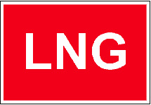

*    *   2.

    *   Das Kennzeichen ist rechteckig mit der Aufschrift „LNG“ in weißen
        Buchstaben auf rotem Grund und einem weißen Rand von mindestens 5 cm
        Breite. Die Längsseite des Rechtecks muss mindestens 60 cm betragen.
        Die Höhe der Schriftzeichen muss mindestens 20 cm betragen. Die Breite
        der Schriftzeichen und die Stärke der Striche müssen der Höhe
        entsprechen.

    *

3.  Das Kennzeichen muss an einer geeigneten und gut sichtbaren Stelle
    angebracht sein.

4.  Das Kennzeichen muss erforderlichenfalls beleuchtet werden, damit es
    bei Nacht deutlich sichtbar ist.

#### § 2.07 Verhaltenspflichten

1.  Der Eigentümer und der Ausrüster dürfen jeweils die Inbetriebnahme
    eines Fahrzeugs nur dann anordnen oder zulassen, wenn

    a)  das Fahrzeug nach den §§ 2.01, 2.02 oder 2.06 in der dort
        vorgeschriebenen Weise gekennzeichnet ist,

    b)  das Fahrzeug nach § 2.03 geeicht ist,

    c)  an dem Fahrzeug Einsenkungsmarken nach § 2.04 Nummer 1 und im Falle
        eines Tiefgangs des Fahrzeugs von mehr als 1,00 m zusätzlich
        Tiefgangsanzeiger nach § 2.04 Nummer 2 angebracht sind und

    d)  die Schiffsanker nach § 2.05 Nummer 1, auch in Verbindung mit Nummer 2
        oder 3 Satz 2, in der dort vorgeschriebenen Weise gekennzeichnet sind.

2.  Der Schiffsführer darf ein Fahrzeug nur führen, wenn

    a)  das Fahrzeug nach den §§ 2.01, 2.02 oder 2.06 in der dort
        vorgeschriebenen Weise gekennzeichnet ist,

    b)  das Fahrzeug nach § 2.03 geeicht ist,

    c)  an dem Fahrzeug Einsenkungsmarken nach § 2.04 Nummer 1 und im Falle
        eines Tiefgangs des Fahrzeugs von mehr als 1,00 m zusätzlich
        Tiefgangsanzeiger nach § 2.04 Nummer 2 angebracht sind und

    d)  die Schiffsanker nach § 2.05 Nummer 1, auch in Verbindung mit Nummer 2
        oder 3 Satz 2, in der dort vorgeschriebenen Weise gekennzeichnet sind.

### Kapitel 3 - Bezeichnung der Fahrzeuge

#### Abschnitt I. - Allgemeines

Begriffsbestimmungen und Anwendungen

##### § 3.01 (Anlage 3: Bild 1)

1.  In diesem Kapitel gelten als

    *        *
            a)  „Topplicht“:
                ein weißes starkes Licht, das über einen Horizontbogen von 225°
                und zwar von Voraus bis beiderseits 22°30’ hinter die Querlinie,
                und das nur in diesem Bogen sichtbar ist;

            b)  „Seitenlichter“:
                an Steuerbord ein grünes helles Licht und an Backbord ein rotes
                helles Licht, von denen jedes über einen Horizontbogen von
                112°30’, das heißt von Voraus bis 22°30’ hinter die Querlinie auf
                der Seite, auf der das Licht angebracht ist, und nur in diesem Bogen
                sichtbar ist;

            c)  „Hecklicht“:
                ein weißes gewöhnliches Licht oder ein weißes helles Licht,
                das über einen Horizontbogen von 135°, und zwar 67°30’ von
                Achteraus nach jeder Seite und nur in diesem Bogen sichtbar ist;

            d)  „von allen Seiten sichtbares Licht“:
                ein Licht, das über einen Horizontbogen von 360° sichtbar ist.

        *            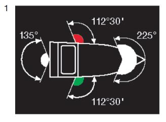

2.  Wenn es die Sichtverhältnisse erfordern, müssen die für die Nacht
    vorgeschriebenen Lichter zusätzlich bei Tag gesetzt werden.

3.  Bei Anwendung dieses Kapitels gilt ein Schubverband, dessen Länge
    110,00 m und dessen Breite 12,00 m nicht überschreiten, als ein
    einzeln fahrendes Fahrzeug mit Maschinenantrieb von gleicher Länge und
    Breite und ein Verband gekuppelter Fahrzeuge, dessen Länge 140,00 m
    überschreitet, als ein Schubverband von gleicher Länge.

4.  Ein auf Schleusung wartendes Fahrzeug, das stillliegt, kann die für
    die Fahrt vorgeschriebene Bezeichnung beibehalten.

5.  Die in diesem Kapitel vorgeschriebenen Bezeichnungen sind in Anlage 3
    abgebildet.

##### § 3.02 Lichter und Signalleuchten

1.  Soweit nichts anderes bestimmt ist, müssen die in dieser Verordnung
    vorgeschriebenen Lichter von allen Seiten sichtbar sein und ein
    gleichmäßiges, ununterbrochenes Licht werfen.

2.  Es dürfen nur Signalleuchten verwendet werden, deren Lichter in
    horizontaler Ausstrahlung, Farbe und Stärke den Bestimmungen dieser
    Verordnung und den Anforderungen des Artikels 7.05 ES-TRIN
    entsprechen. Signalleuchten, die den Anforderungen der am 30. Juni
    2011 oder am 31. Dezember 2012 oder am 6. Oktober 2018 geltenden
    Fassung der Binnenschifffahrtsstraßen-Ordnung entsprechen, dürfen
    weiterhin verwendet werden.

3.  Die Nachtbezeichnung eines stillliegenden nicht motorisierten
    Fahrzeugs braucht nicht den Anforderungen der Nummer 2 zu entsprechen;
    sie muss jedoch bei klarer Sicht und dunklem Hintergrund eine
    Tragweite von mindestens 1 000,00 m haben.

##### § 3.03 Flaggen, Tafeln und Wimpel

1.  Soweit nichts anderes bestimmt ist, muss eine in dieser Verordnung
    vorgeschriebene Flagge oder Tafel rechteckig sein.

2.  Die Farben einer Flagge, einer Tafel oder eines Wimpels dürfen weder
    verblasst noch verschmutzt sein.

3.  Die Abmessungen der Sichtzeichen nach Nummer 2 müssen so groß sein,
    dass sie gut gesehen werden können; diese Voraussetzung gilt in jedem
    Falle als erfüllt

    a)  bei einer Flagge oder Tafel, wenn sie mindestens 1,00 m hoch und 1,00
        m breit, bei Kleinfahrzeugen mindestens 0,60 m hoch und 0,60 m breit
        ist,

    b)  bei einem Wimpel, wenn seine Länge mindestens 1,00 m und seine Breite
        an der Seite, an der der Wimpel befestigt ist, mindestens 0,50 m
        beträgt.

##### § 3.04 Zylinder, Bälle und Kegel

1.  Ein in dieser Verordnung vorgeschriebener Zylinder, Ball oder Kegel
    darf durch Einrichtungen ersetzt werden, die aus der Entfernung das
    gleiche Aussehen haben.

2.  Die Farben der Sichtzeichen nach Nummer 1 dürfen weder verblasst noch
    verschmutzt sein.

3.  Die Abmessungen der Sichtzeichen nach Nummer 1 müssen mindestens
    betragen:

    a)  für einen Zylinder 0,80 m in der Höhe und 0,50 m im Durchmesser;

    b)  für einen Ball 0,60 m im Durchmesser;

    c)  für einen Kegel 0,60 m in der Höhe und 0,60 m im Durchmesser der
        Grundfläche;

    d)  für einen Doppelkegel 0,80 m in der Höhe und 0,50 m im Durchmesser der
        Grundfläche.

4.  Für ein Kleinfahrzeug dürfen entgegen Nummer 3 Sichtzeichen mit
    geringeren Abmessungen, die im Verhältnis zur Größe des Kleinfahrzeugs
    angemessen sind, verwendet werden. Sie müssen jedoch so groß sein,
    dass sie gut gesehen werden können.

##### § 3.05 Verbotene oder ausnahmsweise zugelassene Lichter und Sichtzeichen

1.  Es ist verboten, andere als die in dieser Verordnung vorgesehenen
    Lichter oder Sichtzeichen zu gebrauchen oder Lichter oder Sichtzeichen
    unter Umständen zu gebrauchen, für die sie nicht vorgeschrieben oder
    zugelassen sind.

2.  Zur Verständigung von Fahrzeug zu Fahrzeug oder zwischen Fahrzeug und
    Land dürfen jedoch auch andere Lichter oder Sichtzeichen verwendet
    werden, sofern dies zu keiner Verwechslung mit den in dieser
    Verordnung vorgesehenen Lichtern oder Sichtzeichen führen kann.

##### § 3.06

(ohne Inhalt)

##### § 3.07 Verbotener Gebrauch von Lichtern, Scheinwerfern, Sichtzeichen und anderen Gegenständen

1.  Es ist verboten, ein Licht, einen Schweinwerfer, ein Sichtzeichen oder
    einen anderen Gegenstand in einer Weise zu gebrauchen, dass es oder er
    mit den in dieser Verordnung vorgesehenen Bezeichnungen verwechselt
    werden kann, deren Sichtbarkeit beeinträchtigt oder deren
    Erkennbarkeit erschweren kann.

2.  Es ist verboten, ein Licht oder einen Scheinwerfer in einer Weise zu
    gebrauchen, dass es oder er blendet und dadurch die Schifffahrt oder
    den Verkehr an Land gefährdet oder behindert.

#### Abschnitt II. - Nacht- und Tagbezeichnung

##### Titel A. - Bezeichnung während der Fahrt

Bezeichnung einzeln fahrender Fahrzeuge mit Maschinenantrieb

###### § 3.08 (Anlage 3: Bild 2, 3)

1.  Ein einzeln fahrendes Fahrzeug mit Maschinenantrieb muss bei Nacht
    führen:

    *        *
            a)  ein Topplicht, das auf dem vorderen Teil des Fahrzeugs gesetzt
                werden muss;

            b)  die Seitenlichter, die in gleicher Höhe und in einer Ebene senkrecht
                zur Längsebene des Fahrzeugs gesetzt werden müssen. Bei
                Fahrten auf Flüssen müssen die Seitenlichter mindestens 1,00 m
                tiefer als das Topplicht gesetzt werden. Bei Fahrten auf Kanälen
                müssen die Seitenlichter nach Möglichkeit 1,00 m tiefer als das
                Topplicht, sie dürfen jedoch nicht höher als dieses gesetzt werden.
                Sie müssen mindestens 1,00 m hinter dem Topplicht gesetzt
                und binnenbords derart abgeblendet werden, dass das grüne
                Licht nicht von Backbord, das rote Licht nicht von Steuerbord gesehen
                werden kann;

            c)  ein Hecklicht auf dem Achterschiff.

        *            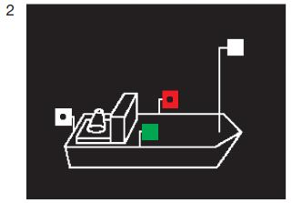

*    *
        2.  Ein einzeln fahrendes Fahrzeug mit Maschinenantrieb mit mehr als
            110,00 m Länge muss bei Nacht außerdem ein zweites Topplicht führen
            und zwar auf dem Achterschiff und in größerer Höhe als das vordere
            Licht.

    *        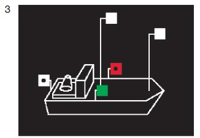

3.  Die Nummern 1 und 2 gelten nicht für ein Kleinfahrzeug oder für eine
    Fähre; für ein Kleinfahrzeug gilt § 3.13, für eine Fähre § 3.16.

Bezeichnung der Schleppverbände in Fahrt

###### § 3.09 (Anlage 3: Bild 4, 5, 6, 7, 8, 9, 10)

1.  An der Spitze eines Schleppverbandes in Fahrt muss das Fahrzeug mit
    Maschinenantrieb führen:

    a)  bei Nacht:

        *            *
                aa) außer dem Topplicht und den Seitenlichtern nach § 3.08
                    Nummer 1 Buchstabe a und b ein zweites Topplicht; dieses
                    muss etwa 1,00 m unter dem ersten Topplicht, jedoch nach
                    Möglichkeit mindestens 1,00 m höher als die Seitenlichter gesetzt
                    werden;

                bb) statt des Hecklichts nach § 3.08 Nummer 1 Buchstabe c ein
                    gelbes Hecklicht an geeigneter Stelle und in ausreichender
                    Höhe, damit es von dem nachfolgenden Anhang gesehen
                    werden kann.

            *                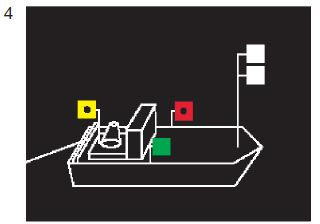

    *   Das Fahrzeug muss diese Lichter auch dann beibehalten, wenn ihm
        vorübergehend auf einer kurzen Strecke ein Vorspann voranfährt; der
        Vorspann muss die Lichter ebenfalls führen.

    b)  bei Tag:

        *            *   einen gelben Zylinder, der oben und unten mit je einem schwarzen und
                je einem weißen Streifen
                – letztere an                                    den äußeren Enden –
                eingefasst ist; der Zylinder muss auf dem Vorschiff senkrecht und so
                hoch gesetzt werden, dass er von allen Seiten sichtbar ist.

            *   4

            *                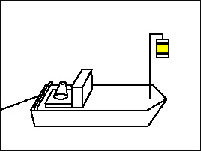

        *            *   Das Fahrzeug muss den Zylinder auch dann beibehalten, wenn ihm
                vorübergehend auf einer kurzen Strecke ein Vorspann voran fährt; der
                Vorspann muss den Zylinder ebenfalls führen.

2.  Hat ein Schleppverband an der Spitze mehrere Fahrzeuge mit
    Maschinenantrieb, die nebeneinander fahren, sei es längsseits
    gekuppelt oder nicht, muss jedes dieser Fahrzeuge führen:

    a)  bei Nacht:

        *            *   ein drittes Topplicht; dieses muss etwa 2,00 m unter dem ersten
                Topplicht, jedoch nach Möglichkeit mindestens 1,00 m höher als
                die Seitenlichter gesetzt werden;

            *                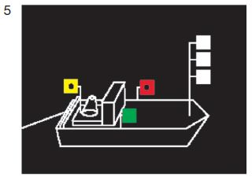

    b)  bei Tag:

        *            *   den Zylinder nach Nummer 1 Buchstabe b.

            *                

*   Das Gleiche gilt für alle Fahrzeuge mit Maschinenantrieb, die
    gemeinsam ein Fahrzeug, einen Schwimmkörper oder eine schwimmende
    Anlage bugsieren.

3.  Die geschleppten Fahrzeuge eines Schleppverbandes in Fahrt müssen
    führen:

    a)  bei Nacht:

        *            *   ein weißes helles, von allen Seiten sichtbares Licht; dieses muss
                nach hinten und kann nach den Seiten durch eine Mattglasscheibe
                abgeblendet werden;

            *                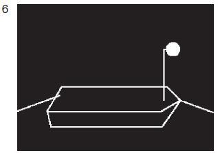

    b)  bei Tag:

        *            *   einen gelben Ball an einer geeigneten Stelle und so hoch, dass er
                von allen Seiten sichtbar ist.

            *                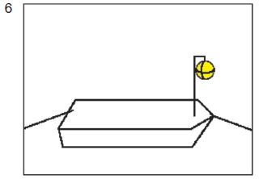

*   Das Gleiche gilt für geschleppte Schwimmkörper oder geschleppte
    schwimmende Anlagen. Wenn jedoch

    *        *
            a)  eine Anhanglänge des Verbandes 110,00 m überschreitet, muss
                sie bei Nacht zwei Lichter nach Satz 1 führen, und zwar eines auf
                der vorderen und eines auf der hinteren Hälfte des Fahrzeugs;

        *            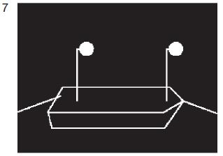

    *        *
            b)  eine Anhanglänge des Verbandes aus mehr als zwei längsseits
                verbundenen Fahrzeugen besteht, sind die Lichter oder die Bälle
                nach Satz 1 nur von den beiden äußeren Fahrzeugen zu führen.

        *            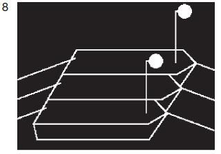

    *        *
        *            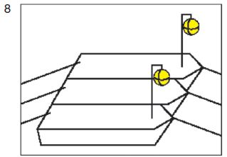

*   Die Lichter und Bälle aller geschleppten Fahrzeuge eines Verbandes
    sind so zu setzen, dass sie sich möglichst in gleicher Höhe über dem
    Wasserspiegel befinden.

4.  Das Fahrzeug oder die Fahrzeuge, die die letzte Anhanglänge eines
    Schleppverbandes in Fahrt bilden, müssen bei Nacht führen:

    *        *
            a)  das Licht nach Nummer 3 oder das Topplicht nach § 3.08 Nummer 1
                Buchstabe a;

        *            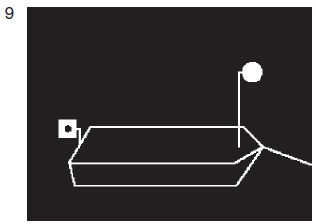

    *        *
            b)  das Hecklicht nach § 3.08 Nummer 1 Buchstabe c; bilden mehr
                als zwei längsseits verbundene Fahrzeuge den Schluss des
                Verbandes, brauchen nur die beiden äußeren Fahrzeuge dieses
                Licht zu führen.

        *            

*   Bilden ein oder mehrere Kleinfahrzeuge den Schluss eines Verbandes,
    bleiben sie bei Anwendung der Vorschriften dieser Nummer
    unberücksichtigt.

5.  Auf einer Reede braucht ein Schleppverband, der aus einem Fahrzeug mit
    Maschinenantrieb und einer einzigen Anhanglänge besteht, die
    Tagbezeichnung nach den Nummern 1 bis 4 nicht zu führen.

6.  Die Nummern 1 bis 5 gelten nicht für ein Kleinfahrzeug, das
    ausschließlich Kleinfahrzeuge schleppt, und nicht für ein geschlepptes
    Kleinfahrzeug. Für derartige Kleinfahrzeuge gilt § 3.13 Nummer 2 und
    3\.

Bezeichnung der Schubverbände in Fahrt

###### § 3.10 (Anlage 3: Bild 11, 12, 13, 14)

1.  Ein Schubverband in Fahrt muss bei Nacht führen:

    a)  als Topplichter

        *            *
                aa) drei Topplichter auf dem Vorschiff des Fahrzeugs oder, bei mehreren
                    Fahrzeugen, auf dem Vorschiff des linken der Fahrzeuge an der Spitze
                    des Verbandes; diese Topplichter müssen in der Form eines
                    gleichseitigen Dreiecks mit waagerechter Grundlinie in einer Ebene
                    senkrecht zur Längsebene des Verbandes angeordnet sein; die beiden
                    unteren Topplichter müssen in einem Abstand von 1,25 m voneinander und
                    1,10 m unter dem obersten Topplicht gesetzt werden; sie müssen darüber
                    hinaus auf einem Fluss mindestens 2,00 m über der Ebene der
                    Einsenkungsmarken und mindestens 1,00 m über den Seitenlichtern, auf
                    einem Schifffahrtskanal oder in einem Schleusenkanal so hoch wie
                    möglich, jedoch mindestens in Höhe der Seitenlichter gesetzt werden;

            *                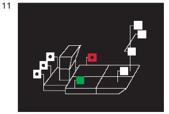

        bb) ein Topplicht auf dem Vorschiff jedes anderen Fahrzeugs, dessen ganze
            Breite von vorn sichtbar ist; dieses Topplicht ist nach Möglichkeit
            3,00 m tiefer als das oberste Topplicht nach Doppelbuchstabe aa
            hiervor zu setzen.

    *   Die Masten dieser Topplichter müssen in der Längsebene des Fahrzeugs
        stehen, auf dem sie geführt werden;

    b)  als Seitenlichter
        auf dem breitesten Teil des Verbandes, höchstens 1,00 m von dessen
        Außenseiten entfernt, möglichst nahe beim schiebenden Fahrzeug und
        mindestens 2,00 m über dem Wasserspiegel;

    c)  als Hecklichter

    *
        *            *
                aa) drei Hecklichter auf dem Achterschiff des schiebenden Fahrzeugs in
                    einer waagerechten Linie senkrecht zur Längsebene mit einem seitlichen
                    Abstand von etwa 1,25 m und in ausreichender Höhe, sodass sie nicht
                    durch eines der anderen Fahrzeuge des Verbandes verdeckt werden
                    können;

                bb) ein Hecklicht auf dem Achterschiff eines jeden anderen Fahrzeugs,
                    dessen ganze Breite von hinten sichtbar ist; befinden sich in dem
                    Verband außer dem schiebenden Fahrzeug mehr als zwei von hinten
                    sichtbare Fahrzeuge, ist dieses Hecklicht nur von den beiden äußeren
                    Fahrzeugen zu führen.

            *                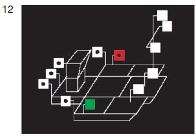

*    *
        2.  Ein Schubverband, der durch zwei schiebende Fahrzeuge nebeneinander
            fortbewegt wird, muss bei Nacht Hecklichter nach Nummer 1 Buchstabe c
            Doppelbuchstabe aa auf dem steuerbordseitigen schiebenden Fahrzeug
            führen, das andere schiebende Fahrzeug muss das Hecklicht nach Nummer
            1 Buchstabe c Doppelbuchstabe bb führen.

    *        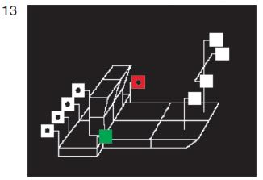

*    *
        3.  Nummer 1 gilt auch für einen Schubverband, wenn er bei Nacht
            geschleppt wird; jedoch müssen die drei Hecklichter nach Nummer 1
            Buchstabe c Doppelbuchstabe aa gelb sein.

    *        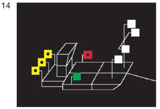

*    *
        4.  Wird ein Schubverband bei Tag geschleppt, muss das schiebende Fahrzeug
            führen:
            einen gelben Ball an einer geeigneten Stelle und so hoch, dass er von
            allen Seiten sichtbar ist.

    *        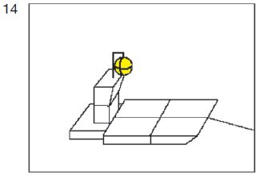

   Bezeichnung gekuppelter Fahrzeuge in Fahrt

###### § 3.11 (Anlage 3: Bild 15, 16)

1.  Gekuppelte Fahrzeuge in Fahrt müssen bei Nacht führen:

    *        *
            a)  auf jedem Fahrzeug das Topplicht nach § 3.08 Nummer 1 Buchstabe a;
                auf Fahrzeugen ohne Maschinenantrieb kann dieses Topplicht jedoch
                an einer geeigneten Stelle und nicht höher als das Topplicht des
                Fahrzeugs oder der Fahrzeuge mit Maschinenantrieb durch das Licht
                nach § 3.09 Nummer 3 ersetzt werden;

        *            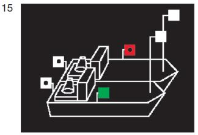

    *        *
            b)  die Seitenlichter nach § 3.08 Nummer 1 Buchstabe b; diese Lichter
                müssen an der Außenseite der äußeren Fahrzeuge gesetzt werden, und
                zwar möglichst in gleicher Höhe und mindestens 1,00 m tiefer als das
                niedrigste Topplicht;

            c)  auf jedem Fahrzeug ein Hecklicht nach § 3.08 Nummer 1 Buchstabe c.

        *            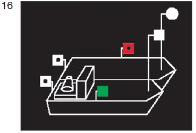

2.  Nummer 1 gilt nicht für ein Kleinfahrzeug, das nur Kleinfahrzeuge
    längsseits gekuppelt führt, und nicht für ein längsseits gekuppeltes
    Kleinfahrzeug. Für derartige Kleinfahrzeuge gilt § 3.13 Nummer 2 und
    3\.

Bezeichnung der Fahrzeuge unter Segel in Fahrt

###### § 3.12 (Anlage 3: Bild 17)

1.  Ein Fahrzeug unter Segel in Fahrt muss bei Nacht führen:

    *        *
            a)  die Seitenlichter nach § 3.08 Nummer 1 Buchstabe b, jedoch können
                diese gewöhnliche Lichter sein;

            b)  ein Hecklicht nach § 3.08 Nummer 1 Buchstabe c.

        *            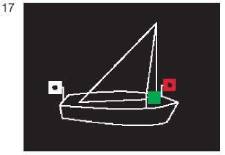

2.  Nummer 1 gilt nicht für ein Kleinfahrzeug; für ein Kleinfahrzeug unter
    Segel in Fahrt gilt § 3.13 Nummer 4 und 6.

Bezeichnung der Kleinfahrzeuge in Fahrt

###### § 3.13 (Anlage 3: Bild 18, 19, 20, 21, 22, 23, 24, 25, 26)

1.  Ein einzeln fahrendes Kleinfahrzeug mit Maschinenantrieb muss bei
    Nacht führen:
    entweder

    *        *
            a)  ein Topplicht, jedoch hell statt stark, in gleicher Höhe wie die
                Seitenlichter
                und mindestens 1,00 m vor diesen;

            b)  Seitenlichter, die gewöhnliche Lichter sein dürfen; sie müssen in
                gleicher Höhe und in einer Ebene senkrecht zur Längsachse des
                Fahrzeugs gesetzt sein und innenbords derart abgeblendet sein,
                dass das grüne Licht nicht von Backbord, das rote Licht nicht von
                Steuerbord gesehen werden kann;

            c)  ein Hecklicht;

        *            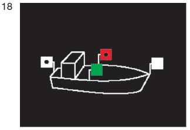

*   oder

    *        *
            d)  ein Topplicht, jedoch hell statt stark, mindestens 1,00 m höher als
                die Seitenlichter;

            e)  Seitenlichter, die gewöhnliche Lichter sein dürfen; diese können

                aa) in gleicher Höhe und in einer Ebene senkrecht zur Längsachse
                    des Fahrzeugs

            *   oder

                bb) unmittelbar nebeneinander oder in einer einzigen Laterne am
                    oder nahe am Bug in der Schiffsachse

            *   gesetzt sein; im Falle des Doppelbuchstaben aa müssen sie
                innenbords derart abgeblendet sein, dass das grüne Licht nicht von
                Backbord, das rote Licht nicht von Steuerbord gesehen werden kann;

        *            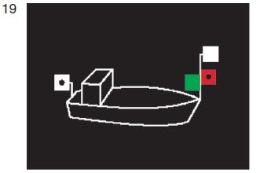

    *        *
            f)  ein Hecklicht; dieses Licht darf unter der Voraussetzung entfallen,
                dass anstelle des Topplichtes nach Buchstabe d ein von allen
                Seiten sichtbares weißes helles Licht geführt wird.

        *            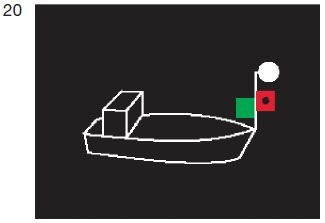

2.  Schleppt ein Kleinfahrzeug ausschließlich Kleinfahrzeuge oder führt es
    nur solche längsseits gekuppelt, muss es bei Nacht die Lichter nach
    Nummer 1 führen.

*    *
        3.  Ein geschlepptes oder längsseits gekuppeltes Kleinfahrzeug muss
            bei Nacht ein von allen Seiten sichtbares weißes gewöhnliches Licht
            führen. Dies gilt nicht für die Beiboote des Fahrzeugs.

    *        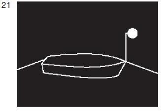

4.  Ein einzeln fahrendes Kleinfahrzeug unter Segel muss bei Nacht führen:
    entweder

    *        *
            a)  die Seitenlichter nach Nummer 1 Buchstabe e und ein Hecklicht

        *            

    *        *   oder

            b)  diese Seitenlichter und das Hecklicht in einer einzigen Laterne
                am Topp

        *            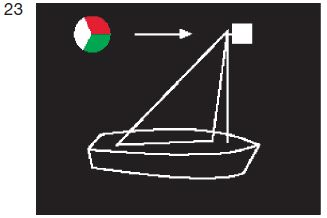

    *        *   oder

            c)  ein von allen Seiten sichtbares weißes gewöhnliches Licht und
                bei der Annäherung anderer Fahrzeuge außerdem ein zweites
                weißes gewöhnliches Licht zeigen.

        *            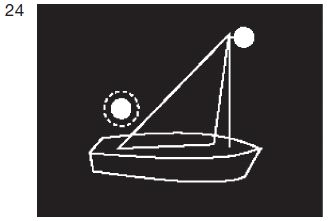

*    *
        5.  Ein einzeln weder mit Maschinenantrieb noch unter Segel fahrendes
            Kleinfahrzeug muss bei Nacht ein von allen Seiten sichtbares weißes
            gewöhnliches Licht führen. Ein Beiboot, auf das die gleichen Voraus-
            setzungen zutreffen, braucht dieses Licht jedoch nur bei der
            Annäherung
            eines anderen Fahrzeugs zu zeigen.

    *        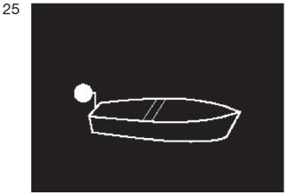

*    *
        6.  Ein Kleinfahrzeug unter Segel, das gleichzeitig mit Maschinenantrieb
            fährt, muss bei Tag einen schwarzen Kegel mit der Spitze nach unten,
            so hoch wie möglich an einer Stelle, an der er am besten sichtbar ist,
            führen.

    *        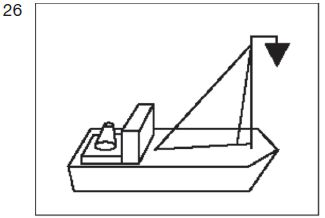

   Zusätzliche Bezeichnung der Fahrzeuge in Fahrt bei Beförderung
bestimmter gefährlicher Güter

###### § 3.14 (Anlage 3: Bild 27a, 27b, 28a, 28b, 29, 30, 31, 32)

1.  Ein Fahrzeug in Fahrt, das bestimmte entzündbare Stoffe nach Kapitel
    3\.2 Tabelle A ADN befördert, muss zusätzlich zu der anderen nach
    dieser Verordnung vorgeschriebenen Bezeichnung folgende Bezeichnung
    nach ADN Unterabschnitt 7.1.5.0 oder 7.2.5.0 führen:

    a)  bei Nacht:

        *            *   ein blaues Licht;

            *                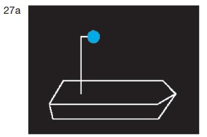

    b)  bei Tag:

        *            *   einen blauen Kegel mit der Spitze nach unten.

            *                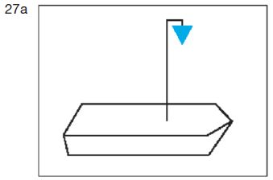

    *        *   Das Zeichen muss an einer geeigneten Stelle und so hoch geführt
            werden, dass es von allen Seiten sichtbar ist. Anstelle des blauen
            Kegels nach Satz 1 Buchstabe b kann auch je ein blauer Kegel auf
            dem Vorschiff und dem Achterschiff und so hoch geführt werden,
            dass der Kegel auf

            a)  dem Vorschiff mindestens in einem Bereich von Backbord
                querab über Voraus bis Steuerbord querab,

            b)  auf dem Achterschiff mindestens in einem Bereich von Backbord
                querab über Achteraus bis Steuerbord querab

        *            

    *        *   sichtbar ist.

        *

2.  Ein Fahrzeug in Fahrt, das bestimmte gesundheitsschädliche Stoffe nach
    Kapitel 3.2 Tabelle A ADN befördert, muss zusätzlich zu der anderen
    nach dieser Verordnung vorgeschriebenen Bezeichnung folgende
    Bezeichnung nach ADN Unterabschnitt 7.1.5.0 oder 7.2.5.0 führen:

    a)  bei Nacht:

        *            *   zwei blaue Lichter;

            *                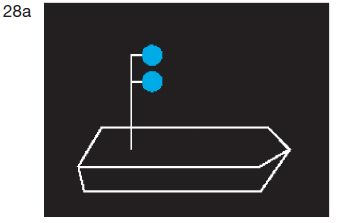

    b)  bei Tag:

        *            *   zwei blaue Kegel mit der Spitze nach unten.

            *                

    *        *   Die Zeichen müssen übereinander in einem Abstand von 1,00 m an
            einer geeigneten Stelle und so hoch geführt werden, dass sie von
            allen Seiten sichtbar sind. Abweichend von Satz 2 kann der Abstand
            zwischen den Zeichen in Abhängigkeit von den Gegebenheiten
            geringer gewählt werden, wenn hierdurch ihre Erkennbarkeit nicht
            eingeschränkt wird. Anstelle der zwei blauen Kegel nach Satz 1
            Buchstabe b in Verbindung mit den Sätzen 2 und 3 können auch je
            zwei blaue Kegel auf dem Vorschiff und dem Achterschiff und so
            hoch geführt werden, dass die Kegel auf

            a)  dem Vorschiff mindestens in einem Bereich von Backbord
                querab über Voraus bis Steuerbord querab,

            b)  auf dem Achterschiff mindestens in einem Bereich von Backbord
                querab über Achteraus bis Steuerbord querab

        *            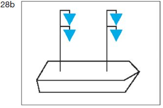

    *        *   sichtbar sind.

        *

3.  Ein Fahrzeug in Fahrt, das bestimmte explosive Stoffe nach Kapitel 3.2
    Tabelle A ADN befördert, muss zusätzlich zu der anderen nach dieser
    Verordnung vorgeschriebenen Bezeichnung folgende Bezeichnung nach ADN
    Unterabschnitt 7.1.5.0 oder 7.2.5.0 führen:

    a)  bei Nacht:

        *            *   drei blaue Lichter;

            *                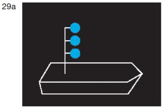

    b)  bei Tag:

        *            *   drei blaue Kegel mit der Spitze nach unten.

            *                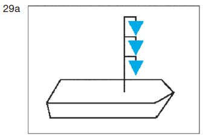

    *        *   Die Zeichen müssen übereinander in einem Abstand von 1,00 m
            an einer geeigneten Stelle und so hoch geführt werden, dass sie von
            allen Seiten sichtbar sind. Abweichend von Satz 2 kann der Abstand
            zwischen den Zeichen in Abhängigkeit von den Gegebenheiten
            geringer gewählt werden, wenn hierdurch ihre Erkennbarkeit nicht
            eingeschränkt wird. Anstelle der drei blauen Kegel nach Satz 1 Buch-
            stabe b in Verbindung mit den Sätzen 2 und 3 können auch je drei
            blaue Kegel auf dem Vorschiff und dem Achterschiff und so hoch
            geführt werden, dass die Kegel auf

            a)  dem Vorschiff mindestens in einem Bereich von Backbord
                querab über Voraus bis Steuerbord querab,

            b)  auf dem Achterschiff mindestens in einem Bereich von Backbord
                querab über Achteraus bis Steuerbord querab

        *            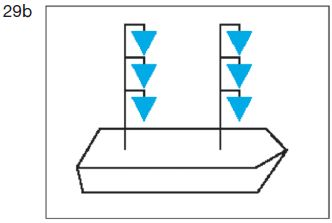

    *        *   sichtbar sind.

        *

4.  Fährt oder fahren in einem Schubverband oder in einer Zusammenstellung
    gekuppelter Fahrzeuge ein Fahrzeug oder mehrere Fahrzeuge im Sinne der
    Nummer 1, 2 oder 3, muss die Bezeichnung nach der Nummer 1, 2 oder 3
    auf dem Fahrzeug geführt werden, das den Verband oder die
    Zusammenstellung fortbewegt.

    *        *
        *            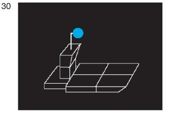
        *            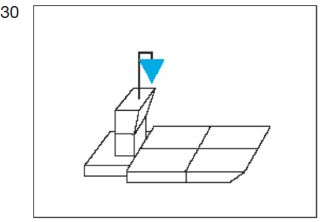

    *        *
        *            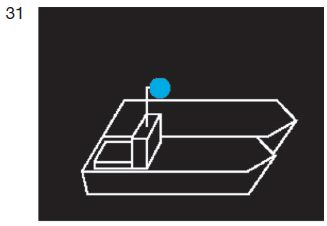
        *            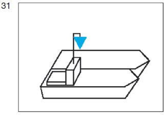

5.  Ein Schubverband, der durch zwei schiebende Fahrzeuge nebeneinander
    fortbewegt wird, muss die Bezeichnung nach Nummer 4 auf dem
    steuerbordseitigen, schiebenden Fahrzeug führen.

    *        *
        *            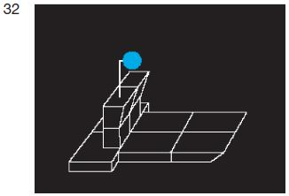
        *            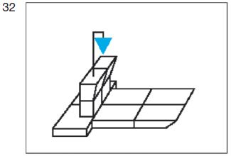

6.  Ein Fahrzeug, ein Schubverband oder gekuppelte Fahrzeuge, das, der
    oder die verschiedene gefährliche Güter nach den Nummern 1, 2 oder 3
    zusammen befördern, führen die Bezeichnung für das gefährliche Gut,
    das die größte Anzahl der blauen Lichter oder blauen Kegel erfordert.

7.  Ein Fahrzeug, das keine Bezeichnung nach Nummer 1, 2 oder 3 führen
    muss, jedoch nach ADN Abschnitt 1.16.1 ein Zulassungszeugnis besitzt
    und die Sicherheitsbestimmungen einhält, die für ein Fahrzeug nach
    Nummer 1 gelten, hat bei der Annäherung an Schleusen die Bezeichnung
    nach Nummer 1 zu führen, wenn es zusammen mit einem Fahrzeug
    geschleust werden will, das die Bezeichnung nach Nummer 1 führen muss.

8.  Die Lichtstärke der in den Nummern 1 bis 7 vorgeschriebenen blauen
    Lichter muss mindestens derjenigen der gewöhnlichen blauen Lichter
    entsprechen.

Bezeichnung der Fahrzeuge in Fahrt,
die zur Beförderung von mehr als zwölf Fahrgästen zugelassen sind
und deren Schiffskörper eine größte Länge von weniger als 20,00 m
aufweist

###### § 3.15 (Anlage 3: Bild 33)

Ein Fahrzeug, das zur Beförderung von mehr als zwölf Fahrgästen
zugelassen ist und dessen Schiffskörper eine größte Länge von weniger
als 20,00 m aufweist, muss in Fahrt bei Tag

*    *   einen gelben Doppelkegel an einer geeigneten Stelle und so hoch,
        dass er von allen Seiten sichtbar ist,

    *        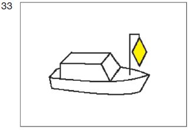

   führen. Satz 1 gilt nicht für eine Fähre.

Bezeichnung der Fähren in Fahrt

###### § 3.16 (Anlage 3: Bild 34, 35, 36)

1.  Eine nicht frei fahrende Fähre in Fahrt muss bei Nacht führen:

    *        *
            a)  ein von allen Seiten sichtbares weißes helles Licht
                mindestens 5,00 m über der Ebene der Einsenkungsmarken; die Höhe darf
                jedoch verringert werden, wenn die Länge der Fähre 15,00 m
                nicht überschreitet;

            b)  ein von allen Seiten sichtbares grünes helles Licht etwa 1,00 m
                über dem Licht nach Buchstabe a.

        *            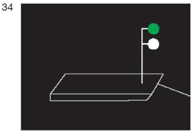

*    *
        2.  Bei einer Gierfähre am Längsseil in Fahrt muss bei Nacht der
            oberste Buchtnachen oder Döpper mit einem weißen hellen Licht
            mindestens 3,00 m über dem Wasser versehen sein.

    *        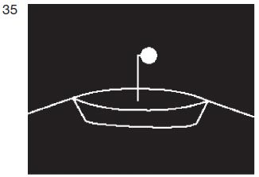

3.  Eine frei fahrende Fähre in Fahrt muss bei Nacht führen:

    *        *
            a)  die Lichter nach Nummer 1;

            b)  die Lichter nach § 3.08 Nummer 1 Buchstabe b und c.

        *            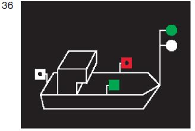

   Zusätzliche Bezeichnung der Fahrzeuge in Fahrt, die einen Vorrang
besitzen

###### § 3.17 (Anlage 3: Bild 37)

Ein Fahrzeug, dem die zuständige Behörde zur Durchfahrt durch eine
Stelle, an der eine bestimmte Reihenfolge gilt, einen Vorrang
eingeräumt hat, muss in Fahrt außer der anderen nach dieser Verordnung
vorgeschriebenen Bezeichnung bei Tag

*    *   einen roten Wimpel auf dem Vorschiff und so hoch, dass er gut sichtbar
        ist, führen.

    *        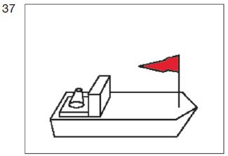

   Zusätzliche Bezeichnung manövrierunfähiger Fahrzeuge in Fahrt

###### § 3.18 (Anlage 3: Bild 38)

1.  Ein manövrierunfähiges Fahrzeug in Fahrt muss zusätzlich zu der
    anderen nach dieser Verordnung vorgeschriebenen Bezeichnung

    a)  bei Nacht:

        *            *   ein rotes Licht zeigen, das im unteren Halbkreis geschwenkt wird;

            *                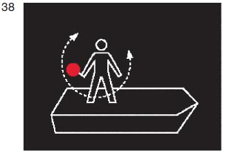

    b)  bei Tag:

        *            *   eine rote Flagge zeigen, die im unteren Halbkreis geschwenkt
                wird.

            *                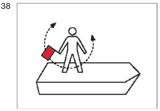

*   Anstelle der Bezeichnung nach Satz 1 kann das vorgeschriebene
    Schallzeichen gegeben werden oder beides zugleich.

2.  Die Flagge nach Nummer 1 Buchstabe b kann durch eine Tafel gleicher
    Farbe ersetzt werden.

Bezeichnung der Schwimmkörper und schwimmenden Anlagen in Fahrt

###### § 3.19 (Anlage 3: Bild 39)

Unbeschadet der besonderen Auflagen, die nach § 1.21 festgelegt werden
können, muss ein Schwimmkörper oder eine schwimmende Anlage in Fahrt
bei Nacht

*    *   von allen Seiten sichtbare weiße helle Lichter in genügender Zahl,
        um ihre Umrisse kenntlich zu machen, führen.

    *        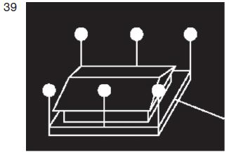

##### Titel B. - Bezeichnung beim Stillliegen

   Bezeichnung der Fahrzeuge beim Stillliegen

###### § 3.20 (Anlage 3: Bild 40, 41)

1.  Mit Ausnahme eines Kleinfahrzeugs und der in den §§ 3.22 und 3.25
    genannten Fahrzeuge muss ein Fahrzeug beim Stillliegen bei Nacht

    *        *   ein von allen Seiten sichtbares weißes gewöhnliches Licht auf der
            Fahrwasserseite mindestens 3,00 m über der Ebene der
            Einsenkungsmarken

        *            

   führen. Anstelle der Bezeichnung nach Satz 1 können auch zwei von
    allen Seiten sichtbare weiße gewöhnliche Lichter auf der
    Fahrwasserseite in gleicher Höhe auf dem Vor- und dem Achterschiff
    geführt werden.

2.  Ein Kleinfahrzeug – mit Ausnahme eines Beibootes – muss beim
    Stillliegen bei Nacht

    *        *   ein von allen Seiten sichtbares weißes gewöhnliches Licht
            auf der Fahrwasserseite führen.

        *            

3.  Die in den Nummern 1 und 2 vorgeschriebene Bezeichnung braucht nicht
    geführt zu werden, wenn

    a)  das Fahrzeug zu einer Zusammenstellung von Fahrzeugen gehört, die
        voraussichtlich nicht vor dem Ende der Nacht aufgelöst wird und die
        Fahrzeuge dieser Zusammenstellung auf der Fahrwasserseite das Licht
        nach Nummer 1 führen,

    b)  sich das Fahrzeug völlig zwischen nicht überfluteten Buhnen befindet
        oder hinter einem aus dem Wasser ragenden Längswerk stillliegt oder

    c)  das Fahrzeug am Ufer stillliegt und von diesem aus hinreichend
        beleuchtet ist.

4.  Sind Fahrzeuge an einer besonders dafür ausgewiesenen Stelle
    zusammengezogen, kann die zuständige Behörde in Sonderfällen einen
    Teil von ihnen von der Lichterführung nach den Nummern 1 oder 2
    befreien.

Zusätzliche Bezeichnung stillliegender Fahrzeuge bei Beförderung
bestimmter gefährlicher Güter

###### § 3.21 (Anlage 3: Bild 42, 43, 44)

Die nach § 3.14 jeweils vorgeschriebene Bezeichnung ist von den dort
genannten Fahrzeugen, Schubverbänden und gekuppelten Fahrzeugen auch
beim Stillliegen zu führen.

*    *
    *        
    *        

*    *
    *        
    *        

*    *
    *        
    *        

   Bezeichnung der Fähren, die an ihrer Anlegestelle stillliegen

###### § 3.22 (Anlage 3: Bild 45, 46)

1.  Eine nicht frei fahrende Fähre muss während des Betriebes bei Nacht
    beim Stillliegen an ihrer Anlegestelle die Lichter nach § 3.16 Nummer
    1 führen.

    *        *   Außerdem muss bei einer Gierseilfähre am Längsseil bei Nacht der
            oberste Buchtnachen oder Döpper das Licht nach § 3.16 Nummer 2 führen.

        *            

2.  Eine frei fahrende Fähre während des Betriebes bei Nacht muss beim
    Stillliegen an ihrer Anlegestelle die Lichter nach § 3.16 Nummer 1
    führen; sie dürfen außerdem die Lichter nach § 3.08 Nummer 1 Buchstabe
    b und c beibehalten.

    *        *   Das grüne Licht nach § 3.16 Nummer 1 Buchstabe b und die Lichter
            nach § 3.08 Nummer 1 Buchstabe b und c müssen gelöscht werden,
            sobald die Fähren nicht mehr in Betrieb sind.

        *            

   Bezeichnung der Schwimmkörper und schwimmenden Anlagen beim
Stillliegen

###### § 3.23 (Anlage 3: Bild 47)

Unbeschadet der besonderen Bedingungen, die nach § 1.21 festgelegt
werden können, muss ein Schwimmkörper oder eine schwimmende Anlage
beim Stillliegen bei Nacht

*    *   von allen Seiten sichtbare weiße gewöhnliche Lichter in genügender
        Zahl, um ihre fahrwasserseitigen Umrisse kenntlich zu machen,

    *        

   führen. Die in Satz 1 vorgeschriebenen Lichter brauchen nicht geführt
zu werden, wenn die Voraussetzungen des § 3.20 Nummer 3 Buchstabe b
oder c oder Nummer 4 erfüllt sind. Wenn durch die Lage des
Schwimmkörpers oder der schwimmenden Anlage eine Behinderung des
Schiffsverkehrs ausgeschlossen und dieser oder diese nicht über Gebühr
durch die Schifffahrt gefährdet ist, kann die zuständige Behörde für
einzelne Schwimmkörper oder schwimmende Anlagen das Stillliegen ohne
Beleuchtung zulassen.

Bezeichnung bestimmter
stillliegender Fischereifahrzeuge und der Netze oder Ausleger

###### § 3.24 (Anlage 3: Bild 48)

1.  Ein Fischereifahrzeug, ein Kleinfahrzeug eingeschlossen, das seine
    Netze oder Ausleger im Fahrwasser oder in dessen Nähe ausgelegt hat,
    muss beim Stillliegen bei Nacht die Bezeichnung nach § 3.20 Nummer 1
    führen.

2.  Die Netze oder Ausleger des Fahrzeugs nach Nummer 1 müssen bezeichnet
    sein:

    a)  bei Nacht:

        *            *   durch von allen Seiten sichtbare weiße gewöhnliche Lichter in
                ausreichender Zahl, um ihre Lage kenntlich zu machen;

            *                

    b)  bei Tag:

        *            *   durch gelbe Döpper in ausreichender Zahl, um ihre Lage kenntlich
                zu machen.

            *                

3.  Die zuständige Behörde kann eine von Nummer 2 Buchstabe b abweichende
    Bezeichnung vorschreiben oder zulassen.

Bezeichnung schwimmender Geräte
bei der Arbeit sowie festgefahrener oder gesunkener Fahrzeuge

###### § 3.25 (Anlage 3: Bild 49a, 49b, 50a, 50b, 51, 52)

1.  Ein schwimmendes Gerät bei der Arbeit oder ein Fahrzeug, das in der
    Wasserstraße Arbeiten, Peilungen oder andere Messungen ausführt und
    dabei stillliegt, muss führen:

    a)  nach der Seite oder den Seiten, an der oder denen die Durchfahrt frei
        ist:

        aa) bei Nacht:

            *                *   übereinander zwei grüne gewöhnliche Lichter oder zwei
                    grüne helle Lichter;

                *                    

        bb) bei Tag:
            entweder

            *                *
                    aaa) das Tafelzeichen E.1 (Anlage 7)

                *                    

        *   oder

            *                *
                    bbb) zwei grüne Doppelkegel übereinander in einem
                        Abstand von 1,00 m

                *                    

    *   und gegebenenfalls

    b)  nach der Seite, an der die Durchfahrt nicht frei ist:

        aa) bei Nacht:

            *                *   ein rotes gewöhnliches Licht oder ein rotes helles Licht in
                    gleicher Höhe und von gleicher Stärke wie das nach
                    Buchstabe a Doppelbuchstabe aa gezeigte oberste grüne Licht;

                *                    

        bb) bei Tag:
            entweder

            *                *
                    aaa) das Tafelzeichen A.1 (Anlage 7) in gleicher Höhe wie
                        das Tafelzeichen nach Buchstabe a Doppelbuchstabe
                        bb Dreifachbuchstabe aaa

                *                    

        *   oder

            *                *
                    bbb) einen roten Ball in gleicher Höhe wie der oberste Doppelkegel nach
                        Buchstabe a Doppelbuchstabe bb Dreifachbuchstabe bbb.

                *                    

*   Wenn das in Satz 1 genannte Fahrzeug gegen Sog oder Wellenschlag
    geschützt werden muss, muss es führen:

    a)  nach der Seite oder den Seiten, an der die Durchfahrt frei ist:

        aa) bei Nacht:

            *                *   ein rotes gewöhnliches Licht und ein weißes gewöhnliches
                    Licht oder ein rotes helles und ein weißes helles Licht, das
                    rote Licht 1,00 m über dem weißen;

                *                    

        bb) bei Tag:

            *                *   eine Flagge, deren obere Hälfte rot und deren untere Hälfte
                    weiß ist, oder zwei Flaggen übereinander, die
                    obere rot, die untere weiß,

                *                    

    b)  nach der Seite, an der die Durchfahrt nicht frei ist:

        aa) bei Nacht:
            ein rotes Licht in gleicher Höhe und von gleicher Stärke wie das nach
            Buchstabe a Doppelbuchstabe aa gezeigte rote Licht;

        bb) bei Tag:
            eine rote Flagge in gleicher Höhe wie die weiß-rote Flagge oder die
            rote Flagge auf der anderen Seite.

*   Die Bezeichnung nach den Sätzen 1 und 2 ist so hoch zu setzen, dass
    sie von allen Seiten sichtbar ist. Die Flaggen können durch Tafeln
    gleicher Farbe ersetzt werden.

2.  Ein festgefahrenes oder gesunkenes Fahrzeug muss die Bezeichnung nach
    Nummer 1 Satz 2 Buchstabe a und b führen. Liegt ein gesunkenes
    Fahrzeug so, dass die Zeichen nicht auf ihm angebracht werden können,
    müssen sie auf Nachen, Tonnen oder in anderer geeigneter Weise gesetzt
    werden.

    *        *
        *            
        *            

3.  Die zuständige Behörde kann von der Führung der Bezeichnung nach
    Nummer 1 Satz 1 Buchstabe a und b befreien.

Zusätzliche Bezeichnung der Fahrzeuge, Schwimmkörper
und schwimmenden Anlagen, deren Anker die Schifffahrt gefährden
können, und ihrer Anker

###### § 3.26 (Anlage 3: Bild 53, 54, 55)

1.  Ein stillliegendes Fahrzeug, dessen Anker so ausgeworfen sind, dass
    ein Anker, ein Ankerkabel oder eine Ankerkette die Schifffahrt
    gefährden kann, muss zusätzlich zu der anderen nach dieser Verordnung
    vorgeschriebenen Bezeichnung bei Nacht führen:

    *        *   ein von allen Seiten sichtbares zusätzliches weißes gewöhnliches
            Licht 1,00 m unter dem Licht nach § 3.20 Nummer 1 oder, wenn zwei
            Stillliegelichter gesetzt sind, unter dem Licht, das dem Anker am
            nächsten liegt.

        *            

2.  Wenn in den Fällen des § 3.23 ein Anker so ausgeworfen ist, dass die
    Schifffahrt gefährdet sein kann, muss das diesem Anker nächstgelegene
    Licht durch

    *        *   zwei von allen Seiten sichtbare weiße gewöhnliche Lichter, die in
            einem Abstand von 1,00 m übereinander angebracht sind, ersetzt
            werden.

        *            

3.  In den Fällen der Nummern 1 und 2 ist jeder dieser Anker mit einem
    gelben Döpper mit Radarreflektor zu bezeichnen.

    *        *
        *            
        *            

4.  Wenn ein Anker, ein Ankerkabel oder eine Ankerkette eines schwimmenden
    Gerätes die Schifffahrt gefährden kann, ist er, es oder sie zu
    bezeichnen:

    a)  bei Nacht:

        *            *   durch eine Tonne mit Radarreflektor und einem von allen Seiten
                sichtbaren weißen gewöhnlichen Licht;

            *                

    b)  bei Tag:

        *            *   durch einen gelben Döpper mit Radarreflektor.

            *                

#### Abschnitt III. - Sonstige Bezeichnung

   Bezeichnung der Fahrzeuge der Überwachungsbehörden

##### § 3.27 (Anlage 3: Bild 56)

Ein Fahrzeug der Überwachungsbehörden nach § 1.20 kann bei Nacht und
bei Tag ein blaues Funkellicht zeigen, um sich kenntlich zu machen.
Dies gilt auch für ein Feuerlöschboot oder für ein
Wasserrettungsfahrzeug nach § 1.24 Nummer 2 im Rettungseinsatz sowie
für ein Zollboot, ein Fahrzeug der Bundespolizei oder ein Fahrzeug des
Bundeskriminalamtes.

*    *
    *        
    *        

   Zusätzliche Bezeichnung der Fahrzeuge in Fahrt, die Arbeiten in der
Wasserstraße ausführen

##### § 3.28 (Anlage 3: Bild 57)

Ein in Fahrt befindliches Fahrzeug, das in der Wasserstraße Arbeiten,
Peilungen oder andere Messungen ausführt, kann mit Erlaubnis der
zuständigen Behörde bei Nacht und bei Tag zusätzlich zu der anderen
nach dieser Verordnung vorgeschriebenen Bezeichnung führen:
ein von allen Seiten sichtbares gelbes gewöhnliches Funkellicht oder
ein von allen Seiten sichtbares gelbes helles Funkellicht.

*    *
    *        
    *        

##### § 3.28a Bezeichnung und Fahrregeln für Mehrzweckfahrzeuge der Bundeswehr

1.  Ein Mehrzweckfahrzeug der Bundeswehr führt während der Fahrt bei Nacht
    die Lichter nach § 3.08 Nummer 1 und 1,00 m oberhalb des Topplichtes
    zusätzlich ein von allen Seiten sichtbares gelbes gewöhnliches
    Funkellicht oder ein von allen Seiten sichtbares gelbes helles
    Funkellicht, das bei Nacht und bei Tag eingeschaltet sein muss.

2.  Das Fahrzeug nach Nummer 1 verhält sich während der Fahrt
    grundsätzlich wie ein Kleinfahrzeug. Es gelten die §§ 6.02 und 6.02a
    Nummer 1 und 4.

Schutz gegen Sog und Wellenschlag

##### § 3.29 (Anlage 3: Bild 58)

1.  Ein in Fahrt befindliches oder stillliegendes Fahrzeug, ein in Fahrt
    befindlicher oder stillliegender Schwimmkörper oder eine in Fahrt
    befindliche oder stillliegende schwimmende Anlage, das, der oder die
    gegen Sog und Wellenschlag eines vorbeifahrenden Fahrzeugs oder
    Schwimmkörpers geschützt werden will, kann zusätzlich zu der anderen
    nach dieser Verordnung vorgeschriebenen Bezeichnung führen:

    a)  bei Nacht:

        *            *   ein rotes gewöhnliches und ein weißes gewöhnliches Licht oder
                ein rotes helles und ein weißes helles Licht, das rote Licht 1,00 m
                über dem weißen, an einer Stelle, an der sie gut gesehen und
                nicht mit anderen Lichtern verwechselt werden können;

            *                

    b)  bei Tag:

        *            *   eine Flagge, deren obere Hälfte rot und deren untere Hälfte weiß
                ist, an einer geeigneten Stelle und so hoch, dass sie von allen Seiten
                sichtbar ist. Die Flagge kann durch zwei Flaggen übereinander,
                die obere rot, die untere weiß, ersetzt werden.
                Die Flaggen können durch Tafeln gleicher Farbe ersetzt werden.

            *                

2.  Von der Bezeichnung nach Nummer 1 dürfen nur Gebrauch machen:

    a)  ein Fahrzeug, ein Schwimmkörper oder eine schwimmende Anlage, das, der
        oder die schwer beschädigt ist oder das, der oder die sich an
        Rettungsarbeiten beteiligt, sowie ein manövrierunfähiges Fahrzeug;

    b)  ein Fahrzeug, ein Schwimmkörper oder eine schwimmende Anlage mit
        schriftlicher Erlaubnis der zuständigen Behörde.

*   § 3.25 bleibt unberührt.

Notzeichen

##### § 3.30 (Anlage 3: Bild 59)

1.  Ein in Not befindliches Fahrzeug, das Hilfe durch Sichtzeichen
    herbeirufen will, kann zeigen:

    a)  bei Nacht:

        *            *   ein Licht, das im Kreis geschwenkt wird;

            *                

    b)  bei Tag:

        *            *   eine rote Flagge, die im Kreis geschwenkt wird, oder einen sonstigen
                geeigneten Gegenstand, der im Kreis geschwenkt wird.

            *                

2.  Die Sichtzeichen nach Nummer 1 ersetzen oder ergänzen die
    Schallzeichen nach § 4.04.

Hinweis auf das Verbot, das Fahrzeug zu betreten

##### § 3.31 (Anlage 3: Bild 60)

1.  Sofern es nicht an Bord beschäftigten Personen durch andere
    Vorschriften verboten ist, das Fahrzeug zu betreten, muss dieses
    Verbot durch runde weiße Tafeln mit rotem Rand, rotem Schrägstrich und

    *        *
            a)  einem schwarzen Sinnbild des Fußgängers oder

        *            

    *        *
            b)  einem schwarzen Sinnbild einer rufenden Person, die eine Hand
                abwehrend hochhält,

        *            

*   angezeigt werden. Die Tafeln sind je nach Bedarf an Bord oder am
    Laufsteg aufzustellen. Abweichend von § 3.03 Nummer 3 muss ihr
    Durchmesser mindestens 0,60 m betragen.

2.  Die Tafeln müssen erforderlichenfalls beleuchtet werden, damit sie bei
    Nacht deutlich sichtbar sind.

Hinweis auf das Verbot zu rauchen, ungeschütztes Licht oder Feuer zu
verwenden

##### § 3.32 (Anlage 3: Bild 61)

1.  Sofern es durch andere Vorschriften verboten ist, an Bord

    a)  zu rauchen,

    b)  ungeschütztes Licht oder Feuer zu verwenden,

*   muss dieses Verbot durch runde weiße Tafeln mit rotem Rand und rotem
    Schrägstrich, auf denen

    *        *
            a)  eine brennende Zigarette in schwarzer Farbe oder

        *            

    *        *
            b)  ein entzündetes Streichholz in schwarzer Farbe

        *            

*   abgebildet ist, angezeigt werden. Die Tafeln sind je nach Bedarf an
    Bord oder am Laufsteg aufzustellen. Abweichend von § 3.03 Nummer 3
    muss ihr Durchmesser mindestens 0,60 m betragen.

2.  Die Tafeln müssen erforderlichenfalls beleuchtet werden, damit sie bei
    Nacht deutlich sichtbar sind.

Hinweis auf das Verbot des Stillliegens nebeneinander

##### § 3.33 (Anlage 3: Bild 62)

1.  Sofern das seitliche Stillliegen in der Nähe eines Fahrzeugs durch
    andere Vorschriften oder durch besondere Anforderungen der zuständigen
    Behörde verboten ist, muss dieses Fahrzeug an Deck in der Längsachse

    *        *   eine quadratische Tafel, darunter ein dreieckiges Zusatzschild führen.

        *            

*   Die quadratische Tafel ist auf beiden Seiten weiß mit rotem Rand und
    trägt einen roten Schrägstrich von links oben nach rechts unten und
    ein schwarzes „P“ im Mittelfeld. Das dreieckige Zusatzschild ist auf
    beiden Seiten weiß und zeigt in schwarzen Zahlen die Entfernung in
    Metern an, innerhalb derer das Stillliegen verboten ist.

2.  Bei Nacht müssen die Tafeln so beleuchtet sein, dass sie an beiden
    Seiten des Fahrzeugs deutlich sichtbar sind.

3.  Dieser Paragraf gilt nicht für die in § 3.21 genannten Fahrzeuge,
    Schubverbände oder gekuppelten Fahrzeuge.

#### Abschnitt IV. - Pflichten

##### § 3.34 Verhaltenspflichten

1.  Der Schiffsführer und die nach § 1.03 Nummer 3 für Kurs und
    Geschwindigkeit verantwortliche Person haben jeweils sicherzustellen,
    dass in den Fällen des § 3.01 Nummer 2 die für die Nacht
    vorgeschriebenen Lichter zusätzlich auch bei Tag gesetzt werden.

2.  Der Schiffsführer und die nach § 1.03 Nummer 3 für Kurs und
    Geschwindigkeit verantwortliche Person haben jeweils sicherzustellen,
    dass auf dem Fahrzeug, dem Verband, dem Schwimmkörper oder der
    schwimmenden Anlage die in § 3.08 Nummer 1, auch in Verbindung mit
    Nummer 2 und mit § 3.28a Nummer 1, § 3.11 Nummer 1, § 3.12 Nummer 1, §
    3\.15 Satz 1, § 3.17, § 3.18 Nummer 1 Satz 1 und § 3.19 jeweils
    vorgeschriebene Bezeichnung während der Fahrt geführt wird.

3.  Der Schiffsführer und die nach § 1.03 Nummer 3 für Kurs und
    Geschwindigkeit verantwortliche Person haben jeweils sicherzustellen,
    dass auf dem Fahrzeug, dem Verband, dem Vorspann, dem Schwimmkörper
    oder der schwimmenden Anlage in den in § 3.09 Nummer 1 bis 4, § 3.10
    Nummer 1 bis 4, § 3.13 Nummer 1 bis 6, § 3.14 Nummer 1 bis 7, jeweils
    auch in Verbindung mit Nummer 8, und § 3.16 Nummer 1 bis 3 genannten
    Fällen die dort jeweils vorgeschriebene Bezeichnung während der Fahrt
    geführt wird.

4.  Der Schiffsführer darf das Fahrzeug nur führen, wenn

    a)  dessen Lichter gemäß § 3.02 Nummer 1 von allen Seiten sichtbar sind
        und ein gleichmäßiges, ununterbrochenes Licht werfen,

    b)  dessen Signalleuchten den in § 3.02 Nummer 2 Satz 1 genannten
        Vorschriften entsprechen,

    c)  dessen Nachtbezeichnung die Tragweite nach § 3.02 Nummer 3 hat.

5.  Der Schiffsführer hat sicherzustellen, dass die auf dem Fahrzeug
    verwendeten

    a)  Flaggen, Tafeln und Wimpel den Anforderungen nach § 3.03 Nummer 1 bis
        3, § 3.31 Nummer 1 Satz 3 und § 3.32 Nummer 1 Satz 3 entsprechen und

    b)  Zylinder, Bälle und Kegel den Anforderungen nach § 3.04 Nummer 2 und 3
        entsprechen.

6.  Der Schiffsführer hat sicherzustellen, dass auf dem Fahrzeug oder dem
    Verband in den in § 3.20 Nummer 1 und 2, § 3.21 in Verbindung mit §
    3\.14 Nummer 1 bis 7, § 3.22 Nummer 1 und 2 Satz 1, § 3.24 Nummer 1 und
    2, § 3.25 Nummer 1 und 2 und § 3.26 Nummer 1 genannten Fällen die dort
    jeweils vorgeschriebene Bezeichnung während des Stillliegens geführt
    wird.

7.  Der Schiffsführer hat sicherzustellen, dass ein ausgeworfener Anker
    des Fahrzeugs während des Stillliegens in dem in § 3.26 Nummer 1
    genannten Fall nach § 3.26 Nummer 3 bezeichnet ist.

8.  Der Schiffsführer hat sicherzustellen, dass in dem in § 3.22 Nummer 2
    Satz 2 genannten Fall die dort genannte Bezeichnung gelöscht ist.

9.  Der Schiffsführer hat sicherzustellen, dass auf dem Fahrzeug auf das
    Verbot

    a)  des Betretens nach § 3.31 Nummer 1, auch in Verbindung mit Nummer 2,

    b)  zu rauchen und ungeschütztes Licht oder Feuer zu verwenden nach § 3.32
        Nummer 1, auch in Verbindung mit Nummer 2, und

    c)  des Stillliegens seitlich nebeneinander nach § 3.33 Nummer 1, auch in
        Verbindung mit Nummer 2,

*   in der jeweils vorgeschriebenen Weise hingewiesen wird.

10. Der Schiffsführer, Eigentümer und Ausrüster haben jeweils
    sicherzustellen, dass auf dem Schwimmkörper oder der schwimmenden
    Anlage bei Nacht beim Stillliegen die in § 3.23 Satz 1 vorgeschriebene
    Bezeichnung geführt wird.

11. Der Schiffsführer, Eigentümer und Ausrüster haben jeweils
    sicherzustellen, dass auf dem Schwimmkörper oder der schwimmenden
    Anlage bei Nacht beim Stillliegen in dem in § 3.26 Nummer 2 genannten
    Fall die dort vorgeschriebene Bezeichnung geführt wird.

12. Der Schiffsführer, Eigentümer und Ausrüster haben jeweils
    sicherzustellen, dass ein ausgeworfener Anker des oder der bei Nacht
    stillliegenden Schwimmkörpers oder schwimmenden Anlage in dem in §
    3\.26 Nummer 2 genannten Fall nach § 3.26 Nummer 3 bezeichnet ist.

13. Der Schiffsführer, Eigentümer und Ausrüster haben jeweils
    sicherzustellen, dass ein Anker, ein Ankerkabel oder eine Ankerkette
    des schwimmenden Gerätes, der, das oder die die Schifffahrt gefährden
    kann, nach § 3.26 Nummer 4 bezeichnet ist.

14. Der Eigentümer und der Ausrüster dürfen jeweils die Inbetriebnahme
    eines Fahrzeugs oder eines Verbandes nur anordnen oder zulassen, wenn

    a)  dessen Lichter nach § 3.02 Nummer 1 von allen Seiten sichtbar sind und
        ein gleichmäßiges, ununterbrochenes Licht werfen,

    b)  dessen Signalleuchten den in § 3.02 Nummer 2 genannten Vorschriften
        entsprechen,

    c)  dessen Nachtbezeichnung die nach § 3.02 Nummer 3 Halbsatz 2
        vorgeschriebene Tragweite hat.

### Kapitel 4 - Schallzeichen der Fahrzeuge; Sprechfunk; Informations- und Navigationsgeräte

#### Abschnitt I. - Schallzeichen (Anlage 6)

##### § 4.01 Allgemeines

1.  Soweit in dieser Verordnung das Geben eines Schallzeichens und nicht
    die Verwendung der Glocke vorgeschrieben ist, muss es wie folgt
    gegeben werden:

    a)  auf einem Fahrzeug mit Maschinenantrieb, ausgenommen einem
        Kleinfahrzeug, mittels eines mechanisch betriebenen Schallgerätes, das
        genügend hoch angebracht ist, dass sich der Schall nach vorn und
        möglichst auch nach achtern frei ausbreiten kann;

    b)  auf einem Fahrzeug ohne Maschinenantrieb und auf einem Kleinfahrzeug
        mittels eines Schallgerätes, einer geeigneten Hupe oder eines
        geeigneten Horns.

2.  Auf einem Fahrzeug mit Maschinenantrieb muss gleichzeitig mit einem
    Schallzeichen ein gleich langes Lichtzeichen gegeben werden, das gelb,
    hell und von allen Seiten sichtbar sein muss. Dies gilt nicht für ein
    Kleinfahrzeug sowie für Glockenzeichen.

3.  Fahren Fahrzeuge in einem Verband, ist ein vorgeschriebenes
    Schallzeichen nur von dem Fahrzeug zu geben, auf dem sich der Führer
    des Verbandes befindet, bei einem Schleppverband von dem motorisierten
    Fahrzeug an der Spitze des Verbandes.

4.  Eine Gruppe von Glockenschlägen muss etwa vier Sekunden dauern. Sie
    kann durch Schläge von Metall auf Metall gleicher Dauer ersetzt
    werden.

5.  Der Schiffsführer und die nach § 1.03 Nummer 3 für Kurs und
    Geschwindigkeit verantwortliche Person müssen jeweils sicherstellen,
    dass ein vorgeschriebenes Schallzeichen in der in den Nummern 1, 2
    Satz 1 und Nummer 4, jeweils auch in Verbindung mit Nummer 3,
    vorgeschriebenen Art und Weise abgegeben wird.

##### § 4.02 Gebrauch der Schallzeichen

1.  Vorbehaltlich anderer Bestimmungen dieser Verordnung muss jedes
    Fahrzeug – mit Ausnahme eines Kleinfahrzeugs – in den in Anlage 6
    genannten Fällen die dort jeweils genannten Schallzeichen geben.

2.  Ein Kleinfahrzeug kann erforderlichenfalls die allgemeinen
    Schallzeichen nach Abschnitt A der Anlage 6 geben.

3.  Der Schiffsführer und die nach § 1.03 Nummer 3 für Kurs und
    Geschwindigkeit verantwortliche Person müssen jeweils sicherstellen,
    dass nach Nummer 1 vorgeschriebene Schallzeichen gegeben werden.

##### § 4.03 Verbotene Schallzeichen

1.  Es darf kein anderes als die in dieser Verordnung vorgesehenen
    Schallzeichen gebraucht oder unter Umständen gebraucht werden, für die
    es durch diese Verordnung nicht vorgeschrieben oder zugelassen ist.

2.  Zur Verständigung von Fahrzeug zu Fahrzeug und zwischen Fahrzeug und
    Land darf jedoch auch ein anderes Schallzeichen verwendet werden,
    sofern dies zu keiner Verwechslung mit den in dieser Verordnung
    vorgesehenen Schallzeichen führen kann.

##### § 4.04 Notzeichen

1.  Ein Fahrzeug, das Hilfe durch ein Schallzeichen herbeirufen will,
    insbesondere, wenn das Fahrzeug in Not oder ein Mensch über Bord
    gefallen ist, kann entweder mit der Glocke läuten oder lange Töne
    wiederholt abgeben.

2.  Diese Schallzeichen ersetzen oder ergänzen die Sichtzeichen nach §
    3\.30.

#### Abschnitt II. - Sprechfunk

##### § 4.05 Sprechfunk

1.  Jede Sprechfunkanlage an Bord eines Fahrzeugs oder einer schwimmenden
    Anlage muss der Regionalen Vereinbarung über den
    Binnenschifffahrtsfunk entsprechen. Die Funkanlage muss nach folgenden
    Vorschriften betrieben werden:

    a)  nach der in Satz 1 genannten Vereinbarung, die im Handbuch
        Binnenschifffahrtsfunk (§ 1.10 Nummer 1 Buchstabe d Doppelbuchstabe
        ee) erläutert ist,

    b)  nach dieser Verordnung und

    c)  nach der Binnenschifffahrt-Sprechfunkverordnung.

    Funkmeldungen und Funkabsprachen sind in deutscher Sprache
    auszuführen. Das Bundesministerium für Verkehr und digitale
    Infrastruktur gibt den aktuellen Stand des Handbuchs
    Binnenschifffahrtsfunk im Verkehrsblatt oder im Bundesanzeiger
    bekannt.

2.  Ein Fahrzeug mit Maschinenantrieb, ausgenommen ein Kleinfahrzeug, eine
    Fähre oder ein schwimmendes Gerät, darf nur fahren, wenn es mit zwei
    betriebssicheren Sprechfunkanlagen ausgerüstet ist. Während der Fahrt
    muss eine Sprechfunkanlage in dem Verkehrskreis Schiff-Schiff und die
    andere Sprechfunkanlage in dem Verkehrskreis Nautische Information
    ständig sende- und empfangsbereit sein. Der Verkehrskreis Nautische
    Information darf nur zur Übermittlung oder zum Empfang von Nachrichten
    auf anderen Kanälen kurzfristig verlassen werden.

3.  Eine Fähre oder ein schwimmendes Gerät mit Maschinenantrieb darf nur
    fahren, wenn sie oder es mit einer betriebssicheren Sprechfunkanlage
    ausgerüstet ist. Während der Fahrt muss die Sprechfunkanlage im
    Verkehrskreis Schiff-Schiff ständig sende- und empfangsbereit sein.
    Dieser Verkehrskreis darf nur zur Übermittlung oder zum Empfang von
    Nachrichten auf anderen Kanälen kurzfristig verlassen werden. Die
    Sätze 1 und 2 gelten auch während des weiteren Betriebes der Fähre
    außerhalb der Fahrt.

4.  Jedes mit einer Sprechfunkanlage ausgerüstete Fahrzeug muss sich vor
    der Einfahrt in unübersichtliche Strecken, Fahrwasserengen oder
    Brückenöffnungen auf dem für den Verkehrskreis Schiff-Schiff
    zugewiesenen Kanal melden.

5.  Zur Gewährleistung eines sicheren Funkverkehrs sind die Antennen der
    Sprechfunkanlagen in Engstellen senkrecht zu stellen und so hoch wie
    möglich auszufahren. Satz 1 gilt nicht, soweit die örtlichen
    Gegebenheiten es nicht zulassen, die Antennen der Sprechfunkanlagen
    senkrecht zu stellen.

6.  Das Tafelzeichen B.11 (Anlage 7) weist auf eine von der zuständigen
    Behörde festgelegte Verpflichtung hin, Sprechfunk zu benutzen.

7.  Der Schiffsführer und die nach § 1.03 Nummer 3 für Kurs und
    Geschwindigkeit verantwortliche Person haben jeweils sicherzustellen,
    dass die Sprechfunkanlagen des Fahrzeugs oder der schwimmenden Anlage
    nur in der in Nummer 1 Satz 2 und 3, Nummer 2 Satz 2 und 3, Nummer 3
    Satz 2, auch in Verbindung mit Satz 4, und Nummer 3 Satz 3, Nummer 4
    und 5 Satz 1 vorgeschriebenen Art und Weise betrieben werden.

8.  Der Schiffsführer hat unbeschadet der Nummer 7 sicherzustellen, dass

    a)  die Sprechfunkanlagen seines Fahrzeugs oder seiner schwimmenden Anlage
        der Vorschrift nach Nummer 1 Satz 1 entsprechen und

    b)  sein Fahrzeug mit den nach Nummer 2 Satz 1 und Nummer 3 Satz 1
        vorgeschriebenen Sprechfunkanlagen ausgerüstet ist.

9.  Der Eigentümer und der Ausrüster dürfen jeweils die Inbetriebnahme
    eines Fahrzeugs, eines Verbandes oder einer schwimmenden Anlage nur
    anordnen oder zulassen, wenn

    a)  das Fahrzeug oder der Verband mit den nach Nummer 2 Satz 1 und Nummer
        3 Satz 1 vorgeschriebenen Sprechfunkanlagen ausgerüstet ist und

    b)  die Sprechfunkanlagen des Fahrzeugs oder der schwimmenden Anlage der
        Vorschrift nach Nummer 1 Satz 1 entsprechen und gemäß den Vorschriften
        nach Nummer 1 Satz 2 betrieben werden.

#### Abschnitt III. - Informations- und Navigationsgeräte

##### § 4.06 Radar

1.  Ein Fahrzeug darf nur dann Radar benutzen, wenn

    a)  es mit einem Radargerät und einem Gerät zur Anzeige der
        Wendegeschwindigkeit des Fahrzeugs nach Artikel 7.06 ES-TRIN
        ausgerüstet ist; dabei müssen die Geräte in gutem Betriebszustand sein
        und einem von der vom Bundesministerium für Verkehr und digitale
        Infrastruktur im Verkehrsblatt oder Bundesanzeiger bekanntgemachten
        Stelle oder von den zuständigen Behörden eines anderen
        Rheinuferstaates oder Belgiens zugelassenen
        schiffssicherheitstechnischen Baumuster entsprechen; eine nicht frei
        fahrende Fähre braucht jedoch nicht mit einem Gerät zur Anzeige der
        Wendegeschwindigkeit ausgerüstet zu sein,

    b)  sich an Bord eine Person befindet, die ein Befähigungszeugnis mit dem
        Eintrag der besonderen Berechtigung für Radar nach der
        Binnenschiffspersonalverordnung oder ein nach
        Binnenschiffspersonalverordnung weitergeltendes Radarpatent besitzt.

*   Ein Kleinfahrzeug muss außerdem mit einer in gutem Betriebszustand
    befindlichen Sprechfunkanlage für den Verkehrskreis Schiff-Schiff
    ausgerüstet sein. Unbeschadet des § 1.09 Nummer 3 kann jedoch am Tag
    bei guter Sicht abweichend von Satz 1 Buchstabe b Radar zu
    Ausbildungszwecken verwendet werden, auch wenn sich eine Person nach
    Satz 1 Buchstabe b nicht an Bord befindet.

2.  Bei einem Schubverband oder gekuppelten Fahrzeugen gilt Nummer 1 nur
    für das Fahrzeug, auf dem sich der Führer des Verbandes befindet.

3.  Der Schiffsführer und die nach § 1.03 Nummer 3 für Kurs und
    Geschwindigkeit verantwortliche Person haben jeweils sicherzustellen,
    dass auf dem Fahrzeug Radar nur nach den in Nummer 1 Satz 1, auch in
    Verbindung mit Satz 2, genannten Anforderungen benutzt wird.

4.  Der Eigentümer und der Ausrüster dürfen jeweils die Radarfahrt eines
    Fahrzeugs oder Verbandes nur anordnen oder zulassen, wenn

    a)  das Fahrzeug oder der Verband mit einem für die Binnenschifffahrt
        geeigneten Radargerät und einem Gerät zur Anzeige der
        Wendegeschwindigkeit des Fahrzeugs nach Nummer 1 Satz 1 Buchstabe a,
        im Falle eines Kleinfahrzeugs oder Verbandes, der nur aus
        Kleinfahrzeugen besteht, darüber hinaus mit einer Sprechfunkanlage
        nach Nummer 1 Satz 2, ausgerüstet und

    b)  das Fahrzeug oder der Verband mit einer geeigneten Person nach Nummer
        1 Satz 1 Buchstabe b besetzt

*   ist.

##### § 4.07 Inland AIS und Inland ECDIS

Auf den Wasserstraßen **Neckar**             , **Main**             ,
**Main-Donau-Kanal**             , **Ruhr**             , **Rhein-
Herne-Kanal**             , **Wesel-DattelnKanal**             ,
**Datteln-Hamm-Kanal**             , **Dortmund-Ems-Kanal**
, **Küstenkanal**             , **Mittellandkanal**
einschließlich der Stichkanäle und des Rothenseer Verbindungskanals,
**Elbe-Seitenkanal**             , **Elbe-Havel-Kanal**
einschließlich Großer Wendsee mit Niegripper Verbindungskanal und
Pareyer Verbindungskanal, **Weser**              von km 204,40 bis
km 366,70 und UWe-km 0,00 bis UWe-km 1,375, **Elbe**             ,
**Elbe-Lübeck-Kanal**             , **Kanaltrave**             ,
**Saar**              von km 0,00 bis km 87,20, **Spree-Oder-
Wasserstraße**              von km 0,00 bis km 18,25 mit Ruhlebener
Altarm, **Berlin-Spandauer-Schifffahrtskanal**              mit
Westhafen-Verbindungskanal, Westhafenkanal und Charlottenburger
Verbindungskanal, **Teltowkanal**              von km 0,00 bis km
37,00, **Untere Havel-Wasserstraße**              von km 0,00 bis
km 67,82 und von km 146,20 bis km 148,48 mit Großer Wannsee und
Potsdamer Havel, **Havelkanal**              und **Havel-Oder-
Wasserstraße**              mit Verbindungskanal Hohensaaten Ost,
Verbindungskanal Schwedter Querfahrt und Veltener Stichkanal gelten
die folgenden Regelungen zu Inland AIS und Inland ECDIS:

1.  Ein Fahrzeug muss mit einem Inland AIS Gerät nach Artikel 7.06 Nummer
    3 ES-TRIN ausgestattet sein. Das Inland AIS Gerät muss in einem guten
    Betriebszustand sein. Die Sätze 1 und 2 gelten nicht für

    a)  ein Fahrzeug von Schubverbänden und gekuppelten Fahrzeugen,
        ausgenommen das Fahrzeug, das die Hauptantriebskraft stellt,

    b)  ein Kleinfahrzeug,

    c)  einen Schubleichter ohne eigenen Antrieb,

    d)  ein schwimmendes Gerät ohne eigenen Antrieb,

    e)  eine Fähre, soweit diese von der Verpflichtung zur Ausrüstung mit
        einer Sprechfunkanlage nach § 4.05 Nummer 3 befreit ist.

2.  Folgende Anforderungen müssen bei der Nutzung des Inland AIS Gerätes
    erfüllt sein:

    a)  das Inland AIS Gerät muss ständig eingeschaltet sein,

    b)  das Inland AIS Gerät muss mit maximaler Leistung senden; dies gilt
        nicht für ein Tankschiff mit dem Navigationsstatus „festgemacht“,

    c)  es darf immer nur ein Inland AIS Gerät an Bord eines Fahrzeugs oder
        Verbandes im Sendebetrieb sein,

    d)  die eingegebenen Daten des im Sendebetrieb befindlichen Inland AIS
        Gerätes müssen zu jedem Zeitpunkt den tatsächlichen Daten des
        Fahrzeugs oder Verbandes entsprechen.

    Satz 1 Buchstabe a gilt nicht

    a)  für den Fall, dass die zuständige Behörde eine Ausnahme für
        Wasserflächen gewährt hat, die von der Fahrrinne baulich getrennt
        sind,

    b)  für ein Fahrzeug der Polizei, wenn die Übermittlung von AIS-Daten die
        Erfüllung polizeilicher Aufgaben gefährden würde.

3.  Ein Fahrzeug, das mit einem Inland AIS Gerät ausgerüstet sein muss,
    muss zusätzlich mit einem Inland ECDIS Gerät im Informationsmodus nach
    Maßgabe der Sätze 2 und 3, das mit dem Inland AIS Gerät verbunden sein
    muss, ausgestattet sein und dieses muss zusammen mit einer aktuellen
    elektronischen Binnenschifffahrtskarte genutzt werden. Das Inland
    ECDIS Gerät im Informationsmodus und die elektronische
    Binnenschifffahrtskarte müssen den Anforderungen der
    Durchführungsverordnung (EU) Nr. 909/2013 der Kommission vom 10.
    September 2013 zu den technischen Spezifikationen für das System zur
    elektronischen Darstellung von Binnenschifffahrtskarten und von damit
    verbundenen Informationen (Inland ECDIS) gemäß der Richtlinie
    2005/44/EG des Europäischen Parlaments und des Rates (ABl. L 258 vom
    28\.9.2013 S. 1) entsprechen. Das Inland ECDIS Gerät im
    Informationsmodus muss in einem guten Betriebszustand sein. Die Sätze
    1 bis 3 gelten nicht für eine Fähre.

4.  Es müssen folgende Daten nach Kapitel 2 des Standards
    Schiffsverfolgung und -aufspürung in der Binnenschifffahrt
    unverzüglich nach Fahrtantritt übermittelt werden:

    a)  User Identifier (Maritime Mobile Service Identity, MMSI);

    b)  Schiffsname;

    c)  Fahrzeug- oder Verbandstyp gemäß dem Standard Schiffsverfolgung und
        Aufspürung in der Binnenschifffahrt;

    d)  einheitliche europäische Schiffsnummer (ENI), oder, für die Seeschiffe
        sofern keine ENI erteilt wurde, die IMO Nummer;

    e)  Länge über alles des Fahrzeugs oder Verbandes mit einer Genauigkeit
        von 0,1 m;

    f)  Breite über alles des Fahrzeugs oder Verbandes mit einer Genauigkeit
        von 0,1 m;

    g)  Position im Kartenstandard WGS 84;

    h)  Geschwindigkeit über Grund;

    i)  Kurs über Grund;

    j)  Zeitangabe der elektronischen Positionsermittlung;

    k)  Navigationsstatus nach Anlage 9;

    l)  Bezugspunkt der Positionsinformation auf dem Fahrzeug mit einer
        Genauigkeit von 1 m nach Anlage 9;

    m)  Rufzeichen.

5.  Der Schiffsführer muss folgende Daten unverzüglich nach Auftreten
    einer Änderung umgehend aktualisieren:

    a)  Länge über alles mit einer Genauigkeit von 0,1 m nach Anlage 9;

    b)  Breite über alles mit einer Genauigkeit von 0,1 m nach Anlage 9;

    c)  Fahrzeug- oder Verbandstyp gemäß dem Standard Schiffsverfolgung und
        Aufspürung in der Binnenschifffahrt;

    d)  Navigationsstatus nach Anlage 9;

    e)  Bezugspunkt der Positionsinformation auf dem Fahrzeug mit einer
        Genauigkeit von 1 m nach Anlage 9.

6.  Ein Kleinfahrzeug, das AIS nutzt, darf nur folgende AIS Geräte
    verwenden:

    a)  Inland AIS Geräte nach Artikel 7.06 Nummer 3 ES-TRIN,

    b)  nach den Vorschriften der IMO typzugelassene AIS Geräte der Klasse A,

    c)[^F808822_02_BJNR000210012BJNE007604119]
  AIS Geräte der Klasse B, die den einschlägigen Anforderungen der
        Empfehlung ITU-R M.1371, der Richtlinie 2014/53/EU des Europäischen
        Parlaments und des Rates vom 16. April 2014 über die Harmonisierung
        der Rechtsvorschriften der Mitgliedstaaten über die Bereitstellung von
        Funkanlagen auf dem Markt und zur Aufhebung der Richtlinie 1999/5/EG
        und der internationalen Norm IEC 62287-1 oder 2
        (einschließlich DSC Kanalmanagement) entsprechen; AIS Geräte der
        Klasse B, die den Anforderungen der am 8. November 2019 geltenden
        Fassung der Binnenschifffahrtsstraßen-Ordnung entsprechen, dürfen
        weiterhin verwendet werden.

    Das AIS Gerät muss in einem guten Betriebszustand sein. Die in das AIS
    Gerät eingegebenen Daten müssen zu jedem Zeitpunkt den tatsächlichen
    Daten des Fahrzeugs oder Verbandes entsprechen.

7.  Ein Kleinfahrzeug, dem keine einheitliche europäische Schiffsnummer
    (ENI) erteilt wurde, braucht die Daten nach Nummer 4 Buchstabe d nicht
    zu übermitteln.

8.  Ein Kleinfahrzeug, das AIS nutzt, muss zusätzlich mit einer in einem
    guten Betriebszustand befindlichen und auf Empfang geschalteten
    Sprechfunkanlage für den Verkehrskreis Schiff-Schiff ausgerüstet sein.

9.  Der Schiffsführer und die nach § 1.03 Nummer 3 für Kurs und
    Geschwindigkeit verantwortliche Person haben jeweils sicherzustellen,
    dass

    a)  das Inland AIS Gerät ständig eingeschaltet ist,

    b)  das Inland AIS Gerät auf einem Fahrzeug mit der maximalen Leistung
        sendet; dies gilt nicht für ein Tankschiff mit dem Navigationsstatus
        „festgemacht“,

    c)  immer nur ein Inland AIS Gerät an Bord eines Fahrzeugs oder Verbandes
        im Sendebetrieb ist,

    d)  die in das im Sendebetrieb befindliche Inland AIS Gerät eingegebenen
        Daten zu jedem Zeitpunkt den tatsächlichen Daten des Fahrzeugs oder
        Verbandes entsprechen,

    e)  in dem in Nummer 3 Satz 1 genannten Fall ein Inland ECDIS Gerät im
        Informationsmodus, das mit dem Inland AIS Gerät verbunden ist,
        zusammen mit einer elektronischen Binnenschifffahrtskarte genutzt
        wird.

10. Der Schiffsführer hat

    a)  sicherzustellen, dass

        aa) das von ihm geführte Fahrzeug

            aaa) mit einem Inland AIS Gerät nach Nummer 1 Satz 1 ausgestattet ist,

            bbb) in dem in Nummer 3 Satz 1 genannten Fall mit einem Inland ECDIS Gerät
                im Informationsmodus, das mit dem Inland AIS Gerät verbunden ist,
                ausgestattet ist und

            ccc) in dem in Nummer 8 genannten Fall mit einer Sprechfunkanlage für den
                Verkehrskreis Schiff-Schiff ausgerüstet ist,

        bb) das Inland AIS Gerät den in Nummer 1 Satz 1 und Nummer 6 Satz 1
            jeweils genannten Vorschriften entspricht und

        cc) die in Nummer 4 genannten Daten nach Fahrtantritt vollständig
            übermittelt und die in Nummer 5 genannten Daten nach Auftreten einer
            Änderung unverzüglich und vollständig aktualisiert werden und

    b)  in dem in Nummer 8 genannten Fall die Sprechfunkanlage auf Empfang zu
        schalten.

11. Der Eigentümer und der Ausrüster dürfen jeweils die Inbetriebnahme
    eines Fahrzeugs nur anordnen oder zulassen, wenn

    a)  das Fahrzeug

        aa) mit einem Inland AIS Gerät nach Nummer 1 Satz 1 ausgestattet ist,

        bb) in dem in Nummer 3 Satz 1 genannten Fall mit einem Inland ECDIS Gerät
            im Informationsmodus, das mit dem Inland AIS Gerät verbunden ist,
            ausgestattet ist und

        cc) in dem in Nummer 8 genannten Fall mit einer Sprechfunkanlage für den
            Verkehrskreis Schiff-Schiff ausgerüstet ist und

    b)  das Inland AIS Gerät den in Nummer 1 Satz 1 und Nummer 6 Satz 1
        jeweils genannten Vorschriften entspricht.

    amtlicher Hinweis: Die Normen entsprechen den Normen DIN EN 62287-1
    und DIN EN 62287-2.
[^F808822_02_BJNR000210012BJNE007604119]: 

### Kapitel 5 - Schifffahrtszeichen und Bezeichnung der Wasserstraße

#### § 5.01 Schifffahrtszeichen

1.  Anlage 7 enthält die Schifffahrtszeichen für Verbote, Gebote,
    Beschränkungen, Empfehlungen und Hinweise, die von der zuständigen
    Behörde im Interesse der Sicherheit und Leichtigkeit des Verkehrs
    angeordnet werden. Gleichzeitig ist dort die Bedeutung dieser Zeichen
    angegeben.

2.  Unbeschadet der übrigen Bestimmungen dieser Verordnung hat der
    Schiffsführer oder die nach § 1.03 Nummer 3 für Kurs und
    Geschwindigkeit verantwortliche Person die Anordnung zu befolgen sowie
    auf die Empfehlung und den Hinweis zu achten, die oder der ihnen durch
    ein auf der Wasserstraße oder an ihren Ufern angebrachtes Zeichen nach
    Nummer 1 erteilt oder gegeben wird.

#### § 5.02 Bezeichnung der Wasserstraße

1.  Anlage 8 enthält die Schifffahrtszeichen, die ausgelegt oder
    aufgestellt werden können, um die Schifffahrt zu erleichtern. Sie
    führt auf, unter welchen Voraussetzungen die verschiedenen
    Schifffahrtszeichen verwendet werden.

2.  Anlage 8 bestimmt zudem die Schifffahrtszeichen für die Bezeichnung
    von vorübergehend bestehenden gefährlichen Stellen und Hindernissen.

### Kapitel 6 - Fahrregeln

#### Abschnitt I. - Allgemeines

##### § 6.01

(ohne Inhalt)

##### § 6.02 Gegenseitiges Verhalten von Kleinfahrzeugen und anderen Fahrzeugen

1.  Ein einzeln fahrendes Kleinfahrzeug oder ein Verband, der
    ausschließlich aus Kleinfahrzeugen besteht, muss

    a)  einem Fahrzeug, das das blaue Funkellicht nach § 3.27 zeigt, beim
        Begegnen, Kreuzen und Überholen rechtzeitig nach Steuerbord
        ausweichen,

    b)  allen übrigen Fahrzeugen den für deren Kurs und zum Manövrieren
        notwendigen Raum lassen.

*   Ein Kleinfahrzeug oder ein Verband im Sinne des Satzes 1 kann nicht
    verlangen, dass ein Fahrzeug ihm ausweicht. Sofern aus nautischen
    Gründen die Fahrregel des Satzes 1 Buchstabe a nicht eingehalten
    werden kann, muss das ausweichpflichtige Kleinfahrzeug oder der
    ausweichpflichtige Verband rechtzeitig und unmissverständlich durch
    geeignete Manöver zeigen, wie es oder er ausweichen will.

2.  Die §§ 6.03a, 6.04, 6.05, 6.07, 6.08 Nummer 1, §§ 6.10, 6.11 und 6.12,
    mit Ausnahme der Regelung durch das Tafelzeichen B.1 (Anlage 7),
    gelten weder für ein Kleinfahrzeug oder einen Verband im Sinne der
    Nummer 1 Satz 1 noch sind sie ihm gegenüber anzuwenden. Ein Fahrzeug,
    das nicht ein Kleinfahrzeug ist, braucht § 6.09 Nummer 2, die §§ 6.13,
    6\.14, 6.16, 6.20 Nummer 1 Buchstabe b und c und § 6.23 Nummer 1 nicht
    gegenüber einem Kleinfahrzeug oder einem Verband im Sinne der Nummer 1
    Satz 1 anzuwenden.

3.  Unbeschadet der §§ 1.04, 1.06 und 6.20 darf ein Kleinfahrzeug mit
    Maschinenantrieb oder ein Verband im Sinne der Nummer 1 Satz 1 vor
    einem Badeufer oder einem Zeltplatz sowie in der Nähe von einem
    erkennbar ausgelegten Angel- oder sonstigen Fischereifanggerät nur so
    schnell fahren, dass seine Steuerfähigkeit gewahrt bleibt. Jedes
    behindernde oder belästigende Umfahren eines anderen Fahrzeugs oder
    eines Kleinfahrzeugs oder das Umherfahren in der Nähe eines
    Fischereifanggerätes ist verboten. Beim Vorbeifahren an einer Person
    muss der Abstand so groß sein, dass sie durch Wellenschlag oder
    Sogwirkung nicht gefährdet oder mehr als nach den Umständen
    unvermeidbar belästigt wird.

##### § 6.02a Besondere Fahrregeln für Kleinfahrzeuge untereinander

1.  Ein Kleinfahrzeug mit Maschinenantrieb muss einem Kleinfahrzeug ohne
    Maschinenantrieb ausweichen.

2.  Ein Kleinfahrzeug, das weder mit einer Antriebsmaschine noch unter
    Segel fährt, muss einem unter Segel fahrenden Kleinfahrzeug
    ausweichen.

3.  Ein Kleinfahrzeug, das nach Nummer 1 oder 2 ausweichpflichtig ist,
    muss beim Begegnen seinen Kurs rechtzeitig nach Steuerbord richten.
    Sofern diese Regel aus nautischen Gründen nicht eingehalten werden
    kann, muss das ausweichpflichtige Kleinfahrzeug rechtzeitig und
    unmissverständlich durch geeignete Manöver zeigen, wie es ausweichen
    will. Außerdem kann das nach Satz 1 oder 2 beabsichtigte Ausweichen
    durch das Geben der in § 4.02 Nummer 2 vorgesehenen Schallzeichen
    angezeigt werden.

4.  Zwei Kleinfahrzeuge mit Maschinenantrieb, deren Kurse sich derart
    kreuzen, dass die Gefahr eines Zusammenstoßes besteht, müssen einander
    wie folgt ausweichen:

    a)  wenn sie sich auf entgegengesetzten oder fast entgegengesetzten Kursen
        nähern, muss jedes seinen Kurs nach Steuerbord so ändern, dass es an
        der Backbordseite des anderen vorbeifährt;

    b)  wenn sich ihre Kurse kreuzen, muss dasjenige ausweichen, welches das
        andere an seiner Steuerbordseite hat; die §§ 6.13, 6.14 und 6.16
        werden dadurch nicht berührt.

*   Satz 1 gilt auch für zwei Kleinfahrzeuge ohne Maschinenantrieb, die
    nicht unter Segel fahren. Nummer 3 Satz 3 gilt entsprechend.

5.  Zwei Kleinfahrzeuge unter Segel, deren Kurse sich derart kreuzen, dass
    die Gefahr eines Zusammenstoßes besteht, müssen einander wie folgt
    ausweichen:

    a)  wenn sie den Wind nicht von derselben Seite haben, muss das Fahrzeug,
        das den Wind von Backbord hat, dem anderen ausweichen;

    b)  wenn sie den Wind von derselben Seite haben, muss das luvseitige
        Fahrzeug dem leeseitigen Fahrzeug ausweichen;

    c)  wenn ein Fahrzeug mit Wind von Backbord ein Fahrzeug in Luv sichtet
        und nicht mit Sicherheit feststellen kann, ob das andere Fahrzeug den
        Wind von Backbord oder von Steuerbord hat, muss es dem anderen
        ausweichen.

*   Ein unter Segel fahrendes Kleinfahrzeug überholt ein anderes unter
    Segel fahrendes Kleinfahrzeug auf der Luvseite. Luvseite ist diejenige
    Seite, die dem gesetzten Großsegel gegenüber liegt. Nummer 3 Satz 3
    gilt entsprechend.

6.  Ein unter Segel fahrendes Kleinfahrzeug am Wind darf nicht derart
    kreuzen, dass es ein anderes Kleinfahrzeug, das das an seiner
    Steuerbordseite gelegene Ufer anhält, zum Ausweichen zwingt.

7.  Die Nummern 1 bis 6 gelten hinsichtlich eines Verbandes im Sinne des §
    6\.02 Nummer 1 Satz 1 entsprechend.

#### Abschnitt II. - Begegnen, Kreuzen und Überholen

##### § 6.03 Allgemeine Grundsätze

1.  Das Begegnen, Kreuzen oder Überholen ist nur gestattet, wenn das
    Fahrwasser unter Berücksichtigung aller örtlichen Umstände und des
    übrigen Verkehrs hinreichenden Raum für die Vorbeifahrt gewährt.

2.  Fahren Fahrzeuge in einem Verband, sind die nach den §§ 3.17, 6.04 und
    6\.10 vorgeschriebenen Zeichen nur von dem Fahrzeug zu geben, auf dem
    sich der Führer des Verbandes befindet, bei Schleppverbänden von dem
    motorisierten Fahrzeug an der Spitze des Verbandes.

3.  Beim Begegnen, Kreuzen oder Überholen dürfen Fahrzeuge, deren Kurse
    jede Gefahr eines Zusammenstoßes ausschließen, ihren Kurs oder ihre
    Geschwindigkeit nicht in einer Weise ändern, die die Gefahr eines
    Zusammenstoßes herbeiführen könnte.

##### § 6.03a Kreuzen

1.  Kreuzen sich die Kurse zweier Fahrzeuge so, dass die Gefahr eines
    Zusammenstoßes besteht, muss das Fahrzeug, das das andere Fahrzeug an
    Steuerbord hat, diesem ausweichen und, sofern es die Umstände
    erlauben, ein Kreuzen des Kurses vor dem Fahrzeug vermeiden.

2.  Nummer 1 gilt nicht in den Fällen der §§ 6.02a, 6.13, 6.14 und 6.16.

    amtlicher Hinweis: Vorschrift gilt weder für ein Kleinfahrzeug oder
    einen Verband im Sinne des § 6.02 Nummer 1 Satz 1 noch ist sie ihm
    gegenüber anzuwenden.
[^BJNR000210012BJNE008300000_01]: 
Allgemeine Bestimmungen für das Begegnen

##### § 6.04 (Anlage 3: Bild 63)

1.  Beim Begegnen muss der Bergfahrer unter Berücksichtigung der örtlichen
    Umstände und des übrigen Verkehrs dem Talfahrer einen geeigneten Weg
    freilassen.

2.  Ein Bergfahrer, der einen Talfahrer an Backbord vorbeifahren lässt,
    gibt kein Zeichen.

3.  Ein Bergfahrer, der einen Talfahrer an Steuerbord vorbeifahren lässt,
    muss rechtzeitig nach Steuerbord zeigen:

    a)  bei Nacht:

        *            *   ein weißes helles Funkellicht, das auch mit einer hellblauen Tafel
                gekoppelt sein darf;

            *                

    b)  bei Tag:

        *            *   eine hellblaue Tafel, die mit einem weißen hellen Funkellicht
                gekoppelt ist.

            *                

*   Die hellblaue Tafel muss einen weißen Rand von mindestens 5,00 cm
    Breite haben, Rahmen und Gestänge sowie die Leuchte des Funkellichtes
    dürfen nur von dunkler Farbe sein. Diese Zeichen müssen von Voraus und
    von Achteraus sichtbar sein und bis zur Beendigung der Vorbeifahrt
    gezeigt werden. Sie dürfen nicht länger beibehalten werden, es sei
    denn, dass der Bergfahrer seine Absicht anzeigen will, auch weiterhin
    einen Talfahrer an Steuerbord vorbeifahren zu lassen.

4.  Ist zu befürchten, dass die Absicht des Bergfahrers von dem Talfahrer
    nicht verstanden worden ist, muss der Bergfahrer folgende Zeichen
    geben:

    a)  „einen kurzen Ton“, wenn die Vorbeifahrt an Backbord stattfinden soll;

    b)  „zwei kurze Töne“, wenn die Vorbeifahrt an Steuerbord stattfinden
        soll.

5.  Unbeschadet des § 6.05 muss der Talfahrer den Weg nehmen, den ihm der
    Bergfahrer nach den vorstehenden Bestimmungen weist; er muss die
    Sichtzeichen nach Nummer 3 und die Schallzeichen nach Nummer 4
    erwidern, die der Bergfahrer an ihn gerichtet hat.

    amtlicher Hinweis: Vorschrift gilt weder für ein Kleinfahrzeug oder
    einen Verband im Sinne des § 6.02 Nummer 1 Satz 1 noch ist sie ihm
    gegenüber anzuwenden.
[^BJNR000210012BJNE008400000_01_BJNR000210012BJNE008402305]: 

##### § 6.05 Ausnahmen von den allgemeinen Bestimmungen für das Begegnen

1.  Abweichend von § 6.04 kann

    a)  ein zu Tal fahrendes Fahrgastschiff, das einen regelmäßigen Dienst
        versieht und dessen höchstzulässige Fahrgastzahl mindestens 300
        Personen beträgt, wenn es an einer Landebrücke anlegen will, die an
        dem von dem Bergfahrer gehaltenen Ufer liegt,

    b)  ein zu Tal fahrender Schleppverband, der zum Zwecke des Aufdrehens ein
        bestimmtes Ufer halten will,

*   von dem Bergfahrer verlangen, ihm einen anderen Weg freizulassen, wenn
    der nach § 6.04 gewiesene Weg für ihn nicht geeignet ist. Er darf dies
    jedoch nur, nachdem er sich vergewissert hat, dass seinem Verlangen
    ohne Gefahr entsprochen werden kann.

2.  In den Fällen der Nummer 1 muss der Talfahrer rechtzeitig folgende
    Zeichen geben:

    a)  „einen kurzen Ton“, wenn die Vorbeifahrt an Backbord stattfinden soll;

    b)  „zwei kurze Töne“ und außerdem die Sichtzeichen nach § 6.04 Nummer 3,
        wenn die Vorbeifahrt an Steuerbord stattfinden soll.

3.  Der Bergfahrer muss dem Verlangen des Talfahrers entsprechen und dies
    wie folgt bestätigen:

    a)  soll die Vorbeifahrt an Backbord stattfinden, müssen sie „einen kurzen
        Ton“ geben und außerdem die Sichtzeichen nach § 6.04 Nummer 3
        entfernen;

    b)  soll die Vorbeifahrt an Steuerbord stattfinden, müssen sie „zwei kurze
        Töne“ und außerdem die Sichtzeichen nach § 6.04 Nummer 3 geben.

4.  Ist zu befürchten, dass die Absichten des Talfahrers von dem
    Bergfahrer nicht verstanden worden ist, muss der Talfahrer die
    Schallzeichen nach Nummer 2 wiederholen.

    amtlicher Hinweis: Vorschrift gilt weder für ein Kleinfahrzeug oder
    einen Verband im Sinne des § 6.02 Nummer 1 Satz 1 noch ist sie ihm
    gegenüber anzuwenden.
[^BJNR000210012BJNE008500000_01]: 

##### § 6.06

(ohne Inhalt)

##### § 6.07 Begegnen im engen Fahrwasser

1.  Um nach Möglichkeit ein Begegnen auf einer Strecke oder an einer
    Stelle zu vermeiden, wo das Fahrwasser keinen hinreichenden Raum für
    die Vorbeifahrt gewährt (Fahrwasserenge), gilt Folgendes:

    a)  ein Fahrzeug muss eine Fahrwasserenge in möglichst kurzer Zeit
        durchfahren; dabei ist das Überholen verboten;

    b)  bei beschränkter Sicht muss ein Fahrzeug, bevor es in eine
        Fahrwasserenge hineinfährt, „einen langen Ton“ geben; es muss das
        Schallzeichen während der Durchfahrt in Abständen von längstens einer
        Minute wiederholen;

    c)  ein Bergfahrer muss, wenn er feststellt, dass ein Talfahrer im Begriff
        ist, in eine Fahrwasserenge hineinzufahren, unterhalb der Enge
        anhalten, bis der Talfahrer sie durchfahren hat;

    d)  ein Talfahrer muss, wenn ein Fahrzeug oder ein Verband bereits zu Berg
        in eine Fahrwasserenge hineingefahren ist, sofern möglich, oberhalb
        der Enge verbleiben, bis der Bergfahrer sie durchfahren hat.

2.  Ist das Begegnen in einer Fahrwasserenge unvermeidlich, müssen die
    Fahrzeuge alle möglichen Maßnahmen treffen, damit das Begegnen an
    einer Stelle und unter Bedingungen stattfindet, die eine möglichst
    geringe Gefahr in sich schließen.

    amtlicher Hinweis: Vorschrift gilt weder für ein Kleinfahrzeug oder
    einen Verband im Sinne des § 6.02 Nummer 1 Satz 1 noch ist sie ihm
    gegenüber anzuwenden.
[^BJNR000210012BJNE008700000_01]: 

##### § 6.08 Durch Schifffahrtszeichen verbotenes Begegnen

*    *
[^F808822_03_BJNR000210012BJNE008801126]
   1.
        *   Auf einer Strecke, deren Beginn durch das Tafelzeichen A.4 oder A.4.1
            (Anlage 7) gekennzeichnet ist, ist das Begegnen und Überholen
            verboten.

    *   A.4

    *        

*    *
    *   A.4.1

    *        

*    *
        *   Das Verbot nach Satz 1 kann auf Fahrzeuge und Verbände ab einer
            bestimmten Länge oder Breite beschränkt werden; in diesem Fall werden
            die Länge oder Breite auf einer rechteckigen weißen zusätzlichen Tafel
            angegeben, die unterhalb des Tafelzeichens A.4 oder A.4.1 angebracht
            ist. Für eine nach Satz 1 gekennzeichnete Strecke gelten im Übrigen
            die Regelungen des § 6.07 Nummer 1 entsprechend.

    *
    *

*    *
        2.  Wenn die zuständige Behörde auf einer bestimmten Strecke das
            Begegnen dadurch ausschließt, dass sie die Durchfahrt jeweils nur
            in einer Richtung gestattet, bedeutet:

            a)  ein allgemeines Zeichen A.1 (Anlage 7):
                keine Durchfahrt;

    *        

*
    b)  ein allgemeines Zeichen E.1 (Anlage 7):

    *        *
            *   Durchfahrt frei.

        *            

    *        *   Je nach den örtlichen Umständen kann das Zeichen, das die
            Durchfahrt verbietet, durch das als Vorwarnzeichen verwendete
            Tafelzeichen B.8 (Anlage 7) angekündigt werden.

        *            

   amtlicher Hinweis: § 6.08 Nummer 1 gilt weder für ein Kleinfahrzeug
    oder einen Verband im Sinne des § 6.02 Nummer 1 Satz 1 noch ist er
    einem solchen Kleinfahrzeug oder Verband gegenüber anzuwenden.
[^F808822_03_BJNR000210012BJNE008801126]: 

##### § 6.09 Allgemeine Bestimmungen für das Überholen

1.  Das Überholen ist nur gestattet, nachdem sich der Überholende
    vergewissert hat, dass dieses Manöver ohne Gefahr ausgeführt werden
    kann.

2.  Der Vorausfahrende muss das Überholen, soweit dies notwendig und
    möglich ist, erleichtern. Er muss nötigenfalls seine Geschwindigkeit
    vermindern, damit das Überholmanöver gefahrlos und so schnell
    ausgeführt werden kann, dass der übrige Verkehr nicht behindert wird.

##### § 6.10 Verhalten und Zeichengebung der Fahrzeuge beim Überholen

1.  Der Überholende darf an Backbord oder an Steuerbord des
    Vorausfahrenden überholen. Ist das Überholen möglich, ohne dass der
    Vorausfahrende seinen Kurs zu ändern braucht, gibt der Überholende
    kein Schallzeichen.

2.  Wenn das Überholen nicht ausgeführt werden kann, ohne dass der
    Vorausfahrende seinen Kurs ändert, oder wenn zu befürchten ist, dass
    der Vorausfahrende die Absicht des Überholenden nicht erkannt hat und
    dadurch die Gefahr eines Zusammenstoßes entstehen kann, muss der
    Überholende folgende Schallzeichen geben:

    a)  „zwei lange Töne, zwei kurze Töne“, wenn er an Backbord des
        Vorausfahrenden überholen will;

    b)  „zwei lange Töne, einen kurzen Ton“, wenn er an Steuerbord des
        Vorausfahrenden überholen will.

3.  Wenn der Vorausfahrende dem Verlangen des Überholenden nachkommen
    kann, muss er dem Überholenden an der gewünschten Seite genügend Raum
    lassen, indem er erforderlichenfalls nach der anderen Seite ausweicht.

4.  Ist das Überholen nicht an der vom Überholenden gewünschten, jedoch an
    der anderen Seite möglich, muss der Vorausfahrende folgende
    Schallzeichen geben:

    a)  „einen kurzen Ton“, wenn das Überholen an Backbord möglich ist;

    b)  „zwei kurze Töne“, wenn das Überholen an Steuerbord möglich ist.

*   Der Überholende muss, sofern er unter den nun gegebenen Verhältnissen
    noch überholen will, folgende Schallzeichen geben:

    a)  „zwei kurze Töne“ im Falle des Satzes 1 Buchstabe a;

    b)  „einen kurzen Ton“ im Falle des Satzes 1 Buchstabe b.

*   Der Vorausfahrende muss alsdann dem Überholenden genügend Raum an
    derjenigen Seite lassen, an der das Überholen stattfinden soll, indem
    er erforderlichenfalls nach der anderen Seite ausweicht.

5.  Ist ein gefahrloses Überholen unmöglich, muss der Vorausfahrende „fünf
    kurze Töne“ geben.

    amtlicher Hinweis: Vorschrift gilt weder für ein Kleinfahrzeug oder
    einen Verband im Sinne des § 6.02 Nummer 1 Satz 1 noch ist sie ihm
    gegenüber anzuwenden.
[^BJNR000210012BJNE009000000_01]: 

##### § 6.11 Überholverbot durch Schifffahrtszeichen

Unbeschadet des § 6.08 Nummer 1 besteht

*    *
        1.  auf einer Strecke, deren Beginn durch das Tafelzeichen A.2
            (Anlage 7) gekennzeichnet ist, ein allgemeines Überholverbot;

    *        

*    *
        2.  auf einer Strecke, deren Beginn durch das Tafelzeichen A.3
            (Anlage 7) gekennzeichnet ist, ein Überholverbot für Verbände
            untereinander;
            dies gilt nicht, sofern einer der Verbände ein Schubverband ist,
            dessen Länge 110,00 m und dessen Breite 12,00 m nicht überschreiten.

    *        

   amtlicher Hinweis: Vorschrift gilt weder für ein Kleinfahrzeug oder
    einen Verband im Sinne des § 6.02 Nummer 1 Satz 1 noch ist sie ihm
    gegenüber anzuwenden.
[^BJNR000210012BJNE009100000_01]: 

#### Abschnitt III. - Weitere Regeln für die Fahrt

##### § 6.12 Fahrt auf Strecken mit vorgeschriebenem Kurs

1.  Auf einer Strecke, die mit einem der Tafelzeichen B.1, B.2a, B.2b,
    B.3a, B.3b, B.4a oder B.4b (Anlage 7) bezeichnet ist, muss ein
    Fahrzeug dem durch das Tafelzeichen vorgeschriebenen Kurs folgen.

    *        *
        *
        *            

    *        *
        *            
        *            

    *        *
        *            
        *            

    *        *
        *            
        *            

2.  Auf einer nach Nummer 1 gekennzeichneten Strecke gilt Folgendes:

    a)  ein Bergfahrer, der sich am Ufer auf seiner Backbordseite hält, muss
        ständig die Sichtzeichen nach § 6.04 Nummer 3 zeigen;

    b)  überquert ein Bergfahrer in Verfolgung des ihm durch die Tafelzeichen
        nach Nummer 1 vorgeschriebenen Kurses das Fahrwasser von Steuerbord
        nach Backbord, muss er rechtzeitig die in Buchstabe a bezeichneten
        Sichtzeichen setzen; überquert er das Fahrwasser in entgegengesetzter
        Richtung, muss er diese Sichtzeichen rechtzeitig entfernen;

    c)  ein Bergfahrer darf in keinem Falle die Fahrt des Talfahrers
        behindern; insbesondere bei Annäherung an die Tafelzeichen B.4a oder
        B.4b muss er erforderlichenfalls seine Geschwindigkeit vermindern und
        sogar anhalten, damit der Talfahrer sein Manöver vollenden kann.

    amtlicher Hinweis: Vorschrift, ausgenommen der Regelung durch das
    Tafelzeichen B.1 (Anlage 7), gilt weder für ein Kleinfahrzeug oder
    einen Verband im Sinne des § 6.02 Nummer 1 Satz 1 noch ist sie ihm
    gegenüber anzuwenden.
[^BJNR000210012BJNE009200000_02]: 

##### § 6.13 Wenden

1.  Ein Fahrzeug darf nur wenden,

    a)  nachdem es sich vergewissert hat, dass der übrige Verkehr unter
        Berücksichtigung der nachstehenden Nummern 2 und 3 dies ohne Gefahr
        zulässt und

    b)  ein anderes Fahrzeug nicht gezwungen wird, unvermittelt seinen Kurs
        oder seine Geschwindigkeit zu ändern.

2.  Sofern das beabsichtigte Manöver ein anderes Fahrzeug dazu zwingt oder
    zwingen kann, von seinem Kurs abzuweichen oder seine Geschwindigkeit
    zu ändern, muss das Fahrzeug, das wenden will, seine Absicht
    rechtzeitig wie folgt ankündigen:

    a)  durch „einen langen Ton, einen kurzen Ton“, wenn es über Steuerbord
        wenden will;

    b)  durch „einen langen Ton, zwei kurze Töne“, wenn es über Backbord
        wenden will.

3.  Das andere Fahrzeug muss daraufhin, sofern dies nötig und möglich ist,
    seine Geschwindigkeit und seinen Kurs ändern, damit das Wenden ohne
    Gefahr geschehen kann.

*    *
        4.  Auf einer durch das Tafelzeichen A.8 (Anlage 7) gekennzeichneten
            Strecke ist das Wenden verboten.

    *        

*    *
        *   Ist eine Strecke durch das Tafelzeichen E.8 (Anlage 7) gekennzeichnet,
            wird dem Schiffsführer empfohlen, dort zu wenden, wobei die in den
            Nummern 1 bis 3 geregelten Anforderungen zu beachten sind.

    *        

*    *
        *   Ist eine Strecke durch das Tafelzeichen E.8 (Anlage 7) mit einer
            unterhalb
            angebrachten zusätzlichen rechteckigen weißen Tafel gekennzeichnet,
            wird dem Schiffsführer empfohlen, mit einem Fahrzeug bis zu
            der auf der zusätzlichen Tafel angegebenen Länge und der auf der
            Wasserstraße zulässigen Abladetiefe, dort zu wenden, wobei die in
            den Nummern 1 bis 3 geregelten Anforderungen zu beachten sind.

    *        

##### § 6.14 Verhalten vor der Abfahrt

1.  § 6.13 Nummer 1 bis 3 gilt nach Maßgabe der nachstehenden Nummer 2
    entsprechend für ein Fahrzeug, das seinen Liege- oder Ankerplatz
    verlässt, ohne zu wenden.

2.  Ein Fahrzeug, das seinen Liege- oder Ankerplatz verlässt, hat statt
    der in § 6.13 Nummer 2 bezeichneten Schallzeichen die folgenden
    Zeichen zu geben:

    a)  „einen kurzen Ton“, wenn es seinen Kurs nach Steuerbord richtet;

    b)  „zwei kurze Töne“, wenn es seinen Kurs nach Backbord richtet.

Verbot des Hineinfahrens in

##### § 6.15 die Abstände zwischen Teilen eines Schleppverbandes

Es ist verboten, in die Abstände zwischen den Teilen eines
Schleppverbandes hineinzufahren.

Überqueren der Wasserstraße;

##### § 6.16 Einfahrt in und Ausfahrt aus Häfen und Nebenwasserstraßen

1.  Ein Fahrzeug darf

    a)  aus einem Hafen oder einer Nebenwasserstraße nur ausfahren und in die
        Hauptwasserstraße einbiegen,

    b)  die Hauptwasserstraße überqueren oder

    c)  in einen Hafen oder eine Nebenwasserstraße nur einfahren,

*   nachdem es sich vergewissert hat, dass das Manöver ausgeführt werden
    kann, ohne dass eine Gefahr entsteht und ohne dass ein anderes
    Fahrzeug unvermittelt seinen Kurs oder seine Geschwindigkeit ändern
    muss. Ein Talfahrer, der zur Einfahrt in einen Hafen oder in eine
    Nebenwasserstraße aufdrehen muss, hat einem Bergfahrer, der ebenfalls
    einfahren will, die Vorfahrt zu lassen.
    Eine Wasserstraße, die als Nebenwasserstraße zu betrachten ist, kann
    durch ein Tafelzeichen E.9 oder E.10 (Anlage 7) gekennzeichnet sein.

    *        *   Die benutzte Hauptwasserstraße trifft auf eine von beiden Seiten
            einmündende Nebenwasserstraße.

        *            

    *        *   Die benutzte Hauptwasserstraße trifft auf eine von Steuerbord
            einmündende Nebenwasserstraße.

        *   E.9b

    *        *            

    *        *   Die benutzte Hauptwasserstraße trifft auf eine von Backbord
            einmündende Nebenwasserstraße.

        *   E.9c

    *        *            

    *        *   Die benutzte Nebenwasserstraße trifft auf eine von beiden Seiten
            einmündende Hauptwasserstraße.

        *            

    *        *   Die benutzte Nebenwasserstraße mündet in eine
            Hauptwasserstraße ein.

        *            

2.  Ein Fahrzeug – ausgenommen eine Fähre –, das ein Manöver im Sinne der
    Nummer 1 beabsichtigt, das ein anderes Fahrzeug dazu zwingt oder
    zwingen kann, seinen Kurs oder seine Geschwindigkeit zu ändern, muss
    seine Absicht rechtzeitig wie folgt ankündigen:

    a)  durch „drei lange Töne, einen kurzen Ton“, wenn es vor der Einfahrt
        oder nach der Ausfahrt seinen Kurs nach Steuerbord richten will;

    b)  durch „drei lange Töne, zwei kurze Töne“, wenn es vor der Einfahrt
        oder nach der Ausfahrt seinen Kurs nach Backbord richten will;

    c)  durch „drei lange Töne“, wenn es nach der Ausfahrt die Wasserstraße
        überqueren will; will es vor Beendigung der Querfahrt seine Richtung
        ändern, muss es geben:

        aa) „einen langen Ton, einen kurzen Ton“, wenn es seinen Kurs nach
            Steuerbord richten will;

        bb) „einen langen Ton, zwei kurze Töne“, wenn es seinen Kurs nach Backbord
            richten will.

*   Das andere Fahrzeug muss daraufhin, soweit notwendig, seinen Kurs und
    seine Geschwindigkeit ändern.

3.  Ist an der Ausfahrt eines Hafens oder an der Mündung einer
    Nebenwasserstraße ein Tafelzeichen B.9a oder B.9b (Anlage 7)
    angebracht, darf ein aus dem Hafen oder aus der Nebenwasserstraße
    kommendes Fahrzeug in die Hauptwasserstraße nur einbiegen oder sie
    überqueren, wenn dadurch ein Fahrzeug auf der Hauptwasserstraße nicht
    gezwungen wird, seinen Kurs oder seine Geschwindigkeit zu ändern.

    *        *
        *            
        *            

*    *
        4.  Ein rotes Licht, Zeichen A.1 (Anlage 7), mit einem weißen Pfeil
            (Abschnitt II Nummer 2 Buchstabe c der Anlage 7) zeigt an, dass die
            Einfahrt
            in den in Pfeilrichtung gelegenen Hafen oder in die in Pfeilrichtung
            gelegene
            Nebenwasserstraße verboten ist.

    *        

*    *
        5.  Ein gelbes Funkellicht (Zeichen E.12a der Anlage 7) an einer
            Hafenmündung
            oder der Mündung einer Nebenwasserstraße zeigt an, dass ein
            Fahrzeug ausfährt und die Einfahrt infolgedessen mit Vorsicht zu
            erfolgen hat. Ein Fahrzeug in der Hauptwasserstraße muss daraufhin,
            soweit notwendig, seinen Kurs und seine Geschwindigkeit ändern.

    *        

6.  Werden die Zeichen nach den Nummern 4 und 5 nicht gegeben, darf in
    eine Nebenwasserstraße oder einen Hafen, deren oder dessen Mündung für
    eine gleichzeitige Einfahrt und Ausfahrt nicht ausreichend Platz
    bietet, erst eingefahren werden, wenn kein Fahrzeug ausfährt.

##### § 6.17 Fahrt auf gleicher Höhe; Verbot der Annäherung an Fahrzeuge

1.  Fahrzeuge dürfen nicht auf gleicher Höhe fahren. Kleinfahrzeuge dürfen
    auf gleicher Höhe fahren, wenn es der verfügbare Raum ohne Störung
    oder Gefährdung der Schifffahrt gestattet.

2.  Außer beim Überholen, beim Begegnen oder Vorbeifahren ist es verboten,
    näher als 50,00 m an ein Fahrzeug oder einen Verband heranzufahren,
    das oder der eine Bezeichnung nach § 3.14 Nummer 2 oder 3 führt.

3.  Das Anlegen oder Anhängen an ein Fahrzeug oder einen Schwimmkörper in
    Fahrt sowie das Mitfahren im Sogwasser sind ohne ausdrückliche
    Erlaubnis des Schiffsführers verboten. § 1.20 bleibt unberührt.

4.  Personen, die Wassersport nicht mit einem Fahrzeug betreiben, müssen
    von einem Fahrzeug oder Schwimmkörper in Fahrt oder von einem
    schwimmenden Gerät während der Arbeit so weit Abstand halten, dass die
    Schifffahrt oder die Arbeit des schwimmenden Gerätes nicht gestört
    oder gefährdet wird.

##### § 6.18 Verbot des Schleifenlassens von Ankern, Trossen oder Ketten

1.  Es ist verboten, einen Anker, eine Trosse oder eine Kette schleifen zu
    lassen.

*    *
        2.  Das Verbot nach Nummer 1 gilt weder beim Treibenlassen, sofern
            dies gestattet ist, noch für kleine Bewegungen auf einer Liegestelle
            und Umschlagstelle sowie auf einer Reede. Es gilt jedoch für derartige
            Bewegungen auf einer Strecke, für die ein allgemeines Ankerverbot
            besteht und auf einer Strecke, die nach § 7.03 Nummer 1
            Buchstabe b durch das Tafelzeichen A.6 (Anlage 7) gekennzeichnet ist.

    *        

##### § 6.19 Schifffahrt durch Treibenlassen

1.  Schifffahrt durch Treibenlassen ist ohne Erlaubnis der zuständigen
    Behörde verboten.

2.  Das Verbot nach Nummer 1 gilt nicht für ein Kleinfahrzeug sowie für
    kleine Bewegungen auf einer Liegestelle, Umschlagstelle, Reede sowie
    im Schleusenbereich.

3.  Ein Fahrzeug, das sich Bug zu Berg mit im Vorwärtsgang laufender
    Antriebsmaschine zu Tal bewegt, gilt nicht als treibendes Fahrzeug,
    sondern als Bergfahrer.

##### § 6.20 Vermeidung von Wellenschlag

1.  Ein Fahrzeug muss seine Geschwindigkeit so einrichten, dass
    Wellenschlag oder Sogwirkungen, die Schäden an einem stillliegenden
    oder einem in Fahrt befindlichen Fahrzeug oder Schwimmkörper oder an
    einer Anlage verursachen können, vermieden werden. Es muss seine
    Geschwindigkeit rechtzeitig vermindern, jedoch nicht unter das Maß,
    das zu seiner sicheren Steuerung notwendig ist:

    *        *
            a)  vor einer Hafeneinmündung;

            b)  in der Nähe eines Fahrzeugs, das am Ufer oder an einer Landebrücke
                festgemacht ist oder das lädt oder löscht;

            c)  in der Nähe eines Fahrzeugs, das auf einer üblichen Liegestelle
                stillliegt;

            d)  in der Nähe einer nicht frei fahrenden Fähre;

            e)  auf einer Strecke, die durch das Zeichen A.9 (Anlage 7) gekennzeichnet
                ist.

        *            

2.  Gegenüber einem Kleinfahrzeug besteht die Verpflichtung nach Nummer 1
    Satz 2 Buchstabe b und c nicht; § 1.04 bleibt unberührt.

3.  Beim Vorbeifahren

    a)  an einem Fahrzeug, das die Bezeichnung nach § 3.25 Nummer 1 Satz 2
        Buchstabe a führt,

    b)  an einem Fahrzeug, einem Schwimmkörper oder einer schwimmenden Anlage,
        das oder die die Bezeichnung nach § 3.29 Nummer 1 führt, oder

    c)  an einer Stelle und einem Fahrzeug, die oder das die Bezeichnung nach
        § 8.12 führt,

*   muss ein anderes Fahrzeug seine Geschwindigkeit, wie in Nummer 1
    vorgeschrieben, vermindern. Es hat außerdem möglichst weiten Abstand
    zu halten.

##### § 6.21 Zusammenstellung der Verbände

1.  Ein Fahrzeug mit Maschinenantrieb, das einen Verband fortbewegt, muss
    über eine ausreichende Maschinenleistung verfügen, um die gute
    Manövrierfähigkeit des Verbandes zu gewährleisten.

2.  Ein Fahrzeug mit Maschinenantrieb darf außer im Falle der Rettung oder
    Hilfeleistung in Notfällen nur dann zum Schleppen, zum Schieben oder
    zur Fortbewegung gekuppelter Fahrzeuge verwendet werden, soweit dies
    in seiner Fahrtauglichkeitsbescheinigung zugelassen ist. Hierbei muss
    sich das Fahrzeug mit Maschinenantrieb, das bei gekuppelten Fahrzeugen
    die Hauptantriebskraft stellt, an der Steuerbordseite befinden. Wenn
    jedoch ein oder mehrere Fahrzeuge ohne Maschinenantrieb mitgeführt
    werden, darf eines an der Steuerbordseite gekuppelt werden.

3.  Ein Fahrgastschiff und eine Personenbarkasse, das oder die Fahrgäste
    an Bord haben, dürfen nicht längsseits gekuppelt fahren; es oder sie
    darf weder schleppen noch geschleppt werden, es sei denn, dass dies
    zum Abschleppen eines beschädigten Fahrzeugs erforderlich ist.

4.  Nummer 2 Satz 1 gilt nicht

    a)  für das Schleppen eines Kleinfahrzeugs durch ein anderes Fahrzeug und

    b)  für das Schleppen und gekuppelte Fortbewegen eines Sportfahrzeugs, das
        ein Kleinfahrzeug ist, durch ein anderes Sportfahrzeug, das ein
        Kleinfahrzeug ist, sofern der Schiffsführer ein sicheres Schleppen
        oder gekuppeltes Fortbewegen sicherstellt.

##### § 6.22 Sperrung der Schifffahrt und gesperrte Wasserflächen

*    *
        1.  Wenn die zuständige Behörde durch ein allgemeines Zeichen A.1
            (Anlage 7) bekannt gibt, dass die Schifffahrt gesperrt ist, muss ein
            Fahrzeug vor dem Zeichen anhalten.

    *        

*    *
        2.  Das Befahren von einer Wasserfläche, die durch das Tafelzeichen
            A.1a (Anlage 7) gekennzeichnet ist, ist einem Fahrzeug oder einem
            Schwimmkörper – mit Ausnahme eines Kleinfahrzeugs ohne
            Antriebsmaschine – verboten.

    *        

*    *
        3.  Das Befahren einer Wasserfläche, die durch die gerade Linie
            zwischen zwei oder mehreren Zeichen nach Nummer 1 oder durch
            eine Reihe von gelben Tonnen (Anlage 8, Abschnitt VIII Bild 33/34)
            begrenzt wird, ist allen Fahrzeugen und Schwimmkörpern verboten.

    *

*    *
        4.  Die zuständige Behörde kann im Einzelfall Ausnahmen von einem bekannt
            gemachten Durchfahrtsverbot nach Nummer 1 sowie von den Verboten nach
            den Nummern 2 und 3 zulassen.

    *

   Vorbeifahrt an schwimmenden Geräten
bei der Arbeit sowie an festgefahrenen oder gesunkenen Fahrzeugen

##### § 6.22a (Anlage 3: Bild 50a, 50b, 52)

Es ist verboten, an einem der in § 3.25 genannten Fahrzeuge an der
Seite vorbeizufahren, an dem es

*    *
        1.  das rote Licht nach
            § 3.25 Nummer 1
            Satz 1 Buchstabe b
            Doppelbuchstabe aa,
            Satz 2 Buchstabe b
            Doppelbuchstabe aa,
            Nummer 2 Satz 1,

    *        
    *        

*    *
        2.  das Tafelzeichen
            A.1 (Anlage 7)
            oder den roten Ball
            nach § 3.25
            Satz 1 Nummer 1
            Buchstabe b Doppelbuchstabe bb

    *        
    *        

   oder

*    *
        3.  die rote Flagge nach § 3.25 Nummer 1 Satz 2 Buchstabe b
            Doppelbuchstabe bb, Nummer 2 Satz 1

    *        

   zeigt.

#### Abschnitt IV. - Fähren

##### § 6.23 Verhalten der Fähren

1.  Eine Fähre darf eine Wasserstraße nur überqueren, wenn sie sich
    vergewissert hat, dass der übrige Verkehr eine gefahrlose Überfahrt
    zulässt und ein anderes Fahrzeug nicht gezwungen wird, unvermittelt
    seinen Kurs oder seine Geschwindigkeit zu ändern.

2.  Für eine nicht frei fahrende Fähre gilt außerdem Folgendes:

    a)  solange eine Fähre nicht in Betrieb ist, muss sie den Liegeplatz
        einnehmen, den ihr die zuständige Behörde zugewiesen hat; ist ihr ein
        Liegeplatz nicht zugewiesen, muss sie so liegen, dass das Fahrwasser
        frei bleibt;

    b)  eine Fähre mit Längsseil, die so verankert ist, dass sie das
        Fahrwasser sperren kann, darf auf der Fahrwasserseite, die der
        Verankerung des Seils gegenüber liegt, nur so lange liegen, wie dies
        zum Ein- und Ausladen unbedingt erforderlich ist; während dieser Zeit
        kann ein näherkommendes Fahrzeug, ausgenommen ein Kleinfahrzeug oder
        ein Verband, der ausschließlich aus Kleinfahrzeugen besteht, von der
        Fähre das Freimachen des Fahrwassers verlangen, indem es oder er
        rechtzeitig „einen langen Ton“ gibt;

    c)  die Fähre darf sich nicht länger im Fahrwasser aufhalten, als der
        Betrieb es erfordert.

#### Abschnitt V. - Durchfahren von Brücken, Wehren und Schleusen

##### § 6.24 Allgemeine Regelungen zum Durchfahren von Brücken und Wehren

1.  In einer Brückenöffnung oder Wehröffnung gilt § 6.07, es sei denn, das
    Fahrwasser gewährt hinreichenden Raum für die gleichzeitige
    Durchfahrt.

2.  Ist das Durchfahren einer Brücken- oder Wehröffnung gestattet und ist
    die Öffnung gekennzeichnet

    *        *
            a)  durch das Tafelzeichen A.10 (Anlage 7), ist die Schifffahrt in dieser
                Öffnung außerhalb des durch die beiden Tafeln
                dieses Zeichens begrenzten Raumes verboten;

        *            

    *        *
            b)  durch das Tafelzeichen D.2 (Anlage 7), wird der Schifffahrt empfohlen,
                sich in dieser Öffnung in dem durch die beiden Tafeln dieses Zeichens
                begrenzten Raum zu halten.

        *            

##### § 6.25 Durchfahrt unter festen Brücken

*    *
        1.  Ist eine bestimmte Öffnung fester Brücken durch ein allgemeines
            Zeichen A.1 (Anlage 7) gekennzeichnet, ist das Durchfahren dieser
            Öffnung verboten.

    *        

2.  Ist eine bestimmte Öffnung fester Brücken gekennzeichnet

    *        *
            a)  durch das Zeichen D.1a (Anlage 7)

        *            

*   oder

    *        *
            b)  durch das Zeichen D.1b (Anlage 7) – angebracht über
                der Brückenöffnung –

        *            

*   wird empfohlen, vorzugsweise diese Öffnung zu benutzen. Ist die
    Öffnung nach Satz 1 Buchstabe a gekennzeichnet, ist die Durchfahrt in
    beiden Richtungen erlaubt; ist sie nach Satz 1 Buchstabe b
    gekennzeichnet, ist die Durchfahrt in Gegenrichtung verboten.

3.  Ist eine bestimmte Öffnung fester Brücken nach Nummer 2
    gekennzeichnet, kann die Schifffahrt die nicht gekennzeichneten
    Öffnungen auf eigene Gefahr benutzen.

##### § 6.26 Durchfahren beweglicher Brücken

1.  Unbeschadet der §§ 6.07, 6.08 und 6.24 hat der Schiffsführer oder die
    nach § 1.03 Nummer 3 für Kurs und Geschwindigkeit verantwortliche
    Person bei der Annäherung an eine bewegliche Brücke und bei der
    Durchfahrt die Anweisungen zu befolgen, die ihm oder ihr von der
    Brückenaufsicht für die Sicherheit und Leichtigkeit des Verkehrs und
    zur Beschleunigung der Durchfahrt erteilt werden.

*    *
        2.  Bei der Annäherung an eine bewegliche Brücke muss ein Fahrzeug
            seine Fahrt verlangsamen. Es muss, wenn es das Öffnen der Brücke
            verlangt, „zwei lange Töne“ geben. Bis zur Freigabe der Durchfahrt
            muss es sich mindestens 50,00 m von der Brücke entfernt halten,
            sofern nicht das Tafelzeichen B.5 (Anlage 7) einen anderen Abstand
            angibt. Kann oder will ein Fahrzeug die Brücke nicht durchfahren,
            muss es, wenn am Ufer das Tafelzeichen B.5 (Anlage 7) angebracht ist,
            vor diesem anhalten.

    *        

3.  Bei der Annäherung an eine bewegliche Brücke ist das Überholen ohne
    besondere Erlaubnis der Brückenaufsicht verboten.

4.  Wird die Durchfahrt bei Tag und bei Nacht durch Signallichter
    geregelt, haben diese Lichtsignale folgende Bedeutungen:

    a)  zwei rote Lichter übereinander:
        keine Durchfahrt (Brücke gesperrt);

    b)  drei rote Lichter nebeneinander:
        keine Durchfahrt (Brücke geschlossen, sie kann vorübergehend nicht
        geöffnet werden);

    c)  zwei rote Lichter nebeneinander:
        keine Durchfahrt (Brücke geschlossen oder Gegenverkehr);

    d)  ein rotes Licht:
        keine Durchfahrt (Brücke in Bewegung);

    e)  zwei grüne Lichter nebeneinander:
        Durchfahrt frei (Brücke geöffnet).

*   Die Lichter sind nur in Richtung der Durchfahrt sichtbar.

5.  Wird ein zusätzliches weißes Licht über den Signallichtern nach Nummer
    4 Buchstabe b oder c gezeigt, darf ein Fahrzeug die geschlossene
    Brücke durchfahren, wenn die Höhe der Durchfahrt oder der Gegenverkehr
    dies mit Sicherheit zulässt.

##### § 6.27 Durchfahren der Wehre

*    *
        1.  Das Durchfahren einer Wehröffnung ist verboten. Das Verbot, eine
            Wehröffnung zu durchfahren, kann durch das Zeichen A.1 (Anlage 7)
            angezeigt werden.

    *        

*    *
        2.  Das Durchfahren einer Wehröffnung ist nur gestattet, wenn diese
            links und rechts durch ein allgemeines Zeichen E.1 (Anlage 7)
            gekennzeichnet ist.

    *        

*    *
        *   Abweichend von Satz 1 kann bei einem Wehr mit Wehrsteg das
            Durchfahren einer Wehröffnung auch durch das an dem Wehrsteg
            über der Öffnung angebrachte Zeichen D.1 (Anlage 7) gestattet
            werden.

    *        

*    *
    *        

3.  Ein einzeln fahrendes Fahrzeug oder ein Verband darf durch eine
    Wehröffnung nicht mit größerer Geschwindigkeit fahren, als zu seiner
    Steuerung erforderlich ist. Im Bereich eines Wehres muss die Maschine
    so bereitgehalten werden, dass das Fahrzeug oder der Verband jederzeit
    manövrierfähig ist.

4.  An ein geschlossenes Sicherheitstor und Hochwassersperrtor darf nur
    bis zu einem Abstand von 100,00 m herangefahren werden.

##### § 6.28 Durchfahren der Schleusen

1.  Zum Schleusenbereich gehören

    a)  die Schleusen und

    b)  die Wasserflächen oberhalb und unterhalb der Schleusen, die dem
        Festmachen, Einordnen und Warten von Fahrzeugen sowie zum
        Zusammenstellen und Auflösen von Verbänden dienen (Schleusenvorhafen).

*   Die zuständige Behörde kann abweichend von Satz 1 den Schleusenbereich
    festlegen; in diesem Fall ist seine Abgrenzung durch weiße Tafeln mit
    schwarzer Umrandung und der schwarzen Aufschrift „Schleusenbereich“
    gekennzeichnet.

*    *
        2.  Bei Annäherung an den Schleusenbereich muss ein Fahrzeug seine
            Fahrt verlangsamen. Kann oder will es nicht sogleich in die Schleuse
            einfahren, hat es, wenn am Ufer das Tafelzeichen B.5 (Anlage 7)
            aufgestellt ist, vor diesem anzuhalten.

    *        

3.  Im Schleusenbereich ist das Überholen verboten. Ein Fahrzeug darf nur
    dann an einem anderen auf die Schleusung wartenden Fahrzeug
    vorbeifahren, wenn es vorgeschleust werden soll oder um sich in eine
    vorhandene Lücke zu legen. Im Schleusenbereich dürfen Antriebs- und
    Hilfsmaschinen nur in dem für den Schiffs- und Bordbetrieb
    erforderlichen Umfang betrieben werden. Dabei sind die Türen des
    Maschinenraums geschlossen zu halten. Sonstige Öffnungen des
    Maschinenraums müssen so weit geschlossen werden, wie es der Betrieb
    zulässt. Die Anlegestelle einer Fähre oder eines Fahrgastschiffes ist
    freizuhalten.

4.  Im Schleusenbereich muss ein Fahrzeug, das mit einer Sprechfunkanlage
    für den Verkehrskreis Nautische Information ausgerüstet ist, den Kanal
    der Schleuse auf Empfang geschaltet haben.

5.  Im Schleusenbereich müssen die Anker vollständig hochgenommen sein.
    Satz 1 gilt nicht, wenn sie außerhalb der Schleuse benutzt werden
    sollen.

6.  Sind mehrere Schleusen vorhanden, muss ein Fahrzeug die ihm
    zugewiesene Schleuse ansteuern. Die Weisung hierzu kann bei Tag und
    bei Nacht durch die in § 6.28a beschriebenen Richtungsweiser gegeben
    werden. Ein Fahrzeug, dessen Abmessungen kleiner als diejenigen einer
    vorhandenen Bootsschleuse sind, hat diese zu benutzen, sofern die
    Schleusenaufsicht keine andere Weisung erteilt.

7.  Vor Einfahrt in die Schleuse müssen die Schlepptrossen kurzgeholt
    sowie Ausrüstungsteile – ausgenommen solcher Ausrüstungsteile, die zum
    Abfendern benötigt werden – binnenbords genommen werden. Der Führer
    eines beschädigten Fahrzeugs muss die Schleusenaufsicht vor der
    Einfahrt auf die Beschädigung aufmerksam machen, sofern die
    Beschädigung den Schleusenbereich oder ein anderes Fahrzeug gefährden
    kann.

8.  Bei der Fahrt in den Schleusenvorhäfen und bei der Einfahrt in die
    Schleusen muss ein Fahrzeug seine Geschwindigkeit so verringern, dass
    ein sicheres Abstoppen mittels Drahtseilen, Tauen oder anderen
    geeigneten Maßnahmen unter allen Umständen möglich ist und ein Anprall
    an ein Schleusentor oder an die Schutzvorrichtungen sowie an ein
    anderes Fahrzeug oder an einen Schwimmkörper ausgeschlossen ist. In
    den mit Schwimmpollern ausgerüsteten Schleusen dürfen zum Anhalten nur
    die Kanten- und Nischenpoller verwendet werden. Ein Schwimmpoller darf
    erst belegt werden, nachdem das Fahrzeug oder der Verband zum
    Stillstand gekommen ist. Der Schiffsführer hat dafür zu sorgen, dass
    das Fahrzeug durch Belegen der Poller oder Haltekreuze der
    Schleusenkammer mit Drahtseilen oder Tauen im Notfall auch ohne
    Maschinenkraft rechtzeitig anhält. Er hat ferner dafür zu sorgen, dass
    die Decksmannschaft, die für die sichere Schleusendurchfahrt
    erforderlich ist, vom Beginn der Fahrt in die Schleuse bis zur
    Beendigung der Ausfahrt aus der Schleuse an Deck ist. Ein Fahrzeug
    oder ein Schwimmkörper muss so weit in die Schleusenkammer einfahren
    und sich so hinlegen, dass die nachfolgenden Fahrzeuge oder
    Schwimmkörper bei der Einfahrt und in der Ausnutzung der
    Schleusenkammer nicht behindert werden. Insbesondere muss das oder der
    letzte vom Oberwasser her einfahrende Fahrzeug oder Schwimmkörper so
    weit vorfahren, dass es oder er beim Leeren der Schleusenkammer nicht
    auf den Drempel aufsetzen kann.

9.  In den Schleusenkammern

    a)  hat sich ein Fahrzeug, sofern an den Schleusenwänden Grenzen markiert
        sind, innerhalb dieser Grenzen zu halten,

    b)  muss ein Fahrzeug während des Füllens und Leerens der Schleusenkammer
        und bis zur Freigabe der Ausfahrt festgemacht sein und die
        Befestigungsmittel müssen derart bedient werden, dass Stöße gegen die
        Schleusenwände, die Schleusentore oder die Schutzvorrichtungen sowie
        gegen ein anderes Fahrzeug oder einen Schwimmkörper vermieden werden,

    c)  sind Fender zu verwenden, die schwimmfähig sein müssen, wenn sie nicht
        fest mit dem Fahrzeug verbunden sind,

    d)  ist es verboten,

        aa) ein Fahrzeug oder einen Schwimmkörper abzuwaschen oder abzukehren,

        bb) von einem Fahrzeug oder einem Schwimmkörper Wasser auf eine
            Schleusenplattform, auf ein anderes Fahrzeug oder einen Schwimmkörper
            zu schütten oder ausfließen zu lassen,

        cc) ohne Erlaubnis der Schleusenaufsicht Fahrgäste ein- und aussteigen zu
            lassen,

    e)  ist es verboten, nach dem Festmachen des Fahrzeugs bis zur Freigabe
        der Ausfahrt den Maschinenantrieb sowie die Bugstrahlanlage zu
        benutzen, es sei denn, dass dies aus Sicherheitsgründen kurzfristig
        erforderlich ist,

    f)  muss ein Kleinfahrzeug oder ein Verband, der ausschließlich aus
        Kleinfahrzeugen besteht, ausreichend Abstand zu anderen Fahrzeugen
        halten.

10. Im Schleusenbereich muss zu einem Fahrzeug oder einem Verband, das
    oder der die Bezeichnung nach § 3.14 Nummer 1, 2 oder 3 führt, ein
    seitlicher Abstand von mindestens 10,00 m eingehalten werden. Dies
    gilt jedoch nicht für ein Fahrzeug oder einen Verband, das oder der
    die gleiche Bezeichnung führt und für das in § 3.14 Nummer 7 genannte
    Fahrzeug.

11. Ein Fahrzeug oder ein Verband, das oder der die Bezeichnung nach §
    3\.14 Nummer 2 oder 3 führt, muss jeweils allein geschleust werden.
    Abweichend von Satz 1 kann ein Trockengüterschiff nach ADN, das
    Container, Großpackmittel (IBC), Großverpackungen, Gascontainer mit
    mehreren Elementen (MEGC), Tankcontainer und ortsbewegliche Tanks nach
    ADN Unterabschnitt 7.1.1.18 befördert und die Bezeichnung nach § 3.14
    Nummer 2 führt, gemeinsam

    a)  mit einem gleichartigen Fahrzeug,

    b)  mit einem Trockengüterschiff, das Container, Großpackmittel (IBC),
        Großverpackungen, Gascontainer mit mehreren Elementen (MEGC),
        Tankcontainer und ortsbewegliche Tanks nach ADN Unterabschnitt
        7\.1.1.18 befördert und die Bezeichnung nach § 3.14 Nummer 1 führt oder

    c)  mit dem in § 3.14 Nummer 7 genannten Fahrzeug geschleust werden.

*   Zwischen Bug und Heck der gemeinsam geschleusten Fahrzeuge nach Satz 2
    muss ein Mindestabstand von 10,00 m eingehalten werden.

12. Ein Fahrzeug oder ein Verband, das oder der das Kennzeichen nach §
    2\.06 trägt, darf nicht in eine Schleuse einfahren, wenn

    a)  es außerhalb des LNG-Systems zu Freisetzungen von Flüssigerdgas (LNG)
        kommt oder

    b)  eine Freisetzung von Flüssigerdgas (LNG) außerhalb des LNG-Systems
        während der Schleusendurchfahrt zu erwarten ist.

13. Ein Fahrzeug oder ein Verband, das oder der die Bezeichnung nach §
    3\.14 Nummer 1 führt, darf nicht zusammen mit einem Fahrgastschiff, das
    Fahrgäste an Bord hat, oder einem Sportfahrzeug im Sinne des § 34
    Absatz 1 der Binnenschiffsuntersuchungsordnung, das Fahrgäste an Bord
    hat, geschleust werden.

14. Eine Schleuse, die zur Bedienung durch das Schiffspersonal nicht
    besonders eingerichtet ist, darf nur mit Erlaubnis der
    Schleusenaufsicht bedient werden.

15. Die an einer fernbedienten oder selbstbedienten Schleuse auf
    Schildern, Tafeln mit elektronischer Schrift oder in ähnlicher Weise
    bekannt gegebenen amtlichen Hinweise und Anweisungen sind bei der
    Benutzung und sofern eine Selbstbedienung vorgesehen ist, bei der
    Bedienung der Schleuse zu beachten.

16. Ein Fahrzeug oder ein Schwimmkörper, das oder der nicht zur Schleusung
    ansteht, darf im Schleusenbereich nur stillliegen, wenn es von der
    zuständigen Behörde allgemein zugelassen oder im Einzelfall von der
    Schleusenaufsicht erlaubt ist.

17. Der Schiffsführer eines Fahrzeugs, das auf der Strecke zur nächsten
    Schleuse laden oder löschen will, und der Führer eines Verbandes, der
    bis zur nächsten Schleuse weitere Fahrzeuge aufnehmen oder ablegen
    will, müssen dies der Schleusenaufsicht anzeigen.

18. Die Schleusenaufsicht kann aus Gründen der Sicherheit und Leichtigkeit
    des Verkehrs, zur Beschleunigung der Durchfahrt oder zur vollen
    Ausnutzung der Schleusen Anordnungen erteilen, die diese Vorschrift
    ergänzen oder von ihr abweichen. Der Schiffsführer hat diese
    Anordnungen im Schleusenbereich zu befolgen.

##### § 6.28a Schleuseneinfahrt und -ausfahrt

1.  Sind mehrere Schleusen vorhanden, wird die Weisung zur Benutzung durch
    Richtungsweiser gegeben, die aus zwei weißen Signallichtern
    nebeneinander bestehen, die folgende Bedeutung haben:

    a)  linkes festes Licht, rechtes Gleichtaktlicht:
        rechte Schleuse benutzen;

    b)  rechtes festes Licht, linkes Gleichtaktlicht:
        linke Schleuse benutzen;

    c)  beide feste Lichter:
        bis zur Einweisung warten;

    d)  beide Gleichtaktlichter:
        beide Schleusen benutzbar.

*   Ein Fahrzeug, das wegen seiner Abmessungen nur eine bestimmte Schleuse
    benutzen kann, muss warten, bis ihm diese zugewiesen wird.

2.  Die Einfahrt in die Schleuse wird bei Tag und bei Nacht durch
    Signallichter geregelt, die auf einer Seite oder auf beiden Seiten der
    Schleuse gezeigt werden. Diese Signallichter haben folgende Bedeutung:

    a)  zwei feste rote Lichter übereinander:
        Einfahrt verboten, Schleuse außer Betrieb;

    b)  ein festes rotes Licht oder zwei feste rote Lichter nebeneinander:
        Einfahrt verboten, Schleuse geschlossen;

    c)  das Erlöschen eines der beiden nebeneinander gezeigten roten Lichter
        oder ein festes rotes und ein festes grünes Licht nebeneinander oder
        ein festes rotes und ein festes grünes Licht übereinander:
        Einfahrt verboten, Öffnung der Schleuse wird vorbereitet;

    d)  ein festes grünes Licht oder zwei feste grüne Lichter nebeneinander:
        Einfahrt erlaubt.

*   Zusätzlich zu Satz 1 kann die Einfahrt in die Schleuse bei Tag und bei
    Nacht für ein Klein- und Sportfahrzeug durch zusätzliche Signallichter
    besonders geregelt werden. Die Signallichter nach Satz 3 bestehen aus
    je einem roten und einem grünen Gleichtaktlicht nebeneinander und sind
    mit einem zusätzlichen Schild nach Anlage 7 Abschnitt II Nummer 3 mit
    dem Hinweis „Klein- und Sportfahrzeug“ gekennzeichnet; sie werden
    gemeinsam mit den Signallichtern nach Satz 1 oder an den für Klein-
    und Sportfahrzeuge besonders ausgewiesenen Wartestellen gezeigt. Sind
    Signallichter nach Satz 3 vorhanden, sind ausschließlich diese für ein
    Klein- und Sportfahrzeug für die Einfahrt maßgeblich. Die
    Signallichter nach Satz 3 in Verbindung mit Satz 4 haben folgende
    Bedeutung:

    a)  ein rotes Gleichtaktlicht (Wiederkehrfrequenz 12 Sekunden):
        Einfahrt für Klein- und Sportfahrzeuge verboten;

    b)  ein grünes Gleichtaktlicht (Wiederkehrfrequenz 12 Sekunden):
        Einfahrt für Klein- und Sportfahrzeuge erlaubt.

*   Das Verbot der Einfahrt nach Satz 1 in Verbindung mit Satz 2 Buchstabe
    a bis c, auch in Verbindung mit Nummer 4 Satz 1, oder nach Satz 3 in
    Verbindung mit Satz 5 und 6 Buchstabe a, auch in Verbindung mit Nummer
    4 Satz 1, ist zu beachten.

3.  Die Ausfahrt aus der Schleuse wird bei Tag und bei Nacht durch
    folgende Signallichter geregelt:

    a)  ein festes rotes Licht oder zwei feste rote Lichter:
        Ausfahrt verboten;

    b)  ein festes grünes Licht oder zwei feste grüne Lichter:
        Ausfahrt erlaubt.

*   Das Verbot der Ausfahrt nach Satz 1 Buchstabe a ist zu beachten.
    Sind mehrere Schleusen vorhanden und ist für alle die Ausfahrt
    freigegeben, hat das von Steuerbord kommende Fahrzeug die Vorfahrt.

*    *
        4.  Anstelle des roten Lichtes oder der roten Lichter nach Nummer 2 Satz 1
            in Verbindung mit Satz 2 und Nummer 3 kann das Tafelzeichen A.1
            (Anlage 7), anstelle des grünen Lichtes oder der grünen Lichter nach
            Nummer 2 Satz 1 in Verbindung mit Satz 2 und Nummer 3 kann das
            Tafelzeichen E.1 (Anlage 7) gesetzt werden.

    *        

*    *
    *        

5.  Werden keine Signallichter oder keine Tafelzeichen gezeigt, ist die
    Einfahrt in die Schleuse oder die Ausfahrt aus der Schleuse ohne
    besondere Anordnung der Schleusenaufsicht verboten.

##### § 6.29 Reihenfolge der Schleusungen

1.  Es wird, soweit nachstehend nichts anderes bestimmt ist, in der
    Reihenfolge des Eintreffens vor der Schleuse, bei mehreren Schleusen
    vor der gewählten oder durch Richtungsweiser nach § 6.28a zugewiesenen
    Schleuse geschleust. Die Wahl der Schleuse darf ohne besondere
    Erlaubnis der Schleusenaufsicht nicht geändert werden.

2.  Ist im Schleusenbereich ein Startplatz eingerichtet, wird er gegen die
    übrigen Liegeplätze durch das Tafelzeichen B.5 (Anlage 7), das mit
    einem weißen Zusatzschild mit der Aufschrift „Startplatz“ versehen
    ist, abgegrenzt. Der Startplatz ist als Liegeplatz für ein im
    Schleusenrang zur nächsten Schleusung anstehendes Fahrzeug bestimmt
    und darf nur von diesem belegt werden. Abweichend von Nummer 3 Satz 1
    und 2 kann ein auf Schleusung wartendes Fahrzeug bis zur Fahrt an den
    Startplatz an seinem Liegeplatz verbleiben. Liegen mehrere Fahrzeuge
    nebeneinander, haben die außen liegenden Fahrzeuge den innen liegenden
    die rechtzeitige Fahrt an den Startplatz zu ermöglichen. Jedes neu in
    den Schleusenbereich eintreffende Fahrzeug muss bei der
    Schleusenaufsicht zur Feststellung des Schleusenranges angemeldet
    werden. Warten im Schleusenbereich oberhalb oder unterhalb einer
    Schleuse, die nicht zur Bedienung durch das Schiffspersonal besonders
    eingerichtet ist, bereits mehr als fünf Fahrzeuge (Schiffsansammlung),
    richtet sich der Schleusenrang abweichend von Nummer 1 nach der
    Reihenfolge der Anmeldungen. Bei Schiffsansammlungen darf der
    Startplatz nur nach vorheriger Aufforderung durch die
    Schleusenaufsicht belegt werden.

3.  Ein zur Schleusung anstehendes Fahrzeug muss vorbehaltlich der
    Regelung nach Nummer 2 so weit aufschließen, dass es unverzüglich nach
    dem Zeichen zur Einfahrt in die Schleuse einfahren kann. Versäumt ein
    Fahrzeug das Aufrücken, verliert es für die anstehende Schleusung
    seinen Rang. Ein Fahrzeug, das auf das Zeichen zur Einfahrt nicht
    schleusungsbereit ist, wird so lange zurückgestellt, bis es seine
    Vorbereitungen beendet hat.

4.  Ein Fahrzeug der Wasserstraßen- und Schifffahrtsverwaltung des Bundes,
    ein Fahrzeug, das zur Ausübung von Hoheitsaufgaben unterwegs ist oder
    ein schwer beschädigtes Fahrzeug haben vor allen übrigen Fahrzeugen
    das Recht auf Schleusung außer der Reihe (Schleusenvorrang); das
    Gleiche gilt für ein Rettungs- oder Feuerlöschfahrzeug auf der Fahrt
    zur Unfallstelle.

5.  Auf Verlangen werden mit Vorrang in nachstehender Reihenfolge vor
    anderen als den in Nummer 4 genannten Fahrzeugen geschleust:

    a)  ein Tagesausflugschiff, das nach einem festen Fahrplan nach § 9.01
        fährt, und das kein Fahrgastboot ist;

    b)  ein Fahrzeug mit Erlaubnis der zuständigen Behörde.

*   Diese Fahrzeuge müssen den roten Wimpel nach § 3.17 zeigen. Nach jeder
    Bergschleusung oder jeder Talschleusung eines Fahrzeugs, das sein
    Vorrecht geltend gemacht hat, sind jeweils einmal die zurückgestellten
    Fahrzeuge ohne Vorrecht in derselben Richtung zu schleusen. In keinem
    Fall berechtigt das Vorrecht auf Schleusung das Fahrzeug, zu einer
    vorher festgesetzten Uhrzeit geschleust zu werden.

6.  Klein- oder Sportfahrzeuge werden, sofern sie nicht eine
    Bootsschleuse, Bootsgasse oder Bootsumsetzanlage benutzen können, nur
    nach anderen Fahrzeugen geschleust. Sie werden grundsätzlich nur in
    Gruppen, bei Vorhandensein freier Kapazitäten auch zusammen mit
    anderen Fahrzeugen geschleust. Ausnahmsweise kann ein Klein- oder
    Sportfahrzeug auch einzeln geschleust werden, sofern die Dauer der
    Wartezeit unzumutbar ist. Ein Klein- oder Sportfahrzeug, das mit
    Sprechfunk ausgerüstet ist, kann nach rechtzeitiger Anmeldung an der
    Schleuse auch ohne Wartezeiten einzeln geschleust werden, sofern es
    mit dem übrigen Verkehrsaufkommen, der Verkehrslage und Maßnahmen zur
    Stauhaltung der Wasserstraße vereinbar ist. Bei gemeinsamer Schleusung
    eines Klein- oder Sportfahrzeugs mit anderen Fahrzeugen darf ein
    Klein- oder Sportfahrzeug erst nach den anderen Fahrzeugen und nach
    Aufforderung durch die Schleusenaufsicht in die Schleuse einfahren.
    Ist die Einfahrt in die Schleuse für ein Klein- oder Sportfahrzeug
    durch besondere Signallichter nach § 6.28a Nummer 2 Satz 3 in
    Verbindung mit Satz 4 geregelt, darf ein Klein- oder Sportfahrzeug
    erst nach Freigabe der Einfahrt durch die besonderen Signallichter in
    die Schleuse einfahren.

7.  Von den durch Verordnung festgesetzten Schleusenbetriebszeiten kann
    aus Gründen des Verkehrsbedarfs oder wegen betrieblicher Erfordernisse
    vorübergehend abgewichen werden.

8.  Die Schleusenaufsicht kann aus Gründen der Sicherheit und Leichtigkeit
    des Verkehrs, zur Beschleunigung der Durchfahrt oder zur vollen
    Ausnutzung der Schleusen Anordnungen erteilen, die diese Vorschrift
    ergänzen oder von ihr abweichen. Der Schiffsführer hat die Anordnungen
    nach Satz 1 zu befolgen.

##### § 6.29a Durchfahren der Schiffshebewerke

Die §§ 6.28, 6.28a und 6.29 sind auch auf ein Schiffshebewerk
anzuwenden. In diesem Fall tritt an die Stelle des Schleusenbereiches
der Bereich des Schiffshebewerkes und an die Stelle der
Schleusenaufsicht die Aufsicht des Schiffshebewerkes.

#### Abschnitt VI. - Unsichtiges Wetter; Benutzung von Radar

##### § 6.30 Allgemeine Regeln für die Fahrt bei unsichtigem Wetter

1.  Bei unsichtigem Wetter muss ein Fahrzeug, vorbehaltlich der Nummer 5,
    Radar benutzen.

2.  Bei unsichtigem Wetter muss ein Fahrzeug seine Geschwindigkeit der
    verminderten Sicht, dem übrigen Verkehr und den örtlichen Umständen
    entsprechend anpassen. Es muss einem anderen Fahrzeug die für die
    Sicherheit notwendigen Nachrichten geben.

3.  Beim Anhalten bei unsichtigem Wetter ist die Fahrrinne so weit wie
    möglich frei zu machen.

4.  Bei unsichtigem Wetter darf ein Kleinfahrzeug nur dann fahren, wenn es
    über Nummer 1 hinaus mit einer Sprechfunkanlage für den
    Binnenschifffahrtsfunk ausgerüstet ist und diese auf Kanal 10 oder dem
    von der zuständigen Behörde zugewiesenen anderen Kanal auf Empfang
    geschaltet hat.

5.  Ein Fahrzeug oder ein Verband, das oder der kein Radar benutzen kann,
    muss bei unsichtigem Wetter unverzüglich einen Liegeplatz aufsuchen.

##### § 6.31 Stillliegende Fahrzeuge

1.  Ein Fahrzeug, das in der Fahrrinne oder deren Nähe oder - im Falle des
    § 6.34 - im Fahrwasser oder dessen Nähe stillliegt, muss bei
    unsichtigem Wetter während des Stillliegens seine Sprechfunkanlage auf
    Empfang geschaltet haben. Sobald es über Sprechfunk vernimmt, dass
    sich ein anderes Fahrzeug nähert oder sobald und solange es das in §
    6\.32 Nummer 2 Buchstabe d Doppelbuchstabe aa, § 6.33 Nummer 2 Satz 1
    oder in § 6.34 Nummer 3 vorgeschriebene Schallzeichen eines
    herankommenden Fahrzeugs vernimmt, muss es über Sprechfunk seine
    Position mitteilen.

2.  Ein Fahrzeug im Sinne der Nummer 1, das Sprechfunk nicht benutzen
    kann, muss, sobald und solange es das in § 6.32 Nummer 2 Buchstabe d
    Satz 1 Doppelbuchstabe aa, § 6.33 Nummer 2 Satz 1 oder in § 6.34
    Nummer 3 vorgeschriebene Schallzeichen eines herankommenden Fahrzeugs
    vernimmt, eine Gruppe von Glockenschlägen geben. Diese Schallzeichen
    sind in Abständen von längstens einer Minute zu wiederholen.

3.  Die Nummern 1 und 2 gelten nicht für geschobene Fahrzeuge in einem
    Schubverband. Bei gekuppelten Fahrzeugen gelten die Nummern 1 und 2
    nur für eines der Fahrzeuge der Zusammenstellung.

##### § 6.32 Mit Radar fahrende Fahrzeuge

1.  Ein Fahrzeug darf nur mit Radar fahren, wenn sich eine Person, die
    neben dem für die geführte Fahrzeugart und die zu befahrende Strecke
    erforderlichen Befähigungszeugnis eine besondere Berechtigung für
    Radar nach der Binnenschiffspersonalverordnung oder ein nach
    Binnenschiffspersonalverordnung weitergeltendes Radarpatent besitzt
    und eine zweite Person, die mit der Verwendung von Radar in der
    Schifffahrt hinreichend vertraut ist, ständig im Steuerhaus aufhalten.
    Wenn in der Fahrtauglichkeitsbescheinigung vermerkt ist, dass das
    Fahrzeug über einen Radareinmannsteuerstand verfügt, muss sich die
    zweite Person nicht ständig im Steuerhaus aufhalten.

2.  Bei der Begegnung und der Vorbeifahrt ist folgendes zu beachten:

    a)  Bemerkt ein Fahrzeug in der Radarfahrt zu Berg auf dem Radarbildschirm
        ein entgegenkommendes Fahrzeug oder nähert es sich einer Strecke, in
        der sich ein Fahrzeug befinden kann, das das Radarbild noch nicht
        erfasst, muss es dem entgegenkommenden Fahrzeug über Sprechfunk seine
        Fahrzeugart, seinen Namen, seine Fahrtrichtung und seinen Standort
        mitteilen und die Vorbeifahrt absprechen.

    b)  Bemerkt jedoch ein Fahrzeug in der Radarfahrt zu Tal auf dem
        Radarbildschirm ein Fahrzeug, dessen Standort oder Kurs eine
        Gefahrenlage verursachen kann und das sich über Funk nicht gemeldet
        hat, muss es über Sprechfunk dieses Fahrzeug auf die gefährliche
        Situation hinweisen und die Vorbeifahrt absprechen.

    c)  Ein Fahrzeug in der Radarfahrt, das über Sprechfunk angerufen wird,
        muss über Sprechfunk antworten, indem es seine Fahrzeugart, seinen
        Namen, seine Fahrtrichtung und seinen Standort mitteilt. Es muss dann
        mit einem entgegenkommenden Fahrzeug die Vorbeifahrt absprechen; ein
        Kleinfahrzeug darf jedoch lediglich ansagen, nach welcher Seite es
        ausweicht.

    d)  Wenn mit einem entgegenkommenden Fahrzeug kein Sprechfunkkontakt
        zustande kommt, muss das Fahrzeug in der Radarfahrt

        aa) einen „langen Ton“ geben, der so oft wie notwendig zu wiederholen ist,
            sowie

        bb) seine Geschwindigkeit vermindern und, sofern nötig, anhalten.

    *   Dies gilt auch für ein Fahrzeug, das mit Radar fährt, gegenüber einem
        Fahrzeug, das in der Nähe der Fahrrinne stillliegt und mit dem kein
        Sprechfunkkontakt zustande kommt.

3.  Bei einem Schubverband und gekuppelten Fahrzeugen gelten die Nummern 1
    und 2 nur für das Fahrzeug, auf dem sich der Schiffsführer des
    Verbandes oder der gekuppelten Fahrzeuge befindet.

##### § 6.33 Nicht mit Radar fahrende Fahrzeuge

Ein Fahrzeug oder ein Verband, das oder der kein Radar benutzen kann
und einen Liegeplatz aufsuchen muss, muss während der Fahrt zu dieser
Stelle folgendes beachten:

1.  Es oder er muss so weit wie möglich am Rand der Fahrrinne fahren.

2.  Ein einzeln fahrendes Fahrzeug sowie ein Fahrzeug, auf dem sich der
    Führer eines Verbandes befindet, muss als Schallzeichen „einen langen
    Ton“ (Nebelzeichen) geben; dieses Schallzeichen ist in Abständen von
    längstens einer Minute zu wiederholen. Auf diesem Fahrzeug ist ein
    Ausguck auf dem Vorschiff aufzustellen, bei einem Verband jedoch nur
    auf dem in Fahrtrichtung ersten Fahrzeug. Der Ausguck muss sich
    entweder in Sicht- oder in Hörweite des Schiffs- oder Verbandsführers
    befinden oder durch eine Sprechverbindung mit ihm verbunden sein.

3.  Sobald ein Fahrzeug über Sprechfunk von einem anderen Fahrzeug
    angerufen wird, muss es über Sprechfunk antworten, indem es seine
    Fahrzeugart, seinen Namen, seine Fahrtrichtung und seinen Standort
    mitteilt und angibt, dass es keine Radarfahrt durchführt und einen
    Liegeplatz sucht. Es muss dann mit dem entgegenkommenden Fahrzeug die
    Vorbeifahrt absprechen.

4.  Sobald ein Fahrzeug den langen Ton eines anderen Fahrzeugs hört, mit
    dem kein Sprechfunkkontakt zustande kommt, muss es,

    a)  wenn es sich in der Nähe eines Ufers befindet, an diesem Ufer bleiben
        und dort, falls erforderlich, bis zur Beendigung der Vorbeifahrt
        anhalten,

    b)  wenn es gerade von einem Ufer zum anderen wechselt, die Fahrrinne so
        weit und so schnell wie möglich freimachen.

##### § 6.34 Abweichende Regeln für die Fahrt bei unsichtigem Wetter

In den Anwendungsbereichen der Kapitel 16 (ohne die Weser von km
204,47 bis Fuldahafen Bremen, ohne die Weser von Fuldahafen Bremen bis
UWe-km 1,38 mit Kleiner Weser, ohne die Aller, ohne die Leine, ohne
den Schnellen Graben und ohne die Ihme), 18, 19 (ohne die Trave), 20
(ohne den Wasserstraßenabschnitt von Saar-km 0,00 bis Saar-km 87,20),
21, 22 (ohne die Untere-Havel-Wasserstraße von km 4,00 bis km 66,70),
23 bis 25 (ohne die Saale von km 0,00 bis km 88,50), 26 und 27 gelten
abweichend von den §§ 6.30, 6.32 Nummer 2 und 3 und § 6.33 für die
Fahrt bei unsichtigem Wetter folgende Regeln:

1.  Bei unsichtigem Wetter muss ein Fahrzeug seine Geschwindigkeit der
    verminderten Sicht, dem übrigen Verkehr und den örtlichen Umständen
    entsprechend herabsetzen. Es ist ein Ausguck auf dem Vorschiff
    aufzustellen, bei einem Verband jedoch nur auf dem in Fahrtrichtung
    ersten Fahrzeug. Der Ausguck muss sich entweder in Sichtoder Hörweite
    des Schiffs- oder Verbandsführers befinden oder durch eine
    Sprechverbindung mit ihm verbunden sein.

2.  Bei unsichtigem Wetter darf ein Fahrzeug nur fahren, wenn es mit einer
    Sprechfunkanlage für den Verkehrskreis Schiff–Schiff ausgerüstet ist
    und auf Kanal 10 oder dem von der zuständigen Behörde zugewiesenen
    anderen Kanal auf Empfang geschaltet hat. Es muss einem anderen
    Fahrzeug die für die Sicherheit der Schifffahrt notwendigen
    Nachrichten geben.

3.  Ein einzeln fahrendes Fahrzeug sowie ein Fahrzeug, auf dem sich der
    Führer eines Verbandes befindet, muss als Schallzeichen „einen langen
    Ton“ (Nebelzeichen) geben. Dieses Schallzeichen ist in Abständen von
    längstens einer Minute zu wiederholen.

4.  Sobald ein Fahrzeug über Sprechfunk von einem anderen Fahrzeug
    angerufen wird, muss es über Sprechfunk antworten, indem es seine
    Fahrzeugart, seinen Namen, seine Fahrtrichtung und seinen Standort
    mitteilt. Es muss dann mit dem entgegenkommenden Fahrzeug die
    Vorbeifahrt absprechen.

5.  Sobald ein Fahrzeug den langen Ton eines anderen Fahrzeugs hört, mit
    dem kein Sprechfunkkontakt zustande kommt, muss es

    a)  wenn es sich in der Nähe eines Ufers befindet, an diesem Ufer bleiben
        und dort, falls erforderlich, bis zur Beendigung der Vorbeifahrt
        anhalten,

    b)  wenn es gerade von einem Ufer zum anderen wechselt, das Fahrwasser so
        weit und so schnell wie möglich freimachen.

6.  Ein Fahrzeug muss anhalten, sobald es mit Rücksicht auf die
    verminderte Sicht, den übrigen Verkehr und die örtlichen Umstände die
    Fahrt nicht mehr ohne Gefahr fortsetzen kann. Darüber hinaus muss ein
    Schleppverband an der nächsten geeigneten Stelle anhalten, wenn
    zwischen den geschleppten Fahrzeugen und dem Fahrzeug mit
    Maschinenantrieb an der Spitze des Verbandes eine Verständigung durch
    Sichtzeichen nicht mehr möglich ist.

7.  Beim Anhalten bei unsichtigem Wetter ist das Fahrwasser so weit wie
    möglich freizumachen.

8.  Die Nummern 1 bis 7 gelten auch für ein Fahrzeug in der Radarfahrt.
    Bei der Entscheidung, die Fahrt einzustellen oder fortzusetzen, und
    bei der Bemessung der Fahrgeschwindigkeit darf ein Fahrzeug in der
    Radarfahrt die Radarortung berücksichtigen. Es muss jedoch der
    verminderten Sicht eines anderen Fahrzeugs Rechnung tragen.

9.  Nummer 8 Satz 2 und 3 gilt nicht für einen Schleppverband in der
    Talfahrt.

#### Abschnitt VII. - Pflichten

##### § 6.35 Verhaltenspflichten

1.  Der Schiffsführer und die nach § 1.03 Nummer 3 für Kurs und
    Geschwindigkeit verantwortliche Person haben jeweils die in § 6.02
    Nummer 1 Satz 1 Buchstabe a, auch in Verbindung mit Satz 3, Buchstabe
    b und Nummer 3, § 6.02a Nummer 1, 2, 3 Satz 1 und 2, Nummer 4 Satz 1,
    auch in Verbindung mit Satz 2, Nummer 5 Satz 1 und 2 und Nummer 6,
    jeweils auch in Verbindung mit Nummer 7, § 6.03 Nummer 1 und 3,
    jeweils auch in Verbindung mit Nummer 2, § 6.03a Nummer 1, § 6.04
    Nummer 1, 2, 3 Satz 1, 3 und 4, Nummer 4 und 5, § 6.05 Nummer 1 Satz 2
    und Nummer 2 bis 4, §§ 6.07, 6.08 Nummer 1 Satz 1 und 3, §§ 6.09,
    6\.10, 6.11 Nummer 1 und 2 Halbsatz 1, §§ 6.12, 6.13 Nummer 1 bis 3, 4
    Satz 1, §§ 6.14, 6.15, 6.16 Nummer 1 Satz 1 und 2, Nummer 2, 3, 5 Satz
    2 und Nummer 6, § 6.17 Nummer 1 und 2, § 6.18 Nummer 1 und 2 Satz 2, §
    6\.19 Nummer 1, § 6.20 Nummer 1 und 3, § 6.22 Nummer 1 bis 3, §§ 6.22a,
    6\.23, 6.24 Nummer 1 und 2 Buchstabe a, § 6.25 Nummer 1 und 2 Satz 2
    Halbsatz 2, § 6.26 Nummer 1 bis 3 und Nummer 5, § 6.27 Nummer 1 Satz
    1, Nummer 2 Satz 1, auch in Verbindung mit Satz 2, Nummer 3 und 4, §
    6\.28 Nummer 2 bis 7, Nummer 8 Satz 1 bis 3, 6 und 7, Nummer 9 bis 15,
    jeweils auch in Verbindung mit § 6.29a, § 6.28a Nummer 1, auch in
    Verbindung mit § 6.29a, § 6.28a Nummer 2 Satz 7, Nummer 3 Satz 2 und 3
    und Nummer 5, jeweils auch in Verbindung mit Nummer 4 und § 6.29a,
    § 6.29 Nummer 1 Satz 2, Nummer 2 Satz 2, 4 und 7, Nummer 3 Satz 1,
    Nummer 5 Satz 2 und Nummer 6 Satz 6, jeweils auch in Verbindung mit §
    6\.29a, § 6.30 Nummer 1 bis 5, § 6.31 Nummer 1 und 2, jeweils auch in
    Verbindung mit Nummer 3 Satz 2, §§ 6.33 und 6.34 Nummer 1 bis 7,
    jeweils auch in Verbindung mit Nummer 8 Satz 1, vorgesehenen oder auf
    Grund dieser Vorschriften angeordneten Gebote oder Verbote über das
    Verhalten im Verkehr einzuhalten oder sicherzustellen, dass diese
    eingehalten werden.

2.  Der Schiffsführer und die nach § 1.03 Nummer 3 für Kurs und
    Geschwindigkeit verantwortliche Person haben jeweils sicherzustellen,
    dass die Tafel und die Leuchte des Funkellichts nach § 6.04 Nummer 3
    Satz 1 Buchstabe a und b jeweils den Anforderungen nach § 6.04 Nummer
    3 Satz 2 entsprechen.

3.  Der Schiffsführer hat die in § 6.21 Nummer 1 bis 3 vorgesehenen oder
    auf Grund dieser Vorschriften angeordneten Gebote oder Verbote über
    die Zusammenstellung der Verbände einzuhalten oder sicherzustellen,
    dass diese eingehalten werden.

4.  Der Schiffsführer hat die in § 6.28 Nummer 16, 17 und 18 Satz 2,
    jeweils auch in Verbindung mit § 6.29a, § 6.29 Nummer 2 Satz 5, Nummer
    6 Satz 5 und Nummer 8 Satz 2, jeweils auch in Verbindung mit § 6.29a,
    § 6.32 Nummer 1 Satz 1 und Nummer 2 und 3 vorgesehenen oder auf Grund
    dieser Vorschriften angeordneten Gebote oder Verbote über das
    Verhalten im Verkehr einzuhalten oder sicherzustellen, dass diese
    eingehalten werden.

5.  Der Eigentümer und der Ausrüster dürfen jeweils die Inbetriebnahme
    eines Fahrzeugs oder Verbandes nur anordnen oder zulassen, wenn die in
    § 6.21 Nummer 1 bis 3 vorgesehenen Gebote oder Verbote über die
    Zusammenstellung der Verbände eingehalten werden können.

6.  Der Eigentümer und der Ausrüster dürfen jeweils die Radarfahrt eines
    Fahrzeugs oder Verbandes nur anordnen oder zulassen, wenn es oder er
    nach § 6.32 Nummer 1 Satz 1 vorschriftsmäßig besetzt ist.

### Kapitel 7 - Regeln für das Stillliegen, das Ankern und das Festmachen

#### § 7.01 Allgemeine Grundsätze für das Stillliegen

1.  Unbeschadet anderer Bestimmungen dieser Verordnung muss ein Fahrzeug
    oder ein Schwimmkörper seinen Liegeplatz so nahe am Ufer wählen, wie
    es sein Tiefgang und die örtlichen Verhältnisse gestatten. Ein
    Fahrzeug oder ein Schwimmkörper darf keinesfalls die Schifffahrt
    behindern. An eine Böschung ist vorsichtig heranzufahren.

2.  Unbeschadet der im Einzelfall von der zuständigen Behörde erteilten
    Auflagen im Rahmen der für das Stillliegen ergangenen Genehmigung muss
    der Liegeplatz für eine schwimmende Anlage so gewählt werden, dass die
    Fahrrinne für die Schifffahrt frei bleibt.

3.  Ein stillliegendes Fahrzeug, ein stillliegender Schwimmkörper oder
    eine stillliegende schwimmende Anlage muss so verankert oder
    festgemacht werden, dass seine oder ihre Lage nicht in einer Weise
    verändert werden kann, die ein anderes Fahrzeug, oder einen anderen
    Schwimmkörper gefährdet oder behindert. Dabei sind insbesondere Wind-
    und Wasserstandsschwankungen sowie Sog und Wellenschlag zu
    berücksichtigen.

4.  Sofern auf Schifffahrtskanälen und in Schleusenkanälen das Stillliegen
    erlaubt ist, muss ein Fahrzeug oder ein Schwimmkörper festgemacht
    werden.

5.  Ein Fahrzeug darf nur über einen sicheren Zugang betreten oder
    verlassen werden. Ist eine geeignete Landanlage vorhanden, darf keine
    andere Einrichtung benutzt werden. Ist ein Abstand zwischen Fahrzeug
    und Land vorhanden, muss bei einem Fahrzeug, das über ein
    Binnenschiffszeugnis verfügt, ein Landsteg nach Artikel 13.02 Nummer 3
    Buchstabe d ES-TRIN ausgelegt und sicher befestigt sein; die Geländer
    des Landstegs müssen gesetzt sein. Wird ein Beiboot als Zugang benutzt
    und ist ein Höhenunterschied zwischen Beiboot und Deck zu überwinden,
    ist ein geeigneter, sicherer Aufstieg zu benutzen.

#### § 7.02 Liegeverbot

1.  Ein Fahrzeug, ein Schwimmkörper oder eine schwimmende Anlage darf
    nicht stillliegen:

    a)  auf einem Schifffahrtskanal, in einem Schleusenkanal oder auf einem
        Abschnitt der Wasserstraße, für den ein allgemeines Stillliegeverbot
        besteht;

    b)  auf einer von der zuständigen Behörde bekannt gegebenen Strecke;

    *        *
            c)  auf einer durch das Tafelzeichen A.5 (Anlage 7) gekennzeichneten
                Strecke, auf der Seite der Wasserstraße, auf der das Tafelzeichen
                steht;

        *            

    d)  unter einer Brücke oder Hochspannungsleitung;

    e)  in einer Fahrwasserenge im Sinne des § 6.07 und in ihrer Nähe sowie
        auf einer Strecke, die durch das Stillliegen zu einer Fahrwasserenge
        werden würde, und in der Nähe einer solchen Strecke;

    f)  an einer Einfahrt in und einer Ausfahrt aus einem Hafen oder einer
        Nebenwasserstraße;

    g)  in der Fahrlinie einer Fähre;

    h)  im Kurs, den ein Fahrzeug beim Anlegen an eine Landebrücke oder beim
        Abfahren benutzen kann;

    *        *
            i)  auf einer Wendestelle, die durch das Tafelzeichen E.8 (Anlage 7)
                gekennzeichnet ist;

        *            

    *        *
            j)  seitlich neben einem Fahrzeug, das das Tafelzeichen nach § 3.33
                führt, innerhalb des Abstandes, der auf dem dreieckigen weißen
                Zusatzschild in Metern angegeben ist;

        *   **62**

        *            

    *        *
            k)  auf einer durch das Tafelzeichen A.5.1 (Anlage 7) gekennzeichne-
                ten Wasserfläche, deren Breite auf dem Tafelzeichen in Metern
                angegeben ist; die Breite bemisst sich vom Aufstellungsort des
                Tafelzeichens;

        *            

    l)  auf den durch das Tafelzeichen E.17, E.22 oder E.24 (Anlage 7)
        gekennzeichneten Wasserflächen.

        *            *                
            *                
            *                

2.  Auf den Abschnitten einer Wasserstraße, auf denen das Stillliegen nach
    Nummer 1 Buchstabe a bis d verboten ist, darf ein Fahrzeug, ein
    Schwimmkörper oder eine schwimmende Anlage nur auf den Liegestellen
    stillliegen, die durch eines der Tafelzeichen E.5 bis E.7 (Anlage 7)
    gekennzeichnet sind. Dabei sind die §§ 7.03, 7.04, 7.05 und 7.06 zu
    beachten.

    *        *
        *            
        *            

    *        *
        *            
        *            

    *        *
        *            
        *            

    *        *
        *            
        *            

    *        *
        *            
        *            

    *        *
        *            
        *            

    *        *
        *            
        *            

    *        *
        *            
        *            

    *        *
        *            
        *            

3.  Auf einer Liegestelle, die durch eines der Tafelzeichen E.5 bis E.7
    (Anlage 7) gekennzeichnet ist, ist das Stillliegen eines Fahrzeugs
    oder eines Schwimmkörpers nur bis zu der für das jeweilige Fahrzeug
    oder den jeweiligen Schwimmkörper nach dem Zweiten Teil dieser
    Verordnung auf der jeweiligen Strecke zulässigen Breite erlaubt, wenn
    nicht die Tafelzeichen E.5.1, E.5.2 oder E.5.3 oder Zusatztafeln zu
    den Tafeln E.6 oder E.7 etwas anderes zulassen.

#### § 7.03 Ankern und Verwendung von Pfählen

1.  Ein Fahrzeug, ein Schwimmkörper oder eine schwimmende Anlage darf
    nicht ankern:

    a)  auf einem Schifffahrtskanal, in einem Schleusenkanal oder auf dem
        Abschnitt einer Wasserstraße, für den ein allgemeines Ankerverbot
        besteht;

    *        *
            b)  auf einer durch das Tafelzeichen A.6 (Anlage 7) gekennzeichneten
                Strecke, auf der Seite der Wasserstraße, auf der das Tafelzeichen
                steht; das Ankerverbot gilt von 50,00 m oberhalb bis 50,00 m
                unterhalb des Tafelzeichens.

        *            

   Auf den Strecken nach Satz 1 ist es verboten, einen Pfahl in oder auf
    den Grund zu drücken. Abweichend von Satz 2 kann die zuständige
    Behörde für Fahrzeuge zur Durchführung von Bauarbeiten die Verwendung
    eines Pfahles zulassen.

*    *
        2.  Auf einem Abschnitt, auf dem das Ankern nach Nummer 1 Buch-
            stabe a verboten ist, darf ein Fahrzeug, ein Schwimmkörper oder eine
            schwimmende Anlage nur auf einer Strecke ankern, die durch das
            Tafelzeichen E.6 (Anlage 7) gekennzeichnet ist, und nur auf der Seite
            der Wasserstraße, auf der das Tafelzeichen steht.

    *        

#### § 7.04 Festmachen

1.  Ein Fahrzeug, ein Schwimmkörper oder eine schwimmende Anlage darf am
    Ufer nicht festmachen:

    a)  auf einem Schifffahrtskanal, in einem Schleusenkanal oder auf dem
        Abschnitt einer Wasserstraße, für den ein allgemeines Festmacheverbot
        besteht;

    *        *
            b)  auf einer durch das Tafelzeichen A.7 (Anlage 7) gekennzeichneten
                Strecke auf der Seite der Wasserstraße, auf der das Tafelzeichen
                steht.

        *            

*    *
        2.  Auf einem Abschnitt, auf dem das Festmachen nach Nummer 1
            Buchstabe a verboten ist, darf ein Fahrzeug, ein Schwimmkörper
            oder eine schwimmende Anlage nur auf einer Strecke festmachen,
            die durch eines der Tafelzeichen E.7 oder E.7.1 (Anlage 7) gekenn-
            zeichnet ist, und nur auf der Seite der Wasserstraße, auf der das
            Tafelzeichen steht.

    *        

*    *
    *        

3.  Ein Baum, ein Geländer, ein Pfahl, ein Grenzstein, eine Säule, eine
    Eisenleiter, ein Handlauf oder ähnliche Gegenstände dürfen weder zum
    Festmachen noch zum Verholen benutzt werden.

#### § 7.05 Liegestellen

*    *   1.

    *   Auf einer Liegestelle, bei der das Tafelzeichen E.5 (Anlage 7) aufge-
        stellt ist, darf ein Fahrzeug oder ein Schwimmkörper nur auf der Sei-
        te der Wasserstraße stillliegen, auf der das Tafelzeichen steht.

    *        

*    *   2.

    *   Auf einer Liegestelle, bei der das Tafelzeichen E.5.1 (Anlage 7)
        aufge-
        stellt ist, darf ein Fahrzeug oder ein Schwimmkörper nur auf einer
        Wasserfläche stillliegen, deren Breite auf dem Tafelzeichen in Me-
        tern angegeben ist. Die Breite bemisst sich vom Aufstellungsort des
        Tafelzeichens.

    *        

*    *   3.

    *   Auf einer Liegestelle, bei der das Tafelzeichen E.5.2 (Anlage 7)
        aufge-
        stellt ist, darf ein Fahrzeug oder ein Schwimmkörper nur auf der
        Wasserfläche zwischen den zwei Entfernungen stillliegen, die auf
        dem Tafelzeichen in Metern angegeben sind. Beide Entfernungen
        bemessen sich vom Aufstellungsort des Tafelzeichens.

    *        

*    *   4.

    *   Auf einer Liegestelle, bei der das Tafelzeichen E.5.3 (Anlage 7)
        aufge-
        stellt ist, dürfen auf der Seite der Wasserstraße, auf der das
        Tafelzeichen steht, nicht mehr Fahrzeuge und Schwimmkörper
        nebeneinander stillliegen, als auf dem Tafelzeichen in römischen
        Zahlen angegeben ist.

    *        

#### § 7.06 Besondere Liegestellen

1.  Auf einer Liegestelle, bei der eines der Tafelzeichen E.5.4 bis E.5.15
    (Anlage 7) aufgestellt ist, darf nur die Fahrzeugart stillliegen, für
    die das Tafelzeichen gilt.

    *        *
        *            
        *            

    *        *
        *            
        *            

    *        *
        *            
        *            

    *        *
        *            
        *            

    *        *
        *            
        *            

    *        *
        *            
        *            

2.  Ist für ein Fahrzeug, das nach § 3.14 Nummer 1 bis 3 zu bezeichnen
    ist, keine besondere Liegestelle vorgesehen und will es eine
    Liegestelle benutzen, bei der das Tafelzeichen E.5, E.5.4, E.5.8,
    E.5.12, E.6 oder E.7 (Anlage 7) aufgestellt ist, ist ihm dies nur
    gestattet, wenn ihm von der zuständigen Behörde ein besonderer
    Liegeplatz zugewiesen wird.

    *        *
        *            
        *            

    *        *
        *            
        *            

    *        *
        *            
        *            

3.  Eine Liegestelle ist, soweit nichts anderes bestimmt ist, auf der
    Seite der Wasserstraße, auf der das Tafelzeichen steht, vom Ufer aus
    und ein Fahrzeug neben dem anderen zu belegen.

4.
    *        *   An einer Liegestelle, bei der das Tafelzeichen B.12 (Anlage 7)
            aufgestellt ist, ist ein Fahrzeug verpflichtet, sich an einen
            betriebsbereiten Landstromanschluss anzuschließen und seinen gesamten
            Bedarf an elektrischer Energie während des Stillliegens daraus zu
            decken. Ausnahmen vom Gebot nach Satz 1 können auf einem rechteckigen
            weißen zusätzlichen Schild angegeben werden, das unterhalb des
            Tafelzeichens B.12 angebracht ist.

        *   B.12

        *            

5.  Nummer 4 ist nicht anzuwenden auf ein Fahrzeug, das während des
    Stillliegens ausschließlich eine Energieversorgung nutzt, die keine
    Geräusche sowie keine gasförmigen Schadstoffe und luftverunreinigenden
    Partikel verursacht.

#### § 7.07 Mindestabstände bei der Beförderung bestimmter gefährlicher Güter beim Stillliegen

1.  Zu einem Fahrzeug, zu einem Schubverband oder zu gekuppelten
    Fahrzeugen müssen beim Stillliegen ein Fahrzeug, ein Schubverband oder
    gekuppelte Fahrzeuge folgende Mindestabstände einhalten:

    a)  10,00 m, wenn eines oder einer von ihnen die Bezeichnung nach § 3.14
        Nummer 1 führt;

    b)  50,00 m, wenn eines oder einer von ihnen die Bezeichnung nach § 3.14
        Nummer 2 führt;

    c)  100,00 m, wenn eines oder einer von ihnen die Bezeichnung nach § 3.14
        Nummer 3 führt.

2.  Die Verpflichtung nach Nummer 1 Buchstabe a gilt nicht

    a)  für ein Fahrzeug, einen Schubverband oder gekuppelte Fahrzeuge, die
        die gleiche Bezeichnung führen;

    b)  für ein Fahrzeug, das diese Bezeichnung nicht führt, jedoch nach ADN
        Abschnitt 1.16.1 ein Zulassungszeugnis besitzt und die
        Sicherheitsbestimmungen einhält, die für ein Fahrzeug nach § 3.14
        Nummer 1 gelten.

3.  In besonderen Fällen kann die zuständige Behörde Ausnahmen zulassen.

#### § 7.08 Wache und Aufsicht

1.  Eine einsatzfähige Wache muss sich ständig an Bord aufhalten

    a)  von einem stillliegenden Fahrzeug, das das Kennzeichen nach § 2.06
        trägt,

    b)  von einem stillliegenden Fahrzeug, das mit gefährlichen Gütern nach
        Kapitel 3.2 Tabelle A ADN beladen ist und eine Bezeichnung nach § 3.14
        führt,

    c)  von einem stillliegenden Fahrzeug, das nach dem Entladen gefährlicher
        Güter nach Kapitel 3.2 Tabelle A ADN noch nicht frei von gefährlichen
        Gasen ist, und

    d)  von einem stillliegenden Fahrgastschiff, auf dem sich Fahrgäste
        befinden.

2.  An Bord eines stillliegenden Fahrzeugs, das das Kennzeichen nach §
    2\.06 trägt, ist eine einsatzfähige Wache nicht erforderlich, wenn

    a)  Flüssigerdgas (LNG) an Bord des Fahrzeugs nicht als Brennstoff
        verbraucht wird,

    b)  die technischen Daten des LNG-Systems des Fahrzeugs aus der Ferne
        abgelesen werden und

    c)  das Fahrzeug von einer Person beaufsichtigt wird, die in der Lage ist,
        im Bedarfsfall rasch einzugreifen.

3.  An Bord eines stillliegenden Fahrzeugs, das mit gefährlichen Gütern
    nach Kapitel 3.2 Tabelle A ADN beladen ist und eine Bezeichnung nach §
    3\.14 führt oder das nach dem Entladen solcher Güter noch nicht frei
    von gefährlichen Gasen ist, ist eine einsatzfähige Wache nicht
    erforderlich, wenn

    a)  das Fahrzeug in einem Hafenbecken stillliegt und

    b)  die zuständige Behörde das Fahrzeug von der Verpflichtung nach Nummer
        1 befreit.

4.  Alle übrigen Fahrzeuge, Schwimmkörper und schwimmenden Anlagen müssen
    beim Stillliegen von einer Person beaufsichtigt werden, die in der
    Lage ist, im Bedarfsfall rasch einzugreifen. Satz 1 gilt nicht, wenn
    die Aufsicht wegen der örtlichen Verhältnisse nicht erforderlich ist
    oder die zuständige Behörde eine Ausnahme zulässt.

#### § 7.09 Verhaltenspflichten

1.  Der Schiffsführer hat die in § 7.01 Nummer 1 bis 4 und Nummer 5 Satz
    3, § 7.02 Nummer 1, auch in Verbindung mit Nummer 2, und Nummer 3, §
    7\.03 Nummer 1 Satz 1, auch in Verbindung mit Nummer 2, § 7.04 Nummer
    1, auch in Verbindung mit Nummer 2, und Nummer 3, §§ 7.05, 7.06 Nummer
    1 bis 3 und 4 Satz 1, auch in Verbindung mit Satz 2, und § 7.07 Nummer
    1 vorgesehenen oder auf Grund dieser Vorschriften angeordneten Gebote
    oder Verbote über das Verhalten beim Stillliegen, Ankern oder
    Festmachen einzuhalten oder sicherzustellen, dass diese eingehalten
    werden.

2.  Der Schiffsführer, der Eigentümer und der Ausrüster haben jeweils die
    in § 7.08 Nummer 1 und 4 Satz 1 vorgesehenen oder auf Grund dieser
    Vorschriften angeordneten Gebote über das Verhalten beim Stillliegen
    einzuhalten oder sicherzustellen, dass diese eingehalten werden.

### Kapitel 8 - Zusatzbestimmungen

#### § 8.01 Höchstabmessungen der Fahrzeuge

Die zugelassenen Höchstabmessungen eines Fahrzeugs auf der jeweiligen
Wasserstraße bestimmen sich nach den Kapiteln 10 bis 27.

#### § 8.02 Geschleppte und schleppende Schubverbände

1.  Ein Schubverband darf nicht geschleppt werden. Soweit
    außergewöhnliche, insbesondere örtliche Verhältnisse es bedingen und
    die Schifffahrt dadurch nicht behindert wird, darf ein Schubverband
    geschleppt werden.

2.  Ein Schubverband darf nicht schleppen. Dies gilt nicht, wenn seine
    Länge und seine Breite auf der jeweiligen Wasserstraße die in den
    Kapiteln 10 bis 27 für Fahrzeuge genannten Höchstabmessungen nicht
    überschreiten und ein entsprechender Vermerk in der
    Fahrtauglichkeitsbescheinigung des schiebenden Fahrzeugs eingetragen
    ist. Ein Schubverband mit einem oder mehreren Fahrzeugen im Anhang
    bildet einen Schleppverband nach § 1.01 Nummer 4. Der Schubverband
    gilt hierbei als Fahrzeug mit Maschinenantrieb an der Spitze eines
    Schleppverbandes.

#### § 8.03 Schubverbände, die andere Fahrzeuge als Schubleichter mitführen

Ein Schubverband darf andere Fahrzeuge als Schubleichter nur
mitführen, wenn dies in der Fahrtauglichkeitsbescheinigung des
schiebenden und des geschobenen Fahrzeugs zugelassen ist.

#### § 8.04 Schubverbände, die Trägerschiffsleichter mitführen

1.  Ein Schubverband darf an seiner Spitze nur dann einen
    Trägerschiffsleichter mitführen, wenn

    a)  es sich um einen Trägerschiffsleichter mit Kopfstück handelt,

    b)  der Trägerschiffsleichter ein ausgebildetes Vorschiff hat oder

    c)  der Trägerschiffsleichter neben einem Schubleichter gekoppelt ist und
        zwischen seiner größten Einsenkung und dem tiefsten Punkt, der nicht
        mehr als wasserdicht angesehen werden kann, einen Abstand von
        mindestens 1,00 m hat.

2.  Die Spitze des Schubverbandes nach Nummer 1 muss mit Ankern
    entsprechend der Binnenschiffsuntersuchungsordnung versehen sein; dies
    gilt nicht auf einem Schifffahrtskanal.

3.  Die zuständige Behörde kann auf kurzen Strecken für einen Schubverband
    mit höchstens zwei Trägerschiffsleichtern mit einer Verbandslänge bis
    86,00 m Ausnahmen von Nummer 1 zulassen.

#### § 8.05 Fortbewegung von Schubleichtern außerhalb eines Schubverbandes

Außerhalb eines Schubverbandes darf ein Schubleichter nur fortbewegt
werden:

1.  längsseits gekuppelt oder geschleppt, sofern in der
    Fahrtauglichkeitsbescheinigung des Schubleichters und des
    fortbewegenden Fahrzeugs ein entsprechender Vermerk eingetragen ist;

2.  auf kurzen Strecken beim Zusammenstellen oder Auflösen eines
    Schubverbandes unter Beachtung der von der zuständigen Behörde
    erlassenen Vorschriften oder mit ihrer Erlaubnis.

#### § 8.06 Kupplungen der Schubverbände

1.  Die Kupplungen eines Schubverbandes müssen die starre Verbindung aller
    Fahrzeuge gewährleisten.

2.  Die Verbindungen mittels der Kupplungen müssen sich schnell und leicht
    herstellen und lösen lassen.

3.  Die Kupplungen müssen durch geeignete Einrichtungen, vorzugsweise
    Spezialwinden, gleichmäßig gespannt gehalten werden.

4.  Bei einem Schubverband bis zu 12,00 m Breite, der aus einem
    schiebenden und einem geschobenen Fahrzeug besteht, gilt als starre
    Verbindung beider Fahrzeuge auch ein Kupplungssystem, das ein
    gesteuertes Knicken des Verbandes ermöglicht, sofern in der
    Fahrtauglichkeitsbescheinigung dieser Fahrzeuge ein entsprechender
    Vermerk eingetragen ist. Das Herstellen von geknickten Verbindungen
    darf nur durch die in der Fahrtauglichkeitsbescheinigung genannten
    Einrichtungen und nicht durch Hilfsmittel erfolgen.

#### § 8.07 Sprechverbindung auf Verbänden

1.  Ist ein Schubverband länger als 110,00 m, muss eine Sprechverbindung
    zwischen dem Steuerstand des schiebenden Fahrzeugs und der Spitze des
    Verbandes vorhanden sein.

2.  Bei einem Schubverband, der durch zwei schiebende Fahrzeuge
    nebeneinander fortbewegt wird, muss zwischen den Steuerständen beider
    schiebender Fahrzeuge eine Sprechverbindung in beiden Richtungen
    bestehen.

3.  Bei gekuppelten Fahrzeugen muss zwischen den Steuerständen beider
    Fahrzeuge eine Sprechverbindung in beiden Richtungen bestehen.

4.  Bei einem Schleppverband muss zwischen den Steuerständen aller
    Fahrzeuge eine Sprechverbindung bestehen. Satz 1 gilt nicht, soweit
    ein Kleinfahrzeug geschleppt wird.

5.  Als Sprechverbindung darf nicht der Verkehrskreis Schiff-Schiff
    benutzt werden.

#### § 8.08 Begehbarkeit der Schubverbände

Ein Schubverband muss leicht und gefahrlos begehbar sein.
Zwischenräume zwischen den Fahrzeugen müssen durch geeignete
Schutzvorrichtungen gesichert sein.

#### § 8.09 Bleib-weg-Signal

1.  Bei einem Zwischenfall oder Unfall, der ein Freiwerden der beförderten
    gefährlichen Güter verursachen kann, muss das Bleib-weg-Signal
    ausgelöst werden auf

    a)  einem Tankschiff, das die Bezeichnung nach § 3.14 Nummer 1 oder 2
        führen muss
        und

    b)  einem Fahrzeug, das die Bezeichnung nach § 3.14 Nummer 3 führen muss,

    wenn die Besatzung nicht in der Lage ist, die durch das Freiwerden
    dieser Güter für Personen oder die Schifffahrt entstehenden Gefahren
    abzuwenden. Dies gilt nicht für einen Schubleichter oder ein sonstiges
    Fahrzeug ohne Maschinenantrieb. Wenn diese jedoch zu einem Verband
    gehören, muss das Bleib-weg-Signal von dem Fahrzeug gegeben werden,
    auf dem sich der Führer des Verbandes befindet.

2.  Das Bleib-weg-Signal besteht aus einem Schall- und einem Lichtzeichen.
    Das Schallzeichen besteht aus der mindestens 15 Minuten lang
    ununterbrochenen Wiederholung abwechselnd eines kurzen und eines
    langen Tones. Gleichzeitig mit dem Schallzeichen muss das Lichtzeichen
    nach § 4.01 Nummer 2 gegeben werden. Nach dem Auslösen muss das Bleib-
    weg-Signal selbsttätig ablaufen; der Auslöser muss so beschaffen sein,
    dass er nicht unbeabsichtigt betätigt werden kann.

3.  Ein Fahrzeug, das das Bleib-weg-Signal wahrnimmt, muss alle Maßnahmen
    zur Abwendung der drohenden Gefahr ergreifen. Insbesondere muss es:

    a)  wenn es das Bleib-weg-Signal nur akustisch wahrnimmt und nicht
        erkennen kann, wo sich die Gefahrenzone befindet, über Sprechfunk
        nachfragen, wo sich das Fahrzeug befindet, das das Signal ausgelöst
        hat;

    b)  wenn es in Richtung auf die Gefahrenzone fährt, sich in möglichst
        weiter Entfernung von dieser halten und erforderlichenfalls wenden;

    c)  wenn es an der Gefahrenzone bereits vorbeigefahren ist, so schnell wie
        möglich weiterfahren.

4.  Auf den in Nummer 3 genannten Fahrzeugen sind sofort folgende
    Maßnahmen zu treffen:

    a)  alle Fenster und nach außen führenden Öffnungen sind zu schließen;

    b)  alle nicht geschützten Feuer und Lichter sind zu löschen;

    c)  das Rauchen ist einzustellen;

    d)  die für den Betrieb nicht erforderlichen Hilfsmaschinen sind
        abzustellen;

    e)  allgemein ist jede Funkenbildung zu vermeiden.

    Ist das Fahrzeug zum Halten gebracht, sind alle noch in Betrieb
    befindlichen Motoren und Hilfsmaschinen stillzusetzen oder stromlos zu
    machen.

5.  Sobald ein in der Nähe der Gefahrenzone stillliegendes Fahrzeug das
    Bleib-weg-Signal wahrnimmt, muss es ebenfalls die Maßnahmen nach
    Nummer 4 treffen. Sofern es gefahrlos möglich ist, ist das Fahrzeug
    gegebenenfalls zu verlassen.

6.  Bei der Ausführung der Maßnahmen nach den Nummern 3 bis 5 sind
    Strömung und Windrichtung zu berücksichtigen.

7.  Die Maßnahmen nach den Nummern 3 bis 5, jeweils in Verbindung mit
    Nummer 6, sind auf einem Fahrzeug auch dann zu ergreifen, wenn das
    Bleib-weg-Signal am Ufer ausgelöst wird.

8.  Der Schiffsführer, der das Bleib-weg-Signal wahrnimmt, muss hiervon
    nach den gegebenen Möglichkeiten die nächste Dienststelle der
    Wasserstraßen- und Schifffahrtsverwaltung des Bundes oder die nächste
    Dienststelle der Wasserschutzpolizei sofort unterrichten.

#### § 8.10 Bade- und Schwimmverbot

1.  Das Baden und Schwimmen ist verboten

    a)  im Bereich bis zu 100,00 m ober- und unterhalb einer Brücke, eines
        Wehres, einer Hafeneinfahrt, einer Liegestelle oder einer Anlegestelle
        der Fahrgastschifffahrt,

    b)  im Schleusenbereich,

    c)  im Arbeitsbereich von schwimmenden Geräten,

    *        *
            d)  an einer durch das Tafelzeichen A.20 bezeichneten Stelle.

        *   A.20
            

2.  Ein Badender und ein Schwimmer müssen sich so verhalten, dass ein in
    Fahrt befindliches Fahrzeug oder ein in Fahrt befindlicher Verband
    nicht behindert wird.

3.  Vorschriften, die das Baden oder Schwimmen in Flüssen und Kanälen an
    anderen als den in Nummer 1 genannten Stellen einschränken oder
    verbieten, bleiben unberührt.

*    *
        4.  Das Bade- und Schwimmverbot nach Nummer 1 Buchstabe a und b
            und ein durch eine Vorschrift nach Nummer 3 ausgesprochenes
            Bade- oder Schwimmverbot kann durch das Tafelzeichen E.26
            (Anlage 7) kenntlich gemacht werden.

    *        

#### § 8.11 Bezeichnung von Fanggeräten der Fischerei

1.  Ein Großfanggerät der Fischerei ist nach § 3.25 Nummer 1 zu
    bezeichnen, soweit die dort genannten Lichter oder Sichtzeichen an dem
    Gerät angebracht werden können. Ist dies nicht der Fall, ist das
    Großfanggerät nach § 3.24 zu bezeichnen.

2.  Ein sonstiges Fanggerät ist nach § 3.24 zu bezeichnen, wenn es die
    Schifffahrt gefährden kann.

3.  Abweichend von Nummer 1 Satz 2 kann ein Fanggerät der Fischerei,
    insbesondere eine Reuse durch Steckstangen bezeichnet werden. Wenn die
    Schifffahrt gefährdet werden kann, sind die äußeren Steckstangen zur
    Fahrwasserseite bei Nacht nach § 3.20 Nummer 1 mit von allen Seiten
    sichtbaren weißen gewöhnlichen Lichtern zu bezeichnen.

4.  Die zuständige Behörde kann abweichend von Nummer 2 Satz 1 eine andere
    Bezeichnung vorschreiben oder zulassen.

Bezeichnung beim Einsatz von Tauchern

#### § 8.12 (Anlage 3: Bild 64)

Eine Stelle oder ein Fahrzeug, von der oder dem aus Taucherarbeiten
durchgeführt werden, muss bei Tag und bei Nacht außer der nach dieser
Verordnung vorgeschriebenen Bezeichnung führen:

*    *   eine weiß-blaue Flagge
        (Flagge „Alpha“ des Inter-
        nationalen Signalbuchs).

    *        
    *        

   Diese Flagge muss an einer geeigneten Stelle und so hoch geführt
werden, dass sie von allen Seiten sichtbar ist. Bei Nacht ist sie
anzustrahlen. Die Flagge kann durch eine Tafel oder einen Ball
gleicher Farbe ersetzt werden.

#### § 8.13 Verbot des Kitesurfens

*    *
        1.  Jede Betätigung, bei der eine Person, von einem Drachen oder
            Fallschirm gezogen, auf einem Surfboard, auf Wasserskiern oder auf
            sonstigen Gegenständen über das Wasser gleitet (Kitesurfen), ist
            verboten.

    *

*    *
        2.  Auf Wasserstraßen im Anwendungsbereich der Kapitel 21, 22 und 24 kann
            die Generaldirektion Wasserstraßen und Schifffahrt das Kitesurfen ganz
            oder teilweise erlauben, soweit die übrige Schifffahrt nicht
            beeinträchtigt wird. Die für das Kitesurfen freigegebenen Strecken
            werden durch das nebenstehende Tafelzeichen E.24 gekennzeichnet:

    *   E.24
        

#### § 8.14 Sicherheit an Bord von Fahrzeugen, die Flüssigerdgas (LNG) als Brennstoff nutzen

1.  Vor Beginn des Bunkerns von Flüssigerdgas (LNG) muss sich der
    Schiffsführer des zu bebunkernden Fahrzeugs vergewissern, dass

    a)  die vorgeschriebenen Mittel zur Brandbekämpfung jederzeit
        betriebsbereit sind und

    b)  die vorgeschriebenen Mittel zur Evakuierung der an Bord des zu
        bebunkernden Fahrzeugs befindlichen Personen zwischen dem Fahrzeug und
        dem Kai angebracht sind.

2.  Während des Bunkerns von Flüssigerdgas (LNG) müssen alle Zugänge von
    Deck aus und alle Öffnungen von Räumen ins Freie geschlossen sein.

    Dies gilt nicht für:

    a)  Ansaugöffnungen von Motoren in Betrieb;

    b)  Lüftungsöffnungen von Maschinenräumen, wenn die Motoren in Betrieb
        sind;

    c)  Lüftungsöffnungen von Räumen mit einer Überdruckanlage und

    d)  Lüftungsöffnungen einer Klimaanlage, wenn diese Öffnungen mit einer
        Gasspüranlage versehen sind.

    Zugänge und Öffnungen dürfen nur soweit notwendig für kurze Zeit mit
    der Genehmigung des Schiffsführers geöffnet werden.

3.  Während des Bunkerns von Flüssigerdgas (LNG) ist es verboten, an Bord
    und im Bunkerbereich zu rauchen. Dieses Rauchverbot gilt auch für
    elektronische Zigaretten und ähnliche Geräte. Das Rauchverbot gilt
    nicht in den Wohnungen und im Steuerhaus, sofern deren Fenster, Türen,
    Oberlichter und Luken geschlossen sind. Der Schiffsführer hat sich
    ununterbrochen zu vergewissern, dass das Rauchverbot nach Satz 1 in
    Verbindung mit Satz 2 eingehalten wird.

4.  Nach der Bebunkerung mit Flüssigerdgas (LNG) ist eine Lüftung aller
    von Deck aus zugänglichen Räume erforderlich.

#### § 8.15 Verhaltenspflichten

1.  Der Schiffsführer, die nach § 1.03 Nummer 3 für Kurs und
    Geschwindigkeit verantwortliche Person und die die Fischerei ausübende
    Person haben jeweils sicherzustellen, dass ein Großfanggerät der
    Fischerei mit der Bezeichnung nach § 8.11 Nummer 1 bezeichnet ist.

2.  Der Schiffsführer und die nach § 1.03 Nummer 3 für Kurs und
    Geschwindigkeit verantwortliche Person haben die in § 8.07
    vorgesehenen oder auf Grund dieser Vorschriften angeordneten Gebote
    oder Verbote über die Sprechverbindung auf einem Verband einzuhalten
    oder sicherzustellen, dass diese eingehalten werden.

3.  Der Schiffsführer hat die in § 8.02 Nummer 1 Satz 1 und Nummer 2 Satz
    1, § 8.03, § 8.04 Nummer 1 und 2 Halbsatz 1 und § 8.06 Nummer 1, auch
    in Verbindung mit Nummer 4, Nummer 2 und 3 vorgesehenen Gebote oder
    Verbote über die Fortbewegung eines Verbandes einzuhalten oder
    sicherzustellen, dass diese eingehalten werden.

4.  Der Schiffsführer hat die in § 8.05 vorgesehenen Gebote über die
    Fortbewegung eines Schubleichters außerhalb eines Schubverbandes
    einzuhalten oder sicherzustellen, dass diese eingehalten werden.

5.  Der Schiffsführer hat die in § 8.09 Nummer 1 Satz 1, auch in
    Verbindung mit Satz 3, § 8.09 Nummer 2 und Nummer 3 bis 5, jeweils
    auch in Verbindung mit Nummer 6, und § 8.09 Nummer 7 und 8
    vorgesehenen oder auf Grund dieser Vorschriften angeordneten Gebote
    über das Geben oder das Verhalten bei Auslösung des Bleib-weg-Signals
    einzuhalten oder sicherzustellen, dass diese eingehalten werden.

6.  Der Schiffsführer hat sicherzustellen, dass auf dem Fahrzeug, von dem
    aus Taucherarbeiten ausgeführt werden, die Bezeichnung nach § 8.12
    geführt wird.

7.  Der Schiffsführer hat die in § 8.14 Nummer 1, 2 Satz 1 und 3, Nummer 3
    Satz 1, auch in Verbindung mit Satz 2, und Nummer 4 vorgesehenen oder
    auf Grund dieser Vorschriften angeordneten Gebote oder Verbote über
    die Sicherheit an Bord von Fahrzeugen, die Flüssigerdgas (LNG) als
    Brennstoff nutzen, einzuhalten oder sicherzustellen, dass diese
    eingehalten werden.

8.  Die die Fischerei ausübende Person hat sicherzustellen, dass ein
    Fanggerät der Fischerei in dem in § 8.11 Nummer 2 genannten Fall mit
    der Bezeichnung nach § 8.11 Nummer 2, auch in Verbindung mit Nummer 3
    Satz 2, bezeichnet ist.

9.  Die für die Durchführung von Taucherarbeiten verantwortliche Person
    hat sicherzustellen, dass die Stelle, von der aus Taucherarbeiten
    durchgeführt werden, die Bezeichnung nach § 8.12 führt.

10. Der Eigentümer und der Ausrüster dürfen jeweils die Fortbewegung eines
    Verbandes nur anordnen oder zulassen, wenn die in § 8.02 Nummer 1 Satz
    1 und Nummer 2 Satz 1, § 8.03, § 8.04 Nummer 1 und 2 Halbsatz 1 und §
    8\.06 Nummer 1, auch in Verbindung mit Nummer 4, Nummer 2 und 3
    vorgesehenen Gebote oder Verbote über das Verhalten bei der
    Fortbewegung eines Verbandes eingehalten werden.

11. Der Eigentümer und der Ausrüster dürfen jeweils die Fortbewegung eines
    Schubleichters außerhalb eines Schubverbandes nur anordnen oder
    zulassen, wenn die in § 8.05 vorgesehenen Gebote über die Fortbewegung
    eines Schubleichters außerhalb eines Schubverbandes eingehalten
    werden.

12. Der Eigentümer und der Ausrüster dürfen jeweils die Inbetriebnahme
    eines Fahrzeugs nach § 8.09 Nummer 1 Satz 1 Buchstabe a oder b nur
    anordnen oder zulassen, wenn es entsprechend ausgerüstet ist, um das
    Bleib-weg-Signal nach § 8.09 Nummer 2 geben zu können.

### Kapitel 9 - Fahrgastschifffahrt

#### § 9.01 Fahrpläne

1.  Wer regelmäßig Fahrten mit einem Fahrgastschiff unternimmt
    (Unternehmer), muss den Fahrplan mit Abfahrts- und Ankunftszeiten und
    Anlegestellen spätestens vier Wochen vor Beginn der Fahrten der
    zuständigen Behörde, von deren Bezirk aus die Fahrgastschifffahrt
    betrieben wird, anzeigen. Satz 1 gilt für Fahrplanänderungen
    entsprechend.

2.  Der Unternehmer muss auf Verlangen der zuständigen Behörde den
    Fahrplan so ändern, dass Verkehrsstörungen vermieden werden.

#### § 9.02 Anlegestellen

Der Schiffsführer eines Fahrgastschiffes darf dieses zum Ein- und
Aussteigen der Fahrgäste nur an einer Anlegestelle, die von der
zuständigen Behörde hierfür zugelassen ist, festmachen oder festmachen
lassen.

#### § 9.03 Schiffsverkehr an den Anlegestellen

Der Schiffsführer eines anderen Fahrzeugs als ein Fahrgastschiff darf
das Fahrzeug an einer Anlegestelle der Fahrgastschiffe nur mit
Erlaubnis des Berechtigten festmachen oder festmachen lassen und es
dort nur stillliegen lassen, solange der Verkehr der Fahrgastschiffe
nicht behindert wird.

#### § 9.04 Ein- und Aussteigen der Fahrgäste

1.  Der Schiffsführer oder die von ihm beauftragten Mitglieder der
    Besatzung dürfen jeweils das Ein- und Aussteigen erst zulassen,
    nachdem das Fahrgastschiff ordnungsgemäß festgemacht ist und nachdem
    sie sich davon überzeugt haben, dass

    a)  der Zu- und Abgang der Fahrgäste an der Anlegestelle ohne Gefahr
        möglich ist,

    b)  die Anlegestelle sich in einem ordnungsgemäßen Zustand befindet,

    c)  die Anlegestelle bei Dunkelheit ausreichend beleuchtet ist.

2.  Einsteigende Fahrgäste dürfen die Landebrücke oder den Landesteg erst
    betreten, nachdem die Aussteigenden die Landebrücke oder den Landesteg
    verlassen haben, es sei denn, dass ein getrennter Zu- und Abgang
    vorhanden ist.

3.  Die Fahrgäste dürfen zum Ein- und Aussteigen nur die dazu bestimmten
    Ein- und Ausgänge, Landungsbrücken und Landestege, Zugänge und Treppen
    benutzen. Die Fahrgäste dürfen nur so lange ein- oder aussteigen, wie
    der Schiffsführer oder das von ihm beauftragte Mitglied der Besatzung
    die Erlaubnis hierzu ausdrücklich erteilt.

#### § 9.05 Zurückweisung von Fahrgästen

Der Schiffsführer oder die von ihm beauftragten Mitglieder der
Besatzung haben jeweils Personen, von denen eine Gefährdung des
Schiffsbetriebes oder eine erhebliche Belästigung der Fahrgäste zu
befürchten ist, von der Beförderung auszuschließen.

#### § 9.06 Sicherheit an Bord und an den Anlegestellen

1.  Die Fahrgäste und die Benutzer einer Anlegestelle müssen sich so
    verhalten, dass sie den Verkehr nicht gefährden und andere Personen
    nicht behindern oder belästigen. Sie müssen die Anordnungen des
    Schiffsführers, der von ihm beauftragten Mitglieder der Besatzung oder
    der Aufsichtsperson an den Anlegestellen befolgen.

2.  Der Schiffsführer hat dafür zu sorgen, dass die Fahrgäste im Interesse
    der Sicherheit auf dem Fahrzeug richtig verteilt sind und der Zugang
    zu den Aussteigestellen nicht behindert wird.

3.  Bei Dunkelheit müssen die für Fahrgäste bestimmten Räume ausreichend
    beleuchtet sein.

#### § 9.07 Sicherheit an Bord von Fahrzeugen, die für die Beförderung und Übernachtung von mehr als zwölf Fahrgästen zugelassen sind

Für ein Fahrzeug, das für die Beförderung und Übernachtung von mehr
als zwölf Fahrgästen zugelassen ist, gelten die folgenden zusätzlichen
Anforderungen:

1.  An Bord muss sich eine Sicherheitsrolle befinden, die die Aufgaben der
    Besatzung und des Bordpersonals bei einem Notfall enthält. Weiterhin
    müssen Verhaltensmaßregeln für die Fahrgäste im Falle eines Lecks,
    eines Feuers oder bei der Räumung des Fahrzeugs vorliegen. Die
    Sicherheitsrolle nach Satz 1 muss an mehreren Stellen, die geeignet
    sind, dass sich die Besatzung und das Bordpersonal jederzeit über
    deren Inhalt informieren können, ausgehängt sein. Die
    Verhaltensmaßregeln nach Satz 2 müssen an mehreren Stellen, die
    geeignet sind, dass sich die Fahrgäste jederzeit über deren Inhalt
    informieren können, ausgehängt sein.

2.  Die Besatzung und das Bordpersonal müssen die in Nummer 1 Satz 1
    genannte Sicherheitsrolle kennen und regelmäßig durch den
    Schiffsführer in ihren Aufgaben unterwiesen werden.

3.  Während des Aufenthalts von Fahrgästen an Bord müssen die Fluchtwege
    vollständig frei von Hindernissen sein. Die Türen und Notausstiege der
    Fluchtwege müssen von beiden Seiten leicht zu öffnen sein.

4.  Bei Antritt jeder Fahrt, die länger als einen Tag dauert, sind den
    Fahrgästen Sicherheitsanweisungen zu erteilen.

5.  Solange Fahrgäste an Bord sind, muss nachts jede Stunde ein
    Kontrollgang durch ein Mitglied der Besatzung durchgeführt werden. Die
    Durchführung muss auf geeignete Weise nachgewiesen werden.

6.  Der Schiffsführer hat sicherzustellen, dass die Vorschriften über die
    Sicherheit der Fahrgäste nach Nummer 1 bis 5 eingehalten werden.

7.  Der Eigentümer und der Ausrüster dürfen jeweils die Inbetriebnahme
    eines Fahrzeugs nur dann anordnen oder zulassen, wenn die Besatzung
    und das Personal regelmäßig in ihren Aufgaben nach der
    Sicherheitsrolle nach Nummer 1 unterwiesen worden sind.

#### § 9.08 Personenbarkassen und Sportfahrzeuge im Sinne des § 34 Absatz 1 der Binnenschiffsuntersuchungsordnung

Die §§ 9.01, 9.02, 9.04, 9.05 und 9.06 sind auf eine Personenbarkasse
entsprechend anzuwenden. Die §§ 9.02, 9.04, 9.05 und 9.06 sind auf ein
Sportfahrzeug im Sinne des § 34 Absatz 1 der
Binnenschiffsuntersuchungsordnung entsprechend anzuwenden.

## Zweiter Teil - Zusätzliche Bestimmungen für einzelne Binnenschifffahrtsstraßen

### Kapitel 10 - Neckar

#### § 10.01 Anwendungsbereich

Die Vorschriften dieses Kapitel gelten auf dem **Neckar**
(Ne) von der Mündung in den Rhein (Rh) bei Rh-km 428,16 bis zur
Gemeindegrenze Wernau-Plochingen (Ne-km 203,01).

#### § 10.02 Abmessungen der Fahrzeuge und Verbände, Fahrrinnentiefe

1.  Ein Fahrzeug oder ein Verband darf folgende Abmessungen nicht
    überschreiten:

    *        *   Binnenschifffahrtsstraße

        *   Länge

        *   Breite

    *        *
        *   m

        *   m

    *        *   1.1

        *   km 0,00 (Neckarmündung) bis km 201,49 (Hafen Plochingen)

        *
        *

    *        *
        *   Fahrzeug/Verband

        *   90,00

        *   11,45

    *        *
        *   soweit nachfolgend nicht etwas anderes festgelegt ist

        *
        *

    *        *
        *
        *
        *

    *        *   1.2

        *   km 0,00 (Neckarmündung) bis km 3,00 (Mannheim-Neckarstadt)

        *
        *

    *        *
        *   a) Fahrzeug

        *   135,00

        *   22,80

    *        *
        *   b) Verband

        *   186,50

        *   22,90

    *        *
        *
        *
        *

    *        *   1.3

        *   km 3,00 bis km 4,60

        *
        *

    *        *
        *   Fahrzeug/Verband

        *   105,50

        *   11,45

    *        *
        *
        *
        *

    *        *   1.4

        *   km 4,60 bis 201,49 (Hafen Plochingen)

        *
        *

    *        *
        *   Fahrzeug/Verband

        *   105,50

        *   11,45

    *        *
        *
        *
        *

    *        *
        *   – ein Fahrzeug oder ein Verband mit jeweils einer Länge von mehr als
            90,00 m darf nur fahren, wenn es oder er mit einer aktiven
            Bugsteuereinrichtung, einem Zweischraubenantrieb oder einem in alle
            Richtungen von 0° bis 360° wirkenden Hauptantrieb und einer
            Sprechverbindung zwischen Steuerstand und Spitze des Fahrzeugs oder
            Verbandes ausgerüstet ist –.

2.  Als Verband im Sinne der Nummer 1 gelten nur ein Schubverband und
    gekuppelte Fahrzeuge.

3.  Die Fahrrinnentiefe

    a)  entspricht von der Neckarmündung bis zur Schleusengruppe Feudenheim
        der Fahrrinnentiefe der angrenzenden Rheinstrecke,

    *        *   b)

        *   beträgt von der Schleusengruppe Feudenheim bis zum Ende des Hafens
            Plochingen (km 201,49)

        *   2,80 m.

    Die für die Schleusen wegen vorhandener Eckaussteifungen (Vouten)
    geltenden Einschränkungen werden von der zuständigen Behörde
    bekanntgegeben.

#### § 10.03 Zusammenstellung der Verbände

In einen Schleppverband dürfen nur so viele Fahrzeuge eingestellt
werden, dass er nicht mehr als eine Schleusung benötigt. In der
Talfahrt muss ein leerer Leichter ohne aktive Bugsteuereinrichtung
„Heck zu Tal“ gekuppelt sein.

#### § 10.04 Fahrgeschwindigkeit

1.  Die zulässige Höchstgeschwindigkeit gegenüber dem Ufer beträgt
    oberhalb km 4,60

    *        *   a)

        *   für ein Fahrzeug oder einen Verband, ausgenommen Fahrgastschiffe oder
            Kleinfahrzeuge,

        *   16 km/h,

    *        *   b)

        *   für ein Fahrgastschiff oder ein Kleinfahrzeug

        *   18 km/h.

2.  Abweichend von Nummer 1 beträgt die zulässige Höchstgeschwindigkeit
    gegenüber dem Ufer in einem Schleusenkanal

    *        *   a)

        *   für ein Fahrzeug oder einen Verband, ausgenommen Fahrgastschiffe oder
            Kleinfahrzeuge,

        *   12 km/h,

    *        *   b)

        *   für ein Fahrgastschiff oder ein Kleinfahrzeug

        *   14 km/h.

3.  Die zuständige Behörde kann für einzelne Strecken oder aus einem
    besonderen Anlass abweichend von Nummer 1 Buchstabe b und Nummer 2
    Buchstabe b für ein Kleinfahrzeug höhere Geschwindigkeiten zulassen,
    wenn dadurch der Zustand und die Benutzung der Wasserstraße sowie der
    übrige Schiffsverkehr nicht über Gebühr beeinträchtigt werden.

#### § 10.05 Bergfahrt

(keine besonderen Vorschriften)

#### § 10.06 Begegnen

1.  In der Stauhaltung Hofen (km 176,20 bis km 182,70)

    a)  muss ein Bergfahrer seine Fahrt so einrichten, dass er beim
        Durchfahren der Fahrwasserenge bei der Aubrücke (km 178,42) einem
        Talfahrer nicht begegnet. Er muss, wenn eine Begegnung anders nicht
        vermieden werden kann, unterhalb der Fahrwasserenge anhalten, bis der
        Talfahrer diese durchfahren hat;

    b)  muss ein Bergfahrer oberhalb der Staustufe Hofen (bei km 176,80) und
        danach mehrmals bis zur Fahrwasserenge die Talfahrer anrufen und
        auffordern, ihm Art, Name, Standort und Fahrtrichtung des Fahrzeugs
        mitzuteilen. Meldet sich kein Talfahrer, darf er in die Fahrwasserenge
        einfahren;

    c)  muss ein Talfahrer beim Bauhafen (km 180,20) und danach mehrmals bis
        zur Fahrwasserenge Art, Name, Standort und Fahrtrichtung seines
        Fahrzeugs ansagen. Dieselben Angaben muss er ansagen, wenn er von
        einem Bergfahrer angesprochen wird.

*   Abweichend von Satz 1 Buchstabe a muss ein Kleinfahrzeug die Aubrücke
    am rechten Ufer außerhalb der durch Tafelzeichen nach § 6.24 Nummer 2
    Buchstabe a gekennzeichneten Durchfahrtsöffnung durchfahren.

2.  Im Seitenkanal Pleidelsheim (km 150,50 bis km 153,25)

    a)  muss ein Bergfahrer seine Fahrt so einrichten, dass er beim
        Durchfahren der Fahrwasserengen zwischen km 150,50 bis km 153,25
        (Seitenkanal Pleidelsheim) einem Talfahrer nicht begegnet. Er muss,
        wenn eine Begegnung anders nicht vermieden werden kann, unterhalb der
        Fahrwasserenge anhalten, bis der Talfahrer diese durchfahren hat;

    b)  muss ein Bergfahrer oberhalb der Schleuse Pleidelsheim (bei km 150,50)
        sowie bei der Ausweichstelle (km 151,90) mehrmals bis zur
        Fahrwasserenge die Talfahrer anrufen und auffordern, ihm Art, Name,
        Standort und Fahrtrichtung des Fahrzeugs mitzuteilen. Meldet sich kein
        Talfahrer, darf er in die Fahrwasserenge einfahren;

    c)  muss ein Talfahrer bei km 154,50 und danach sowie im Seitenkanal
        selbst mehrmals bis zur jeweiligen Fahrwasserenge Art, Name, Standort
        und Fahrtrichtung seines Fahrzeugs ansagen. Dieselben Angaben muss er
        ansagen, wenn er von einem Bergfahrer angesprochen wird.

3.  In der Stauhaltung Hessigheim (km 143,10 bis km 150,00)

    a)  muss ein Bergfahrer seine Fahrt so einrichten, dass er beim
        Durchfahren der Fahrwasserenge zwischen km 146,60 bis km 148,00
        (Steinbruch Kleiningersheim) einem Talfahrer nicht begegnet. Er muss,
        wenn eine Begegnung anders nicht vermieden werden kann, unterhalb der
        Fahrwasserenge anhalten, bis der Talfahrer diese durchfahren hat;

    b)  muss ein Bergfahrer oberhalb der Schleuse Hessigheim (bei km 146,00)
        mehrmals bis zur Fahrwasserenge die Talfahrer anrufen und auffordern,
        ihm Art, Name, Standort und Fahrtrichtung des Fahrzeugs mitzuteilen.
        Meldet sich kein Talfahrer, darf er in die Fahrwasserenge einfahren;

    c)  muss ein Talfahrer bei km 148,50 und danach mehrmals bis zur
        Fahrwasserenge Art, Name, Standort und Fahrtrichtung seines Fahrzeugs
        ansagen. Dieselben Angaben muss er ansagen, wenn er von einem
        Bergfahrer angesprochen wird.

4.  Im Seitenkanal Kochendorf (km 105,40 bis km 106,30)

    a)  muss ein Bergfahrer seine Fahrt so einrichten, dass er beim
        Durchfahren der Fahrwasserenge zwischen km 105,40 bis km 106,30
        (Seitenkanal Kochendorf) einem Talfahrer nicht begegnet. Er muss, wenn
        eine Begegnung anders nicht vermieden werden kann, unterhalb der
        Fahrwasserenge anhalten, bis der Talfahrer diese durchfahren hat;

    b)  muss ein Bergfahrer oberhalb der Schleuse Kochendorf (bei km 104,00)
        mehrmals bis zur Fahrwasserenge die Talfahrer anrufen und auffordern,
        ihm Art, Name, Standort und Fahrtrichtung des Fahrzeugs mitzuteilen.
        Meldet sich kein Talfahrer, darf er in die Fahrwasserenge einfahren;

    c)  muss ein Talfahrer bei km 108,00 und danach sowie im Seitenkanal
        selbst mehrmals bis zur Fahrwasserenge Art, Name, Standort und
        Fahrtrichtung seines Fahrzeugs ansagen. Dieselben Angaben muss er
        ansagen, wenn er von einem Bergfahrer angesprochen wird.

5.  In allen Bereichen nach den Nummern 1 bis 4 hat der Berg- und
    Talfahrer zur Gewährleistung eines sicheren Funkverkehrs die Antennen
    seiner Funkanlagen senkrecht zu stellen und so hoch wie möglich
    auszufahren.

#### § 10.07 Überholen

(keine besonderen Vorschriften)

#### § 10.08 Wenden

(keine besonderen Vorschriften)

#### § 10.09 Ankern

(keine besonderen Vorschriften)

#### § 10.10 Stillliegen

1.  Außerhalb der durch die Tafelzeichen E.5, E.6 oder E.7 (Anlage 7)
    bezeichneten Liegestellen dürfen nicht mehr als zwei Fahrzeuge
    nebeneinander stillliegen. Satz 1 gilt auch auf den Wasserflächen, die
    Teile eines Hafens oder einer Umschlagstelle sind.

2.  Ein Fahrzeug darf im Schleusenbereich nur stillliegen und übernachten

    a)  vor der Schleusung, wenn es wegen Beendigung des Schleusenbetriebes
        nicht mehr geschleust wird,

    b)  nach der Schleusung, wenn es die nächste zu durchfahrende Schleuse
        nicht mehr vor Beendigung der Schleusenbetriebszeit erreichen kann,

    c)  wenn es zur Einhaltung der vorgeschriebenen Ruhepausen oder auf Grund
        anderer Vorschriften seine Fahrt nicht fortsetzen kann,

    d)  mit Erlaubnis der Schleusenaufsicht.

3.  Ein Trägerschiffsleichter darf außerhalb eines Verbandes nur an einem
    von der zuständigen Behörde zugewiesenen Platz stillliegen. Die
    Vorschriften der §§ 7.01 und 7.08 bleiben unberührt.

4.  Zwischen der Neckarmündung bis zum Unterwasser der Schleusengruppe
    Feudenheim (km 5,80) gelten für das Stillliegen folgende Regelungen:

    a)  für ein Fahrzeug, das keine Bezeichnung nach § 3.14 führen muss, ist
        das Stillliegen

        aa) am rechten Ufer von km 0,25 bis km 0,45 nur erlaubt, wenn das Fahrzeug
            in die Schleuse zum Industriehafen einfahren will,

        bb) am rechten Ufer im Schleusenbereich Feudenheim von km 5,34 bis km 5,50
            nur für Talfahrer und von km 5,50 bis km 5,80 nur für Bergfahrer
            erlaubt;

    b)  für ein Fahrzeug, das die Bezeichnung nach § 3.14 Nummer 1 führen
        muss, ist das Stillliegen nur

        aa) am linken Ufer von km 0,10 bis km 0,55 erlaubt,

        bb) am rechten Ufer im Schleusenbereich Feudenheim von km 5,07 bis km 5,34
            erlaubt;

    c)  für ein Fahrzeug, das die Bezeichnung nach § 3.14 Nummer 2 oder 3
        führen muss, ist das Stillliegen nur erlaubt, wenn ihm von der
        zuständigen Behörde eine Liegestelle zugewiesen wird.

5.  Eine Liegestelle darf nur vom Ufer aus, ein Fahrzeug längsseits des
    anderen, belegt werden. Umschlaganlagen am Ufer müssen für den Verkehr
    der dort ladenden oder löschenden Fahrzeuge freigehalten werden.

6.  Für das Stillliegen im Stadtgebiet Heidelberg gilt folgendes:

    a)  in die Wasserfläche am linken Ufer von etwa 300,00 m oberhalb der
        Theodor-Heuss-Brücke (km 24,50) bis oberhalb der Karl-Theodor-Brücke
        (km 25,48) zwischen der Fahrrinne und dem linken Ufer darf nur ein
        Fahrgastschiff oder ein Kleinfahrzeug hineinfahren und dort
        stillliegen; das Gleiche gilt für die Wasserfläche am rechten Ufer von
        unterhalb der Theodor-Heuss-Brücke (km 24,00) bis km 24,60 zwischen
        der Fahrrinne und dem rechten Ufer;

    b)  die Genehmigung zum Stillliegen erteilt die Stadt Heidelberg;

    c)  bei einer besonderen Veranstaltung im Sinne des § 1.23 kann die
        zuständige Behörde anordnen, dass die in Buchstabe a umschriebene
        Wasserfläche oder Teile davon von Fahrzeugen, die an den
        Veranstaltungen nicht teilnehmen, für die Dauer der Veranstaltung
        geräumt werden.

#### § 10.11 Schifffahrt bei Hochwasser

1.  Zwischen der Neckarmündung und der Schleusengruppe Feudenheim ist die
    Schifffahrt verboten, wenn der Wasserstand des Rheins am Pegel
    Mannheim 760 cm erreicht oder überschritten hat.

2.  Erreicht oder überschreitet der Wasserstand die im Unterwasser einer
    Schleuse angebrachte Hochwassermarke, wird der Betrieb dieser Schleuse
    eingestellt und die Schifffahrt ist in der in Nummer 4 genannten
    Stauhaltung mit Ausnahme des Übersetzverkehrs verboten.

3.  Die zuständige Behörde kann abweichend von Nummer 1 und 2 Ausnahmen
    zulassen.

4.  Die in der Nummer 2 genannte Hochwassermarke wird für die zugeordneten
    Stauhaltungen durch folgende Pegel und Wasserstände bestimmt:

    *        *   Stauhaltung

        *   am Regel im Unterwasser
            der Schleuse

        *   Hochwassermarke

    *        *   Ladenburg/Feudenheim-Schwabenheim

        *   Schwabenheim

        *   370 cm

    *        *   Strecke: Staustufe Wieblingen/Schwabenheim-
            Alte Brücke Heidelberg

        *   Schwabenheim

        *   370 cm

    *        *   Strecke: Alte Brücke Heidelberg-
            Staustufe Heidelberg

        *   Heidelberg

        *   260 cm

    *        *   Heidelberg-Neckargemünd

        *   Neckargemünd

        *   320 cm

    *        *   Neckargemünd-Neckarsteinach

        *   Neckarsteinach

        *   375 cm

    *        *   Neckarsteinach-Hirschhorn

        *   Hirschhorn

        *   320 cm

    *        *   Hirschhorn-Rockenau

        *   Rockenau

        *   395 cm

    *        *   Rockenau-Guttenbach

        *   Guttenbach

        *   350 cm

    *        *   Guttenbach-Neckarzimmern

        *   Neckarzimmern

        *   420 cm

    *        *   Neckarzimmern-Gundelsheim

        *   Gundelsheim

        *   380 cm

    *        *   Gundelsheim-Neckarsulm/Kochendorf

        *   Kochendorf

        *   400 cm

    *        *   Neckarsulm/Kochendorf-Heilbronn

        *   Heilbronn

        *   260 cm

    *        *   Heilbronn-Horkheim

        *   Horkheim

        *   320 cm

    *        *   Horkheim-Lauffen

        *   Lauffen

        *   270 cm

    *        *   Lauffen-Besigheim

        *   Besigheim

        *   330 cm

    *        *   Besigheim-Hessigheim

        *   Hessigheim

        *   330 cm

    *        *   Hessigheim-Pleidelsheim

        *   Pleidelsheim

        *   300 cm

    *        *   Pleidelsheim-Marbach

        *   Marbach

        *   285 cm

    *        *   Marbach-Poppenweiler

        *   Poppenweiler

        *   300 cm

    *        *   Poppenweiler-Aldingen

        *   Aldingen

        *   280 cm

    *        *   Aldingen-Hofen

        *   Hofen

        *   290 cm

    *        *   Hofen-Cannstatt

        *   Cannstatt

        *   260 cm

    *        *   Cannstatt-Untertürkheim

        *   Untertürkheim

        *   240 cm

    *        *   Untertürkheim-Obertürkheim

        *   Obertürkheim

        *   240 cm

    *        *   Obertürkheim-Esslingen

        *   Esslingen

        *   266 cm

    *        *   Esslingen-Oberesslingen

        *   Esslingen

        *   266 cm

    *        *   Strecke: Wehr Oberesslingen-Deizisau

        *   Deizisau

        *   244 cm

    *        *   Strecke: Staustufe Deizisau

        *   Deizisau

        *   244 cm

    *        *   Strecke: km 201,49-km 203,01

        *   Plochingen

        *   180 cm.

#### § 10.12 Schifffahrt bei Eis

(keine besonderen Vorschriften)

#### § 10.13 Nachtschifffahrt

(keine besonderen Vorschriften)

#### § 10.14 Einsatz von Trägerschiffsleichtern

Ein Trägerschiffsleichter darf nicht an die Spitze eines
Schubverbandes gesetzt werden. Die zuständige Behörde kann Ausnahmen
hiervon zulassen.

#### § 10.15 Meldepflicht

(keine besonderen Vorschriften)

#### § 10.16 Höhe der Brücken, sonstigen festen Überbauten und Freileitungen

(keine besonderen Vorschriften)

#### § 10.17 Kennzeichnung der Brücken- und Wehrdurchfahrten

(keine besonderen Vorschriften)

Durchfahren der Brücken, Sperrwerke,

#### § 10.18 Wehre, Schleusen und einzelner Stromstrecken

(keine besonderen Vorschriften)

#### § 10.19 Benutzung der Schleusen, Bootsschleusen und Bootsumsetzanlagen

(keine besonderen Vorschriften)

#### § 10.20 Segeln

(keine besonderen Vorschriften)

#### § 10.21 Bezeichnung der Fahrzeuge

(keine besonderen Vorschriften)

#### § 10.22 Regelungen über den Verkehr

(keine besonderen Vorschriften)

#### § 10.23 Regelungen zum Sprechfunk

(keine besonderen Vorschriften)

#### § 10.24 Sonderbestimmungen für Kleinfahrzeuge

(keine besonderen Vorschriften)

#### § 10.25 Befahren der Altwässer, Kanäle und einzelner Wasserstraßen

(keine besonderen Vorschriften)

#### § 10.26 Schutz der Kanäle und Anlagen

(keine besonderen Vorschriften)

#### § 10.27 Verkehrsbeschränkungen der Schifffahrt

Das Befahren der Binnenschifffahrtsstraße oberhalb km 201,49 ist
verboten. Satz 1 gilt nicht für ein Kleinfahrzeug.

#### § 10.28 Benutzung der Wasserstraßen

(keine besonderen Vorschriften)

#### § 10.29 Verhaltenspflichten des Schiffsführers, der Besatzung an Bord, des Eigentümers und des Ausrüsters

1.  Der Schiffsführer und die nach § 1.03 Nummer 3 für Kurs und
    Geschwindigkeit verantwortliche Person haben jeweils

    a)  sicherzustellen, dass das Fahrzeug oder der Verband die zugelassene
        Höchstgeschwindigkeit nach § 10.04 Nummer 1 und 2, jeweils auch in
        Verbindung mit Nummer 3, nicht überschreitet und

    b)  die Vorschriften über

        aa) das Verhalten beim Begegnen nach § 10.06 und

        bb) die Schifffahrt bei Hochwasser nach § 10.11 Nummer 1 und 2

        einzuhalten oder sicherzustellen, dass diese eingehalten werden.

2.  Der Schiffsführer hat

    a)  sicherzustellen, dass

        aa) das von ihm geführte Fahrzeug oder der von ihm geführte Verband die
            zugelassenen Höchstabmessungen nach § 10.02 Nummer 1 nicht
            überschreitet und

        bb) auf dem von ihm geführten Fahrzeug oder Verband in dem in § 10.02
            Nummer 1.4 genannten Fall die dort angegebene Ausrüstung vorhanden
            ist,

    b)  die Vorschriften über

        aa) die Zusammenstellung der Verbände nach § 10.03,

        bb) das Stillliegen nach § 10.10 Nummer 1 bis 3 Satz 1, Nummer 4, 5 und 6
            Buchstabe a und

        cc) den Einsatz eines Trägerschiffsleichters nach § 10.14 Satz 1

        einzuhalten oder sicherzustellen, dass diese eingehalten werden, und

    c)  das in § 10.27 Satz 1 vorgesehene Verbot, die dort angegebene
        Binnenschifffahrtsstraße zu befahren, zu beachten oder
        sicherzustellen, dass dieses beachtet wird.

3.  Der Eigentümer und der Ausrüster dürfen jeweils die Inbetriebnahme
    eines Fahrzeugs oder Verbandes nur anordnen oder zulassen, wenn

    a)  das Fahrzeug oder der Verband die zugelassenen Höchstabmessungen nach
        § 10.02 Nummer 1 nicht überschreitet und

    b)  auf dem Fahrzeug oder Verband in dem in § 10.02 Nummer 1.4 genannten
        Fall die dort angegebene Ausrüstung vorhanden ist.

### Kapitel 11 - Main

#### § 11.01 Anwendungsbereich

Die Vorschriften dieses Kapitels gelten auf dem **Main**
(Ma) von der Mündung in den Rhein (Rh-km 496,63) bis oberhalb der
Eisenbahnbrücke bei Hallstadt (Ma-km 387,69).

#### § 11.02 Abmessungen der Fahrzeuge und Verbände, Fahrrinnentiefe und -breite

1.  Ein Fahrzeug oder ein Verband darf folgende Abmessungen nicht
    überschreiten:

    *        *   Binnenschifffahrtsstraße

        *   Länge

        *   Breite

    *        *   m

        *   m

    *        *   1.1

        *   km 0,00 (Mainmündung) bis km 387,40

        *
        *

    *        *
        *   (unterhalb Eisenbahnbrücke bei Hallstadt)

        *
        *

    *        *
        *   Fahrzeug/Verband

        *   67,00

        *   8,20

    *        *
        *   soweit nachfolgend nicht etwas anderes festgelegt ist

        *
        *

    *        *
        *
        *
        *

    *        *   1.2

        *   km 0,00 bis km 37,20 (Osthafen Frankfurt)

        *
        *

    *        *
        *   a) Fahrzeug

        *   135,00

        *   14,00

    *        *
        *   b) Verband

        *   190,00

        *   14,00

    *        *
        *
        *
        *

    *        *   1.3

        *   km 37,20 bis km 52,00 (Unterwasser Schleuse Mühlheim)

        *
        *

    *        *
        *   a) Fahrzeug

        *   135,00

        *   12,20

    *        *
        *   b) Verband

        *   190,00

        *   12,20

    *        *
        *
        *
        *

    *        *   1.4

        *   km 52,00 bis km 84,00 (Hafen Aschaffenburg)

        *
        *

    *        *
        *   a) Fahrzeug

        *   135,00

        *   11,45

    *        *
        *   b) Verband

        *   190,00

        *   11,45

    *        *   1.5

        *   km 84,00 bis km 174,20 (Unterwasser Schleuse Lengfurt)

        *
        *

    *        *
        *   Fahrzeug/Verband

        *   90,00

        *   11,45

    *        *
        *   – die zulässige Länge darf bei einem Fahrzeug auf bis zu 110,00 m und
            bei einem Verband auf bis zu 190,00 m erhöht werden, wenn das Fahrzeug
            und der Verband mit einer aktiven Bugsteuereinrichtung – bei einem
            Verband an der Spitze des Verbandes – und einer Sprechverbindung
            zwischen Steuerstand und Spitze des Fahrzeugs oder Verbandes
            ausgerüstet ist –

    *        *
        *
        *
        *

    *        *   1.6

        *   km 174,20 bis km 384,07 (Abzweigung Main-Donau-Kanal)

        *
        *

    *        *
        *   Fahrzeug/Verband

        *   90,00

        *   11,45

    *        *
        *   – die zulässige Länge darf auf bis zu 110,00 m erhöht werden, wenn das
            Fahrzeug und der Verband mit einer aktiven Bugsteuereinrichtung – bei
            einem Verband an der Spitze des Verbandes – und einer Sprechverbindung
            zwischen Steuerstand und Spitze des Fahrzeugs oder Verbandes
            ausgerüstet ist –.

2.  Als Verband im Sinne der Nummer 1 gelten nur ein Schubverband und
    gekuppelte Fahrzeuge.

3.  Die Fahrrinnentiefe

    a)  entspricht von der Mainmündung bis zur Schleusengruppe Kostheim der
        Fahrrinnentiefe der angrenzenden Rheinstrecke,

    b)  beträgt

        aa) von der Schleusengruppe Kostheim bis zur Schleuse Lengfurt mindestens
            2,90 m,

        bb) von der Schleuse Lengfurt bis zur Abzweigung des Main-Donau-Kanals
            2,50 m.

4.  Die Fahrrinnenbreite beträgt

    *        *   a)

        *   von der Mainmündung bis Hafen Aschaffenburg

        *   50,00 m,

    *        *   b)

        *   vom Hafen Aschaffenburg bis zur Schleuse Lengfurt

        *   40,00 m,

    *        *   c)

        *   von der Schleuse Lengfurt bis zur Abzweigung des Main-Donau-Kanals

        *   36,00 m.

#### § 11.03 Zusammenstellung der Verbände

1.  Das Fahren mit einem Schleppverband ist verboten. Satz 1 gilt nicht
    für das Schleppen von Kleinfahrzeugen.

2.  Die zuständige Behörde kann Ausnahmen von Nummer 1 Satz 1 zulassen.

#### § 11.04 Fahrgeschwindigkeit

Die zulässige Höchstgeschwindigkeit gegenüber dem Ufer beträgt

*    *   1.

    *   im Schleusenkanal Gerlachshausen

    *   7 km/h,

*    *   2.

    *   auf der Strecke von der Abzweigung des Main-Donau-Kanals bis oberhalb
        der Eisenbahnbrücke bei Hallstadt

    *   15 km/h,

*    *   3.

    *   im Wehrarm Volkach (Mainschleife)

    *   10 km/h.

#### § 11.05 Bergfahrt

(keine besonderen Vorschriften)

#### § 11.06 Begegnen

1.  Beim Begegnen müssen Fahrzeuge und Verbände abweichend von den §§ 6.04
    und 6.05 auf der Strecke von der Mainmündung bis zum Hafen
    Aschaffenburg Backbord an Backbord vorbeifahren. Dies gilt nicht in
    den Schleusenbereichen nach § 6.28 Nummer 1. Die Vorschriften des §
    6\.07 über das Begegnen im engen Fahrwasser bleiben unberührt.

2.  Abweichend von Nummer 1 kann aus wichtigem Grund die Vorbeifahrt
    Steuerbord an Steuerbord verlangt werden, wenn dies ohne Gefahr
    möglich ist. In diesem Fall hat, unbeschadet des § 6.04 Nummer 3, die
    vorherige gegenseitige Verständigung mittels Sprechfunk zu erfolgen.

3.  Der Schiffsführer hat die von der nach § 2 Absatz 1 der Verordnung zur
    Einführung der Binnenschifffahrtsstraßen-Ordnung zuständigen Behörde
    durch öffentlich bekanntgemachte Anordnungen veröffentlichten Strecken
    oder Stellen, die in Abhängigkeit von Schiffslänge, Tiefgang und
    Wasserstand Fahrwasserengen im Sinne des § 6.07 darstellen können, zu
    berücksichtigen.

#### § 11.07 Überholen

(keine besonderen Vorschriften)

#### § 11.08 Wenden

(keine besonderen Vorschriften)

#### § 11.09 Ankern

(keine besonderen Vorschriften)

#### § 11.10 Stillliegen

1.  Für ein Kleinfahrzeug kann die zuständige Behörde für bestimmte
    örtliche Bereiche das Stillliegen ohne die Nachtbezeichnung nach §
    3\.20 Nummer 2 zulassen.

2.  Die zuständige Behörde kann abweichend von § 7.02 Nummer 1 Buchstabe l
    Ausnahmen vom Liegeverbot zulassen.

#### § 11.11 Schifffahrt bei Hochwasser

1.  Erreicht oder überschreitet der Wasserstand die Hochwassermarke I an
    dem Richtpegel für den unter Nummer 4 jeweils aufgeführten
    Streckenabschnitt,

    a)  muss ein Fahrzeug oder ein Verband bei der Fahrt möglichst weit vom
        Ufer entfernt bleiben,

    b)  darf der Transport einer schwimmenden Anlage oder eines Schwimmkörpers
        nicht ausgeführt werden,

    c)  darf die Geschwindigkeit eines Talfahrers nicht größer sein, als zur
        sicheren Steuerung notwendig ist,

    d)  darf ein Verband mit einer Länge von mehr als 110,00 m oberhalb des
        Hafens Aschaffenburg nicht fahren.

2.  Erreicht oder überschreitet der Wasserstand den Höchsten
    Schifffahrtswasserstand (HSW) – Hochwassermarke II – an dem Richtpegel
    für den unter Nummer 4 jeweils aufgeführten Streckenabschnitt, ist die
    Schifffahrt mit Ausnahme des Übersetzverkehrs innerhalb des jeweiligen
    Streckenabschnitts verboten.

3.  Die zuständige Behörde kann abweichend von den Nummern 1 und 2
    Ausnahmen zulassen.

4.  Die in den Nummern 1 und 2 genannten Hochwassermarken werden durch
    folgende Wasserstände bestimmt, und die Richtpegel gelten für den
    nachstehend aufgeführten Streckenabschnitt:

    *        *   Strecke

        *   Richtpegel

        *   Hochwassermarke

    *        *
        *   I

        *   II

    *        *   Mainmündung – Schleusengruppe Griesheim

        *   Raunheim

        *   300 cm

        *   400 cm

    *        *   Schleusengruppe Griesheim – Hafen Aschaffenburg

        *   Frankfurt-Osthafen

        *   300 cm

        *   370 cm

    *        *   Hafen Aschaffenburg – Schleuse Klingenberg

        *   Obernau

        *   300 cm

        *   380 cm

    *        *   Schleuse Klingenberg – Schleuse Eichel

        *   Kleinheubach

        *   300 cm

        *   370 cm

    *        *   Schleuse Eichel – Schleuse Harrbach

        *   Steinbach

        *   300 cm

        *   370 cm

    *        *   Schleuse Harrbach – Schleuse Marktbreit

        *   Würzburg

        *   270 cm

        *   340 cm

    *        *   Schleuse Marktbreit – Schleuse Knetzgau

        *   Schweinfurt-Neuer Hafen

        *   300 cm

        *   370 cm

    *        *   Schleuse Knetzgau – oberhalb
            Eisenbahnbrücke bei Hallstadt (km 387,69)

        *   Trunstadt

        *   280 cm

        *   340 cm.

#### § 11.12 Schifffahrt bei Eis

Droht infolge zunehmender Eisbildung die Einstellung der Schifffahrt,
muss ein Fahrzeug oder ein Verband nach Weisung der zuständigen
Behörde rechtzeitig einen Schutzhafen oder eine geeignete Liegestelle
aufsuchen.

#### § 11.13 Nachtschifffahrt

(keine besonderen Vorschriften)

#### § 11.14 Einsatz von Trägerschiffsleichtern

(keine besonderen Vorschriften)

#### § 11.15 Meldepflicht

1.  Der Schiffsführer eines Fahrzeugs oder Verbandes, das oder der dem ADN
    unterliegt, sowie der Schiffsführer eines Tankschiffs, eines
    Kabinenschiffs, eines Seeschiffs, eines Verbandes mit einer Länge von
    mehr als 140,00 m oder eines Sondertransportes nach § 1.21 muss sich
    vor Einfahrt in die **Mainstrecke von Hanau (km 57,00) bis zur Mündung
    in den Rhein**                    auf dem im Handbuch
    Binnenschifffahrtsfunk (§ 1.10 Nummer 1 Buchstabe d Doppelbuchstabe
    ee) bekannt gegebenen Kanal des Verkehrskreises Nautische Information
    bei der Funkstelle „Oberwesel Revierzentrale“ melden und folgende
    Angaben machen:

    a)  Schiffsgattung;

    b)  Schiffsname;

    c)  Standort, Fahrtrichtung;

    d)  Einheitliche europäische Schiffsnummer (ENI), bei Seeschiffen IMO-
        Schiffsidentifikationsnummer und Unterscheidungssignal;

    e)  Tragfähigkeit;

    f)  Länge und Breite des Fahrzeugs;

    g)  Art, Länge und Breite des Verbandes;

    h)  Fahrtroute;

    i)  Beladehafen;

    j)  Entladehafen;

    k)  bei gefährlichen Gütern nach ADN:

        aa) die UN-Nummer oder Stoffnummer,

        bb) die offizielle Benennung für die Beförderung, sofern zutreffend
            ergänzt durch die technische Bezeichnung,

        cc) die Klasse, den Klassifizierungscode und gegebenenfalls die
            Verpackungsgruppe,

        dd) die Gesamtmenge der gefährlichen Güter, für die diese Angaben gelten;

    k1) bei anderen Gütern als Gefahrgütern: die Art der Ladung (Stoffname,
        Stoffmenge);

    l)  Anzahl der geführten blauen Lichter/blauen Kegel;

    m)  Anzahl der an Bord befindlichen Personen.

    *

   Auf besondere Anforderung der Funkstelle „Oberwesel Revierzentrale“
    hat der Schiffsführer Angaben zum Tiefgang des von ihm geführten
    Fahrzeugs, Verbandes oder Sondertransportes nach § 1.21 zu machen. Die
    Begrenzung der meldepflichtigen Strecke wird durch die Tafelzeichen
    B.11 (Anlage 7) mit einem Zusatzschild „Meldepflicht“ kenntlich
    gemacht.

2.  Die unter Nummer 1 Satz 1, ausgenommen Buchstabe c und m, genannten
    Angaben können auch von einer anderen Stelle oder Person rechtzeitig
    vor der Einfahrt des Fahrzeugs, Verbandes oder Sondertransportes nach
    § 1.21 in die meldepflichtige Strecke schriftlich, telefonisch oder
    auf elektronischem Wege der Funkstelle „Oberwesel Revierzentrale“
    mitgeteilt werden. Für einen Transport mit einer Ladung von mehr als
    zwei Gefahrgütern muss die Meldung schriftlich oder elektronisch
    abgegeben werden. In jedem Fall muss der Schiffsführer der Funkstelle
    „Revierzentrale Oberwesel“ melden, wenn er mit dem von ihm geführten
    Fahrzeug, Verband oder Sondertransport nach § 1.21 in die
    meldepflichtige Strecke einfährt und diese wieder verlässt.

3.  Unterbricht ein Fahrzeug, Verband oder Sondertransport nach § 1.21 die
    Fahrt innerhalb der meldepflichtigen Strecke für mehr als zwei
    Stunden, muss der Schiffsführer Beginn und Ende der Unterbrechung der
    Funkstelle „Oberwesel Revierzentrale“ melden.

4.  Ändern sich die Angaben nach Nummer 1 während der Fahrt in der
    meldepflichtigen Strecke, muss der Schiffsführer dies der Funkstelle
    „Oberwesel Revierzentrale“ unverzüglich mitteilen.

5.  Ein Fahrzeug, ein Verband oder ein Sondertransport nach § 1.21, das
    oder der auf dem Rhein bereits eine Meldung nach § 12.01 Nummer 1
    Rheinschifffahrtspolizeiverordnung abgegeben hat und in die
    Mainstrecke bei km 0,00 einfährt, muss der Funkstelle „Oberwesel
    Revierzentrale“ beim Vorbeifahren an den mit den Tafelzeichen B.11
    (Anlage 7) gekennzeichneten Meldepunkten nur noch die unter Nummer 1
    Satz 1 Buchstabe a bis d genannten Angaben mitteilen.

#### § 11.16 Höhe der Brücken, sonstigen festen Überbauten und Freileitungen

(keine besonderen Vorschriften)

#### § 11.17 Kennzeichnung der Brücken- und Wehrdurchfahrten

(keine besonderen Vorschriften)

Durchfahren der Brücken, Sperrwerke,

#### § 11.18 Wehre, Schleusen und einzelner Stromstrecken

1.  An der Friedensbrücke in Würzburg (km 251,65) hat ein zu Tal fahrendes
    Fahrzeug oder ein zu Tal fahrender Verband seine Absicht, die linke
    Brückenöffnung zu benutzen, zuvor der Schleusenaufsicht Würzburg
    mitzuteilen und die Fahrfreigabe abzuwarten. Werden an der
    Signallichtanlage für Bergfahrer an der Friedensbrücke zwei rote
    Lichter nebeneinander gezeigt, ist die Bergfahrt gesperrt. Ein
    Bergfahrer hat vor dem bei km 251,45 stehenden Tafelzeichen B.5
    (Anlage 7) am rechten Fahrrinnenrand anzuhalten und die Fahrtfreigabe
    durch Erlöschen der zwei roten Lichter abzuwarten. Dies gilt nicht für
    ein Kleinfahrzeug, das am rechten Ufer durch die Brücke fahren will.

2.  Das Durchfahren der Eisenbahnbrücke bei Hallstadt (km 387,45) ist nur
    einem Kleinfahrzeug gestattet.

#### § 11.19 Benutzung der Schleusen, Bootsschleusen und Bootsumsetzanlagen

1.  Ein Kleinfahrzeug darf die Bootsschleusen und Bootsumsetzanlagen nicht
    bei Nacht benutzen.

2.  Ein Kleinfahrzeug darf die Bootsschleusen von Kostheim bis unterhalb
    von Kleinostheim nur bei einem Wasserstand von weniger als 230 cm am
    Richtpegel Frankfurt-Osthafen, von Kleinostheim bis unterhalb von
    Steinbach nur bei einem Wasserstand von weniger als 230 cm am
    Richtpegel Steinbach, von Steinbach bis Limbach nur bei einem
    Wasserstand von weniger als 230 cm am Richtpegel Trunstadt benutzen.

3.  An einer Schleuse, die durch ein Mittelhaupt in eine größere und eine
    nach oberstrom liegende kleinere Kammer unterteilt ist, wird durch
    folgende Signallichter angezeigt, welche Teilkammer für die Schleusung
    vorgesehen ist:

    a)  zwei grüne Lichter nebeneinander und zwei weiße Lichter nebeneinander
        über den grünen Lichtern: Einfahrt frei für die nach unterstrom
        liegende große Teilkammer;

    b)  zwei grüne Lichter nebeneinander und ein weißes Licht über dem linken
        grünen Licht: Einfahrt frei für die nach oberstrom liegende kleine
        Teilkammer.

    Wird die ganze Schleusenkammer für die Schleusung freigegeben, werden
    zwei grüne Lichter nebeneinander gezeigt.

#### § 11.20 Segeln

(keine besonderen Vorschriften)

#### § 11.21 Bezeichnung der Fahrzeuge

Eine frei fahrende Fähre mit Maschinenantrieb, die im Übersetzverkehr
keine Längsfahrt durchführt, braucht die Seitenlichter und das
Hecklicht nach § 3.16 Nummer 3 Buchstabe b nicht zu führen, wenn sie
durch Tiefstrahler von Bord aus so angestrahlt wird, dass die übrige
Schifffahrt die Umrisse der Fähre ausreichend erkennen kann.

#### § 11.22 Regelungen über den Verkehr

(keine besonderen Vorschriften)

#### § 11.23 Regelungen zum Sprechfunk

(keine besonderen Vorschriften)

#### § 11.24 Sonderbestimmungen für Kleinfahrzeuge

(keine besonderen Vorschriften)

#### § 11.25 Befahren der Altwässer, Kanäle und einzelner Wasserstraßen

(keine besonderen Vorschriften)

#### § 11.26 Schutz der Kanäle und Anlagen

(keine besonderen Vorschriften)

#### § 11.27 Verkehrsbeschränkungen der Schifffahrt

1.  Bei einem Wasserstand am Richtpegel Würzburg von 200 cm und mehr darf
    die Talfahrt ab Schleuse Randersacker und auf der Strecke zwischen
    Randersacker und der Ludwigsbrücke (Löwenbrücke) in Würzburg nur mit
    Erlaubnis der Schleusenaufsicht Randersacker angetreten werden. Satz 1
    gilt nicht für ein Kleinfahrzeug.

2.  Das Befahren der Binnenschifffahrtsstraße unterhalb km 387,40 bis
    oberhalb der Eisenbahnbrücke bei Hallstadt (km 387,69) ist verboten.
    Satz 1 gilt nicht für ein Kleinfahrzeug.

#### § 11.28 Benutzung der Wasserstraßen

(keine besonderen Vorschriften)

Verhaltenspflichten des Schiffsführers,

#### § 11.29 der Besatzung an Bord, des Eigentümers und des Ausrüsters

1.  Der Schiffsführer und die nach § 1.03 Nummer 3 für Kurs und
    Geschwindigkeit verantwortliche Person haben jeweils

    a)  sicherzustellen, dass das Fahrzeug oder der Verband die zugelassene
        Höchstgeschwindigkeit nach § 11.04 nicht überschreitet,

    b)  die Vorschriften über

        aa) das Verhalten beim Begegnen nach § 11.06 Nummer 1 Satz 1 und Nummer 2,
            jeweils auch in Verbindung mit Nummer 3,

        bb) die Schifffahrt bei Hochwasser nach § 11.11 Nummer 1 und 2,

        cc) die Durchfahrt oder das Verhalten beim Durchfahren

            aaa) der Friedensbrücke in Würzburg nach § 11.18 Nummer 1 Satz 1 bis 3 und

            bbb) der Eisenbahnbrücke bei Hallstadt nach § 11.18 Nummer 2 und

        dd) die Benutzung der Bootsschleusen und Bootsumsetzanlagen nach § 11.19
            Nummer 1 und 2

        einzuhalten oder sicherzustellen, dass diese eingehalten werden, und

    c)  eine nach § 11.12 erteilte Weisung, rechtzeitig einen Schutzhafen oder
        eine geeignete Liegestelle aufzusuchen, einzuhalten oder
        sicherzustellen, dass diese eingehalten wird.

2.  Der Schiffsführer hat

    a)  sicherzustellen, dass

        aa) das von ihm geführte Fahrzeug oder der von ihm geführte Verband die
            zugelassenen Höchstabmessungen nach § 11.02 Nummer 1 nicht
            überschreitet und

        bb) auf dem von ihm geführten Fahrzeug oder Verband in dem in § 11.02
            Nummer 1.5 und 1.6 jeweils genannten Fall die dort jeweils angegebene
            Ausrüstung vorhanden ist,

    b)  die Vorschriften über

        aa) die Zusammenstellung der Verbände nach § 11.03 Nummer 1 Satz 1 und

        bb) die Meldepflicht nach § 11.15 Nummer 1 Satz 1, 2, Nummer 2 Satz 2, 3
            und Nummer 3 bis 5

        einzuhalten oder sicherzustellen, dass diese eingehalten werden,

    c)  die Verkehrsbeschränkung nach § 11.27 Nummer 1 Satz 1 zu beachten oder
        sicherzustellen, dass diese beachtet wird, und

    d)  das in § 11.27 Nummer 2 Satz 1 vorgesehene Verbot, die dort angegebene
        Binnenschifffahrtsstraße zu befahren, zu beachten oder
        sicherzustellen, dass dieses beachtet wird.

3.  Der Eigentümer und der Ausrüster dürfen jeweils die Inbetriebnahme
    eines Fahrzeugs oder Verbandes nur anordnen oder zulassen, wenn

    a)  das Fahrzeug oder der Verband die zugelassenen Höchstabmessungen nach
        § 11.02 Nummer 1 nicht überschreitet und

    b)  auf dem Fahrzeug oder Verband in dem in § 11.02 Nummer 1.5 und 1.6
        jeweils genannten Fall die dort jeweils angegebene Ausrüstung
        vorhanden ist.

### Kapitel 12 - Main-Donau-Kanal

#### § 12.01 Anwendungsbereich

Die Vorschriften dieses Kapitels gelten auf folgenden Wasserstraßen:

1.  dem **Main-Donau-Kanal**                    (MDK) von der Abzweigung
    aus dem Main (Ma-km 384,07) bis zur Einmündung in die Donau (Do) bei
    Kelheim (MDK-km 170,78/Do-km 2 411,54) einschließlich Regnitz vom Main
    bis unterhalb der Schleuse Bamberg und von oberhalb des
    Hochwassersperrtores Neuses bis unterhalb der Schleuse Hausen sowie
    Altmühl von unterhalb der Schleuse Dietfurt bis zur Donau,

2.  der **Regnitz**                    (Re)

    a)  von der Einmündung in den Main-Donau-Kanal (Re-km 6,44/MDK-km 6,43)
        bis 170 m oberhalb der Brückenachse des Wehres Bamberg (Re-km 7,71),

    b)  von 150 m unterhalb des Wehres Neuses (Re-km 21,79) bis zur Abzweigung
        aus dem Main-Donau-Kanal (Re-km 22,11/MDK-km 22,14),

    c)  von der Einmündung in den Main-Donau-Kanal (Re-km 31,99/MDK-km 31,99)
        bis 270 m oberhalb der Brückenachse des Wehres Hausen (Re-km 32,62)
        und

3.  der **Altmühl**                    von 90 m oberhalb der Brückenachse
    des Wehres Dietfurt (MDK-km 136,08) bis zur Einmündung in den Main-
    Donau-Kanal (MDK-km 136,67).

#### § 12.02 Abmessungen der Fahrzeuge und Verbände, Fahrrinnentiefe und Abladetiefe

1.  Ein Fahrzeug oder ein Verband darf auf dem Main-Donau-Kanal jeweils
    eine Länge von 90,00 m und eine Breite von 11,45 m nicht
    überschreiten. Die Länge darf bei einem Fahrzeug auf bis zu 110,00 m
    und bei einem Verband auf bis zu 190,00 m erhöht werden, wenn das
    Fahrzeug oder der Verband mit einer aktiven Bugsteuereinrichtung – bei
    einem Verband an der Spitze des Verbandes – und einer Sprechverbindung
    zwischen Steuerstand und Spitze des Fahrzeugs oder Verbandes
    ausgerüstet ist.

2.  Die Fahrrinnentiefe beträgt von der Abzweigung aus dem Main (km 0,07)
    bis zur Schleuse Bamberg 2,70 m.

3.  Die zulässige Abladetiefe beträgt von der Schleuse Bamberg bis zur
    Einmündung in die Donau (km 170,78) 2,70 m.

#### § 12.03 Zusammenstellung der Verbände

1.  Das Fahren mit einem Schleppverband ist verboten. Satz 1 gilt nicht
    für das Schleppen von Kleinfahrzeugen.

2.  Die zuständige Behörde kann Ausnahmen von Nummer 1 Satz 1 zulassen.

#### § 12.04 Fahrgeschwindigkeit

1.  Die zulässige Höchstgeschwindigkeit gegenüber dem Ufer beträgt

    a)  vom Hafen Bamberg (km 2,80) bis zur Einmündung in die Donau für ein
        Fahrzeug oder einen Verband mit jeweils

        *            *   aa) einer Abladetiefe von nicht mehr als 1,30 m

            *   13 km/h,

        *            *   bb) einer Abladetiefe von mehr als 1,30 m

            *   11 km/h,

    b)  abweichend von Buchstabe a Doppelbuchstabe bb auf den Kanalbrücken
        über

        aa) die Zenn (km 53,70),

        bb) die Rednitz (km 61,90) und

        cc) die Schwarzach (km 79,07)

        *            *   für ein Fahrzeug oder einen Verband mit jeweils einer Abladetiefe von
                mehr als 2,20 m

            *   6 km/h.

2.  Die zuständige Behörde kann für einzelne Strecken oder aus einem
    besonderen Anlass abweichend von Nummer 1 für ein Kleinfahrzeug höhere
    Geschwindigkeiten zulassen, wenn dadurch der Zustand und die Benutzung
    der Wasserstraße sowie der übrige Schiffsverkehr nicht über Gebühr
    beeinträchtigt werden.

#### § 12.05 Bergfahrt

Als Bergfahrt gilt die Fahrt in Richtung Bachhausen.

#### § 12.06 Begegnen

1.  Beim Begegnen müssen Fahrzeuge und Verbände abweichend von den §§ 6.04
    und 6.05 Backbord an Backbord vorbeifahren. Die Vorschriften des §
    6\.07 über das Begegnen im engen Fahrwasser bleiben unberührt.

2.  Abweichend von Nummer 1 kann aus wichtigem Grund die Vorbeifahrt
    Steuerbord an Steuerbord verlangt werden, wenn dies ohne Gefahr
    möglich ist. In diesem Falle hat, unbeschadet des § 6.04 Nummer 3, die
    vorherige gegenseitige Verständigung mittels Sprechfunk zu erfolgen.

3.  Der Schiffsführer hat die von der nach § 2 Absatz 1 der Verordnung zur
    Einführung der Binnenschifffahrtsstraßen-Ordnung zuständigen Behörde
    durch öffentlich bekanntgemachte Anordnungen veröffentlichten Strecken
    oder Stellen, die in Abhängigkeit von Schiffslänge, Tiefgang und
    Wasserstand Fahrwasserengen im Sinne des § 6.07 darstellen können, zu
    berücksichtigen.

#### § 12.07 Überholen

Das Überholen eines Fahrzeugs oder Verbandes ist verboten

1.  auf den von der zuständigen Behörde in den Amtlichen
    Schifffahrtsnachrichten für das Rheinstromgebiet bekannt gegebenen
    Strecken oder Stellen,

2.  auf den in § 12.04 Nummer 1 Buchstabe b genannten Kanalbrücken.

Ein Kleinfahrzeug darf abweichend von Satz 1 überholen und überholt
werden.

#### § 12.08 Wenden

1.  Ein Fahrzeug mit einer Länge von mehr als 20,00 m darf nur an den
    durch das Tafelzeichen E.8 (Anlage 7) bezeichneten Wendestellen
    wenden.

2.  Abweichend von Nummer 1 dürfen

    a)  ein Fahrzeug mit einer Länge von nicht mehr als 40,00 m in den
        Schleusenvorhäfen mit einseitigen Uferwänden mit Heck zur Uferwand und

    b)  ein Fahrgastschiff mit einer Länge von nicht mehr als 50,00 m im
        unmittelbaren Bereich seiner Anlegestelle

    wenden.

3.  Im Bereich der in § 12.04 Nummer 1 Buchstabe b genannten Kanalbrücken
    ist das Wenden verboten.

#### § 12.09 Ankern

1.  Das Ankern ist verboten.

2.  Abweichend von Nummer 1 darf auf folgenden Strecken geankert werden:

    a)  von der Abzweigung aus dem Main (Ma-km 384,07) bis zum Trenndamm des
        Schleusenbereichs Bamberg (MDK-km 6,45);

    b)  vom Hochwassersperrtor Neuses (MDK-km 21,81) bis zur Einmündung der
        Regnitz unterhalb der Schleuse Hausen (Re-km 31,99/MDK-km 31,99);

    c)  von der Einmündung der Altmühl (MDK-km 136,67) bis zur Umschlagstelle
        Riedenburg (MDK-km 149,80);

    d)  vom Unterwasser der Schleuse Riedenburg (MDK-km 151,30) bis Essing
        (MDK-km 161,50);

    e)  vom Unterwasser der Schleuse Kelheim (MDK-km 166,50) bis zur
        Einmündung in die Donau (MDK-km 170,78).

#### § 12.10 Stillliegen

1.  Das Stillliegen eines unbemannten Kleinfahrzeugs ist verboten.

2.  Für den Bereich der Wehrarme und Wehrstrecken kann die zuständige
    Behörde

    a)  Ausnahmen von Nummer 1 und

    b)  das Stillliegen ohne die Nachtbezeichnung nach § 3.20 Nummer 2

    zulassen.

3.  Die zuständige Behörde kann abweichend von § 7.02 Nummer 1 Buchstabe l
    Ausnahmen vom Liegeverbot zulassen.

#### § 12.11 Schifffahrt bei Hochwasser

1.  Erreicht oder überschreitet der Wasserstand die Hochwassermarke I an
    dem Richtpegel für den unter Nummer 5 jeweils aufgeführten
    Streckenabschnitt,

    a)  muss ein Fahrzeug oder ein Verband bei der Fahrt möglichst weit vom
        Ufer entfernt bleiben,

    b)  darf ein Transport einer schwimmenden Anlage oder eines Schwimmkörpers
        nicht ausgeführt werden,

    c)  darf die Geschwindigkeit eines Talfahrers nicht größer sein, als zur
        sicheren Steuerung notwendig ist.

2.  Erreicht oder überschreitet der Wasserstand den Höchsten
    Schifffahrtswasserstand (HSW) – Hochwassermarke II – an dem Richtpegel
    für den unter Nummer 5 jeweils aufgeführten Streckenabschnitt, ist die
    Schifffahrt mit Ausnahme des Übersetzverkehrs innerhalb des jeweiligen
    Streckenabschnitts verboten.

3.  Die zuständige Behörde kann abweichend von den Nummern 1 und 2
    Ausnahmen zulassen.

4.  Hat der Wasserstand die Hochwassermarke II am Richtpegel Bamberg
    erreicht, so ist das Stillliegen zwischen dem Hafen Bamberg (km 2,80)
    und der Wendestelle Hausen (km 31,95) nur

    a)  im oberen Schleusenvorhafen Bamberg und

    b)  im unteren und oberen Schleusenvorhafen Strullendorf gestattet.

5.  Die in den Nummern 1, 2 und 4 genannten Hochwassermarken werden durch
    folgende Wasserstände bestimmt, und die Richtpegel gelten für den
    nachstehend aufgeführten Streckenabschnitt:

*    *   Strecke

    *   Richtpegel

    *   Hochwassermarke

*    *
    *   I

    *   II

*    *   Main-Hafen Bamberg

    *   Trunstadt

    *   280 cm

    *   340 cm

*    *   Hafen Bamberg – Schleuse Bamberg,
        Schleuse Strullendorf – Schleuse Hausen

    *   Bamberg

    *   330 cm

    *   370 cm

*    *   Schleuse Dietfurt – Schleuse Kelheim

    *   Riedenburg

    *   —

    *   520 cm

*    *   Schleuse Kelheim – Donau

    *   Oberndorf/Donau

    *   —

    *   480 cm

#### § 12.12 Schifffahrt bei Eis

Droht infolge zunehmender Eisbildung die Einstellung der Schifffahrt,
muss ein Fahrzeug oder ein Verband nach Weisung der zuständigen
Behörde rechtzeitig einen Schutzhafen oder eine geeignete Liegestelle
aufsuchen.

#### § 12.13 Nachtschifffahrt

(keine besonderen Vorschriften)

#### § 12.14 Einsatz von Trägerschiffsleichtern

(keine besonderen Vorschriften)

#### § 12.15 Meldepflicht

(keine besonderen Vorschriften)

#### § 12.16 Höhe der Brücken, sonstigen festen Überbauten und Freileitungen

(keine besonderen Vorschriften)

#### § 12.17 Kennzeichnung der Brücken- und Wehrdurchfahrten

(keine besonderen Vorschriften)

Durchfahren der Brücken, Sperrwerke,

#### § 12.18 Wehre, Schleusen und einzelner Stromstrecken

(keine besonderen Vorschriften)

#### § 12.19 Benutzung der Schleusen, Bootsschleusen und Bootsumsetzanlagen

1.  In einer Schleuse – ausgenommen Schleuse Forchheim – muss ein einzeln
    geschleustes Fahrzeug oder ein einzeln geschleuster Verband, dessen
    jeweilige Länge 110,00 m nicht überschreitet, nur festgemacht werden,
    wenn es die Schleusenaufsicht anordnet. Sie müssen im Bereich der
    Schleusenkammermitte, mindestens aber 30 m von jedem Schleusentor
    entfernt, liegenbleiben.

2.  Während des Schleusens muss auch an Schwimmpollern gefiert werden.

3.  Ein Kleinfahrzeug, das von Hand ins Wasser gesetzt und herausgehoben
    werden kann, darf die Schiffsschleuse nicht benutzen. Ein solches
    Kleinfahrzeug muss an den Bootsumsetzanlagen umgetragen werden. Die
    zuständige Behörde kann Ausnahmen zulassen.

4.  Die Bootsumsetzanlagen an den Wehren Bamberg, Neuses, Forchheim und
    Hausen dürfen nur benutzt werden, wenn der Wasserstand am Richtpegel
    Bamberg weniger als 260 cm beträgt. Die Bootsumsetzanlage am Wehr
    Dietfurt darf nur benutzt werden, wenn der Wasserstand am Richtpegel
    Riedenburg weniger als 450 cm beträgt.

5.  Der Führer eines Kleinfahrzeugs hat seine Absicht zu schleusen der
    Schleusenaufsicht vor Einfahrt in die Schiffsschleuse rechtzeitig
    mitzuteilen.

#### § 12.20 Segeln

Das Segeln ist verboten. Die zuständige Behörde kann im Einzelfall
Ausnahmen zulassen, wenn die Sicherheit und Leichtigkeit des Verkehrs
dadurch nicht beeinträchtigt wird.

#### § 12.21 Bezeichnung der Fahrzeuge

(keine besonderen Vorschriften)

#### § 12.22 Regelungen über den Verkehr

(keine besonderen Vorschriften)

#### § 12.23 Regelungen zum Sprechfunk

(keine besonderen Vorschriften)

#### § 12.24 Sonderbestimmungen für Kleinfahrzeuge

(keine besonderen Vorschriften)

#### § 12.25 Befahren der Altwässer, Kanäle und einzelner Wasserstraßen

1.  Das Befahren der außerhalb des Fahrwassers des Main-Donau-Kanals, der
    Regnitz und der Altmühl gelegenen Altwässer und Flachwasserzonen ist
    verboten.

2.  Das Befahren

    a)  der Regnitz

        aa) von 170,00 m oberhalb der Brückenachse des Wehres Bamberg bis zum Wehr
            Bamberg,

        bb) vom Wehr Neuses bis 150,00 m unterhalb des Wehres (km 21,79),

        cc) von 270,00 m oberhalb der Brückenachse des Wehres Hausen bis zum Wehr
            und

    b)  der Altmühl von 90,00 m oberhalb der Brückenachse des Wehres Dietfurt
        bis zur Einmündung in den Main-Donau-Kanal

    ist verboten. Satz 1 gilt nicht für ein Fahrzeug ohne
    Maschinenantrieb.

3.  Das Befahren der Regnitz

    a)  vom Wehr Bamberg bis zur Einmündung in den Main-Donau-Kanal,l

    b)  von der Abzweigung aus dem Main-Donau-Kanal bis zum Wehr Neuses,

    c)  vom Wehr Hausen bis zur Einmündung in den Main-Donau-Kana

    ist verboten. Satz 1 gilt nicht für ein Kleinfahrzeug und ein Fahrzeug
    mit Erlaubnis der zuständigen Behörde.

#### § 12.26 Schutz der Kanäle und Anlagen

Ein Schubleichter darf an der Spitze eines Verbandes nur eingesetzt
werden, wenn seine Bugform im Grundriss auf beiden Seiten abgerundet
und so verjüngt ist, dass die Breite der Bugwand die Gesamtbreite des
Schubleichters auf mindestens 1,50 m unterschreitet; die Länge der
Verjüngung muss mindestens das Dreifache der halben
Breitenverminderung der Bugwand betragen. Das Gleiche gilt für den Bug
eines einzeln fahrenden Fahrzeugs mit Pontonform.

#### § 12.27 Verkehrsbeschränkungen der Schifffahrt

(keine besonderen Vorschriften)

#### § 12.28 Benutzung der Wasserstraßen

(keine besonderen Vorschriften)

Verhaltenspflichten des Schiffsführers,

#### § 12.29 der Besatzung an Bord, des Eigentümers und des Ausrüsters

1.  Der Schiffsführer und die nach § 1.03 Nummer 3 für Kurs und
    Geschwindigkeit verantwortliche Person haben jeweils

    a)  sicherzustellen, dass das Fahrzeug oder der Verband die zugelassene
        Höchstgeschwindigkeit nach § 12.04 Nummer 1, auch in Verbindung mit
        Nummer 2, nicht überschreitet,

    b)  die Vorschriften über

        aa) das Verhalten beim Begegnen nach § 12.06 Nummer 1 Satz 1 und Nummer 2,
            jeweils auch in Verbindung mit Nummer 3,

        bb) das Verbot zu überholen nach § 12.07 Satz 1,

        cc) das Wenden nach § 12.08,

        dd) die Schifffahrt bei Hochwasser nach § 12.11 Nummer 1, 2 und 4 und

        ee) die Benutzung der Schleusen und Bootsumsetzanlagen nach § 12.19 Nummer
            1 Satz 2, Nummer 2, 3 Satz 1 und 2 und Nummer 4

        einzuhalten oder sicherzustellen, dass diese eingehalten werden, und

    c)  eine nach § 12.12 erteilte Weisung, rechtzeitig einen Schutzhafen oder
        eine geeignete Liegestelle aufzusuchen, einzuhalten oder
        sicherzustellen, dass diese eingehalten wird.

2.  Der Schiffsführer hat

    a)  sicherzustellen, dass

        aa) das von ihm geführte Fahrzeug oder der von ihm geführte Verband die
            zugelassenen Höchstabmessungen nach § 12.02 Nummer 1 und die
            zugelassene Abladetiefe nach § 12.02 Nummer 3 nicht überschreitet,

        bb) auf dem von ihm geführten Fahrzeug oder Verband in dem in § 12.02
            Nummer 1 Satz 2 genannten Fall die dort angegebene Ausrüstung
            vorhanden ist und

        cc) der Bug eines von ihm geführten einzeln fahrenden Fahrzeugs mit
            Pontonform der Form nach § 12.26 Satz 1 entspricht,

    b)  die Vorschriften über

        aa) die Zusammenstellung der Verbände nach § 12.03 Nummer 1 Satz 1,

        bb) das Ankern nach § 12.09 Nummer 1,

        cc) das Stillliegen nach § 12.10 Nummer 1,

        dd) das Verhalten bei der Benutzung der Schleusen nach § 12.19 Nummer 5
            und

        ee) das Führen eines Schubleichters nach § 12.26 Satz 1

        einzuhalten oder sicherzustellen, dass diese eingehalten werden,

    c)  das in § 12.20 Satz 1 vorgesehene Verbot zu segeln, zu beachten oder
        sicherzustellen, dass dieses beachtet wird, und

    d)  das in § 12.25 Nummer 1, 2 Satz 1 und Nummer 3 Satz 1 jeweils
        vorgesehene Verbot, die dort jeweils angegebene
        Binnenschifffahrtsstraße zu befahren, zu beachten oder
        sicherzustellen, dass dieses jeweils beachtet wird.

3.  Der Eigentümer und der Ausrüster dürfen jeweils

    a)  die Inbetriebnahme eines Fahrzeugs oder Verbandes nur anordnen oder
        zulassen, wenn das Fahrzeug oder der Verband die zugelassenen
        Höchstabmessungen nach § 12.02 Nummer 1 und die zugelassene
        Abladetiefe nach § 12.02 Nummer 3 nicht überschreitet, und

    b)  die Inbetriebnahme eines Fahrzeugs oder Verbandes nur anordnen oder
        zulassen, wenn auf dem Fahrzeug oder Verband in dem in § 12.02 Nummer
        1 Satz 2 genannten Fall die dort angegebene Ausrüstung vorhanden ist.

### Kapitel 13 - Lahn

#### § 13.01 Anwendungsbereich

Die Vorschriften dieses Kapitels gelten auf der **Lahn**
von der Mündung in den Rhein (Lahn-km 137,30/Rh-km 585,72) bis zum
Unterwasser des ehemaligen Badenburger Wehres oberhalb Gießen (Lahn-
km-11,08).

#### § 13.02 Abmessungen der Fahrzeuge und Verbände, Fahrrinnentiefe

1.  Ein Fahrzeug oder ein Verband darf folgende Abmessungen nicht
    überschreiten:

    *        *   Binnenschifffahrtsstraße

        *   Länge
            m

        *   Breite
            m

    *        *   1.1

        *   km 137,30 (Lahnmündung) bis km -11,08
            (Unterwasser des ehemaligen Badenburger Wehres oberhalb Gießen)

        *
        *

    *        *
        *   Fahrzeug

        *   34,00

        *   4,69

    *        *
        *   soweit nachfolgend nicht etwas anderes festgelegt ist

        *
        *

    *        *   1.2

        *   km 137,30 (Lahnmündung) bis km 137,05 (Hafen Oberlahnstein)

        *
        *

    *        *
        *   Fahrzeug/Verband

        *   135,00

        *   11,45

    *        *   1.3

        *   km 137,05 bis km 136,83
            (Eisenbahnbrücke Lahnstein)

        *
        *

    *        *
        *   Fahrzeug/Verband

        *   110,00

        *   11,45

    *        *   1.4

        *   km 136,83 bis km 134,10 (Unterwasser Schleuse Ahl)

        *
        *

    *        *
        *   Fahrzeug

        *   42,00

        *   5,80

    *        *   1.5

        *   km 134,10 bis km 70,00 (Steeden)

        *
        *

    *        *
        *   Fahrzeug

        *   34,00

        *   5,26.

    Oberhalb km 70,00 ist die Wasserstraße nur von km 70,00 bis km 12,00,
    von km 11,50 bis km -4,70 und von km -5,30 bis km -11,08 befahrbar.
    Die bei km 12,00 und km -4,70 vorhandenen Wehre verfügen über keine
    Schleuse.

2.  Als Verband im Sinne der Nummer 1 gelten nur ein Schubverband und
    gekuppelte Fahrzeuge.

3.  Die Fahrrinnentiefe

    a)  entspricht von der Lahnmündung bis zur Einfahrt Hafen Lahnstein (km
        137,07) der Fahrrinnentiefe der angrenzenden Rheinstrecke,

    b)  beträgt von der Einfahrt Hafen Lahnstein bis zur Schleuse Lahnstein
        1,60 m auf GlW-Rhein (gleichwertiger Wasserstand-Rhein) bezogen,

    c)  beträgt von der Schleuse Lahnstein bis Steeden (km 70,00) 1,60.

#### § 13.03 Zusammenstellung der Verbände

1.  In einen Schleppverband darf nur ein Anhang eingestellt werden. Satz 1
    gilt nicht für das Schleppen von Kleinfahrzeugen.

2.  Die zuständige Behörde kann abweichend von Nummer 1 Satz 1 Ausnahmen
    zulassen.

#### § 13.04 Fahrgeschwindigkeit

1.  Die zulässige Höchstgeschwindigkeit gegenüber dem Ufer beträgt für ein
    Fahrzeug oder einen Verband, ausgenommen Kleinfahrzeuge,

    *        *   a) bei einem Wasserstand am Pegel Kalkofen unter 230 cm

        *   10 km/h,

    *        *   b) bei einem Wasserstand am Pegel Kalkofen ab 230 cm

        *   12 km/h.

    *        *   Die zulässige Höchstgeschwindigkeit gegenüber dem Ufer beträgt für ein
            Kleinfahrzeug

        *   12 km/h.

2.  Die zuständige Behörde kann für einzelne Strecken oder aus einem
    besonderen Anlass abweichend von Nummer 1 für ein Kleinfahrzeug oder
    ein Fahrgastschiff höhere Geschwindigkeiten zulassen, wenn dadurch der
    Zustand und die Benutzung der Wasserstraße sowie der übrige
    Schiffsverkehr nicht über Gebühr beeinträchtigt werden.

#### § 13.05 Bergfahrt

(keine besonderen Vorschriften)

#### § 13.06 Begegnen

(keine besonderen Vorschriften)

#### § 13.07 Überholen

(keine besonderen Vorschriften)

#### § 13.08 Wenden

(keine besonderen Vorschriften)

#### § 13.09 Ankern

(keine besonderen Vorschriften)

#### § 13.10 Stillliegen

(keine besonderen Vorschriften)

#### § 13.11 Schifffahrt bei Hochwasser

1.  Erreicht oder überschreitet der Wasserstand den Höchsten
    Schifffahrtswasserstand (HSW) – Hochwassermarke II – an dem Richtpegel
    für den unter Nummer 2 jeweils aufgeführten Streckenabschnitt, ist die
    Schifffahrt mit Ausnahme des Übersetzverkehrs innerhalb des jeweiligen
    Streckenabschnitts verboten. Die zuständige Behörde kann Ausnahmen
    zulassen.

2.  Die in Nummer 1 genannte Hochwassermarke wird durch folgende
    Wasserstände bestimmt, und die Richtpegel gelten für den nachstehend
    aufgeführten Streckenabschnitt:

    *        *   Strecke

        *   Richtpegel

        *   Hochwassermarke

    *        *   Lahnmündung – Schleuse Lahnstein

        *   Rheinpegel Koblenz

        *   650 cm

    *        *   Schleuse Lahnstein – Steeden

        *   Kalkofen

        *   360 cm

    *        *   oberhalb Steeden (km 70,00)

        *   Leun

        *   360 cm.

#### § 13.12 Schifffahrt bei Eis

(keine besonderen Vorschriften)

#### § 13.13 Nachtschifffahrt

1.  Bei Nacht darf nur ein solches Fahrzeug fahren, das das Fahrwasser und
    die Ufer durch Scheinwerfer ausreichend beleuchten kann.

2.  Die Benutzung einer Schleuse bei Nacht ist verboten.

3.  Die zuständige Behörde kann abweichend von Nummer 2 Ausnahmen
    zulassen.

#### § 13.14 Einsatz von Trägerschiffsleichtern

(keine besonderen Vorschriften)

#### § 13.15 Meldepflicht

(keine besonderen Vorschriften)

#### § 13.16 Höhe der Brücken, sonstigen festen Überbauten und Freileitungen

(keine besonderen Vorschriften)

#### § 13.17 Kennzeichnung der Brücken- und Wehrdurchfahrten

(keine besonderen Vorschriften)

Durchfahren der Brücken, Sperrwerke,

#### § 13.18 Wehre, Schleusen und einzelner Stromstrecken

(keine besonderen Vorschriften)

#### § 13.19 Benutzung der Schleusen, Bootsschleusen und Bootsumsetzanlagen

(keine besonderen Vorschriften)

#### § 13.20 Segeln

(keine besonderen Vorschriften)

#### § 13.21 Bezeichnung der Fahrzeuge

(keine besonderen Vorschriften)

#### § 13.22 Regelungen über den Verkehr

(keine besonderen Vorschriften)

#### § 13.23 Regelungen zum Sprechfunk

§ 4.05 Nummer 2 ist von km -11,08 bis km 65,00 für ein Fahrzeug mit
Maschinenantrieb nicht anzuwenden.

#### § 13.24 Sonderbestimmungen für Kleinfahrzeuge

(keine besonderen Vorschriften)

#### § 13.25 Befahren der Altwässer, Kanäle und einzelner Wasserstraßen

(keine besonderen Vorschriften)

#### § 13.26 Schutz der Kanäle und Anlagen

(keine besonderen Vorschriften)

#### § 13.27 Verkehrsbeschränkungen der Schifffahrt

(keine besonderen Vorschriften)

#### § 13.28 Benutzung der Wasserstraßen

(keine besonderen Vorschriften)

Verhaltenspflichten des Schiffsführers,

#### § 13.29 der Besatzung an Bord, des Eigentümers und des Ausrüsters

1.  Der Schiffsführer und die nach § 1.03 Nummer 3 für Kurs und
    Geschwindigkeit verantwortliche Person haben jeweils

    a)  sicherzustellen, dass das Fahrzeug oder der Verband die zugelassene
        Höchstgeschwindigkeit nach § 13.04 Nummer 1, auch in Verbindung mit
        Nummer 2, nicht überschreitet, und

    b)  die Vorschriften über

        aa) die Schifffahrt bei Hochwasser nach § 13.11 Nummer 1 Satz 1 und

        bb) die Nachtschifffahrt nach § 13.13 Nummer 1 und 2

        einzuhalten oder sicherzustellen, dass diese eingehalten werden.

2.  Der Schiffsführer hat

    a)  sicherzustellen, dass das von ihm geführte Fahrzeug oder der von ihm
        geführte Verband die zugelassenen Höchstabmessungen nach § 13.02
        Nummer 1 Satz 1 nicht überschreitet, und

    b)  die Vorschrift über die Zusammenstellung der Verbände nach § 13.03
        Nummer 1 Satz 1 einzuhalten oder sicherzustellen, dass diese
        eingehalten werden.

3.  Der Eigentümer und der Ausrüster dürfen jeweils die Inbetriebnahme
    eines Fahrzeugs oder Verbandes nur anordnen oder zulassen, wenn das
    Fahrzeug oder der Verband die zugelassenen Höchstabmessungen nach §
    13\.02 Nummer 1 Satz 1 nicht überschreitet.

### Kapitel 14 - Schifffahrtsweg Rhein-Kleve

#### § 14.01 Anwendungsbereich

Die Vorschriften dieses Kapitels gelten auf dem **Schifffahrtsweg
Rhein-Kleve**              (SRK), bestehend aus

1.  dem **Griethauser Altrhein**                    (GAR) von Griethausen
    (GAR-km 0,00) bis zur Einmündung in den Rhein (GAR-km 10,24/Rh-km
    863,93) und

2.  dem **Spoykanal**                    (SyK) vom Unterwasser der
    Schleuse Brienen (SyK-km 4,57) bis zum Hafen Kleve (SRK-km 1,78).

#### § 14.02 Abmessungen der Fahrzeuge und Verbände, Fahrrinnentiefe

1.  Ein Fahrzeug oder ein Schubverband darf jeweils eine Länge von 67,00 m
    und eine Breite von 8,20 m nicht überschreiten.

2.  Die Fahrrinnentiefe

    a)  entspricht auf dem **Griethauser Altrhein**
        bis zum Unterwasser der Schleuse Brienen dem jeweiligen Wasserstand
        des Rheins am Pegel Emmerich zuzüglich 0,30 m,

    b)  b) beträgt auf dem **Spoykanal**                          2,50 m.

#### § 14.03 Zusammenstellung der Verbände

1.  In einen Schleppverband dürfen höchstens drei Anhänge eingestellt
    werden. Die Gesamttragfähigkeit der Anhänge darf 2 000 Tonnen nicht
    überschreiten. Ein Fahrzeug mit Maschinenantrieb, das seiner Bauart
    nach zur Beförderung von Gütern bestimmt und zum Schleppen zugelassen
    ist, darf nur einen Anhang schleppen.

2.  Fahrzeuge, ausgenommen Kleinfahrzeuge, dürfen nur zum Abschleppen
    eines beschädigten Fahrzeugs, zu einem kurzen Verholen oder mit
    Erlaubnis der zuständigen Behörde gekuppelt fahren.

#### § 14.04 Fahrgeschwindigkeit

*    *   Die zulässige Höchstgeschwindigkeit gegenüber dem Ufer beträgt

    *   8 km/h.

#### § 14.05 Bergfahrt

(keine besonderen Vorschriften)

#### § 14.06 Begegnen

(keine besonderen Vorschriften)

#### § 14.07 Überholen

(keine besonderen Vorschriften)

#### § 14.08 Wenden

(keine besonderen Vorschriften)

#### § 14.09 Ankern

(keine besonderen Vorschriften)

#### § 14.10 Stillliegen

(keine besonderen Vorschriften)

#### § 14.11 Schifffahrt bei Hochwasser

Auf dem Griethauser Altrhein ist die Schifffahrt mit Ausnahme des
Übersetzverkehrs verboten, wenn der Wasserstand des Rheins am Pegel
Emmerich 810 cm erreicht oder überschritten hat.

#### § 14.12 Schifffahrt bei Eis

(keine besonderen Vorschriften)

#### § 14.13 Nachtschifffahrt

(keine besonderen Vorschriften)

#### § 14.14 Einsatz von Trägerschiffsleichtern

(keine besonderen Vorschriften)

#### § 14.15 Meldepflicht

1.  Der Schiffsführer eines Fahrzeugs oder Verbandes, das oder der dem ADN
    unterliegt, sowie der Schiffsführer eines Tankschiffs, eines
    Kabinenschiffs, eines Seeschiffs oder eines Sondertransportes nach §
    1\.21 müssen sich vor Einfahrt in den Schifffahrtsweg Rhein-Kleve auf
    dem im Handbuch Binnenschifffahrtsfunk (§ 1.10 Nummer 1 Buchstabe d
    Doppelbuchstabe ee) bekannt gegebenen Kanal des Verkehrskreises
    Nautische Information bei der Funkstelle „Duisburg Revierzentrale“
    melden und folgende Angaben machen:

    a)  Schiffsgattung;

    b)  Schiffsname;

    c)  Standort, Fahrtrichtung;

    d)  Einheitliche europäische Schiffsnummer (ENI), bei Seeschiffen IMO-
        Schiffsidentifikationsnummer und Unterscheidungssignal;

    e)  Tragfähigkeit;

    f)  Länge und Breite des Fahrzeugs;

    g)  Art, Länge und Breite des Verbandes;

    h)  Fahrtroute;

    i)  Beladehafen

    j)  Entladehafen;

    k)  bei gefährlichen Gütern nach ADN:

        aa) die UN-Nummer oder Stoffnummer,

        bb) die offizielle Benennung für die Beförderung, sofern zutreffend
            ergänzt durch die technische Bezeichnung,

        cc) die Klasse, den Klassifizierungscode und gegebenenfalls die
            Verpackungsgruppe,

        dd) die Gesamtmenge der gefährlichen Güter, für die diese Angaben gelten;

        k
    1)  bei anderen Gütern als Gefahrgütern: die Art der Ladung (Stoffname,
        Stoffmenge);

    l)  Anzahl der geführten blauen Lichter/blauen Kegel;

    m)  Anzahl der an Bord befindlichen Personen.

    Auf besondere Anforderung der Funkstelle „Duisburg Revierzentrale“ hat
    der Schiffsführer Angaben zum Tiefgang des von ihm geführten
    Fahrzeugs, Verbandes oder Sondertransportes nach § 1.21 zu machen. Die
    Begrenzung der meldepflichtigen Strecke wird durch die Tafelzeichen
    B.11 (Anlage 7) mit einem Zusatzschild „Meldepflicht“ kenntlich
    gemacht.

2.  Die unter Nummer 1 Satz 1, ausgenommen Buchstabe c und m, genannten
    Angaben können auch von einer anderen Stelle oder Person rechtzeitig
    vor der Einfahrt des Fahrzeugs, Verbandes oder Sondertransportes nach
    § 1.21 in die meldepflichtige Strecke schriftlich, telefonisch oder
    auf elektronischem Wege der Funkstelle „Duisburg Revierzentrale“
    mitgeteilt werden. Für einen Transport mit einer Ladung von mehr als
    zwei Gefahrgütern muss die Meldung schriftlich oder elektronisch
    abgegeben werden. In jedem Fall muss der Schiffsführer der Funkstelle
    „Duisburg Revierzentrale“ melden, wenn er mit dem von ihm geführten
    Fahrzeug, Verband oder Sondertransport nach § 1.21 in die
    meldepflichtige Strecke einfährt und diese wieder verlässt.

3.  Unterbricht ein Fahrzeug, Verband oder Sondertransport nach § 1.21 die
    Fahrt innerhalb der meldepflichtigen Strecke für mehr als zwei
    Stunden, muss der Schiffsführer Beginn und Ende der Unterbrechung der
    Funkstelle „Duisburg Revierzentrale“ melden.

4.  Ändern sich die Angaben nach Nummer 1 während der Fahrt in der
    meldepflichtigen Strecke, muss der Schiffsführer dies der Funkstelle
    „Duisburg Revierzentrale“ unverzüglich mitteilen.

5.  Ein Fahrzeug, ein Verband oder ein Sondertransport nach § 1.21, das
    oder der auf dem Rhein bereits eine Meldung nach § 12.01 Nummer 1
    Rheinschifffahrtspolizeiverordnung abgegeben hat und in die
    meldepflichtige Strecke einfährt, muss der Funkstelle „Duisburg
    Revierzentrale“ beim Vorbeifahren an den mit den Tafelzeichen B.11
    (Anlage 7) gekennzeichneten Meldepunkten nur noch die unter Nummer 1
    Satz 1 Buchstabe a bis d genannten Angaben mitteilen.

#### § 14.16 Höhe der Brücken, sonstigen festen Überbauten und Freileitungen

(keine besonderen Vorschriften)

#### § 14.17 Kennzeichnung der Brücken- und Wehrdurchfahrten

(keine besonderen Vorschriften)

Durchfahren der Brücken, Sperrwerke,

#### § 14.18 Wehre, Schleusen und einzelner Stromstrecken

(keine besonderen Vorschriften)

#### § 14.19 Benutzung der Schleusen, Bootsschleusen und Bootsumsetzanlagen

(keine besonderen Vorschriften)

#### § 14.20 Segeln

(keine besonderen Vorschriften)

#### § 14.21 Bezeichnung der Fahrzeuge

Eine frei fahrende Fähre mit Maschinenantrieb, die im Übersetzverkehr
keine Längsfahrt durchführt, braucht die Seitenlichter und das
Hecklicht nach § 3.16 Nummer 3 Buchstabe b nicht zu führen, wenn sie
durch Tiefstrahler von Bord aus so angestrahlt wird, dass die übrige
Schifffahrt die Umrisse der Fähre ausreichend erkennen kann.

#### § 14.22 Regelungen über den Verkehr

(keine besonderen Vorschriften)

#### § 14.23 Regelungen zum Sprechfunk

(keine besonderen Vorschriften)

#### § 14.24 Sonderbestimmungen für Kleinfahrzeuge

(keine besonderen Vorschriften)

#### § 14.25 Befahren der Altwässer, Kanäle und einzelner Wasserstraßen

(keine besonderen Vorschriften)

#### § 14.26 Schutz der Kanäle und Anlagen

(keine besonderen Vorschriften)

#### § 14.27 Verkehrsbeschränkungen der Schifffahrt

(keine besonderen Vorschriften)

#### § 14.28 Benutzung der Wasserstraßen

(keine besonderen Vorschriften)

Verhaltenspflichten des Schiffsführers,

#### § 14.29 der Besatzung an Bord, des Eigentümers und des Ausrüsters

1.  Der Schiffsführer und die nach § 1.03 Nummer 3 für Kurs und
    Geschwindigkeit verantwortliche Person haben jeweils

    a)  sicherzustellen, dass das Fahrzeug oder der Verband die zugelassene
        Höchstgeschwindigkeit nach § 14.04 nicht überschreitet, und

    b)  die Vorschrift über die Schifffahrt bei Hochwasser nach § 14.11
        einzuhalten oder sicherzustellen, dass diese eingehalten wird.

2.  Der Schiffsführer hat

    a)  sicherzustellen, dass das von ihm geführte Fahrzeug oder der von ihm
        geführte Verband die zugelassenen Höchstabmessungen nach § 14.02
        Nummer 1 nicht überschreitet, und

    b)  die Vorschriften über

        aa) die Zusammenstellung der Verbände nach § 14.03 und

        bb) die Meldepflicht nach § 14.15 Nummer 1 Satz 1, 2, Nummer 2 Satz 2, 3
            und Nummer 3 bis 5

        einzuhalten oder sicherzustellen, dass diese eingehalten werden.

3.  Der Eigentümer und der Ausrüster dürfen jeweils die Inbetriebnahme
    eines Fahrzeugs oder Verbandes nur anordnen oder zulassen, wenn das
    Fahrzeug oder der Verband die zugelassenen Höchstabmessungen nach §
    14\.02 Nummer 1 nicht überschreitet.

### Kapitel 15 - Norddeutsche Kanäle

#### § 15.01 Anwendungsbereich

Die Vorschriften dieses Kapitels gelten auf den **Norddeutschen
Kanälen**             . Hierzu gehören im Sinne dieses Kapitels

1.  die **Ruhr**                    (Ru) von der Mündung in den Rhein (Ru-
    km 0,00/Rh-km 780,14) bis oberhalb der Schlossbrücke in Mülheim (Ru-km
    12,21), die vom Rhein bis zum Verbindungskanal als zweite Einmündung
    des Rhein-Herne-Kanals gilt,

2.  der **Rhein-Herne-Kanal**                    (RHK) von der Abzweigung
    aus dem Ruhrorter Hafen, Einmündung des Beckens C (RHK-km 0,16), bis
    zur Einmündung in den Dortmund-Ems-Kanal (DEK) bei dem unteren
    Vorhafen des alten Hebewerkes Henrichenburg (RHK-km 45,60/DEK-km
    15,45) mit Verbindungskanal zur Ruhr,

3.  der **Wesel-Datteln-Kanal**                    (WDK) von der
    Abzweigung aus dem Rhein (WDK-km 0,24/Rh-km 813,24) bis zur Einmündung
    in den Dortmund-Ems-Kanal bei Datteln (WDK-km 60,23/DEK-km 21,33),

4.  der **Datteln-Hamm-Kanal**                    (DHK) von der Abzweigung
    aus dem Dortmund-Ems-Kanal bei Datteln (DHK-km 0,06/DEK-km 19,51) bis
    Schmehausen (DHK-km 47,20),

5.  der **Dortmund-Ems-Kanal**                    (DEK) mit Ersten Fahrten
    vom Hafen Dortmund (DEK-km 1,44) und von der Einmündung des Rhein-
    Herne-Kanals bei Henrichenburg (DEK-km 15,45/RHK-km 45,60) bis zur
    Mündung in die Ems (Verbindungslinie bei Papenburg zwischen dem
    ehemaligen Diemer Schöpfwerk und dem Deichdurchlass bei Halte- DEK-km
    225,82) einschließlich **Ems**                    von Gleesen (DEK-km
    138,26) bis Hanekenfähr (DEK-km 139,99), **Hase**
    von der Einmündung in den Dortmund-Ems-Kanal (DEK-km 165,93) bis zur
    Mündung in die Ems (DEK-km 166,59) und **Ems**                    von
    Meppen (DEK-km 166,59) bis Papenburg (DEK-km 225,82) mit den
    Altkanälen Ems-Hase-Kanal Hanekenfähr und Ems-Hase-Kanal Meppen,

6.  die **Ems**                    (Em) von oberhalb der Eisenbahnbrücke
    südlich Rheine (Em-km 44,77) bis zur Einmündung in den Dortmund-Ems-
    Kanal bei Gleesen (Em-km 82,65/DEK-km 138,25) und von der Abzweigung
    aus dem Dortmund-Ems-Kanal bei
    Haneckenfähr                   (Em-km 84,41/DEK-km 139,97) bis zur
    Einmündung in den Dortmund-Ems-Kanal bei Meppen (Em-km 124,10/DEK-km
    166,59),

7.  die **Hase**                    (Ha) von oberhalb der Einmündung des
    Ems-Hase-Kanals (Ha-km 165,02) bis zur Einmündung in den Dortmund-Ems-
    Kanal (Ha-km 165,94),

8.  der **Küstenkanal**                    (KüK) von 140,00 m unterhalb
    der Amalienbrücke in Oldenburg (KüK-km 0,00), einschließlich **Hunte**
    von der Einmündung des Landesgewässers Hunte bis 140,00 m unterhalb
    der Amalienbrücke in Oldenburg, bis zur Einmündung in den Dortmund-
    Ems-Kanal (Ems) bei Dörpen (KüK-km 69,63/DEK-km 202,55) mit Stichkanal
    Dörpen von km 64,47 bis km 65,36 (Abzweigung aus dem Küstenkanal bei
    KüK-km 64,16),

9.  der **Elisabethfehnkanal**                    (EFK) von der Abzweigung
    aus dem Küstenkanal bei Kampe (EFK-km 0,04/KüK-km 29,30) bis zur
    Einmündung in die Sagter Ems (EFK-km 14,83),

10. die **Leda**                    (Ld) von der Einmündung der Sagter Ems
    (Ld-km 0,56) bis zur Einfahrt in den Vorhafen der Seeschleuse Leer
    (Ld-km 22,94) und die **Sagter Ems**                    (SEm) von der
    Einmündung des Elisabethfehnkanals (SEm-km 0,00) bis zur Leda (Ld-km
    0,56),

11. der **Ems-Seitenkanal**                    (EmK) von der Abzweigung
    aus der Ems in Oldersum (UEm-km 30,34/EmK-km 256,28) bis zum
    Unterhaupt der Borßumer Schleuse in Emden (EmK-km 265,34),

12. der **Mittellandkanal**                    (MLK) von der Abzweigung
    aus dem Dortmund-Ems-Kanal bei Bergeshövede (MLK-km 0,01/DEK-km
    108,36) bis zur Einmündung in den Elbe-Havel-Kanal bei Hohenwarthe
    (MLK/EHK-km 325,70) mit Erste Fahrten, Stichkanal Ibbenbüren bis km
    1,11, Stichkanal Osnabrück bis km 13,01, Verbindungskanal Nord zur
    Weser, Verbindungskanal Süd zur Weser, Stichkanal Hannover-Linden bis
    km 10,75 nebst Verbindungskanal zur Leine, Stichkanal Misburg bis km
    0,92, Stichkanal Hildesheim bis km 14,40, Stichkanal Salzgitter bis km
    17,96, Rothenseer Verbindungskanal (zur Elbe),

13. der **Elbe-Seitenkanal**                    (ESK) von der Abzweigung
    aus dem Mittellandkanal bei Edesbüttel (ESK-km 0,04/MLKkm 233,65) bis
    zur Einmündung in die Elbe (El) bei Artlenburg (ESK-km 115,18/El-km
    572,97) und

14. der **Elbe-Havel-Kanal**                    (EHK) von dem Übergang aus
    dem Mittellandkanal bei Hohenwarthe (MLK/EHK-km 325,70) bis zum
    Abzweig aus der Unteren Havel-Wasserstraße (EHK-km 380,90)
    einschließlich Großer Wendsee mit Niegripper Verbindungskanal (zur
    Elbe), Niegripper Altkanal bis km 0,45, Pareyer Verbindungskanal (zur
    Elbe) nebst Baggerelbe, Bergzower Altkanal (BAK) von BAK-km 28,62 bis
    zur Einmündung in den Elbe-Havel-Kanal (BAK-km 30,04/EHK-km 355,16),
    Altenplathower Altkanal, Roßdorfer Altkanal, Woltersdorfer Altkanal,
    Wasserstraße Kleiner Wendsee-Wusterwitzer See (WWW) von der Einmündung
    in den Elbe-Havel-Kanal (WWW-km 0,50/EHKkm 378,99) bis Wusterwitz
    (WWW-km 3,93).

#### § 15.02 Abmessungen der Fahrzeuge und Verbände, Abladetiefe

1.  Ein Fahrzeug oder ein Verband darf folgende Abmessungen und
    Abladetiefen nicht überschreiten:

    *        *   Binnenschifffahrtsstraße

        *
        *   Länge

        *   Breite

        *   Abladetiefe

    *        *
        *   m

        *   m

        *   m

    *        *   1.1

        *   **Ruhr**

        *
        *
        *

    *        *   1.1.1

        *   km 0,00 (Ruhrmündung) bis km 12,21 (oberhalb der Schlossbrücke in
            Mülheim)

        *
        *
        *

    *        *
        *   Fahrzeug/Verband

        *   38,00

        *   5,20

        *   1,70

    *        *
        *   soweit nachfolgend nicht etwas anderes festgelegt ist

        *
        *
        *

    *        *   1.1.2

        *   km 0,00 (Ruhrmündung) bis km 0,80

        *
        *
        *

    *        *
        *
            a)  Fahrzeug

        *   135,00

        *   12,00

        *   3,00

    *        *
        *
            b)  Verband

        *   193,00

        *   22,90

        *   3,00

    *        *
        *   — die zulässige Abladetiefe darf überschritten werden, wenn der
            Wasserstand des Rheins eine größere Abladetiefe gestattet, die
            Vorschrift des § 1.07 Nummer 1 bleibt unberührt; die zulässige
            Abladetiefe verringert sich, wenn der Wasserstand des Rheins am Pegel
            Ruhrort unter die Marke 298 sinkt, um das Maß des jeweiligen Absinkens
            des Wasserstandes –

    *        *   1.1.3

        *   km 0,80 bis km 1,90

        *
        *
        *

    *        *
        *
            a)  Fahrzeug

        *   135,00

        *   12,00

        *   3,00

    *        *
        *
            b)  Verband

        *   186,50

        *   12,00

        *   3,00

    *        *
        *   — die zulässige Abladetiefe darf überschritten werden, wenn der
            Wasserstand des Rheins eine größere Abladetiefe gestattet, die
            Vorschrift des § 1.07 Nummer 1 bleibt unberührt; die zulässige
            Abladetiefe verringert sich, wenn der Wasserstand des Rheins am Pegel
            Ruhrort unter die Marke 298 sinkt, um das Maß des jeweiligen Absinkens
            des Wasserstandes –

    *        *   1.1.4

        *   km 1,90 bis km 2,80 (Ruhrschleuse Duisburg)

        *
        *
        *

    *        *
        *
            a)  Fahrzeug

        *   135,00

        *   12,00

        *   3,00

    *        *
        *
            b)  Verband

        *   186,50

        *   12,00

        *   3,00

    *        *
        *   — die zulässige Abladetiefe verringert sich, wenn der Wasserstand des
            Rheins am Pegel Ruhrort unter die Marke 298 sinkt, um das Maß des
            jeweiligen Absinkens des Wasserstandes –

    *        *   1.1.5

        *   km 2,80 bis km 4,52

        *
        *
        *

    *        *
        *
            a)  Fahrzeug

        *   135,00

        *   12,00

        *   3,00

    *        *
        *
            b)  Verband

        *   186,50

        *   12,00

        *   3,00

    *        *   1.1.6

        *   km 4,52 bis km 11,65

        *
        *
        *

    *        *
        *   Fahrzeug/Verband

        *   135,00

        *   12,00

        *   3,00

    *        *   Ein Fahrzeug oder ein Schubverband mit jeweils einer Länge von mehr
            als 90,00 m oder einer Breite von mehr als 9,65 m oder mit einer
            Abladetiefe von mehr als 2,50 m darf nur fahren, wenn es oder er mit
            einer aktiven Bugsteuereinrichtung oder einem Zweischraubenantrieb und
            einer Sprechverbindung zwischen Steuerstand und Spitze des Fahrzeugs
            oder Verbandes ausgerüstet ist.

    *        *   1.2

        *   **Rhein-Herne-Kanal**

        *
        *
        *

    *        *   1.2.1

        *   km 0,16 (Ruhrorter Hafen) bis km 45,60 (Dortmund-Ems-Kanal) mit
            **Verbindungskanal zur Ruhr**

        *
        *
        *

    *        *
        *
            a)  Fahrzeug

        *   110,00

        *   9,65

        *   2,60

    *        *
        *
        *   135,00

        *   11,45

        *   2,50

    *        *
        *
            b)  Verband

        *   165,00

        *   9,65

        *   2,60

    *        *
        *
        *   186,50

        *   11,45

        *   2,50

    *        *
        *   — von km 0,16 (Ruhrorter Hafen) bis km 0,65 (Schleuse Duisburg-
            Meiderich) verringert sich

    *        *
        *
            a)  die zulässige Abladetiefe von 2,60 m, wenn der Wasserstand des Rheins
                am Pegel Ruhrort unter die Marke 220 sinkt, und

    *        *
        *
            b)  die zulässige Abladetiefe von 2,50 m, wenn der Wasserstand des Rheins
                am Pegel Ruhrort unter die Marke 210 sinkt,

    *        *
        *   um das Maß des jeweiligen Absinkens des Wasserstandes,

    *        *
        *   zwischen km 39,97 (Hafen Victor) und km 45,60 (Dortmund-Ems-Kanal)
            darf ein Fahrzeug mit einer Breite über 9,65 m oder ein Verband mit
            einer Länge über 165,00 m oder einer Breite über 9,65 m nur in der in
            § 15.06 Nummer 6 Buchstabe b festgelegten Zeit und Richtung fahren –

    *        *
        *   soweit nachfolgend nicht etwas anderes festgelegt ist

        *
        *
        *

    *        *   1.2.2

        *   km 0,16 bis km 0,65 (Schleuse Duisburg-Meiderich)

        *
        *
        *

    *        *
        *
            a)  Fahrzeug

        *   135,00

        *   11,45

        *   3,00

    *        *
        *
            b)  Verband

        *   186,50

        *   11,45

        *   3,00

    *        *
        *   – die zulässigen Abladetiefen verringern sich, wenn der Wasserstand
            des Rheins am Pegel Ruhrort

    *        *
        *
            a)  bei einer Abladetiefe von 3,00 m unter die Marke 268,

        *
        *

    *        *
        *
            b)  bei einer Abladetiefe von 2,80 m unter die Marke 248,

        *
        *

    *        *
        *
            c)  bei einer Abladetiefe von 2,60 m unter die Marke 228 und

        *
        *

    *        *
        *
            d)  bei einer Abladetiefe von 2,50 m unter die Marke 218 sinkt,

        *
        *

    *        *
        *   um das Maß des jeweiligen Absinkens des Wasserstandes –

    *        *   1.2.3

        *   km 0,65 bis km 1,07

        *
        *
        *

    *        *
        *
            a)  Fahrzeug

        *   135,00

        *   11,45

        *   3,00

    *        *
        *
            b)  Verband

        *   186,50

        *   11,45

        *   3,00

    *        *   1.2.4

        *   km 1,07 bis km 24,53 mit **Verbindungskanal zur Ruhr**

        *
        *
        *

    *        *
        *
            a)  Fahrzeug

        *   135,00

        *   11,45

        *   2,80

    *        *
        *
            b)  Verband

        *   186,50

        *   11,45

        *   2,80

    *        *   Ein Fahrzeug oder ein Schubverband mit jeweils einer Länge von mehr
            als 90,00 m oder einer Breite von mehr als 9,65 m oder mit einer
            Abladetiefe von mehr als 2,50 m darf nur fahren, wenn es oder er mit
            einer aktiven Bugsteuereinrichtung oder einem Zweischraubenantrieb und
            einer Sprechverbindung zwischen Steuerstand und Spitze des Fahrzeugs
            oder Schubverbandes ausgerüstet ist.

    *        *   1.3

        *   **Wesel-Datteln-Kanal**

        *
        *
        *

    *        *   1.3.1

        *   km 0,24 (Rhein) bis km 60,23 (Dortmund-Ems-Kanal)

        *
        *
        *

    *        *
        *
            a)  Fahrzeug

        *   135,00

        *   11,45

        *   2,80

    *        *
        *
            b)  Verband

        *   186,50

        *   11,45

        *   2,80

    *        *
        *   — von km 0,24 (Rhein) bis km 0,90 (Rhein-Lippe-Hafen) darf die
            zulässige Abladetiefe überschritten werden, wenn der Wasserstand des
            Rheins eine größere Abladetiefe gestattet; die Vorschrift des § 1.07
            Nummer 1 bleibt unberührt,

    *        *
        *   von km 0,24 bis km 1,85 (Schleuse Friedrichsfeld) verringert sich die
            zulässige Abladetiefe, wenn der Wasserstand des Rheins am Pegel Wesel
            unter die Marke 222 sinkt, um das Maß des jeweiligen Absinkens des
            Wasserstandes –

    *        *
        *   soweit nachfolgend nicht etwas anderes festgelegt ist

        *
        *
        *

    *        *   1.3.2

        *   km 0,24 bis km 0,90 (Rhein-Lippe-Hafen)

        *
        *
        *

    *        *
        *
            b)  Verband

        *   193,00

        *   22,90

        *   2,80

    *        *
        *   — die zulässige Abladetiefe darf überschritten werden, wenn der
            Wasserstand des Rheins eine größere Abladetiefe gestattet, die
            Vorschrift des § 1.07 Nummer 1 bleibt unberührt; die zulässige
            Abladetiefe verringert sich, wenn der Wasserstand des Rheins am Pegel
            Wesel unter die Marke 222 sinkt, um das Maß des jeweiligen Absinkens
            des Wasserstandes –

    *        *   Ein Fahrzeug oder ein Schubverband mit jeweils einer Länge von mehr
            als 90,00 m oder einer Breite von mehr als 9,65 m oder mit einer
            Abladetiefe von mehr als 2,50 m darf nur fahren, wenn es oder er mit
            einer aktiven Bugsteuereinrichtung oder einem Zweischraubenantrieb und
            einer Sprechverbindung zwischen Steuerstand und Spitze des Fahrzeugs
            oder Verbandes ausgerüstet ist.

    *        *   1.4

        *   **Datteln-Hamm-Kanal**

        *
        *
        *

    *        *   1.4.1

        *   km 0,06 (Dortmund-Ems-Kanal) bis km 47,20

        *
        *
        *

    *        *
        *   Fahrzeug/Verband

        *   86,00

        *   9,65

        *   2,50

    *        *
        *   soweit nachfolgend nicht etwas anderes festgelegt ist

        *
        *
        *

    *        *   1.4.2

        *   km 0,06 bis km 11,30 (Hafen Lünen)

        *
        *
        *

    *        *
        *
            a)  Fahrzeug

        *   135,00

        *   11,45

        *   2,80

    *        *
        *
            b)  Verband

        *   186,50

        *   11,45

        *   2,80

    *        *   1.4.3

        *   km 11,30 bis km 35,87 (Hammer Bahnbrücke)

        *
        *
        *

    *        *
        *
            a)  Fahrzeug

        *   135,00

        *   11,45

        *   2,70

    *        *
        *
            b)  Verband

        *   186,50

        *   11,45

        *   2,70

    *        *   Ein Fahrzeug oder ein Schubverband mit jeweils einer Länge von mehr
            als 90,00 m oder einer Breite von mehr als 9,65 m oder mit einer
            Abladetiefe von mehr als 2,50 m darf nur fahren, wenn es oder er mit
            einer aktiven Bugsteuereinrichtung oder einem Zweischraubenantrieb und
            einer Sprechverbindung zwischen Steuerstand und Spitze des Fahrzeugs
            oder Verbandes ausgerüstet ist.

    *        *   1.5

        *   **Dortmund-Ems-Kanal**

        *
        *
        *

    *        *   1.5.1

        *   km 1,44 (Hafen Dortmund) bis km 225,82 (Papenburg)
            einschließlich Hase und Ems

        *
        *
        *

    *        *
        *   Fahrzeug/Verband

        *   90,00

        *   9,65

        *   2,50

    *        *
        *   soweit nachfolgend nicht etwas anderes festgelegt ist

        *
        *
        *

    *        *   1.5.2

        *   km 1,44 bis km 21,50

        *
        *
        *

    *        *
        *
            a)  Fahrzeug

        *   135,00

        *   11,45

        *   2,80

    *        *
        *
            b)  Verband

        *   186,50

        *   11,45

        *   2,80

    *        *   1.5.3

        *   km 21,50 bis km 81,90 (Bockholt)

        *
        *
        *

    *        *
        *
            a)  Fahrzeug

        *   110,00

        *   11,45

        *   2,50

    *        *
        *
            b)  Verband

        *   110,00

        *   11,45

        *   2,50

    *        *
        *
        *   165,00

        *   9,65

        *   2,50

    *        *   1.5.4

        *   km 81,90 bis km 108,50

        *
        *
        *

    *        *
        *
            a)  Fahrzeug

        *   110,00

        *   11,45

        *   2,80

    *        *
        *
            b)  Verband

        *   186,00

        *   11,45

        *   2,80

    *        *   1.5.5

        *   km 108,50 bis km 138,00 (Gleesen)

        *
        *
        *

    *        *
        *   Fahrzeug/Verband

        *   100,00

        *   9,65

        *   2,70

    *        *
        *
        *   110,00

        *   9,65

        *   2,50

    *        *   1.5.6

        *   km 138,00 bis km 225,82 (Papenburg)
            einschließlich Hase und Ems

        *
        *
        *

    *        *
        *   Fahrzeug/Verband

        *   100,00

        *   9,65

        *   2,70

    *        *
        *
        *   90,00

        *   10,60

        *   2,60

    *        *
        *
        *   110,00

        *   9,65

        *   2,50

    *        *   Ein Fahrzeug oder ein Schubverband mit jeweils einer Länge von mehr
            als 90,00 m oder einer Breite von mehr als 9,65 m oder mit einer
            Abladetiefe von mehr als 2,50 m darf nur fahren, wenn es oder er mit
            einer aktiven Bugsteuereinrichtung oder einem Zweischraubenantrieb und
            einer Sprechverbindung zwischen Steuerstand und Spitze des Fahrzeugs
            oder Verbandes ausgerüstet ist.

    *        *   1.6

        *   **Ems oberhalb Gleesen**                              (km 82,65)

        *
        *
        *

    *        *
        *   Fahrzeug

        *   26,00

        *   5,20

        *   je nach Wasserstand

    *        *   1.7

        *   ohne Inhalt

        *
        *
        *

    *        *   1.8

        *   **Küstenkanal**

        *
        *
        *

    *        *   1.8.1

        *   km 0,00 (140,00 m unterhalb der Amalienbrücke in Oldenburg) bis km
            69,63 (Dortmund-Ems-Kanal, Ems) einschließlich Hunte

        *
        *
        *

    *        *
        *   Fahrzeug/Verband

        *   100,00

        *   9,65

        *   je nach Wasserstand bis 2,50

    *        *
        *
        *   90,00

        *   10,60

        *   je nach Wasserstand bis 2,30

    *        *
        *   soweit nachfolgend nicht etwas anderes festgelegt ist

        *
        *
        *

    *        *   1.8.2

        *   km 1,71 (Schleuse Oldenburg) bis km 64,00 (Dörpen)

        *
        *
        *

    *        *
        *   Fahrzeug/Verband

        *   100,00

        *   9,65

        *   2,50

    *        *
        *
        *   90,00

        *   10,60

        *   2,30

    *        *   1.8.3

        *   km 64,00 bis km 69,63 (Dortmund-Ems-Kanal) mit Stichkanal Dörpen

        *
        *
        *

    *        *
        *   Fahrzeug/Verband

        *   100,00

        *   9,65

        *   2,70

    *        *
        *
        *   90,00

        *   10,60

        *   2,60

    *        *
        *   — ein Fahrzeug oder ein Schubverband mit jeweils einer Länge von mehr
            als 90,00 m oder mit einer Abladetiefe von mehr als 2,50 m darf nur
            fahren, wenn es oder er mit einer aktiven Bugsteuereinrichtung oder
            einem Zweischraubenantrieb und einer Sprechverbindung zwischen
            Steuerstand und Spitze des Fahrzeugs oder Verbandes ausgerüstet ist

    *        *   1.9

        *   **Elisabethfehnkanal**

        *
        *
        *

    *        *
        *   Fahrzeug

        *   20,00

        *   4,50

        *   0,90

    *        *   1.10

        *   **Leda**                              und **Sagter Ems**

        *
        *
        *

    *        *
        *   Fahrzeug

        *   20,00

        *   4,50

        *   1,20 bezogen auf MThw

    *        *   1.11

        *   **Ems-Seitenkanal**

        *
        *
        *

    *        *
        *   Fahrzeug/Verband

        *   67,00

        *   8,20

        *   je nach Wasserstand 1,55 bis 2,00

    *        *   1.12

        *   **Mittellandkanal**

        *
        *
        *

    *        *   1.12.1

        *   ausgebaute Strecken des Mittellandkanals

        *
        *
        *

    *        *
        *
            a)  Fahrzeug

        *   110,00

        *   11,45

        *   2,80

    *        *
        *
            b)  Verband

        *   185,00

        *   11,45

        *   2,80

    *        *   1.12.2

        *   nicht ausgebaute Strecken des Mittellandkanals

        *
        *
        *

    *        *   1.12.2.1

        *   westlich km 318,50 mit **Stichkanal Ibbenbüren**

        *
        *
        *

    *        *
        *   Fahrzeug/Verband

        *   91,00

        *   8,25

        *   2,20

    *        *
        *
        *   85,00

        *   9,00

        *   2,20

    *        *
        *
        *   95,00

        *   9,60

        *   2,00

    *        *
        *   soweit nachfolgend nicht etwas anderes festgelegt ist

        *
        *
        *

    *        *   1.12.2.2

        *   km 235,89 bis km 318,50

        *
        *
        *

    *        *
        *   Verband

        *   147,00

        *   9,00

        *   2,10

    *        *
        *   — ein Schubverband mit einer Länge von mehr als 125,00 m darf nur
            fahren, wenn er mit einer aktiven Bugsteuereinrichtung oder einem
            Zweischraubenantrieb ausgerüstet ist –

    *        *   1.12.3

        *   **Stichkanäle Osnabrück, Hannover-Linden, Misburg und Hildesheim**

        *
        *
        *

    *        *   1.12.3.1

        *   **Stichkanal Osnabrück**

        *
        *
        *

    *        *   1.12.3.1.1

        *   km 0,00 bis km 13,01

        *
        *
        *

    *        *
        *   Fahrzeug/Verband

        *   82,00

        *   9,60

        *   2,30

    *        *
        *   soweit nachfolgend nicht etwas anderes festgelegt ist

        *
        *
        *

    *        *   1.12.3.1.2

        *   km 0,00 bis km 12,40 (Einfahrt in den Ölhafen)

        *
        *
        *

    *        *
        *   Fahrzeug/Verband

        *   82,00

        *   9,60

        *   2,80

    *        *   1.12.3.2

        *   **Stichkanal Hannover-Linden**

        *
        *
        *

    *        *   1.12.3.2.1

        *   km 0,00 (Abzweigung aus dem Mittellandkanal)
            bis km 10,75 (Ende als Bundeswasserstraße)

        *
        *
        *

    *        *
        *   Fahrzeug/Verband

        *   82,00

        *   9,60

        *   2,30

    *        *
        *   soweit nachfolgend nicht etwas anderes festgelegt ist

        *
        *
        *

    *        *   1.12.3.2.2

        *   km 0,00 (Abzweigung aus dem Mittellandkanal)
            bis km 6,50 (Umschlagstelle Hannover-Letter)

        *
        *
        *

    *        *
        *   Fahrzeug/Verband

        *   90,00

        *   9,60

        *   2,40

    *        *   1.12.3.2.3

        *   km 6,50 (Umschlagstelle Hannover-Letter)
            bis km 9,50 (Unterwasser Hafenschleuse Hannover-Linden)

        *
        *
        *

    *        *
        *   Fahrzeug/Verband

        *   85,00

        *   9,60

        *   2,30

    *        *   1.12.3.3

        *   **Stichkanal Misburg**

        *
        *
        *

    *        *
        *
            a)  Fahrzeug

        *   110,00

        *   11,45

        *   2,80

    *        *
        *
            b)  Verband

        *   185,00

        *   11,45

        *   2,80

    *        *   1.12.3.4

        *   **Stichkanal Hildesheim**

        *
        *
        *

    *        *
        *
            a)  Fahrzeug

        *   90,00

        *   10,60

        *   2,30

    *        *
        *
        *   110,00

        *   10,60

        *   2,10

    *        *
        *
        *   110,00

        *   11,45

        *   2,00

    *        *
        *
            b)  Verband

        *   90,00

        *   10,60

        *   2,30

    *        *
        *
        *   110,00

        *   11,45

        *   2,00

    *        *
        *
        *   135,00

        *   9,60

        *   2,30

    *        *
        *
        *   135,00

        *   10,60

        *   2,10

    *        *
        *
        *   150,00

        *   11,45

        *   1,90

    *        *   1.12.4

        *   **Verbindungskanal Nord zur Weser**

        *
        *
        *

    *        *   1.12.4.1

        *   km 0,00 (Abzweigung aus dem Mittellandkanal)
            bis km 0,45 (Oberwasser Schachtschleuse Minden)/
            km 0,40 (Oberwasser Weserschleuse)

        *
        *
        *

    *        *
        *
            a)  Fahrzeug

        *   110,00

        *   11,45

        *   2,80

    *        *
        *
            b)  Verband

        *   139,00

        *   11,45

        *   2,80

    *        *   1.12.4.2

        *   **Schachtschleuse Minden**

        *
        *
        *

    *        *
        *   Fahrzeug/Verband

        *   85,00

        *   9,60

        *   2,80

    *        *   1.12.4.3

        *   **Weserschleuse**

        *
        *
        *

    *        *
        *
            a)  Fahrzeug

        *   110,00

        *   11,45

        *   richtet sich
            nach der
            Fahrrinnentiefe nach
            Nummer
            1\.12.4.4

    *        *
        *
            b)  Verband

        *   135,00

        *   11,45

        *   richtet sich
            nach der
            Fahrrinnentiefe nach
            Nummer
            1\.12.4.4

    *        *   1.12.4.4

        *   km 0,55 (Unterwasser Schachtschleuse Minden)/
            km 0,56 (Unterwasser Weserschleuse)
            bis km 1,29 (Einmündung in die Weser)

        *
        *
        *

    *        *
        *
            a)  Fahrzeug

        *   110,00

        *   11,45

        *   richtet sich
            nach der
            Fahrrinnentiefe

    *        *
        *
            b)  Verband

        *   139,00

        *   11,45

        *   richtet sich
            nach der
            Fahrrinnentiefe

    *        *
        *   – die Fahrrinnentiefe beträgt 2,80 m –

    *        *   1.12.5

        *   **Verbindungskanal Süd zur Weser**

        *
        *
        *

    *        *
        *   Fahrzeug/Verband

        *   82,00

        *   9,60

        *   2,50

    *        *   1.12.6

        *   **Stichkanal Salzgitter**

        *
        *
        *

    *        *   1.12.6.1

        *   bei Benutzung der am Ostufer gelegenen Schleusen

        *
        *
        *

    *        *
        *
            a)  Fahrzeug

        *   110,00

        *   9,60

        *   2,80

    *        *
        *
        *   110,00

        *   10,60

        *   2,65

    *        *
        *
            b)  Verband

        *   110,00

        *   11,45

        *   2,50

    *        *
        *
        *   185,00

        *   9,60

        *   2,80

    *        *
        *
        *   185,00

        *   10,60

        *   2,65

    *        *
        *
        *   185,00

        *   11,45

        *   2,50

    *        *   1.12.6.2

        *   bei Benutzung der am Westufer gelegenen Schleusen

        *
        *
        *

    *        *
        *
            a)  Fahrzeug

        *   110,00

        *   9,60

        *   2,50

    *        *
        *
        *   110,00

        *   11,45

        *   2,20

    *        *
        *
            b)  Verband

        *   185,00

        *   9,60

        *   2,50

    *        *
        *
        *   185,00

        *   11,45

        *   2,20

    *        *   1.12.7

        *   **Rothenseer Verbindungskanal**

        *
        *
        *

    *        *   1.12.7.1

        *   Rothenseer Verbindungskanal Altstrecke mit Schiffshebewerk Rothensee
            km 0,12 bis km 1,00

        *
        *
        *

    *        *
        *   Fahrzeug/Verband

        *   82,00

        *   9,50

        *   1,90

    *        *
        *
        *   82,00

        *   9,00

        *   2,10

    *        *   1.12.7.2

        *   Rothenseer Verbindungskanal mit Schiffsschleuse km 0,19 bis km 4,76
            (Niedrigwasserschleuse
            Magdeburg)

        *
        *
        *

    *        *   1.12.7.2.1

        *   bei in Betrieb befindlicher Niedrigwasserschleuse Magdeburg

        *
        *
        *

    *        *
        *
            a)  Fahrzeug

        *   110,00

        *   11,45

        *   2,80

    *        *
        *
            b)  Verband

        *   185,00

        *   11,45

        *   2,80

    *        *   1.12.7.2.2

        *   bei nicht in Betrieb befindlicher Niedrigwasserschleuse Magdeburg

        *
        *
        *

    *        *
        *
            a)  Fahrzeug

        *   110,00

        *   11,45

        *   je nach
            Fahrrinnentiefe

    *        *
        *
            b)  Verband

        *   185,00

        *   11,45

        *   je nach
            Fahrrinnentiefe

    *        *
        *   – die Fahrrinnentiefe richtet sich vom unteren Vorhafen der Schleuse
            Rothensee und vom unteren Vorhafen des Schiffshebewerkes Rothensee bis
            zur Niedrigwasserschleuse Magdeburg nach dem Wasserstand; die
            geringste Fahrrinnentiefe wird von der zuständigen Behörde täglich
            bekannt gemacht; bei der Wahl der Abladetiefe sind die bekannt
            gemachten Fahrrinnentiefen und die aktuelle Wasserstandsentwicklung zu
            berücksichtigen –

    *        *   1.12.7.3

        *   km 4,76 (Niedrigwasserschleuse Magdeburg)
            bis km 5,53 (Elbe)

        *
        *
        *

    *        *
        *
            a)  Fahrzeug

        *   110,00

        *   11,45

        *   je nach
            Fahrrinnentiefe

    *        *
        *
            b)  Verband

        *   100,00

        *   19,20

        *   je nach
            Fahrrinnentiefe

    *        *
        *
        *   185,00

        *   11,45

        *   je nach
            Fahrrinnentiefe

    *        *
        *   – die Fahrrinnentiefe richtet sich von der Niedrigwasserschleuse
            Magdeburg bis zur Einmündung in die Elbe nach dem Wasserstand; die
            geringste Fahrrinnentiefe wird von der zuständigen Behörde täglich
            bekannt gemacht; bei der Wahl der Abladetiefe sind die bekannt
            gemachten Fahrrinnentiefen und die aktuelle Wasserstandsentwicklung zu
            berücksichtigen –

    *        *   1.13

        *   **Elbe-Seitenkanal**

        *
        *
        *

    *        *   1.13.1

        *   von km 0,00 bis km 115,18 (Einmündung in die Elbe)

        *
        *
        *

    *        *
        *
            a)  Fahrzeug

        *   100,00

        *   11,45

        *   2,80

    *        *
        *
            b)  Verband

        *   185,00

        *   11,45

        *   2,80

    *        *
        *   soweit nachfolgend nicht etwas anderes festgelegt ist

        *
        *
        *

    *        *   1.13.2

        *   von km 0,00 bis km 100,23 (Hafen Lüneburg)

        *
        *
        *

    *        *
        *   Fahrzeug

        *   110,00

        *   11,45

        *   2,80

    *        *   1.14

        *   **Elbe-Havel-Kanal**

        *
        *
        *

    *        *   1.14.1

        *   km 325,70 (Unterwasser Schleuse Hohenwarthe) bis km 380,90 (Untere
            Havel-Wasserstraße) mit Großem Wendsee ohne Schleuse Niegripp und
            Schleuse Parey

        *
        *
        *

    *        *
        *
            a)  Fahrzeug

        *   80,00

        *   9,00

        *   2,00

    *        *
        *
        *   86,00

        *   8,25

        *   2,00

    *        *
        *
            b)  Verband

        *   80,00

        *   9,00

        *   2,00

    *        *
        *
        *   125,00

        *   8,25

        *   2,00

    *        *
        *   soweit nachfolgend nicht etwas anderes festgelegt ist

        *
        *
        *

    *        *   1.14.2

        *   **Niegripper Verbindungskanal**

        *
        *
        *

    *        *   1.14.2.1

        *   km 0,10 (Elbe-Havel-Kanal) bis Schleuse Niegripp

        *
        *
        *

    *        *
        *
            a)  Fahrzeug

        *   110,00

        *   11,45

        *   2,80

    *        *
        *
            b)  Verband

        *   185,00

        *   11,45

        *   2,80

    *        *   1.14.2.2

        *   Schleuse Niegripp bis km 1,55 (Elbe)

        *
        *
        *

    *        *
        *
            a)  Fahrzeug

        *   110,00

        *   11,45

        *   je nach Fahrrinnentiefe der Elbstrecke 6

    *        *
        *
            b)  Verband

        *   145,00

        *   22,90

        *   je nach Fahrrinnentiefe der Elbstrecke 6

    *        *
        *
        *   185,00

        *   11,45

        *   je nach Fahrrinnentiefe der Elbstrecke 6

    *        *
        *   — die Fahrrinnentiefe richtet sich vom unteren Vorhafen der Schleuse
            Niegripp bis zur Einmündung in die Elbe nach dem Wasserstand; die
            geringste Fahrrinnentiefe wird von der zuständigen Behörde täglich
            bekannt gemacht; bei der Wahl der Abladetiefe sind die bekannt
            gemachten Fahrrinnentiefen und die aktuelle Wasserstandsentwicklung zu
            berücksichtigen –

    *        *   1.14.3

        *   **Pareyer Verbindungskanal**

        *
        *
        *

    *        *   1.14.3.1

        *   km 0,01 (Elbe) bis km 0,70 (bei Schleuse Parey)

        *
        *
        *

    *        *
        *
            a)  Fahrzeug

        *   86,00

        *   9,60

        *   je nach Fahrrinnentiefe der Elbstrecke 7

    *        *
        *
            b)  Verband

        *   86,00

        *   9,60

        *   je nach Fahrrinnentiefe der Elbstrecke 7

    *        *
        *
        *   125,00

        *   8,25

        *   je nach Fahrrinnentiefe der Elbstrecke 7

    *        *
        *   — die Fahrrinnentiefe richtet sich von der Einmündung in die Elbe bis
            zum unteren Vorhafen der Schleuse Parey nach dem Wasserstand; die
            geringste Fahrrinnentiefe wird von der zuständigen Behörde täglich
            bekannt gemacht; bei der Wahl der Abladetiefe sind die bekannt
            gemachten Fahrrinnentiefen und die aktuelle Wasserstandsentwicklung zu
            berücksichtigen –

    *        *   1.14.3.2

        *   km 0,70 bis km 0,90 (bei Schleuse Parey)

        *
        *
        *

    *        *
        *   Fahrzeug/Verband

        *   70,00

        *   8,20

        *   1,85

    *        *
        *   Bei einem Stand des Elbpegels der Schleuse Parey kleiner als 3,70 m

        *
        *
        *

    *        *
        *
            a)  Fahrzeug

        *   86,00

        *   8,20

        *   1,85

    *        *
        *
            b)  Verband

        *   91,00

        *   8,20

        *   1,85

    *        *   1.14.3.3

        *   km 0,90 (bei Schleuse Parey) bis km 1,80 (Kiesladestelle) mit
            **Baggerelbe**                              bis km 0,31

        *
        *
        *

    *        *
        *
            a)  Fahrzeug

        *   80,00

        *   9,00

        *   2,00

    *        *
        *
        *   86,00

        *   8,25

        *   2,00

    *        *
        *
            b)  Verband

        *   80,00

        *   9,00

        *   2,00

    *        *
        *
        *   125,00

        *   8,25

        *   2,00

    *        *   1.14.3.4

        *   km 1,80 (Kiesladestelle) bis km 3,34 (Elbe-Havel-Kanal)

        *
        *
        *

    *        *
        *
            a)  Fahrzeug

        *   80,00

        *   9,00

        *   2,50

    *        *
        *
        *   86,00

        *   8,25

        *   2,50

    *        *
        *
            b)  Verband

        *   80,00

        *   9,00

        *   2,50

    *        *
        *
        *   125,00

        *   8,25

        *   2,50

    *        *   1.14.4

        *   **Roßdorfer Altkanal**

        *
        *
        *

    *        *
        *   km 0,12 (westliche Abzweigung aus dem Elbe-Havel-Kanal) bis km 0,90

        *
        *
        *

    *        *
        *
            a)  Fahrzeug

        *   80,00

        *   8,25

        *   1,75

    *        *
        *
            b)  Verband

        *   82,00

        *   8,25

        *   1,75

    *        *   1.14.5

        *   **Wasserstraße Kleiner Wendsee-Wusterwitzer See**

        *
        *
        *

    *        *
        *   Fahrzeug/Verband

        *   46,00

        *   6,60

        *   je nach Wasserstand.

2.  Die Abmessungen und Abladetiefen für Verbände nach Nummer 1,
    ausgenommen Nummer 1.5.3, 1.8 und 1.12.2, gelten auch für
    Gelenkverbände. Die Abmessungen und Abladetiefen für Fahrzeuge nach
    Nummer 1.5.3, 1.8 und 1.12.2 gelten auch für die in einen
    Gelenkverband eingestellten Fahrzeuge, wobei die Gesamtlänge des
    Gelenkverbandes auf dem **Dortmund-Ems-Kanal**                    die
    Nutzlänge der vorhandenen Schleusen nicht überschreiten darf.

3.  Die Abmessungen und Abladetiefen nach Nummer 1.14 gelten nicht auf den
    Stich- und Altkanälen, Nebenarmen und sonstigen Nebenwasserstraßen des
    **Elbe-Havel-Kanals**                   , soweit diese nicht gesondert
    aufgeführt sind.

#### § 15.03 Zusammenstellung der Verbände

1.  Auf dem **Dortmund-Ems-Kanal**                    nördlich
    Bergeshövede einschließlich der Hase unterhalb der Einmündung des
    Dortmund-Ems-Kanals und der Ems von Meppen bis Herbrum dürfen in einen
    Schleppverband nur so viele Anhänge eingestellt werden, dass er in
    einer Schleusenkammer von 161,00 m Nutzlänge und 10,00 m Breite Platz
    findet.

2.  Auf der **Leda**                    und **Sagter Ems**
    darf nur ein Fahrzeug im Anhang geschleppt werden.

3.  Auf dem **Rothenseer Verbindungskanal**                   , dem
    **Elbe-Havel-Kanal**                   , dem **Niegripper
    Verbindungskanal**                    und dem **Pareyer
    Verbindungskanal**                    dürfen in einen Schleppverband
    höchstens zwei Anhänge eingestellt werden, wenn das schleppende
    Fahrzeug oder der schleppende Schubverband jeweils eine Länge von
    80,00 m nicht überschreitet.

4.  Die Schlepptrossen zum ersten Anhang dürfen nicht länger als 100,00 m
    sein; die übrigen Schlepptrossen sollen jeweils nicht länger als das
    Fahrzeug sein.

5.  Fahrzeuge, ausgenommen Kleinfahrzeuge, dürfen nur zum Abschleppen
    eines beschädigten Fahrzeugs, zu einem kurzen Verholen oder mit
    Erlaubnis der zuständigen Behörde gekuppelt fahren.
    Satz 1 gilt nicht

    a)  auf dem **Rhein-Herne-Kanal**                         , wenn die
        Gesamtbreite der gekuppelten Fahrzeuge die nach § 15.02 Nummer 1.2
        zulässige Fahrzeugbreite nicht überschreitet,

    b)  in den Mündungsstrecken der **Ruhr**                          von km
        0,00 bis km 0,80 und des **Wesel-Datteln-Kanals**
        von km 0,24 bis km 0,90 bis zu einer Breite von 22,90 m,

    c)  auf dem **Rothenseer Verbindungskanal**                          von
        der Einfahrt in den Hafen (km 3,96) bis zur Elbe (km 5,53),

    d)  auf dem **Niegripper Verbindungskanal**                          von
        der Elbe (km 1,50) bis zur Schleuse Niegripp.

#### § 15.04 Fahrgeschwindigkeit

*    *
        1.

    *   Die zulässige Höchstgeschwindigkeit gegenüber dem Ufer beträgt für ein
        Fahrzeug oder einen Verband

*    *
    *
    *
    *
    *

*    *
    *   a)

    *   auf

    *   mit einer Abladetiefe von nicht mehr als 1,30 m

    *   mit einer Abladetiefe von mehr als 1,30 m

*    *
    *   km/h

    *   km/h

*    *
    *
    *   dem **Rhein-Herne-Kanal**                       , der **Ruhr**
        , dem **Wesel-Datteln-Kanal**                       , dem **Dortmund-
        Ems-Kanal**                        einschließlich Schleusenkanälen der
        **Ems**                        unterhalb von Meppen, dem **Niegripper
        Verbindungskanal**                       , den ausgebauten Strecken
        des **Mittellandkanals**                       , den ausgebauten
        Strecken des **Elbe-Havel-Kanals**                       , den
        ausgebauten Strecken des **Dattel-Hamm-Kanals**
        , dem **Stichkanal Salzgitter**                        und dem **Elbe-
        Seitenkanal**

    *   12

    *   10

*    *
    *
    *   den nicht ausgebauten Strecken des **Datteln-Hamm-Kanals**
        , dem **Küstenkanal**                        einschließlich **Hunte**
        mit **Stichkanal Dörpen**                       , den nicht
        ausgebauten Strecken des **Mittellandkanals**
        und dessen Stichkanälen und Verbindungskanälen, ausgenommen
        **Rothenseer Verbindungskanal**                       , den nicht
        ausgebauten Strecken des **Elbe-Havel-Kanals**

    *   10

    *   8

*    *
    *
    *   der **Ems**                        oberhalb Gleesen, dem
        **Elisabethfehnkanal**                        und **Ems-Seitenkanal**

    *   7

    *   5,

*    *
    *
    *
        aa) für ein Fahrzeug ohne Anhang, das seiner Bauart nach ausschließlich
            zum Schleppen bestimmt ist, gilt die für ein Fahrzeug mit einer
            Abladetiefe von nicht mehr als 1,30 m festgesetzte zulässige
            Höchstgeschwindigkeit,

    *

*    *
    *
    *
        bb) für ein Fahrzeug oder einen Schubverband von jeweils mehr als 90,00 m
            Länge oder von mehr als 9,60 m Breite oder mit einer Abladetiefe von
            mehr als 2,50 m gilt

    *

*    *
    *
    *
        *
            aaa) auf dem **Wesel-Dattel-Kanal**                                   , auf
                der **Ruhr**                                    von der Ruhrschleuse
                bis km 11,65, auf dem **Rhein-Herne-Kanal**
                von der Schleusengruppe Gelsenkirchen bis zum Hafen Victor (km 39,97)
                und auf dem **Dortmund-Ems-Kanal**
                vom Hafen Dortmund (km 1,44) bis Datteln (km 21,50)

    *   8 km/h,

*    *
    *
    *
        *
            bbb) auf dem **Rhein-Herne-Kanal**                                    vom
                Hafen Victor (km 39,97) bis zum Dortmund-Ems-Kanal (km 45,60)

    *   6 km/h,

*    *
    *
    *
        *
            ccc) auf dem **Verbindungskanal zur Ruhr**

    *   5 km/h,

*    *
    *
    *
        cc) für ein Fahrzeug oder einen Verband von jeweils mehr als 86,00 m Länge
            gilt bei einem Wasserstand der Hase von 120 cm und mehr am Pegel Hase-
            Hubbrücke in Meppen auf dem Dortmund-Ems-Kanal zwischen den Schleusen
            Meppen und Hüntel

    *   12 km/h,

*    *
    *
    *
        dd) für ein Fahrzeug oder einen Schubverband mit jeweils einer Abladetiefe
            von mehr als 2,50 m gilt auf dem Dortmund-Ems-Kanal zwischen
            Bergeshövede (km 108,50) und Papenburg (km 225,82)

    *   8 km/h,

*    *
    *
        b)

    *   auf der **Leda**                        und **Sagter Ems**
        für ein Fahrzeug mit nicht mehr als 1,20 m Abladetiefe

    *

*    *
    *
    *
        aa) bei der Fahrt gegen den Strom

    *   7 km/h,

*    *
    *
    *
        bb) bei der Fahrt gegen den Strom

    *   10 km/h,

*    *
    *
        c)

    *   auf dem **Rothenseer Verbindungskanal**

    *   9 km/h,

*    *
    *
        d)

    *   auf dem **Pareyer Verbindungskanal**                        und dem
        **Roßdorfer Altkanal**

    *   6 km/h,

*    *
    *
        e)

    *   auf den Seen: **Großer**                        und **Kleiner
        Wendsee**                       , **Wusterwitzer See**

    *   12 km/h.

*    *
        2.

    *   Abweichend von Nummer 1 Buchstabe a beträgt die zulässige
        Höchstgeschwindigkeit gegenüber dem Ufer auf den dort genannten
        Binnenschifffahrtsstraßen für ein Kleinfahrzeug

    *   12 km/h.

*    *
    *   Satz 1 gilt nicht für den Elisabethfehnkanal und den Ems-Seitenkanal.

    *

*    *
        3.

    *   Abweichend von Nummer 1 Buchstabe a und Nummer 2 Satz 1 beträgt die
        zulässige Höchstgeschwindigkeit gegenüber dem Ufer auf den ausgebauten
        Strecken des **Mittellandkanals**                       , dem
        **Stichkanal Salzgitter**                        und auf dem **Elbe-
        Seitenkanal**                        für ein Kleinfahrzeug

    *   15 km/h.

*    *
        4.

    *   Abweichend von Nummer 1 Buchstabe e beträgt die zulässige
        Höchstgeschwindigkeit gegenüber dem Ufer für ein Sportfahrzeug mit
        Maschinenantrieb außerhalb des ufernahen Schutzstreifens

    *

*    *
    *   Als ufernaher Schutzstreifen gilt eine 100 m breite parallel zur
        Uferlinie (Land-Wasser-Übergang) verlaufende Wasserfläche.

    *   25 km/h.

*    *
        5.

    *   Die zuständige Behörde kann für einzelne Strecken und aus einem
        besonderen Anlass abweichend von Nummer 2, 3 und 4 für ein
        Kleinfahrzeug höhere Geschwindigkeiten zulassen, wenn dadurch der
        Zustand und die Benutzung der Wasserstraße sowie der übrige
        Schiffsverkehr nicht beeinträchtigt werden.

*    *
        6.

    *   Die Mindestgeschwindigkeit gegenüber dem Ufer beträgt für ein Fahrzeug
        oder einen Verband, ausgenommen Kleinfahrzeuge ohne Antriebsmaschine,

    *

*    *
    *
        a)

    *   auf den ausgebauten Strecken des **Mittellandkanals**
        und auf dem **Elbe-Seitenkanal**

    *   6 km/h,

*    *
    *
        b)

    *   auf den übrigen in Nummer 1 Buchstabe a und c genannten
        Binnenschifffahrtsstraßen, ausgenommen auf der Ems oberhalb Gleesen,
        dem Elisabethfehnkanal, dem Ems-Seitenkanal und auf den Flussstrecken

    *   5 km/h.

*    *
    *   Die zuständige Behörde kann im Einzelfall die Mindestgeschwindigkeit
        herabsetzen, wenn dadurch die Sicherheit und Leichtigkeit des Verkehrs
        nicht beeinträchtigt wird.

#### § 15.05 Bergfahrt

Als Bergfahrt gilt

*    *   auf dem, den oder der

    *   die Fahrt in Richtung

*    *   Rhein-Herne-Kanal

    *   Henrichenburg

*    *   Wesel-Datteln-Kanal

    *   Datteln

*    *   Datteln-Hamm-Kanal

    *   Schmehausen

*    *   Dortmund-Ems-Kanal

    *   Dortmund

*    *   Küstenkanal

    *   Dortmund-Ems-Kanal (Ems)

*    *   Stichkanal Dörpen

    *   Endhafen

*    *   Elisabethfehnkanal

    *   Küstenkanal

*    *   Ems-Seitenkanal

    *   Oldersum

*    *   Mittellandkanal

    *   Elbe-Havel-Kanal

*    *   Stichkanälen des Mittellandkanals

    *   Endhäfen

*    *   Verbindungskanälen Nord und Süd zur Weser

    *   Mittellandkanal

*    *   Rothenseer Verbindungskanal

    *   Elbe

*    *   Elbe-Seitenkanal

    *   Mittellandkanal

*    *   Elbe-Havel-Kanal

    *   Untere Havel-Wasserstraße

*    *   Niegripper Verbindungskanal

    *   Elbe-Havel-Kanal

*    *   Pareyer Verbindungskanal

    *   Elbe-Havel-Kanal

*    *   Roßdorfer Altkanal (westliche Abzweigung)

    *   Roßdorfer Altkanal (km 0,90)

*    *   Wasserstraße Kleiner Wendsee-Wusterwitzer See

    *   Wusterwitz.

#### § 15.06 Begegnen

1.  Beim Begegnen müssen Fahrzeuge und Verbände abweichend von den §§ 6.04
    und 6.05 Backbord an Backbord vorbeifahren. Die Vorschriften des §
    6\.07 über das Begegnen im engen Fahrwasser bleiben unberührt.

2.  Nummer 1 gilt nicht auf den Flussstrecken der **Ems**
    unterhalb Meppen. Für das Begegnen auf diesen Flussstrecken gelten die
    §§ 6.04 und 6.05, jedoch muss ein Bergfahrer einem Talfahrer auf
    Verlangen die tiefe Seite des Fahrwassers (Grube) überlassen und seine
    Fahrt zu diesem Zweck erforderlichenfalls verlangsamen oder
    einstellen.

3.  Abweichend von Nummer 1 kann aus wichtigem Grund die Vorbeifahrt
    Steuerbord an Steuerbord verlangt werden, wenn dies ohne Gefahr
    möglich ist. In diesem Falle hat, unbeschadet des § 6.04 Nummer 3, die
    vorherige gegenseitige Verständigung mittels Sprechfunk zu erfolgen.

4.  Auf den Binnenschifffahrtsstraßen

    a)
        *            *   **Ruhr**

            *   von km 5,60 bis km 7,45,

        *            *   **Verbindungskanal zur Ruhr, Dortmund-Ems-Kanal**

            *   von km 1,44 bis km 2,40,

        *            *
            *   von km 9,50 bis km 12,30 und

        *            *
            *   von km 13,00 bis km 13,90

        dürfen Fahrzeuge oder Verbände von jeweils mehr als 90,00 m Länge oder
        mehr als 9,65 m Breite oder mit einer Abladetiefe von mehr als 2,50 m
        und

        *            *   **Ruhr**

            *   von km 0,40 bis km 2,00

        dürfen Fahrzeuge oder Verbände von jeweils mehr als 100,00 m Länge
        einander nicht begegnen.
        Zu diesem Zweck sind folgende Bestimmungen zu beachten:

        aa) bei Annäherung an diese Strecken und beim Durchfahren dieser Strecken
            muss ein Fahrzeug oder ein Verband sich mehrmals auf Kanal 10 über
            Sprechfunk melden;

        bb) ist vorauszusehen, dass eine Begegnung mit einem zu Tal fahrenden
            Fahrzeug oder einem zu Tal fahrenden Verband stattfinden würde, muss
            das zu Berg fahrende Fahrzeug oder der zu Berg fahrende Verband
            unterhalb der Strecken anhalten, bis das zu Tal fahrende Fahrzeug oder
            der zu Tal fahrende Verband diese durchfahren hat;

        cc) ist ein zu Berg fahrendes Fahrzeug oder ein zu Berg fahrender Verband
            bereits vorher in die Strecken hineingefahren, so muss das zu Tal
            fahrende Fahrzeug oder der zu Tal fahrende Verband oberhalb der
            Strecken anhalten, bis das zu Berg fahrende Fahrzeug oder der zu Berg
            fahrende Verband diese durchfahren hat;

    b)  **Dortmund-Ems-Kanal**

        aa) von km 3,00 bis km 6,90

            darf ein Fahrzeug oder ein Verband von jeweils mehr als 90,00 m Länge
            oder mehr als 9,65 m Breite oder mit einer Abladetiefe von mehr als
            2,50 m einem anderen Fahrzeug oder Verband, ausgenommen einem
            Kleinfahrzeug, nicht begegnen. Zu diesem Zweck muss dieses Fahrzeug
            oder dieser Verband sich vor der Einfahrt in diese Strecke mehrmals
            auf Kanal 10 über Sprechfunk melden. Es oder er darf in diese Strecke
            erst einfahren, wenn es oder er sich vergewissert hat, dass eine
            Begegnung mit einem anderen Fahrzeug und Verband ausgeschlossen ist;

        bb) von km 30,50 bis km 31,50

            von km 39,40 bis km 40,10

            von km 69,10 bis 69,90 und

            von km 78,85 bis km 79,35

            darf ein Fahrzeug oder ein Verband von jeweils mehr als 10,60 m Breite
            einem anderen Fahrzeug oder Verband, ausgenommen einem Kleinfahrzeug,
            nicht begegnen. Zu diesem Zweck muss dieses Fahrzeug oder dieser
            Verband sich vor der Einfahrt in diese Strecken mehrmals auf Kanal 10
            über Sprechfunk melden. Es oder er darf in diese Strecken erst
            einfahren, wenn es oder er sich vergewissert hat, dass eine Begegnung
            mit einem anderen Fahrzeug und Verband ausgeschlossen ist;

        cc) von km 163,89 (Schleuse Meppen) bis km 212,56 (Schleuse Herbrum)

            darf ein Fahrzeug oder ein Verband von jeweils mehr als 100,00 m Länge
            einem anderen Fahrzeug oder Verband, ausgenommen einem Kleinfahrzeug,
            nicht begegnen. Dieses Fahrzeug oder dieser Verband darf die Strecke
            nur befahren, wenn es oder er sich zuvor bei der Schleusenaufsicht in
            Meppen oder Herbrum gemeldet hat und diese die Fahrt für den
            entsprechenden Streckenabschnitt freigegeben hat;

        dd) von km 213,20 bis km 214,70

            von km 216,00 bis km 216,80 und

            von km 220,10 bis km 220,80

            darf ein Fahrzeug oder ein Verband von jeweils mehr als 100,00 m Länge
            einem anderen Fahrzeug oder Verband, ausgenommen einem Kleinfahrzeug,
            nicht begegnen. Zu diesem Zweck muss dieses Fahrzeug oder dieser
            Verband sich vor der Einfahrt in diese Strecken mehrmals auf Kanal 10
            über Sprechfunk melden. Es oder er darf in diese Strecken erst
            einfahren, wenn es oder er sich vergewissert hat, dass eine Begegnung
            mit einem anderen Fahrzeug und Verband ausgeschlossen ist.

5.  Auf dem **Datteln-Hamm-Kanal**

    a)  von km 11,40 bis km 15,00

        aa) darf ein Fahrzeug oder ein Verband, ausgenommen Kleinfahrzeuge oder
            ein Bilgenentölungsboot, ein Bunkerboot oder ein Fahrgastschiff mit
            jeweils einer Länge von nicht mehr als 42,00 m und einer Breite von
            nicht mehr als 6,50 m, von km 13,00 bis km 15,00 die genannte
            Kanalstrecke jeweils nur in einer Richtung befahren, und zwar:
            in der **Bergfahrt**                                (von Datteln in
            Richtung Hamm)

            *                *   in der Zeit von

                *   02:00 Uhr bis 03:00 Uhr,

            *                *
                *   04:00 Uhr bis 05:00 Uhr,

            *                *
                *   06:00 Uhr bis 07:00 Uhr,

            *                *
                *   08:00 Uhr bis 09:00 Uhr,

            *                *
                *   10:00 Uhr bis 11:00 Uhr,

            *                *
                *   12:00 Uhr bis 13:00 Uhr,

            *                *
                *   14:00 Uhr bis 15:00 Uhr,

            *                *
                *   16:00 Uhr bis 17:00 Uhr,

            *                *
                *   18:00 Uhr bis 19:00 Uhr,

            *                *
                *   20:00 Uhr bis 21:00 Uhr,

            *                *
                *   22:00 Uhr bis 23:00 Uhr,

            *                *
                *   24:00 Uhr bis 01:00 Uhr,

            in der **Talfahrt**                                (von Hamm in
            Richtung Datteln)

            *                *   in der Zeit von

                *   03:00 Uhr bis 04:00 Uhr,

            *                *
                *   05:00 Uhr bis 06:00 Uhr,

            *                *
                *   07:00 Uhr bis 08:00 Uhr,

            *                *
                *   09:00 Uhr bis 10:00 Uhr,

            *                *
                *   11:00 Uhr bis 12:00 Uhr,

            *                *
                *   13:00 Uhr bis 14:00 Uhr,

            *                *
                *   15:00 Uhr bis 16:00 Uhr,

            *                *
                *   17:00 Uhr bis 18:00 Uhr,

            *                *
                *   19:00 Uhr bis 20:00 Uhr,

            *                *
                *   21:00 Uhr bis 22:00 Uhr,

            *                *
                *   23:00 Uhr bis 24:00 Uhr,

            *                *
                *   01:00 Uhr bis 02:00 Uhr;

        bb) ein Fahrzeug oder ein Verband, das oder der sein Fahrtziel bis zum
            Ablauf des für ihre Fahrtrichtung festgesetzten Zeitraumes nicht
            erreichen kann, muss die Fahrt an einem geeigneten Liegeplatz
            rechtzeitig einstellen, bis die Weiterfahrt nach Doppelbuchstabe aa
            gestattet ist;

        cc) zur Abwehr von Gefahren für die Sicherheit und Leichtigkeit des
            Verkehrs kann die Fahrt auf der genannten Kanalstrecke abweichend von
            Doppelbuchstabe aa geregelt werden;

    b)  von km 35,87 bis Schmehausen (km 47,20)

        aa) darf ein Fahrzeug oder ein Verband, ausgenommen Kleinfahrzeuge, auf
            der Kanalstrecke westlich der Schleuse Werries jeweils nur in einer
            Richtung fahren. Es oder er darf die Strecke nur befahren, wenn es
            oder er sich vor Fahrtbeginn bei den Schleusenaufsichten in Hamm und
            Werries gemeldet hat und diese die Fahrt freigegeben haben;

        bb) darf ein Fahrzeug oder ein Verband, ausgenommen Kleinfahrzeuge, auf
            der Kanalstrecke östlich der Schleuse Werries jeweils nur in einer
            Richtung fahren. Während der Schleusenbetriebszeiten darf es oder er
            die Strecke nur befahren, wenn es oder er sich vor Fahrtbeginn bei der
            Schleusenaufsicht Werries gemeldet hat und diese die Fahrt freigegeben
            hat. Außerhalb der Schleusenbetriebszeiten ist bis zwei Stunden nach
            Ende der Schleusenbetriebszeit nur die Bergfahrt (von der Schleuse
            Werries in Richtung Schmehausen) und anschließend bis zum Beginn der
            Schleusenbetriebszeit nur die Talfahrt (von Schmehausen in Richtung
            Schleuse Werries) erlaubt. Dabei muss die Talfahrt spätestens eine
            Stunde vor Beginn der Schleusenbetriebszeit angetreten sein.

6.  Auf dem **Rhein-Herne-Kanal**

    a)  von km 24,70 bis km 26,03 und
        von km 33,00 bis km 34,70
        darf ein Fahrzeug mit einer Breite von mehr als 9,65 m oder ein
        Verband mit einer Länge von mehr als 165,00 m oder einer Breite von
        mehr als 9,65 m einem anderen Fahrzeug oder Verband, ausgenommen
        Kleinfahrzeugen, nicht begegnen. Zu diesem Zweck muss dieses Fahrzeug
        oder dieser Verband sich bei Annäherung an diese Strecken mehrmals auf
        Kanal 10 über Sprechfunk melden. Es oder er darf in diese Strecken
        erst einfahren, wenn es oder er sich vergewissert hat, dass eine
        Begegnung mit anderen Fahrzeugen und Verbänden ausgeschlossen ist;

    b)  vom Hafen Victor (km 39,97) bis zum Dortmund-Ems-Kanal (km 45,60) darf
        ein Fahrzeug oder ein Verband, ausgenommen Kleinfahrzeuge, die
        genannte Kanalstrecke in der Zeit von 22:00 Uhr bis 05:00 Uhr jeweils
        nur in einer Richtung befahren, und zwar:
        in der **Talfahrt**                          (vom Dortmund-Ems-Kanal
        in Richtung Hafen Victor)

        *            *   in der Zeit von

            *   22:00 Uhr bis 00:30 Uhr,

        *            *
            *   02:00 Uhr bis 03:30 Uhr,

        in der **Bergfahrt**                          (vom Hafen Victor in
        Richtung Dortmund-Ems-Kanal)

        *            *   in der Zeit von

            *   00:30 Uhr bis 02:00 Uhr,

        *            *
            *   03:30 Uhr bis 05:00 Uhr.

        Ein Fahrzeug oder ein Verband, das oder der sein Fahrtziel bis zum
        Ablauf des für seine Fahrtrichtung festgesetzten Zeitraumes nicht
        erreichen kann, muss die Fahrt an einem geeigneten Liegeplatz
        rechtzeitig einstellen, bis die Weiterfahrt gestattet ist.

7.  Auf dem **Dortmund-Ems-Kanal**

    a)  von Höltingmühle (km 165,83) bis Roheide (km 168,45) dürfen Fahrzeuge
        oder Verbände mit einer Länge von mehr als 70,00 m bei einem
        Wasserstand der Hase unter 200 cm am Pegel der Hase-Hubbrücke in
        Meppen einander nicht begegnen. Zu diesem Zweck sind folgende
        Bestimmungen zu beachten:

        aa) bei Annäherung an diese Strecke und beim Durchfahren der Strecke muss
            ein solches Fahrzeug oder ein solcher Verband sich mehrmals auf Kanal
            10 über Sprechfunk melden;

        bb) ist vorauszusehen, dass eine Begegnung mit einem zu Tal fahrenden
            Fahrzeug oder einem zu Tal fahrenden Verband stattfinden würde, muss
            das zu Berg fahrende Fahrzeug oder der zu Berg fahrende Verband
            unterhalb der Strecke anhalten, bis das zu Tal fahrende Fahrzeug oder
            der zu Tal fahrende Verband diese durchfahren hat;

        cc) ist ein zu Berg fahrendes Fahrzeug oder ein zu Berg fahrender Verband
            bereits vorher in die Strecke eingefahren, so muss das zu Tal fahrende
            Fahrzeug oder der zu Tal fahrende Verband oberhalb der Strecke
            anhalten, bis das zu Berg fahrende Fahrzeug oder der zu Berg fahrende
            Verband diese durchfahren hat;

    b)  Zwischen den Schleusen Meppen und Hüntel

        aa) darf bei einem Wasserstand der Hase von 130 cm und mehr am Pegel der
            Hase-Hubbrücke in Meppen ein Fahrzeug oder ein Schubverband von
            jeweils mehr als 86,00 m Länge jeweils nur in einer Richtung fahren.
            Es oder er darf in diese Strecke erst einfahren, wenn die
            Schleusenaufsichten in Meppen und Hüntel die Fahrt freigegeben haben;

        bb) dürfen bei einem Wasserstand der Hase von 200 cm und mehr am Pegel der
            Hase-Hubbrücke in Meppen alle Fahrzeuge und Verbände, ausgenommen
            Kleinfahrzeuge, jeweils nur in einer Richtung fahren. Sie dürfen in
            diese Strecke erst einfahren, wenn die Schleusenaufsichten in Meppen
            und Hüntel die Fahrt freigegeben haben.

8.  Auf dem **Küstenkanal**                    von der Liegestelle
    Hundsmühlen (km 5,37) bis zur Liegestelle Kampe (km 27,36)

    a)  muss ein Fahrzeug oder ein Verband beim Begegnen die Geschwindigkeit
        rechtzeitig so vermindern, dass schädlicher Wellenschlag oder
        schädliche Sogwirkung vermieden wird; es oder er muss sich während des
        Begegnens möglichst am Rande des Fahrwassers halten;

    b)  dürfen Fahrzeuge oder Verbände mit jeweils einer Breite von mehr als
        8,70 m und einer Abladetiefe von mehr als 2,15 m einander nicht
        begegnen. Zu diesem Zweck sind folgende Bestimmungen zu beachten:

        aa)
            *                *   Hundsmühlen

                *   (km 5,37 bis km 5,56, Südufer)

            *                *   Wardenburg

                *   (km 9,17 bis km 9,27, Nordufer)

            *                *   Jeddeloh

                *   (km 13,95 bis km 14,29, Südufer)

            *                *   Edewechterdamm

                *   (km 19,59 bis km 19,69, Nordufer)

            *                *   Ahrensdorf

                *   (km 23,25 bis km 23,35, Südufer)

            *                *   Kampe

                *   (km 27,26 bis km 27,36, Südufer)

            muss ein Fahrzeug oder ein Verband sich mehrmals auf Kanal 10 über
            Sprechfunk melden;

        bb) ist vorauszusehen, dass eine Begegnung mit einem zu Tal fahrenden
            Fahrzeug oder einem zu Tal fahrenden Verband stattfinden würde, muss
            das zu Berg fahrende Fahrzeug oder der zu Berg fahrende Verband in der
            nächsten Ausweichstelle festmachen, bis das zu Tal fahrende Fahrzeug
            oder der zu Tal fahrende Verband diese durchfahren hat;

        cc) ist ein zu Berg fahrendes Fahrzeug oder ein zu Berg fahrender Verband
            bereits vorher in die zwischen zwei Ausweichstellen liegende Strecke
            hineingefahren, muss das zu Tal fahrende Fahrzeug oder der zu Tal
            fahrende Verband in der nächsten Ausweichstelle festmachen, bis das zu
            Berg fahrende Fahrzeug oder der zu Berg fahrende Verband diese
            durchfahren hat.

9.  Auf dem **Stichkanal Osnabrück**                    darf ein Fahrzeug
    oder ein Verband mit jeweils einer Breite ab 5,00 m

    a)  in der Teilstrecke von km 0,00 (Einfahrt in den Stichkanal Osnabrück)
        bis km 6,80 (unterer Vorhafen der Schleuse Hollage) und

    b)  in der Teilstrecke von km 8,00 (oberer Vorhafen der Schleuse Hollage)
        bis km 11,30 (Hafen Pisberg)

    einem anderen Fahrzeug oder Verband mit jeweils einer Breite ab 5,00 m
    nicht begegnen. Zu diesem Zweck darf ein Fahrzeug oder Verband nach
    Satz 1 die Teilstrecken nur im Richtungsverkehr befahren. Die für den
    Richtungsverkehr bekannt gemachte Meldepflicht über die Schleuse
    Hollage (außerhalb der Schleusenbetriebszeiten über die Revierzentrale
    Minden) ist zu beachten.

10. Auf den **Stichkanälen Hannover-Linden**                    und
    **Hildesheim**                    ist das Begegnen verboten. Zu diesem
    Zweck dürfen die Stichkanäle nur im Richtungsverkehr befahren werden.
    Die für den Richtungsverkehr bekannt gemachte Meldepflicht über die
    Leitzentrale Hannover ist zu beachten. Satz 1 gilt nicht für das
    Begegnen mit einem Kleinfahrzeug und das Begegnen von Kleinfahrzeugen
    untereinander. Satz 2 gilt nicht für ein Kleinfahrzeug.

11. Auf der **Kanalbrücke des Mittellandkanals**                    (km
    321,25 bis km 322,40) ist das Begegnen verboten. Sie darf nur im
    Richtungsverkehr befahren werden. Der Richtungsverkehr wird in
    Funkselbstwahrschau über Sprechfunkkanal 10 (Verkehrskreis Schiff-
    Schiff) durchgeführt.

12. Auf dem **Pareyer Verbindungskanal**                    von der
    Kiesladestelle (km 1,80) bis zum Elbe-Havel-Kanal (km 3,29) darf ein
    Fahrzeug oder ein Verband mit jeweils einer Abladetiefe von mehr als
    2,00 m einem anderen Fahrzeug oder Verband, ausgenommen
    Kleinfahrzeugen, nicht begegnen. Die erforderlichen Absprachen sind in
    Funkselbstwahrschau über den ersten zugewiesenen Sprechfunkkanal
    Schiff-Schiff vor Antritt der Fahrt zu treffen.

#### § 15.07 Überholen

1.  Das Überholen ist verboten.

2.  Abweichend von Nummer 1 ist das Überholen auf den ausgebauten Strecken
    des **Mittellandkanals**                   , ausgenommen der
    **Kanalbrücke des Mittellandkanals**                   (km 321,25 bis
    km 322,40), des **Datteln-Hamm-Kanals**                   , des
    **Rhein-Herne-Kanals**                   , des **Dortmund-Ems-Kanals**
    und des **Elbe-Havel-Kanals**                    sowie auf dem **Elbe-
    Seitenkanal**                    erlaubt.

3.  Abweichend von Nummer 1 ist das Überholen bei Tag erlaubt:

    a)  einem einzeln fahrenden Fahrzeug mit Maschinenantrieb, das
        ausschließlich zum Schleppen oder Schieben gebaut oder eingerichtet
        ist, ausgenommen auf der **Kanalbrücke des Mittellandkanals**
        (km 321,25 bis km 322,40);

    b)  auf der **Ruhr**                          unterhalb des
        Verbindungskanals, auf dem **Rhein-Herne-Kanal**
        von der Schleusengruppe Gelsenkirchen bis zur Schleusengruppe Herne
        Ost, auf der **Leda**                          und **Sagter Ems**
        ;

    c)  auf dem **Rhein-Herne-Kanal**                          von der
        Schleusengruppe Herne Ost bis zum Dortmund-Ems-Kanal, den nicht
        ausgebauten Strecken des **Dortmund-Ems-Kanals**
        einschließlich der **Hase**                          unterhalb der
        Einmündung des Dortmund-Ems-Kanals und auf den unteren
        Schleusenkanälen der **Ems**                          zwischen Meppen
        und Herbrum, wenn ein Fahrzeug oder ein Verband jeweils die
        Abladetiefe von 1,70 m nicht überschreitet;

    d)  auf der Ems unterhalb von Meppen:
        einem Bergfahrer auf den Flussstrecken allgemein, jedoch nicht bei
        einem Wasserstand der Hase von 200 cm und mehr am Pegel Hase-Hubbrücke
        in Meppen zwischen den Schleusen Meppen und Hüntel; einem Talfahrer
        auf den oberen Schleusenkanälen zwischen Meppen und Herbrum;

    e)  auf dem **Wesel-Datteln-Kanal**                         , dem
        **Küstenkanal**                          mit dem **Stichkanal Dörpen**
        und auf den nicht ausgebauten Strecken des **Mittellandkanals**
        mit den **Stichkanälen**                          und den
        **Verbindungskanälen**                          zur Weser, wenn ein
        Fahrzeug oder ein Verband jeweils folgende Breiten und Abladetiefen
        nicht überschreitet:

        *            *   1,70 m bei einer Breite von 6,25 m;

        *            *   1,40 m bei einer Breite bis 8,20 m;

        *            *   1,30 m bei einer Breite bis 9,50 m;

    f)  auf dem **Rothenseer Verbindungskanal**                          und
        dem **Elbe-Havel-Kanal**                         , wenn ein Fahrzeug
        oder ein Verband jeweils folgende Abmessungen und Abladetiefen nicht
        überschreitet:

        *            *   1,70 m bei einer Breite bis 6,20 m und einer Länge bis 42,00 m;

        *            *   1,60 m bei einer Breite bis 6,25 m und einer Länge bis 53,00 m;

        *            *   1,40 m bei einer Breite bis 8,25 m und einer Länge bis 80,00 m;

        *            *   1,30 m bei einer Breite bis 8,25 m und einer Länge bis 82,00 m.

4.  Nummer 3 gilt nicht für ein Fahrzeug oder einen Verband von jeweils
    mehr als 90,00 m Länge oder von mehr als 9,60 m Breite oder mit einer
    Abladetiefe von mehr als 2,50 m auf der **Ruhr**
    von der Ruhrmündung bis oberhalb der Nordbrücke Mülheim (km 11,65),
    auf dem **Rhein-Herne-Kanal**                   , auf dem **Wesel-
    Datteln-Kanal**                    und auf den nicht ausgebauten
    Strecken des **Dortmund-Ems-Kanals**                   .

5.  Ein Kleinfahrzeug darf abweichend von Nummer 1 überholen und überholt
    werden, ausgenommen auf der **Kanalbrücke des Mittellandkanals**
    (km 321,25 bis km 322,40).

#### § 15.08 Wenden

Ein Fahrzeug darf nur wenden, wenn das Manöver ohne Berührung der Ufer
und Bauwerke ausgeführt werden kann.

#### § 15.09 Ankern

(keine besonderen Vorschriften)

#### § 15.10 Stillliegen

1.  Einem Kleinfahrzeug ist das Stillliegen an einer Liegestelle ohne
    Erlaubnis der zuständigen Behörde nur bis zu drei Tagen gestattet.

2.  Ein Kleinfahrzeug soll möglichst nur an den Enden einer Liegestelle
    stillliegen.

3.  Die nach § 3.20 vorgeschriebene Bezeichnung braucht nicht geführt zu
    werden, wenn das Fahrzeug an einer Liegeoder Umschlagstelle außerhalb
    des durchgehenden Kanalprofils stillliegt.

4.  Auf dem **Datteln-Hamm-Kanal**                    von der Hammer
    Eisenbahnbrücke (km 35,87) bis Schmehausen (km 47,20) ist das
    Laufenlassen der Schiffsschrauben während des Stillliegens verboten.

5.  Ein Wohnboot darf auf der **Leda**                    und **Sagter
    Ems**                    sowie auf dem **Ems-Seitenkanal**
    nur an einer von der zuständigen Behörde dafür freigegebenen Stelle
    stillliegen.

#### § 15.11 Schifffahrt bei Hochwasser

(keine besonderen Vorschriften)

#### § 15.12 Schifffahrt bei Eis

(keine besonderen Vorschriften)

#### § 15.13 Nachtschifffahrt

(keine besonderen Vorschriften)

#### § 15.14 Einsatz von Trägerschiffsleichtern

(keine besonderen Vorschriften)

#### § 15.15 Meldepflicht

1.  Der Schiffsführer eines Fahrzeugs oder Verbandes, das oder der dem ADN
    unterliegt, sowie der Schiffsführer eines Tankschiffs, eines
    Kabinenschiffs, eines Seeschiffs, eines Verbandes mit einer Länge von
    mehr als 140,00 m oder eines Sondertransportes nach § 1.21 muss sich
    vor Einfahrt in die **Ruhr**                   , den **Rhein-Herne-
    Kanal**                   , den **Wesel-Datteln-Kanal**
    , den **Datteln-Hamm-Kanal**                   , den **Küstenkanal**
    und den **Dortmund-Ems-Kanal**                    von Papenburg (km
    225,82) bis zum Hafen Dortmund (km 1,44) auf dem im Handbuch
    Binnenschifffahrtsfunk (§ 1.10 Nummer 1 Buchstabe d Doppelbuchstabe
    ee) bekannt gegebenen Kanal des Verkehrskreises Nautische Information
    bei der Funkstelle „Duisburg Revierzentrale“ melden und folgende
    Angaben machen:

    a)  Schiffsgattung;

    b)  Schiffsname;

    c)  Standort, Fahrtrichtung;

    d)  Einheitliche europäische Schiffsnummer (ENI), bei Seeschiffen IMO-
        Schiffsidentifikationsnummer und Unterscheidungssignal;

    e)  Tragfähigkeit;

    f)  Länge und Breite des Fahrzeugs;

    g)  Art, Länge und Breite des Verbandes;

    h)  Fahrtroute;

    i)  Beladehafen;

    j)  Entladehafen;

    k)  bei gefährlichen Gütern nach ADN:

        aa) die UN-Nummer oder Stoffnummer,

        bb) die offizielle Benennung für die Beförderung, sofern zutreffend
            ergänzt durch die technische Bezeichnung,

        cc) die Klasse, den Klassifizierungscode und gegebenenfalls die
            Verpackungsgruppe,

        dd) die Gesamtmenge der gefährlichen Güter, für die diese Angaben gelten;

        k
    1)  bei anderen Gütern als Gefahrgütern: die Art der Ladung (Stoffname,
        Stoffmenge);

    l)  Anzahl der geführten blauen Lichter/blauen Kegel;

    m)  Anzahl der an Bord befindlichen Personen.

    Abweichend von Satz 1 muss die Meldung auf dem **Küstenkanal**
    in der Bergfahrt beim Verlassen der Schleuse Oldenburg erfolgen. Auf
    besondere Anforderung der Funkstelle „Duisburg Revierzentrale“ hat der
    Schiffsführer Angaben zum Tiefgang des von ihm geführten Fahrzeugs,
    Verbandes oder Sondertransportes nach § 1.21 zu machen. Die
    Begrenzungen der meldepflichtigen Strecken werden durch die
    Tafelzeichen B.11 (Anlage 7) mit einem Zusatzschild „Meldepflicht“
    kenntlich gemacht.

2.  Die unter Nummer 1 Satz 1, ausgenommen Buchstabe c und m, genannten
    Angaben können auch von einer anderen Stelle oder Person rechtzeitig
    vor der Einfahrt des Fahrzeugs, Verbandes oder Sondertransportes nach
    § 1.21 in eine meldepflichtige Strecke schriftlich, telefonisch oder
    auf elektronischem Wege der Funkstelle „Duisburg Revierzentrale“
    mitgeteilt werden. Für einen Transport mit einer Ladung von mehr als
    zwei Gefahrgütern muss die Meldung schriftlich oder elektronisch
    abgegeben werden. In jedem Fall muss der Schiffsführer der Funkstelle
    „Duisburg Revierzentrale“ melden, wenn er mit dem von ihm geführten
    Fahrzeug, Verband oder Sondertransport nach § 1.21 in eine
    meldepflichtige Strecke einfährt und diese wieder verlässt.

3.  Unterbricht ein Fahrzeug, Verband oder Sondertransport nach § 1.21 die
    Fahrt innerhalb einer meldepflichtigen Strecke für mehr als zwei
    Stunden, muss der Schiffsführer Beginn und Ende der Unterbrechung der
    Funkstelle „Duisburg Revierzentrale“ melden.

4.  Ändern sich die Angaben nach Nummer 1 während der Fahrt in einer
    meldepflichtigen Strecke, muss der Schiffsführer dies der Funkstelle
    „Duisburg Revierzentrale“ unverzüglich mitteilen.

5.  Ein Fahrzeug, ein Verband oder ein Sondertransport nach § 1.21, das
    oder der auf dem Rhein bereits eine Meldung nach § 12.01 Nummer 1
    Rheinschifffahrtspolizeiverordnung abgegeben hat und in die
    meldepflichtige Strecke einfährt, muss der Funkstelle „Duisburg
    Revierzentrale“ beim Vorbeifahren an den mit den Tafelzeichen B.11
    (Anlage 7) gekennzeichneten Meldepunkten nur noch die unter Nummer 1
    Satz 1 Buchstabe a bis d genannten Angaben mitteilen.

#### § 15.16 Höhe der Brücken, sonstigen festen Überbauten und Freileitungen

*    *   1.

    *   Die Durchfahrtshöhe unter einer festen Brücke oder einem sonstigen
        festen Überbau beträgt bei normalem Kanalwasserstand

*    *
    *   a)

    *   auf der **Ruhr**                      (bei Normalstau)

    *

*    *
    *
    *
        aa) unterhalb km 11,65

    *   6,50 m,

*    *
    *
    *
        bb) oberhalb km 11,65

    *   4,75 m,

*    *
    *   b)

    *   auf dem **Rhein-Herne-Kanal**                     ,

    *   4,50 m,

*    *
    *   c)

    *   auf dem **Wesel-Datteln-Kanal**

    *   4,50 m,

*    *
    *   d)

    *   auf dem **Dortmund-Ems-Kanal**

    *

*    *
    *
    *
        aa) vom Hafen Dortmund (km 1,44) bis Datteln (km 21,50)

    *   4,50 m,

*    *
    *
    *
        bb) von km 21,50 bis Papenburg (km 225,82), jedoch unter der Hase-
            Hubbrücke in Meppen nur, wenn die Durchfahrtshöhe am Brückenpegel von
            4,25 m nicht unterschritten wird,

    *   4,25 m,

*    *
    *   e)

    *   auf dem **Küstenkanal**

    *   4,50 m,

*    *
    *   f)

    *   auf dem **Mittellandkanal**

    *

*    *
    *
    *
        aa) mit Ausnahme der Nordkammer der Schleuse Sülfeld

    *   5,25 m,

*    *
    *
    *
        bb) bei Benutzung der Nordkammer der Schleuse Sülfeld

    *   4,20 m,

*    *
    *   g)

    *   auf den **Stichkanälen Ibbenbüren, Osnabrück, Hannover-Linden**
        und **Hildesheim**

    *   4,00 m,

*    *
    *   h)

    *   auf dem **Verbindungskanal Nord zur Weser**

    *

*    *
    *
    *
        aa) bei Benutzung der Schachtschleuse Minden
            (beim Höchsten Schifffahrtswasserstand (HSW) am Pegel Porta)

    *   4,00 m,

*    *
    *
    *
        bb) bei Benutzung der Weserschleuse Minden (bei HSW am Pegel Porta)

    *   5,25 m,

*    *
    *   i)

    *   auf dem **Verbindungskanal Süd zur Weser**

    *

*    *
    *
    *
        aa) bei Benutzung der Oberschleuse Minden

    *   4,00 m,

*    *
    *
    *
        bb) bei Benutzung der Unterschleuse Minden (bei HSW am Pegel Porta)

    *   3,85 m,

*    *
    *   j)

    *   auf dem **Stichkanal Misburg**

    *   5,25 m,

*    *
    *   k)

    *   auf dem **Stichkanal Salzgitter**

    *

*    *
    *
    *
        aa) bei Benutzung der am Ostufer gelegenen Schleusen

    *   5,25 m,

*    *
    *
    *
        bb) bei Benutzung der Westschleuse der Schleusengruppe Wedtlenstedt

    *   4,10 m,

*    *
    *
    *
        cc) bei Benutzung der Westschleuse der Schleusengruppe Üfingen

    *   3,80 m,

*    *
    *   l)

    *   auf dem **Elbe-Seitenkanal**

    *   5,25 m,

*    *
    *   m)

    *   auf dem **Rothenseer Verbindungskanal**                      (bei HSW
        der Elbe)

    *   5,00 m,

*    *
    *   n)

    *   auf dem **Elbe-Havel-Kanal**

    *   4,80 m,

*    *
    *   o)

    *   auf den anderen **Norddeutschen Kanälen**

    *   4,00 m.

*    *   2.

    *   Die Durchfahrtshöhe unter einer Freileitung beträgt bei normalem
        Wasserstand

    *   8,00 m.

*    *   3.

    *   Die in Nummer 1 und 2 genannten Höhen können sich durch
        Wasserstandschwankungen infolge wechselnder Wassereinspeisung,
        Schleusungswellen, Windstau und Hochwasser verringern.

*    *   4.

    *   Die Durchfahrtshöhe der Eisenbahnbrücke über dem Verbindungskanal
        zwischen dem Kleinen Wendsee und dem Wusterwitzer See ist bei einem
        Wasserstand von 286 cm am Unterpegel Wusterwitz auf 3,75 m beschränkt.

#### § 15.17 Kennzeichnung der Brücken- und Wehrdurchfahrten

(keine besonderen Vorschriften)

Durchfahren der Brücken, Sperrwerke,

#### § 15.18 Wehre, Schleusen und einzelner Stromstrecken

1.  An der Hase-Hubbrücke in Meppen werden die Signallichter nach § 6.26
    Nummer 4 und 5 nur gezeigt, wenn die Durchfahrtshöhe von 4,25 m durch
    steigende Wasserstände unterschritten wird. Die Durchfahrtshöhe wird
    an den Brückenpegeln angezeigt.

2.  Das Öffnen der Hase-Hubbrücke ist über den durch das Tafelzeichen B.11
    (Anlage 7) angegebenen Verkehrskreis Nautische Information bei der
    Brückenaufsicht anzufordern.

3.  An der Fahrwasserseite der etwa 600,00 m oberhalb und etwa 400,00 m
    unterhalb des Sperrwerks Leda stehenden Dalben darf nur ein Fahrzeug,
    ein Verband oder ein Schwimmkörper, das oder der auf Durchfahrt
    wartet, festmachen.

4.  Wird die Durchfahrt durch das Sperrwerk Leda nicht mit
    Schifffahrtszeichen nach § 6.08 Nummer 2 geregelt, sind das Begegnen
    und das Überholen innerhalb einer Durchfahrtsöffnung verboten.
    Vorfahrt hat das mit dem Strom fahrende Fahrzeug, bei Tidehochwasser
    der Talfahrer, bei Tideniedrigwasser der Bergfahrer.

5.  Für die Niedrigwasserschleuse Magdeburg bei km 4,76 des Rothenseer
    Verbindungskanals (RVK) gelten nachfolgende Regelungen:

    a)  Bei einem Wasserstand von weniger als 260 cm am Pegel Rothensee/Elbe
        findet Schleusenbetrieb statt. Der Beginn und das Ende des
        Schleusenbetriebs werden von der zuständigen Behörde festgesetzt und
        bekannt gemacht. Die Schleuse wird während des Schleusenbetriebs
        fernbedient. Die im Rahmen des Schleusenbetriebs erforderlichen
        Funkabsprachen sind unter Verwendung des Funkrufnamens
        „Niedrigwasserschleuse Magdeburg“ auf dem Kanal des Verkehrskreises
        Nautische Information durchzuführen, der im Handbuch
        Binnenschifffahrtsfunk (§ 1.10 Nummer 1 Buchstabe d Doppelbuchstabe
        ee) bekannt gegeben ist.

    b)  Bei einem Wasserstand von 260 cm oder mehr am Pegel Rothensee/Elbe
        findet Durchfahrtsbetrieb statt. Der Beginn und das Ende des
        Durchfahrtsbetriebs werden von der zuständigen Behörde festgesetzt und
        bekannt gemacht. In diesem Betriebszustand ist die
        Niedrigwasserschleuse Magdeburg eine Fahrwasserenge im Sinne des §
        6\.07 und mit dem Tafelzeichen A.4 gekennzeichnet. Die Fahrwasserenge
        ist in Funkselbstwahrschau zu passieren. Die Lichtsignalanlagen sind
        während des Durchfahrtsbetriebs ausgeschaltet. Für die Dauer des
        Durchfahrtsbetriebs sind die §§ 6.28, 6.28a und 6.29 nicht anzuwenden.

#### § 15.19 Benutzung der Schleusen, Bootsschleusen und Bootsumsetzanlagen

Bei Wasserständen von mehr als 500 cm am Elbpegel der Schleuse Parey
wird der Schleusenbetrieb eingestellt.

#### § 15.20 Segeln

Das Segeln, ausgenommen auf den Wasserstraßen **Großer Wendsee**
und **Kleiner Wendsee-Wusterwitzer See**             , ist verboten.
Die zuständige Behörde kann im Einzelfall Ausnahmen zulassen, wenn die
Sicherheit und Leichtigkeit des Verkehrs dadurch nicht beeinträchtigt
wird.

#### § 15.21 Bezeichnung der Fahrzeuge

1.  Die Abstände zwischen dem Topplicht des Fahrzeugs an der Spitze eines
    Schleppverbandes und dem zweiten sowie zwischen dem zweiten und dem
    dritten weißen starken Licht dürfen bis auf 50 cm verringert werden.

2.  Alle Anhänge eines Schleppverbandes müssen das Hecklicht führen.
    Dieses ist, ausgenommen beim letzten Anhang, durch eine
    Mattglasscheibe abzublenden.

#### § 15.22 Regelungen über den Verkehr

(keine besonderen Vorschriften)

#### § 15.23 Regelungen zum Sprechfunk

Auf dem **Dortmund-Ems-Kanal**              vom Hafen Dortmund (km
1,44) bis Papenburg (km 225,82) einschließlich **Hase**
und **Ems**              gilt § 4.05 Nummer 3 auch für eine Seilfähre.
Die zuständige Behörde kann für einzelne Seilfähren Ausnahmen von Satz
1 zulassen, soweit auf Grund der Verhältnisse an der Fährstelle die
Sicherheit und Leichtigkeit des Verkehrs nicht beeinträchtigt wird.

#### § 15.24 Sonderbestimmungen für Kleinfahrzeuge

(keine besonderen Vorschriften)

#### § 15.25 Befahren der Altwässer, Kanäle und einzelner Wasserstraßen

Ein Fahrzeug, ausgenommen ein Kleinfahrzeug, darf

1.  den **Stichkanal Osnabrück**                    (SKO) von SKO-km 0,00
    bis zur Schleuse Haste (SKO-km 12,69),

2.  den **Stichkanal Salzgitter**                    (SKS) von der
    Schleusengruppe Wedtlenstedt (SKS-km 4,56) bis zum Hafen Beddingen
    (SKS-km 13,50)

nur nach Freigabe durch die Schleusenaufsicht befahren.

#### § 15.26 Schutz der Kanäle und Anlagen

1.  Ein Schubleichter darf an der Spitze eines Verbandes nur eingesetzt
    werden, wenn seine Bugform im Grundriss auf beiden Seiten abgerundet
    und so verjüngt ist, dass die Breite der Bugwand die Gesamtbreite des
    Schubleichters auf mindestens 1,50 m unterschreitet; die Länge der
    Verjüngung muss mindestens das Dreifache der halben
    Breitenverminderung der Bugwand betragen. Das Gleiche gilt für den Bug
    eines einzeln fahrenden oder schleppenden Fahrzeugs mit Pontonform.

2.  Die zuständige Behörde kann ein Fahrzeug oder einen Verband mit einer
    von Nummer 1 abweichenden Bugform zulassen, wenn dadurch der Zustand
    oder die Benutzung der Wasserstraßen sowie die Sicherheit und
    Leichtigkeit des Schiffsverkehrs nicht über Gebühr beeinträchtigt
    werden. Die Zulassung nach Satz 1 kann zeitlich und örtlich beschränkt
    werden.

#### § 15.27 Verkehrsbeschränkungen der Schifffahrt

Das Befahren der Altkanäle **Ems-Hase-Kanal, Hanekenfähr und Meppen,**
der **Ems**              von Hanekenfähr bis Meppen, der **Hase**
oberhalb der Einmündung in den Dortmund-Ems-Kanal, der Altkanäle des
**Elbe-Havel-Kanals**             , ausgenommen Roßdorfer Altkanal von
km 0,12 bis km 0,90, und der **Baggerelbe**              oberhalb km
0,31 ist verboten. Satz 1 gilt nicht für ein Kleinfahrzeug.

#### § 15.28 Benutzung der Wasserstraßen

(keine besonderen Vorschriften)

Verhaltenspflichten des Schiffsführers,

#### § 15.29 der Besatzung an Bord, des Eigentümers und des Ausrüsters

1.  Der Schiffsführer und die nach § 1.03 Nummer 3 für Kurs und
    Geschwindigkeit verantwortliche Person haben jeweils

    a)  sicherzustellen, dass

        aa) das Fahrzeug oder der Verband die zugelassene Höchstgeschwindigkeit
            nach § 15.04 Nummer 1 bis 3 und 4 Satz 1, jeweils auch in Verbindung
            mit Nummer 5, nicht überschreitet und

        bb) sein Fahrzeug oder Verband die geforderte Mindestgeschwindigkeit nach
            § 15.04 Nummer 6 Satz 1, auch in Verbindung mit Satz 2, nicht
            unterschreitet,

    b)  die Vorschriften über

        aa) das Verhalten beim Begegnen nach § 15.06 Nummer 1 Satz 1, Nummer 2
            Satz 2, Nummer 3 bis 9, Nummer 10 Satz 1 bis 3 und Nummer 11 und 12,

        bb) das Verbot zu überholen nach § 15.07 Nummer 1, auch in Verbindung mit
            Nummer 3 und 4,

        cc) das Wenden nach § 15.08,

        dd) die Durchfahrt und das Verhalten beim Durchfahren des Sperrwerks Leda
            nach § 15.18 Nummer 4,

        ee) das Verhalten beim Durchfahren der Niedrigwasserschleuse Magdeburg
            nach § 15.18 Nummer 5 Buchstabe a Satz 4 und Buchstabe b Satz 4 und

        ff) den Sprechfunk auf einer Seilfähre nach § 15.23 Satz 1 in Verbindung
            mit § 4.05 Nummer 3

        einzuhalten oder sicherzustellen, dass diese eingehalten werden, und

    c)  auf dem in einen Schleppverband eingestellten Anhang während der Fahrt
        bei Nacht die Bezeichnung nach § 15.21 Nummer 2 geführt wird.

2.  Der Schiffsführer hat

    a)  sicherzustellen, dass

        aa) das von ihm geführte Fahrzeug oder der von ihm geführte Verband

            aaa) die zugelassenen Höchstabmessungen und Abladetiefen nach § 15.02
                Nummer 1.1.1 bis 1.5.2, 1.5.4 bis 1.5.6, 1.9, 1.10, 1.12.1, 1.12.3 bis
                1\.12.4.2, 1.12.5 bis 1.12.7.2.1, 1.13.1 bis 1.14.2.1 und 1.14.3.2 bis
                1\.14.4, jeweils auch in Verbindung mit Nummer 2 Satz 1, die
                zugelassenen Höchstabmessungen und Abladetiefen nach § 15.02 Nummer
                1\.5.3, 1.8.2, 1.8.3 und 1.12.2, jeweils auch in Verbindung mit Nummer
                2 Satz 2, die zugelassenen Höchstabmessungen nach § 15.02 Nummer 1.6,
                1\.11, 1.12.4.3, 1.12.4.4, 1.12.7.2.2, 1.12.7.3, 1.14.2.2, 1.14.3.1 und
                1\.14.5, jeweils auch in Verbindung mit Nummer 2 Satz 1, und die
                zugelassenen Höchstabmessungen nach § 15.02 Nummer 1.8.1, auch in
                Verbindung mit Nummer 2 Satz 2, und

            bbb) die zugelassenen Abladetiefen nach § 15.02 Nummer 1.6, 1.8.1, 1.11,
                1\.12.4.3, 1.12.4.4, 1.12.7.2.2, 1.12.7.3, 1.14.2.2, 1.14.3.1 und
                1\.14.5

            nicht überschreitet,

        bb) auf dem von ihm geführten Fahrzeug oder Verband in dem in § 15.02
            Nummer 1.1, 1.2, 1.3, 1.4, 1.5, 1.8.3 und 1.12.2.2 jeweils genannten
            Fall die dort jeweils angegebene Ausrüstung vorhanden ist,

        cc) der Stichkanal Osnabrück von SKO-km 0,00 bis zur Schleuse Haste (SKO-
            km 12,69) gemäß § 15.25 Nummer 1 erst nach Freigabe durch die
            Schleusenaufsicht an der Schleuse Haste befahren wird,

        dd) der Stichkanal Salzgitter von der Schleusengruppe Wedtlenstedt (SKS-km
            4,56) bis zum Hafen Beddingen (SKS-km 13,50) gemäß § 15.25 Nummer 2
            erst nach Freigabe durch die Schleusenaufsicht an der Schleusengruppe
            Wedtlenstedt befahren wird und

        ee) der Bug eines von ihm geführten einzeln fahrenden oder schleppenden
            Fahrzeugs mit Pontonform der Form nach § 15.26 Nummer 1 Satz 1
            entspricht,

    b)  die Vorschriften über

        aa) die Zusammenstellung der Verbände nach § 15.03 Nummer 1 bis 5 Satz 1,

        bb) das Stillliegen nach § 15.10 Nummer 1, 4 und 5,

        cc) die Meldepflicht nach § 15.15 Nummer 1 Satz 1 bis 3, Nummer 2 Satz 2,
            3 und Nummer 3 bis 5 und

        dd) das Führen eines Schubleichters nach § 15.26 Nummer 1 Satz 1

        einzuhalten oder sicherzustellen, dass diese eingehalten werden,

    c)  das in § 15.20 Satz 1 vorgesehene Verbot, zu segeln, zu beachten oder
        sicherzustellen, dass dieses beachtet wird und

    d)  das in § 15.27 Satz 1 vorgesehene Verbot, die dort angegebenen
        Binnenschifffahrtsstraßen zu befahren, zu beachten oder
        sicherzustellen, dass dieses beachtet wird.

3.  Der Eigentümer und der Ausrüster dürfen jeweils die Inbetriebnahme
    eines Fahrzeugs oder Verbandes nur anordnen oder zulassen, wenn

    a)  das Fahrzeug oder der Verband

        aa) die zugelassenen Höchstabmessungen und Abladetiefen nach § 15.02
            Nummer 1.1.1 bis 1.5.2, 1.5.4 bis 1.5.6, 1.9, 1.10, 1.12.1, 1.12.3 bis
            1\.12.4.2, 1.12.5 bis 1.12.7.2.1, 1.13.1 bis 1.14.2.1 und 1.14.3.2 bis
            1\.14.4, jeweils auch in Verbindung mit Nummer 2 Satz 1, die
            zugelassenen Höchstabmessungen und Abladetiefen nach § 15.02 Nummer
            1\.5.3, 1.8.2, 1.8.3 und 1.12.2, jeweils auch in Verbindung mit Nummer
            2 Satz 2, die zugelassenen Höchstabmessungen nach § 15.02 Nummer 1.6,
            1\.11, 1.12.4.3, 1.12.4.4, 1.12.7.2.2, 1.12.7.3, 1.14.2.2, 1.14.3.1 und
            1\.14.5, jeweils auch in Verbindung mit Nummer 2 Satz 1, und die
            zugelassenen Höchstabmessungen nach § 15.02 Nummer 1.8.1, auch in
            Verbindung mit Nummer 2 Satz 2, und

        bb) die zugelassenen Abladetiefen nach § 15.02 Nummer 1.6, 1.8.1, 1.11,
            1\.12.4.3, 1.12.4.4, 1.12.7.2.2, 1.12.7.3, 1.14.2.2, 1.14.3.1 und
            1\.14.5

        nicht überschreitet und

    b)  auf dem Fahrzeug oder Verband in dem in § 15.02 Nummer 1.1, 1.2, 1.3,
        1\.4, 1.5, 1.8.3 und 1.12.2.2 jeweils genannten Fall die dort jeweils
        angegebene Ausrüstung vorhanden ist.

#### § 15.30 Schließung des Sperrtors bei Artlenburg (Elbe-Seitenkanal)

Das Sperrtor bei Artlenburg wird geschlossen, wenn der Wasserstand der
Elbe am Pegel Hohnstorf 840 cm erreicht oder überschritten hat.

### Kapitel 16 - Wesergebiet

#### § 16.01 Anwendungsbereich

Die Vorschriften dieses Kapitels gelten auf folgenden Wasserstraßen:

1.  der **Weser**                    (We) von Hann. Münden (We-km 0,00)
    bis zur Nordwestkante der Eisenbahnbrücke in Bremen (UWe-km 1,375) mit
    **Kleiner Weser**                    in Bremen bis zur unterstromigen
    Kante der Wehranlage am Teerhof,

2.  der **Werra**                    (Wr) von Falken (Wr-km 0,78) bis zum
    Anfang der Weser (Wr-km 89,00),

3.  der **Fulda**                    (Fu) von Mecklar (Fu-km 0,00) bis zum
    Anfang der Weser (Fu-km 108,78),

4.  der **Aller**                    (Al) vom Mühlenwehr in Celle (Al-km
    0,25) bis zur Mündung in die Weser (Al-km 117,17/We-km 326,40),

5.  dem **Verbindungskanal zur Leine**                    (VKL) von VKL-km
    0,16 bis zur Mündung in die Leine (VKL-km 1,77/Le-km 22,29),

6.  der **Leine**                    (Le) von Le-km 20,89 (Ihmemündung)
    bis zum Wehr Herrenhausen (Le-km 22,79) und von Le-km 110,00 (bei
    Einmündung Schleusenkanal Hademstorf) bis zur Mündung in die Aller
    (Le-km 112,08/Al-km 52,26),

7.  der **Ihme**                    vom Schnellen Graben (SGr-km 17,31)
    bis zur Ihmemündung (Ihme-km 20,89) und

8.  dem **Schnellen Graben**                    (SGr) vom Unterwasser des
    Wehres (SGr-km 16,76) bis zur Einmündung in die Ihme (SGr-km/Ihme-km
    17,31).

#### § 16.02 Abmessungen der Fahrzeuge und Verbände, Fahrrinnentiefe und Abladetiefe

Ein Fahrzeug oder ein Schubverband darf folgende Abmessungen und
Abladetiefen nicht überschreiten:

*    *   Binnenschifffahrtsstraße

    *
    *   Länge

    *   Breite

    *   Fahrrinnentiefe/Abladetiefe

*    *
    *   m

    *   m

    *   m

*    *   1.

    *   **Weser**

    *
    *
    *

*    *   1.1

    *   km 0,00 (Hann. Münden) bis UWe-km 1,38 (Eisenbahnbrücke in Bremen)

    *
    *
    *

*    *
    *   Fahrzeug/Schubverband

    *   85,00

    *   11,00

    *   je nach Wasserstand

*    *
    *   soweit nachfolgend nicht etwas anderes festgelegt ist

    *
    *
    *

*    *   1.2

    *   km 204,47 (Abzweigung Verbindungskanal Süd des Mittellandkanals zur
        Weser) (Oberweser) bis km 360,70 (Fuldahafen Bremen)

    *
    *
    *

*    *
    *   Fahrzeug/Schubverband

    *   85,00

    *   11,45

    *   Fahrrinnentiefe mindestens 2,80 m, jedoch in den Flussstrecken
        unterhalb der Wehre (untere Wehrarme) bis zur Einmündung des
        zugehörigen Schleusenkanals je nach Wasserstand

*    *
    *
    *   91,00

    *   8,25

*    *   1.3

    *   km 360,70 bis UWe-km 1,38 (Eisenbahnbrücke in Bremen) mit **Kleiner
        Weser**                        in Bremen

    *
    *
    *

*    *
    *
        a)  Fahrzeug

    *   135,00

    *   11,45

    *   Fahrrinnentiefe zwischen Fuldahafen Bremen und Schleuse Bremen
        mindestens 2,80 m

*    *
    *
        b)  Schubverband

    *   172,00

    *   11,45

*    *
    *
    *
    *
    *   Solltiefe im unteren Schleusenkanal der Schleuse Bremen bis zur
        Eisenbahnbrücke in Bremen (ohne Kleine Weser) 2,50 m, bezogen auf
        Seekartennull

*    *   1.1.4

    *
    *
    *
    *   Solltiefe im unteren Schleusenkanal der Kleinschifffahrtsschleuse 2,00
        m, bezogen auf Seekartennull

*    *   2.

    *   (ohne Inhalt)

    *
    *
    *

*    *   3.

    *   **Fulda**

    *
    *
    *

*    *
    *   km 76,78 (Waldauer Kiesteich bei Kassel) bis km 108,78 (Weser)

    *
    *
    *

*    *
    *   Fahrzeug

    *   35,00

    *   6,50

    *   Abladetiefe 1,20 m,
        mit besonderer Erlaubnis 1,40 m

*    *   4.

    *   **Aller**

    *
    *
    *

*    *   4.1

    *   km 0,25 (Celle) bis km 117,17 (Allermündung)

    *
    *
    *

*    *
    *   Fahrzeug/Schubverband

    *   58,00

    *   9,50

    *   je nach Wasserstand

*    *
    *   soweit nachfolgend nicht etwas anderes festgelegt ist

    *
    *
    *

*    *   4.2

    *   km 110,74 (Eisenbahnbrücke in Verden) bis km 117,17

    *
    *
    *

*    *
    *   Fahrzeug/Schubverband

    *   67,00

    *   9,50

    *   je nach Wasserstand

*    *   5.

    *   **Verbindungskanal zur Leine bis zur Leineabstiegsschleuse**

    *
    *
    *

*    *
    *   Fahrzeug/Schubverband

    *   73,00

    *   9,00

    *   Abladetiefe 2,20

*    *
    *
    *   73,00

    *   9,50

    *   Abladetiefe 2,00

*    *   6.

    *   **Leine**

    *
    *
    *

*    *   6.1

    *   km 20,89 (Ihmemündung) bis km 22,29 (Mündung Verbindungskanal zur
        Leine)

    *
    *
    *

*    *
    *   Fahrzeug/Schubverband

    *   73,00

    *   9,50

    *   je nach Wasserstand

*    *   6.2

    *   km 110,00 (Einmündung Schleusenkanal Hademstorf der Aller) bis km
        112,08 (Leinemündung)

    *
    *
    *

*    *
    *   Fahrzeug/Schubverband

    *   58,00

    *   9,50

    *   je nach Wasserstand

*    *   7.

    *   **Ihme**

    *
    *
    *

*    *
    *   km 20,50 bis km 20,89 (Ihmemündung)

    *
    *
    *

*    *
    *   Fahrzeug/Schubverband

    *   73,00

    *   9,50

    *   je nach Wasserstand.

#### § 16.03 Zusammenstellung der Verbände

Fahrzeuge, ausgenommen Kleinfahrzeuge, dürfen nur zum Abschleppen
eines beschädigten Fahrzeugs, zu einem kurzen Verholen oder mit
Erlaubnis der zuständigen Behörde gekuppelt fahren. Satz 1 gilt nicht
auf der **Weser**              unterhalb Horstedt (km 347,00), wenn
die Gesamtbreite der gekuppelten Fahrzeuge 20,00 m nicht
überschreitet.

#### § 16.04 Fahrgeschwindigkeit

*    *   1.

    *   Die zulässige Höchstgeschwindigkeit gegenüber dem Ufer beträgt in den
        Schleusenkanälen der **Mittelweser**                        und auf
        dem **Verbindungskanal zur Leine**                        für ein
        Fahrzeug oder einen Verband, ausgenommen Kleinfahrzeuge, mit jeweils

    *

*    *
    *   a)

    *   einer Abladetiefe von nicht mehr als 1,30 m

    *   10 km/h,

*    *
    *   b)

    *   einer Abladetiefe von mehr als 1,30 m

    *   8 km/h.

*    *   2.

    *   Die zulässige Höchstgeschwindigkeit gegenüber dem Ufer beträgt für ein
        Kleinfahrzeug mit Maschinenantrieb

    *   35 km/h.

*    *   3.

    *   Abweichend von Nummer 2 beträgt die zulässige Höchstgeschwindigkeit
        gegenüber dem Ufer für ein Kleinfahrzeug mit Maschinenantrieb

    *

*    *
    *   a)

    *   auf der **Mittelweser**                        in den Schleusenkanälen
        und von km 360,50 bis UWe-km 1,375 (Bereich der Bremer Weserschleuse
        bis Eisenbahnbrücke in Bremen) sowie auf dem **Verbindungskanal zur
        Leine**

    *   12 km/h,

*    *
    *   b)

    *   auf der **Werra, Fulda, Aller, Leine, Ihme**
        und dem **Schnellen Graben**                        sowie auf den
        nachfolgenden Flussstrecken der **Weser**

    *

*    *
    *
    *   von km    0,00 bis km    1,40 (Stadtgebiet Hann. Münden),

    *

*    *
    *
    *   von km 110,81 bis km 111,73 (Stadtgebiet Bodenwerder),

    *

*    *
    *
    *   von km 130,40 bis km 135,65 (unterhalb des Ortes Ohr bis
        einschließlich Stadtgebiet Hameln),

    *

*    *
    *
    *   von km 202,50 bis km 207,00 (Stadtgebiet Minden),

    *

*    *
    *
    *   auf der **Mittelweser**                        oberhalb und unterhalb
        der Wehre (Wehrarme) von den Abzweigungen bis zu den Einmündungen der
        zugehörigen Schleusenkanäle

    *

*    *
    *
    *
        aa) zu Berg

    *   12 km/h,

*    *
    *
    *
        bb) zu Tal

    *   18 km/h.

*    *   4.

    *   Die zuständige Behörde kann für einzelne Strecken oder aus einem
        besonderen Anlass abweichend von den Nummern 2 und 3 für ein
        Kleinfahrzeug höhere Geschwindigkeiten zulassen, wenn dadurch der
        Zustand und die Benutzung der Wasserstraße sowie der übrige
        Schiffsverkehr nicht beeinträchtigt werden.

#### § 16.05 Bergfahrt

Als Bergfahrt gilt auf dem **Verbindungskanal zur Leine**
die Fahrt in Richtung Stichkanal Hannover-Linden.

#### § 16.06 Begegnen

Auf dem Verbindungskanal zur Leine müssen beim Begegnen Fahrzeuge oder
Verbände abweichend von den §§ 6.04 und 6.05 Backbord an Backbord
vorbeifahren. Die Vorschriften des § 6.07 über das Begegnen im engen
Fahrwasser bleiben unberührt.

#### § 16.07 Überholen

1.  Das Überholen auf dem **Verbindungskanal zur Leine**
    ist verboten.

2.  Abweichend von Nummer 1 ist bei Tag einem Fahrzeug oder einem Verband
    das Überholen gestattet, wenn folgende Breiten und Abladetiefen
    jeweils nicht überschritten werden:

    aa) 1,70 m bei einer Breite von bis zu 6,25 m;

    bb) 1,40 m bei einer Breite von bis zu 8,20 m;

    cc) 1,30 m bei einer Breite von bis zu 9,50 m.

3.  Ein Kleinfahrzeug darf abweichend von Nummer 1 überholen und überholt
    werden.

#### § 16.08 Wenden

(keine besonderen Vorschriften)

#### § 16.09 Ankern

(keine besonderen Vorschriften)

#### § 16.10 Stillliegen

Die nach § 3.23 vorgeschriebene Bezeichnung braucht von einer
Landungsbrücke der Fahrgastschifffahrt nicht geführt zu werden, wenn
sich diese außerhalb der Fahrrinne befindet.

#### § 16.11 Schifffahrt bei Hochwasser

1.  Erreicht oder überschreitet der Wasserstand die Hochwassermarke I an
    dem Richtpegel für den unter Nummer 4 jeweils aufgeführten
    Streckenabschnitt,

    a)  muss ein Fahrzeug oder ein Verband bei der Fahrt möglichst weit vom
        Ufer entfernt bleiben,

    b)  darf ein Transport einer schwimmenden Anlage oder eines Schwimmkörpers
        nicht ausgeführt werden,

    c)  darf die Geschwindigkeit eines Talfahrers nicht größer sein, als zur
        sicheren Steuerung notwendig ist,

    d)  darf ein Verband mit einer Länge von mehr als 91,00 m zwischen Minden
        und Bremen-Hemelingen nicht fahren.

2.  Erreicht oder überschreitet der Wasserstand den Höchsten
    Schifffahrtswasserstand (HSW) – Hochwassermarke II – an dem Richtpegel
    für den unter Nummer 4 jeweils aufgeführten Streckenabschnitt, ist die
    Schifffahrt mit Ausnahme des Übersetzverkehrs innerhalb des jeweiligen
    Streckenabschnitts verboten.

3.  Die zuständige Behörde kann abweichend von den Nummern 1 und 2
    Ausnahmen zulassen.

4.  Die in den Nummern 1 und 2 genannten Hochwassermarken werden durch
    folgende Wasserstände bestimmt, und die Richtpegel gelten für den
    nachstehend aufgeführten Streckenabschnitt:

    *
        *            *   a)

            *   Oberweser

            *
            *

        *            *
            *   Strecke

            *   Richtpegel

            *   Hochwassermarke

        *            *
            *
            *
            *   I

            *   II

        *            *
            *   Hann. Münden – Bodenfelde

            *   Hann. Münden

            *
            *   410 cm

        *            *
            *   Bodenfelde – Bad Karlshafen

            *   Wahmbeck

            *
            *   435 cm

        *            *
            *   Bad Karlshafen – Nethemündung

            *   Karlshafen

            *
            *   410 cm

        *            *
            *   Nethemündung – Forst

            *   Höxter

            *
            *   450 cm

        *            *
            *   Forst – Emmermündung

            *   Bodenwerder

            *
            *   450 cm

        *            *
            *   Emmermündung – Rinteln

            *   Hameln-Wehrbergen

            *
            *   465 cm

        *            *
            *   Rinteln – Minden – Südabstieg We-km 204,47

            *   Rinteln

            *
            *   485 cm

        *            *   b)

            *   Mittelweser

            *
            *

        *            *
            *   Strecke

            *   Richtpegel

            *   Hochwassermarke

        *            *
            *
            *
            *   I

            *   II

        *            *
            *   Minden – Südabstieg We-km 204,47 – Schleuse Petershagen

            *   Porta

            *   430 cm

            *   480 cm

        *            *
            *   Schleuse Petershagen – Schleuse Schlüsselburg

            *   Petershagen

            *   600 cm

            *   645 cm

        *            *
            *   Schleuse Schlüsselburg – Schleuse Landesbergen

            *   Stolzenau

            *   500 cm

            *   550 cm

        *            *
            *   Schleuse Landesbergen – Schleuse Drakenburg

            *   Liebenau

            *   490 cm

            *   535 cm

        *            *
            *   Schleuse Drakenburg – Schleuse Dörverden

            *   Drakenburg

            *   650 cm

            *   695 cm

        *            *
            *   Schleuse Dörverden – Schleuse Langwedel

            *   Dörverden

            *   660 cm

            *   710 cm

        *            *
            *   Schleuse Langwedel – Schleuse Bremen-Hemelingen

            *   Intschede

            *   560 cm

            *   610 cm

#### § 16.12 Schifffahrt bei Eis

Bei anhaltendem Treibeis muss ein Fahrzeug einen Schutzhafen
aufsuchen. Auf der **Weser**              und auf der **Aller**
darf auch der untere Schleusenbereich der Schleusen, ausgenommen bei
der Schleuse Langwedel, aufgesucht werden. Die Überwinterung im oberen
Schleusenbereich der Schleusen ist nur mit besonderer Erlaubnis der
zuständigen Behörde gestattet.

#### § 16.13 Nachtschifffahrt

(keine besonderen Vorschriften)

#### § 16.14 Einsatz von Trägerschiffsleichtern

(keine besonderen Vorschriften)

#### § 16.15 Meldepflicht

1.  Der Schiffsführer eines Fahrzeugs oder eines Verbandes, das oder der
    dem ADN unterliegt, sowie der Schiffsführer eines Tankschiffs, eines
    Kabinenschiffs, eines Seeschiffs, eines Fahrzeugs oder eines Verbandes
    mit jeweils einer Länge von mehr als 85,00 m oder eines
    Sondertransportes nach § 1.21 muss sich vor Einfahrt in die
    **Weserstrecke zwischen unterhalb der Schleuse Bremen (km 362,50) und
    der Eisenbahnbrücke in Bremen (UWe-km 1,38)**
    (obere Grenze des Geltungsbereichs der Seeschifffahrtsstraßen-
    Ordnung/untere Grenze des Geltungsbereichs der
    Binnenschifffahrtsstraßen-Ordnung) auf dem im Handbuch
    Binnenschifffahrtsfunk (§ 1.10 Nummer 1 Buchstabe d Doppelbuchstabe
    ee) bekannt gegebenen Kanal bei der Funkstelle „Verkehrszentrale
    Bremen (Ruf Bremen Weser Traffic)“ melden und folgende Angaben machen:

    a)  Schiffsgattung;

    b)  Schiffsname und Funkrufzeichen;

    c)  Standort, Fahrtrichtung;

    d)  Einheitliche europäische Schiffsnummer (ENI), bei Seeschiffen IMO-
        Schiffsidentifikationsnummer und Unterscheidungssignal;

    e)  Tragfähigkeit;

    f)  Länge und Breite des Fahrzeugs;

    g)  Art, Länge und Breite des Verbandes;

    h)  Tiefgang;

    i)  Fahrtroute;

    j)  Beladehafen;

    k)  Entladehafen;

    l)  bei gefährlichen Gütern nach ADN:

        aa) die UN-Nummer oder Stoffnummer,

        bb) die offizielle Benennung für die Beförderung, sofern zutreffend
            ergänzt durch die technische Bezeichnung,

        cc) die Klasse, den Klassifizierungscode und gegebenenfalls die
            Verpackungsgruppe,

        dd) die Gesamtmenge der gefährlichen Güter, für die diese Angaben gelten;

        l
    1)  bei anderen Gütern als Gefahrgütern: die Art der Ladung (Stoffname,
        Stoffmenge);

    m)  Anzahl der geführten blauen Lichter/blauen Kegel;

    n)  Anzahl der an Bord befindlichen Personen.

    Die Begrenzung der meldepflichtigen Strecke wird durch die
    Tafelzeichen B.11 (Anlage 7) mit einem Zusatzschild „Meldepflicht“
    kenntlich gemacht.

2.  Die unter Nummer 1 Satz 1, ausgenommen Buchstabe c, h und n, genannten
    Angaben können auch von einer anderen Stelle oder Person rechtzeitig
    vor der Einfahrt des Fahrzeugs, Verbandes oder Sondertransportes nach
    § 1.21 in die meldepflichtige Strecke schriftlich, telefonisch oder
    auf elektronischem Wege der Funkstelle „Bremen Verkehrszentrale“
    mitgeteilt werden. Für einen Transport mit einer Ladung von mehr als
    zwei Gefahrgütern muss die Meldung schriftlich oder elektronisch
    abgegeben werden. In jedem Fall muss der Schiffsführer der Funkstelle
    „Bremen Verkehrszentrale“ melden, wenn er mit dem von ihm geführten
    Fahrzeug, Verband oder Sondertransport nach § 1.21 in die
    meldepflichtige Strecke einfährt und diese wieder verlässt.

3.  Unterbricht ein Fahrzeug, Verband oder Sondertransport nach § 1.21 die
    Fahrt innerhalb der meldepflichtigen Strecke für mehr als zwei
    Stunden, muss der Schiffsführer Beginn und Ende der Unterbrechung der
    Funkstelle „Bremen Verkehrszentrale“ melden.

4.  Ändern sich die Angaben nach Nummer 1 während der Fahrt in der
    meldepflichtigen Strecke, muss der Schiffsführer dies der Funkstelle
    „Bremen Verkehrszentrale“ unverzüglich mitteilen.

#### § 16.16 Höhe der Brücken, sonstigen festen Überbauten und Freileitungen

Die Durchfahrtshöhe einer Brücke auf der **Mittelweser**
und den dazugehörigen Schleusenkanälen in den Stauhaltungen
Petershagen, Schlüsselburg, Landesbergen, Drakenburg, Dörverden,
Langwedel und Hemelingen beträgt ab Minden – Südabstieg (We-km 204,47)
bis zum Oberwasser der Schleuse Bremen-Hemeligen beim Höchsten
Schifffahrtswasserstand (HSW) an den Richtpegeln für die einzelnen
Stauhaltungen 4,50 m. Abweichend von Satz 1 beträgt die
Durchfahrtshöhe der neuen Kanalbrücke Minden (Weser Brücke 27E) bei
einem Höchsten Schifffahrtswasserstand (HSW) am Richtpegel Porta 4,39
m.

#### § 16.17 Kennzeichnung der Brücken- und Wehrdurchfahrten

(keine besonderen Vorschriften)

Durchfahren der Brücken, Sperrwerke,

#### § 16.18 Wehre, Schleusen und einzelner Stromstrecken

(keine besonderen Vorschriften)

#### § 16.19 Benutzung der Schleusen, Bootsschleusen und Bootsumsetzanlagen

(keine besonderen Vorschriften)

#### § 16.20 Segeln

(keine besonderen Vorschriften)

#### § 16.21 Bezeichnung der Fahrzeuge

1.  Auf der **Weser**                    und auf der **Aller**
    muss ein einzeln fahrendes Fahrzeug oder ein einzeln fahrender
    Verband, ausgenommen Kleinfahrzeuge, führen:

    a)  bei Tag mindestens 6,00 m über den Einsenkungsmarken eine mehrfarbige
        Flagge oder einen mehrfarbigen Wimpel, bei denen keine der Seiten
        kürzer als 1,00 m ist (z. B. Reedereiflagge oder Reedereiwimpel),
        wobei die Höhe auf 4,00 m verringert werden darf, wenn das Fahrzeug
        nicht länger als 30,00 m ist;

    b)  bei Nacht das Topplicht mindestens 6,00 m über den Einsenkungsmarken,
        wobei die Höhe auf 4,00 m verringert werden darf, wenn das Fahrzeug
        nicht länger als 30,00 m ist.

2.  Auf einem Schubverband ist die Flagge oder der Wimpel nach Nummer 1
    Buchstabe a auf dem vorderen Fahrzeug zu führen.

#### § 16.22 Regelungen über den Verkehr

Abweichend von § 6.16 Nummer 1 Satz 2 hat ein von der Weser kommender
Talfahrer zur Einfahrt zum **Verbindungskanal Süd**              zur
Weser sowie zur Einfahrt zum **Verbindungskanal Nord**
zur Weser Vorfahrt vor einem anderen Fahrzeug. Satz 1 gilt nicht für
ein Kleinfahrzeug.

#### § 16.23 Regelungen zum Sprechfunk

§ 4.05 Nummer 3 gilt nicht für eine Fähre mit Maschinenantrieb auf der
**Aller**              von Celle (km 0,25) bis zur Allermündung (km
117,17) und auf der **Weser**              von Hann. Münden (km 0,00)
bis zur Abzweigung Verbindungskanal Süd zur Weser (km 204,47).

#### § 16.24 Sonderbestimmungen für Kleinfahrzeuge

(keine besonderen Vorschriften)

#### § 16.25 Befahren der Altwässer, Kanäle und einzelner Wasserstraßen

(keine besonderen Vorschriften)

#### § 16.26 Schutz der Kanäle und Anlagen

(keine besonderen Vorschriften)

#### § 16.27 Verkehrsbeschränkungen der Schifffahrt

Das Befahren der **Werra**             , der **Fulda**
oberhalb des Waldauer Kiesteichs bei Kassel (km 76,78), der **Leine**
oberhalb der Einmündung des Hademstorfer Schleusenkanals bis zum Wehr
Herrenhausen (km 22,78), der **Ihme**              oberhalb km 20,50
und des **Schnellen Grabens**              bis km 16,75 ist verboten.
Satz 1 gilt nicht für ein Kleinfahrzeug.

#### § 16.28 Benutzung der Wasserstraßen

(keine besonderen Vorschriften)

#### § 16.29 Verhaltenspflichten des Schiffsführers, der Besatzung an Bord, des Eigentümers und des Ausrüsters

1.  Der Schiffsführer und die nach § 1.03 Nummer 3 für Kurs und
    Geschwindigkeit verantwortliche Person haben jeweils

    a)  sicherzustellen, dass

        aa) das Fahrzeug oder der Verband die zugelassene Höchstgeschwindigkeit
            nach § 16.04 Nummer 1, 2 und 3, jeweils auch in Verbindung mit Nummer
            4, nicht überschreitet und

        bb) auf dem Fahrzeug oder Verband

            aaa) bei Nacht während der Fahrt die Bezeichnung nach § 16.21 Nummer 1
                Buchstabe b und

            bbb) bei Tag während der Fahrt die Bezeichnung nach § 16.21 Nummer 1
                Buchstabe a, auch in Verbindung mit Nummer 2,

            geführt wird und

    b)  die Vorschriften über

        aa) das Verhalten beim Begegnen nach § 16.06 Satz 1,

        bb) das Verbot zu überholen nach § 16.07 Nummer 1, auch in Verbindung mit
            Nummer 2,

        cc) die Schifffahrt bei Hochwasser nach § 16.11 Nummer 1 und 2,

        dd) das Verhalten bei Eis nach § 16.12 und

        ee) die Vorfahrt bei der Einfahrt in den Verbindungskanal Süd zur Weser
            und bei der Einfahrt in den Verbindungskanal Nord zur Weser nach §
            16\.22 Satz 1

        einzuhalten oder sicherzustellen, dass diese eingehalten werden.

2.  Der Schiffsführer hat

    a)  sicherzustellen, dass das von ihm geführte Fahrzeug oder der von ihm
        geführte Verband

        aa) die zugelassenen Höchstabmessungen nach § 16.02 und die zugelassenen
            Abladetiefen nach § 16.02 Nummer 3 und 5 und

        bb) die zugelassenen Abladetiefen nach § 16.02 Nummer 1, 4, 6 und 7

        nicht überschreitet,

    b)  die Vorschriften über

        aa) die Zusammenstellung der Verbände nach § 16.03 und

        bb) die Meldepflicht nach § 16.15 Nummer 1 Satz 1, Nummer 2 Satz 2, 3 und
            Nummer 3 und 4

        einzuhalten oder sicherzustellen, dass diese eingehalten werden, und

    c)  das in § 16.27 Satz 1 vorgesehene Verbot, die dort angegebenen
        Binnenschifffahrtsstraßen zu befahren, zu beachten oder
        sicherzustellen, dass dieses beachtet wird.

3.  Der Eigentümer und der Ausrüster dürfen jeweils die Inbetriebnahme
    eines Fahrzeugs oder Verbandes nur anordnen oder zulassen, wenn das
    Fahrzeug oder der Verband

    a)  die zugelassenen Höchstabmessungen nach § 16.02 und die zugelassenen
        Abladetiefen nach § 16.02 Nummer 3 und 5 und

    b)  die zugelassenen Abladetiefen nach § 16.02 Nummer 1, 4, 6 und 7

    nicht überschreitet.

### Kapitel 17 - Elbe

#### § 17.01 Anwendungsbereich

Die Vorschriften dieses Kapitels gelten auf der **Elbe**
von der deutsch-tschechischen Grenze bei Schöna (km 0,00) bis zur
oberen Grenze des Hamburger Hafens bei Oortkaten (km 607,50).

#### § 17.02 Abmessungen der Fahrzeuge und Verbände, Fahrrinnentiefe und Abladetiefe

1.  Ein Fahrzeug, ein Fahrzeug mit Seitenradantrieb oder ein schleppendes
    Fahrzeug darf folgende Abmessungen nicht überschreiten:

    *        *   Binnenschifffahrtsstraße

        *
        *   Länge

        *   Breite

    *        *
        *   m

        *   m

    *        *   1.1

        *   **Elbe (Talfahrt)**

        *
        *

    *        *   1.1.1

        *   km 0,00 bis km 607,50 (Oortkaten – Grenze zum Hamburger Hafen)

        *
        *

    *        *
        *
            a)  Fahrzeug

        *   110,00

        *   11,45

    *        *
        *
            b)  Fahrzeug mit Seitenradantrieb

        *   110,00

        *   14,00

    *        *
        *
            c)  schleppendes Fahrzeug

        *   86,00

        *   11,45

    *        *
        *   soweit nachfolgend nicht etwas anderes festgelegt ist

        *
        *

    *        *   1.1.2

        *   km 56,80 bis km 607,50 (Oortkaten – Grenze zum Hamburger Hafen)

        *
        *

    *        *
        *   schleppendes Fahrzeug

        *   110,00

        *   11,45

    *        *   1.1.3

        *   km 559,50 (Hafen Boizenburg) bis km 607,50 (Oortkaten – Grenze zum
            Hamburger Hafen)

        *
        *

    *        *
        *   Fahrzeug

        *   110,00

        *   22,90

    *        *   1.2

        *   **Elbe (Bergfahrt)**

        *
        *

    *        *   1.2.1

        *   km 0,00 bis km 607,50 (Oortkaten – Grenze zum Hamburger Hafen)

        *
        *

    *        *
        *   Fahrzeug/schleppendes Fahrzeug

        *   110,00

        *   11,45

    *        *
        *   Fahrzeug mit Seitenradantrieb

        *   110,00

        *   14,00

    *        *
        *   soweit nachfolgend nicht etwas anderes festgelegt ist

        *
        *

    *        *   1.2.2

        *   km 559,50 (Hafen Boizenburg) bis km 607,50 (Oortkaten – Grenze zum
            Hamburger Hafen)

        *
        *

    *        *
        *   Fahrzeug

        *   110,00

        *   22,90

    *        *   1.3

        *   (weggefallen)

        *
        *

2.  Ein Verband darf folgende Abmessungen in Verbindung mit der
    Fahrrinnentiefe nicht überschreiten:

    *        *   Binnenschifffahrtsstraße

        *
        *   Länge

        *   Breite

        *   Fahrrinnentiefe

    *        *
        *   m

        *   m

        *   m

    *        *   2.1

        *   **Elbe (Talfahrt)**

        *
        *
        *

    *        *   2.1.1

        *   km 0,00 bis km 607,50 (Oortkaten – Grenze zum Hamburger Hafen)

        *   137,00

        *   11,45

        *

    *        *
        *   soweit nachfolgend nicht etwas anderes festgelegt ist

        *
        *
        *

    *        *   2.1.2

        *   km 56,80 bis km 154,00 (Hafen Torgau)

        *   110,00

        *   18,00

        *

    *        *   2.1.3

        *   km 154,00 bis km 264,10 (Hafen Rosslau)

        *   110,00

        *   18,00

        *

    *        *
        *
        *   145,00

        *   11,45

        *

    *        *
        *   — ein Verband mit einer Länge von mehr als 137,00 m und einer Breite
            von nicht mehr als 11,45 m darf nur fahren, wenn der Wasserstand am
            Pegel Lutherstadt Wittenberg mindestens 280 cm beträgt und der Verband
            mit einer aktiven Bugsteuereinrichtung ausgerüstet ist oder der
            Verband mit einem Vorspann verkehrt –

    *        *   2.1.4

        *   km 264,10 bis km 332,50

        *   145,00

        *   22,90

        *

    *        *   2.1.5

        *   km 332,50 bis km 454,80

        *   145,00

        *   22,90

        *

    *        *
        *
        *   165,00

        *   18,00

        *   gilt nur bei bekannt gemachter Fahrrinnentiefe von > 2,20

    *        *   2.1.6

        *   km 454,80 bis km 569,20

        *   190,00

        *   24,00

        *

    *        *   2.1.7

        *   km 569,20 bis km 573,00

        *   190,00

        *   24,00

        *   2,30 gilt nur bei einem Wasserstand von ≥ 4,30 m am Pegel Hohnstorf

    *        *   2.1.8

        *   km 573,00 bis km 585,86

        *   190,00

        *   24,00

        *   3,20 gilt nur bei einem Wasserstand von ≥ 4,30 m am Pegel Hohnstorf

    *        *   2.1.9

        *   km 585,86 bis km 607,50 (Oortkaten – Grenze zum Hamburger Hafen)

        *   190,00

        *   24,00

        *

    *        *   2.2

        *   **Elbe (Bergfahrt)**

        *
        *
        *

    *        *   2.2.1

        *   km 607,50 (Oortkaten – Grenze zum Hamburger Hafen) bis km 0,00

        *   137,00

        *   11,45

        *

    *        *
        *   soweit nachfolgend nicht etwas anderes festgelegt ist

        *
        *
        *

    *        *   2.2.2

        *   km 607,50 (Oortkaten – Grenze zum Hamburger Hafen) bis km 585,86

        *   190,00

        *   24,00

        *

    *        *   2.2.3

        *   km 585,86 bis km 573,00

        *   190,00

        *   24,00

        *   3,20 gilt nur bei einem Wasserstand von ≥ 4,30 m am Pegel Hohnstorf

    *        *   2.2.4

        *   km 573,00 bis km 569,20

        *   190,00

        *   24,00

        *   2,30 gilt nur bei einem Wasserstand von ≥ 4,30 m am Pegel Hohnstorf

    *        *   2.2.5

        *   km 569,20 bis km 454,80

        *   190,00

        *   24,00

        *

    *        *   2.2.6

        *   km 454,80 bis km 264,10 (Hafen Rosslau)

        *   110,00

        *   22,90

        *

    *        *
        *
        *   137,00

        *   19,70

        *

    *        *
        *
        *   172,00

        *   11,45

        *

    *        *
        *
        *   172,00

        *   19,70

        *   gilt nur bei bekannt gemachter Fahrrinnentiefe von > 2,00

    *        *
        *
        *   190,00

        *   11,45

        *   gilt nur bei bekannt gemachter Fahrrinnentiefe von > 2,00

    *        *   2.2.7

        *   km 264,10 bis km 56,80

        *   170,00

        *   11,45

        *

    *        *
        *   — ein Verband mit einer Länge von mehr als 137,00 m und einer Breite
            von nicht mehr als 11,45 m darf nur fahren, wenn der Wasserstand am
            Pegel Lutherstadt Wittenberg mindestens 320 cm beträgt und der Verband
            mit einer aktiven Bugsteuereinrichtung ausgerüstet ist oder der
            Verband mit einem Vorspann verkehrt –.

3.  Als Verband im Sinne der Nummer 2 gelten nur ein Schubverband und
    gekuppelte Fahrzeuge.

4.  Die Fahrrinnentiefe auf der **Elbe**                    richtet sich
    nach dem Wasserstand. Die geringste Fahrrinnentiefe wird von der
    zuständigen Behörde täglich bekannt gemacht. Abweichend von Satz 2
    beträgt die Fahrrinnentiefe

    a)  von km 569,20 bis km 573,00 2,30 m und

    b)  von km 573,00 bis km 585,86 3,20 m

    bei einem Wasserstand von mindestens 4,30 m am Pegel Hohnstorf. Bei
    der Wahl der Abladetiefe sind die Fahrrinnentiefen nach Satz 2 und 3
    sowie die aktuelle Wasserstandsentwicklung zu berücksichtigen. Im
    Tidebereich unterhalb der Doppelschleuse Geesthacht kann die
    vorhandene Fahrrinnentiefe an den Schifffahrtspegeln bei km 586,30,
    594,70 und 601,70 in Verbindung mit der Peiltiefe auf den weißen
    Tafeln am Schleusensteuerstand in Geesthacht bzw. am Pegelhaus Over
    bei km 605,30 abgelesen werden. An den Schifffahrtspegeln ist in
    Metern und Dezimetern ablesbar, um wie viel der Wasserstand zurzeit
    des Passierens über (schwarze Meterzahlen in weiß/roten Feldern) oder
    unter (rote Meterzahl in schwarz/weißen Feldern) dem Nullpunkt des
    Schifffahrtspegels liegt. Die weißen Tafeln mit schwarzem Rand zeigen
    eine rote Zahl, die in Dezimetern die Peiltiefe, bezogen auf den
    Nullpunkt des Schifffahrtspegels, angibt.
    

5.  Die Abmessungen, Fahrrinnentiefen und Abladetiefen nach den Nummern 1,
    2 und 4 gelten nicht auf den Stich- und Altkanälen, Nebenarmen und
    sonstigen Nebenwasserstraßen der Hauptwasserstraßen, soweit diese
    nicht gesondert aufgeführt sind.

#### § 17.03 Zusammenstellung der Verbände

1.  In einen Schleppverband dürfen

    a)  in der Talfahrt höchstens zwei Anhänge und

    b)  in der Bergfahrt höchstens drei Anhänge

    eingestellt werden. Abweichend von Satz 1 Buchstabe a darf in einen
    Schleppverband in der Talfahrt von km 56,80 bis km 607,50 höchstens
    ein Anhang eingestellt werden, wenn das schleppende Fahrzeug eine
    Länge von 80,00 m überschreitet. Ein Schleppverband darf von
    Wittenberge (km 455,00) bis Oortkaten – Grenze zum Hamburger Hafen (km
    607,50) eine Gesamtlänge von 600,00 m nicht überschreiten.

2.  Werden in einem Schleppverband schwimmende Geräte unmittelbar
    hintereinander geschleppt, werden sie als Fahrzeug angesehen, wenn die
    Gesamtlänge des Schleppverbandes 80,00 m nicht überschreitet. Das an
    letzter Stelle eines Schleppverbandes nach Satz 1 eingestellte
    Fahrzeug muss mit einem Ruder versehen sein.

3.  Abweichend von § 1.02 Nummer 2 benötigt bei gekuppelten Fahrzeugen ein
    Fahrzeug, das nicht mehr als 80,00 m lang und nicht mit einer
    Antriebsmaschine ausgerüstet ist, keinen Schiffsführer, sondern
    untersteht dem Schiffsführer des Fahrzeugs, das mit einer
    Antriebsmaschine ausgerüstet ist.

4.  Abweichend von § 1.09 Nummer 1 braucht bei gekuppelten Fahrzeugen das
    Ruder eines nicht mit einer Antriebsmaschine ausgerüsteten Fahrzeugs
    nicht besetzt zu sein. In diesem Falle muss das Ruder festgestellt
    sein.

#### § 17.04 Fahrgeschwindigkeit

Auf der **Elbe**              beträgt die Mindestgeschwindigkeit
gegenüber dem Ufer für ein Fahrzeug oder einen Verband, ausgenommen
Kleinfahrzeuge, in der Bergfahrt 4 km/h.

#### § 17.05 Bergfahrt

(keine besonderen Vorschriften)

#### § 17.06 Begegnen

(keine besonderen Vorschriften)

#### § 17.07 Überholen

(keine besonderen Vorschriften)

#### § 17.08 Wenden

(keine besonderen Vorschriften)

#### § 17.09 Ankern

(siehe § 17.18 Nummer 6 Satz 3)

#### § 17.10 Stillliegen

(keine besonderen Vorschriften)

#### § 17.11 Schifffahrt bei Hochwasser

1.  Erreicht oder überschreitet der Wasserstand den Höchsten
    Schifffahrtswasserstand (HSW) – Hochwassermarke – an dem Richtpegel
    für den unter Nummer 2 jeweils aufgeführten Streckenabschnitt, ist mit
    der Einstellung der Schifffahrt zu rechnen und die zuständige Behörde
    kann die Schifffahrt innerhalb des Streckenabschnitts ganz oder
    teilweise verbieten.

2.  Die in Nummer 1 genannte Hochwassermarke wird durch folgende
    Wasserstände bestimmt, und die Richtpegel gelten für den nachstehend
    aufgeführten Streckenabschnitt:

    *        *   Strecke

        *   Richtpegel

        *   Hochwassermarke

    *        *   Deutsch-tschechische Grenze (km 0,00) –
            Hafen Riesa (km 109,40)

        *   Dresden

        *   500 cm

    *        *   Hafen Riesa (km 109,40) – Elstermündung (km 198,60)

        *   Torgau

        *   620 cm

    *        *   Elstermündung (km 198,60) –
            Saalemündung (km 290,70)

        *   Lutherstadt Wittenberg

        *   550 cm

    *        *   Saalemündung (km 290,70) –
            Einfahrt Hafen Frohse (km 314,50)

        *   Barby

        *   570 cm

    *        *   Einfahrt Hafen Frohse (km 314,50) –
            Einfahrt Industriehafen Magdeburg (km 332,80)

        *   Magdeburg-Strombrücke

        *   550 cm

    *        *   Einfahrt Industriehafen Magdeburg (km 332,80) –
            Einmündung Niegripper Verbindungskanal (km 343,80)

        *   Rothensee

        *   745 cm

    *        *   Einmündung Niegripper Verbindungskanal (km 343,80) –
            Einmündung Untere Havel-Wasserstraße (km 422,80)

        *   Tangermünde

        *   620 cm

    *        *   Einmündung Untere Havel-Wasserstraße (km 422,80) –
            Mündung Alte Löcknitz (km 502,25)

        *   Wittenberge

        *   610 cm

    *        *   Mündung Alte Löcknitz (km 502,25) –
            Einfahrt Hafen Bleckede (km 550,00)

        *   Dömitz

        *   580 cm

    *        *   Einfahrt Hafen Bleckede (km 550,00) –
            Einmündung Elbe-Lübeck-Kanal (km 569,20)

        *   Hohnstorf

        *   820 cm.

#### § 17.12 Schifffahrt bei Eis

Droht infolge zunehmender Eisbildung die Einstellung der Schifffahrt,
muss ein Fahrzeug oder ein Verband nach Hinweis der zuständigen
Behörde rechtzeitig einen Schutzhafen oder eine geeignete Liegestelle
aufsuchen.

#### § 17.13 Nachtschifffahrt

(keine besonderen Vorschriften)

#### § 17.14 Einsatz von Trägerschiffsleichtern

(keine besonderen Vorschriften)

#### § 17.15 Meldepflicht

(keine besonderen Vorschriften)

#### § 17.16 Höhe der Brücken, sonstigen festen Überbauten und Freileitungen

(keine besonderen Vorschriften)

#### § 17.17 Kennzeichnung der Brücken- und Wehrdurchfahrten

Abweichend von der Kennzeichnung nach den §§ 6.24 und 6.25 kann eine
Brückendurchfahrt bei Nacht wie folgt gekennzeichnet sein:

1.  an den Seiten der Durchfahrt:

    grüne Lichter;

2.  über der Mitte der Durchfahrt:

    gelbe Lichter,

    a)  bei Verkehr in Berg- und Talfahrt:

        ein gelbes Licht,

    b)  bei Verkehr in nur eine Richtung:

        zwei gelbe Lichter übereinander.

Durchfahren der Brücken, Sperrwerke,

#### § 17.18 Wehre, Schleusen und einzelner Stromstrecken

1.  Die **Magdeburger Stromstrecke**                    von km 324,50 bis
    km 327,20 ist bei Wasserständen unter 400 cm am Pegel Magdeburg eine
    Fahrwasserenge.

2.  Die Einfahrt in die Fahrwasserenge nach Nummer 1 wird durch
    Signallichter geregelt. Sie bedeuten:

    a)  ein festes rotes Licht:
        Verbot des Einfahrens. Ein Fahrzeug hat nach Möglichkeit außerhalb der
        Fahrrinne so anzuhalten, dass der Gegenverkehr sicher passieren kann;

    b)  ein festes grünes Licht:
        Erlaubnis zum Einfahren.

    Das Verbot der Einfahrt ist zu beachten. Bei außer Betrieb genommenen
    Lichtern finden die Bestimmungen des § 6.07 Anwendung.

3.  Die Lichter nach Nummer 2 befinden sich für

    a)  die Talfahrer
        am westlichen Widerlager der Sternbrücke bei km 325,10 und

    b)  die Bergfahrer
        an der Mündung Zollelbe bei km 327,10.

4.  Bei Wasserständen von 400 cm und mehr am Pegel Magdeburg-Strombrücke
    findet die Regelung nach Num mer 2 keine Anwendung.

5.  Einzeln fahrende Schub- oder Schleppfahrzeuge mit jeweils einer Länge
    von nicht mehr als 33,00 m oder Kleinfahrzeuge können abweichend von
    Nummer 2 Buchstabe a auch dann in die Fahrwasserenge nach Nummer 1
    einfahren, wenn die Einfahrt durch ein rotes Licht gesperrt ist. Sie
    haben jedoch einem entgegenkommenden Fahrzeug die ungehinderte
    Vorbeifahrt zu gewähren.

6.  Bei der Einfahrt in den oberen Schleusenkanal der **Doppelschleuse
    Geesthacht**                    hat ein Talfahrer Vorfahrt. Ein
    Schleppverband muss spätestens nach der Einfahrt in den oberen
    Schleusenkanal die Länge der Schleppverbindungen auf 50,00 m oder
    weniger kürzen. Abweichend von den §§ 7.02 und 7.03 ist das Liegen und
    die Benutzung der Anker im oberen Schleusenkanal gestattet.

#### § 17.19 Benutzung der Schleusen, Bootsschleusen und Bootsumsetzanlagen

(keine besonderen Vorschriften)

#### § 17.20 Segeln

(keine besonderen Vorschriften)

#### § 17.21 Bezeichnung der Fahrzeuge

(keine besonderen Vorschriften)

#### § 17.22 Regelungen über den Verkehr

1.  Bei Annäherung an eine Seilfähre hat ein Fahrzeug, ausgenommen ein
    Kleinfahrzeug, in Höhe des Zeichens E.4a (Anlage 7) das Signal
    „Achtung“ gemäß Anlage 6 zu geben, das so oft wie notwendig zu
    wiederholen ist. Das Geben des Signals kann entfallen, wenn eine
    Funkabsprache mit dem Fährführer erfolgt ist.

2.  Die Vorbeifahrt an einer Seilfähre darf erst erfolgen, wenn sie an
    ihrem ständigen Liegeplatz stillliegt.

3.  Abweichend von Nummer 2 kann die Vorbeifahrt an einer Seilfähre auf
    der Seite erfolgen, auf der von der Seilfähre bei Tag eine weiße
    Flagge und bei Nacht ein gelbes gewöhnliches, von allen Seiten
    sichtbares Licht gezeigt wird.

4.  Die Einfahrt in den **Rothenseer Verbindungskanal**
    von der **Elbe**                    und die Ausfahrt aus dem
    **Rothenseer Verbindungskanal**                    in die **Elbe**
    darf nur über die gekennzeichnete Wendestelle bei km 333,25 erfolgen.
    Satz 1 gilt nicht für ein muskelbetriebenes Kleinfahrzeug.

#### § 17.23 Regelungen zum Sprechfunk

§ 4.05 Nummer 3 gilt auch für eine Seilfähre.

#### § 17.24 Sonderbestimmungen für Kleinfahrzeuge

(keine besonderen Vorschriften)

#### § 17.25 Befahren der Altwässer, Kanäle und einzelner Wasserstraßen

(keine besonderen Vorschriften)

#### § 17.26 Schutz der Kanäle und Anlagen

(keine besonderen Vorschriften)

#### § 17.27 Verkehrsbeschränkungen der Schifffahrt

(keine besonderen Vorschriften)

#### § 17.28 Benutzung der Wasserstraßen

(keine besonderen Vorschriften)

#### § 17.29 Verhaltenspflichten des Schiffsführers, der Besatzung an Bord, des Eigentümers und des Ausrüsters

1.  Der Schiffsführer und die nach § 1.03 Nummer 3 für Kurs und
    Geschwindigkeit verantwortliche Person haben jeweils

    a)  sicherzustellen, dass das Fahrzeug oder der Verband die geforderte
        Mindestgeschwindigkeit nach § 17.04 nicht unterschreitet und

    b)  die Vorschriften über

        aa) die Schifffahrt bei Hochwasser nach § 17.11 Nummer 1 und ein nach
            dieser Vorschrift angeordnetes Verbot der Schifffahrt,

        bb) das Verhalten bei Eis nach § 17.12,

        cc) das Verhalten beim Durchfahren der Schleusengruppe Geesthacht nach §
            17\.18 Nummer 6 Satz 1 und 2,

        dd) die Vorschrift über die Einfahrt in und die Ausfahrt aus dem
            Rothenseer Verbindungskanal nach § 17.22 Nummer 4 und

        ee) den Sprechfunk auf einer Seilfähre nach § 17.23 in Verbindung mit §
            4\.05 Nummer 3

        einzuhalten oder sicherzustellen, dass diese Vorschriften oder ein
        angeordnetes Verbot der Schifffahrt eingehalten werden.

2.  Der Schiffsführer hat

    a)  sicherzustellen, dass

        aa) das von ihm geführte Fahrzeug, das von ihm geführte Fahrzeug mit
            Seitenradantrieb, das von ihm geführte schleppende Fahrzeug oder der
            von ihm geführte Verband die zugelassenen Höchstabmessungen nach §
            17\.02 Nummer 1 und 2 und die zugelassene Abladetiefe nach § 17.02
            Nummer 4 Satz 4 nicht überschreitet und

        bb) auf dem von ihm geführten Verband in dem in § 17.02 Nummer 2.1.3 und
            2\.2.7 jeweils genannten Fall die oder der dort jeweils angegebene
            Ausrüstung oder Vorspann vorhanden ist,

    b)  die Vorschriften über

        aa) die Zusammenstellung der Verbände nach § 17.03 Nummer 1, 2 Satz 2 und
            Nummer 4 Satz 2 und

        bb) das Verhalten gegenüber einer Seilfähre nach § 17.22 Nummer 1 und 2,
            auch in Verbindung mit Nummer 3,

        einzuhalten oder sicherzustellen, dass diese eingehalten werden, und

    c)  das in § 17.18 Nummer 2 Satz 3 vorgesehene Verbot der Einfahrt in die
        Stromstrecke Magdeburg zu beachten oder sicherzustellen, dass dieses
        beachtet wird.

3.  Der Eigentümer und der Ausrüster dürfen jeweils die Inbetriebnahme
    eines Fahrzeugs, eines Fahrzeugs mit Seitenradantrieb, eines
    schleppenden Fahrzeugs oder eines Verbandes nur anordnen oder
    zulassen, wenn

    a)  das Fahrzeug, das Fahrzeug mit Seitenradantrieb, das schleppende
        Fahrzeug oder der Verband die zugelassenen Höchstabmessungen nach §
        17\.02 Nummer 1 und 2 und die zugelassene Abladetiefe nach § 17.02
        Nummer 4 Satz 4 nicht überschreitet und

    b)  auf dem Verband in dem in § 17.02 Nummer 2.1.3 und 2.2.7 jeweils
        genannten Fall die oder der dort jeweils angegebene Ausrüstung oder
        Vorspann vorhanden ist.

### Kapitel 18 - Ilmenau

#### § 18.01 Anwendungsbereich

Die Vorschriften dieses Kapitels gelten auf der **Ilmenau**
(Im) von der Nordwestkante der Brausebrücke an der Abtsmühle in
Lüneburg (Im-km 0,00) bis zur Mündung in die Elbe (Im-km 28,84/El-km
598,97).

#### § 18.02 Abmessungen der Fahrzeuge und Verbände, Abladetiefe

Ein Fahrzeug oder ein Schubverband darf folgende Abmessungen nicht
überschreiten:

*    *   Binnenschifffahrtsstraße

    *
    *   Länge

    *   Breite

    *   Abladetiefe

*    *
    *   m

    *   m

    *   m

*    *   1.

    *   km 0,50 (Warburg) bis km 28,84 (Ilmenaumündung)

    *
    *
    *

*    *
    *   Fahrzeug/Schubverband

    *   45,00

    *   6,20

    *   je nach Wasserstand

*    *
    *   soweit nachfolgend nicht etwas anderes festgelegt ist

    *
    *
    *

*    *   2.

    *   bis km 17,75 (Ende unterer Schleusenvorhafen Fahrenholz) bis km 28,32

    *
    *
    *

*    *
    *   Fahrzeug/Schubverband

    *   67,00

    *   9,00

    *   je nach Wasserstand

*    *   3.

    *   km 28,32 (Hafen Hoopte) bis km 28,84 (Ilmenaumündung)

    *
    *
    *

*    *
    *   Fahrzeug/Schubverband

    *   80,00

    *   9,50

    *   je nach Wasserstand.

#### § 18.03 Zusammenstellung der Verbände

1.  In einen Schleppverband dürfen in der Bergfahrt nur ein Anhang, in der
    Talfahrt höchstens zwei Anhänge eingestellt werden.

2.  Fahrzeuge, ausgenommen Kleinfahrzeuge, dürfen nur zum Abschleppen
    eines beschädigten Fahrzeugs, zu einem kurzen Verholen oder mit
    Erlaubnis der zuständigen Behörde gekuppelt fahren.

#### § 18.04 Fahrgeschwindigkeit

Die zulässige Höchstgeschwindigkeit gegenüber dem Ufer beträgt für ein
Fahrzeug oder einen Verband 7 km/h.

#### § 18.05 Bergfahrt

(keine besonderen Vorschriften)

#### § 18.06 Begegnen

(keine besonderen Vorschriften)

#### § 18.07 Überholen

(keine besonderen Vorschriften)

#### § 18.08 Wenden

Ein Fahrzeug von mehr als 15,00 m Länge darf nur an einer durch das
Tafelzeichen E.8 (Anlage 7) bezeichneten Stelle wenden.

#### § 18.09 Ankern

(keine besonderen Vorschriften)

#### § 18.10 Stillliegen

(keine besonderen Vorschriften)

#### § 18.11 Schifffahrt bei Hochwasser

(keine besonderen Vorschriften)

#### § 18.12 Schifffahrt bei Eis

(keine besonderen Vorschriften)

#### § 18.13 Nachtschifffahrt

(keine besonderen Vorschriften)

#### § 18.14 Einsatz von Trägerschiffsleichtern

(keine besonderen Vorschriften)

#### § 18.15 Meldepflicht

(keine besonderen Vorschriften)

#### § 18.16 Höhe der Brücken, sonstigen festen Überbauten und Freileitungen

Die niedrigste Durchfahrtshöhe unter der ungeöffneten Klappbrücke
Wittorf beträgt bei einem Wasserstand von 5,00 m am Pegel Wittorf 1,40
m.

#### § 18.17 Kennzeichnung der Brücken- und Wehrdurchfahrten

(keine besonderen Vorschriften)

Durchfahren der Brücken, Sperrwerke,

#### § 18.18 Wehre, Schleusen und einzelner Stromstrecken

Die Klappbrücken Wittorf und Bardowick werden nur nach Anmeldung
geöffnet.

#### § 18.19 Benutzung der Schleusen, Bootsschleusen und Bootsumsetzanlagen

(keine besonderen Vorschriften)

#### § 18.20 Segeln

(keine besonderen Vorschriften)

#### § 18.21 Bezeichnung der Fahrzeuge

(keine besonderen Vorschriften)

#### § 18.22 Regelungen über den Verkehr

(keine besonderen Vorschriften)

#### § 18.23 Regelungen zum Sprechfunk

(keine besonderen Vorschriften)

#### § 18.24 Sonderbestimmungen für Kleinfahrzeuge

(keine besonderen Vorschriften)

#### § 18.25 Befahren der Altwässer, Kanäle und einzelner Wasserstraßen

(keine besonderen Vorschriften)

#### § 18.26 Schutz der Kanäle und Anlagen

(keine besonderen Vorschriften)

#### § 18.27 Verkehrsbeschränkungen der Schifffahrt

Das Befahren der **Ilmenau**              von der Nordwestkante der
Brausebrücke an der Abtsmühle in Lüneburg (km 0,00) bis Warburg (km
0,50) ist verboten. Die zuständige Behörde kann im Einzelfall
Ausnahmen zulassen. Satz 1 gilt nicht für ein Kleinfahrzeug ohne
Antriebsmaschine.

#### § 18.28 Benutzung der Wasserstraßen

(keine besonderen Vorschriften)

Verhaltenspflichten des Schiffsführers,

#### § 18.29 der Besatzung an Bord, des Eigentümers und des Ausrüsters

1.  Der Schiffsführer und die nach § 1.03 Nummer 3 für Kurs und
    Geschwindigkeit verantwortliche Person haben jeweils

    a)  sicherzustellen, dass das Fahrzeug oder der Verband die zugelassene
        Höchstgeschwindigkeit nach § 18.04 nicht überschreitet und

    b)  die Vorschrift über das Wenden nach § 18.08 einzuhalten oder
        sicherzustellen, dass diese eingehalten wird.

2.  Der Schiffsführer hat

    a)  sicherzustellen, dass das von ihm geführte Fahrzeug oder der von ihm
        geführte Verband die zugelassenen Höchstabmessungen und Abladetiefen
        nach § 18.02 nicht überschreitet,

    b)  die Vorschriften über die Zusammenstellung der Verbände nach § 18.03
        einzuhalten oder sicherzustellen, dass diese eingehalten werden, und

    c)  das in § 18.27 Satz 1 vorgesehene Verbot, die dort angegebenen
        Binnenschifffahrtsstraße zu befahren, zu beachten oder
        sicherzustellen, dass dieses beachtet wird.

3.  Der Eigentümer und der Ausrüster dürfen jeweils die Inbetriebnahme
    eines Fahrzeugs oder Verbandes nur anordnen oder zulassen, wenn das
    Fahrzeug oder der Verband die zugelassenen Höchstabmessungen und
    Abladetiefen nach § 18.02 nicht überschreitet.

### Kapitel 19 - Elbe-Lübeck-Kanal und Kanaltrave

#### § 19.01 Anwendungsbereich

Die Vorschriften dieses Kapitels gelten auf

1.  dem **Elbe-Lübeck-Kanal**                    (ELK) von der Abzweigung
    aus der Trave, 71,00 m nordöstlich der Achse der Geniner Straßenbrücke
    (ELK-km 0,00) bis zur Einmündung in die Elbe bei Lauenburg (ELK-km
    61,55/El-km 569,23) und

2.  der **Kanaltrave**                    von der Abzweigung des Elbe-
    Lübeck-Kanals bis zur Nordwestkante der Eisenbahnhubbrücke in Lübeck
    mit Nebenarm Stadttrave von der Abzweigung aus der Kanaltrave bis zur
    Südkante der Wipperbrücke.

#### § 19.02 Abmessungen der Fahrzeuge und Verbände, Abladetiefe

Ein Fahrzeug oder ein Schubverband darf folgende Abmessungen und
Abladetiefen nicht überschreiten:

*    *   Binnenschifffahrtsstraße

    *
    *   Länge

    *   Breite

    *   Abladetiefe

*    *
    *   m

    *   m

    *   m

*    *   1.

    *   **Elbe-Lübeck-Kanal**

    *
    *
    *

*    *   1.1

    *   km 0,00 bis km 61,55 (Einmündung in die Elbe)

    *
    *
    *

*    *
    *   Fahrzeug/Schubverband

    *   80,00

    *   9,50

    *   2,00

*    *
    *   soweit nachfolgend nicht etwas anderes festgelegt ist

    *
    *
    *

*    *   1.2

    *   km 0,00 bis km 59,17 (Umschlagstelle Horsterdamm/Liegestelle Lauenburg
        Ost)

    *
    *
    *

*    *
    *   Fahrzeug/Schubverband

    *   80,00

    *   8,30

    *   2,10

*    *
    *   – von km 0,00 bis km 3,43 (Schleuse Büssau) verringert sich die
        Abladetiefe bei einem Wasserstand unter 500 cm am Pegel Hubbrücken um
        das Maß des jeweiligen Absinkens des Wasserstandes –

*    *   1.3

    *   km 59,17 (Umschlagstelle Horsterdamm/Liegestelle Lauenburg Ost) bis km
        61,55 (Einmündung in die Elbe)

    *
    *
    *

*    *
    *
        a)  Fahrzeug

    *   110,00

    *   11,45

    *   2,30

*    *
    *
        b)  Schubverband

    *   125,00

    *   9,60

    *   2,30

*    *
    *   – von km 60,10 (Schleuse Lauenburg) bis km 61,55 gilt die zulässige
        Abladetiefe von 2,30 m nur bei einem Wasserstand von*
        4,30 m am Pegel Hohnstorf auf der Elbe –

*    *   2.

    *   **Kanaltrave**

    *
    *
    *

*    *
    *   km 0,00 bis km 5,57 (Hubbrücken in Lübeck)

    *
    *
    *

*    *
    *   Fahrzeug/Schubverband

    *   80,00

    *   9,50

    *   2,10

*    *
    *   — bei einem Wasserstand am Pegel Hubbrücken unter 500 cm verringert
        sich die Abladetiefe um das jeweilige Maß des geringeren
        Wasserstandes; von km 4,26 bis km 5,57 darf die Abladetiefe auf bis zu
        2,50 m erhöht werden, wenn der Wasserstand am Pegel Hubbrücken 500 cm
        (Mittelwasserstand) erreicht hat –.

#### § 19.03 Zusammenstellung der Verbände

1.  In einen Schleppverband dürfen nur so viele Fahrzeuge eingestellt
    werden, dass er nicht mehr als zwei Schleusungen benötigt. Der Abstand
    zwischen dem Fahrzeug mit Maschinenantrieb an der Spitze des Verbandes
    und dem ersten Anhang darf höchstens 50,00 m, der Abstand der Anhänge
    untereinander höchstens 25,00 m betragen. Ein Fahrzeug mit
    Maschinenantrieb, das seiner Bauart nach zur Beförderung von Gütern
    bestimmt und zum Schleppen zugelassen ist, darf nur einen Anhang
    schleppen.

2.  Fahrzeuge, ausgenommen Kleinfahrzeuge, dürfen, mit Ausnahme im Hafen
    Lauenburg, nur zum Abschleppen eines beschädigten Fahrzeugs, zu einem
    kurzen Verholen oder mit Erlaubnis der zuständigen Behörde gekuppelt
    fahren.

#### § 19.04 Fahrgeschwindigkeit

*    *   1.

    *   Die zulässige Höchstgeschwindigkeit gegenüber dem Ufer beträgt für ein
        Fahrzeug oder einen Verband, ausgenommen Kleinfahrzeuge, mit jeweils

    *

*    *
    *   a)

    *   einer Abladetiefe von nicht mehr als 1,20 m und einer Breite von nicht
        mehr als 8,30 m

    *   10 km/h,

*    *
    *   b)

    *   einer Abladetiefe von mehr als 1,20 m oder einer Breite von mehr als
        8,30 m

    *   8 km/h.

*    *   2.

    *   Die zulässige Höchstgeschwindigkeit gegenüber dem Ufer beträgt für ein
        Kleinfahrzeug

    *   10 km/h.

*    *   3.

    *   Die Mindestgeschwindigkeit gegenüber dem Ufer beträgt für ein Fahrzeug
        oder einen Verband, ausgenommen Kleinfahrzeuge,

    *   5 km/h.

#### § 19.05 Bergfahrt

Als Bergfahrt auf dem **Elbe-Lübeck-Kanal**              gilt die
Fahrt in Richtung Elbe.

#### § 19.06 Begegnen

(keine besonderen Vorschriften)

#### § 19.07 Überholen

1.  Das Überholen bei Nacht ist verboten.

2.  Abweichend von Nummer 1 darf ein Kleinfahrzeug überholen und überholt
    werden.

#### § 19.08 Wenden

Ein Fahrzeug darf nur wenden, wenn das Manöver ohne Berührung der Ufer
und Bauwerke ausgeführt werden kann.

#### § 19.09 Ankern

(keine besonderen Vorschriften)

#### § 19.10 Stillliegen

Die nach § 3.20 vorgeschriebene Bezeichnung braucht nicht geführt zu
werden, wenn das Fahrzeug an einer Liege- oder Umschlagstelle
außerhalb der durchgehenden Fahrrinne stillliegt.

#### § 19.11 Schifffahrt bei Hochwasser

(keine besonderen Vorschriften)

#### § 19.12 Schifffahrt bei Eis

(keine besonderen Vorschriften)

#### § 19.13 Nachtschifffahrt

(keine besonderen Vorschriften)

#### § 19.14 Einsatz von Trägerschiffsleichtern

(keine besonderen Vorschriften)

#### § 19.15 Meldepflicht

(keine besonderen Vorschriften)

#### § 19.16 Höhe der Brücken, sonstigen festen Überbauten und Freileitungen

1.  Die Durchfahrtshöhe unter einer Brücke beträgt zwischen der Schleusen
    Lauenburg und Büssau bei normalem Kanalwasserstand 4,40 m.

2.  In oberster Hubstellung beträgt die Durchfahrtshöhe unter der
    Hubbrücke in Lübeck bei Mittelwasserstand (500 cm am Pegel Hubbrücken)
    5,40 m. Zusätzlich zu den Signallichtern nach § 6.26 Nummer 4
    Buchstabe b oder c können an den Hubbrücken weiße Lichter gezeigt
    werden.

    Es bedeuten:

    a)  zwei weiße Lichter über den linken roten Lichtern:

        Durchfahrt nur für ein Fahrzeug unter 2,50 m Höhe über dem
        Mittelwasserstand;

    b)  ein weißes Licht über dem linken roten Licht:

        Durchfahrt nur für ein Fahrzeug unter 1,45 m Höhe über dem
        Mittelwasserstand.

3.  Im Klughafen beträgt die Durchfahrtshöhe bei Mittelwasserstand 5,50 m.

4.  Hat der Wasserstand der Elbe am Pegel Hohnstorf 780 cm erreicht,
    beträgt die Durchfahrtshöhe unter der Lauenburger Straßenbrücke (ELK-
    km 61,03) 6,04 m.

5.  Die Durchfahrtshöhen können sich durch Wasserstandsschwankungen
    verringern.

#### § 19.17 Kennzeichnung der Brücken- und Wehrdurchfahrten

(keine besonderen Vorschriften)

Durchfahren der Brücken, Sperrwerke,

#### § 19.18 Wehre, Schleusen und einzelner Stromstrecken

(keine besonderen Vorschriften)

#### § 19.19 Benutzung der Schleusen, Bootsschleusen und Bootsumsetzanlagen

(keine besonderen Vorschriften)

#### § 19.20 Segeln

Das Segeln ist verboten. Die zuständige Behörde kann auf der
**Kanaltrave**              im Einzelfall Ausnahmen zulassen, soweit
die Sicherheit und Leichtigkeit des Verkehrs dadurch nicht
beeinträchtigt wird.

#### § 19.21 Bezeichnung der Fahrzeuge

(keine besonderen Vorschriften)

#### § 19.22 Regelungen über den Verkehr

(keine besonderen Vorschriften)

#### § 19.23 Regelungen zum Sprechfunk

(keine besonderen Vorschriften)

#### § 19.24 Sonderbestimmungen für Kleinfahrzeuge

(keine besonderen Vorschriften)

#### § 19.25 Befahren der Altwässer, Kanäle und einzelner Wasserstraßen

(keine besonderen Vorschriften)

#### § 19.26 Schutz der Kanäle und Anlagen

(keine besonderen Vorschriften)

#### § 19.27 Verkehrsbeschränkungen der Schifffahrt

(keine besonderen Vorschriften)

#### § 19.28 Benutzung der Wasserstraßen

(keine besonderen Vorschriften)

Verhaltenspflichten des Schiffsführers,

#### § 19.29 der Besatzung an Bord, des Eigentümers und des Ausrüsters

1.  Der Schiffsführer und die nach § 1.03 Nummer 3 für Kurs und
    Geschwindigkeit verantwortliche Person haben jeweils

    a)  sicherzustellen, dass das Fahrzeug oder der Verband

        aa) die zugelassene Höchstgeschwindigkeit nach § 19.04 Nummer 1 und 2
            nicht überschreitet und

        bb) die geforderte Mindestgeschwindigkeit nach § 19.04 Nummer 3 nicht
            unterschreitet und

    b)  die Vorschriften über

        aa) das Verbot zu überholen nach § 19.07 Nummer 1 und

        bb) das Wenden nach § 19.08

        einzuhalten oder sicherzustellen, dass diese eingehalten werden.

2.  Der Schiffsführer hat

    a)  sicherzustellen, dass das von ihm geführte Fahrzeug oder der von ihm
        geführte Verband die zugelassenen Höchstabmessungen und Abladetiefen
        nach § 19.02 nicht überschreitet,

    b)  die Vorschriften über die Zusammenstellung der Verbände nach § 19.03
        einzuhalten oder sicherzustellen, dass diese eingehalten werden, und

    c)  das in § 19.20 Satz 1 vorgesehene Verbot, zu segeln, zu beachten oder
        sicherzustellen, dass dieses beachtet wird.

3.  Der Eigentümer und der Ausrüster dürfen jeweils die Inbetriebnahme
    eines Fahrzeugs oder Verbandes nur anordnen oder zulassen, wenn das
    Fahrzeug oder der Verband die zugelassenen Höchstabmessungen und
    Abladetiefen nach § 19.02 nicht überschreitet.

### Kapitel 20 - Saar

#### § 20.01 Anwendungsbereich

Die Vorschriften dieses Kapitels gelten auf der **Saar**
(Sa) von der Mündung in die Mosel (Sa-km 0,00/Moselkm 200,81) bis zur
deutsch-französischen Grenze bei Saargemünd (lothr. km 64,975 re.U.).

#### § 20.02 Abmessungen der Fahrzeuge und Verbände, Fahrrinnentiefe

1.  Ein Fahrzeug oder ein Verband darf folgende Abmessungen nicht
    überschreiten:

*
    *        *
        *
        *
        *

    *        *   Binnenschifffahrtsstraße

        *   Länge
            m

        *   Breite
            m

    *        *   1.1

        *   km 0,00 (Saarmündung) bis lothr. km 64,975 re.U. (deutsch-französische
            Grenze bei Saargemünd)

        *
        *

    *        *
        *   Fahrzeug

        *   38,50

        *   5,05

    *        *
        *   soweit nachfolgend nicht etwas anderes festgelegt ist

        *
        *

    *        *
        *
        *
        *
        *

    *        *   1.2

        *   km 0,00 (Saarmündung) bis km 58,87 (Dillingen)

        *
        *

    *        *
        *   a)

        *   Fahrzeug (ausgenommen Fahrgastschiffe)

        *   135,00

        *   11,45

    *        *
        *   b)

        *   Fahrgastschiff

        *   110,00

        *   11,45

    *        *
        *   c)

        *   Verband

        *   185,00

        *   11,45

    *        *
        *
        *
        *
        *

    *        *   1.3

        *   km 58,87 (Dillingen) bis km 87,20 (Ende der ausgebauten Strecke)

        *
        *

    *        *
        *   a)

        *   Fahrzeug

        *   110,00

        *   11,45

    *        *
        *   b)

        *   Verband

        *   185,00

        *   11,45.

*   Ein Fahrzeug oder ein Verband mit jeweils einer Länge von mehr als
    90,00 m darf nur fahren, wenn es oder er mit einer aktiven
    Bugsteuereinrichtung ausgerüstet ist. Ein Fahrzeug mit einer Länge von
    mehr als 110,00 m darf nur fahren, wenn es in Bau, Ausrüstung und
    Antrieb den Anforderungen des Kapitels 28 ES-TRIN entspricht; dieses
    Fahrzeug muss

    a)  in der Fahrtauglichkeitsbescheinigung unter der Nummer 52 einen
        Eintrag haben, dass es den besonderen Anforderungen nach Artikel 28.04
        Nummer 2 Buchstabe a bis e ES-TRIN genügt,

    b)  den Nachweis über die Schwimmfähigkeit, die Trimmlage und die
        Stabilität (Kentersicherheit) der getrennten Schiffsteile mitführen,

    c)  bei der Benutzung von Schifffahrtsanlagen besondere Vorsicht walten
        lassen und eine gesteigerte nautische Sorgfalt beachten und

*   darf den Maschinenantrieb sowie die Bugstrahlanlage nicht über das
    nautisch erforderliche Maß hinaus benutzen. Der Nachweis nach Satz 3
    Halbsatz 2 Buchstabe b ist auf Verlangen der Wasserschutzpolizei und
    den Bediensteten der zuständigen Behörde zur Kontrolle auszuhändigen.
    Eine von der zuständigen Behörde erteilte und am 31. Dezember 2009
    gültige Sondererlaubnis für ein Fahrzeug mit einer Länge von mehr als
    110,00 m, das nicht den Anforderungen des Kapitels 28 ES-TRIN
    entspricht, bleibt mit den erteilten Auflagen auf dem jeweiligen
    Stromabschnitt weiterhin gültig. Diese Sondererlaubnis ist an Bord
    mitzuführen und auf Verlangen der Wasserschutzpolizei und den
    Bediensteten der zuständigen Behörde zur Kontrolle auszuhändigen.

2.  Als Verband im Sinne der Nummer 1 gelten nur ein Schubverband und
    gekuppelte Fahrzeuge.

3.  Die Fahrrinnentiefe beträgt

    *        *   a)

        *   von der Saarmündung (km 0,00) bis zum Ende der ausgebauten Strecke (km
            87,20)

        *   3,00 m

    *        *   b)

        *   vom Ende der ausgebauten Strecke (km 87,20) bis zur deutsch-
            französischen Grenze bei Saargemünd (lothr. km 64,975 re.U.)

        *   2,00 m.

#### § 20.03 Zusammenstellung der Verbände

In einen Schleppverband dürfen nur so viele Fahrzeuge eingestellt
werden, dass er nicht mehr als eine Schleusung benötigt.

#### § 20.04 Fahrgeschwindigkeit

1.  Die zulässige Höchstgeschwindigkeit gegenüber dem Ufer beträgt für ein
    Fahrzeug oder einen Verband

*
    *        *   a)

        *   von km 0,00 (Saarmündung) bis km 87,20 (Ende der ausgebauten Strecke)

        *   16 km/h,

    *        *   b)

        *   von km 87,20 (Ende der ausgebauten Strecke) bis lothr. km 64,975 re.U.
            (deutsch-französische Grenze bei Saargemünd)

        *   8 km/h.

2.  Die zuständige Behörde kann für einzelne Strecken oder aus einem
    besonderen Anlass abweichend von Nummer 1 für ein Kleinfahrzeug, ein
    Fahrgastschiff oder eine Personenbarkasse höhere Geschwindigkeiten
    zulassen, wenn dadurch der Zustand und die Benutzung der Wasserstraße
    sowie der übrige Schiffsverkehr nicht über Gebühr beeinträchtigt
    werden.

#### § 20.05 Bergfahrt

(keine besonderen Vorschriften)

#### § 20.06 Begegnen

*    *   1.

    *
    *   Auf folgenden Fahrwasserengen besteht Begegnungsverbot:

*    *
    *
    *
    *
    *

*    *
    *   a)

    *   für ein Fahrzeug oder einen Verband (ausgenommen Kleinfahrzeuge
        untereinander):

*    *
    *
    *   Völklingen

    *   km Völklingen 75,20 bis km 76,10;

*    *
    *
    *
    *
    *

*    *
    *   b)

    *   für ein Fahrzeug oder einen Verband (ausgenommen Kleinfahrzeuge):

*    *
    *
    *   aa)

    *   Taben-Roth

    *   km 21,20 bis km 23,40,

*    *
    *
    *   bb)

    *   Mettlach Oberwasser

    *   km 32,40 bis km 33,00;

*    *
    *
    *
    *
    *

*    *
    *   c)

    *   für einen Verband:

    *

*    *
    *
    *   aa)

    *   WSA-Umschlagstelle im Schleusenkanal Kanzem

    *   km 5,70 bis km 7,20,

*    *
    *
    *   bb)

    *   Saarburg

    *   km 11,70 bis km 12,50,

*    *
    *
    *   cc)

    *   Serrig

    *   km 14,10 bis km 16,20,

*    *
    *
    *   dd)

    *   Mettlach Unterwasser

    *   km 28,50 bis km 30,50,

*    *
    *
    *   ee)

    *   Saarschleife

    *   km 33,60 bis km 35,20,

*    *
    *
    *   ff)

    *   Fußgängerbrücke Fremersdorf

    *   km 47,70 bis km 48,90,

*    *
    *
    *   gg)

    *   Lisdorfer Au

    *   km 61,00 bis km 64,00.

*    *
    *
    *
    *

*    *   2.

    *   Ein Bergfahrer muss bei Annäherung an eine Fahrwasserenge einen
        Talfahrer auf Kanal 10 anrufen und auffordern, ihm Art, Namen,
        Standort und Fahrtrichtung des Fahrzeugs mitzuteilen. Meldet sich kein
        Talfahrer, darf der Bergfahrer in die Fahrwasserenge einfahren,
        ausgenommen in die Fahrwasserengen

*    *
    *
    *
    *

*    *
    *   a)

    *   Taben-Roth

    *   km 21,20 und

*    *
    *   b)

    *   Saarschleife

    *   km 33,60.

*    *
    *

*    *
    *   In die in Satz 2 genannten Fahrwasserengen darf er nur einfahren, wenn
        er vorher zur Kontrolle des ordnungsgemäßen Funkbetriebs im Bereich
        dieser Fahrwasserengen auf Kanal 10 zwei tiefe Töne von je einer
        Sekunde Dauer empfangen hat.

*    *
    *

*    *   3.

    *   Ein Talfahrer muss bei Annäherung an eine Fahrwasserenge auf Kanal 10
        mehrmals Art, Namen, Standort und Fahrtrichtung seines Fahrzeugs
        ansagen. Dieselben Angaben muss er machen, wenn er von einem
        Bergfahrer angesprochen wird.

*    *
    *

*    *   4.

    *   Die Nummern 2 und 3 gelten nicht für ein Kleinfahrzeug.

#### § 20.07 Überholen

(keine besonderen Vorschriften)

#### § 20.08 Wenden

Ein Fahrzeug darf nur wenden, wenn das Manöver ohne Berührung der Ufer
und der Bauwerke ausgeführt werden kann. Für ein Fahrzeug bis 110,00 m
Länge stehen Wendestellen bei Ensdorf (km 65,34), bei Völklingen (km
77,52) und bei Saarbrücken (km 86,42) zur Verfügung.

#### § 20.09 Ankern

Das Ankern ist verboten.

#### § 20.10 Stillliegen

Das Stillliegen ist nur an den dafür ausgewiesenen Liegestellen
zugelassen.

#### § 20.11 Schifffahrt bei Hochwasser

*    *   1.

    *   Erreicht oder überschreitet der Wasserstand den Höchsten
        Schifffahrtswasserstand (HSW) – Hochwassermarke – an dem Richtpegel
        für den unter Nummer 2 jeweils aufgeführten Streckenabschnitt, ist die
        Schifffahrt innerhalb des jeweiligen Streckenabschnitts verboten.

*    *
    *
    *
    *

*    *   2.

    *   Die in Nummer 1 genannte Hochwassermarke wird durch folgende
        Wasserstände bestimmt, und die Richtpegel gelten für den nachstehend
        aufgeführten Streckenabschnitt:

*    *
    *
    *
    *
    *

*    *
    *   Strecke

    *   Richtpegel

    *   Hochwassermarke

    *

*    *
    *   Saarmündung (km 0,00) bis zum Unterwasser der

    *
    *
    *

*    *
    *   Schleuse Kanzem (km 5,10)

    *   Grevenmacher

    *   520 cm

    *

*    *
    *
    *   (Mosel-km 212,50)

    *
    *

*    *
    *
    *
    *
    *

*    *
    *   Schleuse Kanzem (km 5,10) bis zum Unterwasser
        der Schleuse Lisdorf (km 66,10) einschließlich
        Wiltinger Bogen

    *   Fremersdorf

    *   390 cm

    *

*    *
    *
    *
    *
    *

*    *
    *   Schleuse Lisdorf (km 66,10) bis zum Unterwasser
        der Schleuse Saarbrücken (km 82,50)

    *   Saarbrücken-St. Arnual

    *   290 cm

    *

*    *
    *
    *
    *
    *

*    *
    *   Schleuse Saarbrücken (km 82,50) bis zum Unter-
        wasser der Schleuse Güdingen (km 92,90)

    *   Saarbrücken-St. Arnual

    *   230 cm.

    *

*    *
    *
    *
    *

*    *   3.

    *   In der Stauhaltung Saarbrücken (km 82,50 bis km 92,90) kann die
        zuständige Behörde abweichend von Nummer 2 Ausnahmen zulassen.

#### § 20.12 Schifffahrt bei Eis

(keine besonderen Vorschriften)

#### § 20.13 Nachtschifffahrt

(keine besonderen Vorschriften)

#### § 20.14 Einsatz von Trägerschiffsleichtern

Ein Trägerschiffsleichter darf nicht an die Spitze eines
Schubverbandes gesetzt werden. Die zuständige Behörde kann Ausnahmen
hiervon zulassen.

#### § 20.15 Meldepflicht

1.  Der Schiffsführer eines Fahrzeugs oder eines Verbandes, das oder der
    dem ADN unterliegt, sowie der Schiffsführer eines Tankschiffs, eines
    Kabinenschiffs, eines Seeschiffs oder eines Sondertransportes nach §
    1\.21 muss sich vor Einfahrt in die Saarstrecke zwischen der Schleuse
    Kanzem (km 5,17) und der Mündung in die Mosel auf dem im Handbuch
    Binnenschifffahrtsfunk (§ 1.10 Nummer 1 Buchstabe d Doppelbuchstabe
    ee) bekannt gegebenen Kanal des Verkehrskreises Nautische Information
    bei der Funkstelle „Kanzem Schleuse“ melden und folgende Angaben
    machen:

    a)  Schiffsgattung;

    b)  Schiffsname;

    c)  Standort, Fahrtrichtung;

    d)  Einheitliche europäische Schiffsnummer (ENI), bei Seeschiffen IMO-
        Schiffsidentifikationsnummer und Unterscheidungssignal;

    e)  Tragfähigkeit;

    f)  Länge und Breite des Fahrzeugs;

    g)  Art, Länge und Breite des Verbandes;

    h)  Fahrtroute;

    i)  Beladehafen;

    j)  Entladehafen;

    k)  bei gefährlichen Gütern nach ADN:

        aa) die UN-Nummer oder Stoffnummer,

        bb) die offizielle Benennung für die Beförderung, sofern zutreffend
            ergänzt durch die technische Bezeichnung,

        cc) die Klasse, den Klassifizierungscode und gegebenenfalls die
            Verpackungsgruppe,

        dd) die Gesamtmenge der gefährlichen Güter, für die diese Angaben gelten;

        k
    1)  bei anderen Gütern als Gefahrgütern: die Art der Ladung (Stoffname,
        Stoffmenge);

    l)  Anzahl der geführten blauen Lichter/blauen Kegel;

    m)  Anzahl der an Bord befindlichen Personen.

*   Auf besondere Anforderung der Funkstelle „Kanzem Schleuse“ hat der
    Schiffsführer Angaben zum Tiefgang des von ihm geführten Fahrzeugs,
    Verbandes oder Sondertransportes nach § 1.21 zu machen. Die Begrenzung
    der meldepflichtigen Strecke wird durch die Tafelzeichen B.11 (Anlage
    7) mit einem Zusatzschild „Meldepflicht“ kenntlich gemacht.

2.  Unbeschadet der Verpflichtung nach Nummer 1 Satz 1 und 2 muss sich der
    Schiffsführer eines Fahrzeugs, eines Verbandes oder eines
    Sondertransportes nach § 1.21, ausgenommen der Schiffsführer einer
    Fähre oder eines Kleinfahrzeugs, vor der Einfahrt in die
    meldepflichtige Strecke auf dem im Handbuch Binnenschifffahrtsfunk (§
    1\.10 Nummer 1 Buchstabe d Doppelbuchstabe ee) bekannt gegebenen Kanal
    des Verkehrskreises Nautische Information bei der Funkstelle „Kanzem
    Schleuse“ melden und die Angaben nach Nummer 1 Satz 1 Buchstabe a bis
    g sowie folgende zusätzliche Angaben machen:

    a)  Beladungszustand (leer/beladen);

    b)  voraussichtliche Ankunft an der Schleuse Kanzem (nur Talfahrer und
        wenn die Meldung vor Erreichen des Meldepunkts abgegeben wird).

*   Auf besondere Anforderung der Funkstelle „Kanzem Schleuse“ hat der
    Schiffsführer Angaben zum Tiefgang des von ihm geführten Fahrzeugs,
    Verbandes oder Sondertransportes nach § 1.21 zu machen.

3.  Die unter Nummer 1 Satz 1, ausgenommen Buchstabe c und m, und unter
    Nummer 2, ausgenommen Angaben zum Tiefgang des Fahrzeugs, Verbandes
    oder Sondertransportes nach § 1.21, genannten Angaben können auch von
    anderen Stellen oder Personen rechtzeitig vor der Einfahrt des
    Fahrzeugs, Verbandes oder Sondertransportes nach § 1.21 in die
    meldepflichtige Strecke schriftlich, telefonisch oder auf
    elektronischem Wege der Funkstelle „Kanzem Schleuse“ mitgeteilt
    werden. Für einen Transport mit einer Ladung von mehr als zwei
    Gefahrgütern muss die Meldung schriftlich oder elektronisch abgegeben
    werden. In jedem Fall muss der Schiffsführer der Funkstelle „Kanzem
    Schleuse“ melden, wenn er mit dem von ihm geführten Fahrzeug, Verband
    oder Sondertransport nach § 1.21 in die meldepflichtige Strecke
    einfährt und diese wieder verlässt.

4.  Unterbricht ein Fahrzeug, Verband oder Sondertransport nach § 1.21 die
    Fahrt innerhalb der meldepflichtigen Strecke für mehr als zwei
    Stunden, muss der Schiffsführer Beginn und Ende der Unterbrechung der
    Funkstelle „Kanzem Schleuse“ melden.

5.  Ändern sich die Angaben nach Nummer 1 während der Fahrt in der
    meldepflichtigen Strecke, muss der Schiffsführer dies der Funkstelle
    „Kanzem Schleuse“ unverzüglich mitteilen.

6.  Ein Fahrzeug, ein Verband oder ein Sondertransport nach § 1.21, das
    oder der eine vollständige Meldung nach Nummer 1 Satz 1 und 2 oder
    Nummer 2 abgegeben hat, sowie ein Fahrzeug, ein Verband oder ein
    Sondertransport nach § 1.21, das oder der auf der Mosel bereits eine
    Meldung nach § 9.05 Moselschifffahrtspolizeiverordnung abgegeben hat
    und in die Saar einfährt, muss an dem in Fahrtrichtung vor der
    Schleuse Kanzem gelegenen Meldepunkt, der mit den Tafelzeichen B.11
    (Anlage 7) und einer Zusatztafel „Meldepflicht“ gekennzeichnet ist,
    der Funkstelle „Kanzem Schleuse“ nur noch die Angaben nach Nummer 1
    Satz 1 Buchstabe a bis d wiederholen.

#### § 20.16 Höhe der Brücken, sonstigen festen Überbauten und Freileitungen

*    *   Die Durchfahrtshöhe unter den Brücken beträgt beim Höchsten
        Schifffahrtswasserstand (HSW) – Hochwassermarke –

*    *
    *
    *

*    *   1.

    *   von der Saarmündung (km 0,00) bis zum Ende der ausgebauten Strecke (km
        87,20)

    *   mindestens 5,25 m,

*    *
    *
    *

*    *   2.

    *   von der Luisenbrücke (km 87,23) bis zur Straßenbrücke Güdingen (km
        93,26)

    *   mindestens 4,90 m.

#### § 20.17 Kennzeichnung der Brücken- und Wehrdurchfahrten

(keine besonderen Vorschriften)

Durchfahren der Brücken, Sperrwerke,

#### § 20.18 Wehre, Schleusen und einzelner Stromstrecken

(keine besonderen Vorschriften)

#### § 20.19 Benutzung der Schleusen, Bootsschleusen und Bootsumsetzanlagen

Ein Fahrzeug von nicht mehr als 40,00 m Länge und von nicht mehr als
6,40 m Breite muss in Kanzem, Serrig, Mettlach und Rehlingen die
kleine Schiffsschleuse benutzen. Die Schleusenaufsicht kann eine
andere Weisung erteilen.

#### § 20.20 Segeln

(keine besonderen Vorschriften)

#### § 20.21 Bezeichnung der Fahrzeuge

(keine besonderen Vorschriften)

#### § 20.22 Regelungen über den Verkehr

(keine besonderen Vorschriften)

#### § 20.23 Regelungen zum Sprechfunk

(keine besonderen Vorschriften)

#### § 20.24 Sonderbestimmungen für Kleinfahrzeuge

(keine besonderen Vorschriften)

#### § 20.25 Befahren der Altwässer, Kanäle und einzelner Wasserstraßen

(keine besonderen Vorschriften)

#### § 20.26 Schutz der Kanäle und Anlagen

(keine besonderen Vorschriften)

#### § 20.27 Verkehrsbeschränkungen der Schifffahrt

(keine besonderen Vorschriften)

#### § 20.28 Benutzung der Wasserstraßen

(keine besonderen Vorschriften)

Verhaltenspflichten des Schiffsführers,

#### § 20.29 der Besatzung an Bord, des Eigentümers und des Ausrüsters

1.  Der Schiffsführer und die nach § 1.03 Nummer 3 für Kurs und
    Geschwindigkeit verantwortliche Person haben jeweils

    a)  sicherzustellen, dass

        aa) das Fahrzeug oder der Verband die zugelassene Höchstgeschwindigkeit
            nach § 20.04 Nummer 1, auch in Verbindung mit Nummer 2, nicht
            überschreitet und

        bb) bei einem Fahrzeug mit einer Länge von mehr als 110,00 m der
            Maschinenantrieb sowie die Bugstrahlanlage gemäß § 20.02 Nummer 1 Satz
            3 Halbsatz 2 nicht über das nautisch erforderliche Maß hinaus benutzt
            werden und

    b)  die Vorschriften über

        aa) das Verhalten oder die Zeichengebung beim Begegnen nach § 20.06 Nummer
            1, 2 Satz 1, 3 und Nummer 3,

        bb) das Wenden nach § 20.08 Satz 1,

        cc) die Schifffahrt bei Hochwasser nach § 20.11 Nummer 1 und

        dd) die Benutzung der Schleusen nach § 20.19 Satz 1, auch in Verbindung
            mit Satz 2,

    *   einzuhalten oder sicherzustellen, dass diese eingehalten werden.

2.  Der Schiffsführer hat

    a)  sicherzustellen, dass

        aa) das von ihm geführte Fahrzeug oder der von ihm geführte Verband die
            zugelassenen Höchstabmessungen nach § 20.02 Nummer 1 Satz 1 nicht
            überschreitet,

        bb) auf dem von ihm geführten Fahrzeug oder Verband in dem in § 20.02
            Nummer 1 Satz 2 genannten Fall die dort angegebene Ausrüstung
            vorhanden ist,

        cc) das von ihm geführte Fahrzeug mit einer Länge von mehr als 110,00 m
            den in § 20.02 Nummer 1 Satz 3 Halbsatz 1 genannten Anforderungen
            entspricht,

        dd) der Nachweis über die Kentersicherheit der getrennten Schiffsteile
            nach § 20.02 Nummer 1 Satz 3 Halbsatz 2 Buchstabe b an Bord mitgeführt
            und nach § 20.02 Nummer 1 Satz 4 auf Verlangen der Wasserschutzpolizei
            oder den Bediensteten der zuständigen Behörde zur Kontrolle
            ausgehändigt wird und

        ee) die Sondererlaubnis nach § 20.02 Nummer 1 Satz 5 an Bord mitgeführt
            und nach § 20.02 Nummer 1 Satz 6 auf Verlangen der Wasserschutzpolizei
            oder den Bediensteten der zuständigen Behörde zur Kontrolle
            ausgehändigt wird und

    b)  die Vorschriften über

        aa) die Zusammenstellung der Verbände nach § 20.03,

        bb) das Ankern nach § 20.09,

        cc) das Stillliegen nach § 20.10,

        dd) den Einsatz von Trägerschiffsleichtern nach § 20.14 Satz 1 und

        ee) die Meldepflicht nach § 20.15 Nummer 1 Satz 1, 2, Nummer 2, 3 Satz 2
            und 3 und Nummer 4 bis 6

    *   einzuhalten oder sicherzustellen, dass diese eingehalten werden.

3.  Der Eigentümer und der Ausrüster

    a)  dürfen jeweils die Inbetriebnahme eines Fahrzeugs oder Verbandes nur
        anordnen oder zulassen, wenn

        aa) das Fahrzeug oder der Verband die zugelassenen Höchstabmessungen nach
            § 20.02 Nummer 1 Satz 1 nicht überschreitet,

        bb) auf dem Fahrzeug oder Verband in dem in § 20.02 Nummer 1 Satz 2
            genannten Fall die dort angegebene Ausrüstung vorhanden ist und

        cc) das Fahrzeug mit einer Länge von mehr als 110,00 m den in § 20.02
            Nummer 1 Satz 3 Halbsatz 1 genannten Anforderungen entspricht und

    b)  müssen jeweils dafür sorgen, dass

        aa) der Nachweis über die Kentersicherheit der getrennten Schiffsteile
            nach § 20.02 Nummer 1 Satz 3 Halbsatz 2 Buchstabe b und

        bb) die Sondererlaubnis nach § 20.02 Nummer 1 Satz 5

    *   an Bord mitgeführt werden.

Spree-Oder-Wasserstraße,

### Kapitel 21 - Berliner und Brandenburger Wasserstraßen

#### § 21.01 Anwendungsbereich

Die Vorschriften dieses Kapitels gelten auf folgenden Wasserstraßen:

1.  der **Spree-Oder-Wasserstraße**                    (SOW) von der
    Abzweigung aus der Havel-Oder-Wasserstraße (HOW) bei Spandau (SOW-km
    0,15/HOW-km 0,13) bis zur Einmündung in die Oder (SOW-km 130,17/Od-km
    553,40) einschließlich Untere Spree, Berliner Spree, Treptower Spree,
    Dahme (Langer See), Oder-Spree-Kanal und Fürstenwalder Spree mit
    Ruhlebener Altarm, Landwehrkanal, Spreekanal/Kupfergraben,
    Rummelsburger See, Müggelspree (MgS) von der Einmündung in die Spree-
    Oder-Wasserstraße bei Köpenick (SOW-km 32,85) bis MgS-km 11,85
    einschließlich Großer Müggelsee, Kleiner Müggelsee, Die Bänke und vom
    Unterwasser des Wehres Große Tränke (MgS-km 44,85) bis zur Abzweigung
    aus der Spree-Oder-Wasserstraße (MgS-km 45,10/SOW-km 69,05), Große
    Krampe, Wasserstraße Seddinsee und Gosener Kanal (WSG), Gosener
    Graben, Dehmsee-Einfahrt bis km 0,35, Drahendorfer Spree bis km 0,38,
    Kersdorfer See-Einfahrt bis km 0,12, Neuhauser Speisekanal bis zum
    Ende des unteren Schleusenvorhafens Neuhaus (km 2,81), Klein Müllroser
    See bis zur Mündung der Schlaube (km 0,40), Brieskower Kanal bis km
    0,55,

2.  dem **Berlin-Spandauer Schifffahrtskanal**                    (BSK)
    von der Abzweigung aus der Havel-Oder-Wasserstraße (Spandauer Havel,
    BSK-km 0,42/HOW-km 3,37) bis zur Einmündung in die Spree-Oder-
    Wasserstraße, Humboldthafen (BSK-km 12,20/SOW-km 14,52), mit
    Westhafen-Verbindungskanal, Westhafenkanal nebst Charlottenburger
    Verbindungskanal (zur Spree),

3.  dem **Teltowkanal**                    (TeK) von der Abzweigung aus
    der Unteren Havel-Wasserstraße (Potsdamer Havel-km 28,37) bis zur
    Einmündung in die Spree-Oder-Wasserstraße (Dahme, TeK-km 37,84/SOW-km
    35,12) einschließlich Glienicker Lake, Griebnitzsee und Kleinmachnower
    See mit Griebnitzkanal (einschließlich Stölpchensee, Pohlesee und
    Kleiner Wannsee), Zehlendorfer Stichkanal, Britzer Verbindungskanal
    (zur Spree),

4.  den **Rüdersdorfer Gewässern**                    (RüG) von der
    Einmündung des Gosener Kanals (RüG-km-0,50/WSG-km 5,73) bis Tasdorf
    (RüG-km 10,48) einschließlich Dämeritzsee, Flakensee, Kalksee,
    Stolpgraben, Hohler See und Strausberger Mühlenfließ, Stichkanal
    Langerhanskanal einschließlich Kriensee mit Löcknitz bis km 10,64
    (einschließlich Werlsee, Peetzsee und Möllensee) und

5.  der **Dahme-Wasserstraße**                    (DaW) von der Einmündung
    in die Spree-Oder-Wasserstraße bei Schmöckwitz (DaW-km 0,06/SOW-km
    43,99) bis oberhalb der Einmündung der Teupitzer Gewässer (DaW-km
    26,04 bei Prieros) einschließlich Zeuthener See, Sellenzugsee,
    Krimnicksee, Krüpelsee und Dolgensee mit Wernsdorfer Seenkette bis km
    8,20 (einschließlich Großer Zug, Krossinsee und Wernsdorfer See,
    Möllenzugsee, Notte bis km 0,99, Zernsdorfer Lanke), Storkower
    Gewässer (Langer See, Wolziger See, Storkower Kanal, Storkower See und
    Scharmützelsee), Teupitzer Gewässer (Huschtesee, Schmöldesee,
    Hölzerner See, Klein Köriser See, Kleiner und Großer Moddersee,
    Schulzensee, Zemminsee, Schweriner See und Teupitzer See).

#### § 21.02 Abmessungen der Fahrzeuge und Verbände, Abladetiefe

1.  Ein Fahrzeug oder ein Verband darf folgende Abmessungen und
    Abladetiefen nicht überschreiten:

    *        *
        *
        *
        *
        *
        *

    *        *   Binnenschifffahrtstraße

        *   Länge
            m

        *   Breite
            m

        *   Abladetiefe
            m

    *        *   1.1

        *   **Spree-Oder-Wasserstraße**

        *
        *
        *

    *        *
        *
        *
        *
        *
        *

    *        *   1.1.1

        *   km 0,15 (Spreemündung) bis km 130,17 (Oder)

        *
        *
        *

    *        *
        *   a)

        *   Fahrzeug

        *   67,00

        *   8,25

        *   2,00

    *        *
        *   b)

        *   Verband

        *   91,00

        *   8,25

        *   2,00

    *        *
        *
        *
        *
        *
        *

    *        *
        *   soweit nachfolgend nicht etwas anderes festgelegt ist

        *
        *
        *

    *        *
        *
        *
        *
        *
        *

    *        *   1.1.2

        *   km 0,15 bis km 6,61

        *
        *
        *

    *        *
        *   a)

        *   Fahrzeug

        *   86,00

        *   9,60

        *   2,50

    *        *
        *   b)

        *   Verband

        *   125,00

        *   9,60

        *   2,50

    *        *
        *
        *
        *
        *
        *

    *        *   1.1.3

        *   km 6,61 bis km 20,70

        *
        *
        *

    *        *
        *   a)

        *   Fahrzeug

        *   80,00

        *   9,00

        *   2,00

    *        *
        *   b)

        *   Verband

        *   91,00

        *   9,00

        *   2,00

    *        *   – von km 6,61 bis km 9,11 und von km 14,52 bis km 20,70 darf ein
            Fahrzeug mit einer Länge von mehr als 80,00 m und nicht mehr als 82,00
            m und einer Breite von mehr als 9,00 m und nicht mehr als 9,50 m
            fahren, wenn es eine Abladetiefe von 1,90 m nicht überschreitet und
            mit einer aktiven Bugsteuereinrichtung ausgerüstet ist –

    *        *   1.1.4

        *   km 20,70 bis km 24,00

        *
        *
        *

    *        *
        *   a)

        *   Fahrzeug

        *   80,00

        *   9,00

        *   2,00

    *        *
        *   b)

        *   Verband

        *   91,00
            125,00

        *   9,00
            8,25

        *   2,10
            2,10

    *        *
        *
        *

    *        *   – ein Fahrzeug mit einer Länge von mehr als 80,00 m und nicht mehr als
            82,00 m und einer Breite von mehr als 9,00 m und nicht mehr als 9,50 m
            darf fahren, wenn es eine Abladetiefe von 1,90 m nicht überschreitet
            und mit einer aktiven Bugsteuereinrichtung ausgerüstet ist –

    *        *   1.1.5

        *   km 24,00 bis km 44,00

        *
        *
        *

    *        *
        *   a)

        *   Fahrzeug

        *   80,00

        *   9,00

        *   2,00

    *        *
        *   b)

        *   Verband

        *   125,00
            156,00

        *   9,00
            8,25

        *   2,10
            2,10

    *        *
        *
        *

    *        *   – ein Fahrzeug mit einer Länge von mehr als 80,00 m und nicht mehr als
            82,00 m und einer Breite von mehr als 9,00 m und nicht mehr als 9,50 m
            darf fahren, wenn es eine Abladetiefe von 1,90 m nicht überschreitet
            und mit einer aktiven Bugsteuereinrichtung ausgerüstet ist –

    *        *   1.1.6

        *   km 44,00 bis km 121,50

        *
        *
        *

    *        *
        *   Verband

        *   125,00

        *   8,25

        *   2,00

    *        *
        *
        *
        *   125,00

        *   9,00

        *   1,85

    *        *
        *
        *
        *
        *
        *

    *        *   1.1.7

        *   km 121,50 bis km 127,50

        *
        *
        *

    *        *
        *   a)

        *   Fahrzeug

        *   82,00

        *   9,00

        *   2,00

    *        *
        *   b)

        *   Verband

        *   91,00

        *   9,00

        *   2,00

    *        *
        *
        *
        *   125,00

        *   9,00

        *   1,85

    *        *
        *
        *
        *   156,00

        *   8,25

        *   2,00

    *        *
        *
        *
        *   156,00

        *   9,50

        *   1,80

    *        *
        *
        *
        *
        *
        *

    *        *   1.1.8

        *   km 127,50 bis km 130,16

        *
        *
        *

    *        *
        *   a)

        *   Fahrzeug

        *   82,00

        *   11,45

        *   2,00

    *        *
        *   b)

        *   Verband

        *   91,00

        *   19,00

        *   2,00

    *        *
        *
        *
        *   125,00

        *   9,00

        *   1,85

    *        *
        *
        *
        *   156,00

        *   8,25

        *   2,00

    *        *
        *
        *
        *   156,00

        *   9,50

        *   1,80

    *        *
        *
        *
        *
        *
        *

    *        *   1.1.9

        *   **Ruhlebener Altarm**

        *
        *
        *

    *        *
        *   a)

        *   Fahrzeug

        *   86,00

        *   9,60

        *   2,50

    *        *
        *   b)

        *   Verband

        *   125,00

        *   8,25

        *   2,50

    *        *
        *
        *
        *
        *
        *

    *        *   1.1.10

        *   **Landwehrkanal**

        *
        *
        *

    *        *
        *   km 0,00 (Berliner Spree) bis km 10,73

        *
        *
        *

    *        *
        *   Fahrzeug/Verband

        *   49,00

        *   7,00

        *   1,40

    *        *
        *
        *
        *
        *
        *

    *        *   1.1.11

        *   **Spreekanal/Kupfergraben**

        *
        *
        *

    *        *
        *   Fahrzeug/Verband

        *   30,00

        *   5,10

        *   1,60

    *        *
        *
        *
        *
        *
        *

    *        *   1.1.12

        *   **Rummelsburger See**

        *
        *
        *

    *        *
        *   a)

        *   Fahrzeug

        *   80,00

        *   9,50

        *   2,00

    *        *
        *   b)

        *   Verband

        *   91,00

        *   9,50

        *   2,00

    *        *
        *
        *
        *   156,00

        *   8,25

        *   2,00

    *        *
        *
        *
        *
        *
        *

    *        *   1.1.13

        *   **Müggelspree**

        *
        *
        *

    *        *
        *
        *
        *
        *
        *

    *        *   1.1.13.1

        *   km 0,00 (Spree-Oder-Wasserstraße)
            bis km 11,85 (Dämeritzsee)

        *
        *
        *

    *        *
        *   Fahrzeug/Verband

        *   67,00

        *   8,25

        *   1,70

    *        *
        *
        *
        *
        *
        *

    *        *
        *   soweit nachfolgend nicht etwas anderes festgelegt ist

        *
        *
        *

    *        *
        *
        *
        *
        *
        *

    *        *   1.1.13.2

        *   km 0,00 (Spree-Oder-Wasserstraße) bis km 7,44

        *
        *
        *

    *        *
        *   a)

        *   Fahrzeug

        *   67,00

        *   8,25

        *   1,75

    *        *
        *   b)

        *   Verband

        *   100,00

        *   8,25

        *   1,85

    *        *
        *
        *
        *
        *
        *

    *        *   1.1.14

        *   **Große Krampe**

        *
        *
        *

    *        *
        *   Fahrzeug/Verband

        *   67,00

        *   8,25

        *   1,50

    *        *
        *
        *
        *
        *
        *

    *        *   1.1.15

        *   **Wasserstraße Seddinsee und Gosener Kanal**

        *
        *
        *

    *        *
        *   a)

        *   Fahrzeug

        *   67,00

        *   8,25

        *   2,00

    *        *
        *   b)

        *   Verband

        *   125,00

        *   8,25

        *   2,00

    *        *
        *
        *
        *
        *
        *

    *        *   1.1.16

        *   **Gosener Graben**

        *
        *
        *

    *        *
        *   Fahrzeug

        *   6,00

        *   3,00

        *   0,50

    *        *
        *
        *
        *
        *
        *

    *        *   1.1.17

        *   **Neuhauser Speisekanal**

        *
        *
        *

    *        *
        *   Fahrzeug/Verband

        *   41,60

        *   5,20

        *   1,30

    *        *
        *
        *
        *
        *
        *

    *        *   1.1.18

        *   **Kleiner Müllroser See**

        *
        *
        *

    *        *
        *   Fahrzeug/Verband

        *   50,00

        *   8,25

        *   1,60

    *        *
        *
        *
        *
        *
        *

    *        *   1.2

        *   **Berlin-Spandauer Schifffahrtskanal**

        *
        *
        *

    *        *
        *
        *
        *
        *
        *

    *        *   1.2.1

        *   km 0,42 (Havel-Oder-Wasserstraße) bis km 12,20 (Spree-Oder-
            Wasserstraße) einschließlich West hafen-Verbindungskanal,
            Westhafenkanal, Charlottenburger Verbindungskanal

        *
        *
        *

    *        *
        *   a)

        *   Fahrzeug

        *   67,00

        *   9,00

        *   2,00

    *        *
        *   b)

        *   Verband

        *   91,00

        *   9,00

        *   2,00

    *        *
        *
        *
        *
        *
        *

    *        *
        *   soweit nachfolgend nicht etwas anderes festgelegt ist

        *
        *
        *

    *        *
        *
        *
        *
        *
        *

    *        *   1.2.2

        *   km 0,42 (Havel-Oder-Wasserstraße) bis km 7,45

        *
        *
        *

    *        *
        *   a)

        *   Fahrzeug

        *   80,00

        *   9,00

        *   2,00

    *        *
        *   b)

        *   Verband

        *   125,00

        *   9,00

        *   2,00

    *        *
        *
        *
        *
        *
        *

    *        *   1.2.3

        *   km 8,30 bis km 12,20 (Spree-Oder-Wasserstraße)

        *
        *
        *

    *        *
        *   Fahrzeug

        *   80,00

        *   9,00

        *   2,00

    *        *   – ein Fahrzeug mit einer Länge von mehr als 80,00 m und nicht mehr als
            82,00 m und einer Breite von mehr als 9,00 m und nicht mehr als 9,50 m
            darf fahren, wenn es eine Abladetiefe von 1,90 m nicht überschreitet
            und mit einer aktiven Bugsteuereinrichtung ausgerüstet ist –

    *        *   1.2.4

        *   **Westhafenkanal**

        *
        *
        *

    *        *
        *   a)

        *   Fahrzeug

        *   86,00

        *   9,60

        *   2,50

    *        *
        *   b)

        *   Verband

        *   125,00

        *   9,60

        *   2,50

    *        *
        *
        *
        *
        *
        *

    *        *   1.2.5

        *   **Charlottenburger Verbindungskanal**

        *
        *
        *

    *        *
        *   Fahrzeug

        *   80,00

        *   9,00

        *   2,00

    *        *
        *
        *
        *
        *
        *

    *        *   1.3

        *   **Teltowkanal**

        *
        *
        *

    *        *
        *
        *
        *
        *
        *

    *        *   1.3.1

        *   km -0,55 (Potsdamer Havel) bis km 37,84 (Spree-Oder-Wasserstraße)
            einschließlich Britzer Verbindungskanal, ohne Griebnitzkanal

        *
        *
        *

    *        *
        *   a)

        *   Fahrzeug

        *   80,00

        *   9,00

        *   1,75

    *        *
        *   b)

        *   Verband

        *   91,00

        *   9,00

        *   1,75

    *        *
        *

    *        *
        *   – von km 34,10 bis km 37,84 darf ein Fahrzeug oder ein Schubverband
            mit jeweils einer Länge von mehr als 80,00 m und nicht mehr als 82,00
            m und einer Breite von mehr als 9,00 m und nicht mehr als 9,50 m
            fahren, wenn es oder er eine Abladetiefe von 1,75 m nicht
            überschreitet und mit einer aktiven Bugsteuereinrichtung ausgerüstet
            ist –

    *        *
        *
        *
        *
        *

    *        *
        *   soweit nachfolgend nicht etwas anderes festgelegt ist

        *
        *
        *

    *        *
        *
        *
        *
        *
        *

    *        *   1.3.2

        *   km -0,55 (Potsdamer Havel) bis km 34,10 einschließlich Britzer
            Verbindungskanal

        *
        *
        *

    *        *
        *   a)

        *   Fahrzeug

        *   80,00

        *   9,00

        *   2,00

    *        *
        *   b)

        *   Verband

        *   91,00

        *   9,00

        *   2,00

    *        *
        *
        *
        *
        *
        *

    *        *
        *   – ein Fahrzeug oder ein Schubverband mit jeweils einer Länge von mehr
            als 80,00 m und nicht mehr als 82,00 m und einer Breite von mehr als
            9,00 m und nicht mehr als 9,50 m darf fahren, wenn es oder er eine
            Abladetiefe von 1,90 m nicht überschreitet und mit einer aktiven
            Bugsteuereinrichtung ausgerüstet ist –

    *        *
        *
        *
        *
        *
        *

    *        *   1.3.3

        *   km 36,60 bis km 37,84

        *
        *
        *

    *        *
        *   Verband

        *   125,00

        *   8,25

        *   1,75

    *        *
        *
        *
        *
        *
        *

    *        *   1.3.4

        *   **Griebnitzkanal**

        *
        *
        *

    *        *
        *   Fahrzeug/Verband

        *   41,00

        *   6,50

        *   1,30

    *        *
        *
        *
        *
        *
        *

    *        *   1.4

        *   **Rüdersdorfer Gewässer**

        *
        *
        *

    *        *
        *
        *
        *
        *
        *

    *        *   1.4.1

        *   km -0,50 (Einfahrt Gosener Kanal) bis km 10,48 (Tasdorf) mit
            **Stichkanal Langerhanskanal**

        *
        *
        *

    *        *
        *   a)

        *   Fahrzeug

        *   46,50

        *   8,25

        *   1,20

    *        *
        *   b)

        *   Verband

        *   52,00

        *   6,60

        *   1,65

    *        *
        *
        *
        *   52,00

        *   6,60

        *   1,65

    *        *
        *   soweit nachfolgend nicht etwas anderes festgelegt ist

        *
        *
        *

    *        *
        *
        *
        *
        *
        *

    *        *   1.4.2

        *   km -0,50 (Einfahrt Gosener Kanal) bis km 3,78

        *
        *
        *

    *        *
        *   a)

        *   Fahrzeug

        *   67,00

        *   8,25

        *   1,85

    *        *
        *   b)

        *   Verband

        *   91,00

        *   8,25

        *   1,85

    *        *
        *
        *
        *
        *
        *

    *        *   1.4.3

        *   km 3,78 bis km 9,85 mit **Stichkanal Langerhanskanal**

        *
        *
        *

    *        *
        *   a)

        *   Fahrzeug

        *   67,00

        *   8,25

        *   1,85

    *        *
        *   b)

        *   Verband

        *   91,00

        *   8,25

        *   1,85

    *        *
        *
        *
        *
        *
        *

    *        *   1.4.4

        *   **Löcknitz**

        *
        *
        *

    *        *
        *   Fahrzeug/Verband

        *   32,00

        *   5,25

        *   1,25

    *        *
        *
        *
        *
        *
        *

    *        *   1.5

        *   **Dahme-Wasserstraße**

        *
        *
        *

    *        *
        *
        *
        *
        *
        *

    *        *   1.5.1

        *   km 0,07 (Spree-Oder-Wasserstraße) bis km 26,04 (oberhalb der
            Einmündung Teupitzer Gewässer bei Prieros)

        *
        *
        *

    *        *
        *   a)

        *   Fahrzeug

        *   40,20

        *   5,10

        *   1,60

    *        *
        *   b)

        *   Verband

        *   70,00

        *   5,10

        *   1,60

    *        *
        *
        *
        *
        *
        *

    *        *
        *   soweit nachfolgend nicht etwas anderes festgelegt ist

        *
        *
        *

    *        *
        *
        *
        *
        *
        *

    *        *   1.5.2

        *   km 0,07 bis km 8,65

        *
        *
        *

    *        *
        *   a)

        *   Fahrzeug

        *   80,00

        *   9,00

        *   2,10

    *        *
        *   b)

        *   Verband

        *   91,00

        *   9,00

        *   2,20

    *        *
        *
        *
        *   156,00

        *   8,25

        *   2,20

    *        *
        *
        *
        *
        *
        *

    *        *
        *   – ein Fahrzeug mit einer Länge von mehr als 80,00 m und nicht mehr als
            82,00 m und einer Breite von mehr als 9,00 m und nicht mehr als 9,50 m
            darf fahren, wenn es eine Abladetiefe von 1,90 m nicht überschreitet
            und mit einer aktiven Bugsteuereinrichtung ausgerüstet ist –

    *        *
        *
        *
        *
        *
        *

    *        *   1.5.3

        *   **Möllenzugsee**

        *
        *
        *

    *        *
        *   a)

        *   Fahrzeug

        *   80,00

        *   9,00

        *   2,00

    *        *
        *   b)

        *   Verband

        *   91,00

        *   9,00

        *   2,00

    *        *
        *
        *
        *   156,00

        *   8,25

        *   2,00

    *        *
        *
        *
        *
        *
        *

    *        *
        *   – ein Fahrzeug mit einer Länge von mehr als 80,00 m und nicht mehr als
            82,00 m und einer Breite von mehr als 9,00 m und nicht mehr als 9,50 m
            darf fahren, wenn es eine Abladetiefe von 1,90 m nicht überschreitet
            und mit einer aktiven Bugsteuereinrichtung ausgerüstet ist –

    *        *
        *
        *
        *
        *
        *

    *        *   1.5.4

        *   km 8,65 bis km 9,50

        *
        *
        *

    *        *
        *   a)

        *   Fahrzeug

        *   50,00

        *   8,25

        *   1,60

    *        *
        *   b)

        *   Verband

        *   50,00

        *   8,25

        *   1,60

    *        *
        *
        *
        *   82,00

        *   5,10

        *   1,60

    *        *
        *
        *
        *
        *
        *

    *        *   1.5.5

        *   **Wernsdorfer Seenkette**

        *
        *
        *

    *        *
        *   km 0,00 (Dahme-Wasserstraße) bis km 6,27 (Oder-Spree-Kanal)

        *
        *
        *

    *        *
        *   Fahrzeug/Verband

        *   67,00

        *   7,00

        *   1,50

    *        *
        *
        *
        *
        *
        *

    *        *   1.5.6

        *   **Notte**

        *
        *
        *

    *        *
        *   a)

        *   Fahrzeug

        *   80,00

        *   9,00

        *   2,10

    *        *
        *   b)

        *   Verband

        *   91,00

        *   9,00

        *   2,20

    *        *
        *
        *
        *   156,00

        *   8,25

        *   2,20

    *        *
        *
        *
        *
        *
        *

    *        *   1.5.7

        *   **Zernsdorfer Lanke**

        *
        *
        *

    *        *
        *   Fahrzeug/Verband

        *   40,20

        *   5,10

        *   1,40

    *        *
        *
        *
        *
        *
        *

    *        *   1.5.8

        *   **Storkower Gewässer**

        *
        *
        *

    *        *
        *   Fahrzeug/Verband

        *   34,25

        *   5,20

        *   1,40

    *        *
        *
        *
        *
        *
        *

    *        *   1.5.9

        *   **Teupitzer Gewässer**

        *
        *
        *

    *        *
        *
        *
        *
        *
        *

    *        *   1.5.9.1

        *   km 0,00 (Dahme-Wasserstraße) bis km 18,30 (Ende Teupitzer Gewässer)

        *
        *
        *

    *        *
        *
        *
        *
        *
        *

    *        *
        *   Fahrzeug/Verband

        *   40,20

        *   5,10

        *   1,40

    *        *
        *
        *
        *
        *
        *

    *        *
        *   soweit nachfolgend nicht etwas anderes festgelegt ist

        *
        *
        *

    *        *
        *
        *
        *
        *
        *

    *        *   1.5.9.2

        *   km 0,00 bis km 6,60

        *
        *
        *

    *        *
        *   Fahrzeug/Verband

        *   40,20

        *   5,10

        *   1,60.

    *        *
        *
        *
        *
        *
        *

    *        *
        *
        *
        *
        *
        *

2.  Die Abmessungen und Abladetiefen nach Nummer 1 gelten nicht auf den
    Stich- und Altkanälen, Nebenarmen und sonstigen Nebenwasserstraßen der
    genannten Hauptwasserstraßen, soweit diese nicht gesondert aufgeführt
    sind.

#### § 21.03 Zusammenstellung der Verbände

1.  Auf einem Kanal dürfen Fahrzeuge, ausgenommen Kleinfahrzeuge, nur zum
    Abschleppen eines beschädigten Fahrzeugs, zu einem kurzen Verholen
    oder mit Erlaubnis der zuständigen Behörde gekuppelt fahren.

2.  In einen Schleppverband dürfen höchstens drei Anhänge eingestellt
    werden. Satz 1 gilt nicht für das Schleppen von Kleinfahrzeugen.

3.  Die Schlepptrossen zum ersten Anhang dürfen nicht länger als 60,00 m,
    die übrigen Schlepptrossen jeweils nicht länger als das geschleppte
    Fahrzeug sein.

4.  Die zuständige Behörde kann abweichend von Nummer 2 Satz 1 Ausnahmen
    zulassen.

#### § 21.04 Fahrgeschwindigkeit

*    *   1.

    *   Die zulässige Höchstgeschwindigkeit gegenüber dem Ufer beträgt für ein
        Fahrzeug oder einen Verband, ausgenommen Kleinfahrzeuge ohne
        Maschinenantrieb, auf

    *
    *

*    *
    *
    *
    *
    *

*    *
    *   a)

    *   der **Spree-Oder-Wasserstraße**                        von der
        Spreemündung (km 0,15) bis zur Einmündung in die Oder (km 130,17)

    *   10 km/h,

    *

*    *
    *   b)

    *   dem **Landwehrkanal**

    *   6 km/h,

    *

*    *
    *   c)

    *   der **Müggelspree**

    *
    *

*    *
    *
    *   von der Einmündung in die Spree-Oder-Wasserstraße (km 0,00) bis zum
        Westende des Großen Müggelsees (km 4,00) und vom Ostende des Großen
        Müggelsees (km 7,00) bis zur Abzweigung aus dem Dämeritzsee (km 11,38)

    *   10 km/h,

    *

*    *
    *   d)

    *   dem **Berlin-Spandauer Schifffahrtskanal**

    *
    *

*    *
    *
    *   von der Abzweigung aus der Havel-Oder-Wasserstraße (km 0,42) bis zur
        Schleusengruppe Plötzensee (km 7,45)

    *   10 km/h,

    *

*    *
    *   e)

    *   der **Glienicker Lake**                        und dem
        **Griebnitzsee**                        des Teltowkanals

    *   10 km/h,

    *

*    *
    *   f)

    *   den **Rüdersdorfer Gewässern**

    *   10 km/h,

    *

*    *
    *   g)

    *   der **Löcknitz**

    *   10 km/h,

    *

*    *
    *   h)

    *   der **Dahme-Wasserstraße**

    *   10 km/h,

    *

*    *
    *   i)

    *   den **Storkower Gewässern**

    *   10 km/h,

    *

*    *
    *   j)

    *   den **Teupitzer Gewässern**

    *   10 km/h,

    *

*    *
    *   k)

    *   den übrigen Kanälen

    *   10 km/h,

    *

*    *
    *   l)

    *   einem Stichkanal, einem Nebenarm oder einem Altarm

    *   5 km/h,

    *

*    *
    *   m)

    *   einem See oder einer seeartigen Erweiterung mit jeweils einer
        Gewässerbreite von mehr als 250,00 m

    *   12 km/h.

    *

*    *
    *
    *
    *
    *

*    *   2.

    *   Abweichend von Nummer 1 Buchstabe a beträgt die zulässige
        Höchstgeschwindigkeit gegenüber dem Ufer für ein Fahrzeug mit einer
        Breite von mehr als 8,25 m und einer Abladetiefe von mehr als 1,75 m
        oder für einen Verband mit einer Breite von mehr als 8,25 m und einer
        Abladetiefe von mehr als 1,85 m von der Schleuse Wernsdorf (km 47,60)
        bis Spreenhagen (km 62,50), von der Schleuse Kersdorf (km 89,70) bis
        Abzweig Neuhauser Speisekanal (km 96,00) und von Schlaubehammer (km
        108,00) bis Schleuse Eisenhüttenstadt (km 127,30)

    *   6 km/h.

    *

*    *
    *
    *
    *
    *

*    *   3.

    *   Für die **Dehmsee-Einfahrt**                       , die
        **Drahendorfer Spree**                        und die **Kersdorfer
        See-Einfahrt**                        gilt die Geschwindigkeit der
        Hauptstrecke.

*    *
    *
    *
    *
    *

*    *   4.

    *   Abweichend von Nummer 1 Buchstabe m beträgt die zulässige
        Höchstgeschwindigkeit gegenüber dem Ufer auf einem See oder einer
        seeartigen Erweiterung mit jeweils einer Gewässerbreite von mehr als
        250,00 m für ein Sportfahrzeug mit Maschinenantrieb außerhalb des
        ufernahen Schutzstreifens

    *
    *

*    *
    *   Satz 1 gilt nicht auf

    *   25 km/h

    *

*    *
    *
    *
    *
    *

*    *
    *   a)

    *   der **Spree-Oder-Wasserstraße**                        von der Langen
        Brücke in Köpenick (km 33,24) bis Anfang Regattastrecke (km 39,30),

    *
    *

*    *
    *   b)

    *   der **Müggelspree**                        von km 4,00 bis km 7,00
        (Großer Müggelsee) außerhalb der gekennzeichneten Fahrrinne,

    *
    *

*    *
    *   c)

    *   der **Dahme-Wasserstraße**                        von Rauchfangswerder
        (km 3,80) bis Dolgenbrodt (km 25,00) einschließlich Sellenzugsee,
        Krimnicksee, Krüpelsee, Dolgensee mit Wernsdorfer Seenkette,
        Möllenzugsee und Zernsdorfer Lanke.

    *
    *

*    *
    *
    *
    *

*    *
    *   Als ufernaher Schutzstreifen gilt eine 100,00 m breite parallel zur
        Uferlinie (Land-Wasser-Übergang) verlaufende Wasserfläche.

    *
    *

*    *
    *
    *
    *
    *

*    *   5.

    *   Die zuständige Behörde kann abweichend von den Nummern 1 bis 4 im
        Einzelfall für ein Fahrgastschiff, das nach einem festen Fahrplan nach
        § 9.01 verkehrt, für einzelne Strecken oder aus einem besonderen
        Anlass für ein Fahrgastschiff oder ein Aufsichtsboot eines
        Sportvereins oder -verbandes höhere Geschwindigkeiten zulassen, wenn
        dadurch der Zustand und die Benutzung der Wasserstraße sowie der
        übrige Schiffsverkehr nicht über Gebühr beeinträchtigt werden.

    *

*    *
    *
    *
    *
    *

*    *   6.

    *   Die Mindestgeschwindigkeit gegenüber dem Ufer beträgt für ein Fahrzeug
        oder einen Verband, ausgenommen Kleinfahrzeuge,

    *   4 km/h.

    *

*    *
    *
    *
    *
    *

#### § 21.05 Bergfahrt

*    *   Als Bergfahrt gilt

*    *
    *

*    *   auf dem, den oder der

    *   die Fahrt in Richtung

*    *
    *

*    *   Spree-Oder-Wasserstraße

    *   Oder

*    *   Landwehrkanal

    *   Oberschleuse

*    *   Spreekanal

    *   Mühlendammschleuse

*    *   Müggelspree

    *   Dämeritzsee

*    *   Wasserstraße Seddinsee und Gosener Kanal

    *   Dämeritzsee

*    *   Gosener Graben

    *   Dämeritzsee

*    *   Neuhauser Speisekanal

    *   Obere Spree

*    *   Berlin-Spandauer Schifffahrtskanal
        von Havel-Oder-Wasserstraße bis Schleusengruppe Plötzensee

    *   Havel-Oder-Wasserstraße

*    *   Berlin-Spandauer Schifffahrtskanal
        von Schleusengruppe Plötzensee bis Spree-Oder-Wasserstraße

    *   Spree-Oder-Wasserstraße

*    *   Westhafen-Verbindungskanal

    *   Westhafen

*    *   Westhafenkanal

    *   Westhafen

*    *   Charlottenburger Verbindungskanal

    *   Spree-Oder-Wasserstraße

*    *   Teltowkanal

    *   Spree-Oder-Wasserstraße

*    *   Griebnitzkanal

    *   Großer Wannsee

*    *   Britzer Verbindungskanal

    *   Spree-Oder-Wasserstraße

*    *   Rüdersdorfer Gewässern, ausgenommen Löcknitz

    *   Stienitzsee/Krienhafen

*    *   Löcknitz

    *   Möllensee

*    *   Dahme-Wasserstraße

    *   Prieros

*    *   Wernsdorfer Seenkette

    *   Wernsdorf

*    *   Notte

    *   Schleuse Königswusterhausen

*    *   Storkower Gewässern

    *   Bad-Saarow-Pieskow

*    *   Teupitzer Gewässern

    *   Teupitz

*    *   übrigen in § 21.01 genannten Nebenstrecken sowie Stichkanälen und
        Altarmen

    *   Gewässerende.

*    *
    *

*    *
    *

*    *
    *

*    *
    *

*    *
    *

#### § 21.06 Begegnen

1.  Auf dem **Teltowkanal**                    ist es in der
    Fahrwasserenge vom Britzer Kreuz (km 28,30) bis zur Spree-Oder-
    Wasserstraße (km 37,83) verboten, einem anderen Fahrzeug oder Verband
    zu begegnen. Zu diesem Zweck sind folgende Bestimmungen zu beachten:

    a)  bei Annäherung an diesen Wasserstraßenabschnitt und beim Durchfahren
        der Strecke muss ein Fahrzeug oder ein Verband sich mehrmals auf UKW-
        Sprechfunk-Kanal 10 melden;

    b)  ist vorauszusehen, dass eine Begegnung mit einem zu Tal fahrenden
        Fahrzeug oder einem zu Tal fahrenden Verband stattfindet, muss das zu
        Berg fahrende Fahrzeug oder der zu Berg fahrende Verband an einer
        Wartestelle nach Buchstabe d anhalten, bis das zu Tal fahrende
        Fahrzeug oder der zu Tal fahrende Verband die Wartestelle passiert
        hat;

    c)  ist ein zu Berg fahrendes Fahrzeug oder ein zu Berg fahrender Verband
        bereits vorher in diesen Wasserstraßenabschnitt eingefahren, so muss
        das zu Tal fahrende Fahrzeug oder der zu Tal fahrende Verband an einer
        Wartestelle nach Buchstabe d anhalten, bis das zu Berg fahrende
        Fahrzeug oder der zu Berg fahrende Verband die Wartestelle passiert
        hat;

    d)  die Wartestellen befinden sich:

        aa) Spree-Oder-Wasserstraße km 35,25 bis km 35,35 (linkes Ufer),

        bb) Teltowkanal km 35,60 bis km 35,70 (rechtes Ufer),

        cc) Teltowkanal km 33,12 bis km 33,22 (linkes Ufer),

        dd) Teltowkanal km 30,52 bis km 30,62 (rechtes Ufer) und

        ee) Teltowkanal km 28,09 bis km 28,19 (rechtes Ufer).

2.  Auf der **Spree-Oder-Wasserstraße**                    ist es von km
    36,80 bis Roseneck (km 37,60) verboten, einem anderen Fahrzeug oder
    Verband zu begegnen.

3.  Auf der **Spree-Oder-Wasserstraße**                    von km 44,00
    bis km 127,30 ist es einem Fahrzeug mit einer Abladetiefe von mehr als
    1,75 m oder einem Schubverband mit einer Abladetiefe von mehr als 1,85
    m verboten, einem anderen Fahrzeug oder Schubverband mit gleicher
    Abladetiefe zu begegnen. Satz 1 gilt nicht in folgenden
    Streckenabschnitten:

    a)  km   62,00 bis km   68,00;

    b)  km   92,40 bis km   97,70;

    c)  km 100,20 bis km 101,80;

    d)  km 104,35 bis km 105,10;

    e)  km 106,70 bis km 108,10;

    f)  km 121,50 bis km 127,30.

4.  Die Nummern 1 und 2 gelten nicht für das Begegnen mit einem
    Kleinfahrzeug und für das Begegnen von Kleinfahrzeugen untereinander.

#### § 21.07 Überholen

1.  Das Überholen auf der **Spree-Oder-Wasserstraße**                   ,
    einem Kanal, einem Stichkanal, einem Nebenarm oder einem Altarm ist
    verboten.

2.  Abweichend von Nummer 1 ist das Überholen auf der **Spree-Oder-
    Wasserstraße**

    a)  einem Fahrzeug oder einem Verband gestattet, wenn jeweils dessen
        Abladetiefe 1,30 m und dessen Länge 82,00 m oder dessen Breite 8,25 m
        nicht überschreiten,

    b)  einem Fahrzeug gestattet, wenn dessen Länge 43,00 m oder dessen Breite
        8,25 m nicht überschreitet,

    c)  einem Fahrzeug oder einem Verband gestattet auf einem See oder einer
        seeartigen Erweiterung mit jeweils einer Gewässerbreite von mehr als
        250,00 m sowie auf folgenden Strecken der **Spree-Oder-Wasserstraße**
        :

        aa) km   62,00 bis km   68,00;

        bb) km   92,40 bis km   94,70;

        cd) km 100,20 bis km 101,80;

        dd) km 104,35 bis km 105,10;

        ee) km 106,70 bis km 108,10;

3.  Abweichend von Nummer 1 ist das Überholen auf einem Kanal bei Tag
    einem Fahrzeug oder einem Verband gestattet, wenn jeweils dessen
    Abladetiefe 1,75 m und dessen Länge 70,00 m oder dessen Breite 8,20 m
    nicht überschreiten. Satz 1 gilt nicht auf dem **Teltowkanal**
    vom Britzer Kreuz (km 28,30) bis zur Spree-Oder-Wasserstraße (km
    37,83).

4.  Ein Kleinfahrzeug darf abweichend von Nummer 1 überholen und überholt
    werden.

#### § 21.08 Wenden

Ein Fahrgastschiff, das auf der **Spree-Oder-Wasserstraße**
im Bereich des unteren Vorhafens der Schleuse Mühlendamm (km 17,80)
wenden will, muss das geplante Wendemanöver der Funkstelle „Mühlendamm
Schleuse“ über UKW-Sprechfunkkanal 20 vor Einfahrt in den
Schleusenvorhafenbereich anzeigen.

#### § 21.09 Ankern

Auf der **Müggelspree**              zwischen km 0,00 und km 11,40 und
auf der **Spree-Oder-Wasserstraße**              zwischen km 26,50 und
km 45,11 ist das Ankern verboten. Satz 1 gilt nicht für ein
Sportfahrzeug, das ein Kleinfahrzeug ist.

#### § 21.10 Stillliegen

1.  Das Stillliegen an den mit Tafelzeichen E.5, E.6 oder E.7 (Anlage 7)
    gekennzeichneten Liegestellen in Kanälen ist nur in einer
    Schiffsbreite gestattet.

2.  Auf den innerstädtischen Wasserstraßen in Berlin, die durch die
    Schleusengruppe Plötzensee, die Schleusengruppe Charlottenburg, die
    Schleusengruppe Mühlendamm und die Oberschleuse begrenzt werden, darf
    ein Fahrzeug nur mit Erlaubnis der zuständigen Behörde länger als zwei
    Wochen stillliegen. Das gilt nicht für ein Fahrgastschiff an seinem
    genehmigten Liegeplatz.

3.  Abweichend von Nummer 2 ist auf der Spree-Oder-Wasserstraße von der
    Mündung in die Untere Havel-Wasserstraße (km 0,00) bis zur Stralauer
    Spitze (km 23,65) das Stillliegen außerhalb der durch die Tafelzeichen
    E.5 bis E.5.15 gekennzeichneten Liegestellen verboten.

4.  Auf einem See oder einer seeartigen Erweiterung ist § 7.01 Nummer 1
    Satz 1 unter der Voraussetzung, dass die durchgehende Schifffahrt
    nicht behindert wird, nicht anzuwenden.

5.  Besondere Regelungen über das Stillliegen von Kleinfahrzeugen sind in
    § 21.24 enthalten.

#### § 21.11 Schifffahrt bei Hochwasser

(keine besonderen Vorschriften)

#### § 21.12 Schifffahrt bei Eis

(keine besonderen Vorschriften)

#### § 21.13 Nachtschifffahrt

(keine besonderen Vorschriften)

#### § 21.14 Einsatz von Trägerschiffsleichtern

(keine besonderen Vorschriften)

#### § 21.15 Meldepflicht

(keine besonderen Vorschriften)

#### § 21.16 Höhe der Brücken, sonstigen festen Überbauten und Freileitungen

(keine besonderen Vorschriften)

#### § 21.17 Kennzeichnung der Brücken- und Wehrdurchfahrten

Abweichend von der Kennzeichnung nach den §§ 6.24 und 6.25 kann eine
Brückendurchfahrt bei Nacht wie folgt gekennzeichnet sein:

1.  an den Seiten der Durchfahrt:
    grüne Lichter;

2.  über der Mitte der Durchfahrt:
    gelbe Lichter,

    aa) bei Verkehr in Berg- und Talfahrt:
        ein gelbes Licht,

    bb) bei Verkehr in nur einer Richtung:
        zwei gelbe Lichter übereinander.

Durchfahren der Brücken, Sperrwerke,

#### § 21.18 Wehre, Schleusen und einzelner Stromstrecken

1.  Ein Fahrzeug mit einer Breite von mehr als 5,05 m darf die Schleuse
    Neue Mühle ( **Dahme-Wasserstraße**                   ) bei einem
    Wasserstand am Oberpegel unter 270 cm nur mit einer Abladetiefe von
    nicht mehr als 1,50 m befahren.

2.  Auf der **Spree-Oder-Wasserstraße**                    ist von einem
    Fahrzeug oder einem Verband mit jeweils einer Breite von mehr als 8,25
    m für das Durchfahren der Schleusenanlagen Wernsdorf (km 47,60) und
    Kersdorf (km 89,70) die jeweilige Nordkammer und für das Durchfahren
    der Schleusenanlage Fürstenwalde (km 74,70) die Südkammer zu nutzen.

#### § 21.19 Benutzung der Schleusen, Bootsschleusen und Bootsumsetzanlagen

(keine besonderen Vorschriften)

#### § 21.20 Segeln

Das Segeln auf einem Kanal und den nachfolgend bezeichneten Strecken

1.  **Spree-Oder-Wasserstraße**                    von der Spreemündung
    (km 0,15) bis zur Stralauer Kirche (km 23,50),

2.  **Müggelspree**                    vom Ostende des Großen Müggelsees
    (km 7,00) bis zum Westende des Dämeritzsees (km 11,38), ausgenommen
    Kleiner Müggelsee,

3.  **Dahme-Wasserstraße**                    vom Südende des
    Möllenzugsees (km 7,00) bis zum Nordende des Krimnicksees (km 10,30),

4.  **Notte**

*   ist verboten.

#### § 21.21 Bezeichnung der Fahrzeuge

Ein Sportfahrzeug, von dem aus Sporttauchen betrieben wird, muss neben
der nach dieser Verordnung allgemein vorgeschriebenen Bezeichnung die
Bezeichnung nach § 8.12 führen.

#### § 21.22 Regelungen über den Verkehr

1.  Auf der **Spree-Oder-Wasserstraße**                    von oberhalb
    des Spreekreuzes (km 9,20) bis zur Oberbaumbrücke (km 20,70) ist der
    Verkehr eines Fahrzeugs, das aufgrund der Beförderung bestimmter
    gefährlicher Güter nach § 3.14 kennzeichnungspflichtig ist, nur mit
    Erlaubnis der zuständigen Behörde gestattet.

2.  Auf der **Spree-Oder-Wasserstraße**                    von km 9,08
    (Spreekreuz) bis km 17,80 (Schleuse Mühlendamm) und dem Landwehrkanal
    von km 0,00 bis km 10,74 ist es dem Schiffsführer verboten, während
    der Fahrt Tätigkeiten auszuführen, die nicht unmittelbar zur Führung
    des Fahrzeugs gehören; dies gilt insbesondere für
    Stadtbilderklärungen, Fahrtroutenbeschreibungen und die Unterhaltung
    von Fahrgästen.

3.  Auf dem **Griebnitzkanal**                    (GrK) zwischen dem
    Teltowkanal (GrK-km 0,29/TeK-km 3,27) und dem Stölpchensee (GrK-km
    0,95) ist

    a)  die Fahrt zu Tal nur zu jeder vollen Stunde bis längstens 20 Minuten
        nach jeder vollen Stunde,

    b)  die Fahrt zu Berg nur zu jeder halben Stunde bis längstens 20 Minuten
        nach jeder halben Stunde

*   erlaubt; dies gilt nicht für ein Kleinfahrzeug mit einer Breite von
    nicht mehr als 2,00 m.

#### § 21.23 Regelungen zum Sprechfunk

1.  Abweichend von § 4.05 Nummer 2 darf ein Fahrgastschiff auf

    a)  der **Löcknitz**                         ,

    b)  der **Dahme-Wasserstraße**                          von km 9,50 bis km
        26,04 (oberhalb der Einmündung der Teupitzer Gewässer bei Prieros) und

    c)  den **Storkower**                          und **Teupitzer Gewässern**

*   auch fahren, wenn es nur mit einer betriebssicheren Sprechfunkanlage
    ausgerüstet ist.

2.  Während der Fahrt muss die Sprechfunkanlage nach Nummer 1 im
    Verkehrskreis Schiff-Schiff ständig sende- und empfangsbereit sein.
    Dieser Verkehrskreis darf nur zur Übermittlung oder zum Empfang von
    Nachrichten auf anderen Kanälen kurzfristig verlassen werden.

3.  Auf der **Spree-Oder-Wasserstraße**                    von km 12,01
    (Lessingbrücke) bis km 17,80 gilt § 4.05 Nummer 3 Satz 1 bis 3 in der
    Zeit vom 1. April bis zum 31. Oktober täglich von 10:30 Uhr bis 19:00
    Uhr auch für ein Kleinfahrzeug.

#### § 21.24 Sonderbestimmungen für Kleinfahrzeuge

1.  Auf der **Spree-Oder-Wasserstraße**                    vom
    Kanzleramtssteg (km 14,10) bis zur Oberbaumbrücke (km 20,70) –
    einschließlich Spreekanal – ist

    a)  der Verkehr eines Kleinfahrzeugs, das ohne Maschinenantrieb fährt,

    b)  der Verkehr eines Kleinfahrzeugs, das mit einer Antriebsmaschine
        ausgestattet ist, deren größte Nutzleistung weniger als 11,04 kW
        beträgt,

    c)  das Schleppen oder gekuppelte Mitführen von Kleinfahrzeugen, die
        Sportfahrzeuge sind, durch andere Kleinfahrzeuge, die Sportfahrzeuge
        sind,

    verboten. Satz 1 Buchstabe b gilt nicht für ein Kleinfahrzeug, das mit
    einer Antriebsmaschine ausgestattet ist, deren Nutzleistung mindestens
    3,69 kW beträgt, und dessen Schiffsführer über eine Fahrerlaubnis oder
    ein Befähigungszeugnis für ein Fahrzeug unter Antriebsmaschine nach
    der Sportbootführerscheinverordnung, der
    Binnenschiffspersonalverordnung oder der Schiffspersonalverordnung-
    Rhein verfügt. Satz 1 Buchstabe c gilt auch auf dem Landwehrkanal. Die
    zuständige Behörde kann abweichend von Satz 1 Buchstabe c, auch in
    Verbindung mit Satz 3, Ausnahmen zulassen.

2.  Auf dem **Gosener Graben**                    ist der Verkehr eines
    Kleinfahrzeugs mit Maschinenantrieb verboten.

3.  Ein Kleinfahrzeug muss auf einem Kanal, in einem engen Fahrwasser und
    auf einem unübersichtlichen Gewässerabschnitt grundsätzlich rechts
    fahren.

4.  Ein schleppendes Kleinfahrzeug darf höchstens neun Kleinfahrzeuge im
    Anhang führen. Es dürfen höchstens drei Kleinfahrzeuge gekuppelt
    fahren.

5.  Abweichend von § 3.20 braucht ein Kleinfahrzeug bei Nacht kein weißes
    Licht zu führen, wenn es an einer genehmigten Liegestelle stillliegt.

6.  Ein unbemanntes Kleinfahrzeug darf nur an einer genehmigten
    Liegestelle stillliegen. Abweichend von Satz 1 darf ein unbemanntes
    Kleinfahrzeug an einer ungenehmigten Liegestelle bis zu einem Tag
    stillliegen. Satz 2 gilt nicht auf einem Kanal und nicht auf der
    **Spree-Oder-Wasserstraße**                    von km 0,00 bis zur
    Stralauer Spitze (km 25,65).

#### § 21.25 Befahren der Altwässer, Kanäle und einzelner Wasserstraßen

(keine besonderen Vorschriften)

#### § 21.26 Schutz der Kanäle und Anlagen

1.  Ein Schubleichter darf an der Spitze eines Verbandes nur eingesetzt
    werden, wenn seine Bugform im Grundriss auf beiden Seiten abgerundet
    und so verjüngt ist, dass die Breite der Bugwand die Gesamtbreite des
    Schubleichters auf mindestens 1,50 m unterschreitet; die Länge der
    Verjüngung muss mindestens das Dreifache der halben
    Breitenverminderung der Bugwand betragen. Das Gleiche gilt für den Bug
    eines einzeln fahrenden oder schleppenden Fahrzeugs mit Pontonform.

2.  Die zuständige Behörde kann ein Fahrzeug oder einen Verband mit einer
    von Nummer 1 abweichenden Bugform zulassen, wenn dadurch der Zustand
    oder die Benutzung der Wasserstraßen sowie die Sicherheit und
    Leichtigkeit des Schiffsverkehrs nicht über Gebühr beeinträchtigt
    werden. Die Zulassung nach Satz 1 kann zeitlich und örtlich beschränkt
    werden.

#### § 21.27 Verkehrsbeschränkungen der Schifffahrt

1.  Das Befahren der **Müggelspree**                    (MgS) vom
    Unterwasser des Wehres Große Tränke (km 44,85) bis zur Abzweigung aus
    der Spree-Oder-Wasserstraße (MgS-km 45,10), der Dehmsee-Einfahrt bis
    km 0,35, der Drahendorfer Spree bis km 0,38, der
    Kerdorfer                   See-Einfahrt bis km 0,12, des Brieskower
    Kanals bis km 0,55, des Zehlendorfer Stichkanals und der Wernsdorfer
    Seenkette von km 6,30 bis km 8,60 ist verboten. Satz 1 gilt nicht für
    ein Kleinfahrzeug.

2.  Das Befahren des **Landwehrkanals**                    in der
    Bergfahrt ist verboten. Satz 1 gilt nicht für ein Fahrzeug ohne
    Antriebsmaschine und für ein Fahrzeug mit einer in Tätigkeit gesetzten
    Antriebsmaschine, deren größte nichtüberschreitbare Nutzleistung
    weniger als 3,69 kW beträgt.

3.  Auf dem **Berlin-Spandauer Schifffahrtskanal**                    vom
    Westhafen (km 8,35) bis zur Mündung in die Spree-Oder-Wasserstraße (km
    12,20) darf ein Sportfahrzeug nicht fahren.

4.  Auf folgenden Seen und seenartigen Erweiterungen:

    a)  **Kleiner Müggelsee**                          (Spree-Oder-
        Wasserstraße, Müggelspree),

    b)  **Die Bänke**                          (Spree-Oder-Wasserstraße,
        Müggelspree),

    c)  **Große Krampe**                          (Spree-Oder-Wasserstraße),

    d)  **Kalksee**                          (Rüdersdorfer Gewässer),

    e)  **Zernsdorfer Lanke**                          (Dahme-Wasserstraße),

*   darf ein Sportfahrzeug mit in Betrieb gesetztem Verbrennungsmotor
    während der Zeit von 22:00 Uhr bis 05:00 Uhr nicht fahren. Ein
    Sportfahrzeug, das seinen ständigen Liegeplatz am Ufer eines der Seen
    oder am Ufer einer der seenartigen Erweiterungen hat, darf diesen auf
    kürzestem Weg aufsuchen.

5.  Das Befahren der **Müggelspree**                    von Müggelhort (km
    7,44) bis Dämeritzsee (km 11,38) sowie der **Wernsdorfer Seenkette**
    ist nur einem Fahrgastschiff, einem einzeln fahrenden Schlepper oder
    Schubschiff oder einem Kleinfahrzeug gestattet.

6.  Auf dem **Großen Müggelsee**                    darf ein Sportfahrzeug
    mit in Betrieb gesetztem Verbrennungsmotor die gekennzeichnete
    Fahrrinne nicht verlassen. Ein Sportfahrzeug, das seinen ständigen
    Liegeplatz am Ufer des Sees hat, darf diesen auf kürzestem Weg zur
    bezeichneten Fahrrinne verlassen oder aufsuchen.

7.  Die zuständige Behörde kann im Einzelfall von den Verboten und
    Einschränkungen nach Nummer 1 Satz 1, Nummer 2 Satz 1 und Nummer 3 bis
    6 ganz oder teilweise befreien. Der Bescheid über die Befreiung von
    einem Fahrverbot oder einer Einschränkung ist an Bord mitzuführen und
    auf Verlangen den zur Kontrolle befugten Personen auszuhändigen.

#### § 21.28 Benutzung der Wasserstraßen

(keine besonderen Vorschriften)

#### § 21.29 Verhaltenspflichten des Schiffsführers, der Besatzung an Bord, des Eigentümers und des Ausrüsters

1.  Der Schiffsführer und die nach § 1.03 Nummer 3 für Kurs und
    Geschwindigkeit verantwortliche Person haben jeweils

    a)  sicherzustellen, dass das Fahrzeug oder der Verband

        aa) die zugelassene Höchstgeschwindigkeit nach § 21.04 Nummer 1 bis 3 und
            4 Satz 1, jeweils auch in Verbindung mit Nummer 5, nicht überschreitet
            und

        bb) die geforderte Mindestgeschwindigkeit nach § 21.04 Nummer 6 nicht
            unterschreitet und

    b)  die Vorschriften über

        aa) das Verhalten beim Begegnen nach § 21.06 Nummer 1, 2 und 3 Satz 1,

        bb) das Verbot zu überholen nach § 21.07 Nummer 1, auch in Verbindung mit
            Nummer 2 und 3 Satz 1,

        cc) das Wenden nach § 21.08,

        dd) das Verhalten beim Durchfahren der Schleusen nach § 21.18 und

        ee) den Sprechfunk nach § 21.23 Nummer 2 und 3, Nummer 3 in Verbindung mit
            § 4.05 Nummer 3 Satz 1 bis 3,

    *   einzuhalten oder sicherzustellen, dass diese eingehalten werden.

2.  Der Schiffsführer hat

    a)  sicherzustellen, dass

        aa) das von ihm geführte Fahrzeug oder der von ihm geführte Verband die
            zugelassenen Höchstabmessungen und Abladetiefen nach § 21.02 Nummer 1
            nicht überschreitet,

        bb) auf dem von ihm geführten Fahrzeug oder Verband in dem in § 21.02
            Nummer 1.3.1 und 1.3.2 jeweils genannten Fall die dort jeweils
            angegebene Ausrüstung vorhanden ist,

        cc) auf dem von ihm geführten Fahrzeug in dem in § 21.02 Nummer 1.1.3,
            1\.1.4, 1.1.5, 1.2.3, 1.5.2 und 1.5.3 jeweils genannten Fall die dort
            jeweils angegebene Ausrüstung vorhanden ist,

        dd) auf dem von ihm geführten Sportfahrzeug, von dem aus Sporttauchen
            betrieben wird, die Bezeichnung nach § 21.21 geführt wird,

        ee) der Bug eines von ihm geführten einzeln fahrenden oder schleppenden
            Fahrzeugs mit Pontonform der Form nach § 21.26 Nummer 1 Satz 1
            entspricht und

        ff) der Bescheid über die Befreiung von einem Fahrverbot oder einer
            Einschränkung nach § 21.27 Nummer 7 Satz 2 an Bord mitgeführt und auf
            Verlangen den zur Kontrolle befugten Personen ausgehändigt wird,

    b)  die Vorschriften über

        aa) die Zusammenstellung der Verbände nach § 21.03 Nummer 1, 2 Satz 1 und
            Nummer 3,

        bb) das Ankern nach § 21.09 Satz 1,

        cc) das Stillliegen nach § 21.10 Nummer 1, 2 Satz 1 und Nummer 3 und

        dd) das Führen eines Schubleichters nach § 21.26 Nummer 1 Satz 1

    *   einzuhalten oder sicherzustellen, dass diese eingehalten werden,

    c)  das in § 21.20 vorgesehene Verbot, zu segeln, zu beachten oder
        sicherzustellen, dass dieses beachtet wird,

    d)  die Verkehrsregelungen nach § 21.22 Nummer 1, 2 und 3 Halbsatz 1 zu
        beachten oder sicherzustellen, dass diese beachtet werden,

    e)  die Sonderbestimmungen für Kleinfahrzeuge nach § 21.24 Nummer 1 Satz 1
        Buchstabe a, b oder c, auch in Verbindung mit Satz 3, und Nummer 2, 3,
        4 und 6 Satz 1 zu beachten oder sicherzustellen, dass diese beachtet
        werden,

    f)  das in § 21.27 Nummer 1 Satz 1, Nummer 2 Satz 1 und Nummer 3 jeweils
        vorgesehene Verbot, die dort jeweils angegebenen
        Binnenschifffahrtsstraßen zu befahren, zu beachten oder
        sicherzustellen, dass dieses jeweils beachtet wird, und

    g)  die Verkehrsbeschränkungen nach § 21.27 Nummer 4 Satz 1, Nummer 5 und
        6 Satz 1 zu beachten oder sicherzustellen, dass diese beachtet werden.

3.  Der Eigentümer und der Ausrüster

    a)  dürfen jeweils die Inbetriebnahme eines Fahrzeugs oder Verbandes nur
        anordnen oder zulassen, wenn

        aa) das Fahrzeug oder der Verband die zugelassenen Höchstabmessungen und
            Abladetiefen nach § 21.02 Nummer 1 nicht überschreitet,

        bb) auf dem Fahrzeug oder Verband in dem in § 21.02 Nummer 1.3.1 und 1.3.2
            jeweils genannten Fall die dort jeweils angegebene Ausrüstung
            vorhanden ist und

        cc) auf dem Fahrzeug in dem in § 21.02 Nummer 1.1.3, 1.1.4, 1.1.5, 1.2.3,
            1\.5.2 und 1.5.3 jeweils genannten Fall die dort jeweils angegebene
            Ausrüstung vorhanden ist und

    b)  müssen jeweils dafür sorgen, dass der Bescheid über die Befreiung von
        einem Fahrverbot oder einer Einschränkung nach § 21.27 Nummer 7 Satz 2
        an Bord mitgeführt wird.

### Kapitel 22 - Untere Havel-Wasserstraße und Havelkanal

#### § 22.01 Anwendungsbereich

Die Vorschriften dieses Kapitels gelten auf folgenden Wasserstraßen:

1.  der **Unteren Havel-Wasserstraße**                    (UHW) von der
    Spreemündung bei Spandau (UHW-km 0,00) bis zur Einmündung des
    Havelberger Schleusenkanals in die Elbe (UHW-km 148,43/El-km 422,79)
    einschließlich Pichelsdorfer Havel (Pichelsee), Kladower Seestrecke
    einschließlich Havelnebenarm, Scharfe Lanke und Sacrower Lanke,
    Jungfernsee, Sacrow-Paretzer Kanal (Weißer See), Brandenburger
    Oberhavel (Trebelsee), Silokanal, Quenzsee und Plauer See mit Großer
    Wannsee, Potsdamer Havel (einschließlich Tiefer See, Templiner See,
    Großer und Kleiner Zernsee nebst Petziensee, Schwielowsee, Glindowsee
    und Wublitz (Schlänitzsee) bis km 8,65, Nedlitzer Alte Fahrt nebst
    Lehnitzsee und Krampnitzsee, Ketziner Havel, Brandenburger Stadtkanal,
    Beetzsee-Riewendsee-Wasserstraße bis km 21,80, Brandenburger
    Niederhavel, Breitlingsee und Möserscher See, Rathenower Havel
    (einschließlich Rathenower Stadtkanal), Hohennauener Wasserstraße bis
    km 10,40 (einschließlich Hohennauener Kanal, Hohennauener See und
    Ferchesarer See), Mündungsstrecke Untere Havel bis Gnevsdorfer
    Vorfluter (km 156,75) und

2.  dem **Havelkanal**                   .

#### § 22.02 Abmessungen der Fahrzeuge und Verbände, Fahrrinnentiefe und Abladetiefe

1.  Ein Fahrzeug oder ein Verband darf folgende Abmessungen und
    Abladetiefen nicht überschreiten:

    *        *
        *
        *
        *
        *
        *

    *        *   Binnenschifffahrtstraße

        *   Länge
            m

        *   Breite
            m

        *   Abladetiefe
            m

    *        *   1.1

        *   **Untere Havel-Wasserstraße**

        *
        *
        *

    *        *
        *
        *
        *
        *
        *

    *        *   1.1.1

        *   km 0,00 (Spreemündung) bis km 104,20 (Einmündung Rathenower Havel) und
            km 145,06 (Abzweigung Stadtgraben Havelberg) bis km 148,48 (Elbe) mit
            Mündungsstrecke Untere Havel km 146,03 bis km 156,75

        *
        *
        *

    *        *
        *   Fahrzeug/Verband

        *   41,50

        *   5,10

        *

    *        *
        *
        *
        *
        *
        *

    *        *
        *   – die Abladetiefe richtet sich nach der Fahrrinnentiefe; die geringste
            Fahrrinnentiefe wird von der zuständigen Behörde bekannt gemacht –

    *        *
        *
        *
        *
        *
        *

    *        *
        *   soweit nachfolgend nicht etwas anderes festgelegt ist

        *
        *

    *        *
        *
        *
        *
        *
        *

    *        *   1.1.2

        *   km 0,00 (Spreemündung) bis km 104,20 (Einmündung Rathenower Havel) und
            km 145,06 (Abzweigung Stadtgraben Havelberg) bis km 148,48 (Elbe) ohne
            Großer Wannsee, Pots damer Havel mit Schwielowsee, Ketziner Havel,
            Brandenburger Stadtkanal, Beetzsee-Riewendsee-Wasserstraße,
            Brandenburger Niederhavel, Breitlingsee und Möserscher See, Rathenower
            Havel einschließlich Rathenower Stadtkanal

        *
        *
        *

    *        *
        *   a)

        *   Fahrzeug

        *   82,00

        *   9,00

        *

    *        *
        *
        *
        *   86,00

        *   8,25

        *

    *        *
        *   b)

        *   Verband

        *   82,00

        *   9,00

        *

    *        *
        *
        *
        *   100,00

        *   8,25

        *

    *        *
        *
        *
        *
        *
        *

    *        *
        *   – die Abladetiefe richtet sich nach der Fahrrinnentiefe; die
            Fahrrinnentiefe wird von der zuständigen Behörde bekannt gemacht; ein
            Fahrzeug mit einer Länge von mehr als 80,00 m und nicht mehr als 86,00
            m und einer Breite von nicht mehr als 9,00 m darf fahren, wenn es mit
            einer aktiven Bugsteuereinrichtung ausgerüstet ist, die Abladetiefe
            richtet sich bei einem solchen Fahrzeug nach dem Wasserstand –

    *        *
        *
        *
        *
        *
        *

    *        *
        *   soweit nachfolgend nicht etwas anderes festgelegt ist

        *
        *

    *        *
        *
        *
        *
        *
        *

    *        *   1.1.2.1

        *   km 0,00 (Spreemündung) bis km 2,00

        *
        *
        *

    *        *
        *   Verband

        *   91,00

        *   9,00

        *

    *        *
        *
        *
        *   115,00

        *   8,25

        *

    *        *
        *
        *
        *
        *
        *

    *        *
        *   – die Abladetiefe richtet sich nach der Fahrrinnentiefe; die geringste
            Fahrrinnentiefe wird von der zuständigen Behörde bekannt gemacht –

    *        *
        *
        *
        *
        *
        *

    *        *   1.1.2.2

        *   km 2,00 bis km 20,00

        *
        *
        *

    *        *
        *   Verband

        *   125,00

        *   9,00

        *

    *        *
        *
        *
        *   147,00

        *   8,25

        *

    *        *
        *
        *
        *
        *
        *

    *        *
        *   – die Abladetiefe richtet sich nach der Fahrrinnentiefe; die geringste
            Fahrrinnentiefe wird von der zuständigen Behörde bekannt gemacht –

    *        *
        *
        *
        *
        *
        *

    *        *   1.1.2.3

        *   km 20,00 bis km 69,00

        *
        *
        *

    *        *
        *   Verband

        *   125,00

        *   9,00

        *

    *        *
        *
        *
        *   156,00

        *   8,25

        *

    *        *
        *
        *
        *
        *
        *

    *        *
        *   – die Abladetiefe richtet sich nach der Fahrrinnentiefe; die geringste
            Fahrrinnentiefe wird von der zuständigen Behörde bekannt gemacht –

    *        *
        *
        *
        *
        *
        *

    *        *   1.1.2.4

        *   km 145,60 (Havelberger Umschlagstellen) bis
            km 147,40 (Schleuse Havelberg einschließlich)

        *
        *
        *

    *        *
        *   a)

        *   Fahrzeug

        *   86,00

        *   11,45

        *

    *        *
        *   b)

        *   Verband

        *   82,00

        *   9,00

        *

    *        *
        *
        *
        *   100,00

        *   8,25

        *

    *        *
        *   c)

        *   Schubverband

        *   91,00

        *   11,45

        *

    *        *
        *
        *
        *
        *

    *        *
        *   – die Abladetiefe richtet sich nach der Fahrrinnentiefe; die geringste
            Fahrrinnentiefe wird von der zuständigen Behörde bekannt gemacht; ein
            Fahrzeug mit einer Länge von mehr als 80,00 m und nicht mehr als 86,00
            m und einer Breite von nicht mehr als 9,00 m darf fahren, wenn es mit
            einer aktiven Bugsteuereinrichtung ausgerüstet ist, die Abladetiefe
            richtet sich bei einem solchen Fahrzeug nach dem Wasserstand –

    *        *
        *
        *
        *
        *
        *

    *        *   1.1.2.5

        *   km 147,40 bis km 148,48

        *
        *
        *

    *        *
        *   a)

        *   Fahrzeug

        *   110,00

        *   11,45

        *

    *        *
        *   b)

        *   Verband

        *   147,00

        *   22,90

        *

    *        *
        *
        *
        *
        *
        *

    *        *
        *   – die Abladetiefe richtet sich nach der Fahrrinnentiefe; die geringste
            Fahrrinnentiefe wird von der zuständigen Behörde bekannt gemacht; ein
            Fahrzeug mit einer Länge von mehr als 80,00 m und nicht mehr als 86,00
            m und einer Breite von nicht mehr als 9,00 m darf fahren, wenn es mit
            einer aktiven Bugsteuereinrichtung ausgerüstet ist, die Abladetiefe
            richtet sich bei einem solchen Fahrzeug nach dem Wasserstand –

    *        *
        *
        *
        *
        *
        *

    *        *   1.1.3

        *   **Großer Wannsee**

        *
        *
        *

    *        *
        *   a)

        *   Fahrzeug

        *   82,00

        *   9,50

        *   2,00

    *        *
        *
        *
        *   86,00

        *   8,25

        *   2,00

    *        *
        *   b)

        *   Verband

        *   125,00

        *   9,50

        *   2,00

    *        *
        *
        *
        *
        *
        *

    *        *   1.1.4

        *   **Potsdamer Havel**                              mit **Schwielowsee**

        *
        *
        *

    *        *
        *
        *
        *
        *

    *        *   1.1.4.1

        *   **Potsdamer Havel**

        *
        *
        *

    *        *
        *   a)

        *   Fahrzeug

        *   82,00

        *   9,00

        *

    *        *
        *   b)

        *   Verband

        *   91,00

        *   9,00

        *

    *        *
        *
        *
        *
        *

    *        *
        *   – die Abladetiefe richtet sich nach der Fahrrinnentiefe; die geringste
            Fahrrinnentiefe wird von der zuständigen Behörde bekannt gemacht; bei
            der Wahl der Abladetiefe sind die bekannt gemachte Fahrrinnentiefe
            sowie die aktuelle Wasserstandsentwicklung zu berücksichtigen, ein
            Fahrzeug mit einer Länge von mehr als 80,00 m und nicht mehr als 86,00
            m und einer Breite von mehr als 9,00 m und nicht mehr als 9,60 m darf
            fahren, wenn es mit einer aktiven Bugsteuereinrichtung ausgerüstet ist
            –

    *        *
        *
        *
        *
        *

    *        *   1.1.4.2

        *   **Schwielowsee**

        *
        *
        *

    *        *
        *   a)

        *   Fahrzeug

        *   82,00

        *   9,00

        *

    *        *
        *   b)

        *   Verband

        *   91,00

        *   9,00

        *

    *        *
        *
        *
        *
        *

    *        *
        *   – die Abladetiefe richtet sich nach der Fahrrinnentiefe und wird von
            der zuständigen Behörde bekannt gemacht –

    *        *
        *
        *
        *
        *
        *

    *        *   1.1.5

        *   **Ketziner Havel**

        *
        *
        *

    *        *
        *
        *
        *
        *
        *

    *        *   1.1.5.1

        *   km 0,05 bis km 3,21

        *
        *
        *

    *        *
        *   Fahrzeug/Verband

        *   41,50

        *   5,10

        *

    *        *
        *
        *
        *
        *

    *        *
        *   – die Abladetiefe richtet sich nach der Fahrrinnentiefe und wird von
            der zuständigen Behörde bekannt gemacht –

    *        *
        *
        *
        *
        *
        *

    *        *
        *   soweit nachfolgend nicht etwas anderes festgelegt ist

        *
        *
        *

    *        *
        *
        *
        *
        *
        *

    *        *   1.1.5.2

        *   km 0,05 bis km 1,10

        *
        *
        *

    *        *
        *   Fahrzeug/Verband

        *   67,00

        *   8,25

        *   2,50

    *        *
        *
        *
        *
        *
        *

    *        *
        *   – ein Fahrzeug mit einer Länge von mehr als 67,00 m und nicht mehr als
            86,00 m und einer Breite von mehr als 8,25 m und nicht mehr als 9,60 m
            darf nur am Tag und bei guter Sicht und nur dann fahren, wenn es mit
            einer aktiven Bugsteuereinrichtung ausgerüstet ist –

    *        *
        *
        *
        *
        *

    *        *   1.1.5.3

        *   km 1,10 bis km 1,30

        *
        *
        *

    *        *
        *   Fahrzeug/Verband

        *   67,00

        *   8,25

        *

    *        *
        *
        *
        *
        *

    *        *
        *   – die Abladetiefe richtet sich nach der Fahrrinnentiefe und wird von
            der zuständigen Behörde bekannt gemacht –

    *        *
        *
        *
        *
        *
        *

    *        *   1.1.6

        *   **Brandenburger Stadtkanal**

        *
        *
        *

    *        *
        *
        *
        *
        *

    *        *   1.1.6.1

        *   km 54,38 (Untere Havel-Wasserstraße) bis
            km 58,48 (Brandenburger Niederhavel)
            einschließlich Stadtschleuse

        *
        *
        *

    *        *
        *   Fahrzeug

        *   22,00

        *   4,50

        *

    *        *
        *
        *
        *
        *
        *

    *        *
        *   soweit nachfolgend nicht etwas anderes festgelegt ist

        *
        *
        *

    *        *
        *
        *
        *
        *

    *        *   1.1.6.2

        *   km 54,38 (Untere Havel-Wasserstraße) bis
            km 58,48 (Brandenburger Niederhavel)
            ausschließlich Stadtschleuse

        *
        *
        *

    *        *
        *   Fahrzeug/Verband

        *   41,50

        *   5,10

        *

    *        *
        *
        *
        *
        *
        *

    *        *
        *   soweit nachfolgend nicht etwas anderes festgelegt ist

        *
        *
        *

    *        *
        *
        *
        *
        *
        *

    *        *   1.1.6.2.1

        *   km 54,38 (Untere Havel-Wasserstraße) bis km 56,50

        *
        *
        *

    *        *
        *   Fahrzeug/Verband

        *   67,00

        *   8,25

        *

    *        *
        *
        *
        *
        *
        *

    *        *   1.1.6.2.2

        *   km 56,50 bis km 58,48 (Brandenburger Niederhavel)
            ausschließlich Stadtschleuse

        *
        *
        *

    *        *
        *   Verband

        *   58,00

        *   8,25

        *

    *        *
        *
        *
        *
        *

    *        *   Die Abladetiefe richtet sich in Nummer 1.1.6 nach der Fahrrinnentiefe
            und wird von der zuständigen Behörde bekannt gemacht.

    *        *
        *
        *
        *
        *
        *

    *        *   1.1.7

        *   **Beetzsee-Riewendsee-Wasserstraße**

        *
        *
        *

    *        *
        *
        *
        *
        *

    *        *   1.1.7.1

        *   km 0,26 (Untere Havel-Wasserstraße) bis km 17,80
            (Päwesiner Streng)

        *
        *
        *

    *        *
        *   Fahrzeug/Verband

        *   46,00

        *   6,60

        *

    *        *
        *
        *
        *
        *
        *

    *        *
        *   soweit nachfolgend nicht etwas anderes festgelegt ist

        *
        *
        *

    *        *
        *
        *
        *
        *
        *

    *        *   1.1.7.2

        *   km 0,26 (Untere Havel-Wasserstraße) bis km 7,44

        *
        *
        *

    *        *
        *   a)

        *   Fahrzeug

        *   82,00

        *   9,50

        *

    *        *
        *
        *
        *   86,00

        *   8,25

        *

    *        *
        *   b)

        *   Verband

        *   82,00

        *   9,50

        *

    *        *
        *
        *   100,00

        *   8,25

        *

    *        *
        *
        *
        *
        *
        *

    *        *   Die Abladetiefe richtet sich in Nummer 1.1.7 nach der Fahrrinnentiefe
            und wird von der zuständigen Behörde bekannt gemacht.

    *        *
        *
        *
        *
        *

    *        *   1.1.8

        *   **Brandenburger Niederhavel**

        *
        *
        *

    *        *
        *
        *
        *
        *
        *

    *        *   1.1.8.1

        *   km 56,24 bis km 64,83 (Plauer See)

        *
        *
        *

    *        *
        *   Fahrzeug/Verband

        *   67,00

        *   8,25

        *

    *        *
        *
        *
        *
        *
        *

    *        *
        *   soweit nachfolgend nicht etwas anderes festgelegt ist

        *
        *
        *

    *        *
        *
        *
        *
        *
        *

    *        *   1.1.8.2

        *   km 56,24 (Untere Havel-Wasserstraße) bis km 56,86

    *        *
        *   a)

        *   Fahrzeug

        *   83,00

        *   9,50

        *

    *        *
        *
        *
        *   86,00

        *   8,25

        *

    *        *
        *   b)

        *   Verband

        *   82,00

        *   9,50

        *

    *        *
        *
        *   100,00

        *   8,25

        *

    *        *
        *
        *
        *
        *

    *        *   Die Abladetiefe richtet sich in Nummer 1.1.8 nach der Fahrrinnentiefe
            und wird von der zuständigen Behörde bekannt gemacht.

    *        *
        *
        *
        *
        *

    *        *   1.1.9

        *   **Breitlingsee und Möserscher See**

        *
        *
        *

    *        *
        *   km 0,15 (Brandenburger Niederhavel) bis km 6,80
            (Kirchmöser Ost)

        *
        *
        *

    *        *
        *   Fahrzeug/Verband

        *   67,00

        *   8,25

        *

    *        *
        *
        *
        *
        *
        *

    *        *
        *   – die Abladetiefe richtet sich nach der Fahrrinnentiefe und wird von
            der zuständigen Behörde bekannt gemacht –

    *        *
        *
        *
        *
        *

    *        *   1.1.10

        *   **Rathenower Havel**

        *
        *
        *

    *        *
        *
        *
        *
        *

    *        *   1.1.10.1

        *   km 102,75 (Untere Havel-Wasserstraße) bis
            km 106,50 (Untere Havel-Wasserstraße
            einschließlich **Rathenower Stadtkanal**                             )

        *
        *
        *

    *        *
        *   Fahrzeug/Verband

        *   41,50

        *   5,10

        *

    *        *
        *
        *
        *
        *
        *

    *        *
        *   soweit nachfolgend nicht etwas anderes festgelegt ist

        *
        *
        *

    *        *
        *
        *
        *
        *

    *        *   1.1.10.2

        *   von km 102,75 (Untere Havel-Wasserstraße) bis
            km 104,55 (Stadtschleuse Rathenow) und von
            km 105,50 bis km 106,50 (Untere Havel-Wasser-
            straße)

        *
        *
        *

    *        *
        *   Fahrzeug/Verband

        *   67,00

        *   8,25

        *

    *        *
        *
        *
        *
        *
        *

    *        *   Die Abladetiefe richtet sich in Nummer 1.1.10 nach der Fahrrinnentiefe
            und wird von der zuständigen Behörde bekannt gemacht.

    *        *
        *
        *
        *
        *

    *        *   1.2

        *   **Havelkanal**

        *
        *
        *

    *        *
        *   a)

        *   Fahrzeug

        *   82,00

        *   9,00

        *   2,00

    *        *
        *   b)

        *   Verband

        *   82,00

        *   9,00

        *   2,00

    *        *
        *
        *   125,00

        *   8,25

        *   2,00

    *        *
        *
        *
        *
        *
        *

    *        *   Ein Fahrzeug mit einer Länge von mehr als 82,00 m und nicht mehr als
            86,00 m und einer Breite von mehr als 9,00 m und nicht mehr als 9,60 m
            darf fahren, wenn es mit einer aktiven Bugsteuereinrichtung
            ausgerüstet ist und eine Abladetiefe von 1,90 m nicht überschreitet;
            dies gilt nicht für den Bereich der Schleuse Schönwalde.

2.  Die Abmessungen, Fahrrinnentiefen und Abladetiefen nach Nummer 1
    gelten nicht auf den Stich- und Altkanälen, Nebenarmen und sonstigen
    Nebenwasserstraßen der genannten Hauptwasserstraßen, soweit diese
    nicht gesondert aufgeführt sind.

#### § 22.03 Zusammenstellung der Verbände

1.  Auf einem Kanal dürfen Fahrzeuge, ausgenommen Kleinfahrzeuge, nur zum
    Abschleppen eines beschädigten Fahrzeugs, zu einem kurzen Verholen
    oder mit Erlaubnis der zuständigen Behörde gekuppelt fahren.

2.  In einen Schleppverband dürfen höchstens zwei Anhänge eingestellt
    werden. Dies gilt nicht für das Schleppen von Kleinfahrzeugen.

3.  Die zuständige Behörde kann abweichend von Nummer 2 Satz 1 Ausnahmen
    zulassen.

#### § 22.04 Fahrgeschwindigkeit

*    *   1.

    *   Die zulässige Höchstgeschwindigkeit gegenüber dem Ufer beträgt für ein
        Fahrzeug oder einen Verband, ausgenommen Kleinfahrzeuge ohne
        Maschinenantrieb, auf

    *
    *

*    *
    *   a)

    *   der **Unteren Havel-Wasserstraße**

    *
    *

*    *
    *
    *   aa)

    *   von der Spreemündung (km 0,00) bis zum Leuchtfeuer Quapphorn (km
        17,80)

    *   12 km/h,

    *

*    *
    *
    *   bb)

    *   von km 17,80 bis km 32,60

    *   9 km/h,

    *

*    *
    *
    *   cc)

    *   von km 32,60 bis km 55,00

    *   12 km/h,

    *

*    *
    *
    *   dd)

    *   von km 55,00 bis zum **Silokanal**                        (km 61,48)
        bei jeweils

    *
    *

*    *
    *
    *
    *   aaa)

    *   einer Abladetiefe von mehr als 1,30 m

    *   10 km/h,

    *

*    *
    *
    *
    *   bbb)

    *   einer Abladetiefe von nicht mehr als 1,30 m

    *   12 km/h,

    *

*    *
    *
    *   ee)

    *   von km 61,48 bis zur Einmündung in die Elbe (km 148,48) und auf der
        **Mündungsstrecke Untere Havel**                        von der
        Abzweigung aus der Unteren Havel-Wasserstraße (km 146,03) bis zum
        Gnevsdorfer Vorfluter (km 156,75)

    *   9 km/h,

    *

*    *
    *   b)

    *   der **Potsdamer Havel**

    *   12 km/h,

    *

*    *
    *   c)

    *   der **Ketziner Havel**

    *   9 km/h,

    *

*    *
    *   d)

    *   der **Brandenburger Niederhavel**                       , der
        **Rathenower Havel**

    *   8 km/h,

    *

*    *
    *   e)

    *   den übrigen Kanälen

    *   8 km/h,

    *

*    *
    *   f)

    *   einem Stichkanal, einem Nebenarm oder einem Altarm

    *   5 km/h,

    *

*    *
    *   g)

    *   einem See oder einer seeartigen Erweiterung mit jeweils einer
        Gewässerbreite von mehr als 250,00 m

    *   12 km/h.

    *

*    *
    *
    *
    *
    *
    *
    *

*    *   2.

    *   Abweichend von Nummer 1 Buchstabe a Doppelbuchstabe bb und ee und
        Buchstabe c beträgt die zulässige Höchstgeschwindigkeit gegenüber dem
        Ufer für ein Fahrzeug oder einen Verband, ausgenommen Kleinfahrzeuge,

    *
    *

*    *
    *   a)

    *   auf der **Unteren Havel-Wasserstraße**                        in der
        Talfahrt

    *
    *

*    *
    *
    *   aa)

    *   vom Leuchtfeuer Quapphorn (km 17,80) bis km 32,60 bei einer
        Abladetiefe von nicht mehr als 1,30 m

    *   12 km/h,

    *

*    *
    *
    *   bb)

    *   von der Schleuse Bahnitz (km 81,95) bis zur Schleuse Havelberg (km
        147,09) bei einem Wasserstand > 130 cm am Unterpegel der Schleuse
        Rathenow

    *   12 km/h,

    *

*    *
    *   b)

    *   auf der **Ketziner Havel**                        vom Abzweig aus der
        Unteren Havel-Wasserstraße (km 0,00) bis zum Hafenbecken 1 (km 1,10)
        bei einer Abladetiefe von mehr als 2,00 m

    *   6 km/h.

    *

*    *
    *
    *
    *
    *
    *
    *

*    *   3.

    *   Abweichend von Nummer 1 Buchstabe a Doppelbuchstabe bb, dd und ee
        beträgt die zulässige Höchstgeschwindigkeit gegenüber dem Ufer für ein
        Kleinfahrzeug, ausgenommen ein Kleinfahrzeug ohne Maschinenantrieb,
        auf der **Unteren Havel-Wasserstraße**

    *
    *

*    *
    *   a)

    *   vom Leuchtfeuer Quapphorn (km 17,80) bis km 32,60,

    *
    *

*    *
    *   b)

    *   von km 55,00 bis zur Einmündung in die Elbe (km 148,48) und auf der
        **Mündungsstrecke Untere Havel**                        von der
        Abzweigung aus der Unteren Havel-Wasserstraße (km 146,03) bis zum
        Gnevsdorfer Vorfluter (km 156,75)

    *   12 km/h.

    *

*    *
    *
    *
    *
    *
    *
    *

*    *   4.

    *   Abweichend von Nummer 1 Buchstabe g beträgt die zulässige
        Höchstgeschwindigkeit gegenüber dem Ufer für ein Sportfahrzeug mit
        Maschinenantrieb auf einem See oder einer seeartigen Erweiterung mit
        jeweils einer Gewässerbreite von mehr als 250,00 m außerhalb des
        ufernahen Schutzstreifens

    *   25 km/h.

    *

*    *
    *   Satz 1 gilt nicht auf der **Kladower Seestrecke**
        der Unteren Havel-Wasserstraße von Schwemmhorn (km 13,00) bis zum
        Leuchtfeuer Meedehorn (km 15,50) einschließlich **Havelnebenarm**
        südlich der Pfaueninsel und **Sacrower Lanke**                       .
        Als ufernaher Schutzstreifen gilt eine 100,00 m breite parallel zur
        Uferlinie (Land-Wasser-Übergang) verlaufende Wasserfläche.

    *
    *

*    *
    *
    *
    *
    *
    *

*    *   5.

    *   Die zuständige Behörde kann abweichend von Nummer 1 bis 4 im
        Einzelfall für ein Fahrgastschiff, das nach einem festen Fahrplan nach
        § 9.01 verkehrt, für einzelne Strecken oder aus einem besonderen
        Anlass für ein Fahrgastschiff oder ein Aufsichtsboot eines
        Sportvereins oder -verbandes höhere Geschwindigkeiten zulassen, wenn
        dadurch der Zustand und die Benutzung der Wasserstraße sowie der
        übrige Schiffsverkehr nicht über Gebühr beeinträchtigt werden.

*    *
    *
    *
    *
    *
    *

*    *   6.

    *   Die Mindestgeschwindigkeit gegenüber dem Ufer beträgt für ein Fahrzeug
        oder einen Verband, ausgenommen Kleinfahrzeuge,

    *   4 km/h.

#### § 22.05 Bergfahrt

*    *   Als Bergfahrt gilt

*    *
    *

*    *   auf dem, den oder der

    *   die Fahrt in Richtung

*    *   Unteren Havel-Wasserstraße mit Großer Wannsee
        und allen parallelen Nebenstrecken

    *   Spreemündung

*    *
    *

*    *   Potsdamer Havel

    *   Jungfernsee

*    *
    *

*    *   Havelkanal

    *   Havel-Oder-Wasserstraße

*    *
    *

*    *   übrigen in § 22.01 genannten Nebenstrecken sowie Stichkanälen und
        Altarmen

    *   Gewässerende.

*    *
    *

*    *
    *

*    *
    *

*    *
    *

*    *
    *

*    *
    *

*    *
    *

*    *
    *

*    *
    *

*    *
    *

*    *
    *

*    *
    *

*    *
    *

#### § 22.06 Begegnen

1.  Auf der **Unteren Havel-Wasserstraße**                    auf den
    Strecken

    a)  von km 68,50 bis zur Schleuse Bahnitz (km 81,95),

    b)  von km 81,95 bis zur Hauptschleuse Rathenow (km 103,30),

    c)  von km 103,30 bis zur Schleuse Grütz (km 118,98),

    d)  von km 118,98 bis zur Schleuse Garz (km 129,02),

    e)  von km 129,02 bis zur Schleuse Havelberg (km 147,09),

    f)  von km 147,09 bis zur Elbe (km 148,48) und

    g)  auf der **Mündungsstrecke Untere Havel**                          km
        145,80 bis km 156,75

*   dürfen Fahrzeuge und Verbände einander nicht begegnen. Zu diesem Zweck
    sind folgende Bestimmungen zu beachten:

    a)  bei der Annäherung an die und beim Durchfahren der Strecken nach Satz
        1 muss ein Fahrzeug oder Verband sich mehrmals auf dem ersten
        zugewiesenen Sprechfunkkanal Schiff-Schiff melden;

    b)  ist vorauszusehen, dass eine Begegnung mit einem zu Tal fahrenden
        Fahrzeug oder einem zu Tal fahrenden Verband stattfinden würde, muss
        das zu Berg fahrende Fahrzeug oder der zu Berg fahrende Verband
        unterhalb der Strecken anhalten, bis das zu Tal fahrende Fahrzeug oder
        der zu Tal fahrende Verband diese durchfahren hat;

    c)  ist ein zu Berg fahrendes Fahrzeug oder ein zu Berg fahrender Verband
        bereits vorher in die Strecke hinein gefahren, so muss das zu Tal
        fahrende Fahrzeug oder der zu Tal fahrende Verband oberhalb der
        Strecken anhalten, bis das zu Berg fahrende Fahrzeug oder der zu Berg
        fahrende Verband diese durchfahren hat.

*   Satz 1 gilt nicht für

    a)  Kleinfahrzeuge,

    b)  Sportfahrzeuge,

    c)  Fahrzeuge der Überwachungsbehörden nach § 1.20,

    d)  Feuerlöschboote,

    e)  Zollboote,

    f)  Wasserrettungsfahrzeuge nach § 1.24 Nummer 2 im Rettungseinsatz oder
        bei einer Kontrollfahrt,

    g)  Fahrzeuge der Bundespolizei oder

    h)  Fahrzeuge der Bundeswehr,

*   auch wenn sie einem anderen Fahrzeug oder Verband begegnen.

2.  Auf der **Ketziner Havel**                    vom Abzweig aus der
    Unteren Havel-Wasserstraße (km 0,00) bis zum Hafenbecken 1 (km 1,10)
    darf ein Fahrzeug oder ein Verband mit jeweils einer Abladetiefe von
    mehr als 2,00 m einem anderen Fahrzeug oder Verband nicht begegnen.
    Die erforderlichen Absprachen sind in Funkselbstwahrschau über den
    ersten zugewiesenen Sprechfunkkanal Schiff-Schiff vor Antritt der
    Fahrt zu treffen. Satz 1 gilt nicht für das Begegnen mit einem
    Kleinfahrzeug oder das Begegnen von Kleinfahrzeugen untereinander.

#### § 22.07 Überholen

1.  Das Überholen auf einem Stichkanal, einem Nebenarm und einem Altarm
    ist verboten.

2.  Einem Verband ist das Überholen auf der **Unteren Havel-Wasserstraße**
    , der **Potsdamer Havel**                    und dem **Havelkanal**
    verboten.

3.  Abweichend von Nummer 2 ist einem Verband das Überholen

    a)  auf der **Unteren Havel-Wasserstraße**                          von
        der Spreemündung (km 0,00) bis Pritzerbe (km 78,75), wenn dessen
        Abmessungen die zugelassenen Abmessungen für ein einzeln fahrendes
        Fahrzeug nicht überschreiten,

    b)  auf einem See und einer seeartigen Erweiterung mit einer
        Gewässerbreite von mehr als 250,00 m

*   gestattet.

#### § 22.08 Wenden

(keine besonderen Vorschriften)

#### § 22.09 Ankern

(keine besonderen Vorschriften)

#### § 22.10 Stillliegen

1.  Auf einem See oder einer seeartigen Erweiterung ist § 7.01 Nummer 1
    Satz 1 unter der Voraussetzung, dass die durchgehende Schifffahrt
    nicht behindert wird, nicht anzuwenden.

2.  Besondere Regelungen über das Stillliegen von Kleinfahrzeugen sind in
    § 22.24 enthalten.

#### § 22.11 Schifffahrt bei Hochwasser

Bei einem Wasserstand von mehr als 200 cm am Unterpegel Rathenow ist
das Befahren der **Unteren Havel-Wasserstraße**              vom
Oberwasser der Hauptschleuse Rathenow (km 103,00) bis zur Abzweigung
der Mündungsstrecke (km 145,80) bei Nacht verboten.

#### § 22.12 Schifffahrt bei Eis

(keine besonderen Vorschriften)

#### § 22.13 Nachtschifffahrt

(keine besonderen Vorschriften)

#### § 22.14 Einsatz von Trägerschiffsleichtern

(keine besonderen Vorschriften)

#### § 22.15 Meldepflicht

1.  Der Schiffsführer eines Fahrzeugs oder Verbandes muss sich vor der
    Einfahrt in die Strecke der **Unteren Havel-Wasserstraße**
    zwischen km 69,00 und der Einmündung der Rathenower Havel (km 104,20)
    auf dem im Handbuch Binnenschifffahrtsfunk (§ 1.10 Nummer 1 Buchstabe
    d Doppelbuchstabe ee) bekannt gegebenen Kanal des Verkehrskreises
    Nautische Information bei der Funkstelle „Fernbedienzentrale Rathenow“
    melden. Diese Meldung kann auch schriftlich, telefonisch oder auf
    elektronischem Weg erfolgen. Satz 1 gilt nicht für den Schiffsführer
    eines Klein- oder Sportfahrzeugs.

2.  Unterbricht ein Fahrzeug oder Verband die Fahrt innerhalb der
    meldepflichtigen Strecke nach Nummer 1 für mehr als zwei Stunden, muss
    der Schiffsführer Beginn und Ende der Unterbrechung der Funkstelle
    „Fernbedienzentrale Rathenow“ melden.

3.  Der Schiffsführer eines Fahrzeugs oder Verbandes muss sich vor
    Einfahrt in die Strecke der **Unteren Havel-Wasserstraße**
    zwischen der Abzweigung des Stadtgrabens Havelberg (km 145,06) bis zur
    Elbe (km 148,48) mit Mündungsstrecke **Untere Havel**
    km 145,80 bis km 156,75 auf dem im Handbuch Binnenschifffahrtsfunk (§
    1\.10 Nummer 1 Buchstabe d Doppelbuchstabe ee) bekannt gegebenen Kanal
    des Verkehrskreises Nautische Information bei der Funkstelle
    „Fernbedienzentrale Rathenow“ melden. Diese Meldung kann auch
    schriftlich, telefonisch oder auf elektronischem Weg erfolgen. Satz 1
    gilt nicht für den Schiffsführer eines Klein- oder Sportfahrzeugs.

4.  Unterbricht ein Fahrzeug oder Verband die Fahrt innerhalb der
    meldepflichtigen Strecke nach Nummer 3 für mehr als zwei Stunden, muss
    der Schiffsführer Beginn und Ende der Unterbrechung der Funkstelle
    „Fernbedienzentrale Rathenow“ melden.

#### § 22.16 Höhe der Brücken, sonstigen festen Überbauten und Freileitungen

(keine besonderen Vorschriften)

#### § 22.17 Kennzeichnung der Brücken- und Wehrdurchfahrten

Abweichend von der Kennzeichnung nach den §§ 6.24 und 6.25 kann eine
Brückendurchfahrt bei Nacht wie folgt gekennzeichnet sein:

1.  an den Seiten der Durchfahrt:
    grüne Lichter;

2.  über der Mitte der Durchfahrt:
    gelbe Lichter,

    a)  bei Verkehr in Berg- und Talfahrt:
        ein gelbes Licht,

    b)  bei Verkehr in nur einer Richtung:
        zwei gelbe Lichter übereinander.

Durchfahren der Brücken, Sperrwerke,

#### § 22.18 Wehre, Schleusen und einzelner Stromstrecken

Bei erhöhter Wasserführung wird die Schifffahrt an den Staustufen
Grütz und Garz über die Nadelwehre geführt.

#### § 22.19 Benutzung der Schleusen, Bootsschleusen und Bootsumsetzanlagen

(keine besonderen Vorschriften)

#### § 22.20 Segeln

Das Segeln auf einem Kanal und auf der Strecke **Untere Havel-
Wasserstraße**             von der Spreemündung (km 0,00) bis zum
Pichelsdorfer Gemünd (km 4,00) ist verboten.

#### § 22.21 Bezeichnung der Fahrzeuge

Ein Sportfahrzeug, von dem aus Sporttauchen betrieben wird, muss neben
der nach dieser Verordnung allgemein vorgeschriebenen Bezeichnung die
Bezeichnung nach § 8.12 führen.

#### § 22.22 Regelungen über den Verkehr

1.[^bjnr000210012bjne052000000_1_BJNR000210012BJNE052003305]
  Abweichend von § 22.27 Nummer 1 darf ein Fahrzeug oder ein Verband mit
    jeweils einer Länge von nicht mehr als 41,50 m und einer Breite von
    nicht mehr als 5,10 m für die Zeit einer Verkehrsstörung auf dem Elbe-
    Havel-Kanal auf der **Unteren Havel-Wasserstraße**
    von der Einmündung der Rathenower Havel (km 104,20) bis zur Abzweigung
    des Stadtgrabens Havelberg (km 145,06) nach Maßgabe der Sätze 2 und 3
    fahren. Der Beginn und das Ende des Zeitraums nach Satz 1 wird von der
    zuständigen Behörde öffentlich im Verkehrsblatt oder im Bundesanzeiger
    bekannt gemacht. Die zuständige Behörde kann das Befahren nach Satz 1
    einschränken oder unter Auflagen stellen, wenn der Zustand der in Satz
    1 genannten Strecke oder deren Benutzung dies erfordern.

2.  Abweichend von § 22.27 Nummer 1 darf

    a)  ein Fahrgastschiff mit einer Länge von nicht mehr als 41,50 m und
        einer Breite von nicht mehr als 5,10 m,

    b)  ein Sportfahrzeug,

    c)  ein Fahrzeug der Überwachungsbehörden nach § 1.20,

    d)  ein Feuerlöschboot,

    e)  ein Zollboot,

    f)  ein Wasserrettungsfahrzeug nach § 1.24 Nummer 2 im Rettungseinsatz
        oder bei einer Kontrollfahrt,

    g)  ein Fahrzeug der Bundespolizei,

    h)  ein Fahrzeug der Bundeswehr,

    i)  ein Fahrzeug, das wasserbauliche Arbeiten durchführt,

    j)  ein Fahrzeug, das Transporte im Zusammenhang mit wasserbaulichen
        Arbeiten durchführt oder

    k)  ein Fischereifahrzeug

*   auf der **Unteren Havel-Wasserstraße**                    von der
    Einmündung der Rathenower Havel (km 104,20) bis zur Abzweigung des
    Stadtgrabens Havelberg (km 145,06) und der **Hohennauener
    Wasserstraße**                    nach Maßgabe der Sätze 2 bis 7
    fahren. Die zuständige Behörde kann das Befahren nach Satz 1
    einschränken oder unter Auflagen stellen, wenn der Zustand der in Satz
    1 genannten Strecken oder deren Benutzung dies erfordern. Bei der
    Talfahrt hat die Einfahrt in die Hohennauener Wasserstraße durch ein
    Aufdrehmanöver über Backbord unterhalb der Einfahrt mit Abgabe eines
    Schallsignals (lang, kurz, kurz) zu erfolgen. Die Ausfahrt hat mit
    Kurs über Steuerbord zu erfolgen. Nach einem Aufdrehmanöver über
    Backbord unter Abgabe des entsprechenden Schallsignals kann die
    Bergfahrt aufgenommen werden. Begegnungen an Brücken über die
    Hohennauener Wasserstraße haben nach den Regeln über das Begegnen in
    engen Fahrwassern nach § 6.07 zu erfolgen. Die Sätze 3 bis 6 gelten
    nur für Sportfahrzeuge mit Maschinenantrieb, die führerscheinfrei oder
    mit einer Charterbescheinigung nach der Binnenschifffahrt-
    Sportbootvermietungsverordnung geführt werden dürfen.

3.  Die Abladetiefe auf der **Unteren Havel-Wasserstraße**
    von der Einmündung der Rathenower Havel (km 104,20) bis zur Abzweigung
    des Stadtgrabens Havelberg (km 145,06) richtet sich nach der
    Fahrrinnentiefe. Die geringste Fahrrinnentiefe für die Strecke nach
    Satz 1 wird von der zuständigen Behörde täglich bekannt gemacht. Die
    höchstzulässige Abladetiefe auf der Strecke nach Satz 1 beträgt in
    Abhängigkeit von der Fahrrinnentiefe 1,40 m; dies gilt nicht für die
    Fahrzeuge nach Nummer 2 Satz 1 Buchstabe a bis k.

4.  Die Abladetiefe auf der Hohennauener Wasserstraße richtet sich nach
    der Fahrrinnentiefe. Die geringste Fahrrinnentiefe wird von der
    zuständigen Behörde in Abhängigkeit vom Pegelstand festgesetzt und
    bekannt gemacht. Die höchstzulässige Abladetiefe beträgt 1,40 m; dies
    gilt nicht für die Fahrzeuge nach Nummer 2 Satz 1 Buchstabe a bis h.

5.  Nummer 1 Satz 1 gilt nur bis zur Fertigstellung einer jeweils zweiten
    Kammer an den Schleusen Wusterwitz und Zerben. Der Zeitpunkt der
    Fertigstellung der zuletzt errichteten zweiten Kammer nach Satz 1 wird
    von der zuständigen Behörde öffentlich im Verkehrsblatt bekannt
    gemacht.

6.  Nummer 1 Satz 1, Nummer 2 Satz 1, Nummer 3 Satz 1, 2, 3 Halbsatz 1 und
    Nummer 4 Satz 1, 2, 3 Halbsatz 1 gilt auch für ein anderes Fahrzeug,
    für das die zuständige Behörde das Befahren der **Unteren Havel-
    Wasserstraße**                    von der Einmündung der Rathenower
    Havel (km 104,20) bis zur Abzweigung des Stadtgrabens Havelberg (km
    145,06) und der **Hohennauener Wasserstraße**                    im
    Einzelfall oder mit Allgemeinverfügung zugelassen hat. Sie kann das
    Befahren nach Satz 1 insbesondere hinsichtlich der zulässigen
    Abmessungen und Abladetiefen einschränken oder unter Auflagen stellen,
    wenn der Zustand der in Satz 1 genannten Strecken oder deren Benutzung
    dies erfordern.

    amtlicher Hinweis: www.bundesanzeiger.de
[^bjnr000210012bjne052000000_1_BJNR000210012BJNE052003305]: 

#### § 22.23 Regelungen zum Sprechfunk

(keine besonderen Vorschriften)

#### § 22.24 Sonderbestimmungen für Kleinfahrzeuge

1.  Ein Kleinfahrzeug muss auf einem Kanal, in einem engen Fahrwasser und
    auf einem unübersichtlichen Gewässerabschnitt grundsätzlich rechts
    fahren.

2.  Ein schleppendes Kleinfahrzeug darf höchstens neun Kleinfahrzeuge im
    Anhang führen. Es dürfen höchsten drei Kleinfahrzeuge gekuppelt
    fahren.

3.  Abweichend von § 3.20 braucht ein Kleinfahrzeug bei Nacht kein weißes
    Licht zu führen, wenn es an einer genehmigten Liegestelle stillliegt.

4.  Einem Kleinfahrzeug ist das Stillliegen ohne Erlaubnis der zuständigen
    Behörde nur bis zu drei Tagen gestattet.

5.  Ein Kleinfahrzeug soll, sofern möglich, nur an den Enden einer
    Liegestelle stillliegen.

6.  Ein unbemanntes Kleinfahrzeug darf nur an einer genehmigten
    Liegestelle
    stilliegen                   . Abweichend von Satz 1 darf ein
    unbemanntes Kleinfahrzeug an einer ungenehmigten Liegestelle bis zu
    einem Tag stillliegen. Satz 2 gilt nicht auf der **Unteren Havel-
    Wasserstraße**                    von km 0,00 bis km 4,00.

#### § 22.25 Befahren der Altwässer, Kanäle und einzelner Wasserstraßen

(keine besonderen Vorschriften)

#### § 22.26 Schutz der Kanäle und Anlagen

1.  Ein Schubleichter darf an der Spitze eines Verbandes nur eingesetzt
    werden, wenn seine Bugform im Grundriss auf beiden Seiten abgerundet
    und so verjüngt ist, dass die Breite der Bugwand die Gesamtbreite des
    Schubleichters auf mindestens 1,50 m unterschreitet; die Länge der
    Verjüngung muss mindestens das Dreifache der halben
    Breitenverminderung der Bugwand betragen. Das Gleiche gilt für den Bug
    eines einzeln fahrenden oder schleppenden Fahrzeugs mit Pontonform.

2.  Die zuständige Behörde kann ein Fahrzeug oder einen Verband mit einer
    von Nummer 1 abweichenden Bugform zulassen, wenn dadurch der Zustand
    oder die Benutzung der Wasserstraßen sowie die Sicherheit und
    Leichtigkeit des Schiffsverkehrs nicht über Gebühr beeinträchtigt
    werden. Die Zulassung nach Satz 1 kann zeitlich und örtlich beschränkt
    werden.

#### § 22.27 Verkehrsbeschränkungen der Schifffahrt

1.  Das Befahren der **Unteren Havel-Wasserstraße**
    zwischen km 104,20 und km 145,06 und der **Hohennauener Wasserstraße**
    ist verboten.

2.  Das Befahren der **Scharfen Lanke**                   , der **Sacrower
    Lanke**                   , des **Petziensees**                   ,
    des **Glindowsees**                    (Potsdamer Havel), der
    **Wublitz**                    (Schlänitzsee) bis km 8,65, der
    **Nedlitzer Alten Fahrt**                    nebst **Lehnitzsee**
    und **Krampnitzsee**                   , der **Beetzsee-Riewendsee-
    Wasserstraße**                    vom Päwesiner Streng (km 17,80) bis
    zur Einmündung des Klinkgrabens (km 21,80) und des **Breitlingsees und
    Möserschen Sees**                    von km 6,80 bis km 9,13 ist
    verboten. Satz 1 gilt nicht für ein Kleinfahrzeug.

3.  Auf folgenden Seen und seeartigen Erweiterungen:
    **Scharfe Lanke**                    und **Sacrower Lanke**
    (Kladower Seestrecke), **Petziensee**                    und
    **Glindowsee**                    (Potsdamer Havel) sowie
    **Lehnitzsee**                    und **Krampnitzsee**
    (Nedlitzer Alte Fahrt)
    darf ein Kleinfahrzeug, das ein Sportfahrzeug ist, mit in Betrieb
    gesetztem Verbrennungsmotor während der Zeit von 22:00 Uhr bis 05:00
    Uhr nicht fahren. Ein derartiges Kleinfahrzeug, das seinen ständigen
    Liegeplatz am rechten Ufer der Seen hat, darf diesen auf kürzestem Weg
    aufsuchen.

4.  Abweichend von Nummer 2 Satz 1 ist einem Fahrgastschiff mit einer
    Länge von nicht mehr als 55,00 m und einer Breite von nicht mehr als
    8,00 m das Befahren des **Glindowsees**                    (Potsdamer
    Havel), des **Lehnitzsees**                   , des **Krampnitzsees**
    und der **Beetzsee-Riewendsee-Wasserstraße**                    vom
    Päwesiner Streng (km 17,80) bis zur Einmündung des Klinkgrabens (km
    21,80) gestattet.

5.  Das Befahren der **Wublitz**                    (Potsdamer Havel) ist
    nur Kleinfahrzeugen ohne Verbrennungsmotor gestattet.

6.  Die Fahrt durch den **Havelnebenarm**                    südlich der
    Pfaueninsel (Kladower Seestrecke) ist nur einem Fahrgastschiff, einer
    Fähre oder einem Kleinfahrzeug gestattet.

7.  Ein Fahrzeug oder Verband mit jeweils einer Breite von mehr als 8,25 m
    darf die Hauptschleuse Rathenow der Unteren Havel-Wasserstraße mit
    einer Abladetiefe durchfahren, die gleich oder kleiner als der
    Wasserstand am Unterpegel Rathenow + 85 cm ist.

8.  Die zuständige Behörde kann im Einzelfall von den Verboten und
    Einschränkungen nach Nummer 2 Satz 1, Nummer 3 und 5 bis 7 befreien.
    Der Bescheid über die Befreiung von einem Fahrverbot oder einer
    Einschränkung ist an Bord mitzuführen und auf Verlangen den zur
    Kontrolle befugten Personen auszuhändigen.

#### § 22.28 Benutzung der Wasserstraßen

(keine besonderen Vorschriften)

#### § 22.29 Verhaltenspflichten des Schiffsführers, der Besatzung an Bord, des Eigentümers und des Ausrüsters

1.  Der Schiffsführer und die nach § 1.03 Nummer 3 für Kurs und
    Geschwindigkeit verantwortliche Person haben jeweils

    a)  sicherzustellen, dass das Fahrzeug oder der Verband

        aa) die zugelassene Höchstgeschwindigkeit nach § 22.04 Nummer 1 bis 3 und
            4 Satz 1, jeweils auch in Verbindung mit Nummer 5, nicht überschreitet
            und

        bb) die geforderte Mindestgeschwindigkeit nach § 22.04 Nummer 6 nicht
            unterschreitet und

    b)  die Vorschriften über

        aa) das Verhalten beim Begegnen nach § 22.06 Nummer 1 Satz 1 und 2 und
            Nummer 2 Satz 1 und 2,

        bb) das Verbot zu überholen nach § 22.07 Nummer 1 und 2, auch in
            Verbindung mit Nummer 3 Buchstabe a, und

        cc) die Schifffahrt bei Hochwasser nach § 22.11

    *   einzuhalten oder sicherzustellen, dass diese eingehalten werden.

2.  Der Schiffsführer hat

    a)  sicherzustellen, dass

        aa) das von ihm geführte Fahrzeug oder der von ihm geführte Verband

            aaa) die zugelassenen Höchstabmessungen nach § 22.02 Nummer 1 und § 22.22
                Nummer 1 Satz 1 und Nummer 2 Satz 1 Buchstabe a, jeweils auch in
                Verbindung mit Nummer 6, und die zugelassenen Abladetiefen nach §
                22\.02 Nummer 1.1.3, 1.1.4.2, 1.1.5 bis 1.1.10 und 1.2 und § 22.22
                Nummer 4 Satz 3 Halbsatz 1, auch in Verbindung mit Nummer 6, und

            bbb) die zugelassenen Abladetiefen nach § 22.02 Nummer 1.1.1, 1.1.2 und
                1\.1.4.1 und § 22.22 Nummer 3 Satz 1 in Verbindung mit Satz 2 und 3
                Halbsatz 1 und auch in Verbindung mit Nummer 6

        *   nicht überschreitet,

        bb) auf dem von ihm geführten Fahrzeug in dem in § 22.02 Nummer 1.1.2,
            1\.1.2.4, 1.1.2.5, 1.1.4.1, 1.1.5.2 und 1.2 jeweils genannten Fall die
            dort jeweils angegebene Ausrüstung vorhanden ist,

        cc) auf dem von ihm geführten Sportfahrzeug, von dem aus Sporttauchen
            betrieben wird, die Bezeichnung nach § 22.21 geführt wird,

        dd) der Bug eines von ihm geführten einzeln fahrenden oder schleppenden
            Fahrzeugs mit Pontonform der Form nach § 22.26 Nummer 1 Satz 1
            entspricht und

        ee) der Bescheid über die Befreiung von einem Fahrverbot oder einer
            Einschränkung nach § 22.27 Nummer 8 Satz 2 an Bord mitgeführt und auf
            Verlangen den zur Kontrolle befugten Personen ausgehändigt wird,

    b)  die Vorschriften über

        aa) die Zusammenstellung der Verbände nach § 22.03 Nummer 1 und 2 Satz 1,

        bb) die Meldepflicht nach § 22.15 Nummer 1 Satz 1, Nummer 2, 3 Satz 1 und
            Nummer 4 und

        cc) das Führen eines Schubleichters nach § 22.26 Nummer 1 Satz 1

    *   einzuhalten oder sicherzustellen, dass diese eingehalten werden,

    c)  das in § 22.20 vorgesehene Verbot, zu segeln, zu beachten oder
        sicherzustellen, dass dieses beachtet wird,

    d)  die Verkehrsregelungen nach § 22.22 Nummer 2 Satz 3, 4, 5 und 6,
        jeweils in Verbindung mit Satz 7, zu beachten oder sicherzustellen,
        dass diese beachtet werden,

    e)  die Sonderbestimmungen für Kleinfahrzeuge nach § 22.24 Nummer 1, 2, 4
        und 6 zu beachten oder sicherzustellen, dass diese beachtet werden,

    f)  das in § 22.27 Nummer 1 und 2 Satz 1 jeweils vorgesehene Verbot, die
        dort jeweils angegebenen Binnenschifffahrtsstraßen zu befahren, zu
        beachten, oder sicherzustellen, dass dieses jeweils beachtet wird, und

    g)  die Verkehrsbeschränkungen nach § 22.27 Nummer 3 Satz 1 und Nummer 4
        bis 7 zu beachten oder sicherzustellen, dass diese beachtet werden.

3.  Der Eigentümer und der Ausrüster

    a)  dürfen jeweils die Inbetriebnahme eines Fahrzeugs oder Verbandes nur
        anordnen oder zulassen, wenn

        aa) das Fahrzeug oder der Verband

            aaa) die zugelassenen Höchstabmessungen nach § 22.02 Nummer 1 und § 22.22
                Nummer 1 Satz 1 und Nummer 2 Satz 1 Buchstabe a, jeweils auch in
                Verbindung mit Nummer 6, und die zugelassenen Abladetiefen nach §
                22\.02 Nummer 1.1.3, 1.1.4.2, 1.1.5 bis 1.1.10 und 1.2 und § 22.22
                Nummer 4 Satz 3 Halbsatz 1, auch in Verbindung mit Nummer 6, und

            bbb) die zugelassenen Abladetiefen nach § 22.02 Nummer 1.1.1, 1.1.2 und
                1\.1.4.1 und § 22.22 Nummer 3 Satz 1 in Verbindung mit Satz 2 und 3
                Halbsatz 1 und auch in Verbindung mit Nummer 6

            nicht überschreitet und

        bb) auf dem Fahrzeug in dem in § 22.02 Nummer 1.1.2, 1.1.2.4, 1.1.2.5,
            1\.1.4.1, 1.1.5.2 und 1.2 jeweils genannten Fall die dort jeweils
            angegebene Ausrüstung vorhanden ist, und

    b)  müssen jeweils dafür sorgen, dass der Bescheid über die Befreiung von
        einem Fahrverbot oder einer Einschränkung nach § 22.27 Nummer 8 Satz 2
        an Bord mitgeführt wird.

### Kapitel 23 - Havel-Oder-Wasserstraße

#### § 23.01 Anwendungsbereich

Die Vorschriften dieses Kapitels gelten auf der **Havel-Oder-
Wasserstraße**              (HOW) von der Spreemündung bei Spandau
(HOW-km 0,00/SOW-km 0,15) bis zur Einmündung in die Westoder (HOW-km
134,96/WOd-km 2,75) einschließlich Spandauer Havel (Spandauer See,
Nieder Neuendorfer See), Oder-Havel-Kanal (Lehnitzsee), Oderberger
Gewässer (Lieper See, Oderberger See, Alte Oder) und Hohensaaten-
Friedrichsthaler Wasserstraße mit Tegeler See, Veltener Stichkanal,
Oranienburger Kanal, Friedrichsthaler Havel, Malzer Kanal (bei Malz),
Oranienburger Havel (von km 3,91 bis zur HOW) nebst Großer Wehrarm
Sachsenhausen, Finowkanal (FiK) nebst Mäckerseekanal (Mäckersee),
Werbelliner Gewässer von km 2,73 (Werbellinsee, Werbellinkanal,
nördlicher Oder-Havel-Kanal und Pechteichsee), Wriezener Alte Oder bis
Bralitz (km 2,53), Verbindungskanal Hohensaaten Ost (zur Oder),
Verbindungskanal Schwedter Querfahrt (zur Oder).

#### § 23.02 Abmessungen der Fahrzeuge und Verbände, Tauchtiefe, Fahrrinnentiefe und Abladetiefe

1.  Ein Fahrzeug oder ein Verband darf folgende Abmessungen und
    Abladetiefen nicht überschreiten:

    *        *
        *
        *
        *
        *
        *

    *        *   Binnenschifffahrtstraße

        *   Länge
            m

        *   Breite
            m

        *   Abladetiefe
            m

    *        *   1.1

        *   **Havel-Oder-Wasserstraße**

        *
        *
        *

    *        *   1.1.1

        *   km 0,00 (Spreemündung) bis km 134,96 (Westoder)

        *
        *
        *

    *        *
        *   a)

        *   Fahrzeug

        *   86,00

        *   9,00

        *   2,00

    *        *
        *
        *
        *   86,00

        *   9,50

        *   1,85

    *        *
        *   b)

        *   Verband

        *   82,00

        *   9,50

        *   1,85

    *        *
        *
        *
        *   120,00

        *   9,00

        *   1,85

    *        *
        *
        *
        *   125,00

        *   8,25

        *   2,00

    *        *
        *   – ein Fahrzeug oder ein Verband darf nur bis zu einer Länge von
            jeweils 82,00 m das Schiffshebewerk Niederfinow (alt) durchfahren;
            bis km 28,60 darf ein Fahrzeug oder ein Schubverband mit jeweils einer
            Länge von mehr als 80,00 m und nicht mehr als 82,00 m und einer Breite
            von mehr als 9,00 m und nicht mehr als 9,50 m fahren, wenn es oder er
            eine Abladetiefe von 1,90 m nicht überschreitet und mit einer aktiven
            Bugsteuereinrichtung ausgerüstet ist –

    *        *
        *   soweit nachfolgend nicht etwas anderes festgelegt ist

        *
        *
        *

    *        *   1.1.2

        *   km 0,00 bis km 3,50

        *
        *
        *

    *        *
        *   Verband

        *   125,00

        *   9,00

        *   2,00

    *        *
        *
        *
        *
        *
        *

    *        *   1.1.3

        *   km 3,50 bis km 15,20

        *
        *
        *

    *        *
        *   Verband

        *   125,00

        *   9,00

        *   1,85

    *        *
        *
        *   135,00

        *   8,25

        *   2,00

    *        *
        *
        *
        *
        *

    *        *
        *   – ein Schubverband mit jeweils einer Länge von mehr als 80,00 m und
            nicht mehr als 82,00 m und einer Breite von mehr als 9,00 m und nicht
            mehr als 9,50 m darf fahren, wenn es oder er eine Abladetiefe von 1,90
            m nicht überschreitet und mit einer aktiven Bugsteuereinrichtung
            ausgerüstet ist –

    *        *
        *
        *
        *
        *
        *

    *        *   1.1.4

        *   km 15,20 bis km 77,89

        *
        *
        *

    *        *
        *   a)

        *   Fahrzeug

        *   86,00

        *   9,00

        *   2,00

    *        *
        *
        *
        *   86,00

        *   9,50

        *   1,85

    *        *
        *   b)

        *   Verband

        *   126,00

        *   9,00

        *   1,85

    *        *
        *
        *
        *   126,00

        *   8,25

        *   2,00

    *        *
        *   – ein Fahrzeug oder ein Verband darf nur bis zu einer Länge von
            jeweils 82,00 m das Schiffshebewerk Niederfinow (alt) durchfahren;
            wenn der Wasserstand am Unterpegel Lehnitz unter die Marke 225 sinkt,
            verringern sich die zulässigen Abladetiefen von km 15,20 bis km 28,60
            um das Maß des jeweiligen Absinkens des Wasserstandes; wenn der
            Wasserstand am Oberpegel Schiffshebewerk Niederfinow unter die Marke
            829 sinkt, verringern sich die zulässigen Abladetiefen von km 28,60
            bis km 77,89 um das Maß des jeweiligen Absinkens des Wasserstandes –

    *        *
        *
        *
        *
        *
        *

    *        *   1.1.5

        *   km 77,89 bis km 87,00 (Werft Oderberg)

        *
        *
        *

    *        *
        *   a)

        *   Fahrzeug

        *   86,00

        *   9,50

        *   2,00

    *        *
        *   b)

        *   Verband

        *   147,00

        *   9,50

        *   1,80

    *        *
        *   – ein Fahrzeug oder ein Verband darf nur bis zu einer Länge von
            jeweils 82,00 m das Schiffshebewerk Niederfinow (alt) durchfahren –

    *        *
        *
        *
        *
        *

    *        *   1.1.6

        *   km 87,00 bis km 92,47

        *
        *
        *

    *        *
        *   Verband

        *   82,00

        *   11,45

        *   1,65

    *        *
        *
        *   100,00

        *   10,45

        *   1,65

    *        *
        *
        *   147,00

        *   9,50

        *   1,80

    *        *
        *
        *
        *
        *

    *        *   1.1.7

        *   km 92,47 bis km 92,89 (Westschleuse Hohensaaten)

        *
        *
        *

    *        *
        *   a)

        *   Fahrzeug

        *   86,00

        *   9,50

        *   2,00

    *        *
        *   b)

        *   Verband

        *   91,00

        *   9,50

        *   2,00

    *        *
        *
        *
        *   120,00

        *   9,00

        *   2,00

    *        *
        *
        *
        *   135,00

        *   8,25

        *   2,00

    *        *
        *
        *
        *
        *
        *

    *        *   1.1.8

        *   km 92,89 bis km 123,50 (Abzweig Schwedter Querfahrt)

        *
        *
        *

    *        *
        *   a)

        *   Fahrzeug

        *   86,00

        *   9,50

        *

    *        *
        *   b)

        *   Verband

        *   91,00

        *   9,50

        *

    *        *
        *
        *
        *   120,00

        *   9,00

        *

    *        *
        *
        *
        *   135,00

        *   8,25

        *

    *        *
        *   – die Abladetiefe richtet sich nach dem Wasserstand und wird von der
            zuständigen Behörde als Tauchtiefe gesondert festgesetzt und bekannt
            gemacht; diese Tauchtiefe darf nicht überschritten werden; ein Verband
            mit einer Länge von nicht mehr als 156,00 m und einer Breite von nicht
            mehr als 8,25 m darf fahren, wenn der Wasserstand am Außenpegel der
            Westschleuse Hohensaaten mehr als 115 cm beträgt –

    *        *
        *
        *
        *
        *
        *

    *        *   1.1.9

        *   km 123,50 bis km 134,96

        *
        *
        *

    *        *
        *   a)

        *   Fahrzeug

        *   86,00

        *   9,50

        *

    *        *
        *   b)

        *   Verband

        *   156,00

        *   9,50

        *

    *        *
        *   – die Abladetiefe richtet sich nach dem Wasserstand und wird von der
            zuständigen Behörde als Tauchtiefe gesondert festgesetzt und bekannt
            gemacht; diese Tauchtiefe darf nicht überschritten werden –

    *        *
        *
        *
        *
        *

    *        *   1.1.10

        *   **Verbindungskanal Hohensaaten Ost**

        *
        *
        *

    *        *
        *   a)

        *   Fahrzeug

        *   82,00

        *   11,45

        *

    *        *
        *
        *
        *   100,00

        *   10,45

        *

    *        *
        *   b)

        *   Verband

        *   82,00

        *   11,45

        *

    *        *
        *
        *
        *   100,00

        *   10,45

        *

    *        *
        *
        *
        *   147,00

        *   9,50

        *

    *        *
        *
        *
        *
        *

    *        *
        *   – die Abladetiefe richtet sich nach der Fahrrinnentiefe; die geringste
            Fahrrinnentiefe wird von der zuständigen Behörde täglich bekannt
            gemacht –

    *        *
        *
        *
        *
        *

    *        *   1.1.11

        *   **Tegeler See**

        *
        *
        *

    *        *
        *   a)

        *   Fahrzeug

        *   82,00

        *   9,00

        *   2,00

    *        *
        *   b)

        *   Verband

        *   91,00

        *   9,00

        *   2,00

    *        *
        *
        *
        *
        *
        *

    *        *
        *   – ein Fahrzeug oder ein Schubverband mit jeweils einer Länge von mehr
            als 80,00 m und nicht mehr als 82,00 m und einer Breite von mehr als
            9,00 m und nicht mehr als 9,50 m darf fahren, wenn es oder er eine
            Abladetiefe von 1,90 m nicht überschreitet und mit einer aktiven
            Bugsteuereinrichtung ausgerüstet ist –

    *        *
        *
        *
        *
        *

    *        *   1.1.12

        *   **Veltener Stichkanal**

        *
        *
        *

    *        *
        *   a)

        *   Fahrzeug

        *   82,00

        *   9,50

        *   1,90

    *        *
        *   b)

        *   Schubverband

        *   82,00

        *   9,50

        *   1,90

    *        *
        *
        *   91,00

        *   8,25

        *   2,00

    *        *
        *
        *
        *
        *

    *        *   1.1.13

        *   **Oranienburger Kanal**

        *
        *
        *

    *        *
        *   km 21,01 (Havel-Oder-Wasserstraße) bis km 28,77 (Kanalkreuz)

        *
        *
        *

    *        *
        *   Fahrzeug/Verband

        *   41,50

        *   5,10

        *   1,30

    *        *
        *
        *
        *
        *

    *        *   1.1.14

        *   **Oranienburger Havel**

        *
        *
        *

    *        *
        *
        *
        *
        *
        *

    *        *   1.1.14.1

        *   km 0,13 (Havel-Oder-Wasserstraße) bis km 2,81

        *
        *
        *

    *        *
        *   Fahrzeug

        *   20,00

        *   5,10

        *   1,40

    *        *
        *
        *
        *
        *
        *

    *        *
        *   soweit nachfolgend nicht etwas anderes festgelegt ist

        *
        *
        *

    *        *
        *
        *
        *
        *

    *        *   1.1.14.2

        *   km 0,13 bis km 1,83

        *
        *
        *

    *        *
        *   Fahrzeug/Verband

        *   41,50

        *   5,10

        *   1,40

    *        *
        *
        *
        *
        *

    *        *   1.1.15

        *   **Malzer Kanal (bei Malz)**

        *
        *
        *

    *        *
        *   km 35,54 (Havel-Oder-Wasser straße) bis km 35,16 (Oberwasser Schleuse
            Malz)

        *
        *
        *

    *        *
        *   a)

        *   Fahrzeug

        *   80,00

        *   9,50

        *   1,75

    *        *
        *   b)

        *   Verband

        *   82,00

        *   9,50

        *   1,75

    *        *
        *
        *   91,00

        *   8,25

        *   1,85

    *        *
        *
        *
        *
        *
        *

    *        *   1.1.16

        *   **Finowkanal**

        *
        *
        *

    *        *
        *   Fahrzeug/Verband

        *   41,50

        *   5,10

        *

    *        *
        *
        *
        *
        *
        *

    *        *
        *   – die Abladetiefe richtet sich nach dem Wasserstand und wird von der
            zuständigen Behörde als Tauchtiefe gesondert festgesetzt und bekannt
            gemacht; diese Tauchtiefe darf nicht überschritten werden –

    *        *
        *
        *
        *
        *
        *

    *        *   1.1.17

        *   **Werbelliner Gewässer**

        *
        *
        *

    *        *
        *
        *
        *
        *
        *

    *        *   1.1.17.1

        *   km 2,73 bis km 20,00

        *
        *
        *

    *        *
        *   Fahrzeug/Verband

        *   25,00

        *   5,10

        *

    *        *
        *
        *
        *
        *
        *

    *        *
        *   – von km 3,38 bis km 10,48 darf ein Fahrzeug oder ein Schubverband mit
            jeweils einer Länge von mehr als 25,00 m und nicht mehr als 32,50 m
            fahren, wenn es oder er mit einer aktiven Bugsteuereinrichtung
            ausgerüstet ist –

    *        *
        *
        *
        *
        *
        *

    *        *
        *   soweit nachfolgend nicht etwas anderes festgelegt ist

        *
        *
        *

    *        *
        *
        *
        *
        *
        *

    *        *   1.1.17.2

        *   km 2,73 bis km 3,15

        *
        *
        *

    *        *
        *   Fahrzeug/Verband

        *   41,50

        *   5,10

        *

    *        *
        *
        *
        *
        *
        *

    *        *   1.1.17.3

        *   km 10,48 bis km 20,00

        *
        *
        *

    *        *
        *   Fahrzeug/Verband

        *   41,50

        *   5,10

        *

    *        *
        *
        *
        *
        *
        *

    *        *   Die Abladetiefe richtet sich in Nummer 1.1.17 nach dem Wasserstand auf
            der Grundlage von Tauchtiefen. Diese betragen

    *        *
        *   – von km 2,73 bis km 3,20 und von km 3,40 bis km 6,10 jeweils 120 cm
            bei einem Wasserstand von 829 cm am Oberpegel des Schiffshebewerkes
            Niederfinow;

        *
        *
        *

    *        *
        *   – von km 6,10 bis km 8,70 120 cm bei einem Wasserstand von 400 cm am
            Oberpegel der Schleuse Rosenbeck;

        *
        *
        *

    *        *
        *   – von km 8,70 bis km 10,48 120 cm bei einem Wasserstand von 400 cm am
            Oberpegel der Schleuse Eichhorst;

        *
        *
        *

    *        *
        *   – von km 10,48 bis km 20,00 140 cm.

        *
        *
        *

    *        *   Sinkt der Wasserstand an den jeweiligen Bezugspegeln, verringert sich
            die Tauchtiefe entsprechend. Von km 3,20 bis km 3,40 wird die
            Tauchtiefe von der zuständigen Behörde festgesetzt und bekannt
            gemacht. Die Tauchtiefen dürfen nicht überschritten werden.

    *        *   1.1.18

        *   **Wriezener Alte Oder**

        *
        *
        *

    *        *
        *   Fahrzeug/Verband

        *   67,00

        *   8,25

        *

    *        *   Die Abladetiefe richtet sich nach dem Wasserstand auf der Grundlage
            einer Tauchtiefe von 150 cm bei einem Wasserstand von 199 cm am Pegel
            Hohensaaten West Binnen. Sinkt der Wasserstand am Bezugspegel,
            verringert sich die Tauchtiefe entsprechend. Die Tauchtiefe darf nicht
            überschritten werden.

    *        *
        *
        *
        *
        *
        *

    *        *   1.1.19

        *   **Verbindungskanal Schwedter Querfahrt**

        *
        *
        *

    *        *
        *   a)

        *   Fahrzeug

        *   67,00

        *   9,00

        *

    *        *
        *   b)

        *   Verband

        *   156,00

        *   9,50

        *

    *        *
        *
        *
        *
        *
        *

    *        *
        *   – die Abladetiefe richtet sich nach der Fahrrinnentiefe; die geringste
            Fahrrinnentiefe wird von der zuständigen Behörde täglich bekannt
            gemacht; bei der Wahl der Abladetiefe sind die bekannt gemachte
            Fahrrinnentiefe sowie die aktuelle Wasserstandsentwicklung zu
            berücksichtigen –.

2.  Die Abmessungen, Tauchtiefen, Fahrrinnentiefen und Abladetiefen nach
    Nummer 1 gelten nicht auf den Stich- und Altkanälen, Nebenarmen und
    sonstigen Nebenwasserstraßen der genannten Hauptwasserstraßen, soweit
    diese nicht gesondert aufgeführt sind.

#### § 23.03 Zusammenstellung der Verbände

1.  Auf einem Kanal dürfen Fahrzeuge, ausgenommen Kleinfahrzeuge, nur zum
    Abschleppen eines beschädigten Fahrzeugs, zu einem kurzen Verholen
    oder mit Erlaubnis der zuständigen Behörde gekuppelt fahren.

2.  In einen Schleppverband dürfen höchstens zwei Anhänge eingestellt
    werden. Satz 1 gilt nicht für das Schleppen von Kleinfahrzeugen.

3.  Abweichend von Nummer 2 darf auf dem Tegeler See, der Oranienburger
    Havel und den Werbelliner Gewässern in einen Schleppverband nur ein
    Anhang eingestellt werden.

4.  Die zuständige Behörde kann abweichend von Nummer 2 Satz 1 und Nummer
    3 Ausnahmen zulassen.

#### § 23.04 Fahrgeschwindigkeit

*    *   1.

    *   Die zulässige Höchstgeschwindigkeit gegenüber dem Ufer beträgt für ein
        Fahrzeug oder einen Verband, ausgenommen Kleinfahrzeuge ohne
        Maschinenantrieb, auf

    *
    *

*    *
    *   a)

    *   der **Havel-Oder-Wasserstraße**

    *
    *

*    *
    *
    *   aa)

    *   von der Spreemündung (km 0,00) bis zur Abzweigung des Havelkanals (km
        10,20)

    *   10 km/h,

    *

*    *
    *
    *   bb)

    *   von der Abzweigung des Havelkanals (km 10,20) bis zur Einmündung in
        die Westoder (km 134,96)

    *   9 km/h,

    *

*    *
    *   b)

    *   der **Oranienburger Havel**                     , der **Wriezener
        Alten Oder**

    *   6 km/h,

    *

*    *
    *   c)

    *   den übrigen Kanälen

    *   6 km/h,

    *

*    *
    *   d)

    *   einem Stichkanal, einem Nebenarm oder einem Altarm

    *   5 km/h,

    *

*    *
    *   e)

    *   einem See oder einer seeartigen Erweiterung mit jeweils einer
        Gewässerbreite von mehr als 250,00 m

    *   12 km/h.

    *

*    *
    *
    *
    *
    *
    *
    *

*    *   2.

    *   Abweichend von Nummer 1 Buchstabe e beträgt die zulässige
        Höchstgeschwindigkeit gegenüber dem Ufer für ein Sportfahrzeug mit
        Maschinenantrieb auf einem See oder einer seeartigen Erweiterung mit
        jeweils einer Gewässerbreite von mehr als 250,00 m außerhalb des
        ufernahen Schutzstreifens

    *   25 km/h.

    *

*    *
    *   Satz 1 gilt nicht auf der **Havel-Oder-Wasserstraße**
        von der Schleuse Spandau bis zur Abzweigung des Havelkanals
        einschließlich **Nordteil des Nieder Neuendorfer Sees**
        und auf dem **Tegeler See**                     . Als ufernaher
        Schutzstreifen gilt eine 100,00 m breite parallel zur Uferlinie (Land-
        Wasser-Übergang) verlaufende Wasserfläche.

    *
    *

*    *
    *
    *
    *
    *
    *
    *

*    *   3.

    *   Die zuständige Behörde kann abweichend von Nummer 1 und 2 im
        Einzelfall für ein Fahrgastschiff, das nach einem festen Fahrplan nach
        § 9.01 verkehrt, für einzelne Strecken oder aus einem besonderen
        Anlass für ein Fahrgastschiff oder ein Aufsichtsboot eines
        Sportvereins oder -verbandes höhere Geschwindigkeiten zulassen, wenn
        dadurch der Zustand der Wasserstraße sowie der übrige Schiffsverkehr
        nicht über Gebühr beeinträchtigt werden.

*    *
    *
    *
    *
    *
    *
    *

*    *   4.

    *   Die Mindestgeschwindigkeit gegenüber dem Ufer beträgt für ein Fahrzeug
        oder einen Verband, ausgenommen Kleinfahrzeuge,

    *   4 km/h.

    *

#### § 23.05 Bergfahrt

*    *   Als Bergfahrt gilt

*    *
    *

*    *   auf dem, den oder der

    *   die Fahrt in Richtung

*    *   Havel-Oder-Wasserstraße (bis Hohensaaten) mit

    *

*    *   Verbindungskanal Hohensaaten Ost

    *   Oder

*    *
    *

*    *   Hohensaaten-Friedrichsthaler Wasserstraße

    *   Schleuse Hohensaaten

*    *
    *

*    *   Oranienburger Kanal

    *   Sachsenhausen

*    *
    *

*    *   Finowkanal

    *   Liepe

*    *
    *

*    *   Werbelliner Gewässern

    *   Joachimsthal

*    *
    *

*    *   Wriezener Alte Oder

    *   Bralitz

*    *
    *

*    *   Verbindungskanal Schwedter Querfahrt

    *   Schwedt

*    *
    *

*    *   übrigen in § 23.01 genannten Nebenstrecken sowie

    *

*    *   Stichkanälen und Altarmen

    *   Gewässerende.

#### § 23.06 Begegnen

(keine besonderen Vorschriften)

#### § 23.07 Überholen

1.  Das Überholen ist verboten.

2.  Abweichend von Nummer 1 ist das Überholen

    a)  einem Fahrzeug oder einem Verband gestattet, wenn jeweils dessen
        Abladetiefe 1,30 m und dessen Länge 82,00 m oder dessen Breite 8,25 m
        nicht überschreiten,

    b)  einem Fahrzeug gestattet, wenn dessen Länge 43,00 m oder dessen Breite
        8,25 m nicht überschreitet,

    c)  einem Fahrzeug oder einem Verband auf einem See oder einer seeartigen
        Erweiterung mit jeweils einer Gewässerbreite von mehr als 250,00 m
        gestattet.

3.  Ein Kleinfahrzeug darf abweichend von Nummer 1 überholen und überholt
    werden.

#### § 23.08 Wenden

(keine besonderen Vorschriften)

#### § 23.09 Ankern

(keine besonderen Vorschriften)

#### § 23.10 Stillliegen

1.  Auf einem See oder einer seeartigen Erweiterung ist § 7.01 Nummer 1
    Satz 1 unter der Voraussetzung, dass die durchgehende Schifffahrt
    nicht behindert wird, nicht anzuwenden.

2.  Auf der **Havel-Oder-Wasserstraße**                    von östlich der
    Eisenbahnbrücke Kreuzbruch (km 41,50) bis zur oberen Trenndammspitze
    Niederfinow (km 76,50) ist das Stillliegen verboten. Satz 1 gilt nicht
    für das Stillliegen

    a)  auf den von der zuständigen Behörde ausgewiesenen Liegestellen,

    b)  auf den ausgewiesenen Warte- und Umschlagstellen, jeweils
        vorbehaltlich der Genehmigung durch den Betreiber, und

    c)  von Baustellenfahrzeugen im genehmigten Baustellenbereich.

3.  Auf dem **Werbellinsee**                    ist das Stillliegen im
    ufernahen Bereich einem Fahrzeug, einem Schwimmkörper oder einer
    schwimmenden Anlage verboten. Als ufernaher Bereich gilt eine 10,00 m
    breite, parallel zur Uferlinie oder Schilfkante verlaufende
    Wasserfläche. Satz 1 gilt nicht für das Stillliegen an den von der
    zuständigen Behörde genehmigten Steganlagen und Schiffsanlegestellen.

4.  Besondere Regelungen über das Stillliegen von Kleinfahrzeugen sind in
    § 23.24 enthalten.

5.  Die zuständige Behörde kann Ausnahmen von Nummer 2 Satz 1 zulassen,
    wenn der Zustand der Wasserstraße und der übrige Verkehr nicht über
    Gebühr beeinträchtigt werden.

#### § 23.11 Schifffahrt bei Hochwasser

Erreicht oder überschreitet der Wasserstand den Höchsten
Schifffahrtswasserstand (HSW) von 660 cm an dem Richtpegel
Friedrichsthal, so ist die Schifffahrt auf der Strecke von der
Einfahrt des Binnenhafens Schwedt (km 126,10) bis zur Einmündung in
die Westoder (km 134,96) verboten.

#### § 23.12 Schifffahrt bei Eis

Droht infolge zunehmender Eisbildung die Einstellung der Schifffahrt,
muss ein Fahrzeug oder ein Verband nach Hinweis der zuständigen
Behörde rechtzeitig einen Schutzhafen oder eine geeignete Liegestelle
aufsuchen.

#### § 23.13 Nachtschifffahrt

(keine besonderen Vorschriften)

#### § 23.14 Einsatz von Trägerschiffsleichtern

(keine besonderen Vorschriften)

#### § 23.15 Meldepflicht

(keine besonderen Vorschriften)

#### § 23.16 Höhe der Brücken, sonstigen festen Überbauten und Freileitungen

(keine besonderen Vorschriften)

#### § 23.17 Kennzeichnung der Brücken- und Wehrdurchfahrten

Abweichend von der Kennzeichnung nach den §§ 6.24 und 6.25 kann eine
Brückendurchfahrt bei Nacht wie folgt gekennzeichnet sein:

1.  an den Seiten der Durchfahrt:
    grüne Lichter;

2.  über der Mitte der Durchfahrt:
    gelbe Lichter,

    a)  bei Verkehr in Berg- und Talfahrt:
        ein gelbes Licht,

    b)  bei Verkehr in nur einer Richtung:
        zwei gelbe Lichter übereinander.

Durchfahren der Brücken, Sperrwerke,

#### § 23.18 Wehre, Schleusen und einzelner Stromstrecken

Auf dem **Finowkanal**              beträgt die lichte
Durchfahrtsbreite der Schleusenbrücke Schöpfurth (FiK-km 67,56) 5,10
m.

#### § 23.19 Benutzung der Schleusen, Bootsschleusen und Bootsumsetzanlagen

(keine besonderen Vorschriften)

#### § 23.20 Segeln

Das Segeln auf der **Havel-Oder-Wasserstraße**              ist
verboten. Dies gilt nicht für

1.  die **Havel-Oder-Wasserstraße**

    a)  von km 1,00 bis km 10,58 (einschließlich Nordteil des Nieder
        Neuendorfer Sees und des Tegeler Sees),

    b)  von km 25,76 bis zum Lehnitzsee (km 28,00),

    c)  von km 87,50 bis zu den Oderberger Gewässern (km 90,50),

    d)  von km 120,70 bis Schwedt (km 121,50) und

2.  die **Werbelliner Gewässer**                    von km 10,40 bis km
    20,00.

#### § 23.21 Bezeichnung der Fahrzeuge

Ein Sportfahrzeug, von dem aus Sporttauchen betrieben wird, muss neben
der nach dieser Verordnung allgemein vorgeschriebenen Bezeichnung die
Bezeichnung nach § 8.12 führen.

#### § 23.22 Regelungen über den Verkehr

(keine besonderen Vorschriften)

#### § 23.23 Regelungen zum Sprechfunk

1.  Abweichend von § 4.05 Nummer 2 darf ein Fahrgastschiff auf

    a)  dem **Oranienburger Kanal**                         ,

    b)  dem **Finowkanal**                          und

    c)  den **Werbelliner Gewässern**

*   auch fahren, wenn es nur mit einer betriebssicheren Sprechfunkanlage
    ausgerüstet ist.

2.  Während der Fahrt muss die Sprechfunkanlage nach Nummer 1 im
    Verkehrskreis Schiff-Schiff ständig sende- und empfangsbereit sein.
    Dieser Verkehrskreis darf nur zur Übermittlung oder zum Empfang von
    Nachrichten auf anderen Kanälen kurzfristig verlassen werden.

#### § 23.24 Sonderbestimmungen für Kleinfahrzeuge

1.  Ein Kleinfahrzeug muss auf einem Kanal, in einem engen Fahrwasser und
    auf einem unübersichtlichen Gewässerabschnitt grundsätzlich rechts
    fahren.

2.  Ein schleppendes Kleinfahrzeug darf höchstens neun Kleinfahrzeuge im
    Anhang führen. Es dürfen höchsten drei Kleinfahrzeuge gekuppelt
    fahren.

3.  Abweichend von § 3.20 braucht ein Kleinfahrzeug bei Nacht kein weißes
    Licht zu führen, wenn es an genehmigten Liegestellen stillliegt.

4.  Ein unbemanntes Kleinfahrzeug darf nur an einer genehmigten
    Liegestelle stillliegen.

#### § 23.25 Befahren der Altwässer, Kanäle und einzelner Wasserstraßen

(keine besonderen Vorschriften)

#### § 23.26 Schutz der Kanäle und Anlagen

(keine besonderen Vorschriften)

#### § 23.27 Verkehrsbeschränkungen der Schifffahrt

1.  Das Befahren des **Nordteils des Nieder Neuendorfer Sees**
    ab km 10,00, **Oranienburger Kanals**                    von km 28,77
    bis km 29,99, der **Friedrichsthaler Havel**                   , des
    **Malzer Kanal**                    (bei Malz) von km 35,16 bis km
    33,42, der **Oranienburger Havel**                    von km 2,81 bis
    km 3,91 und des **Großen Wehrarm Sachsenhausen**
    ist verboten. Satz 1 gilt nicht für ein Kleinfahrzeug.

2.  Das Befahren des **Mäckerseekanals**                    ist verboten.
    Satz 1 gilt nicht für ein Kleinfahrzeug ohne Maschinenantrieb.

3.  Auf dem **Tegeler See**                    darf ein Fahrzeug oder
    Verband die Wasserflächen nicht befahren zwischen

    a)  den Inseln Maienwerder und Valentinswerder,

    b)  den Inseln Valentinswerder und Baumwerder,

    c)  den Inseln Baumwerder und Scharfenberg und

    d)  der Insel Reiswerder und dem Ostufer des Tegeler Sees.

    Satz 1 gilt nicht für ein Fahrzeug des öffentlichen Fährverkehrs sowie
    für ein Fahrzeug ohne Antriebsmaschine.

4.  Auf dem **Tegeler See**                    und dem **Werbellinsee**
    darf ein Sportfahrzeug mit in Betrieb gesetztem Verbrennungsmotor
    während der Zeit von 22:00 Uhr bis 5:00 Uhr nicht fahren (Fahrverbot).
    Ein derartiges Sportfahrzeug, das seinen ständigen Liegeplatz am Ufer
    der Seen hat, darf diesen auf kürzestem Weg aufsuchen. Die Sätze 1 und
    2 gelten auf dem **Nordteil des Nieder Neuendorfer Sees**
    ab km 10,00 für ein Kleinfahrzeug, das ein Sportfahrzeug ist,
    entsprechend.

5.  Die zuständige Behörde kann im Einzelfall von den Verboten oder
    Einschränkungen nach Nummer 1 Satz 1, Nummer 2 Satz 1, Nummer 3 Satz 1
    und Nummer 4 befreien. Der Bescheid über die Befreiung von einem
    Fahrverbot oder einer Einschränkung ist an Bord mitzuführen und auf
    Verlangen den zur Kontrolle befugten Personen auszuhändigen.

#### § 23.28 Benutzung der Wasserstraßen

(keine besonderen Vorschriften)

#### § 23.29 Verhaltenspflichten des Schiffsführers, der Besatzung an Bord, des Eigentümers und des Ausrüsters

1.  Der Schiffsführer und die nach § 1.03 Nummer 3 für Kurs und
    Geschwindigkeit verantwortliche Person haben jeweils

    a)  sicherzustellen, dass das Fahrzeug oder der Verband

        aa) die zugelassene Höchstgeschwindigkeit nach § 23.04 Nummer 1 und 2 Satz
            1, jeweils auch in Verbindung mit Nummer 3, nicht überschreitet und

        bb) die geforderte Mindestgeschwindigkeit nach § 23.04 Nummer 4 nicht
            unterschreitet und

    b)  die Vorschriften über

        aa) das Verbot zu überholen nach § 23.07 Nummer 1, auch in Verbindung mit
            Nummer 2 Buchstabe a und b,

        bb) die Schifffahrt bei Hochwasser nach § 23.11,

        cc) das Verhalten bei Eis nach § 23.12 und

        dd) den Sprechfunk nach § 23.23 Nummer 2

    *   einzuhalten oder sicherzustellen, dass diese eingehalten werden.

2.  Der Schiffsführer hat

    a)  sicherzustellen, dass

        aa) das von ihm geführte Fahrzeug oder der von ihm geführte Verband

            aaa) die zugelassenen Höchstabmessungen und Abladetiefen nach § 23.02
                Nummer 1.1.1 bis 1.1.7 und 1.1.11 bis 1.1.15 und die zugelassenen
                Höchstabmessungen nach § 23.02 Nummer 1.1.8 bis 1.1.10 und 1.1.16 bis
                1\.1.19 und

            bbb) die zugelassenen Abladetiefen nach § 23.02 Nummer 1.1.8 bis 1.1.10 und
                1\.1.16 bis 1.1.19

            nicht überschreitet,

        bb) auf dem von ihm geführten Fahrzeug oder Verband in dem in § 23.02
            Nummer 1.1.1, 1.1.3, 1.1.11 und 1.1.17.1 jeweils genannten Fall die
            dort jeweils angegebene Ausrüstung vorhanden ist,

        cc) auf dem von ihm geführten Sportfahrzeug, von dem aus Sporttauchen
            betrieben wird, die Bezeichnung nach § 23.21 geführt wird und

        dd) ein Bescheid über die Befreiung von einem Fahrverbot oder einer
            Einschränkung nach § 23.27 Nummer 5 Satz 2 an Bord mitgeführt und auf
            Verlangen den zur Kontrolle befugten Personen ausgehändigt wird,

    b)  die Vorschriften über

        aa) die Zusammenstellung der Verbände nach § 23.03 Nummer 1, 2 Satz 1 oder
            Nummer 3 und

        bb) das Stillliegen nach § 23.10 Nummer 2 Satz 1 und Nummer 3 Satz 1

    *   einzuhalten oder sicherzustellen, dass diese eingehalten werden,

    c)  das in § 23.20 Satz 1 vorgesehene Verbot, zu segeln, zu beachten oder
        sicherzustellen, dass dieses beachtet wird,

    d)  die Sonderbestimmungen für Kleinfahrzeuge nach § 23.24 Nummer 1, 2 und
        4 zu beachten oder sicherzustellen, dass diese beachtet werden,

    e)  das in § 23.27 Nummer 1 Satz 1 und Nummer 2 Satz 1 jeweils vorgesehene
        Verbot, die dort jeweils angegebenen Binnenschifffahrtsstraßen zu
        befahren, zu beachten oder sicherzustellen, dass dieses beachtet wird,
        und

    f)  die Verkehrsbeschränkungen nach § 23.27 Nummer 3 Satz 1 und Nummer 4
        Satz 1, auch in Verbindung mit Satz 3, zu beachten oder
        sicherzustellen, dass diese beachtet werden.

3.  Der Eigentümer und der Ausrüster

    a)  dürfen jeweils die Inbetriebnahme eines Fahrzeugs oder Verbandes nur
        anordnen oder zulassen, wenn

        aa) das Fahrzeug oder der Verband

            aaa) die zugelassenen Höchstabmessungen und Abladetiefen nach § 23.02
                Nummer 1.1.1 bis 1.1.7 und 1.1.11 bis 1.1.15 und die zugelassenen
                Höchstabmessungen nach § 23.02 Nummer 1.1.8 bis 1.1.10 und 1.1.16 bis
                1\.1.19 und

            bbb) die zugelassenen Abladetiefen nach § 23.02 Nummer 1.1.8 bis 1.1.10 und
                1\.1.16 bis 1.1.19

            nicht überschreitet und

        bb) auf dem Fahrzeug oder Verband in dem in § 23.02 Nummer 1.1.1, 1.1.3,
            1\.1.11 und 1.1.17.1 jeweils genannten Fall die dort jeweils angegebene
            Ausrüstung vorhanden ist, und

    b)  müssen jeweils dafür sorgen, dass ein Bescheid über die Befreiung von
        einem Fahrverbot oder einer Einschränkung nach § 23.27 Nummer 5 Satz 2
        an Bord mitgeführt wird.

### Kapitel 24 - Obere Havel-Wasserstraße, Müritz-Havel-Wasserstraße und Müritz-Elde-Wasserstraße

#### § 24.01 Anwendungsbereich

Die Vorschriften dieses Kapitels gelten auf folgenden Wasserstraßen:

1.  dem **Malzer Kanal**                    (MzK) von der Einmündung in
    die Havel-Oder-Wasserstraße (HOW) bei HOW-km 40,51 (MzK-km 43,95) bis
    zum Abzweig Langer Trödel (MzK-km 46,90),

2.  der **Oberen Havel-Wasserstraße**                    (OHW) vom Abzweig
    Langer Trödel (OHW-km 0,00/MzK-km 46,90) bis Neustrelitz (Nordostende
    Zierker See bei OHW-km 94,41) einschließlich Vosskanal, Obere Havel
    (Stolpsee, Schwedtsee, Baalensee, Röblinsee, Menowsee, Ziernsee,
    Ostteil des Ellbogensees, Großer und Kleiner Priepertsee, Westteil des
    Wangnitzsees, Finowsee, Westteil des Drewensees, Woblitzsee und
    Zierker See) mit Wentow-Gewässer nebst Fahrt nach Tornow und
    Tornowfließ (einschließlich Wentowkanal, Großer und Kleiner
    Wentowsee), Templiner Gewässer (Templiner Wasser, Kuhwallsee, Kleiner
    Lankensee, Röddelinsee, Templiner Kanal, Templiner See, Bruchsee,
    Fährsee und Zaarsee nebst Großer Lankensee und Gleuensee
    (Gleuenfließ)), Lychener Gewässer (Haussee, Woblitz, Großer Lychensee
    und Stadtsee), Quassower Havel von der Einmündung in den Woblitzsee
    bei km 87,23 bis Unterwasser Schleuse Zwenzow (km 92,09)
    einschließlich Großer Labussee,

3.  der **Müritz-Havel-Wasserstraße**                    (MHW) von der
    Einmündung in die Obere Havel-Wasserstraße (MHW-km 0,00/Ellbogensee
    bei Priepert, OHW-km 72,45) bis zur Abzweigung aus der Müritz-Elde-
    Wasserstraße (MHW-km 32,02/ Kleine Müritz, bei MEW-km 171,68)
    einschließlich Westteil des Ellbogensees, Nordteil des Großen
    Pälitzsees, Nordteil des Kleinen Pälitzsees, Canower See, Labussee,
    Kleiner Peetschsee, Nordteil des Großen Peetschsees, Ostteil des
    Vilzsees, Mössensee, Zotzensee und Mirower Kanal (Ragunsee, Sumpfsee)
    mit Südwestteil des Großen Pälitzsees, Rheinsberger Gewässer (Südteil
    des Kleinen Pälitzsees, Wolfsbrucher Schleusenkanal, Prebelowsee,
    Prebelowkanal, Tietzowsee, Hüttenkanal, Schlabornsee, Schlabornkanal,
    Rheinsberger See, Rheinsberger Kanal und Grienericksee) nebst
    Dollgowkanal und Dollgowsee, Zechliner Gewässer (Zootzenkanal,
    Zootzensee, Repenter Kanal, Großer Zechliner See, Zechliner Kanal,
    Schwarzer See), Großer Peetschsee, Westteil des Vilzsees und Mirower
    Adlersee bis Holmer Kamp (km 3,06), Mirower See, Bolter Kanal von dem
    Oberwasser der ehemaligen Schleuse Bolt bei km 1,97 bis zur Abzweigung
    aus der Müritz-Elde-Wasserstraße (Müritz) und

4.  der **Müritz-Elde-Wasserstraße**                    (MEW) von der
    Einmündung des Elde-Seitenkanals in die Elbe (MEW-km 0,00/ El-km
    504,08) bis Buchholz (MEW-km 180,00) einschließlich Elde-Seitenkanal
    und Mecklenburgische Oberseen (Plauer See, Petersdorfer See, Malchower
    See, Fleesensee, Kölpinsee, Müritz) mit Verbindungskanal Elde-Dreieck,
    Stör-Wasserstraße (StW-Störkanal, Stör und Schweriner See (von der
    Einmündung des Stangengrabens in den Schweriner See (Innensee, bei
    StW-km 25,29) bis zur Abzweigung des Wickendorfer Kanals/Langen
    Grabens aus dem Schweriner Außensee bei StW-km 30,34) nebst
    Ziegelsee).

#### § 24.02 Abmessungen der Fahrzeuge und Verbände, Tauchtiefe und Abladetiefe

1.  Ein Fahrzeug oder ein Verband darf folgende Abmessungen und
    Abladetiefen nicht überschreiten:

    *        *
        *
        *
        *
        *
        *

    *        *   Binnenschifffahrtstraße

        *   Länge
            m

        *   Breite
            m

        *   Abladetiefe
            m

    *        *   1.1

        *   **Malzer Kanal**

        *
        *
        *

    *        *
        *   MzK-km 43,95 (Einmündung in die Havel-Oder-Wasserstraße bei HOW-km
            40,51) bis MzK-km 46,90 (Abzweig Langer Trödel, OHW-km 0,00)

        *
        *
        *

    *        *
        *   a)

        *   Fahrzeug

        *   41,60

        *   8,25

        *

    *        *
        *   b)

        *   Verband

        *   82,00

        *   8,25

        *

    *        *
        *   Die Abladetiefe richtet sich nach dem Wasserstand auf der Grundlage
            einer Tauchtiefe von 160 cm. Diese Tauchtiefe darf nicht überschritten
            werden.

    *        *
        *
        *
        *
        *
        *

    *        *   1.2

        *   **Obere Havel-Wasserstraße**

        *
        *
        *

    *        *   1.2.1

        *   MzK-km 46,90 (Abzweig langer Trödel, OHW-km 0,00) bis OHW-km 94,41
            (Nordostende Zierker See, Neustrelitz)

        *
        *
        *

    *        *
        *   Fahrzeug/Verband

        *   41,60

        *   5,10

        *

    *        *
        *   soweit nachfolgend nicht etwas anderes festgelegt ist

        *
        *
        *

    *        *   1.2.2

        *   km 0,00 bis km 14,60

        *
        *
        *

    *        *
        *   a)

        *   Fahrzeug

        *   41,60

        *   8,25

        *

    *        *
        *   b)

        *   Verband

        *   82,00

        *   8,25

        *

    *        *   1.2.3

        *   km 14,60 bis km 22,00

        *
        *
        *

    *        *
        *   a)

        *   Fahrzeug

        *   41,60

        *   8,25

        *

    *        *
        *   b)

        *   Verband

        *   82,00

        *   8,25

        *

    *        *
        *   – ein Schubverband darf nur mit nicht mehr als einem geschobenen
            Fahrzeug verkehren –

    *        *
        *

    *        *   1.2.4

        *   **Wentow-Gewässer**

        *
        *
        *

    *        *
        *   km 0,00 (Obere Havel-Wasserstraße) bis km 11,00

        *
        *
        *

    *        *
        *   Fahrzeug/Verband

        *   41,60

        *   5,20

        *

    *        *
        *   – ein Schubverband darf nur mit nicht mehr als einem geschobenen
            Fahrzeug verkehren –

    *        *
        *

    *        *   1.2.5

        *   **Templiner Gewässer**

        *
        *
        *

    *        *
        *
        *
        *
        *

    *        *   1.2.5.1

        *   km 0,00 bis km 22,00

        *
        *
        *

    *        *
        *   Fahrzeug

        *   27,00

        *   4,70

        *

    *        *
        *   soweit nachfolgend nicht etwas anderes festgelegt ist

        *
        *
        *

    *        *   1.2.5.2

        *   km 0,00 bis km 9,50

        *
        *
        *

    *        *
        *   Fahrzeug/Verband

        *   41,60

        *   4,70

        *

    *        *   1.2.5.3

        *   km 9,50 bis km 22,00

        *
        *
        *

    *        *
        *   Schubverband

        *   41,60

        *   4,70

        *

    *        *
        *   – ein Schubverband darf nur mit nicht mehr als einem geschobenen
            Fahrzeug verkehren –

    *        *
        *
        *
        *
        *

    *        *   1.2.6

        *   **Lychener Gewässer**

        *
        *
        *

    *        *
        *   Fahrzeug/Verband

        *   41,60

        *   5,10

        *

    *        *
        *
        *
        *
        *

    *        *   1.2.7

        *   **Quassower Havel**

        *
        *
        *

    *        *
        *   Fahrzeug/Verband

        *   41,60

        *   4,60.

        *

    *        *   Die Abladetiefe richtet sich in Nummer 1.2 nach dem Wasserstand auf
            der Grundlage von Tauchtiefen. Diese betragen

    *        *
        *   – von OHW-km 0,00 bis OHW-km 22,00 160 cm;

        *
        *
        *

    *        *
        *   – von OHW-km 22,00 bis OHW-km 94,41 140 cm;

        *
        *
        *

    *        *
        *   – auf den Wentow-Gewässern 120 cm bei einem Wasserstand von 275 cm am
            Oberpegel Schleuse Marienthal;

        *
        *
        *

    *        *
        *   – auf den Templiner Gewässern und den Lychener Gewässern jeweils 120
            cm;

        *
        *
        *

    *        *
        *   – auf der Quassower Havel von km 87,23 (Woblitzsee) bis km 90,75
            (Großer Labussee) 90 cm. Sinkt der Wasserstand am Oberpegel Wesenberg
            auf 260 cm oder am Unterpegel Voßwinkel auf 174 cm, beträgt die
            Tauchtiefe 80 cm. Sinkt der Wasserstand an den Bezugspegeln weiter,
            verringert sich die Tauchtiefe entsprechend.

        *
        *
        *

    *        *   Soweit die Tauchtiefen nicht in Satz 3 festgelegt sind, werden diese
            von der zuständigen Behörde festgesetzt und bekannt gemacht. Die
            Tauchtiefen dürfen nicht überschritten werden.

    *        *
        *
        *
        *
        *
        *

    *        *   1.3

        *   **Müritz-Havel-Wasserstraße**

        *
        *
        *

    *        *   1.3.1

        *   km 0,00 (Einmündung in die Obere Havel-Wasserstraße) bis km 32,02
            (Abzweigung aus der Müritz-Elde-Wasserstraße)

        *
        *
        *

    *        *
        *   Fahrzeug/Verband

        *   41,60

        *   5,10

        *

    *        *
        *   soweit nachfolgend nicht etwas anderes festgelegt ist

        *
        *
        *

    *        *
        *
        *
        *
        *

    *        *   1.3.2

        *   **Rheinsberger Gewässer**

        *
        *
        *

    *        *
        *   Fahrzeug/Verband

        *   41,60

        *   5,10

        *

    *        *
        *
        *
        *
        *

    *        *   1.3.3

        *   **Zechliner Gewässer**

        *
        *
        *

    *        *
        *   a)

        *   Fahrzeug

        *   41,60

        *   5,10

        *

    *        *
        *   b)

        *   Verband

        *   41,60

        *   4,60

        *

    *        *
        *
        *
        *
        *
        *

    *        *   1.3.4

        *   **Dollgowkanal**

        *
        *
        *

    *        *
        *   a)

        *   Fahrzeug

        *   41,60

        *   5,10

        *

    *        *
        *   b)

        *   Verband

        *   41,60

        *   4,60.

        *

    *        *   Die Abladetiefe richtet sich in Nummer 1.3 nach dem Wasserstand auf
            der Grundlage von Tauchtiefen. Diese betragen

    *        *
        *   – von MHW-km 0,00 bis MHW-km 32,02 und auf den Rheinsberger Gewässern
            jeweils 140 cm;

        *
        *
        *

    *        *
        *   – auf den Zechliner Gewässern 100 cm;

        *
        *
        *

    *        *
        *   – vom Schlabornsee bis zum Dollgowsee 110 cm.

        *
        *
        *

    *        *   Soweit die Tauchtiefen nicht in Satz 3 festgelegt sind, werden diese
            von der zuständigen Behörde festgesetzt und bekannt gemacht. Die
            Tauchtiefen dürfen nicht überschritten werden.

    *        *
        *
        *
        *
        *
        *

    *        *   1.4

        *   **Müritz-Elde-Wasserstraße mit Verbindungskanal Elde-Dreieck**

        *
        *
        *

    *        *
        *

    *        *   1.4.1

        *   km 0,00 (Elbe) bis km 180,00

        *
        *
        *

    *        *
        *   Fahrzeug/Verband

        *   41,60

        *   5,20

        *   1,20

    *        *
        *
        *
        *
        *
        *

    *        *
        *   soweit nachfolgend nicht etwas anderes festgelegt ist

        *
        *
        *

    *        *
        *
        *
        *
        *
        *

    *        *   1.4.2

        *   km 120,05 bis km 180,00 (Buchholz)

        *
        *
        *

    *        *
        *   Fahrzeug/Verband

        *   41,60

        *   5,20

        *   1,40

    *        *
        *
        *
        *
        *

    *        *   1.4.3

        *   **Stör-Wasserstraße**

        *
        *
        *

    *        *
        *
        *
        *
        *
        *

    *        *   1.4.3.1

        *   km 0,00 (Müritz-Elde-Wasserstraße)
            bis km 44,90 (bei Hohen Viecheln)

        *
        *
        *

    *        *
        *   Fahrzeug/Verband

        *   41,60

        *   5,20

        *   1,20

    *        *
        *
        *
        *
        *
        *

    *        *
        *   soweit nachfolgend nicht etwas anderes festgelegt ist

        *
        *
        *

    *        *
        *
        *
        *
        *

    *        *   1.4.3.2

        *   km 19,71 bis km 44,70 (bei Hohen Viecheln)

        *
        *
        *

    *        *
        *   Fahrzeug/Verband

        *   41,60

        *   5,20

        *   1,40.

2.  Die Abmessungen, Tauchtiefen und Abladetiefen nach Nummer 1 gelten
    nicht auf den Stich- und Altkanälen, Nebenarmen und sonstigen
    Nebenwasserstraßen der Hauptwasserstraßen, soweit diese nicht
    gesondert aufgeführt sind.

#### § 24.03 Zusammenstellung der Verbände

1.  Fahrzeuge, ausgenommen Kleinfahrzeuge, dürfen nur zum Abschleppen
    eines beschädigten Fahrzeugs, zu einem kurzen Verholen oder mit
    Erlaubnis der zuständigen Behörde gekuppelt fahren.

2.  In einen Schleppverband dürfen höchstens zwei Anhänge eingestellt
    werden. Dies gilt nicht für das Schleppen von Kleinfahrzeugen.

3.  Die zuständige Behörde kann abweichend von Nummer 2 Satz 1 Ausnahmen
    zulassen.

#### § 24.04 Fahrgeschwindigkeit

*    *   1.

    *   Die zulässige Höchstgeschwindigkeit gegenüber dem Ufer beträgt für ein
        Fahrzeug oder einen Verband, ausgenommen Kleinfahrzeuge ohne
        Maschinenantrieb,

    *   6 km/h.

    *

*    *
    *
    *
    *
    *

*    *   2.

    *   Abweichend von Nummer 1 beträgt die zulässige Höchstgeschwindigkeit
        gegenüber dem Ufer für ein Kleinfahrzeug mit Maschinenantrieb

    *   9 km/h.

    *

*    *
    *   Satz 1 gilt nicht auf den **Wentow-Gewässern**
        von km 0,00 bis km 2,00 (Wentowkanal), auf den **Templiner Gewässern**
        von km 0,00 bis km 22,00, auf dem **Dollgowkanal**
        , auf den Kanälen der **Zechliner Gewässer**                       ,
        auf dem **Bolter Kanal**                       , auf der **Müritz-
        Elde-Wasserstraße**                        von km 0,00 bis km 121,00
        und auf der **Stör-Wasserstraße**                        von km 0,00
        bis km 19,90.

    *
    *

*    *
    *
    *
    *
    *

*    *   3.

    *   Abweichend von Nummer 1 beträgt die zulässige Höchstgeschwindigkeit
        gegenüber dem Ufer für ein Fahrzeug oder einen Verband, ausgenommen
        Kleinfahrzeuge ohne Maschinenantrieb, auf dem **Malzer Kanal**
        und auf der **Oberen Havel-Wasserstraße**                        von
        km 0,00 bis km 23,50

    *   9 km/h.

    *

*    *
    *
    *
    *
    *

*    *   4.

    *   Abweichend von Nummer 1, 2 Satz 1 und Nummer 3 beträgt die zulässige
        Höchstgeschwindigkeit gegenüber dem Ufer für ein Fahrzeug oder einen
        Verband auf einem See oder einer seeartigen Erweiterung mit jeweils
        einer Gewässerbreite von mehr als 250,00 m

    *   12 km/h.

    *

*    *
    *
    *
    *

*    *   5.

    *   Abweichend von Nummer 1, 2 Satz 1 und Nummer 3 beträgt die zulässige
        Höchstgeschwindigkeit gegenüber dem Ufer für ein Sportfahrzeug mit
        Maschinenantrieb auf einem See oder einer seeartigen Erweiterung mit
        jeweils einer Gewässerbreite von mehr als 250,00 m außerhalb des
        ufernahen Schutzstreifens

    *   25 km/h.

    *

*    *
    *   Als ufernaher Schutzstreifen gilt eine 100,00 m breite parallel zur
        Uferlinie (Land-Wasser-Übergang) verlaufende Wasserfläche.

    *
    *

*    *
    *
    *
    *
    *

*    *   6.

    *   Die zuständige Behörde kann abweichend von den Nummern 1, 4 und 5 im
        Einzelfall für ein Fahrgastschiff, das nach einem festen Fahrplan nach
        § 9.01 verkehrt, für einzelne Strecken oder aus einem besonderen
        Anlass für ein Fahrgastschiff oder ein Aufsichtsboot der Sportvereine
        oder -verbände höhere Geschwindigkeiten zulassen, wenn dadurch der
        Zustand der Wasserstraße sowie der übrige Schiffsverkehr nicht über
        Gebühr beeinträchtigt werden.

    *

*    *
    *
    *
    *

*    *   7.

    *   Die Mindestgeschwindigkeit gegenüber dem Ufer beträgt für ein Fahrzeug
        oder einen Verband, ausgenommen Kleinfahrzeuge, auf der **Oberen
        Havel-Wasserstraße**                        von der Einmündung in die
        Havel-Oder-Wasserstraße bis km 23,50

    *   4 km/h.

    *

#### § 24.05 Bergfahrt

*    *   Als Bergfahrt gilt

*    *
    *

*    *   auf dem, den oder der

    *   die Fahrt in Richtung

*    *   Malzer Kanal

    *   Liebenwalde

*    *
    *

*    *   Oberen Havel-Wasserstraße

    *   Neustrelitz

*    *
    *

*    *   Wentow-Gewässern

    *   Kleiner Wentowsee

*    *
    *

*    *   Templiner Gewässern

    *   Gleuensee/Zaarsee

*    *
    *

*    *   Lychener Gewässern

    *   Lychen

*    *
    *

*    *   Quassower Havel

    *   Großer Labussee

*    *
    *

*    *   Müritz-Havel-Wasserstraße

    *   Müritz

*    *
    *

*    *   Rheinsberger Gewässern

    *   Kleiner Pälitzsee

*    *
    *

*    *   Zechliner Gewässern

    *   Flecken Zechlin

*    *
    *

*    *   Müritz-Elde-Wasserstraße

    *   Buchholz

*    *
    *

*    *   Stör-Wasserstraße mit Ziegelsee

    *   Hohen Viecheln

*    *
    *

*    *   übrigen in § 24.01 genannten Nebenstrecken

    *

*    *   sowie Stichkanälen und Altarmen

    *   Gewässerende.

#### § 24.06 Begegnen

Auf den **Zechliner Gewässern**              und dem **Dollgowkanal**
darf ein Fahrzeug mit einer Breite von 5,10 m nur einem Fahrzeug mit
einer Breite von bis zu 4,60 m begegnen.

#### § 24.07 Überholen

(keine besonderen Vorschriften)

#### § 24.08 Wenden

(keine besonderen Vorschriften)

#### § 24.09 Ankern

(keine besonderen Vorschriften)

#### § 24.10 Stillliegen

1.  Auf einem See oder einer seeartigen Erweiterung ist § 7.01 Nummer 1
    Satz 1 unter der Voraussetzung, dass die durchgehende Schifffahrt
    nicht behindert wird, nicht anzuwenden.

2.  Auf Abschnitten der **Müritz-Elde-Wasserstraße**
    und der **Stör-Wasserstraße**                    mit einer
    Wasserspiegelbreite unter 40,00 m ist das Stillliegen verboten.

#### § 24.11 Schifffahrt bei Hochwasser

(keine besonderen Vorschriften)

#### § 24.12 Schifffahrt bei Eis

Droht infolge zunehmender Eisbildung die Einstellung der Schifffahrt,
muss ein Fahrzeug oder ein Verband nach Hinweis der zuständigen
Behörde rechtzeitig einen Schutzhafen oder eine geeignete Liegestelle
aufsuchen.

#### § 24.13 Nachtschifffahrt

(keine besonderen Vorschriften)

#### § 24.14 Einsatz von Trägerschiffsleichtern

(keine besonderen Vorschriften)

#### § 24.15 Meldepflicht

(keine besonderen Vorschriften)

#### § 24.16 Höhe der Brücken, sonstigen festen Überbauten und Freileitungen

(keine besonderen Vorschriften)

#### § 24.17 Kennzeichnung der Brücken- und Wehrdurchfahrten

Abweichend von der Kennzeichnung nach den §§ 6.24 und 6.25 kann eine
Brückendurchfahrt bei Nacht wie folgt gekennzeichnet sein:

1.  an den Seiten der Durchfahrt:
    grüne Lichter;

2.  über der Mitte der Durchfahrt:
    gelbe Lichter,

    a)  bei Verkehr in Berg- und Talfahrt:
        ein gelbes Licht,

    b)  bei Verkehr in nur einer Richtung: zwei gelbe Lichter übereinander.

Durchfahren der Brücken, Sperrwerke,

#### § 24.18 Wehre, Schleusen und einzelner Stromstrecken

(keine besonderen Vorschriften)

#### § 24.19 Benutzung der Schleusen, Bootsschleusen und Bootsumsetzanlagen

(keine besonderen Vorschriften)

#### § 24.20 Segeln

Das Segeln auf einem Kanal und auf den nachfolgend bezeichneten
Strecken

1.  **Müritz-Elde-Wasserstraße**

    a)  von der Elbe (km 0,00) bis zur Einfahrt in den Plauer See (km 121,40),

    b)  von der Ausfahrt des Plauer Sees (km 126,20) bis zur Einfahrt des
        Petersdorfer Sees (km 126,60),

    c)  von der Ausfahrt des Petersdorfer Sees (km 129,50) bis zur Einfahrt
        des Malchower Sees (km 130,70),

    d)  von der Ausfahrt des Fleesensees (km 139,10) bis zur Einfahrt des
        Kölpinsees (km 139,30),

    e)  von der Ausfahrt des Kölpinsees (km 147,00) bis zur Einfahrt der
        Müritz (km 149,50),

2.  **Stör-Wasserstraße**                    von der Müritz-Elde-
    Wasserstraße (km 0,00) bis zum Schweriner See (km 19,87) ist verboten.

#### § 24.21 Bezeichnung der Fahrzeuge

Ein Sportfahrzeug, von dem aus Sporttauchen betrieben wird, muss neben
der nach dieser Verordnung allgemein vorgeschriebenen Bezeichnung die
Bezeichnung nach § 8.12 führen.

#### § 24.22 Regelungen über den Verkehr

(keine besonderen Vorschriften)

#### § 24.23 Regelungen zum Sprechfunk

1.  Abweichend von § 4.05 Nummer 2 darf ein Fahrgastschiff auf

    a)  der **Oberen Havel-Wasserstraße**                          von km
        22,00 bis km 94,40 (Neustrelitz),

    b)  den **Wentower Gewässern**                         ,

    c)  den **Templiner Gewässern**                         ,

    d)  den **Lychener Gewässern**                         ,

    e)  der **Quassower Havel**                         ,

    f)  der **Müritz-Havel-Wasserstraße**                         ,

    g)  den **Rheinsberger Gewässern**                         ,

    h)  den **Zechliner Gewässern**                         ,

    i)  der **Müritz-Elde-Wasserstraße**                          und

    j)  der **Stör-Wasserstraße**

*   auch fahren, wenn es nur mit einer betriebssicheren Sprechfunkanlage
    ausgerüstet ist.

2.  Während der Fahrt muss die Sprechfunkanlage nach Nummer 1 im
    Verkehrskreis Schiff-Schiff ständig sende- und empfangsbereit sein.
    Dieser Verkehrskreis darf nur zur Übermittlung oder zum Empfang von
    Nachrichten auf anderen Kanälen kurzfristig verlassen werden.

#### § 24.24 Sonderbestimmungen für Kleinfahrzeuge

(keine besonderen Vorschriften)

#### § 24.25 Befahren der Altwässer, Kanäle und einzelner Wasserstraßen

(keine besonderen Vorschriften)

#### § 24.26 Schutz der Kanäle und Anlagen

(keine besonderen Vorschriften)

#### § 24.27 Verkehrsbeschränkungen der Schifffahrt

1.  Das Befahren des **Bolter Kanals**                    (Alte-Müritz-
    Havel-Wasserstraße) von km 0,06 bis km 1,97 ist verboten. Dies gilt
    nicht für ein Kleinfahrzeug mit einer Länge von nicht mehr als 10,00 m
    und einem Tiefgang von nicht mehr als 0,60 m.

2.  Das Befahren des **Wehrarmes Wesenberg**                    ist
    zwischen der Mündung der Schwaanhavel und dem Wehr Wesenberg verboten.

3.  Das Befahren des **Tornowfließes**                    ist für ein
    Fahrzeug mit Maschinenantrieb verboten.

4.  Das Befahren des **Wickendorfer Kanals/Langen Grabens**
    vom Ziegelsee bis zum Schweriner Außensee ist verboten. Satz 1 gilt
    nicht für ein Kleinfahrzeug mit einem Tiefgang von nicht mehr als 0,60
    m.

#### § 24.28 Benutzung der Wasserstraßen

(keine besonderen Vorschriften)

#### § 24.29 Verhaltenspflichten des Schiffsführers, der Besatzung an Bord, des Eigentümers und des Ausrüsters

1.  Der Schiffsführer und die nach § 1.03 Nummer 3 für Kurs und
    Geschwindigkeit verantwortliche Person haben jeweils

    a)  sicherzustellen, dass das Fahrzeug oder der Verband

        aa) die zugelassene Höchstgeschwindigkeit nach § 24.04 Nummer 1, auch in
            Verbindung mit Nummer 6, und Nummer 2 Satz 1, Nummer 3, 4, 5 Satz 1,
            Nummer 4 und 5 Satz 1 jeweils auch in Verbindung mit Nummer 6, nicht
            überschreitet und

        bb) die geforderte Mindestgeschwindigkeit nach § 24.04 Nummer 7 nicht
            unterschreitet und

    b)  die Vorschriften über

        aa) das Verhalten beim Begegnen nach § 24.06,

        bb) das Verhalten bei Eis nach § 24.12 und

        cc) den Sprechfunk nach § 24.23 Nummer 2

    *   einzuhalten oder sicherzustellen, dass diese eingehalten werden.

2.  Der Schiffsführer hat

    a)  sicherzustellen, dass

        aa) das von ihm geführte Fahrzeug oder der von ihm geführte Verband

            aaa) die zugelassenen Höchstabmessungen nach § 24.02 Nummer 1 und die
                zugelassenen Abladetiefen nach § 24.02 Nummer 1.4 und

            bbb) die zugelassenen Abladetiefen nach § 24.02 Nummer 1.1 bis 1.3

            nicht überschreitet und

        bb) auf dem von ihm geführten Sportfahrzeug, von dem aus Sporttauchen
            betrieben wird, die Bezeichnung nach § 24.21 geführt wird,

    b)  die Vorschriften über

        aa) die Zusammenstellung der Verbände nach § 24.02 Nummer 1.2.3, 1.2.4 und
            1\.2.5.3 und § 24.03 Nummer 1 und 2 Satz 1 und

        bb) das Stillliegen nach § 24.10 Nummer 2

    *   einzuhalten oder sicherzustellen, dass diese eingehalten werden,

    c)  das in § 24.20 vorgesehene Verbot, zu segeln, zu beachten oder
        sicherzustellen, dass dieses beachtet wird, und

    d)  das in § 24.27 Nummer 1 Satz 1 und Nummer 2, 3 und 4 Satz 1 jeweils
        vorgesehene Verbot, die dort jeweils angegebene
        Binnenschifffahrtsstraße zu befahren, zu beachten oder
        sicherzustellen, dass dieses beachtet wird.

3.  Der Eigentümer und der Ausrüster dürfen jeweils die Inbetriebnahme
    eines Fahrzeugs oder Verbandes nur anordnen oder zulassen, wenn das
    Fahrzeug oder der Verband

    a)  die zugelassenen Höchstabmessungen nach § 24.02 Nummer 1 und die
        zugelassenen Abladetiefen nach § 24.02 Nummer 1.4 und

    b)  die zugelassenen Abladetiefen nach § 24.02 Nummer 1.1 bis 1.3

    nicht überschreitet.

### Kapitel 25 - Saale und Saale-Leipzig-Kanal

#### § 25.01 Anwendungsbereich

Die Vorschriften dieses Kapitels gelten auf folgenden Wasserstraßen:

1.  der **Saale**                    (Sl) von der Mündung in die Elbe (Sl-
    km 0,00/El-km 290,78) bis Bad Dürrenberg (Sl-km 124,16) und

2.  dem **Saale-Leipzig-Kanal**                    (SLK) vom
    Sicherheitstor West (SLK-km 7,74) bis zum Hafen Leipzig (SLK-km
    18,93).

#### § 25.02 Abmessungen der Fahrzeuge und Verbände, Fahrrinnentiefe und Abladetiefe

1.  Ein Fahrzeug oder ein Verband darf folgende Abmessungen nicht
    überschreiten:

*
    *        *
        *
        *
        *

    *        *   Binnenschifffahrtsstraße

        *   Länge
            m

        *   Breite
            m

    *        *   1.1

        *   **Saale**

        *
        *

    *        *
        *
        *
        *

    *        *   1.1.1

        *   km 0,00 (Saalemündung) bis km 124,16 (Bad Dürrenberg)

        *
        *

    *        *
        *   Fahrzeug/Verband

        *   45,00

        *   5,10

    *        *
        *   soweit nachfolgend nicht etwas anderes festgelegt ist

        *
        *

    *        *
        *
        *
        *
        *

    *        *   1.1.2

        *   km 0,00 (Saalemündung) bis km 20,00

        *
        *

    *        *
        *   a)

        *   Fahrzeug

        *   85,00

        *   9,50

    *        *
        *   b)

        *   Verband

        *   100,00

        *   9,50

    *        *
        *
        *
        *

    *        *   1.1.3

        *   km 20,00 bis km 88,00

        *
        *

    *        *
        *   a)

        *   Fahrzeug

        *   85,00

        *   9,50

    *        *
        *   b)

        *   Verband

        *   100,00

        *   9,50

    *        *
        *
        *
        *   125,00

        *   8,25

    *        *
        *
        *
        *
        *

    *        *
        *   – bei einem Wasserstand am Unterpegel Bernburg von mehr als 270 cm
            darf die Länge eines Verbandes für die Taleinfahrt in die Schleuse
            Bernburg 100,00 m nicht überschreiten; die zulässige Länge eines
            Verbandes reduziert sich für die Taleinfahrt in die Schleuse und für
            die Bergausfahrt aus der Schleuse Bernburg auf nicht mehr als 82,00 m
            bei einem Wasserstand am Unterpegel Bernburg von mehr als 300 cm –

    *        *
        *
        *
        *
        *

    *        *   1.1.4

        *   km 88,00 bis km 92,80

        *
        *

    *        *
        *   Fahrzeug/Verband

        *   51,00

        *   6,00.

2.  Die Fahrrinnentiefe richtet sich nach dem Wasserstand. Die geringste
    Fahrrinnentiefe wird von der zuständigen Behörde bekannt gemacht. Bei
    der Wahl der Abladetiefe sind die bekannt gemachte Fahrrinnentiefe
    sowie die aktuelle Wasserstandsentwicklung zu berücksichtigen.

3.  Die Abmessungen, Fahrrinnentiefen und Abladetiefen nach Nummer 1 und 2
    gelten nicht auf den Stich- und Altkanälen, Nebenarmen und sonstigen
    Nebenwasserstraßen der Hauptwasserstraße, soweit diese nicht gesondert
    aufgeführt sind.

#### § 25.03 Zusammenstellung der Verbände

1.  Fahrzeuge, ausgenommen Kleinfahrzeuge, dürfen nur zum Abschleppen
    eines beschädigten Fahrzeugs, zu einem kurzen Verholen oder mit
    Erlaubnis der zuständigen Behörde gekuppelt fahren.

2.  In einen Schleppverband dürfen höchstens zwei Anhänge eingestellt
    werden. Dies gilt nicht für das Schleppen von Kleinfahrzeugen.

3.  Die zuständige Behörde kann abweichend von Nummer 2 Satz 1 Ausnahmen
    zulassen.

#### § 25.04 Fahrgeschwindigkeit

*    *   1.

    *   Die zulässige Höchstgeschwindigkeit gegenüber dem Ufer beträgt für ein
        Fahrzeug oder einen Verband, ausgenommen Kleinfahrzeuge ohne
        Maschinenantrieb,

    *   12 km/h.

    *

*    *
    *
    *
    *
    *

*    *   2.

    *   Abweichend von Nummer 1 beträgt die zulässige Höchstgeschwindigkeit
        gegenüber dem Ufer für ein Kleinfahrzeug mit Maschinenantrieb

    *
    *

*    *
    *
    *
    *
    *

*    *
    *   a)

    *   auf der **Saale**

    *   16 km/h,

    *

*    *
    *   b)

    *   auf dem **Saale-Leipzig-Kanal**

    *   8 km/h.

    *

*    *
    *
    *
    *
    *

*    *   3.

    *   Die Mindestgeschwindigkeit gegenüber dem Ufer beträgt für ein Fahrzeug
        oder einen Verband, ausgenommen Kleinfahrzeuge,

    *   4 km/h.

    *

#### § 25.05 Bergfahrt

   (keine besondere Vorschriften)

#### § 25.06 Begegnen

Ein Fahrzeug oder ein Verband mit jeweils einer Länge von mehr als
67,00 m darf

1.  die Strecke von km 20,00 bis km 0,00 nur befahren, wenn durch die
    Schleusenaufsicht in Calbe die Fahrt hierfür freigegeben wurde,

2.  die Strecke von km 0,50 bis km 20,00 nur mit Erlaubnis der
    Schleusenaufsicht in Calbe befahren.

#### § 25.07 Überholen

(keine besondere Vorschriften)

#### § 25.08 Wenden

(keine besondere Vorschriften)

#### § 25.09 Ankern

(keine besondere Vorschriften)

#### § 25.10 Stillliegen

(keine besondere Vorschriften)

#### § 25.11 Schifffahrt bei Hochwasser

*    *   1.

    *   Erreicht oder überschreitet der Wasserstand den Höchsten
        Schifffahrtswasserstand (HSW) – Hochwassermarke – an dem Richtpegel
        für den unter Nummer 2 jeweils aufgeführten Streckenabschnitt, ist mit
        der Einstellung der Schifffahrt zu rechnen, und die zuständige Behörde
        kann die Schifffahrt innerhalb des Streckenabschnitts einschließlich
        der Wehrsaalen ganz oder teilweise verbieten.

*    *
    *
    *
    *

*    *   2.

    *   Die in Nummer 1 genannte Hochwassermarke wird durch folgende
        Wasserstände bestimmt, und die Richtpegel gelten für den nachstehend
        aufgeführten Streckenabschnitt:

*    *
    *
    *
    *
    *

*    *
    *   Strecke

    *   Richtpegel

    *   Hochwassermarke

    *

*    *
    *   Saalemündung (Sl-km 0,00) -
        Schleuse Calbe (Sl-km 20,00)

    *   Calbe, unterer Pegel

    *   690 cm

    *

*    *
    *
    *
    *
    *

*    *
    *   Schleuse Calbe (Sl-km 20,00) -
        Schleuse Gimritz (Sl-km 92,60)

    *   Halle-Trotha, unterer Pegel

    *   440 cm

    *

*    *
    *
    *
    *
    *

*    *
    *   Schleuse Gimritz (Sl-km 92,60) -
        Schleuse Planena (Sl-km 104,44)

    *   Halle-Trotha, unterer Pegel

    *   400 cm

    *

*    *
    *
    *
    *
    *

*    *
    *   Schleuse Planena (Sl-km 104,44) -
        Bad Dürrenberg (Sl-km 124,16)

    *   Naumburg/Grochlitz

    *   400 cm.

    *

*    *
    *
    *
    *
    *

#### § 25.12 Schifffahrt bei Eis

   (keine besondere Vorschriften)

#### § 25.13 Nachtschifffahrt

(keine besondere Vorschriften)

#### § 25.14 Einsatz von Trägerschiffsleichtern

(keine besondere Vorschriften)

#### § 25.15 Meldepflicht

(keine besondere Vorschriften)

#### § 25.16 Höhe der Brücken, sonstigen festen Überbauten und Freileitungen

(keine besondere Vorschriften)

#### § 25.17 Kennzeichnung der Brücken- und Wehrdurchfahrten

Abweichend von der Kennzeichnung nach den §§ 6.24 und 6.25 kann eine
Brückendurchfahrt bei Nacht wie folgt gekennzeichnet sein:

1.  an den Seiten der Durchfahrt:
    grüne Lichter;

2.  über der Mitte der Durchfahrt:
    gelbe Lichter,

    a)  bei Verkehr in Berg- und Talfahrt:
        ein gelbes Licht,

    b)  bei Verkehr in nur einer Richtung:
        zwei gelbe Lichter übereinander.

Durchfahren der Brücken, Sperrwerke,

#### § 25.18 Wehre, Schleusen und einzelner Stromstrecken

1.  Bei der Fahrt zu Tal müssen bei einem Wasserstand von mehr als

    a)  270 cm und nicht mehr als 300 cm am Unterpegel Bernburg ein
        unbeladenes Fahrzeug mit Maschinenantrieb, ein unbeladener
        Schubverband oder ein Fahrgastschiff,

    b)  300 cm am Unterpegel Bernburg ein beladenes Fahrzeug mit
        Maschinenantrieb oder ein beladener Schubverband

*   mit Landleinenführung in die Schleuse Bernburg gefahren werden.

2.  Nummer 1 gilt nicht für ein Fahrzeug oder einen Schubverband, das oder
    der mit einer aktiven Bugsteuereinrichtung ausgerüstet ist.

#### § 25.19 Benutzung der Schleusen, Bootsschleusen und Bootsumsetzanlagen

(keine besonderen Vorschriften)

#### § 25.20 Segeln

(keine besonderen Vorschriften)

#### § 25.21 Bezeichnung der Fahrzeuge

(keine besonderen Vorschriften)

#### § 25.22 Regelungen über den Verkehr

1.  Bei Annäherung an eine Seilfähre muss ein Fahrzeug, ausgenommen ein
    Kleinfahrzeug, in Höhe des Zeichens E.4a (Anlage 7) das Signal
    „Achtung“ gemäß Anlage 6 geben, das so oft wie notwendig zu
    wiederholen ist. Das Geben des Signals kann entfallen, wenn eine
    Funkabsprache mit dem Fährführer erfolgt ist.

2.  Die Vorbeifahrt an einer Seilfähre darf erst erfolgen, wenn diese an
    ihrem ständigen Liegeplatz stillliegt.

3.  Abweichend von Nummer 2 kann die Vorbeifahrt an einer Seilfähre auf
    der Seite erfolgen, auf der von der Seilfähre bei Tag eine weiße
    Flagge und bei Nacht ein gelbes gewöhnliches, von allen Seiten
    sichtbares Licht gezeigt wird.

#### § 25.23 Regelungen zum Sprechfunk

1.  Abweichend von § 4.05 Nummer 2 darf ein Fahrgastschiff auf der Saale
    von km 88,00 bis Bad Dürrenberg (km 124,16) auch fahren, wenn es nur
    mit einer betriebssicheren Sprechfunkanlage ausgerüstet ist.

2.  Während der Fahrt muss die Sprechfunkanlage nach Nummer 1 im
    Verkehrskreis Schiff-Schiff ständig sende- und empfangsbereit sein.
    Dieser Verkehrskreis darf nur zur Übermittlung oder zum Empfang von
    Nachrichten auf anderen Kanälen kurzfristig verlassen werden.

3.  § 4.05 Nummer 3 gilt auch für eine Seilfähre.

#### § 25.24 Sonderbestimmungen für Kleinfahrzeuge

(keine besonderen Vorschriften)

#### § 25.25 Befahren der Altwässer, Kanäle und einzelner Wasserstraßen

(keine besonderen Vorschriften)

#### § 25.26 Schutz der Kanäle und Anlagen

(keine besonderen Vorschriften)

#### § 25.27 Verkehrsbeschränkungen der Schifffahrt

Das Befahren des **Saale-Leipzig-Kanals**              ist verboten.
Satz 1 gilt nicht für ein Kleinfahrzeug.

#### § 25.28 Benutzung der Wasserstraßen

(keine besonderen Vorschriften)

Verhaltenspflichten des Schiffsführers,

#### § 25.29 der Besatzung an Bord, des Eigentümers und des Ausrüsters

1.  Der Schiffsführer und die nach § 1.03 Nummer 3 für Kurs und
    Geschwindigkeit verantwortliche Person haben jeweils

    a)  sicherzustellen, dass das Fahrzeug oder der Verband

        aa) die zugelassene Höchstgeschwindigkeit nach § 25.04 Nummer 1 und 2
            nicht überschreitet und

        bb) die geforderte Mindestgeschwindigkeit nach § 25.04 Nummer 3 nicht
            unterschreitet und

    b)  die Vorschriften über

        aa) das Verhalten beim Begegnen nach § 25.06,

        bb) die Schifffahrt bei Hochwasser nach § 25.11 Nummer 1 und ein nach
            dieser Vorschrift angeordnetes Verbot der Schifffahrt,

        cc) das Verhalten beim Durchfahren der Schleuse Bernburg nach § 25.18
            Nummer 1 und

        dd) den Sprechfunk nach § 25.23 Nummer 2 und 3

    *   einzuhalten oder sicherzustellen, dass diese Vorschriften oder ein
        angeordnetes Verbot der Schifffahrt eingehalten werden.

2.  Der Schiffsführer hat

    a)  sicherzustellen, dass das von ihm geführte Fahrzeug oder der von ihm
        geführte Verband die zugelassenen Höchstabmessungen nach § 25.02
        Nummer 1 und die zugelassene Abladetiefe nach § 25.02 Nummer 2 Satz 3
        nicht überschreitet,

    b)  die Vorschriften über

        aa) die Zusammenstellung der Verbände nach § 25.03 Nummer 1 und 2 Satz 1
            und

        bb) das Verhalten gegenüber einer Seilfähre nach § 25.22 Nummer 1 und 2,
            auch in Verbindung mit Nummer 3,

    *   einzuhalten oder sicherzustellen, dass diese eingehalten werden, und

    c)  das in § 25.27 Satz 1 vorgesehene Verbot, die dort angegebene
        Binnenschifffahrtsstraße zu befahren, zu beachten oder
        sicherzustellen, dass dieses beachtet wird.

3.  Der Eigentümer und der Ausrüster dürfen jeweils die Inbetriebnahme
    eines Fahrzeugs oder Verbandes nur anordnen oder zulassen, wenn das
    Fahrzeug oder der Verband die zugelassenen Höchstabmessungen nach §
    25\.02 Nummer 1 und die zugelassene Abladetiefe nach § 25.02 Nummer 2
    Satz 3 nicht überschreitet.

Grenzgewässer Oder,

### Kapitel 26 - Westoder und Lausitzer Neiße

#### § 26.01 Anwendungsbereich

Die Vorschriften dieses Kapitels gelten auf folgenden Wasserstraßen:

1.  der **Oder**                    (Od) von der deutsch-polnischen Grenze
    bei Ratzdorf (Od-km 542,40 linkes Ufer) bis zur deutsch-polnischen
    Grenze an der Abzweigung der Westoder (Od-km 704,10 linkes Ufer),

2.  der **Westoder**                    (WOd) von dem Wehr Mariendorf
    (WOd-km 0,00 linkes Ufer) bis zur deutsch-polnischen Grenze bei
    Mescherin (WOd-km 17,10 linkes Ufer) und

3.  der **Lausitzer Neiße**                    (LsN) von der Mündung in
    die Oder bei Ratzdorf (LsN-km 0,04 linkes Ufer/Od-km 542,40) bis LsN-
    km 0,45 (von km 0,45 bis Guben gelten ausschließlich Vorschriften des
    Landes Brandenburg)

*

   sowie auf den Verbindungsstrecken zu den an diesen Wasserstraßen
gelegenen Häfen.

#### § 26.02 Abmessungen der Fahrzeuge und Verbände, Fahrrinnentiefe und Abladetiefe

1.  Ein Fahrzeug darf auf der Oder und Westoder eine Länge von 82,00 m und
    eine Breite von 11,45 m nicht überschreiten.

    2.  Ein Verband darf auf den nachfolgend aufgeführten Strecken folgende
        Abmessungen in Verbindung mit den Fahrrinnentiefen nicht
        überschreiten:

    *        *
        *
        *
        *
        *
        *
        *

    *        *   Binnenschifffahrtstraße

        *   Länge
            m

        *   Breite
            m

        *
        *   Fahrrinnentiefe
            m

    *        *   2.1

        *   **Oder**

        *
        *
        *
        *

    *        *
        *
        *
        *
        *
        *
        *

    *        *   2.1.1

        *   **Talfahrt**

        *
        *
        *
        *

    *        *
        *
        *
        *
        *
        *
        *

    *        *   2.1.1.1

        *   km 542,40 bis km 704,10

        *
        *
        *
        *

    *        *
        *   Verband

        *   125,00

        *   11,45

        *
        *

    *        *
        *
        *   94,00

        *   18,00

        *
        *   gilt nur bei bekannt
            gemachter Fahrrinnentiefe
            von > 1,60

    *        *
        *
        *
        *
        *
        *
        *

    *        *   2.1.1.2

        *   km 542,40 bis km 617,60

        *
        *
        *
        *

    *        *
        *   unbeladener Schubverband

        *   125,00

        *   22,90

        *
        *   gilt nur bei bekannt
            gemachter Fahrrinnentiefe
            von > 1,60

    *        *
        *
        *
        *
        *
        *

    *        *   2.1.1.3

        *   km 617,60 bis km 667,20

        *
        *
        *
        *

    *        *
        *   a)

        *   Verband

        *   137,00

        *   11,45

        *   }

        *   gilt nur bei bekannt
            gemachter Fahrrinnentiefe
            von > 1,80

    *        *
        *
        *
        *   125,00

        *   18,00

    *        *
        *   b)

        *   unbeladener Schubverband

        *   125,00

        *   22,90

        *
        *

    *        *
        *
        *
        *
        *
        *
        *

    *        *   2.1.1.4

        *   km 667,20 bis km 704,10

        *
        *
        *
        *

    *        *
        *   a)

        *   Verband

        *   137,00

        *   18,00

        *   }

        *   gilt nur bei bekannt
            gemachter Fahrrinnentiefe
            von > 1,80

    *        *
        *
        *   156,00

        *   11,45

    *        *
        *   b)

        *   unbeladener Schubverband

        *   125,00

        *   22,90

        *
        *

    *        *
        *
        *
        *
        *
        *
        *

    *        *   2.1.2

        *   **Bergfahrt**

        *
        *
        *
        *

    *        *
        *
        *
        *
        *
        *
        *

    *        *   2.1.2.1

        *   km 704,10 bis km 542,40

        *
        *
        *
        *

    *        *
        *   Verband

        *   125,00

        *   11,45

        *
        *

    *        *
        *
        *
        *   137,00

        *   11,45

        *   }

        *   gilt nur bei bekannt
            gemachter Fahrrinnentiefe
            von > 1,50

    *        *
        *
        *
        *   156,00

        *   9,50

    *        *
        *
        *
        *
        *
        *

    *        *   2.1.2.2

        *   km 704,10 bis km 667,20

        *
        *
        *
        *

    *        *
        *   a)

        *   Verband

        *   125,00

        *   18,00

        *
        *

    *        *
        *
        *
        *   137,00

        *   11,45

        *
        *

    *        *
        *
        *
        *   156,00

        *   11,45

        *
        *   gilt nur bei bekannt
            gemachter Fahrrinnentiefe
            von > 1,70

    *        *
        *   b)

        *   unbeladener Schubverband

        *   125,00

        *   22,90

        *
        *

    *        *
        *
        *
        *
        *
        *
        *

    *        *   2.1.2.3

        *   km 667,20 bis km 617,60

        *
        *
        *
        *

    *        *
        *   a)

        *   Verband

        *   156,00

        *   11,45

        *
        *   gilt nur bei bekannt
            gemachter Fahrrinnentiefe
            von > 1,80

    *        *
        *   b)

        *   unbeladener Schubverband

        *   125,00

        *   22,90

        *
        *   gilt nur bei bekannt
            gemachter Fahrrinnentiefe
            von > 1,50

    *        *
        *
        *
        *
        *
        *
        *

    *        *   2.1.2.4

        *   km 617,60 bis km 542,40

        *
        *
        *
        *

    *        *
        *   Verband

        *   156,00

        *   11,45

        *
        *   gilt nur bei bekannt
            gemachter Fahrrinnentiefe
            von > 1,80

    *        *
        *
        *
        *
        *
        *
        *

    *        *   2.2

        *   **Westoder**

        *
        *
        *
        *

    *        *
        *   km 2,70 bis km 17,10

        *
        *
        *
        *

    *        *
        *   Verband

        *   156,00

        *   11,45

        *
        *

    *        *
        *
        *
        *   125,00

        *   18,00.

        *
        *

3.  Als Verband im Sinne der Nummer 2 gelten nur ein Schubverband und
    gekuppelte Fahrzeuge.

4.  Die Fahrrinnentiefe richtet sich nach dem Wasserstand. Die geringste
    Fahrrinnentiefe wird von der zuständigen Behörde täglich bekannt
    gemacht. Bei der Wahl der Abladetiefe sind die bekannt gemachte
    Fahrrinnentiefe sowie die aktuelle Wasserstandsentwicklung zu
    berücksichtigen.

#### § 26.03 Zusammenstellung der Verbände

1.  Ein Schubverband darf andere Fahrzeuge und Schubverbände nur
    schleppen, wenn der schleppende Schubverband

    a)  eine Länge von 100,00 m nicht überschreitet und

    b)  die Schubleichter in Linie vorausgeschoben werden.

*   Es dürfen nicht mehr als zwei Anhänge, einschließlich Schubverbände,
    geschleppt werden.

2.  Ein geschleppter Schubverband darf eine Länge von 82,00 m und eine
    Breite von 11,45 m nicht überschreiten.

3.  Auf der Oder

    a)  darf ein schleppendes Fahrzeug höchstens zwei Anhänge mitführen,

    b)  darf bei schleppenden Fahrzeugen

        aa) die Breite beladener Anhänge 11,45 m und

        bb) die Breite unbeladener Anhänge 22,90 m, im Bereich von km 617,60 bis
            km 542,40 11,45 m,

    *   nicht überschreiten.

4.  Auf der **Westoder**                    darf ein schleppendes Fahrzeug
    höchstens zwei Anhänge mit einer Breite von nicht mehr als 11,45 m
    mitführen.

5.  Abweichend von Nummer 3 und 4 dürfen schwimmende Geräte in einer Länge
    von nicht mehr als 80,00 m unmittelbar hintereinander geschleppt
    werden; mindestens das an letzter Stelle eines Schleppverbandes nach
    Halbsatz 1 eingestellte schwimmende Gerät muss mit einem Ruder
    ausgerüstet sein.

#### § 26.04 Fahrgeschwindigkeit

*    *   1.

    *   Die zulässige Höchstgeschwindigkeit gegenüber dem Ufer beträgt für ein
        Fahrzeug oder einen Verband auf der **Westoder**

    *   10 km/h.

*    *   2.

    *   Die Mindestgeschwindigkeit gegenüber dem Ufer beträgt für ein Fahrzeug
        oder einen Verband

    *   4km/h.

*    *
    *   Satz 1 gilt nicht für ein einzeln fahrendes schwimmendes Gerät, ein
        Kleinfahrzeug oder einen Sondertransport.

    *

#### § 26.05 Bergfahrt

   (keine besonderen Vorschriften)

#### § 26.06 Begegnen

(keine besonderen Vorschriften)

#### § 26.07 Überholen

(keine besonderen Vorschriften)

#### § 26.08 Wenden

(keine besonderen Vorschriften)

#### § 26.09 Ankern

(keine besonderen Vorschriften)

#### § 26.10 Stillliegen

Das Stillliegen zum Zusammenstellen und Auflösen eines Verbandes darf
an der Einmündung des **Verbindungskanals Hohensaaten Ost**
nur von km 665,00 bis km 665,80 der **Oder**              an der
linken Uferseite erfolgen.

#### § 26.11 Schifffahrt bei Hochwasser

*    *   1.

    *   Erreicht oder überschreitet der Wasserstand die Hochwassermarke I an
        einem der zwei Richtpegel für den unter Nummer 4 jeweils aufgeführten
        Streckenabschnitt, ist die Schifffahrt für ein Kleinfahrzeug, eine
        Fähre oder ein schwimmendes Gerät verboten.

*    *
    *

*    *   2.

    *   Erreicht oder überschreitet der Wasserstand die Hochwassermarke I an
        einem der zwei Richtpegel für den unter Nummer 4 jeweils aufgeführten
        Streckenabschnitt, darf ein Fahrzeug nur am Tag und nur dann
        verkehren, wenn es mit in gutem Betriebszustand befindlichen
        Sprechfunkanlagen gemäß § 4.05 ausgerüstet ist.

*    *
    *

*    *   3.

    *   Erreicht oder überschreitet der Wasserstand den Höchsten
        Schifffahrtswasserstand (Hochwassermarke II) an einem der zwei
        Richtpegel für den unter Nummer 4 jeweils aufgeführten
        Streckenabschnitt, ist die Schifffahrt verboten. Ein Fahrzeug oder ein
        Verband muss rechtzeitig vor Überschreiten der Hochwassermarke II
        einen Schutzhafen aufsuchen.

*    *
    *

*    *   4.

    *   Die in Nummer 1, 2 und 3 genannten Hochwassermarken werden durch
        folgende Wasserstände bestimmt, und die Richtpegel gelten für den
        nachstehend aufgeführten Streckenabschnitt:

*    *
    *
    *
    *

*    *
    *   Strecke

    *   Richtpegel

    *   Hochwassermarke

*    *
    *
    *
    *   I

    *   II

*    *
    *   Oder

    *
    *
    *

*    *
    *   Mündung der Lausitzer Neiße (Od-km 542,40) -

    *   Eisenhüttenstadt

    *   490 cm

    *   535 cm

*    *
    *   Frankfurt (Oder) (Od-km 584,00)

    *   Biala Góra

    *   425 cm

    *   465 cm

*    *
    *
    *
    *
    *

*    *
    *   Oder

    *
    *
    *

*    *
    *   Frankfurt (Oder) (Od-km 584,00) -

    *   Frankfurt 1

    *   435 cm

    *   480 cm

*    *
    *   Mündung der Warta/Warthe

    *
    *
    *

*    *
    *   (Od-km 617,60)

    *   Slubice

    *   430 cm

    *   475 cm

*    *
    *
    *
    *
    *

*    *
    *   Oder

    *
    *
    *

*    *
    *   Mündung der Warta/Warthe (Od-km 617,60) -

    *   Kienitz

    *   495 cm

    *   535 cm

*    *
    *   Hohensaaten (Od-km 667,20)

    *   Gozdowice

    *   490 cm

    *   530 cm

*    *
    *
    *
    *
    *

*    *
    *   Oder

    *
    *
    *

*    *
    *   Hohensaaten (Od-km 667,20) -

    *   Stützkow

    *   860 cm

    *   920 cm

*    *
    *   Verbindungskanal Schwedter Querfahrt

    *
    *
    *

*    *
    *   (Od-km 696,94)

    *   Bielinek

    *   540 cm

    *   600 cm

*    *
    *
    *
    *
    *

*    *
    *   Oder

    *
    *
    *

*    *
    *   Verbindungskanal Schwedter Querfahrt

    *
    *
    *

*    *
    *   (Od-km 696,94) -

    *   Schwedter-Oderbrücke

    *   –

    *   790 cm

*    *
    *   Widuchowa (Od-km 704,10)

    *   Widuchowa

    *   –

    *   660 cm

*    *
    *   Westoder (WOd-km 0,00 bis WOd-km 17,10)

    *   Gartz

    *   –

    *   630 cm

*    *
    *
    *   Gryfino

    *   –

    *   600 cm.

*    *
    *

#### § 26.12 Schifffahrt bei Eis

   Bei Eisbildung werden die Wasserstraßen oder Teilstrecken der
Wasserstraßen von der zuständigen Behörde gesperrt. Droht infolge
zunehmender Eisbildung die Einstellung der Schifffahrt, muss ein
Fahrzeug oder ein Verband nach Hinweis der zuständigen Behörde
rechtzeitig einen Schutzhafen oder eine geeignete Liegestelle
aufsuchen. Die Schifffahrt darf erst nach Freigabe durch die
zuständige Behörde wieder aufgenommen werden.

#### § 26.13 Nachtschifffahrt

1.  Die Nachtschifffahrt auf der Oder darf nur bei bekannt gemachter
    vollständiger Bezeichnung der Wasserstraße stattfinden und nur dann,
    wenn ein Schifffahrtszeichen folgende Bedingungen erfüllt:

    a)  ein Schifffahrtszeichen an Land muss mindestens mit reflektierender
        Folie versehen sein;

    b)  ein schwimmendes Schifffahrtszeichen muss mindestens mit
        reflektierender Folie und zusätzlich mit einem Radarreflektor versehen
        sein;

    c)  ein Schifffahrtszeichen an einer Brücke, ein Schifffahrtszeichen für
        eine Wasserstraßenkreuzung, eine Gefahrenstelle, ein
        Schifffahrtshindernis oder eine Fischereianlage sowie die Tafelzeichen
        B.8 und A.1, mit denen ein komplizierter Streckenabschnitt oder
        Bereich gekennzeichnet ist, sollen beleuchtet sein.

2.  Die Nachtschifffahrt auf der Oder ist verboten, wenn der Wasserstand
    die Hochwassermarke I mindestens an einem der Richtpegel für den unter
    § 26.11 Nummer 4 jeweils aufgeführten Streckenabschnitt erreicht oder
    überschreitet.

3.  Auf der Oder ist das Treibenlassen bei Nacht verboten; § 6.19 bleibt
    unberührt.

4.  Die Nachtschifffahrt auf der Oder ist bei unsichtigem Wetter verboten.

5.  Ein Fahrzeug muss für die Nachtschifffahrt auf der Oder wie folgt
    ausgerüstet sein:

    a)  mit einem Radargerät und einem Gerät zur Anzeige der
        Wendegeschwindigkeit nach § 4.06 Nummer 1 Buchstabe a;

    b)  mit Sprechfunkanlagen nach § 4.05;

    c)  mit Scheinwerfern, die zum Anstrahlen eines Schifffahrtszeichens und
        Ausleuchten der Ufer geeignet sind.

*   Die Geräte nach Satz 1 müssen sich in einem guten technischen und
    betrieblichen Zustand befinden.

6.  Es muss sich eine Person an Bord befinden, die berechtigt ist, das
    Radargerät und die Sprechfunkanlagen zu bedienen.

#### § 26.14 Einsatz von Trägerschiffsleichtern

(keine besonderen Vorschriften)

#### § 26.15 Meldepflicht

(keine besonderen Vorschriften)

#### § 26.16 Höhe der Brücken, sonstigen festen Überbauten und Freileitungen

(keine besonderen Vorschriften)

#### § 26.17 Kennzeichnung der Brücken- und Wehrdurchfahrten

Abweichend von § 6.24 Nummer 2 Buchstabe a können zusätzlich zum
Tafelzeichen A.10 zwei grüne Lichter gezeigt werden.

Durchfahren der Brücken, Sperrwerke,

#### § 26.18 Wehre, Schleusen und einzelner Stromstrecken

(keine besonderen Vorschriften)

#### § 26.19 Benutzung der Schleusen, Bootsschleusen und Bootsumsetzanlagen

(keine besonderen Vorschriften)

#### § 26.20 Segeln

(keine besonderen Vorschriften)

#### § 26.21 Bezeichnung der Fahrzeuge

(keine besonderen Vorschriften)

#### § 26.22 Regelungen über den Verkehr

1.  Ein Talfahrer auf der **Oder**                   , der in die **Spree-
    Oder-Wasserstraße**                    (Od-km 553,40) einfahren will,
    muss folgendes beachten:

    a)  ein Schleppverband mit mehr als einem Anhang muss oberhalb Od-km
        552,90 an der linken Uferseite anhalten. Die Anhänge dürfen nur
        einzeln in die Spree-Oder-Wasserstraße geschleppt werden;

    b)  ein einzeln fahrendes Fahrzeug, für das die Einfahrt zeitweilig nicht
        gestattet ist, muss oberhalb Od-km 552,40 oder unterhalb Od-km 554,20
        am linken Ufer bis zur Freigabe der Einfahrt warten.

2.  Das Zusammenstellen eines Schleppverbandes darf an der Einmündung der
    **Spree-Oder-Wasserstraße**                    nur unterhalb Od-km
    554,20 erfolgen.

3.  Die Nummern 1 und 2 gelten nicht für ein Kleinfahrzeug oder einen
    Verband, der ausschließlich aus Kleinfahrzeugen besteht.

#### § 26.23 Regelungen zum Sprechfunk

1.  Ein Fahrzeug mit Maschinenantrieb, ausgenommen ein Kleinfahrzeug, muss
    mit in gutem Betriebszustand befindlichen Sprechfunkanlagen nach §
    4\.05 ausgerüstet sein.

2.  Der Funkverkehr für den Verkehrskreis Schiff-Schiff hat auf Kanal 10
    zu erfolgen.

#### § 26.24 Sonderbestimmungen für Kleinfahrzeuge

(keine besonderen Vorschriften)

#### § 26.25 Befahren der Altwässer, Kanäle und einzelner Wasserstraßen

(keine besonderen Vorschriften)

#### § 26.26 Schutz der Kanäle und Anlagen

(keine besonderen Vorschriften)

#### § 26.27 Verkehrsbeschränkungen der Schifffahrt

1.  Das Befahren der **Lausitzer Neiße**                    ist verboten.
    Satz 1 gilt nicht für ein Kleinfahrzeug ohne Maschinenantrieb.

2.  Das Befahren der **Westoder**                    von km 0,00 bis km
    2,70 ist verboten. Satz 1 gilt nicht für ein Kleinfahrzeug.

#### § 26.28 Benutzung der Wasserstraßen

(keine besonderen Vorschriften)

Verhaltenspflichten des Schiffsführers,

#### § 26.29 der Besatzung an Bord, des Eigentümers und des Ausrüsters

1.  Der Schiffsführer und die nach § 1.03 Nummer 3 für Kurs und
    Geschwindigkeit verantwortliche Person haben jeweils

    a)  sicherzustellen, dass das Fahrzeug oder der Verband

        aa) die zugelassene Höchstgeschwindigkeit nach § 26.04 Nummer 1 nicht
            überschreitet und

        bb) die geforderte Mindestgeschwindigkeit nach § 26.04 Nummer 2 Satz 1
            nicht unterschreitet,

    b)  die Vorschriften über

        aa) die Schifffahrt bei Hochwasser nach § 26.11 Nummer 1 bis 3,

        bb) das Verhalten bei Eis nach § 26.12 Satz 1 und 2,

        cc) die Nachtschifffahrt nach § 26.13 Nummer 2, 3 Halbsatz 1 und Nummer 4
            und

        dd) den Sprechfunk nach § 26.23 Nummer 2

    *   einzuhalten oder sicherzustellen, dass diese eingehalten werden und

    c)  die Schifffahrt bei Eis erst nach Freigabe nach § 26.12 Satz 3 wieder
        aufzunehmen oder aufnehmen zu lassen.

2.  Der Schiffsführer hat

    a)  sicherzustellen, dass das von ihm geführte Fahrzeug oder der von ihm
        geführte Verband die zugelassenen Höchstabmessungen nach § 26.02
        Nummer 1 und 2 und die zugelassene Abladetiefe nach § 26.02 Nummer 4
        Satz 3 nicht überschreitet,

    b)  die Vorschriften über

        aa) die Zusammenstellung der Verbände nach § 26.03 Nummer 1 bis 4 und
            Nummer 5 Halbsatz 2,

        bb) das Stillliegen nach § 26.10 und

        cc) die Nachtschifffahrt nach § 26.13 Nummer 5 Satz 1 Buchstabe a und c,
            jeweils auch in Verbindung mit Satz 2,

    *   einzuhalten oder sicherzustellen, dass diese eingehalten werden,

    c)  die Verkehrsregelungen nach § 26.22 Nummer 1 und 2 zu beachten oder
        sicherzustellen, dass diese beachtet werden, und

    d)  das in § 26.27 Nummer 1 Satz 1 und Nummer 2 Satz 1 jeweils vorgesehene
        Verbot, die dort jeweils angegebene Binnenschifffahrtsstraße zu
        befahren, zu beachten oder sicherzustellen, dass dieses jeweils
        beachtet wird.

3.  Dem Schiffsführer ist es abweichend von § 1.02 Nummer 7 Satz 2
    verboten, bei 0,2 Promille oder mehr Alkohol im Blut oder einer
    Alkoholmenge im Körper, die zu einer solchen Blutalkoholkonzentration
    führt, das Fahrzeug zu führen.

4.  Den Mitgliedern der diensttuenden Mindestbesatzung nach § 1.03 Nummer
    4 Satz 1 ist es abweichend von § 1.03 Nummer 4 Satz 2 verboten, bei
    0,2 Promille oder mehr Alkohol im Blut oder einer Alkoholmenge im
    Körper, die zu einer solchen Blutalkoholkonzentration führt, den Kurs
    und die Geschwindigkeit des Fahrzeugs zu bestimmen.

5.  Der Schiffsführer hat sicherzustellen, dass abweichend von § 1.03
    Nummer 4 Satz 2 kein Mitglied der diensttuenden Mindestbesatzung nach
    § 1.03 Nummer 4 Satz 1 den Kurs und die Geschwindigkeit des Fahrzeugs
    bestimmt, das 0,2 Promille oder mehr Alkohol im Blut oder eine
    Alkoholmenge im Körper hat, die zu einer solchen
    Blutalkoholkonzentration führt.

6.  Der Eigentümer und der Ausrüster dürfen jeweils

    a)  die Inbetriebnahme eines Fahrzeugs oder Verbandes nur anordnen oder
        zulassen, wenn das Fahrzeug oder der Verband die zugelassenen
        Höchstabmessungen nach § 26.02 Nummer 1 und 2 und die zugelassene
        Abladetiefe nach § 26.02 Nummer 4 Satz 3 nicht überschreitet und

    b)  die Nachtschifffahrt eines Fahrzeugs oder Verbandes nur anordnen oder
        zulassen, wenn das Fahrzeug oder der Verband mit einem Radargerät und
        einem Gerät zur Anzeige der Wendegeschwindigkeit nach § 26.13 Nummer 5
        Satz 1 Buchstabe a, auch in Verbindung mit Satz 2, und mit
        Scheinwerfern nach § 26.13 Nummer 5 Satz 1 Buchstabe c, auch in
        Verbindung mit Satz 2, ausgerüstet ist.

### Kapitel 27 - Peene

#### § 27.01 Anwendungsbereich

Die Vorschriften dieses Kapitels gelten auf der **Peene**
von der Einmündung des Malchiner Peenekanals in die Westpeene (km
2,50) bis zur Einmündung des Richtgrabens in den Peenestrom an der
Verbindungslinie zwischen dem Oberfeuer Jahnkenort und dem Unterfeuer
Pinnow (km 98,16) einschließlich Kummerower See.

#### § 27.02 Abmessungen der Fahrzeuge und Verbände, Fahrrinnentiefe

1.  Ein Fahrzeug oder ein Verband darf folgende Abmessungen nicht
    überschreiten:

*
    *        *
        *
        *
        *

    *        *   Binnenschifffahrtsstraße

        *   Länge
            m

        *   Breite
            m

    *        *   1.1

        *   **Peene**

        *
        *

    *        *
        *
        *
        *

    *        *   1.1.1

        *   km 2,50 (unterhalb Malchin) bis km 98,16 (Peenestrom)

        *
        *

    *        *
        *   a)

        *   Fahrzeug

        *   67,00

        *   8,25

    *        *
        *   b)

        *   Verband

        *   100,00

        *   8,25

    *        *
        *   soweit nachfolgend nicht etwas anderes festgelegt ist

        *
        *

    *        *
        *
        *
        *
        *

    *        *   1.1.2

        *   km 30,02 (Demmin) bis km 89,33 (Koppelstelle Anklam)

        *
        *

    *        *
        *   a)

        *   Fahrzeug

        *   82,00

        *   9,50

    *        *
        *   b)

        *   Verband

        *   156,00

        *   9,50

    *        *
        *
        *
        *
        *

    *        *   1.1.3

        *   km 89,33 bis km 98,16

        *
        *

    *        *
        *   a)

        *   Fahrzeug

        *   82,00

        *   9,50

    *        *
        *   b)

        *   unbeladenes Fahrzeug

        *   95,00

        *   19,00

    *        *
        *   c)

        *   Verband

        *   156,00

        *   16,50.

2.  Die Fahrrinnentiefe beträgt

    *        *   a)

        *   von km 2,50 bis zum Nordostende des Kummerower Sees (km 14,75)

        *   2,00 m,

    *        *   b)

        *   vom Kummerower See bis Hafen Anklam (km 88,63)

        *   2,50 m,

    *        *   c)

        *   vom Hafen Anklam bis zur Mündung in den Peenestrom (km 98,16)

        *   3,00 m.

#### § 27.03 Zusammenstellung der Verbände

In einen Schleppverband dürfen

1.  von km 2,50 bis Demmin höchstens zwei Anhänge und

2.  von Demmin bis zum Peenestrom höchstens drei Anhänge

eingestellt werden.

#### § 27.04 Fahrgeschwindigkeit

*    *   1.

    *   Die zulässige Höchstgeschwindigkeit gegenüber dem Ufer beträgt für ein
        Fahrzeug oder einen Verband, ausgenommen ein Kleinfahrzeug ohne
        Maschinenantrieb,

    *   12 km/h.

*    *
    *
    *

*    *   2.

    *   Abweichend von Nummer 1 beträgt die zulässige Höchstgeschwindigkeit
        gegenüber dem Ufer für ein Sportfahrzeug mit Maschinenantrieb auf dem
        Kummerower See außerhalb des

    *

*    *
    *   ufernahen Schutzstreifens

    *   25 km/h.

*    *
    *   Als ufernaher Schutzstreifen gilt eine 100,00 m breite, parallel zur
        Uferlinie (Land-Wasser-Übergang) verlaufende Wasserfläche.

    *

*    *
    *
    *

*    *   3.

    *   Die Mindestgeschwindigkeit gegenüber dem Ufer beträgt für ein Fahrzeug
        oder einen Verband, ausgenommen ein Kleinfahrzeug,

    *   4 km/h.

#### § 27.05 Bergfahrt

(keine besonderen Vorschriften)

#### § 27.06 Begegnen

(keine besonderen Vorschriften)

#### § 27.07 Überholen

(keine besonderen Vorschriften)

#### § 27.08 Wenden

(keine besonderen Vorschriften)

#### § 27.09 Ankern

(keine besonderen Vorschriften)

#### § 27.10 Stillliegen

(keine besonderen Vorschriften)

#### § 27.11 Schifffahrt bei Hochwasser

(keine besonderen Vorschriften)

#### § 27.12 Schifffahrt bei Eis

(keine besonderen Vorschriften)

#### § 27.13 Nachtschifffahrt

(keine besonderen Vorschriften)

#### § 27.14 Einsatz von Trägerschiffsleichtern

(keine besonderen Vorschriften)

#### § 27.15 Meldepflicht

(keine besonderen Vorschriften)

#### § 27.16 Höhe der Brücken, sonstigen festen Überbauten und Freileitungen

(keine besonderen Vorschriften)

#### § 27.17 Kennzeichnung der Brücken- und Wehrdurchfahrten

(keine besonderen Vorschriften)

Durchfahren der Brücken, Sperrwerke,

#### § 27.18 Wehre, Schleusen und einzelner Stromstrecken

(keine besonderen Vorschriften)

#### § 27.19 Benutzung der Schleusen, Bootsschleusen und Bootsumsetzanlagen

(keine besonderen Vorschriften)

#### § 27.20 Segeln

(keine besonderen Vorschriften)

#### § 27.21 Bezeichnung der Fahrzeuge

(keine besonderen Vorschriften)

#### § 27.22 Regelungen über den Verkehr

(keine besonderen Vorschriften)

#### § 27.23 Regelungen zum Sprechfunk

(keine besonderen Vorschriften)

#### § 27.24 Sonderbestimmungen für Kleinfahrzeuge

(keine besonderen Vorschriften)

#### § 27.25 Befahren der Altwässer, Kanäle und einzelner Wasserstraßen

(keine besonderen Vorschriften)

#### § 27.26 Schutz der Kanäle und Anlagen

(keine besonderen Vorschriften)

#### § 27.27 Verkehrsbeschränkungen

(keine besonderen Vorschriften)

#### § 27.28 Benutzung der Wasserstraßen

(keine besonderen Vorschriften)

Verhaltenspflichten des Schiffsführers,

#### § 27.29 der Besatzung an Bord, des Eigentümers und des Ausrüsters

1.  Der Schiffsführer und die nach § 1.03 Nummer 3 für Kurs und
    Geschwindigkeit verantwortliche Person haben jeweils sicherzustellen,
    dass das Fahrzeug oder der Verband

    a)  die zugelassene Höchstgeschwindigkeit nach § 27.04 Nummer 1 und 2 Satz
        1 nicht überschreitet und

    b)  die geforderte Mindestgeschwindigkeit nach § 27.04 Nummer 3 nicht
        unterschreitet.

2.  Der Schiffsführer hat

    a)  sicherzustellen, dass das von ihm geführte Fahrzeug oder der von ihm
        geführte Verband die zugelassenen Höchstabmessungen nach § 27.02
        Nummer 1 nicht überschreitet und

    b)  die Vorschriften über die Zusammenstellung der Verbände nach § 27.03
        einzuhalten oder sicherzustellen, dass diese eingehalten werden.

3.  Der Eigentümer und der Ausrüster dürfen jeweils die Inbetriebnahme
    eines Fahrzeugs oder Verbandes nur anordnen oder zulassen, wenn das
    Fahrzeug oder der Verband die zugelassenen Höchstabmessungen nach §
    27\.02 Nummer 1 nicht überschreitet.

## Dritter Teil - Umweltbestimmungen

### Kapitel 28 - Gewässerschutz und Abfallbeseitigung auf Fahrzeugen

#### § 28.01 Behandlung von Schiffsabfällen

Für die Behandlung von Schiffsabfällen einschließlich deren Einleitung
oder Einbringung in das Wasser gelten die Bestimmungen des
Übereinkommens vom 9. September 1996 über die Sammlung, Abgabe und
Annahme von Abfällen in der Rhein- und Binnenschifffahrt (BGBl. 2003
II S. 1799) sowie die zu seiner Ausführung ergangenen Vorschriften.

#### § 28.02 Allgemeine Sorgfaltspflicht

Der Schiffsführer, die übrige Besatzung und sonstige Personen an Bord
müssen die nach den Umständen gebotene Sorgfalt anwenden, um eine
Verschmutzung der Wasserstraße zu vermeiden. Insbesondere der
Schiffsführer hat sicherzustellen, dass kein Brenn- oder Schmierstoff
in die Wasserstraße gelangt.

#### § 28.03 Sorgfaltspflicht beim Bunkern

1.  Der Schiffsführer hat beim Bunkern von Brenn- und Schmierstoffen dafür
    zu sorgen, dass

    a)  die zu bunkernde Menge innerhalb des ablesbaren Bereichs der
        Peileinrichtung liegt,

    b)  bei separater Befüllung der Brennstofftanks die Absperrventile
        innerhalb der Verbindungsrohrleitungen der Brennstofftanks geschlossen
        sind,

    c)  der Bunkervorgang überwacht und

    d)  eine der Einrichtungen nach Artikel 8.05 Nummer 10 ES-TRIN genutzt
        wird.

2.  Der Schiffsführer hat weiter dafür zu sorgen, dass die für den
    Bunkervorgang verantwortlichen Personen der Bunkerstelle und des
    Fahrzeugs vor Beginn des Bunkervorgangs folgendes festgelegt haben:

    a)  die Sicherstellung der Funktionsfähigkeit des Systems nach Artikel
        8\.05 Nummer 11 ES-TRIN und einer Sprechverbindung zwischen Schiff und
        Bunkerstelle,

    b)  die zu bebunkernde Menge je Brennstofftank und die Einfüllleistung,
        insbesondere im Hinblick auf mögliche Entlüftungsprobleme des
        Brennstofftanks,

    c)  die Reihenfolge der Befüllungen der Brennstofftanks und

    d)  die Fahrgeschwindigkeit, wenn während der Fahrt gebunkert wird.

3.  Der Schiffsführer des Bunkerbootes darf mit dem Bunkervorgang erst
    beginnen, wenn die Festlegungen nach Nummer 2 erfolgt sind.

4.  Die Nummern 1 bis 3 gelten nicht für ein Kleinfahrzeug.

#### § 28.04 Sorgfaltspflicht beim Bunkern von Flüssigerdgas (LNG)

1.  Die in § 28.03 Nummer 1 Buchstabe a und b und Nummer 2 Buchstabe a und
    d genannten Vorschriften gelten nicht beim Bunkern von Flüssigerdgas
    (LNG).

2.  Das Bunkern von Flüssigerdgas (LNG) während der Fahrt, beim Umschlag
    von Gütern sowie beim Ein- und Aussteigen von Fahrgästen ist nicht
    gestattet.

3.  Das Bunkern von Flüssigerdgas (LNG) darf nur an den von der
    zuständigen Behörde bekannt gegebenen Stellen erfolgen.

4.  Im Bunkerbereich dürfen sich nur Besatzungsmitglieder des zu
    bebunkernden Fahrzeugs, Mitarbeiter der Bunkerstelle oder Personen
    aufhalten, die über eine von der zuständigen Behörde erteilte
    Erlaubnis verfügen.

5.  Vor Beginn des Bunkerns von Flüssigerdgas (LNG) ist sicherzustellen,
    dass

    a)  das zu bebunkernde Fahrzeug so festgemacht ist, dass

        aa) Kabel, insbesondere die elektrischen Kabel, die Erdungskabel und die
            Schlauchleitungen nicht aufgrund von Zug verformt werden und

        bb) das Fahrzeug bei Gefahr rasch losgemacht werden kann,

    b)  eine Prüfliste für das Bunkern von Flüssigerdgas (LNG) durch
        Fahrzeuge, die das Kennzeichen nach § 2.06 tragen, gemäß dem Standard
        der Zentralkommission für die Rheinschifffahrt, Edition 1.0
        *(https://www.ccr-zkr.org/files/documents/reglementRP/L\_ctrl\_avitail
        lement\_GNL\_de.pdf)*                         , ausgefüllt und
        unterschrieben wurde und alle Fragen in der Prüfliste mit „Ja“
        beantwortet sind. Nicht zutreffende Fragen sind zu streichen. Können
        nicht alle Fragen mit „Ja“ beantwortet werden, ist das Bunkern nur mit
        Genehmigung der zuständigen Behörde gestattet,

    c)  alle erforderlichen Genehmigungen vorliegen.

6.  Die Prüfliste nach Nummer 5 Buchstabe b muss

    a)  in zweifacher Ausfertigung ausgefüllt werden,

    b)  in mindestens einer Sprache vorliegen, die den in Nummer 5 Buchstabe b
        bezeichneten Personen verständlich ist, und

    c)  drei Monate an Bord des Fahrzeugs aufbewahrt werden.

7.  Während des Bunkerns von Flüssigerdgas (LNG) ist ununterbrochen
    sicherzustellen, dass

    a)  alle Maßnahmen getroffen sind, um das Austreten von Flüssigerdgas
        (LNG) aus einer Leckage zu verhindern,

    b)  Druck und Temperatur des Brennstofftanks für Flüssigerdgas (LNG) im
        normalen Betriebszustand bleiben,

    c)  der Füllstand des Brennstofftanks für Flüssigerdgas (LNG) zwischen den
        zulässigen Niveaus bleibt,

    d)  Maßnahmen getroffen sind, um das zu bebunkernde Fahrzeug von der
        Bunkerstelle nach der in der Betriebsanleitung vorgesehenen Methode zu
        erden.

8.  Während des Bunkerns von Flüssigerdgas (LNG)

    a)  muss das zu bebunkernde Fahrzeug zusätzlich zur Kennzeichnung nach §
        2\.06 folgende für andere Fahrzeuge sichtbare Tafeln führen:

        aa) eine Tafel gemäß § 3.33 (Anlage 3 Bild 62), die darauf hinweist, dass
            das Stillliegen in weniger als 10,00 m Entfernung verboten ist; die
            Seitenlängen der Tafel müssen mindestens 60 cm betragen,

        bb) eine Tafel A.9 (Anlage 7), die darauf hinweist, dass Wellenschlag zu
            vermeiden ist; die längste Seite der Tafel muss mindestens 60 cm
            betragen,

    b)  müssen die Tafeln bei Nacht so beleuchtet sein, dass sie auf beiden
        Seiten des Fahrzeugs deutlich sichtbar sind.

9.  Nach dem Bunkern von Flüssigerdgas (LNG) ist sicherzustellen, dass

    a)  die Rohrleitungen für das Bunkern von Flüssigerdgas (LNG) bis zum
        Brennstofftank vollständig entleert sind,

    b)  die Ventile geschlossen sowie die Schlauchleitungen und die Verbindung
        zwischen Fahrzeug und Bunkerstelle für Flüssigerdgas (LNG) getrennt
        sind,

    c)  der zuständigen Behörde gemeldet wird, dass das Bunkern abgeschlossen
        ist.

10. Der Schiffsführer hat die in den Nummern 2 bis 9 vorgesehenen oder auf
    Grund dieser Vorschriften angeordneten Gebote und Verbote über die
    Sorgfaltspflicht beim Bunkern von Flüssigerdgas (LNG) einzuhalten oder
    sicherzustellen, dass diese eingehalten werden.

11. Die für die Bunkerstelle verantwortliche Person hat die in den Nummern
    2 bis 4, Nummer 5 Buchstabe b in Verbindung mit Nummer 6 Buchstabe a
    und b und den Nummern 7 und 9 vorgesehenen oder auf Grund dieser
    Vorschriften angeordneten Gebote über die Sorgfaltspflicht beim
    Bunkern von Flüssigerdgas (LNG) einzuhalten oder sicherzustellen, dass
    diese eingehalten werden.

#### § 28.05 Anstrich und Außenreinigung der Fahrzeuge

Es ist verboten, die Außenhaut eines Fahrzeugs mit Öl anzustreichen
oder mit Mitteln zu reinigen, die nicht in das Gewässer gelangen
dürfen.

Unterscheidungsbuchstabe oder -buchstabengruppe des Staates,
in dem der Heimat- oder Registerort des Fahrzeugs liegt

#### Anlage 1 (nur Hinweis)

(Fundstelle: BGBl. I 2012, Anlageband zu Nr. 1, S. 213)

*    *
    *   A

    *   :

    *   Österreich

    *

*    *
    *   B

    *   :

    *   Belgien

    *

*    *
    *   BG

    *   :

    *   Bulgarien

    *

*    *
    *   BIH

    *   :

    *   Bosnien und Herzegowina

    *

*    *
    *   BY

    *   :

    *   Weissrussland

    *

*    *
    *   CH

    *   :

    *   Schweiz

    *

*    *
    *   CZ

    *   :

    *   Tschechische Republik

    *

*    *
    *   D

    *   :

    *   Deutschland

    *

*    *
    *   F

    *   :

    *   Frankreich

    *

*    *
    *   FI

    *   :

    *   Finnland

    *

*    *
    *   HR

    *   :

    *   Kroatien

    *

*    *
    *   HU

    *   :

    *   Ungarn

    *

*    *
    *   I

    *   :

    *   Italien

    *

*    *
    *   L

    *   :

    *   Luxemburg

    *

*    *
    *   LT

    *   :

    *   Litauen

    *

*    *
    *   MD

    *   :

    *   Republik Moldavien

    *

*    *
    *   MLT

    *   :

    *   Malta

    *

*    *
    *   N

    *   :

    *   Niederlande

    *

*    *
    *   NO

    *   :

    *   Norwegen

    *

*    *
    *   P

    *   :

    *   Portugal

    *

*    *
    *   PL

    *   :

    *   Polen

    *

*    *
    *   R

    *   :

    *   Rumänien

    *

*    *
    *   RUS

    *   :

    *   Russische Föderation

    *

*    *
    *   SE

    *   :

    *   Schweden

    *

*    *
    *   SI

    *   :

    *   Slowenien

    *

*    *
    *   SRB

    *   :

    *   Serbien

    *

*    *
    *   SK

    *   :

    *   Slowakei

    *

*    *
    *   UA

    *   :

    *   Ukraine

    *

#### Anlage 2

   (ohne Inhalt)

#### Anlage 3 Bezeichnung der Fahrzeuge

(Fundstelle: BGBl. I 2012, Anlageband zu Nr. 1, S. 214 - 232 ;
bzgl. der einzelnen Änderungen vgl. Fußnote)

## I. Allgemeines

1.  Die nachstehenden Bilder dienen nur zur Erläuterung. Es ist stets vom
    Wortlaut der Verordnung auszugehen, der allein Geltung hat.

2.  Ein Schubverband, dessen Länge 110,00 m nicht überschreitet, gilt als
    einzeln fahrendes Fahrzeug von gleicher Länge.

3.  Zeichenerklärung:

*
    *        *            
        *            
        *            
        *            

    *        *            
        *            
        *            
        *            

    *        *

    *        *   Ein Licht, das dem Blick des Beschauers tatsächlich entzogen ist, ist
            mit einem Punkt in der Mitte versehen. Bilder mit schwarzem
            Hintergrund enthalten die Lichter bei Nacht.

*
    *        *   Nachtbezeichnung

        *   Bild

        *   Tagbezeichnung

*
    *        *
        *            
        *   1

        *

    *        *   § 3.01

        *   Begriffsbestimmungen und Anwendungen
            Nummer 1: Der Horizontbogen, über den das Topplicht, die Seitenlichter
            und das Hecklicht sichtbar sind

    *        *
        *            
        *   2

        *

    *        *   § 3.08

        *   Einzeln fahrendes Fahrzeug mit Maschinenantrieb
            Nummer 1: Länge bis 110,00 m

    *        *
        *            
        *   3

        *

    *        *   § 3.08

        *   Einzeln fahrendes Fahrzeug mit Maschinenantrieb
            Nummer 1 und 2: Länge mehr als 110,00 m

    *        *
        *            
        *   4

        *
        *            

    *        *   § 3.09

        *   Schleppverband
            Nummer 1: Fahrzeug mit Maschinenantrieb, das allein an der Spitze
            eines Verbandes fährt

    *        *
        *            
        *   5/4

        *
        *            

    *        *   § 3.09

        *   Schleppverband
            Nummer 2: Fahrzeuge mit Maschinenantrieb, die zu mehreren
            nebeneinander an der Spitze des Verbandes fahren

    *        *
        *            
        *   6

        *
        *            

    *        *   § 3.09

        *   Schleppen
            Nummer 3 Satz 1: Geschlepptes Fahrzeug

    *        *
        *            
        *   7

        *
        *            

    *        *   § 3.09

        *   Schleppen
            Nummer 3 Satz 3 Buchstabe a: Anhanglänge des Verbandes über 110,00 m

    *        *
        *            
        *   8

        *
        *            

    *        *   § 3.09

        *   Schleppen
            Nummer 3 Satz 3 Buchstabe b: Anhanglänge des Verbandes mit mehr als
            zwei längsseits verbundenen Fahrzeugen

    *        *
        *            
        *   9

        *
        *            

    *        *   § 3.09

        *   Schleppen
            Nummer 3 und 4: Das Fahrzeug als letzte Anhanglänge eines
            Schleppverbandes

    *        *
        *            
        *   10

        *
        *            

    *        *   § 3.09

        *   Schleppen
            Nummer 3 und 4: Mehrere Fahrzeuge als letzte Anhanglänge eines
            Schleppverbandes

    *        *
        *            
        *   11

        *
        *

    *        *   § 3.10

        *   Schubverband
            Nummer 1: Schubverband

    *        *
        *            
        *   12

        *
        *

    *        *   § 3.10

        *   Schubverband
            Nummer 1 Buchstabe c: Außer dem schiebenden Fahrzeug zwei oder mehr
            von hinten in ganzer Breite sichtbare Fahrzeuge

    *        *
        *            
        *   13

        *
        *

    *        *   § 3.10

        *   Schubverband
            Nummer 2: Zwei schiebende Fahrzeuge

    *        *
        *            
        *   14

        *
        *            

    *        *   § 3.10

        *   Schubverband
            Nummer 3 und 4: Geschleppter Schubverband

    *        *
        *            
        *   15

        *
        *

    *        *   § 3.11

        *   Gekuppelte Fahrzeuge
            Nummer 1: Zwei Fahrzeuge mit Maschinenantrieb

    *        *
        *            
        *   16

        *
        *

    *        *   § 3.11

        *   Gekuppelte Fahrzeuge
            Nummer 1: Ein Fahrzeug mit Maschinenantrieb und ein Fahrzeug ohne
            Maschinenantrieb

    *        *
        *            
        *   17

        *
        *

    *        *   § 3.12

        *   Fahrzeug unter Segel

    *        *
        *            
        *   18

        *
        *

    *        *   § 3.13

        *   Kleinfahrzeug
            Nummer 1 Buchstabe a, b und c: Kleinfahrzeug mit Maschinenantrieb

    *        *
        *            
        *   19

        *
        *

    *        *   § 3.13

        *   Kleinfahrzeug
            Nummer 1 Buchstabe d, e und f: Kleinfahrzeug mit Maschinenantrieb mit
            Seitenlichtern unmittelbar nebeneinander oder in einer einzigen
            Laterne

    *        *
        *            
        *   20

        *
        *

    *        *   § 3.13

        *   Kleinfahrzeug
            Nummer 1 Buchstabe f: Kleinfahrzeug mit Maschinenantrieb mit einem von
            allen Seiten sichtbaren Licht

    *        *
        *            
        *   21

        *
        *

    *        *   § 3.13

        *   Kleinfahrzeug
            Nummer 3: Geschleppt oder längsseits gekuppelt

    *        *
        *            
        *   22

        *
        *

    *        *   § 3.13

        *   Kleinfahrzeug
            Nummer 4: Unter Segel fahrend

    *        *
        *            
        *   23

        *
        *

    *        *   § 3.13

        *   Kleinfahrzeug
            Nummer 4: Unter Segel fahrend mit einer einzigen Laterne am Topp

    *        *
        *            
        *   24

        *
        *

    *        *   § 3.13

        *   Kleinfahrzeug
            Nummer 4: Unter Segel fahrend mit einem von allen Seiten sichtbaren
            Licht und bei Annäherung eines anderen Fahrzeugs ein zweites Licht
            zeigend

    *        *
        *            
        *   25

        *
        *

    *        *   § 3.13

        *   Kleinfahrzeug
            Nummer 5: Einzeln weder mit Antriebsmaschine noch unter Segel fahrend

    *        *
        *            
        *   26

        *
        *            

    *        *   § 3.13

        *   Kleinfahrzeug
            Nummer 1 und 6: Unter Segel und gleichzeitig mit einer
            Antriebsmaschine fahrend

    *        *
        *            
        *   27a

        *
        *            

    *        *
        *
        *   27b

        *
        *            

    *        *   § 3.14

        *   Fahrzeug bei Beförderung bestimmter gefährlicher Güter
            Nummer 1: Bestimmte entzündbare Stoffe nach Kapitel 3.2 Tabelle A ADN

    *        *
        *            
        *   28a

        *
        *            

    *        *
        *
        *   28b

        *
        *            

    *        *   § 3.14

        *   Fahrzeug bei Beförderung bestimmter gefährlicher Güter
            Nummer 2: Bestimmte gesundheitsschädliche Stoffe nach Kapitel 3.2
            Tabelle A ADN

    *        *
        *            
        *   29a

        *
        *            

    *        *
        *
        *   29b

        *
        *            

    *        *   § 3.14

        *   Fahrzeug bei Beförderung bestimmter gefährlicher Güter
            Nummer 3: Bestimmte explosive Stoffe nach Kapitel 3.2 Tabelle A ADN

    *        *
        *            
        *   30

        *
        *            

    *        *   § 3.14

        *   Fahrzeug bei Beförderung bestimmter gefährlicher Güter
            Nummer 4: Schubverband

    *        *
        *            
        *   31

        *
        *            

    *        *   § 3.14

        *   Fahrzeuge bei Beförderung bestimmter gefährlicher Güter
            Nummer 4: Gekuppelte Fahrzeuge

    *        *
        *            
        *   32

        *
        *            

    *        *   § 3.14

        *   Fahrzeuge bei Beförderung bestimmter gefährlicher Güter
            Nummer 5: Schubverband mit zwei schiebenden Fahrzeugen

    *        *
        *
        *   33

        *
        *            

    *        *   § 3.15

        *   Fahrzeug, das zur Beförderung von mehr als zwölf Fahrgästen zugelassen
            ist und dessen Länge unter
            20,00 m liegt

    *        *
        *            
        *   34

        *
        *

    *        *   § 3.16

        *   Fähre
            Nummer 1: Nicht frei fahrende Fähre

    *        *
        *            
        *   35

        *
        *

    *        *   § 3.16

        *   Fähre
            Nummer 2: Oberster Buchtnachen oder Döpper bei einer Gierfähre am
            Längsseil

    *        *
        *            
        *   36

        *
        *

    *        *   § 3.16

        *   Fähre
            Nummer 3: Frei fahrende Fähre

    *        *
        *
        *   37

        *
        *            

    *        *   § 3.17

        *   Fahrzeug, das einen Vorrang besitzt

    *        *
        *            
        *   38

        *
        *            

    *        *   § 3.18

        *   Manövrierunfähiges Fahrzeug

    *        *
        *            
        *   39

        *
        *

    *        *   § 3.19

        *   Schwimmkörper und schwimmende Anlage

    *        *
        *            
        *   40

        *
        *

    *        *   § 3.20

        *   Fahrzeug beim Stillliegen
            Nummer 1: Fahrzeug mit Ausnahme eines Kleinfahrzeugs, einer Fähre und
            eines schwimmenden Gerätes bei der Arbeit

    *        *
        *            
        *   41

        *
        *

    *        *   § 3.20

        *   Fahrzeug beim Stillliegen
            Nummer 2: Kleinfahrzeug mit Ausnahme des Beiboots

    *        *
        *            
        *   42

        *
        *            

    *        *   § 3.21

        *   Stillliegendes Fahrzeug bei Beförderung bestimmter gefährlicher Güter

    *        *
        *            
        *   43

        *
        *            

    *        *   § 3.21

        *   Stillliegendes Fahrzeug bei Beförderung bestimmter gefährlicher Güter:
            Schubverband

    *        *
        *            
        *   44

        *
        *            

    *        *   § 3.21

        *   Stillliegende Fahrzeuge bei Beförderung bestimmter gefährlicher Güter:
            Gekuppelte Fahrzeuge

    *        *
        *            
        *   45

        *
        *

    *        *   § 3.22

        *   Fähre, die an ihrer Anlegestelle stillliegt
            Nummer 1: Nicht frei fahrende Fähre

    *        *
        *            
        *   46

        *
        *

    *        *   § 3.22

        *   Fähre, die an ihrer Anlegestelle stillliegt
            Nummer 2: Frei fahrende Fähre

    *        *
        *            
        *   47

        *
        *

    *        *   § 3.23

        *   Schwimmkörper und schwimmende Anlage

    *        *
        *            
        *   48

        *
        *            

    *        *   § 3.24

        *   Fischereifahrzeug mit Netz oder Ausleger

    *        *
        *            
        *   49a

        *
        *            

    *        *
        *
        *   49b

        *
        *            

    *        *   § 3.25

        *   Schwimmendes Gerät bei der Arbeit sowie festgefahrenes oder gesunkenes
            Fahrzeug
            Nummer 1 Buchstabe a: Durchfahrt frei an beiden Seiten

    *        *
        *            
        *   50a

        *
        *            

    *        *
        *
        *   50b

        *
        *            

    *        *   § 3.25

        *   Schwimmendes Gerät bei der Arbeit sowie festgefahrenes oder gesunkenes
            Fahrzeug
            Nummer 1 Buchstabe a und b: Durchfahrt frei an einer Seite

    *        *
        *            
        *   51

        *
        *            

    *        *   § 3.25

        *   Schwimmendes Gerät bei der Arbeit sowie festgefahrenes oder gesunkenes
            Fahrzeug
            Nummer 1 Buchstabe c: Schutz gegen Wellenschlag; Durchfahrt frei an
            beiden Seiten

    *        *
        *            
        *   52

        *
        *            

    *        *   § 3.25

        *   Schwimmendes Gerät bei der Arbeit sowie festgefahrenes oder gesunkenes
            Fahrzeug
            Nummer 2: Festgefahrenes oder gesunkenes Fahrzeug; Durchfahrt frei an
            einer Seite

    *        *
        *            
        *   53

        *
        *            

    *        *   § 3.26

        *   Fahrzeug, Schwimmkörper und schwimmende Anlage, dessen oder deren
            Anker die Schifffahrt gefährden kann
            Nummer 1 und 3: Fahrzeug und Anker

    *        *
        *            
        *   54

        *
        *            

    *        *   § 3.26

        *   Fahrzeug, Schwimmkörper und schwimmende Anlage, dessen oder deren
            Anker die Schifffahrt gefährden kann
            Nummer 2 und 3: Schwimmkörper, schwimmende Anlage und dessen oder
            deren Anker

    *        *
        *            
        *   55

        *
        *            

    *        *   § 3.26

        *   Fahrzeug, Schwimmkörper und schwimmende Anlage, dessen oder deren
            Anker die Schifffahrt gefährden kann
            Nummer 4: Anker eines schwimmenden Gerätes

    *        *
        *            
        *   56

        *
        *            

    *        *   § 3.27

        *   Fahrzeug der Überwachungsbehörden

    *        *
        *            
        *   57

        *
        *            

    *        *   § 3.28

        *   Fahrzeug, das Arbeiten in der Wasserstraße ausführt

    *        *   § 3.28a

        *   Mehrzweckfahrzeug der Bundeswehr

    *        *
        *            
        *   58

        *
        *            

    *        *   § 3.29

        *   Schutz gegen Sog und Wellenschlag

    *        *
        *            
        *   59

        *
        *            

    *        *   § 3.30

        *   Notzeichen

    *        *
        *            
        *   60

        *
        *            

    *        *   § 3.31

        *   Satz 1 Buchstabe a           Verbot, das Fahrzeug zu betreten

    *        *
        *            
        *   60a

        *
        *            

    *        *   § 3.31

        *   Satz 1 Buchstabe b           Verbot, das Fahrzeug zu betreten

    *        *
        *            
        *   61

        *
        *            

    *        *   § 3.32

        *   Satz 1 Buchstabe a           Verbot, zu rauchen, ungeschütztes Licht
            oder Feuer zu verwenden

    *        *
        *            
        *   61a

        *
        *            

    *        *   § 3.32

        *   Satz 1 Buchstabe b           Verbot, zu rauchen, ungeschütztes Licht
            oder Feuer zu verwenden

    *        *
        *            
        *   62

        *
        *            

    *        *   § 3.33

        *   Verbot des Stillliegens nebeneinander

    *        *   § 28.04

        *   Nummer 8 Buchstabe a
            Doppelbuchstabe aa           Sorgfaltspflicht beim Bunkern von
            Flüssigerdgas (LNG)

    *        *
        *            
        *   63

        *
        *            

    *        *   § 6.04

        *   Begegnen
            Nummer 3: Begegnen an der Steuerbordseite

    *        *
        *            
        *   64

        *
        *            

    *        *   § 8.12

        *   Bezeichnung beim Einsatz von Tauchern

    *        *   §§ 21.21, 22.21, 23.21, 24.21 Bezeichnung eines Sportfahrzeugs beim
            Einsatz von Tauchern

    *        *
        *            
        *   65

        *
        *            

    *        *   § 2.06

        *   Kennzeichnung der Fahrzeuge, die Flüssigerdgas (LNG) als Brennstoff
            nutzen

#### Anlage 4

(ohne Inhalt)

#### Anlage 5

(ohne Inhalt)

#### Anlage 6 Schallzeichen

(Fundstelle: BGBl. I 2012, Anlageband zu Nr. 1, S. 233 - 235 ;
bzgl. der einzelnen Änderungen vgl. Fußnote)

**Vorbemerkung**             :
Die Schallzeichen, ausgenommen die Glockenschläge, bestehen in der
Abgabe eines Tones oder mehrerer Töne hintereinander mit folgenden
Merkmalen:
– kurzer Ton: ein Ton von etwa einer Sekunde Dauer;
– langer Ton: ein Ton von etwa vier Sekunden Dauer.
Die Pause zwischen zwei aufeinanderfolgenden Tönen beträgt etwa eine
Sekunde.
Jedoch besteht das Zeichen „Folge von sehr kurzen Tönen“ aus einer
Folge von mindestens sechs Tönen je von etwa einer Viertelsekunde
Dauer, wobei die Pause zwischen den Tönen ebenso lang ist.
Eine Gruppe von Glockenschlägen muss etwa vier Sekunden dauern. Sie
kann durch Schläge von Metall auf Metall gleicher Dauer ersetzt
werden.

**A.** **Allgemeine Zeichen**

*
    *        *   ▬

        *
        *   1 langer Ton

        *   „Achtung“

    *        *
        *
        *
        *

    *        *   ■

        *
        *   1 kurzer Ton

        *   „Ich richte meinen Kurs nach Steuerbord“

    *        *
        *
        *
        *

    *        *   ■ ■

        *
        *   2 kurze Töne

        *   „Ich richte meinen Kurs nach Backbord“

    *        *
        *
        *
        *

    *        *   ■ ■ ■

        *
        *   3 kurze Töne

        *   „Meine Maschine geht rückwärts“

    *        *
        *
        *
        *

    *        *   ■ ■ ■ ■

        *
        *   4 kurze Töne

        *   „Ich bin manövrierunfähig“

    *        *
        *
        *
        *

    *        *   ▪▪▪▪▪▪▪▪▪    

        *
        *   Folge sehr kurzer Töne

        *   „Gefahr eines Zusammenstoßes“

    *        *
        *
        *
        *

    *        *   ▬ ▬     

        *
        *   Wiederholte lange Töne

        *   „Notsignal“

        *   § 4.04 Nummer 1

    *        *
        *
        *
        *

    *        *            
        *
        *   Gruppe von Glockenschlägen

        *   „Notsignal“

        *   § 4.04 Nummer 1

    *        *
        *
        *
        *

    *        *   ▪ ▬ ▪ ▬

        *
        *   Mindestens 15 Minuten
            lang ununterbrochene
            Wiederholung abwech-
            selnd eines kurzen und
            eines langen Tones in
            Verbindung mit dem
            Lichtzeichen nach
            § 4.01 Nummer 2

        *   „Bleib-Weg-Signal“

        *   § 8.09 Nummer 2
            in Verbindung mit Nummer 1

**B.** **Begegnungszeichen**

*
    *        *   Vorbeifahrt an Backbord verlangt

        *
        *

    *        *
        *
        *
        *
        *

    *        *   Normalfall:

        *   ■

        *
        *   1 kurzer Ton

        *   „Ich will an Backbord vorbeifahren“

    *        *
        *
        *
        *   des Bergfahrers

        *
        *   § 6.04 Nummer 4 Buchstabe a

    *        *
        *
        *
        *
        *

    *        *
        *   ■

        *
        *   1 kurzer Ton

        *   „Einverstanden, fahren Sie an Backbord vorbei“

    *        *
        *
        *
        *   des Talfahrers

        *
        *   § 6.04 Nummer 5

    *        *
        *
        *
        *
        *
        *

    *        *   Abweichung:

        *   ■ ■

        *
        *   2 kurze Töne

        *   „Nicht einverstanden, fahren Sie an Steuerbord vorbei“

    *        *
        *
        *
        *   des Talfahrers

        *
        *   § 6.05 Nummer 2 Buchstabe b

    *        *
        *
        *
        *
        *
        *

    *        *
        *   ■ ■

        *
        *   2 kurze Töne

        *   „Einverstanden, ich werde an Steuerbord vorbeifahren“

    *        *
        *
        *
        *   des Bergfahrers

        *
        *   § 6.05 Nummer 3 Buchstabe b

    *        *
        *
        *
        *
        *
        *

    *        *   Vorbeifahrt an Steuerbord verlangt

        *
        *

    *        *
        *
        *
        *
        *

    *        *   Normalfall:

        *   ■ ■

        *
        *   2 kurze Töne

        *   „Ich will an Steuerbord vorbeifahren“

    *        *
        *
        *
        *   des Bergfahrers

        *
        *   § 6.04 Nummer 4 Buchstabe b

    *        *
        *
        *
        *
        *

    *        *
        *   ■ ■

        *
        *   2 kurze Töne

        *   „Einverstanden, fahren Sie an Steuerbord vorbei“

    *        *
        *
        *
        *   des Talfahrers

        *
        *   § 6.04 Nummer 5

    *        *
        *
        *
        *
        *
        *

    *        *   Abweichung:

        *   ■

        *
        *   1 kurzer Ton

        *   „Nicht einverstanden, fahren Sie an Backbord vorbei“

    *        *
        *
        *
        *   des Talfahrers

        *
        *   § 6.05 Nummer 2 Buchstabe a

    *        *
        *
        *
        *
        *

    *        *
        *   ■

        *
        *   1 kurzer Ton

        *   „Einverstanden, ich werde an Backbord vorbeifahren“

    *        *
        *
        *
        *   des Bergfahrers

        *
        *   § 6.05 Nummer 3 Buchstabe a

**C.** **Überholzeichen**

*
    *        *   Überholen an Backbord des Vorausfahrenden verlangt

        *
        *

    *        *
        *
        *
        *
        *

    *        *
        *   ▬ ▬ ▪▪

        *
        *   2 lange Töne,

        *   „Ich will auf Ihrer Backbordseite überholen“

    *        *
        *
        *
        *   2 kurze Töne

        *
        *   § 6.10 Nummer 2 Buchstabe a

    *        *
        *
        *
        *   des Überholenden

        *
        *

    *        *
        *
        *
        *
        *
        *

    *        *
        *
        *
        *
        *

    *        *   Normalfall:

        *
        *
        *   Kein Zeichen

        *   „Einverstanden, Sie können auf meiner Backbordseite überholen“

    *        *
        *
        *
        *   des Vorausfahrenden

        *
        *   § 6.10 Nummer 3

    *        *
        *
        *
        *
        *
        *

    *        *   Abweichung:

        *   ■ ■

        *
        *   2 kurze Töne

        *   „Nicht einverstanden, überholen Sie auf meiner Steuerbordseite“

    *        *
        *
        *
        *   des Vorausfahrenden

        *
        *   § 6.10 Nummer 4 Satz 1 Buchstabe b

    *        *
        *
        *
        *
        *
        *

    *        *
        *   ■

        *
        *   1 kurzer Ton

        *   „Einverstanden, ich werde auf Ihrer Steuerbordseite überholen“

    *        *
        *
        *
        *   des Überholenden

        *
        *   § 6.10 Nummer 4 Satz 2 Buchstabe b

    *        *
        *
        *

    *        *   Überholen an Steuerbord des Vorausfahrenden verlangt

        *
        *

    *        *
        *
        *
        *
        *

    *        *
        *            
        *
        *   2 lange Töne,

        *   „Ich will auf Ihrer Steuerbordseite überholen“

    *        *
        *
        *
        *   1 kurzer Ton

        *
        *   § 6.10 Nummer 2 Buchstabe b

    *        *
        *
        *
        *   des Überholenden

        *
        *

    *        *
        *
        *
        *
        *
        *

    *        *
        *
        *
        *
        *

    *        *   Normalfall:

        *
        *
        *   Kein Schallzeichen

        *   „Einverstanden, Sie können auf meiner Steuerbordseite überholen“

    *        *
        *
        *
        *   des Vorausfahrenden

        *
        *   § 6.10 Nummer 3

    *        *
        *
        *
        *
        *
        *

    *        *   Abweichung:

        *   ■

        *
        *   1 kurzer Ton

        *   „Nicht einverstanden, überholen Sie auf meiner Backbordseite“

    *        *
        *
        *
        *   des Vorausfahrenden

        *
        *   § 6.10 Nummer 4 Satz 1 Buchstabe a

    *        *
        *
        *
        *
        *

    *        *
        *   ■ ■

        *
        *   2 kurze Töne

        *   „Einverstanden, ich werde auf Ihrer Backbordseite überholen“

    *        *
        *
        *
        *   des Überholenden

        *
        *   § 6.10 Nummer 4 Satz 2 Buchstabe a

    *        *
        *
        *
        *
        *

    *        *   Unmöglichkeit des Überholens

        *
        *

    *        *
        *
        *
        *
        *

    *        *
        *   ■ ■ ■ ■ ■

        *
        *   5 kurze Töne

        *   „Man kann mich nicht überholen“

    *        *
        *
        *
        *   des Vorausfahrenden

        *
        *   § 6.10 Nummer 5

**D.** **Wendezeichen**

*
    *        *
        *   ▬ ▪

        *
        *   1 langer Ton,

        *   „Ich wende über Steuerbord“

    *        *
        *
        *
        *   1 kurzer Ton

        *
        *   § 6.13 Nummer 2 Buchstabe a,
            § 6.16 Nummer 2 Buchstabe c
            Doppelbuchstabe aa

    *        *
        *
        *
        *
        *
        *

    *        *
        *
        *
        *
        *

    *        *
        *   ▬ ▪▪

        *
        *   1 langer Ton,

        *   „Ich wende über Backbord“

    *        *
        *
        *
        *   2 kurze Töne

        *
        *   § 6.13 Nummer 2 Buchstabe b,
            § 6.16 Nummer 2 Buchstabe c
            Doppelbuchstabe bb

    *        *
        *
        *
        *
        *
        *

    *        *
        *
        *
        *
        *
        *

**E.** **Zeichen bei der Einfahrt in und der Ausfahrt aus Häfen und
    Nebenwasserstraßen**

*
    *        *
        *   ▬ ▬ ▬ ▪

        *
        *   3 lange Töne,

        *   „Ich will meinen Kurs nach Steuerbord richten“

    *        *
        *
        *
        *   1 kurzer Ton

        *
        *   § 6.16 Nummer 2 Satz 1 Buchstabe a

    *        *
        *
        *
        *
        *
        *

    *        *
        *
        *
        *
        *

    *        *
        *   ▬ ▬ ▬ ▪▪

        *
        *   3 lange Töne,

        *   „Ich will meinen Kurs nach Backbord richten“

    *        *
        *
        *
        *   2 kurze Töne

        *
        *   § 6.16 Nummer 2 Satz 1 Buchstabe b

    *        *
        *
        *
        *
        *
        *

    *        *
        *
        *
        *
        *
        *

    *        *
        *   ▬ ▬ ▬

        *
        *   3 lange Töne

        *   „Ich will überqueren“

    *        *
        *
        *
        *
        *
        *   § 6.16 Nummer 2 Satz 1 Buchstabe c

**F.** (ohne Inhalt)

**G.** **Zeichen bei unsichtigem Wetter**

*
    *        *   a) Einzeln fahrendes Fahrzeug und Verband, das oder der kein Radar
            benutzt

        *

    *        *
        *
        *
        *
        *
        *

    *        *
        *   ▬

        *
        *   1 langer Ton,
            längstens jede Minute
            wiederholt

        *
        *   § 6.33 Nummer 2 Satz 1,
            § 6.34 Nummer 3, auch in
            Verbindung mit Nummer 8
            Satz 1

    *        *
        *
        *
        *
        *
        *

    *        *   b) (ohne Inhalt)

        *

    *        *
        *
        *
        *
        *

    *        *   c) Fahrzeug in der Radarfahrt, wenn kein Sprechfunkkontakt zustande
            kommt

        *

    *        *
        *
        *
        *
        *
        *

    *        *
        *   ▬

        *
        *   1 langer Ton,
            wiederholt

        *
        *   § 6.32 Nummer 2 Buchstabe d
            Doppelbuchstabe aa

    *        *
        *
        *
        *
        *
        *

    *        *   d) Stillliegendes Fahrzeug

        *

    *        *
        *
        *
        *
        *
        *

    *        *
        *            
        *
        *   1 Gruppe von Glockenschlägen,
            längstens jede Minute wiederholt

        *
        *   § 6.31 Nummer 2, auch in
            Verbindung mit Nummer 3
            Satz 2

#### Anlage 7 Schifffahrtszeichen

(Fundstelle: BGBl. I 2012, Anlageband zu Nr. 1, S. 236 - 255 ;
bzgl. der einzelnen Änderungen vgl. Fußnote)

**Vorbemerkung:**

1.  Die Zeichen in Abschnitt I können, wie in Abschnitt II angegeben,
    ergänzt oder erläutert werden.

2.  Eine Tafel kann, um besser erkennbar zu sein, mit einem schmalen
    weißen Streifen eingefasst werden.

3.  Das Ende eines Verbots, eine Gebots oder einer Einschränkung wird mit
    dem Hinweisschild E.11 angegeben.

## Abschnitt I — Hauptzeichen

*    *   **A.**

    *   Verbotszeichen ****

    *

*    *
    *
    *

*    *   A.1

    *   Verbot der Durchfahrt und Sperrung der Schifffahrt
        – allgemeines Verbotszeichen –
        (§ 3.25 Nummer 1 Satz 1 Buchstabe b Doppelbuchstabe bb
        Dreifachbuchstabe aaa, § 6.08 Nummer 2 Satz 1 Buchstabe a, § 6.16
        Nummer 4, § 6.22 Nummer 1, § 6.22a Nummer 2, § 6.25 Nummer 1, § 6.27
        Nummer 1 und § 6.28a Nummer 4)

    *

*    *
    *
    *

*    *
    *   entweder Tafel

    *
    *        

*    *
    *   oder rote Lichter

    *        

*    *
    *   oder rote Flaggen

    *        

*    *
    *
    *

*    *
    *   Werden zwei Lichter oder zwei Flaggen übereinander gezeigt, bedeutet
        dies ein langdauerndes Verbot.

    *

*    *
    *
    *

*    *
    *
    *

*    *   A.1a

    *   Gesperrte Wasserflächen; jedoch für ein Kleinfahrzeug ohne
        Antriebsmaschine befahrbar.
        (§ 6.22 Nummer 2)

    *
    *        

*    *
    *
    *

*    *
    *
    *

*    *   A.2

    *   Überholverbot, allgemein
        (§ 6.11 Nummer 1)

    *        

*    *
    *
    *

*    *
    *
    *

*    *   A.3

    *   Überholverbot für Verbände untereinander und zwischen einem Verband
        und gekuppelten Fahrzeugen. Satz 1 gilt nicht, wenn einer der Verbände
        ein Schubverband ist, dessen Länge 110,00 m und dessen Breite 12,00 m
        nicht überschreiten.
        (§ 6.11 Nummer 2)

    *        

*    *
    *
    *

*    *
    *
    *

*    *   A.4

    *   Verbot des Begegnens und Überholens
        (§ 6.08 Nummer 1 Satz 1)

    *        

*    *
    *
    *

*    *
    *
    *

*    *   A.4.1

    *   Verbot des Begegnens und Überholens für Verbände untereinander
        (§ 6.08 Nummer 1 Satz 1)

    *        

*    *
    *
    *

*    *
    *
    *

*    *   A.5

    *   Stillliegeverbot auf der Seite der Wasserstraße, auf der das
        Tafelzeichen steht
        (§ 7.02 Nummer 1 Buchstabe c)

    *        

*    *
    *
    *

*    *
    *
    *

*    *   A.5.1

    *   Stillliegeverbot auf der Wasserfläche, deren Breite, gemessen vom
        Aufstellungsort, auf dem Tafelzeichen in Metern angegeben ist
        (§ 7.02 Nummer 1 Buchstabe k)

    *        

*    *
    *
    *

*    *
    *
    *

*    *   A.6

    *   Ankerverbot und Verbot des Schleifenlassens von Ankern, Trossen oder
        Ketten auf der Seite der Wasserstraße, auf der das Tafelzeichen steht
        (§ 6.18 Nummer 2 Satz 2 und § 7.03 Nummer 1 Buchstabe b)

    *        

*    *
    *
    *

*    *
    *
    *

*    *   A.7

    *   Festmacheverbot am Ufer auf der Seite der Wasserstraße, auf der das
        Tafelzeichen steht
        (§ 7.04 Nummer 1 Buchstabe b)

    *        

*    *
    *
    *

*    *
    *
    *

*    *   A.8

    *   Wendeverbot
        (§ 6.13 Nummer 4 Satz 1)

    *        

*    *
    *
    *

*    *
    *
    *

*    *   A.9

    *   Vermeidung von Wellenschlag oder Sogwirkungen
        (§ 6.20 Nummer 1 Satz 2 Buchstabe e)

    *        

*    *
    *
    *

*    *
    *
    *

*    *   A.10

    *   Verbot, außerhalb der angezeigten Begrenzung zu fahren
        (§ 6.24 Nummer 2 Buchstabe a)

    *        

*    *
    *
    *

*    *
    *
    *

*    *   A.11

    *   Verbot der Einfahrt, die Vorbereitungen zur Fortsetzung der Fahrt sind
        jedoch zu treffen
        (§ 6.28a Nummer 2 Satz 2 Buchstabe c)

    *        

*    *
    *
    *

*    *
    *
    *

*    *   A.12

    *   Fahrverbot für ein Fahrzeug mit Maschinenantrieb

    *        

*    *
    *
    *

*    *
    *
    *

*    *   A.13

    *   Fahrverbot für ein Sportboot

    *        

*    *
    *
    *

*    *
    *
    *

*    *   A.14

    *   Verbot des Wasserskilaufens

    *        

*    *
    *
    *

*    *
    *
    *

*    *   A.15

    *   Fahrverbot für ein Segelfahrzeug

    *        

*    *
    *
    *

*    *
    *
    *

*    *   A.16

    *   Fahrverbot für ein Fahrzeug, das weder mit Maschinenantrieb noch unter
        Segel fährt

    *        

*    *
    *
    *

*    *
    *
    *

*    *   A.17

    *   Verbot des Segelsurfens

    *        

*    *
    *
    *

*    *
    *
    *

*    *   A.18

    *   Fahrverbot für ein Wassermotorrad (Waterscooter, Jetski usw.)

    *        

*    *
    *
    *

*    *
    *
    *

*    *   A.19

    *   (ohne Inhalt)

    *

*    *
    *
    *

*    *
    *
    *

*    *   A.20

    *   Bade- und Schwimmverbot
        (§ 8.10 Nummer 1 Buchstabe d)

    *        

*    *
    *
    *

*    *
    *
    *

*    *   **B.**

    *   Gebotszeichen ****

    *

*    *
    *
    *

*    *   B.1

    *   Gebot, die durch den Pfeil angezeigte Richtung einzuschlagen
        (§ 6.12 Nummer 1)

    *        

*    *
    *
    *

*    *
    *
    *

*    *   B.2

    *   a)

    *   Gebot, auf die Fahrwasserseite hinüberzufahren, die auf der
        Backbordseite des Fahrzeugs liegt
        (§ 6.12 Nummer 1)

    *        

*    *
    *
    *

*    *
    *   b)

    *   Gebot, auf die Fahrwasserseite hinüberzufahren, die auf der
        Steuerbordseite des Fahrzeugs liegt
        (§ 6.12 Nummer 1)

    *        

*    *
    *
    *

*    *
    *
    *

*    *   B.3

    *   a)

    *   Gebot, die Fahrwasserseite zu halten, die auf der Backbordseite des
        Fahrzeugs liegt
        (§ 6.12 Nummer 1)

    *        

*    *
    *
    *

*    *
    *   b)

    *   Gebot, die Fahrwasserseite zu halten, die auf der Steuerbordseite des
        Fahrzeugs liegt
        (§ 6.12 Nummer 1)

    *        

*    *
    *
    *

*    *
    *
    *

*    *   B.4

    *   a)

    *   Gebot, das Fahrwasser nach Backbord zu überqueren
        (§ 6.12 Nummer 1)

    *        

*    *
    *
    *

*    *
    *   b)

    *   Gebot, das Fahrwasser nach Steuerbord zu überqueren
        (§ 6.12 Nummer 1)

    *        

*    *
    *
    *

*    *
    *
    *

*    *   B.5

    *   Gebot, unter bestimmten Bedingungen anzuhalten
        (§ 6.26 Nummer 2 Satz 2, § 6.28 Nummer 2 Satz 2 und § 6.29 Nummer 2
        Satz 1)

    *        

*    *
    *
    *

*    *
    *
    *

*    *   B.6

    *   Gebot, die angegebene Geschwindigkeit gegenüber dem Ufer (in km/h)
        nicht zu überschreiten

    *        

*    *
    *
    *

*    *
    *
    *

*    *   B.7

    *   Gebot, Schallzeichen zu geben

    *        

*    *
    *
    *

*    *
    *
    *

*    *   B.8

    *   Gebot, besondere Vorsicht walten zu lassen
        (§ 6.08 Nummer 2 Satz 2)

    *        

*    *
    *
    *

*    *
    *
    *

*    *   B.9

    *   a)

    *   Gebot, nur dann in die Hauptwasserstraße einzufahren oder sie zu
        überqueren, wenn dadurch ein Fahrzeug auf der Hauptwasserstraße nicht
        gezwungen wird, seinen Kurs oder seine Geschwindigkeit zu ändern
        (§ 6.16 Nummer 3)

    *        

*    *
    *
    *

*    *
    *   b)

    *   wie vor

    *        

*    *
    *
    *

*    *
    *
    *

*    *   B.10

    *   Gebot, bei diesem von Land gegebenen „Bleib-Weg-Signal“ die unter §
        8\.09 Nummer 3 bis 5, jeweils in Verbindung mit Nummer 6, genannten
        Maßnahmen zu ergreifen; das Schallzeichen besteht aus einer mindestens
        15 Minuten langen ununterbrochenen Wiederholung abwechselnd eines
        kurzen und eines langen Tons, das Lichtzeichen entspricht dem nach §
        4\.01 Nummer 2.

    *        

*    *
    *
    *

*    *
    *
    *

*    *   B.11

    *   a)

    *   Gebot, Sprechfunk zu benutzen
        (§ 4.05 Nummer 6)

    *        
    *        

*    *
    *
    *

*    *
    *   b)

    *   Gebot, Sprechfunk auf dem angegebenen Kanal zu benutzen
        (§ 4.05 Nummer 6)
        Beispiel: Kanal 11

    *        
    *        

*    *
    *
    *

*    *
    *
    *

*    *   B.12

    *   Gebot zur Nutzung von Landstromanschlüssen
        (§ 7.06 Nummer 4)

    *        

*    *
    *
    *

*    *
    *
    *

*    *   **C.**

    *   Zeichen für Einschränkungen ****

    *

*    *
    *
    *

*    *   C.1

    *   Die Fahrwassertiefe ist begrenzt.

    *        

*    *
    *
    *

*    *
    *
    *

*    *   C.2

    *   Die lichte Höhe über dem Wasserspiegel ist begrenzt.

    *        

*    *
    *
    *

*    *
    *
    *

*    *   C.3

    *   Die Breite der Durchfahrtsöffnung oder des Fahrwassers ist
        begrenzt.

    *        

*    *
    *
    *

*    *
    *
    *

*    *   C.4

    *   Es bestehen Schifffahrtsbeschränkungen; sie sind auf einem
        zusätzlichen Schild unter dem Schifffahrtszeichen angegeben.

    *        

*    *
    *
    *

*    *
    *
    *

*    *   C.5

    *   Das Fahrwasser ist am rechten (linken) Ufer eingeengt; die Zahl auf
        dem Zeichen gibt den Abstand in Metern an, in dem sich ein Fahrzeug
        vom Tafelzeichen entfernt halten muss.

    *        

*    *
    *
    *        

*    *
    *
    *

*    *
    *
    *

*    *   **D.**

    *   Empfehlende Zeichen ****

    *

*    *
    *
    *

*    *   D.1

    *   Empfohlene Durchfahrtsöffnung

    *

*    *
    *
    *

*    *
    *   a)

    *   für Verkehr in beiden Richtungen;
        (§ 6.25 Nummer 2 Satz 1 Buchstabe a und § 6.27 Nummer 2 Satz 2)

    *        

*    *
    *
    *

*    *
    *   b)

    *   für Verkehr nur in Richtung, in der die Zeichen sichtbar sind
        (in der anderen Richtung untersagt).
        (§ 6.25 Nummer 2 Satz 1 Buchstabe b und § 6.27 Nummer 2 Satz 2)

    *        

*    *
    *
    *        

*    *
    *
    *

*    *
    *
    *

*    *   D.2

    *   Empfehlung, sich in dem durch die Tafeln begrenzten Raum zu halten
        (§ 6.24 Nummer 2 Buchstabe b)

    *        

*    *
    *
    *

*    *
    *
    *

*    *   D.3

    *   Empfehlung, in die Richtung des Pfeils zu fahren;

    *        

*    *
    *
    *

*    *
    *   in der Richtung vom festen Signallicht zum Gleichtaktsignallicht zu
        fahren.

    *
    *        

*    *
    *
    *

*    *
    *
    *

*    *   **E.**

    *   Hinweiszeichen ****

    *

*    *
    *
    *

*    *   E.1

    *   Erlaubnis zur Durchfahrt (allgemeines Zeichen)
        (§ 3.25 Nummer 1 Buchstabe a Doppelbuchstabe bb Dreifachbuchstabe aaa,
        § 6.08 Nummer 2 Satz 1 Buchstabe b, § 6.27 Nummer 2 Satz 1 und § 6.28a
        Nummer 4)

    *        

*    *
    *
    *

*    *
    *
    *

*    *   E.2

    *   Kreuzung einer Hochspannungsleitung

    *        

*    *
    *
    *

*    *
    *
    *

*    *   E.3

    *   Hinweis auf ein Wehr

    *        

*    *
    *
    *

*    *
    *
    *

*    *   E.4a

    *   Nicht frei fahrende Fähre

    *        

*    *
    *
    *

*    *
    *
    *

*    *   E.4b

    *   Frei fahrende Fähre

    *        

*    *
    *
    *

*    *
    *
    *

*    *   E.5

    *   Erlaubnis zum Stillliegen auf der Seite der Wasserstraße, auf der das
        Zeichen steht
        (§ 7.05 Nummer 1)

    *        

*    *
    *
    *

*    *
    *
    *

*    *   E.5.1

    *   Erlaubnis zum Stillliegen auf der Wasserfläche, deren Breite, gemessen
        vom Aufstellungsort, auf dem Tafelzeichen in Metern angegeben ist
        (§ 7.05 Nummer 2)

    *        

*    *
    *
    *

*    *
    *
    *

*    *   E.5.2

    *   Erlaubnis zum Stillliegen auf der Wasserfläche zwischen den zwei
        Entfernungen, die, gemessen vom Aufstellungsort, auf dem Tafelzeichen
        in Metern angegeben sind
        (§ 7.05 Nummer 3)

    *        

*    *
    *
    *

*    *
    *
    *

*    *   E.5.3

    *   Höchstzahl der Fahrzeuge, die auf der Seite der Wasserstraße, auf der
        das Tafelzeichen steht, nebeneinander stillliegen dürfen
        (§ 7.05 Nummer 4)

    *        

*    *
    *
    *

*    *
    *
    *

*    *   E.5.4

    *   Liegestelle für ein Fahrzeug der Schubschifffahrt, das nicht die
        Bezeichnung nach § 3.14 führen muss
        (§ 7.06 Nummer 1)

    *        

*    *
    *
    *

*    *
    *
    *

*    *   E.5.5

    *   Liegestelle für ein Fahrzeug der Schubschifffahrt, das die Bezeichnung
        nach § 3.14 Nummer 1 führen muss
        (§ 7.06 Nummer 1)

    *        

*    *
    *
    *

*    *
    *
    *

*    *   E.5.6

    *   Liegestelle für ein Fahrzeug der Schubschifffahrt, das die Bezeichnung
        nach § 3.14 Nummer 2 führen muss
        (§ 7.06 Nummer 1)

    *        

*    *
    *
    *

*    *
    *
    *

*    *   E.5.7

    *   Liegestelle für ein Fahrzeug der Schubschifffahrt, das die Bezeichnung
        nach § 3.14 Nummer 3 führen muss
        (§ 7.06 Nummer 1)

    *        

*    *
    *
    *

*    *
    *
    *

*    *   E.5.8

    *   Liegestelle für ein anderes Fahrzeug als ein Fahrzeug der
        Schubschifffahrt, das nicht die Bezeichnung nach § 3.14 führen muss
        (§ 7.06 Nummer 1)

    *        

*    *
    *
    *

*    *
    *
    *

*    *   E.5.9

    *   Die benutzte Hauptwasserstraße trifft auf eine von beiden Seiten
        einmündende Nebenwasserstraße
        (§ 6.16 Nummer 1 Satz 3 und 4)

    *
        a)            

*    *
    *
    *
    *
    *
    *
    *

*    *
    *   Die benutzte Hauptwasserstraße trifft auf eine von Steuerbord
        einmündende Nebenwasserstraße
        (§ 6.16 Nummer 1 Satz 3 und 5)

    *
        b)            

*    *
    *
    *
    *
    *
    *
    *

*    *
    *   Die benutzte Hauptwasserstraße trifft auf eine von Backbord
        einmündende Nebenwasserstraße
        (§ 6.16 Nummer 1 Satz 3 und 6)

    *
        c)            

*    *
    *
    *

*    *
    *
    *

*    *   E.5.10

    *   Liegestelle für ein anderes Fahrzeug als ein Fahrzeug der
        Schubschifffahrt, das die Bezeichnung nach § 3.14 Nummer 2 führen muss
        (§ 7.06 Nummer 1)

    *        

*    *
    *
    *

*    *
    *
    *

*    *   E.5.11

    *   Liegestelle für ein anderes Fahrzeug als ein Fahrzeug der
        Schubschifffahrt, das die Bezeichnung nach § 3.14 Nummer 3 führen muss
        (§ 7.06 Nummer 1)

    *        

*    *
    *
    *

*    *
    *
    *

*    *   E.5.12

    *   Liegestelle für ein Fahrzeug, das keine Bezeichnung nach § 3.14 führen
        muss
        (§ 7.06 Nummer 1)

    *        

*    *
    *
    *

*    *
    *
    *

*    *   E.5.13

    *   Liegestelle für ein Fahrzeug, das die Bezeichnung nach § 3.14 Nummer 1
        führen muss
        (§ 7.06 Nummer 1)

    *        

*    *
    *
    *

*    *
    *
    *

*    *   E.5.14

    *   Liegestelle für ein Fahrzeug, das die Bezeichnung nach § 3.14 Nummer 2
        führen muss
        (§ 7.06 Nummer 1)

    *        

*    *
    *
    *

*    *
    *
    *

*    *   E.5.15

    *   Liegestelle für ein Fahrzeug, das die Bezeichnung nach § 3.14 Nummer 3
        führen muss
        (§ 7.06 Nummer 1)

    *        

*    *
    *
    *

*    *
    *
    *

*    *   E.6

    *   Erlaubnis zum Ankern auf der Seite der Wasserstraße, auf der das
        Tafelzeichen steht
        (§ 7.03 Nummer 2)

    *        

*    *
    *
    *

*    *
    *
    *

*    *   E.7

    *   Erlaubnis zum Festmachen am Ufer auf der Seite der Wasserstraße, auf
        der das Tafelzeichen steht
        (§ 7.04 Nummer 2)

    *        

*    *
    *
    *

*    *
    *
    *

*    *   E.7.1

    *   Erlaubnis zum Festmachen am Ufer für das sofortige Ein- oder Ausladen
        eines Kraftwagens
        (§ 7.04 Nummer 2)

    *        

*    *
    *
    *

*    *
    *
    *

*    *   E.8

    *   Hinweis auf eine Wendestelle
        (§ 6.13 Nummer 4 Satz 2 und § 7.02 Nummer 1 Buchstabe i)

    *        

*    *
    *
    *

*    *
    *
    *

*    *   E.8
        mit
        einer
        zusätz-
        lichen
        recht-
        eckigen
        weißen
        Tafel

    *   Hinweis auf eine Wendestelle für Fahrzeuge bis zu der auf der
        zusätzlichen Tafel angegebenen Länge
        (§ 6.13 Nummer 4 Satz 3)

    *        

*    *
    *
    *

*    *
    *
    *

*    *   E.9

    *   Die benutzte Hauptwasserstraße trifft auf eine von beiden Seiten
        einmündende Nebenwasserstraße
        (§ 6.16 Nummer 1 Satz 3 und 4)

    *        

*    *
    *
    *

*    *
    *   Die benutzte Hauptwasserstraße trifft auf eine von Steuerbord
        einmündende Nebenwasserstraße
        (§ 6.16 Nummer 1 Satz 3 und 5)

    *        

*    *
    *
    *

*    *
    *   Die benutzte Hauptwasserstraße trifft auf eine von Backbord
        einmündende Nebenwasserstraße
        (§ 6.16 Nummer 1 Satz 3 und 6)

    *        

*    *
    *
    *

*    *
    *
    *

*    *   E.10

    *   Die benutzte Nebenwasserstraße trifft auf eine von beiden Seiten
        einmündende Hauptwasserstraße
        (§ 6.16 Nummer 1 Satz 3 und 7)

    *        

*    *
    *
    *

*    *
    *   Die benutzte Nebenwasserstraße mündet in eine Hauptwasserstraße ein
        (§ 6.16 Nummer 1 Satz 3 und 8)

    *        

*    *
    *
    *

*    *
    *
    *

*    *   E.11

    *   Ende eines Verbots oder eines Gebots, das nur in einer
        Verkehrsrichtung gilt, oder Ende einer Einschränkung.

    *        

*    *
    *
    *

*    *
    *
    *

*    *   E.12

    *   ohne Inhalt

    *

*    *
    *
    *

*    *
    *
    *

*    *   E.12a

    *   Hinweis auf ein ausfahrendes Fahrzeug
        (§ 6.16 Nummer 5 Satz 1)

    *
    *        

*    *
    *
    *

*    *
    *
    *

*    *   E.13

    *   Trinkwasserzapfstelle

    *        

*    *
    *
    *

*    *
    *
    *

*    *   E.14

    *   Fernsprechstelle

    *        

*    *
    *
    *

*    *
    *
    *

*    *   E.15

    *   Fahrerlaubnis für ein Fahrzeug mit Maschinenantrieb

    *        

*    *
    *
    *

*    *
    *
    *

*    *   E.16

    *   Fahrerlaubnis für ein Sportboot

    *        

*    *
    *
    *

*    *
    *
    *

*    *   E.17

    *   Wasserskistrecke

    *        

*    *
    *
    *

*    *
    *
    *

*    *   E.18

    *   Fahrerlaubnis für ein Segelfahrzeug

    *        

*    *
    *
    *

*    *
    *
    *

*    *   E.19

    *   Fahrerlaubnis für ein Fahrzeug, das weder mit Maschinenantrieb noch
        unter Segel fährt

    *        

*    *
    *
    *

*    *
    *
    *

*    *   E.20

    *   Erlaubnis für Segelsurfen

    *        

*    *
    *
    *

*    *
    *
    *

*    *   E.21

    *   Nautischer Informationsfunk
        Beispiel: Kanal 18

    *        

*    *
    *
    *        

*    *
    *
    *

*    *
    *
    *

*    *   E.22

    *   Fahrerlaubnis für ein Wassermotorrad
        (Waterscooter, Jetski usw.)

    *        

*    *
    *
    *

*    *
    *
    *

*    *   E.23

    *   Hochwassermarken

    *        

*    *
    *
    *

*    *
    *
    *        

*    *
    *
    *

*    *
    *   Die Marken sind in heller Farbe auf dunklem Untergrund oder in dunkler
        Farbe auf hellem Untergrund angebracht.

*    *
    *
    *

*    *
    *
    *

*    *   E.24

    *   Erlaubnis für Kitesurfen

    *        

*    *
    *
    *

*    *
    *
    *

*    *   E.25

    *   Landstromanschluss vorhanden

    *        

*    *
    *
    *

*    *
    *
    *

*    *   E.26

    *   Hinweis auf ein bestehendes Bade- und/oder Schwimmverbot

    *        

*    *
    *
    *

*    *
    *
    *

*    *   Abschnitt II
        ## Zusätzliche Schilder, Pfeile oder Aufschriften

*    *
    *
    *

*    *   Die Hauptzeichen in Abschnitt I können durch ein zusätzliches Schild,
        einen zusätzlichen Pfeil oder eine zusätzliche Aufschrift ergänzt
        werden.

*    *
    *

*    *   1.

    *   Ein Schild, das die Entfernung angibt, in der die durch das
        Hauptzeichen angezeigte Bestimmung oder Besonderheit zu beachten ist.

*    *
    *   Das Schild wird über dem Hauptzeichen angebracht.

*    *
    *   Beispiele:

    *        
    *        

*    *
    *
    *

*    *   2.

    *   Ein Pfeil, der angibt, in welcher Richtung der Strecke das
        Hauptzeichen gilt.

*    *
    *   Beispiele:

    *

*    *
    *   a)

    *
    *        

*    *
    *
    *

*    *
    *   b)

    *
    *        

*    *
    *
    *
    *

*    *
    *   c)

    *   Verbot der Einfahrt in einen Hafen oder in eine Nebenwasserstraße, die
        in der angezeigten Richtung liegen: rotes Licht A.1 und leuchtender
        Pfeil
        (§ 6.16 Nummer 4)

    *
    *        

*    *
    *
    *

*    *   3.

    *   Ein Schild, das ergänzende Erklärungen oder Hinweise gibt. Das Schild
        wird unter dem Hauptzeichen angebracht.

*    *
    *   Beispiele:

    *        
    *        

*    *
    *
    *
    *
    *

*    *
    *
    *        
    *        

#### Anlage 8 Bezeichnung der Wasserstraße

   (Fundstelle: BGBl. I 2012, Anlageband zu Nr. 1, S. 256 - 271)

## **I. Allgemeines**

1.  Schifffahrtszeichen
    Schifffahrtszeichen zur Bezeichnung der Wasserstraße, der Fahrrinne
    und von gefährlichen Stellen und Hindernissen im und am Fahrwasser
    werden nicht durchgehend gesetzt.
    Ein schwimmendes Schifffahrtszeichen wird etwa 5 m außerhalb der zu
    bezeichnenden Begrenzungen verankert.
    Eine Buhne oder ein Parallelwerk kann durch ein schwimmendes oder
    festes Schifffahrtszeichen bezeichnet sein. Dieses ist im Allgemeinen
    vor, zwischen oder auf dem Buhnenkopf und Parallelwerk angebracht.
    Von einem Schifffahrtszeichen muss ein ausreichender Abstand gehalten
    werden, da sonst Gefahr besteht, zu raken oder aufzulaufen.
    Ein Schifffahrtszeichen kann mit Taktfeuer ergänzt werden.
    Trotz aller Vorsichtsmaßnahmen der zuständigen Behörde kann es zur
    Beeinträchtigung eines Schifffahrtszeichens kommen; eine Tonne kann
    versenkt oder abgetrieben werden, ein Feuer kann durch äußere
    Einwirkungen zum Erlöschen kommen. Bei Hochwasser oder Eisgang kann
    die Betonnung vorübergehend eingezogen werden. Den
    Schifffahrttreibenden obliegt es, bei der Benutzung der
    Schifffahrtszeichen diese Risiken zu beachten.

2.  Begriffe

*
    *        *
        *

    *        *   Feuer:

        *   Licht mit Kennung, das der Befeuerung dient.

        *

    *        *
        *

    *        *   Festfeuer:

        *   Ununterbrochene Lichterscheinung von gleichbleibender Stärke und
            Farbe.

        *

    *        *
        *

    *        *   Taktfeuer:

        *   Ein in kennzeichnendem Rhythmus aufleuchtendes Feuer mit regelmäßiger
            Wiederkehr.

        *

    *        *
        *
        *

    *        *   Es werden verwendet:

        *

    *        *
        *
        *

    *        *   -

        *   ununterbrochenes Feuer mit Einzelunterbrechung:
            Ubr.

        *            

    *        *
        *
        *

    *        *
        *   oder

        *

    *        *
        *   mit Gruppen von Unterbrechungen
            Beispiel: 2 Unterbrechungen: Ubr. (2)

        *            

    *        *
        *
        *

    *        *   -

        *   Gleichtaktfeuer: Glt.

        *            

    *        *
        *
        *

    *        *   -

        *   Blitzfeuer mit Einzelblitzen: Blz.

        *            

    *        *
        *
        *

    *        *
        *   oder

        *

    *        *
        *   mit Gruppen von 2 Blitzen: Blz. (2)

        *            

    *        *
        *
        *

    *        *
        *   oder

        *

    *        *
        *   mit Gruppen von 2 + 1 Blitzen: Blz. (2+1)

        *            

    *        *
        *
        *

    *        *   -

        *   Funkelfeuer mit dauerndem Funkel: Fkl.

        *            

    *        *
        *
        *

    *        *
        *   oder

        *

    *        *
        *   mit Gruppen von Funkeln

        *            

    *        *
        *

    *        *
        *   Beispiel: 3 Funkel: Fkl. (3)

    *        *
        *
        *

    *        *
        *   Beispiel: 9 Funkel: Fkl. (9)

        *            

    *        *
        *
        *

    *        *
        *   oder

        *

    *        *
        *   mit Gruppen von Funkeln und 1 Blink

        *            

    *        *
        *

    *        *
        *   Beispiel: 6 Funkel + 1 Blink: Fkl. (6) + Blk.

    *        *
        *
        *

    *        *   -

        *   Schnelles Funkelfeuer mit dauerndem schnellen Funkel: SFkl.

        *            

    *        *
        *
        *

    *        *
        *   oder

        *

    *        *
        *   mit Gruppen von schnellen Funkeln

        *            

    *        *
        *

    *        *
        *   Beispiel: 3 schnelle Funkel: SFkl. (3)

    *        *
        *
        *

    *        *
        *   Beispiel: 9 schnelle Funkel: SFkl. (9)

        *            

    *        *
        *
        *

    *        *
        *   oder

        *

    *        *
        *   mit Gruppen von schnellen Funkeln und 1 Blink

        *            

    *        *
        *

    *        *
        *   Beispiel: 6 schnelle Funkel + 1 Blink: SFkl. (6) + Blk.

    *        *
        *
        *

    *        *
        *   Ein Funkelfeuer wird mit 60 Lichterscheinungen/Minute und ein
            schnelles Funkelfeuer mit 100 bis 120 Lichterscheinungen/ Minute
            ausgesendet. Ein Blink wird als Lichterscheinung von mehr als zwei
            Sekunden Dauer sichtbar.

    *        *
        *
        *

    *        *
        *   Ein Feuer mit Einzelunterbrechung oder Einzelblitzen und mit Gruppen
            von drei Unterbrechungen oder drei Blitzen wird als Feuer mit
            ungerader Kennung bezeichnet. Ein Feuer mit Gruppen von zwei und vier
            Unterbrechungen oder Blitzen wird als Feuer mit gerader Kennung
            bezeichnet.

    *        *

*    *   ## **II. Bezeichnung der Fahrrinne**

*    *
    *
    *

*    *   1.

    *   Rechte Seite

    *

*    *
    *
    *

*    *
    *        

*    *
    *
    *

*    *
    *   Farbe:

    *   rot

*    *
    *   Form:

    *   Stumpftonne, Tonne mit Toppzeichen, Leuchttonne, Schwimmstange
        (Spiere)

*    *
    *   Toppzeichen (wenn vorhanden):

    *   roter Zylinder (in der Regel als Radarreflektor)

*    *
    *   Feuer (wenn vorhanden):

    *   rotes Taktfeuer

*    *
    *
    *

*    *   2.

    *   Linke Seite

    *

*    *
    *
    *

*    *
    *        

*    *
    *
    *

*    *
    *   Farbe:

    *   grün

*    *
    *   Form:

    *   Spitztonne, Tonne mit Toppzeichen, Leuchttonne, Schwimmstange (Spiere)

*    *
    *   Toppzeichen (wenn vorhanden):

    *   grüner Kegel - Spitze oben - (in der Regel als Radarreflektor)

*    *
    *   Feuer (wenn vorhanden):

    *   grünes Taktfeuer

*    *
    *
    *

*    *   3.

    *   Spaltung

    *

*    *
    *
    *

*    *
    *        

*    *
    *
    *

*    *
    *   Farbe:

    *   rot-grün waagerecht gestreift

*    *
    *   Form:

    *   Tonne mit Toppzeichen, Leuchttonne

*    *
    *   Toppzeichen (wenn vorhanden):

    *   rot-grün waagerecht gestreifter Ball (in der Regel als Radarreflektor)

*    *
    *   Feuer (wenn vorhanden):

    *   weißes Funkel- oder Gleichtaktfeuer: Fkl. oder Glt.

*    *
    *
    *

*    *
    *   Erforderlichenfalls zeigt ein rotes zylinderförmiges oder ein grünes
        kegelförmiges Toppzeichen über dem Zeichen für die Fahrrinnenspaltung
        an, an welcher Seite die Vorbeifahrt erfolgen soll.

*    *
    *
    *

*    *   4.

    *   Abzweigung, Einmündung, Hafeneinfahrt

*    *
    *

*    *   4.1

    *   Rechte Seite der durchgehenden Fahrrinne/linke Seite der abzweigenden
        oder einmündenden Fahrrinne

*    *
    *
    *

*    *
    *        

*    *
    *
    *

*    *
    *   Farbe:

    *   rot mit einem grünen waagerechten Streifen

*    *
    *   Form:

    *   Tonne mit Toppzeichen, Leuchttonne, Schwimmstange (Spiere)

*    *
    *   Toppzeichen (wenn vorhanden):

    *   roter Zylinder (in der Regel als Radarreflektor)

*    *
    *   Feuer (wenn vorhanden):

    *   rotes Blitzfeuer: Blz. (2+1)

*    *
    *
    *

*    *   4.2

    *   Linke Seite der durchgehenden Fahrrinne/rechte Seite der abzweigenden
        oder einmündenden Fahrrinne

*    *
    *
    *

*    *
    *        

*    *
    *
    *

*    *
    *   Farbe:

    *   grün mit einem roten waagerechten Streifen

*    *
    *   Form:

    *   Tonne mit Toppzeichen, Leuchttonne, Schwimmstange (Spiere)

*    *
    *   Toppzeichen (wenn vorhanden):

    *   grüner Kegel - Spitze oben - (in der Regel als Radarreflektor)

*    *
    *   Feuer (wenn vorhanden):

    *   grünes Blitzfeuer: Blz. (2+1)

*    *
    *
    *

*    *
    *   Die Positionen rechte Seite der durchgehenden Fahrrinne/rechte Seite
        der abzweigenden oder einmündenden Fahrrinne und linke Seite der
        durchgehenden Fahrrinne/linke Seite der abzweigenden oder einmündenden
        Fahrrinne werden mit den Zeichen nach Bild 1 und Bild 2 bezeichnet.

*    *
    *
    *

*    *   5.

    *   Zusammenspiel der Bilder 1 bis 3 (Beispiel)                       :

*    *
    *
    *

*    *
    *        

*    *
    *
    *

*    *
    *
    *

*    *   ## **III. Bezeichnung der Wasserstraße sowie eines Hindernisses in
        oder an der Wasserstraße**

*    *
    *
    *

*    *   **A.**

    *   **Feste Zeichen**

    *

*    *
    *
    *

*    *   1.

    *   Rechte Seite

    *

*    *
    *
    *

*    *
    *   Farbe:

    *   rot

    *        

*    *
    *   Form:

    *   Stange mit Toppzeichen

*    *
    *   Toppzeichen:

    *   roter Kegel - Spitze unten -
        (in der Regel als Radarreflektor)

*    *
    *   Feuer (wenn vorhanden):

    *   rotes Taktfeuer

*    *
    *
    *

*    *   2.

    *   Linke Seite

    *

*    *
    *
    *

*    *
    *   Farbe:

    *   grün

    *        

*    *
    *   Form:

    *   Stange mit Toppzeichen

*    *
    *   Toppzeichen:

    *   grüner Kegel - Spitze oben -
        (in der Regel als Radarreflektor)

*    *
    *   Feuer (wenn vorhanden):

    *   grünes Taktfeuer

*    *
    *
    *

*    *   3.

    *   Spaltung

    *

*    *
    *
    *

*    *
    *   Farbe:

    *   rot-grün

    *        

*    *
    *   Form:

    *   Stange mit Toppzeichen

*    *
    *   Toppzeichen:

    *   roter Kegel - Spitze unten -
        über grünem Kegel - Spitze oben -
        (in der Regel als Radarreflektor)

*    *
    *   Feuer (wenn vorhanden):

    *   weißes Funkel- oder Gleichtaktfeuer:
        Fkl. oder Glt.

*    *
    *
    *

*    *   4.

    *   Abzweigung, Einmündung, Hafeneinfahrt

*    *
    *
    *

*    *
    *   Im Bereich einer Abzweigung, Einmündung und Hafeneinfahrt kann für
        jede Seite der Wasserstraße die Ufersicherung bis zur Trennspitze
        durch die unter den Nummern 1 und 2 (Bilder 5 und 6) gezeigten festen
        Schifffahrtszeichen gekennzeichnet werden. Die Fahrt von der
        Hafeneinfahrt in den Hafen gilt als Bergfahrt.

*    *
    *
    *

*    *   **B.**

    *   **Schwimmende Zeichen (nur zur Bezeichnung eines Hindernisses)**

*    *
    *
    *

*    *   1.

    *   Rechte Seite

    *

*    *
    *
    *

*    *
    *   Farbe:

    *   rot-weiß waagerecht gestreift

    *        

*    *
    *   Form:

    *   Spierentonne mit Toppzeichen,
        Schwimmstange (Spiere), in der
        Regel jeweils mit Radarreflektor

*    *
    *   Toppzeichen
        (wenn vorhanden):

    *   roter Zylinder

*    *
    *   Feuer (wenn vorhanden):

    *   rotes Taktfeuer

*    *
    *
    *

*    *   2.

    *   Linke Seite

    *

*    *
    *
    *

*    *
    *   Farbe:

    *   grün-weiß waagerecht gestreift

    *        

*    *
    *   Form:

    *   Spierentonne mit Toppzeichen,
        Schwimmstange (Spiere), in der
        Regel jeweils mit Radarreflektor

*    *
    *   Toppzeichen
        (wenn vorhanden):

    *   grüner Kegel - Spitze oben -

*    *
    *   Feuer (wenn vorhanden):

    *   grünes Taktfeuer (in der Regel mit Radarreflektor)

*    *
    *
    *

*    *   **C.**

    *   **Zusammenspiel der Bilder 5 bis 9 mit A.4 (Beispiel)**

*    *
    *
    *

*    *
    *        

*    *
    *
    *

*    *   IV. Weitere Möglichkeiten zur Bezeichnung
        ## **einer gefährlichen Stelle und eines Hindernisses in der
        Wasserstraße**

*    *
    *

*    *   1.

    *   Vorbeifahrt ohne Herabsetzung der Geschwindigkeit auf der freien Seite
        zugelassen

*    *
    *

*    *
    *   bei Nacht

    *   bei Tag

*    *
    *   gesperrte Seite

    *   gesperrte Seite

*    *
    *
    *   Verbotszeichen A.1

*    *
    *        
    *        

*    *
    *
    *

*    *
    *   freie Seite

    *   freie Seite

*    *
    *
    *   Hinweiszeichen E.1

*    *
    *        
    *        

*    *
    *
    *

*    *
    *   bei Nacht

    *   bei Tag

*    *
    *
    *

*    *
    *        
    *        

*    *
    *
    *

*    *
    *

*    *   2.

    *   Vorbeifahrt nur mit Herabsetzung der Geschwindigkeit auf der freien
        Seite zugelassen
        (Wellenschlag vermeiden)

*    *
    *

*    *
    *   bei Nacht

    *   bei Tag

*    *
    *   gesperrte Seite

    *   gesperrte Seite

*    *
    *
    *

*    *
    *        
    *        

*    *
    *
    *

*    *
    *   freie Seite

    *   freie Seite

*    *
    *
    *

*    *
    *        
    *        

*    *
    *
    *

*    *
    *   bei Nacht

    *   bei Tag

*    *
    *
    *

*    *
    *        
    *        

*    *
    *
    *

*    *
    *
    *

*    *   ## **V. Zusätzliche Zeichen für die Radarschifffahrt (falls
        erforderlich)**

*    *
    *
    *

*    *   **A.**

    *   **Bezeichnung eines Radarzieles**

    *

*    *
    *
    *

*    *   1.

    *   Farbe:

    *   gelb

    *

*    *
    *   Form:

    *   Tonne mit Toppzeichen als Radarreflektor
        Schwimmstange (Spiere) mit Toppzeichen als Radarreflektor

*    *
    *

*    *
    *   jeweils z.B. oberhalb oder unterhalb eines Brückenpfeilers ausgelegt

*    *
    *
    *

*    *
    *        

*    *
    *
    *

*    *
    *
    *

*    *   2.

    *   Stange mit Radarreflektor
        (oberhalb und unterhalb eines Brückenpfeilers)

    *

*    *
    *
    *

*    *
    *        

*    *
    *
    *

*    *
    *

*    *   **B.**

    *   **Bezeichnung einer Freileitung**

    *

*    *
    *
    *

*    *   1.

    *   Radarreflektoren an Freileitung befestigt
        (ergeben im Radarbild eine Punktreihe zur Identifizierung der
        Freileitung)

    *

*    *
    *
    *

*    *
    *        

*    *
    *
    *

*    *
    *
    *

*    *   2.

    *   Radarreflektoren auf gelben Tonnen an beiden Ufern paarweise ausgelegt
        (ergeben im Radarbild je zwei nebeneinander liegende Punkte zur
        Identifizierung der Freileitung)

*    *
    *
    *

*    *
    *        

*    *
    *
    *

*    *
    *
    *

*    *   VI. Bezeichnung der Lage der Fahrrinne zum Ufer
        ## **sowie des Übergangs der Fahrrinne von einem zum anderen Ufer**

*    *
    *
    *

*    *   **A.**

    *   **Lage der Fahrrinne zum Ufer**

    *

*    *
    *
    *

*    *   1.

    *   Rechte Seite

    *

*    *
    *

*    *
    *   Farbe:

    *   rot/weiß

    *        

*    *
    *   Form:

    *   Stange mit Toppzeichen

*    *
    *   Toppzeichen:

    *   rote quadratische Tafel mit weißen waagerechten Streifen am oberen und
        unteren Rand

*    *
    *
    *
    *

*    *
    *
    *   oder

*    *
    *
    *
    *
    *        

*    *
    *
    *   roter quadratischer Lattenrahmen

*    *
    *   Feuer (wenn vorhanden):

    *   rotes Taktfeuer

*    *
    *

*    *
    *
    *

*    *   2.

    *   Linke Seite

    *

*    *
    *
    *

*    *
    *   Farbe:

    *   grün/weiß

    *        

*    *
    *   Form:

    *   Stange mit Toppzeichen

*    *
    *   Toppzeichen:

    *   auf der Spitze stehende quadratische Tafel, obere Hälfte grün, untere
        Hälfte weiß

*    *
    *
    *

*    *
    *
    *   oder

*    *
    *
    *
    *        

*    *
    *
    *   grüner quadratischer auf der Spitze stehender Lattenrahmen

*    *
    *   Feuer (wenn vorhanden):

    *   grünes Taktfeuer

*    *
    *
    *
    *

*    *
    *
    *
    *

*    *   3.

    *   Zusammenspiel der Bilder 19 und 20                        (Beispiel)

    *

*    *
    *
    *

*    *
    *        

*    *
    *
    *

*    *
    *
    *

*    *   **B.**

    *   **Übergang der Fahrrinne von einem zum anderen Ufer**

    *

*    *
    *
    *

*    *   1.

    *   Rechte Seite

    *

*    *
    *
    *

*    *
    *   Farbe:

    *   gelb/schwarz

    *        

*    *
    *   Form:

    *   Stange mit Toppzeichen

*    *
    *   Toppzeichen:

    *   gelbe quadratische Tafel mit einem senkrechten schwarzen
        Mittelstreifen

*    *
    *
    *

*    *
    *
    *   oder

*    *
    *
    *
    *

*    *
    *
    *   gelbes stehendes Lattenkreuz

    *        

*    *
    *
    *

*    *
    *
    *

*    *   2.

    *   Linke Seite

    *

*    *
    *
    *

*    *
    *   Farbe:

    *   gelb/schwarz

    *        

*    *
    *   Form:

    *   Stange mit Toppzeichen

*    *
    *   Toppzeichen:

    *   gelbe auf der Spitze stehende quadratische Tafel mit einem senkrechten
        schwarzen Mittelstreifen

*    *
    *
    *

*    *
    *
    *   oder

*    *
    *
    *
    *

*    *
    *
    *   gelbes liegendes Lattenkreuz

    *        

*    *
    *
    *

*    *
    *
    *

*    *   3.

    *   Zusammenspiel der Bilder 22 und 23                        (Beispiele)

    *

*    *
    *
    *

*    *   3.1

    *   Bezeichnung durch Einzelbaken

    *

*    *
    *
    *

*    *
    *        

*    *
    *
    *

*    *
    *   Feuer (wenn vorhanden):

    *   linke Seite:

    *   gelbes Taktfeuer mit ungerader Kennung

*    *
    *
    *   rechte Seite:

    *   gelbes Taktfeuer mit gerader Kennung

*    *
    *
    *
    *

*    *
    *
    *
    *

*    *   3.2

    *   Bezeichnung durch Richtbaken

    *

*    *
    *
    *
    *

*    *
    *        

*    *
    *
    *
    *

*    *
    *   Ein Richtbakenpaar besteht aus Ober- und Unterbake. Sie bezeichnen in
        Deckpeilung die Richtung des Überganges. Die Oberbake steht vom Schiff
        aus gesehen hinter der Unterbake und ist höher als diese.

*    *
    *
    *
    *

*    *
    *   Feuer (wenn vorhanden):

    *   beide Seiten

    *   Unterfeuer:

    *   gelbes Gleichtaktfeuer

*    *
    *
    *
    *   Oberfeuer:

    *   gleichgängig mit Unterfeuer oder gelbes Festfeuer

*    *
    *
    *
    *

*    *
    *
    *
    *

*    *   ## **VII. Zusätzliche Bezeichnung für einen See und eine seeartige
        Erweiterung**

*    *
    *
    *
    *

*    *   **A.**

    *   **Bezeichnung einer gefährlichen Stelle und eines Hindernisses**

*    *
    *
    *
    *

*    *   1.

    *   Kardinalzeichen

    *

*    *
    *
    *
    *

*    *
    *   Eine allgemeine Gefahrenstelle (z. B. Untiefe, Wrack, Buhne und
        sonstiges Schifffahrtshindernis) ist in der Regel mit einem oder
        mehreren Kardinalzeichen bezeichnet, die für die verschiedenen
        Quadranten den Bezug zur Lage der Gefahrenstelle angeben.

*    *
    *
    *
    *

*    *   1.1

    *   Definition der Quadranten und Kardinalzeichen

*    *
    *
    *
    *

*    *
    *   Die vier Quadranten (Nord, Ost, Süd und West) werden durch die vom
        Bezugspunkt ausgehenden Richtungen NW-NO, NO-SO, SO-SW und SW-NW
        begrenzt.

*    *
    *
    *
    *

*    *
    *   Ein Kardinalzeichen wird nach dem Quadranten benannt, in dem es liegt.

*    *
    *
    *
    *

*    *
    *   Der Name des Kardinalzeichens sagt aus, dass an der Seite des Zeichens
        vorbeigefahren werden soll, nach der es benannt ist.

*    *
    *
    *
    *

*    *
    *        

*    *
    *
    *
    *

*    *   1.2

    *   Beschreibung der Kardinalzeichen

    *

*    *
    *   Nord-Kardinalzeichen

    *

*    *
    *
    *
    *

*    *
    *   Farbe:

    *   schwarz über gelb

    *        

*    *
    *   Form:

    *   Spierentonne mit Toppzeichen, Schwimmstange
        (Spiere) mit Toppzeichen

*    *
    *   Toppzeichen:

    *   zwei schwarze Kegel übereinander
        - Spitzen oben -

*    *
    *   Feuer (wenn vorhanden):

    *   weißes Funkelfeuer Fkl. oder weißes Schnelles
        Funkelfeuer SFkl.

*    *
    *
    *
    *

*    *
    *
    *
    *

*    *
    *   Ost-Kardinalzeichen

    *
    *

*    *
    *
    *
    *

*    *
    *   Farbe:

    *   schwarz mit einem breiten gelben waagerechten Streifen

    *        

*    *
    *   Form:

    *   Spierentonne mit Toppzeichen, Schwimmstange
        (Spiere) mit Toppzeichen

*    *
    *   Toppzeichen:

    *   zwei schwarze Kegel übereinander
        - Spitzen voneinander -

*    *
    *   Feuer (wenn vorhanden):

    *   weißes Funkelfeuer Fkl. (3) oder weißes Schnelles
        Funkelfeuer SFkl. (3)

*    *
    *
    *
    *

*    *
    *
    *
    *

*    *
    *   Süd-Kardinalzeichen

    *

*    *
    *
    *
    *

*    *
    *   Farbe:

    *   gelb über schwarz

    *        

*    *
    *   Form:

    *   Spierentonne mit Toppzeichen, Schwimmstange (Spiere) mit Toppzeichen

*    *
    *   Toppzeichen:

    *   zwei schwarze Kegel übereinander
        - Spitzen unten -

*    *
    *   Feuer (wenn vorhanden):

    *   weißes Funkelfeuer Fkl. (6) + Blk. oder weißes
        Schnelles Funkelfeuer SFkl. (6) + Blk.

*    *
    *
    *
    *

*    *
    *

*    *
    *   West-Kardinalzeichen

    *

*    *
    *
    *
    *

*    *
    *   Farbe:

    *   gelb mit einem breiten schwarzen waagerechten Streifen

    *        

*    *
    *   Form:

    *   Spierentonne mit Toppzeichen, Schwimmstange
        (Spiere) mit Toppzeichen

*    *
    *   Toppzeichen:

    *   zwei schwarze Kegel übereinander
        - Spitzen zueinander -

*    *
    *   Feuer (wenn vorhanden):

    *   weißes Funkelfeuer Fkl. (9) oder weißes Schnelles
        Funkelfeuer SFkl. (9)

*    *
    *
    *
    *

*    *
    *
    *
    *

*    *   2.

    *   Einzelgefahrzeichen

    *
    *

*    *
    *
    *
    *

*    *
    *   Ein Einzelgefahrzeichen wird errichtet oder ausgelegt über einer
        Einzelgefahr. Die Gefahrenstelle kann an allen Seiten passiert werden.

*    *
    *
    *
    *

*    *
    *   Farbe:

    *   schwarz mit einem oder mehreren breiten roten
        waagerechten Streifen

    *        

*    *
    *   Form:

    *   Spierentonne mit Toppzeichen, Schwimmstange
        (Spiere) mit Toppzeichen

*    *
    *   Toppzeichen:

    *   zwei schwarze Bälle übereinander

*    *
    *   Feuer (wenn vorhanden):

    *   weißes Blitzfeuer Blz. (2)

*    *
    *
    *
    *

*    *
    *
    *
    *

*    *   **B.**

    *   **Bezeichnung der Mitte eines Fahrwassers, einer Fahrwasserstrecke,
        einer Ansteuerung sowie einer Fahrwassereinfahrt**

*    *
    *
    *
    *

*    *   1.

    *   Mittefahrwasserzeichen

    *

*    *
    *

*    *
    *   An beiden Seiten des Mittefahrwasserzeichens ist eine der zugelassenen
        Abladetiefe entsprechende Wassertiefe vorhanden.

*    *
    *
    *
    *

*    *
    *   Farbe:

    *   rot-weiß senkrecht gestreift

    *        

*    *
    *   Form:

    *   Tonne mit Toppzeichen (in der Regel als Radarreflektor)

*    *
    *   Toppzeichen:

    *   roter Ball

*    *
    *   Feuer (wenn vorhanden):

    *   weißes Taktfeuer: Ubr., Glt. oder Blz.

*    *
    *
    *
    *

*    *
    *
    *
    *

*    *   2.

    *   Zusätzliche Bezeichnung einer Fahrwasserstrecke und einer Ansteuerung

*    *
    *
    *
    *

*    *
    *   Ein Leitfeuer ist ein Einzelfeuer, das durch Sektoren verschiedener
        Farbe und Kennung im Allgemeinen ein Fahrwasser, eine Hafeneinfahrt
        oder einen freien Seeraum zwischen Untiefen bezeichnet. Die
        Fahrwasserstrecke ist identisch mit dem weißen Sektor des Leitfeuers.

*    *
    *
    *
    *        

*    *
    *   Feuer:

    *   weißes Taktfeuer: Ubr. oder Glt. mit Warnsektoren rot und grün.

*    *
    *
    *
    *

*    *
    *
    *
    *

*    *   3.

    *   Einfahrtzeichen

    *

*    *
    *

*    *
    *   Das Einfahrtzeichen dient der Kennzeichnung von Einfahrten von einem
        See oder einer seeartigen Erweiterung in einen verhältnismäßig engeren
        Wasserstraßenabschnitt.

*    *
    *
    *
    *

*    *
    *   Farbe:

    *   weiß-schwarz gestreift oder schwarz-weiß gestreift

    *

*    *
    *   Form:

    *   Stange mit Toppzeichen

    *

*    *
    *   Toppzeichen:

    *   rechtes Ufer:

    *   Raute aus senkrechtem Lattenwerk

    *        
    *        

*    *
    *
    *   linkes Ufer:

    *   Raute aus waagerechtem Lattenwerk

*    *
    *   Feuer (wenn vorhanden):

    *   rechtes Ufer:

    *   rotes Taktfeuer

*    *
    *
    *   linkes Ufer:

    *   grünes Taktfeuer

*    *
    *
    *
    *

*    *
    *
    *
    *

*    *   4.

    *   Zusammenspiel der Bilder 26 bis 31 und Bild 34
        (Beispiel)

*    *
    *
    *
    *

*    *
    *        

*    *
    *
    *
    *

*    *
    *
    *
    *

*    *   ## **VIII. Bezeichnung einer besonderen Wasserfläche**

*    *
    *
    *
    *

*    *   1.

    *   Tonnen für eine gesperrte Wasserfläche

*    *
    *

*    *
    *   Gelbe Stumpftonnen (Bild 33) oder gelbe Tonnen (Bild 34) mit oder ohne
        Radarreflektoren oder mit oder ohne Toppzeichen kennzeichnen eine
        gesperrte Wasserfläche. Als Toppzeichen können insbesondere die
        Zeichen nach Anlage 7 in Form von Tafeln oder Zylindern verwendet
        werden.

*    *
    *
    *
    *

*    *
    *        
    *        

*    *
    *
    *
    *

*    *
    *
    *
    *

*    *   2.

    *   Tonnen für sonstige Zwecke

*    *
    *

*    *
    *   Weiße Tonnen können zu anderen als den vorgenannten Zwecken verwendet
        werden. Als Toppzeichen können insbesondere die Zeichen nach Anlage 7
        in Form von Tafeln oder Zylindern verwendet werden.

*    *
    *
    *
    *

*    *
    *        

*    *
    *
    *
    *

   Daten, die in das Inland AIS Gerät einzugeben sind:

#### Anlage 9 Erläuterungen des „Navigationsstatus“ und des „Bezugspunktes der Positionsinformation auf dem Fahrzeug“

(Fundstelle: BGBl. I 2016, S. 2959 - 2960)

1.  Navigationsstatus

    *        *   0

        *   under way using engine

        *   in Fahrt mit Motorkraft

    *        *   1

        *   at anchor

        *   vor Anker

    *        *   2

        *   not under command

        *   manövrierunfähig

    *        *   3

        *   restricted manoeuvrability

        *   manövrierbehindert

    *        *   4

        *   constrained by her draught

        *   durch Tiefgang beschränkt

    *        *   5

        *   moored

        *   festgemacht

    *        *   6

        *   aground

        *   auf Grund

    *        *   7

        *   engaged in fishing

        *   beim Fischfang

    *        *   8

        *   under way sailing

        *   in Fahrt unter Segel

    *        *   9 bis 13

        *   reserved for future uses

        *   reserviert für künftige Nutzung

    *        *   14

        *   AIS-SART (active)

        *   AIS-SART (aktiv)

    *        *   15

        *   not defined

        *   nicht definiert

2.  Bezugspunkt der Positionsinformation auf dem Fahrzeug

    Der Schiffsführer muss die Werte für A, B, C, D mit einer Genauigkeit
    von 1 m eingeben.

    Das Maß A ist in Richtung des Bugs ausgerichtet.

    
    Erläuterungen zu den W, L, A, B, C, D Werten für ein Fahrzeug

    
    Erläuterungen zu den W, L, A, B, C, D Werten für einen Verband.

#### Anlage 10 Liste der berauschenden Mittel und Substanzen

(Fundstelle: BGBl. I 2021, S. 4384)

*    *   **Mittel**

    *   **Substanz**

*    *   Cannabis

    *   Tetrahydrocannabinol (THC)

*    *   Heroin

    *   Morphin

*    *   Morphin

    *   Morphin

*    *   Kokain

    *   Benzoylecgonin

*    *   Amfetamine

    *   Amfetamin

*    *   Designer Amfetamine

    *   Methylendioxyamfetamin (MDA)

*    *
    *   Methylendioxyethylamfetamin (MDE)

*    *
    *   Methylendioxymetamfetamin (MDAE)

*    *   Metamfetamin

    *   Metamfetamin

Zum gesicherten Nachweis auf das Vorhandensein der in der Tabelle
genannten Substanzen im Blut gelten die jeweils aktuellen Empfehlungen
der Grenzwertkommission beim Bundesministerium für Verkehr und
digitale Infrastruktur für den Bereich des Straßenverkehrs.

