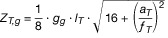
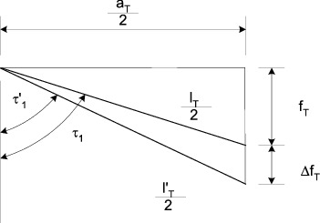

Nationale Sonderbestimmungen
---
Title: (Anhang II der Binnenschiffsuntersuchungsordnung BGBl I 2018, 1398)
jurabk: BinSchUO2018Anh II
layout: default
origslug: binschuo2018anh_ii
slug: binschuo2018anh_ii

---

# (Anhang II der Binnenschiffsuntersuchungsordnung BGBl I 2018, 1398) (BinSchUO2018Anh II)

Ausfertigungsdatum
:   2018-09-21

Fundstelle
:   BGBl I: 2018, 1398, 1422

Zuletzt geändert durch
:   Art. 2 Abs. 6 Nr. 10 V v. 26.11.2021 I 4982

Änderung durch
:   Art. 1 Nr. 15 V v. 5.1.2022 I 2 (Nr. 1) textlich nachgewiesen, dokumentarisch noch nicht abschließend bearbeitet

## Inhaltsverzeichnis

Teil I

## Fähren

Kapitel 1

## Sondervorschriften für Fähren, Allgemeines

*    *   §§

    *

*    *   1.01

    *   Begriffsbestimmungen

*    *   1.02

    *   Allgemeines

*    *   1.03

    *   Fährzeugnis

*    *   1.04

    *   Kennzeichnung der Fähren

Kapitel 2

## Bau, Einrichtung und Ausrüstung von Fähren

*    *   2.01

    *   Fährkörper

*    *   2.02

    *   Nachweis der Intakt- und Leckstabilität

*    *   2.03

    *   Einsenkungsmarken

*    *   2.04

    *   Festigkeit des Wagendecks

*    *   2.05

    *   Rettungsmittel

*    *   2.06

    *   Anker

*    *   2.07

    *   Zusätzliche Ausrüstung

*    *   2.08

    *   Landeklappen

Kapitel 3

Zusätzliche Anforderungen
## an seil- und kettengebundene Fähren

*    *   3.01

    *   Begriffsbestimmungen

*    *   3.02

    *   Nachweis der Intaktstabilität für Gierseilfähren

*    *   3.03

    *   Einsenkungsmarken

*    *   3.04

    *   Berechnung und Konstruktion der Seil- und Kettenanlagen

*    *   3.05

    *   Prüfung

*    *   3.06

    *   Prüfbedingungen und Prüfinhalte

*    *   3.07

    *   Bescheinigung

Kapitel 4

## Übergangsbestimmungen für Fähren

*    *   4.01

    *   Übergangsbestimmungen für Fähren, die schon in Betrieb sind

Teil II

## Barkassen

Kapitel 5

## Sondervorschriften für Barkassen

*    *   5.01

    *   Allgemeines

*    *   5.02

    *   Schiffskörper

*    *   5.03

    *   Stabilität

*    *   5.04

    *   Höchstzulässige Zahl der Fahrgäste

*    *   5.05

    *   Freibord und Sicherheitsabstand

*    *   5.06

    *   Rettungsmittel

*    *   5.07

    *   Anker

*    *   5.08

    *   Ausrüstung

Kapitel 6

## Übergangsbestimmungen für Barkassen

*    *   6.01

    *   Übergangsbestimmungen für Barkassen, die schon in Betrieb sind

Teil III

## Fahrgastboote

Kapitel 7

## Sondervorschriften für Fahrgastboote

*    *   7.01

    *   Allgemeine Bestimmungen

*    *   7.02

    *   Anforderungen an Fahrgastboote in Zone 2

*    *   7.03

    *   Anforderungen an Fahrgastboote in Zone 3 oder 4

*    *   7.04

    *   Anforderungen an Fahrgastboote mit Segeln

*    *   7.05

    *   Sicherheit am Arbeitsplatz

*    *   7.06

    *   Übergangs- und Sonderbestimmungen

Teil IV

## Abweichungen

Kapitel 8

## Abweichungen

*    *   8.01

    *   Abweichungen hinsichtlich Zulassung

*    *   Anlage 1

    *   Berechnungsgrundlagen für Hochseilanlagen der Gierfähren auf
        Wasserstraßen zu Anhang II § 3.04
        Anlage A: Ermittlung der Seilkräfte
        Anlage B: Querwiderstandsbeiwert

*    *   Anlage 2

    *   Berechnungsgrundlagen für Gierfähren, die nicht an einer
        Hochseilanlage befestigt sind, sowie für Querseilfähren
        (Kahnseilfähren, Seilfähren und Kettenfähren) zu Anhang II § 3.04

## Teil I - Fähren

### Kapitel 1 - Sondervorschriften für Fähren, Allgemeines

#### § 1.01 Begriffsbestimmungen

In diesem Anhang gelten als:

1.  „Personenfähre“ eine nur zur Beförderung von Personen gebaute Fähre;

2.  „Wagenfähre“ eine zur Beförderung von Landfahrzeugen, Personen und
    sonstigen Lasten gebaute und eingerichtete Fähre;

3.  „Frei fahrende Fähren“ Kahnfähren, Personenmotorfähren,
    Wagenmotorfähren;

4.  „Kahnfähre“ eine zur Beförderung von Personen gebaute, offene Fähre,
    die durch Muskelkraft fortbewegt wird; auch mit einem – zur
    Beherrschung besonderer Betriebslagen – Hilfsantrieb ausgestattet;

5.  „Personenmotorfähre“ eine Personenfähre mit maschinellem Antrieb;

6.  „Wagenmotorfähre“ eine Wagenfähre mit maschinellem Antrieb;

7.  „Seil- oder kettengebundene Fähren“ Querseilfähren, Kahnseilfähren,
    Seilfähren, Kettenfähren, Gierseilfähren;

8.  „Querseilfähre“ eine Personen- oder Wagenfähre, die an einem an beiden
    Ufern befestigten Seil geführt wird und entweder an diesem
    Führungsseil oder an einem zweiten Seil (Zugseil) mit der Hand oder
    durch eine Winde von einem Ufer zum anderen bewegt wird
    (Personenquerseilfähre, Wagenquerseilfähre);

9.  „Kahnseilfähre“ eine Kahnfähre, die an einem Seil per Hand, hilfsweise
    durch einen Hilfsmotor, fortbewegt wird, einschließlich der Seilanlage
    und der Verankerungen;

10. „Seilfähre“ eine Personen- oder Wagenfähre, die an einem Seil durch
    eine Seilwinde fortbewegt wird, einschließlich der Seilanlage sowie
    der Abspannmasten und der Verankerung (Personenseilfähre,
    Wagenseilfähre);

11. „Kettenfähre“ eine Seilfähre, die anstelle der Seile mit Ketten
    ausgerüstet ist (Personenkettenfähre, Wagenkettenfähre);

12. „Gierseilfähre“ eine Personen- oder Wagenfähre, die ausschließlich
    durch Einnehmen einer Gierstellung, an einem festen Seil geführt, quer
    zur Fließrichtung eines Flusses fortbewegt wird, einschließlich der
    Seilanlage sowie der Abspannmasten und/oder der Verankerung
    (Personengierseilfähre, Wagengierseilfähre);

13. „Gierseilfähre mit Hilfsantrieb“ eine Gierseilfähre, die zusätzlich
    mit eigenem Antrieb versehen ist;

14. „Landfahrzeug“ ein Kraftfahrzeug, ein Pferdefuhrwerk, ein fahrbares
    Gerät oder Zugfahrzeuge; Zugfahrzeuge gelten hierbei zusammen mit
    ihren Anhängern als ein Landfahrzeug;

15. „Das zulässige Gesamtgewicht eines Landfahrzeugs“ das Gewicht eines
    Landfahrzeugs einschließlich seiner Ladung in Tonnen, das in
    beliebiger Anzahl bis zum Erreichen der Tragfähigkeit auf der
    verfügbaren Ladefläche des Fährdecks in beliebiger Anordnung
    aufgestellt werden kann;

16. „Tragfähigkeit“ die Gesamtzuladefähigkeit einer Wagenfähre in Tonnen
    mit homogener oder gemischter Last;

17. „Zulässige Gesamtmasse des schwersten Landfahrzeugs“ die Masse eines
    Landfahrzeugs einschließlich seiner Ladung in Tonnen, das allein und
    ohne gleichzeitige Beförderung weiterer Nutzlasten bei ausschließlich
    mittiger Aufstellung auf dem Fährdeck einer Wagenfähre befördert
    werden kann;

18. Abweichend von ES-TRIN gelten folgende Begriffsbestimmungen:

    a)  Statt „Schiffsattest“, „Unionszeugnis“ und „Binnenschiffszeugnis“ gilt
        „Fährzeugnis“.

    b)  Statt „„Länge in der Wasserlinie“ oder „L
        WL                         “ die in der Ebene der größten Einsenkung
        des Schiffes gemessene größte Länge des Schiffskörpers in m“ gilt
        „„Länge (L
        WL                         )“ die in der Ebene der größten Einsenkung
        gemessene Länge des Fährkörpers ohne Berücksichtigung der
        Landeklappen“.

#### § 1.02 Allgemeines

1.  Für Fähren sind der ES-TRIN sowie die Anhänge III bis VII mit den sich
    aus den nachfolgenden Vorschriften ergebenden Maßgaben anzuwenden.

2.  Kapitel 5 ES-TRIN gilt für Fähren mit Maschinenantrieb, der als
    Hauptantrieb benutzt wird.

3.  Kapitel 15 ES-TRIN gilt, wenn die ständige Anwesenheit von
    Besatzungsmitgliedern auch außerhalb der Arbeitsstunden erforderlich
    ist.

4.  Kapitel 19 ES-TRIN gilt mit folgenden Abweichungen:

    a)  Artikel 19.01 Nummer 3 gilt nicht.

    b)  Befinden sich die Verkehrsflächen, die für die Nutzung durch Personen
        mit eingeschränkter Mobilität vorgesehen sind, auf freiem Fährdeck und
        ist dieses über ausreichend breite Landeklappen zugänglich, so müssen
        nur die für Personen mit eingeschränkter Mobilität vorgesehenen Plätze
        den Anforderungen des Artikels 19.01 Nummer 4 entsprechen.

    c)  Landeklappen sind als Sammelflächen nach Artikel 19.06 Nummer 8
        geeignet, wenn die Festigkeit und die Stabilität nachgewiesen und die
        Landeklappen durch feste Absperrvorrichtungen nach § 2.07 Nummer 1
        gesichert sind.

    d)  Landstege nach Artikel 19.06 Nummer 12 können durch mindestens zwei
        gegenüberliegende Landeklappen ersetzt werden, wenn diese geeignet
        sind, die Aufgabe der Landstege zu erfüllen; bei Personenfähren genügt
        eine Landeklappe.

    e)  Toiletten nach Artikel 19.06 Nummer 17 sind nur erforderlich, wenn
        beim Übersetzverkehr von einem Ufer zum anderen die Fahrtdauer 10
        Minuten übersteigt. Soweit keine Toiletten erforderlich sind, sind
        Einrichtungen zum Sammeln und Entsorgen häuslicher Abwässer nach
        Artikel 19.14 nicht erforderlich.

    f)  Ein zweites unabhängiges Antriebssystem nach Artikel 19.07 ist für
        seil- und kettengebundene Fähren nicht erforderlich.

    g)  Abweichend von Artikel 19.10 Nummer 7 können Lichtmaschinen als
        Notstromquelle genutzt werden, wenn folgende Bedingungen erfüllt sind:

        aa) es sind mindestens drei voneinander unabhängige Hauptmaschinenräume
            mit jeweils einer Antriebsmaschine und einer entsprechenden
            Lichtmaschine vorhanden,

        bb) jede dieser Lichtmaschinen kann im Bedarfsfall die Funktion des
            Notstromaggregats übernehmen und

        cc) die Hauptmaschinenräume können nicht gleichzeitig geflutet werden.

5.  Anhang III gilt mit folgenden Abweichungen:

    a)  § 6.05 gilt nicht für Fähren auf Wasserstraßen der Zone 2-Binnen,

    b)  die Kapitel 3 und 4 sowie § 6.05 gelten nicht für Fähren auf
        Wasserstraßen der Zone 2-See,

    c)  die §§ 10.02 bis 10.04 gelten nicht für Fähren auf Wasserstraßen der
        Zone 1.

6.  Auf Wasserstraßen der Zone 4 sind aus Anhang IV die §§ 3.02 und 3.03
    nicht anzuwenden.

7.  Auf Wasserstraßen der Zone 1 und Zone 2-See sind seil- und
    kettengebundene Fähren nicht zugelassen.

8.  Bei seil- und kettengebundenen Fähren gelten die Seil- und
    Kettenanlagen als Hauptantriebssystem.

9.  Auf Fähren, die für die Beförderung von weniger als 100 Fahrgästen
    zugelassen sind und deren L
    WL                    25 m nicht überschreitet, ist abweichend von ES-
    TRIN

    a)  eine motorisch angetriebene Lenzpumpe nach Artikel 19.08 Nummer 5,

    b)  eine tragbare Feuerlöschpumpe nach Artikel 19.12 Nummer 2 und

    c)  ein Hydrant am Steuerhaus nach Artikel 19.12 Nummer 3 Buchstabe a

    ausreichend.

10. Auf Personenfähren, die für die Beförderung von bis zu 12 Fahrgästen
    zugelassen sind und deren Länge 15 m nicht überschreitet, können
    folgende Erleichterungen angewendet werden:

    a)  aus ES-TRIN gelten nicht:

        aa) Artikel 19.08 Nummer 4 bis 6 sowie Nummer 9 und 10,

        bb) Artikel 19.09 Nummer 1 Satz 1 und Nummer 11,

        cc) Artikel 19.12 Nummer 1 bis 8,

    b)  aus diesem Anhang:

        § 2.02 Nummer 8.

11. Für Kahnfähren und Kahnseilfähren gelten anstelle der Nummern 1 bis 10
    folgende Anforderungen:

    a)  Für alle Kahnfähren und Kahnseilfähren § 2.01 Nummer 5, § 2.02 Nummer
        9, § 2.07 Nummer 1 und 2, §§ 3.04 bis 3.07, § 2.07 Nummer 1 jedoch nur
        sinngemäß.

    b)  Für alle Kahnfähren und Kahnseilfähren aus ES-TRIN:

        aa) Kapitel 3 sinngemäß,

        bb) Artikel 8.08 Nummer 1 und 2, wobei eine Handlenzpumpe oder ein
            Schöpfgefäß ausreicht,

        cc) Kapitel 10 bis 12 sinngemäß,

        dd) Artikel 13.01, wobei ein Anker mit 25 kg und eine Ankerkette oder ein
            Ankerseil von 30 m ausreicht und soweit Anhang II § 2.06 Nummer 2
            nicht zutrifft,

        ee) Artikel 13.02 Nummer 1 Satz 2 Buchstabe b, wobei ein Behälter
            ausreicht,

        ff) Artikel 13.02 Nummer 3 Buchstabe a, c und e bis h,

        gg) Artikel 13.08 Nummer 2,

        hh) Artikel 19.01 Nummer 2,

        ii) Artikel 19.06 Nummer 10 sinngemäß,

        jj) Artikel 19.09 Nummer 1, wobei zwei Rettungsringe ausreichen,

        kk) Artikel 19.09 Nummer 4, 8 und 9.

    c)  Für alle Kahnfähren und Kahnseilfähren muss für alle Fahrgäste
        festeingebautes Sitzmobiliar vorhanden sein.

    d)  Für Kahnfähren und Kahnseilfähren mit einem Hilfsantrieb oder
        Hilfsmotor gelten zusätzlich aus ES-TRIN folgende Anforderungen:

        aa) Kapitel 8 und 9 sinngemäß,

        bb) Artikel 13.03, wobei ein Feuerlöscher ausreicht.

    e)  Die Untersuchungskommission kann für alle Kahnfähren und
        Kahnseilfähren insbesondere zur Berücksichtigung besonderer örtlicher
        oder baulicher Gegebenheiten zusätzliche Anforderungen stellen.

#### § 1.03 Fährzeugnis

1.  Die Ergebnisse aus den Stabilitäts- und Festigkeitsberechnungen sind
    im Fährzeugnis einzutragen und an Bord der Fähre an auffallender
    Stelle deutlich sichtbar anzubringen.

2.  Bei Gierseilfähren sind die Einträge für Niedrig-, Mittel- und
    Hochwasser vorzunehmen, entsprechend den in den
    Stabilitätsberechnungen eingesetzten Fließgeschwindigkeiten.

3.  Die Fährstelle oder mehrere Fährstellen sind unter Angabe des
    Flusskilometers in das Fährzeugnis einzutragen.

4.  Wird die Fähre auch zum sonstigen Schiffsverkehr verwendet,
    insbesondere zum Wechseln der Fährstelle, zur Fahrt zu oder von einer
    Werft, ist dies im Fährzeugnis einzutragen. Dabei ist die Beförderung
    von Personen oder Gütern verboten.

#### § 1.04 Kennzeichnung der Fähren

An allen Fähren muss als Kennzeichen auf beiden Längsseiten ein
mindestens 30 cm hohes „F“ mit heller Farbe auf dunklem Grund oder mit
dunkler Farbe auf hellem Grund deutlich sichtbar angebracht sein.

### Kapitel 2 - Bau, Einrichtung und Ausrüstung von Fähren

#### § 2.01 Fährkörper

1.  An beiden Enden des Fährkörpers muss je ein Kollisionsschott vorhanden
    sein.

2.  Bei Fähren in Pontonform darf der Abstand der Kollisionsschotte vom
    vorderen oder hinteren Lot 0,04 L
    WL                    nicht unterschreiten und 0,04 L
    WL                    + 1 m nicht überschreiten.

3.  Sind Fähren in Pontonform mit wasserdichten Längsschotten versehen, so
    darf die durch Fluten einer Seitenabteilung hervorgerufene Krängung
    einen Winkel von 12° nicht überschreiten. Leckwasser darf nicht über
    das Schottendeck in benachbarte Abteilungen gelangen können.

4.  Fährdecks müssen wasserdicht ausgeführt sein.

5.  Kahnfähren und Kahnseilfähren müssen mit Luftkästen oder anderen
    Auftriebskörpern versehen sein. Luftkästen müssen zur Durchführung von
    Dichtigkeitsprüfungen mit einem Schraubverschluss versehen sein.

#### § 2.02 Nachweis der Intakt- und Leckstabilität

1.  Der Antragsteller muss durch eine Berechnung nachweisen, dass die
    Intaktstabilität der Fähre angemessen ist. Die Berechnung muss nach
    Artikel 19.03 Nummer 1, 3 bis 6 ES-TRIN durchgeführt werden. Sie muss
    in Abhängigkeit von der zu befahrenden Wasserstraße durchgeführt
    werden und die Anforderungen der Artikel 19.04, 19.05 ES-TRIN in
    Verbindung mit Anhang III § 1.02 Nummer 1 Buchstabe a, § 7.03 oder §
    10\.08 erfüllen.

2.  Bei Fähren in Pontonform können dabei die Koordinaten des
    Gewichtsschwerpunktes durch eine Gewichtsberechnung ermittelt werden.
    Ein Krängungsversuch ist dann nicht erforderlich.

3.  In der Berechnung sind für Personen, Landfahrzeuge und Großvieh
    mindestens folgende Last- und Maßannahmen zu verwenden:

    *        *[^F819939_01_BJNR142200018BJNE000701119]
   Nutzlast

        *[^F819939_02_BJNR142200018BJNE000701119]
   Lastannahmen
            t

        *   mittlere Höhe
            der Ladung
            über Deck
            m

        *   mittlere Höhe
            des Massenschwerpunktes
            über Deck
            m

        *   mittlere Höhe
            des Schwerpunktes
            der Windangriffsfläche
            der Ladung über Deck
            m

    *        *   Abmessungen
            L x B x H
            m

    *        *   Personen

        *   0,075

        *   1,8

        *   1,0

        *   0,85

    *        *   –

    *        *   Lastkraftwagen
            mit Ladung

        *   24,5

        *   3,0

        *   1,6

        *   1,25

    *        *   13,6 x 2,45 x 3,0

    *        *   Personenkraftwagen
            ohne Personen

        *   1,4

        *   1,5

        *   0,8

        *   0,75

    *        *   4,2 x 1,7 x 1,5

    *        *   Großvieh

        *   0,5

        *   1,7

        *   1,0

        *   0,85

    *        *   –

    *        *

   Die mittlere Höhe des Gewichtsschwerpunktes der Ladung und des
    Schwerpunktes der Windangriffsfläche der Ladung ist auf den tiefsten
    Punkt des Fährdecks auf halber Länge der Fähre zu beziehen und bei
    nicht durchgehenden, höher gelegenen Decks auf die halbe Länge des
    betreffenden Decks zu beziehen.

4.  Die Berechnung der Intaktstabilität muss abweichend von Artikel 19.03
    Nummer 2 ES-TRIN mindestens folgende Ladefälle erfassen:

    a)  Fähre ausschließlich mit Personen beladen,

        aa) maximale Anzahl der Personen in möglichst ungünstigsten Aufstellungen,

        bb) alle Tanks der Fähre zu 50 % gefüllt,

    b)  Fähre einseitig jeweils nach Steuer- und nach Backbord beladen,

        aa) mit Landfahrzeugen in möglichst ungünstigsten Aufstellungen bis zur
            Fährmitte, wobei der noch zur Verfügung stehende Platz der belasteten
            Seite mit kleineren Landfahrzeugen und mit Personen aufzufüllen ist,

        bb) alle Tanks der Fähre zu 50 % gefüllt,

    c)  Fähre ausschließlich mit Landfahrzeugen beladen,

        aa) Landfahrzeuge in möglichst ungünstigsten Aufstellungen,

        bb) alle Tanks der Fähre zu 50 % gefüllt,

    d)  Fähre mit dem schwersten Landfahrzeug beladen,

        aa) schwerstes Landfahrzeug nach § 1.01 Nummer 17 in mittiger Aufstellung
            auf dem Fährdeck,

        bb) alle Tanks der Fähre zu 50 % gefüllt,

    e)  Fähre bis an die Grenze der Tragfähigkeit beladen,

        aa) maximale Anzahl der Personen,

        bb) maximale Anzahl der Landfahrzeuge,

        cc) Treibstoff- und Frischwassertanks zu 98 % gefüllt,

        dd) Abwassertank der Fähre zu 10 % gefüllt,

    f)  Fähre leer,

        aa) ohne Personen und ohne Landfahrzeuge,

        bb) Treibstoff- und Frischwassertanks der Fähre zu 10 % gefüllt,

        cc) Vorratsräume und Abwassertanks leer.

    Im Fall des Satzes 1 Buchstabe b und c ist die Annahme einer
    Verschiebung der Landfahrzeuge höchstens bis zum Schrammbord
    ausreichend. Für die Erfüllung der Intaktstabilität nach Nummer 1
    müssen die Ladefälle nach den Buchstaben a bis f nachgewiesen sein.
    Bei den vorgenannten Ladefällen ist bei Wagenfähren

    a)  das Fährdeck rutschhemmend herzurichten, wenn der Krängungswinkel nach
        Artikel 19.03 Nummer 3 Buchstabe e ES-TRIN in den dort genannten
        Fällen den Grenzwinkel von 5,7° überschreitet, und

    b)  im Lateralplan nach Artikel 19.03 Nummer 5 ES-TRIN die Beladung mit z.
        B. Lastkraftwagen oder Personenkraftwagen zu berücksichtigen.

    Die Generaldirektion Wasserstraßen und Schifffahrt kann für
    zusätzliche Ladefälle, die wegen des Baus oder wegen der Nutzung der
    Fähre geboten sind, weitere Berechnungen verlangen.

5.  Als Ergebnis der Stabilitätsberechnung sind festzulegen:

    a)  bei Belastung der Fähre ausschließlich mit Personen,

        aa) die höchstzulässige Anzahl der Fahrgäste,

        bb) die Verdrängung (m
            3                               ),

    b)  bei Belastung der Fähre mit Personen, Landfahrzeugen oder sonstigen
        Lasten,

        aa) die höchstzulässige Anzahl der Fahrgäste,

        bb) die Tragfähigkeit in Tonnen (t),

        cc) das zulässige Gesamtgewicht eines von mehreren Landfahrzeugen in
            Tonnen (t),

        dd) das zulässige Gesamtgewicht des schwersten und einzigen Landfahrzeugs
            in Tonnen (t).

6.  Der Antragsteller muss durch eine Berechnung nachweisen, dass die
    Leckstabilität der Fähre angemessen ist. Die Berechnung muss nach
    Artikel 19.03 Nummer 7, 9 bis 13 ES-TRIN durchgeführt werden. Sie muss
    in Abhängigkeit von der zu befahrenden Wasserstraße durchgeführt
    werden und die Anforderungen der Artikel 19.04, 19.05 ES-TRIN in
    Verbindung mit Anhang III § 1.02 Nummer 1 Buchstabe a, § 7.03 oder §
    10\.08 sowie Anhang IV § 4.03 erfüllen. Hierbei

    a)  müssen abweichend vom Artikel 19.03 Nummer 8 Satz 1 ES-TRIN die
        Ladefälle nach Nummer 4 nachgewiesen werden,

    b)  müssen die Fähren den 1-Abteilungsstatus nach Artikel 19.03 Nummer 9
        ES-TRIN nicht einhalten, wenn der 2-Abteilungsstatus eingehalten wird,

    c)  darf der B/3 Abstand nach Artikel 19.03 Nummer 9 Buchstabe a ES-TRIN
        auf B/5 Abstand vermindert werden.

    Für Fähren, die für die Beförderung von mehr als 50 und weniger als
    100 Fahrgästen zugelassen sind und deren L
    WL                    25 m nicht überschreitet, gilt Artikel 19.15
    Nummer 1 ES-TRIN entsprechend.

7.  Während der Fahrt und beim Be- und Entladen der Fähre darf der nach
    Artikel 19.03 Nummer 2 und 3 ES-TRIN zulässige Krängungswinkel nicht
    überschritten und der für die jeweilige Zone zulässige Restfreibord
    nicht unterschritten werden, wobei beim Be- und Entladevorgang die
    Fähre freischwimmend zu betrachten ist, es sei denn, das Fährgefäß
    wird beim Abstützen auf der Rampe durch eine kraftschlüssige
    Verbindung in einer festen Lage gehalten.

8.  Für Personenfähren für die Beförderung von bis zu 12 Fahrgästen, deren
    Länge 15 m nicht überschreitet, müssen im symmetrisch gefluteten
    Zustand folgende Kriterien durch eine Berechnung nachgewiesen werden:

    a)  die Fähre darf maximal bis zur Tauchgrenze eintauchen und

    b)  die verbleibende metazentrische Höhe GM
        R                          darf 0,10 m nicht unterschreiten.

    Der erforderliche Restauftrieb ist durch

    a)  die geeignete Wahl des Materials des Schiffskörpers,

    b)  Auftriebskörper aus geschlossenzelligem Schaum, die fest mit dem Rumpf
        verbunden sind,

    c)  örtliche Unterteilungen, die wasserdichte Teilräume bilden,

    d)  einen 1-Abteilungsstatus nach Artikel 19.03 Nummer 9 ES-TRIN oder

    e)  eine Kombination aus den genannten Möglichkeiten nach Buchstabe a bis
        d

    zu gewährleisten.

9.  Für Kahnfähren und Kahnseilfähren genügt als Nachweis für die:

    a)  Intaktstabilität;

        ein Belastungsversuch, wobei dieser mit dem halben Gewicht der
        höchstzulässigen Zahl der Fahrgäste und bei der ungünstigsten Füllung
        der Brennstoff- und Wasserbehälter durchzuführen ist. Die Fahrgäste
        sind dabei als stehend anzunehmen und ihr Gewicht ist soweit wie
        möglich seitlich auf der für Fahrgäste verfügbaren Fläche
        unterzubringen. Dabei darf ein Krängungswinkel von 7° nicht
        überschritten sowie ein Restfreibord und ein Restsicherheitsabstand
        von 0,20 m in Zone 4 und von 0,30 m in Zone 3 und Zone 2-Binnen nicht
        unterschritten werden.

    b)  Leckstabilität;

        ein rechnerischer Nachweis, wobei bei voller Beladung und Flutung der
        Fähre ein Reserveauftrieb von 100 Newton je Person und eine stabile
        aufrechte Schwimmlage verbleiben muss, bei der die verbleibende
        metazentrische Höhe GM
        R                          0,10 m nicht unterschritten werden darf.

    Die angegebenen Nutzlasten können entsprechend der tatsächlichen
    Beladung durch andere Nutzlasten erweitert werden.
[^F819939_01_BJNR142200018BJNE000701119]:     Die angegebenen Werte sind Mittelwerte und können durch die
    tatsächliche Beladung z. B. mit größeren/kleineren Lastkraftwagen
    (einschließlich der Beladung z. B. mit Containern), Feuerwehrwagen,
    Tankwagen, Traktoren, Kränen, Anhängern ersetzt werden.
[^F819939_02_BJNR142200018BJNE000701119]: 

#### § 2.03 Einsenkungsmarken

Artikel 4.04 ES-TRIN ist anzuwenden; jedoch müssen mindestens zwei
Einsenkungsmarkenpaare auf je einem Drittel der Länge vorhanden sein.

#### § 2.04 Festigkeit des Wagendecks

Bei Wagenfähren muss der Antragsteller durch eine Berechnung
nachweisen, dass die Festigkeit des Wagendecks in Bezug auf die
Belastung angemessen ist. Für die Berechnung ist eine Belastung mit
den zulässigen Landfahrzeugen, die sich aus den
Stabilitätsberechnungen ergeben, zugrunde zu legen. Als Ergebnis der
Festigkeitsberechnung ist festzulegen:

a)  die zulässige Achslast einer Einzelachse von Landfahrzeugen in Tonnen
    (t),

b)  die zulässige Achslast einer Doppelachse von Landfahrzeugen in Tonnen
    (t).

#### § 2.05 Rettungsmittel

1.  Einzelrettungsmittel nach Artikel 19.09 Nummer 4 ES-TRIN können durch
    Sammelrettungsmittel nach Artikel 19.09 Nummer 5 ES-TRIN in Verbindung
    mit Artikel 19.09 Nummer 7 bis 9 ES-TRIN ersetzt werden.

2.  Landeklappen können als Übergangseinrichtungen nach Artikel 19.09
    Nummer 3 ES-TRIN angesehen werden, sofern sie hierfür geeignet sind.

3.  Zusätzlich zu Nummer 1 müssen Personenfähren, die für mehr als 250
    Fahrgäste, sowie Wagenfähren, die für mehr als 250 Fahrgäste oder für
    mehr als 150 t Tragfähigkeit zugelassen sind, mit einem Beiboot nach
    Artikel 13.07 ES-TRIN ausgerüstet sein.

4.  Die Untersuchungskommission kann bei Fähren von der Erfüllung der
    Nummer 3 in den Fällen nach Artikel 19.15 Nummer 5 und 6 ES-TRIN
    absehen, dabei gelten die Landeklappen als vergleichbare Einrichtungen
    zu Plattformen, wenn diese die darin beschriebenen Anforderungen und
    Bestimmungen erfüllen.

#### § 2.06 Anker

1.  Fähren, die mindestens zwei voneinander unabhängige in jeder Richtung
    voll wirksame Antriebe haben, brauchen mit nur einem Anker ausgerüstet
    zu sein.

2.  Das örtlich zuständige Wasserstraßen- und Schifffahrtsamt kann seil-
    und kettengebundene Fähren sowie Kahnfähren auf den Wasserstraßen der
    Zone 4 von dem Erfordernis einer Ankerausrüstung befreien, wenn die
    Leichtigkeit und Sicherheit des Verkehrs gewährleistet ist.

#### § 2.07 Zusätzliche Ausrüstung

1.  Die bordseitigen, dem Zu- und Abgang dienenden Öffnungen von Personen-
    und Wagenfähren müssen abweichend von Artikel 19.06 Nummer 10
    Buchstabe a und b ES-TRIN durch feste oder flexible
    Absperrvorrichtungen wie folgt gesichert sein:

    a)  Alle Absperrvorrichtungen müssen:

        aa) eine Höhe von mindestens 1,10 m aufweisen,

        bb) deutlich sichtbar gekennzeichnet sein und

        cc) mit geeigneten Zwischenzügen oder Feldauskleidung versehen sein;

    b)  feste Absperrvorrichtungen wie Schwenkbalken, Schranken und Geländer
        müssen mindestens folgende Festigkeitsanforderungen erfüllen:

        aa) Belastungsannahme von 1 000 N/m,

        bb) Höchst-Auslenkung ohne bleibende Verformung und ohne Berücksichtigung
            des Lagerspiels von 50 mm;

    c)  flexible Absperrvorrichtungen wie Absperrketten und Kunststoffseile
        dürfen auf Fahrbahndecks verwendet werden,

        aa) wenn hinter der Absperrvorrichtung mindestens 2 m Decksfläche oder
            Landeklappe folgt,

        bb) der Deckbereich von 0,80 m vor der Kette oder dem Seil für die
            Fahrgäste durch deutlich sichtbare Markierung als gesperrt
            gekennzeichnet ist und

        cc) die Kette oder das Seil eine Mindestbruchkraft von 40 kN hat.

        Landeklappen können als Absperrvorrichtungen genutzt werden, wenn sie
        im hochgestellten Zustand eine Höhe von 1,10 m über dem Fahrbahndeck
        erreichen und festgestellt werden können.

2.  Kahnfähren und Kahnseilfähren müssen mit einem Paar Riemen oder
    vergleichbaren Vortriebsmitteln ausgerüstet sein. Ein Hilfsantrieb zur
    Beherrschung besonderer Betriebslagen ist vorzuhalten.

#### § 2.08 Landeklappen

1.  Die Festigkeit von Landeklappen muss ihrem Einsatzzweck entsprechen.

2.  Die Landeklappen sind seitlich mit geeigneten Absturzsicherungen zu
    versehen.

### Kapitel 3 - Zusätzliche Anforderungen an seil- und kettengebundene Fähren

#### § 3.01 Begriffsbestimmungen

Abweichend von § 1.01 gelten für dieses Kapitel folgende
Begriffsbestimmungen:

1.  „Tragfähigkeit“ die Gesamtzuladefähigkeit mit homogener oder
    gemischter Last in Tonnen einschließlich höchstens 45 Personen in
    Abhängigkeit von bestimmten Wasserständen;

2.  „Das zulässige Gesamtgewicht des schwersten Landfahrzeugs“ das Gewicht
    eines Landfahrzeugs einschließlich seiner Ladung in Tonnen, das in
    Abhängigkeit von bestimmten Wasserständen allein und ohne
    gleichzeitige Beförderung weiterer Nutzlasten bei ausschließlich
    mittiger Aufstellung auf dem Fährdeck befördert werden kann;

3.  „Aufstau“ der Verlauf der Wasseroberfläche an der oberstromseitigen
    Bordwand;

4.  „Restfreibord“ der senkrechte Abstand zwischen dem tiefsten Punkt des
    wasserdichten Decks oder des wasserdichten Deckaufsatzes, und der
    gedachten Wasserlinie, die bei Neigungen nach Oberstrom durch den
    höchsten Punkt des Aufstaus verläuft;

5.  „Deckaufsatz“ ein nur bei Gierseilfähren üblicher nicht von Bord zu
    Bord gehender Aufbau von geringer Höhe, der die Fahrbahnbreite des
    Fährdecks einseitig einschränkt, die Seitenhöhe auf einer Seite
    vergrößert und sich über die Länge des ganzen Fährdecks erstreckt;

6.  „Ablegereife“ der Zustand, bei dessen Erreichen das Seil oder die
    Kette außer Betrieb genommen werden muss, insbesondere wegen
    Verschleiß, Längung, Risse, Korrosion oder Brüchen.

#### § 3.02 Nachweis der Intaktstabilität für Gierseilfähren

1.  Ergänzend zu § 2.02 muss sich der Nachweis ausreichender
    Intaktstabilität für Gierseilfähren auf Berechnungen für Neigungen der
    Gierseilfähre nach Oberstrom und nach Unterstrom erstrecken.

2.  Der Nachweis ausreichender Intaktstabilität bei Neigungen nach
    Oberstrom ist als erbracht anzusehen, wenn die Krängung der
    Gierseilfähre nach Oberstrom bei einer Beladung nach Nummer 4 und
    voller Ausrüstung und bei Einhaltung eines Restfreibords nach Nummer 7
    unter gleichzeitiger Einwirkung

    a)  einer seitlichen Verschiebung der Landfahrzeuge und Personen nach
        Nummer 5,

    b)  des Windwiderstandes nach Artikel 19.03 Nummer 5 ES-TRIN,

    c)  einer seitlichen Anströmung und

    d)  eines Restwasserstandes auf dem Boden des Fährkörpers nach Nummer 8

    einen Winkel von 5° nicht überschreitet. Gierseilfähren mit
    Hilfsantrieb sind mit halbgefüllten Brennstofftanks zu rechnen. Der
    Nachweis ist in Form einer grafischen Hebelarmbilanz zu erbringen.
    Dabei sind für mindestens drei angenommene Beladungszustände nach
    Nummer 4 und mindestens drei Fließgeschwindigkeiten nach Nummer 6 die
    krängenden Hebelarme in Metern nach der Formel
    
    und die aufrichtenden Hebelarme in Metern nach der Formel

    h
    a                    = (µ · MF + MG) · sin
    φ                    – Δh
    q

    zu ermitteln. Bei Gierseilfähren, deren Gierseil auf der Sohle des
    Flussbettes verlegt ist (Grundseilfähren), lautet die Formel für die
    krängenden Hebelarme in Metern
    
    In diesen Formeln bedeutet:

        W
    q   der Widerstand aus Queranströmung bei Neigungswinkeln von 0° bis 11°
        in Kilonewton (kN),

        W
    G   der Gefällewiderstand in Kilonewton (kN),

        W
    W   der Windwiderstand in Kilonewton (kN) nach Artikel 19.03 Nummer 5 ES-
        TRIN,

        H
    T   der senkrechte Abstand des Angriffspunktes des Gierseils von der
        Wasserlinie im Ausgangszustand in Metern (m),

        B
    T   der horizontale Abstand des Angriffspunktes des Gierseils von Mitte
        Schiff in Metern (m),

    *   der Winkel des Gierseils am Schiff gegen die Horizontale,

        M
    W   das Winddruckmoment in Kilonewtonmeter (kNm) nach Artikel 19.03 Nummer
        5 ES-TRIN,

        M
    Z   das Moment aus der Verschiebung der Zuladung nach Nummer 5 in
        Kilonewtonmeter (kNm),

    g   die Erdbeschleunigung 9,81 in Meter durch Sekundenquadrat (m/s
        2                         ),

    D   die Wasserverdrängung in Tonnen (t),

    µMF die vertikale Auswanderung des Formschwerpunkts in Metern (m),

    MG  die metazentrische Höhe, verringert um den Abzug für freie Oberflächen
        entsprechend Nummer 8 in Metern (m),

    *   der Krängungswinkel der Gierseilfähre und

        Δh
    q   die direkte Verminderung der Stabilitätshebelarme durch Queranströmung
        in Metern (m).

3.  Der Nachweis ausreichender Intaktstabilität bei Neigungen nach
    Unterstrom ist erbracht, wenn die Krängung der Gierseilfähre unter
    Berücksichtigung der Beladungszustände und der krängenden Einflüsse
    nach Nummer 2 Satz 1 einen Winkel*
    zul                   , der sich aus der Formel
    
    ergibt, nicht überschreitet. In dieser Formel bedeutet:

    *zul der Grenzwinkel,

    H – T der Abstand des tiefsten Punkts des Fährdecks bis zur Wasserlinie bei*
        = 0°, der bei Krängung der Fähre nach Unterstrom zuerst zu Wasser
        kommt, in Metern (m),

    T   der Tiefgang bei dem zu untersuchenden Beladungsfall in Metern (m) und

    B   die Breite der Gierseilfähre in Höhe des Decks an der Stelle, wo das
        Maß H angenommen wurde, in Metern (m).

    Der Grenzwinkel darf 10° nicht überschreiten. Der Nachweis ist in Form
    eines grafischen Vergleichs der sich einstellenden Endneigungswinkel
    mit dem Grenzwinkel für mindestens drei Beladungszustände nach Nummer
    4 und mindestens 3 Fließgeschwindigkeiten nach Nummer 6 zu erbringen.
    Dabei sind die Endneigungswinkel nach der Formel
    
    zu errechnen. In dieser Formel bedeutet:

        h
    kr  die Summe der krängenden Hebelarme in Metern (m),

    *zul der Grenzwinkel nach obiger Formel und

        h
    a   der aufrichtende Hebelarm in Metern (m).

    Die krängenden Hebelarme in Metern sind dabei nach der Formel
    
    und die aufrichtenden Hebelarme nach der Formel
    
    zu berechnen. Die Definition der einzelnen Summanden und Faktoren
    entspricht der Definition in Nummer 2; für W
    q                    ist jedoch nur der Wert für 0° Neigung
    einzusetzen.

4.  Für die Berechnung nach den Nummern 2 und 3 ist eine gemischte
    Beladung Z aus Landfahrzeugen und 45 Personen in homogener Verteilung
    anzunehmen. Sie ist für jeweils einen Rechengang in

    Z
    1                    = (  0 · P
    F                   ) + (0 · P
    P                   ) (Gierseilfähre leer),

    Z
    2                    = (0,5 · P
    F                   ) + (1 · P
    P                   ) (halbe Zuladung),

    Z
    3                    = (  1 · P
    F                   ) + (1 · P
    P                   ) (ganze Zuladung)

    aufzuteilen, wobei Z das Gewicht der Zuladung in Tonnen, P
    F                    das Gewicht der Landfahrzeuge in Tonnen und P
    P                    das Gewicht von 45 Personen in Tonnen ist.

5.  Das Moment aus der seitlichen Verschiebung der Zuladung ist nach
    folgender Formel zu berechnen:

    M
    Z                    = Z
    n                    · e

    In dieser Formel bedeutet:

        Z
    n   das Gewicht der Zuladung Z
        2                          oder Z
        3                          in Tonnen (t),

    e   den größten seitlichen Verschiebungsweg der Zuladung aus der
        Mittellängsachse der Gierseilfähre in Metern (m).

    Sind die Schrammborde so gesetzt, dass eine seitliche Verschiebung der
    Landfahrzeuge nicht möglich ist, so ist nur die seitliche Verschiebung
    der Personen nach der Formel

    M
    Z                    = P
    P                    · e

    in die Rechnung einzusetzen.

6.  In den Berechnungen nach den Nummern 2 und 3 ist die mittlere
    Fließgeschwindigkeit des Wassers vornehmlich bei:

    a)  Niedrigwasserstand (NW),

    b)  Mittelwasserstand (MW) und

    c)  Hochwasserstand (HW)

    zu berücksichtigen. Die Werte müssen sich nachweisbar auf die
    Fährstelle beziehen und müssen vom zuständigen Wasserstraßen- und
    Schifffahrtsamt bestätigt sein. Eine Querprofilzeichnung der
    Fährstelle ist der Rechnung beizufügen.

7.  Bei Neigungen der Gierseilfähre nach Oberstrom entsprechend Nummer 2
    muss

    a)  der Restfreibord auf der Oberstromseite mindestens 0,10 m und bei

    b)  Gierseilfähren mit zusätzlichem wasserdichten Deckaufsatz auf der
        Oberstromseite mindestens 0,10 m, jedoch nicht weniger als die größte
        Höhe des Deckaufsatzes über dem Fährdeck,

    betragen. Für den Restfreibord gilt folgende Formel:

    F
    R                    = H – TS

    In dieser Formel bedeutet:

        F
    R   der Restfreibord in Metern (m),

    H   die Seitenhöhe bis zum tiefsten Punkt des Fährdecks in Metern (m),

    TS  die Aufstauhöhe in Metern (m).

    Bei Gierseilfähren mit Deckssprung, bei denen die hochgezogene
    Außenhaut ein festes Schanzkleid bildet, kann der Restfreibord vom
    Anlenkpunkt der Landeklappen oder vom tiefsten nicht wasserdichten
    Punkt des Schanzkleids abgesetzt werden; der tiefere Punkt ist
    maßgebend.

8.  In den Berechnungen nach den Nummern 2 und 3 ist ein Restwasserstand
    von 0,02 m im Fährkörper anzunehmen.

9.  Als Ergebnisse der Berechnung sind festzulegen:

    a)  bei Belastung der Gierseilfähre ausschließlich mit Personen

        aa) die höchstzulässige Anzahl der Fahrgäste,

        bb) die Verdrängung (m
            3                               ),

    b)  bei Belastung der Gierseilfähre mit Personen, Landfahrzeugen oder
        sonstigen Lasten

        aa) die höchstzulässige Anzahl der Fahrgäste,

        bb) die Tragfähigkeit in Tonnen (t) einschließlich 45 Personen,

        cc) das zulässige Gesamtgewicht eines von mehreren Landfahrzeugen in
            Tonnen (t),

        dd) das zulässige Gesamtgewicht des schwersten und einzigen Landfahrzeugs
            in Tonnen (t),

        ee) die zulässige Achslast einer Einzelachse und einer Doppelachse von
            Landfahrzeugen in Tonnen (t)

    jeweils bei Niedrigwasserstand, Mittelwasserstand und Hochwasserstand.

10. Während der Fahrt und bei Be- und Entladen der Fähre darf der
    höchstzulässige Krängungswinkel nach § 3.02 Nummer 3 nicht
    überschritten und der Restfreibord nach § 3.02 Nummer 7 nicht
    unterschritten werden, wobei beim Be- und Entladevorgang die Fähre
    freischwimmend zu betrachten ist, es sei denn, das Fährgefäß wird beim
    Abstützen auf der Rampe durch eine kraftschlüssige Verbindung in einer
    festen Lage gehalten.

#### § 3.03 Einsenkungsmarken

1.  Die Vorschrift des Artikels 4.04 ES-TRIN ist nicht anzuwenden.

2.  An beiden Längsseiten der Gierseilfähren ist je eine Einsenkungsmarke
    für die Tiefgänge anzubringen, die den Tragfähigkeiten nach § 3.02
    Nummer 9 Buchstabe b entsprechen.

3.  Die Einsenkungsmarken müssen in der senkrechten Querschnittsebene
    angebracht sein, die durch den gemittelten Schwerpunkt der
    Wasserlinienflächen in den Schwimmebenen bei Niedrigwasserstand,
    Mittelwasserstand und Hochwasserstand verläuft.

#### § 3.04 Berechnung und Konstruktion der Seil- und Kettenanlagen

1.  Seil- und Kettenanlagen von seil- und kettengebundenen Fähren umfassen
    im Wesentlichen Seile und Ketten einschließlich der zugehörigen
    Abspannmasten und Verankerungen.

2.  Seil- und Kettenanlagen müssen in allen Teilen für den Fährbetrieb
    geeignet und nach den Regeln der Technik ausgeführt und gebaut sein.

3.  Der Antragsteller hat den Nachweis der ausreichenden
    Festigkeitsbestimmung für Seil- und Kettenanlagen durch eine
    Berechnung zu erbringen. Die Berechnung und Konstruktion der Seil- und
    Kettenanlagen ist in Anlage 1 und 2 dieses Anhangs geregelt.

#### § 3.05 Prüfung

Seil- und Kettenanlagen sind

1.  vor der ersten Inbetriebnahme,

2.  vor der Wiederinbetriebnahme nach einer wesentlichen Änderung oder
    Instandsetzung und

3.  bei jeder Erneuerung der Bescheinigung nach § 3.07

von einem Sachverständigen daraufhin zu prüfen, ob die Anlage den
Anforderungen dieses Kapitels entspricht. Über die Prüfung ist ein vom
Sachverständigen unterzeichnetes Abnahmeprotokoll nach Muster 5 des
Anhangs V auszustellen, aus dem das Datum der Prüfung und die
Gültigkeitsdauer ersichtlich sind. Eine Kopie hiervon ist der
Untersuchungskommission vom Sachverständigen vorzulegen.

#### § 3.06 Prüfbedingungen und Prüfinhalte

Die Seil- und Kettenanlagen sind wie folgt zu prüfen:

1.  Trag-, Fahr- und Führungsseile sind auf ihren inneren und äußeren
    Zustand zu prüfen. Die Untersuchung hat sich auf die Feststellung von
    Drahtbrüchen, Korrosion, Verschleiß, Lockerung von Drähten, anderen
    Veränderungen des Seilgefüges und auf Beschädigungen zu erstrecken.
    Zur Beurteilung der Ablegereife sind die Regeln der Technik
    anzuwenden.

2.  Das Tragseil ist in Zeitabständen von maximal zehn Jahren nach
    Herstellung von einer amtlich anerkannten Stelle oder von einem von
    der Generaldirektion Wasserstraßen und Schifffahrt anerkannten
    Sachverständigen mittels zerstörungsfreier (magnetinduktiver)
    Seilprüfung zu prüfen. Die Ergebnisse sind in einem Bericht zu
    dokumentieren.

3.  Die Prüfung der Zug-, Spann- und Abspannseile beinhaltet äußerlich
    feststellbare Drahtbrüche und die Abnutzung der Drähte innerhalb eines
    Seilstückes. Zur Beurteilung der Ablegereife sind die Regeln der
    Technik anzuwenden.

4.  Die Seilendbefestigungen werden daraufhin geprüft, ob ihre Ausführung
    den Regeln der Technik entspricht.

5.  Ketten werden im Hinblick auf Verschleiß, Längung und
    Teilungsvergrößerung geprüft. Die Ablegereife wird entsprechend der
    DIN 685 Teil 5, Ausgabe November 1981, beurteilt.

6.  Abspannmasten werden auf Verformung, Beschädigungen, Korrosion (bei
    Hohlprofilen auch innere Korrosion), ordnungsgemäße Verbindung von
    Tragseil und Mast und ordnungsgemäßen Übergang vom Mast zum Fundament
    hin geprüft.

7.  Die Verankerung wird auf Verformung und Beschädigungen sowie auf
    Korrosion an den Befestigungselementen und im Bereich des Übergangs
    zum Fundament hin geprüft.

8.  Bei Hochseilanlagen ist für eine Sichtkontrolle von Mast zu Mast an
    beiden Masten je eine Markierung anzubringen, die als Kontrollpunkt
    dient um den Durchhang des Tragseils zu kontrollieren und insbesondere
    nach größeren Temperaturveränderungen auf das im Fährzeugnis
    festgelegte Maß zu korrigieren.

#### § 3.07 Bescheinigung

1.  Die Übereinstimmung jeder Seil- und Kettenanlage mit den Anforderungen
    dieses Kapitels ist im Fährzeugnis zu bescheinigen.

2.  Diese Bescheinigung wird im Anschluss an die Prüfung nach § 3.05 von
    der Untersuchungskommission im Fährzeugnis eingetragen.

3.  Die Gültigkeitsdauer der Bescheinigung beträgt höchstens fünf Jahre.
    Einer Erneuerung muss eine neue Prüfung nach § 3.05 vorausgehen.
    Ausnahmsweise kann die Untersuchungskommission auf begründeten Antrag
    des Eigners oder seines Bevollmächtigten die Gültigkeit der
    Bescheinigung um höchstens drei Monate verlängern, ohne dass eine
    Prüfung nach § 3.05 vorausgehen muss. Diese Verlängerung ist im
    Fährzeugnis einzutragen.

### Kapitel 4 - Übergangsbestimmungen für Fähren

#### § 4.01 Übergangsbestimmungen für Fähren, die schon in Betrieb sind

Fähren, die den Vorschriften der Kapitel 1 bis 3 nicht entsprechen,
müssen den in nachstehender Tabelle aufgeführten Übergangsbestimmungen
angepasst werden. In der Tabelle bedeuten

–   „N.E.U.“:

    Die Vorschrift gilt nicht für Fähren, die schon in Betrieb sind, es
    sei denn, die betroffenen Teile werden ersetzt oder umgebaut, d. h.
    die Vorschrift gilt nur für Neubauten sowie bei Ersatz oder bei Umbau
    der betroffenen Teile oder Bereiche. Werden bestehende Teile durch
    Austauschteile in gleicher Technik und Machart ersetzt, bedeutet dies
    keinen Ersatz „E“ im Sinne dieser Übergangsbestimmungen.

–   „Erteilung oder Erneuerung des Fährzeugnisses“:

    Die Vorschrift muss bei der Erteilung oder der nächsten Erneuerung der
    Gültigkeitsdauer des Fährzeugnisses erfüllt sein.

    *        *   §§ und
            Nummer

        *   Inhalt

        *   Frist oder Bemerkungen

    *        *   1.02 Nr. 10
            Buchstabe a
            Doppelbuchstabe aa

        *   automatisierter externer
            Defibrillator

        *   N.E.U., spätestens bei Erneuerung der Fahrtauglichkeitsbescheinigung

    *        *   2.01 Nr. 4

        *   Fährdecks

        *   N.E.U., spätestens bei Erneuerung des Fährzeugnisses nach dem 30.
            Dezember 2029

    *        *   2.02

        *   Nachweis Intakt- und Leckstabilität

        *   N.E.U., spätestens bei Erneuerung des Fährzeugnisses nach dem 30.
            Dezember 2049

    *        *   2.07 Nr. 1

        *   Anforderungen an Absperrvorrichtungen

        *   N.E.U., spätestens bei Erneuerung des Fährzeugnisses

    *        *   3.02

        *   Nachweis Intaktstabilität für Gierseilfähren

        *   N.E.U., spätestens bei Erneuerung des Fährzeugnisses nach dem 30.
            Dezember 2049

    *        *   3.04 Nr. 3

        *   Nachweis der ausreichenden Festigkeit durch Berechnung

        *   N.E.U., spätestens bei Erneuerung des Fährzeugnisses nach dem 30.
            Dezember 2029

    *        *   3.05

        *   Prüfung

        *   N.E.U., spätestens bei Erneuerung des Fährzeugnisses

    *        *   3.06

        *   Prüfbedingungen

        *   N.E.U., spätestens bei Erneuerung des Fährzeugnisses

    *        *   3.07

        *   Bescheinigung

        *   N.E.U., spätestens bei Erneuerung des Fährzeugnisses

## Teil II - Barkassen

### Kapitel 5 - Sondervorschriften für Barkassen

#### § 5.01 Allgemeines

1.  Für Barkassen sind der ES-TRIN und der Anhang III mit den sich aus den
    nachfolgenden Vorschriften ergebenden Maßgaben anzuwenden.

2.  Die Erleichterungen und Sonderbestimmungen dieses Kapitels gelten
    jedoch nicht für Barkassen

    a)  mit Kiellegung nach dem 1. Juli 2001 oder

    b)  die zu diesem Zeitpunkt nicht zur Beförderung von Fahrgästen
        zugelassen waren.

3.  Bei einer Personenbarkasse befindet sich der Fahrgastraum in der
    versenkten Plicht, die zu mindestens einem Drittel ihrer Länge offen
    ist.

4.  Das Fahrtgebiet ist in der Fahrtauglichkeitsbescheinigung einzutragen.

#### § 5.02 Schiffskörper

1.  Bei einer Barkasse muss der wasserdichte Innenboden der Plicht
    oberhalb der Ebene der größten Einsenkung liegen. Es muss ein
    Entwässerungssystem vorhanden sein, durch das eingedrungenes Wasser
    nach außenbords abfließen oder befördert werden kann.

2.  Artikel 3.03 Nummer 3 und 4 ES-TRIN ist auf Barkassen nicht
    anzuwenden. Die in der Plicht aufgestellten Motoren müssen vollständig
    verkleidet und schallgeschützt sein. In die geschlossene Plicht dürfen
    keine schädlichen Gase entweichen. Im Steuerstand der Barkasse in
    Kopfhöhe des Rudergängers darf der Geräuschpegel den Wert von 70 dB(A)
    nicht überschreiten. Die Verkleidung der Motoren muss ausreichend
    wärmeisoliert sein.

3.  Ein Wetterschutz als Überdachung über der zu mindestens einem Drittel
    ihrer Länge offenen Plicht ist auf Personenbarkassen zulässig, wenn
    der für die jeweilige Zone geeigneter Nachweis der Schwimmfähigkeit
    nach § 5.03 Nummer 1 erbracht ist. Der Wetterschutz muss mit einer
    automatischen Vorrichtung im Steuerstand und in der offenen Plicht zu
    öffnen sein. Der Öffnungsvorgang darf zehn Sekunden nicht
    überschreiten und die Überdachung darf die Seiten der offenen Plicht
    nicht beeinträchtigen.

4.  Bei einer Barkasse, die nicht zur Beförderung von Fahrgästen
    zugelassen wird, brauchen die Anforderungen der Nummern 1 und 3 sowie
    der §§ 5.03 bis 5.05 nicht erfüllt zu sein.

#### § 5.03 Stabilität

1.  Eine Personenbarkasse,

    a)  die für die Zone 1 oder 2-See zugelassen ist, muss abweichend von
        Artikel 19.02 Nummer 2 ES-TRIN durch wasserdichte Schotte so
        unterteilt sein, dass das vollbesetzte und ausgerüstete Fahrzeug nach
        dem Fluten einer beliebigen wasserdichten Abteilung in aufrechter
        Schwimmlage schwimmfähig bleibt,

    b)  die für die Zone 2-Binnen, Zone 3 oder 4 zugelassen ist, braucht die
        Forderungen bezüglich der Lage des Innenbodens nach § 5.02 Nummer 1
        Satz 1, des Entwässerungssystems nach § 5.02 Nummer 1 Satz 2 und der
        Schotteinteilung nach Buchstabe a nicht zu erfüllen, wenn

        aa) durch wasserdichte Hohlräume,

        bb) durch fest angebrachte Auftriebskörper oder

        cc) in anderer geeigneter Weise

        bei vollbesetztem und ausgerüstetem Fahrzeug sowie mit Wasser
        gefüllter Plicht ein ausreichender Auftrieb verbleibt und die Barkasse
        in aufrechter Schwimmlage schwimmfähig bleibt.

        Ein ausreichender Auftrieb ist gegeben, wenn im Endzustand der Flutung
        die tiefste Stelle der Bordwand mindestens 0,10 m und jede
        ungesicherte Öffnung mindestens 0,40 m über dem Wasserspiegel liegt.

        Der rechnerische Nachweis der Schwimmfähigkeit im Leckfall muss für
        alle Personenbarkassen erbracht werden, wobei die Abweichungen des
        Artikels 19.15 Nummer 1 ES-TRIN für alle Personenbarkassen sinngemäß
        gelten.

2.  Personenbarkassen müssen einen rechnerischen Nachweis der
    Intaktstabilität erbringen.

#### § 5.04 Höchstzulässige Zahl der Fahrgäste

1.  Die sich aus der freien Decksfläche ergebende höchstzulässige Zahl der
    Fahrgäste ist bei Personenbarkassen nach Artikel 19.05 Nummer 2
    Buchstabe b ES-TRIN in Verbindung mit Anhang III § 1.02 Nummer 1
    Buchstabe a, §§ 7.04 und 10.08 Nummer 2 in Abhängigkeit von der zu
    befahrenden Wasserstraße zu ermitteln.

2.  Die Untersuchungskommission kann mit der Festlegung der
    höchstzulässigen Zahl der Fahrgäste zusätzliche Auflagen, insbesondere
    im Hinblick auf Fahrtgrenzen, Wetterbedingungen und zeitliche Grenzen,
    verbinden. Diese Auflagen sind in die Fahrtauglichkeitsbescheinigung
    einzutragen.

#### § 5.05 Freibord und Sicherheitsabstand

Bei einer Personenbarkasse ist für die Berechnung des Freibordes, für
die Überprüfung des Sicherheitsabstandes und für die Festsetzung der
Ebene der größten Einsenkung Artikel 19.04 ES-TRIN in Verbindung mit
Anhang III § 1.02 Nummer 1 Buchstabe a, §§ 7.03 und 10.05 in
Abhängigkeit von der zu befahrenden Wasserstraße sinngemäß anzuwenden.

#### § 5.06 Rettungsmittel

1.  Mindestens ein Rettungsring nach Artikel 13.08 Nummer 1 ES-TRIN muss
    mit einer mindestens 30 m langen, schwimmfähigen Leine von 8 bis 11 mm
    Durchmesser versehen sein.

2.  Zusätzlich zu den Rettungswesten nach Artikel 13.08 Nummer 2 ES-TRIN
    müssen für insgesamt 100 Prozent der höchstzulässigen Zahl der
    Fahrgäste Rettungswesten nach Artikel 13.08 Nummer 2 ES-TRIN in
    Verbindung mit Nummer 3 an Bord sein, wobei auch Feststoff- oder
    halbautomatisch aufblasbare Rettungswesten nach den in Artikel 13.08
    Nummer 2 ES-TRIN genannten Normen zulässig sind. Rettungswesten nach
    Satz 1 können durch Sammelrettungsmittel nach Artikel 19.09 Nummer 5
    ES-TRIN in Verbindung mit Nummer 7 bis 9 ersetzt werden.

3.  Rettungswesten müssen im Fahrgastbereich gelagert sein. Sind
    Sammelrettungsmittel vorhanden, müssen diese stets frei aufschwimmbar
    gelagert sein.

4.  Hat eine Barkasse festüberdachte Räume, so müssen mindestens 30 vom
    Hundert der Rettungswesten in der offenen Plicht griffbereit gelagert
    sein.

#### § 5.07 Anker

1.  Barkassen müssen mit einem Buganker ausgerüstet sein.

2.  Bei der Berechnung der Ankermasse nach Artikel 13.01 Nummer 2 ES-TRIN
    ist die Erfahrungszahl mit k = 7 einzusetzen. Die Ankermasse darf 25
    kg nicht unterschreiten.

3.  Die Ankerkette muss mindestens 45 m lang sein.

#### § 5.08 Ausrüstung

1.  Ausrüstungsgegenstände nach Artikel 13.02 Nummer 2 Buchstabe b
    Doppelbuchstabe bb bis ee ES-TRIN (Behälter) und nach Artikel 13.02
    Nummer 3 Buchstabe d ES-TRIN (Landsteg) braucht eine Barkasse nicht an
    Bord zu haben.

2.  Als Einrichtung zur Brandbekämpfung müssen insgesamt zwei tragbare
    Feuerlöscher, die den Anforderungen des Artikels 13.03 Nummer 2 ES-
    TRIN genügen, im Steuerstand und an einer anderen leicht zugänglichen
    Stelle vorhanden sein.

3.  Als Sicherheitseinrichtung und -ausrüstung muss sich ein Defibrillator
    nach den Anforderungen des Artikels 19.08 Nummer 10 ES-TRIN an einer
    leicht zugänglichen Stelle an Bord befinden.

### Kapitel 6 - Übergangsbestimmungen für Barkassen

#### § 6.01 Übergangsbestimmungen für Barkassen, die schon in Betrieb sind

Barkassen, die den Vorschriften des Kapitels 5 nicht entsprechen,
müssen den in nachstehender Tabelle aufgeführten Übergangsbestimmungen
angepasst werden. In der Tabelle bedeuten

–   „E.U.“:

    Die Vorschrift gilt nicht für Barkassen, die schon in Betrieb sind, es
    sei denn, die betroffenen Teile werden ersetzt oder umgebaut, d. h.
    die Vorschrift gilt nur bei Ersatz oder bei Umbau der betroffenen
    Teile oder Bereiche. Werden bestehende Teile durch Austauschteile in
    gleicher Technik und Machart ersetzt, bedeutet dies keinen Ersatz „E“
    im Sinne dieser Übergangsbestimmungen.

    *        *   §§ und
            Nummer

        *   Inhalt

        *   Frist oder Bemerkungen

    *        *   5.01 Nr. 1

        *   Allgemeines

        *   E.U.

    *        *   5.08 Nr. 3

        *   automatisierter externer
            Defibrillator

        *   E.U., spätestens bei Erneuerung der Fahrtauglichkeitsbescheinigung
            nach dem 01.01.2024

## Teil III - Fahrgastboote

### Kapitel 7 - Sondervorschriften für Fahrgastboote

#### § 7.01 Allgemeine Bestimmungen

1.  Auf der Wasserstraße nach Anhang I Zone 1, auf der Wasserstraße Rhein
    nach Anhang I Zone 3 und auf der Wasserstraße Oder nach Anhang I Zone
    4 sind Fahrgastboote nicht zugelassen.

2.  Für die Wasserstraßen nach Anhang I Zone 2 ist die Zulassung von
    Fahrgastbooten auf eine Länge des Schiffskörpers von höchstens 12
    Metern und die Beförderung von höchstens 12 Fahrgästen beschränkt.

3.  Für die Wasserstraßen nach Anhang I Zone 3 und 4 ist die Zulassung von
    Fahrgastbooten auf eine Länge des Schiffskörpers von weniger als 20
    Metern und die Beförderung von höchstens 12 Fahrgästen beschränkt.

4.  Für die Wasserstraßen nach Anhang IX ist die Zulassung von
    Fahrgastbooten auf eine Länge des Schiffskörpers von weniger als 20
    Metern und die Beförderung von höchstens 35 Fahrgästen beschränkt.

#### § 7.02 Anforderungen an Fahrgastboote in Zone 2

Für die Wasserstraßen nach Anhang I Zone 2 zugelassene Fahrgastboote
unterliegen folgenden Anforderungen an Ausrüstung und Betrieb:

1.[^F804091_05_BJNR142200018BJNE003200000]
  Die technischen Anforderungen nach Artikel 26.01 Nummer 2 ES-TRIN sind
    zu erfüllen. Anstelle der darin genannten Richtlinie 2013/53/EU
    ist die Verordnung über Sportboote und Wassermotorräder anzuwenden;
    dabei müssen die Fahrgastboote mindestens der Entwurfskategorie C nach
    der Richtlinie 2013/53/EU entsprechen.

2.  Fahrgastboote dürfen nur für Fahrten zwischen Sonnenaufgang und
    Sonnenuntergang (Tagesfahrten) eingesetzt werden.

3.  Bei vorherrschender Windstärke von mehr als 5 Beaufort und bei
    unsichtigem Wetter darf eine Fahrt nicht angetreten werden.

4.  Offene Feuerstellen dürfen an Bord nicht betrieben werden.

5.  Flüssiggasanlagen dürfen nur an Bord von Fahrgastbooten betrieben
    werden, die über einen elektrischen Antrieb oder einen Antrieb mit
    Verbrennungsmotoren oder über andere Verbrennungsmotoren verfügen, die
    mit einem Brennstoff betrieben werden, dessen Flammpunkt über 55 °C
    liegt. Die Flüssiggasanlagen müssen Kapitel 17 ES-TRIN entsprechen.
    Flüssiggasanlagen in geschlossenen Räumen müssen mit geeigneten
    Warneinrichtungen für gesundheitsgefährdende Konzentrationen von
    Kohlenmonoxid sowie für explosionsfähige Gas-Luftgemische ausgestattet
    sein.

6.  Es muss ein motorisches Hauptantriebssystem vorhanden sein, das
    ausreichende Fahr- und Manövriereigenschaften gewährleistet, wobei die
    Geschwindigkeit gegen Wasser mindestens 10 km/h betragen muss.

7.  Unbeschadet der Nummer 1 Satz 1 muss folgende Ausrüstung an Bord
    vorhanden sein:

    a)  die Geräte und Vorrichtungen, die zum Geben der in der
        Seeschifffahrtsstraßen-Ordnung und in den Kollisionsverhütungsregeln
        vorgeschriebenen Sichtzeichen sowie zur Bezeichnung der Fahrzeuge
        erforderlich sind;

    b)  mindestens eine Funkanlage für die Teilnahme am Binnenschifffahrtsfunk
        nach den Bestimmungen der Regionalen Vereinbarung über den
        Binnenschifffahrtsfunk;

    c)  auf den Wasserstraßen nach Anhang I Zone 2-See ein Kompass nach Anhang
        III § 6.02;

    d)  die vorgeschriebenen

        aa) Seekarten nach § 13 Absatz 1 Nummer 2 Buchstabe a der
            Schiffssicherheitsverordnung und

        bb) ein Abdruck der Seeschifffahrtsstraßen-Ordnung und der
            Kollisionsverhütungsregeln nach § 40 der Seeschifffahrtsstraßen-
            Ordnung;

    e)  gekennzeichnete feuerbeständige Behälter mit Deckel für Hausmüll und
        ölhaltige Putzlappen;

    f)  zwei Schöpfgefäße (Eimer);

    g)  Rettungswesten nach Artikel 13.08 Nummer 2 ES-TRIN für insgesamt 100
        Prozent der höchstzulässigen Zahl der Fahrgäste und der Besatzung,
        wobei für die Fahrgäste auch Feststoff- oder halbautomatisch
        aufblasbare Rettungswesten nach den in Artikel 13.08 Nummer 2 ES-TRIN
        genannten Normen zulässig sind.

8.  Bei einer Geschwindigkeit der Fahrgastboote von 40 km/h oder mehr
    haben die Fahrgäste und die Besatzung Rettungswesten anzulegen und der
    Schiffsführer seine Aufgaben im Steuerstand sitzend auszuüben.

    Richtlinie 2013/53/EU des Europäischen Parlaments und des Rates vom
    20\. November 2013 über Sportboote und Wassermotorräder und zur
    Aufhebung der Richtlinie 94/25/EG (ABl. L 354 vom 28.12.2013, S. 90; L
    297 vom 13.11.2015, S. 9).
[^F804091_05_BJNR142200018BJNE003200000]: 

#### § 7.03 Anforderungen an Fahrgastboote in Zone 3 oder 4

Für die Wasserstraßen nach Anhang I Zone 3 oder 4 zugelassene
Fahrgastboote unterliegen folgenden Anforderungen an Ausrüstung und
Betrieb:

1.  Die technischen Anforderungen nach Artikel 26.01 Nummer 2 ES-TRIN sind
    zu erfüllen. Anstelle der darin genannten Richtlinie 2013/53/EU ist
    die Verordnung über Sportboote und Wassermotorräder anzuwenden; dabei
    müssen die Fahrgastboote

    a)  für die Wasserstraßen nach Anhang I Zone 3 mindestens der
        Entwurfskategorie C und

    b)  für die Wasserstraßen nach Anhang I Zone 4 mindestens der
        Entwurfskategorie D

    nach der Richtlinie 2013/53/EU entsprechen.

2.  Die Fahrgastboote dürfen nur in der Betriebsform A nach § 101 Absatz 2
    der Binnenschiffspersonalverordnung eingesetzt werden.

3.  Offene Feuerstellen dürfen an Bord nicht betrieben werden.

4.  Flüssiggasanlagen dürfen nur an Bord von Fahrgastbooten betrieben
    werden, die über einen elektrischen Antrieb oder einen Antrieb mit
    Verbrennungsmotoren oder über andere Verbrennungsmotoren verfügen, die
    mit einem Brennstoff betrieben werden, dessen Flammpunkt über 55 °C
    liegt. Die Flüssiggasanlagen müssen Kapitel 17 ES-TRIN entsprechen.
    Flüssiggasanlagen in geschlossenen Räumen müssen mit geeigneten
    Warneinrichtungen für gesundheitsgefährdende Konzentrationen von
    Kohlenmonoxid sowie für explosionsfähige Gas-Luftgemische ausgestattet
    sein.

5.  Es muss ein motorisches Hauptantriebssystem vorhanden sein, das
    ausreichende Fahr- und Manövriereigenschaften gewährleistet, wobei die
    Geschwindigkeit gegen Wasser mindestens 10 km/h betragen muss.

6.  Unbeschadet der Nummer 1 Satz 1 muss folgende Ausrüstung an Bord
    vorhanden sein:

    a)  mindestens eine Funkanlage für die Teilnahme am Binnenschifffahrtsfunk
        nach den Bestimmungen der Regionalen Vereinbarung über den
        Binnenschifffahrtsfunk;

    b)  gekennzeichnete feuerbeständige Behälter mit Deckel für Hausmüll und
        ölhaltige Putzlappen;

    c)  zwei Schöpfgefäße (Eimer);

    d)  Rettungswesten nach Artikel 13.08 Nummer 2 ES-TRIN für insgesamt 100
        Prozent der höchstzulässigen Zahl der Fahrgäste und der Besatzung,
        wobei für die Fahrgäste auch Feststoff- oder halbautomatisch
        aufblasbare Rettungswesten nach den in Artikel 13.08 Nummer 2 ES-TRIN
        genannten Normen zulässig sind;

    e)  ein automatisierter externer Defibrillator nach Artikel 19.08 Nummer
        10 ES-TRIN, wenn das Fahrgastboot zur Beförderung von mehr als 12
        Fahrgästen zugelassen ist.

7.  Bei einer Geschwindigkeit der Fahrgastboote von 40 km/h oder mehr
    haben die Fahrgäste und die Besatzung Rettungswesten anzulegen und der
    Schiffsführer seine Aufgaben im Steuerstand sitzend auszuüben.

#### § 7.04 Anforderungen an Fahrgastboote mit Segeln

Fahrgastboote nach den §§ 7.02 und 7.03, die gebaut und eingerichtet
sind, um hauptsächlich durch Segel fortbewegt zu werden, unterliegen
zusätzlich folgenden Anforderungen an Ausrüstung und Betrieb:

1.  § 7.02 Nummer 6 und § 7.03 Nummer 5 sind nicht anzuwenden.

2.  Der einwandfreie Zustand der Takelage ist nach Artikel 20.19 ES-TRIN
    durch einen Sachverständigen zu prüfen und zu bescheinigen. Die
    Bescheinigung über die Prüfung ist an Bord mitzuführen.

3.  Es ist eine Reffvorschrift an Bord mitzuführen, die von einem
    geeigneten Sachverständigen einer Untersuchungskommission oder einem
    von der Generaldirektion für Wasserstraßen und Schifffahrt
    entsprechend § 8.01 Nummer 1 Satz 2 anerkannten Sachverständigen
    erstellt wurde.

4.  Ein Windmesser ist an Bord mitzuführen.

Die Prüfbescheinigung nach Satz 1 Nummer 2 und die Reffvorschrift nach
Satz 1 Nummer 3 sind der Generaldirektion Wasserstraßen und
Schifffahrt vor der erstmaligen Inbetriebnahme des Fahrgastbootes
vorzulegen.

#### § 7.05 Sicherheit am Arbeitsplatz

Soweit die Vorschriften dieses Kapitels nicht entgegenstehen, gelten
die Artikel 14.01 bis 14.06, 14.08, 14.09, 14.11 und 14.13 ES-TRIN
entsprechend. Weitergehende arbeitsschutzrechtliche Vorschriften
bleiben unberührt.

#### § 7.06 Übergangs- und Sonderbestimmungen

1.  Die §§ 7.02 und 7.04 gelten bis zum Ablauf des 6. Oktober 2033 nicht
    für Zeesboote, die schon in Betrieb sind. Auf diese Zeesboote ist die
    Binnenschiffsuntersuchungsordnung in der bis zum 6. Oktober 2018
    geltenden Fassung anzuwenden. Zeesboote sind Fahrzeuge für die
    Boddengewässer, die gebaut und eingerichtet sind, um auch durch Segel
    fortbewegt zu werden.

2.  Fahrgastboote, die den Vorschriften des Kapitels 7 nicht entsprechen,
    müssen entsprechend den in der nachstehenden Tabelle aufgeführten
    Übergangsbestimmungen angepasst werden. In der nachstehenden Tabelle
    bedeuten

    –   „N.E.U.“:

        Die Vorschrift gilt nicht für Fahrgastboote, die schon in Betrieb
        sind, es sei denn, die betroffenen Teile werden ersetzt oder umgebaut,
        das heißt die Vorschrift gilt nur für Neubauten sowie bei Ersatz oder
        bei Umbau der betroffenen Teile oder Bereiche. Werden bestehende Teile
        durch Austauschteile in gleicher Technik und Machart ersetzt, bedeutet
        dies keinen Ersatz „E“ im Sinne dieser Übergangsbestimmungen.

    –   „Erteilung oder Erneuerung der Fahrtauglichkeitsbescheinigung“:

        Die Vorschrift muss bei der Erteilung oder der nächsten Erneuerung der
        Gültigkeitsdauer der Fahrtauglichkeitsbescheinigung erfüllt sein.

    *        *   §§ und Nummer

        *   Inhalt

        *   Frist oder Bemerkungen

    *        *   7.03 Nr. 6
            Buchstabe e

        *   Automatisierter externer
            Defibrillator

        *   N.E.U., spätestens bei Erneuerung der Fahrtauglichkeitsbescheinigung

## Teil IV - Abweichungen

### Kapitel 8 - Abweichungen

#### § 8.01 Abweichungen hinsichtlich Zulassung

Für Fahrgastboote sind die jeweiligen Vorschriften mit den folgenden
Maßgaben anzuwenden:

1.  Die Untersuchungen im Sinne des § 6 Absatz 1 in Verbindung mit Absatz
    4 und der §§ 24 bis 26 sowie § 5 Absatz 8 dieser Verordnung können von
    einem von der Generaldirektion Wasserstraßen und Schifffahrt
    anerkannten Sachverständigen für Fahrgastboote durchgeführt werden.
    Die Kriterien für die Auswahl dieser Sachverständigen werden von der
    Generaldirektion Wasserstraßen und Schifffahrt durch
    Verwaltungsvorschrift festgelegt, die im Verkehrsblatt veröffentlicht
    wird.

2.  Die Ergebnisse einer Untersuchung sind in einem Abnahmeprotokoll nach
    dem Muster 6 des Anhangs V zu bescheinigen.

3.  Auf der Grundlage dieses Abnahmeprotokolls erteilt die
    Generaldirektion Wasserstraßen und Schifffahrt eine
    Fahrtauglichkeitsbescheinigung nach Maßgabe des § 11 dieser
    Verordnung. Der zuständigen Berufsgenossenschaft ist vor der Erteilung
    der Fahrtauglichkeitsbescheinigung die Gelegenheit zur Stellungnahme
    zu geben, damit diese ihre Aufgabe nach § 4 Absatz 4 Satz 2 dieser
    Verordnung wahrnehmen kann.

#### Anlage 1 Berechnungsgrundlagen für Hochseilanlagen der Gierfähren auf Wasserstraßen zu Anhang II § 3.04

(Fundstelle: BGBl. I 2018, 1438 - 1448)

## Inhaltsverzeichnis

*    *   **1**

    *   **Anwendungsbereich**

*    *   **2**

    *   **Normative Verweisungen**

*    *   **3**

    *   **Begriffe**

*    *   3.1

    *   Abspannseil

*    *   3.2

    *   Anstellwinkel

*    *   3.3

    *   Gierseile

*    *   3.4

    *   Gierseilwinkel

*    *   3.5

    *   Hochseilanlage

*    *   3.6

    *   Tragseil

*    *   3.7

    *   Verkehrsband

*    *   3.8

    *   Rollenbatterie

*    *   **4**

    *   **Bautechnische Unterlagen**

*    *   **5**

    *   **Werkstoffe**

*    *   5.1

    *   Werkstoffe für Seile und deren Endverankerungen

*    *   5.1.1

    *   Drähte und Seile

*    *   5.1.2

    *   Verankerung durch Pressklemmen

*    *   5.1.3

    *   Verankerung durch Verguss

*    *   5.1.4

    *   Verankerung durch Drahtseilklemmen

*    *   5.2

    *   Werkstoffe für Ketten

*    *   5.3

    *   Werkstoffe für Stahlkonstruktionen

*    *   5.4

    *   Werkstoffe für Holzkonstruktionen

*    *   5.5

    *   Werkstoffe für Gründungen und Verankerungsblöcke

*    *   **6**

    *   **Lastannahmen**

*    *   6.1

    *   Ständige Einwirkungen

*    *   6.2

    *   Veränderliche Einwirkungen

*    *   6.2.1

    *   Strömung

*    *   6.2.2

    *   Windlasten auf Fähre und Verkehrsband

*    *   6.2.3

    *   Windlasten auf Tragwerke und Seile

*    *   6.2.4

    *   Temperatureinwirkungen

*    *   6.2.5

    *   Eislasten

*    *   6.3

    *   Außergewöhnliche Einwirkungen

*    *   **7**

    *   **Konstruktion und Ausführung**

*    *   7.1

    *   Allgemeines

*    *   7.2

    *   Seile

*    *   7.3

    *   Endverankerungen

*    *   7.3.1

    *   Arten

*    *   7.3.2

    *   Vergussverankerungen

*    *   7.3.3

    *   Kauschen und Klemmen

*    *   7.3.4

    *   Andere Verankerungen

*    *   7.4

    *   Ketten

*    *   7.5

    *   Tragrollen

*    *   **8**

    *   **Beanspruchungen**

*    *   **9**

    *   **Beanspruchbarkeiten**

*    *   9.1

    *   Teilsicherheitsbeiwerte

*    *   9.2

    *   Charakteristische Werte der Beanspruchbarkeit für Seile und deren
        Endverankerungen

*    *   9.2.1

    *   Drähte und Seile

*    *   9.2.2

    *   Verankerung durch Pressklemmen

*    *   9.2.3

    *   Verankerung durch Verguss

*    *   9.2.4

    *   Verankerung durch Drahtseilklemmen

*    *   9.3

    *   Werkstoffe für Ketten

*    *   9.4

    *   Werkstoffe für Stahlkonstruktionen

*    *   9.5

    *   Werkstoffe für Holzkonstruktionen

*    *   9.6

    *   Werkstoffe für Gründungen und Verankerungsblöcke

*    *   **10**

    *   **Nachweise**

*    *   10.1

    *   Gierseil

*    *   10.2

    *   Gierketten

*    *   10.3

    *   Tragseil

*    *   10.4

    *   Abspannseile

*    *   10.5

    *   Rollenbatterie und Tragrollen

*    *   10.6

    *   Maste

*    *   10.7

    *   Gründungen und Verankerungsblöcke

*    *   **11**

    *   **Herstellung und Errichtung**

*    *   Anlage A:

    *   Ermittlung der Seilkräfte

*    *   Anlage B:

    *   Querwiderstandsbeiwert

*    *   **1**

    *   Anwendungsbereich ****

*    *
    *   Die Berechnungsgrundlagen gelten für die Bemessung und Konstruktion
        der Hochseilanlagen der Gierfähren. Dies umfasst Gierseile und
        Gierketten, Rollenbatterien, Trag-(Fähr-) und Abspannseile, Maste
        einschließlich deren Gründung sowie die Verankerungsblöcke der
        Abspannseile.

*    *   **2**

    *   Normative Verweisungen ****

*    *
    *   Für die in dieser Anlage aufgeführten Normen gilt das hier jeweils
        genannte Ausgabedatum:

*    *
    *   DIN EN 818-1:2008-12

    *   Kurzgliedrige Rundstahlketten für Hebezwecke – Sicherheit – Teil 1:
        Allgemeine                      Abnahmebedingungen

*    *
    *   DIN EN 818-3:2008-12

    *   Kurzgliedrige Rundstahlketten für Hebezwecke – Sicherheit – Teil 3:
        Mitteltolerierte                      Rundstahlketten für
        Anschlagketten; Güteklasse 4

*    *
    *   DIN 1054:2010-12

    *   Baugrund – Sicherheitsnachweise im Erd- und Grundbau – Ergänzende
        Regelungen zu DIN EN 1997-1

*    *
    *   DIN EN 1090-2:2011-10

    *   Ausführung von Stahltragwerken und Aluminiumtragwerken – Teil 2:
        Technische                      Regeln für die Ausführung von
        Stahltragwerken

*    *
    *   DIN EN 1990:2010-12

    *   Eurocode: Grundlagen der Tragwerksplanung

*    *
    *   DIN EN 1990/NA:2010-12

    *   Nationaler Anhang – National festgelegte Parameter – Eurocode:
        Grundlagen                      der Tragwerksplanung

*    *
    *   DIN EN 1991-1-1:2010-12

    *   Eurocode 1: Einwirkungen auf Tragwerke – Teil 1-1: Allgemeine
        Einwirkungen auf Tragwerke – Wichten, Eigengewicht und Nutzlasten im
        Hochbau

*    *
    *   DIN EN 1991-1-1/NA:2010-12

    *   Nationaler Anhang – National festgelegte Parameter – Eurocode 1:
        Einwirkungen                      auf Tragwerke – Teil 1-1: Allgemeine
        Einwirkungen auf Tragwerke – Wichten, Eigengewicht und Nutzlasten im
        Hochbau

*    *
    *   DIN EN 1991-1-3:2010-12

    *   Eurocode 1: Einwirkungen auf Tragwerke – Teil 1-3: Allgemeine
        Einwirkungen, Schneelasten

*    *
    *   DIN EN 1991-1-3/NA:2010-12

    *   Nationaler Anhang – National festgelegte Parameter – Eurocode 1:
        Einwirkungen                      auf Tragwerke – Teil 1-3: Allgemeine
        Einwirkungen – Schneelasten

*    *
    *   DIN EN 1991-1-4:2010-12

    *   Eurocode 1: Einwirkungen auf Tragwerke – Teil 1-4: Allgemeine
        Einwirkungen – Windlasten

*    *
    *   DIN EN 1991-1-4/NA:2010-12

    *   Nationaler Anhang – National festgelegte Parameter – Eurocode 1:
        Einwirkungen                      auf Tragwerke – Teil 1-4: Allgemeine
        Einwirkungen – Windlasten

*    *
    *   DIN EN 1992-1-1:2011-01

    *   Eurocode 2: Bemessung und Konstruktion von Stahlbeton- und
        Spannbetontragwerken – Teil 1-1: Allgemeine Bemessungsregeln und
        Regeln für den Hochbau

*    *
    *   DIN EN 1992-1-1/NA:2013-04

    *   Nationaler Anhang – National festgelegte Parameter – Eurocode 2:
        Bemessung                      und Konstruktion von Stahlbeton- und
        Spannbetontragwerken – Teil 1-1: Allgemeine Bemessungsregeln und
        Regeln für den Hochbau

*    *
    *   DIN EN 1993-1-1:2010-12

    *   Eurocode 3: Bemessung und Konstruktion von Stahlbauten – Teil 1-1:
        Allgemeine Bemessungsregeln und Regeln für den Hochbau

*    *
    *   DIN EN 1993-1-1/NA:2017-09

    *   Nationaler Anhang – National festgelegte Parameter – Eurocode 3:
        Bemessung                      und Konstruktion von Stahlbauten – Teil
        1-1: Allgemeine Bemessungsregeln und Regeln für den Hochbau

*    *
    *   DIN EN 1993-1-8:2010-12

    *   Eurocode 3: Bemessung und Konstruktion von Stahlbauten – Teil 1-8:
        Bemessung von Anschlüssen

*    *
    *   DIN EN 1993-1-8/NA:2010-12

    *   Nationaler Anhang – National festgelegte Parameter – Eurocode 3:
        Bemessung und Konstruktion von Stahlbauten – Teil 1-8: Bemessung von
        Anschlüssen

*    *
    *   DIN EN 1993-1-11:2010-12

    *   Eurocode 3: Bemessung und Konstruktion von Stahlbauten – Teil 1-11:
        Bemessung und Konstruktion von Tragwerken mit Zuggliedern aus Stahl

*    *
    *   DIN EN 1993-1-11/NA:2010-12

    *   Nationaler Anhang – National festgelegte Parameter – Eurocode 3:
        Bemessung und Konstruktion von Stahlbauten – Teil 1-11: Bemessung und
        Konstruktion von Tragwerken mit Zuggliedern aus Stahl

*    *
    *   DIN EN 1993-3-1:2010-12

    *   Eurocode 3: Bemessung und Konstruktion von Stahlbauten – Teil 3-1:
        Türme, Maste und Schornsteine – Türme und Maste

*    *
    *   DIN EN 1993-3-1/NA:2015-11

    *   Nationaler Anhang – National festgelegte Parameter – Eurocode 3:
        Bemessung und Konstruktion von Stahlbauten – Teil 3-1: Türme, Maste
        und Schornsteine – Türme und Maste

*    *
    *   DIN EN 1995-1-1:2010-12

    *   Eurocode 5: Bemessung und Konstruktion von Holzbauten – Teil 1-1:
        Allgemeines – Allgemeine Regeln und Regeln für den Hochbau

*    *
    *   DIN EN 1997-1:2014-03

    *   Eurocode 7 – Entwurf, Berechnung und Bemessung in der Geotechnik –
        Teil 1: Allgemeine Regeln

*    *
    *   DIN EN 1997-1/NA:2010-10

    *   Nationaler Anhang – National festgelegte Parameter – Eurocode 7:
        Entwurf, Berechnung und Bemessung in der Geotechnik – Teil 1:
        Allgemeine Regeln

*    *
    *   DIN 3091:1988-12

    *   Kauschen; Vollkauschen für Drahtseile

*    *
    *   DIN 4085:2017-08

    *   Baugrund – Berechnung des Erddrucks

*    *
    *   DIN EN 10083-1:2006-10

    *   Vergütungsstähle – Teil 1: Allgemeine technische Lieferbedingungen

*    *
    *   DIN EN 10083-3:2007-01

    *   Vergütungsstähle – Teil 3: Technische Lieferbedingungen für legierte
        Stähle

*    *
    *   DIN EN 10204:2005-01

    *   Metallische Erzeugnisse – Arten von Prüfbescheinigungen

*    *
    *   DIN EN 10264-1:2012-03

    *   Stahldraht und Drahterzeugnisse – Stahldraht für Seile – Teil 1:
        Allgemeine Anforderungen

*    *
    *   DIN EN 10264-2:2012-03

    *   Stahldraht und Drahterzeugnisse – Stahldraht für Seile – Teil 2:
        Kaltgezogener Draht aus unlegiertem Stahl für Seile für allgemeine
        Verwendungszwecke

*    *
    *   DIN EN 10264-3:2012-03

    *   Stahldraht und Drahterzeugnisse – Stahldraht für Seile – Teil 3:
        Runder und profilierter Draht aus unlegiertem Stahl für hohe
        Beanspruchungen

*    *
    *   DIN EN 10293:2015-04

    *   Stahlguss für allgemeine Anwendungen

*    *
    *   DIN EN 12385-1:2009-01

    *   Drahtseile aus Stahldraht – Sicherheit – Teil 1: Allgemeine
        Anforderungen

*    *
    *   DIN EN 12385-2:2008-06 +
        A1:2009-01

    *   Stahldrahtseile – Sicherheit – Teil 2: Begriffe, Bezeichnung und
        Klassifizierung

*    *
    *   DIN EN 12385-3:2008-06 +
        A1:2009-01

    *   Drahtseile aus Stahldraht – Sicherheit – Teil 3: Informationen für
        Gebrauch und Instandhaltung

*    *
    *   DIN EN 12385-4:2008-06 +
        A1:2009-01

    *   Drahtseile aus Stahldraht – Sicherheit – Teil 4: Litzenseile für
        allgemeine Hebezwecke

*    *
    *   DIN EN 12385-8:2003-03

    *   Drahtseile aus Stahldraht – Sicherheit – Teil 8: Zug- und Zug-Trag-
        Litzenseile für Seilbahnen zum Transport von Personen

*    *
    *   DIN EN 12385-9:2003-03

    *   Drahtseile aus Stahldraht – Sicherheit – Teil 9: Verschlossene
        Spiraltragseile für Seilbahnen zum Transport von Personen

*    *
    *   DIN EN 12385-10:2008-07 +
        A1:2009-01

    *   Drahtseile aus Stahldraht – Sicherheit – Teil 10: Spiralseile für den
        allgemeinen Baubereich

*    *
    *   DIN EN 13411-1:2009-02

    *   Endverbindungen für Drahtseile aus Stahldraht – Sicherheit – Teil 1:
        Kauschen für Anschlagseile aus Drahtseilen

*    *
    *   DIN EN 13411-2:2009-02

    *   Endverbindungen für Drahtseile aus Stahldraht – Sicherheit – Teil 2:
        Spleißen von Seilschlaufen für Anschlagseile

*    *
    *   DIN EN 13411-3:2011-04

    *   Endverbindungen für Drahtseile aus Stahldraht – Sicherheit – Teil 3:
        Pressklemmen und Verpressen

*    *
    *   DIN EN 13411-4:2011-06

    *   Endverbindungen für Drahtseile aus Stahldraht – Sicherheit – Teil 4:
        Vergießen mit Metall oder Kunstharz

*    *
    *   DIN EN 13411-5:2009-02

    *   Endverbindungen für Drahtseile aus Stahldraht – Sicherheit – Teil 5:
        Drahtseilklemmen mit U-förmigem Klemmbügel

*    *
    *   DIN EN 14330:2004-02

    *   Fahrzeuge der Binnenschifffahrt – Steglose Ankerkette – Rundstahlkette

*    *
    *   SEW 520:1996-09

    *   Hochfester Stahlguss mit guter Schweißeignung – Technische
        Lieferbedingungen

*    *
    *   Z-30.3-6:2018-03

    *   Allgemeine bauaufsichtliche Zulassung – Erzeugnisse, Verbindungsmittel
        und Bauteile aus nichtrostenden Stählen

*    *   **3**

    *   Begriffe ****

*    *   **3.1**

    *   **Abspannseil**

*    *
    *   Seil zur Rückverankerung der Maste im Baugrund.

*    *   **3.2**

    *   **Anstellwinkel**

*    *
    *   Winkel zwischen Fährlängsachse und Strömung (Gierwinkel).

*    *   **3.3**

    *   **Gierseile**

*    *
    *   Seilverbindung zwischen Fähre und auf dem Tragseil laufender
        Rollenbatterie. Gierseile sind im Regelfall Seile, sie dürfen auch
        ganz oder teilweise aus kurzgliedrigen Rundstahlketten („Gierketten“)
        bestehen.

*    *   **3.4**

    *   **Gierseilwinkel**

*    *
    *   Winkel zwischen der Verbindung der Endpunkte des Gierseils und der
        Horizontalebene.

*    *   **3.5**

    *   **Hochseilanlage**

*    *
    *   Gesamte bauliche Anlage, bestehend aus Gierseilen- oder -ketten,
        Rollenbatterien, Tragseil, Abspannseile, Masten einschließlich deren
        Gründungen sowie der Verankerungsblöcke der Abspannseile.

*    *   **3.6**

    *   **Tragseil**

*    *
    *   Das die Wasserstraße kreuzende Seil, auf dem die Tragrollen laufen.

*    *   **3.7**

    *   **Verkehrsband**

*    *
    *   Für die Ermittlung der Einwirkungen aus Windkräften anzusetzendes
        Raumprofil der zu befördernden Fahrzeuge und Personen.

*    *   **3.8**

    *   **Rollenbatterie**

*    *
    *   Auf dem Tragseil laufender Wagen, bestehend aus zwei oder mehr
        Tragrollen.

*    *   **4**

    *   Bautechnische Unterlagen ****

*    *
    *   Bezüglich der Bautechnischen Unterlagen gelten die Regelungen der
        Fachnormen DIN EN 1993-1-1 + NA, DIN EN 1995-1-1, DIN EN 1992-1-1 + NA
        und DIN 1054.

*    *   **5**

    *   Werkstoffe ****

*    *   **5.1**

    *   **Werkstoffe für Seile und deren Endverankerungen**

*    *   **5.1.1**

    *   **Drähte und Seile**

*    *
    *   Für Drähte von Seilen sind korrosionsgeschützte Drähte aus Stählen
        nach den Normen der Reihe DIN EN 10264 unter Berücksichtigung der
        Normen der Reihe DIN EN 12385 zu verwenden. Die maximale zulässige
        Nennzugfestigkeit der Drähte beträgt 1 770 N/mm
        2                     .

*    *   **5.1.2**

    *   **Verankerung durch Pressklemmen**

*    *
    *   Für Pressklemmen gilt DIN EN 13411-3.

*    *   **5.1.3**

    *   **Verankerung durch Verguss**

*    *
    *   Für Vergussverankerungen gilt DIN EN 13411-4.
        Für Verankerungsköpfe sind Gussteile aus Stahlguss G20Mn5 oder
        G26CrMo4 nach DIN EN 10293 oder G18NiMoCr36 nach SEW520 sowie
        Schmiedeteile aus Vergütungsstahl 34CrNiMo6+QT oder 42CrMo4+QT nach
        DIN EN 10083-3 zu verwenden. Bezüglich der inneren und äußeren
        Beschaffenheit von Verankerungsköpfen aus Stahlguss gelten die
        Anforderungen der DIN EN 1993-1-8/NA, Tabelle NA.8.2.

*    *   **5.1.4**

    *   **Verankerung durch Drahtseilklemmen**

*    *
    *   Für Drahtseilklemmen gilt DIN EN 13411-5.

*    *   **5.2**

    *   **Werkstoffe für Ketten**

*    *
    *   Die Werkstoffe für Ketten sind DIN EN 818-3 (Güteklasse 4) oder DIN EN
        14330 (Klasse 2) zu entnehmen.

*    *   **5.3**

    *   **Werkstoffe für Stahlkonstruktionen**

*    *
    *   Es gelten die Regelungen der DIN EN 1993-1-1 + NA und der allgemeinen
        bauaufsichtlichen Zulassung
        Z-30.3-6                      für Erzeugnisse, Verbindungsmittel und
        Bauteile aus nichtrostenden Stählen des Deutschen Institutes für
        Bautechnik.

*    *   **5.4**

    *   **Werkstoffe für Holzkonstruktionen**

*    *
    *   Es gelten die Regelungen der DIN EN 1995-1-1.

*    *   **5.5**

    *   **Werkstoffe für Gründungen und Verankerungsblöcke**

*    *
    *   Es gelten die Regelungen der DIN EN 1992-1-1 + NA.

*    *   **6**

    *   Lastannahmen ****

*    *   **6.1**

    *   **Ständige Einwirkungen**

*    *
    *   Die charakteristischen Werte der Eigenlasten des Tragwerks und von
        nichttragenden Teilen des Bauwerks sind aus den Wichten oder
        Flächenlasten der Baustoffe nach DIN EN 1991-1 zu ermitteln. Bezüglich
        der charakteristischen Werte der Eigenlasten der Seile ist DIN EN
        1993-1-11, Tabelle 2.2 und DIN EN 12385-10 zu beachten. Bezüglich der
        charakteristischen Werte der Eigenlasten der Ketten ist DIN 818-3,
        Tabelle B.1 oder DIN 14330 Tabelle 1 zu beachten.

*    *   **6.2**

    *   **Veränderliche Einwirkungen**

*    *   **6.2.1**

    *   **Strömung**

*    *
    *   Der durch die Strömung auf eine im rechten Winkel getroffene, ruhende
        Fläche erzeugte charakteristische Wert des Strömungsdrucks beträgt:

*    *
    *
        *            *                
            *   (1)

*    *
    *   mit
        ρ Dichte von Süßwasser (ρ = 1,0 · 10
        3                      kg/m
        3                     )
        v größte Strömungsgeschwindigkeit
        Die größte Strömungsgeschwindigkeit ist durch das zuständige
        Wasserstraßen- und Schifffahrtsamt festzulegen. Für einen quer
        angeströmten quaderförmigen Schwimmkörper, der scharfkantig ist oder
        eine seitliche Kimm hat, ist der charakteristische Wert des
        Querwiderstandes W
        P,k                      mit (2) zu berechnen:

        *            *   W
                P, β, k                                  = A
                lat                                  · p
                k                                  · c
                Wq                                  · f
                Wβ

            *   (2)

        mit

            A
        lat angeströmte Lateralfläche des Schwimmkörpers in aufrechter Ruhelage.
            Horizontale Projektion der eingetauchten seitlichen Bugfläche des
            Fährgefäßes. Die Lateralfläche ist der Stabilitätsberechnung zu
            entnehmen. Bei Schräganströmung (β*                            90°)
            bleibt die einzusetzende Lateralfläche unverändert.

            p
        k   charakteristischer Wert des Strömungsdrucks

            c
        Wq  Querwiderstandsbeiwert nach Anlage B

            f
        Wβ  Korrekturfaktor zur Berücksichtigung der Anströmrichtung nach
            Abbildung 6.1. Die Einschränkung auf L/B*
             3,5 ist zu beachten.

*    *
    *   Gleichung (2) ist innerhalb folgender oberer und unterer Grenzen
        anwendbar:

*    *
    *        

*    *
    *   mit

        L   Länge des Schwimmkörpers in der Wasserlinie bei Ruhelage

        B   Breite des Schwimmkörpers in der Wasserlinie bei Ruhelage

            T
        0   Tiefgang des Schwimmkörpers in der Wasserlinie bei Ruhelage

        ρ   Dichte von Süßwasser (ρ = 1,0 · 10
            3                            kg/m
            3                           )

                    *   Wasserverdrängung des Schwimmkörpers bei Ruhelage

*    *
    *        

*    *
    *   Abbildung 6.1: Korrekturfaktor f
        wβ

*    *
    *
        *            *   Der ermittelte Querwiderstand ist als stromparallele horizontale
                Kraftkomponente auf das Gierseil anzusetzen.

            *

        *            *   H
                P,β,k                                  = W
                P,β,k

            *   (3)

*    *   **6.2.2**

    *   **Windlasten auf Fähre und Verkehrsband**

*    *
    *   Für die Ermittlung der Einwirkungen aus Wind auf Fähre und
        Verkehrsband sind die in Abbildung 6.2 strichpunktiert angegebenen
        Begrenzungen des Verkehrsbandes zu berücksichtigen.
        

*    *
    *   Abbildung 6.2: Verkehrsband

*    *
    *   Fährgefäß

        l   Länge über alles

        b   Breite über alles

        H   Seitenhöhe

            t
        1   Abstand OK Fahrbahnbelag bis Fährgefäßboden

            T
        0   größter Tiefgang ab Wasserlinie

        L   Länge in der Wasserlinie bei größter Eintauchung

        B   Breite in der Wasserlinie bei größter Eintauchung

*    *
    *   Verkehrsband für Fahrzeuge

            l
        1   Länge des Verkehrsbandes

            b
        1   Breite des Verkehrsbandes (b
            1                            = 2,5 m für eine Fahrzeugbreite)

            h
        1   Höhe des Verkehrsbandes über OK Fahrbahn (h
            1                            = 2,0 m)

*    *
    *   Verkehrsband für Fahrzeuge

            l
        2   Länge des Verkehrsbandes vor und hinter dem Fahrzeugband

            b
        2   Breite des Verkehrsbandes beiderseits des Fahrzeugbandes

            h
        2   Höhe des Verkehrsbandes über OK Fahrbahn bzw. Gehbelag (h
            2                            = 1,8 m)

*    *
    *
        *            *   Der durch Wind auf eine im rechten Winkel getroffene, ruhende Fläche
                erzeugte charakteristische Wert des Winddrucks beträgt:

            *

        *            *   w
                k                                  = c · q

            *   (4)

        mit

        c   aerodynamischer Druckbeiwert (c = 1,2)

        q   Staudruck (q = 0,5 kN/m
            2                           )

*    *
    *   In den Einwirkungskombinationen 1 und 2 darf mit einem reduzierten
        Staudruck von q = 0,2 kN/m
        2                      gerechnet werden, wenn sichergestellt ist, dass
        die Fähre nur bis zu einer Windstärke von 8 Beaufort (zur
        Orientierung: 64 km/h bis 74 km/h) betrieben wird.

*    *
    *   Die stromparallelen Windkraftkomponenten, die die Hochseilanlage
        belasten, ergeben sich in Abhängigkeit vom Anstellwinkel β zu:

*    *
    *
        *            *   H
                w,β,k                                  = c · q
                · [(
                t
                1                                –
                T
                0                                +
                h
                1                               ) · (
                l
                1                                · sin
                3
                β + b
                1                                · cos
                3
                β                               ) +

            *   (5)

        *            *   (
                t
                1                                –
                T
                0                                +
                h
                2                               ) · (2 ·
                l
                2                                · sin
                3
                β                                + 2 ·
                b
                2                                · cos
                3
                β                               ) +

            *

        *            *   (
                H – T
                0                               ) · ((
                l – l
                1                                – 2 ·
                l
                2                               ) · sin
                3
                β                                + (
                b – b
                1                                – 2 ·
                b
                2                               ) · cos
                3
                β                               )]

            *

*    *   **6.2.3**

    *   **Windlasten auf Tragwerke und Seile**

*    *
    *
        *            *   Bei der Ermittlung der Windlasten ist der Einfluss der vergrößerten
                Angriffsfläche infolge Eisansatz nach Abschnitt 6.2.5 zu
                berücksichtigen. Die Windlast ist in der für den
                Tragfähigkeitsnachweis ungünstigsten Angriffsrichtung anzusetzen.
                Soweit keine genaue Ermittlung der Einwirkungen aus Wind nach DIN EN
                1991-1-4 + NA und DIN EN 1993-3-1 erfolgt, dürfen vereinfachend die
                nachfolgend aufgeführten Windlasten angesetzt werden:

            *

        *            *   w
                k                                  = c · q

            *   (6)

        mit

        c   aerodynamischer Druckbeiwert (c = 1,2)

        q   Staudruck (q = 1,1 kN/m
            2                           )

*    *
    *   In den Einwirkungskombinationen 1 und 2 darf mit einem reduzierten
        Staudruck von q = 0,2 kN/m
        2                      gerechnet werden, wenn sichergestellt ist, dass
        die Fähre nur bis zu einer Windstärke von 8 Beaufort (zur
        Orientierung: 64 km/h bis 74 km/h) betrieben wird.

*    *   **6.2.4**

    *   **Temperatureinwirkungen**

*    *
    *   Als klimabedingte Temperatureinwirkungen, die durch die Änderung der
        Lufttemperatur der Umgebung und der Sonneneinstrahlung hervorgerufen
        werden, sind die folgenden Temperaturen als gleichmäßige
        Temperaturänderung gegenüber einer Aufstelltemperatur von 10 °C
        anzusetzen:

        höchste Temperatur: + 40 °C

        tiefste Temperatur bei Betrieb: − 15 °C

        tiefste Temperatur außer Betrieb: − 25 °C

*    *
    *   Temperatureinwirkungen infolge betriebsbedingter Nutzung sind mit den
        vorgenannten Regelungen nicht abgedeckt.

*    *   **6.2.5**

    *   **Eislasten**

*    *
    *   Die charakteristischen Werte der Eislasten auf Tragwerk und Seile sind
        aus DIN EN 1991-1-3 zu ermitteln.

*    *   **6.3**

    *   **Außergewöhnliche Einwirkungen**

*    *
    *   Die Untersuchungskommission kann die Berücksichtigung
        außergewöhnlicher Einwirkungen fordern.

*    *   **7**

    *   Konstruktion und Ausführung ****

*    *   **7.1**

    *   **Allgemeines**

*    *
    *   Soweit im Folgenden keine anders lautenden Regelungen getroffen
        werden, gelten hinsichtlich Konstruktion und Ausführung die Regelungen
        in DIN EN 1993-1-1 + NA, DIN EN 1090-2, DIN EN 1992-1-1 + NA, DIN EN
        1995-1-1, DIN 1054 und DIN EN 1997-1 + NA.

*    *   **7.2**

    *   **Seile**

*    *
    *   Als Tragseile (Fährseile) sind vollverschlossene Spiralseile zu
        verwenden, die über die ganze Länge zwischen den Abspannpunkten aus
        einem Stück bestehen. Für die Gierseile sind Rundlitzenseile zu
        verwenden. Die Endverankerungen der Seile sind gelenkig auszubilden,
        um Zusatzbeanspruchungen an diesen Stellen zu vermeiden.
        Für den Korrosionsschutz der Seile gilt DIN EN 12385-10, Abschnitt
        5\.3.2.
        Für die verwendeten Seile muss eine Herstellererklärung einschließlich
        Prüfbericht gemäß DIN EN 12385-1 vorliegen.

*    *   **7.3**

    *   **Endverankerungen**

*    *   **7.3.1**

    *   **Arten**

*    *
    *   Seile sind mit Vergussverankerungen, Kauschen und Klemmen oder anderen
        Verankerungen nach Abschnitt 7.3.4 anzuschließen.

*    *   **7.3.2**

    *   **Vergussverankerungen**

*    *
    *   Zum Nachweis der Eignung einer vergossenen Seilendverankerung ist ein
        Prüfbericht gemäß DIN EN 13411-4, Anhang C vorzulegen.

*    *   **7.3.3**

    *   **Kauschen und Klemmen**

*    *
    *   Wenn offene Spiralseile oder Rundlitzenseile mit Kauschen und Klemmen
        verankert werden sollen, müssen die Seile ausreichend biegsam sein. Es
        sind Kauschen nach DIN EN 13411-1 oder DIN 3091 zu verwenden. Das um
        die Kauschen gelegte Seilende muss durch Pressklemmen aus Aluminium-
        Knetlegierungen nach DIN EN 13411-3 oder Drahtseilklemmen nach DIN EN
        13411-5 befestigt werden. Bei offenen Spiralseilen sind mindestens
        zwei Pressklemmen nach DIN EN 13411-3 anzuordnen, oder es ist die nach
        DIN EN 13411-5 erforderliche Anzahl der Klemmen um eins zu erhöhen.
        Zur Verankerung von vollverschlossenen Spiralseilen dürfen Kauschen
        und Klemmen nicht verwendet werden. Pressklemmen und Drahtseilklemmen
        dürfen für Gleichschlagseile nicht verwendet werden.

*    *   **7.3.4**

    *   **Andere Verankerungen**

*    *
    *   Der Nachweis der Verwendbarkeit anderer Verankerungen ist im Sinne der
        Landesbauordnungen zu führen.

*    *   **7.4**

    *   **Ketten**

*    *
    *   Es sind kurzgliedrige Rundstahlketten (Teilung 2,8 bis 3,0) der
        Güteklasse 4 nach DIN EN 818-3 oder der Klasse 2 nach DIN EN 14330 zu
        verwenden. Zum Nachweis der mechanischen Eigenschaften ist ein
        Abnahmeprüfzeugnis 3.1 nach DIN EN 10204 mit den in DIN EN 818-1
        geforderten Angaben sowie der chemischen Zusammensetzung des
        Ausgangsmaterials vorzulegen.

*    *   **7.5**

    *   **Tragrollen**

*    *
    *   Die Tragrollen sind mit Rundrillen mit einem Verhältnis des
        Rundrillennennradius r
        N                      zum Seilnenndurchmesser d
        N                      von r
        N                     /d
        N                      = 0,53 und einem Öffnungswinkel von mindestens
        45° auszubilden.

*    *   **8**

    *   Beanspruchungen ****

*    *
    *   Die Bemessungswerte der Einwirkungen sind für die in Tabelle 8.1
        aufgeführten Bemessungssituationen für ständige und vorübergehende
        Bemessungssituationen nach DIN EN 1990, Gleichung (6.10) ohne Ansatz
        einer Leiteinwirkung und für außergewöhnliche Bemessungssituationen
        nach DIN EN 1990, Gleichung (6.11b) zu berechnen:

*    *
    *
        *            *   Nr.

            *   Einwirkungs-
                art

            *   Einwirkung

            *   Ab-
                schnitt

            *   Bemessungssituation

        *            *   ständig und
                vorübergehend

            *   Außer-
                gewöhnlich

        *            *   Einwirkungskombination

        *            *   1
                (1)

            *   2
                (1)

            *   3
                (2)

            *   4
                (3)

        *            *   1

            *   ständig

            *   Ständige Einwirkungen

            *   6.1

            *   γ
                G                                = γ
                GA                                = 1,35
                (4)

        *            *   2

            *   veränderlich

            *   Strömung

            *   6.2.1

            *   γ
                Q,i                                = 1,5
                ψ
                0,i                                = 1,0

            *   γ
                Q,i                                = 1,5
                ψ
                0,i                                = 0,9

            *
            *   ψ
                2,i                                = 0,9

        *            *   3

            *   Windlasten auf Fähre und
                Verkehrsband

            *   6.2.2

        *            *   4

            *   Windlasten auf Tragwerke und Seile

            *   6.2.3

            *   γ
                Q,i                                = 1,5
                ψ
                0,i                                = 0,9

        *            *   5

            *   Temperatureinwirkung

            *   6.2.4

        *            *   6

            *   Eislasten

            *   6.2.5

            *
            *

        *            *   7

            *   außer-
                gewöhnlich

            *   Außergewöhnliche Einwirkungen

            *   6.3

            *
            *   γ
                A                                = 1,0

        *            *   (1)                                Gierfähre in Betrieb
                (2)                                Gierfähre außer Betrieb
                (3)                                Für die außergewöhnliche
                Bemessungssituation sind die veränderlichen Einwirkungen entsprechend
                der zugehörigen Betriebssituation (Einwirkungskombinationen 1 bis 3)
                anzusetzen. Bei mehreren möglichen außergewöhnlichen Einwirkungen
                braucht immer nur eine Einwirkung berücksichtigt zu werden.
                (4)                                γ
                G                                = 0,9 für das Eigengewicht der
                Verankerungsblöcke beim Nachweis gegen Abheben

*    *
    *   Tabelle 8.1: Teilsicherheitsbeiwerte γ
        G                      und γ
        Q                      sowie Kombinationsbeiwerte ψ für
        Tragsicherheitsnachweise (ausgenommen Betriebsfestigkeitsnachweise)

*    *
    *   Die Kräfte aus Strömung und Wind auf Fähre und Verkehrsband sind für
        die Einwirkungskombination 1 mit einem Anstellwinkel
        β                      = 60° zu ermitteln. Ist im Betrieb mit einem
        größeren Anstellwinkel zu rechnen, so sind auch für diese
        Anstellwinkel rechnerische Nachweise zu führen. Die Kräfte aus dem
        Gierseil sind am Tragseil in Strommitte anzusetzen.

*    *
    *   Anmerkung: Erfahrungsgemäß wird die Fahrgeschwindigkeit in den meisten
        Fällen bei einem Anstellwinkel von etwa β = 60° erreicht. Der wirksame
        Anstellwinkel ist wegen der Fahrgeschwindigkeit der Fähre geringer,
        was in der Berechnung nicht weiter zu berücksichtigen ist.

*    *
    *   Die Kräfte aus Strömung und Wind auf Fähre und Verkehrsband sind für
        die Einwirkungskombination 2 mit einem Anstellwinkel
        β                      = 90° zu ermitteln. Die Kräfte aus dem Gierseil
        sind am Tragseil entsprechend der Position beim Startvorgang
        anzusetzen.

*    *
    *   Führen Seildehnungen aus äußeren Einwirkungen zu einer Vergrößerung
        der Beanspruchung, so sind diese in der Berechnung zu berücksichtigen.
        Anlage A enthält Angaben zur Ermittlung der Seilkräfte.

*    *   **9**

    *   Beanspruchbarkeiten ****

*    *   **9.1**

    *   **Teilsicherheitsbeiwerte**

*    *
    *   Bezüglich der Teilsicherheitsbeiwerte γ
        M                      der Widerstandsgrößen gelten die jeweiligen
        Fachnormen, soweit im Folgenden keine abweichenden Angaben gemacht
        werden.

*    *   **9.2**

    *   **Charakteristische Werte der Beanspruchbarkeit für Seile und deren
        Endverankerungen**

*    *   **9.2.1**

    *   **Drähte und Seile**

*    *
    *
        *            *   Der charakteristische Wert der Bruchkraft Z
                R,k                                darf nach Gleichung (7) ermittelt
                werden

            *

        *            *   Z
                R,k                                  = k
                e                                  · F
                min

            *   (7)

*    *
    *

*    *
    *   mit

            k
        e   Verlustfaktor in Abhängigkeit von der Verankerung

            F
        min Mindestbruchkraft nach DIN EN 12385-1

*    *
    *   Typische Werte für die Mindestbruchkraft von vollverschlossenen
        Spiralseilen und Spirallitzenseilen werden als Anhaltswerte in DIN EN
        12385-10 angegeben.

*    *   **9.2.2**

    *   **Verankerung durch Pressklemmen**

*    *
    *   Für die Verankerung mit Pressklemmen gilt k
        e                      = 0,90.

*    *   **9.2.3**

    *   **Verankerung durch Verguss**

*    *
    *   Für die Stahlsorten dürfen als charakteristische Werte für die
        entsprechenden Wanddickenbereiche die unteren Grenzwerte der
        Streckgrenze und der Zugfestigkeit nach den jeweiligen Technischen
        Lieferbedingungen verwendet werden. Für die Verankerung durch Verguss
        gilt k
        e                      = 1,00.

*    *   **9.2.4**

    *   **Verankerung durch Drahtseilklemmen**

*    *
    *   Für die Verankerung mit Drahtseilklemmen gilt k
        e                      = 0,90.

*    *   **9.3**

    *   **Werkstoffe für Ketten**

*    *
    *   Der charakteristische Wert der Bruchkraft BF für Ketten ist DIN EN
        818-3 (Güteklasse 4) oder DIN EN 14330 (Klasse 2) zu entnehmen.

*    *   **9.4**

    *   **Werkstoffe für Stahlkonstruktionen**

*    *
    *   Die charakteristischen Werkstoffkennwerte sind DIN EN 1993-1-1 + NA
        und der allgemeinen bauaufsichtlichen Zulassung Z-30.3-6 zu entnehmen.

*    *   **9.5**

    *   **Werkstoffe für Holzkonstruktionen**

*    *
    *   Die charakteristischen Werkstoffkennwerte sind DIN EN 1995-1 zu
        entnehmen.

*    *   **9.6**

    *   **Werkstoffe für Gründungen und Verankerungsblöcke**

*    *
    *   Die charakteristischen Werkstoffkennwerte sind DIN EN 1992-1-1 + NA zu
        entnehmen.

*    *   **10**

    *   Nachweise ****

*    *   **10.1**

    *   **Gierseil**

*    *
    *   Es ist davon auszugehen, dass die Einwirkungen aus Strömung und Wind
        im ungünstigsten Fall von nur einem Gierseil aufzunehmen sind. Es ist
        mit Bedingung (8) nachzuweisen, dass die vorhandene Zugkraft Z
        G                      die Grenzzugkraft Z
        R,d                      nicht überschreitet:

*    *
    *
        *            *                
            *   (8)

*    *
    *   Die Grenzzugkraft darf nach Gleichung (9) ermittelt werden

*    *
    *
        *            *                
            *   (9)

*    *
    *   mit

            Z
        R,k charakteristischer Wert der Bruchkraft

            γ
        M   Teilsicherheitsbeiwert nach DIN EN 1993-1-1/NA (γ
            M                            = 1,1)

*    *   **10.2**

    *   **Gierketten**

*    *
    *   Es ist davon auszugehen, dass die Einwirkungen aus Strömung und Wind
        im ungünstigsten Fall von nur einem Gierkettenstrang aufzunehmen sind.
        Es ist mit Bedingung (10) nachzuweisen, dass die vorhandene Zugkraft Z
        G                      die Grenzzugkraft Z
        R,d                      nicht überschreitet:

*    *
    *
        *            *                
            *   (10)

*    *
    *   Die Grenzzugkraft darf nach Gleichung (11) ermittelt werden

*    *
    *
        *            *                
            *   (11)

*    *
    *   mit

        BF  Bruchkraft nach DIN EN 818-3, Tabelle 5 oder DIN EN 14430, Tabelle 3.

            γ
        M   Teilsicherheitsbeiwert nach DIN EN 1993-1-1/NA (γ
            M                            = 1,1)

*    *   **10.3**

    *   **Tragseil**

*    *
    *   Es ist mit Bedingung (12) nachzuweisen, dass die vorhandene Zugkraft Z
        T                      die Grenzzugkraft Z
        R,d                      nicht überschreitet:

*    *
    *
        *            *                
            *   (12)

*    *
    *   Die Grenzzugkraft darf nach Gleichung (13) ermittelt werden

*    *
    *
        *            *                
            *   (13)

*    *
    *   mit

            Z
        R,k charakteristischer Wert der Bruchkraft

            γ
        M   Teilsicherheitsbeiwert nach DIN EN 1993-1-1/NA (γ
            M                            = 1,1)

*    *   **10.4**

    *   **Abspannseile**

*    *
    *   Es ist mit Bedingung (14) nachzuweisen, dass die vorhandene Zugkraft Z
        A                      die Grenzzugkraft Z
        R,d                      nicht überschreitet:

*    *
    *
        *            *                
            *   (14)

*    *
    *   Die Grenzzugkraft darf nach Gleichung (15) ermittelt werden

*    *
    *
        *            *                
            *   (15)

*    *
    *   mit

            Z
        R,k charakteristischer Wert der Bruchkraft

            γ
        M   Teilsicherheitsbeiwert nach DIN EN 1993-1-1/NA (γ
            M                            = 1,1)

*    *   **10.5**

    *   **Rollenbatterie und Tragrollen**

*    *
    *   Es ist davon auszugehen, dass die Einwirkungen aus Strömung und Wind
        im ungünstigsten Fall von nur einem Gierseil und einer Rollenbatterie
        aufzunehmen sind. Der Tragfähigkeitsnachweis der Rollenbatterie darf
        in Anlehnung an die Regelungen des Stahlbaus geführt werden.

*    *
    *   Soweit kein genauerer Nachweis der Betriebsfestigkeit geführt wird,
        darf die Querbelastung der Tragseile durch eine gefütterte Tragrolle
        höchstens
        1                     /
        25                      der kleinsten Seilzugkraft betragen. Bei
        Tragrollen mit metallischer Rille soll die Rollenbelastung höchstens
        15 kN betragen.

*    *
    *   Anmerkung: Die Festlegung der maximalen Querbelastung basiert auf der
        Auswertung der statischen Berechnungen bestehender Gierseilfähren. Die
        Werte sind nicht auf andere Konstruktionen übertragbar.

*    *   **10.6**

    *   **Maste**

*    *
    *   Bezüglich der Beanspruchbarkeiten und Nachweise gelten die Normen der
        Reihe DIN EN 1993-3-1 + NA oder DIN EN 1995-1-1.

*    *   **10.7**

    *   **Gründungen und Verankerungsblöcke**

*    *
    *   Bezüglich der Beanspruchbarkeiten gilt DIN EN 1997-1 + NA und DIN
        1054\. Es sind mindestens die folgenden Nachweise erforderlich:

        –   Abheben

        –   Sicherheit gegen Kippen

        –   Grundbruchsicherheit

        –   Gleitsicherheit

        –   Sicherheit gegen Bauteilversagen (Bemessung des Gründungs- und
            Verankerungskörpers)

*    *
    *   Der Auftrieb für alle im Wasser eingetauchten Konstruktionen ist zu
        berücksichtigen. In Überschwemmungsgebieten ist mit vollem Auftrieb zu
        rechnen. Erddruck und Erdwiderstand sind nach DIN 4085 zu berechnen.

*    *   **11**

    *   Herstellung und Errichtung ****

*    *
    *   Bezüglich der Herstellung und Errichtung der Hochseilanlagen gelten
        die Regelungen der jeweiligen Landesbauordnungen.

*    *
    *

   zur Anlage 1 des Anhangs II

#### Anlage A Ermittlung der Seilkräfte

(Fundstelle: BGBl. I 2018, 1449 - 1454)

*    *   **1**

    *   Vorbemerkungen ****

*    *
    *   Diese Anlage dient der Berechnung von räumlichen Seiltragwerken unter
        Einwirkung von Eigenlast, Wind und wandernden Einzellasten aus Zug am
        Gierseil. In dieser Anlage ist unter Ansatz vereinfachender Annahme
        eine Möglichkeit für eine Handrechnung bei Angriff einer Einzellast in
        Fährseilmitte aufgezeigt. Weitere einer Handrechnung zugängliche
        Berechnungsverfahren können z. B. [1] entnommen werden.

*    *   **2**

    *   Gierseil ****

*    *
    *   Bei einem straff gespannten Gierseil ergibt sich die Seilkraft Z
        G                      am oberen Ende des Gierseils zu

*    *
    *
        *            *                
            *   (A.1)

*    *
    *   mit

            H
        p   stromparallele horizontale Kraftkomponente aus Strömung

            H
        W   stromparallele horizontale Kraftkomponente aus Wind

            g
        G   Eigengewicht des Gierseils

            I
        G   Gierseillänge

            a
        G   Projektion des Gierseils in die Horizontale

            f
        G   Projektion des Gierseils in die Vertikale

*    *
    *   und

*    *
    *
        *            *                
            *   (A.2)

*    *
    *   mit

            Z
        G,H stromparallele horizontale Kraftkomponente der Kraft Z
            G                            im Gierseil

            Z
        G,V vertikale Kraftkomponente der Kraft Z
            G                            im Gierseil.

*    *
    *   Abbildung A.2.1 zeigt die Geometrie des Gierseils sowie die
        angreifenden Kräfte.
        

*    *
    *   Abbildung A.2.1: Geometrie und Kräfte des Gierseils

*    *
    *   Zur Ermittlung der Komponenten Z
        G,H                      und Z
        G,V                      kann in erster Näherung davon ausgegangen
        werden, dass die Tragseilebene ebenfalls unter dem Winkel*
        gegen die Horizontale geneigt ist.

*    *   **3**

    *   Tragseil ****

*    *   **3.1**

    *   **Geometrie**

*    *
    *   Für ein flach zwischen zwei gleich hoch liegenden Aufhängepunkten
        gespanntes Seil (l*                      f) kann mit guter Näherung
        die Parabel

*    *
    *
        *            *                
            *   (A.3)

*    *
    *   angenommen werden (Abbildung A.3.1). Für die Seillänge l kann bei
        einem flach gespannten Seil in guter Näherung

*    *
    *
        *            *                
            *   (A.4)

*    *
    *   angenommen werden.

*    *
    *        

*    *
    *   Abbildung A.3.1: Tragseilgeometrie

*    *   **3.2**

    *   **Seilkräfte**

*    *   **3.2.1**

    *   **Ermittlung der Kräfte**

*    *
    *   Die aus Eigenlast, Windlast und Gierseilkraft im Tragseil wirkenden
        Seilkräfte werden jeweils mit ihren Komponenten Z
        T,V                     , Z
        T,H                      und Z
        T,N                      ermittelt und überlagert. Die einzelnen
        Komponenten der Seilkräfte des Tragseils sind wie folgt definiert:

            Z
        T,V vertikaler Anteil der Seilkraft am Auflager, Druckkraft in Mast

            Z
        T,H stromparallele Komponente der Seilkraft am Auflager

            Z
        T,N in Spannrichtung des Tragseils wirkende Komponente der Seilkraft am
            Auflager

            Z
        T   maximale Seilkraft

*    *
    *   Es wird vereinfacht davon ausgegangen, dass sich der Durchhang sowie
        dessen Vergrößerung infolge Seildehnung linear addieren.

*    *   **3.2.2**

    *   **Eigenlast**

*    *
    *   Die Komponenten der Seilkraft Z
        T,g                      infolge der Eigenlast g
        T                      ergeben sich wie folgt:

*    *
    *
        *            *                
            *   (A.5)

*    *
    *
        *            *   Z
                T,g,H                                = 0

            *   (A.6)

*    *
    *

*    *
    *
        *            *                
            *   (A.7)

*    *
    *   und mit Berücksichtigung der Seildehnung

*    *
    *
        *            *                
            *   (A.8)

*    *
    *   Die maximale Seilkraft beträgt

*    *
    *
        *            *                
            *   (A.9)

*    *
    *   oder

*    *
    *
        *            *                
            *   (A.10)

*    *   **3.2.3**

    *   **Windlast**

*    *
    *
        *            *   Die Komponenten der Seilkraft Z
                T,w                                infolge der Windlast w
                T                                ergeben sich wie folgt:

            *

        *            *   Z
                T,w,V                                = 0

            *   (A.11)

*    *
    *
        *            *                
            *   (A.12)

*    *
    *
        *            *                
            *   (A.13)

*    *
    *   Mit Berücksichtigung der Seildehnung erhält man

*    *
    *
        *            *                
            *   (A.14)

*    *
    *   Die Seilkraft beträgt

*    *
    *
        *            *                
            *   (A.15)

*    *
    *   oder

*    *
    *
        *            *                
            *   (A.16)

*    *   **3.2.4**

    *   **Gierseilkraft**

*    *
    *   Die Komponenten der Seilkraft Z
        T,G                      infolge der Gierseilkraft Z
        G                      ergeben sich wie folgt:

*    *
    *
        *            *                
            *   (A.17)

*    *
    *
        *            *                
            *   (A.18)

*    *
    *
        *            *                
            *   (A.19)

*    *
    *   und der Seilkraft

*    *
    *
        *            *                
            *   (A.20)

*    *
    *   oder bei Berücksichtigung der Seildehnung

*    *
    *
        *            *                
            *   (A.21)

*    *   **3.2.5**

    *   Resultierende Seilkraft Z
        T ****

*    *
    *
        *            *   Die Komponenten der resultierenden Seilkraft Z
                T                                ergeben sich aus der Summe der
                Komponenten der zuvor angegebenen Teilkräfte (Abbildung A.3.2):
                Z
                T,V                                  = Z
                T,g,V                                  + Z
                T,G,V

            *   (A.22)

        *            *   Z
                T,H                                  = Z
                T,w,H                                  + Z
                T,G,H

            *   (A.23)

        *            *   Z
                T,N                                  = Z
                T,g,N                                  + Z
                T,w,N                                  + Z
                T,G,N

            *   (A.24)

*    *
    *
        *            *   Die maximale Seilkraft erhält man aus
                Z
                T                                  = Z
                T,g                                  + Z
                T,w                                  + Z
                T,G

            *   (A.25)

*    *
    *        

*    *
    *   Abbildung A.3.2: Tragseilkräfte im Raum

*    *   **3.3**

    *   **Seildehnung**

*    *
    *
        *            *   Da sowohl Wind als auch Eigengewicht nicht als Einzellast, sondern
                über die ganze Länge des Tragseils angreifen, wird davon ausgegangen,
                dass eine Seildehnung nur durch die Kraft aus dem Gierseil
                hervorgerufen wird. Infolge der im Seil wirkenden Seilkraft Z
                G                                entsteht eine Seildehnung Δl
                T
                Δ
                l
                T                                  = l´
                T                                  – l
                T

            *   (A.26)

*    *
    *   mit

            l
        T   Seillänge unter Eigenlast

            l´
        T   gedehnte Seillänge unter Eigenlast und Zugkraft Z
            G

*    *
    *        

*    *
    *   Abbildung A.3.3: Seildehnung

*    *
    *   Für die Seillänge (Abbildung A.3.3) kann bei einem flach gespannten
        Seil in guter Näherung zu

*    *
    *
        *            *                
            *   (A.27)

*    *
    *   mit

        Z   Zugkraft im Seil

        E   Verformungsmodul des Seils nach DIN EN 1993-1-11

            A
        m   metallische Querschnittsfläche des Tragseils nach DIN EN 1993-1-11

        angenommen werden.

*    *
    *
        *            *   Infolge des vergrößerten Seildurchhangs in der Seilebene
                f´
                T                                  = f
                T                                + Δ
                f
                T

            *   (A.28)

        werden die geometrischen und statischen Verhältnisse verändert. Die
        Seilkraft mit Seildehnung wird über den Korrekturfaktor

*    *
    *
        *            *                
            *   (A.29)

*    *
    *   mit

            Z
        T   Seilkraft ohne Seildehnung

            Z´
        T   Seilkraft mit Seildehnung

        erfasst.

*    *
    *        

*    *
    *   Abbildung A.3.4: Kräftegleichgewicht für das Tragseil mit und ohne
        Seildehnung bei angreifender Seilkraft Z
        G

*    *
    *   Nach Abbildung A.3.4 erhält man den Korrekturfaktor über

*    *
    *
        *            *                
            *   (A.30)

*    *
    *   Der Korrekturfaktor ς ergibt sich zu

*    *
    *
        *            *                
            *   (A.31)

*    *
    *
        *            *   Die Gleichung kann für eine iterative Berechnung des Korrekturfaktors
                ς und mit Hilfe der Näherung Z
                T                                zur Berechnung von
                Z´
                T                                  = ς · Z
                T

            *   (A.32)

        verwendet werden.

*    *
    *   Bemerkenswert ist, dass bei gleichbleibendem Winkel τ1 der Fehler
        völlig unabhängig von der Fährseillänge und vom Mastabstand ist.
        Interessiert man sich für die Auswirkung des Mastabstandes auf den
        Fehler, so kann man auch folgende umgeschriebene Formel verwenden:

*    *
    *
        *            *                
            *   (A.33)

*    *
    *   Seildehnungen infolge Temperaturänderungen und deren Einfluss auf die
        Kräfte im Tragseil sind gesondert zu erfassen.

*    *   **4**

    *   Abspannseile ****

*    *
    *   In der Regel werden die Masten durch Abspannseile quer zur
        Strömungsrichtung und parallel zur Strömungsrichtung abgefangen. Für
        die Bemessung der Abspannseile anzusetzenden Einwirkungen ergeben sich
        aus den Kräften Z
        T,H                      und Z
        T,N                      des Tragseils sowie aus Wind.
        Seillängenänderungen infolge Temperaturänderung sind bei der
        Ermittlung der maßgebenden Seilkräfte zu berücksichtigen.

*    *
    *   Die Komponente Z
        T,V                      aus dem Tragseil sowie Eigengewicht werden
        als Normalkräfte über den Mast abgetragen.

*    *   **5**

    *   Schrifttum ****

*    *
    *   [1] Petersen, Chr.: Stahlbau. Grundlagen der Berechnung und baulichen
        Ausbildung von Stahlbauten. Wiesbaden 2013

zur Anlage 1 des Anhangs II

#### Anlage B Querwiderstandsbeiwert

(Fundstelle: BGBl. I 2018, 1455 - 1457)

*    *   **1**

    *   Vorbemerkungen ****

*    *
    *
        *            *   Der Querwiderstandsbeiwert c
                Wq
                c
                Wq                                  = c
                Wq
                0                                ·
                f
                Wh                                  · f
                Wv                                  · f
                Wφ
                3

            *   (B.1)

        ist das Produkt aus dem Querwiderstandsbeiwert bei aufrechter Ruhelage
        c
        Wq0                      und Korrekturfaktoren für Flachwasser,
        Anströmgeschwindigkeit und der Querneigung nach Oberstrom.

*    *   **2**

    *   Geometrie des Schwimmkörpers ****

*    *
    *   Von einem Quader mit den Abmessungen

        B   Breite des Schwimmkörpers

        L   Länge des Schwimmkörpers

            T
        0   Tiefgang des Schwimmkörpers

        abweichende Schwimmkörper dürfen mit einem Ersatzkörper mit den
        Abmessungen

*    *
    *
        *            *   T
                0                               ´ =
                T
                0

            *   (B.2)

*    *
    *
        *            *                
            *   (B.3)

*    *
    *
        *            *                
            *   (B.4)

*    *
    *   mit

            A
        lat angeströmte Lateralfläche

                    *   Verdrängung

        der Berechnung zugänglich gemacht werden.

*    *   **3**

    *   Querwiderstandsbeiwert bei aufrechter Ruhelage ****

*    *
    *   Der Querwiderstandsbeiwert c
        Wq0                      bei aufrechter Ruhelage ist Abbildung B.3.1
        zu entnehmen.

*    *
    *        

*    *
    *   Abbildung B.3.1: Querwiderstandsbeiwert bei aufrechter Ruhelage

*    *   **4**

    *   Korrekturfaktoren ****

*    *   **4.1**

    *   **Korrekturfaktor für Flachwasser**

*    *
    *   Der Korrekturfaktor f
        Wh                      für Flachwasser mit der Wassertiefe h ist
        Abbildung B.4.1 zu entnehmen.

*    *
    *        

*    *
    *   Abbildung B.4.1: Korrekturfaktor für Flachwasser

*    *   **4.2**

    *   **Korrekturfaktor für die Anströmgeschwindigkeit**

*    *
    *   Der Korrekturfaktor f
        Wv                      für die Anströmgeschwindigkeit ist Abbildung
        B.4.2 zu entnehmen. Der Einfluss der Anströmgeschwindigkeit wird dabei
        über die Froudezahl F
        B

*    *
    *
        *            *                
            *   (B.5)

*    *
    *   mit

        v   Anströmgeschwindigkeit

        g   Erdbeschleunigung

        B   Breite des Schwimmkörpers

        erfasst.

*    *
    *        

*    *
    *   Abbildung B.4.2: Korrekturfaktor für die Anströmgeschwindigkeit

*    *   **4.3**

    *   **Korrekturfaktor für die Querneigung nach Oberstrom**

*    *
    *   Der Korrekturfaktor f
        Wφ3                      für die Querneigung nach Oberstrom ist
        Abbildung B.4.4 zu entnehmen. Der Korrekturfaktor ist mit einem
        Querneigungswinkel nach Abbildung B.4.3 von*
        3                      = 5° zu ermitteln.

*    *
    *   Anmerkung: Nach Anhang II § 3.02 dieser Verordnung, darf die
        Querneigung einen Querneigungswinkel von*
        3                      = 5° nicht überschreiten.

*    *
    *        

*    *
    *   Abbildung B.4.3: Definition des Querneigungswinkels*
        3

*    *
    *        

*    *
    *   Abbildung B.4.4: Korrekturfaktor für die Querneigung nach Oberstrom

#### Anlage 2 Berechnungsgrundlagen für Gierfähren, die nicht an einer Hochseilanlage befestigt sind, sowie für Querseilfähren (Kahnseilfähren, Seilfähren und Kettenfähren) zu Anhang II § 3.04

(Fundstelle: BGBl. I 2018, 1458)

*    *   **1**

    *   Gierfähren ****

*    *   1.1

    *   Zur Seilausrüstung von Gierfähren gehören die Verankerung der
        Gierseile im Strom oder an Land, Ankerketten, Verbindungsketten,
        Gierseile, Verbindungsglieder, wie Schäkel und Ringe sowie Winden,
        Umlenkblöcke und Befestigungsteile an der Fähre.

*    *   1.2

    *   Bei Gierfähren ist der Durchmesser der Gier- und Scherenseile und die
        Dicke der Verbindungsketten entsprechend der auftretenden Belastung
        unter Berücksichtigung einer dreifachen Sicherheit gegenüber der
        Mindestbruchkraft bei Seilen und Ketten zu ermitteln.
        Die an den Seilen und Ketten (für die Schere je Seil) wirkende Kraft F
        ist nach folgender Formel zu berechnen:

*    *
    *   F = k · A · v
        2                      (kN)

*    *
    *   wobei:

        k   Koeffizient, der wie folgt anzunehmen ist:

            0,73 – für Gierfähren, deren Schiffslängsachse quer zum Strom verläuft,

            0,18 – für Gierfähren, deren Schiffslängsachse parallel zum Strom verläuft
                (gilt für einen Winkel zwischen Stromrichtung und Längsachse der
                Gierfähre von bis zu 20°);

        A   Lateralplan des Unterwasserschiffes bis zum größten Tiefgang und falls
            vorhanden zuzüglich der Fläche der Gierschwerter unterhalb des Bodens
            (m
            2                           );

        v   maximale Strömungsgeschwindigkeit bis zum höchsten Betriebswasserstand
            nach Angaben des zuständigen Wasser- und Schifffahrtsamtes (m/s).

*    *   1.3

    *   Verbindungsglieder wie Schäkel und Ringe dürfen keine geringere
        Bruchkraft aufweisen als die zu verbindenden Teile. Winden,
        Umlenkblöcke und Befestigungsteile am Fährkörper müssen entsprechend
        der Kraft F ausgelegt sein.

*    *   1.4

    *   Die Mindesthaltekraft der Verankerung der Gierseile oder Ankerketten
        im Strom oder an Land ist mit

*    *
    *   F
        Anker                      = 3 · F (kN)

*    *
    *   anzusetzen.
        Anschlussteile an den Anker wie Ankerkette, Schäkel und Ringe, die
        nicht ständig besichtigt werden können, sind mit einer fünffachen
        Sicherheit gegenüber der Mindestbruchkraft auszulegen.

*    *   **2**

    *   Querseilfähren ****                      (Kahnseilfähren, Seilfähren
        und Kettenfähren)

*    *   2.1

    *   Zur Seilausrüstung von Querseilfähren gehören die Verankerung der
        Querseile an Land, Winden zum Spannen der Seile, Querseile,
        Verbindungsglieder, wie Schäkel und Ringe sowie Führungselemente an
        der Fähre.

*    *   2.2

    *   Der Durchmesser der Führungsseile bei Querseilfähren ist nach
        folgender Formel zu berechnen:

*    *
    *        

*    *
    *   wobei

*    *
    *           Wasserverdrängung der Fähre bei maximalem Tiefgang (m
        3                     )
        ist.
        Der Durchmesser der Führungsseile darf jedoch nicht kleiner als 10 mm
        sein und braucht 24 mm nicht zu überschreiten.

*    *   2.3

    *   Anschlussteile und Verbindungsglieder wie Ketten und Schäkel müssen
        entsprechend dem Durchmesser und der Mindestbruchkraft des Seiles
        ausgelegt sein.

*    *   2.4

    *   Die Verankerung an Land muss entsprechend den örtlichen Gegebenheiten
        ausgelegt sein und so gesichert sein, dass sie nicht von Unbefugten
        gelöst werden kann.

*    *   **3**

    *   Seile und Ketten ****

*    *
    *   Als Seile sind nur Drahtseile mit einer Nennfestigkeit von mindestens
        1 570 N/mm
        2                      zulässig. Die Mindestbruchkraft darf 45 kN
        nicht unterschreiten.
        Für Ketten gelten die Angaben sinngemäß.

