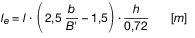

Zusätzliche technische Vorschriften für Fahrzeuge auf
Binnenwasserstraßen der Zonen 1 und 2
---
Title: (Anhang III der Binnenschiffsuntersuchungsordnung BGBl I 2018, 1398)
jurabk: BinSchUO2018Anh III
layout: default
origslug: binschuo2018anh_iii
slug: binschuo2018anh_iii

---

# (Anhang III der Binnenschiffsuntersuchungsordnung BGBl I 2018, 1398) (BinSchUO2018Anh III)

Ausfertigungsdatum
:   2018-09-21

Fundstelle
:   BGBl I: 2018, 1398, 1459

Änderung durch
:   Art. 1 Nr. 16 V v. 5.1.2022 I 2 (Nr. 1) textlich nachgewiesen, dokumentarisch noch nicht abschließend bearbeitet

## Inhaltsverzeichnis

Teil I

## Wasserstraßen der Zone 2-Binnen

Kapitel 1

Sonderbestimmungen für
## Fahrzeuge auf Wasserstraßen der Zone 2-Binnen

*    *   §§

    *

*    *   1.01

    *   Allgemeines

*    *   1.02

    *   Sonderbestimmungen für Fahrgastschiffe

Teil II

## Wasserstraßen der Zone 2-See

Kapitel 2

## Allgemeines

*    *   2.01

    *   Allgemeines

Kapitel 3

## Festigkeit

*    *   (ohne Inhalt)

Kapitel 4

## Sicherheitsabstand und Freibord

*    *   4.01

    *   Sicherheitsabstand

*    *   4.02

    *   Freibord

Kapitel 5

Verschlusszustand der Öffnungen
## des Schiffskörpers und der Aufbauten

*    *   5.01

    *   Aufbauten

*    *   5.02

    *   Türen

*    *   5.03

    *   Fenster und Oberlichter

*    *   5.04

    *   Abdeckung der Laderäume

Kapitel 6

## Ausrüstung

*    *   6.01

    *   Ankerketten

*    *   6.02

    *   Kompass

*    *   6.03

    *   Navigationsradaranlage

*    *   6.04

    *   Sende- und Empfangsanlagen

*    *   6.05

    *   Rettungsmittel

*    *   6.06

    *   Sonstige Ausrüstung

Kapitel 7

## Sonderbestimmungen für Fahrgastschiffe

*    *   7.01

    *   Allgemeines

*    *   7.02

    *   Festigkeit

*    *   7.03

    *   Stabilität, Sicherheitsabstand und Freibord

*    *   7.04

    *   Höchstzulässige Zahl der Fahrgäste

*    *   7.05

    *   Anker

*    *   7.06

    *   Rettungsmittel

Kapitel 8

Sonderbestimmungen
## für Verbände und Containerverkehr

*    *   (ohne Inhalt)

Kapitel 9

Sonderbestimmungen
## für schwimmende Geräte

*    *   (ohne Inhalt)

Teil III

## Wasserstraßen der Zone 1

Kapitel 10

Sonderbestimmungen
## für Fahrzeuge auf Wasserstraßen der Zone 1

*    *   10.01

    *   Allgemeines

*    *   10.02

    *   Sicherheitsabstand

*    *   10.03

    *   Freibord

*    *   10.04

    *   Verschlusszustand

*    *   10.05

    *   Festigkeit

*    *   10.06

    *   Zulässige Fahrtbedingungen

*    *   10.07

    *   Zusätzliche Ausrüstung

*    *   10.08

    *   Sonderbestimmungen für Fahrgastschiffe

Teil IV

Kapitel 11

## Übergangsbestimmungen

*    *   11.01

    *   Anwendung der Übergangsbestimmungen für Fahrzeuge, die schon in
        Betrieb sind

*    *   11.02

    *   Übergangsbestimmungen für Fahrzeuge, die schon in Betrieb sind

*    *   Anlage 1

    *   Anforderungen an Kompasse und Steuerkurstransmitter

## Teil I - Wasserstraßen der Zone 2-Binnen

### Kapitel 1 - Sonderbestimmungen für Fahrzeuge auf Wasserstraßen der Zone 2-Binnen

#### § 1.01 Allgemeines

1.  Auf Wasserstraßen der Zone 2-Binnen ist ES-TRIN mit den sich aus den
    nachfolgenden Vorschriften ergebenden Maßgaben anzuwenden.

2.  Hinsichtlich der vorgeschriebenen Ausrüstungsgegenstände sind die §§
    6\.02 bis 6.06 zu erfüllen.

3.  Ein Kompass nach § 6.02 ist nur auf der Kieler Förde erforderlich.

4.  Ein Radargerät nach § 6.03 ist nur auf

    a)  der Weser unterhalb der stadtbremischen Häfen,

    b)  dem Nord-Ostsee-Kanal,

    c)  der Kieler Förde,

    d)  der Trave unterhalb Stülper Huk,

    e)  der Unterwarnow und Breitling und

    f)  im Wolgaster Hafengebiet

    erforderlich.

#### § 1.02 Sonderbestimmungen für Fahrgastschiffe

1.  Für Fahrgastschiffe auf Wasserstraßen der Zone 2-Binnen gelten
    abweichend von Kapitel 19 ES-TRIN folgende Bestimmungen:

    a)  Bei Fahrgastschiffen ohne Schottendeck muss der Sicherheitsabstand
        abweichend von Artikel 19.04 Nummer 1 Satz 2 ES-TRIN mindestens 0,80 m
        betragen.

    b)  Einzelrettungsmittel nach Artikel 19.09 Nummer 4 ES-TRIN können durch
        Sammelrettungsmittel nach Artikel 19.09 Nummer 5 ES-TRIN in Verbindung
        mit Nummer 7 und 9 ersetzt werden.

2.  Die Bestimmungen des § 6.05 gelten nicht.

## Teil II - Wasserstraßen der Zone 2-See

### Kapitel 2 - Allgemeines

#### § 2.01 Allgemeines

1.  Auf Wasserstraßen der Zone 2-See ist ES-TRIN mit den sich aus den
    nachfolgenden Vorschriften ergebenden Maßgaben anzuwenden.

2.  Die Bestimmungen aus den Kapiteln 3 bis 9 sind zu erfüllen.

3.  Abweichend von den Nummern 1 und 2 ist auf der Ems unterhalb von Emden
    bis zur Hafeneinfahrt von Delfzijl für Güterschiffe bei geschlossenen
    Ladeluken, für Schleppboote und Schubboote der § 1.01 Nummer 1 und 2
    anzuwenden.

### Kapitel 3 - Festigkeit

(ohne Inhalt)

### Kapitel 4 - Sicherheitsabstand und Freibord

#### § 4.01 Sicherheitsabstand

1.  Der Sicherheitsabstand muss mindestens 0,45 m betragen.

2.  Zu Öffnungen, die sprühwasser- und wetterdicht abgeschlossen sind oder
    mit Verschlusseinrichtungen versehen sind, muss der Sicherheitsabstand
    mindestens 0,60 m betragen.

3.  Zu Öffnungen, die offen sind, muss der Sicherheitsabstand mindestens
    1,00 m betragen.

#### § 4.02 Freibord

1.  Der Freibord für Schiffe mit durchlaufendem Deck, ohne Sprung und ohne
    Aufbauten beträgt 0,30 m.

2.  Bei Schiffen mit Sprung und mit Aufbauten kann der Freibord nach
    Artikel 4.02 Nummer 2 bis 6 ES-TRIN berichtigt werden:

    a)  Dabei ist

        aa) die Konstante 150 in der Formel für den Freibord nach Artikel 4.02
            Nummer 2 ES-TRIN mit dem Wert 300,

        bb) für den tatsächlichen Sprung S
            v                                im Vorschiff kein größerer Wert als
            2 000 mm und

        cc) für den tatsächlichen Sprung S
            a                                im Achterschiff kein größerer Wert
            als 1 000 mm

        anzusetzen.

    b)  Die Sprunghöhe an den Schiffsenden darf die Höhe bis zum Schiffsende
        reichender Aufbauten nicht einschließen.

    c)  Bei Berechnungen nach Buchstabe a wird die wirksame Länge des Aufbaus
        nach folgender Formel berechnet:
        
        In diesen Formeln bedeuten:

            l
        e   die wirksame Länge eines Aufbaus in [m] unabhängig von seiner Lage
            bezogen auf L,

        l   die tatsächliche Länge des betreffenden Aufbaus in [m],

        b   die Breite des betreffenden Aufbaus in [m],

        B'  die Breite des Schiffes gemessen auf der Hälfte der Länge des Aufbaus,
            Deckshauses oder Lukenschachts in [m],

        h   die an der Aufbau-, Deckshaus- oder Lukenseite gemessene Höhe des
            betreffenden Aufbaus in [m], für Luken ergibt sich die Höhe h, indem
            die Höhe der Sülle um den halben Sicherheitsabstand nach § 4.01 unter
            Berücksichtigung der Art der Lukenabdeckung vermindert wird. Für die
            Höhe h darf kein größerer Wert eingesetzt werden als 0,72 m.

        Wenn
                kleiner ist als 0,6, ist die wirksame Aufbaulänge l
        e                          gleich Null zu setzen.

3.  Unter Berücksichtigung der Freibordberichtigung nach Nummer 2 muss der
    Freibord mindestens 0,15 m betragen. Dabei müssen die nachfolgenden
    Bedingungen erfüllt sein:

    a)  Der Sicherheitsabstand beträgt

        aa) bei wasserdichten Ladeluken mindestens 0,60 m bis Oberkante
            Ladelukensüll,

        bb) bei sprühwasser- und wetterdichten Ladeluken mindestens 0,75 m,

        cc) bei offenen Ladeluken mindestens 1,20 m.

    b)  Die durchschnittliche Breite des Gangbords beträgt höchstens 0,125 ·
        B.

### Kapitel 5 - Verschlusszustand der Öffnungen des Schiffskörpers und der Aufbauten

#### § 5.01 Aufbauten

1.  Alle Öffnungen in den Aufbauten müssen mit Süllen von mindestens 0,15
    m Höhe über dem Schottendeck versehen sein.

2.  Die Süllhöhe kann geringer sein, wenn die Türen und sonstigen
    Öffnungen wasserdicht verschließbar sind und wenn die Benutzung
    während der Fahrt ausgeschlossen ist.

3.  Sofern Deckel von Einstiegsluken und Mannlöchern nicht durch
    Verschraubungen gesichert sind, müssen sie durch Scharniere fest mit
    dem Schiff verbunden sein.

#### § 5.02 Türen

Alle äußeren Türen, die Zugang zu Räumen unter dem Freiborddeck
gewähren, müssen mindestens sprühwasser- und wetterdicht verschließbar
und von ausreichender Festigkeit sein.

#### § 5.03 Fenster und Oberlichter

1.  Fenster unterhalb des Schottendecks müssen wasserdicht und mit einer
    Seeschlagblende versehen sein.

2.  Fenster und Oberlichter bis 0,15 m oberhalb des Schottendecks müssen
    wasserdicht sein.

3.  Liegt die Unterkante von Fenstern und Oberlichtern mindestens 0,15 m
    oberhalb des Schottendecks, müssen sie mindestens sprühwasser- und
    wetterdicht sein.

4.  Fenster und Oberlichter gelten als

    a)  wasserdicht, wenn ihre Ausführung mindestens der Baureihe B und der
        nicht zu öffnenden Bauart der Norm DIN ISO 1751, Ausgabe Dezember
        2015, entspricht;

    b)  sprühwasser- und wetterdicht, wenn ihre Ausführung als runde Fenster
        mindestens der Baureihe C der Norm DIN ISO 1751, Ausgabe Dezember
        2015, und als rechteckige Fenster mindestens der Baureihe F der Norm
        DIN ISO 3903, Ausgabe Dezember 2015, entspricht;

    c)  offen, wenn ihre Ausführung den in Buchstabe a und b genannten Normen
        nicht entspricht.

#### § 5.04 Abdeckung der Laderäume

1.  Die wasserdichte Abdeckung der Laderäume muss folgenden Bestimmungen
    genügen:

    a)  Die Festigkeit und Konstruktion der Einzelteile muss

        aa) einer Belastung durch Wasser von

            q = 1,00 – h [t/m
            2                               ]

            zuzüglich Eigengewicht der Deckel, mindestens jedoch von 0,15 t/m²
            zuzüglich Eigengewicht der Deckel,

        bb) einer Belastung von 0,075 t als Punktlast

        standhalten. In dieser Formel bedeutet:

        h   Abstand des tiefsten Punkts der Lukenabdeckung von der Ebene der
            zulässigen größten Einsenkung [m].

        Bei Tankschiffen ist darüber hinaus mindestens der Prüfdruck der Tanks
        zu berücksichtigen.

    b)  Wasserdichte Lukendeckel müssen durch Schraubverschlüsse oder
        Vorreiber abgedichtet sein; dies gilt nicht bei seemäßig verschalkten
        Abdeckungen der Laderäume.

2.  Die sprühwasser- und wetterdichte Abdeckung der Laderäume muss
    folgenden Bestimmungen genügen:

    a)  Die Festigkeit und Konstruktion der Einzelteile muss den Bestimmungen
        nach Nummer 1 Buchstabe a entsprechen.

    b)  Es müssen Vorrichtungen vorhanden sein, mit denen die Lukenabdeckungen
        und ihre Einzelteile gegen ein Abheben durch Wind oder Wellenschlag
        gesichert werden können.

    Sprühwasser- und wetterdichte Lukendeckel brauchen nicht besonders
    abgedichtet zu sein, wenn das Eigengewicht der Deckel und die Form der
    Lukenverschlüsse eine ausreichende Abdichtung bewirkt.

3.  Laderäume ohne Lukendeckel und mit Lukendeckeln, die den Bestimmungen
    nach Nummer 1 oder 2 nicht entsprechen, gelten als offen.

### Kapitel 6 - Ausrüstung

#### § 6.01 Ankerketten

Abweichend von Artikel 13.01 Nummer 10 ES-TRIN muss jede Bugankerkette
mindestens 60 m lang sein.

#### § 6.02 Kompass

1.  Fahrzeuge mit eigener Triebkraft müssen mit einem von der zuständigen
    Behörde zugelassenen Kompass oder mit einem Steuerkurstransmitter,
    jeweils mit Analoganzeige oder grafischer Darstellung, ausgerüstet
    sein.

2.  Abweichend von Nummer 1 darf für Fahrzeuge ein Kompass mit numerischer
    Anzeige oder Steuerkurstransmitter mit numerischer Anzeige verwendet
    werden, wenn die Fahrzeuge mit einem Radargerät nach § 6.03
    ausgerüstet sind.

3.  Kompasse und Steuerkurstransmitter müssen den technischen
    Anforderungen nach Anlage 1 Teil 1 entsprechen. Entsprechende
    Ausrüstung, die in Abschnitt D Nummer 10 der Anlage zum
    Schiffssicherheitsgesetz aufgeführt und nach diesen Anforderungen
    zugelassen ist, gilt als konform mit diesen Bestimmungen.

4.  Kompasse auf Magnet-Basis und Steuerkurstransmitter auf Magnet-Basis
    müssen

    a)  vor dem Einbau von der zuständigen Behörde oder von einer von ihr für
        die Prüfung der jeweiligen Anlage anerkannten Einrichtung geprüft
        sein; dies ist nicht erforderlich für Kompasse oder
        Steuerkurstransmitter, die nach Abschnitt D Nummer 10 der Anlage zum
        Schiffssicherheitsgesetz zugelassen sind,

    b)  entsprechend den technischen Bestimmungen nach Anlage 1 Teil 2 an Bord
        eingebaut sein,

    c)  vor Inbetriebnahme sowie spätestens bei einer Verlängerung der
        Fahrtauglichkeitsbescheinigung von einer von der zuständigen Behörde
        aufgrund eines Sachkundenachweises anerkannten Person (Regulierer)
        reguliert sein.

    Der Regulierer prüft gleichzeitig den ordnungsgemäßen Einbau nach Satz
    1 Buchstabe b. Er stellt eine Bescheinigung über den ordnungsgemäßen
    Einbau und die durchgeführte Regulierung, aus der auch das Datum der
    Regulierung hervorgeht, aus. Die aktuelle Bescheinigung ist an Bord
    mitzuführen. Kann ein Regulierer den Kompass auf Magnetbasis oder
    Steuerkurstransmitter auf Magnetbasis nicht so regulieren, dass die
    größte Abweichung nicht mehr als 6° beträgt, so ist die Aufstellung
    des Kompasses auf Magnetbasis oder Steuerkurstransmitter auf
    Magnetbasis von der zuständigen Behörde überprüfen zu lassen.

5.  Die Regulierung und Kompensierung durch eine anerkannte Person
    (Regulierer) eines Mitgliedstaates der Internationalen
    Seeschifffahrts-Organisation (IMO) wird als gleichwertig anerkannt.

#### § 6.03 Navigationsradaranlage

1.  Fahrzeuge mit eigener Triebkraft müssen mit einer
    Navigationsradaranlage nach Artikel 7.06 Nummer 1 ES-TRIN ausgerüstet
    sein.

2.  Nummer 1 gilt nicht für Seeschiffe mit Seeradar.

#### § 6.04 Sende- und Empfangsanlagen

Fahrzeuge mit eigener Triebkraft müssen mit einer Funkanlage für die
Teilnahme am Binnenschifffahrtsfunk nach den Bestimmungen der
Regionalen Vereinbarung über den Binnenschifffahrtsfunk ausgerüstet
sein.

#### § 6.05 Rettungsmittel

1.  Ein Drittel der vorgeschriebenen Rettungsringe muss mit jeweils einer
    mindestens 30 m langen, schwimmfähigen Leine von 8 bis 11 mm
    Durchmesser, ein weiteres Drittel muss mit jeweils einem
    selbstzündenden, batteriebetriebenen, im Wasser nicht verlöschenden
    Licht versehen sein.

2.  Zusätzlich zu Artikel 13.08 ES-TRIN muss für jede an Bord befindliche
    Person ein Platz in einem Sammelrettungsmittel nach Artikel 19.09
    Nummer 5 ES-TRIN in Verbindung mit dessen Nummer 7 bis 9 vorhanden
    sein.

#### § 6.06 Sonstige Ausrüstung

Folgende Ausrüstungsgegenstände müssen mindestens vorhanden sein:

a)  die in Artikel 13.02 Nummer 2, 3 und 4 ES-TRIN aufgeführten
    Ausrüstungsgegenstände;

b)  zusätzliche Geräte und Vorrichtungen, die zum Geben der in der
    Seeschifffahrtsstraßen-Ordnung und in der Verordnung zu den
    Internationalen Regeln von 1972 zur Verhütung von Zusammenstößen auf
    See vorgeschriebenen Sicht- und Schallsignale sowie zur Bezeichnung
    der Fahrzeuge erforderlich sind;

c)  vom Bordnetz unabhängige Ersatzlichter für die Nachtbezeichnung

    aa) der Fahrzeuge beim Stillliegen,

    bb) manövrierunfähiger Fahrzeuge,

    cc) stillliegender Schiffe mit bestimmten gefährlichen Gütern;

d)  an Bord von Fahrzeugen mit Besatzung zusätzlich die in § 13 Absatz 1
    Nummer 2 Buchstabe a der Schiffssicherheitsverordnung vorgeschriebenen
    Seekarten; werden Seekarten in digitaler Form verwendet, so müssen
    diese auf zugelassenen Inland-ECDIS-Geräten im Navigationsmodus nach
    Artikel 7.06 Nummer 1 ES-TRIN und nach der Prüfvorschrift
    „Mindestanforderungen an Inland ECDIS Geräte im Navigationsmodus zur
    Darstellung von digitalen Seekarten nach der
    Binnenschiffsuntersuchungsordnung“, die vom Bundesministerium für
    Verkehr und digitale Infrastruktur am 20. Dezember 2018 (BAnz AT
    20\.12.2018 B6) bekannt gemacht wurde, dargestellt werden.

### Kapitel 7 - Sonderbestimmungen für Fahrgastschiffe

#### § 7.01 Allgemeines

Für Fahrgastschiffe auf Wasserstraßen der Zone 2-See gelten Kapitel 3
und 4 sowie die Bestimmungen des § 6.05 nicht.

#### § 7.02 Festigkeit

Abweichend von Artikel 3.02 Nummer 1 Buchstabe a ES-TRIN muss der
Schiffskörper den Vorschriften einer anerkannten
Klassifikationsgesellschaft für die Zone 2-See entsprechen. Als
Nachweis genügt eine Bescheinigung einer anerkannten
Klassifikationsgesellschaft, aus der hervorgeht, dass das
Fahrgastschiff nach den Bauvorschriften für die Zone 2-See gebaut oder
umgebaut worden ist.

#### § 7.03 Stabilität, Sicherheitsabstand und Freibord

1.  Abweichend von den Bestimmungen nach Artikel 19.04 Nummer 1 ES-TRIN
    muss

    a)  der Restsicherheitsabstand mindestens 0,20 m und

    b)  bei Fahrgastschiffen ohne Schottendeck der Sicherheitsabstand
        mindestens 1,00 m und der Restsicherheitsabstand mindestens 0,30 m

    betragen.

2.  Abweichend von den Bestimmungen nach Artikel 19.04 Nummer 2 ES-TRIN
    muss

    a)  der Restfreibord mindestens 0,40 m und

    b)  der Freibord mindestens 0,50 m

    betragen.

3.  Die Ebene der größten Einsenkung ist abweichend von den Bestimmungen
    in Artikel 19.04 Nummer 3 ES-TRIN unter Berücksichtigung der Nummern 1
    und 2 festzusetzen.

#### § 7.04 Höchstzulässige Zahl der Fahrgäste

Die höchstzulässige Zahl der Fahrgäste ist nach den Bestimmungen des
Artikels 19.05 Nummer 2 Buchstabe b ES-TRIN unter Berücksichtigung des
§ 7.03 zu ermitteln.

#### § 7.05 Anker

Für Fahrgastschiffe ist die Gesamtmasse P der Buganker nach folgender
Formel zu berechnen:
P = k · B · T + 4 · A
f              [kg]
In dieser Formel bedeuten:

k   Koeffizient nach Artikel 13.01 Nummer 2 ES-TRIN

    A
f   frontale Windangriffsfläche in m
    2                   .

#### § 7.06 Rettungsmittel

Einzelrettungsmittel nach Artikel 19.09 Nummer 4 ES-TRIN können durch
Sammelrettungsmittel nach Artikel 19.09 Nummer 5 ES-TRIN in Verbindung
mit dessen Nummer 7 bis 9 ersetzt werden.

### Kapitel 8 - Sonderbestimmungen für Verbände und Containerverkehr

(ohne Inhalt)

### Kapitel 9 - Sonderbestimmungen für schwimmende Geräte

(ohne Inhalt)

## Teil III - Wasserstraßen der Zone 1

### Kapitel 10 - Sonderbestimmungen für Fahrzeuge auf Wasserstraßen der Zone 1

#### § 10.01 Allgemeines

1.  Auf Wasserstraßen der Zone 1 ist ES-TRIN mit den sich aus den
    nachfolgenden Vorschriften ergebenden Maßgaben anzuwenden.

2.  Die Bestimmungen aus den Kapiteln 2 bis 6 und die Bestimmungen der §§
    10\.02 bis 10.07 sind zu erfüllen.

#### § 10.02 Sicherheitsabstand

Der Sicherheitsabstand muss mindestens 1,20 m betragen.

#### § 10.03 Freibord

Der Freibord muss mindestens 0,50 m betragen.

#### § 10.04 Verschlusszustand

1.  Abweichend von Artikel 4.05 ES-TRIN ist die Ebene der größten
    Einsenkung unter der Voraussetzung festzusetzen, dass die Laderäume
    mindestens sprühwasser- und wetterdicht geschlossen werden können.

2.  Die Festsetzung der höchstzulässigen Einsenkung für die Fahrt mit
    ungedeckten Laderäumen ist nicht zulässig.

#### § 10.05 Festigkeit

Eine anerkannte Klassifikationsgesellschaft muss bescheinigen, dass
das Fahrzeug zur Fahrt auf Wasserstraßen der Zone 1 ausreichende
Festigkeit und einen angemessenen Freibord und Verschlusszustand
aufweist. Die vorzulegende Bescheinigung muss die zulässigen
Fahrtbedingungen des Fahrzeugs gemäß § 10.06 angeben.

#### § 10.06 Zulässige Fahrtbedingungen

Abhängig vom Bau-, Erhaltungs- und Ausrüstungszustand des Fahrzeugs
werden dessen zulässige Fahrtbedingungen – insbesondere Beschränkung
auf Fahrten bei geringer signifikanter Wellenhöhe, auf einen
bestimmten Zeitraum im Jahr, auf Fahrten bei Tageslicht oder bei
annehmbaren Witterungs- und Wetterverhältnissen oder auf Fahrten von
begrenzter Dauer – festgelegt. Die zulässigen Fahrtbedingungen sind in
der jeweiligen Fahrtauglichkeitsbescheinigung zu bescheinigen.

#### § 10.07 Zusätzliche Ausrüstung

1.  Zusätzlich zu den Bestimmungen nach Kapitel 6 müssen Fahrzeuge mit
    Besatzung folgende Ausrüstungsgegenstände an Bord mitführen:

    a)  einen elektrischen Tagessignalscheinwerfer,

    b)  sechs rote, amtlich zugelassene Fallschirmsignale,

    c)  eine Rettungssignaltafel,

    d)  vier Rettungsringe nach Artikel 13.08 ES-TRIN; davon müssen zwei
        Rettungsringe mit jeweils einer mindestens 30 m langen, schwimmfähigen
        Leine von 8 bis 11 mm Durchmesser versehen sein, und zwei
        Rettungsringe müssen mit jeweils einem selbstzündenden,
        batteriebetriebenen, in Wasser nicht verlöschenden Licht versehen
        sein,

    e)  ein Rettungsfloß nach Artikel 19.09 Nummer 5 und 7 bis 9 ES-TRIN,

    f)  das Beiboot muss mit einer Laterne und einem wasserdichten Behälter
        mit sechs Rotfeuern ausgestattet sein.

2.  Zusätzlich zu den Bestimmungen nach Kapitel 6 müssen geschleppte
    Fahrzeuge mit Besatzung die nach Nummer 1 Buchstabe b bis f
    geforderten Ausrüstungsgegenstände an Bord mitführen.

#### § 10.08 Sonderbestimmungen für Fahrgastschiffe

1.  Für Fahrgastschiffe auf Wasserstraßen der Zone 1 gelten die §§ 10.02
    bis 10.04 nicht.

2.  Eine anerkannte Klassifikationsgesellschaft muss bescheinigen, dass
    das Fahrgastschiff zur Fahrt auf Wasserstraßen der Zone 1 ausreichende
    Stabilität aufweist. Die vorzulegende Bescheinigung muss die
    zulässigen Fahrtbedingungen des Fahrgastschiffes gemäß § 10.06
    angeben.

## Teil IV - 

### Kapitel 11 - Übergangsbestimmungen

#### § 11.01 Anwendung der Übergangsbestimmungen für Fahrzeuge, die schon in Betrieb sind

1.  Die nachstehenden Bestimmungen gelten für Fahrzeuge, für die ein
    zusätzliches Gemeinschaftszeugnis für Binnenschiffe erstmals vor dem
    30\. Dezember 2008 erteilt wurde.

2.  Für die Fahrzeuge muss nachgewiesen werden, dass sie am Tage der
    Erteilung oder letzten Erneuerung ihres Gemeinschaftszeugnisses oder
    einer anderen Verkehrszulassung den technischen Vorschriften der
    Binnenschiffs-Untersuchungsordnung in der Fassung vom 30. Dezember
    2008 entsprochen haben.

#### § 11.02 Übergangsbestimmungen für Fahrzeuge, die schon in Betrieb sind

1.  Fahrzeuge, die den Vorschriften dieses Anhangs nicht vollständig
    entsprechen, müssen den in nachstehender Tabelle aufgeführten
    Übergangsbestimmungen angepasst werden.

    Im Fall der Erteilung eines neuen zusätzlichen Unionszeugnisses für
    Binnenschiffe nach § 11.01 Nummer 1 ist das zusätzliche
    Gemeinschaftszeugnis oder eine Anlage zum Gemeinschaftszeugnis für
    Binnenschiffe als Nachweis vorzulegen und einzuziehen.

2.  In der Tabelle bedeuten

    –   „N.E.U.“:

        Die Vorschrift gilt nicht für Fahrzeuge, die schon in Betrieb sind, es
        sei denn, die betroffenen Teile werden ersetzt oder umgebaut, d. h.,
        die Vorschrift gilt nur für Neubauten sowie bei Ersatz oder bei Umbau
        der betroffenen Teile oder Bereiche. Werden bestehende Teile durch
        Austauschteile in gleicher Technik und Machart ersetzt, bedeutet dies
        keinen Ersatz „E“ im Sinne dieser Übergangsbestimmungen.

    –   „Erteilung oder Erneuerung des zusätzlichen Unionszeugnisses für
        Binnenschiffe“:

        Die Vorschrift muss bei der nächsten auf das angegebene Datum
        folgenden Erteilung oder Erneuerung der Gültigkeitsdauer des
        zusätzlichen Unionszeugnisses für Binnenschiffe oder der Anlage zum
        Unionszeugnis für Binnenschiffe erfüllt sein.

        *            *   §

            *   Inhalt

            *   Frist oder Bemerkungen

        *            *   4.01

            *   Sicherheitsabstand

            *   N.E.U., spätestens bei Erteilung oder Erneuerung des zusätzlichen
                Unionszeugnisses für Binnenschiffe nach dem 30.12.2049

        *            *   4.02

            *   Freibord

            *   N.E.U., spätestens bei Erteilung oder Erneuerung des zusätzlichen
                Unionszeugnisses für Binnenschiffe nach dem 30.12.2049

        *            *   5.01

            *   Aufbauten

            *   N.E.U., spätestens bei Erteilung oder Erneuerung des zusätzlichen
                Unionszeugnisses für Binnenschiffe nach dem 30.12.2049

        *            *   5.02

            *   Türen

            *   N.E.U., spätestens bei Erteilung oder Erneuerung des zusätzlichen
                Unionszeugnisses für Binnenschiffe nach dem 30.12.2049

        *            *   5.03

            *   Fenster und Oberlichter

            *   N.E.U., spätestens bei Erteilung oder Erneuerung des zusätzlichen
                Unionszeugnisses für Binnenschiffe nach dem 30.12.2049

        *            *   5.04

            *   Abdeckung der Laderäume

            *   N.E.U., spätestens bei Erteilung oder Erneuerung des zusätzlichen
                Unionszeugnisses für Binnenschiffe nach dem 30.12.2049

        *            *   6.02 Nr. 1

            *   Kompass

            *   N.E.U., spätestens bei Erteilung oder Erneuerung des zusätzlichen
                Unionszeugnisses für Binnenschiffe nach dem 30.12.2029

        *            *   6.03 Nr. 1

            *   Radar

            *   N.E.U., spätestens bei Erteilung oder Erneuerung des zusätzlichen
                Unionszeugnisses für Binnenschiffe nach dem 30.12.2029

        *            *   6.06 Buch-
                stabe b

            *   Schallsignalanlage

            *   N.E.U., spätestens bei Erteilung oder Erneuerung des zusätzlichen
                Unionszeugnisses für Binnenschiffe nach dem 30.12.2049

        *            *   6.06
                Buchstabe d

            *   Inland-ECDIS-Geräte und
                digitale Seekarten

            *   N.E.U., spätestens nach dem 18. Januar 2022

        *            *   10.02

            *   Sicherheitsabstand

            *   N.E.U., spätestens bei Erteilung oder Erneuerung des zusätzlichen
                Unionszeugnisses für Binnenschiffe nach dem 30.12.2049

        *            *   10.03

            *   Freibord

            *   N.E.U., spätestens bei Erteilung oder Erneuerung des zusätzlichen
                Unionszeugnisses für Binnenschiffe nach dem 30.12.2049

#### Anlage 1 Anforderungen an Kompasse und Steuerkurstransmitter

(Fundstelle: BGBl. I 2018, 1468 - 1471)

## Inhaltsverzeichnis

Teil 1
## Allgemeine Geräteanforderungen

*    *   §§

    *

*    *   1

    *   Allgemeine Anforderungen an Kompasse und Steuerkurstransmitter

*    *   Teil 2
        Vorschriften für den Einbau von Kompassen
        auf Magnetbasis und Steuerkurstransmitter auf Magnetbasis

*    *   2.1

    *   Allgemeines

*    *   2.2

    *   Schutzabstände von magnetischen Störquellen

*    *   2.3

    *   Haltevorrichtungen und Kompensiermittel

*    *   2.4

    *   Steuerkurstransmitter auf Magnetbasis

## Teil 1

## Allgemeine Geräteanforderungen

## § 1

## **Allgemeine Anforderungen an Kompasse und Steuerkurstransmitter**

Kompasse und Steuerkurstransmitter für den Einsatz in der
Binnenschifffahrt nach Anhang III § 6.02 müssen dem Stand der Technik
entsprechen und insbesondere eine der folgenden Spezifikationen
erfüllen:

*    *   Nr.

    *   Gerätebezeichnung

    *   Spezifikation

*    *   1.

    *   Kreiselkompass

    *   DIN EN ISO 8728, Ausgabe Mai 2017
        DIN EN 60945, Ausgabe Juli 2003

*    *   2.

    *   Magnetkompass

    *   DIN ISO 25862, Ausgabe Januar 2013

*    *   3.

    *   Elektromagnetischer Kompass (TMHD)

    *   DIN EN ISO 11606, Ausgabe Februar 2002
        DIN EN 60945, Ausgabe Juli 2003
        Mit einer Drehrate von 6°/sec
        (vgl. DIN ISO 22090-3, Ausgabe November 2015)

*    *   4.

    *   Steuerkurstransmitter (THD)
        Kreisel-Basis

    *   DIN ISO 22090-1, Ausgabe November 2015
        DIN EN 60945, Ausgabe Juli 2003

*    *   5.

    *   Steuerkurstransmitter (THD)
        Magnetbasis

    *   DIN ISO 22090-2, Ausgabe November 2015
        DIN EN 60945, Ausgabe Juli 2003

*    *   6.

    *   Steuerkurstransmitter (THD)
        GNSS-Basis

    *   DIN ISO 22090-3, Ausgabe November 2015
        DIN EN 60945, Ausgabe Juli 2003

Alle Anzeigen von Kompassen und Steuerkurstransmittern müssen die
Anforderungen der DIN EN 60945, Ausgabe Juli 2003, erfüllen.
Steuerkurstransmitter nach den Nummern 4, 5 oder 6 der Tabelle mit
analoger oder grafischer Anzeige müssen hinsichtlich Unterteilung und
Lesbarkeit zusätzlich dem Stand der Technik entsprechen.

## Teil 2

Vorschriften für den Einbau von Kompassen
## auf Magnetbasis und Steuerkurstransmitter auf Magnetbasis

## § 2.1

## **Allgemeines**

1.  Der Aufstellungsort des Kompasses auf Magnetbasis (Magnetkompasses)
    für Binnenschiffe muss im Rahmen der gegebenen Möglichkeiten so
    gewählt werden, dass eine Beeinträchtigung der Funktion des
    Magnetkompasses durch die bei normaler Fahrt des Schiffes zu
    erwartenden Vibrationen weitgehend vermieden wird.

2.  Befindet sich mehr als ein Magnetkompass für Binnenschiffe an Bord, so
    dürfen sich diese Magnetkompasse gegenseitig nicht beeinflussen.
    Kompensiermittel und Rosensystem des einen Kompasses müssen vom
    Rosensystem des anderen einen Abstand von mindestens 2 m haben.

3.  Bei Ausfall des Hauptstromnetzes muss die Beleuchtung zur Ablesung des
    Magnetkompasses durch eine Notstromquelle sichergestellt sein.

4.  Der Magnetkompass für Binnenschiffe muss in der Mittschiffsebene
    aufgestellt sein.

## § 2.2

## **Schutzabstände von magnetischen Störquellen**

1.  Gleichstromführende Kabel in der Nähe des Magnetkompasses müssen
    doppelpolig verlegt sein. Dies gilt in Abhängigkeit von der
    Stromstärke innerhalb der nachstehend angegebenen Bereiche um den
    Kompassrosenmittelpunkt:

    *        *   Stromstärke

        *   Bereich um den Kompassrosenmittelpunkt

    *        *   bis 10 A

        *   5 m

    *        *   über 10 A bis 50 A

        *   7 m

    *        *   über 50 A

        *   9 m

    Befestigungsschellen für Kabel und Durchführungsrohre für Leitungen
    aus magnetisierbarem Material sowie eisenarmierte Kabel müssen einen
    Abstand von mindestens 1 m vom Magnetkompass haben.

2.  Magnetkompasse für Binnenschiffe müssen so eingebaut sein, dass der
    Abstand stählerner Schiffbauteile vom Kompassrosenmittelpunkt
    mindestens 1 m beträgt.

    Außerhalb der eisenfreien Zone muss magnetisierbares Material
    möglichst symmetrisch zur Mittschiffsebene angeordnet werden.

3.  Der Magnetkompass darf nicht in einem Ruderhaus aufgestellt werden,
    das vollkommen aus magnetisierbarem Material hergestellt ist. Wenn das
    Ruderhaus zum Teil aus magnetisierbarem Material hergestellt ist, soll
    dieses Material symmetrisch zum Kompass angeordnet sein.

4.  Elektrische Anlagen und Geräte müssen grundsätzlich in einem Abstand
    zum Magnetkompass angeordnet werden, der nicht kleiner als der
    angegebene Schutzabstand ist.

    In den von der zuständigen Behörde erteilten Bescheinigungen über
    Schutzabstandswerte (Mindestabstände) vom Magnet-Regel- und Magnet-
    Steuerkompass gelten die dort als verminderte Schutzabstände
    (reduzierte Mindestabstände) angeführten Werte.

## § 2.3

## **Haltevorrichtungen und Kompensiermittel**

1.  Ein kardanisch aufgehängter Magnetkompass muss in einer zugehörigen
    Haltevorrichtung mit Kardanlagern fest montiert werden.

2.  Die Haltevorrichtung des Magnetkompasses einschließlich Schutzhaube,
    Steuerlinse und Übertragungseinrichtung muss so weitgehend eisenfrei
    sein, dass die Ablenkung der Kompassrose durch evtl. vorhandenes
    magnetisierbares Material auf keinem Kurs ± 1° überschreitet.

3.  Bei Reflexions- oder Projektionskompassen, die über eine optische
    Einrichtung abgelesen werden, muss an der Ablesevorrichtung (Schirm,
    Spiegel) zu beiden Seiten des Steuerstrichs ein Sektor der Rose von
    mindestens 15° sichtbar sein. Dies gilt auch, wenn eine Steuerlupe
    verwendet wird. Der durch die optische Übertragungseinrichtung
    abgelesene Magnetkompasskurs muss mit dem direkt am Hauptsteuerstrich
    abgelesenen innerhalb von ± 1° übereinstimmen.

4.  Die Haltevorrichtung muss zur Ausrichtung nach der Montage eine
    Drehung um die Hochachse von ± 2° ermöglichen.

5.  Die Neigungsfreiheit eines kardanisch aufgehängten Magnetkompasses
    innerhalb der Haltevorrichtung muss mindestens 40° betragen. Diese
    darf nicht durch zusätzliche Einrichtungen wie z. B. Kursdetektoren,
    Abtastsonden und ähnliche Installationen für Selbststeueranlagen
    beeinträchtigt werden.

6.  Der Magnetkompass muss so beleuchtet werden können, dass er für eine
    normalsichtige Person jederzeit aus einer Entfernung von mindestens 1
    m blendfrei ablesbar ist. Ist eine elektrische Beleuchtung vorhanden,
    so muss diese regelbar sein. Bei Ausfall der Hauptstromquelle muss die
    Beleuchtung über eine Notstromquelle oder anderweitig sichergestellt
    sein. Die Glühlampe der elektrischen Beleuchtung muss jederzeit leicht
    und sicher ausgewechselt werden können. Elektrische Zuleitungen für
    Gleichstrom müssen in unmittelbarer Nähe des Magnetkompasses verdrillt
    sein.

7.  Bei Magnetkompassen, die außerhalb des Ruderhauses, z. B. auf dem Dach
    des Ruderhauses, aufgestellt werden, muss die Haltevorrichtung mit
    einer abnehmbaren Schutzhaube versehen sein. In diesen Fällen muss
    dafür gesorgt sein, dass eine ausreichende Belüftung des Raumes
    innerhalb der Haltevorrichtung gewährleistet ist.

8.  Kompensiermittel

    Zur Kompensierung der vom festen Schiffsmagnetismus herrührenden
    Koeffizienten B und C sowie des vom induzierten Schiffsmagnetismus
    herrührenden Koeffizienten D sind zweckdienliche Vorrichtungen
    vorzusehen. Geeignet sind z. B. Steckvorrichtungen für die Magnete in
    Längs- und Querschiffsrichtung. Zur Kompensierung des Koeffizienten D
    können D-Kugeln, D-Rohre sowie auf oder unter dem Magnetkompass
    befestigte D-Streifen verwendet werden.

    a)  Diese Kompensiereinrichtungen müssen dauerhaft und sicher angebracht
        und für den Kompassregulierer leicht zugänglich und bequem zu
        handhaben sein.

        Unbeabsichtigte Änderungen der kompensierten Werte müssen
        ausgeschlossen sein.

    b)  Die Kompensiermagnete für die Koeffizienten B und C sind möglichst
        unterhalb des Magnetkompasses anzubringen. Ist aus Platzgründen eine
        Anbringung vor oder hinter dem Magnetkompass oder backbord- oder
        steuerbordseitig notwendig, so sind die Magnete symmetrisch zum
        Magnetkompass anzubringen.

    c)  Die Kompensiermagnete für B sind so anzubringen, dass die
        Querschiffsebene durch den Rosenmittelpunkt genau die
        Kompensiermagnete halbiert.

        Die Kompensiermagnete für C sind so anzubringen, dass die
        Längsschiffsebene durch den Rosenmittelpunkt genau die
        Kompensiermagnete halbiert.

    d)  Das Material für die Kompensiermittel der vom festen
        Schiffsmagnetismus herrührenden Koeffizienten B und C muss eine
        Koerzitivfeldstärke von mindestens 11,2 kA/m aufweisen.

    e)  Das Material für die Kompensiermittel des vom flüchtigen Magnetismus
        herrührenden Koeffizienten D darf eine Koerzitivfeldstärke von
        höchstens 120 kA/m aufweisen.

    f)  Es wird empfohlen, das magnetische Moment für Magnete zur
        Kompensierung der festen Längs- und Querfeldstärken zwischen 1,5 Am
        2                          und 3,0 Am
        2                          oder 4,0 Am
        2                          und 5,0 Am
        2                          zu wählen.

    g)  Es wird empfohlen, als D-Streifen die so genannten Mu-Metall-
        Weicheisenstreifen zu verwenden.

        Bei Kugelkompassen werden diese zweckmäßigerweise als Bügel, bei
        Flachglaskompassen als kleine D-Streifen ausgeführt.

    h)  Mechanische Kompensiereinrichtungen, bei denen die
        Ablenkungskoeffizienten B und C durch stetiges Verdrehen oder
        Verschieben von Kompensiermagneten einstellbar sind, dürfen nur
        eingebaut werden, wenn sie von der zuständigen Behörde für den
        Gebrauch an Bord als geeignet und sicher befunden worden sind.

9.  Ausführungsmöglichkeiten für Haltevorrichtungen

    a)  Beim Einbau von Magnet-Steuerkompassen werden unterschieden:

        aa) Einbau im Fahrpult, auf einem Tisch oder einer Konsole im Ruderhaus,

        bb) Einbau im Ruderhaus unter der Ruderhausdecke (Deckenkompass),

        cc) Einbau auf dem Ruderhausdach.

    b)  Beim Einbau nach Buchstabe a Doppelbuchstabe aa ist Folgendes zu
        beachten:

        Die Anbringung der Kompensiermittel für die Koeffizienten B und C hat
        nach Möglichkeit unter dem Magnetkompass zu erfolgen. In
        Ausnahmefällen, in denen dies nicht möglich ist, kann die Anbringung
        auf beiden Seiten oder vor oder hinter dem Magnetkompass auf dem
        Tisch, der Konsole oder auf dem Fahrpult erfolgen. Voraussetzung dafür
        ist jedoch, dass beidseitig sowie vor und hinter dem Magnetkompass
        genügend Raum für die Anbringung der Kompensiermittel zur Verfügung
        steht, d. h. im Abstand von etwa 600 mm vom Rosenmittelpunkt in
        Voraus- und Achterausrichtung sowie beiderseits in Querschiffsrichtung
        dürfen keine Geräte eingebaut werden. Der Raum unter dem
        Magnetkompass, in dem die Kompensiereinrichtung untergebracht ist,
        muss abgegrenzt und verschließbar sein. Geräte aus magnetisierbarem
        Material dürfen in diesem Raum nicht gelagert werden.

    c)  Bei Einbau des Magnetkompasses nach Buchstabe a Doppelbuchstabe bb
        wird Folgendes empfohlen:

        Die Haltevorrichtung der unter der Decke des Ruderhauses angebrachten
        Magnetkompasse (Deckenkompasse) besteht in der Regel aus zwei
        Haltearmen mit Kardanlagern zur Aufnahme der Kardanzapfen des
        Magnetkompasses. Die Ausrichtung des Magnetkompasses nach § 2.3 Nummer
        4 kann z. B. erreicht werden, indem die beiden Haltearme im Abstand
        der Kardanachsen fest mit einer Traverse aus nichtmagnetisierbarem
        Material und von genügender Stärke verbunden werden. Die Traverse wird
        in ihrer Mitte in der Mittschiffsebene unter der Decke mit einem
        starken, nichtmagnetisierbaren Schraubbolzen drehbar befestigt.
        Langlöcher in den überstehenden Enden der Traverse ermöglichen die
        Ausrichtung und danach die endgültige Befestigung. Die
        Deckenverkleidung im Bereich der Traverse und der
        Kompensierungseinrichtungen muss, soweit dies erforderlich ist,
        verstärkt sein. Da die Verwendung von D-Rohren und D-Kugeln wegen der
        erschwerten Anbringung unter der Decke des Ruderhauses in der Regel
        nicht erfolgt, sollten Deckenkompasse mit einer Einrichtung zur
        Anbringung von D-Streifen versehen sein.

    d)  Beim Einbau des Magnetkompasses nach Buchstabe a Doppelbuchstabe cc
        ist Folgendes zu beachten:

        Da der Magnetkompass auf dem Dach des Ruderhauses den
        Witterungsbedingungen und Temperaturschwankungen ausgesetzt ist, ist
        dieser in der Haltevorrichtung mit einer Schutzhaube zu versehen.
        Diese muss spritzwasserdicht, abnehmbar und arretierbar sein. Um nach
        der Montage eine Ausrichtung der Haltevorrichtung nach § 2.3 Nummer 4
        zu ermöglichen, darf die Dichtung zwischen Ruderhausdach und
        Haltevorrichtung nicht durch Vergussmasse oder ähnliches Material
        erfolgen. Ist der Abstand der Rosenmagnete bis zur Unterkante der
        Deckenverschalung des Ruderhauses 600 mm und kleiner, so werden die B-
        und C-Magnete in Steckvorrichtungen unter der Ruderhausdecke
        angebracht. Wird dieser Abstand jedoch überschritten, wie es bei so
        genannten verkürzten Kompassständen der Fall ist, so müssen die
        Steckvorrichtungen in dieser Haltevorrichtung eingebaut sein. Da ein
        Betreten des Ruderhausdaches zum Auswechseln der Beleuchtungslampe
        nicht immer möglich ist, muss diese vom Ruderhaus aus ausgewechselt
        werden können.

## § 2.4

## **Steuerkurstransmitter auf Magnetbasis**

Für Steuerkurstransmitter auf Magnetbasis gelten die Anforderungen der
§§ 2.1 bis 2.3 entsprechend.

