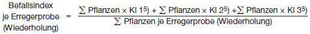
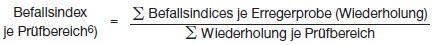
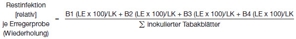
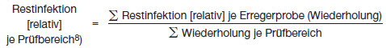

# Verordnung über die Verwertung von Bioabfällen auf landwirtschaftlich, forstwirtschaftlich und gärtnerisch genutzten Böden (BioAbfV)

Ausfertigungsdatum
:   1998-09-21

Fundstelle
:   BGBl I: 1998, 2955

Zuletzt geändert durch
:   Art. 1 u. Art. 4 V v. 23.4.2012 I 611

## Eingangsformel

Auf Grund des § 8 Abs. 1 und 2 des Kreislaufwirtschafts- und
Abfallgesetzes vom 27. September 1994 (BGBl. I S. 2705) verordnet das
Bundesministerium für Umwelt, Naturschutz und Reaktorsicherheit im
Einvernehmen mit dem Bundesministerium für Ernährung, Landwirtschaft
und Forsten und dem Bundesministerium für Gesundheit nach Anhörung der
beteiligten Kreise:

## § 1 Anwendungsbereich

(1) Diese Verordnung gilt für

1.  unbehandelte und behandelte Bioabfälle und Gemische, die zur
    Verwertung als Düngemittel auf landwirtschaftlich, forstwirtschaftlich
    oder gärtnerisch genutzte Böden aufgebracht oder zum Zweck der
    Aufbringung abgegeben werden sowie

2.  die Behandlung und Untersuchung solcher Bioabfälle und Gemische.

(2) Diese Verordnung gilt für

1.  öffentlich-rechtliche Entsorgungsträger und Dritte, Verbände oder
    Selbstverwaltungskörperschaften der Wirtschaft, denen nach § 16 Abs.
    2, § 17 Abs. 3 oder § 18 Abs. 2 des Kreislaufwirtschafts- und
    Abfallgesetzes vom 27. September 1994 (BGBl. I S. 2705), das zuletzt
    durch Artikel 5 des Gesetzes vom 6. Oktober 2011 (BGBl. I S. 1986)
    geändert worden ist, Pflichten zur Verwertung von Bioabfällen
    übertragen worden sind (Entsorgungsträger),

2.  Erzeuger oder Besitzer von Bioabfällen oder Gemischen, soweit sie
    diese Abfälle nicht einem Entsorgungsträger überlassen,

2a. denjenigen, der Bioabfälle einsammelt und transportiert (Einsammler),

3.  denjenigen, der Bioabfälle behandel (Bioabfallbehandler),

4.  Hersteller von Gemischen unter Verwendung von Bioabfällen
    (Gemischhersteller),

4a. denjenigen, der Bioabfälle oder Gemische zur Aufbringung annimmt und
    diese ohne weitere Veränderung abgibt (Zwischenabnehmer) sowie

5.  Bewirtschafter von landwirtschaftlich, gärtnerisch oder
    forstwirtschaftlich genutzten Böden, auf denen unbehandelte oder
    behandelte Bioabfälle oder Gemische aufgebracht werden sollen oder
    aufgebracht werden.

(3) Diese Verordnung gilt nicht

1.  für Haus-, Nutz- und Kleingärten,

2.  für die Eigenverwertung von Bioabfällen pflanzlicher Herkunft in
    landwirtschaftlichen Betrieben oder Betrieben des Garten- und
    Landschaftsbaus, wenn die Verwertung nach Maßgabe der §§ 6 bis 8 auf
    selbst bewirtschafteten Betriebsflächen gewährleistet ist,

3.  soweit die Klärschlammverordnung Anwendung findet,

3a. für tierische Nebenprodukte, die nach der Verordnung (EG) Nr.
    1069/2009 des Europäischen Parlaments und des Rates vom 21. Oktober
    2009 mit Hygienevorschriften für nicht für den menschlichen Verzehr
    bestimmte tierische Nebenprodukte und zur Aufhebung der Verordnung
    (EG) Nr. 1774/2002 (Verordnung über tierische Nebenprodukte) (ABl. L
    300 vom 14.11.2009, S. 1), die durch die Richtlinie 2010/63/EU (ABl. L
    276 vom 20.10.2010, S. 33) geändert worden ist, in der jeweils
    geltenden Fassung, nach den zu ihrer Durchführung ergangenen
    Rechtsakten der Europäischen Union, nach dem Tierische Nebenprodukte-
    Beseitigungsgesetz vom 25. Januar 2004 (BGBl. I S. 82), das zuletzt
    durch Artikel 2 Absatz 91 des Gesetzes vom 22. Dezember 2011 (BGBl. I
    S. 3044) geändert worden ist, in der jeweils geltenden Fassung oder
    nach den auf Grund des Tierische Nebenprodukte-Beseitigungsgesetzes
    erlassenen Rechtsverordnungen abzuholen, zu sammeln, zu befördern, zu
    lagern, zu behandeln, zu verarbeiten, zu verwenden, zu beseitigen oder
    in Verkehr zu bringen sind, oder

4.  für Stoffe, die nach anderen Rechtsvorschriften entsorgt werden
    müssen.

(4) Die Vorschriften des Düngemittelrechts und des
Pflanzenschutzrechts bleiben unberührt. Werden Bioabfälle und
tierische Nebenprodukte im Sinne des Absatzes 3 Nummer 3a gemeinsam
behandelt oder zur Gemischherstellung verwendet und auf Böden
aufgebracht, gelten die Vorschriften dieser Verordnung neben den in
Absatz 3 Nummer 3a genannten Vorschriften.

(5) Die in Absatz 2 Genannten wirken darauf hin, daß die in dieser
Verordnung genannten Schadstoffhöchstwerte für unbehandelte und
behandelte Bioabfälle und Gemische soweit wie möglich unterschritten
werden. Generelle Anbaubeschränkungen oder sonstige in dieser
Verordnung nicht genannte Beschränkungen lassen sich aus dem Erreichen
oder Überschreiten der Bodenwerte nach § 9 Abs. 2 nicht herleiten.

## § 2 Begriffsbestimmungen

Im Sinne dieser Verordnung bedeuten die Begriffe

1.  Bioabfälle:

    Abfälle tierischer oder pflanzlicher Herkunft oder aus Pilzmaterialien
    zur Verwertung, die durch Mikroorganismen, bodenbürtige Lebewesen oder
    Enzyme abgebaut werden können, einschließlich Abfälle zur Verwertung
    mit hohem organischen Anteil tierischer oder pflanzlicher Herkunft
    oder an Pilzmaterialien; zu den Bioabfällen gehören insbesondere die
    in Anhang 1 Nummer 1 in Spalte 1 genannten, in Spalte 2 weiter
    konkretisierten und durch die ergänzenden Bestimmungen in Spalte 3
    näher gekennzeichneten Abfälle; Bodenmaterial ohne wesentliche Anteile
    an Bioabfällen gehört nicht zu den Bioabfällen; Pflanzenreste, die auf
    forst- oder landwirtschaftlich genutzten Flächen anfallen und auf
    diesen Flächen verbleiben, sind keine Bioabfälle;

2.  Hygienisierende Behandlung:

    Biotechnologische Aufbereitung biologisch abbaubarer Materialien zum
    Zweck der Hygienisierung durch

    a)  Pasteurisierung gemäß Anhang 2 Nummer 2.2.1,

    b)  aerobe hygienisierende Behandlung gemäß Anhang 2 Nummer 2.2.2
        (thermophile Kompostierung),

    c)  anaerobe hygienisierende Behandlung gemäß Anhang 2 Nummer 2.2.3
        (thermophile Vergärung) oder

    d)  anderweitige hygienisierende Behandlung gemäß Anhang 2 Nummer 2.2.4;

2a. Biologisch stabilisierende Behandlung:

    Biotechnologische Aufbereitung biologisch abbaubarer Materialien zum
    Zweck des biologischen Abbaus der organischen Substanz unter aeroben
    Bedingungen (Kompostierung) oder anaeroben Bedingungen (Vergärung)
    oder andere Maßnahmen zur biologischen Stabilisierung der organischen
    Substanz; eine hygienisierende Behandlung nach Nummer 2 Buchstabe b
    oder c ist gleichzeitig eine biologisch stabilisierende Behandlung;

3.  Unbehandelte Bioabfälle:

    Bioabfälle, die keiner Behandlung unterzogen wurden;

4.  Behandelte Bioabfälle:

    Bioabfälle, die einer hygienisierenden und biologisch stabilisierenden
    Behandlung unterzogen wurden, einschließlich in Anhang 1 Nummer 2 in
    Spalte 1 genannter, in Spalte 2 weiter konkretisierter und durch die
    ergänzenden Bestimmungen in Spalte 3 näher gekennzeichneter
    mitbehandelter Abfälle oder in Spalte 2 genannter und durch die
    ergänzenden Bestimmungen in Spalte 3 näher gekennzeichneter
    mitbehandelter biologisch abbaubarer Materialien;

5.  Gemische:

    Mischung von behandelten und gemäß § 10 unbehandelten, hygienisierend
    oder biologisch stabilisierend behandelten Bioabfällen miteinander und
    mit in Anhang 1 Nummer 2 in Spalte 1 genannten, in Spalte 2 weiter
    konkretisierten und durch die ergänzenden Bestimmungen in Spalte 3
    näher gekennzeichneten Abfällen oder in Spalte 2 genannten und durch
    die ergänzenden Bestimmungen in Spalte 3 näher gekennzeichneten
    biologisch abbaubaren Materialien und mineralischen Stoffen sowie die
    Mischung von einem aus vorgenannten Bestandteilen hergestellten
    Gemisch mit Kalk im Rahmen der Aufbringung; eine im Rahmen einer
    gemeinsamen hygienisierenden oder biologisch stabilisierenden
    Behandlung erfolgende Vermischung von Bioabfällen miteinander und mit
    in Anhang 1 Nummer 2 genannten Materialien ist kein Gemisch;

6.  Eigenverwertung:

    Aufbringung der auf selbst bewirtschafteten Betriebsflächen
    angefallenen pflanzlichen Bioabfälle auf selbst bewirtschaftete
    Betriebsflächen. Als Eigenverwertung gilt auch die Aufbringung von

    a)  bei gärtnerischen Dienstleistungen auf fremden Flächen angefallenen
        pflanzlichen Bioabfällen auf selbst bewirtschaftete Betriebsflächen
        des Dienstleistungsbetriebes,

    b)  anteilig zurückgenommenen unbehandelten pflanzlichen Bioabfällen durch
        Mitglieder von Erzeugerzusammenschlüssen des Wein-, Obst- und
        Gemüseanbaus auf selbst bewirtschaftete Betriebsflächen, soweit die
        pflanzlichen Ausgangserzeugnisse auf Betriebsflächen von Mitgliedern
        des jeweiligen Erzeugerzusammenschlusses erzeugt wurden.

## § 3 Anforderungen an die hygienisierende Behandlung

(1) Entsorgungsträger, Erzeuger und Besitzer haben, soweit nicht von
einer Freistellung nach § 10 Absatz 1 oder Absatz 2 erfasst,
Bioabfälle vor einer Aufbringung oder vor der Herstellung von
Gemischen einer hygienisierenden Behandlung zuzuführen, welche die
seuchen- und phytohygienische Unbedenklichkeit gewährleistet.

(2) Die seuchen- und phytohygienische Unbedenklichkeit nach Absatz 1
ist gegeben, wenn keine Beeinträchtigung der Gesundheit von Mensch
oder Tier durch Freisetzung oder Übertragung von Krankheitserregern
und keine Schäden an Pflanzen, Pflanzenerzeugnissen oder Böden durch
die Verbreitung von Schadorganismen zu besorgen sind. Die im Einzelnen
einzuhaltenden Anforderungen an die hygienisierende Behandlung und die
Materialien sind im Anhang 2 festgelegt.

(3) Der Bioabfallbehandler hat die hygienisierende Behandlung der
Bioabfälle nach den in Anhang 2 festgelegten Vorgaben durchzuführen,
um die seuchen- und phytohygienische Unbedenklichkeit der Bioabfälle
nach der Behandlung und bei der Abgabe oder der Aufbringung auf selbst
bewirtschaftete Betriebsflächen sicherzustellen. Die zuständige
Behörde kann im Einvernehmen mit der zuständigen landwirtschaftlichen
und tierärztlichen Fachbehörde bei aerober oder anaerober
hygienisierender Behandlung von Bioabfällen in Anlagen mit einer
jährlichen Kapazität von bis zu 3 000 Tonnen Einsatzmaterialien
Ausnahmen von den in Absatz 4 Satz 1 Nummer 1 und Anhang 2 enthaltenen
Anforderungen an die Prozessprüfung im Einzelfall zulassen.
Voraussetzung dafür ist, dass durch ausgleichende Maßnahmen die
seuchen- und phytohygienische Unbedenklichkeit gewährleistet wird oder
nach Art, Beschaffenheit und Herkunft der Bioabfälle keine
Beeinträchtigung seuchen- und phytohygienischer Belange zu erwarten
ist. Die zuständige Behörde kann im Einvernehmen mit der zuständigen
landwirtschaftlichen und tierärztlichen Fachbehörde eine anderweitige
hygienisierende Behandlung nach § 2 Nummer 2 Buchstabe d im Einzelfall
zulassen, wenn eine gleichwertige Wirksamkeit der Hygienisierung
gemessen an den Anforderungen des Anhangs 2 nachgewiesen wird. Nach
anderen Vorgaben behandelte Bioabfälle gelten als anderweitig
hygienisierend behandelt gemäß § 2 Nummer 2 Buchstabe d, soweit diese
andere Möglichkeit der Bioabfallbehandlung in Anhang 1 Nummer 1 Spalte
3 mit einem Verweis auf diesen Satz aufgeführt ist.

(4) Der Bioabfallbehandler hat, soweit nicht von einer Freistellung
nach § 10 Absatz 1 oder Absatz 2 erfasst, Untersuchungen nach Maßgabe
der Absätze 5 bis 9 durchführen zu lassen auf

1.  die Wirksamkeit des Hygienisierungsverfahrens durch eine
    Prozessprüfung, davon abweichend bei Pasteurisierungsanlagen durch
    eine technische Abnahme,

2.  die Einhaltung der erforderlichen Temperatur über die notwendige Dauer
    während der hygienisierenden Behandlung durch Prozessüberwachung und

3.  die Einhaltung der höchstzulässigen Grenzwerte für Krankheitserreger,
    keimfähige Samen und austriebsfähige Pflanzenteile nach der
    hygienisierenden Behandlung am abgabefertigen Material durch Prüfungen
    der hygienisierten Bioabfälle.

Für die Untersuchungen sind die in Anhang 2 Nummer 4 festgelegten
Methoden anzuwenden.

(5) Der Bioabfallbehandler hat die Prozessprüfung gemäß Absatz 4 Satz
1 Nummer 1 innerhalb von zwölf Monaten nach Inbetriebnahme einer neu
errichteten Behandlungsanlage zur Hygienisierung nach den Vorgaben des
Anhangs 2 Nummer 3.1 durchführen zu lassen. Dies gilt entsprechend für
bereits geprüfte Anlagen bei Einsatz neuer Verfahren oder wesentlicher
technischer Änderung der Verfahren oder der Prozessführung. Bei neu
errichteten Pasteurisierungsanlagen hat der Bioabfallbehandler
anstelle der Prozessprüfung vor der Inbetriebnahme eine technische
Abnahme nach den Vorgaben des Anhangs 2 Nummer 2.2.1.2 durch die für
die Anlage zuständige Behörde durchführen zu lassen, die hierüber eine
Abnahmebescheinigung ausstellt. Bei neu errichteten Anlagen zur
anderweitigen hygienisierenden Behandlung sind vor Durchführung der
Prozessprüfung die Anforderungen an die Prozessführung und die
Prozessprüfung in Abstimmung mit der für die Anlage zuständigen
Behörde festzulegen. Bis zum erfolgreichen Abschluss der
Prozessprüfung darf der Bioabfallbehandler die Materialien aus der
Behandlungsanlage zur Hygienisierung mit Zustimmung der zuständigen
Behörde zur Verwertung abgeben, wenn die Vorgaben der
Prozessüberwachung gemäß Absatz 4 Satz 1 Nummer 2 und der Prüfungen
der hygienisierten Bioabfälle gemäß Absatz 4 Satz 1 Nummer 3 erfüllt
werden und keine Anhaltspunkte bestehen, die gegen die hygienische
Unbedenklichkeit dieser Materialien sprechen.

(6) Der Bioabfallbehandler hat die Prozessüberwachung gemäß Absatz 4
Satz 1 Nummer 2 nach den Vorgaben des Anhangs 2 Nummer 3.2
durchzuführen und dabei folgende Aufzeichnungen zu führen:

1.  bei Pasteurisierung über den Temperaturverlauf,

2.  bei aerober hygienisierender Behandlung (thermophile Kompostierung)
    über den Temperaturverlauf und die Umsetzungszeitpunkte,

3.  bei anaerober hygienisierender Behandlung (thermophile Vergärung) über
    den Temperaturverlauf und die Beschickungs- und Entnahmeintervalle,

4.  bei anderweitiger hygienisierender Behandlung über die in Abstimmung
    mit der zuständigen Behörde festgelegten verfahrenspezifischen
    Parameter.

Der Temperaturverlauf während der hygienisierenden Behandlung ist mit
einer ständigen und eingriffsfreien direkten Temperaturmessung im zu
behandelnden Material und automatisierter Temperaturaufzeichnung zu
erfassen. Anstelle der direkten Temperaturmessung kann die zuständige
Behörde bei geschlossener aerober hygienisierender Behandlung
zulassen, dass die Behandlungstemperatur im Abluftstrom des
Kompostmaterials ermittelt wird. Abweichend von Satz 2 kann die
zuständige Behörde bei offener aerober hygienisierender Behandlung
zulassen, dass die Behandlungstemperatur in regelmäßigen Abständen,
mindestens ein Mal pro Werktag, gemessen und dokumentiert wird. Geräte
zur Temperaturmessung müssen regelmäßig, mindestens ein Mal pro Jahr,
kalibriert werden; die Kalibrierung ist zu dokumentieren. Stellt der
Bioabfallbehandler durch die Prozessüberwachung fest, dass die
jeweiligen Anforderungen an die Prozessführung nicht eingehalten
wurden, hat er die zuständige Behörde hierüber und über die
eingeleiteten Maßnahmen unverzüglich zu informieren. Die zuständige
Behörde ordnet Maßnahmen zum Verbleib der unzureichend hygienisierend
behandelten Bioabfälle sowie zur Behebung der Mängel an, sofern die
vom Bioabfallbehandler eingeleiteten Maßnahmen nicht ausreichend oder
nicht zweckmäßig sind.

(7) Der Bioabfallbehandler hat die Prüfungen der hygienisierten
Bioabfälle gemäß Absatz 4 Satz 1 Nummer 3 pro angefangener 2 000
Tonnen Frischmasse im Rahmen der hygienisierenden Behandlung
verwendeter Bioabfälle einschließlich in Anhang 1 Nummer 2 genannter
Materialien nach den Vorgaben des Anhangs 2 Nummer 3.3 durchführen zu
lassen. Die zuständige Behörde kann im Einvernehmen mit der
zuständigen landwirtschaftlichen Fachbehörde zulassen, dass Prüfungen
der hygienisierten Bioabfälle erst ab einer Menge von mehr als 2 000
Tonnen durchgeführt werden, wenn sich die Zusammensetzung nach Art,
Beschaffenheit und Herkunft der verwendeten Bioabfälle nicht oder kaum
verändert. Die zuständige Behörde kann bei sich erheblich verändernder
Zusammensetzung nach Art, Beschaffenheit oder Herkunft der verwendeten
Bioabfälle anordnen, dass Prüfungen der hygienisierten Bioabfälle für
Mengen von weniger als 2 000 Tonnen durchgeführt werden. Unbeschadet
der Sätze 1 bis 3 hat der Bioabfallbehandler eine Prüfung der
hygienisierten Bioabfälle in einem Abstand von längstens drei Monaten
durchzuführen. Werden bei einer Prüfung der hygienisierten Bioabfälle
die Grenzwerte gemäß Anhang 2 Nummer 4.2.2 oder 4.3.2 überschritten,
hat der Bioabfallbehandler die zuständige Behörde über das
Untersuchungsergebnis und die eingeleiteten Maßnahmen unverzüglich zu
informieren. Wenn die Wiederholung der Prüfung zum gleichen Ergebnis
führt oder wiederholt in verschiedenen untersuchten Proben die
Grenzwerte überschritten werden, ordnet die zuständige Behörde
Maßnahmen zur Behebung der Mängel an.

(7a) Abweichend von Absatz 7 Satz 1 können Bioabfallbehandler, die im
Jahr mehr als
24 000 Tonnen              Frischmasse Bioabfälle einschließlich in
Anhang 1 Nummer 2 genannter Materialien behandeln und nach § 11 Absatz
3 Satz 1 von der Vorlage von Untersuchungsergebnissen oder von
Nachweispflichten befreit sind, die Prüfungen der hygienisierten
Bioabfälle ein Mal pro Monat durchführen lassen. Absatz 7 Satz 2 bis 6
gilt entsprechend.

(8) Die Untersuchungen bei der Prozessprüfung nach Absatz 4 Satz 1
Nummer 1 und bei den Prüfungen der hygienisierten Bioabfälle nach
Absatz 4 Satz 1 Nummer 3 sind durch unabhängige, von der zuständigen
Behörde bestimmte Untersuchungsstellen durchzuführen. Der
Bioabfallbehandler hat die Untersuchungsergebnisse innerhalb von vier
Wochen nach Durchführung der Untersuchung der zuständigen Behörde
vorzulegen und zehn Jahre aufzubewahren. Die Aufzeichnungen über die
Prozessüberwachung und die Dokumentationen über die Kalibrierung der
Temperaturmessgeräte nach Absatz 6 hat der Bioabfallbehandler drei
Jahre aufzubewahren und der zuständigen Behörde auf Verlangen
vorzulegen. Wird bei der Prüfung der hygienisierten Bioabfälle eine
Überschreitung der Grenzwerte für Krankheitserreger, keimfähige Samen
und austriebsfähige Pflanzenteile festgestellt, sind die
Untersuchungsergebnisse von der untersuchenden Stelle unverzüglich an
den Bioabfallbehandler zu übermitteln, der diese unverzüglich an die
zuständige Behörde weiterleitet. Diese leitet die
Untersuchungsergebnisse unverzüglich an die zuständige
landwirtschaftliche und tierärztliche Fachbehörde weiter.

(8a) Eine Untersuchungsstelle nach Absatz 8 Satz 1 ist zu bestimmen,
wenn der Antragsteller über die erforderliche Fachkunde,
Unabhängigkeit, Zuverlässigkeit und gerätetechnische Ausstattung
verfügt und die erforderlichen Unterlagen vorlegt. Die Bestimmung
erfolgt durch die zuständige Behörde des Landes, in dem der
Antragsteller seinen Geschäftssitz hat, und gilt für das gesamte
Bundesgebiet; besteht kein Geschäftssitz im Inland, so ist das Land
zuständig, in dem die Tätigkeit nach Absatz 4 vorrangig ausgeübt
werden soll. Die Bestimmung kann mit einem Vorbehalt des Widerrufes,
einer Befristung, mit Bedingungen, Auflagen und dem Vorbehalt von
Auflagen versehen werden. Die zuständige Behörde kann von einem
überregional tätigen Antragsteller verlangen, dass er eine gültige
Akkreditierung über die Einhaltung der Anforderungen der DIN EN
ISO/IEC 17025:2005 (zu beziehen bei der Beuth-Verlag GmbH, 10772
Berlin, und archivmäßig gesichert niedergelegt bei der Deutschen
Nationalbibliothek in Leipzig) vorlegt, die sich auf die Parameter und
Untersuchungsverfahren gemäß den Anhängen 2 und 3 bezieht. Verfahren
nach diesem Absatz können über eine einheitliche Stelle abgewickelt
werden. Die Prüfung des Antrags auf Bestimmung einer
Untersuchungsstelle muss innerhalb von drei Monaten abgeschlossen
sein; § 42a Absatz 2 Satz 2 bis 4 des Verwaltungsverfahrensgesetzes
findet Anwendung.

(8b) Gleichwertige Anerkennungen aus einem anderen Mitgliedstaat der
Europäischen Union oder einem anderen Vertragsstaat des Abkommens über
den Europäischen Wirtschaftsraum stehen Bestimmungen nach Absatz 8
Satz 1 gleich. Bei der Prüfung des Antrags auf Bestimmung nach Absatz
8 Satz 1 stehen Nachweise aus einem anderen Mitgliedstaat der
Europäischen Union oder einem anderen Vertragsstaat des Abkommens über
den Europäischen Wirtschaftsraum inländischen Nachweisen gleich, wenn
aus ihnen hervorgeht, dass der Antragsteller die betreffenden
Anforderungen des Absatzes 8a Satz 1 oder die auf Grund ihrer
Zielsetzung im Wesentlichen vergleichbaren Anforderungen des
Ausstellungsstaates erfüllt. Die Nachweise sind der zuständigen
Behörde vor Aufnahme der Tätigkeit im Original oder in Kopie
vorzulegen. Eine Beglaubigung der Kopie sowie eine beglaubigte
deutsche Übersetzung können verlangt werden.

(9) Die in Anhang 1 Nr. 1 Spalte 3 für die Getrennthaltung, Behandlung
und Aufbringung von Bioabfällen festgelegten ergänzenden Bestimmungen
sind zu beachten.

(10) Die Absätze 1 bis 9 sind bei gemeinsamer hygienisierender
Behandlung von Bioabfällen mit in Anhang 1 Nummer 2 genannten
Materialien auf das gesamte Material entsprechend anzuwenden. Werden
bereits hygienisierend behandelte Bioabfälle zusammen mit in Anhang 1
Nummer 2 genannten Materialien einer nachfolgenden biologisch
stabilisierenden Behandlung unterzogen, gilt Absatz 4 Satz 1 Nummer 3
mit der Maßgabe, dass die Prüfungen der hygienisierten Bioabfälle erst
nach der biologisch stabilisierenden Behandlung am abgabefertigen
Material durchzuführen sind. Abweichend von Satz 2 können die
Prüfungen der hygienisierten Bioabfälle bereits nach der
hygienisierenden Behandlung am abgabefertigen Material durchgeführt
werden, wenn die nachfolgende biologisch stabilisierende Behandlung
der bereits hygienisierend behandelten Bioabfälle in einem
landwirtschaftlichen Betrieb zusammen mit dort angefallenen biologisch
abbaubaren Materialien erfolgt und die behandelten Materialien auf
selbst bewirtschaftete Betriebsflächen aufgebracht werden.

## § 3a Anforderungen an die biologisch stabilisierende Behandlung

Entsorgungsträger, Erzeuger und Besitzer haben, soweit nicht von einer
Freistellung nach § 10 Absatz 1 oder Absatz 2 erfasst, Bioabfälle vor
einer Aufbringung oder vor der Herstellung von Gemischen einer
biologisch stabilisierenden Behandlung zuzuführen. Die Bioabfälle sind
unter Berücksichtigung der vorgesehenen Verwendung so weit biologisch
zu stabilisieren, dass das Wohl der Allgemeinheit insbesondere durch
Zersetzungsprozesse und Geruchsbelastungen der aufgebrachten
Bioabfälle oder Gemische nicht beeinträchtigt wird.

## § 3b Behandlung von Bioabfällen in Betrieben mit Nutztierhaltung

(1) In Betrieben mit Nutztierhaltung ist das Verbringen von
Bioabfällen tierischer Herkunft nur nach einer hygienisierenden
Behandlung zulässig. Werden Nutztiere in einem Betrieb in abgetrennten
Bereichen gehalten, gilt Satz 1 nur für diese Betriebsbereiche.

(2) Eine Behandlung von Bioabfällen tierischer Herkunft gemäß den §§ 3
und 3a darf in Betrieben mit Nutztierhaltung nur durchgeführt werden,
wenn sich die Behandlungsanlage in einem zum Schutz vor der
Übertragung von Seuchenerregern ausreichenden Abstand von dem
Betriebsbereich befindet, in dem die Tiere gehalten werden. Der
Betriebsbereich zur Behandlung der Bioabfälle einschließlich Annahme,
Aufbereitung, Aufbewahrung und Abgabe ist von dem Bioabfallbehandler
von Tieren, Futtermitteln und Einstreu vollständig räumlich zu
trennen, um sicherzustellen, dass die Nutztiere weder unmittelbar noch
mittelbar mit den Bioabfällen tierischer Herkunft in Berührung kommen.
Satz 1 und 2 gilt entsprechend für Anlagen zur Behandlung von
Bioabfällen tierischer Herkunft in Betrieben, die an Betriebe oder
Betriebsbereiche mit Nutztierhaltung angrenzen.

## § 4 Anforderungen hinsichtlich der Schadstoffe und weiterer Parameter

(1) Der Bioabfallbehandler darf nur Bioabfälle und in Anhang 1 Nummer
2 genannte Materialien verwenden, von denen in unvermischter Form auf
Grund ihrer Art, Beschaffenheit oder Herkunft angenommen werden kann,
dass sie nach einer Behandlung die Anforderungen nach den Absätzen 3
und 4 einhalten und bei denen keine Anhaltspunkte für überhöhte
Gehalte an anderen als den von Absatz 3 erfassten Schadstoffen
bestehen. In Anhang 1 Nummer 2 genannte Materialien dürfen auch
verwendet werden, wenn sie als Düngemittel, Bodenhilfsstoffe oder
Kultursubstrate die Anforderungen der Düngemittelverordnung an die
stoffliche Zusammensetzung erfüllen und keine Anhaltspunkte für
überhöhte Gehalte an anderen als von der Düngemittelverordnung
erfassten Schadstoffen bestehen. Gehalte an den in den Sätzen 1 und 2
bezeichneten anderen Schadstoffen sind überhöht, wenn durch sie bei
bestimmungsgemäßer Verwendung der Bioabfälle oder in Anhang 1 Nummer 2
genannten Materialien in unvermischter Form die Gesundheit von
Menschen oder Haus- und Nutztieren, die Gesundheit, das Wachstum und
die Qualität von Nutzpflanzen, die Beschaffenheit und Fruchtbarkeit
des Bodens oder der Naturhaushalt gefährdet werden können.

(2) Der Bioabfallbehandler darf die behandelten Bioabfälle
einschließlich in Anhang 1 Nummer 2 genannter mitbehandelter
Materialien nur nach Maßgabe der Absätze 3 bis 5 abgeben oder auf
selbst bewirtschafteten Betriebsflächen aufbringen.

(3) Die folgenden Schwermetallgehalte (Milligramm je Kilogramm
Trockenmasse des aufzubringenden Materials) dürfen bei Aufbringung
gemäß § 6 Abs. 1 Satz 1 nicht überschritten werden:

*    *   Blei

    *   150

*    *   Cadmium

    *   1,5

*    *   Chrom

    *   100

*    *   Kupfer

    *   100

*    *   Nickel

    *   50

*    *   Quecksilber

    *   1

*    *   Zink

    *   400.

Bei Aufbringung gemäß § 6 Abs. 1 Satz 2 dürfen folgende
Schwermetallgehalte (Milligramm je Kilogramm Trockenmasse des
aufzubringenden Materials) nicht überschritten werden:

*    *   Blei

    *   100

*    *   Cadmium

    *   1

*    *   Chrom

    *   70

*    *   Kupfer

    *   70

*    *   Nickel

    *   35

*    *   Quecksilber

    *   0,7

*    *   Zink

    *   300.

Die Werte für Kupfer und Zink nach Satz 1 und 2 gelten als
eingehalten, wenn der jeweilige Wert im gleitenden Durchschnitt der
vier zuletzt nach Absatz 5 durchgeführten Untersuchungen nicht
überschritten wird und kein Analysenergebnis den Wert um mehr als 25
vom Hundert überschreitet. Die für die Aufbringungsfläche zuständige
Behörde kann im Einvernehmen mit der zuständigen landwirtschaftlichen
Fachbehörde eine Überschreitung einzelner Schwermetallgehalte nach
Satz 1 mit Ausnahme von Cadmium und Quecksilber zulassen, wenn
Beeinträchtigungen des Wohls der Allgemeinheit nicht zu erwarten sind.

(4) Der Anteil an Fremdstoffen, insbesondere Glas, Kunststoff, Metall,
mit einem Siebdurchgang von mehr als 2 Millimetern darf einen
Höchstwert von 0,5 vom Hundert, bezogen auf die Trockenmasse des
aufzubringenden Materials, nicht überschreiten. Der Anteil an Steinen
mit einem Siebdurchgang von mehr als 10 Millimetern darf einen Anteil
von 5 vom Hundert, bezogen auf die Trockenmasse des aufzubringenden
Materials, nicht überschreiten.

(5) Der Bioabfallbehandler hat, soweit nicht von einer Freistellung
nach § 10 Absatz 1 oder Absatz 2 erfasst, pro angefangener 2 000
Tonnen Frischmasse im Rahmen der Behandlung verwendeter Bioabfälle
einschließlich in Anhang 1 Nummer 2 genannter Materialien
Untersuchungen der behandelten Bioabfälle durchführen zu lassen auf

1.  die Gehalte der Schwermetalle Blei, Cadmium, Chrom, Kupfer, Nickel,
    Quecksilber und Zink sowie

2.  den pH-Wert, den Salzgehalt, den Gehalt der organischen Substanz
    (Glühverlust), den Trockenrückstand und den Anteil an Fremdstoffen und
    Steinen.

Die zuständige Behörde kann im Einvernehmen mit der zuständigen
landwirtschaftlichen Fachbehörde zulassen, dass Untersuchungen der
behandelten Bioabfälle erst ab einer Menge von mehr als 2 000 Tonnen
durchgeführt werden, wenn sich die Zusammensetzung nach Art,
Beschaffenheit und Herkunft der verwendeten Bioabfälle nicht oder kaum
verändert. Die zuständige Behörde kann bei sich erheblich verändernder
Zusammensetzung nach Art, Beschaffenheit oder Herkunft der verwendeten
Bioabfälle anordnen, dass Untersuchungen der behandelten Bioabfälle
für Mengen von weniger als 2 000 Tonnen durchgeführt werden.
Unbeschadet der Sätze 1 bis 3 sind Untersuchungen der behandelten
Bioabfälle im Abstand von längstens drei Monaten durchzuführen.

(6) Abweichend von Absatz 5 Satz 1 können Bioabfallbehandler, die im
Jahr mehr als
24 000 Tonnen              Frischmasse Bioabfälle einschließlich in
Anhang 1 Nummer 2 genannter Materialien behandeln und nach § 11 Absatz
3 Satz 1 von der Vorlage von Untersuchungsergebnissen oder von
Nachweispflichten befreit sind, die Untersuchungen der behandelten
Bioabfälle ein Mal pro Monat durchführen lassen. Absatz 5 Satz 2 bis 4
gilt entsprechend.

(7) Der Bioabfallbehandler hat für die in Absatz 1 Satz 1 genannten
unvermischten Einsatzmaterialien zusätzliche Untersuchungen auf die
Gehalte der in Absatz 5 Satz 1 Nr. 1 genannten Schwermetalle
durchführen zu lassen, wenn Anhaltspunkte dafür bestehen, daß die in
Absatz 3 Satz 1 genannten Anforderungen nicht eingehalten werden.
Werden nach den Ergebnissen die Anforderungen nach Absatz 3 Satz 1
nicht eingehalten, sind die Ergebnisse der zuständigen Behörde
unverzüglich vorzulegen. Die zuständige Behörde entscheidet über das
weitere Vorgehen. Bis zur Entscheidung der zuständigen Behörde ist die
Behandlung der Materialien untersagt. Absatz 3 Satz 4 gilt
entsprechend.

(8) Der Bioabfallbehandler hat für die in Absatz 1 Satz 1 genannten
unvermischten Einsatzmaterialien oder die behandelten Bioabfälle
einschließlich in Anhang 1 Nummer 2 genannter mitbehandelter
Materialien Untersuchungen auf andere als die von Absatz 3 erfassten
Schadstoffe durchführen zu lassen, wenn insbesondere nach Art,
Beschaffenheit oder Herkunft der unvermischten Einzelmaterialien oder
behandelten Bioabfälle Anhaltspunkte für überhöhte Gehalte an diesen
Schadstoffen im Sinne des Absatzes 1 Satz 3 bestehen. Werden erhöhte
Gehalte an diesen Schadstoffen festgestellt, sind die Ergebnisse der
zuständigen Behörde unverzüglich vorzulegen. Die zuständige Behörde
entscheidet über das weitere Vorgehen. Bis zur Entscheidung der
zuständigen Behörde ist die Behandlung, Abgabe und Aufbringung dieser
Materialien untersagt.

(9) Die Probenahmen, Probevorbereitungen und Untersuchungen nach den
Absätzen 5 bis 8 sind gemäß den Vorgaben des Anhangs 3 und durch
unabhängige, von der zuständigen Behörde bestimmte
Untersuchungsstellen durchzuführen. Der Bioabfallbehandler hat die
Untersuchungsergebnisse zu sammeln und der zuständigen Behörde
halbjährlich vorzulegen. Die Untersuchungsergebnisse sind zehn Jahre
aufzubewahren. Wird bei der Untersuchung der behandelten Bioabfälle
eine Überschreitung der Grenzwerte für Schadstoffe nach Absatz 3
festgestellt, sind die Untersuchungsergebnisse von der untersuchenden
Stelle unverzüglich an den Bioabfallbehandler zu übermitteln, dieser
leitet sie unverzüglich an die zuständige Behörde weiter.

(10) Für die Bestimmung einer Untersuchungsstelle nach Absatz 9 Satz 1
gilt § 3 Absatz 8a und 8b entsprechend.

## § 5 Anforderungen an Gemische

(1) Der Gemischhersteller darf behandelte Bioabfälle, gemäß § 10
unbehandelte, hygienisierend oder biologisch stabilisierend behandelte
Bioabfälle sowie in Anhang 1 Nummer 2 genannte Materialien verwenden,
von denen in unvermischter Form auf Grund ihrer Art, Beschaffenheit
oder Herkunft angenommen werden kann, dass sie die Anforderungen nach
§ 4 Absatz 3 und 4 einhalten und bei denen keine Anhaltspunkte für
überhöhte Gehalte an anderen als den von § 4 Absatz 3 erfassten
Schadstoffen bestehen. In Anhang 1 Nummer 2 genannte Materialien
dürfen auch verwendet werden, wenn sie als Düngemittel,
Bodenhilfsstoffe oder Kultursubstrate die Anforderungen der
Düngemittelverordnung an die stoffliche Zusammensetzung erfüllen und
keine Anhaltspunkte für überhöhte Gehalte an anderen als von der
Düngemittelverordnung erfassten Schadstoffen bestehen. § 4 Absatz 1
Satz 3 gilt entsprechend.

(2) Der Gemischhersteller darf Gemische nur nach Maßgabe der Sätze 2
bis 4 abgeben oder auf selbst bewirtschaftete Betriebsflächen
aufbringen. § 4 Absatz 3 bis 6 und 9 sind entsprechend anzuwenden. § 4
Absatz 4 Satz 2 gilt mit der Maßgabe, dass sich bei Gemischen der
Anteil an Steinen auf den verwendeten Bioabfall und das Gemisch
bezieht. § 4 Absatz 5 und 6 gilt mit der Maßgabe, dass Untersuchungen
des Gemisches je angefangener 2 000 Tonnen hergestellten Gemisches
durchzuführen sind.

(3) Der Gemischhersteller hat für die in Absatz 1 genannten
unvermischten Materialien zusätzliche Untersuchungen auf die Gehalte
der in § 4 Abs. 5 Satz 1 Nr. 1 genannten Schwermetalle durchführen zu
lassen, wenn Anhaltspunkte dafür bestehen, daß die Anforderungen nach
§ 4 Abs. 3 Satz 1 nicht eingehalten werden. § 4 Abs. 7 Satz 2 bis 5
und Abs. 9 gilt entsprechend.

(4) Der Gemischhersteller hat für die in Absatz 1 genannten
unvermischten Materialien oder die Gemische nach Absatz 2
Untersuchungen auf andere als die von § 4 Absatz 3 erfassten
Schadstoffe durchführen zu lassen, wenn insbesondere nach Art,
Beschaffenheit oder Herkunft Anhaltspunkte für erhöhte Gehalte an
diesen Schadstoffen im Sinne des § 4 Absatz 1 Satz 3 bestehen. § 4
Abs. 8 Satz 2 bis 4 und Abs. 9 gilt entsprechend.

(5) Die in Anhang 1 Nummer 1 und 2 in der jeweiligen Spalte 3 für die
Getrennthaltung, Behandlung und Verwendung der Einsatzmaterialien
sowie die Aufbringung von Gemischen festgelegten ergänzenden
Bestimmungen sind zu beachten.

## § 6 Beschränkungen und Verbote der Aufbringung

(1) Unbeschadet düngemittelrechtlicher Regelungen dürfen auf Böden
innerhalb von drei Jahren nicht mehr als 20 Tonnen Trockenmasse
Bioabfälle oder Gemische je Hektar aufgebracht werden. Die gemäß Satz
1 zulässige Aufbringungsmenge kann bis zu 30 Tonnen je Hektar
innerhalb von drei Jahren betragen, wenn die gemäß § 4 Absatz 5 und 6
oder § 5 Absatz 2 gemessenen Schwermetallgehalte die in § 4 Absatz 3
Satz 2 festgelegten Grenzwerte nicht überschreiten. Die für die
Aufbringungsfläche zuständige Behörde kann im Einvernehmen mit der
zuständigen landwirtschaftlichen Fachbehörde weitere Ausnahmen im
Einzelfall zulassen, wenn die in § 4 Absatz 3 Satz 2 genannten
Schwermetallgrenzwerte deutlich unterschritten werden und
Beeinträchtigungen des Wohls der Allgemeinheit nicht zu erwarten sind.

(2) Das Aufbringen auf Böden von anderen als in Anhang 1 Nummer 1
genannten Bioabfällen oder von Gemischen, die solche Bioabfälle
enthalten, bedarf der Zustimmung der für die
Bioabfallbehandlungsanlage oder Gemischherstellungsanlage zuständigen
Behörde im Einvernehmen mit der für die Aufbringungsfläche zuständigen
landwirtschaftlichen Fachbehörde. Die zuständige Behörde hat vor
Erteilung der Zustimmung im Einvernehmen mit der zuständigen
landwirtschaftlichen Fachbehörde gegenüber den nach § 4 Abs. 2 und § 5
Abs. 2 Verpflichteten die Durchführung von Untersuchungen auf andere
Schadstoffe im Sinne des § 4 Abs. 8 Satz 1 unter Berücksichtigung der
Art, Beschaffenheit oder Herkunft der Bioabfälle und die Vorlage der
Ergebnisse anzuordnen.

(2a) Auf Tabakanbauflächen, Tomatenanbauflächen im Freiland sowie für
Gemüse- und Zierpflanzenarten im geschützten Anbau dürfen nur aerob
hygienisierend behandelte Bioabfälle und Gemische, die solche
Bioabfälle enthalten, aufgebracht werden.

(2b) Bioabfälle und Gemische dürfen auf oder in der Nähe der
Aufbringungsfläche nur bereit gestellt werden, soweit dies für die
Aufbringung erforderlich ist.

(3) Das Aufbringen von Bioabfällen und Gemischen auf
forstwirtschaftlich genutzte Böden darf nur im begründeten
Ausnahmefall mit Zustimmung der zuständigen Behörde im Einvernehmen
mit der zuständigen Forstbehörde erfolgen.

## § 7 Zusätzliche Anforderungen bei der Aufbringung auf Grünlandflächen sowie Feldfutter- und Feldgemüseanbauflächen

(1) Auf Grünlandflächen und mehrschnittigen Feldfutterflächen dürfen
nur diejenigen Bioabfälle und Gemische aufgebracht werden, die in
Anhang 1 Nummer 1 Spalte 3 und Nummer 2 Spalte 3 mit einem Verweis auf
diesen Satz aufgeführt sind. Im Übrigen dürfen Bioabfälle und Gemische
auf Feldfutterflächen aufgebracht werden, wenn diese vor dem Anbau des
Feldfutters aufgebracht und in den Boden eingearbeitet werden.

(2) Auf Feldgemüseflächen dürfen Bioabfälle und Gemische aufgebracht
werden, wenn sie vor dem Anbau des Feldgemüses aufgebracht und in den
Boden eingearbeitet werden.

(3) Bioabfälle und Gemische dürfen bei Aufbringung auf Grünlandflächen
oder auf Feldfutterflächen keine Gegenstände enthalten, die bei der
Aufnahme durch Haus- oder Nutztiere zu Verletzungen führen können.

(4) Werden Bioabfälle tierischer Herkunft oder Gemische, die solche
Bioabfälle enthalten, auf Grünlandflächen oder auf Feldfutterflächen
aufgebracht, darf eine Beweidung durch Nutztiere oder eine
Futtermittelgewinnung erst 21 Tage nach der Aufbringung erfolgen. Die
für die Aufbringungsfläche zuständige Behörde kann den Zeitraum nach
Satz 1 verlängern, sofern dies zur Vorbeugung einer Gefahr für die
menschliche oder tierische Gesundheit erforderlich ist.

## § 8 Zusammentreffen von Bioabfall- und Klärschlammaufbringung

Innerhalb des Zeitraumes nach § 6 Abs. 1 ist auf derselben Fläche nur
die Aufbringung von Bioabfällen und Gemischen nach dieser Verordnung
oder die Aufbringung von Klärschlamm nach der Klärschlammverordnung
zulässig.

## § 9 Bodenuntersuchungen

(1) Der Bewirtschafter oder ein beauftragter Dritter hat der
zuständigen Behörde innerhalb von zwei Wochen nach der ersten nach dem
1\. Oktober 1998 erfolgenden Aufbringung von Bioabfällen oder Gemischen
die Aufbringungsfläche anzugeben. Die zuständige Behörde teilt der
zuständigen landwirtschaftlichen Fachbehörde diese Flächen mit.

(2) Bei der erstmaligen Aufbringung von Bioabfällen oder Gemischen ist
eine Bodenuntersuchung auf Schwermetalle nach § 4 Abs. 5 Satz 1 Nr. 1
und auf den pH-Wert durchzuführen. Die Bodenuntersuchungsergebnisse
sind spätestens drei Monate nach der Aufbringung der zuständigen
Behörde vorzulegen. Liegt für die Aufbringungsfläche eine gültige
Bodenuntersuchung nach der Klärschlammverordnung vor, kann diese
entsprechend herangezogen werden. Satz 1 gilt nicht für die
Aufbringung von Bioabfällen und Gemischen, die von Bioabfallbehandlern
und Gemischherstellern abgegeben werden, die nach § 11 Absatz 3 Satz 1
von der Vorlage von Untersuchungsergebnissen oder von
Nachweispflichten befreit sind. Bestehen Anhaltspunkte, dass die
Bodenwerte einer Aufbringungsfläche die Vorsorgewerte für Böden nach
Anhang 2 Nummer 4.1 in Verbindung mit Nummer 4.3 der Bundes-
Bodenschutz- und Altlastenverordnung vom 12. Juli 1999 (BGBl. I S.
1554), die zuletzt durch Artikel 16 des Gesetzes vom 31. Juli 2009
(BGBl. I S. 2585) geändert worden ist, überschreiten, soll die
zuständige Behörde im Einvernehmen mit der zuständigen
landwirtschaftlichen Fachbehörde die erneute Aufbringung von
Bioabfällen oder Gemischen untersagen. Die Probenahme,
Probevorbereitung und Untersuchung ist nach Anhang 1 der
Klärschlammverordnung vom 15. April 1992 (BGBl. I S. 912), die zuletzt
durch Artikel 9 der Verordnung vom 9. November 2010 (BGBl. I S. 1504)
geändert worden ist, und durch eine unabhängige, von der zuständigen
Behörde bestimmten Untersuchungsstelle durchführen zu lassen.

(2a) Für die Bestimmung einer Untersuchungsstelle nach Absatz 2 Satz 6
gilt § 3 Absatz 8a und 8b entsprechend.

(3) Die für die Aufbringungsfläche zuständige Behörde kann im
Einvernehmen mit der zuständigen landwirtschaftlichen Fachbehörde im
Einzelfall Ausnahmen von der Untersuchungspflicht nach Absatz 2
zulassen, wenn Bioabfälle oder Gemische im Sinne des § 6 Absatz 1 Satz
3 aufgebracht werden.

(4) Die zuständige Behörde kann im Einvernehmen mit der zuständigen
landwirtschaftlichen Fachbehörde im Rahmen der regionalen Verwertung
bei geogen bedingt erhöhten Schwermetallgehalten von Böden zulassen,
daß Bioabfälle oder Gemische auch auf Böden aufgebracht werden, bei
denen die in Absatz 2 genannten Werte überschritten werden, wenn keine
Beeinträchtigungen des Wohls der Allgemeinheit zu erwarten sind. Satz
1 gilt nicht für Cadmium.

## § 9a Zusätzliche Anforderungen an die Verwertung von bestimmten Bioabfällen

(1) Entsorgungsträger, Erzeuger und Besitzer dürfen die in Anhang 1
Nummer 1 Buchstabe b genannten Bioabfälle nur mit Zustimmung der für
sie zuständigen Behörde abgeben oder auf selbst bewirtschaftete
Betriebsflächen aufbringen. Die Bioabfälle sind der zuständigen
Behörde nach Art, Beschaffenheit, Bezugsquelle und Anfallstelle vor
der erstmaligen Abgabe oder erstmaligen Aufbringung auf selbst
bewirtschaftete Betriebsflächen sowie bei sich erheblich verändernder
Zusammensetzung nach Art, Beschaffenheit oder Herkunft anzugeben. Die
zuständige Behörde kann zur Bewertung der Eignung dieser Bioabfälle
für die Verwertung verlangen, dass Untersuchungsergebnisse über
Schwermetallgehalte und Fremdstoffanteile nach § 4 Absatz 3 und 4,
über andere als die von § 4 Absatz 3 erfassten Schadstoffe und über
zusätzliche Inhaltsstoffe sowie weitere Unterlagen vorgelegt werden.
Eine Zustimmung der zuständigen Behörde ist für Erzeuger nicht
erforderlich, wenn bei ihnen nicht mehr als insgesamt zwei Tonnen der
in Anhang 1 Nummer 1 Buchstabe b genannten Bioabfälle (Kleinmengen)
jährlich anfallen.

(2) Für die Angaben nach Absatz 1 Satz 2 und 3 sind die Formblätter
Deckblatt Entsorgungsnachweise (DEN), Verantwortliche Erklärung (VE)
und Deklarationsanalyse (DA) des Anhangs 1 der Nachweisverordnung vom
20\. Oktober 2006 (BGBl. I S. 2298), die durch Artikel 4 des Gesetzes
vom 19. Juli 2007 (BGBl. I S. 1462) geändert worden ist, zu verwenden.
Die Zustimmung der zuständigen Behörde nach Absatz 1 Satz 1 erfolgt
unter Verwendung des Formblatts Behördenbestätigung (BB) des Anhangs 1
der Nachweisverordnung. Für die erforderlichen Kennnummern ist § 28
der Nachweisverordnung entsprechend anzuwenden.

(3) Die nach Absatz 1 Satz 1 Verpflichteten haben eine Kopie der
vollständigen Formblätter nach Absatz 2 Satz 1 und 2 einmalig im
Geltungszeitraum der Behördenzustimmung bei der ersten Abgabe von
Bioabfällen dem Bioabfallbehandler oder Einsammler oder im Falle von
der Behandlung freigestellter Bioabfälle nach § 10 dem
Gemischhersteller oder Bewirtschafter der Aufbringungsfläche
auszuhändigen.

## § 10 Freistellung von den Anforderungen an die Behandlung und Untersuchung von bestimmten Bioabfällen

(1) Bioabfälle dürfen unvermischt abgegeben, zur Gemischherstellung
verwendet oder aufgebracht werden, soweit diese in Anhang 1 Nummer 1
Spalte 3 aufgeführt werden und hierbei auf eine der folgenden Nummern
verwiesen wird,

1.  auch ohne Behandlung, ohne hygienisierende Behandlung oder ohne
    biologisch stabilisierende Behandlung nach den §§ 3 und 3a sowie

2.  in behandelter, hygienisierend behandelter, biologisch stabilisierend
    behandelter oder unbehandelter Form auch ohne Untersuchungen nach den
    §§ 3 und 4.

(2) Die zuständige Behörde kann im Einvernehmen mit der zuständigen
landwirtschaftlichen Fachbehörde im Rahmen der regionalen Verwertung
im Einzelfall für weitere unvermischte, homogen zusammengesetzte
Bioabfälle Freistellungen nach Absatz 1 zulassen. Die Freistellung von
Behandlungen nach den §§ 3 und 3a kann erteilt werden, wenn auf Grund
der Art, Beschaffenheit oder Herkunft der Bioabfälle angenommen werden
kann, dass die in den §§ 3 und 4 festgelegten Anforderungen an die
Hygiene sowie hinsichtlich der Schadstoffe und Fremdstoffe eingehalten
werden und das Wohl der Allgemeinheit im Sinne des § 3a Absatz 1 Satz
2 nicht beeinträchtigt wird. Die Freistellung von
Untersuchungspflichten behandelter, hygienisierend behandelter,
biologisch stabilisierend behandelter oder unbehandelter Bioabfälle
darf nur erteilt werden, wenn auf Grund der Art, Beschaffenheit oder
Herkunft der Bioabfälle angenommen werden kann, dass die in den §§ 3
und 4 festgelegten Anforderungen an die Hygiene sowie hinsichtlich der
Schadstoffe und Fremdstoffe eingehalten werden. Die zuständige Behörde
kann vor Erteilung der Freistellungen von Behandlungen und
Untersuchungen nach den §§ 3, 3a und 4 verlangen, dass die hygienische
Unbedenklichkeit durch Untersuchungen entsprechend der Prüfungen der
hygienisierten Bioabfälle nach § 3 Absatz 4 Satz 1 Nummer 3, Satz 2
und Absatz 8 Satz 1 sowie die Schwermetallgehalte und Gehalte an
anderen Schadstoffen durch Untersuchungen nach § 4 Absatz 5, 8 und 9
Satz 1 nachgewiesen werden. Die Freistellungen können jederzeit
widerrufen werden.

(3) Soweit nicht von einer Freistellung nach Absatz 1 oder Absatz 2
erfasst, sind für die Abgabe, Verwendung zur Gemischherstellung und
Aufbringung von unbehandelten Bioabfällen die folgenden Bestimmungen
entsprechend anzuwenden:

1.  über die Prüfungen der hygienisierten Bioabfälle gemäß § 3 Absatz 4
    Satz 1 Nummer 3, Satz 2, Absatz 7 und 8 Satz 1 und 2,

2.  über die Untersuchungen gemäß § 4 Absatz 5, 6, 8 und 9 sowie

3.  über die Dokumentations- und Nachweispflichten gemäß § 11 Absatz 1
    Satz 1 und 2, Absatz 1b Satz 2 und 3 und Absatz 2 und 2a Satz 1 und 3.

Die sich aus Satz 1 ergebenden Pflichten des Bioabfallbehandlers sind
durch den Entsorgungsträger, den Erzeuger und den Besitzer der
Bioabfälle zu erfüllen. Bei Aufbringung unbehandelter, nach § 9a
zustimmungspflichtiger Bioabfälle sind die Aufbewahrungs- und
Vorlagepflichten nach § 11 Absatz 1b Satz 2 und 3 durch den
Bewirtschafter der Aufbringungsfläche unter Verwendung der Kopie der
vollständigen Formblätter nach § 9a Absatz 3 zu erfüllen.

(4) Soweit nicht von einer Freistellung nach Absatz 1 oder Absatz 2
erfasst, sind für die Abgabe, Verwendung zur Gemischherstellung und
Aufbringung von ausschließlich biologisch stabilisierend behandelten
Bioabfällen die Bestimmungen über die Prüfungen der hygienisierten
Bioabfälle gemäß § 3 Absatz 4 Satz 1 Nummer 3, Satz 2, Absatz 7 und 8
Satz 1 und 2 entsprechend anzuwenden. Die sich aus Satz 1 ergebenden
Pflichten sind durch den Bioabfallbehandler zu erfüllen, der die
biologisch stabilisierende Behandlung der Bioabfälle durchführt.

## § 11 Nachweispflichten

(1) Der Bioabfallbehandler hat die bei der Behandlung verwendeten
Materialien nach Art, Bezugsquelle, -menge und Anfallstelle von der
ursprünglichen Anfallstelle bis zum letzten Besitzer sowie aufgeteilt
nach Chargen behandelten Bioabfalls gemäß Satz 2 und 3 aufzulisten.
Jede Charge behandelten Bioabfalls ist mit einer fortlaufenden
Chargennummer zu versehen, die mindestens das Jahr und den Monat der
Behandlung sowie eine für das Behandlungsjahr fortlaufende
Nummerierung enthalten muss. Handelt es sich um eine Behandlungsanlage
mit einer kontinuierlichen Zuführung und Entnahme des behandelten
Materials, legt die zuständige Behörde eine bestimmte Zeitspanne fest,
in der der Bioabfallbehandler Chargen nach Satz 2 zu bestimmen hat.
Verwendet der Bioabfallbehandler bei einer Behandlung bereits
hygienisierend behandelte oder biologisch stabilisierend behandelte
Materialien, hat er diese im Sinne des Satzes 1 mit den Angaben nach
Absatz 2 Satz 2 des vorhergehenden Bioabfallbehandlers aufzulisten.
Werden dem Bioabfallbehandler die Materialien von einem Einsammler
angeliefert, hat dieser die eingesammelten Materialien nach Satz 1
aufgeteilt nach Anlieferungen aufzulisten und dem Bioabfallbehandler
nach Art und Menge anzugeben. Im Falle des Satzes 4 und 5 entfällt für
den Bioabfallbehandler die Dokumentationspflicht der Anfallstelle nach
Satz 1.

(1a) Der Gemischhersteller hat die bei den Mischvorgängen verwendeten
Materialien aufgeteilt nach Chargen hergestellten Gemisches im Sinne
des Absatzes 1 Satz 1 aufzulisten. Absatz 1 Satz 2 und 4 bis 6 gilt
entsprechend.

(1b) Die nach Absatz 1 und 1a Verpflichteten haben den Listen die bei
der Übernahme der Materialien erhaltenen Lieferscheine, Handelspapiere
oder sonstige geeignete Unterlagen sowie die Kopie der vollständigen
Formblätter nach § 9a Absatz 3 beizufügen. Sie haben die Listen und
die beizufügenden Unterlagen ab dem Zeitpunkt der Erstellung der
Listen zehn Jahre lang aufzubewahren. Auf Verlangen sind diese Listen
und Unterlagen der zuständigen Behörde vorzulegen.

(2) Bioabfallbehandler und Gemischhersteller haben bei jeder Abgabe
von Bioabfällen oder Gemischen zur Aufbringung auf Flächen einen
Lieferschein gemäß Anhang 4 mit den Angaben nach Satz 2 auszustellen
und dem Bewirtschafter der Aufbringungsfläche oder einem
Zwischenabnehmer auszuhändigen. Der Lieferschein muss folgende Angaben
enthalten:

1.  Name und Anschrift des abgebenden Bioabfallbehandlers oder
    Gemischherstellers (Aussteller),

2.  Name und Anschrift des Bewirtschafters der Aufbringungsfläche oder des
    Zwischenabnehmers,

3.  Chargennummer und abgegebene Menge,

4.  Abgabe als unbehandelter, hygienisierend behandelter oder biologisch
    stabilisierend behandelter Bioabfall, als behandelter Bioabfall oder
    als Gemisch sowie Beschreibung des Bioabfalls oder Gemisches nach Art
    der unvermischt verwendeten Materialien,

5.  Versicherung der Einhaltung der Anforderungen

    a)  zur seuchen- und phytohygienischen Unbedenklichkeit nach § 3 Absatz 2
        und 3 sowie

    b)  an die Schwermetallgehalte nach § 4 Absatz 3, auch in Verbindung mit §
        5 Absatz 2 Satz 2,

6.  gemessene Schwermetallgehalte und gemessener pH-Wert, Salzgehalt,
    Glühverlust, Trockenrückstand und Anteil an Fremdstoffen und Steinen
    gemäß § 4 Absatz 5 und 6, auch in Verbindung mit § 5 Absatz 2 Satz 2
    und 4; eine Begründung, wenn bei unbehandelten, hygienisierend
    behandelten oder biologisch stabilisierend behandelten Bioabfällen
    einzelne Untersuchungen der in § 4 Absatz 5 Satz 1 Nummer 2 genannten
    weiteren Parameter nicht durchführbar sind,

7.  Untersuchungsstellen und Zeitpunkt der Durchführung der Untersuchungen
    gemäß § 3 Absatz 4 Satz 1 Nummer 3, Absatz 7, 7a und 8 sowie § 4
    Absatz 5, 6 und 9, auch in Verbindung mit § 5 Absatz 2 Satz 2 und 4,

8.  höchstzulässige Aufbringungsmenge gemäß § 6 Absatz 1 Satz 1, 2 oder 3,

9.  Zulässigkeit der Aufbringung auf Grünlandflächen und auf
    mehrschnittigen Feldfutterflächen gemäß § 7 Absatz 1 Satz 1,

10. Datum der Abgabe und der Annahme sowie Unterschriften des abgebenden
    Bioabfallbehandlers oder Gemischherstellers (Aussteller) und des
    Bewirtschafters der Aufbringungsfläche oder des Zwischenabnehmers.

Die Angaben nach Satz 2 Nummer 5 bis 7 sind nicht erforderlich, soweit
nach § 10 die §§ 3, 3a und 4 nicht anzuwenden sind. Der
Zwischenabnehmer hat die Angaben nach Satz 2 Nummer 2 und 10 im
Original des Lieferscheines vor der weiteren Abgabe der Materialien zu
ergänzen und den Lieferschein dem Bewirtschafter der
Aufbringungsfläche oder einem weiteren Zwischenabnehmer auszuhändigen.

(2a) Der Bioabfallbehandler, der Gemischhersteller und der
Zwischenabnehmer, der die Bioabfälle und Gemische an den
Bewirtschafter der Aufbringungsfläche abgibt, haben der für die
Aufbringungsfläche zuständigen Behörde sowie der zuständigen
landwirtschaftlichen Fachbehörde unverzüglich nach der Abgabe eine
Kopie des vollständig ausgefüllten Lieferscheines zu übersenden. Der
Bewirtschafter der Aufbringungsfläche hat unverzüglich nach der
Aufbringung im Original des Lieferscheines die eindeutige Bezeichnung
der Aufbringungsfläche mit den Angaben Gemarkung, Flur,
Flurstücksnummer oder alternativ Schlagbezeichnung und die Größe in
Hektar sowie die Bodenuntersuchung nach § 9 Absatz 2 einzutragen und
der für die Aufbringungsfläche zuständigen Behörde sowie der
zuständigen landwirtschaftlichen Fachbehörde eine Kopie des
vollständig ausgefüllten Lieferscheines zu übersenden. Der
Bioabfallbehandler, der Gemischhersteller, der Zwischenabnehmer und
der Bewirtschafter der Aufbringungsfläche haben die bei ihnen
verbleibenden Ausfertigungen des Lieferscheines ab dem Zeitpunkt der
Übersendung der Kopie an die zuständige Behörde zehn Jahre lang
aufzubewahren.

(3) Die zuständige Behörde kann Bioabfallbehandler und
Gemischhersteller von der Vorlage der Untersuchungsergebnisse nach § 3
Absatz 4 und 8, § 4 Absatz 5 und 9, auch in Verbindung mit § 5 Absatz
2 Satz 2, sowie vom Lieferscheinverfahren nach Absatz 2 befreien; eine
Befreiung kann auch von einzelnen Pflichten erteilt werden. Eine
Befreiung nach Satz 1 darf nur erteilt werden, wenn der
Bioabfallbehandler oder Gemischhersteller hinsichtlich der
Behandlungsanlage oder Gemischherstellungsanlage Mitglied eines
Trägers einer regelmäßigen Güteüberwachung (Gütegemeinschaft) ist,
nach deren Bestimmungen eine verbindliche und kontinuierliche
Gütesicherung nachgewiesen wird, und wenn die Behandlungsanlage oder
Gemischherstellungsanlage

1.  als Entsorgungsfachbetrieb zertifiziert ist oder

2.  als EMAS-Standort nach § 32 Absatz 1 Satz 1 des Umweltauditgesetzes in
    der Fassung der Bekanntmachung vom 4. September 2002 (BGBl. I S.
    3490), das zuletzt durch Artikel 1 des Gesetzes vom 6. Dezember 2011
    (BGBl. I S. 2509) geändert worden ist, in das EMAS-
    Register                    eingetragen ist; die Eintragung ist der
    zuständigen Behörde mitzuteilen.

Die zuständige Behörde kann im Einvernehmen mit der zuständigen
landwirtschaftlichen Fachbehörde die Bestimmung des Satzes 1 auch für
Bioabfallbehandler und Gemischhersteller anwenden, die Mitglieder
einer Gütegemeinschaft sind, jedoch die Voraussetzungen des Satzes 2
Nummer 1 oder 2 nicht erfüllen. Die zuständige Behörde kann im
Einvernehmen mit der zuständigen landwirtschaftlichen Fachbehörde die
Bestimmungen des Satzes 1 auch für Bioabfälle anwenden, welche nach §
10 Absatz 1 oder Absatz 2 von den Behandlungs- und
Untersuchungspflichten freigestellt sind.

(3a) Bei einer Befreiung vom Lieferscheinverfahren gemäß Absatz 3 Satz
1 haben Bioabfallbehandler und Gemischhersteller die gütegesicherten
Bioabfälle und Gemische sowie die nach § 10 Absatz 1 oder Absatz 2 von
den Behandlungs- und Untersuchungspflichten freigestellten Bioabfälle
bei der Abgabe mit folgenden Angaben zu kennzeichnen:

1.  Name und Anschrift des abgebenden Bioabfallbehandlers oder
    Gemischherstellers sowie Gütezeichen der Gütegemeinschaft,

2.  Chargennummer,

3.  Abgabe als unbehandelter, hygienisierend behandelter oder biologisch
    stabilisierend behandelter Bioabfall, als behandelter Bioabfall oder
    als Gemisch,

4.  höchstzulässige Aufbringungsmenge gemäß § 6 Absatz 1 Satz 1, 2 oder 3,

5.  Zulässigkeit der Aufbringung auf Grünlandflächen und auf
    mehrschnittigen Feldfutterflächen gemäß § 7 Absatz 1 Satz 1.

Vom Lieferscheinverfahren befreite Bioabfallbehandler und
Gemischhersteller, die gütegesicherte Bioabfälle und Gemische an die
Bewirtschafter der Aufbringungsflächen abgeben, haben der für die
Aufbringungsfläche zuständigen Behörde einmal jährlich für die
vergangenen 12 Monate Nachweise vorzulegen, die folgende Angaben
enthalten müssen:

1.  Name und Anschrift des abgebenden Bioabfallbehandlers oder
    Gemischherstellers,

2.  Name und Anschrift des Abnehmers,

3.  abgegebene Menge in Tonnen Trockenmasse (t TM),

4.  Datum der Abgabe.

Satz 2 gilt für Zwischenabnehmer entsprechend, die gütegesicherte
Bioabfälle und Gemische von Bioabfallbehandlern und
Gemischherstellern, die vom Lieferscheinverfahren befreit sind, an die
Bewirtschafter der Aufbringungsflächen abgeben; in diesen Fällen ist
zu Nummer 1 zusätzlich Name und Anschrift des Bioabfallbehandlers oder
Gemischherstellers, der Mitglied der Gütegemeinschaft ist,
einschließlich aller Zwischenabnehmer anzugeben. Die Nachweise sind
zehn Jahre lang aufzubewahren. Die für die Aufbringungsfläche
zuständige Behörde kann die Vorlage der Untersuchungsergebnisse nach §
3 Absatz 4 und 8 sowie nach § 4 Absatz 5 und 9, auch in Verbindung mit
§ 5 Absatz 2 Satz 2, und sonstige geeignete Nachweise vom
Bioabfallbehandler, Gemischhersteller, Zwischenabnehmer oder dem
Träger der regelmäßigen Güteüberwachung verlangen sowie die Befreiung
jederzeit widerrufen oder die Frist und den Zeitraum für die Vorlage
der Nachweise nach Satz 2, auch in Verbindung mit Satz 3, verkürzen.
Der Bewirtschafter der Aufbringungsfläche hat unverzüglich nach der
Aufbringung gütegesicherter Bioabfälle oder Gemische von
Bioabfallbehandlern oder Gemischherstellern, die vom
Lieferscheinverfahren befreit sind, die aufgebrachten Materialien, die
aufgebrachte Menge in Tonnen Trockenmasse (t TM) und die eindeutige
Bezeichnung der Aufbringungsfläche mit den Angaben Gemarkung, Flur,
Flurstücksnummer oder alternativ Schlagbezeichnung und die Größe in
Hektar zu dokumentieren und die Dokumentation der zuständigen Behörde
auf Verlangen vorzulegen.

(4) Auf die Verwertung von Bioabfällen, für die die Bestimmungen
dieser Verordnung gelten, finden die Bestimmungen der
Nachweisverordnung mit Ausnahme des § 2 Abs. 1 Nr. 2 und des § 23 Nr.
2 der Nachweisverordnung keine Anwendung.

## § 12 Ausnahmen für Kleinflächen

§ 9 Abs. 1 und 2 und § 11 Absatz 2a Satz 2 gelten nicht, wenn
unbehandelte oder behandelte Bioabfälle oder Gemische auf Flächen von
Bewirtschaftern aufgebracht werden, die insgesamt nicht mehr als 1
Hektar landwirtschaftlich oder gärtnerisch genutzte Fläche
bewirtschaften. § 11 Absatz 2a Satz 3 und Absatz 3a Satz 6 gilt nicht
für den Bewirtschafter dieser Flächen.

## § 12a Elektronische Datenverarbeitung und -übermittlung

Die in dieser Verordnung vorgeschriebenen Dokumentationen und
Nachweise können mit Hilfe elektronischer Datenverarbeitung erstellt
und mit Zustimmung der zuständigen Behörde elektronisch oder in
elektronischer Form vorgelegt oder übermittelt werden.

## § 13 Ordnungswidrigkeiten

(1) Ordnungswidrig im Sinne des § 69 Absatz 1 Nummer 8 des
Kreislaufwirtschaftsgesetzes handelt, wer vorsätzlich oder fahrlässig

1.  entgegen § 3 Absatz 1 oder § 3a Absatz 1 Satz 1 Bioabfall einer
    Behandlung nicht, nicht richtig oder nicht rechtzeitig zuführt,

2.  entgegen § 3 Absatz 3 Satz 1 eine hygienisierende Behandlung nicht
    oder nicht richtig durchführt,

3.  entgegen § 3b Absatz 1 Satz 1 Bioabfall verbringt,

4.  entgegen § 3b Absatz 2 Satz 2 einen dort genannten Betriebsbereich
    nicht oder nicht richtig trennt,

5.  entgegen § 4 Absatz 2 oder § 5 Absatz 2 Satz 1 Bioabfall oder ein
    Gemisch abgibt oder aufbringt,

6.  entgegen § 4 Absatz 7 Satz 1 oder Absatz 8 Satz 1, auch in Verbindung
    mit § 10 Absatz 3 Satz 1 Nummer 2 und Satz 2, oder § 5 Absatz 3 Satz 1
    oder Absatz 4 Satz 1 eine Untersuchung nicht oder nicht rechtzeitig
    durchführen lässt,

7.  entgegen § 6 Absatz 1 Satz 1 oder Absatz 2a oder § 7 Absatz 1 Satz 1
    Bioabfall oder ein Gemisch aufbringt,

8.  ohne Zustimmung nach § 6 Absatz 2 Satz 1 Bioabfall oder ein Gemisch
    aufbringt,

9.  entgegen § 8 Bioabfall oder ein Gemisch und Klärschlamm auf derselben
    Fläche aufbringt,

10. einer vollziehbaren Anordnung nach § 9 Absatz 2 Satz 5 zuwiderhandelt
    oder

11. ohne Zustimmung nach § 9a Absatz 1 Satz 1 Bioabfall abgibt oder
    aufbringt.

(2) Ordnungswidrig im Sinne des § 69 Absatz 2 Nummer 15 des
Kreislaufwirtschaftsgesetzes handelt, wer vorsätzlich oder fahrlässig

1.  entgegen § 3 Absatz 6 Satz 6 die Behörde nicht, nicht richtig, nicht
    vollständig oder nicht rechtzeitig informiert,

2.  entgegen

    a)  § 3 Absatz 8 Satz 2, auch in Verbindung mit § 10 Absatz 3 Satz 1
        Nummer 1 und Satz 2 oder Absatz 4,

    b)  § 3 Absatz 8 Satz 3 oder

    c)  § 4 Absatz 9 Satz 2, auch in Verbindung mit § 5 Absatz 2 Satz 2 oder §
        10 Absatz 3 Satz 1 Nummer 2 und Satz 2,

    ein Untersuchungsergebnis, eine Aufzeichnung oder eine Dokumentation
    nicht, nicht vollständig oder nicht rechtzeitig vorlegt,

3.  entgegen § 3 Absatz 8 Satz 4 oder § 4 Absatz 9 Satz 4 ein
    Untersuchungsergebnis nicht, nicht richtig, nicht vollständig oder
    nicht rechtzeitig übermittelt oder nicht, nicht richtig, nicht
    vollständig oder nicht rechtzeitig weiterleitet,

4.  entgegen § 9 Absatz 1 Satz 1 eine Angabe nicht, nicht richtig, nicht
    vollständig oder nicht rechtzeitig macht,

5.  entgegen

    a)  § 11 Absatz 1 Satz 1, auch in Verbindung mit § 10 Absatz 3 Satz 1
        Nummer 3 und Satz 2,

    b)  § 11 Absatz 1 Satz 4 oder Satz 5, jeweils auch in Verbindung mit
        Absatz 1a Satz 2, oder

    c)  § 11 Absatz 1a Satz 1

    dort genannte Materialien nicht, nicht richtig oder nicht vollständig
    auflistet,

6.  entgegen § 11 Absatz 1b Satz 2, auch in Verbindung mit § 10 Absatz 3
    Satz 1 Nummer 3 und Satz 2, eine Liste oder eine Unterlage nicht oder
    nicht mindestens zehn Jahre lang aufbewahrt,

7.  einer vollziehbaren Anordnung nach § 11 Absatz 1b Satz 3, auch in
    Verbindung mit § 10 Absatz 3 Satz 1 Nummer 3 und Satz 2,
    zuwiderhandelt,

8.  entgegen § 11 Absatz 2 Satz 1 oder Satz 4 oder Absatz 2a Satz 1 oder
    Satz 3, jeweils auch in Verbindung mit § 10 Absatz 3 Satz 1 Nummer 3
    und Satz 2, einen Lieferschein nicht, nicht richtig, nicht vollständig
    oder nicht rechtzeitig aushändigt, eine Kopie des Lieferscheines einer
    dort genannten Behörde nicht, nicht richtig, nicht vollständig oder
    nicht rechtzeitig übersendet oder eine Ausfertigung des Lieferscheines
    nicht oder nicht mindestens zehn Jahre lang aufbewahrt,

9.  entgegen § 11 Absatz 2a Satz 2 eine Kopie des Lieferscheines einer
    dort genannten Behörde nicht, nicht richtig, nicht vollständig oder
    nicht rechtzeitig übersendet oder

10. entgegen § 11 Absatz 3a Satz 6 eine Dokumentation nicht, nicht
    richtig, nicht vollständig oder nicht rechtzeitig vorlegt.

## § 13a Bestimmungen für bestehende Anlagen

(1) Bei den am 1. Mai 2012 bestehenden Anlagen, in denen von den
Anforderungen an die Behandlung freigestellte Bioabfälle nach § 10
Absatz 1 in der bis zu diesem Datum geltenden Fassung eingesetzt
worden sind und die als Behandlungsanlage zur Hygienisierung
fortgeführt werden, ist eine Prozessprüfung gemäß § 3 Absatz 4 Satz 1
Nummer 1 und Satz 2 innerhalb von 18 Monaten nach dem 1. Mai 2012
durchzuführen. Satz 1 gilt nicht, soweit nach dem 30. September 1993
für die Anlage oder das eingesetzte Verfahren eine Hygieneprüfung nach
den Vorgaben für die Prozessprüfung oder nach vergleichbaren Vorgaben
durchgeführt worden ist oder begonnen wurde und innerhalb von 12
Monaten nach dem 1. Mai 2012 abgeschlossen wird. Im Falle des Satzes 2
hat der Bioabfallbehandler die Untersuchungsergebnisse über die
Hygieneprüfung nach den Vorgaben für die Prozessprüfung oder den
Nachweis über die Vergleichbarkeit der Hygieneprüfung sowie die
Untersuchungsergebnisse dieser Hygieneprüfung der zuständigen Behörde
innerhalb von drei Monaten nach dem 1. Mai 2012 vorzulegen und zehn
Jahre aufzubewahren; bei begonnener Hygieneprüfung sind der Nachweis
und die Untersuchungsergebnisse innerhalb von drei Monaten nach
Abschluss der Prüfung vorzulegen und zehn Jahre aufzubewahren. Die
zuständige Behörde kann im Einvernehmen mit der zuständigen
landwirtschaftlichen Fachbehörde bei Behandlungsanlagen nach Satz 1
von Bioabfallbehandlern, die die Voraussetzungen des § 11 Absatz 3
Satz 2 oder 3 erfüllen, anstelle der Hygieneprüfung nach Satz 1 oder 2
eine vom Träger der Gütegemeinschaft zwischen dem 1. Oktober 1998 und
1\. Mai 2012 im Rahmen des Gütesicherungsverfahrens durchgeführte
Konformitätsprüfung zulassen. Mit der Konformitätsprüfung muss
nachgewiesen werden, dass die Behandlungsanlage oder das eingesetzte
Hygienisierungsverfahren einer geprüften Anlage oder einem geprüften
Verfahren nach den Vorgaben für die Prozessprüfung oder nach
vergleichbaren Vorgaben entspricht. Die Zulassung darf nur erteilt
werden, wenn nach Art, Beschaffenheit oder Herkunft der eingesetzten
Bioabfälle einschließlich in Anhang 1 Nummer 2 genannter Materialien
keine Beeinträchtigung seuchen- und phytohygienischer Belange zu
erwarten ist.

(2) Bei den am 1. Mai 2012 bestehenden Pasteurisierungsanlagen, die
als Behandlungsanlage zur Hygienisierung fortgeführt werden, ist eine
technische Abnahme gemäß § 3 Absatz 4 Satz 1 Nummer 1 und Satz 2
innerhalb von 12 Monaten nach dem 1. Mai 2012 durchzuführen. Satz 1
gilt nicht, soweit für die Anlage oder das eingesetzte Verfahren eine
technische Abnahme nach den Vorgaben des § 3 Absatz 4 Satz 1 Nummer 1
und Satz 2 oder nach vergleichbaren Vorgaben durchgeführt worden ist.
Im Falle des Satzes 2 hat der Bioabfallbehandler die Bescheinigung
über die technische Abnahme nach den Vorgaben dieser Verordnung oder
den Nachweis über die Vergleichbarkeit der technischen Abnahme der
zuständigen Behörde innerhalb von drei Monaten nach dem 1. Mai 2012
vorzulegen und zehn Jahre aufzubewahren.

(3) Bei den am 1. Mai 2012 bestehenden Anlagen hat der
Bioabfallbehandler die Anforderungen an die Prozessüberwachung und an
die Prüfungen der hygienisierten Bioabfälle gemäß § 3 Absatz 4 Satz 1
Nummer 2 und 3 und Satz 2 nach spätestens 12 Monaten einzuhalten.

## § 13b Übergangsbestimmungen für geltende und vergleichbare Hygieneprüfungen sowie für geltende Ausnahmezulassungen

(1) Direkte Prozessprüfungen, die vor dem 1. Mai 2012 nach § 3 Absatz
4 Satz 1 Nummer 1 in der bis zu diesem Datum geltenden Fassung
durchgeführt worden sind, gelten bis zum Ablauf ihrer Geltungsdauer,
längstens jedoch bis zum Einsatz eines neuen Verfahrens oder
wesentlicher technischer Änderung des Verfahrens oder der
Prozessführung, als Prozessprüfung im Sinne des § 3 Absatz 4 Satz 1
Nummer 1 für Behandlungsanlagen zur Hygienisierung fort. Mit der
direkten Prozessprüfung vergleichbare Hygieneprüfungen, die vor dem 1.
Mai 2012 nach § 3 Absatz 5 Satz 3 und Absatz 8 Satz 3 in der bis zu
diesem Datum geltenden Fassung bei bereits bestehenden Anlagen
durchgeführt und der zuständigen Behörde nachgewiesen worden sind,
gelten bis zum Ablauf ihrer Geltungsdauer, längstens jedoch bis zum
Einsatz eines neuen Verfahrens oder wesentlicher technischer Änderung
des Verfahrens oder der Prozessführung, als Prozessprüfung im Sinne
des § 3 Absatz 4 Satz 1 Nummer 1 für Behandlungsanlagen zur
Hygienisierung fort.

(2) Ausnahmezulassungen, die vor dem 1. Mai 2012 nach § 3 Absatz 3
Satz 2 in der bis zu diesem Datum geltenden Fassung von den in Anhang
2 enthaltenen Vorgaben an die direkte Prozessprüfung für
Behandlungsanlagen erteilt worden sind, gelten bis zum Ablauf ihrer
Geltungsdauer fort, längstens jedoch bis zum Einsatz eines neuen
Verfahrens oder wesentlicher technischer Änderung des Verfahrens oder
der Prozessführung. Ausnahmezulassungen, die vor dem 1. Mai 2012 nach
§ 3 Absatz 3 Satz 2 in der bis zu diesem Datum geltenden Fassung von
den in Anhang 2 enthaltenen Vorgaben an die indirekte Prozessprüfung
und an die Endprüfung der behandelten Bioabfälle für
Behandlungsanlagen erteilt worden sind, soll die zuständige Behörde
nachträglich auf längstens zwölf Monate befristen; nach Ablauf der
Befristung sind die Anforderungen an die Prozessüberwachung und an die
Prüfungen der hygienisierten Bioabfälle gemäß § 3 Absatz 4 Satz 1
Nummer 2 und 3 und Satz 2 einzuhalten.

## § 14 Inkrafttreten

Diese Verordnung tritt am ersten Tage des auf die Verkündung folgenden
Kalendermonats in Kraft.

## Schlußformel

Der Bundesrat hat zugestimmt.

## Anhang 1 (zu § 2 Nummer 1, 4, 5, § 3 Absatz 3, 7, 7a, 9, 10, § 4 Absatz 1, 2, 5, 6, 8, § 5 Absatz 1, 5, § 6 Absatz 2, § 7 Absatz 1, § 9a Absatz 1, § 10 Absatz 1, § 13a Absatz 1) Liste der für eine Verwertung auf Flächen geeigneten Bioabfälle sowie der dafür geeigneten anderen Abfälle, biologisch abbaubaren Materialien und mineralischen Stoffe

(Fundstelle: BGBl. I 2012, 623 - 640)

**1.** **Bioabfälle gemäß § 2 Nummer 1**

    **a)** **Bioabfälle, die keiner Zustimmung nach § 9a zur Verwertung
        bedürfen**

        *            *   Abfallbezeichnung
[^f776421_02_BJNR295500998BJNE001703360]
                gemäß der Anlage der AVV
                (in Klammern: Abfallschlüssel)

            *[^f776421_03_BJNR295500998BJNE001703360]
   Geeignete Abfälle
                aus
                den in Spalte 1 genannten
                Abfallbezeichnungen

            *   Ergänzende Bestimmungen
                (in Klammern: Abfallherkunft
                gemäß Gruppenüberschrift
                der Anlage der AVV
                1                                   ))

        *            *   Schlämme von Wasch-
                und Reinigungsvorgängen
                (02 01 01)

            *   – Fischteichschlamm, Fischteichsedimente und Filterschlämme aus der
                Fischproduktion

            *   (Abfälle aus Landwirtschaft, Gartenbau, Teichwirtschaft,
                Forstwirtschaft, Jagd und Fischerei)
                Die Materialien sind geeignete Abfälle gemäß Spalte 2, wenn diese an
                der Anfallstelle nicht
                mit Abwässern oder Schlämmen außerhalb der spezifischen Produktion
                vermischt werden.
                Die Materialien sind bei Aufbringung im Rahmen der regionalen
                Verwertung nach § 10 Absatz 1 Nummer 1 und 2 von den Behandlungs- und
                Untersuchungspflichten freigestellt.

        *            *   Abfälle aus pflanzlichem Gewebe
                (02 01 03)

            *   – Hanf- und Flachsschäben
                – Kokosfasern
                – Pflanzliche Abfälle aus dem Gartenbau
                – Pflanzliche Abfälle aus der Gewässerunterhaltung
                – Pflanzliche Abfälle aus der Landwirtschaft
                – Pflanzliche Abfälle aus der Teichwirtschaft und Fischerei
                – Pflanzliche Filtermaterialien
                aus der biologischen Abluftreinigung
                – Reet
                – Spelze, Spelzen- und Getreidestaub

            *   (Abfälle aus Landwirtschaft, Gartenbau, Teichwirtschaft,
                Forstwirtschaft, Jagd und Fischerei)
                Pflanzliche Filtermaterialien aus der biologischen Abluftreinigung
                sind geeignete Abfälle gemäß Spalte 2, wenn diese im Rahmen der
                Herstellung und Verarbeitung von Lebens- und Futtermitteln, tierischen
                Nebenprodukten und von Ställen anfallen.
                Die Materialien dürfen, auch als Bestandteil eines Gemisches, nach § 7
                Absatz 1 Satz 1 auf Grünlandflächen und auf mehrschnittigen
                Feldfutterflächen aufgebracht werden; davon ausgenommen sind
                pflanzliche Filtermaterialien aus der biologischen Abluftreinigung.

        *            *   Kunststoffabfälle
                (ohne Verpackungen)
                (02 01 04)

            *   – Biologisch abbaubare Werkstoffe (Kunststoffe) aus überwiegend
                nachwachsenden Rohstoffen

            *   (Abfälle aus Landwirtschaft, Gartenbau, Teichwirtschaft,
                Forstwirtschaft, Jagd und Fischerei)
                Geeignete Abfälle gemäß Spalte 2 sind z. B. Abdeckfolien.
                Die Materialien sind geeignete Abfälle gemäß Spalte 2, wenn diese nach
                DIN EN 13432 (Ausgabe 2000-12) und DIN EN 13432 Berichtigung 2
                (Ausgabe 2007-10)

        *            *
            *
            *   oder DIN EN 14995 (Ausgabe 2007-03) zertifiziert sind.
                Die Materialien sind nach § 10 Absatz 1 Nummer 1 und 2 von den
                Behandlungs- und Untersuchungspflichten freigestellt, wenn sie an der
                Anfallstelle in den Boden eingearbeitet werden.

        *            *   Tierische Ausscheidungen,
                Gülle/Jauche und Stallmist (einschließlich verdorbenes Stroh),
                Abwässer, getrennt gesammelt und extern behandelt
                (02 01 06)

            *   – Altstroh
                – Tierische Ausscheidungen, auch mit Einstreu

            *   (Abfälle aus Landwirtschaft, Gartenbau, Teichwirtschaft,
                Forstwirtschaft, Jagd und Fischerei)
[^f776421_04_BJNR295500998BJNE001703360]
                Die Bestimmungen dieser Verordnung sind für tierische Ausscheidungen,
                auch mit Einstreu, nur anwendbar, soweit diese nicht als tierische
                Nebenprodukte (Gülle von Nutztieren) der Verordnung (EG) Nr. 1069/2009
                unterliegen.
                Infektiöse Materialien sind keine geeigneten Abfälle gemäß Spalte 2.
                Altstroh und tierische Ausscheidungen, auch mit Einstreu, getrennt
                erfasst oder miteinander vermischt, sind bei Aufbringung im Rahmen der
                regionalen Verwertung nach § 10 Absatz 1 Nummer 1 und 2 von den
                Behandlungs- und Untersuchungspflichten freigestellt.
                Die Materialien dürfen, auch als Bestandteil eines Gemisches, nach § 7
                Absatz 1 Satz 1 auf Grünlandflächen und auf mehrschnittigen
                Feldfutterflächen aufgebracht werden.

        *            *   Abfälle aus der Forstwirtschaft
                (02 01 07)

            *   – Pflanzliche Abfälle aus der Forstwirtschaft

            *   (Abfälle aus Landwirtschaft, Gartenbau, Teichwirtschaft,
                Forstwirtschaft, Jagd und Fischerei)
                Naturbelassene pflanzliche Abfälle aus der Forstwirtschaft, auch
                unvermischt weiterverarbeitet, sind nach § 10 Absatz 1 Nummer 1 von
                den Behandlungspflichten freigestellt.
                Im Rahmen einer Kompostierung sind die Materialien so zu zerkleinern
                oder der Kompost so abzusieben, dass im Kompost keine stückigen
                Materialien über 40 mm (Siebmaschenweite) enthalten sind.
                Die Materialien dürfen, auch als Bestandteil eines Gemisches, nach § 7
                Absatz 1 Satz 1 auf Grünlandflächen und auf mehrschnittigen
                Feldfutterflächen aufgebracht werden.

        *            *   Abfälle a. n. g.
                (02 02 99)

            *   – Pflanzliche Filtermaterialien
                aus der biologischen Abluftreinigung

            *   (Abfälle aus der Zubereitung und Verarbeitung von Fleisch, Fisch und
                anderen Nahrungsmitteln tierischen Ursprungs)
                Pflanzliche Filtermaterialien aus der biologischen Abluftreinigung
                sind geeignete Abfälle gemäß Spalte 2, wenn diese im Rahmen der
                Herstellung und Verarbeitung von Lebens- und Futtermitteln und von
                tierischen Nebenprodukten anfallen.

        *            *   Abfälle aus der Extraktion mit Lösemitteln
                (02 03 03)

            *   – Pflanzliche Rückstände aus
                der Extraktion mit Alkohol

            *   (Abfälle aus der Zubereitung und Verarbeitung von Obst, Gemüse,
                Getreide, Speiseölen, Kakao, Kaffee, Tee und Tabak, aus der
                Konservenherstellung, der Herstellung von Hefe und Hefeextrakt sowie
                der Zubereitung und Fermentierung von Melasse)
                Die Materialien dürfen, auch als Bestandteil eines Gemisches, nach § 7
                Absatz 1 Satz 1 auf Grünlandflächen und auf mehrschnittigen
                Feldfutterflächen aufgebracht werden.

        *            *   Für Verzehr oder Verarbeitung ungeeignete Stoffe
                (02 03 04)

            *   – Altmehl
                – Fermentationsrückstände
                aus der Enzym- und Vitaminproduktion
                – Getreideabfälle
                – Hefe und hefeähnliche Rückstände
                – Kokosfasern
                – Melasserückstände
                – Ölsaatenrückstände
                – Pflanzliche Aminosäuren
                – Pflanzliche Speiseöle und -fette
                – Rapsextraktionsschrot, Rapskuchen
                – Rizinusschrot
                – Rückstände aus der Kartoffel-, Mais- oder Reisstärkeherstellung
                – Rückstände aus der Zubereitung und Verarbeitung von Kaffee, Tee und
                Kakao
                – Rückstände aus der Zubereitung und Verarbeitung von Obst, Gemüse und
                Getreide
                – Rückstände aus Konservenfabrikation
                – Rückstände von Gewürzpflanzen und pflanzlichen Würzmitteln
                – Rückstände von Kartoffelschälbetrieben
                – Spelze, Spelzen- und Getreidestaub
                – Tabakstaub, -grus und -rippen
                – Überlagerte Genussmittel
                – Überlagerte Nahrungsmittel

            *   (Abfälle aus der Zubereitung und Verarbeitung von Obst, Gemüse,
                Getreide, Speiseölen, Kakao, Kaffee, Tee und Tabak, aus der
                Konservenherstellung, der Herstellung von Hefe und Hefeextrakt sowie
                der Zubereitung und Fermentierung von Melasse)
                Die Bestimmungen dieser Verordnung sind für überlagerte
                Nahrungsmittel, Rückstände aus Konservenfabrikation und überlagerte
                Genussmittel tierischer Herkunft nur anwendbar, soweit diese oder
                wesentliche Materialbestandteile nicht als tierische Nebenprodukte der
                Verordnung (EG) Nr. 1069/2009
                3                                   ) unterliegen.
                Fermentationsrückstände aus der Vitaminproduktion sind geeignete
                Abfälle gemäß Spalte 2, wenn diese im Rahmen der Herstellung von
                Vitamin B2 anfallen.
                Die Verwertung von pflanzlichen Speiseölen und -fetten ist nur mit
                anaerober Behandlung zulässig.
                Rizinusschrot ist geeigneter Abfall gemäß Spalte 2, wenn dieser
                unbedenkliche Gehalte an Ricin (keine akute orale Toxizität bei
                Aufnahme von bis zu 2 000 mg Rizinusschrot/kg Körpergewicht bei
                Ratten) aufweist. Rizinusschrot ist so mit Mitteln (Vergällung) zu
                behandeln, dass eine Aufnahme durch Tiere unter-

        *            *
            *   – Verbrauchte Filter- und Aufsaugmassen (Bleicherden, entölt, Cellite,
                Kieselgur, Perlite)
                – Vinasse und Vinasserückstände
                – Zigarettenfehlchargen

            *   bunden wird; er darf nicht mit Stoffen vermischt werden, die einen
                Anreiz für die Aufnahme durch Tiere darstellen.
                Getrennt erfasste Kieselgur ist
                bei Aufbringung im Rahmen der regionalen Verwertung nach § 10 Absatz 1
                Nummer 1 und 2 von den Behandlungs- und Untersuchungspflichten
                freigestellt. Kieselgur und Kieselgur enthaltende Gemische dürfen
                nicht in getrocknetem Zustand aufgebracht werden und sind bei der
                Aufbringung sofort in den Boden einzuarbeiten.
                Zigarettenfehlchargen sind geeignete Abfälle gemäß Spalte 2, wenn
                diese keinen Filter und keine Verpackung enthalten.
                Die Materialien dürfen, auch als Bestandteil eines Gemisches, nach § 7
                Absatz 1 Satz 1 auf Grünlandflächen und auf mehrschnittigen
                Feldfutterflächen aufgebracht werden; davon ausgenommen sind
                Fermentationsrückstände aus der Enzym- und Vitaminproduktion,
                pflanzliche Aminosäuren, Rizinusschrot, Rückstände aus der Zubereitung
                und Verarbeitung von Kaffee, Tee und Kakao, Tabakstaub, -grus und
                -rippen, Kieselgur sowie Zigarettenfehlchargen.

        *            *   Abfälle a. n. g.
                (02 03 99)

            *   – Pflanzliche Filtermaterialien
                aus der biologischen Abluft-reinigung

            *   (Abfälle aus der Zubereitung und Verarbeitung von Obst, Gemüse,
                Getreide, Speiseölen, Kakao, Kaffee, Tee und Tabak, aus der
                Konservenherstellung, der Herstellung von Hefe und Hefeextrakt sowie
                der Zubereitung und Fermentierung von Melasse)
                Pflanzliche Filtermaterialien aus der biologischen Abluftreinigung
                sind geeignete Abfälle gemäß Spalte 2, wenn diese im Rahmen der
                Herstellung und Verarbeitung von Lebens- und Futtermitteln und von
                tierischen Nebenprodukten anfallen.

        *            *   Abfälle a. n. g.
                (02 04 99)

            *   – Melasserückstände
                – Pflanzliche Filtermaterialien
                aus der biologischen Abluftreinigung
                – Press-, Nass- und Trockenschnitzel
                – Rübenkleinteile und Rübenkraut
                – Vinasse und Vinasserückstände
                – Zuckerrübenschnitzel und -presskuchen

            *   (Abfälle aus der Zuckerherstellung)
                Pflanzliche Filtermaterialien aus der biologischen Abluftreinigung
                sind geeignete Abfälle gemäß Spalte 2, wenn diese im Rahmen der
                Herstellung und Verarbeitung von Lebens- und Futtermitteln anfallen.
                Die Materialien dürfen, auch als Bestandteil eines Gemisches, nach § 7
                Absatz 1 Satz 1 auf

        *            *
            *
            *   Grünlandflächen und auf mehrschnittigen Feldfutterflächen aufgebracht
                werden; davon ausgenommen sind pflanzliche Filtermaterialien aus der
                biologischen Abluftreinigung.

        *            *   Abfälle a. n. g.
                (02 05 99)

            *   – Pflanzliche Filtermaterialien
                aus der biologischen Abluftreinigung

            *   (Abfälle aus der Milchverarbeitung)
                Pflanzliche Filtermaterialien aus der biologischen Abluftreinigung
                sind geeignete Abfälle gemäß Spalte 2, wenn diese im Rahmen der
                Herstellung und Verarbeitung von Lebens- und Futtermitteln und von
                tierischen Nebenprodukten anfallen.

        *            *   Für Verzehr oder Verarbeitung ungeeignete Stoffe
                (02 06 01)

            *   – Altmehl
                – Fermentationsrückstände aus der Enzymproduktion
                – Hefe und hefeähnliche Rückstände
                – Teigabfälle
                – Überlagerte Genussmittel
                – Überlagerte Nahrungsmittel

            *   (Abfälle aus der Herstellung von Back- und Süßwaren)
                Die Bestimmungen dieser Verordnung sind für überlagerte Lebensmittel
                und Teigabfälle tierischer Herkunft nur anwendbar, soweit diese oder
                wesentliche Materialbestandteile nicht als tierische Nebenprodukte der
                Verordnung (EG) Nr. 1069/2009
                3                                   ) unterliegen.
                Die Materialien dürfen, auch als Bestandteil eines Gemisches, nach § 7
                Absatz 1 Satz 1 auf Grünlandflächen und auf mehrschnittigen
                Feldfutterflächen aufgebracht werden.

        *            *   Abfälle a. n. g.
                (02 06 99)

            *   – Pflanzliche Filtermaterialien
                aus der biologischen Abluftreinigung

            *   (Abfälle aus der Herstellung von Back- und Süßwaren)
                Pflanzliche Filtermaterialien aus der biologischen Abluftreinigung
                sind geeignete Abfälle gemäß Spalte 2, wenn diese im Rahmen der
                Herstellung und Verarbeitung von Lebens- und Futtermitteln und von
                tierischen Nebenprodukten anfallen.

        *            *   Abfälle aus der Alkoholdestillation
                (02 07 02)

            *   – Obst-, Getreide- und Kartoffelschlempen

            *   (Abfälle aus der Herstellung von alkoholischen und alkoholfreien
                Getränken [ohne Kaffee, Tee und Kakao])
                Die Materialien dürfen, auch als Bestandteil eines Gemisches, nach § 7
                Absatz 1 Satz 1 auf Grünlandflächen und auf mehrschnittigen
                Feldfutterflächen aufgebracht werden.

        *            *   Für Verzehr oder Verarbeitung ungeeignete Stoffe
                (02 07 04)

            *   – Biertreber
                – Hefe und hefeähnliche Rückstände
                – Hopfentreber
                – Malztreber, Malzkeime, Malzstaub
                – Melasserückstände
                – Trester

            *   (Abfälle aus der Herstellung von alkoholischen und alkoholfreien
                Getränken [ohne Kaffee, Tee und Kakao])
                Getrennt erfasste Kieselgur ist
                bei Aufbringung im Rahmen der regionalen Verwertung nach § 10 Absatz 1
                Nummer 1 und 2 von

        *            *
            *   – Überlagerte Genussmittel
                – Überlagerte Getränke
                – Verbrauchte Filter- und Aufsaugmassen (Cellite, Kieselgur, Perlite)
                – Vinasse und Vinasserückstände

            *   den Behandlungs- und Untersuchungspflichten freigestellt. Kieselgur
                und Kieselgur enthaltende Gemische dürfen nicht in getrocknetem
                Zustand aufgebracht werden und sind bei der Aufbringung sofort in den
                Boden einzuarbeiten.
                Die Materialien dürfen, auch als Bestandteil eines Gemisches, nach § 7
                Absatz 1 Satz 1 auf Grünlandflächen und auf mehrschnittigen
                Feldfutterflächen aufgebracht werden; davon ausgenommen ist Kieselgur.

        *            *   Abfälle a. n. g.
                (02 07 99)

            *   – Pflanzliche Filtermaterialien
                aus der biologischen Abluftreinigung

            *   (Abfälle aus der Herstellung von alkoholischen und alkoholfreien
                Getränken [ohne Kaffee, Tee und Kakao])
                Pflanzliche Filtermaterialien aus der biologischen Abluftreinigung
                sind geeignete Abfälle gemäß Spalte 2, wenn diese im Rahmen der
                Herstellung und Verarbeitung von Lebens- und Futtermitteln anfallen.

        *            *   Rinden- und Korkabfälle
                (03 01 01)

            *   – Rinden

            *   (Abfälle aus der Holzbearbeitung und der Herstellung von Platten und
                Möbeln)
                Getrennt erfasste, naturbelassene Rinden, auch unvermischt
                weiterverarbeitet, sind nach
                § 10 Absatz 1 Nummer 1 von den Behandlungspflichten freigestellt.
                Im Rahmen einer Kompostierung sind die Materialien so zu zerkleinern
                oder der Kompost so abzusieben, dass im Kompost keine stückigen
                Materialien über 40 mm (Siebmaschenweite) enthalten sind.
                Die Materialien dürfen, auch als Bestandteil eines Gemisches, nach § 7
                Absatz 1 Satz 1 auf Grünlandflächen und auf mehrschnittigen
                Feldfutterflächen aufgebracht werden.

        *            *   Sägemehl, Späne, Abschnitte, Holz, Spanplatten und Furniere mit
                Ausnahme derjenigen, die unter 03 01 04 fallen
                (03 01 05)

            *   – Holzwolle
                – Sägemehl und Sägespäne

            *   (Abfälle aus der Holzbearbeitung und der Herstellung von Platten und
                Möbeln)
                Holzwolle, Sägemehl und Sägespäne sind geeignete Abfälle gemäß Spalte
                2, wenn diese aus unbehandeltem Holz hergestellt oder angefallen sind.
                Im Rahmen einer Kompostierung sind Sägespäne so zu zerkleinern oder
                der Kompost so abzusieben, dass im Kompost keine stückigen Materialien
                über 40 mm (Siebmaschenweite) enthalten sind.

        *            *
            *
            *   Sägemehl und Sägespäne aus naturbelassenem Holz aus dem Bereich der
                Holzverarbeitung dürfen, auch als Bestandteil eines Gemisches, nach §
                7 Absatz 1 Satz 1 auf Grünlandflächen und auf mehrschnittigen
                Feldfutterflächen aufgebracht werden.

        *            *   Rinden- und Holzabfälle
                (03 03 01)

            *   – Rinden

            *   (Abfälle aus der Herstellung und Verarbeitung von Zellstoff, Papier,
                Karton und Pappe)
                Getrennt erfasste, naturbelassene Rinden und unvermischt
                weiterverarbeitete Rinden sind nach § 10 Absatz 1 Nummer 1 von den
                Behandlungspflichten freigestellt.
                Im Rahmen einer Kompostierung sind die Materialien so zu zerkleinern
                oder der Kompost so abzusieben, dass im Kompost keine stückigen
                Materialien über 40 mm (Siebmaschenweite) enthalten sind.
                Die Materialien dürfen, auch als Bestandteil eines Gemisches, nach § 7
                Absatz 1 Satz 1 auf Grünlandflächen und auf mehrschnittigen
                Feldfutterflächen aufgebracht werden.

        *            *   Geäschertes Leimleder
                (04 01 02)

            *   – Geäschertes Leimleder

            *   (Abfälle aus der Leder- und Pelzindustrie)
                Geäschertes Leimleder ist geeigneter Abfall gemäß Spalte 2, wenn
                dieses aus der Verarbeitung von Häuten der Kategorie 3 gemäß
                Verordnung (EG) Nr. 1069/2009
                3                                   ) stammt.
                Geäschertes Leimleder gemäß Anhang XIII Kapitel V Buchstabe C Nummer 2
                Buchstabe d der Verordnung (EU)
[^f776421_05_BJNR295500998BJNE001703360]
                Nr. 142/2011
                gilt gemäß
                § 3 Absatz 3 Satz 5 in Verbindung
                mit § 2 Nummer 2 Buchstabe d als anderweitig hygienisierend behandelt
                und ist gemäß
                § 10 Absatz 1 Nummer 2
                von den Untersuchungspflichten nach § 3 freigestellt.
                Die Verwertung der Materialien ist nur mit anaerober Behandlung
                zulässig.

        *            *   Abfälle aus unbehandelten Textilfasern
                (04 02 21)

            *   – Pflanzenfaserabfälle
                – Wollabfälle
                – Zellulosefaserabfälle

            *   (Abfälle aus der Textilindustrie)
                Die Bestimmungen dieser Verordnung sind für Wollabfälle tierischer
                Herkunft nur anwendbar, soweit diese nicht als tierische Nebenprodukte
                (Rohmaterialien) der Verordnung (EG)
                Nr. 1069/2009
                3                                   ) unterliegen.

        *            *   Abfälle a. n. g.
                (07 01 99)

            *   – Fett, Fettrückstände und Öl aus der Herstellung von Biodiesel
                – Schlempen aus der Herstellung technischer Alkohole

            *   (Abfälle aus Herstellung, Zubereitung, Vertrieb und Anwendung
                organischer Grundchemikalien)
                Die Bestimmungen dieser Verordnung sind für Fett, Fettrückstände und
                Öl tierischer Herkunft aus der Herstellung von Biodiesel nur
                anwendbar, soweit diese nicht als tierische Nebenprodukte der
                Verordnung (EG) Nr. 1069/2009
                3                                   ) unterliegen.
                Die Verwertung von Fett, Fettrückständen und Öl aus der Herstellung
                von Biodiesel ist nur mit anaerober Behandlung zulässig.

        *            *   Feste Abfälle mit Ausnahme derjenigen, die unter 07 05 13 fallen
                (07 05 14)

            *   – Arznei- und Heilpflanzen und Heilkräuter
                – Pilzmyzel
                – Pilzsubstratrückstände
                – Pflanzliche Aminosäuren
                – Pflanzliches Eiweißhydrolysat
                – Pflanzliche Proteinabfälle
                – Rückstände von Arznei- und Heilpflanzen und Heilkräutern
                – Trester von Arznei- und Heilpflanzen

            *   (Abfälle aus Herstellung, Zubereitung, Vertrieb und Anwendung von
                Pharmazeutika)
                Pilzmyzel aus der Arzneimittelherstellung darf nur nach
                Einzelfallprüfung verwertet werden und ist geeigneter Abfall gemäß
                Spalte 2, wenn keine wirksamen Arzneimittelreste enthalten sind.
                Pilzsubstratrückstände, bei denen die Pilzkulturen nachweislich durch
                Dämpfung abgetötet werden, gelten gemäß § 3 Absatz 3 Satz 5 in
                Verbindung mit § 2 Nummer 2 Buchstabe d als anderweitig hygienisierend
                behandelt und sind gemäß § 10 Absatz 1 Nummer 2 von den
                Untersuchungspflichten nach
                § 3 freigestellt.
                Die Materialien dürfen, auch als Bestandteil eines Gemisches, nach § 7
                Absatz 1 Satz 1 auf Grünlandflächen und auf mehrschnittigen
                Feldfutterflächen aufgebracht werden; davon ausgenommen sind
                Pilzmyzel, pflanzliche Aminosäuren, pflanzliches Eiweißhydrolysat
                sowie pflanzliche Proteinabfälle.

        *            *   Abfälle, an deren Sammlung
                und Entsorgung aus infektionspräventiver Sicht keine besonderen
                Anforderungen gestellt werden (z. B. Wund- und Gipsverbände, Wäsche,
                Einwegkleidung, Windeln)
                (18 01 04)

            *   – Moorschlamm und Heilerde

            *   (Abfälle aus der Geburtshilfe, Diagnose, Behandlung oder Vorbeugung
                von Krankheiten beim Menschen)
                Moorschlamm und Heilerde sind geeignete Abfälle gemäß Spalte 2, wenn
                diese keine Medikamentenrückstände enthalten.
                Die Materialien dürfen, auch als Bestandteil eines Gemisches, nach § 7
                Absatz 1 Satz 1 auf Grünlandflächen und auf mehrschnittigen
                Feldfutterflächen aufgebracht werden.

        *            *   Fett- und Ölmischungen aus Ölabscheidern, die ausschließlich Speiseöle
                und -fette enthalten
                (19 08 09)

            *   – Inhalt von Fettabscheidern

            *   (Abfälle aus Abwasserbehandlungsanlagen a. n. g.)
                Die Verwertung der Materialien ist nur mit anaerober Behandlung
                zulässig.
                Die Materialien dürfen, auch als Bestandteil eines Gemisches, nach § 7
                Absatz 1 Satz 1 auf Grünlandflächen und auf mehrschnittigen
                Feldfutterflächen aufgebracht werden.

        *            *   Papier und Pappe
                (20 01 01)

            *   – Altpapier

            *   (Getrennt gesammelte
                Fraktionen der Siedlungsabfälle [außer 15 01])
                Altpapier darf nur in geringen Mengen (max. 0,5 %) zur Kompostierung
                zugegeben werden.
                Die Zugabe von Altpapier ist in kleinen Mengen zusammen mit getrennt
                erfassten Bioabfällen (Abfallschlüssel 20 03 01) zulässig, wenn dies
                aus hygienischen oder praktischen Gründen zweckmäßig ist (z. B. bei
                sehr feuchten Bioabfällen).
                Die Verwertung von Hochglanzpapier und von Papier aus Alttapeten ist
                nicht zulässig.

        *            *   Biologisch abbaubare
                Küchen- und Kantinenabfälle
                (20 01 08)

            *   – Biologisch abbaubare
                Küchen- und Kantinenabfälle
                – Inhalt von Fettabscheidern

            *   (Getrennt gesammelte
                Fraktionen der Siedlungsabfälle [außer 15 01])
                Die Bestimmungen dieser Verordnung sind für biologisch abbaubare
                Küchen- und Kantinenabfälle tierischer Herkunft nur anwendbar, soweit
                diese nicht als tierische Nebenprodukte der Verordnung (EG) Nr.
                1069/2009
                3                                   ) unterliegen.
                Die Verwertung der Inhalte von Fettabscheidern ist nur mit anaerober
                Behandlung zulässig.
                Die Materialien dürfen, auch als Bestandteil eines Gemisches, nach § 7
                Absatz 1 Satz 1 auf Grünlandflächen und auf mehrschnittigen
                Feldfutterflächen aufgebracht werden.

        *            *   Speiseöle und -fette
                (20 01 25)

            *   – Speiseöle und -fette

            *   (Getrennt gesammelte
                Fraktionen der Siedlungsabfälle [außer 15 01])
                Die Bestimmungen dieser Verordnung sind für Speiseöle und -fette
                tierischer Herkunft nur anwendbar, soweit diese nicht als tierische
                Nebenprodukte (Küchen- und Kantinenabfälle oder überlagerte
                Lebensmittel) der Verordnung (EG)
                Nr. 1069/2009
                3                                   ) unterliegen.

        *            *
            *
            *   Die Verwertung der Materialien ist nur mit anaerober Behandlung
                zulässig.
                Speiseöle und -fette pflanzlicher Herkunft dürfen, auch als
                Bestandteil eines Gemisches, nach § 7 Absatz 1 Satz 1 auf
                Grünlandflächen und auf mehrschnittigen Feldfutterflächen aufgebracht
                werden.

        *            *   Kunststoffe
                (20 01 39)

            *   – Biologisch abbaubare Werkstoffe (Kunststoffe) aus überwiegend
                nachwachsenden Rohstoffen

            *   (Getrennt gesammelte
                Fraktionen der Siedlungsabfälle [außer 15 01])
                Die Materialien sind geeignete Abfälle gemäß Spalte 2, wenn diese nach
                DIN EN 13432 (Ausgabe 2000-12) und DIN EN 13432 Berichtigung 2
                (Ausgabe 2007-10) oder DIN EN 14995 (Ausgabe 2007-03) zertifiziert
                sind; Abfalltüten, die zur Sammlung biologisch abbaubarer Abfälle
                wie z. B. von Küchen- und Kantinenabfällen bestimmt sind.

        *            *   Biologisch abbaubare Abfälle
                (20 02 01)

            *[^f776421_06_BJNR295500998BJNE001703360]
   – Biologisch abbaubare Abfälle von Sportanlagen, -plätzen, -stätten
                und Kinderspielplätzen (soweit nicht Garten- und Parkabfälle)
                – Biologisch abbaubare Friedhofsabfälle
                – Biologisch abbaubare Garten- und Parkabfälle
                – Gehölzrodungsrückstände (soweit nicht Garten- und Parkabfälle)
                5                                   )
                – Landschaftspflegeabfälle
                5                                   )
                – Pflanzliche Abfälle aus der Gewässerunterhaltung
                (soweit nicht Garten- und Parkabfälle)
                5                                   )
                – Pflanzliche Bestandteile des Treibsels (einschließlich von Küsten-
                und Uferbereichen)
                5                                   )

            *   (Garten- und Parkabfälle [einschließlich Friedhofsabfälle])
                Im Rahmen einer Kompostierung sind holzige Materialien so zu
                zerkleinern oder der Kompost so abzusieben, dass im Kompost keine
                stückigen Materialien über 40 mm (Siebmaschenweite) enthalten sind.
                Die Materialien dürfen, auch als Bestandteil eines Gemisches, nach § 7
                Absatz 1 Satz 1 auf Grünlandflächen und auf mehrschnittigen
                Feldfutterflächen aufgebracht werden; davon ausgenommen sind
                pflanzliche Materialien von Verkehrswegebegleitflächen (an Straßen,
                Wegen, Schienentrassen, Flughäfen) und von Industriestandorten.

        *            *   Gemischte Siedlungsabfälle
                6                                   )
                (20 03 01)

            *[^f776421_07_BJNR295500998BJNE001703360]
   – Getrennt erfasste Bioabfälle

            *   (Andere Siedlungsabfälle)
                Geeignete Abfälle gemäß Spalte 2 sind getrennt erfasste Bioabfälle
                privater Haushalte und des Kleingewerbes (insbesondere Biotonne).

        *            *   Marktabfälle
                (20 03 02)

            *   – Pflanzliche Marktabfälle

            *   (Andere Siedlungsabfälle)
                Die Materialien dürfen, auch als Bestandteil eines Gemisches, nach § 7
                Absatz 1 Satz 1 auf Grünlandflächen und auf mehrschnittigen
                Feldfutterflächen aufgebracht werden.

    **b)** **Bioabfälle, die einer Zustimmung nach § 9a zur Verwertung bedürfen**

        *            *   Abfallbezeichnung
                gemäß der Anlage der AVV
                1                                   )
                (in Klammern: Abfallschlüssel)

            *   Geeignete Abfälle
                2                                   ) aus
                den in Spalte 1 genannten
                Abfallbezeichnungen

            *   Ergänzende Bestimmungen
                (in Klammern: Abfallherkunft
                gemäß Gruppenüberschrift
                der Anlage der AVV
                1                                   ))

        *            *   Schlämme von Wasch-
                und Reinigungsvorgängen
                (02 01 01)

            *   – Sonstige schlammförmige Nahrungsmittelabfälle

            *   (Abfälle aus Landwirtschaft, Gartenbau, Teichwirtschaft,
                Forstwirtschaft, Jagd und Fischerei)
                Die Bestimmungen dieser Verordnung sind für sonstige schlammförmige
                Nahrungsmittelabfälle tierischer Herkunft nur anwendbar, soweit diese
                nicht als tierische Nebenprodukte der Verordnung (EG) Nr. 1069/2009
                3                                   ) unterliegen.
                Die Materialien sind geeignete Abfälle gemäß Spalte 2, wenn diese an
                der Anfallstelle nicht
                mit Abwässern oder Schlämmen außerhalb der spezifischen Produktion
                vermischt werden.
                Sonstige schlammförmige Nahrungsmittelabfälle dürfen, auch als
                Bestandteil eines Gemisches, nach § 7 Absatz 1 Satz 1 auf
                Grünlandflächen und auf mehrschnittigen Feldfutterflächen aufgebracht
                werden.

        *            *   Abfälle a. n. g.
                (02 01 99)

            *   – Pilzsubstratrückstände

            *   (Abfälle aus Landwirtschaft, Gartenbau, Teichwirtschaft,
                Forstwirtschaft, Jagd und Fischerei)
                Geeignete Abfälle gemäß Spalte 2 sind abgetragene Substrate aus der
                Speisepilzherstellung.
                Pilzsubstratrückstände, bei denen die Pilzkulturen nachweislich durch
                Dämpfung abgetötet werden, gelten gemäß § 3 Absatz 3 Satz 5 in
                Verbindung mit § 2 Nummer 2 Buchstabe d als anderweitig hygienisierend
                behandelt und sind gemäß § 10 Absatz 1 Nummer 2 von den
                Untersuchungspflichten nach
                § 3 freigestellt.
                Die Materialien dürfen, auch als Bestandteil eines Gemisches, nach § 7
                Absatz 1 Satz 1 auf Grünlandflächen und auf mehrschnittigen
                Feldfutterflächen aufgebracht werden.

        *            *   Schlämme aus der betriebseigenen Abwasserbehandlung
                (02 02 04)

            *   – Inhalt von Fettabscheidern
                und Flotate
                – Produktionsspezifischer Schlamm aus der betriebseigenen
                Abwasserbehandlung
                – Schlämme aus der Gelatineherstellung

            *   (Abfälle aus der Zubereitung und Verarbeitung von Fleisch, Fisch und
                anderen Nahrungsmitteln tierischen Ursprungs)
                Die Materialien sind geeignete Abfälle gemäß Spalte 2, wenn diese an
                der Anfallstelle nicht mit Abwässern oder Schlämmen außerhalb der
                spezifischen Produktion vermischt werden.
                Die Verwertung der Inhalte von Fettabscheidern und der Flotate ist nur
                mit anaerober Behandlung zulässig.

        *            *
            *
            *   Getrennt erfasste Gelatinekalkschlämme, die mit Natronlauge und Kalk
                nachweislich hygienisiert werden, gelten gemäß § 3 Absatz 3 Satz 5 in
                Verbindung mit § 2 Nummer 2 Buchstabe d als anderweitig hygienisierend
                behandelt und sind gemäß § 10 Absatz 1 Nummer 2 von den
                Untersuchungspflichten nach § 3 freigestellt.
                Die Materialien dürfen, auch als Bestandteil eines Gemisches, nach § 7
                Absatz 1 Satz 1 auf Grünlandflächen und auf mehrschnittigen
                Feldfutterflächen aufgebracht werden.

        *            *   Schlämme aus Wasch-, Reinigungs-, Schäl-, Zentrifugier- und
                Abtrennprozessen
                (02 03 01)

            *   – Sonstige schlammförmige Nahrungsmittelabfälle

            *   (Abfälle aus der Zubereitung und Verarbeitung von Obst, Gemüse,
                Getreide, Speiseölen, Kakao, Kaffee, Tee und Tabak, aus der
                Konservenherstellung, der Herstellung von Hefe und Hefeextrakt sowie
                der Zubereitung und Fermentierung von Melasse)
                Die Bestimmungen dieser Verordnung sind für sonstige schlammförmige
                Nahrungsmittelabfälle tierischer Herkunft nur anwendbar, soweit diese
                nicht als tierische Nebenprodukte der Verordnung (EG) Nr. 1069/2009
                3                                   ) unterliegen.
                Die Materialien sind geeignete Abfälle gemäß Spalte 2, wenn diese an
                der Anfallstelle nicht mit Abwässern oder Schlämmen außerhalb der
                spezifischen Produktion vermischt werden.
                Die Materialien dürfen, auch als Bestandteil eines Gemisches, nach § 7
                Absatz 1 Satz 1 auf Grünlandflächen und auf mehrschnittigen
                Feldfutterflächen aufgebracht werden.

        *            *   Für Verzehr oder Verarbeitung ungeeignete Stoffe
                (02 03 04)

            *   – Schlamm aus der Herstellung pflanzlicher Speisefette
                – Schlamm aus der Herstellung pflanzlicher Speiseöle
                – Stärkeschlamm
                – Tabakschlamm

            *   (Abfälle aus der Zubereitung und Verarbeitung von Obst, Gemüse,
                Getreide, Speiseölen, Kakao, Kaffee, Tee und Tabak, aus der
                Konservenherstellung, der Herstellung von Hefe und Hefeextrakt sowie
                der Zubereitung und Fermentierung von Melasse)
                Die Materialien sind geeignete Abfälle gemäß Spalte 2, wenn diese an
                der Anfallstelle nicht mit Abwässern oder Schlämmen außerhalb der
                spezifischen Produktion vermischt werden.
                Die Verwertung von Schlämmen aus der Speisefett- und der
                Speiseölherstellung ist nur mit anaerober Behandlung zulässig. Die
                Materialien dürfen, auch als Bestandteil eines Gemisches, nach § 7
                Absatz 1 Satz 1 auf Grünlandflächen und auf mehrschnittigen
                Feldfutterflächen aufgebracht werden; davon ausgenommen ist
                Tabakschlamm.

        *            *   Schlämme aus der betriebs-
                eigenen Abwasserbehandlung
                (02 03 05)

            *   – Inhalt von Fettabscheidern
                und Flotate
                – Produktionsspezifischer Schlamm aus der betriebs-
                eigenen Abwasserbehandlung

            *   (Abfälle aus der Zubereitung und Verarbeitung von Obst, Gemüse,
                Getreide, Speiseölen, Kakao, Kaffee, Tee und Tabak, aus der
                Konservenherstellung, der Herstellung von Hefe und Hefeextrakt sowie
                der Zubereitung und Fermentierung von Melasse)
                Die Materialien sind geeignete Abfälle gemäß Spalte 2, wenn diese an
                der Anfallstelle nicht
                mit Abwässern oder Schlämmen außerhalb der spezifischen Produktion
                vermischt werden.
                Die Materialien dürfen, auch als Bestandteil eines Gemisches, nach § 7
                Absatz 1 Satz 1 auf Grünlandflächen und auf mehrschnittigen
                Feldfutterflächen aufgebracht werden.

        *            *   Schlämme aus der betriebseigenen Abwasserbehandlung
                (02 04 03)

            *   – Produktionsspezifischer Schlamm aus der betriebseigenen
                Abwasserbehandlung

            *   (Abfälle aus der Zuckerherstellung)
                Die Materialien sind geeignete Abfälle gemäß Spalte 2, wenn diese an
                der Anfallstelle nicht mit Abwässern oder Schlämmen außerhalb der
                spezifischen Produktion vermischt werden.
                Die Materialien dürfen, auch als Bestandteil eines Gemisches, nach § 7
                Absatz 1 Satz 1 auf Grünlandflächen und auf mehrschnittigen
                Feldfutterflächen aufgebracht werden.

        *            *   Schlämme aus der betriebseigenen Abwasserbehandlung
                (02 05 02)

            *   – Inhalt von Fettabscheidern und Flotate
                – Produktionsspezifischer Schlamm aus der betriebseigenen
                Abwasserbehandlung

            *   (Abfälle aus der Milchverarbeitung)
                Die Materialien sind geeignete Abfälle gemäß Spalte 2, wenn diese an
                der Anfallstelle nicht mit Abwässern oder Schlämmen außerhalb der
                spezifischen Produktion vermischt werden.
                Die Materialien dürfen, auch als Bestandteil eines Gemisches, nach § 7
                Absatz 1 Satz 1 auf Grünlandflächen und auf mehrschnittigen
                Feldfutterflächen aufgebracht werden.

        *            *   Schlämme aus der betriebseigenen Abwasserbehandlung
                (02 06 03)

            *   – Inhalt von Fettabscheidern
                und Flotate
                – Produktionsspezifischer Schlamm aus der betriebseigenen
                Abwasserbehandlung

            *   (Abfälle aus der Herstellung von Back- und Süßwaren)
                Die Materialien sind geeignete Abfälle gemäß Spalte 2, wenn diese an
                der Anfallstelle nicht mit Abwässern oder Schlämmen

        *            *
            *
            *   außerhalb der spezifischen Produktion vermischt werden.
                Die Materialien dürfen, auch als Bestandteil eines Gemisches, nach § 7
                Absatz 1 Satz 1 auf Grünlandflächen und auf mehrschnittigen
                Feldfutterflächen aufgebracht werden.

        *            *   Abfälle aus der Alkoholdestillation
                (02 07 02)

            *   – Schlamm aus Brennerei

            *   (Abfälle aus der Herstellung von alkoholischen und alkoholfreien
                Getränken [ohne Kaffee, Tee und Kakao])
                Die Materialien dürfen, auch als Bestandteil eines Gemisches, nach § 7
                Absatz 1 Satz 1 auf Grünlandflächen und auf mehrschnittigen
                Feldfutterflächen aufgebracht werden.

        *            *   Für Verzehr oder Verarbeitung ungeeignete Stoffe
                (02 07 04)

            *   – Trub und Schlamm aus Brauereien
                – Trub und Schlamm aus Fruchtsaftherstellung
                – Trub und Schlamm aus Weinherstellung

            *   (Abfälle aus der Herstellung von alkoholischen und alkoholfreien
                Getränken [ohne Kaffee, Tee und Kakao])
                Die Materialien dürfen, auch als Bestandteil eines Gemisches, nach § 7
                Absatz 1 Satz 1 auf Grünlandflächen und auf mehrschnittigen
                Feldfutterflächen aufgebracht werden.

        *            *   Schlämme aus der betriebseigenen Abwasserbehandlung
                (02 07 05)

            *   – Produktionsspezifischer Schlamm aus der betriebseigenen
                Abwasserbehandlung

            *   (Abfälle aus der Herstellung von alkoholischen und alkoholfreien
                Getränken [ohne Kaffee, Tee und Kakao])
                Die Materialien sind geeignete Abfälle gemäß Spalte 2, wenn diese an
                der Anfallstelle nicht
                mit Abwässern oder Schlämmen außerhalb der spezifischen Produktion
                vermischt werden.
                Die Materialien dürfen, auch als Bestandteil eines Gemisches, nach § 7
                Absatz 1 Satz 1 auf Grünlandflächen und auf mehrschnittigen
                Feldfutterflächen aufgebracht werden.

        *            *   Abfälle a. n. g.
                (07 01 99)

            *   – Glycerin aus der Herstellung von Biodiesel

            *   (Abfälle aus Herstellung, Zubereitung, Vertrieb und Anwendung
                organischer Grundchemikalien)
                Glycerin aus der Herstellung von Biodiesel ist geeigneter Abfall gemäß
                Spalte 2, wenn dieses einen Mindestgehalt von 70 % Rohglycerin und
                einen Restmethanolgehalt von höchstens 3 % aufweist.
                Die Verwertung der Materialien ist nur mit anaerober Behandlung
                zulässig.

**2.** **Andere Abfälle sowie biologisch abbaubare Materialien und
    mineralische Stoffe, die für eine gemeinsame Behandlung mit
    Bioabfällen (§ 2 Nummer 4) und für die Herstellung von Gemischen (§ 2
    Nummer 5) geeignet sind**

    *        *   Sofern Abfälle, Abfallbezeichnung
            gemäß der Anlage der AVV
            1                             )
            (in Klammern: Abfallschlüssel)

        *   Zulässige andere Abfälle
            2                             ) aus
            den in Spalte 1 genannten
            Abfallbezeichnungen, biologisch
            abbaubare Materialien und
            mineralische Stoffe

        *   Ergänzende Bestimmungen
            (bedarfsweise in Klammern:
            Abfallherkunft gemäß Gruppen-
            überschrift der Anlage der AVV
            1                             ))

    *        *   Abfälle von Kies- und Gesteinsbruch mit Ausnahme derjenigen, die unter
            01 04 07 fallen
            (01 04 08)

        *   – Dolomitabfälle
            – Kalksteinabfälle

        *   (Abfälle aus der physikalischen
            und chemischen Weiterverarbeitung von nichtmetallhaltigen
            Bodenschätzen)

    *        *   Abfälle von Sand und Ton
            (01 04 09)

        *   – Sand
            – Ton

        *   (Abfälle aus der physikalischen
            und chemischen Weiterverarbeitung von nichtmetallhaltigen
            Bodenschätzen)

    *        *   Staubende und pulvrige Abfälle
            mit Ausnahme derjenigen, die
            unter 01 04 07 fallen
            (01 04 10)

        *   – Gesteinsmehl

        *   (Abfälle aus der physikalischen
            und chemischen Weiterverarbeitung von nichtmetallhaltigen
            Bodenschätzen)

    *        *   Nicht spezifikationsgerechter
            Calciumcarbonatschlamm
            (02 04 02)

        *   – Carbonatationsschlamm

        *   (Abfälle aus der Zuckerherstellung)
            Die Materialien dürfen nach § 7 Absatz 1 Satz 1 auch Bioabfällen und
            Gemischen zugegeben werden, die auf Grünlandflächen und auf
            mehrschnittigen Feldfutterflächen aufgebracht werden.

    *        *   Kalkschlammabfälle
            (03 03 09)

        *   – Faserkalk

        *   (Abfälle aus der Herstellung und Verarbeitung von Zellstoff, Papier,
            Karton und Pappe)
            Faserkalk ist zulässiger anderer Abfall gemäß Spalte 2, wenn dieser
            aus der Aufbereitung von Frischfasern der Weißpapierherstellung stammt
            und keine Fällungsmittel (ausgenommen Kalk) zugegeben werden.

    *        *   Rost- und Kesselasche,
            Schlacken und Kesselstaub
            mit Ausnahme von Kesselstaub, der unter 10 01 04 fällt
            (10 01 01)

        *   – Asche aus der Verbrennung
            von Braunkohle
            – Asche aus der Verbrennung
            von naturbelassenen pflanzlichen Materialien
            – Asche aus der Verbrennung von Materialien tierischer Herkunft
            – Asche aus der Verbrennung von Papier

        *   (Abfälle aus Kraftwerken und anderen Verbrennungsanlagen
            [außer 19])
            Asche aus der Verbrennung von Papier ist zulässiger anderer Abfall
            gemäß Spalte 2, wenn diese im Rahmen der energetischen
            Nutzung von Papierreststoffen aus der Papierherstellung anfällt.
            Die Materialien sind zulässige andere Abfälle gemäß Spalte 2, wenn
            diese als Feuerraumaschen oder als Aschen aus der
            Wirbelschichtverbrennung anfallen. Materialien, die als Aschen aus
            der letzten filternden Einheit im Rauchgasweg oder als
            Kondensatfilterschlämme anfallen, sind keine zulässigen anderen
            Abfälle gemäß Spalte 2.

    *        *   Gebrauchte Chemikalien mit
            Ausnahme derjenigen, die unter 16 05 06, 16 05 07 oder 16 05 08 fallen
            (16 05 09)

        *   – ABC-Feuerlöschpulver

        *   (Gase in Druckbehältern und gebrauchte Chemikalien)

    *        *   Rost- und Kesselaschen sowie Schlacken mit Ausnahme derjenigen, die
            unter 19 01 11 fallen
            (19 01 12)

        *   – Asche aus der Verbrennung von naturbelassenen pflanzlichen
            Materialien
            – Asche aus der Verbrennung von Materialien tierischer Herkunft
            – Asche aus der Verbrennung
            von Klärschlämmen
            – Asche aus der Verbrennung
            von Papier

        *   (Abfälle aus der Verbrennung
            oder Pyrolyse von Abfällen)
            Asche aus der Verbrennung von Klärschlämmen ist zulässiger anderer
            Abfall gemäß Spalte 2, wenn die Klärschlämme aus der Behandlung von
            kommunalen Abwässern entsprechend der
            Klärschlammverordnung stammen.
            Asche aus der Verbrennung von Papier ist zulässiger anderer
            Abfall gemäß Spalte 2, wenn diese im Rahmen der energetischen Nutzung
            von Papierreststoffen aus der Papierherstellung anfällt.
            Die Materialien sind zulässige andere Abfälle gemäß Spalte 2, wenn
            diese als Feuerraumaschen oder als Aschen aus der
            Wirbelschichtverbrennung anfallen. Materialien, die als Aschen aus
            der letzten filternden Einheit im Rauchgasweg oder als
            Kondensatfilterschlämme anfallen, sind keine zulässigen anderen
            Abfälle gemäß Spalte 2.

    *        *   Abfälle a. n. g.
            (19 08 99)

        *   – Schlamm aus der Phosphatfällung mit Kalk

        *   (Abfälle aus Abwasserbehandlungsanlagen a. n. g.)
            Schlamm aus der Phosphatfällung mit Kalk ist zulässiger anderer Abfall
            gemäß Spalte 2, wenn dieser aus kommunalen Abwasserbehandlungsanlagen
            stammt.
            Die Materialien dürfen nach § 7 Absatz 1 Satz 1 auch Bioabfällen und
            Gemischen zugegeben werden, die auf Grünlandflächen und auf
            mehrschnittigen Feldfutterflächen aufgebracht werden.

    *        *   Schlämme aus der Dekarbonatisierung
            (19 09 03)

        *   – Schlamm aus Wasserenthärtung

        *   (Abfälle aus der Zubereitung
            von Wasser für den menschlichen Gebrauch oder industriellem
            Brauchwasser)
            Materialien, die als Schlämme aus der Enteisenung und der Entmanganung
            anfallen, sind keine
            zulässigen anderen Abfälle gemäß Spalte 2.
            Die Materialien dürfen nach § 7 Absatz 1 Satz 1 auch Bioabfällen und
            Gemischen zugegeben werden, die auf Grünlandflächen und auf
            mehrschnittigen Feldfutterflächen aufgebracht werden.

    *        *   (Sofern Materialien im Einzelfall Abfälle gemäß Kreislaufwirtschafts-
            und Abfallgesetz sind, Zuordnung zu einer Abfallbezeichnung)

        *[^f776421_08_BJNR295500998BJNE001703360]
   – Materialien gemäß Düngemittelverordnung
            :
            • Düngemittel gemäß § 3 DüMV sowie Wirtschaftsdünger, Bodenhilfsstoffe
            und Kultursubstrate gemäß § 4 DüMV
            • Stoffe gemäß der Tabellen 6, 7 (mit Ausnahme von Klärschlämmen nach
            Nummer 7.4.3) und 8 (mit Ausnahme von Schadstoffen nach Nummer 8.3.11
            Spalte 3 letzter Satz) der Anlage 2 DüMV

        *   Materialien gemäß Düngemittelverordnung
            7                             ) sind zulässige andere Abfälle,
            biologisch abbaubare Materialien und mineralische Stoffe gemäß Spalte
            2, soweit diese nicht als Bioabfälle in Nummer 1 oder als zulässige
            andere Abfälle in anderen Tabellenzeilen dieser Nummer genannt sind.
            Soweit Düngemittel und Ausgangsstoffe tierischer Herkunft als
            tierische Nebenprodukte der Verordnung (EG) Nr. 1069/2009
            3                             ) unterliegen, sind auch deren
            Bestimmungen anzuwenden.
            Die Materialien dürfen nach § 7 Absatz 1 Satz 1 auch Bioabfällen und
            Gemischen zugegeben werden, die auf Grünlandflächen und auf
            mehrschnittigen Feldfutterflächen aufgebracht werden, soweit die
            Aufbringung der Materialien auf diese Flächen nach der
            Düngemittelverordnung
            7                             ) oder der Düngeverordnung
            7                             ) zulässig ist.

    *        *   –

        *   – Tierische Nebenprodukte
            gemäß Verordnung (EG) Nr. 1069/2009
            3                             ):
            • der Kategorie 3 gemäß Artikel 10 Verordnung (EG) Nr. 1069/2009,
            • der Kategorie 2 gemäß Artikel 9 Buchstabe a Verordnung (EG) Nr.
            1069/2009
            (Gülle, nicht mineralisierter Guano, Magen- und Darminhalte sowie
            Panseninhalte)

        *   Magen- und Darminhalte sowie Panseninhalte sind zulässige biologisch
            abbaubare Materialien gemäß Spalte 2, wenn diese von Tieren stammen,
            die als genusstauglich für den menschlichen Verzehr eingestuft sind.
            Die Materialien dürfen nach § 7 Absatz 1 Satz 1 auch Bioabfällen und
            Gemischen zugegeben werden, die auf Grünlandflächen und auf
            mehrschnittigen Feldfutterflächen aufgebracht werden, soweit die
            Aufbringung der Materialien auf diese Flächen nach der Verordnung (EG)
            Nr. 1069/2009
            3                             ) zulässig ist.

    *        *   –

        *   – Nachwachsende Rohstoffe

        *   Nachwachsende Rohstoffe sind zulässige biologisch abbaubare
            Materialien gemäß Spalte 2, soweit diese nicht als Bioabfälle in
            Nummer 1 genannt sind.
            Im Rahmen einer Kompostierung sind holzige Materialien so zu
            zerkleinern oder der Kompost so abzusieben, dass im Kompost keine
            stückigen Materialien über 40 mm (Siebmaschenweite) enthalten sind.
            Die Materialien dürfen nach § 7 Absatz 1 Satz 1 auch Bioabfällen und
            Gemischen zugegeben werden, die auf Grünlandflächen und auf
            mehrschnittigen Feldfutterflächen aufgebracht werden.

    *        *   –

        *   – Bodenmaterialien

        *   Bodenmaterialien sind zulässige biologisch abbaubare Materialien und
            mineralische Stoffe gemäß Spalte 2, wenn diese die Vorsorgewerte für
            Böden nach Anhang 2 Nummer 4 der Bundes-Bodenschutz- und
            Altlastenverordnung nicht überschreiten.
            Die Materialien dürfen nach § 7 Absatz 1 auch Bioabfällen und
            Gemischen zugegeben werden, die auf Grünlandflächen aufgebracht
            werden.

**3.** **Bekanntmachungen sachverständiger Stellen**

    DIN-Normen, auf die in diesem Anhang verwiesen wird, wurden in der
    Beuth-Verlag GmbH, Berlin, veröffentlicht und sind beim Deutschen
    Patent- und Markenamt in München archivmäßig gesichert niedergelegt.

    Abfallverzeichnis-Verordnung (AVV) vom 10. Dezember 2001 (BGBl. I S.
    3379), die zuletzt durch Artikel 5 Absatz 22 des Gesetzes vom 24.
    Februar 2012 (BGBl. I S. 212) geändert worden ist.
[^f776421_02_BJNR295500998BJNE001703360]:     Abfälle in Anlehnung an den Abfallartenkatalog der
    Länderarbeitsgemeinschaft Abfall, 16. Länderarbeitsgemeinschaft
    Abfall: LAGA-Informationsschrift Abfallarten – 1991, Mitteilungen der
    Länderarbeitsgemeinschaft Abfall (LAGA) – Erich Schmidt Verlag,
    Berlin.
[^f776421_03_BJNR295500998BJNE001703360]:     Verordnung (EG) Nr. 1069/2009 des Europäischen Parlaments und des
    Rates vom 21. Oktober 2009 mit Hygienevorschriften für nicht für den
    menschlichen Verzehr bestimmte tierische Nebenprodukte und zur
    Aufhebung der Verordnung (EG) Nr. 1774/2002 (Verordnung über tierische
    Nebenprodukte) (ABl. L 300 vom 14.11.2009, S. 1), die zuletzt durch
    die Richtlinie 2010/63/EU (ABl. L 276 vom 20.10.2010, S. 33) geändert
    worden ist, in der jeweils geltenden Fassung.
[^f776421_04_BJNR295500998BJNE001703360]:     Verordnung (EU) Nr. 142/2011 der Kommission vom 25. Februar 2011 zur
    Durchführung der Verordnung (EG) Nr. 1069/2009 des Europäischen
    Parlaments und des Rates mit Hygienevorschriften für nicht für den
    menschlichen Verzehr bestimmte tierische Nebenprodukte sowie zur
    Durchführung der Richtlinie 97/78/EG des Rates hinsichtlich bestimmter
    gemäß der genannten Richtlinie von Veterinärkontrollen an der Grenze
    befreiter Proben und Waren (ABl. L 54 vom 26.2.2011, S. 1).
[^f776421_05_BJNR295500998BJNE001703360]:     Die Abfallstoffe werden dieser Abfallbezeichnung zugeordnet, da die
    AVV keine spezielle Abfallbezeichnung für außerhalb von Gärten und
    Parks anfallende biologisch abbaubare Abfälle von Sportanlagen,
    -plätzen, -stätten und Kinderspielplätzen, Gehölzrodungsrückstände und
    pflanzliche Abfälle aus der Gewässerunterhaltung sowie für
    Landschaftspflegeabfälle und pflanzliche Bestandteile des Treibsels
    enthält.
[^f776421_06_BJNR295500998BJNE001703360]:     Die Abfallstoffe werden dieser Abfallbezeichnung zugeordnet, da die
    AVV keine spezielle Abfallbezeichnung für getrennt erfasste
    Bioabfälle, insbesondere in Biotonnen, enthält.
[^f776421_07_BJNR295500998BJNE001703360]:     Düngemittelverordnung und Düngeverordnung in der jeweils geltenden
    Fassung.
[^f776421_08_BJNR295500998BJNE001703360]: 

## Anhang 2 (zu § 2 Nummer 2, § 3 Absatz 2 bis 7) Anforderungen an die hygienisierende Behandlung von Bioabfällen zur Gewährleistung der seuchen- und phytohygienischen Unbedenklichkeit

**Inhaltsverzeichnis**

*    *   **1**

    *   **Allgemeine Anmerkungen**

*    *   **2**

    *   **Hygienisierende Behandlung**

*    *   **2.1**

    *   **Behandlungsverfahren zur Hygienisierung**                        (zu
        § 2 Nummer 2)

*    *   **2.2**

    *   **Anforderungen an die hygienisierende Behandlung**

*    *   2.2.1

    *   Pasteurisierung

*    *   2.2.1.1

    *   Anforderungen an die Prozessführung

*    *   2.2.1.2

    *   Prozessprüfung (zu § 3 Absatz 4 Satz 1 Nummer 1 i. V. m. Absatz 5)

*    *   2.2.1.3

    *   Prozessüberwachung (zu § 3 Absatz 4 Satz 1 Nummer 2 i. V. m. Absatz 6)

*    *   2.2.1.4

    *   Prüfungen der hygienisierten Bioabfälle (zu § 3 Absatz 4 Satz 1 Nummer
        3 i. V. m. Absatz 7 und 7a)

*    *   2.2.2

    *   Aerobe hygienisierende Behandlung (thermophile Kompostierung)

*    *   2.2.2.1

    *   Anforderungen an die Prozessführung

*    *   2.2.2.2

    *   Prozessprüfung (zu § 3 Absatz 4 Satz 1 Nummer 1 i. V. m. Absatz 5)

*    *   2.2.2.3

    *   Prozessüberwachung (zu § 3 Absatz 4 Satz 1 Nummer 2 i. V. m. Absatz 6)

*    *   2.2.2.4

    *   Prüfungen der hygienisierten Bioabfälle (zu § 3 Absatz 4 Satz 1 Nummer
        3 i. V. m. Absatz 7 und 7a)

*    *   2.2.3

    *   Anaerobe hygienisierende Behandlung (thermophile Vergärung)

*    *   2.2.3.1

    *   Anforderungen an die Prozessführung

*    *   2.2.3.2

    *   Ermittlung der Mindestverweilzeit

*    *   2.2.3.3

    *   Prozessprüfung (zu § 3 Absatz 4 Satz 1 Nummer 1 i. V. m. Absatz 5)

*    *   2.2.3.4

    *   Prozessüberwachung (zu § 3 Absatz 4 Satz 1 Nummer 2 i. V. m. Absatz 6)

*    *   2.2.3.5

    *   Prüfungen der hygienisierten Bioabfälle (zu § 3 Absatz 4 Satz 1 Nummer
        3 i. V. m. Absatz 7 und 7a)

*    *   2.2.4

    *   Anderweitige hygienisierende Behandlung

*    *   2.2.4.1

    *   Anforderungen an die Prozessführung

*    *   2.2.4.2

    *   Prozessprüfung (zu § 3 Absatz 4 Satz 1 Nummer 1 i. V. m. Absatz 5)

*    *   2.2.4.3

    *   Prozessüberwachung (§ 3 Absatz 4 Satz 1 Nummer 2 i. V. m. Absatz 6)

*    *   2.2.4.4

    *   Prüfungen der hygienisierten Bioabfälle (zu § 3 Absatz 4 Satz 1 Nummer
        3 i. V. m. Absatz 7 und 7a)

*    *   **3**

    *   **Prüfungen der seuchen- und phytohygienischen Unbedenklichkeit**

*    *   **3.1**

    *   **Prozessprüfung**                        (zu § 3 Absatz 4 Satz 1
        Nummer 1 i. V. m. Absatz 5)

*    *   3.1.1

    *   Allgemeine Anforderungen

*    *   3.1.2

    *   Anlagen zur aeroben hygienisierenden Behandlung (thermophile
        Kompostierungsanlagen)

*    *   3.1.2.1

    *   Mietenkompostierung

*    *   3.1.2.2

    *   Andere Kompostierungsverfahren

*    *   3.1.3

    *   Anlagen zur anaeroben hygienisierenden Behandlung (thermophile
        Vergärungsanlagen)

*    *   **3.2**

    *   **Prozessüberwachung**                        (zu § 3 Absatz 4 Satz 1
        Nummer 2 i. V. m. Absatz 6)

*    *   **3.3**

    *   **Prüfungen der hygienisierten Bioabfälle**                        (zu
        § 3 Absatz 4 Satz 1 Nummer 3 i. V. m. Absatz 7 und 7a)

*    *   **4**

    *   **Methoden zur Prüfung der seuchen- und phytohygienischen
        Unbedenklichkeit**

*    *   **4.1**

    *   **Traceruntersuchungen zur Ermittlung der Mindestverweilzeit bei
        anaeroben hygienisierenden Behandlungsverfahren (thermophile
        Vergärung)**

*    *   4.1.1

    *   Traceruntersuchung mit Sporen von
        Bacillus globigii

*    *   4.1.1.1

    *   Vorbereitung

*    *   4.1.1.2

    *   Durchführung der Untersuchung

*    *   4.1.1.3

    *   Nachweismethode

*    *   4.1.1.4

    *   Mindestverweilzeit

*    *   4.1.2

    *   Traceruntersuchung mit Lithium

*    *   4.1.2.1

    *   Vorbereitung

*    *   4.1.2.2

    *   Durchführung der Untersuchung

*    *   4.1.2.3

    *   Nachweismethode

*    *   4.1.2.4

    *   Mindestverweilzeit

*    *   **4.2**

    *   **Prüfungen der Seuchenhygiene**

*    *   4.2.1

    *   Prozessprüfung

*    *   4.2.1.1

    *   Testorganismus und Grenzwert

*    *   4.2.1.2

    *   Einlageproben für aerobe hygienisierende Verfahren (thermophile
        Kompostierung)

*    *   4.2.1.3

    *   Einlageproben für anaerobe hygienisierende Verfahren (thermophile
        Vergärung)

*    *   4.2.1.4

    *   Nachweismethode

*    *   4.2.2

    *   Prüfungen der hygienisierten Bioabfälle

*    *   **4.3**

    *   **Prüfungen der Phytohygiene**

*    *   4.3.1

    *   Prozessprüfung

*    *   4.3.1.1

    *   Testorganismen und Grenzwerte

*    *   4.3.1.2

    *   Testorganismus Plasmodiophora brassicae

*    *   4.3.1.2.1

    *   Herstellung der Einlageproben für aerobe hygienisierende
        Behandlungsverfahren (thermophile Kompostierung)

*    *   4.3.1.2.2

    *   Herstellung der Einlageproben für anaerobe hygienisierende
        Behandlungsverfahren (thermophile Vergärung)

*    *   4.3.1.2.3

    *   Nachweis der Infektiosität durch einen Biotest

*    *   4.3.1.3

    *   Testorganismus Tomatensamen

*    *   4.3.1.3.1

    *   Herstellung der Einlageprobe

*    *   4.3.1.3.2

    *   Bestimmung der Keimrate durch einen Biotest

*    *   4.3.1.4

    *   Testorganismus Tabakmosaikvirus bei aeroben hygienisierenden
        Behandlungsverfahren (thermophile Kompostierung)

*    *   4.3.1.4.1

    *   Herstellung der Einlageproben

*    *   4.3.1.4.2

    *   Nachweis der Infektiosität durch einen Biotest

*    *   4.3.2

    *   Prüfungen der hygienisierten Bioabfälle

**1** **Allgemeine Anmerkungen**

    In diesem Anhang sind die Anforderungen und die Vorgaben an die
    hygienisierende Behandlung (Anlagen und Verfahren) und Prüfungen der
    hygienisierten Bioabfälle beschrieben.

    Werden Bioabfälle einer Behandlung zugeführt, die den Anforderungen an
    die Hygienisierung nicht entspricht (z. B. mesophile Vergärung), ist
    die hygienisierende Behandlung der Bioabfälle nach den Vorgaben dieses
    Anhangs zusätzlich durchzuführen.

    Die Anlage ist so zu führen und die Behandlung ist so durchzuführen,
    dass eine Rekontamination der hygienisierend behandelten Materialien
    vermieden wird.

**2** **Hygienisierende Behandlung**

**2.1** **Behandlungsverfahren zur Hygienisierung**                    (zu § 2
    Nummer 2)

    Die hygienisierende Behandlung der Bioabfälle erfolgt durch

    a)  Pasteurisierung (Nummer 2.2.1),

    b)  aerobe hygienisierende Behandlung (thermophile Kompostierung) (Nummer
        2\.2.2),

    c)  anaerobe hygienisierende Behandlung (thermophile Vergärung) (Nummer
        2\.2.3) oder

    d)  anderweitige Hygienisierungsbehandlung (Nummer 2.2.4).

**2.2** **Anforderungen an die hygienisierende Behandlung**

2.2.1 Pasteurisierung

    Die Pasteurisierung kann vor oder nach einer zusätzlichen,
    insbesondere biologisch stabilisierenden Behandlung (z. B. mesophile
    Vergärung) durchgeführt werden.

2.2.1.1 Anforderungen an die Prozessführung

    Vor der Pasteurisierung sind die Bioabfälle auf eine Teilchengröße mit
    einer Kantenlänge (zweidimensional) von jeweils maximal 12 mm zu
    zerkleinern. Das Material ist bei der Erhitzung zu homogenisieren und
    muss einen Wassergehalt aufweisen, der einen hinreichenden
    Wärmeübergang zwischen und innerhalb der Teilchen gewährleistet.

    Die Prozesssteuerung in Pasteurisierungsanlagen muss für die
    Hygienisierung der Bioabfälle so vorgenommen werden, dass eine
    Temperatur von mindestens 70 °C über einen zusammenhängenden Zeitraum
    von mindestens 1 Stunde auf das gesamte Material einwirkt.

2.2.1.2 Prozessprüfung (zu § 3 Absatz 4 Satz 1 Nummer 1 i. V. m. Absatz 5)

    Für Pasteurisierungsanlagen ist keine Prozessprüfung gemäß Nummer 3.1
    erforderlich; stattdessen sind Pasteurisierungsanlagen vor der
    Inbetriebnahme durch die zuständige Behörde, ggf. unter Hinzuziehung
    eines Sachverständigen, technisch abzunehmen (§ 3 Absatz 5 Satz 3).
    Die zuständige Behörde stellt eine Abnahmebescheinigung aus, wenn sie
    festgestellt hat, dass die Pasteurisierungsanlage die Anforderungen an
    die Prozessführung nach Nummer 2.2.1.1 erfüllt und mit den
    erforderlichen Einrichtungen und Geräten ausgestattet ist,
    insbesondere mit

    a)  Geräten zur Überwachung der Temperatur,

    b)  Geräten zur ständigen Aufzeichnung der Messergebnisse und

    c)  einem angemessenen Sicherheitssystem zur Vermeidung einer
        unzulänglichen Erhitzung.

2.2.1.3 Prozessüberwachung (zu § 3 Absatz 4 Satz 1 Nummer 2 i. V. m. Absatz 6)

    Die Prozessüberwachung ist nach den Vorgaben der Nummer 3.2
    durchzuführen.

2.2.1.4 Prüfungen der hygienisierten Bioabfälle (zu § 3 Absatz 4 Satz 1 Nummer
    3 i. V. m. Absatz 7 und 7a)

    Die Prüfungen der hygienisierten Bioabfälle sind nach den Vorgaben der
    Nummer 3.3 und den Methoden gemäß Nummer 4.2.2 (Seuchenhygiene) und
    Nummer 4.3.2 (Phytohygiene) durchzuführen.

2.2.2 Aerobe hygienisierende Behandlung (thermophile Kompostierung)

2.2.2.1 Anforderungen an die Prozessführung

    Die Prozesssteuerung in Kompostierungsanlagen muss für die
    Hygienisierung der Bioabfälle so vorgenommen werden, dass über mehrere
    Wochen ein thermophiler Temperaturbereich und eine hohe biologische
    Aktivität bei günstigen Feuchte- und Nährstoffverhältnissen sowie eine
    optimale Struktur und Luftführung gewährleistet sind. Der Wassergehalt
    soll mindestens 40 % betragen und der pH-Wert um 7 liegen. Im Verlauf
    der aeroben hygienisierenden Behandlung muss eine Temperatur von
    mindestens 55 °C über einen möglichst zusammenhängenden Zeitraum von 2
    Wochen, von 60 °C über 6 Tage oder von 65 °C über 3 Tage auf das
    gesamte Rottematerial einwirken.

2.2.2.2 Prozessprüfung (zu § 3 Absatz 4 Satz 1 Nummer 1 i. V. m. Absatz 5)

    Für Kompostierungsanlagen zur Hygienisierung ist die Prozessprüfung
    nach den Vorgaben der Nummer 3.1.1 und der Nummer 3.1.2 durchzuführen.

    Zur Verwendung von Testorganismen (Test- und Indikatorkeime) und zur
    Prüfung ihrer Abtötung oder Inaktivierung sind folgende Methoden
    anzuwenden:

    a)  für die Seuchenhygiene die Methoden gemäß Nummer 4.2.1 (außer Nummer
        4\.2.1.3) und

    b)  für die Phytohygiene die Methoden gemäß Nummer 4.3.1 (außer Nummer
        4\.3.1.2.2).

2.2.2.3 Prozessüberwachung (zu § 3 Absatz 4 Satz 1 Nummer 2 i. V. m. Absatz 6)

    Die Prozessüberwachung ist nach den Vorgaben der Nummer 3.2
    durchzuführen.

2.2.2.4 Prüfungen der hygienisierten Bioabfälle (zu § 3 Absatz 4 Satz 1 Nummer
    3 i. V. m. Absatz 7 und 7a)

    Die Prüfungen der hygienisierten Bioabfälle sind nach den Vorgaben der
    Nummer 3.3 und den Methoden gemäß Nummer 4.2.2 (Seuchenhygiene) und
    Nummer 4.3.2 (Phytohygiene) durchzuführen.

2.2.3 Anaerobe hygienisierende Behandlung (thermophile Vergärung)

2.2.3.1 Anforderungen an die Prozessführung

    Die Prozesssteuerung in Vergärungsanlagen muss für die Hygienisierung
    der Bioabfälle so vorgenommen werden, dass über den zusammenhängenden
    Zeitraum der Mindestverweilzeit die Behandlungstemperatur im
    thermophilen Bereich (mindestens 50 °C) auf das gesamte Material
    einwirkt. Hierbei dürfen die bei der bestandenen Prozessprüfung (s.
    Nummer 2.2.3.3) verwendete technisch vorgegebene oder nachgewiesene
    Mindestverweilzeit (s. Nummer 2.2.3.2) und die verwendete
    Behandlungstemperatur nicht unterschritten werden.

2.2.3.2 Ermittlung der Mindestverweilzeit

    Sofern die Mindestverweilzeit im Fermenter nicht technisch mittels
    einer hydraulischen Absperrung innerhalb der Beschickungs- und
    Entnahmeintervalle vorgegeben ist, muss sie durch eine
    Traceruntersuchung nach einer Methode gemäß Nummer 4.1 vor der
    Prozessprüfung (s. Nummer 2.2.3.3) nachgewiesen werden.

    Mit der Traceruntersuchung wird diejenige Zeitspanne an der
    Vergärungsanlage zur Hygienisierung ermittelt, die alle Substratteile
    (fest und flüssig) als kürzeste Aufenthaltszeit im Fermenter haben.
    Dabei wird das zu vergärende Substrat vor der Zugabe in den Fermenter
    mit Indikatoren (Tracer) markiert. Die Mindestverweilzeit des zu
    vergärenden Materials im Fermenter ist die Zeitspanne, die bis zur
    letzten Probe ohne Befund vor erstmaligem Nachweis des Tracers
    ermittelt wurde.

    Bis zum Vorliegen der Ergebnisse der Traceruntersuchung darf bei der
    Anlage die vom Anlagenhersteller und -planer berechnete
    Mindestverweildauer nicht unterschritten werden. Damit die
    Mindestverweildauer nicht unterschritten wird, darf nach Erreichen des
    Sollfüllstandes in dem für die Hygienisierung relevanten Fermenter die
    vom Anlagenhersteller und -planer ermittelte maximale tägliche
    Inputmenge nicht dauerhaft überschritten werden. Liegt eine
    entsprechende Berechnung nicht vor, ist sie in Abstimmung mit der
    zuständigen Behörde zu erstellen, ggf. unter Hinzuziehung eines
    Sachverständigen.

2.2.3.3 Prozessprüfung (zu § 3 Absatz 4 Satz 1 Nummer 1 i. V. m. Absatz 5)

    Für Vergärungsanlagen zur Hygienisierung ist die Prozessprüfung nach
    den Vorgaben der Nummer 3.1.1 und der Nummer 3.1.3 durchzuführen.

    Bei der Prozessprüfung ist eine im thermophilen Temperaturbereich
    (mindestens 50 °C) erforderliche Behandlungstemperatur zu verwenden.
    Die Prozessprüfung ist mit der technisch vorgegebenen oder
    nachgewiesenen Mindestverweilzeit (s. Nummer 2.2.3.2) durchzuführen.

    Zur Verwendung von Testorganismen (Test- und Indikatorkeime) und zur
    Prüfung ihrer Abtötung oder Inaktivierung sind folgende Methoden
    anzuwenden:

    a)  für die Seuchenhygiene die Methoden gemäß Nummer 4.2.1 (außer Nummer
        4\.2.1.2) sowie

    b)  für die Phytohygiene die Methoden gemäß Nummer 4.3.1.1 (außer
        Testorganismus Tabakmosaikvirus gemäß Buchstabe c), Nummer 4.3.1.2
        (außer Nummer 4.3.1.2.1) und Nummer 4.3.1.3.

    Wird die Prozessprüfung nicht bestanden, ist sie mit einer höheren
    Behandlungstemperatur oder verlängerten Mindestverweilzeit zu
    wiederholen.

2.2.3.4 Prozessüberwachung (zu § 3 Absatz 4 Satz 1 Nummer 2 i. V. m. Absatz 6)

    Die Prozessüberwachung ist nach den Vorgaben der Nummer 3.2
    durchzuführen.

2.2.3.5 Prüfungen der hygienisierten Bioabfälle (zu § 3 Absatz 4 Satz 1 Nummer
    3 i. V. m. Absatz 7 und 7a)

    Die Prüfungen der hygienisierten Bioabfälle sind nach den Vorgaben der
    Nummer 3.3 und den Methoden gemäß Nummer 4.2.2 (Seuchenhygiene) und
    Nummer 4.3.2 (Phytohygiene) durchzuführen.

2.2.4 Anderweitige hygienisierende Behandlung

    Für ein anderweitiges hygienisierendes Behandlungsverfahren ist, ggf.
    unter Hinzuziehung eines Sachverständigen, die gleichwertige
    Wirksamkeit der Hygienisierung gemessen an den Anforderungen dieses
    Anhangs nachzuweisen (§ 3 Absatz 3 Satz 4).

2.2.4.1 Anforderungen an die Prozessführung

    Die Anforderungen an die Prozessführung zur hygienisierenden
    Behandlung der Bioabfälle sind in Abstimmung mit der zuständigen
    Behörde, ggf. unter Hinzuziehung eines Sachverständigen, so zu
    bestimmen und zu beschreiben, dass ein gleichwertiges
    Hygienisierungsniveau erreicht wird.

2.2.4.2 Prozessprüfung (zu § 3 Absatz 4 Satz 1 Nummer 1 i. V. m. Absatz 5)

    Die Anforderungen an die Prozessprüfung sind in Abstimmung mit der
    zuständigen Behörde, ggf. unter Hinzuziehung eines Sachverständigen,
    so zu bestimmen und zu beschreiben, dass ein gleichwertiges
    Hygienisierungsniveau unter Berücksichtigung der Vorgaben der Nummer
    3\.1.1 sowie der Methoden gemäß Nummer 4.2.1 (Seuchenhygiene) und
    Nummer 4.3.1 (Phytohygiene) erreicht wird.

2.2.4.3 Prozessüberwachung (zu § 3 Absatz 4 Satz 1 Nummer 2 i. V. m. Absatz 6)

    Die Anforderungen an die Prozessüberwachung sind in Abstimmung mit der
    zuständigen Behörde, ggf. unter Hinzuziehung eines Sachverständigen,
    so zu bestimmen und zu beschreiben, dass ein gleichwertiges
    Hygienisierungsniveau unter Berücksichtigung der Vorgaben der Nummer
    3\.2 erreicht wird.

2.2.4.4 Prüfungen der hygienisierten Bioabfälle (zu § 3 Absatz 4 Satz 1 Nummer
    3 i. V. m. Absatz 7 und 7a)

    Die Prüfungen der hygienisierten Bioabfälle sind nach den Vorgaben der
    Nummer 3.3 und den Methoden gemäß Nummer 4.2.2 (Seuchenhygiene) und
    Nummer 4.3.2 (Phytohygiene) durchzuführen.

**3** **Prüfungen der seuchen- und phytohygienischen Unbedenklichkeit**

    Die hygienische Unbedenklichkeit der Bioabfälle wird festgestellt mit
    Hilfe der

    a)  Prozessprüfung gemäß § 3 Absatz 4 Satz 1 Nummer 1 i. V. m. Absatz 5
        und nach Maßgabe der Beschreibungen in Nummer 3.1,

    b)  Prozessüberwachung gemäß § 3 Absatz 4 Satz 1 Nummer 2 i. V. m. Absatz
        6 und nach Maßgabe der Beschreibungen in Nummer 3.2 und

    c)  Prüfungen der hygienisierten Bioabfälle gemäß § 3 Absatz 4 Satz 1
        Nummer 3 i. V. m. Absatz 7 und 7a und nach Maßgabe der Beschreibungen
        in Nummer 3.3.

    Die seuchen- und phytohygienischen Untersuchungen sind nach
    Möglichkeit gleichzeitig durchzuführen.

    Die behandelten Bioabfälle sind erst dann als hygienisch unbedenklich
    einzustufen, wenn alle Prüfungen gemäß den Nummern 3.1 bis 3.3
    bestanden sind.

**3.1** **Prozessprüfung**                    (zu § 3 Absatz 4 Satz 1 Nummer 1
    i. V. m. Absatz 5)

3.1.1 Allgemeine Anforderungen

    Die Prozessprüfung ist eine Untersuchung der einzelnen
    Behandlungsanlage zur Hygienisierung, die jeweils einmalig bei
    Neuerrichtung der Anlage und bei wesentlicher Änderung des Verfahrens
    durchzuführen ist. Hiermit wird die Wirksamkeit des
    Hygienisierungsverfahrens ermittelt. Dazu werden mit dem Bioabfall
    seuchen- und phytohygienisch relevante Test- oder Indikatororganismen
    in die Anlage eingebracht; anhand von Untersuchungen der behandelten
    Materialien wird dann überprüft, ob durch die Hygienisierung die
    Testorganismen abgetötet oder inaktiviert worden sind.

    Für eine anderweitige hygienisierende Behandlung (Nummer 2.2.4) sind
    die Anforderungen an die Prozessprüfung in Abstimmung mit der
    zuständigen Behörde, ggf. unter Hinzuziehung eines Sachverständigen,
    so zu bestimmen und zu beschreiben, dass ein gleichwertiges
    Hygienisierungsniveau unter Berücksichtigung der Vorgaben dieses
    Abschnitts sowie der Methoden gemäß Nummer 4.2.1 (Seuchenhygiene) und
    Nummer 4.3.1 (Phytohygiene) erreicht wird.

    Für die Prozessprüfung sind die Methoden (Probenahme, -vorbereitung,
    Untersuchungen und einzuhaltende höchstzulässige Grenzwerte) in der
    Seuchenhygiene gemäß Nummer 4.2.1 und in der Phytohygiene gemäß Nummer
    4\.3.1 und nach Maßgabe der nachfolgend für die jeweilige Anlage
    näheren Beschreibungen (s. Nummer 3.1.2 und 3.1.3) anzuwenden (§ 3
    Absatz 4 Satz 2).

    Die Prozessprüfung ist erfolgreich abgeschlossen, wenn die Grenzwerte
    gemäß Nummer 4.2.1.1 (Seuchenhygiene) und Nummer 4.3.1.1
    (Phytohygiene) in den zwei aufeinanderfolgenden Untersuchungsgängen
    jeweils nach dem für die Hygienisierung relevanten Verfahrensschritt
    nicht überschritten werden.

3.1.2 Anlagen zur aeroben hygienisierenden Behandlung (thermophile
    Kompostierungsanlagen)

    Die Prozessprüfung umfasst zwei zeitlich getrennte Untersuchungsgänge
    in einem Mindestabstand von 3 Monaten, wovon einer im Winter
    stattzufinden hat.

    Die Testorganismen werden in charakteristische Rottebereiche oder in
    die für die thermische Inaktivierung der Testorganismen
    repräsentativen Prozessabschnitte eingebracht und nach der Entnahme
    auf überlebende oder infektiöse Testorganismen geprüft.

3.1.2.1 Mietenkompostierung

    Bei jedem Untersuchungsgang werden insgesamt 60 Einzelproben
    untersucht, wovon 24 Proben auf die Prüfung der Seuchenhygiene und 36
    Proben auf die Prüfung der Phytohygiene entfallen. Die Anzahl der
    Einzelproben ergibt sich dabei wie folgt:

    a)  Bei der Prüfung der Seuchenhygiene wird 1 Testorganismus (s. Nummer
        4\.2.1) in Doppelproben in drei verschiedene Rottezonen (Rand-, Kern-
        und Basis-Bereich) sowie an vier verschiedenen Stellen der Miete
        eingebracht.

    b)  Bei der Prüfung der Phytohygiene werden 3 Testorganismen (s. Nummer
        4\.3.1) als Einzelproben in drei verschiedene Rottezonen (Rand-, Kern-
        und Basis-Bereich) sowie an vier verschiedenen Stellen der Miete
        eingebracht.

    Die Proben am Rand dürfen mit ca. 10 cm Rottegut überdeckt werden. Die
    Proben bleiben bis zum Ende der Prüfung in den jeweiligen Bereichen.

    Für kleine Anlagen mit einer jährlichen Kapazität von bis zu 3 000
    Tonnen Einsatzmaterialien ist nur ein reduzierter Untersuchungsumfang
    mit einer Halbierung der zu untersuchenden Einzelproben erforderlich.
    Dabei werden die Testorganismen nur an zwei verschiedenen Stellen der
    Miete eingebracht.

3.1.2.2 Andere Kompostierungsverfahren

    Bei jedem Untersuchungsgang werden insgesamt 60 Einzelproben
    untersucht, wovon 24 Proben auf die Prüfung der Seuchenhygiene (1
    Testorganismus, s. Nummer 4.2.1) und 36 Proben auf die Prüfung der
    Phytohygiene (3 Testorganismen, s. Nummer 4.3.1) entfallen. Die
    Testorganismen werden in charakteristische Bereiche des Rottekörpers
    eingelegt oder bei dynamischen Verfahren in geeigneten Probebehältern
    mit dem Materialstrom durch den praxisüblichen Rotte- und
    Verfahrensprozess geschleust. Die eingesetzten Probenbehälter müssen
    eine ausreichende Perforation aufweisen, so dass die
    Stoffumsetzungsbedingungen innerhalb der Probenbehälter denen des zu
    prüfenden Kompostierungsprozesses zur Hygienisierung entsprechen.

    Bei dynamischen Verfahren ist darauf zu achten, dass alle
    Prüforganismen während des gesamten Einbringvorgangs zeitlich
    möglichst gleichmäßig zugegeben werden, so dass sie sich möglichst
    homogen im Rotteaggregat verteilen. Zusätzlich muss die Form der
    verwendeten Probenbehälter sicherstellen, dass sie bezüglich des
    Verhaltens im Materialstrom und der Verweilzeit dem zu kompostierenden
    Material entsprechen.

    Sofern die spezifische Anlagentechnik die Größe der Probenbehälter
    nicht begrenzt (z. B. freie Durchgänge bei Schnecken usw.), werden
    insgesamt 12 Probenbehälter in das Rotteaggregat eingebracht
    (durchgeschleust); jeder Probenbehälter enthält

    a)  einen Testorganismus in Doppelproben zur Prüfung der Seuchenhygiene
        (s. Nummer 4.2.1) und

    b)  drei Testorganismen als Einzelproben zur Prüfung der Phytohygiene (s.
        Nummer 4.3.1).

    Ist die Einbringung (Durchschleusung) entsprechend großer
    Probenbehälter nicht möglich, müssen die Einzelproben auf eine
    entsprechend größere Anzahl kleinerer Probenbehälter verteilt werden.

    Für kleine Anlagen mit einer jährlichen Kapazität von bis zu 3 000
    Tonnen Einsatzmaterialien ist nur ein reduzierter Untersuchungsumfang
    mit einer Halbierung der zu untersuchenden Einzelproben erforderlich.
    Dabei werden statt der 12 nur 6 Probenbehälter eingebracht und
    durchgeschleust.

3.1.3 Anlagen zur anaeroben hygienisierenden Behandlung (thermophile
    Vergärungsanlagen)

    Die Prozessprüfung umfasst zwei zeitlich getrennte Untersuchungsgänge
    in einem Mindestabstand von 3 Monaten.

    Bei jedem Untersuchungsgang werden insgesamt 24 Einzelproben
    untersucht, wovon 8 Proben auf die Prüfung der Seuchenhygiene und 16
    Proben auf die Prüfung der Phytohygiene entfallen. Die Anzahl der
    Einzelproben ergibt sich dabei wie folgt:

    a)  Bei der Prüfung der Seuchenhygiene wird 1 Testorganismus (s. Nummer
        4\.2.1) in Doppelproben sowie an vier verschiedenen Stellen im
        Fermenter (bei stehenden Fermentern in vertikaler und bei liegenden
        Fermentern in horizontaler Richtung) eingebracht.

    b)  Bei der Prüfung der Phytohygiene werden 2 Testorganismen (s. Nummer
        4\.3.1 mit Ausnahme des Tabakmosaikvirus) in Doppelproben sowie an vier
        verschiedenen Stellen im Fermenter (bei stehenden Fermentern in
        vertikaler und bei liegenden Fermentern in horizontaler Richtung)
        eingebracht.

    Für kleine Anlagen mit einer jährlichen Kapazität von bis zu 3 000
    Tonnen Einsatzmaterialien ist nur ein reduzierter Untersuchungsumfang
    mit einer Halbierung der zu untersuchenden Einzelproben erforderlich.
    Dabei werden die Testorganismen nur an zwei verschiedenen Stellen im
    Fermenter eingebracht.

    Die Testorganismen werden für die technisch vorgegebene oder
    nachgewiesene Mindestverweilzeit (s. Nummer 2.2.3.2) in den Fermenter
    eingebracht und nach Entnahme untersucht.

    Für die Durchführung der Prozessprüfung müssen für die Einlage und
    Entnahme von Proben geeignete Öffnungen in den Gärbehältern vorhanden
    sein.

**3.2** **Prozessüberwachung**                    (zu § 3 Absatz 4 Satz 1
    Nummer 2 i. V. m. Absatz 6)

    Die Prozessüberwachung ist eine kontinuierliche Prüfung und
    Aufzeichnung der Temperatur während der Behandlung zur Hygienisierung.
    Hiermit wird nachgewiesen, ob während der Behandlung die für die
    Hygienisierung erforderliche Temperatur und die notwendige
    Einwirkungsdauer eingehalten wird.

    Für eine anderweitige hygienisierende Behandlung (Nummer 2.2.4) sind
    die Anforderungen an die Prozessüberwachung in Abstimmung mit der
    zuständigen Behörde, ggf. unter Hinzuziehung eines Sachverständigen,
    so zu bestimmen und zu beschreiben, dass ein gleichwertiges
    Hygienisierungsniveau unter Berücksichtigung der Vorgaben dieses
    Abschnitts erreicht wird.

    Wird in einer geschlossenen Kompostierungsanlage zur Hygienisierung
    die Temperatur im Abluftstrom der Kompostmiete gemessen und
    aufgezeichnet (§ 3 Absatz 6 Satz 3), ist die Behandlungstemperatur
    über einen anlagenspezifischen Korrekturfaktor gegenüber der direkten
    Temperaturmessung im Rottegut zu ermitteln. Der anlagenspezifische
    Korrekturfaktor ist regelmäßig durch parallele direkte
    Temperaturmessungen im Rottegut zu überprüfen. Für die
    Temperaturmessung im Abluftstrom sind die Anforderungen in Abstimmung
    mit der zuständigen Behörde, ggf. unter Hinzuziehung eines
    Sachverständigen, festzulegen.

    Die Temperaturmessungen sind in repräsentativen Zonen der für die
    Hygienisierung relevanten Prozessabschnitte oder Anlageteile
    vorzunehmen.

    Die Prozessüberwachung ist erfolgreich durchlaufen, wenn die für das
    jeweilige Verfahren vorgegebene Temperatur und Einwirkungsdauer (vgl.
    Nummer 2.2.1.1, 2.2.2.1, 2.2.3.1 und 2.2.4.1) bei der hygienisierenden
    Behandlung des Materials eingehalten wurden.

**3.3** **Prüfungen der hygienisierten Bioabfälle**                    (zu § 3
    Absatz 4 Satz 1 Nummer 3 i. V. m. Absatz 7 und 7a)

    Die Prüfungen der hygienisierten Bioabfälle sind regelmäßige
    Untersuchungen der Materialien nach der Behandlung zur Hygienisierung
    auf Krankheitserreger, keimfähige Samen und austriebsfähige
    Pflanzenteile.

    Die Prüfungen der hygienisierten Bioabfälle erfolgen nach der
    Hygienisierungsbehandlung (s. Nummer 2) am abgabefertigen Material.
    Bei jeder Prüfung der hygienisierten Bioabfälle ist jeweils eine Probe
    in der Seuchenhygiene und in der Phytohygiene zu untersuchen.

    Für die Prüfungen sind die Methoden (Probenahme, -vorbereitung,
    Untersuchungen und einzuhaltende höchstzulässige Grenzwerte) in der
    Seuchenhygiene gemäß Nummer 4.2.2 und in der Phytohygiene gemäß Nummer
    4\.3.2 anzuwenden (§ 3 Absatz 4 Satz 2).

    Die Prüfungen der hygienisierten Bioabfälle sind erfolgreich
    abgeschlossen, wenn die Grenzwerte gemäß Nummer 4.2.2 letzter Absatz
    (Seuchenhygiene) und Nummer 4.3.2 letzter Absatz (Phytohygiene) in
    keiner der entnommenen Proben überschritten werden.

**4** **Methoden zur Prüfung der seuchen- und phytohygienischen
    Unbedenklichkeit**

**4.1** **Traceruntersuchungen zur Ermittlung der Mindestverweilzeit bei
    anaeroben hygienisierenden Behandlungsverfahren (thermophile
    Vergärung)**

    Um die hygienisierende Wirkungsweise von anaeroben
    Behandlungsverfahren beurteilen zu können, ist die Kenntnis der
    Mindestverweilzeit der Abfallsuspension im Fermenter von Bedeutung.
    Muss die Mindestverweilzeit ermittelt werden, ist hierfür eine
    Traceruntersuchung durchzuführen (s. Nummer 2.2.3.2). Bei der
    Traceruntersuchung wird die Abfallsuspension vor dem Eintritt in den
    Fermenter mit Indikatoren (Tracern) markiert und deren erstmaliges
    Auftreten am Auslauf erfasst.

    Für die Traceruntersuchung in anaeroben Behandlungsanlagen zur
    Hygienisierung biologisch abbaubarer Abfälle sind biologische Tracer
    mit den Sporen von
    Bacillus globigii                    (s. Nummer 4.1.1) oder chemische
    Tracer mit Lithium (s. Nummer 4.1.2) geeignet.

4.1.1 Traceruntersuchung mit Sporen von
    Bacillus globigii

    Als biologischer Tracer werden die Sporen von
    Bacillus globigii                    verwendet. Sporen dieses
    Testbakteriums kommen natürlicherweise nicht in den biologischen
    Substraten vor, sie sind apathogen für Mensch und Tier, überstehen die
    Prozesseinwirkungen in anaeroben Behandlungsanlagen und sind
    problemlos nachweisbar.

4.1.1.1 Vorbereitung

    **Benötigte Materialien und Reagenzien**

    –   Trypton-Glucose-Bouillon (TGB),
        zur Herstellung der Impfkultur von
        Bacillus globigii                         -Sporen:
        Hefeextrakt: 2,5 g,
        Trypton: 5,0 g,
        Glucose: 1,0 g,
        Wasser (destilliert): 1 000 ml;

    –   Hefeextrakt-Agar (MYA),
        zur Herstellung von
        Bacillus globigii                         -Sporen:
        Pepton aus Fleisch: 10,0 g,
        Hefeextrakt: 2,0 g,
        Mangansulfat-Monohydrat: 0,04 g,
        Agar: 15 g,
        Wasser (destilliert): 1 000 ml;

    –   Bacillus globigii                          Stammkultur,
        zur Herstellung der
        Bacillus globigii                          Stammkulturen-
        Sporensuspension:
[^f776421_09_BJNR295500998BJNE001801360]
        Bacillus globigii                          (DSM
        No. 675 [
        Bac. Atrophaeus                         ]) oder
        Bacillus globigii                          (DSM
        1                         ) No. 2277 [
        Bac. Atrophaeus                         ]) oder
[^f776421_10_BJNR295500998BJNE001801360]
        Bacillus globigii                          (Stammsammlung der
        Universität Hohenheim
        );

    –   Zentrifuge mit einer Beschleunigung von 10 000 g.

    **Probenherstellung**

    Trypton-Glucose-Bouillon (TGB):

    Die Bouillon wird in Portionen von je 10 oder 100 ml in Prüfröhrchen
    gegeben. Es wird im Autoklaven sterilisiert. Nach der Sterilisation
    muss der pH-Wert des Mediums 7,2 (*                    0,2), gemessen
    bei 20 °C, betragen.

    Hefeextrakt-Agar (MYA):

    Der Agar wird in Roux-Flaschen oder Petrischalen gegeben. Es wird im
    Autoklaven sterilisiert. Nach der Sterilisation muss der pH-Wert des
    Mediums 7,0 (*                    0,2), gemessen bei 20 °C, betragen.

    Bacillus globigii                    Stammkulturen:

    Die
    Bacillus globigii                   -Stammkulturen (Glycerinkultur,
    Lagerungstemperatur –80 °C) werden aufgetaut und in Trypton-Glucose-
    Bouillon (TGB) bei 37 °C über 24 Stunden bebrütet.

    Aus der TGB-Bouillon werden 6 ml auf MYA-Platten übertragen; der
    Überstand wird abpipettiert. Die MYA-Platten werden bei 37 (*
    1) °C bebrütet. Nach dem dritten Bebrütungstag wird der Zustand der
    Kulturen mit Hilfe einer Sporenfärbung (z. B. Racket-Färbung)
    beurteilt. Anschließend erfolgt eine weitere Inkubation der MYA-
    Platten bei 30 °C über 7 bis 10 Tage. Danach werden die Kolonien von
    den MYA-Platten mit 3 ml sterilem destillierten Wasser (aqua dest.)
    abgeschwemmt.

    Die gewonnene Sporensuspension wird zentrifugiert (3 000
    Umdrehungen/min über 10 Minuten), der Überstand wird verworfen und das
    Pellet wird mit aqua dest. resuspendiert.

    Zur Ermittlung der Anzahl der Sporen wird die Suspension zuerst bei 75
    (*                    1) °C über 10 Minuten erhitzt, anschließend wird
    mit dem Koch´schen Oberflächenverfahren die Sporenzahl pro Milliliter
    Suspension festgestellt.

4.1.1.2 Durchführung der Untersuchung

    Der biologische Tracer wird einmalig in Form einer Sporensuspension
    gleichmäßig während eines Beschickungsintervalls dem Fermenter
    zugegeben. Es wird einer Beschickungscharge soviel Sporensuspension
    beigemischt, dass pro Gramm Fermenterinhalt mindestens 10
    6                    Sporen vorhanden sind.

    Die Konzentration der
    Bacillus globigii                   -Sporen in der Suspension ist zu
    kontrollieren.

    Nach der Zuführung der Sporensuspension erfolgt die Probennahme
    (Einzelprobe von ca. 1 kg) im Austrag so lange, bis der Tracer
    erstmals in einer Probe nachgewiesen wird, und zwar mindestens

    a)  jede Stunde bis einschließlich der 24. Stunde,

    b)  darauf folgend alle zwei Stunden bis einschließlich der 36. Stunde,

    c)  darauf folgend alle 4 Stunden bis einschließlich der 48. Stunde,

    d)  darauf folgend alle 6 Stunden.

4.1.1.3 Nachweismethode

    Aus den zu untersuchenden Proben werden zur Vorverdünnung 20 g in 180
    ml Natriumchlorid (0,9 %-ige Kochsalzlösung) eingewogen und ca. 20
    Stunden bei 4 °C auf dem Schüttler durchmischt. Nach einer
    ausreichenden Durchmischung wird je 1 ml der Probe in geometrischer
    Reihe bis zur Verdünnungsstufe 10
    -8                    in jeweils 9 ml NaCl-Lösung pipettiert.
    Anschließend werden jeweils 0,1 ml jeder Verdünnungsstufe auf zwei
    parallele Standard-I-Agarplatten pipettiert und mit einem ausgeglühten
    Drahtspatel gleichmäßig verteilt (Inkubation 37 °C/24 Stunden).

    Ausgezählt werden auf den Nährbodenplatten nur jene Kolonien, die ein
    typisches orange-rotes Wachstum zeigen.

4.1.1.4 Mindestverweilzeit

    Die Mindestverweilzeit ergibt sich aus dem Zeitraum zwischen der
    Zugabe der
    Bacillus globigii                   -
    Sporensuspension                    und der letzten Probe ohne Befund
    vor dem erstmaligen Nachweis des biologischen Tracers im Austrag des
    Fermenters.

4.1.2 Traceruntersuchung mit Lithium

4.1.2.1 Vorbereitung

    **Bestimmung der Lithium-Grundbelastung in der Abfallsuspension**

    Zunächst ist die natürliche Lithium-Grundbelastung in der
    Abfallsuspension zu bestimmen. Hierzu wird vor Prüfungsbeginn
    mindestens 5 Tage lang täglich eine repräsentative Probe am Austrag
    des Fermenters entnommen und der Lithiumgehalt bestimmt. Je nach
    Bioabfallzusammensetzung beträgt die Grundbelastung an Lithium in der
    Regel zwischen 1 und 5 mg je kg Trockenmasse.

    **Benötigte Materialien**

    Tracer:
    Lithiumhydroxid-Monohydrat

4.1.2.2 Durchführung der Untersuchung

    Für die Untersuchung ist die Lithiumkonzentration von 50 mg/kg
    Trockenmasse bezogen auf den gesamten Fermenterinhalt (vollständige
    Durchmischung) einzustellen. Die erforderliche Lithiummenge ist
    abhängig vom Fermenternutzvolumen der zu überprüfenden
    Vergärungsanlage zur Hygienisierung. Der Tracer wird in gelöster Form
    während eines Beschickungsintervalls gleichmäßig dem Fermenter
    zugegeben.

    Von dieser Lithiumsuspension ist eine Rückstellprobe bis zum Vorliegen
    der Ergebnisse aufzubewahren.

    Nach der Zuführung des Tracers erfolgt die Probennahme (Einzelprobe
    von ca. 1 kg) im Austrag so lange, bis der Tracer erstmals in einer
    Probe nachgewiesen wird (Lithiumkonzentration*
    Grundbelastung), und zwar mindestens

    a)  jede Stunde bis einschließlich der 24. Stunde,

    b)  darauf folgend alle 2 Stunden bis einschließlich der 36. Stunde,

    c)  darauf folgend alle 4 Stunden bis einschließlich der 48. Stunde,

    d)  darauf folgend alle 6 Stunden.

4.1.2.3 Nachweismethode

[^f776421_11_BJNR295500998BJNE001801360]
    Zur Ermittlung der Lithiumkonzentration werden die Proben nach DIN EN
    ISO 11885:2009
    analysiert.

4.1.2.4 Mindestverweilzeit

    Die Mindestverweilzeit ergibt sich aus dem Zeitraum zwischen der
    Zugabe des Lithiumtracers und der letzten Probe ohne
    Konzentrationserhöhung vor dem erstmaligen Nachweis des Tracers im
    Austrag des Fermenters. Der Tracer ist nachgewiesen, wenn die
    festgestellte Konzentration von Lithium die ermittelte Grundbelastung
    um die doppelte Standardabweichung übersteigt, die bei den gemäß
    Nummer 4.1.2.1 entnommenen Proben ermittelt wird.

**4.2** **Prüfungen der Seuchenhygiene**

4.2.1 Prozessprüfung

4.2.1.1 Testorganismus und Grenzwert

    Die Prozessprüfung in der Seuchenhygiene wird mit dem Testkeim
    Salmonella senftenberg W
    775                     (H
    2                     S-negativ)                    durchgeführt.

    Die Prozessprüfung ist in der Seuchenhygiene erfolgreich
    abgeschlossen, wenn in den zwei aufeinanderfolgenden
    Untersuchungsgängen jeweils nach dem für die Hygienisierung relevanten
    Verfahrensschritt in keiner Probe Salmonellen nachweisbar sind.

4.2.1.2 Einlageproben für aerobe hygienisierende Verfahren (thermophile
    Kompostierung)

    Der Testkeim
    Salmonella senftenberg W
    775                      (H
    2                     S-negativ)                    wird in
    Standard-I-Bouillon bei 37 °C über 18 bis 24 Stunden inkubiert. Die so
    erzeugte Keimsuspension soll eine Mikroorganismenkonzentration von
    mindestens 10
    7                    bis 10
    8                    KBE/ml enthalten. Die Konzentration ist durch
    Vergleich mit einem Standard (z. B. McFarland) oder dem
    Oberflächenverfahren oder MPN-Verfahren (Most Probable Number) zu
    bestimmen.

    Bei der Kompostierung zur Hygienisierung wird pro Probe ca. 225 g
    frisches, homogenisiertes und zerkleinertes Bioabfallmaterial aus der
    zu überprüfenden Anlage mit 25 ml dieser Keimsuspension getränkt und
    anschließend in sterile Zwiebel- oder Kunststoffsäckchen verpackt. Die
    Einlage der Proben in das Kompostiergut erfolgt entweder in dieser
    Form oder in grob perforierten stabilen Probenbehältern, die für den
    jeweiligen Prozess geeignet sind. Nachdem der für die Hygienisierung
    relevante Verfahrensabschnitt durchlaufen ist, werden die
    Probenbehälter wieder entnommen und jeweils 50 g des homogenisierten
    Inhalts eines Probensäckchens in 450 ml gepuffertem Peptonwasser mit
    Novobiocin über 30 Minuten bei 4 °C langsam ausgeschüttelt (150 rpm)
    und anschließend über 22 (*                    2) Stunden bei 36 (*
    2) °C inkubiert. Die so erhaltene Suspensionslösung wird für die
    Identifizierung von Salmonellen benutzt.

4.2.1.3 Einlageproben für anaerobe hygienisierende Verfahren (thermophile
    Vergärung)

    Die Keimsuspension mit dem Testkeim
    Salmonella senftenberg W
    775                      (H
    2                     S-negativ)                    wird hergestellt
    wie in Nummer 4.2.1.2 Absatz 1 beschrieben.

    In Vergärungsanlagen zur Hygienisierung wird jeweils 1 ml der
    Keimsuspension von
    Salmonella senftenberg W
    775                      (H
[^f776421_12_BJNR295500998BJNE001801360]
    2                     S-negativ)                    mit
    Diffusionskeimträgern
    in den Prozess eingeschleust. Die Diffusionskeimträger werden außer
    mit 1 ml der Keimsuspension auch mit 9 ml Gärrückstand angefüllt und
    in die für die thermische Inaktivierung relevanten Prozessabschnitte
    oder Anlageteile jeweils für die ermittelte Mindestverweilzeit (s.
    Nummer 4.1) und Hygienisierungstemperatur eingebracht. Nachdem das
    Verfahren durchlaufen ist, wird der jeweilige Gesamtinhalt der
    Diffusionskeimträger (10 ml) in 90 ml gepuffertes Peptonwasser mit
    Novobiocin (Voranreicherung) gegeben, kurz geschüttelt (150 rpm) und
    über 22 (*                    2) Stunden bei 36 (*
    2) °C inkubiert. Die so erhaltene Suspensionslösung wird für die
    Identifizierung von Salmonellen benutzt.

4.2.1.4 Nachweismethode

    Vorhandene Salmonellen werden mit den Suspensionslösungen
    identifiziert, die nach den oben beschriebenen Methoden hergestellt
    worden sind (s. Nummer 4.2.1.2 und 4.2.1.3). Hierzu werden jeweils 0,1
    ml aus der gut durchmischten Voranreicherung in 10 ml
    Anreicherungsbouillon nach Rappaport bei 36 (*                    2)
    °C und bei 42 (*                    1) °C über 22 (*
    2) Stunden inkubiert. Anschließend werden Parallelausstriche auf
    Xylose-Lysin-Desoxycholat-Agar (XLD) und einem weiteren Salmonella-
    Differenzial-Nährboden mit der Nachweismöglichkeit anderer
    biochemischer Eigenschaften als XLD-Agar angelegt.
    Salmonellenverdächtige Kolonien werden auf Nutrient-Agar überimpft und
    bei 36 (*                    2) °C für 22 (*                    2)
    Stunden inkubiert. Die Identifizierung erfolgt biochemisch oder
    serologisch auf Grund der Körper- und Geißelantigene (O- und
    H-Antigene).

    Zur Kontrolle der Überlebensfähigkeit (Tenazität) des Teststammes
    werden parallel zur Prozessprüfung vier Kontrollproben hergestellt.
    Diese Kontrollproben werden nicht in das Hygienisierungsverfahren
    eingebracht, sondern während des Prüfungszeitraums in feuchtem Sand
    (z. B. Eimer mit Quarzsand, Befeuchtung mit deionisiertem Wasser) bei
    Raumtemperatur (20 bis 25 °C) gelagert und nach Abbruch der
    Prozessprüfung aufgearbeitet. Mindestens drei der vier Kontrollproben
    sollen positive Salmonellenbefunde liefern; anderenfalls ist die
    Tenazität des Teststammes nicht als ausreichend anzusehen.

4.2.2 Prüfungen der hygienisierten Bioabfälle

    Für die Prüfung der hygienisierten Bioabfälle in der Seuchenhygiene
    werden aus einer gut durchmischten Sammelprobe (ca. 3 kg) jeweils 50 g
    Material nach der oben angegebenen Methode (s. Nummer 4.2.1.2) auf das
    Vorhandensein von Salmonellen untersucht. Die Sammelmischprobe setzt
    sich aus mindestens fünf verschiedenen Teilproben einer Charge des
    hygienisierend behandelten, gemäß Nummer 3.3 zu untersuchenden
    Materials zusammen.

    Die Prüfung der hygienisierten Bioabfälle ist in der Seuchenhygiene
    erfolgreich abgeschlossen, wenn in jeweils 50 g der entnommenen
    Sammelproben keine Salmonellen nachweisbar sind.

**4.3** **Prüfungen der Phytohygiene**

4.3.1 Prozessprüfung

4.3.1.1 Testorganismen und Grenzwerte

    Aus der Vielzahl von Phytopathogenen und Pflanzensamen, die im
    Ausgangsmaterial von Bioabfallbehandlungsanlagen vorkommen, werden
    folgende Leit- oder Indikatororganismen in Prozessprüfungen in der
    Phytohygiene verwendet:

    a)  Plasmodiophora brassicae                          (Kohlhernie) mit
        einer einwöchigen Wärmetoleranz von 50 °C,
        Grenzwert im Biotest: Befallsindex*                          0,5 je
        Prüfbereich,

    b)  Tomatensamen,
        Grenzwert im Biotest:*                          2 % keimfähige Samen
        je Prüfbereich,

    c)  zusätzlich bei aerober hygienisierender Behandlung (thermophile
        Kompostierung) gemäß Nummer 2.2.2:
        Tabakmosaikvirus (TMV),
        Grenzwert im Biotest:*                          4 % Restinfektiosität
        (Relativwert zur Positivkontrolle) je Prüfbereich.

    Die Prozessprüfung ist in der Phytohygiene erfolgreich abgeschlossen,
    wenn in den zwei aufeinanderfolgenden Untersuchungsgängen jeweils nach
    dem für die Hygienisierung relevanten Verfahrensschritt in den Proben
    je Prüfbereich die angegebenen Grenzwerte

    –   bei den Parametern
        Plasmodiophora brassicae                          und Tomatensamen
        nicht überschritten sowie

    –   bei dem Parameter Tabakmosaikvirus um nicht mehr als maximal 30 %
        überschritten werden.

4.3.1.2 Testorganismus Plasmodiophora brassicae

    Die Prozessprüfung in der Phytohygiene mit dem Testorganismus
    Plasmodiophora brassicae                    wird nach folgender
    beschriebener Methodik durchgeführt.

4.3.1.2.1 Herstellung der Einlageproben für aerobe hygienisierende
    Behandlungsverfahren (thermophile Kompostierung)

    Das Gallenmaterial (Infektionsmaterial mit dem Erreger
    Plasmodiophora brassicae                   ) wird bis zur Herstellung
    der Einlageproben bei –25 °C tiefgefroren. Es ist nachweislich
    infektiöses, wärmetolerantes Gallenmaterial mit dem Erreger
    Plasmodiophora brassicae                    von befallenen
    Kohlpflanzen zu verwenden. Die Wärmetoleranz ist nachgewiesen, wenn
    das Gallenmaterial bei Bebrütung von 50 °C über 7 Tage eine hohe
    Infektiosität (Befallsgrad*                    2) aufweist.

    Jede in den Kompostierungsprozess zur Hygienisierung eingesetzte Probe
    enthält 30 g Gallenmaterial, 430 g Boden und 200 g des jeweiligen
    Kompostrohmaterials. Dies entspricht einem Verhältnis von ca. 5 %
    Gallenmaterial zu 65 % Boden und 30 % Kompost. Die einzelnen
    Probenanteile werden intensiv gemischt und in rottebeständige Beutel
    (Maschenweite max. 1 x 1 mm) eingefüllt; dabei ist sicherzustellen,
    dass nichts von der Probe in den umgebenden Kompost ausgetragen wird.

    Entsprechend hergestellte Kontrollproben werden während des
    Versuchszeitraums in feuchtem, sterilisiertem Sand bei
    Zimmertemperatur gelagert.

4.3.1.2.2 Herstellung der Einlageproben für anaerobe hygienisierende
    Behandlungsverfahren (thermophile Vergärung)

    Für das zu verwendende Gallenmaterial (Infektionsmaterial mit dem
    Erreger
    Plasmodiophora brassicae                   ) gilt Nummer 4.3.1.2.1
    Absatz 1 entsprechend.

    Bei Vergärungsanlagen zur Hygienisierung werden 30 g Gallenmaterial in
    Gazebeutel (Maschenweite max. 1 x 1 mm) in die für die thermische
    Inaktivierung relevanten Prozessabschnitte oder Anlageteile
    eingebracht.

    Entsprechend hergestellte Kontrollproben werden während des
    Versuchszeitraums in feuchtem, sterilisiertem Sand bei
    Zimmertemperatur gelagert.

4.3.1.2.3 Nachweis der Infektiosität durch einen Biotest

    Eine vorhandene Restinfektion von
    Plasmodiophora brassicae                    in den Einlageproben wird
    durch die nachfolgend beschriebene Prüfung festgestellt.

    **Benötigte Materialien**

    –   Mischwanne,

    –   Messbecher (1 000 ml),

    –   Kunststofftöpfe (13 x 13 x 13 cm, ca. 1 l), passende Untersetzer,

    –   zertifiziertes Saatgut von Sarepta-Senf (
        Brassica juncea                         ),

    –   Substratdämpfer,

    –   Sand, Körnung 0,8 – 1,2 mm (z. B. Buntsandstein mit guter
        Pufferkapazität, pH-Wert ca. 6,5),

    –   Weißtorf (pH-Wert ca. 3,5),

    –   pH-Meter,

    –   Einmalhandschuhe (für jede Probe ein Paar),

    –   wasserlöslicher Volldünger (fest oder flüssig).

    **Probenaufbereitung**

    Nach Rückgewinnung aus dem geprüften Hygienisierungsverfahren werden
    die Einlageproben mit dem Erreger
    Plasmodiophora brassicae                    sorgfältig zerkleinert und
    mit einem Sand-Torfgemisch (5 Stunden bei 80 °C gedämpft) auf ein
    Volumen von 1 000 ml aufgefüllt und gut homogenisiert.

    Da der pH-Wert einen starken Einfluss auf die Infektiosität von
    Plasmodiophora brassicae                    ausübt (Optimum: pH-Wert
    6,0*                    0,2), ist der pH-Wert der hergestellten
    Substratmischung zu überprüfen und gegebenenfalls durch Erhöhung des
    Torfanteils zu korrigieren.

    **Biotest**

    Als Versuchsgefäße werden 13 x 13 x 13 cm große Kunststofftöpfe
    verwendet. Für jede reisolierte Erregerprobe, die mit dem Sand-Torf-
    Gemisch auf je 1 000 ml aufgefüllt wurde, wird ein Gefäß mit 16
    Nachweispflanzen Sarepta-Senf (
    Brassica juncea                   ) angelegt; dabei werden in jedes
    Gefäß vorgezogene Keimpflanzen (1. Laubblattbildung) einpikiert. Der
    Biotest wird als randomisierter Versuch im Gewächshaus oder in einer
    Klimakammer bei 6 000 bis 9 000 Lux und einer Temperatur von
    mindestens 20 °C aufgestellt. Die Pflanzen werden ab der dritten Woche
    wöchentlich einmal gedüngt. Die Vegetationszeit des Biotests bis zur
    Bonitur der Nachweispflanzen beträgt 4 bis 5 Wochen.

    Nach Beendigung des Biotests wird zum einen die Anzahl der befallenen
    Pflanzen gezählt und zum anderen die Wurzelgallenbildung nach einer
    Boniturskala von 0 bis 3 bewertet:

    *        *   Befallsklasse

        *   Beschreibung der Symptome

    *        *   0

        *   Keine sichtbaren Symptome

    *        *   1

        *   Leichte Gallenbildung an Haupt- und Nebenwurzeln

    *        *   2

        *   Mittlere Gallenbildung an Haupt- und Nebenwurzeln

    *        *   3

        *   Starke Gallenbildung am gesamten Wurzelsystem

    **Bewertung der Boniturnoten**

    Für jede einzelne Erregerprobe (Wiederholung) werden die Boniturnoten
    für den Befall der Einzelpflanzen (Befallsklasse = Kl) nach folgender
    Formel im Befallsindex zusammengefasst:

    *        *            

   Der Befallsindex für einen Prüfbereich ergibt sich aus dem
    arithmetischen Mittel des Befallsindex aller Wiederholungen
    (Erregerproben) des jeweiligen Prüfbereichs:

    *        *            

   Ist der Befallsindex je Prüfbereich*                    0,5, so ist
    die Prüfung bestanden.

4.3.1.3 Testorganismus Tomatensamen

    Die Prozessprüfung in der Phytohygiene mit dem Testorganismus
    Tomatensamen wird nach folgender beschriebener Methodik durchgeführt.

    Für die Herstellung der Einlageprobe und die Bestimmung der Keimrate
    durch einen Biotest werden folgende Materialien benötigt:

    –   Kunststoff-Petrischalen mit Deckel (*                          9 cm),

    –   Rundfilterpapier,

    –   Tomatensaatgut (
        Lycopersicon lycopersicum [L.] Karsten ex Farw.
        ), Sorte Saint-Pierre (Synonym: San Pedro).

4.3.1.3.1 Herstellung der Einlageprobe

    Etwa 1 g oder 400 Tomatensamen (
    Lycopersicon lycopersicum [L.] Karsten ex Farw.                   )
    der Sorte Saint-Pierre (Synonym: San Pedro) werden in einen kleinen
    Beutel aus unverrottbarem Gazestoff (Maschenweite 1 x 1 mm) gefüllt
    und vor dem Verschließen auf der gesamten Gazefläche verteilt, um eine
    möglichst geringe Schichtdicke der Tomatensamen zu erreichen. Die
    Keimfähigkeit der Tomatensamen muss vor den Untersuchungen bestimmt
    werden. Zur Prüfung darf nur Saatgut mit einer Mindestkeimfähigkeit
    von 90 % verwendet werden.

4.3.1.3.2 Bestimmung der Keimrate durch einen Biotest

    Nach Beendigung der Untersuchung wird der Testorganismus aus den
    Einlageproben entnommen und umgehend einer Keimfähigkeitsprüfung
    unterzogen.

    **Biotest**

[^f776421_15_BJNR295500998BJNE001801360]
    Die Tomatensamen werden aus der Einlageprobe entnommen und 200 Samen
    werden abgezählt. Die restlichen Samen werden 1 bis 2 Tage unter
    Wohnraumbedingungen (20 bis 50 % rel. Luftfeuchte, etwa 20 °C)
    zurückgetrocknet, luftdicht verschlossen und für etwaige
    Wiederholungen der Keimfähigkeitsbestimmung im Kühlschrank aufbewahrt
    (Rückhalteprobe). Die abgezählten Samen werden in sauberem Zustand,
    falls erforderlich abgewaschen, zur Keimfähigkeitsbestimmung
    ausgelegt, z. B. 4 x 50 Samen auf 4 Lagen angefeuchtetem Filterpapier
    in abgedeckten Petrischalen mit 9 cm Durchmesser bei 25 °C und
    Belichtung in einem geeigneten Raum oder Klimaschrank.

    Alle sieben Tage werden die gekeimten Tomatensamen so lange
    ausgezählt, bis keine weiteren Samen keimen. Als gekeimt gilt der
    Samen, bei dem die Wurzel oder der Spross sichtbar ausgetreten ist.
    Sind nach 21 Tagen keine Samen gekeimt, wird die Keimfähigkeitsprüfung
    abgeschlossen.

    **Bewertung der Ergebnisse**

    Die Gesamtzahl gekeimter Samen wird festgestellt und als Prozentsatz
    der verwendeten Samen in der geprüften Aliquote (200 Samen) angegeben.
    Die Keimfähigkeit der Tomatensamen für einen Prüfbereich ergibt sich
    aus dem arithmetischen Mittel der Keimfähigkeitsraten aller
    Wiederholungen (Erregerproben) des Prüfbereichs.

4.3.1.4 Testorganismus Tabakmosaikvirus bei aeroben hygienisierenden
    Behandlungsverfahren (thermophile Kompostierung)

    Die Prozessprüfung in der Phytohygiene mit dem Testorganismus
    Tabakmosaikvirus wird nach folgender dargestellter Methode
    durchgeführt.

    Für die Herstellung der Einlageproben und den Nachweis durch einen
    Biotest werden folgende Materialien und Reagenzien benötigt:

    –   Kunststofftöpfe mit einem Volumen von 500 ml mit Bodenlochung und
        Unterschalen,

    –   wasserlösliche Mehrnährstoffdünger,

    –   Tabaksaatgut (
        Nicotiana tabacum „Samsun“                         ),

    –   Tabaksaatgut (
        Nicotiana glutinosa L.                         ),

    –   Einheitserde 0 (EE0) als Pflanzsubstrat,

    –   Mörser und Pistill,

    –   Karborund-Bentonit-Gemisch (Verhältnis 1:1),

    –   Phosphatpuffer nach Sörensen (pH-Wert 7) oder ein entsprechendes
        handelsübliches Produkt,

    –   TMV-haltige Suspension (Pflanzenpresssaft aus TMV-infizierten
        Tabakpflanzen),

    –   Filtriergaze,

    –   handelsübliche Wattestäbchen,

    –   verschließbare Glas- oder Kunststoffgefäße,

    –   Aufbewahrungsgefäße und Feuchteschalen.

4.3.1.4.1 Herstellung der Einlageproben

    Die Vermehrung des Virus erfolgt in Tabakpflanzen (
    Nicotiana tabacum „Samsun“                    ), in denen es sich
    systemisch ausbreitet. Dazu werden die Tabakpflanzen bei 18 bis 22 °C
    unter Gewächshausbedingungen bis zum 5-Blattstadium herangezogen. Zur
    Inokulation werden 2 oder 3 untere Blätter mit einem Gemisch aus
    Karborund und Bentonit (1:1) dünn eingepudert und die TMV-haltige
    Suspension (Pflanzenpresssaft aus TMV-infizierten Tabakpflanzen) in
    0,05 mol/l Phosphatpuffer nach Sörensen oder entsprechend (pH-Wert 7)
    auf die bestäubten Blätter aufgetragen. 2 bis 3 Wochen nach der
    Inokulation können dann virushaltige Blätter mit mosaikartigen
    Verfärbungen für die Untersuchungen verwendet werden.

    Jede in den Kompostierungsprozess zur Hygienisierung eingeschleuste
    Probe enthält 10 g TMV-infizierte Tabakblätter (
    Nicotiana tabacum „Samsun“                    ), die in ein
    rottebeständiges Gazesäckchen (Maschenweite 1 x 1 mm) gefüllt werden.
    Damit die Rottebedingungen auf die TMV-infizierten Tabakblätter
    einwirken können, ist das Gazesäckchen der Einlageprobe vollständig
    mit Kompostrohmaterial zu umgeben.

    Es sind Positivkontrollen aus 10 g mit TMV-infizierten Tabakblättern (
    Nicotiana tabacum „Samsun“                    ) derselben Charge
    herzustellen, die bei –18 °C aufbewahrt werden.

4.3.1.4.2 Nachweis der Infektiosität durch einen Biotest

    Die Inaktivierung der durch den Hygienisierungsprozess der
    thermophilen Kompostierung geleiteten Erregerproben wird durch einen
    Biotest nach folgender beschriebener Methode untersucht.

    **Probenaufarbeitung**

    Nach Beendigung des hygienisierenden Verfahrensschritts (z. B.
    Entnahme nach Beendigung der Prozessprüfung auf einer thermophilen
    Kompostierungsanlage) wird die TMV-Erregerprobe von eventuell
    vorhandenen nicht verrotteten groben Bestandteilen befreit. Unter
    Zusatz von 30 ml Phosphatpuffer nach Sörensen oder entsprechend (0,05
    mol/l; pH-Wert 7) wird die Probe in einem Mörser zerkleinert. Die
    Probensuspension wird auf die Filtriergaze gegeben und ausgepresst.
    Der Probenextrakt wird in ein verschließbares Glas- oder
    Kunststoffgefäß überführt.

    Mit den mitgeführten Positiv-Kontrollproben wird in gleicher Weise
    verfahren.

    **Biotest**

    Als Nachweis für die Infektion werden die Extrakte aus den Proben und
    aus den Kontrollen auf Blätter der Testpflanze (
    Nicotiana glutinosa L.                   ) aufgetragen. Der Biotest
    wird an Nachweispflanzen durchgeführt, die sich im 6 – 8-Blattstadium
    befinden.

    Für die Inokulation der 12 reisolierten TMV-Erregerproben werden
    insgesamt 12 Nachweispflanzen benötigt, wobei je Prüfbereich vier
    Proben an vier Pflanzen getestet werden.

    An den Nachweispflanzen werden die Vegetationsspitze und die unteren
    älteren Blätter entfernt, so dass jeweils vier voll ausgebildete
    Blätter für die Inokulation an den Pflanzen verbleiben. Für die
    bessere Vergleichbarkeit bei Lokalläsionen an Pflanzen mit Blättern
    unterschiedlicher Größe und unterschiedlichen Alters ist das
    lateinische Quadrat als Versuchsanordnung zu wählen. Voraussetzung
    hierfür ist die gleiche Anzahl an TMV-Proben, Testpflanzen und
    Blättern. Bei der Prozessprüfung werden die drei charakteristischen
    Prüfbereiche des Rottekörpers in jeweils vierfacher Wiederholung
    überprüft. Das folgende Schema verdeutlicht die Versuchsanordnung der
    Halbblattmethode unter Einbeziehung der Positiv-Kontrollprobe (P) für
    die vier zu prüfenden TMV-Proben (A, B, C, D) eines Prüfbereichs:

    *        *
        *   Pflanze 1

        *   Pflanze 2

        *   Pflanze 3

        *   Pflanze 4

    *        *   Blatt-
            position

        *   Blatthälfte
            (aus Richtung
            Blattspitze)

        *   Blatthälfte
            (aus Richtung
            Blattspitze)

        *   Blatthälfte
            (aus Richtung
            Blattspitze)

        *   Blatthälfte
            (aus Richtung
            Blattspitze)

    *        *   links

        *   rechts

        *   links

        *   rechts

        *   links

        *   rechts

        *   links

        *   rechts

    *        *   1. Blatt

        *   A

        *   P

        *   P

        *   D

        *   C

        *   P

        *   P

        *   B

    *        *   2. Blatt

        *   B

        *   P

        *   P

        *   A

        *   D

        *   P

        *   P

        *   C

    *        *   3. Blatt

        *   C

        *   P

        *   P

        *   B

        *   A

        *   P

        *   P

        *   D

    *        *   4. Blatt

        *   D

        *   P

        *   P

        *   C

        *   B

        *   P

        *   P

        *   A

    Die Blätter können im Hinblick auf die durchzuführenden Behandlungen
    auf der Blattunterseite mit einem wasserfesten Filzstift
    gekennzeichnet werden. Zuerst wird immer die Untersuchungsprobe
    aufgetragen und anschließend die Kontrollprobe.

    Dann werden die Blätter der Nachweispflanzen mit einem Gemisch aus
    Karborund und Bentonit (1:1) dünn eingepudert. Die Proben- und
    Kontrollextrakte werden mit einem Wattestäbchen auf die Blätter
    aufgetragen, wobei die bestäubten Blatthälften mit dem Extrakt zweimal
    gleichmäßig mit leichtem Druck und mit Handbewegungen, die von der
    Mittelader zum Blattrand verlaufen, bestrichen werden. Dabei wird das
    Blatt mit einer Hand von der Blattunterseite her unterstützt.

    Sofort nach der Behandlung werden die Tabakblätter direkt am Spross
    abgeschnitten und die anhaftenden Karborund-/Bentonit-Reste von der
    Blattoberfläche mit Leitungswasser vollständig entfernt (Sprühflasche
    oder Brause). Für die Inkubation werden die behandelten Blätter
    entweder in ein mit Wasser gefülltes Gefäß gestellt oder in
    entsprechende Feuchteschalen gelegt. Im Anschluss werden die
    behandelten Blätter bis zur Symptomausbildung in eine Klimakammer oder
    ein klimatisiertes Gewächshaus bei 22 bis 25 °C gestellt. Während des
    Inkubationszeitraums werden die behandelten Blätter täglich für 16
    Stunden beleuchtet (Belichtungsstärke mindestens 2 000 Lux).

    Spätestens 5 Tage nach der Inokulation sind die Infektionsherde in
    Form von nekrotischen Lokalläsionen deutlich zu erkennen. Hierbei
    handelt es sich um kleine runde Flecken von 2 bis 3 mm Durchmesser,
    deren Zentren aus abgestorbenem Gewebe bestehen.

    **Bewertung der Ergebnisse**

    Für die Bewertung werden die gebildeten Läsionen einer jeden
    Blatthälfte getrennt ausgezählt. Die Auswertung erfolgt durch Addition
    der Läsionen der jeweiligen vier Blatthälften, die jeweils mit der
    Proben- und Kontrolllösung inokuliert worden sind. Die
    Restinfektiosität der Erregerproben wird prozentual in Relation zur
    Positiv-Kontrolle ausgedrückt.

    Für jede einzelne Erregerprobe (Wiederholung) wird die relative
    Restinfektion auf vier inokulierten Tabakblättern nach folgender
    Formel zusammengefasst:

    *        *            

   B1 = inokuliertes Blatt der ersten Pflanze
    B2 = inokuliertes Blatt der zweiten Pflanze
    B3 = inokuliertes Blatt der dritten Pflanze
    B4 = inokuliertes Blatt der vierten Pflanze
    LE = Läsionszahl der Erregerprobe
    LK = Läsionszahl der Positiv-Kontrollprobe

    Die Restinfektion [Relativwert] des Erregers Tabakmosaikvirus für
    einen Prüfbereich ergibt sich aus dem arithmetischen Mittel der
    relativen Restinfektionen aller Wiederholungen (Erregerproben) des
    jeweiligen Prüfbereichs:

    *        *            

   Ist die Restinfektion [Relativwert] je Prüfbereich*
    4 %, so ist die Prüfung bestanden.

4.3.2 Prüfungen der hygienisierten Bioabfälle

    Bei der Prüfung der hygienisierten Bioabfälle in der Phytohygiene wird
    der Gehalt an keimfähigen Samen und austriebsfähigen Pflanzenteilen im
    hygienisierend behandelten Material mit der Kultivierungsmethode
    bestimmt.

    Die Prüfung wird mit Material aus einer gut durchmischten Sammelprobe
    (ca. 3 kg) durchgeführt. Die Sammelmischprobe setzt sich aus
    mindestens fünf verschiedenen Teilproben einer Charge des
    hygienisierend behandelten, gemäß Nummer 3.3 zu untersuchenden
    Materials zusammen.

    **Probenvorbehandlung**

    Das Volumengewicht und der Salzgehalt des Prüfsubstrats sind zu
    bestimmen. Bei Komposten wird die Originalprobe < 10 mm gesiebt. Zu
    nasse und nicht siebfähige Komposte werden vorgetrocknet
    (Lufttrocknung). Pasteurisierte Materialien und flüssige Gärrückstände
    werden ungesiebt und als flüssiges Prüfsubstrat verwendet.

    **Benötigte Materialien**

    –   Kunststoffschalen mit Bodenlochung oder gleichwertige
        Versuchsbehältnisse,

    –   Gießmatten,

    –   Nadellochfolie,

    –   geeignetes Mischsubstrat (z. B. schwach zersetzter Hochmoortorf mit
        ca. 4 g kohlensaurem Kalk pro Liter, welches frei von keimfähigen
        Samen und austriebsfähigen Pflanzenteilen ist).

    **Durchführung**

[^f776421_17_BJNR295500998BJNE001801360]
    3 l gesiebtes (FS*                    10 mm) Prüfsubstrat werden für
    feste Proben und 0,5 l flüssiges Prüfsubstrat für flüssige Proben
    eingesetzt. Nach Bestimmung des Salzgehaltes
    wird das Prüfsubstrat mit einer geeigneten Mischkomponente (KCl-Gehalt
    = 0 g/l) so verdünnt, dass die Prüfmischung einen Salzgehalt von*
    2 g KCl pro Liter aufweist. Als Mischkomponente, die frei von
    keimfähigen Samen und austriebsfähigen Pflanzenteilen sein muss,
    eignet sich Hochmoortorf mit ca. 4 g kohlensaurem Kalk pro Liter. Die
    Prüfmischung wird in einer Schichtdicke von ca. 10 mm in
    Versuchsschalen (Kunststoffschalen mit Bodenlochung oder gleichwertige
    Behältnisse, die mit einer Gießmatte und einer Nadellochfolie als
    Verschmutzungsschutz ausgelegt sind) gleichmäßig ausgebracht, leicht
    angedrückt und durch Gießen auf volle Wasserkapazität gebracht. Danach
    werden die Versuchsbehältnisse über einen Zeitraum von 15 Tagen bei
    einer Beleuchtungsstärke von mindestens 1 000 Lux und einer Temperatur
    von 18 bis 20 °C ohne direkte Sonneneinstrahlung belassen. Der
    Wasserverlust wird regelmäßig durch Überbrausen ausgeglichen. Um eine
    Austrocknung zu vermeiden, sollen die Schalen mit Glas- oder
    Kunststoffscheiben so abgedeckt werden, dass ein Luftaustausch
    weiterhin möglich ist.

    **Berechnung**

    Nach 15 Tagen Kulturdauer werden die aufgelaufenen Pflanzen gezählt
    und ihre Anzahl wird, bezogen auf einen Liter Prüfsubstrat, auf 2
    Kommastellen genau angegeben.

    Die Prüfung der hygienisierten Bioabfälle ist in der Phytohygiene
    erfolgreich abgeschlossen, wenn der Gehalt an keimfähigen Samen und
    austriebsfähigen Pflanzenteilen maximal 2 pro Liter Prüfsubstrat ist.

    DSM: Deutsche Stammsammlung für Mikroorganismen, Marscheroder Weg 1b,
    38124 Braunschweig.
[^f776421_09_BJNR295500998BJNE001801360]:     Universität Hohenheim, Institut für Umwelt- und Tierhygiene,
    Garbenstraße 30, 70599 Stuttgart.
[^f776421_10_BJNR295500998BJNE001801360]:     Veröffentlicht in der Beuth-Verlag GmbH, Berlin; archivmäßig gesichert
    niedergelegt beim Deutschen Patent- und Markenamt in München.
[^f776421_11_BJNR295500998BJNE001801360]:     Methode nach Schwarz, Michael, Vergleichende seuchenhygienisch-
    mikrobiologische Untersuchungen an horizontal und vertikal
    beschickten, bewachsenen Bodenfiltern mit vorgeschalteter
    Mehrkammerausfaulgrube bzw. einem als Grobstoff-Fang dienenden
    Rottebehälter (Rottefilter), S. 45, veterinärmedizinische
    Dissertation, FU Berlin, 2003; archivmäßig gesichert niedergelegt bei
    der Deutschen Nationalbibliothek in Leipzig.
[^f776421_12_BJNR295500998BJNE001801360]:     Boniturklasse 1, 2 bzw. 3.
[^f776421_13_BJNR295500998BJNE001801360]:     Einlagebereich bei Prozessprüfungen, z. B. Kompostierung: Rand, Kern,
    Basis; Vergärung: unterschiedliche Bereiche des Fermenters.
[^f776421_14_BJNR295500998BJNE001801360]:     Methode nach „Internationale Vorschriften für die Prüfung von Saatgut,
    Seed Science and Technology 21, Supplement, Internationale Vereinigung
    für die Prüfung von Saatgut“ (ISTA – International Seed Testing
    Association, Hrsg.), 1993; archivmäßig gesichert niedergelegt bei der
    Deutschen Nationalbibliothek in Leipzig.
[^f776421_15_BJNR295500998BJNE001801360]:     Einlagebereich bei Prozessprüfungen von Kompostierungsverfahren: Rand,
    Kern, Basis.
[^f776421_16_BJNR295500998BJNE001801360]:     Methode nach Methodenbuch zur Analyse organischer Düngemittel,
    Bodenverbesserungsmittel und Substrate, Kapitel III. C 2,
    Bundesgütegemeinschaft Kompost e. V. (Hrsg.), 5. Auflage 2006,
    Selbstverlag, Köln; archivmäßig gesichert niedergelegt bei der
    Deutschen Nationalbibliothek in Leipzig.
[^f776421_17_BJNR295500998BJNE001801360]: 
Vorgaben zur Analytik

## Anhang 3 (zu § 4 Absatz 9) (Probenahme, Probevorbereitung und Untersuchung von unbehandelten und behandelten Bioabfällen)

(Fundstelle: BGBl. I 1998, 2979 - 2981;
bzgl. der einzelnen Änderungen vgl. Fußnote)

*
    **1** **Untersuchung von unbehandelten und behandelten Bioabfällen**

    **1.1** **Probenahme**

Für die nach § 4 vorgeschriebenen Untersuchungen der Bioabfälle
erfolgt die Probenahme in dem Zustand der Bioabfälle, wie diese in
Verkehr gebracht oder auf die landwirtschaftlich, forstwirtschaftlich
oder gärtnerisch genutzten Böden aufgebracht werden.
Die Probenahme fester unbehandelter oder behandelter Bioabfälle
erfolgt nach DIN EN 12579 (Ausgabe Januar 2000),
Bodenverbesserungsmittel und Kultursubstrate – Probenahme.
Für flüssige unbehandelte oder behandelte Bioabfälle erfolgt die
Probenahme in Anlehnung an DIN 51750-1 (Ausgabe Dezember 1990),
Prüfung von Mineralölen; Probenahme; Allgemeines, und an DIN 51750-2
(Ausgabe Dezember 1990), Prüfung von Mineralölen; Probenahme; Flüssige
Stoffe.
Für pastöse und schlammige unbehandelte oder behandelte Bioabfälle
erfolgt die Probenahme in Anlehnung an DIN EN ISO 5667-13 (Ausgabe
August 2011) Wasserbeschaffenheit – Probenahme – Teil 13: Anleitung
zur Probenahme von Schlämmen.
Die Teilmenge wird in einen geeigneten, gut verschließbaren Behälter
abgefüllt und umgehend der Untersuchungsstelle zugestellt.

*
    **1.2** **Probevorbereitung**

Die zur Untersuchung gelangende Probe wird unmittelbar vor der
Entnahme einer Teilprobe sorgfältig gemischt.
Für die Untersuchungsparameter, die aus der Trockenmasse bestimmt
werden, wird eine Teilprobe entnommen, die mindestens ausreicht, um
vier parallele Untersuchungen zu gewährleisten. Diese Teilprobe wird
in Anlehnung an DIN EN 13040 (Ausgabe Februar 2007),
Bodenverbesserungsmittel und Kultursubstrate – Probenherstellung für
chemische und physikalische Untersuchungen, Bestimmung des
Trockenrückstands, des Feuchtigkeitsgehaltes und der
Laborschüttdichte, bei
105 Grad C bis zur Gewichtskonstanz getrocknet. Für die Bestimmung des
Glühverlustes werden feste Bioabfälle gemäß DIN EN 13040 (Ausgabe
Februar 2007), Bodenverbesserungsmittel und Kultursubstrate –
Probenherstellung für chemische und physikalische Untersuchungen,
Bestimmung des Trockenrückstands, des Feuchtigkeitsgehaltes und der
Laborschüttdichte, auf eine Korngröße*              2 Millimeter
zerkleinert. Für die Bestimmung der Schwermetallgehalte werden feste
Bioabfälle gemäß DIN EN 13650 (Ausgabe Januar 2002),
Bodenverbesserungsmittel und Kultursubstrate – Extraktion von in
Königswasser löslichen Elementen, auf eine Korngröße*              0,5
Millimeter zerkleinert.
Für die Untersuchungsparameter, die aus der Frischmasse bestimmt
werden, wird ebenfalls eine Teilprobe entnommen, die mindestens
ausreicht, um vier parallele Untersuchungen zu gewährleisten. Feste
Teilproben werden auf eine Korngröße*              10 Millimeter
zerkleinert, homogenisiert und durch ein Sieb mit der Maschenweite 10
Millimeter gesiebt; der Siebdurchgang wird für die Untersuchungen
verwendet.

*
    **1.3** **Durchführung der Untersuchungen**

Für jeden Untersuchungsparameter sind mindestens zwei parallele
Messungen auszuführen. Gleichwertige Methoden sind zugelassen.
Sind bei unbehandelten Bioabfällen einzelne Untersuchungen der in § 4
Abs. 5 Satz 1 Nr. 2 genannten weiteren Parameter nicht durchführbar,
so ist dies im Lieferschein zu begründen.

*
    **1.3.1** **Bestimmung des Trockenrückstandes**

Die Bestimmung des Trockenrückstandes erfolgt aus der ungesiebten
Teilprobe nach DIN EN 13040 (Ausgabe Februar 2007),
Bodenverbesserungsmittel und Kultursubstrate – Probenherstellung für
chemische und physikalische Untersuchungen, Bestimmung des
Trockenrückstands, des Feuchtigkeitsgehaltes und der
Laborschüttdichte.
Die Ergebnisse sind in Gewichtsprozent anzugeben.

*
    **1.3.2** **Bestimmung des Gehaltes der organischen Substanz (Glühverlust)**

Die Bestimmung des Glühverlustes erfolgt aus der Trockenmasse nach DIN
EN 13039 (Ausgabe Februar 2000), Bodenverbesserungsmittel und
Kultursubstrate – Bestimmung des Gehaltes an organischer Substanz und
Asche.
Die Ergebnisse sind in Gewichtsprozent anzugeben.

*
    **1.3.3** **Bestimmung des Anteils an Steinen und Fremdstoffen**

Die Bestimmung des Anteils an Steinen > 10 Millimeter und Fremdstoffen
> 2 Millimeter (Glas, Kunststoffe und Metalle) wird gemäß Methodenbuch
zur Analyse organischer Düngemittel, Bodenverbesserungsmittel und
Substrate
1             ) in der Trockenmasse
(105 Grad C) der ungesiebten Teilprobe durchgeführt.
Die Ergebnisse sind in Gewichtsprozent anzugeben.

*
    **1.3.4** **Bestimmung des pH-Wertes und des Salzgehaltes**

Die Bestimmungen erfolgen aus der Frischmasse.
Die Bestimmung des pH-Wertes wird gemäß DIN EN 13037 (Ausgabe Februar
2000), Bodenverbesserungsmittel und Kultursubstrate – Bestimmung des
pH-Wertes, durchgeführt.
Der Salzgehalt wird gemäß DIN EN 13038 (Ausgabe Februar 2000),
Bodenverbesserungsmittel und Kultursubstrate – Bestimmung der
elektrischen Leitfähigkeit, bestimmt.
Die Ergebnisse sind in Milligramm je 100 Gramm Frischmasse anzugeben.

*
    **1.3.5** **Bestimmung der Schwermetalle Blei, Cadmium, Chrom, Kupfer, Nickel,
        Quecksilber und Zink**

Die Bestimmung der Schwermetalle erfolgt aus dem Königswasseraufschluß
nach DIN EN 13650 (Ausgabe Januar 2002), Bodenverbesserungsmittel und
Kultursubstrate – Extraktion von in Königswasser löslichen Elementen,
der Trockenmasse nach einer der folgenden Untersuchungsmethoden:

*    *   Schwermetall

    *   Untersuchungsmethode(n)

*    *   Blei

    *   DIN 38406, Teil 6 (Ausgabe Juli 1998)
        DIN EN ISO 11885 (Ausgabe April 1998)
        DIN ISO 11047 (Ausgabe Mai 2003)
        DIN EN ISO 17294-2 (Ausgabe Februar 2005)

*    *   Cadmium

    *   DIN EN ISO 5961 (Ausgabe Mai 1995)
        DIN EN ISO 11885 (Ausgabe April 1998)
        DIN ISO 11047 (Ausgabe Mai 2003)
        DIN EN ISO 17294-2 (Ausgabe Februar 2005)

*    *   Chrom

    *   DIN EN 1233 (Ausgabe August 1996)
        DIN EN ISO 11885 (Ausgabe April 1998)
        DIN ISO 11047 (Ausgabe Mai 2003)
        DIN EN ISO 17294-2 (Ausgabe Februar 2005)

*    *   Kupfer

    *   DIN 38406, Teil 7 (Ausgabe September 1991)
        DIN EN ISO 11885 (Ausgabe April 1998)
        DIN ISO 11047 (Ausgabe Mai 2003)
        DIN EN ISO 17294-2 (Ausgabe Februar 2005)

*    *   Nickel

    *   DIN 38406, Teil 11 (Ausgabe September 1991)
        DIN EN ISO 11885 (Ausgabe April 1998)
        DIN ISO 11047 (Ausgabe Mai 2003)
        DIN EN ISO 17294-2 (Ausgabe Februar 2005)

*    *   Quecksilber

    *   DIN EN 1483 (Ausgabe Juli 2007)
        DIN EN 12338 (Ausgabe Oktober 1998)

*    *   Zink

    *   DIN 38406, Teil 8 (Ausgabe Oktober 2004)
        DIN EN ISO 11885 (Ausgabe April 1998)
        DIN ISO 11047 (Ausgabe Mai 2003)
        DIN EN ISO 17294-2 (Ausgabe Februar 2005)

Die Ergebnisse sind in Milligramm je Kilogramm Trockenmasse anzugeben.
**Anmerkung:**
Kann bei unbehandelten Bioabfällen ein Aufschluß mit Königswasser
nicht durchgeführt werden, so sind die Proben vor dem Aufschluß unter
Vermeidung von Schwermetallverlusten bei
450 Grad C zu mineralisieren oder ein anderes gleichwertiges
Aufschlußverfahren anzuwenden.

*
    **2** **Angabe und Berechnung der Ergebnisse**

Soweit es bei den einzelnen Untersuchungsparametern dieses Anhangs
nicht anders vorgeschrieben ist, sind die Ergebnisse der jeweiligen
zwei parallelen Messungen und ihr arithmetischer Mittelwert anzugeben.
Die Mittelwertbildung ist nur zulässig, wenn die Differenz der beiden
Einzelwerte die methodenübliche Wiederholbarkeit
2             ) nicht überschreitet. Im Falle einer derartigen
Überschreitung sind eine Überprüfung auf mögliche Ursachen der
überhöhten Differenz und eine dritte Messung erforderlich. Sofern die
Überprüfung der überhöhten Differenz keine eindeutige Ursache erbracht
hat, ist als Endergebnis der mittlere der drei der Größe nach
geordneten Einzelwerte (Median) anzugeben.

*
    **3** **Qualitätssicherung und -kontrolle**

Die Untersuchungsstellen sind verpflichtet, die Analysenergebnisse
durch geeignete Maßnahmen zur Qualitätssicherung und
Qualitätskontrolle
3             ) abzusichern. Dazu gehört u.a. der Nachweis über die
regelmäßige erfolgreiche Teilnahme an Ringversuchen.

*
    **4** **Bekanntmachungen sachverständiger Stellen**

Die im Abschnitt 1 genannten DIN-Normen wurden in der Beuth-Verlag
GmbH, Berlin und Köln, veröffentlicht und sind beim Deutschen Patent-
und Markenamt in München archivmäßig gesichert niedergelegt. Das in
Nummer 1.3.3 genannte Methodenbuch zur Analyse organischer
Düngemittel, Bodenverbesserungsmittel und Substrate wurde im
Selbstverlag der Bundesgütegemeinschaft Kompost e. V., Köln,
veröffentlicht und ist bei der Deutschen Nationalbibliothek in Leipzig
archivmäßig gesichert niedergelegt.
----------

1)  Methodenbuch zur Analyse organischer Düngemittel,
    Bodenverbesserungsmittel und Substrate, Bundesgütegemeinschaft Kompost
    e. V. (Hrsg.), 5. Auflage September 2006, Selbstverlag, Köln.

2)  Zur Ermittlung siehe insbesondere DIN ISO 5725 Genauigkeit
    (Richtigkeit und Präzision) von Messverfahren und Messergebnissen

    –   Teil 1: Allgemeine Grundlagen und Begriffe (DIN ISO 5725-1,
        Berichtigte Ausgabe September 1998),

    –   Teil 2: Grundlegende Methode für Ermittlung der Wiederhol- und
        Vergleichpräzision eines vereinheitlichten Messverfahrens (DIN ISO
        5725-2, Ausgabe Dezember 2002),

    –   Teil 3: Präzisionsmaße eines vereinheitlichten Messverfahrens unter
        Zwischenbedingungen (DIN ISO 5725-3, Ausgabe Februar 2003),

    –   Teil 4: Grundlegende Methoden für die Ermittlung der Richtigkeit eines
        vereinheitlichten Messverfahrens (DIN ISO 5725-4, Ausgabe Januar
        2003),

    –   Teil 5: Alternative Methoden für die Ermittlung der Präzision eines
        vereinheitlichten Messverfahrens (DIN ISO 5725-5, Ausgabe November
        2002).

3)  Siehe insbesondere:

    –   AQS – analytische Qualitätssicherung, Rahmenempfehlungen der
        Länderarbeitsgemeinschaft Wasser (LAWA) für Wasser-, Abwasser- und
        Schlammuntersuchungen, Länderarbeitsgemeinschaft Wasser (Hrsg.), Erich
        Schmidt Verlag, Berlin, April 2006,

    –   Richtlinie zur analytischen Qualitätssicherung in der Wasseranalytik,
        DIN V ENV ISO 13530 (Ausgabe Oktober 1999).

## Anhang 4 (zu § 11 Absatz 2) Lieferschein gemäß § 11 Absatz 2 der Bioabfallverordnung

(Fundstelle: BGBl. I 2012, 657 - 658)

Der Lieferschein ist vom Bioabfallbehandler oder Gemischhersteller (§
11 Absatz 2 Satz 2 Nummer 1) bzw. bei unbehandelten Bioabfällen vom
Entsorgungsträger, Erzeuger oder Besitzer (§ 10 Absatz 3 Satz 1 Nummer
3 und Satz 2) auszustellen; das Original ist bis zum Bewirtschafter
der Aufbringungsfläche (§ 11 Absatz 2 Satz 2 Nummer 2) weiterzugeben.
Eine Kopie (Aussteller und Zwischenabnehmer) und das Original
(Bewirtschafter der Aufbringungsfläche) des jeweils vollständig
ausgefüllten Lieferscheines ist 10 Jahre lang aufzubewahren.

*    *   Aussteller des Lieferscheines
        (§ 11 Abs. 2 Satz 2 Nr. 1 bzw. § 10 Abs. 3 Satz 1 Nr. 3 und Satz 2) –
        Name und Anschrift:

    *   Lieferschein-Nr.:

    *   Lieferschein-Datum:

*    *   Chargennummer des
        Bioabfalls/Gemischs
        (§ 11 Abs. 2 Satz 2 Nr. 3):

    *   Höchstzulässige
        Aufbringungsmenge
        (§ 11 Abs. 2 Satz 2 Nr. 8)
        t TM/ha/3 Jahre:

*    *   Abgegebene Menge in t
        (§ 11 Abs. 2 Satz 2 Nr. 3):

    *   *                      20*                      30
        *

*    *   Falls Zwischenabnehmer (§ 11 Abs. 2 Satz 2 Nr. 2)
        (ggf. weitere Zwischenabnehmer auf zusätzlichem
        Blatt) – Name und Anschrift:

    *   Bewirtschafter der Aufbringungsfläche
        (§ 11 Abs. 2 Satz 2 Nr. 2) – Name und Anschrift:

*    *
        *            *   Abgabe (§ 11 Abs. 2 Satz 2 Nr. 4) als
                unbehandelter Bioabfall

            *   *

        *            *   hygienisierend behandelter Bioabfall

            *   *

        *            *   biologisch stabilisierend behandelter Bioabfall

            *   *

        *            *   behandelter Bioabfall

            *   *

        *            *   Gemisch

            *   *

        (Gemisch mit Bioabfällen wie vorstehend angekreuzt)

    *
        *            *   Beschreibung (§ 11 Abs. 2 Satz 2 Nr. 4) der
                unvermischt verwendeten Materialien
                ist beigefügt

            *   *

        *            *   oder
                siehe Düngemittelkennzeichnung

            *   *

        *            *   Auflistung anderer als in Anhang 1 Nr. 1
                genannter Bioabfälle (§ 6 Abs. 2) ist beigefügt

            *   *

*    *   Ergebnisse der Untersuchungen Bioabfälle oder Gemische (§ 11 Abs. 2
        Satz 2 Nr. 6)

*    *   Probenahme-Datum:

    *   Analysen-Nr.:

*    *   Blei
        Cadmium
        Chrom
        Kupfer
        Nickel
        Quecksilber
        Zink

    *   mg/kg TM
        mg/kg TM
        mg/kg TM
        mg/kg TM
        mg/kg TM
        mg/kg TM
        mg/kg TM

    *   pH-Wert
        Salzgehalt
        OS als Glühverlust
        Trockenrückstand
        Fremdstoffe:
        – Glas, Kunststoff,
        Metall*                      2 mm
        – Steine*                      10 mm

    *   mg KCl/100 g FM
        Gew. % TM
        Gew. %
        Gew. % TM
        Gew. % TM

*    *
        *            *   Begründung (§ 11 Abs. 2 Satz 2 Nr. 6), wenn bei unbehandelten,
                hygienisierend oder biologisch
                stabilisierend behandelten Bioabfällen einzelne Untersuchungen der
                Parameter nach § 4 Abs. 5
                Satz 1 Nr. 2 nicht durchführbar sind, ist beigefügt.

            *   *

*    *   Untersuchungsstelle Prüfung Schadstoffe und weitere Parameter (§ 11
        Abs. 2 Satz 2 Nr. 7) – Name und Anschrift:

    *   Untersuchungsstelle Prüfung der hygienisierten Bioabfälle (§ 11 Abs. 2
        Satz 2 Nr. 7) – Name und Anschrift:

*    *
    *
    *   Probenahme-Datum:
        Analysen-Nr.:

    *

*    *   Der Aussteller versichert, dass die Anforderungen
        a) zur seuchen- und phytohygienischen Unbedenklichkeit nach § 3 Abs. 2
        und 3 sowie
        b) an die Schwermetallgehalte nach § 4 Abs. 3, auch in Verbindung mit
        § 5 Abs. 2 Satz 2,
        eingehalten sind
        (§ 11 Abs. 2                      Satz 2 Nr. 5).

*    *
        *            *   Bioabfälle/Gemisch für die Aufbringung auf Grünlandflächen und auf
                mehrschnittigen Feldfutterflächen
                zulässig (§ 11 Abs. 2 Satz 2 Nr. 9)

            *   *

*    *   Ergebnisse der Bodenuntersuchung
        (§ 11 Abs. 2a Satz 2; vom Bewirtschafter im Original des
        Lieferscheines auszufüllen)

*    *
        *            *   Keine Bodenuntersuchung erforderlich (§ 9 Abs. 2 Satz 4)

            *   *

*    *
        *            *   Bodenuntersuchung gemäß Klärschlammverordnung ist beigefügt (§ 9 Abs.
                2 Satz 3)

            *   *

*    *   Probenahme-Datum:

    *   Analysen-Nr.:

*    *   Blei

    *   mg/kg TM

    *
        *            *   Bodenart Ton

            *   *

    *

*    *   Cadmium

    *   mg/kg TM

    *
        *            *   Bodenart Lehm

            *   *

    *

*    *   Chrom

    *   mg/kg TM

    *
        *            *   Bodenart Sand

            *   *

    *

*    *   Kupfer

    *   mg/kg TM

    *   pH-Wert

    *

*    *   Nickel

    *   mg/kg TM

*    *   Quecksilber

    *   mg/kg TM

    *
    *

*    *   Zink

    *   mg/kg TM

    *
    *

*    *   Untersuchungsstelle Bodenuntersuchung (§ 11 Abs. 2a Satz 2; vom
        Bewirtschafter im Original des Lieferscheines auszufüllen) – Name und
        Anschrift:

*    *   Aufbringungsfläche (§ 11 Abs. 2a Satz 2; vom Bewirtschafter im
        Original des Lieferscheines auszufüllen)
        (ggf. weitere Aufbringungsflächen auf zusätzlichem Blatt)

*    *   Gemarkung

    *   Flur

    *   Flurstücks-Nr.

*    *   oder alternativ Schlagbezeichnung

    *
    *   Größe     ha

*    *
    *   /

    *

*    *   Datum der Abgabe und
        Unterschrift des
        Ausstellers

    *   Falls Zwischenabnehmer, Datum der Annahme/
        Weitergabe und Unterschrift
        (ggf. weitere Zwischenabnehmer auf zusätzlichem Blatt)

    *   Datum der Annahme
        und Unterschrift des
        Bewirtschafters der
        Aufbringungsfläche

