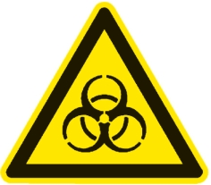

# Verordnung über Sicherheit und Gesundheitsschutz bei Tätigkeiten mit Biologischen Arbeitsstoffen (BioStoffV 2013)

Ausfertigungsdatum
:   2013-07-15

Fundstelle
:   BGBl I: 2013, 2514

Zuletzt geändert durch
:   Art. 146 G v. 29.3.2017 I 626

Änderung durch
:   Art. 1 V v. 21.7.2021 I 3115 (Nr. 48) textlich nachgewiesen, dokumentarisch noch nicht abschließend bearbeitet

## Abschnitt 1 - Anwendungsbereich, Begriffsbestimmungen und Risikogruppeneinstufung

### § 1 Anwendungsbereich

(1) Diese Verordnung gilt für Tätigkeiten mit Biologischen
Arbeitsstoffen (Biostoffen). Sie regelt Maßnahmen zum Schutz von
Sicherheit und Gesundheit der Beschäftigten vor Gefährdungen durch
diese Tätigkeiten. Sie regelt zugleich auch Maßnahmen zum Schutz von

1.  Beschäftigten in Arbeitsbereichen, in denen diese durch Tätigkeiten
    nach § 2 Absatz 7 gefährdet werden können, ohne selbst diese
    Tätigkeiten auszuüben sowie

2.  anderen Personen, soweit diese aufgrund des Verwendens von Biostoffen
    durch Beschäftigte oder durch Unternehmer ohne Beschäftigte gefährdet
    werden können.

(2) Die Verordnung gilt auch für Tätigkeiten, die dem Gentechnikrecht
unterliegen, sofern dort keine gleichwertigen oder strengeren
Regelungen zum Schutz der Beschäftigten bestehen.

### § 2 Begriffsbestimmungen

(1) Biostoffe sind

1.  Mikroorganismen, Zellkulturen und Endoparasiten einschließlich ihrer
    gentechnisch veränderten Formen,

2.  mit Transmissibler Spongiformer Enzephalopathie (TSE) assoziierte
    Agenzien,

die den Menschen durch Infektionen, infektionsbedingte akute oder
chronische Krankheiten, Toxinbildung oder sensibilisierende Wirkungen
gefährden können.

(2) Den Biostoffen gleichgestellt sind

1.  Ektoparasiten, die beim Menschen eigenständige Erkrankungen
    verursachen oder sensibilisierende oder toxische Wirkungen hervorrufen
    können,

2.  technisch hergestellte biologische Einheiten mit neuen Eigenschaften,
    die den Menschen in gleicher Weise gefährden können wie Biostoffe.

(3) Mikroorganismen sind alle zellulären oder nichtzellulären
mikroskopisch oder submikroskopisch kleinen biologischen Einheiten,
die zur Vermehrung oder zur Weitergabe von genetischem Material fähig
sind, insbesondere Bakterien, Viren, Protozoen und Pilze.

(4) Zellkulturen sind in-vitro-vermehrte Zellen, die aus vielzelligen
Organismen isoliert worden sind.

(5) Toxine im Sinne von Absatz 1 sind Stoffwechselprodukte oder
Zellbestandteile von Biostoffen, die infolge von Einatmen,
Verschlucken oder Aufnahme über die Haut beim Menschen toxische
Wirkungen hervorrufen und dadurch akute oder chronische
Gesundheitsschäden oder den Tod bewirken können.

(6) Biostoffe der Risikogruppe 3, die mit (\*\*) gekennzeichnet sind,
sind solche Biostoffe, bei denen das Infektionsrisiko für Beschäftigte
begrenzt ist, weil eine Übertragung über den Luftweg normalerweise
nicht erfolgen kann. Diese Biostoffe sind in Anhang III der Richtlinie
2000/54/EG des Europäischen Parlaments und des Rates vom 18. September
2000 über den Schutz der Arbeitnehmer gegen Gefährdung durch
biologische Arbeitsstoffe bei der Arbeit (ABl. L 262 vom 17.10.2000,
S. 21) sowie in den Bekanntmachungen nach § 19 Absatz 4 Nummer 1
entsprechend aufgeführt.

(7) Tätigkeiten sind

1.  das Verwenden von Biostoffen, insbesondere das Isolieren, Erzeugen und
    Vermehren, das Aufschließen, das Ge- und Verbrauchen, das Be- und
    Verarbeiten, das Ab- und Umfüllen, das Mischen und Abtrennen sowie das
    innerbetriebliche Befördern, das Aufbewahren einschließlich des
    Lagerns, das Inaktivieren und das Entsorgen sowie

2.  die berufliche Arbeit mit Menschen, Tieren, Pflanzen, Produkten,
    Gegenständen oder Materialien, wenn aufgrund dieser Arbeiten Biostoffe
    auftreten oder freigesetzt werden und Beschäftigte damit in Kontakt
    kommen können.

(8) Gezielte Tätigkeiten liegen vor, wenn

1.  die Tätigkeiten auf einen oder mehrere Biostoffe unmittelbar
    ausgerichtet sind,

2.  der Biostoff oder die Biostoffe mindestens der Spezies nach bekannt
    sind und

3.  die Exposition der Beschäftigten im Normalbetrieb hinreichend bekannt
    oder abschätzbar ist.

Nicht gezielte Tätigkeiten liegen vor, wenn mindestens eine
Voraussetzung nach Satz 1 nicht vorliegt. Dies ist insbesondere bei
Tätigkeiten nach Absatz 7 Nummer 2 gegeben.

(9) Beschäftigte sind Personen, die nach § 2 Absatz 2 des
Arbeitsschutzgesetzes als solche bestimmt sind. Den Beschäftigten
stehen folgende Personen gleich, sofern sie Tätigkeiten mit Biostoffen
durchführen:

1.  Schülerinnen und Schüler,

2.  Studierende,

3.  sonstige Personen, insbesondere in wissenschaftlichen Einrichtungen
    und in Einrichtungen des Gesundheitsdienstes Tätige,

4.  in Heimarbeit Beschäftigte nach § 1 Absatz 1 des Heimarbeitsgesetzes.

Auf Schülerinnen und Schüler, Studierende sowie sonstige Personen nach
Nummer 3 finden die Regelungen dieser Verordnung über die Beteiligung
der Vertretungen keine Anwendung.

(10) Arbeitgeber ist, wer nach § 2 Absatz 3 des Arbeitsschutzgesetzes
als solcher bestimmt ist. Dem Arbeitgeber stehen gleich

1.  der Unternehmer ohne Beschäftigte,

2.  der Auftraggeber und der Zwischenmeister im Sinne des
    Heimarbeitsgesetzes.

(11) Fachkundig im Sinne dieser Verordnung ist, wer zur Ausübung einer
in dieser Verordnung bestimmten Aufgabe befähigt ist. Die
Anforderungen an die Fachkunde sind abhängig von der jeweiligen Art
der Aufgabe und der Höhe der Gefährdung. Die für die Fachkunde
erforderlichen Kenntnisse sind durch eine geeignete Berufsausbildung
und eine zeitnahe einschlägige berufliche Tätigkeit nachzuweisen. In
Abhängigkeit von der Aufgabe und der Höhe der Gefährdung kann
zusätzlich die Teilnahme an spezifischen Fortbildungsmaßnahmen
erforderlich sein.

(12) Stand der Technik ist der Entwicklungsstand fortschrittlicher
Verfahren, Einrichtungen oder Betriebsweisen, der die praktische
Eignung einer Maßnahme zum Schutz von Sicherheit und Gesundheit der
Beschäftigten gesichert erscheinen lässt. Bei der Bestimmung des
Standes der Technik sind insbesondere vergleichbare Verfahren,
Einrichtungen oder Betriebsweisen heranzuziehen, die mit Erfolg in der
Praxis erprobt worden sind.

(13) Schutzstufen orientieren sich an der Risikogruppe des jeweiligen
Biostoffs und sind ein Maßstab für die Höhe der Infektionsgefährdung
einer Tätigkeit. Entsprechend den Risikogruppen nach § 3 werden vier
Schutzstufen unterschieden. Die Schutzstufen umfassen die zusätzlichen
Schutzmaßnahmen, die in den Anhängen II und III festgelegt oder
empfohlen sind.

(14) Einrichtungen des Gesundheitsdienstes nach dieser Verordnung sind
Arbeitsstätten, in denen Menschen stationär medizinisch untersucht,
behandelt oder gepflegt werden oder ambulant medizinisch untersucht
oder behandelt werden.

(15) Biotechnologie im Sinne dieser Verordnung umfasst die
biotechnologische Produktion sowie die biotechnologische Forschung
unter gezieltem Einsatz definierter Biostoffe.

### § 3 Einstufung von Biostoffen in Risikogruppen

(1) Biostoffe werden entsprechend dem von ihnen ausgehenden
Infektionsrisiko nach dem Stand der Wissenschaft in eine der folgenden
Risikogruppen eingestuft:

1.  Risikogruppe 1: Biostoffe, bei denen es unwahrscheinlich ist, dass sie
    beim Menschen eine Krankheit hervorrufen,

2.  Risikogruppe 2: Biostoffe, die eine Krankheit beim Menschen
    hervorrufen können und eine Gefahr für Beschäftigte darstellen
    könnten; eine Verbreitung in der Bevölkerung ist unwahrscheinlich;
    eine wirksame Vorbeugung oder Behandlung ist normalerweise möglich,

3.  Risikogruppe 3: Biostoffe, die eine schwere Krankheit beim Menschen
    hervorrufen und eine ernste Gefahr für Beschäftigte darstellen können;
    die Gefahr einer Verbreitung in der Bevölkerung kann bestehen, doch
    ist normalerweise eine wirksame Vorbeugung oder Behandlung möglich,

4.  Risikogruppe 4: Biostoffe, die eine schwere Krankheit beim Menschen
    hervorrufen und eine ernste Gefahr für Beschäftigte darstellen; die
    Gefahr einer Verbreitung in der Bevölkerung ist unter Umständen groß;
    normalerweise ist eine wirksame Vorbeugung oder Behandlung nicht
    möglich.

(2) Für die Einstufung der Biostoffe in die Risikogruppen 2 bis 4 gilt
Anhang III der Richtlinie 2000/54/EG des Europäischen Parlaments und
des Rates vom 18. September 2000 über den Schutz der Arbeitnehmer
gegen Gefährdung durch biologische Arbeitsstoffe bei der Arbeit (ABl.
L 262 vom 17.10.2000, S. 21). Wird dieser Anhang im Verfahren nach
Artikel 19 dieser Richtlinie an den technischen Fortschritt angepasst,
so kann die geänderte Fassung bereits ab ihrem Inkrafttreten
angewendet werden. Sie ist nach Ablauf der festgelegten
Umsetzungsfrist anzuwenden.

(3) Ist ein Biostoff nicht nach Absatz 2 eingestuft, kann das
Bundesministerium für Arbeit und Soziales nach Beratung durch den
Ausschuss nach § 19 die Einstufung in eine Risikogruppe nach Absatz 1
vornehmen. Die Einstufungen werden im Gemeinsamen Ministerialblatt
bekannt gegeben. Der Arbeitgeber hat diese Einstufungen zu beachten.

(4) Liegt für einen Biostoff weder eine Einstufung nach Absatz 2 noch
eine nach Absatz 3 vor, hat der Arbeitgeber, der eine gezielte
Tätigkeit mit diesem Biostoff beabsichtigt, diesen in eine der
Risikogruppen nach Absatz 1 einzustufen. Dabei hat der Arbeitgeber
Folgendes zu beachten:

1.  kommen für die Einstufung mehrere Risikogruppen in Betracht, ist der
    Biostoff in die höchste infrage kommende Risikogruppe einzustufen,

2.  Viren, die bereits beim Menschen isoliert wurden, sind mindestens in
    die Risikogruppe 2 einzustufen, es sei denn, es ist unwahrscheinlich,
    dass diese Viren beim Menschen eine Krankheit verursachen,

3.  Stämme, die abgeschwächt sind oder bekannte Virulenzgene verloren
    haben, können vorbehaltlich einer angemessenen Ermittlung und
    Bewertung in eine niedrigere Risikogruppe eingestuft werden als der
    Elternstamm (parentaler Stamm); ist der Elternstamm in die
    Risikogruppe 3 oder 4 eingestuft, kann eine Herabstufung nur auf der
    Grundlage einer wissenschaftlichen Bewertung erfolgen, die
    insbesondere der Ausschuss nach § 19 vornehmen kann.

## Abschnitt 2 - Gefährdungsbeurteilung, Schutzstufenzuordnung, Dokumentations- und Aufzeichnungspflichten

### § 4 Gefährdungsbeurteilung

(1) Im Rahmen der Gefährdungsbeurteilung nach § 5 des
Arbeitsschutzgesetzes hat der Arbeitgeber die Gefährdung der
Beschäftigten durch die Tätigkeiten mit Biostoffen vor Aufnahme der
Tätigkeit zu beurteilen. Die Gefährdungsbeurteilung ist fachkundig
durchzuführen. Verfügt der Arbeitgeber nicht selbst über die
entsprechenden Kenntnisse, so hat er sich fachkundig beraten zu
lassen.

(2) Der Arbeitgeber hat die Gefährdungsbeurteilung unverzüglich zu
aktualisieren, wenn

1.  maßgebliche Veränderungen der Arbeitsbedingungen oder neue
    Informationen, zum Beispiel Unfallberichte oder Erkenntnisse aus
    arbeitsmedizinischen Vorsorgeuntersuchungen, dies erfordern oder

2.  die Prüfung von Funktion und Wirksamkeit der Schutzmaßnahmen ergeben
    hat, dass die festgelegten Schutzmaßnahmen nicht wirksam sind.

Ansonsten hat der Arbeitgeber die Gefährdungsbeurteilung mindestens
jedes zweite Jahr zu überprüfen und bei Bedarf zu aktualisieren.
Ergibt die Überprüfung, dass eine Aktualisierung der
Gefährdungsbeurteilung nicht erforderlich ist, so hat der Arbeitgeber
dies unter Angabe des Datums der Überprüfung in der Dokumentation nach
§ 7 zu vermerken.

(3) Für die Gefährdungsbeurteilung hat der Arbeitgeber insbesondere
Folgendes zu ermitteln:

1.  Identität, Risikogruppeneinstufung und Übertragungswege der Biostoffe,
    deren mögliche sensibilisierende und toxische Wirkungen und
    Aufnahmepfade, soweit diese Informationen ermittelt werden können,

2.  Art der Tätigkeit unter Berücksichtigung der Betriebsabläufe,
    Arbeitsverfahren und verwendeten Arbeitsmittel einschließlich der
    Betriebsanlagen,

3.  Art, Dauer und Häufigkeit der Exposition der Beschäftigten, soweit
    diese Informationen für den Arbeitgeber zugänglich sind,

4.  Möglichkeit des Einsatzes von Biostoffen, Arbeitsverfahren oder
    Arbeitsmitteln, die zu keiner oder einer geringeren Gefährdung der
    Beschäftigten führen würden (Substitutionsprüfung),

5.  tätigkeitsbezogene Erkenntnisse

    a)  über Belastungs- und Expositionssituationen, einschließlich
        psychischer Belastungen,

    b)  über bekannte Erkrankungen und die zu ergreifenden Gegenmaßnahmen,

    c)  aus der arbeitsmedizinischen Vorsorge.

(4) Der Arbeitgeber hat auf der Grundlage der nach Absatz 3
ermittelten Informationen die Infektionsgefährdung und die
Gefährdungen durch sensibilisierende oder toxische Wirkungen
unabhängig voneinander zu beurteilen. Diese Einzelbeurteilungen sind
zu einer Gesamtbeurteilung zusammenzuführen, auf deren Grundlage die
Schutzmaßnahmen festzulegen und zu ergreifen sind. Dies gilt auch,
wenn bei einer Tätigkeit mehrere Biostoffe gleichzeitig auftreten oder
verwendet werden.

(5) Sind bei Tätigkeiten mit Produkten, die Biostoffe enthalten, die
erforderlichen Informationen zur Gefährdungsbeurteilung wie zum
Beispiel die Risikogruppeneinstufung nicht zu ermitteln, so muss der
Arbeitgeber diese beim Hersteller, Einführer oder Inverkehrbringer
einholen. Satz 1 gilt nicht für Lebensmittel in Form von
Fertigerzeugnissen, die für den Endverbrauch bestimmt sind.

### § 5 Tätigkeiten mit Schutzstufenzuordnung

(1) Bei Tätigkeiten in Laboratorien, in der Versuchstierhaltung, in
der Biotechnologie sowie in Einrichtungen des Gesundheitsdienstes hat
der Arbeitgeber ergänzend zu § 4 Absatz 3 zu ermitteln, ob gezielte
oder nicht gezielte Tätigkeiten ausgeübt werden. Er hat diese
Tätigkeiten hinsichtlich ihrer Infektionsgefährdung einer Schutzstufe
zuzuordnen.

(2) Die Schutzstufenzuordnung richtet sich

1.  bei gezielten Tätigkeiten nach der Risikogruppe des ermittelten
    Biostoffs; werden Tätigkeiten mit mehreren Biostoffen ausgeübt, so
    richtet sich die Schutzstufenzuordnung nach dem Biostoff mit der
    höchsten Risikogruppe,

2.  bei nicht gezielten Tätigkeiten nach der Risikogruppe des Biostoffs,
    der aufgrund

    a)  der Wahrscheinlichkeit seines Auftretens,

    b)  der Art der Tätigkeit,

    c)  der Art, Dauer, Höhe und Häufigkeit der ermittelten Exposition

    den Grad der Infektionsgefährdung der Beschäftigten bestimmt.

### § 6 Tätigkeiten ohne Schutzstufenzuordnung

(1) Tätigkeiten, die nicht unter § 5 Absatz 1 fallen, müssen keiner
Schutzstufe zugeordnet werden. Dabei handelt es sich um Tätigkeiten im
Sinne von § 2 Absatz 7 Nummer 2. Zu diesen Tätigkeiten gehören
beispielsweise Reinigungs- und Sanierungsarbeiten, Tätigkeiten in der
Veterinärmedizin, der Land-, Forst-, Abwasser- und Abfallwirtschaft
sowie in Biogasanlagen und Betrieben der Futter- und
Nahrungsmittelproduktion einschließlich Schlachtbetrieben.

(2) Kann bei diesen Tätigkeiten eine der in § 4 Absatz 3 Nummer 1 und
3 genannten Informationen nicht ermittelt werden, weil das Spektrum
der auftretenden Biostoffe Schwankungen unterliegt oder Art, Dauer,
Höhe oder Häufigkeit der Exposition wechseln können, so hat der
Arbeitgeber die für die Gefährdungsbeurteilung und Festlegung der
Schutzmaßnahmen erforderlichen Informationen insbesondere zu ermitteln
auf der Grundlage von

1.  Bekanntmachungen nach § 19 Absatz 4,

2.  Erfahrungen aus vergleichbaren Tätigkeiten oder

3.  sonstigen gesicherten arbeitswissenschaftlichen Erkenntnissen.

### § 7 Dokumentation der Gefährdungsbeurteilung und Aufzeichnungspflichten

(1) Der Arbeitgeber hat die Gefährdungsbeurteilung unabhängig von der
Zahl der Beschäftigten erstmals vor Aufnahme der Tätigkeit sowie
danach jede Aktualisierung gemäß Satz 2 zu dokumentieren. Die
Dokumentation der Gefährdungsbeurteilung umfasst insbesondere folgende
Angaben:

1.  die Art der Tätigkeit einschließlich der Expositionsbedingungen,

2.  das Ergebnis der Substitutionsprüfung nach § 4 Absatz 3 Nummer 4,

3.  die nach § 5 Absatz 2 festgelegten Schutzstufen,

4.  die zu ergreifenden Schutzmaßnahmen,

5.  eine Begründung, wenn von den nach § 19 Absatz 4 Nummer 1 bekannt
    gegebenen Regeln und Erkenntnissen abgewichen wird.

(2) Als Bestandteil der Dokumentation hat der Arbeitgeber ein
Verzeichnis der verwendeten oder auftretenden Biostoffe zu erstellen
(Biostoffverzeichnis), soweit diese bekannt sind. Das Verzeichnis muss
Angaben zur Einstufung der Biostoffe in eine Risikogruppe nach § 3 und
zu ihren sensibilisierenden und toxischen Wirkungen beinhalten. Die
Angaben müssen allen betroffenen Beschäftigten und ihren Vertretungen
zugänglich sein.

(3) Bei Tätigkeiten der Schutzstufe 3 oder 4 hat der Arbeitgeber
zusätzlich ein Verzeichnis über die Beschäftigten zu führen, die diese
Tätigkeiten ausüben. In dem Verzeichnis sind die Art der Tätigkeiten
und die vorkommenden Biostoffe sowie aufgetretene Unfälle und
Betriebsstörungen anzugeben. Es ist personenbezogen für den Zeitraum
von mindestens zehn Jahren nach Beendigung der Tätigkeit
aufzubewahren. Der Arbeitgeber hat

1.  den Beschäftigten die sie betreffenden Angaben in dem Verzeichnis
    zugänglich zu machen; der Schutz der personenbezogenen Daten ist zu
    gewährleisten,

2.  bei Beendigung des Beschäftigungsverhältnisses dem Beschäftigten einen
    Auszug über die ihn betreffenden Angaben des Verzeichnisses
    auszuhändigen; der Nachweis über die Aushändigung ist vom Arbeitgeber
    wie Personalunterlagen aufzubewahren.

Das Verzeichnis über die Beschäftigten kann zusammen mit dem
Biostoffverzeichnis nach Absatz 2 geführt werden.

(4) Auf die Dokumentation der Angaben nach Absatz 1 Satz 2 Nummer 2
und 5 sowie auf das Verzeichnis nach Absatz 2 kann verzichtet werden,
wenn ausschließlich Tätigkeiten mit Biostoffen der Risikogruppe 1 ohne
sensibilisierende oder toxische Wirkungen durchgeführt werden.

## Abschnitt 3 - Grundpflichten und Schutzmaßnahmen

### § 8 Grundpflichten

(1) Der Arbeitgeber hat die Belange des Arbeitsschutzes in Bezug auf
Tätigkeiten mit Biostoffen in seine betriebliche Organisation
einzubinden und hierfür die erforderlichen personellen, finanziellen
und organisatorischen Voraussetzungen zu schaffen. Dabei hat er die
Vertretungen der Beschäftigten in geeigneter Form zu beteiligen.
Insbesondere hat er sicherzustellen, dass

1.  bei der Gestaltung der Arbeitsorganisation, des Arbeitsverfahrens und
    des Arbeitsplatzes sowie bei der Auswahl und Bereitstellung der
    Arbeitsmittel alle mit der Sicherheit und Gesundheit der Beschäftigten
    zusammenhängenden Faktoren, einschließlich der psychischen,
    ausreichend berücksichtigt werden,

2.  die Beschäftigten oder ihre Vertretungen im Rahmen der betrieblichen
    Möglichkeiten beteiligt werden, wenn neue Arbeitsmittel eingeführt
    werden sollen, die Einfluss auf die Sicherheit und Gesundheit der
    Beschäftigten haben.

(2) Der Arbeitgeber hat geeignete Maßnahmen zu ergreifen, um bei den
Beschäftigten ein Sicherheitsbewusstsein zu schaffen und den
innerbetrieblichen Arbeitsschutz bei Tätigkeiten mit Biostoffen
fortzuentwickeln.

(3) Der Arbeitgeber darf eine Tätigkeit mit Biostoffen erst aufnehmen
lassen, nachdem die Gefährdungsbeurteilung nach § 4 durchgeführt und
die erforderlichen Maßnahmen ergriffen wurden.

(4) Der Arbeitgeber hat vor Aufnahme der Tätigkeit

1.  gefährliche Biostoffe vorrangig durch solche zu ersetzen, die nicht
    oder weniger gefährlich sind, soweit dies nach der Art der Tätigkeit
    oder nach dem Stand der Technik möglich ist,

2.  Arbeitsverfahren und Arbeitsmittel so auszuwählen oder zu gestalten,
    dass Biostoffe am Arbeitsplatz nicht frei werden, wenn die Gefährdung
    der Beschäftigten nicht durch eine Maßnahme nach Nummer 1
    ausgeschlossen werden kann,

3.  die Exposition der Beschäftigten durch geeignete bauliche, technische
    und organisatorische Maßnahmen auf ein Minimum zu reduzieren, wenn
    eine Gefährdung der Beschäftigten nicht durch eine Maßnahme nach
    Nummer 1 oder Nummer 2 verhindert werden kann oder die Biostoffe
    bestimmungsgemäß freigesetzt werden,

4.  zusätzlich persönliche Schutzausrüstung zur Verfügung zu stellen, wenn
    die Maßnahmen nach den Nummern 1 bis 3 nicht ausreichen, um die
    Gefährdung auszuschließen oder ausreichend zu verringern; der
    Arbeitgeber hat den Einsatz belastender persönlicher Schutzausrüstung
    auf das unbedingt erforderliche Maß zu beschränken und darf sie nicht
    als Dauermaßnahme vorsehen.

(5) Der Arbeitgeber hat die Schutzmaßnahmen auf der Grundlage der
Gefährdungsbeurteilung nach dem Stand der Technik sowie nach
gesicherten wissenschaftlichen Erkenntnissen festzulegen und zu
ergreifen. Dazu hat er die Vorschriften dieser Verordnung
einschließlich der Anhänge zu beachten und die nach § 19 Absatz 4
Nummer 1 bekannt gegebenen Regeln und Erkenntnisse zu berücksichtigen.
Bei Einhaltung der Regeln und Erkenntnisse ist davon auszugehen, dass
die gestellten Anforderungen erfüllt sind (Vermutungswirkung). Von
diesen Regeln und Erkenntnissen kann abgewichen werden, wenn durch
andere Maßnahmen zumindest in vergleichbarer Weise der Schutz von
Sicherheit und Gesundheit der Beschäftigten gewährleistet wird. Haben
sich der Stand der Technik oder gesicherte wissenschaftliche
Erkenntnisse fortentwickelt und erhöht sich die Arbeitssicherheit
durch diese Fortentwicklung erheblich, sind die Schutzmaßnahmen
innerhalb einer angemessenen Frist anzupassen.

(6) Der Arbeitgeber hat die Funktion der technischen Schutzmaßnahmen
regelmäßig und deren Wirksamkeit mindestens jedes zweite Jahr zu
überprüfen. Die Ergebnisse und das Datum der Wirksamkeitsprüfung sind
in der Dokumentation nach § 7 zu vermerken. Wurde für einen
Arbeitsbereich, ein Arbeitsverfahren oder einen Anlagetyp in einer
Bekanntmachung nach § 19 Absatz 4 ein Wert festgelegt, der die nach
dem Stand der Technik erreichbare Konzentration der Biostoffe in der
Luft am Arbeitsplatz beschreibt (Technischer Kontrollwert), so ist
dieser Wert für die Wirksamkeitsüberprüfung der entsprechenden
Schutzmaßnahmen heranzuziehen.

(7) Der Arbeitgeber darf in Heimarbeit nur Tätigkeiten mit Biostoffen
der Risikogruppe 1 ohne sensibilisierende oder toxische Wirkung
ausüben lassen.

### § 9 Allgemeine Schutzmaßnahmen

(1) Bei allen Tätigkeiten mit Biostoffen müssen mindestens die
allgemeinen Hygienemaßnahmen eingehalten werden. Insbesondere hat der
Arbeitgeber dafür zu sorgen, dass

1.  Arbeitsplätze und Arbeitsmittel in einem dem Arbeitsablauf
    entsprechenden sauberen Zustand gehalten und regelmäßig gereinigt
    werden,

2.  Fußböden und Oberflächen von Arbeitsmitteln und Arbeitsflächen leicht
    zu reinigen sind,

3.  Waschgelegenheiten zur Verfügung stehen,

4.  vom Arbeitsplatz getrennte Umkleidemöglichkeiten vorhanden sind,
    sofern Arbeitskleidung erforderlich ist; die Arbeitskleidung ist
    regelmäßig sowie bei Bedarf zu wechseln und zu reinigen.

(2) Bei Tätigkeiten in Laboratorien, in der Versuchstierhaltung, in
der Biotechnologie und in Einrichtungen des Gesundheitsdienstes hat
der Arbeitgeber für die Schutzstufe 1 über die Maßnahmen des Absatzes
1 hinaus spezielle Hygienemaßnahmen entsprechend den nach § 19 Absatz
4 Nummer 1 bekannt gegebenen Regeln und Erkenntnissen zu
berücksichtigen.

(3) Werden nicht ausschließlich Tätigkeiten mit Biostoffen der
Risikogruppe 1 ohne sensibilisierende und toxische Wirkungen ausgeübt,
hat der Arbeitgeber in Abhängigkeit von der Gefährdungsbeurteilung
weitergehende Schutzmaßnahmen zu ergreifen. Dabei hat er insbesondere

1.  Arbeitsverfahren und Arbeitsmittel so zu gestalten oder auszuwählen,
    dass die Exposition der Beschäftigten gegenüber Biostoffen und die
    Gefahr durch Stich- und Schnittverletzungen verhindert oder minimiert
    werden, soweit dies technisch möglich ist,

2.  Tätigkeiten und Arbeitsverfahren mit Staub- oder Aerosolbildung,
    einschließlich Reinigungsverfahren, durch solche ohne oder mit
    geringerer Staub- oder Aerosolbildung zu ersetzen, soweit dies nach
    dem Stand der Technik möglich ist; ist dies nicht möglich, hat der
    Arbeitgeber geeignete Maßnahmen zur Minimierung der Exposition zu
    ergreifen,

3.  die Zahl der exponierten Beschäftigten auf das für die Durchführung
    der Tätigkeit erforderliche Maß zu begrenzen,

4.  die erforderlichen Maßnahmen zur Desinfektion, Inaktivierung oder
    Dekontamination sowie zur sachgerechten und sicheren Entsorgung von
    Biostoffen, kontaminierten Gegenständen, Materialien und
    Arbeitsmitteln zu ergreifen,

5.  zur Verfügung gestellte persönliche Schutzausrüstung einschließlich
    Schutzkleidung zu reinigen, zu warten, instand zu halten und
    sachgerecht zu entsorgen; Beschäftigte müssen die bereitgestellte
    persönliche Schutzausrüstung verwenden, solange eine Gefährdung
    besteht,

6.  die Voraussetzungen dafür zu schaffen, dass persönliche
    Schutzausrüstung einschließlich Schutzkleidung beim Verlassen des
    Arbeitsplatzes sicher abgelegt und getrennt von anderen
    Kleidungsstücken aufbewahrt werden kann,

7.  sicherzustellen, dass die Beschäftigten in Arbeitsbereichen, in denen
    Biostoffe auftreten können, keine Nahrungs- und Genussmittel zu sich
    nehmen; hierzu hat der Arbeitgeber vor Aufnahme der Tätigkeiten
    gesonderte Bereiche einzurichten, die nicht mit persönlicher
    Schutzausrüstung einschließlich Schutzkleidung betreten werden dürfen.

(4) Der Arbeitgeber hat Biostoffe sicher zu lagern, innerbetrieblich
sicher zu befördern und Vorkehrungen zu treffen, um Missbrauch oder
Fehlgebrauch zu verhindern. Dabei hat er sicherzustellen, dass nur
Behälter verwendet werden, die

1.  hinsichtlich ihrer Beschaffenheit geeignet sind, den Inhalt sicher zu
    umschließen,

2.  so gekennzeichnet sind, dass die davon ausgehenden Gefahren in
    geeigneter Weise deutlich erkennbar sind,

3.  hinsichtlich Form und Kennzeichnung so gestaltet sind, dass der Inhalt
    nicht mit Lebensmitteln verwechselt werden kann.

(5) Bei der medizinischen Untersuchung, Behandlung und Pflege von
Patienten außerhalb von Einrichtungen des Gesundheitsdienstes findet §
11 Absatz 2 bis 5 Anwendung. Bei diesen Tätigkeiten hat der
Arbeitgeber in Arbeitsanweisungen den Umgang mit persönlicher
Schutzausrüstung und Arbeitskleidung sowie die erforderlichen
Maßnahmen zur Hygiene und zur Desinfektion festzulegen.

### § 10 Zusätzliche Schutzmaßnahmen und Anforderungen bei Tätigkeiten der Schutzstufe 2, 3 oder 4 in Laboratorien, in der Versuchstierhaltung sowie in der Biotechnologie

(1) Zusätzlich zu den Schutzmaßnahmen nach § 9 hat der Arbeitgeber vor
Aufnahme der Tätigkeiten der Schutzstufe 2, 3 oder 4 in Laboratorien,
in der Versuchstierhaltung oder in der Biotechnologie

1.  entsprechend der Schutzstufenzuordnung

    a)  geeignete räumliche Schutzstufenbereiche festzulegen und mit der
        Schutzstufenbezeichnung sowie mit dem Symbol für Biogefährdung nach
        Anhang I zu kennzeichnen,

    b)  die Schutzmaßnahmen nach Anhang II oder III zu ergreifen; die als
        empfohlen bezeichneten Schutzmaßnahmen sind zu ergreifen, wenn dadurch
        die Gefährdung der Beschäftigten verringert werden kann,

2.  gebrauchte spitze und scharfe Arbeitsmittel entsprechend der
    Anforderung nach § 11 Absatz 4 sicher zu entsorgen,

3.  den Zugang zu Biostoffen der Risikogruppe 3
    oder 4 au                   f dazu berechtigte, fachkundige und
    zuverlässige Beschäftigte zu beschränken; Tätigkeiten der Schutzstufe
    3 oder 4 dürfen diesen Beschäftigten nur übertragen werden, wenn sie
    anhand von Arbeitsanweisungen eingewiesen und geschult sind.

(2) Der Arbeitgeber hat vor Aufnahme von Tätigkeiten der Schutzstufe 3
oder 4 eine Person zu benennen, die zuverlässig ist und über eine
Fachkunde verfügt, die der hohen Gefährdung entspricht. Er hat diese
Person mit folgenden Aufgaben zu beauftragen:

1.  Beratung bei

    a)  der Gefährdungsbeurteilung nach § 4,

    b)  sonstigen sicherheitstechnisch relevanten Fragestellungen,

2.  Unterstützung bei der

    a)  Kontrolle der Wirksamkeit der Schutzmaßnahmen,

    b)  Durchführung der Unterweisung nach § 14 Absatz 2,

3.  Überprüfung der Einhaltung der Schutzmaßnahmen.

Der Arbeitgeber hat die Aufgaben und die Befugnisse dieser Person
schriftlich festzulegen. Sie darf wegen der Erfüllung der ihr
übertragenen Aufgaben nicht benachteiligt werden. Ihr ist für die
Durchführung der Aufgaben ausreichend Zeit zur Verfügung zu stellen.
Satz 1 gilt nicht für Tätigkeiten mit Biostoffen der Risikogruppe 3,
die mit (\*\*) gekennzeichnet sind.

### § 11 Zusätzliche Schutzmaßnahmen und Anforderungen in Einrichtungen des Gesundheitsdienstes

(1) Zusätzlich zu den Schutzmaßnahmen nach § 9 hat der Arbeitgeber vor
Aufnahme der Tätigkeiten der Schutzstufe 2, 3 oder 4 in Einrichtungen
des Gesundheitsdienstes in Abhängigkeit von der Gefährdungsbeurteilung

1.  wirksame Desinfektions- und Inaktivierungsverfahren festzulegen,

2.  Oberflächen, die desinfiziert werden müssen, so zu gestalten, dass sie
    leicht zu reinigen und beständig gegen die verwendeten
    Desinfektionsmittel sind; für Tätigkeiten der Schutzstufe 4 gelten
    zusätzlich die Anforderungen des Anhangs II an Oberflächen.

(2) Der Arbeitgeber hat entsprechend § 9 Absatz 3 Satz 2 Nummer 1
spitze und scharfe medizinische Instrumente vor Aufnahme der Tätigkeit
durch solche zu ersetzen, bei denen keine oder eine geringere Gefahr
von Stich- und Schnittverletzungen besteht, soweit dies technisch
möglich und zur Vermeidung einer Infektionsgefährdung erforderlich
ist.

(3) Der Arbeitgeber hat sicherzustellen, dass gebrauchte Kanülen nicht
in die Schutzkappen zurückgesteckt werden. Werden Tätigkeiten
ausgeübt, die nach dem Stand der Technik eine Mehrfachverwendung des
medizinischen Instruments erforderlich machen, und muss dabei die
Kanüle in die Schutzkappe zurückgesteckt werden, ist dies zulässig,
wenn ein Verfahren angewendet wird, das ein sicheres Zurückstecken der
Kanüle in die Schutzkappe mit einer Hand erlaubt.

(4) Spitze und scharfe medizinische Instrumente sind nach Gebrauch
sicher zu entsorgen. Hierzu hat der Arbeitgeber vor Aufnahme der
Tätigkeiten Abfallbehältnisse bereitzustellen, die stich- und
bruchfest sind und den Abfall sicher umschließen. Er hat dafür zu
sorgen, dass diese Abfallbehältnisse durch Farbe, Form und
Beschriftung eindeutig als Abfallbehältnisse erkennbar sind. Satz 1
und 2 gelten auch für gebrauchte medizinische Instrumente mit
Schutzeinrichtungen gegen Stich- und Schnittverletzungen.

(5) Der Arbeitgeber hat die Beschäftigten und ihre Vertretungen über
Verletzungen durch gebrauchte spitze oder scharfe medizinische
Instrumente, die organisatorische oder technische Ursachen haben,
zeitnah zu unterrichten. Er hat die Vorgehensweise hierfür
festzulegen.

(6) Tätigkeiten der Schutzstufe 3 oder 4 dürfen nur fachkundigen
Beschäftigten übertragen werden, die anhand von Arbeitseinweisungen
eingewiesen und geschult sind.

(7) Vor Aufnahme von Tätigkeiten der Schutzstufe 4 hat der Arbeitgeber

1.  geeignete räumliche Schutzstufenbereiche festzulegen und mit der
    Schutzstufenbezeichnung sowie mit dem Symbol für Biogefährdung nach
    Anhang I zu kennzeichnen,

2.  die Maßnahmen der Schutzstufe 4 aus Anhang II auszuwählen und zu
    ergreifen, die erforderlich und geeignet sind, die Gefährdung der
    Beschäftigten und anderer Personen zu verringern,

3.  eine Person im Sinne von § 10 Absatz 2 Satz 1 zu benennen und mit den
    Aufgaben nach § 10 Absatz 2 Satz 2 zu beauftragen.

### § 12 Arbeitsmedizinische Vorsorge

Die Verordnung zur arbeitsmedizinischen Vorsorge in der jeweils
geltenden Fassung gilt auch für den in § 2 Absatz 9 Satz 2 genannten
Personenkreis.

### § 13 Betriebsstörungen, Unfälle

(1) Der Arbeitgeber hat vor Aufnahme einer Tätigkeit der Schutzstufen
2 bis 4 die erforderlichen Maßnahmen festzulegen, die bei
Betriebsstörungen oder Unfällen notwendig sind, um die Auswirkungen
auf die Sicherheit und Gesundheit der Beschäftigten und anderer
Personen zu minimieren und den normalen Betriebsablauf
wiederherzustellen. In Abhängigkeit von der Art möglicher Ereignisse
und verwendeter oder vorkommender Biostoffe ist insbesondere Folgendes
festzulegen:

1.  Maßnahmen zur Ersten Hilfe und weitergehende Hilfsmaßnahmen für
    Beschäftigte bei unfallbedingter Übertragung von Biostoffen
    einschließlich der Möglichkeit zur postexpositionellen Prophylaxe,

2.  Maßnahmen, um eine Verschleppung von Biostoffen zu verhindern,

3.  Desinfektions-, Inaktivierungs- oder Dekontaminationsmaßnahmen,

4.  dass getestet wird, ob bei Betriebsstörungen oder Unfällen die
    verwendeten Biostoffe in die Arbeitsumgebung gelangt sind, soweit dies
    technisch möglich ist und validierte Testverfahren bestehen.

Die Festlegungen sind gemäß § 14 Absatz 1 Satz 4 Nummer 3 ein
Bestandteil der Betriebsanweisung.

(2) Der Arbeitgeber hat die Beschäftigten über die festgelegten
Maßnahmen und ihre Anwendung zu informieren. Tritt eine
Betriebsstörung oder ein Unfall im Sinne von Absatz 1 Satz 1 ein, so
hat der Arbeitgeber unverzüglich die gemäß Absatz 1 Satz 2
festgelegten Maßnahmen zu ergreifen. Dabei dürfen im Gefahrenbereich
nur die Personen verbleiben, die erforderlich sind, um die in Absatz 1
genannten Ziele zu erreichen.

(3) Vor Aufnahme von Tätigkeiten der Schutzstufe 3 oder 4 in
Laboratorien, in der Versuchstierhaltung, in der Biotechnologie sowie
vor Aufnahme von Tätigkeiten der Schutzstufe 4 in Einrichtungen des
Gesundheitsdienstes hat der Arbeitgeber ergänzend zu den Festlegungen
nach Absatz 1 einen innerbetrieblichen Plan darüber zu erstellen, wie
Gefahren abzuwehren sind, die beim Versagen einer
Einschließungsmaßnahme durch eine Freisetzung von Biostoffen auftreten
können. Darin hat er die spezifischen Gefahren und die Namen der für
die innerbetrieblichen Rettungsmaßnahmen zuständigen Personen
festzulegen. Die Festlegungen sind regelmäßig zu aktualisieren. Satz 1
gilt nicht für Tätigkeiten mit Biostoffen der Risikogruppe 3, die mit
(\*\*) gekennzeichnet sind.

(4) Bei Tätigkeiten der Schutzstufe 4 hat der Plan nach Absatz 3
Angaben über den Umfang von Sicherheitsübungen und deren regelmäßige
Durchführung zu enthalten, sofern solche Sicherheitsübungen aufgrund
der Gefährdungsbeurteilung erforderlich sind. Die Maßnahmen nach
Absatz 3 sind mit den zuständigen Rettungs- und Sicherheitsdiensten
abzustimmen. Darüber hinaus hat der Arbeitgeber Warnsysteme
einzurichten und Kommunikationsmöglichkeiten zu schaffen, durch die
alle betroffenen Beschäftigten unverzüglich gewarnt und der Rettungs-
und Sicherheitsdienst alarmiert werden können. Der Arbeitgeber hat
sicherzustellen, dass diese Systeme funktionstüchtig sind.

(5) Der Arbeitgeber hat vor Aufnahme der Tätigkeiten ein Verfahren für
Unfallmeldungen und -untersuchungen sowie die Vorgehensweise zur
Unterrichtung der Beschäftigten und ihrer Vertretungen festzulegen.
Das Verfahren ist so zu gestalten, dass bei schweren Unfällen sowie
bei Nadelstichverletzungen mögliche organisatorische und technische
Unfallursachen erkannt werden können und individuelle
Schuldzuweisungen vermieden werden. Die Beschäftigten und ihre
Vertretungen sind über Betriebsstörungen und Unfälle mit Biostoffen,
die die Sicherheit oder Gesundheit der Beschäftigten gefährden können,
unverzüglich zu unterrichten.

### § 14 Betriebsanweisung und Unterweisung der Beschäftigten

(1) Der Arbeitgeber hat auf der Grundlage der Gefährdungsbeurteilung
nach § 4 vor Aufnahme der Tätigkeit eine schriftliche
Betriebsanweisung arbeitsbereichs- und biostoffbezogen zu erstellen.
Satz 1 gilt nicht, wenn ausschließlich Tätigkeiten mit Biostoffen der
Risikogruppe 1 ohne sensibilisierende oder toxische Wirkungen ausgeübt
werden. Die Betriebsanweisung ist den Beschäftigten zur Verfügung zu
stellen. Sie muss in einer für die Beschäftigten verständlichen Form
und Sprache verfasst sein und insbesondere folgende Informationen
enthalten:

1.  die mit den vorgesehenen Tätigkeiten verbundenen Gefahren für die
    Beschäftigten, insbesondere zu

    a)  der Art der Tätigkeit,

    b)  den am Arbeitsplatz verwendeten oder auftretenden,
        tätigkeitsrelevanten Biostoffen einschließlich der Risikogruppe,
        Übertragungswege und gesundheitlichen Wirkungen,

2.  Informationen über Schutzmaßnahmen und Verhaltensregeln, die die
    Beschäftigten zu ihrem eigenen Schutz und zum Schutz anderer
    Beschäftigter am Arbeitsplatz durchzuführen oder einzuhalten haben;
    dazu gehören insbesondere

    a)  innerbetriebliche Hygienevorgaben,

    b)  Informationen über Maßnahmen, die zur Verhütung einer Exposition zu
        ergreifen sind, einschließlich der richtigen Verwendung scharfer oder
        spitzer medizinischer Instrumente,

    c)  Informationen zum Tragen, Verwenden und Ablegen persönlicher
        Schutzausrüstung einschließlich Schutzkleidung,

3.  Anweisungen zum Verhalten und zu Maßnahmen bei Verletzungen, bei
    Unfällen und Betriebsstörungen sowie zu deren innerbetrieblicher
    Meldung und zur Ersten Hilfe,

4.  Informationen zur sachgerechten Inaktivierung oder Entsorgung von
    Biostoffen und kontaminierten Gegenständen, Materialien oder
    Arbeitsmitteln.

Die Betriebsanweisung muss bei jeder maßgeblichen Veränderung der
Arbeitsbedingungen aktualisiert werden.

(2) Der Arbeitgeber hat sicherzustellen, dass die Beschäftigten auf
der Grundlage der jeweils aktuellen Betriebsanweisung nach Absatz 1
Satz 1 über alle auftretenden Gefährdungen und erforderlichen
Schutzmaßnahmen mündlich unterwiesen werden. Die Unterweisung ist so
durchzuführen, dass bei den Beschäftigten ein Sicherheitsbewusstsein
geschaffen wird. Die Beschäftigten sind auch über die Voraussetzungen
zu informieren, unter denen sie Anspruch auf arbeitsmedizinische
Vorsorge nach der Verordnung zur arbeitsmedizinischen Vorsorge haben.
Im Rahmen der Unterweisung ist auch eine allgemeine
arbeitsmedizinische Beratung durchzuführen mit Hinweisen zu besonderen
Gefährdungen zum Beispiel bei verminderter Immunabwehr. Soweit
erforderlich ist bei der Beratung die Ärztin oder der Arzt nach § 7
Absatz 1 der Verordnung zur arbeitsmedizinischen Vorsorge zu
beteiligen.

(3) Die Unterweisung muss vor Aufnahme der Beschäftigung und danach
mindestens jährlich arbeitsplatzbezogen durchgeführt werden sowie in
einer für die Beschäftigten verständlichen Form und Sprache erfolgen.
Inhalt und Zeitpunkt der Unterweisung hat der Arbeitgeber schriftlich
festzuhalten und sich von den unterwiesenen Beschäftigten durch
Unterschrift bestätigen zu lassen.

(4) Für Tätigkeiten der Schutzstufen 3 und 4 sind zusätzlich zur
Betriebsanweisung Arbeitsanweisungen zu erstellen, die am Arbeitsplatz
vorliegen müssen. Arbeitsanweisungen sind auch erforderlich für
folgende Tätigkeiten mit erhöhter Infektionsgefährdung:

1.  Instandhaltungs-, Reinigungs-, Änderungs- oder Abbrucharbeiten in oder
    an kontaminierten Arbeitsmitteln,

2.  Tätigkeiten, bei denen erfahrungsgemäß eine erhöhte Unfallgefahr
    besteht,

3.  Tätigkeiten, bei denen bei einem Unfall mit schweren Infektionen zu
    rechnen ist; dies kann bei der Entnahme von Proben menschlichen oder
    tierischen Ursprungs der Fall sein.

## Abschnitt 4 - Erlaubnis- und Anzeigepflichten

### § 15 Erlaubnispflicht

(1) Der Arbeitgeber bedarf der Erlaubnis der zuständigen Behörde,
bevor Tätigkeiten der Schutzstufe 3 oder 4 in Laboratorien, in der
Versuchstierhaltung oder in der Biotechnologie erstmals aufgenommen
werden. Die Erlaubnis umfasst die baulichen, technischen und
organisatorischen Voraussetzungen nach dieser Verordnung zum Schutz
der Beschäftigten und anderer Personen vor den Gefährdungen durch
diese Tätigkeiten. Satz 1 gilt auch für Einrichtungen des
Gesundheitsdienstes, die für Tätigkeiten der Schutzstufe 4 vorgesehen
sind. Tätigkeiten mit Biostoffen der Risikogruppe 3, die mit (\*\*)
gekennzeichnet sind, bedürfen keiner Erlaubnis.

(2) Schließt eine andere behördliche Entscheidung, insbesondere eine
öffentlich-rechtliche Genehmigung oder Erlaubnis, die Erlaubnis nach
Absatz 1 ein, so wird die Anforderung nach Absatz 1 durch Übersendung
einer Kopie dieser behördlichen Entscheidung an die zuständige Behörde
erfüllt. Bei Bedarf kann die zuständige Behörde weitere Unterlagen
anfordern.

(3) Die Erlaubnis nach Absatz 1 ist schriftlich oder elektronisch zu
beantragen. Dem Antrag sind folgende Unterlagen beizufügen:

1.  Name und Anschrift des Arbeitgebers,

2.  Name und Befähigung der nach § 10 Absatz 2 oder § 11 Absatz 7 Nummer 3
    benannten Person,

3.  Name des Erlaubnisinhabers nach § 44 des Infektionsschutzgesetzes,

4.  Lageplan, Grundriss und Bezeichnung der Räumlichkeiten einschließlich
    Flucht- und Rettungswege,

5.  Beschreibung der vorgesehenen Tätigkeiten,

6.  Ergebnis der Gefährdungsbeurteilung unter Angabe

    a)  der eingesetzten oder vorkommenden Biostoffe und der Schutzstufe der
        Tätigkeit,

    b)  der baulichen, technischen, organisatorischen und persönlichen
        Schutzmaßnahmen einschließlich der Angaben zur geplanten Wartung und
        Instandhaltung der baulichen und technischen Maßnahmen,

7.  Plan nach § 13 Absatz 3,

8.  Informationen über die Abfall- und Abwasserentsorgung.

Bei Bedarf kann die zuständige Behörde weitere Unterlagen anfordern.
Erfolgt die Antragstellung elektronisch, kann die zuständige Behörde
Mehrfertigungen sowie die Übermittlung der dem Antrag beizufügenden
Unterlagen auch in schriftlicher Form verlangen.

(4) Die Erlaubnis ist zu erteilen, wenn die Anforderungen dieser
Verordnung erfüllt werden, die erforderlich sind, um den Schutz der
Beschäftigten und anderer Personen vor den Gefährdungen durch
Biostoffe sicherzustellen.

### § 16 Anzeigepflicht

(1) Der Arbeitgeber hat der zuständigen Behörde nach Maßgabe der
Absätze 2 und 3 anzuzeigen:

1.  die erstmalige Aufnahme

    a)  gezielter Tätigkeiten mit Biostoffen der Risikogruppe 2 sowie mit
        Biostoffen der Risikogruppe 3, die mit (\*\*) gekennzeichnet sind,

    b)  nicht gezielter Tätigkeiten der Schutzstufe 2 mit Biostoffen der
        Risikogruppe 3 einschließlich solcher, die mit (\*\*) gekennzeichnet
        sind, sofern die Tätigkeiten auf diese Biostoffe ausgerichtet sind und
        regelmäßig durchgeführt werden sollen,

    in Laboratorien, in der Versuchstierhaltung und in der Biotechnologie,

2.  jede Änderung der erlaubten oder angezeigten Tätigkeiten, wenn diese
    für die Sicherheit und den Gesundheitsschutz bedeutsam sind, zum
    Beispiel Tätigkeiten, die darauf abzielen, die Virulenz des Biostoffs
    zu erhöhen oder die Aufnahme von Tätigkeiten mit weiteren Biostoffen
    der Risikogruppe 3 oder 4,

3.  die Inbetriebnahme einer Patientenstation der Schutzstufe 4 bei
    Aufnahme einer infizierten Patientin oder eines infizierten Patienten
    sowie die anschließende Außerbetriebnahme,

4.  das Einstellen einer nach § 15 erlaubnispflichtigen Tätigkeit.

(2) Die Anzeige hat folgende Angaben zu umfassen:

1.  Name und Anschrift des Arbeitgebers,

2.  Beschreibung der vorgesehenen Tätigkeiten einschließlich der
    Bezeichnung der Räumlichkeiten, in denen diese Tätigkeiten
    durchgeführt werden sollen,,

3.  das Ergebnis der Gefährdungsbeurteilung nach § 4,

4.  die Art des Biostoffs,

5.  die vorgesehenen Maßnahmen zum Schutz der Sicherheit und Gesundheit
    der Beschäftigten.

(3) Die Anzeige nach Absatz 1 hat zu erfolgen bei Tätigkeiten nach

1.  Nummer 1 spätestens 30 Tage vor deren erstmaliger Aufnahme,

2.  Nummer 2 spätestens 30 Tage vor der geplanten Änderung,

3.  Nummer 3 unverzüglich,

4.  Nummer 4 spätestens 30 Tage vor deren Einstellung.

(4) Die Anzeigepflicht kann auch dadurch erfüllt werden, dass der
zuständigen Behörde innerhalb der in Absatz 3 bestimmten Frist die
Kopie einer Anzeige, Genehmigung oder Erlaubnis nach einer anderen
Rechtsvorschrift übermittelt wird, wenn diese gleichwertige Angaben
beinhaltet.

## Abschnitt 5 - Vollzugsregelungen und Ausschuss für Biologische Arbeitsstoffe

### § 17 Unterrichtung der Behörde

(1) Der Arbeitgeber hat die zuständige Behörde unverzüglich zu
unterrichten über

1.  jeden Unfall und jede Betriebsstörung bei Tätigkeiten mit Biostoffen
    der Risikogruppe 3 oder 4, die zu einer Gesundheitsgefahr der
    Beschäftigten führen können,

2.  Krankheits- und Todesfälle Beschäftigter, die auf Tätigkeiten mit
    Biostoffen zurückzuführen sind, unter genauer Angabe der Tätigkeit.

(2) Unbeschadet des § 22 des Arbeitsschutzgesetzes hat der Arbeitgeber
der zuständigen Behörde auf ihr Verlangen Folgendes zu übermitteln:

1.  die Dokumentation der Gefährdungsbeurteilung,

2.  das Verzeichnis nach § 7 Absatz 3 Satz 1 sowie den Nachweis nach § 7
    Absatz 3 Satz 4 Nummer 2,

3.  die Tätigkeiten, bei denen Beschäftigte tatsächlich oder
    möglicherweise gegenüber Biostoffen exponiert worden sind, und die
    Anzahl dieser Beschäftigten,

4.  die ergriffenen Schutz- und Vorsorgemaßnahmen einschließlich der
    Betriebs- und Arbeitsanweisungen,

5.  die nach § 13 Absatz 1 und 2 festgelegten oder ergriffenen Maßnahmen
    und den nach § 13 Absatz 3 erstellten Plan.

### § 18 Behördliche Ausnahmen

Die zuständige Behörde kann auf schriftlichen oder elektronischen
Antrag des Arbeitgebers Ausnahmen von den Vorschriften der §§ 9, 10,
11 und 13 einschließlich der Anhänge II und III erteilen, wenn die
Durchführung der Vorschrift im Einzelfall zu einer unverhältnismäßigen
Härte führen würde und die beantragte Abweichung mit dem Schutz der
betroffenen Beschäftigten vereinbar ist.

### § 19 Ausschuss für Biologische Arbeitsstoffe

(1) Beim Bundesministerium für Arbeit und Soziales wird ein Ausschuss
für Biologische Arbeitsstoffe (ABAS) gebildet, in dem fachlich
geeignete Personen vonseiten der Arbeitgeber, der Gewerkschaften, der
Länderbehörden, der gesetzlichen Unfallversicherung und weitere
fachlich geeignete Personen, insbesondere der Wissenschaft, vertreten
sein sollen. Die Gesamtzahl der Mitglieder soll 16 Personen nicht
überschreiten. Für jedes Mitglied ist ein stellvertretendes Mitglied
zu benennen. Die Mitgliedschaft im Ausschuss ist ehrenamtlich.

(2) Das Bundesministerium für Arbeit und Soziales beruft die
Mitglieder des Ausschusses und die stellvertretenden Mitglieder. Der
Ausschuss gibt sich eine Geschäftsordnung und wählt die Vorsitzende
oder den Vorsitzenden aus seiner Mitte. Die Geschäftsordnung und die
Wahl des oder der Vorsitzenden bedürfen der Zustimmung des
Bundesministeriums für Arbeit und Soziales.

(3) Zu den Aufgaben des Ausschusses gehört es,

1.  den Stand der Wissenschaft, Technik, Arbeitsmedizin und Arbeitshygiene
    sowie sonstige gesicherte Erkenntnisse für Tätigkeiten mit Biostoffen
    zu ermitteln und entsprechende Empfehlungen auszusprechen
    einschließlich solcher Beiträge, die in öffentlich nutzbaren
    Informationssystemen über Biostoffe genutzt werden können,

2.  zu ermitteln, wie die in dieser Verordnung gestellten Anforderungen
    erfüllt werden können und dazu die dem jeweiligen Stand von Technik
    und Medizin entsprechenden Regeln und Erkenntnisse zu erarbeiten,

3.  wissenschaftliche Bewertungen von Biostoffen vorzunehmen und deren
    Einstufung in Risikogruppen vorzuschlagen,

4.  das Bundesministerium für Arbeit und Soziales in Fragen der
    biologischen Sicherheit, insbesondere zu epidemischen Lagen von
    nationaler Tragweite im Sinne von § 5 Absatz 1 Satz 6 des
    Infektionsschutzgesetzes vom 20. Juli 2000 (BGBl. I S. 1045) in der am
    31\. März 2021 geltenden Fassung, zu beraten.

Das Arbeitsprogramm des Ausschusses wird mit dem Bundesministerium für
Arbeit und Soziales abgestimmt. Der Ausschuss arbeitet eng mit den
anderen Ausschüssen beim Bundesministerium für Arbeit und Soziales
zusammen.

(4) Nach Prüfung kann das Bundesministerium für Arbeit und Soziales

1.  die vom Ausschuss ermittelten Regeln und Erkenntnisse nach Absatz 3
    Satz 1 Nummer 2 sowie die Einstufungen nach § 3 Absatz 3 im
    Gemeinsamen Ministerialblatt bekannt geben,

2.  die Empfehlungen nach Absatz 3 Satz 1 Nummer 1 sowie die
    Beratungsergebnisse nach Absatz 3 Satz 1 Nummer 4 in geeigneter Weise
    veröffentlichen.

(5) Die Bundesministerien sowie die zuständigen obersten
Landesbehörden können zu den Sitzungen des Ausschusses Vertreter
entsenden. Diesen ist auf Verlangen in der Sitzung das Wort zu
erteilen.

(6) Die Bundesanstalt für Arbeitsschutz und Arbeitsmedizin führt die
Geschäfte des Ausschusses.

## Abschnitt 6 - Ordnungswidrigkeiten, Straftaten und Übergangsvorschriften

### § 20 Ordnungswidrigkeiten

(1) Ordnungswidrig im Sinne des § 25 Absatz 1 Nummer 1 des
Arbeitsschutzgesetzes handelt, wer vorsätzlich oder fahrlässig

1.  entgegen § 4 Absatz 1 Satz 1 oder 2 die Gefährdung der Beschäftigten
    nicht, nicht richtig, nicht vollständig oder nicht rechtzeitig
    beurteilt,

2.  entgegen § 4 Absatz 2 Satz 1 eine Gefährdungsbeurteilung nicht oder
    nicht rechtzeitig aktualisiert,

3.  entgegen § 4 Absatz 2 Satz 2 eine Gefährdungsbeurteilung nicht oder
    nicht rechtzeitig überprüft,

4.  entgegen § 7 Absatz 1 Satz 1 eine Gefährdungsbeurteilung nicht, nicht
    richtig, nicht vollständig oder nicht rechtzeitig dokumentiert,

5.  entgegen § 7 Absatz 3 Satz 1 ein dort genanntes Verzeichnis nicht,
    nicht richtig oder nicht vollständig führt,

6.  entgegen § 7 Absatz 3 Satz 3 ein dort genanntes Verzeichnis nicht oder
    nicht mindestens zehn Jahre aufbewahrt,

7.  entgegen § 8 Absatz 4 Nummer 4 persönliche Schutzausrüstung nicht oder
    nicht rechtzeitig zur Verfügung stellt oder das Verwenden einer dort
    genannten Schutzausrüstung als Dauermaßnahme vorsieht,

7a. entgegen § 8 Absatz 6 Satz 1 die Wirksamkeit einer dort genannten
    Schutzmaßnahme nicht oder nicht rechtzeitig überprüft,

8.  entgegen § 9 Absatz 1 Satz 2 Nummer 3 nicht dafür sorgt, dass eine
    Waschgelegenheit zur Verfügung steht,

9.  entgegen § 9 Absatz 1 Satz 2 Nummer 4 erster Halbsatz nicht dafür
    sorgt, dass eine Umkleidemöglichkeit vorhanden ist,

10. entgegen § 9 Absatz 3 Satz 2 Nummer 5 erster Halbsatz zur Verfügung
    gestellte persönliche Schutzausrüstung nicht instand hält,

11. entgegen § 9 Absatz 3 Satz 2 Nummer 7 zweiter Halbsatz dort genannte
    Bereiche nicht oder nicht rechtzeitig einrichtet,

12. entgegen § 9 Absatz 4 Satz 2 nicht sicherstellt, dass nur dort
    genannte Behälter verwendet werden,

13. entgegen § 10 Absatz 1 Nummer 1 Buchstabe a oder § 11 Absatz 7 Nummer
    1 einen Schutzstufenbereich nicht oder nicht rechtzeitig festlegt oder
    nicht, nicht richtig oder nicht rechtzeitig kennzeichnet,

14. entgegen § 10 Absatz 2 Satz 1 oder § 11 Absatz 7 Nummer 3 eine Person
    nicht oder nicht rechtzeitig benennt,

15. entgegen § 11 Absatz 1 Nummer 1 ein dort genanntes Verfahren nicht
    oder nicht rechtzeitig festlegt,

16. entgegen § 11 Absatz 2 ein dort genanntes Instrument nicht oder nicht
    rechtzeitig ersetzt,

17. entgegen § 11 Absatz 3 Satz 1 nicht sicherstellt, dass eine gebrauchte
    Kanüle nicht in die Schutzkappe zurückgesteckt wird,

18. entgegen § 11 Absatz 4 Satz 1, auch in Verbindung mit Satz 4, ein dort
    genanntes Instrument nicht oder nicht rechtzeitig entsorgt,

19. entgegen § 13 Absatz 1 Satz 2 Nummer 1, 2 oder 3 eine dort genannte
    Maßnahme nicht oder nicht rechtzeitig festlegt,

20. entgegen § 13 Absatz 3 Satz 1 einen innerbetrieblichen Plan nicht,
    nicht richtig, nicht vollständig oder nicht rechtzeitig erstellt,

21. entgegen § 13 Absatz 5 Satz 1 ein Verfahren für Unfallmeldungen und
    -untersuchungen nicht oder nicht rechtzeitig festlegt,

22. entgegen § 14 Absatz 1 Satz 1 eine schriftliche Betriebsanweisung
    nicht, nicht richtig, nicht vollständig oder nicht rechtzeitig
    erstellt,

23. entgegen § 14 Absatz 2 Satz 1 nicht sicherstellt, dass ein
    Beschäftigter unterwiesen wird,

24. ohne Erlaubnis nach § 15 Absatz 1 Satz 1 eine dort genannte Tätigkeit
    aufnimmt,

25. entgegen § 16 Absatz 1 eine Anzeige nicht, nicht richtig, nicht
    vollständig oder nicht rechtzeitig erstattet oder

26. entgegen § 17 Absatz 1 die zuständige Behörde nicht, nicht richtig,
    nicht vollständig oder nicht rechtzeitig unterrichtet.

(2) Ordnungswidrig im Sinne des § 32 Absatz 1 Nummer 1 des
Heimarbeitsgesetzes handelt, wer vorsätzlich oder fahrlässig entgegen
§ 8 Absatz 7 eine dort genannte Tätigkeit ausüben lässt.

### § 21 Straftaten

(1) Wer durch eine in § 20 Absatz 1 bezeichnete vorsätzliche Handlung
Leben oder Gesundheit eines Beschäftigten gefährdet, ist nach § 26
Nummer 2 des Arbeitsschutzgesetzes strafbar.

(2) Wer durch eine in § 20 Absatz 2 bezeichnete vorsätzliche Handlung
in Heimarbeit Beschäftigte in ihrer Arbeitskraft oder Gesundheit
gefährdet, ist nach § 32 Absatz 3 oder Absatz 4 des
Heimarbeitsgesetzes strafbar.

### § 22 Übergangsvorschriften

Bei Tätigkeiten, die vor dem 23. Juli 2013 aufgenommen worden sind,
besteht keine Erlaubnispflicht nach § 15 Absatz 1, sofern

1.  diese Tätigkeiten der zuständigen Behörde angezeigt wurden und

2.  die der Anzeige zugrundeliegenden baulichen, technischen und
    organisatorischen Bedingungen nach dem 30. September 2021 nicht
    wesentlich verändert wurden.

Die Anzeigepflicht nach § 16 Absatz 1 Nummer 4 bleibt unberührt.

### Anhang I Symbol für Biogefährdung

(Fundstelle: BGBl. I 2013, 2525)

### Anhang II Zusätzliche Schutzmaßnahmen bei Tätigkeiten in Laboratorien und vergleichbaren Einrichtungen sowie in der Versuchstierhaltung

(Fundstelle: BGBl. I 2013, 2526 – 2527)

*    *   A
        Schutzmaßnahmen

    *   B
        Schutzstufen

*    *   2

    *   3

    *   4

*    *
        1.  Der Schutzstufenbereich ist von anderen Schutzstufen- oder
            Arbeitsbereichen in demselben Gebäude abzugrenzen.

    *   empfohlen

    *   verbindlich

    *   verbindlich

*    *
        2.  Der Schutzstufenbereich muss als Zugang eine Schleuse mit
            gegeneinander verriegelbaren Türen haben.

    *   nein

    *   verbindlich, wenn die Übertragung über die Luft erfolgen kann

    *   verbindlich

*    *
        3.  Der Zugang zum Schutzstufenbereich ist auf benannte Beschäftigte zu
            beschränken.

    *[^F781759_02_BJNR251410013BJNE002501126]
   verbindlich bei gelisteten humanpathogenen Biostoffen
        mit Zugangskontrolle

    *   verbindlich mit Zugangskontrolle

    *   verbindlich mit Zugangskontrolle

*    *
        4.  Im Schutzstufenbereich muss ein ständiger Unterdruck aufrechterhalten
            werden.

    *   nein

    *   verbindlich alarmüberwacht, wenn die Übertragung über die Luft
        erfolgen kann

    *   verbindlich alarmüberwacht

*    *
        5.  Zu- und Abluft müssen durch Hochleistungsschwebstoff-Filter oder eine
            vergleichbare Vorrichtung geführt werden.

    *   nein

    *   verbindlich für Abluft, wenn die Übertragung über die Luft erfolgen
        kann

    *   verbindlich für Zu- und Abluft

*    *
        6.  Der Schutzstufenbereich muss zum Zweck der Begasung abdichtbar sein.

    *   nein

    *   verbindlich, wenn die Übertragung über die Luft erfolgen kann

    *   verbindlich

*    *
        7.  Eine mikrobiologische Sicherheitswerkbank oder eine technische
            Einrichtung mit gleichwertigem Schutzniveau muss verwendet werden.

    *   verbindlich für Tätigkeiten mit Aerosolbildung

    *   verbindlich

    *   verbindlich

*    *
        8.  Jeder Schutzstufenbereich muss über eine eigene Ausrüstung verfügen.

    *   empfohlen

    *   verbindlich

    *   verbindlich

*    *
        9.  Jeder Schutzstufenbereich muss über einen Autoklaven oder eine
            gleichwertige Sterilisationseinheit verfügen.

    *   empfohlen

    *   verbindlich, wenn die Übertragung über die Luft erfolgen kann

    *   verbindlich

*    *
        10. Kontaminierte Prozessabluft darf nicht in den Arbeitsbereich abgegeben
            werden.

    *   verbindlich

    *   verbindlich

    *   verbindlich

*    *
        11. Wirksame Desinfektions- und Inaktivierungsverfahren sind festzulegen.

    *   verbindlich

    *   verbindlich

    *   verbindlich

*    *
        12. Die jeweils genannten Flächen müssen wasserundurchlässig und leicht zu
            reinigen sein.

    *   Werkbänke,
        Fußböden

    *   Werkbänke, Fußböden sowie andere Flächen, die aufgrund der
        Gefährdungsbeurteilung festzulegen sind

    *   Werkbänke, Wände, Fußböden und Decken

*    *
        13. Oberflächen müssen beständig gegen die verwendeten Chemikalien und
            Desinfektionsmittel sein.

    *   verbindlich

    *   verbindlich

    *   verbindlich

*    *
        14. Dekontaminations- und Wascheinrichtungen für die Beschäftigten müssen
            vorhanden sein.

    *   verbindlich

    *   verbindlich

    *   verbindlich

*    *
        15. Beschäftigte müssen vor dem Verlassen des Schutzstufenbereichs
            duschen.

    *   nein

    *   empfohlen

    *   verbindlich

*    *
        16. Kontaminierte feste und flüssige Abfälle sind vor der endgültigen
            Entsorgung mittels erprobter physikalischer oder chemischer Verfahren
            zu inaktivieren.

    *   verbindlich, wenn keine sachgerechte Auftragsentsorgung erfolgt

    *   verbindlich, wenn die Übertragung über die Luft erfolgen kann;
        ansonsten grundsätzlich verbindlich, nur in ausreichend begründeten
        Einzelfällen ist eine sachgerechte Auftragsentsorgung möglich

    *   verbindlich

*    *
        17. Abwässer sind mittels erprobter physikalischer oder chemischer
            Verfahren vor der endgültigen Entsorgung zu inaktivieren.

    *   nein für Handwasch- und Duschwasser oder vergleichbare Abwässer

    *   empfohlen für Handwasch- und Duschwasser

    *   verbindlich

*    *
        18. Ein Sichtfenster oder eine vergleichbare Vorrichtung zur Einsicht in
            den Arbeitsbereich ist vorzusehen.

    *   verbindlich

    *   verbindlich

    *   verbindlich

*    *
        19. Bei Alleinarbeit ist eine Notrufmöglichkeit vorzusehen.

    *   empfohlen

    *   verbindlich

    *   verbindlich

*    *
        20. Fenster dürfen nicht zu öffnen sein.

    *   nein; Fenster müssen während der Tätigkeit geschlossen sein

    *   verbindlich

    *   verbindlich

*    *
        21. Für sicherheitsrelevante Einrichtungen ist eine Notstromversorgung
            vorzusehen.

    *   empfohlen

    *   verbindlich

    *   verbindlich

*    *
        22. Biostoffe sind unter Verschluss aufzubewahren.

    *   verbindlich bei gelisteten humanpathogenen Biostoffen

    *   verbindlich bei gelisteten humanpathogenen Biostoffen

    *   verbindlich

*    *
        23. Eine wirksame Kontrolle von Vektoren (zum Beispiel von Nagetieren und
            Insekten) ist durchzuführen.

    *   empfohlen

    *   verbindlich

    *   verbindlich

*    *
        24. Sichere Entsorgung von infizierten Tierkörpern, zum Beispiel durch
            thermische Inaktivierung, Verbrennungsanlagen für Tierkörper oder
            andere geeignete Einrichtungen zur Sterilisation/Inaktivierung.

    *   verbindlich

    *   verbindlich

    *   verbindlich vor Ort

Anmerkung: Gemäß § 10 Absatz 1 sind die als empfohlen bezeichneten
    Schutzmaßnahmen dann zu ergreifen, wenn dadurch die Gefährdung der
    Beschäftigten verringert werden kann.

    Im Anhang I der Verordnung (EU) Nr. 388/2012 des Europäischen
    Parlaments und des Rates vom 19. April 2012 zur Änderung der
    Verordnung (EG) Nr. 428/2009 des Rates über eine Gemeinschaftsregelung
    für die Kontrolle der Ausfuhr, der Verbringung, der Vermittlung und
    der Durchfuhr von Gütern mit doppeltem Verwendungszweck (ABl. L 129
    vom 16.5.2012, S. 12) unter 1C351 gelistete humanpathogene Erreger
    sowie unter 1C353 aufgeführte genetisch modifizierte Organismen.
[^F781759_02_BJNR251410013BJNE002501126]: 

### Anhang III Zusätzliche Schutzmaßnahmen bei Tätigkeiten in der Biotechnologie

(Fundstelle: BGBl. I 2013, 2528)

Es gelten die Anforderungen nach Anhang II. Für Tätigkeiten mit
Biostoffen in bioverfahrenstechnischen Apparaturen, zum Beispiel
Bioreaktoren und Separatoren, gilt darüber hinaus:

*    *   A
        Schutzmaßnahmen

    *   B
        Schutzstufen

*    *   2

    *   3

    *   4

*    *
        1.  Die Apparatur muss den Prozess physisch von der Umwelt trennen.

    *   verbindlich

    *   verbindlich

    *   verbindlich

*    *
        2.  Die Apparatur oder eine vergleichbare Anlage muss innerhalb eines
            entsprechenden Schutzstufenbereichs liegen.

    *   verbindlich

    *   verbindlich

    *   verbindlich

*    *
        3.  Die Prozessabluft der Apparatur muss so behandelt werden, dass ein
            Freisetzen von Biostoffen

    *   minimiert wird.

    *   verhindert wird.

    *   zuverlässig verhindert wird.

*    *
        4.  Das Öffnen der Apparatur zum Beispiel zur Probenahme, zum Hinzufügen
            von Substanzen oder zur Übertragung von Biostoffen muss so
            durchgeführt werden, dass ein Freisetzen von Biostoffen

    *   minimiert wird.

    *   verhindert wird.

    *   zuverlässig verhindert wird.

*    *
        5.  Kulturflüssigkeiten dürfen zur Weiterverarbeitung nur aus der
            Apparatur entnommen werden, wenn die Entnahme in einem geschlossenen
            System erfolgt oder die Biostoffe durch wirksame physikalische oder
            chemische Verfahren inaktiviert worden sind.

    *   verbindlich

    *   verbindlich

    *   verbindlich

*    *
        6.  Dichtungen an der Apparatur müssen so beschaffen sein, dass ein
            unbeabsichtigtes Freisetzen von Biostoffen

    *   minimiert wird.

    *   verhindert wird.

    *   zuverlässig verhindert wird.

*    *
        7.  Der gesamte Inhalt der Apparatur muss aufgefangen werden können.

    *   verbindlich

    *   verbindlich

    *   verbindlich

Anmerkung: Gemäß § 10 Absatz 1 sind die als empfohlen bezeichneten
    Schutzmaßnahmen dann zu ergreifen, wenn dadurch die Gefährdung der
    Beschäftigten verringert werden kann.

