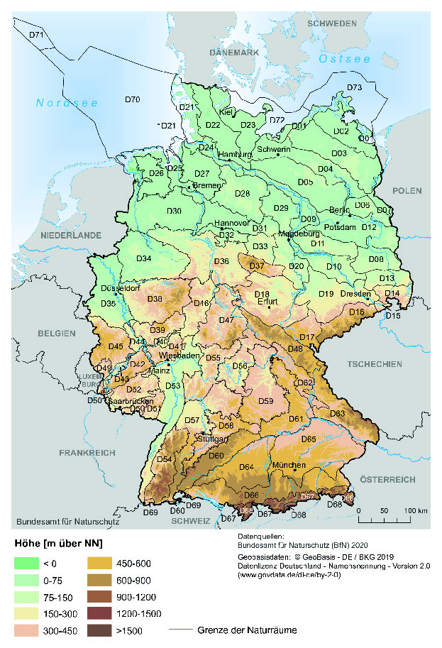

# Verordnung über die Vermeidung und die Kompensation von Eingriffen in Natur und Landschaft im Zuständigkeitsbereich der Bundesverwaltung (BKompV)

Ausfertigungsdatum
:   2020-05-14

Fundstelle
:   BGBl I: 2020, 1088

## Eingangsformel

Auf Grund des § 15 Absatz 8 Satz 1 in Verbindung mit den Sätzen 2 bis
4 des Bundesnaturschutzgesetzes, der durch Artikel 8 des Gesetzes vom
13\. Mai 2019 (BGBl. I S. 706) eingefügt worden ist, verordnet das
Bundesministerium für Umwelt, Naturschutz und nukleare Sicherheit im
Einvernehmen mit dem Bundesministerium für Ernährung und
Landwirtschaft, dem Bundesministerium für Verkehr und digitale
Infrastruktur und dem Bundesministerium für Wirtschaft und Energie
unter Wahrung der Rechte des Bundestages:

## § 1 Anwendungsbereich

(1) Diese Verordnung findet Anwendung, soweit die Vorschriften des
Dritten Kapitels des Bundesnaturschutzgesetzes vom 29. Juli 2009
(BGBl. I S. 2542), das zuletzt durch Artikel 1 des Gesetzes vom 4.
März 2020 (BGBl. I S. 440) geändert worden ist, ausschließlich durch
die Bundesverwaltung ausgeführt werden. Die Verordnung bestimmt
insbesondere das Nähere

1.  zur Vermeidung von Beeinträchtigungen von Natur und Landschaft nach §
    15 Absatz 1 Satz 1 des Bundesnaturschutzgesetzes,

2.  zu Inhalt, Art und Umfang von Ausgleichs- und Ersatzmaßnahmen nach §
    15 Absatz 2 des Bundesnaturschutzgesetzes sowie

3.  zur Höhe der Ersatzzahlung nach § 15 Absatz 6 des
    Bundesnaturschutzgesetzes und zum Verfahren ihrer Erhebung.

(2) Diese Verordnung gilt auch im Bereich der Küstengewässer sowie
nach Maßgabe des Seerechtsübereinkommens der Vereinten Nationen vom
10\. Dezember 1982 (BGBl. 1994 II S. 1798, 1799) im Bereich der
deutschen ausschließlichen Wirtschaftszone und des Festlandsockels.

## § 2 Allgemeine Anforderungen an die Vermeidung und die Kompensation

(1) Die nach § 17 des Bundesnaturschutzgesetzes zuständige Behörde
trifft die zur Durchführung des § 15 Absatz 1 bis 6 des
Bundesnaturschutzgesetzes erforderlichen Entscheidungen und Maßnahmen

1.  auf der Grundlage der vom Verursacher eines Eingriffs gemachten
    Angaben nach § 17 Absatz 4 des Bundesnaturschutzgesetzes,

2.  auf der Grundlage der Informationen, die bei der zuständigen Behörde
    und den zu beteiligenden Behörden vorliegen, und

3.  unter Berücksichtigung der Ziele des Naturschutzes und der
    Landschaftspflege nach § 1 des Bundesnaturschutzgesetzes.

(2) Die Inhalte der Landschaftsplanung im Sinne des § 9 Absatz 2 und 3
des Bundesnaturschutzgesetzes sind zu berücksichtigen

1.  bei der Bewertung des vorhandenen Zustands von Natur und Landschaft
    und der zu erwartenden Beeinträchtigungen von Natur und Landschaft im
    Sinne des § 4 Absatz 1 Satz 1 und

2.  bei der Vermeidung, dem Ausgleich und dem Ersatz von erheblichen
    Beeinträchtigungen von Natur und Landschaft.

(3) Bei der Prüfung, ob zumutbare Alternativen nach § 15 Absatz 1 Satz
2 des Bundesnaturschutzgesetzes gegeben sind, soll auch berücksichtigt
werden, inwieweit die Alternativen dazu beitragen, die Inanspruchnahme
von Flächen, insbesondere die Versiegelung von Böden, durch den
Eingriff zu verringern.

(4) Im Rahmen der Festsetzung des Kompensationsumfangs ist zu prüfen,
inwieweit beeinträchtigte Funktionen des Naturhaushalts und des
Landschaftsbildes bereits kompensiert werden durch anerkennungsfähige
Maßnahmen des Verursachers

1.  im Sinne von § 30 Absatz 3, § 34 Absatz 5, § 44 Absatz 5 Satz 3 oder §
    45 Absatz 7 Satz 2 des Bundesnaturschutzgesetzes,

2.  nach § 9 Absatz 2 des Bundeswaldgesetzes vom 2. Mai 1975 (BGBl. I S.
    1037), das zuletzt durch Artikel 1 des Gesetzes vom 17. Januar 2017
    (BGBl. I S. 75) geändert worden ist, oder

3.  nach den Wald- und Forstgesetzen der Länder.

Soweit nicht kompensierte Beeinträchtigungen verbleiben, sollen die
Ausgleichs- und Ersatzmaßnahmen jeweils auf die Wiederherstellung,
Herstellung oder Neugestaltung mehrerer beeinträchtigter Funktionen
des Naturhaushalts und des Landschaftsbildes gerichtet sein
(Multifunktionalität), auch um die Inanspruchnahme von Flächen zu
verringern.

(5) Zur Deckung des Kompensationsbedarfs soll insbesondere auf
bevorratete Kompensationsmaßnahmen nach den §§ 16 und 56a des
Bundesnaturschutzgesetzes zurückgegriffen werden, soweit diese
Maßnahmen die Anforderungen der §§ 8 und 9 erfüllen und der Rückgriff
im Einzelfall, insbesondere auch in wirtschaftlicher Hinsicht,
angemessen ist. Wird der Eingriff von einer Bundesbehörde
durchgeführt, soll neben bevorrateten Kompensationsmaßnahmen im Sinne
von Satz 1 zur Deckung des Kompensationsbedarfs unter den
Voraussetzungen des Satzes 1 insbesondere auf Maßnahmen auf Flächen
der öffentlichen Hand zurückgegriffen werden. Bei Vorhaben, deren
Realisierung aus Gründen eines überragenden öffentlichen
Bundesinteresses erforderlich ist, kann zur Deckung des
Kompensationsbedarfs auch auf die durch die Bundesanstalt für
Immobilienaufgaben bereitgestellten bevorrateten
Kompensationsmaßnahmen zurückgegriffen werden.

(6) Unter den Voraussetzungen des Absatzes 5 Satz 1 kann für
Kompensationsmaßnahmen auch zurückgegriffen werden auf

1.  festgelegte Entwicklungs- und Wiederherstellungsmaßnahmen

    a)  für den Biotopverbund im Sinne des § 20 Absatz 1 des
        Bundesnaturschutzgesetzes,

    b)  für Gebiete im Sinne des § 20 Absatz 2 Nummer 1 bis 4 des
        Bundesnaturschutzgesetzes und

    c)  in Bewirtschaftungsplänen nach § 32 Absatz 5 des
        Bundesnaturschutzgesetzes,

2.  Maßnahmen in Maßnahmenprogrammen im Sinne des § 82 des
    Wasserhaushaltsgesetzes vom 31. Juli 2009 (BGBl. I S. 2585), das
    zuletzt durch Artikel 2 des Gesetzes vom 4. Dezember 2018 (BGBl. I S.
    2254) geändert worden ist.

(7) Soweit zur Deckung des Kompensationsbedarfs nicht auf Maßnahmen
nach den Absätzen 5 oder 6 zurückgegriffen wird, sind – unter den
Voraussetzungen des Absatzes 5 Satz 1 – Maßnahmen zur Entsiegelung,
Maßnahmen zur Wiedervernetzung von Lebensräumen und Bewirtschaftungs-
oder Pflegemaßnahmen zu berücksichtigen, um möglichst zu vermeiden,
dass land- oder forstwirtschaftliche Flächen aus der Nutzung genommen
werden.

## § 3 Besondere Anforderungen an die Vermeidung

(1) Beeinträchtigungen von Natur und Landschaft gemäß § 15 Absatz 1
des Bundesnaturschutzgesetzes sind vorrangig zu vermeiden.
Vermeidungsmaßnahmen sind alle Maßnahmen und Vorkehrungen, die
geeignet sind, bau-, anlagen- und betriebsbedingte Beeinträchtigungen
der Leistungs- und Funktionsfähigkeit des Naturhaushalts oder
Beeinträchtigungen des Landschaftsbildes ganz oder teilweise zu
verhindern.

(2) Beeinträchtigungen von Natur und Landschaft können vermieden
werden, wenn bei Zulassung und Durchführung des Eingriffs zumutbare
Alternativen gewählt werden, die den mit dem Eingriff verfolgten Zweck
am gleichen Ort ohne oder mit geringeren Beeinträchtigungen erreichen.
Alternativen sind unzumutbar, wenn der Mehraufwand unter
Berücksichtigung der Art und Schwere des Eingriffs sowie der Bedeutung
des betroffenen Schutzguts außer Verhältnis zu der erreichbaren
Verringerung und der Schwere der Beeinträchtigungen steht.

(3) Der mit dem Eingriff verfolgte Zweck ist auch dann am gleichen Ort
erreicht, wenn die bei der Durchführung gewählte Alternative mit
geringfügigen räumlichen Anpassungen verbunden ist, insbesondere mit
Verlagerungen auf demselben Grundstück oder auf eine unmittelbar
angrenzende Fläche, die der Verursacher des Eingriffs rechtlich und
tatsächlich nutzen kann.

(4) Die Vermeidungsmaßnahmen sind nach den Umständen des Einzelfalls
zu bestimmen. In der Begründung nach § 15 Absatz 1 Satz 3 des
Bundesnaturschutzgesetzes hat der Verursacher eines Eingriffs
schutzgut- und funktionsbezogen darzulegen, weshalb
Vermeidungsmaßnahmen nicht durchführbar sind.

## § 4 Grundsätze der Bewertung des vorhandenen Zustands und der zu erwartenden unvermeidbaren Beeinträchtigungen

(1) Zur Ermittlung des Kompensationsbedarfs

1.  ist der vorhandene Zustand von Natur und Landschaft im
    Einwirkungsbereich des Vorhabens zu erfassen und zu bewerten und

2.  sind die bei Durchführung des Vorhabens zu erwartenden unvermeidbaren
    Beeinträchtigungen der Leistungs- und Funktionsfähigkeit des
    Naturhaushalts und des Landschaftsbildes nach Maßgabe der
    nachfolgenden Vorschriften zu ermitteln und zu bewerten.

Vorhabenbezogene Wirkungen, die naturschutzfachlich als sehr gering
eingeschätzt werden, bleiben bei der Bewertung nach § 5 Absatz 3 Satz
1 und § 6 Absatz 2 Satz 1 außer Betracht. Unterhaltungsmaßnahmen an
Energieleitungen sind in der Regel nicht zu kompensieren; dies gilt
insbesondere im Falle eines ökologischen Trassenmanagements.

(2) Die im Einwirkungsbereich des Vorhabens liegenden Biotope sind zu
erfassen und zu bewerten. Die Erfassung und Bewertung erfolgt nach
Maßgabe des § 5.

(3) Die in der Anlage 1 Spalte 1 und 2 genannten Schutzgüter und
Funktionen sind nur dann zu erfassen und zu bewerten, wenn sie von dem
Vorhaben betroffen sein werden und wenn auf Grund einer fachlichen
Einschätzung der zuständigen Behörde unter Beteiligung der für
Naturschutz und Landschaftspflege zuständigen Behörde nach
überschlägiger Prüfung folgende Beeinträchtigungen zu erwarten sind:

1.  bei den Schutzgütern Tiere, Pflanzen, Boden, Wasser, Klima oder Luft
    eine erhebliche Beeinträchtigung besonderer Schwere,

2.  beim Schutzgut Landschaftsbild mindestens eine erhebliche
    Beeinträchtigung.

Die Erfassung und Bewertung erfolgt nach Maßgabe des § 6.

## § 5 Grundbewertung des Schutzguts Biotope

(1) Zur Erfassung und Bewertung des vorhandenen Zustands ist jedes
Biotop im Einwirkungsbereich des Vorhabens zunächst einem der in der
Anlage 2 Spalte 2 aufgeführten Biotoptypen und anschließend dem
zugehörigen Biotoptypenwert nach Anlage 2 Spalte 3 zuzuordnen. Im
Einzelfall kann der Biotoptypenwert nach Anlage 2 Spalte 3 um bis zu
drei Wertpunkte erhöht werden, wenn das Biotop überdurchschnittlich
gut ausgeprägt ist, oder um bis zu drei Wertpunkte verringert werden,
wenn das Biotop unterdurchschnittlich gut ausgeprägt ist. Dafür sind
als Kriterien zugrunde zu legen:

1.  die Flächengröße,

2.  die abiotische und die biotische Ausstattung und

3.  die Lage zu anderen Biotopen.

Die nach den Sätzen 1 bis 3 ermittelte Summe ergibt den Biotopwert.
Bei einem Ersatzneubau im Sinne des § 3 Nummer 4 des
Netzausbaubeschleunigungsgesetzes Übertragungsnetz vom 28. Juli 2011
(BGBl. I S. 1690), das zuletzt durch Artikel 2 des Gesetzes vom 13.
Mai 2019 (BGBl. I S. 706) geändert worden ist, ist die bereits
vorhandene Beeinträchtigung der Biotope durch die zu ersetzende Anlage
bei der Wirkungsbewertung auf die Biotope angemessen zu
berücksichtigen.

(2) Der ermittelte Biotopwert jedes Biotops ist anschließend den
folgenden Wertstufen zuzuordnen, aus denen sich die Bedeutung des
Biotops ergibt:

1.  Biotopwerte 0 bis 4: sehr gering,

2.  Biotopwerte 5 bis 9: gering,

3.  Biotopwerte 10 bis 15: mittel,

4.  Biotopwerte 16 bis 18: hoch,

5.  Biotopwerte 19 bis 21: sehr hoch,

6.  Biotopwerte 22 bis 24: hervorragend.

(3) Zur Bewertung der zu erwartenden unvermeidbaren Beeinträchtigungen
sind die Wirkungen des Vorhabens auf die erfassten und bewerteten
Biotope zu ermitteln und im Hinblick auf ihre Stärke, Dauer und
Reichweite den Stufen „gering“, „mittel“ und „hoch“ zuzuordnen.
Anschließend ist anhand der Anlage 3 festzustellen, ob die einzelnen
zu erwartenden Beeinträchtigungen für das jeweilige Biotop als nicht
erheblich, erheblich oder erheblich mit besonderer Schwere einzustufen
sind.

(4) Den mittelbaren Wirkungen des Vorhabens auf Biotope ist bei der
Bestimmung ihrer Stärke, Dauer und Reichweite nach Absatz 3 Satz 1
entsprechend jeweils ein Faktor zwischen 0,1 und 1 zuzuordnen. Dabei
entsprechen die Faktoren 0,1 bis 0,3 der Stufe „gering“, die Faktoren
0,4 bis 0,6 der Stufe „mittel“ und die Faktoren 0,7 bis 1 der Stufe
„hoch“. Der Zuordnung können unterschiedliche Wirkzonen zugrunde
gelegt werden.

## § 6 Bewertung weiterer Schutzgüter

(1) Die Erfassung und Bewertung der in der Anlage 1 Spalte 1 und 2
genannten weiteren Schutzgüter und Funktionen erfolgt anhand der
Anlage 1 Spalte 3. Die Bedeutung der erfassten Funktionen ist
anschließend jeweils innerhalb des in der Anlage 1 Spalte 4 genannten
Rahmens anhand der Wertstufen „sehr gering“, „gering“, „mittel“,
„hoch“, „sehr hoch“ und „hervorragend“ zu bewerten.

(2) Zur Bewertung der zu erwartenden unvermeidbaren Beeinträchtigungen
der Schutzgüter und Funktionen nach Anlage 1 Spalte 1 und 2 sind die
ausgehenden Wirkungen des Vorhabens auf die erfassten und bewerteten
Funktionen zu ermitteln und im Hinblick auf ihre Stärke, Dauer und
Reichweite den Stufen „gering“, „mittel“ und „hoch“ zuzuordnen.
Anschließend ist anhand der Anlage 3 festzustellen, ob die einzelnen
zu erwartenden Beeinträchtigungen für die jeweils betroffene Funktion
als nicht erheblich, erheblich oder erheblich mit besonderer Schwere
einzustufen sind.

## § 7 Biotopwertbezogener und funktionsspezifischer Kompensationsbedarf

(1) Bei den Biotopen, bei denen eine erhebliche Beeinträchtigung zu
erwarten ist, ist der biotopwertbezogene Kompensationsbedarf zu
ermitteln. Hierzu ist für jedes betroffene Biotop

1.  für eine Flächeninanspruchnahme die Differenz zwischen den
    Biotopwerten des vorhandenen Zustands und des nach dem Eingriff zu
    erwartenden Zustands zu bilden und mit der voraussichtlich
    beeinträchtigten Fläche in Quadratmetern zu multiplizieren und

2.  für mittelbare Beeinträchtigungen der Biotopwert des vorhandenen
    Zustands mit der voraussichtlich beeinträchtigten Fläche in
    Quadratmetern und dem nach § 5 Absatz 4 Satz 1 und 2 zugeordneten
    Faktor zu multiplizieren.

Die Summe der nach Satz 2 gebildeten Produkte ergibt den
biotopwertbezogenen Kompensationsbedarf. Für die Bestimmung des
Biotopwertes des nach dem Eingriff zu erwartenden Zustands nach Satz 2
Nummer 1 gilt § 5 Absatz 1 Satz 1 und 2 entsprechend.

(2) Der funktionsspezifische Kompensationsbedarf ist zu ermitteln,
soweit folgende Beeinträchtigungen zu erwarten sind:

1.  bei den Schutzgütern Biotope, Tiere, Pflanzen, Boden, Wasser, Klima
    oder Luft eine erhebliche Beeinträchtigung besonderer Schwere,

2.  beim Schutzgut Landschaftsbild mindestens eine erhebliche
    Beeinträchtigung.

Die Ermittlung des funktionsspezifischen Kompensationsbedarfs erfolgt
verbal-argumentativ.

## § 8 Anforderungen an den Ausgleich und den Ersatz erheblicher Beeinträchtigungen von Biotopen

(1) Erhebliche Beeinträchtigungen von Biotopen sind ausgeglichen oder
ersetzt, wenn im betroffenen Naturraum und innerhalb einer
angemessenen Frist eine Aufwertung des Naturhaushalts oder des
Landschaftsbildes erfolgt, deren Biotopwert dem nach § 7 Absatz 1
ermittelten biotopwertbezogenen Kompensationsbedarf entspricht. Die
Lage der Naturräume ist auf der Grundlage der Anlage 4 zu bestimmen.
Der nach § 7 Absatz 1 ermittelte biotopwertbezogene
Kompensationsbedarf reduziert sich um den Biotopwert, der durch
Ausgleichs- und Ersatzmaßnahmen nach § 9 Absatz 3 bis 5 erzielt worden
ist.

(2) Der Biotopwert der Aufwertung ergibt sich aus der Differenz
zwischen den Biotopwerten des zu erreichenden Zustands (Zielbiotop)
und des vorhandenen Zustands (Ausgangsbiotop) multipliziert mit der
aufgewerteten Fläche in Quadratmetern. Für die Bestimmung der
Biotopwerte gilt § 5 Absatz 1 Satz 1 und 2 entsprechend.

(3) Bei einer Aufwertung des Naturhaushalts oder des
Landschaftsbildes, die mit einer Entsiegelung verbunden ist, sind
zusätzlich 30 Wertpunkte je Quadratmeter aufgewerteter Fläche
anzusetzen. Die durch Wiedervernetzungsmaßnahmen erzielte mittelbare
Aufwertung in angrenzenden Räumen ist unter Beachtung der in Anlage 6
Abschnitt C Spalte 2 genannten Anforderungen in angemessenem Umfang
anzuerkennen.

(4) Bei Maßnahmen zum Ausgleich oder Ersatz von Eingriffen auf Flächen
im Sinne des § 4 Nummer 1 des Bundesnaturschutzgesetzes, die
nutzungsbedingt einen hohen Anteil hochwertiger Biotope (Wertpunktzahl
16 oder höher) aufweisen, kann eine Aufwertung zwischen drei bis sechs
Wertpunkten erfolgen. Eine höhere Wertpunktzahl als 24 Punkte kann
jedoch nicht erreicht werden.

(5) Erhebliche Beeinträchtigungen besonderer Schwere von Biotopen sind
nach Maßgabe des § 9 Absatz 2 bis 5 auszugleichen oder zu ersetzen.

## § 9 Anforderungen an den Ausgleich und den Ersatz erheblicher Beeinträchtigungen weiterer Schutzgüter

(1) Erhebliche Beeinträchtigungen der Schutzgüter Tiere, Pflanzen,
Boden, Wasser, Klima und Luft werden durch die nach § 8 Absatz 1 Satz
1 zu bestimmende erforderliche Aufwertung ausgeglichen oder ersetzt.

(2) Mindestens erhebliche Beeinträchtigungen des Landschaftsbildes
sowie erhebliche Beeinträchtigungen besonderer Schwere sonstiger
Schutzgüter sind nach Maßgabe der Absätze 3 bis 5 zu kompensieren.
Einer solchen Kompensation bedarf es nicht, soweit

1.  im Einzelfall ein Ausgleich oder Ersatz nach Maßgabe der Absätze 3 und
    4 naturschutzfachlich nicht sinnvoll ist und durch Maßnahmen auf der
    Grundlage eines Konzepts eine naturschutzfachlich sinnvollere
    Aufwertung erfolgt,

2.  infolge des Eingriffs innerhalb von fünf Jahren höherwertige Biotope
    entstehen oder entwickelt werden können als die Biotope, die auf der
    durch das Vorhaben in Anspruch genommenen Fläche vorhanden sind, oder

3.  für die Schutzgüter Boden, Wasser, Klima und Luft entsprechende
    Maßnahmen nach dem sonstigen Fachrecht vorgesehen sind.

(3) Eine Beeinträchtigung ist ausgeglichen, wenn die betroffene
Funktion unter Berücksichtigung der Maßgaben nach Anlage 5 Abschnitt A
Spalte 3 durch Maßnahmen in dem in der Anlage 5 Abschnitt A Spalte 4
jeweils bezeichneten Raum und innerhalb einer angemessenen Frist
wiederhergestellt ist. Bei der Festlegung von Ausgleichsmaßnahmen sind
Entwicklungszeiten nach Anlage 5 Abschnitt B zu berücksichtigen.

(4) Eine Beeinträchtigung ist ersetzt, wenn die betroffene Funktion
unter Berücksichtigung der Maßgaben nach Anlage 5 Abschnitt A Spalte 3
durch Maßnahmen in dem betroffenen nach Anlage 4 umgrenzten Naturraum
und innerhalb einer angemessenen Frist hergestellt ist. Bei der
Festlegung von Ersatzmaßnahmen sind Entwicklungszeiten nach Anlage 5
Abschnitt B zu berücksichtigen.

(5) Soweit Beeinträchtigungen des Landschaftsbildes auszugleichen oder
zu ersetzen sind, können die Anforderungen der Absätze 3 und 4 auch
durch eine landschaftsgerechte Neugestaltung erfüllt werden.

## § 10 Berücksichtigung agrarstruktureller Belange

(1) Soweit agrarstrukturelle Belange im Sinne des § 15 Absatz 3 Satz 1
des Bundesnaturschutzgesetzes betroffen sein können, beteiligt die
zuständige Behörde bei der Prüfung der Geeignetheit der Flächen für
Ausgleichs- oder Ersatzmaßnahmen die zuständigen Landwirtschafts- und
Forstbehörden. Agrarstrukturelle Belange sind insbesondere betroffen,
wenn eine erhebliche Verminderung der land- oder forstwirtschaftlich
genutzten Gesamtfläche oder eine wesentliche Veränderung der für die
Land- oder Forstwirtschaft erforderlichen Infrastruktureinrichtungen
zu erwarten ist.

(2) Für die landwirtschaftliche Nutzung besonders geeignete Böden im
Sinne des § 15 Absatz 3 Satz 1 des Bundesnaturschutzgesetzes sind die
Böden, die nach vorhandenen Informationen über den jeweiligen
Landkreis oder die jeweilige kreisfreie Stadt, auf dessen oder auf
deren Gebiet die Böden liegen, eine besonders hohe Nutzbarkeit
aufweisen. Die Bewertung der Nutzbarkeit richtet sich nach der
Bodenfruchtbarkeit gemessen an den Acker- und Grünlandzahlen nach dem
Bodenschätzungsgesetz vom 20. Dezember 2007 (BGBl. I S. 3150, 3176),
das zuletzt durch Artikel 15 des Gesetzes vom 26. November 2019 (BGBl.
I S. 1794) geändert worden ist. In die Bewertung sollen weitere
Kriterien wie die Größe und der Zuschnitt der Flächen, deren äußere
und innere Erschließung sowie weitere natürliche Ertragsbedingungen
einbezogen werden, wenn für die Kriterien ein behördliches Konzept
vorliegt.

(3) Eine Inanspruchnahme von für die landwirtschaftliche Nutzung
besonders geeigneten Böden kann nur erfolgen, nachdem geprüft wurde,
ob der Ausgleich oder Ersatz auch durch Maßnahmen zur Entsiegelung,
durch Maßnahmen zur Wiedervernetzung von Lebensräumen oder durch
Bewirtschaftungs- oder Pflegemaßnahmen erbracht werden kann. Sie
bedarf einer Begründung im Rahmen der Angaben nach § 17 Absatz 4 des
Bundesnaturschutzgesetzes.

## § 11 Bewirtschaftungs- oder Pflegemaßnahmen; Entsiegelung und Wiedervernetzung

(1) Bewirtschaftungs- oder Pflegemaßnahmen, die in Anlage 6 Abschnitt
A Spalte 1 aufgeführt sind, werden unter regelmäßiger Beachtung der in
Anlage 6 Abschnitt A Spalte 2 genannten Anforderungen festgesetzt.

(2) Maßnahmen zur Entsiegelung werden unter Beachtung der Anlage 6
Abschnitt B festgesetzt. Sie dienen insbesondere dazu,
eingriffsbedingte Neuversiegelungen und damit verbundene
Beeinträchtigungen der natürlichen Bodenfunktionen auszugleichen oder
zu ersetzen.

(3) Maßnahmen zur Wiedervernetzung von Lebensräumen werden unter
Beachtung der Anlage 6 Abschnitt C festgesetzt. Sie dienen
insbesondere dazu, bestehende Beeinträchtigungen der ökologischen
Austauschbeziehungen sowie des räumlichen Zusammenhangs von
Lebensräumen zu verringern.

## § 12 Unterhaltung und rechtliche Sicherung; Übertragung auf Einrichtungen

(1) Die während des nach § 15 Absatz 4 Satz 2 des
Bundesnaturschutzgesetzes festgesetzten Zeitraums erforderliche
Unterhaltung von Ausgleichs- und Ersatzmaßnahmen umfasst die zur
Entwicklung und Erhaltung erforderliche Pflege. Der
Unterhaltungszeitraum richtet sich nach der für die Erreichung des
Kompensationsziels erforderlichen Dauer; er überschreitet in der Regel
die Dauer von 25 Jahren nicht.

(2) Die zuständige Behörde entscheidet über die Art und Weise der
rechtlichen Sicherung der Ausgleichs- und Ersatzmaßnahmen
einschließlich der erforderlichen Unterhaltungsmaßnahmen nach
pflichtgemäßem Ermessen. Maßnahmen, die auf Grundstücken der
öffentlichen Hand durchgeführt werden sollen, bedürfen keiner
dinglichen Sicherung. Maßnahmen, die auf Grundstücken des Verursachers
eines Eingriffs durchgeführt werden sollen, bedürfen in der Regel
keiner dinglichen Sicherung. Die rechtliche Sicherung hat so lange zu
erfolgen, wie die durch den Eingriff verursachten Beeinträchtigungen
des Naturhaushalts und des Landschaftsbildes andauern.

(3) Der Verursacher eines Eingriffs kann die Durchführung von
Ausgleichs- und Ersatzmaßnahmen einschließlich der erforderlichen
Unterhaltungsmaßnahmen durch Vertrag auf eine Einrichtung übertragen,
die die Durchführung der Maßnahmen während des erforderlichen
Zeitraums gewährleistet. Einrichtungen im Sinne des Satzes 1, denen
die Durchführung von Maßnahmen im Zusammenhang mit Vorhaben, die vom
Anwendungsbereich dieser Verordnung erfasst sind, übertragen werden
kann, sind die Bundesanstalt für Immobilienaufgaben sowie nach
Landesrecht anerkannte Einrichtungen.

## § 13 Voraussetzungen der Ersatzzahlung

(1) Beeinträchtigungen des Naturhaushalts oder des Landschaftsbildes
sind im Sinne des § 15 Absatz 6 Satz 1 des Bundesnaturschutzgesetzes
nicht in angemessener Frist ausgleichbar oder ersetzbar, soweit die
Anforderungen der §§ 8 und 9 aus tatsächlichen oder rechtlichen
Gründen nicht erfüllt werden können. Dies ist insbesondere der Fall,
wenn

1.  die betroffene Funktion durch Ausgleichs- oder Ersatzmaßnahmen nicht
    oder nur unter unzumutbaren Belastungen herstellbar ist oder

2.  Flächen, auf denen die Maßnahmen durchgeführt werden können, im
    betroffenen Naturraum nicht vorhanden oder nicht verfügbar sind.

(2) Beeinträchtigungen des Landschaftsbildes, die von Mast-, Turm-
oder sonstigen Hochbauten verursacht werden, die höher als 20 Meter
sind, sind in der Regel nicht ausgleichbar oder ersetzbar. Abweichend
von Satz 1 ist der Rückbau bestehender Mast- und Turmbauten im
räumlichen Zusammenhang als Ausgleichs- und Ersatzmaßnahme
anzuerkennen.

(3) Der Verursacher des Eingriffs hat die Gründe für die
Nichtausgleichbarkeit oder Nichtersetzbarkeit von erheblichen
Beeinträchtigungen des Naturhaushalts oder des Landschaftsbildes im
Rahmen der Angaben nach § 17 Absatz 4 des Bundesnaturschutzgesetzes
darzulegen.

## § 14 Höhe der Ersatzzahlung

(1) Bemisst sich die Ersatzzahlung nach den durchschnittlichen Kosten
der nicht durchführbaren Ausgleichs- und Ersatzmaßnahmen nach § 15
Absatz 6 Satz 2 des Bundesnaturschutzgesetzes, sind die erforderlichen
durchschnittlichen Kosten für die Flächenbereitstellung auf der
Grundlage der Bodenrichtwerte nach § 196 des Baugesetzbuches in der
Fassung der Bekanntmachung vom 3. November 2017 (BGBl. I S. 3634), das
durch Artikel 6 des Gesetzes vom 27. März 2020 (BGBl. I S. 587)
geändert worden ist, festzustellen.

(2) Sind die durchschnittlichen Kosten der nicht durchführbaren
Ausgleichs- und Ersatzmaßnahmen nicht feststellbar im Sinne von § 15
Absatz 6 Satz 3 des Bundesnaturschutzgesetzes, beträgt die
Ersatzzahlung für Beeinträchtigungen des Landschaftsbildes

1.  bei Mast- und Turmbauten, insbesondere bei Windenergieanlagen,
    Freileitungsmasten, Funkmasten, Funk- und Aussichtstürmen, Pfeilern
    von Talbrücken und vergleichbaren baulichen Anlagen entsprechend der
    nach § 6 Absatz 1 Satz 2 in Verbindung mit Anlage 1 Spalte 4
    ermittelten Wertstufe des betroffenen Landschaftsbildes je Meter
    Anlagenhöhe

    a)  in Wertstufe 2: 100 Euro,

    b)  in Wertstufe 3: 200 Euro,

    c)  in Wertstufe 4: 300 Euro,

    d)  in Wertstufe 5: 500 Euro,

    e)  in Wertstufe 6: 800 Euro,

2.  bei Gebäuden entsprechend der nach § 6 Absatz 1 Satz 2 in Verbindung
    mit Anlage 1 Spalte 4 ermittelten Wertstufe des betroffenen
    Landschaftsbildes je Kubikmeter umbauten Raums

    a)  in Wertstufe 2: 0,01 Euro,

    b)  in Wertstufe 3: 0,02 Euro,

    c)  in Wertstufe 4: 0,03 Euro,

    d)  in Wertstufe 5: 0,05 Euro,

    e)  in Wertstufe 6: 0,08 Euro,

3.  bei Abgrabungen entsprechend der nach § 6 Absatz 1 Satz 2 in
    Verbindung mit Anlage 1 Spalte 4 ermittelten Wertstufe des betroffenen
    Landschaftsbildes je Quadratmeter in Anspruch genommener Fläche

    a)  in Wertstufe 2: 0,10 Euro,

    b)  in Wertstufe 3: 0,20 Euro,

    c)  in Wertstufe 4: 0,30 Euro,

    d)  in Wertstufe 5: 0,50 Euro,

    e)  in Wertstufe 6: 0,80 Euro,

4.  bei Aufschüttungen entsprechend der nach § 6 Absatz 1 Satz 2 in
    Verbindung mit Anlage 1 Spalte 4 ermittelten Wertstufe des betroffenen
    Landschaftsbildes je 100 Kubikmeter aufgeschütteten Materials

    a)  in Wertstufe 2: 0,30 Euro,

    b)  in Wertstufe 3: 0,60 Euro,

    c)  in Wertstufe 4: 1 Euro,

    d)  in Wertstufe 5: 1,60 Euro,

    e)  in Wertstufe 6: 2,40 Euro.

Sind von einem Vorhaben im Sinne des Satzes 1 unterschiedliche
Wertstufen betroffen, ist ein gemittelter Betrag in Euro anzusetzen.

(3) In den Fällen des Absatzes 2 Satz 1 Nummer 1 erfolgt die
Ermittlung der Wertstufe des betroffenen Landschaftsbildes in einem
Umkreis um die Anlage, dessen Radius das Fünfzehnfache der Anlagenhöhe
beträgt. Umfasst ein Vorhaben zwei oder mehr Mast- oder Turmbauten
oder werden Mast- oder Turmbauten im räumlichen Zusammenhang mit
bereits bestehenden Mast- oder Turmbauten errichtet, verringert sich
die nach Absatz 2 errechnete Ersatzzahlung um 15 Prozent. Wird die
Landschaft zwischen Mastbauten durch eine oder mehrere Leitungen
überspannt, erhöht sich die errechnete Ersatzzahlung um 10 Prozent.
Für Windenergieanlagen auf See gilt § 15 Absatz 1 Nummer 2.

(4) Eine Zu- oder Umbeseilung im Sinne des § 3 Nummer 1 Buchstabe a
oder b des Netzausbaubeschleunigungsgesetzes Übertragungsnetz, die
ohne Erhöhung von Masten erfolgt, ist in der Regel im Hinblick auf das
Landschaftsbild nicht zu kompensieren. Beim Ersatzneubau im Sinne des
§ 3 Nummer 4 des Netzausbaubeschleunigungsgesetzes Übertragungsnetz
ist lediglich die Erhöhung gegenüber dem Ausgangszustand relevant.
Dies gilt auch für Zu- und Umbeseilungen, die nicht von Satz 1 erfasst
werden. Beim Parallelneubau im Sinne des § 3 Nummer 5 des
Netzausbaubeschleunigungsgesetzes Übertragungsnetz verringert sich die
nach Absatz 2 errechnete Ersatzzahlung abweichend von Absatz 3 Satz 2
um 30 Prozent.

(5) Nicht feststellbare Kosten im Sinne von § 15 Absatz 6 Satz 3 des
Bundesnaturschutzgesetzes sind die Kosten von nicht durchführbaren
Ausgleichs- und Ersatzmaßnahmen, insbesondere in den Fällen des § 13
Absatz 1 Satz 2.

## § 15 Bewertung und Ersatzgeldbemessung für Windenergieanlagen auf See

(1) Für die Errichtung und den Betrieb von Windenergieanlagen auf See
einschließlich der hierfür erforderlichen Nebeneinrichtungen im
Bereich der ausschließlichen Wirtschaftszone und des Festlandsockels
gelten die folgenden Maßgaben:

1.  Soweit eine Sicherheitszone nach § 53 des Windenergie-auf-See-Gesetzes
    vom 13. Oktober 2016 (BGBl. I S. 2258, 2310), das zuletzt durch
    Artikel 21 des Gesetzes vom 13. Mai 2019 (BGBl. I S. 706) geändert
    worden ist, eingerichtet wird, in der die Fischerei während der
    gesamten Betriebsdauer ausgeschlossen wird, gelten die
    Beeinträchtigungen der Schutzgüter Biotope und Boden einschließlich
    der darin vorkommenden Pflanzen und Tiere als auch der Schutzgüter
    Wasser und Luft als kompensiert. Unter den Voraussetzungen des Satzes
    1 gilt dies auch für Beeinträchtigungen der in Satz 1 genannten
    Schutzgüter durch Konverter, deren Sicherheitszone eine Schnittmenge
    mit den von Satz 1 erfassten Sicherheitszonen aufweist. Die Erlaubnis
    passiver Fischerei mit Reusen und Körben außerhalb des Bereichs der
    Sicherheitszone, in dem sich die Anlagen selbst befinden, bleibt von
    Satz 1 unberührt.

2.  Für Anlagen in einem Cluster im Sinne von § 3 Nummer 1 des
    Windenergie-auf-See-Gesetzes verringert sich abweichend von § 14
    Absatz 3 Satz 2 die nach § 14 Absatz 2 errechnete Ersatzzahlung um 35
    Prozent.

3.  Bei der Bemessung des Ersatzgeldes nach § 14 Absatz 2 Nummer 1 ist für
    das beeinträchtigte Landschaftsbild die Wertstufe 2 nach § 14 Absatz 2
    Nummer 1 Buchstabe a zugrunde zu legen.

(2) Die Geltung dieser Verordnung für die Vermeidung und Kompensation
von Eingriffen im Bereich der ausschließlichen Wirtschaftszone und des
Festlandsockels bleibt im Übrigen unberührt.

## § 16 Sicherheitsleistung für die Ersatzzahlung

Setzt die zuständige Behörde eine Sicherheitsleistung für die
Ersatzzahlung nach § 15 Absatz 6 Satz 6 zweiter Halbsatz des
Bundesnaturschutzgesetzes in Art und Umfang fest, kann sie neben den
in § 232 des Bürgerlichen Gesetzbuches in der Fassung der
Bekanntmachung vom 2. Januar 2002 (BGBl. I S. 42, 2909; 2003 I S.
738), das zuletzt durch Artikel 1 des Gesetzes vom 19. März 2020
(BGBl. I S. 541) geändert worden ist, vorgesehenen Arten der
Sicherheit zulassen, dass die Sicherheit bewirkt wird durch

1.  die Stellung einer Konzernbürgschaft,

2.  eine Garantie oder ein Zahlungsversprechen eines Kreditinstituts oder

3.  eine gleichwertige Sicherheit.

## § 17 Übergangsvorschriften

(1) Diese Verordnung findet keine Anwendung auf Eingriffe in Natur und
Landschaft,

1.  deren Zulassung vor dem 3. Juni 2020 bei einer Behörde beantragt
    wurde, deren Anzeige vor dem 3. Juni 2020 erfolgt ist oder, für den
    Fall, dass sie von einer Behörde durchgeführt werden, mit deren
    Durchführung vor dem 3. Juni 2020 begonnen wurde oder

2.  bei denen die zuständige Behörde vor dem 3. Juni 2020 Folgendes
    erfolgt ist:

    a)  die Einleitung des Verfahrens zur Feststellung der UVP-Pflicht nach §
        5 des Gesetzes über die Umweltverträglichkeitsprüfung in der Fassung
        der Bekanntmachung vom 24. Februar 2010 (BGBl. I S. 94), das zuletzt
        durch Artikel 2 des Gesetzes vom 12. Dezember 2019 (BGBl. I S. 2513)
        geändert worden ist, oder nach entsprechenden Vorschriften des
        Landesrechts,

    b)  die Einleitung des Verfahrens zur Unterrichtung über den
        Untersuchungsrahmen nach § 15 Absatz 1 des Gesetzes über die
        Umweltverträglichkeitsprüfung oder nach entsprechenden Vorschriften
        des Landesrechts oder

    c)  die Vorlage des UVP-Berichts durch den Vorhabenträger nach § 16 des
        Gesetzes über die Umweltverträglichkeitsprüfung.

(2) Abweichend von Absatz 1 ist diese Verordnung anzuwenden, wenn der
Verursacher eines Eingriffs dies beantragt.

(3) Bevorratete Kompensationsmaßnahmen nach den §§ 16 und 56a des
Bundesnaturschutzgesetzes können weiterhin als Ausgleichs- oder
Ersatzmaßnahmen im Sinne des § 15 Absatz 2 des
Bundesnaturschutzgesetzes herangezogen werden.

(4) Die Erfassung der im Einwirkungsbereich des Vorhabens liegenden
Biotope erfolgt anhand der Kartieranleitung zu dieser Verordnung.
Solange eine solche Kartieranleitung zu dieser Verordnung noch nicht
vorliegt, soll die Erfassung der im Einwirkungsbereich des Vorhabens
liegenden Biotope anhand der bereits gebräuchlichen Kartieranleitungen
der jeweils von dem Vorhaben betroffenen Länder erfolgen.

## § 18 Inkrafttreten

Diese Verordnung tritt am Tag nach der Verkündung in Kraft.

(zu § 4 Absatz 3, § 6 Absatz 1 und 2 und § 14 Absatz 2 Satz 1)

## Anlage 1 Bestandserfassung und -bewertung weiterer Schutzgüter und Funktionen

(Fundstelle: BGBl. I 2020, 1095 - 1099)

*    *   Schutzgüter

    *   Funktionen

    *   Erfassung und Bewertung

    *   Bedeutung der Funktionen

*    *   **Tiere**

    *   Vielfalt von Tierarten einschließlich der innerartlichen Vielfalt

    *   Lebensräume mit Vorkommen von Tierarten hinsichtlich ihrer Bedeutung
        für die Sicherung der biologischen Vielfalt.
        Zu berücksichtigen sind dabei eingriffsrelevante Arten bzw.
        Artengruppen. Eingriffsrelevante Arten bzw. Artengruppen bilden die
        Lebensraumqualität, insbesondere unter Berücksichtigung
        indikatorischer Ansätze, im Eingriffsraum hinreichend ab.
        Die Ergebnisse der Erfassung von Arten und Lebensräumen der FFH- und
        der Vogelschutzrichtlinie, sowie weiterer einschlägiger Gutachten,
        sind bei der Einschätzung der Bedeutung des vom Eingriff betroffenen
        Raumes mit heranzuziehen.

    *   **hervorragend (6):**
        Lebensräume mit Vorkommen von Tierarten, die für die Sicherung der
        biologischen Vielfalt eine hervorragende Bedeutung insbesondere
        aufgrund ihrer Gefährdung haben

*    *   **sehr hoch (5):**
        Lebensräume mit Vorkommen von Tierarten, die für die Sicherung der
        biologischen Vielfalt eine sehr hohe Bedeutung insbesondere aufgrund
        ihrer Gefährdung haben

*    *   **hoch (4):**
        Lebensräume mit Vorkommen von Tierarten, die für die Sicherung der
        biologischen Vielfalt eine hohe Bedeutung insbesondere aufgrund ihrer
        Gefährdung haben

*    *   **mittel (3):**
        Lebensräume mit Vorkommen von Tierarten, die für die Sicherung der
        biologischen Vielfalt eine mittlere Bedeutung haben,
        z. B. im Falle                        von aktuell noch ungefährdeten
        Tierarten mit spezifischen Lebensraumansprüchen.

*    *   **gering (2):**
        Lebensräume mit Vorkommen von Tierarten, die für die Sicherung der
        biologischen Vielfalt eine geringe Bedeutung haben

*    *   **sehr gering (1):**
        Lebensräume mit Vorkommen von Tierarten, die für die Sicherung der
        biologischen Vielfalt eine sehr geringe oder keine Bedeutung haben

*    *   **Pflanzen**

    *   Vielfalt von Pflanzenarten einschließlich der innerartlichen Vielfalt

    *   Standorte von Pflanzenarten hinsichtlich ihrer Bedeutung für die
        Sicherung der biologischen Vielfalt.
        Zu berücksichtigen sind dabei Standorte eingriffsrelevanter Arten bzw.
        Artengruppen. Eingriffsrelevante Arten bzw. Artengruppen bilden die
        Lebensraumqualität, insbesondere unter Berücksichtigung
        indikatorischer Ansätze, im Eingriffsraum hinreichend ab.
        Die Ergebnisse der Erfassung von Arten und Lebensräumen der FFH-
        Richtlinie, sowie weiterer einschlägiger Gutachten, sind bei der
        Einschätzung der Bedeutung des vom Eingriff betroffenen Raumes mit
        heranzuziehen.

    *   **hervorragend (6):**
        Standorte von Pflanzenarten, die für die Sicherung der biologischen
        Vielfalt eine hervorragende Bedeutung insbesondere aufgrund ihrer
        Gefährdung haben

*    *   **sehr hoch (5):**
        Standorte von Pflanzenarten, die für die Sicherung der biologischen
        Vielfalt eine sehr hohe Bedeutung insbesondere aufgrund ihrer
        Gefährdung haben

*    *   **hoch (4):**
        Standorte von Pflanzenarten, die für die Sicherung der biologischen
        Vielfalt eine hohe Bedeutung insbesondere aufgrund ihrer Gefährdung
        haben

*    *   **mittel (3):**
        Standorte von Pflanzenarten, die für die Sicherung der biologischen
        Vielfalt eine mittlere Bedeutung haben, z. B. im Falle von aktuell
        noch ungefährdeten Pflanzenarten mit spezifischen Standortansprüchen

*    *
    *
    *
    *   **gering (2):**
        Standorte von Pflanzenarten, die für die Sicherung der biologischen
        Vielfalt eine geringe Bedeutung haben

*    *
    *
    *
    *   **sehr gering (1):**
        Standorte von Pflanzenarten, die für die Sicherung der biologischen
        Vielfalt eine sehr geringe oder keine Bedeutung haben

*    *   **Boden**

    *   natürliche Bodenfunktionen
        Regler- und Speicherfunktion
        Filter- und Pufferfunktion
        natürliche Bodenfruchtbarkeit

    *   Auswertung vorhandener Bodeninformationen/-daten und weiterer
        Datengrundlagen im Hinblick auf:
        Eigenschaften von Böden zur Einschätzung der Bodenfunktionen, z. B.
        Bodenart
        Bestehende Versiegelungen/Überschüttungen
        Bestehende Verdichtungen
        Veränderung des mit der belebten Bodenschicht in Verbindung stehenden
        Grundwasserspiegels durch Grundwasserabsenkung oder Überstauung
        Stoffliche Belastungen von Böden (Erfassung in der Regel über
        BBodSchG/BBodSchV)

    *   **hervorragend (6):**
        Böden mit hervorragender Ausprägung der in Spalte 2 genannten
        Bodenfunktionen

*    *   **sehr hoch (5):**
        Böden mit sehr hoher Ausprägung der in Spalte 2 genannten
        Bodenfunktionen

*    *   **hoch (4):**
        Böden mit hoher Ausprägung der in Spalte 2 genannten Bodenfunktionen

*    *   **mittel (3):**
        Böden mit mittlerer Ausprägung der in Spalte 2 genannten
        Bodenfunktionen

*    *   **gering (2):**
        Böden mit geringer Ausprägung der in Spalte 2 genannten
        Bodenfunktionen

*    *   **sehr gering (1):**
        Fläche versiegelt oder befestigt

*    *
    *   Vielfalt von Bodentypen und Bodenformen als Ausdruck des natürlichen
        und kulturellen Erbes

    *   Auswertung vorhandener Bodeninformationen/-daten im Hinblick auf:
        Ausprägungen von Böden hinsichtlich ihrer wissenschaftlichen,
        naturgeschichtlichen, kulturhistorischen oder landeskundlichen
        Bedeutung unter Berücksichtigung vorgenommener Schutzwürdigkeits- und
        Gefährdungseinstufungen und der Funktion als Archiv der Natur- und
        Kulturgeschichte

    *   **hervorragend (6):**
        Ausprägungen von Böden mit hervorragender wissenschaftlicher,
        naturgeschichtlicher, kulturhistorischer oder landeskundlicher
        Bedeutung

*    *   **sehr hoch (5):**
        Ausprägungen von Böden mit sehr hoher wissenschaftlicher,
        naturgeschichtlicher, kulturhistorischer oder landeskundlicher
        Bedeutung

*    *   **hoch (4):**
        Ausprägungen von Böden mit hoher wissenschaftlicher,
        naturgeschichtlicher, kulturhistorischer oder landeskundlicher
        Bedeutung

*    *   **mittel (3):**
        Ausprägungen von Böden mit einer mittleren wissenschaftlichen,
        naturgeschichtlichen, kulturhistorischen oder landeskundlichen
        Bedeutung

*    *   **gering (2):**
        Ausprägungen von Böden mit geringer wissenschaftlicher,
        naturgeschichtlicher, kulturhistorischer oder landeskundlicher
        Bedeutung

*    *   **sehr gering (1):**
        Ausprägungen von Böden mit sehr geringer bis keiner
        wissenschaftlichen, naturgeschichtlichen, kulturhistorischen oder
        landeskundlichen Bedeutung

*    *   **Wasser**

    *   Funktionen für den Naturhaushalt, die sich aus der Qualität und
        Quantität der Oberflächengewässer einschließlich der natürlichen
        Selbstreinigungsfähigkeit der Fließgewässer ergeben

    *   Auswertung vorhandener Datengrundlagen hinsichtlich der
        Gewässerqualität, der Hydromorphologie und des Abflusses

    *   Die Bewertung erfolgt abweichend von § 6 Absatz 1 Satz 2 verbal-
        argumentativ.
        Dabei wird                        u. a. die Einstufung des
        ökologischen und chemischen Zustands bzw. das ökologische Potenzial
        der Oberflächengewässer nach der Oberflächengewässerverordnung
        berücksichtigt.

*    *   Funktionen für den Naturhaushalt, die sich aus der Qualität und
        Quantität des Grundwassers ergeben

    *   Auswertung vorhandener Datengrundlagen hinsichtlich der Art und
        Mächtigkeit des Grundwasserleiters (Ergiebigkeit),
        Grundwasserqualität, Grundwasserflurabstand, Art und Mächtigkeit der
        Deckschichten u. a.

    *   Die Bewertung erfolgt abweichend von § 6 Absatz 1 Satz 2 verbal-
        argumentativ.
        Dabei wird                        u. a. die Einstufung des
        mengenmäßigen Grundwasserzustands und des chemischen
        Grundwasserzustands nach der Grundwasserverordnung berücksichtigt.

*    *   Hochwasserschutzfunktion und Funktionen im Niederschlags-
        Abflusshaushalt (Retentionsfunktion)

    *   Betroffenheit von Fließgewässern, Auenbereichen bzw.
        Überschwemmungsbereichen und Rückhalteflächen, Auswertung vorhandener
        Datengrundlagen hinsichtlich
        Bemessungshochwasser
        Risikogebiete
        festgesetzte oder vorläufig gesicherte Überschwemmungsgebiete
        Überschwemmungsflächen

    *   Die Bewertung erfolgt abweichend von § 6 Absatz 1 Satz 2 verbal-
        argumentativ,
        u. a. unter                        Zugrundelegung der
        Überflutungswahrscheinlichkeit der betreffenden Fließgewässer und
        Auen.

*    *   **Klima, Luft**

    *   klimatische und lufthygienische Ausgleichsfunktionen

    *   Sofern ein Bezug der Entstehungsgebiete und Leitbahnen zu Siedlungen
        bzw. Belastungsräumen besteht, Erfassung der
        Frisch- und Kaltluftentstehungsgebiete
        Hauptwindrichtung
        Frisch- und Kaltluftleitbahnen
        Freiräume mit bioklimatischer Bedeutung im Siedlungsraum
        Art und Größe der Siedlungen bzw. Belastungsräume

    *   **hervorragend (6):**
        besonders leistungsfähige Kalt- oder Frischluftentstehungsgebiete in
        Verbindung mit Kaltluftabfluss- oder Luftleitbahnen oder besonders
        leistungsfähige Freiräume und Freiflächen jeweils im stark belasteten
        Siedlungsraum

*    *   **sehr hoch (5):**
        leistungsfähige Kalt- oder Frischluftentstehungsgebiete in Verbindung
        mit Kaltluftabfluss- oder Luftleitbahnen oder leistungsfähige
        Freiräume und Freiflächen jeweils im stark belasteten Siedlungsraum

*    *   **hoch (4):**
        leistungsfähige Kalt- oder Frischluftentstehungsgebiete in Verbindung
        mit Kaltluftabfluss- oder Luftleitbahnen oder leistungsfähige
        Freiräume und Freiflächen jeweils im mäßig belasteten Siedlungsraum

*    *   **mittel (3):**
        leistungsfähige Kalt- oder Frischluftentstehungsgebiete in Verbindung
        mit Kaltluftabfluss- oder Luftleitbahnen oder leistungsfähige
        Freiräume und Freiflächen jeweils im unbelasteten/gering belasteten
        Siedlungsraum

*    *   **gering (2):**
        weniger leistungsfähige Kalt- oder Frischluftentstehungsgebiete in
        Verbindung mit Kaltluftabfluss- oder Luftleitbahnen oder weniger
        leistungsfähige Freiräume und Freiflächen oder kein Bezug zu einem
        Siedlungsraum

*    *
    *
    *
    *   **sehr gering (1):**
        fehlende Kalt- oder Frischluftentstehungsgebiete oder fehlende
        Freiräume und Freiflächen

*    *
    *   Klimaschutzfunktionen durch Treibhausgasspeicher oder -senken

    *   Ökosysteme, die als Treibhausgasspeicher oder -senken fungieren:
        insbesondere Bodentyp einschließlich Humusgehalt,
        Grundwasserflurabstand, Moore und ihre Degradations- und
        Regenerationsstadien
        insbesondere langfristige Kohlenstofffestlegung und Berücksichtigung
        weiterer Treibhausgase

    *   **hervorragend (6):**
        intakte Moore

*    *   **sehr hoch/hoch (5/4):**
        leicht entwässerte/degradierte Moore, Wälder und weitere Standorte,
        die dauerhaft vegetationsbedeckt sind – Einzelfallprüfung erforderlich

*    *   **mittel (3):**
        Standorte mit mittleren Speicher- oder Senkenpotenzialen

*    *   **gering (2):**
        Standorte mit geringen Speicher- oder Senkenpotenzialen

*    *   **sehr gering (1):**
        Standorte mit sehr geringen bis fehlenden Speicher- oder
        Senkenpotenzialen, insbesondere versiegelte Flächen

*    *   **Landschaftsbild**
        Bei der
        Gesamtbewertung ist die jeweils höher bewertete Funktion
        ausschlaggebend

    *   Vielfalt von Landschaften als Ausdruck des natürlichen und kulturellen
        Erbes

    *   Landschaftskategorien:
        Naturlandschaften –
        **§ 1 Abs. 4 Nr. 1 BNatSchG:**
        Räume mit naturlandschaftlicher Prägung (z. B. Buchenwälder, Moore,
        Flussauen)
        Historisch gewachsene Kulturlandschaften –
        **§ 1 Abs. 4 Nr. 1 BNatSchG:**
        Räume, die durch spezifische historische Nutzungen, Strukturen
        und/oder Elemente geprägt sind
        **Naturnahe Kulturlandschaften ohne wesentliche Prägung durch
        technische Infrastruktur:**
        Landschaftsräume mit einem hohen Anteil an naturnahen Biotopen und
        einer geringen Zerschneidung (vgl. § 1 Abs. 5 BNatSchG)
        **Sonstige besondere Einzellandschaften mit besonderer natürlicher und
        kultureller Prägung:**
        z. B. bergbaulich oder militärisch überprägte Landschaften mit
        besonderer Naturausprägung und besonderen Relikten

    *   **hervorragend (6):**
        eine Landschaft von hervorragender Bedeutung aufgrund ihres
        Gesamtcharakters oder aufgrund einer hervorragenden Ausprägung
        charakteristischer Merkmale der jeweiligen Landschaftskategorie

*    *   **sehr hoch (5):**
        eine Landschaft von sehr hoher Bedeutung aufgrund ihres
        Gesamtcharakters oder aufgrund einer sehr hohen Ausprägung
        charakteristischer Merkmale der jeweiligen Landschaftskategorie

*    *   **hoch (4):**
        eine Landschaft von hoher Bedeutung aufgrund ihres Gesamtcharakters
        oder aufgrund einer hohen Ausprägung charakteristischer Merkmale der
        jeweiligen Landschaftskategorie

*    *   **mittel (3):**
        eine Landschaft mit einer mittleren Ausprägung mehrerer
        wertbestimmender Merkmale der in Spalte 3 genannten
        Landschaftskategorien

*    *   **gering (2):**
        eine Landschaft mit wenigen wertbestimmenden Merkmalen der in Spalte 3
        genannten Landschaftskategorien

*    *   **sehr gering (1):**
        eine Landschaft mit sehr wenigen oder keinen wertbestimmenden
        Merkmalen
        der in Spalte 3                        genannten Landschaftskategorien

*    *
    *   Funktionen im Bereich des Erlebens und Wahrnehmens von Landschaft
        einschließlich der Eignung der Landschaft für die landschaftsgebundene
        Erholung

    *   Gesamthafte Erfassung der Erlebnis- und Wahrnehmungsqualität der
        Landschaft in konkreten Landschaftsbildeinheiten im Hinblick auf die
        landschaftliche Alltagserfahrung der Bevölkerung sowie die
        landschaftsgebundene Erholung; dabei besondere Berücksichtigung der
        Eigenart des jeweiligen Landschaftstyps
        landschaftsprägende Elemente, die bei der Bestimmung der
        Landschaftsbildqualität berücksichtigt werden (einschließlich ihrer
        Dichte und Anordnung):
        Erlebnis- und Wahrnehmungsqualität der Einzelelemente der Landschaft
        (den zuvor benannten Schutzgütern zugeordnet, z. B. Biotoptypen),
        sofern ihnen eine landschaftsprägende Bedeutung zukommt
        weitere Einzelelemente von besonderer Erlebnis- und
        Wahrnehmungsqualität sind etwa:
        Hangkanten und Hügel, Einzelbäume, Baumgruppen und Waldränder, Wege
        unterschiedlicher Ausprägung
        Landschaftstypen als erste Stufe der Bestimmung der Eigenart:
        Küstenlandschaften
        Waldlandschaften/waldreiche Landschaften
        strukturreiche Kulturlandschaften
        Mittelgebirgslandschaften mit Wechsel von Wald, Ackerbau, Grünland und
        anderen Landnutzungen
        weitere strukturreiche Kulturlandschaften, z. B. durch Weinbau,
        Obstbau, Gewässer, Heiden oder Moore geprägte Kulturlandschaften
        offene Kulturlandschaften
        weiträumige ackerbaulich geprägte Kulturlandschaften
        weiträumige grünlandgeprägte Kulturlandschaften
        Alpen- /Voralpenlandschaft
        urbane/semi-urbane Landschaften

    *   **hervorragend (6):**
        Landschaftsbildeinheit mit herausragender Bedeutung für das Erleben
        und Wahrnehmen von Natur und Landschaft, z. B. unverbaute, naturnahe
        Küstenlandschaften; durch extensive Grünlandnutzung geprägte
        Voralpenlandschaften mit Niedermooren, Seen und Hochgebirgskulisse

*    *   **sehr hoch (5):**
        Landschaftsbildeinheit mit sehr hoher Bedeutung für das Erleben und
        Wahrnehmen von Natur und Landschaft, z. B. großflächige, weitgehend
        ungestörte Waldgebiete mit charakteristischen Waldtypen und weiteren
        Elementen wie Felsen oder naturnahen Bachläufen; Räume in weiträumigen
        offenen, ackerbaulich geprägten Kulturlandschaften mit Grünlandauen
        und weiteren für den konkreten Raum typischen Landschaftselementen

*    *   **hoch (4):**
        Landschaftsbildeinheit mit hoher Bedeutung für das Erleben und
        Wahrnehmen von Natur und Landschaft, z. B. Räume in semi-
        urbanen Landschaften                        mit Landschaftselementen,
        die deren Eigenart betonen und zur landschaftsgebundenen Erholung
        besonders geeignet sind;
        Gebiete in                        strukturreichen Mittelgebirgen mit
        typischem Wechsel von Ackerbau, Grünland und Wald einschließlich
        gliedernder Gehölze

*    *   **mittel (3):**
        Landschaftsbildeinheit mit mittlerer Bedeutung für das Erleben und
        Wahrnehmen von Natur und Landschaft, z. B. monostrukturierte Wälder
        oder reliefarme Ackerlandschaften ohne Strukturierung durch Gewässer
        oder Gehölze

*    *   **gering (2):**
        Landschaftsbildeinheit mit geringer Bedeutung für das Erleben und
        Wahrnehmen von Natur und Landschaft, z. B. urbane/
        semi-urbane                        Landschaften mit geringem
        Freiraumanteil und mit geringer städtebaulicher Attraktivität

*    *   **sehr gering (1):**
        Landschaftsbildeinheit mit sehr geringer Bedeutung für das Erleben und
        Wahrnehmen von Natur und Landschaft, z. B. urbane/semi-urbane
        Landschaften mit sehr geringem Freiraumanteil oder mit sehr geringer
        städtebaulicher Attraktivität

(zu § 5 Absatz 1)

## Anlage 2 Liste der Biotoptypen und -werte

(Fundstelle: BGBl. I 2020, 1100 - 1122)

*    *   Code

    *   Biotoptyp

    *   Biotop-
        typenwert

*    *
    *   **BIOTOPTYPEN DER MEERE UND KÜSTEN**

    *

*    *   **02.**

    *   **BENTHAL DER NORDSEE**

    *

*    *   **02.01**

    *   **Eulitorales Benthal der Nordsee (Wattflächen, kurz: EBN)**

    *

*    *   02.01.01.01

    *   EBN Felsen- und Steingrund mit Epibenthos

    *   **17**

*    *   02.01.01.01.02

    *   EBN Felsen- und Steingrund mit epibenthischen Muscheln (Bivalvia)

    *   **19**

*    *   02.01.01.02

    *   EBN Felsen- und Steingrund mit vereinzeltem Epibenthos, Weidegängern
        oder ohne epibenthische Makroflora oder -fauna

    *   **15**

*    *   02.01.02.01

    *   EBN Schillgrund mit Epibenthos

    *   **21**

*    *   02.01.02.02

    *   EBN Schillgrund mit Infauna

    *   **15**

*    *   02.01.02.03

    *   EBN Schillgrund mit vereinzeltem Epibenthos, Weidegängern oder ohne
        Makroflora oder -fauna

    *   **15**

*    *   02.01.03

    *   EBN Torfgrund – ausschließlich Wattenmeer und Ästuare

    *   **18**

*    *   02.01.04.01

    *   EBN Sandgrund mit Epibenthos (ggf. mit Queller oder Schlickgras)

    *   **17**

*    *   02.01.04.01.01.03

    *   EBN Sandgrund mit Seegras (Zostera-Seegraswiesen)

    *   **18**

*    *   02.01.04.01.02

    *   EBN Sandgrund mit (lagestabilen) epibenthischen Muscheln (Bivalvia)

    *   **21**

*    *   02.01.04.02

    *   EBN Sandgrund mit Infauna

    *   **16**

*    *   02.01.04.03

    *   EBN Sandgrund mit vereinzeltem Epibenthos, Weidegängern oder ohne
        Makroflora und -fauna

    *   **15**

*    *   02.01.05.01

    *   EBN Schlickgrund mit Epibenthos (ggf. mit Queller oder Schlickgras)

    *   **17**

*    *   02.01.05.01.01.03

    *   EBN Schlickgrund mit Seegras (Zostera-Seegraswiesen)

    *   **18**

*    *   02.01.05.01.02

    *   EBN Schlickgrund mit (lagestabilen) epibenthischen Muscheln (Bivalvia)

    *   **21**

*    *   02.01.05.02

    *   EBN Schlickgrund mit Infauna

    *   **17**

*    *   02.01.05.03

    *   EBN Schlickgrund mit vereinzeltem Epibenthos, Weidegängern oder ohne
        Makroflora oder -fauna

    *   **16**

*    *   02.01.06a

    *   EBN Biogenes Riff mit Europäischen Austern

    *   **23**

*    *   02.01.07a

    *   EBN Biogenes Riff mit (lagestabilen) Pazifischen Austern

    *   **16**

*    *   02.01.08a

    *   EBN Biogenes Riff mit (lagestabilen) Miesmuscheln (Mytilus edulis)

    *   **22**

*    *   02.01.09a

    *   EBN Muschelkulturen

    *   **8**

*    *   **02.02**

    *   **Sublitorales Benthal der Nordsee (kurz: SBN)**

    *

*    *   02.02.01.01

    *   SBN Felsen- und Steingrund mit Epibenthos

    *   **13**

*    *   02.02.01.02

    *   SBN Felsen- und Steingrund mit vereinzeltem Epibenthos, Weidegängern
        oder ohne epibenthische Makroflora oder -fauna

    *   **11**

*    *   02.02.02a

    *   SBN Geschiebemergel-/Kleigrund – vorwiegend an exponierten
        Küstenabschnitten

    *   **13**

*    *   02.02.04.01

    *   SBN Schillgrund mit Epibenthos

    *   **15**

*    *   02.02.04.01.02

    *   SBN Schillgrund mit Nesseltieren (Cnidaria)

    *   **16**

*    *   02.02.04.02

    *   SBN Schillgrund mit Infauna

    *   **11**

*    *   02.02.04.03

    *   SBN Schillgrund mit vereinzeltem Epibenthos, Weidegängern oder ohne
        Makroflora oder -fauna

    *   **11**

*    *   02.02.05

    *   SBN Torfgrund – vorwiegend Wattenmeer und Ästuare

    *   **14**

*    *   02.02.06.01

    *   SBN Mischsubstrat mit Epibenthos

    *   **15**

*    *   02.02.06.02

    *   SBN Mischsubstrat mit vereinzeltem Epibenthos, Weidegängern oder ohne
        epibenthische Makroflora oder -fauna

    *   **11**

*    *   02.02.07

    *   SBN Grobsedimentbank (Sandbank-Komplex)

    *   **14**

*    *   02.02.08.01

    *   SBN Ebenes Grobsediment mit Epibenthos

    *   **15**

*    *   02.02.08.02

    *   SBN Ebenes Grobsediment mit Infauna

    *   **14**

*    *   02.02.08.02.01.02

    *   SBN Ebenes Grobsediment mit Goniadella-Spisula-Gemeinschaft, dominiert
        von Trogmuscheln (Mactra/Spisula)

    *   **15**

*    *   02.02.08.03

    *   SBN Ebenes Grobsediment mit vereinzeltem Epibenthos, Weidegängern oder
        ohne Makroflora oder -fauna

    *   **11**

*    *   02.02.09

    *   SBN Sandbank (inkl. Megarippelfelder)

    *   **13**

*    *   02.02.10.01

    *   SBN Ebener Sandgrund mit Epibenthos

    *   **15**

*    *   02.02.10.01.01a

    *   SBN Ebener Sandgrund mit Makrophytenbeständen oder Seegraswiesen
        (wurzelnden Pflanzen, Laichkräutern, Meersalden, Zostera-Seegraswiesen
        oder Teichfaden) – nur Wattenmeer und Ästuare

    *   **18**

*    *   02.02.10.02

    *   SBN Ebener Sandgrund mit Infauna

    *   **13**

*    *   02.02.10.02.01.01

    *   SBN Sandgrund mit Amphiura filiformis-Gemeinschaft, dominiert von
        Callianassa/Nephrops/Upogebia

    *   **14**

*    *   02.02.10.02.01.02

    *   SBN Ebener Sandgrund mit Amphiura filiformis-Gemeinschaft, dominiert
        von Islandmuscheln (Arctica islandica)

    *   **17**

*    *   02.02.10.02.03

    *   SBN Ebener Sandgrund mit Bathyporaia-Tellina-Gemeinschaft – nur offene
        Nordsee

    *   **14**

*    *   02.02.10.03

    *   SBN Ebener Sandgrund mit vereinzeltem Epibenthos, Weidegängern oder
        ohne Makroflora oder -fauna

    *   **11**

*    *   02.02.11.01

    *   SBN Schlickgrund mit Epibenthos, vor allem mit wurzelnden Pflanzen –
        nur gering exponierte, flache Buchten des Wattenmeeres und der Ästuare

    *   **17**

*    *   02.02.11.02

    *   SBN Schlickgrund mit Infauna

    *   **13**

*    *   02.02.11.02.01.01

    *   SBN Schlickgrund mit Amphiura filiformis-Gemeinschaft, dominiert von
        Calianassa/Nephrops/Upogebia

    *   **14**

*    *   02.02.11.02.01.02

    *   SBN Schlickgrund mit Amphiura filiformis-Gemeinschaft, dominiert von
        Islandmuscheln (Arctica islandica)

    *   **17**

*    *   02.02.11.02.02.04

    *   SBN Schlickgrund mit Nucula nitidosa-Gemeinschaft, dominiert von
        Islandmuscheln (Arctica islandica)

    *   **17**

*    *   02.02.11.03

    *   SBN Schlickgrund mit vereinzeltem Epibenthos, Weidegängern oder ohne
        Makroflora und -fauna – vorwiegend gering exponierte, flache Buchten
        des Wattenmeeres und der Ästuare

    *   **11**

*    *   02.02.12a

    *   SBN Geogenes Riff inkl. Steinfeld/Blockfeld, mariner Findling,
        Restsediment mit vereinzelten Steinen oder Blöcken

    *   **17**

*    *   02.02.13a.01

    *   SBN Biogenes Riff mit (lagestabilen) Miesmuscheln (Mytilus edulis)

    *   **20**

*    *   02.02.13a.02

    *   SBN Biogenes Riff mit epibenthischen Vielborstern, v. a. Sandkoralle
        (Sabellaria)

    *   **22**

*    *   02.02.13a.03

    *   SBN Biogenes Riff mit Europäischen Austern

    *   **22**

*    *   02.02.13a.04

    *   SBN Biogenes Riff mit Pazifischen Austern

    *   **13**

*    *   02.02.13a.05

    *   SBN Artenreiche Kies-, Grobsand- und Schillgründe

    *   **15**

*    *   02.02.13a.06

    *   SBN Muschelkulturen

    *   **7**

*    *   **05.**

    *   **BENTHAL DER OSTSEE**

    *

*    *   **05.01**

    *   **Hydrolitorales Benthal der Ostsee (Windwatt, kurz: HBO)**

    *

*    *   05.01.01

    *   HBO Felsen- und Steingrund

    *   **12**

*    *   05.01.01.01.01

    *   HBO Felsen- und Steingrund mit mehrjährigen (festsitzenden)
        Makroalgen, v. a. Fucus vesiculosus

    *   **16**

*    *   05.01.02

    *   HBO Torfgrund

    *   **15**

*    *   05.01.03

    *   HBO Mischsubstrat

    *   **12**

*    *   05.01.03.01.01

    *   HBO Mischsubstrat mit wurzelnden Pflanzen – überwiegend in flachen
        Buchten (Bodden, Haffe), Förden, Lagunen und Ästuaren

    *   **16**

*    *   05.01.03.01.02

    *   HBO Mischsubstrat mit mehrjährigen (festsitzenden) Makroalgen, v. a.
        Fucus vesiculosus

    *   **16**

*    *   05.01.04

    *   HBO Grobsediment

    *   **12**

*    *   05.01.04.01.01

    *   HBO Grobsediment mit wurzelnden Pflanzen – überwiegend in flachen
        Buchten (Bodden, Haffe), Förden, Lagunen und Ästuaren

    *   **16**

*    *   05.01.04.01.01

    *   HBO Grobsediment mit mehrjährigen (festsitzenden) Makroalgen, v. a.
        Fucus vesiculosus

    *   **16**

*    *   05.01.05.01.01

    *   HBO Sandgrund mit wurzelnden Pflanzen – überwiegend in flachen Buchten
        (Bodden, Haffe), Förden, Lagunen und Ästuaren

    *   **16**

*    *   05.01.05.02

    *   HBO Sandgrund mit Infauna

    *   **14**

*    *   05.01.05.03a

    *   HBO Hydrolitoraler Sandgrund der Ostsee mit (vereinzeltem) Epibenthos
        oder ohne Makroflora oder -fauna

    *   **12**

*    *   05.01.06.02

    *   HBO Schlickgrund mit Infauna

    *   **14**

*    *   05.01.06.03a

    *   HBO Schlickgrund mit (vereinzeltem) Epibenthos oder ohne Makroflora
        oder -fauna

    *   **12**

*    *   **05.02**

    *   **Sublitorales Benthal der Ostsee (kurz: SBO)**

    *

*    *   05.02.01.01

    *   SBO Felsen- und Steingrund mit Epibenthos

    *   **13**

*    *   05.02.01.01.01a

    *   SBO Felsen- und Steingrund mit Fucus oder Furcellaria lumbricalis

    *   **15**

*    *   05.02.01.02

    *   SBO Felsen- und Steingrund mit vereinzeltem Epibenthos, Weidegängern
        oder ohne Makroflora und -fauna

    *   **11**

*    *   05.02.02a

    *   SBO aufragender oder ebener Geschiebemergelgrund – vorwiegend an
        exponierten Küstenabschnitten der offenen Ostsee

    *   **13**

*    *   05.02.04

    *   SBO Schillgrund

    *   **13**

*    *   05.02.05

    *   SBO Torfgrund

    *   **14**

*    *   05.02.06.01

    *   SBO Mischsubstrat mit Epibenthos

    *   **13**

*    *   05.02.06.01.01.01

    *   SBO Mischsubstrat mit Armleuchteralgen (Characeae) – nur in flachen
        Buchten (Bodden, Haffe), Förden, Lagunen und Ästuaren

    *   **15**

*    *   05.02.06.01.01.04a

    *   SBO Mischsubstrat mit Seegräsern (Zostera-Seegraswiesen)

    *   **16**

*    *   05.02.06.01.02.01a

    *   SBO Mischsubstrat mit Fucus oder Furcellaria lumbricalis

    *   **15**

*    *   05.02.06.02

    *   SBO Mischsubstrat mit vereinzeltem Epibenthos, Weidegängern oder ohne
        epibenthische Makroflora oder -fauna

    *   **11**

*    *   05.02.07

    *   SBO Grobsedimentbank (Sandbank-Komplex)

    *   **13**

*    *   05.02.08.01.01.03

    *   SBO Ebenes Grobsediment mit Seegräsern (Zostera-Seegraswiesen)

    *   **16**

*    *   05.02.08.01.02

    *   SBO Ebenes Grobsediment mit mehrjährigen (festsitzenden) Makroalgen

    *   **15**

*    *   05.02.08.02

    *   SBO Ebenes Grobsediment der Ostsee mit Infauna

    *   **13**

*    *   05.02.08.03a

    *   SBO Ebenes Grobsediment mit (vereinzeltem) Epibenthos, Weidegängern
        oder ohne epibenthische Makroflora oder -fauna

    *   **11**

*    *   05.02.09

    *   SBO Sandbank (Sandbank-Komplex, inkl. Megarippelfelder)

    *   **11**

*    *   05.02.10.01

    *   SBO Ebener Sandgrund mit Epibenthos oder wurzelnden Pflanzen

    *   **14**

*    *   05.02.10.01.01.01

    *   SBO Ebener Sandgrund mit Armleuchteralgen (Characeae) – nur in flachen
        Buchten (Bodden, Haffe), Förden, Lagunen und Ästuaren

    *   **15**

*    *   05.02.10.01.01.04

    *   SBO Ebener Sandgrund mit Nixkraut (Najas marina) – nur in flachen
        Buchten (Bodden, Haffe), Förden, Lagunen und Ästuaren

    *   **15**

*    *   05.02.10.01.01.05

    *   SBO Sandgrund mit Seegräsern (Zostera-Seegraswiesen)

    *   **16**

*    *   05.02.10.01.03

    *   SBO Ebener Sandgrund mit mehrjährigen (nicht festsitzenden) Makroalgen
        – nur in flachen Buchten (Bodden, Haffe), Förden, Lagunen und Ästuaren

    *   **15**

*    *   05.02.10.02

    *   SBO Ebener Sandgrund mit Infauna

    *   **11**

*    *   05.02.10.03

    *   SBO Ebener Sandgrund mit vereinzeltem Epibenthos, Weidegängern oder
        ohne Makroflora oder -fauna

    *   **11**

*    *   05.02.11.01

    *   SBO Schlickgrund mit Epibenthos oder wurzelnden Pflanzen

    *   **13**

*    *   05.02.11.01.01.01

    *   SBO Schlickgrund mit Armleuchteralgen (Characeae) – nur in flachen
        Buchten (Bodden, Haffe), Förden, Lagunen und Ästuaren

    *   **15**

*    *   05.02.11.01.01.04

    *   SBO Schlickgrund mit Nixkraut (Najas marina) – nur in flachen Buchten
        (Bodden, Haffe), Förden, Lagunen und Ästuaren

    *   **15**

*    *   05.02.11.01.01.05

    *   SBO Sandgrund mit Seegräsern (Zostera-Seegraswiesen)

    *   **16**

*    *   05.02.11.02

    *   SBO Schlickgrund mit Infauna

    *   **11**

*    *   05.02.11.03

    *   SBO Schlickgrund mit vereinzeltem Epibenthos, Weidegängern oder ohne
        Makroflora und -fauna

    *   **11**

*    *   05.02.12a

    *   SBO Geogenes Riff inkl. Steinfeld/Blockfeld, mariner Findling,
        Restsediment mit vereinzelten Steinen oder Blöcken

    *   **16**

*    *   05.02.13a

    *   SBO Biogenes Riff mit (lagestabilen) Miesmuscheln (Mytilus edulis)

    *   **15**

*    *   05.02.14a

    *   SBO Artenreiche Kies-, Grobsand- und Schillgründe

    *   **15**

*    *   **06a.**

    *   **ANTHROPOGENE STRUKTUREN IM MEERES- UND KÜSTENBEREICH**

    *

*    *   **06a.01.**

    *   **Künstliche Strukturen im Meeres- und Küstenbereich**

    *

*    *   06a.01.01

    *   Hafenbecken und Marinas

    *   **6**

*    *   06a.01.02

    *   Hafenanlage an Land, Kai

    *   **1**

*    *   06a.01.03

    *   Küstenschutzbauwerk (inkl. Steinschüttungen, Deckwerke)

    *   **4**

*    *   06a.01.04

    *   Buhne, Mole

    *   **5**

*    *   06a.01.05

    *   Lahnung

    *   **9**

*    *   06a.01.06

    *   Schiffswrack

    *   **9**

*    *   **06a.02**

    *   **Sonstige technische Bauwerke über Meeresboden**

    *

*    *   06a.02.01

    *   Technisches Bauwerk aus Naturstein/natürlichem Substrat in
        gleichartigem natürlichen Umgebungssubstrat

    *   **9**

*    *   06a.02.02

    *   Technisches Bauwerk aus Naturstein/natürlichem Material in anderem
        natürlichen Substrat

    *   **4**

*    *   06a.02.03

    *   Technisches Bauwerk aus sonstigen Materialien

    *   **2**

*    *   **06a.03**

    *   **Naturfernes Salz- und Brackgewässer im Küstenbereich**

    *

*    *   06a.03.01

    *   Fahrrinne im Wattenmeer

    *   **5**

*    *   06a.03.02

    *   Ausgebauter Brackwasserbach

    *   **8**

*    *   06a.03.03

    *   Salz- und Brackwassergraben im Küstenbereich

    *   **8**

*    *   06a.03.04

    *   Naturfernes salzhaltiges Abgrabungsgewässer der Küste

    *   **5**

*    *   06a.03.05

    *   Sonstiges anthropogenes Salz- und Brackgewässer im Küstenbereich

    *   **6**

*    *   **06a.04**

    *   **Anthropogene Sand-, Spül- und Verlandungsflächen**

    *

*    *   06a.04.01

    *   Spülfläche mit Wattvegetation

    *   **10**

*    *   06a.04.02

    *   Spülfläche mit Salzwiese

    *   **10**

*    *   06a.04.03

    *   Sonstige Spül- und Verlandungsflächen

    *   **8**

*    *   **07.**

    *   **SALZGRÜNLAND DER NORDSEEKÜSTE (Supralitoral)**

    *

*    *   **07.01**

    *   **Unteres Salzgrünland der Nordseeküste (z. B. Andelrasen)**

    *   **18**

*    *   **07.02**

    *   **Höhergelegenes Salzgrünland der Nordseeküste (z. B. Rotschwingel-
        und Bottenbinsenrasen)**

    *   **16**

*    *   **07.03**

    *   **Strandwiesen der Nordseeküste [Komplex]**

    *   **19**

*    *   **07.04**

    *   **Brack- und Salzwasserröhricht der Nordseeküste und der Ästuare**

    *   **18**

*    *   **07.05**

    *   **Brackwasser-Hochstaudenflur der Nordseeküste und der Ästuare**

    *   **20**

*    *   **07.06**

    *   **Brackwasserbeeinflusstes Grünland der Nordseeküste und der Ästuare**

    *   **20**

*    *   **08.**

    *   **SALZGRÜNLAND, BRACKWASSERRÖHRICHTE UND HOCHSTAUDENFLUREN DES
        GEOLITORALS DER OSTSEEKÜSTE**

    *

*    *   **08.01**

    *   **Salzgrünland des Geolitorals der Ostseeküste (ohne Röhrichte)**

    *   **21**

*    *   **08.02**

    *   **Brackwasserröhrichte der Ostseeküste (Übergangsbereich Hydro- und
        Geolitoral)**

    *   **17**

*    *   **08.03**

    *   **Brackwasser-Hochstaudenfluren der Ostseeküste**

    *   **18**

*    *   **08.04**

    *   **Schlenke, Kolk und Rinne des Geolitorals der Ostseeküste mit
        Pioniervegetation (u. a. Queller)**

    *   **18**

*    *   **08.05**

    *   **Strandwiesen der Ostseeküste [Komplex]**

    *   **18**

*    *   **09.**

    *   **SÄNDE, SAND-, GERÖLL- UND BLOCKSTRÄNDE**

    *

*    *   **09.01**

    *   **Sandbank, Außensand und Nehrungshaken**

    *   **18**

*    *   **09.02**

    *   **Sandstrände und Sandplaten**

    *   **18**

*    *   **09.03**

    *   **Kies- und Geröllstrände**

    *   **17**

*    *   **09.04**

    *   **Blockstrände**

    *   **17**

*    *   **09.05**

    *   **Strandwälle**

    *   **18**

*    *   **09.06**

    *   **Strandgewässer**

    *   **20**

*    *   **10.**

    *   **KÜSTENDÜNEN**

    *

*    *   **10.01**

    *   **Vordüne**

    *   **20**

*    *   **10.02**

    *   **Weißdüne**

    *   **18**

*    *   **10.03**

    *   **Graudünen (Dünenrasen)**

    *   **20**

*    *   **10.04**

    *   **Braundünen (Küstendünenheiden)**

    *   **20**

*    *   **10.05**

    *   **Feuchte/nasse Dünentäler, inkl. Dünenmoore [Komplex]**

    *   **24**

*    *   **10.06**

    *   **Dünengebüsche**

    *   **18**

*    *   **10.07**

    *   **Wanderdüne**

    *   **22**

*    *   **11.**

    *   **FELS- UND STEILKÜSTEN**

    *

*    *   **11.01**

    *   **Sandstein-Felsküste (nur Helgoland)**

    *   **22**

*    *   **11.02**

    *   **Kreide-Felsküste (Ostsee)**

    *   **18**

*    *   **11.03**

    *   **Geestkliff der Nordseeküste und -inseln**

    *   **19**

*    *   **11.04**

    *   **Moränensteilküsten der Ostsee**

    *   **17**

*    *   **12a.**

    *   **FLIESSGEWÄSSER DER BRACKWASSER-ÄSTUARE**

    *

*    *   **12a.01**

    *   Unverändertes und gering verändertes Fließgewässer der Brackwasser-
        Ästuare ****

    *   **23**

*    *   **12a.02**

    *   **Mäßig verändertes Fließgewässer der Brackwasser-Ästuare**

    *   **15**

*    *   **12a.03**

    *   **Stark verändertes Fließgewässer der Brackwasser-Ästuare**

    *   **6**

*    *   **12a.04**

    *   **Zeitweilig trockenfallende Lebensräume unterhalb des
        Mittelwasserbereichs an Ästuaren einschließlich Brackwasserwatt**

    *

*    *   12a.04.01

    *   – Natürliche oder naturnahe Ausprägung

    *   **20**

*    *   12a.04.02

    *   – Bedingt naturnahe Ausprägung

    *   **14**

*    *
    *   **BIOTOPTYPEN DES BINNENLANDES**

    *

*    *   **22.**

    *   **QUELLEN (inkl. Quellabfluss [Krenal])**

    *

*    *   22.01.01

    *   Kalkarme Sicker- und Sumpfquellen (Helokrenen)

    *   **22**

*    *   22.01.02

    *   Kalkreiche Sicker- und Sumpfquellen (Helokrenen) (inkl. Kalktuff-
        Sicker- und -Sumpfquelle)

    *   **20**

*    *   **22.02**

    *   **Grundquellen (Limnokrenen)**

    *   **22**

*    *   **22.03**

    *   **Sturzquellen (Rheokrenen)**                        (inkl. Kalktuff-
        Sturzquelle)

    *   **22**

*    *   **22.04**

    *   **Salz- oder Solquellen**

    *   **23**

*    *   **22.05**

    *   **künstlich gefasste Quellen**

    *   **11**

*    *   **23.**

    *   **FLIESSENDE GEWÄSSER**

    *

*    *   **23.01**

    *   **Natürliche und naturnahe Fließgewässer**

    *   **22**

*    *   **23.02**

    *   **Anthropogen mäßig beeinträchtigte Fließgewässer**

    *   **17**

*    *   **23.03**

    *   **Anthropogen stark beeinträchtigte Fließgewässer**

    *

*    *   23.03a.01

    *   – Typische Ausprägung

    *   **8**

*    *   23.03a.02

    *   – Besondere Ausprägung mit Flachwasserzonen oder Wasserpflanzen

    *   **13**

*    *   **23.04**

    *   **Anthropogen sehr stark veränderte Fließgewässer**

    *

*    *   23.04a.01

    *   – Typische Ausprägung

    *   **5**

*    *   23.04a.02

    *   – Besondere Ausprägung mit Flachwasserzonen oder Wasserpflanzen

    *   **9**

*    *   **23.05**

    *   **Künstliche lineare Gewässerstrukturen**

    *

*    *   23.05.01a

    *   Graben mit periodischer oder dauerhafter Wasserführung (fließendes
        oder stehendes Gewässer)

    *

*    *   23.05.01a.01

    *   – Naturnahe Ausbildung/ohne oder mit extensiver Unterhaltung

    *   **13**

*    *   23.05.01a.02

    *   – Naturferne Ausbildung/intensive Unterhaltung

    *   **8**

*    *   23.05.02

    *   Technische Rinne, Halbschale

    *   **3**

*    *   23.05.03

    *   Verrohrung

    *   **1**

*    *   23.05.04a

    *   Kanäle

    *

*    *   23.05.04a.01

    *   – Naturnahe Ausprägung

    *   **10**

*    *   23.05.04a.02

    *   – Naturferne Ausprägung

    *   **4**

*    *   23.05.05a

    *   Technische Uferbefestigungen und -vorschüttungen, Regelungsbauwerke

    *   **3**

*    *   23.05.06a

    *   Technische-biologische Ufersicherungen

    *   **8**

*    *   23.05.07a

    *   Spundwand

    *   **1**

*    *   23.05.08a

    *   Sonstige lineare Gewässerstrukturen, z. B. Fischpässe und
        Umgehungsgerinne

    *

*    *   23.05.08a.01

    *   – Naturnahe Ausbildung

    *   **11**

*    *   23.05.08a.02

    *   – Naturferne Ausbildung

    *   **4**

*    *   **23.06**

    *   **Mündungen in Binnengewässer**

    *   **17**

*    *   **23.07**

    *   **Sonderformen im Fließgewässerverlauf**

    *

*    *   23.07.01

    *   Wasserfall

    *   **21**

*    *   23.07.02

    *   Altarm

    *   **21**

*    *   23.07.03

    *   Seeabfluss (natürlich oder naturnah)

    *   **17**

*    *   23.07.04

    *   Staustrecke

    *   **6**

*    *   23.07.05

    *   Salzbach

    *   **22**

*    *   **23.08**

    *   **Zeitweilig trockenfallende Lebensräume unterhalb des
        Mittelwasserbereichs an fließenden Gewässern (einschließlich
        Süßwasserwatt)**

    *

*    *   23.08a.01

    *   – Natürliche oder naturnahe Ausprägung

    *   **20**

*    *   23.08a.02

    *   – Bedingt naturnahe Ausprägung

    *   **14**

*    *   **23.09**

    *   **Natürliche und naturnahe temporäre Fließgewässer**

    *   **20**

*    *   **24.**

    *   **STEHENDE GEWÄSSER**

    *

*    *   **24.01**

    *   **Dystrophe stehende Gewässer/Moorgewässer (natürliche oder
        naturnahe)**

    *

*    *   24.01a

    *   Natürliche dystrophe Gewässer

    *   **20**

*    *   24.01b

    *   Naturnahe dystrophe Gewässer, inkl. sich selbst überlassene
        Abbaugewässer (Teilabschnitte können getrennt betrachtet werden)

    *   **16**

*    *   **24.02**

    *   **Oligotrophe stehende Gewässer (natürliche oder naturnahe)**

    *

*    *   24.02a

    *   Natürliche oligotrophe Gewässer

    *   **22**

*    *   24.02b

    *   Naturnahe oligotrophe Gewässer, inkl. sich selbst überlassene
        Abbaugewässer (Teilabschnitte können getrennt betrachtet werden)

    *   **17**

*    *   **24.03**

    *   **Mesotrophe stehende Gewässer (natürliche oder naturnahe)**

    *

*    *   24.03a

    *   Natürliche mesotrophe Altwasser

    *   **20**

*    *   24.03b

    *   Sonstige natürliche mesotrophe Gewässer

    *   **19**

*    *   24.03c

    *   Naturnahe mesotrophe Gewässer, inkl. sich selbst überlassene
        Abbaugewässer (Teilabschnitte können getrennt betrachtet werden)

    *   **17**

*    *   **24.04**

    *   **Eutrophe stehende Gewässer (natürliche oder naturnahe)**

    *

*    *   24.04a

    *   Natürliches eutrophes Altwasser und eutrophe Tümpel

    *   **19**

*    *   24.04b

    *   Sonstige natürliche eutrophe Gewässer

    *   **16**

*    *   24.04c

    *   Naturnahe eutrophe Gewässer, inkl. sich selbst überlassene
        Abbaugewässer (Teilabschnitte können getrennt betrachtet werden)

    *   **15**

*    *   **24.05**

    *   **Poly-hypertrophe stehende Gewässer**

    *   **7**

*    *   **24.06**

    *   **Salzhaltige Binnengewässer (natürliche oder naturnahe)**

    *

*    *   24.06.01

    *   Salzhaltiges, perennierendes, stehendes Gewässer
        (Binnenlandsalzstellen)

    *   **21**

*    *   24.06.02

    *   Gipshaltiges, perennierendes, stehendes Gewässer

    *   **20**

*    *   24.06.03

    *   Salztümpel des Binnenlandes

    *   **21**

*    *   **24.07**

    *   **Weitere stehende Gewässer**

    *

*    *   24.07.01

    *   Naturferner, wassergefüllter Torfstich (aktuell im Abbau)

    *   **4**

*    *   24.07.02

    *   Fischzuchtgewässer (intensive Nutzung)

    *   **6**

*    *   24.07.02a

    *   Naturnahe Fischzuchtgewässer (extensive Nutzung)

    *   **11**

*    *   24.07.05

    *   Zier- und Löschteich

    *   **5**

*    *   24.07.06

    *   Klär- bzw. Schönungsteich

    *   **4**

*    *   24.07.07

    *   Industrielles Absetzbecken, Spülfeld und Flüssigdeponie

    *   **3**

*    *   24.07.08

    *   Offene Wasserrückhaltebecken

    *   **5**

*    *   24.07.10

    *   Speicherseen mit hohen Wasserstandsschwankungen

    *   **6**

*    *   24.07.11

    *   Wasseraufbereitungsanlage (offener Sickerteich)

    *   **5**

*    *   24.07.12

    *   Abbaugewässer (Teilabschnitte können getrennt betrachtet werden)

    *

*    *   24.07.12a

    *   Abbaugewässer, im Abbau befindlich

    *   **4**

*    *   24.07.12b

    *   Abbaugewässer nach Beendigung des Abbaus mit extremem Chemismus (z. B.
        mit sehr niedrigem pH-Wert)

    *   **3**

*    *   24.07.12c

    *   Junge Abbaugewässer nach Beendigung des Abbaus mit Flachwasserzonen
        oder Tümpeln mit naturnaher Entwicklung, vgl. 24.01b, 24.02b, 24.03c,
        24\.04c

    *   **10**

*    *   24.07.13a

    *   Sonstige stehende Gewässer (naturfern)

    *   **5**

*    *   **24.08**

    *   **Zeitweilig trockenfallende Lebensräume unterhalb des
        Mittelwasserbereichs an stehenden Gewässern**

    *

*    *   24.08a.01

    *   – Natürliche oder naturnahe Ausprägung

    *   **18**

*    *   24.08a.02

    *   – Bedingt naturnahe Ausprägung

    *   **13**

*    *   **24.09a**

    *   **Natürliche und naturnahe temporäre stehende Gewässer (ohne
        Salztümpel)**

    *   **19**

*    *   **31.**

    *   **HÖHLEN (einschl. Stollen, Brunnenschächte, Bunkerruinen etc.)**

    *

*    *   **31.01a**

    *   **Natürliche Höhlen, Höhlengewässer und Balmen (Halbhöhlen) sowie
        Eingangsbereiche von Höhlen**

    *   **20**

*    *   **31.02**

    *   **Stollen, Schächte und Bunkerruinen**

    *

*    *   31.02.01

    *   Sich selbst überlassene Stollen, Schächte und Bunkerruinen

    *   **12**

*    *   31.02.02

    *   In Betrieb befindliche Stollen bzw. Schächte (inkl. Besucherbergwerke)

    *   **6**

*    *   **32.**

    *   **FELSEN, BLOCK- UND SCHUTTHALDEN, GERÖLLFELDER, OFFENE BEREICHE MIT
        SANDIGEM ODER BINDIGEM SUBSTRAT**

    *

*    *   **32.01**

    *   **Natürliche und naturnah entwickelte Felsen**

    *

*    *   32.01a

    *   Natürliche Felsen

    *   **20**

*    *   32.01b

    *   Naturnah entwickelte Felsen in alten, stillgelegten Steinbrüchen

    *   **16**

*    *   32.01c

    *   Naturnah entwickelte Felsen an Verkehrsanlagen

    *   **12**

*    *   **32.02**

    *   **Solitärer Felsblock, Findling**

    *   **16**

*    *   **32.03a**

    *   **Natürliche und naturnah entwickelte Block- und Schutthalden**

    *

*    *   32.03a.01

    *   Natürliche Block- und Schutthalden

    *   **20**

*    *   32.03a.02

    *   Naturnah entwickelte Block- und Schutthalden (insbes. in alten,
        stillgelegten Abbaugebieten)

    *   **15**

*    *   **32.06**

    *   **Wände aus Sand und Lockergestein**

    *   **18**

*    *   **32.07**

    *   **Lehm- und Lösswände**

    *   **18**

*    *   **32.08**

    *   **Vegetationslose bzw. -arme Kies- und Schotterfläche**

    *   **18**

*    *   **32.09**

    *   **Vegetationslose bzw. -arme Sandfläche**

    *   **18**

*    *   **32.10**

    *   **Vegetationslose bzw. -arme Fläche mit bindigem Substrat**

    *   **18**

*    *   **32.11**

    *   **Abbaubereiche und Abraumhalden sowie sonstige Bauflächen**

    *

*    *   32.11.01a

    *   Block- und Schutthalden sowie Halden aus sandig-kiesigem oder bindigem
        Substrat (Teilabschnitte können getrennt betrachtet werden)

    *

*    *   32.11.01a.01

    *   Junge Halden nach Beendigung der Aufschüttung mit naturnaher
        Entwicklung, vgl. 32.03a.02

    *   **10**

*    *   32.11.01a.02

    *   Junge Halden unmittelbar nach Beendigung des Abbaus oder neue, in
        Aufschüttung befindliche Halden

    *   **3**

*    *   32.11.04

    *   Felswände oder felsige Abbausohlen in Steinbrüchen (Teilabschnitte
        können getrennt betrachtet werden)

    *

*    *   32.11.04a

    *   Junge Felswände oder junge felsige Abbausohlen in Steinbrüchen nach
        Beendigung des Abbaus mit naturnaher Entwicklung, vgl. 32.01b

    *   **12**

*    *   32.11.04b

    *   Felswände und felsige Abbausohlen unmittelbar nach Beendigung des
        Abbaus oder neue, im Abbau befindliche Felswände und felsige
        Abbausohlen

    *   **4**

*    *   32.11.06a

    *   Ebenerdige Abbauflächen aus Blöcken, Schutt, Sand, Kies oder bindigem
        Substrat im Abbau (Teilabschnitte können getrennt betrachtet werden)

    *

*    *   32.11.06a.01

    *   Junge ebenerdige Abbauflächen nach Beendigung des Abbaus mit
        naturnaher Entwicklung, vgl. 32.08 bis 32.10

    *   **10**

*    *   32.11.06a.02

    *   Ebenerdige Abbauflächen unmittelbar nach Beendigung des Abbaus oder
        neue, im Abbau befindliche ebenerdige Abbauflächen

    *   **3**

*    *   32.11.08a

    *   Steilwände aus Sand und Lockergestein in Abbaubereichen
        (Teilabschnitte können getrennt betrachtet werden)

    *

*    *   32.11.08a.01

    *   Junge Steilwände aus Sand und Lockergestein nach Beendigung des Abbaus
        bei vorgesehener naturnaher Entwicklung, vgl. 32.06

    *   **12**

*    *   32.11.08a.02

    *   Steilwände aus Sand und Lockergestein unmittelbar nach Beendigung des
        Abbaus oder neue, im Abbau befindliche Steilwände aus Lockergestein

    *   **4**

*    *   32.11.09a

    *   Bauflächen und Baustelleneinrichtungsflächen

    *   **3**

*    *   **33.**

    *   **ÄCKER UND ACKERBRACHE**

    *

*    *   **33.01**

    *   **Flachgründige, skelettreiche Kalkäcker und Kalkackerbrache**

    *

*    *   33.01.02

    *   – Acker mit artenreicher Segetalvegetaion (Kalkboden)

    *   **17**

*    *   33.01.03

    *   – Acker mit stark verarmter oder fehlender Segetalvegetation
        (Kalkboden)

    *   **6**

*    *   33.01.04

    *   – Ackerbrache (Kalkboden)

    *   **11**

*    *   **33.02**

    *   **Äcker und Ackerbrache auf flachgründigem, skelettreichem
        Silikatverwitterungsboden**

    *

*    *   33.02.02

    *   – Acker mit artenreicher Segetalvegetaion (Silikatverwitterungsboden)

    *   **16**

*    *   33.02.03

    *   – Acker mit stark verarmter oder fehlender Segetalvegetation
        (Silikatverwitterungsboden)

    *   **6**

*    *   33.02.04

    *   – Ackerbrache (Silikatverwitterungsboden)

    *   **11**

*    *   **33.03**

    *   **Äcker und Ackerbrache auf Sandboden**

    *

*    *   33.03.02

    *   – Acker mit artenreicher Segetalvegetaion (Sandboden)

    *   **16**

*    *   33.03.03

    *   – Acker mit stark verarmter oder fehlender Segetalvegetation
        (Sandboden)

    *   **6**

*    *   33.03.04

    *   – Ackerbrache (Sandboden)

    *   **11**

*    *   **33.04a**

    *   **Äcker und Ackerbrache auf Lehm- oder Tonboden**

    *

*    *   33.04a.02

    *   – Acker mit artenreicher Segetalvegetaion (Lehm- oder Tonboden)

    *   **16**

*    *   33.04a.03

    *   – Acker mit stark verarmter oder fehlender Segetalvegetation (Lehm-
        oder Tonboden)

    *   **6**

*    *   33.04a.04

    *   – Ackerbrache (Lehm- oder Tonboden)

    *   **8**

*    *   **33.04b**

    *   **Äcker und Ackerbrache auf Lössboden**

    *

*    *   33.04b.02

    *   – Acker mit artenreicher Segetalvegetaion (Lössboden)

    *   **17**

*    *   33.04b.03

    *   – Acker mit stark verarmter oder fehlender Segetalvegetation
        (Lössboden)

    *   **7**

*    *   33.04b.04

    *   – Ackerbrache (Lössboden)

    *   **9**

*    *   **33.05**

    *   **Äcker und Ackerbrache auf Torf- oder Anmoorboden**

    *

*    *   33.05.02

    *   – Acker mit artenreicher Segetalvegetation (Torf- oder Anmoorboden)

    *   **8**

*    *   33.05.03

    *   – Acker mit stark verarmter oder fehlender Segetalvegetation (Torf-
        oder Anmoorboden)

    *   **5**

*    *   33.05.04

    *   – Ackerbrache (Torf- oder Anmoorboden)

    *   **8**

*    *   **34.**

    *   **TROCKENRASEN SOWIE GRÜNLAND TROCKENER BIS FRISCHER STANDORTE**

    *

*    *   **34.01**

    *   **Trockenrasen auf karbonatischem oder silikatischem Untergrund**

    *   **21**

*    *   **34.02**

    *   **Halbtrockenrasen auf karbonatischem oder sonstigem basenreichen
        Untergrund inkl. Wacholderheiden**

    *

*    *   34.02a

    *   Halbtrockenrasen, beweidet oder gemäht

    *   **21**

*    *   34.02b

    *   Halbtrockenrasen, brachgefallen bzw. ungenutzt

    *   **17**

*    *   **34.03**

    *   **Steppenrasen (subkontinental, auf tiefgründigem Boden)**

    *

*    *   34.03.01a

    *   Steppenrasen, beweidet oder gemäht

    *   **22**

*    *   34.03.03

    *   Steppenrasen, brachgefallen bzw. ungenutzt

    *   **19**

*    *   **34.04**

    *   **Sandtrockenrasen und Silbergrasfluren**

    *

*    *   34.04.01a

    *   Annuelle Sandtrockenrasen und Silbergrasfluren

    *   **20**

*    *   34.04.03

    *   Ausdauernde Sandtrockenrasen mit weitgehend geschlossener Narbe

    *

*    *   34.04.03.01a

    *   – Beweidet oder gemäht

    *   **21**

*    *   34.04.03.03

    *   – Ungenutzt

    *   **16**

*    *   **34.05**

    *   **Schwermetallrasen**

    *

*    *   34.05.01

    *   **Natürlicher und halbnatürlicher Schwermetallrasen**

    *   **21**

*    *   34.05.02

    *   **Schwermetallrasen junger Abraumhalden des Bergbaus**

    *   **15**

*    *   **34.06**

    *   **Borstgrasrasen**

    *

*    *   34.06.01a

    *   Borstgrasrasen trockener bis frischer Standorte, beweidet oder gemäht

    *   **21**

*    *   34.06.01b

    *   Borstgrasrasen trockener bis frischer Standorte, brachgefallen

    *   **18**

*    *   34.06.02a

    *   Borstgrasrasen feuchter Standorte, beweidet oder gemäht

    *   **22**

*    *   34.06.02b

    *   Borstgrasrasen feuchter Standorte, brachgefallen

    *   **19**

*    *   **34.07a**

    *   **Artenreiches Grünland frischer Standorte**

    *

*    *   34.07a.01

    *   Artenreiche, frische Mähwiese

    *   **20**

*    *   34.07a.02

    *   Artenreiche, frische (Mäh-)Weide

    *   **18**

*    *   34.07a.03

    *   Artenreiche, frische Grünlandbrache

    *   **16**

*    *   **34.07b**

    *   **Mäßig artenreiches Grünland frischer Standorte**

    *

*    *   34.07b.01

    *   Mäßig artenreiche, frische Mähwiese

    *   **15**

*    *   34.07b.02

    *   Mäßig artenreiche, frische (Mäh-)Weide

    *   **13**

*    *   34.07b.03

    *   Mäßig artenreiche, frische Grünlandbrache

    *   **11**

*    *   **34.08**

    *   **Artenarmes Grünland frischer Standorte**

    *

*    *   34.08a.01

    *   Intensiv genutztes, frisches Dauergrünland

    *   **8**

*    *   34.08a.02

    *   Extensiv genutztes, frisches Dauergrünland

    *   **11**

*    *   34.08.02

    *   Frisches Ansaatgrünland

    *   **7**

*    *   34.08.03

    *   Artenarme, frische Grünlandbrache

    *   **9**

*    *   **34.09**

    *   **Tritt- und Parkrasen**                        (vgl. Siedlungsbiotope
        51 bis 53)

    *   **8**

*    *   **35.**

    *   **WALDFREIE NIEDERMOORE UND SÜMPFE, GRÜNLAND NASSER BIS FEUCHTER
        STANDORTE (ohne Röhrichte und Großseggenriede)**

    *

*    *   **35.01**

    *   **waldfreie, oligo- bis mesotrophe kalkarme oder kalkreiche
        Niedermoore und Sümpfe**

    *

*    *   35.01a

    *   – Weitgehend intakt

    *   **24**

*    *   35.01b

    *   – Degeneriert (teilentwässert)

    *   **16**

*    *   **35.02**

    *   **Grünland nasser bis (wechsel-)feuchter Standorte**

    *

*    *   35.02.01

    *   Pfeifengraswiesen (auf mineralischen und organischen Böden)

    *

*    *   35.02.01a

    *   – Bewirtschaftet

    *   **23**

*    *   35.02.01.03

    *   – Brachgefallen

    *   **20**

*    *   35.02.02

    *   Brenndolden-Auenwiesen

    *

*    *   35.02.02a

    *   – Bewirtschaftet

    *   **23**

*    *   35.02.02.03

    *   – Brachgefallen

    *   **21**

*    *   35.02.03a

    *   Sonstiges extensives Feucht- und Nassgrünland

    *

*    *   35.02.03a.01

    *   – Bewirtschaftet

    *   **20**

*    *   35.02.03a.02

    *   – Brachgefallen

    *   **16**

*    *   35.02.05

    *   Flutrasen

    *

*    *   35.02.05.01

    *   – Extensiv bewirtschaftet

    *   **18**

*    *   35.02.05.01a

    *   – Brachgefallen

    *   **16**

*    *   35.02.05.02

    *   – Intensiv bewirtschaftet

    *   **12**

*    *   35.02.06

    *   Artenarmes, intensiv genutztes Feuchtgrünland

    *

*    *   35.02.06.01

    *   Feuchtes, intensiv genutztes Dauergrünland

    *   **10**

*    *   35.02.06.02

    *   Feuchtes Ansaatgrünland

    *   **10**

*    *   35.02.06.03

    *   Brachgefallenes, artenarmes Feuchtgrünland

    *   **12**

*    *   **35.03**

    *   **Salzgrünland des Binnenlandes**

    *   **22**

*    *   **36.**

    *   **HOCH-, ZWISCHEN- UND ÜBERGANGSMOORE**

    *

*    *   **36.01**

    *   **Hochmoore (weitgehend intakt)**

    *   **24**

*    *   **36.02**

    *   **Übergangsmoore und Zwischenmoore (weitgehend intakt)**

    *   **23**

*    *   **36.03**

    *   **Moordegenerationsstadien**

    *

*    *   36.03a

    *   – Geschädigt, noch regenerierbar

    *   **17**

*    *   36.03b

    *   – Geschädigt, nicht regenerierbar

    *   **12**

*    *   **36.04**

    *   **Torfabbaubereiche**

    *

*    *   36.04.01

    *   Handtorfstich im Abbau

    *   **9**

*    *   36.04.02

    *   Abtorfungsflächen im Fräsverfahren

    *   **3**

*    *   36.04.03

    *   Bunkerde-Halde

    *   **6**

*    *   36.04.04

    *   Torfhalden

    *   **5**

*    *   **37.**

    *   **GROßSEGGENRIEDE**

    *

*    *   **37.01**

    *   **Nährstoffarmes Großseggenried**

    *   **20**

*    *   **37.02**

    *   **Nährstoffreiches Großseggenried**

    *   **16**

*    *   **38.**

    *   **RÖHRICHTE (ohne Brackwasserröhrichte)**

    *

*    *   **38.01**

    *   **Teichsimsenröhricht**

    *   **19**

*    *   **38.02**

    *   **Schilfröhrichte**

    *

*    *   38.02.01

    *   Schilf-Wasserröhricht

    *   **19**

*    *   38.02.02

    *   Schilf-Landröhricht

    *   **15**

*    *   **38.03**

    *   **Rohrkolbenröhricht**

    *   **16**

*    *   **38.04**

    *   **Schneidenröhricht**

    *   **20**

*    *   **38.05**

    *   **Wasserschwadenröhricht**

    *   **13**

*    *   **38.06**

    *   **Rohrglanzgrasröhricht**

    *   **13**

*    *   **38.07**

    *   **Sonstiges Röhricht**

    *   **16**

*    *   **39.**

    *   **WALD- UND UFERSÄUME, STAUDENFLUREN**

    *

*    *   **39.01**

    *   **Wald- und Gehölzsäume**

    *

*    *   39.01.01

    *   Wald- und Gehölzsäume oligo- bis eutropher, trockener bis nasser
        Standorte

    *   **16**

*    *   39.01.02

    *   Wald- und Gehölzsäume hypertropher, trockener bis nasser Standorte

    *   **10**

*    *   **39.02**

    *   **Kahlschläge und Fluren der Lichtungen (mit überwiegend krautiger
        Vegetation)**

    *   **10**

*    *   **39.03**

    *   **Krautige und grasige Säume und Fluren der offenen Landschaft (ohne
        Ufersäume und Grünlandbrachen)**

    *

*    *   39.03.01a

    *   – Trocken-warmer Standorte mit wertgebenden Merkmalen z. B. struktur-
        oder artenreich

    *   **17**

*    *   39.03.01b

    *   – Frischer bis nasser Standorte mit wertgebenden Merkmalen z. B.
        struktur- oder artenreich

    *   **16**

*    *   39.03.02

    *   Sonstige krautige und grasige Säume und Fluren der offenen Landschaft

    *   **8**

*    *   **39.04**

    *   **Krautige Ufersäume oder -fluren an Gewässern**

    *

*    *   39.04a.01

    *   – Naturnahe Ausprägung

    *   **17**

*    *   39.04a.02

    *   – Naturferne Ausprägung

    *   **8**

*    *   **39.05**

    *   **Neophyten-Staudenfluren**

    *   **7**

*    *   **39.06**

    *   **Ruderalstandorte**

    *

*    *   39.06.01

    *   Trocken-warme Ruderalstandorte auf Sand-, Kies- und Schotterböden

    *   **16**

*    *   39.06.02

    *   Trocken-warme Ruderalstandorte auf bindigem Boden

    *   **14**

*    *   39.06.03

    *   Frische bis nasse Ruderalstandorte

    *   **12**

*    *   **39.07**

    *   **Artenarme Dominanzbestände von Poly-Kormonbildnern (z. B. von
        Adlerfarn oder Landreitgras)**

    *   **10**

*    *   **40.**

    *   **ZWERGSTRAUCHHEIDEN**

    *

*    *   **40.01**

    *   **Felsbandheide**

    *   **19**

*    *   **40.02**

    *   **Moor- oder Sumpfheiden**

    *

*    *   40.02.01

    *   – Weitgehend intakt

    *   **22**

*    *   40.02.02a

    *   – Degeneriert

    *   **16**

*    *   **40.03**

    *   **Heiden auf sandigen oder Silikat-Böden (Calluna-Heiden)**

    *

*    *   40.03.01

    *   – Weitgehend intakt

    *   **19**

*    *   40.03.02a

    *   – Degeneriert

    *   **13**

*    *   **40.04**

    *   **Lehmheide**

    *   **20**

*    *   **40.05**

    *   **Bergheiden („Hochheiden“)**

    *   **18**

*    *   **41.**

    *   **FELDGEHÖLZE, GEBÜSCHE, HECKEN UND GEHÖLZKULTUREN**

    *

*    *   **41.01**

    *   **Gebüsche mit überwiegend autochthonen Arten**

    *

*    *   41.01.01

    *   Gebüsch nasser bis feuchter mineralischer Standorte außerhalb von Auen

    *   **16**

*    *   41.01.02

    *   (Weiden-)Gebüsch in Auen

    *   **16**

*    *   41.01.03

    *   Gebüsche nasser bis feuchter organischer Standorte

    *

*    *   41.01.03.01

    *   Moor-Gebüsch (z. B. mit Weiden, Gagel)

    *   **16**

*    *   41.01.03.02

    *   Zwergbirken-Gebüsch

    *   **18**

*    *   41.01.04

    *   Gebüsche frischer Standorte

    *

*    *   41.01.04.01

    *   Wacholder- und Besenginster-Gebüsch

    *   **16**

*    *   41.01.04.02

    *   Sonstiges Gebüsch frischer Standorte

    *   **13**

*    *   41.01.05

    *   Gebüsch trocken-warmer Standorte

    *

*    *   41.01.05.01

    *   Buxus-Gebüsch

    *   **20**

*    *   41.01.05.02

    *   Wacholder-Gebüsch

    *   **19**

*    *   41.01.05.03

    *   Trockenes Zwerg- und Weichselkirschen-Gebüsch

    *   **18**

*    *   41.01.05.04a

    *   Sonstiges Gebüsch trocken-warmer Standorte (inkl. Besenginster-
        Gebüsch)

    *   **16**

*    *   41.01.06

    *   Gebüsch stickstoffreicher, ruderaler Standorte und stark verbuschte
        Grünlandbrache (Verbuschung*                        50 %)

    *   **12**

*    *   **41.02**

    *   **Feldgehölze mit überwiegend autochthonen Arten**

    *

*    *   41.02.01

    *   Feldgehölz nasser bis feuchter Standorte

    *

*    *   41.02.01J

    *   – Junge Ausprägung

    *   **13**

*    *   41.02.01M

    *   – Mittlere Ausprägung

    *   **15**

*    *   41.02.01A

    *   – Alte Ausprägung

    *   **18**

*    *   41.02.02

    *   Feldgehölz frischer Standorte

    *

*    *   41.02.02J

    *   – Junge Ausprägung

    *   **13**

*    *   41.02.02M

    *   – Mittlere Ausprägung

    *   **14**

*    *   41.02.02A

    *   – Alte Ausprägung

    *   **17**

*    *   41.02.03

    *   Feldgehölz trocken-warmer Standorte

    *

*    *   41.02.03J

    *   – Junge Ausprägung

    *   **14**

*    *   41.02.03M

    *   – Mittlere Ausprägung

    *   **15**

*    *   41.02.03A

    *   – Alte Ausprägung

    *   **18**

*    *   **41.03**

    *   **Hecken mit überwiegend autochthonen Arten**

    *

*    *   41.03.01

    *   Wallhecke, Knick

    *

*    *   41.03.01J

    *   – Junge Ausprägung (ohne Überhälter)

    *   **12**

*    *   41.03.01M

    *   – Mit Überhältern mittlerer Ausprägung

    *   **16**

*    *   41.03.01A

    *   – Mit Überhältern alter Ausprägung

    *   **19**

*    *   41.03.02

    *   Hecke auf Lesesteinriegel

    *

*    *   41.03.02J

    *   – Junge Ausprägung (ohne Überhälter)

    *   **12**

*    *   41.03.02M

    *   – Mit Überhältern mittlerer Ausprägung

    *   **16**

*    *   41.03.02A

    *   – Mit Überhältern alter Ausprägung

    *   **19**

*    *   41.03.03

    *   Sonstige Hecken (insbesondere auf ebenerdigen Rainen oder Böschungen)

    *

*    *   41.03.03J

    *   – Junge Ausprägung (ohne Überhälter) sowie Schnitthecken

    *   **12**

*    *   41.03.03M

    *   – Mit Überhältern mittlerer Ausprägung

    *   **16**

*    *   41.03.03A

    *   – Mit Überhältern alter Ausprägung

    *   **19**

*    *   **41.04**

    *   **Gehölzanpflanzungen und Hecken aus überwiegend nicht autochthonen
        Arten**

    *

*    *   41.04J

    *   – Junge Ausprägung/– Ohne Überhälter sowie Schnitthecken

    *   **8**

*    *   41.04M

    *   – Mittlere Ausprägung/– Mit Überhältern mittlerer Ausprägung

    *   **11**

*    *   41.04A

    *   – Alte Ausprägung/– Mit Überhältern alter Ausprägung

    *   **14**

*    *   **41.05**

    *   **Einzelbäume, Baumreihen und Baumgruppen**

    *

*    *   41.05a

    *   Einzelbäume, Baumreihen und Baumgruppen aus überwiegend autochtonen
        Arten

    *

*    *   41.05aJ

    *   – Junge Ausprägung

    *   **11**

*    *   41.05aM

    *   – Mittlere Ausprägung

    *   **15**

*    *   41.05aA

    *   – Alte Ausprägung

    *   **18**

*    *   41.05b

    *   Einzelbäume, Baumreihen und Baumgruppen aus überwiegend nicht
        autochthonen Arten (mit Ausnahme von Kopfbäumen, Alleen, Obst- und
        Nussbäumen)

    *

*    *   41.05bJ

    *   – Junge Ausprägung/– Ohne Überhälter sowie Schnitthecken

    *   **8**

*    *   41.05bM

    *   – Mittlere Ausprägung/– Mit Überhältern mittlerer Ausprägung

    *   **11**

*    *   41.05bA

    *   – Alte Ausprägung/– Mit Überhältern alter Ausprägung

    *   **14**

*    *   41.05.02

    *   Kopfbaum/Kopfbaumreihe

    *

*    *   41.05.02J

    *   – Junge Ausprägung

    *   **12**

*    *   41.05.02M

    *   – Mittlere Ausprägung

    *   **15**

*    *   41.05.02A

    *   – Alte Ausprägung

    *   **18**

*    *   41.05.04

    *   Allee

    *

*    *   41.05.04J

    *   – Junge Ausprägung

    *   **11**

*    *   41.05.04M

    *   – Mittlere Ausprägung

    *   **16**

*    *   41.05.04A

    *   – Alte Ausprägung

    *   **19**

*    *   41.05.05

    *   Obstbaumallee, -reihe oder einzelner Obst- bzw. Nussbaum

    *

*    *   41.05.05J

    *   – Junge Ausprägung

    *   **11**

*    *   41.05.05M

    *   – Mittlere Ausprägung

    *   **19**

*    *   41.05.05A

    *   – Alte Ausprägung

    *   **21**

*    *   **41.06**

    *   **Streuobstbestand [Komplex]**

    *

*    *   41.06.01

    *   Streuobstbestand auf Grünland

    *

*    *   41.06.01.J

    *   – Mit jungem Baumbestand

    *   **12**

*    *   41.06.01.MA

    *   – Mit mittlerem bis altem Baumbestand

    *   **19**

*    *   41.06.02

    *   Streuobstbestand auf Acker

    *

*    *   41.06.02J

    *   – Mit jungem Baumbestand

    *   **12**

*    *   41.06.02MA

    *   – Mit mittlerem bis altem Baumbestand

    *   **18**

*    *   **41.07**

    *   **Gehölzplantagen und Hopfenkulturen**

    *   **6**

*    *   **41.08**

    *   **Rebkulturen und Rebbrachen**

    *

*    *   41.08.01

    *   Rebkulturen in Steillage

    *   **17**

*    *   41.08.02

    *   Rebkulturen in ebener bis schwach geneigter Lage

    *   **9**

*    *   41.08.03

    *   Rebbrachen in Steillage

    *   **14**

*    *   41.08.04

    *   Rebbrachen in ebener bis schwach geneigter Lage

    *   **10**

*    *   **42.**

    *   **WALDMÄNTEL UND VORWÄLDER, SPEZIELLE WALDNUTZUNGSFORMEN**

    *

*    *   **42.01**

    *   **Waldmäntel**

    *   **17**

*    *   **42.02**

    *   **Rubus-Gestrüppe und -Vormäntel**

    *   **12**

*    *   **42.03**

    *   **Vorwälder**

    *

*    *   42.03.01

    *   Vorwald nasser bis feuchter Standorte

    *   **14**

*    *   42.03.02

    *   Vorwald frischer Standorte

    *   **13**

*    *   42.03.03

    *   Vorwald trocken-warmer Standorte

    *   **13**

*    *   **42.04**

    *   **Hudewald [Komplex]**

    *

*    *   42.04.01

    *   – Hudewald mit traditioneller Weidenutzung

    *   **22**

*    *   42.04.02

    *   – Hudewald, aufgelassen

    *   **20**

*    *   **42.05**

    *   **Niederwald [Komplex]**

    *

*    *   42.05.01

    *   – Mit traditioneller Nutzung

    *   **19**

*    *   42.05.02

    *   – Aufgelassen bzw. durchwachsend

    *   **18**

*    *   **42.06a**

    *   **Kurzumtriebsplantagen mit heimischen oder nicht heimischen
        Baumarten**

    *   **6**

*    *   **42.07**

    *   **Mittelwald [Komplex]**

    *

*    *   42.07.01

    *   – Mit traditioneller Nutzung

    *   **21**

*    *   42.07.02

    *   – Aufgelassen bzw. durchwachsend

    *   **17**

*    *   **43.**

    *   **LAUB(MISCH)WÄLDER UND -FORSTE (Laubbaumanteil > 50 %)**

    *

*    *   **43.01**

    *   **Birken-Moorwälder**

    *

*    *   43.01.01

    *   Birken-Moorwälder mit intaktem Wasserhaushalt

    *

*    *   43.01.01J

    *   – Junge Ausprägung

    *   **14**

*    *   43.01.01M

    *   – Mittlere Ausprägung

    *   **20**

*    *   43.01.01A

    *   – Alte Ausprägung

    *   **24**

*    *   43.01.02

    *   Degradierter Birken-Moorwald

    *

*    *   43.01.02J

    *   – Junge Ausprägung

    *   **11**

*    *   43.01.02M

    *   – Mittlere Ausprägung

    *   **14**

*    *   43.01.02A

    *   – Alte Ausprägung

    *   **17**

*    *   **43.02**

    *   **Bruchwälder**

    *

*    *   43.02.01.01

    *   Birken- und Birken-Erlenbruchwälder nährstoffärmerer Standorte mit
        intaktem Wasserhaushalt

    *

*    *   43.02.01.01J

    *   – Junge Ausprägung

    *   **14**

*    *   43.02.01.01M

    *   – Mittlere Ausprägung

    *   **20**

*    *   43.02.01.01A

    *   – Alte Ausprägung

    *   **24**

*    *   43.02.01.02

    *   Degradierter Birken- und Birken-Erlenbruchwälder nährstoffärmerer
        Standorte

    *

*    *   43.02.01.02J

    *   – Junge Ausprägung

    *   **11**

*    *   43.02.01.02M

    *   – Mittlere Ausprägung

    *   **15**

*    *   43.02.01.02A

    *   – Alte Ausprägung

    *   **18**

*    *   43.02.02.01

    *   Erlenbruchwälder nährstoffreicherer Standorte mit intaktem
        Wasserhaushalt

    *

*    *   43.02.02.01J

    *   – Junge Ausprägung

    *   **14**

*    *   43.02.02.01M

    *   – Mittlere Ausprägung

    *   **20**

*    *   43.02.02.01A

    *   – Alte Ausprägung

    *   **23**

*    *   43.02.02.02

    *   Degradierter Erlenbruchwald

    *

*    *   43.02.02.02J

    *   – Junge Ausprägung

    *   **11**

*    *   43.02.02.02M

    *   – Mittlere Ausprägung

    *   **14**

*    *   43.02.02.02A

    *   – Alte Ausprägung

    *   **17**

*    *   **43.03**

    *   **Sumpfwälder (auf mineralogenen Böden)**

    *

*    *   43.03.01

    *   Intakter Sumpfwald

    *

*    *   43.03.01J

    *   – Junge Ausprägung

    *   **15**

*    *   43.03.01M

    *   – Mittlere Ausprägung

    *   **18**

*    *   43.03.01A

    *   – Alte Ausprägung

    *   **21**

*    *   43.03.02

    *   Degradierter Sumpfwald

    *

*    *   43.03.02J

    *   – Junge Ausprägung

    *   **11**

*    *   43.03.02M

    *   – Mittlere Ausprägung

    *   **13**

*    *   43.03.02A

    *   – Alte Ausprägung

    *   **15**

*    *   **43.04**

    *   **Auenwälder**

    *

*    *   43.04.01

    *   Fließgewässerbegleitende Erlen- und Eschenwälder

    *

*    *   43.04.01J

    *   – Junge Ausprägung

    *   **14**

*    *   43.04.01M

    *   – Mittlere Ausprägung

    *   **17**

*    *   43.04.01A

    *   – Alte Ausprägung

    *   **20**

*    *   43.04.02.01

    *   Weichholzauenwälder mit natürlicher oder naturnaher
        Überflutungsdynamik

    *

*    *   43.04.02.01J

    *   – Junge Ausprägung

    *   **14**

*    *   43.04.02.01M

    *   – Mittlere Ausprägung

    *   **20**

*    *   43.04.02.01A

    *   – Alte Ausprägung

    *   **23**

*    *   43.04.02.02

    *   Weichholzauenwälder ohne oder mit gestörter Überflutungsdynamik

    *

*    *   43.04.02.02J

    *   – Junge Ausprägung

    *   **11**

*    *   43.04.02.02M

    *   – Mittlere Ausprägung

    *   **14**

*    *   43.04.02.02A

    *   – Alte Ausprägung

    *   **17**

*    *   43.04.03.01

    *   Hartholzauenwälder mit natürlicher oder naturnaher Überflutungsdynamik

    *

*    *   43.04.03.01J

    *   – Junge Ausprägung

    *   **14**

*    *   43.04.03.01M

    *   – Mittlere Ausprägung

    *   **20**

*    *   43.04.03.01A

    *   – Alte Ausprägung

    *   **22**

*    *   43.04.03.02

    *   Hartholzauenwälder ohne oder mit gestörter Überflutungsdynamik

    *

*    *   43.04.03.02J

    *   – Junge Ausprägung

    *   **11**

*    *   43.04.03.02M

    *   – Mittlere Ausprägung

    *   **15**

*    *   43.04.03.02A

    *   – Alte Ausprägung

    *   **18**

*    *   **43.05**

    *   **Tideauenwälder**

    *

*    *   43.05.01

    *   Weichholz-Tideauenwälder

    *

*    *   43.05.01J

    *   – Junge Ausprägung

    *   **14**

*    *   43.05.01M

    *   – Mittlere Ausprägung

    *   **21**

*    *   43.05.01A

    *   – Alte Ausprägung

    *   **24**

*    *   43.05.02

    *   Hartholz-Tideauenwälder

    *

*    *   43.05.02J

    *   – Junge Ausprägung

    *   **14**

*    *   43.05.02M

    *   – Mittlere Ausprägung

    *   **19**

*    *   43.05.02A

    *   – Alte Ausprägung

    *   **22**

*    *   **43.06**

    *   **Schlucht-, Blockhalden- und Hangschuttwälder**

    *

*    *   43.06J

    *   – Junge Ausprägung

    *   **15**

*    *   43.06M

    *   – Mittlere Ausprägung

    *   **17**

*    *   43.06A

    *   – Alte Ausprägung

    *   **20**

*    *   **43.07**

    *   **Laub- und Mischwälder feuchter bis frischer Standorte**

    *

*    *   43.07.01

    *   Eschen- und Eschen-Bergahornwald feuchter Standorte

    *

*    *   43.07.01J

    *   – Junge Ausprägung

    *   **15**

*    *   43.07.01M

    *   – Mittlere Ausprägung

    *   **18**

*    *   43.07.01A

    *   – Alte Ausprägung

    *   **21**

*    *   43.07.02

    *   Eichen-Hainbuchenwald staunasser bis frischer Standorte

    *

*    *   43.07.02J

    *   – Junge Ausprägung

    *   **15**

*    *   43.07.02M

    *   – Mittlere Ausprägung

    *   **20**

*    *   43.07.02A

    *   – Alte Ausprägung

    *   **23**

*    *   43.07.03

    *   Eichenwald feuchter bis frischer Standorte

    *

*    *   43.07.03J

    *   – Junge Ausprägung

    *   **15**

*    *   43.07.03M

    *   – Mittlere Ausprägung

    *   **20**

*    *   43.07.03A

    *   – Alte Ausprägung

    *   **23**

*    *   43.07.04

    *   Buchen(misch)wälder frischer, basenarmer Standorte

    *

*    *   43.07.04J

    *   – Junge Ausprägung

    *   **14**

*    *   43.07.04M

    *   – Mittlere Ausprägung

    *   **17**

*    *   43.07.04A

    *   – Alte Ausprägung

    *   **20**

*    *   43.07.05

    *   Buchen(misch)wälder frischer, basenreicher Standorte

    *

*    *   43.07.05J

    *   – Junge Ausprägung

    *   **14**

*    *   43.07.05M

    *   – Mittlere Ausprägung

    *   **16**

*    *   43.07.05A

    *   – Alte Ausprägung

    *   **18**

*    *   43.07.06

    *   Montane Buchen-Tannen-/Fichtenwälder (Buchenanteil*
        50 %)

    *

*    *   43.07.06J

    *   – Junge Ausprägung

    *   **15**

*    *   43.07.06M

    *   – Mittlere Ausprägung

    *   **18**

*    *   43.07.06A

    *   – Alte Ausprägung

    *   **21**

*    *   **43.08**

    *   **Laub(misch)wälder trockener bzw. trocken-warmer Standorte**

    *

*    *   43.08.01

    *   Trockene Eichen-Hainbuchenwälder

    *

*    *   43.08.01J

    *   – Junge Ausprägung

    *   **15**

*    *   43.08.01M

    *   – Mittlere Ausprägung

    *   **20**

*    *   43.08.01A

    *   – Alte Ausprägung

    *   **23**

*    *   43.08.02

    *   Seggen-Buchenwald (Orchideen-Buchenwald)

    *

*    *   43.08.02J

    *   – Junge Ausprägung

    *   **15**

*    *   43.08.02M

    *   – Mittlere Ausprägung

    *   **18**

*    *   43.08.02A

    *   – Alte Ausprägung

    *   **21**

*    *   43.08.03

    *   Blaugras-Buchenwald

    *

*    *   43.08.03J

    *   – Junge Ausprägung

    *   **15**

*    *   43.08.03M

    *   – Mittlere Ausprägung

    *   **20**

*    *   43.08.03A

    *   – Alte Ausprägung

    *   **23**

*    *   43.08.04

    *   Buchenbuschwald (auf Ostseedünen)

    *

*    *   43.08.04J

    *   – Junge Ausprägung

    *   **15**

*    *   43.08.04M

    *   – Mittlere Ausprägung

    *   **21**

*    *   43.08.04A

    *   – Alte Ausprägung

    *   **24**

*    *   43.08.05

    *   Eichen-Trockenwälder

    *

*    *   43.08.05J

    *   – Junge Ausprägung

    *   **15**

*    *   43.08.05M

    *   – Mittlere Ausprägung

    *   **18**

*    *   43.08.05A

    *   – Alte Ausprägung

    *   **21**

*    *   **43.09**

    *   **Laub(misch)holzforste einheimischer Baumarten**

    *

*    *   43.09J

    *   – Junge Ausprägung

    *   **11**

*    *   43.09M

    *   – Mittlere Ausprägung

    *   **13**

*    *   43.09A

    *   – Alte Ausprägung

    *   **16**

*    *   **43.10**

    *   **Laub(misch)holzforste eingeführter Baumarten**

    *

*    *   43.10J

    *   – Junge Ausprägung

    *   **9**

*    *   43.10M

    *   – Mittlere Ausprägung

    *   **12**

*    *   43.10A

    *   – Alte Ausprägung

    *   **14**

*    *   **44.**

    *   **NADEL(MISCH)WÄLDER UND -FORSTE**

    *

*    *   **44.01**

    *   **Moorwälder (Nadelwälder)**

    *

*    *   44.01.01

    *   Fichten-Moorwälder

    *

*    *   44.01.01J

    *   – Junge Ausprägung

    *   **14**

*    *   44.01.01M

    *   – Mittlere Ausprägung

    *   **20**

*    *   44.01.01A

    *   – Alte Ausprägung

    *   **23**

*    *   44.01.02

    *   Waldkiefern-Moorwälder

    *

*    *   44.01.02J

    *   – Junge Ausprägung

    *   **14**

*    *   44.01.02M

    *   – Mittlere Ausprägung

    *   **20**

*    *   44.01.02A

    *   – Alte Ausprägung

    *   **23**

*    *   44.01.03

    *   Spirken-Moorwälder

    *

*    *   44.01.03J

    *   – Junge Ausprägung

    *   **14**

*    *   44.01.03M

    *   – Mittlere Ausprägung

    *   **18**

*    *   44.01.03A

    *   – Alte Ausprägung

    *   **21**

*    *   44.01.04

    *   Latschen-Moorwälder

    *

*    *   44.01.04J

    *   – Junge Ausprägung

    *   **14**

*    *   44.01.04M

    *   – Mittlere Ausprägung

    *   **18**

*    *   44.01.04A

    *   – Alte Ausprägung

    *   **21**

*    *   **44.02**

    *   **Natürliche bzw. naturnahe, trockene bis wechselfeuchte
        Kiefernwälder**

    *

*    *   44.02.01

    *   Trockene Fels-Kiefernwälder

    *

*    *   44.02.01J

    *   – Junge Ausprägung

    *   **14**

*    *   44.02.01M

    *   – Mittlere Ausprägung

    *   **17**

*    *   44.02.01A

    *   – Alte Ausprägung

    *   **21**

*    *   44.02.02

    *   Kalk-Kiefernwald auf Schotterflächen und Schwemmkegeln

    *

*    *   44.02.02J

    *   – Junge Ausprägung

    *   **14**

*    *   44.02.02M

    *   – Mittlere Ausprägung

    *   **17**

*    *   44.02.02A

    *   – Alte Ausprägung

    *   **21**

*    *   44.02.03

    *   Trockene Sandkiefernwälder

    *

*    *   44.02.03J

    *   – Junge Ausprägung

    *   **14**

*    *   44.02.03M

    *   – Mittlere Ausprägung

    *   **19**

*    *   44.02.03A

    *   – Alte Ausprägung

    *   **22**

*    *   44.02.04

    *   Sonstiger (wechsel)feuchter Kiefern- bzw. Birken-/Kiefernwald (z. B.
        auf Mergel)

    *

*    *   44.02.04J

    *   – Junge Ausprägung

    *   **14**

*    *   44.02.04M

    *   – Mittlere Ausprägung

    *   **17**

*    *   44.02.04A

    *   – Alte Ausprägung

    *   **20**

*    *   **44.03**

    *   **Fichten-/Tannen(misch)wälder und Fichten(misch)wälder**

    *

*    *   44.03.01

    *   Montaner Fichten-Blockschuttwald

    *

*    *   44.03.01J

    *   – Junge Ausprägung

    *   **15**

*    *   44.03.01M

    *   – Mittlere Ausprägung

    *   **18**

*    *   44.03.01A

    *   – Alte Ausprägung

    *   **21**

*    *   44.03.02

    *   Montane bis hochmontane Fichtenwälder

    *

*    *   44.03.02J

    *   – Junge Ausprägung

    *   **15**

*    *   44.03.02J

    *   – Mittlere Ausprägung

    *   **18**

*    *   44.03.02A

    *   – Alte Ausprägung

    *   **21**

*    *   44.03.03

    *   Montane Tannen-Fichtenwälder

    *

*    *   44.03.03J

    *   – Junge Ausprägung

    *   **15**

*    *   44.03.03M

    *   – Mittlere Ausprägung

    *   **18**

*    *   44.03.03A

    *   – Alte Ausprägung

    *   **21**

*    *   44.03.04

    *   Montane Tannen-/Fichten-Buchenwälder (Nadelbaumanteil*
        50 %)

    *

*    *   44.03.04J

    *   – Junge Ausprägung

    *   **15**

*    *   44.03.04M

    *   – Mittlere Ausprägung

    *   **18**

*    *   44.03.04A

    *   – Alte Ausprägung

    *   **21**

*    *   44.03.05

    *   Montane Tannenwälder

    *

*    *   44.03.05J

    *   – Junge Ausprägung

    *   **15**

*    *   44.03.05M

    *   – Mittlere Ausprägung

    *   **18**

*    *   44.03.05A

    *   – Alte Ausprägung

    *   **21**

*    *   44.03.06

    *   Autochthone Fichten-Tannenwälder der planaren und collinen Stufe

    *

*    *   44.03.06J

    *   – Junge Ausprägung

    *   **15**

*    *   44.03.06M

    *   – Mittlere Ausprägung

    *   **19**

*    *   44.03.06A

    *   – Alte Ausprägung

    *   **22**

*    *   **44.04**

    *   **Nadel(misch)forste einheimischer Baumarten**

    *

*    *   44.04J

    *   – Junge Ausprägung

    *   **9**

*    *   44.04M

    *   – Mittlere Ausprägung

    *   **11**

*    *   44.04A

    *   – Alte Ausprägung

    *   **14**

*    *   **44.05**

    *   **Nadel(misch)forste eingeführter Baumarten**

    *

*    *   44.05J

    *   – Junge Ausprägung

    *   **6**

*    *   44.05M

    *   – Mittlere Ausprägung

    *   **10**

*    *   44.05A

    *   – Alte Ausprägung

    *   **12**

*    *
    *   **BIOTOPTYPEN DES BESIEDELTEN BEREICHS UND VERKEHRSANLAGEN**

    *

*    *   **51.**

    *   **FREIFLÄCHEN DES BESIEDELTEN BEREICHS**

    *

*    *   **51.01**

    *   **Kleine vegetationsfreie Freiflächen**

    *   **5**

*    *   **51.02**

    *   **Kleine unbefestigte Freiflächen mit Spontanvegetation**

    *   **11**

*    *   **51.04a**

    *   **Brachflächen z. B. ehemalige Baukomplexe, Industrie- und
        Verkehrsanlagen**

    *

*    *   51.04a.01

    *   – Mit wesentlichen Anteilen struktur-/artenreicher Ausprägung

    *   **12**

*    *   51.04a.02

    *   – Ohne wesentliche Anteile struktur-/artenreicher Ausprägung

    *   **7**

*    *   **51.06a**

    *   **Parkanlagen**

    *

*    *   51.06a.01

    *   Historische Garten- und Parkanlage

    *   **19**

*    *   51.06a.02.01

    *   Extensiv gepflegte Parkanlage mit altem Baumbestand

    *   **16**

*    *   51.06a.02.02

    *   Extensiv gepflegte Parkanlage ohne alten Baumbestand

    *   **13**

*    *   51.06a.03

    *   Intensiv gepflegte Parkanlage mit altem Baumbestand

    *   **13**

*    *   51.06a.04

    *   Intensiv gepflegte Parkanlage ohne alten Baumbestand

    *   **10**

*    *   51.06a.05

    *   Parkwald

    *   **14**

*    *   51.06a.06

    *   Botanischer Garten (differenzierte Objektbewertung)

    *   **13**

*    *   **51.07a**

    *   **Sonstige Grünanlage**

    *

*    *   51.07a.01

    *   Sonstige Grünanlage mit altem Baumbestand

    *   **13**

*    *   51.07a.02

    *   Sonstige Grünanlage ohne alten Baumbestand

    *   **9**

*    *   **51.08a**

    *   **Kleingartenanlagen, Grabeland, Gärten und private Grünflächen**

    *

*    *   51.08a.01

    *   Kleingartenanlagen, Grabeland, Gärten und private Grünflächen,
        strukturreich

    *   **11**

*    *   51.08a.02

    *   Kleingartenanlagen, Grabeland, Gärten und private Grünflächen,
        strukturarm

    *   **7**

*    *   **51.09a**

    *   **Friedhöfe**

    *

*    *   51.09a.01

    *   Friedhof mit altem Baumbestand

    *   **14**

*    *   51.09a.02

    *   Friedhof ohne alten Baumbestand

    *   **9**

*    *   **51.10a**

    *   **Zoo/Tierpark/Tiergehege (differenzierte Objektbewertung)**

    *   **11**

*    *   **51.11a**

    *   **Sport-/Spiel-/Erholungsanlage mit geringem Versiegelungsgrad**

    *

*    *   51.11a.01

    *   Sportrasenplatz

    *   **7**

*    *   51.11a.02

    *   Freibad

    *   **7**

*    *   51.11a.03

    *   Golfplatz

    *   **9**

*    *   51.11a.04

    *   Campingplatz

    *   **7**

*    *   51.11a.05

    *   Sonstige Sport-, Spiel- und Freizeitanlage

    *   **7**

*    *   **52.**

    *   **VERKEHRSANLAGEN UND PLÄTZE**

    *

*    *   **52.01**

    *   **Straßen und Verkehrswege (einschließlich der Land- und
        Forstwirtschaft)**

    *

*    *   52.01.01a

    *   Versiegelter oder sonstiger gepflasterter Verkehrs- und Betriebsweg
        (z. B. Straße, Start-, Landebahn)

    *   **0**

*    *   52.01.03

    *   Teilbefestigter Verkehrsweg (z. B. Rasengitter, Spurplatten)

    *   **2**

*    *   52.01.04a

    *   Unbefestigte Straße/Feld- und Forstweg bzw. Verkehrsweg mit
        wassergebundener Decke

    *   **3**

*    *   52.01.07a

    *   Verkehrsweg mit Natursteinpflaster

    *   **6**

*    *   52.01.08a

    *   Funktionsgrün an Verkehrswegen

    *

*    *   52.01.08a.01

    *   Bankette, Mittelstreifen

    *   **3**

*    *   52.01.08a.02

    *   Funktionsgrün mit artenarmer Krautschicht oder mit Gehölzbestand
        junger Ausprägung

    *   **7**

*    *   52.01.08n.03

    *   Funktionsgrün mit artenreicher Krautschicht oder mit Gehölzbestand
        mittlerer bis alter Ausprägung

    *   **11**

*    *   **52.02**

    *   **Rad- und Fußwege bzw. Pfade**

    *

*    *   52.02.01a

    *   Versiegelter oder sonstiger gepflasterter Weg

    *   **0**

*    *   52.02.03

    *   Teilbefestigter Weg (z. B. Rasengitter, Spurplatten)

    *   **3**

*    *   52.02.04a

    *   Geschotterter Weg oder Weg mit wassergebundener Decke

    *   **4**

*    *   52.02.06

    *   Unbefestigter Weg

    *   **10**

*    *   52.02.07

    *   Hohlweg [Komplex]

    *   **18**

*    *   52.02.08a

    *   Weg mit Natursteinpflaster

    *   **7**

*    *   **52.03**

    *   **Plätze, befestigte Freiflächen**

    *

*    *   52.03.01

    *   Versiegelter Platz oder sonstiger gepflasterter Platz

    *   **0**

*    *   52.03.02

    *   Teilbefestigter Platz (z. B. Rasengitter)

    *   **3**

*    *   52.03.03a

    *   Platz mit geschottertem Belag oder wassergebundener Decke (z. B.
        Aschensportplatz)

    *   **4**

*    *   52.03.05a

    *   Platz mit Natursteinpflaster

    *   **7**

*    *   **52.04**

    *   **Übrige Verkehrsanlagen in Betrieb**

    *

*    *   52.04.01

    *   Gleiskörper

    *   **1**

*    *   52.04.02

    *   Hafenanlage an Land, Kai

    *   **1**

*    *   52.04.04a

    *   Hafenbecken und Marinas

    *   **6**

*    *   52.04.05a

    *   Wasserbauliche Anlagen z. B. Schleusen, Wehre, Leitwerke

    *   **2**

*    *   52.04.06a

    *   Sonstige Verkehrsanlagen

    *   **0**

*    *   **53**

    *   **BAUWERKE MIT ZUGEORDNETER TYPISCHER FREIRAUMSTRUKTUR**

    *

*    *   **53.01**

    *   **Gebäude**

    *

*    *   53.01.01a

    *   Historischer Gebäudekomplex, z. B. Kirche, Kloster, Burg, Schloss

    *   **13**

*    *   53.01.03

    *   Einzel- und Reihenhausbebauung inkl. typischen Freiräumen

    *

*    *   53.01.03a

    *   – Altes Villengebiet mit altem Baumbestand

    *   **13**

*    *   53.01.03b

    *   – Lockeres Einzelhausgebiet

    *   **5**

*    *   53.01.03c

    *   – Verdichtetes Einzel- und Reihenhausgebiet

    *   **4**

*    *   53.01.05

    *   Hochhaus- und Großformbebauung inkl. typischen Freiräumen

    *

*    *   53.01.05a

    *   – Wohnnutzung in Hochhaus- und Großformbauten

    *   **4**

*    *   53.01.05b

    *   – Öffentliche oder gewerbliche Hochhaus- und Großformbauten

    *   **4**

*    *   53.01.07a

    *   Sonstige Einzelgebäude z. B. Scheunen, Stallungen, Speichergebäude

    *

*    *   53.01.07a.01

    *   – Alt bzw. traditionelle Bauweise (genutzt) oder verfallen (ungenutzt)

    *   **11**

*    *   53.01.07a.02

    *   – Moderne Bauweise

    *   **2**

*    *   53.01.14a

    *   Industrie- und Gewerbefläche inkl. typischen Freiräumen

    *   **2**

*    *   53.01.15a

    *   Kerngebiet inkl. typischen Freiräumen

    *

*    *   53.01.15a.01

    *   – Historische Altstadt

    *   **12**

*    *   53.01.15a.02

    *   – Moderne Innenstadt

    *   **3**

*    *   53.01.16a

    *   Block- und Zeilenbebauung inkl. typischen Freiräumen

    *

*    *   53.01.16a.01

    *   – Historische Blockbebauung

    *   **9**

*    *   53.01.16a.02

    *   – Sonstige Blockbebauung

    *   **4**

*    *   53.01.16a.03

    *   – Zeilenbebauung

    *   **5**

*    *   53.01.17a

    *   Dorfgebiet

    *

*    *   53.01.17a.01

    *   – Historisches Dorfgebiet z. B. Dorfkern, Dorfanger, Dorfplatz

    *   **13**

*    *   53.01.17a.02

    *   – Sonstiges Dorfgebiet inkl. Neubaugebiete

    *   **4**

*    *   53.01.18a

    *   Einzelgebäude im Außenbereich

    *

*    *   53.01.18a.01

    *   – Historische Einzelgebäude/-gehöfte

    *   **10**

*    *   53.01.18a.02

    *   – Sonstige Einzelgebäude/-gehöfte

    *   **2**

*    *   53.01.19a

    *   Tierproduktionsanlage und Gewächshäuser

    *   **0**

*    *   53.01.20a

    *   Ver- und Entsorgungsanlage, z. B. Kläranlage, Wasserwerk, Staudamm

    *   **2**

*    *   **53.02**

    *   **Mauern und Steinriegel**

    *

*    *   53.02.01

    *   Ziegelsteinmauern

    *

*    *   53.02.01.01

    *   – Alt bzw. traditionelle Bauweise

    *   **10**

*    *   53.02.01.02

    *   – Moderne Bauweise

    *   **4**

*    *   53.02.02

    *   Betonmauer

    *   **0**

*    *   53.02.03a

    *   Unverfugte Natursteinmauer bzw. Trockenmauer

    *   **17**

*    *   53.02.04a

    *   Verfugte Natursteinmauer (auch von Ruinen)

    *   **9**

*    *   53.02.05a

    *   Steinriegel

    *   **17**

*    *   53.02.06a

    *   Gabionen

    *   **2**

*    *   **54.**

    *   **DEPONIEN UND RIESELFELDER**

    *

*    *   **54.01**

    *   **Feststoffdeponien (z. B. Hausmüll, Bauschuttdeponie)**

    *

*    *   54.01a

    *   – In Betrieb

    *   **0**

*    *   54.01b

    *   – Begrünte Bereiche

    *   **2**

*    *   **54.02**

    *   **Deponien flüssiger Stoffe (z. B. Schlammdeponie)**

    *   **0**

*    *   **54.03**

    *   **Rieselfelder [Komplex]**

    *   **8**

*    *   **54.04**

    *   **Kanalisation**

    *   **0**

*    *
    *   **BIOTOPTYPEN MIT SCHWERPUNKT IN DEN ALPEN**

    *

*    *   **60.**

    *   **GEWÄSSER DER SUBALPINEN BIS ALPINEN STUFE**

    *

*    *   **60.01**

    *   **Quellen der subalpinen bis alpinen Stufe**

    *

*    *   60.01.01

    *   Sicker- und Sumpfquelle der subalpinen bis alpinen Stufe (Helokrene)

    *   **18**

*    *   60.01.02

    *   Grundquelle der subalpinen bis alpinen Stufe (Limnokrene)

    *   **17**

*    *   60.01.03

    *   Sturzquelle der subalpinen bis alpinen Stufe (Rheokrene)

    *   **19**

*    *   **60.02**

    *   **Fließgewässer der subalpinen bis alpinen Stufe**

    *

*    *   60.02.01

    *   Gletscherbach

    *   **22**

*    *   60.02.02

    *   Fließgewässeroberlauf (Rhitral) der subalpinen bis alpinen Stufe

    *   **20**

*    *   **60.03**

    *   **Stillgewässer der subalpinen bis alpinen Stufe**

    *

*    *   60.03.01

    *   See der subalpinen bis alpinen Stufe

    *   **17**

*    *   60.03.02

    *   Weiher der subalpinen bis alpinen Stufe

    *   **17**

*    *   60.03.03

    *   Tümpel der subalpinen bis alpinen Stufe

    *   **17**

*    *   **61.**

    *   **FIRN, PERMANENTE SCHNEEFELDER UND GLETSCHER**

    *

*    *   **61.01**

    *   **Firn und permanentes Schneefeld**

    *   **16**

*    *   **61.02**

    *   **Gletscher**

    *   **21**

*    *   **62.**

    *   **FELSEN DER SUBALPINEN BIS NIVALEN STUFE**

    *

*    *   **62.01**

    *   **Felswände der subalpinen bis nivalen Stufe**

    *   **14**

*    *   **62.02**

    *   **Felsblöcke der subalpinen bis nivalen Stufe**

    *   **13**

*    *   **63.**

    *   **STEINSCHUTTHALDEN UND SCHOTTERFLÄCHEN DER SUBALPINEN BIS ALPINEN
        STUFE**

    *

*    *   **63.01**

    *   **Schotterfläche an Gewässern der subalpinen bis alpinen Stufe**

    *   **16**

*    *   **63.02**

    *   **Kalkschutthalde der subalpinen bis alpinen Stufe**

    *   **12**

*    *   **63.03**

    *   **Mergelschutthalde der subalpinen bis alpinen Stufe**

    *   **12**

*    *   **63.04**

    *   **Silikatschutthalde der subalpinen bis alpinen Stufe**

    *   **12**

*    *   **64.**

    *   **SCHNEEBÖDEN, SCHNEETÄLCHEN**

    *

*    *   **64.01**

    *   **Kalkschneeboden**

    *   **17**

*    *   **64.02**

    *   **Schwemmboden der subalpinen bis alpinen Stufe**

    *   **19**

*    *   **64.03**

    *   **Silikatschneeboden**

    *   **18**

*    *   **65.**

    *   **MOORE DER SUBALPINEN BIS ALPINEN STUFE**

    *

*    *   **65.01**

    *   **Hoch- und Übergangsmoor der subalpinen bis alpinen Stufe**

    *   **20**

*    *   **65.02**

    *   **Flachmoor oder Sumpf der subalpinen bis alpinen Stufe**

    *   **20**

*    *   **66.**

    *   **GEBIRGSRASEN (SUBALPINE BIS ALPINE STUFE)**

    *

*    *   **66.01**

    *   **Nacktriedrasen**

    *   **19**

*    *   **66.02**

    *   **Polsterseggenrasen**

    *   **17**

*    *   **66.03**

    *   **Borstgrasrasen der subalpinen bis alpinen Stufe**

    *   **18**

*    *   **66.04**

    *   **Blaugrashalde bzw. -rasen**

    *   **15**

*    *   **66.05**

    *   **Rostseggenrasen**

    *   **15**

*    *   **66.06**

    *   **Alpenfettweide**

    *   **14**

*    *   **66.07**

    *   **Goldhaferwiese der Kalkalpen**

    *   **21**

*    *   **66.08**

    *   **Subalpiner Trittrasen**

    *   **13**

*    *   **66.09**

    *   **Krummseggenrasen**

    *   **19**

*    *   **67.**

    *   **STAUDEN- UND LÄGERFLUREN DER HOCHMONTANEN BIS ALPINEN STUFE**

    *

*    *   **67.01**

    *   **Hochstauden- und Hochgrasflur der hochmontanen bis alpinen Stufe**

    *   **16**

*    *   **67.02**

    *   **Lägerfluren der subalpinen bis alpinen Stufe**

    *   **9**

*    *   **68.**

    *   **ZWERGSTRAUCHHEIDEN DER SUBALPINEN BIS ALPINEN STUFE**

    *

*    *   **68.01**

    *   **Alpine „Windheide“ (z. B. mit Gamsheide)**

    *   **19**

*    *   **68.02**

    *   **Krähenbeer-Rauschbeerheide und Zwergwacholdergebüsche**

    *   **21**

*    *   **69.**

    *   **GEBÜSCHE DER HOCHMONTANEN BIS SUBALPINEN STUFE**

    *

*    *   **69.01**

    *   **Auenweidengebüsche der hochmontanen bis subalpinen Stufe**

    *   **20**

*    *   **69.02**

    *   **Grünerlengebüsche**

    *   **15**

*    *   **69.03**

    *   **Schluchtweidengebüsch**

    *   **16**

*    *   **69.04**

    *   **Latschengebüsch**

    *   **15**

*    *   **69.05**

    *   **Alpenrosengebüsch**

    *   **17**

*    *   **69.06**

    *   **Fichten-Ebereschengebüsch**

    *   **14**

*    *   **69.07**

    *   **Knieweidengebüsch**

    *   **16**

*    *   **70.**

    *   **SUBALPINE WÄLDER**

    *

*    *   **70.01**

    *   **Subalpiner (hochmontaner) Bergahorn-Buchenwald**

    *

*    *   70.01J

    *   – Junge Ausprägung

    *   **16**

*    *   70.01M

    *   – Mittlere Ausprägung

    *   **19**

*    *   70.01A

    *   – Alte Ausprägung

    *   **22**

*    *   **70.02**

    *   **Subalpiner Fichtenwald**

    *

*    *   70.02J

    *   – Junge Ausprägung

    *   **15**

*    *   70.02M

    *   – Mittlere Ausprägung

    *   **18**

*    *   70.02A

    *   – Alte Ausprägung

    *   **21**

*    *   **70.03**

    *   **Subalpiner Lärchen-Arvenwald**

    *

*    *   70.03J

    *   – Junge Ausprägung

    *   **15**

*    *   70.03M

    *   – Mittlere Ausprägung

    *   **18**

*    *   70.03A

    *   – Alte Ausprägung

    *   **21**

*    *   **70.04**

    *   **Subalpiner Lärchenwald**

    *

*    *   70.04J

    *   – Junge Ausprägung

    *   **15**

*    *   70.04M

    *   – Mittlere Ausprägung

    *   **18**

*    *   70.04A

    *   – Alte Ausprägung

    *   **21**

## Anlage 3 (zu § 5 Absatz 3 Satz 2 und § 6 Absatz 2 Satz 2)

(Fundstelle: BGBl. I 2020, 1123)

**1.** **Feststellung der Schwere der zu erwartenden Beeinträchtigungen**

    *        *   Bedeutung der Funktionen des
            jeweiligen Schutzguts nach Wertstufen

        *   Stärke, Dauer und Reichweite der vorhabenbezogenen Wirkungen

    *        *   I
            gering

        *   II
            mittel

        *   III
            hoch

    *        *   1 sehr gering

        *   –

        *   –

        *   –

    *        *   2 gering

        *   –

        *   –

        *   eB

    *        *   3 mittel

        *   –

        *   eB

        *   eB

    *        *   4 hoch

        *   eB

        *   eB

        *   eBS

    *        *   5 sehr hoch

        *   eB

        *   eBS

        *   eBS

    *        *   6 hervorragend

        *   eBS

        *   eBS

        *   eBS

    *        *   –:

        *   keine erhebliche Beeinträchtigung zu erwarten

    *        *   eB:

        *   erhebliche Beeinträchtigung zu erwarten

    *        *   eBS:

        *   erhebliche Beeinträchtigung besonderer Schwere zu erwarten

**2.** **Feststellung der Schwere der zu erwartenden Beeinträchtigungen der
    in Anlage 1 aufgeführten Bodenfunktionen**

    Für die Feststellung der Schwere der zu erwartenden Beeinträchtigungen
    der natürlichen Bodenfunktionen durch Versiegelung oder einen
    Bodenabtrag von bisher unversiegelten Flächen gilt abweichend von
    Nummer 1 für eine erhebliche Beeinträchtigung besonderer Schwere
    Folgendes:

    Bei einer dauerhaften Versiegelung oder einem Bodenabtrag von bisher
    unversiegelten Flächen ab einer Größe von 2 000 Quadratmetern sowie
    bei sonstigen dauerhaften Wirkungen (Verdichtung, Veränderung des
    Bodenwasser- oder Stoffhaushalts) ab dieser Größe hat eine Prüfung zu
    erfolgen, ob eine erhebliche Beeinträchtigung besonderer Schwere zu
    erwarten ist. Für die Bewertung sind die Bedeutung der betroffenen
    Bodenfunktion im konkreten räumlichen Zusammenhang und die
    Empfindlichkeit gegenüber der spezifischen Wirkung maßgeblich.

(zu § 8 Absatz 1 Satz 2 und § 9 Absatz 4 Satz 1)

## Anlage 4 Naturräume in Deutschland

(Fundstelle: BGBl. I 2020, 1124 - 1126)

Naturräume in Deutschland (Bundesamt für Naturschutz 2011, nach
Ssymank 1994)

*    *   D01

    *   Mecklenburgisch-Vorpommersches Küstengebiet

*    *   D02

    *   Nordostmecklenburgisches Tiefland mit Oderhaffgebiet

*    *   D03

    *   Rückland der Mecklenburg-Brandenburgischen Seenplatte

*    *   D04

    *   Mecklenburgische Seenplatte

*    *   D05

    *   Mecklenburg-Brandenburgisches Platten- und Hügelland sowie Luchland

*    *   D06

    *   Ostbrandenburgische Platte

*    *   D07

    *   Odertal

*    *   D08

    *   Spreewald und Lausitzer Becken- und Heideland

*    *   D09

    *   Elbtalniederung

*    *   D10

    *   Elbe-Mulde-Tiefland

*    *   D11

    *   Fläming

*    *   D12

    *   Mittelbrandenburgische Platten und Niederungen sowie
        Ostbrandenburgisches Heide- und Seengebiet

*    *   D13

    *   Oberlausitzer Heideland

*    *   D19

    *   Erzgebirgsvorland und Sächsisches Hügelland

*    *   D20

    *   Mitteldeutsches Schwarzerdegebiet

*    *   D21

    *   Schleswig-Holsteinische Marschen und Nordseeinseln

*    *   D22

    *   Schleswig-Holsteinische Geest

*    *   D23

    *   Schleswig-Holsteinisches Hügelland

*    *   D24

    *   Unterelbeniederung (Elbmarsch)

*    *   D25

    *   Ems-Weser-Marsch

*    *   D26

    *   Ostfriesisch-Oldenburgische Geest

*    *   D27

    *   Stader Geest

*    *   D28

    *   Lüneburger Heide

*    *   D29

    *   Wendland und Altmark

*    *   D30

    *   Dümmer Geestniederung und Ems-Hunte-Geest

*    *   D31

    *   Weser-Aller-Tiefland

*    *   D32

    *   Niedersächsische Börden

*    *   D33

    *   Nördliches Harzvorland

*    *   D34

    *   Westfälische Tieflandsbucht

*    *   D35

    *   Kölner Bucht und Niederrheinisches Tiefland

*    *   D14

    *   Oberlausitz

*    *   D15

    *   Sächsisch-Böhmisches Kreidesandsteingebiet

*    *   D16

    *   Erzgebirge

*    *   D17

    *   Vogtland

*    *   D18

    *   Thüringer Becken und Randplatten

*    *   D36

    *   Unteres Weserbergland und Oberes Weser-Leine-Bergland

*    *   D37

    *   Harz

*    *   D38

    *   Bergisches Land, Sauerland (Süderbergland)

*    *   D39

    *   Westerwald

*    *   D40

    *   Lahntal und Limburger Becken

*    *   D41

    *   Taunus

*    *   D42

    *   Hunsrück

*    *   D43

    *   Moseltal

*    *   D44

    *   Mittelrheingebiet (mit Siebengebirge)

*    *   D45

    *   Eifel und Vennvorland

*    *   D46

    *   Westhessisches Berg- und Beckenland

*    *   D47

    *   Osthessisches Bergland (Vogelsberg und Rhön)

*    *   D48

    *   Thüringisch-Fränkisches Mittelgebirge

*    *   D49

    *   Gutland (Bitburger Land)

*    *   D50

    *   Pfälzisch-Saarländisches Muschelkalkgebiet

*    *   D51

    *   Pfälzer Wald (Haardtgebirge)

*    *   D52

    *   Saar-Nahe-Berg- und Hügelland

*    *   D63

    *   Oberpfälzer und Bayerischer Wald

*    *   D53

    *   Oberrheinisches Tiefland und Rhein-Main-Tiefland

*    *   D54

    *   Schwarzwald

*    *   D55

    *   Odenwald, Spessart und Südrhön

*    *   D56

    *   Mainfränkische Platten

*    *   D57

    *   Neckar- und Tauberland, Gäuplatten

*    *   D58

    *   Schwäbisches Keuper-Lias-Land

*    *   D59

    *   Fränkisches Keuper-Lias-Land

*    *   D60

    *   Schwäbische Alb

*    *   D61

    *   Fränkische Alb

*    *   D62

    *   Oberpfälzisch-Obermainisches Hügelland

*    *   D69

    *   Hochrheingebiet und Dinkelberg

*    *   D64

    *   Donau-Iller-Lech-Platten

*    *   D65

    *   Unterbayerisches Hügelland und Isar-Inn-Schotterplatten

*    *   D66

    *   Voralpines Hügel- und Moorland

*    *   D67

    *   Schwäbisch-Oberbayerische Voralpen

*    *   D68

    *   Nördliche Kalkalpen

*    *   D70

    *   Deutsche Bucht (ohne Felssockel Helgoland)

*    *   D71

    *   Doggerbank und angrenzende zentrale Nordsee

*    *   D72

    *   Westliche Ostsee

*    *   D73

    *   Östliche Ostsee

(zu § 9 Absatz 3 und 4)

## Anlage 5 Anforderungen an den Ausgleich und den Ersatz mindestens erheblicher Beeinträchtigungen des Landschaftsbildes sowie erheblicher Beeinträchtigungen besonderer Schwere sonstiger Schutzgüter

(Fundstelle: BGBl. I 2020, 1127 - 1135)

Ausgleichsmaßnahmen sind funktionsspezifisch gleichartig hinsichtlich
der jeweils beeinträchtigten Funktion des Schutzguts zu wählen. Sie
sollen nach Möglichkeit eng mit dem beeinträchtigten Raum verbunden
sein.

Ersatzmaßnahmen sind funktionsspezifisch gleichwertig hinsichtlich der
jeweils beeinträchtigten Funktion des Schutzguts zu wählen. Sie sind
unter Bezug auf den beeinträchtigten Raum, zumindest jedoch so
durchzuführen, dass die jeweilige Funktion im betroffenen Naturraum
hergestellt wird (siehe Anlage 4). Bei Eingriffen im Bereich der
ausschließlichen Wirtschaftszone und des Festlandsockels können
Ersatzmaßnahmen auch außerhalb des betroffenen Naturraums durchgeführt
werden, sofern dadurch die jeweils beeinträchtigte Funktion des
Schutzguts im betroffenen Naturraum hergestellt wird.

A.**** Räumlich-funktionale Anforderungen ****

    *        *   **Schutzgüter**

        *   F                               unktionen
            (siehe
            im Einzelnen
            **Anlage 1)**

        *   **Maßgaben zum Ausgleich und Ersatz**

        *   Räume, in denen
            die Ausgleichs-
            maßnahmen
            **durchzuführen sind**

    *        *   **Biotope**

        *   Vielfalt von
            Lebensgemeinschaften und Lebensräumen

        *   Wiederherstellung/Neuschaffung/Optimierung der betroffenen Biotoptypen
            (Ausgleich) bzw. von ähnlichen Biotoptypenkomplexen/-gruppen mit einer
            insgesamt gleichwertigen Bedeutung für die biologische Vielfalt
            (Ersatz) jeweils unter Berücksichtigung von Art und Umfang des
            betroffenen Bestandes sowie von Mindestgrößen von Biotopen
            Als Ausgangszustand der Entwicklung bzw. Wiederherstellung sind
            Biotope zu wählen,
            die gemessen an dem Wert des betroffenen Biotoptyps (siehe Anlage 2)
            aufwertungsfähig sind und
            die unter Berücksichtigung des erforderlichen Maßnahmenaufwands und
            der Entwicklungszeiten (siehe Abschnitt B) geeignet sind.
            **Mögliche Maßnahmen sind u. a.:**
            Nährstoffentzug
            Wiedervernässung
            Zielgerichteter Einsatz von forstlichen Bewirtschaftungsmaßnahmen (z.
            B. Aufforstung mit Baumarten der natürlichen Waldgesellschaft oder
            natürliche Sukzession; Entnahme standortfremder Baumarten, Belassen
            von Biotop- und Höhlenbäumen und Totholz)
            wasserwirtschaftliche Renaturierungsmaßnahmen
            Bewirtschaftungs- oder Pflegemaßnahmen (siehe Anlage 6 Abschnitt A)
            Im marinen Bereich z. B. die Schaffung oder Aufwertung von Riffen oder
            anderen Biotopen

        *   in dem vom Eingriff betroffenen Landschaftsraum, der sich durch eine
            ähnliche Biotopausstattung abgrenzt (z. B. Waldbereiche,
            Niederungsbereiche, strukturiertes Offenland)

    *        *   **Tiere**

        *   Vielfalt von Tierarten einschließlich der innerartlichen Vielfalt

        *   Wiederherstellung/Optimierung/Neuschaffung der Habitate der
            betroffenen Art (Ausgleich) bzw. der Habitate einer Art mit ähnlichen
            Habitatansprüchen und einer insgesamt gleichwertigen Bedeutung für die
            biologische Vielfalt (Ersatz) jeweils unter Berücksichtigung von
            Reviergrößen/Minimalarealen der betroffenen bzw. der für den Ersatz
            gewählten ähnlichen Art(en)
            Aktionsräumen der betroffenen bzw. der für den Ersatz gewählten
            ähnlichen Art(en)/Population(en)/Metapopulation(en)
            artspezifischen Habitatstrukturen (entsprechend den beeinträchtigten
            Schlüsselhabitaten) und deren zeitlicher Wiederherstellbarkeit
            **Mögliche Maßnahmen sind u. a.:**
            Optimierung/Aufwertung bestehender artspezifischer Habitatstrukturen
            (insbesondere Schlüsselhabitate wie Fortpflanzungs- und Ruhestätten,
            Jagdhabitate)

        *   in dem vom Eingriff betroffenen populations- bzw. artspezifischen
            Funktionsraum möglichst unter Bezug auf konkrete Aktions- oder
            Dispersionsräume der betroffenen
            Art(en)/Popula-
            tion(en)

    *        *
        *
        *   Entwicklung/Wiederherstellung/Neuanlage artspezifischer
            Habitatstrukturen (insbesondere Schlüsselhabitate wie Fortpflanzungs-
            und Ruhestätten, Jagdhabitate)
            Reaktivierung/Schaffung von Vernetzungsstrukturen und
            Wanderkorridoren, Wiedervernetzung von Lebensräumen
            Bewirtschaftungs- oder Pflegemaßnahmen (siehe Anlage 6 Abschnitt A)

        *

    *        *   **Pflanzen**

        *   Vielfalt von Pflanzenarten einschließlich der innerartlichen Vielfalt

        *   Wiederherstellung/Optimierung/Neuschaffung der Standorte der
            betroffenen Art (Ausgleich) bzw. der Standorte einer Art mit ähnlichen
            Standortansprüchen und einer insgesamt gleichwertigen Bedeutung für
            die biologische Vielfalt (Ersatz) jeweils unter Berücksichtigung von
            Ausbreitungsmechanismen der betroffenen bzw. der für den Ersatz
            gewählten ähnlichen Art, Verbreitungsareale
            artspezifischen Standortbedingungen
            Entwicklungszeiten
            **Mögliche Maßnahmen sind u. a.:**
            Optimierung der artspezifisch erforderlichen Standortbedingungen (z.
            B. Offenhaltung von Sandrasenflächen, Entfernen von Gehölzen)
            Wiederherstellung von Lebensräumen
            Maßnahmen zur Wiederansiedlung/Umsiedlung von Pflanzenarten (z. B.
            Entnahme und Ausbringung von Diasporen)
            Bewirtschaftungs- oder Pflegemaßnahmen (siehe Anlage 6 Abschnitt A)

        *   in dem vom Eingriff betroffenen populations- bzw. artspezifischen
            Funktionsraum in Abhängigkeit von konkreten Verbreitungsarealen

    *        *   **Boden**

        *   natürliche Bodenfunktionen

        *   Wiederherstellung/Optimierung der Bodenfunktionen
            **Mögliche Maßnahmen sind u. a.:**
            Entsiegelung oder Teilentsiegelung (siehe Anlage 6 Abschnitt B)
            Entfernen von Überschüttungen
            Herstellen oder Verbessern eines durchwurzelbaren Bodenraums
            Mechanisches und biologisches Tiefenlockern, ggf. mit
            Untergrundmelioration
            Wiedervernässung von hydromorphen Böden, Mooren
            Nutzungsextensivierung
            Bewirtschaftungs- oder Pflegemaßnahmen (siehe Anlage 6 Abschnitt A)

        *   in dem vom Eingriff betroffenen Landschaftsraum, Bereich mit
            vergleichbaren Bodengesellschaften und -typen

    *        *
        *   Vielfalt von Bodentypen und Bodenformen als Ausdruck des natürlichen
            und kulturellen Erbes

        *   Wiederherstellung/Optimierung der betroffenen Bodentypen und
            Bodenformen oder Geotopkategorien (Ausgleich) bzw. ähnlicher
            Bodentypen/Bodenformen/Geotopkategorien mit Relevanz für die Sicherung
            des natürlichen und kulturellen Erbes (Ersatz), etwa durch:
            Wiedervernässung von hydromorphen Böden, Mooren
            Wiederherstellung der Auenspezifität von Böden durch die
            Wiederherstellung von fließgewässertypischen Abfluss- und
            Überflutungsverhältnissen
            Managementmaßnahmen, die eine Ausprägung von Böden erhalten, die durch
            kulturhistorische Nutzungen entstanden sind
            Extensivierung, Steuerung intensiver Flächennutzungen im Umfeld von z.
            B. Sand- und Kalksteinfelsen
            Sicherung von z. B. Lösssteilwände in Hohlwegen

        *   in dem vom Eingriff betroffenen Landschaftsraum, Bereich mit
            vergleichbaren Bodengesellschaften und -typen

    *        *   **Wasser**

        *   Funktionen für den Naturhaushalt, die sich aus der Qualität und
            Quantität der Oberflächengewässer einschließlich der natürlichen
            Selbstreinigungsfähigkeit der Fließgewässer ergeben

        *   Maßnahmen zur Verbesserung/Wiederherstellung der Gewässerfunktionen am
            oder im unmittelbaren Umfeld des betroffenen Gewässers (Ausgleich)
            bzw. an einem hinsichtlich der Funktionsausprägung ähnlichen Gewässer
            einschließlich der Neuanlage von Gewässern (Ersatz)
            **Mögliche Maßnahmen sind u. a.:**
            Renaturierung von Fließgewässerabschnitten, Beseitigung von
            Gewässerverbauen (z. B. Aufhebung von Verrohrungen, Sohl-,
            Uferbefestigungen, Rückbau von Wehren)
            Reduzierung bestehender Belastungen durch Optimierung der
            Selbstreinigungskraft des Gewässers z. B. durch
            Nutzungsextensivierungen im Randbereich der Gewässer, Entwicklung von
            natürlichen Uferstrukturen, Uferrandstreifen an Gewässern,
            Uferrückbau- oder -vorschüttung, Schaffung einer vielgestaltigen
            Fließgewässermorphologie zur Sauerstoffanreicherung
            Anbindung von Altarmen und Nebengewässern, Anlage von
            Auefließgewässern
            Neuanlage, Erweiterung oder Renaturierung von Stillgewässern
            Wiederherstellung von fließgewässertypischen Abfluss- und
            Überflutungsverhältnissen durch z. B.: Rückbau von
            abflussregulierenden Bauwerken, Deichrückverlegungen,
            Geschiebemanagement zur Vermeidung weiterer Sohlvertiefungen oder
            -erosion, Anhebung der Fließgewässersohle, Rückbau von
            Meliorationsmaßnahmen, Drainagen
            Extensivierung intensiver Flächennutzungen im Umfeld der Gewässer zur
            Verringerung von Stoffeinträgen durch Oberflächenabfluss,
            Erosionsschutzmaßnahmen auf erosionsgefährdeten Böden oder bei
            ackerbaulicher Nutzung in Hanglagen
            Bewirtschaftungs- oder Pflegemaßnahmen (siehe Anlage 6 Abschnitt A)
            Wiederherstellung von auentypischen Biotoptypen bzw. Biotoptypen der
            Uferzonierungen an Stillgewässern
            Reduzierung von Direkteinleitungen aus Regenwasserüberläufen,
            Oberflächenabflüssen, Fischteichen
            Wiederherstellung der Durchgängigkeit von Fließgewässern (siehe Anlage
            6 Abschnitt C)

        *   in dem vom Eingriff betroffenen Fließ- oder Stillgewässer oder in
            dessen unmittelbarem Umfeld

    *        *
        *   Funktionen für den Naturhaushalt, die sich aus der Qualität und
            Quantität des Grundwassers ergeben

        *   Verbesserung/Wiederherstellung der Grundwasserfunktionen
            **Mögliche Maßnahmen für die Qualität sind u. a.:**
            Extensivierung intensiver Flächennutzungen zur Verringerung von
            Stoffeinträgen insbesondere bei hoch anstehendem Grundwasser
            Bewirtschaftungs- oder Pflegemaßnahmen (siehe Anlage 6 Abschnitt A)
            Reduzierung/Beseitigung von Grundwasserverschmutzungen z. B. durch
            Altlastensanierung
            **Mögliche Maßnahmen für die Quantität sind u. a.:**
            Entsiegelung zur Erhöhung der Grundwasserneubildung (siehe Anlage 6
            Abschnitt B)
            Maßnahmen zur Erhöhung der Grundwasserneubildung durch Reduzierung des
            Direktabflusses, in Ausnahmefällen Infiltration von
            Niederschlagswasser

        *   in dem vom Eingriff betroffenen Grundwasserleiter,
            -einzugsgebiet

    *        *
        *
        *   Wiederherstellung von natürlichen Grundwasserverhältnissen, insbes.
            bei Porengrundwasserleitern in Auen, durch die Wiederherstellung von
            fließgewässertypischen Abfluss- und Überflutungsverhältnissen
            Rückbau von Meliorationsmaßnahmen, Drainagen

        *

    *        *
        *   Hochwasserschutzfunktion und Funktionen im Niederschlags-
            Abflusshaushalt
            (Retentionsfunktion)

        *   Optimierung/Wiederherstellung der Hochwasserschutz- und
            Retentionsfunktionen
            **Mögliche Maßnahmen sind u. a.:**
            Entsiegelungen (siehe Anlage 6 Abschnitt B)
            Maßnahmen zur Erhöhung der Grundwasserneubildung durch Reduzierung des
            Direktabflusses, ggf. Infiltration von Niederschlagswasser und
            Regenwasserrückhaltung
            Aufwertung beeinträchtigter Retentionsbereiche durch
            Nutzungsextensivierung im Retentionsraum oder Einzugsgebiet
            Rückbau von Barrieren, Querbauwerken im Retentionsraum und
            Abflussquerschnitt von Auen und Fließgewässern
            Renaturierung von Fließgewässern, Beseitigung von Gewässerverbauungen
            Anbindung von Altarmen, Anlage von Flutmulden und von
            Auefließgewässern
            Wiederherstellung von fließgewässertypischen Abfluss- und
            Überflutungsverhältnissen durch z. B.: Rückbau von
            abflussregulierenden Bauwerken, Geschiebemanagement zur Vermeidung
            weiterer Sohlvertiefungen oder -erosion, Anhebung der
            Fließgewässersohle
            Extensivierung der Auenutzung
            Rückbau von Meliorationsmaßnahmen, Drainagen
            Bewirtschaftungs- oder Pflegemaßnahmen (siehe Anlage 6 Abschnitt A)
            Deichrückverlegung zur Erweiterung des Retentionsraumes
            Schaffung von Poldern, Regenwasserrückhalteräumen oder -becken
            Vorlandmanagement in den Deichvorländern

        *   in dem vom Eingriff betroffenen Retentionsraum bzw. im betroffenen
            Einzugsgebiet des Fließgewässers

    *        *   **Biotope**

        *   Vielfalt von
            Lebensgemeinschaften und Lebensräumen

        *   Wiederherstellung/Neuschaffung/Optimierung der betroffenen Biotoptypen
            (Ausgleich) bzw. von ähnlichen Biotoptypenkomplexen/-gruppen mit einer
            insgesamt gleichwertigen Bedeutung für die biologische Vielfalt
            (Ersatz) jeweils unter Berücksichtigung von Art und Umfang des
            betroffenen Bestandes sowie von Mindestgrößen von Biotopen
            Als Ausgangszustand der Entwicklung bzw. Wiederherstellung sind
            Biotope zu wählen,

            •   die gemessen an dem Wert des betroffenen Biotoptyps (siehe Anlage 2)
                aufwertungsfähig sind und

            •   die unter Berücksichtigung des erforderlichen Maßnahmenaufwands und
                der Entwicklungszeiten (siehe Abschnitt B) geeignet sind.

            **Mögliche Maßnahmen sind u. a.:**

            •   Nährstoffentzug

            •   Wiedervernässung

        *   in dem vom Eingriff betroffenen Landschaftsraum, der sich durch eine
            ähnliche Biotopausstattung abgrenzt (z. B. Waldbereiche,
            Niederungsbereiche, strukturiertes Offenland)

    *        *
        *
        *
            •   Zielgerichteter Einsatz von forstlichen Bewirtschaftungsmaßnahmen
                (z. B. Aufforstung mit Baumarten der natürlichen Waldgesellschaft oder
                natürliche Sukzession; Entnahme standortfremder Baumarten, Belassen
                von Biotop- und Höhlenbäumen und Totholz)

            •   wasserwirtschaftliche Renaturierungsmaßnahmen

            •   Bewirtschaftungs- oder Pflegemaßnahmen (siehe Anlage 6 Abschnitt A)

            •   Im marinen Bereich z. B. die Schaffung oder Aufwertung von Riffen oder
                anderen Biotopen

        *

    *        *   **Tiere**

        *   Vielfalt von
            Tierarten einschließlich der innerartlichen Vielfalt

        *   Wiederherstellung/Optimierung/Neuschaffung der Habitate der
            betroffenen Art (Ausgleich) bzw. der Habitate einer Art mit ähnlichen
            Habitatansprüchen und einer insgesamt gleichwertigen Bedeutung für die
            biologische Vielfalt (Ersatz) jeweils unter Berücksichtigung von

            •   Reviergrößen/Minimalarealen der betroffenen bzw. der für den Ersatz
                gewählten ähnlichen Art(en)

            •   Aktionsräumen der betroffenen bzw. der für den Ersatz gewählten
                ähnlichen Art(en)/Population(en)/
                Metapopulation(en)

            •   artspezifischen Habitatstrukturen (entsprechend den beeinträchtigten
                Schlüsselhabitaten) und deren zeitlicher Wiederherstellbarkeit

            **Mögliche Maßnahmen sind u. a.:**

            •   Optimierung/Aufwertung bestehender artspezifischer Habitatstrukturen
                (insbesondere Schlüsselhabitate wie Fortpflanzungs- und Ruhestätten,
                Jagdhabitate)

            •   Entwicklung/Wiederherstellung/Neuanlage artspezifischer
                Habitatstrukturen (insbesondere Schlüsselhabitate wie Fortpflanzungs-
                und Ruhestätten, Jagdhabitate)

            •   Reaktivierung/Schaffung von Vernetzungsstrukturen und
                Wanderkorridoren, Wiedervernetzung von Lebensräumen

            •   Bewirtschaftungs- oder Pflegemaßnahmen (siehe Anlage 6 Abschnitt A)

        *   in dem vom Eingriff betroffenen populations- bzw. artspezifischen
            Funktionsraum möglichst unter Bezug auf konkrete Aktions- oder
            Dispersionsräume der betroffenen
            Art(en)/Popula-
            tion(en)

    *        *   **Pflanzen**

        *   Vielfalt von Pflanzenarten einschließlich der innerartlichen Vielfalt

        *   Wiederherstellung/Optimierung/Neuschaffung der Standorte der
            betroffenen Art (Ausgleich) bzw. der Standorte einer Art mit ähnlichen
            Standortansprüchen und
            einer insgesamt                              gleichwertigen Bedeutung
            für die biologische Vielfalt (Ersatz) jeweils unter Berücksichtigung
            von

            •   Ausbreitungsmechanismen der betroffenen bzw. der für den Ersatz
                gewählten ähnlichen Art, Verbreitungsareale

            •   artspezifischen Standortbedingungen

            •   Entwicklungszeiten

            **Mögliche Maßnahmen sind u. a.:**

            •   Optimierung der artspezifisch erforderlichen Standortbedingungen
                (z. B. Offenhaltung von Sandrasenflächen, Entfernen von Gehölzen)

            •   Wiederherstellung von Lebensräumen

        *   in dem vom Eingriff betroffenen populations- bzw. artspezifischen
            Funktionsraum in Abhängigkeit von konkreten Verbreitungsarealen

    *        *
        *
        *
            •   Maßnahmen zur Wiederansiedlung/Umsiedlung von Pflanzenarten (z. B.
                Entnahme und Ausbringung von Diasporen)

            •   Bewirtschaftungs- oder Pflegemaßnahmen (siehe Anlage 6 Abschnitt A)

        *

    *        *   **Boden**

        *   natürliche
            Bodenfunktionen

        *   Wiederherstellung/Optimierung der Bodenfunktionen
            Mögliche Maßnahmen sind u. a.:

            •   Entsiegelung oder Teilentsiegelung (siehe Anlage 6 Abschnitt B)

            •   Entfernen von Überschüttungen

            •   Herstellen oder Verbessern eines durchwurzelbaren Bodenraums

            •   Mechanisches und biologisches Tiefenlockern, ggf. mit
                Untergrundmelioration

            •   Wiedervernässung von hydromorphen Böden, Mooren

            •   Nutzungsextensivierung

            •   Bewirtschaftungs- oder Pflegemaßnahmen (siehe Anlage 6 Abschnitt A)

        *   in dem vom Eingriff betroffenen Landschaftsraum, Bereich mit
            vergleichbaren Bodengesellschaften und -typen

    *        *
        *   Vielfalt von Bodentypen
            und Bodenformen als Ausdruck des natürlichen und kulturellen Erbes

        *   Wiederherstellung/Optimierung der betroffenen Bodentypen und
            Bodenformen oder Geotopkategorien (Ausgleich) bzw. ähnlicher
            Bodentypen/Bodenformen/Geotopkategorien mit Relevanz für die Sicherung
            des natürlichen und kulturellen Erbes (Ersatz), etwa durch:

            •   Wiedervernässung von hydromorphen Böden, Mooren

            •   Wiederherstellung der Auenspezifität von Böden durch die
                Wiederherstellung von fließgewässertypischen Abfluss- und
                Überflutungsverhältnissen

            •   Managementmaßnahmen, die eine Ausprägung von Böden erhalten, die durch
                kulturhistorische Nutzungen entstanden sind

            •   Extensivierung, Steuerung intensiver Flächennutzungen im Umfeld von z.
                B. Sand- und Kalksteinfelsen

            •   Sicherung von z. B. Lösssteilwände in Hohlwegen

        *   in dem vom Eingriff betroffenen Landschaftsraum, Bereich mit
            vergleichbaren Bodengesellschaften und -typen

    *        *   **Wasser**

        *   Funktionen
            für den
            Naturhaushalt,
            die sich aus
            der Qualität
            und Quantität der Oberflächen-
            gewässer einschließlich der natürlichen Selbstreini-
            gungsfähigkeit der Fließgewässer ergeben

        *   Maßnahmen zur Verbesserung/Wiederherstellung der Gewässerfunktionen am
            oder im unmittelbaren Umfeld des betroffenen Gewässers (Ausgleich)
            bzw. an einem hinsichtlich der Funktionsausprägung ähnlichen Gewässer
            einschließlich der Neuanlage von Gewässern (Ersatz)
            **Mögliche Maßnahmen sind u. a.:**

            •   Renaturierung von Fließgewässerabschnitten, Beseitigung von
                Gewässerverbauen (z. B. Aufhebung von Verrohrungen, Sohl-,
                Uferbefestigungen, Rückbau von Wehren)

            •   Reduzierung bestehender Belastungen durch Optimierung der
                Selbstreinigungskraft des Gewässers z. B. durch
                Nutzungsextensivierungen im Randbereich der Gewässer, Entwicklung von
                natürlichen Uferstrukturen, Uferrandstreifen an Gewässern,
                Uferrückbau- oder -vorschüttung, Schaffung einer vielgestaltigen
                Fließgewässermorphologie zur Sauerstoffanreicherung

            •   Anbindung von Altarmen und Nebengewässern, Anlage von
                Auefließgewässern

            •   Neuanlage, Erweiterung oder Renaturierung von Stillgewässern

        *   in dem vom Eingriff betroffenen Fließ- oder Stillgewässer oder in
            dessen unmittelbarem Umfeld

    *        *
        *
        *
            •   Wiederherstellung von fließgewässertypischen Abfluss- und
                Überflutungsverhältnissen durch z. B.: Rückbau von
                abflussregulierenden Bauwerken, Deichrückverlegungen,
                Geschiebemanagement zur Vermeidung weiterer Sohlvertiefungen oder
                -erosion, Anhebung der Fließgewässersohle, Rückbau von
                Meliorationsmaßnahmen, Drainagen

            •   Extensivierung intensiver Flächennutzungen im Umfeld der Gewässer zur
                Verringerung von Stoffeinträgen durch Oberflächenabfluss,
                Erosionsschutzmaßnahmen auf erosionsgefährdeten Böden oder bei
                ackerbaulicher Nutzung in Hanglagen

            •   Bewirtschaftungs- oder Pflegemaßnahmen (siehe Anlage 6 Abschnitt A)

            •   Wiederherstellung von auentypischen Biotoptypen bzw. Biotoptypen der
                Uferzonierungen an Stillgewässern

            •   Reduzierung von Direkteinleitungen aus Regenwasserüberläufen,
                Oberflächenabflüssen, Fischteichen

            •   Wiederherstellung der Durchgängigkeit von Fließgewässern (siehe Anlage
                6 Abschnitt C)

        *

    *        *
        *   Funktionen für den Naturhaushalt, die sich aus der Qualität und
            Quantität des Grundwassers ergeben

        *   Verbesserung/Wiederherstellung der Grundwasserfunktionen
            **Mögliche Maßnahmen für die Qualität sind u. a.:**

            •   Extensivierung intensiver Flächennutzungen zur Verringerung von
                Stoffeinträgen insbesondere bei hoch anstehendem Grundwasser

            •   Bewirtschaftungs- oder Pflegemaßnahmen (siehe Anlage 6 Abschnitt A)

            •   Reduzierung/Beseitigung von Grundwasserverschmutzungen z. B. durch
                Altlastensanierung

            **Mögliche Maßnahmen für die Quantität sind u. a.:**

            •   Entsiegelung zur Erhöhung der Grundwasserneubildung (siehe Anlage 6
                Abschnitt B)

            •   Maßnahmen zur Erhöhung der Grundwasserneubildung durch Reduzierung des
                Direktabflusses, in Ausnahmefällen Infiltration von
                Niederschlagswasser

            •   Wiederherstellung von natürlichen Grundwasserverhältnissen, insbes.
                bei Porengrundwasserleitern in Auen, durch die Wiederherstellung von
                fließgewässertypischen Abfluss- und Überflutungsverhältnissen

            •   Rückbau von Meliorationsmaßnahmen, Drainagen

        *   in dem vom Eingriff betroffenen Grundwasserleiter,
            -einzugsgebiet

    *        *
        *   Hochwasserschutzfunktion und Funktionen im Niederschlags-Ab-
            flusshaushalt
            (Retentionsfunktion)

        *   Optimierung/Wiederherstellung der Hochwasserschutz- und
            Retentionsfunktionen
            **Mögliche Maßnahmen sind u. a.:**

            •   Entsiegelungen (siehe Anlage 6 Abschnitt B)

            •   Maßnahmen zur Erhöhung der Grundwasserneubildung durch Reduzierung des
                Direktabflusses, ggf. Infiltration von Niederschlagswasser und
                Regenwasserrückhaltung

            •   Aufwertung beeinträchtigter Retentionsbereiche durch
                Nutzungsextensivierung im Retentionsraum oder Einzugsgebiet

        *   in dem vom Eingriff betroffenen Retentionsraum bzw. im betroffenen
            Einzugsgebiet des Fließgewässers

    *        *
        *
        *
            •   Rückbau von Barrieren, Querbauwerken im Retentionsraum und
                Abflussquerschnitt von Auen und Fließgewässern

            •   Renaturierung von Fließgewässern, Beseitigung von Gewässerverbauungen

            •   Anbindung von Altarmen, Anlage von Flutmulden und von
                Auefließgewässern

            •   Wiederherstellung von fließgewässertypischen Abfluss- und
                Überflutungsverhältnissen durch z. B.: Rückbau von
                abflussregulierenden Bauwerken, Geschiebemanagement zur Vermeidung
                weiterer Sohlvertiefungen oder -erosion, Anhebung der
                Fließgewässersohle

            •   Extensivierung der Auenutzung

            •   Rückbau von Meliorationsmaßnahmen, Drainagen

            •   Bewirtschaftungs- oder Pflegemaßnahmen (siehe Anlage 6 Abschnitt A)

            •   Deichrückverlegung zur Erweiterung des Retentionsraumes

            •   Schaffung von Poldern, Regenwasserrückhalteräumen oder -becken

            Vorlandmanagement in den Deichvorländern

        *

B.**** Berücksichtigung von Entwicklungszeiten ****

    Sofern die Entwicklungszeit bis zur Erreichung des Zielzustandes der
    geplanten Ausgleichs- und Ersatzmaßnahme 30 Jahre überschreitet, ist
    eine Vergrößerung der Maßnahmenfläche um 25 Prozent erforderlich, um
    die verzögerte Funktionserfüllung zu berücksichtigen (Timelag-
    Aufschlag).

    Sofern Biotoptypen oder Zielzustände anderer Funktionen mit einem
    Alter von mehr als 100 Jahren erheblich beeinträchtigt werden, sind
    neben den langfristig wirksamen Maßnahmen mit einer Entwicklungszeit
    von mehr als 100 Jahren kurz- bis mittelfristig wirksame Maßnahmen mit
    einer Entwicklungszeit von weniger als 30 Jahren vorzusehen. Die
    beiden Maßnahmenanteile sollen jeweils 50 Prozent des auf die
    betreffende erhebliche Beeinträchtigung entfallenden Anteils am
    biotopwertbezogenen Kompensationsbedarf betragen.

    Bei Entwicklungszeiten von weniger als 30 Jahren ist kein Timelag-
    Aufschlag erforderlich.

    Die Bestimmung der Entwicklungszeit ist maßnahmenspezifisch ausgehend
    von den jeweiligen Ausgangsbiotopen bzw. Ausgangszuständen der
    Maßnahmenflächen sowie dem Zielbiotoptyp in der jeweiligen Ausprägung
    vorzunehmen.

    **Entwicklungszeiten für beispielhafte Zielbiotope und verschiedene
    Ausgangsbiotoptypen**

    *        *   **Zielbiotop**

        *   Ausgangsbiotope
            **(mögliche Maßnahmentypen)**

        *   **Entwicklungszeit**

        *   Timelag-Aufschlag,
            kurz- bis mittelfristig
            **wirksame Maßnahmen**

    *        *   Buchen-(misch-)wälder frischer, basenreicher Standorte
            (alte Bestände)

        *   Buchen-Mischbestand
            (Entnahme gebietsfremder Baumarten, Freistellung Altbaumarten)

        *   *                              30 Jahre

        *   –

    *        *   Fichtenforst (Unterpflanzung mit Buchen, später Entnahme der Fichten)

        *   30 bis 100 Jahre

        *   Timelag-Aufschlag
            erforderlich

    *        *   Acker (Aufforstung von Buchenwäldern)

        *   *                              100 Jahre

        *   Timelag-Aufschlag und Maßnahme mit einer
            Entwicklungszeit
            *                              30 Jahre erforderlich

    *        *   Bruchwälder
            (alte Bestände)

        *   entwässerter, eutrophierter Bruchwald (Wiedervernässung,
            Nutzungsverzicht)

        *   *                              30 Jahre

        *   –

    *        *   Weichholzauenwälder
            (junge bis mittelalte
            Bestände)

        *   krautige Uferflur am Gewässer
            (ggf. Verbesserung der Überflutungssituation, Initialpflanzung von
            Weiden, Sukzession)

        *   *                              30 Jahre
            (junge bis mittelalte
            Bestände)

        *   –

    *        *   30 bis 100 Jahre
            (alte Bestände)

        *   Timelag-Aufschlag
            erforderlich

    *        *   Niedermoore mit Torfen

        *   brachgefallene, ehemals
            extensiv genutzte Niedermoorstandorte (regelmäßige Mahd, ggf.
            Wiedervernässung)

        *   *                              30 Jahre

        *   –

    *        *   intensiv genutztes Feuchtgrünland (Wiedervernässung,
            Aushagerung, regelmäßige Mahd)

        *   30 bis 100 Jahre

        *   Timelag-Aufschlag
            erforderlich

    *        *   Hochmoor-, Zwischen- und Übergangsmoorstandorte (einschl. Moorgewässer
            und -gehölze)

        *   Moordegenerationsstadium mit Zwergsträuchern und Resten von
            Fichtenforst (Rodung und Wiedervernässung, Sukzession, ggf.
            Entwicklungspflege)

        *   *                              100 Jahre

        *   Timelag-Aufschlag und
            Maßnahme mit einer
            Entwicklungszeit
            *                              30 Jahre erforderlich

    *        *   naturnahe Fließgewässer

        *   anthropogen mäßig beeinträchtigtes Fließgewässer
            (Beseitigung von Sohlabstürzen, verrohrten Durchlässen und Förderung
            der natürlichen Fließgewässerdynamik)

        *   *                              30 Jahre

        *   –

    *        *   anthropogen stark beeinträchtigtes Fließgewässer
            (Renaturierung durch Rückverlegung eines längeren
            Fließgewässerabschnitts in das ursprüngliche Fließgewässerbett)

        *   *                              30 Jahre

        *   –

    *        *   Großseggenried

        *   entwässertes, eutrophiertes
            Großseggenried (Wiedervernässung, ggf. sporadische Mahd)

        *   *                              30 Jahre

        *   –

    *        *   Entwicklung aus ehemaliger Kiesabbaufläche (Initialpflanzung mit
            standorttypischen Arten,
            in Abhängigkeit vom Wasserhaushalt Sukzession oder sporadische Mahd)

        *   *                              30 Jahre

        *   –

    *        *   Halbtrockenrasen

        *   brachgefallener, verbuschter Halbtrockenrasen (Entbuschung und
            Beweidung)

        *   *                              30 Jahre

        *   –

    *        *   extensiv genutzter Acker

        *   intensiv genutzter Acker
            (keine chem.-synth. Düngung/nur Wirtschaftsdünger, Düngermenge
            begrenzen auf max. 50 % der empfohlenen Menge; kein
            Pflanzenschutzmitteleinsatz)

        *   *                              30 Jahre

        *   –

(zu § 8 Absatz 3 Satz 2, § 11 Absatz 1 bis 3)

## Anlage 6 Maßnahmen im Sinne des § 15 Absatz 3 des Bundesnaturschutzgesetzes

(Fundstelle: BGBl. I 2020, 1136 - 1157)

A.**** Bewirtschaftungs- oder Pflegemaßnahmen ****

    *        *   **Maßnahmentyp**
            Zielbiotoptypen
            (keine
            abschließende
            Aufzählung)

        *   Anforderungen an die
            **Ausführung der Maßnahmen**

        *   **Eignung als Ausgleich oder Ersatz für folgende Funktionen**

    *        *   Biotope,
            Tiere,
            Pflanzen

        *   Boden

        *   Wasser

        *   Klima/Luft

        *   Land-
            schaftsbild

    *        *   Mindestanforderungen

        *   Weitergehende
            Anforderungen, die im Einzelfall
            festgesetzt werden können

        *   Vielfalt von Tier- und
            Pflanzenarten

        *   Vielfalt von Biotoptypen

        *   Vielfalt von Bodentypen
            und Bodenformen

        *   Natürliche Bodenfunktionen

        *   Oberflächengewässer

        *   Grundwasser

        *   Hochwasserschutz- und
            Retentionsfunktion

        *   Klimatische und lufthygienische
            Ausgleichsfunktionen

        *   Klimaschutzfunktion durch
            Treibhausgasspeicher/-senken

        *   Vielfalt von Landschaften als
            natürliches und kulturelles Erbe

        *   Funktionen im Bereich Erleben
            und Wahrnehmen von Landschaft

    *        *   **Maßnahmen auf Acker**

    *        *   **Brachen**
            Ackerbrachen:
            33\.01.04, 33.02.04, 33.03.04, 33.04a.04, 33.04b.04

        *
            •   Selbstbegrünung (gilt nicht in
                Gebieten mit hohem Stickstoff-Auswaschungsrisiko)

            •   Keine Düngung, keine PSM

            •   Keine Bodenbearbeitung

            •   Keine Nutzung/Mahd

            •   Höchstdauer der Belassung ohne Umbruch: 3 Jahre

            •   Herstellungskontrolle und ggf.
                Monitoring (in Abhängigkeit von jeweiligen Zielarten)

            •   Pflegeintervall 2 bis 3 Jahre

        *
            •   Spezifische Maßnahmen,
                z. B. extensive Pflege zur Schaffung von Heterogenität im Bestand

            •   In Abhängigkeit von Zielarten
                ggf. Sonderformen

            •   Reduzierung von konkurrenz-
                starken, nicht dem Zielbiotoptyp entsprechenden Pflanzenarten
                (z. B. Acker-Kratzdistel,
                Neophyten) ausschließlich durch mechanische Beseitigung

        *   X

        *   X

        *   (X)

        *   X

        *   (X)

        *   (X)

        *   (X)

        *
        *   (X)

        *
        *   X

    *        *   Extensiv
            **genutzte Äcker/Ackerwildkräuterstreifen**
            Äcker mit vollst. Segetalvegetation:
            33\.01.01, 33.02.01, 33.03.01, 33.04a.01, 33.04b.01
            Äcker mit artenreicher Segetalvegetation:
            33\.01.02, 33.02.02, 33.03.02, 33.04a.02, 33.04b.02

        *
            •   Erweiterter Saatreihenabstand
                bzw. reduzierte Saatgutmenge (max. 50 – 70 % der regulären
                Saatgutmenge)

            •   Vielfältige, mind. Viergliedrige
                Fruchtfolge mit Winterungen und Sommerungen

            •   Grundsätzlich keine Düngung, eine begrenzte dem Entwicklungsziel
                angepasste Erhaltungsdüngung mit Wirtschaftsdünger ist im Einzelfall
                zulässig (Düngermenge dann begrenzen max. auf Entzug bzw.
                Zielanforderung z. B. aus dem
                Segetalartenschutz), keine PSM

            •   Striegelverzicht

            •   Winterstoppel

            •   Verzicht auf Bewässerung

            •   Verzicht auf Kalkung

            •   Herstellungskontrolle und ggf.
                Monitoring (in Abhängigkeit von jeweiligen Zielarten)

            •   Mindestdauer 10 Jahre

        *
            •   Einsatz von Gemengen mit mindestens zwei verschiedenen Arten und
                Sorten bis hin zu Blüh- und Wildkrautgemengen, z. B. Getreide-Öl-
                Leguminosen-Gemenge, Blüh-/Wildkrautgemenge

            •   Inanspruchnahme wertvoller landwirtschaftlich genutzter Flächen nur
                nach Berücksichtigung agrarstruktureller Belange

            •   Konzentration von Maßnahmen im Raum zur Verbesserung der
                Strukturvielfalt und zur Schaffung von Verbundstrukturen
                (Biotopverbund)

            •   Verringerung der Schlaggrößen

            •   Integrierte Brachestreifen
                (auf 10 % der Fläche)

            •   Einschränkung der Bodenbearbeitung während der Brutzeit

            •   Nicht wendende, pfluglose Bodenbearbeitung (i. d. R. nicht geeignet
                bei Segetalartenschutz)

            •   Belassen von Streifen/Ernte-
                verzicht

        *   X

        *   X

        *   (X)

        *   X

        *   X

        *   (X)

        *
        *
        *
        *   X

        *   X

    *        *   **Etablierung von artenreichem Grünland**
            artenreiches Grünland frischer Standorte:
            34\.07a.01, 34.07a.02
            Salzgrünland der Küste:
            07, 08

        *
            •   Vorher mind. 5 Jahre lang Acker

            •   Die Maßnahmenfläche sollte sich
                als Bilanzzuwachs (Grünlandfläche) auf Betriebsebene niederschlagen

            •   Ansaat mit standortspezifischem
                Saatgut

            •   Aushagerung, sofern auf Standort in Bezug zur geplanten
                Lebensraumqualität erforderlich

            •   Kein Pflegeumbruch

            •   Narbenverbesserung (Nachsaat
                von Zielarten ist möglich)

            •   1-2schürige Mahd je nach er-
                wünschtem Nährstoffniveau und Pflanzengesellschaft im ausgehagerten
                Zustand (i. d. R. nach der Brutzeit), Abfuhr des Mahdgutes
                (3. Schnitt kann auch als Pflegeschnitt ohne Abfuhr erfolgen) oder
                Beweidung mit max. 1,5 – 2 GVE/ha möglich;
                bei Beweidung: Prüfung der Erforderlichkeit einer Nachmahd,

        *
            •   Verwendung regionalen Saatguts

            •   Mahdguttransfer/Heublumenansaat aus der Region

            •   Reduzierung von konkurrenz-
                starken, nicht dem Zielbiotoptyp
                entsprechenden Pflanzenarten
                (z. B. Acker-Kratzdistel, Neophyten) ausschließlich durch mechanische
                Beseitigung

            •   Herstellungskontrolle und ggf.
                Monitoring (in Abhängigkeit von
                jeweiligen Zielarten)

        *   X

        *   X

        *   X

        *   X

        *   (X)

        *   X

        *   X

        *
        *   (X)

        *   (X)

        *   X

    *        *
        *
            *   Beschränkung der Weidepflege
                (Walzen, Schleppen max. 1-mal im Jahr vor März, keine Nachsaat)

            •   Keine PSM

            •   Eine an das jeweiligen Zielbiotop angepasste Düngung ist zulässig

            •   Festlegung von Zeiträumen für die Mahd/Beweidung in Abhängigkeit von
                Zielarten

        *
        *
        *
        *
        *
        *
        *
        *
        *
        *
        *
        *

    *        *   **Äcker mit schlaginterner Segregation**
            z. B. von feuchten Senken, trockenen Kuppen innerhalb des
            Ackerschlags;
            Bewertung für Zielarten oder Zielbiotope, z. B. extensiv genutzte
            Äcker mit artenreicher oder vollst. Segetalvegetation oder andere

        *
            •   Kartierung und Dokumentation der ertragsärmeren und nicht genutzten
                Teilbereiche (z. B. anhand eines Luftbilds) zur gezielten Auswahl von
                Standorten mit hohem Biotopentwicklungspotenzial bzw. mit besonderer
                Bedeutung für den Biotopverbund

            •   Herausnahme von Teilbereichen
                mit spezifischer Standortcharakteristik aus der Nutzung, auf den
                Zielbiotop abgestimmte extensive Ackernutzung oder Pflege

            •   Abstandsauflagen zur Maßnah-
                menfläche für Düngung und PSM

        *
            •   Herstellungskontrolle und ggf.
                Monitoring (in Abhängigkeit von
                jeweiligen Zielarten)

        *   X

        *   X

        *   (X)

        *   X

        *
        *
        *
        *
        *   (X)

        *   (X)

        *   X

    *        *   standortspezifische Ausprägungen von Zielbiotopen

        *
            •   Biotopverbund zu benachbarten
                Strukturen herstellen (z. B. als Trittstein)

            •   Mindestdauer 10 Jahre

        *
        *
        *
        *
        *
        *
        *
        *
        *
        *
        *
        *

    *        *   (rotierende) Maßnahmen zur Schaffung artspezifischer
            **Habitate**
            Bewertung für
            Zielarten

        *
            •   Einbindung in Maßnahmenkonzept (insbes. in Artenschutzkonzept)

            •   Schaffung artspezifisch geeigneter Habitatstrukturen, (z. B.
                Feldlerchenfenster)

            •   Keine PSM

        *
            •   Monitoring/Überprüfung und ggf.
                Modifizierung der Maßnahmenvorgaben (Art und Zeitpunkt in Abhängigkeit
                von jeweiligen Zielarten)

        *   X

        *   X

        *
        *
        *
        *
        *
        *
        *
        *
        *

    *        *   **Blühstreifen**
            Bewertung für
            Zielarten

        *
            •   Breite in der Regel zwischen 5 m
                und 10 m

            •   Standortspezifische Saatmischung
                regionaler Herkunft unter Beachtung der standorttypischen
                Segetalvegetation

            •   Reduzierte Saatgutmenge
                (max. 50 – 70 % der regulären Saatgutmenge) zur Erzielung eines
                lückigen Bestands, Fehlstellen im Bestand belassen

            •   Keine Düngung, keine PSM

        *
            •   Bei Rotation in der Fruchtfolge Belassung über 2 bis 5 Jahre

            •   Wenn Mahd, nur im Frühjahr bis Mitte März bzw. angepasst an Zielarten

            •   Herstellungskontrolle und ggf.
                Monitoring (in Abhängigkeit von Zielarten)

        *   X

        *   X

        *
        *   (X)

        *   X

        *
        *   (X)

        *
        *
        *   (X)

        *   X

    *        *
        *
            •   Zunächst keine Bodenbearbeitung;
                nach 2 bis 3 Jahren Bodenbearbeitung und Neuansaat, i. d. R. im
                Frühjahr bis Mitte April; bei Rotation in der Fruchtfolge Belassen bis
                Frühjahrsbestellung

            •   Keine Mahd

            •   Rotation in der Fruchtfolge möglich

        *
        *
        *
        *
        *
        *
        *
        *
        *
        *
        *
        *

    *        *   **Maßnahmen auf Grünland**

    *        *   **Extensivierung von Dauergrünland**
            artenreiches Grünland frischer Standorte:
            34\.07a.01, 34.07a.02
            Salzgrünland der Küste:
            07, 08

        *
            •   Aushagerung

            •   Im Regelfall keine Bodenbearbei-
                tung (Ausnahme orchideenreiche Standorte), kein Pflegeumbruch,
                gezielte Nachsaat von Zielarten (Heumulch, -drusch) möglich

            •   Keine PSM, eine an den jeweiligen Zielbiotoptyp angepasste Düngung ist
                zulässig

            •   Reduzierte (1-2schürige) Mahd
                i. d. R. nach der Brutzeit mit Abfuhr des Mahdgutes oder extensive
                Beweidung mit max. 1,5 GVE/ha; bei Beweidung: Nachmahd
                erforderlich, Beschränkung der

        *
            •   Bei Beweidung: reduzierte Besatzdichte zur Brutzeit

            •   Kombination von Beweidung und Mahd je nach Standort und betroffener
                Zielart

            •   Festsetzung des 1. Mahdtermins
                in Abhängigkeit von Zielarten
                (z. B. erst nach der Brutzeit)

            •   Herstellungskontrolle und ggf.
                Monitoring (in Abhängigkeit von
                jeweiligen Zielarten)

        *   X

        *   X

        *   X

        *   X

        *   (X)

        *   X

        *
        *
        *   (X)

        *   X

        *   X

    *        *
        *
            *   Weidepflege (Walzen, Schleppen
                max. 1-mal im Jahr i. d. R. bis Mitte März), keine Nachsaat

        *
        *
        *
        *
        *
        *
        *
        *
        *
        *
        *
        *

    *        *   Maßnahmen zur Schaffung artspezifischer
            **Habitate**
            Bewertung für
            bestimmte Zielarten

        *
            •   Einbindung in Maßnahmenkonzept (insbes. in Artenschutzkonzept)

            •   Schaffung artspezifisch geeigneter Habitatstrukturen (z. B. für
                Wiesenbrüter)

            •   Keine PSM

            •   Mindestdauer 3 Jahre

        *
            •   Monitoring/Überprüfung und ggf.
                Modifizierung der Maßnahmenvorgaben (Art und Zeitpunkt in Abhängigkeit
                von jeweiligen Zielarten)

        *   X

        *   X

        *
        *
        *
        *
        *
        *
        *
        *
        *

    *        *   Extensiv
            genutzte
            **Streuobstwiesen**
            Streuobstbestand auf Grünland:
            41\.06.01

        *
            •   Pflanzung und Nachpflanzung
                hochstämmiger Obstbäume, Pflanzabstand je nach Baumart
                z. B. zwischen 8 m und 15 m oder Extensivierung bestehender
                Streuobstbestände

            •   Keine PSM, eine an den jeweiligen Zielbiotoptyp angepasste Düngung ist
                zulässig

            •   1-3schürige Mahd (je nach er-
                wünschtem Nährstoffniveau und Pflanzengesellschaft i. d. R. nach der
                Brutzeit) Abfuhr des Mahdguts (3. Schnitt kann auch als Pflege-

        *
            •   Die Spanne zwischen 60 – 100
                Bäumen pro Hektar beschreibt das Optimum der Bestandsdichte, dies
                entspricht in etwa einem Baumabstand von 10 bis 12 Metern.

            •   Erhaltung alter Obstsorten durch
                Pflege alter Obstbäume sowie Pflanzung von entsprechenden Hochstämmen
                mit Veredelung mit alten Obstsorten

            •   Anlegen von Sonderstrukturen wie z. B. Lesesteinhaufen, Hecken an den
                Rändern

        *   X

        *   X

        *   X

        *   X

        *
        *   (X)

        *
        *
        *
        *   X

        *   X

    *        *
        *
            *   schnitt ohne Abfuhr erfolgen);
                ggf. auch Beweidung mit max.
                1,5 – 2 GVE/ha möglich;
                bei Beweidung: Prüfung der Er-
                forderlichkeit der Nachmahd,
                Beschränkung der Weidepflege
                (Walzen, Schleppen max. 1-mal im Jahr/alle 2 Jahre, keine Nachsaat),
                Nachmahd erforderlich, Verzicht auf Winterbeweidung

            •   Erziehungs-, Pflegeschnitt der
                Obstbäume

            •   Belassen von Biotopholz (Totholz)/
                absterbenden Bäumen

        *
            •   Herstellungskontrolle und ggf.
                Monitoring (in Abhängigkeit von
                jeweiligen Zielarten)

        *
        *
        *
        *
        *
        *
        *
        *
        *
        *
        *

    *        *   **Maßnahmen auf Sonderstandorten des Offenlandes**

    *        *   Sümpfe,
            **Seggenriede und Röhrichte**
            z. B. 35.01a, 37.01,
            37\.02,
            38\.01 bis 38.07

        *
            •   Besondere Bedeutung der Fläche
                für den Arten- und Biotopschutz oder für den Biotopverbund

            •   Die Bewirtschaftungsanforderun-
                gen sind im Hinblick auf die spezifischen Anforderungen in
                Abhängigkeit von Standort und Zielbiotop oder entsprechend
                artspezifischen Anforderungen festzulegen

        *
            •   Herstellungskontrolle und ggf.
                Monitoring (in Abhängigkeit von jeweiligen Zielarten)

        *   X

        *   X

        *   X

        *   (X)

        *   (X)

        *   X

        *   X

        *
        *   (X)

        *   X

        *   X

    *        *
        *
            *   (z. B. Beweidung oder Mahd von
                Sümpfen, Seggenrieden, Röhrich-
                ten).

            •   Keine Düngung, keine PSM

        *
        *
        *
        *
        *
        *
        *
        *
        *
        *
        *
        *

    *        *   **Binnendünen und Magerrasen**
            z. B. 34.01,
            34\.04

        *
            •   Entkusseln/Entbuschen und/oder
                Bodenverwundung

            •   Aushagerung

            •   Keine PSM, keine Düngung

            •   Reduzierte (1-2schürige) Mahd
                i. d. R. nach der Brutzeit mit Abfuhr des Mahdgutes oder extensive
                Beweidung mit max. 1,5 GVE/ha; bei Beweidung: Nachmahd erforderlich

        *
        *   X

        *   X

        *   X

        *   (X)

        *
        *   (X)

        *
        *
        *
        *   X

        *   X

    *        *   **Halbtrocken-, Schwermetall- und Borstgrasrasen**
            z. B. 34.02,
            34\.03,
            34\.05,
            34\.06

        *
            •   Aushagerung

            •   Keine PSM, keine Düngung

            •   Reduzierte (1-2schürige) Mahd
                i. d. R. nach der Brutzeit mit Abfuhr des Mahdgutes oder extensive
                Beweidung mit max. 1,5 GVE/ha; bei Beweidung: Nachmahd erforderlich

            •   Entkusseln/Entbuschen

        *
        *   X

        *   X

        *   X

        *   (X)

        *
        *   (X)

        *
        *
        *
        *   X

        *   X

    *        *   **Heiden**
            40\.01 bis 40.05

        *
            •   Beweidung durch Schafe und
                ggf. Ziegen;
                Beweidung mit max. 1,5 GVE/ha;

            •   Kontrolliertes Brennen

            •   Abplaggen/Abschieben

            •   Entkusseln/Entbuschen

        *
        *   X

        *   X

        *   X

        *   (X)

        *
        *   (X)

        *
        *
        *
        *   X

        *   X

    *        *   Niedermoore
            **(ohne Sümpfe)**
            35\.01

        *
            •   Wiedervernässung

            •   Wasserstandsanhebung

            •   Entbuschen/Entkusseln

            •   Keine Düngung

            •   Vegetations-(narben-) und bodenschonende Erntetechnik

        *
        *   X

        *   X

        *   X

        *   X

        *   (X)

        *   X

        *   X

        *
        *   X

        *   X

        *   X

    *        *   Feucht- und
            **Nassgrünland**
            z. B. 35.02
            (extensiv bewirtschaftet)

        *
            •   Wasserstandsregulierung

            •   Wiedervernässung

            •   Keine Bodenbearbeitung,
                kein Pflegeumbruch, keine Neuansaat/Narbenverbesserung

            •   Keine PSM, keine Düngung

            •   Reduzierte (1-2schürige) Mahd
                i. d. R. nach der Brutzeit mit Abfuhr des Mahdgutes (mind. bis zum
                Erreichen des Zielzustandes) oder

        *
        *   X

        *   X

        *   X

        *   X

        *   (X)

        *   X

        *   X

        *
        *   X

        *   X

        *   X

    *        *
        *
            *   extensive Beweidung mit
                max. 1,5 GVE/ha; bei Beweidung:
                Nachmahd erforderlich, Beschränkung der Weidepflege (Walzen, Schleppen
                max. 1-mal im Jahr
                i. d. R. bis Mitte März), keine Nachsaat

            •   Vegetations-(narben-) und boden-
                schonende Erntetechnik

        *
        *
        *
        *
        *
        *
        *
        *
        *
        *
        *
        *

    *        *   Maßnahmen zur Schaffung artspezifischer
            **Habitate**
            Bewertung für
            Zielarten

        *
            •   Einbindung in Maßnahmenkonzept
                (insbes. in Artenschutzkonzept)

            •   Schaffung artspezifisch geeigneter Habitatstrukturen (z. B. für
                Amphibien oder Reptilien)

            •   Keine PSM, keine Düngung

        *
            •   Monitoring/Überprüfung und ggf.
                Modifizierung der Maßnahmenvorgaben (Art und Zeitpunkt in Abhängigkeit
                von jeweiligen Zielarten)

        *   X

        *   X

        *
        *
        *
        *
        *
        *
        *
        *
        *

    *        *   **Maßnahmen zur Anlage und Pflege von
            Landschaftselementen/Landschaftsstrukturen**

    *        *   Bäume und
            Hecken,
            **Feldgehölze**
            Feldgehölze,
            Gebüsche,
            Hecken und
            Gehölzkulturen:

        *
            •   Einbindung in landschafts-
                planerisches Maßnahmenkonzept (insbes. Einbindung in
                Biotopverbundkonzept)

            •   Mindestbreite von Hecken und
                Gehölzstreifen 5 m,
                Höchstbreite 20 m

        *
            •   Pflege bereits vorhandener Hecken und Feldgehölze, sofern damit eine
                deutliche naturschutzfachliche Aufwertung/landschafts-pflegerische
                Verbesserung verbunden ist

        *   X

        *   X

        *
        *   X

        *
        *   (X)

        *   (X)

        *   (X)

        *   (X)

        *   X

        *   X

    *        *   z. B. 41.01,
            41\.02,
            41\.03,
            41\.05

        *
            •   Verwendung gebietseigener Ge-
                hölze, Artenmischung/artenreich,
                stufiger Aufbau mit Säumen
                entlang von Hecken und Feldgehölzen

            •   Regelmäßige Pflege oder Nutzung in Abhängigkeit von der
                Bestandsentwicklung

            •   Keine Düngung, keine PSM

        *
        *
        *
        *
        *
        *
        *
        *
        *
        *
        *
        *

    *        *   **Säume**
            Krautige Säume und Gehölzsäume, inkl. Ufersäume
            z. B. 39.01.01, 39.02,
            39\.03,
            39\.04a.01,
            39\.06

        *
            •   Breite in der Regel zwischen 5 m
                und 10 m

            •   Auf das Zielbiotop/die Zielart abgestimmte extensive Nutzung oder
                Pflege

            •   Kein Umbruch

            •   Keine Düngung, keine PSM

            •   Mindestdauer 10 Jahre

        *
            •   Einbindung in Maßnahmenkonzept (insbes. in Biotopverbundkonzept)

            •   zusätzliche Abstandsauflagen zur
                Maßnahmenfläche für Düngung und PSM

            •   Herstellungskontrolle und ggf.
                Monitoring (in Abhängigkeit von jeweiligen Zielarten)

        *   X

        *   X

        *
        *   X

        *   X

        *   (X)

        *   (X)

        *
        *   (X)

        *   (X)

        *   X

    *        *   **Tümpel, Feuchtbiotope, Quellen**
            z. B. 22.01
            bis 22.04,
            24\.04a,
            24\.09a

        *
            •   Einbindung in Maßnahmenkonzept (insbes. Einbindung in
                Biotopverbundkonzept)

            •   Erhalt bzw. Anlage und dauer-
                hafte Pflege, sofern erforderlich

        *
        *   X

        *   X

        *
        *
        *   (X)

        *   (X)

        *   (X)

        *
        *
        *   X

        *   X

    *        *
        *
            •   Kein Eintrag von Düngemitteln
                oder PSM/Abstandsauflagen zur Maßnahmenfläche für Düngung und PSM

        *
        *
        *
        *
        *
        *
        *
        *
        *
        *
        *
        *

    *        *   Trocken-/
            **Natursteinmauern**
            z. B. 53.02.03a

        *
            •   Regionstypisches Material verwenden

            •   Keine Verfugung

        *
        *   X

        *   X

        *
        *   (X)

        *
        *
        *
        *
        *
        *   X

        *   X

    *        *   **Maßnahmen auf regionalen Sonderkulturen**

    *        *   **z. B. Weinbau**
            Rebkulturen:
            41\.08
            (extensive
            Nutzung)

        *
            •   Keine Düngung, keine PSM

            •   Winterbegrünung

            •   Artenreiche Begrünung in jeder
                2\. Rebzeile

        *
            •   Wiederherstellung der Terrassen

        *   X

        *   X

        *   (X)

        *   X

        *   (X)

        *   (X)

        *   X

        *
        *
        *   X

        *   X

    *        *   **Maßnahmen im Wald**

    *        *   Naturschutz-konform
            bewirtschaftete/
            **gepflegte Wälder**
            Laubwälder ohne Auenwälder:
            43\.01 bis 43.03, 43.06 bis 43.08

        *
            •   Aufforstung mit Baumarten der
                natürlichen Waldgesellschaft
                oder natürliche Sukzession unter Berücksichtigung von Aspekten des
                Klimawandels bei der Baumartenauswahl

        *
            •   Einbringen seltener/gefährdeter
                Baumarten

            •   Rückbau oder Verschluss von Entwässerungseinrichtungen

            •   Maßnahmen gegen die Ausbreitung nichtheimischer Arten auf der Fläche

        *   X

        *   X

        *   X

        *   (X)

        *   (X)

        *   (X)

        *   (X)

        *   (X)

        *   X

        *   X

        *   X

    *        *   Nadelwälder:
            44\.01 bis 44.03
            subalpine Wälder:
            70

        *
            •   Entnahme standortfremder, nicht
                der natürlichen Waldgesellschaft angehörender Baumarten

            •   Entwicklung einer der natürlichen Waldgesellschaft entsprechenden
                Struktur (Baum-, Strauch-, Krautschicht)

            •   Belassen von Biotop- und Höhlenbäumen und Totholz (Anzahl Altbäume je
                nach Tierart und Waldbestand) in Kombination mit weiteren Maßnahmen im
                Wald

            •   Auf Moorstandorten nur in Kombination mit Wiedervernässungsmaßnahmen

        *
            •   Außerhalb der Nullnutzungsflächen kann alle 5 Jahre die Nutzung von
                alten Waldbeständen über
                80 Jahren einzelbaumweise und
                mit einer Absenkung des Bestockungsgrades erfolgen

        *
        *
        *
        *
        *
        *
        *
        *
        *
        *
        *

    *        *   Naturschutz-konform
            **bewirtschaftete/gepflegte Auenwälder**
            43\.04 bis 43.05

        *
            •   Wiederherstellung der für den
                jeweiligen Auwaldtyp charakteristischen regelmäßigen Überflutung
                z. B. durch Deichrückverlegung
                und Renaturierung von Fließgewässern

            •   Auengewässerstrukturen anlegen,
                erhalten, entwickeln

        *
            •   Einbringen seltener/gefährdeter
                Baumarten

            •   Rückbau oder Verschluss von
                Entwässerungseinrichtungen

            •   Maßnahmen gegen die Ausbreitung nichtheimischer Arten auf der
                Fläche

        *   X

        *   X

        *   X

        *   X

        *   X

        *   X

        *   X

        *   (X)

        *   X

        *   X

        *   X

    *        *
        *
            •   Aufforstung mit Baumarten der
                natürlichen Waldgesellschaft oder natürliche Sukzession

            •   Entwicklung einer der natürlichen
                Waldgesellschaft entsprechenden Struktur (Baum-, Strauch-,
                Krautschicht)

            •   Belassen von Biotop- und Höhlenbäumen und Totholz (Anzahl Altbäume je
                nach Tierart und Waldbestand) in Kombination mit
                weiteren Maßnahmen im Wald

            •   Entnahme standortfremder, nicht
                der natürlichen Waldgesellschaft angehörender Baumarten

        *
            •   Außerhalb der Nullnutzungsflächen kann alle 5 Jahre die Nutzung
                von alten Waldbeständen über
                80 Jahren einzelbaumweise und mit einer Absenkung des
                Bestockungsgrades erfolgen.

        *
        *
        *
        *
        *
        *
        *
        *
        *
        *
        *

    *        *   **Entwicklung von Waldrändern**
            Waldmäntel:
            42\.01

        *
            •   Vorgelagert zum Bestand oder als
                Waldinnenrand

            •   Mindestbreite 15 m

            •   Neuanlage mit Arten der natür-
                lichen Waldrandgesellschaft oder durch natürliche Sukzession

            •   Mehrstufiger Aufbau (Kraut-,
                Stauden- und Gebüschsaum)

        *
        *   X

        *   X

        *   (X)

        *   (X)

        *
        *
        *
        *
        *   (X)

        *   (X)

        *   X

    *        *
        *
            •   Punktuelle Freistellung und/oder
                Unterpflanzung des Bestandes mit Strauch- und Baumarten

            •   Bewirtschaftung/Pflege zum Erhalt der Mehrstufigkeit

        *
        *
        *
        *
        *
        *
        *
        *
        *
        *
        *
        *

    *        *   **Kleinflächige, punktuelle oder rotierende Maßnahmen im Wald**
            Bewertung für Zielarten

        *
            •   Wiederherstellung von Waldwiesen (einschl. Pflegemanagement)

            •   Habitatentwicklungsmaßnahmen für geschützte und gefährdete Arten

            •   Renaturierung von Stillgewässern
                und Mooren sowie Fließgewässern und Bachläufen im Wald
                (einschließlich der bachbegleitenden Vegetation;
                Wiederherstellung des natürlichen/naturnahen Wasserregimes)

            •   Einbringung gebietseigener
                seltener/gefährdeter Baumarten (mind. truppweise)

            •   Mindestdauer: 10 Jahre

            •   Schaffung von Alt- und Totholz-
                strukturen (Altholzinsel Altbaumgruppe Solitärbaum Belassen von
                Totholz im Bestand)

        *
            •   Berücksichtigung landschafts-
                pflegerischer Ziel- und Entwicklungskonzepte (insbes. Artenschutz- und
                Biotopverbundkonzepte)

            •   Herstellungskontrolle und ggf.
                Monitoring (in Abhängigkeit von
                jeweiligen Zielarten)

        *   X

        *   X

        *   (X)

        *
        *   (X)

        *   (X)

        *   (X)

        *
        *   (X)

        *   (X)

        *   (X)

    *        *   **Historische Waldnutzungsformen**
            z. B. Hutewald: 42.04
            Niederwald:
            42\.05

        *
            •   Berücksichtigung der Biotop-
                kontinuität bei der Flächenwahl
                (v. a. Wiederaufnahme bzw. Weiterführung der Bewirtschaftung auf
                ehemaligen oder noch bewirtschafteten Hute- und Niederwaldflächen)

            •   Rückumwandlung durchwachsener Mittel- oder Niederwälder (Verwendung
                heimischer Baumarten)

            •   Entwicklung von Hutewäldern
                durch Etablierung ehemaliger
                Nutzungsformen, u. a. mit Großtierhaltung

        *
            •   Berücksichtigung landschaftspflegerischer Ziel- und
                Entwicklungskonzepte (insbes. der Anforderungen für den Biotopverbund
                aus der Landschaftsplanung sowie der historischen und
                regionalspezifischen Verbreitung der Wälder)

            •   Herstellungskontrolle und ggf.
                Monitoring (in Abhängigkeit von jeweiligen Zielarten)

        *   X

        *   X

        *   X

        *   (X)

        *   (X)

        *   (X)

        *   (X)

        *   (X)

        *   (X)

        *   X

        *   X

    *        *   Maßnahmen zur Schaffung artspezifischer
            **Habitate**
            Bewertung für Zielarten

        *
            •   Einbindung in Maßnahmenkonzept (insbes. in Artenschutzkonzept)

            •   Schaffung artspezifisch geeigneter Habitatstrukturen im Wald

        *
            •   Monitoring/Überprüfung und ggf.
                Modifizierung der Maßnahmenvorgaben (Art und Zeitpunkt in Abhängigkeit
                von jeweiligen Zielarten)

        *   X

        *   X

        *
        *
        *
        *
        *
        *
        *
        *
        *

    *        *   PSM:

        *   Pflanzenschutzmittel, GVE: Großvieheinheiten.

    *        *   X:

        *   Maßnahme ist in der Regel geeignet zum Ausgleich oder Ersatz von
            Beeinträchtigungen der Funktion.

    *        *   (X):

        *   Maßnahme ist in bestimmten Fällen geeignet zum Ausgleich oder Ersatz
            von Beeinträchtigungen der Funktion.

B.**** Maßnahmen zur Entsiegelung ****

    *        *   **Maßnahmentyp**
            Zielbiotoptypen
            (keine
            abschließende
            Aufzählung)

        *   **Anforderungen an die Maßnahmenausführung**

        *   **Eignung als Ausgleich oder Ersatz für folgende Funktionen**

    *        *   Biotope,
            Tiere,
            Pflanzen

        *   Boden

        *   Wasser

        *   Klima/Luft

        *   Land-
            schaftsbild

    *        *   Vielfalt von Tier- und
            Pflanzenarten

        *   Vielfalt von Biotoptypen

        *   Vielfalt von Bodentypen
            und Bodenformen

        *   Natürliche Bodenfunktionen

        *   Oberflächengewässer

        *   Grundwasser

        *   Hochwasserschutz- und
            Retentionsfunktion

        *   Klimatische und lufthygienische
            Ausgleichsfunktionen

        *   Klimaschutzfunktion durch
            Treibhausgasspeicher/-senken

        *   Vielfalt von Landschaften als
            natürliches und kulturelles Erbe

        *   Funktionen im Bereich Erleben
            und Wahrnehmen von Landschaft

    *        *   **Teilentsiegelung durch Entnahme der bituminösen Oberschicht und
            Belassen des Unterbaus mit anschließender Sukzession**

        *
            •   Mindestgröße 100 m
                2

            •   Versiegelungsbelag entfernen

            •   Bituminöses Material ist abzufahren und zu entsorgen, sonstiges
                Material kann – sofern Schadstoffgehalte unterhalb der Vorsorgewerte
                der BBodSchV liegen – auf der Fläche zur Diversifizierung der
                Standortverhältnisse bzw. zur Modulierung des Geländes genutzt werden.

            •   Nutzung der Fläche im Sinne der Ziele von Naturschutz und
                Landschaftspflege

        *   (X)

        *   (X)

        *
        *   X

        *
        *   X

        *   (X)

        *   (X)

        *
        *
        *   (X)

    *        *   **Entsiegelung, vollständiges Abtragen und Entsorgung des Materials
            einschließlich Unterbau und Entfernung der Schadverdichtung des
            Unterbodens**

        *
            •   Mindestgröße 100 m
                2

            •   Versiegelungsbelag und Unterbau sind zu entfernen

            •   Schadverdichtungen im Unterbau sind zu entfernen

            •   Die entsiegelte oberste Bodenschicht muss vegetationstauglich sein,
                ggf. Aufbringen einer vegetationstauglichen Bodenschicht.

            •   Schadstoffgehalte sollten unterhalb der Vorsorgewerte der BBodSchV
                liegen.

            •   Ggf. Aufbringen einer Rekultivierungsschicht

            •   Nutzung der Fläche im Sinne der Ziele von Naturschutz und
                Landschaftspflege

        *   (X)

        *   (X)

        *
        *   X

        *
        *   X

        *   (X)

        *   (X)

        *
        *
        *   (X)

    *        *   **Rückbau im Bereich von Gewässern**
            z. B. Beseitigung von Sohlabstürzen und Wehren, Rückbau von
            Verrohrungen, Sohl- und Uferbefestigungen
            z. B. 23.01,
            23\.02,
            23\.08,
            24\.01a
            bis 24.04a,
            24\.08,
            37, 38,
            39\.04a.01

        *
            •   Orientierung der Auswahl der Flächen an landschaftsplanerischen Ziel-
                und Entwicklungskonzepten (insbes. Biotopverbund-/Vernetzungskonzepte)

            •   Gewässertypspezifische Gestaltung/Renaturierung

            •   Punktuelle Beseitigung von Sohlabstürzen und Wehren, Beseitigung von
                Sohl- und Uferbefestigungen i. d. R. ab 10 lfdm in Kombination mit
                weiteren strukturverbessernde Maßnahmen im Gewässer und am
                Gewässerufer

            •   Orientierung der Auswahl der Maßnahmen an den WRRL-Maßnahmenprogrammen
                der Länder und entsprechender Programme und Maßnahmenkonzepte der
                Flussgebietsgemeinschaften

        *   X

        *   X

        *
        *   (X)

        *   X

        *   (X)

        *   X

        *
        *
        *   (X)

        *   X

    *        *   X:

        *   Maßnahme ist in der Regel geeignet zum Ausgleich oder Ersatz von
            Beeinträchtigungen der Funktion.

    *        *   (X):

        *   Maßnahme ist in bestimmten Fällen geeignet zum Ausgleich oder Ersatz
            von Beeinträchtigungen der Funktion.

C.**** Maßnahmen zur Wiedervernetzung von Lebensräumen ****

    *        *   **Maßnahmentyp**

        *   **Anforderungen an die Maßnahmen**

        *   **Eignung als Ausgleich oder Ersatz für folgende Funktionen**

    *        *   Biotope, Tiere,
            Pflanzen

        *   Boden

        *   Wasser

        *   Klima/Luft

        *   Landschaftsbild

    *        *   Vielfalt von Tier- und
            Pflanzenarten

        *   Vielfalt von Biotoptypen

        *   Vielfalt von Bodentypen
            und Bodenformen

        *   Natürliche Bodenfunktionen

        *   Oberflächengewässer

        *   Grundwasser

        *   Hochwasserschutz- und
            Retentionsfunktion

        *   Klimatische und lufthygienische
            Ausgleichsfunktionen

        *   Klimaschutzfunktion durch
            Treibhausgasspeicher/-senken

        *   Vielfalt von Landschaften als
            natürliches und kulturelles Erbe

        *   Funktionen im Bereich Erleben
            und Wahrnehmen von Landschaft

    *        *   **Querungshilfen für Tiere und zur Vernetzung von Lebensräumen an
            linearen Infrastrukturen**
            technische Maßnahmen zur Aufhebung bestehender
            Zerschneidungswirkungen, z. B. Grünbrücken, Grünunterführungen,
            Amphibiendurchlässe, Gewässerquerungen etc.

        *
            •   Anlage von Querungshilfen ausschließlich im bestehenden
                Infrastrukturnetz (an bestehenden Straßen, Bahnlinien, Wasserstraßen
                usw.)

            •   Anlage vorrangig in den gesetzlich, planerisch oder konzeptionell
                verankerten Wiedervernetzungsabschnitten/-konzepten des Bundes und der
                Länder unter besonderer Berücksichtigung der Lebensraumnetze des
                Bundesamtes für Naturschutz und des Bundesprogramms Wiedervernetzung

            •   Für die Erforderlichkeit von technischen Wiedervernetzungsmaßnahmen in
                sonstigen Bereichen (z. B. Austausch-, Wander- und Ausbreitungsachsen
                von Populationen insbesondere gefährdeter Arten) sind entsprechende
                Nachweise erforderlich (Erfassung/Kartierung, Wirkungsprognose).

            •   Berücksichtigung des Stands der Technik gemäß des anerkannten
                Regelwerkes, entsprechender Leitfäden und der besten einschlägigen
                wissenschaftlichen Erkenntnisse für die Planung und Ausführung von
                Wiedervernetzungsmaßnahmen sowie bei Erfassungen/Kartierungen

            •   Maßnahmen zur Wiedervernetzung sollen der Sicherung überlebensfähiger
                Populationen bzw. überlebensfähiger Metapopulationsstrukturen dienen.

            •   Durch Umfeldgestaltung und Hinterlandanbindung ist die Funktion der
                Querungshilfe zu sichern und zu fördern.

            •   In die Bewertung der mittelbaren Aufwertung dürfen nur Bereiche
                einfließen, für die eine tatsächliche Aufwertung durch eine Vernetzung
                bestehender Populationen oder die Neubesiedlung bisher isolierter
                Lebensräume angenommen werden kann.

        *   X

        *   X

        *
        *
        *
        *
        *
        *
        *
        *
        *

    *        *   **Gewässerrenaturierungen und Maßnahmen zur Erzielung der
            Durchgängigkeit von Fließgewässern einschließlich ihrer Uferbereiche**

        *
            •   Anlage vorrangig in den gesetzlich, planerisch oder konzeptionell
                verankerten Biotopvernetzungsbereichen des Bundes und der Länder unter
                besonderer Berücksichtigung der Lebensraumnetze des Bundesamtes für
                Naturschutz einschließlich entsprechender Darstellungen in der
                überörtlichen und örtlichen Landschaftsplanung

            •   Orientierung der Auswahl der Maßnahmen an den WRRL-Maßnahmenprogrammen
                der Länder und entsprechender Programme und Maßnahmenkonzepte der
                Flussgebietsgemeinschaften

            •   Zur Wiedervernetzung von Lebensräumen geeignete Bewirtschaftungs- oder
                Pflegemaßnahmen in den Uferbereichen, die in Abschnitt A Spalte 1
                aufgeführt sind, müssen die in Abschnitt A Spalte 2 genannten
                Anforderungen erfüllen.

            •   Rückbaumaßnahmen im Bereich von Gewässern, die in Abschnitt B Spalte 1
                aufgeführt sind, müssen die in Abschnitt B Spalte 2 genannten
                Anforderungen erfüllen.

            •   Berücksichtigung des Stands der Technik gemäß des anerkannten
                Regelwerkes, entsprechender Leitfäden und der besten einschlägigen
                wissenschaftlichen Erkenntnisse bei der Planung und Ausführung von
                Fließgewässerrenaturierungen sowie bei Erfassungen/Kartierungen

            •   In die Bewertung der mittelbaren Aufwertung dürfen nur
                Fließgewässerabschnitte und Uferbereiche einfließen, für die eine
                tatsächliche Aufwertung durch eine Vernetzung bestehender Populationen
                oder die Neubesiedlung bisher isolierter Lebensräume angenommen werden
                kann.

        *   X

        *   X

        *
        *
        *   X

        *
        *   X

        *   (X)

        *
        *   (X)

        *   (X)

    *        *   Weitere Maßnahmen zur
            **Wiedervernetzung von Lebensräumen**
            z. B. Maßnahmen zum Biotopverbund und zur Biotopvernetzung durch
            Entwicklung geeigneter Habitatstrukturen als Lebensraum und
            Leitstrukturen

        *
            •   Anlage vorrangig in den gesetzlich, planerisch oder konzeptionell
                verankerten Biotopvernetzungsbereichen des Bundes und der Länder unter
                besonderer Berücksichtigung der Lebensraumnetze des Bundesamtes für
                Naturschutz einschließlich entsprechender Darstellungen in der
                überörtlichen und örtlichen Landschaftsplanung sowie in den in
                Artenschutzkonzepten ausgewiesenen Konfliktstellen

            •   Für die Planung zielartenspezifischer Wiedervernetzungsmaßnahmen (z.
                B. zur Aufrechterhaltung oder Verbesserung von Austausch-, Wander- und
                Ausbreitungsbeziehungen von Populationen insbesondere gefährdeter
                Arten) sind entsprechende Nachweise erforderlich
                (Erfassung/Kartierung, Wirkungsprognose).

            •   Zur Wiedervernetzung von Lebensräumen geeignete Bewirtschaftungs- oder
                Pflegemaßnahmen, die in Abschnitt A Spalte 1 aufgeführt sind, müssen
                die in Abschnitt A Spalte 2 genannten Anforderungen erfüllen.

            •   Maßnahmen zur Wiedervernetzung sollen der Sicherung überlebensfähiger
                Populationen bzw. überlebensfähiger Metapopulationsstrukturen dienen.

            •   In die Bewertung der mittelbaren Aufwertung dürfen nur Lebensräume/
                Bereiche einfließen,                                    für die eine
                tatsächliche Aufwertung durch eine Vernetzung bestehender Populationen
                oder die Neubesiedlung bisher isolierter Lebensräume angenommen werden
                kann.

        *   X

        *   X

        *
        *   (X)

        *
        *   (X)

        *   (X)

        *
        *   (X)

        *   (X)

        *   (X)

    *        *   X:

        *   Maßnahme ist in der Regel geeignet zum Ausgleich oder Ersatz von
            Beeinträchtigungen der Funktion.

    *        *   (X):

        *   Maßnahme ist in bestimmten Fällen geeignet zum Ausgleich oder Ersatz
            von Beeinträchtigungen der Funktion.

