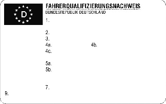
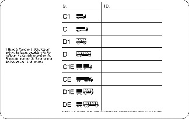

# Verordnung zur Durchführung des Berufskraftfahrerqualifikationsgesetzes (BKrFQV 2020)

Ausfertigungsdatum
:   2020-12-09

Fundstelle
:   BGBl I: 2020, 2905

Stand: Ersetzt V 9231-11-1 v. 22.8.2006 I 2108 (BKrFQV)
Diese Verordnung dient der Umsetzung der Richtlinie (EU) 2018/645 des
Europäischen Parlaments und des Rates vom 18. April 2018 zur Änderung
der Richtlinie 2003/59/EG über die Grundqualifikation und
Weiterbildung der Fahrer bestimmter Kraftfahrzeuge für den Güter- oder
Personenkraftverkehr und der Richtlinie 2006/126/EG über den
Führerschein (ABl. L 112 vom 2.5.2018, S. 29).

## § 1 Erwerb der Grundqualifikation

(1) Für den Zugang zum Erwerb der Grundqualifikation ist der vorherige
Erwerb der jeweiligen Fahrerlaubnis nicht erforderlich.

(2) Die Prüfung über die Grundqualifikation besteht aus einer
theoretischen und einer praktischen Prüfung nach Maßgabe der Anlage 2.
Durch sie hat der Prüfungsteilnehmer nachzuweisen, dass er über die
jeweils erforderlichen grundlegenden Kenntnisse und Fertigkeiten aus
den in Anlage 1 aufgeführten Kenntnisbereichen für die betreffenden
Fahrerlaubnisklassen verfügt.

(3) Die Prüfung wird bei der für den Wohnsitz des Prüfungsteilnehmers
zuständigen Industrie- und Handelskammer abgelegt. Die Industrie- und
Handelskammer kann für den praktischen Teil amtlich anerkannte
Sachverständige oder Prüfer für den Kraftfahrzeugverkehr hinzuziehen.
Die Industrie- und Handelskammer muss für den praktischen Teil in Satz
2 bezeichnete Sachverständige oder Prüfer hinzuziehen, soweit die
Industrie- und Handelskammer nicht über eigenes Personal mit
gleichwertiger Qualifikation verfügt. Bei Bedarf muss die zuständige
Industrie- und Handelskammer mindestens einmal im Vierteljahr einen
Prüfungstermin festsetzen. Der Prüfungsteilnehmer kann mit seiner
Zustimmung an eine andere Industrie- und Handelskammer verwiesen
werden, wenn innerhalb eines Vierteljahres weniger als drei
Prüfungsteilnehmer zur Prüfung anstehen oder dem Prüfungsteilnehmer
andernfalls wirtschaftliche Nachteile entstehen.

(4) Die Prüfung ist bestanden, wenn jeweils im praktischen und
theoretischen Teil mindestens ausreichende Leistungen erbracht sind.

(5) Inhaber einer Fachkunde-Bescheinigung nach § 4 Absatz 6 Satz 1 der
Berufszugangsverordnung für den Straßenpersonenverkehr oder nach § 5
Absatz 7 der Berufszugangsverordnung für den Güterkraftverkehr sind
von der theoretischen Prüfung insoweit befreit, als der
Prüfungsgegenstand bereits Gegenstand der Prüfung nach diesen
Verordnungen ist. Die Dauer der theoretischen Prüfung ist entsprechend
zu verkürzen.

## § 2 Erwerb der beschleunigten Grundqualifikation

(1) Für den Zugang zum Erwerb der beschleunigten Grundqualifikation
ist der vorherige Erwerb der jeweiligen Fahrerlaubnis nicht
erforderlich.

(2) Die Dauer des Unterrichts beträgt insgesamt 140
Unterrichtseinheiten zu je 60 Minuten (Unterrichtseinheit). Während
des Unterrichts sind jeweils die erforderlichen grundlegenden
Kenntnisse und Fertigkeiten aus den in Anlage 1 aufgeführten
Kenntnisbereichen zu vermitteln.

(3) Der Prüfungsteilnehmer muss im Verlauf des Unterrichts mindestens
zehn Unterrichtseinheiten ein Kraftfahrzeug der betreffenden Klasse
unter Aufsicht einer Person führen, die eine gültige Fahrlehrerlaubnis
für die jeweilige Fahrerlaubnisklasse nach dem Fahrlehrergesetz
besitzt. Das Kraftfahrzeug muss den jeweiligen Kriterien für
Prüfungsfahrzeuge der Nummern 2.2.6 bis 2.2.13 der Anlage 7 der
Fahrerlaubnis-Verordnung entsprechen. Es muss außerdem den
Anforderungen der Nummer 2.2.16 der Anlage 7 der Fahrerlaubnis-
Verordnung entsprechen, sofern der Prüfungsteilnehmer die
Fahrerlaubnis der betreffenden Fahrerlaubnisklasse noch nicht besitzt.

(4) Von den Unterrichtseinheiten nach Absatz 3 Satz 1 können bis zu
vier Unterrichtseinheiten auch auf Übungen auf einem besonderen
Gelände im Rahmen eines Fahrertrainings oder in einem leistungsfähigen
Simulator entfallen.

(5) Die nach Landesrecht zuständige Behörde rechnet andere
abgeschlossene spezielle Ausbildungsmaßnahmen als Teil des Unterrichts
an. Anzurechnen im Umfang von jeweils sieben Unterrichtseinheiten sind
die

1.  Ausbildung gemäß Anhang I der Richtlinie
    2008/68/EG                    des Europäischen Parlaments und des
    Rates vom 24. September 2008 über die Beförderung gefährlicher Güter
    im Binnenland (ABl. L 260 vom 30.9.2008, S. 13) für Fahrzeugführer,
    die zuletzt durch den Beschluss (EU) 2019/1094 (ABl. L 173 vom
    27\.6.2019, S. 52) geändert worden ist, und

2.  Schulung gemäß Artikel 6 Absatz 5 in Verbindung mit Artikel 17 Absatz
    2 der Verordnung (EG)
    Nr. 1/2005                    des Rates vom 22. Dezember 2004 über den
    Schutz von Tieren beim Transport und damit zusammenhängenden Vorgängen
    sowie zur Änderung der Richtlinien 64/432/EWG und 93/119/EG und der
    Verordnung (EG) Nr. 1255/97 (ABl. L 3 vom 5.1.2005, S. 1), die zuletzt
    durch die Verordnung (EU) Nr. 2017/625 (ABl. L 95 vom 7.4.2017, S. 1)
    geändert worden ist.

Die nach Satz 1 abgeschlossenen speziellen Ausbildungsmaßnahmen werden
jeweils nur einmal im Rahmen der beschleunigten Grundqualifikation
angerechnet. Sind seit dem Abschluss der speziellen
Ausbildungsmaßnahme mehr als fünf Jahre vergangen, ist eine Anrechnung
nicht mehr zulässig.

(6) Die Prüfung besteht aus einer schriftlichen Prüfung von 90 Minuten
Dauer. Sie umfasst mindestens eine Frage zu jedem der jeweils
maßgeblichen in Anlage 1 genannten Ziele. In der Prüfung ist
nachzuweisen, dass die Inhalte der in Anlage 1 aufgeführten
Kenntnisbereiche beherrscht werden.

(7) Die Prüfung wird bei der für den Wohnsitz des Prüfungsteilnehmers
zuständigen Industrie- und Handelskammer abgelegt. Bei Bedarf muss die
zuständige Industrie- und Handelskammer mindestens einmal im
Vierteljahr einen Prüfungstermin festsetzen. Der Prüfungsteilnehmer
kann mit seiner Zustimmung an eine andere Industrie- und Handelskammer
verwiesen werden, wenn innerhalb eines Vierteljahres weniger als drei
Prüfungsteilnehmer zur Prüfung anstehen oder dem Prüfungsteilnehmer
andernfalls wirtschaftliche Nachteile entstehen.

(8) Die Prüfung ist bestanden, wenn mindestens ausreichende Leistungen
erbracht sind.

(9) Inhaber einer Fachkunde-Bescheinigung nach § 4 Absatz 6 Satz 1 der
Berufszugangsverordnung für den Straßenpersonenverkehr oder nach § 5
Absatz 7 der Berufszugangsverordnung für den Güterkraftverkehr sind
von der Teilnahme am Unterricht und der Prüfung insoweit befreit, als
Prüfungsgegenstand bereits Gegenstand der Prüfung nach diesen
Verordnungen ist. Die Unterrichtsdauer beträgt 96
Unterrichtseinheiten, von denen zehn Unterrichtseinheiten auf das
Führen eines Kraftfahrzeugs der betreffenden Klasse entfallen. Die
Prüfung ist entsprechend zu verkürzen.

## § 3 Unterrichts- und Prüfungsanforderungen in besonderen Fällen

(1) Fahrer im Güterkraftverkehr, die ihre Tätigkeit auf den
Personenkraftverkehr ausweiten, oder Fahrer im Personenkraftverkehr,
die ihre Tätigkeit auf den Güterkraftverkehr ausweiten oder ändern und
die eine Grundqualifikation erworben haben, müssen bei der
theoretischen und praktischen Prüfung nach § 1 Absatz 2 nur diejenigen
Teile ablegen, welche Kraftfahrzeuge betreffen, die Gegenstand der
neuen Grundqualifikation sind.

(2) Bei Absolvierung der beschleunigten Grundqualifikation beträgt die
Unterrichtsdauer 35 Unterrichtseinheiten, von denen 2,5
Unterrichtseinheiten auf das Führen eines Kraftfahrzeugs der
betreffenden Klassen entfallen. Das Kraftfahrzeug muss den
Anforderungen nach § 2 Absatz 3 Satz 2 entsprechen. Die theoretische
Prüfung beschränkt sich auf diejenigen in Anlage 1 genannten
Kenntnisbereiche, welche die Kraftfahrzeuge betreffen, die Gegenstand
der neuen beschleunigten Grundqualifikation sind.

## § 4 Weiterbildung

(1) Durch die Weiterbildung sind alle in Anlage 1 aufgeführten
Kenntnisbereiche zu vertiefen und aufzufrischen. Aus den
Kenntnisbereichen 1, 2 und 3 der Anlage 1 muss jeweils mindestens ein
Unterkenntnisbereich abgedeckt sein. Besondere Schwerpunkte sollen die
Verkehrssicherheit, die Sicherheit und der Gesundheitsschutz am
Arbeitsplatz und die Reduzierung der Umweltauswirkungen des Fahrens
bilden. Eine einmalige Wiederholung von Unterkenntnisbereichen unter
Einhaltung von Satz 2 ist zulässig.

(2) Die Dauer der Weiterbildung beträgt 35 Unterrichtseinheiten, die
in selbstständigen Ausbildungseinheiten von jeweils mindestens sieben
Unterrichtseinheiten erteilt werden. Die Unterrichtseinheiten können
bei verschiedenen Ausbildungsstätten absolviert werden. Eine
Ausbildungseinheit kann auf zwei aufeinanderfolgende Tage aufgeteilt
werden.

(3) Mindestens eine Ausbildungseinheit umfasst einen die
Verkehrssicherheit betreffenden Unterkenntnisbereich. Ein Teil der
Weiterbildung kann auf Übungen auf einem besonderen Gelände im Rahmen
eines Fahrertrainings oder in einem leistungsfähigen Simulator
entfallen.

(4) Die nach Landesrecht zuständige Behörde rechnet andere
abgeschlossene spezielle Aus- oder Weiterbildungsmaßnahmen als Teil
des Unterrichts an. Anzurechnen im Umfang von sieben
Unterrichtseinheiten sind die

1.  Ausbildung gemäß Anhang I der Richtlinie
    2008/68/EG                    des Europäischen Parlaments und des
    Rates vom 24. September 2008 über die Beförderung gefährlicher Güter
    im Binnenland (ABl. L 260 vom 30.9.2008, S. 13) für Fahrzeugführer,
    die zuletzt durch den Beschluss (EU) 2019/1094 (ABl. L 173 vom
    27\.6.2019, S. 52) geändert worden ist, und

2.  Schulung gemäß Artikel 6 Absatz 5 in Verbindung mit Artikel 17 Absatz
    2 der Verordnung (EG)
    Nr. 1/2005                    des Rates vom 22. Dezember 2004 über den
    Schutz von Tieren beim Transport und damit zusammenhängenden Vorgängen
    sowie zur Änderung der Richtlinien 64/432/EWG und 93/119/EG und der
    Verordnung (EG) Nr. 1255/97 (ABl. L 3 vom 5.1.2005, S. 1), die zuletzt
    durch die Verordnung (EU) Nr. 2017/625 (ABl. L 95 vom 7.4.2017, S. 1)
    geändert worden ist.

Abgeschlossene spezielle Aus- oder Weiterbildungsmaßnahmen werden
jeweils nur einmal im Rahmen des fünfjährigen Weiterbildungsrhythmus
angerechnet. Sind seit dem Abschluss der speziellen Aus- oder
Weiterbildungsmaßnahme mehr als fünf Jahre vergangen, ist eine
Anrechnung nicht mehr zulässig.

## § 5 Anerkennung von Ausbildungsstätten

(1) Der Antrag auf Anerkennung einer Ausbildungsstätte für die
beschleunigte Grundqualifikation und die Weiterbildung ist bei der
nach Landesrecht zuständigen Behörde in schriftlicher oder in
elektronischer Form zu stellen. Dem Antrag sind die zur Prüfung der
Anerkennungsvoraussetzungen erforderlichen Unterlagen beizufügen,
insbesondere

1.  das Ausbildungsprogramm, in dem die unterrichteten Themengebiete auf
    der Grundlage der in Anlage 1 aufgeführten Kenntnisbereiche sowie die
    geplante Durchführung des Unterrichts und die Unterrichtsmethoden
    näher darzustellen sind,

2.  Nachweise über die Zahl, die Qualifikationen und die
    Tätigkeitsbereiche der Ausbilder, einschließlich eines Nachweises über
    ihre didaktischen und pädagogischen Kenntnisse,

3.  Angaben zu den Unterrichtsräumen, zu den Lehrmitteln, zu den für die
    praktische Ausbildung bereitgestellten Unterrichtsmitteln sowie zu den
    eingesetzten Ausbildungsfahrzeugen und

4.  die vorgesehene maximale Teilnehmerzahl für den jeweiligen
    Unterrichtsraum.

Für Ausbilder im praktischen Teil muss eine Berufserfahrung als

1.  Berufskraftfahrer,

2.  Fachkraft im Fahrbetrieb,

3.  Kraftverkehrsmeister oder

4.  Meister für Kraftverkehr

oder eine entsprechende Fahrerfahrung, insbesondere als Fahrlehrer für
Lastkraftwagen oder Busse, nachgewiesen werden.

(2) Die Anerkennung ist in schriftlicher oder in elektronischer Form
zu erlassen. Vorbehaltlich besonderer Bestimmungen sind zu benennen:

1.  das anerkannte Ausbildungsprogramm,

2.  die zugelassenen Ausbilder,

3.  die zugelassenen Räume, in denen Unterricht nach § 2 Absatz 2 und § 5
    Absatz 3 des Berufskraftfahrerqualifikationsgesetzes durchgeführt
    werden darf, und

4.  die jeweils höchstens zulässige Teilnehmerzahl.

(3) Die Anerkennung kann mit Nebenbestimmungen verbunden werden.

## § 6 Anforderungen an den Unterricht

(1) Die Teilnehmerzahl für den Unterricht zur beschleunigten
Grundqualifikation und zur Weiterbildung ist auf höchstens 25 Personen
je Unterricht zu beschränken. Die Durchführung von Unterricht mit
einer höheren Teilnehmerzahl ist unzulässig.

(2) Die Ausbildungsstätte hat dafür zu sorgen, dass in den
Unterrichtsräumen während des Unterrichts für alle Teilnehmenden
geeignete und ausreichende Lernmittel zur Gestaltung des Unterrichts
und zur Visualisierung vorhanden sind.

## § 7 Fortbildung der Ausbilder

(1) Ausbilder, die Unterricht zur beschleunigten Grundqualifikation
oder zur Weiterbildung durchführen, haben ihre Kenntnisse regelmäßig
durch eine mindestens dreitägige Fortbildung aufzufrischen. Die
Fortbildung soll alle Gebiete erfassen, die für diese berufliche
Tätigkeit des Ausbilders von Bedeutung sind. Die Fortbildung hat einen
Gesamtumfang von mindestens 24 Unterrichtseinheiten zu je 60 Minuten
und ist spätestens alle vier Jahre zu absolvieren.

(2) Die Ausbilder haben der Ausbildungsstätte, an der sie Unterricht
durchführen, spätestens zwei Wochen nach Abschluss der Fortbildung die
Teilnahmebescheinigung der Ausbildungsstätte auszuhändigen.

(3) Der Unterricht im Sinne dieser Verordnung darf nur von Ausbildern
durchgeführt werden, die sich regelmäßig im Sinne des Absatzes 1 Satz
3 fortbilden.

(4) Teilnahmebescheinigungen der Ausbilder der letzten beiden
Fortbildungsmaßnahmen sind von der Ausbildungsstätte aufzubewahren und
spätestens acht Jahre nach Abschluss der Fortbildungsmaßnahme zu
vernichten. Die Teilnahmebescheinigungen sind der nach Landesrecht
zuständigen Behörde nach § 11 Absatz 1 Satz 1 des
Berufskraftfahrerqualifikationsgesetzes auf Verlangen unverzüglich
vorzulegen.

## § 8 Ausstellung des Fahrerqualifizierungsnachweises

(1) Die nach Landesrecht zuständige Behörde stellt auf Antrag einen
Fahrerqualifizierungsnachweis aus, wenn der Fahrer nachweislich
grundqualifiziert ist oder als grundqualifiziert gilt. Sind seit der
Erlangung der Grundqualifikation mehr als fünf Jahre vergangen, muss
der Fahrer nachweislich über eine abgeschlossene Weiterbildung
verfügen. Der Fahrerqualifizierungsnachweis folgt dem Muster der
Anlage 5.

(2) Der Antrag auf Ausstellung des Fahrerqualifizierungsnachweises ist
bei der nach Landesrecht zuständigen Behörde durch den Fahrer in
schriftlicher oder in elektronischer Form zu stellen. Der Fahrer hat
auf Verlangen der Behörde persönlich zu erscheinen. Sie oder er hat
folgende Daten mitzuteilen und auf Verlangen nachzuweisen:

1.  Geburts- und Familienname, Vornamen, Tag und Ort der Geburt,
    akademischer Grad und Geschlecht,

2.  Anschrift,

3.  Staatsangehörigkeit und

4.  Art des Ausweisdokuments.

(3) Dem Antrag sind folgende Unterlagen beizufügen:

1.  ein amtlicher Nachweis über Tag und Ort der Geburt,

2.  ein Lichtbild, das die Anforderungen der Anlage 8 der Passverordnung
    erfüllt,

3.  ein gültiger Führerschein, in dem die für die Grundqualifikation, die
    beschleunigte Grundqualifikation oder die Weiterbildung maßgebliche
    Fahrerlaubnisklasse vermerkt ist,

4.  ein amtlicher Nachweis über den ordentlichen Wohnsitz im Sinne des § 7
    Absatz 1 oder Absatz 2 der Fahrerlaubnis-Verordnung in der
    Bundesrepublik Deutschland, eine in der Bundesrepublik Deutschland
    erteilte Arbeitsgenehmigung-EU oder einen Aufenthaltstitel, der
    erkennen lässt, dass die Erwerbstätigkeit erlaubt ist (§ 4a Absatz 3
    des Aufenthaltsgesetzes), und

5.  sofern andere abgeschlossene spezielle Aus- oder
    Weiterbildungsmaßnahmen gemäß § 2 Absatz 5 oder § 4 Absatz 4
    angerechnet werden sollen und diesbezüglich noch kein Eintrag in das
    Berufskraftfahrerqualifikationsregister erfolgt ist, ein rechtlich
    vorgeschriebener Nachweis über den Abschluss der jeweiligen Maßnahme.

(4) Die nach Landesrecht zuständige Behörde prüft die Richtigkeit und
Vollständigkeit der vom Fahrer mitgeteilten Daten und vorgelegten
Unterlagen. Sie holt zu diesem Zweck eine Auskunft aus dem Zentralen
Fahrerlaubnisregister ein. Die nach Landesrecht zuständige Behörde
überprüft das Vorliegen einer Grundqualifikation oder einer
Weiterbildung nach Absatz 1. Sie holt zu diesem Zweck eine Auskunft
aus dem Berufskraftfahrerqualifikationsregister ein.

## § 9 Ausstellung eines neuen Fahrerqualifizierungsnachweises bei Änderungen, Verlust, Diebstahl und Beschädigung

(1) Bei Änderungen der den Angaben auf dem
Fahrerqualifizierungsnachweis zugrunde liegenden Tatsachen ist auf
Antrag ein neuer Fahrerqualifizierungsnachweis auszustellen. Der alte
Fahrerqualifizierungsnachweis ist der nach Landesrecht zuständigen
Behörde zurückzugeben.

(2) Wird ein Fahrerqualifizierungsnachweis wegen Verlust, Diebstahl
oder Beschädigung eines vorhandenen Fahrerqualifizierungsnachweises
beantragt, sind der nach Landesrecht zuständigen Behörde vorzulegen:

1.  bei Verlust des Fahrerqualifizierungsnachweises eine schriftliche
    Erklärung über den Verlust,

2.  bei Diebstahl des Fahrerqualifizierungsnachweises der Nachweis einer
    Anzeige,

3.  bei Beschädigung des Fahrerqualifizierungsnachweises der zu erneuernde
    Fahrerqualifizierungsnachweis.

Dem Antrag sind die nach § 8 Absatz 3 Nummer 1 bis 4 erforderlichen
Unterlagen beizufügen. Die nach Landesrecht zuständige Behörde prüft
die Vollständigkeit der mitgeteilten Daten. Sie holt zu diesem Zweck
eine Auskunft aus dem Zentralen Fahrerlaubnisregister ein. Die nach
Landesrecht zuständige Behörde prüft das Vorliegen einer
Grundqualifikation oder einer Weiterbildung nach § 8 Absatz 1. Sie
holt zu diesem Zweck eine Auskunft aus dem
Berufskraftfahrerqualifikationsregister ein.

(3) Der Fahrer hat auf Verlangen der nach Landesrecht zuständigen
Behörde, die den neuen Fahrerqualifizierungsnachweis ausstellt, eine
Versicherung an Eides statt abzugeben, dass und aus welchen Gründen
der Fahrerqualifizierungsnachweis nicht zurückgegeben werden kann.

(4) Mit Ausstellung des neuen Fahrerqualifizierungsnachweises verliert
der ersetzte Fahrerqualifizierungsnachweis seine Gültigkeit. Ein
wiederaufgefundener Fahrerqualifizierungsnachweis ist der nach
Landesrecht zuständigen Behörde unverzüglich zurückzugeben.

## § 10 Ordnungswidrigkeiten

(1) Ordnungswidrig im Sinne des § 28 Absatz 2 Nummer 7 Buchstabe a des
Berufskraftfahrerqualifikationsgesetzes handelt, wer vorsätzlich oder
fahrlässig

1.  entgegen § 6 Absatz 1 Satz 2 oder § 7 Absatz 3 Unterricht durchführt
    oder

2.  entgegen § 6 Absatz 2 nicht dafür sorgt, dass die dort genannten
    Lernmittel vorhanden sind.

(2) Ordnungswidrig im Sinne des § 28 Absatz 2 Nummer 7 Buchstabe b des
Berufskraftfahrerqualifikationsgesetzes handelt, wer vorsätzlich oder
fahrlässig

1.  entgegen § 7 Absatz 4 Satz 2 eine Teilnahmebescheinigung nicht, nicht
    richtig oder nicht rechtzeitig vorlegt oder

2.  entgegen § 11 Absatz 4 Satz 1 Nummer 1 Buchstabe b eine Bescheinigung
    nicht, nicht richtig oder nicht rechtzeitig ausstellt.

## § 11 Übergangsvorschriften

(1) Weiterbildungsbescheinigungen, die nach den bis zum Ablauf des 21.
Dezember 2016 geltenden Vorschriften ausgefertigt worden sind, bleiben
bis zum Ablauf des 21. Dezember 2021 gültig.

(2) Weiterbildungsbescheinigungen, die nach den bis zum Ablauf des 23.
August 2017 geltenden Vorschriften ausgefertigt worden sind, bleiben
bis zum Ablauf des 23. August 2022 gültig.

(3) Bescheinigungen, die auf Grundlage der Anlagen 2a und 2b der bis
zum Ablauf des 16. Dezember 2020 geltenden Vorschriften ausgefertigt
worden sind, bleiben gültig.

(4) Bis zur Inbetriebnahme der Schnittstelle für die Industrie- und
Handelskammern und für die anerkannten Ausbildungsstätten zum
Berufskraftfahrerqualifikationsregister ist anstelle eines Eintrags in
das Berufskraftfahrerqualifikationsregister

1.  eine Bescheinigung über die jeweils erbrachten Leistungen oder
    Teilleistungen auszustellen und dem Teilnehmer auszuhändigen von

    a)  der Industrie- und Handelskammer unmittelbar nach dem Bestehen der
        Prüfung und

    b)  der Ausbildungsstätte unmittelbar nach dem Abschluss des Unterrichts
        zum Erwerb der beschleunigten Grundqualifikation, dem Abschluss von
        Unterrichtseinheiten nach § 4 Absatz 2 (Teilleistungen) sowie dem
        Abschluss der Weiterbildung,

2.  die Bescheinigung zum Abschluss des Unterrichts zum Erwerb der
    beschleunigten Grundqualifikation nach dem Muster der Anlage 3
    auszustellen und dem Teilnehmer auszuhändigen; die Bescheinigung muss
    enthalten:

    a)  Name und Anschrift der Ausbildungsstätte sowie Angaben zur zuständigen
        Anerkennungs- und Überwachungsbehörde und das Aktenzeichen des
        Anerkennungsbescheides,

    b)  Name, Anschrift und Geburtsdatum des Teilnehmers,

    c)  Zeitraum des Unterrichts und tatsächliche Dauer der
        Unterrichtsteilnahme und

    d)  Angaben zu den vermittelten Unterkenntnisbereichen nach Anlage 1,

3.  die Bescheinigung über Teilleistungen und den Abschluss der
    Weiterbildung nach dem Muster der Anlage 4 auszustellen und dem
    Teilnehmer auszuhändigen; die Bescheinigung muss enthalten:

    a)  Name und Anschrift der Ausbildungsstätte sowie Angaben zur zuständigen
        Anerkennungs- und Überwachungsbehörde und das Aktenzeichen des
        Anerkennungsbescheides,

    b)  Name, Anschrift und Geburtsdatum des Teilnehmers,

    c)  Zeitraum des Unterrichts und tatsächliche Dauer der
        Unterrichtsteilnahme und

    d)  Angaben zu den vermittelten Unterkenntnisbereichen nach Anlage 1.

Die Bescheinigung nach Satz 1 Nummer 2 ist im Original von einer zur
Vertretung der Ausbildungsstätte berechtigten Person zu
unterschreiben. Die Bescheinigung nach Satz 1 Nummer 3 ist im Original
von einer zur Vertretung der Ausbildungsstätte berechtigten Person und
von der zur Durchführung des Unterrichts eingesetzten Person zu
unterschreiben. Die eigenhändige Unterschrift der zur Vertretung der
Ausbildungsstätte berechtigten Person kann bei automatisierter
Erstellung der Bescheinigung durch eine bildhafte Wiedergabe der
Unterschrift ersetzt werden. Das gilt nicht, wenn der Unterricht
ausschließlich von dieser Person durchgeführt wurde.

(5) Bescheinigungen nach Absatz 4 Satz 1 Nummer 1 Buchstabe b in
Verbindung mit Nummer 3 sind fünf Jahre ab dem Abschluss der
Teilleistung oder gesamten Weiterbildung gültig. Sie sind zusätzlich
zu den in § 8 Absatz 3 genannten Unterlagen vorzulegen.

(zu § 1 Absatz 2 Satz 2, § 2 Absatz 2 Satz 2, § 4 Absatz 1 Satz 1)

## Anlage 1 Liste der Kenntnisbereiche

(Fundstelle: BGBl. I 2020, 2910 - 2913)

Die Kenntnisse müssen sich zumindest auf die in dieser Liste
angeführten Bereiche erstrecken. Anwärter für den Beruf des
Kraftfahrers müssen über das zum sicheren Führen eines Fahrzeugs der
betreffenden Fahrerlaubnisklasse erforderliche Niveau von Kenntnissen
und Fähigkeiten in diesen Bereichen verfügen.

Das Mindestqualifikationsniveau muss mit Niveau 2 des Europäischen
Qualifikationsrahmens gemäß Anhang II der Empfehlung des Europäischen
Parlaments und des Rates vom 23. April 2008 zur Einrichtung des
Europäischen Qualifikationsrahmens für lebenslanges Lernen (ABl. C 111
vom 6.5.2008, S. 1) vergleichbar sein.

*    *   **1.**

    *   **Verbesserung des rationellen Fahrverhaltens auf der Grundlage der
        Sicherheitsregeln**

*    *
    *   Fahrerlaubnisklassen C1, C1E, C, CE, D1, D1E, D, DE

*    *
    *[^F814108_02_BJNR290510020BJNE001200000]
   1.1

    *   Ziel: Kenntnis der Eigenschaften der kinematischen Kette für eine
        optimierte Nutzung, insbesondere:

        –   Drehmomentkurven,

        –   Leistungskurven,

        –   spezifische Verbrauchskurven eines Motors,

        –   optimaler Nutzungsbereich des Drehzahlmessers und

        –   optimaler Drehzahlbereich beim Schalten.

*    *
    *   1.2

    *   Ziel: Kenntnis der technischen Merkmale und der Funktionsweise der
        Sicherheitsausstattung, um das Fahrzeug zu beherrschen, seinen
        Verschleiß möglichst gering zu halten und Fehlfunktionen vorzubeugen,
        insbesondere:

        –   Grenzen des Einsatzes der Bremsanlagen und der Dauerbremsanlage,

        –   kombinierter Einsatz von Brems- und Dauerbremsanlage,

        –   bestes Verhältnis zwischen Geschwindigkeit und Getriebeübersetzung,

        –   Einsatz der Trägheit des Fahrzeugs,

        –   Einsatz der Bremsanlagen im Gefälle,

        –   Verhalten bei Defekten,

        –   Verwendung von elektronischen und mechanischen Geräten wie
            elektronisches Stabilitätsprogramm (ESP),

        –   vorausschauende Notbremssysteme (AEBS),

        –   Antiblockiersystem (ABS),

        –   Traktionskontrollsysteme (TCS) und Überwachungssysteme im Fahrzeug
            (IVMS) und

        –   andere zur Verwendung zugelassene Fahrerassistenz- oder
            Automatisierungssysteme.

*    *
    *   1.3

    *   Ziel: Fähigkeit zur Optimierung des Kraftstoffverbrauchs,
        insbesondere:

        –   Optimierung des Kraftstoffverbrauchs durch Anwendung der Kenntnisse
            gemäß den Nummern 1.1 und 1.2,

        –   Bedeutung der Antizipation des Verkehrsflusses,

        –   geeigneter Abstand zu anderen Fahrzeugen und Nutzung der
            Fahrzeugdynamik,

        –   konstante Geschwindigkeit,

        –   ausgeglichener Fahrstil und angemessener Reifendruck und

        –   Kenntnis intelligenter Verkehrssysteme, die ein effizienteres Fahren
            und eine bessere Routenplanung ermöglichen.

*    *
    *   1.3a

    *   Ziel: Fähigkeit, Risiken im Straßenverkehr vorherzusehen, zu bewerten
        und sich daran anzupassen, insbesondere:

        –   sich unterschiedlicher Straßen-, Verkehrs- und Witterungsbedingungen
            bewusst sein und sich daran anpassen,

        –   künftige Ereignisse vorhersehen,

        –   ermessen, welche Vorkehrungen für eine Fahrt bei außergewöhnlichen
            Witterungsbedingungen getroffen werden müssen,

        –   die Verwendung der damit verbundenen Sicherheitsausrüstung beherrschen
            und sich bewusst machen, wann eine Fahrt aufgrund extremer
            Witterungsbedingungen verschoben oder abgesagt werden muss,

        –   sich an Verkehrsrisiken anpassen, einschließlich gefährlicher
            Verhaltensweisen im Verkehr oder Ablenkung beim Fahren (durch die
            Nutzung elektronischer Geräte, Nahrungs- und Getränkeaufnahme usw.),

        –   Gefahrensituationen erkennen, sich daran anpassen und den damit
            verbundenen Stress bewältigen, vor allem in Bezug auf Größe und
            Gewicht des Fahrzeugs und auf schwächere Verkehrsteilnehmer,
            beispielsweise Fußgänger, Radfahrer und motorisierte Zweiräder, und

        –   mögliche Gefahrensituationen erkennen und korrekte Schlüsse ziehen,
            wie aus dieser potenziell gefährlichen Lage Situationen entstehen
            können, in denen Unfälle möglicherweise nicht mehr vermieden werden
            können, sowie Maßnahmen auswählen und durchführen, durch die die
            Sicherheitsabstände so erhöht werden, dass ein Unfall noch vermieden
            werden kann, falls die potenziellen Gefahren auftreten sollten.

*    *
    *   Fahrerlaubnisklassen C1, C1E, C, CE

*    *
    *   1.4

    *   Ziel: Fähigkeit zur Sicherung der Ladung unter Anwendung der
        Sicherheitsvorschriften und durch richtige Benutzung des Fahrzeugs,
        insbesondere:

        –   bei der Fahrt auf das Fahrzeug wirkende Kräfte,

        –   Einsatz der Getriebeübersetzung entsprechend der Belastung des
            Fahrzeugs und dem Fahrbahnprofil,

        –   Nutzung von Automatikgetrieben,

        –   Berechnung der Nutzlast eines Fahrzeugs oder einer
            Fahrzeugkombination,

        –   Berechnung des Nutzvolumens,

        –   Verteilung der Ladung,

        –   Auswirkungen der Überladung auf die Achse,

        –   Fahrzeugstabilität und Schwerpunkt,

        –   Arten von Verpackungen und Lastträgern,

        –   wichtigste Kategorien von Gütern, bei denen eine Ladungssicherung
            erforderlich ist,

        –   Feststell- und Verzurrtechniken,

        –   Verwendung der Zurrgurte,

        –   Überprüfung der Haltevorrichtungen,

        –   Einsatz des Umschlaggeräts und

        –   Abdecken mit einer Plane und Entfernen der Plane.

*    *
    *   Fahrerlaubnisklassen D1, D1E, D, DE

*    *
    *   1.5

    *   Ziel: Fähigkeit zur Gewährleistung der Fahrgastsicherheit und des
        Fahrgastkomforts, insbesondere:

        –   richtige Einschätzung der Längs- und Seitwärtsbewegungen des
            Fahrzeugs,

        –   rücksichtsvolles Verkehrsverhalten,

        –   Positionierung auf der Fahrbahn,

        –   sanftes Abbremsen; Beachtung der Überhänge,

        –   Nutzung spezifischer Infrastrukturen (öffentliche Verkehrsflächen,
            bestimmten Verkehrsteilnehmern vorbehaltene Verkehrswege),

        –   angemessene Prioritätensetzung im Hinblick auf die sichere Steuerung
            des Fahrzeugs und die Erfüllung anderer dem Fahrer obliegenden
            Aufgaben,

        –   Umgang mit den Fahrgästen und

        –   besondere Merkmale der Beförderung bestimmter Fahrgastgruppen
            (Menschen mit Behinderungen, Kinder).

*    *
    *   1.6

    *   Ziel: Fähigkeit zur Sicherung der Ladung unter Anwendung der
        Sicherheitsvorschriften und durch richtige Benutzung des Fahrzeugs,
        insbesondere:

        –   bei der Fahrt auf das Fahrzeug wirkende Kräfte,

        –   Einsatz der Getriebeübersetzung entsprechend der Belastung des
            Fahrzeugs und dem Fahrbahnprofil,

        –   Nutzung von Automatikgetrieben,

        –   Berechnung der Nutzlast eines Fahrzeugs oder einer
            Fahrzeugkombination,

        –   Verteilung der Ladung,

        –   Auswirkungen der Überladung auf die Achse und

        –   Fahrzeugstabilität und Schwerpunkt.

*    *   **2.**

    *   **Anwendung der Vorschriften**

*    *
    *   Fahrerlaubnisklassen C1, C1E, C, CE, D1, D1E, D, DE

*    *
    *   2.1

    *   Ziel: Kenntnis der sozialrechtlichen Rahmenbedingungen und
        Vorschriften für den Kraftverkehr, insbesondere:

        –   höchstzulässige Arbeitszeiten in der Verkehrsbranche,

        –   Grundsätze, Anwendung und Auswirkungen der Verordnungen (EG) Nr.
            561/2006 und (EU)
            Nr. 165/2014                              des Europäischen Parlaments
            und des Rates,

        –   Sanktionen für den Fall, dass der Fahrtenschreiber nicht benutzt,
            falsch benutzt oder verfälscht wird und

        –   Kenntnis der sozialrechtlichen Rahmenbedingungen für den Güter- oder
            Personenkraftverkehr: Rechte und Pflichten der Kraftfahrer im Bereich
            der Grundqualifikation und der Weiterbildung.

*    *
    *   Fahrerlaubnisklassen C1, C1E, C, CE

*    *
    *   2.2

    *   Ziel: Kenntnis der Vorschriften für den Güterkraftverkehr,
        insbesondere:

        –   Beförderungsgenehmigungen,

        –   im Fahrzeug mitzuführende Dokumente,

        –   Fahrverbote für bestimmte Straßen,

        –   Straßenbenutzungsgebühren,

        –   Verpflichtungen im Rahmen der Musterverträge für die Güterbeförderung,

        –   Erstellen von Beförderungsdokumenten,

        –   Genehmigungen im internationalen Verkehr,

        –   Verpflichtungen im Rahmen des CMR (Übereinkommen über den
            Beförderungsvertrag im internationalen Straßengüterverkehr),

        –   Erstellen des internationalen Frachtbriefs,

        –   Überschreiten der Grenzen,

        –   Verkehrskommissionäre und

        –   besondere Begleitdokumente für die Güter.

*    *
    *   Fahrerlaubnisklassen D1, D1E, D, DE

*    *
    *   2.3

    *   Ziel: Kenntnis der Vorschriften für den Personenkraftverkehr,
        insbesondere:

        –   Beförderung bestimmter Personengruppen,

        –   Sicherheitsausstattung in Bussen,

        –   Sicherheitsgurte und

        –   Beladen des Fahrzeugs.

*    *   **3.**

    *   **Gesundheit, Verkehrs- und Umweltsicherheit, Dienstleistung,
        Logistik**

*    *
    *   Fahrerlaubnisklassen C1, C1E, C, CE, D1, D1E, D, DE

*    *
    *   3.1

    *   Ziel: Sensibilisierung in Bezug auf Risiken des Straßenverkehrs und
        Arbeitsunfälle, insbesondere:

        –   Typologie der Arbeitsunfälle in der Verkehrsbranche,

        –   Verkehrsunfallstatistiken,

        –   Beteiligung von Lastkraftwagen/Bussen und

        –   menschliche, materielle und finanzielle Auswirkungen.

*    *
    *   3.2

    *   Ziel: Fähigkeit, der Kriminalität und der Schleusung illegaler
        Einwanderer vorzubeugen, insbesondere:

        –   allgemeine Informationen,

        –   Folgen für die Kraftfahrer,

        –   Vorbeugungsmaßnahmen,

        –   Checkliste für Überprüfungen und

        –   Rechtsvorschriften betreffend die Verantwortung der
            Kraftverkehrsunternehmer.

*    *
    *   3.3

    *   Ziel: Fähigkeit, Gesundheitsschäden vorzubeugen, insbesondere:

        –   Grundsätze der Ergonomie: gesundheitsbedenkliche Bewegungen und
            Haltungen,

        –   physische Kondition,

        –   Übungen für den Umgang mit Lasten und

        –   individueller Schutz.

*    *
    *   3.4

    *   Ziel: Sensibilisierung für die Bedeutung einer guten körperlichen und
        geistigen Verfassung, insbesondere:

        –   Grundsätze einer gesunden und ausgewogenen Ernährung,

        –   Auswirkungen von Alkohol, Arzneimitteln oder jedem Stoff, der eine
            Änderung des Verhaltens bewirken kann,

        –   Symptome, Ursachen, Auswirkungen von Müdigkeit und Stress und

        –   grundlegende Rolle des Zyklus von Aktivität/Ruhezeit.

*    *
    *   3.5

    *   Ziel: Fähigkeit zu richtiger Einschätzung der Lage bei Notfällen,
        insbesondere:

        –   Verhalten in Notfällen: Einschätzung der Lage,

        –   Vermeidung von Nachfolgeunfällen,

        –   Verständigung der Hilfskräfte,

        –   Bergung von Verletzten und Leistung erster Hilfe,

        –   Reaktion bei Brand,

        –   Evakuierung der Mitfahrer des LKW bzw. der Fahrgäste des Busses,

        –   Gewährleistung der Sicherheit aller Fahrgäste,

        –   Vorgehen bei Gewalttaten und

        –   Grundprinzipien für die Erstellung der einvernehmlichen Unfallmeldung.

*    *
    *   3.6

    *   Ziel: Fähigkeit zu einem Verhalten, das zu einem positiven Image des
        Unternehmens beiträgt, insbesondere:

        –   Verhalten des Kraftfahrers und Ansehen des Unternehmens: Bedeutung der
            Qualität der Leistung des Kraftfahrers für das Unternehmen,

        –   unterschiedliche Rollen des Kraftfahrers,

        –   unterschiedliche Gesprächspartner des Kraftfahrers,

        –   Wartung des Fahrzeugs,

        –   Arbeitsorganisation und

        –   kommerzielle und finanzielle Konsequenzen eines Rechtsstreits.

*    *
    *   Fahrerlaubnisklassen C1, C1E, C, CE

*    *
    *   3.7

    *   Ziel: Kenntnis des wirtschaftlichen Umfelds des Güterkraftverkehrs und
        der Marktordnung, insbesondere:

        –   Kraftverkehr im Verhältnis zu bestimmten Verkehrsmitteln (Wettbewerb,
            Verlader),

        –   unterschiedliche Tätigkeiten im Kraftverkehr (gewerblicher
            Güterverkehr, Werkverkehr, Transporthilfstätigkeiten),

        –   Organisation der wichtigsten Arten von Verkehrsunternehmen oder
            Transporthilfstätigkeiten,

        –   unterschiedliche Spezialisierungen (Tankwagen, temperaturgeführte
            Transporte, gefährliche Güter, Tiertransporte usw.) und

        –   Weiterentwicklung der Branche (Diversifizierung des Leistungsangebots,
            Huckepackverkehr, Subunternehmer usw.).

*    *
    *   Fahrerlaubnisklassen D1, D1E, D, DE

*    *
    *   3.8

    *   Ziel: Kenntnis des wirtschaftlichen Umfelds des Personenkraftverkehrs
        und der Marktordnung, insbesondere:

        –   Personenkraftverkehr im Verhältnis zu den verschiedenen
            Verkehrsmitteln zur Beförderung von Personen (Bahn,
            Personenkraftwagen),

        –   unterschiedliche Tätigkeiten im Personenkraftverkehr,

        –   Sensibilisierung für die Belange von Menschen mit Behinderungen,

        –   Überschreiten der Grenzen (internationaler Personenkraftverkehr) und

        –   Organisation der wichtigsten Arten von Unternehmen im
            Personenkraftverkehr.

    Diese Unterkenntnisbereiche stehen nicht im Zusammenhang mit der
    Straßenverkehrssicherheit.
[^F814108_02_BJNR290510020BJNE001200000]: 
(zu § 1 Absatz 2 Satz 1)

## Anlage 2 Prüfungen zum Erwerb der Grundqualifikation

(Fundstelle: BGBl. I 2020, 2914)

1.  Die theoretische Prüfung besteht aus einer schriftlichen Prüfung zu
    jeweils gleichen Teilen aus

    a)  Multiple-Choice-Fragen,

    b)  Fragen mit direkter Antwort und

    c)  einer Erörterung von Praxissituationen.

    Alle Kenntnisbereiche nach Anlage 1 müssen angemessen abgedeckt sein.

    Die theoretische Prüfung dauert 240 Minuten.

2.  Die praktische Prüfung besteht aus einer Fahrprüfung, einem
    praktischen Prüfungsteil und der Bewältigung kritischer
    Fahrsituationen. Sofern im Rahmen des Erwerbs der Grundqualifikation
    die für das Führen des Prüfungsfahrzeugs vorgeschriebene Fahrerlaubnis
    nicht vorliegt, muss der Prüfungsteilnehmer von einer Person begleitet
    werden, die eine gültige Fahrlehrerlaubnis nach dem Fahrlehrergesetz
    für die jeweilige Fahrerlaubnisklasse besitzt. Bei diesen Fahrten gilt
    die Begleitperson als Führer des Kraftfahrzeugs im Sinne des
    Straßenverkehrsgesetzes.

    Ziel der Fahrprüfung ist die Bewertung der fahrpraktischen Fähigkeiten
    des Prüfungsteilnehmers. Sie muss auf Straßen innerhalb und außerhalb
    geschlossener Ortschaften, auf Schnellstraßen und Autobahnen und in
    Situationen mit unterschiedlicher Verkehrsdichte stattfinden. Die
    Fahrzeit ist zu nutzen, um die Fähigkeiten des Prüfungsteilnehmers in
    allen verschiedenen Verkehrssituationen zu beurteilen. Die Fahrprüfung
    dauert 120 Minuten.

    Ziel des praktischen Prüfungsteils ist die Bewertung der in den
    Nummern 1.4 (Fahrerlaubnisklassen C1, C1E, C, CE), 1.5, 1.6
    (Fahrerlaubnisklassen D1, D1E, D, DE), 3.2, 3.3 und 3.5
    (Fahrerlaubnisklassen C1, C1E, C, CE, D1, D1E, D, DE) der Anlage 1
    genannten Kenntnisbereiche. Der praktische Prüfungsteil dauert 30
    Minuten.

    Bei der Bewältigung kritischer Situationen wird insbesondere die
    Beherrschung des Kraftfahrzeugs bei unterschiedlichem Zustand der
    Fahrbahn je nach Witterungsverhältnissen sowie Tages- und Nachtzeit
    geprüft. Dieser Prüfungsteil findet entweder auf einem besonderen
    Gelände oder in einem leistungsfähigen Simulator statt. Die Dauer
    dieses Prüfungsteils ist so zu bestimmen, dass der Prüfer die
    genannten Bewertungen vornehmen kann; sie darf 60 Minuten nicht
    überschreiten.

    Das bei der praktischen Prüfung eingesetzte Kraftfahrzeug muss den
    jeweiligen Kriterien für Prüfungsfahrzeuge der Nummern 2.2.6 bis
    2\.2.13 und 2.2.16 der Anlage 7 der Fahrerlaubnis-Verordnung
    entsprechen.

(zu § 11 Absatz 4 Satz 1 Nummer 1 Buchstabe b in Verbindung mit Nummer
2)

## Anlage 3 Musterbescheinigung über die Teilnahme an einer Ausbildung zur beschleunigten Grundqualifikation

(Fundstelle: BGBl. I 2020, 2915 - 2016)

I.  Musterbescheinigung über die Teilnahme an einer Ausbildung zur
    beschleunigten Grundqualifikation

    *        *   Kopfbogen der Ausbildungsstätte

        *   _\_\__\_\__\_\__\_\__\_\__\_\__\_\__\_\__\_\__\_\__\_\__\_\__\_\__\_\_
            _\_\__\_\__\_\__\_\__\_, den

        *
        *   _\_\__\_\__\_\__\_\__\_\__\_\__\_\__\_\__\_\__\_\__\_\__\_\__

    *        *
        *   Ort

        *
        *   Datum

    **Bescheinigung über die Teilnahme an einer Ausbildung zur
    beschleunigten Grundqualifikation gemäß § 4 des
    Berufskraftfahrerqualifikationsgesetzes (BKrFQG) in Verbindung mit**

    *        *
        *
        *
        *
        *
        *
        *

    *        *
        *   § 2 der Berufskraftfahrer-
            qualifikationsverordnung
            (BKrFQV)\*

        *
        *   § 2 Absatz 9 der Berufskraftfahrer-
            qualifikationsverordnung
            (BKrFQV)\* –
            Quereinsteiger

        *
        *   § 3 der Berufskraftfahrer-
            qualifikationsverordnung
            (BKrFQV)\* –
            Umsteiger

        *

    *        *
        *
        *
        *
        *
        *
        *

    *        *
        *   Güterverkehr\*

        *

    *        *
        *   Personenkraftverkehr\*

        *

   Herr/Frau

    *        *   _\_\__\_\__\_\__\_\__\_\__\_\__\_\__\_\__\_\__\_\__\_\__\_\__\_\__\_\_
            _\_\__\_\__\_\__\_\__\_\__\_\_\_,

        *
        *   geb. am:  \_\_\__\_\__\_\__\_\__\_\__\_\__\_\__\_\_ in \_\_\__\_\__\_\
            __\_\__\_\__\_\__\_\__\_\__\_\__

    *        *   Vorname, Name

        *
        *

    *        *
        *
        *

    *        *   _\_\__\_\__\_\__\_\__\_\__\_\__\_\__\_\__\_\__\_\__\_\__\_\__\_\__\_\_
            _\_\__\_\__\_\__\_\__\_\__\_\__\_\__\_\__\_\__\_\__\_\__\_\__\_\__\_\_
            _\_\__\_\__\_\__\_\__\_\__\_\__\_\__\_\__\_\__\_\__\_\__\_\__\_\__\_\_
            _\_\_\_\_

    *        *   Wohnanschrift

    *        *   hat in der Zeit vom \_\_\__\_\__\_\__\_\__\_\__\_\__\_\__\_\__\_\__\_\
            __\_\__\_\__\_\__\_\__\_\_\_\_

        *
        *   bis \_\_\__\_\__\_\__\_\__\_\__\_\__\_\__\_\__\_\__\_\__\_\__\_\__\_\_
            _\_\__\_\__\_\__\_\__\_\__\_\__\_\_

    *        *   mit einer Dauer von 140 Unterrichtseinheiten inkl. 10 Fahr-
            Unterrichtseinheiten zu je 60 Minuten an der Ausbildung zur
            beschleunigten Grundqualifikation teilgenommen. Der/Die o. g.
            Teilnehmer/in hat an sämtlichen Zielen gemäß Anlage 1 zu § 2 Absatz 2
            BKrFQV teilgenommen, die den Fahrerlaubnisklassen C1, C1E, C, CE (bei
            Grundqualifikation im Güterkraftverkehr)\* bzw. D1, D1E, D, DE (bei
            Grundqualifikation im Personenkraftverkehr)\* zugeordnet sind.\*

    *        *   mit einer Dauer von 96 Unterrichtseinheiten inkl. 10 Fahr-
            Unterrichtseinheiten zu je 60 Minuten an der Ausbildung zur
            beschleunigten Grundqualifikation für Quereinsteiger teilgenommen.
            Der/Die o. g. Teilnehmer/in hat an denjenigen Zielen gemäß Anlage 1 zu
            § 2 Absatz 2 BKrFQV teilgenommen, welche nicht Gegenstand der Prüfung
            gemäß § 4 der Berufszugangsverordnung für den Straßenpersonenverkehr\*
            oder nach § 5 der Berufszugangsverordnung für den Güterkraftverkehr\*
            sind.\*

    *        *   mit einer Dauer von 35 Unterrichtseinheiten inkl. 2,5 Fahr-
            Unterrichtseinheiten zu je 60 Minuten an der Ausbildung zur
            beschleunigten Grundqualifikation für Umsteiger teilgenommen. Der/Die
            o. g. Teilnehmer/in hat an denjenigen Zielen gemäß Anlage 1 zu § 2
            Absatz 2 BKrFQV teilgenommen, welche die Kraftfahrzeuge betreffen, die
            Gegenstand der neuen Grundqualifikation sind.\*

    *        *
            *                *
                *

   **

        *
        *

    *        *   Unterschrift Ausbildungsstätte\*\*
            Stempel

        *
        *

II. Anmerkungen zur Musterbescheinigung über die Teilnahme an einer
    Ausbildung zur beschleunigten Grundqualifikation

    1.  Anwendungshinweise:

        *   Nichtzutreffendes bitte streichen

        \*\* Die Unterschrift des Ausbilders/der Ausbilderin hat eigenhändig im
            Original zu erfolgen. Die eigenhändige Unterschrift der zur Vertretung
            der Ausbildungsstätte berechtigten Person kann durch eine bildhafte
            Wiedergabe der Unterschrift ersetzt werden (§ 11 Absatz 4 Satz 4 und 5
            BKrFQV), sofern der Unterricht nicht ausschließlich von dieser Person
            durchgeführt wurde.

    2.  Verteiler:

        Original – Teilnehmer/in
        Kopie – Ausbildungsstätte

    3.  Angabe zur Ausbildungsstätte:

        Es ist die jeweilige Ausbildungsstätte in die Musterbescheinigung
        einzutragen.

(zu § 11 Absatz 4 Satz 1 Nummer 1 Buchstabe b in Verbindung mit Nummer
3)

## Anlage 4 Musterbescheinigung über die Teilnahme an einer Weiterbildung

(Fundstelle: BGBl. I 2020, 2917 - 2918)

I.  Musterbescheinigung über die Teilnahme an einer Weiterbildung

    *        *   Kopfbogen der Ausbildungsstätte

        *   _\_\__\_\__\_\__\_\__\_\__\_\__\_\__\_\__\_\__\_\__\_\__\_\__\_\__\_\_
            _\_\__\_\__\_\__\_\__\_, den

        *
        *   _\_\__\_\__\_\__\_\__\_\__\_\__\_\__\_\__\_\__\_\__\_\__\_\__

    *        *
        *   Ort

        *
        *   Datum

    **Bescheinigung über die Teilnahme an einer Weiterbildung gemäß den §§
    5 und 30 des Berufskraftfahrerqualifikationsgesetzes (BKrFQG) in
    Verbindung mit den §§ 4 und 11 der
    Berufskraftfahrerqualifikationsverordnung (BKrFQV)**

    Herr/Frau

    *        *   _\_\__\_\__\_\__\_\__\_\__\_\__\_\__\_\__\_\__\_\__\_\__\_\__\_\__\_\_
            _\_\__\_\__\_\__\_\__\_\__\_\_\_,

        *
        *   geb. am:  \_\_\__\_\__\_\__\_\__\_\__\_\__\_\__\_\_ in \_\_\__\_\__\_\
            __\_\__\_\__\_\__\_\__\_\__\_\__

    *        *   Vorname, Name

        *
        *

    *        *
        *
        *

    *        *   _\_\__\_\__\_\__\_\__\_\__\_\__\_\__\_\__\_\__\_\__\_\__\_\__\_\__\_\_
            _\_\__\_\__\_\__\_\__\_\__\_\__\_\__\_\__\_\__\_\__\_\__\_\__\_\__\_\_
            _\_\__\_\__\_\__\_\__\_\__\_\__\_\__\_\__\_\__\_\__\_\__\_\__\_\__\_\_
            _\_\_\_\_

    *        *   Wohnanschrift

    *        *   hat an fünf aufeinanderfolgenden Schulungstagen vom
            \_\_\__\_\__\_\__\_\__\_\_ bis \_\_\__\_\__\_\__\_\__\_\_ an einer
            mehrtägigen Weiterbildung (Abschluss der Weiterbildung) mit \_\_\_\_\_
            Unterrichtseinheiten (mindestens 35 Unterrichtseinheiten zu je 60
            Minuten)\*

    *        *   hat am \_\_\__\_\__\_\__\_\__\_\_ an einer Weiterbildung mit
            \_\_\_\_\_ Unterrichtseinheiten (mindestens 7 Unterrichtseinheiten zu
            je 60 Minuten)\*

    *        *   hat an einer Weiterbildung, die an zwei aufeinanderfolgenden Tagen am
            \_\_\__\_\__\_\__\_\__\_\_ mit \_\_\_ Unterrichtseinheiten und am
            \_\_\__\_\__\_\__\_\__\_\_ mit \_\_\_ Unterrichtseinheiten (insgesamt
            mindestens 7 Unterrichtseinheiten zu je 60 Minuten) stattfand,\*

    mit folgenden Zielen gemäß Anlage 1 zu § 4 Absatz 1 BKrFQV
    teilgenommen:

    *        *   **Kenntnisbereich 1**                              Verbesserung des
            rationellen Fahrverhaltens auf der Grundlage der Sicherheitsregeln\*

    *        *
        *
        *   1.1

        *   *1.2*

        *   *1.3*

        *   *1.3a*

        *

    *        *   nur Fahrerlaubnisklassen C1, C1E, C, CE

        *   *1.4*

        *
        *
        *
        *
        *

    *        *   nur Fahrerlaubnisklassen D1, D1E, D, DE

        *   *1.5*

        *   *1.6*

        *
        *
        *
        *

    *        *   **Kenntnisbereich 2**                              Anwendung der
            Vorschriften\*

    *        *
        *   *2.1*

        *
        *
        *
        *
        *

    *        *   nur Fahrerlaubnisklassen C1, C1E, C, CE

        *   *2.2*

        *
        *
        *
        *
        *

    *        *   nur Fahrerlaubnisklassen D1, D1E, D, DE

        *   *2.3*

        *
        *
        *
        *
        *

    *        *   **Kenntnisbereich 3**                              Gesundheit,
            Verkehrs- und Umweltsicherheit, Dienstleistung, Logistik\*

    *        *
        *   3.1

        *   3.2

        *   3.3

        *   *3.4*

        *   *3.5*

        *   3.6

    *        *   nur Fahrerlaubnisklassen C1, C1E, C, CE

        *   3.7

        *
        *
        *
        *
        *

    *        *   nur Fahrerlaubnisklassen D1, D1E, D, DE

        *   3.8

        *
        *
        *
        *
        *

    *        *   Die *unterstrichenen Unterkenntnisbereiche*
            stehen im Zusammenhang mit der Straßenverkehrssicherheit nach § 4
            Absatz 1 BKrFQV.

    *        *
            *                *
                *

   **

        *
        *
            *                *
                *

   **

    *        *   Unterschrift Ausbildungsstätte\*\*
            Stempel

        *
        *   Unterschrift Ausbilder/in\*\*

II. Anmerkungen zur Musterbescheinigung über die Teilnahme an einer
    Weiterbildung

    1.  Anwendungshinweise:

        *   Nichtzutreffendes bitte streichen

        \*\* Die Unterschrift des Ausbilders/der Ausbilderin hat eigenhändig im
            Original zu erfolgen. Die eigenhändige Unterschrift der zur Vertretung
            der Ausbildungsstätte berechtigten Person kann durch eine bildhafte
            Wiedergabe der Unterschrift ersetzt werden (§ 11 Absatz 4 Satz 4 und 5
            BKrFQV), sofern der Unterricht nicht ausschließlich von dieser Person
            durchgeführt wurde.

    2.  Verteiler:

        Original – Teilnehmer/in
        Kopie – Ausbildungsstätte

    3.  Angabe zur Ausbildungsstätte:

        Es ist die jeweilige Ausbildungsstätte in die Musterbescheinigung
        einzutragen.

(zu § 8 Absatz 1 Satz 3)

## Anlage 5 Muster des Fahrerqualifizierungsnachweises

(Fundstelle: BGBl. I 2020, 2919 - 2920)

1.  Vorbemerkungen

    Fahrerqualifizierungsnachweise werden als Kunststoffkarten nach Anhang
    II der Richtlinie 2003/59/EG in der Fassung der Richtlinie (EU)
    2018/645 hergestellt und im Auftrag der nach Landesrecht zuständigen
    Behörde durch den vom Kraftfahrt-Bundesamt bestimmten und
    zertifizierten Hersteller zentral gefertigt. Hersteller ist die
    Bundesdruckerei GmbH. Die Herstellung, Personalisierung und Lieferung
    der Fahrerqualifizierungsnachweise erfolgt auf der Grundlage eines
    Rahmenvertrages zwischen dem Kraftfahrt-Bundesamt und der
    Bundesdruckerei GmbH. Näheres wird durch Verwaltungsvorschrift
    geregelt.

2.  Beschreibung des Fahrerqualifizierungsnachweises

    a)  Seite 1 (Vorderseite)

        Seite 1 enthält:

        aa) Die Bezeichnung „FAHRERQUALIFIZIERUNGSNACHWEIS“ sowie deren
            Wiederholung in den Sprachen der Mitgliedstaaten der Europäischen
            Union als blaufarbener Unterdruck auf dem
            Fahrerqualifizierungsnachweis.

        bb) Die Aufschrift „BUNDESREPUBLIK DEUTSCHLAND“ sowie das Zeichen der
            Europäischen Union (zwölf goldene Sterne in einem blauen Rechteck), in
            welches das Nationalitätszeichen D eingefügt ist.

        cc) Folgende Daten zum Inhaber des Fahrerqualifizierungsnachweises und zu
            seiner Fahrerlaubnis entsprechend der auf dem
            Fahrerqualifizierungsnachweis aufgebrachten Nummerierung. Die Nummern
            4d (andere Nummer als die Führerscheinnummer), 8 (Wohnort) und 11
            (Angaben zum Verwaltungsverfahren) sind nicht vorhanden, da die
            Angaben nach Maßgabe der Richtlinie 2003/59/EG in der Fassung der
            Richtlinie (EU) 2018/645 fakultativ sind und im deutschen
            Fahrerqualifizierungsnachweis nicht ausgewiesen werden.

            1.  Name des Inhabers

            2.  Vorname des Inhabers

            3.  Geburtsdatum und Geburtsort des Inhabers

            4a. Ausstellungsdatum

            4b. Ablaufdatum

            4c. Name der Ausstellungsbehörde

            5a. Führerscheinnummer

            5b. Seriennummer des Fahrerqualifizierungsnachweises, die sich aus „FQN“
                als festem Wert, aus dem Behördenschlüssel der nach Landesrecht
                zuständigen Behörde, aus einer laufenden Nummer, aus einer Prüfziffer
                und aus einer Ausfertigungskennziffer des
                Fahrerqualifizierungsnachweises zusammensetzt.

            6.  Lichtbild des Inhabers

            7.  Unterschrift des Inhabers

            8.  Fahrerlaubnisklassen, für die der Fahrer die Grundqualifikations- und
                Weiterbildungsverpflichtung erfüllt.

    b)  Seite 2 (Rückseite)

        Seite 2 enthält:

        aa) Folgende Daten zur Qualifizierung des Inhabers entsprechend der auf
            dem Fahrerqualifizierungsnachweis aufgebrachten Nummerierung:

            9.  Fahrerlaubnisklassen, für die der Fahrer die Grundqualifikations- und
                Weiterbildungsverpflichtung erfüllt. Klassen, für die die
                Qualifizierungsverpflichtung nicht erfüllt wurde, werden durch einen
                Strich entwertet.

            10. die Schlüsselzahl 95 nach Anlage 9 der Fahrerlaubnis-Verordnung.

        bb) Die Erläuterungen zum Inhalt der Felder 1 bis 4c, 5 bis 7 sowie 9 und
            10\.

3.  Muster des Fahrerqualifizierungsnachweises

    Vorderseite

    
    Rückseite

    

