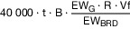
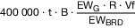
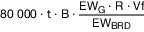
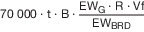

# Besondere Gebührenverordnung der Bundesnetzagentur für Elektrizität, Gas, Telekommunikation, Post und Eisenbahnen für Frequenzzuteilungen (BNetzAFreqZutBGebV)

Ausfertigungsdatum
:   2021-09-24

Fundstelle
:   BGBl I: 2021, 4515

## Eingangsformel

Auf Grund des § 22 Absatz 4 in Verbindung mit Absatz 1 Satz 2 des
Bundesgebührengesetzes vom 7. August 2013 (BGBl. I S. 3154) sowie in
Verbindung mit § 142 Absatz 4 Satz 1, Absatz 3 Satz 1 Nummer 1 und
Satz 3 in Verbindung mit Absatz 2 des Telekommunikationsgesetzes vom
22\. Juni 2004 (BGBl. I S. 1190), von denen § 142 Absatz 4 durch
Artikel 1 Nummer 108 Buchstabe c des Gesetzes vom 3. Mai 2012 (BGBl. I
S. 958) eingefügt worden, § 142 Absatz 3 durch Artikel 1 Nummer 25
Buchstabe b des Gesetzes vom 4. November 2016 (BGBl. I S. 2473)
geändert worden und § 142 Absatz 2 durch Artikel 2 Absatz 133 Nummer 1
Buchstabe b des Gesetzes vom 7. August 2013 (BGBl. I S. 3154) geändert
worden ist, sowie in Verbindung mit § 1 der TKG-EMVG-FuAG-
Übertragungsverordnung vom 5. Oktober 2017 (BGBl. I S. 3534) verordnet
die Bundesnetzagentur für Elektrizität, Gas, Telekommunikation, Post
und Eisenbahnen im Einvernehmen mit dem Bundesministerium für
Wirtschaft und Energie, dem Bundesministerium der Finanzen und dem
Bundesministerium für Verkehr und digitale Infrastruktur:

## § 1 Erhebung von Gebühren

Die Bundesnetzagentur erhebt Gebühren nach Maßgabe dieser Verordnung
für Entscheidungen über die Zuteilung von Frequenzen nach § 55 des
Telekommunikationsgesetzes sowie die damit im engen Zusammenhang
stehenden individuell zurechenbaren öffentlichen Leistungen und für
Maßnahmen aufgrund von Verstößen gegen die §§ 52 bis 60 des
Telekommunikationsgesetzes.

## § 2 Höhe der Gebühren

Die gebührenpflichtigen Tatbestände und die Höhe der festzusetzenden
Gebühren bestimmen sich nach dem Gebührenverzeichnis in der Anlage.

## § 3 Zeitgebühr

(1) Sofern im Gebührenverzeichnis eine Zeitgebühr vorgesehen ist,
gelten für den Zeitaufwand von Verwaltungsbeschäftigten der
Bundesnetzagentur des mittleren, des gehobenen und des höheren
Dienstes die Stundensätze nach Anlage 1 Teil A Abschnitt 1 Nummer 1
der Allgemeinen Gebührenverordnung in der jeweils geltenden Fassung.

(2) Soweit besondere Sachmittel der Bundesnetzagentur eingesetzt
werden, gelten für die aufgewendete Zeit die folgenden Stundensätze:

1.  Einsatz von Mess-Kraftfahrzeugen, einschließlich des Personaleinsatzes
    und der messtechnischen Einrichtungen im Mess-Kraftfahrzeug: 145,72
    Euro,

2.  Labor Große Messhalle, einschließlich des Personaleinsatzes und der
    messtechnischen Einrichtungen: 259,66 Euro,

3.  Labor Kleine Messhalle, einschließlich des Personaleinsatzes und der
    messtechnischen Einrichtungen: 297,22 Euro,

4.  Labor Beleuchtungseinrichtungen, einschließlich des Personaleinsatzes
    und der messtechnischen Einrichtungen: 177,33 Euro,

5.  Labor Kabelgebundene Energiereiche Testsysteme, einschließlich des
    Personaleinsatzes und der messtechnischen Einrichtungen: 241,86 Euro,

6.  Labor Unterhaltungselektronik, einschließlich des Personaleinsatzes
    und der messtechnischen Einrichtungen: 214,18 Euro,

7.  Labor Produktsicherheit, einschließlich des Personaleinsatzes und der
    messtechnischen Einrichtungen: 143,51 Euro,

8.  Einsatz stationärer Messtechnik, einschließlich des Personaleinsatzes
    und der messtechnischen Einrichtungen: 110,20 Euro.

## § 4 Gebührenbefreiung

(1) Im Rahmen des bestimmungsgemäßen Gebrauchs der Frequenzen sind von
den Gebühren befreit:

1.  die in der jeweils aktuell gültigen Fassung der Funkrichtlinie
    Digitalfunk BOS oder Funkrichtlinie Analogfunk BOS genannten
    Berechtigten und

2.  die Berechtigten mit Anerkennungsverfahren zur Teilnahme am BOS-Funk.

(2) Die Bundesnetzagentur kann auf Antrag Gebührenbefreiung gewähren
bei Entscheidungen über die Zuteilung von Frequenzen

1.  an private Organisationen, die im Zivilschutz oder im
    Katastrophenschutz mitwirken,

2.  an private Organisationen, die die Aufgabe der Notfallrettung,
    Wasserrettung oder Seenotrettung im öffentlichen Auftrag wahrnehmen,

3.  an staatlich anerkannte Werksfeuerwehren, die auftragsgemäß auch
    außerhalb ihrer Liegenschaften eingesetzt werden können,

4.  für insbesondere zeitlich und räumlich begrenzte Forschungsprojekte
    von Universitäten und Hochschulen.

Nach Satz 1 Nummer 1 bis 3 kann eine Gebührenbefreiung nur für solche
zugeteilten Frequenzen gewährt werden, die die Begünstigten
überwiegend für Aufgaben nutzen, die ihnen auf Grund eines Gesetzes
oder durch öffentlich-rechtliche Vereinbarungen übertragen worden
sind.

## § 5 Inkrafttreten

Diese Verordnung tritt am 1. Oktober 2021 in Kraft.

(zu § 2)

## Anlage Gebührenverzeichnis

(Fundstelle: BGBl. I 2021, 4517 - 4527)

*    *   Lfd. Nr.

    *   Gebührentatbestand

    *   Gebühr in Euro

*    *   **A**

    *   **Allgemeine Gebühren**

    *

*    *   A.1

    *   Erstellen einer zusätzlichen Ausfertigung eines Frequenz-
        zuteilungsbescheids in nicht-elektronischer Form

    *   25

*    *   A.2

    *   Änderung einer Zuteilung von Frequenzen, wobei die Änderung nicht die
        auf den Verwendungszweck der Frequenz abgestellten Parameter betrifft
        (insbesondere weder Frequenzänderung noch Verlängerung der Zuteilung)

    *   25

*    *   A.3

    *   Zurücknahme eines Antrags nach dem Beginn der sachlichen Bearbeitung
        und vor Beendigung der individuell zurechenbaren öffentlichen Leistung

    *   bis zur Höhe von 75 % des entsprechenden Gebührentatbestands nach
        Abschnitt B, begrenzt bis zur Laufzeit von drei Monaten

*    *   A.4

    *   Ablehnung eines Antrags aus anderen Gründen als dem der
        Unzuständigkeit

    *   bis zur Höhe des entsprechenden Gebührentatbestands nach Abschnitt B,
        begrenzt bis zur Laufzeit von drei Monaten

*    *   A.5

    *   Entscheidung über einen Änderungsantrag aufgrund eines Übergangs von
        Frequenznutzungsrechten nach § 55 Absatz 8 des
        Telekommunikationsgesetzes

    *   nach Zeitaufwand

*    *   A.6

    *   Rücknahme oder Widerruf einer Zuteilung, sofern der Zuteilungsinhaber
        dies zu vertreten hat

    *   nach Zeitaufwand, bis zur Höhe des entsprechenden Gebührentatbestands
        nach Abschnitt B

*    *   **B**

    *   **Gebühren für die Zuteilung von Frequenzen**

    *   Die Höhe der Gebühr wird nach der angegebenen Formel bestimmt. Hierbei
        sind:

*    *   B = Zugeteilte Bandbreite in MHz

*    *   t = Laufzeit der Zuteilung in Jahren. Soweit die Laufzeit der
        Zuteilung nicht in vollen Jahren bestimmt ist, wird für jeden
        angefangenen Monat eine Gebühr in Höhe eines Zwölftels einer
        Jahresgebühr erhoben.

*    *   **B.0**

    *   **Drahtloser Netzzugang zum Angebot von Telekommunikationsdiensten**

    *

*    *   B.0.1

    *   Zuteilung von Frequenzen zur bundesweiten Nutzung für den drahtlosen
        Netzzugang in den Frequenzbereichen 451 MHz bis 455,74 MHz und 461 MHz
        bis 465,74 MHz je Frequenz (einschließlich der Festsetzung
        funktechnischer Parameter)

    *   600 000 · t · B

*    *   B.0.2

    *   Zuteilung von Frequenzen zur bundesweiten Nutzung für den drahtlosen
        Netzzugang im Frequenzbereich 703 MHz bis 788 MHz je Frequenz
        (einschließlich der Festsetzung funktechnischer Parameter)

    *   950 000 · t · B

*    *   B.0.3

    *   Zuteilung von Frequenzen zur bundesweiten Nutzung für den drahtlosen
        Netzzugang im Frequenzbereich 791 MHz bis 862 MHz je Frequenz
        (einschließlich der Festsetzung funktechnischer Parameter)

    *   860 000 · t · B

*    *   B.0.4

    *   Zuteilung von Frequenzen zur bundesweiten Nutzung für den drahtlosen
        Netzzugang im Frequenzbereich 880 MHz bis 960 MHz je Frequenz
        (einschließlich der Festsetzung funktechnischer Parameter)

    *   770 000 · t · B

*    *   B.0.5

    *   Zuteilung von Frequenzen zur bundesweiten Nutzung für den drahtlosen
        Netzzugang im Frequenzbereich
        1 452 MHz                        bis 1 492 MHz je Frequenz
        (einschließlich der Festsetzung funktechnischer Parameter)

    *   480 000 · t · B

*    *   B.0.6

    *   Zuteilung von Frequenzen zur bundesweiten Nutzung für den drahtlosen
        Netzzugang im Frequenzbereich
        1 710 MHz                        bis 1 880 MHz je Frequenz
        (einschließlich der Festsetzung funktechnischer Parameter)

    *   400 000 · t · B

*    *   B.0.7

    *   Zuteilung von Frequenzen zur bundesweiten Nutzung für den drahtlosen
        Netzzugang im Frequenzbereich
        1 920 MHz                        bis 2 170 MHz je Frequenz
        (einschließlich der Festsetzung funktechnischer Parameter)

    *   300 000 · t · B

*    *   B.0.8

    *   Zuteilung von Frequenzen zur bundesweiten Nutzung für den drahtlosen
        Netzzugang im Frequenzbereich
        2 500 MHz                        bis 2 690 MHz je Frequenz
        (einschließlich der Festsetzung funktechnischer Parameter)

    *   270 000 · t · B

*    *   B.0.9

    *   Zuteilung von Frequenzen zur bundesweiten Nutzung für den drahtlosen
        Netzzugang im Frequenzbereich
        3 400 MHz                        bis 3 700 MHz je Frequenz
        (einschließlich der Festsetzung funktechnischer Parameter)

    *   200 000 · t · B

*    *   B.0.10

    *   Zuteilung von Frequenzen zur lokalen Nutzung für den drahtlosen
        Netzzugang in dem Frequenzbereich
        3 700 MHz                        bis 3 800 MHz je Frequenz
        (einschließlich der Festsetzung funktechnischer Parameter)

    *   1 000 + 5 · t · B · (6a
        1                        + a
        2                       )

*    *   a
        1                        = Fläche des Zuteilungsgebietes in km
        2                       , die der Siedlungs- und Verkehrsfläche
        zuzuordnen ist

*    *   a
        2                        = Fläche des Zuteilungsgebietes in km
        2                       , die nicht der Siedlungs- und Verkehrsfläche
        zuzuordnen ist

*    *   B.0.11

    *   Zuteilung von Frequenzen zur lokalen Nutzung für den drahtlosen
        Netzzugang in dem Frequenzbereich 24,25 GHz bis 27,5 GHz je Frequenz
        (einschließlich der Festsetzung funktechnischer Parameter)

    *   1 000 + 0,63 · t · B · (6a
        1                        + a
        2                       )

*    *   a
        1                        = Fläche des Zuteilungsgebietes in km
        2                       , die der Siedlungs- und Verkehrsfläche
        zuzuordnen ist

*    *   a
        2                        = Fläche des Zuteilungsgebietes in km
        2                       , die nicht der Siedlungs- und Verkehrsfläche
        zuzuordnen ist

*    *   **B.1**

    *   **Öffentlicher Funkruf**

    *

*    *   B.1.1

    *   Zuteilung von Frequenzen für Funkruf je Frequenz (einschließlich der
        Festsetzung funktechnischer Parameter)

    *   0,42 · t · B · A

*    *   A = Zuteilungsgebiet in km
        2

*    *   **B.2**

    *   **Richtfunk**

    *

*    *   B.2.1

    *   Zuteilung von Frequenzen im Richtfunk im Frequenzband 0,4 GHz je
        Frequenz und Polarisation

    *   5 000 · t · B · D

*    *   für Funkfeldlängen

*    *   *                        5 km

    *   D = 2,0

*    *   *                        5 km*                        20 km

    *   D = 1,0

*    *   *                        20 km

    *   D = 1,2

*    *   B.2.2

    *   Zuteilung von Frequenzen im Richtfunk in den Frequenzbändern 4 GHz bis
        7,5 GHz je Frequenz und Polarisation

    *   6 · t · B · D

*    *   für Funkfeldlängen

*    *   *                        15 km

    *   D = 2,0

*    *   *                        15 km*                        40 km

    *   D = 1,0

*    *   *                        40 km

    *   D = 1,2

*    *   B.2.3

    *   Zuteilung von Frequenzen im Richtfunk in den Frequenzbändern 13 GHz
        bis 18 GHz je Frequenz und Polarisation

    *   3 · t · B · D

*    *   für Funkfeldlängen

*    *   *                        4 km

    *   D = 2,0

*    *   *                        4 km*                        15 km

    *   D = 1,0

*    *   *                        15 km

    *   D = 1,2

*    *   B.2.4

    *   Zuteilung von Frequenzen im Richtfunk in den Frequenzbändern 23 GHz
        bis 28 GHz je Frequenz und Polarisation

    *   2 · t · B · D

*    *   für Funkfeldlängen

*    *   *                        2 km

    *   D = 2,0

*    *   *                        2 km*                        8 km

    *   D = 1,0

*    *   *                        8 km

    *   D = 1,2

*    *   B.2.5

    *   Zuteilung von Frequenzen im Richtfunk in den Frequenzbändern 32 GHz
        bis 52 GHz je Frequenz und Polarisation

    *   1 · t · B

*    *   B.2.6

    *   Zuteilung von Frequenzen im Richtfunk in den Frequenzbändern über 52
        GHz je Frequenz und Polarisation

    *   0,04 · t · B

*    *   **B.3**

    *   **Satellitenfunk**

    *

*    *   B.3.1

    *   Zuteilung von Frequenzen für eine Satellitenerdfunkstelle je Frequenz
        und angefangene 15 MHz zugeteilte Bandbreite

    *   0,80 · t · B

*    *   B.3.2

    *   Zuteilung von Frequenzen für den Satellitenreportagefunk (Satellite
        News Gathering (SNG)) je Frequenzbereich je Sendefunkanlage

    *   0,08 · t · B

*    *   B.3.3

    *   Zuteilung von Frequenzen für den Betrieb eines Satellitenfunknetzes je
        Frequenz und angefangene 15 MHz zugeteilte Bandbreite

    *   3,50 · t · B · NU

*    *   Nutzungsumfang:

*    *   stationäre Nutzung NU = 1

*    *   mobile und stationäre Nutzung NU = 3

*    *   B.3.4

    *   Zuteilung von Frequenzen für den Betrieb eines GNSS-Repeaters für den
        Frequenzbereich eines Satellitennavigationssystems innerhalb der
        Schutzzone eines Flugplatzes

    *   4,50 · t · B

*    *   B.3.5

    *   Zuteilung von Frequenzen für den Betrieb eines GNSS-Repeaters für den
        Frequenzbereich eines Satellitennavigationssystems außerhalb von
        Schutzzonen von Flugplätzen

    *   0,45 · t · B

*    *   **B.4**

    *   **Professioneller Mobilfunk (Professional Mobile Radio (PMR))**

    *

*    *   B.4.1

    *   Zuteilung von Frequenzen für PMR je Frequenz

    *   Basisbetrag · t · B · A · E · N

*    *   Basisbetrag je Frequenzbereich:

*    *   *                        30 MHz: 0,11

*    *   30 MHz bis 68 MHz: 0,42

*    *
    *
    *   68 MHz bis 87,5 MHz: 0,56

*    *
    *
    *   87,5 MHz bis 174 MHz: 1,12

*    *
    *
    *   174 MHz bis 380 MHz: 2,24

*    *
    *
    *   380 MHz bis 470 MHz: 4,20

*    *
    *
    *   470 MHz bis 694 MHz: 3,36

*    *
    *
    *   694 MHz bis 862 MHz: 2,80

*    *
    *
    *   862 MHz bis 1 000 MHz: 2,10

*    *
    *
    *   1 000 MHz bis 1 500 MHz: 1,40

*    *
    *
    *   1 500 MHz bis 1 900 MHz: 1,12

*    *
    *
    *   1 900 MHz bis 3 000 MHz: 0,84

*    *
    *
    *   3 GHz bis 5 GHz: 0,56

*    *
    *
    *   5 GHz bis 10 GHz: 0,28

*    *
    *
    *   10 GHz bis 30 GHz: 0,14

*    *
    *
    *   *                        30 GHz: 0,07

*    *
    *
    *   A = Zuteilungsgebiet in km
        2

*    *
    *
    *   Besonderheiten:

*    *
    *
    *   Fiktive Mindestgrößen für A:

*    *
    *
    *   A = 200 km
        2                        bei ortsfester Nutzung

*    *
    *
    *   A = 50 km
        2                        bei Leistung bis 1 Watt ERP

*    *
    *
    *   A = 1 km
        2                        bei Anwendungen in Gebäuden (Indoor)

*    *
    *
    *   A = 50 km
        2                        bei mobiler Nutzung

*    *
    *
    *   A = 50 km
        2                        bei grundstücksbezogener Nutzung
        (Grundstückssprechfunk, Grundstückspersonenruffunk)

*    *
    *
    *   A = festgelegtes Einsatzgebiet in km
        2                        bei DMO im Bündelfunk

*    *
    *
    *   E = 1 exklusive Nutzung

*    *
    *
    *   E = 0,5 gemeinschaftliche Nutzung

*    *
    *
    *   Wird eine Frequenz im Zeitschlitzverfahren zugeteilt, bestimmt sich E
        aus der Anzahl der zugeteilten Zeitschlitze im Verhältnis zu den für
        diese Frequenznutzung möglichen Zeitschlitzen, z. B. ist bei 2 von 10
        Zeitschlitzen E = 0,2

*    *
    *
    *   N = Nutzungsfaktor

*    *
    *
    *   Ortsfeste Nutzung oder DMO = 1

*    *
    *
    *   flexibles Einsatzgebiet

*    *
    *
    *   bis bundesweit = 10

*    *
    *
    *   bis 100 000 km
        2                        = 8

*    *
    *
    *   bis 10 000 km
        2                        = 6

*    *
    *
    *   bis 1 000 km
        2                        = 4

*    *
    *
    *   bis 100 km
        2                        = 2

*    *   B.4.2

    *   Zuteilung von Frequenzen für Betriebsfunk für Fernwirkzwecke
        (Fernwirkfunk) je Frequenz

    *   Basisbetrag · t · B · E · N

*    *   Basisbetrag je Frequenzbereich:

*    *   *                        30 MHz: 0,11

*    *
    *
    *   30 MHz bis 68 MHz: 0,42

*    *
    *
    *   68 MHz bis 87,5 MHz: 0,56

*    *
    *
    *   87,5 MHz bis 174 MHz: 1,12

*    *
    *
    *   174 MHz bis 380 MHz: 2,24

*    *
    *
    *   380 MHz bis 470 MHz: 4,20

*    *
    *
    *   470 MHz bis 694 MHz: 3,36

*    *
    *
    *   694 MHz bis 862 MHz: 2,80

*    *
    *
    *   862 MHz bis 1 000 MHz: 2,10

*    *
    *
    *   1 000 MHz bis 1 500 MHz: 1,40

*    *
    *
    *   1 500 MHz bis 1 900 MHz: 1,12

*    *
    *
    *   1 900 MHz bis 3 000 MHz: 0,84

*    *
    *
    *   3 GHz bis 5 GHz: 0,56

*    *
    *
    *   5 GHz bis 10 GHz: 0,28

*    *
    *
    *   10 GHz bis 30 GHz: 0,14

*    *
    *
    *   *                        30 GHz: 0,07

*    *
    *
    *   exklusive Nutzung E = 1

*    *
    *
    *   gemeinschaftliche Nutzung E = 0,5

*    *
    *
    *   Wird eine Frequenz im Zeitschlitzverfahren zugeteilt, bestimmt sich E
        aus der Anzahl der zugeteilten Zeitschlitze im Verhältnis zu den für
        diese Frequenznutzung möglichen Zeitschlitzen, z. B. ist bei 2 von 10
        Zeitschlitzen E = 0,2

*    *
    *
    *   N = Nutzungsfaktor

*    *
    *
    *   Frequenznutzung*                        1 GHz = 1

*    *
    *
    *   Frequenznutzung zwischen 87,5 MHz
        und 470 MHz = 100

*    *
    *
    *   Frequenznutzung bis einschließlich
        87,5 MHz = 10

*    *   B.4.3

    *   Zuteilung von Frequenzen für drahtlose Kameras oder Zuteilung von
        Frequenzen für drahtlose Mikrofone, je Frequenzbereich je
        Sendefunkanlage

    *   Basisbetrag · t · B

*    *   Basisbetrag je Frequenzbereich:

*    *   *                        30 MHz: 0,11

*    *   30 MHz bis 68 MHz: 0,42

*    *
    *
    *   68 MHz bis 87,5 MHz: 0,56

*    *
    *
    *   87,5 MHz bis 174 MHz: 1,12

*    *
    *
    *   174 MHz bis 380 MHz: 2,24

*    *
    *
    *   380 MHz bis 470 MHz: 4,20

*    *
    *
    *   470 MHz bis 694 MHz: 3,36

*    *
    *
    *   694 MHz bis 862 MHz: 2,80

*    *
    *
    *   862 MHz bis 1 000 MHz: 2,10

*    *
    *
    *   1 000 MHz bis 1 500 MHz: 1,40

*    *
    *
    *   1 500 MHz bis 1 900 MHz: 1,12

*    *
    *
    *   1 900 MHz bis 3 000 MHz: 0,84

*    *
    *
    *   3 GHz bis 5 GHz: 0,56

*    *
    *
    *   5 GHz bis 10 GHz: 0,28

*    *
    *
    *   10 GHz bis 30 GHz: 0,14

*    *
    *
    *   *                        30 GHz: 0,07

*    *
    *
    *   Drahtlose Mikrofonanlagen für Hörgeschädigte sind gebührenfrei.

*    *   B.4.4

    *   Zuteilung von Frequenzen für Ultrabreitband (UWB) je Frequenzbereich
        je Sendefunkanlage

    *   Basisbetrag · t · B · E

*    *   Basisbetrag je Frequenzbereich:

*    *   *                        30 MHz: 0,11

*    *   30 MHz bis 68 MHz: 0,42

*    *
    *
    *   68 MHz bis 87,5 MHz: 0,56

*    *
    *
    *   87,5 MHz bis 174 MHz: 1,12

*    *
    *
    *   174 MHz bis 380 MHz: 2,24

*    *
    *
    *   380 MHz bis 470 MHz: 4,20

*    *
    *
    *   470 MHz bis 694 MHz: 3,36

*    *
    *
    *   694 MHz bis 862 MHz: 2,80

*    *
    *
    *   862 MHz bis 1 000 MHz: 2,10

*    *
    *
    *   1 000 MHz bis 1 500 MHz: 1,40

*    *
    *
    *   1 500 MHz bis 1 900 MHz: 1,12

*    *
    *
    *   1 900 MHz bis 3 000 MHz: 0,84

*    *
    *
    *   3 GHz bis 5 GHz: 0,56

*    *
    *
    *   5 GHz bis 10 GHz: 0,28

*    *
    *
    *   10 GHz bis 30 GHz: 0,14

*    *
    *
    *   *                        30 GHz: 0,07

*    *
    *
    *   exklusive Nutzung E = 1

*    *
    *
    *   gemeinschaftliche Nutzung E = 0,1

*    *   B.4.5

    *   Zuteilung von Frequenzen für nichtnavigatorischen Ortungsfunk oder
        Zuteilung von Frequenzen für Wetterhilfenfunk, je Frequenz je
        Sendefunkanlage

    *   Basisbetrag · t · B · E

*    *   Basisbetrag je Frequenzbereich:

*    *   *                        30 MHz: 0,11

*    *   30 MHz bis 68 MHz: 0,42

*    *
    *
    *   68 MHz bis 87,5 MHz: 0,56

*    *
    *
    *   87,5 MHz bis 174 MHz: 1,12

*    *
    *
    *   174 MHz bis 380 MHz: 2,24

*    *
    *
    *   380 MHz bis 470 MHz: 4,20

*    *
    *
    *   470 MHz bis 694 MHz: 3,36

*    *
    *
    *   694 MHz bis 862 MHz: 2,80

*    *
    *
    *   862 MHz bis 1 000 MHz: 2,10

*    *
    *
    *   1 000 MHz bis 1 500 MHz: 1,40

*    *
    *
    *   1 500 MHz bis 1 900 MHz: 1,12

*    *
    *
    *   1 900 MHz bis 3 000 MHz: 0,84

*    *
    *
    *   3 GHz bis 5 GHz: 0,56

*    *
    *
    *   5 GHz bis 10 GHz: 0,28

*    *
    *
    *   10 GHz bis 30 GHz: 0,14

*    *
    *
    *   *                        30 GHz: 0,07

*    *
    *
    *   exklusive Nutzung E = 1 für sicherheitsbezogene Funkanwendungen für
        intelligente Verkehrssysteme (IVS), Wetterhilfenfunk

*    *
    *
    *   gemeinschaftliche Nutzung E = 0,1 für Funkbewegungsmelder,
        Funkanwendungen für Vermessungszwecke, Wand- und Füllstandsradare

*    *
    *
    *   Für die Bandbreite B wird bei Wand- und Füllstandsradaren der
        Frequenzbereich herangezogen, in dem die maximale mittlere
        Leistungsdichte (EIRP) den Wert von
        –51,3 dBm/MHz                        überschreitet.

*    *   **B.5**

    *   **Flug- und Flugnavigationsfunk; Ortungsfunk hoher Leistung (EIRP
        größer oder gleich 50 Watt)**

    *

*    *   B.5.1

    *   Zuteilung von Frequenzen für den Betrieb einer Bodenfunkstelle im
        Flug- oder Flugnavigationsfunk unter 30 MHz je Frequenz

    *   8 000 · t ·B

*    *   B.5.2

    *   Zuteilung von Frequenzen für den Betrieb einer Bodenfunkstelle im
        Flugnavigationsfunk in den Frequenzbereichen 108 MHz bis 118 MHz und
        329 MHz bis 335 MHz je Frequenz

    *   2 000 · t · B · D

*    *   Der Längenfaktor ist für Radien

*    *   *                        20 km

    *   D = 1

*    *   *                        20 km oder mobile Nutzung

    *   D = 2

*    *   B.5.3

    *   Zuteilung von Frequenzen für den Betrieb eines VOR (UKW-Drehfunkfeuer)
        im Frequenzbereich 108 MHz bis 118 MHz je Frequenz

    *   6 · t · B

*    *   B.5.4

    *   Zuteilung von Frequenzen für den Betrieb einer Bodenfunkstelle im
        Flugfunk im Frequenzbereich 118 MHz bis 137 MHz je Frequenz

    *   1 400 · t · B · D

*    *   Der Längenfaktor ist für Radien

*    *   *                        20 km

    *   D = 1

*    *   *                        20 km oder mobile Nutzung

    *   D = 2

*    *   B.5.5

    *   Zuteilung von Frequenzen für ILS-Marker (Instrumentenlandesystem) je
        Frequenz

    *   2 000 · t · B

*    *   B.5.6

    *   Zuteilung von Frequenzen für den Betrieb einer Bodenfunkstelle im
        Flugnavigationsfunk im Frequenzbereich 960 MHz bis 1 215 MHz je
        Frequenz

    *   20 · t · B

*    *   B.5.7

    *   Zuteilung von Frequenzen für den Betrieb einer Bodenfunkstelle im
        Flugnavigationsfunk oder Ortungsfunk hoher Leistung im Frequenzbereich
        1,2 GHz je Frequenz

    *   12 · t · B

*    *   B.5.8

    *   Zuteilung von Frequenzen für den Betrieb einer Bodenfunkstelle im
        Flugnavigationsfunk oder Ortungsfunk hoher Leistung im Frequenzbereich
        2,8 GHz bis 5,6 GHz je Frequenz

    *   4 · t · B

*    *   B.5.9

    *   Zuteilung von Frequenzen für den Betrieb einer Bodenfunkstelle im
        Flugnavigationsfunk oder Ortungsfunk hoher Leistung im
        Frequenzbereich*                        8,5 GHz je Frequenz

    *   2 · t · B

*    *   **B.6**

    *   **Seefunk/Binnenschifffahrtsfunk**

    *

*    *   B.6.1

    *   Zuteilung von Frequenzen für den Betrieb einer Küstenfunkstelle im
        Seefunkdienst oder einer ortfesten Funkstelle im
        Binnenschifffahrtsfunk im Ultrakurzwelle-Bereich je Frequenz

    *   400 · t · B · D

*    *   Der Reichweitenfaktor ist für Radien

*    *   *                        40 km

    *   D = 1

*    *   *                        40 km

    *   D = 1,5

*    *   B.6.2

    *   Zuteilung von Frequenzen für den Betrieb einer Küstenfunkstelle im
        Seefunkdienst im Mittel- und Kurzwelle-
        Bereich                        je Frequenz

    *   5 000 · t · B

*    *   B.6.3

    *   Zuteilung von Frequenzen für den Betrieb einer Küstenfunkstelle im
        Seefunkdienst im Grenzwelle-Bereich je Frequenz

    *   1 500 · t · B

*    *   **B.7**

    *   **Fester Funkdienst, Normalfrequenz- und Zeitzeichenfunkdienst
        unterhalb 30 MHz**

    *

*    *   B.7.1

    *   Zuteilung von Frequenzen im festen Funkdienst, Normalfrequenz- und
        Zeitzeichenfunkdienst unterhalb 30 MHz je Frequenz

    *   40 000 · t · B

*    *   **B.8**

    *   **Funkanwendungen der Eisenbahnen**

    *

*    *   B.8.1

    *   Zuteilung von Frequenzen für Funkanwendungen der Eisenbahnen in den
        Frequenzbereichen 873 MHz bis 880 MHz und 918 MHz bis 925 MHz sowie
        1 900 MHz bis 1 910 MHz je Frequenz (einschließlich der Festsetzung
        funktechnischer Parameter)

    *   0,39 · t · B · D

*    *   D = Bahnstrecken-km

*    *   Vom Antragsteller angegebene Länge der zu versorgenden
        Bahninfrastruktur (in geeigneter Form darzulegen)

*    *   B.8.2

    *   Zuteilung von Frequenzen für Funkanwendungen der Eisenbahnen in den
        Frequenzbereichen 68,62 MHz bis 69,56 MHz; 78,42 MHz bis 78,70 MHz je
        Frequenz (einschließlich der Festsetzung funktechnischer Parameter)

    *   0,26 · t · B · D

*    *   D = Bahnstrecken-km

*    *   Vom Antragsteller angegebene Länge der zu versorgenden
        Bahninfrastruktur (für ortsfeste Frequenznutzungen in geeigneter Form
        darzulegen).

*    *
    *
    *   Für mobile Nutzungen wird folgende funktionale Reichweite D angesetzt:

        •   Handfunkgeräte bis zu einer Sendeleistung von 2,5 W: 3 km

        •   Fahrzeugfunkgeräte bis zu einer Sendeleistung von 8 W: 10 km

*    *   B.8.3

    *   Zuteilung von Frequenzen für Funkanwendungen der Eisenbahnen in den
        Frequenzbereichen 146,36 MHz bis 171,78 MHz je Frequenz
        (einschließlich der Festsetzung funktechnischer Parameter)

    *   0,52 · t · B · D

*    *   D = Bahnstrecken-km

*    *   Vom Antragsteller angegebene Länge der zu versorgenden
        Bahninfrastruktur (für ortsfeste Frequenznutzungen in geeigneter Form
        darzulegen).

*    *
    *
    *   Für mobile Nutzungen wird folgende funktionale Reichweite D angesetzt:

        •   Handfunkgeräte bis zu einer Sendeleistung von 2,5 W: 3 km

        •   Fahrzeugfunkgeräte bis zu einer Sendeleistung von 8 W: 10 km

*    *   B.8.4

    *   Zuteilung von Frequenzen für Funkanwendungen der Eisenbahnen in den
        Frequenzbereichen 419,72 MHz bis 468,320 MHz je Frequenz
        (einschließlich der Festsetzung funktechnischer Parameter)

    *   1,03 · t · B · D

*    *   D = Bahnstrecken-km

*    *   Vom Antragsteller angegebene Länge der zu versorgenden
        Bahninfrastruktur (für ortsfeste Frequenznutzungen in geeigneter Form
        darzulegen).

*    *
    *
    *   Für mobile Nutzungen wird folgende funktionale Reichweite D angesetzt:

        •   Handfunkgeräte bis zu einer Sendeleistung von 2,5 W: 3 km

        •   Fahrzeugfunkgeräte bis zu einer Sendeleistung von 8 W: 10 km

*    *   **B.9**

    *   **Rundfunkdienst**

    *

*    *   B.9.1

    *   Zuteilung von Frequenzen zur Umsetzung eines zusammenhängenden
        Versorgungsbedarfs im Langwellenbereich in analoger oder digitaler
        Übertragungstechnik

    *        

*    *   EW
        G                        = Einwohner im Versorgungsbedarf und in den
        überstrahlten Flächen

*    *   EW
        BRD                        = Einwohner Bundesrepublik Deutschland

*    *[^F818625_01_BJNR451500021BJNE000700000]
   Vf = 1 für stationären Empfang

*    *   Vf = 1,25 für mobilen Empfang\*

*    *
    *
    *   Vf = 1,5 für Portable-Indoor-Empfang\*

*    *
    *
    *[^F818625_02_BJNR451500021BJNE000700000]
   R = 0,9 sofern im Versorgungsbedarf nichts anderes angegeben ist,
        mindestens 0,5

*    *   B.9.2

    *   Zuteilung von Frequenzen zur Umsetzung eines zusammenhängenden
        Versorgungsbedarfs im Mittelwellenbereich in analoger oder digitaler
        Übertragungstechnik

    *        

*    *   EW
        G                        = Einwohner im Versorgungsbedarf und in den
        überstrahlten Flächen

*    *   EW
        BRD                        = Einwohner Bundesrepublik Deutschland

*    *   Vf = 1 für stationären Empfang\*

*    *
    *
    *   Vf = 1,25 für mobilen Empfang\*

*    *
    *
    *   Vf = 1,5 für Portable-Indoor-Empfang\*

*    *
    *
    *   R = 0,9 sofern im Versorgungsbedarf nichts anderes angegeben ist,
        mindestens 0,5\*\*

*    *   B.9.3

    *   Zuteilung von Frequenzen zur Umsetzung eines zusammenhängenden
        Versorgungsbedarfs im Kurzwellenbereich in analoger oder digitaler
        Übertragungstechnik oder Zuteilung von Frequenzen im Kurzwellenbereich
        in analoger oder digitaler Übertragungstechnik zur Versorgung eines
        oder mehrerer ausländischer Zielgebiete einschließlich der Festsetzung
        funktechnischer Parameter innerhalb des Zuteilungszeitraums

    *        

*    *   EW
        G                        = Einwohner im Versorgungsbedarf und in den
        überstrahlten Flächen

*    *   EW
        BRD                        = Einwohner Bundesrepublik Deutschland

*    *   (EW
        G                        · R · Vf)/EW
        BRD                        = 1 für Zielgebiete ausschließlich im
        Ausland

*    *   Vf = 1 für stationären Empfang\*

*    *
    *
    *   Vf = 1,25 für mobilen Empfang\*

*    *
    *
    *   Vf = 1,5 für Portable-Indoor-Empfang\*

*    *
    *
    *   R = 0,9 sofern im Versorgungsbedarf nichts anderes angegeben ist,
        mindestens 0,5\*\*

*    *
    *
    *   R = 1 für Zielgebiete ausschließlich im Ausland

*    *   B.9.4

    *   Zuteilung von Frequenzen im Band II (UKW) zur Versorgung eines
        zusammenhängenden Versorgungsbedarfs

    *        

*    *   EW
        G                        = Einwohner im Versorgungsbedarf und in den
        überstrahlten Flächen, mindestens jedoch 20 000

*    *   EW
        BRD                        = Einwohner Bundesrepublik Deutschland

*    *   Vf = 1 für stationären Empfang\*

*    *   Vf = 1,25 für mobilen Empfang\*

*    *
    *
    *   Vf = 1,5 für Portable-Indoor-Empfang\*

*    *
    *
    *   R =0,9 sofern im Versorgungsbedarf nichts anderes angegeben ist,
        mindestens 0,5\*\*

*    *   B.9.5

    *   Zuteilung von Frequenzen im Band III (T-DAB/T-DAB
        +                       ) zur Versorgung eines zusammenhängenden
        Versorgungsbedarfs

    *        

*    *   EW
        G                        = Einwohner im Versorgungsbedarf und in den
        überstrahlten Flächen, mindestens jedoch 10 000

*    *   EW
        BRD                        = Einwohner Bundesrepublik Deutschland

*    *   Vf = 1 für stationären Empfang\*

*    *   Vf = 1,25 für mobilen Empfang\*

*    *
    *
    *   Vf = 1,5 für Portable-Indoor-Empfang\*

*    *
    *
    *   R =0,9 sofern im Versorgungsbedarf nichts anderes angegeben ist,
        mindestens 0,5\*\*

*    *   B.9.6

    *   Zuteilung von Frequenzen im Band IV/V (DVB-T/DVB-T2) zur Versorgung
        eines zusammenhängenden Versorgungsbedarfs

    *        

*    *   EW
        G                        = Einwohner im Versorgungsbedarf und in den
        überstrahlten Flächen, mindestens jedoch 5 000

*    *   EW
        BRD                        = Einwohner Bundesrepublik Deutschland

*    *   Vf = 1 für stationären Empfang\*

*    *   Vf = 1,25 für mobilen Empfang\*

*    *
    *
    *   Vf = 1,5 für Portable-Indoor-Empfang\*

*    *
    *
    *   R = 0,9 sofern im Versorgungsbedarf nichts anderes angegeben ist,
        mindestens 0,5\*\*

*    *   B.9.7

    *   Zuteilung von Frequenzen oder Änderung von Frequenzzuteilungen zur
        vollständigen Umsetzung oder zum weiteren Ausbau eines bestehenden
        oder geänderten Versorgungsbedarfs, bei dem mindestens eine für seine
        Umsetzung erforderliche Frequenzzuteilung vor dem 1. Oktober 2021
        erteilt wurde und für sämtliche zu seiner Umsetzung erteilten
        Frequenzzuteilungen der gleiche Zeitpunkt für die Befristung gesetzt
        ist

    *   Gebühr nach den Nummern B.9.1 bis B.9.6, wobei als Versorgungsbedarf
        für die Berechnung dasjenige Gebiet unterstellt wird, das durch die
        Änderungen der bestehenden Frequenzzuteilungen und ggf. die neu
        hinzutretenden Frequenzzuteilungen zusätzlich versorgt werden kann.
        Die Versorgung durch unbefristete Zuteilungen wird bei der Berechnung
        nicht berücksichtigt.

*    *   B.9.8

    *   Zuteilung von Frequenzen oder Änderung von Frequenzzuteilungen zur
        vollständigen Umsetzung oder zum weiteren Ausbau eines bestehenden
        oder geänderten Versorgungsbedarfs, bei dem alle für seine Umsetzung
        erforderliche Frequenzzuteilung nach dem 30. September 2021 erteilt
        wurden und für sämtliche zu seiner Umsetzung erteilten
        Frequenzzuteilungen der gleiche Zeitpunkt für die Befristung gesetzt
        ist

    *   Gebühr nach den Nummern B.9.1 bis B.9.6, auf die jeweils die bereits
        festgesetzte Gebühr für Frequenzzuteilungen innerhalb dieses
        Versorgungsbedarfs, für die der gleiche Zeitpunkt für die Befristung
        gesetzt ist, bis zur Gebührenhöhe 0 angerechnet wird.

*    *   **B.10**

    *   **Versuchsfunk und Kurzzeitfrequenzzuteilungen**

    *

*    *   B.10.1

    *   Zuteilung von Frequenzen für ein Jahr, die von der Industrie zur
        Entwicklung und Erprobung von Funkanlagen und Funksystemen genutzt
        werden, je Zuteilungsgebiet

    *   60 · A · t
        N

*    *   t
        N                        = ist die Anzahl der summierten Nutzungsjahre
        der Frequenzen ab Erstzuteilung

*    *   Flächenfaktor A mit einem Zuteilungsgebiet von

*    *   *                        10 km
        2

    *   A = 1

*    *
    *
    *   *                        10 km
        2                        bis 10 000 km
        2

    *   A = 2

*    *
    *
    *   *                        10 000 km
        2

    *   A = 3

*    *   B.10.2

    *   Zuteilung von Frequenzen für ein Jahr, die von der Industrie zur
        Entwicklung und Erprobung sowie zur Instandsetzung militärischer
        Geräte auf militärisch genutzten und verwalteten Frequenzen genutzt
        werden, je Zuteilungsgebiet

    *   60 · A

*    *   Flächenfaktor A mit einem Zuteilungsgebiet von

*    *   *                        10 km
        2

    *   A = 1

*    *
    *
    *   *                        10 km
        2                        bis 10 000 km
        2

    *   A = 2

*    *
    *
    *   *                        10 000 km
        2

    *   A = 3

*    *   B.10.3

    *   Zuteilung von Frequenzen für ein Jahr, die von der Industrie zu
        Forschungszwecken in Kooperation mit Universitäten und Hochschulen
        genutzt werden, je Zuteilungsgebiet

    *   60 · A · t
        N                        · 0,5

*    *   t
        N                        = ist die Anzahl der summierten Nutzungsjahre
        der Frequenzen ab Erstzuteilung

*    *   Flächenfaktor A mit einem Zuteilungsgebiet von

*    *   *                        10 km
        2

    *   A = 1

*    *
    *
    *   *                        10 km
        2                        bis 10 000 km
        2

    *   A = 2

*    *
    *
    *   *                        10 000 km
        2

    *   A = 3

*    *   B.10.4

    *   Zuteilung von Frequenzen zur kurzzeitigen Nutzung
        (Kurzzeitfrequenzzuteilung) je Frequenz

    *   30 · A · ZAnt

*    *   Flächenfaktor A mit einem Zuteilungsgebiet von

*    *   *                        10 km
        2

    *   A = 1

*    *   *                        10 km
        2                        bis 10 000 km
        2

    *   A = 2

*    *
    *
    *   *                        10 000 km
        2

    *   A = 3

*    *
    *
    *   Antragszeitpunkt vor dem ersten Nutzungstag

*    *
    *
    *   *                        15 Tage

    *   ZAnt = 1

*    *
    *
    *   4 bis 14 Tage

    *   ZAnt = 2

*    *
    *
    *   1 bis 3 Tage

    *   ZAnt = 3

*    *
    *
    *   am ersten Nutzungstag

    *   ZAnt = 4

*    *   **B.11**

    *   **Änderungen von Frequenzzuteilungen**

    *

*    *   B.11.1

    *   Änderung einer zwischen dem 1. Oktober 2006 und dem 1. Oktober 2021
        erfolgten Zuteilung von Frequenzen, welche die auf den
        Verwendungszweck der Frequenz abgestellten Parameter – ausgenommen die
        Laufzeit – betrifft, für die verbleibende Laufzeit dieser
        Frequenzzuteilung, je Frequenz (mit Ausnahme der Nummern B.9 und B.10)

    *   Gebühr nach dem entsprechenden Gebührentatbestand der Nummern B.0 bis
        B.8, auf die jeweils die ab dem 1. Oktober 2021 fiktiv festzusetzende
        Gebühr für die Frequenzzuteilung, für die der gleiche Zeitpunkt für
        die Befristung gesetzt ist, bis zur Gebührenhöhe 0 angerechnet wird.
        Gebühren von unbefristeten Zuteilungen werden nicht angerechnet.

*    *   B.11.2

    *   Änderung einer ab dem 1. Oktober 2021 erfolgten Zuteilung von
        Frequenzen, welche die auf den Verwendungszweck der Frequenz
        abgestellten Parameter – ausgenommen die Laufzeit – betrifft, für die
        verbleibende Laufzeit dieser Frequenzzuteilung, je Frequenz (mit
        Ausnahme der Nummern B.9 und B.10)

    *   Gebühr nach dem entsprechenden Gebührentatbestand der Nummern B.0 bis
        B.8, auf die jeweils die bereits festgesetzte Gebühr für die
        Frequenzzuteilung, für die der gleiche Zeitpunkt für die Befristung
        gesetzt ist, bis zur Gebührenhöhe 0 angerechnet wird.

*    *   **C**

    *   **Gebühren für Maßnahmen aufgrund von Verstößen**

    *

*    *   C.1

    *   Gebühren für Maßnahmen aufgrund von Verstößen gegen die §§ 52 bis 60
        des Telekommunikationsgesetzes, die vorsätzlich begangen oder trotz
        erfolgter Beratung nicht behoben bzw. wiederholt festgestellt werden

    *   nach Zeitaufwand

    Zu veranschlagen ist für den gesamten Versorgungsbedarf derjenige
    Vereinheitlichungsfaktor Vf, welcher der Versorgungszielstellung
    zuzuordnen ist, die für den höchsten Bevölkerungsanteil innerhalb des
    Versorgungsbedarfs vorgeschrieben ist. Bei der Berechnung des
    jeweiligen Bevölkerungsanteils ist der Realisierungsgrad R zu
    berücksichtigen. Ist die Versorgungszielstellung aus der
    Bedarfsanmeldung des Landes, die der Frequenzzuteilung zugrunde liegt,
    nicht zweifelsfrei erkennbar, wird der höchste genannte Vf angesetzt.
[^F818625_01_BJNR451500021BJNE000700000]:     Bei unterschiedlichen Angaben für den Realisierungsgrad in
    Teilgebieten innerhalb eines Versorgungsbedarfsgebietes erfolgt
    jeweils die Berechnung als Summierung der Teilbeträge für die
    einzelnen Teilgebiete. Sofern für den Realisierungsgrad keine
    prozentuale Mindestversorgung als Bevölkerungsanteil im
    Versorgungsbedarf angegeben ist, sind 90 % der Bevölkerung des im
    Versorgungsbedarf angegebenen Gebietes zu veranschlagen, mindestens
    jedoch 50 %.
[^F818625_02_BJNR451500021BJNE000700000]: 
