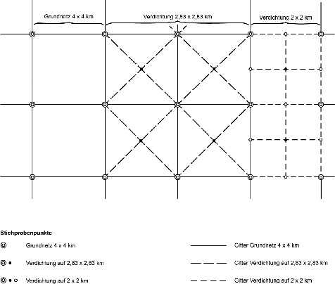

# Verordnung über die Durchführung einer vierten Bundeswaldinventur (BWaldInvV 4)

Ausfertigungsdatum
:   2019-06-16

Fundstelle
:   BGBl I: 2019, 890

Stand: Die V tritt gem. § 4 Satz 2 mit Ablauf des 31.12.2024 außer Kraft

## Eingangsformel

Auf Grund des § 41a Absatz 5 des Bundeswaldgesetzes vom 2. Mai 1975
(BGBl. I S. 1037), § 41a Absatz 5 zuletzt geändert durch Artikel 413
der Verordnung vom 31. August 2015 (BGBl. I S. 1474), verordnet das
Bundesministerium für Ernährung und Landwirtschaft:

## § 1 Zeitpunkt

In der Zeit vom 1. April 2021 bis zum Ablauf des 31. Dezember 2022
wird eine Bundeswaldinventur durchgeführt. Stichtag für die Auswertung
der Daten ist der 1. Oktober 2022.

## § 2 Stichprobenverfahren

Die Bundeswaldinventur ist nach einem einheitlichen terrestrischen
Stichprobenverfahren mit gleichmäßig systematischer
Stichprobenverteilung über das gesamte Gebiet der Bundesrepublik
Deutschland in dem nach § 2 Satz 1 der Zweiten Bundeswaldinventur-
Verordnung vom 28. Mai 1998 (BGBl. I S. 1180) eingerichteten 4 x 4 km-
Quadratverband durchzuführen. Verdichtungen sind nach Maßgabe der
Anlage vorzunehmen.

## § 3 Grunddaten

An den Stichprobenpunkten werden nachstehende Grunddaten gemessen oder
beschrieben:

1.  Betriebsart,

2.  Eigentumsart,

3.  Waldstruktur,

4.  Baumarten,

5.  Alter,

6.  Baumdurchmesser,

7.  Baumhöhe an ausgewählten Probebäumen,

8.  Geländemerkmale,

9.  besondere Baummerkmale,

10. Totholz,

11. Landnutzung vor oder nach Wald.

## § 4 Inkrafttreten, Außerkrafttreten

Diese Verordnung tritt am ersten Tag des auf die Verkündung folgenden
Quartals in Kraft. Sie tritt mit Ablauf des 31. Dezember 2024 außer
Kraft.

## Schlussformel

Der Bundesrat hat zugestimmt.

(zu § 2 Satz 2)

## Anlage Verdichtung der Bundeswaldinventur

(Fundstelle: BGBl. I 2019, 891)

Das Stichprobengrundnetz im 4 x 4 km-Quadratverband ist wie folgt zu
verdichten:

Auf einen 2,83 x 2,83 km-Quadratverband in

–   Bayern im Bereich der Regierungsbezirke Schwaben und Mittelfranken,

–   Niedersachsen in den Wuchsgebieten Niedersächsischer Küstenraum und
    Mittel-Westniedersächsisches Tiefland,

–   Thüringen.

Auf einen 2 x 2 km-Quadratverband in

–   Baden-Württemberg,

–   Berlin,

–   Brandenburg,

–   Mecklenburg-Vorpommern,

–   Nordrhein-Westfalen,

–   Rheinland-Pfalz,

–   Saarland,

–   Sachsen,

–   Sachsen-Anhalt,

–   Schleswig-Holstein.

Sowohl der 2,83 x 2,83 km-Quadratverband wie auch der 2 x 2 km-
Quadratverband sind nach der folgenden Abbildung in das 4 x 4 km-
Grundnetz einzupassen:

