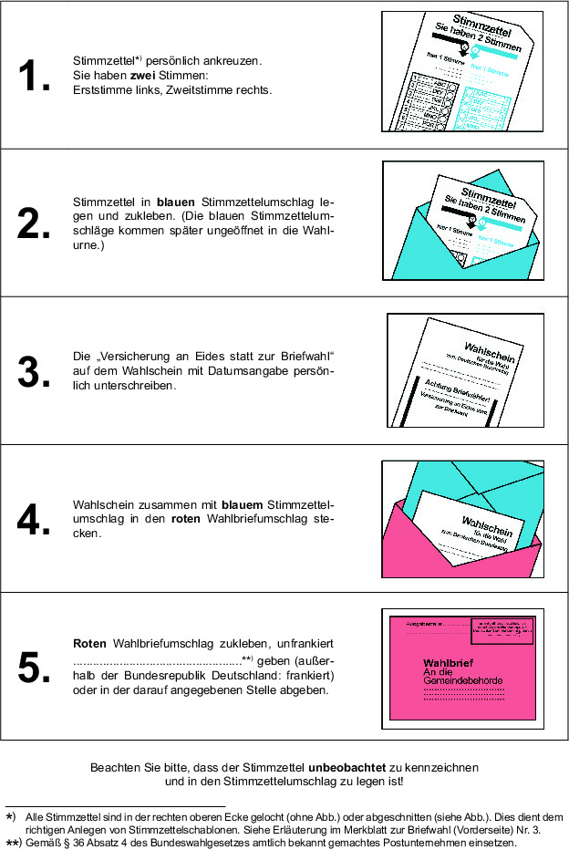

# Bundeswahlordnung (BWO 1985)

Ausfertigungsdatum
:   1985-08-28

Fundstelle
:   BGBl I: 1985, 1769 (1986 I 258)

Neugefasst durch
:   Bek. v. 19.4.2002 I 1376;

Zuletzt geändert durch
:   Art. 10 V v. 19.6.2020 I 1328

## Erster Abschnitt - Wahlorgane

### § 1 Bundeswahlleiter

Der Bundeswahlleiter und sein Stellvertreter werden auf unbestimmte
Zeit ernannt. Das Bundesministerium des Innern, für Bau und Heimat
macht die Namen des Bundeswahlleiters und seines Stellvertreters sowie
die Anschriften ihrer Dienststellen mit Telekommunikationsanschlüssen
öffentlich bekannt.

### § 2 Landeswahlleiter

Der Landeswahlleiter und sein Stellvertreter werden auf unbestimmte
Zeit ernannt. Die ernennende Stelle teilt die Namen des
Landeswahlleiters und seines Stellvertreters sowie die Anschriften
ihrer Dienststellen mit Telekommunikationsanschlüssen dem
Bundeswahlleiter mit und macht sie öffentlich bekannt.

### § 3 Kreiswahlleiter

(1) Die Kreiswahlleiter und deren Stellvertreter werden vor jeder Wahl
ernannt. Die Ernennung erfolgt zu dem Termin, zu dem nach § 21 Absatz
3 des Bundeswahlgesetzes die Vertreterversammlungen zur Aufstellung
von Wahlkreisbewerbern frühestens stattfinden dürfen, spätestens
alsbald nach der Bestimmung des Tages der Hauptwahl. Die ernennende
Stelle teilt die Namen und Anschriften ihrer Dienststellen mit
Telekommunikationsanschlüssen dem Landeswahlleiter und dem
Bundeswahlleiter mit und macht sie öffentlich bekannt.

(2) Die Kreiswahlleiter und deren Stellvertreter üben ihr Amt auch
nach der Hauptwahl, längstens bis zum Ablauf der Wahlperiode, aus.

### § 4 Bildung der Wahlausschüsse

(1) Der Bundeswahlleiter, die Landeswahlleiter und die Kreiswahlleiter
berufen alsbald nach der Bestimmung des Tages der Hauptwahl die
Beisitzer der Wahlausschüsse und für jeden Beisitzer einen
Stellvertreter. Die Beisitzer der Landeswahlausschüsse und der
Kreiswahlausschüsse sind aus den Wahlberechtigten des jeweiligen
Gebietes zu berufen; sie sollen möglichst am Sitz des Wahlleiters
wohnen.

(2) Bei der Auswahl der Beisitzer der Wahlausschüsse sollen in der
Regel die Parteien in der Reihenfolge der bei der letzten
Bundestagswahl in dem jeweiligen Gebiet errungenen Zahlen der
Zweitstimmen angemessen berücksichtigt und die von ihnen rechtzeitig
vorgeschlagenen Wahlberechtigten berufen werden.

(3) Der Bundeswahlleiter beruft zwei Richter des
Bundesverwaltungsgerichts, die Landeswahlleiter berufen je zwei
Richter des Oberverwaltungsgerichts des Landes und jeweils einen
Stellvertreter. Die Berufung erfolgt auf Vorschlag des
Gerichtspräsidenten. Die Vorschriften über die Beisitzer der
Wahlausschüsse in § 11 Absatz 1 des Bundeswahlgesetzes sowie in den §§
5 und 10 dieser Verordnung gelten entsprechend.

(4) Die Wahlausschüsse bestehen auch nach der Hauptwahl, längstens bis
zum Ablauf der Wahlperiode, fort.

### § 5 Tätigkeit der Wahlausschüsse

(1) Die Wahlausschüsse sind ohne Rücksicht auf die Zahl der
erschienenen Beisitzer beschlussfähig.

(2) Der Vorsitzende bestimmt Ort und Zeit der Sitzungen. Er lädt die
Beisitzer zu den Sitzungen und weist dabei darauf hin, dass der
Ausschuss ohne Rücksicht auf die Zahl der erschienenen Beisitzer
beschlussfähig ist. Die Beisitzer sollen Gelegenheit erhalten, die zu
beratenden Unterlagen vor der Sitzung zur Kenntnis zu nehmen.

(3) Zeit, Ort und Gegenstand der Verhandlungen sind öffentlich bekannt
zu machen.

(4) Der Vorsitzende bestellt einen Schriftführer; dieser ist nur
stimmberechtigt, wenn er zugleich Beisitzer ist.

(5) Der Vorsitzende weist die Beisitzer und den Schriftführer auf ihre
Verpflichtung zur unparteiischen Wahrnehmung ihres Amtes und zur
Verschwiegenheit über die ihnen bei ihrer amtlichen Tätigkeit bekannt
gewordenen Angelegenheiten hin.

(6) Der Vorsitzende ist befugt, Personen, die die Ruhe und Ordnung
stören, aus dem Sitzungsraum zu verweisen.

(7) Über jede Sitzung ist vom Schriftführer eine Niederschrift zu
fertigen; sie ist vom Vorsitzenden, von den Beisitzern und vom
Schriftführer zu unterzeichnen.

### § 6 Wahlvorsteher und Wahlvorstand

(1) Vor jeder Wahl sind, nach Möglichkeit aus den Wahlberechtigten der
Gemeinde, für jeden Wahlbezirk ein Wahlvorsteher und sein
Stellvertreter, im Falle des § 46 Abs. 2 mehrere Wahlvorsteher und
Stellvertreter zu ernennen.

(2) Die Beisitzer des Wahlvorstandes sollen möglichst aus den
Wahlberechtigten der Gemeinde, nach Möglichkeit aus den
Wahlberechtigten des Wahlbezirks berufen werden. Der Stellvertreter
des Wahlvorstehers ist zugleich Beisitzer des Wahlvorstandes.

(3) Der Wahlvorsteher und sein Stellvertreter werden von der
Gemeindebehörde vor Beginn der Wahlhandlung auf ihre Verpflichtung zur
unparteiischen Wahrnehmung ihres Amtes und zur Verschwiegenheit über
die ihnen bei ihrer amtlichen Tätigkeit bekannt gewordenen
Angelegenheiten hingewiesen. Die Mitglieder des Wahlvorstandes dürfen
während ihrer Tätigkeit kein auf eine politische Überzeugung
hinweisendes Zeichen sichtbar tragen.

(4) Der Wahlvorsteher bestellt aus den Beisitzern den Schriftführer
und dessen Stellvertreter. Ist nach § 9 Absatz 2 Satz 3 des
Bundeswahlgesetzes angeordnet, dass die Beisitzer des Wahlvorstandes
von der Gemeindebehörde berufen werden, so kann diese auch den
Schriftführer und dessen Stellvertreter bestellen.

(5) Die Gemeindebehörde hat die Mitglieder des Wahlvorstandes vor der
Wahl so über ihre Aufgaben zu unterrichten, dass ein ordnungsmäßiger
Ablauf der Wahlhandlung sowie der Ermittlung und Feststellung des
Wahlergebnisses gesichert ist.

(6) Der Wahlvorstand wird von der Gemeindebehörde oder in ihrem
Auftrag vom Wahlvorsteher einberufen. Er tritt am Wahltage rechtzeitig
vor Beginn der Wahlzeit im Wahlraum zusammen.

(7) Der Wahlvorstand sorgt für die ordnungsmäßige Durchführung der
Wahl. Der Wahlvorsteher leitet die Tätigkeit des Wahlvorstandes.

(8) Während der Wahlhandlung müssen immer der Wahlvorsteher und der
Schriftführer oder ihre Stellvertreter sowie mindestens ein Beisitzer
anwesend sein. Bei der Ermittlung und Feststellung des Wahlergebnisses
sollen alle Mitglieder des Wahlvorstandes anwesend sein.

(9) Der Wahlvorstand ist beschlussfähig, wenn der Wahlvorsteher und
der Schriftführer oder ihre Stellvertreter sowie während der
Wahlhandlung mindestens ein Beisitzer, bei der Ermittlung und
Feststellung des Wahlergebnisses mindestens drei Beisitzer anwesend
sind. Fehlende Beisitzer sind vom Wahlvorsteher durch Wahlberechtigte
zu ersetzen, wenn es mit Rücksicht auf die Beschlussfähigkeit des
Wahlvorstandes erforderlich ist. Sie sind vom Wahlvorsteher nach
Absatz 3 auf ihre Verpflichtung hinzuweisen.

(10) Bei Bedarf stellt die Gemeindebehörde dem Wahlvorstand die
erforderlichen Hilfskräfte zu Verfügung.

### § 7 Briefwahlvorsteher und Briefwahlvorstand

Für die Briefwahlvorsteher und Briefwahlvorstände gilt § 6
entsprechend mit folgenden Maßgaben:

1.  Bei der Bildung mehrerer Briefwahlvorstände nach § 8 Abs. 1 des
    Bundeswahlgesetzes für einen Wahlkreis und bei der Bildung von
    Briefwahlvorständen nach § 8 Abs. 3 des Bundeswahlgesetzes für
    einzelne oder mehrere Gemeinden oder für einzelne Kreise innerhalb
    eines Wahlkreises darf die Zahl der auf einen Briefwahlvorstand
    entfallenden Wahlbriefe nicht so gering sein, dass erkennbar wird, wie
    einzelne Wahlberechtigte gewählt haben; auf einen Briefwahlvorstand
    sollen mindestens 50 Wahlbriefe entfallen.

2.  Wieviel Briefwahlvorstände im Falle einer Anordnung nach § 8 Abs. 3
    des Bundeswahlgesetzes zu bilden sind, um das Ergebnis der Briefwahl
    noch am Wahltage feststellen zu können, entscheidet die
    Landesregierung oder die von ihr bestimmte Stelle.

3.  Wird im Rahmen einer Anordnung nach § 8 Abs. 3 des Bundeswahlgesetzes
    für mehrere Gemeinden ein Briefwahlvorstand gebildet, ist eine dieser
    Gemeinden mit der Durchführung der Briefwahl zu betrauen.

4.  Die Mitglieder der Briefwahlvorstände für die einzelnen Wahlkreise
    sind nach Möglichkeit aus den Wahlberechtigten des jeweiligen
    Wahlkreises zu berufen, die am Sitz des Kreiswahlleiters wohnen, bei
    Bildung von Briefwahlvorständen für einzelne oder für mehrere
    Gemeinden oder für einzelne Kreise innerhalb eines Wahlkreises nach
    Möglichkeit aus den Wahlberechtigten, die in den jeweiligen Gemeinden
    oder Kreisen wohnen.

5.  Der Kreiswahlleiter macht Ort und Zeit des Zusammentritts des
    Briefwahlvorstandes öffentlich bekannt, weist den Briefwahlvorsteher
    und seinen Stellvertreter auf ihre Verpflichtung zur unparteiischen
    Wahrnehmung ihrer Aufgaben und zur Verschwiegenheit über die ihnen bei
    ihrer amtlichen Tätigkeit bekannt gewordenen Angelegenheiten hin,
    unterrichtet den Briefwahlvorstand über seine Aufgaben und beruft ihn
    ein; Entsprechendes gilt bei der Einsetzung mehrerer
    Briefwahlvorstände für einen Wahlkreis. Werden Briefwahlvorstände für
    einzelne oder mehrere Gemeinden oder für einzelne Kreise innerhalb
    eines Wahlkreises gebildet, nimmt die jeweilige oder die nach Nummer 3
    betraute Gemeindebehörde oder die Verwaltungsbehörde des jeweiligen
    Kreises diese Aufgaben wahr.

6.  Der Briefwahlvorstand ist beschlussfähig bei der Zulassung oder
    Zurückweisung der Wahlbriefe nach § 75 Abs. 1 und 2, wenn mindestens
    drei Mitglieder, bei der Ermittlung und Feststellung des
    Briefwahlergebnisses nach § 75 Abs. 3, wenn mindestens fünf
    Mitglieder, darunter jeweils der Wahlvorsteher und der Schriftführer
    oder ihre Stellvertreter, anwesend sind.

### § 8 Beweglicher Wahlvorstand

Für die Stimmabgabe in kleineren Krankenhäusern, kleineren Alten- oder
Pflegeheimen, Klöstern, sozialtherapeutischen Anstalten und
Justizvollzugsanstalten sollen bei entsprechendem Bedürfnis und soweit
möglich bewegliche Wahlvorstände gebildet werden. Der bewegliche
Wahlvorstand besteht aus dem Wahlvorsteher des zuständigen Wahlbezirks
oder seinem Stellvertreter und zwei Beisitzern des Wahlvorstandes. Die
Gemeindebehörde kann jedoch auch den beweglichen Wahlvorstand eines
anderen Wahlbezirks der Gemeinde mit der Entgegennahme der Stimmzettel
beauftragen.

### § 9 Ehrenämter

Die Übernahme eines Wahlehrenamtes können ablehnen

1.  Mitglieder der Bundesregierung oder einer Landesregierung,

2.  Mitglieder des Europäischen Parlaments, des Deutschen Bundestages oder
    eines Landtages,

3.  Wahlberechtigte, die am Wahltage das 65. Lebensjahr vollendet haben,

4.  Wahlberechtigte, die glaubhaft machen, dass ihnen die Fürsorge für
    ihre Familie die Ausübung des Amtes in besonderer Weise erschwert,

5.  Wahlberechtigte, die glaubhaft machen, dass sie aus dringenden
    beruflichen Gründen oder durch Krankheit oder Behinderung oder aus
    einem sonstigen wichtigen Grunde gehindert sind, das Amt ordnungsmäßig
    auszuüben.

### § 10 Auslagenersatz für Inhaber von Wahlämtern, Erfrischungsgeld

(1) Wahlleiter, Beisitzer der Wahlausschüsse und Mitglieder der
Wahlvorstände erhalten, wenn sie außerhalb ihres Wahlbezirks tätig
werden, Ersatz ihrer notwendigen Fahrkosten in entsprechender
Anwendung der §§ 4 und 5 Abs. 1 des Bundesreisekostengesetzes; wenn
sie außerhalb ihres Wohnortes tätig werden, erhalten sie außerdem
Tage- und Übernachtungsgelder nach dem Bundesreisekostengesetz. Die
Stadtstaaten Berlin, Bremen und Hamburg können abweichende Regelungen
zum Zwecke einer pauschalierten Auslagenerstattung treffen.

(2) Den Mitgliedern der Wahlausschüsse kann für die Teilnahme an einer
nach § 5 einberufenen Sitzung und den Mitgliedern der Wahlvorstände
für den Wahltag ein Erfrischungsgeld von je 35 Euro für den
Vorsitzenden und je 25 Euro für die übrigen Mitglieder gewährt werden.
Es ist auf ein Tagegeld nach Absatz 1 anzurechnen.

### § 11 Geldbußen

Geldbußen nach § 49a Abs. 1 Nr. 1 des Bundeswahlgesetzes fließen in
die Kasse der Gemeinde, in der der Betroffene in das Wählerverzeichnis
einzutragen ist, Geldbußen nach § 49a Abs. 1 Nr. 2 des
Bundeswahlgesetzes in die Kasse des Bundes.

## Zweiter Abschnitt - Vorbereitung der Wahl

### Erster Unterabschnitt - Wahlbezirke

#### § 12 Allgemeine Wahlbezirke

(1) Gemeinden mit nicht mehr als 2.500 Einwohnern bilden in der Regel
einen Wahlbezirk. Größere Gemeinden werden in mehrere Wahlbezirke
eingeteilt. Die Gemeindebehörde bestimmt, welche Wahlbezirke zu bilden
sind.

(2) Die Wahlbezirke sollen nach den örtlichen Verhältnissen so
abgegrenzt werden, dass allen Wahlberechtigten die Teilnahme an der
Wahl möglichst erleichtert wird. Kein Wahlbezirk soll mehr als 2.500
Einwohner umfassen. Die Zahl der Wahlberechtigten eines Wahlbezirks
darf nicht so gering sein, dass erkennbar wird, wie einzelne
Wahlberechtigte gewählt haben.

(3) Die Wahlberechtigten in Gemeinschaftsunterkünften wie Lagern,
Unterkünften der Bundeswehr, der Bundespolizei oder der Polizei sollen
nach festen Abgrenzungsmerkmalen auf mehrere Wahlbezirke verteilt
werden.

(4) Der Kreiswahlleiter kann kleine Gemeinden und Teile von Gemeinden
des gleichen Verwaltungsbezirks zu einem Wahlbezirk und Teile von
Gemeinden, die von Wahlkreisgrenzen durchschnitten werden, mit
benachbarten Gemeinden oder Teilen von Gemeinden eines anderen
Verwaltungsbezirks zu einem Wahlbezirk vereinigen. Dabei bestimmt er,
welche Gemeinde die Wahl durchführt.

#### § 13 Sonderwahlbezirke

(1) Für Krankenhäuser, Altenheime, Altenwohnheime, Pflegeheime,
Erholungsheime und gleichartige Einrichtungen mit einer größeren
Anzahl von Wahlberechtigten, die keinen Wahlraum außerhalb der
Einrichtung aufsuchen können, soll die Gemeindebehörde bei
entsprechendem Bedürfnis Sonderwahlbezirke zur Stimmabgabe für
Wahlscheininhaber bilden.

(2) Mehrere Einrichtungen können zu einem Sonderwahlbezirk
zusammengefasst werden.

(3) Wird ein Sonderwahlbezirk nicht gebildet, gilt § 8 entsprechend.

### Zweiter Unterabschnitt - Wählerverzeichnis

#### § 14 Führung des Wählerverzeichnisses

(1) Die Gemeindebehörde legt vor jeder Wahl für jeden allgemeinen
Wahlbezirk (§ 12) ein Verzeichnis der Wahlberechtigten nach
Familiennamen und Vornamen, Geburtsdatum und Wohnung an. Das
Wählerverzeichnis kann auch im automatisierten Verfahren geführt
werden.

(2) Das Wählerverzeichnis wird unter fortlaufender Nummer in der
Buchstabenfolge der Familiennamen, bei gleichen Familiennamen der
Vornamen, angelegt. Es kann auch nach Ortsteilen, Straßen und
Hausnummern gegliedert werden. Es enthält je eine Spalte für Vermerke
über die Stimmabgabe und für Bemerkungen.

(3) Die Gemeindebehörde sorgt dafür, dass die Unterlagen für die
Wählerverzeichnisse jederzeit so vollständig vorhanden sind, dass
diese vor Wahlen rechtzeitig angelegt werden können.

(4) Besteht ein Wahlbezirk aus mehreren Gemeinden oder Teilen mehrerer
Gemeinden, so legt jede Gemeindebehörde das Wählerverzeichnis für
ihren Teil des Wahlbezirks an.

#### § 15

(weggefallen)

#### § 16 Eintragung der Wahlberechtigten in das Wählerverzeichnis

(1) Von Amts wegen sind in das Wählerverzeichnis alle Wahlberechtigten
einzutragen, die am 42. Tage vor der Wahl (Stichtag) bei der
Meldebehörde gemeldet sind

1.  für eine Wohnung,

2.  auf Grund eines Anstellungs-, Heuer- oder Ausbildungsverhältnisses als
    Kapitän oder Besatzungsmitglied für ein Seeschiff, das berechtigt ist,
    die Bundesflagge zu führen (§ 12 Abs. 4 Nr. 1 des Bundeswahlgesetzes),

3.  für ein Binnenschiff, das in einem Schiffsregister in der
    Bundesrepublik Deutschland eingetragen ist (§ 12 Abs. 4 Nr. 2 des
    Bundeswahlgesetzes),

4.  für eine Justizvollzugsanstalt oder die entsprechende Einrichtung (§
    12 Abs. 4 Nr. 3 des Bundeswahlgesetzes).

(2) Auf Antrag sind in das Wählerverzeichnis einzutragen
Wahlberechtigte

1.  nach § 12 Abs. 1 des Bundeswahlgesetzes,

    a)  (weggefallen)

    b)  die ohne eine Wohnung innezuhaben sich im Wahlgebiet sonst gewöhnlich
        aufhalten,

    c)  die sich in einer Justizvollzugsanstalt oder entsprechenden
        Einrichtung befinden und nicht nach Absatz 1 Nr. 4 von Amts wegen in
        das Wählerverzeichnis einzutragen sind,

2.  nach § 12 Abs. 2 Satz 1 des Bundeswahlgesetzes, die nicht nach Absatz
    1 Nr. 1 von Amts wegen in das Wählerverzeichnis einzutragen sind.

(3) Verlegt ein Wahlberechtigter, der nach Absatz 1 in das
Wählerverzeichnis eingetragen ist, seine Wohnung und meldet er sich
vor Beginn der Einsichtsfrist für das Wählerverzeichnis (§ 17 Abs. 1
Satz 2 des Bundeswahlgesetzes) bei der Meldebehörde des Zuzugsortes
an, so wird er in das Wählerverzeichnis der Gemeinde des Zuzugsortes
nur auf Antrag eingetragen. Ein nach Absatz 1 in das Wählerverzeichnis
eingetragener Wahlberechtigter, der sich innerhalb derselben Gemeinde
für eine Wohnung anmeldet, bleibt in dem Wählerverzeichnis des
Wahlbezirks eingetragen, für den er am Stichtag gemeldet war. Der
Wahlberechtigte ist bei der Anmeldung über die Regelung in den Sätzen
1 und 2 zu belehren. Erfolgt die Eintragung auf Antrag, benachrichtigt
die Gemeindebehörde des Zuzugsortes hiervon unverzüglich die
Gemeindebehörde des Fortzugsortes, die den Wahlberechtigten in ihrem
Wählerverzeichnis streicht. Wenn im Falle des Satzes 1 bei der
Gemeindebehörde des Fortzugsortes eine Mitteilung über den Ausschluss
vom Wahlrecht vorliegt oder nachträglich eingeht, benachrichtigt sie
hiervon unverzüglich die Gemeindebehörde des Zuzugsortes, die den
Wahlberechtigten in ihrem Wählerverzeichnis streicht; der Betroffene
ist von der Streichung zu unterrichten.

(4) Für Wahlberechtigte, die am Stichtag nicht für eine Wohnung
gemeldet sind und sich vor dem Beginn der Einsichtsfrist für das
Wählerverzeichnis bei der Meldebehörde für eine Wohnung anmelden, gilt
Absatz 3 Satz 1 und 3 entsprechend.

(5) Bezieht ein Wahlberechtigter, der nach Absatz 1 in das
Wählerverzeichnis eingetragen ist, in einer anderen Gemeinde eine
weitere Wohnung, die seine Hauptwohnung wird, oder verlegt er seine
Hauptwohnung in eine andere Gemeinde, so gilt, wenn er sich vor Beginn
der Einsichtsfrist für das Wählerverzeichnis bei der Meldebehörde
anmeldet, Absatz 3 entsprechend.

(6) Welche von mehreren Wohnungen eines Wahlberechtigten seine
Hauptwohnung ist, bestimmt sich nach § 21 Absatz 2 des
Bundesmeldegesetzes.

(7) Bevor eine Person in das Wählerverzeichnis eingetragen wird, ist
zu prüfen, ob sie die Wahlrechtsvoraussetzungen des § 12 des
Bundeswahlgesetzes erfüllt und ob sie nicht nach § 13 des
Bundeswahlgesetzes vom Wahlrecht ausgeschlossen ist. Soweit dies für
die Prüfung der Wahlberechtigung eines Rückkehrers im Sinne des § 12
Absatz 2 Satz 3 Bundeswahlgesetz erforderlich ist, kann die
Gemeindebehörde die Abgabe einer Versicherung an Eides statt zum
Nachweis der Wahlberechtigung des Rückkehrers entsprechend § 18 Absatz
6 Satz 1 verlangen. Erfolgt die Eintragung in das Wählerverzeichnis
nur auf Antrag, ist außerdem zu prüfen, ob ein frist- und
formgerechter Antrag gestellt ist.

(8) Gibt eine Gemeindebehörde einem Eintragungsantrag nicht statt oder
streicht sie eine in das Wählerverzeichnis eingetragene Person, hat
sie den Betroffenen unverzüglich zu unterrichten. Gegen die
Entscheidung kann der Betroffene Einspruch einlegen; er ist auf diese
Möglichkeit hinzuweisen. § 22 Abs. 2, 4 und 5 gilt entsprechend. Die
Frist für die Zustellung der Entscheidung (§ 22 Abs. 4 Satz 1) und für
die Beschwerdeentscheidung (§ 22 Abs. 5 Satz 4) gilt nur, wenn der
Einspruch vor dem zwölften Tage vor der Wahl eingelegt worden ist.

(9) Die Gemeindebehörde hat spätestens am Stichtag den Leiter der sich
in ihrem Gemeindebezirk befindenden Justizvollzugsanstalt oder der
entsprechenden Einrichtung auf Absatz 2 Nr. 1 Buchstabe c und die
Notwendigkeit der Unterrichtung der betroffenen Personen hinzuweisen,
wenn nach § 27 Absatz 4 des Bundesmeldegesetzes eine Meldepflicht für
die sich in den Einrichtungen aufhaltenden Personen nicht besteht.

#### § 17 Zuständigkeiten für die Eintragung in das Wählerverzeichnis

(1) Zuständig für die Eintragung in das Wählerverzeichnis ist in den
Fällen des

1.  § 16 Abs. 1 Nr. 1 die für die Wohnung zuständige Gemeinde, bei
    mehreren Wohnungen die für die Hauptwohnung zuständige Gemeinde,

2.  § 16 Abs. 1 Nr. 2 die für den Sitz des Reeders zuständige Gemeinde,

3.  § 16 Abs. 1 Nr. 3 die für den Heimatort des Binnenschiffes zuständige
    Gemeinde,

4.  § 16 Abs. 1 Nr. 4 die für die Justizvollzugsanstalt oder die
    entsprechende Einrichtung zuständige Gemeinde.

(2) Zuständig für die Eintragung in das Wählerverzeichnis ist in den
Fällen des
1\. (weggefallen)

2.  § 16 Abs. 2 Nr. 1 Buchstabe b die Gemeinde, in der der Wahlberechtigte
    seinen Antrag stellt,

3.  § 16 Abs. 2 Nr. 1 Buchstabe c die für die Justizvollzugsanstalt oder
    die entsprechende Einrichtung zuständige Gemeinde,

4.  (weggefallen)

5.  § 16 Abs. 2 Nr. 2 die Gemeinde in der Bundesrepublik Deutschland, in
    der der Wahlberechtigte nach seiner Erklärung vor seinem Fortzug aus
    dem Wahlgebiet zuletzt gemeldet war, wenn er im Wahlgebiet nie
    gemeldet war, die Gemeinde, der er nach seiner Erklärung im Sinne des
    § 12 Absatz 2 Satz 1 Nummer 2 des Bundeswahlgesetzes am engsten
    verbunden ist. Satz 1 gilt auch für Seeleute, die seit dem Fortzug aus
    dem Wahlgebiet auf Schiffen unter fremder Flagge fahren, sowie für
    Binnenschiffer, deren Schiff nicht in einem Schiffsregister in der
    Bundesrepublik Deutschland eingetragen ist, und für die Angehörigen
    ihres Hausstandes. Für Seeleute, die von einem Seeschiff, das die
    Bundesflagge zu führen berechtigt war, abgemustert haben und im
    Anschluss daran auf einem Seeschiff unter fremder Flagge fahren, ist
    die Gemeinde am Sitz des ehemaligen Reeders zuständig. Für
    Binnenschiffer, die zuletzt auf einem in der Bundesrepublik
    Deutschland im Schiffsregister eingetragenen Binnenschiff gefahren
    sind und im Anschluss daran auf einem Binnenschiff, das nicht im
    Schiffsregister in der Bundesrepublik Deutschland eingetragen ist,
    oder auf einem Seeschiff unter fremder Flagge fahren, ist die Gemeinde
    nach Absatz 1 Nr. 3 zuständig.

(3) Zuständig für die Eintragung in das Wählerverzeichnis ist in den
Fällen des

1.  § 16 Abs. 3 die Gemeinde des Zuzugsortes,

2.  § 16 Abs. 4 die Gemeinde, in der sich der Wahlberechtigte für eine
    Wohnung, bei mehreren Wohnungen für die Hauptwohnung, gemeldet hat,

3.  § 16 Abs. 5 die Gemeinde der neuen Hauptwohnung.

#### § 18 Verfahren für die Eintragung in das Wählerverzeichnis auf Antrag

(1) Der Antrag auf Eintragung in das Wählerverzeichnis ist schriftlich
bis spätestens zum 21. Tage vor der Wahl bei der zuständigen
Gemeindebehörde zu stellen. Er muss den Familiennamen, die Vornamen,
das Geburtsdatum und die genaue Anschrift des Wahlberechtigten
enthalten. Sammelanträge sind, abgesehen von den Fällen des Absatzes
5, zulässig; sie müssen von allen aufgeführten Wahlberechtigten
persönlich und handschriftlich unterzeichnet sein. Ein
Wahlberechtigter mit Behinderungen kann sich hierbei der Hilfe einer
anderen Person bedienen; § 57 gilt entsprechend.

(2) (weggefallen)

(3) In den Fällen des § 16 Abs. 2 Nr. 1 sind Wahlberechtigte bis zum
Wahltage im Wählerverzeichnis der Gemeinde zu führen, die nach § 17
Abs. 2 Nr. 2 zuständig ist, auch wenn nach dem Stichtag eine
Neuanmeldung bei einer anderen Meldebehörde des Wahlgebietes erfolgt.
Sie sind bei der Anmeldung entsprechend zu unterrichten.

(4) (weggefallen)

(5) In den Fällen des § 16 Abs. 2 Nr. 2 hat der Wahlberechtigte in
seinem Antrag auf Eintragung in das Wählerverzeichnis nach Anlage 2
der Gemeindebehörde gegenüber durch Abgabe einer Versicherung an Eides
statt den Nachweis für seine Wahlberechtigung zu erbringen und zu
erklären, dass er in keiner anderen Gemeinde im Wahlgebiet einen
Antrag auf Eintragung in das Wählerverzeichnis gestellt hat. Vordrucke
und Merkblätter für die Antragstellung können bei den diplomatischen
und berufskonsularischen Vertretungen der Bundesrepublik Deutschland
im Ausland, beim Bundeswahlleiter und bei den Kreiswahlleitern
angefordert werden. Bestehen Zweifel an Angaben des Antragstellers,
hat die Gemeindebehörde den Sachverhalt unverzüglich aufzuklären. Der
Bundeswahlleiter ist von der Eintragung in das Wählerverzeichnis
unverzüglich durch Übersendung der Zweitausfertigung des Antrages nach
Anlage 2 oder einer Kopie der Erstausfertigung des Antrages nach
Anlage 2, auf der die Eintragung in das Wählerverzeichnis vermerkt
ist, zu unterrichten. Erhält der Bundeswahlleiter Mitteilungen
verschiedener Gemeindebehörden über die Eintragung desselben
Antragstellers in das Wählerverzeichnis, so hat er diejenige
Gemeindebehörde, deren Unterrichtung über die Eintragung in das
Wählerverzeichnis nach der ersten Mitteilung eingeht, unverzüglich von
der Eintragung des Wahlberechtigten in das Wählerverzeichnis der
zuerst mitteilenden Gemeinde zu benachrichtigen. Die vom
Bundeswahlleiter benachrichtigte Gemeindebehörde hat den
Wahlberechtigten im Wählerverzeichnis zu streichen und ihn davon zu
unterrichten.

(6) Kehrt ein Wahlberechtigter nach § 12 Absatz 2 Satz 1 des
Bundeswahlgesetzes in das Wahlgebiet zurück und meldet er sich dort
nach dem Stichtag nach § 16 Absatz 1, aber vor Beginn der
Einsichtsfrist für das Wählerverzeichnis nach § 17 Absatz 1 Satz 2
Bundeswahlgesetz für eine Wohnung an, so wird er in das
Wählerverzeichnis der Gemeinde des Zuzugsortes nur auf Antrag nach
Anlage 1 eingetragen, mit dem er der Gemeindebehörde gegenüber durch
Abgabe einer Versicherung an Eides statt den Nachweis für seine
Wahlberechtigung erbringt und erklärt, dass er noch keinen anderen
Antrag auf Eintragung in das Wählerverzeichnis gestellt hat. Der
Wahlberechtigte ist bei der Anmeldung darüber zu belehren. Die
Gemeindebehörde hat den Bundeswahlleiter unverzüglich von der
Eintragung eines solchen Wahlberechtigten in das Wählerverzeichnis
durch Übersendung der Zweitausfertigung des Antrages nach Anlage 1
oder einer Kopie der Erstausfertigung des Antrages nach Anlage 1, auf
der die Eintragung in das Wählerverzeichnis vermerkt ist, zu
unterrichten. Absatz 5 Satz 5 und 6 gilt entsprechend.

#### § 19 Benachrichtigung der Wahlberechtigten

(1) Spätestens am Tage vor der Bereithaltung des Wählerverzeichnisses
zur Einsichtnahme benachrichtigt die Gemeindebehörde jeden
Wahlberechtigten, der in das Wählerverzeichnis eingetragen ist, nach
dem Muster der Anlage 3. Die Mitteilung soll enthalten

1.  den Familiennamen, die Vornamen und die Wohnung des Wahlberechtigten,

2.  die Angabe des Wahlraumes und ob dieser barrierefrei ist,

3.  die Angabe der Wahlzeit,

4.  die Nummer, unter der der Wahlberechtigte in das Wählerverzeichnis
    eingetragen ist,

5.  die Aufforderung, die Wahlbenachrichtigung zur Wahl mitzubringen und
    den Personalausweis oder Reisepass bereitzuhalten,

5a. die Belehrung, dass nach § 14 Absatz 4 des Bundeswahlgesetzes jeder
    Wahlberechtigte sein Wahlrecht nur einmal und nur persönlich ausüben
    kann,

6.  die Belehrung, dass die Wahlbenachrichtigung einen Wahlschein nicht
    ersetzt und daher nicht zur Wahl in einem anderen als dem angegebenen
    Wahlraum berechtigt,

7.  einen Hinweis, wo Wahlberechtigte Informationen über barrierefreie
    Wahlräume und Hilfsmittel erhalten können,

8.  die Belehrung über die Beantragung eines Wahlscheines und über die
    Übersendung von Briefwahlunterlagen. Sie muss mindestens Hinweise
    darüber enthalten,

    a)  dass der Wahlscheinantrag nur auszufüllen ist, wenn der
        Wahlberechtigte in einem anderen Wahlraum seines Wahlkreises oder
        durch Briefwahl wählen will,

    b)  unter welchen Voraussetzungen ein Wahlschein erteilt wird (§ 25 Abs. 1
        und § 27 Abs. 4 Satz 3) und

    c)  dass der Wahlschein von einem anderen als dem Wahlberechtigten nur
        beantragt werden kann, wenn die Berechtigung zur Antragstellung durch
        Vorlage einer schriftlichen Vollmacht nachgewiesen wird (§ 27 Abs. 3).

Erfolgt die Eintragung eines Wahlberechtigten, der nach § 16 Abs. 2
bis 5 auf Antrag in das Wählerverzeichnis eingetragen wird, nach der
Versendung der Benachrichtigungen gemäß Satz 1, hat dessen
Benachrichtigung unverzüglich nach der Eintragung zu erfolgen.

(2) Auf die Rückseite der Benachrichtigung nach Absatz 1 ist ein
Vordruck für einen Antrag auf Ausstellung eines Wahlscheines mit
Briefwahlunterlagen nach dem Muster der Anlage 4 aufzudrucken.

(3) Auf Wahlberechtigte, die nach § 16 Abs. 2 nur auf Antrag in das
Wählerverzeichnis eingetragen werden und bereits einen Wahlschein und
Briefwahlunterlagen beantragt haben, finden die Absätze 1 und 2 keine
Anwendung.

(4) Stellt ein Landeswahlleiter fest, dass die fristgemäße
Benachrichtigung nach Absatz 1 infolge von Naturkatastrophen oder
ähnlichen Ereignissen höherer Gewalt gestört ist, bestimmt er, dass
sie in dem betroffenen Gebiet später erfolgen kann. Wenn zu besorgen
ist, dass die Benachrichtigung nach Absatz 1 nicht bis zum sechsten
Tag vor der Wahl erfolgen kann, bestimmt er, dass die Wahlberechtigten
in anderer geeigneter Weise über die Angaben nach Absatz 1 Satz 2 Nr.
2, 3, 5 bis 7 zu benachrichtigen sind. Der Landeswahlleiter kann
hierzu im Einzelfall ergänzende Regelungen zur Anpassung an die
besonderen Verhältnisse treffen. Er macht die Gründe für die Störung,
das betroffene Gebiet, die von ihm für den Einzelfall getroffenen
Regelungen und die Art der Benachrichtigung in geeigneter Weise
bekannt.

#### § 20 Bekanntmachung über das Recht auf Einsicht in das Wählerverzeichnis und die Erteilung von Wahlscheinen

(1) Die Gemeindebehörde macht spätestens am 24. Tage vor der Wahl nach
dem Muster der Anlage 5 öffentlich bekannt,

1.  von wem, zu welchen Zwecken und unter welchen Voraussetzungen, wo, wie
    lange und zu welchen Tagesstunden das Wählerverzeichnis eingesehen
    werden kann und ob der Ort der Einsichtnahme barrierefrei ist,

2.  dass bei der Gemeindebehörde innerhalb der Einsichtsfrist schriftlich
    oder durch Erklärung zur Niederschrift Einspruch gegen das
    Wählerverzeichnis eingelegt werden kann (§ 22),

3.  dass Wahlberechtigten, die in das Wählerverzeichnis eingetragen sind,
    bis spätestens zum 21. Tage vor der Wahl eine Wahlbenachrichtigung
    zugeht und dass Wahlberechtigte, die nur auf Antrag in das
    Wählerverzeichnis eingetragen werden und bereits einen Wahlschein mit
    Briefwahlunterlagen beantragt haben, keine Wahlbenachrichtigung
    erhalten,

4.  wo, in welcher Zeit und unter welchen Voraussetzungen Wahlscheine
    beantragt werden können (§§ 25ff.),

5.  wie durch Briefwahl gewählt wird (§ 66).

(2) Die diplomatischen Vertretungen der Bundesrepublik Deutschland im
Ausland machen unverzüglich nach der Bestimmung des Wahltages
öffentlich bekannt,

1.  unter welchen Voraussetzungen im Ausland lebende Deutsche an der Wahl
    zum Deutschen Bundestag teilnehmen können,

2.  wo, in welcher Form und in welcher Frist dieser Personenkreis, um an
    der Wahl teilnehmen zu können, die Eintragung in ein Wählerverzeichnis
    in der Bundesrepublik Deutschland beantragen muss.

Die Bekanntmachung ist nach Anlage 6 von den Botschaften durch
mindestens eine deutschsprachige Anzeige in einer überregionalen
Tages- oder Wochenzeitung vorzunehmen; zusätzlich kann der Inhalt der
Bekanntmachung von den Berufskonsulaten, wenn dies nach den örtlichen
Verhältnissen angezeigt ist, durch deutschsprachige Anzeigen in
regionalen Tageszeitungen sowie von den Botschaften und
Berufskonsulaten im Internet veröffentlicht werden. Kann die
Bekanntmachung in begründeten Einzelfällen nicht erfolgen oder
erscheint sie nicht gerechtfertigt, so ist sie durch Aushang im
Dienstgebäude der Vertretung und, soweit möglich, durch Unterrichtung
der einzelnen bekannten Betroffenen vorzunehmen.

#### § 21 Einsicht in das Wählerverzeichnis

(1) Die Gemeindebehörde hält das Wählerverzeichnis mindestens am Ort
der Gemeindeverwaltung während der allgemeinen Öffnungszeiten zur
Einsichtnahme bereit. Wird das Wählerverzeichnis im automatisierten
Verfahren geführt, kann die Einsichtnahme durch ein Datensichtgerät
ermöglicht werden. Es ist sicherzustellen, dass Bemerkungen (§ 23 Abs.
3) im Klartext gelesen werden können. Das Datensichtgerät darf nur von
einem Bediensteten der Gemeindebehörde bedient werden.

(2) (weggefallen)

(3) Innerhalb der Einsichtsfrist ist das Anfertigen von Auszügen aus
dem Wählerverzeichnis durch Wahlberechtigte zulässig, soweit dies im
Zusammenhang mit der Prüfung des Wahlrechts einzelner bestimmter
Personen steht. Die Auszüge dürfen nur für diesen Zweck verwendet und
unbeteiligten Dritten nicht zugänglich gemacht werden.

#### § 22 Einspruch gegen das Wählerverzeichnis und Beschwerde

(1) Wer das Wählerverzeichnis für unrichtig oder unvollständig hält,
kann innerhalb der Einsichtsfrist Einspruch einlegen.

(2) Der Einspruch ist schriftlich oder zur Niederschrift bei der
Gemeindebehörde einzulegen. Soweit die behaupteten Tatsachen nicht
offenkundig sind, hat der Einspruchsführer die erforderlichen
Beweismittel beizubringen. Ein Wahlberechtigter mit Behinderungen kann
sich hierbei der Hilfe einer anderen Person bedienen; § 57 gilt
entsprechend.

(3) Will die Gemeindebehörde einem Einspruch gegen die Eintragung
eines anderen stattgeben, so hat sie diesem vor der Entscheidung
Gelegenheit zur Äußerung zu geben.

(4) Die Gemeindebehörde hat ihre Entscheidung dem Einspruchsführer und
dem Betroffenen spätestens am zehnten Tage vor der Wahl zuzustellen
und auf den zulässigen Rechtsbehelf hinzuweisen. Einem auf Eintragung
gerichteten Einspruch gibt die Gemeindebehörde in der Weise statt,
dass sie dem Wahlberechtigten nach Berichtigung des
Wählerverzeichnisses die Wahlbenachrichtigung zugehen lässt. In den
Fällen des § 18 Abs. 5 und 6 unterrichtet sie unverzüglich die
zuständigen Stellen von der Eintragung.

(5) Gegen die Entscheidung der Gemeindebehörde kann binnen zwei Tagen
nach Zustellung Beschwerde an den Kreiswahlleiter eingelegt werden.
Die Beschwerde ist schriftlich oder zur Niederschrift bei der
Gemeindebehörde einzulegen. Die Gemeindebehörde legt die Beschwerde
mit den Vorgängen unverzüglich dem Kreiswahlleiter vor. Der
Kreiswahlleiter hat über die Beschwerde spätestens am vierten Tage vor
der Wahl zu entscheiden; Absatz 3 gilt entsprechend. Die
Beschwerdeentscheidung ist den Beteiligten und der Gemeindebehörde
bekannt zu geben. Sie ist vorbehaltlich anderer Entscheidung im
Wahlprüfungsverfahren endgültig.

#### § 23 Berichtigung des Wählerverzeichnisses

(1) Nach Beginn der Einsichtsfrist ist die Eintragung oder Streichung
von Personen sowie die Vornahme sonstiger Änderungen im
Wählerverzeichnis nur noch auf rechtzeitigen Einspruch zulässig. § 16
Abs. 2 bis 5, § 18 Abs. 5 Satz 6 und Abs. 6 Satz 4 sowie § 30 bleiben
unberührt.

(2) Ist das Wählerverzeichnis offensichtlich unrichtig oder
unvollständig, so kann die Gemeindebehörde den Mangel auch von Amts
wegen beheben. Dies gilt nicht für Mängel, die Gegenstand eines
Einspruchsverfahrens sind. § 22 Abs. 3 bis 5 gilt entsprechend. Die
Frist für die Zustellung der Entscheidung (§ 22 Abs. 4 Satz 1) und für
die Beschwerdeentscheidung (§ 22 Abs. 5 Satz 4) gilt nur, wenn die von
Amts wegen behebbaren Mängel vor dem zwölften Tage vor der Wahl
bekannt werden.

(3) Alle vom Beginn der Einsichtsfrist ab vorgenommenen Änderungen
sind in der Spalte "Bemerkungen" zu erläutern und mit Datum und
Unterschrift des vollziehenden Bediensteten, im automatisierten
Verfahren anstelle der Unterschrift mit einem Hinweis auf den
verantwortlichen Bediensteten zu versehen.

(4) Nach Abschluss des Wählerverzeichnisses können Änderungen mit
Ausnahme der in Absatz 2 und in § 53 Abs. 2 vorgesehenen
Berichtigungen nicht mehr vorgenommen werden.

#### § 24 Abschluss des Wählerverzeichnisses

(1) Das Wählerverzeichnis ist spätestens am Tage vor der Wahl, jedoch
nicht früher als am dritten Tage vor der Wahl, durch die
Gemeindebehörde abzuschließen. Sie stellt dabei die Zahl der
Wahlberechtigten des Wahlbezirks fest. Der Abschluss wird nach dem
Muster der Anlage 8 beurkundet. Bei automatisierter Führung des
Wählerverzeichnisses ist vor der Beurkundung ein Ausdruck
herzustellen.

(2) Wählerverzeichnisse mehrerer Gemeinden oder Gemeindeteile, die zu
einem Wahlbezirk vereinigt sind, werden von der Gemeindebehörde, die
die Wahl im Wahlbezirk durchführt, zum Wählerverzeichnis des
Wahlbezirks verbunden und abgeschlossen.

### Dritter Unterabschnitt - Wahlscheine

#### § 25 Voraussetzungen für die Erteilung von Wahlscheinen

(1) Ein Wahlberechtigter, der in das Wählerverzeichnis eingetragen
ist, erhält auf Antrag einen Wahlschein.

(2) Ein Wahlberechtigter, der nicht in das Wählerverzeichnis
eingetragen ist, erhält auf Antrag einen Wahlschein,

1.  wenn er nachweist, dass er ohne Verschulden die Antragsfrist nach § 18
    Abs. 1 oder die Einspruchsfrist nach § 22 Abs. 1 versäumt hat,

2.  wenn sein Recht auf Teilnahme an der Wahl erst nach Ablauf der Fristen
    nach § 18 Abs. 1 oder § 22 Abs. 1 entstanden ist,

3.  wenn sein Wahlrecht im Einspruchsverfahren festgestellt worden und die
    Feststellung erst nach Abschluss des Wählerverzeichnisses zur Kenntnis
    der Gemeindebehörde gelangt ist.

#### § 26 Zuständige Behörde, Form des Wahlscheines

Der Wahlschein wird nach dem Muster der Anlage 9 von der
Gemeindebehörde erteilt, in deren Wählerverzeichnis der
Wahlberechtigte eingetragen ist oder hätte eingetragen werden müssen.

#### § 27 Wahlscheinanträge

(1) Die Erteilung eines Wahlscheines kann schriftlich oder mündlich
bei der Gemeindebehörde beantragt werden. Die Schriftform gilt auch
durch Telegramm, Fernschreiben, Telefax, E-Mail oder durch sonstige
dokumentierbare elektronische Übermittlung als gewahrt. Eine
telefonische Antragstellung ist unzulässig. Ein Wahlberechtigter mit
Behinderungen kann sich bei der Antragstellung der Hilfe einer anderen
Person bedienen; § 57 gilt entsprechend.

(2) Der Antragsteller muss den Familiennamen, die Vornamen, das
Geburtsdatum und seine Wohnanschrift (Straße, Hausnummer,
Postleitzahl, Ort) angeben.

(3) Wer den Antrag für einen anderen stellt, muss durch Vorlage einer
schriftlichen Vollmacht nachweisen, dass er dazu berechtigt ist.

(4) Wahlscheine können bis zum zweiten Tage vor der Wahl, 18.00 Uhr,
beantragt werden. In den Fällen des § 25 Abs. 2 können Wahlscheine
noch bis zum Wahltage, 15.00 Uhr, beantragt werden. Gleiches gilt,
wenn bei nachgewiesener plötzlicher Erkrankung der Wahlraum nicht oder
nur unter nicht zumutbaren Schwierigkeiten aufgesucht werden kann; in
diesem Fall hat die Gemeindebehörde vor Erteilung des Wahlscheines den
für den Wahlbezirk des Wahlberechtigten zuständigen Wahlvorsteher
davon zu unterrichten, der entsprechend § 53 Abs. 2 zu verfahren hat.

(5) Bei Wahlberechtigten, die nach § 16 Abs. 2 nur auf Antrag in das
Wählerverzeichnis eingetragen werden, gilt der Antrag zugleich als
Antrag auf Erteilung eines Wahlscheines, es sei denn, der
Wahlberechtigte will vor dem Wahlvorstand seines Wahlbezirks wählen.

(6) Verspätet eingegangene schriftliche Anträge sind unbearbeitet mit
den dazugehörigen Briefumschlägen zu verpacken und vorläufig
aufzubewahren.

#### § 28 Erteilung von Wahlscheinen

(1) Wahlscheine dürfen nicht vor Zulassung der Wahlvorschläge durch
den Landes- und den Kreiswahlausschuss nach den §§ 26 und 28 des
Bundeswahlgesetzes erteilt werden.

(2) Der Wahlschein muss von dem mit der Erteilung beauftragten
Bediensteten eigenhändig unterschrieben werden und mit dem
Dienstsiegel versehen sein. Das Dienstsiegel kann eingedruckt werden.
Wird der Wahlschein mit Hilfe automatischer Einrichtungen erstellt,
kann abweichend von Satz 1 die Unterschrift fehlen; stattdessen kann
der Name des beauftragten Bediensteten eingedruckt werden.

(3) Dem Wahlschein sind beizufügen

1.  ein amtlicher Stimmzettel des Wahlkreises nach dem Muster der Anlage
    26,

2.  ein amtlicher Stimmzettelumschlag nach dem Muster der Anlage 10,

3.  ein amtlicher Wahlbriefumschlag nach dem Muster der Anlage 11, auf dem
    die vollständige Anschrift, wohin der Wahlbrief zu übersenden ist
    (Wahlbriefempfänger gemäß § 66 Absatz 2), sowie die Bezeichnung der
    Gemeindebehörde, die den Wahlschein ausgestellt hat (Ausgabestelle),
    und die Wahlscheinnummer oder der Wahlbezirk von der Ausgabestelle
    voreingetragen sind, und

4.  ein Merkblatt zur Briefwahl nach dem Muster der Anlage 12.

Satz 1 gilt nicht in den Fällen des § 29 Absatz 1.

(4) Wahlschein und Briefwahlunterlagen werden dem Wahlberechtigten an
seine Wohnanschrift übersandt oder amtlich überbracht, soweit sich aus
dem Antrag keine andere Anschrift oder die Abholung der Unterlagen
ergibt. Wird die Versendung an eine andere Anschrift in einer Form
nach § 27 Absatz 1 Satz 2 beantragt, gehört zur Versendung der
Briefwahlunterlagen die gleichzeitige Versendung einer Mitteilung an
die Wohnanschrift. Postsendungen sind von der Gemeindebehörde
freizumachen. Die Gemeindebehörde übersendet dem Wahlberechtigten
Wahlschein und Briefwahlunterlagen mit Luftpost, wenn sich aus seinem
Antrag ergibt, dass er aus einem außereuropäischen Gebiet wählen will,
oder wenn dieses sonst geboten erscheint.

(5) Holt der Wahlberechtigte persönlich den Wahlschein und die
Briefwahlunterlagen bei der Gemeindebehörde ab, so soll ihm
Gelegenheit gegeben werden, die Briefwahl an Ort und Stelle auszuüben.
Es ist sicherzustellen, dass der Stimmzettel unbeobachtet
gekennzeichnet und in den Stimmzettelumschlag gelegt werden kann. An
einen anderen als den Wahlberechtigten persönlich dürfen Wahlschein
und Briefwahlunterlagen nur ausgehändigt werden, wenn die Berechtigung
zur Empfangnahme durch Vorlage einer schriftlichen Vollmacht
nachgewiesen wird. § 27 Abs. 1 Satz 4 gilt entsprechend. Von der
Vollmacht kann nur Gebrauch gemacht werden, wenn die bevollmächtigte
Person nicht mehr als vier Wahlberechtigte vertritt; dies hat sie der
Gemeindebehörde vor der Empfangnahme der Unterlagen schriftlich zu
versichern. Auf Verlangen hat sich die bevollmächtigte Person
auszuweisen.

(6) Über die erteilten Wahlscheine führt die Gemeindebehörde ein
Wahlscheinverzeichnis, in dem die Fälle des § 25 Abs. 1 und die des
Absatzes 2 getrennt gehalten werden. Das Verzeichnis wird als Liste
oder als Sammlung der Durchschriften der Wahlscheine geführt. Auf dem
Wahlschein wird die Nummer eingetragen, unter der er im
Wahlscheinverzeichnis vermerkt ist, sowie die Nummer, unter der der
Wahlberechtigte im Wählerverzeichnis geführt wird, oder der
vorgesehene Wahlbezirk. Bei nicht in das Wählerverzeichnis
eingetragenen Wahlberechtigten wird auf dem Wahlschein vermerkt, dass
dessen Erteilung nach § 25 Abs. 2 erfolgt ist und welchem Wahlbezirk
der Wahlberechtigte zugeordnet wird. Werden nach Abschluss des
Wählerverzeichnisses noch Wahlscheine erteilt, so ist darüber ein
besonderes Verzeichnis nach den Sätzen 1 bis 3 zu führen.

(7) Wird einem Wahlberechtigten ein Wahlschein nach § 25 Abs. 2
erteilt, hat die Gemeindebehörde bei Wahlberechtigten nach § 12 Abs. 2
Satz 1 des Bundeswahlgesetzes unverzüglich den Bundeswahlleiter zu
unterrichten. § 18 Abs. 5 Satz 5 und 6 gilt entsprechend.

(8) Wird ein Wahlberechtigter, der bereits einen Wahlschein erhalten
hat, im Wählerverzeichnis gestrichen, so ist der Wahlschein für
ungültig zu erklären. Die Gemeindebehörde führt darüber ein
Verzeichnis, in das der Name des Wahlberechtigten und die Nummer des
für ungültig erklärten Wahlscheines aufzunehmen ist; sie hat das
Wahlscheinverzeichnis zu berichtigen. Die Gemeindebehörde verständigt
den Kreiswahlleiter, der alle Wahlvorstände des Wahlkreises über die
Ungültigkeit des Wahlscheines unterrichtet. In den Fällen des § 39
Abs. 5 des Bundeswahlgesetzes ist im Wahlscheinverzeichnis und im
Verzeichnis der für ungültig erklärten Wahlscheine in geeigneter Form
zu vermerken, dass die Stimme eines Wählers, der bereits an der
Briefwahl teilgenommen hat, nicht ungültig ist.

(9) Nach Abschluss des Wählerverzeichnisses übersendet die
Gemeindebehörde, sofern sie nicht selbst oder eine andere
Gemeindebehörde oder die Verwaltungsbehörde des Kreises für die
Durchführung der Briefwahl zuständig ist, dem Kreiswahlleiter auf
schnellstem Wege das Verzeichnis nach Absatz 8 Satz 2 und Nachträge zu
diesem Verzeichnis oder eine Mitteilung, dass Wahlscheine nicht für
ungültig erklärt worden sind, so rechtzeitig, dass sie dort spätestens
am Wahltage vormittags eingehen. Ist eine andere Gemeindebehörde nach
§ 7 Nr. 3 mit der Durchführung der Briefwahl betraut worden oder ist
die Verwaltungsbehörde des Kreises zuständig, hat die Gemeindebehörde
das Verzeichnis und die Nachträge oder eine Mitteilung entsprechend
Satz 1 der beauftragten Gemeindebehörde oder der Verwaltungsbehörde
des Kreises zu übersenden.

(10) Verlorene Wahlscheine werden nicht ersetzt. Versichert ein
Wahlberechtigter glaubhaft, dass ihm der beantragte Wahlschein nicht
zugegangen ist, kann ihm bis zum Tage vor der Wahl, 12.00 Uhr, ein
neuer Wahlschein erteilt werden; Absatz 8 Satz 1 bis 3 und Absatz 9
gelten entsprechend.

#### § 29 Erteilung von Wahlscheinen an bestimmte Personengruppen

(1) Die Gemeindebehörde fordert spätestens am achten Tage vor der Wahl
von den Leitungen

1.  der Einrichtungen, für die ein Sonderwahlbezirk gebildet worden ist (§
    13),

2.  der kleineren Krankenhäuser, kleineren Alten- oder Pflegeheime,
    Klöster, sozialtherapeutischen Anstalten und Justizvollzugsanstalten,
    für deren Wahlberechtigte die Stimmabgabe vor einem beweglichen
    Wahlvorstand vorgesehen ist (§§ 8 und 62 bis 64),

ein Verzeichnis der wahlberechtigten Personen aus der Gemeinde, die
sich in der Einrichtung befinden oder dort beschäftigt sind und die am
Wahltage in der Einrichtung wählen wollen. Sie erteilt diesen
Wahlberechtigten Wahlscheine ohne Briefwahlunterlagen und übersendet
sie unmittelbar an diese.

(2) Die Gemeindebehörde veranlasst die Leitungen der Einrichtungen
spätestens am 13. Tage vor der Wahl,

1.  die wahlberechtigten Personen, die sich in der Einrichtung befinden
    oder dort beschäftigt sind und die in Wählerverzeichnissen anderer
    Gemeinden des gleichen Wahlkreises geführt werden, zu verständigen,
    dass sie in der Einrichtung nur wählen können, wenn sie sich von der
    Gemeindebehörde, in deren Wählerverzeichnis sie eingetragen sind,
    einen Wahlschein beschafft haben,

2.  die wahlberechtigten Personen, die sich in der Einrichtung befinden
    oder dort beschäftigt sind und die in Wählerverzeichnissen von
    Gemeinden anderer Wahlkreise geführt werden, zu verständigen, dass sie
    ihr Wahlrecht nur durch Briefwahl in ihrem Heimatwahlkreis ausüben
    können und sich dafür von der Gemeindebehörde, in deren
    Wählerverzeichnis sie eingetragen sind, einen Wahlschein mit
    Briefwahlunterlagen beschaffen müssen.

(3) Die Gemeindebehörde ersucht spätestens am 13. Tage vor der Wahl
die Truppenteile, die ihren Standort im Gemeindegebiet haben, die
wahlberechtigten Soldaten entsprechend Absatz 2 Nr. 2 zu verständigen.

#### § 30 Vermerk im Wählerverzeichnis

Hat ein Wahlberechtigter einen Wahlschein erhalten, so wird im
Wählerverzeichnis in der Spalte für den Vermerk über die Stimmabgabe
"Wahlschein" oder "W" eingetragen.

#### § 31 Einspruch gegen die Versagung des Wahlscheines und Beschwerde

Wird die Erteilung eines Wahlscheines versagt, so kann dagegen
Einspruch eingelegt werden. § 22 Abs. 2, 4 und 5 gilt entsprechend.
Die Frist für die Zustellung der Entscheidung (§ 22 Abs. 4 Satz 1) und
für die Beschwerdeentscheidung (§ 22 Abs. 5 Satz 4) gilt nur, wenn der
Einspruch vor dem zwölften Tage vor der Wahl eingelegt worden ist.

### Vierter Unterabschnitt - Wahlvorschläge, Stimmzettel

#### § 32 Aufforderung zur Einreichung von Wahlvorschlägen

Nachdem der Wahltag bestimmt ist, fordern die Kreis- und
Landeswahlleiter durch öffentliche Bekanntmachung zur möglichst
frühzeitigen Einreichung der Wahlvorschläge auf und weisen auf die
Voraussetzungen für die Einreichung von Wahlvorschlägen nach § 18 Abs.
2 des Bundeswahlgesetzes hin. Sie geben bekannt, wo und bis zu welchem
Zeitpunkt die Anzeigen nach § 18 Abs. 2 des Bundeswahlgesetzes und die
Wahlvorschläge eingereicht werden müssen und weisen auf die
Bestimmungen über Inhalt und Form der Wahlvorschläge, auf die Zahl der
in bestimmten Fällen beizubringenden Unterschriften und Nachweise
sowie auf die mit den Wahlvorschlägen vorzulegenden Erklärungen,
Niederschriften und Versicherungen hin (§§ 20, 21 und 27 des
Bundeswahlgesetzes).

#### § 33 Beteiligungsanzeige der in § 18 Abs. 2 des Bundeswahlgesetzes genannten Parteien, Beseitigung von Mängeln

(1) Der Bundeswahlleiter vermerkt auf jeder Beteiligungsanzeige den
Tag des Eingangs und prüft unverzüglich, ob sie den Anforderungen des
Bundeswahlgesetzes entspricht. Stellt er Mängel fest, so
benachrichtigt er sofort den Vorstand der Partei und fordert ihn auf,
behebbare Mängel rechtzeitig zu beseitigen; dabei hat er darauf
hinzuweisen, dass nach der Bestimmung des § 18 Abs. 3 des
Bundeswahlgesetzes

1.  nach Ablauf der Anzeigefrist nur noch Mängel an sich gültiger Anzeigen
    behoben werden können,

2.  nach der Entscheidung über die Feststellung der Parteieigenschaft jede
    Mängelbeseitigung ausgeschlossen ist,

3.  der Vorstand der Partei gegen Verfügungen des Bundeswahlleiters den
    Bundeswahlausschuss anrufen kann.

(2) Der Bundeswahlleiter lädt die Vereinigungen, die ihre Beteiligung
an der Wahl angezeigt haben, zu der Sitzung, in der über ihre
Anerkennung als Partei für die Wahl entschieden wird. In der Ladung
weist er auf die Bekanntgabe der Entscheidung in der Sitzung und die
Rechtsfolgen hin. Er legt dem Bundeswahlausschuss die
Beteiligungsanzeigen vor und berichtet über das Ergebnis der
Vorprüfung. Vor der Beschlussfassung ist den erschienenen Beteiligten
Gelegenheit zur Äußerung zu geben.

(3) Im Anschluss an die Feststellung nach § 18 Abs. 4 des
Bundeswahlgesetzes gibt der Bundeswahlleiter die Entscheidung des
Bundeswahlausschusses in der Sitzung unter kurzer Angabe der Gründe
bekannt. Ist eine Partei oder Vereinigung wegen der Feststellung an
der Einreichung von Wahlvorschlägen gehindert, weist er dabei auf den
Rechtsbehelf der Beschwerde nach § 18 Absatz 4a des
Bundeswahlgesetzes, die hierfür geltende Frist und die Rechtsfolgen
einer Beschwerde hin. Die Entscheidung ist vom Bundeswahlleiter
öffentlich bekanntzumachen.

(4) Die Niederschrift über die Sitzung (§ 5 Absatz 7) ist unverzüglich
auszufertigen. In der Niederschrift sind die tragenden Gründe
darzustellen. Der Bundeswahlleiter übermittelt Parteien oder
Vereinigungen, die durch die Feststellung des Bundeswahlausschusses an
der Einreichung von Wahlvorschlägen gehindert sind, unverzüglich,
spätestens am Tag nach der Sitzung des Bundeswahlausschusses auf
schnellstem Wege eine Ausfertigung des sie betreffenden Teils der
Niederschrift mit den nach Absatz 3 Satz 2 erforderlichen Hinweisen.

#### § 34 Inhalt und Form der Kreiswahlvorschläge

(1) Der Kreiswahlvorschlag soll nach dem Muster der Anlage 13
eingereicht werden. Er muss enthalten

1.  den Familiennamen, die Vornamen, den Beruf oder Stand, das
    Geburtsdatum, den Geburtsort und die Anschrift (Hauptwohnung) des
    Bewerbers,

2.  den Namen der einreichenden Partei und, sofern sie eine
    Kurzbezeichnung verwendet, auch diese, bei anderen
    Kreiswahlvorschlägen (§ 20 Abs. 3 des Bundeswahlgesetzes) deren
    Kennwort.

Er soll ferner Namen und Anschriften der Vertrauensperson und der
stellvertretenden Vertrauensperson enthalten.

(2) Kreiswahlvorschläge von Parteien sind von mindestens drei
Mitgliedern des Vorstandes des Landesverbandes, darunter dem
Vorsitzenden oder seinem Stellvertreter, persönlich und
handschriftlich zu unterzeichnen. Hat eine Partei in einem Land keinen
Landesverband oder keine einheitliche Landesorganisation, so müssen
die Kreiswahlvorschläge von den Vorständen der nächstniedrigen
Gebietsverbände, in deren Bereich der Wahlkreis liegt, dem Satz 1
gemäß unterzeichnet sein. Die Unterschriften des einreichenden
Vorstandes genügen, wenn er innerhalb der Einreichungsfrist nachweist,
dass dem Landeswahlleiter eine schriftliche, dem Satz 1 entsprechende
Vollmacht der anderen beteiligten Vorstände vorliegt.

(3) Bei anderen Kreiswahlvorschlägen haben drei Unterzeichner des
Wahlvorschlages ihre Unterschriften auf dem Kreiswahlvorschlag (Anlage
13) selbst zu leisten. Absatz 4 Nr. 3 und 4 gilt entsprechend.

(4) Muss ein Kreiswahlvorschlag von mindestens 200 Wahlberechtigten
des Wahlkreises unterzeichnet sein, so sind die Unterschriften auf
amtlichen Formblättern nach Anlage 14 unter Beachtung folgender
Vorschriften zu erbringen:

1.  Der Kreiswahlleiter liefert die Formblätter auf Anforderung
    kostenfrei; er kann sie auch als Druckvorlage oder elektronisch
    bereitstellen. Bei der Anforderung sind Familienname, Vornamen und
    Anschrift (Hauptwohnung) des vorzuschlagenden Bewerbers anzugeben.
    Wird bei der Anforderung der Nachweis erbracht, dass für den Bewerber
    im Melderegister eine Auskunftssperre gemäß § 51 Absatz 1 des
    Bundesmeldegesetzes eingetragen ist, wird anstelle seiner Anschrift
    (Hauptwohnung) eine Erreichbarkeitsanschrift verwendet; die Angabe
    eines Postfachs genügt nicht. Als Bezeichnung des Trägers des
    Wahlvorschlages, der den Kreiswahlvorschlag einreichen will, sind
    außerdem bei Parteien deren Namen und, sofern sie eine Kurzbezeichnung
    verwenden, auch diese, bei anderen Kreiswahlvorschlägen deren Kennwort
    anzugeben. Parteien haben ferner die Aufstellung des Bewerbers in
    einer Mitglieder- oder einer besonderen oder allgemeinen
    Vertreterversammlung nach § 21 des Bundeswahlgesetzes zu bestätigen.
    Der Kreiswahlleiter hat die in den Sätzen 2 bis 4 genannten Angaben im
    Kopf der Formblätter zu vermerken.

2.  Die Wahlberechtigten, die einen Kreiswahlvorschlag unterstützen,
    müssen die Erklärung auf dem Formblatt persönlich und handschriftlich
    unterzeichnen; neben der Unterschrift sind Familienname, Vornamen,
    Geburtsdatum und Anschrift (Hauptwohnung) des Unterzeichners sowie der
    Tag der Unterzeichnung anzugeben. Von Wahlberechtigten im Sinne des §
    12 Abs. 2 Satz 1 des Bundeswahlgesetzes ist der Nachweis für die
    Wahlberechtigung durch die Angaben gemäß Anlage 2 und Abgabe einer
    Versicherung an Eides statt zu erbringen.

3.  Für jeden Unterzeichner ist auf dem Formblatt oder gesondert eine
    Bescheinigung der Gemeindebehörde, bei der er im Wählerverzeichnis
    einzutragen ist, beizufügen, dass er im Zeitpunkt der Unterzeichnung
    in dem betreffenden Wahlkreis wahlberechtigt ist. Gesonderte
    Bescheinigungen des Wahlrechts sind vom Träger des Wahlvorschlages bei
    der Einreichung des Kreiswahlvorschlages mit den
    Unterstützungsunterschriften zu verbinden. Wer für einen anderen eine
    Bescheinigung des Wahlrechts beantragt, muss nachweisen, dass der
    Betreffende den Kreiswahlvorschlag unterstützt.

4.  Ein Wahlberechtigter darf nur einen Kreiswahlvorschlag unterzeichnen;
    hat jemand mehrere Kreiswahlvorschläge unterzeichnet, so ist seine
    Unterschrift auf allen weiteren Kreiswahlvorschlägen ungültig.

5.  Kreiswahlvorschläge von Parteien dürfen erst nach Aufstellung des
    Bewerbers durch eine Mitglieder- oder Vertreterversammlung
    unterzeichnet werden. Vorher geleistete Unterschriften sind ungültig.

(5) Dem Kreiswahlvorschlag sind beizufügen

1.  die Erklärung des vorgeschlagenen Bewerbers nach dem Muster der Anlage
    15, dass er seiner Aufstellung zustimmt und für keinen anderen
    Wahlkreis seine Zustimmung zur Benennung als Bewerber gegeben hat,

2.  eine Bescheinigung der zuständigen Gemeindebehörde nach dem Muster der
    Anlage 16, dass der vorgeschlagene Bewerber wählbar ist,

3.  bei Kreiswahlvorschlägen von Parteien

    a)  eine Ausfertigung der Niederschrift über die Beschlussfassung der
        Mitglieder- oder Vertreterversammlung, in der der Bewerber aufgestellt
        worden ist, im Falle eines Einspruchs nach § 21 Abs. 4 des
        Bundeswahlgesetzes auch eine Ausfertigung der Niederschrift über die
        wiederholte Abstimmung, mit der nach § 21 Abs. 6 Satz 2 des
        Bundeswahlgesetzes vorgeschriebenen Versicherung an Eides statt; die
        Niederschrift soll nach dem Muster der Anlage 17 gefertigt, die
        Versicherung an Eides statt nach dem Muster der Anlage 18 abgegeben
        werden;

    b)  eine Versicherung an Eides statt des vorgeschlagenen Bewerbers
        gegenüber dem Kreiswahlleiter nach dem Muster der Anlage 15, dass er
        nicht Mitglied einer anderen als der den Wahlvorschlag einreichenden
        Partei ist; für die Abnahme der Versicherung an Eides statt gilt § 21
        Abs. 6 Satz 3 des Bundeswahlgesetzes entsprechend,

4.  die erforderliche Zahl von Unterstützungsunterschriften nebst
    Bescheinigungen des Wahlrechts der Unterzeichner (Absatz 4 Nr. 2 und
    3), sofern der Kreiswahlvorschlag von mindestens 200 Wahlberechtigten
    des Wahlkreises unterzeichnet sein muss.

(6) Die Bescheinigung des Wahlrechts (Absatz 4 Nr. 3) und die
Bescheinigung der Wählbarkeit (Absatz 5 Nr. 2) sind kostenfrei zu
erteilen. Die Gemeindebehörde darf für jeden Wahlberechtigten die
Bescheinigung des Wahlrechts nur einmal zu einem Kreiswahlvorschlag
erteilen; dabei darf sie nicht festhalten, für welchen Wahlvorschlag
die erteilte Bescheinigung bestimmt ist.

(7) Für Bewerber, die keine Wohnung in der Bundesrepublik Deutschland
innehaben und sich dort auch sonst nicht gewöhnlich aufhalten, erteilt
das Bundesministerium des Innern, für Bau und Heimat die
Wählbarkeitsbescheinigung. Sie ist bei der für den Wohnort des
Bewerbers zuständigen diplomatischen oder berufskonsularischen
Vertretung der Bundesrepublik Deutschland, sonst unmittelbar unter
Vorlage der erforderlichen Nachweise zu beantragen.

#### § 35 Vorprüfung der Kreiswahlvorschläge durch den Kreiswahlleiter

(1) Der Kreiswahlleiter vermerkt auf jedem Kreiswahlvorschlag den Tag
und bei Eingang am letzten Tage der Einreichungsfrist außerdem die
Uhrzeit des Eingangs und übersendet dem Landeswahlleiter und dem
Bundeswahlleiter sofort je einen Abdruck. Er prüft unverzüglich, ob
die eingegangenen Kreiswahlvorschläge vollständig sind und den
Erfordernissen des Bundeswahlgesetzes und dieser Verordnung
entsprechen.

(2) Wird dem Kreiswahlleiter bekannt, dass ein im Wahlkreis
vorgeschlagener Bewerber noch in einem anderen Wahlkreis vorgeschlagen
worden ist, so weist er den Kreiswahlleiter des anderen Wahlkreises
auf die Doppelbewerbung hin.

(3) Wird der Kreiswahlausschuss nach § 25 Abs. 4 des
Bundeswahlgesetzes im Mängelbeseitigungsverfahren angerufen, hat er
über die Verfügung des Kreiswahlleiters unverzüglich zu entscheiden.
Der Vertrauensperson des betroffenen Kreiswahlvorschlages ist
Gelegenheit zur Äußerung zu geben.

#### § 36 Zulassung der Kreiswahlvorschläge

(1) Der Kreiswahlleiter lädt die Vertrauenspersonen der
Kreiswahlvorschläge zu der Sitzung, in der über die Zulassung der
Kreiswahlvorschläge entschieden wird.

(2) Der Kreiswahlleiter legt dem Kreiswahlausschuss alle eingegangenen
Kreiswahlvorschläge vor und berichtet ihm über das Ergebnis der
Vorprüfung.

(3) Der Kreiswahlausschuss prüft die eingegangenen Kreiswahlvorschläge
und beschließt über ihre Zulassung oder Zurückweisung. Vor einer
Entscheidung ist der erschienenen Vertrauensperson des betroffenen
Wahlvorschlages Gelegenheit zur Äußerung zu geben.

(4) Der Kreiswahlausschuss stellt die zugelassenen Kreiswahlvorschläge
mit den in § 34 Abs. 1 Satz 2 bezeichneten Angaben fest. Fehlt bei
einem anderen Kreiswahlvorschlag (§ 20 Abs. 3 des Bundeswahlgesetzes)
das Kennwort oder erweckt es den Eindruck, als handele es sich um den
Kreiswahlvorschlag einer Partei, oder ist es geeignet, Verwechslungen
mit einem früher eingereichten Kreiswahlvorschlag hervorzurufen, so
erhält der Kreiswahlvorschlag den Namen des Bewerbers als Kennwort.
Geben die Namen mehrerer Parteien oder deren Kurzbezeichnungen zu
Verwechslungen Anlass, so fügt der Kreiswahlausschuss einem
Wahlvorschlag oder mehreren Wahlvorschlägen eine
Unterscheidungsbezeichnung bei; hat der Landeswahlausschuss eine
Unterscheidungsregelung getroffen (§ 41 Abs. 1), so gilt diese.

(5) Der Kreiswahlleiter gibt die Entscheidung des Kreiswahlausschusses
in der Sitzung im Anschluss an die Beschlussfassung unter kurzer
Angabe der Gründe bekannt und weist auf den zulässigen Rechtsbehelf
hin.

(6) Die Niederschrift über die Sitzung (§ 5 Abs. 7) ist nach dem
Muster der Anlage 19 zu fertigen; der Niederschrift sind die
zugelassenen Kreiswahlvorschläge in der vom Kreiswahlausschuss
festgestellten Fassung beizufügen.

(7) Nach der Sitzung übersendet der Kreiswahlleiter dem
Landeswahlleiter und dem Bundeswahlleiter sofort eine Ausfertigung der
Niederschrift und weist dabei auf ihm bedenklich erscheinende
Entscheidungen besonders hin. Er ist verpflichtet, dem
Bundeswahlleiter auf Verlangen alle für die Einlegung einer Beschwerde
erforderlichen Auskünfte zu erteilen und Feststellungen zu treffen.

#### § 37 Beschwerde gegen Entscheidungen des Kreiswahlausschusses

(1) Die Beschwerde gegen eine Entscheidung des Kreiswahlausschusses
ist schriftlich oder zur Niederschrift beim Kreiswahlleiter
einzulegen. Der Bundeswahlleiter hat seine Beschwerde beim
Kreiswahlleiter, der Kreiswahlleiter seine Beschwerde beim
Landeswahlleiter einzulegen. Die Schriftform gilt auch durch
Telegramm, Fernschreiben oder Telefax als gewahrt. Der Kreiswahlleiter
unterrichtet unverzüglich den Landeswahlleiter und den
Bundeswahlleiter über die eingegangenen Beschwerden und verfährt nach
den Anweisungen des Landeswahlleiters.

(2) Der Landeswahlleiter lädt die Beschwerdeführer, die
Vertrauenspersonen der betroffenen Kreiswahlvorschläge sowie den
Kreiswahlleiter und den Bundeswahlleiter zu der Sitzung, in der über
die Beschwerde entschieden wird. Den Vertrauenspersonen ist
Gelegenheit zur Äußerung zu geben.

(3) Der Landeswahlleiter gibt die Entscheidung des
Landeswahlausschusses in der Sitzung im Anschluss an die
Beschlussfassung unter kurzer Angabe der Gründe bekannt und teilt sie
sofort dem Bundeswahlleiter mit.

#### § 38 Bekanntmachung der Kreiswahlvorschläge

Der Kreiswahlleiter ordnet die zugelassenen Kreiswahlvorschläge unter
fortlaufenden Nummern in der Reihenfolge, wie sie durch § 30 Abs. 3
Satz 3 und 4 des Bundeswahlgesetzes und durch die Mitteilung des
Landeswahlleiters nach § 43 Abs. 2 bestimmt ist, und macht sie
öffentlich bekannt. Parteien, für die eine Landesliste, aber kein
Kreiswahlvorschlag zugelassen ist, erhalten eine Leernummer. Die
Bekanntmachung enthält für jeden Kreiswahlvorschlag die in § 34 Abs. 1
Satz 2 bezeichneten Angaben; statt des Geburtsdatums ist jedoch
jeweils nur das Geburtsjahr des Bewerbers anzugeben. Weist ein
Bewerber bis zum Ablauf der Einreichungsfrist gegenüber dem
Kreiswahlleiter nach, dass für ihn im Melderegister ein Sperrvermerk
gemäß § 51 Absatz 1 des Bundesmeldegesetzes eingetragen ist, ist
anstelle seiner Anschrift (Hauptwohnung) eine Erreichbarkeitsanschrift
zu verwenden; die Angabe eines Postfachs genügt nicht. Der
Kreiswahlleiter unterrichtet unverzüglich den Landeswahlleiter und den
Bundeswahlleiter über die Erreichbarkeitsanschrift. Der
Bundeswahlleiter veröffentlicht den Inhalt der öffentlichen
Bekanntmachungen der Kreiswahlleiter im Wahlgebiet.

#### § 39 Inhalt und Form der Landeslisten

(1) Die Landesliste soll nach dem Muster der Anlage 20 eingereicht
werden. Sie muss enthalten

1.  den Namen der einreichenden Partei und, sofern sie eine
    Kurzbezeichnung verwendet, auch diese,

2.  den Familiennamen, die Vornamen, den Beruf oder Stand, das
    Geburtsdatum, den Geburtsort und die Anschrift (Hauptwohnung) der
    Bewerber.

Sie soll ferner Namen und Anschriften der Vertrauensperson und der
stellvertretenden Vertrauensperson enthalten.

(2) Die Landesliste ist von mindestens drei Mitgliedern des Vorstandes
des Landesverbandes der Partei, darunter dem Vorsitzenden oder seinem
Stellvertreter, persönlich und handschriftlich zu unterzeichnen. Hat
eine Partei in einem Land keinen Landesverband oder keine einheitliche
Landesorganisation, so ist die Landesliste von den Vorständen der
nächstniedrigen Gebietsverbände, die im Bereich des Landes liegen, dem
Satz 1 gemäß zu unterzeichnen. Die Unterschriften des einreichenden
Vorstandes genügen, wenn er innerhalb der Einreichungsfrist eine
schriftliche, dem Satz 1 entsprechende Vollmacht der anderen
beteiligten Vorstände beibringt.

(3) Die in § 18 Abs. 2 des Bundeswahlgesetzes genannten Parteien haben
die nach § 27 Abs. 1 des Bundeswahlgesetzes weiter erforderliche Zahl
von Unterschriften auf amtlichen Formblättern nach Anlage 21 zu
erbringen. Der Landeswahlleiter liefert die Formblätter auf
Anforderung kostenfrei; er kann sie auch als Druckvorlage oder
elektronisch bereitstellen. Bei der Anforderung ist der Name der
Partei, die die Landesliste einreichen will, und, sofern sie eine
Kurzbezeichnung verwendet, auch diese anzugeben. Der Landeswahlleiter
hat diese Angaben im Kopf der Formblätter zu vermerken. Im Übrigen
gilt § 34 Abs. 4 entsprechend.

(4) Der Landesliste sind beizufügen

1.  die Erklärungen der vorgeschlagenen Bewerber, dass sie ihrer
    Aufstellung zustimmen und für keine andere Landesliste ihre Zustimmung
    zur Benennung als Bewerber gegeben haben, sowie eine Versicherung an
    Eides statt gegenüber dem Landeswahlleiter, dass sie nicht Mitglied
    einer anderen als der den Wahlvorschlag einreichenden Partei sind,
    jeweils nach dem Muster der Anlage 22; für die Abnahme der
    Versicherung an Eides statt gilt § 21 Abs. 6 Satz 3 des
    Bundeswahlgesetzes entsprechend,

2.  die Bescheinigungen der zuständigen Gemeindebehörden nach dem Muster
    der Anlage 16, dass die vorgeschlagenen Bewerber wählbar sind,

3.  eine Ausfertigung der Niederschrift über die Beschlussfassung der
    Mitglieder- oder Vertreterversammlung, in der die Bewerber aufgestellt
    worden sind und ihre Reihenfolge auf der Landesliste festgelegt worden
    ist, mit der nach § 21 Abs. 6 des Bundeswahlgesetzes vorgeschriebenen
    Versicherung an Eides statt, wobei sich die Versicherung an Eides
    statt auch darauf zu erstrecken hat, dass die Festlegung der
    Reihenfolge der Bewerber in der Landesliste in geheimer Abstimmung
    erfolgt ist; die Niederschrift soll nach dem Muster der Anlage 23
    gefertigt, die Versicherung an Eides statt nach dem Muster der Anlage
    24 abgegeben werden,

4.  die erforderliche Zahl von Unterstützungsunterschriften nebst
    Bescheinigungen des Wahlrechts der Unterzeichner (Absatz 3 Satz 5),
    sofern es sich um einen Landeswahlvorschlag einer in § 18 Abs. 2 des
    Bundeswahlgesetzes genannten Partei handelt.

(5) § 34 Abs. 6 und 7 gilt entsprechend.

#### § 40 Vorprüfung der Landeslisten durch den Landeswahlleiter

(1) Der Landeswahlleiter vermerkt auf jeder Landesliste den Tag und
bei Eingang am letzten Tage der Einreichungsfrist außerdem die Uhrzeit
des Eingangs und übersendet dem Bundeswahlleiter sofort einen Abdruck.
Er prüft unverzüglich, ob die eingegangenen Landeslisten vollständig
sind und den Erfordernissen des Bundeswahlgesetzes und dieser
Verordnung entsprechen.

(2) Wird dem Landeswahlleiter bekannt, dass ein auf einer Landesliste
vorgeschlagener Bewerber noch auf einer anderen Landesliste
vorgeschlagen worden ist, so weist er den Landeswahlleiter des anderen
Landes auf die Doppelbewerbung hin.

(3) Wird der Landeswahlausschuss nach § 27 Abs. 5 des
Bundeswahlgesetzes in Verbindung mit § 25 Abs. 4 des
Bundeswahlgesetzes im Mängelbeseitigungsverfahren angerufen, gilt § 35
Abs. 3 entsprechend.

#### § 41 Zulassung der Landeslisten

(1) Der Landeswahlausschuss stellt die zugelassenen Landeslisten mit
den in § 39 Abs. 1 Satz 2 bezeichneten Angaben und mit der maßgebenden
Bewerberreihenfolge fest. Geben die Namen mehrerer Parteien oder deren
Kurzbezeichnungen im Land zu Verwechslungen Anlass, so fügt der
Landeswahlausschuss einer Landesliste oder mehreren Landeslisten eine
Unterscheidungsbezeichnung bei.

(2) Für das Verfahren gilt § 36 Abs. 1 bis 3, 5 und 6 entsprechend.
Der Niederschrift sind die zugelassenen Landeslisten in der vom
Landeswahlausschuss festgestellten Fassung beizufügen. Der
Landeswahlleiter übersendet dem Bundeswahlleiter sofort eine
Ausfertigung der Niederschrift und ihrer Anlagen.

#### § 42 Beschwerde gegen Entscheidungen des Landeswahlausschusses

(1) Die Beschwerde gegen eine Entscheidung des Landeswahlausschusses
ist schriftlich oder zur Niederschrift beim Landeswahlleiter
einzulegen; der Landeswahlleiter hat seine Beschwerde beim
Bundeswahlleiter einzulegen. Die Schriftform gilt auch durch
Telegramm, Fernschreiben oder Telefax als gewahrt. Der
Landeswahlleiter unterrichtet unverzüglich den Bundeswahlleiter über
die eingegangenen Beschwerden und verfährt nach dessen Anweisungen.

(2) Der Bundeswahlleiter lädt die Beschwerdeführer, die
Vertrauenspersonen der betroffenen Landeslisten und den
Landeswahlleiter zu der Sitzung, in der über die Beschwerde
entschieden wird. Den Vertrauenspersonen ist Gelegenheit zur Äußerung
zu geben.

(3) Der Bundeswahlleiter gibt die Entscheidung des
Bundeswahlausschusses in der Sitzung im Anschluss an die
Beschlussfassung unter kurzer Angabe der Gründe bekannt.

#### § 43 Bekanntmachung der Landeslisten

(1) Der Landeswahlleiter ordnet die endgültig zugelassenen
Landeslisten in der durch § 30 Abs. 3 Satz 1 und 2 des
Bundeswahlgesetzes bestimmten Reihenfolge unter fortlaufenden Nummern
und macht sie öffentlich bekannt. Die Bekanntmachung enthält für jede
Landesliste die in § 39 Abs. 1 Satz 2 bezeichneten Angaben; statt des
Geburtsdatums ist jedoch nur das Geburtsjahr der Bewerber anzugeben.
Weist ein Bewerber bis zum Ablauf der Einreichungsfrist gegenüber dem
Landeswahlleiter nach, dass für ihn im Melderegister ein Sperrvermerk
gemäß § 51 Absatz 1 des Bundesmeldegesetzes eingetragen ist, ist
anstelle seiner Anschrift (Hauptwohnung) eine Erreichbarkeitsanschrift
zu verwenden; die Angabe eines Postfachs genügt nicht. Der
Landeswahlleiter unterrichtet unverzüglich den Bundeswahlleiter über
die Erreichbarkeitsanschrift. Der Bundeswahlleiter veröffentlicht den
Inhalt der öffentlichen Bekanntmachungen der Landeswahlleiter im
Wahlgebiet.

(2) Gleichzeitig teilt der Landeswahlleiter den Kreiswahlleitern die
Reihenfolge der Landeslisten und die Familiennamen und Vornamen der
ersten fünf Bewerber mit.

#### § 44 (weggefallen)

#### § 45 Stimmzettel, Umschläge für die Briefwahl

(1) Der Stimmzettel ist mindestens 21 x 29,7 cm (DIN A4) groß und aus
weißem oder weißlichem Papier. Das Papier muss so beschaffen sein,
dass nach Kennzeichnung und Faltung durch den Wähler andere Personen
nicht erkennen können, wie er gewählt hat. Der Stimmzettel enthält
nach dem Muster der Anlage 26 je in der Reihenfolge und unter der
Nummer ihrer Bekanntmachung

1.  für die Wahl im Wahlkreis in schwarzem Druck die zugelassenen
    Kreiswahlvorschläge unter Angabe des Familiennamens, Vornamens, Berufs
    oder Standes und des Wohnortes (Hauptwohnung) des Bewerbers sowie des
    Namens der Partei, sofern sie eine Kurzbezeichnung verwendet, auch
    dieser, oder des Kennworts bei anderen Kreiswahlvorschlägen (§ 20 Abs.
    3 des Bundeswahlgesetzes) und rechts von dem Namen jedes Bewerbers
    einen Kreis für die Kennzeichnung; bei einem Nachweis nach § 38 Satz 4
    ist anstelle des Wohnortes (Hauptwohnung) der Ort der
    Erreichbarkeitsanschrift anzugeben,

2.  für die Wahl nach Landeslisten in blauem Druck die zugelassenen
    Landeslisten unter Angabe des Namens der Partei, sofern sie eine
    Kurzbezeichnung verwendet, auch dieser, sowie der Familiennamen und
    Vornamen der ersten fünf Bewerber und links von der Parteibezeichnung
    einen Kreis für die Kennzeichnung.

Zusätzlich kann ein eingetragener Ordens- oder Künstlername (§ 5
Absatz 2 Nummer 12 des Personalausweisgesetzes, § 4 Absatz 1 Nummer 4
des Passgesetzes) angegeben werden. Jeder Wahlkreisbewerber und jede
Landesliste erhält ein abgegrenztes Feld. Die Stimmzettel müssen in
jedem Wahlbezirk von gleicher Farbe und Beschaffenheit sein.

(2) Zur Verwendung von Stimmzettelschablonen wird die rechte obere
Ecke des Stimmzettels gelocht oder abgeschnitten. Muster der
Stimmzettel werden unverzüglich nach ihrer Fertigstellung den
Blindenvereinen, die ihre Bereitschaft zur Herstellung von
Stimmzettelschablonen erklärt haben, zur Verfügung gestellt.

(3) Die Stimmzettelumschläge für die Briefwahl sollen 11,4 x 16,2 cm
(DIN C6) groß und blau und nach dem Muster der Anlage 10 beschriftet
sein.

(4) Die Wahlbriefumschläge sollen etwa 12 x 17,6 cm groß und hellrot
und nach dem Muster der Anlage 11 beschriftet sein.

(5) Schriftart, Schriftgröße und Kontrast sollen so gewählt werden,
dass die Lesbarkeit erleichtert wird.

(6) Der Kreiswahlleiter weist den Gemeindebehörden die Stimmzettel zur
Weitergabe an die Wahlvorsteher zu. Er liefert den Gemeindebehörden
die erforderlichen Wahlbriefumschläge und Stimmzettelumschläge für die
Briefwahl.

### Fünfter Unterabschnitt - Wahlräume, Wahlzeit

#### § 46 Wahlräume

(1) Die Gemeindebehörde bestimmt für jeden Wahlbezirk einen Wahlraum.
Soweit möglich, stellen die Gemeinden Wahlräume in Gemeindegebäuden
zur Verfügung. Die Wahlräume sollen nach den örtlichen Verhältnissen
so ausgewählt und eingerichtet werden, dass allen Wahlberechtigten,
insbesondere Menschen mit Behinderungen und anderen Menschen mit
Mobilitätsbeeinträchtigung, die Teilnahme an der Wahl möglichst
erleichtert wird. Die Gemeindebehörden teilen frühzeitig und in
geeigneter Weise mit, welche Wahlräume barrierefrei sind.

(2) In größeren Wahlbezirken, in denen sich die Wählerverzeichnisse
teilen lassen, kann gleichzeitig in verschiedenen Gebäuden oder in
verschiedenen Räumen desselben Gebäudes oder an verschiedenen Tischen
des Wahlraumes gewählt werden. Für jeden Wahlraum oder Tisch wird ein
Wahlvorstand gebildet. Sind mehrere Wahlvorstände in einem Wahlraum
tätig, so bestimmt die Gemeindebehörde, welcher Vorstand für Ruhe und
Ordnung im Wahlraum sorgt.

#### § 47 Wahlzeit

(1) Die Wahl dauert von 8 bis 18 Uhr.

(2) Der Landeswahlleiter kann im Einzelfall, wenn besondere Gründe es
erfordern, die Wahlzeit mit einem früheren Beginn festsetzen.

#### § 48 Wahlbekanntmachung der Gemeindebehörde

(1) Die Gemeindebehörde macht spätestens am sechsten Tage vor der Wahl
nach dem Muster der Anlage 27 Beginn und Ende der Wahlzeit sowie die
Wahlbezirke und Wahlräume öffentlich bekannt; an Stelle der Aufzählung
der Wahlbezirke mit ihrer Abgrenzung und ihren Wahlräumen kann auf die
Angaben in der Wahlbenachrichtigung verwiesen werden. Dabei weist die
Gemeindebehörde darauf hin,

1.  dass der Wähler eine Erststimme und eine Zweitstimme hat,

2.  dass die Stimmzettel amtlich hergestellt und im Wahlraum
    bereitgehalten werden,

3.  welchen Inhalt der Stimmzettel hat und wie er zu kennzeichnen ist,

4.  in welcher Weise mit Wahlschein und insbesondere durch Briefwahl
    gewählt werden kann,

5.  dass nach § 14 Abs. 4 des Bundeswahlgesetzes jeder Wahlberechtigte
    sein Wahlrecht nur einmal und nur persönlich ausüben kann und eine
    Ausübung des Wahlrechts durch einen Vertreter anstelle des
    Wahlberechtigten unzulässig ist,

5a. dass nach § 14 Absatz 5 des Bundeswahlgesetzes ein Wahlberechtigter,
    der des Lesens unkundig oder wegen einer Behinderung an der Abgabe
    seiner Stimme gehindert ist, sich zur Stimmabgabe der Hilfe einer
    anderen Person bedienen kann, die Hilfeleistung auf technische Hilfe
    bei der Kundgabe einer vom Wahlberechtigten selbst getroffenen und
    geäußerten Wahlentscheidung beschränkt und eine Hilfeleistung
    unzulässig ist, die unter missbräuchlicher Einflussnahme erfolgt, die
    selbstbestimmte Willensbildung oder Entscheidung des Wahlberechtigten
    ersetzt oder verändert oder wenn ein Interessenkonflikt der
    Hilfsperson besteht,

6.  dass nach § 107a Absatz 1 des Strafgesetzbuches mit Freiheitsstrafe
    bis zu fünf Jahren oder mit Geldstrafe bestraft wird, wer unbefugt
    wählt oder sonst ein unrichtiges Ergebnis einer Wahl herbeiführt oder
    das Ergebnis verfälscht und unbefugt auch wählt, wer im Rahmen
    zulässiger Assistenz entgegen der Wahlentscheidung des
    Wahlberechtigten oder ohne eine geäußerte Wahlentscheidung des
    Wahlberechtigten eine Stimme abgibt, sowie dass nach § 107a Absatz 3
    des Strafgesetzbuches auch der Versuch strafbar ist.

(2) Die Wahlbekanntmachung oder ein Auszug aus ihr mit den Nummern 1,
3, 4 und 6 der Anlage 27 ist vor Beginn der Wahlhandlung am oder im
Eingang des Gebäudes, in dem sich der Wahlraum befindet, anzubringen.
Dem Auszug ist ein Stimmzettel als Muster beizufügen.

## Dritter Abschnitt - Wahlhandlung

### Erster Unterabschnitt - Allgemeine Bestimmungen

#### § 49 Ausstattung des Wahlvorstandes

Die Gemeindebehörde übergibt dem Wahlvorsteher eines jeden Wahlbezirks
vor Beginn der Wahlhandlung

1.  das abgeschlossene Wählerverzeichnis,

2.  das Verzeichnis der eingetragenen Wahlberechtigten, denen nach
    Abschluss des Wählerverzeichnisses noch Wahlscheine erteilt worden
    sind,

3.  amtliche Stimmzettel in genügender Zahl,

4.  Vordruck der Wahlniederschrift,

5.  Vordruck der Schnellmeldung,

6.  Abdrucke des Bundeswahlgesetzes und dieser Verordnung, die die Anlagen
    zu diesen Vorschriften nicht zu enthalten brauchen,

7.  Abdruck der Wahlbekanntmachung oder Auszug aus ihr mit den Nummern 1,
    3, 4 und 6 der Anlage 27,

8.  Verschlussmaterial für die Wahlurne,

9.  Verpackungs- und Siegelmaterial zum Verpacken der Stimmzettel und
    Wahlscheine.

#### § 50 Wahlkabinen

(1) In jedem Wahlraum richtet die Gemeindebehörde eine Wahlkabine oder
mehrere Wahlkabinen mit Tischen ein, in denen der Wähler seinen
Stimmzettel unbeobachtet kennzeichnen und falten kann. Die Wahlkabinen
müssen vom Tisch des Wahlvorstandes aus überblickt werden können. Als
Wahlkabine kann auch ein nur durch den Wahlraum zugänglicher Nebenraum
dienen, wenn dessen Eingang vom Tisch des Wahlvorstandes aus
überblickt werden kann.

(2) In der Wahlkabine soll ein Schreibstift bereitliegen.

#### § 51 Wahlurnen

(1) Die Gemeindebehörde sorgt für die erforderlichen Wahlurnen.

(2) Die Wahlurne muss mit einem Deckel versehen sein. Ihre innere Höhe
soll in der Regel 90 cm, der Abstand jeder Wand von der
gegenüberliegenden mindestens 35 cm betragen. Im Deckel muss die
Wahlurne einen Spalt haben, der nicht weiter als 2 cm sein darf. Sie
muss verschließbar sein.

(3) Für die Stimmabgabe in Sonderwahlbezirken und vor einem
beweglichen Wahlvorstand können kleinere Wahlurnen verwendet werden.

#### § 52 Wahltisch

Der Tisch, an dem der Wahlvorstand Platz nimmt, muss von allen Seiten
zugänglich sein. An oder auf diesen Tisch wird die Wahlurne gestellt.

#### § 53 Eröffnung der Wahlhandlung

(1) Der Wahlvorsteher eröffnet die Wahlhandlung damit, dass er die
anwesenden Beisitzer auf ihre Verpflichtung zur unparteiischen
Wahrnehmung ihres Amtes und zur Verschwiegenheit über die ihnen bei
ihrer amtlichen Tätigkeit bekanntgewordenen Angelegenheiten hinweist.
Er stellt sicher, dass der Hinweis allen Beisitzern vor Aufnahme ihrer
Tätigkeit erteilt wird.

(2) Vor Beginn der Stimmabgabe berichtigt der Wahlvorsteher das
Wählerverzeichnis nach dem Verzeichnis der etwa nachträglich
ausgestellten Wahlscheine (§ 28 Abs. 6 Satz 5), indem er bei den in
diesem Verzeichnis aufgeführten Wahlberechtigten in der Spalte für den
Stimmabgabevermerk "Wahlschein" oder "W" einträgt. Er berichtigt
dementsprechend die Abschlussbescheinigung des Wählerverzeichnisses in
der daneben vorgesehenen Spalte und bescheinigt das an der
vorgesehenen Stelle. Erhält der Wahlvorsteher später die Mitteilung
von der Ausstellung von Wahlscheinen nach § 27 Abs. 4 Satz 3, verfährt
er entsprechend den Sätzen 1 und 2.

(3) Der Wahlvorstand überzeugt sich vor Beginn der Stimmabgabe davon,
dass die Wahlurne leer ist. Der Wahlvorsteher verschließt die
Wahlurne. Sie darf bis zum Schluss der Wahlhandlung nicht mehr
geöffnet werden.

#### § 54 Öffentlichkeit

Während der Wahlhandlung sowie der Ermittlung und Feststellung des
Wahlergebnisses hat jedermann zum Wahlraum Zutritt, soweit das ohne
Störung des Wahlgeschäfts möglich ist.

#### § 55 Ordnung im Wahlraum

Der Wahlvorstand sorgt für Ruhe und Ordnung im Wahlraum. Er ordnet bei
Andrang den Zutritt zum Wahlraum.

#### § 56 Stimmabgabe

(1) Wenn der Wähler den Wahlraum betritt, erhält er einen amtlichen
Stimmzettel. Der Wahlvorstand kann anordnen, dass er hierzu seine
Wahlbenachrichtigung vorzeigt.

(2) Der Wähler begibt sich in die Wahlkabine, kennzeichnet dort seinen
Stimmzettel und faltet ihn dort in der Weise, dass seine Stimmabgabe
nicht erkennbar ist. In der Wahlkabine darf nicht fotografiert oder
gefilmt werden. Der Wahlvorstand achtet darauf, dass sich immer nur
ein Wähler und dieser nur so lange wie notwendig in der Wahlkabine
aufhält.

(3) Danach tritt der Wähler an den Tisch des Wahlvorstandes. Auf
Verlangen hat er seine Wahlbenachrichtigung abzugeben und,
insbesondere wenn er seine Wahlbenachrichtigung nicht vorlegt, sich
über seine Person auszuweisen.

(4) Sobald der Schriftführer den Namen des Wählers im
Wählerverzeichnis gefunden hat, die Wahlberechtigung festgestellt ist
und kein Anlass zur Zurückweisung des Wählers nach den Absätzen 6 und
7 besteht, gibt der Wahlvorsteher die Wahlurne frei. Der Wähler wirft
den gefalteten Stimmzettel in die Wahlurne. Der Schriftführer vermerkt
die Stimmabgabe im Wählerverzeichnis in der dafür bestimmten Spalte.
Die Mitglieder des Wahlvorstandes sind dabei, wenn nicht die
Feststellung der Wahlberechtigung es erfordert, nicht befugt, Angaben
zur Person des Wählers so zu verlautbaren, dass sie von sonstigen im
Wahlraum Anwesenden zur Kenntnis genommen werden können.

(5) (weggefallen)

(6) Der Wahlvorstand hat einen Wähler zurückzuweisen, der

1.  nicht in das Wählerverzeichnis eingetragen ist und keinen Wahlschein
    besitzt,

1a. sich auf Verlangen des Wahlvorstandes nicht ausweisen kann oder die
    zur Feststellung der Identität erforderlichen Mitwirkungshandlungen
    verweigert,

2.  keinen Wahlschein vorlegt, obwohl sich im Wählerverzeichnis ein
    Wahlscheinvermerk (§ 30) befindet, es sei denn, es wird festgestellt,
    dass er nicht im Wahlscheinverzeichnis eingetragen ist,

3.  bereits einen Stimmabgabevermerk im Wählerverzeichnis hat, es sei
    denn, er weist nach, dass er noch nicht gewählt hat,

4.  seinen Stimmzettel außerhalb der Wahlkabine gekennzeichnet oder
    gefaltet hat,

5.  seinen Stimmzettel so gefaltet hat, dass seine Stimmabgabe erkennbar
    ist, oder ihn mit einem äußerlich sichtbaren, das Wahlgeheimnis
    offensichtlich gefährdenden Kennzeichen versehen hat,

5a. für den Wahlvorstand erkennbar in der Wahlkabine fotografiert oder
    gefilmt hat oder

6.  für den Wahlvorstand erkennbar mehrere oder einen nicht amtlich
    hergestellten Stimmzettel abgeben oder mit dem Stimmzettel einen
    weiteren Gegenstand in die Wahlurne werfen will.

Ein Wähler, bei dem die Voraussetzungen des Satzes 1 Nr. 1 vorliegen
und der im Vertrauen auf die ihm übersandte Benachrichtigung, dass er
im Wählerverzeichnis eingetragen ist, keinen Einspruch eingelegt hat,
ist gegebenenfalls bei der Zurückweisung darauf hinzuweisen, dass er
bei der Gemeindebehörde bis 15.00 Uhr einen Wahlschein beantragen
kann.

(7) Glaubt der Wahlvorsteher, das Wahlrecht einer im Wählerverzeichnis
eingetragenen Person beanstanden zu müssen oder werden sonst aus der
Mitte des Wahlvorstandes Bedenken gegen die Zulassung eines Wählers
zur Stimmabgabe erhoben, so beschließt der Wahlvorstand über die
Zulassung oder Zurückweisung. Der Beschluss ist in der
Wahlniederschrift zu vermerken.

(8) Hat der Wähler seinen Stimmzettel verschrieben oder versehentlich
unbrauchbar gemacht oder wird der Wähler nach Absatz 6 Nr. 4 bis 6
zurückgewiesen, so ist ihm auf Verlangen ein neuer Stimmzettel
auszuhändigen, nachdem er den alten Stimmzettel im Beisein eines
Mitglieds des Wahlvorstandes vernichtet hat.

#### § 57 Stimmabgabe von Wählern mit Behinderungen

(1) Ein Wähler, der des Lesens unkundig ist oder der wegen einer
Behinderung gehindert ist, den Stimmzettel zu kennzeichnen, zu falten
oder selbst in die Wahlurne zu werfen, bestimmt eine andere Person,
deren Hilfe er sich bei der Stimmabgabe bedienen will, und gibt dies
dem Wahlvorstand bekannt. Hilfsperson kann auch ein vom Wähler
bestimmtes Mitglied des Wahlvorstandes sein.

(2) Die Hilfeleistung ist auf technische Hilfe bei der Kundgabe einer
vom Wahlberechtigten selbst getroffenen Wahlentscheidung beschränkt.
Unzulässig ist eine Hilfeleistung, die unter missbräuchlicher
Einflussnahme erfolgt, die selbstbestimmte Willensbildung oder
Entscheidung des Wahlberechtigten ersetzt oder verändert oder wenn ein
Interessenkonflikt der Hilfsperson besteht.

(3) Die Hilfsperson darf gemeinsam mit dem Wähler die Wahlkabine
aufsuchen, soweit das zur Hilfeleistung erforderlich ist. Die
Hilfsperson ist zur Geheimhaltung der Kenntnisse verpflichtet, die sie
bei der Hilfeleistung von der Wahl eines anderen erlangt hat.

(4) Ein blinder oder sehbehinderter Wähler kann sich zur Kennzeichnung
des Stimmzettels auch einer Stimmzettelschablone bedienen.

#### § 58 (weggefallen)

-

#### § 59 Stimmabgabe von Inhabern eines Wahlscheines

Der Inhaber eines Wahlscheines nennt seinen Namen, weist sich aus und
übergibt den Wahlschein dem Wahlvorsteher. Dieser prüft den
Wahlschein. Entstehen Zweifel über die Gültigkeit des Wahlscheines
oder über den rechtmäßigen Besitz, so klärt sie der Wahlvorstand nach
Möglichkeit und beschließt über die Zulassung oder Zurückweisung des
Inhabers. Der Vorgang ist in der Wahlniederschrift zu vermerken. Der
Wahlvorsteher behält den Wahlschein auch im Falle der Zurückweisung
ein.

#### § 60 Schluss der Wahlhandlung

Sobald die Wahlzeit (§ 47) abgelaufen ist, wird dies vom Wahlvorsteher
bekanntgegeben. Von da ab sind nur noch die Wähler zur Stimmabgabe
zuzulassen, die vor Ablauf der Wahlzeit erschienen sind und sich im
Wahlraum oder aus Platzgründen davor befinden. Nach Ablauf der
Wahlzeit eintreffenden Personen ist der Zutritt zur Stimmabgabe zu
sperren. Nachdem die vor Ablauf der Wahlzeit erschienenen Wähler ihre
Stimme abgegeben haben, erklärt der Wahlvorsteher die Wahlhandlung für
geschlossen.

### Zweiter Unterabschnitt - Besondere Regelungen

#### § 61 Wahl in Sonderwahlbezirken

(1) Zur Stimmabgabe in Sonderwahlbezirken (§ 13) wird jeder in der
Einrichtung anwesende Wahlberechtigte zugelassen, der einen für den
Wahlkreis gültigen Wahlschein hat.

(2) Es ist zulässig, für die verschiedenen Teile eines
Sonderwahlbezirks verschiedene Personen als Beisitzer des
Wahlvorstandes zu bestellen.

(3) Die Gemeindebehörde bestimmt im Einvernehmen mit der Leitung der
Einrichtung einen geeigneten Wahlraum. Für die verschiedenen Teile
eines Sonderwahlbezirks können verschiedene Wahlräume bestimmt werden.
Die Gemeindebehörde richtet den Wahlraum her.

(4) Die Gemeindebehörde bestimmt die Wahlzeit für den Sonderwahlbezirk
im Einvernehmen mit der Leitung der Einrichtung im Rahmen der
allgemeinen Wahlzeit nach dem tatsächlichen Bedürfnis.

(5) Die Leitung der Einrichtung gibt den Wahlberechtigten den Wahlraum
und die Wahlzeit am Tage vor der Wahl bekannt und weist auf die
Möglichkeit der Stimmabgabe nach Absatz 6 hin.

(6) Der Wahlvorsteher oder sein Stellvertreter und zwei Beisitzer
können sich unter Mitnahme einer verschlossenen Wahlurne und der
erforderlichen Stimmzettel auch in die Krankenzimmer und an die
Krankenbetten begeben. Dort nehmen sie die Wahlscheine entgegen und
verfahren nach den §§ 59 und 56 Abs. 4 bis 8. Dabei muss auch
bettlägerigen Wählern Gelegenheit gegeben werden, ihre Stimmzettel
unbeobachtet zu kennzeichnen und zu falten. Der Wahlvorsteher oder
sein Stellvertreter weist Wähler, die sich bei der Stimmabgabe der
Hilfe einer anderen Person bedienen wollen, darauf hin, dass sie auch
ein von ihnen bestimmtes Mitglied des Wahlvorstandes als Hilfsperson
in Anspruch nehmen können. Nach Schluss der Stimmabgabe sind die
verschlossene Wahlurne und die Wahlscheine unverzüglich in den
Wahlraum des Sonderwahlbezirks zu bringen. Dort ist die Wahlurne bis
zum Schluss der allgemeinen Stimmabgabe unter Aufsicht des
Wahlvorstandes verschlossen zu verwahren. Danach wird ihr Inhalt mit
dem Inhalt der allgemeinen Wahlurne vermengt und zusammen mit den
übrigen Stimmen des Sonderwahlbezirks ausgezählt. Der Vorgang ist in
der Wahlniederschrift zu vermerken.

(7) Die Öffentlichkeit der Wahlhandlung sowie der Ermittlung und
Feststellung des Wahlergebnisses soll noch Möglichkeit durch die
Anwesenheit anderer Wahlberechtigter gewährleistet werden.

(8) Die Leitung der Einrichtung hat bei Kranken mit ansteckenden
Krankheiten insbesondere § 30 Abs. 1 des Infektionsschutzgesetzes zu
beachten.

(9) Das Wahlergebnis des Sonderwahlbezirks darf nicht vor Schluss der
allgemeinen Wahlzeit ermittelt werden.

(10) Im Übrigen gelten die allgemeinen Bestimmungen.

#### § 62 Stimmabgabe in kleineren Krankenhäusern und kleineren Alten- oder Pflegeheimen

(1) Die Gemeindebehörde soll bei entsprechendem Bedürfnis und soweit
möglich im Benehmen mit der Leitung eines kleineren Krankenhauses oder
eines kleineren Alten- oder Pflegeheimes zulassen, dass dort anwesende
Wahlberechtigte, die einen für den Wahlkreis gültigen Wahlschein
besitzen, vor einem beweglichen Wahlvorstand (§ 8) wählen.

(2) Die Gemeindebehörde vereinbart mit der Leitung der Einrichtung die
Zeit der Stimmabgabe innerhalb der allgemeinen Wahlzeit. Die Leitung
der Einrichtung stellt, soweit erforderlich, einen geeigneten Wahlraum
bereit. Die Gemeindebehörde richtet ihn her. Die Leitung der
Einrichtung gibt den Wahlberechtigten Ort und Zeit der Stimmabgabe
bekannt.

(3) Der bewegliche Wahlvorstand begibt sich unter Mitnahme einer
verschlossenen Wahlurne und der erforderlichen Stimmzettel in das
Krankenhaus oder in das Alten- oder Pflegeheim, nimmt die Wahlscheine
entgegen und verfährt nach den §§ 59 und 56 Abs. 4 bis 8. Der
Wahlvorsteher oder sein Stellvertreter weist Wähler, die sich bei der
Stimmabgabe der Hilfe einer anderen Person bedienen wollen, darauf
hin, dass sie auch ein von ihnen bestimmtes Mitglied des
Wahlvorstandes als Hilfsperson in Anspruch nehmen können. Nach Schluss
der Stimmabgabe sind die verschlossene Wahlurne und die Wahlscheine
unverzüglich in den Wahlraum des Wahlbezirks zu bringen. Dort ist die
Wahlurne bis zum Schluss der allgemeinen Stimmabgabe unter Aufsicht
des Wahlvorstandes verschlossen zu verwahren. Danach wird ihr Inhalt
mit dem Inhalt der allgemeinen Wahlurne vermengt und zusammen mit den
Stimmen des Wahlbezirks ausgezählt. Der Vorgang ist in der
Wahlniederschrift zu vermerken.

(4) § 61 Abs. 6 bis 8 gilt entsprechend. Im Übrigen gelten die
allgemeinen Bestimmungen.

#### § 63 Stimmabgabe in Klöstern

Die Gemeindebehörde soll bei entsprechendem Bedürfnis und soweit
möglich im Benehmen mit der Leitung eines Klosters die Stimmabgabe im
Kloster entsprechend § 62 regeln.

#### § 64 Stimmabgabe in sozialtherapeutischen Anstalten und Justizvollzugsanstalten

(1) In sozialtherapeutischen Anstalten und Justizvollzugsanstalten
soll die Gemeindebehörde bei entsprechendem Bedürfnis und soweit
möglich Gelegenheit geben, dass die in der Anstalt anwesenden
Wahlberechtigten, die einen für den Wahlkreis gültigen Wahlschein
besitzen, in der Anstalt vor einem beweglichen Wahlvorstand (§ 8)
wählen.

(2) Die Gemeindebehörde vereinbart mit der Leitung der Anstalt die
Zeit der Stimmabgabe innerhalb der allgemeinen Wahlzeit. Die
Anstaltsleitung stellt einen Wahlraum bereit. Die Gemeindebehörde
richtet ihn her. Die Anstaltsleitung gibt den Wahlberechtigten Ort und
Zeit der Stimmabgabe bekannt und sorgt dafür, dass sie zur Stimmabgabe
den Wahlraum aufsuchen können.

(3) § 62 Abs. 3 und § 61 Abs. 6 bis 8 gelten entsprechend. Im Übrigen
gelten die allgemeinen Bestimmungen.

#### § 65

(weggefallen)

#### § 66 Briefwahl

(1) Wer durch Briefwahl wählt, kennzeichnet persönlich den
Stimmzettel, legt ihn in den amtlichen Stimmzettelumschlag und
verschließt diesen, unterzeichnet die auf dem Wahlschein vorgedruckte
Versicherung an Eides statt zur Briefwahl unter Angabe des Tages,
steckt den verschlossenen amtlichen Stimmzettelumschlag und den
unterschriebenen Wahlschein in den amtlichen Wahlbriefumschlag,
verschließt den Wahlbriefumschlag und übersendet den Wahlbrief durch
ein Postunternehmen rechtzeitig an die nach Absatz 2 zuständige, auf
dem Wahlbriefumschlag angegebene Stelle. Der Wahlbrief kann bei dieser
Stelle auch abgegeben werden. Nach Eingang des Wahlbriefes bei der
zuständigen Stelle darf er nicht mehr zurückgegeben werden.

(2) Die Wahlbriefe müssen bei dem Kreiswahlleiter des Wahlkreises, für
den der Wahlschein gültig ist, eingehen. Sind auf Grund einer
Anordnung nach § 8 Abs. 3 des Bundeswahlgesetzes Briefwahlvorstände
für einzelne oder mehrere Gemeinden innerhalb eines Wahlkreises
gebildet, müssen die Wahlbriefe bei der Gemeindebehörde eingehen, die
die Wahlscheine ausgestellt hat; sind Briefwahlvorstände für einzelne
Kreise innerhalb eines Wahlkreises gebildet, müssen die Wahlbriefe bei
der Verwaltungsbehörde des Kreises eingehen, in dem die Gemeinden
liegen, die die Wahlscheine ausgestellt haben.

(3) Der Stimmzettel ist unbeobachtet zu kennzeichnen und in den
Stimmzettelumschlag zu legen; § 56 Abs. 8 gilt entsprechend. Für die
Stimmabgabe von Wählern mit Behinderungen gilt § 57 entsprechend. Hat
der Wähler den Stimmzettel durch eine Hilfsperson kennzeichnen lassen,
so hat diese durch Unterschreiben der Versicherung an Eides statt zur
Briefwahl zu bestätigen, dass sie den Stimmzettel gemäß dem erklärten
Willen des Wählers gekennzeichnet hat; die Hilfsperson muss das 16.
Lebensjahr vollendet haben.

(4) In Krankenhäusern, Altenheimen, Altenwohnheimen, Pflegeheimen,
Erholungsheimen, sozialtherapeutischen Anstalten und
Justizvollzugsanstalten sowie Gemeinschaftsunterkünften ist Vorsorge
zu treffen, dass der Stimmzettel unbeobachtet gekennzeichnet und in
den Stimmzettelumschlag gelegt werden kann. Die Leitung der
Einrichtung bestimmt einen geeigneten Raum, veranlasst dessen
Ausstattung und gibt den Wahlberechtigten bekannt, in welcher Zeit der
Raum für die Ausübung der Briefwahl zur Verfügung steht. § 56 Abs. 8
gilt entsprechend.

(5) Die Gemeindebehörde weist die Leitungen der Einrichtungen in ihrem
Gemeindegebiet spätestens am 13. Tage vor der Wahl auf die Regelung
des Absatzes 4 hin.

## Vierter Abschnitt - Ermittlung und Feststellung der Wahlergebnisse

### § 67 Ermittlung und Feststellung des Wahlergebnisses im Wahlbezirk

Im Anschluss an die Wahlhandlung ermittelt der Wahlvorstand
vorbehaltlich § 68 Absatz 2 ohne Unterbrechung das Wahlergebnis im
Wahlbezirk und stellt fest

1.  die Zahl der Wahlberechtigten,

2.  die Zahl der Wähler,

3.  die Zahlen der gültigen und ungültigen Erststimmen,

4.  die Zahlen der gültigen und ungültigen Zweitstimmen,

5.  die Zahlen der für die einzelnen Bewerber abgegebenen gültigen
    Erststimmen,

6.  die Zahlen der für die einzelnen Landeslisten abgegebenen gültigen
    Zweitstimmen.

### § 68 Zählung der Wähler

(1) Vor dem Öffnen der Wahlurne werden alle nicht benutzten
Stimmzettel vom Wahltisch entfernt. Zunächst werden die Zahl der
Stimmabgabevermerke im Wählerverzeichnis und die Zahl der
eingenommenen Wahlscheine festgestellt. Sodann werden die Stimmzettel
der Wahlurne entnommen, entfaltet und gezählt. Ergibt sich dabei auch
nach wiederholter Zählung keine Übereinstimmung, so ist dies in der
Wahlniederschrift zu vermerken und soweit möglich zu erläutern.

(2) Ergibt die Feststellung nach Absatz 1 Satz 2, dass weniger als 50
Wähler ihre Stimme abgegeben haben, ordnet der Kreiswahlleiter an,
dass der Wahlvorstand dieses Wahlbezirks (abgebender Wahlvorstand) die
verschlossene Wahlurne, das Wählerverzeichnis, die
Abschlussbeurkundung und die eingenommenen Wahlscheine dem
Wahlvorstand eines bestimmten anderen Wahlbezirks des gleichen
Wahlkreises (aufnehmender Wahlvorstand) zur gemeinsamen Ermittlung und
Feststellung des Wahlergebnisses unverzüglich zu übergeben hat. Am
Wahlraum des abgebenden Wahlvorstands ist ein Hinweis anzubringen, wo
die gemeinsame Ermittlung und Feststellung des Wahlergebnisses
erfolgt. Der Transport der nach Satz 1 zu übergebenden Gegenstände
erfolgt in Anwesenheit des Wahlvorstehers und des Schriftführers,
eines weiteren Mitglieds des Wahlvorstands und soweit möglich weiterer
gemäß § 54 anwesender Personen. Der aufnehmende Wahlvorstand verfährt
entsprechend § 61 Absatz 6 Satz 7 und 8. Die Übergabe der Wahlurne und
der Wahlunterlagen ist in den Wahlniederschriften des abgebenden und
des aufnehmenden Wahlvorstands zu vermerken.

### § 69 Zählung der Stimmen

(1) Nachdem die Stimmzettel sowie die Stimmabgabevermerke und die
Wahlscheine gezählt worden sind, bilden mehrere Beisitzer unter
Aufsicht des Wahlvorstehers folgende Stimmzettelstapel, die sie unter
Aufsicht behalten:

1.  nach Landeslisten getrennte Stapel mit den Stimmzetteln, auf denen die
    Erst- und Zweitstimme zweifelsfrei gültig für den Bewerber und die
    Landesliste derselben Partei abgegeben worden ist,

2.  einen Stapel mit den Stimmzetteln, auf denen die Erst- und Zweitstimme
    zweifelsfrei gültig für Bewerber und Landeslisten verschiedener Träger
    von Wahlvorschlägen abgegeben worden ist, sowie mit den Stimmzetteln,
    auf denen nur die Erst- oder Zweitstimme jeweils zweifelsfrei gültig
    und die andere Stimme nicht abgegeben worden ist,

3.  einen Stapel mit den ungekennzeichneten Stimmzetteln.

Stimmzettel, die Anlass zu Bedenken geben, werden ausgesondert und von
einem vom Wahlvorsteher hierzu bestimmten Beisitzer in Verwahrung
genommen.

(2) Die Beisitzer, die die nach Landeslisten geordneten Stimmzettel
(Absatz 1 Satz 1 Nr. 1) unter ihrer Aufsicht haben, übergeben die
einzelnen Stapel nacheinander zu einem Teil dem Wahlvorsteher, zum
anderen Teil seinem Stellvertreter. Diese prüfen, ob die Kennzeichnung
der Stimmzettel eines jeden Stapels gleichlautet, und sagen zu jedem
Stapel laut an, für welchen Bewerber und für welche Landesliste er
Stimmen enthält. Gibt ein Stimmzettel dem Wahlvorsteher oder seinem
Stellvertreter Anlass zu Bedenken, so fügen sie diesen den nach Absatz
1 Satz 2 ausgesonderten Stimmzetteln bei.

(3) Hierauf prüft der Wahlvorsteher die ungekennzeichneten Stimmzettel
(Absatz 1 Satz 1 Nr. 3), die ihm hierzu von dem Beisitzer, der sie in
Verwahrung hat, übergeben werden. Der Wahlvorsteher sagt an, dass hier
beide Stimmen ungültig sind.

(4) Danach zählen je zwei vom Wahlvorsteher bestimmte Beisitzer
nacheinander die vom Wahlvorsteher und seinem Stellvertreter nach den
Absätzen 2 und 3 geprüften Stimmzettelstapel unter gegenseitiger
Kontrolle durch und ermitteln die Zahl der für die einzelnen
Wahlvorschläge abgegebenen gültigen Stimmen sowie die Zahl der
ungültigen Stimmen. Die Zahlen werden als Zwischensummen in die
Wahlniederschrift übertragen.

(5) Sodann übergibt der Beisitzer, der den nach Absatz 1 Satz 1 Nr. 2
gebildeten Stimmzettelstapel unter Aufsicht hat, diesen Stapel dem
Wahlvorsteher. Der Wahlvorsteher legt die Stimmzettel zunächst
getrennt nach Zweitstimmen für die einzelnen Landeslisten und liest
bei jedem Stimmzettel laut vor, für welche Landesliste die Zweitstimme
abgegeben worden ist. Bei den Stimmzetteln, auf denen nur die
Erststimme abgegeben worden ist, sagt er an, dass die nicht abgegebene
Zweitstimme ungültig ist. Gibt ein Stimmzettel dem Wahlvorsteher
Anlass zu Bedenken, fügt er diesen den nach Absatz 1 Satz 2
ausgesonderten Stimmzetteln bei. Dann werden die vom Wahlvorsteher
gebildeten Stapel entsprechend Absatz 4 gezählt. Anschließend ordnet
der Wahlvorsteher die Stimmzettel nach abgegebenen Erststimmen neu,
und es wird entsprechend den Sätzen 2 bis 5 verfahren. Die jeweiligen
Stimmenzahlen werden als Zwischensummen in die Wahlniederschrift
übertragen.

(6) Zum Schluss entscheidet der Wahlvorstand über die Gültigkeit der
Stimmen, die auf den ausgesonderten Stimmzetteln abgegeben worden
sind. Der Wahlvorsteher gibt die Entscheidung mündlich bekannt und
sagt bei gültigen Stimmen an, für welchen Bewerber oder für welche
Landesliste die Stimme abgegeben worden ist. Er vermerkt auf der
Rückseite jedes Stimmzettels, ob beide Stimmen oder nur die Erststimme
oder nur die Zweitstimme für gültig oder ungültig erklärt worden sind
und versieht die Stimmzettel mit fortlaufenden Nummern. Die jeweiligen
Stimmenzahlen werden als Zwischensummen in die Wahlniederschrift
übertragen.

(7) Die nach den Absätzen 4 bis 6 ermittelten Zahlen der ungültigen
und für die einzelnen Wahlvorschläge abgegebenen Stimmen werden vom
Schriftführer in der Wahlniederschrift zusammengezählt. Zwei vom
Wahlvorsteher bestimmte Beisitzer überprüfen die Zusammenzählung.
Beantragt ein Mitglied des Wahlvorstandes vor der Unterzeichnung der
Wahlniederschrift eine erneute Zählung der Stimmen, so ist diese nach
den Absätzen 1 bis 6 zu wiederholen. Die Gründe für die erneute
Zählung sind in der Wahlniederschrift zu vermerken.

(8) Die vom Wahlvorsteher bestimmten Beisitzer sammeln

1.  die Stimmzettel, auf denen die Erststimme und die Zweitstimme oder nur
    die Erststimme abgegeben worden sind, getrennt nach den Bewerbern,
    denen die Erststimme zugefallen ist,

2.  die Stimmzettel, auf denen nur die Zweitstimme abgegeben worden ist,

3.  die ungekennzeichneten Stimmzettel,

4.  die Stimmzettel, die Anlass zu Bedenken gegeben haben

je für sich und behalten sie unter Aufsicht.

### § 70 Bekanntgabe des Wahlergebnisses

Im Anschluss an die Feststellungen nach § 67 gibt der Wahlvorsteher
das Wahlergebnis im Wahlbezirk mit den in dieser Vorschrift
bezeichneten Angaben mündlich bekannt. Es darf vor Unterzeichnung der
Wahlniederschrift (§ 72) anderen als den in § 71 genannten Stellen
durch die Mitglieder des Wahlvorstandes nicht mitgeteilt werden.

### § 71 Schnellmeldungen, vorläufige Wahlergebnisse

(1) Sobald das Wahlergebnis im Wahlbezirk festgestellt ist, meldet es
der Wahlvorsteher der Gemeindebehörde, die die Wahlergebnisse aller
Wahlbezirke der Gemeinde zusammenfasst und dem Kreiswahlleiter meldet.
Ist in der Gemeinde nur ein Wahlbezirk gebildet, meldet der
Wahlvorsteher das Wahlergebnis dem Kreiswahlleiter. Der
Landeswahlleiter kann anordnen, dass die Wahlergebnisse in den
kreisangehörigen Gemeinden über die Verwaltungsbehörde des Kreises
gemeldet werden.

(2) Die Meldung wird auf schnellstem Wege (z. B. telefonisch oder auf
sonstigem elektronischen Wege) erstattet. Sie enthält die Zahlen

1.  der Wahlberechtigten,

2.  der Wähler,

3.  der gültigen und ungültigen Erststimmen,

4.  der gültigen und ungültigen Zweitstimmen,

5.  der für jeden Bewerber abgegebenen gültigen Erststimmen,

6.  der für jede Landesliste abgegebenen gültigen Zweitstimmen.

(3) Der Kreiswahlleiter ermittelt nach den Schnellmeldungen der
Gemeindebehörden das vorläufige Wahlergebnis im Wahlkreis. Er teilt
unter Einbeziehung der Ergebnisse der Briefwahl (§ 75 Abs. 4) das
vorläufige Wahlergebnis auf schnellstem Wege dem Landeswahlleiter mit;
dabei gibt er an, welcher Bewerber als gewählt gelten kann. Der
Landeswahlleiter meldet dem Bundeswahlleiter die eingehenden
Wahlkreisergebnisse sofort und laufend weiter.

(4) Der Landeswahlleiter ermittelt nach den Schnellmeldungen der
Kreiswahlleiter das vorläufige zahlenmäßige Wahlergebnis im Land und
meldet es auf schnellstem Wege dem Bundeswahlleiter.

(5) Der Bundeswahlleiter ermittelt nach den Schnellmeldungen der
Landeswahlleiter entsprechend § 78 das vorläufige Wahlergebnis im
Wahlgebiet.

(6) Die Wahlleiter geben nach Durchführung der ohne Vorliegen der
Wahlniederschriften möglichen Überprüfungen die vorläufigen
Wahlergebnisse mündlich oder in geeigneter anderer Form bekannt.

(7) Die Schnellmeldungen der Wahlvorsteher, Gemeindebehörden und
Kreiswahlleiter werden nach dem Muster der Anlage 28 erstattet. Der
Landeswahlleiter kann Anordnungen zur Art und Weise der Übermittlung
treffen. Er kann auch anordnen, dass die Wahlergebnisse der
Wahlbezirke und der Gemeinden gleichzeitig dem Kreiswahlleiter und ihm
mitzuteilen sind. Die mitgeteilten Ergebnisse darf der
Landeswahlleiter erst dann bei der Ermittlung des vorläufigen
Wahlergebnisses im Land berücksichtigen, wenn die Mitteilung des
Kreiswahlleiters nach Absatz 3 Satz 2 vorliegt.

### § 72 Wahlniederschrift

(1) Über die Wahlhandlung sowie die Ermittlung und Feststellung des
Wahlergebnisses ist vom Schriftführer eine Niederschrift nach dem
Muster der Anlage 29 zu fertigen. Die Niederschrift ist von den
Mitgliedern des Wahlvorstandes zu genehmigen und zu unterzeichnen.
Verweigert ein Mitglied des Wahlvorstandes die Unterschrift, so ist
der Grund hierfür in der Wahlniederschrift zu vermerken. Beschlüsse
nach § 56 Abs. 7, § 59 Satz 3 und § 69 Abs. 6 sowie Beschlüsse über
Anstände bei der Wahlhandlung oder bei der Ermittlung und Feststellung
des Wahlergebnisses sind in der Wahlniederschrift zu vermerken. Der
Wahlniederschrift sind beizufügen die Stimmzettel, über die der
Wahlvorstand nach § 69 Abs. 6 besonders beschlossen hat, sowie die
Wahlscheine, über die der Wahlvorstand nach § 59 Satz 3 besonders
beschlossen hat.

(2) Der Wahlvorsteher hat die Wahlniederschrift mit den Anlagen
unverzüglich der Gemeindebehörde zu übergeben.

(3) Die Gemeindebehörde übersendet dem Kreiswahlleiter die
Wahlniederschriften ihrer Wahlvorstände mit den Anlagen auf
schnellstem Wege. Besteht die Gemeinde aus mehreren Wahlbezirken, so
fügt sie eine Zusammenstellung der Wahlergebnisse der einzelnen
Wahlbezirke nach dem Muster der Anlage 30 bei.

(4) Wahlvorsteher, Gemeindebehörden und Verwaltungsbehörden der Kreise
sowie Kreiswahlleiter haben sicherzustellen, dass die
Wahlniederschriften mit den Anlagen Unbefugten nicht zugänglich sind.

### § 73 Übergabe und Verwahrung der Wahlunterlagen

(1) Hat der Wahlvorstand seine Aufgaben erledigt, so verpackt der
Wahlvorsteher je für sich

1.  die Stimmzettel, geordnet und gebündelt nach Wahlkreisbewerbern, nach
    Stimmzetteln, auf denen nur die Zweitstimme abgegeben worden ist, und
    nach ungekennzeichneten Stimmzetteln,

2.  (weggefallen)

3.  die eingenommenen Wahlscheine,

soweit sie nicht der Wahlniederschrift beigefügt sind, versiegelt die
einzelnen Pakete, versieht sie mit Inhaltsangabe und übergibt sie der
Gemeindebehörde. Bis zur Übergabe an die Gemeindebehörde hat der
Wahlvorsteher sicherzustellen, dass die unter den Nummern 1 bis 3
aufgeführten Unterlagen Unbefugten nicht zugänglich sind.

(2) Die Gemeindebehörde hat die Pakete zu verwahren, bis die
Vernichtung der Wahlunterlagen zugelassen ist (§ 90). Sie hat
sicherzustellen, dass die Pakete Unbefugten nicht zugänglich sind.

(3) Der Wahlvorsteher gibt der Gemeindebehörde die ihm nach § 49 zur
Verfügung gestellten Unterlagen und Ausstattungsgegenstände sowie die
eingenommenen Wahlbenachrichtigungen zurück.

(4) Die Gemeindebehörde hat die in Absatz 1 bezeichneten Unterlagen
auf Anforderung dem Kreiswahlleiter vorzulegen. Werden nur Teile eines
Pakets angefordert, so bricht die Gemeindebehörde das Paket in
Gegenwart von zwei Zeugen auf, entnimmt ihm den angeforderten Teil und
versiegelt das Paket erneut. Über den Vorgang ist eine Niederschrift
zu fertigen, die von allen Beteiligten zu unterzeichnen ist.

### § 74 Behandlung der Wahlbriefe, Vorbereitung der Ermittlung und Feststellung des Briefwahlergebnisses

(1) Die für den Eingang der Wahlbriefe zuständige Stelle (§ 66 Abs. 2)
sammelt die Wahlbriefe ungeöffnet und hält sie unter Verschluss. Sie
vermerkt auf jedem am Wahltage nach Schluss der Wahlzeit eingegangenen
Wahlbrief Tag und Uhrzeit des Eingangs, auf den vom nächsten Tag an
eingehenden Wahlbriefen nur den Eingangstag.

(2) (weggefallen)

(3) Die zuständige Stelle, in den Fällen der Bildung eines
Briefwahlvorstandes für mehrere Gemeinden nach § 7 Nr. 3 die mit der
Durchführung der Briefwahl betraute Gemeindebehörde, verteilt die
Wahlbriefe auf die einzelnen Briefwahlvorstände, übergibt jedem
Briefwahlvorstand das Verzeichnis über die für ungültig erklärten
Wahlscheine sowie die Nachträge dazu oder die Mitteilung, dass keine
Wahlscheine für ungültig erklärt worden sind (§ 28 Abs. 9), sorgt für
die Bereitstellung und Ausstattung des Wahlraumes und stellt dem
Briefwahlvorstand etwa notwendige Hilfskräfte zur Verfügung.

(4) Ist für mehrere Gemeinden ein Briefwahlvorstand gebildet, haben
die Gemeindebehörden der mit der Durchführung der Briefwahl betrauten
Gemeindebehörde alle bis zum Tage vor der Wahl bei ihnen eingegangenen
Wahlbriefe bis 12.00 Uhr am Wahltage zuzuleiten und alle anderen noch
vor Schluss der Wahlzeit bei ihnen eingegangenen Wahlbriefe auf
schnellstem Wege nach Schluss der Wahlzeit zuzuleiten.

(5) Verspätet eingegangene Wahlbriefe werden von der zuständigen
Stelle angenommen, mit den in Absatz 1 vorgeschriebenen Vermerken
versehen und ungeöffnet verpackt. Das Paket wird von ihr versiegelt,
mit Inhaltsangabe versehen und verwahrt, bis die Vernichtung der
Wahlbriefe zugelassen ist (§ 90). Sie hat sicherzustellen, dass das
Paket Unbefugten nicht zugänglich ist.

### § 75 Zulassung der Wahlbriefe, Ermittlung und Feststellung des Briefwahlergebnisses

(1) Ein vom Briefwahlvorsteher bestimmtes Mitglied des
Briefwahlvorstandes öffnet die Wahlbriefe nacheinander und entnimmt
ihnen den Wahlschein und den Stimmzettelumschlag. Ist der Wahlschein
in einem Verzeichnis für ungültig erklärter Wahlscheine aufgeführt
oder werden Bedenken gegen die Gültigkeit des Wahlscheines erhoben, so
sind die betroffenen Wahlbriefe samt Inhalt unter Kontrolle des
Briefwahlvorstehers auszusondern und später entsprechend Absatz 2 zu
behandeln. Die aus den Übrigen Wahlbriefen entnommenen
Stimmzettelumschläge werden ungeöffnet in die Wahlurne geworfen; die
Wahlscheine werden gesammelt.

(2) Werden gegen einen Wahlbrief Bedenken erhoben, so beschließt der
Briefwahlvorstand über die Zulassung oder Zurückweisung. Der Wahlbrief
ist vom Briefwahlvorstand zurückzuweisen, wenn ein Tatbestand nach §
39 Abs. 4 Satz 1 Nr. 2 bis 8 des Bundeswahlgesetzes vorliegt. Die Zahl
der beanstandeten, der nach besonderer Beschlussfassung zugelassenen
und die Zahl der zurückgewiesenen Wahlbriefe sind in der
Wahlniederschrift zu vermerken. Die zurückgewiesenen Wahlbriefe sind
samt Inhalt auszusondern, mit einem Vermerk über den
Zurückweisungsgrund zu versehen, wieder zu verschließen und
fortlaufend zu numerieren. Die Einsender zurückgewiesener Wahlbriefe
werden nicht als Wähler gezählt; ihre Stimmen gelten als nicht
abgegeben (§ 39 Abs. 4 Satz 2 des Bundeswahlgesetzes).

(3) Nachdem die Stimmzettelumschläge den Wahlbriefen entnommen und in
die Wahlurne geworfen worden sind, jedoch nicht vor Schluss der
allgemeinen Wahlzeit, ermittelt und stellt der Briefwahlvorstand das
Wahlergebnis mit den in § 67 unter den Nummern 2 bis 6 bezeichneten
Angaben fest. Die §§ 68 bis 70 gelten entsprechend mit der Maßgabe,
dass die Stimmzettelumschläge zunächst ungeöffnet zu zählen sind und
leere Stimmzettelumschläge entsprechend § 69 Abs. 1 Satz 1 Nr. 3, Abs.
3 und 8 Nr. 3 sowie Stimmzettelumschläge, die mehrere Stimmzettel
enthalten oder Anlass zu Bedenken geben, entsprechend § 69 Abs. 1 Satz
2, Abs. 6 und 8 Nr. 4 zu behandeln sind.

(4) Sobald das Briefwahlergebnis festgestellt ist, meldet es der
Briefwahlvorsteher auf schnellstem Wege dem Kreiswahlleiter. Sind auf
Grund einer Anordnung nach § 8 Abs. 3 des Bundeswahlgesetzes
Briefwahlvorstände für einzelne oder mehrere Gemeinden gebildet
worden, meldet der Briefwahlvorsteher das Briefwahlergebnis der für
ihn zuständigen Gemeindebehörde, die es in die Schnellmeldung für den
Bereich der Gemeinde übernimmt; sind Briefwahlvorstände für einzelne
Kreise innerhalb eines Wahlkreises gebildet worden, meldet es der
Briefwahlvorsteher der Verwaltungsbehörde des Kreises, die die
Briefwahlergebnisse zusammenfasst und dem Kreiswahlleiter
weitermeldet. Die Schnellmeldungen werden nach dem Muster der Anlage
28 erstattet.

(5) Über die Zulassung der Wahlbriefe sowie die Ermittlung und
Feststellung des Briefwahlergebnisses ist vom Schriftführer eine
Niederschrift nach dem Muster der Anlage 31 zu fertigen. Dieser sind
beizufügen

1.  die Stimmzettel und Stimmzettelumschläge, über die der
    Briefwahlvorstand entsprechend § 69 Abs. 6 besonders beschlossen hat,

2.  die Wahlbriefe, die der Briefwahlvorstand zurückgewiesen hat,

3.  die Wahlscheine, über die der Briefwahlvorstand beschlossen hat, ohne
    dass die Wahlbriefe zurückgewiesen wurden.

(6) Der Briefwahlvorsteher übergibt die Wahlniederschrift mit den
Anlagen unverzüglich dem Kreiswahlleiter. Sind Briefwahlvorstände für
einzelne oder mehrere Gemeinden oder für einzelne Kreise innerhalb
eines Wahlkreises gebildet worden, ist die Wahlniederschrift mit den
Anlagen der Gemeindebehörde oder der mit der Durchführung der
Briefwahl betrauten Gemeindebehörde oder der Verwaltungsbehörde des
Kreises zu übergeben. Die zuständige Gemeindebehörde oder die
Verwaltungsbehörde des Kreises übersendet dem Kreiswahlleiter die
Wahlniederschriften der Briefwahlvorstände mit den Anlagen und fügt,
soweit erforderlich, Zusammenstellungen der Briefwahlergebnisse nach
dem Muster der Anlage 30 bei. § 72 Abs. 4 gilt entsprechend.

(7) Der Briefwahlvorsteher verpackt die Wahlunterlagen entsprechend §
73 Abs. 1 und übergibt sie dem Kreiswahlleiter, der sie verwahrt, bis
ihre Vernichtung zugelassen ist (§ 90). Sind Briefwahlvorstände für
einzelne oder mehrere Gemeinden oder für einzelne Kreise innerhalb
eines Wahlkreises gebildet worden, übergibt der Briefwahlvorsteher die
Unterlagen der Stelle, die den Briefwahlvorstand einberufen hat. Diese
verfährt nach § 73 Abs. 2 bis 4. § 72 Abs. 4 gilt entsprechend.

(8) Im Übrigen gelten für die Tätigkeit des Briefwahlvorstandes die
für den Wahlvorstand geltenden Bestimmungen entsprechend.

(9) Das Wahlergebnis der Briefwahl wird vom Kreiswahlleiter in die
Schnellmeldung nach § 71 Abs. 3 und in die Zusammenstellung des
endgültigen Wahlergebnisses des Wahlkreises nach § 76 übernommen.

(10) Stellt der Bundeswahlleiter fest, dass im Wahlgebiet die
regelmäßige Beförderung von Wahlbriefen infolge von Naturkatastrophen
oder ähnlichen Ereignissen höherer Gewalt gestört war, gelten die
dadurch betroffenen Wahlbriefe, die nach Behebung des Ereignisses,
spätestens aber am 22. Tag nach der Wahl bei der zuständigen Stelle (§
66 Abs. 2) eingehen, als rechtzeitig eingegangen, wenn sie ohne die
Störung spätestens am Wahltag bis 18 Uhr eingegangen wären. Dabei
gelten im Wahlgebiet abgesandte Wahlbriefe mit einem Poststempel
spätestens vom zweiten Tag vor der Wahl als rechtzeitig eingegangen.
Die als rechtzeitig eingegangen geltenden Wahlbriefe sind auf
schnellstem Wege dem zuständigen Briefwahlvorstand zur nachträglichen
Feststellung des Briefwahlergebnisses zu überweisen, sofern der
Kreiswahlleiter feststellt, dass die nach § 7 Nr. 1 erforderliche Zahl
von Wahlbriefen erreicht ist. Wird diese Zahl für einzelne
Briefwahlvorstände unterschritten, bestimmt der Kreiswahlleiter,
welchem Briefwahlvorstand des Wahlkreises die durch das Ereignis
betroffenen Wahlbriefe überwiesen werden; wird die nach § 7 Nr. 1
erforderliche Zahl von Wahlbriefen im Wahlkreis unterschritten,
bestimmt der Kreiswahlleiter, welcher Briefwahlvorstand über die
Zulassung oder Zurückweisung der Wahlbriefe entscheidet und welcher
Briefwahlvorstand des Wahlkreises über die Gültigkeit der abgegebenen
Stimmen entscheidet und die nachträgliche Feststellung des
Briefwahlergebnisses trifft. Im Übrigen kann der Landeswahlleiter
Regelungen zur Anpassung an die besonderen Verhältnisse im Einzelfall
treffen.

### § 76 Ermittlung und Feststellung des Wahlergebnisses im Wahlkreis

(1) Der Kreiswahlleiter prüft die Wahlniederschriften der
Wahlvorstände auf Vollständigkeit und Ordnungsmäßigkeit. Er stellt
nach den Wahlniederschriften das endgültige Ergebnis der Wahl im
Wahlkreis und der Wahl nach Landeslisten wahlbezirksweise und nach
Briefwahlvorständen geordnet nach dem Muster der Anlage 30 zusammen.
Dabei bildet der Kreiswahlleiter für die Gemeinden und Kreise
Zwischensummen, im Falle einer Anordnung nach § 8 Abs. 3 des
Bundeswahlgesetzes auch für die Briefwahlergebnisse. Ergeben sich aus
der Wahlniederschrift oder aus sonstigen Gründen Bedenken gegen die
Ordnungsmäßigkeit des Wahlgeschäfts, so klärt sie der Kreiswahlleiter
soweit wie möglich auf.

(2) Nach Berichterstattung durch den Kreiswahlleiter ermittelt der
Kreiswahlausschuss das Wahlergebnis des Wahlkreises und stellt fest

1.  die Zahl der Wahlberechtigten,

2.  die Zahl der Wähler,

3.  die Zahlen der gültigen und ungültigen Erststimmen,

4.  die Zahlen der gültigen und ungültigen Zweitstimmen,

5.  die Zahlen der für die einzelnen Bewerber abgegebenen gültigen
    Erststimmen,

6.  die Zahlen der für die einzelnen Landeslisten abgegebenen gültigen
    Zweitstimmen.

Der Kreiswahlausschuss ist berechtigt, Feststellungen des
Wahlvorstandes zu berichtigen und dabei auch über die Gültigkeit
abgegebener Stimmen abweichend zu beschließen. Ungeklärte Bedenken
vermerkt er in der Niederschrift.

(3) Der Kreiswahlausschuss stellt ferner fest, welcher Bewerber im
Wahlkreis gewählt ist.

(4) Ist bei der Wahl im Wahlkreis der Bewerber eines anderen
Kreiswahlvorschlages (§ 20 Abs. 3 des Bundeswahlgesetzes) oder der
Bewerber einer Partei, für die im Land keine Landesliste zugelassen
ist, gewählt worden, so fordert der Kreiswahlleiter von allen
Gemeindebehörden die für diesen Bewerber abgegebenen Stimmzettel ein
und fügt ihnen die durch Briefwahl abgegebenen sowie die bei den
Wahlniederschriften befindlichen, auf diesen Bewerber lautenden
Stimmzettel bei. Gleiches gilt, wenn der Bewerber einer Partei gewählt
worden ist, die nach dem vorläufigen Wahlergebnis im Wahlgebiet (§ 71
Absatz 5) oder nach der abschließenden Ermittlung des Stimmanteils der
einzelnen Parteien im Wahlgebiet und der Zahl der von den einzelnen
Parteien im Wahlgebiet errungenen Wahlkreissitze durch den
Bundeswahlleiter (§ 78 Absatz 1 Satz 2 Nummer 3 und 4) nach § 6 Absatz
3 des Bundeswahlgesetzes bei der Sitzverteilung nicht berücksichtigt
wird. Der Kreiswahlausschuss stellt fest, wieviel Zweitstimmen nach §
6 Abs. 1 Satz 2 des Bundeswahlgesetzes unberücksichtigt bleiben und
bei welchen Landeslisten sie abzusetzen sind.

(5) Im Anschluss an die Feststellung gibt der Kreiswahlleiter das
Wahlergebnis mit den in Absatz 2 Satz 1 sowie in den Absätzen 3 und 4
bezeichneten Angaben mündlich bekannt.

(6) Die Niederschrift über die Sitzung (§ 5 Abs. 7) ist nach dem
Muster der Anlage 32 zu fertigen. Die Niederschrift und die ihr
beigefügte Zusammenstellung des Wahlergebnisses nach dem Muster der
Anlage 30 sind von allen Mitgliedern des Kreiswahlausschusses, die an
der Verhandlung teilgenommen haben, und von dem Schriftführer zu
unterzeichnen.

(7) Der Kreiswahlleiter benachrichtigt den Gewählten nach der
mündlichen Bekanntgabe des endgültigen Wahlergebnisses und weist ihn
auf die Vorschriften des § 45 Abs. 1 des Bundeswahlgesetzes, bei einer
Ersatzwahl (§ 48 Abs. 2 des Bundeswahlgesetzes) auf die Vorschriften
des § 45 Abs. 1 und 2 des Bundeswahlgesetzes hin. Bei einer
Wiederholungswahl (§ 44 des Bundeswahlgesetzes) benachrichtigt er den
Gewählten mittels Zustellung (§ 87 Abs. 1) und weist ihn auf die
Vorschriften des § 45 Abs. 3 des Bundeswahlgesetzes hin.

(8) Der Kreiswahlleiter übersendet dem Landeswahlleiter und dem
Bundeswahlleiter auf schnellstem Wege eine Ausfertigung der
Niederschrift des Kreiswahlausschusses mit der dazugehörigen
Zusammenstellung.

(9) Der Landeswahlleiter benachrichtigt den Bundeswahlleiter und den
Präsidenten des Deutschen Bundestages sofort, wenn der gewählte
Bewerber die Wahl abgelehnt hat. Bei einer Wiederholungswahl (§ 44 des
Bundeswahlgesetzes) teilt zudem der Kreiswahlleiter sofort nach Ablauf
der Frist des § 44 Abs. 4 Satz 2 des Bundeswahlgesetzes dem
Landeswahlleiter und dem Bundeswahlleiter sowie dem Präsidenten des
Deutschen Bundestages mit, an welchem Tag die Annahmeerklärung des
gewählten Bewerbers eingegangen ist. Im Falle des § 45 Abs. 3 Satz 3
des Bundeswahlgesetzes teilt er mit, an welchem Tag die
Benachrichtigung zugestellt worden ist.

### § 77 Ermittlung und Feststellung des Zweitstimmenergebnisses im Land

(1) Der Landeswahlleiter prüft die Wahlniederschriften der
Kreiswahlausschüsse und stellt danach die endgültigen Wahlergebnisse
in den einzelnen Wahlkreisen des Landes (§ 76 Abs. 2 und 4) nach dem
Muster der Anlage 30 zum Wahlergebnis des Landes zusammen.

(2) Nach Berichterstattung durch den Landeswahlleiter ermittelt der
Landeswahlausschuss das Zweitstimmenergebnis im Land und stellt fest

1.  die Zahl der Wahlberechtigten,

2.  die Zahl der Wähler,

3.  die Zahlen der gültigen und ungültigen Zweitstimmen,

4.  die Zahlen der für die einzelnen Landeslisten abgegebenen gültigen
    Zweitstimmen und

5.  im Falle des § 6 Abs. 1 Satz 2 des Bundeswahlgesetzes die Zahlen der
    für die Sitzverteilung zu berücksichtigenden Zweitstimmen der
    einzelnen Landeslisten (bereinigte Zahlen).

Der Landeswahlausschuss ist berechtigt, rechnerische Berichtigungen an
den Feststellungen der Wahlvorstände und Kreiswahlausschüsse
vorzunehmen.

(3) Im Anschluss an die Feststellung gibt der Landeswahlleiter das
Wahlergebnis mit den in Absatz 2 Satz 1 bezeichneten Angaben mündlich
bekannt.

(4) Die Niederschrift über die Sitzung (§ 5 Abs. 7) ist nach dem
Muster der Anlage 33 zu fertigen. § 76 Abs. 6 Satz 2 gilt
entsprechend.

(5) Der Landeswahlleiter übersendet dem Bundeswahlleiter eine
Ausfertigung der Niederschrift mit der Feststellung des
Zweitstimmenergebnisses sowie eine Zusammenstellung der Wahlergebnisse
in den einzelnen Wahlkreisen des Landes (Absatz 1).

### § 78 Abschließende Ermittlung und Feststellung des Ergebnisses der Landeslistenwahl

(1) Der Bundeswahlleiter prüft die Wahlniederschriften der
Landeswahlausschüsse. Er ermittelt nach den Niederschriften der
Landes- und Kreiswahlausschüsse

1.  die Zahlen der Zweitstimmen der Landeslisten jeder Partei,

2.  die Gesamtzahl der im Wahlgebiet abgegebenen gültigen Zweitstimmen,

3.  den Prozentsatz des Stimmenanteils der einzelnen Parteien im
    Wahlgebiet an der Gesamtzahl der gültigen Zweitstimmen,

4.  die Zahl der von den einzelnen Parteien im Wahlgebiet errungenen
    Wahlkreissitze,

5.  die bereinigten Zweitstimmenzahlen der Landeslisten und jeder Partei,

6.  die Zahl der erfolgreichen Wahlkreisbewerber, die nach § 6 Abs. 1 Satz
    3 des Bundeswahlgesetzes von der Gesamtzahl der Abgeordneten
    abzuziehen sind, und

7.  die Zahl der in der ersten Verteilung (§ 6 Absatz 2 Satz 1
    Bundeswahlgesetz) den Ländern nach Bevölkerungsanteil (§ 3 Absatz 1
    Bundeswahlgesetz) gemäß den letzten amtlichen Bevölkerungszahlen
    zuzuordnenden Sitze.

Ergeben sich danach gegenüber dem vorläufigen Wahlergebnis im
Wahlgebiet (§ 71 Absatz 5) Änderungen für die Berücksichtigung von
Parteien bei der Sitzverteilung nach § 6 Absatz 3 des
Bundeswahlgesetzes, teilt der Bundeswahlleiter dies den betroffenen
Kreiswahlleitern und Landeswahlleitern im Hinblick auf § 76 Absatz 4
und § 77 Absatz 2 Nummer 5 auf schnellstem Wege mit und ermittelt die
Zahlen nach den geänderten Niederschriften der Kreiswahlausschüsse und
Landeswahlausschüsse. Er berechnet nach Maßgabe des § 6 des
Bundeswahlgesetzes die Stimmenzahlen der einzelnen Landeslisten und
der Parteien sowie die Gesamtzahl der Sitze und verteilt die Sitze auf
die Parteien und deren Landeslisten.

(2) Nach Berichterstattung durch den Bundeswahlleiter ermittelt der
Bundeswahlausschuss das Gesamtergebnis der Landeslistenwahl und stellt
für das Wahlgebiet fest

1.  die Zahl der Wahlberechtigten,

2.  die Zahl der Wähler,

3.  die Zahlen der gültigen und ungültigen Zweitstimmen,

4.  die Zahlen der auf die einzelnen Parteien entfallenen gültigen
    Zweitstimmen,

5.  die Parteien, die nach § 6 Absatz 3 des Bundeswahlgesetzes

    a)  an der Verteilung der Listensitze teilnehmen,

    b)  bei der Verteilung der Listensitze unberücksichtigt bleiben,

6.  die bereinigten Zahlen der auf die einzelnen Parteien entfallenen
    Zweitstimmen,

7.  die Zahl der Sitze, die auf die einzelnen Parteien und Landeslisten
    entfallen,

8.  welche Landeslistenbewerber gewählt sind.

Der Bundeswahlausschuss ist berechtigt, rechnerische Berichtigungen an
den Feststellungen der Landeswahlausschüsse vorzunehmen.

(3) Im Anschluss an die Ermittlung und Feststellung gibt der
Bundeswahlleiter das Wahlergebnis mit den in Absatz 2 Satz 1 Nr. 1 bis
7 bezeichneten Angaben mündlich bekannt. Gleichzeitig weist er darauf
hin, dass er die Feststellung nach Absatz 2 Satz 1 Nr. 8 durch Aushang
im Sitzungsraum bekanntgibt.

(4) § 76 Abs. 6 findet entsprechende Anwendung.

(5) Der Bundeswahlleiter teilt den Landeswahlleitern mit, welche
Landeslistenbewerber gewählt sind.

### § 79 Bekanntmachung der endgültigen Wahlergebnisse

(1) Sobald die Feststellungen aller Wahlausschüsse abgeschlossen sind,
machen

1.  der Kreiswahlleiter das endgültige Wahlergebnis für den Wahlkreis mit
    den in § 76 Abs. 2 Satz 1 bezeichneten Angaben und dem Namen des
    gewählten Wahlkreisbewerbers,

2.  der Landeswahlleiter das endgültige Wahlergebnis für das Land mit den
    in § 76 Abs. 2 Satz 1 unter den Nummern 3 und 5 und in § 77 Abs. 2
    Satz 1 bezeichneten Angaben, gegliedert nach Wahlkreisen, und den
    Namen der im Land gewählten Bewerber,

3.  der Bundeswahlleiter das endgültige Wahlergebnis für das Wahlgebiet
    mit den in § 78 Abs. 2 Satz 1 unter den Nummern 1 bis 7 bezeichneten
    Angaben, der Verteilung der Sitze auf die Parteien und anderen Träger
    von Wahlvorschlägen, gegliedert nach Ländern, sowie den Namen der im
    Wahlgebiet gewählten Bewerber

öffentlich bekannt.

(2) Eine Ausfertigung ihrer Bekanntmachungen übersenden der
Landeswahlleiter dem Bundeswahlleiter und der Bundeswahlleiter dem
Präsidenten des Deutschen Bundestages.

### § 80 Benachrichtigung der gewählten Landeslistenbewerber

(1) Der Landeswahlleiter benachrichtigt die vom Bundeswahlausschuss
für gewählt erklärten Landeslistenbewerber nach der mündlichen
Bekanntgabe des endgültigen Wahlergebnisses durch den Bundeswahlleiter
und weist sie auf die Vorschriften des § 45 Abs. 1 des
Bundeswahlgesetzes hin. Bei einer Wiederholungswahl (§ 44 des
Bundeswahlgesetzes) benachrichtigt er die Gewählten mittels Zustellung
(§ 87 Abs. 1) und weist sie auf die Vorschriften des § 45 Abs. 3 des
Bundeswahlgesetzes hin.

(2) Der Landeswahlleiter benachrichtigt den Bundeswahlleiter und den
Präsidenten des Deutschen Bundestages sofort, wenn ein gewählter
Bewerber die Wahl abgelehnt hat. Bei einer Wiederholungswahl (§ 44 des
Bundeswahlgesetzes) teilt er sofort nach Ablauf der Frist des § 44
Abs. 4 Satz 2 des Bundeswahlgesetzes mit, an welchen Tagen die
Annahmeerklärungen der gewählten Bewerber eingegangen sind und welche
Bewerber die Wahl abgelehnt haben. In den Fällen des § 45 Abs. 3 Satz
3 des Bundeswahlgesetzes teilt er mit, an welchen Tagen die
Benachrichtigungen zugestellt worden sind.

### § 81 Überprüfung der Wahl durch die Landeswahlleiter und den Bundeswahlleiter

(1) Die Landeswahlleiter und der Bundeswahlleiter prüfen, ob die Wahl
nach den Vorschriften des Bundeswahlgesetzes, dieser Verordnung und
der Bundeswahlgeräteverordnung vom 3. September 1975 (BGBl. I S. 2459)
in der jeweils geltenden Fassung durchgeführt worden ist. Nach dem
Ergebnis ihrer Prüfung entscheiden sie, ob Einspruch gegen die Wahl
einzulegen ist (§ 2 Abs. 2 des Wahlprüfungsgesetzes).

(2) Auf Anforderung haben die Kreiswahlleiter dem Landeswahlleiter und
über diesen dem Bundeswahlleiter die bei ihnen, den Gemeinden und
Verwaltungsbehörden der Kreise vorhandenen Wahlunterlagen zu
übersenden. Der Bundeswahlleiter kann verlangen, dass ihm die
Landeswahlleiter die bei ihnen vorhandenen Wahlunterlagen übersenden.

## Fünfter Abschnitt - Nachwahl, Wiederholungswahl, Berufung von Listennachfolgern

### § 82 Nachwahl

(1) Sobald feststeht, dass die Wahl wegen Todes eines
Wahlkreisbewerbers, infolge höherer Gewalt oder aus sonstigem Grunde
nicht durchgeführt werden kann, sagt der Kreiswahlleiter die Wahl ab
und macht öffentlich bekannt, dass eine Nachwahl stattfinden wird. Er
unterrichtet unverzüglich den Landeswahlleiter und dieser den
Bundeswahlleiter.

(2) Stirbt der Bewerber eines zugelassenen Kreiswahlvorschlags vor der
Wahl, so fordert der Kreiswahlleiter die Vertrauensperson auf, binnen
einer zu bestimmenden Frist schriftlich einen anderen Bewerber zu
benennen. Der Ersatzvorschlag muss von der Vertrauensperson und der
stellvertretenden Vertrauensperson persönlich und handschriftlich
unterzeichnet sein. Das Verfahren nach § 21 des Bundeswahlgesetzes
braucht nicht eingehalten zu werden; der Unterschriften nach § 20 Abs.
2 und 3 des Bundeswahlgesetzes bedarf es nicht.

(3) Bei der Nachwahl wird mit den für die Hauptwahl aufgestellten
Wählerverzeichnissen, vorbehaltlich der Bestimmungen in Absatz 2 nach
den für die Hauptwahl zugelassenen Wahlvorschlägen, in den für die
Hauptwahl bestimmten Wahlbezirken und Wahlräumen und vor den für die
Hauptwahl gebildeten Wahlvorständen gewählt.

(4) Findet die Nachwahl wegen Todes eines Wahlkreisbewerbers statt, so
haben die für die Hauptwahl erteilten Wahlscheine für die Nachwahl
keine Gültigkeit. Sie werden von Amts wegen ersetzt. § 28 Abs. 3 ist
anzuwenden. Neue Wahlscheine werden nach den allgemeinen Vorschriften
erteilt. Wahlbriefe mit alten Wahlscheinen, die bei den nach § 66 Abs.
2 zuständigen Stellen eingegangen sind, werden von diesen gesammelt
und unter Beachtung des Wahlgeheimnisses vernichtet.

(5) Findet die Nachwahl statt, weil die Wahl infolge höherer Gewalt
oder aus sonstigem Grund nicht durchgeführt werden konnte, so behalten
die für die Hauptwahl erteilten Wahlscheine für die Nachwahl
Gültigkeit. Neue Wahlscheine dürfen nur von Gemeinden des Gebietes, in
dem die Nachwahl stattfindet, erteilt werden.

(6) Der Landeswahlleiter kann im Einzelfall Regelungen zur Anpassung
an besondere Verhältnisse treffen.

(7) Der Landeswahlleiter macht den Tag der Nachwahl öffentlich
bekannt.

### § 83 Wiederholungswahl

(1) Das Wahlverfahren ist nur insoweit zu erneuern, als das nach der
Entscheidung im Wahlprüfungsverfahren erforderlich ist.

(2) Wird die Wahl nur in einzelnen Wahlbezirken wiederholt, so darf
die Abgrenzung dieser Wahlbezirke nicht geändert werden. Auch sonst
soll die Wahl möglichst in denselben Wahlbezirken wie bei der
Hauptwahl wiederholt werden. Wahlvorstände können neu gebildet und
Wahlräume neu bestimmt werden.

(3) Findet die Wiederholungswahl infolge von Unregelmäßigkeiten bei
der Aufstellung und Behandlung von Wählerverzeichnissen statt, so ist
in den betroffenen Wahlbezirken das Verfahren der Aufstellung,
Einsichtnahme, Berichtigung und des Abschlusses des
Wählerverzeichnisses neu durchzuführen, sofern sich aus der
Wahlprüfungsentscheidung keine Einschränkungen ergeben.

(4) Wähler, die seit der Hauptwahl ihr Wahlrecht verloren haben, sind
im Wählerverzeichnis zu streichen. Wird die Wahl vor Ablauf von sechs
Monaten nach der Hauptwahl nur in einzelnen Wahlbezirken wiederholt,
so können Wahlberechtigte, denen für die Hauptwahl ein Wahlschein
erteilt wurde, nur dann an der Wahl teilnehmen, wenn sie ihren
Wahlschein in den Wahlbezirken abgegeben haben, für die die Wahl
wiederholt wird.

(5) Wahlscheine dürfen nur von Gemeinden in dem Gebiet, in dem die
Wiederholungswahl stattfindet, erteilt werden. Wird die Wahl vor
Ablauf von sechs Monaten nach der Hauptwahl nur in einzelnen
Wahlbezirken wiederholt, so erhalten Personen, die bei der Hauptwahl
in diesen Wahlbezirken mit Wahlschein gewählt haben, auf Antrag ihren
Wahlschein mit Gültigkeitsvermerk für die Wiederholungswahl zurück,
wenn sie inzwischen aus dem Gebiet der Wiederholungswahl verzogen
sind.

(6) Wahlvorschläge können nur geändert werden, wenn sich dies aus der
Wahlprüfungsentscheidung ergibt oder wenn ein Bewerber gestorben oder
nicht mehr wählbar ist.

(7) Der Landeswahlleiter kann im Rahmen der Wahlprüfungsentscheidung
Regelungen zur Anpassung des Wiederholungswahlverfahrens an besondere
Verhältnisse treffen.

### § 84 Berufung von Listennachfolgern

(1) Liegen die Voraussetzungen für eine Listennachfolge vor, so
benachrichtigt der Landeswahlleiter den nächsten Listenbewerber
mittels Zustellung (§ 87 Abs. 1) und weist ihn auf die Vorschrift des
§ 45 Abs. 3 des Bundeswahlgesetzes hin. Er fordert ihn auf, ihm
innerhalb einer Woche schriftlich zu erklären, ob er die Nachfolge
annimmt, und an Eides statt zu versichern, dass er nicht aus der die
Liste einreichenden Partei ausgeschieden oder Mitglied einer anderen
Partei geworden ist. Für die Abnahme der Versicherung an Eides statt
gilt § 21 Abs. 6 Satz 3 des Bundeswahlgesetzes entsprechend.

(2) Der Landeswahlleiter teilt dem Bundeswahlleiter und dem
Präsidenten des Deutschen Bundestages Familiennamen, Vornamen, Beruf
oder Stand und Anschrift (Hauptwohnung) des Listennachfolgers sowie
den Tag, an dem seine Annahmeerklärung eingegangen ist, sofort mit.
Der Landeswahlleiter verfährt entsprechend, wenn ein
Wahlkreisabgeordneter ausscheidet und kein Listenbewerber nachfolgt.
Im Falle des § 45 Abs. 3 Satz 3 des Bundeswahlgesetzes teilt er mit,
an welchem Tag die Benachrichtigung zugestellt worden ist.

(3) Der Bundeswahlleiter macht entsprechend § 79 Absatz 1 öffentlich
bekannt, welcher Bewerber in den Deutschen Bundestag eingetreten ist,
und übersendet eine Abschrift der Bekanntmachung an den Präsidenten
des Deutschen Bundestages. Der Bundeswahlleiter verfährt entsprechend,
wenn ein Wahlkreisabgeordneter ausscheidet und kein Listenbewerber
nachfolgt.

(4) Ein nicht gewählter Bewerber verliert seine Anwartschaft als
Listennachfolger, wenn er dem Landeswahlleiter schriftlich seine
Ablehnung erklärt. Die Ablehnung kann nicht widerrufen werden.

## Sechster Abschnitt - Übergangs- und Schlussbestimmungen

### § 85 Datenschutzrechtliche Spezialregelungen

(1) Hinsichtlich der im Wählerverzeichnis enthaltenen
personenbezogenen Daten besteht abweichend von § 1 Absatz 8 des
Bundesdatenschutzgesetzes in Verbindung mit Artikel 15 Absatz 1 und
Absatz 3 der Verordnung (EU) 2016/679 des Europäischen Parlaments und
des Rates vom 27. April 2016 zum Schutz natürlicher Personen bei der
Verarbeitung personenbezogener Daten, zum freien Datenverkehr und zur
Aufhebung der Richtlinie 95/46/EG (Datenschutz-Grundverordnung) (ABl.
L 119 vom 4.5.2016, S. 1; L 314 vom 22.11.2016, S. 72; L 127 vom
23\.5.2018, S. 2) das Recht auf Auskunft und das Recht auf Erhalt einer
Kopie abschließend durch das unter den Voraussetzungen des § 17 Absatz
1 des Bundeswahlgesetzes in Verbindung mit § 21 gewährleistete Recht
auf Einsicht in das Wählerverzeichnis und das Recht auf Anfertigen von
Auszügen aus dem Wählerverzeichnis.

(2) Hinsichtlich der im Wählerverzeichnis enthaltenen
personenbezogenen Daten besteht abweichend von § 1 Absatz 8 des
Bundesdatenschutzgesetzes in Verbindung mit Artikel 16 und Artikel 18
der Verordnung (EU) 2016/679 das Recht auf Berichtigung und das Recht
auf Einschränkung der Verarbeitung abschließend durch die unter den
Voraussetzungen des § 17 Absatz 1 des Bundeswahlgesetzes in Verbindung
mit § 16 Absatz 8 und des § 17 Absatz 1 des Bundeswahlgesetzes in
Verbindung mit § 22 gewährleisteten Einspruchsrechte.

(3) Hinsichtlich der in Wahlvorschlägen enthaltenen personenbezogenen
Daten besteht im Zeitraum vom Ablauf der Frist für die Einreichung der
Wahlvorschläge bis zum Ablauf des Wahltages abweichend von § 1 Absatz
8 des Bundesdatenschutzgesetzes in Verbindung mit Artikel 16 und
Artikel 18 der Verordnung (EU) 2016/679 das Recht auf Berichtigung und
das Recht auf Einschränkung der Verarbeitung abschließend durch die
unter den Voraussetzungen des § 25 des Bundeswahlgesetzes und des § 27
Absatz 5 des Bundeswahlgesetzes in Verbindung mit § 25 des
Bundeswahlgesetzes gewährleisteten Mängelbeseitigungsverfahren.

(4) Hinsichtlich der für die Führung des Wählerverzeichnisses und für
die Erteilung eines Wahlscheines verarbeiteten personenbezogenen Daten
erfolgt die Information der betroffenen Person abweichend von § 1
Absatz 8 des Bundesdatenschutzgesetzes in Verbindung mit Artikel 13
der Verordnung (EU) 2016/679 abschließend durch die Bekanntmachung
nach §§ 14, 17, 36 des Bundeswahlgesetzes in Verbindung mit § 20.

### § 86 Öffentliche Bekanntmachungen

(1) Die nach dem Bundeswahlgesetz und dieser Verordnung
vorgeschriebenen öffentlichen Bekanntmachungen erfolgen durch das
Bundesministerium des Innern, für Bau und Heimat im Bundesanzeiger,
den Bundeswahlleiter im Bundesanzeiger, die Landeswahlleiter im
Staatsanzeiger oder Ministerial- oder Amtsblatt der Landesregierung
oder des Innenministeriums, die Kreiswahlleiter und
Verwaltungsbehörden des Kreises in den Amtsblättern oder Zeitungen,
die allgemein für Bekanntmachungen der Kreise und kreisfreien Städte
des Wahlkreises bestimmt sind, die Gemeindebehörden in ortsüblicher
Weise.

(2) Für die öffentliche Bekanntmachung nach § 5 Abs. 3 genügt Aushang
am oder im Eingang des Sitzungsgebäudes mit dem Hinweis, dass
jedermann Zutritt zu der Sitzung hat.

(3) Der Inhalt der nach dem Bundeswahlgesetz und dieser Verordnung
vorgeschriebenen öffentlichen Bekanntmachungen kann zusätzlich im
Internet veröffentlicht werden. Dabei sind die Unversehrtheit,
Vollständigkeit und Ursprungszuordnung der Veröffentlichung nach
aktuellem Stand der Technik zu gewährleisten. Statt einer Anschrift
ist nur der Wohnort anzugeben. Personenbezogene Daten in
Internetveröffentlichungen von öffentlichen Bekanntmachungen nach § 38
und § 43 Absatz 1 sind spätestens sechs Monate nach Bekanntgabe des
endgültigen Wahlergebnisses, von öffentlichen Bekanntmachungen nach §
79 Absatz 1 und § 84 Absatz 3 spätestens sechs Monate nach dem Ende
der Wahlperiode zu löschen.

### § 87 Zustellungen, Versicherungen an Eides statt

(1) Für Zustellungen gilt das Verwaltungszustellungsgesetz des Bundes
in der jeweils geltenden Fassung.

(2) Für die nach §§ 16 Absatz 7 Satz 2, 18 Absatz 5 Satz 1, 18 Absatz
6 Satz 1 und § 34 Absatz 4 Nummer 2 Satz 2 abzugebende Versicherung an
Eides statt ist die jeweilige Gemeindebehörde zur Abnahme zuständig.

### § 88 Beschaffung von Stimmzetteln und Vordrucken

(1) Der Kreiswahlleiter beschafft

1.  die Wahlscheinvordrucke (Anlage 9), soweit nicht die Gemeindebehörde
    diese im Benehmen mit dem Kreiswahlleiter beschafft,

2.  die Stimmzettelumschläge für die Briefwahl (Anlage 10),

3.  die Wahlbriefumschläge (Anlage 11), wenn nur an seinem Sitz das
    Briefwahlergebnis festzustellen ist,

4.  die Merkblätter für die Briefwahl (Anlage 12),

5.  die Vordrucke für die Einreichung der Kreiswahlvorschläge (Anlage 13),

6.  die Formblätter für Unterstützungsunterschriften für
    Kreiswahlvorschläge (Anlage 14),

7.  die Vordrucke für Zustimmungserklärungen der vorgeschlagenen
    Wahlkreisbewerber (Anlage 15),

8.  die Stimmzettel (Anlage 26),

9.  die Vordrucke für Schnellmeldungen (Anlage 28),

10. die Vordrucke für die Zusammenstellung der endgültigen Wahlergebnisse
    (Anlage 30),

11. die Vordrucke für die Wahlniederschriften zur Ermittlung und
    Feststellung des Briefwahlergebnisses (Anlage 31)

für seinen Wahlkreis, soweit nicht der Landeswahlleiter die
Beschaffung übernimmt.

(2) Der Landeswahlleiter beschafft

1.  (weggefallen)

2.  die Vordrucke für die Einreichung der Landeswahlvorschläge (Anlage
    20),

3.  die Formblätter für Unterstützungsunterschriften für
    Landeswahlvorschläge (Anlage 21),

4.  die Vordrucke für Zustimmungserklärungen der vorgeschlagenen
    Landeslistenbewerber (Anlage 22),

5.  die Vordrucke für die Bescheinigung der Wählbarkeit der
    vorgeschlagenen Bewerber (Anlage 16),

6.  die Vordrucke für die Niederschriften über die Aufstellung der
    Bewerber (Anlagen 17 und 23),

7.  die Vordrucke für die Versicherung an Eides statt zur
    Bewerberaufstellung (Anlagen 18 und 24).

(2a) Der Landeswahlleiter kann zur Kosteneinsparung den Druck oder den
Versand der Wahlbenachrichtigung oder beides nach § 19 Abs. 1 Satz 1
ganz oder teilweise übernehmen. Die Gemeindebehörden übermitteln dem
Landeswahlleiter oder der von ihm benannten Stelle rechtzeitig die
hierfür benötigten Daten und Unterlagen.

(3) Der Bundeswahlleiter beschafft die Anträge für außerhalb des
Wahlgebietes lebende Wahlberechtigte zur Teilnahme an der Wahl zum
Deutschen Bundestag (Anlage 2) nebst den Merkblättern hierzu (noch
Anlage 2).

(4) Die Gemeindebehörde beschafft die für die Wahlbezirke und
Gemeinden erforderlichen Vordrucke, soweit nicht Bundes-, Landes- oder
Kreiswahlleiter die Lieferung übernehmen.

(5) Die Beschaffung der Vordrucke und Formblätter nach den Anlagen 1,
2, 5, 8, 9, 13 bis 25, 27 bis 29 und 31 bis 33 kann auch durch
elektronische Bereitstellung erfolgen.

### § 89 Sicherung der Wahlunterlagen

(1) Die Wählerverzeichnisse, die Wahlscheinverzeichnisse, die
Verzeichnisse nach § 28 Abs. 8 Satz 2 und § 29 Abs. 1, die Formblätter
mit Unterstützungsunterschriften für Wahlvorschläge sowie eingenommene
Wahlbenachrichtigungen sind so zu verwahren, dass sie gegen
Einsichtnahme durch Unbefugte geschützt sind.

(2) Auskünfte aus Wählerverzeichnissen, Wahlscheinverzeichnissen und
Verzeichnissen nach § 28 Abs. 8 Satz 2 und § 29 Abs. 1 dürfen nur
Behörden, Gerichten und sonstigen amtlichen Stellen des Wahlgebiets
und nur dann erteilt werden, wenn sie für den Empfänger im
Zusammenhang mit der Wahl erforderlich sind. Ein solcher Anlass liegt
insbesondere bei Verdacht von Wahlstraftaten, bei
Wahlprüfungsangelegenheiten und bei wahlstatistischen Arbeiten vor.

(3) Mitglieder von Wahlorganen, Amtsträger und für den öffentlichen
Dienst besonders Verpflichtete dürfen Auskünfte über
Unterstützungsunterschriften für Wahlvorschläge nur Behörden,
Gerichten und sonstigen amtlichen Stellen des Wahlgebiets und nur dann
erteilen, wenn die Auskunft zur Durchführung der Wahl oder eines
Wahlprüfungsverfahrens oder zur Aufklärung des Verdachts einer
Wahlstraftat erforderlich ist.

### § 90 Vernichtung von Wahlunterlagen

(1) Die eingenommenen Wahlbenachrichtigungen sind unverzüglich zu
vernichten.

(2) Wählerverzeichnisse, Wahlscheinverzeichnisse, Verzeichnisse nach §
28 Abs. 8 Satz 2 und § 29 Abs. 1 sowie Formblätter mit
Unterstützungsunterschriften für Wahlvorschläge sind nach Ablauf von
sechs Monaten seit der Wahl zu vernichten, wenn nicht der
Bundeswahlleiter mit Rücksicht auf ein schwebendes
Wahlprüfungsverfahren etwas anderes anordnet oder sie für die
Strafverfolgungsbehörde zur Ermittlung einer Wahlstraftat von
Bedeutung sein können.

(3) Die übrigen Wahlunterlagen können 60 Tage vor der Wahl des neuen
Deutschen Bundestages vernichtet werden. Der Landeswahlleiter kann
zulassen, dass die Unterlagen früher vernichtet werden, soweit sie
nicht für ein schwebendes Wahlprüfungsverfahren oder für die
Strafverfolgungsbehörde zur Ermittlung einer Wahlstraftat von
Bedeutung sein können.

### § 91 Stadtstaatklausel

In den Ländern Berlin, Bremen und Hamburg bestimmt der Senat, welche
Stellen die Aufgaben wahrnehmen, die im Gesetz und in dieser
Verordnung der Gemeindebehörde übertragen sind.

### § 92

(Änderung der Bundeswahlgeräteverordnung)

### § 93

(Inkrafttreten, Außerkrafttreten)

### Anlage 1 (zu § 18 Absatz 6)

(Fundstelle: BGBl. I 2017, 588 — 592);
bzgl. der einzelnen Änderungen vgl. Fußnote)

*              Antrag auf Eintragung in das Wählerverzeichnis für
Rückkehrer aus dem Ausland
## – Erstausfertigung –

*    *
    *
    *
    *

*    *   *

    *   An die Gemeindebehörde

    *
    *   **Bitte**

        –   füllen Sie den Antrag in zweifacher Ausfertigung in Druck- oder
            Maschinenschrift aus,

        –   beachten Sie die Erläuterungen im Merkblatt zu den Randnummern,

        –   das Zutreffende ankreuzen*

*    *
    *   ..........

    *

*    *
    *   ..........

    *

*    *
    *
    *
    *

*    *
    *
    *

*    *
    *   Familienname – ggf. auch Geburtsname – Vornamen

    *

*    *
    *[^f797800_01_BJNR017690985BJNE011108377]
   Mein Familienname, unter dem ich zuletzt für eine Wohnung in der
        Bundesrepublik Deutschland
        bei der Meldebehörde gemeldet war,
        *                      ist unverändert*                      lautete
        damals:

    *

*    *
    *   Geburtsdatum

    *   Tag

    *   Monat

    *   Jahr

    *   E-Mail: (für Rückfragen)

    *

*    *
    *
    *
    *
    *
    *
    *
    *

*    *   *

    *   Meine derzeitige Wohnung
        (vollständige Wohnanschrift am Zuzugsort im Inland)

    *   besteht seit (Meldedatum):

    *
    *

*    *
    *
    *   Tag

    *   Monat

    *   Jahr

    *
    *

*    *
    *   ..........

    *
    *
    *
    *
    *
    *
    *
    *
    *
    *

*    *
    *   ..........

    *

*    *   *

    *   Ich hatte vor meinem Umzug ins Ausland in der Bundesrepublik
        Deutschland\*) mindestens 3 Monate ununterbrochen und zuletzt folgende
        bei der Meldebehörde gemeldete Wohnung(en) inne:

    *

*    *
    *   vom

    *   bis zum

    *   (Straße, Hausnummer, Postleitzahl, Ort)

    *

*    *
    *   vom

    *   bis zum

    *   (Straße, Hausnummer, Postleitzahl, Ort)

    *

*    *   *

    *   und bin fortgezogen am (Datum der Abmeldung)

    *   nach (Ort, Staat)

    *

*    *   *

    *   Ich bin im Besitz eines
        *                      Personalausweises
        *                      Reisepasses

    *   Ausweis-Nummer:

    *   ausgestellt am:

    *

*    *   von (ausstellende Behörde)

    *
    *

*    *   *

    *   **Ich versichere gegenüber der Gemeindebehörde an Eides statt:**

    *

*    *   *

    *   *                      Ich bin Deutsche(r) im Sinne des Artikels 116
        Abs. 1 des Grundgesetzes.

    *

*    *
    *   *                      Ich habe das 18. Lebensjahr vollendet.

    *   **oder**

    *   *                      Ich werde das 18. Lebensjahr bis zum Wahltag
        vollenden.

    *

*    *   *

    *   *                      Ich bin nicht vom Wahlrecht ausgeschlossen.

    *

*    *   *

    *   *                      Ich habe innerhalb der letzten 25 Jahre und
        nach Vollendung meines 14. Lebensjahres mindestens 3 Monate
        ununterbrochen in der Bundesrepublik Deutschland eine Wohnung
        innegehabt oder mich sonst gewöhnlich aufgehalten.

    *   **oder**

    *   *                      Ich habe aus anderen Gründen persönlich und
        unmittelbar Vertrautheit mit den politischen Verhältnissen in der
        Bundesrepublik Deutschland erworben und bin von ihnen betroffen.
        **In diesem Fall bitte auf gesondertem Blatt begründen, gegebenenfalls
        ergänzende Unterlagen beifügen.**

    *

*    *   *

    *   *                      Ich habe keinen anderen Antrag auf Eintragung
        in das Wählerverzeichnis für die Wahl zum Deutschen Bundestag
        gestellt.

    *

*    *
    *   **Mir ist bekannt, dass sich strafbar macht, wer durch falsche Angaben
        die Eintragung in das Wählerverzeichnis erwirkt, und wer unbefugt
        wählt oder dies versucht.**
        **Ich werde deshalb unverzüglich gegenüber der Gemeindebehörde diesen
        Antrag zurücknehmen und an der Wahl nicht teilnehmen, wenn ich bis zum
        Wahltag nicht mehr Deutsche(r) oder vom Wahlrecht ausgeschlossen sein
        sollte.**

    *

*    *   *

    *   ..........
        Datum, Unterschrift des **Antragstellers**                     /der
        **Antragstellerin**                      (Vor- und Familienname)

    *

*    *   *

    *   **Ich versichere gegenüber der Gemeindebehörde an Eides statt**
        , dass ich den Antrag **als Hilfsperson**                      nach
        den Angaben des Antragstellers ausgefüllt habe und die darin gemachten
        Angaben nach meiner Kenntnis der Wahrheit entsprechen.
        ..........
        Datum, Unterschrift der **Hilfsperson**                      (Vor- und
        Familienname)

    *

*    *
    *
    *

   **Wird von der Gemeindebehörde ausgefüllt.**

Rückseite
der Erstausfertigung

**Muster für amtliche Vermerke**

*    *   1

    *   Zuständigkeit der Gemeindebehörde

    *
    *   *                      ja

*    *   *                      Nein. Urschriftlich zuständigkeitshalber
        abgegeben an die Gemeindebehörde
        (Gemeindebehörde)

*    *   Begründung

*    *   (Ort, Datum)

    *   Im Auftrag (Unterschrift des Beauftragten der Gemeindebehörde)

*    *   2

    *   Antragseingang
        am (Datum)

    *

*    *
    *
    *   21. Tag vor der Wahl

    *
    *
    *   Antragseingang

*    *
    *
    *   =

    *
    *
    *   *                      verspätet

    *   *                      rechtzeitig

*    *   3

    *   Status als Deutscher nachgewiesen

    *   *                      nein

    *   *                      ja

*    *   4

    *   18. Lebensjahr am Wahltag vollendet

    *   *                      nein

    *   *                      ja

*    *   5

    *   Wahlausschluss nach § 13 BWG

    *   *                      vorhanden

    *   *                      nicht vorhanden

*    *
    *

*    *   6

    *   Weitere wahlrechtliche Voraussetzungen

    *

*    *   6.1

    *   Mindestens dreimonatiger ununterbrochener Aufenthalt
[^f797800_02_BJNR017690985BJNE011108377]
        in der Bundesrepublik Deutschland

    *   *                      nein

    *   *                      ja

*    *   innerhalb der letzten 25 Jahre

    *   *                      nein

    *   *                      ja

*    *   nach Vollendung des 14. Lebensjahres

    *   *                      nein

    *   *                      ja

*    *   6.2

    *   Antragsteller hat aus anderen Gründen persönlich und unmittelbar
        Vertrautheit mit den politischen Verhältnissen in der Bundesrepublik
        Deutschland erworben und ist von ihnen betroffen

    *   *                      nein

    *   *                      ja

*    *   7

    *   Wahlrechtsvoraussetzungen
        erfüllt nach

    *   § 12 Absatz 2 Satz 1 Nummer 1 BWG

    *   *                      nein

    *   *                      ja

*    *   § 12 Absatz 2 Satz 1 Nummer 2 BWG

    *   *                      nein

    *   *                      ja

*    *   8

    *   Erledigung des Antrages

*    *   *                      Eintragung in das Wählerverzeichnis

    *   Bezeichnung des Wahlbezirks

*    *   *                      Übersendung der Zweitausfertigung des
        Antrages an den Bundeswahlleiter
        am (Datum)

    *

*    *   *                      Zurückweisung (s. Anlage)

*              Antrag auf Eintragung in das Wählerverzeichnis für
Rückkehrer aus dem Ausland
## – Zweitausfertigung –

*    *
    *
    *
    *

*    *   *

    *   An die Gemeindebehörde

    *
    *   **Bitte**

        –   füllen Sie den Antrag in zweifacher Ausfertigung in Druck- oder
            Maschinenschrift aus,

        –   beachten Sie die Erläuterungen im Merkblatt zu den Randnummern,

        –   das Zutreffende ankreuzen*

*    *
    *   ..........

    *

*    *
    *   ..........

    *

*    *
    *
    *
    *

*    *
    *
    *

*    *
    *   Familienname – ggf. auch Geburtsname – Vornamen

    *

*    *
    *   Mein Familienname, unter dem ich zuletzt für eine Wohnung in der
        Bundesrepublik Deutschland
        bei der Meldebehörde gemeldet war,
        *                      ist unverändert*                      lautete
        damals:

    *

*    *
    *   Geburtsdatum

    *   Tag

    *   Monat

    *   Jahr

    *   E-Mail: (für Rückfragen)

    *

*    *
    *
    *
    *
    *
    *
    *
    *

*    *   *

    *   Meine derzeitige Wohnung
        (vollständige Wohnanschrift am Zuzugsort im Inland)

    *   besteht seit (Meldedatum):

    *
    *

*    *
    *
    *   Tag

    *   Monat

    *   Jahr

    *
    *

*    *
    *   ..........

    *
    *
    *
    *
    *
    *
    *
    *
    *
    *

*    *
    *   ..........

    *

*    *   *

    *   Ich hatte vor meinem Umzug ins Ausland in der Bundesrepublik
        Deutschland\*) mindestens 3 Monate ununterbrochen und zuletzt folgende
        bei der Meldebehörde gemeldete Wohnung(en) inne:

    *

*    *
    *   vom

    *   bis zum

    *   (Straße, Hausnummer, Postleitzahl, Ort)

    *

*    *
    *   vom

    *   bis zum

    *   (Straße, Hausnummer, Postleitzahl, Ort)

    *

*    *   *

    *   und bin fortgezogen am (Datum der Abmeldung)

    *   nach (Ort, Staat)

    *

*    *   *

    *   Ich bin im Besitz eines
        *                      Personalausweises
        *                      Reisepasses

    *   Ausweis-Nummer:

    *   ausgestellt am:

    *

*    *   von (ausstellende Behörde)

    *
    *

*    *   *

    *   **Ich versichere gegenüber der Gemeindebehörde an Eides statt:**

    *

*    *   *

    *   *                      Ich bin Deutsche(r) im Sinne des Artikels 116
        Abs. 1 des Grundgesetzes.

    *

*    *
    *   *                      Ich habe das 18. Lebensjahr vollendet.

    *   **oder**

    *   *                      Ich werde das 18. Lebensjahr bis zum Wahltag
        vollenden.

    *

*    *   *

    *   *                      Ich bin nicht vom Wahlrecht ausgeschlossen.

    *

*    *   *

    *   *                      Ich habe innerhalb der letzten 25 Jahre und
        nach Vollendung meines 14. Lebensjahres mindestens 3 Monate
        ununterbrochen in der Bundesrepublik Deutschland eine Wohnung
        innegehabt oder mich sonst gewöhnlich aufgehalten.

    *   **oder**

    *   *                      Ich habe aus anderen Gründen persönlich und
        unmittelbar Vertrautheit mit den politischen Verhältnissen in der
        Bundesrepublik Deutschland erworben und bin von ihnen betroffen.
        **In diesem Fall bitte auf gesondertem Blatt begründen, gegebenenfalls
        ergänzende Unterlagen beifügen.**

    *

*    *   *

    *   *                      Ich habe keinen anderen Antrag auf Eintragung
        in das Wählerverzeichnis für die Wahl zum Deutschen Bundestag
        gestellt.

    *

*    *
    *   **Mir ist bekannt, dass sich strafbar macht, wer durch falsche Angaben
        die Eintragung in das Wählerverzeichnis erwirkt, und wer unbefugt
        wählt oder dies versucht.**
        **Ich werde deshalb unverzüglich gegenüber der Gemeindebehörde diesen
        Antrag zurücknehmen und an der Wahl nicht teilnehmen, wenn ich bis zum
        Wahltag nicht mehr Deutsche(r) oder vom Wahlrecht ausgeschlossen sein
        sollte.**

    *

*    *   *

    *   ..........
        Datum, Unterschrift des **Antragstellers**                     /der
        **Antragstellerin**                      (Vor- und Familienname)

    *

*    *   *

    *   **Ich versichere gegenüber der Gemeindebehörde an Eides statt**
        , dass ich den Antrag **als Hilfsperson**                      nach
        den Angaben des Antragstellers ausgefüllt habe und die darin gemachten
        Angaben nach meiner Kenntnis der Wahrheit entsprechen.
        ..........
        Datum, Unterschrift der **Hilfsperson**                      (Vor- und
        Familienname)

    *

*    *
    *
    *

   Rückseite der
Zweitausfertigung

Datenerfassung für den Bundeswahlleiter
Statistisches Bundesamt
Zweigstelle Bonn
Postfach 17 03 77
53029 Bonn

*    *
    *
    *

*    *
    *   **Vom Antragsteller nicht abzusenden.**
        **Wird von der Gemeindebehörde übersandt.**

*    *
    *

   **Betreff: Register nach § 18 Abs. 6 BWO**

Name und Anschrift der Gemeindebehörde:

..........

Der Antragsteller wird in das Wählerverzeichnis der Gemeinde
eingetragen.

Die Gemeinde gehört zum Wahlkreis:

*    *   ..........

    *   ..........

*    *   Nummer

    *   und Name des Wahlkreises

..........
Ort, Datum

Im Auftrag

..........
(Unterschrift des Beauftragten der Gemeindebehörde)

## Merkblatt zu dem Antrag auf Eintragung in das Wählerverzeichnis für
Rückkehrer aus dem Ausland

*    *   *

    *   **Antrag auf Eintragung in das Wählerverzeichnis für Rückkehrer**

*    *   Wahlberechtigte können an der Wahl zum Deutschen Bundestag
        grundsätzlich nur teilnehmen, wenn sie in der Bundesrepublik
        Deutschland in einem Wählerverzeichnis eingetragen sind.

*    *
    *   Wahlberechtigt sind nach § 12 Absatz 1 Bundeswahlgesetz alle Deutschen
        im Sinne des Artikels 116 Absatz 1 des Grundgesetzes, die am Wahltag
        das 18. Lebensjahr vollendet haben, nicht nach § 13 Bundeswahlgesetz
        vom Wahlrecht ausgeschlossen sind und **seit mindestens drei Monaten
        in der Bundesrepublik Deutschland**                        eine
        Wohnung innehaben oder sich sonst gewöhnlich aufhalten.

*    *
    *   Deutsche, die **außerhalb der Bundesrepublik Deutschland**
        leben und in der Bundesrepublik Deutschland nicht für eine Wohnung
        gemeldet sind, **sind wahlberechtigt**                        sofern
        sie

        –   **entweder**                              nach Vollendung ihres 14.
            Lebensjahres mindestens drei Monate ununterbrochen in der
            Bundesrepublik Deutschland eine Wohnung innegehabt oder sich sonst
            gewöhnlich aufgehalten haben und dieser Aufenthalt nicht länger als 25
            Jahre zurückliegt,

        –[^f797800_03_BJNR017690985BJNE011108377]
   **oder**                              aus anderen Gründen persönlich
            und unmittelbar Vertrautheit mit den politischen Verhältnissen in der
            Bundesrepublik Deutschland erworben haben **und**
            von ihnen betroffen sind.
            Siehe hierzu auch die Erläuterungen unter*
            .

*    *
    *   **Kehren Deutsche**                       , die im Ausland gelebt
        haben und in der Bundesrepublik Deutschland in dieser Zeit nicht für
        eine Wohnung gemeldet waren, **in das Inland zurück**
        und melden sich hier wieder für eine Wohnung an (Rückkehrer aus dem
        Ausland), gilt für die Erforderlichkeit und Art der Antragstellung
        Folgendes:

        –   Wer in die Bundesrepublik Deutschland zurückkehrt und sich hier **vor
            dem 42. Tag vor der Wahl**                              für eine
            Wohnung anmeldet, braucht und darf keinen Antrag auf Eintragung in das
            Wählerverzeichnis stellen, weil er, wie jeder im Inland gemeldete
            Wahlberechtigte, **von Amts wegen**                              am
            Zuzugsort von der Gemeindebehörde in das Wählerverzeichnis eingetragen
            wird.

        –   Wer sich **nach dem 42. Tag, aber vor dem 21. Tag vor der Wahl**
            anmeldet, wird in das Wählerverzeichnis der Gemeinde am Zuzugsort in
            der Bundesrepublik Deutschland **nur auf Antrag nach Anlage 1**
            (zu § 18 Absatz 6 Bundeswahlordnung) für Rückkehrer eingetragen.
            Wer bereits vor seiner Rückkehr **vom Ausland aus**
            einen Antrag nach Anlage 2 (zu § 18 Absatz 5 Bundeswahlordnung) für im
            Ausland lebende Deutsche gestellt hatte, hat sein Wahlrecht in der
            Gemeinde auszuüben, in der er aufgrund seiner Antragstellung in das
            Wählerverzeichnis eingetragen worden ist.

        –   Wer sich erst **nach dem 21. Tag vor der Wahl**
            in der Bundesrepublik Deutschland **anmelden wird**
            , muss bereits **vor**                              seiner Rückkehr in
            die Bundesrepublik Deutschland **vom Ausland aus**
            bis zum 21. Tag vor der Wahl bei der zuständigen Gemeindebehörde den
            Antrag auf Eintragung in das Wählerverzeichnis **nach Anlage 2**
            (zu § 18 Absatz 5 Bundeswahlordnung) für im Ausland lebende Deutsche
            stellen, weil er sonst nicht mehr in das Wählerverzeichnis eingetragen
            wird.

*    *
    *   Für jeden Antragsteller ist ein besonderes Formblatt (in Erst- und
        Zweitausfertigung) auszufüllen. Sammelanträge sind nicht möglich.

*    *   *

    *   **Zuständige Gemeindebehörde, an die der Antrag**
        auf Eintragung in das Wählerverzeichnis für Rückkehrer aus dem Ausland
        **nach Anlage 1**                        (zu § 18 Absatz 6
        Bundeswahlordnung) **zu richten ist,**                        ist die
        Gemeindebehörde in der Bundesrepublik Deutschland, in der der
        Wahlberechtigte nach seiner Rückkehr seinen Wohnsitz anmeldet.

*    *   *

    *   Aktuelle Wohnanschrift im Inland (Zuzugsort).

*    *   *

    *   Anzugeben ist die vor dem Fortzug aus der Bundesrepublik
        Deutschland\*) zuletzt mindestens drei Monate ununterbrochen
        innegehabte und bei der Meldebehörde gemeldete Wohnung. Wurde diese
        Dreimonatsfrist nur durch das Innehaben weiterer gemeldeter Wohnungen
        erfüllt, so sind auch diese anzugeben.

*    *   Wenn der Antragsteller sich in der Bundesrepublik Deutschland
        gewöhnlich aufgehalten hat, ohne für eine Wohnung gemeldet zu sein,
        bitte statt der Anschrift angeben: „Mein Aufenthalt ist bekannt der
        “
        (Angabe der Gemeindebehörde, der der gewöhnliche Aufenthalt zuletzt
        angezeigt oder sonst nachgewiesen war).

*    *
    *   Von Seeleuten, die zuletzt auf einem Seeschiff gemustert waren, das
        die Bundesflagge zu führen berechtigt war, und danach nur noch auf
        Schiffen unter fremder Flagge fahren, mit folgenden Angaben
        auszufüllen: Name des letzten deutschen Schiffes, Name des Reeders,
        Sitz des Reeders (Ort, Land).

*    *   *

    *   Von Seeleuten hier mit folgenden Angaben auszufüllen: Datum der
        letzten Abmusterung von einem Seeschiff, das die deutsche Flagge zu
        führen berechtigt war, Name und Nationalität des Seeschiffes unter
        fremder Flagge.

*    *   *

    *   Angaben nur für
        ein                        Dokument erforderlich.

*    *   *

    *   Die Eintragung in das Wählerverzeichnis erfolgt nur, wenn die
        Wahlberechtigung des Antragstellers für die Wahl zum Deutschen
        Bundestag nachgewiesen ist. Dazu muss die vorgedruckte Versicherung an
        Eides statt abgegeben werden. **Auf die Strafbarkeit einer falsch
        abgegebenen Versicherung an Eides statt wird hingewiesen.**
        Wenn eine der Voraussetzungen der Wahlberechtigung bis zum Wahltage
        fortfällt, muss der Antrag zurückgenommen werden.

*    *   *

    *   Deutsche im Sinne des Artikels 116 Absatz 1 des Grundgesetzes sind
        Personen, die

        1.  die deutsche Staatsangehörigkeit oder

        2.  als Spätaussiedler/Spätaussiedlerinnen oder als deren in den
            Aufnahmebescheid einbezogene Ehegatten oder Abkömmlinge auf Grund
            ihrer Aufnahme in Deutschland nach § 4 Absatz 3 des
            Bundesvertriebenengesetzes (BVFG) vor Ausstellung der Bescheinigung
            nach § 15 Absatz 1 oder 2 BVFG, mit der sie nach § 7 des
            Staatsangehörigkeitsgesetzes die deutsche Staatsangehörigkeit
            erwerben, vorübergehend die Rechtsstellung als (Status-) Deutsche ohne
            deutsche Staatsangehörigkeit

*    *   besitzen.

*    *   *

    *   Vom Wahlrecht zum Deutschen Bundestag ist nach § 13 des
        Bundeswahlgesetzes ausgeschlossen, wer infolge Richterspruchs das
        Wahlrecht nicht besitzt.

*    *   *

    *   Kehren Deutsche, die im Ausland gelebt haben, **nach**
        dem 42. Tag vor der Wahl in das Inland zurück und melden sich hier für
        eine Wohnung an, so sind sie nicht in die am 42. Tag vor der Wahl
        erstellten Wählerverzeichnisse eingetragen und müssen die Eintragung
        in das Wählerverzeichnis nach den Voraussetzungen für im Ausland
        lebende Deutsche beantragen.

*    *   Das **linke Kästchen**                        ist anzukreuzen, wenn
        **alle**                        dort genannten Voraussetzungen auf den
        Antragsteller/die Antragstellerin zutreffen. Dies gilt auch, wenn der
        Antragsteller/die Antragstellerin sich in der Bundesrepublik
        Deutschland gewöhnlich aufgehalten hat, ohne für eine Wohnung gemeldet
        zu sein. Vergleiche die Erläuterungen unter*
        Absatz 2.

*    *
    *   Das **rechte Kästchen**                        ist anzukreuzen, wenn
        **nicht alle**                        der beim linken Kästchen
        genannten Voraussetzungen auf den Antragsteller/die Antragstellerin
        zutreffen (zum Beispiel weil er/sie niemals eine Wohnung in der
        Bundesrepublik Deutschland inne hatte oder ein Fortzug länger als 25
        Jahre zurückliegt), er/sie aber **statt dessen**
        aus anderen, vergleichbaren Gründen persönlich und unmittelbar
        Vertrautheit mit den politischen Verhältnissen in der Bundesrepublik
        Deutschland erworben hat und gegenwärtig von ihnen betroffen ist.

*    *
    *   In diesen Fällen ist auf einem gesonderten Blatt zu begründen, wodurch
        und in welcher Weise der Antragsteller/die Antragstellerin persönlich
        und unmittelbar (auf Grund eigener Erfahrung) Vertrautheit mit den
        politischen Verhältnissen in der Bundesrepublik Deutschland erworben
        hat und gegenwärtig von ihnen betroffen ist. Zum Beleg können dem
        Antrag Unterlagen beigefügt werden.

*    *
    *   Wahlberechtigt können **beispielsweise**
        folgende dauerhaft im Ausland lebende deutsche Staatsangehörige sein
        (für die nicht bereits die beim linken Kästchen genannten
        Voraussetzungen zutreffen):

        –   Ortskräfte an deutschen Auslandsvertretungen, deutsche Mitarbeiter an
            Goetheinstituten, an den deutschen geisteswissenschaftlichen
            Instituten im Ausland, an deutschen Auslandsschulen, bei den
            Auslandsbüros der politischen Stiftungen, der deutschen
            Entwicklungszusammenarbeit oder der Auslandshandelskammern sowie
            Korrespondenten deutscher Medien;

        –   Sogenannte Grenzpendler, die ihre Arbeits- oder Dienstleistung
            regelmäßig im Inland erbringen;

        –   Auslandsdeutsche, die durch ein Engagement in deutschen Verbänden,
            Parteien und sonstigen Organisationen in erheblichem Umfang am
            politischen und gesellschaftlichen Leben der Bundesrepublik
            Deutschland teilnehmen.

*    *   *

    *   Niemand darf an der Wahl zum Deutschen Bundestag mehrfach teilnehmen.
        Es ist deshalb nicht zulässig und wäre eine strafbare Wahlfälschung,
        wenn sich jemand an der Bundestagswahl mehrfach beteiligen würde.

*    *   *

    *   Mit der Unterschrift versichert der Antragsteller die Richtigkeit
        seiner Angaben. Wahlberechtigte, die des Lesens unkundig oder wegen
        einer Behinderung nicht in der Lage sind, den Antrag und die
        Versicherung an Eides statt selbst auszufüllen und abzugeben, bedienen
        sich dabei der Hilfe einer anderen Person. Diese hat auch den Antrag
        und die Versicherung an Eides statt zu unterschreiben. Die Hilfsperson
        muss das 16. Lebensjahr vollendet haben. Vgl. im Übrigen die
        Erläuterungen unter*                       .

*    *   *

    *   Bedient sich der Antragsteller aus einem der in den Erläuterungen
        unter*                        genannten Gründe der Hilfe einer anderen
        Person, hat diese die Versicherung an Eides statt zu unterschreiben.
        **Auf die Strafbarkeit einer falsch abgegebenen Versicherung an Eides
        statt wird hingewiesen.**

    Zu berücksichtigen ist auch eine frühere Wohnung oder ein früherer
    Aufenthalt in dem in Artikel 3 des Einigungsvertrages genannten Gebiet
    (Brandenburg, Mecklenburg-Vorpommern, Sachsen, Sachsen-Anhalt und
    Thüringen zuzüglich des Gebietes des früheren Berlin (Ost)).
[^f797800_01_BJNR017690985BJNE011108377]:     Zu berücksichtigen ist auch eine frühere Wohnung oder ein früherer
    Aufenthalt in dem in Artikel 3 des Einigungsvertrages genannten
    Gebiet(Brandenburg, Mecklenburg-Vorpommern, Sachsen, Sachsen-Anhalt
    und Thüringen zuzüglich des Gebietes des früheren Berlin (Ost)).
[^f797800_02_BJNR017690985BJNE011108377]:     Zu berücksichtigen ist auch eine frühere Wohnung oder ein früherer
    Aufenthalt in dem in Artikel 3 des Einigungsvertrages genannten Gebiet
    (Brandenburg, Mecklenburg-Vorpommern, Sachsen, Sachsen-Anhalt und
    Thüringen zuzüglich des Gebietes des früheren Berlin (Ost)).
[^f797800_03_BJNR017690985BJNE011108377]: 

### Anlage 2 (zu § 18 Abs. 5)

(Fundstelle des Originaltextes: Anlageband zum BGBl. I Nr. 26 vom 26.
April 2002, S. 3 - 8;
bzgl. der einzelnen Änderungen vgl. Fußnote)

*              Antrag auf Eintragung in das Wählerverzeichnis für im
Ausland lebende Deutsche
## – Erstausfertigung –

*    *
    *
    *
    *

*    *   *

    *   An die Gemeindebehörde

    *
    *   **Bitte**

        –   füllen Sie den Antrag in zweifacher Ausfertigung in Druck- oder
            Maschinenschrift aus,

        –   beachten Sie die Erläuterungen im Merkblatt zu den Randnummern,

        –   das Zutreffende ankreuzen*

*    *
    *   ..........

    *

*    *
    *   ..........

    *

*    *
    *
    *
    *

*    *
    *
    *

*    *
    *   Familienname – ggf. auch Geburtsname – Vornamen

    *

*    *
    *[^bjnr017690985bjne011215377_01_BJNR017690985BJNE011215377]
   Mein Familienname, unter dem ich zuletzt für eine Wohnung in der
        Bundesrepublik Deutschland
        bei der Meldebehörde gemeldet war,
        *                      ist unverändert*                      lautete
        damals:

    *

*    *
    *   Geburtsdatum

    *   Tag

    *   Monat

    *   Jahr

    *   E-Mail: (für Rückfragen)

    *

*    *
    *
    *
    *
    *
    *
    *
    *

*    *   *

    *   Meine derzeitige Wohnung (vollständige Wohnanschrift im Ausland)

    *
    *
    *

*    *
    *   ..........

    *
    *

*    *   *

    *   Ich hatte vor meinem Umzug ins Ausland in der Bundesrepublik
        Deutschland\*) mindestens 3 Monate ununterbrochen und zuletzt folgende
        bei der Meldebehörde gemeldete Wohnung(en) inne:

    *

*    *
    *   vom

    *   bis zum

    *   (Straße, Hausnummer, Postleitzahl, Ort)

    *

*    *
    *   vom

    *   bis zum

    *   (Straße, Hausnummer, Postleitzahl, Ort)

    *

*    *   *

    *   und bin fortgezogen am (Datum der Abmeldung)

    *   nach (Ort, Staat)

    *

*    *   *

    *   Ich bin im Besitz eines
        *                      Personalausweises
        *                      Reisepasses

    *   Ausweis-Nummer:

    *   ausgestellt am:

    *

*    *   von (ausstellende Behörde)

    *
    *

*    *   *

    *   **Ich versichere gegenüber der Gemeindebehörde an Eides statt:**

    *

*    *   *

    *   *                      Ich bin Deutsche(r) im Sinne des Artikels 116
        Absatz 1 des Grundgesetzes.

    *

*    *
    *   *                      Ich habe das 18. Lebensjahr vollendet.

    *   **oder**

    *   *                      Ich werde das 18. Lebensjahr bis zum Wahltag
        vollenden.

    *

*    *   *

    *   *                      Ich bin nicht vom Wahlrecht ausgeschlossen.

    *

*    *   *

    *   *                      Ich habe innerhalb der letzten 25 Jahre und
        nach Vollendung meines 14. Lebensjahres mindestens 3 Monate
        ununterbrochen in der Bundesrepublik Deutschland eine Wohnung
        innegehabt oder mich sonst gewöhnlich aufgehalten.

    *   **oder**

    *   *                      Ich habe aus anderen Gründen persönlich und
        unmittelbar Vertrautheit mit den politischen Verhältnissen in der
        Bundesrepublik Deutschland erworben und bin von ihnen betroffen.
        **In diesem Fall bitte auf gesondertem Blatt begründen, gegebenenfalls
        ergänzende Unterlagen beifügen.**

    *

*    *   *

    *   *                      Ich habe keinen anderen Antrag auf Eintragung
        in das Wählerverzeichnis für die Wahl zum Deutschen Bundestag
        gestellt.

    *

*    *
    *   **Mir ist bekannt, dass sich strafbar macht, wer durch falsche Angaben
        die Eintragung in das Wählerverzeichnis erwirkt, und wer unbefugt
        wählt oder dies versucht.**
        **Ich werde deshalb unverzüglich gegenüber der Gemeindebehörde diesen
        Antrag zurücknehmen und an der Wahl nicht teilnehmen, wenn ich bis zum
        Wahltag nicht mehr Deutsche(r) oder vom Wahlrecht ausgeschlossen sein
        sollte.**

    *

*    *   *

    *   *                      Die Wahlunterlagen sollen an meine oben
        angegebene derzeitige Wohnung übersandt werden.

    *

*    *
    *   *                      Die Wahlunterlagen sollen mir an folgende
        Anschrift übersandt werden:

    *

*    *
    *   (Straße, Hausnummer)

    *   ..........

    *

*    *
    *   (Postleitzahl, Ort, Staat)

    *   ..........

    *

*    *   *

    *   ..........
        Datum, Unterschrift des **Antragstellers**                     /der
        **Antragstellerin**                      (Vor- und Familienname)

    *

*    *   *

    *   **Ich versichere gegenüber der Gemeindebehörde an Eides statt**
        , dass ich den Antrag **als Hilfsperson**                      nach
        den Angaben des Antragstellers ausgefüllt habe und die darin gemachten
        Angaben nach meiner Kenntnis der Wahrheit entsprechen.
        ..........
        Datum, Unterschrift der **Hilfsperson**                      (Vor- und
        Familienname)

    *

*    *
    *
    *

   **Wird von der Gemeindebehörde ausgefüllt.**

Rückseite
der Erstausfertigung

**Muster für amtliche Vermerke**

*    *   1

    *   Zuständigkeit der Gemeindebehörde

    *
    *   *                      ja

*    *   *                      Nein. Urschriftlich zuständigkeitshalber
        abgegeben an die Gemeindebehörde
        (Gemeindebehörde)

*    *   Begründung

*    *   (Ort, Datum)

    *   Im Auftrag (Unterschrift des Beauftragten der Gemeindebehörde)

*    *   2

    *   Antragseingang

    *

*    *
    *   am (Datum)

    *   21. Tag vor der Wahl

    *
    *
    *   Antragseingang

*    *
    *
    *   =

    *
    *
    *   *                      verspätet

    *   *                      rechtzeitig

*    *   3

    *   Status als Deutscher nachgewiesen

    *   *                      nein

    *   *                      ja

*    *   4

    *   18. Lebensjahr am Wahltag vollendet

    *   *                      nein

    *   *                      ja

*    *   5

    *   Wahlausschlussgrund nach § 13 BWG

    *   *                      vorhanden

    *   *                      nicht vorhanden

*    *   6

    *   Weitere wahlrechtliche Voraussetzungen

    *

*    *   6.1

    *   Mindestens dreimonatiger ununterbrochener Aufenthalt
[^bjnr017690985bjne012215377_02_BJNR017690985BJNE011215377]
        in der Bundesrepublik Deutschland

    *   *                      nein

    *   *                      ja

*    *   innerhalb der letzten 25 Jahre

    *   *                      nein

    *   *                      ja

*    *   nach Vollendung des 14. Lebensjahres

    *   *                      nein

    *   *                      ja

*    *   6.2

    *   Antragsteller hat aus anderen Gründen persönlich und unmittelbar
        Vertrautheit mit den politischen Verhältnissen in der Bundesrepublik
        Deutschland erworben und ist von ihnen betroffen

    *   *                      nein

    *   *                      ja

*    *   7

    *   Wahlrechtsvoraussetzungen
        erfüllt nach

    *   § 12 Absatz 2 Satz 1 Nummer 1 BWG

    *   *                      nein

    *   *                      ja

*    *   § 12 Absatz 2 Satz 1 Nummer 2 BWG

    *   *                      nein

    *   *                      ja

*    *   8

    *   Erledigung des Antrages

*    *   *                      Eintragung in das Wählerverzeichnis

    *   Bezeichnung des Wahlbezirks

*    *   *                      Erteilung des Wahlscheines

    *   Wahlscheinnummer

*    *   *                      Vermerk über die Wahlscheinerteilung im
        Wählerverzeichnis

*    *
    *   *                      Absendung des Wahlscheines und der
        Briefwahlunterlagen per Luftpost

    *   *                      Übersendung der Zweitausfertigung des Antrages
        an den Bundeswahlleiter

*    *
    *   am (Datum)

    *   am (Datum)

*    *
    *   *                      Zurückweisung (s. Anlage)

*              Antrag auf Eintragung in das Wählerverzeichnis für im
Ausland lebende Deutsche
## - Zweitausfertigung -

*    *
    *
    *
    *
    *
    *
    *
    *
    *
    *
    *

*    *   *

    *
    *   An die Gemeindebehörde

    *
    *   **Bitte**

    *
    *

*    *
    *
    *   . . . . . . . . . . . . . . . .

    *
    *
        -   füllen Sie den Antrag in zweifacher Ausfertigung in Druck- oder
            Maschinenschrift aus,

    *

*    *
    *
    *
    *
    *
        -   beachten Sie die Erläuterungen im Merkblatt zu den Randnummern,

    *

*    *
    *
    *   . . . . . . . . . . . . . . . .

    *
    *
        -   das Zutreffende ankreuzen X

    *

*    *
    *
    *
    *
    *
    *
    *
    *
    *
    *
    *
    *
    *
    *

*    *
    *
    *   Familienname — ggf. auch Geburtsname — Vornamen

    *

*    *
    *
    *   Mein Familienname, unter dem ich zuletzt für eine Wohnung in der
        Bundesrepublik Deutschland\*) bei der Meldebehörde gemeldet war,

    *

*    *
    *
    *
        *   ist unverändert

    *
        *   lautete damals:

    *

*    *
    *
    *   Geburtsdatum

    *   Tag

    *   Monat

    *   Jahr

    *   E-Mail (für Rückfragen):

    *

*    *
    *
    *
    *
    *
    *
    *
    *
    *
    *
    *
    *
    *
    *

*    *   *

    *
    *   Meine derzeitige Wohnung (vollständige Wohnanschrift im Ausland):

    *

*    *
    *
    *   . . . . . . . . . . . . . . . . . . . . . . . . . . . . . . . . . . .
        . .

    *

*    *   *

    *
    *   Ich hatte vor meinem Umzug ins Ausland in der Bundesrepublik
        Deutschland\*) mindestens 3 Monate ununterbrochen und zuletzt folgende
        bei der Meldebehörde gemeldete Wohnung(en) inne:

    *

*    *
    *
    *
    *
    *
    *
    *
    *
    *
    *
    *
    *
    *
    *

*    *
    *
    *   vom

    *   bis zum

    *   (Straße, Hausnummer, Postleitzahl, Ort)

    *

*    *
    *
    *
    *
    *
    *
    *
    *
    *
    *
    *
    *
    *
    *

*    *
    *
    *   vom

    *   bis zum

    *   (Straße, Hausnummer, Postleitzahl, Ort)

    *

*    *
    *
    *
    *
    *
    *
    *
    *
    *
    *
    *
    *
    *
    *

*    *   *

    *
    *   und bin fortgezogen am (Datum der Abmeldung)

    *   nach (Ort, Staat)

    *

*    *
    *
    *
    *
    *
    *
    *
    *
    *
    *
    *
    *
    *
    *

*    *   *

    *
    *   Ich bin im Besitz eines

        *   Personalausweises

        *   Reisepasses

    *   Ausweis-Nummer:

    *   ausgestellt am:

    *

*    *
    *
    *   von (ausstellende Behörde)

    *

*    *   *

    *
    *   **Ich versichere gegenüber der Gemeindebehörde an Eides statt:**

    *

*    *   *

    *
    *
        *   Ich bin Deutsche(r) im Sinne des Artikels 116 Absatz 1 des
            Grundgesetzes.

    *
    *
    *
    *
    *

*    *
    *
    *
        *   Ich habe das 18. Lebensjahr vollendet.

    *   **oder**

    *
        *   Ich werde das 18. Lebensjahr bis zum Wahltag vollenden.

    *

*    *   *

    *
    *
        *   Ich bin nicht vom Wahlrecht ausgeschlossen.

    *
    *
    *
    *
    *

*    *   *

    *
    *
        *   Ich habe innerhalb der letzten 25 Jahre und nach Vollendung meines 14.
            Lebensjahres mindestens 3 Monate ununterbrochen in der Bundesrepublik
            Deutschland eine Wohnung innegehabt oder mich sonst gewöhnlich
            aufgehalten.

    *   **oder**

    *
        *   Ich habe aus anderen Gründen persönlich und unmittelbar Vertrautheit
            mit den politischen Verhältnissen in der Bundesrepublik Deutschland
            erworben und bin von ihnen betroffen.

        *   **In diesem Fall bitte auf gesondertem Blatt begründen, gegebenenfalls
            ergänzende Unterlagen beifügen.**

    *

*    *
    *
    *
    *
    *
    *
    *
    *

*    *   *

    *
    *
        *   Ich habe keinen anderen Antrag auf Eintragung in das Wählerverzeichnis
            für die Wahl zum Deutschen Bundestag gestellt.

    *

*    *
    *
    *   **Mir ist bekannt, dass sich strafbar macht, wer durch falsche Angaben
        die Eintragung in das Wählerverzeichnis erwirkt, und wer unbefugt
        wählt oder dies versucht.**
        **Ich werde deshalb unverzüglich gegenüber der Gemeindebehörde diesen
        Antrag zurücknehmen und an der Wahl nicht teilnehmen, wenn ich bis zum
        Wahltag nicht mehr Deutsche(r) oder vom Wahlrecht ausgeschlossen sein
        sollte.**

    *

*    *   *

    *
    *
        *   Die Wahlunterlagen sollen an meine oben angegebene derzeitige Wohnung
            übersandt werden.

        *   Die Wahlunterlagen sollen mir an folgende Anschrift übersandt werden:

    *

*    *
    *
    *   (Straße, Hausnummer) . . . . . . . . . . . . . . . . . . . . . . . . .
        . .

    *

*    *
    *
    *   (Postleitzahl, Ort, Staat) . . . . . . . . . . . . . . . . . . . . . .
        . .

    *

*    *   *

    *
    *   . . . . . . . . . . . . . . . . . . . . . . . . . . . . . . . . . . .
        . .
        Datum, Unterschrift des **Antragstellers**                     /der
        **Antragstellerin**                      (Vor- und Familienname)

    *

*    *   *

    *
    *   **Ich versichere gegenüber der Gemeindebehörde an Eides statt,**
        dass ich den Antrag **als Hilfsperson**                      nach den
        Angaben des Antragstellers ausgefüllt habe und die darin gemachten
        Angaben nach meiner Kenntnis der Wahrheit entsprechen.
        . . . . . . . . . . . . . . . . . . . . . . . . . . . . . . . . . . .
        . .
        Datum, Unterschrift der Hilfsperson (Vor- und Familienname)

    *

*    *
    *
    *
    *
    *
    *
    *
    *

*    *
    *
    *
    *

*    *   Rückseite
        der Zweitausfertigung

    *
    *
    *

*    *
    *
    *
    *

*    *   Datenerfassung für den
        Bundeswahlleiter
        Statistisches Bundesamt
        Zweigstelle Bonn
        Postfach 17 03 77
        53029 Bonn

    *
    *
    *

*    *
    *
    *
        *            *   Vom Antragsteller nicht abzusenden.
                **Wird von der Gemeindebehörde übersandt.**

*    *
    *
    *
    *

*    *
    *
    *
    *

*    *   **Betr.: Register nach § 18 Abs. 5 BWO**

    *
    *

*    *
    *
    *
    *

*    *
    *
    *
    *

*    *   Der Antragsteller wird in das Wählerverzeichnis der Gemeinde
        eingetragen.

*    *
    *
    *
    *

*    *
    *
    *
    *

*    *   (Name und Anschrift der Gemeindebehörde)

*    *
    *
    *
    *

*    *
    *
    *
    *

*    *   ......................................................................
        ......................................................................
        .............................

    *   .........................................

    *   .........................................

*    *
    *
    *
    *

*    *
    *
    *
    *

*    *   Die Gemeinde gehört zum Wahlkreis: ...................................
        ......................................................................
        ..............................................

    *   .........................................

*    *   (Nummer und Name des Wahlkreises)

    *

*    *
    *
    *
    *

*    *
    *
    *
    *

*    *
    *
    *
    *

*    *   (Ort, Datum)

    *
    *
    *

*    *   ......................................................................
        .........................................

    *   .........................................

    *   .........................................

    *   .........................................

*    *
    *
    *
    *

*    *   Im Auftrag

    *
    *
    *

*    *
    *
    *
    *

*    *   ......................................................................
        ......................................................................
        .................

    *
    *

*    *   (Unterschrift des Beauftragten der Gemeindebehörde)

    *
    *

*    *
    *
    *
    *

*    *
    *
    *
    *

*    *   _\_\__\_\__\_\__\_\__\_\__\_\__\_\__\_\__\_\__\_\__\_\__\_\__\_\__\_\_
        _\_\__\_\__\_\__\_\__\_\__\_\__\_\__\_\__\_\__\_\__\_\__\_\__\_\__\_\_
        _\_\__\_\__\_\__\_\__\_\__\_\__\_\__\_\__\_\__\_\__\_\__\_\__\_\__\_\_
        _\_\_

## Merkblatt zu dem Antrag auf Eintragung in das Wählerverzeichnis für
im Ausland lebende Deutsche

Wahlberechtigte, die in der Bundesrepublik Deutschland **noch**
für eine Wohnung **gemeldet**              sind, dürfen den Antrag
**nicht**              stellen.

*    *   *

    *   **Antrag auf Eintragung in das Wählerverzeichnis vom Ausland aus**

*    *
    *   Wahlberechtigte können an der Wahl zum Deutschen Bundestag
        grundsätzlich nur teilnehmen, wenn sie in der Bundesrepublik
        Deutschland in einem Wählerverzeichnis eingetragen sind.

*    *
    *   Wahlberechtigt sind nach § 12 Absatz 1 Bundeswahlgesetz alle Deutschen
        im Sinne des Artikels 116 Absatz 1 des Grundgesetzes, die am Wahltag
        das 18. Lebensjahr vollendet haben, nicht nach § 13 Bundeswahlgesetz
        vom Wahlrecht ausgeschlossen sind und **seit mindestens drei Monaten
        in der Bundesrepublik Deutschland**                        eine
        Wohnung innehaben oder sich sonst gewöhnlich aufhalten.

*    *
    *   Deutsche, die **außerhalb der Bundesrepublik Deutschland**
        leben und in der Bundesrepublik Deutschland nicht für eine Wohnung
        gemeldet sind, werden nur auf **förmlichen Antrag**
        (amtliches Formblatt) und nur nach Abgabe einer **Versicherung an
        Eides statt**                        in ein Wählerverzeichnis
        eingetragen, sofern sie

        –   **entweder**                              nach Vollendung ihres 14.
            Lebensjahres mindestens drei Monate ununterbrochen in der
            Bundesrepublik Deutschland eine Wohnung innegehabt oder sich sonst
            gewöhnlich aufgehalten haben und dieser Aufenthalt nicht länger als 25
            Jahre zurückliegt,

        –[^f797800_04_BJNR017690985BJNE011215377]
   **oder**                              aus anderen Gründen persönlich
            und unmittelbar Vertrautheit mit den politischen Verhältnissen in der
            Bundesrepublik Deutschland erworben haben **und**
            von ihnen betroffen sind.
            Siehe hierzu auch die Erläuterungen unter*
            .

*    *
    *   Für jeden Antragsteller ist ein besonderes Formblatt (in Erst- und
        Zweitausfertigung) auszufüllen. Sammelanträge sind nicht möglich. Der
        Antrag sollte frühestmöglich gestellt werden; er muss **spätestens bis
        zum 21. Tag**                        vor der Wahl bei der zuständigen
        Gemeindebehörde persönlich und handschriftlich unterzeichnet **im
        Original eingegangen**                        sein. Die Antragsfrist
        kann nicht verlängert werden. Der in das Wählerverzeichnis
        eingetragene Wahlberechtigte erhält über die Eintragung keine
        Benachrichtigung. Ihm werden – bei frühestmöglicher Antragstellung –
        der Wahlschein und die Briefwahlunterlagen ca. 1 Monat vor dem Wahltag
        übersandt.

*    *
    *   **Im Falle des Fortzuges**                        aus der
        Bundesrepublik Deutschland\*) ist zu beachten:

        –   Wer bereits vor dem 42. Tage vor der Wahl aus der Bundesrepublik
            Deutschland
            fortgezogen ist, muss seine Eintragung in das Wählerverzeichnis
            beantragen.

        –   Wer erst nach dem 42. Tage vor der Wahl fortzieht, d.h. sich erst nach
            diesem Termin abmeldet, braucht diesen Antrag nicht zu stellen. In
            diesem Falle erfolgt von Amts wegen die Eintragung in das
            Wählerverzeichnis seiner Fortzugsgemeinde.

*    *
    *   **Kehren Deutsche**                       , die im Ausland gelebt
        haben und in der Bundesrepublik Deutschland in dieser Zeit nicht für
        eine Wohnung gemeldet waren, **in das Inland zurück**
        und melden sich hier wieder für eine Wohnung an (Rückkehrer aus dem
        Ausland), gilt für die Erforderlichkeit und Art der Antragstellung
        Folgendes:

        –   Wer in die Bundesrepublik Deutschland zurückkehrt und sich hier **vor
            dem 42. Tag vor der Wahl**                              für eine
            Wohnung anmeldet, braucht und darf keinen Antrag auf Eintragung in das
            Wählerverzeichnis stellen, weil er, wie jeder im Inland gemeldete
            Wahlberechtigte, **von Amts wegen**                              am
            Zuzugsort von der Gemeindebehörde in das Wählerverzeichnis eingetragen
            wird.

        –   Wer sich **nach dem 42. Tag, aber vor dem 21. Tag vor der Wahl**
            anmeldet, wird in das Wählerverzeichnis der Gemeindebehörde am
            Zuzugsort in der Bundesrepublik Deutschland **nur auf Antrag nach
            Anlage 1**                              (zu § 18 Absatz 6
            Bundeswahlordnung) für Rückkehrer eingetragen. Wer bereits vor seiner
            Rückkehr **vom Ausland aus**                              einen Antrag
            nach Anlage 2 (zu § 18 Absatz 5 Bundeswahlordnung) für im Ausland
            lebende Deutsche gestellt hatte, hat sein Wahlrecht in der Gemeinde
            auszuüben, in der er aufgrund seiner Antragstellung in das
            Wählerverzeichnis eingetragen worden ist.

        –   Wer sich erst **nach dem 21. Tag vor der Wahl**
            in der Bundesrepublik Deutschland **anmelden wird**
            , muss bereits **vor**                              seiner Rückkehr in
            die Bundesrepublik Deutschland **vom Ausland aus**
            bis zum 21. Tag vor der Wahl bei der zuständigen Gemeindebehörde den
            Antrag auf Eintragung in das Wählerverzeichnis **nach Anlage 2**
            (zu § 18 Absatz 5 Bundeswahlordnung) für im Ausland lebende Deutsche
            stellen, weil er sonst nicht mehr in das Wählerverzeichnis eingetragen
            wird.

*    *   *

    *   **Zuständige Gemeindebehörde, an die der Antrag**
        auf Eintragung in das Wählerverzeichnis für Deutsche, die im Ausland
        leben **nach Anlage 2**                        (zu § 18 Absatz 5
        Bundeswahlordnung) **zu richten ist,**                        ist die
        Gemeindebehörde der **letzten**                        – gemeldeten –
        Hauptwohnung in der Bundesrepublik Deutschland\*).

*    *
    *   Für Deutsche, die nie in der Bundesrepublik Deutschland
        gemeldet waren, die Behörde der Gemeinde, mit der sie im Sinne des §
        12 Absatz 2 Satz 1 Nummer 2 des Bundeswahlgesetzes am engsten
        verbunden sind; die insoweit maßgeblichen Tatsachen sind glaubhaft zu
        machen (siehe hierzu die Erläuterungen unter*                       ).

*    *
    *   Für **Seeleute,**                        die nicht von Amts wegen in
        das Wählerverzeichnis einzutragen sind, gelten Sonderbestimmungen nach
        § 17 Absatz 2 Nummer 5 der Bundeswahlordnung (BWO).

*    *   *

    *   Von **Seeleuten,**                        die auf einem Schiff **unter
        fremder Flagge**                        fahren, mit folgenden Angaben
        auszufüllen: Name des Schiffes, Name des Reeders, Sitz des Reeders
        (Ort und Staat).

*    *   *

    *   Anzugeben ist die vor dem Fortzug aus der Bundesrepublik
        Deutschland\*) zuletzt mindestens drei Monate ununterbrochen
        innegehabte und bei der Meldebehörde gemeldete Wohnung. Wurde diese
        Dreimonatsfrist nur durch das Innehaben weiterer gemeldeter Wohnungen
        erfüllt, so sind auch diese anzugeben.

*    *
    *   Wenn der Antragsteller sich in der Bundesrepublik Deutschland\*)
        gewöhnlich aufgehalten hat, ohne für eine Wohnung gemeldet zu sein,
        bitte statt der Anschrift angeben: „Mein Aufenthalt ist bekannt der
        ..........“
        (Angabe der Gemeindebehörde, der der gewöhnliche Aufenthalt zuletzt
        angezeigt oder sonst nachgewiesen war).

*    *
    *   Von Seeleuten (siehe die Erläuterungen unter*                       ),
        die zuletzt auf einem Seeschiff gemustert waren, das die Bundesflagge
        zu führen berechtigt war, und danach nur noch auf Schiffen unter
        fremder Flagge fahren, mit folgenden Angaben auszufüllen: Name des
        letzten deutschen Schiffes, Name des Reeders, Sitz des Reeders (Ort,
        Land).

*    *   *

    *   Von Seeleuten (siehe die Erläuterungen unter*                       )
        hier mit folgenden Angaben auszufüllen: Datum der letzten Abmusterung
        von einem Seeschiff, das die deutsche Flagge zu führen berechtigt war,
        Name und Nationalität des Seeschiffes unter fremder Flagge.

*    *   *

    *   Angaben nur für
        ein                        Dokument erforderlich.

*    *   *

    *   Die Eintragung in das Wählerverzeichnis erfolgt nur, wenn die
        Wahlberechtigung des Antragstellers für die Wahl zum Deutschen
        Bundestag nachgewiesen ist. Dazu muss die vorgedruckte Versicherung an
        Eides statt abgegeben werden. **Auf die Strafbarkeit einer falsch
        abgegebenen Versicherung an Eides statt wird hingewiesen.**
        Wenn eine der Voraussetzungen der Wahlberechtigung bis zum Wahltage
        fortfällt, muss der Antrag zurückgenommen werden.

*    *   *

    *   Deutsche im Sinne des Artikels 116 Absatz 1 des Grundgesetzes sind
        Personen, die

        1.  die deutsche Staatsangehörigkeit oder

        2.  als Spätaussiedler/Spätaussiedlerinnen oder als deren in den
            Aufnahmebescheid einbezogene Ehegatten oder Abkömmlinge auf Grund
            ihrer Aufnahme in Deutschland nach § 4 Absatz 3 des
            Bundesvertriebenengesetzes (BVFG) vor Ausstellung der Bescheinigung
            nach § 15 Absatz 1 oder 2 BVFG, mit der sie nach § 7 des
            Staatsangehörigkeitsgesetzes die deutsche Staatsangehörigkeit
            erwerben, vorübergehend die Rechtsstellung als (Status-) Deutsche ohne
            deutsche Staatsangehörigkeit

*    *
    *   besitzen.

*    *   *

    *   Vom Wahlrecht zum Deutschen Bundestag ist nach § 13 des
        Bundeswahlgesetzes ausgeschlossen, wer infolge Richterspruchs das
        Wahlrecht nicht besitzt.

*    *   *

    *   Das **linke Kästchen**                        ist anzukreuzen, wenn
        **alle**                        dort genannten Voraussetzungen auf den
        Antragsteller/die Antragstellerin zutreffen. Dies gilt auch, wenn der
        Antragsteller/die Antragstellerin sich in der Bundesrepublik
        Deutschland gewöhnlich aufgehalten hat, ohne für eine Wohnung gemeldet
        zu sein. Vergleiche die Erläuterungen unter*
        Absatz 2.

*    *
    *   Das **rechte Kästchen**                        ist anzukreuzen, wenn
        **nicht alle**                        der beim linken Kästchen
        genannten Voraussetzungen auf den Antragsteller/die Antragstellerin
        zutreffen (zum Beispiel weil er/sie niemals eine Wohnung in der
        Bundesrepublik Deutschland inne hatte oder ein Fortzug länger als 25
        Jahre zurückliegt), er/sie aber **statt dessen**
        aus anderen, vergleichbaren Gründen persönlich und unmittelbar
        Vertrautheit mit den politischen Verhältnissen in der Bundesrepublik
        Deutschland erworben hat und gegenwärtig von ihnen betroffen ist.

*    *
    *   In diesen Fällen ist auf einem gesonderten Blatt zu begründen, wodurch
        und in welcher Weise der Antragsteller/die Antragstellerin persönlich
        und unmittelbar (auf Grund eigener Erfahrung) Vertrautheit mit den
        politischen Verhältnissen in der Bundesrepublik Deutschland erworben
        hat und gegenwärtig von ihnen betroffen ist. Zum Beleg können dem
        Antrag Unterlagen beigefügt werden.

*    *
    *   Wahlberechtigt können **beispielsweise**
        folgende dauerhaft im Ausland lebende deutsche Staatsangehörige sein
        (für die nicht bereits die beim linken Kästchen genannten
        Voraussetzungen zutreffen):

        –   Ortskräfte an deutschen Auslandsvertretungen, deutsche Mitarbeiter an
            Goetheinstituten, an den deutschen geisteswissenschaftlichen
            Instituten im Ausland, an deutschen Auslandsschulen, bei den
            Auslandsbüros der politischen Stiftungen, der deutschen
            Entwicklungszusammenarbeit oder der Auslandshandelskammern sowie
            Korrespondenten deutscher Medien;

        –   Sogenannte Grenzpendler, die ihre Arbeits- oder Dienstleistung
            regelmäßig im Inland erbringen;

        –   Auslandsdeutsche, die durch ein Engagement in deutschen Verbänden,
            Parteien und sonstigen Organisationen in erheblichem Umfang am
            politischen und gesellschaftlichen Leben der Bundesrepublik
            Deutschland teilnehmen.

*    *
    *   Die **Antragstellung**                        hat bei der Gemeinde zu
        erfolgen, bei der der Antragsteller/die Antragstellerin zu einem
        früheren Zeitpunkt gemeldet war, unabhängig davon, wie lange der
        Fortzug zurück liegt. Auslandsdeutsche, die nie in der Bundesrepublik
        Deutschland gemeldet waren, müssen ihren Antrag bei der Gemeinde
        stellen, mit der sie in Bezug auf ihre Vertrautheit mit und
        Betroffenheit von den politischen Verhältnissen in der Bundesrepublik
        Deutschland am engsten verbunden sind.
        Dies ist ebenfalls zu begründen.

*    *   *

    *   Niemand darf an der Wahl zum Deutschen Bundestag mehrfach teilnehmen.
        Es ist deshalb nicht zulässig und wäre eine strafbare Wahlfälschung,
        wenn sich jemand an der Bundestagswahl mehrfach beteiligen würde.

*    *   *

    *   Die Stimmabgabe kann auch in einem Wahlraum vor einem Wahlvorstand in
        dem Wahlkreis erfolgen, in dem der Wahlschein gültig ist. Dann ist der
        Wahlschein dem Wahlvorstand auszuhändigen.

*    *   *

    *   Mit der Unterschrift versichert der Antragsteller die Richtigkeit
        seiner Angaben. Wahlberechtigte, die des Lesens unkundig oder wegen
        einer Behinderung nicht in der Lage sind, den Antrag und die
        Versicherung an Eides statt selbst auszufüllen und abzugeben, bedienen
        sich dabei der Hilfe einer anderen Person. Diese hat auch den Antrag
        und die Versicherung an Eides statt zu unterschreiben. Die Hilfsperson
        muss das 16. Lebensjahr vollendet haben. Vgl. im Übrigen die
        Erläuterungen unter*                       .

*    *   *

    *   Bedient sich der Antragsteller aus einem der in den Erläuterungen
        unter*                        genannten Gründe der Hilfe einer anderen
        Person, hat diese die Versicherung an Eides statt zu unterschreiben.
        **Auf die Strafbarkeit einer falsch abgegebenen Versicherung an Eides
        statt wird hingewiesen.**

    Zu berücksichtigen ist auch eine frühere Wohnung oder ein früherer
    Aufenthalt in dem in Artikel 3 des Einigungsvertrages genannten Gebiet
    (Brandenburg, Mecklenburg-Vorpommern, Sachsen, Sachsen-Anhalt und
    Thüringen zuzüglich des Gebietes des früheren Berlin (Ost)).
[^bjnr017690985bjne011215377_01_BJNR017690985BJNE011215377]:     Zu berücksichtigen ist auch eine frühere Wohnung oder ein früherer
    Aufenthalt in dem in Artikel 3 des Einigungsvertrages genannten Gebiet
    (Brandenburg, Mecklenburg-Vorpommern, Sachsen, Sachsen-Anhalt und
    Thüringen zuzüglich des Gebietes des früheren Berlin (Ost)).
[^bjnr017690985bjne012215377_02_BJNR017690985BJNE011215377]:     Zu berücksichtigen ist auch eine frühere Wohnung oder ein früherer
    Aufenthalt in dem in Artikel 3 des Einigungsvertrages genannten Gebiet
    (Brandenburg, Mecklenburg-Vorpommern, Sachsen, Sachsen-Anhalt und
    Thüringen zuzüglich des Gebietes des früheren Berlin (Ost)).
[^f797800_04_BJNR017690985BJNE011215377]: 

### Anlage 3 (zu § 19 Absatz 1)

(Fundstelle: BGBl. I 2017, 595);
bzgl. der einzelnen Änderungen vgl. Fußnote)

[^f797800_05_BJNR017690985BJNE011312377]
Wahlbenachrichtigung
## ****

*    *   **Stadt Bonn**
        Die Oberbürgermeisterin
        4) ****

    *
    *
    *
    *
    *

*    *
    *
    *   **Wahlbenachrichtigung**
[^f797800_06_BJNR017690985BJNE011312377]
        für die Wahl zum Deutschen Bundestag

    *
    *
    *
    *
    *   Freimachungs-
[^f797800_11_BJNR017690985BJNE011312377]
        vermerk

    *

*    *
    *
    *   Wahltag: Sonntag, der …………………………
        7)                       , Wahlzeit: 8.00 Uhr bis 18.00 Uhr

    *
    *
    *
    *
    *

*    *
    *
    *
    *
    *
    *

*    *
    *
    *
    *
    *
    *
    *
    *
    *
    *
    *

*    *
    *[^f797800_08_BJNR017690985BJNE011312377]
   Wahlraum
        ****
        Schulgebäude Agnesstraße 1
        53225 Bonn
[^f797800_09_BJNR017690985BJNE011312377]
        barrierefrei/nicht barrierefrei

    *   **Wahlkreis/** **Wahlbezirk/**
        **Nummer im Wählerverzeichnis**
        316 / 00345

    *
    *
    *   ggf. Weisung zum Sendungsverbleib bei
[^f797800_12_BJNR017690985BJNE011312377]
        Unzustellbarkeit und Umzug
        ****

    *

*    *
    *   Auskünfte zu barrierefreien Wahlräumen erhalten Sie unter der
        Telefonnummer: …… / …………………,
[^f797800_10_BJNR017690985BJNE011312377]
        zu Hilfsmitteln für Blinde und Sehbehinderte unter der Telefonnummer:
        …… / …………………

    *
    *
    *
    *
    *

*    *   Sehr geehrte Bürgerin, sehr geehrter Bürger,

    *
    *
    *
    *

*    *   Sie sind im Wählerverzeichnis eingetragen und können im oben
        angegebenen Wahlraum wählen.
        Bringen Sie dazu bitte diese Wahlbenachrichtigung mit und halten Sie
        Ihren Personalausweis oder Reisepass bereit. Sie dürfen Ihr Wahlrecht
        nur persönlich und nur einmal ausüben.

    *
    *
    *[^f797800_07_BJNR017690985BJNE011312377]
   Herrn/Frau
        ..........
        ..........
        ..........

    *

*    *   Wenn Sie durch Briefwahl oder in einem anderen Wahlraum in Ihrem
        Wahlkreis wählen wollen, müssen Sie einen Wahlschein beantragen. Den
        Antrag können Sie mit dem Vordruck auf der Rückseite stellen. Er kann
        auch ohne Vordruck schriftlich, elektronisch oder mündlich (nicht
        telefonisch) gestellt werden. Dabei sind Familienname, Vornamen,
        Geburtsdatum und Anschrift (Straße, Hausnummer, Postleitzahl, Ort)
        anzugeben; auch dann soll die oben mitgeteilte Nummer im
        Wählerverzeichnis angegeben werden. Der Antrag kann bei der
        zuständigen Gemeindebehörde abgegeben oder in einem frankierten
        Umschlag übersandt werden. Wahlscheinanträge werden von der
        Gemeindebehörde nur bis zum ………
        7)                        18.00 Uhr entgegengenommen, bei
        nachgewiesener plötzlicher Erkrankung noch bis zum Wahltag um 15.00
        Uhr.

    *
    *
    *

*    *   Der Wahlschein mit Briefwahlunterlagen wird Ihnen auf dem Postweg
        übersandt oder überbracht. Sie können ihn auch persönlich bei der
        Gemeindebehörde abholen. Wer für einen anderen einen Wahlschein
        beantragt oder abholt, muss eine schriftliche Vollmacht des
        Wahlberechtigten vorlegen.

    *
    *
    *
    *
    *

*    *   Mit freundlichen Grüßen

    *
    *
    *
    *
    *
    *

*    *   **Stadt Bonn**
        **Die Oberbürgermeisterin**

    *
    *
    *
    *
    *
    *
    *

*    *
    *

[^f797800_05_BJNR017690985BJNE011312377]:    Muster für die Versendung der Wahlbenachrichtigung. Auf der Rückseite
    ist ein Vordruck für den               Wahlscheinantrag (Anlage 4)
    aufzudrucken.
[^f797800_06_BJNR017690985BJNE011312377]:     Muster der Wahlbenachrichtigung kann ggf. auch für zeitgleiche
    Landtags- und Kommunalwahlen               verwendet werden.
[^f797800_07_BJNR017690985BJNE011312377]:     Die Nummer im Wählerverzeichnis und die Nummer des Wahlbezirks können
    in die Anschrift               aufgenommen werden.
[^f797800_08_BJNR017690985BJNE011312377]:     Bei Verwendung des Kartenformats sind Absender- und Wahlraumadresse im
    oberen Drittel               der Wahlbenachrichtigung zu
    positionieren, um maschinelle Falschauslesungen durch den
    Postdienstleister zu vermeiden.
    Für jeden Wahlraum ist – ggf. durch Piktogramm – eine Angabe zur
    Barrierefreiheit anzufügen.
[^f797800_09_BJNR017690985BJNE011312377]:     Z. B. bundesweite Telefonnummer des Deutschen Blinden- und
    Sehbehindertenverbandes, DBSV
[^f797800_10_BJNR017690985BJNE011312377]:     Wird von der Gemeindebehörde beim Druck der Wahlbenachrichtigungen
    eingesetzt.
[^f797800_11_BJNR017690985BJNE011312377]: [^f797800_12_BJNR017690985BJNE011312377]:     Die Rücksendung der Wahlbenachrichtigung bei Unzustellbarkeit und die
    Nachsendung der               Wahlbenachrichtigung bei Umzug des
    Wahlberechtigten mit Mitteilung der neuen Anschrift an
    die Gemeindebehörde (früher Vorausverfügung), ist durch die
    Beauftragung eines entsprechenden Versendungsprodukts beim jeweiligen
    Postdienstleister möglich. Die genaue Formulierung               der
    Weisung ist von der Gemeindebehörde in Absprache mit dem jeweiligen
    Postdienstleister               einzutragen.

### Anlage 4 (zu § 19 Absatz 2)

(Fundstelle: BGBl. I 2017, 596)

Rückseite der Wahlbenachrichtigung

*    *[^f797800_13_BJNR017690985BJNE011410305]
   **Wahlscheinantrag**
        (Wahlscheinantrag bitte bei der Gemeindebehörde abgeben
        oder bei Postversand im **frankierten Umschlag**
        absenden)

*    *
    *
    *
    *
    *

*    *
    *   Wahlscheinantrag nur ausfüllen, unterschreiben und absenden, wenn Sie
        nicht in Ihrem Wahlraum, sondern
        in **einem anderen Wahlbezirk Ihres Wahlkreises**
        oder **durch Briefwahl**                        wählen wollen.

    *
    *   Für amtliche
        Vermerke

*    *   An die
[^f797800_14_BJNR017690985BJNE011410305]
        Gemeindebehörde
        ..........
        ..........
        ..........
        ..........

*    *   **Antrag auf Erteilung eines Wahlscheins**

*    *   für die umseitig angegebene Wahl
        2)
        ..........

*    *   (Nachstehende Angaben bitte in Druckschrift)

*    *
        *            *[^f797800_15_BJNR017690985BJNE011410305]
   Ich beantrage die Erteilung eines Wahlscheins

            *
                *                    *   *                                            für mich

                    *

    *   *                        als Vertreter für nebenstehend genannte
        Person.
        Eine **schriftliche Vollmacht**
        oder beglaubigte Abschrift zum Nachweis meiner Berechtigung
        zur Antragstellung füge ich
[^f797800_16_BJNR017690985BJNE011410305]
        diesem Antrag bei.
        Die Vollmacht kann mit diesem Formular erteilt werden (siehe 1.
        Kästchen unten).

*    *   Familienname:
        ..........

*    *   Vornamen:
        ..........

*    *   Geburtsdatum:
        ..........

*    *   Anschrift:
        ..........

*    *   ..........
        (Straße, Hausnummer, Postleitzahl, Ort)

*    *   Der Wahlschein mit den Briefwahlunterlagen
        3)

*    *   *                        soll an meine obige Anschrift geschickt
        werden.

*    *   *                        soll an mich an folgende Anschrift geschickt
        werden:

*    *   ..........
        (Vor- und Familienname, Straße, Hausnummer, Postleitzahl, Ort, ggf.
        Staat)

*    *   *                        wird abgeholt.

*    *
    *   ..........
        (Datum)        (Unterschrift des Wahlberechtigten oder – bei
        Vertretung – des Bevollmächtigten)

    *

*    *
    *   *Vollmacht des Wahlberechtigten* ****

    *

*    *
    *   Ich bevollmächtige
        3)

    *

*    *
    *   *                        zur Stellung des Antrags auf Erteilung eines
        Wahlscheins

    *

*    *
    *   *                        zur Abholung des Wahlscheins mit
        Briefwahlunterlagen

    *

*    *
    *   ..........
        (Vor- und Familienname, Straße, Hausnummer, Postleitzahl, Ort)

    *

*    *
    *   Mir ist bekannt, dass der Wahlschein mit den Briefwahlunterlagen durch
        die von mir benannte Person nur abgeholt werden darf, wenn eine
        schriftliche Vollmacht vorliegt (die Eintragung der bevollmächtigten
        Person in diesen Antrag genügt) und von der bevollmächtigten Person
        nicht mehr als vier Wahlberechtigte vertreten werden.

    *

*    *
    *
        *            *   ..........
                (Datum)

            *
                *                    *   (Unterschrift des Wahlberechtigten)

                    *

    *

*    *
    *
    *

*    *
    *   *Erklärung des Bevollmächtigten* ****
        (nicht vom Wahlberechtigten auszufüllen)

    *

*    *
    *   Hiermit versichere ich
        ,
        (Name, Vorname)

    *

*    *
    *   dass ich nicht mehr als vier Wahlberechtigte bei der Empfangnahme
        vertrete und bestätige den Erhalt der Unterlagen.

    *

*    *
    *
        *            *   (Datum)

            *
                *                    *   (Unterschrift des Bevollmächtigten)

                    *

    *

*    *
    *
    *

   Muster für den Antrag auf Erteilung eines Wahlscheins mit
    Briefwahlunterlagen.
[^f797800_13_BJNR017690985BJNE011410305]:     Angaben sind von der Gemeinde voreinzutragen.
[^f797800_14_BJNR017690985BJNE011410305]:     Zutreffendes bitte ankreuzen.
[^f797800_15_BJNR017690985BJNE011410305]:     Wer den Antrag für einen anderen stellt, muss durch Vorlage einer
    schriftlichen Vollmacht nachweisen, dass er dazu berechtigt ist (§ 27
    Absatz 3 Bundeswahlordnung).
[^f797800_16_BJNR017690985BJNE011410305]: 

### Anlage 5 (zu § 20 Abs. 1)

(Fundstelle des Originaltextes: Anlageband zum BGBl. I Nr. 26 vom 26.
April 2002, S. 12 - 13;
bzgl. der einzelnen Änderungen vgl. Fußnote)

Bekanntmachung
der Gemeindebehörde
über das Recht auf Einsicht in das
## **Wählerverzeichnis und die Erteilung von Wahlscheinen**

für die Wahl zum Deutschen Bundestag
### am .................................

*    *   1.

    *   Das Wählerverzeichnis zur Bundestagswahl für die Gemeinde -

*    *
    *   die Wahlbezirke der Gemeinde .........................................
        ......................................................................
        ...................................

*    *
    *   wird in der Zeit vom ..............................................bis
        ......................................................................
        ...........................................
        (20. bis 16. Tag vor der Wahl)

*    *
    *[^BJNR017690985BJNE011507160_01_BJNR017690985BJNE011513377]
   während der allgemeinen Öffnungszeiten

*    *
    *[^BJNR017690985BJNE011507160_02_BJNR017690985BJNE011513377]
   ......................................................................
        ......................................................................
        ......................................................................
        ..............................................

*    *
    *   (Ort der Einsichtnahme)

*    *
    *
    *
    *
    *
    *

*    *
    *   für Wahlberechtigte zur Einsichtnahme bereitgehalten. Jeder
        Wahlberechtigte kann die Richtigkeit oder Vollständigkeit der zu
        seiner Person im Wählerverzeichnis eingetragenen Daten überprüfen.
        Sofern ein Wahlberechtigter die Richtigkeit oder Vollständigkeit der
        Daten von anderen im Wählerverzeichnis eingetragenen Personen
        überprüfen will, hat er Tatsachen glaubhaft zu machen, aus denen sich
        eine Unrichtigkeit oder Unvollständigkeit des Wählerverzeichnisses
        ergeben kann. Das Recht auf Überprüfung besteht nicht hinsichtlich der
        Daten von Wahlberechtigten, für die im Melderegister ein Sperrvermerk
        gemäß § 51 Absatz 1 des Bundesmeldegesetzes eingetragen ist.
[^BJNR017690985BJNE011507160_03_BJNR017690985BJNE011513377]
        Das Wählerverzeichnis wird im automatisierten Verfahren geführt. Die
        Einsichtnahme ist durch ein Datensichtgerät möglich.
        Wählen kann nur, wer in das Wählerverzeichnis eingetragen ist oder
        einen Wahlschein hat.

*    *
    *

*    *   2.

    *   Wer das Wählerverzeichnis für unrichtig oder unvollständig hält, kann
        in der Zeit vom 20. Tag bis zum 16. Tag vor der Wahl,

*    *
    *[^BJNR017690985BJNE011507160_04_BJNR017690985BJNE011513377]
   spätestens am ........................................................
        ................ bis
        ................................................... Uhr, bei der
        Gemeindebehörde
        (16. Tag vor der Wahl)

*    *
    *   Einspruch einlegen.

*    *
    *   Der Einspruch kann schriftlich oder durch Erklärung zur Niederschrift
        eingelegt werden.

*    *
    *
    *
    *
    *
    *

*    *   3.

    *   Wahlberechtigte, die in das Wählerverzeichnis eingetragen sind,
        erhalten bis spätestens zum ..........................................
        ...............................

*    *
    *
    *
    *
    *

*    *
    *   ......................................................................
        . eine Wahlbenachrichtigung.
        (21. Tag vor der Wahl)

*    *
    *
    *
    *
    *
    *

*    *
    *   Wer keine Wahlbenachrichtigung erhalten hat, aber glaubt,
        wahlberechtigt zu sein, muss Einspruch gegen das Wählerverzeichnis
        einlegen, wenn er nicht Gefahr laufen will, dass er sein Wahlrecht
        nicht ausüben kann.
        Wahlberechtigte, die nur auf Antrag in das Wählerverzeichnis
        eingetragen werden und die bereits einen Wahlschein und
        Briefwahlunterlagen beantragt haben, erhalten keine
        Wahlbenachrichtigung.

*    *
    *

*    *   4.

    *   Wer einen Wahlschein hat, kann an der Wahl im Wahlkreis ..............
        ......................................................................
        ..........................................................
        (Nummer und Name)

*    *
    *
    *   durch **Stimmabgabe**                        in einem beliebigen
        **Wahlraum**                        (Wahlbezirk) dieses Wahlkreises

*    *
    *
    *   oder

    *
    *

*    *
    *
    *   durch

    *
    *

*    *
    *
    *   **Briefwahl**

    *

*    *
    *   teilnehmen.

    *
    *

*    *
    *
    *
    *
    *
    *

*    *   5.

    *   Einen Wahlschein erhält auf Antrag

*    *
    *   5.1

    *   ein in das Wählerverzeichnis **eingetragener**
        Wahlberechtigter,

*    *
    *   5.2

    *   ein **nicht**                        in das Wählerverzeichnis
        **eingetragener**                        Wahlberechtigter,

*    *
    *
    *   a)

    *   wenn er nachweist, dass er ohne sein Verschulden die Antragsfrist auf
        Aufnahme in das Wählerverzeichnis nach § 18 Abs. 1 der
        Bundeswahlordnung (bis zum .............................) oder die
        Einspruchsfrist gegen das Wählerverzeichnis nach § 22 Abs. 1 der
        Bundeswahlordnung (bis zum .............................) versäumt
        hat,

*    *
    *
    *   b)

    *   wenn sein Recht auf Teilnahme an der Wahl erst nach Ablauf der
        Antragsfrist nach § 18 Abs. 1 der Bundeswahlordnung oder der
        Einspruchsfrist nach § 22 Abs. 1 der Bundeswahlordnung entstanden ist,

*    *
    *
    *   c)

    *   wenn sein Wahlrecht im Einspruchsverfahren festgestellt worden und die
        Feststellung erst nach Abschluss des Wählerverzeichnisses zur Kenntnis
        der Gemeindebehörde gelangt ist.

*    *
    *   Wahlscheine können von in das Wählerverzeichnis eingetragenen
        Wahlberechtigten bis zum .............................................
        ......................................,

*    *
    *   ......................................................................
        .. 18.00 Uhr, bei der Gemeindebehörde mündlich, schriftlich oder
        elektronisch beantragt werden.
        (2. Tag vor der Wahl)

*    *
    *   Im Falle nachweislich plötzlicher Erkrankung, die ein Aufsuchen des
        Wahlraumes nicht oder nur unter nicht zumutbaren Schwierigkeiten
        möglich macht, kann der Antrag noch bis zum Wahltage, 15.00 Uhr,
        gestellt werden.
        Versichert ein Wahlberechtigter glaubhaft, dass ihm der beantragte
        Wahlschein nicht zugegangen ist, kann ihm bis zum Tage **vor**
        der Wahl, 12.00 Uhr, ein neuer Wahlschein erteilt werden.
        Nicht in das Wählerverzeichnis eingetragene Wahlberechtigte können aus
        den unter 5.2 Buchstabe a bis c angegebenen Gründen den Antrag auf
        Erteilung eines Wahlscheines noch bis zum Wahltage, 15.00 Uhr,
        stellen.
        Wer den Antrag für einen anderen stellt, muss durch Vorlage einer
        **schriftlichen Vollmacht**                        nachweisen, dass er
        dazu berechtigt ist. Ein Wahlberechtigter mit Behinderung kann sich
        bei der Antragstellung der Hilfe einer anderen Person bedienen.

*    *
    *
    *
    *
    *
    *

*    *   6.

    *   Mit dem Wahlschein erhält der Wahlberechtigte

*    *
    *   -

    *   einen amtlichen Stimmzettel des Wahlkreises,

*    *
    *   -

    *   einen amtlichen blauen Stimmzettelumschlag,

*    *
    *   -

    *   einen amtlichen, mit der Anschrift, an die der Wahlbrief
        zurückzusenden ist, versehenen roten Wahlbriefumschlag und

*    *
    *   -

    *   ein Merkblatt für die Briefwahl.

*    *
    *   Die Abholung von Wahlschein und Briefwahlunterlagen für einen anderen
        ist nur möglich, wenn die Berechtigung zur Empfangnahme der Unterlagen
        durch Vorlage einer schriftlichen Vollmacht nachgewiesen wird und die
        bevollmächtigte Person nicht mehr als vier Wahlberechtigte vertritt;
        dies hat sie der Gemeindebehörde vor Empfangnahme der Unterlagen
        schriftlich zu versichern. Auf Verlangen hat sich die bevollmächtigte
        Person auszuweisen.
        Ein Wahlberechtigter, der des Lesens unkundig oder wegen einer
        Behinderung an der Abgabe seiner Stimme gehindert ist, kann sich zur
        Stimmabgabe der Hilfe einer anderen Person bedienen. Die Hilfsperson
        muss das 16. Lebensjahr vollendet haben. Die Hilfeleistung ist auf
        technische Hilfe bei der Kundgabe einer vom Wahlberechtigten selbst
        getroffenen und geäußerten Wahlentscheidung beschränkt. Unzulässig ist
        eine Hilfeleistung, die unter missbräuchlicher Einflussnahme erfolgt,
        die selbstbestimmte Willensbildung oder Entscheidung des
        Wahlberechtigten ersetzt oder verändert oder wenn ein
        Interessenkonflikt der Hilfsperson besteht. Die Hilfsperson ist zur
        Geheimhaltung der Kenntnisse verpflichtet, die sie bei der
        Hilfeleistung von der Wahl einer anderen Person erlangt hat.

        Bei der Briefwahl muss der Wähler den Wahlbrief mit dem Stimmzettel
        und dem Wahlschein so rechtzeitig an die angegebene Stelle absenden,
        dass der Wahlbrief dort spätestens am Wahltage bis 18.00 Uhr eingeht.
[^BJNR017690985BJNE011507160_05_BJNR017690985BJNE011513377]
        Der Wahlbrief wird innerhalb der Bundesrepublik Deutschland ohne
        besondere Versendungsform ausschließlich von ..........
        unentgeltlich befördert. Er kann auch bei der auf dem Wahlbrief
        angegebenen Stelle angegeben werden.

*    *
    *
    *
    *
    *   ................................, den ..........................
        Die Gemeindebehörde

*    *
    *
    *
    *
    *
    *

*    *
    *
    *
    *
    *
    *   ...................................................................

_\_\__\_\__\_\__\_\__\_\_

    Wenn andere Zeiten bestimmt sind, diese angeben.
[^BJNR017690985BJNE011507160_01_BJNR017690985BJNE011513377]:     Für jeden Ort der Einsichtnahme ist anzugeben, ob er barrierefrei oder
    nicht barrierefrei ist. Wenn mehrere Einsichtsstellen eingerichtet
    sind, diese und die ihnen zugeteilten Ortsteile oder dgl. oder die
    Nummern der Wahlbezirke angeben.
[^BJNR017690985BJNE011507160_02_BJNR017690985BJNE011513377]:     Nichtzutreffendes streichen.
[^BJNR017690985BJNE011507160_03_BJNR017690985BJNE011513377]:     Dienststelle, Gebäude und Zimmer angeben.
[^BJNR017690985BJNE011507160_04_BJNR017690985BJNE011513377]:     Gemäß § 36 Abs. 4 des Bundeswahlgesetzes amtlich bekannt gemachtes
    Postunternehmen einsetzen.
[^BJNR017690985BJNE011507160_05_BJNR017690985BJNE011513377]: 

### Anlage 6 (zu § 20 Abs. 2)

(Fundstelle des Originaltextes: Anlageband zum BGBl. I Nr. 26 vom 26.
April 2002, S. 14;
bzgl. der einzelnen Änderungen vgl. Fußnote)

*
    *
        *
            *   **Bekanntmachung**

                **für Deutsche zur Wahl zum Deutschen Bundestag**

Am .................... findet die Wahl zum Deutschen Bundestag statt.
Deutsche, die außerhalb der Bundesrepublik Deutschland leben und im
Bundesgebiet keine Wohnung mehr innehaben, können bei Vorliegen der
sonstigen wahlrechtlichen Voraussetzungen an der Wahl teilnehmen.
Für ihre Wahlteilnahme ist u. a. Voraussetzung, dass sie

1.[^bjnr017690985bjne011612377_01_BJNR017690985BJNE011612377]
  **entweder**                    nach Vollendung ihres 14. Lebensjahres
    mindestens drei Monate ununterbrochen in der Bundesrepublik
    Deutschland eine Wohnung innegehabt oder sich sonst gewöhnlich
    aufgehalten haben und dieser Aufenthalt nicht länger als 25 Jahre
    zurückliegt, **oder**                    aus anderen Gründen
    persönlich und unmittelbar Vertrautheit mit den politischen
    Verhältnissen in der Bundesrepublik Deutschland erworben haben und von
    ihnen betroffen sind;
    sowie

2.[^bjnr017690985bjne011612377_02_BJNR017690985BJNE011612377]
  in ein Wählerverzeichnis in der Bundesrepublik Deutschland eingetragen
    sind. Diese **Eintragung**                    erfolgt **nur auf
    Antrag. Der Antrag ist auf einem Formblatt zu stellen; er soll bald
    nach dieser Bekanntmachung abgesandt werden.**
    Einem Antrag, der erst am ....................
    oder später bei der zuständigen Gemeindebehörde eingeht, kann nicht
    mehr entsprochen werden (§ 18 Abs. 1 der Bundeswahlordnung).

Antragsvordrucke (Formblätter) sowie informierende Merkblätter können
bei

-   den diplomatischen und berufskonsularischen Vertretungen der
    Bundesrepublik Deutschland,

-   dem Bundeswahlleiter, Statistisches Bundesamt, Zweigstelle Bonn,
    Postfach 17 03 77, 53029 BONN, GERMANY,

-   den Kreiswahlleitern in der Bundesrepublik Deutschland

angefordert werden.
[^bjnr017690985bjne011612377_03_BJNR017690985BJNE011612377]
Weitere Auskünfte erteilen die Botschaften und berufskonsularischen
Vertretungen der Bundesrepublik Deutschland.

*    *   ........................................................... , den
        ...............................................

*    *   ......................................................................
        ......... .....................................

*    *   (Bezeichnung der Vertretung der Bundesrepublik Deutschland, Anschrift
        und Dienststunden)

    Zu berücksichtigen ist auch eine frühere Wohnung oder ein früherer
    Aufenthalt in dem in Artikel 3 des Einigungsvertrages genannten Gebiet
    (Brandenburg, Mecklenburg-Vorpommern, Sachsen, Sachsen-Anhalt und
    Thüringen zuzüglich des Gebiets des früheren Berlin (Ost)).
[^bjnr017690985bjne011612377_01_BJNR017690985BJNE011612377]:     Einzufügen den 20. Tag vor der Wahl.
[^bjnr017690985bjne011612377_02_BJNR017690985BJNE011612377]:     Hier können bei Veröffentlichung durch die diplomatische Vertretung
    die Anschriften und Dienststunden der berufskonsularischen
    Vertretungen im betreffenden Staat angefügt werden.
[^bjnr017690985bjne011612377_03_BJNR017690985BJNE011612377]: 

### Anlage 7

(weggefallen)

### Anlage 8 (zu § 24 Abs. 1)

(Fundstelle des Originaltextes: Anlageband zum BGBl. I Nr. 26 vom 26.
April 2002, S. 16)

*    *   Gemeinde ....................................................

    *   Wahlbezirk ..............................................

*    *   Kreis ...........................................................

    *

*    *   Wahlkreis ....................................................

    *

*    *   Land ...........................................................

    *

*    *   **Beurkundung des Abschlusses des Wählerverzeichnisses**

*    *   **für die Wahl zum Deutschen Bundestag am
        ............................**

Die im Wählerverzeichnis aufgeführten Personen sind für die Wahl zum
Deutschen Bundestag nach den Vorschriften der Bundeswahlordnung (§§ 16
bis 18) eingetragen worden. Sie erfüllen die Wahlrechtsvoraussetzungen
nach § 12 des Bundeswahlgesetzes und sind nicht nach § 13 des
Bundeswahlgesetzes vom Wahlrecht ausgeschlossen.
Das Wählerverzeichnis hat nach ortsüblicher Bekanntmachung vom
.............................. in der Zeit vom
.............................. bis .............................. für
die Wahlberechtigten zur Einsichtnahme bereitgelegen.
[^BJNR017690985BJNE011805377_01]
Die Wahlbezirke und die Wahlräume sowie Ort, Tag und Zeit der Wahl
sind ortsüblich bekannt gemacht worden.
Die Wahlbezirke und die Wahlräume sowie Ort, Tag und Zeit der Wahl
sind den Wahlberechtigten durch die Wahlbenachrichtigung, Ort, Tag und
Zeit der Wahl außerdem am ...................... ortsüblich bekannt
gemacht worden.

*    *   Das Wählerverzeichnis umfasst ................. Blätter.

    *
    *
    *
    *

*    *
    *
    *
    *   Berichtigt
        gemäß § 53
        Abs. 2 Satz 2
        der Bundes-
[^BJNR017690985BJNE011805377_02]
        wahlordnung

    *
    *   Berichtigt
        gemäß § 53
        Abs. 2 Satz 3
        der Bundes-
[^BJNR017690985BJNE011805377_03]
        wahlordnung

    *

*    *   Kennbuchstabe

    *
    *
    *
    *
    *
    *

*    *
        *            *   **A 1**

    *   Wahlberechtigte laut
        Wählerverzeichnis
        ohne Sperrvermerk
        "W" (Wahlschein)

    *   ............... Personen

    *   ............... Personen

    *
    *   ............... Personen

    *

*    *
    *
    *
    *
    *
    *
    *

*    *
        *            *   **A 2**

    *   Wahlberechtigte laut
        Wählerverzeichnis
        mit Sperrvermerk
        "W" (Wahlschein)

    *   ............... Personen

    *   ............... Personen

    *
    *   ............... Personen

    *

*    *
    *
    *
    *
    *
    *
    *

*    *
        *            *   **A 1 + A 2**

    *   Im Wählerverzeichnis
        insgesamt eingetragen

    *   ............... Personen

    *   ............... Personen

    *
    *   ............... Personen

    *

*    *
    *
    *
    *
    *
    *
    *

*    *
    *
    *
    *   \_\_\__

    *
    *   \_\_\__

    *

*    *
    *
    *
    *   ...................................,
        (Ort)

    *
    *   ...................................,
        (Ort)

    *

*    *
    *
    *
    *   den ..........................

    *
    *   den ..........................

    *

*    *
    *
    *
    *   Der Wahlvorsteher

    *
    *   Der Wahlvorsteher

    *

*    *
    *
    *
    *   ...................................

    *
    *   ...................................

    *

*    *
    *
    *
    *
    *
    *
    *

*    *   (Dienstsiegel)

    *
    *   ......................................................., den
        .....................................
        Die Gemeindebehörde

    *

*    *
    *
    *   ......................................................................
        ................................

    *

*    *
    *
    *
    *

*    *
    *
    *
    *

*    *
    *
    *
    *

*    *
    *
    *
    *

   \_\_\__\_\__\_\__\_\__\_\_\_\_

    Nichtzutreffendes streichen.
[^BJNR017690985BJNE011805377_01]:     Nur ausfüllen, wenn nach Abschluss des Wählerverzeichnisses an
    eingetragene Wahlberechtigte Wahlscheine erteilt worden sind.
[^BJNR017690985BJNE011805377_02]:     Nur ausfüllen, wenn noch am Wahltage an erkrankte (eingetragene)
    Wahlberechtigte Wahlscheine erteilt worden sind.
[^BJNR017690985BJNE011805377_03]: 

### Anlage 9 (zu § 26)

(Fundstelle des Originaltextes: Anlageband zum BGBl. I Nr. 26 vom 26.
April 2002, S. 17;
bzgl. der einzelnen Änderungen vgl. Fußnote)

## **Wahlschein**

*    *
        *            *   **Verlorene Wahlscheine werden nicht ersetzt**

*    *
    *
    *
    *

*    *   **Wahlschein für die Wahl zum Deutschen Bundestag am**
        ......................................................................
        ......................................................................
        .........................

*    *[^BJNR017690985BJNE011908377_01_BJNR017690985BJNE011910377]
   (Zu den Ziffern
[^BJNR017690985BJNE011908377_04_BJNR017690985BJNE011910377]
        bis
        finden Sie Hinweise in den Erläuterungen)

*    *
    *
    *
    *   **Nur gültig für den Wahlkreis**
        ......................................................

*    *   Herr/Frau

    *
    *
    *

*    *
    *
    *   Wahlschein-Nr. .......................................................
        ......................................

*    *   ......................................................................
        ........

    *
    *   Wählerverzeichnis-Nr. ................................................
        .................................

*    *   ......................................................................
        ........

    *
    *   oder vorgesehener Wahlbezirk

*    *   ......................................................................
        ........

    *
    *   ......................................................................
        ................................

*    *   ......................................................................
        ........

    *
    *   *
        Wahlschein gem. § 25 Abs. 2 BWO.

*    *
    *
    *
    *

*    *
    *
    *   geboren am ...........................................................
        ........................................

*    *
    *
    *
    *

*    *[^BJNR017690985BJNE011908377_02_BJNR017690985BJNE011910377]
   wohnhaft in
        (Straße, Hausnummer, Postleitzahl, Wohnort)                      .....
        ......................................................................
        ......................................................................
        .....................................................

*    *   kann mit diesem Wahlschein an der Wahl in dem oben genannten Wahlkreis
        teilnehmen

*    *
        1.  gegen Abgabe des Wahlscheines und unter Vorlage eines
            Personalausweises oder Reisepasses durch Stimmabgabe im Wahlraum in
            einem beliebigen Wahlbezirk des obengenannten Wahlkreises
            oder

        2.  durch Briefwahl.

*    *
    *
    *   ..................................................., den
        ................................................
        Die Gemeindebehörde

*    *   (Dienstsiegel)

    *
    *
    *

*    *
    *
    *   ......................................................................
        ......................................
        (Unterschrift des mit der Erteilung des Wahlscheines beauftragten
        Bediensteten der Gemeinde/kann bei automatischer Erstellung
        des Wahlscheines entfallen)

*    *
        *            *   ▬►

            *
                *                    *   **Achtung !**
                        Bitte nachfolgende Erklärung **vollständig ausfüllen und
                        unterschreiben.**                                          Dann den
                        Wahlschein in den roten Wahlbriefumschlag stecken.

            *   ◄▬

*    *[^BJNR017690985BJNE011908377_03_BJNR017690985BJNE011910377]
   Versicherung an Eides statt zur Briefwahl
        ****

*    *   Ich versichere gegenüber dem Kreiswahlleiter/der Verwaltungsbehörde
        des Kreises/der mit der Durchführung der Briefwahl betrauten
        Gemeindebehörde an Eides statt, dass ich den beigefügten Stimmzettel
        persönlich - als Hilfsperson
        gemäß dem erklärten Willen des Wählers - gekennzeichnet habe.

*    *
    *
    *
    *

*    *   Unterschrift des Wählers **/der Wählerin** ****

    *   **- oder -**

    *   **Unterschrift der Hilfsperson**

*    *
    *
    *
    *

*    *   ......................................................................
        ......................................................................
        .......
        (Datum, Vor- und Familienname)

    *   ......................................................................
        .........................................................
        (Datum, Vor- und Familienname)

*    *
    *
    *
    *   **Weitere Angaben in Blockschrift!**

*    *
    *
    *
    *

*    *
    *
    *   ......................................................................
        ................................................................
        (Vor- und Familienname)

*    *
    *
    *
    *

*    *
    *
    *   ......................................................................
        ................................................................
        (Straße, Hausnummer)

*    *
    *
    *
    *

*    *
    *
    *   ......................................................................
        ................................................................
        (Postleitzahl)                                                        
          (Wohnort)

*    *
    *
    *
    *

   **Erläuterungen**

    Falls erforderlich, von der Gemeindebehörde ankreuzen.
[^BJNR017690985BJNE011908377_01_BJNR017690985BJNE011910377]:     Nur ausfüllen, wenn Versandanschrift nicht mit der Wohnung
    übereinstimmt.
[^BJNR017690985BJNE011908377_02_BJNR017690985BJNE011910377]:     Auf die Strafbarkeit einer falsch abgegebenen Versicherung an Eides
    statt wird hingewiesen.
[^BJNR017690985BJNE011908377_03_BJNR017690985BJNE011910377]:     Wähler, die des Lesens unkundig oder wegen einer Behinderung gehindert
    sind, den Stimmzettel zu kennzeichnen, können sich der Hilfe einer
    anderen Person bedienen. Die Hilfeleistung ist auf technische Hilfe
    bei der Kundgabe einer vom Wahlberechtigten selbst getroffenen und
    geäußerten Wahlentscheidung beschränkt. Unzulässig ist eine
    Hilfeleistung, die unter missbräuchlicher Einflussnahme erfolgt, die
    selbstbestimmte Willensbildung oder Entscheidung des Wahlberechtigten
    ersetzt oder verändert oder wenn ein Interessenkonflikt der
    Hilfsperson besteht. Die Hilfsperson muss das 16. Lebensjahr vollendet
    haben. Sie hat die „Versicherung an Eides statt zur Briefwahl“ zu
    unterzeichnen. Außerdem ist die Hilfsperson zur Geheimhaltung der
    Kenntnisse verpflichtet, die sie durch die Hilfeleistung erlangt hat.
    Auf die Strafbarkeit einer im Rahmen zulässiger Assistenz entgegen der
    Wahlentscheidung des Wahlberechtigten oder ohne eine geäußerte
    Wahlentscheidung des Wahlberechtigten erfolgten Stimmabgabe wird
    hingewiesen.
[^BJNR017690985BJNE011908377_04_BJNR017690985BJNE011910377]: 

### Anlage 10 (zu § 28 Abs. 3 und § 45 Abs. 3)

(Fundstelle des Originaltextes: Anlageband zum BGBl. I Nr. 26 vom 26.
April 2002, S. 18;
bzgl. der einzelnen Änderungen vgl. Fußnote)

[^BJNR017690985BJNE012004160_01]
Vorderseite des Stimmzettelumschlags für die Briefwahl
## ****

### (DIN C6) blau

*    *
    *
    *

*    *
    *   Stimmzettelumschlag
        **für die Briefwahl**
        In diesen Stimmzettelumschlag
        nur den
        Stimmzettel                      einlegen,
        sodann den Stimmzettelumschlag
        zukleben.

    *

*    *
    *
    *

   ## **Rückseite des Stimmzettelumschlags für die Briefwahl**

*    *
    *
    *

*    *
    *   Nur den Stimmzettel einlegen
        und
        den Stimmzettelumschlag zukleben.
        Sodann

        *            *   - den verschlossenen Stimmzettelumschlag und
                - den Wahlschein mit der unterschriebenen
                Versicherung an Eides Statt zur Briefwahl

        in den
        roten                      Wahlbriefumschlag einlegen

    *

*    *
    *
    *

   Bei zeitgleichen Landtags- oder Kommunalwahlen können auf der
    Vorderseite des Stimmzettelumschlags nach dem Wort „Briefwahl“ die
    Wörter „bei der Bundestagswahl“ angefügt werden.
[^BJNR017690985BJNE012004160_01]: 

### Anlage 11 (zu § 28 Abs. 3 und § 45 Abs. 4)

(Fundstelle des Originaltextes: Anlageband zum BGBl. I Nr. 26 vom 26.
April 2002, S. 19;
bzgl. der einzelnen Änderungen vgl. Fußnote)

## **Vorderseite des Wahlbriefumschlags**

[^BJNR017690985BJNE012107160_07_BJNR017690985BJNE012109305]
(etwa 12,0 x 17,6 cm) hellrot (maschinenlesbar)
###

*    *
    *
    *
    *
    *
    *
    *

*    *
    *   Ausgabestelle: .......................................................
        .....................................
        (Gemeindebehörde, Ort)

    *
    *
    *
    *
    *

*    *
    *   Wahlschein-Nr.:

    *
    *
    *
        *            *   unentgeltlich
                außschließlich
                innerhalb der
                Bundesrepublik
                Deutschland
                bei Versendung
[^BJNR017690985BJNE012107160_02_BJNR017690985BJNE012109305]
                durch ..

    *
    *

*    *
    *   _\_\__\_\__\_\__\_\__\_\__\_\__\_\__\_\__\_\__\_\__\_\__\_\__\_\__\_\_
        _\_\__\_\__\_\__\_\_

    *
    *
    *
    *

*    *
    *[^BJNR017690985BJNE012107160_01_BJNR017690985BJNE012109305]
   Wahlbezirk: ..........................................................
        ........................................

    *
    *
    *
    *

*    *
    *
    *
    *   **Wahlbrief**

    *
    *

*    *
    *
    *
    *
    *
    *
    *

*    *
    *
    *   An

    *
    *
    *

*    *
    *
    *
    *
    *
    *
    *

*    *
    *
    *[^BJNR017690985BJNE012107160_03_BJNR017690985BJNE012109305]
   ......................................................................
        .........

    *

*    *
    *
    *[^BJNR017690985BJNE012107160_04_BJNR017690985BJNE012109305]
   ......................................................................
        .........

    *

*    *
    *
    *[^BJNR017690985BJNE012107160_05_BJNR017690985BJNE012109305]
   ......................................................................
        .........

    *

*    *
    *
    *
    *
    *
    *
    *

   ## **Rückseite des Wahlbriefumschlags**

*    *
    *
    *
    *
    *
    *
    *
    *
    *

*    *
    *
    *
    *
    *
    *
    *
    *
    *

*    *
    *   In diesen Wahlbriefumschlag
        müssen Sie einlegen

    *

*    *
    *
    *   1.

    *   den **Wahlschein**

    *
    *
    *
    *
    *

*    *
    *
    *
    *   und

    *
    *
    *
    *
    *

*    *
    *
    *   2.

    *   den **verschlossenen blauen Stimmzettelumschlag**

    *
    *
    *
    *
    *

*    *
    *
    *
    *   mit dem darin befindlichen Stimmzettel.

    *
    *
    *
    *

*    *
    *
    *
    *
    *
    *
    *
    *
    *

*    *
    *
    *
    *   Sodann den Wahlbriefumschlag zukleben.

    *
    *

*    *
    *
    *
    *
    *
    *

*    *
    *   Den Wahlbrief so **rechtzeitig**                      versenden, dass
        er spätestens
        am Wahltag bis 18:00 Uhr bei dem auf der Vorderseite angegebenen
        Empfänger **eingeht**                     !

    *
    *

*    *
    *[^BJNR017690985BJNE012107160_06_BJNR017690985BJNE012109305]
   Der Wahlbrief kann auch dort
        abgegeben werden.

    *
    *

*    *
    *   Die Versendung durch …………………
        innerhalb der Bundesrepublik
        Deutschland ist unentgeltlich.

    *
    *

*    *
    *
    *
    *
    *
    *

*    *
    *
    *
    *
    *
    *
    *
    *
    *

   _\_\__\_\__\_\__\_\__\_\__\_\_\_\_

    Wahlschein-Nr. oder Wahlbezirk müssen von der Ausgabestelle angegeben
    werden.
[^BJNR017690985BJNE012107160_01_BJNR017690985BJNE012109305]:     Gemäß § 36 Abs. 4 des Bundeswahlgesetzes ist von der Ausgabestelle das
    amtlich bekannt gemachte Postunternehmen einzusetzen.
[^BJNR017690985BJNE012107160_02_BJNR017690985BJNE012109305]:     Anstelle der Punktierung ist von der Ausgabestelle der
    Wahlbriefempfänger gemäß § 66 Abs. 2 BWO einzusetzen.
[^BJNR017690985BJNE012107160_03_BJNR017690985BJNE012109305]:     Anstelle der Punktierung ist von der Ausgabestelle die Anschrift
    (Straße und Hausnummer) des Wahlbriefempfängers - falls vorhanden,
    dessen Postfach - einzusetzen.
[^BJNR017690985BJNE012107160_04_BJNR017690985BJNE012109305]:     Anstelle der Punktierung sind von der Ausgabestelle Postleitzahl und
    Bestimmungsort des Wahlbriefempfängers - falls vorhanden, die
    Postfach-Postleitzahl - einzusetzen.
[^BJNR017690985BJNE012107160_05_BJNR017690985BJNE012109305]:     Kann von der Ausgabestelle durch eine abweichende Adresse ersetzt
    werden (z. B. wenn vorderseitig angegebene Anschrift Postfachadresse
    ist).
[^BJNR017690985BJNE012107160_06_BJNR017690985BJNE012109305]: [^BJNR017690985BJNE012107160_07_BJNR017690985BJNE012109305]:     Die Maschinenlesbarkeit ist sicherzustellen durch ein hellrotes Papier
    nach dem Farbmodell CMYK 0/60/15/0 auf Naturpapier (inklusive
    Recycling-Papier) und Beachtung folgender Faktoren der
    Papierbeschaffenheit:                             1.
    Papierflächengewicht: mindestens 70 g/qm

    2\.                                Druckqualität und Kontrast:
    Abriebfestigkeit der in dunkler Schrift aufgebrachten Aufschrift, die
    sich mit deutlichem Kontrast abheben muss

    3\.                                Fluoreszenz: In Papier und
    Druckfarbe dürfen keine optischen Aufheller oder andere
    fluoreszierenden Bestandteile, die strahlen, enthalten sein.

### Anlage 12 (zu § 28 Abs. 3)

(Fundstelle des Originaltextes: Anlageband zum BGBl. I Nr. 26 vom 26.
April 2002, S. 20 - 21;
bzgl. der einzelnen Änderungen vgl. Fußnote)

## **Vorderseite des Merkblatts zur Briefwahl**

**Sehr geehrte Wählerin!**
**Sehr geehrter Wähler!**
Anbei erhalten Sie die Unterlagen für die Wahl zum ...........
Deutschen Bundestag in dem auf dem Wahlschein bezeichneten Wahlkreis:

*    *   1.

    *   den Wahlschein,

    *   3.

    *   den amtlichen blauen Stimmzettelumschlag,

*    *   2.

    *   den amtlichen weißen Stimmzettel,

    *   4.

    *   den amtlichen roten Wahlbriefumschlag.

Sie können an der Wahl teilnehmen

1.  gegen **Abgabe des Wahlscheines**                    und unter Vorlage
    eines amtlichen Personalausweises oder Reisepasses durch **Stimmabgabe
    im Wahlraum**                    in einem beliebigen Wahlbezirk des
    auf dem Wahlschein bezeichneten Wahlkreises

    oder

2.  gegen **Einsendung des Wahlscheines**                    an die für
    Sie zuständige, auf dem Wahlbriefumschlag angegebene Stelle des auf
    dem Wahlschein bezeichneten Wahlkreises **durch Briefwahl.**

Nach § 14 Abs. 4 des Bundeswahlgesetzes darf jeder Wahlberechtigte
sein Wahlrecht nur einmal und nur persönlich ausüben. Wer unbefugt
wählt oder sonst ein unrichtiges Ergebnis einer Wahl herbeiführt oder
das Ergebnis verfälscht oder eine solche Tat versucht, wird nach §
107a Abs. 1 und 3 des Strafgesetzbuches mit Freiheitsstrafe bis zu 5
Jahren oder mit Geldstrafe bestraft.
Bitte nachstehende "Wichtige Hinweise für Briefwähler" und umseitigen
"Wegweiser für die Briefwahl" genau beachten.
\_\_\__\_\__\_\__\_\__\_\__\_\__\_\__\_\__\_\__\_\__\_\__\_\__\_\__\_\
__\_\__\_\__\_\__\_\__\_\__\_\__\_\__\_\__\_\__\_\__\_\__\_\__\_\__\_\
__\_\__\_\__\_\__\_\__\_\__\_\__\_\__\_\__\_\__\_\__\_\__\_\__\_\__\_\
__\_\__\_\__

*    *   **Wichtige Hinweise für Briefwähler**

*    *
    *

*    *   1.

    *   Die Stimmabgabe bei der Briefwahl ist nur gültig, wenn in der unteren
        Hälfte des Wahlscheines die **"Versicherung an Eides statt zur
        Briefwahl"**                        mit der Unterschrift versehen ist.

*    *
    *

*    *   2.

    *   Den **Wahlschein**                        nicht in den blauen
        Stimmzettelumschlag legen, sondern mit diesem **in den roten
        Wahlbriefumschlag**                        stecken. Sonst ist die
        Stimmabgabe ungültig.

*    *
    *

*    *   3.

    *   Wähler, die des Lesens unkundig oder wegen einer Behinderung gehindert
        sind, den Stimmzettel zu kennzeichnen, können sich der Hilfe einer
        anderen Person bedienen. Die Hilfsperson muss das 16. Lebensjahr
        vollendet haben. Sie hat die „Versicherung an Eides statt zur
        Briefwahl“ zu unterzeichnen. Die Hilfeleistung ist auf technische
        Hilfe bei der Kundgabe einer vom Wahlberechtigten selbst getroffenen
        und geäußerten Wahlentscheidung beschränkt. Unzulässig ist eine
        Hilfeleistung, die unter missbräuchlicher Einflussnahme erfolgt, die
        selbstbestimmte Willensbildung oder Entscheidung des Wahlberechtigten
        ersetzt oder verändert oder wenn ein Interessenkonflikt der
        Hilfsperson besteht. Die Hilfsperson ist zur Geheimhaltung der
        Kenntnisse verpflichtet, die sie bei der Hilfeleistung von der Wahl
        einer anderen Person erlangt hat. Auf die Strafbarkeit einer im Rahmen
        zulässiger Assistenz entgegen der Wahlentscheidung des
        Wahlberechtigten oder ohne eine geäußerte Wahlentscheidung des
        Wahlberechtigten erfolgten Stimmabgabe wird hingewiesen.

*    *
    *   Ein blinder oder sehbehinderter Wähler kann sich zur Kennzeichnung des
        Stimmzettels einer Stimmzettelschablone bedienen, die von den
        Blindenverbänden kostenlos zur Verfügung gestellt wird. Zur Verwendung
        von Stimmzettelschablonen ist die rechte obere Ecke aller Stimmzettel
        gelocht oder abgeschnitten. Dies dient dem richtigen Anlegen der
        Stimmzettelschablonen. Auskünfte zu Stimmzettelschablonen erhalten Sie
        unter der Telefonnummer ....

*    *
    *

*    *   4.

    *   Wahlbrief so **rechtzeitig**                        versenden, dass er
        spätestens am Wahltag bis 18.00 Uhr bei dem auf dem Wahlbrief
        angegebenen Empfänger **eingeht!**                        Der
        Wahlbrief kann auch dort abgegeben werden.
[^BJNR017690985BJNE012208377_01_BJNR017690985BJNE012210377]
        **Innerhalb der Bundesrepublik Deutschland**
        sollte der Wahlbrief spätestens drei Werktage vor der Wahl
        **(Donnerstag, den .... 20..),**                          bei entfernt
        liegenden Orten noch früher, bei ...
        eingeliefert werden. Die Versendung durch …………………
        innerhalb der Bundesrepublik Deutschland ist unentgeltlich. Wird eine
        besondere Beförderungsform, gewünscht, so muss das dafür fällige -
        zusätzliche - Leistungsentgelt entrichtet werden.

        Bei Beförderung durch ein anderes Postunternehmen ist das dafür
        fällige Leistungsentgelt in voller Höhe zu entrichten; ansonsten kann
        eine ordnungsgemäße Beförderung nicht gewährleistet werden.

        **Außerhalb der Bundesrepublik Deutschland**
        sollte der Wahlbrief möglichst bald und am Schalter eines Postamtes
        eingeliefert sowie Luftpostbeförderung verlangt werden. Der Wahlbrief
        ist als Briefsendung des internationalen Postdienstes grundsätzlich
        vollständig freizumachen. Deshalb muss für den Wahlbrief das im
        Einlieferungsland zu entrichtende Entgelt gezahlt werden. Auf dem
        Wahlbrief unterhalb der Anschrift das Bestimmungsland "ALLEMAGNE" oder
        "GERMANY" angeben. Falls ein Wahlberechtigter Bedenken hat, den
        Wahlbrief wegen seiner Kennzeichnung und der roten Farbe durch die
        Post im Ausland befördern zu lassen, ist es ihm überlassen, den
        Wahlbrief in einen neutralen Briefumschlag zu stecken und diesen bei
        der Post abzugeben.

*    *
    *

*    *   5.

    *   **Wahlbriefe, die am Wahltag nach 18.00 Uhr bei der zuständigen Stelle
        eingehen, werden nicht mehr berücksichtigt.**

Rückseite des Merkblatts zur Briefwahl
## **Wegweiser für die Briefwahl**

    Gemäß § 36 Abs. 4 des Bundeswahlgesetzes amtlich bekannt gemachtes
    Postunternehmen einsetzen.
[^BJNR017690985BJNE012208377_01_BJNR017690985BJNE012210377]: 

### Anlage 13 (zu § 34 Abs. 1)

(Fundstelle: Anlageband zum BGBl. I Nr. 26 vom 26. April 2002, S. 22 -
23; bzgl. der einzelnen Änderungen vgl. Fußnote)

*    *   An den
        Kreiswahlleiter

    *

*    *   ......................................................................
        .....................................................................

    *
        *            *   Sämtliche Angaben
                in Maschinen- oder
                Druckschrift

*    *   *.....................................................................
        ......................................................................
        *

## **Kreiswahlvorschlag**

*    *[^BJNR017690985BJNE012307160_01]
   der
        ......................................................................
        ......................................................................
        ......................................................................
        ......................................................................
        ....

*    *   ......................................................................
        ......................................................................
        ......................................................................
        ......................................................................
        ............

*    *   für die Wahl zum Deutschen Bundestag am ..............................
        ......................................................................
        ......................................................................
        ...............................................

*    *   im **Wahlkreis**                      ................................
        ......................................................................
        ......................................................................
        ......................................................................
        .........................

*    *
    *
    *   (Nummer und Name)

*    *
    *
    *
    *

*    *   1.

    *   Auf Grund der §§ 18ff. des Bundeswahlgesetzes und des § 34 der
        Bundeswahlordnung wird als **Bewerber**
        vorgeschlagen:

*    *
    *   Familienname:

    *   ......................................................................
        ......................................................................
        ..................................................................

*    *
    *   Vornamen:

    *   ......................................................................
        ......................................................................
        ..................................................................

*    *
    *   Geburtsdatum:

    *   ......................................................................
        ......................................................................
        ..................................................................

*    *
    *   Geburtsort:

    *   ......................................................................
        ......................................................................
        ..................................................................

*    *
    *   Beruf oder Stand:

    *   ......................................................................
        ......................................................................
        ..................................................................

*    *
    *   Anschrift (Hauptwohnung)

    *

*    *
    *   Straße, Hausnummer:

    *   ......................................................................
        ......................................................................
        ..................................................................

*    *
    *   Postleitzahl, Wohnort:

    *   ......................................................................
        ......................................................................
        ..................................................................

*    *
    *
    *
    *

*    *   2.

    *   **Vertrauensperson**                      für den Kreiswahlvorschlag
        ist:

*    *
    *   ......................................................................
        ......................................................................
        ......................................................................
        ......................................................................
        .

*    *
    *   (Familienname, Vornamen)

*    *
    *
    *
    *

*    *
    *   ......................................................................
        ......................................................................
        ......................................................................
        ......................................................................
        .

*    *
    *   (Straße, Hausnummer, Postleitzahl, Wohnort, Fernruf)

*    *
    *
    *
    *

*    *
    *   **Stellvertretende Vertrauensperson**                      ist:

*    *
    *
    *
    *

*    *
    *   ......................................................................
        ......................................................................
        ......................................................................
        ......................................................................
        .

*    *
    *   (Familienname, Vornamen)

*    *
    *
    *
    *

*    *
    *   ......................................................................
        ......................................................................
        ......................................................................
        ......................................................................
        .

*    *
    *   (Straße, Hausnummer, Postleitzahl, Wohnort, Fernruf)

*    *
    *
    *
    *

*    *   3.

    *   Dem Kreiswahlvorschlag sind .......................... Anlagen
        beigefügt, und zwar

*    *
    *   a)

    *   Zustimmungserklärung des Bewerbers mit der Versicherung an Eides statt
        zur Parteimitgliedschaft des Bewerbers einer Partei,

*    *
    *   b)

    *   Bescheinigung der Wählbarkeit des Bewerbers,

*    *
    *   c)

    *[^BJNR017690985BJNE012307160_02]
   .................... Unterstützungsunterschriften mit dem Nachweis der
        Wahlberechtigung der Unterzeichner des Kreiswahlvorschlages
        , soweit diese nicht als Mitglied des Vorstandes des Landesverbandes
        einer Partei oder, wenn Landesverbände nicht bestehen, als Mitglieder
        von Vorständen der nächstniedrigen Gebietsverbände, in deren Bereich
        der Wahlkreis liegt, unterzeichnen,

*    *
    *   d)

    *[^BJNR017690985BJNE012307160_03]
   eine Ausfertigung der Niederschrift über die Beschlussfassung der
        Mitglieder- oder Vertreterversammlung nebst Versicherung an Eides
        statt (§ 21 Abs. 6 des Bundeswahlgesetzes)
        ,

*    *
    *   e)

    *[^BJNR017690985BJNE012307160_04]
   der Nachweis, dass dem Landeswahlleiter eine schriftliche Vollmacht
        der anderen beteiligten Vorstände vorliegt.

*    *
    *
    *
    *

*    *
    *
    *
    *

*    *
    *
    *   ....................................................., den
        ...............................................

*    *
    *
    *
    *

   (Unterschriften von drei Mitgliedern des Vorstandes des
Landesverbandes der Partei
[^BJNR017690985BJNE012307160_05]
oder von drei Wahlberechtigten
)

*    *   ......................................................................
        ....................

    *   ......................................................................
        ....................

    *   ......................................................................
        ....................

*    *
    *
    *

*    *   ......................................................................
        ....................

    *   ......................................................................
        ....................

    *   ......................................................................
        ....................

*    *   (Vor- und Familienname
        in Maschinen- oder Druckschrift
        und handschriftliche Unterschrift

    *   (Vor- und Familienname
        in Maschinen- oder Druckschrift
        und handschriftliche Unterschrift)

    *   (Vor- und Familienname
        in Maschinen- oder Druckschrift
        und handschriftliche Unterschrift)

*    *
    *
    *

*    *
    *
    *

*    *   ......................................................................
        ....................

    *   ......................................................................
        ....................

    *   ......................................................................
        ....................

*    *[^BJNR017690985BJNE012307160_06]
   (Funktion)

    *   (Funktion)

    *   (Funktion)

_\_\__\_\__\_\__\_\__\_\_\_\_

    Name der Partei und Anschrift (i.d.R. des Landesverbandes) sowie ihre
    Kurzbezeichnung. Bei anderen Kreiswahlvorschlägen (§ 20 Abs. 3 des
    Bundeswahlgesetzes) ist als Bezeichnung das Kennwort anzugeben.
[^BJNR017690985BJNE012307160_01]:     Bei anderen Kreiswahlvorschlägen (§ 20 Abs. 3 des Bundeswahlgesetzes)
    und bei Kreiswahlvorschlägen von solchen Parteien, die im Deutschen
    Bundestag oder in einem Landtag seit deren letzter Wahl nicht auf
    Grund eigener Wahlvorschläge ununterbrochen mit mindestens fünf
    Abgeordneten vertreten waren.
[^BJNR017690985BJNE012307160_02]:     Nur bei Kreiswahlvorschlägen von Parteien.
[^BJNR017690985BJNE012307160_03]:     Kreiswahlvorschläge von Parteien müssen von mindestens drei
    Mitgliedern des Vorstandes des Landesverbandes, darunter dem
    Vorsitzenden oder seinem Stellvertreter, oder wenn Landesverbände
    nicht bestehen, von den Vorständen der nächstniedrigen
    Gebietsverbände, in deren Bereich der Wahlkreis liegt, persönlich und
    handschriftlich unterzeichnet sein, oder es muss der Nachweis
    beigefügt werden, dass dem Landeswahlleiter eine entsprechende
    Vollmacht der anderen beteiligten Vorstände vorliegt.
[^BJNR017690985BJNE012307160_04]:     Bei anderen Kreiswahlvorschlägen (§ 20 Abs. 3 des Bundeswahlgesetzes)
    haben drei Unterzeichner ihre Unterschriften auf dem Kreiswahl
    vorschlag selbst zu leisten.
[^BJNR017690985BJNE012307160_05]:     Entfällt bei anderen Kreiswahlvorschlägen (§ 20 Abs. 3 des
    Bundeswahlgesetzes); stattdessen sind hier Familienname, Vornamen,
    Geburtsdatum und Anschrift (Hauptwohnung) der in Anmerkung 5
    bezeichneten Unterzeichner des Wahlvorschlages anzugeben, damit diesen
    ihre Wahlrechtsbescheinigungen zugeordnet werden können.
[^BJNR017690985BJNE012307160_06]: 

### Anlage 14 (zu § 34 Abs. 4)

(Fundstelle: Anlageband zum BGBl. I Nr. 26 vom 26. April 2002, S. 24 -
25;
bzgl. der einzelnen Änderungen vgl. Fußnote)

## **Formblatt für eine Unterstützungsunterschrift
(Kreiswahlvorschlag)**

Eine Unterschrift ist nur gültig, wenn sie der Unterzeichner
persönlich und handschriftlich geleistet hat. Zu Kreiswahlvorschlägen
von Parteien dürfen Unterschriften erst gesammelt werden, wenn der
Wahlvorschlag aufgestellt ist; vorher geleistete Unterschriften sind
ungültig. Jeder Wahlberechtigte darf mit seiner Unterschrift nur einen
Kreiswahlvorschlag unterstützen. Wer mehrere Kreiswahlvorschläge
unterzeichnet, macht sich nach § 108d i.V. mit § 107a des
Strafgesetzbuches strafbar.

*    *
    *   Ausgegeben

*    *   (Dienstsiegel der Dienststelle
        des Kreiswahlleiters)

    *   ................................................................, den
        ..................................................

*    *
    *   Der Kreiswahlleiter

*    *
    *
    *

   ## **Unterstützungsunterschrift**

### (vollständig in Maschinen- oder Druckschrift ausfüllen)

*    *
    *
    *
    *
    *

*    *
    *   **Ich unterstütze hiermit durch meine Unterschrift**

    *

*    *
    *   **A**
        *oder*
        **B**

    *   den Kreiswahlvorschlag der

    *   ......................................................................
        ......................................................................
        ......................................................................
        ................
        (Name der *Partei*                        und ihre Kurzbezeichnung)

    *

*    *
    *   den Kreiswahlvorschlag der

    *   ......................................................................
        ......................................................................
        ......................................................................
        ................
        (Kennwort des *anderen*                        Kreiswahlvorschlages)

    *

*    *
    *   bei der Wahl zum ............................ Deutschen Bundestag,

    *

*    *
    *   in dem ...............................................................
        ......................................................................
        ......................................................................
        ......................................................................
        .......
[^BJNR017690985BJNE012410377_01_BJNR017690985BJNE012411377]
        (Familienname, Vornamen, Anschrift - Hauptwohnung -)

    *

*    *
    *
    *

*    *
    *   als Bewerber im Wahlkreis ............................................
        ......................................................................
        ......................................................................
        ..............................................................
        (Nummer und Name)

    *

*    *
    *   benannt ist.

    *

*    *
    *   ......................................................................
        ......................................................................
        ......................................................................
        ......................................................................
        ...............
        (Familienname)

    *

*    *
    *   ......................................................................
        ......................................................................
        ......................................................................
        .............................
        .......................................................
        (Vornamen)
        (Geburtsdatum)

    *

*    *
    *   ......................................................................
        ......................................................................
        ......................................................................
        ......................................................................
        ...............
[^BJNR017690985BJNE012410377_02_BJNR017690985BJNE012411377]
        (Straße und Hausnummer - Hauptwohnung -)

    *

*    *
    *   ......................................................................
        ......................................................................
        ......................................................................
        ......................................................................
        ...............
        (Postleitzahl, Wohnort - Hauptwohnung -)

    *

*    *
    *[^BJNR017690985BJNE012410377_03_BJNR017690985BJNE012411377]
   Ich bin damit einverstanden, dass für mich eine Bescheinigung des
        Wahlrechts eingeholt wird.

    *

*    *
    *   .............................................
        (Datum)

    *   ......................................................................
        .......................
        (Persönliche und handschriftliche Unterschrift)

    *

*    *
    *   **Zusatz für A**

    *

*    *
    *   **Ich unterstütze hiermit durch meine Unterschrift**
        für den Fall der Nichtanerkennung der oben unter A genannten
        Vereinigung als *Partei*                      den obigen
        Kreiswahlvorschlag als *anderen* ****
        Kreiswahlvorschlag unter dem Kennwort

    *

*    *
    *   ......................................................................
        .......................
        (Kennwort des Kreiswahlvorschlages)

    *

*    *
    *   ..............................................
        (Datum)

    *   ......................................................................
        .......................
        (Persönliche und handschriftliche Unterschrift)

    *

*    *
    *
    *
    *
    *

*    *
    *   (Nicht vom Unterzeichner ausfüllen)

    *

*    *
    *
    *
    *
    *

*    *
    *[^BJNR017690985BJNE012410377_04_BJNR017690985BJNE012411377]
   Bescheinigung des Wahlrechts
        ****

    *

*    *
    *   Der/Die vorstehende Unterzeichner(in) ist Deutsche(r) im Sinne des
        Artikels 116 Abs. 1 des Grundgesetzes. Er/Sie erfüllt die sonstigen
        Voraussetzungen des § 12 des Bundeswahlgesetzes, ist nicht nach § 13
        des Bundeswahlgesetzes vom Wahlrecht ausgeschlossen und im oben
        bezeichneten Wahlkreis wahlberechtigt.

    *

*    *
    *   (Dienstsiegel)

    *   ...................................................., den
        ................................................

    *

*    *
    *   Die Gemeindebehörde

    *

*    *
    *   ......................................................................
        ......................................

    *

*    *
    *
    *
    *
    *

*    *
    *
    *
    *
    *

   _\_\__\_\__\_\__\_\_\_\_

[^BJNR017690985BJNE012410377_05_BJNR017690985BJNE012411377]
**Bescheinigung des Wahlrechts**
[^BJNR017690985BJNE012410377_06_BJNR017690985BJNE012411377]
##

### für die Wahl zum ....................... Deutschen Bundestag

*    *   Herr/Frau

    *

*    *
    *   Familienname: ........................................................
        ......................................................................
        ......................................................................
        ..................................................................

*    *
    *   Vornamen: ............................................................
        ......................................................................
        ......................................................................
        .....................................................................

*    *
    *   Geburtsdatum: ........................................................
        ......................................................................
        ......................................................................
        ..................................................................

*    *
    *
    *

*    *
    *   Anschrift (Hauptwohnung)

    *

*    *
    *   Straße, Hausnummer: ..................................................
        ......................................................................
        ......................................................................
        ............................................................

*    *
    *   Postleitzahl, Wohnort: ...............................................
        ......................................................................
        ......................................................................
        ...............................................................

*    *
    *
    *

*    *   ist Deutsche(r) im Sinne des Artikels 116 Abs. 1 des Grundgesetzes.
        Er/Sie erfüllt die sonstigen Wahlrechtsvoraussetzungen des § 12 des
        Bundeswahlgesetzes,
        ist nicht nach § 13 des Bundeswahlgesetzes vom Wahlrecht
        ausgeschlossen und

*    *   ist im Wahlkreis .....................................................
        ......................................................................
        ......................................................................
        ......................................................................
        ........
        (Nummer und Name)

*    *   wahlberechtigt.

    *

*    *
    *   (Dienstsiegel)

    *   ...................................................., den
        ................................................

*    *
    *   Die Gemeindebehörde

*    *
    *   ......................................................................
        ......................................

_\_\__\_\__\_\__\_\_\_\_

*    *   **Datenschutzhinweise auf der Rückseite**

Rückseite
des Formblatts für eine Unterstützungsunterschrift
## (Kreiswahlvorschlag)

## **Informationen zum Datenschutz**

Für die mit Ihrer Unterstützungsunterschrift angegebenen
personenbezogenen Daten gilt:

1.  Die Verarbeitung der personenbezogenen Daten dient dazu, die
    Mindestzahl von Unterstützungsunterschriften für Wahlvorschläge nach §
    20 Absatz 2 Bundeswahlgesetz und § 20 Absatz 3 Bundeswahlgesetz
    nachzuweisen.

    Die Verarbeitung der personenbezogenen Daten erfolgt auf der Grundlage
    von § 1 Absatz 8 Bundesdatenschutzgesetz in Verbindung mit Artikel 6
    Absatz 1 Buchstabe c und Artikel 9 Absatz 2 Buchstabe g Datenschutz-
    Grundverordnung in Verbindung mit den §§ 19, 20, 25 und 26
    Bundeswahlgesetz und den §§ 34, 35, 36 Bundeswahlordnung.

2.  Sie sind nicht verpflichtet, Ihre personenbezogenen Daten
    bereitzustellen.

    Ihre Unterstützungsunterschrift für den Wahlvorschlag ist jedoch nur
    mit diesen Angaben gültig.

3.[^f810550_01_BJNR017690985BJNE012411377]
  Verantwortlich für die Verarbeitung der mit Ihrer
    Unterstützungsunterschrift angegebenen personenbezogenen Daten ist die
    Unterstützungsunterschriften sammelnde Partei oder der
    Unterstützungsunterschriften sammelnde Einzelbewerber (§ 20 Absatz 3
    Bundeswahlgesetz) (……………………………………………)
    .

[^f810550_02_BJNR017690985BJNE012411377]
    Nach Einreichung der Unterstützungsunterschriften beim Kreiswahlleiter
    ist der Kreiswahlleiter (………………………………)
    für die Verarbeitung der personenbezogenen Daten verantwortlich.

    Verantwortlich für die Verarbeitung der personenbezogenen Daten bei
    der Erstellung der Wahlrechtsbescheinigung ist die Gemeindebehörde,
    bei der Sie mit Ihrem Hauptwohnsitz gemeldet sind.

4.  Empfänger der personenbezogenen Daten ist der Kreiswahlausschuss
    (Postanschrift: c/o Kreiswahlleiter, siehe oben Nummer 3).

    Im Falle einer Beschwerde gegen die Zurückweisung eines
    Kreiswahlvorschlages nach § 26 Absatz 2 Bundeswahlgesetz können auch
    der Landeswahlausschuss, der Landeswahlleiter und der Bundeswahlleiter
    Empfänger der personenbezogenen Daten sein.

    Im Falle von Wahleinsprüchen können auch der Deutsche Bundestag, die
    sonstigen nach dem Wahlprüfungsgesetz am Verfahren Beteiligten sowie
    das Bundesverfassungsgericht, in anderen Fällen auch andere Gerichte
    Empfänger der personenbezogenen Daten sein.

5.  Die Frist für die Speicherung der personenbezogenen Daten richtet sich
    nach § 90 Absatz 2 Bundeswahlordnung: Formblätter mit
    Unterstützungsunterschriften für Wahlvorschläge sind nach Ablauf von
    sechs Monaten seit der Wahl zu vernichten, wenn nicht der
    Bundeswahlleiter mit Rücksicht auf ein schwebendes
    Wahlprüfungsverfahren etwas anderes anordnet oder sie für die
    Strafverfolgungsbehörde zur Ermittlung einer Wahlstraftat von
    Bedeutung sein können.

6.  Nach § 1 Absatz 8 Bundesdatenschutzgesetz in Verbindung mit Artikel 15
    Datenschutz-Grundverordnung können Sie von dem Verantwortlichen über
    die Verarbeitung Ihrer personenbezogenen Daten Auskunft verlangen.

7.  Nach § 1 Absatz 8 Bundesdatenschutzgesetz in Verbindung mit Artikel 16
    Datenschutz-Grundverordnung können Sie von dem Verantwortlichen die
    Berichtigung Ihrer personenbezogenen Daten verlangen. Dadurch wird
    Ihre Unterstützungsunterschrift nicht zurückgenommen.

8.  Nach § 1 Absatz 8 Bundesdatenschutzgesetz in Verbindung mit Artikel 17
    Datenschutz-Grundverordnung können Sie von dem Verantwortlichen die
    unverzügliche Löschung Ihrer personenbezogenen Daten verlangen, soweit
    Ihre personenbezogenen Daten für die Zwecke, für die sie verarbeitet
    wurden nicht mehr notwendig sind und die Speicherfrist abgelaufen ist,
    Ihre personenbezogenen Daten unrechtmäßig verarbeitet wurden oder der
    Verantwortliche zur Löschung verpflichtet ist. Dadurch wird Ihre
    Unterstützungsunterschrift nicht zurückgenommen.

9.  Nach § 1 Absatz 8 Bundesdatenschutzgesetz in Verbindung mit Artikel 18
    Datenschutz-Grundverordnung können Sie von dem Verantwortlichen statt
    der Löschung die Einschränkung der Verarbeitung verlangen, soweit Ihre
    personenbezogenen Daten für die Zwecke, für die sie verarbeitet wurden
    nicht mehr notwendig sind oder Ihre personenbezogenen Daten
    unrechtmäßig verarbeitet wurden. Sie können die Einschränkung der
    Verarbeitung auch dann verlangen, wenn Sie der Auffassung sind, dass
    Ihre personenbezogenen Daten unrichtig sind. Durch einen Antrag auf
    Einschränkung der Verarbeitung wird Ihre Unterstützungsunterschrift
    nicht zurückgenommen.

10. Beschwerden können Sie an den zuständigen
    Landesdatenschutzbeauftragten und gegebenenfalls an den
    Datenschutzbeauftragten des jeweils für die Datenverarbeitung
    Verantwortlichen (siehe oben Nummer 3) oder an den Bundesbeauftragten
    für den Datenschutz und die Informationsfreiheit (Postanschrift: Der
    Bundesbeauftragte für den Datenschutz und die Informationsfreiheit,
    Postfach 1468, 53004 Bonn; E-Mail: poststelle@bfdi.bund.de) richten.

11. Sie können diese Informationen auch auf der Homepage des
    Bundeswahlleiters unter www.bundeswahlleiter.de ansehen.

    Wird bei der Anforderung des amtlichen Formblatts der Nachweis
    erbracht, dass für den Bewerber im Melderegister eine Auskunftssperre
    gemäß § 51 Absatz 1 des Bundesmeldegesetzes eingetragen ist, wird
    anstelle seiner Anschrift (Hauptwohnung) eine Erreichbarkeitsanschrift
    verwendet; die Angabe eines Postfachs genügt nicht.
[^BJNR017690985BJNE012410377_01_BJNR017690985BJNE012411377]:     Bei außerhalb der Bundesrepublik Deutschland lebenden Wahlberechtigten
    ist der Nachweis für die Wahlberechtigung durch die Angaben gemäß
    Anlage 2 und Abgabe einer Versicherung an Eides statt zu erbringen.
[^BJNR017690985BJNE012410377_02_BJNR017690985BJNE012411377]:     Wenn der Unterzeichner die Bescheinigung seines Wahlrechts selbst
    einholen will, streichen.
[^BJNR017690985BJNE012410377_03_BJNR017690985BJNE012411377]:     Die Gemeindebehörde darf das Wahlrecht nur einmal für einen
    Kreiswahlvorschlag und eine Landesliste bescheinigen; dabei darf sie
    nicht festhalten, für welchen Wahlvorschlag die erteilte Bescheinigung
    bestimmt ist. Die Wahlberechtigung des Unterzeichners muss im
    Zeitpunkt der Unterzeichnung gegeben sein.
[^BJNR017690985BJNE012410377_04_BJNR017690985BJNE012411377]:     Muster für den Fall einer gesonderten Erteilung der
    Wahlrechtsbescheinigung nach § 34 Abs. 4 Nr. 3 der Bundeswahlordnung.
[^BJNR017690985BJNE012410377_05_BJNR017690985BJNE012411377]:     Die Gemeindebehörde darf das Wahlrecht nur einmal für einen
    Kreiswahlvorschlag und eine Landesliste bescheinigen; dabei darf sie
    nicht festhalten, für welchen Wahlvorschlag die erteilte Bescheinigung
    bestimmt ist. Die Wahlberechtigung des Unterzeichners muss im
    Zeitpunkt der Unterzeichnung gegeben sein.
[^BJNR017690985BJNE012410377_06_BJNR017690985BJNE012411377]:     Name und Kontaktdaten sind von der Partei oder dem Einzelbewerber (§
    20 Absatz 3 Bundeswahlgesetz) einzutragen.
[^f810550_01_BJNR017690985BJNE012411377]:     Kreiswahlleiter, Dienststelle und Kontaktdaten des Kreiswahlleiters
    sind vom Kreiswahlleiter einzutragen.
[^f810550_02_BJNR017690985BJNE012411377]: 

### Anlage 15 (zu § 34 Abs. 5 Nr. 1 und 3 Buchstabe b)

(Fundstelle: BGBl. I 2008, 480);
bzgl. der einzelnen Änderungen vgl. Fußnote)

[^BJNR017690985BJNE012504160_01_BJNR017690985BJNE012505377]
**Zustimmungserklärung für Bewerber eines Kreiswahlvorschlages**
##

### (von allen Wahlkreisbewerbern abzugeben)

*    *   Ich

    *

*    *
    *   Familienname: ........................................................
        ......................................................................
        ......................................................................
        .....................................................

*    *
    *   Vornamen: ............................................................
        ......................................................................
        ......................................................................
        ........................................................

*    *
    *   Geburtsdatum: ........................................................
        ......................................................................
        ......................................................................
        .....................................................

*    *
    *   Geburtsort: ..........................................................
        ......................................................................
        ......................................................................
        .........................................................

*    *
    *   Beruf oder Stand: ....................................................
        ......................................................................
        ......................................................................
        .....................................................

*    *
    *   Anschrift (Hauptwohnung)

*    *
    *   Straße, Hausnummer: ..................................................
        ......................................................................
        ......................................................................
        ..............................................

*    *
    *   Postleitzahl, Wohnort: ...............................................
        ......................................................................
        ......................................................................
        .................................................

*    *
    *

*    *   stimme meiner Benennung als Bewerber im Kreiswahlvorschlag

*    *   der ..................................................................
        ......................................................................
        ......................................................................
        ......................................................................
        ......
        (Name der Partei und ihre Kurzbezeichnung/bei anderen
        Kreiswahlvorschlägen das Kennwort)

*    *   im Wahlkreis .........................................................
        ......................................................................
        ............................ für die Wahl zum
        ............................... Deutschen Bundestag zu.
        (Nummer und Name)

*    *

*    *   Ich versichere, dass ich für keinen anderen Wahlkreis meine Zustimmung
        zur Benennung als Bewerber gegeben habe.

*    *   Ich habe außerdem meiner Benennung als Bewerber auf der Landesliste

*    *   der ..................................................................
        ......................................................................
        ......................................................................
        ......................................................................
        .
        (Name der Partei und ihre Kurzbezeichnung)

*    *[^BJNR017690985BJNE012504160_02_BJNR017690985BJNE012505377]
   im Land ..............................................................
        ......................................................................
        ......................................................................
        ............................................ zugestimmt.
        (Name des Landes)

*    *

*    *   .................................., den ..............................
        ...                                                                   
                                             .................................
        ....................................................................
        (Persönliche und handschriftliche Unterschrift)

*    *
    *

*    *

*    *   Versicherung an Eides statt
        **zur Parteimitgliedschaft für Bewerber eines Kreiswahlvorschlages**
        (nur von Wahlkreisbewerbern einer Partei abzugeben)

*    *

*    *[^BJNR017690985BJNE012504160_03_BJNR017690985BJNE012505377]
   Ich versichere gegenüber dem Kreiswahlleiter an Eides statt, dass ich
        nicht Mitglied einer anderen als der den Wahlvorschlag einreichenden
        Partei bin.

*    *

*    *   .................................., den ..............................
        ...                                                                   
                                             .................................
        ....................................................................
        (Persönliche und handschriftliche Unterschrift)

*    *
    *

*    *   **Datenschutzhinweise auf der Rückseite**

Rückseite
der Zustimmungserklärung für Bewerber eines Kreiswahlvorschlages
##

## **Informationen zum Datenschutz**

Für die mit Ihrer Zustimmungserklärung angegebenen personenbezogenen
Daten gilt:

1.  Die Verarbeitung der personenbezogenen Daten dient dazu, Ihre
    Zustimmung zur Benennung als Bewerber nach § 20 Absatz 1
    Bundeswahlgesetz nachzuweisen.

    Die Verarbeitung der personenbezogenen Daten erfolgt auf der Grundlage
    von § 1 Absatz 8 Bundesdatenschutzgesetz in Verbindung mit Artikel 6
    Absatz 1 Buchstabe c und Artikel 9 Absatz 2 Buchstabe g Datenschutz-
    Grundverordnung in Verbindung mit den §§ 19, 20, 25 und 26
    Bundeswahlgesetz und den §§ 34, 35, 36 Bundeswahlordnung.

    Ihre personenbezogenen Daten werden auch für die öffentliche
    Bekanntmachung der vom Kreiswahlausschuss zugelassenen
    Kreiswahlvorschläge nach § 26 Absatz 3 Bundeswahlgesetz in Verbindung
    mit § 38 Bundeswahlordnung und für die Erstellung der Stimmzettel nach
    § 30 Bundeswahlgesetz in Verbindung mit § 45 Bundeswahlordnung
    verarbeitet.

2.  Sie sind nicht verpflichtet, Ihre personenbezogenen Daten
    bereitzustellen.

    Die Zustimmungserklärung ist aber nur mit diesen Angaben gültig.

3.[^f810550_03_BJNR017690985BJNE012505377]
  Verantwortlich für die Verarbeitung der mit Ihrer Zustimmungserklärung
    angegebenen personenbezogenen Daten ist, außer bei anderen
    Kreiswahlvorschlägen im Sinne des § 20 Absatz 3 Bundeswahlgesetz, die
    den Wahlvorschlag einreichende Partei (………………………………………)
    .

[^f810550_04_BJNR017690985BJNE012505377]
    Nach Einreichung des Kreiswahlvorschlags beim Kreiswahlleiter ist der
    Kreiswahlleiter (………………………………………)
    für die Verarbeitung der personenbezogenen Daten verantwortlich.

4.  Empfänger der personenbezogenen Daten sind der Kreiswahlausschuss
    (Postanschrift: c/o Kreiswahlleiter, siehe oben Nummer 3), der
    zuständige Landeswahlleiter und der Bundeswahlleiter.

    Im Falle einer Beschwerde gegen die Zurückweisung eines
    Kreiswahlvorschlages nach § 26 Absatz 2 Bundeswahlgesetz kann auch der
    Landeswahlausschuss Empfänger der personenbezogenen Daten sein.

    Im Falle von Wahleinsprüchen können auch der Deutsche Bundestag, die
    sonstigen nach dem Wahlprüfungsgesetz am Verfahren Beteiligten sowie
    das Bundesverfassungsgericht, in anderen Fällen auch andere Gerichte
    Empfänger der personenbezogenen Daten sein.

    Die personenbezogenen Daten in den vom Kreiswahlausschuss zugelassenen
    Kreiswahlvorschlägen werden öffentlich bekannt gemacht und können
    zusätzlich im Internet veröffentlicht werden (§ 86 Bundeswahlordnung).

5.  Die Frist für die Speicherung der personenbezogenen Daten richtet sich
    nach § 90 Absatz 3 Bundeswahlordnung: Wahlunterlagen können 60 Tage
    vor der Wahl des neuen Deutschen Bundestages vernichtet werden. Der
    Landeswahlleiter kann zulassen, dass die Unterlagen früher vernichtet
    werden, soweit sie nicht für ein schwebendes Wahlprüfungsverfahren
    oder für die Strafverfolgungsbehörde zur Ermittlung einer Wahlstraftat
    von Bedeutung sein können.

6.  Nach § 1 Absatz 8 Bundesdatenschutzgesetz in Verbindung mit Artikel 15
    Datenschutz-Grundverordnung können Sie von dem Verantwortlichen über
    die Verarbeitung Ihrer personenbezogenen Daten Auskunft verlangen.

7.  Nach § 1 Absatz 8 Bundesdatenschutzgesetz in Verbindung mit Artikel 16
    Datenschutz-Grundverordnung können Sie von dem Verantwortlichen die
    Berichtigung Ihrer personenbezogenen Daten verlangen. Dadurch wird
    Ihre Zustimmung zur Benennung als Bewerber nicht zurückgenommen. Nach
    Ablauf der Frist für die Einreichung der Wahlvorschläge bis zum Ablauf
    des Wahltages können Sie die Berichtigung Ihrer personenbezogenen
    Daten nur unter den Voraussetzungen des § 25 Bundeswahlgesetz
    verlangen.

8.  Nach § 1 Absatz 8 Bundesdatenschutzgesetz in Verbindung mit Artikel 17
    Datenschutz-Grundverordnung können Sie von dem Verantwortlichen die
    unverzügliche Löschung Ihrer personenbezogenen Daten verlangen, soweit
    Ihre personenbezogenen Daten für die Zwecke, für die sie verarbeitet
    wurden nicht mehr notwendig sind und die Speicherfrist abgelaufen ist,
    Ihre personenbezogenen Daten unrechtmäßig verarbeitet wurden oder der
    Verantwortliche zur Löschung verpflichtet ist. Dadurch wird Ihre
    Zustimmung zur Benennung als Bewerber nicht zurückgenommen.

9.  Nach § 1 Absatz 8 Bundesdatenschutzgesetz in Verbindung mit Artikel 18
    Datenschutz-Grundverordnung können Sie von dem Verantwortlichen statt
    der Löschung die Einschränkung der Verarbeitung verlangen, soweit Ihre
    personenbezogenen Daten für die Zwecke, für die sie verarbeitet wurden
    nicht mehr notwendig sind oder Ihre personenbezogenen Daten
    unrechtmäßig verarbeitet wurden. Sie können die Einschränkung der
    Verarbeitung auch dann verlangen, wenn Sie der Auffassung sind, dass
    Ihre personenbezogenen Daten unrichtig sind. Nach Ablauf der Frist für
    die Einreichung der Wahlvorschläge bis zum Ablauf des Wahltages können
    Sie die Einschränkung der Verarbeitung Ihrer personenbezogenen Daten
    nur unter den Voraussetzungen des § 25 Bundeswahlgesetz verlangen.
    Durch einen Antrag auf Einschränkung der Verarbeitung wird Ihre
    Zustimmung zur Benennung als Bewerber nicht zurückgenommen.

10. Beschwerden können Sie an den zuständigen
    Landesdatenschutzbeauftragten und gegebenenfalls an den
    Datenschutzbeauftragten des jeweils für die Datenverarbeitung
    Verantwortlichen (siehe oben Nummer 3) oder an den Bundesbeauftragten
    für den Datenschutz und die Informationsfreiheit (Postanschrift: Der
    Bundesbeauftragte für den Datenschutz und die Informationsfreiheit,
    Postfach 1468, 53004 Bonn; E-Mail: poststelle@bfdi.bund.de) richten.

11. Sie können diese Informationen auch auf der Homepage des
    Bundeswahlleiters unter www.bundeswahlleiter.de ansehen.

    Vollständig und in Maschinen- oder Druckschrift ausfüllen.
[^BJNR017690985BJNE012504160_01_BJNR017690985BJNE012505377]:     Nichtzutreffendes streichen.
[^BJNR017690985BJNE012504160_02_BJNR017690985BJNE012505377]:     Auf die Strafbarkeit einer falsch abgegebenen Versicherung an Eides
    statt wird hingewiesen.
[^BJNR017690985BJNE012504160_03_BJNR017690985BJNE012505377]:     Name und Kontaktdaten sind von der Partei einzutragen.
[^f810550_03_BJNR017690985BJNE012505377]:     Kreiswahlleiter, Dienststelle und Kontaktdaten des Kreiswahlleiters
    sind vom Kreiswahlleiter einzutragen.
[^f810550_04_BJNR017690985BJNE012505377]: 

### Anlage 16 (zu § 34 Abs. 5 Nr. 2 und § 39 Abs. 4 Nr. 2)

(Fundstelle: Anlageband zum BGBl. I Nr. 26 vom 26. April 2002, S. 27;
bzgl. der einzelnen Änderungen vgl. Fußnote)

## **Bescheinigung der Wählbarkeit**

für die Wahl zum Deutschen Bundestag
### am .................................

*    *   Herr/Frau

*    *
    *   Familienname: ........................................................
        ......................................................................
        ......................................................................
        .....................................................

*    *
    *   Vornamen: ............................................................
        ......................................................................
        ......................................................................
        ........................................................

*    *
    *   Geburtsdatum: ........................................................
        ......................................................................
        ......................................................................
        .....................................................

*    *
    *   Geburtsort: ..........................................................
        ......................................................................
        ......................................................................
        .........................................................

*    *
    *   Anschrift (Hauptwohnung)

*    *
    *   Straße, Hausnummer: ..................................................
        ......................................................................
        ......................................................................
        ..............................................

*    *
    *   Postleitzahl, Wohnort: ...............................................
        ......................................................................
        ......................................................................
        .................................................

*    *
    *

*    *   ist am Wahltag nach den heute vorliegenden Erkenntnissen Deutsche(r)
        im Sinne des Artikels 116 Abs. 1 des Grundgesetzes und nicht nach § 15
        Abs. 2 des Bundeswahlgesetzes von der Wählbarkeit ausgeschlossen.

*    *   (Dienstsiegel)

    *   ...................................................., den
        ................................................

*    *   Die Gemeindebehörde

*    *   ......................................................................
        ......................................

*    *
    *

*    *[^BJNR017690985BJNE012607160_01_BJNR017690985BJNE012608377]
   Ich bin damit einverstanden, dass für mich eine Bescheinigung der
        Wählbarkeit eingeholt wird.

*    *

*    *   ......................................, den
        .................................

*    *

*    *   ......................................................................
        ..........
        (Persönliche und handschriftliche Unterschrift des Bewerbers)

*    *
    *   **Datenschutzhinweise auf der Rückseite**

Rückseite
der Bescheinigung der Wählbarkeit für die
## Wahl zum Deutschen Bundestag

## **Informationen zum Datenschutz**

Für die in Ihren Angaben auf der Vorderseite enthaltenen
personenbezogenen Daten gilt:

1.  Die Verarbeitung der personenbezogenen Daten dient dazu, Ihre
    Wählbarkeit nach § 15 Bundeswahlgesetz nachzuweisen.

[^f810550_05_BJNR017690985BJNE012608377]
    Die Verarbeitung der personenbezogenen Daten erfolgt bei einem
    Bewerber eines Kreiswahlvorschlages auf der Grundlage von § 1 Absatz 8
    Bundesdatenschutzgesetz in Verbindung mit Artikel 6 Absatz 1 Buchstabe
    c und Artikel 9 Absatz 2 Buchstabe g Datenschutz-Grundverordnung in
    Verbindung mit den §§ 15, 19, 20, 25 und 26 Bundeswahlgesetz und den
    §§ 34, 35, 36 Bundeswahlordnung, bei einem Bewerber einer Landesliste
    auf der Grundlage von § 1 Absatz 8 Bundesdatenschutzgesetz in
    Verbindung mit Artikel 6 Absatz 1 Buchstabe c und Artikel 9 Absatz 2
    Buchstabe g Datenschutz-Grundverordnung in Verbindung mit den §§ 15,
    19, 25, 27 und 28 Bundeswahlgesetz und den §§ 39, 40, 41
    Bundeswahlordnung.

2.  Sie sind nicht verpflichtet, Ihre personenbezogenen Daten
    bereitzustellen.

    Die Wählbarkeitsbescheinigung ist jedoch nur mit diesen Angaben
    gültig.

3.  Verantwortlich für die Verarbeitung der personenbezogenen Daten auf
    der Vorderseite sind die Gemeindebehörde, bei der Sie mit Ihrem
    Hauptwohnsitz gemeldet sind, und, außer bei anderen
    Kreiswahlvorschlägen im Sinne des § 20 Absatz 3 Bundeswahlgesetz
[^f810550_06_BJNR017690985BJNE012608377]
    , die die Wählbarkeitsbescheinigung einreichende Partei
    (………………………………………)
    .

    Nach Einreichung der Wählbarkeitsbescheinigung beim Kreiswahlleiter
    beziehungsweise Landeswahlleiter
    ist der Kreiswahlleiter beziehungsweise der Landeswahlleiter
[^f810550_07_BJNR017690985BJNE012608377]
    (………………………………………)
    verantwortlich.

4.  Empfänger der personenbezogenen Daten ist bei einem Bewerber eines
    Kreiswahlvorschlages der Kreiswahlausschuss (Postanschrift: c/o
    Kreiswahlleiter, siehe oben Nummer 3), bei einem Bewerber einer
    Landesliste der Landeswahlausschuss (Postanschrift: c/o
    Landeswahlleiter, siehe oben Nummer 3).

    Im Falle einer Beschwerde gegen die Zurückweisung eines
    Kreiswahlvorschlages nach § 26 Absatz 2 Bundeswahlgesetz können auch
    der Landeswahlausschuss, der Landeswahlleiter und der
    Bundeswahlleiter, im Falle einer Beschwerde gegen die Zurückweisung
    einer Landesliste nach § 28 Absatz 2 Bundeswahlgesetz der
    Bundeswahlausschuss und der Bundeswahlleiter Empfänger der
    personenbezogenen Daten sein.

    Im Falle von Wahleinsprüchen können auch der Deutsche Bundestag, die
    sonstigen nach dem Wahlprüfungsgesetz am Verfahren Beteiligten sowie
    das Bundesverfassungsgericht, in anderen Fällen auch andere Gerichte
    Empfänger der personenbezogenen Daten sein.

5.  Die Frist für die Speicherung der personenbezogenen Daten richtet sich
    nach § 90 Absatz 3 Bundeswahlordnung: Wahlunterlagen können 60 Tage
    vor der Wahl des neuen Deutschen Bundestages vernichtet werden. Der
    Landeswahlleiter kann zulassen, dass die Unterlagen früher vernichtet
    werden, soweit sie nicht für ein schwebendes Wahlprüfungsverfahren
    oder für die Strafverfolgungsbehörde zur Ermittlung einer Wahlstraftat
    von Bedeutung sein können.

6.  Nach § 1 Absatz 8 Bundesdatenschutzgesetz in Verbindung mit Artikel 15
    Datenschutz-Grundverordnung können Sie von dem Verantwortlichen über
    die Verarbeitung Ihrer personenbezogenen Daten Auskunft verlangen.

7.  Nach § 1 Absatz 8 Bundesdatenschutzgesetz in Verbindung mit Artikel 16
    Datenschutz-Grundverordnung können Sie von dem Verantwortlichen die
    Berichtigung Ihrer personenbezogenen Daten verlangen. Dadurch wird die
    ausgestellte Wählbarkeitsbescheinigung nicht ungültig. Nach Ablauf der
    Frist für die Einreichung der Wahlvorschläge bis zum Ablauf des
    Wahltages können Sie die Berichtigung Ihrer personenbezogenen Daten
    nur unter den Voraussetzungen des § 25 Bundeswahlgesetz
    beziehungsweise des § 27 Absatz 5 Bundeswahlgesetz in Verbindung mit §
    25 Bundeswahlgesetz verlangen.

8.  Nach § 1 Absatz 8 Bundesdatenschutzgesetz in Verbindung mit Artikel 17
    Datenschutz-Grundverordnung können Sie von dem Verantwortlichen die
    unverzügliche Löschung Ihrer personenbezogenen Daten verlangen, soweit
    Ihre personenbezogenen Daten für die Zwecke, für die sie verarbeitet
    wurden nicht mehr notwendig sind und die Speicherfrist abgelaufen ist,
    Ihre personenbezogenen Daten unrechtmäßig verarbeitet wurden oder der
    Verantwortliche zur Löschung verpflichtet ist. Dadurch wird die
    ausgestellte Wählbarkeitsbescheinigung nicht ungültig.

9.  Nach § 1 Absatz 8 Bundesdatenschutzgesetz in Verbindung mit Artikel 18
    Datenschutz-Grundverordnung können Sie von dem Verantwortlichen statt
    der Löschung die Einschränkung der Verarbeitung verlangen, soweit Ihre
    personenbezogenen Daten für die Zwecke, für die sie verarbeitet wurden
    nicht mehr notwendig sind oder Ihre personenbezogenen Daten
    unrechtmäßig verarbeitet wurden. Sie können die Einschränkung der
    Verarbeitung auch dann verlangen, wenn Sie der Auffassung sind, dass
    Ihre personenbezogenen Daten unrichtig sind. Nach Ablauf der Frist für
    die Einreichung der Wahlvorschläge bis zum Ablauf des Wahltages können
    Sie die Einschränkung der Verarbeitung Ihrer personenbezogenen Daten
    nur unter den Voraussetzungen des § 25 Bundeswahlgesetz
    beziehungsweise des § 27 Absatz 5 Bundeswahlgesetz in Verbindung mit §
    25 Bundeswahlgesetz verlangen. Durch einen Antrag auf Einschränkung
    der Verarbeitung wird die ausgestellte Wählbarkeitsbescheinigung nicht
    ungültig.

10. Beschwerden können Sie an den zuständigen
    Landesdatenschutzbeauftragten und gegebenenfalls an den
    Datenschutzbeauftragten des jeweils für die Datenverarbeitung
    Verantwortlichen (siehe oben Nummer 3) oder an den Bundesbeauftragten
    für den Datenschutz und die Informationsfreiheit (Postanschrift: Der
    Bundesbeauftragte für den Datenschutz und die Informationsfreiheit,
    Postfach 1468, 53004 Bonn; E-Mail: poststelle@bfdi.bund.de) richten.

11. Sie können diese Informationen auch auf der Homepage des
    Bundeswahlleiters unter www.bundeswahlleiter.de ansehen.

_\_\__\_\__\_\__\_\__

    Wenn der Bewerber die Bescheinigung seiner Wählbarkeit selbst einholt,
    streichen.
[^BJNR017690985BJNE012607160_01_BJNR017690985BJNE012608377]:     Nichtzutreffendes streichen.
[^f810550_05_BJNR017690985BJNE012608377]:     Name und Kontaktdaten sind von der Partei einzutragen.
[^f810550_06_BJNR017690985BJNE012608377]:     Kreis- bzw. Landeswahlleiter, Dienststelle und Kontaktdaten sind
    einzutragen.
[^f810550_07_BJNR017690985BJNE012608377]: 

### Anlage 17 (zu § 34 Abs. 5 Nr. 3 Buchstabe a)

(Fundstelle: Anlageband zum BGBl. I Nr. 26 vom 26. April 2002, S. 28 -
30; bzgl. der einzelnen Änderungen vgl. Fußnote)

*    *   Felder bitte ausfüllen oder ☒ ankreuzen

    *

*    *
    *   ............................................., den
        ............................
        (Ort)

*    *
        *            *   Sämtliche Angaben
                in Maschinen- oder
                Druckschrift

    *

*    *[^BJNR017690985BJNE012706160_01]
   Niederschrift
[^BJNR017690985BJNE012706160_02]
        über die Mitglieder-/Vertreterversammlung
        **zur Aufstellung des Wahlkreisbewerbers**

*    *   **der**                      .........................................
        .................................
        (Name der Partei und ihre Kurzbezeichnung)

*    *   **für den Wahlkreis**                      ...........................
        .......................................................
        (Nummer und Name)

*    *   **zur Wahl zum ..................... Deutschen Bundestag**

*    *   ......................................................................
        ......................................................................
        ......................................................................
        ......................................................................
        .................
        (einberufende Stelle der Partei)

*    *   hatte am .............................................................
        ....................................... durch ........................
        ......................................................................
        ......................................................................
        ......
        (Form der Einladung)

*    *[^BJNR017690985BJNE012706160_03]
   *

    *   eine Mitgliederversammlung der Partei im Wahlkreis

    *

*    *
    *
    *   (Mitgliederversammlung zur Wahl eines Wahlkreisbewerbers ist eine
        Versammlung der im Zeitpunkt ihres Zusammentritts im Wahlkreis zum
        Deutschen Bundestag wahlberechtigten Mitglieder.)

*    *   *

    *   die Mitglieder der besonderen Vertreterversammlung

*    *
    *
    *   (Besondere Vertreterversammlung ist eine Versammlung von Vertretern,
        die nach § 21 Abs. 1 Satz 3 des Bundeswahlgesetzes für die Aufstellung
        des Wahlkreisbewerbers gewählt worden sind.)

*    *   *

    *   die Mitglieder der allgemeinen Vertreterversammlung

*    *
    *
    *   (Allgemeine Vertreterversammlung ist eine nach der Satzung der Partei
        allgemein für bevorstehende Wahlen nach § 21 Abs. 1 Satz 4 des
        Bundeswahlgesetzes gewählte Versammlung.)

*    *
    *
    *
    *

*    *   auf den
        ................................................................,
        ........................................ Uhr,

*    *   nach .................................................................
        ......................................................................
        ......................................................................
        ......................................................................
        ..............

*    *   ......................................................................
        ......................................................................
        ......................................................................
        ......................................................................
        .................
        (Anschrift des Versammlungsraumes mit Straße, Hausnummer,
        Postleitzahl, Ort)

*    *
    *
    *
    *

*    *   *

    *   zum Zwecke der Aufstellung eines Wahlkreisbewerbers

*    *   *

    *   zum Zwecke der Wiederholung der Abstimmung über die Aufstellung eines
        Wahlkreisbewerbers

*    *   einberufen.

*    *
    *
    *
    *

*    *   Erschienen waren ...............................................
        stimmberechtigte Mitglieder/Vertreter.
[^BJNR017690985BJNE012706160_04]
        (Zahl)

*    *
    *
    *
    *

*    *   Die Versammlung wurde geleitet von:

    *   ......................................................................
        ..............
        (Vor- und Familienname)

*    *   Die Versammlung bestellte zum Schriftführer:

    *   ......................................................................
        ..............
        (Vor- und Familienname)

*    *
    *
    *
    *

*    *   Der Versammlungsleiter stellte fest,

*    *   1.

    *   dass die Vertreter in Mitgliederversammlungen der Partei im Wahlkreis
        in der Zeit

*    *
    *   vom .......................................................... bis
        ..................................................................

*    *
    *   *

    *   für die besondere Vertreterversammlung

*    *
    *   *

    *   für die allgemeine Vertreterversammlung

*    *
    *   gewählt worden sind;

*    *   2.

    *   *

    *   dass die Stimmberechtigung aller Erschienenen, die Anspruch auf
        Stimmabgabe erhoben haben, festgestellt worden ist;

*    *
    *   *

    *   dass auf seine ausdrückliche Frage von keinem Versammlungsteilnehmer
        die Mitgliedschaft, die Vollmacht und das Wahlrecht eines Teilnehmers,
        der Anspruch auf Stimmberechtigung erhoben hat, angezweifelt wird;

*    *   3.

    *   *

    *   dass nach der Satzung der Partei

*    *
    *   *

    *   dass nach den allgemein für Wahlen der Partei geltenden Bestimmungen

*    *
    *   *

    *   dass nach dem von der Versammlung gefassten Beschluss

*    *
    *[^BJNR017690985BJNE012706160_05]
   als Bewerber gewählt ist, wer
        ......................................................................
        ......................................................................
        ......................................................................
        .....................

*    *
    *   ......................................................................
        ......................................................................
        ......................................................................
        ......................................................................
        ......

*    *
    *   ......................................................................
        ......................................................................
        ......................................................................
        ......................................................................
        ......

*    *   4.

    *   dass mit verdeckten Stimmzetteln geheim abzustimmen ist und dass jeder
        stimmberechtigte Teilnehmer auf dem Stimmzettel unbeobachtet den Namen
        des von ihm bevorzugten Bewerbers zu vermerken hat;

*    *   5.

    *   dass jeder stimmberechtigte Teilnehmer der Versammlung
        vorschlagsberechtigt war;

*    *   6.

    *   dass die Bewerber Gelegenheit hatten, sich und ihr Programm in
        angemessener Zeit vorzustellen.

*    *

*    *   Als Bewerber wurden vorgeschlagen:

*    *   1.

    *   ......................................................................
        ......................................................................
        ......................................................................
        ......................................................................
        ......

*    *   2.

    *   ......................................................................
        ......................................................................
        ......................................................................
        ......................................................................
        ......

*    *   3.

    *   ......................................................................
        ......................................................................
        ......................................................................
        ......................................................................
        ......
        (Familiennamen, Vornamen, Anschriften)

*    *
    *
    *
    *

*    *   Für die Abstimmung wurden einheitliche Stimmzettel verwendet. Jeder
        anwesende stimmberechtigte Teilnehmer erhielt einen Stimmzettel. Die
        Abstimmungsteilnehmer vermerkten den Namen des von ihnen gewünschten
        Bewerbers auf dem Stimmzettel und gaben diesen verdeckt ab. Nach
        Schluss der Stimmabgabe wurde das Wahlergebnis festgestellt und
        verkündet.

*    *   Es erhielten:

    *

*    *   1.

    *   ......................................................................
        ......................................................................
        ..................

    *   ......................................... Stimmen

*    *   2.

    *   ......................................................................
        ......................................................................
        ..................

    *   ......................................... Stimmen

*    *   3.

    *   ......................................................................
        ......................................................................
        ..................
        (Familiennamen und Vornamen der Bewerber)

    *   ......................................... Stimmen

*    *
    *
    *
    *

*    *
    *
    *   Stimmenthaltungen:

    *   .........................................

*    *
    *
    *   Ungültige Stimmen:

    *   *.........................................* **

*    *
    *
    *   Zusammen:

    *   *.........................................* **

*    *
    *
    *
    *

*    *   Hiernach hat .........................................................
        ......................................................................
        ......................................................................
        ......................................................................
        ...........
        (Familienname und Vornamen des erfolgreichen Bewerbers)

*    *   — keiner der Vorgeschlagenen

*    *   die erforderliche Stimmenmehrheit erhalten.

*    *
    *
    *
    *

*    *[^BJNR017690985BJNE012706160_06]
   In einem 2. Wahlgang
        wurde zwischen folgenden Bewerbern

*    *   1.

    *   ......................................................................
        ......................................................................
        ......................................................................
        ......................................................................
        ......

*    *   2.

    *   ......................................................................
        ......................................................................
        ......................................................................
        ......................................................................
        ......

*    *   in der gleichen Weise wie beim 1. Wahlgang abgestimmt.

*    *
    *
    *
    *

*    *   Dabei erhielten:

*    *   1.

    *   ......................................................................
        ......................................................................
        ..................

    *   ......................................... Stimmen

*    *   2.

    *   ......................................................................
        ......................................................................
        ..................
        (Familiennamen und Vornamen der Bewerber)

    *   ......................................... Stimmen

*    *
    *
    *   Stimmenthaltungen:

    *   .........................................

*    *
    *
    *   Ungültige Stimmen:

    *   *.........................................* **

*    *
    *
    *   Zusammen:

    *   *.........................................* **

*    *
    *
    *
    *
    *

*    *   Hiernach ist als Bewerber gewählt:

    *   ......................................................................
        ......................................................................
        ......................................................................
        ........

*    *
    *
    *
    *   ......................................................................
        ......................................................................
        ......................................................................
        ........

*    *
    *
    *
    *   ......................................................................
        ......................................................................
        ......................................................................
        ........
        (Familienname, Vornamen und Anschrift - Hauptwohnung -)

*    *   Einwendungen gegen das Wahlergebnis wurden

*    *   *

    *   nicht erhoben.

    *

*    *   *

    *   Einwendungen gegen das Wahlergebnis wurden erhoben, aber von der
        Versammlung zurückgewiesen. Über die Einzelheiten wurden erläuternde
        Niederschriften gefertigt, die als Anlage(n) Nr. ...................
        bis Nr. ..................... beigefügt sind.

*    *

*    *   Die Versammlung beauftragte

    *   ......................................................................
        ......................................................................
        ......................................................................
        ........

*    *
    *
    *
    *   ......................................................................
        ......................................................................
        ......................................................................
        ........
        (Familiennamen und Vornamen von 2 Teilnehmern)

*    *
    *
    *
    *
    *

*    *   neben dem Leiter die Versicherung an Eides statt darüber abzugeben,
        dass die Anforderungen gemäß § 21 Abs. 3 Satz 1 bis 3 des
        Bundeswahlgesetzes beachtet worden sind.

*    *   Der Leiter der Versammlung

    *   Der Schriftführer

*    *
    *
    *
    *

*    *   ......................................................................
        .............................

    *   ......................................................................
        .............................

*    *   ......................................................................
        .............................
        (Vor- und Familienname des Unterzeichners in Maschinen-
        oder Druckschrift und handschriftliche Unterschrift)

    *   ......................................................................
        .............................
        (Vor- und Familienname des Unterzeichners in Maschinen-
        oder Druckschrift und handschriftliche Unterschrift)

_\_\__\_\__\_\__\_\_\_\_

    Bei Aufstellung von Bewerbern gemäß § 21 Abs. 2 des Bundeswahlgesetzes
    ist für jeden Wahlkreis eine gesonderte Niederschrift zu erstellen.
[^BJNR017690985BJNE012706160_01]:     Nichtzutreffendes streichen.
[^BJNR017690985BJNE012706160_02]:     Zutreffendes ankreuzen.
[^BJNR017690985BJNE012706160_03]:     Es empfiehlt sich, eine Anwesenheitsliste zu führen, aus der Vor- und
    Familiennamen und Anschriften der Teilnehmer hervorgehen.
[^BJNR017690985BJNE012706160_04]:     Wahlverfahren (z. B. einfache, absolute Mehrheit) angeben.
[^BJNR017690985BJNE012706160_05]:     Wenn nach dem Wahlverfahren vorgesehen.
[^BJNR017690985BJNE012706160_06]: 

### Anlage 18 (zu § 34 Abs. 5 Nr. 3 Buchstabe a)

(Fundstelle: Anlageband zum BGBl. I Nr. 26 vom 26. April 2002, S. 31;
bzgl. der einzelnen Änderungen vgl. Fußnote)

## **Versicherung an Eides statt**

*    *   Wir versichern dem Kreiswahlleiter des Wahlkreises ...................
        ......................................................................
        ......................................................................
        ..........................................................
        (Nummer und Name)

*    *[^BJNR017690985BJNE012806160_01]
   an Eides statt,

    *

*    *   1.

    *[^BJNR017690985BJNE012806160_02]
   dass die Mitgliederversammlung/Vertreterversammlung

    *

*    *
    *   der ..................................................................
        ......................................................................
        ......................................................................
        ......................................................................
        ..............
        (Name der Partei und ihre Kurzbezeichnung)

*    *
    *
    *

*    *
    *   im Wahlkreis

*    *
    *   am ...................................................................
        ......................................................................
        ......................................................................
        ......................................................................
        ..............

*    *
    *   in ...................................................................
        ......................................................................
        ......................................................................
        ......................................................................
        ................
        (Ort)

*    *
    *   in geheimer Abstimmung beschlossen hat,

*    *
    *   ......................................................................
        ......................................................................
        ......................................................................
        ......................................................................
        ................
        (Familienname, Vornamen, Anschrift - Hauptwohnung -)

*    *
    *   ......................................................................
        ......................................................................
        ......................................................................
        ......................................................................
        ................

*    *
    *   als Bewerber im Kreiswahlvorschlag der vorbezeichneten Partei für den
        oben genannten Wahlkreis

*    *
    *   zur Wahl zum .......... Deutschen Bundestag zu benennen;

*    *   2.

    *   dass jeder stimmberechtigte Teilnehmer der Versammlung
        vorschlagsberechtigt war;

*    *   3.

    *   dass die Bewerber Gelegenheit hatten, sich und ihr Programm der
        Versammlung in angemessener Zeit vorzustellen.

*    *
    *
    *

*    *
    *
    *   ....................................., den
        ................................

*    *
    *
    *

*    *
    *
    *

*    *
    *   Der Leiter der Versammlung

    *   Die von der Versammlung
        bestimmten 2 Teilnehmer

*    *
    *   ......................................................................
        ..................

    *   ......................................................................
        ..................

*    *
    *   ......................................................................
        ...................
        (Vor- und Familienname des Unterzeichners in Maschinen-
        oder Druckschrift und handschriftliche Unterschrift)

    *   ......................................................................
        ..................

*    *
    *
    *

*    *
    *
    *   ......................................................................
        ..................

*    *
    *
    *   ......................................................................
        ..................
        (Vor- und Familiennamen der Unterzeichner in Maschinen-
        oder Druckschrift und handschriftliche Unterschrift)

_\_\__\_\__\_\__\_\__\_\_

    Auf die Strafbarkeit einer falsch abgegebenen Versicherung an Eides
    statt wird hingewiesen.
[^BJNR017690985BJNE012806160_01]:     Nichtzutreffendes streichen.
[^BJNR017690985BJNE012806160_02]: 

### Anlage 19 (zu § 36 Abs. 6)

(Fundstelle: Anlageband zum BGBl. I Nr. 26 vom 26. April 2002, S. 32 -
34;
bzgl. der einzelnen Änderungen vgl. Fußnote)

Niederschrift
über die Sitzung des Kreiswahlausschusses
## **zur Entscheidung über die Zulassung der eingereichten
Kreiswahlvorschläge**

für die Wahl zum Deutschen Bundestag
### am .............................................................

*    *
    *
    *
    *   ............................................, den
        ...................................

*    *
    *
    *
    *

*    *   I.

    *   Zur Prüfung der eingereichten Kreiswahlvorschläge für die
        Bundestagswahl

*    *
    *   am ...................................................................
        ......................................................................
        ......................................................................
        ......................................................................
        ............

*    *
    *   im Wahlkreis .........................................................
        ......................................................................
        ......................................................................
        ......................................................................
        .....
        (Nummer und Name)

*    *
    *   und zur Entscheidung über ihre Zulassung trat heute nach
        ordnungsgemäßer Ladung der Kreiswahlausschuss zusammen. Es waren
        erschienen:

*    *
    *   1.

    *   ......................................................................
        ......................................................................
        ...................................................

    *   als Vorsitzender/als stell-
        vertretender Vorsitzender

*    *
    *   2.

    *   ......................................................................
        ......................................................................
        ...................................................

    *   als Beisitzer

*    *
    *   3.

    *   ......................................................................
        ......................................................................
        ...................................................

    *   als Beisitzer

*    *
    *   4.

    *   ......................................................................
        ......................................................................
        ...................................................

    *   als Beisitzer

*    *
    *   5.

    *   ......................................................................
        ......................................................................
        ...................................................

    *   als Beisitzer

*    *
    *   6.

    *   ......................................................................
        ......................................................................
        ...................................................

    *   als Beisitzer

*    *
    *   7.

    *   ......................................................................
        ......................................................................
        ...................................................
        (Familiennamen, Vornamen, Wohnorte)

    *   als Beisitzer.

*    *
    *
    *
    *

*    *
    *   Ferner waren zugezogen:

*    *
    *   ......................................................................
        ......................................................................
        ................................................................

    *   als Schriftführer

*    *
    *   ......................................................................
        ......................................................................
        ........................................................ und

    *

*    *
    *   ......................................................................
        ......................................................................
        ................................................................

    *   als Hilfskräfte.

*    *
    *
    *
    *

*    *
    *   Als Vertrauenspersonen für die Kreiswahlvorschläge waren erschienen:

*    *
    *   1.

    *   Für ..................................................................
        ......................................................................
        ......................................................................
        ......................................................................
        (Bezeichnung des Wahlvorschlages)

*    *
    *
    *   ......................................................................
        ......................................................................
        ......................................................................
        ......................................................................
        ..
        (Vor- und Familienname, Straße, Hausnummer, Postleitzahl, Wohnort)

*    *
    *   2.

    *   Für ..................................................................
        ......................................................................
        ......................................................................
        ......................................................................
        (Bezeichnung des Wahlvorschlages)

*    *
    *
    *   ......................................................................
        ......................................................................
        ......................................................................
        ......................................................................
        ..
        (Vor- und Familienname, Straße, Hausnummer, Postleitzahl, Wohnort)

*    *
    *   usw.

    *

*    *
    *
    *
    *

*    *   II.

    *   Der Vorsitzende eröffnete um ................................. die
        Sitzung damit, dass er die Beisitzer und den Schriftführer auf ihre
        Verpflichtung zur unparteiischen Wahrnehmung ihres Amtes und zur
        Verschwiegenheit über die ihnen bei ihrer amtlichen Tätigkeit bekannt
        gewordenen Angelegenheiten hinwies. Er stellte fest, dass Ort, Zeit
        und Tagesordnung der Sitzung nach § 5 Abs. 3 in Verbindung mit § 86
        Abs. 2 der Bundeswahlordnung öffentlich bekannt gemacht und die
        Vertrauenspersonen aller eingereichten Kreiswahlvorschläge schriftlich
        - telefonisch - geladen worden sind.

*    *
    *
    *
    *

*    *   III.

    *   Der Vorsitzende legte dem Kreiswahlausschuss folgende
        Kreiswahlvorschläge vor:

*    *
    *   1.

    *   ......................................................................
        ........................................... eingegangen am ...........
        ......................................................................
        ....      ............................ Uhr

*    *
    *   2.

    *   ......................................................................
        ........................................... eingegangen am ...........
        ......................................................................
        ....      ............................ Uhr

*    *
    *   3.

    *   ......................................................................
        ........................................... eingegangen am ...........
        ......................................................................
        ....      ............................ Uhr

*    *
    *   usw.

    *

*    *
    *   Er berichtete über das Ergebnis seiner Vorprüfung.

*    *
    *
    *
    *

*    *   IV.

    *   Anhand der auf den Kreiswahlvorschlägen befindlichen Eingangsvermerke
        wurde festgestellt, dass kein Kreiswahlvorschlag - folgende
        Kreiswahlvorschläge - verspätet eingegangen ist - sind -:

*    *
    *   1.

    *   ......................................................................
        ........................................... eingegangen am ...........
        ......................................................................
        ....,      ............................ Uhr

*    *
    *   2.

    *   ......................................................................
        ........................................... eingegangen am ...........
        ......................................................................
        ....,      ............................ Uhr.

*    *
    *   Die Vertrauensperson(en) des/der betroffenen
        Wahlvorschlages/Wahlvorschläge wurde(n) gehört.

*    *
    *   Der Kreiswahlausschuss wies sodann diese(n)
        Wahlvorschlag/Wahlvorschläge durch Beschluss zurück.

*    *
    *
    *
    *

*    *   V.

    *   Bei der Prüfung der übrigen Kreiswahlvorschläge ergaben sich
        keine/folgende Mängel (Wahlvorschlag und Art des Mangels angeben):

*    *
    *   ......................................................................
        ......................................................................
        ......................................................................
        ......................................................................
        ..............

*    *
    *   ......................................................................
        ......................................................................
        ......................................................................
        ......................................................................
        ..............

*    *
    *   ......................................................................
        ......................................................................
        ......................................................................
        ......................................................................
        ..............

*    *
    *   Zu den festgestellten Mängeln des/der Wahlvorschlages/Wahlvorschläge
        wurde(n) die Vertrauensperson(en) des/der betroffenen
        Wahlvorschlages/Wahlvorschläge gehört.

*    *
    *
    *
    *

*    *   VI.

    *   Auf Grund der festgestellten Mängel beschloss der Kreiswahlausschuss,
        folgende Kreiswahlvorschläge zurückzuweisen:

*    *
    *   1.

    *   ......................................................................
        ......................................................................
        ......................................................................
        ......................................................................
        ...

*    *
    *   2.

    *   ......................................................................
        ......................................................................
        ......................................................................
        ......................................................................
        ...

*    *
    *   usw.

    *

*    *
    *
    *
    *

*    *   VII.

    *   Die Namen/Die Kurzbezeichnung der Parteien ...........................
        ......................................................................
        ......................................................................
        ............................................
        ......................................................................
        ......................................................................
        ......................................................................
        ......................................................................
        .............

*    *
    *   ......................................................................
        ......................................................................
        ......................................................................
        ......................................................................
        .............

*    *
    *   gaben zu Verwechslungen Anlass.

*    *
    *   Bei dem anderen Kreiswahlvorschlag (§ 20 Abs. 3 des
        Bundeswahlgesetzes)
        .................................................... fehlte das
        Kennwort/war das Kennwort geeignet, Verwechslungen
        hervorzurufen/erweckte das Kennwort den Eindruck, als handele es sich
        um den Kreiswahlvorschlag einer Partei.

*    *
    *   Die Vertrauensperson(en) des/der betroffenen
        Wahlvorschlages/Wahlvorschläge wurde(n) dazu gehört.

*    *
    *
    *
    *

*    *   VIII.

    *   Zur Vermeidung von Verwechslungen beschloss der Wahlausschuss,

*    *
    *   -

    *   dem Wahlvorschlag ....................................................
        ......................................................................
        ............................................................ folgende
        Unterscheidungsbezeichnung

*    *
    *
    *   beizufügen: ..........................................................
        ......................................................................
        ......................................................................
        ...............................................................

*    *
    *   -

    *   dem Wahlvorschlag ....................................................
        ......................................................................
        ................................................ den Bewerbernamen als
        Kennwort zu geben.

*    *   IX.

    *   Der Kreiswahlausschuss beschloss sodann, folgende Kreiswahlvorschläge
        zuzulassen:

*    *
    *   1.

    *   Kreiswahlvorschlag der

    *   ......................................................................
        ......................................................................
        ......................................................................
        ....................................

*    *
    *
    *
    *   (Name der Partei und ihre Kurzbezeichnung/bei anderen
        Kreiswahlvorschlägen das Kennwort)

*    *
    *
    *
    *
    *

*    *
    *
    *
    *   ......................................................................
        ......................................................................
        ......................................................................
        ....................................

*    *
    *
    *
    *   (Familienname, Vornamen des Bewerbers)

*    *
    *
    *
    *
    *

*    *
    *
    *
    *   ......................................................................
        ......................................................................
        ......................................................................
        ....................................

*    *
    *
    *
    *   (Beruf oder Stand)

*    *
    *
    *
    *
    *

*    *
    *
    *
    *   ......................................................................
        ......................................................................
        ......................................................................
        ....................................

*    *
    *
    *
    *   (Geburtsdatum, Geburtsort)

*    *
    *
    *
    *
    *

*    *
    *
    *
    *   ......................................................................
        ......................................................................
        ......................................................................
        ....................................

*    *
    *
    *
    *   (Straße, Hausnummer)

*    *
    *
    *
    *
    *

*    *
    *
    *
    *   ......................................................................
        ......................................................................
        ......................................................................
        ....................................

*    *
    *
    *
    *   (Postleitzahl, Wohnort - Hauptwohnung -)

*    *
    *
    *
    *
    *

*    *
    *
    *
    *   ......................................................................
        ......................................................................
        ......................................................................
        ....................................

*    *
    *
    *
    *   (Postleitzahl, Wohnort - Hauptwohnung -)

*    *
    *
    *
    *
    *

*    *
    *   2.

    *   Kreiswahlvorschlag der

    *   ......................................................................
        ......................................................................
        ......................................................................
        ....................................

*    *
    *
    *
    *   ......................................................................
        ......................................................................
        ......................................................................
        ....................................

*    *
    *
    *
    *   ......................................................................
        ......................................................................
        ......................................................................
        ....................................

*    *
    *
    *
    *   ......................................................................
        ......................................................................
        ......................................................................
        ....................................

*    *
    *
    *
    *   ......................................................................
        ......................................................................
        ......................................................................
        ....................................

*    *
    *
    *
    *   ......................................................................
        ......................................................................
        ......................................................................
        ....................................

*    *
    *   usw.

    *
    *

*    *
    *
    *
    *

*    *   X.

    *   Die Entscheidung des Kreiswahlausschusses erfolgte einstimmig./Der
        Kreiswahlausschuss beschloss mit Stimmenmehrheit./Bei
        Stimmengleichheit gab die Stimme des Vorsitzenden den Ausschlag.
        Die Sitzung war öffentlich.

*    *
    *
    *
    *
    *

*    *   XI.

    *   Der Kreiswahlleiter gab die Entscheidung des Kreiswahlausschusses in
        der Sitzung im Anschluss an die Beschlussfassung unter kurzer Angabe
        der Gründe bekannt und wies auf den zulässigen Rechtsbehelf hin.

*    *
    *
    *
    *
    *

*    *   XII.

    *   Vorstehende Niederschrift wurde vorgelesen, von dem Kreiswahlleiter,
        den Beisitzern und dem Schriftführer genehmigt und wie folgt
        unterschrieben:

*    *
    *
    *
    *
    *

*    *
    *
    *   Der Kreiswahlleiter
        ......................................................................
        ............................................

    *   Die Beisitzer

*    *
    *
    *   1. ...................................................................
        ............................

*    *
    *
    *   2. ...................................................................
        ............................

*    *
    *
    *   Der Schriftführer
        ......................................................................
        ............................................

    *   3. ...................................................................
        ............................

*    *
    *
    *   4. ...................................................................
        ............................

*    *
    *
    *   5. ...................................................................
        ............................

*    *
    *
    *
    *
    *   6. ...................................................................
        ............................

*    *
    *
    *
    *
    *

### Anlage 20 (zu § 39 Abs. 1)

   (Fundstelle: Anlageband zum BGBl. I Nr. 26 vom 26. April 2002, S. 35;
bzgl. der einzelnen Änderungen vgl. Fußnote)

*    *   An den

    *
    *

*    *   Landeswahlleiter

    *
    *
        *            *   Sämtliche Angaben
                in Maschinen- oder
                Druckschrift

*    *   ......................................................................
        ...

    *

*    *   *.....................................................................
        ....*

    *

*    *
    *   **Landesliste**

*    *
    *
    *

*    *   der Partei ...........................................................
        ......................................................................
        ......................................................................
        ......................................................................
        .........

*    *   (Name der Partei und Anschrift - i.d.R. des Landesverbandes - sowie
        ihre Kurzbezeichnung)

*    *
    *
    *

*    *   ......................................................................
        ......................................................................
        ......................................................................
        ......................................................................
        ..................

*    *
    *
    *

*    *   für die Wahl zum Deutschen Bundestag am ..............................
        ......................................................................
        ......................................................................
        .....................................................

*    *   1.

    *[^BJNR017690985BJNE013007377_01]
   Auf Grund der §§ 18ff. des Bundeswahlgesetzes und des § 39 der
        Bundeswahlordnung werden als Bewerber für das Land ...................
        ......................................................................
        ......................................................................
        ......................
        vorgeschlagen:

    *

*    *
    *   Lfd.
        Nr.

    *   Familienname
        -
        Vornamen

    *   Beruf oder
        Stand

    *   Geburtsdatum
        -
        Geburtsort

    *   Anschrift (Hauptwohnung)
        - Straße, Hausnummer
        - Postleitzahl, Wohnort

    *

*    *
    *   1

    *   ....................................................................

    *
    *   ..............................

    *   ........................................................

    *

*    *
    *   ....................................................................

    *
    *   ..............................

    *   ........................................................

    *

*    *
    *   2

    *   ....................................................................

    *
    *   ..............................

    *   ........................................................

    *

*    *
    *   ....................................................................

    *
    *   ..............................

    *   ........................................................

    *

*    *
    *
    *
    *
    *
    *
    *

*    *
    *   usw.

    *
    *
    *
    *
    *

*    *
    *
    *
    *
    *
    *
    *

*    *   2.

    *   Vertrauensperson für die Landesliste ist:

    *

*    *
    *   ......................................................................
        ......................................................................
        ......................................................................
        ......................................................................
        .....

    *

*    *
    *   (Familienname, Vorname)

    *

*    *
    *
    *
    *
    *
    *
    *

*    *
    *   ......................................................................
        ......................................................................
        ......................................................................
        ......................................................................
        .....

    *

*    *
    *   (Straße, Hausnummer, Postleitzahl, Wohnort, Fernruf)

    *

*    *
    *
    *
    *
    *
    *
    *

*    *
    *   ......................................................................
        ......................................................................
        ......................................................................
        ......................................................................
        .....

    *

*    *
    *   (Familienname, Vorname)

    *

*    *
    *
    *
    *
    *
    *
    *

*    *
    *   ......................................................................
        ......................................................................
        ......................................................................
        ......................................................................
        .....

    *

*    *
    *   (Straße, Hausnummer, Postleitzahl, Wohnort, Fernruf)

    *

*    *
    *
    *
    *
    *
    *
    *

*    *   3.

    *   Der Landesliste sind ..................... Anlagen beigefügt, und zwar

    *

*    *
    *   a)

    *   ................. Zustimmungserklärungen mit den Versicherungen an
        Eides statt zur Parteimitgliedschaft der Bewerber,

    *

*    *
    *   b)

    *   ................. Bescheinigungen der Wählbarkeit der Bewerber,

    *

*    *
    *   c)

    *[^BJNR017690985BJNE013007377_02]
   Unterstützungsunterschriften mit dem Nachweis der Wahlberechtigung der
        Unterzeichner,

    *

*    *
    *   d)

    *   eine Ausfertigung der Niederschrift über die Beschlussfassung der
        Mitglieder- oder Vertreterversammlung nebst Versicherung an Eides
        statt (§ 27 Abs. 5 in Verbindung mit § 21 Abs. 6 des
        Bundeswahlgesetzes),

    *

*    *
    *   e)

    *[^BJNR017690985BJNE013007377_03]
   eine Vollmacht der anderen beteiligten Vorstände.

    *

*    *
    *
    *
    *
    *   ............................................, den
        ..................................

    *

*    *
    *
    *
    *
    *
    *
    *

*    *
    *   (Persönliche und handschriftliche Unterschriften von drei Mitgliedern
        des Vorstandes des Landesverbandes der Partei
[^BJNR017690985BJNE013007377_04]
        )

    *

*    *
    *
    *
    *
    *
    *
    *

*    *   ......................................................................
        .....
        (Name)

    *   ......................................................................
        .....
        (Name)

    *   ......................................................................
        .....
        (Name)

*    *
    *
    *

*    *   ......................................................................
        .....
        (Funktion)

    *   ......................................................................
        .....
        (Funktion)

    *   ......................................................................
        .....
        (Funktion)

*    *
    *
    *

   _\_\__\_\__\_\__\_\__\_\__\_\_

    Bundesland angeben. Die Bewerber können unter Verwendung des
    angegebenen Schemas auch in einer Anlage aufgeführt werden.
[^BJNR017690985BJNE013007377_01]:     Bei Landeslisten von Parteien, die im Deutschen Bundestag oder einem
    Landtag seit deren letzter Wahl nicht auf Grund eigener Wahlvorschläge
    ununterbrochen mit mindestens fünf Abgeordneten vertreten waren.
[^BJNR017690985BJNE013007377_02]:     Die Unterschriften des einreichenden Vorstandes genügen, wenn dieser
    innerhalb der Einreichungsfrist eine entsprechende schriftliche
    Vollmacht der anderen beteiligten Vorstände beibringt.
[^BJNR017690985BJNE013007377_03]: [^BJNR017690985BJNE013007377_04]:     Die Landesliste muss von mindestens drei Mitgliedern des Vorstandes
    des Landesverbandes der Partei, darunter dem Vorsitzenden oder seinem
    Stellvertreter, persönlich und handschriftlich unterzeichnet sein. Hat
    eine Partei im Land keinen Landesverband oder keine einheitliche
    Landesorganisation, so muss die Landesliste von allen Vorständen der
    nächstniedrigen Gebietsverbände, die im Bereich des Landes liegen,
    unterzeichnet sein. Siehe auch Anmerkung             .

### Anlage 21 (zu § 39 Abs. 3)

(Fundstelle: Anlageband zum BGBl. I Nr. 26 vom 26. April 2002, S. 36 -
37;
bzgl. der einzelnen Änderungen vgl. Fußnote)

## **Formblatt für eine Unterstützungsunterschrift (Landesliste)**

Eine Unterschrift ist nur gültig, wenn sie der Unterzeichner
persönlich und handschriftlich geleistet hat. Unterschriften dürfen
erst gesammelt werden, wenn die Landesliste aufgestellt ist. Vorher
geleistete Unterschriften sind ungültig. Jeder Wahlberechtigte darf
mit seiner Unterschrift nur eine Landesliste unterstützen. Wer mehrere
Landeslisten unterzeichnet, macht sich nach § 108d i.V. mit § 107a des
Strafgesetzbuches strafbar.

*    *
    *   Ausgegeben

*    *
    *   ........................................, den
        ........................................

*    *   (Dienstsiegel der Dienststelle
        des Landeswahlleiters)

    *   Der Landeswahlleiter

*    *
    *

*    *   ## **Unterstützungsunterschrift**

*    *

*    *   Ich unterstütze hiermit durch meine Unterschrift die Landesliste
        der Partei ...........................................................
        ......................................................................
        ......................................................................
        ......................................................................
        .....

*    *   (Name der Partei und ihre Kurzbezeichnung)

*    *   bei der Wahl zum ..................................... Deutschen
        Bundestag

*    *   für das Land *........................................................
        .................................................................*
        (Name des Landes)

*    *
    *

*    *
    *

*    *   (Vollständig in Maschinen- oder Druckschrift ausfüllen)

*    *
    *

*    *   Familienname: ........................................................
        ......................................................................
        ......................................................................
        ....................................................................

*    *   Vornamen: ............................................................
        ......................................................................
        ......................................................................
        ......................................................................

*    *   Geburtsdatum: ........................................................
        ......................................................................
        ......................................................................
        ....................................................................

*    *   Anschrift (Hauptwohnung)

*    *[^BJNR017690985BJNE013107377_01_BJNR017690985BJNE013108377]
   Straße, Hausnummer:
        ......................................................................
        ......................................................................
        ......................................................................
        ........................................

*    *   Postleitzahl, Wohnort: ...............................................
        ......................................................................
        ......................................................................
        .................................................................

*    *[^BJNR017690985BJNE013107377_02_BJNR017690985BJNE013108377]
   Ich bin damit einverstanden, dass für mich eine Bescheinigung des
        Wahlrechts eingeholt wird.

*    *
    *

*    *
    *   ........................................, den
        ........................................

*    *
    *   ......................................................................
        ...................

*    *
    *   (Persönliche und handschriftliche Unterschrift)

*    *
    *

*    *   ( **Nicht**
        vom Unterzeichner auszufüllen)

*    *
    *

*    *[^BJNR017690985BJNE013107377_03_BJNR017690985BJNE013108377]
   **Bescheinigung des Wahlrechts**

*    *
    *

*    *   Der/Die vorstehende Unterzeichner(in) ist Deutsche(r) im Sinne des
        Artikels 116 Abs. 1 des Grundgesetzes. Er/Sie erfüllt die sonstigen
        Wahlrechtsvoraussetzungen des § 12 des Bundeswahlgesetzes, ist nicht
        nach § 13 des Bundeswahlgesetzes vom Wahlrecht ausgeschlossen und im
        oben bezeichneten Land wahlberechtigt.

*    *
    *

*    *
    *   ........................................, den
        ........................................

*    *
    *   Die Gemeindebehörde

*    *   (Dienstsiegel)

    *

*    *
    *   ......................................................................
        .................

*    *
    *

   _\_\__\_\__\_\__\_\__\_\__\_\__\_\__\_\__

[^BJNR017690985BJNE013107377_04_BJNR017690985BJNE013108377]
**Bescheinigung des Wahlrechts**
[^BJNR017690985BJNE013107377_05_BJNR017690985BJNE013108377]
für die Wahl zum Deutschen Bundestag
## am ..............................................................

*    *   Herr/Frau

    *

*    *
    *   Familienname:.........................................................
        ......................................................................
        ......................................................................
        .............................................................

*    *
    *   Vornamen: ............................................................
        ......................................................................
        ......................................................................
        ................................................................

*    *
    *   Geburtsdatum: ........................................................
        ......................................................................
        ......................................................................
        .............................................................

*    *
    *   Anschrift (Hauptwohnung)

*    *
    *   Straße, Hausnummer: ..................................................
        ......................................................................
        ......................................................................
        .......................................................

*    *
    *   Postleitzahl, Wohnort: ...............................................
        ......................................................................
        ......................................................................
        ..........................................................

*    *

*    *   ist Deutsche(r) im Sinne des Artikels 116 Abs. 1 des Grundgesetzes.

*    *   Er/Sie erfüllt die sonstigen Wahlrechtsvoraussetzungen des § 12 des
        Bundeswahlgesetzes,
        ist nicht nach § 13 des Bundeswahlgesetzes vom Wahlrecht
        ausgeschlossen und

*    *   ist im Land ..........................................................
        ......................................................................
        ......................................................................
        ......................................................................
        ......
        (Name des Landes)

*    *   wahlberechtigt.

*    *

*    *

*    *
    *
    *   ................................................................., den
        ........................................

*    *
    *   (Dienstsiegel)

    *   Die Gemeindebehörde

*    *
    *
    *

*    *
    *
    *   ......................................................................
        ..............................................

_\_\__\_\__\_\__\_\__\_\__\_\__\_\__\_\__

*    *   **Datenschutzhinweise auf der Rückseite**

Rückseite
des Formblatts für eine Unterstützungsunterschrift
## (Landesliste)

## **Informationen zum Datenschutz**

Für die mit Ihrer Unterstützungsunterschrift angegebenen
personenbezogenen Daten gilt:

1.  Die Verarbeitung der personenbezogenen Daten dient dazu, die
    Mindestzahl von Unterstützungsunterschriften für Wahlvorschläge nach §
    27 Absatz 1 Bundeswahlgesetz nachzuweisen.

    Die Verarbeitung der personenbezogenen Daten erfolgt auf der Grundlage
    von § 1 Absatz 8 Bundesdatenschutzgesetz in Verbindung mit Artikel 6
    Absatz 1 Buchstabe c und Artikel 9 Absatz 2 Buchstabe g Datenschutz-
    Grundverordnung in Verbindung mit den §§ 19, 25, 27 und 28
    Bundeswahlgesetz und den §§ 39, 40, 41 Bundeswahlordnung.

2.  Sie sind nicht verpflichtet, Ihre personenbezogenen Daten
    bereitzustellen.

    Ihre Unterstützungsunterschrift für den Wahlvorschlag ist jedoch nur
    mit diesen Angaben gültig.

3.[^f810550_08_BJNR017690985BJNE013108377]
  Verantwortlich für die Verarbeitung der mit Ihrer
    Unterstützungsunterschrift angegebenen personenbezogenen Daten ist die
    Unterstützungsunterschriften sammelnde Partei (………………………………………)
    .

[^f810550_09_BJNR017690985BJNE013108377]
    Nach Einreichung der Unterstützungsunterschriften beim
    Landeswahlleiter ist der Landeswahlleiter (…………………………)
    für die Verarbeitung der personenbezogenen Daten verantwortlich.

    Verantwortlich für die Verarbeitung der personenbezogenen Daten bei
    der Erstellung der Wahlrechtsbescheinigung ist die Gemeindebehörde,
    bei der Sie mit Ihrem Hauptwohnsitz gemeldet sind.

4.  Empfänger der personenbezogenen Daten ist der Landeswahlausschuss
    (Postanschrift: c/o Landeswahlleiter, siehe oben Nummer 3).

    Im Falle einer Beschwerde gegen die Zurückweisung einer Landesliste
    nach § 28 Absatz 2 Bundeswahlgesetz können auch der
    Bundeswahlausschuss und der Bundeswahlleiter Empfänger der
    personenbezogenen Daten sein.

    Im Falle von Wahleinsprüchen können auch der Deutsche Bundestag, die
    sonstigen nach dem Wahlprüfungsgesetz am Verfahren Beteiligten sowie
    das Bundesverfassungsgericht, in anderen Fällen auch andere Gerichte
    Empfänger der personenbezogenen Daten sein.

5.  Die Frist für die Speicherung der personenbezogenen Daten richtet sich
    nach § 90 Absatz 2 Bundeswahlordnung: Formblätter mit
    Unterstützungsunterschriften für Wahlvorschläge sind nach Ablauf von
    sechs Monaten seit der Wahl zu vernichten, wenn nicht der
    Bundeswahlleiter mit Rücksicht auf ein schwebendes
    Wahlprüfungsverfahren etwas anderes anordnet oder sie für die
    Strafverfolgungsbehörde zur Ermittlung einer Wahlstraftat von
    Bedeutung sein können.

6.  Nach § 1 Absatz 8 Bundesdatenschutzgesetz in Verbindung mit Artikel 15
    Datenschutz-Grundverordnung können Sie von dem Verantwortlichen über
    die Verarbeitung Ihrer personenbezogenen Daten Auskunft verlangen.

7.  Nach § 1 Absatz 8 Bundesdatenschutzgesetz in Verbindung mit Artikel 16
    Datenschutz-Grundverordnung können Sie von dem Verantwortlichen die
    Berichtigung Ihrer personenbezogenen Daten verlangen. Dadurch wird
    Ihre Unterstützungsunterschrift nicht zurückgenommen.

8.  Nach § 1 Absatz 8 Bundesdatenschutzgesetz in Verbindung mit Artikel 17
    Datenschutz-Grundverordnung können Sie von dem Verantwortlichen die
    unverzügliche Löschung Ihrer personenbezogenen Daten verlangen, soweit
    Ihre personenbezogenen Daten für die Zwecke, für die sie verarbeitet
    wurden nicht mehr notwendig sind und die Speicherfrist abgelaufen ist,
    Ihre personenbezogenen Daten unrechtmäßig verarbeitet wurden oder der
    Verantwortliche zur Löschung verpflichtet ist. Dadurch wird Ihre
    Unterstützungsunterschrift nicht zurückgenommen.

9.  Nach § 1 Absatz 8 Bundesdatenschutzgesetz in Verbindung mit Artikel 18
    Datenschutz-Grundverordnung können Sie von dem Verantwortlichen statt
    der Löschung die Einschränkung der Verarbeitung verlangen, soweit Ihre
    personenbezogenen Daten für die Zwecke, für die sie verarbeitet wurden
    nicht mehr notwendig sind oder Ihre personenbezogenen Daten
    unrechtmäßig verarbeitet wurden. Sie können die Einschränkung der
    Verarbeitung auch dann verlangen, wenn Sie der Auffassung sind, dass
    Ihre personenbezogenen Daten unrichtig sind. Durch einen Antrag auf
    Einschränkung der Verarbeitung wird Ihre Unterstützungsunterschrift
    nicht zurückgenommen.

10. Beschwerden können Sie an den zuständigen
    Landesdatenschutzbeauftragten und gegebenenfalls an den
    Datenschutzbeauftragten des jeweils für die Datenverarbeitung
    Verantwortlichen (siehe oben Nummer 3) oder an den Bundesbeauftragten
    für den Datenschutz und die Informationsfreiheit (Postanschrift: Der
    Bundesbeauftragte für den Datenschutz und die Informationsfreiheit,
    Postfach 1468, 53004 Bonn; E-Mail: poststelle@bfdi.bund.de) richten.

11. Sie können diese Informationen auch auf der Homepage des
    Bundeswahlleiters unter www.bundeswahlleiter.de ansehen.

    Bei außerhalb der Bundesrepublik Deutschland lebenden Wahlberechtigten
    ist der Nachweis für die Wahlberechtigung durch die Angaben gemäß
    Anlage 2 und Abgabe einer Versicherung an Eides statt zu erbringen.
[^BJNR017690985BJNE013107377_01_BJNR017690985BJNE013108377]:     Wenn der Unterzeichner die Bescheinigung seines Wahlrechts selbst
    einholen will, streichen.
[^BJNR017690985BJNE013107377_02_BJNR017690985BJNE013108377]:     Die Gemeindebehörde darf das Wahlrecht jeweils nur einmal für einen
    Kreiswahlvorschlag und eine Landesliste bescheinigen; dabei darf sie
    nicht festhalten, für welchen Wahlvorschlag die erteilte Bescheinigung
    bestimmt ist. Die Wahlberechtigung des Unterzeichners muss im
    Zeitpunkt der Unterzeichnung gegeben sein.
[^BJNR017690985BJNE013107377_03_BJNR017690985BJNE013108377]:     Muster für den Fall einer gesonderten Erteilung der
    Wahlrechtsbescheinigung nach § 39 Abs. 3 in Verbindung mit § 34 Abs. 4
    Nr. 3 der Bundeswahlordnung.
[^BJNR017690985BJNE013107377_04_BJNR017690985BJNE013108377]:     Die Gemeindebehörde darf das Wahlrecht jeweils nur einmal für einen
    Kreiswahlvorschlag und eine Landesliste bescheinigen; dabei darf sie
    nicht festhalten, für welchen Wahlvorschlag die erteilte Bescheinigung
    bestimmt ist. Die Wahlberechtigung des Unterzeichners muss im
    Zeitpunkt der Unterzeichnung gegeben sein.
[^BJNR017690985BJNE013107377_05_BJNR017690985BJNE013108377]:     Name und Kontaktdaten sind von der Partei einzutragen.
[^f810550_08_BJNR017690985BJNE013108377]:     Landeswahlleiter, Dienststelle und Kontaktdaten des Landeswahlleiters
    sind vom Landeswahlleiter einzutragen.
[^f810550_09_BJNR017690985BJNE013108377]: 

### Anlage 22 (zu § 39 Abs. 4 Nr. 1)

(Fundstelle: Anlageband zum BGBl. I Nr. 26 vom 26. April 2002, S. 38;
bzgl. der einzelnen Änderungen vgl. Fußnote)

Zustimmungserklärung und Versicherung an Eides statt
[^BJNR017690985BJNE013204160_01_BJNR017690985BJNE013205377]
**zur Parteimitgliedschaft für Bewerber einer Landesliste**
##

*    *   Ich

    *

*    *
    *   Familienname: ........................................................
        ......................................................................
        ......................................................................
        ............................................................

*    *
    *   Vornamen: ............................................................
        ......................................................................
        ......................................................................
        ...............................................................

*    *
    *   Geburtsdatum: ........................................................
        ......................................................................
        ......................................................................
        .............................................................

*    *
    *   Geburtsort: ..........................................................
        ......................................................................
        ......................................................................
        .................................................................

*    *
    *   Beruf oder Stand: ....................................................
        ......................................................................
        ......................................................................
        ............................................................

*    *
    *   Anschrift (Hauptwohnung)

*    *
    *   Straße, Hausnummer: ..................................................
        ......................................................................
        ......................................................................
        .......................................................

*    *
    *   Postleitzahl, Wohnort: ...............................................
        ......................................................................
        ......................................................................
        ...........................................................

*    *   stimme meiner Benennung als Bewerber in der Landesliste

*    *   der ..................................................................
        ......................................................................
        ......................................................................
        ......................................................................
        .......
        (Name der Partei und ihre Kurzbezeichnung)

*    *

*    *   für das Land .........................................................
        ......................................................................
        ......................................................................
        ......................................................................
        .
        (Name des Landes)

*    *   zur Wahl zum ....................... Deutschen Bundestag

*    *   zu.

*    *

*    *[^BJNR017690985BJNE013204160_02_BJNR017690985BJNE013205377]
   Ich versichere, dass ich für keine andere Landesliste im Wahlgebiet
        meine Zustimmung zur Benennung als Bewerber gegeben habe. Ich
        versichere gegenüber dem Landeswahlleiter an Eides statt, dass ich
        nicht Mitglied einer anderen als der den Wahlvorschlag einreichenden
        Partei bin.

*    *

*    *   Ich habe außerdem meiner Benennung als Bewerber in dem
        Kreiswahlvorschlag

*    *   der ..................................................................
        ......................................................................
        ......................................................................
        ......................................................................
        ........
        (Name der Partei und ihre Kurzbezeichnung/bei anderen
        Kreiswahlvorschlägen das Kennwort)

*    *   für den Wahlkreis ....................................................
        ......................................................................
        ......................................................................
        ....................................................................
        (Nummer und Name)

*    *[^BJNR017690985BJNE013204160_03_BJNR017690985BJNE013205377]
   zugestimmt.

*    *
    *
    *   ................................................................., den
        ........................................

*    *
    *
    *

*    *
    *
    *

*    *
    *
    *   ......................................................................
        ..............................................
        (Persönliche und handschriftliche Unterschrift)

*    *
    *
    *

*    *   **Datenschutzhinweise auf der Rückseite**

Rückseite
## der Zustimmungserklärung und Versicherung an Eides statt zur
Parteimitgliedschaft für Bewerber einer Landesliste

## **Informationen zum Datenschutz**

Für die mit Ihrer Zustimmungserklärung angegebenen personenbezogenen
Daten gilt:

1.  Die Verarbeitung der personenbezogenen Daten dient dazu, Ihre
    Zustimmung zur Benennung als Bewerber nach § 27 Absatz 4
    Bundeswahlgesetz nachzuweisen.

    Die Verarbeitung der personenbezogenen Daten erfolgt auf der Grundlage
    von § 1 Absatz 8 Bundesdatenschutzgesetz in Verbindung mit Artikel 6
    Absatz 1 Buchstabe c und Artikel 9 Absatz 2 Buchstabe g Datenschutz-
    Grundverordnung in Verbindung mit den §§ 19, 25, 27 und 28
    Bundeswahlgesetz und den §§ 39, 40, 41 Bundeswahlordnung.

    Ihre personenbezogenen Daten werden auch für die öffentliche
    Bekanntmachung der vom Landeswahlausschuss zugelassenen Landeslisten
    nach § 28 Absatz 3 Bundeswahlgesetz in Verbindung mit § 43
    Bundeswahlordnung und für die Erstellung der Stimmzettel nach § 30
    Bundeswahlgesetz in Verbindung mit § 45 Bundeswahlordnung verarbeitet.

2.  Sie sind nicht verpflichtet, Ihre personenbezogenen Daten
    bereitzustellen.

    Die Zustimmungserklärung ist aber nur mit diesen Angaben gültig.

3.[^f810550_10_BJNR017690985BJNE013205377]
  Verantwortlich für die Verarbeitung der mit Ihrer Zustimmungserklärung
    angegebenen personenbezogenen Daten ist die den Wahlvorschlag
    einreichende Partei (………………………………………)
    .

[^f810550_11_BJNR017690985BJNE013205377]
    Nach Einreichung der Landesliste beim Landeswahlleiter ist der
    Landeswahlleiter (………………………………………)
    für die Verarbeitung der personenbezogenen Daten verantwortlich.

4.  Empfänger der personenbezogenen Daten sind der Landeswahlausschuss
    (Postanschrift: c/o Landeswahlleiter, siehe oben Nummer 3), der
    Bundeswahlleiter und gegebenenfalls die Kreiswahlleiter.

    Im Falle einer Beschwerde gegen die Zurückweisung einer Landesliste
    nach § 28 Absatz 2 Bundeswahlgesetz kann auch der Bundeswahlausschuss
    Empfänger der personenbezogenen Daten sein.

    Im Falle von Wahleinsprüchen können auch der Deutsche Bundestag, die
    sonstigen nach dem Wahlprüfungsgesetz am Verfahren Beteiligten sowie
    das Bundesverfassungsgericht, in anderen Fällen auch andere Gerichte
    Empfänger der personenbezogenen Daten sein.

    Die personenbezogenen Daten in den vom Landeswahlausschuss
    zugelassenen Landeslisten werden öffentlich bekannt gemacht und können
    zusätzlich im Internet veröffentlicht werden (§ 86 Bundeswahlordnung).

5.  Die Frist für die Speicherung der personenbezogenen Daten richtet sich
    nach § 90 Absatz 3 Bundeswahlordnung: Wahlunterlagen können 60 Tage
    vor der Wahl des neuen Deutschen Bundestages vernichtet werden. Der
    Landeswahlleiter kann zulassen, dass die Unterlagen früher vernichtet
    werden, soweit sie nicht für ein schwebendes Wahlprüfungsverfahren
    oder für die Strafverfolgungsbehörde zur Ermittlung einer Wahlstraftat
    von Bedeutung sein können.

6.  Nach § 1 Absatz 8 Bundesdatenschutzgesetz in Verbindung mit Artikel 15
    Datenschutz-Grundverordnung können Sie von dem Verantwortlichen über
    die Verarbeitung Ihrer personenbezogenen Daten Auskunft verlangen.

7.  Nach § 1 Absatz 8 Bundesdatenschutzgesetz in Verbindung mit Artikel 16
    Datenschutz-Grundverordnung können Sie von dem Verantwortlichen die
    Berichtigung Ihrer personenbezogenen Daten verlangen. Dadurch wird
    Ihre Zustimmung zur Benennung als Bewerber nicht zurückgenommen. Nach
    Ablauf der Frist für die Einreichung der Wahlvorschläge bis zum Ablauf
    des Wahltages können Sie die Berichtigung Ihrer personenbezogenen
    Daten nur unter den Voraussetzungen des § 27 Absatz 5 Bundeswahlgesetz
    in Verbindung mit § 25 Bundeswahlgesetz verlangen.

8.  Nach § 1 Absatz 8 Bundesdatenschutzgesetz in Verbindung mit Artikel 17
    Datenschutz-Grundverordnung können Sie von dem Verantwortlichen die
    unverzügliche Löschung Ihrer personenbezogenen Daten verlangen, soweit
    Ihre personenbezogenen Daten für die Zwecke, für die sie verarbeitet
    wurden nicht mehr notwendig sind und die Speicherfrist abgelaufen ist,
    Ihre personenbezogenen Daten unrechtmäßig verarbeitet wurden oder der
    Verantwortliche zur Löschung verpflichtet ist. Dadurch wird Ihre
    Zustimmung zur Benennung als Bewerber nicht zurückgenommen.

9.  Nach § 1 Absatz 8 Bundesdatenschutzgesetz in Verbindung mit Artikel 18
    Datenschutz-Grundverordnung können Sie von dem Verantwortlichen statt
    der Löschung die Einschränkung der Verarbeitung verlangen, soweit Ihre
    personenbezogenen Daten für die Zwecke, für die sie verarbeitet wurden
    nicht mehr notwendig sind oder Ihre personenbezogenen Daten
    unrechtmäßig verarbeitet wurden. Sie können die Einschränkung der
    Verarbeitung auch dann verlangen, wenn Sie der Auffassung sind, dass
    Ihre personenbezogenen Daten unrichtig sind. Nach Ablauf der Frist für
    die Einreichung der Wahlvorschläge bis zum Ablauf des Wahltages können
    Sie die Einschränkung der Verarbeitung Ihrer personenbezogenen Daten
    nur unter den Voraussetzungen des § 27 Absatz 5 Bundeswahlgesetz in
    Verbindung mit § 25 Bundeswahlgesetz verlangen. Durch einen Antrag auf
    Einschränkung der Verarbeitung wird Ihre Zustimmung zur Benennung als
    Bewerber nicht zurückgenommen.

10. Beschwerden können Sie an den zuständigen
    Landesdatenschutzbeauftragten und gegebenenfalls an den
    Datenschutzbeauftragten des jeweils für die Datenverarbeitung
    Verantwortlichen (siehe oben Nummer 3) oder an den Bundesbeauftragten
    für den Datenschutz und die Informationsfreiheit (Postanschrift: Der
    Bundesbeauftragte für den Datenschutz und die Informationsfreiheit,
    Postfach 1468, 53004 Bonn; E-Mail: poststelle@bfdi.bund.de) richten.

11. Sie können diese Informationen auch auf der Homepage des
    Bundeswahlleiters unter www.bundeswahlleiter.de ansehen.

    Vollständig und in Maschinen- oder Druckschrift ausfüllen.
[^BJNR017690985BJNE013204160_01_BJNR017690985BJNE013205377]:     Auf die Strafbarkeit einer falsch abgegebenen Versicherung an Eides
    statt wird hingewiesen.
[^BJNR017690985BJNE013204160_02_BJNR017690985BJNE013205377]:     Nichtzutreffendes streichen.
[^BJNR017690985BJNE013204160_03_BJNR017690985BJNE013205377]:     Name und Kontaktdaten sind von der Partei einzutragen.
[^f810550_10_BJNR017690985BJNE013205377]:     Landeswahlleiter, Dienststelle und Kontaktdaten des Landeswahlleiters
    sind vom Landeswahlleiter einzutragen.
[^f810550_11_BJNR017690985BJNE013205377]: 

### Anlage 23 (zu § 39 Abs. 4 Nr. 3)

(Fundstelle: Anlageband zum BGBl. I Nr. 26 vom 26. April 2002, S. 39 -
40; bzgl. der einzelnen Änderungen vgl. Fußnote)

*    *   Felder bitte ausfüllen oder ☒ ankreuzen

    *
    *   ................................................................., den
        .................
        (Ort)

*    *
    *

*    *
        *            *   Sämtliche Angaben
                in Maschinen- oder
                Druckschrift

    *
    *

   Niederschrift
[^BJNR017690985BJNE013306160_01]
über die Mitglieder-/Vertreterversammlung
## **zur Aufstellung der Bewerber für die Landesliste**

**der**              .................................................
.................................
(Name der Partei und ihre Kurzbezeichnung)
**für das Land**              ........................................
....................................
(Name des Landes)
### **zur Wahl zum ........................... Deutschen Bundestag**

*    *   ......................................................................
        ......................................................................
        ......................................................................
        ......................................................................
        ..................
        (einberufende Stelle der Partei)

*    *   hatte am .............................................................
        .............................. durch .................................
        ......................................................................
        ......................................................................
        .......
        (Form der Einladung)

*    *[^BJNR017690985BJNE013306160_02]
   *

    *   eine Mitgliederversammlung der Partei im Land

*    *
    *
    *   (Mitgliederversammlung zur Wahl der Bewerber für eine Landesliste ist
        eine Versammlung der im Zeitpunkt ihres Zusammentritts im Land zum
        Deutschen Bundestag wahlberechtigten Mitglieder.)

*    *
    *
    *

*    *   *

    *   die Mitglieder der besonderen Vertreterversammlung

*    *
    *
    *   (Besondere Vertreterversammlung ist eine Versammlung von Vertretern,
        die nach § 27 Abs. 5 in Verbindung mit § 21 Abs. 1 Satz 3 des
        Bundeswahlgesetzes im Land für die Aufstellung der Bewerber einer
        Landesliste für das Land gewählt worden sind.)

*    *
    *
    *

*    *   *

    *   die Mitglieder der allgemeinen Vertreterversammlung

*    *
    *
    *   (Allgemeine Vertreterversammlung ist eine Versammlung von Vertretern,
        die nach der Satzung der Partei allgemein für bevorstehende Wahlen
        nach § 27 Abs. 5 in Verbindung mit § 21 Abs. 1 Satz 4 des
        Bundeswahlgesetzes gewählt worden sind.)

*    *
    *
    *

*    *   auf den .............................................................,
        .......................................... Uhr,

*    *   nach .................................................................
        ......................................................................
        ......................................................................
        ......................................................................
        ............

*    *   ......................................................................
        ......................................................................
        ......................................................................
        ......................................................................
        ................
        (Anschrift des Versammlungsraumes mit Straße, Hausnummer,
        Postleitzahl, Ort)

*    *
    *
    *

*    *   zum Zwecke der Aufstellung einer Landesliste einberufen.

*    *   Erschienen waren ............................ stimmberechtigte
        Mitglieder/Vertreter.
[^BJNR017690985BJNE013306160_03]
        (Zahl)

*    *   Die Versammlung wurde geleitet von:

    *   ......................................................................
        ...........................................................
        (Vor- und Familienname)

*    *   Die Versammlung bestellte zum Schriftführer:

    *   ......................................................................
        ...........................................................
        (Vor- und Familienname)

*    *   Der Versammlungsleiter stellte fest,

*    *   1.

    *   dass die Vertreter in Mitgliederversammlungen der Partei im Land

*    *
    *   in der Zeit vom
        .............................................................. bis
        ......................................................................

*    *
    *   *

    *   für die besondere Vertreterversammlung

*    *
    *   *

    *   für die allgemeine Vertreterversammlung

*    *
    *   gewählt worden sind;

*    *   2.

    *   *

    *   dass die Stimmberechtigung aller Erschienenen, die Anspruch auf
        Stimmabgabe erhoben haben, festgestellt worden ist

*    *
    *   *

    *   dass auf seine ausdrückliche Frage von keinem Versammlungsteilnehmer
        die Mitgliedschaft, die Vollmacht und das Wahlrecht eines Teilnehmers,
        der Anspruch auf Stimmberechtigung erhoben hat, angezweifelt wird;

*    *   3.

    *   *

    *   dass nach der Satzung der Partei

*    *
    *   *

    *   dass nach den allgemein für Wahlen der Partei geltenden Bestimmungen

*    *
    *   *

    *   dass nach dem von der Versammlung gefassten Beschluss

*    *
    *[^BJNR017690985BJNE013306160_04]
   als Bewerber gewählt ist, wer
        ......................................................................
        ......................................................................
        ......................................................................
        ...........................

*    *
    *   ......................................................................
        ......................................................................
        ......................................................................
        ......................................................................
        ..........

*    *
    *   ......................................................................
        ......................................................................
        ......................................................................
        ......................................................................
        ...........

*    *   4.

    *   dass mit verdeckten Stimmzetteln geheim abzustimmen ist und dass jeder
        stimmberechtigte Teilnehmer auf dem Stimmzettel unbeobachtet den/die
        Namen des/der von ihm bevorzugten Bewerber(s) und die Reihenfolge zu
        vermerken hat;

*    *   5.

    *   dass jeder stimmberechtigte Teilnehmer der Versammlung
        vorschlagsberechtigt war;

*    *   6.

    *   dass die Bewerber Gelegenheit hatten, sich und ihr Programm in
        angemessener Zeit vorzustellen.

*    *
    *
    *

*    *   Die Wahl der Bewerber und die Festlegung ihrer Reihenfolge wurden in
        der Weise durchgeführt, dass über die Bewerber

*    *   1.

    *   Nr. ..................................................................
        ......................................................................
        ......................................................................
        .................................................    einzeln

*    *   2.

    *   Nr. ..................................................................
        ......................................................................
        ......................................................................
        .........................................    gemeinsam

*    *
    *
    *

*    *[^BJNR017690985BJNE013306160_05]
   mit verdeckten Stimmzetteln abgestimmt worden ist. Für die Abstimmung
        wurden einheitliche Stimmzettel verwendet. Jeder anwesende
        stimmberechtigte Teilnehmer erhielt einen Stimmzettel. Die
        Abstimmungsteilnehmer vermerkten den/die Namen des/der von ihnen
        gewünschten Bewerber(s) auf dem Stimmzettel und gaben diesen verdeckt
        ab. Nach Schluss der Stimmabgabe wurden die Stimmen ausgezählt, die
        gewählten Bewerber ermittelt und das Wahlergebnis bekannt gegeben. Die
        einzelnen Wahlgänge ergaben, dass für die Landesliste folgende
        Bewerber in der nachstehenden Reihenfolge aufgestellt sind:

*    *   Lfd.
        Nr.

    *   Familienname
        -
        Vornamen

    *   Beruf
        oder Stand

    *   Geburtsdatum
        -
        Geburtsort

    *   Anschrift (Hauptwohnung)
        - Straße, Hausnummer
        - Postleitzahl, Wohnort

*    *   1

    *   ..............................................................

    *
    *   ..........................................

    *   ......................................................................
        ....

*    *   ..............................................................

    *
    *   ..........................................

    *   ......................................................................
        ....

*    *   2

    *   ..............................................................

    *
    *   ..........................................

    *   ......................................................................
        ....

*    *   ..............................................................

    *
    *   ..........................................

    *   ......................................................................
        ....

usw.

*    *   Einwendungen gegen das Wahlergebnis wurden

*    *   *

    *   nicht erhoben.

*    *   *

    *   erhoben, aber von der Versammlung zurückgewiesen. Über die
        Einzelheiten wurden Niederschriften gefertigt,
        die als Anlage(n) Nr.
        ........................................................... bis Nr.
        ........................................... beigefügt sind.

*    *
    *
    *

*    *   Die Versammlung beauftragte

    *   ......................................................................
        ......................................................................
        ...................

*    *
    *
    *   ......................................................................
        ......................................................................
        ...................
        (Familiennamen und Vornamen von 2 Teilnehmern)

*    *
    *
    *

*    *   neben dem Leiter die Versicherung an Eides statt darüber abzugeben,
        dass die Anforderungen gemäß § 27 Abs. 5 in Verbindung mit § 21 Abs. 3
        Satz 1 bis 3 des Bundeswahlgesetzes beachtet worden sind.

*    *
    *
    *

*    *
    *
    *

*    *   Der Leiter der Versammlung

    *   Der Schriftführer

*    *   ......................................................................
        .........

    *   ......................................................................
        ...............................................

*    *   ......................................................................
        .........
        (Vor- und Familienname des Unterzeichners in Maschinen-
        oder Druckschrift und handschriftliche Unterschrift)

    *   ......................................................................
        ...............................................
        (Vor- und Familienname des Unterzeichners in Maschinen-
        oder Druckschrift und handschriftliche Unterschrift)

_\_\__\_\__\_\__\_\__\_\__\_\__

    Nichtzutreffendes streichen.
[^BJNR017690985BJNE013306160_01]:     Zutreffendes ankreuzen.
[^BJNR017690985BJNE013306160_02]:     Es empfiehlt sich, eine Anwesenheitsliste zu führen, aus der Vor- und
    Familiennamen und Anschriften der Teilnehmer hervorgehen.
[^BJNR017690985BJNE013306160_03]:     Wahlverfahren (z. B. einfache, absolute Mehrheit) angeben.
[^BJNR017690985BJNE013306160_04]:     Die Bewerber können unter Verwendung des nachstehenden Schemas auch in
    einer Anlage aufgeführt werden.
[^BJNR017690985BJNE013306160_05]: 

### Anlage 24 (zu § 39 Abs. 4 Nr. 3)

(Fundstelle des Originaltextes: Anlageband zum BGBl. I Nr. 26 vom 26.
April 2002, S. 41)

## **Versicherung an Eides statt**

Wir versichern dem Landeswahlleiter des Landes .......................
......................................................................
......................................................................
..................................................
(Name des Landes)

[^BJNR017690985BJNE013405377_01]
an Eides statt,

*    *   1.

    *[^BJNR017690985BJNE013405377_02]
   dass die Mitgliederversammlung/Vertreterversammlung

*    *
    *   der ..................................................................
        ......................................................................
        ......................................................................
        ......................................................................
        .....
        (Name der Partei und ihre Kurzbezeichnung)

*    *
    *   im Land

*    *
    *   am ...................................................................
        ......................................................................
        ......................................................................
        ......................................................................
        ....

*    *
    *   in ...................................................................
        ......................................................................
        ......................................................................
        ......................................................................
        ......
        (Ort)

*    *
    *

*    *
    *   die Bewerber für die Landesliste der vorbezeichneten Partei

*    *
    *   und ihre Reihenfolge auf der Landesliste

*    *
    *   für das oben genannte Land

*    *
    *   zur Wahl zum ................... Deutschen Bundestag

*    *
    *   in geheimer Abstimmung

*    *
    *   festgelegt hat;

*    *   2.

    *   dass jeder stimmberechtigte Teilnehmer der Versammlung
        vorschlagsberechtigt war;

*    *   3.

    *   dass die Bewerber Gelegenheit hatten, sich und ihr Programm der
        Versammlung in angemessener Zeit vorzustellen.

*    *
    *   ....................................................., den
        .................................

*    *
    *

*    *   Die Leiter der Versammlung

    *   Die von der Versammlung
        bestimmten 2 Teilnehmer

*    *   ......................................................................
        ..........................

    *   ......................................................................
        ..........................

*    *   ......................................................................
        ..........................
        (Vor- und Familienname des Unterzeichners in Maschinen-
        oder Druckschrift und handschriftliche Unterschrift)

    *   ......................................................................
        ..........................

*    *
    *

*    *
    *   ......................................................................
        ..........................

*    *
    *   ......................................................................
        ..........................
        (Vor- und Familiennamen der Unterzeichner in Maschinen-
        oder Druckschrift und handschriftliche Unterschrift)

_\_\__\_\__\_\__\_\__\_\__\_\__\_\__

    Auf die Strafbarkeit einer falsch abgegebenen Versicherung an Eides
    statt wird hingewiesen.
[^BJNR017690985BJNE013405377_01]:     Nichtzutreffendes streichen.
[^BJNR017690985BJNE013405377_02]: 

### Anlage 25 (weggefallen)

### Anlage 26 (zu § 28 Abs. 3 und § 45 Abs. 1)

(Inhalt: nicht darstellbares Stimmzettelmuster,
Fundstelle: Anlageband zum BGBl. I Nr. 26 vom 26. April 2002, S. 43;
bzgl. der einzelnen Änderungen vgl. Fußnote)

### Anlage 27 (zu § 48 Abs. 1)

(Fundstelle des Originaltextes: Anlageband zum BGBl. I Nr. 26 vom 26.
April 2002, S. 44 - 45;
bzgl. der einzelnen Änderungen vgl. Fußnote)

## **Wahlbekanntmachung**

*    *   1.

    *   Am ............................................................

*    *
    *   findet die

*    *
    *   **Wahl zum ............ Deutschen Bundestag**

*    *
    *   statt.

*    *
    *[^BJNR017690985BJNE013708305_01_BJNR017690985BJNE013709377]
   Die Wahl dauert von 8.00 bis 18.00 Uhr.

*    *
    *
    *

*    *   2.

    *[^BJNR017690985BJNE013708305_02_BJNR017690985BJNE013709377]
   Die Gemeinde
        bildet einen Wahlbezirk.

*    *
    *   Der Wahlraum wird in .................................................
        .................................................... eingerichtet.

*    *
    *[^BJNR017690985BJNE013708305_03_BJNR017690985BJNE013709377]
   Die Gemeinde
        ist in folgende ......................................................
        ................. Wahlbezirke eingeteilt:
        (Zahl)

*    *
    *   Wahlbezirk 1:

    *   Ortsteil östlich der Bahnlinie G-P

*    *
    *   Wahlraum:

    *   Realschule in der Hauptstraße

*    *
    *
    *
    *

*    *
    *   Wahlbezirk 2:

    *   Ortsteil westlich der Bahnlinie G-P

*    *
    *   Wahlraum:

    *   Saal der Gastwirtschaft "Zum Löwen"

*    *
    *
    *
    *

*    *
    *   Wahlbezirk 3:

    *   Teilort N.

*    *
    *   Wahlraum:

    *   Grundschule des Teilortes N.

*    *
    *
    *
    *

*    *
    *[^BJNR017690985BJNE013708305_04_BJNR017690985BJNE013709377]
   Die Gemeinde
[^BJNR017690985BJNE013708305_05_BJNR017690985BJNE013709377]
        ist in ...............................................................
        ........ allgemeine Wahlbezirke eingeteilt.
        (Zahl)

*    *
    *
    *
    *

*    *
    *   In den Wahlbenachrichtigungen, die den Wahlberechtigten in der Zeit
        vom ..................................... bis
        ................................................. übersandt worden
        sind, sind der Wahlbezirk und der Wahlraum angegeben, in dem der
        Wahlberechtigte zu wählen hat.

*    *
    *
    *
    *

*    *
    *   Der Briefwahlvorstand/Die Briefwahlvorstände tritt/treten zur
        Ermittlung des Briefwahlergebnisses um
        ........................................ Uhr in
        ...............................................................
        zusammen.

*    *
    *
    *
    *

*    *   3.

    *   Jeder Wahlberechtigte kann nur in dem Wahlraum des Wahlbezirks wählen,
        in dessen Wählerverzeichnis er eingetragen ist.

*    *
    *
    *
    *

*    *
    *   Die Wähler haben die Wahlbenachrichtigung und ihren Personalausweis
        oder Reisepass zur Wahl mitzubringen.

*    *
    *
    *
    *

*    *
    *   Die Wahlbenachrichtigung soll bei der Wahl abgegeben werden.

*    *
    *
    *
    *

*    *
    *   Gewählt wird mit amtlichen Stimmzetteln. Jeder Wähler erhält bei
        Betreten des Wahlraumes einen Stimmzettel ausgehändigt.

*    *
    *
    *
    *

*    *
    *   Jeder Wähler hat eine Erststimme und eine Zweitstimme.

*    *
    *
    *
    *

*    *
    *   Der Stimmzettel enthält jeweils unter fortlaufender Nummer

*    *
    *   a)

    *   für die Wahl im Wahlkreis in schwarzem Druck die Namen der Bewerber
        der zugelassenen Kreiswahlvorschläge unter Angabe der Partei, sofern
        sie eine Kurzbezeichnung verwendet, auch dieser, bei anderen
        Kreiswahlvorschlägen außerdem des Kennworts und rechts von dem Namen
        jedes Bewerbers einen Kreis für die Kennzeichnung,

*    *
    *   b)

    *   für die Wahl nach Landeslisten in blauem Druck die Bezeichnung der
        Parteien, sofern sie eine Kurzbezeichnung verwenden, auch dieser, und
        jeweils die Namen der ersten fünf Bewerber der zugelassenen
        Landeslisten und links von der Parteibezeichnung einen Kreis für die
        Kennzeichnung.

*    *
    *   Der Wähler gibt

*    *
    *   seine Erststimme in der Weise ab,

*    *
    *
    *   dass er auf dem linken Teil des Stimmzettels (Schwarzdruck) durch ein
        in einen Kreis gesetztes Kreuz oder auf andere Weise eindeutig
        kenntlich macht, welchem Bewerber sie gelten soll,

*    *
    *   und seine Zweitstimme in der Weise,

*    *
    *
    *   dass er auf dem rechten Teil des Stimmzettels (Blaudruck) durch ein in
        einen Kreis gesetztes Kreuz oder auf andere Weise eindeutig kenntlich
        macht, welcher Landesliste sie gelten soll.

*    *
    *   Der Stimmzettel muss vom Wähler in einer Wahlkabine des Wahlraumes
        oder in einem besonderen Nebenraum gekennzeichnet und in der Weise
        gefaltet werden, dass seine Stimmabgabe nicht erkennbar ist. In der
        Wahlkabine darf nicht fotografiert oder gefilmt werden.

*    *
    *
    *
    *

*    *   4.

    *   Die Wahlhandlung sowie die im Anschluss an die Wahlhandlung erfolgende
        Ermittlung und Feststellung des Wahlergebnisses im Wahlbezirk sind
        öffentlich. Jedermann hat Zutritt, soweit das ohne Beeinträchtigung
        des Wahlgeschäfts möglich ist.

*    *
    *
    *
    *

*    *   5.

    *   Wähler, die einen Wahlschein haben, können an der Wahl im Wahlkreis,
        in dem der Wahlschein ausgestellt ist,

*    *
    *   a)

    *   durch Stimmabgabe in einem beliebigen Wahlbezirk dieses Wahlkreises
        oder

*    *
    *   b)

    *   durch Briefwahl

*    *
    *   teilnehmen.

*    *
    *   Wer durch Briefwahl wählen will, muss sich von der Gemeindebehörde
        einen amtlichen Stimmzettel, einen amtlichen Stimmzettelumschlag sowie
        einen amtlichen Wahlbriefumschlag beschaffen und seinen Wahlbrief mit
        dem Stimmzettel (im verschlossenen Wahlumschlag) und dem
        unterschriebenen Wahlschein so rechtzeitig der auf dem
        Wahlbriefumschlag angegebenen Stelle zuleiten, dass er dort spätestens
        am Wahltage bis 18.00 Uhr eingeht. Der Wahlbrief kann auch bei der
        angegebenen Stelle abgegeben werden.

*    *
    *
    *
    *

*    *   6.

    *   Jeder Wahlberechtigte kann sein Wahlrecht nur einmal und nur
        persönlich ausüben. Eine Ausübung des Wahlrechts durch einen Vertreter
        anstelle des Wahlberechtigten ist unzulässig (§ 14 Absatz 4 des
        Bundeswahlgesetzes).

*    *
    *   Ein Wahlberechtigter, der des Lesens unkundig oder wegen einer
        Behinderung an der Abgabe seiner Stimme gehindert ist, kann sich
        hierzu der Hilfe einer anderen Person bedienen. Die Hilfeleistung ist
        auf technische Hilfe bei der Kundgabe einer vom Wahlberechtigten
        selbst getroffenen und geäußerten Wahlentscheidung beschränkt.
        Unzulässig ist eine Hilfeleistung, die unter missbräuchlicher
        Einflussnahme erfolgt, die selbstbestimmte Willensbildung oder
        Entscheidung des Wahlberechtigten ersetzt oder verändert oder wenn ein
        Interessenkonflikt der Hilfsperson besteht (§ 14 Absatz 5 des
        Bundeswahlgesetzes).

*    *
    *   Wer unbefugt wählt oder sonst ein unrichtiges Ergebnis einer Wahl
        herbeiführt oder das Ergebnis verfälscht, wird mit Freiheitsstrafe bis
        zu fünf Jahren oder mit Geldstrafe bestraft. Unbefugt wählt auch, wer
        im Rahmen zulässiger Assistenz entgegen der Wahlentscheidung des
        Wahlberechtigten oder ohne eine geäußerte Wahlentscheidung des
        Wahlberechtigten eine Stimme abgibt. Der Versuch ist strafbar (§ 107a
        Absatz 1 und 3 des Strafgesetzbuches).

*    *
    *
    *
    *

*    *
    *
    *
    *   .........................................., den
        ...............................

*    *
    *
    *
    *   Die Gemeindebehörde

*    *
    *
    *
    *

*    *
    *
    *
    *   ......................................................................
        ..............

_\_\__\_\__\_\__\_\__\_\__\_\__\_\_

    Bei abweichender Festsetzung der Wahlzeit durch den Landeswahlleiter
    ist die festgesetzte Wahlzeit einzusetzen.
[^BJNR017690985BJNE013708305_01_BJNR017690985BJNE013709377]:     Für Gemeinden, die nur einen Wahlbezirk bilden.
[^BJNR017690985BJNE013708305_02_BJNR017690985BJNE013709377]:     Für Gemeinden, die in wenige Wahlbezirke eingeteilt sind.
[^BJNR017690985BJNE013708305_03_BJNR017690985BJNE013709377]:     Für Gemeinden, die in eine größere Zahl von Wahlbezirken eingeteilt
    sind.
[^BJNR017690985BJNE013708305_04_BJNR017690985BJNE013709377]:     Wenn Sonderwahlbezirke gebildet sind, sind diese einzeln aufzuführen.
[^BJNR017690985BJNE013708305_05_BJNR017690985BJNE013709377]: 

### Anlage 28 (zu § 71 Abs. 7 und § 75 Abs. 4)

(Fundstelle des Originaltextes: Anlageband zum BGBl. I Nr. 26 vom 26.
April 2002, S. 46 - 47
bzgl. der einzelnen Änderungen vgl. Fußnote)

[^BJNR017690985BJNE013805377_01]
Wahlbezirk (Name oder Nr.)
...........................................................
Briefwahlvorstand Nr.
......................................................................
Gemeinde/Kreis
......................................................................
........
Wahlkreis/Land
......................................................................
..........

Schnellmeldung
**über das Ergebnis der Wahl zum Deutschen Bundestag**
## am ..........................................................

*    *   Die Meldung ist auf schnellstem Wege (z.B. telefonisch oder auf
        sonstigem elektronischen Wege) zu erstatten:

*    *
    *   vom Wahlvorsteher an Gemeindebehörde/Kreiswahlleiter,

    *

*    *
    *   von der Gemeindebehörde an Kreisverwaltungsbehörde/Kreiswahlleiter,

    *

*    *
    *   vom Briefwahlvorsteher an
        Gemeindebehörde/Kreisverwaltungsbehörde/Kreiswahlleiter,

    *

*    *
    *   vom Kreiswahlleiter an Landeswahlleiter,

    *

*    *
    *   vom Landeswahlleiter an Bundeswahlleiter.

    *

*    *
    *
    *

*    *
        *            *   Kennbuchstabe

    *[^BJNR017690985BJNE013805377_02]

    *

*    *
        *            *   A 1 + A 2

    *[^BJNR017690985BJNE013805377_03]
   Wahlberechtigte

    *   ................................

*    *
        *            *   B

    *   Wähler (nur Urnenwahl/nur Briefwahl/Urnen- **und**
        Briefwahl)

    *   ................................

*    *
    *
    *

*    *
    *
    *

*    *
        *            *   C

    *   Ungültige Erststimmen

    *   ................................

*    *
        *            *   D

    *   Gültige Erststimmen

    *   ................................

*    *
    *
    *

*    *
    *   Von den gültigen Erststimmen entfallen auf

    *

*    *
    *
        *            *   Name der Partei - Kurzbezeichnung -
                oder Kennwort des anderen Kreiswahlvorschlages

    *   Stimmenzahl

*    *
    *
    *

*    *
        *            *   D1

    *   1. ...................................................................
        ......

    *   ................................

*    *
        *            *   D2

    *   2. ...................................................................
        ......
        (usw. lt. Stimmzettel)

    *   *................................*

*    *
    *   Zusammen

    *   ................................

*    *
    *[^BJNR017690985BJNE013805377_04]
   Als gewählt gelten kann der Bewerber

    *

*    *
    *
    *

*    *
    *   ......................................................................
        ....................

    *   ...................................................
        (Name der Partei - Kurzbezeichnung -
        oder Kennwort des anderen
        Kreiswahlvorschlages)

*    *
    *
    *

*    *
        *            *   E

    *   Ungültige Zweitstimmen

    *   ................................

*    *
        *            *   F

    *   Gültige Zweitstimmen

    *   ................................

*    *
    *
    *

*    *
    *   Von den gültigen Zweitstimmen entfallen auf

    *

*    *
    *
        *            *   Name der Partei - Kurzbezeichnung -

    *   Stimmenzahl

*    *
    *
    *

*    *
        *            *   F1

    *   1. ...................................................................
        ......

    *   ................................

*    *
        *            *   F2

    *   2. ...................................................................
        ......
        (usw. lt. Stimmzettel)

    *   *................................*

*    *
    *   Zusammen

    *   ................................

*    *
    *
    *

*    *
    *   ......................................................................
        ........
        (Unterschrift)

*    *
    *
    *

*    *
    *
    *

*    *   Bei telefonischer Weitermeldung Hörer erst auflegen, wenn die Zahlen
        wiederholt sind.

*    *
    *
    *

*    *   Durchgegeben:

    *   Uhrzeit:

    *   Aufgenommen:

*    *
    *
    *

*    *   .......................................
        (Unterschrift des Meldenden)

    *   .............................................................

    *   .........................................
        (Unterschrift des Aufnehmenden)

*    *
    *
    *

*    *
    *
    *

*    *   Die Schnellmeldung ist nach Ermittlung des Wahlergebnisses **sofort**
        weiterzugeben.

*    *
    *
    *

*    *
    *
    *

*    *
    *
    *

*    *
    *
    *

*    *
    *
    *

*    *
    *
    *

*    *
    *
    *

*    *
    *
    *

*    *
    *
    *

*    *
    *
    *

*    *
    *
    *

*    *
    *
    *

*    *
    *
    *

*    *
    *
    *

   _\_\__\_\__\_\__\_\__\_\__\_\_

    Nichtzutreffendes streichen.
[^BJNR017690985BJNE013805377_01]:     Nach Abschnitt 4 der Wahlniederschrift Anlage 29, bei der Briefwahl
    nach Abschnitt 4 der Wahlniederschrift Anlage 31, siehe auch die
    Zusammenstellung der Wahlergebnisse in Anlage 30.
[^BJNR017690985BJNE013805377_02]:     Vom Briefwahlvorstand nicht auszufüllen.
[^BJNR017690985BJNE013805377_03]:     Nur in der Schnellmeldung des Kreiswahlleiters angegeben.
[^BJNR017690985BJNE013805377_04]: 

### Anlage 29 (zu § 72 Absatz 1)

(Fundstelle: BGBl. I 2020, 208 - 221)

*    *
    *
    *
    *
    *
    *

*    *
    *   Gemeinde:

    *
    *
    *   (Bitte Zutreffendes ankreuzen:)

    *

*    *
    *   Kreis:

    *
    *
    *   *                     Allgemeiner Wahlbezirk
        *                     Sonderwahlbezirk
        *                     Wahlbezirk mit beweglichem Wahlvorstand

    *

*    *
    *   Wahlkreis:

    *
    *
    *

*    *
    *   Land:

    *
    *
    *

*    *
    *   Wahlbezirk-Nr.:
        (Name oder Nummer)

    *
    *
    *   Diese Wahlniederschrift ist vollständig auszufüllen und bei Punkt 5.6
        von allen Mitgliedern des Wahlvorstandes zu unterschreiben.

    *

*    *
    *
    *
    *
    *
    *

   Wahlniederschrift
über die Ermittlung und Feststellung des Ergebnisses der Wahl im
Wahlbezirk
**der Wahl zum Deutschen Bundestag**

am ..........

**1.** **Wahlvorstand**

    Zu der Bundestagswahl waren für den Wahlbezirk vom Wahlvorstand
    erschienen:

    *        *   Familienname

        *   Vornamen

        *   Funktion

    *        *   1.

        *
        *
        *   als Wahlvorsteher

    *        *   2.

        *
        *
        *   als stellv. Wahlvorsteher

    *        *   3.

        *
        *
        *   als Schriftführer

    *        *   4.

        *
        *
        *   als Beisitzer

    *        *   5.

        *
        *
        *   als Beisitzer

    *        *   6.

        *
        *
        *   als Beisitzer

    *        *   7.

        *
        *
        *   als Beisitzer

    *        *   8.

        *
        *
        *   als Beisitzer

    *        *   9.

        *
        *
        *   als Beisitzer

    Anstelle der nicht erschienenen oder ausgefallenen Mitglieder des
    Wahlvorstandes ernannte der Wahlvorsteher folgende anwesende oder
    herbeigerufene Wahlberechtigte zu Mitgliedern des Wahlvorstandes und
    wies sie auf ihre Verpflichtung zur unparteiischen Wahrnehmung ihres
    Amtes und zur Verschwiegenheit über die ihnen bei ihrer amtlichen
    Tätigkeit bekannt gewordenen Angelegenheiten hin:

    *        *   Familienname

        *   Vornamen

        *   Uhrzeit

    *        *   1.

        *
        *
        *

    *        *   2.

        *
        *
        *

    *        *   3.

        *
        *
        *

   Als Hilfskräfte waren zugezogen:

    *        *   Familienname

        *   Vornamen

        *   Aufgabe

    *        *   1.

        *
        *
        *

    *        *   2.

        *
        *
        *

    *        *   3.

        *
        *
        *

*    *   **2.**

    *   **Wahlhandlung**

    *
    *
    *
    *
    *

*    *   **2.1**

    *   **Eröffnung der Wahlhandlung**

    *
    *
    *
    *
    *

*    *
    *   Der Wahlvorsteher eröffnete die Wahlhandlung damit, dass er die
        anwesenden Mitglieder des Wahlvorstandes auf ihre Verpflichtung zur
        unparteiischen Wahrnehmung ihres Amtes und zur Verschwiegenheit über
        die ihnen bei ihrer amtlichen Tätigkeit bekannt gewordenen
        Angelegenheiten hinwies; er stellte die Erteilung dieses Hinweises an
        alle Beisitzer vor Aufnahme ihrer Tätigkeit sicher. Er belehrte sie
        über ihre Aufgaben.

    *
    *
    *
    *
    *

*    *
    *   Abdrucke des Bundeswahlgesetzes und der Bundeswahlordnung lagen im
        Wahlraum vor.

    *
    *
    *
    *
    *

*    *   **2.2**

    *   **Vorbereitung des Wahlraums**

    *
    *
    *
    *
    *

*    *
    *   Damit die Wähler die Stimmzettel unbeobachtet kennzeichnen konnten,
        waren im Wahlraum Wahlkabinen oder Tische mit Sichtblenden oder
        Nebenräume, die nur vom Wahlraum aus betretbar waren, hergerichtet:

    *
    *   (Bitte eintragen:)

    *

*    *
    *
    *
    *   Zahl der Wahlkabinen oder Tische mit Sichtblenden:

    *

*    *
    *
    *
    *   ..............................

    *

*    *
    *
    *
    *   Zahl der Nebenräume:

    *

*    *
    *
    *
    *   ..............................

    *

*    *
    *   Vom Tisch des Wahlvorstandes konnten die Wahlkabinen oder Tische mit
        Sichtblenden oder Eingänge zu den Nebenräumen überblickt werden.

    *
    *
    *
    *
    *

*    *   **2.3**

    *   **Vorbereitung der Wahlurne**

    *
    *
    *
    *
    *

*    *
    *   Der Wahlvorstand stellte fest, dass sich die Wahlurne in
        ordnungsgemäßem Zustand befand und leer war.

    *
    *
    *
    *
    *

*    *
    *   Sodann wurde die Wahlurne

    *
    *   (Bitte Zutreffendes ankreuzen:)

    *

*    *
    *
    *
    *   *

    *   versiegelt.

    *

*    *
    *
    *
    *   *

    *   verschlossen; der Wahlvorsteher nahm den
        Schlüssel in Verwahrung.

    *

*    *   **2.4**

    *   **Beginn der Stimmabgabe**

    *
    *
    *
    *

*    *
    *   Mit der Stimmabgabe wurde um

    *
    *
        *            *   (Bitte eintragen:)
                .......... Uhr
                ..........Minuten begonnen.

            *

    *

*    *   **2.5**

    *   Berichtigungen aufgrund nachträglich
        **ausgestellter Wahlscheine**

    *
    *
    *
    *
    *

*    *
    *   Vor Beginn der Stimmabgabe:

    *
    *   (Bitte Zutreffendes ankreuzen:)

    *
    *

*    *
    *
    *
    *   *

    *   Ein Verzeichnis über nachträglich ausgestellte Wahlscheine lag nicht
        vor. Das Wählerverzeichnis war nicht zu berichtigen.

    *

*    *
    *
    *
    *   *

    *   Vor Beginn der Stimmabgabe berichtigte der Wahlvorsteher das
        Wählerverzeichnis nach dem Verzeichnis der nachträglich erteilten
        Wahlscheine, indem er bei den Namen der nachträglich mit Wahlscheinen
        versehenen Wahlberechtigten in der Spalte für die Stimmabgabe den
        Vermerk „Wahlschein“ oder den Buchstaben „W“ eintrug. Der
        Wahlvorsteher berichtigte auch die Zahlen der Abschlussbescheinigung
        der Gemeindebehörde; diese Berichtigung wurde von ihm abgezeichnet.

    *

*    *
    *   Während der Stimmabgabe:

    *
    *   *

    *   Der Wahlvorsteher berichtigte das Wählerverzeichnis später aufgrund
        der durch die Gemeindebehörde am Wahltag erfolgten Mitteilungen über
        die noch am Wahltag an erkrankte Wahlberechtigte erteilten
        Wahlscheine, indem er bei den Namen der noch am Wahltag mit
        Wahlscheinen versehenen Wahlberechtigten in der Spalte für die
        Stimmabgabe den Vermerk „Wahlschein“ oder den Buchstaben „W“ eintrug.
        Der Wahlvorsteher berichtigte auch die Zahlen der
        Abschlussbescheinigung der Gemeindebehörde; diese Berichtigung wurde
        von ihm abgezeichnet.

    *

*    *   **2.6**

    *   **Ungültigkeit von Wahlscheinen**

    *
    *   (Bitte Zutreffendes ankreuzen:)

    *

*    *
    *
    *
    *   *

    *   Der Wahlvorstand hat eine Mitteilung über die Ungültigkeit von
        Wahlscheinen nicht erhalten.

    *

*    *
    *
    *
    *   *

    *   Der Wahlvorstand wurde vom

    *

*    *
    *
    *
    *
    *   ..............................

    *

*    *
    *
    *
    *
    *   unterrichtet, dass folgende(r) Wahlschein(e) für ungültig erklärt
        worden ist/sind:

    *

*    *
    *
    *
    *
    *   ..............................
        (Bitte Vor- und Familienname des Wahlschein-
        inhabers sowie Wahlschein-Nummer eintragen)

    *

*    *   **2.7**

    *   **Beweglicher Wahlvorstand**

    *
    *
    *
    *
    *

*    *
    *   Im Wahlbezirk

    *
    *   (Bitte Zutreffendes ankreuzen:)

    *

*    *
    *
    *
    *   *

    *   war kein beweglicher Wahlvorstand tätig.
        (Weiter bei Punkt 2.8)

    *

*    *
    *
    *
    *   *

    *   war ein beweglicher Wahlvorstand tätig.
        (Bitte Zutreffendes ankreuzen:)
        Im Wahlbezirk befindet sich

    *

*    *
    *
    *
    *   *

    *   das kleinere Krankenhaus/Alten- oder
        Pflegeheim

    *

*    *
    *
    *
    *
    *   ..............................,
        (Bezeichnung)

    *

*    *
    *
    *
    *   *

    *   das Kloster

    *

*    *
    *
    *
    *
    *   ..............................,
        (Bezeichnung)

    *

*    *
    *
    *
    *   *

    *   die sozialtherapeutische Anstalt

    *

*    *
    *
    *
    *
    *   ..............................,
        (Bezeichnung)

    *

*    *
    *
    *
    *   *

    *   die Justizvollzugsanstalt

    *

*    *
    *
    *
    *
    *   ..............................,
        (Bezeichnung)

    *

*    *
    *
    *
    *   für das/die die Gemeinde die Stimmabgabe vor einem beweglichen
        Wahlvorstand zugelassen hat.

    *

*    *
    *
    *
    *   Die personelle Zusammensetzung des/der beweglichen
        Wahlvorstandes/Wahlvorstände für die einzelne(n) Anstalt(en) (drei
        Mitglieder des Wahlvorstandes einschließlich des Wahlvorstehers oder
        seines Stellvertreters) ist aus den dieser Niederschrift als

    *

*    *
    *
    *
    *   Anlagen Nr. ..........bis ..........
        beigefügten besonderen Niederschriften ersichtlich.

    *

*    *
    *   Der bewegliche Wahlvorstand begab sich zu der von der Gemeindebehörde
        bestimmten Wahlzeit in die Einrichtung(en) und übergab dort den
        Wahlberechtigten die Stimmzettel. Er wies die Wahlberechtigten, die
        sich bei der Stimmabgabe der Hilfe einer anderen Person bedienen
        wollten, darauf hin, dass sie auch ein von ihnen bestimmtes Mitglied
        des Wahlvorstandes als Hilfsperson in Anspruch nehmen können. Die
        Wähler hatten die Möglichkeit, den Stimmzettel unbeobachtet zu
        kennzeichnen.

    *
    *
    *
    *
    *

*    *
    *   Nach Prüfung der Wahlscheine warfen die Wähler ihre gefalteten
        Stimmzettel in die vom beweglichen Wahlvorstand mitgebrachte
        verschlossene Wahlurne. Soweit ein Wähler es wünschte, warf der
        Wahlvorsteher oder sein Stellvertreter den gefalteten Stimmzettel in
        die Wahlurne. Der bewegliche Wahlvorstand vereinnahmte die Wahlscheine
        und brachte nach Schluss der Stimmabgabe die verschlossene Wahlurne
        und die eingenommenen Wahlscheine unverzüglich in den Wahlraum zurück.
        Hier verblieb die verschlossene Wahlurne bis zum Schluss der
        Wahlhandlung unter ständiger Aufsicht des Wahlvorstandes.

    *
    *
    *
    *
    *

*    *   **2.8**

    *   **Beweglicher Wahlvorstand im Sonderwahlbezirk**

    *
    *
    *
    *
    *

*    *
    *   Im Sonderwahlbezirk

    *
    *   (Bitte Zutreffendes ankreuzen:)

    *

*    *
    *
    *
    *   *

    *   war kein beweglicher Wahlvorstand tätig.

    *

*    *
    *
    *
    *   *

    *   begab sich ein beweglicher Wahlvorstand in die Krankenzimmer und
        verfuhr wie unter Punkt 2.7 beschrieben.

    *

*    *   **2.9**

    *   **Besondere Vorfälle während der Wahlhandlung**

    *
    *   (Bitte Zutreffendes ankreuzen:)

    *

*    *
    *
    *
    *   *

    *   waren nicht zu verzeichnen.

    *

*    *
    *
    *
    *   *

    *   waren zu verzeichnen. Über die besonderen Vorfälle (z. B.
        Zurückweisung von Wählern in den Fällen des § 56 Absatz 6 und 7 und
        des § 59 der Bundeswahlordnung) wurden Niederschriften angefertigt,
        die als Anlagen

    *

*    *
    *
    *
    *
    *
    *
    *

*    *
    *
    *
    *
    *
        *            *   Nr. ……… bis ……… beigefügt sind.

            *

    *
    *

*    *   **2.10**

    *   **Ablauf der Wahlzeit**

    *
    *
    *
    *
    *

*    *
    *   Um 18.00 Uhr gab der Wahlvorsteher den Ablauf der Wahlzeit bekannt.
        Danach wurden nur noch die Wähler zur Stimmabgabe zugelassen, die vor
        Ablauf der Wahlzeit erschienen waren und sich im Wahlraum oder aus
        Platzgründen davor befanden. Nach Ablauf der Wahlzeit eintreffenden
        Personen wurde der Zutritt zur Stimmabgabe gesperrt. Nachdem die vor
        Ablauf der Wahlzeit erschienenen Wähler ihre Stimme abgegeben hatten,
        erklärte der Wahlvorsteher die Wahlhandlung für geschlossen.

    *
    *
    *
    *
    *

*    *
    *
    *
    *
    *
        *            *   Um ……… Uhr ……… Minuten

            *

    *
    *

*    *
    *
    *
    *
    *
    *
    *

*    *
    *
    *
    *
    *   erklärte der Wahlvorsteher die Wahl für geschlossen.

    *

*    *
    *   Vom Wahltisch wurden alle nicht benutzten
        Stimmzettel entfernt.

    *
    *
    *
    *
    *

*    *   **3.**

    *   **Ermittlung und Feststellung des Wahlergebnisses im Wahlbezirk**

    *
    *
    *
    *
    *

*    *   **3.1**

    *   **Leitung der Ergebnisfeststellung**

    *
    *
    *
    *
    *

*    *
    *   Die Ermittlung und Feststellung des Wahlergebnisses wurden im
        Anschluss an die Stimmabgabe unter der Leitung des Wahlvorstehers
        vorgenommen.

    *
    *
    *
    *
    *

*    *   **3.2**

    *   **Zahl der Wähler; Öffnung der Wahlurne**

    *
    *
    *
    *
    *

*    *
    *   a)

    *   Zunächst wurden die im Wählerverzeichnis eingetragenen
        Stimmabgabevermerke gezählt.

    *
    *
    *
    *
    *

*    *
    *
    *   Die Zählung ergab

    *
    *   (Bitte Zahl eintragen:)

    *

*    *
    *
    *
    *
    *   ………… Stimmabgabevermerke

    *

*    *
    *   b)

    *   Dann wurden die eingenommenen Wahlscheine gezählt.

    *
    *
    *
    *
    *

*    *
    *
    *   Die Zählung ergab

    *
    *   *………… Wahlscheine*                        (= Wähler mit Wahlschein)

    *

*    *
    *
    *
    *
    *
    *
    *

*    *
    *
    *
    *
    *   Diese Zahl hinten in **Abschnitt 4**                        bei
                eintragen.

    *
    *

*    *
    *   c)

    *   Die Feststellung der Zahl der Stimmabgabevermerke im Wählerverzeichnis
        und der eingenommenen Wahlscheine ergab, dass

    *
    *   *

    *   mehr als 50 Wähler ihre Stimme abgegeben haben
        (weiter bei Punkt 3.2 e))

    *

*    *
    *
    *
    *
    *   *

    *   weniger als 50 Wähler ihre Stimme abgegeben haben; der Kreiswahlleiter
        wurde unterrichtet
        (weiter bei Punkt 3.2 d)).

    *

*    *
    *   d)

    *   Weil weniger als 50 Wähler ihre Stimme abgegeben haben, hat der
        Kreiswahlleiter nach § 68 Absatz 2 die gemeinsame Ermittlung und
        Feststellung des Wahlergebnisses mit einem von ihm bestimmten anderen
        Wahlvorstand

    *
    *
        *            *   um ……… Uhr ……… Minuten angeordnet.

            *

    *

*    *
    *
    *   Der Wahlvorstand des Wahlbezirks mit weniger als 50 Wählern
        (abgebender Wahlvorstand)

    *
    *   ..............................
        (abgebender Wahlvorstand/Name oder Nummer des Wahlbezirks)

    *

*    *
    *
    *   hat die verschlossene Wahlurne, die Abschlussbeurkundung, das
        Wählerverzeichnis und die eingenommenen Wahlscheine dem vom
        Kreiswahlleiter bestimmten Wahlvorstand (aufnehmender Wahlvorstand)

    *
    *   ..............................
        (aufnehmender Wahlvorstand/Name oder Nummer des Wahlbezirks)

    *

*    *
    *
    *
    *
    *
        *            *   um ……… Uhr ……… Minuten übergeben.

            *

    *

*    *
    *
    *   Am Wahlraum des abgebenden Wahlvorstands wurde ein Hinweis angebracht,
        wo die gemeinsame Ermittlung und Feststellung des Wahlergebnisses
        erfolgt. Beim Transport der zu übergebenden Gegenstände waren der
        Wahlvorsteher und der Schriftführer, ein weiteres Mitglied des
        Wahlvorstands und soweit möglich weitere im Wahlraum anwesende
        Wahlberechtigte als Vertreter der Öffentlichkeit anwesend.

    *
    *   *

    *   (Bitte durch Ankreuzen bestätigen)
        (Weiter bei Punkt 5.4)

    *

*    *
    *   e)

    *   Sodann wurde die Wahlurne geöffnet; die Stimmzettel wurden entnommen.

    *
    *
    *
    *
    *

*    *
    *
    *   Der Wahlvorsteher überzeugte sich, dass die Wahlurne leer war.

    *
    *
    *
    *
    *

*    *
    *   f)

    *   Der Inhalt der Wahlurne wurde vor der Auszählung mit dem Inhalt einer
        anderen Wahlurne vermischt, weil

    *
    *   (Soweit zutreffend ankreuzen, sonst weiter bei Punkt 3.2 g))

    *

*    *
    *
    *
    *
    *   *

    *   im Wahlbezirk/Sonderwahlbezirk ein beweglicher Wahlvorstand tätig war

    *

*    *
    *
    *
    *
    *   *

    *   aufgrund der Anordnung des Kreiswahlleiters

    *

*    *
    *
    *
    *
    *
    *   von ……… Uhr ……… Minuten die verschlossene Wahlurne, das
        Wählerverzeichnis, die Abschlussbeurkundung und die eingenommenen
        Wahlscheine des

    *

*    *
    *
    *
    *
    *
    *   ..............................
        (abgebender Wahlvorstand/Name oder Nummer des Wahlbezirks)

    *

*    *
    *
    *
    *
    *
    *   um ……… Uhr ……… Minuten zur gemeinsamen Ermittlung und Feststellung des
        Wahlergebnisses übernommen wurden.

    *

*    *
    *
    *   Bei der Zahl der Wähler (3.2 a), b), g)) und der Zahl der
        Wahlberechtigten (3.3) sind die Zahlen aus den Wählerverzeichnissen,
        Abschlussbeurkundungen, eingenommenen Wahlscheinen und Stimmzetteln
        des abgebenden und des aufnehmenden Wahlvorstands zusammenzuzählen.

    *
    *
    *
    *
    *

*    *
    *
    *   Nach der Vermischung sind die Stimmzettel gemeinsam auszuzählen (ab
        3\.2 g)).

    *
    *
    *
    *
    *

*    *
    *   g)

    *   Sodann wurden die Stimmzettel gezählt.

    *
    *
    *
    *
    *

*    *
    *
    *   Die Zählung ergab

    *
    *   (Bitte Zahl eintragen:)

    *

*    *
    *
    *
    *
    *   ………… Stimmzettel (= Wähler insgesamt)

    *

*    *
    *
    *
    *
    *
    *
    *

*    *
    *
    *
    *
    *   Diese Zahl hinten in **Abschnitt 4**                        bei
                eintragen.

    *
    *

*    *
    *
    *   a) + b) zusammen ergab

    *
    *   …………… Personen.

    *
    *

*    *
    *
    *
    *
    *   (Bitte Zutreffendes ankreuzen:)

    *

*    *
    *
    *
    *
    *   *

    *   Die Gesamtzahl a) + b) stimmte mit der Zahl der Stimmzettel unter g)
        überein.

    *

*    *
    *
    *
    *
    *   *

    *   Die Gesamtzahl a) + b) war

    *

*    *
    *
    *
    *
    *   um …………… (Anzahl) größer

    *

*    *
    *
    *
    *
    *   um …………… (Anzahl) kleiner

    *

*    *
    *
    *
    *
    *   als die Zahl der Stimmzettel.

    *

*    *
    *
    *
    *   Die Verschiedenheit, die auch bei wiederholter Zählung bestehen blieb,
        erklärt sich aus folgenden Gründen:

    *

*    *
    *
    *
    *   (Bitte erläutern:)

    *
    *

*    *
    *
    *
    *   ............................................................
        ............................................................
        ............................................................
        ............................................................

    *

*    *   **3.3**

    *   **Zahl der Wahlberechtigten**

    *
    *
    *
    *
    *

*    *
    *   Der Schriftführer übertrug aus der Bescheinigung über den Abschluss
        des Wählerverzeichnisses

    *
    *   die Zahl der Wahlberechtigten hinten in Abschnitt 4 unter

    *

*    *
    *
    *
    *           der Wahlniederschrift.

    *

*    *
    *
    *
    *   Sofern der Wahlvorsteher Berichtigungen aufgrund nachträglich
        ausgestellter Wahlscheine vorgenommen hat (siehe Abschnitt 2.5), ist
        die berichtigte Zahl einzutragen.

    *

*    *   **3.4**

    *   **Zählung der Stimmen; Stimmzettelstapel**

    *
    *
    *
    *
    *

*    *
    *   Nunmehr bildeten mehrere Beisitzer unter Aufsicht des Wahlvorstehers
        folgende Stimmzettelstapel und behielten sie unter Aufsicht:

    *
    *
    *
    *
    *

*    *   3.4.1

    *
        a)  Die nach den Landeslisten getrennten Stapel mit den Stimmzetteln, auf
            denen die Erst- und Zweitstimme zweifelsfrei gültig für den Bewerber
            und die Landesliste **derselben Partei**
            abgegeben worden war

        b)  einen gemeinsamen Stapel mit

            –   den Stimmzetteln, auf denen die Erst- und die Zweitstimme zweifelsfrei
                gültig für Bewerber und Landeslisten **verschiedener**
                Wahlvorschlagsträger abgegeben worden waren und

            –   den Stimmzetteln, auf denen nur die Erst- oder nur die Zweitstimme
                jeweils zweifelsfrei gültig und die **andere Stimme nicht abgegeben**
                worden war,

        c)  einen Stapel mit den **ungekennzeichneten**
            Stimmzetteln

        d)  einen Stapel mit den Stimmzetteln, die Anlass zu **Bedenken**
            gaben und über die später vom Wahlvorstand Beschluss zu fassen war.

    *
    *
    *
    *
    *

*    *
    *   Der Stapel zu d) wurde ausgesondert und von einem vom Wahlvorsteher
        dazu bestimmten Beisitzer in Verwahrung genommen.

    *
    *
    *
    *
    *

*    *   3.4.2

    *   Die Beisitzer, die die nach Landeslisten geordneten Stapel zu a) unter
        ihrer Aufsicht hatten, übergaben die einzelnen Stapel zu a) in der
        Reihenfolge der Landeslisten auf dem Stimmzettel nacheinander zu einem
        Teil dem Wahlvorsteher, zum anderen Teil seinem Stellvertreter. Diese
        prüften, ob die Kennzeichnung der Stimmzettel eines jeden Stapels
        gleich lautete und sagten zu jedem Stapel laut an, für welchen
        Bewerber und für welche Landesliste er Stimmen enthielt. Gab ein
        Stimmzettel dem Wahlvorsteher oder seinem Stellvertreter Anlass zu
        Bedenken, so fügten sie den Stimmzettel dem Stapel zu d) bei.

    *
    *
    *
    *
    *

*    *
    *   Nunmehr prüfte der Wahlvorsteher den Stapel zu c) mit den
        ungekennzeichneten Stimmzetteln, die ihm hierzu von dem Beisitzer, der
        sie in Verwahrung hatte, übergeben wurden. Der Wahlvorsteher sagte an,
        dass hier beide Stimmen ungültig sind.

    *
    *
    *
    *
    *

*    *
    *   Danach zählten je zwei vom Wahlvorsteher bestimmte Beisitzer
        nacheinander je einen der zu a) und c) gebildeten Stapel unter
        gegenseitiger Kontrolle durch und ermittelten

    *
    *   **(Zwischensummenbildung I)**

    *

*    *
    *   **die Zahl der für die einzelnen Bewerber**

    *
    *   = Zeilen D1, D2, D3 usw. in Abschnitt 4

    *

*    *
    *   **die Zahl der für die einzelnen Landeslisten**

    *
    *   = Zeilen F1, F2, F3 usw. in Abschnitt 4

    *

*    *
    *   abgegebenen Stimmen sowie

    *
    *
    *

*    *
    *   **die Zahl der ungültigen Erststimmen**                        und

    *
    *   = Zeile C in Abschnitt 4

    *

*    *
    *   **die Zahl der ungültigen Zweitstimmen.**

    *
    *   = Zeile E in Abschnitt 4

    *

*    *
    *   Die so ermittelten Stimmenzahlen wurden als **Zwischensummen I (ZS
        I)**                        vom Schriftführer hinten in **Abschnitt
        4**                        in den genannten Zeilen **eingetragen**
        .

    *
    *   *

    *   (Nach Eintragung durch Ankreuzen bestätigen)

    *

*    *   3.4.3

    *   Sodann übergab der Beisitzer, der den nach b) gebildeten Stapel unter
        seiner Aufsicht hatte, den Stapel dem Wahlvorsteher.

    *
    *
    *

*    *   3.4.3.1

    *   Der Wahlvorsteher legte die Stimmzettel zunächst getrennt nach
        Zweitstimmen für die einzelnen Landeslisten und las bei jedem
        Stimmzettel laut vor, für welche Landesliste die Zweitstimme abgegeben
        worden war. Bei den Stimmzetteln, auf denen nur die Erststimme
        abgegeben worden war, sagte er an, dass die nicht abgegebene
        Zweitstimme ungültig ist, und bildete daraus einen weiteren Stapel.
        Stimmzettel, die dem Wahlvorsteher Anlass zu Bedenken gaben, fügte er
        dem Stapel zu d) bei.

    *
    *
    *

*    *
    *   Danach zählten je zwei vom Wahlvorsteher bestimmte Beisitzer
        nacheinander die vom Wahlvorsteher gebildeten Stapel unter
        gegenseitiger Kontrolle durch und ermittelten

    *
    *   **(Zwischensummenbildung II – Zweitstimmen –)**

    *

*    *
    *   **die Zahl der für die einzelnen Landeslisten abgegebenen Stimmen**

    *
    *   = Zeilen F1, F2, F3 usw. in Abschnitt 4

    *

*    *
    *   sowie

    *
    *
    *

*    *
    *   **die Zahl der ungültigen Zweitstimmen.**

    *
    *   = Zeile E in Abschnitt 4

    *

*    *
    *   Die so ermittelten Stimmenzahlen wurden als **Zwischensummen II (ZS
        II)**                        vom Schriftführer hinten in **Abschnitt
        4**                        in den genannten Zeilen **eingetragen**
        .

    *
    *   *

    *   (Nach Eintragung durch Ankreuzen bestätigen)

    *

*    *   3.4.3.2

    *   Anschließend ordnete der Wahlvorsteher die Stimmzettel aus dem Stapel
        zu b) neu, und zwar nach den für die einzelnen Bewerber abgegebenen
        Erststimmen. Dabei wurde entsprechend 3.4.3.1 verfahren und

    *
    *   **(Zwischensummenbildung II – Erststimmen –)**

    *

*    *
    *   **die Zahl der für die einzelnen Bewerber abgegebenen Stimmen**

    *
    *   = Zeilen D1, D2, D3 usw. in Abschnitt 4

    *

*    *
    *   sowie

    *
    *
    *
    *
    *

*    *
    *   **die Zahl der ungültigen Erststimmen**

    *
    *   = Zeile C in Abschnitt 4

    *

*    *
    *   ermittelt.

    *
    *
    *
    *
    *

*    *
    *   Die so ermittelten Stimmenzahlen wurden als **Zwischensummen II (ZS
        II)**                        vom Schriftführer hinten in **Abschnitt
        4**                        in den genannten Zeilen **eingetragen**
        .

    *
    *   *

    *   (Nach Eintragung durch Ankreuzen bestätigen)

    *

*    *   3.4.4

    *   Die Zählungen nach 3.4.2 und 3.4.3 verliefen wie folgt:

    *
    *   (Bitte Zutreffendes ankreuzen:)

    *

*    *
    *
    *
    *   *

    *   Unstimmigkeiten bei den Zählungen haben sich nicht ergeben.

    *

*    *
    *
    *
    *   *

    *   Da sich zahlenmäßige Abweichungen ergaben, zählten die beiden
        Beisitzer den betreffenden Stapel nacheinander erneut.

    *

*    *
    *   Danach ergab sich Übereinstimmung zwischen den Zählungen.

    *
    *   *

    *   (Bitte durch Ankreuzen bestätigen)

    *

*    *   3.4.5

    *   Zum Schluss entschied der Wahlvorstand über die Gültigkeit der
        Stimmen, die auf den übrigen in dem Stapel zu d) ausgesonderten
        Stimmzetteln abgegeben worden waren. Der Wahlvorsteher gab die
        Entscheidung mündlich bekannt und sagte jeweils bei gültigen Stimmen
        an, für welchen Bewerber oder für welche Landesliste die Stimme
        abgegeben worden war. Er vermerkte auf der Rückseite jedes
        Stimmzettels, ob beide Stimmen oder nur die Erststimme oder nur die
        Zweitstimme für gültig oder ungültig erklärt worden waren, und versah
        die Stimmzettel mit fortlaufenden Nummern.

    *
    *   **(Zwischensummenbildung ZS III)**

    *

*    *
    *   Die so ermittelten gültigen oder ungültigen Stimmen wurden als
        **Zwischensummen III (ZS III)**                        vom
        Schriftführer hinten in **Abschnitt 4 eingetragen**
        .

    *
    *   *

    *   (Nach Eintragung durch Ankreuzen bestätigen)

    *

*    *   3.4.6

    *   Der Schriftführer zählte die Zwischensummen der ungültigen Erst- und
        Zweitstimmen sowie der gültigen Stimmen jeweils für die einzelnen
        Wahlvorschläge zusammen. Zwei vom Wahlvorsteher bestimmte Beisitzer
        überprüften die Zusammenzählung.

    *
    *
    *
    *
    *

*    *   **3.5**

    *   Sammlung und Beaufsichtigung der
        **Stimmzettel**

    *
    *
    *
    *
    *

*    *
    *   Die vom Wahlvorsteher bestimmten Beisitzer sammelten

        a)  die Stimmzettel, auf denen die Erst- und die Zweitstimme oder nur die
            Erststimme abgegeben worden waren, getrennt nach den Bewerbern, denen
            die Erststimme zugefallen war,

        b)  die Stimmzettel, auf denen nur die Zweitstimme abgegeben worden war,
            getrennt nach den Wahlvorschlägen, denen die Stimmen zugefallen waren,

        c)  die ungekennzeichneten Stimmzettel und

    *
    *
    *
    *
    *

*    *
    *
        d)  die Stimmzettel, die Anlass zu Bedenken gegeben hatten,

    *
    *
    *
    *
    *

*    *
    *   je für sich und behielten sie unter ihrer Aufsicht.

    *
    *
    *
    *
    *

*    *
    *
    *
    *
    *   Die in d) bezeichneten Stimmzettel sind als Anlagen unter den
        fortlaufenden Nummern

    *

*    *
    *
    *
    *
    *
    *
    *

*    *
    *
    *
    *
    *   .......... bis  .........

    *   beigefügt.

*    *   **3.6**

    *   Feststellung und Bekanntgabe des
        **Wahlergebnisses**

    *
    *
    *
    *
    *

*    *
    *   Das im nachstehenden Abschnitt 4 der Wahlniederschrift enthaltene
        Ergebnis wurde vom Wahlvorstand als das Wahlergebnis im Wahlbezirk
        festgestellt und vom Wahlvorsteher mündlich bekannt gegeben.

    *
    *   *

    *   (Bitte durch Ankreuzen bestätigen)

    *
    *

*    *   **4.**

    *   **Wahlergebnis**

    *
    *
    *
    *
    *
    *

*    *
    *   Kennbuchstaben für die Zahlenangaben

    *
    *
    *   (Wahlniederschrift und Vordruck für die Schnellmeldung sind
        aufeinander abgestimmt. Die einzelnen Zahlen des Wahlergebnisses sind
        in die Schnellmeldung (siehe Punkt 5.3) bei demselben Kennbuchstaben
        einzutragen, mit dem sie in der Wahlniederschrift bezeichnet sind.)

    *

*    *
    *
    *
    *
    *

*    *
    *        [^f810550_12_BJNR017690985BJNE013910377]
   Wahlberechtigte laut Wählerverzeichnis ohne Sperrvermerk „W“
        (Wahlschein)

    *
    *   ............................................................

    *

*    *
    *           Wahlberechtigte laut Wählerverzeichnis mit Sperrvermerk „W“
        (Wahlschein)

    *
    *   ............................................................

    *

*    *
    *           im Wählerverzeichnis insgesamt
        eingetragene Wahlberechtigte
        1)

    *
    *   ............................................................

    *

*    *
    *           Wähler insgesamt
        [vgl. oben 3.2 g)]

    *
    *   ............................................................

    *

*    *
    *           darunter Wähler mit Wahlschein
        [vgl. oben 3.2 b)]

    *
    *   ............................................................

    *

*    *   Ergebnis der Wahl im Wahlkreis ( **Erststimmen**
        )

*    *   Summe
                +
                muss mit
                übereinstimmen.

*    *
    *
    *   **ZS I**

    *   **ZS II**

    *   **ZS III**

    *   **Insgesamt**

*    *   C

    *   **Ungültige**                        Erststimmen

    *
    *
    *
    *

   **Gültige**              Erststimmen:

*    *
    *   Von den **gültigen**                        Erststimmen entfielen auf
        den Bewerber
        (Vor- und Familienname des Bewerbers sowie Kurzbezeichnung der
        Partei/bei anderen Kreiswahlvorschlägen das Kennwort – laut
        Stimmzettel –)

    *   **ZS I**

    *   **ZS II**

    *   **ZS III**

    *   **Insgesamt**

*    *   D1

    *   1. ............................................................

    *
    *
    *
    *

*    *   D2

    *   2. ............................................................

    *
    *
    *
    *

*    *   D3

    *   3. ............................................................

    *
    *
    *
    *

*    *   D4

    *   4. ............................................................

    *
    *
    *
    *

*    *
    *   usw.

    *
    *
    *
    *

*    *   D

    *   **Gültige**                        Erststimmen insgesamt

    *
    *
    *
    *

*    *   Ergebnis der Wahl nach Landeslisten ( **Zweitstimmen**
        )

*    *   Summe
                +
                muss mit
                übereinstimmen.

*    *
    *
    *   **ZS I**

    *   **ZS II**

    *   **ZS III**

    *   **Insgesamt**

*    *   E

    *   **Ungültige**                        Zweitstimmen

    *
    *
    *
    *

   **Gültige**              Zweitstimmen:

*    *
    *   Von den **gültigen**                        Zweitstimmen entfielen auf
        die Landesliste der
        (Kurzbezeichnung der Partei – laut Stimmzettel –)

    *   **ZS I**

    *   **ZS II**

    *   **ZS III**

    *   **Insgesamt**

*    *   F1

    *   1. ............................................................

    *
    *
    *
    *

*    *   F2

    *   2. ............................................................

    *
    *
    *
    *

*    *   F3

    *   3. ............................................................

    *
    *
    *
    *

*    *   F4

    *   4. ............................................................

    *
    *
    *
    *

*    *
    *   usw.

    *
    *
    *
    *

*    *   F

    *   **Gültige**                        Zweitstimmen insgesamt

    *
    *
    *
    *

*    *   **5.**

    *   **Abschluss der Wahlergebnisfeststellung**

    *
    *
    *
    *
    *

*    *   **5.1**

    *   Besondere Vorkommnisse bei der
        **Ergebnisfeststellung**

    *
    *
    *
    *
    *

*    *
    *   Bei der Ermittlung und Feststellung des Wahlergebnisses waren als
        besondere Vorkommnisse zu verzeichnen:

    *
    *   ............................................................
        ............................................................

    *

*    *
    *   Der Wahlvorstand fasste in diesem Zusammenhang folgende Beschlüsse:

    *
    *
        *            *
            *

   ............................................................
        ............................................................

    *

*    *
    *
    *
    *
    *
    *
    *

*    *   **5.2**

    *   **Erneute Zählung**

    *
    *
    *
    *
    *

*    *
    *   (Wenn keine Nachzählung stattgefunden hat, ist der gesamte Abschnitt
        5\.2 zu streichen.)

    *
    *
    *
    *
    *

*    *
    *   Das/Die Mitglied(er) des Wahlvorstandes

    *
    *   ..............................
        (Vor- und Familienname)

    *

*    *
    *   beantragte(n) vor Unterzeichnung der Wahlniederschrift eine erneute
        Zählung der Stimmen, weil

    *
    *   ..............................
        ..............................
        ..............................
        (Angabe der Gründe)

    *

*    *
    *   Daraufhin wurde der Zählvorgang (vgl. Abschnitt 3.4) wiederholt. Das
        in Abschnitt 4 der Wahlniederschrift enthaltene Wahlergebnis für den
        Wahlbezirk wurde

    *
    *   (Bitte Zutreffendes ankreuzen:)

    *

*    *
    *
    *   *

    *   mit dem gleichen Ergebnis erneut festgestellt

    *

*    *
    *
    *
    *   *

    *   berichtigt
        (Die berichtigten Zahlen sind in Abschnitt 4 mit anderer Farbe oder
        auf andere Weise kenntlich zu machen. Alte Zahlenangaben bitte nicht
        löschen oder radieren.)

    *

*    *
    *   und vom Wahlvorsteher mündlich bekannt gegeben.

    *
    *
    *
    *
    *

*    *   **5.3**

    *   **Schnellmeldung**

    *
    *
    *
    *
    *

*    *
    *   Das Wahlergebnis aus Abschnitt 4 wurde auf den Vordruck für die
        Schnellmeldung nach dem Muster der Anlage 28 zur Bundeswahlordnung
        übertragen und

    *
    *   auf schnellstem Wege (z. B. telefonisch)

    *

*    *
    *
    *
    *   ..............................
        (Bitte Art der Übermittlung eintragen)

    *

*    *
    *
    *
    *   an .............................. übermittelt.
        (Bitte Empfänger eintragen)

    *

*    *   **5.4**

    *   **Anwesenheit des Wahlvorstandes**

    *
    *
    *
    *
    *

*    *
    *   Während der Wahlhandlung waren immer mindestens drei, während der
        Ermittlung und Feststellung des Wahlergebnisses mindestens fünf
        Mitglieder des Wahlvorstandes, darunter jeweils der Wahlvorsteher und
        der Schriftführer oder ihre Stellvertreter, anwesend.

    *
    *
    *
    *
    *

*    *   **5.5**

    *   Öffentlichkeit der Wahlhandlung und
        **Ergebnisfeststellung**

    *
    *
    *
    *
    *

*    *
    *   Die Wahlhandlung sowie die Ermittlung und Feststellung des
        Wahlergebnisses waren öffentlich.

    *
    *
    *
    *
    *

*    *   **5.6**

    *   **Versicherung zur Richtigkeit der Niederschrift**

    *
    *
    *
    *
    *

*    *
    *   Vorstehende Niederschrift wurde von den Mitgliedern des Wahlvorstandes
        genehmigt und von ihnen unterschrieben.

    *
    *
    *

*    *
    *
    *
    *   **Ort und Datum**

    *

*    *
    *
    *
    *
    *

*    *
    *   **Der Wahlvorsteher**

    *
    *   **Die übrigen Beisitzer**

    *

*    *

*    *
    *   **Der Stellvertreter**

    *
    *
    *

*    *

*    *
    *   **Der Schriftführer**

    *
    *
    *

*    *

*    *
    *
    *
    *
    *
    *
    *

*    *   **5.7**

    *   **Verweigerung der Unterschrift und Angabe von Gründen**

    *
    *
    *
    *
    *

*    *
    *   Das/Die Mitglied(er) des Wahlvorstandes

    *
    *   ..............................
        (Vor- und Familienname)

    *

*    *
    *   verweigerte(n) die Unterschrift unter der Wahlniederschrift, weil

    *
    *
    *
    *
    *

*    *
    *
    *
    *   ............................................................
        ............................................................
        ............................................................
        (Angabe der Gründe)

    *

*    *   **5.8**

    *   **Bündelung von Stimmzetteln und Wahlscheinen**

    *
    *
    *
    *
    *

*    *
    *   Nach Schluss des Wahlgeschäfts wurden alle Stimmzettel und
        Wahlscheine, die nicht dieser Wahlniederschrift als Anlagen beigefügt
        sind, wie folgt geordnet, gebündelt und in Papier verpackt (abweichend
        bei Punkt 3.2 d)):

    *
    *
        a)  Ein Paket mit den Stimmzetteln, die nach den für die Wahlkreisbewerber
            abgegebenen Stimmen geordnet und gebündelt sind,

        b)  ein Paket mit den Stimmzetteln, auf denen nur die Zweitstimme
            abgegeben worden war,

        c)  ein Paket mit den ungekennzeichneten Stimmzetteln,

        d)  ein Paket mit den eingenommenen Wahlscheinen sowie

        e)  ein Paket mit den unbenutzten Stimmzetteln.

    *

*    *
    *   Die Pakete zu a) bis d) wurden versiegelt und mit dem Namen der
        Gemeinde, der Nummer des Wahlbezirks und der Inhaltsangabe versehen.

    *
    *
    *
    *
    *

*    *   **5.9**

    *   **Übergabe der Wahlunterlagen**

    *
    *
    *
    *
    *

*    *
    *   Dem Beauftragten der Gemeindebehörde wurden

    *
    *   am ……………………, um ……… Uhr, übergeben

        –   diese Wahlniederschrift mit Anlagen,

        –   die Pakete wie in Abschnitt 5.8 beschrieben,

        –   das Wählerverzeichnis (außer bei Punkt 3.2 d)),

        –   die Wahlurne – mit Schloss und Schlüssel –

            sowie

        –   alle sonstigen dem Wahlvorstand von der Gemeinde zur Verfügung
            gestellten Gegenstände und Unterlagen.

    *

*    *
    *   Der Wahlvorsteher

    *
    *
    *
    *
    *

*    *
    *
    *
    *
    *
    *
    *

*    *
    *
        *            *
            *

   **

        *            *
            *

   **

*    *
    *
    *
    *
    *
    *
    *

*    *
    *   Vom Beauftragten der Gemeindebehörde wurde die Wahlniederschrift mit
        allen darin verzeichneten Anlagen am .........., um .......... Uhr,
        auf Vollständigkeit überprüft und übernommen.

    *

*    *
    *   ..............................
        (Unterschrift des Beauftragten der Gemeindebehörde)

    *
    *
    *
    *
    *

*    *
    *   **Achtung:**                        Es ist sicherzustellen, dass die
        Wahlniederschrift mit den Anlagen sowie die Pakete mit den weiteren
        Unterlagen Unbefugten nicht zugänglich sind.

    *

[^f810550_12_BJNR017690985BJNE013910377]:    Sofern der Wahlvorsteher Berichtigungen aufgrund nachträglich
    ausgestellter Wahlscheine vorgenommen hat (siehe Abschnitt 2.5) sind
    die Zahlen der berichtigten Bescheinigung über den Abschluss des
    Wählerverzeichnisses bei             ,              und
    einzutragen.

### Anlage 30 (zu §§ 72 Abs. 3, 75 Abs. 6, 76 Abs. 1 und 6, § 77 Abs. 1, § 78 Abs. 4)

(Inhalt: nicht darstellbare Zusammenstellung der endgültigen
Ergebnisse der Wahl zum Deutschen Bundestag,
Fundstelle: Anlageband zum BGBl. I Nr. 26 vom 26. April 2002, S. 56 -
57)

### Anlage 31 (zu § 75 Absatz 5)

(Fundstelle: BGBl. I 2020, 222 - 233)

*    *
    *
    *
    *
    *
    *

*    *
    *   Briefwahlvorstand-Nr.:

    *
    *
    *   Diese Wahlniederschrift ist vollständig auszufüllen und bei Punkt 5.6
        von allen Mitgliedern des Briefwahlvorstandes zu unterschreiben.

    *

*    *
    *[^f810550_13_BJNR017690985BJNE014111377]
   Gemeinde(n)
        :

    *

*    *
    *   Kreis
        1)                     :

    *
    *
    *
    *

*    *
    *   Wahlkreis
        1)                     :

    *
    *
    *
    *

*    *
    *   Land:

    *
    *
    *
    *

*    *
    *
    *
    *
    *
    *

   Wahlniederschrift
über die Ermittlung und Feststellung des Ergebnisses der *Briefwahl*
**bei der Wahl zum Deutschen Bundestag**

am ..........

**1.** **Briefwahlvorstand**

    Zu der Bundestagswahl waren zur Ermittlung und Feststellung des
    Ergebnisses der Briefwahl vom Briefwahlvorstand erschienen:

    *        *   Familienname

        *   Vornamen

        *   Funktion

    *        *   1.

        *
        *
        *   als Briefwahlvorsteher

    *        *   2.

        *
        *
        *   als stellv. Briefwahlvorsteher

    *        *   3.

        *
        *
        *   als Schriftführer

    *        *   4.

        *
        *
        *   als Beisitzer

    *        *   5.

        *
        *
        *   als Beisitzer

    *        *   6.

        *
        *
        *   als Beisitzer

    *        *   7.

        *
        *
        *   als Beisitzer

    *        *   8.

        *
        *
        *   als Beisitzer

    *        *   9.

        *
        *
        *   als Beisitzer

    Anstelle der nicht erschienenen oder ausgefallenen Mitglieder des
    Briefwahlvorstandes ernannte der Briefwahlvorsteher folgende anwesende
    oder herbeigerufene Wahlberechtigte zu Mitgliedern des
    Briefwahlvorstandes und wies sie auf ihre Verpflichtung zur
    unparteiischen Wahrnehmung ihres Amtes und zur Verschwiegenheit über
    die ihnen bei ihrer amtlichen Tätigkeit bekannt gewordenen
    Angelegenheiten hin:

    *        *   Familienname

        *   Vornamen

        *   Uhrzeit

    *        *   1.

        *
        *
        *

    *        *   2.

        *
        *
        *

    *        *   3.

        *
        *
        *

   Als Hilfskräfte waren zugezogen:

    *        *   Familienname

        *   Vornamen

        *   Aufgabe

    *        *   1.

        *
        *
        *

    *        *   2.

        *
        *
        *

    *        *   3.

        *
        *
        *

*    *   **2.**

    *   **Zulassung der Wahlbriefe**

    *
    *
    *
    *
    *

*    *   **2.1**

    *   **Eröffnung der Wahlhandlung**

    *
    *
    *
    *
    *

*    *
    *   Der Briefwahlvorsteher eröffnete die Wahlhandlung um
        damit, dass er die anwesenden Mitglieder des Briefwahlvorstandes auf
        ihre Verpflichtung zur unparteiischen Wahrnehmung ihres Amtes und zur
        Verschwiegenheit über die ihnen bei ihrer amtlichen Tätigkeit bekannt
        gewordenen Angelegenheiten hinwies; er stellte die Erteilung dieses
        Hinweises an alle Beisitzer vor Aufnahme ihrer Tätigkeit sicher. Er
        belehrte sie über ihre Aufgaben.
        Abdrucke des Bundeswahlgesetzes und der Bundeswahlordnung lagen im
        Wahlraum vor.

    *
    *   (Bitte Uhrzeit eintragen:)
        …………… Uhr …………… Minuten

    *

*    *   **2.2**

    *   **Vorbereitung der Wahlurne**

    *
    *
    *
    *
    *

*    *
    *   Der Briefwahlvorstand stellte fest, dass sich die Wahlurne in
        ordnungsgemäßem Zustand befand und leer war.

    *
    *
    *
    *
    *

*    *
    *
    *
    *   (Bitte Zutreffendes ankreuzen:)

    *

*    *
    *   Sodann wurde die Wahlurne

    *
    *   *

    *   versiegelt.

    *

*    *
    *
    *
    *   *

    *   verschlossen; der Briefwahlvorsteher nahm den Schlüssel in Verwahrung.

    *

*    *   **2.3**

    *   Anzahl Wahlbriefe; Ungültigkeit von
        **Wahlscheinen**

    *
    *
    *
    *
    *

*    *
    *   Der Briefwahlvorstand stellte weiter fest, dass ihm von/vom

    *
    *   (Bitte die zuständige Stelle eintragen:)
        ............................................................

    *

*    *
    *
    *
    *   (Bitte Anzahl eintragen:)

    *

*    *
    *
    *
    *   …………… Wahlbriefe übergeben worden sind.

    *

*    *
    *   Der Briefwahlvorstand stellte weiter fest, dass ihm

    *
    *   (Bitte Zutreffendes ankreuzen:)

    *

*    *
    *
    *
    *   *

    *   eine Mitteilung, dass keine Wahlscheine für ungültig erklärt worden
        sind, übergeben worden ist

    *

*    *
    *
    *
    *   *

    *   ……………… (Anzahl) Verzeichnis/Verzeichnisse der für ungültig erklärten
        Wahlscheine übergeben worden ist/sind

    *

*    *
    *
    *
    *   *

    *   ……………… (Anzahl) Nachtrag/Nachträge zu diesem/n
        Verzeichnis/Verzeichnissen übergeben worden ist/sind.

    *

*    *
    *   Die in dem/den Verzeichnis/Verzeichnissen der für ungültig erklärten
        Wahlscheine und in dem/den Nachträgen zu diesem/n
        Verzeichnis/Verzeichnissen aufgeführten Wahlbriefe wurden ausgesondert
        und später dem Briefwahlvorstand zur Beschlussfassung vorgelegt (siehe
        unten unter Punkt 2.5).

    *
    *
    *
    *
    *

*    *   **2.4**

    *   **Am Wahltag eingegangene Wahlbriefe**

    *
    *
    *
    *
    *

*    *
    *   Die Wahlbriefe, die am Wahltag bei der auf dem Wahlbriefumschlag
        angegebenen Stelle noch vor Schluss der Wahlzeit eingegangen waren,
        wurden dem Briefwahlvorstand überbracht.

    *
    *   (Bitte Zutreffendes ankreuzen:)

    *

*    *
    *
    *
    *   *

    *   Nein, es wurden keine noch vor Schluss der Wahlzeit eingegangenen
        Wahlbriefe überbracht.
        (weiter bei Punkt 2.5)

    *

*    *
    *
    *
    *   *

    *   Ja, es wurden noch vor Schluss der Wahlzeit eingegangene Wahlbriefe
        überbracht.
        (Bitte die weiteren Eintragungen vornehmen:)
        Ein Beauftragter des/der
        ............................................................
        überbrachte um ……… Uhr ………… Minuten
        weitere …………… (Anzahl) Wahlbriefe.

    *

*    *   **2.5**

    *   **Zulassung, Beanstandung und Zurückweisung von Wahlbriefen**

    *
    *
    *
    *
    *

*    *   2.5.1

    *   Ein vom Briefwahlvorsteher bestimmtes Mitglied des Briefwahlvorstands
        öffnete die Wahlbriefe nacheinander, entnahm ihnen den Wahlschein und
        den Stimmzettelumschlag und übergab beide dem Briefwahlvorsteher.

    *
    *
    *
    *
    *

*    *   2.5.2

    *   Es wurden

    *
    *   (Bitte Zutreffendes ankreuzen:)

    *

*    *
    *
    *
    *   *

    *   keine Wahlbriefe beanstandet.
        Nachdem weder der Wahlschein noch der Stimmzettelumschlag zu
        beanstanden war, wurde der Stimmzettelumschlag ungeöffnet in die
        Wahlurne gelegt. Die Wahlscheine wurden gesammelt.
        (weiter bei Punkt 3.)

    *

*    *
    *
    *
    *   *

    *   insgesamt …………… (Anzahl) Wahlbriefe beanstandet.
        (weiter bei Punkt 2.5.3)

    *

*    *   2.5.3

    *   Von den beanstandeten Wahlbriefen wurden durch Beschluss
        zurückgewiesen

    *
    *   (Bitte in den zutreffenden Fallgruppen die jeweilige Anzahl an
        zurückgewiesenen Wahlbriefen eintragen:)

    *

*    *
    *
    *
    *   ……… Wahlbriefe, weil dem Wahlbriefumschlag kein oder kein gültiger
        Wahlschein beigelegen hat,

    *

*    *
    *
    *
    *   ……… Wahlbriefe, weil dem Wahlbriefumschlag kein Stimmzettelumschlag
        beigefügt war,

    *

*    *
    *
    *
    *   ……… Wahlbriefe, weil weder der Wahlbriefumschlag noch der
        Stimmzettelumschlag verschlossen waren,

    *

*    *
    *
    *
    *   ……… Wahlbriefe, weil der Wahlbriefumschlag mehrere
        Stimmzettelumschläge, aber nicht die gleiche Anzahl gültiger und mit
        der vorgeschriebenen Versicherung an Eides statt versehener
        Wahlscheine enthält,

    *

*    *
    *
    *
    *   ……… Wahlbriefe, weil der Wähler oder die Hilfsperson die
        vorgeschriebene Versicherung an Eides statt zur Briefwahl auf dem
        Wahlschein nicht unterschrieben hat,

    *

*    *
    *
    *
    *   ……… Wahlbriefe, weil kein amtlicher Stimmzettelumschlag benutzt worden
        war,

    *

*    *
    *
    *
    *   ……… Wahlbriefe, weil ein Stimmzettelumschlag benutzt worden war, der
        offensichtlich in einer das Wahlgeheimnis gefährdenden Weise von den
        übrigen abwich oder einen deutlich fühlbaren Gegenstand enthalten hat.

    *

*    *
    *
    *
    *   Insgesamt: …………… (Anzahl) Wahlbriefe

    *

*    *
    *   Die zurückgewiesenen Wahlbriefe wurden samt Inhalt ausgesondert, mit
        einem Vermerk über den Zurückweisungsgrund versehen, wieder
        verschlossen, fortlaufend nummeriert und der Wahlniederschrift
        beigefügt.

    *
    *
    *
    *
    *

*    *   2.5.4

    *   Nach besonderer Beschlussfassung wurden beanstandete Wahlbriefe
        zugelassen.

    *
    *   (Bitte Zutreffendes ankreuzen:)

    *

*    *
    *
    *   *

    *   Nein.
        (weiter bei Punkt 3.)

    *

*    *
    *
    *
    *   *

    *   Ja. Es wurden insgesamt
        …………… (Anzahl) Wahlbriefe nach besonderer Beschlussfassung zugelassen.
        Der/die Stimmzettelumschlag/Stimmzettelumschläge wurde/n ungeöffnet in
        die Wahlurne gelegt. Die Wahlscheine wurden gesammelt. War Anlass der
        Beschlussfassung der Wahlschein, so wurde dieser der Wahlniederschrift
        beigefügt.

    *

*    *   **3.**

    *   Ermittlung und Feststellung des
        **Briefwahlergebnisses**

    *
    *
    *
    *
    *

*    *   **3.1**

    *   **Öffnung der Wahlbriefe**

    *
    *
    *
    *
    *

*    *
    *   Alle bis 18.00 Uhr eingegangenen Wahlbriefe wurden geöffnet, die
        Stimmzettelumschläge entnommen und in die Wahlurne gelegt.

    *
    *
    *

*    *   **3.2**

    *   **Zahl der Wähler; Öffnung der Wahlurne**

    *
    *
    *
    *
    *

*    *   3.2.1

    *   Zunächst wurden die Wahlscheine gezählt.

    *
    *   (Bitte Zahl eintragen:)

    *

*    *
    *   Die Zählung ergab

    *
    *   …………… Wahlscheine.

    *

*    *
    *   Die Zählung ergab, dass

    *
    *   *

    *   mehr als 50 Wahlbriefe zugelassen wurden
        (weiter bei Punkt 3.2.3)

    *

*    *
    *
    *
    *   *

    *   weniger als 50 Wahlbriefe zugelassen wurden; der Kreiswahlleiter wurde
        unterrichtet
        (weiter bei Punkt 3.2.2)

    *

*    *   3.2.2

    *   Weil weniger als 50 Wahlbriefe zugelassen wurden, hat der
        Kreiswahlleiter nach § 75 Absatz 3 Satz 2 in Verbindung mit § 68
        Absatz 2 die gemeinsame Ermittlung und Feststellung des
        Briefwahlergebnisses mit einem von ihm bestimmten anderen
        Briefwahlvorstand

    *
    *
    *
        *            *   um ……… Uhr ……… Minuten angeordnet.

            *

    *

*    *
    *   Der Briefwahlvorstand des Briefwahlbezirks mit weniger als 50 Wählern
        (abgebender Briefwahlvorstand)

    *
    *
    *   ............................................................
        (abgebender Briefwahlvorstand/Briefwahlvorstand-Nummer)

    *

*    *
    *   hat die verschlossene Wahlurne und die eingenommenen Wahlscheine dem
        vom Kreiswahlleiter bestimmten Briefwahlvorstand (aufnehmender
        Briefwahlvorstand)

    *
    *
    *   ............................................................
        (aufnehmender Briefwahlvorstand/Briefwahlvorstand-Nummer)

    *

*    *
    *
    *
    *
    *
        *            *   um ……… Uhr ……… Minuten übergeben.

            *

    *

*    *
    *   Am Wahlraum des abgebenden Briefwahlvorstands wurde ein Hinweis
        angebracht, wo die gemeinsame Ermittlung und Feststellung des
        Briefwahlergebnisses erfolgt. Beim Transport der zu übergebenden
        Gegenstände waren der Briefwahlvorsteher und der Schriftführer, ein
        weiteres Mitglied des Briefwahlvorstands und soweit möglich weitere im
        Wahlraum anwesende Wahlberechtigte als Vertreter der Öffentlichkeit
        anwesend.

    *
    *   *

    *   (Bitte durch Ankreuzen bestätigen)
        (Weiter bei Punkt 5.4)

    *

*    *   3.2.3

    *   Sodann wurde die Wahlurne geöffnet.

    *
    *
    *   (Bitte Uhrzeit eintragen:)

    *

*    *
    *
    *
    *
    *
        *            *   ……… Uhr ……… Minuten

            *

    *

*    *
    *   Die Stimmzettelumschläge wurden entnommen. Der Briefwahlvorsteher
        überzeugte sich, dass die Wahlurne leer war.

    *
    *
    *
    *
    *

*    *
    *   Der Inhalt der Wahlurne wurde vor der Auszählung mit dem Inhalt einer
        anderen Wahlurne vermischt, weil

    *
    *   (Soweit zutreffend ankreuzen, sonst weiter bei Punkt 3.2.4)

    *

*    *
    *
    *
    *   *

    *   aufgrund der Anordnung des Kreiswahlleiters
        von ……… Uhr ……… Minuten die verschlossene Wahlurne und die
        eingenommenen Wahlscheine des

    *

*    *
    *
    *
    *
    *   ............................................................
        (abgebender Briefwahlvorstand/Briefwahlvorstand-Nummer)

    *

*    *
    *
    *
    *
    *   um ……… Uhr ……… Minuten zur gemeinsamen Ermittlung und Feststellung des
        Briefwahlergebnisses übernommen wurden.

    *

*    *
    *   Bei der Zahl der Wahlscheine (Punkt 3.2.1) sind die eingenommenen
        Wahlscheine des abgebenden und des aufnehmenden Briefwahlvorstands
        zusammenzuzählen.

    *
    *
    *
    *
    *

*    *
    *   Nach der Vermischung sind die Stimmzettelumschläge und die Stimmzettel
        gemeinsam auszuzählen (ab Punkt 3.2.4).

    *
    *
    *
    *
    *

*    *   3.2.4

    *   Sodann wurden die Stimmzettelumschläge ungeöffnet gezählt.

    *
    *
    *
    *
    *

*    *
    *
    *
    *   (Bitte Zahl eintragen:)

    *

*    *
    *   Die Zählung ergab

    *
    *   …………… Stimmzettelumschläge (= Wähler)

    *

*    *
    *
    *
    *   Diese Zahl hinten in **Abschnitt 4**                        bei
        Kennbuchstabe
                = Wähler insgesamt, zugleich
                eintragen.

    *

*    *
    *
    *
    *   (Bitte Zutreffendes ankreuzen:)

    *

*    *
    *
    *
    *   *

    *   Die Zahl der Stimmzettelumschläge und der Wahlscheine stimmte überein.
        (weiter bei Punkt 3.2.5)

    *

*    *
    *
    *
    *   *

    *   Die Zahl der Stimmzettelumschläge und der Wahlscheine stimmte nicht
        überein.

    *

*    *
    *
    *
    *
    *   Die Verschiedenheit, die auch bei wiederholter Zählung bestehen blieb,
        erklärt sich aus folgenden Gründen:

    *

*    *
    *
    *
    *
    *   ............................................................
        ............................................................
        ............................................................
        ............................................................

    *

*    *   3.2.5

    *   Der Schriftführer übertrug die Zahl der Wähler in Abschnitt 4
        Kennbuchstabe B der Wahlniederschrift.

    *
    *
    *
    *
    *

*    *   **3.3**

    *   **Zählung der Stimmen; Stimmzettelstapel**

    *
    *
    *
    *
    *

*    *
    *   Nunmehr öffneten mehrere Beisitzer unter Aufsicht des
        Briefwahlvorstehers die Stimmzettelumschläge, nahmen die Stimmzettel
        heraus, bildeten daraus die folgenden Stapel und behielten sie unter
        Aufsicht:

    *
    *
    *
    *
    *

*    *   3.3.1

    *
        a)  Die nach den Landeslisten getrennten Stapel mit den Stimmzetteln, auf
            denen die Erst- und Zweitstimme zweifelsfrei gültig für den Bewerber
            und die Landesliste **derselben Partei**
            abgegeben worden war,

    *
    *
    *
    *
    *

*    *
    *
        b)  einen gemeinsamen Stapel mit

            –   den Stimmzetteln, auf denen die Erst- und die Zweitstimme zweifelsfrei
                gültig für Bewerber und Landeslisten **verschiedener**
                Wahlvorschlagsträger abgegeben worden waren und

            –   den Stimmzetteln, auf denen nur die Erst- oder nur die Zweitstimme
                jeweils zweifelsfrei gültig und die **andere Stimme nicht abgegeben**
                worden war,

        c)  einen Stapel mit leeren Stimmzettelumschlägen und den
            **ungekennzeichneten**                              Stimmzetteln,

        d)  einen Stapel aus **Stimmzettelumschlägen**
            , die **mehrere Stimmzettel**                              enthalten,
            sowie

        e)  einen Stapel aus Stimmzettelumschlägen, und Stimmzetteln, die Anlass
            zu **Bedenken**                              gaben und über die später
            vom Briefwahlvorstand Beschluss zu fassen war.

            Die beiden Stapel zu d) und e) wurden ausgesondert und von einem vom
            Briefwahlvorsteher dazu bestimmten Beisitzer in Verwahrung genommen.

    *
    *
    *
    *

*    *   3.3.2

    *   Die Beisitzer, die die nach Landeslisten geordneten Stapel zu a) unter
        ihrer Aufsicht hatten, übergaben die einzelnen Stapel zu a) in der
        Reihenfolge der Landeslisten auf dem Stimmzettel nacheinander zu einem
        Teil dem Briefwahlvorsteher, zum anderen Teil seinem Stellvertreter.
        Diese prüften, ob die Kennzeichnung der Stimmzettel eines jeden
        Stapels gleich lautete und sagten zu jedem Stapel laut an, für welchen
        Bewerber und für welche Landesliste er Stimmen enthielt. Gab ein
        Stimmzettel dem Briefwahlvorsteher oder seinem Stellvertreter Anlass
        zu Bedenken, so fügten sie den Stimmzettel dem Stapel zu e) bei.

    *
    *
    *
    *
    *

*    *
    *   Nunmehr prüfte der Briefwahlvorsteher den Stapel zu c) mit den
        ungekennzeichneten Stimmzetteln und den leeren Stimmzettelumschlägen,
        die ihm hierzu von dem Beisitzer, der sie in Verwahrung hatte,
        übergeben wurden. Der Briefwahlvorsteher sagte an, dass hier beide
        Stimmen ungültig sind.

    *
    *
    *
    *
    *

*    *
    *   Danach zählten je zwei vom Briefwahlvorsteher bestimmte Beisitzer
        nacheinander je einen der zu a) und c) gebildeten Stapel unter
        gegenseitiger Kontrolle durch und ermittelten

    *
    *   **(Zwischensummenbildung I)**

    *

*    *
    *   **die Zahl der für die einzelnen Bewerber**

    *
    *   = Zeilen D1, D2, D3 usw. in Abschnitt 4

    *

*    *
    *   **die Zahl der für die einzelnen Landeslisten**

    *
    *   = Zeilen F1, F2, F3 usw. in Abschnitt 4

    *

*    *
    *   abgegebenen Stimmen sowie

    *
    *
    *

*    *
    *   **die Zahl der ungültigen Erststimmen**                        und

    *
    *   = Zeile C in Abschnitt 4

    *

*    *
    *   **die Zahl der ungültigen Zweitstimmen.**

    *
    *   = Zeile E in Abschnitt 4

    *

*    *
    *   Die so ermittelten Stimmenzahlen wurden als **Zwischensummen I (ZS
        I)**                        vom Schriftführer hinten in **Abschnitt
        4**                        in den genannten Zeilen **eingetragen**
        .

    *
    *   *                        (Nach Eintragung durch Ankreuzen bestätigen)

    *

*    *   3.3.3

    *   Sodann übergab der Beisitzer, der den nach b) gebildeten Stapel unter
        seiner Aufsicht hatte, den Stapel dem Briefwahlvorsteher.

    *
    *
    *

*    *   3.3.3.1

    *   Der Briefwahlvorsteher legte die Stimmzettel zunächst getrennt nach
        Zweitstimmen für die einzelnen Landeslisten und las bei jedem
        Stimmzettel laut vor, für welche Landesliste die Zweitstimme abgegeben
        worden war. Bei den Stimmzetteln, auf denen nur die Erststimme
        abgegeben worden war, sagte er an, dass die nicht abgegebene
        Zweitstimme ungültig ist, und bildete daraus einen weiteren Stapel.
        Stimmzettel, die dem Briefwahlvorsteher Anlass zu Bedenken gaben,
        fügte er dem Stapel zu e) bei.

    *
    *
    *
    *
    *

*    *
    *   Danach zählten je zwei vom Briefwahlvorsteher bestimmte Beisitzer
        nacheinander die vom Briefwahlvorsteher gebildeten Stapel unter
        gegenseitiger Kontrolle durch und ermittelten

    *
    *   **(Zwischensummenbildung II – Zweitstimmen –)**

    *

*    *
    *   die Zahl der für die einzelnen Landeslisten
        **abgegebenen Stimmen**

    *
    *   = Zeilen F1, F2, F3 usw. in Abschnitt 4

    *

*    *
    *   sowie

    *
    *
    *

*    *
    *   **die Zahl der ungültigen Zweitstimmen.**

    *
    *   = Zeile E in Abschnitt 4

    *

*    *
    *   Die so ermittelten Stimmenzahlen wurden als **Zwischensummen II (ZS
        II)**                        vom Schriftführer hinten in **Abschnitt
        4**                        in den genannten Zeilen **eingetragen.**

    *
    *   *

    *   (Nach Eintragung durch Ankreuzen bestätigen)

    *

*    *   3.3.3.2

    *   Anschließend ordnete der Briefwahlvorsteher die Stimmzettel aus dem
        Stapel zu b) neu, und zwar nach den für die einzelnen Bewerber
        abgegebenen Erststimmen. Dabei wurde entsprechend 3.3.3.1 verfahren
        und die

    *
    *   **(Zwischensummenbildung II – Erststimmen –)**

    *

*    *
    *   Zahl der für die einzelnen Bewerber
        **abgegebenen Stimmen**

    *
    *   = Zeilen D1, D2, D3 usw. in Abschnitt 4

    *

*    *
    *   sowie

    *
    *
    *

*    *
    *   **die Zahl der ungültigen Erststimmen**

    *
    *   = Zeile C in Abschnitt 4

    *

*    *
    *   ermittelt.

    *
    *
    *

*    *
    *   Die so ermittelten Stimmenzahlen wurden als **Zwischensummen II (ZS
        II)**                        vom Schriftführer hinten in **Abschnitt
        4**                        in den genannten Zeilen **eingetragen**
        .

    *
    *   *

    *   (Nach Eintragung durch Ankreuzen bestätigen)

    *

*    *   3.3.4

    *   Die Zählungen nach 3.3.2 und 3.3.3 verliefen wie folgt:

    *
    *   (Bitte Zutreffendes ankreuzen:)

    *

*    *
    *   *

    *   Unstimmigkeiten bei den Zählungen haben sich nicht ergeben.

    *

*    *
    *
    *
    *   *

    *   Da sich zahlenmäßige Abweichungen ergaben, zählten die beiden
        Beisitzer den betreffenden Stapel nacheinander erneut.

    *

*    *
    *   Danach ergab sich Übereinstimmung zwischen den Zählungen.

    *
    *   *

    *   (Bitte durch Ankreuzen bestätigen)

    *

*    *   3.3.5

    *   Zum Schluss entschied der Briefwahlvorstand über die Gültigkeit der
        Stimmen, die auf den übrigen in den Stapeln zu d) und e)
        ausgesonderten Stimmzetteln abgegeben worden waren. Der
        Briefwahlvorsteher gab die Entscheidung mündlich bekannt und sagte
        jeweils bei gültigen Stimmen, für welchen Bewerber oder für welche
        Landesliste die Stimme abgegeben worden war. Er vermerkte auf der
        Rückseite jedes Stimmzettels, ob beide Stimmen oder nur die Erststimme
        oder nur die Zweitstimme für gültig oder ungültig erklärt worden
        waren, und versah die Stimmzettel mit fortlaufenden Nummern.

    *
    *
    *
    *
    *

*    *
    *   Die so ermittelten gültigen oder ungültigen Stimmen wurden als
        **Zwischensummen III (ZS III)**                        vom
        Schriftführer hinten in **Abschnitt 4 eingetragen**
        .

    *
    *   *

    *   (Nach Eintragung durch Ankreuzen bestätigen)

    *

*    *   3.3.6

    *   Der Schriftführer zählte die Zwischensummen der ungültigen Erst- und
        Zweitstimmen sowie der gültigen Stimmen jeweils für die einzelnen
        Wahlvorschläge zusammen. Zwei vom Briefwahlvorsteher bestimmte
        Beisitzer überprüften die Zusammenzählung.

    *
    *
    *
    *
    *

*    *   **3.4**

    *   Sammlung und Beaufsichtigung der
        **Stimmzettel**

    *
    *
    *
    *
    *

*    *
    *   Die vom Briefwahlvorsteher bestimmten Beisitzer sammelten

        a)  die Stimmzettel, auf denen die Erst- und die Zweitstimme oder nur die
            Erststimme abgegeben worden waren, getrennt nach den Bewerbern, denen
            die Erststimme zugefallen war,

        b)  die Stimmzettel, auf denen nur die Zweitstimme abgegeben worden war,
            getrennt nach den Wahlvorschlägen, denen die Stimmen zugefallen waren,

        c)  die leer abgegebenen Stimmzettelumschläge und die ungekennzeichneten
            Stimmzettel,

        d)  die Stimmzettelumschläge, die Anlass zu Bedenken gegeben hatten, mit
            den zugehörigen Stimmzetteln,

            die Stimmzettel, die Anlass zu Bedenken gegeben hatten und

            die Stimmzettelumschläge mit mehreren Stimmzetteln,

    *
    *
    *
    *
    *

*    *
    *   je für sich und behielten sie unter ihrer Aufsicht.

    *
    *   Die in d) bezeichneten Stimmzettelumschläge und Stimmzettel sind als
        Anlagen unter den fortlaufenden Nummern

    *

*    *
    *
    *
    *
    *
    *
    *
    *

*    *
    *
    *
    *
    *   .......... bis  ..........

    *
    *

*    *
    *
    *
    *
    *   beigefügt.

    *
    *

*    *   **3.5**

    *   Feststellung und Bekanntgabe des
        **Briefwahlergebnisses**

    *
    *
    *
    *
    *

*    *
    *   Das im nachstehenden Abschnitt 4 der Wahlniederschrift enthaltene
        Ergebnis wurde vom Briefwahlvorstand als das Briefwahlergebnis
        festgestellt und vom Briefwahlvorsteher mündlich bekannt gegeben.

    *
    *   *

    *   (Bitte durch Ankreuzen bestätigen)

    *

*    *   **4.**

    *   **Wahlergebnis**

    *
    *
    *
    *
    *
    *

*    *
    *   Kennbuchstaben für die Zahlenangaben

    *
    *
    *   (Wahlniederschrift und Vordruck für die Schnellmeldung sind
        aufeinander abgestimmt. Die einzelnen Zahlen des Wahlergebnisses sind
        in die Schnellmeldung (siehe Punkt 5.3) bei demselben Kennbuchstaben
        einzutragen, mit dem sie in der Wahlniederschrift bezeichnet sind.)

    *

*    *
    *
    *
    *
    *

*    *
    *           Wähler insgesamt [vgl. oben 3.2.4]

    *
    *
    *

*    *
    *   zugleich

    *
    *
    *
    *
    *
    *

*    *
    *           Wähler mit Wahlschein

    *
    *   ............................................................

    *

*    *   Ergebnis der Wahl im Wahlkreis ( **Erststimmen**
        )

*    *   Summe
                +
                muss mit
                übereinstimmen.

*    *
    *
    *   **ZS I**

    *   **ZS II**

    *   **ZS III**

    *   **Insgesamt**

*    *   C

    *   **Ungültige**                        Erststimmen

    *
    *
    *
    *

   **Gültige**              Erststimmen:

*    *
    *   Von den **gültigen**                        Erststimmen entfielen auf
        den Bewerber
        (Vor- und Familienname des Bewerbers sowie Kurzbezeichnung der
        Partei/bei anderen Kreiswahlvorschlägen das Kennwort – laut
        Stimmzettel –)

    *   **ZS I**

    *   **ZS II**

    *   **ZS III**

    *   **Insgesamt**

*    *   D1

    *   1. ............................................................

    *
    *
    *
    *

*    *   D2

    *   2. ............................................................

    *
    *
    *
    *

*    *   D3

    *   3. ............................................................

    *
    *
    *
    *

*    *   D4

    *   4. ............................................................

    *
    *
    *
    *

*    *
    *   usw.

    *
    *
    *
    *

*    *   D

    *   **Gültige**                        Erststimmen insgesamt

    *
    *
    *
    *

*    *   Ergebnis der Wahl nach Landeslisten ( **Zweitstimmen**
        )

*    *   Summe
                +
                muss mit
                übereinstimmen.

*    *
    *
    *   **ZS I**

    *   **ZS II**

    *   **ZS III**

    *   **Insgesamt**

*    *   E

    *   **Ungültige**                        Zweitstimmen

    *
    *
    *
    *

   **Gültige**              Zweitstimmen:

*    *
    *   Von den **gültigen**                        Zweitstimmen entfielen auf
        die Landesliste der
        (Kurzbezeichnung der Partei – laut Stimmzettel –)

    *   **ZS I**

    *   **ZS II**

    *   **ZS III**

    *   **Insgesamt**

*    *   F1

    *   1. ............................................................

    *
    *
    *
    *

*    *   F2

    *   2. ............................................................

    *
    *
    *
    *

*    *   F3

    *   3. ............................................................

    *
    *
    *
    *

*    *   F4

    *   4. ............................................................

    *
    *
    *
    *

*    *
    *   usw.

    *
    *
    *
    *

*    *   F

    *   **Gültige**                        Zweitstimmen insgesamt

    *
    *
    *
    *

*    *   **5.**

    *   **Abschluss der Wahlergebnisfeststellung**

    *
    *
    *
    *
    *

*    *   **5.1**

    *   Besondere Vorkommnisse bei der
        **Ergebnisfeststellung**

    *
    *
    *
    *
    *

*    *
    *   Bei der Ermittlung und Feststellung des Wahlergebnisses waren als
        besondere Vorkommnisse zu verzeichnen:

    *
    *   ............................................................
        ............................................................

    *

*    *
    *   Der Briefwahlvorstand fasste in diesem Zusammenhang folgende
        Beschlüsse:

    *
    *   ............................................................
        ............................................................

    *

*    *   **5.2**

    *   **Erneute Zählung**

    *
    *
    *

*    *
    *   (Wenn keine Nachzählung stattgefunden hat, ist der gesamte Abschnitt
        5\.2 zu streichen.)

    *
    *
    *

*    *
    *   Das/Die Mitglied(er) des Briefwahlvorstandes

    *
    *   ............................................................,
        (Vor- und Familienname)

    *

*    *
    *   beantragte(n) vor Unterzeichnung der Wahlniederschrift eine erneute
        Zählung der Stimmen, weil

    *
    *   ............................................................
        ............................................................
        ............................................................
        (Angabe der Gründe)

    *

*    *
    *   Daraufhin wurde der Zählvorgang (vgl. Abschnitt 3.3) wiederholt. Das
        in Abschnitt 4 der Wahlniederschrift enthaltene Wahlergebnis für den
        Wahlbezirk wurde

    *
    *   (Bitte Zutreffendes ankreuzen:)

    *

*    *
    *
    *   *

    *   mit dem gleichen Ergebnis erneut festgestellt

    *

*    *
    *
    *
    *   *

    *   berichtigt
        (Die berichtigten Zahlen sind in Abschnitt 4 mit anderer Farbe oder
        auf andere Weise kenntlich zu machen. Alte Zahlenangaben nicht löschen
        oder radieren.)

    *

*    *
    *   und vom Briefwahlvorsteher mündlich bekannt gegeben.

    *
    *
    *
    *
    *

*    *   **5.3**

    *   **Schnellmeldung**

    *
    *
    *
    *
    *

*    *
    *   Das Wahlergebnis aus Abschnitt 4 wurde auf den Vordruck für die
        Schnellmeldung nach dem Muster der Anlage 28 zur Bundeswahlordnung
        übertragen und

    *
    *   auf schnellstem Wege (z. B. telefonisch)

    *

*    *
    *
    *
    *   ............................................................
        (Bitte Art der Übermittlung eintragen)

    *

*    *
    *
    *
    *   an ............................................................
        (Bitte Empfänger eintragen)

    *

*    *
    *
    *
    *   übermittelt.

    *

*    *   **5.4**

    *   **Anwesenheit des Briefwahlvorstandes**

    *
    *
    *
    *
    *

*    *
    *   Während der Wahlhandlung waren immer mindestens drei, während der
        Ermittlung und Feststellung des Briefwahlergebnisses mindestens fünf
        Mitglieder des Briefwahlvorstandes, darunter jeweils der
        Briefwahlvorsteher und der Schriftführer oder ihre Stellvertreter,
        anwesend.

    *
    *
    *
    *
    *

*    *   **5.5**

    *   Öffentlichkeit der Wahlbriefzulassung und
        **Ergebnisfeststellung**

    *
    *
    *
    *
    *

*    *
    *   Die Zulassung der Wahlbriefe sowie die Ermittlung und die Feststellung
        des Wahlergebnisses waren öffentlich.

    *
    *
    *
    *
    *

*    *   **5.6**

    *   **Versicherung zur Richtigkeit der Niederschrift**

    *
    *
    *
    *
    *

*    *
    *   Vorstehende Niederschrift wurde von den Mitgliedern des Wahlvorstandes
        genehmigt und von ihnen unterschrieben.

    *
    *
    *
    *
    *

*    *
    *
    *
    *
    *

*    *
    *
    *
    *   **Ort und Datum**

    *

*    *
    *
    *
    *
    *

*    *
    *   **Der Briefwahlvorsteher**

    *
    *   **Die übrigen Beisitzer**

    *

*    *

*    *
    *   **Der Stellvertreter**

    *
    *
    *

*    *

*    *
    *   **Der Schriftführer**

    *
    *
    *

*    *

*    *
    *
    *
    *
    *
    *
    *

*    *   **5.7**

    *   **Verweigerung der Unterschrift und Angabe von Gründen**

    *
    *
    *

*    *
    *   Das/Die Mitglied(er) des Briefwahlvorstandes verweigerte(n) die
        Unterschrift unter der Wahlniederschrift, weil

    *
    *   ............................................................
        (Vor- und Familienname)

    *

*    *
    *
    *
    *   ............................................................
        ............................................................
        ............................................................
        (Angabe der Gründe)

    *

*    *   **5.8**

    *   **Bündelung von Stimmzetteln, Stimmzettelumschlägen und Wahlscheinen**

    *
    *
    *

*    *
    *   Nach Schluss des Wahlgeschäfts wurden alle Stimmzettel,
        Stimmzettelumschläge und Wahlscheine, die nicht dieser
        Wahlniederschrift als Anlagen beigefügt sind, wie folgt geordnet,
        gebündelt und in Papier verpackt (abweichend bei Punkt 3.2.2):

    *
    *
        a)  Ein Paket mit den Stimmzetteln, die nach den für die Wahlkreisbewerber
            abgegebenen Stimmen geordnet und gebündelt sind,

        b)  ein Paket mit den Stimmzetteln, auf denen nur die Zweitstimme
            abgegeben worden war,

        c)  ein Paket mit den ungekennzeichneten Stimmzetteln,

        d)  ein Paket mit den leer abgegebenen Stimmzettelumschlägen sowie

        e)  ein Paket mit den eingenommenen Wahlscheinen.

    *

*    *
    *   Die Pakete wurden versiegelt und mit der Nummer des
        Briefwahlvorstandes sowie der Inhaltsangabe versehen.

    *
    *
    *

*    *   **5.9**

    *   **Übergabe der Wahlunterlagen**

    *
    *
    *

*    *
    *   Dem Beauftragten des/der

    *
    *   (Bitte eintragen, z. B. Gemeindebehörde)

    *

*    *
    *
    *
    *   ............................................................

    *

*    *
    *   wurden

    *
    *   am .......... , um .......... Uhr, übergeben

    *

*    *
    *
    *
    *
        –   diese Wahlniederschrift mit Anlagen,

        –   die Pakete wie in Abschnitt 5.8 beschrieben,

        –   das/die Verzeichnis/Verzeichnisse der für ungültig erklärten
            Wahlscheine samt Nachträgen/die Mitteilung, dass Wahlscheine nicht für
            ungültig erklärt worden sind,

        –   die Wahlurne – mit Schloss und Schlüssel – sowie

        –   alle sonstigen dem Briefwahlvorstand von dem/der

            (Bitte eintragen, z. B. Gemeindebehörde)

            ............................................................

            zur Verfügung gestellten Gegenstände und Unterlagen.

    *

*    *
    *   Der Briefwahlvorsteher

    *
    *
    *
    *
    *

*    *
    *   ............................................................

    *
    *
    *
    *
    *

*    *
    *
        *            *
            *

   **

        *            *
            *

   **

*    *
    *
    *
    *
    *
    *
    *

*    *
    *   Vom Beauftragten des/der ....................  wurde die
        Wahlniederschrift mit allen darin verzeichneten
        Anlagen am .........., um .......... Uhr, auf Vollständigkeit
        überprüft und übernommen.

    *

*    *
    *   ............................................................
        (Unterschrift des Beauftragten)

    *
    *
    *
    *
    *

*    *
    *   **Achtung:**                        Es ist sicherzustellen, dass die
        Wahlniederschrift mit den Anlagen sowie die Pakete mit den weiteren
        Unterlagen Unbefugten nicht zugänglich sind.

    *

   Eintragung je nachdem, ob der Briefwahlvorstand auf der Ebene des
    Wahlkreises, eines Kreises oder einer oder mehrerer Gemeinden
    eingesetzt ist.
[^f810550_13_BJNR017690985BJNE014111377]: 

### Anlage 32 (zu § 76 Abs. 6)

(Fundstelle des Originaltextes: Anlageband zum BGBl. I Nr. 26 vom 26.
April 2002, S. 65 - 67
bzgl. der einzelnen Änderungen vgl. Fußnote)

Wahlkreis ............................................................
.........................

Niederschrift
über die Sitzung des Kreiswahlausschusses
zur Ermittlung und Feststellung des Wahlergebnisses im Wahlkreis
**der Wahl zum Deutschen Bundestag**
## am ................................................................

*    *   1.

    *   Zur Ermittlung und Feststellung der Ergebnisse der Bundestagswahl
        im Wahlkreis .........................................................
        ......................................................................
        ......................................................................
        ......................................................................
        (Nummer und Name)

*    *
    *   trat heute nach ordnungsgemäßer Ladung der Kreiswahlausschuss
        zusammen.

*    *
    *   Es waren erschienen:

    *
    *

*    *
    *   1.   .................................................................
        .............................................................

    *   als Vorsitzender/als stellvertretender Vorsitzender

    *

*    *
    *   2.   .................................................................
        .............................................................

    *   als Beisitzer

    *

*    *
    *   3.   .................................................................
        .............................................................

    *   als Beisitzer

    *

*    *
    *   4.   .................................................................
        .............................................................

    *   als Beisitzer

    *

*    *
    *   5.   .................................................................
        .............................................................

    *   als Beisitzer

    *

*    *
    *   6.   .................................................................
        .............................................................

    *   als Beisitzer

    *

*    *
    *   7.   .................................................................
        .............................................................
        (Familienname, Vorname, Wohnort)

    *   als Beisitzer

    *

*    *
    *
    *
    *

*    *
    *   Ferner waren zugezogen:

    *
    *

*    *
    *
    *
    *

*    *
    *   ......................................................................
        ..............................................................

    *   als Schriftführer sowie

    *

*    *
    *   ......................................................................
        ...................................................... und

    *
    *

*    *
    *   ......................................................................
        ..............................................................

    *   als Hilfskräfte

    *

*    *
    *
    *
    *

*    *
    *   Ort und Zeit der Sitzung sowie die Tagesordnung waren nach § 5 Abs. 3
        in Verbindung mit § 86 Abs. 2 der Bundeswahlordnung öffentlich bekannt
        gemacht worden.

    *

*    *
    *
    *
    *

*    *   2.

    *   Dem Kreiswahlausschuss lagen insgesamt ........................
        Wahlniederschriften der Wahlvorstände für insgesamt
        ..................... Wahlbezirke
        (Zahl)
        (Zahl)

    *

*    *
    *   (davon ........................ Wahlvorstände für
        ..................... allgemeine Wahlbezirke,
        (Zahl)                                                   
                     (Zahl)

    *

*    *
    *   ........................ Wahlvorstände für .....................
        Sonderwahlbezirke,

    *

*    *
    *   (Zahl)                                                   
                     (Zahl)

    *

*    *
    *   ........................ Wahlvorstände zur Feststellung des
        Briefwahlergebnisses im Wahlkreis)

    *

*    *
    *   (Zahl)

    *

*    *
    *
    *
    *

*    *
    *   und die als Anlage beigefügte Zusammenstellung der Ergebnisse nach
        Wahlbezirken und Gemeinden zur Einsichtnahme vor.

    *

*    *
    *
    *
    *

*    *   2.1

    *[^BJNR017690985BJNE014205377_01]
   Der Kreiswahlausschuss ermittelte, dass die Beschlüsse der
        Wahlvorstände zu folgenden - keinen
        Beanstandungen oder Bedenken Anlass gaben:

    *

*    *
    *   ......................................................................
        ......................................................................
        ......................................................................
        ......................................................................
        .............

    *

*    *
    *   ......................................................................
        ......................................................................
        ......................................................................
        ......................................................................
        .............

    *

*    *
    *[^BJNR017690985BJNE014205377_02]
   Der Kreiswahlausschuss traf dazu folgende Entscheidungen:

    *

*    *
    *   ......................................................................
        ......................................................................
        ......................................................................
        ......................................................................
        .............

    *

*    *
    *   ......................................................................
        ......................................................................
        ......................................................................
        ......................................................................
        .............

    *

*    *
    *
    *
    *

*    *   2.2

    *   Der Kreiswahlausschuss nahm rechnerische Berichtigungen in der
        Wahlniederschrift

    *

*    *
    *   - des Wahlvorstandes .................................................
        ......................................................................
        ......................................................................
        ...............................................................
        (nähere Bezeichnung)

    *

*    *
    *   - des Briefwahlvorstandes ............................................
        ......................................................................
        ......................................................................
        ..............................................................
        (nähere Bezeichnung)

    *

*    *
    *   vor und vermerkte dies auf der (den) betreffenden
        Wahlniederschrift(en).

    *

*    *
    *
    *
    *

*    *   2.3

    *   Der Kreiswahlausschuss beschloß abweichend von den Entscheidungen

    *

*    *
    *   - des Wahlvorstandes über die Gültigkeit von Stimmen im Wahlbezirk

    *

*    *
    *   ......................................................................
        ......................................................................
        ......................................................................
        ......................................................................
        .............
        (nähere Bezeichnung)

    *

*    *
    *   - des Briefwahlvorstandes über die Gültigkeit von Stimmen

    *

*    *
    *   ......................................................................
        ......................................................................
        ......................................................................
        ......................................................................
        .............
        (nähere Bezeichnung)

    *

*    *
    *   und vermerkte dies auf der (den) betreffenden Wahlniederschrift(en)
        sowie auf der Rückseite der betreffenden Stimmzettel.
        Nicht aufgeklärt werden konnten folgende Bedenken.

    *

*    *
    *   ......................................................................
        ......................................................................
        ......................................................................
        ......................................................................
        .............

    *

*    *
    *   ......................................................................
        ......................................................................
        ......................................................................
        ......................................................................
        .............

    *

*    *
    *
    *
    *
    *
    *

*    *   3.

    *   Die Aufrechnung der Ergebnisse sämtlicher Wahlbezirke einschließlich
        des Ergebnisses der Briefwahl ergab folgende Gesamtergebnisse für den
        Wahlkreis:

*    *
    *
        *            *   Kennbuchstabe

    *[^BJNR017690985BJNE014205377_03]

    *
    *
    *

*    *
    *
        *            *   A

    *   Wahlberechtigte

    *
    *   ......................................................................

    *

*    *
    *
        *            *   B

    *   Wähler

    *
    *   ......................................................................

    *

*    *
    *
        *            *   C

    *   Ungültige Erststimmen

    *
    *   ......................................................................

    *

*    *
    *
        *            *   D

    *   Gültige Erststimmen

    *
    *   ......................................................................

    *

*    *
    *
    *   Von den gültigen Erststimmen entfielen auf

    *
    *
    *

*    *
    *
    *   Bewerber
        (Vor- und Familienname)

    *   Kurzbezeichnung der Partei/
        bei anderen Kreiswahl-
        vorschlägen das Kennwort

    *   Erststimmen

    *

*    *
    *
    *
    *
    *
    *

*    *
    *
        *            *   D1

    *   1. .............................................................

    *   ......................................................................
        .....................

    *   ....................................................

    *

*    *
    *
        *            *   D2

    *   2. .............................................................

    *   ......................................................................
        .....................

    *   ....................................................

    *

*    *
    *
        *            *   D3

    *   3. .............................................................
        (usw. laut Stimmzettel)

    *   ......................................................................
        .....................

    *   ....................................................

    *

*    *
    *
        *            *   E

    *   Ungültige Zweitstimmen

    *
    *
    *

*    *
    *
        *            *   F

    *   Gültige Zweitstimmen

    *
    *
    *

*    *
    *
    *   Von den gültigen Zweitstimmen entfielen auf

    *

*    *
    *
    *   Landesliste (Kurzbezeichnung der Partei)

    *
    *   Zweitstimmen

    *

*    *
    *
        *            *   F1

    *   1. ...................................................................
        ......................................................................
        ............................

    *   ....................................................

    *

*    *
    *
        *            *   F2

    *   2. ...................................................................
        ......................................................................
        ............................

    *   ....................................................

    *

*    *
    *
        *            *   F3

    *   3. ...................................................................
        ......................................................................
        ............................
        (usw. laut Stimmzettel)

    *   ....................................................

    *

*    *
    *
    *
    *
    *
    *

*    *   4.

    *[^BJNR017690985BJNE014205377_04]
   Nach der Feststellung der Gesamtergebnisse wurde die als Anlage zu
        dieser Niederschrift beigefügte Zusammenstellung
        nach Wahlbezirken, Gemeinden, Kreisen und Briefwahlvorständen vom
        Kreiswahlleiter, von den Beisitzern und vom Schriftführer
        unterschrieben.

    *

*    *
    *
    *
    *
    *
    *

*    *   5.

    *   Der Kreiswahlausschuss stellte fest, dass der Bewerber ...............
        ......................................................................
        ......................................................................
        .................................

    *

*    *
    *   (Kreiswahlvorschlag Nr. ............................) die meisten
        Stimmen auf sich vereinigt und damit im Wahlkreis gewählt ist.

    *

*    *
    *   Der Kreiswahlausschuss stellte fest, dass der Bewerber ...............
        ......................................................................
        ......................................................................
        .................................

    *

*    *
    *   (Kreiswahlvorschlag Nr. ............................) und der Bewerber
        ......................................................................
        ......................................................................
        .........................................

    *

*    *
    *   (Kreiswahlvorschlag Nr. ............................) die meisten
        Stimmen bei Stimmengleichheit auf sich vereinigen.

    *

*    *
    *   Daraufhin zog der Kreiswahlleiter das Los, das auf den Bewerber ......
        ......................................................................
        ......................................................................
        ...........................

    *

*    *
    *   (Kreiswahlvorschlag Nr. ............................) fiel.

    *

*    *
    *
    *
    *
    *
    *

*    *   6.

    *   Da auf Grund der Wahl des Bewerbers ..................................
        ....................................... die Voraussetzungen des § 6
        Abs. 1 Satz 2 des Bundeswahlgesetzes vorlagen, wurde anhand der
        angeforderten Stimmzettel und der den Wahlniederschriften beigefügten
        gültigen Stimmzettel, auf denen die Erststimme für den gewählten
        Bewerber abgegeben worden war, ermittelt, für welche Landeslisten
        diese Wähler ihre Zweitstimmen abgegeben haben. Der Kreiswahlausschuss
        stellte fest:

    *

*    *
    *   Zahl der für den Bewerber abgegebenen gültigen Erststimmen

    *
    *   ............................................

    *

*    *
    *   Auf diesen Stimmzetteln wurden abgegeben:

    *
    *
    *

*    *
    *   Ungültige Zweitstimmen

    *
    *   ............................................

    *

*    *
    *   Gültige Zweitstimmen

    *
    *   ............................................

    *

*    *
    *   Von den gültigen Zweitstimmen entfielen auf

    *
    *
    *

*    *
    *
    *
    *
    *
    *

*    *
    *   1. ...................................................................
        ......................................................................
        .......................................

    *   ............................................

    *

*    *
    *   2. ...................................................................
        ......................................................................
        .......................................

    *   ............................................

    *

*    *
    *   3. ...................................................................
        ......................................................................
        .......................................
        usw.
        (Bezeichnung der Landeslisten)

    *   ............................................

    *

*    *
    *   und sind bei diesen Landeslisten abzusetzen.

    *
    *
    *

*    *
    *
    *
    *
    *
    *

*    *   7.

    *   Der Kreiswahlleiter gab das Wahlergebnis des Wahlkreises mündlich
        bekannt.

    *

*    *
    *   Die Sitzung war öffentlich.

    *

*    *
    *   Vorstehende Niederschrift wurde vom Kreiswahlleiter, den Beisitzern
        und dem Schriftführer genehmigt und wie folgt unterschrieben:

    *

*    *
    *
    *

*    *
    *
    *
    *
    *   ....................................., den
        ............................
        (Ort)

    *

*    *
    *
    *

*    *
    *   Der Kreiswahlleiter

    *
    *   Die Beisitzer

    *

*    *
    *
    *
    *   1. ................................................................

    *

*    *
    *   ......................................................................
        ...................

    *
    *   2. ................................................................

    *

*    *
    *
    *
    *
    *   3. ................................................................

    *

*    *
    *   Der Schriftführer

    *
    *   4. ................................................................

    *

*    *
    *
    *
    *   5. ................................................................

    *

*    *
    *   ......................................................................
        ...................

    *
    *   6. ................................................................

    *

   _\_\__\_\__\_\__\_\__\_\__\_\__

    Nichtzutreffendes streichen.
[^BJNR017690985BJNE014205377_01]:     Streichen, wenn dies nicht erforderlich war.
[^BJNR017690985BJNE014205377_02]:     Kennbuchstabe nach der Zusammenstellung in Anlage 30 zur
    Bundeswahlordnung.
[^BJNR017690985BJNE014205377_03]:     Nach dem Muster der Anlage 30 zur Bundeswahlordnung.
[^BJNR017690985BJNE014205377_04]: 

### Anlage 33 (zu § 77 Abs. 4)

(Fundstelle des Originaltextes: Anlageband zum BGBl. I Nr. 26 vom 26.
April 2002, S. 68 - 69;
bzgl. der einzelnen Änderungen vgl. Fußnote)

Land .................................................................
............

Niederschrift
über die Sitzung des Landeswahlausschusses
**zur Ermittlung und Feststellung des Wahlergebnisses**
##

**der Wahl zum Deutschen Bundestag**
### am ......................................................

*    *   1.

    *   Zur Ermittlung und Feststellung des Ergebnisses der Bundestagswahl
        im Land ..............................................................
        ......................................................................
        ......................................................................
        ......................................................................
        .......
        (Name des Landes)

*    *
    *   trat heute nach ordnungsgemäßer Ladung der Landeswahlausschuss
        zusammen.

*    *
    *   Es waren erschienen:

    *
    *

*    *
    *   1.   .................................................................
        .............................................................

    *   als Vorsitzender/als stellvertretender Vorsitzender

    *

*    *
    *   2.   .................................................................
        .............................................................

    *   als Beisitzer

    *

*    *
    *   3.   .................................................................
        .............................................................

    *   als Beisitzer

    *

*    *
    *   4.   .................................................................
        .............................................................

    *   als Beisitzer

    *

*    *
    *   5.   .................................................................
        .............................................................

    *   als Beisitzer

    *

*    *
    *   6.   .................................................................
        .............................................................

    *   als Beisitzer

    *

*    *
    *   7.   .................................................................
        .............................................................

    *   als Beisitzer

    *

*    *
    *   8.   .................................................................
        .............................................................

    *[^BJNR017690985BJNE014306377_01]
   als in den Ausschuss berufener Richter des ................

    *

*    *
    *   9.   .................................................................
        .............................................................
        (Familienname, Vorname, Wohnort)

    *   als in den Ausschuss berufener Richter des ................

    *

*    *
    *
    *
    *

*    *
    *   Ferner waren zugezogen:

    *
    *

*    *
    *
    *
    *

*    *
    *   ......................................................................
        ..............................................................

    *   als Schriftführer sowie

    *

*    *
    *   ......................................................................
        ...................................................... und

    *
    *

*    *
    *   ......................................................................
        ..............................................................

    *   als Hilfskräfte

    *

*    *
    *
    *
    *

*    *
    *   Ort und Zeit der Sitzung sowie die Tagesordnung waren nach § 5 Abs. 3
        in Verbindung mit § 86 Abs. 2 der Bundeswahlordnung öffentlich bekannt
        gemacht worden.

    *

*    *
    *
    *
    *

*    *   2.

    *   Dem Landeswahlausschuss lagen die insgesamt .................
        Wahlniederschriften der Kreiswahlausschüsse und die als Anlage
        beigefügte Zusammenstellung der
        (Zahl)

    *

*    *
    *   Ergebnisse nach Wahlkreisen zur Einsichtnahme vor.

    *

*    *
    *
    *
    *

*    *   2.1

    *[^BJNR017690985BJNE014306377_02]
   Der Landeswahlausschuss ermittelte, dass die Niederschriften der
        Kreiswahlausschüsse zu folgenden - keinen
        Beanstandungen oder Bedenken Anlass gaben:

    *

*    *
    *   ......................................................................
        ......................................................................
        ......................................................................
        ......................................................................
        .............

    *

*    *
    *   ......................................................................
        ......................................................................
        ......................................................................
        ......................................................................
        .............

    *

*    *
    *[^BJNR017690985BJNE014306377_03]
   Der Landeswahlausschuss traf dazu folgende Entscheidungen:

    *

*    *
    *   ......................................................................
        ......................................................................
        ......................................................................
        ......................................................................
        .............

    *

*    *
    *   ......................................................................
        ......................................................................
        ......................................................................
        ......................................................................
        .............

    *

*    *
    *
    *
    *

*    *   2.2

    *   Der Landeswahlausschuss nahm rechnerische Berichtigungen
        in der Wahlniederschrift

    *

*    *
    *   - des Wahlvorstandes .................................................
        ......................................................................
        ......................................................................
        .................................................................
        (nähere Bezeichnung)

    *

*    *
    *   - des Briefwahlvorstandes ............................................
        ......................................................................
        ......................................................................
        ..............................................................
        (nähere Bezeichnung)

    *

*    *
    *   - des Kreiswahlausschusses ...........................................
        ......................................................................
        ......................................................................
        ...........................................................
        (nähere Bezeichnung)

    *

*    *
    *   vor und vermerkte dies auf der (den) betreffenden
        Wahlniederschrift(en).

    *

*    *
    *
    *
    *
    *
    *

*    *   3.

    *   Die Aufrechnung der Ergebnisse sämtlicher Wahlkreise ergab folgendes
        Gesamtergebnis für das Land:

*    *
    *
        *            *   Kennbuchstabe

    *[^BJNR017690985BJNE014306377_04]

    *
    *
    *

*    *
    *
        *            *   A

    *   Wahlberechtigte

    *
    *   ......................................................................

    *

*    *
    *
        *            *   B

    *   Wähler

    *
    *   ......................................................................

    *

*    *
    *
        *            *   E

    *   Ungültige Zweitstimmen

    *
    *   ......................................................................

    *

*    *
    *
        *            *   F

    *[^BJNR017690985BJNE014306377_05]
   Gültige Zweitstimmen

    *
    *   ......................................................................

    *

*    *
    *
    *   Von den gültigen Zweitstimmen
        entfielen auf die Landeslisten der

    *   Stimmen

    *

*    *
    *
        *            *   F1

    *   ......................................................................
        ......................................................................
        ............

    *   ....................................................

    *

*    *
    *
        *            *   F2

    *   ......................................................................
        ......................................................................
        ............

    *   ....................................................

    *

*    *
    *
        *            *   F3

    *   ......................................................................
        ......................................................................
        ............

    *   ....................................................

    *

*    *
    *
        *            *   F4

    *   ......................................................................
        ......................................................................
        ............
        (Name der Partei und ihre Kurzbezeichnung)

    *   ....................................................

    *

*    *
    *
    *   usw.

    *
    *
    *

*    *   4.

    *[^BJNR017690985BJNE014306377_06]
   Nach der Feststellung des Gesamtergebnisses wurde die als Anlage zu
        dieser Niederschrift beigefügte Zusammenstellung
        nach Wahlkreisen vom Landeswahlleiter, von den Beisitzern und vom
        Schriftführer unterschrieben.

    *

*    *
    *
    *
    *
    *
    *

*    *   5.

    *   Der Landeswahlleiter gab das Wahlergebnis des Landes mündlich bekannt.

    *

*    *
    *   Die Sitzung war öffentlich.

    *

*    *
    *   Vorstehende Niederschrift wurde vom Landeswahlleiter, den Beisitzern
        und dem Schriftführer genehmigt und wie folgt unterschrieben:

    *

*    *
    *
    *
    *
    *
    *

*    *
    *
    *

*    *
    *
    *
    *
    *   ....................................., den
        ............................
        (Ort)

    *

*    *
    *
    *

*    *
    *   Der Landeswahlleiter

    *
    *   Die Beisitzer

    *

*    *
    *
    *
    *   1. ................................................................

    *

*    *
    *   ......................................................................
        ...................

    *
    *   2. ................................................................

    *

*    *
    *
    *
    *
    *   3. ................................................................

    *

*    *
    *   Der Schriftführer

    *
    *   4. ................................................................

    *

*    *
    *
    *
    *   5. ................................................................

    *

*    *
    *   ......................................................................
        ...................

    *
    *   6. ................................................................

    *

*    *
    *   Die in den Ausschuss berufenen Richter des
        ....................................................

    *

*    *
    *
    *
    *
    *   1. ................................................................

    *

*    *
    *
    *
    *
    *   2. ................................................................

    *

   _\_\__\_\__\_\__\_\__\_\__\_\_\_\_

    Bezeichnung des Oberverwaltungsgerichts des Landes einsetzen.
[^BJNR017690985BJNE014306377_01]:     Nichtzutreffendes streichen.
[^BJNR017690985BJNE014306377_02]:     Streichen, wenn dies nicht erforderlich war.
[^BJNR017690985BJNE014306377_03]:     Kennbuchstabe nach der Zusammenstellung in Anlage 30 zur
    Bundeswahlordnung.
[^BJNR017690985BJNE014306377_04]:     Im Falle des § 6 Abs. 1 Satz 2 des Bundeswahlgesetzes sind die
    "bereinigten" Zahlen anzugeben.
[^BJNR017690985BJNE014306377_05]:     Nach dem Muster der Anlage 30 zur Bundeswahlordnung.
[^BJNR017690985BJNE014306377_06]: 
