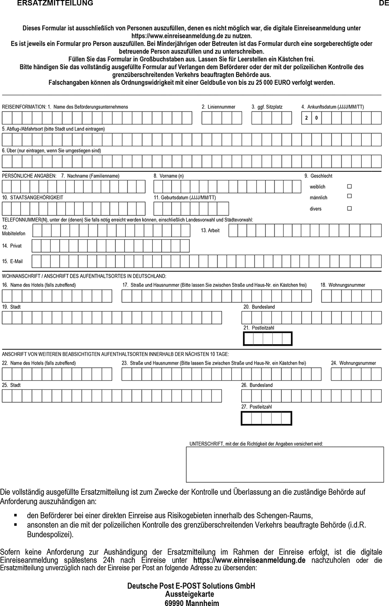

# Verordnung zum Schutz vor einreisebedingten Infektionsgefahren in Bezug auf das Coronavirus SARS-CoV-2 (CoronaEinreiseV 2021-09)

Ausfertigungsdatum
:   2021-09-28

Fundstelle
:   BAnz: AT 29.09.2021 V1

Stand: Die V tritt gem. § 14 idF d. § 7 V v. 22.12.2021 BAnz AT 22.12.2021 V1 mit Ablauf des 3.3.2022 außer Kraft
Zuletzt geändert durch
:   Art. 2 V v. 14.1.2022 BAnz AT 14.01.2022 V1

Die geltung dieser v ist durch
:   § 14 idF d. Art. 1 Nr. 2 Buchst. a V v. 8.11.2021 BAnz AT 08.11.2021 V1 über den 31.12.2021 hinaus bis zum Ablauf des 15.1.2022 verlängert worden

Die geltung dieser v ist durch
:   § 14 idF d. Art. 1 Nr. 7 V v. 22.12.2021 BAnz AT 22.12.2021 V1 über den 15.1.2022 hinaus bis zum Ablauf des 3.3.2022 verlängert worden

Stand: Ersetzt V 2126-13-32 v. 30.7.2021 BAnz AT 30.07.2021 V1 (CoronaEinreiseV 2021-08)

## Eingangsformel

Auf Grund des § 36 Absatz 8 Satz 1 bis 4, Absatz 10 Satz 1 Nummer 1,
1a, 2 Buchstabe a, b, c, d, g und i, Nummer 3 und Absatz 12 Satz 2 des
Infektionsschutzgesetzes, dessen Absatz 8 Satz 1 durch Artikel 1
Nummer 3 Buchstabe a Doppelbuchstabe aa des Gesetzes vom 29. März 2021
(BGBl. I S. 370) neu gefasst, dessen Absatz 8 Satz 2 durch Artikel 1
Nummer 3 Buchstabe a Doppelbuchstabe bb des Gesetzes vom 29. März 2021
(BGBl. I S. 370) geändert, dessen Absatz 8 Satz 3 durch Artikel 1
Nummer 3 Buchstabe a Doppelbuchstabe cc des Gesetzes vom 29. März 2021
(BGBl. I S. 370) eingefügt, dessen Absatz 8 Satz 4 durch Artikel 1
Nummer 3 Buchstabe a Doppelbuchstabe dd des Gesetzes vom 29. März 2021
(BGBl. I S. 370) geändert, dessen Absatz 10 Satz 1 zuletzt durch
Artikel 12 Nummer 1 Buchstabe a Doppelbuchstabe aa des Gesetzes vom
10\. September 2021 (BGBl. I S. 4147) geändert und dessen Absatz 12
Satz 2 durch Artikel 9 des Gesetzes vom 16. Juli 2021 (BGBl. I S.
2947) neu gefasst worden ist, verordnet die Bundesregierung:

## Abschnitt 1 - Allgemeine Bestimmungen

### § 1 Zweck der Verordnung

Zweck dieser Verordnung ist es, im Rahmen der Einreise von Personen in
die Bundesrepublik Deutschland Infektionen mit dem Coronavirus SARS-
CoV-2 und insbesondere mit besorgniserregenden Virusvarianten des
Coronavirus SARS-CoV-2 frühzeitig zu verhindern, um seine Verbreitung
in der Bundesrepublik Deutschland zu verhindern.

### § 2 Begriffsbestimmungen

Im Sinne dieser Verordnung ist:

1.  Einreise

    Überschreitung der Grenze der Bundesrepublik Deutschland auf dem
    Land-, Wasser- oder Luftweg aus dem Ausland; erfolgt die Einreise
    durch einen Beförderer, die geplante erste Ankunft mit
    Ausstiegsmöglichkeit in der Bundesrepublik Deutschland,

2.  Einreiseportal

    vom Robert Koch-Institut nach § 36 Absatz 9 Satz 1 des
    Infektionsschutzgesetzes eingerichtetes elektronisches Melde- und
    Informationssystem unter https://www.einreiseanmeldung.de,

3.  Hochrisikogebiet

    ein Gebiet im Sinne des § 2 Nummer 17 des Infektionsschutzgesetzes,
    für das vom Bundesministerium für Gesundheit im Einvernehmen mit dem
    Auswärtigen Amt und dem Bundesministerium des Innern und für Heimat
    festgestellt wurde, dass in diesem Gebiet eine besonders hohe Inzidenz
    in Bezug auf die Verbreitung des Coronavirus SARS-CoV-2 besteht oder
    andere Anhaltspunkte dafür vorliegen, dass in diesem Gebiet ein
    erhöhtes Risiko für eine Infektion mit dem Coronavirus SARS-CoV-2
    vorliegt, insbesondere aufgrund der dort beobachteten
    Ausbreitungsgeschwindigkeit oder aufgrund nicht ausreichend
    vorhandener oder verlässlicher epidemiologischer Daten,

3a. Virusvariantengebiet

    ein Gebiet im Sinne des § 2 Nummer 17 des Infektionsschutzgesetzes,
    für das vom Bundesministerium für Gesundheit im Einvernehmen mit dem
    Auswärtigen Amt und dem Bundesministerium des Innern und für Heimat
    festgestellt wurde, dass in diesem Gebiet eine bestimmte, in der
    Bundesrepublik Deutschland noch nicht verbreitete Variante des
    Coronavirus SARS-CoV-2 mit besorgniserregenden Eigenschaften auftritt,
    bei der relevante Anhaltspunkte dafür vorliegen oder in Bezug auf die
    noch Ungewissheit besteht, dass

    a)  bestimmte in der Europäischen Union zugelassene Impfstoffe oder eine
        vorherige Infektion mit dem Coronavirus SARS-CoV-2 keinen oder nur
        einen eingeschränkten Schutz gegenüber dieser Variante aufweisen oder

    b)  sie andere ähnlich schwerwiegende besorgniserregende Eigenschaften
        aufweist, insbesondere, weil sie schwerere Krankheitsverläufe oder
        eine erhöhte Mortalität verursacht,

4.  eine asymptomatische Person

    eine Person, bei der aktuell kein typisches Symptom oder sonstiger
    Anhaltspunkt für eine Infektion mit dem Coronavirus SARS-CoV-2
    vorliegt; typische Symptome einer Infektion mit dem Coronavirus SARS-
    CoV-2 sind Atemnot, neu auftretender Husten, Fieber und Geruchs- oder
    Geschmacksverlust,

5.  getestete Person

    eine asymptomatische Person, die im Besitz eines auf ihre Person
    ausgestellten Testnachweises ist,

6.  Testnachweis, vorbehaltlich besonderer Regelungen in dieser
    Verordnung,

    ein Nachweis hinsichtlich des Nichtvorliegens einer Infektion mit dem
    Coronavirus SARS-CoV-2 in deutscher, englischer, französischer,
    italienischer oder spanischer Sprache in verkörperter oder digitaler
    Form, wenn die zugrundeliegende Testung

    a)  in der Bundesrepublik Deutschland von einem Leistungserbringer nach §
        6 Absatz 1 der Coronavirus-Testverordnung oder im Rahmen einer
        betrieblichen Testung im Sinne des Arbeitsschutzes durch Personal, das
        die dafür erforderliche Ausbildung oder Kenntnis und Erfahrung
        besitzt, vorgenommen oder überwacht wurde oder im Ausland von einer
        nach dem Recht des jeweiligen Staates befugten Stelle vorgenommen oder
        überwacht wurde und

    b)  durch In-vitro-Diagnostika erfolgt ist, die für den direkten
        Erregernachweis des Coronavirus SARS-CoV-2 bestimmt sind, und

        aa) zum Zeitpunkt oder zum geplanten Zeitpunkt der Einreise in die
            Bundesrepublik maximal 48 Stunden zurückliegt, oder

        bb) sofern eine Einreise mittels Beförderer stattfindet und die Testung
            mittels Nukleinsäurenachweis (PCR, PoC-NAAT oder weitere Methoden der
            Nukleinsäureamplifikationstechnik) erfolgt ist, zum Zeitpunkt oder zum
            geplanten Zeitpunkt des Beginns der Beförderung maximal 48 Stunden
            zurückliegt,

7.  genesene Person

    eine asymptomatische Person, die im Besitz eines auf sie ausgestellten
    Genesenennachweises ist,

8.  Genesenennachweis

    ein Nachweis hinsichtlich des Vorliegens eines durch vorherige
    Infektion erworbenen Immunschutzes gegen das Coronavirus SARS-CoV-2 in
    deutscher, englischer, französischer, italienischer oder spanischer
    Sprache in verkörperter oder digitaler Form, wenn der Nachweis den vom
    Robert Koch-Institut im Internet unter der Adresse
    www.rki.de/covid-19-genesenennachweis unter Berücksichtigung des
    aktuellen Stands der medizinischen Wissenschaft veröffentlichten
    Vorgaben hinsichtlich folgender Kriterien entspricht:

    a)  Art der Testung zum Nachweis der vorherigen Infektion,

    b)  Zeit, die nach der Testung zum Nachweis der vorherigen Infektion
        vergangen sein muss, oder Nachweis zur Aufhebung der aufgrund der
        vorherigen Infektion erfolgten Absonderung,

    c)  Zeit, die die Testung zum Nachweis der vorherigen Infektion höchstens
        zurückliegen darf,

9.  geimpfte Person

    eine asymptomatische Person, die im Besitz eines auf sie ausgestellten
    Impfnachweises ist,

10. Impfnachweis

    ein Nachweis hinsichtlich des Vorliegens eines vollständigen
    Impfschutzes gegen das Coronavirus SARS-CoV-2 in deutscher,
    englischer, französischer, italienischer oder spanischer Sprache in
    verkörperter oder digitaler Form, wenn die zugrunde liegenden
    Schutzimpfungen den vom Paul-Ehrlich-Institut im Benehmen mit dem
    Robert Koch-Institut im Internet unter der Adresse
    www.pei.de/impfstoffe/covid-19 unter Berücksichtigung des aktuellen
    Stands der medizinischen Wissenschaft veröffentlichten Vorgaben
    hinsichtlich folgender Kriterien entsprechen:

    a)  verwendete Impfstoffe,

    b)  für einen vollständigen Impfschutz erforderliche Anzahl an
        Einzelimpfungen,

    c)  für einen weiterhin vollständigen Impfschutz erforderliche
        Auffrischimpfungen,

    d)  Intervallzeiten,

        aa) die nach einer Impfung für einen vollständigen Impfschutz abgewartet
            werden müssen und

        bb) die höchstens zwischen Einzelimpfungen oder Auffrischimpfungen liegen
            dürfen,

11. Grenzpendler

    a)  eine Person, die in der Bundesrepublik Deutschland ihren Wohnsitz hat
        und die sich zwingend notwendig zum Zwecke ihrer Berufsausübung, ihres
        Studiums oder ihrer Ausbildung an ihre Berufsausübungs-, Studien- oder
        Ausbildungsstätte in das Ausland begibt und regelmäßig, mindestens
        einmal wöchentlich, an ihren Wohnsitz zurückkehrt, oder

    b)  diejenige sorgeberechtigte Person oder Betreuungsperson, die eine
        Person nach Buchstabe a zu ihrer Berufsausübungs-, Studien- oder
        Ausbildungsstätte bringt oder sie dort abholt,

12. Grenzgänger

    a)  eine Person, die im Ausland ihren Wohnsitz hat und die sich zwingend
        notwendig zum Zwecke ihrer Berufsausübung, ihres Studiums oder ihrer
        Ausbildung in die Bundesrepublik Deutschland begibt und regelmäßig,
        mindestens einmal wöchentlich, an ihren Wohnsitz zurückkehrt, oder

    b)  diejenige sorgeberechtigte Person oder Betreuungsperson, die eine
        Person nach Buchstabe a zu ihrer Berufsausübungs-, Studien- oder
        Ausbildungsstätte bringt oder sie dort abholt,

13. Transportpersonal

    Personen, die einreisen, um beruflich bedingt grenzüberschreitend
    Personen, Waren oder Güter auf dem Land-, Wasser- oder Luftweg zu
    transportieren,

14. Beförderer

    ein Unternehmen, das Personen im grenzüberschreitenden Eisenbahn-,
    Bus-, Flug- oder Schiffsverkehr in die Bundesrepublik Deutschland
    befördert,

15. Zwischenaufenthalt

    Aufenthalte, die die übliche Zeitdauer notwendiger Halte zum Beispiel
    zur Rast oder für Tankvorgänge überschreiten; Umsteigezeiten an einem
    Flughafen gelten nicht als Zwischenaufenthalt,

16. Schengen-Staat

    Staat, in dem neben der Bundesrepublik Deutschland der Schengen-
    Besitzstand vollständig angewandt wird:

    Belgien, Dänemark, Estland, Finnland, Frankreich, Griechenland,
    Island, Italien, Lettland, Liechtenstein, Litauen, Luxemburg, Malta,
    Niederlande, Norwegen, Österreich, Polen, Portugal, Schweden, Schweiz,
    Slowakei, Slowenien, Spanien, Tschechische Republik und Ungarn,

17. Angehörige ausländischer Streitkräfte

    Angehörige ausländischer Streitkräfte im Sinne des NATO-
    Truppenstatuts, des Truppenstatuts der NATO-Partnerschaft für den
    Frieden und des Truppenstatuts der Mitgliedstaaten der Europäischen
    Union, die zu dienstlichen Zwecken nach Deutschland einreisen oder
    dorthin zurückkehren.

## Abschnitt 2 - Pflichten von Einreisenden

### § 3 Anmeldepflicht

(1) Personen, die in die Bundesrepublik Deutschland einreisen wollen
und sich zu einem beliebigen Zeitpunkt in den letzten zehn Tagen vor
der Einreise in einem zum geplanten Zeitpunkt der Einreise als
Hochrisikogebiet oder Virusvariantengebiet eingestuften Gebiet
aufgehalten haben, sind verpflichtet, vor der Einreise der zuständigen
Behörde folgende Angaben durch Nutzung des Einreiseportals mitzuteilen
(digitale Einreiseanmeldung):

1.  ihre personenbezogenen Angaben nach § 2 Nummer 16 des
    Infektionsschutzgesetzes,

2.  das Datum ihrer voraussichtlichen Einreise,

3.  ihre Aufenthaltsorte bis zu zehn Tage vor und nach der Einreise,

4.  das für die Einreise genutzte Reisemittel und vorliegende
    Informationen zum Sitzplatz,

5.  Angaben, ob ein Impfnachweis vorliegt,

6.  Angaben, ob ein Testnachweis beziehungsweise Genesenennachweis
    vorliegt, und

7.  Angaben, ob bei ihnen typische Anhaltspunkte für eine Infektion mit
    dem Coronavirus SARS-CoV-2 vorliegen.

(2) Sofern eine digitale Einreiseanmeldung nicht möglich ist, ist
stattdessen ausnahmsweise eine vollständig ausgefüllte
Ersatzmitteilung nach dem Muster der Anlage bei der Einreise
mitzuführen.

### § 4 Absonderungspflicht

(1) Personen, die in die Bundesrepublik Deutschland eingereist sind
und sich zu einem beliebigen Zeitpunkt in den letzten zehn Tagen vor
der Einreise in einem zum Zeitpunkt der Einreise als Hochrisikogebiet
oder Virusvariantengebiet eingestuften Gebiet aufgehalten haben, sind
verpflichtet, sich unverzüglich nach der Einreise auf eigene Kosten
für einen Zeitraum nach Absatz 2 abzusondern. Nach der Einreise haben
sich Personen nach Satz 1 auf direktem Weg in die Haupt- oder
Nebenwohnung oder in eine andere, eine Absonderung ermöglichende
Unterkunft zu begeben. Den absonderungspflichtigen Personen ist es in
diesem Zeitraum nicht gestattet, Besuch von Personen zu empfangen, die
nicht ihrem Hausstand angehören. Personen nach Satz 1 sind
verpflichtet, die zuständige Behörde unverzüglich zu informieren, wenn
typische Symptome einer Infektion mit dem Coronavirus SARS-CoV-2
innerhalb des jeweils maßgeblichen Absonderungszeitraums nach Absatz 2
bei ihnen auftreten. Personen nach Satz 1 unterliegen für die Zeit der
Absonderung der Beobachtung durch die zuständige Behörde.

(2) Die Absonderung nach Absatz 1 Satz 1 hat für einen Zeitraum von
zehn Tagen zu erfolgen. Die Absonderung endet abweichend von Satz 1
vor dem Ablauf von zehn Tagen für genesene, geimpfte oder getestete
Personen, wenn diese den Genesenennachweis, den Impfnachweis oder den
Testnachweis nach § 7 Absatz 4 Satz 1 an die zuständige Behörde
übermitteln. Im Fall der Übermittlung eines Testnachweises darf die
zugrundeliegende Testung frühestens fünf Tage nach der Einreise
erfolgt sein; bei Personen, die das sechste Lebensjahr noch nicht
vollendet haben, endet die Absonderung fünf Tage nach der Einreise.
Die Absonderung nach Absatz 1 Satz 1 wird für die Dauer, die zur
Durchführung eines Tests erforderlich ist, ausgesetzt. Für Personen,
die sich zu einem beliebigen Zeitpunkt in den letzten zehn Tagen vor
der Einreise in einem zum Zeitpunkt der Einreise als
Virusvariantengebiet eingestuften Gebiet aufgehalten haben, beträgt
der Zeitraum in Abweichung von Satz 1 vierzehn Tage; die Sätze 2 bis 4
finden nur dann entsprechende Anwendung, wenn

1.  das betroffene Virusvariantengebiet nach der Einreise in die
    Bundesrepublik Deutschland und vor Ablauf der vierzehn Tage als
    Hochrisikogebiet eingestuft wird oder

2.  die einreisende Person vollständig mit einem Impfstoff gegen das
    Coronavirus SARS-CoV-2 geimpft ist, für den das Robert Koch-Institut
    festgestellt und auf seiner Internetseite ausdrücklich unter Bezug auf
    diese Vorschrift bekanntgemacht hat, dass dieser Impfstoff gegen die
    Virusvariante hinreichend wirksam ist, derentwegen die Einstufung als
    Virusvariantengebiet erfolgt ist.

Die Absonderung endet abweichend von den Sätzen 1 und 5 außerdem, wenn
das betroffene Hochrisikogebiet oder Virusvariantengebiet nach der
Einreise in die Bundesrepublik Deutschland und vor Ablauf des
Absonderungszeitraums nicht mehr als Hochrisikogebiet oder
Virusvariantengebiet eingestuft wird.

(3) (weggefallen)

### § 5 Nachweispflicht

(1) Personen, die das sechste Lebensjahr vollendet haben, müssen bei
der Einreise in die Bundesrepublik Deutschland über einen
Testnachweis, einen Genesenennachweis oder einen Impfnachweis
verfügen.

(2) Personen, die das sechste Lebensjahr vollendet und sich zu einem
beliebigen Zeitpunkt in den letzten zehn Tagen vor der Einreise in
einem zum Zeitpunkt der Einreise als Virusvariantengebiet eingestuften
Gebiet aufgehalten haben, müssen bei der Einreise in die
Bundesrepublik Deutschland über einen Testnachweis verfügen, der auf
einer Testung mittels Nukleinsäurenachweis (PCR, PoC-NAAT oder weitere
Methoden der Nukleinsäureamplifikationstechnik) beruht; ein
Genesenennachweis oder ein Impfnachweis sind in diesem Fall nicht
ausreichend.

### § 6 Ausnahmen

(1) Die §§ 3 und 4 gelten nicht für Personen, die

1.  durch ein Hochrisikogebiet oder Virusvariantengebiet lediglich
    durchgereist sind und dort keinen Zwischenaufenthalt hatten,

2.  zur Durchreise in die Bundesrepublik Deutschland einreisen und die
    Bundesrepublik Deutschland auf schnellstem Wege wieder verlassen, um
    die Durchreise abzuschließen,

3.  bei Einhaltung angemessener Schutz- und Hygienekonzepte als
    Transportpersonal in die Bundesrepublik Deutschland einreisen,

4.  als Teil von offiziellen Delegationen über das Regierungsterminal des
    Flughafens Berlin Brandenburg oder über den Flughafen Köln/Bonn nach
    Deutschland einreisen und sich weniger als 72 Stunden in einem
    Hochrisikogebiet oder Virusvariantengebiet aufgehalten haben,

5.  zum Zwecke einer Behandlung einer Infektion mit dem Coronavirus SARS-
    CoV-2 in die Bundesrepublik Deutschland verbracht werden, weil eine
    stationäre Behandlung im Krankenhaus aufgrund einer Infektion mit dem
    Coronavirus SARS-CoV-2 erforderlich ist und diese Behandlung vor Ort
    im Ausland nicht sichergestellt werden kann,

6.  sich im Rahmen des Grenzverkehrs weniger als 24 Stunden in einem
    Hochrisikogebiet oder Virusvariantengebiet aufgehalten haben oder für
    bis zu 24 Stunden in die Bundesrepublik Deutschland einreisen,

7.  Grenzpendler oder Grenzgänger sind,

8.  Polizeivollzugsbeamte oder Zollbeamte sind, die aus dem Einsatz und
    aus einsatzgleichen Verpflichtungen aus dem Ausland zurückkehren,

9.  vom Anwendungsbereich des § 54a Absatz 1 des Infektionsschutzgesetzes
    erfasst sind,

10. Angehörige ausländischer Streitkräfte sind,

11. bei Aufenthalten von weniger als 72 Stunden in der Bundesrepublik
    Deutschland oder in einem Hochrisikogebiet oder Virusvariantengebiet

    a)  aufgrund des Besuchs von Verwandten ersten Grades, des nicht dem
        gleichen Hausstand angehörigen Ehegatten oder Lebensgefährten oder
        aufgrund eines geteilten Sorgerechts oder eines Umgangsrechts
        einreisen oder

    b)  hochrangige Mitglieder des diplomatischen oder konsularischen
        Dienstes, von Volksvertretungen oder Regierungen sind.

    Satz 1 Nummer 8 bis 11 gilt nicht für Personen, die sich zu einem
    beliebigen Zeitpunkt in den letzten zehn Tagen vor der Einreise in
    einem zum Zeitpunkt der Einreise als Virusvariantengebiet eingestuften
    Gebiet aufgehalten haben, sofern es sich nicht um Personen handelt,
    die hochrangige Mitglieder des diplomatischen oder konsularischen
    Dienstes, von Volksvertretungen oder Regierungen sind, die sich
    weniger als 72 Stunden in der Bundesrepublik Deutschland oder in einem
    Virusvariantengebiet aufhalten oder aufgehalten haben, sowie strenge
    Schutz- und Hygienekonzepte eingehalten werden, insbesondere täglich
    eine Testung durchgeführt wird. Satz 1 Nummer 7 gilt mit der Maßgabe,
    dass die Tätigkeit für die Aufrechterhaltung betrieblicher Abläufe
    dringend erforderlich und unabdingbar ist. Satz 1 Nummer 3 gilt nicht,
    wenn sich das Transportpersonal zu einem beliebigen Zeitpunkt in den
    letzten zehn Tagen vor der Einreise mehr als 72 Stunden in einem zum
    Zeitpunkt der Einreise als Virusvariantengebiet eingestuften Gebiet
    aufgehalten hat und sich mehr als 72 Stunden in der Bundesrepublik
    Deutschland aufhalten wird; abweichend von § 4 Absatz 1 Satz 2 bleibt
    eine direkte Ausreise in diesen Fällen jedoch erlaubt. Die in Satz 1
    genannten Personen sind verpflichtet, die zuständige Behörde
    unverzüglich zu informieren, wenn innerhalb von zehn Tagen nach der
    Einreise in die Bundesrepublik Deutschland typische Symptome einer
    Infektion mit dem Coronavirus SARS-CoV-2 bei ihnen auftreten.

(2) Für § 4 gelten außerdem folgende weitere Ausnahmen und Maßgaben:

1.  § 4 Absatz 2 Satz 3 gilt nicht für Personen,

    a)  deren Tätigkeit unabdingbar ist für die Aufrechterhaltung

        aa) der Funktionsfähigkeit des Gesundheitswesens, insbesondere Ärzte,
            Pflegekräfte, unterstützendes medizinisches Personal und
            Betreuungspersonal,

        bb) der öffentlichen Sicherheit und Ordnung,

        cc) der Pflege diplomatischer und konsularischer Beziehungen,

        dd) der Funktionsfähigkeit der Rechtspflege,

        ee) der Funktionsfähigkeit von Volksvertretung, Regierung und Verwaltung
            des Bundes, der Länder und der Kommunen, oder

        ff) der Funktionsfähigkeit der Organe der Europäischen Union und von
            internationalen Organisationen,

    b)  die einreisen aufgrund

        aa) des Besuchs von Verwandten ersten oder zweiten Grades, des nicht dem
            gleichen Hausstand angehörigen Ehegatten oder Lebensgefährten oder
            eines geteilten Sorgerechts oder eines Umgangsrechts,

        bb) einer dringenden medizinischen Behandlung oder

        cc) des Beistands oder zur Pflege schutz- oder hilfebedürftiger Personen,

    c)  die sich für bis zu fünf Tage zwingend notwendig und unaufschiebbar
        beruflich veranlasst, wegen ihrer Ausbildung oder ihres Studiums in
        einem Hochrisikogebiet aufgehalten haben oder in die Bundesrepublik
        Deutschland einreisen,

    d)  die zur Vorbereitung, Teilnahme, Durchführung und Nachbereitung
        internationaler Sportveranstaltungen durch das jeweilige
        Organisationskomitee akkreditiert werden oder von einem
        Bundessportfachverband zur Teilnahme an Trainings- und
        Lehrgangsmaßnahmen eingeladen sind,

    e)  die zur künstlerischen Berufsausübung auf der Grundlage vertraglicher
        Verpflichtungen an künstlerischen oder kulturellen Produktions- oder
        Präsentationsprozessen teilnehmen;

    f)  die zum Zwecke einer mindestens dreiwöchigen Arbeitsaufnahme in die
        Bundesrepublik Deutschland einreisen, wenn in den ersten fünf Tagen
        nach Einreise in die Bundesrepublik Deutschland

        aa) am Ort ihrer Unterbringung und ihrer Tätigkeit gruppenbezogene
            betriebliche Hygienemaßnahmen und Vorkehrungen zur Kontaktvermeidung
            außerhalb der Arbeitsgruppe ergriffen werden, die einer Absonderung
            vergleichbar sind,

        bb) das Verlassen der Unterbringung nur zur Ausübung ihrer Tätigkeit
            gestattet ist, und

        cc) der Arbeitgeber die Arbeitsaufnahme vor ihrem Beginn bei der
            zuständigen Behörde anzeigt und die ergriffenen Maßnahmen nach den
            Buchstaben aa und bb dokumentiert;

2.  § 4 gilt nicht für Personen, für die die zuständige Behörde in
    begründeten Fällen auf Antrag weitere Ausnahmen bei Vorliegen eines
    triftigen Grundes erteilt hat.

Für Personen, die sich zu einem beliebigen Zeitpunkt in den letzten
zehn Tagen vor der Einreise in einem zum Zeitpunkt der Einreise als
Virusvariantengebiet eingestuften Gebiet aufgehalten haben, gilt Satz
1 nicht, sofern es sich nicht um Personen handelt, die zur
Vorbereitung, Teilnahme, Durchführung und Nachbereitung
internationaler Sportveranstaltungen durch das jeweilige
Organisationskomitee akkreditiert werden, sowie strenge Schutz- und
Hygienekonzepte eingehalten werden, insbesondere täglich eine Testung
durchgeführt wird. Personen nach Satz 1 sind verpflichtet, die
zuständige Behörde unverzüglich zu informieren, wenn innerhalb von
zehn Tagen nach der Einreise in die Bundesrepublik Deutschland
typische Symptome einer Infektion mit dem Coronavirus SARS-CoV-2 bei
ihnen auftreten.

(3) Für § 5 gelten die folgenden Ausnahmen und Maßgaben:

1.  § 5 gilt für folgende Personen nicht, wenn sie sich nicht zu einem
    beliebigen Zeitpunkt in den letzten zehn Tagen vor der Einreise in
    einem zum Zeitpunkt der Einreise als Virusvariantengebiet eingestuften
    Gebiet aufgehalten haben:

    a)  für die in Absatz 1 Satz 1 Nummer 3 und 4 genannten Personen und

    b)  für Personen, für die die zuständige Behörde in begründeten Fällen auf
        Antrag weitere Ausnahmen bei Vorliegen eines triftigen Grundes erteilt
        hat;

2.  § 5 gilt für folgende Personen nur bei Einreisen aus einem
    Hochrisikogebiet, Virusvariantengebiet oder auf dem Luftweg und mit
    der Maßgabe, dass Personen, die über keinen Impfnachweis oder
    Genesenennachweis verfügen, einen Testnachweis lediglich zweimal pro
    Woche zu erneuern haben:

    a)  Personen, die

        aa) sich im Rahmen des Grenzverkehrs weniger als 24 Stunden im Ausland
            aufgehalten haben oder

        bb) im Rahmen des Grenzverkehrs für bis zu 24 Stunden in die
            Bundesrepublik Deutschland einreisen, und

    b)  Personen nach Absatz 1 Satz 1 Nummer 3 und Nummer 7.

### § 7 Vorlage- und Übermittlungspflichten

(1) Erfolgt die Einreise mittels eines Beförderers, sind diesem vor
der Beförderung folgende Nachweise auf dessen Anforderung hin zum
Zwecke der Überprüfung vorzulegen:

1.  bei Einreisen aus einem Hochrisikogebiet oder Virusvariantengebiet die
    Bestätigung der erfolgreich durchgeführten digitalen Einreiseanmeldung
    oder die vollständig ausgefüllte Ersatzmitteilung nach § 3 Absatz 2
    und

2.  bei Einreisen

    a)  aus einem Virusvariantengebiet ein Testnachweis oder

    b)  aus einem Hochrisikogebiet oder bei allen sonstigen Einreisen auf dem
        Luftweg ein Testnachweis, ein Genesenennachweis oder ein Impfnachweis.

Im grenzüberschreitenden Eisenbahnverkehr oder im
grenzüberschreitenden Kurzstreckenseeverkehr kann die Vorlage
abweichend von Satz 1 auch noch während der Beförderung erfolgen. Das
Vorliegen einer Ausnahme von § 3 Absatz 1 oder § 5 ist auf Verlangen
des Beförderers glaubhaft zu machen.

(2) Bei der Einreise in die Bundesrepublik Deutschland sind folgende
Nachweise mitzuführen und der zuständigen Behörde oder der mit der
polizeilichen Kontrolle des grenzüberschreitenden Verkehrs
beauftragten Behörde auf deren Anforderung zum Zwecke der
stichprobenhaften Überprüfung vorzulegen:

1.  bei Einreisen mit Voraufenthalt in einem Hochrisikogebiet oder
    Virusvariantengebiet die Bestätigung der erfolgreich durchgeführten
    digitalen Einreiseanmeldung oder die vollständig ausgefüllte
    Ersatzmitteilung nach § 3 Absatz 2 und

2.  bei Einreisen

    a)  aus einem Virusvariantengebiet ein Testnachweis oder

    b)  aus allen sonstigen Gebieten ein Testnachweis, ein Genesenennachweis
        oder ein Impfnachweis.

Das Vorliegen einer Ausnahme von § 3 Absatz 1 oder § 5 ist auf
Verlangen der zuständigen Behörde oder der mit der polizeilichen
Kontrolle des grenzüberschreitenden Verkehrs beauftragten Behörde
glaubhaft zu machen. Für Personen, die zum Zwecke einer
Arbeitsaufnahme in die Bundesrepublik Deutschland einreisen, kann auch
der Arbeitgeber oder ein sonstiger Dritter den Nachweis nach Satz 1
erbringen. Bei einer Einreise aus einem Schengen-Staat erfolgt die
Anforderung der Vorlage der Nachweise stichprobenhaft anlässlich
grenzpolizeilicher Aufgabenwahrnehmung. Bei einer Einreise, die nicht
aus einem Schengen-Staat erfolgt, erfolgt die Anforderung im Rahmen
der Einreisekontrolle.

(3) Im Fall des § 3 Absatz 2 ist die vollständig ausgefüllte
Ersatzmitteilung zum Zwecke der Kontrolle und Überlassung an die
zuständige Behörde auf Anforderung auszuhändigen an:

1.  den Beförderer, sofern die Einreise unter Inanspruchnahme eines
    Beförderers aus einem Schengen-Staat erfolgt, oder

2.  die mit der polizeilichen Kontrolle des grenzüberschreitenden Verkehrs
    beauftragte Behörde.

Sofern eine Anforderung nach Satz 1 im Rahmen der Einreise nicht
erfolgt ist, ist spätestens 24 Stunden nach Einreise entweder eine
digitale Einreiseanmeldung nachzuholen oder die vollständig
ausgefüllte Ersatzmitteilung an die zuständige Behörde zu übermitteln.

(4) Personen, die in die Bundesrepublik Deutschland eingereist sind
und sich zu einem beliebigen Zeitpunkt in den letzten zehn Tagen vor
der Einreise in einem zum Zeitpunkt der Einreise als Hochrisikogebiet
eingestuften Gebiet aufgehalten haben, haben, wenn sie nach § 3 zu
einer Anmeldung verpflichtet sind, nach dessen Vorliegen einen
Genesenennachweis, einen Impfnachweis oder einen Testnachweis nach § 4
Absatz 2 Satz 2 und 3 durch Nutzung des Einreiseportals an die
zuständige Behörde zu übermitteln. Für Personen, die sich zu einem
beliebigen Zeitpunkt in den letzten zehn Tagen vor der Einreise in
einem zum Zeitpunkt der Einreise als Virusvariantengebiet eingestuften
Gebiet aufgehalten haben, gilt Satz 1 in den Fällen des § 4 Absatz 2
Satz 5 zweiter Halbsatz entsprechend. Für Personen, die zum Zwecke
einer Arbeitsaufnahme in die Bundesrepublik Deutschland einreisen,
kann auch der Arbeitgeber oder ein sonstiger Dritter den Nachweis nach
den Sätzen 1 oder 2 erbringen.

## Abschnitt 3 - Pflichten der Verkehrsunternehmen

### § 8 Informationspflichten der Verkehrsunternehmen

Beförderer und Betreiber von Flugplätzen, Häfen, Personenbahnhöfen und
Omnibusbahnhöfen haben im Rahmen ihrer betrieblichen und technischen
Möglichkeiten sicherzustellen, dass Reisenden die auf der
Internetseite
https://www.rki.de/covid-19-bmg-merkblatt              enthaltenen
Informationen barrierefrei zur Verfügung gestellt werden.

### § 9 Pflichten der Beförderer im Zusammenhang mit der Beförderung

(1) Beförderer, die Personen aus einem Hochrisikogebiet oder,
vorbehaltlich des § 10, aus einem Virusvariantengebiet in die
Bundesrepublik Deutschland befördern, haben, soweit keine Ausnahme
oder Maßgabe nach § 6 Absatz 1 Satz 1 oder Satz 3 vorliegt, vor der
Beförderung die Bestätigung der erfolgreichen digitalen
Einreiseanmeldung oder die vollständig ausgefüllte Ersatzmitteilung
nach § 3 Absatz 2 zu kontrollieren. Diese sind im Rahmen der
betrieblichen und technischen Möglichkeiten auf Plausibilität der
personenbezogenen Angaben zu prüfen. Die vollständig ausgefüllten
Ersatzmitteilungen nach § 3 Absatz 2 sind bei Beförderungen aus einem
Schengen-Staat einzusammeln und unverzüglich durch die Beförderer an
die zuständige Behörde zu übermitteln. Beförderer, die Personen aus
einem Hochrisikogebiet oder Virusvariantengebiet außerhalb von
Schengen-Staaten in die Bundesrepublik Deutschland befördern, haben
die beförderten Personen darauf hinzuweisen, dass die Bestätigung der
erfolgreichen digitalen Einreiseanmeldung oder die vollständig
ausgefüllte Ersatzmitteilung nach § 3 Absatz 2 im Rahmen der
Einreisekontrolle der mit der polizeilichen Kontrolle des
grenzüberschreitenden Verkehrs beauftragten Behörde auf deren
Anforderung hin vorzulegen ist und die vollständig ausgefüllte
Ersatzmitteilung nach § 3 Absatz 2 an diese zum Zwecke der
stichprobenhaften Überprüfung und Überlassung an die zuständige
Behörde auszuhändigen ist. Beförderer haben die Beförderungen aus
einem Hochrisikogebiet oder Virusvariantengebiet in die Bundesrepublik
Deutschland zu unterlassen, wenn die zu befördernden Personen im
Rahmen der Kontrolle nach Satz 1 keine Bestätigung der erfolgreichen
digitalen Einreiseanmeldung oder keine vollständig ausgefüllte
Ersatzmitteilung nach § 3 Absatz 2 vorgelegt haben; dies gilt auch,
wenn nach Prüfung nach Satz 2 die angegebenen Daten offensichtlich
unrichtig sind. Im grenzüberschreitenden Eisenbahnverkehr oder im
grenzüberschreitenden Kurzstreckenseeverkehr aus einem
Hochrisikogebiet oder Virusvariantengebiet kann die Kontrolle in
Abweichung von Satz 5 auch noch während der Beförderung erfolgen.

(2) Für Beförderer, die Personen aus einem Hochrisikogebiet oder
Virusvariantengebiet oder auf dem Luftweg in die Bundesrepublik
Deutschland befördern, gilt Absatz 1 Satz 1, 2, 5 und 6 in Bezug auf
den Testnachweis, Genesenennachweis oder Impfnachweis entsprechend; es
dürfen, soweit keine Ausnahme nach § 6 Absatz 3 vorliegt und es sich
um Personen handelt, die das sechste Lebensjahr vollendet haben, nur
geimpfte, genesene oder getestete Personen und, wenn die Beförderung
aus einem Virusvariantengebiet erfolgt, nur getestete Personen, die
über einen Testnachweis verfügen, der auf einer Testung mittels
Nukleinsäurenachweis (PCR, PoC-NAAT oder weitere Methoden der
Nukleinsäureamplifikationstechnik) beruht, befördert werden. Wenn den
zu befördernden Personen die Erlangung eines Testnachweises nicht
möglich ist, können Beförderer vor Abreise eine Testung selbst
durchführen oder durchführen lassen und im Fall einer Negativtestung
eine Beförderung vornehmen.

(3) Die Absätze 1 und 2 gelten nicht im öffentlichen
Personennahverkehr.

### § 10 Beförderungsverbot aus Virusvariantengebieten

(1) Beförderer sind verpflichtet, Beförderungen aus
Virusvariantengebieten in die Bundesrepublik Deutschland zu
unterlassen.

(2) Das Beförderungsverbot gilt nicht für

1.  Beförderungen von deutschen Staatsangehörigen oder Personen mit
    Wohnsitz und Aufenthaltsrecht in der Bundesrepublik Deutschland sowie
    jeweils ihre Ehepartner, Lebensgefährten aus demselben Haushalt,
    minderjährigen Kinder und Elternteile bei minderjährigen Kindern,

2.  Beförderungen von Personen, die in der Bundesrepublik Deutschland in
    einem Flughafen lediglich umsteigen,

3.  reine Post-, Fracht- oder Leertransporte,

4.  die Rückführung von Luftfahrzeugen, Schiffen und Crews,

5.  Transporte mit oder von Personal im Interesse der öffentlichen
    Gesundheit, Ambulanzflüge und Flüge zum Transport von
    Transplantationsorganen sowie notwendiges Begleitpersonal,

6.  Beförderungen aus dringenden humanitären Gründen,

7.  Beförderungen im Auftrag der EURATOM-Sicherheitsüberwachung, der
    Internationalen Atomenergie-Organisation, der Vereinten Nationen und
    ihrer Organisationen, der Europäischen Union sowie des Europäischen
    Zentrums für mittelfristige Wettervorhersage,

8.  Beförderungen von Mitgliedern einer ausländischen diplomatischen
    Mission oder einer konsularischen Vertretung, deren Ernennung und
    Ankunft dem Auswärtigen Amt notifiziert worden ist, sowie jeweils ihre
    sie begleitenden Ehepartner, Lebensgefährten und minderjährigen
    Kinder,

9.  Beförderungen von Personen, die zur Vorbereitung, Teilnahme,
    Durchführung und Nachbereitung internationaler Sportveranstaltungen
    durch das jeweilige Organisationskomitee akkreditiert werden,

10. Beförderungen von geimpften Personen, für die vom Bundesministerium
    für Gesundheit im Einvernehmen mit dem Auswärtigen Amt und dem
    Bundesministerium des Innern und für Heimat festgestellt wurde, dass
    ihre Beförderung im nationalen Interesse der Bundesrepublik
    Deutschland liegt.

Das Vorliegen einer Ausnahme nach Satz 1 ist auf Verlangen des
Beförderers oder der mit der polizeilichen Kontrolle des
grenzüberschreitenden Verkehrs beauftragten Behörde glaubhaft zu
machen. Satz 1 Nummer 1 gilt bei Beförderungen aus Mitgliedstaaten der
Europäischen Union sowie aus dem Vereinigten Königreich Großbritannien
und Nordirland mit der Maßgabe, dass Lebensgefährten nicht demselben
Haushalt angehören müssen.

(3) Geplante Beförderungen nach Absatz 2 Satz 1 Nummer 1 sind dem
Bundespolizeipräsidium durch den Beförderer mindestens drei Tage vor
der geplanten Einreise in die Bundesrepublik Deutschland anzuzeigen.
Dies gilt nicht für Beförderungen im Rahmen des öffentlichen
Personennahverkehrs.

### § 11 Auskunftspflicht der Beförderer

(1) Beförderer haben die bei ihnen vorhandenen Daten zu Personen, die
sie aus einem Hochrisikogebiet oder Virusvariantengebiet befördert
haben, bis zu 30 Tage nach Ankunft der einreisenden Personen der
zuständigen Behörde auf deren Anforderung zu übermitteln; dies gilt
für elektronisch gespeicherte Daten zur Identifikation der beförderten
Personen, deren Kontaktdaten sowie für Passagierlisten und Sitzpläne.

(2) Beförderer sind verpflichtet, gegenüber dem Robert Koch-Institut
eine für Rückfragen der zuständigen Behörden erreichbare Kontaktstelle
zu benennen.

## Abschnitt 4 - Pflichten der Mobilfunknetzbetreiber

### § 12 Informationspflichten der Mobilfunknetzbetreiber

Ein Betreiber eines öffentlichen Mobilfunknetzes ist im Rahmen des
technisch Möglichen verpflichtet, seinen Kunden, die sich nach Nutzung
eines ausländischen Mobilfunknetzes nach mehr als 24 Stunden wieder in
sein Mobilfunknetz einbuchen, sowie Nutzern ausländischer
Mobilfunknetze, die sich in sein Mobilfunknetz einbuchen, unverzüglich
und barrierefrei eine Kurznachricht der Bundesregierung mit dem Inhalt
nach Satz 2 am Netzabschlusspunkt seines Mobilfunknetzes zur Verfügung
zu stellen, in der auf die in der Bundesrepublik Deutschland geltenden
Einreise- und Infektionsschutzbestimmungen im Zusammenhang mit dem
Coronavirus SARS-CoV-2 sowie auf die zu beachtenden
Infektionsschutzmaßnahmen zur Verhinderung der Verbreitung des
Coronavirus SARS-CoV-2 hingewiesen wird. Der Inhalt der Kurznachricht
wird den Betreibern von der Bundesregierung zur Verfügung gestellt.

## Abschnitt 5 - Schlussbestimmungen

### § 13 Ordnungswidrigkeiten

Ordnungswidrig im Sinne des § 73 Absatz 1a Nummer 24 des
Infektionsschutzgesetzes handelt, wer vorsätzlich oder fahrlässig

1.  entgegen § 3 Absatz 1 eine Mitteilung nicht, nicht richtig, nicht
    vollständig, nicht in der vorgeschriebenen Weise oder nicht
    rechtzeitig macht,

2.  entgegen § 4 Absatz 1 Satz 1 sich nicht oder nicht rechtzeitig
    absondert,

3.  entgegen § 4 Absatz 1 Satz 2 sich nicht, nicht in der vorgeschriebenen
    Weise oder nicht rechtzeitig in eine dort genannte Wohnung oder
    Unterkunft begibt,

4.  entgegen § 4 Absatz 1 Satz 3 Besuch empfängt,

5.  entgegen § 7 Absatz 1 Satz 1 oder Absatz 2 Satz 1 einen Nachweis
    nicht, nicht richtig, nicht vollständig oder nicht rechtzeitig
    vorlegt,

6.  entgegen § 7 Absatz 3 Satz 1 eine Ersatzmitteilung nicht, nicht
    richtig, nicht vollständig oder nicht rechtzeitig aushändigt,

7.  entgegen § 7 Absatz 3 Satz 2 eine digitale Einreiseanmeldung nicht,
    nicht richtig, nicht vollständig oder nicht rechtzeitig nachholt und
    eine Ersatzmitteilung nicht, nicht richtig, nicht vollständig oder
    nicht rechtzeitig übermittelt,

8.  entgegen § 8 nicht sicherstellt, dass eine dort genannte Information
    barrierefrei zur Verfügung gestellt wird,

9.  entgegen § 9 Absatz 1 Satz 1, auch in Verbindung mit Absatz 2 Satz 1
    erster Halbsatz, eine Bestätigung, eine Ersatzmitteilung oder einen
    Nachweis nicht, nicht richtig, nicht vollständig oder nicht
    rechtzeitig kontrolliert,

10. entgegen § 9 Absatz 1 Satz 5 erster Halbsatz oder § 10 Absatz 1 eine
    Beförderung nicht unterlässt,

11. entgegen § 9 Absatz 2 Satz 1 zweiter Halbsatz eine Person befördert
    oder

12. entgegen § 11 Absatz 1 Daten nicht, nicht richtig, nicht vollständig
    oder nicht rechtzeitig übermittelt.

### § 14 Inkrafttreten, Außerkrafttreten

Diese Verordnung tritt am 30. September 2021 in Kraft; sie tritt mit
Ablauf des 3. März 2022 außer Kraft.

### Anlage

(Fundstelle: BAnz AT 29.09.2021 V1)

