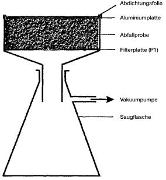
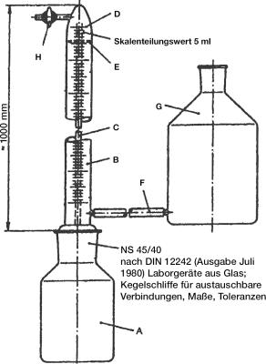

# Verordnung über Deponien und Langzeitlager (DepV 2009)

Ausfertigungsdatum
:   2009-04-27

Fundstelle
:   BGBl I: 2009, 900

Zuletzt geändert durch
:   Art. 5 Abs. 28 G v. 24.2.2012 I 212

## Teil 1 - Allgemeine Bestimmungen

### § 1 Anwendungsbereich

(1) Diese Verordnung gilt für

1.  die Errichtung, den Betrieb, die Stilllegung und die Nachsorge von
    Deponien,

2.  die Behandlung von Abfällen zum Zwecke der Ablagerung auf Deponien und
    des Einsatzes als Deponieersatzbaustoff,

3.  die Ablagerung von Abfällen auf Deponien,

4.  den Einsatz von Abfällen als und zur Herstellung von
    Deponieersatzbaustoff,

5.  die Errichtung, den Betrieb, die Stilllegung und die Nachsorge von
    Langzeitlagern sowie

6.  die Lagerung von Abfällen in Langzeitlagern.

(2) Diese Verordnung gilt für

1.  Träger eines Deponievorhabens,

2.  Betreiber und Inhaber von Deponien (Deponiebetreiber),

3.  Betreiber von Langzeitlagern,

4.  Erzeuger und Besitzer von Abfällen sowie

5.  Betreiber von Anlagen zur Herstellung von Deponieersatzbaustoff.

(3) Diese Verordnung gilt nicht für

1.  private Haushaltungen,

2.  die Lagerung und die Ablagerung von Baggergut (Abfallschlüssel 17 05
    06 gemäß Anlage zur Abfallverzeichnis-Verordnung) entlang von
    Wasserstraßen und oberirdischen Gewässern, aus denen es ausgebaggert
    wurde, ausgenommen die Wasserstraßen Donau, Elbe, Ems unterhalb von
    Papenburg, Mosel, Neckar, Oder, Rhein und Weser,

3.  Deponien und Deponieabschnitte, auf denen die Stilllegungsphase

    a)  vor dem 1. Januar 1997 begonnen hat, mit Ausnahme der §§ 14 bis 17,
        oder

    b)  vor dem 16. Juli 2001 begonnen hat und Festlegungen für die
        Stilllegungsphase vor dem 16. Juli 2001 in einer Planfeststellung,
        einer Plangenehmigung oder einer behördlichen Anordnung getroffen
        worden sind, mit Ausnahme der §§ 14 bis 17,

4.  Deponien und Deponieabschnitte, die am 16. Juli 2009 nach § 36 Absatz
    3 des Kreislaufwirtschafts- und Abfallgesetzes durch bestandskräftigen
    Bescheid endgültig stillgelegt sind,

5.  die Lagerung von Abfällen in Langzeitlagern, soweit die Abfälle vor
    der Verwertung über einen Zeitraum von weniger als drei Jahren
    gelagert werden, und

6.  die ausschließliche Lagerung oder Ablagerung von Abfällen, die
    unmittelbar und üblicherweise beim Aufsuchen, Gewinnen, Aufbereiten
    und Weiterverarbeiten sowie bei der damit zusammenhängenden Lagerung
    von Bodenschätzen anfallen.

### § 2 Begriffsbestimmungen

In dieser Verordnung gelten folgende Begriffsbestimmungen:

1.  Ablagerungsbereich:
    Bereich einer Deponie, auf oder in dem Abfälle zeitlich unbegrenzt
    abgelagert werden;

2.  Ablagerungsphase:
    Zeitraum von der Abnahme der für den Betrieb einer Deponie oder eines
    Deponieabschnittes erforderlichen Einrichtungen durch die zuständige
    Behörde bis zu dem Zeitpunkt, an dem die Ablagerung von Abfällen
    beendet wird;

3.  Altdeponie:
    Eine Deponie, die sich am 16. Juli 2009 in der Ablagerungs-,
    Stilllegungs- oder Nachsorgephase befindet;

4.  Auslöseschwelle:
    Grundwasserüberwachungswerte, bei deren Überschreitung Maßnahmen zum
    Schutz des Grundwassers eingeleitet werden müssen;

5.  Behandlung:
    Mechanische, physikalische, thermische, chemische oder biologische
    Verfahren oder Verfahrenskombinationen, die das Volumen oder die
    schädlichen Eigenschaften der Abfälle verringern, ihre Handhabung
    erleichtern, ihre Verwertung oder Beseitigung begünstigen oder die
    Einhaltung der Zuordnungskriterien nach Anhang 3 gewährleisten;

6.  Deponie der Klasse 0 (Deponieklasse 0, DK 0):
    Oberirdische Deponie für Inertabfälle, die die Zuordnungskriterien
    nach Anhang 3 Nummer 2 für die Deponieklasse 0 einhalten;

7.  Deponie der Klasse I (Deponieklasse I, DK I):
    Oberirdische Deponie für Abfälle, die die Zuordnungskriterien nach
    Anhang 3 Nummer 2 für die Deponieklasse I einhalten;

8.  Deponie der Klasse II (Deponieklasse II, DK II):
    Oberirdische Deponie für Abfälle, die die Zuordnungskriterien nach
    Anhang 3 Nummer 2 für die Deponieklasse II einhalten;

9.  Deponie der Klasse III (Deponieklasse III, DK III):
    Oberirdische Deponie für nicht gefährliche Abfälle und gefährliche
    Abfälle, die die Zuordnungskriterien nach Anhang 3 Nummer 2 für die
    Deponieklasse III einhalten;

10. Deponie der Klasse IV (Deponieklasse IV, DK IV):
    Untertagedeponie, in der Abfälle

    a)  in einem Bergwerk mit eigenständigem Ablagerungsbereich, der getrennt
        von einer Mineralgewinnung angelegt ist, oder

    b)  in einer Kaverne, vollständig im Gestein eingeschlossen, abgelagert
        werden;

11. Deponieabschnitt:
    Räumlich oder bautechnisch abgegrenzter Teil des Ablagerungsbereiches
    einer Deponie, der einer bestimmten Deponieklasse zugeordnet ist und
    der getrennt betrieben werden kann;

12. Deponiebetreiber:
    Natürliche oder juristische Person, die die rechtliche oder
    tatsächliche Verfügungsgewalt über eine Deponie innehat;

13. Deponieersatzbaustoff:
    Für Maßnahmen nach § 15 auf oberirdischen Deponien

    a)  unmittelbar einsetzbare Abfälle sowie

    b)  unter Verwendung von Abfällen hergestellte Materialien;

14. Deponiegas:
    Durch Reaktionen der abgelagerten Abfälle entstandene Gase;

15. Eingangsbereich:
    Bereich auf dem Betriebsgelände der Deponie, in dem die Abfälle
    angeliefert, gewichts- oder volumenmäßig erfasst und identifiziert
    werden;

16. Entgasung:
    Erfassung des Deponiegases in Fassungselementen und dessen Ableitung
    mittels Absaugung (aktive Entgasung) oder durch Nutzung des
    Druckgradienten an Durchlässen im Oberflächenabdichtungssystem
    (passive Entgasung);

17. Flüssige Abfälle:
    Abfälle mit flüssiger Konsistenz mit Ausnahme von pastösen,
    schlammigen und breiigen Abfällen;

18. Grundlegende Charakterisierung:
    Ermittlung und Bewertung aller für eine langfristig sichere
    Deponierung eines Abfalls erforderlichen Informationen, insbesondere
    Angaben über Art, Herkunft, Zusammensetzung, Homogenität,
    Auslaugbarkeit, sonstige typische Eigenschaften sowie Vorschlag für
    Festlegung der Schlüsselparameter, der Untersuchungsverfahren und der
    Untersuchungshäufigkeit;

19. Langzeitlager:
    Anlage zur Lagerung von Abfällen nach § 4 Absatz 1 des Bundes-
    Immissionsschutzgesetzes in der Fassung der Bekanntmachung vom 26.
    September 2002 (BGBl. I S. 3830), das zuletzt durch Artikel 1 des
    Gesetzes vom 23. Oktober 2007 (BGBl. I S. 2470) geändert worden ist,
    in Verbindung mit Nummer 8.14 des Anhangs zur Verordnung über
    genehmigungsbedürftige Anlagen in der Fassung der Bekanntmachung vom
    14\. März 1997 (BGBl. I S. 504), die zuletzt durch Artikel 3 des
    Gesetzes vom 23. Oktober 2007 (BGBl. I S. 2470) geändert worden ist;

20. Langzeitlager der Klasse 0 (Langzeitlagerklasse 0, LK 0):
    Oberirdisches Langzeitlager für Inertabfälle, die die
    Zuordnungskriterien nach Anhang 3 Nummer 2 für die Deponieklasse 0
    einhalten;

21. Langzeitlager der Klasse I (Langzeitlagerklasse I, LK I):
    Oberirdisches Langzeitlager für nicht gefährliche Abfälle, die die
    Zuordnungskriterien nach Anhang 3 Nummer 2 für die Deponieklasse I
    einhalten;

22. Langzeitlager der Klasse II (Langzeitlagerklasse II, LK II):
    Oberirdisches Langzeitlager für nicht gefährliche Abfälle, die die
    Zuordnungskriterien nach Anhang 3 Nummer 2 für die Deponieklasse II
    einhalten;

23. Langzeitlager der Klasse III (Langzeitlagerklasse III, LK III):
    Oberirdisches Langzeitlager für gefährliche Abfälle, die die
    Zuordnungskriterien nach Anhang 3 Nummer 2 für die Deponieklasse III
    einhalten;

24. Langzeitlager der Klasse IV (Langzeitlagerklasse IV, LK IV):
    Untertägiges Langzeitlager für gefährliche Abfälle in einem Bergwerk
    mit eigenständigem Lagerbereich, der getrennt von einer
    Mineralgewinnung angelegt ist;

25. Mechanisch-biologisch behandelte Abfälle:
    Abfälle aus der Aufbereitung oder Umwandlung von Haushaltsabfällen und
    ähnlichen gewerblichen und industriellen Abfällen mit hohem biologisch
    abbaubaren Anteil in Anlagen, die unter den Anwendungsbereich der
    Verordnung über Anlagen zur biologischen Behandlung von Abfällen
    fallen;

26. Monodeponie:
    Deponie oder Deponieabschnitt der Deponieklasse 0, I, II, III oder IV,
    in der oder in dem ausschließlich spezifische Massenabfälle, die nach
    Art, Schadstoffgehalt und Reaktionsverhalten ähnlich und untereinander
    verträglich sind, abgelagert werden;

27. Nachsorgephase:
    Zeitraum nach der endgültigen Stilllegung einer Deponie oder eines
    Deponieabschnittes bis zu dem Zeitpunkt, zu dem die zuständige Behörde
    nach § 40 Absatz 5 des Kreislaufwirtschaftsgesetzes den Abschluss der
    Nachsorge der Deponie feststellt;

28. Profilierung:
    Gestaltung der Oberfläche des Deponiekörpers einer Deponie oder eines
    Deponieabschnittes, um darauf das Oberflächenabdichtungssystem in dem
    für die Entwässerung erforderlichen Gefälle aufbringen zu können;

29. Schlüsselparameter:
    Parameter mit hoher Bedeutung für die im Rahmen der Annahmekontrolle
    durchzuführende Prüfung der Zulässigkeit der Ablagerung und der
    Übereinstimmung des Abfalls mit dem grundlegend charakterisierten
    Abfall;

30. Sickerwasser:
    Jede Flüssigkeit, die die abgelagerten Abfälle durchsickert und aus
    der Deponie ausgetragen oder in der Deponie eingeschlossen wird;

31. Spezifische Massenabfälle:
    Straßenaufbruch sowie mineralische Abfälle, die bei definierten
    Prozessen in großen Mengen bei gleicher Zusammensetzung entstehen,
    insbesondere Boden und Steine, Baggergut, Aschen, Schlacken und Stäube
    aus thermischen Prozessen, Abfälle aus der Abgasbehandlung, Schlämme
    aus industriellen Prozessen;

32. Stilllegungsphase:
    Zeitraum vom Ende der Ablagerungsphase der Deponie oder eines
    Deponieabschnittes bis zur endgültigen Stilllegung der Deponie oder
    eines Deponieabschnittes nach § 40 Absatz 3 des
    Kreislaufwirtschaftsgesetzes;

33. Zuordnungskriterien:
    Zuordnungswerte unter Einbeziehung der Fußnoten nach Anhang 3 Nummer 2
    Tabelle 2 bei Anwendung des Eingangstextes von Anhang 3 Nummer 2.

## Teil 2 - Errichtung, Betrieb, Stilllegung und Nachsorge von Deponien

### § 3 Errichtung

(1) Deponien oder Deponieabschnitte der Klasse 0, I, II oder III sind
so zu errichten, dass die Anforderungen nach Absatz 3 sowie nach
Anhang 1 an den Standort, die geologische Barriere und das
Basisabdichtungssystem eingehalten werden.

(2) Deponien der Klasse IV sind nur im Salzgestein und so zu
errichten, dass die Anforderungen nach Absatz 3 und nach Anhang 2
Nummer 1 an Standort und geologische Barriere sowie nach Anhang 2
Nummer 2 zur standortbezogenen Sicherheitsbeurteilung eingehalten
werden.

(3) Der Deponiebetreiber hat auf der Deponie außer einem
Ablagerungsbereich mindestens einen Eingangsbereich einzurichten. Er
hat die Deponie so zu sichern, dass ein unbefugter Zugang zu der
Anlage verhindert wird. Die zuständige Behörde kann für Deponien der
Klasse 0 und Monodeponien Ausnahmen von den Anforderungen nach den
Sätzen 1 und 2 zulassen, wenn eine Beeinträchtigung des Wohles der
Allgemeinheit nicht zu besorgen ist.

(4) Hat die zuständige Behörde bei Deponien der Klasse 0 auf Grund
einer Bewertung der Risiken für die Umwelt entschieden, dass die
Sammlung und Behandlung von Sickerwasser nicht erforderlich ist, oder
wurde festgestellt, dass die Deponie keine Gefährdung für Boden,
Grundwasser oder Oberflächenwasser darstellt, so können die
Anforderungen nach Absatz 1 entsprechend herabgesetzt werden.

### § 4 Organisation und Personal

Der Deponiebetreiber hat die Organisation einer Deponie so
auszugestalten, dass

1.  jederzeit ausreichend Personal, das über die für ihre jeweilige
    Tätigkeit erforderliche Fach- und Sachkunde verfügt, für die
    wahrzunehmenden Aufgaben vorhanden ist,

2.  die für die Leitung verantwortlichen Personen mindestens alle zwei
    Jahre an von der zuständigen Behörde oder Stelle anerkannten
    Lehrgängen nach Anhang 5 Nummer 9 teilnehmen,

3.  das Personal durch geeignete Fortbildung über den für die Tätigkeit
    erforderlichen aktuellen Wissensstand verfügt,

4.  die erforderliche Überwachung und Kontrolle der durchgeführten
    abfallwirtschaftlichen Tätigkeiten sichergestellt ist sowie

5.  Unfälle vermieden und eventuelle Unfallfolgen begrenzt werden.

### § 5 Inbetriebnahme

Der Deponiebetreiber darf die Deponie oder einen Deponieabschnitt erst
in Betrieb nehmen, wenn die zuständige Behörde die für den Betrieb
erforderlichen Einrichtungen abgenommen hat. Satz 1 gilt für
wesentliche Änderungen der Deponie oder eines Deponieabschnittes
entsprechend.

### § 6 Voraussetzungen für die Ablagerung

(1) Abfälle dürfen auf Deponien oder Deponieabschnitten nur abgelagert
werden, wenn die jeweiligen Annahmekriterien nach den Absätzen 3 bis
5, bei vollständig stabilisierten Abfällen (Abfallschlüssel 19 03 05
der Anlage zur Abfallverzeichnis-Verordnung) zusätzlich die
Anforderungen nach Absatz 2, bereits bei der Anlieferung eingehalten
werden. Die Annahmekriterien sind im einzelnen Abfall, ohne
Vermischung mit anderen Stoffen oder Abfällen, einzuhalten. Soweit es
zur Einhaltung der Annahmekriterien erforderlich ist, sind Abfälle vor
der Ablagerung zu behandeln. Die Behandlung ist ausreichend, wenn das
Behandlungsergebnis irreversibel ist und die Annahmekriterien durch
die Behandlung dauerhaft eingehalten werden. Satz 2 gilt bei
vorgemischten Abfällen (Abfallschlüssel 19 02 03, 19 02 04 der Anlage
zur Abfallverzeichnis-Verordnung) sowie bei teilweise stabilisierten
und verfestigten Abfällen (Abfallschlüssel 19 03 04, 19 03 06, 19 03
07 der Anlage zur Abfallverzeichnis-Verordnung) für den jeweiligen
Abfall vor der Behandlung.

(2) Für vollständig stabilisierte Abfälle (Abfallschlüssel 19 03 05
der Anlage zur Abfallverzeichnis-Verordnung) gilt, dass nach der
Stabilisierung

1.  die Bestimmung aller Zuordnungswerte nach Anhang 3 Nummer 2 aus einem
    Eluat bei jeweils konstantem pH-Wert 4 und 11 nach Anhang 4 Nummer
    3\.2.1.2 erfolgt,

2.  die Abfallproben nach der Aushärtung bei einer Aushärtungszeit von
    längstens 28 Tagen für die Elution auf die Korngröße kleiner oder
    gleich 10 Millimeter zerkleinert werden und

3.  bei der Bewertung der Messergebnisse (Feststoff- und Eluatwerte) die
    Masse der zugesetzten Stoffe berücksichtigt wird,

es sei denn, die jeweiligen Abfälle halten die Annahmekriterien vor
der Stabilisierung ein.

(3) Gefährliche Abfälle dürfen nur abgelagert werden

1.  auf Deponien oder Deponieabschnitten, die alle Anforderungen für die
    Deponieklasse III erfüllen und wenn die Zuordnungskriterien des
    Anhangs 3 Nummer 2 für die Deponieklasse III eingehalten werden, oder

2.  auf Deponien, die alle Anforderungen für die Deponieklasse IV
    erfüllen.

Abweichend von Satz 1 können gefährliche Abfälle, die die
Zuordnungskriterien des Anhangs 3 Nummer 2

1.  für die Deponieklasse II einhalten, auf einer Deponie oder einem
    Deponieabschnitt der Klasse II oder

2.  für die Deponieklasse I einhalten, auf einer Deponie oder einem
    Deponieabschnitt der Klasse I

abgelagert werden. Satz 1 und 2 gilt für asbesthaltige Abfälle und
Abfälle, die andere gefährliche Mineralfasern enthalten, mit der
Maßgabe, dass

1.  keine Anhaltspunkte bestehen, dass die Abfälle die Zuordnungskriterien
    des Anhangs 3 Nummer 2 für die jeweilige Deponieklasse nicht einhalten
    und

2.  die Ablagerung in einem gesonderten Teilabschnitt eines
    Deponieabschnittes oder in einem eigenen Deponieabschnitt erfolgt.

(4) Nicht gefährliche Abfälle dürfen nur abgelagert werden auf
Deponien oder Deponieabschnitten, die

1.  mindestens alle Anforderungen für die Deponieklasse I erfüllen und
    wenn die Zuordnungskriterien des Anhangs 3 Nummer 2 für die
    Deponieklasse I eingehalten werden, oder

2.  mindestens alle Anforderungen für die Deponieklasse II erfüllen und
    wenn die Zuordnungskriterien des Anhangs 3 Nummer 2 für die
    Deponieklasse II eingehalten werden, oder

3.  mindestens alle Anforderungen für die Deponieklasse III erfüllen und
    wenn die Zuordnungskriterien des Anhangs 3 Nummer 2 für die
    Deponieklasse III eingehalten werden, oder

4.  alle Anforderungen für die Deponieklasse IV erfüllen.

Satz 1 gilt für mechanisch-biologisch behandelte Abfälle mit der
Maßgabe, dass

1.  die Ablagerung nur auf Deponien oder Deponieabschnitten der Klasse II
    erfolgt,

2.  auf der Deponie oder dem Deponieabschnitt keine gefährlichen Abfälle
    oder Abfälle auf Gipsbasis abgelagert werden und

3.  im Rahmen der mechanisch-biologischen Behandlung heizwertreiche
    Abfälle zur Verwertung oder thermischen Behandlung sowie sonstige
    verwertbare oder schadstoffhaltige Fraktionen weitgehend abgetrennt
    wurden.

Für vollständig stabilisierte Abfälle (Abfallschlüssel 19 03 05 der
Anlage zur Abfallverzeichnis-Verordnung) gilt Satz 1 bei einer
Ablagerung auf einer Deponie oder einem Deponieabschnitt der
Deponieklasse I oder II mit der Maßgabe, dass organische Schadstoffe,
durch die die stabilisierten ursprünglichen Abfälle gefährliche
Eigenschaften oder Merkmale nach § 3 Absatz 2 der Abfallverzeichnis-
Verordnung aufwiesen, durch die Stabilisierung zerstört worden sind.

(5) Inertabfälle dürfen nur abgelagert werden auf

1.  Deponien oder Deponieabschnitten, die mindestens alle Anforderungen
    für die Deponieklasse 0 erfüllen und wenn die Zuordnungskriterien des
    Anhangs 3 Nummer 2 für die Deponieklasse 0 eingehalten werden, oder

2.  auf Deponien, die alle Anforderungen für die Deponieklasse IV
    erfüllen.

(6) Mit Zustimmung der zuständigen Behörde dürfen auch bei
Überschreitung einzelner Zuordnungswerte, insbesondere des TOC und des
Glühverlustes,

1.  abweichend von Absatz 3 Satz 1 Nummer 1 in Verbindung mit Absatz 1
    Satz 1 gefährliche Abfälle aus Schadensfällen wie Brände und
    Naturkatastrophen auf einem gesonderten Teilabschnitt eines
    Deponieabschnittes der Klasse III, bei der Einstufung als gefährlicher
    Abfall ausschließlich auf Grund enthaltener gefährlicher Mineralfasern
    jedoch auf einem gesonderten Teilabschnitt eines Deponieabschnittes
    der Klasse II,

2.  abweichend von Absatz 4 Satz 1 Nummer 2 in Verbindung mit Absatz 1
    Satz 1 nicht gefährliche Abfälle aus Schadensfällen wie Brände und
    Naturkatastrophen auf einem gesonderten Teilabschnitt eines
    Deponieabschnittes der Klasse II und

3.  abweichend von Absatz 4 Satz 1 Nummer 3 in Verbindung mit Absatz 1
    Satz 1 nicht gefährliche Abfälle aus Schadensfällen wie Brände und
    Naturkatastrophen auf einem gesonderten Teilabschnitt eines
    Deponieabschnittes der Klasse III

abgelagert werden, soweit zuvor eine möglichst weitgehende
Aussortierung organischer Anteile erfolgt ist und das Wohl der
Allgemeinheit durch die Ablagerung nicht beeinträchtigt wird. Satz 1
gilt auch

1.  für Abfälle, die Asbest oder andere gefährliche Mineralfasern
    enthalten oder vermischt mit ihnen anfallen, wenn der Nachweis
    erbracht wird, dass eine Abtrennung der Fasern nicht möglich oder
    wirtschaftlich nicht zumutbar ist oder kein anderes
    Entsorgungsverfahren zur Verfügung steht, sowie

2.  für Abfälle, die aus dem Rückbau einer Deponie oder einer Altlast nach
    § 2 Absatz 5 des Bundes-Bodenschutzgesetzes vom 17. März 1998 (BGBl. I
    S. 502), das zuletzt durch Artikel 3 des Gesetzes vom 9. Dezember 2004
    (BGBl. I S. 3214) geändert worden ist, stammen, wenn die
    heizwertreichen Abfallanteile vor der Ablagerung weitgehend abgetrennt
    werden.

### § 7 Nicht zugelassene Abfälle

(1) Folgende Abfälle dürfen nicht auf einer Deponie der Klasse 0, I,
II oder III abgelagert werden:

1.  flüssige Abfälle,

2.  Abfälle, die nach der Gefahrstoffverordnung vom 26. November 2010
    (BGBl. I S. 1643) in der jeweils geltenden Fassung als
    explosionsgefährlich, ätzend, brandfördernd, hoch entzündlich oder
    leicht entzündlich eingestuft werden,

3.  infektiöse Abfälle (Abfallschlüssel 18 01 03 und 18 02 02 der Anlage
    zur Abfallverzeichnis-Verordnung), Körperteile und Organe
    (Abfallschlüssel 18 01 02 der Anlage zur Abfallverzeichnis-
    Verordnung),

4.  nicht identifizierte oder neue chemische Abfälle aus Forschungs-,
    Entwicklungs- und Ausbildungstätigkeiten, deren Auswirkungen auf den
    Menschen und die Umwelt nicht bekannt sind,

5.  ganze oder zerteilte Altreifen,

6.  Abfälle, die zu erheblichen Geruchsbelästigungen für die auf der
    Deponie Beschäftigten und für die Nachbarschaft führen, und

7.  Abfälle nach Anhang V Teil 2 der Verordnung (EG) Nr. 850/2004 des
    Europäischen Parlaments und des Rates vom 29. April 2004 über
    persistente organische Schadstoffe und zur Änderung der Richtlinie
    79/117/EWG (ABl. L 158 vom 30.4.2004, S. 7, L 229 vom 29.6.2004, S. 5)
    in der jeweils geltenden Fassung, bei denen die Konzentrationsgrenzen
    der in Anhang IV derselben Verordnung aufgelisteten Stoffe
    überschritten sind, sowie andere Abfälle, bei denen auf Grund der
    Herkunft oder Beschaffenheit durch die Ablagerung wegen ihres Gehaltes
    an langlebigen oder bioakkumulierbaren toxischen Stoffen eine
    Beeinträchtigung des Wohles der Allgemeinheit zu besorgen ist.

(2) Folgende Abfälle dürfen nicht in einer Deponie der Klasse IV
abgelagert werden:

1.  die in Absatz 1 Nr. 1, 3 bis 6 genannten Abfälle,

2.  biologisch abbaubare Abfälle,

3.  Abfälle mit einem Brennwert (H
    o                   ) von mehr als 6 000 Kilojoule pro Kilogramm
    Trockenmasse (TM), es sei denn, die zuständige Behörde hat einem
    höheren Brennwert zugestimmt, weil

    a)  er durch elementaren Kohlenstoff, anorganische Stoffe oder
        prozessbedingt in Reaktions- und Destillationsrückständen mit einem
        wasserlöslichen Anteil von mehr als 10 Gewichtsprozent verursacht und
        jeweils nachgewiesen wird, dass keine anderweitige Behandlung
        technisch möglich oder wirtschaftlich zumutbar ist,

    b)  es sich um schwermetallbelastete Ionenaustauscherharze aus der
        Trinkwasserbehandlung oder um quecksilberhaltige Abfälle handelt oder

    c)  die Ablagerung in einer Deponie der Klasse IV die umweltverträglichste
        Lösung ist,

4.  Abfälle, die unter Ablagerungsbedingungen durch Reaktionen
    untereinander oder mit dem Gestein zu

    a)  Volumenvergrößerungen,

    b)  einer Bildung selbstentzündlicher, toxischer oder explosiver Stoffe
        oder Gase oder zu

    c)  anderen gefährlichen Reaktionen

    führen, soweit die Betriebssicherheit und die Integrität der Barrieren
    dadurch in Frage gestellt werden,

5.  Abfälle, die unter Ablagerungsbedingungen

    a)  explosionsgefährlich, hoch entzündlich oder leicht entzündlich sind,

    b)  stechenden Geruch freisetzen oder

    c)  keine ausreichende Stabilität gegenüber den geomechanischen
        Bedingungen aufweisen.

### § 8 Annahmeverfahren

(1) Der Abfallerzeuger, bei Sammelentsorgung der Einsammler, hat dem
Deponiebetreiber rechtzeitig vor der ersten Anlieferung die
grundlegende Charakterisierung des Abfalls mit mindestens folgenden
Angaben vorzulegen:

1.  Abfallherkunft (Abfallerzeuger oder Einsammlungsgebiet),

2.  Abfallbeschreibung (betriebsinterne Abfallbezeichnung, Abfallschlüssel
    und Abfallbezeichnung nach der Anlage zur Abfallverzeichnis-
    Verordnung),

3.  Art der Vorbehandlung, soweit durchgeführt,

4.  Aussehen, Konsistenz, Geruch und Farbe,

5.  Masse des Abfalls als Gesamtmenge oder Menge pro Zeiteinheit,

6.  Probenahmeprotokoll nach Anhang 4 Nummer 2,

7.  Protokoll über die Probenvorbereitung nach Anhang 4 Nummer 3.1.1,

8.  zugehörige Analysenberichte über die Einhaltung der
    Zuordnungskriterien nach Anhang 3 Nummer 2 für die jeweilige Deponie,
    bei vorgemischten sowie bei teilweise stabilisierten und verfestigten
    Abfällen unter Beachtung von § 6 Absatz 1 Satz 5, bei vollständig
    stabilisierten Abfällen unter Beachtung von § 6 Absatz 2,

9.  bei gefährlichen Abfällen zusätzlich Angaben über den Gesamtgehalt
    ablagerungsrelevanter Inhaltsstoffe im Feststoff, soweit dies für eine
    Beurteilung der Ablagerbarkeit erforderlich ist,

10. bei gefährlichen Abfällen im Fall von Spiegeleinträgen zusätzlich die
    relevanten gefährlichen Eigenschaften,

11. bei Abfällen nach Anhang V Teil 2 der Verordnung (EG) Nr. 850/2004 in
    der jeweils geltenden Fassung, bei denen die Konzentrationsgrenzen der
    in Anhang IV derselben Verordnung aufgelisteten Stoffe überschritten
    sind und die auf einer Deponie der Klasse IV abgelagert werden sollen,
    ein von der zuständigen Behörde genehmigter Nachweis nach Artikel 7
    Absatz 4 Buchstabe b Ziffer i der Verordnung (EG) Nr. 850/2004,

12. Vorschlag für die Schlüsselparameter und deren
    Untersuchungshäufigkeit.

Soweit nach § 50 oder § 51 des Kreislaufwirtschaftsgesetzes in
Verbindung mit Teil 2 der Nachweisverordnung Entsorgungsnachweise oder
Sammelentsorgungsnachweise zu führen sind, können die nach Satz 1
Nummer 1 bis 5 vorzulegenden Angaben durch die verantwortliche
Erklärung nach der Nachweisverordnung ersetzt werden. Soweit im Fall
von Satz 2 Deklarationsanalysen vorzulegen sind, sind die
Analysenberichte nach Satz 1 Nummer 8 nur für die darüber hinaus
erforderlichen Zuordnungskriterien gesondert vorzulegen. Zum 16. Juli
2009 vorliegende grundlegende Charakterisierungen und festgelegte
Schlüsselparameter gelten bis zum Ende einer eventuellen Befristung
fort. Der Deponiebetreiber hat vor der ersten Annahme eines Abfalls
die Schlüsselparameter für die Kontrolluntersuchungen festzulegen.
Führen Änderungen im abfallerzeugenden Prozess zu relevanten
Änderungen des Auslaugverhaltens oder der Zusammensetzung des Abfalls,
hat der Erzeuger, bei Sammelentsorgung der Einsammler, dem
Deponiebetreiber erneut die nach Satz 1 erforderlichen Angaben
vorzulegen. Der Deponiebetreiber hat in diesem Fall die
Schlüsselparameter für die Kontrolluntersuchungen erneut festzulegen.
Die Beprobung sowie die Abfalluntersuchungen für die Angaben nach den
Sätzen 1, 3 und 6 sind nach Maßgabe des Anhangs 4 durchzuführen.

(2) Abfalluntersuchungen für die grundlegende Charakterisierung nach
Absatz 1 sind nicht erforderlich bei asbesthaltigen Abfällen, bei
Abfällen, die andere gefährliche Mineralfasern enthalten, sowie bei
Abfällen, über die alle notwendigen Informationen zum Auslaugverhalten
und zur Zusammensetzung bekannt und gegenüber der zuständigen Behörde
nachgewiesen sind. Bei geringen Mengen kann auch bei anderen Abfällen,
soweit Art und Herkunft bekannt sind, mit Zustimmung der zuständigen
Behörde auf die Abfalluntersuchungen nach Satz 1 verzichtet werden.
Satz 1 gilt bei asbesthaltigen Abfällen und bei Abfällen, die andere
gefährliche Mineralfasern enthalten, nur, wenn keine Anhaltspunkte
dafür vorliegen, dass diese Abfälle andere schädliche Verunreinigungen
enthalten.

(3) Der Abfallerzeuger, bei Sammelentsorgung der Einsammler, hat die
Abfälle, die abgelagert werden sollen, stichprobenhaft je angefangene
1 000 Megagramm, mindestens aber jährlich, zu beproben und die
Schlüsselparameter auf Einhaltung der Zuordnungskriterien des Anhangs
3 Nummer 2 für die jeweilige Deponie zu überprüfen. Bei Abfällen, die
nicht regelmäßig anfallen, ist eine Untersuchung nach Satz 1 nicht
erforderlich, wenn die gesamte zu deponierende Abfallmenge im Rahmen
der grundlegenden Charakterisierung nach Anhang 4 beprobt und
untersucht worden ist. Bei spezifischen Massenabfällen oder bei
Abfällen, die eine Zustimmung der zuständigen Behörde nach § 6 Absatz
6 erfordern, kann die Häufigkeit der Beprobungen mit Zustimmung der
zuständigen Behörde auf einmal alle drei Monate reduziert werden. Für
die Probenahme gilt Anhang 4 Nummer 1 und 2. Die Probenvorbereitung
ist nach Anhang 4 Nummer 3.1.1 durchzuführen. Die Überprüfung der
Einhaltung der Zuordnungskriterien ist nach Anhang 3 Nummer 2, bei
vorgemischten sowie bei teilweise stabilisierten und verfestigten
Abfällen unter Beachtung der Voraussetzungen von § 6 Absatz 1 Satz 5,
bei vollständig stabilisierten Abfällen unter Beachtung der
Voraussetzungen von § 6 Absatz 2 durchzuführen und zu protokollieren.
Bei Anlieferung des Abfalls sind dem Deponiebetreiber die Protokolle
nach Satz 5 oder eine Erklärung der akkreditierten Untersuchungsstelle
nach Anhang 4 Nummer 1 vorzulegen, dass sich Auslaugverhalten und
Zusammensetzung des Abfalls gegenüber der grundlegenden
Charakterisierung nicht geändert haben.

(4) Der Deponiebetreiber hat bei jeder Abfallanlieferung unverzüglich
eine Annahmekontrolle durchzuführen, die mindestens umfasst:

1.  Prüfung, ob für den Abfall die grundlegende Charakterisierung
    vorliegt,

2.  Feststellung der Masse, des Abfallschlüssels und der Abfallbezeichnung
    gemäß Anlage zur Abfallverzeichnis-Verordnung,

3.  Kontrolle der Unterlagen nach Absatz 3 Satz 5 auf Übereinstimmung mit
    den Angaben der grundlegenden Charakterisierung,

4.  Sichtkontrolle vor und nach dem Abladen,

5.  Kontrolle auf Aussehen, Konsistenz, Farbe und Geruch.

Soweit nach § 49 des Kreislaufwirtschaftsgesetzes in Verbindung mit
Teil 3 der Nachweisverordnung Register zu führen sind, können die nach
Satz 1 Nummer 2 und 4 zu kontrollierenden Maßgaben durch die Angaben
im Register nach der Nachweisverordnung ersetzt werden.

(5) Der Deponiebetreiber hat bei einem Abfall, der erstmalig nach
Absatz 1 Satz 1 oder erneut nach Absatz 1 Satz 6 charakterisiert
worden ist, bei einer Anlieferungsmenge von mehr als

1.  50 Megagramm bei gefährlichen Abfällen oder

2.  500 Megagramm bei nicht gefährlichen Abfällen und Inertabfällen

von den ersten 50 beziehungsweise 500 Megagramm eine
Kontrolluntersuchung auf Einhaltung der Zuordnungskriterien
durchzuführen. In begründeten Einzelfällen ist eine
Kontrolluntersuchung auf die Schlüsselparameter ausreichend. Die
zuständige Behörde kann im Einzelfall eine höhere Anzahl von
Kontrolluntersuchungen festlegen. Der Deponiebetreiber hat eine
Kontrolluntersuchung auf Einhaltung der Zuordnungskriterien
durchzuführen, wenn sich bei der Annahmekontrolle nach Absatz 4
Anhaltspunkte dafür ergeben, dass die Anforderungen an die
Beschaffenheit der Abfälle für die vorgesehene Ablagerung nicht
erfüllt sind oder wenn Unstimmigkeiten zwischen Begleitpapieren und
angeliefertem Abfall bestehen. Im Übrigen hat der Deponiebetreiber bei
nicht gefährlichen Abfällen von mehr als 500 Megagramm
stichprobenartig eine Kontrolluntersuchung der Schlüsselparameter je
angefangene 5 000 Megagramm desselben jeweils grundlegend
charakterisierten und des nachfolgend angelieferten Abfalls,
mindestens aber eine Kontrolluntersuchung jährlich durchzuführen. Bei
gefährlichen Abfällen von mehr als 50 Megagramm hat er
stichprobenartig eine Kontrolluntersuchung der Schlüsselparameter je
angefangene 2 500 Megagramm desselben jeweils grundlegend
charakterisierten und des nachfolgend angelieferten Abfalls,
mindestens aber eine Kontrolluntersuchung jährlich durchzuführen. Bei
spezifischen Massenabfällen und Abfällen nach § 6 Absatz 6 kann die
Anzahl der Kontrolluntersuchungen abweichend von den Sätzen 5 und 6
mit Zustimmung der zuständigen Behörde auf eine Untersuchung jährlich
reduziert werden. Die Kontrolluntersuchungen sind nach Maßgabe des
Anhangs 4 Nummer 3, bei vorgemischten sowie bei teilweise
stabilisierten und verfestigten Abfällen unter Beachtung von § 6
Absatz 1 Satz 5, bei vollständig stabilisierten Abfällen unter
Beachtung von § 6 Absatz 2 durchzuführen und nach Anhang 4 Nummer 4 zu
bewerten. Bei asbesthaltigen Abfällen und Abfällen, die andere
gefährliche Mineralfasern enthalten, kann auf eine
Kontrolluntersuchung verzichtet werden. In diesem Fall ist vom
Abfallerzeuger eine Erklärung abzugeben, dass der angelieferte Abfall
dem grundlegend charakterisierten Abfall entspricht und eine
Überschreitung der Zuordnungskriterien der jeweiligen Deponieklasse
nicht zu erwarten ist.

(6) Wird eine Deponie am Standort eines Unternehmens direkt und
ausschließlich mit Abfällen dieses Unternehmens beschickt, kann die
zuständige Behörde auf Antrag des Deponiebetreibers Abweichungen von
den Absätzen 4 und 5 zulassen.

(7) Wird nach Maßgabe des Absatzes 5 eine Kontrolluntersuchung
durchgeführt, hat der Deponiebetreiber bei der Abfallanlieferung von
dem angelieferten Abfall eine Rückstellprobe zu nehmen und mindestens
einen Monat aufzubewahren.

(8) Abweichend von den Absätzen 1, 3 und 5 sind bei den in der
nachfolgenden Tabelle aufgeführten Inertabfällen Untersuchungen für
die grundlegende Charakterisierung sowie Kontrolluntersuchungen nicht
erforderlich, wenn

1.  der Abfall von nur einer Anfallstelle stammt,

2.  keine Anhaltspunkte bestehen, dass die Zuordnungskriterien des Anhangs
    3 für die Deponieklasse 0 überschritten werden,

3.  keine Anhaltspunkte bestehen, dass der Abfall durch Schadstoffe, für
    die in Anhang 3 keine Zuordnungskriterien festgelegt sind, so
    verunreinigt ist, dass das Wohl der Allgemeinheit bei einer Ablagerung
    beeinträchtigt wird, und

4.  der Abfall nicht mehr als 5 Volumenprozent an Fremdstoffen,
    insbesondere Metalle, Kunststoffe, Humus, Holz und Gummi, enthält.

*    *   Abfallschlüssel
        gemäß
        Anlage zur
        Abfallverzeichnis-
        Verordnung

    *   Beschreibung

    *   Einschränkungen

*    *   10 11 03

    *   Glasfaserabfall

    *   Nur ohne organische Bindemittel

*    *   15 01 07

    *   Verpackungen aus Glas

    *

*    *   17 01 01

    *   Beton

    *   Nur ausgewählte Abfälle aus Bau- und Abbruchmaßnahmen

*    *   17 01 02

    *   Ziegel

    *   Nur ausgewählte Abfälle aus Bau- und Abbruchmaßnahmen

*    *   17 01 03

    *   Fliesen, Ziegel und Keramik

    *   Nur ausgewählte Abfälle aus Bau- und Abbruchmaßnahmen

*    *   17 01 07

    *   Gemische aus Beton, Ziegeln, Fliesen und Keramik

    *   Nur ausgewählte Abfälle aus Bau- und Abbruchmaßnahmen

*    *   17 02 02

    *   Glas

    *

*    *   17 05 04

    *   Boden und Steine

    *   Ausgenommen Oberboden und Torf sowie Boden und Steine aus Flächen mit
        schädlichen Bodenveränderungen im Sinne von § 2 Absatz 3 des Bundes-
        Bodenschutzgesetzes

*    *   19 12 05

    *   Glas

    *

*    *   20 01 02

    *   Glas

    *   Nur getrennt gesammeltes Glas

*    *   20 02 02

    *   Boden und Steine

    *   Nur Abfälle aus Gärten und Parkanlagen; ausgenommen Oberboden und Torf

(9) Der Deponiebetreiber hat für jede Abfallanlieferung eine
Eingangsbestätigung unter Angabe der festgestellten Masse und des
sechsstelligen Abfallschlüssels gemäß der Anlage zur
Abfallverzeichnis-Verordnung auszustellen. Wird die Übergabe der
Abfälle mittels Begleitschein oder Übernahmeschein nach der
Nachweisverordnung bestätigt, so ersetzen diese Nachweise die
Eingangsbestätigung nach Satz 1. Bei Deponien der Klasse 0 und bei
Monodeponien kann die zuständige Behörde auf Antrag des Betreibers
davon abweichende Regelungen treffen.

(10) Der Deponiebetreiber hat die zuständige Behörde unverzüglich über
angelieferte, zur Ablagerung auf der Deponie nicht zugelassene Abfälle
zu informieren.

### § 9 Handhabung der Abfälle

Der Betreiber einer Deponie der Klasse 0, I, II oder III hat
sicherzustellen, dass durch die abgelagerten Abfälle eine
Beeinträchtigung der Standsicherheit des Deponiekörpers nicht zu
besorgen ist. Im Übrigen hat er die abzulagernden Abfälle nach Anhang
5 Nummer 4 zu handhaben. Der Betreiber einer Deponie der Klasse IV hat
Abfälle nach Anhang 5 Nummer 5 zu handhaben.

### § 10 Stilllegung

(1) In der Stilllegungsphase hat der Betreiber

1.  einer Deponie der Klasse 0, I, II oder III unverzüglich alle
    erforderlichen Maßnahmen zur Errichtung des
    Oberflächenabdichtungssystems nach Anhang 1 Nummer 2,

2.  einer Deponie der Klasse IV unverzüglich alle erforderlichen Maßnahmen
    nach Anhang 2 Nummer 3

durchzuführen, um eine Beeinträchtigung des Wohles der Allgemeinheit
zu verhindern.

(2) Der Deponiebetreiber hat die endgültige Stilllegung der Deponie
oder eines Deponieabschnittes nach § 40 Absatz 3 des
Kreislaufwirtschaftsgesetzes bei der zuständigen Behörde zu
beantragen. Dem Antrag sind mindestens bewertende Zusammenfassungen
der Jahresberichte nach § 13 Absatz 5 sowie der Bestandspläne nach §
13 Absatz 6 beizufügen.

### § 11 Nachsorge

(1) Der Deponiebetreiber hat in der Nachsorgephase alle Maßnahmen,
insbesondere die Kontroll- und Überwachungsmaßnahmen, nach § 12
durchzuführen, die zur Verhinderung von Beeinträchtigungen des Wohles
der Allgemeinheit erforderlich sind.

(2) Kommt die zuständige Behörde unter Berücksichtigung

1.  der Prüfkriterien nach Anhang 5 Nummer 10 zu dem Schluss, dass aus dem
    Verhalten einer Deponie der Klasse 0, I, II oder III oder

2.  der Dokumentation über den Zustand der Verwahrung der Tageszugänge
    nach Anhang 2 Nummer 4 zu dem Schluss, dass aus dem Verhalten einer
    Deponie der Klasse IV

zukünftig keine Beeinträchtigungen des Wohles der Allgemeinheit zu
erwarten sind, kann sie auf Antrag des Deponiebetreibers die Kontroll-
und Überwachungsmaßnahmen nach § 12 aufheben und nach § 40 Absatz 5
des Kreislaufwirtschaftsgesetzes den Abschluss der Nachsorgephase
feststellen.

### § 12 Maßnahmen zur Kontrolle, Verminderung und Vermeidung von Emissionen, Immissionen, Belästigungen und Gefährdungen

(1) Zur Feststellung, ob von einer Deponie die Besorgnis einer
schädlichen Verunreinigung des Grundwassers oder sonstigen
nachteiligen Veränderung seiner Eigenschaften ausgeht, legt die
zuständige Behörde vor Beginn der Ablagerungsphase unter
Berücksichtigung der jeweiligen hydrologischen Gegebenheiten am
Standort der Deponie und der Grundwasserqualität entsprechende
Auslöseschwellen und geeignete Grundwasser-Messstellen zur Kontrolle
dieser Schwellen nach Anhang 5 Nummer 3.1 Ziffer 1 fest. Auf Antrag
des Deponiebetreibers kann die zuständige Behörde bei Deponien der
Klasse 0 Ausnahmen von den Anforderungen nach Satz 1 zur Festlegung
von Auslöseschwellen zulassen.

(2) Der Betreiber einer Deponie der Klasse 0, I, II oder III hat vor
Beginn der Ablagerungsphase Grundwasser-Messstellen nach Absatz 1
sowie sonstige Messeinrichtungen nach Anhang 5 Nummer 3.1 zu schaffen.
Er hat die Grundwasser-Messstellen sowie sonstigen Messeinrichtungen
bis zum Ende der Nachsorgephase zu erhalten. Der Betreiber einer
Deponie der Klasse IV hat vor Beginn der Ablagerungsphase Grundwasser-
Messstellen nach Absatz 1 zu schaffen. Er hat die Grundwasser-
Messstellen bis zum Ende der Nachsorgephase zu erhalten.

(3) Der Deponiebetreiber hat bis zum Ende der Nachsorgephase Messungen
und Kontrollen nach Anhang 5 Nummer 3.2 durchzuführen. Ergänzend hat
der Betreiber einer Deponie der Klasse 0, I, II oder III bis zum Ende
der Nachsorgephase

1.  Sickerwasser nach Anhang 5 Nummer 6 zu handhaben,

2.  Deponiegas nach Anhang 5 Nummer 7 zu handhaben und

3.  sonstige von der Deponie ausgehende Belästigungen und Gefährdungen
    nach Anhang 5 Nummer 8 zu minimieren.

Auf Antrag des Deponiebetreibers kann die zuständige Behörde bei
Deponien der Klasse 0 und bei Monodeponien Ausnahmen von den
Anforderungen nach den Sätzen 1 und 2 zulassen.

(4) Der Deponiebetreiber hat die Maßnahmen, die bei Überschreiten der
Auslöseschwellen durchgeführt werden, in Maßnahmenplänen zu
beschreiben und der zuständigen Behörde zur Zustimmung vorzulegen.
Werden die Auslöseschwellen überschritten, hat der Deponiebetreiber

1.  die zuständige Behörde unverzüglich zu informieren und

2.  nach den Maßnahmenplänen zu verfahren.

(5) Die zuständige Behörde kann anordnen, dass der Deponiebetreiber
eventuelle Emissionen in Luft, Wasser oder Boden, die von der Deponie
ausgehen, durch eine der Stellen, die von ihr bestimmt werden,
ermitteln lässt, wenn zu besorgen ist, dass durch die Deponie das Wohl
der Allgemeinheit beeinträchtigt wird. Die Länder können Einzelheiten
der Messungen und Kontrollen und über die Informationen nach Absatz 4
Satz 2 Nummer 1 regeln.

### § 13 Information und Dokumentation

(1) Der Deponiebetreiber hat vor Beginn der Ablagerungsphase folgende
Unterlagen zu erstellen:

1.  eine Betriebsordnung nach Anhang 5 Nummer 1.1 und

2.  ein Betriebshandbuch nach Anhang 5 Nummer 1.2.

Er hat die Unterlagen bei Bedarf fortzuschreiben und auf Verlangen der
zuständigen Behörde vorzulegen.

(2) Der Betreiber einer Deponie der Klasse I, II, III oder IV hat ein
Abfallkataster nach Anhang 5 Nummer 1.3 anzulegen und die dort
geforderten Angaben zu dokumentieren. Die zuständige Behörde kann bei
Monodeponien den Deponiebetreiber von den Anforderungen nach Satz 1
freistellen, wenn auf der Deponie oder einem Deponieabschnitt nur eine
Abfallart abgelagert wird.

(3) Der Deponiebetreiber hat ein Betriebstagebuch nach Anhang 5 Nummer
1\.4 zu führen und bis zum Ende der Nachsorgephase aufzubewahren. Auf
Verlangen der zuständigen Behörde hat er das Betriebstagebuch
vorzulegen.

(4) Der Deponiebetreiber hat die zuständige Behörde unverzüglich zu
unterrichten über

1.  alle festgestellten nachteiligen Auswirkungen der Deponie auf die
    Umwelt und

2.  Störungen, die zu einer erheblichen Abweichung vom ordnungsgemäßen
    Deponiebetrieb führen.

(5) Der Deponiebetreiber hat der zuständigen Behörde bis zum 31. März
des Folgejahres einen Jahresbericht nach Anhang 5 Nummer 2 vorzulegen.
Die Länder können Einzelheiten der Anforderungen, die an die
Jahresberichte zu stellen sind, und über deren Vorlage regeln. Auf
Antrag des Deponiebetreibers kann die zuständige Behörde die Frist zur
Vorlage des Jahresberichts oder einzelner Teile verlängern.

(6) Der Deponiebetreiber hat bis spätestens sechs Monate nach
Verfüllung eines Deponieabschnittes einen Bestandsplan zu erstellen.
Im Bestandsplan ist der gesamte Deponieabschnitt einschließlich der
technischen Barrieren aufzunehmen und zu dokumentieren. Ist ein
Abfallkataster nach Absatz 2 zu erstellen, ist es in den Bestandsplan
mit aufzunehmen.

## Teil 3 - Verwertung von Deponieersatzbaustoffen

### § 14 Grundsätze

(1) Deponieersatzbaustoffe dürfen für Einsatzbereiche im Sinne des §
15 auf Deponien der Klasse 0, I, II oder III nur verwendet werden,
soweit hierdurch das Wohl der Allgemeinheit nicht beeinträchtigt wird.
Insbesondere dürfen Deponieersatzbaustoffe nur in einer Menge
eingesetzt werden, die für die Durchführung eines geordneten
Deponiebetriebes und die hierfür erforderlichen Baumaßnahmen
erforderlich ist. Als Deponieersatzbaustoff oder als Ausgangsstoff zur
Herstellung von Deponieersatzbaustoffen sind, außer für die
Rekultivierungsschicht des Oberflächenabdichtungssystems,
ausschließlich mineralische Abfälle zugelassen.

(2) Zur Herstellung von Deponieersatzbaustoff sowie unmittelbar als
Deponieersatzbaustoff dürfen nicht verwendet werden:

1.  Abfälle nach § 7 Absatz 1 sowie Abfälle, die Asbest oder andere
    gefährliche Mineralfasern enthalten,

2.  Abfälle, die die in Anlage 1 der Versatzverordnung vom 24. Juli 2002
    (BGBl. I S. 2833), die zuletzt durch Artikel 11 des Gesetzes vom 15.
    Juli 2006 (BGBl. I S. 1619) geändert worden ist, aufgeführten
    Metallgehalte erreichen, wenn die Gewinnung der Metalle aus den
    Abfällen technisch möglich und wirtschaftlich zumutbar sowie unter
    Einhaltung der Anforderungen an die Zulässigkeit einer solchen
    Verwertung durchführbar ist, und

3.  Abfälle, bei denen infolge der Art, Beschaffenheit oder Beständigkeit
    nicht gewährleistet ist, dass diese funktional oder bautechnisch
    geeignet sind.

(3) Die Zuordnungskriterien und Zuordnungswerte nach Anhang 3 Nummer 2
in Verbindung mit Nummer 1 sind im einzelnen Abfall, ohne Vermischung
mit anderen Stoffen oder Abfällen, einzuhalten. Satz 1 gilt bei
vorgemischten sowie bei teilweise stabilisierten und verfestigten
Abfällen (Abfallschlüssel 19 02 03, 19 02 04, 19 03 04, 19 03 06, 19
03 07 nach der Anlage zur Abfallverzeichnis-Verordnung) für den
jeweiligen Abfall vor der Vermischung. Satz 1 gilt für vollständig
stabilisierte Abfälle (Abfallschlüssel 19 03 05 der Anlage zur
Abfallverzeichnis-Verordnung) mit der Maßgabe, dass die
Zuordnungskriterien nach § 6 Absatz 2 bestimmt und bereits bei der
Anlieferung eingehalten werden. § 6 Absatz 4 Satz 3 gilt entsprechend.

### § 15 Einsatzbereiche und Zuordnung

Die Verwendung von Deponieersatzbaustoffen ist nur zulässig, wenn die
Anforderungen des Anhangs 3 eingehalten werden. Beim Einsatz von
Deponieersatzbaustoffen zur Profilierung ist ergänzend zu beachten,
dass

1.  sich die Deponie oder der Deponieabschnitt in der Stilllegungsphase
    befindet und die Ablagerungsphase auf Grund der Anforderungen der
    Abfallablagerungsverordnung vom 20. Februar 2001 (BGBl. I S. 305), die
    zuletzt durch Artikel 1 der Verordnung vom 13. Dezember 2006 (BGBl. I
    S. 2860) geändert worden ist, oder der Deponieverordnung vom 24. Juli
    2002 (BGBl. I S. 2807), die zuletzt durch Artikel 2 der Verordnung vom
    13\. Dezember 2006 (BGBl. I S. 2860) geändert worden ist, beendet
    worden ist, ohne dass die Deponie oder der Deponieabschnitt
    vollständig verfüllt ist, und

2.  die Profilierung deponiebautechnisch erforderlich und nicht durch
    Änderung der zugelassenen Deponieform oder Umlagerung bereits
    abgelagerter Abfälle – soweit technisch möglich und wirtschaftlich
    zumutbar – zu erreichen ist.

### § 16 Inverkehrbringen von Abfällen

Abfälle dürfen zur Herstellung von Deponieersatzbaustoffen nur in
Verkehr gebracht werden, wenn sie die Anforderungen nach § 14 Absatz 2
und 3 einhalten. Deponieersatzbaustoffe und unmittelbar als
Deponieersatzbaustoff zu verwendende Abfälle dürfen nur in Verkehr
gebracht werden, um sie Deponien zuzuführen, in denen die
Anforderungen nach den §§ 14 und 15 eingehalten werden.

### § 17 Annahmeverfahren und Dokumentation

(1) Für die Annahme von Deponieersatzbaustoffen gilt § 8 entsprechend.

(2) Der Deponiebetreiber registriert die Herkunft der
Deponieersatzbaustoffe in dem Register nach § 24 der
Nachweisverordnung. Für die Dokumentation der Deponieersatzbaustoffe
im Abfallkataster gilt § 13 Absatz 2 entsprechend.

(3) Der Betreiber von Anlagen zur Herstellung von
Deponieersatzbaustoffen hat die Abfallherkunft und Angaben über den
Entsorgungsweg in das Register nach § 24 der Nachweisverordnung zu
übernehmen.

## Teil 4 - Sonstige Vorschriften

### § 18 Sicherheitsleistung

(1) Der Deponiebetreiber hat vor Beginn der Ablagerungsphase der
zuständigen Behörde die Sicherheit für die Erfüllung von
Inhaltsbestimmungen, Auflagen und Bedingungen zu leisten, die mit dem
Planfeststellungsbeschluss oder der Plangenehmigung für die
Ablagerungs-, Stilllegungs- oder Nachsorgephase zur Verhinderung oder
Beseitigung von Beeinträchtigungen des Wohles der Allgemeinheit
angeordnet wird. Satz 1 gilt zur Erfüllung der Auflagen und
Bedingungen einer Änderungsgenehmigung entsprechend.

(2) Die zuständige Behörde setzt Art und Umfang der Sicherheit fest.
Neben den in § 232 Absatz 1 des Bürgerlichen Gesetzbuchs vorgesehenen
Arten der Sicherheit kann die zuständige Behörde zulassen, dass die
Sicherheit bewirkt wird durch

1.  die Stellung eines tauglichen Bürgen, insbesondere einer
    Konzernbürgschaft,

2.  eine Garantie oder ein Zahlungsversprechen eines Kreditinstituts oder

3.  eine gleichwertige Sicherheit.

Bürgen nach Satz 2 Nummer 1 und Kreditinstitute nach Satz 2 Nummer 2
haben sich unwiderruflich gegenüber der zuständigen Behörde zu
verpflichten, auf deren erstes Anfordern den festgesetzten Betrag zu
zahlen. Die zuständige Behörde kann vom Deponiebetreiber verlangen,
die Tauglichkeit eines Bürgen nachzuweisen. Bei der Festsetzung des
Umfangs der Sicherheit ist ein planmäßiger Nachsorgebetrieb zu Grunde
zu legen und bei Deponien der Klasse 0 von einem Nachsorgezeitraum von
mindestens zehn Jahren, bei den Deponien der Klassen I bis IV von
mindestens 30 Jahren auszugehen.

(3) Die finanzielle Sicherheit ist regelmäßig von der zuständigen
Behörde mit dem Ziel der Erhaltung des realen Wertes der Sicherheit zu
überprüfen. Sie ist erneut festzusetzen, wenn sich das Verhältnis
zwischen Sicherheit und angestrebtem Sicherungszweck erheblich
geändert hat. Hat sich das Verhältnis zwischen Sicherheit und
angestrebtem Sicherungszweck erheblich geändert, kann der
Deponiebetreiber bei der zuständigen Behörde eine Überprüfung der
Sicherheit beantragen. Gebildete Rücklagen sollen bei der Höhe der
erforderlichen Sicherheit angerechnet werden, soweit die
zurückgelegten Beträge auf ein gesondertes Konto des Unternehmens
eingezahlt werden und der Anspruch auf Auszahlung des Guthabens der
zuständigen Behörde zur Sicherheit abgetreten oder verpfändet wird.
Ergibt die Überprüfung, dass die Sicherheit zu erhöhen ist, kann die
zuständige Behörde dem Deponiebetreiber für die Stellung der erhöhten
Sicherheit eine Frist von längstens sechs Monaten setzen. Ergibt die
Überprüfung, dass die Sicherheit zu verringern ist, hat die zuständige
Behörde die nicht mehr erforderliche Sicherheit umgehend freizugeben.
Die Sicherheit ist insgesamt freizugeben, wenn die zuständige Behörde
den Abschluss der Nachsorgephase festgestellt hat.

(4) Abweichend von Absatz 1 soll die zuständige Behörde von der
Stellung einer Sicherheit absehen, wenn eine öffentlich-rechtliche
Körperschaft, ein Eigenbetrieb oder eine Eigengesellschaft einer
öffentlich-rechtlichen Körperschaft, ein Zweckverband oder eine
Anstalt des öffentlichen Rechts die Deponie betreibt und
sichergestellt ist, dass über Einstandspflichten von Bund, Ländern
oder Kommunen der angestrebte Sicherungszweck jederzeit gewährleistet
ist.

### § 19 Antrag, Anzeige

(1) Für Errichtung und Betrieb einer Deponie nach § 35 Absatz 2 und 3
des Kreislaufwirtschaftsgesetzes sowie für die Zulassung vorzeitigen
Beginns nach § 37 des Kreislaufwirtschaftsgesetzes hat der Träger des
Vorhabens einen schriftlichen Antrag bei der zuständigen Behörde
einzureichen, der mindestens enthalten muss:

1.  den Namen und Wohnsitz oder Sitz des Trägers des Vorhabens, des
    Betreibers und des Entwurfsverfassers,

2.  die Angabe, ob eine Planfeststellung oder eine Plangenehmigung oder ob
    eine Zulassung des vorzeitigen Beginns beantragt wird,

3.  Standort und Bezeichnung der Deponie,

4.  Begründung der Notwendigkeit der Maßnahme,

5.  Kapazität der Deponie,

6.  Liste der Abfälle mit Angabe der Abfallschlüssel und
    Abfallbezeichnungen nach der Anlage zur Abfallverzeichnis-Verordnung
    und einer Beschreibung nach Art und Beschaffenheit,

7.  Angaben zu den planungsrechtlichen Ausweisungen des Standortes, den
    Standortverhältnissen, der Hydrologie, der Hydrogeologie, den
    geologischen Verhältnissen, den ingenieurgeologischen und
    geotechnischen Verhältnissen,

8.  Maßnahmen der Bau- und Ablagerungsphase einschließlich der
    vorgesehenen Maßnahmen zur Verhütung und Bekämpfung von
    Verschmutzungen sowie der Kontroll- und Überwachungsmaßnahmen,

9.  Maßnahmen der Stilllegungs- und Nachsorgephase,

10. Angaben zur Sicherheitsleistung,

11. bei einem Einsatz von Deponieersatzbaustoffen eine Liste der zu
    verwendenden Abfälle mit Angabe der Abfallschlüssel und
    Abfallbezeichnungen nach der Anlage zur Abfallverzeichnis-Verordnung
    einschließlich Angaben über die einzusetzende Gesamtmenge und
    Beschaffenheit sowie Beschreibung der Einsatzbereiche und Begründung
    der Notwendigkeit des Einsatzes.

Der Antrag auf Erteilung der Zulassung des vorzeitigen Beginns muss
zusätzlich enthalten:

1.  die Darlegung des öffentlichen Interesses oder des berechtigten
    Interesses des Vorhabensträgers an dem vorzeitigen Beginn und

2.  die Verpflichtung des Vorhabensträgers, alle bis zur Erteilung der
    Genehmigung durch die Errichtung, den Probebetrieb und den Betrieb der
    Anlage verursachten Schäden zu ersetzen und, falls das Vorhaben nicht
    genehmigt wird, den früheren Zustand wiederherzustellen.

Satz 1 gilt für die wesentliche Änderung einer Deponie oder ihres
Betriebes entsprechend, beschränkt auf die die Änderung betreffenden
Angaben. Die Antragstellung kann mit Zustimmung der zuständigen
Behörde elektronisch oder in elektronischer Form erfolgen. Die
Anforderungen nach § 6 des Gesetzes über die
Umweltverträglichkeitsprüfung an die vorzulegenden Unterlagen bleiben
unberührt.

(2) Für die anzeigebedürftige Änderung einer Deponie oder ihres
Betriebes nach § 35 Absatz 4 und 5 des Kreislaufwirtschaftsgesetzes
hat der Träger des Vorhabens mindestens einen Monat vor der
beabsichtigten Änderung eine schriftliche Anzeige bei der zuständigen
Behörde einzureichen. Absatz 1 Satz 1, 4 und 5 gilt entsprechend,
beschränkt auf die die Änderung betreffenden Angaben.

(3) Die Stilllegung einer Deponie oder eines Deponieabschnittes nach §
40 Absatz 1 des Kreislaufwirtschaftsgesetzes hat der Deponiebetreiber
mindestens ein Jahr vor dem beabsichtigten Ende der Ablagerungsphase
bei der zuständigen Behörde schriftlich anzuzeigen. Absatz 1 Satz 1, 4
und 5 gilt entsprechend, beschränkt auf die die Stilllegung
betreffenden Angaben.

### § 20 Grenzüberschreitende Behörden- und Öffentlichkeitsbeteiligung

Kann ein nach § 35 Absatz 2 des Kreislaufwirtschaftsgesetzes
planfeststellungspflichtiges Vorhaben erhebliche Auswirkungen in einem
anderen Staat haben, die in den Antragsunterlagen zu beschreiben sind,
oder ersucht ein anderer Staat, der möglicherweise von den
Auswirkungen erheblich berührt wird, darum, hat die zuständige Behörde
die von dem anderen Staat benannten Behörden zum gleichen Zeitpunkt
und im gleichen Umfang über das Vorhaben zu unterrichten wie die nach
§ 73 Absatz 2 des Verwaltungsverfahrensgesetzes zu beteiligenden
Behörden. Für das weitere Verfahren der grenzüberschreitenden
Behörden- und Öffentlichkeitsbeteiligung ist § 11a der Verordnung über
das Genehmigungsverfahren entsprechend anzuwenden.

### § 21 Behördliche Entscheidungen

(1) Im Planfeststellungsbeschluss oder in der Plangenehmigung nach §
35 Absatz 2 oder Absatz 3 des Kreislaufwirtschaftsgesetzes hat die
zuständige Behörde für eine Deponie mindestens festzulegen:

1.  die Angabe des Namens und des Wohnsitzes oder des Sitzes des Trägers
    des Vorhabens und des Deponiebetreibers,

2.  die Angabe, dass eine Planfeststellung oder eine Plangenehmigung
    erteilt wird, und die Angabe der Rechtsgrundlage,

3.  die Deponieklasse,

4.  die Bezeichnung der Deponie,

5.  die Standortangaben,

6.  die Abfallarten durch Angabe der Abfallschlüssel und
    Abfallbezeichnungen nach der Anlage zur Abfallverzeichnis-Verordnung,

7.  Zuordnungskriterien,

8.  das zulässige Deponievolumen sowie bei oberirdischen Deponien die
    zulässige Größe der Ablagerungsfläche und die Oberflächengestaltung
    und Endhöhen,

9.  die Anforderungen vor Inbetriebnahme der Deponie,

10. die Anforderungen an den Deponiebetrieb während der Ablagerungsphase,
    die Mess- und Überwachungsverfahren, einschließlich der
    Maßnahmenpläne,

11. die Anforderungen an die Stilllegungs- und Nachsorgephase,

12. die Verpflichtung des Trägers des Vorhabens, der zuständigen Behörde
    Jahresberichte vorzulegen,

13. die Art und Höhe der Sicherheit oder des gleichwertigen
    Sicherungsmittels, soweit erforderlich,

14. die Auslöseschwellen,

15. bei einem Einsatz von Deponieersatzbaustoffen diese nach Art, Menge
    und Beschaffenheit und die Baumaßnahmen nach Art und Umfang, in denen
    Deponieersatzbaustoffe verwendet werden dürfen, sowie

16. die Begründung, aus der die wesentlichen tatsächlichen und rechtlichen
    Gründe, die die zuständige Behörde zu ihrer Entscheidung bewogen
    haben, und die Behandlung der Einwendungen hervorgehen sollen.

(2) Im Bescheid über die Zulassung des vorzeitigen Beginns nach § 37
des Kreislaufwirtschaftsgesetzes hat die zuständige Behörde mindestens
festzulegen:

1.  die Angabe des Namens und des Wohnsitzes oder des Sitzes des Trägers
    des Vorhabens,

2.  die Angabe, dass der vorzeitige Beginn zugelassen wird, und die Angabe
    der Rechtsgrundlage,

3.  die Nebenbestimmungen der Zulassung des vorzeitigen Beginns
    einschließlich der Bezeichnung der Deponie und der Standortangaben und
    eine Sicherheitsleistung gemäß § 37 Absatz 2 des
    Kreislaufwirtschaftsgesetzes.

(3) Absatz 1 gilt bei einer Planfeststellung oder Plangenehmigung zur
Änderung einer Deponie entsprechend, beschränkt auf die die Änderung
betreffenden Angaben.

(4) Die zuständige Behörde kann zur Vorbereitung des Bescheides über
die Zulassung des vorzeitigen Beginns, des
Planfeststellungsbeschlusses oder der Plangenehmigung Teile der oder
die gesamten Antragsunterlagen durch einen Sachverständigen überprüfen
lassen, den sie nach Anhörung des Trägers des Vorhabens bestimmt.

### § 22 Überprüfung behördlicher Entscheidungen

Die zuständige Behörde hat die behördlichen Entscheidungen nach § 21
alle vier Jahre darauf zu überprüfen, ob zur Einhaltung des Standes
der Technik im Sinne des § 3 Absatz 28 des
Kreislaufwirtschaftsgesetzes sowie der in § 36 Absatz 1 Nummer 1 bis 3
und 5 des Kreislaufwirtschaftsgesetzes genannten Anforderungen weitere
Bedingungen, Auflagen oder Befristungen angeordnet oder bestehende
geändert werden müssen.

## Teil 5 - Langzeitlager

### § 23 Errichtung und Betrieb

(1) Für die Errichtung und den Betrieb von Langzeitlagern gelten die
folgenden Vorschriften entsprechend:

1.  für die Klassen 0, I, II oder III der § 3 Absatz 1, 3 und 4, die §§ 4
    bis 6, § 7 Absatz 1 sowie die §§ 8, 9, 12, 13 und 18,

2.  für die Klasse IV der § 3 Absatz 2 und 3, die §§ 4 bis 6, § 7 Absatz 2
    sowie die §§ 8, 9, 12, 13 und 18.

§ 8 Absatz 4 gilt mit der Maßgabe, dass nur Abfälle angenommen werden
dürfen, für die ein schriftlicher Nachweis darüber vorliegt, dass die
nachfolgende ordnungsgemäße und schadlose Verwertung oder
gemeinwohlverträgliche Beseitigung gesichert ist. § 18 Absatz 2 gilt
mit der Maßgabe, dass für die Berechnung der Höhe der Sicherheit kein
Nachsorgezeitraum berücksichtigt wird, sondern die Kosten für die
umweltverträgliche Entsorgung der maximal zugelassenen Lagermenge und
die Kosten der Wiederherrichtung des Anlagengeländes rechnerisch zu
erfassen sind.

(2) Metallische Quecksilberabfälle können in folgenden Langzeitlagern
angenommen werden:

1.  abweichend von § 7 Absatz 1 Nummer 1 in einem Langzeitlager der Klasse
    III oder

2.  abweichend von § 7 Absatz 2 Nummer 1 in einem Langzeitlager der Klasse
    IV.

Im Fall von Satz 1 Nummer 1 muss das Langzeitlager ausdrücklich für
die Lagerung von metallischem Quecksilber zugelassen sein. Im Fall von
Satz 1 Nummer 2 muss das Langzeitlager auf die Beseitigung von
metallischem Quecksilber ausgerichtet sein und die standortbezogene
Sicherheitsbeurteilung dies besonders berücksichtigen. Absatz 1 Satz 2
ist nicht für die Lagerung von metallischem Quecksilber anzuwenden.

### § 24 Stilllegung und Nachsorge

(1) Besteht die Besorgnis, dass nach Stilllegung des Langzeitlagers
von der Anlage oder dem Anlagengrundstück schädliche
Umwelteinwirkungen oder sonstige Gefahren, erhebliche Nachteile und
erhebliche Belästigungen für die Allgemeinheit und die Nachbarschaft
im Sinne von § 5 Absatz 3 Nummer 1 des Bundes-Immissionsschutzgesetzes
hervorgerufen werden können, hat der Betreiber auf Verlangen der
zuständigen Behörde durch einen im Einvernehmen mit der zuständigen
Behörde bestimmten Sachverständigen überprüfen zu lassen, ob die
Anforderungen nach § 5 Absatz 3 Nummer 1 des Bundes-
Immissionsschutzgesetzes erfüllt sind. Die sonstigen Anforderungen des
Bundes-Immissionsschutzgesetzes an Stilllegung und Nachsorge bleiben
unberührt.

(2) Ein Sachverständiger kann nach Absatz 1 Satz 1 bestimmt werden,
wenn er über die erforderliche Fachkunde, Unabhängigkeit,
Zuverlässigkeit und gerätetechnische Ausstattung verfügt. Die
Bestimmung erfolgt durch die zuständige Behörde des Landes, in dem der
Antragsteller seinen Geschäftssitz hat und gilt für das gesamte
Bundesgebiet; besteht kein Geschäftssitz im Inland, so ist das Land
zuständig, in dem die Tätigkeit nach Absatz 1 vorrangig ausgeübt
werden soll. Die Bestimmung kann mit einem Vorbehalt des Widerrufes,
einer Befristung, mit Bedingungen, Auflagen und dem Vorbehalt von
Auflagen versehen werden. Verfahren nach dieser Vorschrift können über
eine einheitliche Stelle abgewickelt werden. Die Prüfung des Antrags
auf Bekanntgabe einer Stelle muss innerhalb von drei Monaten
abgeschlossen sein; § 42a Absatz 2 Satz 2 bis 4 des
Verwaltungsverfahrensgesetzes findet Anwendung.

(3) Bei der Prüfung des Antrags auf Bestimmung nach Absatz 1 Satz 1
stehen Nachweise aus einem anderen Mitgliedstaat der Europäischen
Union oder einem anderen Vertragsstaat des Abkommens über den
Europäischen Wirtschaftsraum inländischen Nachweisen gleich, wenn aus
ihnen hervorgeht, dass der Antragsteller die betreffenden
Anforderungen des Absatzes 2 Satz 1 oder die auf Grund ihrer
Zielsetzung im Wesentlichen vergleichbaren Anforderungen des
Ausstellungsstaates erfüllt. Nachweise nach Satz 1 sind der
zuständigen Behörde vor Aufnahme der Tätigkeit im Original oder in
Kopie vorzulegen. Eine Beglaubigung der Kopie sowie eine beglaubigte
deutsche Übersetzung können verlangt werden. Hinsichtlich der
Überprüfung der erforderlichen Fachkunde des Antragstellers gilt § 36a
Absatz 1 Satz 2 und Absatz 2 der Gewerbeordnung entsprechend; bei
vorübergehender und nur gelegentlicher Tätigkeit eines
Staatsangehörigen eines anderen Mitgliedstaates der Europäischen Union
oder eines anderen Vertragsstaates des Abkommens über den Europäischen
Wirtschaftsraum, der zur Ausübung einer solchen Tätigkeit in einem
dieser Staaten niedergelassen ist, gilt hinsichtlich der
erforderlichen Fachkunde § 13a Absatz 2 Satz 2 bis 5 und Absatz 3 der
Gewerbeordnung entsprechend.

## Teil 6 - Schlussvorschriften

### § 25 In der Ablagerungsphase befindliche Altdeponien

(1) Abweichend von den §§ 3 bis 6, § 9, § 12 Absatz 1 und 2, § 13
Absatz 1 und 2 sowie den §§ 14 bis 16 kann eine Deponie oder ein
Deponieabschnitt, die oder der sich am 16. Juli 2009 im Bau oder in
der Ablagerungsphase befand und für die Festlegungen für die
Errichtung und für die weitere Ablagerungsphase nach

1.  der Abfallablagerungsverordnung vom 20. Februar 2001 (BGBl. I S. 305),
    die zuletzt durch Artikel 1 der Verordnung vom 13. Dezember 2006
    (BGBl. I S. 2860) geändert worden ist,

2.  der Deponieverordnung vom 24. Juli 2002 (BGBl. I S. 2807), die zuletzt
    durch Artikel 2 der Verordnung vom 13. Dezember 2006 (BGBl. I S. 2860)
    geändert worden ist, oder

3.  der Deponieverwertungsverordnung vom 25. Juli 2005 (BGBl. I S. 2252),
    die zuletzt durch Artikel 3 der Verordnung vom 13. Dezember 2006
    (BGBl. I S. 2860) geändert worden ist,

in einer Planfeststellung nach § 31 Absatz 2, einer Plangenehmigung
nach § 31 Absatz 3 oder einer Anordnung nach § 35 oder § 36 Absatz 2
des Kreislaufwirtschafts- und Abfallgesetzes bestandskräftig getroffen
wurden oder für die eine Anzeige nach § 14 Absatz 1 Satz 1 der
Deponieverordnung vom 24. Juli 2002 (BGBl. I S. 2807), die zuletzt
durch Artikel 2 der Verordnung vom 13. Dezember 2006 (BGBl. I S. 2860)
geändert worden ist, vorliegt, weiter betrieben werden. Satz 1 gilt
mit der Maßgabe, dass die abzulagernden Abfälle oder die zu
verwendenden Deponieersatzbaustoffe die Zuordnungskriterien für den
Glühverlust oder den Gesamtkohlenstoff (TOC) und den gelösten
organischen Kohlenstoff (DOC) nach Anhang 3 Nummer 2 für die jeweilige
Deponieklasse einhalten. Sind Festlegungen nach Satz 1 auch für die
Stilllegungsphase, die endgültige Stilllegung und die Nachsorgephase
getroffen worden, kann die Deponie oder der Deponieabschnitt nach
diesen Festlegungen stillgelegt und nachgesorgt werden. Ungeachtet der
Sätze 1 und 3 sind die allgemeinen Anforderungen an die
Abdichtungssysteme nach Anhang 1 Nummer 2.1 einzuhalten.

(2) Eine vor dem 16. Juli 2009 von der zuständigen Behörde anerkannte
oder zugelassene Sicherheit gilt bei einer Deponie oder einem
Deponieabschnitt nach Absatz 1 Satz 1 als Sicherheit nach § 18 Absatz
1 weiter. Satz 1 gilt auch für handelsrechtlich gebildete betriebliche
Rückstellungen.

(3) Bei Deponien oder Deponieabschnitten, auf denen Hausmüll,
hausmüllähnliche Gewerbeabfälle, Klärschlämme und andere Abfälle mit
hohen organischen Anteilen abgelagert worden sind, kann die zuständige
Behörde abweichend von § 10 Absatz 1 zulassen, dass bis zum Abklingen
der Hauptsetzungen eine temporäre Abdeckung eingebaut wird, wenn große
Setzungen erwartet werden. Diese temporäre Abdeckung soll
Sickerwasserneubildung und Deponiegasfreisetzungen minimieren.

(4) Bei Deponien oder Deponieabschnitten nach Absatz 3 kann die
zuständige Behörde auf Antrag des Deponiebetreibers zur Beschleunigung
biologischer Abbauprozesse und zur Verbesserung des Langzeitverhaltens
ergänzend zu den Anforderungen nach den §§ 6 und 9 eine gezielte
Befeuchtung durch Infiltration von Wasser oder, abweichend von § 7
Absatz 1 Nummer 1, von deponieeigenem Sickerwasser, eine Belüftung des
Abfallkörpers oder eine Kombination der Verfahren zulassen, wenn
nachfolgende Mindestanforderungen erfüllt sind:

1.  Bei einer gezielten Befeuchtung durch Infiltration

    a)  wird anfallendes Sickerwasser gefasst,

    b)  werden Maßnahmen zur aktiven Fassung von Deponiegas und zur
        weitgehenden Verhinderung von Deponiegasfreisetzungen und zu dessen
        Kontrolle getroffen,

    c)  sind relevante Mengen noch biologisch abbaubarer organischer Substanz
        im Deponiekörper nachgewiesen,

    d)  sind Einrichtungen zur geregelten und kontrollierten Infiltration und
        zur Kontrolle des Gas- und Wasserhaushalts der Deponie vorhanden und

    e)  ist der Nachweis der ausreichenden Standsicherheit des Deponiekörpers
        unter Berücksichtigung der zusätzlichen Wasserzugaben erbracht.

2.  Bei einer Belüftung des Abfallkörpers

    a)  sind Einrichtungen zur gezielten und kontrollierten Belüftung und
        Ablufterfassung und -behandlung vorhanden, sodass unkontrollierte
        gasförmige Emissionen weitgehend vermieden werden,

    b)  wird eine an die Abluftbeschaffenheit angepasste Abluftbehandlung
        durchgeführt, sodass schädliche Emissionen weitgehend vermieden
        werden,

    c)  sind relevante Mengen noch biologisch abbaubarer organischer Substanz
        im Deponiekörper nachgewiesen.

3.  Bei einer gezielten Befeuchtung oder Belüftung des Abfallkörpers sind
    der Wasserhaushalt, der Gashaushalt, die Temperaturentwicklung und die
    Setzungen des Deponiekörpers zu kontrollieren, um nachzuweisen, dass
    keine nachteiligen Auswirkungen auf den Deponiekörper und die Umwelt
    auftreten und ausreichend intensivierte oder beschleunigte biologische
    Abbauprozesse stattfinden.

### § 26 In der Stilllegungsphase befindliche Altdeponien

(1) Abweichend von den §§ 10, 11, 12 Absatz 1 und 2, § 13 Absatz 1 und
2 sowie den §§ 14 bis 16 kann bei einer Deponie oder einem
Deponieabschnitt, die oder der sich am 16. Juli 2009 in der
Stilllegungsphase befand und für die Festlegungen für die weitere
Stilllegungsphase nach § 12 oder § 14 der Deponieverordnung vom 24.
Juli 2002 (BGBl. I S. 2807), die zuletzt durch Artikel 2 der
Verordnung vom 13. Dezember 2006 (BGBl. I S. 2860) geändert worden
ist, und der Deponieverwertungsverordnung vom 25. Juli 2005 (BGBl. I
S. 2252), die zuletzt durch Artikel 2 der Verordnung vom 13. Dezember
2006 (BGBl. I S. 2860) geändert worden ist, in einer Planfeststellung
nach § 35 Absatz 2, einer Plangenehmigung nach § 35 Absatz 3 oder
einer Anordnung nach § 39 oder § 40 Absatz 2 des
Kreislaufwirtschaftsgesetzes bestandskräftig getroffen wurden, nach
den getroffenen Festlegungen weiterhin stillgelegt werden. Sind
Festlegungen nach Satz 1 auch für die endgültige Stilllegung und die
Nachsorgephase getroffen worden, kann die Deponie oder der
Deponieabschnitt nach diesen Festlegungen endgültig stillgelegt und
nachgesorgt werden. Ungeachtet des Satzes 1 sind die allgemeinen
Anforderungen an die Abdichtungssysteme nach Anhang 1 Nummer 2.1
einzuhalten.

(2) § 25 Absatz 3 und 4 gilt für Deponien oder Deponieabschnitte nach
Absatz 1 entsprechend.

### § 27 Ordnungswidrigkeiten

(1) Ordnungswidrig im Sinne des § 69 Absatz 1 Nummer 8 des
Kreislaufwirtschaftsgesetzes handelt, wer vorsätzlich oder fahrlässig

1.  entgegen § 5 Satz 1, auch in Verbindung mit Satz 2, eine Deponie,
    einen Deponieabschnitt oder eine wesentliche Änderung einer solchen
    Anlage in Betrieb nimmt,

2.  entgegen § 6 Absatz 1 Satz 1 oder § 7 Absatz 1 oder Absatz 2 Nummer 1,
    2 oder Nummer 3 Abfälle ablagert,

3.  entgegen § 8 Absatz 4 Satz 1, auch in Verbindung mit § 17 Absatz 1,
    eine Annahmekontrolle nicht, nicht richtig, nicht vollständig oder
    nicht rechtzeitig durchführt,

4.  entgegen § 9 Satz 2 in Verbindung mit Anhang 5 Nummer 4 Ziffer 2 oder
    Ziffer 3 Abfälle nicht besprengt oder nicht oder nicht rechtzeitig
    abdeckt,

5.  entgegen § 9 Satz 2 in Verbindung mit Anhang 5 Nummer 4 Ziffer 4 Satz
    1 die Deponie so aufbaut, dass nachteilige Reaktionen erfolgen,

6.  entgegen § 9 Satz 2 in Verbindung mit Anhang 5 Nummer 4 Ziffer 5 nicht
    dafür Sorge trägt, dass Abfälle entwässern, konsolidieren oder sich
    verfestigen,

7.  entgegen § 9 Satz 2 in Verbindung mit Anhang 5 Nummer 4 Ziffer 6
    Abfälle nicht richtig einbaut,

8.  entgegen § 9 Satz 3 in Verbindung mit Anhang 5 Nummer 5 Ziffer 2
    Abfälle nicht richtig konditioniert,

9.  entgegen § 9 Satz 3 in Verbindung mit Anhang 5 Nummer 5 Ziffer 4
    Abfälle so handhabt, dass sie nach Ablagerung untereinander reagieren,

10. entgegen § 10 Absatz 1 Nummer 1 in Verbindung mit Anhang 1 Nummer 2.1
    Satz 1 einen Geokunststoff, ein Polymer, ein Dichtungskontrollsystem,
    einen Baustoff, eine Abdichtungskomponente oder ein Abdichtungssystem
    einsetzt,

11. entgegen § 10 Absatz 1 Nummer 1 in Verbindung mit Anhang 1 Nummer 2.3
    Satz 2 eine Ausgleichsschicht nicht, nicht richtig oder nicht
    rechtzeitig einbaut,

12. entgegen § 10 Absatz 1 Nummer 1 in Verbindung mit Anhang 1 Nummer 2.3
    Satz 4 oder Satz 5 ein Kontrollfeld nicht, nicht richtig oder nicht
    rechtzeitig einrichtet oder nicht oder nicht für die vorgesehene Dauer
    betreibt,

13. entgegen § 10 Absatz 1 Nummer 1 in Verbindung mit Anhang 1 Nummer
    2\.3.1 Ziffer 1 Satz 1 oder Satz 2 oder Nummer 2.3.1.1 Ziffer 1 die
    Dicke der Rekultivierungsschicht nicht oder nicht richtig bemisst,

14. entgegen § 10 Absatz 1 Nummer 1 in Verbindung mit Anhang 1 Nummer
    2\.3.1 Ziffer 4 Satz 2 oder Nummer 2.3.2 Satz 3 Nummer 2 nicht
    sicherstellt, dass nur dort genanntes Material eingesetzt wird,

15. entgegen § 10 Absatz 1 Nummer 2 in Verbindung mit Anhang 2 Nummer 3.1
    Satz 1 oder Satz 2 eine Abschlussmaßnahme nicht, nicht richtig, nicht
    vollständig oder nicht rechtzeitig durchführt,

16. entgegen § 10 Absatz 1 Nummer 2 in Verbindung mit Anhang 2 Nummer 3.1
    Satz 3 eine Sicherheitszone nicht oder nicht rechtzeitig anlegt,

17. entgegen § 12 Absatz 2 eine Messstelle oder Messeinrichtung nicht oder
    nicht rechtzeitig schafft oder nicht oder nicht für die
    vorgeschriebene Dauer erhält,

18. entgegen § 12 Absatz 3 Satz 1 eine Messung oder eine Kontrolle nicht
    oder nicht rechtzeitig durchführt,

19. entgegen § 12 Absatz 3 Satz 2 Nummer 1 oder Nummer 2 in Verbindung mit
    Anhang 5 Nummer 7 Satz 1, 2 oder Satz 3 Sickerwasser oder Deponiegas
    nicht oder nicht richtig handhabt,

20. entgegen § 12 Absatz 4 Satz 2 Nummer 2 nicht nach den Maßnahmenplänen
    verfährt,

21. entgegen § 13 Absatz 1 Satz 1 eine Betriebsordnung oder ein
    Betriebshandbuch nicht oder nicht rechtzeitig erstellt oder

22. entgegen § 14 Absatz 2 Abfälle verwendet.

(2) Ordnungswidrig im Sinne des § 69 Absatz 2 Nummer 15 des
Kreislaufwirtschaftsgesetzes handelt, wer vorsätzlich oder fahrlässig

1.  entgegen § 8 Absatz 1 Satz 1 oder Satz 6 eine grundlegende
    Charakterisierung nicht, nicht richtig, nicht vollständig oder nicht
    rechtzeitig vorlegt,

2.  entgegen § 8 Absatz 1 Satz 5 oder Satz 7 Schlüsselparameter nicht oder
    nicht rechtzeitig festlegt,

3.  entgegen § 8 Absatz 3 Satz 1, auch in Verbindung mit § 17 Absatz 1,
    Abfälle nicht oder nicht rechtzeitig überprüft,

4.  entgegen § 8 Absatz 5 Satz 1 oder Satz 5 Nummer 1, 2 oder Nummer 3,
    jeweils auch in Verbindung mit § 17 Absatz 1, eine
    Kontrolluntersuchung nicht, nicht richtig, nicht vollständig oder
    nicht rechtzeitig durchführt,

5.  entgegen § 8 Absatz 6, auch in Verbindung mit § 17 Absatz 1, eine
    Rückstellprobe nicht oder nicht rechtzeitig nimmt oder nicht oder
    nicht mindestens einen Monat aufbewahrt,

6.  entgegen § 12 Absatz 4 Satz 2 Nummer 1 die zuständige Behörde nicht
    oder nicht rechtzeitig informiert,

7.  entgegen § 13 Absatz 2 Satz 1 in Verbindung mit Anhang 5 Nummer 1.3
    Satz 5, jeweils auch in Verbindung mit § 17 Absatz 2 Satz 2, eine dort
    genannte Angabe nicht, nicht richtig oder nicht vollständig
    dokumentiert,

8.  entgegen § 13 Absatz 3 Satz 1 ein Betriebstagebuch nicht, nicht
    richtig oder nicht vollständig führt,

9.  entgegen § 13 Absatz 4 Nummer 1 und 2 nicht unverzüglich zu
    festgestellten nachteiligen Auswirkungen der Deponie auf die Umwelt
    und Störungen unterrichtet,

10. entgegen § 13 Absatz 5 Satz 1 den Jahresbericht nicht, nicht
    rechtzeitig, nicht richtig oder nicht vollständig vorlegt oder

11. entgegen § 13 Absatz 6 Satz 1 einen Bestandsplan nicht, nicht richtig,
    nicht vollständig oder nicht rechtzeitig erstellt.

(3) Die Bestimmungen des Absatzes 1 Nummer 1 bis 9 und 17 bis 21 sowie
des Absatzes 2 Nummer 1 bis 11 gelten auch für Langzeitlager im Sinne
des § 23 Satz 1.

### § 28 Übergangsvorschriften

Abweichend von § 3 Absatz 1, § 10 Absatz 1 und § 23, jeweils in
Verbindung mit Anhang 1 Nummer 2.1 Ziffer 1, können bis zum 29. April
2010 Geokunststoffe (mit Ausnahme von Kunststoffdichtungsbahnen und
Schutzschichten), Polymere und Dichtungskontrollsysteme, für die
Eignungsgutachten der Bundesanstalt für Materialforschung und -prüfung
oder eines anderen geeigneten Gutachters vorliegen, eingesetzt werden.

### Anhang 1 Anforderungen an den Standort, die geologische Barriere, Basis- und Oberflächenabdichtungssysteme von Deponien der Klasse 0, I, II und III (zu § 3 Absatz 1, § 10 Absatz 1, den §§ 23, 28)

(Fundstelle: BGBl. I 2009, 915 - 919;
bzgl. der einzelnen Änderungen vgl. Fußnote)

**1.** **Standort und geologische Barriere**

**1.1** **Eignung des Standortes**

    Die Eignung des Standortes für eine Deponie ist eine notwendige
    Voraussetzung dafür, dass das Wohl der Allgemeinheit nach § 15 Absatz
    2 des Kreislaufwirtschaftsgesetzes durch die Deponie nicht
    beeinträchtigt wird. Bei der Wahl des Standortes ist insbesondere
    Folgendes zu berücksichtigen:

    1.  geologische und hydrogeologische Bedingungen des Gebietes
        einschließlich eines permanent zu gewährleistenden Abstandes der
        Oberkante der geologischen Barriere vom höchsten zu erwartenden freien
        Grundwasserspiegel von mindestens 1 m,

    2.  besonders geschützte oder schützenswerte Flächen wie Trinkwasser- und
        Heilquellenschutzgebiete, Wasservorranggebiete, Wald- und
        Naturschutzgebiete, Biotopflächen,

    3.  ausreichender Schutzabstand zu sensiblen Gebieten wie z. B. zu
        Wohnbebauungen, Erholungsgebieten,

    4.  Gefahr von Erdbeben, Überschwemmungen, Bodensenkungen, Erdfällen,
        Hangrutschen oder Lawinen auf dem Gelände,

    5.  Ableitbarkeit gesammelten Sickerwassers im freien Gefälle.

**1.2** **Untergrund einer Deponie**

    Der Untergrund einer Deponie muss folgende Anforderungen erfüllen:

    1.  Der Untergrund muss sämtliche bodenmechanischen Belastungen aus der
        Deponie aufnehmen können, auftretende Setzungen dürfen keine Schäden
        am Basisabdichtungs- und Sickerwassersammelsystem verursachen.

    2.  Der Untergrund der Deponie und der im weiteren Umfeld soll auf Grund
        seiner geringen Durchlässigkeit, seiner Mächtigkeit und Homogenität
        sowie seines Schadstoffrückhaltevermögens eine Schadstoffausbreitung
        aus der Deponie maßgeblich behindern können (Wirkung als geologische
        Barriere), sodass eine schädliche Verunreinigung des Grundwassers oder
        sonstige nachteilige Veränderung seiner Beschaffenheit nicht zu
        besorgen ist.

    3.  Die Mindestanforderungen an die Wasserdurchlässigkeit (k) und Dicke
        (d) der geologischen Barriere gemäß Ziffer 2 ergeben sich aus Tabelle
        1 Nummer 1. Erfüllt die geologische Barriere in ihrer natürlichen
        Beschaffenheit nicht diese Anforderungen, kann sie durch technische
        Maßnahmen geschaffen, vervollständigt oder verbessert werden. Im Fall
        von Satz 2 kann die Dicke (d) auf eine Mindestdicke von 0,5 Meter
        reduziert werden, wenn über eine entsprechend geringere
        Wasserdurchlässigkeit die gleiche Schutzwirkung wie nach Satz 1
        erzielt wird.

    4.  Abweichend von Ziffer 2 gilt bei einer Deponie, die über keine
        geologische Barriere gemäß Ziffer 2 verfügt, die Ziffer 3 Satz 2 mit
        der Maßgabe, dass die technischen Maßnahmen in der Mindestdicke nach
        Tabelle 1 Nummer 1 ausgeführt werden.

**2.** **Abdichtungssysteme und technische Maßnahmen betreffend die
    geologische Barriere**

**2.1** **Allgemeine Anforderungen**

    Für die Verbesserung der geologischen Barriere und technische
    Maßnahmen als Ersatz für die geologische Barriere sowie das
    Abdichtungssystem dürfen Materialien, Komponenten oder Systeme nur
    eingesetzt werden, wenn sie dem Stand der Technik nach Nummer 2.1.1
    entsprechen und wenn dies der zuständigen Behörde nachgewiesen worden
    ist. Zum Nachweis sind der zuständigen Behörde prüffähige Unterlagen
    vorzulegen.

    Als Nachweis nach Satz 1 ist für Geokunststoffe, Polymere und
    serienmäßig hergestellte Dichtungskontrollsysteme die Zulassung dieser
    Materialien, Komponenten oder Systeme durch die Bundesanstalt für
    Materialforschung und -prüfung nach Nummer 2.4 erforderlich.

    Für sonstige Materialien, Komponenten oder Systeme kann der Nachweis
    nach Satz 1 dadurch erbracht werden, dass für diese eine
    bundeseinheitliche Eignungsbeurteilung der Länder vorliegt.
    Bundeseinheitliche Eignungsbeurteilungen werden von den Ländern in
    geeigneter Form zugänglich gemacht. Die Länder können
    bundeseinheitliche Eignungsbeurteilungen ändern oder für ungültig
    erklären.

    Abweichend von Satz 3 bis 6 können für Deponieabdichtungssysteme
    Materialien, Komponenten oder Systeme eingesetzt werden, die

    1.  nach harmonisierten technischen Spezifikationen nach der Richtlinie
        89/106/EWG des Rates vom 21. Dezember 1988 zur Angleichung der Rechts-
        und Verwaltungsvorschriften der Mitgliedstaaten über Bauprodukte (ABl.
        L 40 vom 11.2.1989, S. 12), die zuletzt durch die Verordnung (EG) Nr.
        1882/2003 (ABl. L 284 vom 31.10.2003, S. 1) geändert worden ist,
        deklariert worden sind, wenn die durch die genannten harmonisierten
        technischen Spezifikationen festgelegten Material-, Komponenten- und
        Systemeigenschaften im Wesentlichen denen gleichwertig sind, die sich
        aus den Anforderungen des Satzes 1 ergeben, oder

    2.  keine CE-Kennzeichnung nach der Richtlinie 89/106/EWG tragen und die
        entweder in einem anderen Mitgliedstaat der Europäischen Union oder in
        der Republik Türkei gemäß den dort geltenden Regelungen oder
        Anforderungen rechtmäßig hergestellt oder in Verkehr gebracht wurden
        oder die in einem anderen Vertragsstaat des Abkommens über den
        Europäischen Wirtschaftsraum gemäß den dort geltenden Regelungen oder
        Anforderungen rechtmäßig hergestellt und in Verkehr gebracht wurden,
        wenn die mit den Prüfungen und Überwachungen im Herstellerstaat
        nachgewiesenen Material-, Komponenten- und Systemeigenschaften das
        nach Satz 1 geforderte Schutzniveau gleichermaßen dauerhaft
        gewährleisten.

    Bei der Prüfung des Nachweises nach Satz 1 stehen Nachweise und
    Unterlagen aus einem anderen Mitgliedstaat der Europäischen Union, aus
    der Republik Türkei oder einem anderen Vertragsstaat des Abkommens
    über den Europäischen Wirtschaftsraum im Sinne des Satzes 7 Nummer 2
    inländischen Nachweisen und Unterlagen nach Satz 1 und 2 gleich, wenn
    aus ihnen hervorgeht, dass die betreffenden Anforderungen des Satzes 1
    oder die auf Grund ihrer Zielsetzung im Wesentlichen vergleichbaren
    Anforderungen des Ausstellungsstaats erfüllt sind. Eine Beglaubigung
    von Kopien sowie beglaubigte Übersetzungen ins Deutsche können
    verlangt werden.

    Die Herstellbarkeit der Abdichtungskomponenten und des
    Abdichtungssystems ist vor Errichtung des Abdichtungssystems unter
    Baustellenbedingungen durch Ausführung von Probefeldern gegenüber der
    zuständigen Behörde nachzuweisen. Die zuständige Behörde kann hiervon
    Ausnahmen zulassen, soweit die Herstellbarkeit unter
    Baustellenbedingungen durch andere Nachweise belegt werden kann.

    Sämtliche Bauteile sind standsicher zu errichten. Hierüber ist der
    zuständigen Behörde ein Nachweis vorzulegen, der insbesondere die
    Gleitsicherheit der Schichten berücksichtigt.

    Die Verbesserung der geologischen Barriere und die technischen
    Maßnahmen als Ersatz für die geologische Barriere sowie die
    Herstellung der Komponenten der Abdichtungssysteme sind in der
    Vorfertigung und während der Bauausführung einem Qualitätsmanagement
    zu unterwerfen. Das Qualitätsmanagement besteht für die Vorfertigung
    aus Eigenüberwachung des Herstellers und Fremdüberwachung eines
    beauftragten Dritten, für die Bauausführung aus Eigenprüfung der
    ausführenden Firma, der Fremdprüfung durch einen beauftragten Dritten
    und aus der Überwachung durch die zuständige Behörde. Der mit der
    Fremdprüfung beauftragte Dritte muss über ausreichendes fach- und
    sachkundiges Personal verfügen. Die fremdprüfende Stelle und der
    Leistungsumfang der Fremdprüfungen sind mit der zuständigen Behörde
    abzustimmen. Die Kosten der Fremdprüfung trägt der Deponiebetreiber.

    Es ist ein Qualitätsmanagementplan nach den Grundsätzen des
    Qualitätsmanagements Kapitel E5-1 der GDA-Empfehlungen des
    Arbeitskreises 6.1 – Geotechnik der Deponiebauwerke – der Deutschen
    Gesellschaft für Geotechnik e. V., 3. Auflage 1997, Ernst & Sohn
    Verlag, Berlin, aufzustellen. Dieser soll die speziellen Elemente des
    Qualitätsmanagements sowie die Verantwortlichkeiten, sachlichen Mittel
    und Tätigkeiten so festlegen, dass die in diesem Anhang genannten
    Qualitätsmerkmale der Deponieabdichtungssysteme eingehalten werden.
    Der Qualitätsmanagementplan bedarf der Zustimmung der zuständigen
    Behörde.

**2.1.1** **Anforderungen zum Stand der Technik**

    Die Verbesserung der geologischen Barriere und die technischen
    Maßnahmen als Ersatz für die geologische Barriere, das
    Abdichtungssystem, die Materialien und die Herstellung der
    Systemkomponenten und deren Einbau sowie die Eigenschaften dieser
    Komponenten im Einbauzustand müssen so gewählt werden, dass die
    Funktionserfüllung der einzelnen Komponenten und des Gesamtsystems
    unter allen äußeren und gegenseitigen Einwirkungen über einen Zeitraum
    von mindestens 100 Jahren nachgewiesen ist. Abweichend hiervon gilt
    bei serienmäßig hergestellten Dichtungskontrollsystemen ein Zeitraum
    von mindestens 30 Jahren.

    Im Übrigen sind mindestens folgende Kriterien und Einwirkmechanismen
    unter den besonderen Randbedingungen in Deponieabdichtungssystemen zu
    berücksichtigen:

    1.  Dichtigkeit, gemessen an den Anforderungen der Tabellen 1 und 2,

    2.  Verformungsvermögen, um unvermeidbare Setzungen aufzunehmen,

    3.  Widerstandsfähigkeit gegenüber mechanisch einwirkenden Kräften,

    4.  Widerstandsfähigkeit gegen hydraulische Einwirkungen (Suffosion und
        Erosion),

    5.  Beständigkeit gegenüber chemischen und biologischen Einwirkungen,

    6.  Beständigkeit gegenüber Witterungseinflüssen,

    7.  Beständigkeit gegenüber alterungsbedingten nachteiligen
        Materialveränderungen,

    8.  gesicherte, reproduzierbare und qualitätsüberwachte Vorfertigung von
        Abdichtungskomponenten,

    9.  gesicherte, die Funktionalität wahrende und qualitätsüberwachte
        Herstellung sowie Einbau der Systemkomponenten und des
        Abdichtungssystems, insbesondere unter Einbeziehung geeigneter
        Maßnahmen zum Schutz vor auflastbedingten Beschädigungen,

    10. bei Vorgabe einer einzuhaltenden Durchflussrate: geeignete Nachweise,

    11. bei mineralischen Abdichtungskomponenten: Materialzusammensetzung,
        Einbautechnik und Einbindung im Abdichtungssystem, um eine sehr
        niedrige Durchlässigkeit zu erreichen und die Gefahr einer
        Trockenrissbildung zu minimieren,

    12. bei Deponieersatzbaustoffen: Einhaltung der zusätzlichen Anforderungen
        der §§ 14 und 15 dieser Verordnung,

    13. bei einer Entwässerung an der Deponiebasis: DIN 19667, Ausgabe Oktober
        2009, Dränung von Deponien – Planung, Bauausführung und Betrieb.

    Für die Herstellung des Abdichtungssystems soll ein einziger
    verantwortlicher Auftragnehmer bestellt werden.

**2.1.2** **Bundeseinheitliche Qualitätsstandards**

    Für die bundeseinheitlichen Eignungsbeurteilungen nach Nummer 2.1 Satz
    4 sowie für den Einsatz von natürlichem, ggf. vergütetem Boden- und
    Gesteinsmaterial aus der Umgebung sowie von Abfällen definieren die
    Länder Prüfkriterien und legen Anforderungen an den fachgerechten
    Einbau sowie an das Qualitätsmanagement in bundeseinheitlichen
    Qualitätsstandards fest.
    Bundeseinheitliche Qualitätsstandards werden von den Ländern in
    geeigneter Form öffentlich zugänglich gemacht.

**2.2** **Besondere Anforderungen an die geologische Barriere und das
    Basisabdichtungssystem**

    Der dauerhafte Schutz des Bodens und des Grundwassers ist durch die
    Kombination aus geologischer Barriere nach Nummer 1.2 und einem
    Basisabdichtungssystem im Ablagerungsbereich nach Tabelle 1 Nummer 2
    bis 4 zu erreichen. Beim Erfordernis von zwei Abdichtungskomponenten
    sollen diese aus einer Konvektionssperre (Kunststoffdichtungsbahn oder
    Asphaltdichtung) über einer mineralischen Komponente bestehen. Die
    mineralische Komponente ist mehrlagig herzustellen. Die
    Abdichtungskomponenten sind vor auflastbedingten Beschädigungen zu
    schützen.

    **Tabelle 1**

    **Aufbau der geologischen Barriere und des Basisabdichtungssystems**

    *        *   Nr.

        *   Systemkomponente

        *   DK 0

        *   DK I

        *   DK II

        *   DK III

    *        *   1

        *[^f772033_03_BJNR090010009BJNE003002310]
   Geologische Barriere

        *   k*                              1x10
            -7                              m/s
            d*                              1,00 m

        *   k*                              1x10
            -9                              m/s
            d*                              1,00 m

        *   k*                              1x10
            -9                              m/s
            d*                              1,00 m

        *   k*                              1x10
            -9                              m/s
            d*                              5,00 m

    *        *   2

        *   Erste Abdichtungs-
[^f772033_04_BJNR090010009BJNE003002310]
            komponente

        *   nicht
            erforderlich

        *   erforderlich

        *   erforderlich

        *   erforderlich

    *        *   3

        *   Zweite Abdichtungs-
            komponente
            2                             )

        *   nicht
            erforderlich

        *   nicht
            erforderlich

        *   erforderlich

        *   erforderlich

    *        *   4

        *   Mineralische Entwäs-
[^f772033_05_BJNR090010009BJNE003002310]
            serungsschicht
            ,
            Körnung gemäß DIN 19667

        *   d*                              0,30 m

        *   d*                              0,50 m

        *   d*                              0,50 m

        *   d*                              0,50 m

**2.3** **Besondere Anforderungen an das Oberflächenabdichtungssystem**

    Das Oberflächenabdichtungssystem ist nach Tabelle 2 zu errichten.

    Müssen Unebenheiten der Oberfläche des abgelagerten Abfalls
    ausgeglichen oder bestimmte Tragfähigkeiten hergestellt werden, um die
    Abdichtungskomponenten ordnungsgemäß einbauen zu können, ist auf der
    Oberfläche eine ausreichend dimensionierte Ausgleichsschicht
    einzubauen.

    Beim Erfordernis von zwei Systemkomponenten sollen diese Komponenten
    aus verschiedenen Materialien bestehen, die auf eine Einwirkung (z. B.
    Austrocknung, mechanische Perforation) so unterschiedlich reagieren,
    dass sie hinsichtlich der Dichtigkeit fehlerausgleichend wirken.

    Wird das Oberflächenabdichtungssystem ohne eine Konvektionssperre
    hergestellt, ist bei Deponien der Klasse I, II und III ein
    Kontrollfeld von wenigstens 300 m
    2                    Größe an repräsentativer Stelle im
    Oberflächenabdichtungssystem einzurichten, mit dem der Durchfluss
    durch das Oberflächenabdichtungssystem bestimmt werden kann. Das
    Kontrollfeld ist bis zum Ende der Nachsorgephase zu betreiben.

    Für den Fall, dass es die angestrebte und zulässige Folgenutzung
    erfordert, kann die Rekultivierungsschicht durch eine auf die
    entsprechende Nutzung abgestimmte technische Funktionsschicht ersetzt
    werden.

**2.3.1** **Rekultivierungsschicht**

    Für eine Rekultivierungsschicht, die nicht als technische
    Funktionsschicht genutzt wird, gilt Folgendes:

    1.  Die Dicke, die Materialauswahl und der Bewuchs der
        Rekultivierungsschicht sind nach den Schutzerfordernissen der darunter
        liegenden Systemkomponenten (weitestgehende Vermeidung einer
        Durchwurzelung der Entwässerungsschicht, keine sonstige
        Beeinträchtigung der langfristigen Funktionsfähigkeit der
        Entwässerungsschicht, Schutz der Systemkomponenten vor Wurzel- und
        Frosteinwirkung sowie vor Austrocknung, Folgenutzungen) zu bemessen.
        Eine Mindestdicke von 1 m darf nicht unterschritten werden.

    2.  Das Material soll eine nutzbare Feldkapazität von wenigstens 140 mm,
        bezogen auf die Gesamtdicke der Rekultivierungsschicht, aufweisen.

    3.  Durch die Auswahl eines geeigneten Bewuchses soll die Oberfläche vor
        Wind- und Wassererosion geschützt und eine möglichst hohe
        Evapotranspiration erreicht werden.

    4.  Das eingesetzte Material muss Anhang 3 entsprechen. Es muss
        sichergestellt sein, dass nur solches Material eingesetzt wird, dass
        das in der Entwässerungsschicht gefasste Wasser nach den
        wasserrechtlichen Vorschriften eingeleitet werden kann.

**2.3.1.1** **Wasserhaushaltsschicht**

    Wird die Rekultivierungsschicht als Wasserhaushaltsschicht ausgeführt,
    gilt:

    1.  Abweichend von Nummer 2.3.1 Ziffer 1 Satz 2 muss die Mindestdicke 1,50
        m betragen.

    2.  Abweichend von Nummer 2.3.1 Ziffer 2 soll die Wasserhaushaltsschicht
        eine nutzbare Feldkapazität von wenigstens 220 mm, bezogen auf die
        Gesamtdicke der Wasserhaushaltsschicht, aufweisen.

    3.  Im fünfjährigen Mittel darf die Durchsickerung höchstens 10 Prozent
        vom langjährigen Mittel des Niederschlags (in der Regel 30 Jahre),
        höchstens 60 mm pro Jahr, spätestens fünf Jahre nach Herstellung
        betragen.

    Die zuständige Behörde kann auf Antrag des Deponiebetreibers bei
    niederschlagsarmen Standorten (weniger als 600 mm pro Jahr)
    Abweichungen von der nutzbaren Feldkapazität nach Ziffer 2 zulassen,
    wenn nachgewiesen wird, dass eine gleichwertige Dicht- und
    Schutzwirkung erreicht wird.

**2.3.1.2** **Methanoxidationsschicht**

    Soll die Rekultivierungsschicht zugleich Aufgaben einer
    Methanoxidation von Restgasen übernehmen, sind zusätzliche
    Anforderungen an die Schicht mit der zuständigen Behörde abzustimmen.
    Wechselwirkungen der Methanoxidation und des Wasserhaushalts der
    Rekultivierungsschicht sind zu bewerten.

**2.3.2** **Technische Funktionsschicht**

    Wird die Deponieoberfläche nach endgültiger Stilllegung als
    Verkehrsfläche, Parkplatz, zur Bebauung oder in ähnlicher Weise
    genutzt, kann die Rekultivierungsschicht durch eine technische
    Funktionsschicht ersetzt werden. Dabei muss das in diese technische
    Funktionsschicht einzubauende Material mindestens die Anforderungen an
    Schadstoffgehalt und Auslaugbarkeit einhalten, unter denen eine
    Verwendung außerhalb des Deponiestandortes unter vergleichbaren
    Randbedingungen zulässig wäre. Für die technische Funktionsschicht
    gilt:

    1.  Die Dicke ist nach den Schutzerfordernissen der darunter liegenden
        Systemkomponenten (keine Beeinträchtigung der langfristigen
        Funktionsfähigkeit der Entwässerungsschicht, Schutz der
        Abdichtungskomponenten vor Wurzel- und Frosteinwirkung sowie vor
        Austrocknung) zu bemessen.

    2.  Es muss sichergestellt sein, dass nur solches Material eingesetzt
        wird, dass das in der Entwässerungsschicht gefasste Wasser nach den
        wasserrechtlichen Vorschriften eingeleitet werden kann.

    3.  Nach Aufgabe der die technische Funktionsschicht begründenden Nutzung
        ist die Fläche so herzustellen, dass sie eine natürliche Funktion des
        Standortes erfüllen kann und die Schutzerfordernisse nach Ziffer 1
        gewahrt bleiben.

    **Tabelle 2**

    **Aufbau des Oberflächenabdichtungssystems**

    *        *   Nr.

        *   Systemkomponente

        *   DK 0

        *[^f772033_10_BJNR090010009BJNE003002310]
   DK I

        *[^f772033_11_BJNR090010009BJNE003002310]
   DK II

        *   DK III

    *        *   1

        *[^f772033_06_BJNR090010009BJNE003002310]
   Ausgleichsschicht

        *   nicht
            erforderlich

        *[^f772033_12_BJNR090010009BJNE003002310]
   ggf.
            erforderlich

        *   ggf.
            7                             )
            erforderlich

        *   ggf.
            7                             )
            erforderlich

    *        *   2

        *   Gasdränschicht
            1                             )

        *   nicht
            erforderlich

        *   nicht
            erforderlich

        *[^f772033_13_BJNR090010009BJNE003002310]
   ggf.
            erforderlich

        *   ggf.
            8                             )
            erforderlich

    *        *   3

        *   Erste Abdichtungs-
            komponente

        *   nicht
            erforderlich

        *[^f772033_07_BJNR090010009BJNE003002310]
   erforderlich

        *   erforderlich
            2                             )

        *[^f772033_08_BJNR090010009BJNE003002310]
   erforderlich

    *        *   4

        *   Zweite Abdichtungs-
            komponente

        *   nicht
            erforderlich

        *   nicht
            erforderlich

        *   erforderlich
            2                             )

        *   erforderlich
            3                             )

    *        *   5

        *   Dichtungskontrollsystem

        *   nicht
            erforderlich

        *   nicht
            erforderlich

        *   nicht
            erforderlich

        *   erforderlich

    *        *   6

        *[^f772033_09_BJNR090010009BJNE003002310]
   Entwässerungsschicht
            d*                              0,30 m, k*
            1x10
            -3                              m/s,
            Gefälle*                              5 %

        *   nicht
            erforderlich

        *   erforderlich

        *   erforderlich

        *   erforderlich

    *        *   7

        *   Rekultivierungsschicht/
            technische Funktionsschicht

        *   erforderlich

        *   erforderlich

        *   erforderlich

        *   erforderlich

**2.4** **Zulassung von Geokunststoffen, Polymeren und
    Dichtungskontrollsystemen**

**2.4.1** **Zuständigkeiten und Aufgaben**

    Die Bundesanstalt für Materialforschung und -prüfung ist zuständig für
    die Prüfung und Zulassung von Geokunststoffen wie
    Kunststoffdichtungsbahnen, Schutzschichten, Kunststoff-Dränelemente,
    Bewehrungsgitter aus Kunststoff, von Polymeren und von
    Dichtungskontrollsystemen für die Anwendung in Basis- und
    Oberflächenabdichtungen von Deponien auf der Basis eigener
    Untersuchungen und von Ergebnissen akkreditierter Stellen. Sie hat in
    diesem Zusammenhang folgende Aufgaben:

    1.  Definition von Prüfkriterien,

    2.  Aufnahme von Nebenbestimmungen in die Zulassung,

    3.  Festlegung von Anforderungen an den fachgerechten Einbau und das
        Qualitätsmanagement.

**2.4.2** **Zulassung**

    Die Bundesanstalt für Materialforschung und -prüfung berücksichtigt
    bei der Zulassung von Geokunststoffen, Polymeren und Kontrollsystemen
    mindestens die Kriterien und Einwirkmechanismen nach Nummer 2.1.1 zum
    Stand der Technik.

**2.4.3** **Antrag**

    Die Zulassung wird vom Hersteller des Geokunststoff-, Polymer- oder
    Kontrollsystem-Produkts beantragt.

**2.4.4** **Fachbeirat**

    Bei der Bearbeitung der Zulassungsrichtlinien, die die Voraussetzungen
    und Anforderungen der Zulassung der Bundesanstalt für
    Materialforschung und -prüfung beschreiben, wirkt ein Fachbeirat
    beratend mit, in dem Vertreter der Länderfachbehörden, des
    Umweltbundesamtes und Fachleute aus anderen relevanten Bereichen
    vertreten sind. Die Geschäftsführung des Fachbeirats liegt bei der
    Bundesanstalt für Materialforschung und -prüfung.

**2.4.5** **Veröffentlichung**

    Die Zulassungsrichtlinien sowie die Zulassungsscheine
    bestandskräftiger Zulassungen werden von der Bundesanstalt für
    Materialforschung und -prüfung in geeigneter Form öffentlich
    zugänglich gemacht.

**3.** **Monodeponien**

    Hat die zuständige Behörde bei einer Monodeponie für Baggergut aus
    Gewässern, bei einer Monodeponie für regionalspezifisch belastetes
    Bodenmaterial oder bei einer betriebseigenen Monodeponie, auf der
    ausschließlich betriebseigene spezifische Massenabfälle oder
    spezifische Massenabfälle eines verbundenen Unternehmens abgelagert
    werden, auf Grund einer Bewertung der Risiken für die Umwelt
    entschieden, dass die Sammlung und Behandlung von Sickerwasser nicht
    erforderlich ist, oder wurde festgestellt, dass die Monodeponie keine
    Gefährdung für Boden, Grundwasser oder Oberflächenwasser darstellt,
    können die Anforderungen nach den Nummern 1 und 2 entsprechend
    herabgesetzt werden.

**4.** **Bekanntmachungen sachverständiger Stellen**

    DIN-Normen sind bei der Beuth-Verlag GmbH, Berlin, erschienen und zu
    beziehen, beim Deutschen Patent- und Markenamt in München archivmäßig
    gesichert niedergelegt.

    Der Durchlässigkeitsbeiwert k ist bei einem Druckgradienten i = 30
    (Laborwert nach DIN 18130-1, Ausgabe Mai 1998, Baugrund – Untersuchung
    von Bodenproben; Bestimmung des Wasserdurchlässigkeitsbeiwerts – Teil
    1: Laborversuche) einzuhalten.
[^f772033_03_BJNR090010009BJNE003002310]: [^f772033_04_BJNR090010009BJNE003002310]:     *              5 x 10                            -10              m/s
    bei einem Druckgradienten von i = 30 (Laborwert nach DIN 18130-1,
    Ausgabe Mai 1998, Baugrund – Untersuchung von Bodenproben; Bestimmung
    des Wasserdurchlässigkeitsbeiwerts – Teil 1: Laborversuche) einhalten.
    Werden Kunststoffdichtungsbahnen als Abdichtungskomponente eingesetzt,
    darf ihre Dicke 2,5 mm nicht unterschreiten.
    Wenn nachgewiesen wird, dass es langfristig zu keinem Wasseranstau im
    Deponiekörper kommt, kann mit Zustimmung der zuständigen Behörde bei
    Deponien der Klasse I, II und III die Entwässerungsschicht mit einer
    geringeren Schichtstärke oder anderer Körnung hergestellt werden.
[^f772033_05_BJNR090010009BJNE003002310]:     Die Ausgleichsschicht kann bei ausreichender Gasdurchlässigkeit und
    Dicke die Funktion der Gasdränschicht nach Nummer 2 mit erfüllen.
[^f772033_06_BJNR090010009BJNE003002310]: [^f772033_07_BJNR090010009BJNE003002310]:     *              5 x 10                            -9              m/s
    (Laborwert nach DIN 18130-1, Ausgabe Mai 1998, Baugrund – Untersuchung
    von Bodenproben; Bestimmung des Wasserdurchlässigkeitsbeiwerts – Teil
    1: Laborversuche; bei einem Druckgradienten von i = 30). Abweichend
    von Satz 1 können mineralische Abdichtungskomponenten, deren
    Wirksamkeit nicht mit Durchlässigkeitsbeiwerten beschrieben werden
    kann, eingesetzt werden, wenn sie im fünfjährigen Mittel nicht mehr
    als 20 mm/Jahr Durchsickerung aufweisen. Werden
    Kunststoffdichtungsbahnen als Abdichtungskomponente eingesetzt, darf
    ihre Dicke 2,5 mm nicht unterschreiten.
[^f772033_08_BJNR090010009BJNE003002310]:     *              5 x 10                            -10              m/s
    (Laborwert nach DIN 18130-1, Ausgabe Mai 1998, Baugrund – Untersuchung
    von Bodenproben; Bestimmung des Wasserdurchlässigkeitsbeiwerts – Teil
    1: Laborversuche; bei einem Druckgradienten von i = 30). Abweichend
    von Satz 1 können mineralische Abdichtungskomponenten, deren
    Wirksamkeit nicht mit Durchlässigkeitsbeiwerten beschrieben werden
    kann, eingesetzt werden, wenn sie im fünfjährigen Mittel nicht mehr
    als 10 mm/Jahr Durchsickerung aufweisen. Werden
    Kunststoffdichtungsbahnen als Abdichtungskomponente eingesetzt, darf
    ihre Dicke 2,5 mm nicht unterschreiten.
    Die zuständige Behörde kann auf Antrag des Deponiebetreibers
    Abweichungen von Mindestdicke, Durchlässigkeitsbeiwert und Gefälle der
    Entwässerungsschicht zulassen, wenn nachgewiesen wird, dass die
    hydraulische Leistungsfähigkeit der Entwässerungsschicht und die
    Standsicherheit der Rekultivierungsschicht dauerhaft gewährleistet
    sind.
[^f772033_09_BJNR090010009BJNE003002310]:     Anstelle der Abdichtungskomponente, der Entwässerungsschicht und der
    Rekultivierungsschicht kann eine als Wasserhaushaltsschicht
    ausgeführte Rekultivierungsschicht zugelassen werden, wenn abweichend
    von den Anforderungen nach Nummer 2.3.1.1 Ziffer 3 der Durchfluss
    durch die Wasserhaushaltsschicht im fünfjährigen Mittel nicht mehr als
    20 mm/Jahr spätestens fünf Jahre nach Herstellung beträgt.
[^f772033_10_BJNR090010009BJNE003002310]:     Anstelle der zweiten Abdichtungskomponente und der
    Rekultivierungsschicht kann eine als Wasserhaushaltsschicht nach
    Nummer 2.3.1.1 bemessene Rekultivierungsschicht eingebaut werden. Wird
    die erste Abdichtungskomponente als Konvektionssperre ausgeführt, kann
    anstelle der zweiten Abdichtungskomponente auch ein Kontrollsystem für
    die Konvektionssperre eingebaut werden. In diesem Fall ist im Bereich
    von Stellen, an denen das Dränwasser gesammelt und abgeleitet wird,
    unmittelbar unter der Konvektionssperre eine zweite
    Abdichtungskomponente einzubauen oder gleichwertige Systeme
    vorzusehen. Die Sätze 1 bis 3 gelten bei Deponien oder
    Deponieabschnitten, auf denen Hausmüll, hausmüllähnliche
    Gewerbeabfälle, Klärschlämme und andere Abfälle mit hohen organischen
    Anteilen abgelagert worden sind, mit der Maßgabe, dass der
    Deponiebetreiber Maßnahmen nach § 25 Absatz 4 zur Beschleunigung
    biologischer Abbauprozesse und zur Verbesserung des Langzeitverhaltens
    nachweislich erfolgreich durchführt oder durchgeführt hat.
[^f772033_11_BJNR090010009BJNE003002310]:     Das Erfordernis richtet sich nach Nummer 2.3 Satz 2.
[^f772033_12_BJNR090010009BJNE003002310]:     Das Erfordernis richtet sich nach Anhang 5 Nummer 7.
[^f772033_13_BJNR090010009BJNE003002310]: 

### Anhang 2 Anforderungen an den Standort, geologische Barriere, Langzeitsicherheitsnachweis und Stilllegungsmaßnahmen von Deponien der Klasse IV im Salzgestein (zu § 3 Absatz 2, § 10 Absatz 1, § 11 Absatz 2)

(Fundstelle: BGBl. I 2009, 920 - 924)

**1.** **Standort und geologische Barriere**

    Bei der Standortwahl für eine Deponie der Klasse IV im Salzgestein
    (Untertagedeponie) ist zu berücksichtigen, dass die Abfälle dauerhaft
    von der Biosphäre ferngehalten werden und die Ablagerung so erfolgen
    kann, dass keine Nachsorgemaßnahmen erforderlich sind. Das Salzgestein
    als maßgebliche geologische Barriere am Standort muss

    1.  gegenüber Flüssigkeiten und Gasen dicht sein,

    2.  eine ausreichende räumliche Ausdehnung besitzen,

    3.  im ausgewählten Ablagerungsbereich eine ausreichende unverritzte
        Salzmächtigkeit besitzen, die so groß ist, dass die Barrierefunktion
        auf Dauer nicht beeinträchtigt wird und

    4.  durch sein Konvergenzverhalten die Abfälle allmählich umschließen und
        am Ende des Verformungsprozesses kraftschlüssig einschließen.

    Darüber hinaus müssen

    5.  die mit der Deponie genutzten untertägigen Hohlräume mindestens für
        die Dauer der Ablagerungs- und Stilllegungsphase standsicher sein und

    6.  Standorte, in denen die regionale Erdbebenintensität mit einer
        Wahrscheinlichkeit von 99 Prozent den Wert 8 nach der Medwedjew-
        Sponheuer-Karnik-Skala (MSK-Skala) überschritten wird, gemieden
        werden.

**2.** **Standortbezogene Sicherheitsbeurteilung**

    Der Nachweis der Eignung des Gebirges für die Anlage einer
    Untertagedeponie muss durch eine standortbezogene
    Sicherheitsbeurteilung erbracht werden. Grundlage der
    standortbezogenen Sicherheitsbeurteilung ist die Analyse der zu
    beachtenden Gefährdungsmöglichkeiten bei Errichtung, beim Betrieb und
    in der Nachbetriebsphase. Hieraus sind die erforderlichen Kontroll-
    und Schutzmaßnahmen abzuleiten. Zur standortbezogenen
    Sicherheitsbeurteilung sind folgende Einzelnachweise zu führen:

    1.  geotechnischer Standsicherheitsnachweis,

    2.  Sicherheitsnachweis für die Ablagerungs- und Stilllegungsphase und

    3.  Langzeitsicherheitsnachweis.

    Für die Führung der Einzelnachweise sind die Hinweise nach Nummer 2.1
    zu beachten.

**2.1** **Hinweise zur Durchführung des Langzeitsicherheitsnachweises**

**2.1.1** **Umfang und Anforderungen**

    Bei der Beseitigung von gefährlichen Abfällen in Deponien der Klasse
    IV ist der Langzeitsicherheitsnachweis für das Gesamtsystem
    „Abfall/Untertagebauwerk/Gebirgskörper“ unter Berücksichtigung
    planmäßiger und außerplanmäßiger (hypothetischer) Ereignisabläufe zu
    führen, wobei den standortspezifischen Gegebenheiten Rechnung zu
    tragen ist.

    Der Langzeitsicherheitsnachweis als übergreifender und
    zusammenfassender Einzelnachweis im Rahmen der standortbezogenen
    Sicherheitsbeurteilung basiert im Wesentlichen auf den Ergebnissen der
    beiden Einzelnachweise,

    1.  dem geotechnischen Standsicherheitsnachweis und

    2.  dem Sicherheitsnachweis für die Ablagerungs- und Stilllegungsphase.

    Insbesondere dem geotechnischen Standsicherheitsnachweis kommt zur
    Beurteilung der langfristigen Wirksamkeit und Integrität der
    Salzbarriere eine entscheidende Bedeutung zu.

    Ist der vollständige Einschluss durch den geotechnischen
    Standsicherheitsnachweis belegt, kann auf Modellrechnungen zu nicht
    planbaren Ereignisabläufen verzichtet werden, sofern plausibel
    dargelegt wird, ob und wie sich nicht planbare Ereignisse auswirken
    werden. Hierzu wird in der Regel eine verbal-argumentative Betrachtung
    als ausreichend angesehen, die jedoch standortbezogen zu verifizieren
    ist. Ist der vollständige Einschluss im geotechnischen
    Standsicherheitsnachweis belegt, kann auch beim
    Langzeitsicherheitsnachweis auf Modellrechnungen zur
    Schadstoffausbreitung im Deckgebirge verzichtet werden.

**2.1.2** **Notwendige Basisinformationen**

    Für die Beurteilung der Langzeitsicherheit sind detaillierte
    Basisinformationen zu den geologischen, geotechnischen,
    hydrogeologischen und geochemischen Parametern des Standortes sowie
    zur Konzentration und zum Mobilitätsverhalten der einzubringenden
    Schadstoffe erforderlich. Dazu gehören u. a.:

**2.1.2.1** **Geologische Verhältnisse**

    1.  Geologische Barriere; vertikaler Abstand Hangendzone Salz bis zu den
        nächstgelegenen obersten Grubenbauen; horizontale Hohlraumabstände zu
        den Salzgesteinsflanken und vertikaler Abstand zum Liegenden;
        Mächtigkeit der gesamten Salzlagerstätte oder des Salzgesteinskörpers;

    2.  Aufschlussgrad der Lagerstätte;

    3.  Aufschlussbohrungen von über Tage und unter Tage;

    4.  Stratigraphie im Grubenfeld (incl. Mächtigkeiten, fazielle Übergänge);

    5.  Stoffbestand der Salzlagerstätte mit Verhältnis von Steinsalz zu
        Kalisalzen, Tonen, Anhydriten, Karbonatgesteinen;

    6.  Salzlagerstättenstruktur/Innenbau, Strukturentwicklung einschließlich
        Bewegungen der Salzlagerstätte und ihrer Umgebung, Konvergenz,
        Streichen und Einfallen der Lagerstätte, Flankenausbildung,
        Umwandlungen an der Oberfläche der Salzlagerstätte, Lage und
        Ausbildung potenzieller Laugenreservoire (z. B. Hauptanhydrit);

    7.  Grad der tektonischen Beanspruchung der Salzstruktur, vorherrschende
        Störungsrichtungen;

    8.  Geologische Schnitte durch das Grubengebäude;

    9.  Geothermische Tiefenstufe;

    10. Regionale seismische Aktivität in Vergangenheit und Gegenwart;

    11. Subrosion, Ausbildung von Erdfällen an der Oberfläche;

    12. Halokinese;

**2.1.2.2** **Angaben zum Grubengebäude**

    1.  Zuschnitt (Teufe der Grubenbaue, Hohlraumvolumen,
        Streckenquerschnitte, Schächte, Blindschächte, Wendeln und Rampen,
        horizontale Ausdehnung des Grubengebäudes, Lage und Teufe aller
        Schächte des Grubengebäudes, Grundflächen und Lage der Sohlen oder
        Teilsohlen, Sohlen- oder Teilsohlenabstand, Sohlen, die mit einem
        Füllort am Tagesschacht angeschlossen sind, Lage und Größe der
        geplanten Ablagerungsräume);

    2.  Sicherheit:

        a)  Standsicherheit der Schächte, Strecken, Blindschächte und Abbauräume,

        b)  ggf. Firstfälle, Stoßabschalungen und Liegendaufbrüche im Bereich des
            Grubenfeldes,

        c)  ggf. Lösungszuflüsse (Orte, Mengen je Zeiteinheit, Auftreten,
            Temperatur/Dichte, gesättigt/ungesättigt, pH-Wert/chemische Analyse,
            Auswirkungen auf Grubenbetrieb, ggf. einzelne Grubenteile), Ursache
            und Herkunft,

        d)  ggf. Gasfreisetzung/-gefährdung (Ort, Menge, Zusammensetzung,
            Ursache),

        e)  ggf. Erdöl-/Erdgasvorkommen (im Innern oder im Salzhang/Flankenbereich
            von Salzlagerstätten),

        f)  Sicherheitspfeiler zu Deckgebirge/Flanken/Basis/Lösungsnestern/Bohrung
            en/Schächten/Nachbarbergwerken,

        g)  vorhandene Erkundungsbohrungen von über Tage und unter Tage (siehe
            auch Nummer 2.1.2.1),

        h)  abgedämmte oder abzudämmende Teile des Grubengebäudes;

**2.1.2.3** **Hydrogeologische Verhältnisse**

    1.  Stratigraphie, Petrographie, Tektonik, Mächtigkeit und
        Lagerungsverhältnisse der Schichten im Deckgebirge und Nebengestein;

    2.  Angaben zum Aufbau von Grundwasserstockwerken und zur
        Grundwasserbewegung;

    3.  Durchlässigkeiten und Fließgeschwindigkeiten;

    4.  Mineralisation des Grundwassers, Grundwasserchemismus, Lage der
        Salz-/Süßwassergrenze;

    5.  Nutzung des Grundwassers, festgesetzte oder geplante Trinkwasser- und
        Heilquellenschutzgebiete sowie Vorranggebiete;

    6.  Lage, Ausbildung und Beschaffenheit von oberirdischen Fließ- und
        Standgewässern und in wassererfüllten unterirdischen Kavernen;

**2.1.2.4** **Abfalleinbringung**

    1.  Abfallarten und -mengen, Abfallbeschaffenheit;

    2.  Ablagerungskonzept und -technik;

    3.  Geomechanisches Verhalten der Abfälle;

    4.  Reaktionsverhalten der Abfälle im Fall des Zutritts von Wasser und
        salinaren Lösungen:

        a)  Löslichkeitsverhalten,

        b)  Gasentwicklung bei erhöhter Temperatur unter Tage,

        c)  Wechselwirkungen untereinander oder mit dem Wirtsgestein.

**2.1.3** **Entwicklung eines Sicherheitskonzeptes**

    Auf der Grundlage der Basisinformationen nach Nummer 2.1.2 soll
    zunächst ein Sicherheitskonzept aufgestellt werden. Hierbei erfolgt im
    Rahmen der standortbezogenen Sicherheitsbeurteilung eine erste
    Bewertung, ob ein Nachweis des vollständigen Einschlusses der
    eingebrachten Abfälle unter den Standortbedingungen langzeitlich
    möglich erscheint. Gleichzeitig wird erkennbar, ob ggf. ergänzende
    oder zusätzliche Erkundungsarbeiten erforderlich sind.

**2.1.4** **Geotechnischer Standsicherheitsnachweis**

    Um den dauerhaften Abschluss der Abfälle von der Biosphäre zu
    gewährleisten, ist für die Standsicherheit der Hohlräume im Einzelnen
    nachzuweisen, dass

    1.  während und nach der Erstellung der Hohlräume keine Verformungen –
        weder im Hohlraum selbst noch an der Tagesoberfläche – zu erwarten
        sind, die die Funktionsfähigkeit des Bergwerkes beeinträchtigen
        können,

    2.  das Tragverhalten des Gebirges ausreicht, um Verbrüche von Hohlräumen
        zu verhindern, die die Langzeitsicherheit der Deponie der Klasse IV
        beeinträchtigen können, und

    3.  dass die eingebrachten Abfälle auf längere Sicht stabilisierend
        wirken.

    Der Nachweis der Standsicherheit in der Ablagerungs-, Stilllegungs-
    und Nachsorgephase ist durch ein gebirgsmechanisches Gutachten zu
    erbringen. Dabei sind insbesondere folgende Aufgabenstellungen
    abzuarbeiten:

    1.  Einordnung und Bewertung der geologischen/tektonischen und
        hydrogeologischen/hydrologischen Kenntnisse hinsichtlich ihrer
        Relevanz für die angetroffene und zu prognostizierende
        gebirgsmechanische Situation im Bereich des Grubengebäudes;

    2.  Analyse der bergbaulichen Situation anhand von Betriebserfahrungen
        (soweit vorhanden), insbesondere zur Dimensionierung der untertägigen
        Grubenbaue und zur Bewertung der Standsicherheit;

    3.  Analyse des Gebirgsverhaltens auf der Basis von Messungen über Tage
        und unter Tage, von Ergebnissen geotechnischer Laborversuche sowie auf
        Grund markscheiderischer Prognosen und gebirgsmechanischer
        Bewertungen. Vorhandene Ergebnisse und Datenbestände eines
        Bergwerksbetriebes können genutzt werden;

    4.  Ableitung der Darlegung eventueller gebirgsmechanischer
        Gefährdungssituationen auf der Basis der durchgeführten Analysen;

    5.  Erstellung eines Sicherheitsplanes zum Nachweis der Standsicherheit
        sowie zur gebirgsmechanischen Bewertung der Langzeitsicherheit
        (Integrität/Intaktheit) der geologischen Barrieren; dabei sind die
        möglichen Risiken zu beschreiben und die zu beachtenden
        Gefährdungsmöglichkeiten zu definieren, die den rechnerischen
        Nachweisen zu Grunde zu legen sind;

    6.  Festlegung der zu berücksichtigenden möglichen Einwirkungsfaktoren
        geologischer/tektonischer Art (u. a. Primärspannungszustand,
        Temperaturfeld, Erdbeben) oder anthropogener Art (z. B. durch
        Hohlraumauffahrungen, Abfalleinbringung);

    7.  Durchführung von Laborversuchen zur Ermittlung der
        gesteinsmechanischen Eigenschaften (Festigkeits- und
        Verformungseigenschaften) der anstehenden Salzgesteine, ggf. auch der
        einzubringenden Abfälle;

    8.  In-situ-Messungen zur Bewertung des Beanspruchungszustandes
        (Verformungs- und Spannungszustand) der Lagerstätte infolge des
        durchgeführten Bergbaus; in kritischen Bereichen auch in-situ-
        Messungen zur Permeabilität;

    9.  Rechnerische gebirgsmechanische Modellierung zur Simulation des
        Beanspruchungszustandes des Gebirges und des Langzeitverhaltens des
        Einlagerungsbereiches und des Grubengebäudes unter Berücksichtigung
        der langfristigen Konvergenz, der stabilisierenden Wirkung der Abfälle
        sowie seismologisch bedingter dynamischer Wirkungen;

    10. Bewertung von gebirgsmechanischen Gegebenheiten:

        a)  Standsicherheit (Einschätzung der Möglichkeit eines Festigkeits-
            Verformungsversagens, seismische Systemstabilität),

        b)  Konvergenz des Grubengebäudes und Oberflächenabsenkungen und

        c)  langfristige Wirksamkeit der geologischen Barrieren;

    11. Erarbeitung der aus gebirgsmechanischer Sicht erforderlichen Maßnahmen
        während des Einlagerungsbetriebes und zum Betriebsabschluss durch:

        a)  betriebsbegleitende geotechnische Messungen und

        b)  gebirgsmechanische Grundsätze für die Verwahrung und für
            Abschlussbauwerke.

**2.1.5** **Nachweis der Langzeitsicherheit**

    Aufbauend auf den vorlaufenden Untersuchungsergebnissen sind in dem
    übergreifenden und zusammenfassenden Langzeitsicherheitsnachweis für
    das Gesamtsystem „Abfall/Untertagebauwerk/Gebirgskörper“ auf der
    Grundlage des Mehrbarrierensystems folgende Einzelsysteme zu bewerten:

    1.  Bewertung der natürlichen Barrieren – Verhalten des Wirtsgesteins, des
        Nebengesteins und des Deckgebirges;

    2.  Bewertung von technischen Eingriffen:

        a)  Schächte,

        b)  andere Grubenbaue (z. B. Strecken, Blindschächte),

        c)  Übertagebohrungen,

        d)  Untertagebohrungen und

        e)  bergbaubedingte Gebirgsauflockerungen

        auf die natürlichen Barrieren;

    3.  Bewertung der Barrieren:

        a)  Abfallbeschaffenheit und ggf. Konditionierung,

        b)  Art der Einbringung,

        c)  Streckendämme und

        d)  Schachtverschlüsse;

    4.  Bewertung von natürlich bedingten Ereignissen, sofern sie den
        vollständigen Einschluss der Abfälle gefährden und ggf. eine
        Schadstoffmobilisierung bewirken können:

        a)  Diapirismus und Subrosion,

        b)  Erdbeben;

    5.  Bewertung von technisch bedingten Ereignissen und Prozessen, sofern
        sie den vollständigen Einschluss der Abfälle gefährden und ggf. eine
        Schadstoffmobilisierung bewirken können:

        a)  Undichtwerden von Erkundungsbohrungen,

        b)  Wassereinbruch während der Ablagerungs- und Stilllegungsphase, z. B.
            über die Schächte,

        c)  Laugen- oder Gaseinbruch während der Ablagerungs- und
            Stilllegungsphase,

        d)  Versagen der Schachtverschlüsse,

        e)  bergbaubedingte Gebirgsauflockerungen,

        f)  Bohrungen oder sonstige Eingriffe in der Nachbetriebsphase;

        Die Auswahl zusätzlicher Ereignisse hat sich an den jeweiligen
        standortspezifischen Gegebenheiten auszurichten;

    6.  Zusammenfassende Bewertung des Gesamtsystems unter Berücksichtigung
        aller sicherheitsrelevanten Gesichtspunkte.

**3.** **Stilllegung**

**3.1** **Allgemeines**

    Im Zuge der Stilllegung einer Deponie der Klasse IV sind
    Abschlussmaßnahmen durchzuführen, die gewährleisten, dass die
    abgelagerten Abfälle der Biosphäre zuverlässig entzogen sind. Hierzu
    sind die Anforderungen der Nummer 3.2 oder 3.3 zu beachten.

    Um Schachtparzellen und sonstige Zugänge der Deponie ist eine
    Sicherheitszone anzulegen, die abzusperren und dauerhaft zu markieren
    ist. Diese Bereiche sind einer eventuellen Nutzung auf dem Gelände
    nicht zugänglich und zusätzlich durch eine Bauverbotszone zu sichern.
    Nach Abschluss der Maßnahmen ist das übrige Gelände wieder nutzbar zu
    machen.

    Mit der Anzeige der Beendigung der Ablagerung von Abfällen sind der
    zuständigen Behörde prüffähige Unterlagen für die Abschlussmaßnahmen
    vorzulegen.

**3.2** **Bergwerke**

    Vor Beginn der Abschlussmaßnahmen ist unter Tage eine
    Gebirgsüberwachungs-Schlussmessung durchzuführen.

    Die Schächte sind voll zu verfüllen.

    Der technische Aufbau der Verfüllsäule ist unter Berücksichtigung des
    geologischen Profils und des Ausbaus im Einzelnen so festzulegen, dass
    eine Verbindung zwischen Ablagerungsbereich und Biosphäre
    langzeitsicher verhindert wird.

    Im Bereich der Geländeoberfläche sind die Schächte und sonstigen
    Zugänge sicher abzudecken. Die Abdeckung ist so auszuführen, dass die
    unterliegende Verfüllsäule kontrolliert werden kann.

    Wird eine Deponie der Klasse IV im Verbund mit einem Salzbergwerk
    betrieben und überdauert die Mineralgewinnung den Ablagerungsbetrieb,
    muss nach Beendigung der Ablagerung ein hydraulisch dichter und gegen
    den zu erwartenden Druck berechneter untertägiger Abschluss des
    Ablagerungsbereiches gegen den Gewinnungsbereich erfolgen, der in
    seiner technischen Auslegung die im Langzeitsicherheitsnachweis
    betrachteten Ereignisse nach Nummer 2.1.5 Ziffer 4 und 5 zu
    berücksichtigen hat.

    Für den Entwurf des technischen Aufbaus der Verfüllsäule von
    Schächten, die Qualitätssicherung und die Maßnahmen nach Abschluss der
    Verfüllung sind die Hinweise des Leitfadens für das Verwahren von
    Tagesschächten vom 5.12.2007, insbesondere Anhang 2, heranzuziehen.

**3.3** **Kavernen**

    Im Bereich des Kavernendaches und des Kavernenhalses ist ein
    Verschlussbauwerk zu errichten. Aus der Kavernenbohrung sind alle
    ziehbaren Verrohrungen zu entfernen. Die letzte zementierte Rohrtour
    ist vollständig mit geeignetem Dichtungsmaterial zu verfüllen. Der
    Verschluss der Kavernenbohrung ist so herzustellen, dass der Zufluss
    von Grund- und Formationswasser zu den abgelagerten Abfällen und die
    Freisetzung von Schadstoffen in die Biosphäre verhindert werden. Er
    muss mindestens den folgenden Anforderungen genügen:

    1.  Die Langzeitstabilität und die Wartungsfreiheit des Verschlusses
        müssen gewährleistet sein.

    2.  Die Dichtwirkung des Verschlusses muss der des natürlichen Salz- oder
        Nebengesteins nahe kommen.

    3.  Zur Erzielung einer schnellen Dichtwirkung muss ein schneller Form-
        und Kraftschluss zwischen Verschluss und Salzgestein gewährleistet
        sein.

    4.  Das Verschlussmaterial muss den festigkeitsmechanischen Eigenschaften
        der Umgebung angeglichen sein.

    5.  Der Volumenschwund des Verschlussmaterials muss nach Einbringung
        gering sein.

**4.** **Dokumentation der Verwahrung der Tageszugänge**

    Über die Verwahrung der Tageszugänge ist eine Dokumentation
    anzufertigen und der zuständigen Bergbehörde zu übergeben. Die
    Dokumentation muss mindestens folgende Unterlagen enthalten:

    1.  Gesamtprojekt einschließlich rechtlicher Rahmenbedingungen sowie
        Zielvorgaben,

    2.  Zustand des Schachtes oder der Bohrung und des relevanten Umfeldes vor
        dem Beginn der Verwahrung oder des Verschlusses,

    3.  Zustand des Schachtes oder der Bohrung und des relevanten Umfeldes
        nach der Herrichtung zur Verfüllung oder zum Verschluss einschließlich
        der durchgeführten Arbeitsschritte und der ausführenden Firmen,

    4.  Zustand des Schachtes oder der Bohrung und des relevanten Umfeldes
        nach der Verwahrung oder dem Verschluss einschließlich der
        durchgeführten Arbeitsschritte und der ausführenden Firmen,

    5.  textliche Erläuterung der Verwahrungs- oder Verschlussmaßnahmen mit
        dem Ergebnis der Ermittlung eines möglicherweise verbleibenden
        Gefährdungsbereiches,

    6.  zeichnerische Darstellungen (Lageplan mit Darstellung des Schachtes
        oder der Bohrung, Schacht- oder Bohrungsprofil mit Aufbau der
        Verfüllung, ggf. Gefährdungsbereich),

    7.  Mengennachweise,

    8.  Nachweis der qualitätsgerechten Ausführung der Verwahrung oder des
        Verschlusses,

    9.  Fotodokumentation.

    Die Ergebnisse fortlaufender Messungen zur Höhenlage der Oberkante der
    Verfüllsäule entsprechend Anhang 5 Nummer 3.2 Tabelle Nummer 6 sowie
    die Mengennachweise bei gegebenenfalls erforderlichen Nachverfüllungen
    in der Nachsorgephase sind gesondert zu dokumentieren und der
    zuständigen Bergbehörde zu übergeben.

**5.** **Bekanntmachungen sachverständiger Stellen**

    1.  Die MSK-Skala ist veröffentlicht im Brockhaus Naturwissenschaft und
        Technik, Bibliographisches Institut & F. A. Brockhaus AG, Mannheim,
        2003\.

    2.  Der Leitfaden für das Verwahren von Tagesschächten ist veröffentlicht
        im Sammelblatt der Bezirksregierung Arnsberg, Abteilung 6, Az.:
        86\.18.13.1-8-35.

### Anhang 3 Zulässigkeits- und Zuordnungskriterien (zu § 2 Nummer 5 bis 9, 20 bis 23, 33, § 6 Absatz 2 bis 5, § 8 Absatz 1, 3, 5 und 8, § 14 Absatz 3, den §§ 15, 23, 25 Absatz 1)

(Fundstelle: BGBl. I 2009, 925 - 928;
bzgl. der einzelnen Änderungen vgl. Fußnote)

**1.** **Verwendung von Abfällen zur Herstellung von Deponieersatzbaustoff
    sowie für den unmittelbaren Einsatz als Deponieersatzbaustoff bei
    Deponien der Klasse 0, I, II oder III**

    Bei der Verwendung von Abfällen zur Herstellung von
    Deponieersatzbaustoff sowie für die unmittelbare Verwendung als
    Deponieersatzbaustoff für die in Tabelle 1 Nummer 2.2, 2.3 und 3
    beschriebenen Einsatzbereiche sind die Zuordnungskriterien nach Nummer
    2, für die Einsatzbereiche nach Tabelle 1 Nummer 1.1, 2.1, 4.1 und
    4\.4.1 die Zuordnungswerte nach Tabelle 2 und für die Einsatzbereiche
    nach Tabelle 1 Nummer 2.1 und 4.1 zusätzlich die Zuordnungskriterien
    nach Nummer 2 Satz 9 einzuhalten. Die Zahlen 4 bis 9, die in den
    Spalten 3 bis 6 zu den Einsatzbereichen der Nummern 1 bis 4 der
    Tabelle 1 stehen, stehen für die jeweiligen Zuordnungswerte, die in
    den Spalten 4 bis 9 der Tabelle 2 aufgenommen sind.

    **Tabelle 1**

    **Zulässigkeitskriterien für den Einsatz von Deponieersatzbaustoffen**

    *        *   1
            Nr.

        *   2
            Einsatzbereich

        *   3
            DK 0

        *   4
            DK I

        *   5
            DK II

        *   6
            DK III

    *        *   **1**

        *   **Geologische Barriere**

        *
        *
        *
        *

    *        *   1.1

        *   Technische Maßnahmen zur Schaffung, Vervollständigung oder
            Verbesserung der geologischen Barriere

        *   4

        *   4

        *   4

        *   4

    *        *   **2**

        *   **Basisabdichtungssystem**

        *
        *
        *
        *

    *        *   2.1

        *   Mineralische Abdichtungskomponente

        *
        *   5

        *   5

        *   5

    *        *   2.2

        *   Schutzlage/Schutzschicht

        *
        *   6

        *   7

        *   8

    *        *   2.3

        *   Mineralische Entwässerungsschicht

        *   5

        *   6

        *   7

        *   8

    *        *   **3**

        *   Deponietechnisch notwendige
            Baumaßnahmen im Deponiekörper
            (z. B. Trenndämme, Fahrstraßen, Gaskollektoren), Profilierung des
            Deponiekörpers sowie Ausgleichsschicht und Gasdränschicht des
            Oberflächen-
            abdichtungssystems bei Deponien
[^f772033_14_BJNR090010009BJNE003201310]
            **oder Deponieabschnitten, die**

        *
        *
        *
        *

    *        *   3.1

        *   alle Anforderungen an die geologische Barriere und das
            Basisabdichtungssystem nach Anhang 1 einhalten

        *   5

        *   6

        *   7

        *   8

    *        *   3.2

        *   mindestens alle Anforderungen an
            die geologische Barriere oder an das Basisabdichtungssystem nach
            Anhang 1 einhalten

        *   5

        *[^f772033_15_BJNR090010009BJNE003201310]
   5

        *   6

        *   7

    *        *   3.3

        *   weder die Anforderungen an die
            geologische Barriere noch die Anforderungen an das
            Basisabdichtungssystem nach Anhang 1 vollständig einhalten

        *[^f772033_16_BJNR090010009BJNE003201310]

        *   5
            2                             )

        *   5
            2                             )

        *   5
            2                             )

    *        *   **4**

        *   **Oberflächenabdichtungssystem**

        *
        *
        *
        *

    *        *   4.1

        *   Mineralische Abdichtungskomponente

        *
        *   5
            2                             )

        *   5
            2                             )

        *   5
            2                             )

    *        *   4.2

        *   Schutzlage/Schutzschicht

        *
        *
        *[^f772033_17_BJNR090010009BJNE003201310]

        *   4                             )

    *        *   4.3

        *   Entwässerungsschicht

        *
        *   4                             )

        *   4                             )

        *   4                             )

    *        *   4.4.1

        *   Rekultivierungsschicht

        *   9

        *   9

        *   9

        *   9

    *        *   4.4.2

        *   Technische Funktionsschicht

        *   Anhang 1
            Nr. 2.3.2

        *   Anhang 1
            Nr. 2.3.2

        *   Anhang 1
            Nr. 2.3.2

        *   Anhang 1
            Nr. 2.3.2

**2.** **Zuordnungskriterien für Deponien der Klasse 0, I, II oder III**

    Bei der Zuordnung von Abfällen und von Deponieersatzbaustoffen zu
    Deponien oder Deponieabschnitten der Klasse 0, I, II oder III sind die
    Zuordnungswerte der Tabelle 2 einzuhalten.

    Abweichend von Satz 1 dürfen Abfälle und Deponieersatzbaustoffe im
    Einzelfall mit Zustimmung der zuständigen Behörde auch bei
    Überschreitung einzelner Zuordnungswerte abgelagert oder eingesetzt
    werden, wenn der Deponiebetreiber nachweist, dass das Wohl der
    Allgemeinheit – gemessen an den Anforderungen dieser Verordnung –
    nicht beeinträchtigt wird.

    Bei einer Überschreitung nach Satz 2 darf der den Zuordnungswert
    überschreitende Messwert maximal das Dreifache des jeweiligen
    Zuordnungswertes betragen, soweit nicht durch die Fußnoten der Tabelle
    höhere Überschreitungen zugelassen werden.

    Abweichend von Satz 3 gilt für spezifische Massenabfälle, die auf
    einer Monodeponie oder einem Monodeponieabschnitt der Klasse I
    beseitigt werden, Satz 2 mit der Maßgabe, dass die Überschreitung
    maximal das Dreifache des jeweiligen Zuordnungswertes für die Klasse
    II (Tabelle 2 Spalte 7) betragen darf, soweit nicht durch die Fußnoten
    der Tabelle höhere Überschreitungen zugelassen werden.

    Abweichend von Satz 3 dürfen die Zuordnungswerte der Parameter
    wasserlöslicher Anteil, Chlorid oder Sulfat bei den Deponieklassen I,
    II und III jeweils um maximal 100 % überschritten werden, soweit Satz
    4 nicht zur Anwendung kommt.

    Bei erhöhten Gehalten des natürlich anstehenden Bodens im Umfeld von
    Deponien kann die zuständige Behörde zulassen, dass Bodenmaterial aus
    diesem Umfeld abgelagert wird. Dabei dürfen keine nachteiligen
    Auswirkungen auf das Deponieverhalten zu erwarten sein.

    Eine Überschreitung nach den Sätzen 2 bis 4 ist nicht zulässig bei den
    Parametern Glühverlust, TOC, BTEX, PCB, Mineralölkohlenwasserstoffe,
    PAK, pH-Wert und DOC, soweit nicht durch die Fußnoten der Tabelle
    Überschreitungen zugelassen werden.

    Eine Überschreitung nach den Sätzen 2 bis 4 ist nicht zulässig bei
    mechanisch-biologisch behandelten Abfällen. Satz 9 gilt für
    mechanisch-biologisch behandelte Abfälle mit folgenden Maßgaben:

    a)  der organische Anteil des Trockenrückstandes der Originalsubstanz gilt
        als eingehalten, wenn ein TOC von 18 Masseprozent oder ein Brennwert
        (H
        o                         ) von 6 000 kJ/kg TM nicht überschritten
        wird,

    b)  es gilt ein DOC von max. 300 mg/l und

    c)  die biologische Abbaubarkeit des Trockenrückstandes der
        Originalsubstanz von 5 mg/g (bestimmt als Atmungsaktivität – AT
        4                         ) oder von 20 l/kg (bestimmt als
        Gasbildungsrate im Gärtest – GB
        21                         ) wird nicht überschritten.

    Abweichend von den Sätzen 3 und 8 sind Überschreitungen bei den
    Parametern Glühverlust oder TOC mit Zustimmung der zuständigen Behörde
    zulässig, wenn die Überschreitungen durch elementaren Kohlenstoff
    verursacht werden oder wenn

    a)  der jeweilige Zuordnungswert für den DOC, jeweils unter
        Berücksichtigung der Fußnoten 9, 10 oder 11 zur Tabelle 2, eingehalten
        wird,

    b)  die biologische Abbaubarkeit des Trockenrückstandes der
        Originalsubstanz von 5 mg/g (bestimmt als Atmungsaktivität – AT
        4                         ) oder von 20 l/kg (bestimmt als
        Gasbildungsrate – GB
        21                         ) unterschritten wird,

    c)  der Brennwert (H
        o                         ) von 6 000 kJ/kg TM nicht überschritten
        wird, es sei denn, es handelt sich um schwermetallbelastete
        Ionentauscherharze aus der Trinkwasserbehandlung,

    d)  es sich bei Ablagerung auf Deponien der Klasse 0 um Boden und
        Baggergut handelt und ein TOC von 6 Masseprozent nicht überschritten
        wird und

    e)  der Abfall nicht für den Bau der geologischen Barriere verwendet wird.

    Abweichend von Satz 8 ist mit Zustimmung der zuständigen Behörde bei
    einer Deponie der Klasse III eine Überschreitung des DOC im Eluat bis
    200 mg/l zulässig, wenn das Wohl der Allgemeinheit nicht
    beeinträchtigt wird.

    Weitere Parameter sowie die Feststoff-Gesamtgehalte ausgewählter
    Parameter können von der zuständigen Behörde im Einzelfall im Hinblick
    auf die Abfallart, auf Vorbehandlungsschritte und auf besondere
    Ablagerungs- oder Einsatzbedingungen festgelegt werden.

    Für Probenahme, Probenvorbereitung und Untersuchung ist Anhang 4 und
    bei vollständig stabilisierten Abfällen zusätzlich § 6 Absatz 2 zu
    beachten.

    Soweit nicht anders vorgegeben, ist das Eluat nach Anhang 4 Nummer
    3\.2.1.1 herzustellen. Die zuständige Behörde führt ein Register über
    die nach Satz 2 getroffenen Entscheidungen.

    **Tabelle 2**

    **Zuordnungswerte**

    *        *   1

        *   2

        *   3

        *   4

        *   5

        *   6

        *   7

        *   8

        *[^F775746_02_BJNR090010009BJNE003201310]
   9

    *        *   Nr.

        *   Parameter

        *   Maß-
            einheit

        *   Geo-
            logische
            Barriere

        *   DK 0

        *   DK I

        *   DK II

        *   DK III

        *   Rekulti-
            vierungs-
            schicht

    *        *   **1**

        *   organischer
            Anteil des
            Trockenrückstandes der Original-
[^F775746_03_BJNR090010009BJNE003201310]
            **substanz**

        *
        *
        *
        *
        *
        *
        *

    *        *   1.01

        *   bestimmt als
            Glühverlust

        *   Masse%

        *   *                              3

        *   *                              3

        *[^F775746_04_BJNR090010009BJNE003201310]
   *                              3
[^F775746_05_BJNR090010009BJNE003201310]
[^F775746_06_BJNR090010009BJNE003201310]

        *   *                              5
            3                             )
            4                             )
            5                             )

        *   *                              10
            4                             )
            5                             )

        *

    *        *   1.02

        *   bestimmt als TOC

        *   Masse%

        *   *                              1

        *   *                              1

        *   *                              1
            3                             )
            4                             )
            5                             )

        *   *                              3
            3                             )
            4                             )
            5                             )

        *   *                              6
            4                             )
            5                             )

        *

    *        *   **2**

        *   **Feststoffkriterien**

        *
        *
        *
        *
        *
        *
        *

    *        *   2.01

        *   Summe BTEX (Benzol,Toluol, Ethylbenzol,
            o-, m-, p-Xylol, Styrol, Cumol)

        *   mg/kg TM

        *   *                             1

        *   *                              6

        *
        *
        *
        *

    *        *   2.02

        *   PCB (Summe der
            7 PCB-Kongenere, PCB-28, -52, -101, -118, -138, -153, -180)

        *   mg/kg TM

        *   *                              0,02

        *   *                              1

        *
        *
        *
        *   *                              0,1

    *        *   2.03

        *   Mineralölkohlen-
            wasserstoffe
            (C 10 bis C 40)

        *   mg/kg TM

        *   *                              100

        *   *                              500

        *
        *
        *
        *

    *        *   2.04

        *   Summe PAK nach EPA

        *   mg/kg TM

        *   *                              1

        *   *                              30

        *
        *
        *
        *[^F775746_07_BJNR090010009BJNE003201310]
   *                              5

    *        *   2.05

        *   Benzo(a)pyren

        *   mg/kg TM

        *
        *
        *
        *
        *
        *   *                              0,6

    *        *   2.06

        *   Säureneutralisations-
            kapazität

        *   mmol/kg

        *
        *
        *   muss bei
            gefährlichen
            Abfällen
            ermittelt
[^F775746_08_BJNR090010009BJNE003201310]
            werden

        *   muss bei
            gefährlichen
            Abfällen
            ermittelt
            werden
            7                             )

        *   muss
            ermittelt
            werden

        *

    *        *   2.07

        *   extrahierbare lipophile Stoffe in der Originalsubstanz

        *   Masse%

        *
        *   *                              0,1

        *   *                              0,4
            5                             )

        *   *                              0,8
            5                             )

        *   *                              4
            5                             )

        *

    *        *   2.08

        *   Blei

        *   mg/kg TM

        *
        *
        *
        *
        *
        *   *                              140

    *        *   2.09

        *   Cadmium

        *   mg/kg TM

        *
        *
        *
        *
        *
        *   *                              1,0

    *        *   2.10

        *   Chrom

        *   mg/kg TM

        *
        *
        *
        *
        *
        *   *                              120

    *        *   2.11

        *   Kupfer

        *   mg/kg TM

        *
        *
        *
        *
        *
        *   *                              80

    *        *   2.12

        *   Nickel

        *   mg/kg TM

        *
        *
        *
        *
        *
        *   *                              100

    *        *   2.13

        *   Quecksilber

        *   mg/kg TM

        *
        *
        *
        *
        *
        *   *                              1,0

    *        *   2.14

        *   Zink

        *   mg/kg TM

        *
        *
        *
        *
        *
        *   *                              300

    *        *   **3**

        *   **Eluatkriterien**

        *
        *
        *
        *
        *
        *
        *

    *        *   3.01

        *[^F775746_09_BJNR090010009BJNE003201310]
   pH-Wert

        *
        *   6,5–9

        *   5,5–13

        *   5,5–13

        *   5,5–13

        *   4–13

        *   6,5–9

    *        *   3.02

        *[^F775746_10_BJNR090010009BJNE003201310]
   DOC

        *   mg/l

        *
        *   *                              50

        *   *                              50
[^F775746_11_BJNR090010009BJNE003201310]
            3                             )

        *   *                              80
            3                             )
[^F775746_12_BJNR090010009BJNE003201310]
            10                             )

        *   *                              100

        *

    *        *   3.03

        *   Phenole

        *   mg/l

        *   *                              0,05

        *   *                              0,1

        *   *                              0,2

        *   *                              50

        *   *                              100

        *

    *        *   3.04

        *   Arsen

        *   mg/l

        *   *                              0,01

        *   *                              0,05

        *   *                              0,2

        *   *                              0,2

        *   *                              2,5

        *   *                              0,01

    *        *   3.05

        *   Blei

        *   mg/l

        *   *                              0,02

        *   *                              0,05

        *   *                              0,2

        *   *                              1

        *   *                              5

        *   *                              0,04

    *        *   3.06

        *   Cadmium

        *   mg/l

        *   *                              0,002

        *   *                              0,004

        *   *                              0,05

        *   *                              0,1

        *   *                              0,5

        *   *                              0,002

    *        *   3.07

        *   Kupfer

        *   mg/l

        *   *                              0,05

        *   *                              0,2

        *   *                              1

        *   *                              5

        *   *                              10

        *   *                              0,05

    *        *   3.08

        *   Nickel

        *   mg/l

        *   *                              0,04

        *   *                              0,04

        *   *                              0,2

        *   *                              1

        *   *                              4

        *   *                              0,05

    *        *   3.09

        *   Quecksilber

        *   mg/l

        *   *                              0,0002

        *   *                              0,001

        *   *                              0,005

        *   *                              0,02

        *   *                              0,2

        *   *                              0,0002

    *        *   3.10

        *   Zink

        *   mg/l

        *   *                              0,1

        *   *                              0,4

        *   *                              2

        *   *                              5

        *   *                              20

        *   *                              0,1

    *        *   3.11

        *[^F775746_13_BJNR090010009BJNE003201310]
   Chlorid

        *   mg/l

        *   *                              10

        *   *                              80

        *[^F775746_14_BJNR090010009BJNE003201310]
   *                              1 500

        *   *                              1 500
            13                             )

        *   *                              2 500

        *[^F775746_15_BJNR090010009BJNE003201310]
   *                              10

    *        *   3.12

        *   Sulfat
            12                             )

        *   mg/l

        *   *                              50

        *[^F775746_16_BJNR090010009BJNE003201310]
   *                              100

        *   *                              2 000
            13                             )

        *   *                              2 000
            13                             )

        *   *                              5 000

        *   *                              50
            14                             )

    *        *   3.13

        *   Cyanid, leicht
            freisetzbar

        *   mg/l

        *   *                              0,01

        *   *                              0,01

        *   *                              0,1

        *   *                              0,5

        *   *                              1

        *

    *        *   3.14

        *   Fluorid

        *   mg/l

        *
        *   *                              1

        *   *                              5

        *   *                              15

        *   *                              50

        *

    *        *   3.15

        *   Barium

        *   mg/l

        *
        *   *                              2

        *   *                              5
            13                             )

        *   *                              10
            13                             )

        *   *                              30

        *

    *        *   3.16

        *   Chrom, gesamt

        *   mg/l

        *
        *   *                              0,05

        *   *                              0,3

        *   *                              1

        *   *                              7

        *   *                              0,03

    *        *   3.17

        *   Molybdän

        *   mg/l

        *
        *   *                              0,05

        *   *                              0,3
            13                             )

        *   *                              1
            13                             )

        *   *                              3

        *

    *        *   3.18a

        *[^F775746_17_BJNR090010009BJNE003201310]
   Antimon

        *   mg/l

        *
        *   *                              0,006

        *   *                              0,03
            13                             )

        *   *                              0,07
            13                             )

        *   *                              0,5

        *

    *        *   3.18b

        *   Antimon – C
            o                             -Wert
            16                             )

        *   mg/l

        *
        *   *                              0,1

        *   *                              0,12
            13                             )

        *   *                              0,15
            13                             )

        *   *                              1,0

        *

    *        *   3.19

        *   Selen

        *   mg/l

        *
        *   *                              0,01

        *   *                              0,03
            13                             )

        *   *                              0,05
            13                             )

        *   *                              0,7

        *

    *        *   3.20

        *   Gesamtgehalt an
            gelösten Feststoffen

        *   mg/l

        *   400

        *   400

        *   3 000

        *   6 000

        *   10 000

        *

    *        *   3.21

        *   elektrische
            Leitfähigkeit

        *   μS/cm

        *
        *
        *
        *
        *
        *   *                              500

    Bei erhöhten Gehalten des natürlich anstehenden Bodens im Umfeld von
    Deponien kann die zuständige Behörde zulassen, dass Bodenmaterial aus
    diesem Umfeld für die genannten Einsatzbereiche verwendet wird, auch
    wenn einzelne Zuordnungswerte nach Nummer 2 Tabelle 2 überschritten
    werden. Dabei dürfen keine nachteiligen Auswirkungen auf das
    Deponieverhalten zu erwarten sein.
[^f772033_14_BJNR090010009BJNE003201310]:     Kann der Deponiebetreiber gegenüber der zuständigen Behörde auf Grund
    einer Bewertung der Risiken für die Umwelt den Nachweis erbringen,
    dass die Verwendung von Deponieersatzbaustoffen, die einzelne
    Zuordnungswerte nach Nummer 2 Tabelle 2 Spalte 5 nicht einhalten,
    keine Gefährdung für Boden oder Grundwasser darstellt, kann sie auch
    höher belastete Deponieersatzbaustoffe zulassen. Im Fall von Satz 1
    müssen die Deponieersatzbaustoffe aber mindestens die Anforderungen
    einhalten, unter denen eine Verwertung entsprechender Abfälle
    außerhalb des Deponiekörpers in technischen Bauwerken mit definierten
    technischen Sicherungsmaßnahmen zulässig wäre. Im Fall von Satz 1
    müssen Deponieersatzbaustoffe bei einem Einsatz in der ersten
    Abdichtungskomponente unter einer zweiten Abdichtungskomponente aber
    mindestens die Zuordnungswerte nach Tabelle 2 Spalte 6 einhalten.
    Unberührt von der Begrenzung nach Satz 2 bleibt der Einsatz in
    Bereichen nach Nummer 3, wenn im Fall von Satz 1 bei einer Deponie der
    Klasse II mindestens die Zuordnungswerte nach Tabelle 2 Spalte 6 und
    bei einer Deponie der Klasse III mindestens die Zuordnungswerte nach
    Tabelle 2 Spalte 7 eingehalten werden.
[^f772033_15_BJNR090010009BJNE003201310]:     Deponieersatzbaustoffe müssen bei einem Einsatz auf einer Deponie der
    Klasse 0, die über keine vollständige geologische Barriere nach Anhang
    1 Tabelle 1 verfügt, mindestens die Anforderungen einhalten, unter
    denen eine Verwertung entsprechender Abfälle außerhalb des
    Deponiekörpers zulässig wäre.
[^f772033_16_BJNR090010009BJNE003201310]:     In diesen Einsatzbereichen müssen die Deponieersatzbaustoffe
    mindestens die Anforderungen für ein vergleichbares Einsatzgebiet
    außerhalb von Deponien in technischen Bauwerken ohne besondere
    Anforderungen an den Standort und ohne technische Sicherungsmaßnahmen
    einhalten.
[^f772033_17_BJNR090010009BJNE003201310]:     In Gebieten mit naturbedingt oder großflächig siedlungsbedingt
    erhöhten Schadstoffgehalten in Böden ist eine Verwendung von
    Bodenmaterial aus diesen Gebieten zulässig, welches die
    Hintergrundgehalte des Gebietes nicht überschreitet, sofern die
    Funktion der Rekultivierungsschicht nicht beeinträchtigt wird.
[^F775746_02_BJNR090010009BJNE003201310]:     Nummer 1.01 kann gleichwertig zu Nummer 1.02 angewandt werden.
[^F775746_03_BJNR090010009BJNE003201310]: [^F775746_04_BJNR090010009BJNE003201310]:     Eine Überschreitung des Zuordnungswertes ist mit Zustimmung der
    zuständigen Behörde bei Bodenaushub (Abfallschlüssel 17 05 04 und 20
    02 02 nach der Anlage zur Abfallverzeichnis-Verordnung) und bei
    Baggergut (Abfallschlüssel 17 05 06 nach der Anlage zur
    Abfallverzeichnis-Verordnung) zulässig, wenn
    a)                                                   die
    Überschreitung ausschließlich auf natürliche Bestandteile des
    Bodenaushubes oder des Baggergutes zurückgeht,

    b)                                                   sonstige
    Fremdbestandteile nicht mehr als 5 Volumenprozent ausmachen,

    c)                                                   auf der Deponie,
    dem Deponieabschnitt oder dem gesonderten Teilabschnitt eines
    Deponieabschnitts ausschließlich nicht gefährliche Abfälle abgelagert
    werden und

    d)                                                   das Wohl der
    Allgemeinheit – gemessen an den Anforderungen dieser Verordnung –
    nicht beeinträchtigt wird.

Der Zuordnungswert gilt nicht für Aschen aus der Braunkohlefeuerung
sowie für Abfälle oder Deponieersatzbaustoffe aus
Hochtemperaturprozessen, zu letzteren gehören insbesondere Abfälle aus
der Verarbeitung von Schlacke, unbearbeitete Schlacke, Stäube und
Schlämme aus der Abgasreinigung von Sinteranlagen, Hochöfen,
Schachtöfen und Stahlwerken der Eisen- und Stahlindustrie.
[^F775746_05_BJNR090010009BJNE003201310]: Gilt nicht für Asphalt auf Bitumenbasis.
[^F775746_06_BJNR090010009BJNE003201310]: Bei PAK-Gehalten von mehr als 3 mg/kg ist mit Hilfe eines
Säulenversuches nachzuweisen, dass in dem zu erwartenden Sickerwasser
ein Wert von 0,20 μg/l nicht überschritten wird.
[^F775746_07_BJNR090010009BJNE003201310]: Nicht erforderlich bei asbesthaltigen Abfällen und Abfällen, die
andere gefährliche Mineralfasern enthalten.
[^F775746_08_BJNR090010009BJNE003201310]: Abweichende pH-Werte stellen allein kein Ausschlusskriterium dar. Bei
Über- oder Unterschreitungen ist die Ursache zu prüfen. Werden jedoch
auf Deponien der Klassen I und II gefährliche Abfälle abgelagert, muss
deren pH-Wert mindestens 6,0 betragen.
[^F775746_09_BJNR090010009BJNE003201310]: Der Zuordnungswert für DOC ist auch eingehalten, wenn der Abfall oder
der Deponieersatzbaustoff den Zuordnungswert nicht bei seinem eigenen
pH-Wert, aber bei einem pH-Wert zwischen 7,5 und 8,0 einhält.
[^F775746_10_BJNR090010009BJNE003201310]: Auf Abfälle oder Deponieersatzbaustoffe auf Gipsbasis nur in den
Fällen anzuwenden, wenn sie gemeinsam mit biologisch abbaubaren oder
gefährlichen Abfällen abgelagert oder eingesetzt werden.
[^F775746_11_BJNR090010009BJNE003201310]: Überschreitungen des DOC bis max. 100 mg/l sind zulässig, wenn auf der
Deponie oder dem Deponieabschnitt seit dem 16. Juli 2005
ausschließlich nicht gefährliche Abfälle oder Deponieersatzbaustoffe
abgelagert oder eingesetzt werden.
[^F775746_12_BJNR090010009BJNE003201310]: Statt der Nummern 3.11 und 3.12 kann Nummer 3.20 angewandt werden.
[^F775746_13_BJNR090010009BJNE003201310]: Der Zuordnungswert gilt nicht, wenn auf der Deponie oder dem
Deponieabschnitt seit dem 16. Juli 2005 ausschließlich nicht
gefährliche Abfälle oder Deponieersatzbaustoffe abgelagert oder
eingesetzt werden.
[^F775746_14_BJNR090010009BJNE003201310]: Untersuchung entfällt bei Bodenmaterial ohne mineralische
Fremdbestandteile.
[^F775746_15_BJNR090010009BJNE003201310]: [^F775746_16_BJNR090010009BJNE003201310]: Überschreitungen des Sulfatwertes bis zu einem Wert von 600 mg/l sind
zulässig, wenn der C                            o             -Wert
der Perkolationsprüfung den Wert von 1 500 mg/l bei L/S = 0,1 l/kg
nicht überschreitet.
[^F775746_17_BJNR090010009BJNE003201310]: Überschreitungen des Antimonwertes nach Nummer 3.18a sind zulässig,
wenn der C                            o             -Wert der
Perkolationsprüfung bei L/S = 0,1 l/kg nach Nummer 3.18b nicht
überschritten wird.

### Anhang 4 Vorgaben zur Beprobung (Probenahme, Probevorbereitung und Untersuchung von Abfällen und Deponieersatzbaustoffen) (zu § 6 Absatz 2, § 8 Absatz 1, 3 und 5, § 23)

(Fundstelle: BGBl. I 2009, 929 - 939;
bzgl. der einzelnen Änderungen vgl. Fußnote)

**1.** **Fachkunde und Akkreditierung**

    Die Probenahme ist von Personen durchzuführen, die über die für die
    Durchführung der Probenahme erforderliche Fachkunde verfügen. Die
    Fachkunde kann durch qualifizierte Ausbildung (Studium etc.) oder
    langjährige praktische Erfahrung jeweils in Verbindung mit einer
    erfolgreichen Teilnahme an einem Probenehmerlehrgang nach PN 98
    nachgewiesen werden. Für die Entnahme von Proben bei der Anlieferung
    von Abfällen auf Deponien ist entgegen Satz 1 Sachkunde beim
    Probenehmer ausreichend. Die Sachkunde kann durch eine erfolgreiche
    Teilnahme an einem Probenehmerlehrgang nach PN 98 nachgewiesen werden.
    Für die Probenahme ist zusätzlich zum Fachkunde- oder
    Sachkundenachweis stets eine abfallartenspezifische Einweisung des
    Probenehmers durch das akkreditierte Labor erforderlich. Die
    Unterzeichnung des Probenahmeprotokolls darf nur durch Fachkundige
    erfolgen. Die Probenuntersuchungen sind von unabhängigen, nach DIN EN
    ISO/IEC 17025, Ausgabe August 2005, 2. Berichtigung Mai 2007,
    Allgemeine Anforderungen an die Kompetenz von Prüf- und
    Kalibrierlaboratorien; akkreditierten Untersuchungsstellen
    durchzuführen.

**2.** **Probenahme**

    Die Probenahme für die Durchführung der Untersuchungen hat nach der
    LAGA PN 98 – Richtlinie für das Vorgehen bei physikalischen,
    chemischen und biologischen Untersuchungen im Zusammenhang mit der
    Verwertung/Beseitigung von Abfällen, Stand Dezember 2001, ISBN:
    978-3-503-07037-4, zu erfolgen. Die Probenahme ist zu protokollieren.
    Die Probenahmeprotokolle sind fünf Jahre aufzubewahren und der
    zuständigen Behörde auf Verlangen vorzulegen.

**3.** **Bestimmung der Gesamtgehalte im Feststoff sowie des eluierbaren
    Anteils**

    Die Bestimmung der in Anhang 3 aufgeführten Zuordnungswerte ist nach
    folgenden Verfahren durchzuführen. Gleichwertige Verfahren nach dem
    Stand der Technik sind mit Zustimmung der zuständigen Behörde
    zulässig. Soweit weitere, nachfolgend nicht genannte Parameter zu
    untersuchen sind, legt die zuständige Behörde das
    Untersuchungsverfahren fest. Dabei muss die Bestimmungsgrenze eines
    gewählten Analysenverfahrens um mindestens einen Faktor von drei
    kleiner sein als der Wert des entsprechenden Parameters. Die
    Ermittlung der Nachweis- und Bestimmungsgrenze erfolgt nach DIN 32645,
    Ausgabe November 2008, Chemische Analytik – Nachweis-, Erfassungs- und
    Bestimmungsgrenze unter Wiederholbedingungen –, Begriffe, Verfahren,
    Auswertung.

**3.1** **Bestimmung der Gesamtgehalte im Feststoff**

**3.1.1** **Probenvorbereitung**

    Die Probe von festen Abfällen ist gemäß DIN 19747, Ausgabe Juli 2009
    (Untersuchung von Feststoffen – Probenvorbehandlung, -vorbereitung und
    -aufarbeitung für chemische, biologische und physikalische
    Untersuchungen) durch Vierteln, Brechen und Mahlen so aufzubereiten,
    dass aus einer Ausgangsprobe von 5 bis 50 kg eine homogene Probe von 1
    000 g gewonnen wird. Die Probe von pastösen und schlammigen Abfällen
    ist durch Kollern so aufzubereiten, dass aus einer Ausgangsprobe von 5
    bis 50 kg eine homogene Probe von 1 000 g gewonnen wird. Die
    Trockenmasse der Probe ist gemäß Nummer 3.2.22 zu bestimmen. Die
    Probenvorbereitung ist zu protokollieren.

**3.1.2** **Aufschlussverfahren**

    DIN EN 13657, Ausgabe Januar 2003
    Charakterisierung von Abfällen – Aufschluss zur anschließenden
    Bestimmung des in Königswasser löslichen Anteils an Elementen in
    Abfällen.

**3.1.3** **Organischer Anteil des Trockenrückstandes der Originalsubstanz**

**3.1.3.1** **Glühverlust**

    DIN EN 15169, Ausgabe Mai 2007
    Charakterisierung von Abfall – Bestimmung des Glühverlustes in Abfall,
    Schlamm und Sedimenten

**3.1.3.2** **TOC (Total organic carbon – gesamter organischer Kohlenstoff)**

    DIN EN 13137, Ausgabe Dezember 2001
    Charakterisierung von Abfall – Bestimmung des gesamten organischen
    Kohlenstoffs (TOC) in Abfall, Schlämmen und Sedimenten

**3.1.4** **BTEX (Benzol, Toluol, Ethylbenzol, o-, m-, p-Xylol, Styrol, Cumol)**

    DIN 38407-9, Ausgabe Mai 1991
    Deutsche Einheitsverfahren zur Wasser-, Abwasser- und
    Schlammuntersuchung; Gemeinsam erfassbare Stoffgruppen (Gruppe F);
    Bestimmung von Benzol und einigen Derivaten mittels Gaschromatographie
    (F9)

    Alternativ:
    Handbuch Altlasten, Bd. 7: Analysenverfahren; Teil 4 – Bestimmung von
    BTEX/LHKW in Feststoffen aus dem Altlastenbereich, Ausgabe 2000,
    Hessische Landesanstalt für Umwelt und Geologie

**3.1.5** **PCB (Polychlorierte Biphenyle – Summe der 7 PCB-Kongenere, PCB-28,
    -52, -101, -118, -138, -153, -180)**

    DIN EN 15308, Ausgabe Mai 2008
    Charakterisierung von Abfällen – Bestimmung ausgewählter
    polychlorierter Biphenyle (PCB) in festem Abfall, unter Anwendung der
    Kapillar-Gaschromatographie mit Elektroneneinfang-Detektion oder
    Massenspektrometrischer Detektion

**3.1.6** **Mineralölkohlenwasserstoffe (C 10 bis C 40)**

    DIN EN 14039, Ausgabe Januar 2005
    Charakterisierung von Abfällen – Bestimmung des Gehalts an
    Kohlenwasserstoffen von C 10 bis C 40 mittels Gaschromatographie

    in Verbindung mit
    LAGA-Mitteilung 35, Bestimmung des Gehaltes an Kohlenwasserstoffen in
    Abfällen – Untersuchungs- und Analysenstrategie (LAGA-Richtlinie
    KW/04), Stand: 15. Dezember 2009, ISBN: 978-3-503-08396-1

**3.1.7** **PAK (Polycyclische aromatische Kohlenwasserstoffe)**

    DIN ISO 18287, Ausgabe Mai 2006
    Bodenbeschaffenheit – Bestimmung der polycyclischen aromatischen
    Kohlenwasserstoffe (PAK) – Gaschromatographisches Verfahren mit
    Nachweis durch Massenspektrometrie (GC-MS)

**3.1.8** **Dichte**

    DIN 18125-2, Ausgabe August 1999
    Baugrund, Untersuchung von Bodenproben – Bestimmung der Dichte des
    Bodens – Teil 2: Feldversuche

**3.1.9** **Brennwert**

    DIN EN 15170, Ausgabe Mai 2009
    Charakterisierung von Schlämmen – Bestimmung des Brenn- und Heizwertes

**3.1.10** **Cadmium, Chrom, Kupfer, Nickel, Blei, Zink**

    DIN ISO 11047, Ausgabe Mai 2003
    Bodenbeschaffenheit – Bestimmung von Cadmium, Chrom, Cobalt, Kupfer,
    Blei, Mangan, Nickel und Zink im Königswasserextrakt – Flammen- und
    elektrothermisches atomabsorptionsspektrometrisches Verfahren

    Alternativ:
    DIN ISO 22036, Ausgabe Juni 2009
    Bodenverfahren – Bestimmung von Spurenelementen in Bodenextrakten
    mittels Atomemissionsspektroskopie mit induktiv gekoppeltem Plasma
    (ICP-AES)

    Alternativ:
    DIN EN ISO 11885, Ausgabe September 2009
    Wasserbeschaffenheit – Bestimmung von ausgewählten Elementen durch
    induktiv gekoppelte Plasma-Atom-Emissionsspektrometrie (ICP-OES)

**3.1.11** **Quecksilber**

    DIN EN 1483, Ausgabe Juli 2007
    Wasserbeschaffenheit – Bestimmung von Quecksilber – Verfahren mittels
    Atomabsorptionsspektrometrie

    Alternativ:
    DIN EN 12338, Ausgabe Oktober 1998
    Wasserbeschaffenheit – Bestimmung von Quecksilber – Verfahren nach
    Anreicherung durch Amalgamierung

    Alternativ:
    DIN EN ISO 17852, Ausgabe April 2008
    Wasserbeschaffenheit – Bestimmung von Quecksilber – Verfahren mittels
    Atomfluoreszenzspektrometrie

**3.1.12** **Extrahierbare lipophile Stoffe**

    LAGA-Richtlinie KW/04 – Bestimmung des Gehaltes an Kohlenwasserstoffen
    in Abfällen – Untersuchungs- und Analysestrategie, Kurzbezeichnung:
    KW/04, Stand: 15. Dezember 2009

**3.2** **Bestimmung der Gehalte im Eluat**

**3.2.1** **Eluatherstellung**

**3.2.1.1** **Eluatherstellung mit Flüssigkeits-/Feststoffverhältnis 10/1**

    DIN EN 12457-4, Ausgabe Januar 2003
    Charakterisierung von Abfällen – Auslaugung;
    Übereinstimmungsuntersuchung für die Auslaugung von körnigen Abfällen
    und Schlämmen – Teil 4: Einstufiges Schüttelverfahren mit einem
    Flüssigkeits-/Feststoffverhältnis von 10 l/kg für Materialien mit
    einer Korngröße unter 10 mm (ohne oder mit Korngrößenreduzierung)

    Abweichend von den Vorgaben der DIN EN 12457-4 ist das Material erst
    ab einer Korngröße von 40 mm zu brechen. Die Einwaage für das
    Eluatverfahren hat in Anlehnung an die DIN EN 12457-4 zu erfolgen. Die
    Phasentrennung ist gemäß der im Anhang E der in der DIN EN 12457-4
    beschriebenen Vorgehensweise durchzuführen. Ist bei grobstückigen
    Materialien mit Korngröße*                    40 mm das Grobkorn unter
    den Ablagerungsbedingungen mechanisch stabil, ist das Eluat
    gegebenenfalls nach LAGA EW 98 (Richtlinie für das Vorgehen bei
    physikalischen und chemischen Untersuchungen von Abfällen,
    verunreinigten Böden und Materialien aus dem Altlastenbereich, Stand
    2002, ISBN: 978-503-07038-1), Kap. 4 (Trogverfahren, EW 98 T)
    herzustellen.

**3.2.1.2** **Eluatherstellung mit jeweils konstantem pH-Wert 4 und
    11/Säureneutralisationskapazität**

    Bestimmung der Eluierbarkeit mit wässrigen Medien bei konstantem pH-
    Wert – Kapitel 5 der von der Länderarbeitsgemeinschaft Abfall
    herausgegebenen Richtlinie für das Vorgehen bei physikalischen und
    chemischen Untersuchungen von Abfällen, verunreinigten Böden und
    Materialien aus dem Altlastenbereich (LAGA-Richtlinie EW 98), Stand
    2002, ISBN: 978-3-503-07038-1

**3.2.2** **Perkolationsprüfung im Aufwärtsstrom**

    DIN 19528, Ausgabe Januar 2009
    Elution von Feststoffen – Perkolationsverfahren zur gemeinsamen
    Untersuchung des Elutionsverhaltens von organischen und anorganischen
    Stoffen

    Alternativ:
    DIN CEN/TS 14405, Ausgabe September 2004
    Charakterisierung von Abfällen – Auslaugverhalten –
    Perkolationsprüfung im Aufwärtsstrom (unter festgelegten Bedingungen)

**3.2.3** **pH-Wert**

    DIN 38404-5, Ausgabe Juli 2009
    Deutsche Einheitsverfahren zur Wasser-, Abwasser- und
    Schlammuntersuchung – Physikalische und physikalisch-chemische
    Kenngrößen (Gruppe C) - Teil 5: Bestimmung des pH-Wertes (C 5)

**3.2.4** **DOC (Gelöster organischer Kohlenstoff)**

**3.2.4.1** **DOC**

    DIN EN 1484, Ausgabe August 1997
    Wasseranalytik – Anleitungen zur Bestimmung des gesamten organischen
    Kohlenstoffs (TOC) und des gelösten organischen Kohlenstoffs (DOC)

**3.2.4.2** **DOC bei einem pH-Wert zwischen 7,5 und 8**

    Bestimmung der Eluierbarkeit mit wässrigen Medien bei konstantem pH-
    Wert – Kapitel 5 der Richtlinie für das Vorgehen bei physikalischen
    und chemischen Untersuchungen von Abfällen, verunreinigten Böden und
    Materialien aus dem Altlastenbereich – Herstellung und Untersuchung
    von wässrigen Eluaten (LAGA-Richtlinie EW 98), Stand 2002, ISBN:
    978-3-503-07038-1

**3.2.5** **Phenole**

    DIN 38409-16, Ausgabe Juni 1984
    Deutsche Einheitsverfahren zur Wasser-, Abwasser- und
    Schlammuntersuchung; Summarische Wirkungs- und Stoffkenngrößen (Gruppe
    H); Bestimmung des Phenol-Index (H 16)
    Alternativ:
    DIN EN ISO 14402, Ausgabe Dezember 1999
    Wasserbeschaffenheit – Bestimmung des Phenolindex mit der
    Fließanalytik (FIA und CFA)

**3.2.6** **Arsen**

    DIN EN ISO 11969, Ausgabe November 1996
    Bestimmung von Arsen – Atomabsorptionsspektrometrie (Hydridverfahren)

    Alternativ:
    DIN ISO 22036, Ausgabe Juni 2009
    Bodenverfahren – Bestimmung von Spurenelementen in Bodenextrakten
    mittels Atomemissionsspektroskopie mit induktiv gekoppeltem Plasma
    (ICP-AES)
    Alternativ:
    DIN EN ISO 11885, Ausgabe September 2009
    Wasserbeschaffenheit – Bestimmung von ausgewählten Elementen durch
    induktiv gekoppelte Plasma-Atom-Emissionsspektrometrie (ICP-OES)

    Alternativ:
    DIN EN ISO 15586, Ausgabe Februar 2004
    Wasserbeschaffenheit – Bestimmung von Spurenelementen mittels
    Atomabsorptionsspektrometrie mit dem Graphitrohr-Verfahren

    Alternativ:
    DIN EN ISO 17294-2, Ausgabe Februar 2005
    Wasserbeschaffenheit – Anwendung der induktiv gekoppelten Plasma-
    Massenspektrometrie (ICP-MS) – Teil 2: Bestimmung von 62 Elementen

**3.2.7** **Blei**

    DIN EN ISO 15586, Ausgabe Februar 2004
    Wasserbeschaffenheit – Bestimmung von Spurenelementen mittels
    Atomabsorptionsspektrometrie mit dem Graphitrohr-Verfahren

    Alternativ:
    DIN EN ISO 17294-2, Ausgabe Februar 2005
    Wasserbeschaffenheit – Anwendung der induktiv gekoppelten Plasma-
    Massenspektrometrie (ICP-MS) – Teil 2: Bestimmung von 62 Elementen

    Alternativ:
    DIN ISO 22036, Ausgabe Juni 2009
    Bodenverfahren – Bestimmung von Spurenelementen in Bodenextrakten
    mittels Atomemissionsspektroskopie mit induktiv gekoppeltem Plasma
    (ICP-AES)
    Alternativ:
    DIN EN ISO 11885, Ausgabe September 2009
    Wasserbeschaffenheit – Bestimmung von ausgewählten Elementen durch
    induktiv gekoppelte Plasma-Atom-Emissionsspektrometrie (ICP-OES)

**3.2.8** **Cadmium**

    DIN EN ISO 15586, Ausgabe Februar 2004
    Wasserbeschaffenheit – Bestimmung von Spurenelementen mittels
    Atomabsorptionsspektrometrie mit dem Graphitrohr-Verfahren

    Alternativ:
    DIN EN ISO 17294-2, Ausgabe Februar 2005
    Wasserbeschaffenheit – Anwendung der induktiv gekoppelten Plasma-
    Massenspektrometrie (ICP-MS) – Teil 2: Bestimmung von 62 Elementen

    Alternativ:
    DIN ISO 22036, Ausgabe Juni 2009
    Bodenverfahren – Bestimmung von Spurenelementen in Bodenextrakten
    mittels Atomemissionsspektroskopie mit induktiv gekoppeltem Plasma
    (ICP-AES)
    Alternativ:
    DIN EN ISO 11885, Ausgabe September 2009
    Wasserbeschaffenheit – Bestimmung von ausgewählten Elementen durch
    induktiv gekoppelte Plasma-Atom-Emissionsspektrometrie (ICP-OES)

**3.2.9** **Kupfer**

    DIN EN ISO 15586, Ausgabe Februar 2004
    Wasserbeschaffenheit – Bestimmung von Spurenelementen mittels
    Atomabsorptionsspektrometrie mit dem Graphitrohr-Verfahren

    Alternativ:
    DIN EN ISO 17294-2, Ausgabe Februar 2005
    Wasserbeschaffenheit – Anwendung der induktiv gekoppelten Plasma-
    Massenspektrometrie (ICP-MS) – Teil 2: Bestimmung von 62 Elementen

    Alternativ:
    DIN ISO 22036, Ausgabe Juni 2009
    Bodenverfahren – Bestimmung von Spurenelementen in Bodenextrakten
    mittels Atomemissionsspektroskopie mit induktiv gekoppeltem Plasma
    (ICP-AES)
    Alternativ:
    DIN EN ISO 11885, Ausgabe September 2009
    Wasserbeschaffenheit – Bestimmung von ausgewählten Elementen durch
    induktiv gekoppelte Plasma-Atom-Emissionsspektrometrie (ICP-OES)

**3.2.10** **Nickel**

    DIN EN ISO 15586, Ausgabe Februar 2004
    Wasserbeschaffenheit – Bestimmung von Spurenelementen mittels
    Atomabsorptionsspektrometrie mit dem Graphitrohr-Verfahren

    Alternativ:
    DIN EN ISO 17294-2, Ausgabe Februar 2005
    Wasserbeschaffenheit – Anwendung der induktiv gekoppelten Plasma-
    Massenspektrometrie (ICP-MS) – Teil 2: Bestimmung von 62 Elementen

    Alternativ:
    DIN ISO 22036, Ausgabe Juni 2009
    Bodenverfahren – Bestimmung von Spurenelementen in Bodenextrakten
    mittels Atomemissionsspektroskopie mit induktiv gekoppeltem Plasma
    (ICP-AES)
    Alternativ:
    DIN EN ISO 11885, Ausgabe September 2009
    Wasserbeschaffenheit – Bestimmung von ausgewählten Elementen durch
    induktiv gekoppelte Plasma-Atom-Emissionsspektrometrie (ICP-OES)

**3.2.11** **Quecksilber**

    DIN EN 1483, Ausgabe Juli 2007
    Wasserbeschaffenheit – Bestimmung von Quecksilber – Verfahren mittels
    Atomabsorptionsspektrometrie

    Alternativ:
    DIN EN ISO 17852, Ausgabe April 2008
    Wasserbeschaffenheit – Bestimmung von Quecksilber – Verfahren mittels
    Atomfluoreszenzspektrometrie

**3.2.12** **Zink**

    DIN EN ISO 15586, Ausgabe Februar 2004
    Wasserbeschaffenheit – Bestimmung von Spurenelementen mittels
    Atomabsorptionsspektrometrie mit dem Graphitrohr-Verfahren

    Alternativ:
    DIN EN ISO 17294-2, Ausgabe Februar 2005
    Wasserbeschaffenheit – Anwendung der induktiv gekoppelten Plasma-
    Massenspektrometrie (ICP-MS) – Teil 2: Bestimmung von 62 Elementen

    Alternativ:
    DIN ISO 22036, Ausgabe Juni 2009
    Bodenverfahren – Bestimmung von Spurenelementen in Bodenextrakten
    mittels Atomemissionsspektroskopie mit induktiv gekoppeltem Plasma
    (ICP-AES)
    Alternativ:
    DIN EN ISO 11885, Ausgabe September 2009
    Wasserbeschaffenheit – Bestimmung von ausgewählten Elementen durch
    induktiv gekoppelte Plasma-Atom-Emissionsspektrometrie (ICP-OES)

**3.2.13** **Chlorid**

    DIN EN ISO 10304-1, Ausgabe Juli 2009
    Wasserbeschaffenheit – Bestimmung von gelösten Anionen mittels
    Flüssigkeits-Ionenchromatographie – Teil 1: Bestimmung von Bromid,
    Chlorid, Fluorid, Nitrat, Nitrit, Phosphat und Sulfat

    Alternativ:
    DIN 38405-1, Ausgabe Dezember 1985
    Deutsche Einheitsverfahren zur Wasser-, Abwasser- und
    Schlammuntersuchung; Anionen (Gruppe D) – Bestimmung der Chlorid-Ionen
    (D 1)

    Alternativ:
    DIN EN ISO 15682, Ausgabe Januar 2002
    Wasserbeschaffenheit – Bestimmung von Chlorid mittels Fließanalyse
    (CFA und FIA) und photometrischer oder potentiometrischer Detektion

**3.2.14** **Sulfat**

    DIN EN ISO 10304-1, Ausgabe Juli 2009
    Wasserbeschaffenheit – Bestimmung von gelösten Anionen mittels
    Flüssigkeits-Ionenchromatographie – Teil 1: Bestimmung von Bromid,
    Chlorid, Fluorid, Nitrat, Nitrit, Phosphat und Sulfat

    Alternativ:
    DIN 38405-5, Ausgabe Januar 1985
    Deutsche Einheitsverfahren zur Wasser-, Abwasser- und
    Schlammuntersuchung; Anionen (Gruppe D) – Bestimmung der Sulfat-Ionen
    (D 5)

**3.2.15** **Cyanide, leicht freisetzbar**

    DIN 38405-14, Ausgabe Dezember 1988
    Deutsche Einheitsverfahren zur Wasser-, Abwasser- und
    Schlammuntersuchung; Anionen (Gruppe D); Bestimmung von Cyaniden in
    Trinkwasser, gering belastetem Grund- und Oberflächenwasser (D 14)
    Bei sulfidhaltigen Abfällen erfolgt die Bestimmung nach DIN ISO 17380,
    Ausgabe Mai 2006 Bodenbeschaffenheit – Bestimmung des Gehalts an
    gesamtem Cyanid und leicht freisetzbarem Cyanid – Verfahren mit
    kontinuierlicher Fließanalyse

    Alternativ:
    DIN EN ISO 14403, Ausgabe Juli 2002
    Wasserbeschaffenheit – Bestimmung von Gesamtcyanid und freiem Cyanid
    mit der kontinuierlichen Fließanalytik

**3.2.16** **Fluorid**

    DIN 38405-4, Ausgabe Juli 1985
    Deutsche Einheitsverfahren zur Wasser-, Abwasser- und
    Schlammuntersuchung; Anionen (Gruppe D); Bestimmung von Fluorid (D 4)

    Alternativ:
    DIN EN ISO 10304-1, Ausgabe Juli 2009
    Wasserbeschaffenheit – Bestimmung von gelösten Anionen mittels
    Flüssigkeits-Ionenchromatographie – Teil 1: Bestimmung von Bromid,
    Chlorid, Fluorid, Nitrat, Nitrit, Phosphat und Sulfat

**3.2.17** **Barium**

    DIN ISO 22036, Ausgabe Juni 2009
    Bodenverfahren – Bestimmung von Spurenelementen in Bodenextrakten
    mittels Atomemissionsspektroskopie mit induktiv gekoppeltem Plasma
    (ICP-AES)

    Alternativ:
    DIN EN ISO 11885, Ausgabe September 2009
    Wasserbeschaffenheit – Bestimmung von ausgewählten Elementen durch
    induktiv gekoppelte Plasma-Atom-Emissionsspektrometrie (ICP-OES)

    Alternativ:
    DIN EN ISO 17294-2, Ausgabe Februar 2005
    Wasserbeschaffenheit – Anwendung der induktiv gekoppelten Plasma-
    Massenspektrometrie
    (ICP-MS) –                    Teil 2: Bestimmung von 62 Elementen

**3.2.18** **Chrom, gesamt**

    DIN ISO 22036, Ausgabe Juni 2009
    Bodenverfahren – Bestimmung von Spurenelementen in Bodenextrakten
    mittels Atomemissionsspektroskopie mit induktiv gekoppeltem Plasma
    (ICP-AES)
    Alternativ:
    DIN EN ISO 11885, Ausgabe September 2009
    Wasserbeschaffenheit – Bestimmung von ausgewählten Elementen durch
    induktiv gekoppelte Plasma-Atom-Emissionsspektrometrie (ICP-OES)

    Alternativ:
    DIN EN ISO 15586, Ausgabe Februar 2004
    Wasserbeschaffenheit – Bestimmung von Spurenelementen mittels
    Atomabsorptionsspektrometrie mit dem Graphitrohr-Verfahren

    Alternativ:
    DIN EN ISO 17294-2, Ausgabe Februar 2005
    Wasserbeschaffenheit – Anwendung der induktiv gekoppelten Plasma-
    Massenspektrometrie (ICP-MS) – Teil 2: Bestimmung von 62 Elementen

**3.2.19** **Molybdän**

    DIN ISO 22036, Ausgabe Juni 2009
    Bodenverfahren – Bestimmung von Spurenelementen in Bodenextrakten
    mittels Atomemissionsspektroskopie mit induktiv gekoppeltem Plasma
    (ICP-AES)

    Alternativ:
    DIN EN ISO 11885, Ausgabe September 2009
    Wasserbeschaffenheit – Bestimmung von ausgewählten Elementen durch
    induktiv gekoppelte Plasma-Atom-Emissionsspektrometrie (ICP-OES)

    Alternativ:
    DIN EN ISO 17294-2, Ausgabe Februar 2005
    Wasserbeschaffenheit – Anwendung der induktiv gekoppelten Plasma-
    Massenspektrometrie
    (ICP-MS) –                    Teil 2: Bestimmung von 62 Elementen

**3.2.20** **Antimon**

    DIN ISO 22036, Ausgabe Juni 2009
    Bodenverfahren - Bestimmung von Spurenelementen in Bodenextrakten
    mittels Atomemissionsspektroskopie mit induktiv gekoppeltem Plasma
    (ICP-AES)

    Alternativ:
    DIN EN ISO 11885, Ausgabe September 2009
    Wasserbeschaffenheit – Bestimmung von ausgewählten Elementen durch
    induktiv gekoppelte Plasma-Atom-Emissionsspektrometrie (ICP-OES)

    Alternativ:
    DIN EN ISO 15586, Ausgabe Februar 2004
    Wasserbeschaffenheit – Bestimmung von Spurenelementen mittels
    Atomabsorptionsspektrometrie mit dem Graphitrohr-Verfahren

    Alternativ:
    DIN 38405-32, Ausgabe Mai 2000
    Deutsche Einheitsverfahren zur Wasser-, Abwasser- und
    Schlammuntersuchung; Anionen (Gruppe D) – Bestimmung von Antimon
    mittels Atomabsorptionsspektrometrie (D 32)

    Alternativ:
    DIN EN ISO 17294-2, Ausgabe Februar 2005
    Wasserbeschaffenheit – Anwendung der induktiv gekoppelten Plasma-
    Massenspektrometrie (ICP-MS) – Teil 2: Bestimmung von 62 Elementen

**3.2.21** **Selen**

    DIN ISO 22036, Ausgabe Juni 2009
    Bodenverfahren - Bestimmung von Spurenelementen in Bodenextrakten
    mittels Atomemissionsspektroskopie mit induktiv gekoppeltem Plasma
    (ICP-AES)

    Alternativ:
    DIN EN ISO 11885, Ausgabe September 2009
    Wasserbeschaffenheit – Bestimmung von ausgewählten Elementen durch
    induktiv gekoppelte Plasma-Atom-Emissionsspektrometrie (ICP-OES)

    Alternativ:
    DIN EN ISO 17294-2, Ausgabe Februar 2005
    Wasserbeschaffenheit – Anwendung der induktiv gekoppelten Plasma-
    Massenspektrometrie (ICP-MS) – Teil 2: Bestimmung von 62 Elementen

**3.2.22** **Wasserlöslicher Anteil**

    DIN EN 15216, Ausgabe Januar 2008 - Charakterisierung von Abfällen -
    Bestimmung des Gesamtgehaltes an gelösten Feststoffen (TDS) in Wasser
    und Eluaten
    Alternativ:
    DIN 38409-1, Ausgabe Januar 1987
    Deutsche Einheitsverfahren zur Wasser-, Abwasser- und
    Schlammuntersuchung; Summarische Wirkungs- und Stoffkenngrößen (Gruppe
    H); Bestimmung des Gesamttrockenrückstandes, des
    Filtrattrockenrückstandes und des Glührückstandes (H 1)
    Alternativ:
    DIN 38409-2, Ausgabe März 1987
    Deutsche Einheitsverfahren zur Wasser-, Abwasser- und
    Schlammuntersuchung; Summarische Wirkungs- und Stoffkenngrößen (Gruppe
    H); Bestimmung der abfiltrierbaren Stoffe und des Glührückstandes (H
    2)

**3.2.23** **Leitfähigkeit des Eluats**

    DIN EN 27888, Ausgabe November 1993
    Wasserbeschaffenheit – Bestimmung der elektrischen Leitfähigkeit

**3.3** **Biologische Abbaubarkeit des Trockenrückstandes der
    Originalsubstanz**

**3.3.1** Atmungsaktivität, bestimmt über 4 Tage im Laborversuch (AT
    4 **):**

**3.3.1.1** **Testgerät:**

    Die Bestimmung des AT
    4                    erfolgt mit einem Sapromat, Respiromat oder einem
    gleichwertigen Gerät. Alle Abweichungen von der nachfolgend
    aufgeführten Methode sind zu dokumentieren.

**3.3.1.2** **Temperatur:**

    20*                    1 °C im temperierten Wasserbad oder Klimaraum.

**3.3.1.3** **Probenlagerung:**

    Innerhalb von 48 Stunden nach der Probennahme müssen die
    Probenaufbereitungen abgeschlossen und der Test gestartet sein. In
    diesem Zeitraum sind Temperaturen über 4*                   C maximal
    24 Stunden zulässig. Ist diese Vorgehensweise nicht zu gewährleisten,
    so ist die Probe innerhalb von 24 Stunden nach der Probennahme bei –18
    bis –20*                   C einzufrieren. Das Einfrieren der Probe
    ist bei der Auswertung zu dokumentieren. Das schonende Auftauen der
    Probe soll innerhalb von 24 Stunden erfolgen, dabei darf die
    Temperatur 20*                   C nicht überschreiten.

**3.3.1.4** **Probenaufbereitung:**

    Die Originalprobe ist in ihrer Gesamtheit feucht auf eine Korngröße
    kleiner oder gleich 10 mm zu zerkleinern. Gegebenenfalls können
    Störstoffe (Glas, Steine und Metalle) vor dem Zerkleinern
    ausgeschleust werden. Ihre Massenanteile sind bei der Auswertung des
    Versuchs zu berücksichtigen.

**3.3.1.5** **Einstellung des Wassergehaltes:**

    300 g der aufbereiteten Probe werden mit 300 ml Leitungswasser
    angefeuchtet und in die in Bild 1 beschriebene Apparatur überführt.
    Nach Auflegen des Deckels und Abdichtung wird ein Unterdruck von ca.
    100 000 Pa (Wasserstrahlvakuum) angelegt und über 30 Minuten gehalten.
    Das abfiltrierte Wasservolumen ist zu bestimmen und von den
    zugegebenen 300 ml Leitungswasser abzuziehen. Die so ermittelte
    Wassermasse ist dem Teil der Probe zuzugeben, der in die Testapparatur
    eingebaut wird.

    Liegt der Wassergehalt der einzusetzenden Probe über dem ermittelten
    Wassergehalt, so ist die Probe ohne weiteres Anfeuchten in die in Bild
    1 beschriebene Apparatur zu überführen, über 30 Minuten dem Unterdruck
    in der Saugnutsche auszusetzen und in die Testapparatur einzubauen.

    *        *            
        *   Geräte:

    *        *   Saugflasche, vakuumfest, Inhalt 1 bis 2 Liter,
            mit Gummikonus

    *        *   Filternutsche, Durchmesser 120 mm, Filterplatte (P1), Inhalt 1 Liter

    *        *   Ausführung mit senkrechten Seitenwänden

    *        *   Aluminiumplatte, Durchmesser gleich Innendurchmesser Nutsche

    *        *   Vakuumpumpe und Unterdruckmanometer

    *        *   Bild 1: Apparatur zur Einstellung des Wassergehaltes

**3.3.1.6** **Probemenge:**

    Es werden 40 g Probe, die auf den oben ermittelten Wassergehalt
    eingestellt wurde, eingesetzt.

**3.3.1.7** **Anzahl der Parallelansätze:**

    Die Proben werden in drei Parallelansätzen untersucht.

**3.3.1.8** **Versuchsdauer und Auswertung:**

    Der Bewertungszeitraum beträgt vier Tage und beginnt nach der
    anfänglichen lag-Phase. Die lag-Phase ist beendet, wenn der mittlere
    Sauerstoffverbrauch, ausgedrückt als Drei-Stunden-Mittelwert, 25
    Prozent des Wertes beträgt, der sich als Drei-Stunden-Mittelwert im
    Bereich der größten Steigung des Sauerstoffverbrauchs innerhalb der
    ersten vier Tage ergibt.

    Die Masse des in der lag-Phase verbrauchten Sauerstoffs wird von der
    Masse des in der gesamten Versuchsdauer (lag-Phase plus vier Tage)
    verbrauchten Sauerstoffs abgezogen und darf nicht mehr als 10 Prozent
    des Gesamtwertes betragen. Ansonsten darf die Bestimmung nicht
    gewertet werden.

    Die Messwerte sind stündlich zu erfassen.

    Zur Darstellung der Analysenfunktion und der Drei-Stunden-Mittelwerte
    werden auf der x-Achse die Versuchsdauer (in Stunden) und auf der
    y-Achse die summierten Sauerstoffmassen (in mg O
    2                    je g Trockenmasse) aufgetragen.

**3.3.1.9** **Angabe des Ergebnisses:**

    Das Ergebnis wird mit zwei signifikanten Stellen in mg O
    2                    je g Trockenmasse angegeben. Es sind der
    Mittelwert und die Standardabweichung anzugeben. Weicht ein einzelner
    Wert der Dreifachbestimmung mehr als 20 Prozent vom Mittelwert ab, so
    ist der Wert als Ausreißer zu eliminieren. Die Berechnung des neuen
    Mittelwertes erfolgt aus den zwei verbleibenden Werten.

**3.3.2** Gasbildung, bestimmt über 21 Tage im Laborversuch (GB
    21 **):**

**3.3.2.1** **Allgemeines:**

    Der Gärtest wird auf Grundlage der DIN 38414-8, Ausgabe Juni 1985,
    Deutsche Einheitsverfahren zur Wasser-, Abwasser- und
    Schlammuntersuchung; Schlamm und Sedimente (Gruppe S); Bestimmung des
    Faulverhaltens (S8) mit Modifikationen (siehe die Nummern 3.3.2.4 bis
    3\.3.2.11) durchgeführt. Alle Abweichungen von der nachfolgend
    aufgeführten Methode sind zu dokumentieren.

**3.3.2.2** **Versuchsaufbau und Gasmessung:**

    Für die Durchführung der Bestimmung wird eine Apparatur nach Bild 2
    verwendet. „Sie besteht aus einem Eudiometerrohr (B) mit einem Volumen
    von 300 bis 400 ml, das von oben nach unten graduiert ist
    (Skalenteilungswert 5 ml) und mit einem Glasschliff auf die
    Standflasche (A), Volumen etwa 500 ml, aufgesetzt wird. Durch den
    Boden des Eudiometerrohres geht ein Verbindungsrohr (C), das dem in
    der Standflasche entwickelten Faulgas den Eintritt in das Messrohr
    ermöglicht. Das Verbindungsrohr wird durch vierseitig angebrachte
    Glasstäbe in der Position gehalten (E). Am unteren Ende des
    Eudimeterrohres ist eine Glasolive angebracht, von der eine
    ausreichend lang bemessene Schlauchverbindung (F) zu einem Niveaugefäß
    (G) aus Glas oder Kunststoff (Volumen mindestens 750 ml) führt. Am
    oberen Ende des Eudiometerrohres ist ein Kegelhahn (H) zur Entnahme
    von Gasproben und zur Einstellung des Nullpunktes (D) angebracht.“
    [DIN 38414-8, Seite 3 (Ausgabe Juni 1985)]

    „Sperrflüssigkeit: 30 ml Schwefelsäure, H
    2                   SO
    4                    (p = 1,84 g/ml), werden zu 1 l destilliertem
    Wasser gegeben; in dieser Mischung werden unter leichtem Erwärmen 200
    g Natriumsulfat-Decahydrat, Na
    2                   SO
    4                    \* 10 H
    2                   O, gelöst. Die Lösung wird durch Zugabe einiger
    Tropfen Methylorange-Lösung (0,1 g Methylorange-Natriumsalz gelöst in
    100 ml destilliertem Wasser) rotorange gefärbt. Die Sperrflüssigkeit
    ist bei Raumtemperatur aufzubewahren. Bei niedrigen Temperaturen kann
    Natriumsulfat auskristallisieren, das erst durch Erwärmen der Mischung
    wieder in Lösung gebracht werden muss.“ [DIN 38414-8, Seite 3, Ausgabe
    Juni 1985]

    „Die Standflasche (A) wird mit der angegebenen ...“ Menge Probe,
    Impfschlamm und Wasser „... gefüllt; die in der Flasche enthaltene
    Luft wird mit Stickstoff verdrängt und das Eudiometerrohr (B)
    aufgesetzt. Mit Hilfe des Niveaugefäßes (G) wird bei geöffnetem Hahn
    (H) des Eudiometerrohres das Niveau der Sperrflüssigkeit auf die
    0-Marke eingestellt. Dabei darf auf keinen Fall Sperrflüssigkeit in
    das Verbindungsrohr (C) und damit in ...“ den Probenraum „...
    übertreten. Das Niveaugefäß muss noch etwa zu einem Viertel gefüllt
    sein. Anschließend wird der Hahn (H) geschlossen. Die Standflasche (A)
    mit der
    ...“ Probenmischung                    „... ist im Dunkeln
    aufzubewahren. Das entwickelte Gasvolumen wird jeweils bei
    Niveaugleichheit der Sperrflüssigkeit mit dem Eudiometerrohr und
    Niveaugefäß abgelesen, nachdem vorher der Inhalt der Standflasche (A)
    vorsichtig umgeschwenkt wurde.“ [DIN 38414-8, Seite 5, Ausgabe Juni
    1985]

    „Bei jeder Ablesung des Gasvolumens im Eudiometerrohr sind Temperatur
    und Luftdruck zu bestimmen, um das Gasvolumen auf den Normzustand
    umrechnen zu können. Das Niveau der Sperrflüssigkeit wird – je nach
    Gasentwicklung – nach jeder oder nach mehreren Ablesungen bei
    geöffnetem Hahn (H) auf 0 eingestellt; dabei darf keine Luft durch den
    Hahn (H) angesaugt werden.“ [DIN 38414-8, Seite 5, Ausgabe Juni 1985]

    *        *            
        *   A

        *   Standflasche mit Schlammprobe, Inhalt 500 ml

    *        *   B

        *   Eudiometerrohr, Inhalt 300 bis 400 ml, Durchmesser 30 bis 35 mm,
            Skalenteilungswert 5 ml

    *        *   C

        *   Verbindungsrohr, Durchmesser etwa
            6 mm

    *        *   D

        *   Nullmarke

    *        *   E

        *   Haltestifte bzw. Abstandshalter oder Lochverbindung zwischen Mantel
            des Eudiometerrohres und Verbindungsrohr

    *        *   F

        *   Schlauchverbindung

    *        *   G

        *   Niveaugefäß, Inhalt min. 750 ml

    *        *   H

        *   Einweg-Kegelhahn, z. B. Küken

    *        *   Bild 2: Versuchsapparatur zur Bestimmung des Faulverhaltens von
            Schlämmen
            nach DIN 38414-8, Seite 6, Ausgabe Juni 1985

**3.3.2.3** **Temperatur:**

    35*                    1*                   C im temperierten
    Wasserbad oder Klimaraum [nach DIN 38414-8, Ausgabe Juni 1985].

**3.3.2.4** **Probenlagerung:**

    Innerhalb von 48 Stunden nach der Probennahme müssen die
    Probenaufbereitungen abgeschlossen und der Test gestartet sein. In
    diesem Zeitraum sind Temperaturen über 4*                   C maximal
    24 Stunden zulässig. Ist diese Vorgehensweise nicht zu gewährleisten,
    so ist die Probe innerhalb von 24 Stunden nach der Probennahme bei –18
    bis –20*                   C einzufrieren. Das Einfrieren der Probe
    ist bei der Auswertung zu dokumentieren. Das schonende Auftauen der
    Probe soll innerhalb von 24 Stunden erfolgen, dabei darf die
    Temperatur 35*                   C nicht überschreiten.

**3.3.2.5** **Probenaufbereitung:**

    Die Originalprobe ist in ihrer Gesamtheit feucht auf eine Korngröße
    kleiner oder gleich 10 mm zu zerkleinern. Gegebenenfalls können
    Störstoffe (Glas, Steine und Metalle) vor dem Zerkleinern
    ausgeschleust werden. Ihre Massenanteile sind bei der Auswertung des
    Versuchs zu berücksichtigen.

**3.3.2.6** **Impfschlamm:**

    „Als Impfschlamm eignet sich Faulschlamm einer kommunalen Kläranlage,
    der keiner messbaren Hemmung während der Faulung unterlegen ist und
    der etwa einen Monat unter den nachstehenden Bedingungen gehalten
    wurde. Er darf keine gröberen Teile enthalten und soll möglichst wenig
    Gas entwickeln. Es ist zweckmäßig, ein größeres Volumen (etwa 10
    Liter) des Impfschlammes mit etwa 5 Prozent Trockenrückstand unter
    anaeroben Bedingungen im geschlossenen System bei (35*
    1)*                   C bereitzuhalten, um eine größere Anzahl von
    Untersuchungen gleichzeitig durchführen zu können. Im letzten Fall ist
    dafür Sorge zu tragen, dass die Umgebungstemperatur keinen größeren
    Schwankungen unterliegt (z. B. Abdeckung der Apparatur durch eine
    Haube o. Ä.). Dem Impfschlamm kann bei der weiteren Lagerung alle zwei
    Wochen ein geringer Volumenanteil an faulfähigen Stoffen (etwa 0,1
    Prozent) in Form von Rohschlamm zugesetzt werden. Der Rohschlamm muss
    frei von toxischen Stoffen sein und sollte keine größeren Teile
    enthalten. Nach jeder Zugabe muss gründlich gemischt werden. Dieser
    Impfschlamm darf erst 1 Woche nach der letzten Rohschlammzugabe für
    den Versuchsansatz verwendet werden.“ [DIN 38414-8, Seite 4, Ausgabe
    Juni 1985]

**3.3.2.7** **Probenmasse:**

    Es werden 50 g der aufbereiteten Probe in die Versuchsapparatur
    eingesetzt. Die Proben werden mit 50 ml Impfschlamm versetzt und der
    Ansatz mit Leitungswasser auf 300 ml aufgefüllt.

**3.3.2.8** **Referenzansatz:**

    Zur Kontrolle der Gasbildung des Impfschlammes wird mikrokristalline
    Cellulose eingesetzt. Dazu werden 1 g Cellulose mit 50 ml Impfschlamm
    versetzt und der Ansatz mit Leitungswasser auf 300 ml aufgefüllt. Der
    Referenzansatz kann während der gesamten Versuchsdauer gerührt werden.

    Bei dem Referenzansatz müssen mindestens 400 Nl/kg erreicht werden,
    anderenfalls sind die Ergebnisse zu verwerfen und die
    Versuchsbedingungen und der Impfschlamm müssen überprüft werden.

**3.3.2.9** **pH-Wert:**

    Der pH-Wert des Testansatzes muss bei Beginn und Ende gemessen werden.

    Wird ein pH-Wert von 6,8 unter- oder von 8,2 überschritten, so darf
    die Bestimmung nicht gewertet werden. Wird der pH-Wert schon zu Beginn
    über- oder unterschritten und zur Einstellung des pH-Wertes ein
    Alkalisierungsmittel (Natronlauge oder Kalilauge) oder Salzsäure zum
    Senken des pH-Wertes verwendet, so ist dies bei der Angabe des
    Ergebnisses zu dokumentieren.

**3.3.2.10** **Anzahl der Parallelansätze:**

    Die Proben werden in drei Parallelansätzen untersucht.

    Impfschlamm und Cellulose werden in zwei Parallelansätzen untersucht.

**3.3.2.11** **Versuchsdauer und Auswertung:**

    Die Ermittlung der gebildeten Gasvolumina erfolgt analog DIN 38414-8,
    Nr. 10, Ausgabe Juni 1985:

    Vorlage für die Datensammlung und Berechnung für jeden Ansatz ist
    Tabelle 1. Mit folgender Gleichung ist die Berechnung des Normvolumens
    des in den einzelnen Zeitabschnitten gebildeten Gases durchzuführen:

    *        *   V
            O                              = V ·

        *   (P
            L                              – P
            W                             ) · T
            O

        *

    *        *   \_\_\__\_\__\_\__\_\__

        *

    *        *   P
            O                              · T

        *

   Formel 1 nach DIN 38414-8, Seite 8, Ausgabe Juni 1985

        V
    O   Gasvolumen, in ml

    V   gebildetes Gasvolumen, in ml

        P
    L   Luftdruck zum Zeitpunkt der Ablesung, in mbar

        P
    W   Dampfdruck des Wassers bei der Temperatur des umgebenden Raumes, in
        mbar

        T
    O   Normtemperatur, T
        O                          = 273 K

        P
    O   Normdruck, P
        O                          = 1 013 mbar

    T   Temperatur des Gases bzw. des umgebenden Raumes, in K

    **Tabelle 1**

    **Muster für die Auswertung des Tests**

    **[nach DIN 38414-8, Seite 9 (Ausgabe Juni 1985)]**

    *        *   1

        *   2

        *   3

        *   4

        *   5

        *   6

        *   7

    *        *   Datum

        *   Uhrzeit

        *   Gebildetes Gasvolumen
            V
            ml

        *   Temperatur
            T
            K

        *   Dampfdruck
            des Wassers
            P
            W
            mbar

        *   Luftdruck
            P
            L
            mbar

        *   Normvolumen
            V
            O
            Nml

    Das Versuchsprotokoll nach Tabelle 1 ist für jede angesetzte Mischung
    aus der Probe (V
    O*                    V
    P                   ), dem Referenzansatz (V
    O*                    V
    R                   ) und dem Impfschlamm (V
    O*                    V
    IS                   ) zu führen. Das angefallene Gasvolumen wird
    schrittweise in der Reihenfolge der Ablesungen summiert. Änderungen
    des Totvolumens, aufgrund veränderter Temperatur- und
    Druckverhältnisse zwischen den Ablesungen, sind unerheblich und können
    deshalb vernachlässigt werden (DIN 38414-8). Für die weitere
    Berechnung sind die Gasvolumina der Probe sowie des Impfschlammes (als
    arithmetische Mittel des Doppelansatzes) in Tabelle 2 einzutragen. Das
    Netto-Gasvolumen (V
    N                   ) der Probe ergibt sich für gleiche Versuchszeiten
    als Differenz der Gasvolumina von Probe sowie des arithmetischen
    Mittels des Doppelansatzes für den Impfschlamm. Die spezifische
    Gasbildung V
    S                    von der Probe während der Versuchsdauer berechnet
    man von Ablesung zu Ablesung schrittweise nach der Gleichung:

    *        *   V
            S                              =

        *   *                             V
            n                              · 10
            2

        *

    *        *   \_\_\__\_\__\_\__

        *

    *        *   m · W
            T

        *

   Formel 2 nach DIN 38414-8, Seite 8, Ausgabe Juni 1985

        V
    S   spezifisches, auf die Trockenmasse bezogenes gebildetes Gasvolumen
        während der Versuchszeit, in l/kg

        V
    *n  gebildetes Netto-Gasvolumen für die betrachtete Versuchsdauer, in ml

    m   Masse der eingewogenen Probe, in g

        W
    T   Trockenmasse der Probe, in Prozent

    **Tabelle 2**

    **Muster für die Ermittlung der auf die Trockenmasse bezogenen
    Gasbildung**

    **[nach DIN 38414-8, Seite 10, Ausgabe Juni 1985]**

    *        *   1

        *   2

        *   3

        *   4

        *   5

    *        *   Versuchsdauer
            d

        *   Summe der
            Normvolumina
            V
            P
            Nml

        *   Anteiliges aus dem
            Impfschlamm entwickeltes
            Normvolumen
            V
            IS
            Nml

        *   Netto-Gasvolumen der Probe
            (Spalte 2 – Spalte 3)
            V
            N
            Nml

        *   Spezifische
            Gasbildung, bezogen
            auf die Trockenmasse
            V
            S
            Nl/kg

    Bezugsgröße für die Gasbildung ist die Trockenmasse der Probe [Nl/kg
    TS].

    Der Bewertungszeitraum beträgt 21 Tage und beginnt nach der
    anfänglichen lag-Phase. Die lag-Phase ist beendet, wenn die mittlere
    Gasbildung, ausgedrückt als Drei-Tage-Mittelwert, 25 Prozent des
    Wertes beträgt, der sich als Drei-Tage-Mittelwert im Bereich der
    größten Steigung der Gasbildungsfunktion innerhalb der ersten 21 Tage
    ergibt.

    Das Volumen des in der lag-Phase gebildeten Gases wird vom Volumen des
    in der gesamten Versuchsdauer (lag-Phase plus 21 Tage) gebildeten
    Gases abgezogen und darf nicht mehr als 10 Prozent des Gesamtwertes
    betragen. Ansonsten darf die Bestimmung nicht gewertet werden.

    Bis zum Erreichen der maximalen Gasbildungsrate ist arbeitstäglich
    abzulesen.

    Zur Darstellung der Analysenfunktion und der Drei-Tage-Mittelwerte
    werden auf der x-Achse die Versuchsdauer (in Tagen) und auf der
    y-Achse die summierten Gasvolumina (in Nl/kg Trockenmasse)
    aufgetragen.

**3.3.2.12** **Angabe des Ergebnisses:**

    Das Ergebnis wird mit zwei signifikanten Stellen in Nl/kg Trockenmasse
    angegeben. Es sind der Mittelwert und die Standardabweichung der
    Dreifachbestimmung anzugeben. Weicht ein einzelner Wert der
    Dreifachbestimmung mehr als 20 Prozent vom Mittelwert ab, so ist der
    Wert als Ausreißer zu eliminieren. Die Berechnung des neuen
    Mittelwertes erfolgt aus den zwei verbleibenden Werten.

    Das Ergebnis für die Referenzansätze ist anzugeben.

**4.** **Bewertung der Messergebnisse**

    Bei Überprüfungen und Kontrolluntersuchungen nach § 8 Absatz 3 und 5
    gelten die Zulässigkeits- und Zuordnungskriterien nach Anhang 3 dieser
    Verordnung noch als eingehalten, wenn

    1.  die Abweichung des Messwertes des untersuchten Parameters vom Wert der
        grundlegenden Charakterisierung den entsprechenden Wert der maximal
        zulässigen Abweichung der nachstehenden Tabelle nicht überschreitet
        und

    2.  der Median aller Messwerte der letzten 24 Monate den entsprechenden
        Zuordnungswert eingehalten hat, der für die Deponie in der
        behördlichen Entscheidung nach § 21 oder im Einzelfall nach Anhang 3
        Nummer 2 dieser Verordnung festgelegt wurde.

    *        *   Parameter nach Anhang 3 Nummer 2

        *[^f772033_34_BJNR090010009BJNE003301310]
   maximal zulässige Abweichung

    *        *   Glühverlust

        *   100 Prozent

    *        *   TOC

        *   100 Prozent

    *        *   Brennwert (H
            o                             )

        *   1 000 kJ/kg TM

    *        *   sonstige Feststoffkriterien

        *   jeweils 100 Prozent

    *        *   pH-Wert

        *   1,0 pH-Einheit

    *        *   Eluatkriterien

        *   jeweils 100 Prozent

    *        *   weitere Parameter:
            Eluatkriterien
            Feststoffgesamtgehalte

        *   jeweils 100 Prozent

    *        *   AT
            4                              und GB
            21

        *   jeweils 50 Prozent

    Abweichend von Satz 1 gelten bei Überprüfungen und
    Kontrolluntersuchungen für mechanisch-biologisch behandelte Abfälle
    die Zuordnungskriterien für folgende Parameter als noch eingehalten,
    wenn ein Parameter den nachfolgend aufgeführten jeweiligen
    Zuordnungswert zwar überschreitet, aber dieser Zuordnungswert vom
    Perzentilwert P
    80                    aller Messwerte nicht überschritten wurde und
    der Median aller Messwerte der letzten 24 Monate den entsprechenden
    Zuordnungswert eingehalten hat, der für die Deponie in der
    behördlichen Entscheidung nach § 21 dieser Verordnung festgelegt
    wurde:

    *        *   1. TOC:

        *   = 21 Masseprozent

    *        *   2. DOC:

        *   = 600 mg/l

    *        *   3. AT
            4                              :

        *   = 10 mg/g

    *        *   4. GB
            21                             :

        *   = 30 l/kg

    *        *   5. Brennwert (H
            o                             )

        *   = 7 000 kJ/kg TM.

**5.** **Bekanntmachungen sachverständiger Stellen**

    Die in diesem Anhang genannten Bekanntmachungen sachverständiger
    Stellen sind beim Deutschen Patent- und Markenamt in München
    archivmäßig gesichert niedergelegt. Es sind erschienen:

    1.  ISO-Normen, EN-Normen und DIN-Normen im Beuth Verlag GmbH, Berlin.

    2.  LAGA-Mitteilung 32, LAGA PN 98 – Richtlinie für das Vorgehen bei
        physikalischen, chemischen und biologischen Untersuchungen im
        Zusammenhang mit der Verwertung/Beseitigung von Abfällen, Stand
        Dezember 2001, Erich Schmidt Verlag, Berlin, ISBN: 978-3-503-07037-4.

    3.  LAGA-Mitteilung 33, LAGA EW 98 – Richtlinie für das Vorgehen bei
        physikalischen und chemischen Untersuchungen von Abfällen,
        verunreinigten Böden und Materialien aus dem Altlastenbereich –
        Herstellung und Untersuchung von wässrigen Eluaten – Kapitel 5
        Bestimmung der Eluierbarkeit mit wässrigen Medien bei konstantem pH-
        Wert (Kurzbezeichnung EW 98 p), Stand 2002, Erich Schmidt Verlag,
        Berlin, ISBN: 978-3-503-07038-1.

    4.  LAGA-Mitteilung 35, Bestimmung des Gehaltes an Kohlenwasserstoffen in
        Abfällen – Untersuchungs- und Analysenstrategie (Kurzbezeichnung
        KW/04), Stand: Dezember 2009, Erich Schmidt Verlag, Berlin, ISBN:
        978-3-503-08396-1.

    5.  Handbuch Altlasten, Bd. 7: Analysenverfahren; Teil 4 – Bestimmung von
        BTEX/LHKW in Feststoffen aus dem Altlastenbereich, Ausgabe 2000,
        Herausgeber: Hessische Landesanstalt für Umwelt und Geologie.

    Bei Parametern, die in Prozent angegeben sind: relative
    Abweichungsmöglichkeit.
[^f772033_34_BJNR090010009BJNE003301310]: 

### Anhang 5 Information, Dokumentation, Kontrollen, Betrieb (zu § 4 Nummer 2, den §§ 9, 10 Absatz 2, § 11 Absatz 2, § 12 Absatz 1 bis 3, § 13 Absatz 1 bis 3 und 5, § 17 Absatz 2, § 23 Satz 1)

(Fundstelle: BGBl. I 2009, 940 - 946;
bzgl. der einzelnen Änderungen vgl. Fußnote)

**1.** **Information und Dokumentation**

**1.1** **Betriebsordnung**

    Die Betriebsordnung hat die für einen sicheren und ordnungsgemäßen
    Betrieb notwendigen Vorschriften zu enthalten. Sie gilt auch für
    Benutzer der Deponie und muss an geeigneter Stelle im Eingangsbereich
    der Deponie gut sichtbar ausgehängt sein.

**1.2** **Betriebshandbuch**

    Im Betriebshandbuch sind festzulegen:

    1.  für den Normalbetrieb, für die Instandhaltung und für
        Betriebsstörungen die für eine gemeinwohlverträgliche Ablagerung der
        Abfälle und für die Betriebssicherheit der Deponie erforderlichen
        Maßnahmen, die mit den Alarm- und Notfallplänen abzustimmen sind,

    2.  Maßnahmen nach § 12 Absatz 4, die bei Überschreiten der
        Auslöseschwellen durchzuführen sind,

    3.  die Aufgaben und Verantwortungsbereiche des Personals, die
        Arbeitsanweisungen, die Kontroll- und Wartungsmaßnahmen sowie
        Informations-, Dokumentations- und Aufbewahrungspflichten.

**1.3** **Abfallkataster**

    Eine Deponie oder ein Deponieabschnitt der Klasse I, II oder III ist
    in Raster aufzuteilen, die bei Abfällen unterschiedlicher
    Zusammensetzung höchstens 2 500 m
    2                    Grundfläche haben dürfen. Bei Abfällen
    gleichbleibender Zusammensetzung sind größere Rasterweiten zulässig.
    Bei einer Deponie der Klasse IV in einem Bergwerk ist die Deponie oder
    der Deponieabschnitt in Ablagerungskammern zu unterteilen. Bei einer
    Deponie der Klasse IV in einer Kaverne ist die Deponie in Höhenraster
    aufzuteilen, die bei Abfällen unterschiedlicher Zusammensetzung
    höchstens 10 m Höhe haben dürfen.

    Der Deponiebetreiber hat mindestens folgende Angaben für die in jedem
    Raster oder in jeder Ablagerungskammer abgelagerten Abfälle oder
    Deponieersatzbaustoffe im Abfallkataster zu dokumentieren:

    1.  Masse, Abfallschlüssel und Abfallbezeichnung gemäß Anlage zur
        Abfallverzeichnis-Verordnung, Abfallherkunft,

    2.  Ort der Ablagerung/des Einbaus (Angabe der Rasternummern bzw. Angabe
        der Ablagerungskammernummern),

    3.  Art der Ablagerung/des Einbaus,

    4.  Zeitpunkt der Ablagerung/des Einbaus.

**1.4** **Betriebstagebuch**

    Das Betriebstagebuch hat alle für die Deponie wesentlichen Daten zu
    enthalten, insbesondere:

    1.  Abfallkataster,

    2.  grundlegende Charakterisierung der angelieferten Abfälle oder
        Deponieersatzbaustoffe sowie die festgelegten Schlüsselparameter,

    3.  Protokolle oder Erklärungen nach § 8 Absatz 3,

    4.  Angaben zur Annahmekontrolle nach § 8 Absatz 4,

    5.  Ergebnisse der Kontrolluntersuchung nach § 8 Absatz 5 sowie Angabe der
        getroffenen Maßnahmen bei fehlender Übereinstimmung des Abfalls oder
        Deponieersatzbaustoffs mit den Angaben der grundlegenden
        Charakterisierung oder bei Verzicht auf Kontrolluntersuchungen nach §
        8 Absatz 5 die Erklärung des Abfallerzeugers,

    6.  Angaben über Art, Menge und Herkunft zurückgewiesener Abfälle oder
        Deponieersatzbaustoffe,

    7.  Protokolle der Abnahme der für den Ablagerungsbetrieb erforderlichen
        Einrichtungen,

    8.  besondere Vorkommnisse, insbesondere Betriebsstörungen, die
        Auswirkungen auf die ordnungsgemäße Ablagerung haben können,
        einschließlich der möglichen Ursachen und erfolgter Abhilfemaßnahmen,

    9.  die Ergebnisse von sonstigen anlagen- und stoffbezogenen Kontrollen
        (Eigen- und Fremdkontrollen).

    Zur Erfüllung der Anforderungen nach Satz 1 kann auf Nachweise und
    Register nach der Nachweisverordnung und Aufzeichnungen nach der
    Entsorgungsfachbetriebeverordnung zurückgegriffen werden, soweit diese
    die erforderlichen Angaben enthalten. Das Betriebstagebuch ist
    dokumentensicher anzulegen. Es muss jederzeit von der zuständigen
    Behörde eingesehen werden können.

**2.** **Jahresbericht**

    Der Jahresbericht besteht aus:

    1.  Stammdaten (Nummer 2.1),

    2.  Auswertung der Messungen und Kontrollen sowie Darstellung der
        Ergebnisse (Nummer 2.2),

    3.  Erklärung zum Deponieverhalten (Nummer 2.3),

    4.  Auswertung zu angenommenen und abgegebenen Abfällen (Nummer 2.4).

**2.1** **Stammdaten**

    Stammdaten sind:

    1.  Name, Anschrift, Telefonnummer, Telefaxnummer und E-Mail-Adresse der
        Deponie, des Deponiebetreibers, des Inhabers der Deponie (soweit
        abweichend) und des Ansprechpartners oder der Ansprechpartnerin sowie
        des Betreibers von Nebenanlagen auf der Deponie,

    2.  Lagebezeichnung der Deponie und des zugelassenen Einzugsgebietes,

    3.  Laufzeiten und Kapazitäten,

    4.  zugelassene Abfallarten mit Bezeichnung und Abfallschlüssel, ggf.
        zugelassene Deponieersatzbaustoffe,

    5.  geologische Barriere und Basisabdichtung und ggf. technische
        Nachbesserungen oder Vertikalabdichtung,

    6.  durchgeführte Einsatzfälle von Deponieersatzbaustoffen,

    7.  ausgeführte Oberflächenabdichtungen, temporäre Abdeckungen und
        Endabdeckungen,

    8.  Sicker- und Oberflächenwasserfassungs- und -behandlungseinrichtungen,

    9.  Messstellen und Messeinrichtungen nach Nummer 3.1,

    10. Deponiegasfassungs- und -behandlungs- oder -verwertungsanlagen,

    11. Abfallbehandlungsanlagen und Zwischenlager,

    12. Nebenanlagen (z. B. Fackeln, Blockheizkraftwerke),

    13. sonstige Infrastruktureinrichtungen (z. B. Bahnanschluss,
        Fahrzeugwaage, Tankanlage),

    14. Kurzbeschreibung der erteilten, beantragten und gegebenenfalls
        geplanten Zulassungen zum Betrieb der Deponie mit Datum und Art des
        Bescheides,

    15. Lageplan mit Darstellung aller relevanten Überwachungseinrichtungen
        und Angabe der Grundwasserfließrichtung.

    Der Jahresbericht hat bei Deponien der Klassen 0, I, II und III die
    Stammdaten nach Satz 1 Nummer 1 bis 15, bei Deponien der Klasse IV die
    Stammdaten nach Satz 1 Nummer 1 bis 5, 9 (nur Grundwassermessstellen)
    und 11 bis 15 zu enthalten. Bei Veränderungen gegenüber dem Vorjahr
    sind nur die aktualisierten Stammdaten neu aufzunehmen, im Übrigen
    kann auf die Stammdaten des Vorjahresberichtes verwiesen werden.

**2.2** **Auswertung der Messungen und Kontrollen sowie Darstellung der
    Ergebnisse**

    Der Betreiber einer Deponie der Klasse I, II oder III hat die nach
    Nummer 3.2 und Tabelle 1 ermittelten Daten auszuwerten und hierbei
    mindestens die folgenden Kriterien und Zusammenhänge nach Ort, Zeit
    und ggf. Ablagerungsverfahren zu berücksichtigen und darzustellen:

    1.  Niederschlagsmengen – Sickerwassermengen,

    2.  Sickerwassermenge und -zusammensetzung einschließlich
        Frachtenabschätzung,

    3.  Grundwasserbeschaffenheit – Einhaltung der Auslöseschwellen,

    4.  charakteristische Querprofile von der Deponie mit den aktuellen und
        zugelassenen Einbauhöhen sowie den Vorjahreshöhen; Ermittlung des
        Restvolumens,

    5.  Temperaturprofile an der Basis,

    6.  Setzungen, Verformungen und Gefälle der Entwässerungsleitungen an der
        Deponiebasis,

    7.  Setzungen und Setzungsgeschwindigkeit der Deponieoberfläche und ggf.
        des Deponiekörpers,

    8.  gefasste Gasmengen und -qualitäten,

    9.  Emissionen über die Deponieoberfläche und Gaskonzentrationen im
        näheren Umfeld der Deponie,

    10. Ergebnisse der Kamerabefahrung in den Sickerwasserrohren/-schächten.

    Satz 1 gilt für den Betreiber einer Deponie der Klasse 0 oder IV mit
    der Maßgabe, dass nur die Kriterien und Zusammenhänge nach Ziffer 3 zu
    berücksichtigen und darzustellen sind.

    Über die Auswertung der Daten soll der zeitliche Verlauf des
    Deponieverhaltens vom Beginn der Ablagerungsphase an dargestellt und
    mit den in der abfallrechtlichen Zulassung getroffenen Annahmen
    verglichen werden. Abweichend kann sich bei einer Deponie, die sich am
    16\. Juli 2009 in der Ablagerungsphase befindet, der Beginn der
    Darstellung auf die letzten sechs Jahre vor diesem Termin beschränken.

**2.3** **Erklärung zum Deponieverhalten**

    Der Deponiebetreiber hat auf Grund der in Nummer 2.2 ausgewerteten
    Kriterien und Zusammenhänge den Zustand der Deponie zu beurteilen und
    zu erklären, dass sich die Deponie in einem plangemäßen Zustand
    befindet. Andernfalls hat er darzustellen, ob und welche Maßnahmen
    erforderlich sind bzw. eingeleitet oder getroffen wurden.

**2.4** **Auswertung zu angenommenen und abgegebenen Abfällen**

    Der Deponiebetreiber hat eine Auswertung nach Art, Menge und Herkunft
    über die Summe der im Berichtsjahr angenommenen und abgegebenen
    Abfallmengen jeweils bezogen auf den sechsstelligen Abfallschlüssel
    gemäß der Anlage zur Abfallverzeichnis-Verordnung zu erstellen. Die
    Auswertung ist nach den folgenden Kriterien zu differenzieren:

    1.  auf der Deponie abgelagerte Abfälle,

    2.  auf der Deponie innerhalb von Baumaßnahmen verwertete Abfälle,

    3.  abgegebene Abfälle zu Verwertung,

    4.  abgegebene Abfälle zur Beseitigung.

**3.** **Messeinrichtungen, Messungen und Kontrollen**

**3.1** **Messeinrichtungen**

    Der Betreiber einer Deponie der Klasse 0, I, II oder III hat
    mindestens die für die in den Ziffern 1 bis 6, der Betreiber einer
    Deponie der Klasse IV die für die in Ziffer 1 aufgeführten Messungen
    und Kontrollen erforderlichen Messeinrichtungen herzustellen und
    funktionstüchtig zu erhalten oder die Bereitstellung der Daten
    abzusichern:

    1.  Grundwasserüberwachung mit mindestens einer Messstelle im
        Grundwasseranstrom und einer ausreichenden Zahl von Messstellen,
        mindestens aber zwei Messstellen, im Grundwasserabstrom der Deponie;
        die Grundwassermessstellen müssen Informationen über den
        Grundwasserkörper liefern, der durch die Ablagerung von Abfällen
        beeinträchtigt werden könnte (gilt nicht für Deponien der Klasse 0,
        auf denen nur nicht verunreinigter Boden abgelagert wird).

    2.  Überwachung der Setzungen und Verformungen der nach Anhang 1
        erforderlichen Deponieabdichtungssysteme.

    3.  Überwachung der Setzungen und Verformungen sowie Verfüllzustände des
        Deponiekörpers. Auf Ergebnisse der Datenauswertung von Flug- oder
        Satellitenüberwachungen kann zurückgegriffen werden.

    4.  Menge und Qualität von in einer Entwässerungsschicht nach Anhang 1
        gefasstem Sickerwasser und sonstigem von Oberflächen stammenden
        gefassten Abwasser (Oberflächenwasser). Falls die Mengenerfassung des
        Oberflächenwassers einen nicht verhältnismäßigen Aufwand darstellt,
        kann hierauf mit Zustimmung der zuständigen Behörde verzichtet werden.

    5.  Erfassung von folgenden meteorologischen Daten:

        a)  Niederschlag,

        b)  Temperatur,

        c)  Windrichtung und -geschwindigkeit,

        d)  Verdunstung.

        Auf die Datenerfassung von meteorologischen Messstationen an einem
        vergleichbaren Standort in der Umgebung kann zurückgegriffen werden.

    6.  Überwachung von Deponiegas und Deponiegasemissionen nach Maßgabe von
        Nummer 7.

    Soweit auf Grund der Verordnung (EG) Nr. 166/2006 des Europäischen
    Parlaments und des Rates vom 18. Januar 2006 über die Schaffung eines
    Europäischen Schadstofffreisetzungs- und -verbringungsregisters und
    zur Änderung der Richtlinien 91/689/EWG und 96/61/EG des Rates (ABl. L
    33 vom 4.2.2006, S. 1) eine Emissionserklärung über die von der
    Deponie ausgehenden Schadstoffemissionen abzugeben ist, und die
    Emissionen auf der Grundlage von Messungen ermittelt worden sind, hat
    der Deponiebetreiber dies bei der Schaffung und Erhaltung der
    Voraussetzungen nach Satz 1 zu beachten.

**3.2** **Mess- und Kontrollprogramm**

    Der Betreiber einer Deponie der Klasse 0, I, II oder III hat die in
    der Tabelle Nummer 1 bis 5, der Betreiber einer Deponie der Klasse IV
    hat die in der Tabelle Nummer 3 und 6 genannten Kontrollen und
    Messungen in der dort genannten Häufigkeit durchzuführen oder
    durchführen zu lassen, soweit diese Messungen und Kontrollen nach
    dieser Verordnung vorgeschrieben werden. Die mit den Kontrollen und
    Messungen beauftragten Personen müssen über die erforderliche Sach-
    und Fachkunde verfügen. Mit Zustimmung der zuständigen Behörde können
    bei Deponien oder Deponieabschnitten Abweichungen von Umfang und
    Häufigkeit der nach Satz 1 durchzuführenden Kontrollen und Messungen
    festgelegt werden.

    **Tabelle**

    *        *   Nr.

        *   Messung/Kontrolle

        *   Häufigkeit/Darstellung

    *        *
        *
        *   Ablagerungs- und
            Stilllegungsphase

        *   Nachsorgephase

    *        *   **1**

        *   **Meteorologische Daten**

        *
        *

    *        *   1.1

        *   Niederschlagsmenge

        *   täglich,
            als Tagessummenwert

        *   täglich, summiert
            zu Monatswerten

    *        *   1.2

        *   Temperatur (min., max., um 14:00 Uhr MEZ/
            15\.00 Uhr MESZ)

        *   täglich

        *   Monatsdurch-
            schnittswert

    *        *   1.3

        *   Windrichtung und -geschwindigkeit des
            vorherrschenden Windes

        *   täglich

        *   nicht erforderlich

    *        *   1.4

        *   Verdunstung

        *   täglich

        *   täglich, summiert
            zu Monatswerten

    *        *   **2**

        *   **Emissionsdaten**

        *
        *

    *        *   2.1

        *   Sickerwassermenge

        *   täglich,
            als Tagessummenwert

        *   halbjährlich

    *        *   2.2

        *[^f772033_35_BJNR090010009BJNE003401310]
   Zusammensetzung des Sickerwassers

        *   vierteljährlich

        *   halbjährlich

    *        *   2.3

        *   Menge und Zusammensetzung
            des Oberflächenwassers
            1                             )

        *   vierteljährlich

        *   halbjährlich

    *        *   2.4

        *   Aktiv gefasste Gasmenge und
            Zusammensetzung (CH
            4                             , CO
            2                             , O
            2                             , N
            2                             ,
            ausgewählte Spurengase)

        *   Gasmenge täglich,
            als Tagessummenwert; Zusammensetzung
            einmal monatlich; ausgewählte Spurengase einmal halbjährlich

        *   Gasmenge wöchentlich, als Halbjahressummenwert; Zusammensetzung
            einmal halbjährlich

    *        *   2.5

        *[^f772033_36_BJNR090010009BJNE003401310]
   Wirksamkeitskontrollen der Entgasung

        *   wöchentlich
            bzw. halbjährlich

        *   halbjährlich

    *        *   2.6

        *   Geruchsemissionen

        *   bei Geruchsproblemen

        *   bei Geruchsproblemen

    *        *   **3**

        *   **Grundwasserdaten**

        *
        *

    *        *   3.1

        *   Grundwasserstände

        *[^f772033_37_BJNR090010009BJNE003401310]
   halbjährlich

        *   halbjährlich
            3                             )

    *        *   3.2

        *   Grundwasserbeschaffenheit/
[^f772033_38_BJNR090010009BJNE003401310]
            Kontrolle der Auslöseschwellen

        *   vierteljährlich

        *   halbjährlich

    *        *   **4**

        *   **Daten zum Deponiekörper**

        *
        *

    *        *   4.1

        *   Setzungsmessungen und
[^f772033_39_BJNR090010009BJNE003401310]
            Stabilitätsuntersuchungen
[^f772033_40_BJNR090010009BJNE003401310]

        *   jährlich

        *   jährlich

    *        *   4.2

        *   Struktur und Zusammensetzung
[^f772033_41_BJNR090010009BJNE003401310]
            des Deponiekörpers

        *   jährlich

        *

    *        *   **5**

        *   **Abdichtungssysteme**

        *
        *

    *        *   5.1

        *   Verformung des Basisabdichtungssystems
[^f772033_42_BJNR090010009BJNE003401310]
            6                             )

        *   jährlich

        *   jährlich

    *        *   5.2

        *   Prüfung der Entwässerungsleitungen und der
            zugehörigen Schächte durch Kamerabefahrung

        *   jährlich

        *   jährlich

    *        *   5.3

        *   Temperaturen im Deponiebasisabdichtungs-
[^f772033_43_BJNR090010009BJNE003401310]
            system

        *   standortspezifische Häufigkeit

        *   standortspezifische Häufigkeit

    *        *   5.4

        *   Funktionsfähigkeit und Verformung
            des Oberflächenabdichtungssystems
            5                             )
            6                             )

        *   jährlich
            2                             )

        *   jährlich

    *        *   5.5

        *   Dichtungskontrollsystem

        *   vierteljährlich

        *   vierteljährlich

    *        *   **6**

        *   **Untertagedeponie**
            Höhenlage der Oberkante
            der Verfüllsäule nach Anhang 2 Nummer 3.2

        *   nicht relevant

        *[^f772033_44_BJNR090010009BJNE003401310]
   jährlich

**4.** **Abfallablagerung in einer Deponie der Klasse 0, I, II oder III**

    Der Betreiber einer Deponie der Klasse 0, I, II oder III hat
    mindestens Folgendes sicherzustellen:

    1.  Abfälle oder Deponieersatzbaustoffe, die erheblich stauben, sind so zu
        handhaben, dass von ihnen keine erheblichen Emissionen ausgehen.
        Hinweise zur Minderung der Staubemissionen enthält die VDI-Richtlinie,
        VDI 3790 Blatt 2, (Ausgabe Dezember 2000 – Umweltmeteorologie –
        Emissionen von Gasen, Gerüchen und Stäuben aus diffusen Quellen –
        Deponien, Beuth Verlag, Berlin).

    2.  Unverpackte Abfälle, die gefährliche Mineralfasern enthalten, müssen
        ausreichend besprengt werden, bevor es zu einer Faserausbreitung
        kommen kann. Sie sind vor jeder Verdichtung, mindestens aber
        arbeitstäglich, mit geeigneten Materialien abzudecken.

    3.  Verpackte asbesthaltige Abfälle sowie verpackte Abfälle, die andere
        gefährliche Mineralfasern enthalten, sind vor jeder Verdichtung,
        mindestens einmal wöchentlich, mit geeigneten Materialien abzudecken.
        Für Abfälle in beschädigten Verpackungen gilt Ziffer 2 entsprechend.

    4.  Die Deponie ist so aufzubauen, dass keine nachteiligen Reaktionen der
        Abfälle oder Deponieersatzbaustoffe untereinander oder mit dem
        Sickerwasser erfolgen. Insbesondere ist dafür Sorge zu tragen, dass
        Temperaturentwicklungen im Deponiekörper nicht zu Beeinträchtigungen
        der deponietechnischen Einrichtungen führen. Erforderlichenfalls sind
        getrennt zu entwässernde oder getrennt zu entgasende Bereiche für
        Abfälle, bei denen Reaktionen nach Satz 1 zu besorgen sind,
        einzurichten.

    5.  Werden pastöse, schlammige und breiige Abfälle abgelagert, ist dafür
        Sorge zu tragen, dass die Abfälle unter Ablagerungsbedingungen
        entwässern und konsolidieren oder sich verfestigen, so dass unter
        Berücksichtigung des Deponieaufbaus eine Beeinträchtigung der
        Standsicherheit des Deponiekörpers nicht zu besorgen ist und die
        Funktion des Entwässerungssystems der Basisabdichtung nicht
        beeinträchtigt wird.

    6.  Die Abfälle oder Deponieersatzbaustoffe sind in der Deponie
        hohlraumarm einzubauen. Der Einbau hat so zu erfolgen, dass
        langfristig nur geringe Setzungen des Deponiekörpers zu erwarten sind.

    7.  Der Deponiekörper muss in sich selber und in Bezug zu seiner Umgebung
        in allen Verfüllzuständen standsicher sein. Hierzu hat der
        Deponiebetreiber einen Standsicherheitsnachweis zu führen. Sofern die
        Standsicherheit von Dichtungskomponenten auf der Wirkung nicht
        dauerhaft beständiger Baustoffe beruht, muss der Nachweis auch die
        Dauer der nachgewiesenen Standsicherheit erkennen lassen. Die
        Richtigkeit der Planungsannahmen insbesondere der Abfallkenndaten für
        den Standsicherheitsnachweis ist regelmäßig zu überprüfen.

**5.** **Abfallablagerung in einer Deponie der Klasse IV**

    Der Betreiber einer Deponie der Klasse IV hat mindestens Folgendes
    sicherzustellen:

    1.  Abfälle, die stauben, sind so zu handhaben und abzulagern, dass von
        ihnen keine Emissionen ausgehen.

    2.  Werden Abfälle im pumpfähigen Zustand in den Ablagerungsbereich
        gefördert, sind sie so zu konditionieren, dass sie die erforderliche
        Endfestigkeit nach der Ablagerung erreichen.

    3.  Zur Gewährleistung eines störungsfreien Förderbetriebs sind geeignete
        Vorkehrungen gegen ein Verstopfen der Befüllleitung zu treffen.

    4.  Abfälle dürfen nach Ablagerung nicht untereinander reagieren. Sind
        Reaktionen möglich oder nicht auszuschließen, sind die verschiedenen
        Abfälle entweder in getrennten Hohlräumen abzulagern oder in den
        Hohlräumen sind durch bauliche Maßnahmen getrennte Abschnitte zu
        schaffen. Das gilt auch für Abfälle, die in Behältnissen abgelagert
        werden.

**6.** **Sickerwasser**

    Der Deponiebetreiber hat den Anfall von Sickerwasser so gering zu
    halten, wie dies nach dem Stand der Technik möglich ist. Wird eine
    Entwässerungsschicht nach Anhang 1 Nummer 2.2 Tabelle 1 Nummer 4
    errichtet, hat der Deponiebetreiber das anfallende Sickerwasser zu
    fassen und nach Maßgabe von Nummer 3.2 Tabelle Nummer 2.1 und 2.2 zu
    kontrollieren. Gefasstes Sickerwasser und eventuelle Rückstände aus
    einer Sickerwasserreinigung sind ordnungsgemäß unter Beachtung von
    Anhang 51 der Abwasserverordnung zu entsorgen, soweit es nicht in den
    Deponiekörper nach § 25 Absatz 4 infiltriert wird.

**7.** **Deponiegas**

    Entsteht auf einer Deponie auf Grund biologischer Abbauprozesse
    Deponiegas in relevanten Mengen, hat der Betreiber einer Deponie der
    Klasse I, II oder III dieses Deponiegas schon in der Ablagerungsphase
    zu fassen und zu behandeln, nach Möglichkeit energetisch zu verwerten.
    Deponiegaserfassung, -behandlung und -verwertung sind nach dem Stand
    der Technik durchzuführen. Quantität und Qualität des Deponiegases
    sind nach Nummer 3.2 Tabelle Nummer 2.4 zu untersuchen. Abweichend von
    Satz 1 kann der Deponiebetreiber mit Zustimmung der zuständigen
    Behörde auf die Fassung geringer Restemissionen an Deponiegas
    verzichten. In diesem Fall hat er gegenüber der zuständigen Behörde
    nachzuweisen, dass das im Deponiegas enthaltene Methan vor Austritt in
    die Atmosphäre weitestgehend oxidiert wird.

**8.** **Belästigungen und Gefährdungen**

    Der Deponiebetreiber hat Maßnahmen zu treffen, um folgende von der
    Deponie ausgehende Belästigungen und Gefährdungen zu minimieren:

    1.  Geruchs- und Staubemissionen,

    2.  Brände,

    3.  Aerosolbildung,

    4.  Vögel, Ungeziefer, Insekten,

    5.  Lärm und Verkehr.

    Die Deponie ist so zu betreiben, dass eine Verschmutzung öffentlicher
    Straßen und umliegender Gebiete vermieden wird. Sollte es dennoch zu
    Verschmutzungen kommen, hat der Deponiebetreiber unverzüglich für
    deren Beseitigung zu sorgen.

**9.** **Lehrgänge zur Weiterbildung des Leitungspersonals**

    Die Lehrgänge zur Weiterbildung des Leitungspersonals müssen
    mindestens Kenntnisse zu folgenden Sachgebieten vermitteln:

    1.  Vorschriften des Abfallrechts und des für die abfallrechtlichen
        Tätigkeiten geltenden sonstigen Umweltrechts,

    2.  Deponieerrichtung, -betrieb, -stilllegung und -nachsorge,

    3.  Umwelteinwirkungen und sonstige Gefahren und Belästigungen, die von
        Deponien ausgehen können, und Maßnahmen zu ihrer Verhinderung oder
        Beseitigung,

    4.  Art und Beschaffenheit, Verhalten und Reaktionen von Abfällen,

    5.  Bezüge zum Gefahrgutrecht,

    6.  Vorschriften der betrieblichen Haftung und

    7.  Arbeits- und Gesundheitsschutz.

**10.** **Kriterien für die Feststellung des Abschlusses der Nachsorgephase**

    In Abhängigkeit der jeweiligen Deponieklasse sind insbesondere die
    nachfolgenden Kriterien für die Feststellung des Abschlusses der
    Nachsorgephase zu Grunde zu legen:

    1.  Umsetzungs- oder Reaktionsvorgänge sowie biologische Abbauprozesse
        sind weitgehend abgeklungen.

    2.  Eine Gasbildung findet nicht statt oder ist so weit zum Erliegen
        gekommen, dass keine aktive Entgasung erforderlich ist, austretende
        Restgase ausreichend oxidiert werden und schädliche Einwirkungen auf
        die Umgebung durch Gasmigration ausgeschlossen werden können. Eine
        ausreichende Methanoxidation des Restgases ist nachzuweisen.

    3.  Setzungen sind so weit abgeklungen, dass setzungsbedingte
        Beschädigungen des Oberflächenabdichtungssystems für die Zukunft
        ausgeschlossen werden können. Hierzu ist die Setzungsentwicklung der
        letzten zehn Jahre zu bewerten.

    4.  Das Oberflächenabdichtungssystem ist in einem funktionstüchtigen und
        stabilen Zustand, der durch die derzeitige und geplante Nutzung nicht
        beeinträchtigt werden kann; es ist sicherzustellen, dass dies auch bei
        Nutzungsänderungen gewährleistet ist.

    5.  Die Deponie ist insgesamt dauerhaft standsicher.

    6.  Die Unterhaltung baulicher und technischer Einrichtungen ist nicht
        mehr erforderlich; ein Rückbau ist gegebenenfalls erfolgt.

    7.  Das in ein oberirdisches Gewässer eingeleitete Sickerwasser hält ohne
        Behandlung die Konzentrationswerte des Anhangs 51 Abschnitt C Absatz 1
        und Abschnitt D Absatz 1 der Abwasserverordnung ein.

    8.  Das Sickerwasser, das in den Untergrund versickert, verursacht keine
        Überschreitung der Auslöseschwellen in den nach § 12 Absatz 1
        festgelegten Grundwasser-Messstellen, und eine Überschreitung ist auch
        für die Zukunft nicht zu besorgen.

    9.  Wurden auf der Deponie asbesthaltige Abfälle oder Abfälle, die andere
        gefährliche Mineralfasern enthalten, abgelagert, müssen geeignete
        Maßnahmen getroffen worden sein, um zu vermeiden, dass Menschen in
        Kontakt mit diesem Abfall geraten können.

**11.** **Bekanntmachungen sachverständiger Stellen**

    Die in diesem Anhang genannten Bekanntmachungen sachverständiger
    Stellen sind beim Deutschen Patent- und Markenamt in München
    archivmäßig gesichert niedergelegt.

    Die zu messenden Parameter sind in der Deponiezulassung festzulegen.
    Mit Ausnahme der Häufigkeit der Kontrollen ist die LAGA-Mitteilung 28
    „Technische Regeln für die Überwachung von Grund-, Sicker- und
    Oberflächenwasser sowie oberirdischer Gewässer bei
    Abfallentsorgungsanlagen – WÜ 98 Teil 1: Deponien“ (Stand 1999 – mit
    redaktionellen Änderungen vom Februar 2008), Erich Schmidt Verlag,
    Berlin, ISBN: 978-3-503-05094-9, zu beachten.
[^f772033_35_BJNR090010009BJNE003401310]:     Organoleptische Kontrollen sind an noch offenen Deponieabschnitten
    wöchentlich vom Deponiebetreiber durchzuführen. An temporär oder
    endgültig abgedeckten oder abgedichteten Deponieabschnitten oder
    Deponien hat der Deponiebetreiber die Wirksamkeit einer eventuellen
    Entgasung oder der Restgasoxidation halbjährlich mittels Messungen mit
    Flammenionisationsdetektor, Laser-Absorptionsspektrometrie oder
    mittels anderer gleichwertiger Verfahren auf der Deponieoberfläche und
    an Gaspegeln im näheren Deponieumfeld zu kontrollieren.
[^f772033_36_BJNR090010009BJNE003401310]:     Die Grundwasserstände sind mindestens bei jeder Probennahme für die
    Bestimmung der Grundwasserbeschaffenheit zu messen. Bei stark
    schwankendem Grundwasserspiegel sind die Messungen häufiger
    vorzunehmen.
[^f772033_37_BJNR090010009BJNE003401310]:     Es ist eine Nullmessung vor dem Beginn der Ablagerungsphase
    durchzuführen, die mindestens die Parameter des zu erwartenden
    Sickerwassers umfasst. Danach ergeben sich die zu messenden Parameter
    auf Grund der Zusammensetzung des Sickerwassers und der
    Grundwasserqualität. Die von der Länderarbeitsgemeinschaft Abfall
    herausgegebenen Technischen Regeln für die Überwachung von Grund-,
    Sicker- und Oberflächenwasser sowie oberirdischer Gewässer bei
    Abfallentsorgungsanlagen (LAGA-Richtlinie WÜ 98, Teil 1: Deponien)
    Stand 1999 – mit redaktionellen Änderungen vom Februar 2008, ISBN:
    978-3-50305094-9, sind zu beachten.
[^f772033_38_BJNR090010009BJNE003401310]:     Setzungsmessungen sind an repräsentativen Schnitten der Deponie
    durchzuführen.
[^f772033_39_BJNR090010009BJNE003401310]:     Die Messergebnisse müssen auch bei einem Wechsel des Messverfahrens
    miteinander verglichen werden können und als Zeitreihen der
    Höhenlinien darstellbar sein. Bei größeren Abweichungen von den
    Setzungsprognosen sind die Ursachen zu klären und die Prognosen zu
    korrigieren.
[^f772033_40_BJNR090010009BJNE003401310]:     Daten für den Bestandsplan der betreffenden Deponie: Fläche, die mit
    Abfällen bedeckt ist, Volumen und Zusammensetzung der Abfälle, Arten
    der Ablagerung, Zeitpunkt und Dauer der Ablagerung, Berechnung der
    noch verfügbaren Restkapazität der Deponie.
[^f772033_41_BJNR090010009BJNE003401310]:     Höhenvermessungen der Sickerrohre im Entwässerungssystem oder in
    speziell für diesen Zweck verlegten Rohren.
[^f772033_42_BJNR090010009BJNE003401310]:     Durchgehende Temperaturprofile des Rohrmaterials gemessen am Scheitel
    der Sickerrohre; bis zu 5 m Überdeckung alle sechs Monate, danach nur
    noch bei Vorkommnissen, durch die es zu einer wesentlichen Erwärmung
    des Deponiekörpers kommt wie Deponiebränden, Deponiebelüftung.
[^f772033_43_BJNR090010009BJNE003401310]:     Nach 20 Jahren ohne auffälligen Befund genügt eine fünfjährliche
    Kontrolle.
[^f772033_44_BJNR090010009BJNE003401310]: 
