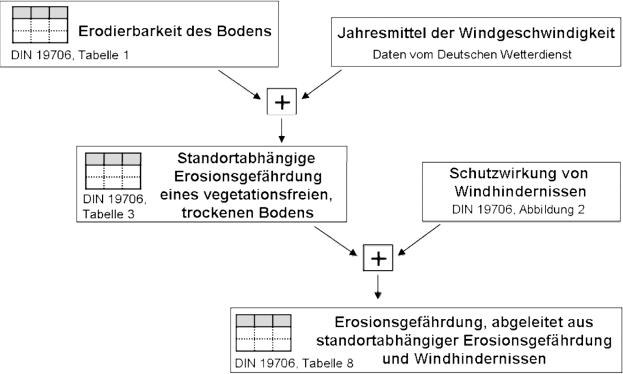

# Verordnung über die Grundsätze der Erhaltung landwirtschaftlicher Flächen in einem guten landwirtschaftlichen und ökologischen Zustand (DirektZahlVerpflV)

Ausfertigungsdatum
:   2004-11-04

Fundstelle
:   BGBl I: 2004, 2778

Zuletzt geändert durch
:   Art. 3 V v. 15.12.2011 eBAnz AT144 V1

## Eingangsformel

Auf Grund des § 5 Abs. 1 Satz 1 Nr. 2 bis 4, auch in Verbindung mit
Abs. 4 des Direktzahlungen-Verpflichtungengesetzes vom 21. Juli 2004
(BGBl. I S. 1763, 1767) verordnet die Bundesregierung:

## § 1 Geltungsbereich

Diese Verordnung regelt die Anforderungen an die Erhaltung
landwirtschaftlicher Flächen in einem guten landwirtschaftlichen und
ökologischen Zustand, die von einem Betriebsinhaber, der
Direktzahlungen oder sonstige Stützungszahlungen im Sinne des § 1
Absatz 1 des Direktzahlungen-Verpflichtungengesetzes beantragt,
einzuhalten sind.

## § 2 Erosionsvermeidung

(1) Die Landesregierungen haben die Einteilung nach § 2 Abs. 1 Satz 2
des Direktzahlungen-Verpflichtungengesetzes durch Rechtsverordnung bis
zum 30. Juni 2010 vorzunehmen. Der Einteilung nach Satz 1 sind

1.  bezüglich der Erosionsgefährdung durch Wasser die Anforderungen der
    Anlage 1 und

2.  bezüglich der Erosionsgefährdung durch Wind die Anforderungen der
    Anlage 2

zugrunde zu legen. In der Rechtsverordnung sind die Gebiete, die den
Erosionsgefährdungsklassen zugehören, zu bezeichnen.

(2) Der Betriebsinhaber darf eine Ackerfläche, die der
Wassererosionsgefährdungsklasse CC
Wasser1              im Sinne der Anlage 1 zugehört und die nicht in
eine besondere Fördermaßnahme zum Erosionsschutz einbezogen ist, vom
1\. Dezember bis zum Ablauf des 15. Februar nicht pflügen. Das Pflügen
nach der Ernte der Vorfrucht ist nur bei einer Aussaat vor dem 1.
Dezember zulässig. Im Falle einer Bewirtschaftung quer zum Hang sind
die Sätze 1 und 2 nicht anzuwenden.

(3) Der Betriebsinhaber darf eine Ackerfläche, die der
Wassererosionsgefährdungsklasse CC
Wasser2              im Sinne der Anlage 1 zugehört und die nicht in
eine besondere Fördermaßnahme zum Erosionsschutz einbezogen ist, vom
1\. Dezember bis zum Ablauf des 15. Februar nicht pflügen. Das Pflügen
zwischen dem 16. Februar und dem Ablauf des 30. November ist nur bei
einer unmittelbar folgenden Aussaat zulässig. Vor der Aussaat von
Kulturen mit einem Reihenabstand von 45 Zentimetern und mehr
(Reihenkultur) ist das Pflügen verboten.

(4) Der Betriebsinhaber darf eine Ackerfläche, die der
Winderosionsgefährdungsklasse CC
Wind              im Sinne der Anlage 2 zugehört und die nicht in eine
besondere Fördermaßnahme zum Erosionsschutz einbezogen ist, nur bei
Aussaat vor dem 1. März pflügen. Abweichend von Satz 1 ist das
Pflügen, außer bei Reihenkulturen, ab dem 1. März nur bei einer
unmittelbar folgenden Aussaat zulässig. Das Verbot des Pflügens bei
Reihenkulturen gilt nicht, soweit

1.  quer zur Hauptwindrichtung vor dem 1. Dezember Grünstreifen im Abstand
    von höchstens 100 Metern zueinander und in einer Breite von jeweils
    mindestens 2,5 Metern eingesät werden,

2.  im Falle des Anbaus von Kulturen in Dämmen die Dämme quer zur
    Hauptwindrichtung angelegt werden oder

3.  unmittelbar nach dem Pflügen Jungpflanzen gesetzt werden.

(5) Terrassen im Sinne des § 2 Abs. 2 des Direktzahlungen-
Verpflichtungengesetzes, die dem Beseitigungsverbot unterliegen, sind
von Menschen angelegte, lineare Strukturen in der Agrarlandschaft, die
dazu bestimmt sind, die Hangneigung von Nutzflächen zu verringern.

(6) Die nach Landesrecht zuständige Behörde kann im Einzelfall

1.  Ausnahmen von den Absätzen 2 bis 4 genehmigen, soweit die
    Verpflichtungen aus witterungsbedingten Gründen oder bei Aussaat
    bestimmter gärtnerischer Kulturen nicht eingehalten werden können oder
    Stallmist zur Gefügestabilisierung eingesetzt wird,

2.  abweichend von § 2 Abs. 2 des Direktzahlungen-Verpflichtungengesetzes
    das Beseitigen einer Terrasse genehmigen, soweit keine Gründe des
    Erosionsschutzes entgegenstehen.

(7) Die Landesregierungen können in der Rechtsverordnung nach Absatz 1
von den Absätzen 2 bis 4 abweichende Anforderungen festlegen, soweit
dies erforderlich ist, um

1.  in bestimmten Gebieten

    a)  witterungsbedingten Besonderheiten,

    b)  besonderen Anforderungen bestimmter Kulturen oder

    c)  besonderen Erfordernissen des Pflanzenschutzes im Sinne des § 1 Nr. 1
        und 2 des Pflanzenschutzgesetzes

    Rechnung zu tragen oder

2.  eine sachgerechte Durchführung der Kontrolle der Anforderungen des
    Direktzahlungen-Verpflichtungengesetzes und dieser Verordnung zu
    gewährleisten.

## § 3 Erhalt der organischen Substanz im Boden und Schutz der Bodenstruktur

(1) Der Betriebsinhaber hat seine Ackerflächen so zu bewirtschaften,
dass die organische Substanz im Boden erhalten bleibt. Dies hat er
nachzuweisen durch

1.  eine jährliche Humusbilanz auf betrieblicher Ebene nach Maßgabe der
    Anlage 3, die bis zum 31. März des Folgejahres zu erstellen ist, oder

2.  eine nach einer wissenschaftlich anerkannten Methode durchzuführende
    Bodenhumusuntersuchung, deren Ergebnis in dem Kalenderjahr, für das
    der Antrag auf Gewährung der Direktzahlungen oder sonstigen
    Stützungszahlungen gestellt wird, zu Kontrollzwecken jederzeit
    bereitzuhalten ist und nicht älter als sechs Jahre sein darf.

Der Nachweis ist erbracht, wenn die in der Anlage 3 jeweils genannten
Grenzwerte nicht unterschritten werden. Wird bei der Humusbilanz der
Grenzwert in einem Jahr unterschritten, so ist die Verpflichtung
dennoch erfüllt, soweit dieser bei einer Mittelwertbildung dieses
Jahres mit dem vorangegangenen oder mit den beiden vorangegangenen
Jahren eingehalten wird. Die Ergebnisse der Humusbilanz sind
mindestens vier Jahre, diejenigen der Bodenhumusuntersuchung
mindestens sieben Jahre ab dem Zeitpunkt der jeweiligen Erstellung der
Unterlagen aufzubewahren. Baut ein Betriebsinhaber auf seinen
Ackerflächen in einem Jahr ausschließlich Kulturen nach den
Anforderungen der Anlage 4 an, so gilt der Nachweis nach Satz 2 Nummer
1 als erbracht.

(2) Die Anforderung des Absatzes 1 Satz 1 gilt auch als erfüllt,
soweit auf betrieblicher Ebene das anbaujährliche Anbauverhältnis auf
Ackerflächen aus mindestens drei Kulturen besteht. Dabei gelten
stillgelegte und nicht bewirtschaftete Ackerflächen als eine Kultur.
Jede Kultur muss einen Anteil von mindestens 15 vom Hundert der
Ackerfläche ausmachen. Weist ein Betrieb mehr als drei Kulturen auf,
kann auch durch Zusammenfassung mehrerer Kulturen der
Mindestflächenanteil von 15 vom Hundert erreicht werden. Dabei können
die Kulturen mit einem Flächenanteil von jeweils weniger als 15 vom
Hundert auf andere Kulturen aufgeteilt werden.

(3) Die Anforderung des Absatzes 1 Satz 1 gilt ferner als erfüllt,
wenn der Betriebsinhaber, der weniger als drei Kulturen anbaut und
jedes Jahr seine gesamte Ackerfläche im Wechsel mit anderen Betrieben
bewirtschaftet, nachweist, dass auf der von ihm aktuell
bewirtschafteten Ackerfläche in diesem Jahr und in jedem der zwei
vorhergehenden Jahre jeweils andere Kulturen angebaut worden sind.

(3a) Für die Erstellung der Humusbilanz, für die Berechnung des
anbaujährlichen Anbauverhältnisses und für die Beurteilung, ob
ausschließlich Kulturen nach den Anforderungen der Anlage 4 angebaut
werden, gelten Schläge im Sinne des § 3 Satz 1 Nummer 2 der InVeKoS-
Verordnung,

1.  auf denen Flächen zum Zwecke der Jagd anders als die übrigen Teile des
    Schlages bewirtschaftet werden (Bejagungsschneisen) oder

2.  auf denen Flächen zur Verbesserung der biologischen Vielfalt anders
    als die übrigen Teile des Schlages gezielt mit Blühmischungen angesät
    werden (Blühstreifen),

als einheitlich mit der Hauptkultur bestellt.

(4) Das Abbrennen von Stoppelfeldern ist verboten. Die nach
Landesrecht zuständige Behörde kann abweichend von Satz 1 das
Abbrennen von Stoppelfeldern genehmigen, sofern Gründe des
Pflanzenschutzes im Sinne des § 1 Nummer 1 und 2 des
Pflanzenschutzgesetzes dies erfordern und schädliche Auswirkungen auf
den Naturhaushalt nicht zu besorgen sind.

## § 4 Instandhaltung von Flächen, die aus der landwirtschaftlichen Erzeugung genommen wurden

(1) Eine Ackerfläche, die befristet oder unbefristet aus der
landwirtschaftlichen Erzeugung genommen worden ist, ist der
Selbstbegrünung zu überlassen oder durch eine gezielte Ansaat zu
begrünen.

(2) Auf einer Acker- oder einer Dauergrünlandfläche, die befristet
oder unbefristet aus der landwirtschaftlichen Erzeugung genommen
worden ist, ist mindestens einmal jährlich

1.  der Aufwuchs zu zerkleinern und ganzflächig zu verteilen oder

2.  der Aufwuchs zu mähen und das Mähgut abzufahren.

(3) In dem Zeitraum vom 1. April bis zum 30. Juni eines Jahres sind
Maßnahmen nach Absatz 2 verboten.

(4) Von Absatz 1 oder Absatz 2 abweichende Vorschriften des Bundes und
der Länder auf dem Gebiet des Naturschutzes oder des Wasserhaushaltes
bleiben unberührt.

(5) Die nach Landesrecht zuständige Behörde kann auf Antrag
Abweichungen genehmigen

1.  von Absatz 2, soweit naturschutzfachliche oder umweltschutzfachliche
    Gründe dies erfordern,

2.  von Absatz 3, soweit schädliche Auswirkungen auf den Naturhaushalt
    nicht zu besorgen sind.

Im Falle des Satzes 1 gelten Maßnahmen

1.  in Plänen und Projekten für Pflege-, Entwicklungs- und
    Wiederherstellungsmaßnahmen zur Umsetzung

    a)  der Richtlinie 79/409/EWG des Rates vom 2. April 1979 über die
        Erhaltung der wildlebenden Vogelarten (ABl. EG Nr. L 103 S. 1) in der
        jeweils geltenden Fassung oder

    b)  der Richtlinie 92/43/EWG des Rates vom 21. Mai 1992 zur Erhaltung der
        natürlichen Lebensräume sowie der wildlebenden Tiere und Pflanzen
        (ABl. EG Nr. L 207 S. 7) in der jeweils geltenden Fassung oder

2.  in Vereinbarungen im Rahmen von Naturschutzprogrammen und
    Agrarumweltprogrammen der Länder oder einer vom Bund oder Land
    anerkannten Naturschutzvereinigung

als genehmigt.

(6) Die Landesregierungen sind befugt, durch Rechtsverordnung von den
Absätzen 1 bis 3 abweichende Anforderungen festzulegen, soweit dies
erforderlich ist, um

1.  regionalen Gegebenheiten in Gebieten mit hohem Grundwasserstand oder
    mit hohem Anteil stark geneigter Flächen oder

2.  besonderen regionalen Gegebenheiten aus naturschutzfachlichen oder
    pflanzenbaulichen Gründen

Rechnung tragen zu können.

## § 4a Schutz von Dauergrünland

Wer in

1.  Überschwemmungsgebieten, die nach

    a)  § 76 Absatz 2 des Wasserhaushaltsgesetzes oder Landesrecht festgesetzt
        oder

    b)  § 76 Absatz 3 des Wasserhaushaltsgesetzes oder Landesrecht ermittelt,
        in Kartenform dargestellt und vorläufig gesichert

    sind,

2.  gesetzlich geschützten Biotopen nach

    a)  § 30 des Bundesnaturschutzgesetzes oder

    b)  landesrechtlichen Regelungen,

    soweit die Biotope registriert sind und die Registrierung öffentlich
    zugänglich ist, oder

3.  Naturschutzgebieten im Sinne des § 23 des Bundesnaturschutzgesetzes

eine Dauergrünlandfläche bewirtschaftet, hat zur Erhaltung des guten
landwirtschaftlichen und ökologischen Zustands dieser Fläche die in
Satz 2 beschriebenen Beschränkungen des Umbruchs von Dauergrünland
oder der Umwandlung von Dauergrünland in Ackerland oder in eine
Dauerkulturfläche zu beachten. Beschränkungen im Sinne des Satzes 1
sind in wasserrechtlichen oder naturschutzrechtlichen Vorschriften
festgelegte oder auf Grund solcher Vorschriften angeordnete Verbote,
Genehmigungs- oder Anzeigevorbehalte, gesetzliche Bedingungen sowie
Nebenbestimmungen, die im Zusammenhang mit der Genehmigung eines
Umbruchs oder einer Umwandlung im Einzelfall angeordnet worden sind.
Bei einer Kontrolle der Verpflichtung nach Satz 1 hinsichtlich
gesetzlicher Bedingungen und Nebenbestimmungen im Sinne des Satzes 2
hat der Betriebsinhaber deren Beachtung insoweit nachzuweisen, wie sie
zu diesem Zeitpunkt erfüllt sein müssen.

## § 5 Landschaftselemente

(1) Landschaftselemente, die im Sinne des § 2 Abs. 2 des
Direktzahlungen-Verpflichtungengesetzes nicht beseitigt werden dürfen,
sind

1.  Hecken oder Knicks: lineare Strukturelemente, die überwiegend mit
    Gehölzen bewachsen sind und eine Mindestlänge von 10 Metern aufweisen,

2.  Baumreihen: mindestens fünf linear angeordnete, nicht
    landwirtschaftlich genutzte Bäume entlang einer Strecke von mindestens
    50 Metern Länge,

3.  Feldgehölze: überwiegend mit gehölzartigen Pflanzen bewachsene
    Flächen, die nicht der landwirtschaftlichen Erzeugung dienen, mit
    einer Größe von mindestens 50 Quadratmetern bis höchstens 2 000
    Quadratmetern; Flächen, für die eine Beihilfe zur Aufforstung oder
    eine Aufforstungsprämie gewährt worden ist, gelten nicht als
    Feldgehölze,

4.  Feuchtgebiete mit einer Größe von höchstens 2 000 Quadratmetern:

    a)  Biotope, die nach § 30 Absatz 2 Satz 1 Nummer 1 und 2 des
        Bundesnaturschutzgesetzes oder weitergehenden landesrechtlichen
        Vorschriften geschützt und über die Biotopkartierung erfasst sind,

    b)  Tümpel, Sölle, Dolinen und andere vergleichbare Feuchtgebiete,

5.  Einzelbäume: freistehende Bäume, die als Naturdenkmäler im Sinne des §
    28 des Bundesnaturschutzgesetzes geschützt sind,

6.  Feldraine: überwiegend mit gras- und krautartigen Pflanzen bewachsene,
    schmale, lang gestreckte Flächen mit einer Gesamtbreite von mehr als 2
    Metern, die innerhalb von oder zwischen landwirtschaftlichen
    Nutzflächen oder an deren Rand liegen und weder der
    landwirtschaftlichen Erzeugung dienen noch § 4 unterfallen,

7.  Trocken- und Natursteinmauern: Mauern aus mit Erde oder Lehm verfugten
    oder nicht verfugten Feld- oder Natursteinen,

8.  Lesesteinwälle: Aufschüttungen von Lesesteinen,

9.  Fels- und Steinriegel sowie naturversteinte Flächen mit einer Größe
    von höchstens 2 000 Quadratmetern.

(2) Die nach Landesrecht zuständige Behörde kann die Beseitigung eines
Landschaftselementes nach Absatz 1 genehmigen, wenn
naturschutzfachliche Gründe nicht entgegenstehen.

(3) Das Beseitigungsverbot für die Landschaftselemente nach Absatz 1
beinhaltet keine Pflegeverpflichtung.

(4) Die Landesregierungen können durch Rechtsverordnung ergänzend zu
Absatz 1 weitere Landschaftselemente festlegen, die im Sinne des § 2
Absatz 2 des Direktzahlungen-Verpflichtungengesetzes nicht beseitigt
werden dürfen, soweit dies erforderlich ist, um besonderen regionalen
Gegebenheiten Rechnung tragen zu können.

## § 5a Verwendung von Wasser zur Beregnung oder sonstigen Bewässerung

Wer landwirtschaftliche Flächen beregnet oder sonst bewässert, hat bei
einer erlaubnis- oder bewilligungspflichtigen Gewässerbenutzung im
Sinne des § 9 Absatz 1 Nummer 1 oder 5 des Wasserhaushaltsgesetzes im
Falle einer Kontrolle hinsichtlich der Einhaltung der Verpflichtungen
zur Erhaltung der landwirtschaftlichen Flächen in einem guten
landwirtschaftlichen und ökologischen Zustand nachzuweisen, dass die
Erlaubnis oder Bewilligung vorliegt.

## § 5b Schaffung von Pufferzonen entlang von Wasserläufen

Wer landwirtschaftliche Flächen entlang von Wasserläufen
bewirtschaftet, hat zur Erhaltung des guten landwirtschaftlichen und
ökologischen Zustands die Anforderungen des § 3 Absatz 6 und 7,
jeweils in Verbindung mit Absatz 8, der Düngeverordnung zu beachten,
soweit sich die Anforderungen auf Düngemittel mit einem wesentlichen
Nährstoffgehalt an Stickstoff beziehen.

## § 6 Inkrafttreten

Diese Verordnung tritt am 1. Januar 2005 in Kraft.

## Schlussformel

Der Bundesrat hat zugestimmt.

## Anlage 1 (zu § 2 Abs. 1 Nr. 1, Abs 2 und 3) Bestimmung der potenziellen Erosionsgefährdung durch Wasser

(Fundstelle: BGBl. I 2009, 396)

## **Wassererosionsgefährdungsklasse**

*    *   Wassererosionsgefährdungsklasse

    *   Bezeichnung

    *[^F07771814_01_BJNR277800004BJNE001000377]
   K \* S

    *[^F07771814_02_BJNR277800004BJNE001000377]
   K \* S \* R

    *[^F07771814_03_BJNR277800004BJNE001000377]
   K \* S \* R \* L

*    *   1

    *   2

    *   3

    *   4

    *   5

*    *   CC
        Wasser1

    *   Erosionsgefährdung

    *   0,3 – < 0,55

    *   15 – < 27,5

    *   30 – < 55

*    *   CC
        Wasser2

    *   hohe Erosionsgefährdung

    *   *                      0,55

    *   *                      27,5

    *   *                      55

[^F07771814_01_BJNR277800004BJNE001000377]:     Bestimmung der potenziellen (standortbedingten) Erosionsgefährdung
    durch Wasser in Anlehnung an DIN 19708 (Bodenbeschaffenheit
    – Ermittlung              der Erosionsgefährdung von Böden durch
    Wasser mit Hilfe der ABAG, DIN – Deutsches Institut für Normung e. V.,
    Februar 2005). Die DIN-Methode ist zu beziehen beim Beuth Verlag
    Berlin.
    Der Regenerosivitätsfaktor R kann optional verwendet werden. Er ist
    gemäß DIN 19708 Abschnitt 4.2 bzw. Tabelle C.1 gebietsspezifisch zu
    ermitteln und anzuwenden.
[^F07771814_02_BJNR277800004BJNE001000377]:     Der Hanglängenfaktor L kann optional verwendet werden. Er ist gemäß
    DIN 19708 Abschnitt 4.5 standortspezifisch zu ermitteln und
    anzuwenden.
[^F07771814_03_BJNR277800004BJNE001000377]: 

## Anlage 2 (zu § 2 Abs. 1 Nr. 2 und Abs 4) Bestimmung der potenziellen Erosionsgefährdung durch Wind

(Fundstelle: BGBl. I 2009, 397)

Die Erosionsgefährdung durch Wind ist nach DIN 19706,
Bodenbeschaffenheit – Ermittlung der Erosionsgefährdung von Böden
durch Wind, zu ermitteln.

## **Winderosionsgefährdungsklasse**

*    *   Winderosionsgefährdungsklasse

    *   Bezeichnung

    *[^F07771814_04_BJNR277800004BJNE001100377]
   Stufe nach DIN 19706

*    *   1

    *   2

    *   3

*    *   CC
        Wind

    *   Erosionsgefährdung

    *   E
        nat                     5

    Bestimmung der potenziellen (standortbedingten) Erosionsgefährdung
    durch Wind nach Tabelle 3 bzw. Tabelle 8 der DIN 19706
    (Bodenbeschaffenheit – Ermittlung der Erosionsgefährdung von Böden
    durch Wind, DIN - Deutsches Institut für Normung e. V., Mai 2004). Die
    DIN-Methode ist zu beziehen beim Beuth Verlag Berlin.
[^F07771814_04_BJNR277800004BJNE001100377]: 

## Anlage 3 (zu § 3 Absatz 1 Satz 2 und 3)

(Fundstelle: BGBl. I 2004, 2780 - 2784;
bzgl. der einzelnen Änderungen vgl. Fußnote)

*
    *
        *
            *   **Humusbilanz und Bodenhumusuntersuchung**

1.  Grenzwert für die Humusbilanz

**Der Humusbilanzsaldo soll im Bereich zwischen - 75 kg C/ha/a und +
125 kg C/ha/a liegen und darf den Wert von - 75 kg C/ha/a nicht
unterschreiten.**
**Berechnungsverfahren:**
Bilanzierung des Humusbedarfs der angebauten Fruchtarten und der
Humusreproduktion durch Verbleib von Ernteresten und Zufuhr von
organischen Düngern auf Betriebsebene innerhalb eines Jahres anhand
der Tabellen 1 bis 3.

2.  Grenzwerte für den Erhalt der organischen Substanz im Boden bei der
    Bodenhumusuntersuchung

    Ton
    <= 13%: Humusgehalt > 1%

    Ton > 13%: Humusgehalt > 1,5%

    Die nach Landesrecht zuständige Behörde kann wegen besonderer
    Standortgegebenheiten die Grenzwerte regional anpassen.

    Umrechnung von organischem Kohlenstoff in Humus durch Multiplikation
    mit dem Faktor 1,72.

## Tabelle 1

*    *   Kennzahlen zur fruchtartspezifischen Veränderung des Humusvorrates
        (Humusbedarf) des Bodens in Humusäquivalenten (kg Humuskohlenstoff)
        pro ha und Jahr

*    *   **Hauptfruchtarten**

*    *   Zucker- und Futterrübe, einschließlich Samenträger

    *   - 760

*    *   Kartoffeln und 1. Gruppe Gemüse/Gewürz- und Heilpflanzen \*)

    *   - 760

*    *   Silomais, Körnermais und 2. Gruppe Gemüse/Gewürz/

    *   - 560

*    *   Heilpflanzen \*)

    *   - 560

*    *   Getreide einschließlich Öl- und Faserpflanzen, Sonnenblumen und
        Erdbeeren sowie 3. Gruppe Gemüse/Gewürz- und Heilpflanzen \*)

    *   - 280

*    *   Körnerleguminosen

    *   160

*    *   Bedarfsfaktoren für Zucker- und Futterrüben, Getreide einschließlich
        Körnermais und Ölfrüchten ohne Koppelprodukte; bei den restlichen
        Fruchtarten ist die Humusersatzleistung der Koppelprodukte im
        Humusbedarf berücksichtigt.

*    *   **Mehrjähriges Feldfutter**

*    *   Ackergras, Leguminosen, Leguminosen-Gras-Gemenge, Vermehrung und 4.
        Gruppe Gemüse/Gewürz/Heilpflanzen \*)

    *

*    *
        -   je Hauptnutzungsjahr

    *   600

*    *
        -   im Ansaatjahr

    *

*    *
        *   als Frühjahrsblanksaat

    *   400

*    *
        *   bei Gründeckfrucht

    *   300

*    *
        *   als Untersaat

    *   200

*    *
        *   als Sommerblanksaat

    *   100

*    *   **Zwischenfrüchte**

*    *   Winterzwischenfrüchte

    *   120

*    *   Stoppelfrüchte

    *   80

*    *   Untersaaten

    *   200

*    *   **Brache**

*    *   Selbstbegrünung

    *

*    *
        -   ab Herbst

    *   180

*    *
        -   ab Frühjahr des Brachejahres

    *   80

*    *   Gezielte Begrünung

    *

*    *
        -   ab Sommer der Brachlegung inkl. dem folgenden Brachejahr ++)

    *   700

*    *
        -   ab Frühjahr des Brachejahres

    *   400

*    *
        ++) gilt auch für nachfolgende Jahre.

    *

   Die nach Landesrecht zuständige Behörde kann wegen besonderer
Standortgegebenheiten und Bewirtschaftungssysteme die Kennzahlen
regional anpassen.
-----

\*) Gruppierung von Gemüse-, Duft-, Gewürz- und Heilpflanzen nach ihrer
    Humusbedürftigkeit:

    *
        *
            Gruppe 1 Blumenkohl, Brokkoli, Chinakohl, Fingerhut, Gurke, Knollensellerie,
                Kürbis, Porree, Rhabarber, Rotkohl, Stabtomate, Stangensellerie,
                Weißkohl, Wirsingkohl, Zucchini, Zuckermelone;

            Gruppe 2 Aubergine, Chicoree (Wurzel), Goldlack, Kamille, Knoblauch, Kohlrübe,
                Malve, Möhre, Meerrettich, Paprika, Pastinake, Ringelblume,
                Schöllkraut, Schwarzwurzel, Sonnenhut, Zuckermais;

            Gruppe 3 Ackerschachtelhalm, Alant, Arzneifenchel, Baldrian, Bergarnika,
                Bergbohnenkraut, Bibernelle, Blattpetersilie, Bohnenkraut, Borretsch,
                Brennnessel, Buschbohne, Drachenkopf, Dill, Dost, Eibisch,
                Eichblattsalat, Eisbergsalat, Endivie, Engelswurz, Estragon,
                Faserpflanzen, Feldsalat, Fenchel (großfrüchtig), Goldrute, Grünerbse,
                Grünkohl, Hopfen, Johanniskraut, Kohlrabi, Kopfsalat, Kornblume,
                Kümmel, Lollo, Liebstöckel, Majoran, Mangold, Mutterkraut, Nachtkerze,
                Ölfrüchte, Pfefferminze, Radicchio, Radies, Rettich, Romana, Rote
                Rübe, Salbei, Schafgarbe, Schnittlauch, Spinat, Spitzwegerich,
                Stangenbohne, Tabak, Thymian, Wurzelpetersilie, Zitronenmelisse,
                Zwiebel;

            Gruppe 4 Bockshornklee,
                Schabziegerklee                                     , Steinklee.

## Tabelle 2

*    *   Kennzahlen zur Humus-Reproduktion organischer Materialien in
        Humusäquivalenten
        (Kilogramm (kg) Humuskohlenstoff (Humus-C) je Tonne (t) Substrat \*)

*    *
    *   Material

    *   kg Humus-C pro t
        Substrat

    *   Trockenmasse
        (%)

*    *   Pflanzenmaterial

    *   Stroh

    *   100

    *   86

*    *   Gründüngung, Rübenblatt, Marktabfälle

    *   8

    *   10

*    *   Grünschnitt

    *   16

    *   20

*    *   Stallmist

    *   frisch

    *   28

    *   20

*    *   40

    *   30

*    *   verrottet (auch Feststoff aus Gülleseparierung)

    *   40

    *   25

*    *   56

    *   35

*    *   kompostiert

    *   62

    *   35

*    *   96

    *   55

*    *   Gülle

    *   Schwein

    *   4

    *   4

*    *   8

    *   8

*    *   Rind

    *   6

    *   4

*    *   9

    *   7

*    *   12

    *   10

*    *   Geflügel (Kot)

    *   12

    *   15

*    *   22

    *   25

*    *   30

    *   35

*    *   38

    *   45

*    *   Bioabfall

    *   nicht verrottet

    *   30

    *   20

*    *   62

    *   40

*    *   Frischkompost

    *   40

    *   30

*    *   66

    *   50

*    *   Fertigkompost

    *   46

    *   40

*    *   58

    *   50

*    *   70

    *   60

*    *   Klärschlamm

    *   ausgefault, unbehandelt

    *   8

    *   10

*    *   12

    *   15

*    *   28

    *   25

*    *   40

    *   35

*    *   52

    *   45

*    *   kalkstabilisiert

    *   16

    *   20

*    *   20

    *   25

*    *   36

    *   35

*    *   46

    *   45

*    *   56

    *   55

*    *   Gärrückstände

    *   flüssig

    *   6

    *   4

*    *   9

    *   7

*    *   12

    *   10

*    *   fest

    *   36

    *   25

*    *   50

    *   35

*    *   Kompost

    *   40

    *   30

*    *   70

    *   60

*    *   Sonstiges

    *   Rindenkompost

    *   60

    *   30

*    *   100

    *   50

*    *   See- und Teichschlamm

    *   10

    *   10

*    *   40

    *   40

\*) Die Humusreproduktion 1 t ROS ("Reproduktionswirksame organische
    Substanz") entspricht 200 kg Kohlenstoff; die 1 t HE ("Humuseinheit")
    entspricht 580 kg Kohlenstoff.

    Die nach Landesrecht zuständige Behörde kann wegen besonderer
    Standortgegebenheiten und Bewirtschaftungssysteme die Kennzahlen
    regional anpassen.

    Bei nicht aufgeführten organischen Materialien sind die Kennzahlen der
    nach Landesrecht zuständigen Behörde zu verwenden.

Tabelle 3
Richtwerte für das Verhältnis von Haupternteprodukt zu
Nebenernteprodukt
## (Korn: Stroh-Verhältnis bzw. Wurzel: Laub-Verhältnis) \*)

*    *   Braugerste

    *   0,70

*    *   Futterrübe

    *   0,40

*    *   Hafer

    *   1,10

*    *   Körnermais

    *   1,00

*    *   Öllein

    *   1,50

*    *   Sommerfuttergerste

    *   0,80

*    *   Sommerraps

    *   1,70

*    *   Sonnenblume

    *   2,00

*    *   Wintergerste

    *   0,70

*    *   Winterraps, Winterrübsen

    *   1,70

*    *   Winterroggen

    *   0,90

*    *   Wintertriticale

    *   0,90

*    *   Winterweizen

    *   0,80

*    *   Zuckerrübe

    *   0,70

*    *   Beispiel: 10 t Weizenkorn liefern gleichzeitig 8 t Stroh

*    *
        \*) Korn bzw. Wurzel gleich 1

Die nach Landesrecht zuständige Behörde kann wegen besonderer
Standortgegebenheiten und Bewirtschaftungssysteme die Kennzahlen
regional anpassen.
Diese Werte sind als Richtwerte zu verstehen. In begründeten Fällen
(z. B. besondere Sortenwahl, nicht aufgeführte Kultur) können andere
Werte verwendet werden.

## Rechenbeispiel

*    *   **Humusbedarf:**

*    *   Fruchtfolge

    *   ha

    *   Humuswirkung (kg Humus-C pro ha

    *   Gesamtbetriebsfläche (kg Humus-C) (ha multipliziert mit Humuswirkung

*    *   Kartoffel

    *   10

    *   -760

    *   - 7 600

*    *   Winterweizen

    *   30

    *   -280

    *   - 8 400

*    *   Brache (Selbstbegrünung ab Herbst)

    *   4

    *   +180

    *   + 720

*    *   Summe Humusbedarf

    *   44

    *
    *   -15 280

*    *

*    *   **Humusreproduktion:**

*    *   Humuslieferung durch Nebenprodukte, die auf dem Feld bleiben

    *   Hauptfruchtertrag t pro ha

    *   Hauptfrucht-Nebenproduktverhältnis (Tabelle 3)

    *   Ertrag Rübenblatt/Stroh (t pro ha)

*    *   Kartoffel

    *   40

    *   -

    *   -

*    *   Winterweizen

    *   8,5

    *   0,8

    *   6,8

*    *   Summe Humusreproduktion

    *
    *
    *

*    *

*    *   Humuslieferung durch Nebenprodukte, die auf dem Feld bleiben

    *   Umrechnungsfaktor (Tabelle 2 Spalte 2)

    *   kg Humus-C pro ha (Multiplikation Spalte 4 mit Spalte 5)

    *   Gesamtbetriebsfläche in kg Humus-C (Spalte 6 multip. mit Anbaufläche)

*    *   Kartoffel

    *   -

    *   -

    *   0

*    *   Winterweizen

    *   100

    *   680

    *   +13 600 (Strohverkauf von 10 ha, des verbleiben nur 20 ha für
        Reproduktion

*    *   Summe Humusreproduktion

    *
    *
    *   +13 600

*    *

*    *   **Bilanz**

    *   kg Humus-C

*    *   Summe Humusbedarf

    *   - 15 280

*    *   Summe Humusreproduktion

    *   + 13 600

*    *   Gesamtbilanz

    *   - 1 680

*    *   Humusbilanz in kg Humus-C pro Hektar und Jahr (Gesamtbilanz durch
        Anzahl ha der Betriebsfläche)

    *   - 38

## Anlage 4 (zu § 3 Absatz 1 Satz 6) Kulturen mit positiver oder neutraler Veränderung des Humusvorrates

**Fruchtarten**

1.  Eiweißpflanzen (insbesondere Ackerbohnen, Erbsen, Lupinen)
    ausschließlich zur Körnernutzung

2.  Ölsaaten (insbesondere Raps, Sonnenblumen) ausschließlich zur
    Körnernutzung

3.  Mais ausschließlich zur Kolben- oder Körnernutzung

4.  Flächenstilllegung (Acker)

5.  mehrjähriges Ackerfutter (insbesondere Klee, Kleegras, Luzerne,
    Ackergras und Gemische daraus) auch zur Samenvermehrung

6.  Grünbrache

