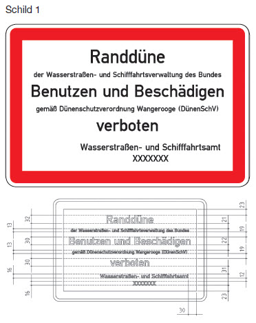

# Bekanntmachung der Verordnung über den Schutz der Randdünen auf der Nordseeinsel Wangerooge (DünenSchV)

Ausfertigungsdatum
:   2016-06-06

Fundstelle
:   VkBl: 2016, 439

Geändert durch
:   Art. 2 V v. 2.9.2019 VkBl. 628

Änderung durch
:   Art. 2 Nr. 2 Buchst. a bis c V v. 2.9.2019 VkBl. 628 ist in § 3 nicht ausführbar

## Eingangsformel

Die Generaldirektion Wasserstraßen und Schifffahrt verordnet

-   auf Grund des § 27 Absatz 1 des Bundeswasserstraßengesetzes in der
    Fassung der Bekanntmachung vom 23. Mai 2007 (BGBl. I S. 962; BGBl.
    2008 I S. 1980), § 27 Absatz 1 geändert durch Artikel 522 Nummer 2 der
    Verordnung vom 31. August 2015 (BGBl. S. 1474), in Verbindung mit § 1
    der Verordnung über die Übertragung der Ermächtigung zum Erlass von
    Strompolizeiverordnungen nach dem Bundeswasserstraßengesetz vom 15.
    April 1969 (BGBl. II S. 853), der durch Artikel 21 der Verordnung vom
    02\. Juni 2016 geändert worden ist, und

-   auf Grund des § 46 Satz 1 Nummer 3 des Bundeswasserstraßengesetzes in
    der Fassung der Bekanntmachung vom 23. Mai 2007 (BGBl. I S. 962; BGBl.
    2008 I S. 1980), § 46 Satz 1 Nummer 3 geändert durch Artikel 522
    Nummer 7 der Verordnung vom 31. August 2015 (BGBl. S. 1474), in
    Verbindung mit § 1 der Verordnung zur Übertragung der Ermächtigung zum
    Erlass von Rechtsverordnungen nach dem Bundeswasserstraßengesetz über
    die Regelung, Beschränkung oder Untersagung des Gemeingebrauchs vom
    21\. September 1971 (BGBl. I S. 1617), der zuletzt durch Artikel 24 der
    Verordnung vom 02. Juni 2016 geändert worden ist:

## § 1 Benutzungs- und Beschädigungsverbot

(1) Zum Schutz der für die Erhaltung des Bestandes der Insel
Wangerooge notwendigen Randdünen ist es verboten,

1.  die Randdünen zu betreten,

2.  die Randdünen zu beschädigen, insbesondere durch Aufgraben oder
    Sandentnahme, gleich zu welchem Zwecke,

3.  außerhalb der hierfür vorgesehenen und besonders gekennzeichneten
    Dünenüberwege mit Handwagen, sonstigen Wagen, Schubkarren und
    Fahrzeugen aller Art zu fahren,

4.  Dünenpflanzen aller Art auszureißen, abzuschneiden oder abzubrechen,

5.  Bauschutt, Müll oder Abfall aller Art abzuladen oder zu vergraben,

6.  mit Pferden außerhalb der hierfür vorgesehenen und besonders
    gekennzeichneten Dünenüberwege zu reiten sowie Vieh und Geflügel frei
    herumlaufen oder weiden zu lassen,

7.  Feuer zu entzünden oder

8.  zu spielen, zu zelten oder zu lagern.

Die Randdünen dürfen nur auf den hierfür vorgesehenen und besonders
gekennzeichneten Wegen überquert werden.

(2) Die Benutzungs- und Beschädigungsverbote nach Absatz 1 können
durch ein Schild nach dem Muster 1 dieser Verordnung oder durch Zäune
kenntlich gemacht werden.

## § 2 Ausnahmen

(1) Ausnahmen von den Verboten des § 1 Absatz 1 können durch
Einzelgenehmigung zugelassen werden.

(2) Eine Einzelgenehmigung nach Absatz 1 wird dem Antragsteller unter
dem Vorbehalt des Widerrufs schriftlich erteilt. Die Genehmigung kann
mit Nebenbestimmungen versehen werden. Der Inhaber der Genehmigung hat
den Genehmigungsbescheid mitzuführen und auf Verlangen den mit
strompolizeilichen Vollzugsaufgaben beauftragten Bediensteten der
Wasserstraßen- und Schifffahrtsverwaltung des Bundes zwecks
Überprüfung auszuhändigen.

(3) In dringenden Fällen kann die Einzelgenehmigung mündlich erteilt
werden.

## § 3 Befreiungen

Von den Verboten des § 1 Absatz 1 Nummer 1 bis 4 befreit sind die
Bediensteten oder Beauftragten der Wasserstraßen- und
Schifffahrtsverwaltung des Bundes, anderer Behörden, der Einrichtungen
des Rettungs- und Feuerwehrdienstes sowie sonstiger
Hilfsorganisationen, soweit die in § 1 Absatz 1 Nummer 1 bis 4
genannten Tätigkeiten zur Erfüllung ihrer dienstlichen Aufgaben
erforderlich sind.

## § 4 Zuständigkeit

Ausnahmegenehmigungen nach § 2 erteilt das örtlich zuständige
Wasserstraßen- und Schifffahrtsamt.

## § 5 Ordnungswidrigkeiten

Ordnungswidrig im Sinne des § 50 Absatz 1 Nummer 2 des
Bundeswasserstraßengesetzes handelt, wer vorsätzlich oder fahrlässig

1.  entgegen § 1 Absatz 1 Nummer 1 eine Randdüne betritt,

2.  entgegen § 1 Absatz 1 Nummer 3 ein dort genanntes Fahrzeug fährt,

3.  entgegen § 1 Absatz 1 Nummer 6 ein Pferd reitet oder Vieh oder
    Geflügel frei herumlaufen oder weiden lässt,

4.  entgegen § 1 Absatz 1 Nummer 8 spielt, zeltet oder lagert oder

5.  entgegen § 2 Absatz 2 Satz 3 den Genehmigungsbescheid nicht mitführt
    oder nicht oder nicht rechtzeitig aushändigt.

## § 6 Übergangsbestimmungen

Schilder, die am 30. Juni 2016 aufgestellt sind, gelten neben den nach
dieser Verordnung aufgestellten Schildern bis zum 31. Dezember 2021
fort. Im Umfang der sich aus den fortgeltenden Schildern ergebenden
Verbote oder Berechtigungen ist die Verordnung über den Schutz der
Randdünen auf der Insel Wangerooge vom 27. Oktober 1972 (VkBl. 1972,
852) weiter anzuwenden.

## § 7 Inkrafttreten, Außerkrafttreten

(1) Diese Verordnung tritt am Tage nach der Verkündung in Kraft.

(2) Gleichzeitig tritt die Verordnung über den Schutz der Randdünen
auf der Insel Wangerooge vom 27. Oktober 1972 (VkBl. 1972, 852) außer
Kraft.

(zu § 1 Absatz 2)

## Anlage Schild zur Kennzeichnung der Verbote

(Fundstelle: VkBl. 2016, 441)

