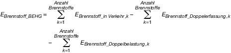
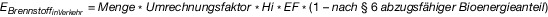
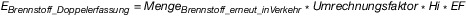

# Verordnung über die Emissionsberichterstattung nach dem Brennstoffemissionshandelsgesetz für die Jahre 2021 und 2022 (EBeV 2022)

Ausfertigungsdatum
:   2020-12-17

Fundstelle
:   BGBl I: 2020, 3016

## Eingangsformel

Auf Grund des § 6 Absatz 5 und des § 7 Absatz 4 und Absatz 5 Satz 2
des Brennstoffemissionshandelsgesetzes vom 12. Dezember 2019 (BGBl. I
S. 2728), von denen § 7 Absatz 4 Nummer 2 durch Artikel 1 Nummer 3 des
Gesetzes vom 3. November 2020 (BGBl. I S. 2291) geändert worden ist,
verordnet die Bundesregierung:

## Abschnitt 1 - Allgemeine Vorschriften

### § 1 Anwendungsbereich und Zweck

Diese Verordnung gilt innerhalb des Anwendungsbereichs des
Brennstoffemissionshandelsgesetzes. Sie ist beschränkt auf die
Konkretisierung der Anforderungen der §§ 6 und 7 des
Brennstoffemissionshandelsgesetzes für die Periode 2021 und 2022.

### § 2 Begriffsbestimmungen

Für diese Verordnung gelten neben den Begriffsbestimmungen des
Brennstoffemissionshandelsgesetzes und der
Brennstoffemissionshandelsverordnung die folgenden
Begriffsbestimmungen:

1.  Biomassestrom-Nachhaltigkeitsverordnung:

    Biomassestrom-Nachhaltigkeitsverordnung vom 23. Juli 2009 (BGBl. I S.
    2174), die zuletzt durch Artikel 262 der Verordnung vom 19. Juni 2020
    (BGBl. I S. 1328) geändert worden ist, in der jeweils geltenden
    Fassung;

2.  Biokraftstoff-Nachhaltigkeitsverordnung:

    Biokraftstoff-Nachhaltigkeitsverordnung vom 30. September 2009 (BGBl.
    I S. 3182), die zuletzt durch Artikel 263 der Verordnung vom 19. Juni
    2020 (BGBl. I S. 1328) geändert worden ist, in der jeweils geltenden
    Fassung;

3.  Berechnungsfaktoren:

    die in Anlage 1 Teil 4 aufgeführten Parameter Heizwert,
    Emissionsfaktor und Umrechnungsfaktor;

4.  Heizwert (Hi):

    die bei vollständiger Verbrennung eines Brennstoffs mit Sauerstoff
    unter Standardbedingungen als Wärme freigesetzte spezifische
    Energiemenge abzüglich der Verdampfungswärme des im Abgas enthaltenen
    Wasserdampfs;

5.  Emissionsfaktor (EF):

    Parameter zur Angabe, wieviel Kohlendioxid je Energiemenge eines
    Brennstoffs bei der vollständigen Umsetzung mit Sauerstoff emittiert
    werden kann auf der Grundlage des Nationalen Inventarberichts 2020 und
    den darin enthaltenen Daten für 2018;

6.  Umrechnungsfaktoren:

    die in Anlage 1 Teil 4 aufgeführten Parameter zur Umrechnung von
    physikalischen Einheiten (u. a. Dichte, Energie);

7.  Standardwerte:

    die in Anlage 1 Teil 4 vorgegebenen Werte zur Emissionsermittlung;

8.  Brennstoffe:

    die in Anlage 2 des Brennstoffemissionshandelsgesetzes genannten
    Brennstoffe;

9.  Bioenergieanteil:

    das Verhältnis der aus Biomasse stammenden Energiemenge zur
    Gesamtenergiemenge eines Brennstoffs, der nach § 2 Absatz 2 des
    Brennstoffemissionshandelsgesetzes in einem Kalenderjahr in Verkehr
    gebracht wurde, ausgedrückt als Bruchteil;

10. Biomasseanteil:

    das Verhältnis des aus Biomasse stammenden Kohlenstoffs zum
    Gesamtkohlenstoffgehalt eines Brennstoffs oder Materials, ausgedrückt
    als Bruchteil, wie er in einer dem EU-Emissionshandel unterliegenden
    Anlage nach den Vorgaben der Durchführungsverordnung (EU) 2018/2066
    der Kommission vom 19. Dezember 2018 über die Überwachung von und die
    Berichterstattung über Treibhausgasemissionen gemäß der Richtlinie
    2003/87/EG des Europäischen Parlaments und des Rates und zur Änderung
    der Verordnung (EU) Nr. 601/2012 der Kommission (ABl. L 334 vom
    31\.12.2018, S. 1; L 118 vom 6.5.2019, S. 10) in der jeweils geltenden
    Fassung zu bestimmen ist.

## Abschnitt 2 - Überwachungsplan (zu § 6 des Gesetzes)

### § 3 Entbehrlichkeit des Überwachungsplans

Für die Periode 2021 und 2022 entfallen die Pflichten nach § 6 Absatz
1 des Brennstoffemissionshandelsgesetzes zur Übermittlung und
Genehmigung eines Überwachungsplans oder eines vereinfachten
Überwachungsplans.

## Abschnitt 3 - Überwachung, Ermittlung und Berichterstattung der Brennstoffemissionen (zu den §§ 6 und 7 des Gesetzes)

### § 4 Allgemeine Grundsätze

(1) Für die Überwachung, Ermittlung und Berichterstattung der
Brennstoffemissionen gelten die in den Absätzen 2 bis 4 näher
bestimmten Grundsätze der Vollständigkeit, der Konsistenz und der
Integrität der zu berichtenden Daten.

(2) Der Verantwortliche ist verpflichtet, die Brennstoffemissionen
vollständig zu überwachen, zu ermitteln und zu berichten. Dazu sind
sämtliche Mengen an Kohlendioxid zu überwachen, zu ermitteln und zu
berichten, die bei einer Verbrennung von Brennstoffen freigesetzt
werden können und dem Verantwortlichen infolge des Inverkehrbringens
nach § 2 Absatz 2 des Brennstoffemissionshandelsgesetzes zugerechnet
werden. Das Auftreten von Datenlücken ist soweit wie möglich zu
vermeiden. Dennoch verbliebene Datenlücken sind durch konservative
Schätzungen zu schließen.

(3) Überwachung, Ermittlung und Berichterstattung der
Brennstoffemissionen müssen konsistent und in der Zeitreihe
vergleichbar vorgenommen werden. Der Verantwortliche ist verpflichtet,
die erforderlichen Daten, einschließlich der Bezugswerte und
Brennstoffmengen auf transparente Weise so zu erfassen,
zusammenzustellen und zu dokumentieren, dass die Emissionsbestimmung
von einem Dritten innerhalb einer angemessenen Frist nachvollzogen
werden kann.

(4) Der Verantwortliche trägt dafür Sorge, dass hinreichende Gewähr
für die Integrität der mitzuteilenden Emissionsdaten besteht. Er ist
verpflichtet, die Emissionen anhand der in dieser Verordnung
angeführten Überwachungs- und Ermittlungsmethoden zu bestimmen. Der
Emissionsbericht und die darin gemachten Aussagen dürfen weder
systematisch noch wissentlich falsche Angaben enthalten. Der
Emissionsbericht muss eine glaubwürdige und ausgewogene Darstellung
der Daten des Verantwortlichen enthalten.

### § 5 Ermittlung von Brennstoffemissionen

(1) Der Verantwortliche hat die Brennstoffemissionen der in jedem
Kalenderjahr in Verkehr gebrachten Brennstoffe nach den Vorschriften
dieser Verordnung rechnerisch zu ermitteln.

(2) Soweit in dieser Verordnung nicht anders bestimmt, ist bei der
rechnerischen Ermittlung der Brennstoffemissionen eines jeden
Kalenderjahres diejenige Brennstoffmenge zu Grunde zu legen, die der
Verantwortliche nach den für dieses Kalenderjahr geltenden Vorgaben
des Energiesteuerrechts in den Steueranmeldungen zur Berechnung der
Energiesteuer anzugeben hat.

(3) Der Verantwortliche ist verpflichtet, die Brennstoffemissionen für
die in einem Kalenderjahr in Verkehr gebrachten Brennstoffe durch
Multiplikation der Brennstoffmenge mit Berechnungsfaktoren nach
Maßgabe der in der Anlage 1 zu dieser Verordnung festgelegten Methoden
und Standardwerte zu ermitteln.

(4) Ist der Verantwortliche Einlagerer im Sinne von § 3 Nummer 3
zweiter Halbsatz des Brennstoffemissionshandelsgesetzes, sind bei der
rechnerischen Ermittlung der Brennstoffemissionen eines Jahres nach
Absatz 2 sowohl die Brennstoffmengen zu Grunde zu legen, die er selbst
in Verkehr gebracht hat als auch die Brennstoffmengen, die für ihn
durch den Steuerlagerinhaber in Verkehr gebracht wurden. Der
Steuerlagerinhaber kann bei der Ermittlung der Brennstoffemissionen
nach Absatz 2 diejenigen Brennstoffmengen abziehen, die für den
Einlagerer in Verkehr gebracht wurden. Voraussetzung für den Abzug
nach Satz 2 ist, dass der Steuerlagerinhaber der zuständigen Behörde
den Einlagerer sowie die für diesen in Verkehr gebrachten Brennstoffe
nach Art und zugehöriger Menge bis zum Ablauf des 31. Juli des auf das
Inverkehrbringen folgenden Jahres mitteilt.

### § 6 Berücksichtigung des Bioenergieanteils bei der Ermittlung der Brennstoffemissionen

(1) Bei der Ermittlung der Brennstoffemissionen kann der
Verantwortliche für den Bioenergieanteil eines Brennstoffs einen
Emissionsfaktor von Null anwenden, soweit dieser Bioenergieanteil
nachweislich die Nachhaltigkeitsanforderungen der Biomassestrom-
Nachhaltigkeitsverordnung oder der Biokraftstoff-
Nachhaltigkeitsverordnung erfüllt. Für die rechnerische
Berücksichtigung des Bioenergieanteils bei der Ermittlung der
Brennstoffemissionen gilt die Anlage 1 Teil 2 zu dieser Verordnung.

(2) Der Verantwortliche ist verpflichtet, die Erfüllung der in Absatz
1 Satz 1 genannten Nachhaltigkeitsanforderungen durch Vorlage eines
anerkannten Nachweises im Sinne von § 14 der Biomassestrom-
Nachhaltigkeitsverordnung oder eines anerkannten Nachweises im Sinne
von § 14 der Biokraftstoff-Nachhaltigkeitsverordnung zu belegen. Der
Nachhaltigkeitsnachweis muss sich auf eine Brennstoffmenge beziehen,
die nach § 2 Absatz 2 des Brennstoffemissionshandelsgesetzes in
Verkehr gebracht wurde.

(3) Abweichend von Absatz 1 kann der Verantwortliche, ohne dass es der
Vorlage eines anerkannten Nachhaltigkeitsnachweises im Sinne von § 14
der Biomassestrom-Nachhaltigkeitsverordnung bedarf, bei der Ermittlung
von Brennstoffemissionen für Erdgas der Unterpositionen 2711 11 und
2711 21 der Kombinierten Nomenklatur eine Menge an
Brennstoffemissionen abziehen, die dem Bioenergieanteil an Biomethan
entspricht, wenn der Verantwortliche der zuständigen Behörde folgende
Unterlagen vorlegt:

1.  einen Biomethanliefervertrag für das jeweilige Kalenderjahr über die
    entsprechende Brennstoffmenge und

2.  einen Nachweis darüber, dass die Menge des entnommenen Gases im
    Energieäquivalent der Menge an Biomethan entspricht, die an anderer
    Stelle in das Erdgasnetz eingespeist worden ist, und für den gesamten
    Transport und Vertrieb des Biomethans bis zur Entnahme aus dem
    Erdgasnetz ein Massenbilanzsystem verwendet wurde.

Zur Vereinfachung der Nachweisführung nach Satz 1 Nummer 2 erkennt die
zuständige Behörde einen entsprechenden Auszug aus einem etablierten
System zur massenbilanziellen Dokumentation von Biomethanmengen an.
Für die rechnerische Berücksichtigung des Bioenergieanteils bei der
Ermittlung der Brennstoffemissionen gilt die Anlage 1 Teil 2 zu dieser
Verordnung.

### § 7 Berichterstattung

(1) Der nach § 7 Absatz 1 des Brennstoffemissionshandelsgesetzes bis
zum 31. Juli des Folgejahres zu übermittelnde Emissionsbericht umfasst
die gemäß § 5 ermittelten Brennstoffemissionen für die in einem
Kalenderjahr in Verkehr gebrachten Brennstoffe und enthält mindestens
die in der Anlage 2 zu dieser Verordnung aufgeführten Angaben.

(2) Für die Emissionsberichte der Kalenderjahre 2021 und 2022 entfällt
die Verpflichtung zur Verifizierung der Angaben nach § 7 Absatz 3 des
Brennstoffemissionshandelsgesetzes.

(3) Wird die Lieferung oder der Verbrauch von Erdgas nach
Ablesezeiträumen abgerechnet oder ermittelt, die mehrere Kalenderjahre
betreffen, hat der Verantwortliche bei der Ermittlung der
Brennstoffemissionen im Emissionsbericht die voraussichtlich für das
zu berichtende Kalenderjahr in Verkehr gebrachte Erdgasmenge
(vorläufige Erdgasmenge) zugrunde zu legen. Für die Bestimmung der
vorläufigen Erdgasmenge sind die Vorgaben zur sachgerechten Aufteilung
der Erdgasmenge nach § 39 Absatz 6 Satz 1 des Energiesteuergesetzes
maßgeblich, wobei eine systematische Überschätzung der auf das zu
berichtende Kalenderjahr entfallenden Erdgasmenge auszuschließen ist.
Sofern Ablesezeiträume später enden als das jeweilige Kalenderjahr,
hat der Verantwortliche die vorläufige Erdgasmenge nach Satz 1 für
diese Ablesezeiträume im Emissionsbericht des Kalenderjahres zu
berichtigen, in dem der Ablesezeitraum endet. Die Berichtigung nach
Satz 3 gilt erstmals für den Emissionsbericht für das Kalenderjahr
2022\.

### § 8 Berichterstattungsgrenze

Eine Pflicht des Verantwortlichen zur Berichterstattung nach § 7
Absatz 1 des Brennstoffemissionshandelsgesetzes besteht nicht, soweit
im Laufe eines Kalenderjahres Brennstoffmengen in Verkehr gebracht
werden, die vor Anwendung der §§ 6, 10 und 11 zu einer Emissionsmenge
von weniger als 1 Tonne Kohlendioxid führen können.

### § 9 Aufbewahrung von Unterlagen und Daten

(1) Verantwortliche müssen alle Unterlagen und Daten, auf deren Basis
ein Emissionsbericht nach § 7 Absatz 1 des
Brennstoffemissionshandelsgesetzes erstellt wurde, für einen Zeitraum
von zehn Jahren aufbewahren. Die Aufbewahrungsfrist beginnt mit der
Vorlage des Emissionsberichts bei der zuständigen Behörde.

(2) Die zuständige Behörde bewahrt die Unterlagen und Daten des
Verantwortlichen, die sie im Zusammenhang mit der
Emissionsberichterstattung vom Verantwortlichen erhält, für einen
Zeitraum von zehn Jahren auf. Die Aufbewahrungsfrist beginnt mit der
Vorlage der Unterlagen und Daten bei der zuständigen Behörde.

(3) Sollte ein Rechtsbehelfsverfahren gegen eine Entscheidung der
zuständigen Behörde im Zusammenhang mit der Emissionsberichterstattung
anhängig sein, verlängern sich die Aufbewahrungsfristen bis zu dessen
rechtskräftigen Abschluss.

### § 10 Vermeidung von Doppelerfassungen nach § 7 Absatz 4 Nummer 5 des Brennstoffemissionshandelsgesetzes

(1) Der Verantwortliche kann eine entsprechende Menge an
Brennstoffemissionen von den nach § 7 Absatz 1 des
Brennstoffemissionshandelsgesetzes in einem Kalenderjahr zu
berichtenden Brennstoffemissionen für Mengen von Brennstoffen
abziehen, die durch den Verantwortlichen nach dem 1. Januar 2021

1.  entweder aus einem Steuerlager nach § 5 Absatz 2 des
    Energiesteuergesetzes entfernt wurden, ohne dass sich ein weiteres
    Steueraussetzungsverfahren anschloss, oder zum Ge- oder Verbrauch
    innerhalb des Steuerlagers entnommen wurden und nachweislich nach § 8
    Absatz 7 des Energiesteuergesetzes in dem für den Emissionsbericht
    maßgeblichen Kalenderjahr entlastet wurden,

2.  gemäß § 14 Absatz 2 oder Absatz 2 in Verbindung mit Absatz 3 bis 5 des
    Energiesteuergesetzes in Verkehr gebracht wurden und nachweislich nach
    § 14 Absatz 8 des Energiesteuergesetzes in dem für den
    Emissionsbericht maßgeblichen Kalenderjahr entlastet wurden,

3.  gemäß § 18a Absatz 1 des Energiesteuergesetzes in Verkehr gebracht
    wurden und nachweislich nach § 18a Absatz 4 des Energiesteuergesetzes
    in dem für den Emissionsbericht maßgeblichen Kalenderjahr entlastet
    wurden,

4.  gemäß § 19b Absatz 1 des Energiesteuergesetzes in Verkehr gebracht
    wurden und nachweislich nach § 19b Absatz 3 des Energiesteuergesetzes
    in dem für den Emissionsbericht maßgeblichen Kalenderjahr entlastet
    wurden,

5.  gemäß § 38 Absatz 1 in Verbindung mit Absatz 5 Energiesteuergesetzes
    in Verkehr gebracht wurden und nachweislich nach § 38 Absatz 5 Satz 3
    des Energiesteuergesetzes für dasselbe Kalenderjahr entlastet wurden,

6.  aus dem Steuergebiet des Energiesteuergesetzes verbracht wurden und
    nachweislich nach § 46 Absatz 1 Nummer 1 des Energiesteuergesetzes für
    dasselbe Kalenderjahr entlastet wurden,

7.  aus dem Steuergebiet des Energiesteuergesetzes verbracht oder
    ausgeführt wurden und nachweislich nach § 46 Absatz 1 Nummer 3 des
    Energiesteuergesetzes für dasselbe Kalenderjahr entlastet wurden,

8.  in ein Steuerlager nach § 5 Absatz 2 des Energiesteuergesetzes
    aufgenommen worden sind und nachweislich nach § 47 Absatz 1 Nummer 1
    des Energiesteuergesetzes für dasselbe Kalenderjahr entlastet wurden,

9.  bei der Lagerung oder Verladung von Energieerzeugnissen, beim Betanken
    von Kraftfahrzeugen oder bei der Entgasung von Transportmitteln aus
    nachweislich versteuerten, nicht gebrauchten Energieerzeugnissen und
    anderen Stoffen, aufgefangenen wurden und nachweislich nach § 47
    Absatz 1 Nummer 2 des Energiesteuergesetzes für dasselbe Kalenderjahr
    entlastet wurden,

10. in ein Leitungsnetz für unversteuertes Erdgas eingespeist worden sind
    und nachweislich nach § 47 Absatz 1 Nummer 6 des Energiesteuergesetzes
    für dasselbe Kalenderjahr entlastet wurden oder

11. an ausländische Streitkräfte oder Hauptquartiere geliefert wurden und
    nachweislich nach § 105a Absatz 1 der Energiesteuer-
    Durchführungsverordnung für dasselbe Kalenderjahr entlastet wurden.

(2) Die Berechnung der nach Absatz 1 abzugsfähigen
Brennstoffemissionen erfolgt nach der Anlage 1 Teil 3 Nummer 1 zu
dieser Verordnung.

(3) Für den Abzug von Brennstoffemissionen übermittelt der
Verantwortliche der zuständigen Behörde mit dem Emissionsbericht
entsprechende Energiesteueranmeldungen, Entlastungsanträge und, soweit
vorliegend, Bescheide des Hauptzollamtes als Nachweise.

(4) Der Verantwortliche kann eine entsprechende Menge an
Brennstoffemissionen von den nach § 7 Absatz 1 des
Brennstoffemissionshandelsgesetzes in einem Kalenderjahr zu
berichtenden Brennstoffemissionen für Mengen von leitungsgebundenem
Erdgas abziehen, die für die in § 25 des Energiesteuergesetzes
genannten Zwecke verwendet worden sind und nachweislich nach § 47
Absatz 1 Nummer 3 des Energiesteuergesetzes für dasselbe Kalenderjahr
entlastet worden sind. Absatz 2 gilt entsprechend. Der Abzug nach Satz
1 ist ausgeschlossen für Mengen von leitungsgebundenem Erdgas, die in
einer dem EU-Emissionshandel unterliegenden Anlage verwendet worden
sind und für die ein Abzug nach § 7 Absatz 5 des
Brennstoffemissionshandelsgesetzes geltend gemacht wird.

### § 11 Vermeidung von Doppelbelastungen nach § 7 Absatz 5 des Brennstoffemissionshandelsgesetzes

(1) Der Verantwortliche kann eine Menge an Brennstoffemissionen von
den nach § 7 Absatz 1 des Brennstoffemissionshandelsgesetzes zu
berichtenden Brennstoffemissionen abziehen, die der im jeweiligen
Kalenderjahr an ein Unternehmen zum Einsatz in einer dem EU-
Emissionshandel unterliegenden Anlage gelieferten Brennstoffmenge
entspricht. Soweit die zum Einsatz in einer dem EU-Emissionshandel
unterliegenden Anlage gelieferte Brennstoffmenge in dem jeweiligen
Kalenderjahr die in der Anlage tatsächlich eingesetzte Brennstoffmenge
überschreitet, muss die Differenzmenge spätestens im Folgejahr in
einer dem EU-Emissionshandel unterliegenden Anlage eingesetzt und
dieser Einsatz gegenüber der zuständigen Behörde vollständig,
transparent und anhand der Emissionsberichte des belieferten
Unternehmens nach § 5 des Treibhausgas-Emissionshandelsgesetzes
nachvollziehbar nachgewiesen werden. Die Berechnung der nach Satz 1
abzugsfähigen Brennstoffemissionen bestimmt sich nach den in der
Anlage 1 Teil 3 Nummer 2 zu dieser Verordnung enthaltenen Vorgaben.

(2) Voraussetzung für den Abzug nach Absatz 1 sind gleichlautende
Erklärungen des Verantwortlichen und des belieferten Unternehmens
gegenüber der zuständigen Behörde, dass die nach § 10 Absatz 2 Satz 2
des Brennstoffemissionshandelsgesetzes für die Einführungsphase des
Brennstoffemissionshandelssystems geltenden Festpreise für
Emissionszertifikate nicht Bestandteil des vereinbarten
Brennstofflieferpreises für die dem Abzug zugrunde liegende
Brennstoffliefermenge waren. Zur Nachweisführung über die gelieferten
und tatsächlich in einer dem EU-Emissionshandel unterliegenden Anlage
eingesetzten Brennstoffmengen übermittelt der Verantwortliche ferner
eine Bestätigung, welche die in der Anlage 3 zu dieser Verordnung
näher aufgeführten Erklärungen, Daten und Angaben des belieferten
Unternehmens enthält. Die Bestätigung nach Satz 2 enthält ab dem
Bericht für das Kalenderjahr 2022 insbesondere jeweils einen Nachweis
über den Einsatz von Differenzmengen nach Absatz 1 Satz 2.

(3) Kann der Nachweis über den Einsatz der Differenzmengen im
Folgejahr nach Absatz 2 Satz 3 nicht oder nicht vollständig erbracht
werden, verringert sich die Abzugsmenge nach Absatz 1 für das
Kalenderjahr, in dem der Einsatznachweis zu erbringen war,
entsprechend. Stellt die zuständige Behörde zu einem späteren
Zeitpunkt fest, dass nach Absatz 1 in einem Kalenderjahr in Abzug
gebrachte Brennstoffmengen entgegen der Bestätigung nach Absatz 2 Satz
2 von dem belieferten Unternehmen nicht spätestens im Folgejahr in
Anlagen, die dem EU-Emissionshandel unterliegen, verwendet wurden,
sind diese Brennstoffmengen auf die Abzugsmenge für das Kalenderjahr
anzurechnen, in dem die zweckwidrige Verwendung bestandskräftig
feststellt wird.

(4) Eine nachträgliche Korrektur des Emissionsberichts nach § 5 des
Treibhausgas-Emissionshandelsgesetzes der dem EU-Emissionshandel
unterliegenden Anlage lässt den Emissionsbericht des Verantwortlichen
nach § 7 Absatz 1 des Brennstoffemissionshandelsgesetzes für das das
von der Korrektur betroffene Kalenderjahr unberührt. Korrekturmengen,
die sich aus einer Berichtigung eines Emissionsberichts nach § 5 des
Treibhausgas-Emissionshandelsgesetzes ergeben, sind auf die
Abzugsmenge nach Absatz 1 für das Kalenderjahr anzurechnen, in dem die
Korrektur des Emissionsberichts nach § 5 des Treibhausgas-
Emissionshandelsgesetzes bestandskräftig festgestellt wird.

(5) Absatz 1 gilt nicht für nach dem Energiesteuergesetz steuerfreie
Brennstoffmengen, die an ein Unternehmen zur Verwendung in einer dem
EU-Emissionshandel unterliegenden Anlage geliefert wurden.

## Abschnitt 4 - Schlussbestimmungen

### § 12 Inkrafttreten

Diese Verordnung tritt am Tag nach der Verkündung in Kraft.

(zu den §§ 5, 6, 10 und 11)

### Anlage 1 Ermittlung der Brennstoffemissionen

(Fundstelle: BGBl. I 2020, 3021 - 3022)

## **Teil 1 Ermittlung der berichtspflichtigen Brennstoffemissionen**

Die Gesamtmenge der berichtspflichtigen Brennstoffemissionen berechnet
sich nach folgender Formel:

*    *        

   Erläuterung der Abkürzungen:

*    *   E
        Brennstoff\_BEHG

    *   die Gesamtmenge der Brennstoffemissionen nach Abzug der nach den §§ 10
        und 11 abzugsfähigen Brennstoffemissionen;

*    *   E
        Brennstoff\_inVerkehr ,k

    *   die Menge der auf einen in Verkehr gebrachten Brennstoff (k)
        entfallenden Brennstoffemissionen;

*    *   E
        Brennstoff\_Doppelerfassung ,k

    *   die nach § 10 abzugsfähige Menge an Brennstoffemissionen eines in
        Verkehr gebrachten Brennstoffs (k);

*    *   E
        Brennstoff\_Doppelbelastung ,k

    *   die nach § 11 abzugsfähige Menge an Brennstoffemissionen eines in
        Verkehr gebrachten Brennstoffs (k).

Das Ergebnis der Berechnung wird auf ganze Tonnen Kohlendioxid
abgerundet.

## **Teil 2 Methode zur Berechnung der Emissionen aus einem in Verkehr
gebrachten Brennstoff**

Die Menge der auf einen in Verkehr gebrachten Brennstoff entfallenden
Brennstoffemissionen berechnet sich nach folgender Formel:

*    *        

   Erläuterung der Abkürzungen:

*    *   Menge

    *   die nach § 5 Absatz 2 ermittelte Brennstoffmenge.

## **Teil 3 Berechnung von abzugsfähigen Brennstoffemissionen**

1.  Die nach § 10 abzugsfähige Menge an Brennstoffemissionen eines in
    Verkehr gebrachten Brennstoffs berechnet sich nach folgender Formel:

    *        *            

   Erläuterung der Abkürzungen:

    *        *   Menge
            Brennstoff\_erneut\_in\_Verkehr

        *   die nach § 5 Absatz 2 und § 10 ermittelte Brennstoffmenge.

2.  Die nach § 11 abzugsfähige Menge an Brennstoffemissionen eines in
    Verkehr gebrachten Brennstoffs berechnet sich nach folgender Formel:

    *        *            

   Erläuterung der Abkürzungen:

    *        *   Menge
            Brennstoff\_EU-ETSi

        *   die im Kalenderjahr zum Einsatz in einer dem EU-Emissionshandel
            unterliegenden Anlage (i) gelieferte Brennstoffmenge;

    *        *   Biomasseanteil
            EU-ETSi

        *   der in der dem EU-Emissionshandel unterliegenden Anlage (i) anerkannte
            Biomasseanteil.

## **Teil 4 Standardwerte zur Berechnung von Brennstoffemissionen**

*    *   Nummer

    *   Brennstoff

    *   Nomenklatur

    *   Umrechnungsfaktor

    *   Heizwert

    *   Heizwertbezogener
        Emissionsfaktor

*    *   1

    *   Benzin
        ohne E 85

    *   2710 12 41,
        2710 12 45,
        2710 12 49,
        2710 12 50

    *   Dichte: 0,755 t/1000 l

    *   43,5 GJ/t

    *   0,0731 t CO
        2                     /GJ

*    *   2

    *   Flugbenzin

    *   2710 12 31

    *   Dichte: 0,72 t/1000 l

    *   44,3 GJ/t

    *   0,070 t CO
        2                     /GJ

*    *   3

    *   Gasöl

    *
    *
    *
    *

*    *
    *   3a

    *   Gasöl
        als Kraftstoff
        (Diesel)

    *   2710 19 43 bis
        2710 19 48,
        2710 20 11 bis
        2710 20 19

    *   Dichte: 0,845 t/1000 l

    *   42,8 GJ/t

    *   0,074 t CO
        2                     /GJ

*    *
    *   3b

    *   Gasöl
        zu Heizzwecken
        (Heizöl EL)

    *   2710 19 43 bis
        2710 19 48,
        2710 20 11 bis
        2710 20 19

    *   Dichte: 0,845 t/1000 l

    *   42,8 GJ/t

    *   0,074 t CO
        2                     /GJ

*    *   4

    *   Heizöl

    *
    *
    *
    *

*    *
    *   4a

    *   Heizöl
        als Kraftstoff
        (Heizöl S)

    *   2710 19 62 bis
        2710 19 68,
        2710 20 31 bis
        2710 20 39

    *   1 t/t

    *   39,5 GJ/t

    *   0,0799 t CO
        2                     /GJ

*    *
    *   4b

    *   Heizöl
        zu Heizzwecken(Heizöl S)

    *   2710 19 62 bis
        2710 19 68,
        2710 20 31 bis
        2710 20 39

    *   1 t/t

    *   39,5 GJ/t

    *   0,0799 t CO
        2                     /GJ

*    *   5

    *   Flüssiggas

    *
    *
    *
    *

*    *
    *   5a

    *   Flüssiggas
        als Kraftstoff

    *   2711 12,
        2711 13,
        2711 14,
        2711 19

    *   1 t/t

    *   45,7 GJ/t

    *   0,0663 t CO
        2                     /GJ

*    *
    *   5b

    *   Flüssiggas
        zu Heizzwecken

    *   2711 12,
        2711 13,
        2711 14,
        2711 19

    *   1 t/t

    *   45,7 GJ/t

    *   0,0663 t CO
        2                     /GJ

*    *   6

    *
    *   Erdgas

    *   2711 11,
        2711 21

    *   3,2508 GJ/MWh

    *   1 GJ/GJ

    *   0,056 t CO
        2                     /GJ

Der Umrechnungsfaktor für Erdgas in Nummer 6 Spalte 4 beruht auf der
Formel 3,6 GJ/MWh \* 0,903 GJ/GJ.

(zu den §§ 6, 7, 10 und 11)

### Anlage 2 Mindestinhalt eines jährlichen Emissionsberichts

(Fundstelle: BGBl. I 2020, 3023 - 3024)

Der Emissionsbericht muss mindestens die folgenden Angaben und
Nachweise enthalten:

1.  Allgemeine Angaben

    a)  Name, Anschrift, Geschäftssitz und ggf. abweichender Ort der
        Geschäftsleitung sowie Rechtsform,

    b)  Ansprechpartner/in,

    c)  Berichtsjahr,

    d)  zuständiges Hauptzollamt und

    e)  Unternehmensnummer und Registrierkennzeichen des zuständigen
        Hauptzollamtes.

2.  Gesamtemissionsmenge in einem Kalenderjahr

    a)  berichtspflichtige Gesamtemissionsmenge in Tonnen CO
        2                          und

    b)  die Gesamtemissionen der nach § 6 Absatz 1 bis 3 abzugsfähigen
        Bioenergiemenge in Tonnen CO
        2                         .

3.  Angaben zu den jeweils in Verkehr gebrachten Brennstoffen

    a)  Art des in Verkehr gebrachten Brennstoffs entsprechend der
        Unterteilung in Anlage 1 Teil 4,

    b)  Stoffmenge des in Verkehr gebrachten Brennstoffs in Tonnen, 1 000
        Litern oder Megawattstunden,

    c)  Umrechnungsfaktoren, Heizwerte und Emissionsfaktoren nach Anlage 1
        Teil 4 des in Verkehr gebrachten Brennstoffs,

    d)  nach § 6 Absatz 1 bis 3 abzugsfähige Bioenergiemenge des in Verkehr
        gebrachten Brennstoffs in Giga-Joule oder Megawattstunden,
        differenziert nach Art der verwendeten Biomasse,

    e)  die Gesamtemissionen in Tonnen CO
        2                         ,

    f)  die Gesamtemissionen aus Bioenergie in Tonnen CO
        2                          und

    g)  für Benzin: Unterteilung in die verschiedenen Benzinsorten (E 5, E 10,
        Super Plus) und Stoffmenge der jeweiligen in Verkehr gebrachten
        Benzinsorte.

4.  Angaben im Zusammenhang mit der Vermeidung einer Doppelerfassung gemäß
    § 10 dieser Verordnung

    a)  Art des in Verkehr gebrachten Brennstoffs entsprechend der
        Unterteilung in Anlage 1 Teil 4,

    b)  jeweilige Stoffmenge des Brennstoffs nach § 10 Absatz 1 Nummer 1 bis
        11 in Tonnen, 1 000 Litern oder Megawattstunden,

    c)  Umrechnungsfaktoren, Heizwerte und Emissionsfaktoren nach Anlage 1
        Teil 4 des Brennstoffs,

    d)  die Gesamtemissionen in Tonnen CO
        2                         ,

    e)  Nachweise nach § 10 Absatz 3 und

    f)  im Fall des § 10 Absatz 4 Nachweise des Verwenders.

5.  Angaben im Zusammenhang mit der Vermeidung einer Doppelbelastung gemäß
    § 11 dieser Verordnung

    a)  Name des belieferten Unternehmens und der dem EU-Emissionshandel
        unterliegenden Anlage,

    b)  Aktenzeichen der dem EU-Emissionshandel unterliegenden Anlage,

    c)  Art des in Verkehr gebrachten Brennstoffs entsprechend der
        Unterteilung in Anlage 1 Teil 4,

    d)  Stoffmenge des zum Einsatz in einer dem EU-Emissionshandel
        unterliegenden Anlage gelieferten Brennstoffs eines Kalenderjahres in
        Tonnen, 1 000 Litern oder Megawattstunden,

    e)  Stoffmenge des in einer dem EU-Emissionshandel unterliegenden Anlage
        eingesetzten Brennstoffs eines Kalenderjahres in Tonnen, 1 000 Litern
        oder Megawattstunden,

    f)  Umrechnungsfaktoren, Heizwerte und Emissionsfaktoren nach Anlage 1
        Teil 4 des Brennstoffs,

    g)  Nachhaltiger Biomasseanteil des in einer dem EU-Emissionshandel
        unterliegenden Anlage eingesetzten Brennstoffs in Prozent,

    h)  Angabe, ob die Lieferung vollständig oder teilweise der
        Steueraussetzung oder -befreiung nach dem Energiesteuergesetz
        unterliegt, sowie ggf. eine entsprechende Aufteilung der Mengen,

    i)  Gesamtemissionen des zum Einsatz in einer dem EU-Emissionshandel
        unterliegenden Anlage gelieferten Brennstoffs in Tonnen CO
        2                         ,

    j)  Gesamtemissionen des zum Einsatz in einer dem EU-Emissionshandel
        unterliegenden Anlage gelieferten Brennstoffs aus nachhaltiger
        Biomasse in Tonnen CO
        2                          und

    k)  Erklärung nach § 11 Absatz 2 Satz 1.

6.  Nachweisführung nach § 5 Absatz 4 – Angaben des Steuerlagerinhabers

    a)  Name, Aktenzeichen und Unternehmensnummer des Steuerlagerinhabers bei
        der zuständigen Behörde,

    b)  Name, Aktenzeichen und Unternehmensnummer des Einlagerers nach § 7
        Absatz 4 Satz 1 des Energiesteuergesetzes,

    c)  Art des aus dem Steuerlager in Verkehr gebrachten Brennstoffs,

    d)  Benennung der für den jeweiligen Einlagerer in Verkehr gebrachte
        Brennstoffmenge sowie

    e)  Brennstoffmenge, für die eine Steuerentlastung gewährt wurde unter
        Angabe des Entlastungstatbestandes.

(zu § 11)

### Anlage 3 Erforderliche Erklärungen, Angaben und Nachweise des belieferten Unternehmens im Zusammenhang mit dem Abzug von Brennstoffemissionen bei der Lieferung von Brennstoffen zum Einsatz in einer dem EU-Emissionshandel unterliegenden Anlage

(Fundstelle: BGBl. I 2020, 3025)

Für den Abzug einer Brennstoffemissionsmenge nach § 11 Absatz 1 Satz 1
muss das belieferte Unternehmen mindestens folgende Erklärungen,
Angaben und Nachweise erbringen:

1.  Aktenzeichen der dem EU-Emissionshandel unterliegenden Anlage,

2.  Name und Adresse der dem EU-Emissionshandel unterliegenden Anlage,

3.  Aktenzeichen des Verantwortlichen nach § 3 Nummer 3 des
    Brennstoffemissionshandelsgesetzes,

4.  Name des Verantwortlichen nach § 3 Nummer 3 des
    Brennstoffemissionshandelsgesetzes,

5.  Bezeichnung des gelieferten Brennstoffs,

6.  die dem Verantwortlichen zugeordnete und zum Einsatz in einer dem EU-
    Emissionshandel unterliegenden Anlage gelieferte Menge des
    Brennstoffs:

    a)  Brennstoffliefermenge eines Kalenderjahres,

    b)  Anfangsbestand des Brennstoffs am 1. Januar des Kalenderjahres,

    c)  Endbestand des Brennstoffs am 31. Dezember des Kalenderjahres,

    d)  nachhaltiger Biomasseanteil in Prozent,

    e)  Anteile der nach dem Energiesteuerrecht steuerfreien und der
        steuerpflichtigen gelieferten und gelagerten Brennstoffmengen,

    f)  im Kalenderjahr tatsächliche eingesetzte Brennstoffmenge,

    g)  Differenzmenge der Mengen nach Buchstabe a und Buchstabe f bezogen auf
        den jeweils steuerpflichtigen Anteil,

7.  Erklärung zum Bezug der Liefermenge nach Nummer 6 Buchstabe a
    ausschließlich zum Einsatz in einer dem EU-Emissionshandel
    unterliegenden Anlage, inklusive der Erklärung nach § 11 Absatz 2 Satz
    1 dieser Verordnung,

8.  im Falle einer positiven Differenzmenge nach Nummer 6 Buchstabe g eine
    Bestätigung des tatsächlichen Einsatzes der Differenzmenge im
    darauffolgenden Kalenderjahr,

9.  Methodik der Ermittlung der Emissionen in der dem EU-Emissionshandel
    unterliegenden Anlage (Standardmethodik, Massenbilanzmethodik oder
    kontinuierliche Emissionsmessung).

Angaben, die im EU-Emissionshandel berichts- und
verifizierungspflichtig sind, müssen mit dem verifizierten
Emissionsbericht nach § 5 des Treibhausgas-Emissionshandelsgesetzes
übereinstimmen.

