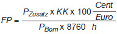

# Gesetz für den Vorrang Erneuerbarer Energien (EEG 2009)

Ausfertigungsdatum
:   2008-10-25

Fundstelle
:   BGBl I: 2008, 2074

Zuletzt geändert durch
:   Art. 2 Abs. 69 G v. 22.12.2011 I 3044

## Teil 1 - Allgemeine Vorschriften

### § 1 Zweck des Gesetzes

(1) Zweck dieses Gesetzes ist es, insbesondere im Interesse des Klima-
und Umweltschutzes eine nachhaltige Entwicklung der Energieversorgung
zu ermöglichen, die volkswirtschaftlichen Kosten der Energieversorgung
auch durch die Einbeziehung langfristiger externer Effekte zu
verringern, fossile Energieressourcen zu schonen und die
Weiterentwicklung von Technologien zur Erzeugung von Strom aus
Erneuerbaren Energien zu fördern.

(2) Um den Zweck des Absatzes 1 zu erreichen, verfolgt dieses Gesetz
das Ziel, den Anteil erneuerbarer Energien an der Stromversorgung
mindestens zu erhöhen auf

1.  35 Prozent spätestens bis zum Jahr 2020,

2.  50 Prozent spätestens bis zum Jahr 2030,

3.  65 Prozent spätestens bis zum Jahr 2040 und

4.  80 Prozent spätestens bis zum Jahr 2050

und diese Strommengen in das Elektrizitätsversorgungssystem zu
integrieren.

(3) Das Ziel nach Absatz 2 Nummer 1 dient auch dazu, den Anteil
erneuerbarer Energien am gesamten Bruttoendenergieverbrauch bis zum
Jahr 2020 auf mindestens 18 Prozent zu erhöhen.

### § 2 Anwendungsbereich

Dieses Gesetz regelt

1.  den vorrangigen Anschluss von Anlagen zur Erzeugung von Strom aus
    Erneuerbaren Energien und aus Grubengas im Bundesgebiet einschließlich
    der deutschen ausschließlichen Wirtschaftszone (Geltungsbereich des
    Gesetzes) an die Netze für die allgemeine Versorgung mit Elektrizität,

2.  die vorrangige Abnahme, Übertragung, Verteilung und Vergütung dieses
    Stroms durch die Netzbetreiber einschließlich des Verhältnisses zu
    Strom aus Kraft-Wärme-Kopplung (KWK) sowie einschließlich Prämien für
    die Integration dieses Stroms in das Elektrizitätsversorgungssystem,

3.  den bundesweiten Ausgleich des abgenommenen Stroms, für den eine
    Vergütung oder eine Prämie gezahlt worden ist.

### § 3 Begriffsbestimmungen

Im Sinne dieses Gesetzes ist

1.  „Anlage“ jede Einrichtung zur Erzeugung von Strom aus Erneuerbaren
    Energien oder aus Grubengas. Als Anlagen zur Erzeugung von Strom aus
    Erneuerbaren Energien oder aus Grubengas gelten auch solche
    Einrichtungen, die zwischengespeicherte Energie, die ausschließlich
    aus Erneuerbaren Energien oder aus Grubengas stammt, aufnehmen und in
    elektrische Energie umwandeln,

2.  „Anlagenbetreiberin oder Anlagenbetreiber“, wer unabhängig vom
    Eigentum die Anlage für die Erzeugung von Strom aus Erneuerbaren
    Energien oder aus Grubengas nutzt,

2a. „Bemessungsleistung“ einer Anlage der Quotient aus der Summe der in
    dem jeweiligen Kalenderjahr erzeugten Kilowattstunden und der Summe
    der vollen Zeitstunden des jeweiligen Kalenderjahres abzüglich der
    vollen Stunden vor der erstmaligen Erzeugung von Strom aus
    erneuerbaren Energien durch die Anlage und nach endgültiger
    Stilllegung der Anlage,

2b. „Biogas“ Gas, das durch anaerobe Vergärung von Biomasse gewonnen wird,

2c. „Biomethan“ Biogas oder sonstige gasförmige Biomasse, das oder die
    aufbereitet und in das Erdgasnetz eingespeist worden ist,

2d. „Elektrizitätsversorgungsunternehmen“ jede natürliche oder juristische
    Person, die Elektrizität an Letztverbraucherinnen oder
    Letztverbraucher liefert,

3.  „Erneuerbare Energien“ Wasserkraft einschließlich der Wellen-,
    Gezeiten-, Salzgradienten- und Strömungsenergie, Windenergie, solare
    Strahlungsenergie, Geothermie, Energie aus Biomasse einschließlich
    Biogas, Biomethan, Deponiegas und Klärgas sowie aus dem biologisch
    abbaubaren Anteil von Abfällen aus Haushalten und Industrie,

4.  „Generator“ jede technische Einrichtung, die mechanische, chemische,
    thermische oder elektromagnetische Energie direkt in elektrische
    Energie umwandelt,

4a. „Gewerbe“ ein nach Art und Umfang in kaufmännischer Weise
    eingerichteter Geschäftsbetrieb, der unter Beteiligung am allgemeinen
    wirtschaftlichen Verkehr nachhaltig mit eigener
    Gewinnerzielungsabsicht betrieben wird,

4b. „Gülle“ alle Stoffe, die Gülle sind im Sinne der Verordnung (EG) Nr.
    1069/2009 des Europäischen Parlaments und des Rates vom 21. Oktober
    2009 mit Hygienevorschriften für nicht für den menschlichen Verzehr
    bestimmte tierische Nebenprodukte und zur Aufhebung der Verordnung
    (EG) Nr. 1774/2002 (ABl. L 300 vom 14.11.2009, S. 1), die durch die
    Richtlinie 2010/63/EU (ABl. L 276 vom 20.10.2010, S. 33) geändert
    worden ist,

4c. „Herkunftsnachweis“ ein elektronisches Dokument, das ausschließlich
    dazu dient, gegenüber einem Endkunden im Rahmen der Stromkennzeichnung
    nach § 42 Absatz 1 Nummer 1 des Energiewirtschaftsgesetzes
    nachzuweisen, dass ein bestimmter Anteil oder eine bestimmte Menge des
    Stroms aus Erneuerbaren Energien erzeugt wurde,

5.  „Inbetriebnahme“ die erstmalige Inbetriebsetzung des Generators der
    Anlage nach Herstellung der technischen Betriebsbereitschaft der
    Anlage, unabhängig davon, ob der Generator mit erneuerbaren Energien,
    Grubengas oder sonstigen Energieträgern in Betrieb gesetzt wurde; der
    Austausch des Generators oder sonstiger technischer oder baulicher
    Teile nach der erstmaligen Inbetriebnahme führt nicht zu einer
    Änderung des Zeitpunkts der Inbetriebnahme,

5a. „KWK-Anlage“ eine KWK-Anlage im Sinne von § 3 Absatz 2 des Kraft-
    Wärme-Kopplungsgesetzes,

6.  „installierte Leistung“ einer Anlage die elektrische Wirkleistung, die
    die Anlage bei bestimmungsgemäßem Betrieb ohne zeitliche
    Einschränkungen unbeschadet kurzfristiger geringfügiger Abweichungen
    technisch erbringen kann,

7.  „Netz“ die Gesamtheit der miteinander verbundenen technischen
    Einrichtungen zur Abnahme, Übertragung und Verteilung von Elektrizität
    für die allgemeine Versorgung,

8.  „Netzbetreiber“ die Betreiber von Netzen aller Spannungsebenen für die
    allgemeine Versorgung mit Elektrizität,

9.[^F771325_2_BJNR207410008BJNE000403310]
  „Offshore-Anlage“ eine Windenergieanlage, die auf See in einer
    Entfernung von mindestens drei Seemeilen gemessen von der Küstenlinie
    aus seewärts errichtet worden ist. Als Küstenlinie gilt die in der
    Karte Nummer 2920 Deutsche Nordseeküste und angrenzende Gewässer,
    Ausgabe 1994, XII., sowie in der Karte Nummer 2921 Deutsche
    Ostseeküste und angrenzende Gewässer, Ausgabe 1994, XII., des
    Bundesamtes für Seeschifffahrt und Hydrographie im Maßstab 1 : 375 000
    dargestellte Küstenlinie,

9a. „Speichergas“ jedes Gas, das keine erneuerbare Energie ist, aber zum
    Zweck der Zwischenspeicherung von Strom aus erneuerbaren Energien
    ausschließlich unter Einsatz von Strom aus erneuerbaren Energien
    erzeugt wird,

10. „Strom aus Kraft-Wärme-Kopplung“ Strom im Sinne von § 3 Absatz 4 des
    Kraft-Wärme-Kopplungsgesetzes,

11. „Übertragungsnetzbetreiber“ der regelverantwortliche Netzbetreiber von
    Hoch- und Höchstspannungsnetzen, die der überregionalen Übertragung
    von Elektrizität zu nachgeordneten Netzen dienen,

12. Umweltgutachterin oder Umweltgutachter“ eine Person oder Organisation,
    die nach dem Umweltauditgesetz in der Fassung der Bekanntmachung vom
    4\. September 2002 (BGBl. I S. 3490), das zuletzt durch Artikel 11 des
    Gesetzes vom 17. März 2008 (BGBl. I S. 399) geändert worden ist, in
    der jeweils geltenden Fassung, als Umweltgutachterin, Umweltgutachter
    oder Umweltgutachterorganisation tätig werden darf,

13. „Unternehmen“ die kleinste rechtlich selbständige Einheit,

14.[^f1775530_01_BJNR207410008BJNE000403310]
 „Unternehmen des produzierenden Gewerbes“ jedes Unternehmen, das an
    der zu begünstigenden Abnahmestelle dem Bergbau, der Gewinnung von
    Steinen und Erden oder dem verarbeitenden Gewerbe in entsprechender
    Anwendung der Abschnitte B und C der Klassifikation der
    Wirtschaftszweige des Statistischen Bundesamtes, Ausgabe 2008
    zuzuordnen ist.

    Amtlicher Hinweis: Zu beziehen beim Statistischen Bundesamt, Gustav-
    Stresemann-Ring 11, 65189 Wiesbaden; auch zu beziehen über
    www.destatis.de.
[^f1775530_01_BJNR207410008BJNE000403310]:     Amtlicher Hinweis: Zu beziehen beim Bundesamt für Seeschifffahrt und
    Hydrographie, 20359 Hamburg.
[^F771325_2_BJNR207410008BJNE000403310]: 

### § 4 Gesetzliches Schuldverhältnis

(1) Netzbetreiber dürfen die Erfüllung ihrer Verpflichtungen aus
diesem Gesetz nicht vom Abschluss eines Vertrages abhängig machen.

(2) Von den Bestimmungen dieses Gesetzes darf unbeschadet des § 8
Absatz 3 und 3a nicht zu Lasten der Anlagenbetreiberin, des
Anlagenbetreibers oder des Netzbetreibers abgewichen werden. Dies gilt
nicht für abweichende vertragliche Vereinbarungen zu den §§ 3 bis 33i,
45, 46, 56 und 66 sowie zu den auf Grund dieses Gesetzes erlassenen
Rechtsverordnungen, die

1.  Gegenstand eines Prozessvergleichs im Sinne des § 794 Absatz 1 Nummer
    1 der Zivilprozessordnung sind,

2.  dem Ergebnis eines von den Parteien vor der Clearingstelle
    durchgeführten Verfahrens nach § 57 Absatz 3 Satz 1 Nummer 1
    entsprechen,

3.  einer für die Parteien von der Clearingstelle abgegebenen
    Stellungnahme nach § 57 Absatz 3 Satz 1 Nummer 2 entsprechen oder

4.  einer Entscheidung der Bundesnetzagentur nach § 61 entsprechen.

## Teil 2 - Anschluss, Abnahme, Übertragung und Verteilung

### Abschnitt 1 - Allgemeine Vorschriften

#### § 5 Anschluss

(1) Netzbetreiber sind verpflichtet, Anlagen zur Erzeugung von Strom
aus Erneuerbaren Energien und aus Grubengas unverzüglich vorrangig an
der Stelle an ihr Netz anzuschließen (Verknüpfungspunkt), die im
Hinblick auf die Spannungsebene geeignet ist, und die in der Luftlinie
kürzeste Entfernung zum Standort der Anlage aufweist, wenn nicht ein
anderes Netz einen technisch und wirtschaftlich günstigeren
Verknüpfungspunkt aufweist. Bei einer oder mehreren Anlagen mit einer
installierten Leistung von insgesamt bis zu 30 Kilowatt, die sich auf
einem Grundstück mit bereits bestehendem Netzanschluss befinden, gilt
der Verknüpfungspunkt des Grundstücks mit dem Netz als günstigster
Verknüpfungspunkt.

(2) Anlagenbetreiberinnen und -betreiber sind berechtigt, einen
anderen Verknüpfungspunkt dieses oder eines anderen im Hinblick auf
die Spannungsebene geeigneten Netzes zu wählen.

(3) Der Netzbetreiber ist abweichend von den Absätzen 1 und 2
berechtigt, der Anlage einen anderen Verknüpfungspunkt zuzuweisen.
Dies gilt nicht, wenn die Abnahme des Stroms aus der betroffenen
Anlage nach § 8 Abs. 1 nicht sichergestellt wäre.

(4) Die Pflicht zum Netzanschluss besteht auch dann, wenn die Abnahme
des Stroms erst durch die Optimierung, die Verstärkung oder den Ausbau
des Netzes nach § 9 möglich wird.

(5) Netzbetreiber sind verpflichtet, Einspeisewilligen nach Eingang
eines Netzanschlussbegehrens unverzüglich einen genauen Zeitplan für
die Bearbeitung des Netzanschlussbegehrens zu übermitteln. In diesem
Zeitplan ist anzugeben:

1.  in welchen Arbeitsschritten das Netzanschlussbegehren bearbeitet wird
    und

2.  welche Informationen die Einspeisewilligen aus ihrem
    Verantwortungsbereich den Netzbetreibern übermitteln müssen, damit die
    Netzbetreiber den Verknüpfungspunkt ermitteln oder ihre Planungen nach
    § 9 durchführen können.

(6) Netzbetreiber sind verpflichtet, Einspeisewilligen nach Eingang
der erforderlichen Informationen unverzüglich, spätestens aber
innerhalb von acht Wochen, Folgendes zu übermitteln:

1.  einen Zeitplan für die unverzügliche Herstellung des Netzanschlusses
    mit allen erforderlichen Arbeitsschritten,

2.  alle Informationen, die Einspeisewillige für die Prüfung des
    Verknüpfungspunktes benötigen, sowie auf Antrag die für eine
    Netzverträglichkeitsprüfung erforderlichen Netzdaten,

3.  einen nachvollziehbaren und detaillierten Voranschlag der Kosten, die
    den Anlagenbetreiberinnen oder Anlagenbetreibern durch den
    Netzanschluss entstehen; dieser Kostenvoranschlag umfasst nur die
    Kosten, die durch die technische Herstellung des Netzanschlusses
    entstehen, und insbesondere nicht die Kosten für die Gestattung der
    Nutzung fremder Grundstücke für die Verlegung der
    Netzanschlussleitung.

Das Recht der Anlagenbetreiberinnen oder Anlagenbetreiber nach § 7
Absatz 1 bleibt auch dann unberührt, wenn der Netzbetreiber den
Kostenvoranschlag nach Satz 1 Nummer 3 übermittelt hat.

#### § 6 Technische Vorgaben

(1) Anlagenbetreiberinnen und Anlagenbetreiber sowie Betreiberinnen
und Betreiber von KWK-Anlagen müssen ihre Anlagen mit einer
installierten Leistung von mehr als 100 Kilowatt mit technischen
Einrichtungen ausstatten, mit denen der Netzbetreiber jederzeit

1.  die Einspeiseleistung bei Netzüberlastung ferngesteuert reduzieren
    kann und

2.  die jeweilige Ist-Einspeisung abrufen kann.

(2) Anlagenbetreiberinnen und Anlagenbetreiber von Anlagen zur
Erzeugung von Strom aus solarer Strahlungsenergie

1.  mit einer installierten Leistung von mehr als 30 Kilowatt und
    höchstens 100 Kilowatt müssen die Pflicht nach Absatz 1 Nummer 1
    erfüllen,

2.  mit einer installierten Leistung von höchstens 30 Kilowatt müssen

    a)  die Pflicht nach Absatz 1 Nummer 1 erfüllen oder

    b)  am Verknüpfungspunkt ihrer Anlage mit dem Netz die maximale
        Wirkleistungseinspeisung auf 70 Prozent der installierten Leistung
        begrenzen.

(3) Mehrere Anlagen zur Erzeugung von Strom aus solarer
Strahlungsenergie gelten unabhängig von den Eigentumsverhältnissen und
ausschließlich zum Zweck der Ermittlung der installierten Leistung im
Sinne der Absätze 1 und 2 als eine Anlage, wenn

1.  sie sich auf demselben Grundstück oder sonst in unmittelbarer
    räumlicher Nähe befinden und

2.  innerhalb von zwölf aufeinanderfolgenden Kalendermonaten in Betrieb
    genommen worden sind.

Entsteht eine Pflicht nach den Absätzen 1 und 2 für eine
Anlagenbetreiberin oder einen Anlagenbetreiber erst durch den Zubau
von Anlagen einer anderen Anlagenbetreiberin oder eines anderen
Anlagenbetreibers, kann sie oder er von dieser anderen
Anlagenbetreiberin oder diesem anderen Anlagenbetreiber den Ersatz der
daraus entstehenden Kosten verlangen.

(4) Anlagenbetreiberinnen und Anlagenbetreiber von Anlagen zur
Erzeugung von Strom aus Biogas müssen sicherstellen, dass bei der
Erzeugung des Biogases

1.  ein neu zu errichtendes Gärrestlager am Standort der Biogaserzeugung
    technisch gasdicht abgedeckt ist und die hydraulische Verweilzeit in
    dem gasdichten und an eine Gasverwertung angeschlossenen System
    mindestens 150 Tage beträgt und

2.  zusätzliche Gasverbrauchseinrichtungen zur Vermeidung einer
    Freisetzung von Biogas verwendet werden.

Die Anforderung nach Satz 1 Nummer 1 gilt nicht, wenn zur Erzeugung
des Biogases ausschließlich Gülle im Sinne des § 2 Satz 1 Nummer 4 des
Düngegesetzes eingesetzt wird.

(5) Anlagenbetreiberinnen und Anlagenbetreiber von Windenergieanlagen
müssen sicherstellen, dass am Verknüpfungspunkt ihrer Anlage mit dem
Netz die Anforderungen der Systemdienstleistungsverordnung erfüllt
werden.

(6) Die Rechtsfolgen von Verstößen gegen Absatz 1, 2, 4 oder 5 richten
sich bei Anlagen, für deren Stromerzeugung dem Grunde nach ein
Anspruch auf Vergütung nach § 16 besteht, nach § 17 Absatz 1. Bei den
übrigen Anlagen entfällt der Anspruch der Anlagenbetreiberinnen und
Anlagenbetreiber auf vorrangige Abnahme, Übertragung und Verteilung
nach § 8 für die Dauer des Verstoßes gegen Absatz 1, 2, 4 oder 5;
Betreiberinnen und Betreiber von KWK-Anlagen verlieren in diesem Fall
ihren Anspruch auf Zuschlagszahlung nach § 4 Absatz 3 des Kraft-Wärme-
Kopplungsgesetzes oder, soweit ein solcher nicht besteht, ihren
Anspruch auf vorrangigen Netzzugang nach § 4 Absatz 4 des Kraft-Wärme-
Kopplungsgesetzes.

#### § 7 Ausführung und Nutzung des Anschlusses

(1) Anlagenbetreiberinnen und -betreiber sind berechtigt, den
Anschluss der Anlagen sowie die Einrichtung und den Betrieb der
Messeinrichtungen einschließlich der Messung von dem Netzbetreiber
oder einer fachkundigen dritten Person vornehmen zu lassen. Für
Messstellenbetrieb und Messung gelten die Vorschriften der §§ 21b bis
21h des Energiewirtschaftsgesetzes und der auf Grund von § 21i des
Energiewirtschaftsgesetzes erlassenen Rechtsverordnungen.

(2) Die Ausführung des Anschlusses und die übrigen für die Sicherheit
des Netzes notwendigen Einrichtungen müssen den im Einzelfall
notwendigen technischen Anforderungen des Netzbetreibers und § 49 des
Energiewirtschaftsgesetzes vom 7. Juli 2005 (BGBl. I S. 1970, 3621),
das zuletzt durch Artikel 2 des Gesetzes vom 18. Dezember 2007 (BGBl.
I S. 2966) geändert worden ist, entsprechen.

(3) Bei der Einspeisung von Strom aus Erneuerbaren Energien oder
Grubengas gilt zugunsten der Anlagenbetreiberin oder des
Anlagenbetreibers § 18 Abs. 2 der Niederspannungsanschlussverordnung
vom 1. November 2006 (BGBl. I S. 2477) entsprechend.

#### § 8 Abnahme, Übertragung und Verteilung

(1) Netzbetreiber sind vorbehaltlich des § 11 verpflichtet, den
gesamten angebotenen Strom aus Erneuerbaren Energien und aus Grubengas
unverzüglich vorrangig abzunehmen, zu übertragen und zu verteilen. Die
Verpflichtung nach Satz 1 und die Verpflichtungen nach § 4 Absatz 1
Satz 1 und Absatz 4 Satz 2 des Kraft-Wärme-Kopplungsgesetzes sind
gleichrangig.

(2) Die Verpflichtungen nach Absatz 1 bestehen auch, wenn die Anlage
an das Netz der Anlagenbetreiberin, des Anlagenbetreibers oder einer
dritten Person, die nicht Netzbetreiber im Sinne von § 3 Nr. 8 ist,
angeschlossen ist und der Strom mittels kaufmännisch-bilanzieller
Weitergabe durch dieses Netz in ein Netz nach § 3 Nr. 7 angeboten
wird.

(3) Die Verpflichtungen nach Absatz 1 bestehen nicht, soweit
Anlagenbetreiberinnen oder -betreiber und Netzbetreiber unbeschadet
des § 12 zur besseren Integration der Anlage in das Netz ausnahmsweise
vertraglich vereinbaren, vom Abnahmevorrang abzuweichen.

(3a) Die Verpflichtungen nach Absatz 1 bestehen nicht, soweit
Anlagenbetreiberinnen oder Anlagenbetreiber und Netzbetreiber
ausnahmsweise auf Grund vertraglicher Vereinbarungen vom
Abnahmevorrang abweichen und dies durch die
Ausgleichsmechanismusverordnung zugelassen ist.

(4) Die Verpflichtungen zur vorrangigen Abnahme, Übertragung und
Verteilung treffen im Verhältnis zum aufnehmenden Netzbetreiber, der
nicht Übertragungsnetzbetreiber ist,

1.  den vorgelagerten Übertragungsnetzbetreiber,

2.  den nächstgelegenen inländischen Übertragungsnetzbetreiber, wenn im
    Netzbereich des abgabeberechtigten Netzbetreibers kein inländisches
    Übertragungsnetz betrieben wird, oder,

3.  insbesondere im Fall der Weitergabe nach Absatz 2, jeden sonstigen
    Netzbetreiber.

### Abschnitt 2 - Kapazitätserweiterung und Einspeisemanagement

#### § 9 Erweiterung der Netzkapazität

(1) Netzbetreiber sind auf Verlangen der Einspeisewilligen
verpflichtet, unverzüglich ihre Netze entsprechend dem Stand der
Technik zu optimieren, zu verstärken und auszubauen, um die Abnahme,
Übertragung und Verteilung des Stroms aus Erneuerbaren Energien oder
Grubengas sicherzustellen. Dieser Anspruch besteht auch gegenüber
Netzbetreibern, an deren Netz die Anlage nicht unmittelbar
angeschlossen ist, sondern auch für vorgelagerte Netze mit einer
Spannung bis einschließlich 110 Kilovolt, wenn dies erforderlich ist,
um die Abnahme, Übertragung und Verteilung des Stroms sicherzustellen.

(2) Die Pflicht erstreckt sich auf sämtliche für den Betrieb des
Netzes notwendigen technischen Einrichtungen sowie die im Eigentum des
Netzbetreibers stehenden oder in sein Eigentum übergehenden
Anschlussanlagen.

(3) Der Netzbetreiber ist nicht zur Optimierung, zur Verstärkung und
zum Ausbau seines Netzes verpflichtet, soweit dies wirtschaftlich
unzumutbar ist.

(4) Die Verpflichtungen nach § 4 Abs. 6 des Kraft-Wärme-
Kopplungsgesetzes sowie nach § 12 Abs. 3 des
Energiewirtschaftsgesetzes bleiben unberührt.

#### § 10 Schadensersatz

(1) Verletzt der Netzbetreiber seine Verpflichtungen aus § 9 Abs. 1,
können Einspeisewillige Ersatz des hierdurch entstandenen Schadens
verlangen. Die Ersatzpflicht tritt nicht ein, wenn der Netzbetreiber
die Pflichtverletzung nicht zu vertreten hat.

(2) Liegen Tatsachen vor, die die Annahme begründen, dass der
Netzbetreiber seine Pflicht aus § 9 Abs. 1 nicht erfüllt hat, können
Anlagenbetreiberinnen und -betreiber Auskunft von dem Netzbetreiber
darüber verlangen, ob und inwieweit der Netzbetreiber seiner
Verpflichtung zur Optimierung, zur Verstärkung und zum Ausbau des
Netzes nachgekommen ist. Die Auskunft kann verweigert werden, wenn sie
zur Feststellung, ob ein Anspruch nach Absatz 1 vorliegt, nicht
erforderlich ist.

#### § 11 Einspeisemanagement

(1) Netzbetreiber sind unbeschadet ihrer Pflicht nach § 9
ausnahmsweise berechtigt, an ihr Netz unmittelbar oder mittelbar
angeschlossene Anlagen und KWK-Anlagen, die mit einer Einrichtung zur
ferngesteuerten Reduzierung der Einspeiseleistung bei Netzüberlastung
im Sinne von § 6 Absatz 1 Nummer 1, Absatz 2 Nummer 1 oder 2 Buchstabe
a ausgestattet sind, zu regeln, soweit

1.  andernfalls im jeweiligen Netzbereich einschließlich des vorgelagerten
    Netzes ein Netzengpass entstünde,

2.  der Vorrang für Strom aus erneuerbaren Energien, Grubengas und Kraft-
    Wärme-Kopplung gewahrt wird, soweit nicht sonstige Anlagen zur
    Stromerzeugung am Netz bleiben müssen, um die Sicherheit und
    Zuverlässigkeit des Elektrizitätsversorgungssystems zu gewährleisten,
    und

3.  sie die verfügbaren Daten über die Ist-Einspeisung in der jeweiligen
    Netzregion abgerufen haben.

Bei der Regelung der Anlagen nach Satz 1 sind Anlagen im Sinne des § 6
Absatz 2 erst nachrangig gegenüber den übrigen Anlagen zu regeln. Im
Übrigen müssen die Netzbetreiber sicherstellen, dass insgesamt die
größtmögliche Strommenge aus erneuerbaren Energien und Kraft-Wärme-
Kopplung abgenommen wird.

(2) Netzbetreiber sind verpflichtet, Betreiberinnen und Betreiber von
Anlagen nach § 6 Absatz 1 spätestens am Vortag, ansonsten unverzüglich
über den zu erwartenden Zeitpunkt, den Umfang und die Dauer der
Regelung zu unterrichten, sofern die Durchführung der Maßnahme
vorhersehbar ist.

(3) Die Netzbetreiber müssen die von Maßnahmen nach Absatz 1
Betroffenen unverzüglich über die tatsächlichen Zeitpunkte, den
jeweiligen Umfang, die Dauer und die Gründe der Regelung unterrichten
und auf Verlangen innerhalb von vier Wochen Nachweise über die
Erforderlichkeit der Maßnahme vorlegen. Die Nachweise müssen eine
sachkundige dritte Person in die Lage versetzen, ohne weitere
Informationen die Erforderlichkeit der Maßnahme vollständig
nachvollziehen zu können; zu diesem Zweck sind im Fall eines
Verlangens nach Satz 1 letzter Halbsatz insbesondere die nach Absatz 1
Satz 1 Nummer 3 erhobenen Daten vorzulegen. Die Netzbetreiber können
abweichend von Satz 1 Anlagenbetreiberinnen und Anlagenbetreiber von
Anlagen nach § 6 Absatz 2 in Verbindung mit Absatz 3 nur einmal
jährlich über die Maßnahmen nach Absatz 1 unterrichten, solange die
Gesamtdauer dieser Maßnahmen 15 Stunden pro Anlage im Kalenderjahr
nicht überschritten hat; diese Unterrichtung muss bis zum 31. Januar
des Folgejahres erfolgen. § 13 Absatz 5 Satz 3 des
Energiewirtschaftsgesetzes bleibt unberührt.

#### § 12 Härtefallregelung

(1) Wird die Einspeisung von Strom aus Anlagen zur Erzeugung von Strom
aus erneuerbaren Energien, Grubengas oder Kraft-Wärme-Kopplung wegen
eines Netzengpasses im Sinne von § 11 Absatz 1 reduziert, sind die von
der Maßnahme betroffenen Betreiberinnen und Betreiber abweichend von §
13 Absatz 4 des Energiewirtschaftsgesetzes für 95 Prozent der
entgangenen Einnahmen zuzüglich der zusätzlichen Aufwendungen und
abzüglich der ersparten Aufwendungen zu entschädigen. Übersteigen die
entgangenen Einnahmen nach Satz 1 in einem Jahr 1 Prozent der
Einnahmen dieses Jahres, sind die von der Regelung betroffenen
Betreiberinnen und Betreiber ab diesem Zeitpunkt zu 100 Prozent zu
entschädigen. Der Netzbetreiber, in dessen Netz die Ursache für die
Regelung nach § 11 liegt, hat die Kosten der Entschädigung zu tragen.
Gegenüber den betroffenen Betreiberinnen und Betreibern haftet er
gesamtschuldnerisch mit dem Netzbetreiber, an dessen Netz die Anlage
angeschlossen ist.

(2) Der Netzbetreiber kann die Kosten nach Absatz 1 bei der Ermittlung
der Netzentgelte in Ansatz bringen, soweit die Maßnahme erforderlich
war und er sie nicht zu vertreten hat. Der Netzbetreiber hat sie
insbesondere zu vertreten, soweit er nicht alle Möglichkeiten zur
Optimierung, zur Verstärkung und zum Ausbau des Netzes ausgeschöpft
hat.

(3) Schadensersatzansprüche von Anlagenbetreiberinnen und -betreibern
gegen den Netzbetreiber bleiben unberührt.

### Abschnitt 3 - Kosten

#### § 13 Netzanschluss

(1) Die notwendigen Kosten des Anschlusses von Anlagen zur Erzeugung
von Strom aus Erneuerbaren Energien oder aus Grubengas an den
Verknüpfungspunkt nach § 5 Abs. 1 oder 2 sowie der notwendigen
Messeinrichtungen zur Erfassung des gelieferten und des bezogenen
Stroms trägt die Anlagenbetreiberin oder der Anlagenbetreiber.

(2) Weist der Netzbetreiber den Anlagen nach § 5 Abs. 3 einen anderen
Verknüpfungspunkt zu, muss er die daraus resultierenden Mehrkosten
tragen.

#### § 14 Kapazitätserweiterung

Die Kosten der Optimierung, der Verstärkung und des Ausbaus des Netzes
trägt der Netzbetreiber.

#### § 15 Vertragliche Vereinbarung

(1) Netzbetreiber können infolge der Vereinbarung nach § 8 Abs. 3
entstandene Kosten im nachgewiesenen Umfang bei der Ermittlung des
Netzentgelts in Ansatz bringen, soweit diese Kosten im Hinblick auf §
1 wirtschaftlich angemessen sind.

(2) Die Kosten unterliegen der Prüfung auf Effizienz durch die
Regulierungsbehörde nach Maßgabe der Vorschriften des
Energiewirtschaftsgesetzes.

## Teil 3 - Einspeisevergütung

### Abschnitt 1 - Allgemeine Vergütungsvorschriften

#### § 16 Vergütungsanspruch

(1) Netzbetreiber müssen Anlagenbetreiberinnen und Anlagenbetreibern
Strom aus Anlagen, die ausschließlich erneuerbare Energien oder
Grubengas einsetzen, mindestens nach Maßgabe der §§ 18 bis 33
vergüten. Dies gilt nur für Strom, der tatsächlich nach § 8 abgenommen
oder nach Maßgabe des § 33 Absatz 2 verbraucht worden ist. Auf die zu
erwartenden Zahlungen sind monatliche Abschläge in angemessenem Umfang
zu leisten.

(2) Die Verpflichtung nach Absatz 1 besteht auch dann, wenn der Strom
vor der Einspeisung in das Netz zwischengespeichert worden ist. In
diesem Fall bezieht sie sich auf die Strommenge, die aus dem
Zwischenspeicher in das Netz eingespeist wird. Die Vergütungshöhe
bestimmt sich nach der Höhe der Vergütung, die der Netzbetreiber nach
Absatz 1 bei einer Einspeisung des Stroms in das Netz ohne
Zwischenspeicherung an die Anlagenbetreiberin oder den
Anlagenbetreiber zahlen müsste. Die Verpflichtung nach Satz 1 besteht
auch bei einem gemischten Einsatz von erneuerbaren Energien und
Speichergasen. Satz 1 gilt nicht bei Strom aus solarer
Strahlungsenergie, wenn für diesen Strom eine Vergütung nach § 33
Absatz 2 in Anspruch genommen worden ist.

(3) Anlagenbetreiberinnen und Anlagenbetreiber, die den
Vergütungsanspruch nach Absatz 1 für Strom aus einer Anlage geltend
machen, sind verpflichtet, ab diesem Zeitpunkt dem Netzbetreiber den
gesamten in dieser Anlage erzeugten Strom,

1.  für den dem Grunde nach ein Vergütungsanspruch nach Absatz 1 besteht,

2.  der nicht von ihnen selbst oder von Dritten in unmittelbarer
    räumlicher Nähe zur Anlage verbraucht wird und

3.  der durch ein Netz durchgeleitet wird,

zur Verfügung zu stellen, und sie dürfen den in der Anlage erzeugten
Strom nicht als Regelenergie vermarkten.

#### § 17 Verringerung des Vergütungsanspruchs

(1) Der Vergütungsanspruch nach § 16 verringert sich auf Null, solange
Anlagenbetreiberinnen und Anlagenbetreiber gegen § 6 Absatz 1, 2, 4
oder 5 verstoßen.

(2) Der Vergütungsanspruch nach § 16 verringert sich auf den
tatsächlichen Monatsmittelwert des energieträgerspezifischen
Marktwerts nach Nummer 1.1 der Anlage 4 zu diesem Gesetz (
„MW“             ),

1.  solange Anlagenbetreiberinnen und Anlagenbetreiber von Anlagen zur
    Erzeugung von Strom aus solarer Strahlungsenergie den Standort und die
    installierte Leistung der Anlage nicht übermittelt haben an

    a)  die Bundesnetzagentur mittels der von ihr bereitgestellten
        Formularvorgaben oder

    b)  einen Dritten, der zum Betrieb eines Anlagenregisters abweichend von
        Buchstabe a durch eine Rechtsverordnung auf Grund von § 64e Nummer 2
        verpflichtet worden ist oder der in einer solchen Verordnung als
        Adressat der Meldungen benannt worden ist, nach Maßgabe dieser
        Verordnung,

2.  solange Anlagenbetreiberinnen und Anlagenbetreiber im Fall der
    Errichtung eines allgemeinen Anlagenregisters die Eintragung der
    Anlage in das Anlagenregister nicht nach Maßgabe einer
    Rechtsverordnung auf Grund von § 64e beantragt haben,

3.  solange Anlagenbetreiberinnen und Anlagenbetreiber gegen § 16 Absatz 3
    verstoßen, mindestens jedoch für die Dauer des gesamten
    Kalendermonats, in dem ein solcher Verstoß erfolgt ist, und soweit sie
    den Strom dem Netzbetreiber zur Verfügung gestellt haben oder

4.  soweit die Errichtung oder der Betrieb der Anlage dazu dient, die
    Vorbildfunktion öffentlicher Gebäude auf Grund einer landesrechtlichen
    Regelung nach § 3 Absatz 4 Nummer 1 des Erneuerbare-Energien-
    Wärmegesetzes zu erfüllen, und wenn die Anlage keine KWK-Anlage ist.

(3) Der Vergütungsanspruch nach § 16 verringert sich ferner auf den
tatsächlichen Monatsmittelwert des energieträgerspezifischen
Marktwerts nach Nummer 1.1 der Anlage 4 zu diesem Gesetz (
„MW“             ), wenn Anlagenbetreiberinnen und Anlagenbetreiber,
die ihren Strom direkt vermarktet haben, dem Netzbetreiber den Wechsel
in die Vergütung nach § 16 nicht nach Maßgabe des § 33d Absatz 2 in
Verbindung mit § 33d Absatz 1 Nummer 3 und Absatz 4 übermittelt haben.
Satz 1 gilt bis zum Ablauf des dritten Kalendermonats, der auf die
Beendigung der Direktvermarktung folgt.

#### § 18 Vergütungsberechnung

(1) Die Höhe der Vergütung für Strom, der in Abhängigkeit von der
Bemessungsleistung oder der installierten Leistung der Anlage vergütet
wird, bestimmt sich

1.  bei den §§ 23 bis 28 jeweils anteilig nach der Bemessungsleistung der
    Anlage und

2.  bei dem § 33 jeweils anteilig nach der installierten Leistung der
    Anlage

im Verhältnis zu dem jeweils anzuwendenden Schwellenwert.

(2) In den Vergütungen ist die Umsatzsteuer nicht enthalten.

#### § 19 Vergütung für Strom aus mehreren Anlagen

(1) Mehrere Anlagen gelten unabhängig von den Eigentumsverhältnissen
und ausschließlich zum Zweck der Ermittlung der Vergütung für den
jeweils zuletzt in Betrieb gesetzten Generator als eine Anlage, wenn

1.  sie sich auf demselben Grundstück oder sonst in unmittelbarer
    räumlicher Nähe befinden,

2.  sie Strom aus gleichartigen Erneuerbaren Energien erzeugen,

3.  der in ihnen erzeugte Strom nach den Regelungen dieses Gesetzes in
    Abhängigkeit von der Bemessungsleistung oder der installierten
    Leistung der Anlage vergütet wird und

4.  sie innerhalb von zwölf aufeinanderfolgenden Kalendermonaten in
    Betrieb genommen worden sind.

Abweichend von Satz 1 gelten mehrere Anlagen unabhängig von den
Eigentumsverhältnissen und ausschließlich zum Zweck der Ermittlung der
Vergütung für den jeweils zuletzt in Betrieb gesetzten Generator als
eine Anlage, wenn sie Strom aus Biogas mit Ausnahme von Biomethan
erzeugen und das Biogas aus derselben Biogaserzeugungsanlage stammt.

(2) Anlagenbetreiberinnen und -betreiber können Strom aus mehreren
Generatoren, die gleichartige Erneuerbare Energien oder Grubengas
einsetzen, über eine gemeinsame Messeinrichtung abrechnen. In diesem
Fall ist für die Berechnung der Vergütungen vorbehaltlich des Absatzes
1 die Bemessungsleistung jeder einzelnen Anlage maßgeblich.

(3) Wenn Strom aus mehreren Windenergieanlagen, für die sich
unterschiedliche Vergütungshöhen errechnen, über eine gemeinsame
Messeinrichtung abgerechnet wird, erfolgt die Zuordnung der
Strommengen zu den Windenergieanlagen im Verhältnis der jeweiligen
Referenzerträge.

#### § 20 Absenkungen von Vergütungen und Boni

(1) Die Vergütungen und Boni nach den §§ 23 bis 31 gelten unbeschadet
des § 66 für Strom aus Anlagen, die vor dem 1. Januar 2013 in Betrieb
genommen werden. Sie gelten ferner für Strom aus Anlagen, die nach dem
31\. Dezember 2012 in Betrieb genommen werden, mit der Maßgabe, dass
sich die Vergütungen und Boni nach Maßgabe der Absätze 2 und 3
verringern. Die zum jeweiligen Inbetriebnahmezeitpunkt errechneten
Vergütungen und Boni gelten jeweils für die gesamte Vergütungsdauer
nach § 21 Absatz 2.

(2) Die Vergütungen und Boni verringern sich jährlich zum 1. Januar
für Strom aus

1.  Wasserkraft (§ 23) ab dem Jahr 2013: um 1,0 Prozent,

2.  Deponiegas (§§ 24 und 27c Absatz 2) ab dem Jahr 2013: um 1,5 Prozent,

3.  Klärgas (§§ 25 und 27c Absatz 2) ab dem Jahr 2013: um 1,5 Prozent,

4.  Grubengas (§ 26) ab dem Jahr 2013: um 1,5 Prozent,

5.  Biomasse (§ 27 Absatz 1, §§ 27a, 27b und 27c Absatz 2) ab dem Jahr
    2013: um 2,0 Prozent,

6.  Geothermie (§ 28) ab dem Jahr 2018: um 5,0 Prozent,

7.  Windenergie

    a)  aus Offshore-Anlagen (§ 31) ab dem Jahr 2018: um 7,0 Prozent und

    b)  aus sonstigen Anlagen (§ 29) ab dem Jahr 2013: um 1,5 Prozent.

(3) Die jährlichen Vergütungen und Boni werden nach der Berechnung
gemäß den Absätzen 1 und 2 auf zwei Stellen nach dem Komma gerundet.
Für die Berechnung der Höhe der Vergütungen und Boni des jeweils
darauffolgenden Kalenderjahres sind die ungerundeten Werte des
Vorjahres zugrunde zu legen.

#### § 20a Absenkung der Vergütung von Strom aus solarer Strahlungsenergie

(1) Die Vergütungen nach den §§ 32 und 33 verringern sich für Strom
aus Anlagen, die nach dem 31. Dezember 2011 in Betrieb genommen
werden, nach Maßgabe der Absätze 2 bis 7.

(2) Die Vergütungen nach den §§ 32 und 33 verringern sich
vorbehaltlich der Absätze 3 und 4 ab dem Jahr 2012 jährlich zum 1.
Januar um 9,0 Prozent gegenüber den jeweils am 1. Januar des Vorjahres
geltenden Vergütungssätzen.

(3) Der Prozentsatz nach Absatz 2 erhöht sich ab dem Jahr 2012, sobald
die installierte Leistung der zum 30. September des jeweiligen
Vorjahres innerhalb der vorangegangenen zwölf Monate nach § 17 Absatz
2 Nummer 1 registrierten Anlagen

1.  3 500 Megawatt überschreitet, um 3,0 Prozentpunkte,

2.  4 500 Megawatt überschreitet, um 6,0 Prozentpunkte,

3.  5 500 Megawatt überschreitet, um 9,0 Prozentpunkte,

4.  6 500 Megawatt überschreitet, um 12,0 Prozentpunkte oder

5.  7 500 Megawatt überschreitet, um 15,0 Prozentpunkte.

(4) Der Prozentsatz nach Absatz 2 verringert sich ab dem Jahr 2012,
sobald die installierte Leistung der zum 30. September des jeweiligen
Vorjahres innerhalb der vorangegangenen zwölf Monate nach § 17 Absatz
2 Nummer 1 registrierten Anlagen

1.  2 500 Megawatt unterschreitet, um 2,5 Prozentpunkte,

2.  2 000 Megawatt unterschreitet, um 5,0 Prozentpunkte oder

3.  1 500 Megawatt unterschreitet, um 7,5 Prozentpunkte.

(5) Die Vergütungen nach den §§ 32 und 33 verringern sich ab dem Jahr
2012 gegenüber den jeweils am 1. Januar geltenden Vergütungssätzen
zusätzlich für Strom aus Anlagen, die nach dem 30. Juni des jeweiligen
Jahres und vor dem 1. Januar des Folgejahres in Betrieb genommen
werden, wenn die installierte Leistung der nach dem 30. September des
Vorjahres und vor dem 1. Mai des jeweiligen Jahres nach § 17 Absatz 2
Nummer 1 registrierten Anlagen mit dem Wert 12 multipliziert und durch
den Wert 7 geteilt

1.  3 500 Megawatt überschreitet, um 3,0 Prozent,

2.  4 500 Megawatt überschreitet, um 6,0 Prozent,

3.  5 500 Megawatt überschreitet, um 9,0 Prozent,

4.  6 500 Megawatt überschreitet, um 12,0 Prozent oder

5.  7 500 Megawatt überschreitet, um 15,0 Prozent.

(6) Die Bundesnetzagentur veröffentlicht im Einvernehmen mit dem
Bundesministerium für Umwelt, Naturschutz und Reaktorsicherheit sowie
dem Bundesministerium für Wirtschaft und Technologie im Bundesanzeiger

1.  jeweils zum 31. Oktober die nach den Absätzen 3 und 4 in Verbindung
    mit Absatz 2 für das Folgejahr geltenden Prozentsätze und die daraus
    resultierenden Vergütungen, die jeweils ab dem 1. Januar des
    Folgejahres gelten,

2.  jeweils zum 30. Mai den nach Absatz 5 ermittelten Prozentsatz und die
    daraus resultierenden Vergütungen, die ab dem 1. Juli des jeweiligen
    Jahres gelten.

(7) § 20 Absatz 1 Satz 3 und Absatz 3 gilt für die Absätze 1 bis 5
entsprechend.

#### § 21 Vergütungsbeginn und -dauer

(1) Die Vergütungen sind ab dem Zeitpunkt zu zahlen, ab dem der
Generator erstmals Strom ausschließlich aus erneuerbaren Energien oder
Grubengas erzeugt und in das Netz nach § 8 Absatz 1 oder 2 eingespeist
hat oder der Strom erstmals nach Maßgabe des § 33 Absatz 2 verbraucht
worden ist.

(2) Die Vergütungen sind jeweils für die Dauer von 20 Kalenderjahren
zuzüglich des Inbetriebnahmejahres zu zahlen. Beginn der Frist nach
Satz 1 ist der Zeitpunkt der Inbetriebnahme, soweit sich aus den
nachfolgenden Vorschriften nichts anderes ergibt.

#### § 22 Aufrechnung

(1) Die Aufrechnung von Vergütungsansprüchen der Anlagenbetreiberin
oder des Anlagenbetreibers nach § 16 mit einer Forderung des
Netzbetreibers ist nur zulässig, soweit die Forderung unbestritten
oder rechtskräftig festgestellt ist.

(2) Das Aufrechnungsverbot des § 23 Abs. 3 der
Niederspannungsanschlussverordnung gilt nicht, soweit mit Ansprüchen
aus diesem Gesetz aufgerechnet wird.

### Abschnitt 2 - Besondere Vergütungsvorschriften

#### § 23 Wasserkraft

(1) Für Strom aus Wasserkraft beträgt die Vergütung

1.  bis einschließlich einer Bemessungsleistung von 500 Kilowatt 12,7 Cent
    pro Kilowattstunde,

2.  bis einschließlich einer Bemessungsleistung von 2 Megawatt 8,3 Cent
    pro Kilowattstunde,

3.  bis einschließlich einer Bemessungsleistung von 5 Megawatt 6,3 Cent
    pro Kilowattstunde,

4.  bis einschließlich einer Bemessungsleistung von 10 Megawatt 5,5 Cent
    pro Kilowattstunde,

5.  bis einschließlich einer Bemessungsleistung von 20 Megawatt 5,3 Cent
    pro Kilowattstunde,

6.  bis einschließlich einer Bemessungsleistung von 50 Megawatt 4,2 Cent
    pro Kilowattstunde und

7.  ab einer Bemessungsleistung von mehr als 50 Megawatt 3,4 Cent pro
    Kilowattstunde.

(2) Der Anspruch auf die Vergütung nach Absatz 1 besteht auch für
Strom aus Anlagen, die vor dem 1. Januar 2009 in Betrieb genommen
wurden, wenn nach dem 31. Dezember 2011

1.  die installierte Leistung oder das Leistungsvermögen der Anlage erhöht
    wurde oder

2.  die Anlage mit einer technischen Einrichtung zur ferngesteuerten
    Reduzierung der Einspeiseleistung nach § 6 Absatz 1 Nummer 1 erstmals
    nachgerüstet wurde.

Der Anspruch auf die Vergütung nach Satz 1 besteht ab dem Abschluss
der Maßnahme für die Dauer von 20 Jahren zuzüglich des restlich
verbleibenden Teils des Jahres, in dem die Maßnahme nach Satz 1
abgeschlossen worden ist.

(3) Für Strom aus Wasserkraft, der in Anlagen nach Absatz 2 mit einer
installierten Leistung von mehr als 5 Megawatt erzeugt wird, besteht
der Anspruch auf Vergütung nach Absatz 1 nur für den Strom, der der
Leistungserhöhung nach Absatz 2 Satz 1 Nummer 1 zuzurechnen ist. Wenn
die Anlage vor dem 1. Januar 2012 eine installierte Leistung bis
einschließlich 5 Megawatt aufwies, besteht für den Strom, der diesem
Leistungsanteil entspricht, der Vergütungsanspruch nach der bislang
geltenden Regelung.

(4) Der Anspruch auf Vergütung nach den Absätzen 1 und 2 besteht für
Anlagen an oberirdischen Gewässern nur, wenn die Wasserkraftnutzung
den Anforderungen nach den §§ 33 bis 35 und 6 Absatz 1 Satz 1 Nummer 1
und 2 des Wasserhaushaltsgesetzes entspricht. Als Nachweis der
Erfüllung der Voraussetzungen des Satzes 1 gilt für Anlagen nach
Absatz 1 und, soweit im Rahmen der Maßnahmen nach Absatz 2 eine
Neuzulassung der Wasserkraftnutzung erfolgt ist, für Anlagen nach
Absatz 2 die Zulassung der Wasserkraftnutzung. Im Übrigen kann die
Erfüllung der Voraussetzungen nach Satz 1 wie folgt nachgewiesen
werden:

1.  durch eine Bescheinigung der zuständigen Wasserbehörde oder

2.  durch ein Gutachten einer Umweltgutachterin oder eines
    Umweltgutachters mit einer Zulassung für den Bereich
    Elektrizitätserzeugung aus Wasserkraft, das der Bestätigung durch die
    zuständige Wasserbehörde bedarf; äußert sich die Behörde innerhalb von
    zwei Monaten nach Vorlage des Gutachtens nicht, gilt die Bestätigung
    als erteilt; diese Bestätigung darf nur versagt werden, wenn die
    Behörde erhebliche Zweifel an der Richtigkeit des Gutachtens hat.

(5) Der Anspruch auf Vergütung nach Absatz 1 besteht ferner nur, wenn
die Anlage

1.  im räumlichen Zusammenhang mit einer ganz oder teilweise bereits
    bestehenden oder vorrangig zu anderen Zwecken als der Erzeugung von
    Strom aus Wasserkraft neu zu errichtenden Staustufe oder Wehranlage
    oder

2.  ohne durchgehende Querverbauung

errichtet worden ist.

(6) Der Anspruch auf Vergütung nach Absatz 1 besteht bei
Speicherkraftwerken nur, wenn sie an einem bestehenden Speicher oder
einem bestehenden Speicherkraftwerk errichtet worden sind.

#### § 24 Deponiegas

Für Strom aus Deponiegas beträgt die Vergütung

1.  bis einschließlich einer Bemessungsleistung von 500 Kilowatt 8,60 Cent
    pro Kilowattstunde und

2.  bis einschließlich einer Bemessungsleistung von 5 Megawatt 5,89 Cent
    pro Kilowattstunde.

#### § 25 Klärgas

Für Strom aus Klärgas beträgt die Vergütung

1.  bis einschließlich einer Bemessungsleistung von 500 Kilowatt 6,79 Cent
    pro Kilowattstunde und

2.  bis einschließlich einer Bemessungsleistung von 5 Megawatt 5,89 Cent
    pro Kilowattstunde.

#### § 26 Grubengas

(1) Für Strom aus Grubengas beträgt die Vergütung

1.  bis einschließlich einer Bemessungsleistung von 1 Megawatt 6,84 Cent
    pro Kilowattstunde,

2.  bis einschließlich einer Bemessungsleistung von 5 Megawatt 4,93 Cent
    pro Kilowattstunde und

3.  ab einer Bemessungsleistung von mehr als 5 Megawatt 3,98 Cent pro
    Kilowattstunde.

(2) Die Pflicht zur Vergütung besteht nur, wenn das Grubengas aus
Bergwerken des aktiven oder stillgelegten Bergbaus stammt.

#### § 27 Biomasse

(1) Für Strom aus Biomasse im Sinne der Biomasseverordnung beträgt die
Vergütung

1.  bis einschließlich einer Bemessungsleistung von 150 Kilowatt 14,3 Cent
    pro Kilowattstunde,

2.  bis einschließlich einer Bemessungsleistung von 500 Kilowatt 12,3 Cent
    pro Kilowattstunde,

3.  bis einschließlich einer Bemessungsleistung von 5 Megawatt 11,0 Cent
    pro Kilowattstunde und

4.  bis einschließlich einer Bemessungsleistung von 20 Megawatt 6,0 Cent
    pro Kilowattstunde.

Pflanzenölmethylester gilt in dem Umfang, der zur Anfahr-, Zünd- und
Stützfeuerung notwendig ist, als Biomasse.

(2) Die Vergütung nach Absatz 1 erhöht sich,

1.  soweit der Strom entsprechend dem jeweiligen Einsatzstoff-
    Energieertrag aus Einsatzstoffen der Anlage 2 zur Biomasseverordnung
    erzeugt wird (Einsatzstoffvergütungsklasse I),

    a)  bis einschließlich einer Bemessungsleistung von 500 Kilowatt um 6,0
        Cent pro Kilowattstunde,

    b)  bis einschließlich einer Bemessungsleistung von 750 Kilowatt um 5,0
        Cent pro Kilowattstunde und

    c)  bis einschließlich einer Bemessungsleistung von 5 Megawatt um 4,0 Cent
        pro Kilowattstunde oder

    d)  im Fall von Strom aus Rinde oder aus Waldrestholz abweichend von den
        Buchstaben b und c bis einschließlich einer Bemessungsleistung von 5
        Megawatt um 2,5 Cent pro Kilowattstunde,

2.  soweit der Strom entsprechend dem jeweiligen Einsatzstoff-
    Energieertrag aus Einsatzstoffen der Anlage 3 zur Biomasseverordnung
    erzeugt wird (Einsatzstoffvergütungsklasse II),

    a)  bis einschließlich einer Bemessungsleistung von 5 Megawatt um 8,0 Cent
        pro Kilowattstunde oder

    b)  im Fall von Strom aus Gülle im Sinne der Nummern 3, 9, 11 bis 15 der
        Anlage 3 zur Biomasseverordnung abweichend von Buchstabe a

        aa) bis einschließlich einer Bemessungsleistung von 500 Kilowatt um 8,0
            Cent pro Kilowattstunde und

        bb) bis einschließlich einer Bemessungsleistung von 5 Megawatt um 6,0 Cent
            pro Kilowattstunde.

(3) Für Strom aus Anlagen, die Biogas einsetzen und nach dem 31.
Dezember 2013 in Betrieb genommen werden, gelten die Absätze 1 und 2
nur, wenn die installierte Leistung der Anlage 750 Kilowatt nicht
übersteigt.

(4) Der Vergütungsanspruch nach den Absätzen 1 und 2 besteht in der
dort genannten Höhe nur, wenn und solange

1.  mindestens

    a)  25 Prozent bis zum Ende des ersten auf die erstmalige Erzeugung von
        Strom in der Anlage folgenden Kalenderjahres und danach

    b)  60 Prozent

    des in dem jeweiligen Kalenderjahr in der Anlage erzeugten Stroms in
    Kraft-Wärme-Kopplung nach Maßgabe der Anlage 2 zu diesem Gesetz
    erzeugt wird; hierbei wird im Fall der Stromerzeugung aus Biogas die
    Wärme in Höhe von 25 Prozentpunkten des in Kraft-Wärme-Kopplung
    erzeugten Stroms zur Beheizung des Fermenters angerechnet, oder

2.  der Strom in Anlagen erzeugt wird, die Biogas einsetzen, und zur
    Erzeugung des Biogases in dem jeweiligen Kalenderjahr durchschnittlich
    ein Anteil von Gülle von mindestens 60 Masseprozent eingesetzt wird.

(5) Der Vergütungsanspruch nach den Absätzen 1 und 2 besteht ferner in
der dort genannten Höhe nur, wenn die Anlagenbetreiberin oder der
Anlagenbetreiber durch eine Kopie eines Einsatzstoff-Tagebuchs mit
Angaben und Belegen über Art, Menge und Einheit sowie Herkunft der
eingesetzten Stoffe den Nachweis führt, welche Biomasse eingesetzt
wird und dass keine anderen Stoffe eingesetzt werden, und für Strom

1.  aus Anlagen, die Biogas einsetzen, nur, wenn der zur Erzeugung des
    Biogases eingesetzte Anteil von Mais (Ganzpflanze) und Getreidekorn
    einschließlich Corn-Cob-Mix und Körnermais sowie Lieschkolbenschrot in
    jedem Kalenderjahr insgesamt höchstens 60 Masseprozent beträgt,

2.  aus Anlagen, die Biomethan nach § 27c Absatz 1 einsetzen, abweichend
    von Absatz 4 nur, soweit der Strom in Kraft-Wärme-Kopplung nach
    Maßgabe der Anlage 2 zu diesem Gesetz erzeugt wird,

3.  aus Anlagen, die flüssige Biomasse einsetzen, nur für den Stromanteil
    aus flüssiger Biomasse, die zur Anfahr-, Zünd- und Stützfeuerung
    notwendig ist; flüssige Biomasse ist Biomasse, die zum Zeitpunkt des
    Eintritts in den Brenn- oder Feuerraum flüssig ist.

(6) Bei erstmaliger Inanspruchnahme des Vergütungsanspruchs nach § 16
und danach jährlich bis zum 28. Februar eines Jahres jeweils für das
vorangegangene Kalenderjahr sind nachzuweisen

1.  die Erfüllung der Voraussetzungen nach Absatz 2 jeweils für das
    vorangegangene Kalenderjahr durch Gutachten einer Umweltgutachterin
    oder eines Umweltgutachters mit einer Zulassung für den Bereich
    Elektrizitätserzeugung aus erneuerbaren Energien,

2.  die Erfüllung der Voraussetzungen nach Absatz 4 Nummer 1 nach Maßgabe
    der Nummer 2 der Anlage 2 zu diesem Gesetz,

3.  die Erfüllung der Voraussetzungen nach Absatz 4 Nummer 2 durch
    Gutachten einer Umweltgutachterin oder eines Umweltgutachters mit
    einer Zulassung für den Bereich Elektrizitätserzeugung aus
    erneuerbaren Energien,

4.  die Erfüllung der Voraussetzungen nach Absatz 5 Nummer 1 und der
    Stromanteil aus flüssiger Biomasse nach Absatz 5 Nummer 3 jeweils für
    das vorangegangene Kalenderjahr durch Vorlage einer Kopie eines
    Einsatzstoff-Tagebuchs,

5.  die Erfüllung der Voraussetzungen nach Absatz 5 Nummer 2 nach Maßgabe
    der Nummer 2 der Anlage 2 zu diesem Gesetz.

(7) Der Vergütungsanspruch nach den Absätzen 1 und 2 verringert sich
in dem jeweiligen Kalenderjahr insgesamt auf den tatsächlichen
Monatsmittelwert der Stundenkontrakte am Spotmarkt der Strombörse EPEX
Spot SE in Leipzig, wenn die Voraussetzungen der Absätze 4 und 5 nicht
nachweislich eingehalten werden. Abweichend von Satz 1 verringert sich
der Vergütungsanspruch nach Absatz 1 nach dem Ende des fünften auf die
erstmalige Geltendmachung des Vergütungsanspruchs nach § 16 folgenden
Kalenderjahres auf 80 Prozent der Vergütung für jedes folgende
Kalenderjahr, für das die Voraussetzungen nach Absatz 4 nicht
nachgewiesen werden, sofern alle übrigen erforderlichen
Voraussetzungen nachgewiesen werden.

(8) Soweit nach Absatz 5 oder 6 der Nachweis des Vergütungsanspruchs
durch eine Kopie eines Einsatzstoff-Tagebuchs zu führen ist, sind die
für den Nachweis nicht erforderlichen personenbezogenen Angaben im
Einsatzstoff-Tagebuch von der Anlagenbetreiberin oder dem
Anlagenbetreiber zu schwärzen.

#### § 27a Vergärung von Bioabfällen

(1) Für Strom aus Anlagen, die Biogas einsetzen, das durch anaerobe
Vergärung von Biomasse im Sinne der Biomasseverordnung mit einem
Anteil von getrennt erfassten Bioabfällen im Sinne der Abfallschlüssel
Nummer 20 02 01, 20 03 01 und 20 03 02 der Nummer 1 des Anhangs 1 der
Bioabfallverordnung in dem jeweiligen Kalenderjahr von
durchschnittlich mindestens 90 Masseprozent gewonnen worden ist,
beträgt die Vergütung

1.  bis einschließlich einer Bemessungsleistung von 500 Kilowatt 16,0 Cent
    pro Kilowattstunde und

2.  bis einschließlich einer Bemessungsleistung von 20 Megawatt 14,0 Cent
    pro Kilowattstunde.

(2) Für Strom aus Anlagen, die nach dem 31. Dezember 2013 in Betrieb
genommen werden, gilt Absatz 1 nur, wenn die installierte Leistung der
Anlage 750 Kilowatt nicht übersteigt.

(3) Der Vergütungsanspruch nach Absatz 1 besteht nur, wenn die
Einrichtungen zur anaeroben Vergärung der Bioabfälle unmittelbar mit
einer Einrichtung zur Nachrotte der festen Gärrückstände verbunden
sind und die nachgerotteten Gärrückstände stofflich verwertet werden.

(4) Die Vergütung nach Absatz 1 kann unbeschadet des § 27c Absatz 2
nicht mit einer Vergütung nach § 27 kombiniert werden.

(5) Im Rahmen des § 27a gelten entsprechend

1.  die Pflicht zur Nachweisführung, welche Biomasse eingesetzt wird und
    dass keine anderen Stoffe eingesetzt werden, durch eine Kopie eines
    Einsatzstoff-Tagebuchs nach § 27 Absatz 5,

2.  § 27 Absatz 5 Nummer 2 und 3 einschließlich der Nachweisregelungen
    nach Absatz 6 Nummer 4 und 5,

3.  § 27 Absatz 7 Satz 1 hinsichtlich der Rechtsfolgen bei nicht
    nachgewiesener Einhaltung der Vergütungsvoraussetzungen des § 27a und

4.  § 27 Absatz 8.

#### § 27b Vergärung von Gülle

(1) Für Strom aus Anlagen, die Biogas einsetzen, das durch anaerobe
Vergärung von Biomasse im Sinne der Biomasseverordnung gewonnen worden
ist, beträgt die Vergütung 25,0 Cent pro Kilowattstunde, wenn

1.  die Stromerzeugung am Standort der Biogaserzeugungsanlage erfolgt,

2.  die installierte Leistung am Standort der Biogaserzeugungsanlage
    insgesamt höchstens 75 Kilowatt beträgt und

3.  zur Erzeugung des Biogases in dem jeweiligen Kalenderjahr
    durchschnittlich ein Anteil von Gülle im Sinne der Nummern 9 und 11
    bis 15 der Anlage 3 zur Biomasseverordnung von mindestens 80
    Masseprozent eingesetzt wird.

(2) Die Vergütung nach Absatz 1 kann nicht mit einer Vergütung nach §
27 kombiniert werden.

(3) Im Rahmen des § 27b gelten entsprechend

1.  die Pflicht zur Nachweisführung, welche Biomasse eingesetzt wird und
    dass keine anderen Stoffe eingesetzt werden, durch eine Kopie eines
    Einsatzstoff-Tagebuchs nach § 27 Absatz 5,

2.  § 27 Absatz 5 Nummer 3 einschließlich der Nachweisregelung nach Absatz
    6 Nummer 4,

3.  § 27 Absatz 7 Satz 1 hinsichtlich der Rechtsfolgen bei nicht
    nachgewiesener Einhaltung der Vergütungsvoraussetzungen des § 27b und

4.  § 27 Absatz 8.

#### § 27c Gemeinsame Vorschriften für gasförmige Energieträger

(1) Aus einem Erdgasnetz entnommenes Gas gilt jeweils als Deponiegas,
Klärgas, Grubengas, Biomethan oder Speichergas,

1.  soweit die Menge des entnommenen Gases im Wärmeäquivalent am Ende
    eines Kalenderjahres der Menge von Deponiegas, Klärgas, Grubengas,
    Biomethan oder Speichergas entspricht, die an anderer Stelle im
    Geltungsbereich dieses Gesetzes in das Erdgasnetz eingespeist worden
    ist, und

2.  wenn für den gesamten Transport und Vertrieb des Gases von seiner
    Herstellung oder Gewinnung, seiner Einspeisung in das Erdgasnetz und
    seinem Transport im Erdgasnetz bis zu seiner Entnahme aus dem
    Erdgasnetz Massenbilanzsysteme verwendet worden sind.

(2) Die Vergütung nach den §§ 24, 25, 27 Absatz 1 und § 27a Absatz 1
erhöht sich für Strom aus Anlagen, die aus einem Erdgasnetz
entnommenes Gas einsetzen, das nach Absatz 1 als Deponiegas, Klärgas
oder Biomethan gilt, und das vor der Einspeisung in das Erdgasnetz
aufbereitet wurde, nach Maßgabe der Anlage 1 (Gasaufbereitungs-Bonus).

(3) Für Strom aus Anlagen, die aus einem Erdgasnetz entnommenes Gas
einsetzen, das nach Absatz 1 als Biomethan gilt, und die nach dem 31.
Dezember 2013 in Betrieb genommen werden, gilt Absatz 2 nur, wenn die
installierte Leistung der Anlage 750 Kilowatt nicht übersteigt.

#### § 28 Geothermie

(1) Für Strom aus Geothermie beträgt die Vergütung 25,0 Cent pro
Kilowattstunde.

(2) Die Vergütung nach Absatz 1 erhöht sich für Strom, der auch durch
Nutzung petrothermaler Techniken erzeugt wird, um 5,0 Cent pro
Kilowattstunde.

#### § 29 Windenergie

(1) Für Strom aus Windenergieanlagen beträgt die Vergütung 4,87 Cent
pro Kilowattstunde (Grundvergütung).

(2) Abweichend von Absatz 1 beträgt die Vergütung in den ersten fünf
Jahren ab der Inbetriebnahme der Anlage 8,93 Cent pro Kilowattstunde
(Anfangsvergütung). Diese Frist verlängert sich um zwei Monate je 0,75
Prozent des Referenzertrags, um den der Ertrag der Anlage 150 Prozent
des Referenzertrags unterschreitet. Referenzertrag ist der errechnete
Ertrag der Referenzanlage nach Maßgabe der Anlage 3 zu diesem Gesetz.
Die Anfangsvergütung erhöht sich für Strom aus Windenergieanlagen, die
vor dem 1. Januar 2015 in Betrieb genommen worden sind, um 0,48 Cent
pro Kilowattstunde (Systemdienstleistungs-Bonus), wenn sie ab dem
Zeitpunkt der Inbetriebnahme die Anforderungen nach § 6 Absatz 5
nachweislich erfüllen.

(3) Anlagen mit einer installierten Leistung bis einschließlich 50
Kilowatt gelten im Sinne des Absatzes 2 als Anlagen mit einem Ertrag
von 60 Prozent ihres Referenzertrags.

#### § 30 Windenergie Repowering

(1) Für Strom aus Windenergieanlagen, die in ihrem Landkreis oder
einem an diesen angrenzenden Landkreis eine oder mehrere bestehende
Anlagen endgültig ersetzen (Repowering-Anlagen), erhöht sich die
Anfangsvergütung um 0,5 Cent pro Kilowattstunde, wenn

1.  die ersetzten Anlagen vor dem 1. Januar 2002 in Betrieb genommen
    worden sind,

2.  für die ersetzten Anlagen dem Grunde nach ein Vergütungsanspruch nach
    den Vergütungsbestimmungen des Erneuerbare-Energien-Gesetzes in der
    für die jeweilige Anlage maßgeblichen Fassung besteht,

3.  die installierte Leistung der Repowering-Anlage mindestens das
    Zweifache der ersetzten Anlagen beträgt und

4.  die Anzahl der Repowering-Anlagen die Anzahl der ersetzten Anlagen
    nicht übersteigt.

Im Übrigen gilt § 29 entsprechend.

(2) Eine Anlage wird ersetzt, wenn sie höchstens ein Jahr vor und
spätestens ein halbes Jahr nach der Inbetriebnahme der Repowering-
Anlage vollständig abgebaut und vor Inbetriebnahme der Repowering-
Anlage außer Betrieb genommen wurde. Der Vergütungsanspruch für die
ersetzten Anlagen entfällt endgültig.

#### § 31 Windenergie Offshore

(1) Für Strom aus Offshore-Anlagen beträgt die Vergütung 3,5 Cent pro
Kilowattstunde (Grundvergütung).

(2) In den ersten zwölf Jahren ab der Inbetriebnahme der Offshore-
Anlage beträgt die Vergütung 15,0 Cent pro Kilowattstunde
(Anfangsvergütung). Der Zeitraum der Anfangsvergütung nach Satz 1
verlängert sich für jede über zwölf Seemeilen hinausgehende volle
Seemeile, die die Anlage von der Küstenlinie nach § 3 Nummer 9 Satz 2
entfernt ist, um 0,5 Monate und für jeden über eine Wassertiefe von 20
Metern hinausgehenden vollen Meter Wassertiefe um 1,7 Monate.

(3) Wenn die Offshore-Anlage vor dem 1. Januar 2018 in Betrieb
genommen worden ist und die Anlagenbetreiberin oder der
Anlagenbetreiber dies vor Inbetriebnahme der Anlage von dem
Netzbetreiber verlangt, erhält sie oder er in den ersten acht Jahren
ab der Inbetriebnahme eine erhöhte Anfangsvergütung von 19,0 Cent pro
Kilowattstunde. In diesem Fall entfällt der Anspruch nach Absatz 2
Satz 1, während der Anspruch auf die Zahlung nach Absatz 2 Satz 2 mit
der Maßgabe entsprechend anzuwenden ist, dass die verlängerte
Anfangsvergütung 15,0 Cent pro Kilowattstunde beträgt.

(4) Ist die Einspeisung aus einer Offshore-Anlage länger als sieben
aufeinanderfolgende Tage nicht möglich, weil die Leitung nach § 17
Absatz 2a Satz 1 des Energiewirtschaftsgesetzes nicht rechtzeitig
fertiggestellt oder gestört ist und der Netzbetreiber dies nicht zu
vertreten hat, verlängert sich die Vergütung nach den Absätzen 2 und
3, beginnend mit dem achten Tag der Störung, um den Zeitraum der
Störung.

(5) Die Absätze 1 bis 3 gelten nicht für Strom aus Offshore-Anlagen,
deren Errichtung nach dem 31. Dezember 2004 in einem Gebiet der
deutschen ausschließlichen Wirtschaftszone oder des Küstenmeeres
genehmigt worden ist, das nach § 57 in Verbindung mit § 32 Absatz 2
des Bundesnaturschutzgesetzes oder nach Landesrecht zu einem
geschützten Teil von Natur und Landschaft erklärt worden ist. Satz 1
gilt bis zur Unterschutzstellung auch für solche Gebiete, die das
Bundesministerium für Umwelt, Naturschutz und Reaktorsicherheit der
Europäischen Kommission als Gebiete von gemeinschaftlicher Bedeutung
oder als Europäische Vogelschutzgebiete benannt hat.

#### § 32 Solare Strahlungsenergie

(1) Für Strom aus Anlagen zur Erzeugung von Strom aus solarer
Strahlungsenergie beträgt die Vergütung 21,11 Cent pro Kilowattstunde
abzüglich der Verringerung nach § 20a, wenn die Anlage

1.  an oder auf einer baulichen Anlage angebracht ist, die vorrangig zu
    anderen Zwecken als der Erzeugung von Strom aus solarer
    Strahlungsenergie errichtet worden ist,

2.  auf einer Fläche errichtet worden ist, für die ein Verfahren nach § 38
    Satz 1 des Baugesetzbuches durchgeführt worden ist, oder

3.  im Bereich eines beschlossenen Bebauungsplans im Sinne des § 30 des
    Baugesetzbuches errichtet worden ist und

    a)  der Bebauungsplan vor dem 1. September 2003 aufgestellt und später
        nicht mit dem Zweck geändert worden ist, eine Anlage zur Erzeugung von
        Strom aus solarer Strahlungsenergie zu errichten,

    b)  der Bebauungsplan vor dem 1. Januar 2010 für die Fläche, auf der die
        Anlage errichtet worden ist, ein Gewerbe- oder Industriegebiet im
        Sinne der §§ 8 und 9 der Baunutzungsverordnung ausgewiesen hat, auch
        wenn die Festsetzung nach dem 1. Januar 2010 zumindest auch mit dem
        Zweck geändert worden ist, eine Anlage zur Erzeugung von Strom aus
        solarer Strahlungsenergie zu errichten, oder

    c)  der Bebauungsplan nach dem 1. September 2003 zumindest auch mit dem
        Zweck der Errichtung einer Anlage zur Erzeugung von Strom aus solarer
        Strahlungsenergie aufgestellt worden ist und sich die Anlage auf
        Flächen befindet, die längs von Autobahnen oder Schienenwegen liegen,
        und sie in einer Entfernung bis zu 110 Metern, gemessen vom äußeren
        Rand der befestigten Fahrbahn, errichtet worden ist.

(2) Abweichend von Absatz 1 beträgt die Vergütung 22,07 Cent pro
Kilowattstunde abzüglich der Verringerung nach § 20a, wenn die Anlage
im Bereich eines beschlossenen Bebauungsplans im Sinne des § 30 des
Baugesetzbuches errichtet worden ist, der nach dem 1. September 2003
zumindest auch mit dem Zweck der Errichtung einer Anlage zur Erzeugung
von Strom aus solarer Strahlungsenergie aufgestellt worden ist, und
sich die Anlage

1.  auf Flächen befindet, die zum Zeitpunkt des Beschlusses über die
    Aufstellung oder Änderung des Bebauungsplans bereits versiegelt waren,
    oder

2.  auf Konversionsflächen aus wirtschaftlicher, verkehrlicher,
    wohnungsbaulicher oder militärischer Nutzung befindet und diese
    Flächen zum Zeitpunkt des Beschlusses über die Aufstellung oder
    Änderung des Bebauungsplans nicht

    a)  als Naturschutzgebiet im Sinne des § 23 des Bundesnaturschutzgesetzes
        oder

    b)  als Nationalpark im Sinne des § 24 des Bundesnaturschutzgesetzes

    rechtsverbindlich festgesetzt worden sind.

(3) Anlagen zur Erzeugung von Strom aus solarer Strahlungsenergie, die
Anlagen zur Erzeugung von Strom aus solarer Strahlungsenergie auf
Grund eines technischen Defekts, einer Beschädigung oder eines
Diebstahls am selben Standort ersetzen, gelten abweichend von § 3
Nummer 5 als zu dem Zeitpunkt in Betrieb genommen, zu dem die
ersetzten Anlagen in Betrieb genommen worden sind. Der
Vergütungsanspruch für die nach Satz 1 ersetzten Anlagen entfällt
endgültig.

#### § 33 Solare Strahlungsenergie in, an oder auf Gebäuden

(1) Für Strom aus Anlagen zur Erzeugung von Strom aus solarer
Strahlungsenergie, die ausschließlich in, an oder auf einem Gebäude
oder einer Lärmschutzwand angebracht sind, beträgt die Vergütung

1.  bis einschließlich einer installierten Leistung von 30 Kilowatt 28,74
    Cent pro Kilowattstunde,

2.  bis einschließlich einer installierten Leistung von 100 Kilowatt 27,33
    Cent pro Kilowattstunde,

3.  bis einschließlich einer installierten Leistung von 1 Megawatt 25,86
    Cent pro Kilowattstunde und

4.  ab einer installierten Leistung von mehr als 1 Megawatt 21,56 Cent pro
    Kilowattstunde,

jeweils abzüglich der Verringerung nach § 20a. § 32 Absatz 3 gilt
entsprechend.

(2) Für Strom aus Anlagen nach Absatz 1 mit einer installierten
Leistung bis einschließlich 500 Kilowatt besteht ein Anspruch auf
Vergütung, soweit die Anlagenbetreiberin, der Anlagenbetreiber oder
Dritte den Strom in unmittelbarer räumlicher Nähe zur Anlage selbst
verbrauchen, dies nachweisen und der Strom nicht durch ein Netz
durchgeleitet wird. Für diesen Strom verringert sich die Vergütung
nach Absatz 1

1.  um 16,38 Cent pro Kilowattstunde für den Anteil dieses Stroms, der 30
    Prozent der im selben Jahr durch die Anlage erzeugten Strommenge nicht
    übersteigt, und

2.  um 12,00 Cent pro Kilowattstunde für den Anteil dieses Stroms, der 30
    Prozent der im selben Jahr durch die Anlage erzeugten Strommenge
    übersteigt.

Verringert sich die Vergütung nach Satz 2 auf einen Wert kleiner Null,
entfällt der Vergütungsanspruch nach Satz 1. Die Sätze 1 und 2 gelten
vorbehaltlich einer Rechtsverordnung auf Grund von § 64f Nummer 2a nur
für Strom aus Anlagen, die vor dem 1. Januar 2014 in Betrieb genommen
wurden.

(3) Gebäude sind selbständig benutzbare, überdeckte bauliche Anlagen,
die von Menschen betreten werden können und vorrangig dazu bestimmt
sind, dem Schutz von Menschen, Tieren oder Sachen zu dienen.

## Teil 3a - Direktvermarktung

### Abschnitt 1 - Allgemeine Vorschriften

#### § 33a Grundsatz, Begriff

(1) Anlagenbetreiberinnen und Anlagenbetreiber können Strom aus
Anlagen, die ausschließlich erneuerbare Energien oder Grubengas
einsetzen, nach Maßgabe der §§ 33b bis 33f an Dritte veräußern
(Direktvermarktung).

(2) Veräußerungen von Strom an Dritte gelten abweichend von Absatz 1
nicht als Direktvermarktung, wenn Anlagenbetreiberinnen und
Anlagenbetreiber Strom aus erneuerbaren Energien oder Grubengas an
Dritte veräußern, die den Strom in unmittelbarer räumlicher Nähe zur
Anlage verbrauchen, und der Strom nicht durch ein Netz durchgeleitet
wird.

#### § 33b Formen der Direktvermarktung

Eine Direktvermarktung nach § 33a kann in den folgenden Formen
erfolgen:

1.  als Direktvermarktung zum Zweck der Inanspruchnahme der Marktprämie
    nach § 33g oder

2.  als Direktvermarktung zum Zweck der Verringerung der EEG-Umlage durch
    ein Elektrizitätsversorgungsunternehmen nach § 39 oder

3.  als sonstige Direktvermarktung.

#### § 33c Pflichten bei der Direktvermarktung

(1) Anlagenbetreiberinnen und Anlagenbetreiber dürfen Strom, der mit
Strom aus mindestens einer anderen Anlage über eine gemeinsame
Messeinrichtung abgerechnet wird, nur direkt vermarkten, wenn der
gesamte über diese Messeinrichtung abgerechnete Strom an Dritte direkt
vermarktet wird.

(2) Anlagenbetreiberinnen und Anlagenbetreiber dürfen Strom in den
Formen des § 33b Nummer 1 oder 2 ferner nur direkt vermarkten, wenn

1.  für den direkt vermarkteten Strom

    a)  unbeschadet des § 33e Satz 1 dem Grunde nach ein Vergütungsanspruch
        nach § 16 besteht, der nicht nach § 17 verringert ist,

    b)  kein vermiedenes Netzentgelt nach § 18 Absatz 1 Satz 1 der
        Stromnetzentgeltverordnung in Anspruch genommen wird,

2.  der direkt vermarktete Strom in einer Anlage erzeugt wird, die mit
    technischen Einrichtungen im Sinne des § 6 Absatz 1 Nummer 1 und 2
    ausgestattet ist,

3.  die gesamte Ist-Einspeisung der Anlage in viertelstündlicher Auflösung
    gemessen und bilanziert wird und

4.  der direkt vermarktete Strom in einem Bilanz- oder Unterbilanzkreis
    bilanziert wird, in dem ausschließlich Strom bilanziert wird, der in
    derselben Form des § 33b Nummer 1 oder 2 direkt vermarktet wird.

(3) Anlagenbetreiberinnen und Anlagenbetreiber von Anlagen zur
Erzeugung von Strom aus Biomasse dürfen abweichend von Absatz 2 Nummer
1 Buchstabe a Strom auch dann direkt vermarkten, wenn der
Vergütungsanspruch nach § 16 nur deshalb nicht besteht, weil die
Voraussetzungen nach § 27 Absatz 3 und 4, § 27a Absatz 2 oder § 27c
Absatz 3 nicht erfüllt sind.

(4) Die Rechtsfolgen von Verstößen gegen die Absätze 1 und 2 richten
sich nach § 33g Absatz 3 und § 39 Absatz 2.

#### § 33d Wechsel zwischen verschiedenen Formen

(1) Anlagenbetreiberinnen und Anlagenbetreiber dürfen zwischen der
Vergütung nach § 16 und der Direktvermarktung oder zwischen
verschiedenen Formen der Direktvermarktung nur zum ersten Kalendertag
eines Monats wechseln; dies gilt für

1.  den Wechsel von der Vergütung nach § 16 in die Direktvermarktung nach
    § 33a,

2.  den Wechsel zwischen verschiedenen Formen der Direktvermarktung nach §
    33b und

3.  den Wechsel von der Direktvermarktung nach § 33a in die Vergütung nach
    § 16.

(2) Anlagenbetreiberinnen und Anlagenbetreiber müssen einen Wechsel
nach Absatz 1 dem Netzbetreiber vor Beginn des jeweils vorangegangenen
Kalendermonats mitteilen. In den Fällen des Absatzes 1 Nummer 1 oder
Nummer 2 sind auch mitzuteilen:

1.  die Form der Direktvermarktung im Sinne des § 33b, in die gewechselt
    wird, und

2.  der Bilanzkreis im Sinne des § 3 Nummer 10a des
    Energiewirtschaftsgesetzes, dem der direkt vermarktete Strom
    zugeordnet werden soll.

(3) Die Netzbetreiber müssen unverzüglich, spätestens jedoch ab dem 1.
Januar 2013, für den Wechsel von Anlagen im Sinne der Absätze 1 und 2
bundesweit einheitliche, massengeschäftstaugliche Verfahren
einschließlich Verfahren für die vollständig automatisierte
elektronische Übermittlung und Nutzung der Meldungsdaten zur Verfügung
stellen, die den Vorgaben des Bundesdatenschutzgesetzes genügen. Für
den elektronischen Datenaustausch nach Maßgabe des
Bundesdatenschutzgesetzes ist ein einheitliches Datenformat
vorzusehen. Die Verbände der Elektrizitätsversorgungsunternehmen sowie
der Anlagenbetreiberinnen und Anlagenbetreiber sind an der Entwicklung
der Verfahren und Formate für den Datenaustausch angemessen zu
beteiligen.

(4) Anlagenbetreiberinnen und Anlagenbetreiber müssen dem
Netzbetreiber Mitteilungen nach Absatz 2 in dem Verfahren und Format
nach Absatz 3 übermitteln, sobald diese zur Verfügung gestellt worden
sind.

(5) Die Rechtsfolgen von Verstößen von Anlagenbetreiberinnen und
Anlagenbetreibern gegen Absatz 1 Nummer 1 und 2, Absatz 2 oder 4
richten sich nach § 33g Absatz 3 und § 39 Absatz 2. Für die Dauer der
dort jeweils genannten Rechtsfolgen sind auch die jeweils anderen
Ansprüche ausgeschlossen.

#### § 33e Verhältnis zur Einspeisevergütung

Solange Anlagenbetreiberinnen und Anlagenbetreiber Strom aus ihrer
Anlage direkt vermarkten, entfallen der Vergütungsanspruch nach § 16
Absatz 1 und 2 sowie die Pflicht nach § 16 Absatz 3 für den gesamten
in der Anlage erzeugten Strom. Dieser Zeitraum wird auf die
Vergütungsdauer nach § 21 Absatz 2 angerechnet.

#### § 33f Anteilige Direktvermarktung

(1) Anlagenbetreiberinnen und Anlagenbetreiber dürfen den in ihrer
Anlage erzeugten Strom anteilig auf die Vergütung nach § 16 und die
Direktvermarktung nach § 33a oder auf verschiedene Formen der
Direktvermarktung nach § 33b verteilen, wenn sie

1.  dem Netzbetreiber die Prozentsätze, die sie der Vergütung nach § 16
    und den verschiedenen Formen der Direktvermarktung nach § 33b
    zuordnen, in einer Mitteilung nach § 33d Absatz 2 übermittelt haben
    und

2.  die Prozentsätze nach Nummer 1 nachweislich jederzeit eingehalten
    haben.

(2) Der Vergütungsanspruch nach § 16 Absatz 1 und 2 sowie die Pflicht
nach § 16 Absatz 3 entfallen bei einer Direktvermarktung nach Absatz 1
abweichend von § 33e Satz 1 nur in Höhe des Prozentsatzes des direkt
vermarkteten Stroms, und die Anlagenbetreiberinnen und
Anlagenbetreiber können für den verbleibenden Anteil die Vergütung
nach § 16 beanspruchen.

(3) Bei Verstößen gegen Absatz 1 verringert sich der
Vergütungsanspruch nach § 16 für den in der Anlage erzeugten Strom,
der nicht direkt vermarktet wird, auf den tatsächlichen
Monatsmittelwert des energieträgerspezifischen Marktwerts nach Nummer
1\.1 der Anlage 4 zu diesem Gesetz (
MW             ). Satz 1 gilt bis zum Ablauf des dritten
Kalendermonats, der auf die Beendigung des Verstoßes gegen Absatz 1
folgt. Im Übrigen richten sich die Rechtsfolgen von Verstößen gegen
Absatz 1 nach § 33g Absatz 3 und § 39 Absatz 2.

### Abschnitt 2 - Prämien für die Direktvermarktung

#### § 33g Marktprämie

(1) Anlagenbetreiberinnen und Anlagenbetreiber können für Strom aus
erneuerbaren Energien oder Grubengas, den sie nach § 33b Nummer 1
direkt vermarkten, von dem Netzbetreiber eine Marktprämie verlangen.
Dies gilt nur für Strom, der tatsächlich eingespeist und von einem
Dritten abgenommen worden ist; die Größe dieser Strommenge muss dem
Netzbetreiber für jeden Monat bis zum zehnten Werktag des jeweiligen
Folgemonats übermittelt werden.

(2) Die Höhe der Marktprämie wird kalendermonatlich berechnet. Die
Berechnung erfolgt rückwirkend anhand der für den jeweiligen
Kalendermonat tatsächlich festgestellten oder berechneten Werte auf
Grund des anzulegenden Werts nach § 33h und nach Maßgabe der Anlage 4
zu diesem Gesetz. Auf die zu erwartenden Zahlungen sind monatliche
Abschläge in angemessenem Umfang zu leisten.

(3) Der Anspruch nach Absatz 1 entfällt, wenn Anlagenbetreiberinnen
und Anlagenbetreiber

1.  gegen § 33c Absatz 1 oder 2 verstoßen,

2.  dem Netzbetreiber den Wechsel in die Form der Direktvermarktung nach §
    33b Nummer 1 nicht nach Maßgabe des § 33d Absatz 2 in Verbindung mit
    Absatz 1 Nummer 1 oder 2 und Absatz 4 übermittelt haben oder

3.  gegen § 33f Absatz 1 verstoßen.

Satz 1 gilt bis zum Ablauf des dritten Kalendermonats, der auf die
Beendigung des in Nummer 1, 2 oder 3 benannten Verstoßes folgt.

(4) § 22 gilt entsprechend.

#### § 33h Anzulegender Wert bei der Marktprämie

Die Marktprämie wird berechnet anhand der Höhe der Vergütung nach §
16, die für den direkt vermarkteten Strom bei der konkreten Anlage im
Fall einer Vergütung nach den §§ 23 bis 33, auch unter
Berücksichtigung der §§ 17 bis 21, tatsächlich in Anspruch genommen
werden könnte (anzulegender Wert). Bei der Berechnung des anzulegenden
Werts sind § 27 Absatz 3 und 4, § 27a Absatz 2 und § 27c Absatz 3
nicht anzuwenden.

#### § 33i Flexibilitätsprämie

(1) Anlagenbetreiberinnen und Anlagenbetreiber von Anlagen zur
Erzeugung von Strom aus Biogas können ergänzend zur Marktprämie von
dem Netzbetreiber eine Prämie für die Bereitstellung zusätzlicher
installierter Leistung für eine bedarfsorientierte Stromerzeugung
(Flexibilitätsprämie) verlangen,

1.  wenn der gesamte in der Anlage erzeugte Strom nach § 33b Nummer 1 oder
    3 direkt vermarktet wird und für diesen Strom unbeschadet des § 33e
    Satz 1 dem Grunde nach ein Vergütungsanspruch nach § 16 besteht, der
    nicht nach § 17 verringert ist,

2.  wenn die Bemessungsleistung der Anlage im Sinne der Nummer 1 der
    Anlage 5 zu diesem Gesetz mindestens das 0,2fache der installierten
    Leistung der Anlage beträgt,

3.  sobald sie den Standort und die installierte Leistung sowie die
    Inanspruchnahme der Flexibilitätsprämie gemeldet haben an

    a)  die Bundesnetzagentur mittels der von ihr bereitgestellten
        Formularvorgaben oder

    b)  einen Dritten, der zum Betrieb eines allgemeinen Anlagenregisters
        abweichend von Buchstabe a durch eine Rechtsverordnung auf Grund von §
        64e Nummer 2 verpflichtet worden ist oder der in einer solchen
        Verordnung als Adressat der Meldungen benannt worden ist, nach Maßgabe
        dieser Rechtsverordnung und

4.  sobald eine Umweltgutachterin oder ein Umweltgutachter mit einer
    Zulassung für den Bereich Elektrizitätserzeugung aus erneuerbaren
    Energien bescheinigt hat, dass die Anlage für den zum Anspruch auf die
    Flexibilitätsprämie erforderlichen bedarfsorientierten Betrieb
    technisch geeignet ist.

(2) Die Höhe der Flexibilitätsprämie wird kalenderjährlich berechnet.
Die Berechnung erfolgt für die jeweils zusätzlich bereitgestellte
installierte Leistung nach Maßgabe der Anlage 5 zu diesem Gesetz. Auf
die zu erwartenden Zahlungen sind monatliche Abschläge in angemessenem
Umfang zu leisten.

(3) Anlagenbetreiberinnen und Anlagenbetreiber müssen dem
Netzbetreiber die erstmalige Inanspruchnahme der Flexibilitätsprämie
vorab mitteilen.

(4) Die Flexibilitätsprämie ist für die Dauer von zehn Jahren zu
zahlen. Beginn der Frist ist der erste Tag des zweiten auf die Meldung
nach Absatz 3 folgenden Kalendermonats.

(5) § 22 gilt entsprechend.

## Teil 4 - Ausgleichsmechanismus

### Abschnitt 1 - Bundesweiter Ausgleich

#### § 34 Weitergabe an den Übertragungsnetzbetreiber

Netzbetreiber sind verpflichtet, den nach § 16 vergüteten Strom
unverzüglich an den vorgelagerten Übertragungsnetzbetreiber
weiterzugeben.

#### § 35 Ausgleich zwischen Netzbetreibern und Übertragungsnetzbetreibern

(1) Vorgelagerte Übertragungsnetzbetreiber sind zur Vergütung der von
Netzbetreibern nach § 16 vergüteten Strommenge entsprechend den §§ 16
bis 33 verpflichtet.

(1a) Vorgelagerte Übertragungsnetzbetreiber sind ferner zur Vergütung
der Prämien verpflichtet, die Netzbetreiber nach den §§ 33g und 33i
gezahlt haben.

(2) Netzbetreiber sind verpflichtet, vermiedene Netzentgelte nach § 18
der Stromnetzentgeltverordnung, die nach § 18 Absatz 1 Satz 3 Nummer 1
der Stromnetzentgeltverordnung nicht an Anlagenbetreiberinnen und
Anlagenbetreiber gewährt werden und nach § 18 Absatz 2 und 3 der
Stromnetzentgeltverordnung ermittelt worden sind, an die vorgelagerten
Übertragungsnetzbetreiber auszuzahlen. § 8 Absatz 4 Nummer 2 gilt
entsprechend.

(3) Die Zahlungen nach den Absätzen 1 bis 2 sind zu saldieren. Auf die
Zahlungen sind monatliche Abschläge in angemessenem Umfang zu
entrichten.

(4) Zahlt ein Übertragungsnetzbetreiber dem Netzbetreiber eine höhere
als in den §§ 16 bis 18 vorgesehene Vergütung oder eine höhere als in
den §§ 33g und 33i vorgesehene Prämie, ist er zur Rückforderung des
Mehrbetrages verpflichtet. Der Rückforderungsanspruch verjährt mit
Ablauf des 31. Dezember des zweiten auf die Einspeisung folgenden
Kalenderjahres; die Pflicht nach Satz 1 erlischt insoweit. Die Sätze 1
und 2 gelten im Verhältnis von aufnehmendem Netzbetreiber und
Anlagenbetreiberin oder Anlagenbetreiber entsprechend, es sei denn,
die Zahlungspflicht ergibt sich aus einer vertraglichen Vereinbarung.
§ 22 Absatz 1 ist auf Ansprüche nach Satz 3 nicht anzuwenden.

#### § 36 Ausgleich zwischen den Übertragungsnetzbetreibern

(1) Die Übertragungsnetzbetreiber sind verpflichtet,

1.  den unterschiedlichen Umfang und den zeitlichen Verlauf der nach § 16
    vergüteten Strommengen zu speichern,

2.  die Zahlungen von Vergütungen nach § 16 einschließlich der Vergütung
    nach § 33 Absatz 2 zu speichern,

3.  die Zahlungen von Prämien nach den §§ 33g und 33i zu speichern,

4.  die Strommengen nach Nummer 1 unverzüglich untereinander vorläufig
    auszugleichen,

5.  monatliche Abschläge in angemessenem Umfang auf die Zahlungen nach den
    Nummern 2 und 3 zu entrichten sowie

6.  die Strommengen nach Nummer 1 und die Zahlungen nach den Nummern 2 und
    3 nach Maßgabe von Absatz 2 abzurechnen.

Bei der Speicherung und Abrechnung der Zahlungen nach Satz 1 Nummer 2,
3 und 5 sind die Saldierungen auf Grund des § 35 Absatz 3 zugrunde zu
legen.

(2) Die Übertragungsnetzbetreiber ermitteln bis zum 31. Juli eines
jeden Jahres die Strommenge, die sie im vorangegangenen Kalenderjahr
nach § 8 oder § 34 abgenommen und nach § 16 oder § 35 vergütet oder
nach den §§ 33g und 33i prämiert sowie nach Absatz 1 vorläufig
ausgeglichen haben, und den Anteil dieser Menge an der gesamten
Strommenge, die Elektrizitätsversorgungsunternehmen im Bereich des
jeweiligen Übertragungsnetzbetreibers im vorangegangenen Kalenderjahr
an Letztverbraucherinnen und Letztverbraucher geliefert haben.

(3) Übertragungsnetzbetreiber, die größere Mengen abzunehmen hatten,
als es diesem durchschnittlichen Anteil entspricht, haben gegen die
anderen Übertragungsnetzbetreiber einen Anspruch auf Abnahme und
Vergütung nach den §§ 16 bis 33, bis auch diese Netzbetreiber eine
Strommenge abnehmen, die dem Durchschnittswert entspricht.

#### § 37 Vermarktung und EEG-Umlage

(1) Die Übertragungsnetzbetreiber müssen selbst oder gemeinsam den
nach den §§ 16 und 35 Absatz 1 vergüteten Strom diskriminierungsfrei,
transparent und unter Beachtung der Vorgaben der
Ausgleichsmechanismusverordnung vermarkten.

(2) Die Übertragungsnetzbetreiber können von
Elektrizitätsversorgungsunternehmen, die Strom an
Letztverbraucherinnen und Letztverbraucher liefern, anteilig zu dem
jeweils von den Elektrizitätsversorgungsunternehmen an ihre
Letztverbraucherinnen und Letztverbraucher gelieferten Strom die
Kosten für die erforderlichen Ausgaben nach Abzug der erzielten
Einnahmen und nach Maßgabe der Ausgleichsmechanismusverordnung
verlangen (EEG-Umlage). Der Anteil ist so zu bestimmen, dass jedes
Elektrizitätsversorgungsunternehmen für jede von ihm an eine
Letztverbraucherin oder einen Letztverbraucher gelieferte
Kilowattstunde Strom dieselben Kosten trägt. Auf die Zahlung der EEG-
Umlage sind monatliche Abschläge in angemessenem Umfang zu entrichten.

(3) Letztverbraucherinnen und Letztverbraucher stehen
Elektrizitätsversorgungsunternehmen gleich, wenn sie Strom
verbrauchen, der nicht von einem Elektrizitätsversorgungsunternehmen
geliefert wird, sofern dieser

1.  von einer dritten Person geliefert wird oder

2.  durch ein Netz durchgeleitet wird, es sei denn,

    a)  der Strom wird zur Speicherung in einem elektrischen, chemischen,
        mechanischen oder physikalischen Speicher aus dem Netz entnommen und
        zeitlich verzögert wieder in dasselbe Netz eingespeist oder

    b)  die Letztverbraucherin oder der Letztverbraucher betreibt die
        Stromerzeugungsanlage als Eigenerzeuger und verbraucht den erzeugten
        Strom selbst im räumlichen Zusammenhang zu der Stromerzeugungsanlage.

#### § 38 Nachträgliche Korrekturen

Ergeben sich durch

1.  Rückforderungen auf Grund von § 35 Absatz 4,

2.  eine rechtskräftige Gerichtsentscheidung im Hauptsacheverfahren,

3.  ein zwischen den Parteien durchgeführtes Verfahren vor der
    Clearingstelle nach § 57 Absatz 3 Satz 1 Nummer 1,

4.  eine für die Parteien abgegebene Stellungnahme der Clearingstelle nach
    § 57 Absatz 3 Satz 1 Nummer 2,

5.  Entscheidungen der Bundesnetzagentur nach § 61 Absatz 1a oder

6.  einen vollstreckbaren Titel, der erst nach der Abrechnung nach § 36
    Absatz 1 ergangen ist,

Änderungen der abzurechnenden Strommenge oder Vergütungs- oder
Prämienzahlungen, sind diese Änderungen bei der jeweils nächsten
Abrechnung zu berücksichtigen.

#### § 39 Verringerung der EEG-Umlage

(1) Die EEG-Umlage verringert sich für
Elektrizitätsversorgungsunternehmen in einem Kalenderjahr um 2,0 Cent
pro Kilowattstunde, höchstens jedoch in Höhe der EEG-Umlage, wenn

1.  der Strom, den sie an ihre gesamten Letztverbraucherinnen und
    Letztverbraucher liefern, in diesem Kalenderjahr sowie zugleich
    jeweils in mindestens acht Monaten dieses Kalenderjahres folgende
    Anforderungen erfüllt:

    a)  mindestens 50 Prozent des Stroms ist Strom im Sinne der §§ 23 bis 33
        und

    b)  mindestens 20 Prozent des Stroms ist Strom im Sinne der §§ 29 bis 33;

    bei der Berechnung der Anteile nach Halbsatz 1 darf Strom im Sinne der
    §§ 23 bis 33 nur bis zu der Höhe des aggregierten Bedarfs der gesamten
    belieferten Letztverbraucherinnen und Letztverbraucher, bezogen auf
    jedes 15-Minuten-Intervall, berücksichtigt werden,

2.  die Elektrizitätsversorgungsunternehmen ihrem regelverantwortlichen
    Übertragungsnetzbetreiber die Inanspruchnahme der Verringerung der
    EEG-Umlage bis zum 30. September des jeweils vorangegangenen
    Kalenderjahres übermittelt haben; hierbei ist auch die Strommenge
    anzugeben, die die Elektrizitätsversorgungsunternehmen voraussichtlich
    in dem Kalenderjahr an ihre gesamten Letztverbraucherinnen und
    Letztverbraucher liefern werden; diese Menge ist auf Grund der
    Stromlieferungen der ersten Hälfte des vorangegangenen Kalenderjahres
    abzuschätzen,

3.  die Elektrizitätsversorgungsunternehmen ihrem regelverantwortlichen
    Übertragungsnetzbetreiber das Vorliegen der Voraussetzungen nach
    Nummer 1 nach Maßgabe des § 50 nachweisen und

4.  gelieferter Strom im Sinne der Nummer 1 Buchstabe a und b gegenüber
    Letztverbraucherinnen und Letztverbrauchern im Rahmen der
    Stromkennzeichnung nach § 42 des Energiewirtschaftsgesetzes nur dann
    als erneuerbare Energien ausgewiesen wird, wenn die Eigenschaft des
    Stroms als erneuerbare Energie nicht getrennt von dem Strom, bezogen
    auf jedes 15-Minuten-Intervall, verwendet worden ist.

(2) Für die Berechnung der Strommengen nach Absatz 1 Nummer 1
Buchstabe a und b darf nur Strom aus erneuerbaren Energien und
Grubengas angerechnet werden, wenn die jeweiligen
Anlagenbetreiberinnen und Anlagenbetreiber

1.  den Strom nach § 33b Nummer 2 direkt vermarkten,

2.  nicht gegen § 33c Absatz 1 oder 2 verstoßen,

3.  dem Netzbetreiber den Wechsel in die Form der Direktvermarktung nach §
    33b Nummer 2 nach Maßgabe des § 33d Absatz 2 in Verbindung mit Absatz
    1 Nummer 1 oder 2 und Absatz 4 übermittelt haben und

4.  nicht gegen § 33f Absatz 1 verstoßen.

Soweit Strom nicht nach Satz 1 angerechnet werden darf, gilt dies bei
der jeweiligen Strommenge für den gesamten Kalendermonat, in dem die
Voraussetzungen nach Satz 1 ganz oder teilweise nicht erfüllt sind.

### Abschnitt 2 - Besondere Ausgleichsregelung für stromintensive Unternehmen und Schienenbahnen

#### § 40 Grundsatz

Das Bundesamt für Wirtschaft und Ausfuhrkontrolle begrenzt auf Antrag
für eine Abnahmestelle die EEG-Umlage, die von
Elektrizitätsversorgungsunternehmen an Letztverbraucher, die
stromintensive Unternehmen des produzierenden Gewerbes mit hohem
Stromverbrauch oder Schienenbahnen sind, weitergegeben wird,
entsprechend der §§ 41 und 42. Die Begrenzung erfolgt, um die
Stromkosten dieser Unternehmen zu senken und so ihre internationale
und intermodale Wettbewerbsfähigkeit zu erhalten, soweit hierdurch die
Ziele des Gesetzes nicht gefährdet werden und die Begrenzung mit den
Interessen der Gesamtheit der Stromverbraucherinnen und
Stromverbraucher vereinbar ist.

#### § 41 Unternehmen des produzierenden Gewerbes

(1) Bei einem Unternehmen des produzierenden Gewerbes erfolgt die
Begrenzung nur, soweit es nachweist, dass und inwieweit

1.  im letzten abgeschlossenen Geschäftsjahr

    a)  der von einem Elektrizitätsversorgungsunternehmen bezogene und selbst
        verbrauchte Strom an einer Abnahmestelle mindestens 1 Gigawattstunde
        betragen hat,

    b)[^f1775530_02_BJNR207410008BJNE004201310]
  das Verhältnis der von dem Unternehmen zu tragenden Stromkosten zur
        Bruttowertschöpfung des Unternehmens nach der Definition des
        Statistischen Bundesamtes, Fachserie 4, Reihe 4.3, Wiesbaden 2007
        , mindestens 14 Prozent betragen hat,

    c)  die EEG-Umlage anteilig an das Unternehmen weitergereicht wurde und

2.  eine Zertifizierung erfolgt ist, mit der der Energieverbrauch und die
    Potenziale zur Verminderung des Energieverbrauchs erhoben und bewertet
    worden sind; dies gilt nicht für Unternehmen mit einem Stromverbrauch
    von unter 10 Gigawattstunden.

(2) Die Erfüllung der Voraussetzungen nach Absatz 1 Nummer 1 ist durch
die Stromlieferungsverträge und die Stromrechnungen für das letzte
abgeschlossene Geschäftsjahr sowie die Bescheinigung einer
Wirtschaftsprüferin, eines Wirtschaftsprüfers, einer
Wirtschaftsprüfungsgesellschaft, einer vereidigten Buchprüferin oder
eines vereidigten Buchprüfers auf Grundlage des Jahresabschlusses für
das letzte abgeschlossene Geschäftsjahr nachzuweisen. Für die
Bescheinigungen nach Satz 1 gelten § 319 Absatz 2 bis 4, § 319b Absatz
1, § 320 Absatz 2 und § 323 des Handelsgesetzbuches entsprechend. Die
Voraussetzung nach Absatz 1 Nummer 2 ist durch die Bescheinigung der
Zertifizierungsstelle nachzuweisen.

(2a) Unternehmen, die nach dem 30. Juni des Vorjahres neu gegründet
wurden, können abweichend von Absatz 1 Daten über ein
Rumpfgeschäftsjahr übermitteln. Absatz 2 gilt entsprechend. Neu
gegründete Unternehmen sind nur solche, die unter Schaffung von im
Wesentlichen neuem Betriebsvermögen ihre Tätigkeit erstmals aufnehmen;
sie dürfen nicht durch Umwandlung entstanden sein. Als Zeitpunkt der
Neugründung gilt der Zeitpunkt, an dem erstmals Strom zu Produktions-
oder Fahrbetriebszwecken abgenommen wird.

(3) Für Unternehmen, deren Strombezug im Sinne von Absatz 1 Nummer 1
Buchstabe a

1.  mindestens 1 Gigawattstunde betragen hat, wird die EEG-Umlage
    hinsichtlich des an der betreffenden Abnahmestelle im
    Begrenzungszeitraum selbst verbrauchten Stroms

    a)  für den Stromanteil bis einschließlich 1 Gigawattstunde nicht
        begrenzt,

    b)  für den Stromanteil über 1 bis einschließlich 10 Gigawattstunden auf
        10 Prozent der nach § 37 Absatz 2 ermittelten EEG-Umlage begrenzt,

    c)  für den Stromanteil über 10 bis einschließlich 100 Gigawattstunden auf
        1 Prozent der nach § 37 Absatz 2 ermittelten EEG-Umlage begrenzt und

    d)  für den Stromanteil über 100 Gigawattstunden auf 0,05 Cent je
        Kilowattstunde begrenzt oder

2.  mindestens 100 Gigawattstunden und deren Verhältnis der Stromkosten
    zur Bruttowertschöpfung mehr als 20 Prozent betragen hat, wird die
    nach § 37 Absatz 2 ermittelte EEG-Umlage auf 0,05 Cent je
    Kilowattstunde begrenzt.

Die Nachweise sind in entsprechender Anwendung des Absatzes 2 zu
führen.

(4) Eine Abnahmestelle ist die Summe aller räumlich und physikalisch
zusammenhängenden elektrischen Einrichtungen eines Unternehmens, die
sich auf einem in sich abgeschlossenen Betriebsgelände befinden und
über eine oder mehrere Entnahmepunkte mit dem Netz des Netzbetreibers
verbunden sind.

(5) Die Absätze 1 bis 4 gelten für selbständige Teile des Unternehmens
entsprechend. Ein selbständiger Unternehmensteil liegt nur vor, wenn
es sich um einen eigenen Standort oder einen vom übrigen Unternehmen
am Standort abgegrenzten Teilbetrieb mit den wesentlichen Funktionen
eines Unternehmens handelt und der Unternehmensteil jederzeit als
rechtlich selbständiges Unternehmen seine Geschäfte führen könnte. Für
den selbständigen Unternehmensteil sind eine eigene Bilanz und eine
eigene Gewinn- und Verlustrechnung in entsprechender Anwendung der für
alle Kaufleute geltenden Vorschriften des Handelsgesetzbuches
aufzustellen. Die Bilanz und die Gewinn- und Verlustrechnung nach Satz
3 sind in entsprechender Anwendung der §§ 317 bis 323 des
Handelsgesetzbuches zu prüfen.

    Amtlicher Hinweis: Zu beziehen beim Statistischen Bundesamt, Gustav-
    Stresemann-Ring 11, 65189 Wiesbaden; auch zu beziehen über
    www.destatis.de.
[^f1775530_02_BJNR207410008BJNE004201310]: 

#### § 42 Schienenbahnen

(1) Eine Begrenzung der EEG-Umlage für Schienenbahnen ist nur für die
Strommenge möglich, die über 10 Prozent des im Begrenzungszeitraum an
der betreffenden Abnahmestelle bezogenen oder selbst verbrauchten
Stroms hinausgeht. Die begrenzte EEG-Umlage beträgt 0,05 Cent pro
Kilowattstunde.

(2) Bei Schienenbahnen erfolgt die Begrenzung der EEG-Umlage, sofern
diese nachweisen, dass und inwieweit

1.  die bezogene Strommenge unmittelbar für den Fahrbetrieb im
    Schienenbahnverkehr verbraucht wird und mindestens 10 Gigawattstunden
    beträgt und

2.  die EEG-Umlage anteilig an das Unternehmen weitergereicht wurde.

(3) Abnahmestelle im Sinne des Absatzes 1 ist die Summe der
Verbrauchsstellen für den Fahrbetrieb im Schienenbahnverkehr des
Unternehmens. § 41 Absatz 2 und 2a gilt entsprechend.

#### § 43 Antragsfrist und Entscheidungswirkung

(1) Der Antrag nach § 40 Abs. 1 in Verbindung mit § 41 oder § 42
einschließlich der vollständigen Antragsunterlagen ist jeweils zum 30.
Juni des laufenden Jahres zu stellen (materielle Ausschlussfrist). Die
Entscheidung ergeht mit Wirkung gegenüber der antragstellenden Person,
dem Elektrizitätsversorgungsunternehmen und dem regelverantwortlichen
Übertragungsnetzbetreiber. Sie wird zum 1. Januar des Folgejahres mit
einer Geltungsdauer von einem Jahr wirksam. Die durch eine
vorangegangene Entscheidung hervorgerufenen Wirkungen bleiben bei der
Berechnung des Verhältnisses der Stromkosten zur Bruttowertschöpfung
nach § 41 Absatz 1 Nummer 1 Buchstabe b und Absatz 3 außer Betracht.

(2) Neu gegründete Unternehmen im Sinne des § 41 Abs. 2a können den
Antrag abweichend von Absatz 1 Satz 1 bis zum 30. September des
laufenden Jahres stellen. Satz 1 gilt für Schienenbahnunternehmen
entsprechend.

(3) Der Anspruch des an der betreffenden Abnahmestelle
regelverantwortlichen Übertragungsnetzbetreibers auf Zahlung der EEG-
Umlage gegenüber den betreffenden Elektrizitätsversorgungsunternehmen
wird entsprechend der Entscheidung des Bundesamtes für Wirtschaft und
Ausfuhrkontrolle begrenzt; die Übertragungsnetzbetreiber haben diese
Begrenzungen im Rahmen von § 36 zu berücksichtigen.

#### § 44 Auskunftspflicht

Die Begünstigten der Entscheidung nach § 40 haben dem
Bundesministerium für Umwelt, Naturschutz und Reaktorsicherheit und
seinen Beauftragten auf Verlangen Auskunft über alle Tatsachen zu
geben, die für die Beurteilung erforderlich sind, ob die Ziele des §
40 Abs. 1 Satz 2 erreicht werden. Betriebs- und Geschäftsgeheimnisse
werden gewahrt.

## Teil 5 - Transparenz

### Abschnitt 1 - Mitteilungs- und Veröffentlichungspflichten

#### § 45 Grundsatz

Anlagenbetreiberinnen, Anlagenbetreiber, Netzbetreiber und
Elektrizitätsversorgungsunternehmen sind verpflichtet, einander die
für den bundesweiten Ausgleich nach den §§ 34 bis 39 jeweils
erforderlichen Daten, insbesondere die in den §§ 46 bis 50 genannten,
unverzüglich zur Verfügung zu stellen. § 38 gilt entsprechend.

#### § 46 Anlagenbetreiberinnen und -betreiber

Anlagenbetreiberinnen und -betreiber sind verpflichtet, dem
Netzbetreiber

1.  den Standort und die installierte Leistung der Anlage sowie die
    Strommenge nach § 33 Abs. 2 mitzuteilen,

2.  bei Biomasseanlagen nach den §§ 27 bis 27b die Art und Menge der
    Einsatzstoffe nach § 27 Absatz 1 und 2, den §§ 27a und 27b sowie
    Angaben zu Wärmenutzungen und eingesetzten Technologien nach § 27
    Absatz 4 Nummer 1 und Absatz 5 Nummer 2 und § 27a Absatz 3 oder zu dem
    Anteil eingesetzter Gülle nach § 27 Absatz 4 Nummer 2 und § 27b Absatz
    1 Nummer 3 in der für die Nachweisführung nach den §§ 27 und 27a
    vorgeschriebenen Weise zu übermitteln und

3.  bis zum 28. Februar eines Jahres die für die Endabrechnung des
    Vorjahres erforderlichen Daten zur Verfügung zu stellen.

#### § 47 Netzbetreiber

(1) Netzbetreiber, die nicht Übertragungsnetzbetreiber sind, sind
verpflichtet,

1.  ihrem vorgelagerten Übertragungsnetzbetreiber die tatsächlich
    geleisteten Vergütungszahlungen nach § 16, die Prämien nach den §§ 33g
    und 33i, die von den Anlagenbetreiberinnen und Anlagenbetreibern
    erhaltenen Meldungen nach § 33d Absatz 2 (jeweils gesondert für die
    verschiedenen Formen der Direktvermarktung nach § 33b) und die von
    ihnen erhaltenen Angaben nach § 46 sowie die sonstigen für den
    bundesweiten Ausgleich erforderlichen Angaben unverzüglich, nachdem
    sie verfügbar sind, zusammengefasst zu übermitteln und

2.  bis zum 31. Mai eines Jahres mittels Formularvorlagen, die der
    Übertragungsnetzbetreiber auf seiner Internetseite zur Verfügung
    stellt, in elektronischer Form die Endabrechnung für das Vorjahr
    sowohl für jede einzelne Anlage als auch zusammengefasst vorzulegen; §
    19 Abs. 2 und 3 gilt entsprechend.

(2) Für die Ermittlung der auszugleichenden Energiemengen und
Vergütungszahlungen nach Absatz 1 sind insbesondere erforderlich

1.  die Angabe der Spannungsebene, an die die Anlage angeschlossen ist,

2.  die Höhe der vermiedenen Netzentgelte nach § 35 Abs. 2,

3.  die Angabe, inwieweit der Netzbetreiber die Energiemengen von einem
    nachgelagerten Netz abgenommen hat, und

4.  die Angabe, inwieweit der Netzbetreiber die Energiemengen nach Nummer
    3 an Letztverbraucherinnen, Letztverbraucher, Netzbetreiber oder
    Elektrizitätsversorgungsunternehmen abgegeben oder sie selbst
    verbraucht hat.

#### § 48 Übertragungsnetzbetreiber

(1) Für Übertragungsnetzbetreiber gilt § 47 entsprechend mit der
Maßgabe, dass die Angaben und die Endabrechnung nach § 47 Abs. 1 für
Anlagen, die unmittelbar oder mittelbar nach § 8 Abs. 2 an ihr Netz
angeschlossen sind, auf ihrer Internetseite zu veröffentlichen sind.

(2) Übertragungsnetzbetreiber sind ferner verpflichtet, den
Elektrizitätsversorgungsunternehmen, für die sie regelverantwortlich
sind, bis zum 31. Juli eines Jahres die Endabrechnung für die EEG-
Umlage des jeweiligen Vorjahres vorzulegen. § 47 Absatz 2 gilt
entsprechend.

(3) Die Übertragungsnetzbetreiber sind weiterhin verpflichtet,

1.  die Daten für die Berechnung der Marktprämie nach Maßgabe der Nummer 3
    der Anlage 4 zu diesem Gesetz in nicht personenbezogener Form zu
    veröffentlichen,

2.  die Daten für den Ausgleichsmechanismus nach Maßgabe des § 7 der
    Ausgleichsmechanismusverordnung zu veröffentlichen und der
    Bundesnetzagentur zu übermitteln.

#### § 49 Elektrizitätsversorgungsunternehmen

Elektrizitätsversorgungsunternehmen sind verpflichtet, ihrem
regelverantwortlichen Übertragungsnetzbetreiber unverzüglich die an
Letztverbraucherinnen oder Letztverbraucher gelieferte Energiemenge
elektronisch mitzuteilen und bis zum 31. Mai die Endabrechnung für das
Vorjahr vorzulegen.

#### § 50 Testierung

Netzbetreiber und Elektrizitätsversorgungsunternehmen können
verlangen, dass die Endabrechnungen nach § 47 Absatz 1 Nummer 2, den
§§ 48 und 49 bei Vorlage durch eine Wirtschaftsprüferin, einen
Wirtschaftsprüfer, eine Wirtschaftsprüfungsgesellschaft, eine
vereidigte Buchprüferin, einen vereidigten Buchprüfer oder eine
Buchprüfungsgesellschaft geprüft werden. Bei der Prüfung sind die
höchstrichterliche Rechtsprechung sowie Entscheidungen der
Clearingstelle nach § 57 Absatz 3 Satz 1 Nummer 2, die über den
Einzelfall hinausgehende Bedeutung haben, und Entscheidungen nach § 57
Absatz 4 zu berücksichtigen. Für die Prüfung nach Satz 1 gelten § 319
Absatz 2 bis 4, § 319b Absatz 1, § 320 Absatz 2 und § 323 des
Handelsgesetzbuches entsprechend.

#### § 51 Information der Bundesnetzagentur

(1) Netzbetreiber sind verpflichtet, die Angaben, die sie nach § 46
von den Anlagenbetreiberinnen oder -betreibern erhalten, die Angaben
nach § 47 Abs. 2 Nr. 1 und die Endabrechnungen nach § 47 Abs. 1 Nr. 2
sowie § 48 Absatz 2 einschließlich der zu ihrer Überprüfung
erforderlichen Daten zum Ablauf der jeweiligen Fristen der
Bundesnetzagentur in elektronischer Form vorzulegen; für
Elektrizitätsversorgungsunternehmen gilt dies hinsichtlich der Angaben
nach § 49 entsprechend.

(2) (weggefallen)

(3) Soweit die Bundesnetzagentur Formularvorlagen bereitstellt, sind
Netzbetreiber, Elektrizitätsversorgungsunternehmen,
Anlagenbetreiberinnen und -betreiber verpflichtet, die Daten in dieser
Form zu übermitteln. Die Daten nach Absatz 1 mit Ausnahme der
Strombezugskosten werden dem Bundesministerium für Umwelt, Naturschutz
und Reaktorsicherheit und dem Bundesministerium für Wirtschaft und
Technologie von der Bundesnetzagentur für statistische Zwecke sowie
die Evaluation des Gesetzes und die Berichterstattungen nach den §§ 65
und 65a zur Verfügung gestellt.

#### § 52 Information der Öffentlichkeit

(1) Netzbetreiber und Elektrizitätsversorgungsunternehmen sind
verpflichtet, auf ihren Internetseiten

1.  die Angaben nach den §§ 45 bis 49 unverzüglich nach ihrer Übermittlung
    und

2.  einen Bericht über die Ermittlung der von ihnen nach den §§ 45 bis 49
    mitgeteilten Daten unverzüglich nach dem 30. September eines Jahres

zu veröffentlichen und bis zum Ablauf des Folgejahres vorzuhalten; §
48 Abs. 1 bleibt unberührt.

(1a) Die Übertragungsnetzbetreiber sind verpflichtet, die nach § 35
Absatz 1 vergüteten und nach § 37 Absatz 1 vermarkteten Strommengen
nach Maßgabe der Ausgleichsmechanismusverordnung auf einer gemeinsamen
Internetseite in nicht personenbezogener Form zu veröffentlichen.

(2) Die Angaben und der Bericht müssen eine sachkundige dritte Person
in die Lage versetzen, ohne weitere Informationen die ausgeglichenen
Energiemengen und Vergütungszahlungen vollständig nachvollziehen zu
können.

### Abschnitt 2 - EEG-Umlage und Stromkennzeichnung

#### § 53 Ausweisung der EEG-Umlage

(1) Elektrizitätsversorgungsunternehmen sind berechtigt, die EEG-
Umlage gegenüber Letztverbraucherinnen und Letztverbrauchern
auszuweisen, soweit für diesen Strom keine Begrenzung der EEG-Umlage
nach § 40 erfolgt ist.

(2) Bei der Anzeige der EEG-Umlage ist deutlich sichtbar und in gut
lesbarer Schrift anzugeben, wie viele Kilowattstunden Strom aus
erneuerbaren Energien und aus Grubengas für die Berechnung der EEG-
Umlage zugrunde gelegt wurden. Die Berechnung der EEG-Umlage ist so zu
begründen, dass sie ohne weitere Informationen nachvollziehbar ist.

#### § 54 Stromkennzeichnung entsprechend der EEG-Umlage

(1) Elektrizitätsversorgungsunternehmen sind verpflichtet, gegenüber
Letztverbraucherinnen und Letztverbrauchern im Rahmen der
Stromkennzeichnung nach § 42 des Energiewirtschaftsgesetzes den nach
Absatz 2 berechneten Wert als Anteil in Prozent für „Erneuerbare
Energien, gefördert nach dem Erneuerbare-Energien-Gesetz“ auszuweisen.

(2) Der nach Absatz 1 gegenüber ihren Letztverbraucherinnen und
Letztverbrauchern auszuweisende Anteil berechnet sich in Prozent,
indem die EEG-Umlage, die das Elektrizitätsversorgungsunternehmen
tatsächlich für die an ihre Letztverbraucherinnen und Letztverbraucher
gelieferte Strommenge in einem Jahr gezahlt hat,

1.  mit dem EEG-Quotienten nach Absatz 3 multipliziert,

2.  danach durch die gesamte in diesem Jahr an ihre Letztverbraucherinnen
    und Letztverbraucher gelieferte Strommenge dividiert und

3.  anschließend mit Hundert multipliziert

wird. Der nach Absatz 1 auszuweisende Anteil ist unmittelbarer
Bestandteil der gelieferten Strommenge und kann nicht getrennt
ausgewiesen oder weiter vermarktet werden.

(3) Der EEG-Quotient ist das Verhältnis der Summe der Strommenge, für
die in dem vergangenen Kalenderjahr eine Vergütung nach § 16 in
Anspruch genommen wurde, und der Strommenge, die in der Form des § 33b
Nummer 1 direkt vermarktet wurde, zu den gesamten durch die
Übertragungsnetzbetreiber erhaltenen Einnahmen aus der EEG-Umlage für
die von den Elektrizitätsversorgungsunternehmen im vergangenen
Kalenderjahr gelieferten Strommengen an Letztverbraucherinnen und
Letztverbraucher. Die Übertragungsnetzbetreiber veröffentlichen auf
einer gemeinsamen Internetplattform in einheitlichem Format bis zum
30\. September 2011 und in den folgenden Jahren bis zum 31. Juli den
EEG-Quotienten in nicht personenbezogener Form für das jeweils
vorangegangene Kalenderjahr.

(4) Die Anteile der nach § 42 Absatz 1 Nummer 1 und Absatz 3 des
Energiewirtschaftsgesetzes anzugebenden Energieträger sind mit
Ausnahme des Anteils für Strom aus „Erneuerbare Energien, gefördert
nach dem Erneuerbare-Energien-Gesetz“ entsprechend anteilig für die
jeweilige Letztverbraucherin oder den jeweiligen Letztverbraucher um
den nach Absatz 1 auszuweisenden Prozentsatz zu reduzieren.

(5) Elektrizitätsversorgungsunternehmen sind verpflichtet, gegenüber
Letztverbraucherinnen und Letztverbrauchern, deren Pflicht zur Zahlung
der EEG-Umlage nach den §§ 40 bis 43 begrenzt ist, zusätzlich zu dem
Gesamtenergieträgermix einen gesonderten nach den Sätzen 3 und 4 zu
berechnenden „Energieträgermix für nach dem Erneuerbare-Energien-
Gesetz privilegierte Unternehmen“ auszuweisen. In diesem
Energieträgermix sind die Anteile nach § 42 Absatz 1 Nummer 1 des
Energiewirtschaftsgesetzes auszuweisen. Der Anteil in Prozent für
„Erneuerbare Energien, gefördert nach dem Erneuerbare-Energien-Gesetz“
berechnet sich abweichend von Absatz 2, indem die EEG-Umlage, die das
Elektrizitätsversorgungsunternehmen tatsächlich für die in einem Jahr
an die jeweilige Letztverbraucherin oder den jeweiligen
Letztverbraucher gelieferte Strommenge gezahlt hat,

1.  mit dem EEG-Quotienten nach Absatz 3 multipliziert,

2.  danach durch die gesamte an die jeweilige Letztverbraucherin oder den
    jeweiligen Letztverbraucher gelieferte Strommenge dividiert und

3.  anschließend mit Hundert multipliziert

wird. Die Anteile der anderen nach § 42 Absatz 1 Nummer 1 des
Energiewirtschaftsgesetzes anzugebenden Energieträger sind
entsprechend anteilig für die jeweilige Letztverbraucherin oder den
jeweiligen Letztverbraucher um den nach Satz 3 berechneten Prozentsatz
zu reduzieren.

### Abschnitt 3 - Herkunftsnachweis und Doppelvermarktungsverbot

#### § 55 Herkunftsnachweise

(1) Die zuständige Behörde stellt Anlagenbetreiberinnen und
Anlagenbetreibern Herkunftsnachweise für Strom aus erneuerbaren
Energien aus. Satz 1 gilt nicht für Strom, der nach § 33b Nummer 1
direkt vermarktet oder für den eine Vergütung nach § 16 in Anspruch
genommen wird. Die zuständige Behörde überträgt und entwertet
Herkunftsnachweise. Ausstellung, Übertragung und Entwertung erfolgen
elektronisch und nach Maßgabe der Rechtsverordnung nach § 64d; sie
müssen vor Missbrauch geschützt sein.

(2) Die zuständige Behörde erkennt auf Antrag nach Maßgabe der
Rechtsverordnung nach § 64d Herkunftsnachweise für Strom aus
erneuerbaren Energien aus dem Ausland an. Das gilt nur für
Herkunftsnachweise, die mindestens die Vorgaben des Artikels 15 Absatz
6 und 9 der Richtlinie 2009/28/EG des Europäischen Parlaments und des
Rates vom 23. April 2009 zur Förderung der Nutzung von Energie aus
erneuerbaren Quellen und zur Änderung und anschließenden Aufhebung der
Richtlinien 2001/77/EG und 2003/30/EG (ABl. L 140 vom 5.6.2009, S. 16)
erfüllen. Strom, für den ein Herkunftsnachweis nach Satz 1 anerkannt
worden ist, gilt als Strom, der nach § 33b Nummer 3 direkt vermarktet
wird.

(3) Die zuständige Behörde richtet eine elektronische Datenbank ein,
in der die Ausstellung, Anerkennung, Übertragung und Entwertung von
Herkunftsnachweisen registriert werden (Herkunftsnachweisregister).

(4) Zuständige Behörde im Sinne der Absätze 1 bis 3 ist das
Umweltbundesamt.

(5) Herkunftsnachweise sind keine Finanzinstrumente im Sinne des § 1
Absatz 11 des Kreditwesengesetzes oder des § 2 Absatz 2b des
Wertpapierhandelsgesetzes.

#### § 56 Doppelvermarktungsverbot

(1) Strom aus erneuerbaren Energien und aus Grubengas sowie in ein
Gasnetz eingespeistes Deponie- oder Klärgas sowie Gas aus Biomasse
dürfen nicht mehrfach verkauft, anderweitig überlassen werden oder
entgegen § 34 an eine dritte Person veräußert werden. Strom aus
erneuerbaren Energien oder aus Grubengas darf insbesondere nicht in
mehreren Formen nach § 33b oder mehrfach in derselben Form nach § 33b
veräußert werden. Die Vermarktung als Regelenergie gilt im Rahmen der
Direktvermarktung nicht als mehrfacher Verkauf oder anderweitige
Überlassung von Strom.

(2) Anlagenbetreiberinnen oder Anlagenbetreiber, die eine Vergütung
nach § 16 für Strom aus erneuerbaren Energien oder aus Grubengas in
Anspruch nehmen oder diesen Strom in den Formen nach § 33b Nummer 1
direkt vermarkten, dürfen Herkunftsnachweise oder sonstige Nachweise,
die die Herkunft des Stroms belegen, für diesen Strom nicht
weitergeben. Gibt eine Anlagenbetreiberin oder ein Anlagenbetreiber
einen Herkunftsnachweis oder sonstigen Nachweis, der die Herkunft des
Stroms belegt, für Strom aus erneuerbaren Energien oder aus Grubengas
weiter, darf für diesen Strom weder eine Vergütung nach § 16 noch eine
Marktprämie nach § 33g in Anspruch genommen werden.

(3) Solange im Rahmen einer gemeinsamen Projektumsetzung nach dem
Projekt-Mechanismen-Gesetz für die Emissionsminderungen der Anlage
Emissionsreduktionseinheiten erzeugt werden können, darf für den Strom
aus der betreffenden Anlage weder eine Vergütung nach § 16 noch eine
Prämie nach § 33g oder § 33i in Anspruch genommen werden.

(4) Unbeschadet des § 62 Absatz 1 Nummer 1 gilt bei Verstößen gegen
die Absätze 1 bis 3 Folgendes:

1.  Der Anspruch auf die Vergütung nach § 16 verringert sich im Fall einer
    Abnahme des Stroms durch die Netzbetreiber auf den tatsächlichen
    Monatsmittelwert des energieträgerspezifischen Marktwerts nach Nummer
    1\.1 der Anlage 4 zu diesem Gesetz
    („MW“);                    in sonstigen Fällen entfällt der Anspruch,

2.  der Anspruch auf die Marktprämie nach § 33g entfällt,

3.  der Strom darf nicht für die Berechnung der Strommengen nach § 39
    Absatz 1 Nummer 1 Buchstabe a und b angerechnet werden,

jeweils für den Zeitraum der Dauer des Verstoßes zuzüglich der
darauffolgenden sechs Kalendermonate.

## Teil 6 - Rechtsschutz und behördliches Verfahren

### § 57 Clearingstelle

(1) Zu diesem Gesetz wird eine Clearingstelle durch eine juristische
Person des Privatrechts betrieben, die von dem Bundesministerium für
Umwelt, Naturschutz und Reaktorsicherheit hierzu beauftragt worden
ist.

(2) Aufgabe der Clearingstelle ist die Klärung von Fragen und
Streitigkeiten zur Anwendung der §§ 3 bis 33i, 45, 46, 56 und 66 sowie
der hierzu auf Grund dieses Gesetzes erlassenen Rechtsverordnungen
(Anwendungsfragen) nach Maßgabe der Absätze 3 und 4. Bei der
Wahrnehmung dieser Aufgaben müssen die Regelungen zum Schutz
personenbezogener Daten sowie Entscheidungen der Bundesnetzagentur
nach § 61 beachtet werden. Ferner sollen die Empfehlungen der
Kommission 98/257/EG vom 30. März 1998 betreffend die Grundsätze für
Einrichtungen, die für die außergerichtliche Beilegung von
Verbraucherrechtsstreitigkeiten zuständig sind (ABl. L 115 vom
17\.4.1998, S. 31), und 2001/310/EG vom 4. April 2001 über die
Grundsätze für an der einvernehmlichen Beilegung von
Verbraucherrechtsstreitigkeiten beteiligte außergerichtliche
Einrichtungen (ABl. L 109 vom 19.4.2001, S. 56) berücksichtigt werden.
Soweit die Clearingstelle Anwendungsfragen geklärt hat und diese
Klärung nicht im Widerspruch zu Entscheidungen der Bundesnetzagentur
nach § 61 steht, richten sich die Rechtsfolgen nach § 4 Absatz 2, § 38
Nummer 3 und 4 sowie § 50 Satz 2; im Übrigen richten sich die
Rechtsfolgen der Entscheidungen der Clearingstelle nach den
vertraglichen Vereinbarungen zwischen Anlagenbetreiberinnen und
Anlagenbetreibern sowie Netzbetreibern.

(3) Zur Klärung von Anwendungsfragen zwischen Anlagenbetreiberinnen
und Anlagenbetreibern sowie Netzbetreibern (Parteien) kann die
Clearingstelle

1.  Verfahren zur Klärung der Anwendungsfragen zwischen den Parteien auf
    ihren gemeinsamen Antrag durchführen,

2.  Stellungnahmen für die Parteien zu Anwendungsfragen auf ihren
    gemeinsamen Antrag abgeben oder

3.  Stellungnahmen für ordentliche Gerichte, bei denen diese
    Anwendungsfragen rechtshängig sind, auf deren Ersuchen abgeben.

In den Fällen des Satzes 1 Nummer 1 und 2 findet § 204 Absatz 1 Nummer
11 des Bürgerlichen Gesetzbuchs entsprechende Anwendung. Verfahren
nach Satz 1 Nummer 1 können ferner im Einvernehmen der Parteien auch
als schiedsrichterliche Verfahren im Sinne des Zehnten Buchs der
Zivilprozessordnung durchgeführt werden. Das Recht der Parteien, die
ordentlichen Gerichte anzurufen, bleibt unberührt.

(4) Zur Klärung von Anwendungsfragen über den Einzelfall hinaus kann
die Clearingstelle Verfahren durchführen, sofern dies mindestens eine
Anlagenbetreiberin oder ein Anlagenbetreiber, ein Netzbetreiber oder
ein betroffener Verband beantragt und ein öffentliches Interesse an
der Klärung dieser Anwendungsfragen besteht. Betroffene Verbände sind
zu beteiligen.

(5) Die Wahrnehmung der Aufgaben nach den Absätzen 2 bis 4 erfolgt
nach Maßgabe der Verfahrensordnung, die sich die Clearingstelle selbst
gibt; Erlass und Änderungen der Verfahrensordnung bedürfen der
vorherigen Zustimmung des Bundesministeriums für Umwelt, Naturschutz
und Reaktorsicherheit. Die Wahrnehmung der Aufgaben steht jeweils
unter dem Vorbehalt der vorherigen Zustimmung der Parteien oder
sonstigen Verfahrensbeteiligten zu der Verfahrensordnung. Sie ist
keine Rechtsdienstleistung im Sinne des § 2 Absatz 1 des
Rechtsdienstleistungsgesetzes. Eine Haftung der Betreiberin der
Clearingstelle für Vermögensschäden, die aus der Wahrnehmung der
Aufgaben entstehen, wird ausgeschlossen; dies gilt nicht für Vorsatz.

(6) Die Clearingstelle muss jährlich einen Tätigkeitsbericht über die
Wahrnehmung der Aufgaben nach den Absätzen 2 bis 4 auf ihrer
Internetseite in nicht personenbezogener Form veröffentlichen.
Berichtspflichten auf Grund anderer Bestimmungen bleiben hiervon
unberührt.

(7) Die Clearingstelle kann nach Maßgabe ihrer Verfahrensordnung
Entgelte zur Deckung des Aufwands für Handlungen nach Absatz 3 von den
Parteien erheben. Verfahren nach Absatz 4 sind unentgeltlich
durchzuführen. Für sonstige Handlungen, die im Zusammenhang mit den
Aufgaben nach den Absätzen 2 bis 4 stehen, kann die Clearingstelle zur
Deckung des Aufwands Entgelte erheben.

### § 58 Verbraucherschutz

Die §§ 8 bis 14 des Gesetzes gegen den unlauteren Wettbewerb gelten
für Verstöße gegen die §§ 16 bis 33 entsprechend.

### § 59 Einstweiliger Rechtsschutz

(1) Auf Antrag der Anlagenbetreiberin oder des Anlagenbetreibers kann
das für die Hauptsache zuständige Gericht bereits vor Errichtung der
Anlage unter Berücksichtigung der Umstände des Einzelfalles durch
einstweilige Verfügung regeln, dass die Schuldnerin oder der Schuldner
der in den §§ 5, 8, 9 und 16 bezeichneten Ansprüche Auskunft zu
erteilen, die Anlage vorläufig anzuschließen, sein Netz unverzüglich
zu optimieren, zu verstärken oder auszubauen, den Strom abzunehmen und
hierfür einen als billig und gerecht zu erachtenden Betrag als
Abschlagszahlung zu leisten hat.

(2) Die einstweilige Verfügung kann erlassen werden, auch wenn die in
den §§ 935, 940 der Zivilprozessordnung bezeichneten Voraussetzungen
nicht vorliegen.

### § 60 Nutzung von Seewasserstraßen

Solange Anlagenbetreiberinnen oder -betreiber den Vergütungsanspruch
nach § 16 geltend machen oder den Strom in der Form nach § 33b Nummer
1 oder 2 direkt vermarkten, können sie die deutsche ausschließliche
Wirtschaftszone oder das Küstenmeer unentgeltlich für den Betrieb der
Anlagen nutzen.

### § 61 Aufgaben der Bundesnetzagentur

(1) Die Bundesnetzagentur hat vorbehaltlich weiterer Aufgaben, die ihr
in Rechtsverordnungen auf Grund dieses Gesetzes übertragen werden, die
Aufgabe, zu überwachen, dass

1.  Netzbetreiber nur Anlagen nach § 11 regeln, zu deren Regelung sie
    berechtigt sind,

2.  die Übertragungsnetzbetreiber den nach den §§ 16 und 35 vergüteten
    Strom entsprechend der Vorschriften des § 37 Absatz 1 in Verbindung
    mit der Ausgleichsmechanismusverordnung vermarkten, die EEG-Umlage
    ordnungsgemäß ermitteln, festlegen, veröffentlichen und den
    Elektrizitätsversorgungsunternehmen berechnen und dass insbesondere
    den Übertragungsnetzbetreibern nur die Vergütungen nach den §§ 16 bis
    33 sowie die Prämien nach den §§ 33g und 33i berechnet werden und
    hierbei die Saldierungen nach § 35 Absatz 3 berücksichtigt worden sind
    sowie dass sich die EEG-Umlage nur für
    Elektrizitätsversorgungsunternehmen verringert, die die
    Voraussetzungen nach § 39 erfüllen,

3.  die Daten nach § 51 übermittelt sowie nach § 52 veröffentlicht werden,

4.  Dritten die EEG-Umlage nur nach Maßgabe des § 53 angezeigt wird und
    die Kennzeichnung des nach diesem Gesetz geförderten Stroms nur nach
    Maßgabe des § 54 erfolgt.

Sie unterstützt das Bundesministerium für Umwelt, Naturschutz und
Reaktorsicherheit bei der Evaluierung dieses Gesetzes und der
Erstellung des Erfahrungsberichts.

(1a) Für die Wahrnehmung der Aufgaben nach Absatz 1 Nummer 2 können
bei begründetem Verdacht auch bei Anlagenbetreiberinnen und
Anlagenbetreibern Kontrollen durchgeführt werden. Das Recht von
Anlagenbetreiberinnen und Anlagenbetreibern oder Netzbetreibern, die
ordentlichen Gerichte anzurufen oder ein Verfahren vor der
Clearingstelle nach § 57 Absatz 3 einzuleiten, bleibt unberührt.

(1b) Die Bundesnetzagentur kann unter Berücksichtigung des Zwecks und
Ziels nach § 1 Festlegungen nach § 29 Absatz 1 des
Energiewirtschaftsgesetzes treffen

1.  zu den technischen Einrichtungen nach § 6 Absatz 1 und 2, insbesondere
    zu den Datenformaten,

2.  im Anwendungsbereich des § 11 dazu,

    a)  in welcher Reihenfolge die verschiedenen von einer Maßnahme nach § 11
        betroffenen Anlagen und KWK-Anlagen geregelt werden,

    b)  nach welchen Kriterien der Netzbetreiber über diese Reihenfolge
        entscheiden muss,

    c)  welche Stromerzeugungsanlagen nach § 11 Absatz 1 Satz 1 Nummer 2 auch
        bei Anwendung des Einspeisemanagements am Netz bleiben müssen, um die
        Sicherheit und Zuverlässigkeit des Elektrizitätsversorgungssystems zu
        gewährleisten,

3.  zur Übermittlung der Daten nach § 17 Absatz 2 Nummer 1 oder § 33i
    Absatz 1 Nummer 3, zur Abwicklung von Wechseln nach § 33d Absatz 2 und
    3, jeweils insbesondere zu Verfahren, Fristen und Datenformaten,

4.  zur Berücksichtigung von Strom aus solarer Strahlungsenergie, der nach
    § 33 Absatz 2 selbst verbraucht wird, bei den
    Veröffentlichungspflichten nach § 48 und bei der Berechnung des
    tatsächlichen Monatsmittelwerts des Marktwerts von Strom aus solarer
    Strahlungsenergie nach Nummer 2.4.2.4 der Anlage 4 zu diesem Gesetz,
    jeweils insbesondere zu Berechnung oder Abschätzung der Strommengen.

(2) Für die Wahrnehmung der Aufgaben nach Absätzen 1 bis 1b gelten die
Vorschriften des Teils 8 des Energiewirtschaftsgesetzes mit Ausnahme
von § 69 Abs. 1 Satz 2, Abs. 10, der §§ 91, 92 und 95 bis 101 sowie
des Abschnitts 6 entsprechend.

(3) Die Entscheidungen der Bundesnetzagentur nach Absatz 2 werden von
den Beschlusskammern getroffen; § 59 Abs. 1 Satz 2 und 3, Abs. 2 und 3
sowie § 60 des Energiewirtschaftsgesetzes gelten entsprechend.

(4) (weggefallen)

### § 62 Bußgeldvorschriften

(1) Ordnungswidrig handelt, wer vorsätzlich oder fahrlässig

1.  entgegen § 56 Abs. 1 Strom oder Gas mehrfach verkauft, anderweitig
    überlässt an eine dritte Person veräußert,

2.  einer vollziehbaren Anordnung nach § 61 Abs. 2 in Verbindung mit § 65
    Abs. 1 oder 2 oder § 69 Abs. 7 Satz 1 oder Abs. 8 Satz 1 des
    Energiewirtschaftsgesetzes zuwiderhandelt oder

3.  einer Rechtsverordnung

    a)  nach § 64b Nummer 3,

    b)  nach § 64d Nummer 1,

    c)  nach § 64d Nummer 3 oder 4,

    d)  nach § 64e Nummer 2, 3 oder 4

    oder einer vollziehbaren Anordnung auf Grund einer solchen
    Rechtsverordnung zuwiderhandelt, soweit die Rechtsverordnung für einen
    bestimmten Tatbestand auf diese Bußgeldvorschrift verweist.

(2) Die Ordnungswidrigkeit kann in den Fällen des Absatzes 1 Nummer 3
Buchstabe c mit einer Geldbuße bis zu fünfzigtausend Euro und in den
übrigen Fällen mit einer Geldbuße bis zu zweihunderttausend Euro
geahndet werden.

(3) Verwaltungsbehörde im Sinne des § 36 Absatz 1 Nummer 1 des
Gesetzes über Ordnungswidrigkeiten ist

1.  in den Fällen des Absatzes 1 Nummer 1 und 2 die Bundesnetzagentur,

2.  in den Fällen des Absatzes 1 Nummer 3 Buchstabe a die Bundesanstalt
    für Landwirtschaft und Ernährung,

3.  in den Fällen des Absatzes 1 Nummer 3 Buchstabe b und c das
    Umweltbundesamt,

4.  in den Fällen des Absatzes 1 Nummer 3 Buchstabe d die Behörde nach §
    64e Nummer 2.

### § 63 Fachaufsicht

Soweit Bundesbehörden Aufgaben nach diesem Gesetz wahrnehmen,
unterliegen sie der Fachaufsicht des Bundesministeriums für Umwelt,
Naturschutz und Reaktorsicherheit. Dies gilt nicht für die
Fachaufsicht über die Bundesnetzagentur.

### § 63a Gebühren und Auslagen

(1) Für Amtshandlungen nach diesem Gesetz und den auf diesem Gesetz
beruhenden Rechtsverordnungen werden zur Deckung des
Verwaltungsaufwands Gebühren und Auslagen erhoben. Die
gebührenpflichtigen Tatbestände und die Gebührensätze sind durch
Rechtsverordnung ohne Zustimmung des Bundesrates zu bestimmen. Dabei
können feste Sätze, auch in Form von Zeitgebühren, oder Rahmensätze
vorgesehen und die Erstattung von Auslagen auch abweichend vom
Verwaltungskostengesetz geregelt werden.

(2) Zum Erlass von Rechtsverordnungen nach Absatz 1 Satz 2 und 3 sind
ermächtigt

1.  das Bundesministerium für Wirtschaft und Technologie für
    Amtshandlungen der Bundesnetzagentur nach § 61 Absatz 2 oder 3 in
    Verbindung mit § 65 des Energiewirtschaftsgesetzes,

2.  das Bundesministerium für Ernährung, Landwirtschaft und
    Verbraucherschutz im Einvernehmen mit dem Bundesministerium für
    Umwelt, Naturschutz und Reaktorsicherheit und dem Bundesministerium
    der Finanzen für Amtshandlungen der Bundesanstalt für Landwirtschaft
    und Ernährung im Zusammenhang mit der Anerkennung von Systemen oder
    mit der Anerkennung und Überwachung einer unabhängigen Kontrollstelle
    nach der Rechtsverordnung auf Grund des § 64b,

3.  das Bundesministerium für Umwelt, Naturschutz und Reaktorsicherheit
    für Amtshandlungen der zuständigen Behörde im Zusammenhang mit der
    Ausstellung, Anerkennung, Übertragung oder Entwertung von
    Herkunftsnachweisen nach der Rechtsverordnung auf Grund des § 64d. Das
    Bundesministerium für Umwelt, Naturschutz und Reaktorsicherheit kann
    die Ermächtigung durch Rechtsverordnung ohne Zustimmung des
    Bundesrates auf das Umweltbundesamt übertragen.

## Teil 7 - Verordnungsermächtigung, Erfahrungsbericht, Übergangsbestimmungen

### § 64 Verordnungsermächtigung zu Systemdienstleistungen

Die Bundesregierung wird ermächtigt, durch Rechtsverordnung ohne
Zustimmung des Bundesrates die Anforderungen nach § 6 Absatz 5 und §
66 Absatz 1 Nummer 8 an Windenergieanlagen zur Verbesserung der
Netzintegration und zur Befeuerung (Systemdienstleistungen) zu regeln.
Die Rechtsverordnung nach Satz 1 soll insbesondere folgende
Anforderungen enthalten, soweit deren Umsetzung wirtschaftlich
zumutbar ist:

1.  für Anlagen nach den §§ 29 und 30 Anforderungen

    a)  an das Verhalten der Anlagen im Fehlerfall,

    b)  an die Spannungshaltung und Blindleistungsbereitstellung,

    c)  an die Frequenzhaltung,

    d)  an das Nachweisverfahren,

    e)  an den Versorgungswiederaufbau und

    f)  bei der Erweiterung bestehender Windparks,

2.  für Anlagen nach § 66 Absatz 1 Nummer 8 Anforderungen

    a)  an das Verhalten der Anlagen im Fehlerfall,

    b)  an die Frequenzhaltung,

    c)  an das Nachweisverfahren,

    d)  an den Versorgungswiederaufbau und

    e)  bei der Nachrüstung von Altanlagen in bestehenden Windparks.

### § 64a Verordnungsermächtigung zur Stromerzeugung aus Biomasse

(1) Die Bundesregierung wird ermächtigt, durch Rechtsverordnung ohne
Zustimmung des Bundesrates im Anwendungsbereich der §§ 27 bis 27b zu
regeln,

1.  welche Stoffe als Biomasse gelten,

2.  für welche Stoffe eine zusätzliche einsatzstoffbezogene Vergütung in
    Anspruch genommen werden kann, welche energetischen Referenzwerte für
    die Berechnung dieser Vergütung anzuwenden und in welcher Art
    nachzuweisen sind und wie die einsatzstoffbezogene Vergütung zu
    berechnen ist,

3.  welche technischen Verfahren zur Stromerzeugung angewandt werden
    dürfen und

4.  welche Umwelt- und Naturschutzanforderungen dabei zu erfüllen sind.

(2) Die Bundesregierung wird ferner ermächtigt, durch Rechtsverordnung
ohne Zustimmung des Bundesrates im Anwendungsbereich des § 27c Absatz
1 Nummer 2 Anforderungen an ein Massenbilanzsystem zur Rückverfolgung
von aus einem Erdgasnetz entnommenem Gas zu regeln.

### § 64b Verordnungsermächtigung zu Nachhaltigkeitsanforderungen für Biomasse

Das Bundesministerium für Umwelt, Naturschutz und Reaktorsicherheit
wird ermächtigt, im Einvernehmen mit dem Bundesministerium für
Ernährung, Landwirtschaft und Verbraucherschutz durch Rechtsverordnung
ohne Zustimmung des Bundesrates

1.  zu regeln, dass der Anspruch auf die Vergütung für Strom aus fester,
    flüssiger oder gasförmiger Biomasse nur besteht, wenn die zur
    Stromerzeugung eingesetzte Biomasse folgende Anforderungen erfüllt:

    a)  bestimmte ökologische und sonstige Anforderungen an einen nachhaltigen
        Anbau und an die durch den Anbau in Anspruch genommenen Flächen,
        insbesondere zum Schutz natürlicher Lebensräume, von Grünland mit
        großer biologischer Vielfalt im Sinne der Richtlinie 2009/28/EG und
        von Flächen mit hohem Kohlenstoffbestand,

    b)  bestimmte ökologische und soziale Anforderungen an eine nachhaltige
        Herstellung,

    c)  ein bestimmtes Treibhausgas-Minderungspotenzial, das bei der
        Stromerzeugung mindestens erreicht werden muss,

2.  die Anforderungen nach Nummer 1 einschließlich der Vorgaben zur
    Ermittlung des Treibhausgas-Minderungspotenzials nach Nummer 1
    Buchstabe c zu regeln,

3.  festzulegen, wie Anlagenbetreiberinnen und Anlagenbetreiber die
    Einhaltung der Anforderungen nach den Nummern 1 und 2 nachweisen
    müssen; dies schließt Regelungen ein

    a)  zum Inhalt, der Form und der Gültigkeitsdauer dieser Nachweise
        einschließlich Regelungen zur Anerkennung von Nachweisen, die nach dem
        Recht der Europäischen Union oder eines anderen Staates als Nachweis
        über die Erfüllung von Anforderungen nach Nummer 1 anerkannt wurden,

    b)  zur Einbeziehung von Systemen und unabhängigen Kontrollstellen in die
        Nachweisführung und

    c)  zu den Anforderungen an die Anerkennung von Systemen und unabhängigen
        Kontrollstellen sowie zu den Maßnahmen zu ihrer Überwachung
        einschließlich erforderlicher Auskunfts-, Einsichts-, Probenentnahme-
        und Weisungsrechte sowie des Rechts der zuständigen Behörde oder
        unabhängiger Kontrollstellen, während der Geschäfts- oder Betriebszeit
        Grundstücke, Geschäfts-, Betriebs- und Lagerräume sowie
        Transportmittel zu betreten, soweit dies für die Überwachung oder
        Kontrolle erforderlich ist,

4.  die Bundesanstalt für Landwirtschaft und Ernährung mit Aufgaben zu
    betrauen, die die Einhaltung der in der Rechtsverordnung nach den
    Nummern 1 bis 3 geregelten Anforderungen sicherstellen, insbesondere
    mit der näheren Bestimmung der in der Rechtsverordnung auf Grund der
    Nummern 1 und 2 geregelten Anforderungen sowie mit der Wahrnehmung von
    Aufgaben nach Nummer 3; im Fall einer solchen Betrauung verbleibt die
    Fachaufsicht über die Bundesanstalt für Landwirtschaft und Ernährung
    abweichend von § 63 bei dem Bundesministerium für Ernährung,
    Landwirtschaft und Verbraucherschutz.

### § 64c Verordnungsermächtigung zum Ausgleichsmechanismus

Die Bundesregierung wird ermächtigt, zur Weiterentwicklung des
bundesweiten Ausgleichsmechanismus durch Rechtsverordnung ohne
Zustimmung des Bundesrates zu regeln,

1.  dass Vorgaben zur Vermarktung des nach diesem Gesetz geförderten
    Stroms gemacht werden können, einschließlich

    a)  der Möglichkeit, die Vergütungszahlungen und Transaktionskosten durch
        finanzielle Anreize abzugelten oder Übertragungsnetzbetreiber an den
        Gewinnen und Verlusten bei der Vermarktung zu beteiligen,

    b)  der Überwachung der Vermarktung,

    c)  Anforderungen an die Vermarktung, Kontoführung und Ermittlung der EEG-
        Umlage einschließlich von Veröffentlichungs- und Transparenzpflichten,
        Fristen und Übergangsregelungen für den finanziellen Ausgleich,

2.  dass die Übertragungsnetzbetreiber berechtigt werden können, mit
    Anlagenbetreiberinnen und Anlagenbetreibern vertragliche
    Vereinbarungen zu treffen, die unter angemessener Berücksichtigung des
    Einspeisevorrangs der Optimierung der Vermarktung des Stroms dienen;
    dies schließt die Berücksichtigung der durch solche Vereinbarungen
    entstehenden Kosten im Rahmen des Ausgleichsmechanismus ein, sofern
    sie volkswirtschaftlich angemessen sind,

3.  dass die Übertragungsnetzbetreiber verpflichtet werden können,
    insbesondere für die Verrechnung der Verkaufserlöse, der notwendigen
    Transaktionskosten und der Vergütungszahlungen ein gemeinsames
    transparentes EEG-Konto zu führen,

4.  dass die Übertragungsnetzbetreiber verpflichtet werden können,
    gemeinsam auf Grundlage der prognostizierten Strommengen aus
    erneuerbaren Energien und Grubengas die voraussichtlichen Kosten und
    Erlöse einschließlich einer Liquiditätsreserve für das folgende
    Kalenderjahr und unter Verrechnung des Saldos des EEG-Kontos für das
    folgende Kalenderjahr eine bundesweit einheitliche EEG-Umlage zu
    ermitteln und in nicht personenbezogener Form zu veröffentlichen,

5.  dass die Aufgaben der Übertragungsnetzbetreiber ganz oder teilweise
    auf Dritte übertragen werden können; dies schließt Regelungen für das
    hierfür durchzuführende Verfahren einschließlich der Ausschreibung der
    von den Übertragungsnetzbetreibern im Rahmen des bundesweiten
    Ausgleichs erbrachten Dienstleistungen oder der EEG-Strommengen sowie
    die Möglichkeit ein, die Aufgabenwahrnehmung durch Dritte abweichend
    von jener durch die Übertragungsnetzbetreiber zu regeln,

6.  die erforderlichen Anpassungen an die Regelungen der Direktvermarktung
    sowie die erforderlichen Anpassungen der besonderen Ausgleichsregelung
    für stromintensive Unternehmen und Schienenbahnen, der Regelung zur
    nachträglichen Korrekturmöglichkeit, der Befugnisse der
    Bundesnetzagentur, der Übermittlungs- und Veröffentlichungspflichten
    sowie der EEG-Umlage an den weiterentwickelten Ausgleichsmechanismus.

### § 64d Verordnungsermächtigung zu Herkunftsnachweisen

Das Bundesministerium für Umwelt, Naturschutz und Reaktorsicherheit
wird ermächtigt, im Einvernehmen mit dem Bundesministerium für
Wirtschaft und Technologie durch Rechtsverordnung ohne Zustimmung des
Bundesrates

1.  die Anforderungen zu regeln an

    a)  die Ausstellung, Übertragung und Entwertung von Herkunftsnachweisen
        nach § 55 Absatz 1,

    b)  die Anerkennung, Übertragung und Entwertung von Herkunftsnachweisen,
        die vor der Inbetriebnahme des Herkunftsnachweisregisters ausgestellt
        worden sind, sowie

    c)  die Anerkennung von Herkunftsnachweisen nach § 55 Absatz 2,

2.  den Inhalt, die Form und die Gültigkeitsdauer der Herkunftsnachweise
    festzulegen,

3.  das Verfahren für die Ausstellung, Anerkennung, Übertragung und
    Entwertung von Herkunftsnachweisen zu regeln sowie festzulegen, wie
    Antragsteller dabei die Einhaltung der Anforderungen nach Nummer 1
    nachweisen müssen,

4.  die Ausgestaltung des Herkunftsnachweisregisters nach § 55 Absatz 3 zu
    regeln sowie festzulegen, welche Angaben an das
    Herkunftsnachweisregister übermittelt werden müssen und wer zur
    Übermittlung verpflichtet ist; dies schließt Regelungen zum Schutz
    personenbezogener Daten ein,

5.  abweichend von § 55 Absatz 5 zu regeln, dass Herkunftsnachweise
    Finanzinstrumente im Sinne des § 1 Absatz 11 des Kreditwesengesetzes
    oder des § 2 Absatz 2b des Wertpapierhandelsgesetzes sind,

6.  abweichend von § 54 im Rahmen der Stromkennzeichnung die Ausweisung
    von Strom zu regeln, für den eine Vergütung nach § 16 in Anspruch
    genommen oder der in der Form des § 33b Nummer 1 direkt vermarktet
    wird; hierbei kann insbesondere abweichend von § 55 Absatz 1 auch die
    Ausstellung von Herkunftsnachweisen für diesen Strom an die
    Übertragungsnetzbetreiber geregelt werden,

7.  abweichend von § 55 Absatz 4 eine juristische Person des öffentlichen
    Rechts mit den Aufgaben nach § 55 Absatz 1 bis 3, insbesondere mit der
    Einrichtung und dem Betrieb des Herkunftsnachweisregisters sowie mit
    der Ausstellung, Anerkennung, Übertragung oder Entwertung von
    Herkunftsnachweisen einschließlich der Vollstreckung der hierzu
    ergehenden Verwaltungsakte zu betrauen oder in entsprechendem Umfang
    eine juristische Person des Privatrechts zu beleihen und hierzu die
    Einzelheiten, einschließlich der Rechts- und Fachaufsicht durch das
    Umweltbundesamt, zu regeln.

### § 64e Verordnungsermächtigung zum Anlagenregister

Das Bundesministerium für Umwelt, Naturschutz und Reaktorsicherheit
wird ermächtigt, im Einvernehmen mit dem Bundesministerium für
Wirtschaft und Technologie durch Rechtsverordnung ohne Zustimmung des
Bundesrates zu regeln:

1.  die Einrichtung und den Betrieb eines öffentlichen Verzeichnisses, bei
    dem Anlagen zu registrieren sind (Anlagenregister),

2.  die Verpflichtung von einer oder mehreren juristischen Personen des
    Privatrechts zum Betrieb dieses Anlagenregisters einschließlich der
    Überwachung durch die zuständige Bundesoberbehörde und der Vorgaben
    hierzu sowie der Regelung der zuständigen Bundesoberbehörde,

3.  die Ausgestaltung dieses Anlagenregisters; hierbei kann auch
    festgelegt werden,

    a)  welche Angaben an das Anlagenregister übermittelt werden müssen,
        einschließlich der Fristen sowie der Anforderungen an die Art, die
        Formate, den Umfang und die Aufbereitung der zu liefernden Daten,

    b)  wer zur Übermittlung verpflichtet ist,

    c)  dass die Registrierung bei einem Dritten erfolgen muss, der zur
        Übermittlung an den Betreiber des Anlagenregisters verpflichtet ist,

    d)  dass die Angaben mit den Daten des Herkunftsnachweisregisters nach §
        55 Absatz 3 oder mit anderen Registern abgeglichen werden, die auf
        Grund dieses Gesetzes oder einer hierauf erlassenen Rechtsverordnung
        eingerichtet werden,

    e)  dass im Fall eines Betriebs des Anlagenregisters durch juristische
        Personen des Privatrechts

        aa) die Daten an die Bundesnetzagentur und nach Maßgabe des § 51 Absatz 3
            Satz 2 an das Bundesministerium für Umwelt, Naturschutz und
            Reaktorsicherheit sowie das Bundesministerium für Wirtschaft und
            Technologie übermittelt werden müssen, soweit dies für die Erfüllung
            ihrer Aufgaben nach diesem Gesetz erforderlich ist,

        bb) Entgelte erhoben werden können, einschließlich Festlegung,
            Ausgestaltung und Bemessungsgrundlage der Entgelte,

4.  die Pflicht der Netzbetreiber, die jeweilige Ist-Einspeisung von
    Anlagen, die im Anlagenregister registriert sind und die mit
    technischen Einrichtungen im Sinne von § 6 Absatz 1 Nummer 2
    ausgestattet sind, abzurufen und diese Daten an das Anlagenregister zu
    übermitteln, einschließlich der Fristen sowie der Anforderungen an die
    Art, die Formate, den Umfang und die Aufbereitung der zu liefernden
    Daten,

5.  Regelungen zum Schutz personenbezogener Daten im Zusammenhang mit den
    nach den Nummern 3 und 4 zu übermittelnden Daten,

6.  das Verhältnis zu den Übermittlungs- und Veröffentlichungspflichten
    nach den §§ 45 bis 51; hierbei kann insbesondere geregelt werden,

    a)  in welchem Umfang Daten, die in dem Anlagenregister erfasst und
        veröffentlicht werden, ab dem Zeitpunkt ihrer Veröffentlichung nicht
        mehr nach den §§ 45 bis 52 übermittelt und veröffentlicht werden
        müssen,

    b)  in welchem Umfang § 51 Absatz 2 auch für Anlagenbetreiberinnen und
        Anlagenbetreiber gilt, die Strom in den Formen nach § 33b Nummer 1
        oder Nummer 3 direkt vermarkten, oder unter welchen Voraussetzungen §
        51 Absatz 2 nicht für Anlagenbetreiberinnen und Anlagenbetreiber gilt,
        die Strom in der Form nach § 33b Nummer 2 direkt vermarkten.

### § 64f Weitere Verordnungsermächtigungen

Die Bundesregierung wird ferner ermächtigt, durch Rechtsverordnung
ohne Zustimmung des Bundesrates zu regeln:

1.  das Berechnungsverfahren für die Entschädigung nach § 12 Absatz 1,
    insbesondere ein pauschaliertes Verfahren zur Ermittlung der jeweils
    entgangenen Einnahmen und ersparten Aufwendungen, sowie ein
    Nachweisverfahren für die Abrechnung im Einzelfall,

2.  eine Erhöhung oder Verringerung der Vergütung nach § 16 für Strom, der
    zu bestimmten festzulegenden Zeiten eingespeist wird; dies gilt nicht
    für Strom aus Wasserkraft, Windenergie und solarer Strahlungsenergie;
    bei der Bestimmung der maßgeblichen Zeiten kann insbesondere an
    Tageszeiten oder an Zeiten bestimmter Börsenpreise angeknüpft werden,

2a. im Anwendungsbereich der Vergütung von Strom aus Anlagen nach § 33
    Absatz 1, den die Anlagenbetreiberin, der Anlagenbetreiber oder Dritte
    in unmittelbarer räumlicher Nähe zur Anlage verbrauchen, abweichend
    von § 33 Absatz 2

    a)  die zeitliche Geltung der Vergütung und die Vergütungsdauer,

    b)  die Vergütungshöhe; hierbei kann auch die Unterscheidung nach
        Eigenverbrauchsanteilen abweichend festgesetzt oder aufgehoben werden,
        und es können für verschiedene Bemessungsleistungen oder für Anlagen
        mit verschiedener installierter Leistung verschiedene Vergütungen
        festgesetzt werden,

    c)  Vergütungsvoraussetzungen, insbesondere technische Anforderungen an
        die Anlagen oder an die Messeinrichtungen sowie sonstige Anforderungen
        an die Erzeugung, Messung, Speicherung oder Nutzung des Stroms aus
        diesen Anlagen,

    d)  den Nachweis der Voraussetzungen nach Buchstabe c,

3.  für die Berechnung der Marktprämie nach § 33g die Höhe der
    Managementprämie („
    P
    M                   “) abweichend von den Nummern 2.1.2, 2.2.3, 2.3.4
    oder 2.4.3 der Anlage 4 zu diesem Gesetz für Strom, der nach dem
    Inkrafttreten der Rechtsverordnung direkt vermarktet wird, auch aus
    Anlagen, die bereits vor dem Inkrafttreten der Rechtsverordnung
    erstmals die Marktprämie in Anspruch genommen haben; hierbei können
    verschiedene Werte für verschiedene Energieträger oder für
    Vermarktungen auf verschiedenen Märkten oder auch negative Werte
    festgesetzt werden, und es kann festgesetzt werden, dass die Daten bei
    der Veröffentlichung nach § 48 Absatz 3 Nummer 1 in Verbindung mit
    Nummer 3 der Anlage 4 zu diesem Gesetz zu berücksichtigen sind,

4.  für die Flexibilitätsprämie nach § 33i oder § 66 Absatz 1 Nummer 11:

    a)  die Höhe und die Berechnung der zusätzlich bereitgestellten
        installierten Leistung für die bedarfsorientierte Erzeugung von Strom
        aus Biogas („
        P
        Zusatz                         “) einschließlich des Korrekturfaktors
        („
        f
        Kor                         “) abweichend von Nummer 2.2 der Anlage 5
        zu diesem Gesetz; hierbei können auch verschiedene Werte für Anlagen,
        die vor dem 1. Januar 2012 oder nach dem 31. Dezember 2011 in Betrieb
        genommen wurden, festgesetzt werden,

    b)  die Höhe der Kapazitätskomponente („
        KK                         “) abweichend von Nummer 2.3 der Anlage 5
        zu diesem Gesetz; hierbei können auch verschiedene Werte für
        verschiedene Formen von Biomasse oder für Anlagen, die vor dem 1.
        Januar 2012 oder nach dem 31. Dezember 2011 in Betrieb genommen
        wurden, festgesetzt werden,

    c)  die Inanspruchnahme der Flexibilitätsprämie durch
        Anlagenbetreiberinnen und Anlagenbetreiber, die

        aa) ihren Strom abweichend von § 33i Absatz 1 Nummer 1 in anderen Formen
            des § 33b direkt vermarkten oder die die Vergütung nach § 16 in
            Anspruch nehmen oder

        bb) Strom aus anderen Formen von Biomasse als Biogas erzeugen,

        jeweils einschließlich Anspruchsvoraussetzungen, Ausgestaltung und
        Abrechnungsmodalitäten, die von den Bestimmungen des § 33i oder der
        Anlage 5 zu diesem Gesetz abweichen können,

5.  im Anwendungsbereich des § 39

    a)  abweichend von § 39 Absatz 1 die Voraussetzungen für die Verringerung
        der EEG-Umlage, insbesondere abweichend von § 39 Absatz 1 Nummer 1 die
        Anteile, zu denen der von Elektrizitätsversorgungsunternehmen an ihre
        Letztverbraucherinnen und Letztverbraucher gelieferte Strom mindestens
        Strom im Sinne der §§ 23 bis 33 sein muss, damit die Verringerung der
        EEG-Umlage in Anspruch genommen werden kann; hierbei können
        verschiedene Anteile für die einzelnen erneuerbaren Energien und
        Grubengas festgesetzt werden,

    b)  den Nachweis der Voraussetzungen nach § 39 Absatz 1 Nummer 1,

6.  zur weiteren Verbesserung der Integration des Stroms aus erneuerbaren
    Energien insbesondere:

    a)  finanzielle Anreize für Anlagenbetreiberinnen und Anlagenbetreiber,
        Elektrizitätsversorgungsunternehmen, Netzbetreiber oder Dritte, denen
        die Vermarktung der Strommengen auf Grund der Rechtsverordnung nach §
        11 Nummer 4 der Ausgleichsmechanismusverordnung übertragen worden ist,
        für eine verbesserte Markt-, System- oder Netzintegration von Strom
        aus erneuerbaren Energien und Grubengas, insbesondere für eine
        bedarfsgerechte Einspeisung von Strom, der nach § 16 vergütet oder
        nach § 33a direkt vermarktet wird,

    b)  die Anspruchsvoraussetzungen, Ausgestaltung und Abrechnungsmodalitäten
        der finanziellen Anreize nach Buchstabe a; hierbei kann auch geregelt
        werden,

        aa) unter welchen Voraussetzungen für diesen Strom die Vergütung nach § 16
            oder die Marktprämie nach § 33g ganz oder teilweise in Anspruch
            genommen werden kann,

        bb) unter welchen Voraussetzungen der Strom direkt vermarktet werden kann,

        cc) wie der Strom zu kennzeichnen ist, insbesondere inwieweit hierbei
            Herkunftsnachweise verwendet werden können,

        dd) dass von den Voraussetzungen für die Direktvermarktung nach Teil 3a
            abgewichen werden kann,

7.  ergänzend zu Anlage 3 Vorschriften zur Ermittlung und Anwendung des
    Referenzertrages.

### § 64g Gemeinsame Vorschriften für die Verordnungsermächtigungen

(1) Die Rechtsverordnungen auf Grund von den §§ 64a, 64b, 64c, 64d und
64f bedürfen der Zustimmung des Bundestages. Abweichend von Satz 1
bedürfen Änderungen der auf Grund von § 64b erlassenen Biomassestrom-
Nachhaltigkeitsverordnung nicht der Zustimmung des Bundestages, wenn
die Änderungen der Umsetzung von verbindlichen Beschlüssen der
Europäischen Kommission nach Artikel 17 Absatz 3 Unterabsatz 2,
Artikel 18 Absatz 3 Unterabsatz 3 und Absatz 4 Unterabsatz 1 bis 4
sowie Artikel 19 Absatz 7 und 8 der Richtlinie 2009/28/EG dienen.

(2) Wenn Rechtsverordnungen nach Absatz 1 der Zustimmung des
Bundestages bedürfen, kann diese Zustimmung davon abhängig gemacht
werden, dass dessen Änderungswünsche übernommen werden. Übernimmt der
Verordnungsgeber die Änderungen, ist eine erneute Beschlussfassung
durch den Bundestag nicht erforderlich. Hat sich der Bundestag nach
Ablauf von sechs Sitzungswochen seit Eingang der Rechtsverordnung
nicht mit ihr befasst, gilt im Fall der §§ 64a, 64b, 64c und 64f
Nummer 1, 2, 3 und 7 seine Zustimmung zu der unveränderten
Rechtsverordnung als erteilt.

(3) Die Ermächtigungen zum Erlass von Rechtsverordnungen auf Grund von
den §§ 64c, 64d, 64e und 64f Nummer 6 können, im Fall von §§ 64d und
64e unter Sicherstellung der Einvernehmensregelung, durch
Rechtsverordnung auf eine Bundesoberbehörde übertragen werden. Absatz
1 Satz 1 findet auf die Übertragung entsprechende Anwendung.

### § 65 Erfahrungsbericht

Die Bundesregierung evaluiert dieses Gesetz und legt dem Bundestag bis
zum 31. Dezember 2014 und dann alle vier Jahre einen Erfahrungsbericht
vor.

### § 65a Monitoringbericht

Das Bundesministerium für Umwelt, Naturschutz und Reaktorsicherheit
berichtet der Bundesregierung bis zum 31. Dezember 2012 und dann
jährlich über den Ausbau der erneuerbaren Energien, die Erreichung der
Ziele nach § 1 Absatz 2 und die sich daraus ergebenden
Herausforderungen. Auf Grundlage des Berichts nach Satz 1 und auf
Grundlage des Berichts des Bundesministeriums für Wirtschaft und
Technologie nach § 63 Absatz 1 Satz 1 des Energiewirtschaftsgesetzes
berichtet die Bundesregierung dem Bundestag und legt erforderliche
Handlungsempfehlungen vor.

### § 66 Übergangsbestimmungen

(1) Für Strom aus Anlagen, die vor dem 1. Januar 2012 in Betrieb
genommen worden sind, sind unbeschadet des § 23 Absatz 2 bis 4 die
Vorschriften des Erneuerbare-Energien-Gesetzes vom 25. Oktober 2008
(BGBl. I S. 2074) in der am 31. Dezember 2011 geltenden Fassung mit
folgenden Maßgaben anzuwenden:

1.  Die technischen Vorgaben nach § 6 Absatz 1 müssen ab dem 1. Juli 2012
    von Anlagenbetreiberinnen und Anlagenbetreibern von Anlagen zur
    Erzeugung von Strom aus solarer Strahlungsenergie mit einer
    installierten Leistung von mehr als 100 Kilowatt eingehalten werden; §
    6 Absatz 3 ist anzuwenden.

2.  Die technischen Vorgaben nach § 6 Absatz 2 Nummer 1 müssen ab dem 1.
    Januar 2014 von Anlagenbetreiberinnen und Anlagenbetreibern von
    Anlagen zur Erzeugung von Strom aus solarer Strahlungsenergie mit
    einer installierten Leistung von mehr als 30 Kilowatt und höchstens
    100 Kilowatt eingehalten werden, die nach dem 31. Dezember 2008 in
    Betrieb genommen worden sind; § 6 Absatz 3 ist anzuwenden.

3.  Die technischen Vorgaben nach § 6 Absatz 4 Satz 1 Nummer 2 müssen von
    Anlagenbetreiberinnen und Anlagenbetreibern von Anlagen zur
    Stromerzeugung aus Biogas ab dem 1. Januar 2014 eingehalten werden;
    dies gilt nicht für Anlagen, die die Voraussetzungen nach Nummer I.4
    der Anlage 2 zu dem Erneuerbare-Energien-Gesetz in der am 31. Dezember
    2011 geltenden Fassung erfüllen.

4.  Bei Verstößen gegen die Nummern 1 bis 3 ist § 17 Absatz 1 entsprechend
    anzuwenden.

5.  § 11 ist entsprechend auf Anlagen anzuwenden, die vor dem 1. Januar
    2012 in Betrieb genommen worden sind,

    a)  wenn für diese Anlagen eine Verpflichtung zur Ausrüstung mit einer
        technischen oder betrieblichen Einrichtung nach § 6 Nummer 1 Buchstabe
        a des Erneuerbare-Energien-Gesetzes in der am 31. Dezember 2011
        geltenden Fassung bestand,

    b)  sobald sie nach § 23 Absatz 2 Nummer 2 mit einer technischen
        Einrichtung zur Reduzierung der Einspeiseleistung ausgestattet sind
        oder

    c)  sobald sie nach den Nummern 1 und 2 verpflichtet sind, die
        Anforderungen des § 6 Absatz 1 oder Absatz 2 Nummer 1 einzuhalten.

    § 11 Absatz 1 gilt nicht, soweit die Regelung einer Wasserkraftanlage
    wasserrechtlichen oder anderen rechtlichen Vorgaben widersprechen
    würde.

6.  § 16 Absatz 1 Satz 2 und 3 sowie Absatz 2 Satz 2 bis 4 ist ergänzend
    zu § 16 Absatz 1 und 3 des Erneuerbare-Energien-Gesetzes in der am 31.
    Dezember 2011 geltenden Fassung anzuwenden. Anstelle des § 16 Absatz 2
    Satz 1 des Erneuerbare-Energien-Gesetzes in der am 31. Dezember 2011
    geltenden Fassung ist § 17 Absatz 2 Nummer 2 mit der Maßgabe
    anzuwenden, dass an die Stelle des Vergütungsanspruchs nach § 16 der
    Vergütungsanspruch des Erneuerbare-Energien-Gesetzes in der für die
    jeweilige Anlage maßgeblichen Fassung tritt.

7.  Für Strom aus Deponiegas, Klärgas oder Biomasse ist anstelle der
    Nummer I.1 Buchstabe a der Anlage 1 zu dem Erneuerbare-Energien-Gesetz
    in der am 31. Dezember 2011 geltenden Fassung ab dem 1. Mai 2012 die
    Nummer 1 Buchstabe a der Anlage 1 zu diesem Gesetz anzuwenden.

8.  Die Vergütung für Strom aus Windenergieanlagen, die nach dem 31.
    Dezember 2001 und vor dem 1. Januar 2009 in Betrieb genommen worden
    sind, erhöht sich für die Dauer von fünf Jahren um 0,7 Cent pro
    Kilowattstunde (Systemdienstleistungs-Bonus), sobald sie infolge einer
    Nachrüstung nach dem 1. Januar 2012 und vor dem 1. Januar 2016 die
    Anforderungen der Systemdienstleistungsverordnung erstmals einhalten.

9.  Für Strom aus Anlagen zur Erzeugung von Strom aus solarer
    Strahlungsenergie an oder auf Gebäuden oder Lärmschutzwänden, die nach
    dem 31. Dezember 2008 und vor dem 1. Januar 2012 in Betrieb genommen
    worden sind und die die Voraussetzungen des § 33 Absatz 2 des
    Erneuerbare-Energien-Gesetzes in der jeweils zum Zeitpunkt der
    Inbetriebnahme der Anlage geltenden Fassung erfüllen, besteht ein
    Anspruch auf Vergütung des verbrauchten Stroms nur, soweit die
    Anlagenbetreiberin, der Anlagenbetreiber oder Dritte den Strom in
    unmittelbarer räumlicher Nähe zur Anlage selbst verbrauchen, dies
    nachweisen und der Strom nicht durch ein Netz durchgeleitet wird.

10. Die §§ 33a bis 33g sind mit der Maßgabe anzuwenden, dass bei der
    Berechnung der Marktprämie nach § 33g der anzulegende Wert nach § 33h
    die Höhe der Vergütung in Cent pro Kilowattstunde ist, die für den
    direkt vermarkteten Strom bei der konkreten Anlage im Fall einer
    Vergütung nach den Vergütungsbestimmungen des Erneuerbare-Energien-
    Gesetzes in der für die jeweilige Anlage maßgeblichen Fassung
    tatsächlich in Anspruch genommen werden könnte. § 17 Absatz 3 ist mit
    der Maßgabe anzuwenden, dass an die Stelle des Vergütungsanspruchs
    nach § 16 der Vergütungsanspruch des Erneuerbare-Energien-Gesetzes in
    der für die jeweilige Anlage maßgeblichen Fassung tritt. § 16 Absatz
    5, die §§ 17 und 51 Absatz 2 des Erneuerbare-Energien-Gesetzes in der
    am 31. Dezember 2011 geltenden Fassung sind ab dem 1. Januar 2012
    nicht mehr anzuwenden.

11. § 33i ist vorbehaltlich einer Rechtsverordnung auf Grund von § 64f
    Nummer 4 auch auf Anlagen zur Erzeugung von Strom aus Biogas
    anzuwenden, die vor dem 1. Januar 2012 in Betrieb genommen worden
    sind. Satz 1 gilt nur, wenn für den gesamten in der Anlage erzeugten
    Strom unbeschadet des § 33e Satz 1 dem Grunde nach ein
    Vergütungsanspruch nach den Vergütungsbestimmungen des Erneuerbare-
    Energien-Gesetzes in der für die jeweilige Anlage maßgeblichen Fassung
    besteht; im Übrigen sind vorbehaltlich einer Rechtsverordnung auf
    Grund von § 64f Nummer 4 § 33i und die Anlage 5 zu diesem Gesetz
    anzuwenden.

12. § 32 Absatz 3 findet auch Anwendung auf Anlagen zur Erzeugung von
    Strom aus solarer Strahlungsenergie, die vor dem 1. Januar 2012 in
    Betrieb genommen worden sind.

13. § 27a Absatz 1, 3, 4 und 5 ist auf Anlagen, die vor dem 1. Januar 2012
    in Betrieb genommen worden sind, entsprechend anzuwenden.

(2) Für Strom aus Biomasseanlagen, die

1.  vor dem 1. Januar 2013 in Betrieb genommen worden sind und Altholz zur
    Stromerzeugung einsetzen oder

2.  Pflanzenölmethylester zur Stromerzeugung einsetzen und vor dem 27.
    Juni 2004 in Betrieb genommen worden sind oder, sofern es sich um nach
    den Vorschriften des Bundes-Immissionsschutzgesetzes
    genehmigungsbedürftige Anlagen handelt, deren Genehmigung nach § 4 in
    Verbindung mit § 6 oder § 16 des Bundes-Immissionsschutzgesetzes zur
    Errichtung und zum Betrieb vor dem 27. Juni 2004 erteilt wurde,

gilt die Biomasseverordnung in der am 31. Dezember 2011 geltenden
Fassung.

(3) Für Strom aus Biomasseanlagen, die vor dem 1. Januar 2012 in
Betrieb genommen worden sind, ist Nummer I.1 Buchstabe c der Anlage 2
zu dem Erneuerbare-Energien-Gesetz in der am 31. Dezember 2011
geltenden Fassung ab dem 1. Januar 2012 nicht mehr anzuwenden.

(4) Für Strom aus Biomasseanlagen, die Biogas zur Stromerzeugung
einsetzen, findet § 27 Absatz 5 Nummer 1 keine Anwendung, soweit das
Biogas aus Biogaserzeugungsanlagen stammt, die bereits vor dem 1.
Januar 2012 Biogas erzeugt haben.

(5) Für Strom aus Anlagen zur Erzeugung von Strom aus Wasserkraft mit
einer installierten Leistung von mehr als 500 Kilowatt und höchstens 5
Megawatt, bei denen die Wasserkraftnutzung vor dem 1. Januar 2012
wasserrechtlich zugelassen worden ist und die vor dem 1. Januar 2014
in Betrieb genommen werden, erhält die Anlagenbetreiberin oder der
Anlagenbetreiber abweichend von § 23 Absatz 1 und 2 die Vergütung nach
§ 23 Absatz 1 und 2 des Erneuerbare-Energien-Gesetzes in der am 31.
Dezember 2011 geltenden Fassung, wenn sie oder er dies verlangt, bevor
der Netzbetreiber zum ersten Mal eine Vergütung für Strom aus dieser
Anlage gezahlt hat.

(6) Für Strom aus Anlagen, die

1.  Strom aus fester Biomasse erzeugen,

2.  nach dem Bundes-Immissionsschutzgesetz genehmigungsbedürftig sind,

3.  vor dem 1. Januar 2012 nach dem Bundes-Immissionsschutzgesetz
    genehmigt worden sind und

4.  vor dem 1. Januar 2013 in Betrieb genommen werden,

erhält die Anlagenbetreiberin oder der Anlagenbetreiber abweichend von
§ 27 die Vergütung nach § 27 des Erneuerbare-Energien-Gesetzes in der
am 31. Dezember 2011 geltenden Fassung, wenn sie oder er dies
verlangt, bevor der Netzbetreiber zum ersten Mal eine Vergütung für
Strom aus dieser Anlage gezahlt hat.

(7) Netzbetreiber dürfen im Rahmen des § 11 Anlagen nach § 6 Absatz 2
in Verbindung mit Absatz 3 erst regeln, sobald eine Rechtsverordnung
auf Grund von § 64f Nummer 1 ein pauschaliertes Verfahren zur
Ermittlung der entgangenen Einnahmen festgelegt hat.

(8) Auf Strom, den Elektrizitätsversorgungsunternehmen nach dem 31.
Dezember 2011 und vor dem 1. Januar 2013 an Letztverbraucherinnen und
Letztverbraucher liefern, findet § 39 mit der Maßgabe Anwendung, dass
die Elektrizitätsversorgungsunternehmen ihrem regelverantwortlichen
Übertragungsnetzbetreiber die Inanspruchnahme der Verringerung der
EEG-Umlage abweichend von § 39 Absatz 1 Nummer 2 bis zum 29. Februar
2012 mitgeteilt haben müssen.

(9) Bis zu dem Tag, an dem das Umweltbundesamt oder die auf Grund
einer Rechtsverordnung gemäß § 64d Nummer 7 betraute oder beliehene
juristische Person ein Herkunftsnachweisregister nach § 55 Absatz 3 in
Betrieb genommen hat, erfolgen die Ausstellung, Anerkennung,
Übertragung und Entwertung von Herkunftsnachweisen nach § 55 des
Erneuerbare-Energien-Gesetzes in der am 30. April 2011 geltenden
Fassung. Das Bundesministerium für Umwelt, Naturschutz und
Reaktorsicherheit macht den Tag der Inbetriebnahme nach Satz 1 im
Bundesanzeiger bekannt.

(10) § 27c Absatz 1 Nummer 2 ist nicht anzuwenden bei Strom, der vor
dem 1. Januar 2013 erzeugt worden ist.

(11) Der Vergütungsanspruch für Strom aus Anlagen zur Erzeugung von
Strom aus solarer Strahlungsenergie auf Konversionsflächen im Sinne
des § 32 Absatz 2 Nummer 2 besteht auch für Anlagen auf den in § 32
Absatz 2 Nummer 2 Buchstabe a und b genannten Flächen, wenn die
sonstigen Voraussetzungen des § 32 Absatz 2 erfüllt, die Anlagen vor
dem 1. Januar 2014 in Betrieb genommen und der Beschluss über die
Aufstellung oder Änderung des Bebauungsplans vor dem 30. Juni 2011
gefasst worden sind.

(12) § 57 gilt auch für Anwendungsfragen zu dem Erneuerbare-Energien-
Gesetz in der am 31. Dezember 2011 geltenden Fassung.

(13) § 41 findet für die Antragstellung im Jahr 2012 mit folgenden
Maßgaben Anwendung:

1.  Unternehmen, die für bestimmte Abnahmestellen im Jahr 2012 erstmals
    Anträge stellen, weil sie auf Grund der Regelung in § 37 Absatz 3
    Nummer 2 erstmals zur Zahlung der EEG-Umlage verpflichtet sind, werden
    von den Anforderungen des § 41 Absatz 1 Nummer 1 Buchstabe c befreit.

2.  Für Unternehmen mit einem Stromverbrauch von mindestens 10
    Gigawattstunden gilt anstelle des § 41 Absatz 1 Nummer 2 § 41 Absatz 1
    Nummer 4 in der am 31. Dezember 2011 geltenden Fassung.

(13a) § 41 Absatz 5 Satz 3 und 4 gilt nicht für selbständige
Unternehmensteile, bei denen der Anteil der Strommenge nach § 41 des
Erneuerbare-Energien-Gesetzes in der am 31. Dezember 2011 geltenden
Fassung oder die EEG-Umlage nach Maßgabe des § 6 der Verordnung zur
Weiterentwicklung des bundesweiten Ausgleichsmechanismus in der am 31.
Dezember 2011 geltenden Fassung bereits vor dem 1. Januar 2012
begrenzt worden ist.

(14) Für Strom aus Anlagen zur Erzeugung von Strom aus Wasserkraft,
die vor dem 1. August 2004 in Betrieb genommen worden sind, findet
anstelle von § 23 Absatz 2 in Verbindung mit Absatz 4 § 23 Absatz 2 in
Verbindung mit Absatz 5 des Erneuerbare-Energien-Gesetzes in der am
31\. Dezember 2011 geltenden Fassung Anwendung, wenn die Modernisierung
der Anlage vor dem 1. Januar 2014 abgeschlossen ist und die
Anlagenbetreiberin oder der Anlagenbetreiber dies verlangt, bevor der
Netzbetreiber erstmals die Vergütung nach § 23 Absatz 2 in Verbindung
mit Absatz 1 gezahlt hat.

(15) Soweit Letztverbraucherinnen und Letztverbraucher bereits vor dem
1\. September 2011 ihren Strom nicht von einem
Elektrizitätsversorgungsunternehmen und nicht von einem Dritten
bezogen haben und die Stromerzeugungsanlage schon vor dem 1. September
2011 in Betrieb genommen wurde, gilt für den Strom § 37 Absatz 6 in
der am 31. Dezember 2011 geltenden Fassung anstelle des § 37 Absatz 3.

(16) Die EEG-Umlage verringert sich unbeschadet des § 39 für
Elektrizitätsversorgungsunternehmen, für die bereits vor dem 1.
September 2011 die Pflicht zur Vergütung nach § 37 Absatz 1 Satz 2 in
Verbindung mit Satz 1 des Erneuerbare-Energien-Gesetzes in der am 31.
Dezember 2011 geltenden Fassung verringert war, bei Strom, den sie vor
dem 1. Januar 2014 an Letztverbraucherinnen und Letztverbraucher
liefern, in einem Kalendermonat auf Null, wenn

1.  mindestens 50 Prozent des Stroms, den sie an ihre gesamten
    Letztverbraucherinnen und Letztverbraucher liefern, in diesem
    Kalendermonat Strom im Sinne der §§ 23, 24, 25, 27 bis 30, 32 und 33
    ist; für die Berechnung dieser Strommenge darf nur Strom aus
    erneuerbaren Energien angerechnet werden, wenn

    a)  für den Strom unbeschadet des § 33e Satz 1 dem Grunde nach ein
        Vergütungsanspruch nach § 16 besteht, der nicht nach § 17 verringert
        ist,

    b)  der Strom

        aa) von den Letztverbraucherinnen und Letztverbrauchern in unmittelbarer
            räumlicher Nähe zur Anlage verbraucht wird oder

        bb) nicht durch ein Netz durchgeleitet wird,

    c)  der Strom

        aa) nach § 33b Nummer 2 direkt vermarktet wird oder

        bb) nach § 33a Absatz 2 an Dritte veräußert und nicht tatsächlich nach § 8
            abgenommen oder nach Maßgabe des § 33 Absatz 2 verbraucht worden ist
            und

    d)  die jeweiligen Anlagenbetreiberinnen und Anlagenbetreiber nicht gegen
        § 33c Absatz 1 verstoßen;

    bei der Berechnung des Anteils ist im Übrigen § 39 Absatz 1 Nummer
    1Halbsatz 2 entsprechend anzuwenden,

2.  die Elektrizitätsversorgungsunternehmen ihrem regelverantwortlichen
    Übertragungsnetzbetreiber die Inanspruchnahme der Verringerung der
    EEG-Umlage vor Beginn des jeweils vorangegangenen Kalendermonats
    übermittelt haben und

3.  die Anforderungen nach § 39 Absatz 1 Nummer 4 eingehalten werden.

### Anlage 1 Gasaufbereitungs-Bonus

(Fundstelle: BGBl. I 2011, 1661)

**1.** **Anspruchsvoraussetzungen**

    Der Anspruch auf den Gasaufbereitungs-Bonus nach § 27c Absatz 2
    besteht für Strom, der in Anlagen mit einer Bemessungsleistung bis
    einschließlich 5 Megawatt erzeugt wird, soweit das Gas nach § 27c
    Absatz 1 eingespeist und vor der Einspeisung in das Erdgasnetz
    aufbereitet wurde und nachgewiesen wird, dass folgende Voraussetzungen
    eingehalten wurden:

    a)  Methanemissionen in die Atmosphäre bei der Aufbereitung von höchstens
        0,2 Prozent,

    b)  ein Stromverbrauch für die Aufbereitung von höchstens 0,5
        Kilowattstunden pro Normkubikmeter Rohgas,

    c)  Bereitstellung der Prozesswärme für die Aufbereitung und die Erzeugung
        des Deponie-, Klär- oder Biogases aus erneuerbaren Energien, Grubengas
        oder aus der Abwärme der Gasaufbereitungs- oder Einspeiseanlage ohne
        den Einsatz zusätzlicher fossiler Energie und

    d)  eine Nennleistung der Gasaufbereitungsanlage von höchstens 1 400
        Normkubikmetern aufbereitetem Deponiegas, Klärgas oder Biogas pro
        Stunde.

**2.** **Bonushöhe**

    Der Gasaufbereitungs-Bonus beträgt bis zu einer maximalen Nennleistung
    der Gasaufbereitungsanlage von

    a)  700 Normkubikmetern aufbereitetem Deponiegas, Klärgas oder Biogas pro
        Stunde 3,0 Cent pro Kilowattstunde,

    b)  1 000 Normkubikmetern aufbereitetem Deponiegas, Klärgas oder Biogas
        pro Stunde 2,0 Cent pro Kilowattstunde und

    c)  1 400 Normkubikmetern aufbereitetem Deponiegas, Klärgas oder Biogas
        pro Stunde 1,0 Cent pro Kilowattstunde.

    Für Gasaufbereitungsanlagen gilt § 19 Absatz 1 entsprechend.

### Anlage 2 Erzeugung in Kraft-Wärme-Kopplung

(Fundstelle: BGBl. I 2011, 1662 - 1663)

**1.** **Voraussetzungen der Erzeugung in Kraft-Wärme-Kopplung**

    Strom wird in Kraft-Wärme-Kopplung im Sinne des § 27 Absatz 4 Nummer 1
    und Absatz 5 Nummer 2 erzeugt, soweit

    a)  es sich um Strom aus Kraft-Wärme-Kopplung handelt und

    b)  eine Wärmenutzung im Sinne der Nummer 3 (Positivliste) vorliegt oder

    c)  die Wärmenutzung nachweislich fossile Energieträger in einem mit dem
        Umfang der fossilen Wärmenutzung vergleichbaren Energieäquivalent
        ersetzt.

**2.** **Erforderliche Nachweise**

    2.1 Die Erfüllung der Voraussetzung nach Nummer 1 Buchstabe a ist dem
        Netzbetreiber nach den anerkannten Regeln der Technik nachzuweisen;
        die Einhaltung der anerkannten Regeln der Technik wird vermutet, wenn
        die Anforderungen des von der Arbeitsgemeinschaft für Wärme und
        Heizkraftwirtschaft – AGFW – e. V. herausgegebenen Arbeitsblatts FW
        308 – Zertifizierung von KWK-Anlagen – Ermittlung des KWK-Stroms in
        der jeweils geltenden Fassung nachgewiesen werden. Der Nachweis muss
        durch Vorlage eines Gutachtens einer Umweltgutachterin oder eines
        Umweltgutachters mit einer Zulassung für den Bereich
        Elektrizitätserzeugung aus erneuerbaren Energien erfolgen. Anstelle
        des Nachweises nach Satz 1 können für serienmäßig hergestellte KWK-
        Anlagen mit einer installierten Leistung von bis zu 2 Megawatt
        geeignete Unterlagen des Herstellers vorgelegt werden, aus denen die
        thermische und elektrische Leistung sowie die Stromkennzahl
        hervorgehen.

    2.2 Der Nachweis über die Erfüllung der Voraussetzungen nach Nummer 1
        Buchstabe b und c ist durch ein Gutachten einer Umweltgutachterin oder
        eines Umweltgutachters mit einer Zulassung für den Bereich
        Elektrizitätserzeugung aus erneuerbaren Energien oder für den Bereich
        Wärmeversorgung zu erbringen.

**3.** **Positivliste**

    Als Wärmenutzungen im Sinne der Nummer 1 Buchstabe b gelten:

    a)  die Beheizung, Warmwasserbereitstellung oder Kühlung von Gebäuden im
        Sinne von § 1 Absatz 1 Nummer 1 der Energieeinsparverordnung bis zu
        einem Wärmeeinsatz von 200 Kilowattstunden pro Quadratmeter Nutzfläche
        im Jahr, auch wenn der Wärmeeinsatz insgesamt 200 Kilowattstunden pro
        Quadratmeter Nutzfläche im Jahr übersteigt,

    b)  die Wärmeeinspeisung in ein Netz mit einer Länge von mindestens 400
        Metern; bei der Wärmeeinspeisung werden als Verluste durch die
        Wärmeverteilung oder Wärmeübergabe höchstens durchschnittliche
        Verluste von 25 Prozent des Nutzwärmebedarfs der Wärmekundinnen oder
        Wärmekunden in jedem Kalenderjahr anerkannt,

    c)  die Nutzung als Prozesswärme für

        aa) industrielle Prozesse im Sinne der Nummern 2 bis 6, 7.2 bis 7.34 sowie
            10\.1 bis 10.10, 10.20 bis 10.23 der Anlage zur Vierten Verordnung zur
            Durchführung des Bundes-Immissionsschutzgesetzes oder

        bb) die Trocknung von Holz zur stofflichen oder energetischen Nutzung bis
            zu einem Wärmeeinsatz von 0,9 Kilowattstunden je Kilogramm Holz,

    d)  die Beheizung von Betriebsgebäuden für die Geflügelaufzucht, wenn die
        Voraussetzungen nach Nummer 1 Buchstabe c erfüllt werden,

    e)  die Beheizung von Tierställen mit folgenden Obergrenzen pro
        Kalenderjahr:

        aa) Geflügelmast: 5 Kilowattstunden pro Tierplatz,

        bb) Sauenhaltung: 350 Kilowattstunden pro Tierplatz,

        cc) Ferkelaufzucht: 75 Kilowattstunden pro Tierplatz,

        dd) Schweinemast: 45 Kilowattstunden pro Tierplatz,

    f)  die Beheizung von Unterglasanlagen für die Aufzucht und Vermehrung von
        Pflanzen, wenn die Voraussetzungen nach Nummer 1 Buchstabe c erfüllt
        sind,

    g)  die Nutzung als Prozesswärme zur Hygienisierung oder Pasteurisierung
        von Gärresten, die nach geltendem Recht der Hygienisierung oder
        Pasteurisierung bedürfen,

    h)  die Nutzung als Prozesswärme zur Aufbereitung von Gärresten zum Zweck
        der Düngemittelherstellung und

    i)  die Nutzung der Abwärme aus Biomasseanlagen, um hieraus Strom zu
        erzeugen, insbesondere in Organic-Rankine- und Kalina-Cycle-Prozessen.

**4.** **Negativliste**

    Nicht als Wärmenutzungen im Sinne der Nummer 1 Buchstabe b und c
    gelten:

    a)  die Beheizung von Gebäuden, die nach § 1 Absatz 2 der
        Energieeinsparverordnung nicht Gegenstand dieser Rechtsverordnung
        sind, mit Ausnahme der Gebäude, die von Nummer 3 Buchstabe d bis f
        erfasst werden, und

    b)  die Wärmenutzung aus Biomasseanlagen, die fossile Brennstoffe
        insbesondere für den Wärmeeigenbedarf einsetzen.

### Anlage 3 Referenzertrag

(Fundstelle: BGBl. I 2008, 2098; bzgl. der einzelnen Änderungen vgl.
Fußnote)

1.  Eine Referenzanlage ist eine Windenergieanlage eines bestimmten Typs,
    für die sich entsprechend ihrer von einer dazu berechtigten
    Institution vermessenen Leistungskennlinie, an dem Referenzstandort
    ein Ertrag in Höhe des Referenzertrages errechnet.

2.[^F771325_5_BJNR207410008BJNE007201310]
  Der Referenzertrag ist die für jeden Typ einer Windenergieanlage
    einschließlich der jeweiligen Nabenhöhe bestimmte Strommenge, die
    dieser Typ bei Errichtung an dem Referenzstandort rechnerisch auf
    Basis einer vermessenen Leistungskennlinie in fünf Betriebsjahren
    erbringen würde. Der Referenzertrag ist nach den allgemein anerkannten
    Regeln der Technik zu ermitteln; die Einhaltung der allgemein
    anerkannten Regeln der Technik wird vermutet, wenn die Verfahren,
    Grundlagen und Rechenmethoden verwendet worden sind, die enthalten
    sind in den Technischen Richtlinien für Windenergieanlagen, Teil 5, in
    der zum Zeitpunkt der Ermittlung des Referenzertrags geltenden Fassung
    der Fördergesellschaft Windenergie e. V. (FGW)
    .

3.  Der Typ einer Windenergieanlage ist bestimmt durch die
    Typenbezeichnung, die Rotorkreisfläche, die Nennleistung und die
    Nabenhöhe gemäß den Angaben des Herstellers.

4.  Der Referenzstandort ist ein Standort, der bestimmt wird durch eine
    Rayleigh-Verteilung mit einer mittleren Jahreswindgeschwindigkeit von
    5,5 Metern je Sekunde in einer Höhe von 30 Metern über dem Grund,
    einem logarithmischen Höhenprofil und einer Rauhigkeitslänge von 0,1
    Metern.

5.  Die Leistungskennlinie ist der für jeden Typ einer Windenergieanlage
    ermittelte Zusammenhang zwischen Windgeschwindigkeit und
    Leistungsabgabe unabhängig von der Nabenhöhe. Die Leistungskennlinie
    ist nach den allgemein anerkannten Regeln der Technik zu ermitteln;
    die Einhaltung der allgemein anerkannten Regeln der Technik wird
    vermutet, wenn die Verfahren, Grundlagen und Rechenmethoden verwendet
    worden sind, die enthalten sind in den Technischen Richtlinien für
    Windenergieanlagen, Teil 2, der Fördergesellschaft Windenergie e. V.
    (FGW)
    1                   ) in der zum Zeitpunkt der Ermittlung des
    Referenzertrages geltenden Fassung. Soweit die Leistungskennlinie nach
    einem vergleichbaren Verfahren vor dem 1. Januar 2000 ermittelt wurde,
    kann diese anstelle der nach Satz 2 ermittelten Leistungskennlinie
    herangezogen werden, soweit im Geltungsbereich dieses Gesetzes nach
    dem 31. Dezember 2001 nicht mehr mit der Errichtung von Anlagen des
    Typs begonnen wird, für den sie gelten.

6.  (weggefallen)

7.[^F771325_6_BJNR207410008BJNE007201310]
  Zur Vermessung der Leistungskennlinien nach Nummer 5 und zur
    Berechnung der Referenzerträge von Anlagentypen am Referenzstandort
    nach Nummer 2 sind für die Zwecke dieses Gesetzes die Institutionen
    berechtigt, die entsprechend der technischen Richtlinie Allgemeine
    Anforderungen an die Kompetenz von Prüf- und Kalibrierlaboratorien
    (DIN EN ISO/IEC 17025), Ausgabe April 2000
    , entsprechend von einer staatlich anerkannten oder unter Beteiligung
    staatlicher Stellen evaluierten Akkreditierungsstelle akkreditiert
    sind.

8.  Bei der Anwendung des Referenzertrages zur Bestimmung des verlängerten
    Zeitraums der Anfangsvergütung ist die installierte Leistung zu
    berücksichtigen, höchstens jedoch diejenige Leistung, die die Anlage
    aus genehmigungsrechtlichen Gründen nach dem Bundes-
    Immissionsschutzgesetz maximal erbringen darf. Temporäre
    Leistungsreduzierungen insbesondere auf Grund einer Regelung der
    Anlage nach § 11 sind nicht zu berücksichtigen.

    Amtlicher Hinweis: Zu beziehen bei der Fördergesellschaft Windenergie
    e. V., Stresemannplatz 4, 24103 Kiel.
[^F771325_5_BJNR207410008BJNE007201310]:     Amtlicher Hinweis: Zu beziehen bei der Beuth Verlag GmbH, 10772
    Berlin.
[^F771325_6_BJNR207410008BJNE007201310]: 

### Anlage 4 Höhe der Marktprämie

(Fundstelle: BGBl. I 2011, 1663 - 1666)

**1.** **Berechnung der Marktprämie**

    1.1. Im Sinne dieser Anlage ist:

        –   „
            MP                               “ die Höhe der Marktprämie im Sinne
            des § 33g Absatz 2 in Cent pro Kilowattstunde,

        –   „
            EV                               “ der anzulegende Wert nach § 33h in
            Cent pro Kilowattstunde,

        –   „
            MW                               “ der jeweilige rückwirkend
            berechnete tatsächliche Monatsmittelwert des energieträgerspezifischen
            Marktwerts in Cent pro Kilowattstunde,

        –   „
            P
            M                               “ die Prämie für die notwendigen
            Kosten für die Börsenzulassung, für die Handelsanbindung, für die
            Transaktionen für die Erfassung der Ist-Werte und die Abrechnung, für
            die IT-Infrastruktur, das Personal und Dienstleistungen, für die
            Erstellung der Prognosen und für Abweichungen der tatsächlichen
            Einspeisung von der Prognose (Managementprämie),

        –   „
            RW                               “ der nach Nummer 2 berechnete
            energieträgerspezifische Referenzmarktwert in Cent pro Kilowattstunde.

    1.2. Die Höhe der Marktprämie nach § 33g („
        MP                         “) in Cent pro Kilowattstunde direkt
        vermarkteten und tatsächlich eingespeisten Stroms wird nach der
        folgenden Formel berechnet:

        MP                          =
        EV                          –
        RW

        Ergibt sich bei der Berechnung ein Wert kleiner Null, wird abweichend
        von Satz 1 der Wert „
        MP                         “ mit dem Wert Null festgesetzt.

**2.** **Berechnung des energieträgerspezifischen Referenzmarktwerts „**
    RW **“**

    **2.1.** **Referenzmarktwert bei Strom aus Wasserkraft, Deponiegas, Klärgas,
        Grubengas, Biomasse und Geothermie nach den §§ 23 bis 28**

        2.1.1. Die Höhe des energieträgerspezifischen Referenzmarktwerts „
            RW                               “ in Cent pro Kilowattstunde direkt
            vermarkteten Stroms aus Wasserkraft, Deponiegas, Klärgas, Grubengas,
            Biomasse und Geothermie wird nach der folgenden Formel berechnet:

            RW
            Steuerbare                                =
            MW
            EPEX                                –
            P
            M (Steuerbare)

            Dabei ist „
            MW
            EPEX                               “ der tatsächliche Monatsmittelwert
            der Stundenkontrakte am Spotmarkt der Strombörse EPEX Spot SE in
            Leipzig in Cent pro Kilowattstunde.

        2.1.2. „
            P
            M (Steuerbare)                               “ beträgt vorbehaltlich
            einer Rechtsverordnung auf Grund von § 64f Nummer 3 bei Strom, der
            erzeugt wird

            –   im Jahr 2012: 0,30 Cent pro Kilowattstunde,

            –   im Jahr 2013: 0,275 Cent pro Kilowattstunde,

            –   im Jahr 2014: 0,25 Cent pro Kilowattstunde,

            –   ab dem Jahr 2015: 0,225 Cent pro Kilowattstunde.

    **2.2.** **Referenzmarktwert bei Strom aus Windenergie nach den §§ 29 und 30**

        2.2.1. Die Höhe des energieträgerspezifischen Referenzmarktwerts „
            RW                               “ in Cent pro Kilowattstunde direkt
            vermarkteten Stroms aus Windenergie im Sinne der §§ 29 und 30 wird
            nach der folgenden Formel berechnet:

            RW
            Wind Onshore                                =
            MW
            Wind Onshore                                –
            P
            M (Wind Onshore)

        2.2.2. „
            MW
            Wind Onshore                               “ ist der tatsächliche
            Monatsmittelwert des Marktwerts von Strom im Sinne der §§ 29 und 30 am
            Spotmarkt der Strombörse EPEX Spot SE in Leipzig in Cent pro
            Kilowattstunde. Dieser Wert wird wie folgt berechnet:

            2.2.2.1. Für jede Stunde eines Kalendermonats wird der durchschnittliche Wert
                der Stundenkontrakte am Spotmarkt der Strombörse EPEX Spot SE in
                Leipzig mit der Menge des in dieser Stunde tatsächlich erzeugten
                Stroms im Sinne der §§ 29 und 30 multipliziert.

            2.2.2.2. Die Ergebnisse für alle Stunden dieses Kalendermonats werden summiert.

            2.2.2.3. Diese Summe wird dividiert durch die Menge des in dem gesamten
                Kalendermonat erzeugten Stroms im Sinne der §§ 29 und 30.

            2.2.2.4. Bei den Berechnungen nach den Nummern 2.2.2.1 und 2.2.2.3 wird sowohl
                der nach § 16 vergütete als auch der in den Formen des § 33b Nummer 1
                oder 2 direkt vermarktete Strom berücksichtigt. Bis zum 31. Dezember
                2012 wird hierbei abweichend von den Nummern 2.2.2.1 und 2.2.2.3 auch
                Strom im Sinne des § 31 einberechnet.

            2.2.2.5. Sofern die Menge des tatsächlich erzeugten Stroms im Sinne der §§ 29
                und 30 nicht bis zum 31. Januar des Folgejahres verfügbar ist, ist sie
                für die Zwecke der Berechnung nach den Nummern 2.2.2.1 und 2.2.2.3
                jeweils unter Berücksichtigung der Online-Hochrechnung nach Nummer 3.1
                zu berechnen.

        2.2.3. „
            P
            M (Wind Onshore)                               “ beträgt vorbehaltlich
            einer Rechtsverordnung auf Grund von § 64f Nummer 3 bei Strom, der
            erzeugt wird

            –   im Jahr 2012: 1,20 Cent pro Kilowattstunde,

            –   im Jahr 2013: 1,00 Cent pro Kilowattstunde,

            –   im Jahr 2014: 0,85 Cent pro Kilowattstunde,

            –   ab dem Jahr 2015: 0,70 Cent pro Kilowattstunde.

    **2.3.** **Referenzmarktwert bei Strom aus Windenergie nach § 31**

        2.3.1. Für Strom aus Offshore-Anlagen, der vor dem 1. Januar 2013 erzeugt
            wird, gilt Nummer 2.2 entsprechend.

        2.3.2. Für Strom aus Offshore-Anlagen, der nach dem 31. Dezember 2012 erzeugt
            wird, wird die Höhe des energieträgerspezifischen Referenzmarktwerts „
            RW                               “ in Cent pro Kilowattstunde direkt
            vermarkteten Stroms nach der folgenden Formel berechnet:

            RW
            Wind Offshore                                =
            MW
            Wind Offshore                                –
            P
            M (Wind Offshore)

        2.3.3. „MW
            Wind Offshore                                 “
            ist der tatsächliche Monatsmittelwert des Marktwerts von Strom aus
            Offshore-Anlagen am Spotmarkt der Strombörse EPEX Spot SE in Leipzig
            in Cent pro Kilowattstunde. Dieser Wert wird wie folgt berechnet:

            2.3.3.1. Für jede Stunde eines Kalendermonats wird der durchschnittliche Wert
                der Stundenkontrakte am Spotmarkt der Strombörse EPEX Spot SE in
                Leipzig mit der Menge des in dieser Stunde tatsächlich erzeugten
                Stroms aus Offshore-Anlagen multipliziert.

            2.3.3.2. Die Ergebnisse für alle Stunden dieses Kalendermonats werden summiert.

            2.3.3.3. Diese Summe wird dividiert durch die Menge des in dem gesamten
                Kalendermonat erzeugten Stroms aus Offshore-Anlagen.

            2.3.3.4. Bei den Berechnungen nach den Nummern 2.3.3.1 und 2.3.3.3 wird sowohl
                der nach § 16 vergütete als auch der in den Formen des § 33b Nummer 1
                oder 2 direkt vermarktete Strom berücksichtigt.

            2.3.3.5. Sofern die Menge des tatsächlich erzeugten Stroms aus Offshore-Anlagen
                nicht bis zum 31. Januar des Folgejahres verfügbar ist, ist sie für
                die Zwecke der Berechnung nach den Nummern 2.3.3.1 und 2.3.3.3 jeweils
                unter Berücksichtigung der Online-Hochrechnung nach Nummer 3.1 zu
                berechnen.

        2.3.4. „
            P
            M (Wind Offshore)                               “ beträgt
            vorbehaltlich einer Rechtsverordnung auf Grund von § 64f Nummer 3 bei
            Strom, der erzeugt wird

            –   im Jahr 2013: 1,00 Cent pro Kilowattsunde,

            –   im Jahr 2014: 0,85 Cent pro Kilowattstunde,

            –   ab dem Jahr 2015: 0,70 Cent pro Kilowattstunde.

    **2.4.** **Referenzmarktwert bei Strom aus solarer Strahlungsenergie nach den
        §§ 32 und 33**

        2.4.1. Die Höhe des energieträgerspezifischen Referenzmarktwerts „
            RW                               “ in Cent pro Kilowattstunde direkt
            vermarkteten Stroms aus solarer Strahlungsenergie wird nach der
            folgenden Formel berechnet:

            RW
            Solar                                =
            MW
            Solar                                –
            P
            M (Solar)

        2.4.2. „
            MW
            Solar                               “ ist der tatsächliche
            Monatsmittelwert des Marktwerts von Strom aus solarer
            Strahlungsenergie am Spotmarkt der Strombörse EPEX Spot SE in Leipzig
            in Cent pro Kilowattstunde. Er wird wie folgt berechnet:

            2.4.2.1. Für jede Stunde eines Kalendermonats wird der durchschnittliche Wert
                der Stundenkontrakte am Spotmarkt der Strombörse EPEX Spot SE in
                Leipzig mit der Menge des in dieser Stunde tatsächlich erzeugten
                Stroms aus solarer Strahlungsenergie multipliziert.

            2.4.2.2. Die Ergebnisse für alle Stunden dieses Kalendermonats werden summiert.

            2.4.2.3. Diese Summe wird dividiert durch die Menge des in dem gesamten
                Kalendermonat erzeugten Stroms aus solarer Strahlungsenergie.

            2.4.2.4. Bei den Berechnungen nach den Nummern 2.4.2.1 und 2.4.2.3 wird sowohl
                der nach § 16 vergütete als auch der in den Formen des § 33b Nummer 1
                oder 2 direkt vermarktete Strom aus solarer Strahlungsenergie
                berücksichtigt.

            2.4.2.5. Sofern die Menge des tatsächlich erzeugten Stroms aus solarer
                Strahlungsenergie nicht bis zum 31. Januar des Folgejahres verfügbar
                ist, ist sie für die Zwecke der Berechnung nach den Nummern 2.4.2.1
                und 2.4.2.3 jeweils unter Berücksichtigung der Online-Hochrechnung
                nach Nummer 3.1 zu berechnen.

        2.4.3. „
            P
            M (Solar)                               “ beträgt vorbehaltlich einer
            Rechtsverordnung auf Grund von § 64f Nummer 3 bei Strom, der erzeugt
            wird

            –   im Jahr 2012: 1,20 Cent pro Kilowattstunde,

            –   im Jahr 2013: 1,00 Cent pro Kilowattstunde,

            –   im Jahr 2014: 0,85 Cent pro Kilowattstunde,

            –   ab dem Jahr 2015: 0,70 Cent pro Kilowattstunde.

**3.** **Veröffentlichung der Berechnung**

    3.1. Die Übertragungsnetzbetreiber müssen jederzeit unverzüglich auf einer
        gemeinsamen Internetseite in einheitlichem Format die auf der
        Grundlage einer repräsentativen Anzahl von gemessenen Referenzanlagen
        erstellte Online-Hochrechnung der Menge des tatsächlich erzeugten
        Stroms aus Windenergie und aus solarer Strahlungsenergie in ihren
        Regelzonen in mindestens stündlicher Auflösung veröffentlichen.

    3.2. Die Übertragungsnetzbetreiber müssen ferner für jeden Kalendermonat
        bis zum Ablauf des zehnten Werktags des Folgemonats auf einer
        gemeinsamen Internetseite in einheitlichem Format folgende Daten in
        nicht personenbezogener Form veröffentlichen:

        a)  den Wert des Stundenkontraktes am Spotmarkt der Strombörse EPEX Spot
            SE in Leipzig

            aa) für jeden Kalendertag in stündlicher Auflösung und

            bb) als tatsächlicher Monatsmittelwert („
                MW
                EPEX                                     “),

        b)  die Menge des tatsächlich erzeugten Stroms aus Windenergie in ihren
            Regelzonen (kumuliert) in stündlicher Auflösung,

        c)  die Menge des tatsächlich erzeugten Stroms aus solarer
            Strahlungsenergie in ihren Regelzonen (kumuliert) in stündlicher
            Auflösung,

        d)  den tatsächlichen Monatsmittelwert des Marktwerts von Strom aus
            Windenergie („
            MW
            Wind Onshore                               “, ab 1. Januar 2013
            zusätzlich: „
            MW
            Wind Offshore                               “) auf Grund einer
            Berechnung nach Maßgabe der Nummern 2.1.2 und 2.3.3,

        e)  den tatsächlichen Monatsmittelwert des Marktwerts von Strom aus
            solarer Strahlungsenergie („
            MW
            Solar                               “) auf Grund einer Berechnung nach
            Maßgabe der Nummer 2.4.2 und

        f)  den energieträgerspezifischen Referenzmarktwert („
            RW                               “) nach Nummer 2, jeweils gesondert
            nach den verschiedenen Energieträgern:

            aa) Wasserkraft,

            bb) Deponiegas,

            cc) Klärgas,

            dd) Grubengas,

            ee) Biomasse,

            ff) Geothermie,

            gg) Windenergie,

            hh) solare Strahlungsenergie;

            solange der Referenzmarktwert für die Energieträger nach den
            Doppelbuchstaben aa bis ff derselbe Wert ist, kann ein gemeinsamer
            Referenzmarktwert („
            RW
            Steuerbare                               “) veröffentlicht werden.

    3.3. Die Daten nach Nummer 3.1 und 3.2 Buchstabe b und c müssen den nach §
        8 abgenommenen Strom berücksichtigen; ferner ist der in den Formen des
        § 33b Nummer 1 oder 2 direkt vermarktete Strom zu berücksichtigen.

    3.4. Die Daten für Strom aus Windenergie nach Nummer 3.1 und 3.2 Buchstabe
        b, d und f Doppelbuchstabe gg sind ab 1. Januar 2013 jeweils gesondert
        für Strom im Sinne der §§ 29 und 30 und Strom im Sinne des § 31
        auszuweisen.

    3.5. Soweit die Daten nach Nummer 3.2 nicht bis zum Ablauf des zehnten
        Werktags des Folgemonats verfügbar sind, sind sie unverzüglich in
        nicht personenbezogener Form zu veröffentlichen, sobald sie verfügbar
        sind. Soweit diese Daten bis zum 31. Januar des Folgejahres nicht
        verfügbar sind, sind sie unter Berücksichtigung der Daten nach Nummer
        3\.1 zu berechnen und bis zu diesem Datum in nicht personenbezogener
        Form zu veröffentlichen.

### Anlage 5 Höhe der Flexibilitätsprämie

(Fundstelle: BGBl. I 2011, 1666)

**1.** **Begriffsbestimmungen**

    Im Sinne dieser Anlage ist

    –   „
        P
        Bem                         “ die Bemessungsleistung nach § 3 Nummer
        2a in Kilowatt; im ersten und im zehnten Kalenderjahr der
        Inanspruchnahme der Flexibilitätsprämie ist die Bemessungsleistung
        nach § 3 Nummer 2a mit der Maßgabe zu berechnen, dass nur die in den
        Kalendermonaten der Inanspruchnahme der Flexibilitätsprämie erzeugten
        Kilowattstunden und nur die vollen Zeitstunden dieser Kalendermonate
        zu berücksichtigen sind; dies gilt nur für die Zwecke der Berechnung
        der Höhe der Flexibilitätsprämie,

    –   „
        P
        inst                         “ die installierte Leistung nach § 3
        Nummer 6 in Kilowatt,

    –   „
        P
        Zusatz                         “ die zusätzlich bereitgestellte
        installierte Leistung für die bedarfsorientierte Erzeugung von Strom
        in Kilowatt und in dem jeweiligen Kalenderjahr,

    –   „
        f
        Kor                         “ der Korrekturfaktor für die Auslastung
        der Anlage,

    –   „
        KK                         “ die Kapazitätskomponente für die
        Bereitstellung der zusätzlich installierten Leistung in Euro und
        Kilowatt,

    –   „
        FP                         “ die Flexibilitätsprämie nach § 33i in
        Cent pro Kilowattstunde.

**2.** **Berechnung**

    2.1. Die Höhe der Flexibilitätsprämie nach § 33i („
        FP                         “) in Cent pro Kilowattstunde direkt
        vermarkteten und tatsächlich eingespeisten Stroms wird nach der
        folgenden Formel berechnet:

        

    2.2. „
        P
        Zusatz                         “ wird vorbehaltlich einer
        Rechtsverordnung auf Grund von § 64f Nummer 4 Buchstabe a nach der
        folgenden Formel berechnet:

        P
        Zusatz                          =
        P
        inst                          –
        (f
        Kor                          x
        P
        Bem                         )

        Dabei beträgt „
        f
        Kor                         “ vorbehaltlich einer Rechtsverordnung auf
        Grund von § 64f Nummer 4 Buchstabe a

        –   bei Biomethan: 1,6 und

        –   bei Biogas, das kein Biomethan ist: 1,1.

        Abweichend von Satz 1 wird der Wert „
        P
        Zusatz                         “ festgesetzt

        –   mit dem Wert Null, wenn die Bemessungsleistung die 0,2fache
            installierte Leistung unterschreitet,

        –   mit dem 0,5-fachen Wert der installierten Leistung „
            P
            inst                               “, wenn die Berechnung ergibt, dass
            er größer als der 0,5-fache Wert der installierten Leistung ist.

    2.3. „
        KK                         “ beträgt vorbehaltlich einer
        Rechtsverordnung auf Grund von § 64f Nummer 4 Buchstabe b 130 Euro pro
        Kilowatt.

