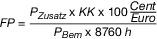

# Gesetz für den Ausbau erneuerbarer Energien (EEG 2014)

Ausfertigungsdatum
:   2014-07-21

Fundstelle
:   BGBl I: 2014, 1066

Zuletzt geändert durch
:   Art. 6 G v. 8.8.2020 I 1818

Änderung durch
:   Art. 1 G v. 21.12.2020 I 3138 (Nr. 65) textlich nachgewiesen, dokumentarisch noch nicht abschließend bearbeitet

Mittelbare änderung durch
:   Art. 21 Nr. 2 u. 3 G v. 21.12.2020 I 3138 (Nr. 65) textlich nachgewiesen, dokumentarisch noch nicht abschließend bearbeitet

Änderung durch
:   Art. 11 G v. 16.7.2021 I 3026 (Nr. 47) textlich nachgewiesen, dokumentarisch noch nicht abschließend bearbeitet

## Teil 1 - Allgemeine Bestimmungen

### § 1 Zweck und Ziel des Gesetzes

(1) Zweck dieses Gesetzes ist es, insbesondere im Interesse des Klima-
und Umweltschutzes eine nachhaltige Entwicklung der Energieversorgung
zu ermöglichen, die volkswirtschaftlichen Kosten der Energieversorgung
auch durch die Einbeziehung langfristiger externer Effekte zu
verringern, fossile Energieressourcen zu schonen und die
Weiterentwicklung von Technologien zur Erzeugung von Strom aus
erneuerbaren Energien zu fördern.

(2) Ziel dieses Gesetzes ist es, den Anteil des aus erneuerbaren
Energien erzeugten Stroms am Bruttostromverbrauch auf 65 Prozent im
Jahr 2030 zu steigern.

(3) Ziel dieses Gesetzes ist es ferner, dass vor dem Jahr 2050 der
gesamte Strom, der im Staatsgebiet der Bundesrepublik Deutschland
einschließlich der deutschen ausschließlichen Wirtschaftszone
(Bundesgebiet) erzeugt oder verbraucht wird, treibhausgasneutral
erzeugt wird.

(4) Der für die Erreichung der Ziele nach den Absätzen 2 und 3
erforderliche Ausbau der erneuerbaren Energien soll stetig,
kosteneffizient und netzverträglich erfolgen.

### § 2 Grundsätze des Gesetzes

(1) Strom aus erneuerbaren Energien und aus Grubengas soll in das
Elektrizitätsversorgungssystem integriert werden.

(2) Strom aus erneuerbaren Energien und aus Grubengas soll zum Zweck
der Marktintegration direkt vermarktet werden.

(3) Die Höhe der Zahlungen für Strom aus erneuerbaren Energien soll
durch Ausschreibungen ermittelt werden. Dabei soll die Akteursvielfalt
bei der Stromerzeugung aus erneuerbaren Energien erhalten bleiben.

(4) Die Kosten für Strom aus erneuerbaren Energien und aus Grubengas
sollen gering gehalten und unter Einbeziehung des Verursacherprinzips
sowie gesamtwirtschaftlicher und energiewirtschaftlicher Aspekte
angemessen verteilt werden.

### § 3 Begriffsbestimmungen

Im Sinn dieses Gesetzes ist oder sind

1.  „Anlage“ jede Einrichtung zur Erzeugung von Strom aus erneuerbaren
    Energien oder aus Grubengas, wobei im Fall von Solaranlagen jedes
    Modul eine eigenständige Anlage ist; als Anlage gelten auch
    Einrichtungen, die zwischengespeicherte Energie, die ausschließlich
    aus erneuerbaren Energien oder Grubengas stammt, aufnehmen und in
    elektrische Energie umwandeln,

2.  „Anlagenbetreiber“, wer unabhängig vom Eigentum die Anlage für die
    Erzeugung von Strom aus erneuerbaren Energien oder aus Grubengas
    nutzt,

3.  „anzulegender Wert“ der Wert, den die Bundesnetzagentur für
    Elektrizität, Gas, Telekommunikation, Post und Eisenbahnen
    (Bundesnetzagentur) im Rahmen einer Ausschreibung nach § 22 in
    Verbindung mit den §§ 28 bis 39n ermittelt oder der durch die §§ 40
    bis 49 gesetzlich bestimmt ist und der die Grundlage für die
    Berechnung der Marktprämie, der Einspeisevergütung oder des
    Mieterstromzuschlags ist,

3a. „ausgeförderte Anlagen“ Anlagen, die vor dem 1. Januar 2021 in Betrieb
    genommen worden sind und bei denen der ursprüngliche Anspruch auf
    Zahlung nach der für die Anlage maßgeblichen Fassung des Erneuerbare-
    Energien-Gesetzes beendet ist; mehrere ausgeförderte Anlagen sind zur
    Bestimmung der Größe nach den Bestimmungen dieses Gesetzes zu
    ausgeförderten Anlagen als eine Anlage anzusehen, wenn sie nach der
    für sie maßgeblichen Fassung des Erneuerbare-Energien-Gesetzes zum
    Zweck der Ermittlung des Anspruchs auf Zahlung als eine Anlage galten,

4.  „Ausschreibung“ ein transparentes, diskriminierungsfreies und
    wettbewerbliches Verfahren zur Bestimmung des Anspruchsberechtigten
    und des anzulegenden Werts,

4a. „Ausschreibungen für Solaranlagen des ersten Segments“
    Ausschreibungen, bei denen Gebote für Freiflächenanlagen und für
    Solaranlagen abgegeben werden können, die auf, an oder in baulichen
    Anlagen errichtet werden sollen, die weder Gebäude noch
    Lärmschutzwände sind,

4b. „Ausschreibungen für Solaranlagen des zweiten Segments“
    Ausschreibungen, bei denen Gebote für Solaranlagen abgegeben werden
    können, die auf, an oder in einem Gebäude oder einer Lärmschutzwand
    errichtet werden sollen,

5.  „Ausschreibungsvolumen“ die Summe der zu installierenden Leistung, für
    die der Anspruch auf Zahlung einer Marktprämie zu einem Gebotstermin
    ausgeschrieben wird,

6.  „Bemessungsleistung“ der Quotient aus der Summe der in dem jeweiligen
    Kalenderjahr erzeugten Kilowattstunden und der Summe der vollen
    Zeitstunden des jeweiligen Kalenderjahres abzüglich der vollen Stunden
    vor der erstmaligen Erzeugung von Strom aus erneuerbaren Energien oder
    aus Grubengas durch eine Anlage und nach endgültiger Stilllegung
    dieser Anlage,

7.  „benachteiligtes Gebiet“ ein Gebiet im Sinn der Richtlinie 86/465/EWG
    des Rates vom 14. Juli 1986 betreffend das Gemeinschaftsverzeichnis
    der benachteiligten landwirtschaftlichen Gebiete im Sinne der
    Richtlinie 75/268/EWG (Deutschland) (ABl. L 273 vom 24.9.1986, S. 1),
    in der Fassung der Entscheidung 97/172/EG (ABl. L 72 vom 13.3.1997, S.
    1),

8.  „bezuschlagtes Gebot“ ein Gebot, für das ein Zuschlag erteilt worden
    ist,

9.  „Bilanzkreis“ ein Bilanzkreis nach § 3 Nummer 10a des
    Energiewirtschaftsgesetzes,

10. „Bilanzkreisvertrag“ ein Vertrag nach § 26 Absatz 1 der
    Stromnetzzugangsverordnung,

11. „Biogas“ jedes Gas, das durch anaerobe Vergärung von Biomasse gewonnen
    wird,

12. „Biomasseanlage“ jede Anlage zur Erzeugung von Strom aus Biomasse,

13. „Biomethan“ jedes Biogas oder sonstige gasförmige Biomasse, das oder
    die aufbereitet und in das Erdgasnetz eingespeist worden ist,

14. „Brutto-Zubau“ die Summe der installierten Leistung aller Anlagen
    eines Energieträgers, die in einem bestimmten Zeitraum an das Register
    als in Betrieb genommen gemeldet worden sind,

15. „Bürgerenergiegesellschaft“ jede Gesellschaft,

    a)  die aus mindestens zehn natürlichen Personen als stimmberechtigten
        Mitgliedern oder stimmberechtigten Anteilseignern besteht,

    b)  bei der mindestens 51 Prozent der Stimmrechte bei natürlichen Personen
        liegen, die seit mindestens einem Jahr vor der Gebotsabgabe in der
        kreisfreien Stadt oder dem Landkreis, in der oder dem die geplante
        Windenergieanlage an Land errichtet werden soll, nach § 21 oder § 22
        des Bundesmeldegesetzes mit ihrem Hauptwohnsitz gemeldet sind, und

    c)  bei der kein Mitglied oder Anteilseigner der Gesellschaft mehr als 10
        Prozent der Stimmrechte an der Gesellschaft hält,

    wobei es beim Zusammenschluss von mehreren juristischen Personen oder
    Personengesellschaften zu einer Gesellschaft ausreicht, wenn jedes der
    Mitglieder der Gesellschaft die Voraussetzungen nach den Buchstaben a
    bis c erfüllt,

16. „Direktvermarktung“ die Veräußerung von Strom aus erneuerbaren
    Energien oder aus Grubengas an Dritte, es sei denn, der Strom wird in
    unmittelbarer räumlicher Nähe zur Anlage verbraucht und nicht durch
    ein Netz durchgeleitet,

17. „Direktvermarktungsunternehmer“, wer von dem Anlagenbetreiber mit der
    Direktvermarktung von Strom aus erneuerbaren Energien oder aus
    Grubengas beauftragt ist oder Strom aus erneuerbaren Energien oder aus
    Grubengas kaufmännisch abnimmt, ohne insoweit Letztverbraucher dieses
    Stroms oder Netzbetreiber zu sein,

18.[^f794982_01_BJNR106610014BJNE000406123]
 „Energie- oder Umweltmanagementsystem“ ein System, das den
    Anforderungen der DIN EN ISO 50 001, Ausgabe November 2018
    entspricht, oder ein System im Sinn der Verordnung (EG) Nr. 1221/2009
    des Europäischen Parlaments und des Rates vom 25. November 2009 über
    die freiwillige Teilnahme von Organisationen an einem
    Gemeinschaftssystem für Umweltmanagement und Umweltbetriebsprüfung und
    zur Aufhebung der Verordnung (EG) Nr. 761/2001, sowie der Beschlüsse
    der Kommission 2001/681/EG und 2006/193/EG (ABl. L 342 vom 22.12.2009,
    S. 1) in der jeweils geltenden Fassung,

19. „Eigenversorgung“ der Verbrauch von Strom, den eine natürliche oder
    juristische Person im unmittelbaren räumlichen Zusammenhang mit der
    Stromerzeugungsanlage selbst verbraucht, wenn der Strom nicht durch
    ein Netz durchgeleitet wird und diese Person die Stromerzeugungsanlage
    selbst betreibt,

20. „Elektrizitätsversorgungsunternehmen“ jede natürliche oder juristische
    Person, die Elektrizität an Letztverbraucher liefert,

21. „erneuerbare Energien“

    a)  Wasserkraft einschließlich der Wellen-, Gezeiten-, Salzgradienten- und
        Strömungsenergie,

    b)  Windenergie,

    c)  solare Strahlungsenergie,

    d)  Geothermie,

    e)  Energie aus Biomasse einschließlich Biogas, Biomethan, Deponiegas und
        Klärgas sowie aus dem biologisch abbaubaren Anteil von Abfällen aus
        Haushalten und Industrie,

22. „Freiflächenanlage“ jede Solaranlage, die nicht auf, an oder in einem
    Gebäude oder einer sonstigen baulichen Anlage angebracht ist, die
    vorrangig zu anderen Zwecken als der Erzeugung von Strom aus solarer
    Strahlungsenergie errichtet worden ist,

23. „Gebäude“ jede selbständig benutzbare, überdeckte bauliche Anlage, die
    von Menschen betreten werden kann und vorrangig dazu bestimmt ist, dem
    Schutz von Menschen, Tieren oder Sachen zu dienen,

24. „Gebotsmenge“ die zu installierende Leistung in Kilowatt, für die der
    Bieter ein Gebot abgegeben hat,

25. „Gebotstermin“ der Kalendertag, an dem die Frist für die Abgabe von
    Geboten für eine Ausschreibung abläuft,

26. „Gebotswert“ der anzulegende Wert, den der Bieter in seinem Gebot
    angegeben hat,

27. „Generator“ jede technische Einrichtung, die mechanische, chemische,
    thermische oder elektromagnetische Energie direkt in elektrische
    Energie umwandelt,

28. „Gülle“ jeder Stoff, der Gülle ist im Sinn der Verordnung (EG) Nr.
    1069/2009 des Europäischen Parlaments und des Rates vom 21. Oktober
    2009 mit Hygienevorschriften für nicht für den menschlichen Verzehr
    bestimmte tierische Nebenprodukte und zur Aufhebung der Verordnung
    (EG) Nr. 1774/2002 (Verordnung über tierische Nebenprodukte) (ABl. L
    300 vom 14.11.2009, S. 1), die durch die Verordnung (EU) Nr. 1385/2013
    (ABl. L 354 vom 28.12.2013, S. 86) geändert worden ist,

29. „Herkunftsnachweis“ ein elektronisches Dokument, das ausschließlich
    dazu dient, gegenüber einem Letztverbraucher im Rahmen der
    Stromkennzeichnung nach § 42 Absatz 1 Nummer 1 des
    Energiewirtschaftsgesetzes nachzuweisen, dass ein bestimmter Anteil
    oder eine bestimmte Menge des Stroms aus erneuerbaren Energien erzeugt
    wurde,

29a. „hocheffiziente KWK-Anlage“ eine KWK-Anlage, die den Vorgaben der
    Richtlinie 2012/27/EU des Europäischen Parlaments und des Rates vom
    25\. Oktober 2012 zur Energieeffizienz, zur Änderung der Richtlinien
    2009/125/EG und 2010/30/EU und zur Aufhebung der Richtlinien 2004/8/EG
    und 2006/32/EG (ABl. L 315 vom 14.11.2012, S. 1), die zuletzt durch
    die Richtlinie (EU) 2019/944 (ABl. L 158 vom 14.6.2019, S. 125)
    geändert worden ist, in der jeweils geltenden Fassung entspricht,

30. „Inbetriebnahme“ die erstmalige Inbetriebsetzung der Anlage
    ausschließlich mit erneuerbaren Energien oder Grubengas nach
    Herstellung der technischen Betriebsbereitschaft der Anlage; die
    technische Betriebsbereitschaft setzt voraus, dass die Anlage fest an
    dem für den dauerhaften Betrieb vorgesehenen Ort und dauerhaft mit dem
    für die Erzeugung von Wechselstrom erforderlichen Zubehör installiert
    wurde; der Austausch des Generators oder sonstiger technischer oder
    baulicher Teile nach der erstmaligen Inbetriebnahme führt nicht zu
    einer Änderung des Zeitpunkts der Inbetriebnahme,

31. „installierte Leistung“ die elektrische Wirkleistung, die eine Anlage
    bei bestimmungsgemäßem Betrieb ohne zeitliche Einschränkungen
    unbeschadet kurzfristiger geringfügiger Abweichungen technisch
    erbringen kann,

32. „KWK-Anlage“ jede KWK-Anlage im Sinn von § 2 Nummer 14 des Kraft-
    Wärme-Kopplungsgesetzes,

33. „Letztverbraucher“ jede natürliche oder juristische Person, die Strom
    verbraucht,

34. „Marktwert“ der für die Berechnung der Höhe der Marktprämie für den
    Strom aus einer Anlage nach Anlage 1 Nummer 2 maßgebliche Wert:

    a)  der energieträgerspezifische Marktwert von Strom aus erneuerbaren
        Energien oder aus Grubengas, der sich nach Anlage 1 Nummer 3 aus dem
        tatsächlichen Monatsmittelwert des Spotmarktpreises bezogen auf einen
        Kalendermonat ergibt (Monatsmarktwert), oder

    b)  der energieträgerspezifische Marktwert von Strom aus erneuerbaren
        Energien oder aus Grubengas, der sich nach Anlage 1 Nummer 4 aus dem
        tatsächlichen Jahresmittelwert des Spotmarktpreises bezogen auf ein
        Kalenderjahr ergibt (Jahresmarktwert),

    soweit der Marktwert maßgeblich ist für Strom, der in einer
    Veräußerungsform einer Einspeisevergütung veräußert wird, ist
    „Marktwert“ der Wert, der maßgeblich wäre, wenn dieser Strom direkt
    vermarktet würde,

35. „Netz“ die Gesamtheit der miteinander verbundenen technischen
    Einrichtungen zur Abnahme, Übertragung und Verteilung von Elektrizität
    für die allgemeine Versorgung,

36. „Netzbetreiber“ jeder Betreiber eines Netzes für die allgemeine
    Versorgung mit Elektrizität, unabhängig von der Spannungsebene,

37. „Pilotwindenergieanlagen an Land“

    a)  die jeweils ersten zwei als Pilotwindenergieanlagen an Land an das
        Register gemeldeten Windenergieanlagen eines Typs an Land, die
        nachweislich

        aa) jeweils eine installierte Leistung von 6 Megawatt nicht überschreiten,

        bb) wesentliche technische Weiterentwicklungen oder Neuerungen
            insbesondere bei der Generatorleistung, dem Rotordurchmesser, der
            Nabenhöhe, dem Turmtypen oder der Gründungsstruktur aufweisen und

        cc) einer Typenprüfung oder einer Einheitenzertifizierung bedürfen, die
            zum Zeitpunkt der Inbetriebnahme noch nicht erteilt ist und erst nach
            der Inbetriebnahme einer Anlage erteilt werden kann, oder

    b)  die als Pilotwindenergieanlagen an Land an das Register gemeldeten
        Windenergieanlagen an Land,

        aa) die vorwiegend zu Zwecken der Forschung und Entwicklung errichtet
            werden und

        bb) mit denen eine wesentliche, weit über den Stand der Technik
            hinausgehende Innovation erprobt wird; die Innovation kann
            insbesondere die Generatorleistung, den Rotordurchmesser, die
            Nabenhöhe, den Turmtypen, die Gründungsstruktur oder die
            Betriebsführung der Anlage betreffen,

38. „Regionalnachweis“ ein elektronisches Dokument, das ausschließlich
    dazu dient, im Rahmen der Stromkennzeichnung nach § 42 des
    Energiewirtschaftsgesetzes gegenüber einem Letztverbraucher die
    regionale Herkunft eines bestimmten Anteils oder einer bestimmten
    Menge des verbrauchten Stroms aus erneuerbaren Energien nachzuweisen,

39. „Register“ das Marktstammdatenregister nach § 111e des
    Energiewirtschaftsgesetzes,

40. „Schienenbahn“ jedes Unternehmen, das zum Zweck des Personen- oder
    Güterverkehrs Fahrzeuge wie Eisenbahnen, Magnetschwebebahnen,
    Straßenbahnen oder nach ihrer Bau- und Betriebsweise ähnliche Bahnen
    auf Schienen oder die für den Betrieb dieser Fahrzeuge erforderlichen
    Infrastrukturanlagen betreibt,

41. „Solaranlage“ jede Anlage zur Erzeugung von Strom aus solarer
    Strahlungsenergie,

41a. „Solaranlage des ersten Segments“ jede Solaranlage, für die ein Gebot
    in einer Ausschreibung nach Nummer 4a abgegeben werden kann,

41b. „Solaranlage des zweiten Segments“ jede Solaranlage, für die ein Gebot
    in einer Ausschreibung nach Nummer 4b abgegeben werden kann,

42. „Speichergas“ jedes Gas, das keine erneuerbare Energie ist, aber zum
    Zweck der Zwischenspeicherung von Strom aus erneuerbaren Energien
    ausschließlich unter Einsatz von Strom aus erneuerbaren Energien
    erzeugt wird,

42a. „Spotmarktpreis“ der Strompreis in Cent pro Kilowattstunde, der sich
    in der Preiszone für Deutschland aus der Kopplung der Orderbücher
    aller Strombörsen in der vortägigen Auktion von Stromstundenkontrakten
    ergibt; wenn die Kopplung der Orderbücher aller Strombörsen nicht oder
    nur teilweise erfolgt, ist für die Dauer der unvollständigen Kopplung
    der Durchschnittspreis aller Strombörsen gewichtet nach dem jeweiligen
    Handelsvolumen zugrunde zu legen,

43. „Strom aus Kraft-Wärme-Kopplung“ KWK-Strom im Sinn von § 2 Nummer 16
    des Kraft-Wärme-Kopplungsgesetzes,

43a. „Strombörse“ eine Börse, an der für die Preiszone für Deutschland
    Stromprodukte gehandelt werden können,

43b. „Stromerzeugungsanlage“ jede technische Einrichtung, die unabhängig
    vom eingesetzten Energieträger direkt Strom erzeugt, wobei im Fall von
    Solaranlagen jedes Modul eine eigenständige Stromerzeugungsanlage ist,

43c. „Südregion“ das Gebiet, das die Gebietskörperschaften umfasst, die in
    Anlage 5 aufgeführt sind,

44. „Übertragungsnetzbetreiber“ der regelverantwortliche Netzbetreiber von
    Hoch- und Höchstspannungsnetzen, die der überregionalen Übertragung
    von Elektrizität zu anderen Netzen dienen,

44a. „umlagepflichtige Strommengen“ Strommengen, für die nach § 60 oder §
    61 die volle oder anteilige EEG-Umlage gezahlt werden muss; nicht
    umlagepflichtig sind Strommengen, wenn und solange die Pflicht zur
    Zahlung der EEG-Umlage entfällt oder sich auf null Prozent verringert,

45. „Umwandlung“ jede Umwandlung von Unternehmen nach dem
    Umwandlungsgesetz oder jede Anwachsung im Sinn des § 738 des
    Bürgerlichen Gesetzbuches sowie jede Übertragung von Wirtschaftsgütern
    eines Unternehmens oder selbständigen Unternehmensteils im Weg der
    Singularsukzession, bei der jeweils die wirtschaftliche und
    organisatorische Einheit des Unternehmens oder selbständigen
    Unternehmensteils nach der Übertragung nahezu vollständig erhalten
    bleibt,

46. „Umweltgutachter“ jede Person oder Organisation, die nach dem
    Umweltauditgesetz in der jeweils geltenden Fassung als Umweltgutachter
    oder Umweltgutachterorganisation tätig werden darf,

47. „Unternehmen“ jeder Rechtsträger, der einen nach Art und Umfang in
    kaufmännischer Weise eingerichteten Geschäftsbetrieb unter Beteiligung
    am allgemeinen wirtschaftlichen Verkehr nachhaltig mit eigener
    Gewinnerzielungsabsicht betreibt,

47a. „Vollbenutzungsstunden zur Eigenversorgung“ der Quotient aus der
    kalenderjährlichen Stromerzeugung in Kilowattstunden zur
    Eigenversorgung und der installierten Leistung der KWK-Anlage in
    Kilowatt in entsprechender Anwendung von Nummer 31,

48. „Windenergieanlage an Land“ jede Anlage zur Erzeugung von Strom aus
    Windenergie, die keine Windenergieanlage auf See ist,

49. „Windenergieanlage auf See“ jede Anlage im Sinn von § 3 Nummer 11 des
    Windenergie-auf-See-Gesetzes,

50. „Wohngebäude“ jedes Gebäude, das nach seiner Zweckbestimmung
    überwiegend dem Wohnen dient, einschließlich Wohn-, Alten- und
    Pflegeheimen sowie ähnlichen Einrichtungen,

50a. „Zuschlag“ der Verwaltungsakt, mit dem die Bundesnetzagentur ein Gebot
    in einem Ausschreibungsverfahren bezuschlagt,

51. „Zuschlagswert“ der anzulegende Wert, zu dem ein Zuschlag in einer
    Ausschreibung erteilt wird; er entspricht dem Gebotswert, soweit sich
    aus den nachfolgenden Bestimmungen nichts anderes ergibt.

    Amtlicher Hinweis: Zu beziehen bei der Beuth Verlag GmbH, 10772
    Berlin, und in der Deutschen Nationalbibliothek archivmäßig gesichert
    niedergelegt.
[^f794982_01_BJNR106610014BJNE000406123]: 

### § 4 Ausbaupfad

Das Ziel nach § 1 Absatz 2 soll erreicht werden durch

1.  eine Steigerung der installierten Leistung von Windenergieanlagen an
    Land auf

    a)  57 Gigawatt im Jahr 2022,

    b)  62 Gigawatt im Jahr 2024,

    c)  65 Gigawatt im Jahr 2026,

    d)  68 Gigawatt im Jahr 2028 und

    e)  71 Gigawatt im Jahr 2030,

2.  eine Steigerung der installierten Leistung von Windenergieanlagen auf
    See nach Maßgabe des Windenergie-auf-See-Gesetzes,

3.  eine Steigerung der installierten Leistung von Solaranlagen auf

    a)  63 Gigawatt im Jahr 2022,

    b)  73 Gigawatt im Jahr 2024,

    c)  83 Gigawatt im Jahr 2026,

    d)  95 Gigawatt im Jahr 2028 und

    e)  100 Gigawatt im Jahr 2030 und

4.  eine installierte Leistung von Biomasseanlagen von 8 400 Megawatt im
    Jahr 2030.

### § 4a Strommengenpfad

Um überprüfen zu können, ob die erneuerbaren Energien in der für die
Erreichung des Ziels nach § 1 Absatz 2 erforderlichen Geschwindigkeit
ausgebaut werden, werden folgende Zwischenziele für die Stromerzeugung
aus erneuerbaren Energien festgelegt:

1.  259 Terawattstunden im Jahr 2021,

2.  269 Terawattstunden im Jahr 2022,

3.  281 Terawattstunden im Jahr 2023,

4.  295 Terawattstunden im Jahr 2024,

5.  308 Terawattstunden im Jahr 2025,

6.  318 Terawattstunden im Jahr 2026,

7.  330 Terawattstunden im Jahr 2027,

8.  350 Terawattstunden im Jahr 2028 und

9.  376 Terawattstunden im Jahr 2029.

### § 5 Ausbau im In- und Ausland

(1) Soweit sich dieses Gesetz auf Anlagen bezieht, ist es anzuwenden,
wenn und soweit die Erzeugung des Stroms im Bundesgebiet erfolgt.

(2) Soweit die Zahlungen für Strom aus erneuerbaren Energien durch
Ausschreibungen ermittelt werden, sollen auch Gebote für Anlagen im
Staatsgebiet eines anderen Mitgliedstaates oder mehrerer anderer
Mitgliedstaaten der Europäischen Union im Umfang von 5 Prozent der
gesamten jährlich zu installierenden Leistung an Anlagen bezuschlagt
werden können. Der Umfang nach Satz 1 kann in dem Maß überschritten
werden, in dem Gebote für Windenenergieanlagen auf See bezuschlagt
werden sollen. Zu dem Zweck nach Satz 1 können die Ausschreibungen

1.  gemeinsam mit einem anderen Mitgliedstaat oder mehreren anderen
    Mitgliedstaaten der Europäischen Union durchgeführt werden oder

2.  für Anlagen im Staatsgebiet eines anderen Mitgliedstaates oder
    mehrerer anderer Mitgliedstaaten der Europäischen Union geöffnet
    werden.

Näheres zu den Ausschreibungsverfahren kann in einer Rechtsverordnung
nach § 88a geregelt werden.

(3) Ausschreibungen nach Absatz 2 Satz 3 sind nur zulässig, wenn

1.  sie mit den beteiligten Mitgliedstaaten der Europäischen Union
    völkerrechtlich vereinbart worden sind und diese völkerrechtliche
    Vereinbarung Instrumente der Kooperationsmaßnahmen im Sinn der Artikel
    5, 8 bis 10 oder 13 der Richtlinie (EU) 2018/2001 des Europäischen
    Parlaments und des Rates zur Förderung der Nutzung von Energie aus
    erneuerbaren Quellen vom 11. Dezember 2018 (ABl. L 328 vom 21.12.2018,
    S. 82), die durch die Delegierte Verordnung (EU) 2019/807 (ABl. L 133
    vom 21.5.2019, S. 1) vervollständigt worden ist, zur Förderung der
    Nutzung von Energie aus erneuerbaren Quellen nutzt,

2.  sie nach dem Prinzip der Gegenseitigkeit

    a)  als gemeinsame Ausschreibungen durchgeführt werden oder

    b)  für einen oder mehrere andere Mitgliedstaaten der Europäischen Union
        geöffnet werden und die anderen Mitgliedstaaten in einem
        vergleichbaren Umfang ihre Ausschreibungen für Anlagen im Bundesgebiet
        öffnen und

3.  der Strom physikalisch importiert wird oder einen vergleichbaren
    Effekt auf den deutschen Strommarkt hat.

Satz 1 Nummer 2 ist nicht auf Ausschreibungen für Windenergieanlagen
auf See anzuwenden.

(4) Durch die völkerrechtliche Vereinbarung nach Absatz 3 Satz 1
Nummer 1 kann dieses Gesetz aufgrund einer Rechtsverordnung nach § 88a
abweichend von Absatz 1

1.  ganz oder teilweise als anwendbar erklärt werden für Anlagen, die
    außerhalb des Bundesgebiets errichtet werden, oder

2.  als nicht anwendbar erklärt werden für Anlagen, die innerhalb des
    Bundesgebiets errichtet werden.

Ohne eine entsprechende völkerrechtliche Vereinbarung dürfen weder
Anlagen außerhalb des Bundesgebiets Zahlungen nach diesem Gesetz
erhalten noch Anlagen im Bundesgebiet Zahlungen nach dem Fördersystem
eines anderen Mitgliedstaats der Europäischen Union erhalten.

(5) Auf das Ziel nach § 1 Absatz 2, den nationalen Beitrag zum
Gesamtziel der Europäischen Union im Jahr 2030 nach Artikel 3 Absatz 2
der Richtlinie (EU) 2018/2001 sowie den nationalen Anteil an Energie
aus erneuerbaren Quellen am Bruttoendenergieverbrauch nach Artikel 32
Absatz 4 der Verordnung (EU) 2018/1999 des Europäischen Parlaments und
des Rates vom 11. Dezember 2018 über das Governance-System für die
Energieunion und für den Klimaschutz zur Änderung der Verordnungen
(EG) Nr. 663/2009 und (EG) Nr. 715/2009 des Europäischen Parlaments
und des Rates, der Richtlinien 94/22/EG, 98/70/EG, 2009/31/EG,
2009/73/EG, 2010/31/EU, 2012/27/EU und 2013/30/EU des Europäischen
Parlaments und des Rates, der Richtlinien 2009/119/EG und (EU)
2015/652 des Rates und zur Aufhebung der Verordnung (EU) Nr. 525/2013
des Europäischen Parlaments und des Rates (ABl. L 328 vom 21.12.2018,
S. 1), die zuletzt durch die Delegierte Verordnung (EU) 2020/1044
(ABl. L 230 vom 17.7.2020, S. 1) vervollständigt worden ist, werden
alle Anlagen nach den Absätzen 1 und 2 und der in ihnen erzeugte Strom
angerechnet; dies ist für die Anlagen nach Absatz 2 nur nach Maßgabe
der völkerrechtlichen Vereinbarung anzuwenden und für Anlagen nach
Absatz 1 nicht anzuwenden, sofern und soweit die Zahlungen nach dem
Fördersystem eines anderen Mitgliedstaates der Europäischen Union
geleistet werden und eine völkerrechtliche Vereinbarung eine
Anrechnung auf die Ziele dieses Mitgliedstaates regelt.

(6) Anlagen im Bundesgebiet dürfen nur in einem Umfang von bis zu 5
Prozent der jährlich in Deutschland zu installierenden Leistung und
unter Einhaltung der Anforderungen nach Absatz 3 auf die Ziele eines
anderen Mitgliedstaats der Europäischen Union angerechnet werden. Für
Windenenergieanlagen auf See ist Absatz 2 Satz 2 entsprechend
anzuwenden.

### § 6 Finanzielle Beteiligung der Kommunen am Ausbau

(1) Folgende Anlagenbetreiber dürfen den Gemeinden, die von der
Errichtung ihrer Anlage betroffen sind, Beträge durch einseitige
Zuwendungen ohne Gegenleistung anbieten:

1.  Betreiber von Windenergieanlagen an Land nach Maßgabe von Absatz 2 und

2.  Betreiber von Freiflächenanlagen nach Maßgabe von Absatz 3.

(2) Bei Windenergieanlagen an Land dürfen den betroffenen Gemeinden
Beträge von insgesamt 0,2 Cent pro Kilowattstunde für die tatsächlich
eingespeiste Strommenge und für die fiktive Strommenge nach Nummer 7.2
der Anlage 2 angeboten werden, wenn die Anlage eine installierte
Leistung von mehr als 750 Kilowatt hat und für die Anlage eine
finanzielle Förderung nach diesem Gesetz oder einer auf Grund dieses
Gesetzes erlassenen Rechtsverordnung in Anspruch genommen wird. Als
betroffen gelten Gemeinden, deren Gemeindegebiet sich zumindest
teilweise innerhalb eines um die Windenergieanlage gelegenen Umkreises
von 2 500 Metern um die Turmmitte der Windenergieanlage befindet.
Befinden sich in diesem Umkreis Gebiete, die keiner Gemeinde zugehörig
sind (gemeindefreie Gebiete), gilt für diese Gebiete der nach
Landesrecht jeweils zuständige Landkreis als betroffen. Sind mehrere
Gemeinden oder Landkreise betroffen, ist die Höhe der angebotenen
Zahlung pro Gemeinde oder Landkreis anhand des Anteils ihres
jeweiligen Gemeindegebiets oder des jeweiligen gemeindefreien Gebiets
an der Fläche des Umkreises aufzuteilen, so dass insgesamt höchstens
der Betrag nach Satz 1 angeboten wird.

(3) Bei Freiflächenanlagen dürfen den betroffenen Gemeinden Beträge
von insgesamt 0,2 Cent pro Kilowattstunde für die tatsächlich
eingespeiste Strommenge angeboten werden. Als betroffen gelten
Gemeinden, auf deren Gemeindegebiet sich die Freiflächenanlagen
befinden. Befinden sich die Freiflächenanlagen auf gemeindefreien
Gebieten, gilt für diese Gebiete der nach Landesrecht jeweils
zuständige Landkreis als betroffen. Im Übrigen ist Absatz 2 Satz 4
entsprechend anzuwenden.

(4) Vereinbarungen über Zuwendungen nach diesem Paragrafen bedürfen
der Schriftform und dürfen bereits geschlossen werden

1.  vor der Genehmigung der Windenergieanlage nach dem Bundes-
    Immissionsschutzgesetz oder

2.  vor der Genehmigung der Freiflächenanlage, jedoch nicht vor dem
    Beschluss des Bebauungsplans für die Fläche zur Errichtung der
    Freiflächenanlage.

Die Vereinbarungen gelten nicht als Vorteil im Sinn der §§ 331 bis 334
des Strafgesetzbuchs. Satz 2 ist auch für Angebote zum Abschluss einer
solchen Vereinbarung und für die darauf beruhenden Zuwendungen
anzuwenden.

(5) Wenn Betreiber von Windenergieanlagen an Land oder
Freiflächenanlagen eine finanzielle Förderung nach diesem Gesetz oder
einer auf Grund dieses Gesetzes erlassenen Rechtsverordnung in
Anspruch nehmen und Zahlungen nach diesem Paragrafen leisten, können
sie die Erstattung des im Vorjahr geleisteten Betrages im Rahmen der
Endabrechnung vom Netzbetreiber verlangen.

### § 7 Gesetzliches Schuldverhältnis

(1) Netzbetreiber dürfen die Erfüllung ihrer Pflichten nach diesem
Gesetz nicht vom Abschluss eines Vertrages abhängig machen.

(2) Von den Bestimmungen dieses Gesetzes abweichende vertragliche
Regelungen

1.  müssen klar und verständlich sein,

2.  dürfen keinen Vertragspartner unangemessen benachteiligen,

3.  dürfen nicht zu höheren als im Teil 3 vorgesehenen Zahlungen führen
    und

4.  müssen mit dem wesentlichen Grundgedanken der gesetzlichen Regelung,
    von der abgewichen wird, vereinbar sein.

## Teil 2 - Anschluss, Abnahme, Übertragung und Verteilung

### Abschnitt 1 - Allgemeine Bestimmungen

#### § 8 Anschluss

(1) Netzbetreiber müssen Anlagen zur Erzeugung von Strom aus
erneuerbaren Energien und aus Grubengas unverzüglich vorrangig an der
Stelle an ihr Netz anschließen, die im Hinblick auf die Spannungsebene
geeignet ist und die in der Luftlinie kürzeste Entfernung zum Standort
der Anlage aufweist, wenn nicht dieses oder ein anderes Netz einen
technisch und wirtschaftlich günstigeren Verknüpfungspunkt aufweist;
bei der Prüfung des wirtschaftlich günstigeren Verknüpfungspunkts sind
die unmittelbar durch den Netzanschluss entstehenden Kosten zu
berücksichtigen. Bei einer oder mehreren Anlagen mit einer
installierten Leistung von insgesamt höchstens 30 Kilowatt, die sich
auf einem Grundstück mit bereits bestehendem Netzanschluss befinden,
gilt der Verknüpfungspunkt des Grundstücks mit dem Netz als
günstigster Verknüpfungspunkt.

(2) Anlagenbetreiber dürfen einen anderen Verknüpfungspunkt dieses
oder eines anderen im Hinblick auf die Spannungsebene geeigneten
Netzes wählen, es sei denn, die daraus resultierenden Mehrkosten des
Netzbetreibers sind nicht unerheblich.

(3) Der Netzbetreiber darf abweichend von den Absätzen 1 und 2 der
Anlage einen anderen Verknüpfungspunkt zuweisen, es sei denn, die
Abnahme des Stroms aus der betroffenen Anlage nach § 11 Absatz 1 wäre
an diesem Verknüpfungspunkt nicht sichergestellt.

(4) Die Pflicht zum Netzanschluss besteht auch dann, wenn die Abnahme
des Stroms erst durch die Optimierung, die Verstärkung oder den Ausbau
des Netzes nach § 12 möglich wird.

(5) Netzbetreiber müssen Anschlussbegehrenden nach Eingang eines
Netzanschlussbegehrens unverzüglich einen genauen Zeitplan für die
Bearbeitung des Netzanschlussbegehrens übermitteln. In diesem Zeitplan
ist anzugeben,

1.  in welchen Arbeitsschritten das Netzanschlussbegehren bearbeitet wird
    und

2.  welche Informationen die Anschlussbegehrenden aus ihrem
    Verantwortungsbereich den Netzbetreibern übermitteln müssen, damit die
    Netzbetreiber den Verknüpfungspunkt ermitteln oder ihre Planungen nach
    § 12 durchführen können.

Übermitteln Netzbetreiber Anschlussbegehrenden im Fall von Anlagen mit
einer installierten Leistung von bis zu 10,8 Kilowatt den Zeitplan
nach Satz 1 nicht innerhalb von einem Monat nach Eingang des
Netzanschlussbegehrens, können die Anlagen angeschlossen werden.

(6) Netzbetreiber müssen Anschlussbegehrenden nach Eingang der
erforderlichen Informationen unverzüglich, spätestens aber innerhalb
von acht Wochen, Folgendes übermitteln:

1.  einen Zeitplan für die unverzügliche Herstellung des Netzanschlusses
    mit allen erforderlichen Arbeitsschritten,

2.  alle Informationen, die Anschlussbegehrende für die Prüfung des
    Verknüpfungspunktes benötigen, sowie auf Antrag die für eine
    Netzverträglichkeitsprüfung erforderlichen Netzdaten,

3.  einen nachvollziehbaren und detaillierten Voranschlag der Kosten, die
    den Anlagenbetreibern durch den Netzanschluss entstehen; dieser
    Kostenvoranschlag umfasst nur die Kosten, die durch die technische
    Herstellung des Netzanschlusses entstehen, und insbesondere nicht die
    Kosten für die Gestattung der Nutzung fremder Grundstücke für die
    Verlegung der Netzanschlussleitung,

4.  die zur Erfüllung der Pflichten nach § 9 Absatz 1 bis 2 erforderlichen
    Informationen.

Das Recht der Anlagenbetreiber nach § 10 Absatz 1 bleibt auch dann
unberührt, wenn der Netzbetreiber den Kostenvoranschlag nach Satz 1
Nummer 3 übermittelt hat.

#### § 9 Technische Vorgaben

(1) Vorbehaltlich abweichender Vorgaben einer Verordnung nach § 95
Nummer 2 müssen Betreiber von Anlagen und KWK-Anlagen mit einer
installierten Leistung von mehr als 25 Kilowatt und Betreiber von
Anlagen, die hinter einem Netzanschluss betrieben werden, hinter dem
auch mindestens eine steuerbare Verbrauchseinrichtung nach § 14a des
Energiewirtschaftsgesetzes betrieben wird, ab dem Zeitpunkt, zu dem
das Bundesamt für Sicherheit in der Informationstechnik die technische
Möglichkeit nach § 30 des Messstellenbetriebsgesetzes in Verbindung
mit § 84a Nummer 1 und 2 feststellt, ihre ab diesem Zeitpunkt in
Betrieb genommenen Anlagen mit technischen Einrichtungen ausstatten,
die notwendig sind, damit über ein Smart-Meter-Gateway nach § 2 Nummer
19 des Messstellenbetriebsgesetzes Netzbetreiber oder andere
Berechtigte jederzeit entsprechend der Vorgaben in Schutzprofilen und
Technischen Richtlinien nach dem Messstellenbetriebsgesetz

1.  die Ist-Einspeisung abrufen können und

2.  die Einspeiseleistung stufenweise oder, sobald die technische
    Möglichkeit besteht, stufenlos ferngesteuert regeln können.

(1a) Vorbehaltlich abweichender Vorgaben einer Verordnung nach § 95
Nummer 2 müssen Betreiber von Anlagen und KWK-Anlagen mit einer
installierten Leistung von mehr als 7 Kilowatt und höchstens 25
Kilowatt, die nicht hinter einem Netzanschluss betrieben werden,
hinter dem auch mindestens eine steuerbare Verbrauchseinrichtung nach
§ 14a des Energiewirtschaftsgesetzes betrieben wird, ab dem Zeitpunkt,
zu dem das Bundesamt für Sicherheit in der Informationstechnik die
technische Möglichkeit nach § 30 des Messstellenbetriebsgesetzes in
Verbindung mit § 84a Nummer 1 feststellt, ihre ab diesem Zeitpunkt in
Betrieb genommenen Anlagen mit technischen Einrichtungen ausstatten,
die notwendig sind, damit über ein Smart-Meter-Gateway nach § 2 Nummer
19 des Messstellenbetriebsgesetzes Netzbetreiber oder andere
Berechtigte jederzeit entsprechend der Vorgaben in Schutzprofilen und
Technischen Richtlinien nach dem Messstellenbetriebsgesetz die Ist-
Einspeisung abrufen können.

(1b) Ihre Verpflichtungen aus den Absätzen 1 und 1a können Betreiber
auch durch einen Dritten erfüllen lassen. Übernimmt die Ausstattung
der Anlage mit einem intelligenten Messsystem der nach dem
Messstellenbetriebsgesetz grundzuständige Messstellenbetreiber, genügt
die Beauftragung des grundzuständigen Messstellenbetreibers nach § 33
des Messstellenbetriebsgesetzes. Übernimmt die Ausstattung mit einem
intelligenten Messsystem ein Dritter als Messstellenbetreiber im Sinn
des Messstellenbetriebsgesetzes, genügt dessen Beauftragung.

(2) Bis zum Einbau eines intelligenten Messsystems und unbeschadet
weiterer Vorgaben im Zusammenhang mit steuerbaren
Verbrauchseinrichtungen nach § 14a des Energiewirtschaftsgesetzes
müssen Betreiber von

1.  Anlagen und KWK-Anlagen mit einer installierten Leistung von mehr als
    100 Kilowatt, die bis zu dem Zeitpunkt in Betrieb genommen werden, zu
    dem das Bundesamt für Sicherheit in der Informationstechnik die
    technische Möglichkeit nach § 30 des Messstellenbetriebsgesetzes in
    Verbindung mit § 84a Nummer 1 und 2 feststellt, ihre Anlagen mit
    technischen Einrichtungen ausstatten, mit denen der Netzbetreiber
    jederzeit die Ist-Einspeisung abrufen und die Einspeiseleistung ganz
    oder teilweise ferngesteuert reduzieren kann,

2.  Anlagen und KWK-Anlagen mit einer installierten Leistung von mehr als
    25 Kilowatt und höchstens 100 Kilowatt, die bis zu dem Zeitpunkt in
    Betrieb genommen werden, zu dem das Bundesamt für Sicherheit in der
    Informationstechnik die technische Möglichkeit nach § 30 des
    Messstellenbetriebsgesetzes in Verbindung mit § 84a Nummer 1 und 2
    feststellt, ihre Anlagen mit technischen Einrichtungen ausstatten, mit
    denen der Netzbetreiber jederzeit die Einspeiseleistung ganz oder
    teilweise ferngesteuert reduzieren kann, oder

3.  Solaranlagen mit einer installierten Leistung von höchstens 25
    Kilowatt, die bis zu dem Zeitpunkt in Betrieb genommen werden, zu dem
    das Bundesamt für Sicherheit in der Informationstechnik die technische
    Möglichkeit nach § 30 des Messstellenbetriebsgesetzes in Verbindung
    mit § 84a Nummer 1 feststellt, ihre Anlagen mit technischen
    Einrichtungen nach Nummer 2 ausstatten oder am Verknüpfungspunkt ihrer
    Anlage mit dem Netz die maximale Wirkleistungseinspeisung auf
    70 Prozent der installierten Leistung begrenzen.

Die Pflicht nach Satz 1 kann bei mehreren Anlagen, die gleichartige
erneuerbare Energien einsetzen und über denselben Verknüpfungspunkt
mit dem Netz verbunden sind, auch mit einer gemeinsamen technischen
Einrichtung erfüllt werden, wenn hiermit die jeweilige Pflicht nach
Satz 1 für die Gesamtheit der Anlagen erfüllt werden kann.

(3) Mehrere Solaranlagen gelten unabhängig von den
Eigentumsverhältnissen und ausschließlich zum Zweck der Ermittlung der
installierten Leistung im Sinne der Absätze 1, 1a und 2 als eine
Anlage, wenn

1.  sie sich auf demselben Grundstück oder Gebäude befinden und

2.  sie innerhalb von zwölf aufeinanderfolgenden Kalendermonaten in
    Betrieb genommen worden sind.

Entsteht eine Pflicht nach Absatz 1, 1a oder 2 für einen
Anlagenbetreiber erst durch den Zubau von Anlagen eines anderen
Anlagenbetreibers, kann er von diesem den Ersatz der daraus
entstehenden Kosten verlangen.

(4) (weggefallen)

(5) Betreiber von Anlagen zur Erzeugung von Strom aus Biogas müssen
sicherstellen, dass bei der Erzeugung des Biogases

1.  bei Anlagen, die nach dem 31. Dezember 2016 in Betrieb genommen worden
    sind, und Gärrestlagern, die nach dem 31. Dezember 2011 errichtet
    worden sind, die hydraulische Verweilzeit in dem gesamten gasdichten
    und an eine Gasverwertung angeschlossenen System der Biogasanlage
    mindestens 150 Tage beträgt und

2.  zusätzliche Gasverbrauchseinrichtungen zur Vermeidung einer
    Freisetzung von Biogas verwendet werden.

Satz 1 Nummer 1 ist nicht anzuwenden, wenn zur Erzeugung des Biogases

1.  ausschließlich Gülle eingesetzt wird oder

2.  mindestens 90 Masseprozent getrennt erfasster Bioabfälle im Sinn des
    Anhangs 1 Nummer 1 Buchstabe a Abfallschlüssel Nummer 20 02 01, 20 03
    01 und 20 03 02 der Bioabfallverordnung eingesetzt werden.

Satz 1 Nummer 1 ist ferner nicht anzuwenden, wenn für den in der
Anlage erzeugten Strom der Anspruch nach § 19 in Verbindung mit § 43
geltend gemacht wird.

(6) (weggefallen)

(7) (weggefallen)

(8) Betreiber von Windenergieanlagen an Land, die nach den Vorgaben
des Luftverkehrsrechts zur Nachtkennzeichnung verpflichtet sind,
müssen ihre Anlagen mit einer Einrichtung zur bedarfsgesteuerten
Nachtkennzeichnung von Luftfahrthindernissen ausstatten. Auf Betreiber
von Windenergieanlagen auf See ist Satz 1 anzuwenden, wenn sich die
Windenergieanlage befindet

1.  im Küstenmeer,

2.  in der Zone 1 der ausschließlichen Wirtschaftszone der Nordsee wie sie
    in dem nach den §§ 17b und 17c des Energiewirtschaftsgesetzes durch
    die Bundesnetzagentur bestätigten Offshore-Netzentwicklungsplan
    2017-2030 ausgewiesen wird,

3.  in der ausschließlichen Wirtschaftszone der Ostsee.

Die Pflicht nach Satz 1 gilt ab dem 1. Juli 2020. Die Pflicht nach
Satz 1 kann auch durch eine Einrichtung zur Nutzung von Signalen von
Transpondern von Luftverkehrsfahrzeugen erfüllt werden. Von der
Pflicht nach Satz 1 kann die Bundesnetzagentur auf Antrag im
Einzelfall insbesondere für kleine Windparks Ausnahmen zulassen,
sofern die Erfüllung der Pflicht wirtschaftlich unzumutbar ist.

#### § 10 Ausführung und Nutzung des Anschlusses

(1) Anlagenbetreiber dürfen den Anschluss der Anlagen von dem
Netzbetreiber oder einer fachkundigen dritten Person vornehmen lassen.

(2) Die Ausführung des Anschlusses und die übrigen für die Sicherheit
des Netzes notwendigen Einrichtungen müssen den im Einzelfall
notwendigen technischen Anforderungen des Netzbetreibers und § 49 des
Energiewirtschaftsgesetzes entsprechen.

(3) Bei der Einspeisung von Strom aus erneuerbaren Energien oder
Grubengas ist zugunsten des Anlagenbetreibers § 18 Absatz 2 der
Niederspannungsanschlussverordnung entsprechend anzuwenden.

#### § 10a Messstellenbetrieb

Für den Messstellenbetrieb sind die Vorschriften des
Messstellenbetriebsgesetzes anzuwenden. Abweichend von Satz 1 kann
anstelle der Beauftragung eines Dritten nach § 5 Absatz 1 des
Messstellenbetriebsgesetzes der Anlagenbetreiber den
Messstellenbetrieb auch selbst übernehmen. Für den Anlagenbetreiber
gelten dann alle gesetzlichen Anforderungen, die das
Messstellenbetriebsgesetz an einen Dritten als Messstellenbetreiber
stellt.

#### § 10b Vorgaben zur Direktvermarktung

(1) Anlagenbetreiber, die den in ihren Anlagen erzeugten Strom direkt
vermarkten, müssen

1.  ihre Anlagen mit technischen Einrichtungen ausstatten, über die das
    Direktvermarktungsunternehmen oder die andere Person, an die der Strom
    veräußert wird, jederzeit

    a)  die Ist-Einspeisung abrufen kann und

    b)  die Einspeiseleistung stufenweise oder, sobald die technische
        Möglichkeit besteht, stufenlos ferngesteuert regeln kann, und

2.  dem Direktvermarktungsunternehmen oder der anderen Person, an die der
    Strom veräußert wird, die Befugnis einräumen, jederzeit

    a)  die Ist-Einspeisung abzurufen und

    b)  die Einspeiseleistung ferngesteuert in einem Umfang zu regeln, der für
        eine bedarfsgerechte Einspeisung des Stroms erforderlich und nicht
        nach den genehmigungsrechtlichen Vorgaben nachweislich ausgeschlossen
        ist.

Die Pflicht nach Satz 1 Nummer 1 gilt auch als erfüllt, wenn mehrere
Anlagen, die über denselben Verknüpfungspunkt mit dem Netz verbunden
sind, mit einer gemeinsamen technischen Einrichtung ausgestattet sind,
mit der der Direktvermarktungsunternehmer oder die andere Person
jederzeit die Pflicht nach Satz 1 Nummer 1 für die Gesamtheit der
Anlagen erfüllen kann. Wird der Strom vom Anlagenbetreiber unmittelbar
an einen Letztverbraucher oder unmittelbar an einer Strombörse
veräußert, sind die Sätze 1 und 2 entsprechend anzuwenden mit der
Maßgabe, dass der Anlagenbetreiber die Befugnisse des
Direktvermarktungsunternehmers oder der anderen Person wahrnimmt. Die
Pflicht nach Satz 1 muss nicht vor dem Beginn des zweiten auf die
Inbetriebnahme der Anlage folgenden Kalendermonats erfüllt werden.

(2) Die Pflicht nach Absatz 1 muss bei Anlagen, die nach dem Ablauf
des ersten Kalendermonats nach der Bekanntmachung des Bundesamtes für
Sicherheit in der Informationstechnik nach § 30 des
Messstellenbetriebsgesetzes in Verbindung mit § 84a Nummer 3 in
Betrieb genommen worden sind, über ein Smart-Meter-Gateway nach § 2
Nummer 19 des Messstellenbetriebsgesetzes erfüllt werden; § 9 Absatz
1b ist entsprechend anzuwenden. Bei Anlagen, die bis zum Ablauf des
ersten Kalendermonats nach dieser Bekanntmachung in Betrieb genommen
worden sind, muss die Pflicht nach Absatz 1 Satz 1 Nummer 1 ab dem
Einbau eines intelligenten Messsystems erfüllt werden; bis dahin

1.  müssen die Anlagenbetreiber Übertragungstechniken und Übertragungswege
    zur Abrufung der Ist-Einspeisung und zur ferngesteuerten Regelung der
    Einspeiseleistung verwenden, die dem Stand der Technik bei
    Inbetriebnahme der Anlage entsprechen und wirtschaftlich vertretbar
    sind; die Einhaltung des Stands der Technik wird vermutet, wenn die
    einschlägigen Standards und Empfehlungen des Bundesamtes für
    Sicherheit in der Informationstechnik berücksichtigt werden,

2.  können die Betreiber von Anlagen mit einer installierten Leistung von
    höchstens 100 Kilowatt mit dem Direktvermarktungsunternehmer oder der
    anderen Person, an die der Strom veräußert wird, vertragliche
    Regelungen vereinbaren, die von den Pflichten nach Absatz 1 Satz 1
    Nummer 1 abweichen, wenn der gesamte in der Anlage erzeugte Strom
    eingespeist wird, und

3.  ist § 21b Absatz 3 auf Anlagen mit einer installierten Leistung von
    höchstens 100 Kilowatt nicht anzuwenden, wenn der gesamte in der
    Anlage erzeugte Strom eingespeist wird.

Zur Bestimmung der Größe einer Anlage nach Satz 2 ist § 9 Absatz 3
Satz 1 entsprechend anzuwenden.

(3) Die Nutzung der technischen Einrichtungen zur Abrufung der Ist-
Einspeisung und zur ferngesteuerten Regelung der Einspeiseleistung
sowie die Befugnis, diese zu nutzen, dürfen das Recht des
Netzbetreibers zu Maßnahmen nach § 13 Absatz 1 und 2 des
Energiewirtschaftsgesetzes nicht beschränken.

#### § 11 Abnahme, Übertragung und Verteilung

(1) Netzbetreiber müssen vorbehaltlich des § 13 des
Energiewirtschaftsgesetzes den gesamten Strom aus erneuerbaren
Energien oder aus Grubengas, der in einer Veräußerungsform nach § 21b
Absatz 1 veräußert wird, unverzüglich vorrangig physikalisch abnehmen,
übertragen und verteilen. Macht der Anlagenbetreiber den Anspruch nach
§ 19 in Verbindung mit § 21 geltend, umfasst die Pflicht aus Satz 1
auch die kaufmännische Abnahme.

(2) Soweit Strom aus einer Anlage, die an das Netz des
Anlagenbetreibers oder einer dritten Person, die nicht Netzbetreiber
ist, angeschlossen ist, mittels kaufmännisch-bilanzieller Weitergabe
in ein Netz angeboten wird, ist Absatz 1 entsprechend anzuwenden, und
der Strom ist für die Zwecke dieses Gesetzes so zu behandeln, als wäre
er in das Netz eingespeist worden.

(3) Die Pflichten zur vorrangigen Abnahme, Übertragung und Verteilung
treffen im Verhältnis zum aufnehmenden Netzbetreiber, der nicht
Übertragungsnetzbetreiber ist,

1.  den vorgelagerten Übertragungsnetzbetreiber,

2.  den nächstgelegenen inländischen Übertragungsnetzbetreiber, wenn im
    Netzbereich des abgabeberechtigten Netzbetreibers kein inländisches
    Übertragungsnetz betrieben wird, oder

3.  insbesondere im Fall der Weitergabe nach Absatz 2 jeden sonstigen
    Netzbetreiber.

### Abschnitt 2 - Kapazitätserweiterung und Einspeisemanagement

#### § 12 Erweiterung der Netzkapazität

(1) Netzbetreiber müssen auf Verlangen der Einspeisewilligen
unverzüglich ihre Netze entsprechend dem Stand der Technik optimieren,
verstärken und ausbauen, um die Abnahme, Übertragung und Verteilung
des Stroms aus erneuerbaren Energien oder Grubengas sicherzustellen.
Dieser Anspruch besteht auch gegenüber den Betreibern von
vorgelagerten Netzen mit einer Spannung bis 110 Kilovolt, an die die
Anlage nicht unmittelbar angeschlossen ist, wenn dies erforderlich
ist, um die Abnahme, Übertragung und Verteilung des Stroms
sicherzustellen.

(2) Die Pflicht erstreckt sich auf sämtliche für den Betrieb des
Netzes notwendigen technischen Einrichtungen sowie die im Eigentum des
Netzbetreibers stehenden oder in sein Eigentum übergehenden
Anschlussanlagen.

(3) Der Netzbetreiber muss sein Netz nicht optimieren, verstärken und
ausbauen, soweit dies wirtschaftlich unzumutbar ist. § 11 Absatz 2 des
Energiewirtschaftsgesetzes ist entsprechend anzuwenden.

(4) Die Pflichten nach § 3 Absatz 1 des Kraft-Wärme-Kopplungsgesetzes
sowie nach § 12 Absatz 3 des Energiewirtschaftsgesetzes bleiben
unberührt.

#### § 13 Schadensersatz

(1) Verletzt der Netzbetreiber seine Pflicht aus § 12 Absatz 1, können
Einspeisewillige Ersatz des hierdurch entstandenen Schadens verlangen.
Die Ersatzpflicht tritt nicht ein, wenn der Netzbetreiber die
Pflichtverletzung nicht zu vertreten hat.

(2) Liegen Tatsachen vor, die die Annahme begründen, dass der
Netzbetreiber seine Pflicht aus § 12 Absatz 1 nicht erfüllt hat,
können Anlagenbetreiber Auskunft von dem Netzbetreiber darüber
verlangen, ob und inwieweit der Netzbetreiber das Netz optimiert,
verstärkt und ausgebaut hat.

#### § 14 (weggefallen)

#### § 15 (weggefallen)

### Abschnitt 3 - Kosten

#### § 16 Netzanschluss

(1) Die notwendigen Kosten des Anschlusses von Anlagen zur Erzeugung
von Strom aus erneuerbaren Energien oder aus Grubengas an den
Verknüpfungspunkt nach § 8 Absatz 1 oder 2 sowie der notwendigen
Messeinrichtungen zur Erfassung des gelieferten und des bezogenen
Stroms trägt der Anlagenbetreiber.

(2) Weist der Netzbetreiber den Anlagen nach § 8 Absatz 3 einen
anderen Verknüpfungspunkt zu, muss er die daraus resultierenden
Mehrkosten tragen.

#### § 17 Kapazitätserweiterung

Die Kosten der Optimierung, der Verstärkung und des Ausbaus des Netzes
trägt der Netzbetreiber.

#### § 18 (weggefallen)

## Teil 3 - Zahlung von Marktprämie und Einspeisevergütung

### Abschnitt 1 - Arten des Zahlungsanspruchs

#### § 19 Zahlungsanspruch

(1) Betreiber von Anlagen, in denen ausschließlich erneuerbare
Energien oder Grubengas eingesetzt werden, haben für den in diesen
Anlagen erzeugten Strom gegen den Netzbetreiber einen Anspruch auf

1.  die Marktprämie nach § 20,

2.  eine Einspeisevergütung nach § 21 Absatz 1 Nummer 1, Nummer 2 oder
    Nummer 3 oder

3.  einen Mieterstromzuschlag nach § 21 Absatz 3.

(2) Der Anspruch nach Absatz 1 besteht nur, soweit der
Anlagenbetreiber für den Strom kein vermiedenes Netzentgelt nach § 18
Absatz 1 Satz 1 der Stromnetzentgeltverordnung in Anspruch nimmt.

(3) Der Anspruch nach Absatz 1 besteht auch, wenn der Strom vor der
Einspeisung in ein Netz zwischengespeichert worden ist. In diesem Fall
bezieht sich der Anspruch auf die Strommenge, die aus dem
Stromspeicher in das Netz eingespeist wird. Die Höhe des Anspruchs pro
eingespeister Kilowattstunde bestimmt sich nach der Höhe des
Anspruchs, die bei einer Einspeisung ohne Zwischenspeicherung
bestanden hätte. Der Anspruch nach Absatz 1 besteht auch bei einem
gemischten Einsatz mit Speichergasen. Die Sätze 1 bis 4 sind für den
Anspruch nach Absatz 1 Nummer 3 entsprechend anzuwenden.

#### § 20 Marktprämie

Der Anspruch auf die Zahlung der Marktprämie nach § 19 Absatz 1 Nummer
1 besteht nur für Kalendermonate, in denen

1.  der Strom direkt vermarktet wird,

2.  der Anlagenbetreiber dem Netzbetreiber das Recht einräumt, diesen
    Strom als „Strom aus erneuerbaren Energien oder aus Grubengas,
    finanziert aus der EEG-Umlage“ zu kennzeichnen, und

3.  der Strom in einem Bilanz- oder Unterbilanzkreis bilanziert wird, in
    dem ausschließlich bilanziert wird:

    a)  Strom aus erneuerbaren Energien oder aus Grubengas, der in der
        Veräußerungsform der Marktprämie direkt vermarktet wird, oder

    b)  Strom, der nicht unter Buchstabe a fällt und dessen Einstellung in den
        Bilanz- oder Unterbilanzkreis nicht von dem Anlagenbetreiber oder dem
        Direktvermarktungsunternehmer zu vertreten ist.

#### § 21 Einspeisevergütung und Mieterstromzuschlag

(1) Der Anspruch auf die Zahlung der Einspeisevergütung nach § 19
Absatz 1 Nummer 2 besteht nur für Kalendermonate, in denen der
Anlagenbetreiber den Strom in ein Netz einspeist und dem Netzbetreiber
nach § 11 zur Verfügung stellt, und zwar für

1.  Strom aus Anlagen mit einer installierten Leistung von bis zu 100
    Kilowatt, deren anzulegender Wert gesetzlich bestimmt worden ist,
    dabei verringert sich in diesem Fall der Anspruch nach Maßgabe des §
    53 Absatz 1,

2.  Strom aus Anlagen mit einer installierten Leistung von mehr als 100
    Kilowatt für eine Dauer von bis zu drei aufeinanderfolgenden
    Kalendermonaten und insgesamt bis zu sechs Kalendermonaten pro
    Kalenderjahr (Ausfallvergütung), dabei verringert sich in diesem Fall
    der Anspruch nach Maßgabe des § 53 Absatz 3 und bei Überschreitung
    einer der Höchstdauern nach dem ersten Halbsatz nach Maßgabe des § 52
    Absatz 2 Satz 1 Nummer 3, oder

3.  Strom aus

    a)  ausgeförderten Windenergieanlagen an Land, bei denen der ursprüngliche
        Anspruch auf Zahlung nach der für die Anlage maßgeblichen Fassung des
        Erneuerbare-Energien-Gesetzes am 31. Dezember 2020 beendet ist, oder

    b)  ausgeförderten Anlagen, die keine Windenergieanlagen an Land sind und
        eine installierte Leistung von bis zu 100 Kilowatt haben,

    dabei verringert sich in diesen Fällen der Anspruch nach Maßgabe des §
    53 Absatz 1 oder 2.

(2) Anlagenbetreiber, die die Einspeisevergütung in Anspruch nehmen,

1.  müssen dem Netzbetreiber den gesamten in dieser Anlage erzeugten Strom
    zur Verfügung stellen, der

    a)  nicht in unmittelbarer räumlicher Nähe zur Anlage verbraucht wird und

    b)  durch ein Netz durchgeleitet wird, und

2.  dürfen mit dieser Anlage nicht am Regelenergiemarkt teilnehmen.

(3) Der Anspruch auf die Zahlung des Mieterstromzuschlags nach § 19
Absatz 1 Nummer 3 besteht für Strom aus Solaranlagen mit einer
installierten Leistung von insgesamt bis zu 100 Kilowatt, die auf, an
oder in einem Wohngebäude installiert sind, soweit er von dem
Anlagenbetreiber oder einem Dritten an einen Letztverbraucher
geliefert und verbraucht worden ist

1.  innerhalb dieses Gebäudes oder in Wohngebäuden oder Nebenanlagen in
    demselben Quartier, in dem auch dieses Gebäude liegt, und

2.  ohne Durchleitung durch ein Netz.

§ 3 Nummer 50 ist mit der Maßgabe anzuwenden, dass mindestens 40
Prozent der Fläche des Gebäudes dem Wohnen dient. Im Fall der Nutzung
eines Speichers besteht der Anspruch nach § 19 Absatz 1 Nummer 3 nicht
für Strom, der in den Speicher eingespeist wird. Die Strommenge nach
Satz 1 muss so genau ermittelt werden, wie es die Messtechnik zulässt,
die nach dem Messstellenbetriebsgesetz zu verwenden ist.

(4) Das Bundesministerium für Wirtschaft und Energie evaluiert den
Schwellenwert nach Absatz 1 Nummer 1 innerhalb eines Jahres nach der
Bekanntgabe des Bundesamtes für Sicherheit in der Informationstechnik
nach § 10b Absatz 2 Satz 1 und legt einen Vorschlag für eine
Neugestaltung der bisherigen Regelung vor.

#### § 21a Sonstige Direktvermarktung

Das Recht der Anlagenbetreiber, den in ihren Anlagen erzeugten Strom
ohne Inanspruchnahme der Zahlung nach § 19 Absatz 1 direkt zu
vermarkten (sonstige Direktvermarktung), bleibt unberührt.

#### § 21b Zuordnung zu einer Veräußerungsform, Wechsel

(1) Anlagenbetreiber müssen jede Anlage einer der folgenden
Veräußerungsformen zuordnen:

1.  der Marktprämie nach § 20,

2.  der Einspeisevergütung nach § 21 Absatz 1 Nummer 1, Nummer 2 oder
    Nummer 3,

3.  dem Mieterstromzuschlag nach § 21 Absatz 3 oder

4.  der sonstigen Direktvermarktung nach § 21a.

Sie dürfen mit jeder Anlage nur zum ersten Kalendertag eines Monats
zwischen den Veräußerungsformen wechseln. Ordnet der Anlagenbetreiber
die Anlage dem Mieterstromzuschlag nach § 21 Absatz 3 zu, ist zugleich
die Veräußerungsform für den Strom zu wählen, der aus dieser Anlage in
das Netz eingespeist wird.

(1a) Anlagenbetreiber von ausgeförderten Windenergieanlagen an Land,
bei denen der ursprüngliche Anspruch auf Zahlung nach der für die
Anlage maßgeblichen Fassung des Erneuerbare-Energien-Gesetzes am 31.
Dezember 2020 beendet ist, dürfen im Jahr 2021 nur einmal zwischen den
Veräußerungsformen der Einspeisevergütung und der sonstigen
Direktvermarktung wechseln.

(2) Anlagenbetreiber dürfen den in ihren Anlagen erzeugten Strom
prozentual auf verschiedene Veräußerungsformen nach Absatz 1
aufteilen; in diesem Fall müssen sie die Prozentsätze nachweislich
jederzeit einhalten. Satz 1 ist nicht für die Ausfallvergütung und
nicht für den Mieterstromzuschlag nach § 21 Absatz 3 anzuwenden.

(3) Die Zuordnung einer Anlage oder eines prozentualen Anteils des
erzeugten Stroms einer Anlage zur Veräußerungsform einer
Direktvermarktung ist nur dann zulässig, wenn die gesamte Ist-
Einspeisung der Anlage in viertelstündlicher Auflösung gemessen und
bilanziert wird.

(4) Unbeschadet von Absatz 1 können Anlagenbetreiber

1.  jederzeit ihren Direktvermarktungsunternehmer wechseln oder

2.  Strom vorbehaltlich des § 27a vollständig oder anteilig an Dritte
    weitergeben, sofern

    a)  diese den Strom in unmittelbarer räumlicher Nähe zur Anlage
        verbrauchen,

    b)  der Strom nicht durch ein Netz durchgeleitet wird und

    c)  kein Fall des Absatzes 1 Satz 1 Nummer 2 in Form der
        Einspeisevergütung nach § 21 Absatz 1 Nummer 3 oder des Absatzes 1
        Satz 1 Nummer 3 vorliegt.

(5) Für ausgeförderte Anlagen ist im Fall der Einspeisevergütung nach
§ 19 Absatz 1 Nummer 2 ausschließlich eine Zuordnung nach § 21 Absatz
1 Nummer 3 möglich.

#### § 21c Verfahren für den Wechsel

(1) Anlagenbetreiber müssen dem Netzbetreiber vor Beginn des jeweils
vorangehenden Kalendermonats mitteilen, wenn sie erstmals Strom in
einer Veräußerungsform nach § 21b Absatz 1 Satz 1 veräußern oder wenn
sie zwischen den Veräußerungsformen wechseln. Im Fall der
Ausfallvergütung reicht es aus, wenn der Wechsel in die
Einspeisevergütung oder aus dieser heraus dem Netzbetreiber abweichend
von Satz 1 bis zum fünftletzten Werktag des Vormonats mitgeteilt wird.
Eine ausgeförderte Anlage gilt mit Beendigung des Anspruchs auf
Zahlung nach der für sie maßgeblichen Fassung des Erneuerbare-
Energien-Gesetzes als der Veräußerungsform nach § 21b Absatz 1 Satz 1
Nummer 2 und § 21 Absatz 1 Nummer 3 zugeordnet, soweit der
Anlagenbetreiber keine andere Zuordnung getroffen hat.

(2) Bei den Mitteilungen nach Absatz 1 müssen die Anlagenbetreiber
auch angeben:

1.  die Veräußerungsform nach § 21b Absatz 1 Satz 1, in die gewechselt
    wird,

2.  bei einem Wechsel in eine Direktvermarktung den Bilanzkreis, dem der
    direkt vermarktete Strom zugeordnet werden soll, und

3.  bei einer prozentualen Aufteilung des Stroms auf verschiedene
    Veräußerungsformen nach § 21b Absatz 2 Satz 1 die Prozentsätze, zu
    denen der Strom den Veräußerungsformen zugeordnet wird.

(3) Soweit die Bundesnetzagentur eine Festlegung nach § 85 Absatz 2
Nummer 3 getroffen hat, müssen Netzbetreiber, Direktvermarkter und
Anlagenbetreiber für die Abwicklung der Zuordnung und des Wechsels der
Veräußerungsform das festgelegte Verfahren und Format nutzen.

### Abschnitt 2 - Allgemeine Bestimmungen zur Zahlung

#### § 22 Wettbewerbliche Ermittlung der Marktprämie

(1) Die Bundesnetzagentur ermittelt durch Ausschreibungen nach den §§
28 bis 39n, auch in Verbindung mit den Rechtsverordnungen nach den §§
88 bis 88d, und dem Windenergie-auf-See-Gesetz die
Anspruchsberechtigten und den anzulegenden Wert für Strom aus
Windenergieanlagen an Land, Solaranlagen, Biomasseanlagen und
Windenergieanlagen auf See.

(2) Bei Windenergieanlagen an Land besteht der Anspruch nach § 19
Absatz 1 für den in der Anlage erzeugten Strom nur, solange und soweit
ein von der Bundesnetzagentur erteilter Zuschlag für die Anlage
wirksam ist; der Anspruch besteht für Strommengen, die mit einer
installierten Leistung erzeugt werden, die die bezuschlagte Leistung
um bis zu 15 Prozent übersteigt. Von diesem Erfordernis sind folgende
Windenergieanlagen an Land ausgenommen:

1.  Anlagen mit einer installierten Leistung bis einschließlich 750
    Kilowatt und

2.  Pilotwindenergieanlagen an Land mit einer installierten Leistung von
    insgesamt bis zu 125 Megawatt pro Jahr.

(3) Bei Solaranlagen besteht der Anspruch nach § 19 Absatz 1 für den
in der Anlage erzeugten Strom

1.  bei Solaranlagen des ersten Segments nur, solange und soweit eine von
    der Bundesnetzagentur ausgestellte Zahlungsberechtigung für die Anlage
    wirksam ist,

2.  bei Solaranlagen des zweiten Segments nur, solange und soweit ein von
    der Bundesnetzagentur erteilter Zuschlag für die Anlage wirksam ist.

Von diesem Erfordernis sind Solaranlagen mit einer installierten
Leistung bis einschließlich 750 Kilowatt ausgenommen.

(4) Bei Biomasseanlagen besteht der Anspruch nach § 19 Absatz 1 nur
für den in der Anlage erzeugten Strom aus Biomasse im Sinn der
Biomasseverordnung in der zum Zeitpunkt der Bekanntmachung der
Ausschreibung geltenden Fassung und nur, solange und soweit ein von
der Bundesnetzagentur erteilter Zuschlag für die Anlage wirksam ist.
Von diesem Erfordernis sind Biomasseanlagen mit einer installierten
Leistung bis einschließlich 150 Kilowatt ausgenommen, es sei denn, es
handelt sich um bestehende Biomasseanlagen nach § 39g. Der Anspruch
nach § 50 in Verbindung mit § 50a bleibt unberührt.

(5) Bei Windenergieanlagen auf See besteht der Anspruch nach § 19
Absatz 1 für den in der Anlage erzeugten Strom nur, solange und soweit
ein von der Bundesnetzagentur erteilter Zuschlag für die Anlage
wirksam ist. Von diesem Erfordernis sind Pilotwindenergieanlagen auf
See nach Maßgabe des Windenergie-auf-See-Gesetzes ausgenommen.

(6) Für Windenergieanlagen an Land, Solaranlagen und Biomasseanlagen,
deren Anspruch auf Zahlung nach § 19 Absatz 1 nicht nach den Absätzen
2 bis 4 von der erfolgreichen Teilnahme an einer Ausschreibung
abhängig ist, werden Gebote im Zuschlagsverfahren nicht
berücksichtigt. Für Solaranlagen mit einer installierten Leistung von
mehr als 300 Kilowatt bis einschließlich 750 Kilowatt, die auf, an,
oder in einem Gebäude oder einer Lärmschutzwand errichtet werden,
können abweichend von Satz 1 Gebote bei den Ausschreibungen für
Solaranlagen des zweiten Segments berücksichtigt werden. Für Anlagen
nach Satz 1, Anlagen nach Satz 2, für deren Gebot kein wirksamer
Zuschlag besteht, und für Anlagen zur Erzeugung von Strom aus
Wasserkraft, Deponiegas, Klärgas, Grubengas oder Geothermie wird die
Höhe des anzulegenden Werts durch die §§ 40 bis 49 gesetzlich
bestimmt.

#### § 22a Pilotwindenergieanlagen an Land

(1) Wenn in einem Kalenderjahr Pilotwindenergieanlagen an Land mit
einer installierten Leistung von insgesamt mehr als 125 Megawatt in
Betrieb genommen sind und dies dem Register gemeldet worden ist, kann
der Anspruch auf die Zahlung nach § 19 Absatz 1 für alle
Pilotwindenergieanlagen an Land, deren Inbetriebnahme später dem
Register gemeldet wird, in diesem Kalenderjahr nicht geltend gemacht
werden. Die Bundesnetzagentur informiert hierüber die Anlagenbetreiber
und die Netzbetreiber, an deren Netz die Anlagen angeschlossen sind.
Die Betreiber der Anlagen, für deren Strom der Anspruch nach Satz 1
entfällt, können ihren Anspruch vorrangig und in der zeitlichen
Reihenfolge ihrer Meldung im Register ab dem folgenden Kalenderjahr
geltend machen, solange die Grenze der installierten Leistung von 125
Megawatt nicht überschritten wird. Der Anspruch nach § 19 Absatz 1
beginnt in diesem Fall abweichend von § 25 Absatz 1 Satz 3 erst, wenn
der Anlagenbetreiber den Anspruch nach § 19 Absatz 1 geltend machen
darf.

[^f794982_02_BJNR106610014BJNE011402128]
(2) Der Nachweis, dass eine Pilotwindenergieanlage an Land die
Anforderungen nach § 3 Nummer 37 Buchstabe a Doppelbuchstabe bb und cc
einhält, ist durch die Bestätigung eines nach DIN EN ISO/IEC
17065:2013
akkreditierten Zertifizierers zu führen; im Übrigen wird das Vorliegen
einer Pilotwindenergieanlage an Land nach § 3 Nummer 37 Buchstabe a
durch die Eintragung im Register nachgewiesen.

(3) Der Nachweis, dass eine Anlage eine Pilotwindenergieanlage nach §
3 Nummer 37 Buchstabe b ist, ist vom Anlagenbetreiber durch eine
Bescheinigung des Bundesministeriums für Wirtschaft und Energie zu
führen. Das Bundesministerium für Wirtschaft und Energie kann die
Bescheinigung auf Antrag des Anlagenbetreibers ausstellen, wenn der
Antragsteller geeignete Unterlagen einreicht, die nachweisen, dass die
Anforderungen nach § 3 Nummer 37 Buchstabe b erfüllt sind.

    Amtlicher Hinweis: Zu beziehen bei der Beuth Verlag GmbH, 10772
    Berlin, und in der Deutschen Nationalbibliothek archivmäßig gesichert
    niedergelegt.
[^f794982_02_BJNR106610014BJNE011402128]: 

#### § 23 Allgemeine Bestimmungen zur Höhe der Zahlung

(1) Die Höhe des Anspruchs nach § 19 Absatz 1 bestimmt sich nach den
hierfür als Berechnungsgrundlage anzulegenden Werten für Strom aus
erneuerbaren Energien oder aus Grubengas.

(2) In den anzulegenden Werten ist die Umsatzsteuer nicht enthalten.

(3) Die Höhe des Anspruchs nach § 19 Absatz 1 verringert sich nach
Berücksichtigung der §§ 23a bis 26 in folgender Reihenfolge, wobei der
Anspruch keinen negativen Wert annehmen kann:

1.  nach Maßgabe des § § 39i Absatz 2 Satz 1 oder § 44b Absatz 1 Satz 2
    für den dort genannten Anteil der in einem Kalenderjahr erzeugten
    Strommenge aus Biogas,

2.  nach Maßgabe des § 51 bei negativen Preisen,

3.  nach Maßgabe der §§ 52 und 44c Absatz 8 sowie der Anlage 3 Nummer I.5
    bei einem Verstoß gegen eine Bestimmung dieses Gesetzes,

4.  nach Maßgabe des § 53 bei der Inanspruchnahme einer
    Einspeisevergütung,

5.  (weggefallen)

6.  nach Maßgabe des § 53b bei der Inanspruchnahme von Regionalnachweisen,

7.  nach Maßgabe des § 53c bei einer Stromsteuerbefreiung und

8.  für Solaranlagen, deren anzulegender Wert durch Ausschreibungen
    ermittelt wird,

    a)  nach Maßgabe des § 54 Absatz 1 im Fall der verspäteten Inbetriebnahme
        einer Solaranlage und

    b)  nach Maßgabe des § 54 Absatz 2 im Fall der Übertragung der
        Zahlungsberechtigung für eine Solaranlage auf einen anderen Standort.

#### § 23a Besondere Bestimmung zur Höhe der Marktprämie

Die Höhe des Anspruchs auf die Marktprämie nach § 19 Absatz 1 Nummer 1
wird nach Anlage 1 berechnet.

#### § 23b Besondere Bestimmungen zur Einspeisevergütung bei ausgeförderten Anlagen

(1) Bei ausgeförderten Anlagen, die keine Windenergieanlagen an Land
sind und eine installierte Leistung von bis zu 100 Kilowatt haben, ist
als anzulegender Wert für die Höhe des Anspruchs auf die
Einspeisevergütung nach § 19 Absatz 1 Nummer 2 in Verbindung mit § 21
Absatz 1 Nummer 3 Buchstabe b der Jahresmarktwert anzuwenden, der sich
ab dem Jahr 2021 in entsprechender Anwendung von Anlage 1 Nummer 4
berechnet.

(2) Bei ausgeförderten Windenergieanlagen an Land, bei denen der
ursprüngliche Anspruch auf Zahlung am 31. Dezember 2020 beendet ist,
ist als anzulegender Wert für die Höhe des Anspruchs auf die
Einspeisevergütung nach § 19 Absatz 1 Nummer 2 in Verbindung mit § 21
Absatz 1 Nummer 3 Buchstabe a der Monatsmarktwert für Windenergie an
Land anzuwenden, der sich in entsprechender Anwendung von Anlage 1
Nummer 3 berechnet, zuzüglich eines Aufschlages von

1.  1,0 Cent pro Kilowattstunde für Strom, der vor dem 1. Juli 2021
    erzeugt worden ist,

2.  0,5 Cent pro Kilowattstunde für Strom, der nach dem 30. Juni 2021 und
    vor dem 1. Oktober 2021 erzeugt worden ist, und

3.  0,25 Cent pro Kilowattstunde für Strom, der nach dem 30. September
    2021 und vor dem 1. Januar 2022 erzeugt worden ist.

(3) Der Anspruch auf den Aufschlag nach Absatz 2 besteht nur, wenn und
soweit

1.  durch eine gemeinsame Erklärung des Anlagenbetreibers und von mit ihm
    verbundenen Unternehmen im Sinn von Artikel 3 des Anhangs I der
    Verordnung (EU) Nr. 651/2014 der Kommission vom 17. Juni 2014 (ABl. L
    187 vom 26.6.2014, S. 1) bis zum 31. Dezember 2021 gegenüber den
    Netzbetreibern, die den Strom aus den Anlagen abnehmen, jeweils ein
    Höchstbetrag in Euro für die Anlagen unter Angabe der Nummer, unter
    der die Anlagen im Register gemeldet sind, festgelegt worden ist, bis
    zu dem Aufschläge nach Absatz 2 in Anspruch genommen werden, soweit
    die Anlagen betrieben werden von

    a)  dem Anlagenbetreiber oder

    b)  einem mit dem Anlagenbetreiber verbundenen Unternehmen,

2.  die Summe aller nach Nummer 1 festgelegten Höchstbeträge den
    Gesamthöchstbetrag nach Satz 3 nicht übersteigt und

3.  der Anlagenbetreiber und die mit ihm verbundenen Unternehmen nach
    Nummer 1 Buchstabe b in der gemeinsamen Erklärung nach Nummer 1

    a)  alle Beihilfen mitteilen, die bis zu dem Zeitpunkt der gemeinsamen
        Erklärung unter der Bundesregelung Kleinbeihilfen 2020 (BAnz AT
        31\.03.2020 B2), die zuletzt durch Bekanntmachung vom 1. März 2021
        (BAnz AT 01.03.2021 B1) geändert worden ist, gewährt worden sind, und

    b)  sich verpflichten, ab dem Zeitpunkt der gemeinsamen Erklärung und bis
        zum 31. Dezember 2021 keine sonstigen Beihilfen unter der
        Bundesregelung Kleinbeihilfen 2020 in der jeweils geltenden Fassung in
        Anspruch zu nehmen.

Der Anspruch ist für den in einer Anlage erzeugten Strom auf den für
diese Anlage festgelegten Höchstbetrag nach Satz 1 Nummer 1 begrenzt.
Der Gesamthöchstbetrag beträgt 1 800 000 Euro abzüglich aller
sonstigen Beihilfen, die dem Anlagenbetreiber oder mit ihm verbundenen
Unternehmen nach Satz 1 Nummer 1 Buchstabe b bis zu dem Tag der
gemeinsamen Erklärung nach Satz 1 Nummer 1 unter der Bundesregelung
Kleinbeihilfen 2020 in der jeweils geltenden Fassung gewährt worden
sind. Die Übertragungsnetzbetreiber stellen für die gemeinsamen
Erklärungen nach Satz 1 Nummer 1 Formularvorlagen zu Form und Inhalt
bereit, die für die Festlegung verwendet werden müssen.

(4) Der Anspruch auf den Aufschlag nach Absatz 2 entfällt, wenn die
Voraussetzungen für die Gewährung von Beihilfen nach § 2 Absatz 6 der
Bundesregelung Kleinbeihilfen 2020 in der jeweils geltenden Fassung
nicht oder nicht mehr erfüllt sind.

(5) Ist der Anlagenbetreiber oder ein mit dem Anlagenbetreiber
verbundenes Unternehmen im Sinn des Absatzes 3 Satz 1 Nummer 1
Buchstabe b als Unternehmen in der Primärproduktion
landwirtschaftlicher Erzeugnisse im Sinn des Artikels 2 Absatz 5 der
Verordnung (EU) Nr. 702/2014 der Kommission vom 25. Juni 2014 (ABl.
L 193 vom 1. Juli 2014, S. 1), die zuletzt durch die Verordnung (EU)
2020/2008 (ABl. L 414 vom 9.12.2020, S. 15) geändert worden ist,
tätig, muss der Anlagenbetreiber oder das mit dem Anlagenbetreiber
verbundene Unternehmen durch eine getrennte Buchführung oder sonstige
geeignete Maßnahmen sicherstellen, dass Aufschläge nach Absatz 2 nur
für die Tätigkeiten im Zusammenhang mit der Energieerzeugung gezahlt
werden.

#### § 23c Besondere Bestimmung zum Mieterstromzuschlag

(1) Der Anspruch auf den Mieterstromzuschlag für Strom aus der
Solaranlage besteht frühestens

1.  ab dem Datum, an dem sowohl die Solaranlage nach § 21b Absatz 1 in
    Verbindung mit § 21c erstmals der Veräußerungsform des
    Mieterstromzuschlags zugeordnet worden ist als auch die
    Voraussetzungen von § 21 Absatz 3 erstmals erfüllt worden sind,

2.  sobald das Datum nach Nummer 1 im Register eingetragen ist und

3.  sofern Absatz 2 dem nicht entgegensteht.

(2) Überschreitet in einem Kalenderjahr die Summe der installierten
Leistung der Solaranlagen, für die die Angabe nach Absatz 1 Nummer 1
neu im Register eingetragen ist, erstmals das jährliche Volumen von
500 Megawatt, entsteht kein Anspruch auf den Mieterstromzuschlag für
die Betreiber von Solaranlagen, bei denen der Tag nach Absatz 1 Nummer
1 nach dem letzten Kalendertag des ersten auf die Überschreitung
folgenden Kalendermonats in dem Kalenderjahr liegt. Die
Bundesnetzagentur veröffentlicht das Datum, ab dem der Anspruch nicht
mehr besteht, auf ihrer Internetseite. Sofern in einem Kalenderjahr
das jährliche Volumen von 500 Megawatt überschritten wird, reduziert
sich das jährliche Volumen nach Satz 1 im jeweils folgenden
Kalenderjahr um die über 500 Megawatt hinausgehende Summe der
installierten Leistung von Solaranlagen, für die in dem Kalenderjahr
der Überschreitung erstmals ein Anspruch auf Mieterstromzuschlag
entstanden ist.

(3) Der Anspruch auf den Mieterstromzuschlag entsteht für Betreiber
von Solaranlagen, für deren Strom der Anspruch auf Mieterstromzuschlag
in dem vorangegangenen Kalenderjahr nach Absatz 2 nicht bestand, in
der zeitlichen Reihenfolge des Datums nach Absatz 1 Nummer 1 im
Register ab dem jeweils folgenden Kalenderjahr, soweit in dem
entsprechenden Kalenderjahr das jährliche Volumen nach Absatz 2 nicht
überschritten wird. § 25 bleibt unberührt.

#### § 23d Anteilige Zahlung

Besteht für Strom der Anspruch nach § 19 Absatz 1 in Abhängigkeit von
der Bemessungsleistung oder der installierten Leistung, bestimmt sich
dieser

1.  für Solaranlagen oder Windenergieanlagen jeweils anteilig nach der
    installierten Leistung der Anlage im Verhältnis zu dem jeweils
    anzuwendenden Schwellenwert und

2.  in allen anderen Fällen jeweils anteilig nach der Bemessungsleistung
    der Anlage.

#### § 24 Zahlungsansprüche für Strom aus mehreren Anlagen

(1) Mehrere Anlagen sind unabhängig von den Eigentumsverhältnissen zum
Zweck der Ermittlung des Anspruchs nach § 19 Absatz 1 und zur
Bestimmung der Größe der Anlage nach § 21 Absatz 1 oder § 22 für den
jeweils zuletzt in Betrieb gesetzten Generator als eine Anlage
anzusehen, wenn

1.  sie sich auf demselben Grundstück, demselben Gebäude, demselben
    Betriebsgelände oder sonst in unmittelbarer räumlicher Nähe befinden,

2.  sie Strom aus gleichartigen erneuerbaren Energien erzeugen,

3.  für den in ihnen erzeugten Strom der Anspruch nach § 19 Absatz 1 in
    Abhängigkeit von der Bemessungsleistung oder der installierten
    Leistung besteht und

4.  sie innerhalb von zwölf aufeinanderfolgenden Kalendermonaten in
    Betrieb genommen worden sind.

Abweichend von Satz 1 sind mehrere Anlagen unabhängig von den
Eigentumsverhältnissen und ausschließlich zum Zweck der Ermittlung des
Anspruchs nach § 19 Absatz 1 und zur Bestimmung der Größe der Anlage
nach § 21 Absatz 1 oder § 22 für den jeweils zuletzt in Betrieb
gesetzten Generator als eine Anlage anzusehen, wenn sie Strom aus
Biogas mit Ausnahme von Biomethan erzeugen und das Biogas aus
derselben Biogaserzeugungsanlage stammt. Abweichend von Satz 1 werden
Freiflächenanlagen nicht mit Solaranlagen auf, in oder an Gebäuden und
Lärmschutzwänden zusammengefasst. Abweichend von Satz 1 werden
Solaranlagen, die nicht an demselben Anschlusspunkt betrieben werden,
zum Zweck der Ermittlung des Anspruchs nach § 19 Absatz 1 Nummer 3
nicht zusammengefasst.

(2) Unbeschadet von Absatz 1 Satz 1 stehen mehrere Freiflächenanlagen
unabhängig von den Eigentumsverhältnissen und ausschließlich zum Zweck
der Ermittlung der Anlagengröße nach § 38a Absatz 1 Nummer 5 und nach
§ 22 Absatz 3 Satz 2 für den jeweils zuletzt in Betrieb gesetzten
Generator einer Anlage gleich, wenn sie

1.  innerhalb derselben Gemeinde, die für den Erlass eines Bebauungsplans
    zuständig ist oder gewesen wäre, errichtet worden sind und

2.  innerhalb von 24 aufeinanderfolgenden Kalendermonaten in einem Abstand
    von bis zu 2 Kilometern Luftlinie, gemessen vom äußeren Rand der
    jeweiligen Anlage, in Betrieb genommen worden sind.

(3) Anlagenbetreiber können Strom aus mehreren Anlagen, die
gleichartige erneuerbare Energien oder Grubengas einsetzen, über eine
gemeinsame Messeinrichtung abrechnen. In diesem Fall sind für die
Berechnung der Einspeisevergütung oder Marktprämie bei mehreren
Windenergieanlagen an Land die Zuordnung der Strommengen zu den
Windenergieanlagen im Verhältnis des jeweiligen Referenzertrags nach
Anlage 2 Nummer 2 des Erneuerbare-Energien-Gesetzes in der am 31.
Dezember 2016 geltenden Fassung für Windenergieanlagen an Land, deren
anzulegender Wert durch § 46 bestimmt wird, und des jeweilig zuletzt
berechneten Standortertrags nach Anlage 2 Nummer 7 für
Windenergieanlagen an Land, deren anzulegender Wert durch § 36h
bestimmt wird, maßgeblich; bei allen anderen Anlagen erfolgt die
Zuordnung der Strommengen im Verhältnis zu der installierten Leistung
der Anlagen.

#### § 25 Beginn, Dauer und Beendigung des Anspruchs

(1) Marktprämien, Einspeisevergütungen oder Mieterstromzuschläge sind
jeweils für die Dauer von 20 Jahren zu zahlen, soweit sich aus den
Bestimmungen dieses Gesetzes nichts anderes ergibt. Bei Anlagen, deren
anzulegender Wert gesetzlich bestimmt wird, verlängert sich dieser
Zeitraum bis zum 31. Dezember des zwanzigsten Jahres der Zahlung.
Beginn der Frist nach Satz 1 ist, soweit sich aus den Bestimmungen
dieses Gesetzes nichts anderes ergibt, der Zeitpunkt der
Inbetriebnahme der Anlage.

(2) Abweichend von Absatz 1 ist die Einspeisevergütung nach § 19
Absatz 1 Nummer 2 in Verbindung mit § 21 Absatz 1 Nummer 3 zu zahlen

1.  bei ausgeförderten Anlagen, die keine Windenergieanlagen an Land sind
    und eine installierte Leistung von bis zu 100 Kilowatt haben, bis zum
    31\. Dezember 2027 und

2.  bei ausgeförderten Windenergieanlagen an Land bis zum 31. Dezember
    2021\.

#### § 26 Abschläge und Fälligkeit

(1) Auf die zu erwartenden Zahlungen nach § 19 Absatz 1 sind monatlich
jeweils zum 15. Kalendertag für den Vormonat Abschläge in angemessenem
Umfang zu leisten. Wird die Höhe der Marktprämie nach Anlage 1 Nummer
4 anhand des Jahresmarktwertes berechnet, können die Abschläge für
Zahlungen der Marktprämie anhand des Jahresmarktwertes des Vorjahres
bestimmt werden. Zu hohe oder zu niedrige Abschläge sind mit der
Endabrechnung im jeweils folgenden Kalenderjahr auszugleichen oder zu
erstatten.

(2) Der Anspruch nach § 19 Absatz 1 wird fällig, sobald und soweit der
Anlagenbetreiber seine Pflichten zur Übermittlung von Daten nach § 71
erfüllt hat. Satz 1 ist für den Anspruch auf monatliche Abschläge nach
Absatz 1 erst ab März des auf die Inbetriebnahme der Anlage folgenden
Jahres anzuwenden.

#### § 27 Aufrechnung

(1) Die Aufrechnung von Ansprüchen des Anlagenbetreibers nach § 19
Absatz 1 mit einer Forderung des Netzbetreibers ist nur zulässig,
soweit die Forderung unbestritten oder rechtskräftig festgestellt ist.

(2) Das Aufrechnungsverbot des § 23 Absatz 3 der
Niederspannungsanschlussverordnung ist nicht anzuwenden, wenn mit
Ansprüchen aus diesem Gesetz aufgerechnet wird.

#### § 27a Zahlungsanspruch und Eigenversorgung

Die Betreiber von Anlagen, deren anzulegender Wert durch
Ausschreibungen ermittelt worden ist, dürfen in dem gesamten Zeitraum,
in dem sie Zahlungen nach diesem Gesetz in Anspruch nehmen, den in
ihrer Anlage erzeugten Strom nicht zur Eigenversorgung nutzen.
Ausgenommen ist der Strom, der verbraucht wird

1.  durch die Anlage oder andere Anlagen, die über denselben
    Verknüpfungspunkt mit dem Netz verbunden sind,

2.  in den Neben- und Hilfsanlagen der Anlage oder anderer Anlagen, die
    über denselben Verknüpfungspunkt mit dem Netz verbunden sind,

3.  zum Ausgleich physikalisch bedingter Netzverluste,

4.  in den Stunden, in denen der Spotmarktpreis negativ ist, oder

5.  in den Stunden, in denen die Einspeiseleistung bei Netzüberlastung
    nach § 13 des Energiewirtschaftsgesetzes reduziert wird.

### Abschnitt 3 - Ausschreibungen

#### Unterabschnitt 1 - Allgemeine Ausschreibungsbestimmungen

##### § 28 Ausschreibungsvolumen und Ausschreibungstermine für Windenergie an Land

(1) Die Ausschreibungen für Windenergieanlagen an Land finden jedes
Jahr zu den Gebotsterminen am 1. Februar, 1. Mai und 1. September
statt. In den Jahren 2022 und 2023 findet ferner jeweils ein
Gebotstermin für die Ausschreibung der Mengen, für die in dem jeweils
vorangegangenen Kalenderjahr bei den Ausschreibungen für
Windenergieanlagen an Land nach diesem Gesetz keine Zuschläge erteilt
werden konnten, am 1. Dezember statt (Nachholtermin).

(2) Das Ausschreibungsvolumen beträgt

1.  im Jahr 2021 4 500 Megawatt zu installierender Leistung, davon 1 600
    Megawatt als Sonderausschreibungen,

2.  im Jahr 2022 4 000 Megawatt zu installierender Leistung, davon
    1 100 Megawatt als Sonderausschreibungen,

3.  im Jahr 2023 3 000 Megawatt zu installierender Leistung,

4.  im Jahr 2024 3 100 Megawatt zu installierender Leistung,

5.  im Jahr 2025 3 200 Megawatt zu installierender Leistung,

6.  im Jahr 2026 4 000 Megawatt zu installierender Leistung,

7.  im Jahr 2027 4 800 Megawatt zu installierender Leistung und

8.  im Jahr 2028 5 800 Megawatt zu installierender Leistung.

Das Ausschreibungsvolumen nach Satz 1 wird jeweils gleichmäßig auf die
Gebotstermine eines Kalenderjahres nach Absatz 1 Satz 1 verteilt.

(3) Das Ausschreibungsvolumen

1.  erhöht sich

    a)  in dem Jahr 2022 um die Mengen, für die in dem Jahr 2021 bei den
        Ausschreibungen für Windenergieanlagen an Land nach diesem Gesetz
        keine Zuschläge erteilt werden konnten; diese Mengen werden in dem
        Nachholtermin am 1. Dezember 2022 ausgeschrieben,

    b)  in dem Jahr 2023 um die Mengen, für die in dem Jahr 2022 bei den
        Ausschreibungen für Windenergieanlagen an Land nach Absatz 1 Satz 1
        keine Zuschläge erteilt werden konnten, und um zwei Drittel der
        Mengen, für die in dem Nachholtermin am 1. Dezember 2022 keine
        Zuschläge erteilt werden konnten; diese Mengen werden in dem
        Nachholtermin am 1. Dezember 2023 ausgeschrieben,

    c)  in dem Jahr 2026 um die Mengen, für die in dem Jahr 2023 bei den
        Ausschreibungen für Windenergieanlagen an Land nach Absatz 1 Satz 1
        keine Zuschläge erteilt werden konnten, und um zwei Drittel der
        Mengen, für die in dem Nachholtermin am 1. Dezember 2023 keine
        Zuschläge erteilt werden konnten, und

    d)  ab dem Jahr 2027 jeweils um die Mengen, für die in dem jeweils dritten
        vorangegangenen Kalenderjahr bei den Ausschreibungen für
        Windenergieanlagen an Land nach diesem Gesetz keine Zuschläge erteilt
        werden konnten, und

2.  verringert sich jeweils

    a)  um die Summe der installierten Leistung der Windenergieanlagen an
        Land, die bei einer Ausschreibung eines anderen Mitgliedstaates der
        Europäischen Union in dem jeweils vorangegangenen Kalenderjahr im
        Bundesgebiet bezuschlagt worden sind, sofern eine Anrechnung im Sinn
        von § 5 Absatz 5 völkerrechtlich vereinbart ist, und

    b)  um die Summe der installierten Leistung der Pilotwindenergieanlagen an
        Land nach § 22a, die in dem jeweils vorangegangenen Kalenderjahr ihren
        Anspruch nach § 19 Absatz 1 erstmals geltend machen durften.

(4) Die Bundesnetzagentur stellt jährlich bis zum 15. März eines
Jahres zum einen das Ausschreibungsvolumen des Nachholtermins und zum
anderen die Differenz der installierten Leistung nach Absatz 3 fest
und verteilt diese Menge, um die sich das Ausschreibungsvolumen erhöht
oder verringert, gleichmäßig auf die folgenden drei noch nicht
bekanntgemachten Ausschreibungen, wobei Nachholtermine nicht
berücksichtigt werden.

(5) Das nach Absatz 4 ermittelte Ausschreibungsvolumen eines
Gebotstermins erhöht sich um die Gebotsmenge der Zuschläge, die nach
dem 31. Dezember 2020 erteilt und vor der Bekanntgabe des jeweiligen
Gebotstermins nach § 35a entwertet wurden. Nach Satz 1 zu
berücksichtigende Erhöhungen werden dem auf eine Entwertung folgenden
noch nicht bekanntgegebenen Gebotstermin nach Absatz 1 Satz 1
zugerechnet.

(6) Das nach den Absätzen 2 bis 5 errechnete Ausschreibungsvolumen
eines Gebotstermins ist von der Bundesnetzagentur zu reduzieren, wenn
zu erwarten ist, dass die ausgeschriebene Menge größer als die
eingereichte Gebotsmenge sein wird (drohende Unterzeichnung). Eine
drohende Unterzeichnung ist insbesondere dann anzunehmen, wenn

1.  die Summe der Leistung der nach der Meldefrist nach § 36 Absatz 1
    Nummer 2 des vorangegangenen Gebotstermins dem Register gemeldeten
    Genehmigungen und der Gebotsmenge der im vorangegangenen Gebotstermin
    nicht bezuschlagten Gebote unter dem Ausschreibungsvolumen des
    durchzuführenden Gebotstermins liegt und

2.  die im vorangegangenen Gebotstermin eingereichte Gebotsmenge kleiner
    als die ausgeschriebene Menge des Gebotstermins war.

Das neue Ausschreibungsvolumen des Gebotstermins soll höchstens der
Summe der Leistung der nach der Meldefrist nach § 36 Absatz 1 Nummer 2
des vorangegangenen Gebotstermins dem Register gemeldeten genehmigten
Anlagen und der Gebotsmenge der im vorangegangenen Gebotstermin nicht
bezuschlagten Gebote entsprechen. Für das nach Satz 1 gekürzte
Ausschreibungsvolumen ist Absatz 3 Nummer 1 entsprechend anzuwenden.

##### § 28a Ausschreibungsvolumen und Ausschreibungstermine für solare Strahlungsenergie

(1) Die Ausschreibungen für Solaranlagen des ersten Segments finden
jedes Jahr zu den Gebotsterminen am 1. März, 1. Juni und 1. November
statt. Das Ausschreibungsvolumen beträgt

1.  im Jahr 2021 1 850 Megawatt zu installierender Leistung, davon 1 600
    Megawatt als Sonderausschreibungen,

2.  in dem Jahr 2022 3 600 Megawatt zu installierender Leistung, davon
    2 000 Megawatt als Sonderausschreibungen,

3.  in den Jahren 2023, 2024 und 2025 jeweils 1 650 Megawatt zu
    installierender Leistung und

4.  in den Jahren 2026, 2027 und 2028 jeweils 1 550 Megawatt zu
    installierender Leistung.

Das Ausschreibungsvolumen nach Satz 2 wird jeweils gleichmäßig auf die
Gebotstermine eines Kalenderjahres verteilt. Das Ausschreibungsvolumen

1.  erhöht sich ab dem Jahr 2022 jeweils um die Mengen, für die in dem
    jeweils vorangegangenen Kalenderjahr bei den Ausschreibungen für
    Solaranlagen nach diesem Gesetz keine Zuschläge erteilt werden
    konnten,

2.  verringert sich jeweils

    a)  um die Summe der installierten Leistung der Solaranlagen, die bei
        einer Ausschreibung eines anderen Mitgliedstaates der Europäischen
        Union in dem jeweils vorangegangenen Kalenderjahr im Bundesgebiet
        bezuschlagt worden sind, sofern eine Anrechnung im Sinn von § 5 Absatz
        5 völkerrechtlich vereinbart ist, und

    b)  um die Summe der installierten Leistung der Freiflächenanlagen, deren
        anzulegender Wert gesetzlich bestimmt worden ist und die im jeweils
        vorangegangenen Kalenderjahr an das Register als in Betrieb genommen
        gemeldet worden sind.

Die Bundesnetzagentur stellt jährlich bis zum 15. März die Menge der
installierten Leistung nach Satz 4 fest und verteilt die Menge, um die
sich das Ausschreibungsvolumen erhöht oder verringert, gleichmäßig auf
die folgenden drei Ausschreibungen.

(2) Die Ausschreibungen für Solaranlagen des zweiten Segments finden
statt

1.  in dem Jahr 2021 zu den Gebotsterminen am 1. Juni und 1. Dezember,

2.  in dem Jahr 2022 zu den Gebotsterminen am 1. April, 1. August und 1.
    Dezember und

3.  ab dem Jahr 2023 jeweils zu den Gebotsterminen am 1. Juni und 1.
    Dezember.

Das Ausschreibungsvolumen beträgt

1.  im Jahr 2021 300 Megawatt zu installierender Leistung,

1a. im Jahr 2022 2 300 Megawatt zu installierender Leistung, davon 2 000
    Megawatt als Sonderausschreibungen,

2.  in den Jahren 2023 und 2024 jeweils 350 Megawatt zu installierender
    Leistung,

3.  ab dem Jahr 2025 jährlich 400 Megawatt zu installierender Leistung.

Das Ausschreibungsvolumen nach Satz 2 wird jeweils gleichmäßig auf die
Gebotstermine eines Kalenderjahres verteilt. Das Ausschreibungsvolumen
erhöht sich ab dem Jahr 2022 jeweils um die Menge, für die in dem
jeweils vorangegangenen Kalenderjahr bei den Ausschreibungen für
Solaranlagen des zweiten Segments keine Zuschläge erteilt werden
konnten.

(3) Das nach Absatz 1 oder Absatz 2 ermittelte Ausschreibungsvolumen
eines Gebotstermins erhöht sich um die Gebotsmenge der Zuschläge des
jeweiligen Segments, die nach dem 31. Dezember 2020 erteilt und vor
der Bekanntgabe des jeweiligen Gebotstermins nach § 35a entwertet
wurden. Nach Satz 1 zu berücksichtigende Erhöhungen werden dem auf
eine Entwertung folgenden noch nicht bekanntgegebenen Gebotstermin
zugerechnet.

##### § 28b Ausschreibungsvolumen und Ausschreibungstermine für Biomasse

(1) Die Ausschreibungen für Biomasseanlagen finden jedes Jahr zu den
Gebotsterminen am 1. März und 1. September statt.

(2) Das Ausschreibungsvolumen beträgt jedes Jahr 600 Megawatt zu
installierender Leistung und wird jeweils gleichmäßig auf die
Ausschreibungstermine eines Kalenderjahres verteilt. Das
Ausschreibungsvolumen

1.  erhöht sich ab dem Jahr 2024 jeweils um die Mengen, für die in dem
    jeweils dritten vorangegangenen Kalenderjahr bei den Ausschreibungen
    für Biomasseanlagen nach diesem Gesetz keine Zuschläge erteilt werden
    konnten,

2.  verringert sich jeweils

    a)  um die Summe der in dem jeweils vorangegangenen Kalenderjahr
        installierten Leistung von Biomasseanlagen, deren anzulegender Wert
        gesetzlich bestimmt worden ist und die in dem jeweils vorangegangenen
        Kalenderjahr an das Register als in Betrieb genommen gemeldet worden
        sind,

    b)  um die Hälfte der Summe der installierten Leistung von
        Anlagenkombinationen, die auch Biomasseanlagen enthalten, die bei
        einer Ausschreibung aufgrund einer Rechtsverordnung nach § 88d im
        jeweils vorangegangenen Kalenderjahr bezuschlagt worden sind, und

    c)  um die Summe der installierten Leistung der Biomasseanlagen, die im
        jeweils vorangegangenen Kalenderjahr die Inanspruchnahme einer
        Förderung aufgrund einer Rechtsverordnung nach § 88b erstmals an die
        Bundesnetzagentur gemeldet haben.

(3) Die Bundesnetzagentur stellt jährlich bis zum 15. März eines
Jahres die Differenz der installierten Leistung nach Absatz 2 für
jedes Kalenderjahr fest und verteilt die Menge, um die sich das
Ausschreibungsvolumen erhöht oder verringert, gleichmäßig auf die
folgenden zwei noch nicht bekanntgemachten Ausschreibungen.

(4) Die Ausschreibungen für Biomethananlagen nach Teil 3 Abschnitt 3
Unterabschnitt 6 finden im Jahr 2021 zu dem Gebotstermin am 1.
Dezember und ab dem Jahr 2022 jedes Jahr zu dem Gebotstermin am 1.
Oktober statt. Das Ausschreibungsvolumen beträgt jeweils 150 Megawatt
zu installierender Leistung. Das Ausschreibungsvolumen erhöht sich ab
dem Jahr 2022 um die Mengen, für die in dem jeweils vorangegangenen
Kalenderjahr bei den Ausschreibungen für Biomethananlagen nach Teil 3
Abschnitt 3 Unterabschnitt 6 keine Zuschläge erteilt werden konnten.

(5) Das nach den Absätzen 2 und 3 oder nach Absatz 4 ermittelte
Ausschreibungsvolumen eines Gebotstermins erhöht sich um die
Gebotsmenge der Zuschläge der jeweiligen Ausschreibungen, die nach dem
31\. Dezember 2020 erteilt und vor der Bekanntgabe des jeweiligen
Gebotstermins nach § 35a entwertet wurden. Nach Satz 1 zu
berücksichtigende Erhöhungen werden dem auf eine Entwertung folgenden
noch nicht bekanntgegebenen Gebotstermin zugerechnet.

##### § 28c Ausschreibungsvolumen und Ausschreibungstermine für innovative Anlagenkonzepte

(1) Die Innovationsausschreibungen nach § 39n finden jedes Jahr zu den
Gebotsterminen am 1. April und 1. August statt.

(2) Das Ausschreibungsvolumen beträgt

1.  im Jahr 2021 500 Megawatt zu installierender Leistung,

2.  im Jahr 2022 700 Megawatt zu installierender Leistung, davon 150
    Megawatt für das Zuschlagsverfahren der besonderen Solaranlagen, davon
    wiederum 100 Megawatt als Sonderausschreibungen,

3.  im Jahr 2023 600 Megawatt zu installierender Leistung,

4.  im Jahr 2024 650 Megawatt zu installierender Leistung,

5.  im Jahr 2025 700 Megawatt zu installierender Leistung,

6.  im Jahr 2026 750 Megawatt zu installierender Leistung,

7.  im Jahr 2027 800 Megawatt zu installierender Leistung und

8.  im Jahr 2028 850 Megawatt zu installierender Leistung.

Das Ausschreibungsvolumen nach Satz 1 wird jeweils gleichmäßig auf die
Ausschreibungstermine eines Kalenderjahres verteilt.

(3) Das Ausschreibungsvolumen erhöht sich ab dem Jahr 2022 jeweils um
die Mengen, für die in dem jeweils vorangegangenen Kalenderjahr bei
den Innovationsausschreibungen keine Zuschläge erteilt werden konnten.
In den Jahren 2023 und 2024 erhöht sich das Ausschreibungsvolumen
zusätzlich um ein Drittel der Mengen, für die in dem Nachholtermin
nach § 28 Absatz 1 Satz 2 des jeweils vorangegangenen Jahres keine
Zuschläge für Windenergieanlagen an Land erteilt werden konnten.

(4) Das nach den Absätzen 2 und 3 ermittelte Ausschreibungsvolumen
eines Gebotstermins erhöht sich um die Gebotsmenge der Zuschläge, die
nach dem 31. Dezember 2020 erteilt und vor der Bekanntgabe des
jeweiligen Gebotstermins nach § 35a entwertet wurden. Nach Satz 1 zu
berücksichtigende Erhöhungen werden dem auf eine Entwertung folgenden
noch nicht bekanntgegebenen Gebotstermin zugerechnet.

##### § 29 Bekanntmachung

(1) Die Bundesnetzagentur macht die Ausschreibungen frühestens acht
Wochen und spätestens fünf Wochen vor dem jeweiligen Gebotstermin für
den jeweiligen Energieträger auf ihrer Internetseite bekannt. Die
Bekanntmachungen müssen mindestens folgende Angaben enthalten:

1.  den Gebotstermin,

2.  das Ausschreibungsvolumen,

3.  den Höchstwert,

4.  die Angabe, ob Landesregierungen Rechtsverordnungen aufgrund von § 37c
    Absatz 2 erlassen haben und auf welchen Flächen nach diesen
    Rechtsverordnungen Gebote für Solaranlagen bezuschlagt werden können,

5.  die Formatvorgaben, die nach § 30a Absatz 1 von der Bundesnetzagentur
    für die Gebotsabgabe vorgegeben sind, und

6.  die Festlegungen der Bundesnetzagentur nach § 85 Absatz 2 und § 85a,
    soweit sie die Gebotsabgabe oder das Zuschlagsverfahren betreffen.

(2) Die Bekanntmachungen nach Absatz 1 erfolgen ausschließlich im
öffentlichen Interesse.

##### § 30 Anforderungen an Gebote

(1) Die Gebote müssen jeweils die folgenden Angaben enthalten:

1.  Name, Anschrift, Telefonnummer und E-Mail-Adresse des Bieters; sofern
    der Bieter eine rechtsfähige Personengesellschaft oder juristische
    Person ist, sind auch anzugeben:

    a)  ihr Sitz und

    b)  der Name einer natürlichen Person, die zur Kommunikation mit der
        Bundesnetzagentur und zur Vertretung des Bieters für alle Handlungen
        nach diesem Gesetz bevollmächtigt ist (Bevollmächtigter),

    c)  (weggefallen)

2.  den Energieträger, für den das Gebot abgegeben wird,

3.  den Gebotstermin der Ausschreibung, für die das Gebot abgegeben wird,

4.  die Gebotsmenge in Kilowatt ohne Nachkommastellen,

5.  den Gebotswert in Cent pro Kilowattstunde mit zwei Nachkommastellen,
    wobei sich das Gebot bei Windenergieanlagen an Land auf den
    Referenzstandort nach Anlage 2 Nummer 4 beziehen muss,

6.  die Standorte der Anlagen, auf die sich das Gebot bezieht, mit
    Bundesland, Landkreis, Gemeinde, Gemarkung und Flurstücken; im Fall
    von Solaranlagen auf, an und von Biomasseanlagen muss, sofern
    vorhanden, auch die postalische Adresse des Gebäudes angegeben werden,
    und

7.  den Übertragungsnetzbetreiber.

(2) Ein Gebot muss eine Gebotsmenge von mehr als 750 Kilowatt
umfassen. Abweichend von Satz 1

1.  besteht für Zusatzgebote nach § 36j keine Mindestgröße für die
    Gebotsmenge,

2.  muss ein Gebot bei den Ausschreibungen für Solaranlagen des zweiten
    Segments eine Mindestgröße von 300 Kilowatt umfassen,

3.  muss ein Gebot bei Biomasseanlagen und Biomethananlagen nach Teil 3
    Abschnitt 3 Unterabschnitt 6 eine Mindestgröße von 150 Kilowatt
    umfassen, dabei besteht bei Geboten für bestehende Biomasseanlagen
    nach § 39g keine Mindestgröße für die Gebotsmenge.

(3) Bieter dürfen in einer Ausschreibung mehrere Gebote für
unterschiedliche Anlagen abgeben. In diesem Fall müssen sie ihre
Gebote nummerieren und eindeutig kennzeichnen, welche Nachweise zu
welchem Gebot gehören.

##### § 30a Ausschreibungsverfahren

(1) Die Bundesnetzagentur darf für die Ausschreibungsverfahren
Formatvorgaben machen.

(2) Die Gebote müssen der Bundesnetzagentur spätestens am jeweiligen
Gebotstermin zugegangen sein.

(3) Die Rücknahme von Geboten ist bis zum jeweiligen Gebotstermin
zulässig; maßgeblich ist der Zugang einer Rücknahmeerklärung bei der
Bundesnetzagentur. Die Rücknahme muss durch eine unbedingte,
unbefristete und der Schriftform genügende Erklärung des Bieters
erfolgen, die sich dem entsprechenden Gebot eindeutig zuordnen lässt.

(4) Bieter sind an ihre Gebote, die bis zum Gebotstermin abgegeben und
nicht zurückgenommen worden sind, gebunden, bis ihnen von der
Bundesnetzagentur mitgeteilt worden ist, dass ihr Gebot keinen
Zuschlag erhalten hat.

(5) Die Ausschreibungen können von der Bundesnetzagentur ganz oder
teilweise auf ein elektronisches Verfahren umgestellt werden; dabei
kann auch von dem Schriftformerfordernis nach Absatz 3 Satz 2
abgewichen werden. In diesem Fall kann die Bundesnetzagentur
insbesondere Vorgaben über die Authentifizierung für die gesicherte
Datenübertragung machen. Bei einer Umstellung auf ein elektronisches
Verfahren muss die Bundesnetzagentur bei der Bekanntmachung nach § 29
auf das elektronische Verfahren hinweisen.

##### § 31 Sicherheiten

(1) Bieter müssen bei der Bundesnetzagentur für ihre Gebote bis zum
jeweiligen Gebotstermin eine Sicherheit leisten. Durch die Sicherheit
werden die jeweiligen Forderungen der Übertragungsnetzbetreiber auf
Pönalen nach § 55 gesichert.

(2) Bieter müssen bei der Leistung der Sicherheit das Gebot, auf das
sich die Sicherheit bezieht, eindeutig bezeichnen.

(3) Wer eine Sicherheit leisten muss, kann dies bewirken durch

1.  die unwiderrufliche, unbedingte und unbefristete Bürgschaft auf erstes
    Anfordern, die durch ein Kreditinstitut oder einen Kreditversicherer
    zugunsten des Übertragungsnetzbetreibers ausgestellt wurde und für die
    eine Bürgschaftserklärung an die Bundesnetzagentur übergeben wurde
    oder

2.  die Zahlung eines Geldbetrags auf ein nach Absatz 5 eingerichtetes
    Verwahrkonto der Bundesnetzagentur.

(4) Die Bürgschaftserklärung ist schriftlich in deutscher Sprache
unter Verzicht auf die Einrede der Vorausklage nach § 771 des
Bürgerlichen Gesetzbuchs und unter Verzicht auf die Einreden der
Aufrechenbarkeit und Anfechtbarkeit nach § 770 des Bürgerlichen
Gesetzbuchs einzureichen. Der Bürge muss in der Europäischen Union
oder in einem Staat der Vertragsparteien des Abkommens über den
Europäischen Wirtschaftsraum als Kreditinstitut oder als
Kreditversicherer zugelassen sein. Die Bundesnetzagentur kann im
Einzelfall bei begründeten Bedenken gegen die Tauglichkeit des Bürgen
vom Bieter verlangen, die Tauglichkeit des Bürgen nachzuweisen. Für
den Nachweis der Tauglichkeit im Einzelfall ist der Maßstab des § 239
Absatz 1 des Bürgerlichen Gesetzbuchs heranzuziehen.

(5) Die Bundesnetzagentur verwahrt die Sicherheiten nach Absatz 3
Nummer 2 treuhänderisch zugunsten der Bieter und der
Übertragungsnetzbetreiber. Hierzu richtet sie ein Verwahrkonto ein.
Die Bundesnetzagentur ist berechtigt, die Sicherheiten einzubehalten,
bis die Voraussetzungen zur Rückgabe oder zur Befriedigung der
Übertragungsnetzbetreiber vorliegen. Die Sicherheitsleistungen werden
nicht verzinst.

##### § 32 Zuschlagsverfahren

(1) Die Bundesnetzagentur führt bei jeder Ausschreibung für jeden
Energieträger das folgende Zuschlagsverfahren durch, soweit in den
Unterabschnitten 2 bis 7 oder in der
Innovationsausschreibungsverordnung nicht etwas Abweichendes bestimmt
ist. Sie öffnet die fristgerecht eingegangenen Gebote nach dem
Gebotstermin. Sie sortiert die Gebote

1.  bei unterschiedlichen Gebotswerten nach dem jeweiligen Gebotswert in
    aufsteigender Reihenfolge, beginnend mit dem Gebot mit dem niedrigsten
    Gebotswert,

2.  bei demselben Gebotswert nach der jeweiligen Gebotsmenge in
    aufsteigender Reihenfolge, beginnend mit der niedrigsten Gebotsmenge;
    wenn die Gebotswerte und die Gebotsmenge der Gebote gleich sind,
    entscheidet das Los über die Reihenfolge, es sei denn, die Reihenfolge
    ist für die Zuschlagserteilung nicht maßgeblich.

Die Bundesnetzagentur prüft die Zulässigkeit der Gebote nach den §§ 33
und 34 und erteilt bei jeder Ausschreibung für den jeweiligen
Energieträger in der Reihenfolge nach Satz 3 allen zulässigen Geboten
einen Zuschlag im Umfang ihres Gebots, bis das Ausschreibungsvolumen
erstmals durch den Zuschlag zu einem Gebot erreicht oder überschritten
ist (Zuschlagsgrenze). Geboten oberhalb der Zuschlagsgrenze wird kein
Zuschlag erteilt.

(2) Die Bundesnetzagentur erfasst für jedes Gebot, für das ein
Zuschlag erteilt worden ist, die vom Bieter übermittelten Angaben und
Nachweise sowie den Zuschlagswert.

##### § 33 Ausschluss von Geboten

(1) Die Bundesnetzagentur schließt Gebote von dem Zuschlagsverfahren
aus, wenn

1.  die Anforderungen und Formatvorgaben für Gebote nach den §§ 30 und 30a
    nicht vollständig eingehalten wurden,

2.  die für den jeweiligen Energieträger nach den §§ 36, 36c und 36j, den
    §§ 37 und 37c, dem § 38c, den §§ 39, 39c, 39g und 39i oder den §§ 39j
    und 39k oder die in den Rechtsverordnungen nach den §§ 88 bis 88d
    gestellten Anforderungen nicht erfüllt sind,

3.  bis zum Gebotstermin bei der Bundesnetzagentur die Gebühr, die für die
    Durchführung des Zuschlagsverfahrens zu erheben ist, die Sicherheit
    oder der Projektsicherungsbeitrag nicht vollständig geleistet worden
    sind,

4.  der Gebotswert des Gebots den für die jeweilige Ausschreibung oder die
    Anlage festgelegten Höchstwert überschreitet,

5.  das Gebot Bedingungen, Befristungen oder sonstige Nebenabreden enthält
    oder

6.  das Gebot nicht den bekanntgemachten Festlegungen der
    Bundesnetzagentur entspricht, soweit diese die Gebotsabgabe betreffen.

Die Bundesnetzagentur kann Gebote vom Zuschlagsverfahren ausschließen,
wenn bis zum Gebotstermin dem Gebot die Sicherheit oder die Gebühr
nicht eindeutig zugeordnet werden können.

(2) Die Bundesnetzagentur kann ein Gebot ausschließen, wenn der
begründete Verdacht besteht, dass der Bieter keine Anlage auf dem in
dem Gebot angegebenen Standort plant, und

1.  auf den in dem Gebot angegebenen Flurstücken bereits eine Anlage in
    Betrieb genommen worden ist oder

2.  die in dem Gebot angegebenen Flurstücke ganz oder teilweise
    übereinstimmen

    a)  mit den in einem anderen Gebot in derselben Ausschreibung angegebenen
        Flurstücken oder

    b)  mit den in einem anderen bezuschlagten Gebot in einer vorangegangenen
        Ausschreibung angegebenen Flurstücken, sofern der Zuschlag nicht
        entwertet worden ist.

Ein Ausschluss von Geboten nach Satz 1 Nummer 1 oder Nummer 2
Buchstabe b ist nicht zulässig, wenn zu einer Anlage weitere Anlagen
zugebaut werden sollen oder eine bestehende Anlage ersetzt werden soll
und hierfür Gebote abgegeben werden.

##### § 34 Ausschluss von Bietern

Die Bundesnetzagentur kann Bieter und deren Gebote von dem
Zuschlagsverfahren ausschließen, wenn

1.  der Bieter

    a)  vorsätzlich oder grob fahrlässig Gebote unter falschen Angaben oder
        unter Vorlage falscher Nachweise in dieser oder einer vorangegangenen
        Ausschreibung abgegeben hat oder

    b)  mit anderen Bietern Absprachen über die Gebotswerte der in dieser oder
        einer vorangegangenen Ausschreibung abgegebenen Gebote getroffen hat
        oder

2.  die Gebotsmengen mehrerer Zuschläge eines Bieters aus mindestens zwei
    vorangegangenen Ausschreibungen vollständig entwertet worden sind.

##### § 35 Bekanntgabe der Zuschläge und anzulegender Wert

(1) Die Bundesnetzagentur gibt die Zuschläge mit den folgenden Angaben
auf ihrer Internetseite bekannt:

1.  dem Gebotstermin der Ausschreibung, dem Energieträger, für den die
    Zuschläge erteilt werden, und den bezuschlagten Mengen,

2.  den Namen der Bieter, die einen Zuschlag erhalten haben, mit

    a)  dem jeweils in dem Gebot angegebenen Standort der Anlage,

    b)  der Nummer des Gebots, sofern ein Bieter mehrere Gebote abgegeben hat,

    c)  einer eindeutigen Zuschlagsnummer und

    d)  sofern vorhanden, den Registernummern der bezuschlagten Anlagen,

3.  dem niedrigsten und höchsten Gebotswert, die einen Zuschlag erhalten
    haben, sofern einschlägig, gesondert für die Südregion, und

4.  dem mengengewichteten durchschnittlichen Zuschlagswert, sofern
    einschlägig, gesondert für die Südregion.

(2) Der Zuschlag ist eine Woche nach der öffentlichen Bekanntgabe nach
Absatz 1 als bekanntgegeben anzusehen.

(3) Die Bundesnetzagentur unterrichtet die Bieter, die einen Zuschlag
erhalten haben, unverzüglich über die Zuschlagserteilung und den
Zuschlagswert.

(4) Die Bundesnetzagentur gibt auf ihrer Internetseite spätestens drei
Monate nach Ablauf der Fristen nach § 36e Absatz 1, § 37d, § 38f, §
39e Absatz 1 und § 39f Absatz 5 Nummer 4 die Projektrealisierungsrate
des jeweiligen Gebotstermins bekannt.

##### § 35a Entwertung von Zuschlägen

(1) Die Bundesnetzagentur entwertet einen Zuschlag,

1.  soweit der Zuschlag nach Ablauf der Frist zur Realisierung der Anlage
    erlischt,

2.  wenn der Bieter seinen Zuschlag zurückgeben darf und soweit er von
    diesem Recht Gebrauch gemacht hat,

3.  soweit die Bundesnetzagentur den Zuschlag nach dem
    Verwaltungsverfahrensgesetz zurücknimmt oder widerruft oder

4.  soweit der Zuschlag durch Zeitablauf oder auf sonstige Weise seine
    Wirksamkeit verliert.

(2) Wird eine Zahlungsberechtigung nachträglich aufgehoben, wird auch
der zugrundeliegende Zuschlag entwertet.

#### Unterabschnitt 2 - Ausschreibungen für Windenergieanlagen an Land

##### § 36 Gebote für Windenergieanlagen an Land

(1) In Ergänzung zu den Anforderungen an Gebote nach § 30 müssen
Windenergieanlagen an Land, auf die sich ein Gebot bezieht, folgende
Anforderungen erfüllen:

1.  die Genehmigungen nach dem Bundes-Immissionsschutzgesetz müssen für
    alle Anlagen vier Wochen vor dem Gebotstermin und von derselben
    Genehmigungsbehörde erteilt worden sein, und

2.  die Anlagen müssen mit den erforderlichen Daten vier Wochen vor dem
    Gebotstermin als genehmigt an das Register gemeldet worden sein; die
    Meldefristen des Registers bleiben hiervon unberührt.

(2) Bieter müssen ihren Geboten in Ergänzung zu den Anforderungen nach
§ 30 folgende Angaben beifügen:

1.  die Nummern, unter denen die von der Genehmigung nach dem Bundes-
    Immissionsschutzgesetz umfassten Anlagen an das Register gemeldet
    worden sind, oder eine Kopie der Meldung an das Register,

2.  das Aktenzeichen der Genehmigung nach dem Bundes-
    Immissionsschutzgesetz, unter dem die Genehmigung der Anlagen erteilt
    worden ist, sowie die Genehmigungsbehörde und deren Anschrift und

3.  sofern das Gebot für mehrere Anlagen abgegeben wird, die jeweils auf
    die einzelne Anlage entfallende Gebotsmenge.

(3) Bieter müssen ihren Geboten in Ergänzung zu den Anforderungen nach
§ 30 folgende Nachweise beifügen:

1.  eine Eigenerklärung, dass die Genehmigung nach dem Bundes-
    Immissionsschutzgesetz auf sie ausgestellt worden ist, oder die
    Erklärung des Inhabers der entsprechenden Genehmigung, dass der Bieter
    das Gebot mit Zustimmung des Genehmigungsinhabers abgibt, und

2.  eine Eigenerklärung des Inhabers der Genehmigung nach dem Bundes-
    Immissionsschutzgesetz, dass kein wirksamer Zuschlag aus früheren
    Ausschreibungen für Anlagen besteht, für die das Gebot abgegeben
    worden ist.

(4) In den Fällen des § 28 Absatz 6 korrigiert die Bundesnetzagentur
das nach § 29 Absatz 1 Nummer 2 bekanntgemachte Ausschreibungsvolumen
bis spätestens zwei Wochen vor dem Gebotstermin. § 29 Absatz 2 ist
entsprechend anzuwenden.

##### § 36a Sicherheiten für Windenergieanlagen an Land

Die Höhe der Sicherheit nach § 31 für Windenergieanlagen an Land
bestimmt sich aus der Gebotsmenge multipliziert mit 30 Euro pro
Kilowatt zu installierender Leistung.

##### § 36b Höchstwert für Windenergieanlagen an Land

(1) Der Höchstwert für Strom aus Windenergieanlagen an Land beträgt im
Jahr 2021 6 Cent pro Kilowattstunde für den Referenzstandort nach
Anlage 2 Nummer 4.

(2) Der Höchstwert verringert sich ab dem 1. Januar 2022 um 2 Prozent
pro Kalenderjahr gegenüber dem im jeweils vorangegangenen Kalenderjahr
geltenden Höchstwert und wird auf zwei Stellen nach dem Komma
gerundet. Für die Berechnung der Höhe des Höchstwerts aufgrund einer
erneuten Anpassung nach Satz 1 ist der nicht gerundete Wert zugrunde
zu legen.

##### § 36c Ausschluss von Geboten für Windenergieanlagen an Land

Die Bundesnetzagentur schließt Gebote für Windenergieanlagen an Land
nach § 33 von dem Zuschlagsverfahren aus, wenn sie für eine in dem
Gebot angegebene Windenergieanlage an Land bereits einen Zuschlag
erteilt hat, der zum Gebotstermin nicht entwertet worden ist.

##### § 36d Zuschlagsverfahren für Windenergieanlagen an Land

Abweichend von § 32 Absatz 1 führt die Bundesnetzagentur ab dem Jahr
2022 folgendes Zuschlagsverfahren durch: Sie öffnet die fristgerecht
eingegangenen Gebote nach dem Gebotstermin. Sie prüft die Zulässigkeit
der Gebote nach den §§ 33 und 34. Sie separiert die zugelassenen
Gebote, die für Projekte in der Südregion abgegeben wurden, und
sortiert diese Gebote entsprechend § 32 Absatz 1 Satz 3. Sodann
erteilt die Bundesnetzagentur allen nach Satz 4 separierten Geboten
einen Zuschlag im Umfang ihres Gebots, bis eine Zuschlagsmenge

1.  in den Ausschreibungen der Jahre 2022 und 2023 von 15 Prozent des an
    diesem Gebotstermin zu vergebenden Ausschreibungsvolumens durch einen
    Zuschlag erreicht oder erstmalig überschritten ist, oder

2.  in den Ausschreibungen ab dem Jahr 2024 von 20 Prozent des an diesem
    Gebotstermin zu vergebenden Ausschreibungsvolumens durch einen
    Zuschlag erreicht oder erstmalig überschritten ist.

Sodann sortiert die Bundesnetzagentur sämtliche zugelassenen Gebote,
die nicht bereits nach Satz 5 einen Zuschlag erhalten haben,
entsprechend § 32 Absatz 1 Satz 3 und erteilt allen Geboten einen
Zuschlag im Umfang ihres Gebots, bis das gesamte Ausschreibungsvolumen
erstmals durch den Zuschlag zu einem Gebot erreicht oder überschritten
ist (Zuschlagsgrenze). Geboten oberhalb der Zuschlagsgrenze wird kein
Zuschlag erteilt.

##### § 36e Erlöschen von Zuschlägen für Windenergieanlagen an Land

(1) Der Zuschlag erlischt bei Geboten für Windenergieanlagen an Land
30 Monate nach der öffentlichen Bekanntgabe des Zuschlags, soweit die
Anlagen nicht bis zu diesem Zeitpunkt in Betrieb genommen worden sind.

(2) Auf Antrag, den der Bieter vor Ablauf der Frist nach Absatz 1
gestellt hat, verlängert die Bundesnetzagentur die Frist, nach der der
Zuschlag erlischt, wenn gegen die im bezuschlagten Gebot angegebene
Genehmigung nach dem Bundes-Immissionsschutzgesetz nach der Abgabe des
Gebots ein Rechtsbehelf Dritter eingelegt worden ist.Die Verlängerung
soll höchstens für die Dauer der Gültigkeit der Genehmigung
ausgesprochen werden, wobei der Verlängerungszeitraum unbeschadet
einer Verlängerung nach Absatz 3 eine Dauer von insgesamt 18 Monaten
nicht überschreiten darf.

(3) Auf Antrag, den der Bieter vor Ablauf der Frist nach Absatz 1
gestellt hat, verlängert die Bundesnetzagentur die Frist, nach der der
Zuschlag erlischt, wenn über das Vermögen des Herstellers des
Generators oder eines sonstigen wesentlichen Bestandteils der
Windenergieanlagen das Insolvenzverfahren eröffnet worden ist. Die
Verlängerung soll höchstens für die Dauer der Gültigkeit der
Genehmigung ausgesprochen werden, wobei der Verlängerungszeitraum
unbeschadet einer Verlängerung nach Absatz 2 eine Dauer von insgesamt
18 Monaten nicht überschreiten darf.

##### § 36f Änderungen nach Erteilung des Zuschlags für Windenergieanlagen an Land

(1) Zuschläge sind den Windenergieanlagen an Land, auf die sich die in
dem Gebot angegebene Genehmigung bezieht, verbindlich und dauerhaft
zugeordnet. Sie dürfen nicht auf andere Anlagen oder andere
Genehmigungen übertragen werden.

(2) Wird die Genehmigung für das bezuschlagte Projekt nach der
Erteilung des Zuschlags geändert oder neu erteilt, bleibt der Zuschlag
auf die geänderte oder neu erteilte Genehmigung bezogen, wenn der
Standort der Windenergieanlage um höchstens die doppelte
Rotorblattlänge abweicht. Der Umfang des Zuschlags verändert sich
dadurch nicht.

##### § 36g Besondere Ausschreibungsbestimmungen für Bürgerenergiegesellschaften

(1) Bürgerenergiegesellschaften können Gebote für bis zu sechs
Windenergieanlagen an Land mit einer zu installierenden Leistung von
insgesamt nicht mehr als 18 Megawatt abgeben, wenn in dem Gebot durch
Eigenerklärung nachgewiesen ist, dass

1.  die Gesellschaft zum Zeitpunkt der Gebotsabgabe eine
    Bürgerenergiegesellschaft ist und die Gesellschaft und deren
    Mitglieder oder Anteilseigner vor der Gebotsabgabe keine Verträge zur
    Übertragung ihrer Anteile oder Stimmrechte nach der Gebotsabgabe
    geschlossen oder sonstige Absprachen zur Umgehung der Voraussetzungen
    nach § 3 Nummer 15 getroffen haben,

2.  die Gemeinde, in der die geplanten Windenergieanlagen an Land
    errichtet werden sollen, eine finanzielle Beteiligung von 10 Prozent
    an der Bürgerenergiegesellschaft hält oder ihr eine solche angeboten
    worden ist oder bei Bürgerenergiegesellschaften in der Rechtsform der
    eingetragenen Genossenschaft diese Gemeinde Mitglied der
    Genossenschaft ist oder ihr die Mitgliedschaft angeboten worden ist,
    dabei steht einer Gemeinde im Sinn dieser Nummer auch eine
    Gesellschaft, an der die Gemeinde zu 100 Prozent beteiligt ist,
    gleich, und

3.  weder die Bürgerenergiegesellschaft noch eines ihrer stimmberechtigten
    Mitglieder selbst oder als stimmberechtigtes Mitglied einer anderen
    Gesellschaft

    a)  in den zwölf Monaten, die der Gebotsabgabe vorausgegangen sind, einen
        Zuschlag für eine Windenergieanlage an Land erhalten hat und

    b)  zu dem Gebotstermin andere Gebote abgegeben hat, die gemeinsam mit dem
        Gebot eine installierte Leistung von 18 Megawatt übersteigen.

(2) Die Bürgerenergiegesellschaft muss der Bundesnetzagentur auf
Verlangen geeignete Nachweise zur Überprüfung der Eigenerklärungen
nach Absatz 1 vorlegen.

(3) Der Zuschlagswert ist für alle bezuschlagten Gebote von
Bürgerenergiegesellschaften abweichend von § 3 Nummer 51 der
Gebotswert des höchsten noch bezuschlagten Gebots desselben
Gebotstermins. Sofern eine Bürgerenergiegesellschaft die Anforderungen
nach § 3 Nummer 15 nicht ununterbrochen bis Ende des zweiten auf die
Inbetriebnahme der Anlage folgenden Jahres erfüllt, ist ab dem
Zeitpunkt, ab dem die Anforderungen erstmals nicht mehr erfüllt sind,
abweichend von Satz 1 der Zuschlagswert der Gebotswert.
Bürgerenergiegesellschaften müssen gegenüber dem Netzbetreiber
spätestens zwei Monate nach Ablauf der Frist nach Satz 2 durch
Eigenerklärung nachweisen, dass die Gesellschaft von der Gebotsabgabe
bis zum Ende des zweiten auf die Inbetriebnahme der Anlage folgenden
Jahres ununterbrochen eine Bürgerenergiegesellschaft war oder wenn ein
Fall des Satz 2 vorliegt, bis wann die Anforderungen erfüllt waren;
Absatz 2 ist entsprechend anzuwenden. Abweichend von den Sätzen 1 und
2 ist der Zuschlagswert der Gebotswert, wenn die
Bürgerenergiegesellschaft nicht fristgemäß den Nachweis nach Satz 3
vorlegt.

(4) Verträge oder sonstige Absprachen von Mitgliedern oder
Anteilseignern der Bürgerenergiegesellschaften bedürfen der Zustimmung
der Bürgerenergiegesellschaft, wenn sie

1.  vor der Inbetriebnahme eingegangen worden sind, und

2.  die Mitglieder oder Anteilseigner zur Übertragung der Anteile oder der
    Stimmrechte nach der Inbetriebnahme oder zu einer Gewinnabführung nach
    der Inbetriebnahme verpflichtet.

Die Zustimmung darf nicht erteilt werden, soweit die vereinbarte
Übertragung der Anteile oder Stimmrechte dazu führen würde, dass nach
der Inbetriebnahme die Voraussetzungen nach § 3 Nummer 15 nicht mehr
erfüllt wären oder umgangen würden.

(5) Die Länder können weitergehende Regelungen zur Bürgerbeteiligung
und zur Steigerung der Akzeptanz für den Bau von neuen Anlagen
erlassen, sofern § 80a nicht beeinträchtigt ist.

    Amtlicher Hinweis: Zu beziehen bei der FGW e. V. – Fördergesellschaft
    Windenergie und andere Erneuerbare Energien, Oranienburger Straße 45,
    10117 Berlin.
[^f794982_03_BJNR106610014BJNE012604128]:     Amtlicher Hinweis: Zu beziehen bei der Beuth Verlag GmbH, 10772
    Berlin, und in der Deutschen Nationalbibliothek archivmäßig gesichert
    niedergelegt.
[^f794982_04_BJNR106610014BJNE012604128]: 

##### § 36h Anzulegender Wert für Windenergieanlagen an Land

(1) Der Netzbetreiber berechnet den anzulegenden Wert aufgrund des
Zuschlagswerts für den Referenzstandort nach Anlage 2 Nummer 4 für
Strom aus Windenergieanlagen an Land mit dem Korrekturfaktor des
Gütefaktors, der nach Anlage 2 Nummer 2 und 7 ermittelt worden ist. Es
sind folgende Stützwerte anzuwenden:

*    *   Gütefaktor

    *   60
        Prozent

    *   70
        Prozent

    *   80
        Prozent

    *   90
        Prozent

    *   100
        Prozent

    *   110
        Prozent

    *   120
        Prozent

    *   130
        Prozent

    *   140
        Prozent

    *   150
        Prozent

*    *   Korrekturfaktor

    *   1,35

    *   1,29

    *   1,16

    *   1,07

    *   1

    *   0,94

    *   0,89

    *   0,85

    *   0,81

    *   0,79

Für die Ermittlung der Korrekturfaktoren zwischen den jeweils
benachbarten Stützwerten findet eine lineare Interpolation statt. Der
Korrekturfaktor beträgt unterhalb des Gütefaktors von 60 Prozent 1,35
und oberhalb des Gütefaktors von 150 Prozent 0,79. Gütefaktor ist das
Verhältnis des Standortertrags einer Anlage nach Anlage 2 Nummer 7 zum
Referenzertrag nach Anlage 2 Nummer 2 in Prozent.

(2) Die anzulegenden Werte werden jeweils mit Wirkung ab Beginn des
sechsten, elften und sechzehnten auf die Inbetriebnahme der Anlage
folgenden Jahres anhand des Standortertrags der Anlagen nach Anlage 2
Nummer 7 in den fünf vorangegangenen Jahren angepasst. In dem
überprüften Zeitraum zu viel oder zu wenig geleistete Zahlungen nach §
19 Absatz 1 müssen erstattet werden, wenn der Gütefaktor auf Basis des
Standortertrags der jeweils zuletzt betrachteten fünf Jahre mehr als 2
Prozentpunkte von dem zuletzt berechneten Gütefaktor abweicht. Dabei
werden Ansprüche des Netzbetreibers auf Rückzahlung mit 1 Prozentpunkt
über dem am ersten Tag des Überprüfungszeitraums geltenden Euro
Interbank Offered Rate-Satz für die Beschaffung von Zwölfmonatsgeld
von ersten Adressen in den Teilnehmerstaaten der Europäischen
Währungsunion verzinst. Eine Aufrechnung mit Ansprüchen nach § 19
Absatz 1 ist zulässig.

(3) Der Anspruch nach § 19 Absatz 1 in Verbindung mit Absatz 1 besteht

1.  erst, sobald der Anlagenbetreiber gegenüber dem Netzbetreiber den
    Gütefaktor nachgewiesen hat und

2.  ab dem 65., 125. und 185. auf die Inbetriebnahme der Anlagen folgenden
    Monats erst, sobald der Anlagenbetreiber gegenüber dem Netzbetreiber
    den nach Absatz 2 angepassten Gütefaktor nachgewiesen hat.

[^F811746_01_BJNR106610014BJNE012704128]
(4) Der Nachweis nach Absatz 3 ist zu führen durch Gutachten, die den
allgemein anerkannten Regeln der Technik entsprechen und die die
jeweiligen Zeiträume nach Absatz 2 Satz 1 erfassen. Es wird vermutet,
dass die allgemeinen Regeln der Technik eingehalten worden sind, wenn
die Technischen Richtlinien für Windenergieanlagen der „FGW e. V. –
Fördergesellschaft Windenergie und andere Dezentrale Energien“
[^F811746_02_BJNR106610014BJNE012704128]
eingehalten und das Gutachten von einer nach DIN EN ISO IEC 17025
für die Anwendung dieser Richtlinie akkreditierten Institution
erstellt worden ist.

(5) Die anzulegenden Werte nach den Absätzen 1 und 2 werden auf zwei
Stellen nach dem Komma gerundet.

    Amtlicher Hinweis: Zu beziehen bei der FGW e. V. – Fördergesellschaft
    Windenergie und andere Erneuerbare Energien, Oranienburger Straße 45,
    10117 Berlin.
[^F811746_01_BJNR106610014BJNE012704128]:     Amtlicher Hinweis: Zu beziehen bei der Beuth Verlag GmbH, 10772
    Berlin, und in der Deutschen Nationalbibliothek archivmäßig gesichert
    niedergelegt.
[^F811746_02_BJNR106610014BJNE012704128]: 

##### § 36i Dauer des Zahlungsanspruchs für Windenergieanlagen an Land

Abweichend von § 25 Absatz 1 Satz 3 beginnt der Zeitraum nach § 25
Absatz 1 Satz 1 spätestens 30 Monate nach der Bekanntgabe des
Zuschlags an den Bieter auch dann, wenn die Inbetriebnahme der
Windenergieanlage an Land aufgrund einer Fristverlängerung nach § 36e
Absatz 2 oder Absatz 3 erst zu einem späteren Zeitpunkt erfolgt.

##### § 36j Zusatzgebote

(1) Abweichend von § 36c können Bieter einmalig Gebote für
bezuschlagte Windenergieanlagen an Land nach deren Inbetriebnahme
abgeben, wenn die installierte Leistung der Anlagen um mehr als 15
Prozent erhöht wird oder werden soll (Zusatzgebote).

(2) In Ergänzung zu den Anforderungen an Gebote nach § 30 müssen
Zusatzgebote folgende Anforderungen erfüllen:

1.  die Nummer des bereits erteilten Zuschlags ist anzugeben,

2.  die Registernummer der Anlagen, auf die sich das Gebot bezieht, ist
    anzugeben und

3.  der Gebotswert darf weder den geltenden Höchstwert noch den
    Zuschlagswert des bereits erteilten Zuschlags überschreiten.

(3) Der Vergütungszeitraum für Zusatzgebote entspricht dem des nach §
36i zuerst erteilten Zuschlags.

(4) Die §§ 36a bis 36c und 36e bis 36g sind für Zusatzgebote
entsprechend anzuwenden.

##### § 36k (weggefallen)

#### Unterabschnitt 3 - Ausschreibungen für Solaranlagen des ersten Segments

##### § 37 Gebote für Solaranlagen des ersten Segments

(1) Gebote bei den Ausschreibungen für Solaranlagen des ersten
Segments dürfen nur für Anlagen abgegeben werden, die errichtet werden
sollen

1.  auf einer sonstigen baulichen Anlage, die zu einem anderen Zweck als
    der Erzeugung von Strom aus solarer Strahlungsenergie errichtet worden
    ist, oder

2.  auf einer Fläche,

    a)  die zum Zeitpunkt des Beschlusses über die Aufstellung oder Änderung
        des Bebauungsplans bereits versiegelt war,

    b)  die zum Zeitpunkt des Beschlusses über die Aufstellung oder Änderung
        des Bebauungsplans eine Konversionsfläche aus wirtschaftlicher,
        verkehrlicher, wohnungsbaulicher oder militärischer Nutzung war,

    c)  die zum Zeitpunkt des Beschlusses über die Aufstellung oder Änderung
        des Bebauungsplans längs von Autobahnen oder Schienenwegen lag, wenn
        die Freiflächenanlage in einer Entfernung von bis zu 200 Metern,
        gemessen vom äußeren Rand der Fahrbahn, errichtet werden und innerhalb
        dieser Entfernung ein längs zur Fahrbahn gelegener und mindestens 15
        Meter breiter Korridor freigehalten werden soll,

    d)  die sich im Bereich eines beschlossenen Bebauungsplans nach § 30 des
        Baugesetzbuchs befindet, der vor dem 1. September 2003 aufgestellt und
        später nicht mit dem Zweck geändert worden ist, eine Solaranlage zu
        errichten,

    e)  die in einem beschlossenen Bebauungsplan vor dem 1. Januar 2010 als
        Gewerbe- oder Industriegebiet im Sinn des § 8 oder § 9 der
        Baunutzungsverordnung ausgewiesen worden ist, auch wenn die
        Festsetzung nach dem 1. Januar 2010 zumindest auch mit dem Zweck
        geändert worden ist, eine Solaranlage zu errichten,

    f)  für die ein Verfahren nach § 38 Satz 1 des Baugesetzbuchs durchgeführt
        worden ist,

    g)  die im Eigentum des Bundes oder der Bundesanstalt für
        Immobilienaufgaben stand oder steht und nach dem 31. Dezember 2013 von
        der Bundesanstalt für Immobilienaufgaben verwaltet und für die
        Entwicklung von Solaranlagen auf ihrer Internetseite veröffentlicht
        worden ist,

    h)  deren Flurstücke zum Zeitpunkt des Beschlusses über die Aufstellung
        oder Änderung des Bebauungsplans als Ackerland genutzt worden sind und
        in einem benachteiligten Gebiet lagen und die nicht unter eine der in
        Buchstabe a bis g genannten Flächen fällt oder

    i)  deren Flurstücke zum Zeitpunkt des Beschlusses über die Aufstellung
        oder Änderung des Bebauungsplans als Grünland genutzt worden sind und
        in einem benachteiligten Gebiet lagen und die nicht unter eine der in
        Buchstabe a bis g genannten Flächen fällt.

(2) Geboten bei den Ausschreibungen für Solaranlagen des ersten
Segments muss in Ergänzung zu den Anforderungen nach § 30 eine
Erklärung des Bieters beigefügt werden, dass er Eigentümer der Fläche
ist, auf der die Solaranlagen errichtet werden sollen, oder dass er
das Gebot mit Zustimmung des Eigentümers dieser Fläche abgibt. Geboten
für Solaranlagen des ersten Segments kann zusätzlich die Kopie eines
beschlossenen Bebauungsplans im Sinn des § 30 des Baugesetzbuchs, der
in den Fällen des Absatzes 1 Nummer 1 und 2 Buchstabe a bis c und f
bis i zumindest auch mit dem Zweck der Errichtung von Solaranlagen
aufgestellt oder geändert worden ist, oder eines Nachweises für die
Durchführung eines Verfahrens nach § 38 Satz 1 des Baugesetzbuchs
beigefügt werden; in diesem Fall ist eine Erklärung des Bieters, dass
sich der eingereichte Nachweis auf den in dem Gebot angegebenen
Standort der Solaranlagen bezieht, dem Gebot beizufügen.

(3) In Ergänzung zu den Anforderungen nach § 30 darf die Gebotsmenge
bei den Ausschreibungen für Solaranlagen des ersten Segments pro Gebot
eine zu installierende Leistung von 20 Megawatt nicht überschreiten.

##### § 37a Sicherheiten für Solaranlagen des ersten Segments

Die Höhe der Sicherheit nach § 31 bei den Ausschreibungen für
Solaranlagen des ersten Segments bestimmt sich aus der Gebotsmenge
multipliziert mit 50 Euro pro Kilowatt zu installierender Leistung.
Die Sicherheit verringert sich auf 25 Euro pro Kilowatt zu
installierender Leistung, wenn das Gebot einen Nachweis nach § 37
Absatz 2 Satz 2 enthält.

##### § 37b Höchstwert für Solaranlagen des ersten Segments

(1) Der Höchstwert bei den Ausschreibungen für Solaranlagen des ersten
Segments beträgt 5,9 Cent pro Kilowattstunde.

(2) Der Höchstwert ergibt sich ab dem 1. Januar 2022 aus dem um 8
Prozent erhöhten Durchschnitt der Gebotswerte des jeweils höchsten
noch bezuschlagten Gebots der letzten drei Gebotstermine, deren
Zuschläge bei der Bekanntgabe des jeweiligen Gebotstermins nach § 29
bereits nach § 35 Absatz 1 bekanntgegeben waren, dabei beträgt er
jedoch höchstens 5,9 Cent pro Kilowattstunde. Ein sich aus der
Berechnung ergebender Wert wird auf zwei Stellen nach dem Komma
gerundet.

##### § 37c Besondere Zuschlagsvoraussetzung für benachteiligte Gebiete; Verordnungsermächtigung für die Länder

(1) Die Bundesnetzagentur darf Gebote für Freiflächenanlagen auf
Flächen nach § 37 Absatz 1 Nummer 2 Buchstabe h und i bei dem
Zuschlagsverfahren für Solaranlagen des ersten Segments nur
berücksichtigen, wenn und soweit die Landesregierung für Gebote auf
den entsprechenden Flächen eine Rechtsverordnung nach Absatz 2
erlassen hat und die Bundesnetzagentur den Erlass der Rechtsverordnung
vor dem Gebotstermin nach § 29 bekannt gemacht hat.

(2) Die Landesregierungen werden ermächtigt, durch Rechtsverordnung zu
regeln, dass Gebote für Freiflächenanlagen auf Flächen nach § 37
Absatz 1 Nummer 2 Buchstabe h oder i in ihrem Landesgebiet bezuschlagt
werden können.

(3) Gebote bei den Ausschreibungen für Solaranlagen des ersten
Segments, die nur aufgrund einer Rechtsverordnung nach Absatz 2 einen
Zuschlag erhalten haben, muss die Bundesnetzagentur entsprechend
kennzeichnen.

##### § 37d Erlöschen von Zuschlägen für Solaranlagen des ersten Segments

Der Zuschlag erlischt bei Geboten bei den Ausschreibungen für
Solaranlagen des ersten Segments, soweit die Anlagen nicht innerhalb
von 24 Monaten in Betrieb genommen worden sind oder soweit die
Zahlungsberechtigung nach § 38 nicht spätestens 26 Monate nach der
öffentlichen Bekanntgabe des Zuschlags (materielle Ausschlussfrist)
zulässig und begründet beantragt worden ist.

##### § 38 Zahlungsberechtigung für Solaranlagen des ersten Segments

(1) Die Bundesnetzagentur stellt auf Antrag eines Bieters, dem
mindestens ein Zuschlag bei einer Ausschreibung für Solaranlagen des
ersten Segments erteilt worden ist, eine Zahlungsberechtigung für
Solaranlagen aus.

(2) Der Antrag nach Absatz 1 muss die folgenden Angaben enthalten:

1.  die Nummer, unter der die Solaranlagen an das Register gemeldet worden
    sind, oder eine Kopie der Meldung an das Register,

2.  die Art der Fläche, insbesondere ob die Anforderungen nach § 38a
    Absatz 1 Nummer 3 erfüllt sind,

3.  die Angabe, in welchem Umfang die Anlagen nicht auf einer baulichen
    Anlage errichtet worden sind,

4.  den Umfang der Gebotsmenge pro bezuschlagtem Gebot, der den
    Solaranlagen zugeteilt werden soll, einschließlich der jeweils für die
    Gebote registrierten Zuschlagsnummern und

5.  die Angabe des Bieters, dass er Betreiber der Solaranlagen ist.

##### § 38a Ausstellung von Zahlungsberechtigungen für Solaranlagen des ersten Segments

(1) Die Zahlungsberechtigung für Solaranlagen nach § 38 darf nur
ausgestellt werden,

1.  wenn die Solaranlagen vor der Antragstellung, aber nach der Erteilung
    des Zuschlags in Betrieb genommen worden sind und der Bieter zum
    Zeitpunkt der Antragstellung der Anlagenbetreiber ist,

2.  wenn für die Solaranlagen alle erforderlichen Angaben an das Register
    gemeldet worden sind,

3.  soweit für den Bieter eine entsprechende Gebotsmenge bezuschlagter
    Gebote besteht, die nicht bereits einer anderen Zahlungsberechtigung
    zugeordnet worden ist; hierbei dürfen nur die folgenden Gebotsmengen
    zugeteilt werden:

    a)  die Gebotsmenge eines bezuschlagten Gebots, bei dem als Standort für
        die Solaranlagen eine Fläche nach § 37 Absatz 1 Nummer 1 oder Nummer 2
        Buchstabe a bis g angegeben worden ist, kann nur Solaranlagen
        zugeteilt werden, die sich auf einem dieser Standorte befinden und

    b)  die Gebotsmengen von Geboten, die nur aufgrund einer Rechtsverordnung
        nach § 37c Absatz 2 bezuschlagt wurden, dürfen nur für
        Freiflächenanlagen verwendet werden, die auf einer der im
        bezuschlagten Gebot benannten Flächenkategorien im Gebiet des
        Bundeslands, das die Rechtsverordnung erlassen hat, errichtet worden
        sind,

4.  soweit die für die Solaranlagen zuzuteilende Gebotsmenge die
    installierte Leistung der Solaranlagen nicht überschreitet und

5.  soweit bei Freiflächenanlagen

    a)  die installierte Leistung von 20 Megawatt nicht überschritten wird und

    b)  sich die Anlagen nicht auf einer Fläche befinden, die zum Zeitpunkt
        des Beschlusses über die Aufstellung oder Änderung des Bebauungsplans
        rechtsverbindlich als Naturschutzgebiet im Sinn des § 23 des
        Bundesnaturschutzgesetzes oder als Nationalpark im Sinn des § 24 des
        Bundesnaturschutzgesetzes festgesetzt worden ist.

(2) Die Bundesnetzagentur teilt dem Netzbetreiber, in dessen Netz der
in den Solaranlagen erzeugte Strom eingespeist werden soll, die
Ausstellung der Zahlungsberechtigung einschließlich der Nummern, unter
denen die Anlage in dem Register eingetragen ist, unverzüglich nach
der Ausstellung der Zahlungsberechtigung mit. Der Anspruch nach § 19
Absatz 1 besteht rückwirkend bis zum Tag der Inbetriebnahme, wenn die
Zahlungsberechtigung aufgrund eines Antrags ausgestellt wird, der
spätestens drei Wochen nach der Inbetriebnahme der Anlage gestellt
wurde.

(3) Der Netzbetreiber muss die Erfüllung der Anforderungen nach Absatz
1 Nummer 1, 4 und 5 sowie § 38 Absatz 2 Nummer 3 prüfen. Er kann
hierfür die Vorlage entsprechender Nachweise verlangen. Soweit die
Bundesnetzagentur eine Festlegung nach § 85 getroffen hat, muss der
Netzbetreiber entsprechende Nachweise verlangen und diese der
Bundesnetzagentur auf Anforderung vorlegen. Der Netzbetreiber muss der
Bundesnetzagentur das Ergebnis der Prüfung und die installierte
Leistung der Solaranlagen innerhalb eines Monats nach der Mitteilung
nach Absatz 2 mitteilen.

(4) Ausgestellte Zahlungsberechtigungen stehen unter der auflösenden
Bedingung der Prüfung nach Absatz 3 und der Prüfung nach § 13 Absatz 1
Satz 2 der Marktstammdatenregisterverordnung. Sie sind den
Solaranlagen verbindlich und dauerhaft zugeordnet. Sie dürfen nicht
auf andere Anlagen übertragen werden.

##### § 38b Anzulegender Wert für Solaranlagen des ersten Segments

(1) Die Höhe des anzulegenden Werts bei den Ausschreibungen für
Solaranlagen des ersten Segments entspricht dem Zuschlagswert des
bezuschlagten Gebots, dessen Gebotsmenge der Solaranlage zugeteilt
worden ist.

(2) Solaranlagen, die aufgrund eines technischen Defekts, einer
Beschädigung oder eines Diebstahls Solaranlagen an demselben Standort
ersetzen, sind abweichend von § 3 Nummer 30 bis zur Höhe der vor der
Ersetzung an demselben Standort installierten Leistung von
Solaranlagen als zu dem Zeitpunkt in Betrieb genommen anzusehen, zu
dem die ersetzten Anlagen in Betrieb genommen worden sind. Die
Zahlungsberechtigung verliert im Zeitpunkt der Ersetzung ihre
Wirksamkeit für die ersetzte Anlage und erfasst stattdessen die
ersetzende Anlage.

#### Unterabschnitt 4 - Ausschreibungen für Solaranlagen des zweiten Segments

##### § 38c Gebote für Solaranlagen des zweiten Segments

(1) Gebote bei den Ausschreibungen für Solaranlagen des zweiten
Segments dürfen nur für Anlagen abgegeben werden, die auf, an oder in
einem Gebäude oder einer Lärmschutzwand errichtet werden sollen.

(2) In Ergänzung zu den Anforderungen nach § 30 darf die Gebotsmenge
bei den Ausschreibungen für Solaranlagen des zweiten Segments pro
Gebot eine zu installierende Leistung von 20 Megawatt nicht
überschreiten.

##### § 38d Projektsicherungsbeitrag

(1) Bieter müssen für ihre Gebote einen Projektsicherungsbeitrag
leisten. Die Höhe des Projektsicherungsbeitrags bestimmt sich aus der
Gebotsmenge multipliziert mit 35 Euro je Kilowatt zu installierender
Leistung.

(2) Der Projektsicherungsbeitrag ist als Geldbetrag auf ein nach § 31
Absatz 5 eingerichtetes Verwahrkonto der Bundesnetzagentur bei
Gebotsabgabe zu entrichten.

(3) Bieter müssen bei der Zahlung des Projektsicherungsbeitrags das
Gebot, auf das sich der Projektsicherungsbeitrag bezieht, eindeutig
bezeichnen.

(4) Die Bundesnetzagentur gibt dem Bieter unverzüglich den
Projektsicherungsbeitrag zurück, wenn der Bieter für dieses Gebot
keinen Zuschlag nach § 32 erhalten oder das Gebot nach § 30a Absatz 2
zurückgenommen hat.

(5) Die Bundesnetzagentur überweist nach Zuschlagserteilung die
Projektsicherungsbeiträge der bezuschlagten Gebote auf ein Geldkonto
des jeweils regelverantwortlichen Übertragungsnetzbetreibers.

(6) Der Netzbetreiber erstattet nach der Inbetriebnahme einer Anlage
den von dem Anlagenbetreiber geleisteten Projektsicherungsbeitrag in
Höhe von 35 Euro je Kilowatt installierter und bezuschlagter
Gebotsmenge im Rahmen der ersten auf die Inbetriebnahme folgenden
Endabrechnung in Form einer Einmalzahlung.

##### § 38e Höchstwert für Solaranlagen des zweiten Segments

(1) Der Höchstwert bei den Ausschreibungen für Solaranlagen des
zweiten Segments beträgt 9 Cent pro Kilowattstunde.

(2) Der Höchstwert verringert sich ab dem 1. Januar 2022 um 1 Prozent
pro Kalenderjahr gegenüber dem im jeweils vorangegangenen Kalenderjahr
geltenden Höchstwert und wird auf zwei Stellen nach dem Komma
gerundet. Für die Berechnung der Höhe des Höchstwerts aufgrund einer
erneuten Anpassung nach Satz 1 ist der nicht gerundete Wert zugrunde
zu legen.

##### § 38f Zuschläge für Solaranlagen des zweiten Segments

Zuschläge für Solaranlagen des zweiten Segments sind dem Standort, auf
den sich das Gebot bezieht, verbindlich und dauerhaft zugeordnet. Sie
dürfen nicht ganz oder teilweise auf andere Standorte übertragen
werden.

##### § 38g Dauer des Zahlungsanspruchs für Solaranlagen des zweiten Segments

Abweichend von § 25 Absatz 1 Satz 1 endet der Zeitraum mit dem Ablauf
des 252. auf die öffentliche Bekanntgabe des Zuschlags folgenden
Kalendermonats.

##### § 38h (weggefallen)

##### § 38i (weggefallen)

#### Unterabschnitt 5 - Ausschreibungen für Biomasseanlagen

##### § 39 Gebote für Biomasseanlagen

(1) In Ergänzung zu den Anforderungen nach § 30 müssen
Biomasseanlagen, für die Gebote abgegeben werden, folgende
Anforderungen erfüllen:

1.  die Anlage darf im Zeitpunkt der Zuschlagserteilung noch nicht in
    Betrieb genommen worden sein,

2.  die Genehmigung nach dem Bundes-Immissionsschutzgesetz oder nach einer
    anderen Bestimmung des Bundesrechts oder die Baugenehmigung muss für
    die Anlage, für die ein Gebot abgegeben wird, drei Wochen vor dem
    Gebotstermin erteilt worden sein, und

3.  die Anlage muss mit den erforderlichen Daten drei Wochen vor dem
    Gebotstermin als genehmigt an das Register gemeldet worden sein; die
    Meldefristen des Registers bleiben hiervon unberührt.

(2) Bieter müssen ihren Geboten in Ergänzung zu den Anforderungen nach
§ 30 folgende Angaben beifügen:

1.  die Nummer, unter der die von der Genehmigung nach Absatz 1 Nummer 2
    umfasste Anlage an das Register gemeldet worden ist, oder eine Kopie
    der Meldung an das Register und

2.  das Aktenzeichen der Genehmigung nach Absatz 1 Nummer 2, unter dem die
    Genehmigung der Anlage erteilt worden ist, sowie die
    Genehmigungsbehörde und deren Anschrift.

(3) Bieter müssen ihren Geboten in Ergänzung zu den Anforderungen nach
§ 30 folgende Nachweise beifügen:

1.  die Eigenerklärung, dass die Genehmigung nach Absatz 1 Nummer 2 auf
    ihn ausgestellt worden ist, oder die Erklärung des Inhabers der
    entsprechenden Genehmigung, dass der Bieter das Gebot mit Zustimmung
    des Genehmigungsinhabers abgibt,

2.  eine Eigenerklärung des Inhabers der Genehmigung nach Absatz 1 Nummer
    2, dass kein wirksamer Zuschlag aus einer früheren Ausschreibung für
    die Anlage besteht, für die das Gebot abgegeben worden ist,

3.  eine Eigenerklärung, dass für die Anlage keine kosteneffiziente
    Möglichkeit zur Nutzung als hocheffiziente KWK-Anlage besteht, wenn es
    sich nicht um eine KWK-Anlage handelt,

4.  bei Anlagen mit einer Gesamtfeuerungswärmeleistung von über 50
    Megawatt eine Eigenerklärung, dass es sich um eine hocheffiziente KWK-
    Anlage handelt oder die Anlage einen elektrischen Nettowirkungsgrad
    von mindestens 36 Prozent hat oder eine Gesamtfeuerungswärmeleistung
    von höchstens 100 Megawatt hat und die im Durchführungsbeschluss (EU)
    2017/1442 der Kommission vom 31. Juli 2017 über Schlussfolgerungen zu
    den besten verfügbaren Techniken (BVT) gemäß der Richtlinie 2010/75/EU
    des Europäischen Parlaments und des Rates für Großfeuerungsanlagen
    (ABl. L 212 vom 17.8.2017, S. 1) definierten verbundenen
    Energieeffizienzwerte erreicht, und

5.  bei Biogasanlagen, die auch KWK-Anlagen sind, eine Eigenerklärung,
    dass es sich um eine hocheffiziente KWK-Anlage handelt.

(4) In Ergänzung zu den Anforderungen nach § 30 dürfen Anlagen, für
die ein Gebot abgegeben wird, eine zu installierende Leistung von 20
Megawatt nicht überschreiten. § 24 Absatz 1 ist entsprechend
anzuwenden.

##### § 39a Sicherheiten für Biomasseanlagen

Die Höhe der Sicherheit nach § 31 für Biomasseanlagen bestimmt sich
aus der Gebotsmenge multipliziert mit 60 Euro pro Kilowatt zu
installierender Leistung.

##### § 39b Höchstwert für Biomasseanlagen

(1) Der Höchstwert für Strom aus Biomasseanlagen beträgt im Jahr 2021
16,4 Cent pro Kilowattstunde.

(2) Der Höchstwert verringert sich ab dem 1. Januar 2022 um 1 Prozent
pro Jahr gegenüber dem im jeweils vorangegangenen Kalenderjahr
geltenden Höchstwert und wird auf zwei Stellen nach dem Komma
gerundet. Für die Berechnung der Höhe des Höchstwerts aufgrund einer
erneuten Anpassung nach Satz 1 ist der nicht gerundete Wert zugrunde
zu legen.

##### § 39c Ausschluss von Geboten für Biomasseanlagen

Die Bundesnetzagentur schließt Gebote für Biomasseanlagen von dem
Zuschlagsverfahren aus, wenn sie für eine in dem Gebot angegebene
Biomasseanlage bereits einen Zuschlag erteilt hat, der zum
Gebotstermin nicht entwertet worden ist.

##### § 39d Zuschlagsverfahren für Biomasseanlagen

(1) Abweichend von § 32 Absatz 1 führt die Bundesnetzagentur folgendes
Zuschlagsverfahren für Biomasseanlagen durch, sofern die insgesamt
eingereichte Gebotsmenge der zugelassenen Gebote unter der
ausgeschriebenen Menge des Gebotstermins liegt: Sie separiert die
Gebote, die für Neuanlagen abgegeben wurden, von denen, die für
Bestandsanlagen im Sinn des § 39g abgegeben wurden. Die
Bundesnetzagentur prüft die Zulässigkeit aller Gebote nach den §§ 33
und 34. Die Bundesnetzagentur sortiert die Gebote für Neuanlagen und
für Bestandsanlagen jeweils nach § 32 Absatz 1 Satz 3. Sie erteilt der
Reihenfolge nach jeweils allen zulässigen Geboten für Neuanlagen einen
Zuschlag im Umfang ihres Gebots, bis 80 Prozent der eingereichten
Gebotsmenge der zugelassenen Gebote für Neuanlagen erreicht oder
erstmalig durch ein Gebot überschritten sind, und allen zulässigen
Geboten für Bestandsanlagen einen Zuschlag im Umfang ihres Gebots, bis
80 Prozent der eingereichten Gebotsmenge der zugelassenen Gebote für
Bestandsanlagen erreicht oder erstmalig durch ein Gebot überschritten
sind (Zuschlagsbegrenzung). Geboten oberhalb der Zuschlagsbegrenzung
wird kein Zuschlag erteilt; das Gebot, durch das die
Zuschlagsbegrenzung erreicht oder überschritten wird, erhält den
Zuschlag in dem Umfang, für den das Gebot abgegeben worden ist.

(2) Ab dem Jahr 2022 führt die Bundesnetzagentur abweichend von Absatz
1 und § 32 Absatz 1 folgendes Zuschlagsverfahren für Biomasseanlagen
durch, sofern die insgesamt eingereichte Gebotsmenge der zugelassenen
Gebote mindestens der ausgeschriebenen Menge des Gebotstermins
entspricht: Sie öffnet die fristgerecht eingegangenen Gebote nach dem
Gebotstermin. Sie prüft die Zulässigkeit der Gebote nach den §§ 33 und
34\. Sie separiert die zugelassenen Gebote, die für Projekte in der
Südregion abgegeben wurden, und sortiert diese Gebote entsprechend §
32 Absatz 1 Satz 3. Sodann erteilt die Bundesnetzagentur allen nach
Satz 4 separierten Geboten einen Zuschlag im Umfang ihres Gebots, bis
eine Zuschlagsmenge von 50 Prozent des an diesem Gebotstermin zu
vergebenden Ausschreibungsvolumens durch einen Zuschlag erreicht oder
erstmalig überschritten ist. Sodann sortiert die Bundesnetzagentur
sämtliche zugelassenen Gebote, die nicht bereits nach Satz 5 einen
Zuschlag erhalten haben, entsprechend § 32 Absatz 1 Satz 3 und erteilt
allen Geboten einen Zuschlag im Umfang ihres Gebots, bis eine weitere
Menge in Höhe von 50 Prozent des Ausschreibungsvolumens erstmals durch
den Zuschlag zu einem Gebot erreicht oder überschritten ist
(Zuschlagsgrenze). Geboten oberhalb der Zuschlagsgrenze wird kein
Zuschlag erteilt.

(3) Ab dem Jahr 2022 führt die Bundesnetzagentur abweichend von Absatz
1 und § 32 Absatz 1 folgendes Zuschlagsverfahren für Biomasseanlagen
durch, sofern die insgesamt eingereichte Gebotsmenge der zugelassenen
Gebote unter der ausgeschriebenen Menge des Gebotstermins liegt: Sie
öffnet die fristgerecht eingegangenen Gebote nach dem Gebotstermin.
Sie prüft die Zulässigkeit der Gebote nach den §§ 33 und 34. Sie
separiert die zugelassenen Gebote, die für Anlagen in der Südregion
abgegeben wurden; sie separiert diese Gebote danach, ob sie für
Neuanlagen oder für Bestandsanlagen im Sinne des § 39g abgegeben
wurden. Die Bundesnetzagentur sortiert die Gebote, die für
Bestandsanlagen in der Südregion abgegeben wurden, entsprechend § 32
Absatz 1 Satz 3. Sodann erteilt die Bundesnetzagentur allen nach Satz
5 separierten Geboten einen Zuschlag im Umfang ihres Gebots, bis eine
Zuschlagsmenge von 20 Prozent der an diesem Gebotstermin eingereichten
Gebotsmenge der zugelassenen Gebote durch einen Zuschlag erreicht oder
erstmalig überschritten ist. Sodann sortiert die Bundesnetzagentur die
nach Satz 4 erster Halbsatz separierten Gebote, denen noch kein
Zuschlag erteilt wurde, entsprechend § 32 Absatz 1 Satz 3. Sodann
erteilt die Bundesnetzagentur allen nach Satz 7 sortierten Geboten
einen Zuschlag im Umfang ihres Gebots, bis eine Zuschlagsmenge von
insgesamt 40 Prozent einschließlich der nach Satz 6 bezuschlagten
Gebotsmenge der an diesem Gebotstermin eingereichten Gebotsmenge der
zugelassenen Gebote durch einen Zuschlag erreicht oder erstmalig
überschritten ist. Sie separiert die zugelassenen Gebote, die noch
nicht bezuschlagt wurden; sie separiert diese Gebote danach, ob sie
für Neuanlagen oder für Bestandsanlagen im Sinn des § 39g abgegeben
wurden. Die Bundesnetzagentur sortiert die Gebote, die für
Bestandsanlagen abgegeben wurden, entsprechend § 32 Absatz 1 Satz 3.
Sodann erteilt die Bundesnetzagentur allen nach Satz 10 separierten
Geboten einen Zuschlag im Umfang ihres Gebots, bis eine Zuschlagsmenge
von 20 Prozent der an diesem Gebotstermin eingereichten Gebotsmenge
der zugelassenen Gebote durch einen Zuschlag erreicht oder erstmalig
überschritten ist. Sodann sortiert die Bundesnetzagentur die Gebote,
denen noch kein Zuschlag erteilt wurde, entsprechend § 32 Absatz 1
Satz 3. Sodann erteilt die Bundesnetzagentur allen nach Satz 12
sortierten Geboten einen Zuschlag im Umfang ihres Gebots, bis eine
Zuschlagsmenge von weiteren 40 Prozent einschließlich der nach Satz 11
bezuschlagten Gebotsmenge der an diesem Gebotstermin eingereichten
Gebotsmenge der zugelassenen Gebote durch einen Zuschlag erreicht oder
erstmalig überschritten ist.

##### § 39e Erlöschen von Zuschlägen für Biomasseanlagen

(1) Der Zuschlag erlischt bei Geboten für Biomasseanlagen 36 Monate
nach der öffentlichen Bekanntgabe des Zuschlags, soweit die Anlage
nicht bis zu diesem Zeitpunkt in Betrieb genommen worden ist.

(2) Auf Antrag, den der Bieter vor Ablauf der Frist nach Absatz 1
gestellt hat, verlängert die Bundesnetzagentur die Frist, nach der der
Zuschlag erlischt, wenn

1.  gegen die im bezuschlagten Gebot angegebene Genehmigung nach § 39
    Absatz 1 Nummer 2 nach der Abgabe des Gebots ein Rechtsbehelf Dritter
    eingelegt worden ist und

2.  die sofortige Vollziehbarkeit der Genehmigung in diesem Zusammenhang
    durch die zuständige Behörde oder gerichtlich angeordnet worden ist.

Die Verlängerung soll höchstens für die Dauer der Gültigkeit der
Genehmigung ausgesprochen werden, wobei der Verlängerungszeitraum 48
Monate nicht überschreiten darf.

##### § 39f Änderungen nach Erteilung des Zuschlags für Biomasseanlagen

(1) Zuschläge sind den Biomasseanlagen, auf die sich die in dem Gebot
angegebene Genehmigung bezieht, verbindlich und dauerhaft zugeordnet.
Sie dürfen nicht auf andere Anlagen oder andere Genehmigungen
übertragen werden.

(2) Wird die Genehmigung nach Erteilung des Zuschlags geändert, bleibt
der Zuschlag auf die geänderte Genehmigung bezogen. Der Umfang des
Zuschlags verändert sich dadurch nicht.

##### § 39g Einbeziehung bestehender Biomasseanlagen

(1) Abweichend von § 39 Absatz 1 Nummer 1 können für Strom aus
Biomasseanlagen, die erstmals vor dem 1. Januar 2017 ausschließlich
mit Biomasse im Sinn der Biomasseverordnung in der für die
Inbetriebnahme maßgeblichen Fassung in Betrieb genommen worden sind
(bestehende Biomasseanlagen), Gebote abgegeben werden, wenn der
bisherige Zahlungsanspruch für Strom aus dieser Anlage nach dem
Erneuerbare-Energien-Gesetz in der für die Anlage maßgeblichen Fassung
zum Zeitpunkt der Ausschreibung nur noch für höchstens acht Jahre
besteht. Abweichend von § 22 Absatz 4 Satz 2 können auch bestehende
Biomasseanlagen mit einer installierten Leistung von 150 Kilowatt oder
weniger Gebote abgeben. Der Zuschlagswert ist für alle bezuschlagten
Gebote von Anlagen nach Satz 2 abweichend von § 3 Nummer 51 und § 39i
Absatz 5 der Gebotswert des höchsten noch bezuschlagten Gebots
desselben Gebotstermins zuzüglich 0,5 Cent pro Kilowattstunde in den
Ausschreibungen der Kalenderjahre 2021 bis 2025 für Anlagen mit einer
installierten Leistung bis einschließlich 500 Kilowatt.

(2) Erteilt die Bundesnetzagentur nach Absatz 1 einer bestehenden
Biomasseanlage einen Zuschlag, tritt der Anspruch nach § 19 Absatz 1
ab dem ersten Tag eines durch den Anlagenbetreiber zu bestimmenden
Kalendermonats für die Zukunft an die Stelle aller bisherigen
Ansprüche nach dem Erneuerbare-Energien-Gesetz in der für die Anlage
maßgeblichen Fassung. Der Anlagenbetreiber muss dem Netzbetreiber
einen Kalendermonat mitteilen, der nicht vor dem dritten und nicht
nach dem sechsunddreißigsten Kalendermonat liegt, der auf die
öffentliche Bekanntgabe des Zuschlags folgt. Die Mitteilung hat vor
Beginn des Kalendermonats zu erfolgen, der dem nach Satz 2
mitzuteilenden Kalendermonat vorangeht. Wenn der Anlagenbetreiber
keine Mitteilung nach Satz 2 macht, tritt der neue Anspruch am ersten
Tag des siebenunddreißigsten Kalendermonats, der auf die öffentliche
Bekanntgabe des Zuschlags folgt, an die Stelle der bisherigen
Ansprüche. Der Netzbetreiber muss der Bundesnetzagentur den Tag nach
Satz 1 mitteilen, sobald dieser ihm bekannt ist.

(3) Die Anlage gilt als an dem Tag nach Absatz 2 neu in Betrieb
genommen. Ab diesem Tag sind für diese Anlagen alle Rechte und
Pflichten verbindlich, die für Anlagen gelten, die nach dem 31.
Dezember 2020 in Betrieb genommen worden sind, und es ist die
Biomasseverordnung in der zum Zeitpunkt der Bekanntmachung der
Ausschreibung geltenden Fassung verbindlich.

(4) Der neue Anspruch nach § 19 Absatz 1 in Verbindung mit Absatz 2
besteht nur, wenn ein Umweltgutachter mit einer Zulassung für den
Bereich Elektrizitätserzeugung aus erneuerbaren Energien bescheinigt
hat, dass die Anlage für einen bedarfsorientierten Betrieb technisch
geeignet ist und der Anlagenbetreiber diese Bescheinigung dem
Netzbetreiber vorgelegt hat. Maßgeblich für einen bedarfsorientierten
Betrieb sind

1.  für Anlagen, die Biogas einsetzen, die Anforderungen nach § 39i Absatz
    2 Satz 2 Nummer 1 und

2.  für Anlagen, die feste Biomasse einsetzen, die Anforderungen nach §
    39i Absatz 2 Satz 2 Nummer 2.

(5) Die §§ 39 bis 39f sind mit den Maßgaben anzuwenden, dass

1.  die Genehmigung nach § 39 Absatz 1 Nummer 2 für einen Zeitraum bis
    mindestens zum letzten Tag des elften Kalenderjahres, das auf den
    Gebotstermin folgt, erteilt worden sein muss,

1a. die Anlage dem Register gemeldet worden sein muss,

2.  der Bieter in Ergänzung zu § 39 Absatz 3 Eigenerklärungen beifügen
    muss, nach denen

    a)  er Betreiber der Biomasseanlage ist,

    b)  die Genehmigung nach § 39 Absatz 1 Nummer 2 die Anforderung nach
        Nummer 1 erfüllt und

    c)  kein Verbot zur Teilnahme an der Ausschreibung für die Biomasseanlage
        nach diesem Gesetz oder nach einer aufgrund dieses Gesetzes erlassenen
        Verordnung besteht, und

3.  der Höchstwert nach § 39b Absatz 1 im Jahr 2021 18,40 Cent
    Cent                    pro Kilowattstunde beträgt; dieser Höchstwert
    verringert sich ab dem 1. Januar 2022 um 1 Prozent pro Jahr, wobei §
    39b Absatz 2 entsprechend anzuwenden ist,

3a. der Zuschlag sich auf die im Gebot angegebene bestehende
    Biomasseanlage bezieht und

4.  der Zuschlag in Ergänzung zu § 39e Absatz 1 sechs Monate nach dem Tag
    nach Absatz 2 erlischt, wenn der Anlagenbetreiber nicht bis zu diesem
    Zeitpunkt dem Netzbetreiber die Bescheinigung des Umweltgutachters
    nach Absatz 4 vorgelegt hat; der Netzbetreiber muss der
    Bundesnetzagentur den Zeitpunkt der Vorlage der Bescheinigung
    mitteilen, sobald dieser ihm bekannt ist.

(6) Wenn eine bestehende Biomasseanlage einen Zuschlag erhält, ist ihr
anzulegender Wert unabhängig von ihrem Zuschlagswert der Höhe nach
begrenzt auf die durchschnittliche Höhe des anzulegenden Werts für den
in der jeweiligen Anlage erzeugten Strom in Cent pro Kilowattstunde
nach dem Erneuerbare-Energien-Gesetz in der für die Anlage bisher
maßgeblichen Fassung, wobei der Durchschnitt der drei dem Gebotstermin
vorangegangenen Kalenderjahre maßgeblich ist. Für die Ermittlung des
Durchschnitts sind für jedes der drei Jahre der Quotient aus allen für
die Anlage geleisteten Zahlungen, die aufgrund des Erneuerbare-
Energien-Gesetzes oder einer aufgrund dieses Gesetzes erlassenen
Rechtsverordnung geleistet wurden, und der im jeweiligen Jahr
insgesamt vergüteten Strommenge zugrunde zu legen, sodann ist die
Summe der nach dem vorstehenden Halbsatz ermittelten anzulegenden
Werte durch drei zu teilen.

##### § 39h Dauer des Zahlungsanspruchs für Biomasseanlagen

(1) Abweichend von § 25 Absatz 1 Satz 3 beginnt der Zeitraum nach § 25
Absatz 1 Satz 1 für bestehende Biomasseanlagen nach § 39g Absatz 1 mit
dem Tag nach § 39g Absatz 2 und für sonstige Biomasseanlagen
spätestens 36 Monate nach der öffentlichen Bekanntgabe des Zuschlags.

(2) Absatz 1 ist auch anzuwenden, wenn

1.  die Inbetriebnahme der Biomasseanlage aufgrund einer Fristverlängerung
    nach § 39e Absatz 2 erst zu einem späteren Zeitpunkt erfolgt,

2.  für bestehende Biomasseanlagen die Bescheinigung nach § 39g Absatz 4
    erst nach dem Tag nach § 39g Absatz 2 vorgelegt wird.

(3) Abweichend von § 25 Absatz 1 Satz 1 beträgt der Zahlungszeitraum
für bestehende Biomasseanlagen zehn Jahre. Dieser Zeitraum kann nicht
erneut nach § 39g verlängert werden.

##### § 39i Besondere Zahlungsbestimmungen für Biomasseanlagen

(1) Ein durch einen Zuschlag erworbener Anspruch nach § 19 Absatz 1
für Strom aus Biogas besteht nur, wenn der zur Erzeugung des Biogases
eingesetzte Anteil von Getreidekorn oder Mais in jedem Kalenderjahr
insgesamt höchstens 40 Masseprozent beträgt. Als Mais im Sinn von Satz
1 sind Ganzpflanzen, Maiskorn-Spindel-Gemisch, Körnermais und
Lieschkolbenschrot anzusehen.

(2) Für Strom aus Biomasseanlagen verringert sich der Anspruch nach §
19 Absatz 1 für jede Kilowattstunde, um die in einem Kalenderjahr die
Höchstbemessungsleistung der Anlage überschritten wird, in der
Veräußerungsform der Marktprämie auf null und in den
Veräußerungsformen einer Einspeisevergütung auf den Marktwert.
Höchstbemessungsleistung im Sinn von Satz 1 ist

1.  für Anlagen, die Biogas einsetzen, der um 55 Prozent verringerte Wert
    der bezuschlagten Gebotsmenge und

2.  für Anlagen, die feste Biomasse einsetzen, der um 25 Prozent
    verringerte Wert der bezuschlagten Gebotsmenge.

Wird der Zuschlag nach § 35a teilweise entwertet, ist bei der
Bestimmung der Höchstbemessungsleistung nach Satz 2 die bezuschlagte
Gebotsmenge entsprechend zu verringern.

(3) Soweit in Biomasseanlagen Biogas eingesetzt wird, das in dem
jeweiligen Kalenderjahr durch anaerobe Vergärung von Biomasse im Sinn
der Biomasseverordnung mit einem Anteil von getrennt erfassten
Bioabfällen im Sinn der Abfallschlüssel Nummer 20 02 01, 20 03 01 und
20 03 02 der Nummer 1 Buchstabe a des Anhangs 1 der
Bioabfallverordnung gewonnen worden ist, ist der anzulegende Wert für
den aus diesen Bioabfällen erzeugten Strom unabhängig von ihrem
Zuschlagswert der Höhe nach begrenzt

1.  bis einschließlich einer Bemessungsleistung von 500 Kilowatt auf 14,3
    Cent pro Kilowattstunde und

2.  bis einschließlich einer Bemessungsleistung von 20 Megawatt auf 12,54
    Cent pro Kilowattstunde.

Die anzulegenden Werte nach Satz 1 verringern sich erstmals ab dem 1.
Juli 2022 und sodann jährlich ab dem 1. Juli eines Kalenderjahres für
die nach diesem Zeitpunkt in Betrieb genommenen Anlagen um 0,5 Prozent
gegenüber den in dem jeweils vorangegangenen Zeitraum geltenden
anzulegenden Werten und werden auf zwei Stellen nach dem Komma
gerundet. Für die Berechnung der Höhe der anzulegenden Werte aufgrund
einer erneuten Anpassung nach Satz 2 sind die ungerundeten Werte
zugrunde zu legen.

(4) Im Übrigen sind die §§ 44b und 44c entsprechend anzuwenden, wobei
die Erfüllung der Anforderungen nach den Absätzen 1 und 3 in
entsprechender Anwendung des § 44c Absatz 1 Nummer 1 und Absatz 2
jährlich durch Vorlage einer Kopie eines Einsatzstoff-Tagebuchs
nachzuweisen ist.

(5) Der Zuschlagswert ist für alle bezuschlagten Gebote in den
Ausschreibungen in den Kalenderjahren 2021 bis 2025 für
Biomasseanlagen mit einer installierten Leistung bis einschließlich
500 Kilowatt abweichend von § 3 Nummer 51 der jeweilige Gebotswert
zuzüglich 0,5 Cent pro Kilowattstunde.

#### Unterabschnitt 6 - Ausschreibungen für Biomethananlagen

##### § 39j Anwendbarkeit des Unterabschnitts 5

Für die Ausschreibungen für Biomethananlagen sind die Bestimmungen des
Unterabschnitts 5 mit Ausnahme des § 39 Absatz 3 Nummer 5, der §§ 39b,
39d, 39g und 39i Absatz 2 bis 5 anzuwenden, sofern in diesem
Unterabschnitt nicht etwas Abweichendes geregelt ist. Bei
Ausschreibungen im Jahr 2021 ist § 39 Absatz 1 Nummer 2 nicht
anzuwenden und § 39 Absatz 1 Nummer 3 mit der Maßgabe anzuwenden, dass
nicht die Genehmigung, sondern die geplante Anlage als Projekt dem
Register gemeldet worden sein muss.

##### § 39k Gebote für Biomethananlagen in der Südregion

In Ergänzung zu den Anforderungen nach § 39 Absatz 1 müssen die
Biomethananlagen, für die Gebote abgegeben werden, in der Südregion
errichtet werden. Satz 1 ist in der Ausschreibung im Jahr 2021 nicht
anzuwenden.

##### § 39l Höchstwert für Biomethananlagen

(1) Der Höchstwert für Biomethananlagen beträgt 19 Cent pro
Kilowattstunde.

(2) Der Höchstwert verringert sich ab dem 1. Januar 2022 um 1 Prozent
pro Kalenderjahr gegenüber dem im jeweils vorangegangenen Kalenderjahr
geltenden Höchstwert und wird auf zwei Stellen nach dem Komma
gerundet. Für die Berechnung der Höhe des Höchstwerts aufgrund einer
erneuten Anpassung nach Satz 1 ist der nicht gerundete Wert zugrunde
zu legen.

##### § 39m Besondere Zahlungsbestimmungen für Biomethananlagen

(1) In den Biomethananlagen darf ausschließlich Biomethan zur
Erzeugung des Stroms eingesetzt werden.

(2) Der Anspruch nach § 19 Absatz 1 für Strom aus Biogas besteht für
Strom, der in Anlagen mit einer installierten Leistung von mehr als
100 Kilowatt erzeugt wird, nur für den Anteil der in einem
Kalenderjahr erzeugten Strommenge, der einer Bemessungsleistung der
Anlage von 15 Prozent des Wertes der installierten Leistung
entspricht. Für den darüberhinausgehenden Anteil der in dem
Kalenderjahr erzeugten Strommenge verringert sich der anzulegende Wert
auf null.

(3) § 44b Absatz 4 und 5 sowie § 44c Absatz 1 bis 4 und 6 bis 9 sind
entsprechend für das Biomethan anzuwenden, das in den Biomethananlagen
eingesetzt wird. Die Erfüllung der Anforderungen nach § 39i Absatz 1
ist in entsprechender Anwendung des § 44c Absatz 1 Nummer 1 und Absatz
2 jährlich durch Vorlage einer Kopie eines Einsatzstoff-Tagebuchs
nachzuweisen.

#### Unterabschnitt 7 - Innovationsausschreibungen

##### § 39n Innovationsausschreibungen

(1) Die Bundesnetzagentur führt Innovationsausschreibungen für
erneuerbare Energien durch. Die Teilnahme an diesen Ausschreibungen
ist nicht auf einzelne erneuerbare Energien beschränkt. Auch können
Gebote für Kombinationen oder Zusammenschlüsse verschiedener
erneuerbarer Energien abgegeben werden.

(2) (weggefallen)

(3) Die Einzelheiten der Innovationsausschreibungen werden in einer
Rechtsverordnung nach § 88d näher bestimmt. Dabei soll sichergestellt
werden, dass besonders netz- oder systemdienliche technische Lösungen
gefördert werden, die sich im technologieneutralen wettbewerblichen
Verfahren als effizient erweisen.

(4) (weggefallen)

### Abschnitt 4 - Gesetzliche Bestimmung der Zahlung

#### Unterabschnitt 1 - Anzulegende Werte

##### § 40 Wasserkraft

(1) Für Strom aus Wasserkraft beträgt der anzulegende Wert

1.  bis einschließlich einer Bemessungsleistung von 500 Kilowatt 12,15
    Cent pro Kilowattstunde,

2.  bis einschließlich einer Bemessungsleistung von 2 Megawatt 8,01 Cent
    pro Kilowattstunde,

3.  bis einschließlich einer Bemessungsleistung von 5 Megawatt 6,13 Cent
    pro Kilowattstunde,

4.  bis einschließlich einer Bemessungsleistung von 10 Megawatt 5,37 Cent
    pro Kilowattstunde,

5.  bis einschließlich einer Bemessungsleistung von 20 Megawatt 5,18 Cent
    pro Kilowattstunde,

6.  bis einschließlich einer Bemessungsleistung von 50 Megawatt 4,16 Cent
    pro Kilowattstunde und

7.  ab einer Bemessungsleistung von mehr als 50 Megawatt 3,4 Cent pro
    Kilowattstunde.

(2) Der Anspruch nach § 19 Absatz 1 besteht auch für Strom aus
Anlagen, die vor dem 1. Januar 2009 in Betrieb genommen worden sind,
wenn nach dem 31. Dezember 2016 durch eine wasserrechtlich zugelassene
Ertüchtigungsmaßnahme das Leistungsvermögen der Anlage erhöht wurde.
Satz 1 ist auf nicht zulassungspflichtige Ertüchtigungsmaßnahmen
anzuwenden, wenn das Leistungsvermögen um mindestens 10 Prozent erhöht
wurde. Anlagen nach den Sätzen 1 oder 2 gelten mit dem Abschluss der
Ertüchtigungsmaßnahme als neu in Betrieb genommen.

(3) Für Strom aus Wasserkraft, der in Anlagen nach Absatz 2 mit einer
installierten Leistung von mehr als 5 Megawatt erzeugt wird, besteht
ein Anspruch nach § 19 Absatz 1 nur für den Strom, der der
Leistungserhöhung nach Absatz 2 Satz 1 oder Satz 2 zuzurechnen ist.
Wenn die Anlage vor dem 1. Januar 2017 eine installierte Leistung bis
einschließlich 5 Megawatt aufwies, besteht für den Strom, der diesem
Leistungsanteil entspricht, der Anspruch nach der bislang für die
Anlage maßgeblichen Bestimmung.

(4) Der Anspruch nach § 19 Absatz 1 in Verbindung mit Absatz 1 besteht
nur, wenn die Anlage errichtet worden ist

1.  im räumlichen Zusammenhang mit einer ganz oder teilweise bereits
    bestehenden oder einer vorrangig zu anderen Zwecken als der Erzeugung
    von Strom aus Wasserkraft neu zu errichtenden Stauanlage oder

2.  ohne durchgehende Querverbauung.

(5) Die anzulegenden Werte nach Absatz 1 verringern sich ab dem 1.
Januar 2022 jährlich jeweils für die nach diesem Zeitpunkt in Betrieb
genommenen oder ertüchtigten Anlagen um 0,5 Prozent gegenüber den im
jeweils vorangegangenen Kalenderjahr geltenden anzulegenden Werten und
werden auf zwei Stellen nach dem Komma gerundet. Für die Berechnung
der Höhe der anzulegenden Werte aufgrund einer erneuten Anpassung nach
Satz 1 sind die ungerundeten Werte zugrunde zu legen.

##### § 41 Deponie-, Klär- und Grubengas

(1) Für Strom aus Deponiegas beträgt der anzulegende Wert

1.  bis einschließlich einer Bemessungsleistung von 500 Kilowatt 7,69 Cent
    pro Kilowattstunde und

2.  bis einschließlich einer Bemessungsleistung von 5 Megawatt 5,33 Cent
    pro Kilowattstunde.

(2) Für Strom aus Klärgas beträgt der anzulegende Wert

1.  bis einschließlich einer Bemessungsleistung von 500 Kilowatt 6,11 Cent
    pro Kilowattstunde und

2.  bis einschließlich einer Bemessungsleistung von 5 Megawatt 5,33 Cent
    pro Kilowattstunde.

(3) Für Strom aus Grubengas beträgt der anzulegende Wert

1.  bis einschließlich einer Bemessungsleistung von 1 Megawatt 6,16 Cent
    pro Kilowattstunde,

2.  bis einschließlich einer Bemessungsleistung von 5 Megawatt 3,93 Cent
    pro Kilowattstunde und

3.  ab einer Bemessungsleistung von mehr als 5 Megawatt 3,47 Cent pro
    Kilowattstunde.

Der Anspruch nach § 19 Absatz 1 in Verbindung mit Satz 1 besteht nur,
wenn das Grubengas aus Bergwerken des aktiven oder stillgelegten
Bergbaus stammt.

(4) Die anzulegenden Werte nach den Absätzen 1 bis 3 verringern sich
ab dem 1. Januar 2022 jährlich jeweils für die nach diesem Zeitpunkt
in Betrieb genommenen Anlagen um 1,5 Prozent gegenüber den im jeweils
vorangegangenen Kalenderjahr geltenden anzulegenden Werten und werden
auf zwei Stellen nach dem Komma gerundet. Für die Berechnung der Höhe
der anzulegenden Werte aufgrund einer erneuten Anpassung nach Satz 1
sind die ungerundeten Werte zugrunde zu legen.

##### § 42 Biomasse

Für Strom aus Biomasse im Sinn der Biomasseverordnung, für den der
anzulegende Wert gesetzlich bestimmt wird, beträgt dieser bis
einschließlich einer Bemessungsleistung von 150 Kilowatt 12,8 Cent pro
Kilowattstunde.

##### § 43 Vergärung von Bioabfällen

(1) Für Strom aus Anlagen, in denen Biogas eingesetzt wird, das durch
anaerobe Vergärung von Biomasse im Sinn der Biomasseverordnung mit
einem Anteil von getrennt erfassten Bioabfällen im Sinn der
Abfallschlüssel Nummer 20 02 01, 20 03 01 und 20 03 02 der Nummer 1
Buchstabe a des Anhangs 1 der Bioabfallverordnung in dem jeweiligen
Kalenderjahr von durchschnittlich mindestens 90 Masseprozent gewonnen
worden ist, beträgt der anzulegende Wert, wenn er gesetzlich bestimmt
wird,

1.  bis einschließlich einer Bemessungsleistung von 500 Kilowatt 14,3 Cent
    pro Kilowattstunde und

2.  bis einschließlich einer Bemessungsleistung von 20 Megawatt 12,54 Cent
    pro Kilowattstunde.

(2) Der Anspruch nach § 19 Absatz 1 in Verbindung mit Absatz 1 besteht
nur, wenn die Einrichtungen zur anaeroben Vergärung der Bioabfälle
unmittelbar mit einer Einrichtung zur Nachrotte der festen
Gärrückstände verbunden sind und die nachgerotteten Gärrückstände
stofflich verwertet werden.

##### § 44 Vergärung von Gülle

Für Strom aus Anlagen, in denen Biogas eingesetzt wird, das durch
anaerobe Vergärung von Biomasse im Sinn der Biomasseverordnung
gewonnen worden ist, beträgt der anzulegende Wert 22,23 Cent pro
Kilowattstunde, wenn

1.  der Strom am Standort der Biogaserzeugungsanlage erzeugt wird,

2.  die installierte Leistung am Standort der Biogaserzeugungsanlage
    insgesamt bis zu 150 Kilowatt beträgt und

3.  zur Erzeugung des Biogases in dem jeweiligen Kalenderjahr
    durchschnittlich ein Anteil von Gülle mit Ausnahme von Geflügelmist
    und Geflügeltrockenkot von mindestens 80 Masseprozent eingesetzt wird.

Wurde ein Anlagenbetreiber aufgrund einer Sperre im Sinne von § 6
Absatz 1 Nummer 18 des Tiergesundheitsgesetzes vom 22. Mai 2013 (BGBl.
I S. 1324), das zuletzt durch Artikel 1 des Gesetzes vom 14. November
2018 (BGBl. I S. 1850) geändert worden ist, im Einsatz von Gülle
beeinträchtigt und konnte deshalb den in Satz 1 Nummer 3 vorgesehenen
jährlichen Güllemindestanteil nicht einhalten, ist der Zeitraum der
Sperre zuzüglich 30 Kalendertagen bei der Berechnung des
durchschnittlichen Gülleanteils nach Satz 1 Nummer 3 nicht zu
berücksichtigen. In diesem Fall entfällt der Anspruch nach Satz 1 für
den nicht berücksichtigten Zeitraum. Ein Anspruch nach den §§ 41 bis
43 bleibt unberührt. Abweichend von § 44b Absatz 1 Satz 1 besteht der
Anspruch nach § 19 Absatz 1 für Strom, der in Güllekleinanlagen mit
einer installierten Leistung von mehr als 100 Kilowatt erzeugt wird,
nur für den Anteil der in einem Kalenderjahr erzeugten Strommenge, der
einer Bemessungsleistung der Anlage von 50 Prozent des Wertes der
installierten Leistung entspricht.

##### § 44a Absenkung der anzulegenden Werte für Strom aus Biomasse

Die anzulegenden Werte nach den §§ 42 bis 44 verringern sich erstmals
ab dem 1. Juli 2022 und sodann jährlich ab dem 1. Juli eines
Kalenderjahres für die nach diesem Zeitpunkt in Betrieb genommenen
Anlagen um 0,5 Prozent gegenüber den in dem jeweils vorangegangenen
Zeitraum geltenden anzulegenden Werten und werden auf zwei Stellen
nach dem Komma gerundet. Für die Berechnung der Höhe der anzulegenden
Werte aufgrund einer erneuten Anpassung nach Satz 1 sind die
ungerundeten Werte zugrunde zu legen.

##### § 44b Gemeinsame Bestimmungen für Strom aus Gasen

(1) Der Anspruch nach § 19 Absatz 1 für Strom aus Biogas besteht für
Strom, der in Anlagen mit einer installierten Leistung von mehr als
100 Kilowatt erzeugt wird, nur für den Anteil der in einem
Kalenderjahr erzeugten Strommenge, der einer Bemessungsleistung der
Anlage von 45 Prozent des Wertes der installierten Leistung
entspricht. Für den darüber hinausgehenden Anteil der in dem
Kalenderjahr erzeugten Strommenge verringert sich der Anspruch nach §
19 Absatz 1 in der Veräußerungsform der Marktprämie auf null und in
den Veräußerungsformen einer Einspeisevergütung auf den Marktwert.

(2) Der Anspruch nach § 19 Absatz 1 für Strom aus Biomasse nach § 42
oder § 43 besteht ferner nur, soweit bei Anlagen, in denen Biomethan
eingesetzt wird, der Strom in einer hocheffizienten KWK-Anlage erzeugt
wird.

(3) Der Anspruch nach § 19 Absatz 1 für Strom aus Biomasse nach § 43
oder § 44 kann nicht mit dem Anspruch nach § 19 Absatz 1 in Verbindung
mit § 39 oder § 42 kombiniert werden.

(4) Aus einem Erdgasnetz entnommenes Gas ist jeweils als Deponiegas,
Klärgas, Grubengas, Biomethan oder Speichergas anzusehen,

1.  soweit die Menge des entnommenen Gases im Wärmeäquivalent am Ende
    eines Kalenderjahres der Menge von Deponiegas, Klärgas, Grubengas,
    Biomethan oder Speichergas entspricht, die an anderer Stelle im
    Bundesgebiet in das Erdgasnetz eingespeist worden ist, und

2.  wenn für den gesamten Transport und Vertrieb des Gases von seiner
    Herstellung oder Gewinnung, seiner Einspeisung in das Erdgasnetz und
    seinem Transport im Erdgasnetz bis zu seiner Entnahme aus dem
    Erdgasnetz Massenbilanzsysteme verwendet worden sind.

(5) Der Anspruch nach § 19 Absatz 1 für Strom aus Biomethan nach § 42
oder § 43 besteht auch, wenn das Biomethan vor seiner Entnahme aus dem
Erdgasnetz anhand der Energieerträge der zur Biomethanerzeugung
eingesetzten Einsatzstoffe bilanziell in einsatzstoffbezogene
Teilmengen geteilt wird. Die bilanzielle Teilung in
einsatzstoffbezogene Teilmengen einschließlich der Zuordnung der
eingesetzten Einsatzstoffe zu der jeweiligen Teilmenge ist im Rahmen
der Massenbilanzierung nach Absatz 4 Nummer 2 zu dokumentieren.

##### § 44c Sonstige gemeinsame Bestimmungen für Strom aus Biomasse

(1) Der Anspruch nach § 19 Absatz 1 für Strom aus Biomasse besteht
unbeschadet des § 44b nur,

1.  wenn der Anlagenbetreiber durch eine Kopie eines Einsatzstoff-
    Tagebuchs mit Angaben und Belegen über Art, Menge und Einheit sowie
    Herkunft der eingesetzten Stoffe nachweist, welche Biomasse und in
    welchem Umfang Speichergas oder Grubengas eingesetzt werden,

2.  wenn in Anlagen flüssige Biomasse eingesetzt wird, für den Stromanteil
    aus flüssiger Biomasse, die zur Anfahr-, Zünd- und Stützfeuerung
    notwendig ist; flüssige Biomasse ist Biomasse, die zum Zeitpunkt des
    Eintritts in den Brenn- oder Feuerraum flüssig ist;
    Pflanzenölmethylester ist in dem Umfang als Biomasse anzusehen, der
    zur Anfahr-, Zünd- und Stützfeuerung notwendig ist.

(2) Für den Anspruch nach § 19 Absatz 1 für Strom aus Biomasse nach §
42, § 43 oder § 44 ist ab dem ersten Kalenderjahr, das auf seine
erstmalige Inanspruchnahme folgt, der Stromanteil aus flüssiger
Biomasse nach Absatz 1 Nummer 2 durch Vorlage einer Kopie eines
Einsatzstoff-Tagebuchs jährlich bis zum 28. Februar eines Jahres
jeweils für das vorangegangene Kalenderjahr nachzuweisen.

(3) Der Anspruch nach § 19 Absatz 1 für Strom aus Biomasse besteht für
Biomasseanlagen, die nicht gleichzeitig KWK-Anlagen sind, nur, wenn
der Anlagenbetreiber vor der Inbetriebnahme dem Netzbetreiber
nachweist, dass für die Anlage keine kosteneffiziente Möglichkeit zur
Nutzung als hocheffiziente KWK-Anlage besteht.

(4) Der Anspruch nach § 19 Absatz 1 für Strom aus Biomasse besteht bei
Anlagen mit einer Gesamtfeuerungswärmeleistung von mehr als 50
Megawatt nur, wenn die Anlage

1.  eine hocheffiziente KWK-Anlage ist,

2.  einen elektrischen Nettowirkungsgrad von mindestens 36 Prozent
    erreicht oder

3.  eine Gesamtfeuerungswärmeleistung von höchstens 100 Megawatt hat und
    die im Durchführungsbeschluss (EU) 2017/1442 der Kommission vom 31.
    Juli 2017 über Schlussfolgerungen zu den besten verfügbaren Techniken
    (BVT) gemäß der Richtlinie 2010/75/EU des Europäischen Parlaments und
    des Rates für Großfeuerungsanlagen (ABl. L 212 vom 17.8.2017, S. 1)
    definierten verbundenen Energieeffizienzwerte erreicht.

(5) Der Anspruch nach § 19 Absatz 1 für Strom aus Biogas, der in einer
KWK-Anlage erzeugt wird, besteht nur, wenn es sich um eine
hocheffiziente KWK-Anlage handelt.

(6) Für den Anspruch nach § 19 Absatz 1 für Strom aus Biomasse ist ab
dem ersten Kalenderjahr, das auf seine erstmalige Inanspruchnahme
folgt, jährlich bis zum 28. Februar eines Jahres jeweils für das
vorangegangene Kalenderjahr die Erfüllung der Voraussetzung nach § 44b
Absatz 2, § 44c Absatz 4 oder Absatz 5 durch ein nach den allgemein
anerkannten Regeln der Technik erstelltes Gutachten eines
Umweltgutachters mit einer Zulassung für den Bereich
Elektrizitätserzeugung aus erneuerbaren Energien oder für den Bereich
Wärmeversorgung nachzuweisen. Bei der erstmaligen Geltendmachung des
Anspruchs ist ferner die Eignung der Anlage zur Erfüllung der
Voraussetzungen nach Satz 1 durch ein Gutachten eines Umweltgutachters
mit einer Zulassung für den Bereich Elektrizitätserzeugung aus
erneuerbaren Energien oder für den Bereich Wärmeversorgung
nachzuweisen.

(7) Die Einhaltung der allgemein anerkannten Regeln der Technik nach
Absatz 6 Satz 1 wird vermutet, wenn das Sachverständigengutachten

1.  die Anforderungen des Arbeitsblattes FW 308 „Zertifizierung von KWK-
    Anlagen – Ermittlung des KWK-Stromes“ des Energieeffizienzverbandes
    für Wärme, Kälte und KWK e. V. AGFW (Bundesanzeiger vom 19. Oktober
    2015, nichtamtlicher Teil, Institutionelle Veröffentlichungen) erfüllt
    und

2.  die Anhänge I und II der Richtlinie 2012/27/EU sowie die dazu
    erlassenen Leitlinien in der jeweils geltenden Fassung beachtet.

Anstelle des Gutachtens nach Absatz 6 können für serienmäßig
hergestellte KWK-Anlagen mit einer installierten Leistung von bis zu 2
Megawatt geeignete Unterlagen des Herstellers vorgelegt werden, aus
denen die thermische und elektrische Leistung sowie die Stromkennzahl
hervorgehen.

(8) Der Anspruch nach § 19 Absatz 1 für Strom aus Biomasse verringert
sich in dem jeweiligen Kalenderjahr insgesamt auf den Marktwert, wenn
die Nachweisführung nicht in der nach den Absätzen 2 und 6
vorgeschriebenen Weise erfolgt ist.

(9) Soweit nach den Absätzen 1 oder 2 der Nachweis durch eine Kopie
eines Einsatzstoff-Tagebuchs zu führen ist, sind die für den Nachweis
nicht erforderlichen personenbezogenen Angaben im Einsatzstoff-
Tagebuch von dem Anlagenbetreiber zu schwärzen.

##### § 45 Geothermie

(1) Für Strom aus Geothermie beträgt der anzulegende Wert 25,20 Cent
pro Kilowattstunde.

(2) Der anzulegende Wert nach Absatz 1 verringert sich ab dem 1.
Januar 2024 jährlich jeweils für die nach diesem Zeitpunkt in Betrieb
genommenen Anlagen um 0,5 Prozent gegenüber dem im jeweils
vorangegangenen Kalenderjahr geltenden anzulegenden Wert und wird auf
zwei Stellen nach dem Komma gerundet. Wenn die Summe der installierten
Leistung aller Anlagen zur Erzeugung von Strom aus Geothermie, die an
das Register als in Betrieb genommen gemeldet worden sind, bis zum 15.
Dezember eines Jahres erstmals 120 Megawatt überschritten hat, erhöht
sich die Verringerung des anzulegenden Werts nach Satz 1 ab dem 1.
Januar des Folgejahres auf 2 Prozent jährlich. Für die Berechnung der
Höhe des anzulegenden Werts aufgrund einer erneuten Anpassung nach
Satz 1 oder 2 ist der ungerundete Wert zugrunde zu legen.

(3) Die Bundesnetzagentur veröffentlicht jährlich unverzüglich nach
dem 15. Dezember die Summe der installierten Leistung aller Anlagen
zur Erzeugung von Strom aus Geothermie, die an das Register als in
Betrieb genommen gemeldet worden sind.

##### § 46 Windenergie an Land

(1) Für Strom aus Windenergieanlagen an Land, deren anzulegender Wert
gesetzlich bestimmt wird, berechnet der Netzbetreiber den anzulegenden
Wert nach § 36h Absatz 1; dabei ist der Zuschlagswert durch den
Durchschnitt aus den Gebotswerten des jeweils höchsten noch
bezuschlagten Gebots der Gebotstermine für Windenergieanlagen an Land
im Vorvorjahr zu ersetzen. § 36h Absatz 2 bis 4 ist entsprechend
anzuwenden.

(2) Die Bundesnetzagentur veröffentlicht den Durchschnitt aus den
Gebotswerten für das jeweils höchste noch bezuschlagte Gebot aller
Ausschreibungsrunden eines Kalenderjahres jeweils bis zum 31. Januar
des darauf folgenden Kalenderjahres.

(3) Für Anlagen mit einer installierten Leistung bis einschließlich 50
Kilowatt wird für die Berechnung des anzulegenden Werts angenommen,
dass ihr Ertrag 60 Prozent des Referenzertrags beträgt.

(4) (weggefallen)

##### (XXXX) §§ 46a bis 47 (weggefallen)

##### § 48 Solare Strahlungsenergie

(1) Für Strom aus Solaranlagen, deren anzulegender Wert gesetzlich
bestimmt wird, beträgt dieser vorbehaltlich der Absätze 2 und 3 6,01
Cent pro Kilowattstunde, wenn die Anlage

1.  auf, an oder in einem Gebäude oder einer sonstigen baulichen Anlage
    angebracht ist und das Gebäude oder die sonstige bauliche Anlage
    vorrangig zu anderen Zwecken als der Erzeugung von Strom aus solarer
    Strahlungsenergie errichtet worden ist,

2.  auf einer Fläche errichtet worden ist, für die ein Verfahren nach § 38
    Satz 1 des Baugesetzbuchs durchgeführt worden ist, oder

3.  im Bereich eines beschlossenen Bebauungsplans im Sinn des § 30 des
    Baugesetzbuchs errichtet worden ist und

    a)  der Bebauungsplan vor dem 1. September 2003 aufgestellt und später
        nicht mit dem Zweck geändert worden ist, eine Solaranlage zu
        errichten,

    b)  der Bebauungsplan vor dem 1. Januar 2010 für die Fläche, auf der die
        Anlage errichtet worden ist, ein Gewerbe- oder Industriegebiet im Sinn
        der §§ 8 und 9 der Baunutzungsverordnung ausgewiesen hat, auch wenn
        die Festsetzung nach dem 1. Januar 2010 zumindest auch mit dem Zweck
        geändert worden ist, eine Solaranlage zu errichten, oder

    c)  der Bebauungsplan nach dem 1. September 2003 zumindest auch mit dem
        Zweck der Errichtung einer Solaranlage aufgestellt oder geändert
        worden ist und sich die Anlage

        aa) auf Flächen befindet, die längs von Autobahnen oder Schienenwegen
            liegen, und die Anlage in einer Entfernung von bis zu 200 Metern,
            gemessen vom äußeren Rand der Fahrbahn, errichtet worden und innerhalb
            dieser Entfernung ein längs zur Fahrbahn gelegener und mindestens 15
            Meter breiter Korridor freigehalten worden ist,

        bb) auf Flächen befindet, die zum Zeitpunkt des Beschlusses über die
            Aufstellung oder Änderung des Bebauungsplans bereits versiegelt waren,
            oder

        cc) auf Konversionsflächen aus wirtschaftlicher, verkehrlicher,
            wohnungsbaulicher oder militärischer Nutzung befindet und diese
            Flächen zum Zeitpunkt des Beschlusses über die Aufstellung oder
            Änderung des Bebauungsplans nicht rechtsverbindlich als
            Naturschutzgebiet im Sinn des § 23 des Bundesnaturschutzgesetzes oder
            als Nationalpark im Sinn des § 24 des Bundesnaturschutzgesetzes
            festgesetzt worden sind.

Sofern Solaranlagen vor dem Beschluss eines Bebauungsplans unter
Einhaltung der übrigen Voraussetzungen des Satzes 1 Nummer 3 und der
Voraussetzungen des § 33 des Baugesetzbuchs errichtet worden sind,
besteht ein Anspruch nach § 19 bei Einhaltung der sonstigen
Voraussetzungen abweichend von § 25 Absatz 1 Satz 3 erst, nachdem der
Bebauungsplan beschlossen worden ist. In den Fällen des Satzes 2
reduziert sich die Dauer des Anspruchs auf Zahlung einer Marktprämie
oder Einspeisevergütung nach § 25 Absatz 1 Satz 1 und 2 um die Tage,
die zwischen der Inbetriebnahme der Anlage und dem Beschluss des
Bebauungsplans liegen.

(2) Für Strom aus Solaranlagen, die ausschließlich auf, an oder in
einem Gebäude oder einer Lärmschutzwand angebracht sind, beträgt der
anzulegende Wert

1.  bis einschließlich einer installierten Leistung von 10 Kilowatt 8,56
    Cent pro Kilowattstunde,

2.  bis einschließlich einer installierten Leistung von 40 Kilowatt 8,33
    Cent pro Kilowattstunde und

3.  bis einschließlich einer installierten Leistung von 750 Kilowatt 6,62
    Cent pro Kilowattstunde.

(3) Für Solaranlagen, die ausschließlich auf, an oder in einem Gebäude
angebracht sind, das kein Wohngebäude ist und das im Außenbereich nach
§ 35 des Baugesetzbuchs errichtet worden ist, ist Absatz 2 nur
anzuwenden, wenn

1.  nachweislich vor dem 1. April 2012

    a)  für das Gebäude der Bauantrag oder der Antrag auf Zustimmung gestellt
        oder die Bauanzeige erstattet worden ist,

    b)  im Fall einer nicht genehmigungsbedürftigen Errichtung, die nach
        Maßgabe des Bauordnungsrechts der zuständigen Behörde zur Kenntnis zu
        bringen ist, für das Gebäude die erforderliche Kenntnisgabe an die
        Behörde erfolgt ist oder

    c)  im Fall einer sonstigen nicht genehmigungsbedürftigen, insbesondere
        genehmigungs-, anzeige- und verfahrensfreien Errichtung mit der
        Bauausführung des Gebäudes begonnen worden ist,

2.  das Gebäude im räumlich-funktionalen Zusammenhang mit einer nach dem
    31\. März 2012 errichteten Hofstelle eines land- oder
    forstwirtschaftlichen Betriebes steht oder

3.  das Gebäude der dauerhaften Stallhaltung von Tieren dient und von der
    zuständigen Baubehörde genehmigt worden ist.

Im Übrigen ist Absatz 1 Nummer 1 anzuwenden.

(4) § 38b Absatz 2 Satz 1 ist entsprechend anzuwenden. Der Anspruch
nach § 19 Absatz 1 entfällt für die ersetzten Anlagen endgültig.

(5) Der Anspruch nach § 19 Absatz 1 Nummer 1 und 2 besteht für Strom,
der erzeugt wird in Solaranlagen mit einer installierten Leistung von
mehr als 300 Kilowatt bis einschließlich 750 Kilowatt, die auf, an,
oder in einem Gebäude oder einer Lärmschutzwand errichtet werden, nur
für 50 Prozent der in einem Kalenderjahr erzeugten Strommenge. Für den
darüber hinausgehenden Anteil der erzeugten Strommenge verringert sich
der Anspruch nach § 19 Absatz 1 auf null.

##### § 48a Mieterstromzuschlag bei solarer Strahlungsenergie

Der anzulegende Wert für den Mieterstromzuschlag nach § 21 Absatz 3
beträgt für Solaranlagen

1.  bis einschließlich einer installierten Leistung von 10 Kilowatt 3,79
    Cent pro Kilowattstunde,

2.  bis einschließlich einer installierten Leistung von 40 Kilowatt 3,52
    Cent pro Kilowattstunde und

3.  bis einschließlich einer installierten Leistung von 750 Kilowatt 2,37
    Cent pro Kilowattstunde.

##### § 49 Absenkung der anzulegenden Werte für Strom aus solarer Strahlungsenergie

(1) Die anzulegenden Werte nach § 48 Absatz 1 und 2 und § 48a
verringern sich ab dem 1. Februar 2021 monatlich zum ersten
Kalendertag eines Monats um 0,4 Prozent gegenüber den in dem jeweils
vorangegangenen Kalendermonat geltenden anzulegenden Werten. Die
monatliche Absenkung nach Satz 1 wird jeweils zum 1. Februar, 1. Mai,
1\. August und 1. November eines Jahres nach Maßgabe der Absätze 2 und
3 aufgrund des Brutto-Zubaus von Solaranlagen, deren anzulegender Wert
gesetzlich bestimmt worden ist, angepasst. Zum Zweck der Anpassung ist
der im dreimonatigen Bezugszeitraum nach Absatz 4 registrierte Brutto-
Zubau auf ein Jahr hochzurechnen (annualisierter Brutto-Zubau).

(2) Die monatliche Absenkung der anzulegenden Werte nach Absatz 1 Satz
2 erhöht sich, wenn der annualisierte Brutto-Zubau von Solaranlagen,
deren anzulegender Wert gesetzlich bestimmt worden ist, den Wert von
2 500 Megawatt

1.  um bis zu 1 000 Megawatt überschreitet, auf 1,00 Prozent,

2.  um mehr als 1 000 Megawatt überschreitet, auf 1,40 Prozent,

3.  um mehr als 2 000 Megawatt überschreitet, auf 1,80 Prozent,

4.  um mehr als 3 000 Megawatt überschreitet, auf 2,20 Prozent,

5.  um mehr als 4 000 Megawatt überschreitet, auf 2,50 Prozent.

Von dem Wert von 2 500 Megawatt nach Satz 1 werden ab dem Kalenderjahr
2023 jeweils zum 1. Januar die den Wert von 250 Megawatt
überschreitenden jährlichen Volumen aus den Ausschreibungen für
Solaranlagen des zweiten Segments nach § 28a Absatz 2 Satz 2
abgezogen; dabei wird eine Erhöhung des jährlichen
Ausschreibungsvolumens nach § 28a Absatz 2 Satz 4 nicht
berücksichtigt.

(3) Die monatliche Absenkung der anzulegenden Werte nach Absatz 1 Satz
2 verringert sich, wenn der annualisierte Brutto-Zubau von
Solaranlagen, deren anzulegender Wert gesetzlich bestimmt worden ist,
den Wert von 2 100 Megawatt

1.  um bis zu 200 Megawatt unterschreitet, auf null,

2.  um mehr als 200 Megawatt unterschreitet, auf null; die anzulegenden
    Werte nach § 48 und § 48a erhöhen sich zum ersten Kalendertag des
    jeweiligen Quartals einmalig um 1,00 Prozent,

3.  um mehr als 600 Megawatt unterschreitet, auf null; die anzulegenden
    Werte nach § 48 und § 48a erhöhen sich zum ersten Kalendertag des
    jeweiligen Quartals einmalig um 2,00 Prozent, oder

4.  um mehr als 1 000 Megawatt unterschreitet, auf null; die anzulegenden
    Werte nach § 48 und § 48a erhöhen sich zum ersten Kalendertag des
    jeweiligen Quartals einmalig um 3,00 Prozent.

Von dem Wert von 2 100 Megawatt nach Satz 1 werden ab dem Kalenderjahr
2023 jeweils zum 1. Januar die den Wert von 250 Megawatt
überschreitenden jährlichen Volumen aus den Ausschreibungen für
Solaranlagen des zweiten Segments nach § 28a Absatz 2 Satz 2
abgezogen; dabei wird eine Erhöhung des jährlichen
Ausschreibungsvolumens nach § 28a Absatz 2 Satz 4 nicht
berücksichtigt.

(4) Bezugszeitraum ist der Zeitraum nach dem letzten Kalendertag des
fünften Monats und vor dem ersten Kalendertag des letzten Monats, der
einem Zeitpunkt nach Absatz 1 vorangeht.

(5) Die anzulegenden Werte nach den Absätzen 1 bis 4 werden auf zwei
Stellen nach dem Komma gerundet. Für die Berechnung der Höhe der
anzulegenden Werte aufgrund einer erneuten Anpassung nach den Absätzen
1 bis 4 sind die ungerundeten Werte zugrunde zu legen.

#### Unterabschnitt 2 - Zahlungen für Flexibilität

##### § 50 Zahlungsanspruch für Flexibilität

(1) Anlagenbetreiber haben gegen den Netzbetreiber einen
Zahlungsanspruch nach Maßgabe des § 50a oder § 50b für die
Bereitstellung installierter Leistung, wenn für den in der Anlage
erzeugten Strom dem Grunde nach auch ein Anspruch auf Zahlung nach der
für die Anlage maßgeblichen Fassung des Erneuerbare-Energien-Gesetzes
besteht; dieser Anspruch bleibt unberührt.

(2) § 24 Absatz 1, § 26 und § 27 sind entsprechend anzuwenden.

(3) Der Zahlungsanspruch nach Absatz 1 besteht unbeschadet der übrigen
Voraussetzungen nur, wenn in der Anlage in dem jeweiligen Kalenderjahr

1.  in mindestens 4 000 Viertelstunden eine Strommenge erzeugt wird, die
    mindestens 85 Prozent der installierten Leistung der Anlage
    entspricht, oder

2.  im Fall von Anlagen, die unter Teil 3 Abschnitt 3 Unterabschnitt 6
    fallen, in mindestens 2 000 Viertelstunden eine Strommenge erzeugt
    wird, die mindestens 85 Prozent der installierten Leistung der Anlage
    entspricht.

Im ersten und im letzten Jahr der Inanspruchnahme des
Flexibilitätszuschlags nach § 50a oder der Flexibilitätsprämie nach §
50b reduziert sich die Anzahl der nach Satz 1 erforderlichen
Viertelstunden anteilig im Verhältnis der vollen Kalendermonate, in
denen der Flexibilitätszuschlag nach § 50a oder die
Flexibilitätsprämie nach § 50b geltend gemacht wird, zu zwölf
Kalendermonaten. Die Anzahl der nach Satz 1 in einem Kalenderjahr
erforderlichen Viertelstunden reduziert sich ferner auch dann, wenn
die Anlage aufgrund von technischen Defekten oder
Instandsetzungsarbeiten in dem jeweiligen Kalenderjahr

1.  im Fall des Satzes 1 Nummer 1 in mehr als 672 zusammenhängenden
    Viertelstunden keinen Strom erzeugt oder

2.  im Fall des Satzes 1 Nummer 2 in mehr als 336 zusammenhängenden
    Viertelstunden keinen Strom erzeugt.

In den Fällen des Satzes 2 wird die Anzahl der nach Satz 1
erforderlichen Viertelstunden sowie der Flexibilitätszuschlag nach §
50a oder die Flexibilitätsprämie nach § 50b anteilig um das Verhältnis
der Viertelstunden, in denen die Anlage keinen Strom erzeugt, zu
sämtlichen Viertelstunden des jeweiligen Kalenderjahres gekürzt.

##### § 50a Flexibilitätszuschlag für neue Anlagen

(1) Der Anspruch nach § 50 beträgt für die Bereitstellung flexibler
installierter Leistung 65 Euro pro Kilowatt installierter Leistung und
Jahr (Flexibilitätszuschlag) in

1.  Anlagen zur Erzeugung von Strom aus Biogas mit einer installierten
    Leistung von mehr als 100 Kilowatt, deren anzulegender Wert gesetzlich
    bestimmt wird, und

2.  Anlagen zur Erzeugung von Strom aus Biogas, deren anzulegender Wert
    durch Ausschreibungen ermittelt worden ist.

Der Anspruch nach Satz 1 verringert sich für die Anlagenbetreiber, die
für ihre Anlage die Flexibilitätsprämie nach § 50b dieses Gesetzes
oder nach der für sie maßgeblichen Fassung des Erneuerbare-Energien-
Gesetzes in Anspruch genommen haben, für denjenigen Leistungsteil, der
sich als Quotient aus der Gesamtsumme der für diese Anlage in Anspruch
genommenen Flexibilitätsprämie in Euro und 1 300 Euro je Kilowatt
ergibt, auf 50 Euro je Kilowatt installierter Leistung und Jahr.

(2) Der Anspruch auf den Flexibilitätszuschlag besteht nur, wenn der
Anlagenbetreiber für den in § 44b Absatz 1 bestimmten Anteil der in
einem Kalenderjahr erzeugten Strommenge einen Anspruch nach § 19
Absatz 1 in Verbindung mit § 39, § 42, § 43 oder § 44 in Anspruch
nimmt und dieser Anspruch nicht nach § 52 verringert ist.

(3) Der Flexibilitätszuschlag kann für die gesamte Dauer des Anspruchs
nach § 19 Absatz 1 verlangt werden.

##### § 50b Flexibilitätsprämie für bestehende Anlagen

Betreiber von Anlagen zur Erzeugung von Strom aus Biogas, die nach dem
am 31. Juli 2014 geltenden Inbetriebnahmebegriff vor dem 1. August
2014 in Betrieb genommen worden sind, können ergänzend zu einer
Veräußerung des Stroms in den Veräußerungsformen einer
Direktvermarktung von dem Netzbetreiber eine Prämie für die
Bereitstellung zusätzlich installierter Leistung für eine
bedarfsorientierte Stromerzeugung (Flexibilitätsprämie) verlangen. Der
Anspruch nach Satz 1 beträgt 130 Euro pro Kilowatt flexibel
bereitgestellter zusätzlich installierter Leistung und Jahr, wenn die
Voraussetzungen nach Anlage 3 Nummer I erfüllt sind. Die Höhe der
Flexibilitätsprämie bestimmt sich nach Anlage 3 Nummer II.

### Abschnitt 5 - Rechtsfolgen und Strafen

#### § 51 Verringerung des Zahlungsanspruchs bei negativen Preisen

(1) Wenn der Spotmarktpreis für die Dauer von mindestens vier
aufeinanderfolgenden Stunden negativ ist, verringert sich der
anzulegende Wert für den gesamten Zeitraum, in dem der Spotmarktpreis
ohne Unterbrechung negativ ist, auf null.

(2) Absatz 1 ist nicht anzuwenden auf

1.  Anlagen mit einer installierten Leistung von weniger als 500 Kilowatt,
    wobei § 24 Absatz 1 entsprechend anzuwenden ist,

2.  Pilotwindenergieanlagen an Land nach § 3 Nummer 37 Buchstabe b und

3.  Pilotwindenergieanlagen auf See nach § 3 Nummer 6 des Windenergie-auf-
    See-Gesetzes.

(3) Wenn der Strom in einem Kalendermonat, in dem die Voraussetzungen
nach Absatz 1 mindestens einmal erfüllt sind, in der Ausfallvergütung
veräußert wird, muss der Anlagenbetreiber dem Netzbetreiber bei der
Datenübermittlung nach § 71 Nummer 1 die Strommenge mitteilen, die er
in dem Zeitraum eingespeist hat, in dem der Spotmarktpreis ohne
Unterbrechung negativ gewesen ist; anderenfalls verringert sich der
Anspruch in diesem Kalendermonat um 5 Prozent pro Kalendertag, in dem
dieser Zeitraum ganz oder teilweise liegt.

#### § 51a Verlängerung des Vergütungszeitraums bei negativen Preisen

(1) Für Strom aus Anlagen, für den sich der anzulegende Wert nach
Maßgabe des § 51 verringert und deren anzulegender Wert durch
Ausschreibungen ermittelt wird, verlängert sich der Vergütungszeitraum
um die Anzahl der Stunden, in denen sich der anzulegende Wert nach
Maßgabe des § 51 Absatz 1 im Jahr der Inbetriebnahme und in den
darauffolgenden 19 Kalenderjahren auf null verringert hat, aufgerundet
auf den nächsten vollen Kalendertag.

(2) Die Strombörsen müssen den Übertragungsnetzbetreibern ab dem
Kalenderjahr 2022 jeweils bis zum 15. Januar eines Kalenderjahres die
Anzahl der Stunden mitteilen, in denen sich der anzulegende Wert nach
Maßgabe des § 51 Absatz 1 im Vorjahr auf null verringert hat.

(3) Die Übertragungsnetzbetreiber müssen jeweils bis zum 31. Januar
eines Kalenderjahres auf einer gemeinsamen Internetseite folgende
Informationen veröffentlichen:

1.  ab dem Jahr 2022 die Anzahl der Stunden, in denen sich der anzulegende
    Wert nach Maßgabe des § 51 Absatz 1 im Vorjahr auf null verringert
    hat, und

2.  ab dem Jahr 2041 die Anzahl der Stunden, in denen sich der anzulegende
    Wert nach Maßgabe des § 51 Absatz 1 in den vorangegangenen 20 Jahren
    auf null verringert hat, und die auf den nächsten vollen Kalendertag
    aufgerundete Anzahl dieser Stunden.

#### § 52 Verringerung des Zahlungsanspruchs bei Pflichtverstößen

(1) Der anzulegende Wert verringert sich auf null,

1.  solange Anlagenbetreiber die zur Registrierung der Anlage
    erforderlichen Angaben nicht an das Register übermittelt haben und die
    Meldung nach § 71 Nummer 1 noch nicht erfolgt ist,

2.  solange und soweit Betreiber von im Register registrierten Anlagen die
    zur Meldung einer Erhöhung der installierten Leistung der Anlage
    erforderlichen Angaben nicht an das Register übermittelt haben und die
    Meldung nach § 71 Nummer 1 noch nicht erfolgt ist,

2a. solange Anlagenbetreiber gegen § 10b verstoßen,

3.  wenn Anlagenbetreiber gegen § 21b Absatz 2 Satz 1 zweiter Halbsatz
    oder Absatz 3 verstoßen oder

4.  wenn Betreiber von Anlagen, deren anzulegender Wert durch
    Ausschreibungen ermittelt wird, gegen § 27a verstoßen.

Satz 1 Nummer 3 ist bis zum Ablauf des dritten Kalendermonats
anzuwenden, der auf die Beendigung des Verstoßes gegen § 21b Absatz 2
oder Absatz 3 folgt. Satz 1 Nummer 4 ist für das gesamte Kalenderjahr
des Verstoßes anzuwenden.

(2) Der anzulegende Wert verringert sich auf den Marktwert,

1.  solange Anlagenbetreiber gegen § 9 Absatz 1, 1a, 2 oder 5 verstoßen,

1a. solange Anlagenbetreiber gegen § 9 Absatz 8 verstoßen,

2.  wenn Anlagenbetreiber dem Netzbetreiber die Zuordnung zu oder den
    Wechsel zwischen den verschiedenen Veräußerungsformen nach § 21b
    Absatz 1 nicht nach Maßgabe des § 21c übermittelt haben,

3.  solange Anlagenbetreiber, die die Ausfallvergütung in Anspruch nehmen,
    eine der Höchstdauern nach § 21 Absatz 1 Nummer 2 erster Halbsatz
    überschreiten,

4.  solange Anlagenbetreiber, die eine Einspeisevergütung in Anspruch
    nehmen, gegen § 21 Absatz 2 verstoßen, mindestens jedoch für die Dauer
    des gesamten Kalendermonats, in dem ein solcher Verstoß erfolgt ist,
    oder

5.  wenn Anlagenbetreiber gegen eine Pflicht nach § 80 verstoßen.

Die Verringerung ist im Fall des Satzes 1 Nummer 2 bis zum Ablauf des
Kalendermonats, der auf die Beendigung des Verstoßes folgt, im Fall
des Satzes 1 Nummer 3 für die Dauer des gesamten Kalendermonats, in
dem ein solcher Verstoß erfolgt ist, und im Fall des Satzes 1 Nummer 5
für die Dauer des Verstoßes zuzüglich der darauf folgenden sechs
Kalendermonate anzuwenden. Im Fall des § 48a ist Satz 1 entsprechend
mit der Maßgabe anzuwenden, dass sich der anzulegende Wert auf null
verringert.

(3) Der anzulegende Wert verringert sich um jeweils 20 Prozent, wobei
das Ergebnis auf zwei Stellen nach dem Komma gerundet wird,

1.  solange Anlagenbetreiber die zur Registrierung der Anlage
    erforderlichen Angaben nicht an das Register übermittelt haben, aber
    die Meldung nach § 71 Nummer 1 erfolgt ist, oder

2.  solange und soweit Anlagenbetreiber einer im Register registrierten
    Anlage eine Erhöhung der installierten Leistung der Anlage nicht nach
    Maßgabe der Marktstammdatenregisterverordnung übermittelt haben, aber
    die Meldung nach § 71 Nummer 1 erfolgt ist.

(4) Anlagenbetreiber, die keinen Anspruch nach § 19 Absatz 1 geltend
machen, verlieren, solange sie gegen § 9 Absatz 1, 1a, 2 oder 5 oder
gegen § 21b Absatz 3 verstoßen, den Anspruch auf ein Entgelt für
dezentrale Einspeisung nach § 18 der Stromnetzentgeltverordnung und
den Anspruch auf vorrangige Abnahme, Übertragung und Verteilung nach §
11; Betreiber von KWK-Anlagen verlieren in diesem Fall den Anspruch
auf ein Entgelt für dezentrale Einspeisung nach § 18 der
Stromnetzentgeltverordnung und ihren Anspruch auf Zuschlagszahlung
nach den §§ 6 bis 13 des Kraft-Wärme-Kopplungsgesetzes, soweit ein
solcher besteht, oder andernfalls ihren Anspruch auf vorrangigen
Netzzugang.

#### § 53 Verringerung der Einspeisevergütung

(1) Die Höhe des Anspruchs auf die Einspeisevergütung berechnet sich
aus den anzulegenden Werten, wobei von den anzulegenden Werten

1.  0,2 Cent pro Kilowattstunde für Strom aus Anlagen zur Erzeugung von
    Strom aus Wasserkraft, Biomasse, Geothermie, Deponie-, Klär- oder
    Grubengas abzuziehen sind oder

2.  0,4 Cent pro Kilowattstunde für Strom aus Solaranlagen oder aus
    Windenergieanlagen an Land oder auf See abzuziehen sind.

(2) Für Strom aus ausgeförderten Anlagen, für die ein Anspruch auf
Einspeisevergütung nach § 19 Absatz 1 in Verbindung mit § 21 Absatz 1
Nummer 3 Buchstabe b geltend gemacht wird, ist abweichend von Absatz 1
von dem anzulegenden Wert abzuziehen

1.  im Jahr 2021 0,4 Cent pro Kilowattstunde und

2.  ab dem Jahr 2022 der Wert, den die Übertragungsnetzbetreiber als
    Kosten für die Vermarktung dieses Stroms nach Maßgabe der Erneuerbare-
    Energien-Verordnung ermittelt und auf ihrer Internetseite
    veröffentlicht haben.

Der Wert nach Satz 1 verringert sich um die Hälfte für Strom aus
ausgeförderten Anlagen, die mit einem intelligenten Messsystem
ausgestattet sind.

(3) Abweichend von Absatz 1 verringert sich der anzulegende Wert um 20
Prozent, wobei das Ergebnis auf zwei Stellen nach dem Komma gerundet
wird, solange die Ausfallvergütung in Anspruch genommen wird.

#### § 53a (weggefallen)

#### § 53b Verringerung des Zahlungsanspruchs bei Regionalnachweisen

Der anzulegende Wert für Strom, für den dem Anlagenbetreiber ein
Regionalnachweis ausgestellt worden ist, verringert sich bei Anlagen,
deren anzulegender Wert gesetzlich bestimmt ist, um 0,1 Cent pro
Kilowattstunde.

#### § 53c Verringerung des Zahlungsanspruchs bei einer Stromsteuerbefreiung

Der anzulegende Wert verringert sich für Strom, der durch ein Netz
durchgeleitet wird und der von der Stromsteuer nach dem
Stromsteuergesetz befreit ist, um die Höhe der pro Kilowattstunde
gewährten Stromsteuerbefreiung.

#### § 54 Verringerung des Zahlungsanspruchs bei Ausschreibungen für Solaranlagen des ersten Segments

(1) Der durch Ausschreibungen für Solaranlagen des ersten Segments
ermittelte anzulegende Wert verringert sich bei Solaranlagen um 0,3
Cent pro Kilowattstunde, soweit die Ausstellung der
Zahlungsberechtigung für die Gebotsmenge, die der Solaranlage
zugeteilt worden ist, erst nach Ablauf des 18. Kalendermonats
beantragt worden ist, der auf die öffentliche Bekanntgabe des
Zuschlags folgt. Werden einer Solaranlage Gebotsmengen von mehreren
bezuschlagten Geboten zugeordnet, ist Satz 1 nur für den Zuschlagswert
der bezuschlagten Gebote anzuwenden, deren Zuteilung zur Solaranlage
erst nach Ablauf des 18. Kalendermonats beantragt worden ist.

(2) Wenn der Standort der Solaranlage nicht zumindest teilweise mit
den im Gebot angegebenen Flurstücken übereinstimmt, verringert sich
der anzulegende Wert nach § 38b ebenfalls um 0,3 Cent pro
Kilowattstunde. Werden einer Solaranlage Gebotsmengen von mehreren
bezuschlagten Geboten zugeordnet, verringert sich jeweils der
Zuschlagswert der bezuschlagten Gebote, bei denen keine
Übereinstimmung nach Satz 1 besteht, um 0,3 Cent pro Kilowattstunde.

#### § 54a (weggefallen)

#### § 55 Pönalen

(1) Bei Geboten für Windenergieanlagen an Land nach § 36 und für
Zusatzgebote nach § 36j müssen Bieter an den regelverantwortlichen
Übertragungsnetzbetreiber eine Pönale leisten,

1.  soweit mehr als 5 Prozent der Gebotsmenge eines bezuschlagten Gebots
    für eine Windenergieanlage an Land nach § 35a entwertet werden oder

2.  wenn die Windenergieanlage an Land mehr als 24 Monate nach der
    öffentlichen Bekanntgabe des Zuschlags in Betrieb genommen worden ist.

Die Höhe der Pönale nach Satz 1 Nummer 1 und 2 berechnet sich aus der
Gebotsmenge des bezuschlagten Gebots

1.  abzüglich der innerhalb von 24 Monaten nach der öffentlichen
    Bekanntgabe des Zuschlags in Betrieb genommenen Anlagenleistung
    multipliziert mit 10 Euro pro Kilowatt,

2.  abzüglich der innerhalb von 26 Monaten nach der öffentlichen
    Bekanntgabe des Zuschlags in Betrieb genommenen Anlagenleistung
    multipliziert mit 20 Euro pro Kilowatt oder

3.  abzüglich der innerhalb von 28 Monaten nach der öffentlichen
    Bekanntgabe des Zuschlags in Betrieb genommenen Anlagenleistung
    multipliziert mit 30 Euro pro Kilowatt.

(2) Bei Geboten für Solaranlagen des ersten Segments müssen Bieter an
den regelverantwortlichen Übertragungsnetzbetreiber eine Pönale
leisten, soweit mehr als 5 Prozent der Gebotsmenge eines bezuschlagten
Gebots für eine Solaranlage nach § 35a entwertet werden. Die Höhe der
Pönale nach Satz 1 berechnet sich aus der entwerteten Gebotsmenge
multipliziert mit 50 Euro pro Kilowatt. Die Pönale verringert sich für
Bieter, deren Sicherheit nach § 37a Satz 2 verringert ist, auf 25 Euro
pro Kilowatt.

(3) (weggefallen)

(4) Bei Geboten für Biomasseanlagen, die keine bestehenden
Biomasseanlagen nach § 39f sind, sowie für Biomethananlagen nach Teil
3 Abschnitt 3 Unterabschnitt 6 müssen Bieter an den verantwortlichen
Übertragungsnetzbetreiber eine Pönale leisten,

1.  soweit mehr als 5 Prozent der Gebotsmenge eines bezuschlagten Gebots
    für eine Biomasseanlage nach § 35a entwertet werden oder

2.  wenn eine Biomasseanlage mehr als 18 Monate nach der öffentlichen
    Bekanntgabe des Zuschlags in Betrieb genommen worden ist.

Die Höhe der Pönale berechnet sich aus der Gebotsmenge des
bezuschlagten Gebots

1.  abzüglich der innerhalb von 24 Monaten nach der öffentlichen
    Bekanntgabe des Zuschlags in Betrieb genommenen Anlagenleistung
    multipliziert mit 20 Euro pro Kilowatt,

2.  abzüglich der innerhalb von 28 Monaten nach der öffentlichen
    Bekanntgabe des Zuschlags in Betrieb genommenen Anlagenleistung
    multipliziert mit 40 Euro pro Kilowatt oder

3.  abzüglich der innerhalb von 32 Monaten nach der öffentlichen
    Bekanntgabe des Zuschlags in Betrieb genommenen Anlagenleistung
    multipliziert mit 60 Euro pro Kilowatt.

(5) Bei Geboten für bestehende Biomasseanlagen nach § 39g müssen
Bieter an den verantwortlichen Übertragungsnetzbetreiber eine Pönale
leisten,

1.  soweit mehr als 5 Prozent der Gebotsmenge eines bezuschlagten Gebots
    für eine Biomasseanlage nach § 35a entwertet werden oder

2.  soweit der Anlagenbetreiber dem Netzbetreiber die Bescheinigung des
    Umweltgutachters nach § 39g Absatz 4 nicht bis zum Tag nach § 39g
    Absatz 2 vorgelegt hat.

Die Höhe der Pönale berechnet sich aus der Gebotsmenge des
bezuschlagten Gebots

1.  multipliziert mit 20 Euro pro Kilowatt, soweit der Anlagenbetreiber
    dem Netzbetreiber die Bescheinigung des Umweltgutachters nach § 39g
    Absatz 4 nicht bis zum Tag nach § 39g Absatz 2 vorgelegt hat,

2.  multipliziert mit 40 Euro pro Kilowatt, soweit der Anlagenbetreiber
    dem Netzbetreiber die Bescheinigung des Umweltgutachters nach § 39g
    Absatz 4 nicht spätestens zwei Monate nach dem Tag nach § 39g Absatz 2
    vorgelegt hat, und

3.  multipliziert mit 60 Euro pro Kilowatt, soweit

    a)  der Anlagenbetreiber dem Netzbetreiber die Bescheinigung des
        Umweltgutachters nach § 39g Absatz 4 mehr als vier Monate nach dem Tag
        nach § 39g Absatz 2 vorgelegt hat oder

    b)  die Gebotsmenge nach § 35a entwertet wird.

(5a) Im Fall einer Zuschlagsverlängerung nach § 36e Absatz 2 oder
Absatz 3 oder nach § 39e Absatz 2 verlängern sich die Fristen der
Absätze 1, 4 und 5 um die Dauer der Zuschlagsverlängerung.

(6) Die Forderung nach den Absätzen 1 bis 5 muss durch Überweisung
eines entsprechenden Geldbetrags auf ein Geldkonto des
Übertragungsnetzbetreibers erfüllt werden. Dabei ist die
Zuschlagsnummer des Gebots zu übermitteln, für das die Pönale
geleistet wird.

(7) Der regelverantwortliche Übertragungsnetzbetreiber darf sich
hinsichtlich der Forderungen nach den Absätzen 1 bis 5 aus der jeweils
für das Gebot hinterlegten Sicherheit befriedigen, wenn der Bieter die
Forderung nicht vor Ablauf des zweiten Kalendermonats erfüllt hat, der
auf die Entwertung der Gebotsmenge oder die Feststellung der Pönale
folgt.

(8) Die Bundesnetzagentur teilt dem Übertragungsnetzbetreiber
unverzüglich folgende für die Inanspruchnahme der Pönalen
erforderliche Angaben mit:

1.  die nach § 32 Absatz 2 registrierten Angaben des Gebots,

2.  den Zeitpunkt der Bekanntgabe der Zuschläge und Zuschlagswerte für das
    Gebot,

3.  die Höhe der vom Bieter für das Gebot geleisteten Sicherheit,

4.  die Rückgabe von Zuschlägen für das Gebot,

5.  das Erlöschen des Zuschlags,

6.  die Rücknahme und den Widerruf des Zuschlags und

7.  die Rücknahme und den Widerruf einer Zahlungsberechtigung, sofern der
    Solaranlage Gebotsmengen zugeteilt worden sind und der im Gebot
    angegebene Standort der Solaranlage in der jeweiligen Regelzone des
    Übertragungsnetzbetreibers liegt.

#### § 55a Erstattung von Sicherheiten

(1) Die Bundesnetzagentur gibt unverzüglich die hinterlegten
Sicherheiten für ein bestimmtes Gebot zurück, wenn der Bieter

1.  dieses Gebot nach § 30a Absatz 3 zurückgenommen hat,

2.  für dieses Gebot keinen Zuschlag nach § 32 erhalten hat oder

3.  für dieses Gebot eine Pönale nach § 55 geleistet hat.

(2) Die Bundesnetzagentur erstattet die hinterlegten Sicherheiten für
ein bestimmtes Gebot auch, soweit der Netzbetreiber

1.  für eine Solaranlage eine Bestätigung nach § 38a Absatz 3 an die
    Bundesnetzagentur übermittelt hat oder

2.  für eine Windenergieanlage an Land oder eine Biomasseanlage eine
    Bestätigung nach § 13 Absatz 2 der Marktstammdatenregisterverordnung
    übermittelt hat.

Sind nicht mehr als 5 Prozent der Gebotsmenge des bezuschlagten Gebots
entwertet worden, erstattet die Bundesnetzagentur die Sicherheit in
voller Höhe.

## Teil 4 - Ausgleichsmechanismus

### Abschnitt 1 - Bundesweiter Ausgleich

#### § 56 Weitergabe an den Übertragungsnetzbetreiber

Netzbetreiber müssen unverzüglich an den vorgelagerten
Übertragungsnetzbetreiber weitergeben:

1.  den nach § 19 Absatz 1 Nummer 2 vergüteten Strom und

2.  für den gesamten Strom, für den sie Zahlungen an die Anlagenbetreiber
    leisten, das Recht, diesen Strom als „Strom aus erneuerbaren Energien,
    finanziert aus der EEG-Umlage“ zu kennzeichnen.

#### § 57 Ausgleich zwischen Netzbetreibern und Übertragungsnetzbetreibern

(1) Vorgelagerte Übertragungsnetzbetreiber müssen den Netzbetreibern
die nach § 6 Absatz 5, § 19, § 38d oder § 50 geleisteten Zahlungen
abzüglich der Rückzahlungen nach § 26 Absatz 1 Satz 3, § 36h Absatz 2
und § 46 Absatz 1 nach Maßgabe des Teils 3 erstatten.

(2) (weggefallen)

(3) Netzbetreiber müssen vermiedene Netzentgelte nach § 18 der
Stromnetzentgeltverordnung, soweit sie nach § 18 Absatz 1 Satz 3
Nummer 1 der Stromnetzentgeltverordnung nicht an Anlagenbetreiber
gewährt werden und nach § 120 des Energiewirtschaftsgesetzes in
Verbindung mit § 18 Absatz 2 und 3 der Stromnetzentgeltverordnung
ermittelt worden sind, an die vorgelagerten Übertragungsnetzbetreiber
auszahlen. § 11 Absatz 3 Nummer 2 ist entsprechend anzuwenden.

(4) Die Zahlungen nach den Absätzen 1 und 3 sind zu saldieren. Auf die
Zahlungen sind monatliche Abschläge in angemessenem Umfang zu
entrichten.

(5) Zahlt ein Übertragungsnetzbetreiber dem Netzbetreiber mehr als im
Teil 3 vorgeschrieben, muss er den Mehrbetrag zurückfordern. Ist die
Zahlung in Übereinstimmung mit dem Ergebnis eines Verfahrens der
Clearingstelle nach § 81 Absatz 5 erfolgt und beruht die Rückforderung
auf der Anwendung einer nach der Zahlung in anderer Sache ergangenen
höchstrichterlichen Entscheidung, ist der Netzbetreiber berechtigt,
insoweit die Einrede der Übereinstimmung der Berechnung der Zahlung
mit einer Entscheidung der Clearingstelle für Zahlungen zu erheben,
die bis zum Tag der höchstrichterlichen Entscheidung geleistet worden
sind. Der Rückforderungsanspruch verjährt mit Ablauf des zweiten auf
die Einspeisung folgenden Kalenderjahres; die Pflicht nach Satz 1
erlischt insoweit. Die Sätze 1 bis 3 sind im Verhältnis von
aufnehmendem Netzbetreiber und Anlagenbetreiber entsprechend
anzuwenden. § 27 Absatz 1 ist auf Ansprüche nach Satz 4 nicht
anzuwenden.

#### § 58 Ausgleich zwischen den Übertragungsnetzbetreibern

(1) Die Übertragungsnetzbetreiber müssen

1.  die Informationen über den unterschiedlichen Umfang und den zeitlichen
    Verlauf der Strommengen, für die sie Zahlungen nach § 19 Absatz 1
    leisten, die sie nach § 13a Absatz 1a des Energiewirtschaftsgesetzes
    als bilanziellen Ausgleich erhalten oder für die sie Rückzahlungen
    nach § 26 Absatz 1 Satz 3, § 36h Absatz 2 und § 46 Absatz 1 erhalten,
    speichern,

2.  die Informationen über die Zahlungen nach § 6 Absatz 5, § 19, § 38d
    oder § 50 speichern,

3.  die Strommengen nach Nummer 1 unverzüglich untereinander vorläufig
    ausgleichen,

4.  monatliche Abschläge in angemessenem Umfang auf die Zahlungen nach
    Nummer 2 entrichten und

5.  die Strommengen nach Nummer 1 und die Zahlungen nach Nummer 2 nach
    Maßgabe von Absatz 2 abrechnen.

Bei der Speicherung und Abrechnung der Zahlungen nach Satz 1 Nummer 2,
4 und 5 sind die Saldierungen auf Grund des § 57 Absatz 4 zugrunde zu
legen.

(2) Die Übertragungsnetzbetreiber ermitteln jährlich bis zum 31. Juli
die Strommenge, die sie im vorangegangenen Kalenderjahr nach § 11 oder
§ 56 abgenommen und für die sie nach § 19 Absatz 1 oder § 57 gezahlt
sowie nach Absatz 1 vorläufig ausgeglichen haben, einschließlich der
Strommenge, für die sie das Recht erhalten haben, den Strom als „Strom
aus erneuerbaren Energien oder Grubengas“ zu kennzeichnen, und den
Anteil dieser Menge an der gesamten Strommenge, die
Elektrizitätsversorgungsunternehmen im Bereich des jeweiligen
Übertragungsnetzbetreibers im vorangegangenen Kalenderjahr an
Letztverbraucher geliefert haben.

(3) Übertragungsnetzbetreiber, die größere Mengen abzunehmen hatten,
als es diesem durchschnittlichen Anteil entspricht, haben gegen die
anderen Übertragungsnetzbetreiber einen Anspruch auf Abnahme und
Vergütung nach den §§ 19 und 50, bis auch diese Netzbetreiber eine
Strommenge abnehmen, die dem Durchschnittswert entspricht.
Übertragungsnetzbetreiber, die, bezogen auf die gesamte von
Elektrizitätsversorgungsunternehmen im Bereich des jeweiligen
Übertragungsnetzbetreibers im vorangegangenen Kalenderjahr gelieferte
Strommenge, einen höheren Anteil der Zahlung nach § 57 Absatz 1 zu
vergüten haben, als es dem durchschnittlichen Anteil aller
Übertragungsnetzbetreiber entspricht, haben gegen die anderen
Übertragungsnetzbetreiber einen Anspruch auf Erstattung der Zahlung
oder Kosten, bis die Kostenbelastung aller Übertragungsnetzbetreiber
dem Durchschnittswert entspricht.

#### § 59 Vermarktung durch die Übertragungsnetzbetreiber

Die Übertragungsnetzbetreiber müssen selbst oder gemeinsam den nach §
19 Absatz 1 Nummer 2 vergüteten oder nach § 13a Absatz 1a des
Energiewirtschaftsgesetzes bilanziell ausgeglichenen Strom
diskriminierungsfrei, transparent und unter Beachtung der Vorgaben der
Erneuerbare-Energien-Verordnung vermarkten.

#### § 60 EEG-Umlage für Elektrizitätsversorgungsunternehmen

(1) Die Übertragungsnetzbetreiber sind berechtigt und verpflichtet,
von Elektrizitätsversorgungsunternehmen, die Strom an Letztverbraucher
liefern, anteilig zu dem jeweils von den
Elektrizitätsversorgungsunternehmen an ihre Letztverbraucher
gelieferten Strom die Kosten für die erforderlichen Ausgaben nach
Abzug der erzielten Einnahmen und nach Maßgabe der Erneuerbare-
Energien-Verordnung zu verlangen (EEG-Umlage). Die §§ 61l und 63
dieses Gesetzes sowie § 8d des Kraft-Wärme-Kopplungsgesetzes bleiben
unberührt. Der Anteil ist so zu bestimmen, dass jedes
Elektrizitätsversorgungsunternehmen für jede von ihm an einen
Letztverbraucher gelieferte Kilowattstunde Strom dieselben Kosten
trägt. Auf die Zahlung der EEG-Umlage sind monatliche Abschläge in
angemessenem Umfang zu entrichten. Es wird widerleglich vermutet, dass
Strommengen, die aus einem beim Übertragungsnetzbetreiber geführten
Bilanzkreis an physikalische Entnahmestellen abgegeben werden, von
einem Elektrizitätsversorgungsunternehmen an Letztverbraucher
geliefert werden. Der Inhaber des zugeordneten
Abrechnungsbilanzkreises haftet für die EEG-Umlage, die ab dem 1.
Januar 2018 zu zahlen ist, mit dem Elektrizitätsversorgungsunternehmen
gesamtschuldnerisch.

(2) Einwände gegen Forderungen der Übertragungsnetzbetreiber auf
Zahlungen der EEG-Umlage berechtigen zum Zahlungsaufschub oder zur
Zahlungsverweigerung nur, soweit die ernsthafte Möglichkeit eines
offensichtlichen Fehlers besteht. Eine Aufrechnung gegen Forderungen
der EEG-Umlage ist nicht zulässig. Im Fall von Zahlungsrückständen von
mehr als einer Abschlagsforderung dürfen die Übertragungsnetzbetreiber
den Bilanzkreisvertrag kündigen, wenn die Zahlung der Rückstände trotz
Mahnung und Androhung der Kündigung gegenüber dem
Bilanzkreisverantwortlichen, in dessen Bilanzkreis die betroffenen
Strommengen geführt werden, drei Wochen nach Androhung der Kündigung
nicht vollständig erfolgt ist. Die Androhung der Kündigung kann mit
der Mahnung verbunden werden. Die Sätze 1, 3 und 4 sind für die
Meldung der Energiemengen nach § 74 Absatz 2 mit der Maßgabe
entsprechend anzuwenden, dass die Frist für die Meldung der Daten nach
Androhung der Kündigung sechs Wochen beträgt.

(3) Elektrizitätsversorgungsunternehmen, die ihrer Pflicht zur Zahlung
der EEG-Umlage nach Absatz 1 nicht rechtzeitig nachgekommen sind,
müssen diese Geldschuld nach § 352 Absatz 2 des Handelsgesetzbuchs ab
Eintritt der Fälligkeit verzinsen. Satz 1 ist entsprechend anzuwenden,
wenn die Fälligkeit nicht eintreten konnte, weil das
Elektrizitätsversorgungsunternehmen die von ihm gelieferten
Strommengen entgegen § 74 Absatz 2 nicht oder nicht rechtzeitig dem
Übertragungsnetzbetreiber gemeldet hat; ausschließlich zum Zweck der
Verzinsung ist in diesem Fall die Geldschuld für die Zahlung der EEG-
Umlage auf die nach § 74 Absatz 2 mitzuteilende Strommenge eines
Jahres spätestens am 1. Januar des Folgejahres als fällig zu
betrachten.

#### § 60a EEG-Umlage für stromkostenintensive Unternehmen

Die Übertragungsnetzbetreiber sind berechtigt und verpflichtet, für
Strom, der von einem Elektrizitätsversorgungsunternehmen an einen
Letztverbraucher geliefert wird, die EEG-Umlage abweichend von § 60
Absatz 1 Satz 1 von dem Letztverbraucher zu verlangen, wenn und soweit
der Letztverbraucher ein stromkostenintensives Unternehmen ist und den
Strom an einer Abnahmestelle verbraucht, an der die EEG-Umlage nach §
63 oder § 103 begrenzt ist; die EEG-Umlage kann nur nach Maßgabe der
Begrenzungsentscheidung verlangt werden. Im Übrigen sind die
Bestimmungen dieses Gesetzes zur EEG-Umlage für
Elektrizitätsversorgungsunternehmen auf Letztverbraucher, die nach
Satz 1 zur Zahlung verpflichtet sind, entsprechend anzuwenden. Der
zuständige Übertragungsnetzbetreiber teilt einem
Elektrizitätsversorgungsunternehmen, das Strom an einen
Letztverbraucher liefert, der nach Satz 1 zur Zahlung verpflichtet
ist, jährlich bis zum 31. Juli das Verhältnis der für dessen
Abnahmestelle im jeweils vorangegangenen Kalenderjahr insgesamt
gezahlten EEG-Umlage zu der an dessen Abnahmestelle im jeweils
vorangegangenen Kalenderjahr umlagepflichtigen und selbst verbrauchten
Strommenge elektronisch mit. Letztverbraucher, die nach Satz 1 zur
Zahlung verpflichtet sind, teilen dem zuständigen
Übertragungsnetzbetreiber bis zum 31. Mai alle
Elektrizitätsversorgungsunternehmen elektronisch mit, von denen sie im
vorangegangenen Kalenderjahr beliefert worden sind.

#### § 61 EEG-Umlage für Letztverbraucher und Eigenversorger

(1) Die Netzbetreiber sind berechtigt und verpflichtet, die EEG-Umlage
von Letztverbrauchern zu verlangen für

1.  die Eigenversorgung und

2.  sonstigen Verbrauch von Strom, der nicht von einem
    Elektrizitätsversorgungsunternehmen geliefert wird.

(2) Der Anspruch nach Absatz 1 entfällt oder verringert sich nach den
§§ 61a bis 61g, 61l und 69b. Die §§ 61i und 63 sowie § 8d des Kraft-
Wärme-Kopplungsgesetzes bleiben unberührt.

(3) Die Bestimmungen dieses Gesetzes für
Elektrizitätsversorgungsunternehmen sind auf Letztverbraucher, die
nach dieser Bestimmung zur Zahlung der vollen oder anteiligen EEG-
Umlage verpflichtet sind, entsprechend anzuwenden.

#### § 61a Entfallen der EEG-Umlage

Der Anspruch nach § 61 Absatz 1 entfällt bei Eigenversorgungen,

1.  soweit der Strom in der Stromerzeugungsanlage oder in deren Neben- und
    Hilfsanlagen zur Erzeugung von Strom im technischen Sinn verbraucht
    wird (Kraftwerkseigenverbrauch),

2.  wenn die Stromerzeugungsanlage des Eigenversorgers weder unmittelbar
    noch mittelbar an ein Netz angeschlossen ist,

3.  wenn sich der Eigenversorger selbst vollständig mit Strom aus
    erneuerbaren Energien versorgt und für den Strom aus seiner Anlage,
    den er nicht selbst verbraucht, keine Zahlung nach Teil 3 in Anspruch
    nimmt oder

4.  wenn Strom aus Stromerzeugungsanlagen mit einer installierten Leistung
    von höchstens 10 Kilowatt erzeugt wird, für höchstens 10
    Megawattstunden selbst verbrauchten Stroms pro Kalenderjahr; dies gilt
    ab der Inbetriebnahme der Stromerzeugungsanlage für die Dauer von 20
    Kalenderjahren zuzüglich des Inbetriebnahmejahres; § 24 Absatz 1 Satz
    1 ist entsprechend anzuwenden.

#### § 61b Verringerung der EEG-Umlage bei Anlagen

(1) Der Anspruch nach § 61 Absatz 1 verringert sich in einem
Kalenderjahr auf 40 Prozent der EEG-Umlage für Strom, der zur
Eigenversorgung genutzt wird, wenn in dem Kalenderjahr in der Anlage
ausschließlich erneuerbare Energien oder Grubengas eingesetzt worden
sind.

(2) Unbeschadet von Absatz 1 entfällt der Anspruch nach § 61 Absatz 1
bei Eigenversorgungen aus Anlagen, wenn

1.  die Anlage eine installierte Leistung von höchstens 30 Kilowatt hat
    und

2.  in der Anlage in dem Kalenderjahr ausschließlich erneuerbare Energien
    oder Grubengas eingesetzt worden sind.

§ 24 Absatz 1 Satz 1 ist entsprechend anzuwenden.

#### § 61c Verringerung der EEG-Umlage bei hocheffizienten KWK-Anlagen

(1) Der Anspruch nach § 61 Absatz 1 verringert sich für Strom, der
nach dem 31. Dezember 2017 verbraucht wird, bei einer Eigenversorgung
auf 40 Prozent der EEG-Umlage, wenn der Strom in einer hocheffizienten
KWK-Anlage erzeugt worden ist, die

1.  ausschließlich Strom auf Basis von gasförmigen Brennstoffen erzeugt
    und

2.  folgende Nutzungsgrade erreicht hat:

    a)  in dem Kalenderjahr, für das die Verringerung der EEG-Umlage in
        Anspruch genommen werden soll, einen Jahresnutzungsgrad von mindestens
        70 Prozent nach § 53a Absatz 6 Satz 4 Nummer 1 des
        Energiesteuergesetzes oder

    b)  in dem Kalendermonat, für den die Verringerung der EEG-Umlage in
        Anspruch genommen werden soll, einen Monatsnutzungsgrad von mindestens
        70 Prozent nach § 53a Absatz 6 Satz 4 Nummer 1 des
        Energiesteuergesetzes.

Satz 1 Nummer 1 ist nicht anzuwenden auf hocheffiziente KWK-Anlagen,
die von dem Letztverbraucher erstmals nach dem 31. Juli 2014, aber vor
dem 1. Januar 2018 zur Eigenversorgung genutzt wurden. Satz 1 Nummer 1
ist ebenfalls nicht anzuwenden auf hocheffiziente KWK-Anlagen, die von
dem Letztverbraucher erstmals nach dem 31. Juli 2014, aber vor dem 1.
Januar 2023 zur Eigenversorgung genutzt wurden und ausschließlich
Strom auf Basis von flüssigen Brennstoffen erzeugen.

(2) Für Strom aus hocheffizienten KWK-Anlagen mit einer installierten
Leistung in entsprechender Anwendung von § 3 Nummer 31 von mehr als 1
Megawatt und bis einschließlich 10 Megawatt entfällt die
Privilegierung nach Absatz 1, soweit die KWK-Anlagen in einem
Kalenderjahr eine Auslastung von mehr als 3 500 Vollbenutzungsstunden
zur Eigenversorgung aufweisen. In diesen Fällen entfällt die
Privilegierung auch für die ersten 3 500 Vollbenutzungsstunden zur
Eigenversorgung eines Kalenderjahres in dem Umfang, in dem die
Auslastung der KWK-Anlage den Wert von 3 500 Vollbenutzungsstunden in
diesem Kalenderjahr übersteigt. § 2 Nummer 14 zweiter Halbsatz des
Kraft-Wärme-Kopplungsgesetzes ist entsprechend anzuwenden.

(3) Anstelle von Absatz 2 bleibt Absatz 1 anzuwenden, wenn der Strom
in einer hocheffizienten KWK-Anlage erzeugt worden ist, deren
Betreiber ein Unternehmen einer Branche nach Liste 1 der Anlage 4 ist.
Die Branchenzugehörigkeit wird vom Bundesamt für Wirtschaft und
Ausfuhrkontrolle auf Antrag des KWK-Anlagenbetreibers festgestellt.

#### § 61d Verringerung der EEG-Umlage bei hocheffizienten neueren KWK-Anlagen

Der Anspruch nach § 61 Absatz 1 verringert sich bei einer
Eigenversorgung in einer hocheffizienten KWK-Anlage, die die
Anforderungen nach § 61c Absatz 1 Satz 1 Nummer 2 erfüllt, für die
ersten 3 500 Vollbenutzungsstunden zur Eigenversorgung auf 40 Prozent
der EEG-Umlage für Strom, der

1.  nach dem 31. Dezember 2017 und vor dem 1. Januar 2019 verbraucht wird,
    wenn die KWK-Anlage von dem Letztverbraucher erstmals nach dem 31.
    Juli 2014, aber vor dem 1. Januar 2018 zur Eigenversorgung genutzt
    wurde,

2.  nach dem 31. Dezember 2018 und vor dem 1. Januar 2020 verbraucht wird,
    wenn die KWK-Anlage von dem Letztverbraucher erstmals nach dem 31.
    Dezember 2015, aber vor dem 1. Januar 2018 zur Eigenversorgung genutzt
    wurde, und

3.  nach dem 31. Dezember 2019 und vor dem 1. Januar 2021 verbraucht wird,
    wenn die KWK-Anlage von dem Letztverbraucher erstmals nach dem 31.
    Dezember 2016, aber vor dem 1. Januar 2018 zur Eigenversorgung genutzt
    wurde.

#### § 61e Verringerung der EEG-Umlage bei Bestandsanlagen

(1) Der Anspruch nach § 61 Absatz 1 verringert sich auf null Prozent
der EEG-Umlage für Strom aus Bestandsanlagen,

1.  wenn der Letztverbraucher die Stromerzeugungsanlage als Eigenerzeuger
    betreibt,

2.  soweit der Letztverbraucher den Strom selbst verbraucht und

3.  soweit der Strom nicht durch ein Netz durchgeleitet wird, es sei denn,
    der Strom wird im räumlichen Zusammenhang zu der Stromerzeugungsanlage
    verbraucht.

(2) Bestandsanlagen im Sinn dieses Abschnitts sind
Stromerzeugungsanlagen,

1.  die

    a)  der Letztverbraucher vor dem 1. August 2014 als Eigenerzeuger unter
        Einhaltung der Voraussetzungen des Absatzes 1 betrieben hat,

    b)  vor dem 23. Januar 2014 nach dem Bundes-Immissionsschutzgesetz
        genehmigt oder nach einer anderen Bestimmung des Bundesrechts
        zugelassen worden sind, nach dem 1. August 2014 erstmals Strom erzeugt
        haben und vor dem 1. Januar 2015 unter Einhaltung der Anforderungen
        des Absatzes 1 genutzt worden sind oder

    c)  vor dem 1. Januar 2018 eine Stromerzeugungsanlage nach Buchstabe a
        oder Buchstabe b an demselben Standort erneuert, erweitert oder
        ersetzt haben, es sei denn, die installierte Leistung ist durch die
        Erneuerung, Erweiterung oder Ersetzung um mehr als 30 Prozent erhöht
        worden, und

2.  die nicht nach dem 31. Dezember 2017 erneuert, erweitert oder ersetzt
    worden sind.

#### § 61f Verringerung der EEG-Umlage bei älteren Bestandsanlagen

(1) Der Anspruch nach § 61 Absatz 1 verringert sich bei älteren
Bestandsanlagen unbeschadet des § 61e auch dann auf null Prozent der
EEG-Umlage,

1.  wenn der Letztverbraucher die Stromerzeugungsanlage als Eigenerzeuger
    betreibt und

2.  soweit der Letztverbraucher den Strom selbst verbraucht.

(2) Ältere Bestandsanlagen im Sinn dieses Abschnitts sind
Stromerzeugungsanlagen, die

1.  der Letztverbraucher vor dem 1. September 2011 als Eigenerzeuger unter
    Einhaltung der Anforderungen des Absatzes 1 betrieben hat und

2.  nicht nach dem 31. Juli 2014 erneuert, erweitert oder ersetzt worden
    sind.

(3) Ältere Bestandsanlagen im Sinn dieses Abschnitts sind ferner
Stromerzeugungsanlagen, die nach dem 31. Juli 2014, aber vor dem 1.
Januar 2018 eine Stromerzeugungsanlage, die der Letztverbraucher vor
dem 1. September 2011 als Eigenerzeuger unter Einhaltung der
Anforderungen des Absatzes 1 betrieben hat, an demselben Standort
erneuert, erweitert oder ersetzt haben, es sei denn, die installierte
Leistung ist durch die Erneuerung, Erweiterung oder Ersetzung um mehr
als 30 Prozent erhöht worden.

(4) Bei älteren Bestandsanlagen nach Absatz 3 ist Absatz 1 nur
anzuwenden,

1.  soweit der Strom nicht durch ein Netz durchgeleitet wird,

2.  soweit der Strom im räumlichen Zusammenhang zu der
    Stromerzeugungsanlage verbraucht wird oder

3.  wenn die gesamte Stromerzeugungsanlage schon vor dem 1. Januar 2011 im
    Eigentum des Letztverbrauchers stand, der die Verringerung nach Absatz
    1 in Anspruch nimmt, und auf dem Betriebsgrundstück des
    Letztverbrauchers errichtet wurde.

#### § 61g Verringerung der EEG-Umlage bei Ersetzung von Bestandsanlagen

(1) Der Anspruch nach § 61 Absatz 1 verringert sich auf 20 Prozent der
EEG-Umlage, wenn eine Bestandsanlage oder eine nach diesem Absatz
erneuerte oder ersetzte Bestandsanlage an demselben Standort ohne
Erweiterung der installierten Leistung nach dem 31. Dezember 2017
erneuert oder ersetzt wird und soweit derselbe Letztverbraucher die
Stromerzeugungsanlage entsprechend den Voraussetzungen nach § 61e
Absatz 1 nutzt.

(2) Der Anspruch nach § 61 Absatz 1 verringert sich ferner auf 20
Prozent der EEG-Umlage, wenn eine ältere Bestandsanlage oder eine nach
diesem Absatz erneuerte oder ersetzte ältere Bestandsanlage an
demselben Standort ohne Erweiterung der installierten Leistung nach
dem 31. Dezember 2017 erneuert oder ersetzt wird und soweit derselbe
Letztverbraucher die Stromerzeugungsanlage entsprechend den
Voraussetzungen nach § 61f Absatz 1 nutzt. § 61f Absatz 4 ist bei
älteren Bestandsanlagen nach § 61f Absatz 2 oder 3 entsprechend
anzuwenden. Satz 2 gilt nicht, wenn die gesamte Stromerzeugungsanlage
schon vor dem 1. Januar 2011 von dem Letztverbraucher, der die
Verringerung nach Satz 1 in Anspruch nimmt, unabhängig vom Eigentum
und unter der Tragung des vollen wirtschaftlichen Risikos für die
Erzeugung von Strom genutzt und auf dem Betriebsgrundstück des
Letztverbrauchers errichtet wurde.

(3) Abweichend von den Absätzen 1 und 2 verringert sich der Anspruch
nach § 61 Absatz 1 bei Erneuerungen oder Ersetzungen nach Absatz 1
oder Absatz 2 auf 0 Prozent der EEG-Umlage, solange

1.  die Bestandsanlage oder die ältere Bestandsanlage, die erneuert oder
    ersetzt worden ist, noch unterlegen hätte

    a)  der handelsrechtlichen Abschreibung oder

    b)  der Förderung nach diesem Gesetz oder

2.  die Stromerzeugungsanlage, die die Bestandsanlage oder die ältere
    Bestandsanlage erneuert oder ersetzt, nicht vollständig
    handelsrechtlich abgeschrieben worden ist, wenn durch die Erneuerung
    oder Ersetzung die Erzeugung von Strom auf Basis von Stein- oder
    Braunkohle zugunsten einer Erzeugung von Strom auf Basis von Gas oder
    erneuerbaren Energien an demselben Standort abgelöst wird.

#### § 61h Rechtsnachfolge bei Bestandsanlagen

(1) Soweit der Letztverbraucher, der die Stromerzeugungsanlage
betreibt, nicht personenidentisch mit dem Letztverbraucher nach § 61e
Absatz 2 Nummer 1 Buchstabe a, nach § 61f Absatz 2 Nummer 1, Absatz 3
oder Absatz 4 Nummer 3 (ursprünglicher Letztverbraucher) ist, sind die
§§ 61e bis 61g entsprechend anzuwenden mit der Maßgabe, dass

1.  der Letztverbraucher, der die Stromerzeugungsanlage betreibt,

    a)  Erbe des ursprünglichen Letztverbrauchers ist,

    b)  bereits vor dem 1. Januar 2017 den ursprünglichen Letztverbraucher im
        Wege einer Rechtsnachfolge als Betreiber der Stromerzeugungsanlage und
        der damit selbst versorgten Stromverbrauchseinrichtungen abgelöst hat
        und die Angaben nach § 74a Absatz 1 bis zum 31. Dezember 2017
        übermittelt, oder

    c)  bereits vor dem 1. August 2014 den ursprünglichen Letztverbraucher im
        Wege einer Rechtsnachfolge als Inhaber eines anteiligen vertraglichen
        Nutzungsrechts an einer bestimmten Erzeugungskapazität der
        Stromerzeugungsanlage und als Betreiber dieser
        Stromerzeugungskapazität im Sinn des § 104 Absatz 4 Satz 2 und der mit
        dieser Erzeugungskapazität versorgten Stromverbrauchseinrichtungen
        abgelöst hat und die Angaben nach § 74 Absatz 1 Satz 1 und § 74a
        Absatz 1 bis zum 31. Dezember 2017 übermittelt,

2.  die Stromerzeugungsanlage und die Stromverbrauchseinrichtungen an
    demselben Standort betrieben werden, an dem sie von dem ursprünglichen
    Letztverbraucher betrieben wurden, und

3.  das Eigenerzeugungskonzept, in dem die Stromerzeugungsanlage von dem
    ursprünglichen Letztverbraucher betrieben wurde, unverändert
    fortbesteht.

Der Ablösung des ursprünglichen Letztverbrauchers im Wege einer ins
Handelsregister einzutragenden Rechtsnachfolge bereits vor dem 1.
Januar 2017 steht es gleich, wenn die Eintragung erst nach dem 31.
Dezember 2016 vorgenommen worden ist, die Anmeldung zur Eintragung
aber bereits vor dem 1. Januar 2017 erfolgte.

(2) Die §§ 61f und 61g sind entsprechend anzuwenden mit der Maßgabe,
dass der Letztverbraucher

1.  die Stromerzeugungsanlage seit dem 31. Juli 2014 als Eigenerzeuger
    betreibt,

2.  vor dem 1. September 2011 über ein anteiliges vertragliches
    Nutzungsrecht an einer bestimmten Erzeugungskapazität der
    Stromerzeugungsanlage im Sinn des § 104 Absatz 4 Satz 2 verfügte und
    diese wie eine Stromerzeugungsanlage im Sinn des § 104 Absatz 4 Satz 2
    betrieben hat, und

3.  die Angaben zu Nummer 1 nach § 74a Absatz 1 und die Angaben zu Nummer
    2 sowie den Namen des damaligen Betreibers der Stromerzeugungsanlage
    entsprechend § 74 Absatz 1 und § 74a Absatz 1 bis zum 31. Dezember
    2017 übermittelt.

(3) Für Strom, den ein Letztverbraucher nach dem 31. August 2011, aber
vor dem 1. Januar 2017 aus einer von ihm selbst betriebenen
Stromerzeugungsanlage selbst verbraucht hat, kann der Letztverbraucher
die Erfüllung des Anspruchs auf Zahlung der EEG-Umlage verweigern,
sofern nach Absatz 1 oder 2 der Anspruch auf Zahlung der EEG-Umlage
für den Zeitraum nach dem 31. Dezember 2016 entfiele.

#### § 61i Entfallen und Verringerung der EEG-Umlage bei Verstoß gegen Mitteilungspflichten

(1) Der nach den §§ 61b bis 61g oder nach § 69b verringerte Anspruch
nach § 61 Absatz 1 erhöht sich auf 100 Prozent, soweit der
Letztverbraucher oder Eigenversorger für das jeweilige Kalenderjahr
seine Mitteilungspflichten nach § 74a Absatz 2 Satz 2 bis 4 nicht
erfüllt hat.

(2) Der nach § 61a oder § 69b entfallene oder nach den §§ 61b bis 61g
verringerte Anspruch nach § 61 Absatz 1 erhöht sich für das jeweilige
Kalenderjahr um 20 Prozentpunkte, wenn der Letztverbraucher oder der
Eigenversorger seine Mitteilungspflichten nach § 74a Absatz 1 nicht
spätestens bis zum 28. Februar des Jahres erfüllt, das auf das
Kalenderjahr folgt, in dem diese Mitteilungspflichten unverzüglich zu
erfüllen gewesen wären. Der Fristablauf nach Satz 1 verschiebt sich
auf den 31. Mai des Jahres, wenn die Mitteilung nach § 74a Absatz 1
gegenüber einem Übertragungsnetzbetreiber zu erfolgen hat.

#### § 61j Erhebung der EEG-Umlage bei Eigenversorgung und sonstigem Letztverbrauch

(1) Die Übertragungsnetzbetreiber sind zur Erhebung der vollen oder
anteiligen EEG-Umlage nach § 61 berechtigt und verpflichtet

1.  bei Stromerzeugungsanlagen, die an das Übertragungsnetz angeschlossen
    sind,

2.  bei Stromerzeugungsanlagen an Abnahmestellen, an denen die EEG-Umlage
    nach den §§ 63 bis 69 oder nach § 103 begrenzt ist,

3.  bei Stromerzeugungsanlagen, deren Strom zum Teil unmittelbar an
    Letztverbraucher geliefert wird, die nicht mit dem Betreiber der
    Stromerzeugungsanlage personenidentisch sind, oder

4.  in Fällen des § 61 Absatz 1 Nummer 2.

Berechtigt und verpflichtet ist der Übertragungsnetzbetreiber, in
dessen Regelzone der Strom verbraucht wird. Die
Übertragungsnetzbetreiber können untereinander eine von Satz 2
abweichende vertragliche Vereinbarung treffen. Satz 1 Nummer 3 ist
auch nach Beendigung der Lieferbeziehung weiter anzuwenden; in diesem
Fall muss der Betreiber der Stromerzeugungsanlage dem Netzbetreiber,
an dessen Netz die Stromerzeugungsanlage angeschlossen ist, die
Beendigung des Lieferverhältnisses mitteilen.

(2) Im Übrigen ist zur Erhebung der vollen oder anteiligen EEG-Umlage
nach § 61 berechtigt und verpflichtet

1.  der Netzbetreiber, an dessen Netz die Stromerzeugungsanlage
    angeschlossen ist, oder

2.  der nächstgelegene Netzbetreiber, soweit die Stromerzeugungsanlage
    nicht an ein Netz angeschlossen ist.

Der Netzbetreiber nach Satz 1 und der Übertragungsnetzbetreiber nach
Absatz 1 können untereinander eine abweichende vertragliche
Vereinbarung treffen, wenn dies volkswirtschaftlich angemessen ist.

(3) Auf die Zahlung der EEG-Umlage kann der berechtigte Netzbetreiber
monatlich zum 15. Kalendertag für den jeweils vorangegangenen
Kalendermonat Abschläge in angemessenem Umfang verlangen. Die Erhebung
von Abschlägen nach Satz 1 ist insbesondere nicht angemessen

1.  bei Solaranlagen mit einer installierten Leistung von höchstens 30
    Kilowatt und

2.  bei anderen Stromerzeugungsanlagen mit einer installierten Leistung
    von höchstens 10 Kilowatt.

Bei der Ermittlung der installierten Leistung von
Stromerzeugungsanlagen nach Satz 2 ist § 24 Absatz 1 Satz 1
entsprechend anzuwenden.

(4) § 60 Absatz 2 Satz 1 und Absatz 3 ist entsprechend anzuwenden.

(5) Abweichend von § 27 Absatz 1 können Netzbetreiber Ansprüche auf
Zahlung der EEG-Umlage nach § 61 Absatz 1 gegen Letztverbraucher, die
zugleich Anlagenbetreiber sind, mit Ansprüchen dieses
Anlagenbetreibers auf Zahlung nach Teil 3 aufrechnen.

#### § 61k Pflichten der Netzbetreiber bei der Erhebung der EEG-Umlage

(1) Die Netzbetreiber müssen bei der Erhebung der EEG-Umlage die
Sorgfalt eines ordentlichen und gewissenhaften Kaufmanns anwenden.

(2) Netzbetreiber, die nicht Übertragungsnetzbetreiber sind, müssen
jeweils die Summe der nach § 61j Absatz 2 und 3 erhaltenen Zahlungen
an die Übertragungsnetzbetreiber weiterleiten. Auf die
weiterzuleitenden Zahlungen nach Satz 1 sind monatliche Abschläge in
angemessenem Umfang zu entrichten.

(3) Als erhaltene Zahlungen im Sinn von Absatz 2 gelten auch
Forderungen, die durch Aufrechnung nach § 61j Absatz 5 erloschen sind.
Als vom Netzbetreiber geleistete Zahlung im Sinn des § 57 Absatz 1
gelten auch Forderungen eines Anlagenbetreibers auf Zahlung, die durch
Aufrechnung nach § 61j Absatz 5 erloschen sind.

#### § 61l Ausnahmen von der Pflicht zur Zahlung der EEG-Umlage

(1) Für Strom, der in einem Kalenderjahr zum Zweck der
Zwischenspeicherung in einem elektrischen, chemischen, mechanischen
oder physikalischen Stromspeicher verbraucht wird, verringert sich der
Anspruch auf Zahlung der EEG-Umlage in diesem Kalenderjahr in der Höhe
und in dem Umfang, in der die EEG-Umlage für Strom, der mit dem
Stromspeicher erzeugt wird, gezahlt wird, höchstens aber auf null. Für
die Ermittlung der Verringerung nach Satz 1 wird unwiderleglich
vermutet, dass für Strom, der mit dem Stromspeicher erzeugt wird, die
volle EEG-Umlage gezahlt worden ist, soweit der Strom in ein Netz
eingespeist und in einen Bilanzkreis eingestellt wurde. Für Strom, der
zum Zweck der Zwischenspeicherung in einem elektrischen, chemischen,
mechanischen oder physikalischen Stromspeicher verbraucht wird,
entfällt die Pflicht zur Zahlung der EEG-Umlage, soweit die in dem
Stromspeicher gespeicherte Energie nicht wieder entnommen wird
(Speicherverlust). Werden in dem Stromspeicher Strommengen, für die
unterschiedlich hohe Ansprüche auf Zahlung der EEG-Umlage bestehen,
verbraucht, entfällt die Pflicht zur Zahlung der EEG-Umlage für den
Speicherverlust nach Satz 3 in dem Verhältnis des Verbrauchs der
unterschiedlichen Strommengen zueinander.

(1a) Der Anspruch auf Zahlung der EEG-Umlage verringert sich nach
Absatz 1 nur, wenn derjenige, der die EEG-Umlage für den in dem
Stromspeicher verbrauchten Strom zahlen muss, seine
Mitteilungspflichten nach § 74 Absatz 2 und § 74a Absatz 2 Satz 2 bis
5 erfüllt hat. § 62b Absatz 1 ist mit der Maßgabe entsprechend
anzuwenden, dass sämtliche Strommengen, die bei der Anwendung von
Absatz 1 in Ansatz gebracht werden, mess- und eichrechtskonform
erfasst oder abgegrenzt werden müssen. § 62b Absatz 5 Satz 1 und 2 ist
mit der Maßgabe entsprechend anzuwenden, dass auch für die
Netzentnahme für den zeitgleichen Verbrauch in dem Stromspeicher sowie
für die Stromerzeugung mit dem Stromspeicher für die zeitgleiche
Einspeisung in ein Elektrizitätsversorgungsnetz Strom höchstens bis zu
der Höhe der tatsächlichen Netzentnahme als Verbrauch in dem
Stromspeicher (Zeitgleichheit von Netzentnahme und Verbrauch) und bis
zur Höhe der tatsächlichen Netzeinspeisung als Stromerzeugung mit dem
Stromspeicher (Zeitgleichheit von Stromerzeugung und Netzeinspeisung
bezogen auf jedes 15 Minuten-Intervall im Sinn von Absatz 1) in Ansatz
gebracht werden darf. § 62b Absatz 2 bis 4 und Absatz 5 Satz 3 sind
nicht anzuwenden. Der Nachweis der Voraussetzungen des Absatz 1 Satz
1, insbesondere der Nachweis der Zahlung der EEG-Umlage und der
Voraussetzungen nach Absatz 1 Satz 2 und Satz 3 ist für Strom, der mit
dem Stromspeicher erzeugt worden ist, gegenüber dem Netzbetreiber
kalenderjährlich durch denjenigen zu erbringen, der zur Zahlung der
EEG-Umlage für den in dem Stromspeicher verbrauchten Strom
verpflichtet ist. Sind mehrere Personen nach Satz 5 verpflichtet, kann
der Nachweis nur gemeinsam erbracht werden.

(2) Der Anspruch auf Zahlung der EEG-Umlage verringert sich auch für
Strom, der zur Erzeugung von Speichergas eingesetzt wird, das in das
Erdgasnetz eingespeist wird, in der Höhe und in dem Umfang, in der das
Speichergas unter Berücksichtigung der Anforderungen nach § 44b Absatz
4 Nummer 1 und 2 zur Stromerzeugung eingesetzt wird und auf den Strom
die EEG-Umlage gezahlt wird.

(3) Der Anspruch auf Zahlung der EEG-Umlage entfällt ferner für Strom,
der an Netzbetreiber zum Ausgleich physikalisch bedingter Netzverluste
als Verlustenergie nach § 10 der Stromnetzentgeltverordnung geliefert
wird.

(4) Der nach den Absätzen 1, 2 oder 3 verringerte oder entfallene
Anspruch nach § 60 Absatz 1 erhöht sich für das jeweilige Kalenderjahr
um 20 Prozentpunkte, wenn das Elektrizitätsversorgungsunternehmen
seine Mitteilungspflichten nach § 74 Absatz 1 nicht spätestens bis zum
31\. Mai des Jahres erfüllt, das auf das Kalenderjahr folgt, in dem
diese Mitteilungspflichten zu erfüllen gewesen wären. Satz 1 ist
entsprechend für den nach den Absätzen 1, 2 oder 3 verringerten oder
entfallenen Anspruch nach § 61 Absatz 1 anzuwenden, wenn der
Letztverbraucher oder Eigenversorger seine Mitteilungspflichten nach §
74a Absatz 1 nicht spätestens bis zum 28. Februar des Jahres erfüllt,
das auf das Kalenderjahr folgt, in dem diese Mitteilungspflichten zu
erfüllen gewesen wären. Der Fristablauf nach Satz 2 verschiebt sich
auf den 31. Mai des Jahres, wenn die Mitteilung nach § 74a Absatz 1
gegenüber einem Übertragungsnetzbetreiber zu erfolgen hat.

#### § 62 Nachträgliche Korrekturen

(1) Bei der jeweils nächsten Abrechnung sind Änderungen der
abzurechnenden Strommenge oder der Zahlungsansprüche zu
berücksichtigen, die sich aus folgenden Gründen ergeben:

1.  aus Rückforderungen auf Grund von § 57 Absatz 5,

2.  aus einer rechtskräftigen Gerichtsentscheidung im Hauptsacheverfahren,

3.  aus der Übermittlung und dem Abgleich von Daten nach § 73 Absatz 5,

4.  aus dem Ergebnis eines zwischen den Verfahrensparteien durchgeführten
    Verfahrens bei der Clearingstelle nach § 81 Absatz 4 Satz 1 Nummer 1
    oder Nummer 2,

5.  aus einer Entscheidung der Bundesnetzagentur nach § 85,

6.  aus einem vollstreckbaren Titel, der erst nach der Abrechnung nach §
    58 Absatz 1 ergangen ist oder

7.  aus einer nach § 26 Absatz 2 zu einem späteren Zeitpunkt fällig
    gewordenen Zahlung.

(2) Ergeben sich durch die Verbrauchsabrechnung der
Elektrizitätsversorgungsunternehmen gegenüber Letztverbrauchern
Abweichungen gegenüber den Strommengen, die einer Endabrechnung nach §
74 zugrunde liegen, sind diese Änderungen bei der jeweils nächsten
Abrechnung zu berücksichtigen. § 75 ist entsprechend anzuwenden.

#### § 62a Geringfügige Stromverbräuche Dritter

Stromverbräuche einer anderen Person sind den Stromverbräuchen des
Letztverbrauchers zuzurechnen, wenn sie

1.  geringfügig sind,

2.  üblicherweise und im konkreten Fall nicht gesondert abgerechnet werden
    und

3.  verbraucht werden

    a)  in den Räumlichkeiten, auf dem Grundstück oder dem Betriebsgelände des
        Letztverbrauchers und

    b)  im Fall einer gewerblichen Nutzung zur Erbringung einer Leistung der
        anderen Person gegenüber dem Letztverbraucher oder des
        Letztverbrauchers gegenüber der anderen Person.

#### § 62b Messung und Schätzung

(1) Strommengen, für die die volle oder anteilige EEG-Umlage zu zahlen
ist, sind durch mess- und eichrechtskonforme Messeinrichtungen zu
erfassen. Sofern für Strommengen nur eine anteilige oder keine EEG-
Umlage zu zahlen ist oder die Zahlung verweigert werden kann, sind
diese Strommengen von Strommengen, die einer Pflicht zur Zahlung der
EEG-Umlage in anderer Höhe unterliegen, durch mess- und
eichrechtskonforme Messeinrichtungen abzugrenzen.

(2) Einer Abgrenzung von Strommengen durch mess- und
eichrechtskonforme Messeinrichtungen bedarf es abweichend von Absatz 1
Satz 2 nicht, wenn

1.  für die gesamte Strommenge der innerhalb dieser Strommenge geltende
    höchste EEG-Umlagesatz geltend gemacht wird oder

2.  die Abgrenzung technisch unmöglich oder mit unvertretbarem Aufwand
    verbunden ist und auch eine Abrechnung nach Nummer 1 aufgrund der
    Menge des privilegierten Stroms, für den in Ermangelung der Abgrenzung
    der innerhalb dieser Strommenge geltende höchste EEG-Umlagesatz
    anzuwenden wäre, nicht wirtschaftlich zumutbar ist.

(3) In den Fällen von Absatz 2 Nummer 2 sind die jeweiligen
Strommengen durch eine Schätzung abzugrenzen. Diese Schätzung hat in
sachgerechter und in einer für einen nicht sachverständigen Dritten
jederzeit nachvollziehbaren und nachprüfbaren Weise zu erfolgen. Bei
der Schätzung muss sichergestellt werden, dass auf die gesamte
Strommenge nicht weniger EEG-Umlage gezahlt wird als im Fall einer
Abgrenzung durch mess- und eichrechtskonforme Messeinrichtungen. Die
Anforderung nach Satz 3 ist insbesondere erfüllt, wenn bei den jeweils
voneinander abzugrenzenden Strommengen mit unterschiedlicher EEG-
Umlagehöhe zur Bestimmung der Strommenge, für die im Vergleich der
höchste EEG-Umlagesatz anzuwenden ist, die maximale Leistungsaufnahme
der betreffenden Stromverbrauchseinrichtung mit der Summe der vollen
Zeitstunden des jeweiligen Kalenderjahres multipliziert wird.

(4) Erfolgt eine Schätzung nach Absatz 3, muss die Endabrechnung nach
§ 74 Absatz 2 oder § 74a Absatz 2 um die folgenden Angaben ergänzt
werden:

1.  die Angabe, ob und welche Strommengen im Wege einer Schätzung
    abgegrenzt wurden,

2.  die Höhe des EEG-Umlagesatzes, der für diese Strommengen jeweils zu
    zahlen ist,

3.  die Art, maximale Leistungsaufnahme und Anzahl der
    Stromverbrauchseinrichtungen, in denen die nach Nummer 1 geschätzten
    Strommengen verbraucht wurden,

4.  jeweils den Betreiber der nach Nummer 3 anzugebenden
    Stromverbrauchseinrichtungen,

5.  in den Fällen des Absatzes 2 Nummer 2 eine nachvollziehbare
    Begründung, weshalb die messtechnische Abgrenzung technisch unmöglich
    oder mit unvertretbarem Aufwand verbunden ist, und

6.  eine Darlegung der Methode der Schätzung, die umfassende Angaben
    enthält, wie im Sinn des Absatzes 3 Satz 3 sichergestellt wird, dass
    aufgrund der Schätzung auf die gesamte Strommenge nicht weniger EEG-
    Umlage gezahlt wird als im Fall einer Abgrenzung durch mess- und
    eichrechtskonforme Messeinrichtungen.

Sind die nach Satz 1 Nummer 3 und 4 zu tätigenden Angaben nach den
Umständen des Einzelfalls mit unvertretbarem Aufwand verbunden oder
unmöglich, genügt insoweit die nachvollziehbare Begründung dieser
Umstände, verbunden mit hinreichenden Angaben zur Plausibilisierung
der nach Satz 1 Nummer 1 angegebenen Strommengen. Die Netzbetreiber
können auf eine Übermittlung der Angaben nach Satz 1 Nummer 3 und 4 im
Rahmen der Mitteilung nach § 74 Absatz 2 oder § 74a Absatz 2
verzichten; eine Nacherhebung bleibt unbenommen.

(5) Im Rahmen der §§ 61 bis 61l sowie im Rahmen des § 64 Absatz 5a
darf bei der Berechnung der selbst erzeugten und selbst verbrauchten
Strommengen unabhängig davon, ob hierfür nach den Bestimmungen dieses
Teils die volle, eine anteilige oder keine EEG-Umlage zu zahlen ist,
Strom höchstens bis zu der Höhe des aggregierten Eigenverbrauchs,
bezogen auf jedes 15-Minuten-Intervall (Zeitgleichheit),
berücksichtigt werden. Eine mess- und eichrechtskonforme Messung der
Ist-Erzeugung und des Ist-Verbrauchs, bezogen auf jedes 15-Minuten-
Intervall, ist zur Erfüllung der Anforderung nach Satz 1 nur
erforderlich, wenn nicht schon anderweitig sichergestellt ist, dass
Strom höchstens bis zur Höhe des aggregierten Eigenverbrauchs, bezogen
auf jedes 15-Minuten-Intervall, als selbst erzeugt und selbst
verbraucht in Ansatz gebracht wird. Sofern in den Fällen von Absatz 2
Nummer 2 auch mittels einer Schätzung sichergestellt werden kann, dass
nur Strom bis zur Höhe des aggregierten Eigenverbrauchs, bezogen auf
jedes 15-Minuten-Intervall, als selbst erzeugt und selbst verbraucht
in Ansatz gebracht wird, sind die Absätze 3 und 4 entsprechend
anzuwenden.

(6) Ausschließlich für die Zwecke des Antragsverfahrens nach den §§ 63
bis 69a sind die Absätze 1 bis 5 sowie § 62a und § 104 Absatz 10 für
den zu erbringenden Nachweis der selbst verbrauchten Strommengen mit
der Maßgabe entsprechend anzuwenden, dass

1.  nach Absatz 1 Satz 2 auch durch den Antragsteller selbstverbrauchte
    Strommengen von an Dritte weitergeleiteten Strommengen abzugrenzen
    sind,

2.  es nach Absatz 2 Nummer 1 keiner Abgrenzung bedarf, wenn die gesamte
    Strommenge vom Antragsteller nicht als Selbstverbrauch geltend gemacht
    wird,

3.  die Angaben nach Absatz 4 gegenüber dem Bundesamt für Wirtschaft und
    Ausfuhrkontrolle zu tätigen sind und

4.  eine Schätzung nach § 104 Absatz 10 nicht unter der Bedingung der
    Einhaltung von § 62b ab dem 1. Januar 2022 steht und auch für
    Strommengen erfolgen kann, die nach dem 31. Dezember 2016 oder im Fall
    von vom Kalenderjahr abweichenden Geschäftsjahren in dem letzten
    abgeschlossenen Geschäftsjahr vor der Antragstellung verbraucht
    wurden.

Wurde eine nach Absatz 3 erfolgte Schätzung aufgrund von § 75 Satz 2
geprüft, muss im Antragsverfahren nach den §§ 63 bis 69a für die
Bescheinigung nach § 64 Absatz 3 Nummer 1 Buchstabe c Doppelbuchstabe
bb keine erneute Prüfung dieser Schätzung durch einen
Wirtschaftsprüfer, eine Wirtschaftsprüfungsgesellschaft, einen
genossenschaftlichen Prüfungsverband, einen vereidigten Buchprüfer
oder eine Buchprüfungsgesellschaft vorgenommen werden. Ausschließlich
für die Zwecke des Antragsverfahrens nach den §§ 63 bis 69a für die
Begrenzungsjahre 2019 und 2020 wird unwiderlegbar vermutet, dass die
Angabe zu selbstverbrauchten Strommengen des jeweiligen Nachweisjahres
richtig ist, soweit diese bereits in den Antragsverfahren zu den
Begrenzungsjahren 2016 bis 2018 vom Bundesamt für Wirtschaft und
Ausfuhrkontrolle geprüft und akzeptiert worden ist.

### Abschnitt 2 - Besondere Ausgleichsregelung

#### § 63 Grundsatz

Auf Antrag begrenzt das Bundesamt für Wirtschaft und Ausfuhrkontrolle
abnahmestellenbezogen

1.  nach Maßgabe des § 64 die EEG-Umlage für Strom, der von
    stromkostenintensiven Unternehmen selbst verbraucht wird, um den
    Beitrag dieser Unternehmen zur EEG-Umlage in einem Maße zu halten, das
    mit ihrer internationalen Wettbewerbssituation vereinbar ist, und ihre
    Abwanderung in das Ausland zu verhindern,

1a. nach Maßgabe des § 64a die EEG-Umlage für Strom, der von Unternehmen
    bei der elektrochemischen Herstellung von Wasserstoff verbraucht wird,
    um die Entwicklung von Technologien zur Wasserstoffherstellung zu
    unterstützen und eine Abwanderung der Produktion in das Ausland zu
    verhindern,

2.  nach Maßgabe der §§ 65 und 65a die EEG-Umlage für Strom, der von
    Schienenbahnen und von Verkehrsunternehmen mit elektrisch betriebenen
    Bussen im Linienverkehr selbst verbraucht wird, um die intermodale
    Wettbewerbsfähigkeit der Schienenbahnen und der Verkehrsunternehmen
    mit elektrisch betriebenen Busse im Linienverkehr sicherzustellen, und

3.  nach Maßgabe des § 65b die EEG-Umlage für landseitig bezogenen Strom,
    der von Landstromanlagen an Seeschiffe geliefert wird und auf
    Seeschiffen verbraucht wird, um die intermodale Wettbewerbsfähigkeit
    der Seeschifffahrt zu erhalten und die Emissionen in Seehäfen zu
    reduzieren,

soweit hierdurch jeweils die Ziele des Gesetzes nicht gefährdet werden
und die Begrenzung mit dem Interesse der Gesamtheit der
Stromverbraucher vereinbar ist.

#### § 64 Stromkostenintensive Unternehmen

(1) Bei einem Unternehmen, das einer Branche nach Anlage 4 zuzuordnen
ist, erfolgt die Begrenzung nur, soweit es nachweist, dass und
inwieweit

1.  im letzten abgeschlossenen Geschäftsjahr die nach § 60 Absatz 1 oder §
    61 voll oder anteilig umlagepflichtige und selbst verbrauchte
    Strommenge an einer Abnahmestelle, an der das Unternehmen einer
    Branche nach Anlage 4 zuzuordnen ist, mehr als 1 Gigawattstunde
    betragen hat,

2.  die Stromkostenintensität

    a)  bei einem Unternehmen, das einer Branche nach Liste 1 der Anlage 4
        zuzuordnen ist, mindestens 14 Prozent im Antragsjahr 2021, 13 Prozent
        im Antragsjahr 2022, 12 Prozent im Antragsjahr 2023 und 11 Prozent ab
        dem Antragsjahr 2024 beträgt, und

    b)  bei einem Unternehmen, das einer Branche nach Liste 2 der Anlage 4
        zuzuordnen ist, mindestens 20 Prozent betragen hat und

3.  das Unternehmen ein zertifiziertes Energie- oder
    Umweltmanagementsystem oder, sofern das Unternehmen im letzten
    abgeschlossenen Geschäftsjahr weniger als 5 Gigawattstunden Strom
    verbraucht hat, ein alternatives System zur Verbesserung der
    Energieeffizienz nach § 3 der Spitzenausgleich-
    Effizienzsystemverordnung in der jeweils zum Zeitpunkt des Endes des
    letzten abgeschlossenen Geschäftsjahrs geltenden Fassung betreibt.

(2) Die EEG-Umlage wird an den Abnahmestellen, an denen das
Unternehmen einer Branche nach Anlage 4 zuzuordnen ist, für den Strom,
den das Unternehmen dort im Begrenzungszeitraum selbst verbraucht, wie
folgt begrenzt:

1.  Die EEG-Umlage wird für den Stromanteil bis einschließlich 1
    Gigawattstunde nicht begrenzt (Selbstbehalt). Dieser Selbstbehalt muss
    im Begrenzungsjahr zuerst gezahlt werden.

2.  Die EEG-Umlage wird für den Stromanteil über 1 Gigawattstunde begrenzt
    auf 15 Prozent der nach § 60 Absatz 1 ermittelten EEG-Umlage.

3.  Die Höhe der nach Nummer 2 zu zahlenden EEG-Umlage wird in Summe aller
    begrenzten Abnahmestellen des Unternehmens auf höchstens den folgenden
    Anteil der Bruttowertschöpfung begrenzt, die das Unternehmen im
    arithmetischen Mittel der letzten drei abgeschlossenen Geschäftsjahre
    erzielt hat:

    a)  0,5 Prozent der Bruttowertschöpfung, sofern die Stromkostenintensität
        des Unternehmens mindestens 20 Prozent betragen hat, oder

    b)  4,0 Prozent der Bruttowertschöpfung, sofern die Stromkostenintensität
        des Unternehmens weniger als 20 Prozent betragen hat.

4.  Die Begrenzung nach den Nummern 2 und 3 erfolgt nur so weit, dass die
    von dem Unternehmen zu zahlende EEG-Umlage für den Stromanteil über 1
    Gigawattstunde den folgenden Wert nicht unterschreitet:

    a)  0,05 Cent pro Kilowattstunde an Abnahmestellen, an denen das
        Unternehmen einer Branche mit der laufenden Nummer 130, 131 oder 132
        nach Anlage 4 zuzuordnen ist, oder

    b)  0,1 Cent pro Kilowattstunde an sonstigen Abnahmestellen;

    der Selbstbehalt nach Nummer 1 bleibt unberührt.

(3) Die Erfüllung der Voraussetzungen nach Absatz 1 und die
Begrenzungsgrundlage nach Absatz 2 sind wie folgt nachzuweisen:

1.  für die Voraussetzungen nach Absatz 1 Nummer 1 und 2 und die
    Begrenzungsgrundlage nach Absatz 2 durch

    a)  die Stromlieferungsverträge und die Stromrechnungen für das letzte
        abgeschlossene Geschäftsjahr,

    b)  die Angabe der jeweils in den letzten drei abgeschlossenen
        Geschäftsjahren von einem Elektrizitätsversorgungsunternehmen
        gelieferten oder selbst erzeugten und selbst verbrauchten sowie
        weitergeleiteten Strommengen und

    c)  den Prüfungsvermerk eines Wirtschaftsprüfers, einer
        Wirtschaftsprüfungsgesellschaft, eines genossenschaftlichen
        Prüfungsverbandes, eines vereidigten Buchprüfers oder einer
        Buchprüfungsgesellschaft; dabei ist eine Aufstellung mit folgenden
        Angaben zu prüfen und dem Prüfungsvermerk beizufügen:

        aa) Angaben zum Betriebszweck und zu der Betriebstätigkeit des
            Unternehmens,

        bb) Angaben zu den Strommengen des Unternehmens für die letzten drei
            abgeschlossenen Geschäftsjahre, die von
            Elektrizitätsversorgungsunternehmen geliefert oder selbst erzeugt und
            selbst verbraucht wurden, und

        cc) sämtliche Bestandteile der Bruttowertschöpfung auf Grundlage der nach
            den Vorgaben des Handelsgesetzbuchs geprüften Jahresabschlüsse für die
            letzten drei abgeschlossenen Geschäftsjahre;

        auf die Prüfung sind § 319 Absatz 2 bis 4, § 319b Absatz 1, § 320
        Absatz 2 und § 323 des Handelsgesetzbuchs entsprechend anzuwenden; in
        dem Prüfungsvermerk ist darzulegen, dass die dem Prüfungsvermerk
        beigefügte Aufstellung mit hinreichender Sicherheit frei von
        wesentlichen Falschangaben und Abweichungen ist; bei der Prüfung der
        Bruttowertschöpfung ist eine Wesentlichkeitsschwelle von 5 Prozent
        ausreichend,

    d)[^f786060_03_BJNR106610014BJNE006505128]
  einen Nachweis über die Klassifizierung des Unternehmens durch die
        statistischen Ämter der Länder in Anwendung der Klassifikation der
        Wirtschaftszweige des Statistischen Bundesamtes, Ausgabe 2008
        , und die Einwilligung des Unternehmens, dass sich das Bundesamt für
        Wirtschaft und Ausfuhrkontrolle von den statistischen Ämtern der
        Länder die Klassifizierung des bei ihnen registrierten Unternehmens
        und seiner Betriebsstätten übermitteln lassen kann,

2.  für die Voraussetzungen nach Absatz 1 Nummer 3 durch die Angabe, dass
    das Unternehmen zum Ende der materiellen Ausschlussfrist nach § 66
    Absatz 1 Satz 1 und Absatz 3 über ein gültiges DIN EN ISO
    50001-Zertifikat, einen gültigen Eintragungs- oder
    Verlängerungsbescheid der EMAS-Registrierungsstelle über die
    Eintragung in das EMAS-Register oder einen gültigen Nachweis des
    Betriebs eines alternativen Systems zur Verbesserung der
    Energieeffizienz verfügt; § 4 Absatz 1 bis 3 der Spitzenausgleich-
    Effizienzsystemverordnung in der jeweils zum Zeitpunkt des Endes des
    letzten abgeschlossenen Geschäftsjahrs geltenden Fassung ist
    entsprechend anzuwenden.

(4) Unternehmen, die nach dem 30. Juni des Vorjahres neu gegründet
wurden, können abweichend von Absatz 3 Nummer 1 im ersten Jahr nach
der Neugründung Daten über ein Rumpfgeschäftsjahr übermitteln, im
zweiten Jahr nach der Neugründung Daten für das erste abgeschlossene
Geschäftsjahr und im dritten Jahr nach der Neugründung Daten für das
erste und zweite abgeschlossene Geschäftsjahr. Für das erste Jahr nach
der Neugründung ergeht die Begrenzungsentscheidung unter Vorbehalt des
Widerrufs. Nach Vollendung des ersten abgeschlossenen Geschäftsjahres
erfolgt eine nachträgliche Überprüfung der Antragsvoraussetzungen und
des Begrenzungsumfangs durch das Bundesamt für Wirtschaft und
Ausfuhrkontrolle anhand der Daten des abgeschlossenen Geschäftsjahres.
Absatz 3 ist im Übrigen entsprechend anzuwenden.

(4a) Absatz 4 ist auf Unternehmen, die nach dem 30. Juni des Vorjahres
erstmals nach § 61g Absatz 1 oder Absatz 2 umlagepflichtige
Strommengen selbst verbrauchen, entsprechend anzuwenden.

(5) Die Absätze 1 bis 4a sind für selbständige Teile eines
Unternehmens, das einer Branche nach Liste 1 der Anlage 4 zuzuordnen
ist, entsprechend anzuwenden. Ein selbständiger Unternehmensteil liegt
nur vor, wenn es sich um einen Teilbetrieb mit eigenem Standort oder
einen vom übrigen Unternehmen am Standort abgegrenzten Betrieb mit den
wesentlichen Funktionen eines Unternehmens handelt, der
Unternehmensteil jederzeit als rechtlich selbständiges Unternehmen
seine Geschäfte führen könnte, seine Erlöse wesentlich mit externen
Dritten erzielt und über eine eigene Abnahmestelle verfügt. Für den
selbständigen Unternehmensteil sind eine eigene Bilanz und eine eigene
Gewinn- und Verlustrechnung in entsprechender Anwendung der für alle
Kaufleute geltenden Vorschriften des Handelsgesetzbuchs aufzustellen.
Die Bilanz und die Gewinn- und Verlustrechnung nach Satz 3 sind in
entsprechender Anwendung der §§ 317 bis 323 des Handelsgesetzbuchs zu
prüfen.

(5a) Bei einem Unternehmen, das

1.  einer Branche nach Anlage 4 zuzuordnen ist,

2.  im letzten abgeschlossenen Geschäftsjahr an einer Abnahmestelle, an
    der das Unternehmen einer Branche nach Anlage 4 zuzuordnen ist, mehr
    als 1 Gigawattstunde selbst verbraucht hat, und

3.  eine Begrenzung der EEG-Umlage nicht erlangen kann, weil seine
    Stromkostenintensität wegen seiner nicht umlagepflichtigen Strommengen
    nicht den Wert nach Absatz 1 Nummer 2 erreicht,

begrenzt das Bundesamt für Wirtschaft und Ausfuhrkontrolle auf Antrag
die EEG-Umlage nach Absatz 2 auch abweichend von Absatz 1 Nummer 1,
soweit im Übrigen die Voraussetzungen nach Absatz 1 erfüllt sind. In
diesem Fall muss die begrenzte EEG-Umlage für die gesamte selbst
verbrauchte Strommenge gezahlt werden, unabhängig davon, ob sie nach
den §§ 60 und 61 voll, anteilig oder nicht umlagepflichtig ist.
Abweichend von Absatz 6 Nummer 3 ist die Stromkostenintensität in
diesen Fällen das Verhältnis der maßgeblichen Stromkosten
einschließlich der Stromkosten für selbst erzeugte und selbst
verbrauchte Strommengen zum arithmetischen Mittel der
Bruttowertschöpfung in den letzten drei abgeschlossenen
Geschäftsjahren; hierbei werden die maßgeblichen Stromkosten berechnet
durch die Multiplikation des arithmetischen Mittels des
Stromverbrauchs des Unternehmens in den letzten drei abgeschlossenen
Geschäftsjahren mit dem durchschnittlichen Strompreis für Unternehmen
mit ähnlichen Stromverbräuchen, der nach Maßgabe der Verordnung nach §
94 Nummer 2 zugrunde zu legen ist.

(6) Im Sinne dieses Paragrafen ist oder sind

1.  „Abnahmestelle“ die Summe aller räumlich und physikalisch
    zusammenhängenden elektrischen Einrichtungen einschließlich der
    Eigenversorgungsanlagen eines Unternehmens, die sich auf einem in sich
    abgeschlossenen Betriebsgelände befinden und über einen oder mehrere
    Entnahmepunkte mit dem Netz verbunden sind; sie muss über eigene
    Stromzähler an allen Entnahmepunkten und Eigenversorgungsanlagen
    verfügen,

2.[^f786060_04_BJNR106610014BJNE006505128]
  „Bruttowertschöpfung“ die Bruttowertschöpfung des Unternehmens zu
    Faktorkosten nach der Definition des Statistischen Bundesamtes,
    Fachserie 4, Reihe 4.3, Wiesbaden 2007
    , ohne Abzug der Personalkosten für Leiharbeitsverhältnisse; die durch
    vorangegangene Begrenzungsentscheidungen hervorgerufenen Wirkungen
    bleiben bei der Berechnung der Bruttowertschöpfung außer Betracht,

2a. „neu gegründete Unternehmen“ Unternehmen, die mit nahezu vollständig
    neuen Betriebsmitteln ihre Tätigkeit erstmals aufnehmen; sie dürfen
    nicht durch Umwandlung entstanden sein; neue Betriebsmittel liegen
    vor, wenn ein Unternehmen ohne Sachanlagevermögen neues
    Sachanlagevermögen erwirbt oder schafft; es wird unwiderleglich
    vermutet, dass der Zeitpunkt der Neugründung der Zeitpunkt ist, an dem
    erstmals Strom zu Produktionszwecken verbraucht wird, und

3.  „Stromkostenintensität“ das Verhältnis der maßgeblichen Stromkosten
    einschließlich der Stromkosten für nach § 61 voll oder anteilig
    umlagepflichtige selbst verbrauchte Strommengen zum arithmetischen
    Mittel der Bruttowertschöpfung in den letzten drei abgeschlossenen
    Geschäftsjahren des Unternehmens; hierbei werden die maßgeblichen
    Stromkosten berechnet durch die Multiplikation des arithmetischen
    Mittels des Stromverbrauchs des Unternehmens in den letzten drei
    abgeschlossenen Geschäftsjahren oder dem standardisierten
    Stromverbrauch, der nach Maßgabe einer Rechtsverordnung nach § 94
    Nummer 1 ermittelt wird, mit dem durchschnittlichen Strompreis für
    Unternehmen mit ähnlichen Stromverbräuchen, der nach Maßgabe einer
    Rechtsverordnung nach § 94 Nummer 2 zugrunde zu legen ist; die durch
    vorangegangene Begrenzungsentscheidungen hervorgerufenen Wirkungen
    bleiben bei der Berechnung der Stromkostenintensität außer Betracht.

(7) Für die Zuordnung eines Unternehmens zu den Branchen nach Anlage 4
ist der Zeitpunkt des Endes des letzten abgeschlossenen Geschäftsjahrs
maßgeblich.

(8) Der Stromverbrauch in Einrichtungen, in denen Wasserstoff
elektrochemisch hergestellt wird und die nach dem Inkrafttreten der
Verordnung nach § 93 in Betrieb genommen worden sind, wird von einer
Begrenzung nach Absatz 2 nur erfasst, wenn die Anforderungen dieser
Verordnung an die Herstellung von Grünem Wasserstoff im
Anwendungsbereich des § 64a erfüllt werden. Wenn die Anforderungen
dieser Verordnung nicht erfüllt werden, werden der Stromverbrauch, die
Stromkosten und die Bruttowertschöpfung dieser Einrichtungen auch
nicht bei der Ermittlung des Stromverbrauchs, der
Stromkostenintensität und der Bruttowertschöpfung nach den Absätzen 1,
2 und 5a berücksichtigt.

    Amtlicher Hinweis: Zu beziehen beim Statistischen Bundesamt, Gustav-
    Stresemann-Ring 11, 65189 Wiesbaden; auch zu beziehen über
    www.destatis.de.
[^f786060_03_BJNR106610014BJNE006505128]:     Amtlicher Hinweis: Zu beziehen beim Statistischen Bundesamt, Gustav-
    Stresemann-Ring 11, 65189 Wiesbaden; auch zu beziehen über
    www.destatis.de.
[^f786060_04_BJNR106610014BJNE006505128]: 

#### § 64a Herstellung von Wasserstoff in stromkostenintensiven Unternehmen

(1) Bei einem Unternehmen, das einer Branche mit der laufenden Nummer
78 nach Anlage 4 zuzuordnen ist und bei dem die elektrochemische
Herstellung von Wasserstoff den größten Beitrag zur gesamten
Wertschöpfung des Unternehmens leistet, erfolgt die Begrenzung
unabhängig vom Verwendungszweck des hergestellten Wasserstoffs auf
Antrag des Unternehmens abweichend von § 64 nach Maßgabe dieses
Paragrafen. Die Begrenzung erfolgt nur, soweit das Unternehmen
nachweist, dass es ein zertifiziertes Energie- oder
Umweltmanagementsystem oder, sofern es im letzten abgeschlossenen
Geschäftsjahr weniger als 5 Gigawattstunden Strom verbraucht hat, ein
alternatives System zur Verbesserung der Energieeffizienz nach § 3 der
Spitzenausgleich-Effizienzsystemverordnung in der jeweils zum
Zeitpunkt des Endes des letzten abgeschlossenen Geschäftsjahrs
geltenden Fassung betreibt.

(2) Die EEG-Umlage wird an den Abnahmestellen für den Strom, den das
Unternehmen dort im Begrenzungszeitraum selbst verbraucht,
entsprechend der Sätze 2 bis 4 begrenzt. Die EEG-Umlage wird begrenzt
auf 15 Prozent der nach § 60 Absatz 1 ermittelten EEG-Umlage. Die Höhe
der nach Satz 2 zu zahlenden EEG-Umlage wird in Summe aller begrenzten
Abnahmestellen des Unternehmens auf höchstens 0,5 Prozent der
Bruttowertschöpfung begrenzt, die das Unternehmen im arithmetischen
Mittel der letzten drei abgeschlossenen Geschäftsjahre erzielt hat,
sofern die Stromkostenintensität des Unternehmens mindestens 20
Prozent betragen hat. Die Begrenzung erfolgt nur so weit, dass die von
dem Unternehmen zu zahlende EEG-Umlage 0,1 Cent pro Kilowattstunde
nicht unterschreitet.

(3) Die Erfüllung der Voraussetzungen nach Absatz 1 und die
Begrenzungsgrundlagen nach Absatz 2 sind durch die in § 64 Absatz 3
Nummer 1 Buchstabe a, b, d und Nummer 2 benannten Nachweise
nachzuweisen. Eine Begrenzung der EEG-Umlage nach Absatz 2 Satz 3
erfolgt nur, wenn der Nachweis nach § 64 Absatz 3 Nummer 1 Buchstabe c
geführt wird.

(4) Neu gegründete Unternehmen können abweichend von Absatz 3

1.  für das Jahr der Neugründung und das erste Jahr nach der Neugründung
    Prognosedaten übermitteln,

2.  für das zweite Jahr nach der Neugründung Daten auf der Grundlage eines
    gewillkürten Rumpfgeschäftsjahres übermitteln,

3.  für das dritte Jahr nach der Neugründung Daten für das erste
    abgeschlossene Geschäftsjahr übermitteln und

4.  für das vierte Jahr nach der Neugründung Daten für das erste und
    zweite abgeschlossene Geschäftsjahr übermitteln.

Neu gegründete Unternehmen müssen abweichend von Absatz 3 Satz 1 den
Nachweis nach § 64 Absatz 3 Nummer 2 erst ab dem zweiten Jahr nach der
Neugründung erbringen. Für das Jahr der Neugründung ergeht die
Begrenzungsentscheidung rückwirkend für den Zeitraum ab der
Neugründung unter Vorbehalt des Widerrufs. Für das erste und zweite
Jahr nach der Neugründung ergeht die Begrenzungsentscheidung unter
Vorbehalt des Widerrufs. Nach Vollendung des ersten abgeschlossenen
Geschäftsjahres erfolgt eine nachträgliche Überprüfung der
Antragsvoraussetzungen und des Begrenzungsumfangs durch das Bundesamt
für Wirtschaft und Ausfuhrkontrolle anhand der Daten des
abgeschlossenen Geschäftsjahres.

(5) Die Absätze 1 bis 4 sind für selbständige Teile eines Unternehmens
entsprechend anzuwenden, wenn die elektrochemische Herstellung von
Wasserstoff den größten Beitrag zur gesamten Wertschöpfung des
selbständigen Unternehmensteils leistet. Das Gesamtunternehmen muss
nicht einer Branche der Anlage 4 zuzuordnen sein. § 64 Absatz 5 Satz 2
bis 4 ist entsprechend anzuwenden.

(6) Unbeschadet von Absatz 5 sind die Absätze 1 bis 4 für einen
nichtselbständigen Unternehmensteil, in dem Wasserstoff
elektrochemisch hergestellt wird, entsprechend anzuwenden mit der
Maßgabe, dass die Einrichtung zur Herstellung von Wasserstoff über
mess- und eichrechtskonforme Messeinrichtungen an allen
Entnahmepunkten und Eigenversorgungsanlagen verfügt. Das
Gesamtunternehmen muss nicht einer Branche der Anlage 4 zuzuordnen
sein. Abweichend von Absatz 2 wird die EEG-Umlage für den Strom
begrenzt, den die Einrichtung zur Herstellung von Wasserstoff
verbraucht. Bei der Ermittlung der Bruttowertschöpfung werden die
Aufwendungen und Erlöse zugrunde gelegt, die in unmittelbaren
Zusammenhang mit der Wasserstoffherstellung stehen.

(7) § 64 Absatz 6 ist entsprechend anzuwenden.

(8) Im Sinn der Absätze 1 bis 4 ist „Unternehmen“ jeder Rechtsträger,
der Einrichtungen zur elektrochemischen Herstellung von Wasserstoff
betreibt.

#### § 65 Schienenbahnen

(1) Bei einer Schienenbahn erfolgt die Begrenzung der EEG-Umlage nur,
sofern sie nachweist, dass und inwieweit im letzten abgeschlossenen
Geschäftsjahr die an der betreffenden Abnahmestelle selbst verbrauchte
Strommenge unmittelbar für den Fahrbetrieb im Schienenbahnverkehr
verbraucht wurde und unter Ausschluss der rückgespeisten Energie
mindestens 2 Gigawattstunden betrug.

(2) Für eine Schienenbahn wird die EEG-Umlage für die gesamte
Strommenge, die das Unternehmen unmittelbar für den Fahrbetrieb im
Schienenbahnverkehr selbst verbraucht, unter Ausschluss der
rückgespeisten Energie an der betreffenden Abnahmestelle auf 20
Prozent der nach § 60 Absatz 1 ermittelten EEG-Umlage begrenzt.

(3) Abweichend von Absatz 1 können Schienenbahnen, wenn und soweit sie
an einem Vergabeverfahren für Schienenverkehrsleistungen im
Schienenpersonennahverkehr teilgenommen haben oder teilnehmen werden,
im Kalenderjahr vor der Aufnahme des Fahrbetriebs die prognostizierten
Stromverbrauchsmengen für das Kalenderjahr, in dem der Fahrbetrieb
aufgenommen werden wird, auf Grund der Vorgaben des Vergabeverfahrens
nachweisen; die Begrenzung nach Absatz 2 erfolgt nur für die
Schienenbahn, die in dem Vergabeverfahren den Zuschlag erhalten hat.
Die Schienenbahn, die den Zuschlag erhalten hat, kann nachweisen

1.  im Kalenderjahr der Aufnahme des Fahrbetriebs die prognostizierten
    Stromverbrauchsmengen für das folgende Kalenderjahr auf Grund der
    Vorgaben des Vergabeverfahrens und

2.  im ersten Kalenderjahr nach der Aufnahme des Fahrbetriebs die Summe
    der tatsächlichen Stromverbrauchsmengen für das bisherige laufende
    Kalenderjahr und der prognostizierten Stromverbrauchsmengen für das
    übrige laufende Kalenderjahr; die Prognose muss auf Grund der Vorgaben
    des Vergabeverfahrens und des bisherigen tatsächlichen Stromverbrauchs
    erfolgen.

(4) Abweichend von Absatz 1 können Schienenbahnen, die erstmals eine
Schienenverkehrsleistung im Schienenpersonenfernverkehr oder im
Schienengüterverkehr erbringen werden, nachweisen

1.  im Kalenderjahr vor der Aufnahme des Fahrbetriebs die prognostizierten
    Stromverbrauchsmengen für das Kalenderjahr, in dem der Fahrbetrieb
    aufgenommen werden wird,

2.  im Kalenderjahr der Aufnahme des Fahrbetriebs die prognostizierten
    Stromverbrauchsmengen für das folgende Kalenderjahr und

3.  im ersten Kalenderjahr nach der Aufnahme des Fahrbetriebs die Summe
    der tatsächlichen Stromverbrauchsmengen für das bisherige laufende
    Kalenderjahr und der prognostizierten Stromverbrauchsmengen für das
    übrige laufende Kalenderjahr.

Die Begrenzungsentscheidung ergeht unter Vorbehalt der Nachprüfung.
Sie kann auf Grundlage einer Nachprüfung aufgehoben oder geändert
werden. Die nachträgliche Überprüfung der Antragsvoraussetzungen und
des Begrenzungsumfangs erfolgt nach Vollendung des Kalenderjahrs, für
das die Begrenzungsentscheidung wirkt, durch das Bundesamt für
Wirtschaft und Ausfuhrkontrolle anhand der Daten des abgeschlossenen
Kalenderjahres.

(5) Unbeschadet der Absätze 3 und 4 ist § 64 Absatz 4 entsprechend
anzuwenden. Es wird unwiderleglich vermutet, dass der Zeitpunkt der
Aufnahme des Fahrbetriebs der Zeitpunkt der Neugründung ist.

(6) § 64 Absatz 3 Nummer 1 Buchstabe a und c Doppelbuchstabe bb ist
entsprechend anzuwenden.

(7) Im Sinne dieses Paragrafen ist

1.  „Abnahmestelle“ die Summe der Verbrauchsstellen für den Fahrbetrieb im
    Schienenbahnverkehr des Unternehmens und

2.  „Aufnahme des Fahrbetriebs“ der erstmalige Verbrauch von Strom zu
    Fahrbetriebszwecken.

#### § 65a Verkehrsunternehmen mit elektrisch betriebenen Bussen im Linienverkehr

(1) Bei Verkehrsunternehmen mit elektrisch betriebenen Bussen im
Linienverkehr erfolgt die Begrenzung der EEG-Umlage nur, sofern sie
nachweisen, dass und inwieweit im letzten abgeschlossenen
Geschäftsjahr die an der betreffenden Abnahmestelle selbst verbrauchte
Strommenge unmittelbar für den Fahrbetrieb elektrisch betriebener
Busse im Linienverkehr verbraucht wurde und unter Ausschluss der ins
Netz rückgespeisten Energie mindestens 100 Megawattstunden betrug.

(2) Für ein Verkehrsunternehmen mit elektrisch betriebenen Bussen wird
die EEG-Umlage für die gesamte Strommenge, die das Unternehmen
unmittelbar für den Fahrbetrieb elektrisch betriebener Busse im
Linienverkehr selbst verbraucht, unter Ausschluss der ins Netz
rückgespeisten Energie an der betreffenden Abnahmestelle auf 20
Prozent der nach § 60 Absatz 1 ermittelten EEG-Umlage begrenzt.

(3) Abweichend von Absatz 1 können Verkehrsunternehmen mit elektrisch
betriebenen Bussen, wenn und soweit sie an einem Vergabeverfahren für
Verkehrsleistungen im Straßenpersonenverkehr teilgenommen haben oder
teilnehmen werden, im Kalenderjahr vor der Aufnahme des Fahrbetriebs
die prognostizierten Stromverbrauchsmengen für das Kalenderjahr, in
dem der Fahrbetrieb aufgenommen werden wird, auf Grund der Vorgaben
des Vergabeverfahrens nachweisen; die Begrenzung nach Absatz 2 erfolgt
nur für das Verkehrsunternehmen, das in dem Vergabeverfahren den
Zuschlag erhalten hat. Das Verkehrsunternehmen, das den Zuschlag
erhalten hat, kann nachweisen

1.  im Kalenderjahr der Aufnahme des Fahrbetriebs die prognostizierten
    Stromverbrauchsmengen für das folgende Kalenderjahr auf Grund der
    Vorgaben des Vergabeverfahrens und

2.  im ersten Kalenderjahr nach der Aufnahme des Fahrbetriebs die Summe
    der tatsächlichen Stromverbrauchsmengen für das bisherige laufende
    Kalenderjahr und der prognostizierten Stromverbrauchsmengen für das
    übrige laufende Kalenderjahr; die Prognose muss auf Grund der Vorgaben
    des Vergabeverfahrens und des bisherigen tatsächlichen Stromverbrauchs
    erfolgen.

(4) Abweichend von Absatz 1 können Verkehrsunternehmen mit elektrisch
betriebenen Bussen, die erstmals eine Verkehrsleistung im
Linienfernverkehr erbringen werden, nachweisen

1.  im Kalenderjahr vor der Aufnahme des Fahrbetriebs die prognostizierten
    Stromverbrauchsmengen für das Kalenderjahr, in dem der Fahrbetrieb
    aufgenommen werden wird,

2.  im Kalenderjahr der Aufnahme des Fahrbetriebs die prognostizierten
    Stromverbrauchsmengen für das folgende Kalenderjahr und

3.  im ersten Kalenderjahr nach der Aufnahme des Fahrbetriebs die Summe
    der tatsächlichen Stromverbrauchsmengen für das bisherige laufende
    Kalenderjahr und der prognostizierten Stromverbrauchsmengen für das
    übrige laufende Kalenderjahr.

Die Begrenzungsentscheidung ergeht unter Vorbehalt der Nachprüfung.
Sie kann auf Grundlage einer Nachprüfung aufgehoben oder geändert
werden. Die nachträgliche Überprüfung der Antragsvoraussetzungen und
des Begrenzungsumfangs erfolgt nach Vollendung des Kalenderjahrs, für
das die Begrenzungsentscheidung wirkt, durch das Bundesamt für
Wirtschaft und Ausfuhrkontrolle anhand der Daten des abgeschlossenen
Kalenderjahres. Dieser Absatz gilt ebenfalls für Verkehrsunternehmen
mit elektrisch betriebenen Bussen, die erstmals eine Verkehrsleistung
im Liniennahverkehr erbringen werden und nicht unter Absatz 3 fallen.

(5) Unbeschadet der Absätze 3 und 4 ist § 64 Absatz 4 entsprechend
anzuwenden. Es wird unwiderleglich vermutet, dass der Zeitpunkt der
Aufnahme des Fahrbetriebs der Zeitpunkt der Neugründung ist.

(6) § 64 Absatz 3 Nummer 1 Buchstabe a und c Doppelbuchstabe bb ist
entsprechend anzuwenden.

(7) Im Sinn dieses Paragrafen ist oder sind

1.  „Abnahmestelle“ die Summe der Verbrauchsstellen für den Fahrbetrieb im
    Linienverkehr des Unternehmens,

2.  „Aufnahme des Fahrbetriebs“ der erstmalige Verbrauch von Strom zu
    Fahrbetriebszwecken,

3.  „Busse“ Kraftomnibusse nach § 4 Absatz 4 Nummer 2 des
    Personenbeförderungsgesetzes oder Obusse nach § 4 Absatz 3 des
    Personenbeförderungsgesetzes,

4.  „elektrisch betriebene Busse“ Busse mit einem elektrischen Antrieb
    ohne zusätzlichen Verbrennungsmotor,

5.  „Linienverkehr“ Linienverkehr nach § 42 des
    Personenbeförderungsgesetzes,

6.  „Verkehrsunternehmen mit elektrisch betriebenen Bussen“ Unternehmen,
    die in einem genehmigten Linienverkehr Busse einsetzen.

#### § 65b Landstromanlagen

(1) Bei einer Landstromanlage erfolgt die Begrenzung der EEG-Umlage
nur, soweit sie nachweist, dass und inwieweit

1.  die Landstromanlage ausschließlich Strom an Seeschiffe liefert,

2.  die Belieferung eines Seeschiffes an dem Liegeplatz nicht dauerhaft
    für einen längeren Zeitraum angelegt ist und

3.  im letzten Kalenderjahr die Strommenge, die die Landstromanlage an
    Seeschiffe geliefert hat und die auf den Seeschiffen verbraucht worden
    ist, mehr als 100 Megawattstunden betragen hat.

(2) Die EEG-Umlage wird für den Strom, den die Landstromanlage an
Seeschiffe liefert und der auf den Seeschiffen verbraucht wird, auf 20
Prozent der nach § 60 Absatz 1 ermittelten EEG-Umlage begrenzt.

(3) Die Erfüllung der Voraussetzungen nach Absatz 1 ist durch
Stromlieferungsverträge und Abrechnungen für das letzte Kalenderjahr
nachzuweisen.

(4) Für Landstromanlagen, die erstmals Strom an Seeschiffe liefern,
ist § 65 Absatz 4 entsprechend anzuwenden.

(5) Im Sinn dieses Paragrafen ist oder sind

1.  „Landstromanlage“ jeder Rechtsträger, der die Gesamtheit der
    technischen Infrastruktur betreibt, die sich in einem räumlich
    zusammengehörigen Gebiet an demselben Entnahmepunkt in oder an einem
    Hafen befindet und mit der Seeschiffe den Strom für ihr Bordnetz von
    Land aus beziehen können; sie muss als Abnahmestelle über eigene
    Stromzähler am Entnahmepunkt, Eigenversorgungsanlagen und
    Übergabepunkten verfügen; neben den erforderlichen elektrotechnischen
    Komponenten gehören auch die Einhausung, die Verteiler- und
    Übergabeeinrichtungen und der Anschluss an das öffentliche Stromnetz
    hierzu,

2.  „Seeschiffe“ von einer Klassifikationsgesellschaft als Seeschiffe
    zugelassene betriebene Fahrzeuge mit Ausnahme der privaten
    nichtgewerblichen Schiffe.

#### § 66 Antragstellung und Entscheidungswirkung

(1) Der Antrag nach § 63 in Verbindung mit § 64 einschließlich des
Prüfungsvermerks nach § 64 Absatz 3 Nummer 1 Buchstabe c und der
Angabe nach § 64 Absatz 3 Nummer 2 ist jeweils zum 30. Juni eines
Jahres (materielle Ausschlussfrist) für das folgende Kalenderjahr zu
stellen. Satz 1 ist entsprechend anzuwenden auf Anträge nach § 63 in
Verbindung mit § 65 oder § 65a einschließlich des Prüfungsvermerks
nach § 64 Absatz 3 Nummer 1 Buchstabe c. Einem Antrag nach den Sätzen
1 und 2 müssen die übrigen in den §§ 64 oder 65 genannten Unterlagen
beigefügt werden.

(2) Ab dem Antragsjahr 2015 muss der Antrag elektronisch über das vom
Bundesamt für Wirtschaft und Ausfuhrkontrolle eingerichtete Portal
gestellt werden. Das Bundesamt für Wirtschaft und Ausfuhrkontrolle
wird ermächtigt, Ausnahmen von der Pflicht zur elektronischen
Antragsstellung nach Satz 1 durch Allgemeinverfügung, die im
Bundesanzeiger bekannt zu machen ist, verbindlich festzulegen.

(3) Abweichend von Absatz 1 Satz 1 können Anträge von neu gegründeten
Unternehmen nach § 64 Absatz 4, Anträge nach § 64 Absatz 4a für
Strommengen, die nach § 61g Absatz 1 oder 2 umlagepflichtig sind,
Anträge von Schienenbahnen nach § 65 Absatz 3 bis 5 und Anträge von
Verkehrsunternehmen mit elektrischen Bussen im Linienverkehr nach §
65a Absatz 3 bis 5 bis zum 30. September eines Jahres für das folgende
Kalenderjahr gestellt werden. Anträge nach den §§ 64a und 65b sind bis
zum 30. September mit den erforderlichen Unterlagen für das folgende
Kalenderjahr zu stellen. Anträge nach § 64a sind für das Jahr der
Neugründung bis zum 30. September des Jahres der Neugründung zu
stellen.

(4) Die Entscheidung ergeht mit Wirkung gegenüber der antragstellenden
Person, dem Elektrizitätsversorgungsunternehmen, dem zuständigen
Netzbetreiber und dem regelverantwortlichen Übertragungsnetzbetreiber.
Sie wirkt jeweils für das dem Antragsjahr folgende Kalenderjahr.

(5) Der Anspruch des an der betreffenden Abnahmestelle
regelverantwortlichen Übertragungsnetzbetreibers auf Zahlung der EEG-
Umlage gegenüber den betreffenden Elektrizitätsversorgungsunternehmen
wird nach Maßgabe der Entscheidung des Bundesamtes für Wirtschaft und
Ausfuhrkontrolle begrenzt. Die Übertragungsnetzbetreiber haben diese
Begrenzung beim Ausgleich nach § 58 zu berücksichtigen. Erfolgt
während des Geltungszeitraums der Entscheidung ein Wechsel des an der
betreffenden Abnahmestelle regelverantwortlichen
Übertragungsnetzbetreibers oder des betreffenden
Elektrizitätsversorgungsunternehmens, muss die begünstigte Person dies
dem Übertragungsnetzbetreiber oder dem
Elektrizitätsversorgungsunternehmen und dem Bundesamt für Wirtschaft
und Ausfuhrkontrolle unverzüglich mitteilen.

#### § 67 Umwandlung von Unternehmen

(1) Wurde das antragstellende Unternehmen in seinen letzten drei
abgeschlossenen Geschäftsjahren vor der Antragstellung oder in dem
danach liegenden Zeitraum bis zum Ende der materiellen Ausschlussfrist
umgewandelt, so kann das antragstellende Unternehmen für den Nachweis
der Anspruchsvoraussetzungen auf die Daten des Unternehmens vor seiner
Umwandlung nur zurückgreifen, wenn die wirtschaftliche und
organisatorische Einheit dieses Unternehmens nach der Umwandlung
nahezu vollständig in dem antragstellenden Unternehmen erhalten
geblieben ist. Andernfalls ist § 64 Absatz 4 Satz 1 bis 4 entsprechend
anzuwenden.

(2) Wird das antragstellende oder begünstigte Unternehmen umgewandelt,
so hat es dies dem Bundesamt für Wirtschaft und Ausfuhrkontrolle
unverzüglich schriftlich oder elektronisch anzuzeigen.

(3) Geht durch die Umwandlung eines begünstigten Unternehmens dessen
wirtschaftliche und organisatorische Einheit nahezu vollständig auf
ein anderes Unternehmen über, so überträgt auf Antrag des anderen
Unternehmens das Bundesamt für Wirtschaft und Ausfuhrkontrolle den
Begrenzungsbescheid auf dieses. Die Pflicht des antragstellenden
Unternehmens zur Zahlung der nach § 60 Absatz 1 ermittelten EEG-Umlage
besteht nur dann, wenn das Bundesamt für Wirtschaft und
Ausfuhrkontrolle den Antrag auf Übertragung des Begrenzungsbescheides
ablehnt. In diesem Fall beginnt die Zahlungspflicht der nach § 60
Absatz 1 ermittelten EEG-Umlage mit dem Wirksamwerden der Umwandlung.

(4) Die Absätze 1 und 3 sind auf Antragsteller, die keine Unternehmen
sind, entsprechend anzuwenden.

#### § 68 Rücknahme der Entscheidung, Auskunft, Betretungsrecht

(1) Die Entscheidung nach § 63 ist mit Wirkung auch für die
Vergangenheit zurückzunehmen, wenn bekannt wird, dass bei ihrer
Erteilung die Voraussetzungen nach den §§ 64, 64a, 65, 65a oder § 65b
nicht vorlagen.

(2) Zum Zweck der Prüfung der gesetzlichen Voraussetzungen sind die
Bediensteten des Bundesamtes für Wirtschaft und Ausfuhrkontrolle und
dessen Beauftragte befugt, von den für die Begünstigten handelnden
natürlichen Personen für die Prüfung erforderliche Auskünfte zu
verlangen, innerhalb der üblichen Geschäftszeiten die geschäftlichen
Unterlagen einzusehen und zu prüfen sowie Betriebs- und Geschäftsräume
sowie die dazugehörigen Grundstücke der begünstigten Personen während
der üblichen Geschäftszeiten zu betreten. Die für die Begünstigten
handelnden natürlichen Personen müssen die verlangten Auskünfte
erteilen und die Unterlagen zur Einsichtnahme vorlegen. Zur Auskunft
Verpflichtete können die Auskunft auf solche Fragen verweigern, deren
Beantwortung sie selbst oder in § 383 Absatz 1 Nummer 1 bis 3 der
Zivilprozessordnung bezeichnete Angehörige der Gefahr strafrechtlicher
Verfolgung oder eines Verfahrens nach dem Gesetz über
Ordnungswidrigkeiten aussetzen würde.

#### § 69 Mitwirkungs- und Auskunftspflicht

(1) Antragsteller und Begünstigte, die eine Entscheidung nach § 63
beantragen oder erhalten haben, müssen bei der Evaluierung und
Fortschreibung der §§ 63 bis 68 durch das Bundesministerium für
Wirtschaft und Energie, das Bundesamt für Wirtschaft und
Ausfuhrkontrolle oder deren Beauftragte mitwirken. Sie müssen auf
Verlangen erteilen:

1.  Auskunft über sämtliche von ihnen selbst verbrauchten Strommengen,
    auch solche, die nicht von der Begrenzungsentscheidung erfasst sind,
    um eine Grundlage für die Entwicklung von Effizienzanforderungen zu
    schaffen,

2.  Auskunft über mögliche und umgesetzte effizienzsteigernde Maßnahmen,
    insbesondere Maßnahmen, die durch den Betrieb des Energie- oder
    Umweltmanagementsystems oder eines alternativen Systems zur
    Verbesserung der Energieeffizienz aufgezeigt wurden,

3.  Auskunft über sämtliche Bestandteile der Stromkosten des Unternehmens,
    soweit dies für die Ermittlung durchschnittlicher Strompreise für
    Unternehmen mit ähnlichen Stromverbräuchen erforderlich ist,

4.  Auskunft über die an Seeschiffe gelieferten Strommengen einschließlich
    der Angaben über Schiffstyp und Bruttoraumzahl der belieferten Schiffe
    und

5.  weitere Auskünfte, die zur Evaluierung und Fortschreibung der §§ 63
    bis 68 erforderlich sind.

Das Bundesamt für Wirtschaft und Ausfuhrkontrolle kann die Art der
Auskunftserteilung nach Satz 2 näher ausgestalten.

(2) Das Bundesamt für Wirtschaft und Ausfuhrkontrolle ist berechtigt,
die für die Antragsbearbeitung erhobenen Daten und die nach Absatz 1
Satz 2 erhobenen Daten dem Bundesministerium für Wirtschaft und
Energie zu Zwecken der Rechts- und Fachaufsicht sowie zu Zwecken der
Evaluierung und Fortschreibung der §§ 63 bis 68 zu übermitteln. Das
Bundesministerium für Wirtschaft und Energie darf die nach Satz 1
erlangten Daten an beauftragte Dritte zu Zwecken der Evaluierung nach
§ 99 übermitteln. Daten, die Betriebs- und Geschäftsgeheimnisse
darstellen, dürfen an beauftragte Dritte nur übermittelt werden, wenn
ein Bezug zu dem Unternehmen nicht mehr hergestellt werden kann. Das
Bundesamt für Wirtschaft und Ausfuhrkontrolle ist berechtigt, den
Namen, die Branchenzuordnung, die Postleitzahl und den Ort des
begünstigten Unternehmens und der begünstigten Abnahmestelle zu
veröffentlichen.

#### § 69a Mitteilungspflicht der Behörden der Zollverwaltung

Die Behörden der Zollverwaltung sind verpflichtet, dem Bundesamt für
Wirtschaft und Ausfuhrkontrolle auf Ersuchen die für die Berechnung
der Bruttowertschöpfung erforderlichen Informationen einschließlich
personenbezogener Daten mitzuteilen.

### Abschnitt 3 - Grüner Wasserstoff

#### § 69b Herstellung von Grünem Wasserstoff

(1) Der Anspruch auf Zahlung der EEG-Umlage verringert sich auf null
für Strom, der zur Herstellung von Grünem Wasserstoff unabhängig von
dessen Verwendungszweck in einer Einrichtung zur Herstellung von
Grünem Wasserstoff verbraucht wird, die, sofern in dieser Einrichtung
Strom aus dem Netz verbraucht werden kann, über einen eigenen
Zählpunkt mit dem Netz verbunden ist. Satz 1 ist nicht in einem
Kalenderjahr anzuwenden, in dem der Strom von einem Unternehmen oder
einem selbstständigen Unternehmensteil verbraucht wird und die EEG-
Umlage für dieses Unternehmen oder diesen selbstständigen
Unternehmensteil nach § 64a begrenzt ist.

(2) Absatz 1 ist

1.  erst anwendbar, wenn eine Verordnung nach § 93 die Anforderungen an
    die Herstellung von Grünem Wasserstoff bestimmt hat, und

2.  nur auf Einrichtungen zur Herstellung von Wasserstoff anzuwenden, die
    vor dem 1. Januar 2030 in Betrieb genommen wurden.

## Teil 5 - Transparenz

### Abschnitt 1 - Mitteilungs- und Veröffentlichungspflichten

#### § 70 Grundsatz

Anlagenbetreiber, Betreiber von Stromerzeugungsanlagen, Netzbetreiber,
Letztverbraucher und Elektrizitätsversorgungsunternehmen müssen
einander die für den bundesweiten Ausgleich nach den §§ 56 bis 62
jeweils erforderlichen Daten, insbesondere die in den §§ 71 bis 74a
genannten Daten, unverzüglich zur Verfügung stellen. § 62 ist
entsprechend anzuwenden.

#### § 71 Anlagenbetreiber

Anlagenbetreiber müssen dem Netzbetreiber

1.  bis zum 28. Februar eines Jahres alle für die Endabrechnung des
    jeweils vorangegangenen Kalenderjahres erforderlichen Daten
    anlagenscharf zur Verfügung stellen,

2.  mitteilen, wenn und in welchem Umfang im vorangegangenen Kalenderjahr
    für den in der Anlage erzeugten und durch ein Netz durchgeleiteten
    Strom

    a)  eine Stromsteuerbefreiung vorgelegen hat, und den Netzbetreiber über
        entsprechende Änderungen informieren,

    b)  Regionalnachweise ausgestellt worden sind, wenn der anzulegende Wert
        der Anlage gesetzlich bestimmt ist, und

3.  bei Biomasseanlagen die Art und Menge der Einsatzstoffe sowie Angaben
    zu Wärmenutzungen und eingesetzten Technologien oder zu dem Anteil
    eingesetzter Gülle in der für die Nachweisführung vorgeschriebenen
    Weise übermitteln.

#### § 72 Netzbetreiber

(1) Netzbetreiber, die nicht Übertragungsnetzbetreiber sind, müssen
ihrem vorgelagerten Übertragungsnetzbetreiber

1.  die folgenden Angaben unverzüglich, nachdem sie verfügbar sind,
    zusammengefasst übermitteln:

    a)  die tatsächlich geleisteten Zahlungen für Strom aus erneuerbaren
        Energien und Grubengas nach § 19 Absatz 1 und die Bereitstellung von
        installierter Leistung nach § 50 in der für die jeweilige Anlage
        geltenden Fassung des Erneuerbare-Energien-Gesetzes,

    b)  die von den Anlagenbetreibern erhaltenen Meldungen nach § 21c Absatz
        1, jeweils gesondert für die verschiedenen Veräußerungsformen nach §
        21b Absatz 1,

    c)  bei Wechseln in die Ausfallvergütung zusätzlich zu den Angaben nach
        Buchstabe b den Energieträger, aus dem der Strom in der jeweiligen
        Anlage erzeugt wird, die installierte Leistung der Anlage sowie die
        Dauer, seit der die betreffende Anlage diese Veräußerungsform nutzt,

    d)  (weggefallen)

    e)  die Strommengen, für die der Netzbetreiber nach § 61j Absatz 2 zur
        Erhebung der EEG-Umlage berechtigt ist,

    f)  die Höhe der nach § 61j Absatz 2 und 3 erhaltenen Zahlungen und die
        Höhe der durch Aufrechnung nach § 61k Absatz 3 Satz 1 erloschenen
        Forderungen sowie

    g)  die sonstigen für den bundesweiten Ausgleich erforderlichen Angaben,

2.  bis zum 31. Mai eines Jahres mittels Formularvorlagen, die der
    Übertragungsnetzbetreiber auf seiner Internetseite zur Verfügung
    stellt, in elektronischer Form die Endabrechnung für das jeweils
    vorangegangene Kalenderjahr für jede einzelne Stromerzeugungsanlage
    unter Angabe der eindeutigen Nummer des Registers sowie
    zusammengefasst vorlegen; § 24 Absatz 3 ist entsprechend anzuwenden.

(2) Für die Ermittlung der auszugleichenden Energiemengen und
Zahlungen nach Absatz 1 sind insbesondere erforderlich

1.  die Angabe der Spannungsebene, an die die Anlage angeschlossen ist,

2.  die Höhe der vermiedenen Netzentgelte nach § 57 Absatz 3,

3.  die Angabe, inwieweit der Netzbetreiber die Energiemengen von einem
    nachgelagerten Netz abgenommen hat, und

4.  die Angabe, inwieweit der Netzbetreiber die Energiemengen nach Nummer
    3 an Letztverbraucher, Netzbetreiber oder
    Elektrizitätsversorgungsunternehmen abgegeben oder sie selbst
    verbraucht hat.

(3) Ist ein Netzbetreiber, der nicht Übertragungsnetzbetreiber ist,
nach § 61j Absatz 2 zur Erhebung der EEG-Umlage berechtigt, ist § 73
Absatz 5 entsprechend anzuwenden.

(4) Netzbetreiber, die nicht Übertragungsnetzbetreiber sind, müssen
ihrem vorgelagerten Übertragungsnetzbetreiber bis zum 31. Mai 2022 die
Inhalte aller Erklärungen nach § 23b Absatz 3 Satz 1 Nummer 1
übermitteln.

#### § 73 Übertragungsnetzbetreiber

(1) Für Übertragungsnetzbetreiber ist § 72 entsprechend anzuwenden mit
der Maßgabe, dass die Angaben und die Endabrechnung nach § 72 Absatz 1
für Anlagen, die unmittelbar oder mittelbar nach § 11 Absatz 2 an ihr
Netz angeschlossen sind, unbeschadet des § 77 Absatz 4 auf ihrer
Internetseite veröffentlicht werden müssen.

(2) Übertragungsnetzbetreiber müssen ferner den
Elektrizitätsversorgungsunternehmen, für die sie regelverantwortlich
sind, bis zum 31. Juli eines Jahres die Endabrechnung für die EEG-
Umlage des jeweiligen Vorjahres vorlegen. § 72 Absatz 2 ist
entsprechend anzuwenden.

(3) Die Übertragungsnetzbetreiber müssen weiterhin die Daten für die
Berechnung der Marktprämie nach Maßgabe der Anlage 1 Nummer 5 zu
diesem Gesetz in nicht personenbezogener Form veröffentlichen.

(4) Übertragungsnetzbetreiber, die von ihrem Recht nach § 60 Absatz 2
Satz 3 Gebrauch machen, müssen alle Netzbetreiber, in deren Netz der
Bilanzkreis physische Entnahmestellen hat, über die Kündigung des
Bilanzkreisvertrages informieren.

(5) Für die Überprüfung einer möglichen Zahlungsverpflichtung nach §
61 können sich die Übertragungsnetzbetreiber die folgenden Daten zu
Eigenerzeugern, Eigenversorgern und sonstigen selbsterzeugenden
Letztverbrauchern übermitteln lassen, soweit dies erforderlich ist:

1.  von den Hauptzollämtern die Daten, deren Übermittlung im
    Stromsteuergesetz oder in einer auf Grund des Stromsteuergesetzes
    erlassenen Rechtsverordnung zugelassen ist,

2.  vom Bundesamt für Wirtschaft und Ausfuhrkontrolle die Daten nach § 15
    Absatz 1 bis 3 des Kraft-Wärme-Kopplungsgesetzes und

3.  von den Betreibern von nachgelagerten Netzen die Kontaktdaten der
    Eigenerzeuger, Eigenversorger und der sonstigen selbsterzeugenden
    Letztverbraucher sowie weitere Daten zur Eigenerzeugung, zur
    Eigenversorgung und zum sonstigen selbsterzeugenden Letztverbrauch
    einschließlich des Stromverbrauchs von an ihr Netz angeschlossenen
    Eigenerzeugern, Eigenversorgern und sonstigen selbsterzeugenden
    Letztverbrauchern.

Die Übertragungsnetzbetreiber können die Daten nach Satz 1 Nummer 2
und 3 automatisiert mit den Daten nach § 74 Absatz 2 abgleichen.

(6) Die Übertragungsnetzbetreiber müssen für die vollständig
automatisierte elektronische Übermittlung von Strommengen bundesweit
einheitliche Verfahren zur Verfügung stellen.

(7) Übertragungsnetzbetreiber melden unverzüglich für ihre Regelzone
eingegangene Erklärungen oder Mitteilungen nach § 72 Absatz 4 sowie
die Angaben zu den in der Erklärung oder Mitteilung aufgeführten
Anlagen an andere Übertragungsnetzbetreiber im Bundesgebiet.

(8) Übertragungsnetzbetreiber veröffentlichen bis zum 31. Dezember
2022 Zahlungen von Aufschlägen nach § 23b Absatz 2 von insgesamt mehr
als 100 000 Euro, die für das Jahr 2021 geleistet wurden, unter Angabe
des Anlagenbetreibers und mit dem Anlagenbetreiber verbundener
Unternehmen sowie der sonstigen erforderlichen Informationen nach § 4
Absatz 4 der Bundesregelung Kleinbeihilfen 2020 in der jeweils
geltenden Fassung durch Einstellung in die Transparenzdatenbank der
Europäischen Kommission.

#### § 74 Elektrizitätsversorgungsunternehmen

(1) Elektrizitätsversorgungsunternehmen, die Strom an Letztverbraucher
liefern, müssen ihrem regelverantwortlichen Übertragungsnetzbetreiber
unverzüglich folgende Angaben mitteilen:

1.  die Angabe, ob und ab wann ein Fall im Sinn des § 60 Absatz 1
    vorliegt,

2.  die Angabe, ob und auf welcher Grundlage die EEG-Umlage sich
    verringert oder entfällt und

3.  Änderungen, die für die Beurteilung, ob die Voraussetzungen eines
    Entfallens oder einer Verringerung der EEG-Umlage weiterhin vorliegen,
    relevant sind oder sein können, sowie der Zeitpunkt, zu dem die
    Änderungen eingetreten sind.

Satz 1 Nummer 1 und 2 ist nicht anzuwenden, wenn die Angaben bereits
übermittelt worden sind oder die Tatsachen, die mit den Angaben
übermittelt werden sollen, dem Übertragungsnetzbetreiber bereits
offenkundig bekannt sind.

(2) Elektrizitätsversorgungsunternehmen müssen ihrem
regelverantwortlichen Übertragungsnetzbetreiber unverzüglich die an
Letztverbraucher gelieferte Energiemenge elektronisch mitteilen und
bis zum 31. Mai die Endabrechnung für das Vorjahr vorlegen. Soweit die
Belieferung über Bilanzkreise erfolgt, müssen die Energiemengen
bilanzkreisscharf mitgeteilt werden. Im Fall der Belieferung eines
Stromspeichers im Sinn des § 61l sind zusätzlich sämtliche Strommengen
im Sinn des § 61l Absatz 1a Satz 2 bis 4 anzugeben. Im Fall einer
gemeinsamen Abrechnung von Energiemengen mit demselben EEG-Umlagesatz
genügt eine Mitteilung der gemeinsam abzurechnenden Energiemengen
durch denjenigen, der die EEG-Umlage mit erfüllender Wirkung für die
Gesamtmenge leistet. Im Fall der Lieferung von Strom, für den die
Verringerung der EEG-Umlage nach § 69b auf null in Anspruch genommen
wird, sind diese Mengen separat anzugeben.

(3) Sofern die Übertragungsnetzbetreiber Formularvorlagen zu Form und
Inhalt der Übermittlung der Angaben nach den Absätzen 1 und 2
bereitstellen, müssen die Angaben unter Verwendung dieser
Formularvorlagen übermittelt werden.

#### § 74a Letztverbraucher und Eigenversorger

(1) Letztverbraucher und Eigenversorger, die Strom verbrauchen, der
ihnen nicht von einem Elektrizitätsversorgungsunternehmen geliefert
worden ist, müssen dem Netzbetreiber, der nach § 61j zur Erhebung der
EEG-Umlage berechtigt ist, unverzüglich folgende Angaben übermitteln:

1.  die Angabe, ob und ab wann ein Fall im Sinn des § 61 Absatz 1 Nummer 1
    oder Nummer 2 vorliegt,

2.  die installierte Leistung der selbst betriebenen
    Stromerzeugungsanlagen,

3.  die Angabe, ob und auf welcher Grundlage die EEG-Umlage sich
    verringert oder entfällt, und

4.  Änderungen, die für die Beurteilung, ob die Voraussetzungen eines
    Entfallens oder einer Verringerung der EEG-Umlage weiterhin vorliegen,
    relevant sind oder sein können, sowie den Zeitpunkt, zu dem die
    Änderungen eingetreten sind.

Satz 1 Nummer 1 bis 3 ist nicht anzuwenden, wenn die Angaben bereits
übermittelt worden oder die Tatsachen, die mit den Angaben übermittelt
werden sollen, dem Netzbetreiber bereits offenkundig bekannt sind.
Satz 1 Nummer 1 bis 3 ist ferner nicht anzuwenden für die
Eigenversorgung mit Strom aus Stromerzeugungsanlagen mit einer
installierten Leistung von höchstens 1 Kilowatt und aus Solaranlagen
mit einer installierten Leistung von höchstens 7 Kilowatt; § 24 Absatz
1 Satz 1 ist entsprechend anzuwenden.

(2) Letztverbraucher und Eigenversorger, die Strom verbrauchen, der
ihnen nicht von einem Elektrizitätsversorgungsunternehmen geliefert
worden ist und der der Pflicht zur Zahlung der vollen oder anteiligen
EEG-Umlage nach § 61, § 64 Absatz 5a oder § 64a unterliegt oder nach §
69b von der EEG-Umlage befreit ist, müssen dem Netzbetreiber, der zur
Erhebung der EEG-Umlage nach § 61j berechtigt ist, alle Angaben zur
Verfügung stellen, die für die Endabrechnung der EEG-Umlage für das
vorangegangene Kalenderjahr erforderlich sind. Dies umfasst
insbesondere die Angabe der umlagepflichtigen oder nach § 69b von der
EEG-Umlage befreiten Strommengen, wobei, soweit eine Bilanzierung der
Strommengen erfolgt, die Strommengen bilanzkreisscharf mitgeteilt
werden müssen. Die Meldung muss bis zum 28. Februar eines Jahres
erfolgen. Die Frist nach Satz 3 verschiebt sich auf den 31. Mai, wenn
der Netzbetreiber Übertragungsnetzbetreiber ist. Ist die selbst
betriebene Stromerzeugungsanlage ein Stromspeicher im Sinn des § 61l,
sind zusätzlich sämtliche Strommengen im Sinn des § 61l Absatz 1a Satz
2 bis 4 anzugeben. § 74 Absatz 2 Satz 4 ist entsprechend anzuwenden.

(3) Letztverbraucher und Eigenversorger, die Strom verbrauchen, der
ihnen nicht von einem Elektrizitätsversorgungsunternehmen geliefert
worden ist, und bei denen die vollständige oder teilweise
Umlagenbefreiung nach den §§ 61 bis 61g oder nach § 69b bezogen auf
das letzte Kalenderjahr 500 000 Euro oder mehr beträgt, müssen der
Bundesnetzagentur bis zum 31. Juli des jeweiligen Folgejahres
mitteilen:

1.  ihren Namen,

2.  sofern zutreffend, das Handelsregister, Vereinsregister oder
    Genossenschaftsregister, in das sie eingetragen sind, und die
    entsprechende Registernummer,

3.  den Umfang der Umlagenbefreiung, wobei dieser Umfang in Spannen wie
    folgt angegeben werden kann: 0,5 bis 1, 1 bis 2, 2 bis 5, 5 bis 10, 10
    bis 30, 30 Millionen Euro oder mehr,

4.  die Angabe, ob der Letztverbraucher oder Eigenversorger ein
    Unternehmen im Sinn der Empfehlung 2003/361/EG der Kommission vom 6.
    Mai 2003 betreffend die Definition der Kleinstunternehmen sowie der
    kleinen und mittleren Unternehmen (ABl. L 124 vom 20.5.2003, S. 36) in
    der jeweils geltenden Fassung oder ein sonstiges Unternehmen ist,

5.  die Gebietseinheit der NUTS-Ebene 2, in der der Letztverbraucher oder
    Eigenversorger seinen Sitz hat, nach der Verordnung (EG) Nr. 1059/2003
    des Europäischen Parlaments und des Rates vom 26. Mai 2003 über die
    Schaffung einer gemeinsamen Klassifikation der Gebietseinheiten für
    die Statistik (NUTS) (ABl. L 154 vom 21.6.2003, S. 1), zuletzt
    geändert durch die Verordnung (EU) Nr. 868/2014 der Kommission vom 8.
    August 2014 (ABl. L 241 vom 13.8.2014, S. 1), in der jeweils geltenden
    Fassung und

6.  den Hauptwirtschaftszweig, in dem der Letztverbraucher oder
    Eigenversorger tätig ist, auf Ebene der NACE-Gruppe nach der
    Verordnung (EG) Nr. 1893/2006 des Europäischen Parlaments und des
    Rates vom 20. Dezember 2006 zur Aufstellung der statistischen
    Systematik der Wirtschaftszweige NACE Revision 2 und zur Änderung der
    Verordnung (EWG) Nr. 3037/90 des Rates sowie einiger Verordnungen der
    EG über bestimmte Bereiche der Statistik (ABl. L 393 vom 30.12.2006,
    S. 1) in der jeweils geltenden Fassung.

Im Fall des Absatzes 2 Satz 4 verschiebt sich die Frist nach Satz 1
auf den 31. Oktober.

(4) Sofern der Netzbetreiber, der zur Erhebung der EEG-Umlage nach §
61j berechtigt ist, Formularvorlagen zu Form und Inhalt der
Übermittlung der Angaben nach den Absätzen 1 und 2 bereitstellt,
müssen die Angaben unter Verwendung dieser Formularvorlagen
übermittelt werden.

#### § 75 Testierung

Die zusammengefassten Endabrechnungen der Netzbetreiber nach § 72
Absatz 1 Nummer 2 müssen durch einen Wirtschaftsprüfer, eine
Wirtschaftsprüfungsgesellschaft, einen genossenschaftlichen
Prüfungsverband, einen vereidigten Buchprüfer oder eine
Buchprüfungsgesellschaft geprüft werden. Im Übrigen können die
Netzbetreiber und Elektrizitätsversorgungsunternehmen verlangen, dass
die Endabrechnungen nach den §§ 73 bis 74a bei Vorlage durch einen
Wirtschaftsprüfer, eine Wirtschaftsprüfungsgesellschaft, einen
genossenschaftlichen Prüfungsverband, einen vereidigten Buchprüfer
oder eine Buchprüfungsgesellschaft geprüft werden. Bei der Prüfung
sind zu berücksichtigen:

1.  die höchstrichterliche Rechtsprechung,

2.  die Entscheidungen der Bundesnetzagentur nach § 85 und

3.  die Ergebnisse eines zwischen den Verfahrensparteien durchgeführten
    Verfahrens der Clearingstelle nach § 81 Absatz 4 Satz 1 Nummer 1 oder
    Nummer 2 und die Ergebnisse eines Verfahrens der Clearingstelle nach §
    81 Absatz 5.

Für die Prüfungen nach den Sätzen 1 und 2 sind § 319 Absatz 2 bis 4, §
319b Absatz 1, § 320 Absatz 2 und § 323 des Handelsgesetzbuchs
entsprechend anzuwenden.

#### § 76 Information der Bundesnetzagentur

(1) Netzbetreiber müssen die Angaben, die sie nach den §§ 71, 74
Absatz 1 und § 74a Absatz 1 erhalten, die Angaben nach § 72 Absatz 2
Nummer 1 und die Endabrechnungen nach § 72 Absatz 1 Nummer 2 sowie §
73 Absatz 2 einschließlich der zu ihrer Überprüfung erforderlichen
Daten bis zum 31. Mai eines Jahres der Bundesnetzagentur in
elektronischer Form vorlegen. Die Frist nach Satz 1 endet am 31. Juli
eines Jahres, wenn der Netzbetreiber Übertragungsnetzbetreiber ist.
Auf Verlangen müssen Anlagenbetreiber die Angaben nach § 71,
Elektrizitätsversorgungsunternehmen die Angaben nach § 74 sowie
Eigenversorger und sonstige Letztverbraucher die Angaben nach § 74a
Absatz 1 und 2 der Bundesnetzagentur in elektronischer Form vorlegen.

(2) Soweit die Bundesnetzagentur Formularvorlagen zu Form und Inhalt
bereitstellt, müssen die Daten unter Verwendung dieser übermittelt
werden. Die Daten nach Absatz 1 mit Ausnahme der Strombezugskosten
werden dem Bundesministerium für Wirtschaft und Energie von der
Bundesnetzagentur für statistische Zwecke sowie die Evaluation des
Gesetzes und die Berichterstattungen nach den §§ 98 und 99 zur
Verfügung gestellt.

#### § 77 Information der Öffentlichkeit

(1) Übertragungsnetzbetreiber müssen auf ihren Internetseiten
veröffentlichen:

1.  die Angaben nach den §§ 70 bis 74a einschließlich der Angaben zu den
    unmittelbar an das Netz des Übertragungsnetzbetreibers angeschlossenen
    Anlagen unverzüglich nach ihrer Übermittlung und

2.  einen Bericht über die Ermittlung der von ihnen nach den §§ 70 bis 74a
    mitgeteilten Daten unverzüglich nach dem 30. September eines Jahres.

Der Standort von Anlagen mit einer installierten Leistung von
höchstens 30 Kilowatt ist nur mit der Postleitzahl und dem
Gemeindeschlüssel anzugeben. Sie müssen die Angaben und den Bericht
zum Ablauf des Folgejahres vorhalten. § 73 Absatz 1 bleibt unberührt.

(2) Die Übertragungsnetzbetreiber müssen die Zahlungen nach § 57
Absatz 1 und die vermarkteten Strommengen nach § 59 sowie die Angaben
nach § 72 Absatz 1 Nummer 1 Buchstabe c nach Maßgabe der Erneuerbare-
Energien-Verordnung auf einer gemeinsamen Internetseite in nicht
personenbezogener Form veröffentlichen.

(3) Die Angaben und der Bericht müssen eine sachkundige dritte Person
in die Lage versetzen, ohne weitere Informationen die Zahlungen und
die kaufmännisch abgenommenen Energiemengen vollständig nachvollziehen
zu können.

(4) Angaben, die in dem Register im Internet veröffentlicht werden,
müssen von den Netzbetreibern nicht veröffentlicht werden, wenn die
Veröffentlichung nach Absatz 1 unter Angabe der eindeutigen Nummer des
Registers erfolgt. Die verbleibenden anlagenbezogenen Angaben müssen
in Verbindung mit der Nummer des Registers veröffentlicht werden.

(5) Die nach den Absätzen 1 und 2 veröffentlichten Angaben dürfen zu
kommerziellen und nichtkommerziellen Zwecken verwendet werden.

### Abschnitt 2 - Stromkennzeichnung und Doppelvermarktungsverbot

#### § 78 Stromkennzeichnung entsprechend der EEG-Umlage

(1) Elektrizitätsversorgungsunternehmen erhalten im Gegenzug zur
Zahlung der EEG-Umlage nach § 60 Absatz 1 das Recht, Strom als
„Erneuerbare Energien, finanziert aus der EEG-Umlage“ zu kennzeichnen.
Satz 1 ist im Fall des § 60a entsprechend anzuwenden. Die Eigenschaft
des Stroms ist gegenüber Letztverbrauchern im Rahmen der
Stromkennzeichnung nach Maßgabe der Absätze 2 bis 4 und des § 42 des
Energiewirtschaftsgesetzes auszuweisen.

(2) Der nach Absatz 1 gegenüber ihren Letztverbrauchern ausgewiesene
Anteil berechnet sich in Prozent, indem die EEG-Umlage, die das
Elektrizitätsversorgungsunternehmen tatsächlich für die an ihre
Letztverbraucher gelieferte Strommenge in einem Jahr gezahlt hat,

1.  mit dem EEG-Quotienten nach Absatz 3 multipliziert wird,

2.  danach durch die gesamte in diesem Jahr an ihre Letztverbraucher
    gelieferte Strommenge dividiert wird und

3.  anschließend mit Hundert multipliziert wird.

Der nach Absatz 1 ausgewiesene Anteil ist unmittelbarer Bestandteil
der gelieferten Strommenge und kann nicht getrennt ausgewiesen oder
weiter vermarktet werden.

(3) Der EEG-Quotient ist das Verhältnis der Summe der Strommenge, für
die in dem vergangenen Kalenderjahr eine
Zahlung nach § 19 Absatz 1              Nummer 1 oder Nummer 2
erfolgte, zu den gesamten durch die Übertragungsnetzbetreiber
erhaltenen Einnahmen aus der EEG-Umlage für die von den
Elektrizitätsversorgungsunternehmen im vergangenen Kalenderjahr
gelieferten Strommengen an Letztverbraucher. Die
Übertragungsnetzbetreiber veröffentlichen auf einer gemeinsamen
Internetplattform in einheitlichem Format jährlich bis zum 31. Juli
den EEG-Quotienten in nicht personenbezogener Form für das jeweils
vorangegangene Kalenderjahr.

(4) Die Anteile der nach § 42 Absatz 3 des Energiewirtschaftsgesetzes
anzugebenden Energieträger sind mit Ausnahme des Anteils für „Strom
aus erneuerbaren Energien, finanziert aus der EEG-Umlage“ entsprechend
anteilig für den jeweiligen Letztverbraucher um den nach Absatz 1
auszuweisenden Prozentsatz zu reduzieren.

(5) Elektrizitätsversorgungsunternehmen weisen gegenüber
Letztverbrauchern, deren Pflicht zur Zahlung der EEG-Umlage nach den
§§ 63 bis 68 begrenzt ist, zusätzlich zu dem Gesamtenergieträgermix
einen gesonderten, nach den Sätzen 3 und 4 zu berechnenden
„Energieträgermix für nach dem Erneuerbare-Energien-Gesetz
privilegierte Unternehmen“ aus. In diesem Energieträgermix sind die
Anteile nach § 42 Absatz 1 Nummer 1 des Energiewirtschaftsgesetzes
sowie der Anteil der „erneuerbaren Energien, finanziert aus der EEG-
Umlage“ auszuweisen. Der Anteil in Prozent für „Erneuerbare Energien,
finanziert aus der EEG-Umlage“ berechnet sich abweichend von Absatz 2,
indem die EEG-Umlage, die der jeweilige Letztverbraucher tatsächlich
für die in einem Jahr an ihn gelieferte Strommenge gezahlt hat,

1.  mit dem EEG-Quotienten nach Absatz 3 multipliziert wird,

2.  danach durch die gesamte an den jeweiligen Letztverbraucher gelieferte
    Strommenge dividiert wird und

3.  anschließend mit Hundert multipliziert wird.

Die Anteile der anderen nach § 42 Absatz 1 Nummer 1 des
Energiewirtschaftsgesetzes anzugebenden Energieträger sind
entsprechend anteilig für den jeweiligen Letztverbraucher um den nach
Satz 3 berechneten Prozentsatz zu reduzieren.

(6) Für Eigenversorger, die nach § 61 die volle oder anteilige EEG-
Umlage zahlen müssen, sind die Absätze 1 bis 5 mit der Maßgabe
entsprechend anzuwenden, dass ihr eigener Strom anteilig als „Strom
aus erneuerbaren Energien, finanziert aus der EEG-Umlage“ anzusehen
ist.

(7) Im Fall der Belieferung von Letztverbrauchern mit Mieterstrom nach
§ 21 Absatz 3 sind die Absätze 1 bis 5 nur für den Teil des
gelieferten Stroms anzuwenden, der nicht Mieterstrom nach § 21 Absatz
3 ist. Der in einem Kalenderjahr verbrauchte Mieterstrom nach § 21
Absatz 3 ist zu Zwecken der Stromkennzeichnung auf die jeweiligen
Mieterstromkunden nach dem Verhältnis ihrer Jahresverbräuche zu
verteilen und den Mieterstromkunden entsprechend auszuweisen.
Mieterstrom nach § 21 Absatz 3 ist als „Mieterstrom, finanziert aus
der EEG-Umlage“ zu kennzeichnen.

#### § 79 Herkunftsnachweise

(1) Das Umweltbundesamt

1.  stellt Anlagenbetreibern auf Antrag Herkunftsnachweise für Strom aus
    erneuerbaren Energien aus, für den keine Zahlung nach § 19 oder § 50
    in Anspruch genommen wird,

2.  überträgt auf Antrag Herkunftsnachweise und

3.  entwertet Herkunftsnachweise.

[^F814602_03_BJNR106610014BJNE008005128]
(2) Ausstellung, Übertragung und Entwertung erfolgen elektronisch und
nach Maßgabe der Norm DIN-EN 16325
und der Erneuerbare-Energien-Verordnung. Das Umweltbundesamt ergreift
geeignete Maßnahmen, um die Herkunftsnachweise vor Missbrauch zu
schützen.

(3) Für Strom aus erneuerbaren Energien, der außerhalb des
Bundesgebiets erzeugt worden ist, erkennt das Umweltbundesamt auf
Antrag nach Maßgabe der Erneuerbare-Energien-Verordnung ausländische
Herkunftsnachweise an. Ausländische Herkunftsnachweise können nur
anerkannt werden, wenn sie mindestens die Vorgaben des Artikels 15
Absatz 6 und 9 der Richtlinie 2009/28/EG erfüllen. In diesem Umfang
obliegt dem Umweltbundesamt auch der Verkehr mit den zuständigen
Ministerien und Behörden anderer Mitgliedstaaten der Europäischen
Union und von Drittstaaten sowie mit Organen der Europäischen Union.
Strom, für den ein Herkunftsnachweis nach Satz 1 anerkannt worden ist,
gilt als Strom, der nach § 21a auf sonstige Weise direkt vermarktet
wird.

(4) Das Umweltbundesamt betreibt eine elektronische Datenbank, in der
die Ausstellung, Anerkennung, Übertragung und Entwertung von
Herkunftsnachweisen registriert werden (Herkunftsnachweisregister).

(5) Herkunftsnachweise werden jeweils für eine erzeugte und an
Letztverbraucher gelieferte Strommenge von einer Megawattstunde
ausgestellt. Für jede erzeugte und an Letztverbraucher gelieferte
Megawattstunde Strom wird nicht mehr als ein Herkunftsnachweis
ausgestellt.

(6) Das Umweltbundesamt kann von Personen, die das
Herkunftsnachweisregister nutzen, die Übermittlung insbesondere
folgender Angaben an das Herkunftsnachweisregister verlangen:

1.  Angaben zur Person und Kontaktdaten,

2.  die Umsatzsteuer-Identifikationsnummer, sofern vorhanden,

3.  den Standort, den Typ, die installierte Leistung, den Zeitpunkt der
    Inbetriebnahme und, sofern vorhanden, den EEG-Anlagenschlüssel der
    Anlage,

4.  den Energieträger, aus dem der Strom erzeugt wird,

5.  die Angabe, ob, in welcher Art und in welchem Umfang

    a)  für die Anlage, in der der Strom erzeugt wurde, Investitionsbeihilfen
        geleistet wurden,

    b)  der Anlagenbetreiber für die Strommenge eine Zahlung nach § 19 oder §
        50 beansprucht hat, und

6.  die Nummer der Messeinrichtung oder der Messstelle am
    Netzverknüpfungspunkt sowie die Bezeichnung und den Ort der
    Zählpunkte, über die der in der Anlage erzeugte Strom bei der
    Einspeisung in das Netz zähltechnisch erfasst wird.

(7) Herkunftsnachweise sind keine Finanzinstrumente im Sinn des § 1
Absatz 11 des Kreditwesengesetzes oder des § 2 Absatz 4 des
Wertpapierhandelsgesetzes.

(8) In Bezug auf Verwaltungsakte des Umweltbundesamtes, die nach
Maßgabe einer auf der Grundlage des § 92 erlassenen Rechtsverordnung
ergehen, findet ein Vorverfahren nach § 68 der
Verwaltungsgerichtsordnung nicht statt.

    Amtlicher Hinweis: Die DIN EN 16325:2016-01 ist bei der Beuth Verlag
    GmbH, 10772 Berlin, zu beziehen.
[^F814602_03_BJNR106610014BJNE008005128]: 

#### § 79a Regionalnachweise

(1) Das Umweltbundesamt

1.  stellt Anlagenbetreibern auf Antrag Regionalnachweise für nach § 20
    direkt vermarkteten Strom aus erneuerbaren Energien aus,

2.  überträgt auf Antrag Regionalnachweise und

3.  entwertet Regionalnachweise.

(2) Ausstellung, Übertragung und Entwertung erfolgen elektronisch und
nach Maßgabe der Erneuerbare-Energien-Verordnung. Das Umweltbundesamt
ergreift geeignete Maßnahmen, um die Regionalnachweise vor Missbrauch
zu schützen.

(3) Für Strom aus Anlagen außerhalb des Bundesgebiets, die einen
Zuschlag in einer Ausschreibung nach § 5 Absatz 2 Satz 2 erhalten
haben, kann das Umweltbundesamt Regionalnachweise nach Absatz 1 Nummer
1 ausstellen, sofern der Strom an einen Letztverbraucher im
Bundesgebiet geliefert wird.

(4) Das Umweltbundesamt richtet eine elektronische Datenbank ein, in
der die Ausstellung, Übertragung und Entwertung von Regionalnachweisen
registriert werden (Regionalnachweisregister). Das Umweltbundesamt
darf das Regionalnachweisregister gemeinsam mit dem
Herkunftsnachweisregister in einer elektronischen Datenbank betreiben.

(5) Regionalnachweise werden jeweils für eine erzeugte und an
Letztverbraucher gelieferte Strommenge von einer Kilowattstunde
ausgestellt. Für jede erzeugte und an Letztverbraucher gelieferte
Kilowattstunde Strom wird nicht mehr als ein Regionalnachweis
ausgestellt. Regionalnachweise dürfen nur entlang der vertraglichen
Lieferkette des Stroms, für den sie ausgestellt worden sind,
übertragen werden.

(6) Das Umweltbundesamt entwertet auf Antrag einen Regionalnachweis,
wenn er für Strom aus einer Anlage ausgestellt worden ist, die sich in
der Region des belieferten Letztverbrauchers befindet. Die Region des
belieferten Letztverbrauchers umfasst alle Postleitzahlengebiete, die
sich ganz oder teilweise im Umkreis von 50 Kilometern um das
Postleitzahlengebiet befinden, in dem der Letztverbraucher den Strom
verbraucht. Das Umweltbundesamt bestimmt und veröffentlicht für jedes
Postleitzahlengebiet, in dem Strom verbraucht wird, welche weiteren
Postleitzahlengebiete zu der Region gehören. Dabei soll das
Umweltbundesamt abweichend von Satz 2 auch auf die gesamte Gemeinde,
in der der Letztverbraucher den Strom verbraucht, abstellen, wenn die
Gemeinde mehrere Postleitzahlengebiete umfasst.

(7) Ein Elektrizitätsversorgungsunternehmen meldet für jede Region,
für die es Regionalnachweise nutzen will, an das Umweltbundesamt:

1.  die Strommenge, die das Elektrizitätsversorgungsunternehmen an seine
    Letztverbraucher in dieser Region geliefert hat und nach § 78 in der
    Stromkennzeichnung als „Erneuerbare Energien, finanziert aus der EEG-
    Umlage“ ausweisen muss, und

2.  die Regionalnachweise, die es für diese Region entwerten lassen will.

(8) In dem Umfang, in dem ein Elektrizitätsversorgungsunternehmen
Regionalnachweise nach Absatz 7 Nummer 2 entwerten lässt, darf es in
der Stromkennzeichnung nach § 42 des Energiewirtschaftsgesetzes
gegenüber Letztverbrauchern ausweisen, zu welchen Anteilen der Strom,
den das Unternehmen nach § 78 Absatz 1 als „Erneuerbare Energien,
finanziert aus der EEG-Umlage“ kennzeichnen muss, in regionalem
Zusammenhang zum Stromverbrauch erzeugt worden ist. Wenn ein
Elektrizitätsversorgungsunternehmen mehr Regionalnachweise entwerten
lässt, als es der Strommenge aus „Erneuerbaren Energien, finanziert
aus der EEG-Umlage“ entspricht, die es an Letztverbraucher in der
betreffenden Region geliefert hat, kann es die darüber hinausgehenden
Regionalnachweise nicht zur Stromkennzeichnung nutzen.

(9) § 79 Absatz 6 ist entsprechend anzuwenden. In Ergänzung zu Satz 1
kann

1.  das Umweltbundesamt von Personen, die das Regionalnachweisregister
    nutzen, Auskunft verlangen über die vertragliche Lieferkette für
    Strom, für den Regionalnachweise ausgestellt werden sollen,
    insbesondere über die an der Lieferkette beteiligten Personen und die
    betreffende Strommenge,

2.  der Netzbetreiber vom Umweltbundesamt Auskunft verlangen, ob und in
    welchem Umfang einem Anlagenbetreiber Regionalnachweise ausgestellt
    worden sind.

(10) § 79 Absatz 7 ist entsprechend anzuwenden.

(11) In Bezug auf Verwaltungsakte des Umweltbundesamtes, die nach
Maßgabe einer auf der Grundlage des § 92 erlassenen Rechtsverordnung
ergehen, findet ein Vorverfahren nach § 68 der
Verwaltungsgerichtsordnung nicht statt.

#### § 80 Doppelvermarktungsverbot

(1) Strom aus erneuerbaren Energien und aus Grubengas sowie in ein
Gasnetz eingespeistes Deponie- oder Klärgas und Gas aus Biomasse
dürfen nicht mehrfach verkauft, anderweitig überlassen oder entgegen §
56 an eine dritte Person veräußert werden. Strom aus erneuerbaren
Energien oder aus Grubengas darf insbesondere nicht in mehreren
Veräußerungsformen nach § 21b Absatz 1 oder mehrfach in derselben Form
nach § 21b Absatz 1 veräußert werden. Solange Anlagenbetreiber Strom
aus ihrer Anlage in einer Veräußerungsform nach § 21b Absatz 1
veräußern, bestehen keine Ansprüche aus einer anderen Veräußerungsform
nach § 21b Absatz 1. Die Vermarktung als Regelenergie ist im Rahmen
der Direktvermarktung nicht als mehrfacher Verkauf oder anderweitige
Überlassung von Strom anzusehen.

(2) Anlagenbetreiber, die eine Zahlung nach § 19 oder § 50 für Strom
aus erneuerbaren Energien oder aus Grubengas erhalten, dürfen
Herkunftsnachweise oder sonstige Nachweise, die die Herkunft des
Stroms belegen, für diesen Strom nicht weitergeben. Gibt ein
Anlagenbetreiber einen Herkunftsnachweis oder sonstigen Nachweis, der
die Herkunft des Stroms belegt, für Strom aus erneuerbaren Energien
oder aus Grubengas weiter, darf für diesen Strom keine Zahlung nach §
19 oder § 50 in Anspruch genommen werden. Die Sätze 1 und 2 sind nicht
auf Regionalnachweise nach § 79a anzuwenden.

(3) Solange im Rahmen einer gemeinsamen Projektumsetzung nach dem
Projekt-Mechanismen-Gesetz für die Emissionsminderungen der Anlage
Emissionsreduktionseinheiten erzeugt werden können, darf für den Strom
aus der betreffenden Anlage der Anspruch nach § 19 nicht geltend
gemacht werden.

#### § 80a Kumulierung

Investitionszuschüsse durch den Bund, das Land oder ein
Kreditinstitut, an dem der Bund oder das Land beteiligt sind, dürfen
neben einer Zahlung nach diesem Gesetz nur gewährt werden, soweit die
kumulierten Zahlungen zuzüglich der Erlöse aus der Veräußerung der in
der Anlage erzeugten Energie die Erzeugungskosten dieser Energie nicht
überschreiten. Satz 1 ist im Rahmen des § 61c Absatz 1 und 2
entsprechend mit der Maßgabe anzuwenden, dass neben den direkten
Zahlungen auch die vermiedenen Kosten zu berücksichtigen sind.

## Teil 6 - Rechtsschutz und behördliches Verfahren

### § 81 Clearingstelle

(1) Zur Vermeidung und Beilegung von Streitigkeiten wird eine
Clearingstelle eingerichtet. Der Betrieb erfolgt im Auftrag des
Bundesministeriums für Wirtschaft und Energie durch eine juristische
Person des Privatrechts.

(2) Die Clearingstelle und die Behörden, die für Aufgaben nach diesem
Gesetz zuständig sind, wirken im Interesse einer einheitlichen
Anwendung dieses Gesetzes und einer schnellen Herstellung von
Rechtssicherheit konstruktiv zusammen. Eine Zusammenarbeit erfolgt
nicht, soweit diese mit der Wahrnehmung von Aufgaben nach diesem
Paragrafen unvereinbar ist.

(3) Die Clearingstelle kann Streitigkeiten vermeiden oder beilegen

1.  zur Anwendung der §§ 3, 6 bis 55a, 70, 71, 80, 100 bis 102 und 104
    Absatz 1, der Anlagen 1 bis 3 und der hierzu auf Grund dieses Gesetzes
    erlassenen Rechtsverordnungen,

2.  zur Anwendung der Bestimmungen, die den in Nummer 1 genannten
    Bestimmungen in früheren Fassungen dieses Gesetzes entsprechen,

3.  zur Anwendung der §§ 61 bis 61l, soweit Anlagen betroffen sind, und

4.  zur Messung des für den Betrieb einer Anlage gelieferten oder
    verbrauchten oder von einer Anlage erzeugten Stroms, auch bei Fragen
    und Streitigkeiten nach dem Messstellenbetriebsgesetz, soweit nicht
    die Zuständigkeit des Bundesamts für Sicherheit in der
    Informationstechnik oder der Bundesnetzagentur gegeben ist.

(4) Die Clearingstelle kann zur Vermeidung oder Beilegung von
Streitigkeiten nach Absatz 3 zwischen Verfahrensparteien

1.  schiedsgerichtliche Verfahren unter den Voraussetzungen des Zehnten
    Buches der Zivilprozessordnung durchführen,

2.  sonstige Verfahren zwischen den Verfahrensparteien auf ihren
    gemeinsamen Antrag durchführen; § 204 Absatz 1 Nummer 11 des
    Bürgerlichen Gesetzbuchs ist entsprechend anzuwenden, oder

3.  Stellungnahmen für ordentliche Gerichte, bei denen diese
    Streitigkeiten rechtshängig sind, auf deren Ersuchen abgeben.

Soweit eine Streitigkeit auch andere als die in Absatz 3 genannten
Regelungen betrifft, kann die Clearingstelle auf Antrag der
Verfahrensparteien die Streitigkeit umfassend vermeiden oder beilegen,
wenn vorrangig eine Streitigkeit nach Absatz 3 zu vermeiden oder
beizulegen ist; insbesondere kann die Clearingstelle Streitigkeiten
über Zahlungsansprüche zwischen den Verfahrensparteien umfassend
beilegen. Verfahrensparteien können Anlagenbetreiber,
Bilanzkreisverantwortliche, Direktvermarktungsunternehmer,
Netzbetreiber und Messstellenbetreiber sein. Ihr Recht, die
ordentlichen Gerichte anzurufen, bleibt vorbehaltlich der Regelungen
des Zehnten Buches der Zivilprozessordnung unberührt.

(5) Die Clearingstelle kann zur Vermeidung von Streitigkeiten nach
Absatz 3 Nummer 1, Nummer 2 oder Nummer 4 Verfahren zur Klärung von
Fragen über den Einzelfall hinaus durchführen, wenn dies erforderlich
ist, um eine Vielzahl von einzelnen Verfahren nach Absatz 4 zu
vermeiden, und ein öffentliches Interesse an der Klärung dieser Fragen
besteht. Verbände, deren satzungsgemäßer Aufgabenbereich von den
Fragen betroffen ist, sind zu beteiligen.

(6) Die Clearingstelle muss bei Verfahren nach den Absätzen 4 und 5
berücksichtigen:

1.  die Regelungen zum Schutz personenbezogener Daten und zum Schutz von
    Geschäftsgeheimnissen,

2.  die höchstrichterliche Rechtsprechung und

3.  die Entscheidungen der Bundesnetzagentur.

(7) Die Clearingstelle muss die Verfahren nach den Absätzen 4 und 5
beschleunigt durchführen. Die Durchführung erfolgt nach Maßgabe der
Verfahrensvorschriften, die die Clearingstelle verabschiedet. Die
Verfahrensvorschriften müssen Regelungen enthalten, die es der
Clearingstelle ermöglichen,

1.  als Schiedsgericht ein Schiedsverfahren nach Maßgabe des Zehnten
    Buches der Zivilprozessordnung und unter Berücksichtigung dieses
    Paragrafen durchzuführen und

2.  die Verfahren nach den Absätzen 4 und 5 beschleunigt durchzuführen;
    hierbei kann vorgesehen werden, dass die Clearingstelle Fristen setzt
    und Verfahren bei nicht ausreichender Mitwirkung der
    Verfahrensparteien einstellt.

Die Verfahrensvorschriften können Regelungen zur Zusammenarbeit mit
den Behörden nach Absatz 2 enthalten. Erlass und Änderungen der
Verfahrensvorschriften bedürfen der vorherigen Zustimmung des
Bundesministeriums für Wirtschaft und Energie. Die Durchführung der
Verfahren steht jeweils unter dem Vorbehalt der vorherigen Zustimmung
der Verfahrensparteien zu den Verfahrensvorschriften.

(8) Die Wahrnehmung der Aufgaben nach diesem Paragrafen ist keine
Rechtsdienstleistung im Sinne des § 2 Absatz 1 des
Rechtsdienstleistungsgesetzes. Eine Haftung der Betreiberin der
Clearingstelle für Vermögensschäden, die aus der Wahrnehmung der
Aufgaben entstehen, wird ausgeschlossen; dies gilt nicht für Vorsatz.

(9) Die Clearingstelle muss jährlich einen Tätigkeitsbericht über die
Wahrnehmung der Aufgaben nach diesem Paragrafen auf ihrer
Internetseite in nicht personenbezogener Form veröffentlichen.

(10) Die Clearingstelle kann nach Maßgabe ihrer Verfahrensvorschriften
Entgelte zur Deckung des Aufwands für Handlungen nach Absatz 4 von den
Verfahrensparteien erheben. Verfahren nach Absatz 5 sind unentgeltlich
durchzuführen. Für sonstige Handlungen, die im Zusammenhang mit der
Vermeidung oder Beilegung von Streitigkeiten stehen, kann die
Clearingstelle zur Deckung des Aufwands Entgelte erheben.

### § 82 Verbraucherschutz

Die §§ 8 bis 14 des Gesetzes gegen den unlauteren Wettbewerb gelten
für Verstöße gegen die §§ 19 bis 55a entsprechend.

### § 83 Einstweiliger Rechtsschutz

(1) Auf Antrag des Anlagenbetreibers kann das für die Hauptsache
zuständige Gericht bereits vor Errichtung der Anlage unter
Berücksichtigung der Umstände des Einzelfalles durch einstweilige
Verfügung regeln, dass der Schuldner der in den §§ 8, 11, 12, 19 und
50 bezeichneten Ansprüche Auskunft erteilen, die Anlage vorläufig
anschließen, sein Netz unverzüglich optimieren, verstärken oder
ausbauen, den Strom abnehmen und einen als billig und gerecht zu
erachtenden Betrag als Abschlagszahlung auf den Anspruch nach § 19
Absatz 1 oder § 50 leisten muss.

(2) Die einstweilige Verfügung kann erlassen werden, auch wenn die in
den §§ 935 und 940 der Zivilprozessordnung bezeichneten
Voraussetzungen nicht vorliegen.

### § 83a Rechtsschutz bei Ausschreibungen

(1) Gerichtliche Rechtsbehelfe, die sich unmittelbar gegen eine
Ausschreibung oder unmittelbar gegen einen erteilten Zuschlag richten,
sind nur mit dem Ziel zulässig, die Bundesnetzagentur zur Erteilung
eines Zuschlags zu verpflichten. Rechtsbehelfe nach Satz 1 sind
begründet, soweit der Beschwerdeführer im Zuschlagsverfahren nach § 32
ohne den Rechtsverstoß einen Zuschlag erhalten hätte. Die
Bundesnetzagentur erteilt bei einem Rechtsbehelf nach Satz 1 über das
nach diesem Gesetz bestimmte Ausschreibungsvolumen hinaus einen
entsprechenden Zuschlag, soweit das Begehren des Rechtsbehelfsführers
Erfolg hat und sobald die gerichtliche Entscheidung formell
rechtskräftig ist. Im Übrigen bleibt der gerichtliche Rechtsschutz
unberührt.

(2) Die Erteilung eines Zuschlags oder die Ausstellung einer
Zahlungsberechtigung haben unabhängig von einem Rechtsschutzverfahren
Dritter nach Absatz 1 Bestand. Die Anfechtung eines Zuschlags oder
einer Zahlungsberechtigung durch Dritte ist nicht zulässig.

### § 84 Nutzung von Seewasserstraßen

Solange Anlagenbetreiber eine Zahlung nach § 19 erhalten, können sie
die deutsche ausschließliche Wirtschaftszone oder das Küstenmeer
unentgeltlich für den Betrieb der Anlagen nutzen.

### § 84a Aufgaben des Bundesamtes für Sicherheit in der Informationstechnik

Bei seiner Entscheidung über die Feststellung der technischen
Möglichkeit nach § 30 des Messstellenbetriebsgesetzes berücksichtigt
das Bundesamt für Sicherheit in der Informationstechnik auch die
technischen Vorgaben nach den §§ 9, 10b und 100 Absatz 4 und 4a und
stellt fest, ob über Smart-Meter-Gateways

1.  der Netzbetreiber oder andere nach dem Messstellenbetriebsgesetz
    Berechtigte jederzeit die Ist-Einspeisung einer Anlage abrufen können,

2.  der Netzbetreiber oder andere nach dem Messstellenbetriebsgesetz
    Berechtigte jederzeit die Einspeiseleistung einer Anlage stufenweise
    oder, sobald die technische Möglichkeit besteht, stufenlos
    ferngesteuert regeln können oder

3.  die Einspeiseleistung einer Anlage ferngesteuert in einem Umfang
    geregelt werden kann, der für die Direktvermarktung des Stroms
    erforderlich ist, und wenn zugleich eine mit dem intelligenten
    Messsystem sichere und interoperable Fernsteuerungstechnik vorhanden
    ist, die über die zur Direktvermarktung notwendigen Funktionalitäten
    verfügt.

### § 85 Aufgaben der Bundesnetzagentur

(1) Die Bundesnetzagentur hat vorbehaltlich weiterer Aufgaben, die ihr
durch Rechtsverordnung aufgrund dieses Gesetzes übertragen werden, die
Aufgaben,

1.  die Ausschreibungen nach den §§ 28 bis § 39n durchzuführen,

2.  sicherzustellen, dass die Transparenzpflichten mit Blick auf Zahlungen
    an Anlagen erfüllt werden,

3.  zu überwachen, dass

    a)  die Übertragungsnetzbetreiber den nach § 19 Absatz 1 und § 57
        vergüteten oder den nach § 13a Absatz 1a des
        Energiewirtschaftsgesetzes bilanziell ausgeglichenen Strom nach § 59
        vermarkten, die Vorgaben der Erneuerbare-Energien-Verordnung
        einhalten, die EEG-Umlage ordnungsgemäß ermitteln, festlegen,
        veröffentlichen, erheben und vereinnahmen, die Netzbetreiber die EEG-
        Umlage ordnungsgemäß erheben und weiterleiten und dass nur die
        Zahlungen nach den §§ 19 bis 55a geleistet werden und hierbei die
        Saldierung nach § 57 Absatz 4 berücksichtigt worden ist,

    b)  die Daten nach den §§ 70 bis 76 übermittelt und nach § 77
        veröffentlicht werden,

    c)  die Kennzeichnung des Stroms nach Maßgabe des § 78 erfolgt.

(2) Die Bundesnetzagentur kann unter Berücksichtigung des Zwecks und
Ziels nach § 1 Festlegungen nach § 29 Absatz 1 des
Energiewirtschaftsgesetzes treffen

1.  zu den technischen Einrichtungen nach § 9 Absatz 1 bis 2, insbesondere
    zu den Datenformaten,

1a. zu § 9 Absatz 8, insbesondere zur Verlängerung der Umsetzungsfrist in
    § 9 Absatz 8, wenn nicht innerhalb der Frist nach § 9 Absatz 8 Satz 3
    technische Einrichtungen nach § 9 Absatz 8 in einem ausreichenden
    Umfang am Markt angeboten werden,

2.  (weggefallen)

3.  zur Abwicklung von Zuordnungen und Wechseln nach den §§ 21b und 21c,
    insbesondere zu Verfahren, Fristen und Datenformaten,

4.  abweichend von § 30 zu Anforderungen an die Gebote und die Bieter, um
    die Ernsthaftigkeit und Verbindlichkeit der Gebote zu gewährleisten,
    sowie abweichend von § 37 Absatz 2 Satz 2 Nummer 1 dazu, dass als
    Nachweis nur ein beschlossener Bebauungsplan anerkannt wird,

5.  zu den Voraussetzungen der Befreiung von Stromspeichern von einer
    Doppelbelastung mit der EEG-Umlage nach § 61l Absatz 1 und zu den
    insoweit nach § 61l Absatz 1 zu erfüllenden Anforderungen insbesondere

    a)  zu dem Nachweis der Zahlung der EEG-Umlage nach § 61l Absatz 1 Satz 1,

    b)  zu dem Nachweis der Netzeinspeisung nach § 61l Absatz 1 Satz 2,

    c)  zu den Mindestanforderungen, die erfüllt sein müssen, um eine mess-
        und eichrechtskonforme Erfassung oder Abgrenzung der relevanten
        Strommengen sicherzustellen,

    d)  zu den Anforderungen an eine nachvollziehbare Abrechnung nach § 61l
        Absatz 1a Satz 5 und 6,

6.  zu Nachweisen, die der Bieter erbringen muss, um zu belegen, dass die
    Fläche, auf der die Freiflächenanlage nach § 37 Absatz 1 Nummer 2
    Buchstabe h geplant und nach § 38a Absatz 1 Nummer 3 errichtet worden
    ist, tatsächlich zum Zeitpunkt des Beschlusses über die Aufstellung
    oder Änderung des Bebauungsplans als Ackerland genutzt worden ist,

7.  zusätzlich zu den Ausschlussgründen nach § 33 Absatz 2 einen
    Ausschlussgrund für Gebote auf Standorten vorzusehen, soweit ein Gebot
    für diesen Standort in einer vorangegangenen Ausschreibung einen
    Zuschlag erhalten hat und der Zuschlag erloschen ist,

8.  zu Angaben, die zusätzlich mit dem Antrag des Bieters auf Ausstellung
    der Zahlungsberechtigung der Bundesnetzagentur übermittelt werden
    müssen,

9.  zu Anforderungen an Nachweise, die der Netzbetreiber nach § 30, § 36,
    § 37, § 38, § 38a, § 38c, § 39, § 39g, § 39k oder § 39m vom
    Anlagenbetreiber zum Nachweis des Vorliegens der
    Anspruchsvoraussetzungen verlangen muss,

10. abweichend von § 3 Nummer 51 zur Ermittlung des Zuschlagswerts,
    insbesondere zu einer Umstellung auf ein Einheitspreisverfahren,

11. abweichend von § 37a die Sicherheit und Pönale auf bis 100 Euro pro
    Kilowatt der Gebotsmenge zu erhöhen,

12. abweichend von § 37d Nummer 2 die Frist zur Beantragung der
    Zahlungsberechtigung auf bis zu 12 Monate zu verkürzen, sofern als
    Nachweis von der Festlegungskompetenz nach Nummer 4 Gebrauch gemacht
    wurde,

13. im Anwendungsbereich des § 69b dazu, welche Verbrauchsgeräte als
    Einrichtungen zur Herstellung von Grünem Wasserstoff anzusehen sind,

14. zur Berücksichtigung von Strom aus solarer Strahlungsenergie, der
    selbst verbraucht wird, bei den Veröffentlichungspflichten nach § 73
    und bei der Berechnung des Marktwerts von Strom aus solarer
    Strahlungsenergie nach Anlage 1 Nummer 3.3.4 und 4.3.4 zu diesem
    Gesetz, jeweils insbesondere zu Berechnung oder Abschätzung der
    Strommengen,

15. abweichend von § 39l zur Ermittlung eines entsprechend § 39i Absatz 3
    degressiv auszugestaltenden anzulegenden Werts für Biomethananlagen
    nach § 39j, soweit in ihnen Biogas eingesetzt wird, das in dem
    jeweiligen Kalenderjahr durch anaerobe Vergärung von Biomasse im Sinn
    der Biomasseverordnung mit einem Anteil von getrennt erfassten
    Bioabfällen im Sinn der Abfallschlüssel Nummer 20 02 01, 20 03 01 und
    20 03 02 der Nummer 1 Buchstabe a des Anhangs 1 der
    Bioabfallverordnung gewonnen worden ist, für den aus diesen
    Bioabfällen erzeugten Strom, einschließlich der entsprechenden
    Nachweisanforderungen.

(3) Für die Wahrnehmung der Aufgaben der Bundesnetzagentur nach diesem
Gesetz und den auf Grund dieses Gesetzes ergangenen Rechtsverordnungen
sind die Bestimmungen des Teils 8 des Energiewirtschaftsgesetzes mit
Ausnahme des § 69 Absatz 1 Satz 2 und Absatz 10, der §§ 91 und 95 bis
101 sowie des Abschnitts 6 entsprechend anzuwenden. Die Befugnisse
nach Satz 1 gelten gegenüber Personen, die keine Unternehmen sind,
entsprechend.

(4) Die Entscheidungen der Bundesnetzagentur nach Absatz 3 werden von
den Beschlusskammern getroffen. Satz 1 gilt nicht für Entscheidungen
im Zusammenhang mit der Ermittlung des Anspruchsberechtigten und des
anzulegenden Werts, Festlegungen nach Absatz 2 Nummer 5 und Nummer 13
und zu Festlegungen zu den Höchstwerten nach § 85a und den
Rechtsverordnungen auf Grund der §§ 88 bis 88d. § 59 Absatz 1 Satz 2
und 3, Absatz 2 und 3 sowie § 60 des Energiewirtschaftsgesetzes sind
entsprechend anzuwenden.

(5) (weggefallen)

### § 85a Festlegung zu den Höchstwerten bei Ausschreibungen

(1) Die Bundesnetzagentur kann durch Festlegung nach § 29 des
Energiewirtschaftsgesetzes den Höchstwert nach § 36b, § 37b oder §
38e, § 39b, § 39l dieses Gesetzes oder § 10 der
Innovationsausschreibungsverordnung für die Ausschreibungen mit einem
Gebotstermin in den jeweils darauffolgenden zwölf Kalendermonaten neu
bestimmen, wenn sich bei den letzten drei vor Einleitung des
Festlegungsverfahrens durchgeführten Ausschreibungen gemeinsam oder
jeweils für sich betrachtet Anhaltspunkte dafür ergeben haben, dass
der Höchstwert unter Berücksichtigung der §§ 1 und 2 Absatz 4 zu hoch
oder zu niedrig ist. Dabei darf der neue Höchstwert um nicht mehr als
10 Prozent von dem zum Zeitpunkt der Neufestlegung geltenden
Höchstwert abweichen.

(2) Ein Höchstwert soll nach Absatz 1 gesenkt werden, wenn die
durchschnittlichen Erzeugungskosten deutlich unter dem Höchstwert
liegen. Ein Höchstwert soll nach Absatz 1 erhöht werden, wenn in den
letzten drei Ausschreibungen mit den zulässigen Geboten das
Ausschreibungsvolumen nicht gedeckt werden konnte und die
durchschnittlichen Erzeugungskosten über dem Höchstwert liegen.

(3) Die Bundesnetzagentur soll vor ihrer Entscheidung nach Absatz 1
von einer Einholung von Stellungnahmen nach § 67 Absatz 2 des
Energiewirtschaftsgesetzes absehen; eine mündliche Verhandlung findet
nicht statt. Die Bundesnetzagentur macht Entscheidungen nach Absatz 1
unter Angabe der tragenden Gründe in ihrem Amtsblatt und auf ihrer
Internetseite öffentlich bekannt.

### § 85b Auskunftsrecht und Datenübermittlung

(1) Die Bundesnetzagentur ist bei Vorliegen von Anhaltspunkten für
Falschangaben eines Bieters in einem Ausschreibungsverfahren und zum
Zweck von Stichprobenkontrollen der Richtigkeit der Angaben von
Bietern in einem Ausschreibungsverfahren berechtigt, von den für das
immissionsschutzrechtliche Genehmigungsverfahren zuständigen Behörden
unter den im Gebot angegebenen Aktenzeichen Auskünfte darüber zu
verlangen,

1.  ob und zu welchem Zeitpunkt unter dem Aktenzeichen eine Genehmigung
    erteilt worden ist und wer Genehmigungsinhaber ist,

2.  auf welchen Standort, welche Anlagenzahl und welche installierte
    Leistung sich die Genehmigung bezieht,

3.  welche Fristen nach § 18 Absatz 1 Nummer 1 des Bundes-
    Immissionsschutzgesetzes für den Beginn von Errichtung oder Betrieb
    der Anlagen gesetzt und ob diese nachträglich verlängert worden sind,

4.  ob die Genehmigung ganz oder teilweise bestandskräftig geworden ist
    oder ob gegen diese oder Teile dieser Genehmigung Rechtsbehelfe
    Dritter anhängig sind,

5.  ob und inwieweit hinsichtlich der jeweiligen Genehmigung durch die
    zuständige Behörde oder die zuständigen Gerichte die sofortige
    Vollziehung angeordnet worden ist und ob und inwieweit die zuständigen
    Gerichte eine Anordnung der sofortigen Vollziehung bestätigt oder
    aufgehoben haben und

6.  wann die Genehmigung ausläuft und die Anlage zurückgebaut werden muss.

(2) Die für das immissionsschutzrechtliche Genehmigungsverfahren
zuständigen Behörden sind zur Erteilung der Auskünfte im Sinn des
Absatzes 1 verpflichtet. Die nach § 28 des Umweltauditgesetzes mit den
Aufgaben der Zulassungsstelle für Umweltgutachter beliehene Stelle
darf dem Netzbetreiber, dem Anlagenbetreiber und der Bundesnetzagentur
Informationen über Zulassungs- oder Aufsichtsmaßnahmen, die sie
gegenüber einem Umweltgutachter ergriffen hat und die sich auf die
Eignung erstatteter Gutachten, Bestätigungen oder Bescheinigungen nach
diesem Gesetz auswirken können, übermitteln.

### § 86 Bußgeldvorschriften

(1) Ordnungswidrig handelt, wer vorsätzlich oder fahrlässig

1.  entgegen § 80 Absatz 1 Satz 1 Strom oder Gas verkauft, überlässt oder
    veräußert,

1a. die Stromsteuerbefreiung entgegen § 71 Nummer 2 Buchstabe a nicht bis
    zum Ende eines Kalenderjahres für das vorangegangene Kalenderjahr
    mitteilt oder eine falsche Mitteilung abgibt.

2.  einer vollziehbaren Anordnung nach § 69 Absatz 1 Satz 2
    zuwiderhandelt,

3.  einer vollziehbaren Anordnung nach § 85 Absatz 3 in Verbindung mit §
    65 Absatz 1 oder Absatz 2 oder § 69 Absatz 7 Satz 1 oder Absatz 8 Satz
    1 des Energiewirtschaftsgesetzes zuwiderhandelt oder

4.  einer Rechtverordnung

    a)  nach § 90 Nummer 3,

    b)  nach § 92 Nummer 1,

    c)  nach § 92 Nummer 3 oder Nummer 4

    oder einer vollziehbaren Anordnung auf Grund einer solchen
    Rechtsverordnung zuwiderhandelt, soweit die Rechtsverordnung für einen
    bestimmten Tatbestand auf diese Bußgeldvorschrift verweist.

(2) Die Ordnungswidrigkeit kann in den Fällen des Absatzes 1 Nummer 4
Buchstabe a und c mit einer Geldbuße bis zu fünfzigtausend Euro und in
den übrigen Fällen mit einer Geldbuße bis zu zweihunderttausend Euro
geahndet werden.

(3) Verwaltungsbehörde im Sinne des § 36 Absatz 1 Nummer 1 des
Gesetzes über Ordnungswidrigkeiten ist

1.  die Bundesnetzagentur in den Fällen des Absatzes 1 Nummer 1a oder
    Nummer 3,

2.  das Bundesamt für Wirtschaft und Ausfuhrkontrolle in den Fällen des
    Absatzes 1 Nummer 2,

3.  die Bundesanstalt für Landwirtschaft und Ernährung in den Fällen des
    Absatzes 1 Nummer 4 Buchstabe a und

4.  das Umweltbundesamt in den Fällen des Absatzes 1 Nummer 4 Buchstabe b
    oder Buchstabe c.

### § 87 (weggefallen)

## Teil 7 - Verordnungsermächtigungen, Berichte, Übergangsbestimmungen

### Abschnitt 1 - Verordnungsermächtigungen

#### § 88 Verordnungsermächtigung zu Ausschreibungen für Biomasse

Die Bundesregierung wird ermächtigt, durch Rechtsverordnung ohne
Zustimmung des Bundesrates abweichend von den §§ 3, 22, 24, 25, 27a
bis 30, 39 bis 39n, 44b, 44c, 50, 50a, 52 und 55 für Biomasseanlagen
Regelungen vorzusehen

1.  zu Verfahren und Inhalt der Ausschreibungen, insbesondere

    a)  zu der Aufteilung des Ausschreibungsvolumens in Teilmengen und dem
        Ausschluss einzelner Teilsegmente von der Ausschreibung, wobei
        insbesondere unterschieden werden kann

        aa) nach dem Inbetriebnahmedatum der Anlagen oder

        bb) zwischen fester und gasförmiger Biomasse,

    b)  zu der Bestimmung von Mindest- und Höchstgrößen von Teillosen,

    c)  zu der Festlegung von Höchstwerten für den Anspruch nach § 19 Absatz 1
        oder § 50,

    d)  zu der Preisbildung und dem Ablauf der Ausschreibungen,

2.  zu weiteren Voraussetzungen, insbesondere

    a)  die Bemessungsleistung oder die installierte Leistung der Anlage zu
        begrenzen und eine Verringerung oder einen Wegfall der finanziellen
        Förderung vorzusehen, wenn die Grenze überschritten wird,

    b)  die Zusammenfassung von Anlagen abweichend von § 24 Absatz 1 zu
        regeln,

    c)  Anforderungen und Zahlungsansprüche festzulegen oder auszuschließen,
        die auch abweichend von den §§ 39i, 44b und 50a der Flexibilisierung
        der Anlagen dienen,

    d)  abweichend von § 27a zu regeln, ob und in welchem Umfang der erzeugte
        Strom vom Anlagenbetreiber selbst verbraucht werden darf und ob und in
        welchem Umfang selbst erzeugter Strom und verbrauchter Strom bei der
        Ermittlung der Bemessungsleistung angerechnet werden kann,

    e)  abweichende Regelungen zu treffen zu

        aa) dem Anlagenbegriff nach § 3 Nummer 1,

        bb) dem Inbetriebnahmebegriff nach § 3 Nummer 30 und

        cc) Beginn und Dauer des Anspruchs nach § 19 Absatz 1,

    f)  den Übergangszeitraum nach der Zuschlagserteilung nach § 39g Absatz 2
        zu bestimmen,

3.  zu den Anforderungen für die Teilnahme an den Ausschreibungen,
    insbesondere

    a)  Mindestanforderungen an die Eignung der Teilnehmer zu stellen,

    b)  Anforderungen an den Planungs- und Genehmigungsstand der Projekte zu
        stellen,

    c)  Anforderungen zu der Art, der Form und dem Inhalt von Sicherheiten zu
        stellen, die von allen Teilnehmern an Ausschreibungen oder nur im Fall
        der Zuschlagserteilung zu leisten sind, um eine Inbetriebnahme und den
        Betrieb der Anlage sicherzustellen, und die entsprechenden Regelungen
        zur teilweisen oder vollständigen Zurückzahlung dieser Sicherheiten,

    d)  festzulegen, wie Teilnehmer an den Ausschreibungen die Einhaltung der
        Anforderungen nach den Buchstaben a bis c nachweisen müssen,

4.  zu der Art, der Form und dem Inhalt der Zuschlagserteilung im Rahmen
    einer Ausschreibung und zu den Kriterien für die Zuschlagserteilung,

5.  zu Anforderungen, die den Betrieb der Anlagen sicherstellen sollen,
    insbesondere wenn eine Anlage nicht oder verspätet in Betrieb genommen
    worden ist oder nicht in einem ausreichenden Umfang betrieben wird,

    a)  eine Untergrenze für die Bemessungsleistung festzulegen,

    b)  eine Verringerung oder einen Wegfall der finanziellen Förderung
        vorzusehen, wenn die Untergrenze nach Buchstabe a unterschritten wird,

    c)  eine Pflicht zu einer Geldzahlung vorzusehen und deren Höhe und die
        Voraussetzungen für die Zahlungspflicht zu regeln,

    d)  Kriterien für einen Ausschluss von Bietern bei künftigen
        Ausschreibungen zu regeln und

    e)  die Möglichkeit vorzusehen, die im Rahmen der Ausschreibungen
        vergebenen Zuschläge nach Ablauf einer bestimmten Frist zu entziehen
        oder zu ändern und danach erneut zu vergeben, oder die Dauer oder Höhe
        des Anspruchs nach § 19 Absatz 1 nach Ablauf einer bestimmten Frist zu
        ändern,

6.  zu der Art, der Form und dem Inhalt der Veröffentlichungen der
    Bekanntmachung von Ausschreibungen, der Ausschreibungsergebnisse und
    der erforderlichen Mitteilungen an die Netzbetreiber,

7.  zu Auskunftsrechten der Bundesnetzagentur gegenüber anderen Behörden,
    soweit dies für die Ausschreibungen erforderlich ist,

8.  zu den nach den Nummern 1 bis 7 zu übermittelnden Informationen,

9.  die Bundesnetzagentur zu ermächtigen, unter Berücksichtigung des
    Zwecks und Ziels nach § 1 Festlegungen nach § 29 Absatz 1 des
    Energiewirtschaftsgesetzes zu den Ausschreibungen zu regeln,
    einschließlich der Ausgestaltung der Regelungen nach den Nummern 1 bis
    8\.

#### § 88a Verordnungsermächtigung zu grenzüberschreitenden Ausschreibungen

(1) Die Bundesregierung wird ermächtigt, unter den in § 5 genannten
Voraussetzungen durch Rechtsverordnung ohne Zustimmung des Bundesrates
Regelungen zu Ausschreibungen zu treffen, die Anlagen im Bundesgebiet
und in einem oder mehreren anderen Mitgliedstaaten der Europäischen
Union offenstehen, insbesondere

1.  zu regeln, dass ein Anspruch auf Zahlung nach diesem Gesetz auch für
    Anlagen besteht, die in einem anderen Mitgliedstaat der Europäischen
    Union errichtet worden sind, wenn

    a)  der Anlagenbetreiber über einen Zuschlag oder eine
        Zahlungsberechtigung verfügt, die im Rahmen einer Ausschreibung durch
        Zuschlag erteilt worden ist, und

    b)  die weiteren Voraussetzungen für den Zahlungsanspruch nach diesem
        Gesetz erfüllt sind, soweit auf der Grundlage der folgenden Nummern
        keine abweichenden Regelungen in der Rechtsverordnung getroffen worden
        sind,

2.  abweichend von den §§ 23 bis 55a Regelungen zu Verfahren und Inhalt
    der Ausschreibungen zu treffen, insbesondere

    a)  zur kalenderjährlich insgesamt auszuschreibenden installierten
        Leistung in Megawatt,

    b)  zur Anzahl der Ausschreibungen pro Jahr und zur Aufteilung des
        jährlichen Ausschreibungsvolumens auf die Ausschreibungen eines
        Jahres,

    c)  zur Festlegung von Höchstwerten,

    d)  den Anspruch nach § 19 Absatz 1 auf Anlagen auf bestimmten Flächen zu
        begrenzen,

    e)  die Anlagengröße zu begrenzen und abweichend von § 24 Absatz 1 und 2
        die Zusammenfassung von Anlagen zu regeln,

    f)  Anforderungen zu stellen, die der Netz- oder Systemintegration der
        Anlagen dienen,

3.  abweichend von den §§ 30, 31, 34 und 36 bis 39m Anforderungen für die
    Teilnahme an den Ausschreibungen zu regeln, insbesondere

    a)  Mindestanforderungen an die Eignung der Teilnehmer zu stellen,

    b)  Mindest- oder Höchstgrenzen für Gebote oder Teillose zu bestimmen,

    c)  Anforderungen an den Planungs- oder Genehmigungsstand der Anlagen zu
        stellen,

    d)  finanzielle Anforderungen an die Teilnahme an der Ausschreibung zu
        stellen,

    e)  Anforderungen zu der Art, der Form und dem Inhalt von Sicherheiten zu
        stellen, die von allen Teilnehmern oder nur im Fall der
        Zuschlagserteilung zu leisten sind, um eine Inbetriebnahme und den
        Betrieb der Anlage sicherzustellen, und die entsprechenden Regelungen
        zur teilweisen oder vollständigen Zurückzahlung dieser Sicherheiten,

    f)  festzulegen, wie Teilnehmer die Einhaltung der Anforderungen nach den
        Buchstaben a bis e nachweisen müssen,

4.  die Art, die Form, das Verfahren, den Inhalt der Zuschlagserteilung,
    die Kriterien für die Zuschlagserteilung und die Bestimmung des
    Zuschlagswerts zu regeln,

5.  die Art, die Form und den Inhalt der durch einen Zuschlag vergebenen
    Zahlungsansprüche zu regeln, insbesondere zu regeln,

    a)  dass die Zahlungen für elektrische Arbeit pro Kilowattstunde auch
        abweichend von den Bestimmungen in den §§ 19 bis 55a und Anlage 1 und
        3 zu leisten sind,

    b)  unter welchen Voraussetzungen die Zahlungen erfolgen; hierbei können
        insbesondere getroffen werden

        aa) abweichende Bestimmungen von § 27a,

        bb) Bestimmungen zur Verhinderung von Doppelzahlungen durch zwei Staaten
            und

        cc) abweichende Bestimmungen von § 80 Absatz 2 zur Ausstellung von
            Herkunftsnachweisen,

    c)  wie sich die Höhe und die Dauer der Zahlungen berechnen und

    d)  wie die Standortbedingungen die Höhe der Zahlungen beeinflussen,

6.  Regelungen zu treffen, um die Errichtung, die Inbetriebnahme und den
    Betrieb der Anlagen sicherzustellen, insbesondere wenn eine Anlage
    nicht oder verspätet in Betrieb genommen worden ist oder nicht in
    einem ausreichenden Umfang betrieben wird,

    a)  eine Pflicht zu einer Geldzahlung vorzusehen und deren Höhe und die
        Voraussetzungen für die Zahlungspflicht zu regeln,

    b)  Kriterien für einen Ausschluss von Bietern bei künftigen
        Ausschreibungen zu regeln und

    c)  die Möglichkeit vorzusehen, die im Rahmen der Ausschreibungen
        vergebenen Zuschläge oder Zahlungsberechtigungen nach Ablauf einer
        bestimmten Frist zu entziehen oder zu ändern und danach erneut zu
        vergeben oder die Dauer oder Höhe des Förderanspruchs nach Ablauf
        einer bestimmten Frist zu ändern,

7.  zu der Art, der Form und dem Inhalt der Veröffentlichungen der
    Ausschreibungen, der Ausschreibungsergebnisse und der erforderlichen
    Mitteilungen an die Netzbetreiber,

8.  zur Übertragbarkeit von Zuschlägen oder Zahlungsberechtigungen vor der
    Inbetriebnahme der Anlage und ihrer verbindlichen Zuordnung zu einer
    Anlage, insbesondere

    a)  zu den zu beachtenden Frist- und Formerfordernissen und
        Mitteilungspflichten,

    b)  zu dem Kreis der berechtigten Personen und den an diese zu stellenden
        Anforderungen,

9.  zu regeln, dass abweichend von § 5 der Strom nicht im Bundesgebiet
    erzeugt oder im Bundesgebiet in ein Netz eingespeist werden muss,

10. zum Anspruchsgegner, der zur Zahlung verpflichtet ist, zur Erstattung
    der entsprechenden Kosten und zu den Voraussetzungen des Anspruchs auf
    Zahlung in Abweichung von den §§ 19 bis 27, 51 bis 54a,

11. zum Umfang der Zahlungen und zur anteiligen Zahlung des erzeugten
    Stroms aufgrund dieses Gesetzes und durch einen anderen Mitgliedstaat
    der Europäischen Union,

12. zu den nach den Nummern 1 bis 11 zu übermittelnden Informationen und
    dem Schutz der in diesem Zusammenhang übermittelten personenbezogenen
    Daten,

13. abweichend von § 35, den §§ 70 bis 72 und 75 bis 77 sowie von der
    Marktstammdatenregisterverordnung Mitteilungs- und
    Veröffentlichungspflichten zu regeln,

14. abweichend von den §§ 8 bis 17 dieses Gesetzes sowie den §§ 13 und 13a
    des Energiewirtschaftsgesetzes Regelungen zur Netz- und
    Systemintegration zu treffen,

15. abweichend von den §§ 56 bis 61l und der Rechtsverordnung nach § 91
    Regelungen zu den Kostentragungspflichten und dem bundesweiten
    Ausgleich der Kosten der finanziellen Förderung der Anlagen zu
    treffen,

16. abweichend von § 81 Regelungen zur Vermeidung oder Beilegung von
    Streitigkeiten durch die Clearingstelle und von § 85 abweichende
    Regelungen zur Kompetenz der Bundesnetzagentur zu treffen,

17. zu regeln, ob die deutschen Gerichte oder die Gerichte des
    Kooperationsstaates in verwaltungsrechtlichen Streitigkeiten über die
    Zahlungen oder über die Ausschreibungen zuständig sein sollen und ob
    sie hierbei deutsches Recht oder das Recht des Kooperationsstaates
    anwenden sollen.

(2) Die Bundesregierung wird ermächtigt, durch Rechtsverordnung ohne
Zustimmung des Bundesrates für Anlagenbetreiber von Anlagen zur
Erzeugung von Strom aus erneuerbaren Energien, die im Bundesgebiet
errichtet worden sind und einen Anspruch auf Zahlung nach einem
Fördersystem eines anderen Mitgliedstaates der Europäischen Union
haben,

1.  abweichend von den §§ 19 bis 87 die Höhe der Zahlungen oder den
    Wegfall des Anspruchs nach den §§ 19 und 50 zu regeln, soweit ein
    Zahlungsanspruch aus einem anderen Mitgliedstaat besteht,

2.  die Erstreckung des Doppelvermarktungsverbots nach § 80 auch auf diese
    Anlagen zu regeln und

3.  abweichend von § 13a Absatz 2 des Energiewirtschaftsgesetzes den
    angemessenen finanziellen Ausgleich zu regeln.

(3) Die Bundesregierung wird ermächtigt, durch Rechtsverordnung ohne
Zustimmung des Bundesrates

1.  die Bundesnetzagentur zu ermächtigen, unter Berücksichtigung des
    Zwecks und Ziels nach § 1 Festlegungen nach § 29 Absatz 1 des
    Energiewirtschaftsgesetzes zu den Ausschreibungen zu treffen,
    einschließlich der Ausgestaltung der Regelungen nach den Absätzen 1
    und 2 und

2.  das Bundesministerium für Wirtschaft und Energie zu ermächtigen, im
    Rahmen von völkerrechtlichen Vereinbarungen mit den anderen
    Mitgliedstaaten der Europäischen Union unter Berücksichtigung des
    Zwecks und Ziels nach § 1 und der Vorgaben nach § 5

    a)  Regelungen mit anderen Mitgliedstaaten der Europäischen Union zu den
        Ausschreibungen festzulegen, einschließlich der Ausgestaltung der
        Regelungen nach den Absätzen 1 und 2,

    b)  die Voraussetzungen für die Zulässigkeit der Zahlungen an Betreiber
        von Anlagen im Bundesgebiet nach dem Fördersystem des anderen
        Mitgliedstaates der Europäischen Union zu regeln und

    c)  einer staatlichen oder privaten Stelle in der Bundesrepublik
        Deutschland oder in einem anderen Mitgliedstaat der Europäischen Union
        die Aufgaben der ausschreibenden Stelle nach Absatz 1 oder 2 zu
        übertragen und festzulegen, wer die Zahlungen an die Anlagenbetreiber
        leisten muss.

(4) Die Bundesregierung wird ermächtigt, in der Rechtsverordnung nach
den Absätzen 1 und 2 unterschiedliche Varianten zu regeln und im
Rahmen von völkerrechtlichen Vereinbarungen mit anderen
Mitgliedstaaten der Europäischen Union

1.  zu entscheiden, welche in der Rechtsverordnung nach den Absätzen 1 und
    2 getroffenen Regelungen im Rahmen der Ausschreibung mit dem
    jeweiligen Mitgliedstaat der Europäischen Union Anwendung finden
    sollen und

2.  zu regeln, welche staatliche oder private Stelle in der Bundesrepublik
    Deutschland oder in einem anderen Mitgliedstaat der Europäischen Union
    die ausschreibende Stelle nach Absatz 1 oder 2 ist und wer die
    Zahlungen an die Anlagenbetreiber leisten muss.

#### § 88b Verordnungsermächtigung zur Anschlussförderung von Güllekleinanlagen

Das Bundesministerium für Wirtschaft und Energie wird ermächtigt, im
Einvernehmen mit dem Bundesministerium für Ernährung und
Landwirtschaft durch Rechtsverordnung ohne Zustimmung des Bundesrates
abweichend von den §§ 39g und 44 eine Anschlussförderung einzuführen
für Anlagen,

1.  bei denen der ursprüngliche Anspruch auf Zahlung nach der für die
    Anlage maßgeblichen Fassung des Erneuerbare-Energien-Gesetzes beendet
    ist,

2.  in denen mit Beginn der Anschlussförderung Biogas eingesetzt wird, zu
    dessen Erzeugung in dem jeweiligen Kalenderjahr durchschnittlich ein
    Anteil von Gülle mit Ausnahme von Geflügelmist und Geflügeltrockenkot
    von mindestens 80 Masseprozent eingesetzt wird, und

3.  die eine installierte Leistung von 150 Kilowatt nicht überschreiten.

#### § 88c Verordnungsermächtigung zur Zielerreichung

Soweit das Monitoring zur Zielerreichung nach § 98 ergibt, dass die
erneuerbaren Energien nicht in der für die Erreichung des Ziels nach §
1 Absatz 2 erforderlichen Geschwindigkeit ausgebaut werden, wird die
Bundesregierung ermächtigt, durch Rechtsverordnung ohne Zustimmung des
Bundesrates

1.  den Ausbaupfad nach § 4 neu festzusetzen,

2.  die jährlichen Zwischenziele für die Stromerzeugung aus erneuerbaren
    Energien nach § 4a neu festzusetzen,

3.  im Anwendungsbereich der §§ 28 bis 28c Ausschreibungsvolumen für
    einzelne oder mehrere Kalenderjahre oder die Verteilung der
    Ausschreibungsvolumen auf die Gebotstermine eines Kalenderjahres neu
    festzusetzen; hierbei kann auch die Anzahl der Gebotstermine eines
    Kalenderjahres abweichend geregelt werden, und

4.  die Höchstwerte nach den §§ 36b, 37b, 38e, 39b oder § 39l dieses
    Gesetzes oder nach
    § 10                    der Innovationsausschreibungsverordnung neu
    festzusetzen.

#### § 88d Verordnungsermächtigung zu Innovationsausschreibungen

Die Bundesregierung wird ermächtigt, durch Rechtsverordnung ohne
Zustimmung des Bundesrates Innovationsausschreibungen nach § 39n
einzuführen; hierfür kann sie Regelungen treffen

1.  zu Verfahren und Inhalt der Ausschreibungen, insbesondere

    a)  zu der Aufteilung des Ausschreibungsvolumens der
        Innovationsausschreibung in Teilmengen, zu den Gebotsterminen, die
        auch abweichend von § 28c festgelegt werden dürfen, und dem Ausschluss
        von Anlagen, wobei insbesondere unterschieden werden kann

        aa) nach Regionen und Netzebenen,

        bb) nach Vorgaben aus Netz- und Systemsicht,

    b)  zu der Bestimmung von Mindest- und Höchstgrößen von Teillosen,

    c)  zu der Festlegung von Höchstwerten,

    d)  zu der Preisbildung und dem Ablauf der Ausschreibungen und

    e)  zu den Zuschlagsverfahren, insbesondere Regelungen, die das
        Ausschreibungsvolumen bei Unterzeichnung in Abhängigkeit von der
        Gebotsmenge reduzieren,

2.  abweichend von den §§ 19 bis 35a und 51 bis 53a zu Art, Form und
    Inhalt der durch einen Zuschlag zu vergebenden Zahlungsansprüche

    a)  für elektrische Arbeit pro Kilowattstunde, insbesondere auch durch die
        Zahlung von technologieneutralen fixen Marktprämien und den Ausschluss
        einer Zahlung bei negativen Preisen,

    b)  für die Bereitstellung installierter oder bereitgestellter
        systemdienlicher Leistung in Euro pro Kilowatt,

    c)  für die Bereitstellung von Systemdienstleistungen als Zahlung für
        geleistete Arbeit oder die bereitgestellte Leistung,

3.  zu besonderen Zuschlags- und Zahlungsanforderungen, mit denen der
    Innovationscharakter festgestellt wird, insbesondere

    a)  zum Bau und Betrieb von netz- und systemdienlich ausgelegten Anlagen,

    b)  zur Steigerung der Flexibilität der Anlagen,

    c)  zur besseren Nutzung der Netzanschlusskapazität, insbesondere können
        von den Anlagenbetreibern auch Zahlungen für Netzkapazitäten verlangt
        werden,

    d)  zu einem verstärkten Einsatz von Anlagen für Systemdienstleistungen,

    e)  zu Ansätzen zur Minderung der Abregelung von Anlagen und

    f)  zur Nachweisführung über das Vorliegen der Zuschlags- und
        Zahlungsvoraussetzungen,

4.  zu den Anforderungen für die Teilnahme an den Ausschreibungen,
    insbesondere

    a)  Mindestanforderungen an die Eignung der Teilnehmer stellen,

    b)  Mindestanforderungen an die Anlagen stellen, insbesondere auch die
        Kombination von unterschiedlichen Anlagen zur Erzeugung von Strom aus
        erneuerbaren Energien untereinander oder mit Speichern vorzuschreiben,

    c)  Anforderungen an den Planungs- und Genehmigungsstand der Projekte
        stellen,

    d)  Anforderungen zu der Art, der Form und dem Inhalt von Sicherheiten
        stellen, die von allen Teilnehmern an Ausschreibungen oder nur im Fall
        der Zuschlagserteilung zu leisten sind, um eine Inbetriebnahme und den
        Betrieb der Anlage sicherzustellen, und die entsprechenden Regelungen
        zur teilweisen oder vollständigen Zurückzahlung dieser Sicherheiten
        treffen,

    e)  festlegen, wie Teilnehmer an den Ausschreibungen die Einhaltung von
        Anforderungen nach den Buchstaben a bis d nachweisen müssen,

5.  zu der Art, der Form und dem Inhalt der Zuschlagserteilung im Rahmen
    einer Ausschreibung und zu den Kriterien für die Zuschlagserteilung,
    insbesondere falls der Zuschlag nicht allein nach dem
    kostengünstigsten Gebot erteilt werden soll,

    a)  Wertungskriterien für die Beurteilung des Innovationscharakters sowie
        deren Einfluss auf die Zuschlagswahrscheinlichkeit,

    b)  Wertungskriterien für die Beurteilung des Beitrags zur Netz- und
        Systemdienlichkeit sowie deren Einfluss auf die
        Zuschlagswahrscheinlichkeit,

6.  zu Anforderungen, die den Betrieb der Anlagen sicherstellen sollen,
    insbesondere wenn eine Anlage nicht oder verspätet in Betrieb genommen
    worden ist oder nicht in einem ausreichenden Umfang betrieben wird,

    a)  eine Untergrenze für die zu erbringende ausgeschriebene und
        bezuschlagte Leistung in Form von Arbeit oder Leistung festlegen,

    b)  eine Verringerung oder einen Wegfall der Zahlungen vorsehen, wenn die
        Untergrenze nach Buchstabe a unterschritten ist,

    c)  eine Pflicht zu einer Geldzahlung vorsehen und deren Höhe und die
        Voraussetzungen für die Zahlungspflicht regeln,

    d)  Kriterien für einen Ausschluss von Bietern bei künftigen
        Ausschreibungen regeln und

    e)  die Möglichkeit vorsehen, die im Rahmen der Ausschreibungen vergebenen
        Zuschläge nach Ablauf einer bestimmten Frist zu entziehen oder zu
        ändern und danach erneut zu vergeben oder die Dauer oder Höhe des
        Zahlungsanspruchs nach Ablauf einer bestimmten Frist zu ändern,

7.  zu der Art, der Form und dem Inhalt der Veröffentlichungen und
    Bekanntmachung von Ausschreibungen, der Ausschreibungsergebnisse und
    der erforderlichen Mitteilungen an die Netzbetreiber,

8.  zu Auskunftsrechten der Bundesnetzagentur gegenüber den Netzbetreibern
    und anderen Behörden, soweit dies für die Ausschreibungen erforderlich
    ist,

9.  zu den nach den Nummern 1 bis 7 zu übermittelnden Informationen,

10. die Bundesnetzagentur zu ermächtigen, unter Berücksichtigung des
    Zwecks und Ziels nach § 1 Festlegungen zu den Ausschreibungen zu
    regeln, einschließlich der Ausgestaltung der Regelungen nach den
    Nummern 1 bis 8.

#### § 89 Verordnungsermächtigung zur Stromerzeugung aus Biomasse

(1) Die Bundesregierung wird ermächtigt, durch Rechtsverordnung ohne
Zustimmung des Bundesrates im Anwendungsbereich der §§ 42 bis 44 zu
regeln,

1.  welche Stoffe als Biomasse gelten und

2.  welche technischen Verfahren zur Stromerzeugung angewandt werden
    dürfen.

(2) Die Bundesregierung wird ferner ermächtigt, durch Rechtsverordnung
ohne Zustimmung des Bundesrates im Anwendungsbereich des § 44b Absatz
4 Nummer 2 Anforderungen an ein Massenbilanzsystem zur Rückverfolgung
von aus einem Erdgasnetz entnommenem Gas zu regeln.

#### § 90 Verordnungsermächtigung zu Nachhaltigkeitsanforderungen für Biomasse

Das Bundesministerium für Umwelt, Naturschutz und nukleare Sicherheit
wird ermächtigt, im Einvernehmen mit dem Bundesministerium für
Wirtschaft und Energie und dem Bundesministerium für Ernährung und
Landwirtschaft durch Rechtsverordnung ohne Zustimmung des Bundesrates

1.  zu regeln, dass der Anspruch auf Zahlung nach § 19 Absatz 1 und § 50
    für Strom aus fester, flüssiger oder gasförmiger Biomasse nur besteht,
    wenn die zur Stromerzeugung eingesetzte Biomasse folgende
    Anforderungen erfüllt:

    a)  bestimmte ökologische und sonstige Anforderungen an einen nachhaltigen
        Anbau und an die durch den Anbau in Anspruch genommenen Flächen,
        insbesondere zum Schutz natürlicher Lebensräume, von Grünland mit
        großer biologischer Vielfalt im Sinne der Richtlinie (EU) 2018/2001
        und von Flächen mit hohem Kohlenstoffbestand,

    b)  bestimmte ökologische und soziale Anforderungen an eine nachhaltige
        Herstellung,

    c)  ein bestimmtes Treibhausgas-Minderungspotenzial, das bei der
        Stromerzeugung mindestens erreicht werden muss,

2.  die Anforderungen nach Nummer 1 einschließlich der Vorgaben zur
    Ermittlung des Treibhausgas-Minderungspotenzials nach Nummer 1
    Buchstabe c zu regeln,

3.  festzulegen, wie Anlagenbetreiber die Einhaltung der Anforderungen
    nach den Nummern 1 und 2 nachweisen müssen; dies schließt Regelungen
    ein

    a)  zum Inhalt, zu der Form und der Gültigkeitsdauer dieser Nachweise
        einschließlich Regelungen zur Anerkennung von Nachweisen, die nach dem
        Recht der Europäischen Union oder eines anderen Staates als Nachweis
        über die Erfüllung von Anforderungen nach Nummer 1 anerkannt wurden,

    b)  zur Einbeziehung von Systemen und unabhängigen Kontrollstellen in die
        Nachweisführung und

    c)  zu den Anforderungen an die Anerkennung von Systemen und unabhängigen
        Kontrollstellen sowie zu den Maßnahmen zu ihrer Überwachung
        einschließlich erforderlicher Auskunfts-, Einsichts-, Probenentnahme-
        und Weisungsrechte sowie des Rechts der zuständigen Behörde oder
        unabhängiger Kontrollstellen, während der Geschäfts- oder Betriebszeit
        Grundstücke, Geschäfts-, Betriebs- und Lagerräume sowie
        Transportmittel zu betreten, soweit dies für die Überwachung oder
        Kontrolle erforderlich ist,

4.  die Bundesanstalt für Landwirtschaft und Ernährung mit Aufgaben zu
    betrauen, die die Einhaltung der in der Rechtsverordnung nach den
    Nummern 1 bis 3 geregelten Anforderungen sicherstellen, insbesondere
    mit der näheren Bestimmung der in der Rechtsverordnung auf Grund der
    Nummern 1 und 2 geregelten Anforderungen sowie mit der Wahrnehmung von
    Aufgaben nach Nummer 3.

#### § 91 Verordnungsermächtigung zum Ausgleichsmechanismus

Die Bundesregierung wird ermächtigt, zur Weiterentwicklung des
bundesweiten Ausgleichsmechanismus durch Rechtsverordnung ohne
Zustimmung des Bundesrates zu regeln,

1.  dass Vorgaben zur Vermarktung des nach diesem Gesetz kaufmännisch
    abgenommenen Stroms gemacht werden können, einschließlich

    a)  der Möglichkeit, die Vergütungszahlungen und Transaktionskosten durch
        finanzielle Anreize abzugelten oder Übertragungsnetzbetreiber an den
        Gewinnen und Verlusten bei der Vermarktung zu beteiligen,

    b)  der Überwachung der Vermarktung,

    c)  Anforderungen an die Vermarktung und Kontoführung sowie an die
        Ermittlung der EEG-Umlage und des Werts des Abzugs für Strom aus
        ausgeförderten Anlagen nach § 53 Absatz 2 einschließlich von
        Veröffentlichungs- und Transparenzpflichten, Fristen und
        Übergangsregelungen für den finanziellen Ausgleich,

2.  dass und unter welchen Voraussetzungen die Übertragungsnetzbetreiber
    berechtigt werden können,

    a)  mit Anlagenbetreibern vertragliche Vereinbarungen zu treffen, die
        unter angemessener Berücksichtigung des Einspeisevorrangs der
        Optimierung der Vermarktung des Stroms dienen; dies schließt die
        Berücksichtigung der durch solche Vereinbarungen entstehenden Kosten
        im Rahmen des Ausgleichsmechanismus ein, sofern sie
        volkswirtschaftlich angemessen sind,

    b)  Anlagen, die nach dem 31. Dezember 2015 in Betrieb genommen werden,
        bei andauernden negativen Preisen abzuregeln,

3.  dass die Übertragungsnetzbetreiber verpflichtet werden können,
    insbesondere für die Verrechnung der Verkaufserlöse, der notwendigen
    Transaktionskosten und der Vergütungszahlungen ein gemeinsames
    transparentes EEG-Konto zu führen,

4.  dass die Übertragungsnetzbetreiber verpflichtet werden können,
    gemeinsam auf Grundlage der prognostizierten Strommengen aus
    erneuerbaren Energien und Grubengas die voraussichtlichen Kosten und
    Erlöse einschließlich einer Liquiditätsreserve für das folgende
    Kalenderjahr und unter Verrechnung des Saldos des EEG-Kontos für das
    folgende Kalenderjahr eine bundesweit einheitliche EEG-Umlage zu
    ermitteln und in nicht personenbezogener Form zu veröffentlichen,

5.  dass die Aufgaben der Übertragungsnetzbetreiber ganz oder teilweise
    auf Dritte übertragen werden können, die im Rahmen eines
    wettbewerblichen, objektiven, transparenten und diskriminierungsfreien
    Verfahrens ermittelt worden sind; dies schließt Regelungen für das
    hierfür durchzuführende Verfahren einschließlich des wettbewerblichen
    Verfahrens der von den Übertragungsnetzbetreibern im Rahmen des
    bundesweiten Ausgleichs erbrachten Dienstleistungen oder der EEG-
    Strommengen sowie die Möglichkeit ein, die Aufgabenwahrnehmung durch
    Dritte abweichend von jener durch die Übertragungsnetzbetreiber zu
    regeln,

6.  die erforderlichen Anpassungen an die Regelungen der Direktvermarktung
    sowie die erforderlichen Anpassungen der besonderen Ausgleichsregelung
    für stromintensive Unternehmen und Schienenbahnen, der Regelung zur
    nachträglichen Korrekturmöglichkeit, der Befugnisse der
    Bundesnetzagentur, der Übermittlungs- und Veröffentlichungspflichten
    sowie der EEG-Umlage an den weiterentwickelten Ausgleichsmechanismus.

#### § 92 Verordnungsermächtigung zu Herkunftsnachweisen und Regionalnachweisen

Das Bundesministerium für Wirtschaft und Energie wird ermächtigt, im
Einvernehmen mit dem Bundesministerium der Justiz und für
Verbraucherschutz durch Rechtsverordnung ohne Zustimmung des
Bundesrates

1.  die Anforderungen zu regeln an

    a)  die Ausstellung, Übertragung, Entwertung und Verwendung von
        Herkunftsnachweisen nach § 79 Absatz 1 und von Regionalnachweisen nach
        § 79a Absatz 1 und

    b)  die Anerkennung von Herkunftsnachweisen nach § 79 Absatz 3,

2.  den Inhalt, die Form und die Gültigkeitsdauer der Herkunftsnachweise
    und der Regionalnachweise festzulegen,

3.  das Verfahren für die Ausstellung, Anerkennung, Übertragung,
    Entwertung und Verwendung von Herkunftsnachweisen und für die
    Ausstellung, Übertragung, Entwertung und Verwendung von
    Regionalnachweisen zu regeln sowie festzulegen, wie Antragsteller
    dabei die Einhaltung der Anforderungen nach Nummer 1 nachweisen
    müssen,

4.  die Ausgestaltung des Herkunftsnachweisregisters nach § 79 Absatz 4
    und des Regionalnachweisregisters nach § 79a Absatz 4 zu regeln sowie
    festzulegen, welche Angaben an diese Register übermittelt werden
    müssen, wer zur Übermittlung verpflichtet ist und in welchem Umfang
    Netzbetreiber Auskunft über die Ausstellung, Übertragung und
    Entwertung von Regionalnachweisen verlangen können; dies schließt
    Regelungen zum Schutz personenbezogener Daten ein, in denen Art,
    Umfang und Zweck der Speicherung sowie Löschungsfristen festgelegt
    werden müssen,

5.  abweichend von § 79 Absatz 7 und von § 79a Absatz 10 zu regeln, dass
    Herkunftsnachweise oder Regionalnachweise Finanzinstrumente im Sinn
    des § 1 Absatz 11 des Kreditwesengesetzes oder des § 2 Absatz 4 des
    Wertpapierhandelsgesetzes sind,

6.  abweichend von § 78 im Rahmen der Stromkennzeichnung die Ausweisung
    von Strom zu regeln, für den eine Zahlung nach § 19 in Anspruch
    genommen wird; hierbei kann insbesondere abweichend von § 79 Absatz 1
    auch die Ausstellung von Herkunftsnachweisen für diesen Strom an die
    Übertragungsnetzbetreiber geregelt werden,

7.  im Anwendungsbereich von § 79a Absatz 6 zu regeln und zu
    veröffentlichen, welche Postleitzahlengebiete jeweils eine Region für
    die regionale Grünstromkennzeichnung um ein oder mehrere
    Postleitzahlengebiete, in denen Strom verbraucht wird, bilden,

8.  für Strom aus Anlagen außerhalb des Bundesgebiets, die einen Zuschlag
    in einer Ausschreibung nach § 5 Absatz 2 Satz 3 erhalten haben:

    a)  zu bestimmen, welche Gebiete in den betreffenden Staaten von der
        jeweiligen Region für die regionale Grünstromkennzeichnung nach § 79a
        Absatz 6 umfasst sind, und die Veröffentlichung dieser Gebiete zu
        regeln,

    b)  Anforderungen zu regeln an die Ausstellung, Übertragung und Entwertung
        von Regionalnachweisen aus Anlagen in Gebieten nach Buchstabe a,

9.  den Betrag, um den sich der anzulegende Wert für Anlagen mit
    gesetzlich bestimmtem anzulegendem Wert reduziert, abweichend von §
    53b festzulegen,

10. im Anwendungsbereich von § 79a Absatz 5 Satz 3 Bestimmungen zum
    Nachweis zu treffen, dass die Übertragung von Regionalnachweisen nur
    entlang der vertraglichen Lieferkette erfolgt ist,

11. die konkrete Gestaltung der Ausweisung der regionalen Herkunft nach §
    79a in der Stromkennzeichnung zu regeln, insbesondere die textliche
    und grafische Darstellung.

#### § 93 Verordnungsermächtigung zu Anforderungen an Grünen Wasserstoff

Die Bundesregierung wird ermächtigt, durch Rechtsverordnung ohne
Zustimmung des Bundesrates

1.  zu bestimmen, dass die Begrenzung nach § 64a nur von Unternehmen in
    Anspruch genommen werden kann, die Grünen Wasserstoff herstellen,

2.  die Anforderungen an die Herstellung von Grünem Wasserstoff

    a)  im Anwendungsbereich des § 64a in Verbindung mit Nummer 1 oder

    b)  im Anwendungsbereich des § 69b

    zu bestimmen; hierbei können inhaltliche, räumliche oder zeitliche
    Anforderungen gestellt werden, um sicherzustellen, dass nur
    Wasserstoff als Grüner Wasserstoff gilt, der glaubhaft mit Strom aus
    erneuerbaren Energien erzeugt wurde und der mit dem Ziel einer
    nachhaltigen Entwicklung der Energieversorgung vereinbar ist; hierbei
    ist auch vorzusehen, dass für die Herstellung des Wasserstoffs nur
    Strom aus erneuerbaren Energien verbraucht werden darf, der keine
    finanzielle Förderung nach diesem Gesetz in Anspruch genommen hat,

3.  im Anwendungsbereich des § 69b unterschiedliche Anforderungen zu
    regeln und zu bestimmen, dass die EEG-Umlage zu einem bestimmten
    Prozentsatz zu zahlen ist, wenn bestimmte Anforderungen erfüllt
    werden, die geringer sind als die Anforderungen für die Begrenzung der
    EEG-Umlage nach § 69b auf null,

4.  die Nachweisführung für die Einhaltung der Anforderungen nach den
    Nummern 2 und 3 zu regeln,

5.  im Anwendungsbereich des § 64a in Verbindung mit Nummer 1 zu regeln,
    wie schutzwürdiges Vertrauen, das Unternehmen vor dem Erlass dieser
    Verordnung gebildet haben, geschützt wird; hierbei können auch
    unterschiedliche Anforderungen an die Herstellung von Grünem
    Wasserstoff vorgesehen werden, und

6.  besondere Bestimmungen zu Demonstrations- und Pilotvorhaben zu regeln.

Soweit eine Rechtsverordnung auf Grund von Satz 1 Nummer 2 bestimmt,
dass § 64a oder § 69b nur für einen bestimmten Anteil der
Vollbenutzungsstunden in einem Kalenderjahr in Anspruch genommen
werden darf, wird das Bundesministerium für Wirtschaft und Energie
ermächtigt, im Einvernehmen mit dem Bundesministerium für Umwelt,
Naturschutz und nukleare Sicherheit durch Rechtsverordnung ohne
Zustimmung des Bundesrates diese Anzahl abweichend zu regeln.

#### § 94 Verordnungsermächtigungen zur Besonderen Ausgleichsregelung

Das Bundesministerium für Wirtschaft und Energie wird ermächtigt,
durch Rechtsverordnung ohne Zustimmung des Bundesrates

1.  Vorgaben zu regeln zur Festlegung von Effizienzanforderungen, die bei
    der Berechnung des standardisierten Stromverbrauchs im Rahmen der
    Berechnung der Stromkostenintensität nach § 64 Absatz 6 Nummer 3
    anzuwenden sind, insbesondere zur Festlegung von
    Stromeffizienzreferenzwerten, die dem Stand fortschrittlicher
    stromeffizienter Produktionstechnologien entsprechen, oder von
    sonstigen Effizienzanforderungen, sodass nicht der tatsächliche
    Stromverbrauch, sondern der standardisierte Stromverbrauch bei der
    Berechnung der Stromkosten angesetzt werden kann; hierbei können

    a)  Vorleistungen berücksichtigt werden, die von Unternehmen durch
        Investitionen in fortschrittliche Produktionstechnologien getätigt
        wurden, oder

    b)  Erkenntnisse aus den Auskünften über den Betrieb von Energie- oder
        Umweltmanagementsystemen oder alternativen Systemen zur Verbesserung
        der Energieeffizienz durch die Unternehmen nach § 69 Absatz 1 Satz 2
        Nummer 1 und 2 herangezogen werden,

2.  festzulegen, welche durchschnittlichen Strompreise nach § 64 Absatz 6
    Nummer 3 und in Verbindung mit § 64a Absatz 7 für die Berechnung der
    Stromkostenintensität eines Unternehmens zugrunde gelegt werden müssen
    und wie diese Strompreise berechnet werden; hierbei können
    insbesondere

    a)  Strompreise für verschiedene Gruppen von Unternehmen mit ähnlichem
        Stromverbrauch oder Stromverbrauchsmuster gebildet werden, die die
        Strommarktrealitäten abbilden, und

    b)  verfügbare statistische Erfassungen von Strompreisen in der Industrie
        berücksichtigt werden,

3.  Branchen in die Anlage 4 aufzunehmen oder aus dieser herauszunehmen,
    sobald und soweit dies für eine Angleichung an Beschlüsse der
    Europäischen Kommission erforderlich ist.

#### § 95 Weitere Verordnungsermächtigungen

Die Bundesregierung wird ferner ermächtigt, durch Rechtsverordnung
ohne Zustimmung des Bundesrates

1.  (weggefallen)

2.  im Anwendungsbereich des § 9 zu regeln, ab welchem Schwellenwert die
    Pflichten des § 9 Absatz 1 oder 1a auch für Anlagen und KWK-Anlagen
    mit einer installierten Leistung von weniger als 25 Kilowatt gelten
    und, soweit erforderlich, dafür kostenschützende Regelungen angelehnt
    an die Preisobergrenzen in § 31 des Messstellenbetriebsgesetzes
    vorzusehen,

3.  (weggefallen)

3a. (weggefallen)

4.  ergänzend zu Anlage 2 Bestimmungen zur Ermittlung und Anwendung des
    Referenzertrags zu regeln,

5.  Anforderungen an Windenergieanlagen zur Verbesserung der
    Netzintegration (Systemdienstleistungen) zu regeln, insbesondere

    a)  für Windenergieanlagen an Land Anforderungen

        aa) an das Verhalten der Anlagen im Fehlerfall,

        bb) an die Spannungshaltung und Blindleistungsbereitstellung,

        cc) an die Frequenzhaltung,

        dd) an das Nachweisverfahren,

        ee) an den Versorgungswiederaufbau und

        ff) bei der Erweiterung bestehender Windparks und

    b)  für Windenergieanlagen an Land, die bereits vor dem 1. Januar 2012 in
        Betrieb genommen wurden, Anforderungen

        aa) an das Verhalten der Anlagen im Fehlerfall,

        bb) an die Frequenzhaltung,

        cc) an das Nachweisverfahren,

        dd) an den Versorgungswiederaufbau und

        ee) bei der Nachrüstung von Altanlagen in bestehenden Windparks,

6.  in den in § 119 Absatz 1 des Energiewirtschaftsgesetzes genannten
    Fällen und unter den in § 119 Absatz 3 bis 5 des
    Energiewirtschaftsgesetzes genannten Voraussetzungen zu regeln, dass
    die Pflicht zur Zahlung der vollen oder anteiligen EEG-Umlage nach §
    60 oder § 61 auf bis zu 40 Prozent abgesenkt wird oder von einer nach
    § 60 oder § 61 gezahlten vollen oder anteiligen EEG-Umlage bis zu 60
    Prozent erstattet werden.

#### § 96 Gemeinsame Bestimmungen

(1) Die Rechtsverordnungen auf Grund der §§ 88, 88b, 88c, 88d, 89, 91,
92, 93 Satz 1 und 95 Nummer 2 bedürfen der Zustimmung des Bundestages.

(2) Wenn Rechtsverordnungen nach Absatz 1 der Zustimmung des
Bundestages bedürfen, kann diese Zustimmung davon abhängig gemacht
werden, dass dessen Änderungswünsche übernommen werden. Übernimmt der
Verordnungsgeber die Änderungen, ist eine erneute Beschlussfassung
durch den Bundestag nicht erforderlich. Hat sich der Bundestag nach
Ablauf von sechs Sitzungswochen seit Eingang der Rechtsverordnung
nicht mit ihr befasst, gilt seine Zustimmung zu der unveränderten
Rechtsverordnung als erteilt.

(3) Die Ermächtigungen zum Erlass von Rechtsverordnungen aufgrund der
§§ 91 und 92 können durch Rechtsverordnung ohne Zustimmung des
Bundesrates, aber mit Zustimmung des Bundestages auf eine
Bundesoberbehörde übertragen werden. Die Rechtsverordnungen, die auf
dieser Grundlage von der Bundesoberbehörde erlassen werden, bedürfen
nicht der Zustimmung des Bundesrates oder des Bundestages.

(4) (weggefallen)

### Abschnitt 2 - Kooperationsausschuss, Monitoring, Berichte

#### § 97 Kooperationsausschuss

(1) Die zuständigen Staatssekretärinnen und Staatssekretäre der Länder
und des Bundes bilden einen Kooperationsausschuss. Der
Kooperationsausschuss koordiniert die Erfassung der Ziele der Länder
zur Erreichung des Ziels nach § 1 Absatz 2 und deren Umsetzungsstand.

(2) Der Kooperationsausschuss wird vom zuständigen Staatssekretär des
Bundesministeriums für Wirtschaft und Energie geleitet.

(3) Der Kooperationsausschuss tagt mindestens zweimal im Jahr. Die
Mitglieder des Kooperationsausschusses können sich vertreten lassen.

(4) Der Kooperationsausschuss wird von einem beim Bundesministerium
für Wirtschaft und Energie einzurichtenden Sekretariat unterstützt.

(5) Das Bundesministerium für Wirtschaft und Energie kann eine
juristische Person des Privatrechts beauftragen, das Sekretariat des
Kooperationsausschusses im Bereich der Windenergie an Land,
insbesondere bei der Datenbeschaffung und Datenanalyse sowie bei
Aspekten der Planung und Genehmigung beim Ausbau der Windenergie an
Land, zu unterstützen.

#### § 98 Jährliches Monitoring zur Zielerreichung

(1) Die Länder berichten dem Sekretariat des Kooperationsausschusses
jährlich spätestens bis zum 31. August über den Stand des Ausbaus der
erneuerbaren Energien, insbesondere über

1.  den Umfang an Flächen, die in der geltenden Regional- und
    Bauleitplanung für Windenergie an Land festgesetzt wurden,
    einschließlich der Angabe, zu welchem Anteil diese bereits durch
    Windenergieanlagen genutzt werden,

2.  Planungen für neue Festsetzungen für die Windenergienutzung an Land in
    der Regional- und Bauleitplanung und

3.  den Stand der Genehmigung von Windenergieanlagen an Land (Anzahl und
    Leistung der Windenenergieanlagen an Land), auch mit Blick auf die
    Dauer von Genehmigungsverfahren (Antragstellung bis
    Genehmigungserteilung).

Die festgesetzten und geplanten Flächen sollen in Form von
standardisierten Daten geografischer Informationssysteme (GIS-Daten)
in nicht personenbezogener Form gemeldet werden. Auch die Meldung von
Flächen, die nicht durch GIS-Daten erfolgt, darf nur in nicht
personenbezogener Form erfolgen. Im Fall nicht ausreichender
Flächenverfügbarkeit sollen die Berichte auch Maßnahmen enthalten, wie
weitere Flächen, insbesondere Flächen im Eigentum des Landes,
verfügbar gemacht werden können. Im Fall von Hemmnissen in der
Regional- oder Bauleitplanung oder in Genehmigungsverfahren sollen die
Berichte die dafür maßgeblichen Gründe und Vorschläge für Maßnahmen
enthalten, um die Verzögerungen zu verringern. Die Flächendaten und
Berichte dürfen keine personenbezogenen Daten enthalten. Das
Bundesministerium für Wirtschaft und Energie kann den Ländern
Formatvorgaben für die Berichte nach Satz 1 machen. Bis diese Vorgaben
vorliegen, können die Länder das Format ihrer Berichte nach Satz 1
selbst bestimmen.

(2) Der Kooperationsausschuss wertet die Berichte der Länder nach
Absatz 1 aus und legt jährlich spätestens bis zum 31. Oktober der
Bundesregierung einen Bericht vor.

(3) Die Bundesregierung berichtet jährlich spätestens bis zum 31.
Dezember, ob die erneuerbaren Energien in der für die Erreichung des
Ziels nach § 1 Absatz 2 erforderlichen Geschwindigkeit ausgebaut
werden. Zu diesem Zweck bewertet sie insbesondere auf Grundlage des
Berichts des Kooperationsausschusses nach Absatz 2, ob in dem jeweils
vorangegangenen Kalenderjahr das Zwischenziel für die Stromerzeugung
aus erneuerbaren Energien nach § 4a erreicht worden ist; die mit den
Sonderausschreibungen im Jahr 2022 angestrebte weitere Stromerzeugung
bleibt hierbei unberücksichtigt und wird zusätzlich bewertet. Bei
einer Verfehlung des Zwischenziels stellt die Bundesregierung die
Gründe dar, unterteilt in energie-, planungs-, genehmigungs- und
natur- und artenschutzrechtliche Gründe, und legt erforderliche
Handlungsempfehlungen vor. Die Bundesregierung geht in dem Bericht
ferner auf die tatsächliche und die erwartete Entwicklung des
Bruttostromverbrauchs ein. Wenn aufgrund von Prognosen, die nach dem
Stand von Wissenschaft und Technik erstellt worden sein müssen, ein
deutlicher Anstieg des Bruttostromverbrauchs bis zum Jahr 2030 zu
erwarten ist, enthält der Bericht auch erforderliche
Handlungsempfehlungen für eine Anpassung des Ausbaupfads nach § 4, des
Strommengenpfads nach § 4a oder der Ausschreibungsvolumen nach den §§
28 bis 28c. Die Bundesregierung leitet den Bericht den
Regierungschefinnen und Regierungschefs der Länder und dem Bundestag
zu und legt, sofern erforderlich, unverzüglich den Entwurf für eine
Verordnung nach § 88c vor.

(4) Für die Zwecke des Absatzes 3 Satz 2 ist die tatsächlich erzeugte
Strommenge aus erneuerbaren Energien anhand der tatsächlichen
Wetterbedingungen zu bereinigen. Das Bundesministerium für Wirtschaft
und Energie legt im Einvernehmen mit dem Bundesministerium für Umwelt,
Naturschutz und nukleare Sicherheit die Kriterien für die
Wetterbereinigung fest.

#### § 99 Erfahrungsbericht

(1) Die Bundesregierung evaluiert dieses Gesetz und das Windenergie-
auf-See-Gesetz und legt dem Bundestag bis zum 31. Dezember 2023 und
dann alle vier Jahre einen Erfahrungsbericht vor. Der Bericht enthält
insbesondere Angabe über

1.  die Auswirkungen des Ausbaus der erneuerbaren Energien, insbesondere
    auf die Entwicklung der übrigen Stromerzeugung, auf die Entwicklung
    der Treibhausgasemissionen, auf den Strommarkt und die
    Wechselwirkungen mit den europäischen Strommärkten und auf
    Arbeitsplätze in der Energiewirtschaft,

2.  die Erfahrungen mit Ausschreibungen nach § 2 Absatz 3, auch vor dem
    Hintergrund der Ziele, durch Wettbewerb einen kosteneffizienten Ausbau
    der erneuerbaren Energien zu sichern und Akteursvielfalt und
    Innovationen zu ermöglichen,

3.  den Stand und die direkten und indirekten Vorteile und Kosten von
    Mieterstrom,

4.  den Stand der Markt-, Netz- und Systemintegration der erneuerbaren
    Energien,

5.  die Kosten des Ausbaus der erneuerbaren Energien und ihrer Markt-,
    Netz- und Systemintegration, insbesondere auch die Entwicklung der
    EEG-Umlage, die Entwicklung der Börsenstrompreise und die Entwicklung
    der Netzkosten, und

6.  die angemessene Verteilung der Kosten nach § 2 Absatz 4 auch vor dem
    Hintergrund der Entwicklung der Besonderen Ausgleichsregelung und der
    Eigenversorgung.

Die Bundesregierung berichtet auch, inwieweit der Ausbau der
erneuerbaren Energien ohne Zahlungen nach diesem Gesetz erfolgt und
inwieweit neue Ansprüche für Zahlungen nach diesem Gesetz noch
erforderlich sind; hierbei ist auch zu bewerten, ob die Dauer der
Zahlungen nach § 25 Absatz 1 verkürzt werden kann und ob eine
Einspeisevergütung für ausgeförderte Anlagen weiterhin erforderlich
ist. Schließlich sind mit Blick auf die Nutzung der Biomasse zur
Stromerzeugung auch die Wechselwirkungen und Konkurrenzen zu ihrer
Nutzung im Verkehrs- und im Wärmemarkt zu berichten.

(2) Spätestens im Jahr 2027 legt die Bundesregierung einen umfassenden
Vorschlag zur Anpassung dieses Gesetzes und des Windenergie-auf-See-
Gesetzes vor. Hierzu überprüft die Bundesregierung auch, ob in
absehbarer Zeit ein marktgetriebener Ausbau der erneuerbaren Energien
zu erwarten ist. In diesem Fall legt die Bundesregierung einen
Vorschlag für einen Umstieg von der finanziellen Förderung auf einen
marktgetriebenen Ausbau vor.

(3) Die Bundesnetzagentur, das Bundesamt für Wirtschaft und
Ausfuhrkontrolle, das Bundesamt für Seeschifffahrt und Hydrographie
und das Umweltbundesamt unterstützen das Bundesministerium für
Wirtschaft und Energie bei der Erstellung des Erfahrungsberichts. Zur
Unterstützung bei der Erstellung des Erfahrungsberichts soll das
Bundesministerium für Wirtschaft und Energie außerdem
wissenschaftliche Gutachten in Auftrag geben.

#### § 99a Funknavigationsbericht

Die Bundesregierung legt dem Bundestag jährlich bis zum 31. Dezember
einen Bericht zum Thema Funknavigation und Windenergie an Land vor.
Der Bericht enthält insbesondere Angaben über Zeitplan und Stand

1.  möglicher Maßnahmen zur besseren Vereinbarkeit von Windenergieanlagen
    an Land und dem Betrieb von Drehfunkfeuern,

2.  geplanter Umrüstungen von Drehfunkfeuern zur Verringerung der
    Störwirkung von Windenergieanlagen an Land und

3.  geplanter Außerbetriebnahmen von Drehfunkfeuern.

Die Bundesregierung berichtet auch, inwieweit bei den Maßnahmen nach
Satz 2 weitere Beschleunigungsmöglichkeiten bestehen.

### Abschnitt 3 - Übergangsbestimmungen

#### § 100 Allgemeine Übergangsbestimmungen

(1) Soweit sich aus den nachfolgenden Absätzen nichts anderes ergibt,
sind die Bestimmungen des Erneuerbare-Energien-Gesetzes oder der
Gemeinsamen Ausschreibungsverordnung in den am 31. Dezember 2020
geltenden Fassungen anzuwenden für Strom aus Anlagen,

1.  die vor dem 1. Januar 2021 in Betrieb genommen worden sind,

2.  deren anzulegender Wert in einem Zuschlagsverfahren eines
    Gebotstermins vor dem 1. Januar 2021 ermittelt worden ist oder

3.  die vor dem 1. Januar 2021 als Pilotwindenergieanlage an Land im Sinn
    von § 3 Nummer 37 Buchstabe b durch das Bundeswirtschaftsministerium
    oder als Pilotwindenergieanlage auf See im Sinn von § 3 Nummer 6 des
    Windenergie-auf-See-Gesetzes durch die Bundesnetzagentur festgestellt
    worden sind.

Als vor dem 1. Januar 2021 in Betrieb genommen gelten auch mit
Biomethan betriebene Anlagen, wenn diese aufgrund von § 100 Absatz 3
Satz 2 bis 6 des Erneuerbare-Energien-Gesetzes in der am 31. Dezember
2020 geltenden Fassung die Kapazität von stillgelegten
Biomethananlagen nach dem 31. Dezember 2020 und vor dem 1. Januar 2023
teilweise oder vollständig übernommen und die Umstellung als EEG-
Anlage vor dem 1. Januar 2023 im Marktstammdatenregister eingetragen
haben.

(2) Für Strom aus Anlagen nach Absatz 1 ist abweichend von Absatz 1
das Folgende anzuwenden:

1.  § 3 Nummer 34 Buchstabe a dieses Gesetzes ist anstelle von § 3 Nummer
    34 des Erneuerbare-Energien-Gesetzes in der am 31. Dezember 2020
    geltenden Fassung anzuwenden;

2.  § 3 Nummer 43a dieses Gesetzes ist anstelle von § 3 Nummer 43a des
    Erneuerbare-Energien-Gesetzes in der am 31. Dezember 2020 geltenden
    Fassung anzuwenden;

3.  die §§ 10b und 20 dieses Gesetzes sind anstelle von § 20 des
    Erneuerbare-Energien-Gesetzes in der am 31. Dezember 2020 geltenden
    Fassung anzuwenden, wobei hier auch § 52 Absatz 1 Satz 1 Nummer 2a
    dieses Gesetzes anzuwenden ist;

4.  § 15 dieses Gesetzes ist bis zum 30. September 2021 anstelle von § 15
    des Erneuerbare-Energien-Gesetzes in der am 31. Dezember 2020
    geltenden Fassung anzuwenden;

5.  § 27a Satz 2 Nummer 4 dieses Gesetzes ist anstelle von § 27a Satz 2
    Nummer 4 des Erneuerbare-Energien-Gesetzes in der am 31. Dezember 2020
    geltenden Fassung anzuwenden, wobei auch § 3 Nummer 42a und 43a dieses
    Gesetzes anzuwenden ist;

6.  § 37d dieses Gesetzes ist anstelle von § 37d des Erneuerbare-Energien-
    Gesetzes in der am 31. Dezember 2020 geltenden Fassung anzuwenden;

7.  § 38a dieses Gesetzes ist anstelle von § 38a des Erneuerbare-Energien-
    Gesetzes in der am 31. Dezember 2020 geltenden Fassung anzuwenden;

8.  § 39e Absatz 1 dieses Gesetzes ist anstelle von § 39d Absatz 1 des
    Erneuerbare-Energien-Gesetzes in der am 31. Dezember 2020 geltenden
    Fassung anzuwenden, sofern der Zuschlag nicht bereits am 31. Dezember
    2020 erloschen ist;

9.  § 39g Absatz 2 Satz 2 dieses Gesetzes ist anstelle von § 39f Absatz 2
    Satz 2 des Erneuerbare-Energien-Gesetzes in der am 31. Dezember 2020
    geltenden Fassung anzuwenden, sofern die Mitteilung nicht vor dem 1.
    Januar 2021 erfolgt ist;

10. § 39i Absatz 3 Satz 1 dieses Gesetzes ist anstelle von § 39h Absatz 3
    des Erneuerbare-Energien-Gesetzes in der am 31. Dezember 2020
    geltenden Fassung mit der Maßgabe anzuwenden, dass der anzulegende
    Wert unabhängig von dem Zuschlagswert der Höhe nach begrenzt ist bis
    einschließlich einer Bemessungsleistung von 500 Kilowatt auf 14,88
    Cent pro Kilowattstunde und bis einschließlich einer
    Bemessungsleistung von 20 Megawatt auf 13,05 Cent pro Kilowattstunde;

11. § 50 Absatz 3 und § 50a dieses Gesetzes sind anstelle von § 50a des
    Erneuerbare-Energien-Gesetzes in der am 31. Dezember 2020 geltenden
    Fassung anzuwenden, es sei denn, es ist für die Anlage vor dem 1.
    Januar 2021

    a)  der Flexibilitätszuschlag nach einer früheren Fassung des Erneuerbare-
        Energien-Gesetzes in Anspruch genommen worden oder

    b)  ein Zuschlag in einer Ausschreibung für Bestandsanlagen nach § 39f des
        Erneuerbare-Energien-Gesetzes in der am 31. Dezember 2020 geltenden
        Fassung erteilt worden;

    für Anlagen, die noch keinen Flexibilitätszuschlag nach § 53 des
    Erneuerbare-Energien-Gesetzes in der am 31. Dezember 2016 geltenden
    Fassung in Anspruch genommen haben, ist § 53 des Erneuerbare-Energien-
    Gesetzes in der am 31. Dezember 2016 geltenden Fassung mit der Maßgabe
    anzuwenden, dass der Flexibilitätszuschlag 65 Euro pro Kilowatt
    installierter Leistung und Jahr beträgt und auch von
    Anlagenbetreibern, die eine finanzielle Förderung nach § 19 in
    Verbindung mit § 46 des Erneuerbare-Energien-Gesetzes in der am 31.
    Dezember 2016 geltenden Fassung erhalten, in Anspruch genommen werden
    kann;

12. § 50 Absatz 3, § 50b und Anlage 3 dieses Gesetzes sind anzuwenden für
    Anlagen zur Erzeugung von Strom aus Biogas, die nach dem am 31. Juli
    2014 geltenden Inbetriebnahmebegriff vor dem 1. August 2014 in Betrieb
    genommen worden sind oder unter den Anwendungsbereich des § 100 Absatz
    4 des Erneuerbare-Energien-Gesetzes in der am 31. Dezember 2020
    geltenden Fassung fallen, wenn der Betreiber nach dem 31. Dezember
    2020 erstmalig die zur Inanspruchnahme der Flexibilitätsprämie
    zusätzlich installierte Leistung im Sinn des § 50b an das Register
    übermittelt;

13. § 51 Absatz 1 dieses Gesetzes ist anstelle von § 51 Absatz 1 des
    Erneuerbare-Energien-Gesetzes in der am 31. Dezember 2020 geltenden
    Fassung mit der Maßgabe anzuwenden, dass sich der anzulegende Wert
    erst auf null reduziert, wenn der Spotmarktpreis im Sinn des § 3
    Nummer 42a dieses Gesetzes in mindestens sechs aufeinanderfolgenden
    Stunden negativ ist; § 51 Absatz 3 dieses Gesetzes ist anstelle von §
    51 Absatz 2 des Erneuerbare-Energien-Gesetzes in der am 31. Dezember
    2020 geltenden Fassung anzuwenden;

14. § 55 Absatz 4 dieses Gesetzes ist anstelle von § 55 Absatz 4 des
    Erneuerbare-Energien-Gesetzes in der am 31. Dezember 2020 geltenden
    Fassung anzuwenden, sofern der Zuschlag nicht bereits am 31. Dezember
    2020 erloschen ist;

14a. § 61b dieses Gesetzes ist anstelle von § 61b des Erneuerbare-Energien-
    Gesetzes in der am 31. Dezember 2020 geltenden Fassung anzuwenden;

15. Anlage 1 zu diesem Gesetz ist anstelle von Anlage 1 zum Erneuerbare-
    Energien-Gesetz in der am 31. Dezember 2020 geltenden Fassung und
    anstelle von Anlage 1 zum Erneuerbare-Energien-Gesetz in der am 31.
    Dezember 2016 geltenden Fassung anzuwenden, wobei auch § 3 Nummer 42a
    und 43a dieses Gesetzes anzuwenden ist; für Strom aus Anlagen, die
    nach dem am 31. Juli 2014 geltenden Inbetriebnahmebegriff vor dem 1.
    August 2014 in Betrieb genommen worden sind, ist Anlage 1 Nummer 3.1.2
    zu diesem Gesetz mit der Maßgabe anzuwenden, dass die jeweils
    anzulegenden Werte „AW“ für nach dem 31. Dezember 2014 erzeugten Strom

    a)  um 0,2 Cent pro Kilowattstunde für Strom aus Anlagen zur Erzeugung von
        Strom aus Wasserkraft, Biomasse, Geothermie, Deponie-, Klär- oder
        Grubengas zu erhöhen sind oder

    b)  um 0,4 Cent pro Kilowattstunde für Strom aus Solaranlagen oder aus
        Windenergieanlagen an Land oder auf See zu erhöhen sind.

(3) Für Strom aus Anlagen nach Absatz 1 sind ferner § 22 Absatz 2, §
36e Absatz 3, § 36f Absatz 2 und § 36j dieses Gesetzes anzuwenden.

(4) Sobald

1.  eine Anlage nach Absatz 1, die eine installierte Leistung von mehr als
    25 Kilowatt hat oder die nach der für sie maßgeblichen Fassung des
    Erneuerbare-Energien-Gesetzes mit einer technischen Einrichtung
    ausgestattet werden muss, mit der der Netzbetreiber jederzeit die
    Einspeiseleistung bei Netzüberlastung ferngesteuert reduzieren kann,

2.  eine KWK-Anlage, die vor dem 1. Januar 2021 in Betrieb genommen worden
    ist und eine installierte Leistung von mehr als 25 Kilowatt hat, oder

3.  eine Anlage nach Absatz 1, die hinter demselben Netzanschluss
    betrieben wird wie einer steuerbare Verbrauchseinrichtung nach § 14a
    des Energiewirtschaftsgesetzes,

nach dem Messstellenbetriebsgesetz mit einem intelligenten Messsystem
ausgestattet wird, ist § 9 Absatz 1 und 1b dieses Gesetzes anstelle
der technischen Vorgaben nach der für die Anlage oder die KWK-Anlage
maßgeblichen Fassung des Erneuerbare-Energien-Gesetzes entsprechend
anzuwenden. In den Fällen der Nummern 1 und 2 gilt bis zum Einbau des
intelligenten Messsystems nach dem Messstellenbetriebsgesetz die
Pflicht nach der maßgeblichen Fassung des Erneuerbare-Energien-
Gesetzes, die Anlage oder die KWK-Anlage mit technischen Einrichtungen
auszustatten, mit denen der Netzbetreiber jederzeit die
Einspeiseleistung bei Netzüberlastung ferngesteuert reduzieren kann,
auch als erfüllt, wenn die technischen Einrichtungen nur dazu geeignet
sind,

1.  die Einspeiseleistung bei Netzüberlastung stufenweise ferngesteuert zu
    reduzieren,

2.  die Anlage oder die KWK-Anlage vollständig ferngesteuert abzuschalten
    oder

3.  die Anforderungen zu erfüllen, die der Netzbetreiber dem
    Anlagenbetreiber oder dem Betreiber der KWK-Anlage zur Erfüllung der
    Pflicht vor der Inbetriebnahme der Anlage übermittelt hat.

Satz 2 ist rückwirkend anzuwenden. Abweichend von Satz 3 sind die
Bestimmungen in Satz 2 nicht anzuwenden auf Fälle, in denen vor dem 1.
Januar 2021 ein Rechtsstreit zwischen Anlagenbetreiber und
Netzbetreiber rechtskräftig entschieden wurde.

(4a) Sobald

1.  eine Anlage nach Absatz 1, die eine installierte Leistung von mehr als
    7 Kilowatt und höchstens 25 Kilowatt hat und die nicht nach der für
    sie maßgeblichen Fassung des Erneuerbare-Energien-Gesetzes mit einer
    technischen Einrichtung ausgestattet werden muss, mit denen der
    Netzbetreiber jederzeit die Einspeiseleistung bei Netzüberlastung
    ferngesteuert reduzieren kann, oder

2.  eine KWK-Anlage, die vor dem 1. Januar 2021 in Betrieb genommen worden
    ist und eine installierte Leistung von mehr als 7 Kilowatt und
    höchstens 25 Kilowatt hat,

nach dem Messstellenbetriebsgesetz mit einem intelligenten Messsystem
ausgestattet wird, ist § 9 Absatz 1a und 1b dieses Gesetzes anstelle
der technischen Vorgaben nach der für die Anlage oder die KWK-Anlage
maßgeblichen Fassung des Erneuerbare-Energien-Gesetzes entsprechend
anzuwenden.

(4b) Zur Bestimmung der Größe einer Anlage nach den Absätzen 4 und 4a
ist § 9 Absatz 3 Satz 1 entsprechend anzuwenden.

(5) § 19 in Verbindung mit § 21 Absatz 1 Nummer 3, Absatz 2, § 21b, §
21c Absatz 1 Satz 3, § 23b, § 25 Absatz 2, § 53, § 72 Absatz 4 und
§ 73 Absatz 7 und 8 ist rückwirkend ab dem 1. Januar 2021 auch für
ausgeförderte Anlagen anzuwenden, die vor dem 1. Januar 2021 in
Betrieb genommen worden sind und am 31. Dezember 2020 einen Anspruch
auf Einspeisevergütung hatten. Bei ausgeförderten Anlagen, bei denen
der ursprüngliche Anspruch auf Zahlung nach der für die Anlage
maßgeblichen Fassung des Erneuerbare-Energien-Gesetzes am 31. Dezember
2020 beendet ist, und bei Anlagen, die mit diesen ausgeförderten
Anlagen über eine gemeinsame Messeinrichtung abgerechnet werden, ist
§ 21c Absatz 1 mit der Maßgabe anzuwenden, dass die Frist nach § 21c
Absatz 1 Satz 1 auch als erfüllt gilt, wenn der Anlagenbetreiber dem
Netzbetreiber die Veräußerungsform nach § 21b Absatz 1 bis zum Ablauf
des 18. Dezember 2020 mitgeteilt hat.

(6) § 52 Absatz 1 Nummer 1 und Absatz 3 Nummer 1 sind nicht anzuwenden
für Strom aus

1.  Solaranlagen, die vor dem 1. Januar 2009 in Betrieb genommen wurden,
    und

2.  sonstigen Anlagen, die vor dem 1. August 2014 in Betrieb genommen
    wurden, sofern sie nicht einer Registrierungspflicht nach § 6 der
    Anlagenregisterverordnung unterfielen.

(7) Für Anlagen zur Erzeugung von Strom aus Wasserkraft mit einer
installierten Leistung bis einschließlich 500 Kilowatt, die vor dem 1.
Januar 2021 in Betrieb genommen worden sind, erhöht sich der
anzulegende Wert um 3 Cent pro Kilowattstunde bis zum Ende der
Vergütungsdauer der für die Anlage maßgeblichen Fassung des
Erneuerbare-Energien-Gesetzes. Bei Anlagen nach Satz 1, deren
Vergütungsdauer nach der maßgeblichen Fassung des Erneuerbare-
Energien-Gesetzes nicht befristet ist, besteht der Anspruch ab dem 1.
Januar 2021 für 10 Kalenderjahre.

(8) Für Anlagen, die vor dem 1. Oktober 2021 in Betrieb genommen
worden sind, sind ab dem 1. Oktober 2021 die §§ 10b Absatz 3 und 11 in
der ab diesem Datum geltenden Fassung anzuwenden und die §§ 14 und 15
des Erneuerbare-Energien-Gesetzes in der am 30. September 2021
geltenden Fassung ab dem 1. Oktober 2021 nicht mehr anzuwenden. Satz 1
ist auch für Anlagen nach Absatz 1 anzuwenden.

(9) § 48 Absatz 5 ist nicht anzuwenden für Solaranlagen, die vor dem
1\. April 2021 in Betrieb genommen worden sind.

(10) Für Gebote, die in der Solarausschreibung des zweiten Segments
zum Gebotstermin 1. Juni 2021 abgegeben worden sind, sind die
Bestimmungen des Erneuerbare-Energien-Gesetzes in der am 26. Juli 2021
geltenden Fassung anzuwenden.

(11) § 37d ist auf Zuschläge in den Ausschreibungen mit einem
Gebotstermin in dem Jahr 2021 oder 2022 mit der Maßgabe anzuwenden,
dass die Anlagen innerhalb von 32 Monaten in Betrieb genommen werden
müssen und die Meldung im Register innerhalb von 34 Monaten erfolgen
muss. Für Strom aus Anlagen nach Satz 1 ist § 54 Absatz 1 mit der
Maßgabe anzuwenden, dass sich der anzulegende Wert um weitere 0,3 Cent
pro Kilowattstunde verringert, soweit die Ausstellung der
Zahlungsberechtigung für die Gebotsmenge, die der Solaranlage
zugeteilt worden ist, erst nach Ablauf des 24. Kalendermonats
beantragt worden ist, der auf die öffentliche Bekanntgabe des
Zuschlags folgt. Die Sätze 1 und 2 sind entsprechend anzuwenden auf
Zuschläge in den Ausschreibungen mit einem Gebotstermin vor dem 1.
Januar 2021, wenn der Zuschlag nicht bereits am 26. Juli 2021
erloschen ist.

(12) Für Bürgerenergiegesellschaften, die einen Zuschlag nach § 36g
Absatz 1 des Erneuerbare-Energien-Gesetzes in der am 28. Mai 2020
geltenden Fassung bereits vor der Erteilung der Genehmigung nach dem
Bundes-Immissionsschutzgesetz erhalten haben, verlängert die
Bundesnetzagentur auf Antrag einmalig die Frist, nach der der Zuschlag
erlischt. Die Frist wird verlängert, wenn

1.  der Antrag vor dem 1. Januar 2022 gestellt worden ist und

2.  der Zuschlag zum Zeitpunkt der Antragstellung

    a)  nicht bereits erloschen ist und

    b)  einer Genehmigung nach dem Bundes-Immissionsschutzgesetz nach § 36g
        Absatz 3 des Erneuerbare-Energien-Gesetzes in der am 28. Mai 2020
        geltenden Fassung zugeordnet worden ist.

Die Verlängerung soll höchstens für die Dauer der Gültigkeit der
Genehmigung ausgesprochen werden, wobei der Verlängerungszeitraum
unbeschadet einer Verlängerung nach § 36e Absatz 3 eine Dauer von
insgesamt zwölf Monaten nicht überschreiten darf.

(13) Für bestehende Biomasseanlagen, die einen Zuschlag in der
Ausschreibung zum Gebotstermin am 1. März 2021 erhalten haben, ist
§ 50a Absatz 1 Satz 2 des Erneuerbare-Energien-Gesetzes in der am 26.
Juli 2021 geltenden Fassung anzuwenden.

#### § 101 Anschlussförderung für Altholz-Anlagen

Für Anlagen, die vor dem 1. Januar 2013 in Betrieb genommen worden
sind und Altholz mit Ausnahme von Industrierestholz einsetzen, ist die
Biomasseverordnung in der am 31. Dezember 2011 geltenden Fassung
anzuwenden. Anlagen nach Satz 1 dürfen nicht an Ausschreibungen
teilnehmen. Für Anlagen nach Satz 1 verlängert sich der Anspruch auf
Zahlung nach dem Ende des ursprünglichen Anspruchs auf Zahlung, das in
der Fassung des Erneuerbare-Energien-Gesetzes festgelegt ist, das bei
Inbetriebnahme der Anlage anzuwenden war, einmalig bis zum 31.
Dezember 2026. Der anzulegende Wert der Anschlussförderung nach Satz 3
entspricht

1.  in den Kalenderjahren 2021 und 2022 dem anzulegenden Wert für den in
    der jeweiligen Anlage erzeugten Strom nach dem Erneuerbare-Energien-
    Gesetz in der für die Anlage bisher maßgeblichen Fassung,

2.  im Kalenderjahr 2023 80 Prozent des anzulegenden Werts für den in der
    jeweiligen Anlage erzeugten Strom nach dem Erneuerbare-Energien-Gesetz
    in der für die Anlage bisher maßgeblichen Fassung,

3.  im Kalenderjahr 2024 60 Prozent des anzulegenden Werts für den in der
    jeweiligen Anlage erzeugten Strom nach dem Erneuerbare-Energien-Gesetz
    in der für die Anlage bisher maßgeblichen Fassung,

4.  im Kalenderjahr 2025 40 Prozent des anzulegenden Werts für den in der
    jeweiligen Anlage erzeugten Strom nach dem Erneuerbare-Energien-Gesetz
    in der für die Anlage bisher maßgeblichen Fassung,

5.  im Kalenderjahr 2026 20 Prozent des anzulegenden Werts für den in der
    jeweiligen Anlage erzeugten Strom nach dem Erneuerbare-Energien-Gesetz
    in der für die Anlage bisher maßgeblichen Fassung.

Der sich nach Satz 4 ergebende Wert wird auf zwei Stellen nach dem
Komma gerundet.

#### § 102 Anschlussförderung für Grubengas

(1) Für Anlagen zur Erzeugung von Strom aus Grubengas, die vor dem 1.
Januar 2004 in Betrieb genommen worden sind, verlängert sich der
Anspruch auf Zahlung nach dem Ende des ursprünglichen Anspruchs auf
Zahlung, das in der Fassung des Erneuerbare-Energien-Gesetzes
festgelegt ist, das bei Inbetriebnahme der Anlage anzuwenden war,
einmalig bis zum 31. Dezember 2024. Der anzulegende Wert der
Anschlussförderung nach Satz 1 entspricht

1.  im Kalenderjahr 2021 dem anzulegenden Wert für den in der jeweiligen
    Anlage erzeugten Strom in Cent pro Kilowattstunde nach dem
    Erneuerbare-Energien-Gesetz in der für die Anlage bisher maßgeblichen
    Fassung,

2.  im Kalenderjahr 2022 95 Prozent des anzulegenden Werts für den in der
    jeweiligen Anlage erzeugten Strom in Cent pro Kilowattstunde nach dem
    Erneuerbare-Energien-Gesetz in der für die Anlage bisher maßgeblichen
    Fassung,

3.  im Kalenderjahr 2023 90 Prozent des anzulegenden Werts für den in der
    jeweiligen Anlage erzeugten Strom in Cent pro Kilowattstunde nach dem
    Erneuerbare-Energien-Gesetz in der für die Anlage bisher maßgeblichen
    Fassung und

4.  im Kalenderjahr 2024 85 Prozent des anzulegenden Werts für den in der
    jeweiligen Anlage erzeugten Strom in Cent pro Kilowattstunde nach dem
    Erneuerbare-Energien-Gesetz in der für die Anlage bisher maßgeblichen
    Fassung.

Der sich nach Satz 2 ergebende Wert wird auf zwei Stellen nach dem
Komma gerundet.

(2) Der Anspruch auf Zahlung besteht in dem nach Absatz 1 verlängerten
Zeitraum nur, wenn das Grubengas aus Bergwerken des aktiven oder
stillgelegten Bergbaus stammt.

#### § 103 Übergangs- und Härtefallbestimmungen zur Besonderen Ausgleichsregelung

(1) Für Anträge für die Begrenzungsjahre 2022 bis 2025 sind bei der
Anwendung des § 64 Absatz 2 Nummer 3, Absatz 3 Nummer 1 Buchstabe b
und c, Absatz 5a Satz 3 und Absatz 6 Nummer 3 anstelle der letzten
drei abgeschlossenen Geschäftsjahre zwei der letzten drei
abgeschlossenen Geschäftsjahre zugrunde zu legen, wobei das
Unternehmen selbst bestimmen kann, welche zwei der letzten drei
abgeschlossenen Geschäftsjahre zugrunde gelegt werden sollen. Dabei
müssen für dieselben zwei Geschäftsjahre die Angaben über den
Stromverbrauch und die Bruttowertschöpfung zugrunde gelegt werden. Für
Unternehmen mit nur zwei abgeschlossenen Geschäftsjahren sind bei
Anträgen für die Begrenzungsjahre 2022 bis 2025, unabhängig von § 64
Absatz 4, diese zwei abgeschlossenen Geschäftsjahre zugrunde zu legen.
Satz 1 ist entsprechend für Anträge für die Begrenzungsjahre 2022 bis
2025 nach Absatz 4 anzuwenden.

(2) Landstromanlagen dürfen abweichend von § 66 Absatz 3 den Antrag
für das Begrenzungsjahr 2021 bis zum 31. März 2021 stellen. Für
Anträge für die Begrenzungsjahre 2021, 2022 und 2023 müssen abweichend
von § 65b Absatz 3 die Stromlieferverträge und Abrechnungen des
letzten Kalenderjahres gegenüber den Seeschiffen nicht vorgelegt
werden.

(3) Für Anträge für das Begrenzungsjahr 2022 sind § 64 Absatz 1 Nummer
1, Absatz 3 Nummer 1 Buchstabe a und Absatz 5a Satz 1 Nummer 2 und §
65 Absatz 1 mit der Maßgabe anzuwenden, dass das Unternehmen anstelle
des letzten abgeschlossenen Geschäftsjahres auch das letzte vor dem 1.
Januar 2020 abgeschlossene Geschäftsjahr zugrunde legen kann.

(4) Für Unternehmen oder selbständige Unternehmensteile, die

1.  als Unternehmen des produzierenden Gewerbes nach § 3 Nummer 14 des
    Erneuerbare-Energien-Gesetzes in der am 31. Juli 2014 geltenden
    Fassung für das Begrenzungsjahr 2014 über eine bestandskräftige
    Begrenzungsentscheidung nach den §§ 40 bis 44 des Erneuerbare-
    Energien-Gesetzes in der am 31. Juli 2014 geltenden Fassung verfügen
    und

2.  die Voraussetzungen nach § 64 dieses Gesetzes nicht erfüllen, weil sie

    a)  keiner Branche nach Anlage 4 zuzuordnen sind oder

    b)  einer Branche nach Liste 2 der Anlage 4 zuzuordnen sind, aber ihre
        Stromkostenintensität weniger als 20 Prozent beträgt,

begrenzt das Bundesamt für Wirtschaft und Ausfuhrkontrolle auf Antrag
die EEG-Umlage für den Stromanteil über 1 Gigawattstunde pro
begrenzter Abnahmestelle auf 20 Prozent der nach § 60 Absatz 1
ermittelten EEG-Umlage, wenn und insoweit das Unternehmen oder der
selbständige Unternehmensteil nachweist, dass seine
Stromkostenintensität im Sinne des § 64 Absatz 6 Nummer 3 mindestens
14 Prozent betragen hat. Satz 1 ist auch anzuwenden für selbständige
Unternehmensteile, die abweichend von Satz 1 Nummer 2 Buchstabe a oder
b die Voraussetzungen nach § 64 dieses Gesetzes deshalb nicht
erfüllen, weil das Unternehmen einer Branche nach Liste 2 der Anlage 4
zuzuordnen ist. Im Übrigen sind die §§ 64, 66, 68 und 69 entsprechend
anzuwenden.

(5) Abweichend von § 3 Nummer 18 kann der Nachweis eines Energie- oder
Umweltmanagement-Systems für das Begrenzungsjahr 2022 auch durch eine
Zertifizierung nach DIN EN ISO 50001, Ausgabe Dezember 2011, geführt
werden.

(6) Verkehrsunternehmen mit elektrisch betriebenen Bussen dürfen
abweichend von § 66 Absatz 1 den Antrag für das Begrenzungsjahr 2022
bis zum 30. September 2021 stellen.

(7) (weggefallen)

(8) (weggefallen)

#### § 104 Weitere Übergangsbestimmungen

(1) Für die Erhebung von Gebühren und Auslagen für individuell
zurechenbare öffentliche Leistungen nach diesem Gesetz und nach den
auf diesem Gesetz beruhenden Rechtsverordnungen, die vor dem
Inkrafttreten der auf Grundlage des § 22 Absatz 4 des
Bundesgebührengesetzes durch das Bundesministerium für Wirtschaft und
Energie erlassenen Gebührenverordnung am 1. Oktober 2021 beantragt
oder begonnen, aber noch nicht vollständig erbracht wurden, ist das
bis einschließlich zum 30. September 2021 geltende Recht in der
jeweils geltenden Fassung weiter anzuwenden.

(2) Für Eigenversorgungsanlagen, die vor dem 1. August 2014
ausschließlich Strom mit Gichtgas, Konvertergas oder Kokereigas
(Kuppelgase) erzeugt haben, das bei der Stahlerzeugung entstanden ist,
ist § 62b Absatz 5 nicht anzuwenden und die Strommengen dürfen, soweit
sie unter die Ausnahmen nach §§ 61a, 61e und 61f fallen, rückwirkend
zum 1. Januar 2014 jährlich bilanziert werden. Erdgas ist in dem
Umfang als Kuppelgas anzusehen, in dem es zur Anfahr-, Zünd- und
Stützfeuerung erforderlich ist.

(3) Für Anlagen, die vor dem 1. Januar 2017 in Betrieb genommen worden
sind und Ablaugen der Zellstoffherstellung einsetzen, ist auch nach
dem 1. Januar 2017 die Biomasseverordnung anzuwenden, die für die
jeweilige Anlage am 31. Dezember 2016 anzuwenden war. Anlagen nach
Satz 1 dürfen nicht an Ausschreibungen teilnehmen.

(4) Ein Elektrizitätsversorgungsunternehmen kann für Strom, den es in
einer Stromerzeugungsanlage erzeugt und vor dem 1. August 2014 an
einen Letztverbraucher geliefert hat, die Erfüllung des Anspruchs
eines Übertragungsnetzbetreibers auf Abnahme und Vergütung von Strom
oder die Erfüllung des Anspruchs auf Zahlung der EEG-Umlage nach den
vor dem 1. August 2014 geltenden Fassungen des Erneuerbare-Energien-
Gesetzes verweigern, soweit

1.  der Anspruch aufgrund der Fiktion nach Satz 2 nicht entstanden wäre
    und

2.  die Angaben nach § 74 Absatz 1 Satz 1 und § 74a Absatz 1 bis zum 31.
    Dezember 2017 mitgeteilt worden sind.

Ausschließlich zur Bestimmung des Betreibers und der von ihm erzeugten
Strommengen im Rahmen von Satz 1 Nummer 1 gilt ein anteiliges
vertragliches Nutzungsrecht des Letztverbrauchers an einer bestimmten
Erzeugungskapazität der Stromerzeugungsanlage als eigenständige
Stromerzeugungsanlage, wenn und soweit der Letztverbraucher diese wie
eine Stromerzeugungsanlage betrieben hat. § 62b Absatz 5 Satz 1 ist
entsprechend anzuwenden. Die Sätze 1 und 2 sind auch für Strom
anzuwenden, den das Elektrizitätsversorgungsunternehmen ab dem 1.
August 2014 in derselben Stromerzeugungsanlage erzeugt und an einen
Letztverbraucher geliefert hat, soweit und solange

1.  die Voraussetzungen nach den Sätzen 1 und 2 weiterhin erfüllt sind,

2.  sich die Pflicht des Letztverbrauchers zur Zahlung der EEG-Umlage nach
    § 61e oder § 61f auf 0 Prozent verringern würde, wenn der
    Letztverbraucher Betreiber der Stromerzeugungsanlage wäre,

3.  die Stromerzeugungsanlage nicht erneuert, ersetzt oder erweitert
    worden ist und

4.  das Nutzungsrecht und das Eigenerzeugungskonzept unverändert
    fortbestehen.

§ 74 Absatz 1 und § 74a Absatz 1 sind entsprechend anzuwenden.

(5) Wenn zwischen einem Elektrizitätsversorgungsunternehmen und einem
Übertragungsnetzbetreiber ein Streit oder eine Ungewissheit über das
Vorliegen der Voraussetzungen des Leistungsverweigerungsrechts nach
Absatz 4 besteht und noch nicht durch ein Gericht dem Grunde nach
rechtskräftig entschieden worden ist, kann das
Elektrizitätsversorgungsunternehmen, wenn die Mitteilung nach Absatz 4
Satz 1 Nummer 2 fristgerecht übermittelt wurde, bis zum 30. Juni 2022
von dem Übertragungsnetzbetreiber den Abschluss eines Vergleichs nach
Satz 2 verlangen. In dem Vergleich ist zu regeln, dass das
Elektrizitätsversorgungsunternehmen

1.  für die streitbefangenen Strommengen, die es entsprechend der
    Mitteilung in der in dieser Mitteilung genannten Stromerzeugungsanlage
    erzeugt und vor dem 1. Januar 2021 an den betreffenden
    Letztverbraucher geliefert hat, die Erfüllung des Anspruchs des
    Übertragungsnetzbetreibers auf Abnahme und Vergütung von Strom oder
    auf Zahlung der EEG-Umlage verweigern kann und

2.  für Strommengen, die es nach dem 31. Dezember 2020 entsprechend der
    Mitteilung in der in dieser Mitteilung genannten Stromerzeugungsanlage
    erzeugt und an den betreffenden Letztverbraucher liefert, die EEG-
    Umlage nach § 60 Absatz 1 leistet, soweit es die Leistung nicht
    unstreitig nach Absatz 4 verweigern kann oder die EEG-Umlage nicht
    nach § 60a von dem belieferten Letztverbraucher zu leisten ist.

(6) Der Anspruch nach § 61 Absatz 1 entfällt auch für Anfahrts- und
Stillstandsstrom von Kraftwerken, soweit und solange der
Letztverbraucher den Strom selbst verbraucht und

1.  die Stromerzeugungsanlage, in der der Strom erzeugt wird, von dem
    Letztverbraucher als ältere Bestandsanlage nach § 61f betrieben wird,

2.  das Kraftwerk, das versorgt wird,

    a)  bereits vor dem 1. August 2014 von dem Letztverbraucher betrieben
        worden ist und

    b)  bereits vor dem 1. September 2011 seinen Anfahrts- und
        Stillstandsstrom aus Eigenerzeugung gedeckt hat,

3.  der Letztverbraucher vor dem 1. August 2014 den ursprünglichen
    Letztverbraucher, der das Kraftwerk nach Nummer 2 Buchstabe b
    betrieben hatte, im Wege einer Rechtsnachfolge als Betreiber abgelöst
    hat,

4.  nach dem 31. Juli 2014 das Konzept für die Bereitstellung des
    Anfahrts- und Stillstandsstroms unverändert fortbesteht,

5.  die Stromerzeugungsanlage und das Kraftwerk, das versorgt wird, an
    demselben Standort betrieben werden, an dem sie vor dem 1. September
    2011 betrieben wurden, und

6.  die Angaben nach § 74a Absatz 1 bis zum 31. Mai 2017 mitgeteilt worden
    sind.

Anfahrts- und Stillstandsstrom nach Satz 1 ist der Strom, der in der
Stromerzeugungsanlage eines nicht stillgelegten Kraftwerks sowie ihren
Neben- und Hilfseinrichtungen verbraucht wird, soweit die
Stromerzeugungsanlage zwischenzeitlich selbst keine oder eine zu
geringe Stromerzeugung hat, um diesen Bedarf selbst zu decken. Die §§
61i und 62b Absatz 1 und 5 sind entsprechend anzuwenden.

(7) § 61c Absatz 1 Satz 2 ist entsprechend anzuwenden für
hocheffiziente KWK-Anlagen, die vor dem 1. August 2014 erstmals Strom
zur Eigenerzeugung erzeugt haben, deren erstmalige Nutzung zur
Eigenversorgung durch den Letztverbraucher aber nach dem 31. Dezember
2017 erfolgt ist.

(8) (weggefallen)

(9) (weggefallen)

(10) Für Strommengen, die nach dem 31. Dezember 2017 und vor dem 1.
Januar 2022 verbraucht werden, kann im Fall fehlender mess- und
eichrechtskonformer Messeinrichtungen abweichend von § 62b Absatz 1
und unbeschadet von § 62b Absatz 2 bis 6 die Erfassung und Abgrenzung
von Strommengen durch eine Schätzung in entsprechender Anwendung von §
62b Absatz 3 bis 5 erfolgen. Für Strommengen, die im Rahmen der
Endabrechnung für das Kalenderjahr 2021 abgegrenzt werden, gilt dies
nur, wenn eine Erklärung vorgelegt wird, mit der dargelegt wird, wie
seit dem 1. Januar 2022 sichergestellt ist, dass § 62b eingehalten
wird. Der Netzbetreiber, der zur Erhebung der EEG-Umlage berechtigt
ist, kann verlangen, dass die nach Satz 2 erforderliche Darlegung bei
Vorlage durch einen Wirtschaftsprüfer, eine
Wirtschaftsprüfungsgesellschaft, einen genossenschaftlichen
Prüfungsverband, einen vereidigten Buchprüfer oder eine
Buchprüfungsgesellschaft geprüft wird. § 75 Satz 3 und 4 ist
entsprechend anzuwenden.

(11) Die Erfüllung des Anspruchs auf Zahlung der EEG-Umlage kann
verweigert werden, wenn und soweit

1.  der Anspruch deshalb geltend gemacht wird, weil Strommengen, die einer
    Pflicht zur Zahlung der EEG-Umlage in unterschiedlicher Höhe
    unterliegen, nicht durch mess- und eichrechtskonforme
    Messeinrichtungen erfasst oder abgegrenzt wurden und aus diesem Grund
    der innerhalb dieser Strommenge geltende höchste EEG-Umlagesatz auf
    die Gesamtmenge geltend gemacht wird,

2.  die Strommengen vor dem 1. Januar 2018 verbraucht wurden,

3.  die Abgrenzung der Strommengen in entsprechender Anwendung von § 62b
    Absatz 3 bis 5 erfolgt ist,

4.  die EEG-Umlage für diese Strommengen entsprechend der Abgrenzung der
    Strommengen nach Nummer 3 geleistet worden ist und

5.  für Strommengen, die ab dem 1. Januar 2022 verbraucht werden, § 62b
    eingehalten wird; Absatz 10 Satz 2 bis 4 ist entsprechend anzuwenden.

Satz 1 Nummer 5 ist nicht in den Fällen des § 62b Absatz 2 Nummer 2
anzuwenden.

#### § 105 Beihilferechtlicher Genehmigungsvorbehalt

(1) Soweit das Ausschreibungsvolumen

1.  nach § 28 Absatz 2 Satz 1 Nummer 2 die zu installierende Leistung von
    2 900 Megawatt,

2.  nach § 28a Absatz 1 Satz 2 Nummer 2 die zu installierende Leistung von
    1 600 Megawatt,

3.  nach § 28a Absatz 2 Satz 2 Nummer 1a die zu installierende Leistung
    von 300 Megawatt und

4.  nach § 28c Absatz 2 Satz 1 Nummer 2 die zu installierende Leistung von
    600 Megawatt

überschreitet, dürfen diese Bestimmungen erst nach der
beihilferechtlichen Genehmigung durch die Europäische Kommission und
nur nach Maßgabe dieser Genehmigung angewandt werden.

(2) § 28 Absatz 1 Satz 2, Absatz 3 Nummer 1, Absatz 4 und 5 und § 28c
Absatz 3 Satz 2 dürfen erst nach der beihilferechtlichen Genehmigung
durch die Europäische Kommission und nur nach Maßgabe dieser
Genehmigung angewandt werden. Solange und soweit für die in Satz 1
genannten Bestimmungen keine beihilferechtliche Genehmigung durch die
Europäische Kommission vorliegt, ist § 28 Absatz 1, 3 Nummer 1, Absatz
4 und 5 sowie § 28c Absatz 3 des Erneuerbare-Energien-Gesetzes in der
am 26. Juli 2021 geltenden Fassung anzuwenden.

(3) § 22 Absatz 3 Satz 1 und Absatz 6 Satz 3, § 23 Absatz 3 Nummer 8,
§ 28a Absatz 1 Satz 4 Nummer 1, § 30 Absatz 2 Nummer 2, § 33 Absatz 1
Nummer 3, die §§ 37 bis 38i sowie § 100 Absatz 11 Satz 1 und 2 dürfen
erst nach der beihilferechtlichen Genehmigung durch die Europäische
Kommission und nur nach Maßgabe dieser Genehmigung angewandt werden.
Solange und soweit für die in Satz 1 genannten Bestimmungen keine
beihilferechtliche Genehmigung durch die Europäische Kommission
vorliegt, sind § 22 Absatz 3 Satz 1 und Absatz 6 Satz 3, § 23 Absatz 3
Nummer 8, § 28a Absatz 1 Satz 4 Nummer 1, § 30 Absatz 2 Nummer 2, § 33
Absatz 1 Nummer 3 und die §§ 37 bis 38i in der am 26. Juli 2021
geltenden Fassung anzuwenden.

(4) Die Neufassung von § 50a Absatz 1 Satz 2 durch Artikel 11 Nummer
36 des Gesetzes vom 16. Juli 2021 (BGBl. I S. 3026) darf erst nach der
beihilferechtlichen Genehmigung durch die Europäische Kommission und
nur nach Maßgabe dieser Genehmigung angewandt werden.

(5) § 6 Absatz 1 Nummer 2 in Verbindung mit Absatz 3, §§ 36d, 39d
Absatz 3, § 39j Satz 2, § 39k, § 63 Nummer 1a in Verbindung mit § 64a
Absatz 6 und 8, § 63 Nummer 2 in Verbindung mit § 65a, §§ 69b, 100
Absatz 1 Satz 2 und Absatz 7, §§ 101 und 102 dürfen erst nach der
beihilferechtlichen Genehmigung durch die Europäische Kommission und
nur nach Maßgabe dieser Genehmigung angewandt werden.

(zu § 23a)

#### Anlage 1 Höhe der Marktprämie

(Fundstelle: BGBl. I 2020, 3178 - 3180)

*    *   **1.**

    *   Begriffsbestimmungen ****

*    *
    *   Im Sinn dieser Anlage ist

*    *
    *   –

    *   „MP“ die Höhe der Marktprämie nach § 23a in Cent pro Kilowattstunde,

*    *
    *   –

    *   „AW“ der anzulegende Wert unter Berücksichtigung der §§ 19 bis 54 in
        Cent pro Kilowattstunde,

*    *
    *   –

    *   „MW“ der jeweilige Monatsmarktwert in Cent pro Kilowattstunde,

*    *
    *   –

    *   „JW“ der jeweilige Jahresmarktwert in Cent pro Kilowattstunde.

*    *   **2.**

    *   Zeitlicher Anwendungsbereich ****

*    *
    *   Für Strom aus Anlagen, die vor dem 1. Januar 2023 in Betrieb genommen
        worden sind oder deren Zuschlag vor dem 1. Januar 2023 erteilt worden
        ist, wird die Höhe der Marktprämie nach § 23a („MP“) anhand des
        energieträgerspezifischen Monatsmarktwertes nach Nummer 3 berechnet.
        Für Strom aus anderen Anlagen wird die Höhe der Marktprämie nach § 23a
        („MP“) anhand des energieträgerspezifischen Jahresmarktwertes nach
        Nummer 4 berechnet.

*    *   **3.**

    *   Berechnung der Marktprämie anhand des energieträgerspezifischen
        Monatsmarktwertes ****

*    *   **3.1**

    *   **Berechnungsgrundsätze**

*    *   3.1.1

    *   Die Höhe der Marktprämie wird kalendermonatlich berechnet. Die
        Berechnung erfolgt rückwirkend anhand der für den jeweiligen
        Kalendermonat berechneten Werte.

*    *   3.1.2

    *   Die Höhe der Marktprämie in Cent pro Kilowattstunde direkt
        vermarkteten und tatsächlich eingespeisten Stroms wir nach der
        folgenden Formel berechnet:

*    *
    *   MP = AW – MW

*    *
    *   Ergibt sich bei der Berechnung ein Wert kleiner null, wird abweichend
        von Satz 1 der Wert „MP“ mit null festgesetzt.

*    *   **3.2**

    *   **Berechnung des Monatsmarktwerts „MW“ bei Strom aus Wasserkraft,
        Deponiegas, Klärgas, Grubengas, Biomasse und Geothermie**

*    *
    *   Der Wert „MW“ ist bei direkt vermarktetem Strom aus Wasserkraft,
        Deponiegas, Klärgas, Grubengas, Biomasse und Geothermie der
        tatsächliche Monatsmittelwert des Spotmarktpreises.

*    *   **3.3**

    *   **Berechnung es Monatsmarktwerts „MW“ bei Strom aus Windenergie und
        solarer Strahlungsenergie**

*    *   **3.3.1**

    *   **Energieträgerspezifischer Monatsmarktwert**

*    *
    *   Als Wert „MW“ ist anzulegen bei direkt vermarktetem Strom aus

*    *
    *   –

    *   Windenergieanlagen an Land der Wert „MW
        Wind an Land                       “

*    *
    *   –

    *   Windenergieanlagen auf See der Wert „MW
        Wind auf See                       “ und

*    *
    *   –

    *   Solaranlagen der Wert „MW
        Solar                       “

*    *   **3.3.2**

    *   **Windenergie an Land**

*    *
    *   „MW
        Wind an Land                       “ ist der tatsächliche
        Monatsmittelwert des Marktwerts von Strom aus Windenergieanlagen an
        Land, der sich aus dem Spotmarktpreis ergibt und wie folgt berechnet
        wird:

*    *
    *   –

    *   Für jede Stunde eines Kalendermonats wird der durchschnittliche
        Spotmarktpreis mit der Menge des in dieser Stunde nach der Online-
        Hochrechnung nach Nummer 5.1 erzeugten Stroms aus Windenergieanlagen
        an Land multipliziert.

*    *
    *   –

    *   Die Ergebnisse für alle Stunden des Kalendermonats werden summiert.

*    *
    *   –

    *   Diese Summe wird dividiert durch die Menge des in dem gesamten
        Kalendermonat nach der Online-Hochrechnung nach Nummer 5.1 erzeugten
        Stroms aus Windenergieanlagen an Land.

*    *   **3.3.3**

    *   **Windenergie auf See**

*    *
    *   „MW
        Wind auf See                       “ ist der tatsächliche
        Monatsmittelwert des Marktwerts von Strom aus Windenergieanlagen auf
        See, der sich aus dem Spotmarktpreis ergibt. Für die Berechnung von
        „MW
        Wind auf See                       “ ist die Berechnungsmethode der
        Nummer 3.3.2 mit der Maßgabe anzuwenden, dass statt des nach der
        Online-Hochrechnung nach Nummer 5.1 erzeugten Stroms aus
        Windenergieanlagen an Land der nach der Online-Hochrechnung nach
        Nummer 5.1 erzeugte Strom aus Windenergieanlagen auf See zugrunde zu
        legen ist.

*    *   **3.3.4**

    *   **Solare Strahlungsenergie**

*    *
    *   „MW
        Solar                       “ ist der tatsächliche Monatsmittelwert
        des Marktwerts von Strom aus Solaranlagen, der sich aus dem
        Spotmarktpreis ergibt. Für die Berechnung von „MW
        Solar                       “ ist die Berechnungsmethode der Nummer
        3\.3.2 mit der Maßgabe anzuwenden, dass statt des nach der Online-
        Hochrechnung nach Nummer 5.1 erzeugten Stroms aus Windenergieanlagen
        an Land der nach der Online-Hochrechnung nach Nummer 5.1 erzeugte
        Strom aus Solaranlagen zugrunde zu legen ist.

*    *   **4.**

    *   Berechnung der Marktprämie anhand des energieträgerspezifischen
        Jahresmarktwerts ****

*    *   **4.1**

    *   **Berechnungsgrundsätze**

*    *   4.1.1

    *   Die Höhe der Marktprämie wird jährlich berechnet. Die Berechnung
        erfolgt rückwirkend anhand des für das jeweilige Kalenderjahr
        tatsächlich berechneten Jahresmarktwerts.

*    *   4.1.2

    *   Die Höhe der Marktprämie in Cent pro Kilowattstunde direkt
        vermarkteten und tatsächlich eingespeisten Stroms wird nach der
        folgenden Formel berechnet:

*    *
    *   MP = AW – JW

*    *
    *   Ergibt sich bei der Berechnung ein Wert kleiner null, wird abweichend
        von Satz 1 der Wert ,MP‘ mit dem Wert null festgesetzt.

*    *   **4.2**

    *   **Berechnung des Jahresmarktwerts ,JW‘ bei Strom aus Wasserkraft,
        Deponiegas, Klärgas, Grubengas, Biomasse und Geothermie**

*    *
    *   Als Wert „JW“ ist bei direkt vermarktetem Strom aus Wasserkraft,
        Deponiegas, Klärgas, Grubengas, Biomasse und Geothermie der
        tatsächliche Jahresmittelwert des Spotmarktpreises anzulegen.

*    *   **4.3**

    *   **Berechnung des Jahresmarktwertes „JW“ bei Strom aus Windenergie und
        solarer Strahlungsenergie**

*    *   **4.3.1**

    *   **Energieträgerspezifischer Jahresmarktwert**

*    *
    *   Als Wert „JW“ in Cent pro Kilowattstunde ist anzulegen bei direkt
        vermarktetem Strom aus

*    *
    *   –

    *   Windenergieanlagen an Land der Wert „JW
        Wind an Land                       “

*    *
    *   –

    *   Windenergieanlagen auf See der Wert „JW
        Wind auf See                       “ und

*    *
    *   –

    *   Solaranlagen der Wert „JW
        Solar                       “.

*    *   **4.3.2**

    *   **Windenergie an Land**

*    *
    *   „JW
        Wind an Land                       “ ist der tatsächliche
        Jahresmittelwert des Marktwerts von Strom aus Windenergieanlagen an
        Land, der sich aus dem Spotmarktpreis ergibt und wie folgt berechnet
        wird:

*    *
    *   –

    *   Für jede Stunde eines Kalenderjahres wird der durchschnittliche
        Spotmarktpreis mit der Menge des in dieser Stunde nach der Online-
        Hochrechnung nach Nummer 5.1 erzeugten Stroms aus Windenergieanlagen
        an Land multipliziert.

*    *
    *   –

    *   Die Ergebnisse für alle Stunden des Kalenderjahres werden summiert.

*    *
    *   –

    *   Diese Summe wird dividiert durch die Menge des in dem gesamten
        Kalenderjahr nach der Online-Hochrechnung nach Nummer 5.1 erzeugten
        Stroms aus Windenergieanlagen an Land.

*    *   **4.3.3**

    *   **Windenergie auf See**

*    *
    *   „JW
        Wind auf See                       “ ist der tatsächliche
        Jahresmittelwert des Marktwerts von Strom aus Windenergieanlagen auf
        See, der sich aus dem Spotmarktpreis ergibt. Für die Berechnung von
        „JW
        Wind auf See                       “ ist die Berechnungsmethode der
        Nummer 4.3.2 mit der Maßgabe anzuwenden, dass statt des nach der
        Online-Hochrechnung nach Nummer 5.1 erzeugten Stroms aus
        Windenergieanlagen an Land der nach der Online-Hochrechnung nach
        Nummer 5.1 erzeugte Strom aus Windenergieanlagen auf See zugrunde zu
        legen ist.

*    *   **4.3.4**

    *   **Solare Strahlungsenergie**

*    *
    *   „JW
        Solar                       “ ist der tatsächliche Jahresmittelwert
        des Marktwerts von Strom aus Solaranlagen, der sich aus dem
        Spotmarktpreis ergibt. Für die Berechnung von „JW
        Solar                       “ ist die Berechnungsmethode der Nummer
        4\.3.2 mit der Maßgabe anzuwenden, dass statt des nach der Online-
        Hochrechnung nach Nummer 5.1 erzeugten Stroms aus Windenergieanlagen
        an Land der nach der Online-Hochrechnung nach Nummer 5.1 erzeugte
        Strom aus Solaranlagen zugrunde zu legen ist.

*    *   **5.**

    *   Veröffentlichungen ****

*    *   5.1

    *   Die Übertragungsnetzbetreiber müssen jederzeit unverzüglich auf einer
        gemeinsamen Internetseite in einheitlichem Format die auf der
        Grundlage einer repräsentativen Anzahl von gemessenen Referenzanlagen
        erstellte Online-Hochrechnung der Menge des tatsächlich erzeugten
        Stroms aus Windenergieanlagen an Land, Windenergieanlagen auf See und
        Solaranlagen in ihren Regelzonen in mindestens stündlicher Auflösung
        veröffentlichen. Für die Erstellung der Online-Hochrechnung sind
        Reduzierungen der Einspeiseleistung der Anlage durch den Netzbetreiber
        oder im Rahmen der Direktvermarktung nicht zu berücksichtigen.

*    *   5.2

    *   Die Übertragungsnetzbetreiber müssen ferner für jeden Kalendermonat
        bis zum Ablauf des zehnten Werktags des Folgemonats auf einer
        gemeinsamen Internetseite in einheitlichem Format und auf drei Stellen
        nach dem Komma gerundet folgende Daten in nicht personenbezogener Form
        veröffentlichen:

*    *
    *   a)

    *   den Spotmarktpreis für jeden Kalendertag in stündlicher Auflösung,

*    *
    *   b)

    *   den Wert „MW“ nach der Maßgabe der Nummer 3.2,

*    *
    *   c)

    *   den Wert „MW
        Wind an Land                       “ nach der Maßgabe der Nummer
        3\.3.2,

*    *
    *   d)

    *   den Wert „MW
        Wind auf See                       “ nach der Maßgabe der Nummer 3.3.3
        und

*    *
    *   e)

    *   den Wert „MW
        Solar                       “ nach der Maßgabe der Nummer 3.3.4.

*    *   5.3

    *   Die Übertragungsnetzbetreiber müssen ferner für jedes Kalenderjahr bis
        zum Ablauf des zehnten Werktages des Folgejahres auf einer gemeinsamen
        Internetseite in einheitlichem Format und auf drei Stellen nach dem
        Komma gerundet folgende Daten in nicht personenbezogener Form
        veröffentlichen:

*    *
    *   a)

    *   den Wert „JW“ nach der Maßgabe der Nummer 4.2,

*    *
    *   b)

    *   den Wert „JW
        Wind an Land                       “ nach der Maßgabe der Nummer
        4\.3.2,

*    *
    *   c)

    *   den Wert „JW
        Wind auf See                       “ nach der Maßgabe der Nummer 4.3.3
        und

*    *
    *   d)

    *   den Wert „JW
        Solar                       “ nach der Maßgabe der Nummer 4.3.4.

*    *   5.4

    *   Die Übertragungsnetzbetreiber müssen ferner im Fall einer nicht
        vollständigen oder nur teilweisen Kopplung der Orderbücher aller
        Strombörsen den von ihnen ermittelten Spotmarktpreis unverzüglich,
        spätestens zwei Stunden nach der Mitteilung der erforderlichen
        Informationen durch die Strombörsen nach Nummer 6 Buchstabe b
        veröffentlichen.

*    *   5.5

    *   Soweit Daten, die nach Nummer 5.2 oder 5.3 veröffentlicht werden
        müssen, nicht fristgerecht verfügbar sind, muss die Veröffentlichung
        unverzüglich nachgeholt werden. “

*    *   **6.**

    *   Mitteilungspflichten der Strombörsen ****

*    *
    *   Die Strombörsen müssen den Übertragungsnetzbetreibern folgende
        Informationen mitteilen:

*    *
    *   a)

    *   bis zum Ablauf des zweiten Werktags des Folgemonats den von ihnen im
        Rahmen der Kopplung der Orderbücher aller Strombörsen ermittelten
        Spotmarktpreis für jeden Kalendertag in stündlicher Auflösung und

*    *
    *   b)

    *   im Fall einer nicht vollständigen oder nur teilweisen Kopplung der
        Orderbücher aller Strombörsen für die jeweils hiervon betroffenen
        Stunden den an ihrer Strombörse ermittelten Preis für die
        Stromstundenkontrakte in der vortägigen Auktion und ihr Handelsvolumen
        für diese Stromstundenkontrakte; diese Mitteilung muss unverzüglich,
        spätestens zwei Stunden nach Abschluss der vortägigen Auktion
        erfolgen.

(zu § 36h)

#### Anlage 2 Referenzertrag

(Fundstelle: BGBl. I 2014, 1110; bzgl. einzelner Änderungen vgl.
Fußnote)

1.  Eine Referenzanlage ist eine Windenergieanlage eines bestimmten Typs,
    für die sich entsprechend ihrer von einer dazu berechtigten
    Institution vermessenen Leistungskennlinie an dem Referenzstandort ein
    Ertrag in Höhe des Referenzertrags errechnet.

2.[^f786060_05_BJNR106610014BJNE010702118]
  Der Referenzertrag ist die für jeden Typ einer Windenergieanlage
    einschließlich der jeweiligen Nabenhöhe bestimmte Strommenge, die
    dieser Typ bei Errichtung an dem Referenzstandort rechnerisch auf
    Basis einer vermessenen Leistungskennlinie in fünf Betriebsjahren
    erbringen würde. Der Referenzertrag ist nach den allgemein anerkannten
    Regeln der Technik zu ermitteln; die Einhaltung der allgemein
    anerkannten Regeln der Technik wird vermutet, wenn die Verfahren,
    Grundlagen und Rechenmethoden verwendet worden sind, die enthalten
    sind in den Technischen Richtlinien für Windenergieanlagen, Teil 5, in
    der zum Zeitpunkt der Ermittlung des Referenzertrags geltenden Fassung
    der FGW e. V. – Fördergesellschaft Windenergie und andere Erneuerbare
    Energien (FGW)
    .

3.  Der Typ einer Windenergieanlage ist bestimmt durch die
    Typenbezeichnung, die Rotorkreisfläche, die Nennleistung und die
    Nabenhöhe gemäß den Angaben des Herstellers.

4.  Der Referenzstandort ist ein Standort, der bestimmt wird durch eine
    Rayleigh-Verteilung mit einer mittleren Jahreswindgeschwindigkeit von
    6,45 Metern pro Sekunde in einer Höhe von 100 Metern über dem Grund
    und einem Höhenprofil, das nach dem Potenzgesetz mit einem Hellmann-
    Exponenten*                    mit einem Wert von 0,25 zu ermitteln
    ist, und einer Rauhigkeitslänge von 0,1 Metern.

5.[^f786060_06_BJNR106610014BJNE010702118]
  Die Leistungskennlinie ist der für jeden Typ einer Windenergieanlage
    ermittelte Zusammenhang zwischen Windgeschwindigkeit und
    Leistungsabgabe, unabhängig von der Nabenhöhe. Die Leistungskennlinie
    ist nach den allgemein anerkannten Regeln der Technik zu ermitteln;
    die Einhaltung der allgemein anerkannten Regeln der Technik wird
    vermutet, wenn die Verfahren, Grundlagen und Rechenmethoden verwendet
    worden sind, die enthalten sind in den Technischen Richtlinien für
    Windenergieanlagen, Teil 2, der FGW
    in der zum Zeitpunkt der Ermittlung des Referenzertrags geltenden
    Fassung. Soweit die Leistungskennlinie nach einem vergleichbaren
    Verfahren vor dem 1. Januar 2000 ermittelt wurde, kann diese anstelle
    der nach Satz 2 ermittelten Leistungskennlinie herangezogen werden,
    soweit im Geltungsbereich dieses Gesetzes nach dem 31. Dezember 2001
    nicht mehr mit der Errichtung von Anlagen des Typs begonnen wird, für
    den sie gilt.

6.  Zur Vermessung der Leistungskennlinien nach Nummer 5 und zur
    Berechnung der Referenzerträge von Anlagentypen am Referenzstandort
    nach Nummer 2 sind für die Zwecke dieses Gesetzes Institutionen
    berechtigt, die für die Anwendung der in diesen Nummern genannten
    Richtlinien nach DIN EN ISO IEC 17025
    4                    akkreditiert sind.

7.  Bei der Anwendung des Referenzertrags zur Bestimmung und Überprüfung
    der Höhe des anzulegenden Wertes nach § 36h Absatz 2 ab Beginn des
    sechsten, elften und sechzehnten auf die Inbetriebnahme der Anlage
    folgenden Jahres wird der Standortertrag mit dem Referenzertrag ins
    Verhältnis gesetzt. Der Standortertrag ist die Strommenge, die der
    Anlagenbetreiber an einem konkreten Standort über einen definierten
    Zeitraum tatsächlich hätte einspeisen können.

7.1. Der Standortertrag vor Inbetriebnahme wird aus dem Bruttostromertrag
    abzüglich der Verlustfaktoren ermittelt. Der Bruttostromertrag ist der
    mittlere zu erwartende Stromertrag einer Windenergieanlage an Land,
    der sich auf Grundlage des in Nabenhöhe ermittelten Windpotenzials mit
    einer spezifischen Leistungskurve ohne Abschläge ergibt.
    Verlustfaktoren sind Strommindererträge aufgrund von

    a)  Abschattungseffekten,

    b)  fehlender technischer Verfügbarkeit der Anlage in Höhe von höchstens 2
        Prozent des Bruttostromertrags,

    c)  elektrischen Effizienzverlusten im Betrieb der Windenergieanlage
        zwischen den Spannungsanschlüssen der jeweiligen Windenergieanlage und
        dem Netzverknüpfungspunkt des Windparks,

    d)  genehmigungsrechtlichen Auflagen, zum Beispiel zu Geräuschemissionen,
        Schattenwurf, Naturschutz oder zum Schutz des Flugbetriebs
        einschließlich Radar.

7.2. Für die Ermittlung des Standortertrags der ersten fünf, zehn und 15
    auf die Inbetriebnahme der Anlage folgenden Jahre ist die eingespeiste
    Strommenge im Betrachtungszeitraum die Grundlage, zu der die fiktive
    Strommenge zu addieren ist, die der Anlagenbetreiber in dem
    Betrachtungszeitraum hätte einspeisen können. Die fiktive Strommenge
    ist die Summe der folgenden Strommengen:

    a)  Strommengen, die auf eine technische Nichtverfügbarkeit von mehr als 2
        Prozent des Bruttostromertrags zurückgehen,

    b)  Strommengen, die wegen Abregelungen durch den Netzbetreiber nach § 13a
        Absatz 1 des Energiewirtschaftsgesetzes oder nach § 14 Absatz 1 in
        Verbindung mit § 13a Absatz 1 des Energiewirtschaftsgesetzes nicht
        erzeugt wurden, und

    c)  Strommengen, die wegen sonstigen Abschaltungen oder Drosselungen, zum
        Beispiel der optimierten Vermarktung des Stroms, der Eigenversorgung
        oder der Stromlieferungen unmittelbar an Dritte, nicht eingespeist
        wurden.

7.3. Die Berechnung des Standortertrags richtet sich nach dem Stand der
    Technik. Es wird vermutet, dass die Berechnungen dem Stand der Technik
    entsprechen, wenn die Technischen Richtlinien der „FGW e. V. –
    Fördergesellschaft Windenergie und andere Erneuerbare Energien“,
    insbesondere die Technischen Richtlinien für Windenergieanlagen, Teil
    6 eingehalten worden sind. Die Berechnung der fiktiven Strommengen
    erfolgt auf der Grundlage der konkreten Anlagendaten für die
    entsprechenden Betriebsjahre. Zu diesem Zweck ist der Betreiber der
    Anlage verpflichtet, eine Datenhaltung zu organisieren, aus der die
    hierfür notwendigen Betriebszustände der Anlage durch berechtigte
    Dritte ausgelesen werden können und die nicht nachträglich verändert
    werden können.

    Amtlicher Hinweis: Zu beziehen bei der FGW e. V. – Fördergesellschaft
    Windenergie und andere Erneuerbare Energien, Oranienburger Straße 45,
    10117 Berlin.
[^f786060_05_BJNR106610014BJNE010702118]:     Amtlicher Hinweis: Zu beziehen bei der FGW e. V. – Fördergesellschaft
    Windenergie und andere Erneuerbare Energien, Oranienburger Straße 45,
    10117 Berlin.
[^f786060_06_BJNR106610014BJNE010702118]: 
(zu § 50b)

#### Anlage 3 Voraussetzungen und Höhe der Flexibilitätsprämie

(Fundstelle: BGBl. I 2014, 1111 - 1112;
bzgl. einzelner Änderungen vgl. Fußnote)

**I. Voraussetzungen der Flexibilitätsprämie**

1.  Anlagenbetreiber können die Flexibilitätsprämie verlangen,

    a)  wenn für den gesamten in der Anlage erzeugten Strom keine
        Einspeisevergütung in Anspruch genommen wird und für diesen Strom
        unbeschadet des § 27 Absatz 3 und 4, des § 27a Absatz 2 und des § 27c
        Absatz 3 des Erneuerbare-Energien-Gesetzes in der am 31. Juli 2014
        geltenden Fassung dem Grunde nach ein Vergütungsanspruch nach § 19 in
        Verbindung mit § 100 Absatz 2 besteht, der nicht nach § 52 in
        Verbindung mit § 100 Absatz 2 verringert ist,

    b)  wenn die Bemessungsleistung der Anlage im Sinne der Nummer II.1 erster
        Spiegelstrich mindestens das 0,2fache der installierten Leistung der
        Anlage beträgt,

    c)  wenn der Anlagenbetreiber die zur Registrierung der Inanspruchnahme
        der Flexibilitätsprämie erforderlichen Angaben an das Register
        übermittelt hat und

    d)  sobald ein Umweltgutachter mit einer Zulassung für den Bereich
        Elektrizitätserzeugung aus erneuerbaren Energien bescheinigt hat, dass
        die Anlage für den zum Anspruch auf die Flexibilitätsprämie
        erforderlichen bedarfsorientierten Betrieb nach den allgemein
        anerkannten Regeln der Technik technisch geeignet ist.

2.  Die Höhe der Flexibilitätsprämie wird kalenderjährlich berechnet. Die
    Berechnung erfolgt für die jeweils zusätzlich bereitgestellte
    installierte Leistung nach Maßgabe der Nummer II. Auf die zu
    erwartenden Zahlungen sind monatliche Abschläge in angemessenem Umfang
    zu leisten.

3.  Anlagenbetreiber müssen dem Netzbetreiber die erstmalige
    Inanspruchnahme der Flexibilitätsprämie vorab mitteilen.

4.  Die Flexibilitätsprämie ist für die Dauer von zehn Jahren zu zahlen.
    Beginn der Frist ist der erste Tag des zweiten auf die Meldung nach
    Nummer I.3 folgenden Kalendermonats.

5.  (weggefallen)

**II. Höhe der Flexibilitätsprämie**

**1.** **Begriffsbestimmungen**

    Im Sinne dieser Anlage ist

    –   „
        P
        Bem                         “ die Bemessungsleistung in Kilowatt; im
        ersten und im zehnten Kalenderjahr der Inanspruchnahme der
        Flexibilitätsprämie ist die Bemessungsleistung mit der Maßgabe zu
        berechnen, dass nur die in den Kalendermonaten der Inanspruchnahme der
        Flexibilitätsprämie erzeugten Kilowattstunden und nur die vollen
        Zeitstunden dieser Kalendermonate zu berücksichtigen sind; dies gilt
        nur für die Zwecke der Berechnung der Höhe der Flexibilitätsprämie,

    –   „
        P
        inst                         “ die installierte Leistung in Kilowatt,

    –   „
        P
        Zusatz                         “ die zusätzlich bereitgestellte
        installierte Leistung für die bedarfsorientierte Erzeugung von Strom
        in Kilowatt und in dem jeweiligen Kalenderjahr,

    –   „
        f
        Kor                         “ der Korrekturfaktor für die Auslastung
        der Anlage,

    –   „
        KK                         “ die Kapazitätskomponente für die
        Bereitstellung der zusätzlich installierten Leistung in Euro und
        Kilowatt,

    –   „
        FP                         “ die Flexibilitätsprämie nach § 50b in
        Cent pro Kilowattstunde.

**2.** **Berechnung**

2.1 Die Höhe der Flexibilitätsprämie nach § 50b („
    FP                   “) in Cent pro Kilowattstunde direkt vermarkteten
    und tatsächlich eingespeisten Stroms wird nach der folgenden Formel
    berechnet:

    

2.2 „P
    Zusatz                     “                    wird nach der
    folgenden Formel berechnet:

    P
    Zusatz                      = P
    inst                      – (f
    Kor                      x P
    Bem                     )

    Dabei beträgt
    „f
    Kor                     “

    –   bei Biomethan: 1,6 und

    –   bei Biogas, das kein Biomethan ist: 1,1.

    Abweichend von Satz 1 wird der Wert
    „P
    Zusatz                     “                    festgesetzt

    –   mit dem Wert null, wenn die Bemessungsleistung die 0,2fache
        installierte Leistung unterschreitet,

    –   mit dem 0,5fachen Wert der installierten Leistung „P
        inst                         “, wenn die Berechnung ergibt, dass er
        größer als der 0,5fache Wert der installierten Leistung ist.

2.3 „KK“                    beträgt 130 Euro pro Kilowatt.

2.4 Ergibt sich bei der Berechnung der Flexibilitätsprämie ein Wert
    kleiner null, wird abweichend von Nummer 2.1 der Wert „FP“ mit dem
    Wert null festgesetzt.

(zu den §§ 64, 103)

#### Anlage 4 Stromkosten- oder handelsintensive Branchen

(Fundstelle: BGBl. I 2014, 1113 - 1120)

*    *   Laufende Nummer

    *[^f786060_08_BJNR106610014BJNE010901118]
   WZ 2008
        Code

    *   WZ 2008 – Bezeichnung
        (a. n. g. = anderweitig nicht genannt)

    *   Liste 1

    *   Liste 2

*    *   1.

    *   510

    *   Steinkohlenbergbau

    *   X

    *

*    *   2.

    *   610

    *   Gewinnung von Erdöl

    *
    *   X

*    *   3.

    *   620

    *   Gewinnung von Erdgas

    *
    *   X

*    *   4.

    *   710

    *   Eisenerzbergbau

    *
    *   X

*    *   5.

    *   729

    *   Sonstiger NE-Metallerzbergbau

    *   X

    *

*    *   6.

    *   811

    *   Gewinnung von Naturwerksteinen und Natursteinen, Kalk- und Gipsstein,
        Kreide und Schiefer

    *   X

    *

*    *   7.

    *   812

    *   Gewinnung von Kies, Sand, Ton und Kaolin

    *
    *   X

*    *   8.

    *   891

    *   Bergbau auf chemische und Dünge-
        mittelminerale

    *   X

    *

*    *   9.

    *   893

    *   Gewinnung von Salz

    *   X

    *

*    *   10.

    *   899

    *   Gewinnung von Steinen und Erden a. n. g.

    *   X

    *

*    *   11.

    *   1011

    *   Schlachten (ohne Schlachten von
        Geflügel)

    *
    *   X

*    *   12.

    *   1012

    *   Schlachten von Geflügel

    *
    *   X

*    *   13.

    *   1013

    *   Fleischverarbeitung

    *
    *   X

*    *   14.

    *   1020

    *   Fischverarbeitung

    *
    *   X

*    *   15.

    *   1031

    *   Kartoffelverarbeitung

    *
    *   X

*    *   16.

    *   1032

    *   Herstellung von Frucht- und Gemüse-säften

    *   X

    *

*    *   17.

    *   1039

    *   Sonstige Verarbeitung von Obst und
        Gemüse

    *   X

    *

*    *   18.

    *   1041

    *   Herstellung von Ölen und Fetten
        (ohne Margarine u. ä. Nahrungsfette)

    *   X

    *

*    *   19.

    *   1042

    *   Herstellung von Margarine u. ä.
        Nahrungsfetten

    *
    *   X

*    *   20.

    *   1051

    *   Milchverarbeitung (ohne Herstellung von Speiseeis)

    *
    *   X

*    *   21.

    *   1061

    *   Mahl- und Schälmühlen

    *
    *   X

*    *   22.

    *   1062

    *   Herstellung von Stärke und Stärkeerzeugnissen

    *   X

    *

*    *   23.

    *   1072

    *   Herstellung von Dauerbackwaren

    *
    *   X

*    *   24.

    *   1073

    *   Herstellung von Teigwaren

    *
    *   X

*    *   25.

    *   1081

    *   Herstellung von Zucker

    *
    *   X

*    *   26.

    *   1082

    *   Herstellung von Süßwaren (ohne
        Dauerbackwaren)

    *
    *   X

*    *   27.

    *   1083

    *   Verarbeitung von Kaffee und Tee, Herstellung von Kaffee-Ersatz

    *
    *   X

*    *   28.

    *   1084

    *   Herstellung von Würzmitteln und Soßen

    *
    *   X

*    *   29.

    *   1085

    *   Herstellung von Fertiggerichten

    *
    *   X

*    *   30.

    *   1086

    *   Herstellung von homogenisierten und diätetischen Nahrungsmitteln

    *
    *   X

*    *   31.

    *   1089

    *   Herstellung von sonstigen Nahrungsmitteln a. n. g.

    *
    *   X

*    *   32.

    *   1091

    *   Herstellung von Futtermitteln für Nutztiere

    *
    *   X

*    *   33.

    *   1092

    *   Herstellung von Futtermitteln für sonstige Tiere

    *
    *   X

*    *   34.

    *   1101

    *   Herstellung von Spirituosen

    *
    *   X

*    *   35.

    *   1102

    *   Herstellung von Traubenwein

    *
    *   X

*    *   36.

    *   1103

    *   Herstellung von Apfelwein und anderen Fruchtweinen

    *
    *   X

*    *   37.

    *   1104

    *   Herstellung von Wermutwein und sonstigen aromatisierten Weinen

    *   X

    *

*    *   38.

    *   1105

    *   Herstellung von Bier

    *
    *   X

*    *   39.

    *   1106

    *   Herstellung von Malz

    *   X

    *

*    *   40.

    *   1107

    *   Herstellung von Erfrischungsgetränken; Gewinnung natürlicher
        Mineralwässer

    *
    *   X

*    *   41.

    *   1200

    *   Tabakverarbeitung

    *
    *   X

*    *   42.

    *   1310

    *   Spinnstoffaufbereitung und Spinnerei

    *   X

    *

*    *   43.

    *   1320

    *   Weberei

    *   X

    *

*    *   44.

    *   1391

    *   Herstellung von gewirktem und gestricktem Stoff

    *
    *   X

*    *   45.

    *   1392

    *   Herstellung von konfektionierten Textilwaren (ohne Bekleidung)

    *
    *   X

*    *   46.

    *   1393

    *   Herstellung von Teppichen

    *
    *   X

*    *   47.

    *   1394

    *   Herstellung von Seilerwaren

    *   X

    *

*    *   48.

    *   1395

    *   Herstellung von Vliesstoff und Erzeugnissen daraus (ohne Bekleidung)

    *   X

    *

*    *   49.

    *   1396

    *   Herstellung von technischen Textilien

    *
    *   X

*    *   50.

    *   1399

    *   Herstellung von sonstigen Textilwaren
        a. n. g.

    *
    *   X

*    *   51.

    *   1411

    *   Herstellung von Lederbekleidung

    *   X

    *

*    *   52.

    *   1412

    *   Herstellung von Arbeits- und Berufsbekleidung

    *
    *   X

*    *   53.

    *   1413

    *   Herstellung von sonstiger Oberbekleidung

    *
    *   X

*    *   54.

    *   1414

    *   Herstellung von Wäsche

    *
    *   X

*    *   55.

    *   1419

    *   Herstellung von sonstiger Bekleidung und Bekleidungszubehör a. n. g.

    *
    *   X

*    *   56.

    *   1420

    *   Herstellung von Pelzwaren

    *
    *   X

*    *   57.

    *   1431

    *   Herstellung von Strumpfwaren

    *
    *   X

*    *   58.

    *   1439

    *   Herstellung von sonstiger Bekleidung
        aus gewirktem und gestricktem Stoff

    *
    *   X

*    *   59.

    *   1511

    *   Herstellung von Leder und Lederfaserstoff; Zurichtung und Färben von
        Fellen

    *
    *   X

*    *   60.

    *   1512

    *   Lederverarbeitung (ohne Herstellung
        von Lederbekleidung)

    *
    *   X

*    *   61.

    *   1520

    *   Herstellung von Schuhen

    *
    *   X

*    *   62.

    *   1610

    *   Säge-, Hobel- und Holzimprägnierwerke

    *   X

    *

*    *   63.

    *   1621

    *   Herstellung von Furnier-, Sperrholz-, Holzfaser- und Holzspanplatten

    *   X

    *

*    *   64.

    *   1622

    *   Herstellung von Parketttafeln

    *
    *   X

*    *   65.

    *   1623

    *   Herstellung von sonstigen Konstruktionsteilen, Fertigbauteilen,
        Ausbauelementen und Fertigteilbauten aus Holz

    *
    *   X

*    *   66.

    *   1624

    *   Herstellung von Verpackungsmitteln, Lagerbehältern und Ladungsträgern
        aus Holz

    *
    *   X

*    *   67.

    *   1629

    *   Herstellung von Holzwaren a. n. g., Kork-, Flecht- und Korbwaren (ohne
        Möbel)

    *
    *   X

*    *   68.

    *   1711

    *   Herstellung von Holz- und Zellstoff

    *   X

    *

*    *   69.

    *   1712

    *   Herstellung von Papier, Karton und Pappe

    *   X

    *

*    *   70.

    *   1721

    *   Herstellung von Wellpapier und -pappe sowie von Verpackungsmitteln aus
        Papier, Karton und Pappe

    *
    *   X

*    *   71.

    *   1722

    *   Herstellung von Haushalts-, Hygiene-
        und Toilettenartikeln aus Zellstoff, Papier und Pappe

    *   X

    *

*    *   72.

    *   1723

    *   Herstellung von Schreibwaren und Bürobedarf aus Papier, Karton und
        Pappe

    *
    *   X

*    *   73.

    *   1724

    *   Herstellung von Tapeten

    *
    *   X

*    *   74.

    *   1729

    *   Herstellung von sonstigen Waren aus Papier, Karton und Pappe

    *
    *   X

*    *   75.

    *   1813

    *   Druck- und Medienvorstufe

    *
    *   X

*    *   76.

    *   1910

    *   Kokerei

    *
    *   X

*    *   77.

    *   1920

    *   Mineralölverarbeitung

    *   X

    *

*    *   78.

    *   2011

    *   Herstellung von Industriegasen

    *   X

    *

*    *   79.

    *   2012

    *   Herstellung von Farbstoffen und Pigmenten

    *   X

    *

*    *   80.

    *   2013

    *   Herstellung von sonstigen anorganischen Grundstoffen und Chemikalien

    *   X

    *

*    *   81.

    *   2014

    *   Herstellung von sonstigen organischen Grundstoffen und Chemikalien

    *   X

    *

*    *   82.

    *   2015

    *   Herstellung von Düngemitteln und Stickstoffverbindungen

    *   X

    *

*    *   83.

    *   2016

    *   Herstellung von Kunststoffen in Primärformen

    *   X

    *

*    *   84.

    *   2017

    *   Herstellung von synthetischem Kautschuk in Primärformen

    *   X

    *

*    *   85.

    *   2020

    *   Herstellung von Schädlingsbekämpfungs-, Pflanzenschutz- und
        Desinfektionsmitteln

    *
    *   X

*    *   86.

    *   2030

    *   Herstellung von Anstrichmitteln, Druckfarben und Kitten

    *
    *   X

*    *   87.

    *   2041

    *   Herstellung von Seifen, Wasch-, Reinigungs- und Poliermitteln

    *
    *   X

*    *   88.

    *   2042

    *   Herstellung von Körperpflegemitteln
        und Duftstoffen

    *
    *   X

*    *   89.

    *   2051

    *   Herstellung von pyrotechnischen Erzeugnissen

    *
    *   X

*    *   90.

    *   2052

    *   Herstellung von Klebstoffen

    *
    *   X

*    *   91.

    *   2053

    *   Herstellung von etherischen Ölen

    *
    *   X

*    *   92.

    *   2059

    *   Herstellung von sonstigen chemischen Erzeugnissen a. n. g.

    *
    *   X

*    *   93.

    *   2060

    *   Herstellung von Chemiefasern

    *   X

    *

*    *   94.

    *   2110

    *   Herstellung von pharmazeutischen Grundstoffen

    *   X

    *

*    *   95.

    *   2120

    *   Herstellung von pharmazeutischen Spezialitäten und sonstigen
        pharmazeutischen Erzeugnissen

    *
    *   X

*    *   96.

    *   2211

    *   Herstellung und Runderneuerung von Bereifungen

    *
    *   X

*    *   97.

    *   2219

    *   Herstellung von sonstigen Gummiwaren

    *
    *   X

*    *   98.

    *   2221

    *   Herstellung von Platten, Folien, Schläuchen und Profilen aus
        Kunststoffen

    *   X

    *

*    *   99.

    *   2222

    *   Herstellung von Verpackungsmitteln
        aus Kunststoffen

    *   X

    *

*    *   100.

    *   2223

    *   Herstellung von Baubedarfsartikeln
        aus Kunststoffen

    *
    *   X

*    *   101.

    *   2229

    *   Herstellung von sonstigen Kunststoffwaren

    *
    *   X

*    *   102.

    *   2311

    *   Herstellung von Flachglas

    *   X

    *

*    *   103.

    *   2312

    *   Veredlung und Bearbeitung von Flachglas

    *   X

    *

*    *   104.

    *   2313

    *   Herstellung von Hohlglas

    *   X

    *

*    *   105.

    *   2314

    *   Herstellung von Glasfasern und Waren daraus

    *   X

    *

*    *   106.

    *   2319

    *   Herstellung, Veredlung und Bearbeitung von sonstigem Glas
        einschließlich technischen Glaswaren

    *   X

    *

*    *   107.

    *   2320

    *   Herstellung von feuerfesten keramischen Werkstoffen und Waren

    *   X

    *

*    *   108.

    *   2331

    *   Herstellung von keramischen Wand- und Bodenfliesen und -platten

    *   X

    *

*    *   109.

    *   2332

    *   Herstellung von Ziegeln und sonstiger Baukeramik

    *   X

    *

*    *   110.

    *   2341

    *   Herstellung von keramischen Haushaltswaren und Ziergegenständen

    *
    *   X

*    *   111.

    *   2342

    *   Herstellung von Sanitärkeramik

    *   X

    *

*    *   112.

    *   2343

    *   Herstellung von Isolatoren und Isolierteilen aus Keramik

    *   X

    *

*    *   113.

    *   2344

    *   Herstellung von keramischen Erzeugnissen für sonstige technische
        Zwecke

    *
    *   X

*    *   114.

    *   2349

    *   Herstellung von sonstigen keramischen Erzeugnissen

    *   X

    *

*    *   115.

    *   2351

    *   Herstellung von Zement

    *   X

    *

*    *   116.

    *   2352

    *   Herstellung von Kalk und gebranntem Gips

    *   X

    *

*    *   117.

    *   2362

    *   Herstellung von Gipserzeugnissen für
        den Bau

    *
    *   X

*    *   118.

    *   2365

    *   Herstellung von Faserzementwaren

    *
    *   X

*    *   119.

    *   2369

    *   Herstellung von sonstigen Erzeugnissen aus Beton, Zement und Gips a.
        n. g.

    *
    *   X

*    *   120.

    *   2370

    *   Be- und Verarbeitung von Naturwerksteinen und Natursteinen a. n. g.

    *
    *   X

*    *   121.

    *   2391

    *   Herstellung von Schleifkörpern und Schleifmitteln auf Unterlage

    *
    *   X

*    *   122.

    *   2399

    *   Herstellung von sonstigen Erzeugnissen aus nichtmetallischen
        Mineralien a. n. g.

    *   X

    *

*    *   123.

    *   2410

    *   Erzeugung von Roheisen, Stahl und Ferrolegierungen

    *   X

    *

*    *   124.

    *   2420

    *   Herstellung von Stahlrohren, Rohrform-, Rohrverschluss- und
        Rohrverbindungsstücken aus Stahl

    *   X

    *

*    *   125.

    *   2431

    *   Herstellung von Blankstahl

    *   X

    *

*    *   126.

    *   2432

    *   Herstellung von Kaltband mit einer Breite von weniger als 600 mm

    *   X

    *

*    *   127.

    *   2433

    *   Herstellung von Kaltprofilen

    *
    *   X

*    *   128.

    *   2434

    *   Herstellung von kaltgezogenem Draht

    *   X

    *

*    *   129.

    *   2441

    *   Erzeugung und erste Bearbeitung von Edelmetallen

    *   X

    *

*    *   130.

    *   2442

    *   Erzeugung und erste Bearbeitung von Aluminium

    *   X

    *

*    *   131.

    *   2443

    *   Erzeugung und erste Bearbeitung von Blei, Zink und Zinn

    *   X

    *

*    *   132.

    *   2444

    *   Erzeugung und erste Bearbeitung von Kupfer

    *   X

    *

*    *   133.

    *   2445

    *   Erzeugung und erste Bearbeitung von sonstigen NE-Metallen

    *   X

    *

*    *   134.

    *   2446

    *   Aufbereitung von Kernbrennstoffen

    *   X

    *

*    *   135.

    *   2451

    *   Eisengießereien

    *   X

    *

*    *   136.

    *   2452

    *   Stahlgießereien

    *   X

    *

*    *   137.

    *   2453

    *   Leichtmetallgießereien

    *   X

    *

*    *   138.

    *   2454

    *   Buntmetallgießereien

    *   X

    *

*    *   139.

    *   2511

    *   Herstellung von Metallkonstruktionen

    *
    *   X

*    *   140.

    *   2512

    *   Herstellung von Ausbauelementen aus Metall

    *
    *   X

*    *   141.

    *   2521

    *   Herstellung von Heizkörpern und -kesseln für Zentralheizungen

    *
    *   X

*    *   142.

    *   2529

    *   Herstellung von Sammelbehältern,
        Tanks u. ä. Behältern aus Metall

    *
    *   X

*    *   143.

    *   2530

    *   Herstellung von Dampfkesseln (ohne Zentralheizungskessel)

    *
    *   X

*    *   144.

    *   2540

    *   Herstellung von Waffen und Munition

    *
    *   X

*    *   145.

    *   2550

    *   Herstellung von Schmiede-, Press-, Zieh- und Stanzteilen, gewalzten
        Ringen und pulvermetallurgischen Erzeugnissen

    *
    *   X

*    *   146.

    *   2561

    *   Oberflächenveredlung und Wärmebehandlung

    *
    *   X

*    *   147.

    *   2571

    *   Herstellung von Schneidwaren und Bestecken aus unedlen Metallen

    *
    *   X

*    *   148.

    *   2572

    *   Herstellung von Schlössern und Beschlägen aus unedlen Metallen

    *
    *   X

*    *   149.

    *   2573

    *   Herstellung von Werkzeugen

    *
    *   X

*    *   150.

    *   2591

    *   Herstellung von Fässern, Trommeln, Dosen, Eimern u. ä. Behältern aus
        Metall

    *
    *   X

*    *   151.

    *   2592

    *   Herstellung von Verpackungen und Verschlüssen aus Eisen, Stahl und NE-
        Metall

    *
    *   X

*    *   152.

    *   2593

    *   Herstellung von Drahtwaren, Ketten und Federn

    *
    *   X

*    *   153.

    *   2594

    *   Herstellung von Schrauben und Nieten

    *
    *   X

*    *   154.

    *   2599

    *   Herstellung von sonstigen Metallwaren
        a. n. g.

    *
    *   X

*    *   155.

    *   2611

    *   Herstellung von elektronischen Bauelementen

    *   X

    *

*    *   156.

    *   2612

    *   Herstellung von bestückten Leiterplatten

    *
    *   X

*    *   157.

    *   2620

    *   Herstellung von Datenverarbeitungsgeräten und peripheren Geräten

    *
    *   X

*    *   158.

    *   2630

    *   Herstellung von Geräten und Einrichtungen der
        Telekommunikationstechnik

    *
    *   X

*    *   159.

    *   2640

    *   Herstellung von Geräten der Unterhaltungselektronik

    *
    *   X

*    *   160.

    *   2651

    *   Herstellung von Mess-, Kontroll-, Navigations- u. ä. Instrumenten und
        Vorrichtungen

    *
    *   X

*    *   161.

    *   2652

    *   Herstellung von Uhren

    *
    *   X

*    *   162.

    *   2660

    *   Herstellung von Bestrahlungs- und Elektrotherapiegeräten und
        elektromedizinischen Geräten

    *
    *   X

*    *   163.

    *   2670

    *   Herstellung von optischen und fotografischen Instrumenten und Geräten

    *
    *   X

*    *   164.

    *   2680

    *   Herstellung von magnetischen und optischen Datenträgern

    *   X

    *

*    *   165.

    *   2711

    *   Herstellung von Elektromotoren, Generatoren und Transformatoren

    *
    *   X

*    *   166.

    *   2712

    *   Herstellung von Elektrizitätsverteilungs- und -schalteinrichtungen

    *
    *   X

*    *   167.

    *   2720

    *   Herstellung von Batterien und Akkumulatoren

    *   X

    *

*    *   168.

    *   2731

    *   Herstellung von Glasfaserkabeln

    *
    *   X

*    *   169.

    *   2732

    *   Herstellung von sonstigen elektronischen und elektrischen Drähten und
        Kabeln

    *
    *   X

*    *   170.

    *   2733

    *   Herstellung von elektrischem Installationsmaterial

    *
    *   X

*    *   171.

    *   2740

    *   Herstellung von elektrischen Lampen
        und Leuchten

    *
    *   X

*    *   172.

    *   2751

    *   Herstellung von elektrischen Haushaltsgeräten

    *
    *   X

*    *   173.

    *   2752

    *   Herstellung von nicht elektrischen Haushaltsgeräten

    *
    *   X

*    *   174.

    *   2790

    *   Herstellung von sonstigen elektrischen Ausrüstungen und Geräten a. n.
        g.

    *
    *   X

*    *   175.

    *   2811

    *   Herstellung von Verbrennungsmotoren und Turbinen (ohne Motoren für
        Luft-
        und Straßenfahrzeuge)

    *
    *   X

*    *   176.

    *   2812

    *   Herstellung von hydraulischen und pneumatischen Komponenten und
        Systemen

    *
    *   X

*    *   177.

    *   2813

    *   Herstellung von Pumpen und Kompressoren a. n. g.

    *
    *   X

*    *   178.

    *   2814

    *   Herstellung von Armaturen a. n. g.

    *
    *   X

*    *   179.

    *   2815

    *   Herstellung von Lagern, Getrieben, Zahnrädern und Antriebselementen

    *
    *   X

*    *   180.

    *   2821

    *   Herstellung von Öfen und Brennern

    *
    *   X

*    *   181.

    *   2822

    *   Herstellung von Hebezeugen und Fördermitteln

    *
    *   X

*    *   182.

    *   2823

    *   Herstellung von Büromaschinen (ohne Datenverarbeitungsgeräte und
        periphere Geräte)

    *
    *   X

*    *   183.

    *   2824

    *   Herstellung von handgeführten Werkzeugen mit Motorantrieb

    *
    *   X

*    *   184.

    *   2825

    *   Herstellung von kälte- und lufttechnischen Erzeugnissen, nicht für den
        Haushalt

    *
    *   X

*    *   185.

    *   2829

    *   Herstellung von sonstigen nicht wirtschaftszweigspezifischen Maschinen
        a. n. g.

    *
    *   X

*    *   186.

    *   2830

    *   Herstellung von land- und forstwirtschaftlichen Maschinen

    *
    *   X

*    *   187.

    *   2841

    *   Herstellung von Werkzeugmaschinen für die Metallbearbeitung

    *
    *   X

*    *   188.

    *   2849

    *   Herstellung von sonstigen Werkzeugmaschinen

    *
    *   X

*    *   189.

    *   2891

    *   Herstellung von Maschinen für die
        Metallerzeugung, von Walzwerkseinrichtungen und Gießmaschinen

    *
    *   X

*    *   190.

    *   2892

    *   Herstellung von Bergwerks-, Bau- und Baustoffmaschinen

    *
    *   X

*    *   191.

    *   2893

    *   Herstellung von Maschinen für die Nahrungs- und Genussmittelerzeugung
        und die Tabakverarbeitung

    *
    *   X

*    *   192.

    *   2894

    *   Herstellung von Maschinen für die
        Textil- und Bekleidungsherstellung und die Lederverarbeitung

    *
    *   X

*    *   193.

    *   2895

    *   Herstellung von Maschinen für die Papiererzeugung und -verarbeitung

    *
    *   X

*    *   194.

    *   2896

    *   Herstellung von Maschinen für die Verarbeitung von Kunststoffen und
        Kautschuk

    *
    *   X

*    *   195.

    *   2899

    *   Herstellung von Maschinen für sonstige bestimmte Wirtschaftszweige a.
        n. g.

    *
    *   X

*    *   196.

    *   2910

    *   Herstellung von Kraftwagen und Kraftwagenmotoren

    *
    *   X

*    *   197.

    *   2920

    *   Herstellung von Karosserien, Aufbauten und Anhängern

    *
    *   X

*    *   198.

    *   2931

    *   Herstellung elektrischer und elektronischer Ausrüstungsgegenstände für
        Kraftwagen

    *
    *   X

*    *   199.

    *   2932

    *   Herstellung von sonstigen Teilen und sonstigem Zubehör für Kraftwagen

    *
    *   X

*    *   200.

    *   3011

    *   Schiffbau (ohne Boots- und Yachtbau)

    *
    *   X

*    *   201.

    *   3012

    *   Boots- und Yachtbau

    *
    *   X

*    *   202.

    *   3020

    *   Schienenfahrzeugbau

    *
    *   X

*    *   203.

    *   3030

    *   Luft- und Raumfahrzeugbau

    *
    *   X

*    *   204.

    *   3040

    *   Herstellung von militärischen
        Kampffahrzeugen

    *
    *   X

*    *   205.

    *   3091

    *   Herstellung von Krafträdern

    *
    *   X

*    *   206.

    *   3092

    *   Herstellung von Fahrrädern sowie von Behindertenfahrzeugen

    *
    *   X

*    *   207.

    *   3099

    *   Herstellung von sonstigen Fahrzeugen a. n. g.

    *
    *   X

*    *   208.

    *   3101

    *   Herstellung von Büro- und Ladenmöbeln

    *
    *   X

*    *   209.

    *   3102

    *   Herstellung von Küchenmöbeln

    *
    *   X

*    *   210.

    *   3103

    *   Herstellung von Matratzen

    *
    *   X

*    *   211.

    *   3109

    *   Herstellung von sonstigen Möbeln

    *
    *   X

*    *   212.

    *   3211

    *   Herstellung von Münzen

    *
    *   X

*    *   213.

    *   3212

    *   Herstellung von Schmuck, Gold-
        und Silberschmiedewaren (ohne
        Fantasieschmuck)

    *
    *   X

*    *   214.

    *   3213

    *   Herstellung von Fantasieschmuck

    *
    *   X

*    *   215.

    *   3220

    *   Herstellung von Musikinstrumenten

    *
    *   X

*    *   216.

    *   3230

    *   Herstellung von Sportgeräten

    *
    *   X

*    *   217.

    *   3240

    *   Herstellung von Spielwaren

    *
    *   X

*    *   218.

    *   3250

    *   Herstellung von medizinischen und zahnmedizinischen Apparaten und
        Materialien

    *
    *   X

*    *   219.

    *   3291

    *   Herstellung von Besen und Bürsten

    *
    *   X

*    *   220.

    *   3299

    *   Herstellung von sonstigen Erzeugnissen a. n. g.

    *   X

    *

*    *   221.

    *   3832

    *   Rückgewinnung sortierter Werkstoffe

    *   X

    *

   Amtlicher Hinweis: Klassifikation der Wirtschaftszweige des
    Statistischen Bundesamtes, Ausgabe 2008. Zu beziehen beim
    Statistischen Bundesamt, Gustav-Stresemann-Ring 11, 65189 Wiesbaden;
    auch zu beziehen über www.destatis.de.
[^f786060_08_BJNR106610014BJNE010901118]: 
(zu § 3 Nummer 43c)

#### Anlage 5 Südregion

(Fundstelle: BGBl. I 2020, 3181 - 3185)

Folgende kreisfreie Städte, Stadtkreise, Kreise und Landkreise bilden
die Südregion:

*    *   Südregion ****

*    *   **Baden-Württemberg**

*    *   Landkreis Alb-Donau-Kreis

*    *   Stadtkreis Baden-Baden

*    *   Landkreis Biberach

*    *   Landkreis Böblingen

*    *   Landkreis Bodenseekreis

*    *   Landkreis Breisgau-Hochschwarzwald

*    *   Landkreis Calw

*    *   Landkreis Emmendingen

*    *   Landkreis Enzkreis

*    *   Landkreis Esslingen

*    *   Stadtkreis Freiburg im Breisgau

*    *   Landkreis Freudenstadt

*    *   Landkreis Göppingen

*    *   Stadtkreis Heidelberg

*    *   Landkreis Heidenheim

*    *   Stadtkreis Heilbronn

*    *   Landkreis Heilbronn

*    *   Landkreis Hohenlohekreis

*    *   Stadtkreis Karlsruhe

*    *   Landkreis Karlsruhe

*    *   Landkreis Konstanz

*    *   Landkreis Lörrach

*    *   Landkreis Ludwigsburg

*    *   Landkreis Main-Tauber-Kreis

*    *   Stadtkreis Mannheim

*    *   Landkreis Neckar-Odenwald-Kreis

*    *   Landkreis Ortenaukreis

*    *   Landkreis Ostalbkreis

*    *   Stadtkreis Pforzheim

*    *   Landkreis Rastatt

*    *   Landkreis Ravensburg

*    *   Landkreis Rems-Murr-Kreis

*    *   Landkreis Reutlingen

*    *   Landkreis Rhein-Neckar-Kreis

*    *   Landkreis Rottweil

*    *   Landkreis Schwäbisch Hall

*    *   Landkreis Schwarzwald-Baar-Kreis

*    *   Landkreis Sigmaringen

*    *   Stadtkreis Stuttgart

*    *   Landkreis Tübingen

*    *   Landkreis Tuttlingen

*    *   Stadtkreis Ulm

*    *   Landkreis Waldshut

*    *   Landkreis Zollernalbkreis

*    *   **Bayern**

*    *   Landkreis Aichach-Friedberg

*    *   Landkreis Altötting

*    *   Kreisfreie Stadt Amberg

*    *   Landkreis Amberg-Sulzbach

*    *   Kreisfreie Stadt Ansbach

*    *   Landkreis Ansbach

*    *   Kreisfreie Stadt Aschaffenburg

*    *   Landkreis Aschaffenburg

*    *   Kreisfreie Stadt Augsburg

*    *   Landkreis Augsburg

*    *   Landkreis Bad Tölz-Wolfratshausen

*    *   Kreisfreie Stadt Bamberg

*    *   Landkreis Bamberg

*    *   Kreisfreie Stadt Bayreuth

*    *   Landkreis Bayreuth

*    *   Landkreis Berchtesgadener Land

*    *   Landkreis Cham

*    *   Landkreis Dachau

*    *   Landkreis Deggendorf

*    *   Landkreis Dillingen an der Donau

*    *   Landkreis Dingolfing-Landau

*    *   Landkreis Donau-Ries

*    *   Landkreis Ebersberg

*    *   Landkreis Eichstätt

*    *   Landkreis Erding

*    *   Kreisfreie Stadt Erlangen

*    *   Landkreis Erlangen-Höchstadt

*    *   Landkreis Forchheim

*    *   Landkreis Freising

*    *   Landkreis Freyung-Grafenau

*    *   Landkreis Fürstenfeldbruck

*    *   Kreisfreie Stadt Fürth

*    *   Landkreis Fürth

*    *   Landkreis Garmisch-Partenkirchen

*    *   Landkreis Günzburg

*    *   Landkreis Haßberge

*    *   Kreisfreie Stadt Ingolstadt

*    *   Kreisfreie Stadt Kaufbeuren

*    *   Landkreis Kelheim

*    *   Kreisfreie Stadt Kempten (Allgäu)

*    *   Landkreis Kitzingen

*    *   Landkreis Landsberg am Lech

*    *   Kreisfreie Stadt Landshut

*    *   Landkreis Landshut

*    *   Landkreis Lindau (Bodensee)

*    *   Landkreis Main-Spessart

*    *   Kreisfreie Stadt Memmingen

*    *   Landkreis Miesbach

*    *   Landkreis Miltenberg

*    *   Landkreis Mühldorf am Inn

*    *   Kreisfreie Stadt München

*    *   Landkreis München

*    *   Landkreis Neuburg-Schrobenhausen

*    *   Landkreis Neumarkt in der Oberpfalz

*    *   Landkreis Neustadt an der Aisch-Bad Windsheim

*    *   Landkreis Neustadt an der Waldnaab

*    *   Landkreis Neu-Ulm

*    *   Kreisfreie Stadt Nürnberg

*    *   Landkreis Nürnberger Land

*    *   Landkreis Oberallgäu

*    *   Landkreis Ostallgäu

*    *   Kreisfreie Stadt Passau

*    *   Landkreis Passau

*    *   Landkreis Pfaffenhofen an der Ilm

*    *   Landkreis Regen

*    *   Kreisfreie Stadt Regensburg

*    *   Landkreis Regensburg

*    *   Kreisfreie Stadt Rosenheim

*    *   Landkreis Rosenheim

*    *   Landkreis Roth

*    *   Landkreis Rottal-Inn

*    *   Kreisfreie Stadt Schwabach

*    *   Landkreis Schwandorf

*    *   Kreisfreie Stadt Schweinfurt

*    *   Landkreis Schweinfurt

*    *   Landkreis Starnberg

*    *   Kreisfreie Stadt Straubing

*    *   Landkreis Straubing-Bogen

*    *   Landkreis Tirschenreuth

*    *   Landkreis Traunstein

*    *   Landkreis Unterallgäu

*    *   Kreisfreie Stadt Weiden in der Oberpfalz

*    *   Landkreis Weilheim-Schongau

*    *   Landkreis Weißenburg-Gunzenhausen

*    *   Kreisfreie Stadt Würzburg

*    *   Landkreis Würzburg

*    *   **Hessen**

*    *   Landkreis Bergstraße

*    *   Kreisfreie Stadt Darmstadt

*    *   Landkreis Darmstadt-Dieburg

*    *   Landkreis Groß-Gerau

*    *   Landkreis Odenwaldkreis

*    *   Landkreis Offenbach

*    *   **Rheinland-Pfalz**

*    *   Landkreis Alzey-Worms

*    *   Landkreis Bad Dürkheim

*    *   Landkreis Bad Kreuznach

*    *   Landkreis Bernkastel-Wittlich

*    *   Landkreis Birkenfeld

*    *   Landkreis Donnersbergkreis

*    *   Landkreis Eifelkreis Bitburg-Prüm

*    *   Kreisfreie Stadt Frankenthal (Pfalz)

*    *   Landkreis Germersheim

*    *   Kreisfreie Stadt Kaiserslautern

*    *   Landkreis Kaiserslautern

*    *   Landkreis Kusel

*    *   Kreisfreie Stadt Landau in der Pfalz

*    *   Kreisfreie Stadt Ludwigshafen am Rhein

*    *   Kreisfreie Stadt Mainz

*    *   Landkreis Mainz-Bingen

*    *   Kreisfreie Stadt Neustadt an der Weinstraße

*    *   Kreisfreie Stadt Pirmasens

*    *   Landkreis Rhein-Hunsrück-Kreis

*    *   Landkreis Rhein-Pfalz-Kreis

*    *   Kreisfreie Stadt Speyer

*    *   Landkreis Südliche Weinstraße

*    *   Landkreis Südwestpfalz

*    *   Kreisfreie Stadt Trier

*    *   Landkreis Trier-Saarburg

*    *   Kreisfreie Stadt Worms

*    *   Kreisfreie Stadt Zweibrücken

*    *   **Saarland**

*    *   Landkreis Merzig-Wadern

*    *   Landkreis Neunkirchen

*    *   Landkreis Regionalverband Saarbrücken

*    *   Landkreis Saarlouis

*    *   Landkreis Saarpfalz-Kreis

*    *   Landkreis St. Wendel

