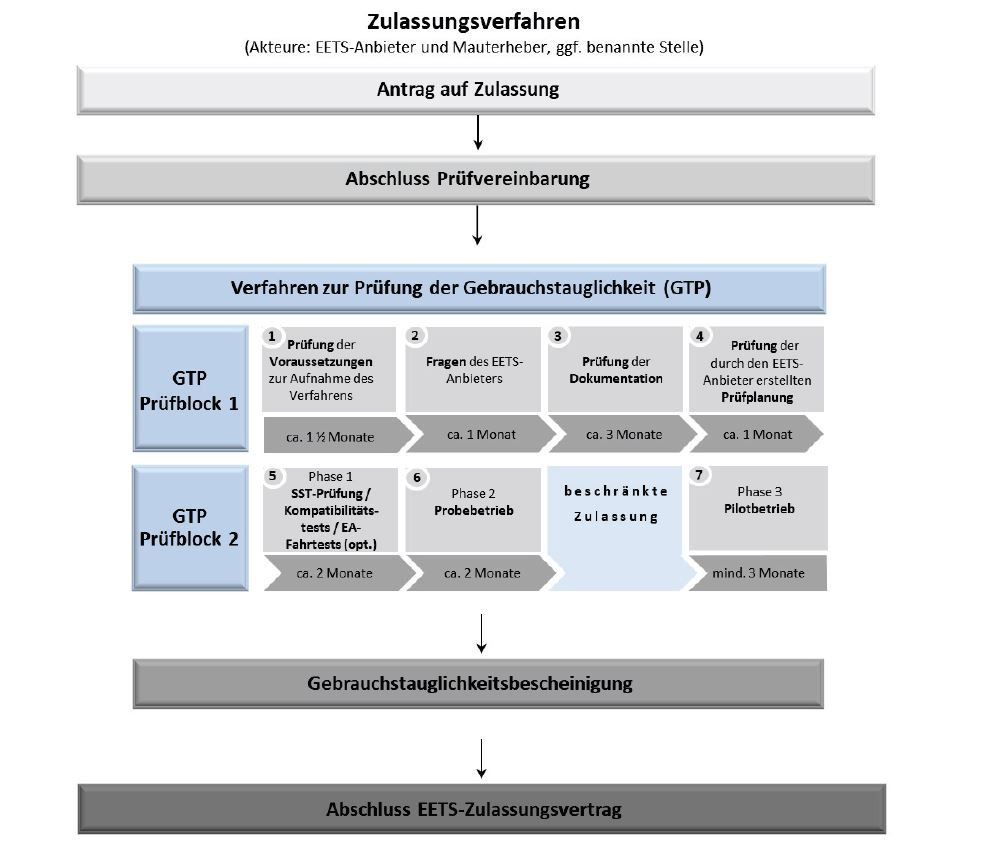
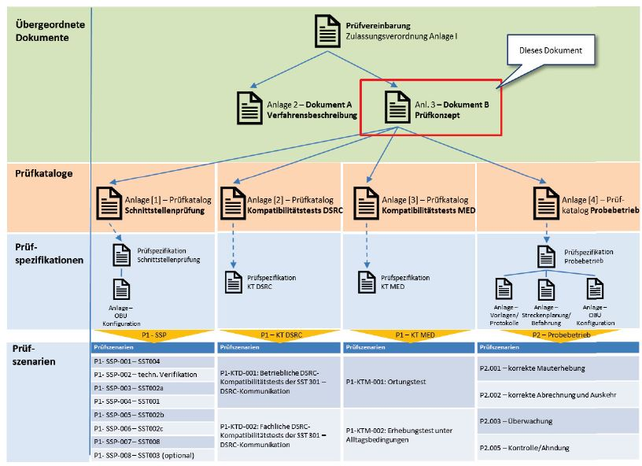
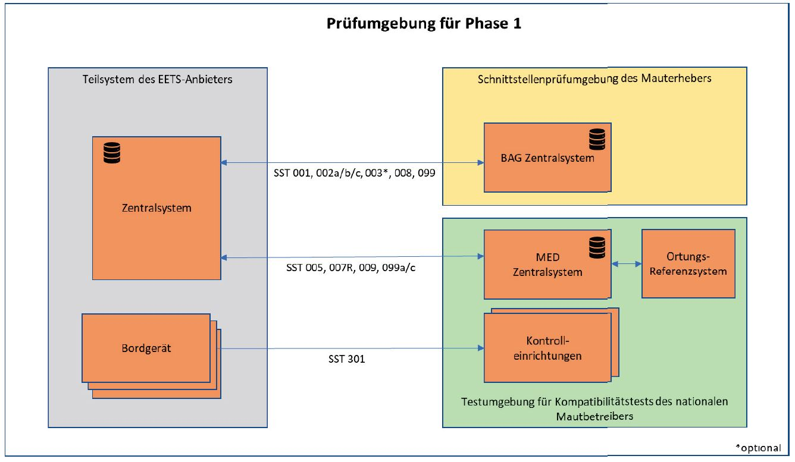
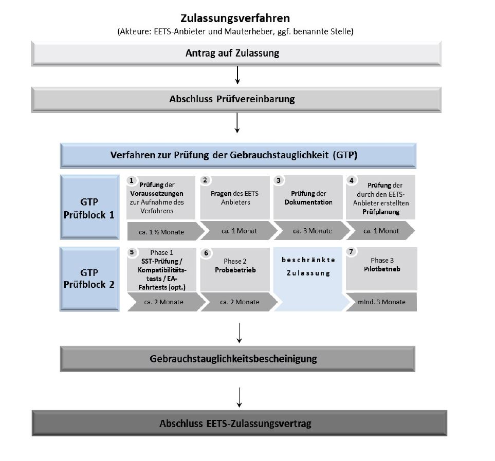

# Vereinbarung über die Durchführung des Prüfverfahrens zur Erbringung mautdienstbezogener Leistungen (EEMD-ZVAnl I)

Ausfertigungsdatum
:   2018-03-20

Fundstelle
:   BAnz: AT 27.03.2018 V2

Zuletzt geändert durch
:   Art. 1 Nr. 1 V v. 20.3.2019 BAnz AT 26.03.2019 V1

Änderung durch
:   Art. 2 V v. 25.10.2021 BAnz AT 29.10.2021 V2 textlich nachgewiesen, dokumentarisch noch nicht abschließend bearbeitet

## Anlage I Vereinbarung über die Durchführung des Prüfverfahrens zur Erbringung mautdienstbezogener Leistungen (Prüfvereinbarung)

(Fundstelle: BAnz AT 29.10.2021 V2)

Prüfvereinbarung
## zwischen

der Bundesrepublik Deutschland, vertreten durch das Bundesministerium
für Verkehr und digitale Infrastruktur (BMVI), dieses vertreten durch
das Bundesamt für Güterverkehr (BAG), Werderstraße 34, 50672 Köln,
dieses wiederum vertreten durch seinen Präsidenten

*    *
    *

*    *
    *   – Mauterheber –

*    *   und

    *

*    *
    *

*    *   (Name Anbieter), (Adresse Anbieter), vertreten durch (Vertretung
        Anbieter), (registriert gemäß Artikel 4 der Richtlinie (EU) 2019/520
        in …) (Nachweis der Registrierung)

*    *
    *

*    *
    *   – Anbieter –

### **Inhaltsverzeichnis**

*    *   § 1

    *   Gegenstand der Vereinbarung

*    *   § 2

    *   Vertragsbestandteile

*    *   § 3

    *   Ablauf des Prüfverfahrens

*    *   § 4

    *   Zeit- und Projektplan

*    *   § 5

    *   Austausch von Daten

*    *   § 6

    *   Mauterhebung und Mautauskehr

*    *   § 7

    *   Sicherheiten

*    *   § 8

    *   Versicherungen

*    *   § 9

    *   Abtretungsverbot und Verbot der Schuld- und Vertragsübernahme

*    *   § 10

    *   Entgeltpflicht

*    *   § 11

    *   Sicherstellung der Rückwirkungsfreiheit

*    *   § 12

    *   Mitwirkungspflichten

*    *   § 13

    *   Finanzielle Ausstattung des Anbieters

*    *   § 14

    *   Datenschutz

*    *   § 15

    *   Datensicherheit

*    *   § 16

    *   Aufbewahrung von vertraulichen Daten

*    *   § 17

    *   Geheimhaltung und Vertraulichkeit

*    *   § 18

    *   Gewerbliche Schutzrechte

*    *   § 19

    *   Eigentum

*    *   § 20

    *   Haftung

*    *   § 21

    *   Freistellung

*    *   § 22

    *   Vertragsstrafen

*    *   § 23

    *   Beginn und Beendigung der Vereinbarung

*    *   § 24

    *   Anpassungen der Vereinbarung

*    *   § 25

    *   Streitbeilegung

*    *   § 26

    *   Anwendbares Recht und Gerichtsstand

*    *   § 27

    *   Schriftverkehr

*    *   § 28

    *   Schriftform

*    *   § 29

    *   Salvatorische Klausel

*    *   Anlagen:

    *

*    *   Anlage 1 zur Prüfvereinbarung:

    *   gegebenenfalls Zusatzvereinbarung

*    *   Anlage 2 zur Prüfvereinbarung:

    *   Verfahren zur Feststellung der Gebrauchstauglichkeit -

*    *
    *   Dokument A - Verfahrensbeschreibung

*    *   Anlage 3 zur Prüfvereinbarung:

    *   Verfahren zur Feststellung der Gebrauchstauglichkeit -

*    *
    *   Dokument B - Prüfkonzept

*    *
    *   Anhang A - Vorgaben für Prüfprotokolle und -berichte

*    *
    *   Anhang A.1: Prüfprotokoll für den einzelnen Prüffall (Phase 1 und
        Phase 2)

*    *
    *   Anhang A.2: Szenariobericht (nur Phase 3)

*    *
    *   Anhang B: Prüfkataloge

*    *
    *   Anlage 1 zum Dokument B- Prüfkonzept:

    *   Prüfkatalog „Schnittstellenprüfung“

*    *
    *   Anlage 2 zum Dokument B- Prüfkonzept:

    *   Prüfkatalog „DSRC-Kompatibilitätstests“

*    *
    *   Anlage 3 zum Dokument B- Prüfkonzept:

    *   Prüfkatalog „MED-Kompatibilitätstests“

*    *
    *   Anlage 4 zum Dokument B- Prüfkonzept:

    *   Prüfkatalog „Probebetrieb“

*    *   Anlage 4 zur Prüfvereinbarung:

    *   Zeit- und Projektplan

    *

*    *   Anlage 5 zur Prüfvereinbarung:

    *   Entgeltordnung

    *

*    *   Anlage 6 zur Prüfvereinbarung:

    *   Glossar

    *

*    *   Anlage 7 zur Prüfvereinbarung:

    *   gegebenenfalls Erklärungen / Schriftwechsel

    *

## § 1 Gegenstand der Vereinbarung

   (1) Diese Prüfvereinbarung („Vereinbarung“) regelt auf der Grundlage
von § 10 des Mautsystemgesetzes (MautSysG) und § 4d des
Bundesfernstraßenmautgesetzes (BFStrMG) sowie der dazu erlassenen
Rechtsverordnungen die Rechte und Pflichten des Anbieters und des
Mauterhebers im Zusammenhang mit der Durchführung des Prüfverfahrens
für das EETS-Gebiet BFStrMG. Soweit nicht ausdrücklich geregelt, sind
Rechte und Pflichten des Anbieters gegenüber Nutzern sowie die
zwischen Anbieter und Nutzern geltenden vertraglichen und sonstigen
Vereinbarungen nicht Gegenstand dieser Vereinbarung.

(2) Gegenstand dieser Vereinbarung ist insbesondere die Gewährleistung
der Sicherheit der Daten und des Datenschutzes. Daten im Sinne dieser
Vereinbarung sind alle Informationen jeglicher Art in elektronischer,
Papier- oder sonstiger Form (insgesamt: „Daten“).

(3) Diese Vereinbarung begründet keinen Anspruch des Anbieters auf
Gewährung des Zugangs zum EETS-Gebiet BFStrMG oder auf Abschluss eines
Zulassungsvertrags mit dem Mauterheber. Ansprüche des Anbieters gegen
den Mauterheber bei Unterbrechung, Verzögerung oder Beendigung des
Prüfverfahrens bestehen nicht.

(4) Vorbehaltlich der in dieser Vereinbarung enthaltenen Definitionen
gelten für diese Vereinbarung die im Glossar nach (Anlage 6)
enthaltenen Definitionen.

## § 2 Vertragsbestandteile

(1) Bestandteile dieses Vertrags sind

–   der Nachweis der Registrierung als Anbieter nach § 4 MautSysG,

–   die Zusatzvereinbarung (Anlage 1), soweit von den Parteien als
    erforderlich erachtet,

–   Verfahren zur Feststellung der Gebrauchstauglichkeit Dokumente A und B
    (Anlagen 2 und 3),

–   der Zeit- und Projektplan (Anlage 4),

–   die Entgeltordnung (Anlage 5),

–   das Glossar (Anlage 6),

–   die Erklärung über die Gewährung einer Bankgarantie oder eines
    gleichwertigen Finanzinstruments,

–   gegebenenfalls Erklärungen/Schriftwechsel (Anlage 7).

(2) Bei Widersprüchen in diesem Vertrag gelten nacheinander

–   dieser Vertrag,

–   die Zusatzvereinbarung (Anlage 1),

–   gegebenenfalls Erklärungen/Schriftwechsel (Anlage 7),

–   Verfahren zur Feststellung der Gebrauchstauglichkeit Dokumente A und B
    (Anlagen 2 und 3),

–   der Zeit- und Projektplan (Anlage 4),

–   das Glossar (Anlage 6).

## § 3 Ablauf des Prüfverfahrens

Der Ablauf des Prüfverfahrens für das EETS-Gebiet BFStrMG ist im
BFStrMG und in der Verordnung über die Zulassung von Anbietern
mautdienstbezogener Leistungen für das EETS-Gebiet
Bundesfernstraßenmautgesetz (EEMD-ZV) festgelegt.

## § 4 Zeit- und Projektplan

(1) Nach Abschluss dieser Vereinbarung werden Anbieter und Mauterheber
für das Verfahren zur Feststellung der Gebrauchstauglichkeit und für
das Verfahren zur Prüfung der Erfüllung der wirtschaftlichen Vorgaben
gemäß den Regelungen dieses Paragraphen einen Zeit- und Projektplan
vereinbaren, in dem die Meilensteine der einzelnen
Verfahrensabschnitte sowie die Zeitabläufe konkretisiert sind. Der
Zeit- und Projektplan wird Teil dieser Vereinbarung (Anlage 4).

(2) Der Anbieter wird einen Vorschlag für den Zeit- und Projektplan
erstellen. Der Mauterheber wird diesen Vorschlag prüfen und Änderungen
mit dem Anbieterabstimmen.

(3) Der Anbieter darf von den Festlegungen des Zeit- und Projektplans
nur aus wichtigem Grund und nur mit Zustimmung des Mauterhebers
abweichen. Die Regelungen zur Haftung des Anbieters gemäß § 20 bleiben
hiervon unberührt. Sofern der Mauterheber einer Abweichung von den
Festlegungen des Zeit- und Projektplans nicht zugestimmt hat, bleibt
auch das Recht des Mauterhebers zur Kündigung dieser Vereinbarung nach
§ 23 von den Regelungen dieses Paragraphen unberührt. Der Mauterheber
ist von der Erfüllung seiner Verpflichtungen nach dieser Vereinbarung
so lange frei, bis der Anbieter die ihm nach dem Zeit- und Projektplan
obliegenden Verpflichtungen erfüllt hat.

## § 5 Austausch von Daten

(1) Nach Abschluss dieser Vereinbarung tauschen die Parteien nach
Maßgabe des Zeit- und Projektplans die zum Nachweis der Erfüllung der
Vorgaben für das EETS-Gebiet BFStrMG erforderlichen Daten aus.

(2) Der Anbieter übermittelt dem Mauterheber die Dokumente, die zum
Nachweis der Erfüllung der Vorgaben für das EETS-Gebiet BFStrMG
erforderlich sind in elektronischer Form und in deutscher Sprache. Der
Mauterheber kann zusätzlich die Vorlage der Dokumente in Papierform
verlangen.

(3) Der Anbieter soll sich hinsichtlich des Inhalts, der Struktur und
des Umfangs der Dokumente gemäß Absatz 2 an den Empfehlungen zur
Dokumentation des Teilsystems des Anbieters orientieren, die in Anlage
3 (Verfahren zur Feststellung der Gebrauchstauglichkeit - Dokument B -
Prüfkonzept) enthalten sind.

Der Mauterheber übermittelt dem Anbieter insbesondere folgende
Dokumente:

–   Spezifikation der Schnittstellen des Mauterhebers,

–   Verfahrensbeschreibung für die Durchführung der
    Gebrauchstauglichkeitsprüfung,

–   Muster-Zulassungsvertrag,

–   Verfahren zur Feststellung der Gebrauchstauglichkeit - Dokument B -
    Prüfkonzept nebst Anlagen.

(5) Jede Partei bestätigt den Eingang von Dokumenten in Textform
gegenüber der jeweils anderen Partei. Nach Erhalt der Dokumente prüfen
die Parteien die Dokumente auf ihre Vollständigkeit und fordern
gegebenenfalls fehlende Dokumente, Dokumententeile oder andere für den
Nachweis der Erfüllung der Vorgaben für das EETS-Gebiet BFStrMG
wesentliche Informationen bei der jeweils anderen Partei an. Erkennt
eine Partei erst im Verlaufe des weiteren Verfahrens, dass Dokumente,
Dokumententeile oder andere wesentliche Informationen fehlen, so hat
sie diese unverzüglich bei der jeweils anderen Partei anzufordern.

(6) Wird eine Partei zur Ergänzung der für die Durchführung des
Prüfverfahrens erforderlichen Dokumente durch die andere Partei
aufgefordert, so trägt sie dafür Sorge, dass die fehlenden Dokumente,
Dokumententeile oder für den Nachweis der Erfüllung der Vorgaben für
das EETS-Gebiet BFStrMG wesentliche Informationen der anderen Partei
zur Verfügung gestellt werden. Diese Verpflichtung gilt nicht für den
Mauterheber, wenn er zur Herausgabe von Dokumenten, Dokumententeilen
oder wesentlichen Informationen aus gesetzlichen oder sonstigen
rechtlichen Gründen nicht berechtigt ist. Der Mauterheber ist von der
Erfüllung seiner Verpflichtungen nach dieser Vereinbarung so lange
frei, bis ihm der Anbieter sämtliche für die Durchführung des
Prüfverfahrens erforderlichen Dokumente vollständig zur Verfügung
gestellt hat.

## § 6 Mauterhebung und Mautauskehr

(1) Der Anbieter ist im Rahmen des Prüfverfahrens nur nach
schriftlicher Erlaubnis des Mauterhebers und nur in dem in der
Erlaubnis festgelegten Umfang zur Mitwirkung an der Erhebung der Maut
im Geltungsbereich des EETS-Gebiets BFStrMG befugt.

(2) Soweit der Anbieter nach Absatz 1 im Geltungsbereich des EETS-
Gebiets BFStrMG an der Erhebung der Maut mitwirkt, kehrt er diese
gemäß den Vorgaben für das EETS-Gebiet BFStrMG an den Mauterheber aus.

(3) Der Anbieter muss sicherstellen, dass die Zahlungsvorgänge
zwischen ihm, seinen Nutzern und dem Mauterheber so ausgestaltet sind,
dass in jedem Fall, auch im Fall der Insolvenz oder drohender
Insolvenz des Anbieters, die Sicherheit der vollständigen Auskehr der
Mauteinnahmen nicht gefährdet ist.

## § 7 Sicherheiten

(1) Der Anbieter wird dem Mauterheber unverzüglich nach Abschluss
dieser Vereinbarung die Garantieerklärung einer Bank oder den Nachweis
eines gleichwertigen Finanzinstruments in Höhe der erwarteten
monatlichen Durchschnittssumme für Mauttransaktionen und Zahlungen
gemäß § 19 Absatz 1 MautSysG übergeben, die den Mauterheber
berechtigt, für alle Ansprüche aus dieser Vereinbarung, insbesondere
für die an den Mauterheber auszukehrenden Mauteinnahmen, Zahlungen auf
erstes Anfordern zu erhalten. Für die Prognose wird ein
Betrachtungszeitraum von zwölf Monaten zugrunde gelegt. Die
Wirksamkeit der Bankgarantie oder des gleichwertigen Finanzinstruments
kann bis zum Beginn des Pilotbetriebs aufschiebend bedingt sein.

(2) Die Bankgarantie muss von einem Kreditinstitut gegeben werden, das
seinen Sitz oder seine Niederlassung in der Europäischen Union oder in
der Europäischen Freihandelsassoziation (EFTA) hat. Das Kreditinstitut
muss ein Investmentgrade-Rating für Langfristverbindlichkeiten von
mindestens A3 (Moody's) bzw. A- (S&P oder Fitch) aufweisen und für
Kurzfristverbindlichkeiten von mindestens P2 (Moody's) bzw. A-2 (S&P)
bzw. F-2 (Fitch) aufweisen. Verschlechtert sich das Rating des
Kreditinstituts während der Laufzeit der Bankgarantie, sodass die
vorstehend genannten Mindestanforderungen nicht mehr erfüllt sind, ist
der Anbieter verpflichtet, unverzüglich, spätestens aber innerhalb
eines Monats nach Bekanntwerden des schlechteren Ratings, eine
Bankgarantie eines Kreditinstituts, das die in diesem Absatz genannten
Mindestvorgaben erfüllt, zu übergeben.

(3) Sofern ein anderes Finanzinstrument als eine Bankgarantie zur
Sicherung der Mauteinnahmen vorgehalten wird, muss dieses einer
Bankgarantie, die die genannten Kriterien in Absatz 1 erfüllt,
gleichwertig sein. Ein Finanzinstrument ist gleichwertig, wenn es
denselben Grad an Sicherheit wie eine Bankgarantie bietet. Dies kann
insbesondere dann der Fall sein, wenn die Gesellschafter des Anbieters
eine Kapitalintakthalteerklärung in Bezug auf den Anbieter abgeben und
eine der zu besichernden Summe angemessene finanzielle
Leistungsfähigkeit besitzen. Die Entscheidung über die
Gleichwertigkeit steht im Ermessen des Bundesamtes für Güterverkehr.

(4) Die Garantieerklärung oder der Nachweis eines gleichwertigen
Finanzinstruments muss vom Anbieter in deutscher Sprache oder in einer
amtlich beglaubigten Übersetzung übergeben werden. Die Bankgarantie
muss sich nach zeitlichem Ablauf automatisch erneuern („revolvierende
Bankgarantie“). Sollte die Bankgarantieerklärung oder die Laufzeit des
gleichwertigen Finanzinstruments befristet sein, ist der Anbieter
verpflichtet, spätestens zwei Kalendermonate vor Ablauf des
Geltungszeitraums eine Verlängerung dieser Bankgarantieerklärung oder
des gleichwertigen Finanzinstruments vorzulegen. Legt der Anbieter die
Verlängerung der Bankgarantie oder des gleichwertigen
Finanzinstruments nicht rechtzeitig vor, ist der Mauterheber -
unbeschadet seines Rechts zur Beendigung dieser Vereinbarung nach § 23
- von der Erfüllung seiner Verpflichtungen nach dieser Vereinbarung so
lange frei, bis der Anbieter die Verlängerung der
Bankgarantieerklärung oder des gleichwertigen Finanzinstruments
vorgelegt hat.

## § 8 Versicherungen

(1) Der Anbieter ist verpflichtet, für die im Rahmen dieser
Vereinbarung ausgeführten Tätigkeiten auf eigene Kosten eine
Betriebshaftpflichtversicherung mit mindestens den folgenden Inhalten
abzuschließen und während der Laufzeit dieser Vereinbarung
aufrechtzuerhalten:

a)  Betriebsbeschreibung: „Mauterhebung als EETS-Anbieter auf den Straßen
    des EETS-Mautgebiets BFStrMG inklusive aller betriebs- und
    branchenüblichen, betriebs- und branchennotwendigen und im Betrieb der
    Versicherungsnehmerin bestehenden Zusatzrisiken“,

b)  Deckung für gesetzliche Haftpflichtansprüche wegen Personen-, Sach-
    und daraus folgenden Vermögensschäden mit einer Deckungssumme von
    mindestens 15 Mio. Euro (in Worten: fünfzehn Millionen Euro) je
    Schadensfall. Der EETS-Anbieter muss sicherstellen, dass zu jederzeit
    ein ausreichender Versicherungsschutz im Sinne des Satz 1 besteht;
    dies gilt auch nach Eintritt eines Versicherungsfalles und der
    Inanspruchnahme der Versicherung.

(2) Errichtet oder betreibt der Anbieter im EETS-Gebiet BFStrMG
straßenseitige Einrichtungen, ist er verpflichtet, die
geschäftsüblichen Versicherungen abzuschließen und für die Dauer der
Errichtung oder des Betriebs aufrechtzuerhalten. Die Versicherungen
müssen Personen-, Sach- und daraus folgende Vermögensschäden abdecken.
Die Mindestversicherungssumme für Versicherungen nach diesem Absatz
beträgt 2,5 Mio. Euro (in Worten: zweieinhalb Millionen Euro) je
Schadensfall.

(3) Der Mauterheber kann eine Erhöhung der Versicherungssumme
verlangen, wenn dies angesichts veränderter Schadensszenarien
angemessen ist.

(4) Der Anbieter legt dem Mauterheber nach Abschluss dieser
Vereinbarung die Nachweise des Versicherungsabschlusses und des
Versicherungsumfangs unverzüglich, unaufgefordert und in deutscher
Sprache oder mit einer amtlichen beglaubigten Übersetzung vor. Dies
gilt auch im Fall der Anpassung von Versicherungen.

(5) Die Ansprüche auf Leistungen aus den Versicherungen nach den
Absätzen 1 und 2 tritt der Anbieter zur Sicherung der
Haftungsansprüche des Mauterhebers an diesen ab. In den Versicherungen
nach den Absätzen 1 und 2 ist vorzusehen, dass der Mauterheber vom
Versicherer über etwaige Versicherungsleistungen an den Anbieter
unmittelbar in Kenntnis gesetzt wird. Der Anbieter ist zum Einzug der
Versicherungsleistungen berechtigt und verpflichtet sich, die
Versicherungsleistung umgehend zur vollständigen Beseitigung und
vollständigen Wiederherstellung der Funktionsfähigkeit des vom Schaden
betroffenen Teils zu verwenden. Im Falle der Verletzung dieser Pflicht
ist der Mauterheber zur Offenlegung der Abtretung und zum Widerruf der
nach Satz 3 erteilten Einziehungsberechtigung berechtigt. Eine
Abtretung oder Verpfändung von Versicherungsansprüchen an Dritte ist
nur mit vorheriger Zustimmung des Mauterhebers zulässig.

## § 9 Abtretungsverbot und Verbot der Schuld- und Vertragsübernahme

Der Anbieter ist nicht berechtigt, ohne vorherige schriftliche
Zustimmung des Mauterhebers Rechte aus dieser Vereinbarung an Dritte
abzutreten oder zu verpfänden. Dies gilt auch für die
schuldenbefreiende Übernahme von Verpflichtungen des Anbieters aus
dieser Vereinbarung durch Dritte sowie eine vollständige Übernahme
dieser Vereinbarung des Anbieters durch Dritte. Die Erteilung der
Zustimmung steht im freien Ermessen des Mauterhebers.

## § 10 Entgeltpflicht

Der Anbieter trägt die Kosten für die Durchführung des Prüfverfahrens.
Das Entgelt bestimmt sich nach der Entgeltordnung (Anlage 5).

## § 11 Sicherstellung der Rückwirkungsfreiheit

(1) Der Anbieter ist verpflichtet, die Rückwirkungsfreiheit der
verwendeten Systeme und eingebrachten Komponenten im Hinblick auf die
ungestörte Funktion der Systeme des Mauterhebers, des nationalen
Betreibers und der von ihm betriebenen Kontrolleinrichtungen sowie des
Mauterhebungsdienstes zu jedem Zeitpunkt zu gewährleisten. Er steht
für die jederzeitige Rückwirkungsfreiheit gemäß Satz 1 ein.

(2) Ist nach den Feststellungen des Mauterhebers die
Rückwirkungsfreiheit gemäß Absatz 1 nicht gewährleistet und droht
daraus ein Schaden für die ungestörte Funktion der Systeme des
Mauterhebers, des nationalen Betreibers und der von ihm betriebenen
Kontrolleinrichtungen sowie des Mauterhebungsdienstes zu entstehen, so
ist der Anbieter verpflichtet, alle erforderlichen Maßnahmen zu
ergreifen, um den Eintritt solcher Schäden sicher auszuschließen. Der
Mauterheber ist berechtigt, das Prüfverfahren so lange auszusetzen bis
der Anbieter nachgewiesen hat, dass der Eintritt eines Schadens
ausgeschlossen ist.

## § 12 Mitwirkungspflichten

(1) Anbieter und Mauterheber sowie die von diesen hinzugezogenen
Personen und Unternehmen, insbesondere der nationale Betreiber, der
den Mauterhebungsdienst im Auftrag des Mauterhebers betreibt, arbeiten
während der Durchführung des Prüfverfahrens, insbesondere während des
Verfahrens zur Prüfung der Erfüllung aller Vorgaben für das EETS-
Gebiet BFStrMG, zusammen. Der Mauterheber stellt dem Anbieter solche
Informationen zur Verfügung, die für die Vertragserfüllung
erforderlich sind und seinem unmittelbaren Einwirkungsrecht
unterliegen.

(2) Anbieter und Mauterheber informieren die jeweils andere Partei
unverzüglich und nachvollziehbar über Störungen während der
Durchführung des Prüfverfahrens. Der Mauterheber ist berechtigt, das
Prüfverfahren so lange auszusetzen, bis der Anbieter nachgewiesen hat,
dass nicht unerhebliche Störungen ausgeschlossen sind.

## § 13 Finanzielle Ausstattung des Anbieters

Der Anbieter ist verpflichtet, auf Verlangen des Mauterhebers ihm
diejenigen Unterlagen zur Information vorzulegen, die er zum Nachweis
seiner finanziellen Leistungsfähigkeit gemäß Artikel 4 Buchstabe d der
Richtlinie (EU) 2019/520 des Europäischen Parlaments und des Rates vom
19\. März 2019 über die Interoperabilität elektronischer Mautsysteme
und die Erleichterung des grenzüberschreitenden Informationsaustauschs
über die Nichtzahlung von Straßenbenutzungsgebühren in der Union (ABl.
L 91 vom 29.3.2019, S. 45) im Rahmen seiner Registrierung verwendet
hat. Die Unterlagen gemäß Satz 1 sind in deutscher Sprache oder in
einer amtlich beglaubigten Übersetzung vorzulegen.

## § 14 Datenschutz

(1) Der Anbieter stellt sicher, dass er bei der Durchführung des
Prüfverfahrens jederzeit alle Anforderungen des Datenschutzes erfüllt.
Dazu gehören insbesondere die spezialgesetzlichen Vorgaben des
MautSysG, des BFStrMG und - soweit das MautSysG und das BFStrMG keine
abschließende Regelung treffen - ergänzend die Bestimmungen des
Bundesdatenschutzgesetzes (BDSG) sowie der Verordnung (EU) 2016/679
des Europäischen Parlaments und des Rates vom 27. April 2016 zum
Schutz natürlicher Personen bei der Verarbeitung personenbezogener
Daten, zum freien Datenverkehr und zur Aufhebung der Richtlinie
95/46/EG (ABl. L 119 vom 4.5.2016, S. 1; L 314 vom 22.11.2016, S. 72;
L 127 vom 23.5.2018, S. 2; L 74 vom 4.3.2021, S. 35)
(DatenschutzGrundverordnung). Diese Verpflichtung des Anbieters gilt
unabhängig davon, ob der Anbieter selbst in den Anwendungsbereich
solcher Datenschutzbestimmungen fällt. Die Pflicht des Anbieters zur
Einhaltung nationaler Datenschutzbestimmungen des Staates, in dem er
niedergelassen ist oder in dem er Daten erhebt oder verarbeitet,
bleibt unberührt. Im Zweifel haben das MautSysG, das BFStrMG und -
soweit das MautSysG und das BFStrMG keine abschließende Regelung
treffen - ergänzend die Bestimmungen des BDSG sowie - soweit anwendbar
- weitere spezialgesetzliche deutsche oder supranationale
Datenschutzvorschriften und die Bestimmungen der Datenschutz-
Grundverordnung, Vorrang vor anderen nationalen
Datenschutzbestimmungen. Der Anbieter ist verpflichtet, Erklärungen
seiner Nutzer einzuholen und dem Mauterheber vorzulegen, wonach sie
darin einwilligen, dass, bezogen auf die Gebrauchstauglichkeitsphase 3
- Pilotbetrieb, die Daten zu den Fahrspuren 120 Tage lang aufbewahrt
werden.

(2) Soweit sich der Anbieter bei der Durchführung des Prüfverfahrens
eines Dritten bedient, verpflichtet sich der Anbieter unabhängig
davon, in welchem Land dieser Dritte seine Leistungen erbringt, dafür
zu sorgen, dass die vom Anbieter einzuhaltenden datenschutzrechtlichen
Standards auch von dem Dritten eingehalten werden.

(3) Die Regelungen dieses Paragraphen gelten auch im Falle der
Beendigung dieser Vereinbarung oder nach Abschluss eines
Zulassungsvertrags zwischen Anbieter und Mauterheber fort.

## § 15 Datensicherheit

(1) Der Anbieter wird seine Datensysteme und Schnittstellen so
ausgestalten, dass während des Prüfverfahrens zu jeder Zeit und
uneingeschränkt ein verlustfreier und sicherer elektronischer
Datenaustausch möglich ist.

(2) Der Mauterheber wird dem Anbieter die für das Prüfverfahren
erforderlichen Daten zugänglich machen und während des Prüfverfahrens
im erforderlichen Umfang aktualisieren und ergänzen.

(3) Der Anbieter verpflichtet sich, während des gesamten
Prüfverfahrens und bis zu dem Zeitpunkt, in dem die Daten mit
Zustimmung des Mauterhebers gemäß § 16 unwiderruflich gelöscht oder
vernichtet werden, sicherzustellen, dass der Schutz der
personenbezogenen und personenbeziehbaren Daten den Anforderungen des
deutschen und europäischen Datenschutzrechts entspricht. Der Anbieter
wird darüber hinaus jederzeit die erforderlichen technischen und
organisatorischen Sicherheitsmaßnahmen nach dem aktuellen Stand der
Technik ergreifen, um die seinem Zugriff unterliegenden Daten,
Prozesse und Systeme sowie den Datenaustausch mit dem Mauterheber zu
schützen, sodass jederzeit hinsichtlich Vertraulichkeit, Verfügbarkeit
und Integrität der Daten, Prozesse und Systeme ein dem im Einzelfall
festgestellten Schutzbedarf entsprechender Schutz vor technischer oder
organisatorischer Kompromittierung gewährleistet ist. Dabei ist für
alle Vorgänge von dem jeweils höchsten Schutzbedarf auszugehen, die

a)  personenbezogene und personenbeziehbare Daten und

b)  den Datenaustausch oder Systemberührungen mit dem Mauterheber
    betreffen.

Der Anbieter wird insbesondere jederzeit die erforderlichen
technischen und organisatorischen Sicherheitsmaßnahmen ergreifen, um
alle beteiligten Daten, Systeme und Prozesse zu schützen, zu
überwachen und bei Kenntnis eines realisierten oder potenziellen
Verlustes der Vertraulichkeit, Verfügbarkeit oder Integrität von
Daten, Systemen, oder Prozessen (insgesamt „Sicherheitsvorfall“) den
Mauterheber unverzüglich zu informieren und unverzüglich in der
jeweils erforderlichen Art und Weise zu reagieren, sodass insbesondere
der Sicherheitsvorfall ausgeräumt oder seine Auswirkungen sowie damit
verbundene Schäden und Beeinträchtigungen des Mauterhebers oder
Dritter soweit wie möglich begrenzt und reduziert werden. Der
Mauterheber kann verlangen, auf Veranlassung des Anbieters das
Informationsschutz-Management-System des Anbieters im Rahmen eines
Audits von einem externen Sachverständigen prüfen zu lassen.

(4) Der Anbieter haftet dem Mauterheber für jegliche mittelbaren und
unmittelbaren Schäden, die dem Mauterheber aufgrund von
Sicherheitsvorfällen aus dem Verantwortungsbereich des Anbieters
entstehen; dies gilt nicht, soweit er die Pflichtverletzung nicht zu
vertreten hat. Die Haftung schließt die dem Mauterheber entgangenen
Mauteinnahmen ein. Der Anbieter übernimmt zudem die Kosten einer
Wiederinstandsetzung, Reparatur oder sonstigen Überprüfung des Systems
des Mauterhebers, des nationalen Betreibers und der von ihm
betriebenen Kontrolleinrichtungen sowie des Mauterhebungsdienstes, die
aufgrund von Sicherheitsvorfällen aus dem Verantwortungsbereich des
Anbieters entstanden sind. Sollten aufgrund von Sicherheitsvorfällen
aus dem Verantwortungsbereich des Anbieters Dritte Ansprüche gegenüber
dem Mauterheber oder dem nationalen Betreiber geltend machen, stellt
der Anbieter den Mauterheber gemäß § 21 im dort geregelten Umfang von
diesen Ansprüchen frei.

(5) Die Regelungen dieses Paragraphen gelten auch im Falle der
Beendigung dieser Vereinbarung oder nach Abschluss eines
Zulassungsvertrags zwischen Anbieter und Mauterheber fort.

## § 16 Aufbewahrung von vertraulichen Daten

(1) Vertrauliche Daten sind bis zu ihrer Vernichtung, Löschung oder
Rückgabe sicher aufzubewahren bzw. zu speichern und vor dem Ein- und
Zugriff Dritter zu schützen.

(2) In diesem Zeitraum verpflichtet sich der Anbieter, die
vertraulichen Daten in einer Weise aufzubewahren, dass sie von Dritten
nicht eingesehen, verändert, kopiert, entwendet oder vernichtet werden
können. Der Anbieter stellt zu diesem Zweck insbesondere sicher, dass
seine Datensicherungssysteme einen Ein- und Zugriff durch Dritte
verlässlich ausschließen.

(3) Der Anbieter wird die vertraulichen Daten einschließlich aller
Sicherungskopien nur mit Zustimmung des Mauterhebers vernichten oder
löschen und dabei insbesondere gewährleisten, dass Vertraulichkeit im
Sinne des § 17 Absatz 4 jederzeit eingehalten wird und Dritte auch
nach Vernichtung oder Löschung keinen Zugang zu diesen Daten erlangen.
Soweit die Löschung von Daten erforderlich ist, wird der Anbieter
diese Löschung in einer Weise vornehmen, die eine Wiederherstellung
der Daten technisch ausschließt, die vorgenommenen Maßnahmen
dokumentieren und sie auf Verlangen dem Mauterheber nachweisen.

(4) Sollten entgegen den Verpflichtungen dieses Paragraphen
vertrauliche Daten abhandenkommen, kopiert werden oder sonst
unberechtigt eingesehen werden, haftet der Anbieter dem Mauterheber
für die daraus entstehenden Schäden und stellt den Mauterheber gemäß §
21 im dort geregelten Umfang von allen Ansprüchen frei. Dies gilt
nicht, soweit er die Pflichtverletzung nicht zu vertreten hat.

(5) Nach Beendigung des Prüfverfahrens sind auf Verlangen einer Partei
alle vertraulichen Daten im Sinne des § 17 an diese zurückzugeben oder
- soweit dies nach Art der Daten nicht möglich ist - nachweislich zu
löschen oder auf andere Weise zu vernichten. Dies gilt nicht, soweit
ein berechtigtes Interesse an der Aufbewahrung der vertraulichen Daten
im Hinblick auf eine spätere Rekonstruktion des Prüfverfahrens bei
Streitfällen dargelegt wird. In diesem Falle sind die Daten
zurückzugeben oder nachweislich zu löschen, wenn sie für diesen Zweck
nicht mehr erforderlich sind.

(6) Für die Regelungen dieses Paragraphen gelten § 17 Absatz 3 und 8
entsprechend.

## § 17 Geheimhaltung und Vertraulichkeit

(1) Die Parteien werden alle Daten, die ihnen vor Beginn oder während
der Durchführung des Prüfverfahrens zur Verfügung gestellt werden oder
die sie im Zusammenhang mit dieser Vereinbarung oder dem Prüfverfahren
in sonstiger Weise erlangt haben (insgesamt: „vertrauliche Daten“),
vertraulich behandeln und sie Dritten nicht zugänglich machen. Als
vertrauliche Daten gelten auch solche Daten, die die Parteien selbst
im Rahmen der Durchführung des Prüfverfahrens erstellt oder erhoben
haben und die mit dem Mautdienst, den ihm zugrundeliegenden
Parametern, den technischen Spezifikationen, wirtschaftlichen Vorgaben
oder den Parteien selbst in Verbindung stehen. Die Verpflichtung zur
Vertraulichkeit gilt auch nach Beendigung dieser Vereinbarung oder
nach Abschluss eines Zulassungsvertrags zwischen Anbieter und
Mauterheber fort.

(2) Die vertraulichen Daten dürfen von den Parteien ausschließlich für
den Zweck der Durchführung des Prüfverfahrens verwendet werden.

(3) Nicht als Dritte im Sinne dieses Paragraphen gelten auf Seiten des
Anbieters solche Personen, die

a)  mit Aufgaben befasst sind, die im Zusammenhang mit dieser Vereinbarung
    oder dem Prüfverfahren stehen und/oder bestimmungsgemäß mit der
    Erfüllung der nach dieser Vereinbarung gegenüber dem Mauterheber
    geschuldeten Verpflichtungen beschäftigt sind,

b)  gegenüber dem Anbieter zur Vertraulichkeit insbesondere auch bezüglich
    der vertraulichen Daten verpflichtet sind und

c)  die vertraulichen Daten zur Ausführung der ihnen zugewiesenen Aufgaben
    benötigen.

Die Weiterreichung an mit dem Anbieter im Konzernverbund stehende
Unternehmen („Konzernunternehmen“) ist gestattet, wenn und soweit dies
zur konzerninternen Prüfung erforderlich ist und zuvor den beteiligten
Konzernunternehmen vollumfänglich die nach diesem Abschnitt bestehende
Vertraulichkeitsverpflichtung auferlegt worden ist.

(4) Der Anbieter führt eine Liste der Personen in Konzernunternehmen,
die Zugang zu vertraulichen Daten haben und legt diese dem Mauterheber
jederzeit auf sein Verlangen vor.

(5) Der Anbieter ist verpflichtet, Personen, die Zugang zu
vertraulichen Daten haben, in gleichem Umfang und unter Androhung
einer spürbaren Vertragsstrafe mit unmittelbarer Wirkung zu Gunsten
des Mauterhebers Vertraulichkeitsverpflichtungen aufzuerlegen und dies
auf Verlangen des Mauterhebers unverzüglich nachzuweisen.

(6) Der Anbieter ist verpflichtet dafür Sorge zu tragen, dass die
Konzernunternehmen die Verpflichtung nach Absatz 5 ebenfalls erfüllen.

(7) Der Anbieter steht für die Einhaltung der ihm hiernach auferlegten
und den Personen und Konzernunternehmen aufzuerlegenden
Verschwiegenheitsverpflichtung ein.

(8) Nicht als Dritte im Sinne dieses Paragraphen gelten auf Seiten des
Mauterhebers solche Personen, die

a)  mit Aufgaben befasst sind, die im Zusammenhang mit dieser Vereinbarung
    oder dem Prüfverfahren stehen und/oder bestimmungsgemäß mit der
    Erfüllung der nach dieser Vereinbarung dem Mauterheber obliegenden
    Verpflichtungen beschäftigt sind,

b)  gegenüber dem Mauterheber zur Vertraulichkeit insbesondere auch
    bezüglich der vertraulichen Daten verpflichtet sind und

c)  die vertraulichen Daten zur Ausführung der ihnen obliegenden Aufgaben
    benötigen.

(9) Nicht als vertrauliche Daten gelten alle Daten, die zum Zeitpunkt
der Weitergabe oder sonstigen Zugänglichmachung der Öffentlichkeit
bereits nachweislich allgemein bekannt sind, ohne dass dies auf einer
Verletzung dieser Vertraulichkeitsvereinbarung beruht.

(10) Eine Verletzung vertraglicher Vertraulichkeits- und
Geheimhaltungsvereinbarungen durch eine Partei liegt nicht vor, wenn
die jeweils andere Partei einer Veröffentlichung der konkreten
vertraulichen Daten zuvor schriftlich zugestimmt hat.

(11) Gesetzliche Aufbewahrungs- oder Offenlegungspflichten bleiben
unberührt.

(12) Die Anwendbarkeit der - auch strafrechtlichen - Bestimmungen des
Bundesdatenschutzgesetzes (BDSG) und anderer Rechtsvorschriften zum
Schutz der Vertraulichkeit und die Geltendmachung von Unterlassungs-
sowie von weitergehenden Schadensersatzansprüchen des Mauterhebers
bleiben von den Regelungen dieses Paragraphen unberührt.

(13) Die Regelungen dieses Paragraphen gelten auch im Falle der
Beendigung dieser Vereinbarung oder nach Abschluss eines
Zulassungsvertrags zwischen Anbieter und Mauterheber fort.

## § 18 Gewerbliche Schutzrechte

(1) Der Anbieter hat keine Rechte in Bezug auf gewerbliche
Schutzrechte und Urheberrechte (gemeinsam: „Schutzrechte“) des
Mauterhebers oder der Betreibergesellschaft. Soweit nachfolgend nicht
ein anderes geregelt ist, werden an den Anbieter unter dieser
Vereinbarung keine Schutzrechte lizenziert.

(2) Sollten beim Anbieter im Zusammenhang mit dem Prüfverfahren
Schutzrechte bestehen oder entstehen, deren Nutzung für den
Mauterheber im Zusammenhang mit der Erbringung mautdienstbezogener
Leistungen im EETS-Gebiet BFStrMG von praktischer Bedeutung ist, räumt
der Anbieter dem Mauterheber bereits jetzt ab dem Zeitpunkt der
Entstehung dieser Schutzrechte ein einfaches Nutzungsrecht
einschließlich des Rechts zur Unterlizenzierung für das EETS-Gebiet
BFStrMG in dem zeitlichen und inhaltlichen Umfang ein, der für das
Verhältnis zwischen Anbieter und Mauterheber erforderlich ist. Soweit
es sich um Schutzrechte Dritter handelt, steht der Anbieter dafür ein,
dass er zur Unterlizenzierung berechtigt ist.

(3) Soweit beim Mauterheber im Zusammenhang mit dem Prüfverfahren
Schutzrechte entstehen, deren Nutzung für den Anbieter im Zusammenhang
mit der Erbringung mautdienstbezogener Leistungen im EETS-Gebiet
BFStrMG erforderlich ist, hat der Anbieter einen Anspruch auf
Einräumung eines einfachen Nutzungsrechts für das EETS-Gebiet BFStrMG,
in dem zeitlichen und inhaltlichen Umfang, der für das Verhältnis
zwischen Anbieter und Mauterheber erforderlich ist. Eine
Unterlizenzierung bedarf der vorherigen schriftlichen Genehmigung des
Mauterhebers. Der Anbieter steht dem Mauterheber für die Erfüllung der
Pflicht gemäß Satz 2 ein.

## § 19 Eigentum

(1) Jede Partei bleibt unabhängig von Art und Umfang des
Zusammenwirkens von Einrichtungen und Gegenständen der Parteien
jeweils Eigentümer der von ihnen bereitgestellten Einrichtungen und
Gegenstände.

(2) Soweit im Rahmen des Prüfverfahrens vom Anbieter Einrichtungen und
Gegenstände mit dem Grund und Boden des Mauterhebers verbunden werden,
wird bereits jetzt vereinbart, dass solche Einrichtungen und
Gegenstände nur zu dem vorübergehenden Zweck mit dem Grund und Boden
verbunden sind. Der Anbieter hat dafür Sorge zu tragen, gegebenenfalls
gesonderte Absprachen und Vereinbarungen mit den jeweils zuständigen
Bundes- oder Landesverwaltungen zu treffen bzw. abzuschließen.

## § 20 Haftung

(1) Der Anbieter haftet bei Verletzung gesetzlicher oder vertraglicher
Verpflichtungen nach den allgemeinen gesetzlichen Bestimmungen für
Vorsatz und Fahrlässigkeit. Er haftet für die Rückwirkungsfreiheit der
von ihm im Rahmen des Verfahrens zur Feststellung der
Gebrauchstauglichkeit verwendeten Systeme und eingebrachten
Komponenten im Hinblick auf die ungestörte Funktion der Systeme des
Mauterhebers, des nationalen Betreibers und der von ihm betriebenen
Kontrolleinrichtungen sowie des Mauterhebungsdienstes und für die
inhaltliche Richtigkeit aller im Rahmen des Prüfverfahrens
übermittelten Daten. Soweit der Anbieter in dieser Vereinbarung
explizit oder aus den Umständen ersichtlich eine Einstandspflicht
übernommen hat, haftet er dem Mauterheber auch verschuldensunabhängig.

(2) Für das Tun oder Unterlassen seiner Arbeitnehmer, freien
Mitarbeiter, gesetzlichen Vertreter, des eingesetzten Personals und
seiner Erfüllungsgehilfen (einschließlich aller Unterauftragnehmer,
Unter-Unterauftragnehmer und Bestandsunterauftragnehmer) sowie deren
Arbeitnehmer, freie Mitarbeiter, eingesetztes Personal und
gesetzlichen Vertreter haftet der Anbieter gegenüber dem Mauterheber
in gleichem Umfang wie für eigenes Tun oder Unterlassen. Soweit der
Anbieter in dieser Vereinbarung explizit oder aus den Umständen
ersichtlich eine Einstandspflicht übernommen hat, haftet er unabhängig
davon, ob die in Satz 1 genannten Personen die Verletzung
vertraglicher Pflichten zu vertreten haben. Soweit dem Mauterheber
aufgrund der Verletzung vertraglicher Pflichten durch die in Satz 1
genannten Personen ein Schadensersatzanspruch gegen den Anbieter
zusteht, tritt der Anbieter etwaige gegenüber diesen bestehende
Ansprüche auf Aufforderung des Mauterhebers erfüllungshalber an diesen
ab. § 278 Satz 2 BGB ist ausgeschlossen.

(3) Der Mauterheber haftet nur für Schäden des Anbieters aus der
Verletzung des Lebens, des Körpers, der Gesundheit, aus der Verletzung
wesentlicher Vertragspflichten sowie darüber hinaus für sonstige
Schäden, die auf einer vorsätzlichen oder grob fahrlässigen
Pflichtverletzung des Mauterhebers, seiner gesetzlichen Vertreter oder
Erfüllungsgehilfen beruhen. Wesentliche Vertragspflichten sind solche,
die zur Erreichung des Vertragsziels notwendig sind. Im Übrigen ist
die Haftung des Mauterhebers ausgeschlossen. Für die vorsätzliche oder
fahrlässige Verletzung wesentlicher Vertragspflichten haftet der
Mauterheber nur auf den vertragstypischen, vorhersehbaren Schaden.
Dies gilt nicht, wenn es sich um Schadenersatzansprüche des Anbieters
aus einer Verletzung des Lebens, des Körpers oder der Gesundheit
handelt. Wenn Ansprüche direkt gegen die gesetzlichen Vertreter und
Erfüllungsgehilfen des Mauterhebers geltend gemacht werden, gelten die
Einschränkungen aus den Sätzen 1 bis 5 auch für diese.

(4) Ansprüche des Anbieters gegen den Mauterheber wegen des
Abschlusses von Prüfvereinbarungen und Zulassungsverträgen mit anderen
Anbietern sind ausgeschlossen. Der Mauterheber haftet dem Anbieter
nicht für Schäden, die diesem mittelbar oder unmittelbar durch die
Tätigkeit anderer Anbieter entstanden sind, unabhängig davon, ob der
andere Anbieter hierbei gesetzliche oder vertragliche Verpflichtungen
verletzt hat.

(5) Der Mauterheber haftet nicht für eine Einschränkung oder Schäden
des EETS-Anbieters aufgrund

a)  von Maßnahmen des Baus, Betriebs, der Reparatur oder der Unterhaltung
    von Straßen des mautpflichtigen Straßennetzes,

b)  von Änderungen, Beschränkungen oder Einschränkungen des
    mautpflichtigen Streckennetzes,

c)  aus der Bereitstellung und Durchführung der EETS-Mauterkennung für
    EETS-Anbieter durch einen dritten Dienstleister. Davon ausgenommen ist
    die Erbringung des Mauterhebungsdienstes durch den nationalen
    Betreiber im Auftrag des Mauterhebers.

(6) Das Recht des Mauterhebers, wegen der Verletzung von Pflichten aus
dieser Vereinbarung Vertragsstrafen zu erheben, bleibt von der
Regelung dieses Paragraphen unberührt.

## § 21 Freistellung

(1) Der Anbieter stellt den Mauterheber, die beim Mauterheber
beschäftigten oder eingesetzten Personen sowie die vom Mauterheber im
Zusammenhang mit dem Prüfverfahren hinzugezogenen oder beschäftigten
Personen und Unternehmen (gemeinsam: die „Freistellungsberechtigten“)
vollumfänglich von allen Ansprüchen frei, die aufgrund von
Verletzungen dieser Vereinbarung durch den Anbieter im Zusammenhang
mit der Durchführung des Prüfverfahrens von Dritten einschließlich
anderer Anbieter gegen die Freistellungsberechtigten geltend gemacht
werden. Der Freistellungsanspruch nach diesem Abschnitt erfasst auch
alle Schäden und Kosten, die den Freistellungsberechtigten in Folge
der Inanspruchnahme im Sinne dieses Paragraphen entstehen.

(2) Der Anbieter wird dem Mauterheber im Fall der Inanspruchnahme den
zur Befriedigung des geltend gemachten Anspruchs erforderlichen Betrag
zur Verfügung stellen. Sollten Anbieter und Mauterheber
übereinstimmend davon ausgehen, dass die Ansprüche unberechtigt
geltend gemacht wurden, wird der Mauterheber etwaige Regressansprüche
gegen den Anspruchsteller an den Anbieter abtreten.

(3) Die Freistellung des Mauterhebers nach Absatz 1 und die
Zurverfügungstellung des Betrags an den Mauterheber nach Absatz 2
erfolgen auf erstes Anfordern.

## § 22 Vertragsstrafen

(1) Für jeden schuldhaften Verstoß gegen die Regelungen zum
Datenschutz gemäß § 14, zur Datensicherheit gemäß § 15 und zur
Geheimhaltung und Vertraulichkeit gemäß § 17 dieser Vereinbarung
verwirkt der Anbieter eine Vertragsstrafe in Höhe von 50 000 Euro (in
Worten: fünfzigtausend Euro).

(2) Die Vertragsstrafe ist auf erstes schriftliches Anfordern des
Mauterhebers unverzüglich auszuzahlen.

(3) Der Mauterheber ist berechtigt, Vertragsstrafen auch nach
Beendigung dieses Vertrags geltend zu machen.

(4) Sonstige Ansprüche des Mauterhebers, insbesondere auf Erfüllung,
auf Schadensersatz oder auf Beendigung der Prüfvereinbarung bleiben
unberührt. Vertragsstrafen werden auf Schadensersatzansprüche
angerechnet, wenn und soweit sie auf demselben Sachverhalt beruhen.

## § 23 Beginn und Beendigung der Vereinbarung

(1) Diese Vereinbarung tritt am Tag ihrer Unterzeichnung durch beide
Parteien in Kraft.

(2) Diese Vereinbarung endet mit dem einvernehmlichen Ende der
Durchführung des Prüfverfahrens, mit der Kündigung durch eine der
Parteien oder mit Inkrafttreten eines Zulassungsvertrags zwischen dem
Anbieter und Mauterheber. Davon unberührt bleiben die Regelungen in
den §§ 14 bis 17.

(3) Eine Kündigung dieser Vereinbarung ist dem Anbieter jederzeit, dem
Mauterheber nur aus wichtigem Grund möglich. Ein wichtiger Grund liegt
vor, wenn dem Mauterheber unter Berücksichtigung aller Umstände des
Einzelfalls und unter Abwägung der beiderseitigen Interessen die
Fortsetzung des Vertragsverhältnisses bis zur vereinbarten Beendigung
oder bis zum Ablauf einer Kündigungsfrist nicht zugemutet werden kann,
insbesondere,

a)  weil die Registrierung des Anbieters gemäß § 4 MautSysG oder bei der
    zuständigen Behörde eines anderen Mitgliedstaats der Europäischen
    Union oder eines anderen Vertragsstaats des Abkommens überden
    Europäischen Wirtschaftsraum weggefallen ist oder die sachlichen
    Voraussetzungen hierfür vorliegen,

b)  die Prüfung der Zulassungsvoraussetzungen nach § 10 Absatz 2 Satz 1
    MautSysG ergeben hat, dass diese nicht vorliegen und nicht geschaffen
    werden können,

c)  wenn es wiederholt zu nicht unerheblichen Verzögerungen der
    Durchführung des Prüfverfahrens kommt, die der Anbieter zu vertreten
    hat,

d)  wenn der Anbieter gegen seine Verpflichtung zur unverzüglichen und
    vollständigen Auskehr der Maut gemäß § 6 Absatz 2 verstößt oder die
    Sicherheit der Mauteinnahmen gemäß § 6 Absatz 3 nicht oder nicht mehr
    gewährleistet ist,

e)  wenn der Anbieter seine Verpflichtungen aus § 7 dieser Vereinbarung
    nicht erfüllt,

f)  wenn der Anbieter nicht nur vorübergehend den Versicherungsschutz
    gemäß § 8 dieser Vereinbarung nicht oder nicht in ausreichender Weise
    besitzt,

g)  wenn der Anbieter ohne vorherige Zustimmung des Mauterhebers nach § 9
    Rechte aus dieser Vereinbarung an Dritte abgetreten hat,

h)  wenn der Anbieter seine Verpflichtung zur Rückwirkungsfreiheit seines
    Mautdienst-Teilsystems gemäß § 11 dieser Vereinbarung verletzt und dem
    Mauterheber dadurch ein nicht unerheblicher Schaden entstanden ist,

i)  wenn der Anbieter in nicht unerheblicher Weise gegen seine
    Verpflichtungen zur Gewährleistung des Datenschutzes gemäß § 14 dieser
    Vereinbarung verstoßen hat,

j)  wenn der Anbieter in nicht unerheblicher Weise gegen seine
    Verpflichtungen zur Gewährleistung der Datensicherheit gemäß § 15
    dieser Vereinbarung verstoßen hat,

k)  wenn der Anbieter in nicht unerheblicher Weise gegen seine
    Verpflichtungen im Zusammenhang mit der Aufbewahrung von vertraulichen
    Unterlagen gemäß § 16 dieser Vereinbarung verstoßen hat,

l)  wenn der Anbieter wiederholt, d. h. nach einem einmaligen Verstoß
    erneut in nicht unerheblicher Weise gegen die Regelungen zur
    Geheimhaltung und Vertraulichkeit gemäß §17 dieser Vereinbarung
    verstoßen hat.

Liegt ein wichtiger Grund für die Kündigung durch den Mauterheber vor,
ist der Mauterheber zur Kündigung ohne Einhaltung einer Frist
berechtigt.

(4) Die Kündigung dieser Vereinbarung ist durch schriftliche Erklärung
auszusprechen und ist der jeweils anderen Partei per
Einschreiben/Rückschein zuzustellen.

## § 24 Anpassungen der Vereinbarung

(1) Der Anbieter ist verpflichtet, mit dem Mauterheber diejenigen
Änderungen und/oder Ergänzungen zu dieser Vereinbarung zu vereinbaren,
die aufgrund von Änderungen des geltenden Rechts erforderlich sind.
Stimmt der Anbieterden erforderlichen Vereinbarungsanpassungen nicht
oder nicht innerhalb angemessener Frist zu, ist der Mauterheber von
der Erfüllung eigener Verpflichtungen nach dieser Vereinbarung so
lange frei, bis die erforderlichen Änderungen und/oder Ergänzungen
vereinbart sind.

(2) Wird einer Partei die Erfüllung einer ihr nach der Vereinbarung
obliegenden Verpflichtung infolge höherer Gewalt oder anderer objektiv
unabwendbarer Ereignisse zeitweise unmöglich, so ruhen die betroffenen
Rechte und Pflichten der Parteien für den entsprechenden Zeitraum.

## § 25 Streitbeilegung

(1) Den Parteien steht es frei, im Falle von Streitigkeiten über den
Inhalt oder die Auslegung dieser Vereinbarung die Vermittlungsstelle
nach den §§ 28 bis 30 MautSysG anzurufen.

(2) Die Anrufung der Vermittlungsstelle hindert nicht die
Inanspruchnahme von gerichtlichen Rechtsschutzmöglichkeiten in
Deutschland oder auf Ebene der Europäischen Union.

## § 26 Anwendbares Recht und Gerichtsstand

(1) Diese Vereinbarung und ihre Auslegung unterliegen deutschem Recht.

(2) Gerichtsstand ist Köln.

## § 27 Schriftverkehr

(1) Sämtliche Mitteilungen gemäß oder im Zusammenhang mit dieser
Vereinbarung sind schriftlich und in deutscher Sprache abzufassen, es
sei denn in dieser Vereinbarung wurde Abweichendes vereinbart.

(2) Mitteilungen oder förmliche Zustellungen an den Mauterheber im
Zusammenhang mit dieser Vereinbarung sind an die folgende Anschrift zu
richten:
Bundesamt für Güterverkehr (BAG), Werderstraße 34, 50672 Köln
(Empfangsberechtigter).

(3) Mitteilungen an den Anbieter im Zusammenhang mit dieser
Vereinbarung sind an die folgende Anschrift zu richten:
Anbieter: (Name und Adresse Anbieter), (Empfangsberechtigter).

(4) Für förmliche Zustellungen an den Anbieter im Zusammenhang mit
dieser Vereinbarung muss der Anbieter einen
Zustellungsbevollmächtigten mit Sitz in der Bundesrepublik Deutschland
nennen. Förmliche Zustellungen an den Anbieter sind an die folgende
Anschrift zu richten:
(Zustellungsbevollmächtigter in der Bundesrepublik Deutschland).

(5) Die Parteien werden einander Änderungen der Angaben nach den
Absätzen 2 bis 4, insbesondere in der Person des
Zustellungsbevollmächtigten oder der Empfangsberechtigten,
unverzüglich mitteilen.

## § 28 Schriftform

Änderungen und Ergänzungen dieser Vereinbarung bedürfen der
Schriftform, soweit nicht eine notarielle Beurkundung gesetzlich
erforderlich ist. Dies gilt auch für die Aufhebung des
Schriftformerfordernisses. Die Anwendung von § 126 Absatz 3 BGB ist
ausgeschlossen. Sämtliche Änderungen und Ergänzungen sind in deutscher
Sprache abzufassen.

## § 29 Salvatorische Klausel

Sollten einzelne Bestimmungen dieser Vereinbarung unwirksam oder
undurchführbar sein, so berührt dies nicht die Wirksamkeit der übrigen
Bestimmungen. Die unwirksame oder undurchführbare Bestimmung ist durch
eine solche zu ersetzen, die dem entspricht, was die Parteien
vereinbart hätten, wenn sie die Unwirksamkeit oder Undurchführbarkeit
bei Abschluss dieser Vereinbarung erkannt hätten.

Unterschriften

## (XXXX) Anlagen:

## Anlage 1 zur Prüfvereinbarung

(Fundstelle: BAnz AT 29.10.2021 V2)

## **Zusatzvereinbarung**

[Soweit von den Parteien als erforderlich erachtet.]

## Anlage 2 zur Prüfvereinbarung

(Fundstelle: BAnz AT 29.10.2021 V2)

## **Bundesrepublik Deutschland vertreten durch das Bundesministerium
für Verkehr und digitale Infrastruktur (BMVI) dieses vertreten durch
das Bundesamt für Güterverkehr (BAG)**

## **Europäischer elektronischer Mautdienst (EETS)**

## **Verfahren zur Feststellung der Gebrauchstauglichkeit**

## **– Dokument A –**

**Verfahrensbeschreibung**
##

## **Inhaltsverzeichnis**

**1 Ziele und Grundlagen des Dokuments**

1\.1 Zielsetzung

1\.2 Aufbau des Dokuments

1\.3 Zielgruppe

1\.4 Gebrauchstauglichkeitsprüfung im Rahmen des EETS-
Zulassungsverfahrens

1\.5 Übersicht über das Verfahren zur Feststellung der
Gebrauchstauglichkeit

1\.6 Hinweise zu den genannten Fristen

1\.7 Änderung des Verfahrens zur Feststellung der Gebrauchstauglichkeit
und Anpassung der Verfahrensbeschreibung

**2 Aufgaben und Verantwortlichkeiten**

2\.1 Mauterheber

2\.2 EETS-Anbieter

**3 Beschreibung des Verfahrens**

3\.1 Überblick

3\.2 GTP Prüfblock 1

3\.3 GTP Prüfblock 2

3\.4 Ausstellung der Gebrauchstauglichkeitsbescheinigung

3\.5 Aufrechterhaltung der Gebrauchstauglichkeit

3\.6 Abbruch und Wiederaufnahme des Verfahrens

**4 Vorgaben für die Prüfungen**

4\.1 Planungsunterlagen für den Prüfblock 2

4\.2 Zentralsystem des EETS-Anbieters

4\.3 Bordgeräte des EETS-Anbieters

4\.4 Vorgaben für Teilnahme an Prüfungen

4\.5 Vorgaben für Prüf- und Abschlussberichte

## Abbildungsverzeichnis

Abbildung 1: Einbettung der Gebrauchstauglichkeitsprüfung in den
Ablauf des EETS-Zulassungsverfahrens

## Tabellenverzeichnis

Tabelle 1: Übersicht über das Verfahren zur Feststellung der
Gebrauchstauglichkeit

## Dokumentenhistorie

*    *   Version

    *   Datum

    *   Bearbeiter

    *   Bearbeitung/Änderung

*    *   0.93

    *   23.08.2012

    *   RT

    *   Inhaltliche Überarbeitung, Wegfall der Annahmeprüfung, sprachliche
        Bearbeitung

*    *   0.94

    *   13.11.2014

    *   BAG

    *   Redaktionelle Überarbeitung

*    *   1.00

    *   04.10.2017

    *   BAG, RT

    *   Grundlegende Überarbeitung

*    *   1.1

    *   05.10.2018

    *   BAG, RT

    *   Ergänzung Kompatibilitätstests

*    *   1.9

    *   17.09.2020

    *   BAG, RT

    *   Grundlegende Überarbeitung: Redaktionelle Änderungen, Anpassungen an
        Mauterhebungsdienst

*    *   1.91

    *   30.10.2020

    *   RT

    *   Einarbeitung Reviewkommentare und Anmerkungen TC/BAG

*    *   1.95

    *   04.12.2020

    *   RT

    *   Überarbeitung und QS nach Review Referat 42

*    *   1.97

    *   15.06.2021

    *   RT

    *   Überarbeitung: Aufrechterhaltung Gebrauchstauglichkeit

*    *   2.0

    *   07.09.2021

    *   RT

    *   Redaktionelle Überarbeitung und Erstellung Version zur
        Veröffentlichung

## **1 Ziele und Grundlagen des Dokuments**

**1.1 Zielsetzung**

Das vorliegende Dokument konkretisiert das Verfahren zur Feststellung
der Gebrauchstauglichkeit (Gebrauchstauglichkeitsprüfung). Der
Mauterheber legt darin den Ablauf und die technischen und
organisatorischen Rahmenbedingungen für diese Prüfung fest. Es bildet
die Grundlage für die Abstimmung der Prüfplanung, so dass alle an dem
Verfahren Beteiligten rechtzeitig und im notwendigen Umfang ihre
Vorbereitungen zur Durchführung der Prüfung treffen können.

Darüber hinaus bildet die konkrete Beschreibung des Verfahrens die
Grundlage für eine Gleichbehandlung der EETS-Anbieter oder Hersteller
von Interoperabilitätskomponenten auf der Basis der jeweils gültigen
Vorgaben für das EETS-Gebiet BFStrMG.

Weiterhin bildet das in diesem Dokument beschriebene Verfahren die
Grundlage für die im Rahmen der Aufrechterhaltung der
Gebrauchstauglichkeit eventuell notwendige erneute Prüfung eines Teils
oder des gesamten Systems eines EETS-Anbieters, wobei der Mauterheber
die vorliegenden organisatorischen und technischen Rahmenbedingungen
(z.B. Keine Nutzung des Mauterhebungsdienstes) bei der erneuten
Durchführung berücksichtigt.

Die in diesem Dokument getroffenen Regelungen sind für die unter 1.3
genannten Akteure bindend.

**1.2 Aufbau des Dokuments**

Kapitel 1 erläutert neben der Zielsetzung des Dokumentes und der
Benennung der Zielgruppe die Einordnung der
Gebrauchstauglichkeitsprüfung in das EETS-Zulassungsverfahren. Ziel
des Verfahrens ist der Abschluss eines Vertrages zwischen Mauterheber
und EETS-Anbieter.

Kapitel 2 benennt die Akteure und deren Hauptaufgaben.

In Kapitel 3 erfolgt eine detaillierte Beschreibung des Verfahrens mit
den Voraussetzungen für die einzelnen Prüfblöcke und Prüfphasen sowie
Regelungen zur Aufrechterhaltung der Gebrauchstauglichkeit nach
Änderungen.

Kapitel 4 definiert die wesentlichen Vorgaben für die Prüfungen.

Nähere Angaben zu den einzelnen Prüfphasen sind in Dokument B -
Prüfkonzept zusammengefasst.

**1.3 Zielgruppe**

Gemäß Anhang III, Abschnitt V der Durchführungsverordnung (EU)
2020/204 der Kommission vom 28. November 2019 über detaillierte
Pflichten der Anbieter des europäischen elektronischen Mautdienstes,
den Mindestinhalt der Vorgabe für das EETS-Gebiet, elektronische
Schnittstellen und Anforderungen an Interoperabilitätskomponenten
sowie zur Aufhebung der Entscheidung 2009/750/EG (ABl. L 43 vom
17\.2.2020, S. 49) kann das Verfahren zur Feststellung der
Gebrauchstauglichkeit entweder

a)  bilateral in Zusammenarbeit zwischen Mauterheber und EETS-Anbieter
    oder

b)  unter Einschaltung einer benannten Stelle durchgeführt werden.

Das Verfahren richtet sich an:

1.  die EETS-Anbieter

2.  die Hersteller von Interoperabilitätskomponenten

3.  den Mauterheber.

Aus Gründen der Vereinfachung gelten die Formulierungen für den EETS-
Anbieter ebenso wie für die Hersteller von
Interoperabilitätskomponenten.

**1.4 Gebrauchstauglichkeitsprüfung im Rahmen des EETS-
Zulassungsverfahrens**

Voraussetzung für die Einleitung des in deutscher Sprache zu führenden
EETS-Zulassungsverfahrens ist die erfolgreiche und gültige
Registrierung des EETS-Anbieters. Ein EETS-Anbieter kann nach seiner
Registrierung beim Mauterheber einen Antrag auf Abschluss eines
Zulassungsvertrages stellen. Damit wird das EETS-Zulassungsverfahren
eingeleitet. Beide Parteien schließen zunächst die Vereinbarung über
die Durchführung des Prüfverfahrens zur Erbringung mautdienstbezogener
Leistungen (Prüfvereinbarung) ab, die die
Gebrauchstauglichkeitsprüfung sowie die Prüfung der wirtschaftlichen
Vorgaben und weitere Rechte und Pflichten zu Zeitplan und Kosten
regelt.

Das Zulassungsverfahren gilt als erfolgreich beendet, sobald der EETS-
Zulassungsvertrag geschlossen ist. Eine Voraussetzung dafür ist die
Erlangung der Gebrauchstauglichkeitsbescheinigung.

In folgendem Schaubild wird der Ablauf des EETS-Vertragsverfahrens
grafisch dargestellt:

**Abbildung 1: Einbettung der Gebrauchstauglichkeitsprüfung in den
Ablauf des EETS-Zulassungsverfahrens**

**1.5 Übersicht über das Verfahren zur Feststellung der
Gebrauchstauglichkeit**

Die Gebrauchstauglichkeitsprüfung ist in zwei Prüfblöcke unterteilt.
Der Prüfblock 1 umfasst die Prüfung der Dokumentation des Teilsystems
des EETS-Anbieters. Der Abschluss von Prüfblock 1 ist Voraussetzung
für den Beginn von Prüfblock 2.

Prüfblock 2 umfasst drei Prüfphasen. Die Prüfungen finden in
bestimmten Systemumgebungen statt, um den laufenden Wirkbetrieb nicht
zu gefährden und möglichst realistische Prüfergebnisse zu erhalten.

1.  Für die Schnittstellenprüfung (Phase 1) stellt der Mauterheber eine
    Testumgebung zur Verfügung. Der EETS-Anbieter kann für Phase 1 ein
    wirkbetriebsnahes Erprobungssystem einsetzen, das jedoch identische
    Software- und vergleichbare Hardwarestände wie das Wirkbetriebssystem
    aufweisen muss. Anderenfalls hat er sein Wirkbetriebssystem zur
    Verfügung zu stellen. Die Kompatibilitätstests werden parallel zur
    Schnittstellenprüfung vom nationalen Mautbetreiber im Auftrag des
    Mauterhebers durchgeführt. Sie sollen die Kompatibilität der
    Bordgeräte der EETS-Anbieter mit den Kontrolleinrichtungen des
    deutschen Mautsystems und mit dem Mauterhebungsdienst des Mauterhebers
    nachweisen, sowie die Erfüllung der Ortungsanforderungen des
    Mauterhebungsdienstes belegen. Dem EETS-Anbieter wird nach der
    Durchführung der Schnittstellenprüfung und der Kompatibilitätstests
    die Möglichkeit geboten, eigene EA-Fahrtests durchzuführen. Die
    Durchführung der EA-Fahrtests ist optional und weder Bedingung noch
    Voraussetzung für den Übergang in die folgende Prüfphase.

2.  Für die Durchführung des Probebetriebs (Phase 2) setzt der Mauterheber
    ein wirkbetriebsnahes Erprobungssystem ein. Der EETS-Anbieter muss
    wiederum ein wirkbetriebsnahes Erprobungssystem oder das eigene
    Wirkbetriebssystem verwenden. Es gelten dieselben Bedingungen wie für
    Phase 1.

3.  Der Pilotbetrieb (Phase 3) erfolgt ausschließlich in der
    Wirkbetriebsumgebung mit den Wirkbetriebssystemen von Mauterheber, dem
    nationalen Mautbetreiber und dem EETS-Anbieter.

Für den Übergang von einer Phase in die Nächste müssen die Kriterien
für die Quality Gates 2 bis 4 zwingend erfüllt sein. Der Abschluss von
Prüfblock 2 ist Voraussetzung für die Ausstellung der
Gebrauchstauglichkeitsbescheinigung.

Die Prüfblöcke sind in der folgenden Tabelle einschließlich der
Quality Gates und der Systemumgebungen dargestellt:

*    *   **Prüfblock**

    *   **Phase**

    *   **Bezeichnung**

    *   **Systeme und Systemumgebung**

*    *
    *   **Beteiligte Systeme**

*    *   **Mauterheber**

    *   **EETS-Anbieter**

*    *   1

    *   –

    *   Dokumentenprüfung

    *   –

    *   –

    *   –

*    *   ♦ Quality Gate 1

*    *   2

    *   1

    *   Schnittstellenprüfung

    *
    *   Testumgebung des BAG

    *   wirkbetriebsnahes Erprobungssystem oder Wirkbetriebssystem

*    *   Kompatibilitätstests

    *
    *   Testumgebungen des nationalen Mautbetreibers und des BAG

    *   wirkbetriebsnahes Erprobungssystem oder Wirkbetriebssystem

*    *   EA-Fahrtests (optional)

    *
    *   Testumgebungen des nationalen Mautbetreibers und des BAG

    *   wirkbetriebsnahes Erprobungssystem oder Wirkbetriebssystem

*    *   ♦ Quality Gate 2

*    *   2

    *   Probebetrieb

    *
    *   Testumgebungen des BAG und des nationalen Mautbetreibers

    *   wirkbetriebsnahes Erprobungssystem oder Wirkbetriebssystem

*    *   ♦ Quality Gate 3

*    *   3

    *   Pilotbetrieb

    *
    *   Wirkbetriebssystem des BAG und des nationalen Mautbetreibers

    *   Wirkbetriebssystem

*    *   ♦ Quality Gate 4

**Tabelle 1: Übersicht über das Verfahren zur Feststellung der
Gebrauchstauglichkeit**

**1.6 Hinweise zu den genannten Fristen**

In der folgenden Beschreibung des Verfahrens werden Fristen
festgelegt, in denen der Mauterheber die jeweils genannten Aktivitäten
oder Aufgaben abschließt. Der Mauterheber behält sich ausdrücklich
vor, diese Fristen im Einzelfall auch zu verlängern.

**1.7 Änderung des Verfahrens zur Feststellung der
Gebrauchstauglichkeit und Anpassung der Verfahrensbeschreibung**

Der Mauterheber kann das Verfahren zur Feststellung der
Gebrauchstauglichkeit ändern. Das ist zum Beispiel erforderlich, wenn
mit dem aktuellen Verfahren die Gebrauchstauglichkeit des Teilsystems
des EETS-Anbieters nicht oder nicht vollständig geprüft werden kann.
Eine Änderung des Verfahrens kann auch von EETS-Anbietern oder Dritten
beim Mauterheber beantragt werden. Der Mauterheber prüft den
Änderungsantrag und teilt dem Antragssteller das Ergebnis mit.

Der Mauterheber dokumentiert die Änderung des Verfahrens in der
Verfahrensbeschreibung und stellt die geänderte Version allen
Beteiligten zur Verfügung.

Der Mauterheber behält sich vor, eine Verfahrensänderung auch während
einer Gebrauchstauglichkeitsprüfung vorzunehmen. Er kann dazu die
laufende Prüfung unterbrechen und vom EETS-Anbieter die Fortsetzung
unter den geänderten Bedingungen verlangen. Darüber hinaus kann er vom
EETS-Anbieter die Wiederholung von bereits durchgeführten Prüfungen
verlangen, wenn Zweifel an der Gebrauchstauglichkeit unter den
veränderten Verfahrensbedingungen bestehen.

## **2 Aufgaben und Verantwortlichkeiten**

**2.1 Mauterheber**

Der Mauterheber prüft die Dokumentation des Teilsystems des EETS-
Anbieters und teilt ihm das Ergebnis der Prüfung mit. Dabei werden die
Ergebnisse der Konformitätsprüfung berücksichtigt.

Der Mauterheber prüft die durch den EETS-Anbieter erstellte
Prüfplanung. Nach erfolgreicher Prüfung stimmt der Mauterheber der
Prüfplanung zu.

Der Mauterheber begleitet und beaufsichtigt die Prüfungen in allen
Phasen und bewertet die vorgelegten Prüfergebnisse auf
Gebrauchstauglichkeit. Er unterstützt den EETS-Anbieter bei der
Durchführung von Prüfungen und führt zudem einige der Prüfungen selber
durch. Zu Beginn jeder Prüfphase stellt der Mauterheber sein dafür
erforderliches System zur Verfügung, verifiziert die korrekte Funktion
und überprüft die Anbindung innerhalb der Umgebung. Im Anschluss
meldet er die Prüfbereitschaft an den EETS-Anbieter.

Der Mauterheber führt eigenständig Analysen von Auffälligkeiten und
Fehlern durch und unterstützt den EETS-Anbieter bei der Fehleranalyse.

Der Mauterheber wird bei der Durchführung seiner Aufgaben und
Verantwortlichkeiten im Rahmen des Verfahrens zur
Gebrauchstauglichkeit durch den nationalen Mautbetreiber unterstützt.
Insbesondere führt der nationale Mautbetreiber im Auftrag des
Mauterhebers in Phase 1 des Prüfblocks 2 die Kompatibilitätstests
durch.

Bei Bedarf plant der Mauterheber Inspektionen, führt diese nach
Abstimmung mit dem EETS-Anbieter durch und teilt dem EETS-Anbieter die
Ergebnisse mit.

Wird auch die letzte Phase dieses Verfahrens positiv abgeschlossen,
wird davon ausgegangen, dass alle Anforderungen des Mauterhebers
erfüllt sind. Dieser stellt dann eine
Gebrauchstauglichkeitsbescheinigung aus.

Der Mauterheber ist verpflichtet, Änderungen an seinem EETS-Teilsystem
rechtzeitig allen EETS-Anbietern, die mit der
Gebrauchstauglichkeitsprüfung begonnen oder diese bereits
abgeschlossen haben, mitzuteilen, falls dadurch Anpassungen an deren
Teilsystemen erforderlich werden.

Falls Änderungen am Verfahren zur Gebrauchstauglichkeit erforderlich
sind, ist der Mauterheber für die Aktualisierung der
Verfahrensbeschreibung verantwortlich (siehe Kapitel 1.7).

**2.2 EETS-Anbieter**

Der EETS-Anbieter übermittelt dem Mauterheber die Dokumentation seines
Teilsystems.

Nach erfolgreicher Prüfung der Dokumentation erstellt der EETS-
Anbieter nach den Vorgaben des Dokuments B „Prüfkonzept“ und dessen
Anlagen eine Prüfplanung und stimmt diese mit dem Mauterheber ab.
Der EETS-Anbieter führt in allen drei Phasen die Prüfungen durch und
überwacht sein Teilsystem. Er unterstützt den Mauterheber außerdem bei
der Umsetzung der Prüfungsanteile, die vom Mauterheber durchgeführt
werden. Zu Beginn jeder Prüfphase stellt er das erforderliche System
zur Verfügung, verifiziert die korrekte Funktion, überprüft die
Anbindung innerhalb der Umgebung und meldet Prüfbereitschaft an den
Mauterheber. Der EETS-Anbieter dokumentiert die Ergebnisse der von ihm
durchgeführten Tests und Prüfungen und übermittelt sie dem Mauterheber
zur Bewertung. Der EETS-Anbieter ist dafür verantwortlich, dass für
die Prüfungen ausreichend geschultes Personal in den folgenden
Aufgabenbereichen zur Verfügung steht:

1.  Unterstützung beim Einbau der Bordgeräte im Rahmen der Phase 1 –
    Kompatibilitätstests

2.  Konfiguration und Bedienung der Bordgeräte

3.  Fahrten für Phase 2, Nutzerreferenzgruppe für Phase 3

4.  Bedienung der Benutzerschnittstellen des Zentralsystems

5.  Betreuung der Betriebsprozesse

6.  Koordinierung der Prüfaktivitäten mit dem Mauterheber

7.  Unterstützung bei der Analyse von Auffälligkeiten und Fehlern

Es ist Aufgabe des EETS-Anbieters, Inspektionen des Mauterhebers durch
Bereitstellen entsprechender Ressourcen und Informationen zu
unterstützen. Falls er Unterauftragnehmer (Dienstleister und
Lieferanten) einsetzt, ist er für die Koordinierung und Kooperation
seiner Unterauftragnehmer verantwortlich.

Nach erfolgreicher Gebrauchstauglichkeitsprüfung ist der EETS-Anbieter
verpflichtet, dem Mauterheber rechtzeitig jegliche Änderungen an
seinem System, die das EETS-Gebiet BFStrMG betreffen, anzuzeigen.

## **3 Beschreibung des Verfahrens**

**3.1 Überblick**

Für die erstmalige Feststellung der Gebrauchstauglichkeit muss jeder
EETS-Anbieter vor Abschluss des EETS-Zulassungsvertrags das Verfahren
gemäß Kapitel 3.2 und 3.3 vollständig durchlaufen.

Innerhalb der einzelnen Phasen kann der Mauterheber auch Inspektionen
beim EETS-Anbieter und in dessen Teilsystem zur Überprüfung der
Erfüllung seiner Vorgaben durchführen.

Das Verfahren kann abgebrochen werden, wenn grundlegende Vorgaben des
Mauterhebers nachweislich nicht erfüllt wurden. Die Kriterien für
einen Abbruch sowie die Regelungen zur Wiederaufnahme des Verfahrens
sind in Kapitel 3.6 enthalten.

Ändern sich nach erfolgreicher Durchführung des
Gebrauchstauglichkeitsverfahrens die Vorgaben des Mauterhebers oder
die Versionsstände des EETS-Teilsystems von Mauterheber oder EETS-
Anbieter oder die Komponenten eines Teilsystems, so behält sich der
Mauterheber vor, die Gebrauchstauglichkeit erneut zu prüfen. Dazu
müssen die system- und verfahrenstechnischen Änderungen im Hinblick
auf eine teilweise oder vollständige Wiederholung des Verfahrens
bewertet und gemäß Kapitel 3.5 geregelt werden. Das Verfahren muss
auch bei einem begründeten Verdacht auf Nichteinhaltung der Vorgaben
wiederholt werden. Wird der Nachweis der Funktions-, Leistungs- und
Betriebsfähigkeit des Teilsystems des EETS-Anbieters bei der
Wiederholung des Verfahrens nicht erbracht, wird die
Gebrauchstauglichkeitsbescheinigung widerrufen.

Die gesamte Kommunikation einschließlich Schriftverkehr zwischen
Mauterheber und EETS-Anbieter erfolgt in deutscher Sprache.

**3.2 GTP Prüfblock 1**

**3.2.1 Prüfung der Voraussetzungen zur Aufnahme des Verfahrens**

Die Aufnahme des Verfahrens erfolgt auf Antrag eines EETS-Anbieters.
Der Antrag ist in schriftlicher Form an den Mauterheber zu richten.
Dem Antrag sind eine Kopie der Registrierungsbescheinigung und die EG-
Konformitätserklärungen der Interoperabilitätskomponenten gemäß
Durchführungsverordnung (EU) 2020/204 Anhang III, Abschnitt VI
einschließlich Versionsstand der jeweiligen
Interoperabilitätskomponenten beizufügen.

Falls der Nachweis der Gebrauchstauglichkeit nicht vom EETS-Anbieter
selbst, sondern von einem Hersteller oder einem Bevollmächtigten
erbracht werden soll, ist dem Antrag ein Nachweis beizufügen, dass die
Registrierungsbescheinigung ohne Einschränkung auch für den Hersteller
oder den Bevollmächtigten verbindlich ist.

Der Mauterheber prüft den Antrag und teilt dem Antragsteller innerhalb
von zwei Wochen nach Eingang des Antrags das Ergebnis einer Prüfung
schriftlich mit.

Falls die Prüfung ergibt, dass die Voraussetzungen zur Aufnahme des
Verfahrens nicht erfüllt sind, wird der Mauterheber die Gründe dafür
schriftlich darlegen. Der Antragsteller hat im Anschluss die
Möglichkeit, den Antrag nachzubessern und erneut einzureichen.

**3.2.2 Fragen des EETS-Anbieters**

Der EETS-Anbieter hat die Möglichkeit, schriftlich Fragen an den
Mauterheber zu stellen. Der Mauterheber nimmt innerhalb von vier
Wochen nach Eingang der Fragen schriftlich Stellung. Falls er von
seinem Recht zur Verlängerung der Frist Gebrauch macht, wird er den
EETS-Anbieter innerhalb der Vier-Wochen-Frist über den Stand der
Bearbeitung und den voraussichtlichen Termin für die Antwort
informieren.

In Einzelfällen bietet der Mauterheber zur Klärung der Fragen
Abstimmungstermine an. Der EETS-Anbieter kann auch selbst um einen
Abstimmungstermin beim Mauterheber nachsuchen. In so einem Fall
entscheidet der Mauterheber über einen Termin zur Abstimmung. Die
Einladung zu einem Abstimmungsgespräch erfolgt grundsätzlich durch den
Mauterheber.

**3.2.3 Prüfung der Dokumentation**

Der EETS-Anbieter übermittelt dem Mauterheber die Dokumentation seines
Systems. Die Dokumentation enthält Darstellungen zu seinen
Geschäftsprozessen sowie Grobbeschreibungen der Systembestandteile.
Zudem dokumentiert der EETS-Anbieter nachvollziehbar die Einhaltung
der Vorgaben des Mauterhebers in tabellarischer Form. Bei der
Erstellung der Dokumentation seines Teilsystems soll sich der EETS-
Anbieter an den „Empfehlungen zur Dokumentation“ (Dokument B –
Prüfkonzept, Kapitel 3.2) orientieren.

Die Dokumentation des Systems wird vom EETS-Anbieter elektronisch an
den Mauterheber übergeben. Der Eingang der Dokumentation wird durch
den Mauterheber bestätigt.

Zunächst prüft der Mauterheber die vom EETS-Anbieter übermittelte
Dokumentation auf Vollständigkeit, Nachvollziehbarkeit und
Plausibilität. Details zu den Schwerpunkten der Prüfungen sind im
Dokument B, Kapitel 3.2 zusammengefasst. Die Ergebnisse der Prüfung
der Dokumentation werden dem EETS-Anbieter innerhalb von zwölf Wochen
nach Eingang mitgeteilt.

Fällt die Prüfung der Dokumentation durch den Mauterheber nicht
positiv aus, wird dieser die Gründe dafür darlegen. Gegebenenfalls
wird er Nachbesserungen der Dokumentation oder weitere Nachweise
fordern. Der EETS-Anbieter hat dann die Möglichkeit, Nachbesserungen
vorzunehmen und die überarbeitete Dokumentation unter Kennzeichnung
der vorgenommenen Änderungen wiederum elektronisch an den Mauterheber
zu übergeben.

Der Eingang der überarbeiteten Dokumentation wird durch den
Mauterheber bestätigt. Das Ergebnis der Nachprüfung teilt der
Mauterheber dem EETS-Anbieter innerhalb von sechs Wochen nach Eingang
der überarbeiteten Dokumentation mit.

**3.2.4 Prüfung des durch den EETS-Anbieter erstellten Prüfprogramms**

Die Planung der Durchführung der Prüfungen obliegt dem EETS-Anbieter.
Der Mauterheber definiert jedoch Vorgaben (Mindestkriterien) bezüglich
Art und Umfang der Prüfungen und gibt die Prüfkataloge mit den
durchzuführenden Prüffällen vor. Diese sind in Dokument B inklusive
der Anlagen zusammengefasst.

Für die **erste Prüfphase**              sind die Vorgaben in Dokument
B festgelegt und in seinen Anlagen präzisiert:

1.  Anlage [1] – Schnittstellentests: Diese enthält den Prüfkatalog für
    den Nachweis der korrekten Anbindung und Bedienung der Schnittstellen
    des Zentralsystems des Mauterhebers.

2.  Anlagen [2] und [3] – Kompatibilitätstests: Diese enthält den
    Prüfkatalog für die während der Phase 1 durchzuführenden
    Kompatibilitätstests mit Fokus auf der Kontrollkommunikation und der
    für den Mauterhebungsdienst notwendigen Datenkommunikation und
    Ortungsqualität der Bordgeräte des EETS-Anbieters.

Für die **zweite Prüfphase**              gibt der Mauterheber in
Dokument B die Prüfszenarien vor und präzisiert deren Nachweis in Form
des Prüfkatalogs „Probebetrieb“, Anlage [4] zu Dokument B.

Für die **dritte Prüfphase**              gibt der Mauterheber
Prüfszenarien mit entsprechenden Vorgaben und die im Rahmen des
Pilotbetriebs zu erreichenden Mindestkriterien vor.

Die Durchführung der Prüfszenarien und der in den Prüfkatalogen
geforderten Prüffälle hat der EETS-Anbieter in seiner Prüfplanung zu
berücksichtigen und zeitlich zu planen.

Für den Fall, dass der EETS-Anbieter nach Durchführung der
Schnittstellenprüfung und der Kompatibilitätstests die optionalen „EA-
Fahrtests“ durchführen möchte, muss er diese zeitlich in seine
Prüfplanung integrieren und separat beschreiben (z.B. gewünschte
Mitwirkungsleistungen des Mauterhebers und des nationalen
Mautbetreibers). Die Durchführung und Planung der EA-Fahrtests wird im
Rahmen der Abstimmungen der Prüfplanung vom Mauterheber freigegeben.

Die Prüfplanung wird nur für die Komponenten, für die eine
Konformitätserklärung aus der Registrierung vorliegt, und für den
Versionsstand des Teilsystems des EETS-Anbieters, die der Prüfung der
Dokumentation dessen Teilsystems zugrunde lag, durchgeführt.

Der EETS-Anbieter legt dem Mauterheber die Prüfplanung in
elektronischer Form vor. Der Mauterheber bestätigt den Eingang der
Prüfplanung und prüft diese auf Vollständigkeit, Nachvollziehbarkeit
und Plausibilität. Der Mauterheber teilt dem EETS-Anbieter innerhalb
von drei Wochen nach Eingang der Prüfplanung das Ergebnis seiner
Prüfung mit. Bei einem positiven Ergebnis stimmen Mauterheber und
EETS-Anbieter noch notwendige Anpassungen am Zeitplan für die
Durchführung und die einzuhaltenden Fristen miteinander ab. Das
Ergebnis der Abstimmung wird von den Beteiligten spätestens innerhalb
von zwei Wochen bestätigt.

Führt die Prüfung der Prüfplanung durch den Mauterheber nicht zu einem
positiven Ergebnis, so wird dieser dem EETS-Anbieter die Gründe dafür
darlegen. Gegebenenfalls wird der Mauterheber Nachbesserungen fordern.
Der EETS-Anbieter hat dann die Möglichkeit, Nachbesserungen
vorzunehmen und die überarbeitete Prüfplanung wiederum in
elektronischer Form an den Mauterheber zu übergeben.

Der Eingang der überarbeiteten Prüfplanung wird durch den Mauterheber
bestätigt. Für die Prüfung der Planung und die gegebenenfalls
notwendige Abstimmung des Zeitplans gelten die oben genannten Fristen.

**3.3 GTP Prüfblock 2**

**3.3.1 Phase 1 Schnittstellenprüfung und Kompatibilitätstests**

**3.3.1.1. Schnittstellenprüfung**

Die Durchführung der Tests gemäß der Prüfplanung beginnt mit der
Überprüfung der Schnittstellen und den initialen Funktionsprüfungen.
Voraussetzung für diese Prüfungen ist, dass das Teilsystem des EETS-
Anbieters vollständig errichtet und alle Schnittstellen zum EETS-
Teilsystem des Mauterhebers funktionsbereit sind. Für die Durchführung
der Prüfungen stellt der Mauterheber eine Testumgebung zur Verfügung,
die alle Schnittstellen entsprechend seiner
Schnittstellenspezifikationen bereitstellt.

Ziel dieser Prüfphase ist der Nachweis der Funktionsfähigkeit der
Schnittstellen zwischen den EETS-Teilsystemen von EETS-Anbieter und
Mauterheber sowie der Nachweis der korrekten Implementierung
ausgewählter (Teil-)Prozesse im System des EETS-Anbieters.

Die Fristen zur Durchführung, Auswertung und Bewertung der einzelnen
Prüffälle werden im Rahmen der Abstimmung der Planung (siehe Kapitel
3\.2.4) verbindlich festgelegt. Das Prüfkonzept einschließlich der
Prüfszenarien ist in Dokument B beschrieben. Die durchzuführenden
Prüffälle sind in Anlage [1] zu Dokument B aufgelistet.

Die Prüffälle werden durch den EETS-Anbieter gegebenenfalls mit
Unterstützung des Mauterhebers durchgeführt und dokumentiert. Der
EETS-Anbieter stellt dem Mauterheber die Prüfprotokolle mit allen
Prüfergebnissen zur Bewertung zur Verfügung. Bei berechtigten und
schwerwiegenden Zweifeln an dem Erfolg der Schnittstellenprüfung und
der initialen Funktionsprüfungen kann der Mauterheber zusätzliche
Nachweise verlangen und die Aufnahme des Probebetriebs bis zur
Ausräumung dieser Zweifel untersagen.

**3.3.1.2. Kompatibilitätstests**

Innerhalb der Phase 1 werden Kompatibilitätstests mit den Bordgeräten
und dem Zentralsystem des EETS-Anbieters durchgeführt. Die
Kompatibilitätstests umfassen zwei Schwerpunkte:

1.  Nachweis der Kompatibilität zu den Kontrolleinrichtungen des deutschen
    Mautsystems (Kontrollsäule, Kontrollbrücke, Kontrollfahrzeug
    einschließlich der Handgeräte) und Funktionsfähigkeit der DSRC-
    Kommunikation. Ziel dieser DSRC-Kompatibilitätstests ist der
    funktionale und betriebliche Nachweis des korrekten
    Kommunikationsverhaltens zwischen den Bordgeräten des EETS-Anbieters
    und den Kontrolleinrichtungen des deutschen Mautsystems. Zu diesem
    Zweck werden unter anderem funktionale Tests unter Berücksichtigung
    unterschiedlicher Szenarien, Kommunikationszonentests und betriebliche
    Tests zur Prüfung der stabilen und robusten Kommunikation zwischen den
    EETS-Bordgeräten und den Kontrolleinrichtungen durchgeführt.

2.  Nachweis der Kompatibilität zum Mauterhebungsdienst (MED). Ziel dieser
    MED-Kompatibilitätstests ist der Nachweis der korrekten Kommunikation
    zwischen dem Teilsystem des EETS-Anbieters mit den Schnittstellen des
    vom nationalen Mautbetreiber betriebenen Mauterhebungsdienstes sowie
    die Erfüllung der Anforderungen an die Ortungsqualität durch die
    Bordgeräte des EETS-Anbieters.

Die Kompatibilitätstests werden durch den nationalen Mautbetreiber im
Auftrag des Mauterhebers auf Basis des Prüfkatalogs (Dokument B,
Anlagen [2] und [3]) geplant und durchgeführt. Der EETS-Anbieter hat
die Möglichkeit, die Prüfungen zu begleiten.

Zur Durchführung der DSRC- und MED-Kompatibilitätstests muss der EETS-
Anbieter dem Mauterheber mindestens 43 Fahrzeuggeräte bereitstellen,
deren Typ für die spätere Nutzung im Wirkbetrieb im EETS-Gebiet
BFStrMG vorgesehen sind. Sofern der EETS-Anbieter die Nutzung
unterschiedlicher Bordgerätetypen beabsichtigt, müssen diese vom EETS-
Anbieter ebenfalls berücksichtigt werden. Der Softwarestand der zur
Verfügung gestellten Bordgeräte soll dem für den Wirkbetrieb geplanten
Stand entsprechen und die Vorgaben der Schnittstelle 301, Dokument
4\.3.1 in der aktuell gültigen Fassung erfüllen. Der EETS-Anbieter muss
die Fahrzeuggeräte samt notwendigem Zubehör (z.B. Verkabelung,
Befestigungsmaterial) und Dokumentation spätestens zwei Monate vor
Beginn der Kompatibilitätstests bereitstellen.

Sofern erforderlich, können weitere Mitwirkungsleistungen vom EETS-
Anbieter notwendig sein, um die Kompatibilitätstests zeitlich
effizient und in ausreichendem Umfang durchführen zu können. Hierzu
gehört auch die kurzfristige Behebung von im Rahmen der
Kompatibilitätstests festgestellten Auffälligkeiten oder Fehlern in
den Bordgeräten oder im Zentralsystem des EETS-Anbieters sowie
Unterstützung beim Verbau der Bordgeräte.

Der Mauterheber stellt dem EETS-Anbieter die Prüfprotokolle mit allen
Prüfergebnissen der Kompatibilitätstests zur Verfügung. Bei
berechtigten und schwerwiegenden Zweifeln an dem Erfolg der
Kompatibilitätstests kann der Mauterheber zusätzliche Nachweise
verlangen und die Aufnahme des Probebetriebs bis zur Ausräumung dieser
Zweifel untersagen.

**3.3.1.3. EA-Fahrtests (optional)**

Nach Abschluss der Schnittstellenprüfung und der Kompatibilitätstests
wird dem EETS-Anbieter die Möglichkeit eingeräumt, Fahrttests mit
eigenen Fahrzeugen durchzuführen. Die Fahrtests sollen dem EETS-
Anbieter dazu dienen, eigene Abläufe und Prüfschwerpunkte und -aspekte
zu testen, die für sein Teilsystem relevant sind.
Die Durchführung der optionalen EA-Fahrtests muss in die Prüfplanung
des EETS-Anbieters integriert und vom Mauterheber freigegeben werden.
Dabei ist darauf zu achten, dass sich dadurch keine technischen oder
zeitlichen Beeinflussungen für die Durchführung der restlichen
Prüfungen ergeben. Der Mauterheber wird dem EETS-Anbieter für die
Durchführung der EA-Fahrtests eine Mitnutzung der für die MED-
Kompatibilitätstests eingerichteten Systemumgebung ermöglichen.

**3.3.2 Phase 2 Probebetrieb**

Ziel der zweiten Prüfphase ist es, alle Einrichtungen und Ende-zu-Ende
Prozesse des Teilsystems des EETS-Anbieters auf die Erfüllung der
Vorgaben des Mauterhebers zu prüfen. Dabei muss sowohl die
Funktionsfähigkeit als auch die Betriebsfähigkeit des Teilsystems
nachgewiesen werden. Weiterhin soll im Rahmen des Probebetriebs das
korrekte übergreifende Zusammenwirken der Teilsysteme des EETS-
Anbieters und des Mauterhebers inklusive der Systeme des nationalen
Mautbetreibers in Form von Ende-zu-Ende Szenarien geprüft werden.

Dazu werden Prüfungen durchgeführt, in deren Rahmen unter anderem eine
anteilige Befahrung des mautpflichtigen Streckennetzes erfolgt.
Darüber hinaus wird nachgewiesen, dass auch andere, gegebenenfalls vom
EETS-Anbieter vorgesehene Dienste den Betrieb des Lkw-Mautsystems im
EETS-Gebiet BFStrMG nicht stören.

Die Fristen zur Durchführung, Auswertung und Bewertung der einzelnen
Prüffälle werden im Rahmen der Abstimmung der Prüfplanung (siehe
Kapitel 3.2.4) verbindlich festgelegt. Das Prüfkonzept einschließlich
der Prüfszenarien ist in Dokument B beschrieben. Die durchzuführenden
Prüffälle sind in dem Prüfkatalog „Probebetrieb“, Anlage [4] des
Dokuments B, formuliert.

Die im Prüfkatalog „Probebetrieb“ (Dokument B, Anlage [4])
vorgesehenen Prüffälle werden durch den EETS-Anbieter durchgeführt und
dokumentiert. Der Mauterheber unterstützt den EETS-Anbieter bei der
Durchführung der Prüffälle und behält sich vor, an der Durchführung
teilzunehmen.

Der EETS-Anbieter stellt dem Mauterheber die Prüfprotokolle mit allen
Prüfergebnissen zur Bewertung zur Verfügung. Bei berechtigten und
schwerwiegenden Zweifeln an dem Erfolg des Probebetriebs kann der
Mauterheber zusätzliche Nachweise verlangen und die Aufnahme des
Pilotbetriebs bis zur Ausräumung dieser Zweifel untersagen.

**3.3.3 Phase 3 Pilotbetrieb**

Der Pilotbetrieb bildet die dritte und letzte Prüfphase der
Gebrauchstauglichkeitsprüfung und wird vollständig in den
Wirkbetriebsumgebungen von Mauterheber und EETS-Anbieter durchgeführt.

Ziel des Pilotbetriebs ist es, alle Einrichtungen und Prozesse des
Teilsystems des EETS-Anbieters auf Erfüllung der Vorgaben des
Mauterhebers zu prüfen. Dabei müssen die Funktionsfähigkeit,
Betriebsfähigkeit und Leistungsfähigkeit des Systems im Wirkbetrieb
nachgewiesen werden. Zu diesem Zweck finden jedoch keine dedizierten
Prüfungen mehr statt, sondern der kontinuierliche Betrieb einer
hinreichenden Anzahl von Bordgeräten des EETS-Anbieters, die in den
Fahrzeugen der Nutzerreferenzgruppe des EETS-Anbieters verbaut sind
und im gesamten EETS-Gebiet BFStrMG unterwegs sind, wird beobachtet
und ausgewertet. Die Auswertung des Pilotbetriebs erfolgt dahingehend,
ob die in Dokument B definierten Kriterien und Vorgaben erfüllt
werden.

Die Fristen zur Durchführung, Auswertung und Bewertung des
Pilotbetriebs werden im Rahmen der Abstimmung der Prüfplanung (siehe
Kapitel 3.2.4) verbindlich festgelegt. Das Prüfkonzept des
Pilotbetriebs einschließlich der mindestens zu erreichenden Kriterien
und zu erfüllenden Vorgaben ist in Dokument B beschrieben.

Die Erreichung der Kriterien und die Erfüllung der Vorgaben werden
durch den EETS-Anbieter mit Unterstützung des Mauterhebers geprüft und
dokumentiert. Der EETS-Anbieter stellt dem Mauterheber die Nachweise,
die die vollständigen Prüfergebnisse enthalten, zur Bewertung zur
Verfügung. Bei berechtigten und schwerwiegenden Zweifeln an dem Erfolg
des Pilotbetriebs kann der Mauterheber zusätzliche Nachweise verlangen
und die Ausstellung der Gebrauchstauglichkeitsbescheinigung bis zur
Ausräumung dieser Zweifel versagen.

**3.4 Ausstellung der Gebrauchstauglichkeitsbescheinigung**

Die Gebrauchstauglichkeitsbescheinigung wird vom Mauterheber nach dem
erfolgreichen Abschluss des Pilotbetriebs ausgestellt. Sie gilt für
den darin dokumentierten

1.  Stand der Vorgaben des Mauterhebers für die Prüfungen einschließlich
    dem Stand der Verfahrensbeschreibung,

2.  Versionsstand des EETS-Teilsystems des Mauterhebers, mit dem das
    Verfahren durchgeführt wurde,

3.  Versionsstand der Komponenten des Teilsystems des EETS-Anbieters gemäß
    Konformitätserklärungen des EETS-Anbieters,

4.  Versionsstand des Teilsystems des EETS-Anbieters, für dass das
    Verfahren durchgeführt wurde.

**3.5 Aufrechterhaltung der Gebrauchstauglichkeit**

Es ist unter Umständen möglich, dass zur Aufrechterhaltung der
Gebrauchstauglichkeit eine erneute Prüfung eines Teils oder des
gesamten Systems eines EETS-Anbieters notwendig wird. Mögliche Gründe
sind im Kapitel 3.5.1 beschrieben.

**3.5.1 Gründe für eine erneute Prüfung**

**3.5.1.1 Änderungen des Verfahrens zur Feststellung der
Gebrauchstauglichkeit**

Erfolgt eine Änderung des Verfahrens zur Feststellung der
Gebrauchstauglichkeit nach Ausstellung der
Gebrauchstauglichkeitsbescheinigung, prüft der Mauterheber die
möglichen Auswirkungen der Verfahrensänderung auf die bescheinigte
Gebrauchstauglichkeit. Bestehen begründete Zweifel, dass die
Gebrauchstauglichkeit unter den geänderten Prüfbedingungen nicht oder
nicht ausreichend gegeben sein könnte, kann der Mauterheber vom EETS-
Anbieter eine partielle oder vollständige Wiederholung der Prüfung
verlangen.

**3.5.1.2 Änderungen im EETS-Teilsystem des Mauterhebers (inklusive
Mauterhebungsdienst)**

Durch den Betrieb des Teilsystems des Mauterhebers inklusive des
Mauterhebungsdienstes ist zu erwarten, dass sich im Laufe der Zeit
Systemänderungen ergeben. Auslöser für Systemänderungen können zum
Beispiel betriebliche Optimierungsmaßnahmen oder neue gesetzliche
Vorgaben sein.

Über Änderungen im EETS-Teilsystem des Mauterhebers inklusive des
Mauterhebungsdienstes (Software-Releases, Hardwareänderungen), die für
die Schnittstellen zu den Teilsystemen der EETS-Anbieter und/oder
deren Prozesse bedeutsam sein können, oder über geplante Änderungen
der Vorgaben wird der Mauterheber die EETS-Anbieter informieren.
Daraufhin muss dieser gegebenenfalls Anpassungen an seinen
Teilsystemen (Systemspezifikation, Implementierung, Test und
Dokumentation) und/oder Prozessdefinitionen vornehmen. In diesem Fall
kann der Mauterheber vom EETS-Anbieter eine partielle oder
vollständige Wiederholung der Prüfung verlangen. Auch für den Fall,
dass aufgrund von Änderungen im EETS-Teilsystem des Mauterhebers
inklusive des Mauterhebungsdienstes keine Anpassungen im Teilsystem
des EETS-Anbieters notwendig werden, besteht unter Umständen dennoch
erneuter Prüfbedarf, um die Rückwirkungsfreiheit der vom Mauterheber
vorgenommenen Änderungen auf das korrekte übergreifende Zusammenwirken
der Teilsysteme des EETS-Anbieters und des Mauterhebers inklusive der
Systeme des nationalen Mautbetreibers zu prüfen. In diesem Fall würden
vom Mauterheber partiell Prüfungen aus der
Gebrauchstauglichkeitsprüfung wiederholt und als Regressionstests
durchgeführt, bei denen der EETS-Anbieter bei Bedarf mitwirken muss.

**3.5.1.3 Änderungen im Teilsystem des EETS-Anbieters**

Beabsichtigt der EETS-Anbieter, in der Betriebsphase an seinem
Teilsystem Änderungen vorzunehmen (zum Beispiel betriebliche
Optimierungen, Software-Releases und Hardwareänderungen), die die
initial geprüften Funktionen des Teilsystems oder die Schnittstellen
zum Mauterheber betreffen können, so hat er dies dem Mauterheber so
früh wie möglich, mindestens aber sechs Monate vorher, anzuzeigen.

**3.5.1.4 Begründeter Verdacht des Mauterhebers auf Nichterfüllung
seiner Vorgaben**

Ergeben sich aus der laufenden Überwachung Hinweise, die den Verdacht
auf Nichteinhaltung der Vorgaben des Mauterhebers durch den EETS-
Anbieter begründen, kann der Mauterheber die Behebung dieser Mängel am
Teilsystem des EETS-Anbieters verlangen.

**3.5.2 Bewertung der Anpassungen am Teilsystem des EETS-Anbieters**

Werden die geplanten Anpassungen oder Hinweise auf Nichteinhaltung von
Vorgaben vom Mauterheber derart eingestuft, dass die Prüfergebnisse
der ursprünglichen Gebrauchstauglichkeitsbescheinigung nicht mehr als
gültig akzeptiert werden können, sind die entsprechenden Teile der
Prüfung zumindest für die von den Anpassungen betroffenen Teilsysteme
erneut durchzuführen und die diese Teilsysteme dadurch tangierten
Prüfszenarien exakt festzustellen und abzugrenzen. Im Fall von
Änderungen im Teilsystem des EETS-Anbieters erfolgt die Bewertung der
Änderungen durch den Mauterheber basierend auf den vom EETS-Anbieter
diesbezüglich übermittelten Informationen (SST 013 – Report „IT-
Entwicklung“). Im Ergebnis werden vom Mauterheber die Prüfphasen und
-inhalte festgelegt, die im Rahmen einer Wiederholung der Prüfung
durchgeführt werden müssen. Dabei werden in Abhängigkeit von den
vorliegenden technischen und organisatorischen Rahmenbedingungen (z.B.
Keine Nutzung des Mauterhebungsdienstes) vom Mauterheber relevante
Teile der Prüfkataloge der Phasen 1 und 2 (Anlagen [1] bis [4],
Dokument B) ausgewählt oder ergänzende Prüffälle vorgegeben, die
durchgeführt werden müssen. Die Bewertung des Mauterhebers wird in
einem Formular dokumentiert. Eine Wiederholung eines partiellen
Pilotbetriebs zum Nachweis der Erfüllung der Kriterien und Vorgaben
des Wirkbetriebs mit einer kleineren Anzahl an Bordgeräten ist
ebenfalls möglich.

**3.5.3 Wiederholung des Verfahrens**

Die erneute Durchführung des Verfahrens orientiert sich an denselben
Phasenschritten wie die initiale Durchführung, sofern relevant.
Sämtliche in der Bewertung der Änderungen als relevant eingestuften
Prüffälle der Phasen 1 und 2 müssen durchgeführt werden. Die
Durchführung ergänzender Prüffälle in Abhängigkeit von den
vorliegenden technischen und organisatorischen Rahmenbedingungen (z.B.
Keine Nutzung des Mauterhebungsdienstes) ist möglich. Eine
Wiederholung eines partiellen Pilotbetriebs im Wirkbetrieb ist
ebenfalls möglich.

Falls die erneute Prüfung nicht innerhalb von drei Monaten erfolgreich
abgeschlossen werden kann oder der EETS-Anbieter nicht bereit ist,
diese Prüfung zu wiederholen, wird der Mauterheber die
Gebrauchstauglichkeitsbescheinigung widerrufen.

**3.6 Abbruch und Wiederaufnahme des Verfahrens**

Stellt sich während der Prüfung zur Feststellung der
Gebrauchstauglichkeit heraus, dass nach Einschätzung des Mauterhebers
die Voraussetzungen für ein erfolgreiches Durchlaufen des Verfahrens
nicht mehr gegeben sind, so wird das Verfahren durch den Mauterheber
abgebrochen. Ein Abbruch erfolgt zum Beispiel aufgrund folgender
Voraussetzungen:

1.  Wegfall einer, für die Konformitätserklärung einer
    Interoperabilitätskomponente notwendigen Bestätigung oder
    Voraussetzung,

2.  Änderung des Versionsstandes der Komponenten des Teilsystems des EETS-
    Anbieters gegenüber dem in der Konformitätserklärung des EETS-
    Anbieters genannten Versionsstand,

3.  Nichteinhaltung der Vereinbarung über das EETS-Zulassungsverfahren
    durch den EETS-Anbieter, gravierende Beanstandungen, wodurch
    wesentliche Teilkomponenten neu entwickelt oder im Wesentlichen
    modifiziert werden müssen oder

4.  grundsätzliche Nichterfüllbarkeit wesentlicher Vorgaben des
    Mauterhebers durch das Teilsystem des EETS-Anbieters.

Der Mauterheber teilt dem EETS-Anbieter die Gründe für den Abbruch des
Verfahrens schriftlich innerhalb von drei Werktagen mit.

Eine Wiederaufnahme des Verfahrens kann erst dann erfolgen, wenn alle
Voraussetzungen wieder erfüllt sind. Zur Wiederaufnahme des Verfahrens
gelten dieselben Regelungen wie für die erstmalige Feststellung der
Gebrauchstauglichkeit (siehe Kapitel 3.2).

**4 Vorgaben für die Prüfungen**

**4.1 Planungsunterlagen für den Prüfblock 2**

Der EETS-Anbieter übernimmt in Abstimmung mit dem Mauterheber die
Erstellung der Planungsunterlagen. Die Planungsunterlagen müssen
mindestens die folgenden Informationen enthalten:

1.  zeitliche Planung für

    •   Aufbau der Prüfumgebungen für alle drei Prüfphasen

    •   Ablauf der Durchführung der Prüffälle für die Phasen 1 und 2 gemäß der
        Prüfkataloge (Anlagen [1] bis [4], Dokument B)

    •   Planung, Organisation und Durchführung des Pilotbetriebs

    •   Vom EETS-Anbieter ergänzte Testfälle und deren Einplanung in den
        zeitlichen Prüfablauf (sofern vom EETS-Anbieter vorgesehen, siehe
        Kapitel 3.2.4)

2.  Berichtswesen

3.  Organigramm des Prüfteams des EETS-Anbieters

Eine detaillierte Planung für die Durchführung der einzelnen
Prüfphasen erfolgt während der Vorbereitung und vor der Aufnahme der
jeweiligen Phasen.

**4.2 Zentralsystem des EETS-Anbieters**

Für die Phasen 1 und 2 kann der EETS-Anbieter ein wirkbetriebsnahes
Erprobungssystem einsetzen, das identische Software- und vergleichbare
Hardwarestände wie das Wirkbetriebssystem aufweisen muss. Anderenfalls
muss er sein eigenes Wirkbetriebssystem für die Durchführung der
Phasen 1 und 2 verwenden. In dem letzteren Fall ist jedoch
sicherzustellen, dass dadurch keine Einschränkungen des Prüfablaufs
entstehen.

Die Phase 3 ist zwingend mit dem Wirkbetriebssystem des EETS-Anbieters
durchzuführen.

Falls Prozesse und Verfahren eingesetzt werden, die von den für den
Wirkbetrieb vorgegebenen Prozessen und Verfahren abweichen, ist dies
vorab mit dem Mauterheber abzustimmen.

Der EETS-Anbieter hat spätestens zu Beginn des ersten Prüfblocks eine
detaillierte Dokumentation seines Zentralsystems mit Beschreibung der
Hardware und Konfiguration sowie eine Auflistung aller Software-
Komponenten und -module einschließlich eindeutiger
Versionsbezeichnungen zur Verfügung zu stellen. **Diese Dokumentation
ist bei jeglichen Änderungen des Zentralsystems während und nach
Abschluss der Gebrauchstauglichkeitsprüfung zu aktualisieren.**
Alle Änderungen sind detailliert zu dokumentieren, und jede Änderung
ist hinsichtlich der möglichen Auswirkungen zu bewerten.

**4.3 Bordgeräte des EETS-Anbieters**

Alle Prüfphasen sind mit den für den Wirkbetrieb bestimmten
Bordgeräten des EETS-Anbieters durchzuführen. In keiner der Prüfphasen
dürfen Simulatoren, spezielle Testversionen oder Vorserien-Exemplare
eingesetzt werden.

Die Anzahl der in den Prüfphasen einzusetzenden Bordgeräte ist
abhängig von der jeweiligen Phase der Prüfung und wird in Dokument B
dargestellt.

Falls der EETS-Anbieter gleichzeitig Bordgeräte verschiedener
Hersteller oder unterschiedliche Varianten oder Versionen eines
Bordgerätes einsetzt, gelten die nachfolgenden Vorgaben sinngemäß für
jeden Bordgeräte-Typ sowie jede Version oder Variante.

Spätestens zu Beginn der Phase 1 hat der EETS-Anbieter die in Kapitel
3\.3.1.2 vorgegebene Anzahl an Bordgeräten an den Mauterheber zu
übergeben, wobei alle von ihm eingesetzten Bordgerätetypen in der
aktuellen Konfiguration oder Version berücksichtigt sein müssen.
Mindestens 25 dieser Bordgeräte verbleiben auch nach der Durchführung
der Gebrauchstauglichkeitsprüfung beim Mauterheber, um bei eventuell
notwendigen erneuten Prüfungen (siehe Kapitel 3.5.1.2 und 3.5.1.3)
eingesetzt zu werden. Bei neu hinzukommenden Bordgerätetypen ist der
EETS-Anbieter verpflichtet, dem Mauterheber entsprechende Exemplare
zur Verfügung zu stellen. Die übergebenen Exemplare verbleiben
dauerhaft und zeitlich unbegrenzt beim Mauterheber und müssen vom
EETS-Anbieter ständig auf aktuellem Stand gehalten werden (Software-
und Betriebsdaten).

Der EETS-Anbieter hat spätestens zu Beginn des ersten Prüfblocks eine
detaillierte Dokumentation der von ihm eingesetzten Bordgeräte zur
Verfügung zu stellen. **Diese Dokumentation ist bei jeglichen
Änderungen der Bordgeräte während und nach Abschluss der
Gebrauchstauglichkeitsprüfung zu aktualisieren.**              Alle
Änderungen sind detailliert zu dokumentieren, insbesondere ist jede
Änderung hinsichtlich der möglichen Auswirkungen auf die
Gebrauchstauglichkeit und Interoperabilität mit dem EETS-Teilsystem
des Mauterhebers zu bewerten.

**4.4 Vorgaben für Teilnahme an Prüfungen**

Die Prüfungen finden räumlich verteilt statt. Dementsprechend wird in
den nachfolgenden Abschnitten geregelt, wer bei den Prüfungen am
jeweiligen Standort anwesend sein darf oder muss.

**4.4.1 Phase 1**

An den Prüfungen der Phase 1 sind das Zentralsystem und die Bordgeräte
des EETS-Anbieters sowie die Testumgebungen des Mauterhebers
beteiligt.

**Schnittstellenprüfung**

Der EETS-Anbieter kann die Prüfungen in der Schnittstellentestumgebung
des Mauterhebers ausschließlich über die vom Mauterheber definierten
technischen Schnittstellen durchführen und über organisatorische
Schnittstellen begleiten.

Der Mauterheber ist berechtigt, die laufenden Prüfungen sowohl am
Zentralsystem als auch an den Bordgeräten des EETS-Anbieters zu
begleiten.

**Kompatibilitätstests**

Die DSRC-Kompatibilitätstests können vom EETS-Anbieter nach Abstimmung
mit dem Mauterheber begleitet werden (siehe Kap. 3.3.1.2). Eine
Teilnahme des EETS-Anbieters bei der Durchführung der Befahrungen im
Rahmen des MED-Kompatibilitätstests ist nicht möglich.

**4.4.2 Phase 2**

An Phase 2 sind das Zentralsystem und die Bordgeräte des EETS-
Anbieters sowie ein wirkbetriebsnahes Erprobungssystem des
Mauterhebers beteiligt.

Der EETS-Anbieter kann die Prüfungen in der Probebetriebsumgebung des
Mauterhebers ausschließlich über die vom Mauterheber definierten
technischen Schnittstellen durchführen und über organisatorische
Schnittstellen begleiten.

Der Mauterheber ist berechtigt, die laufenden Prüfungen sowohl im
Zentralsystem als auch an den Bordgeräten des EETS-Anbieters zu
begleiten. Der Mauterheber darf während der Durchführung von
Befahrungen die Fahrten begleiten.

**4.4.3 Phase 3**

An den Prüfungen der Phase 3 sind das Zentralsystem und die Bordgeräte
des EETS-Anbieters sowie das Wirkbetriebssystem des Mauterhebers
beteiligt.

Der EETS-Anbieter kann die Prüfungen in der Wirkbetriebsumgebung des
Mauterhebers ausschließlich über die vom Mauterheber definierten
technischen und organisatorischen Schnittstellen begleiten.

Der Mauterheber ist berechtigt, die laufenden Prüfungen sowohl im
Zentralsystem als auch an den Bordgeräten des EETS-Anbieters zu
begleiten. Daraus folgt, dass der Mauterheber auch während der
Durchführung von Fahrszenarien die Fahrten begleiten darf.

**4.5 Vorgaben für Prüf- und Abschlussberichte**

Der EETS-Anbieter ist für die Erstellung der Prüfplanung für alle
Phasen verantwortlich. Weiterhin ist er für die Durchführung der
Prüffälle gemäß den Anlagen [1] und [4] zu Dokument B – Prüfkonzept
verantwortlich. Daher obliegt es dem EETS-Anbieter, für jeden von ihm
durchgeführten Prüffall ein Prüfprotokoll zu erstellen.

Der EETS-Anbieter hat für jeden von ihm durchgeführten Prüffall der
Phasen 1 und 2 ein separates Prüfprotokoll und für jedes Prüfszenario
der Phase 3 – „Pilotbetrieb“ einen separaten Szenariobericht sowie für
jede der drei Prüfphasen einen Abschlussbericht zu erstellen.

Sämtliche Prüfprotokolle und Szenarioberichte sind grundsätzlich
innerhalb einer Woche nach Abschluss der Prüfungen (Prüffälle und
Prüfszenarien) in elektronischer Form bereitzustellen und müssen vom
jeweiligen in den Planungsunterlagen genannten Prüfverantwortlichen
des EETS-Anbieters digital unterschrieben sein.

Spätestens zwei Wochen nach Abschluss aller Prüfungen und Inspektionen
einer Prüfphase legt der EETS-Anbieter dem Mauterheber seinen
Abschlussbericht für diese Prüfphase vor. In diesem Abschlussbericht
sind auch die vom Mauterheber festgestellten eigenen Testergebnisse
und -berichte sowie die Anmerkungen zu den vom EETS-Anbieter
erstellten Prüfprotokollen und Szenarioberichten zu dokumentieren.

Die detaillierten Anforderungen an die Inhalte aller geforderten
Protokolle und Berichte sind in Dokument B zu finden.

Um die Nachvollziehbarkeit der Prüfergebnisse zu gewährleisten, muss
der EETS-Anbieter alle zum Nachweis der Gebrauchstauglichkeit
anfallenden Prüfdokumente und Prüfdaten fünf Jahre archivieren.

## Anlage 3 zur Prüfvereinbarung

(Fundstelle: BAnz AT 29.10.2021 V2)

Bundesrepublik Deutschland
vertreten durch das
Bundesministerium für Verkehr und digitale Infrastruktur (BMVI)
dieses vertreten durch das
## **Bundesamt für Güterverkehr (BAG)**

## **Europäischer elektronischer Mautdienst (EETS)**

## **Verfahren zur Feststellung der Gebrauchstauglichkeit**

- Dokument B –
## **Prüfkonzept**

### **Inhaltsverzeichnis**

Inhaltsverzeichnis
Abbildungsverzeichnis
Tabellenverzeichnis
Dokumentenhistorie

1   Einleitung

    1.1 Zielsetzung des Dokuments

    1.2 Referenzen / Grundlagen

    1.3 Überblick / Aufbau des Dokumentes

2   Allgemeine Voraussetzungen

    2.1 Vorgaben und daraus abgeleitete Prüfverfahren

    2.2 Prüforganisation und -planung

    2.3 Durchführung von Inspektionen

    2.4 Verantwortlichkeiten

    2.5 Kriterien für das Bestehen von Prüfungen

    2.6 Unterbrechung und Wiederaufnahme der Prüfungen

    2.7 Prüfergebnisse

    2.8 Quality Gates

    2.9 Kriterien für den Abbruch von Prüfungen

    2.10 Risikomanagement

3   Prüfung der Dokumentation des Teilsystems des EETS-Anbieters
    (Prüfblock 1)

    3.1 Übersicht Prüfszenario

    3.2 Schwerpunkte der Prüfung

    3.3 Quality Gate - QG1

4   Schnittstellenprüfung und Kompatibilitätstests (Prüfblock 2 - Phase 1)

    4.1 Prüfgegenstand und Ziel

    4.2 Prüforganisation, -umgebung und Rahmenbedingungen

    4.3 Vorgehensweise und Dokumentation

        4.3.1 Schnittstellenprüfung

        4.3.2 Kompatibilitätstests

    4.4 Übersicht über die Prüfszenarien

        4.4.1 Schnittstellenprüfung

        4.4.2 Kompatibilitätstests

    4.5 Quality Gate - QG 2

5   Probebetrieb (Prüfblock 2 - Phase 2)

    5.1 Prüfgegenstand und Ziel

    5.2 Prüforganisation, -umgebung und Rahmenbedingungen

    5.3 Übersicht Prüfszenarien

        5.3.1 P2-001 – korrekte Mauterhebung

        5.3.2 P2-002 – korrekte Abrechnung und Auskehr

        5.3.3 P2-003 – Überwachung des EETS-Anbieters

        5.3.4 P2-005 – korrekte Kontrollprozesse

    5.4 Quality Gate - QG3

6   Pilotbetrieb (Prüfblock 2 - Phase 3)

    6.1 Prüfgegenstand und Ziel

    6.2 Prüforganisation, -umgebung und Rahmenbedingungen

    6.3 Übersicht Prüfszenarien

        6.3.1 P3-001 – korrekte Mauterhebung

        6.3.2 P3-002 – korrekte Abrechnung und Auskehr

        6.3.3 P3-003 – Überwachung des EETS-Anbieters

        6.3.4 P3-005 – korrekte Kontrollprozesse

    6.4 Quality Gate – QG4

Anhang A - Vorgaben für Prüfprotokolle und -berichte

    Anhang A.1: Prüfprotokoll für den einzelnen Prüffall (Phase 1 und Phase 2)

    Anhang A.2: Szenariobericht (nur Phase 3)

Anhang A.3: Abschlussbericht für jede Prüfphase

Anhang B: Prüfkataloge

### **Abbildungsverzeichnis**

Abbildung 1: Überblick GTP Dokumente

Abbildung 2: Testumgebung Phase 1

### **Tabellenverzeichnis**

Tabelle 1: Prüfszenario für die Dokumentenprüfung

Tabelle 2: Schwerpunkte bei der Prüfung der Dokumentation

Tabelle 3: Verantwortlichkeit für die Ausrüstung der Prüfumgebung

Tabelle 4: Liste der Prüfszenarien für Phase 1 – Schnittstellenprüfung

Tabelle 5: Liste der Prüfszenarien für Phase 1 – Kompatibilitätstests

Tabelle 6: Liste der Prüfszenarien für Phase 2 – Probebetrieb

Tabelle 7: Liste der Prüfszenarien für Phase 3 – Pilotbetrieb

### **Dokumentenhistorie**

*    *   Version

    *   Datum

    *   Bearbeiter

    *   Bearbeitung / Änderung

*    *   0.01

    *   02.11.2010

    *   BAG, TÜV

    *   Erstellung Gliederungsentwurf

*    *   0.91

    *   17.07.2012

    *   RTDE

    *   Fertigstellung

*    *   0.93

    *   13.05.2013

    *   RTDE

    *   Komplettüberarbeitung zur Anpassung an veränderte Rahmenbedingungen

*    *   0.94

    *   13.11.2014

    *   BAG

    *   Anpassung an aktuelle Version der Gebietsvorgaben

*    *   1.00

    *   04.10.2017

    *   BAG, RT

    *   Grundlegende Überarbeitung: Anpassung an aktuelle
        Schnittstellenversionen und Umstellung der Prüfumgebung beim BAG.

*    *   1.1

    *   05.10.2018

    *   BAG, RT

    *   Ergänzung um Kompatibilitätstests

*    *   1.2

    *   26.02.2019

    *   BAG, RT

    *   Anpassung in 6.4

*    *
    *   09.03.2020

    *   BAG

    *   Grundlegende Überarbeitung: Redaktionelle Änderungen,
        Mauterhebungsdienst

*    *
    *   24.03.2020

    *   BAG

    *   Einarbeitung Zuarbeit TC zu SST005

*    *   1.9

    *   17.09.2020

    *   BAG, RT

    *   Grundlegende Überarbeitung: Redaktionelle Änderungen, Anpassungen an
        Mauterhebungsdienst

*    *   1.91

    *   30.10.2020

    *   RT

    *   Einarbeitung Reviewkommentare TC

*    *   1.95

    *   04.12.2020

    *   RT

    *   Überarbeitung und QS nach Review Referat 42

*    *   1.95

    *   04.12.2020

    *   RT

    *   Überarbeitung und QS nach Review Referat 42

*    *   1.96

    *   07.05.2021

    *   RT

    *   Überarbeitung: Aufrechterhaltung Gebrauchstauglichkeit,
        Vertriebsmodell, Vorgaben an produktive Bordgeräte in Pilotphase

*    *   1.97

    *   15.06.2021

    *   RT

    *   Ergänzung Bordgerätestatus Reporting während MED Kompatibilitätstests

*    *   2.0

    *   07.09.2021

    *   RT

    *   Redaktionelle Überarbeitung und Erstellung Version zur
        Veröffentlichung

**1 Einleitung**

**1.1 Zielsetzung des Dokuments**

Das vorliegende Prüfkonzept enthält die inhaltlichen Vorgaben für die
Feststellung der Gebrauchstauglichkeit und gibt die Rahmenbedingungen
für die vom EETS-Anbieter zu erstellende Prüfplanung vor.

Weiterhin stellen die in diesem Dokument und seinen Anlagen
beschriebenen inhaltlichen Vorgaben die Grundlage für die im Rahmen
der Aufrechterhaltung der Gebrauchstauglichkeit eventuell notwendigen
erneuten Prüfungen eines Teils oder des gesamten Systems eines EETS-
Anbieters dar, wobei der Mauterheber die vorliegenden
organisatorischen und technischen Rahmenbedingungen (z.B. Keine
Nutzung des Mauterhebungsdienstes) bei der erneuten Durchführung
berücksichtigt und basierend darauf Abweichungen und Ergänzungen
vornehmen kann.

**1.2 Referenzen / Grundlagen**

Dem Prüfkonzept liegen das in Dokument A - Verfahrensbeschreibung
beschriebene Verfahren der Gebrauchstauglichkeitsprüfung sowie die
Vorgaben für das EETS-Gebiet BFStrMG zugrunde. Alle dort vorgenommenen
Festlegungen gelten übergreifend für die Inhalte des Prüfkonzeptes und
für die durch den EETS-Anbieter zu erstellende Prüfplanung.

Die folgende Abbildung gibt einen Überblick über die Dokumente mit den
Vorgaben zur Gebrauchstauglichkeitsprüfung:

**Abbildung 1: Überblick GTP Dokumente**

**1.3 Überblick / Aufbau des Dokumentes**

Das Prüfkonzept ist gemäß der in Dokument A festgelegten Inhalte der
Prüfblöcke „Prüfung der Dokumentation“ (Prüfblock 1) und „Durchführung
des Prüfprogramms“ (Prüfblock 2) aufgebaut.

Kapitel 2 beschreibt allgemeine, für alle Prüfungen im Rahmen der
Gebrauchstauglichkeitsprüfung geltende Vorgaben und Voraussetzungen.

Kapitel 3 beschreibt die Vorgaben für die Prüfung der Dokumentation
des Teilsystems des EETS-Anbieters (Prüfblock 1).

Kapitel 4 enthält die Vorgaben für die Schnittstellenprüfung,
Kompatibilitätstests sowie die optionalen EA-Fahrtests (Prüfblock 2 –
Phase 1).

Kapitel 5 enthält die Vorgaben für den Probebetrieb (Prüfblock 2 –
Phase 2).

Kapitel 6 enthält die Vorgaben für den Pilotbetrieb (Prüfblock 2 –
Phase 3).

Folgende Anlagen enthalten die Prüfkataloge, in denen die im Rahmen
der Phase 1 und Phase 2 durchzuführenden Prüfungen aufgeführt sind:

*    *   1.

    *   Anlage [1]

    *   – Prüfkatalog Schnittstellentests

*    *   2.

    *   Anlage [2]

    *   – Prüfkatalog DSRC-Kompatibilitätstests

*    *   3.

    *   Anlage [3]

    *   – Prüfkatalog MED-Kompatibilitätstests

*    *   4.

    *   Anlage [4]

    *   – Prüfkatalog Probebetrieb

Hinweis: Sofern in diesem Dokument oder seinen Anlagen die Begriffe
„Fahrspur“ und „Fahrzeugparameter“ verwendet werden, stehen diese
synonym für „Positionsdaten“ und „für die Höhe der Maut maßgeblichen
Merkmale der Fahrzeugklassifizierung“ gemäß § 9 Absatz 1 Buchstabe d
MautSysG.

**2 Allgemeine Voraussetzungen**

**2.1 Vorgaben und daraus abgeleitete Prüfverfahren**

Das Prüfkonzept basiert auf den Vorgaben für das EETS-Gebiet BFStrMG
und enthält Prüfszenarien und Prüffälle, die anhand der in Dokument A
definierten Stufen des Verfahrens zur Feststellung der
Gebrauchstauglichkeit strukturiert sind.

Der Mauterheber behält sich im Einzelfall vor, dem Prüfkonzept weitere
Inhalte hinzuzufügen und/oder bereits festgeschriebene Inhalte
abzuändern.

**2.2 Prüforganisation und -planung**

Die vom EETS-Anbieter erstellte Prüfplanung bildet die Grundlage für
die Organisation und Planung aller Prüfphasen. Im Rahmen der
Abstimmung der Prüfplanung werden die zeitliche Planung des
Prüfablaufs und organisatorische Fragen zur Durchführung der in diesem
Dokument und seinen Anlagen vorgegebenen Prüfszenarien und Prüffällen
der einzelnen Prüfphasen festgelegt.

In diesem Kontext werden auch die Termine für die Bereitstellung der
Prüfplanung und für die Bereitstellung und Beschaffung des Prüfgeräts
(z.B. Bordgeräte) seitens des EETS-Anbieters festgelegt.

Zur Vorbereitung jeder einzelnen Prüfphase überprüft der EETS-Anbieter
die initiale Prüfplanung und übermittelt dem Mauterheber - sofern
notwendig - eine aktualisierte Planung zur Abstimmung der
Vorbereitung, Durchführung und Nachbereitung der Prüfungen.

Übergreifend gelten alle in Dokument A genannten Fristen.

**2.3 Durchführung von Inspektionen**

Zu jedem Zeitpunkt der Gebrauchstauglichkeitsprüfung kann der
Mauterheber Inspektionen beim EETS-Anbieter durchführen, wenn aus
seiner Sicht andere Prüfmethoden unzureichend sind, die Einhaltung der
Vorgaben des Mauterhebers zu bewerten.

Der Mauterheber kündigt dem EETS-Anbieter die Durchführung einer
Inspektion an und gibt ihm die Inhalte der Inspektion sowie Hinweise
zu den vom EETS-Anbieter bereitzustellenden Unterlagen bekannt. Die
relevanten Unterlagen müssen dem Mauterheber mindestens zwei Wochen
nach Mitteilung bereitgestellt werden.

Anhand der Unterlagen identifiziert der Mauterheber die Schwerpunkte
für die Inspektionstätigkeiten. Auf Grundlage der identifizierten
Schwerpunkte stimmen beide Parteien Ort und Zeit der Inspektionen ab.

Die Ergebnisse der Inspektionen haben bei der Entscheidung über die
Gebrauchstauglichkeit, bezogen auf die Quality Gates, denselben
Stellenwert wie die Ergebnisse der Prüfungen der einzelnen Prüfphasen
(Schnittstellenprüfung/Kompatibilitätstests, Probebetrieb und
Pilotbetrieb). Die Bewertung der Ergebnisse der Inspektionen erfolgt
in einem vom Mauterheber zu erstellenden Inspektionsbericht.

**2.4 Verantwortlichkeiten**

Der **Mauterheber**              hat innerhalb der Prüfungen folgende
Aufgaben und Verantwortlichkeiten:

1.  Bereitstellung seines Teilsystems als Teil der Prüfumgebung für die
    jeweilige Prüfphase

2.  Bereitstellung und Einbindung der Systemzugangsschlüssel und
    sicherheitsrelevanten Informationen

3.  Benennung von Ansprechpartnern

4.  Begleitung und Beaufsichtigung der Prüfdurchführung

5.  Bereitstellung aller in den Systemen des Mauterhebers erzeugten und
    für die Auswertung der Prüfung erforderlichen Daten

6.  Unterstützung des EETS-Anbieters bei der Fehleranalyse

7.  Bewertung und Abnahme der Prüfergebnisse: der Mauterheber stellt seine
    Bewertung zu den durch den EETS-Anbieter erstellten Prüfprotokollen
    und Szenarioberichten (Phase 2) dem EETS-Anbieter zur Verfügung,
    sodass dieser spätestens zwei Wochen nach Abschluss aller Prüfungen
    und Inspektionen einer Prüfphase dem Mauterheber seinen
    Abschlussbericht für diese Prüfphase vorlegen kann (siehe Dokument A,
    Kapitel 4.5)

Der **nationale Mautbetreiber**              unterstützt die
Gebrauchstauglichkeitsprüfungen im Auftrag des Mauterhebers und hat
innerhalb der Prüfungen folgende Aufgaben und Verantwortlichkeiten:

1.  Bereitstellung seines Teilsystems als Teil der Prüfumgebung für die
    jeweilige Prüfphase

2.  Bereitstellung und Einbindung der Systemzugangsschlüssel und
    sicherheitsrelevanten Informationen

3.  Benennung von Ansprechpartnern

4.  Durchführung, Dokumentation und Bewertung der Kompatibilitätstests im
    Rahmen der Phase 1

5.  Bereitstellung aller in den Systemen des nationalen Mautbetreibers
    erzeugten und für die Auswertung der Prüfung erforderlichen Daten
    gemäß der Prüfspezifikationen

6.  Bewertung von Auffälligkeiten und Unterstützung bei der Fehleranalyse

Die Aufgaben und Verantwortlichkeiten des EETS-Anbieters innerhalb der
Prüfungen lauten wie folgt:

1.  Bereitstellung seines Teilsystems und Anbindung in der Prüfumgebung
    für die jeweilige Prüfphase

2.  Bereitstellung und Einbindung der Systemzugangsschlüssel und
    sicherheitsrelevanten Informationen

3.  Bereitstellung von Prüfgeräten (z.B. Bordgeräte) und Ressourcen

4.  Organisation und Durchführung der Prüfungen auf Basis der abgestimmten
    Prüfplanung

5.  Unterstützung der durch den Mauterheber bzw. den nationalen
    Mautbetreiber durchzuführenden Prüfungen

6.  Beschaffung, Zusammenstellung und Prüfung auf Vollständigkeit aller
    relevanten Prüfdaten

7.  Dokumentation und Bereitstellung der Prüfergebnisse der vom EETS-
    Anbieter durchgeführten Prüfungen

**2.5 Kriterien für das Bestehen von Prüfungen**

Für alle Prüfungen (Prüfszenarien, Prüffälle und Inspektionen) gelten
die gleichen unten aufgeführten Bewertungskriterien.

Kriterien für eine bestandene Prüfung sind:

1.  Alle Prüfkriterien sind erfüllt.

2.  Es sind keine Fehler aufgetreten oder

3.  für die aufgetretenen Fehler liegt eine Risikobewertung und ein
    Fehlerbehebungsplan vor, die vom Mauterheber freigegeben wurden.

In allen anderen Fällen kann eine Prüfung als nicht bestanden gewertet
werden.

**2.6 Unterbrechung und Wiederaufnahme der Prüfungen**

Die Durchführung der Prüfungen ist so zu planen, dass sie in
angemessener Zeit, mit angemessenen technischen und personellen
Ressourcen durchgeführt werden kann. Eine kontinuierliche Durchführung
wird bevorzugt.

Für den Fall, dass einzelne Prüfungen aus nicht vorhersehbaren Gründen
unterbrochen werden müssen, ist der Mauterheber unverzüglich zu
informieren. Das weitere Vorgehen legt der Mauterheber in Abstimmung
mit dem EETS-Anbieter fest.

In begründeten Ausnahmefällen ist eine Unterbrechung der Prüfung
möglich. Eine Unterbrechung ist im Prüfprotokoll zu dokumentieren, und
der Aufsatzpunkt zur Wiederaufnahme der Prüfung ist zu beschreiben.

Sämtliche im Teilsystem des EETS-Anbieters vorliegenden Prüfdaten
müssen im Fall einer Unterbrechung und Wiederaufnahme einer Prüfung
durch den EETS-Anbieter archiviert werden. Den Prüfdaten müssen in
diesem Fall eindeutige Kennnummern (IDs) zugewiesen und diese in den
Prüfprotokollen entsprechend referenziert werden.

**2.7 Prüfergebnisse**

Es gelten die Vorgaben für die Dokumentation der Prüfergebnisse aus
Anhang A. Darüberhinausgehende Anforderungen sind in den
Beschreibungen der jeweiligen Prüffälle definiert.

**2.8 Quality Gates**

Die folgenden Quality Gates (QG) definieren die Kriterien für das
Bestehen eines Prüfblocks oder einer Prüfphase der
Gebrauchstauglichkeitsprüfung:

1.  QG1 (Prüfung der Dokumentation des Teilsystems des EETS-Anbieters)

2.  QG2 (Schnittstellenprüfung und Kompatibilitätstests)

3.  QG3 (Probebetrieb)

4.  QG4 (Pilotbetrieb)

Für das Bestehen des Quality Gates in Prüfblock 1 (QG1) gelten die
folgenden Kriterien:

1.  Der EETS-Anbieter muss mit der Dokumentation seines Teilsystems
    nachweisen, dass er die Vorgaben des Mauterhebers erfüllt und in
    welcher Form er beabsichtigt, die Erfüllung der Vorgaben des
    Mauterhebers sicherzustellen.

Für das Bestehen des **Quality Gates 2 (QG2)**              in
Prüfblock 2 (Schnittstellenprüfung und Kompatibilitätstests) gelten
folgende Kriterien:

1.  Alle Prüffälle der Phase 1 müssen innerhalb der Prüfplanung des EETS-
    Anbieters vollständig abgedeckt sein. Die Prüffälle optionaler
    Prüfszenarien müssen nicht abgedeckt sein.

2.  Alle Prüffälle der Schnittstellenprüfung gemäß Anlage [1] müssen
    durchgeführt und bestanden sein. Sofern optionale Prüffälle
    durchgeführt werden, müssen diese ebenfalls bestanden sein.

3.  Die Kompatibilitätstests gemäß Anlagen [2] und [3], die vom nationalen
    Mautbetreiber im Auftrag des Mauterhebers durchgeführt werden, müssen
    erfolgreich bestanden sein.

4.  Für jeden vom EETS-Anbieter durchgeführten Prüffall muss die
    erforderliche Dokumentation der Prüfergebnisse gemäß den Vorgaben aus
    Anhang A vorliegen.

5.  Für jeden vom EETS-Anbieter durchgeführten Prüffall liegt innerhalb
    von zwei Wochen eine abschließende Bewertung des Mauterhebers vor.

6.  Prüfprotokolle für jeden Prüffall (QG2) liegen vor und belegen die
    Einhaltung der Anforderungen.

7.  Ergebnisbericht für die Kompatibilitätstests liegt vor und belegt die
    Einhaltung der Anforderungen.

8.  Abschlussbericht für die Prüfphase (QG2) liegt vor und belegt die
    Einhaltung der Anforderungen.

9.  Falls in der entsprechenden Phase Inspektionen durchgeführt wurden,
    müssen diese erfolgreich abgeschlossen sein.

Für das Bestehen des **Quality Gates 3 (QG3)**              in
Prüfblock 2 (Probebetrieb) gelten folgende Kriterien:

1.  Alle Prüffälle der Phase 2 müssen innerhalb der Prüfplanung des EETS-
    Anbieters vollständig abgedeckt sein. Die Prüffälle optionaler
    Prüfszenarien müssen nicht abgedeckt sein.

2.  Alle Prüffälle des Probebetriebs gemäß Anlage [4] müssen durchgeführt
    und bestanden sein. Sofern optionale Prüffälle durchgeführt werden,
    müssen diese ebenfalls bestanden sein.

3.  Für jeden vom EETS-Anbieter durchgeführten Prüffall muss die
    erforderliche Dokumentation der Prüfergebnisse gemäß den Vorgaben aus
    Anhang A vorliegen.

4.  Für jeden vom EETS-Anbieter durchgeführten Prüffall liegt innerhalb
    von zwei Wochen eine abschließende Bewertung des Mauterhebers vor.

5.  Prüfprotokolle für jeden Prüffall (QG3) liegen vor und belegt die
    Einhaltung der Anforderungen.

6.  Abschlussbericht für die Prüfphase (QG3) liegt vor und belegt die
    Einhaltung der Anforderungen.

7.  Falls in der entsprechenden Phase Inspektionen durchgeführt wurden,
    müssen diese erfolgreich abgeschlossen sein.

Für das Bestehen des **Quality Gates 4 (QG4)**              in
Prüfblock 2 (Pilotbetrieb) gelten folgende Kriterien:

1.  Alle für die Durchführung des Pilotbetriebs geltenden Vorgaben wurden
    eingehalten und die geltenden Kriterien wurden erreicht.

2.  Szenarioberichte für die im Pilotbetrieb nachgewiesenen Szenarien
    liegen vor und belegen die Einhaltung der Anforderungen.

3.  Abschlussbericht für die Prüfphase (QG4) liegt vor und belegt die
    Einhaltung der Anforderungen.

4.  Falls in der entsprechenden Phase Inspektionen durchgeführt wurden,
    müssen diese erfolgreich abgeschlossen sein.

Voraussetzung für den Übergang in eine nächste Prüfphase ist, dass im
Rahmen der durchgeführten Prüfungen keine Fehler gemäß 2.5
festgestellt wurden oder dass für die festgestellten Fehler eine vom
Mauterheber freigegebene Risikobewertung und ein Fehlerbehebungsplan
vorliegen.

**2.9 Kriterien für den Abbruch von Prüfungen**

Der Mauterheber kann einzelne Prüfungen, Prüfphasen oder im
schwerwiegenden Fall auch die Gebrauchstauglichkeitsprüfung abbrechen,
wenn:

1.  der EETS-Anbieter seine in der zwischen Mauterheber und EETS-Anbieter
    abgestimmten Prüfplanung festgelegten Verpflichtungen verletzt,

2.  im Rahmen der Prüfungen ein derart kritisches Fehleraufkommen
    auftritt, so dass die Prüfungen nicht mit vertretbarem Aufwand
    termingerecht durchgeführt werden können oder ein negatives
    Prüfergebnis absehbar wird oder

3.  sich begründete Zweifel an der Qualität des Teilsystems des EETS-
    Anbieters einstellen.

Abbrüche und Wiederaufnahme von Prüfungen durch den EETS-Anbieter sind
nur in Abstimmung mit dem Mauterheber zulässig. Daraus kann sich
gegebenenfalls die Notwendigkeit zur Aktualisierung oder Neuerstellung
der Prüfplanung ergeben.

**2.10 Risikomanagement**

Dem EETS-Anbieter wird empfohlen, ein Risikomanagement für das gesamte
Prüfprogramm durchzuführen. Ein geeignetes Risikomanagement kann sich
zum Beispiel an den folgenden internationalen Standards orientieren:

1.  ISO 31000 Risk management — Principles and guidelines

2.  ISO/IEC 16085:2006 Systems and software engineering - Life cycle
    processes - Risk management

3.  ISO/IEC 15288:2016 Systems and software engineering — System life
    cycle processes.

**3 Prüfung der Dokumentation des Teilsystems des EETS-Anbieters
(Prüfblock 1)**

**3.1 Übersicht Prüfszenario**

Prüfblock 1 umfasst das folgende Prüfszenario:

*
    *        *   Prüfszenario

        *   Beschreibung

    *        *   P0-001

        *   Prüfung der Dokumentation des Teilsystems des EETS-Anbieters

    **Tabelle 1: Prüfszenario für die Dokumentenprüfung**

Mit Hilfe der Dokumentenprüfung des EETS-Anbieters soll die Einhaltung
der für das BFStrMG geltenden Gebietsvorgaben bewertet werden. Der
Mauterheber prüft dabei, ob und wie der EETS-Anbieter beabsichtigt,
die Vorgaben des Mauterhebers zu erfüllen. Je besser die Dokumentation
die Erfüllung der Gebietsvorgaben beschreibt, desto zügiger kann die
Dokumentenprüfung abgeschlossen werden, da Rückfragen aufgrund von
Unklarheiten oder Nachforderung von weiteren Dokumenten vermieden
werden können. Grundsätzlich werden alle in der Dokumentation
enthaltenen Informationen und Beschreibungen hinsichtlich ihrer
Nachvollziehbarkeit und Korrektheit geprüft. Die Prüfungsschwerpunkte
für jede einzelne Vorgabe sind in Abschnitt 3.2 beschrieben.

Hinsichtlich der beizustellenden Dokumentation muss der EETS-Anbieter
folgendes berücksichtigen:

1.  Die Dokumente müssen in **deutscher Sprache**
    bereitgestellt werden.

2.  Es ist eine **tabellarische Aufstellung**                    zu
    liefern, aus der für jede einzelne Gebietsvorgabe hervorgeht, in
    welchem der eingereichten Dokumente inklusive Kapitelangabe
    Informationen zu finden sind, die die Erfüllung der jeweiligen
    Gebietsvorgabe beschreiben. Wenn die Erfüllung der Vorgabe nicht durch
    den Verweis auf entsprechende Dokumente erbracht werden kann, ist in
    der Tabelle eine aussagekräftige textuelle Erläuterung als Nachweis
    anzuführen.

3.  EETS-Anbieter sollen auf bereits existierende Dokumente zurückgreifen
    und eine **Auflistung aller bereitgestellten Dokumente**
     liefern. Die Auflistung dient der Prüfung auf Vollständigkeit und als
    Basis für die erforderliche Referenzierung der Dokumente in
    tabellarischer Aufstellung.

Die vom EETS-Anbieter bereitzustellende Dokumentation muss inhaltlich
Folgendes umfassen:

1.  Ein **Sicherheitskonzept**                   , aus dem Informationen
    über das Sicherheitsmanagement, erkannte Bedrohungen der Prozesse und
    IT-Systeme des EETS-Anbieters und entsprechende Sicherheitsmaßnahmen
    hervorgehen.

2.  Aussagekräftige Beschreibungen der **mautrelevanten
    Geschäftsprozesse**                    des EETS-Anbieters.

3.  Beschreibungen der **Betriebsprozesse und der betrieblichen
    Organisation**

    Darin sollten insbesondere die Ausgestaltung der IT-Serviceprozesse
    und die Organisationseinheiten des EETS-Anbieters, die für den Betrieb
    seines Teilsystems verantwortlich sind, einschließlich ihrer Aufgaben
    und Funktionen sowie ihrer Einbindung in die Gesamtorganisation,
    beschrieben werden.

4.  Ein **Datenschutzkonzept**                   , in dem der EETS-
    Anbieter ausführlich auf den Schutz von personenbezogenen und
    personenbeziehbaren Daten in seinem Teilsystem eingeht und die
    Umsetzung der für ihn geltenden Vorgaben zum Datenschutz beschreibt.

5.  Eine **High-Level Systemdokumentation**                   , die einen
    funktionalen Überblick über die vom EETS-Anbieter eingesetzten
    mautrelevanten IT-Komponenten, deren Schnittstellen und
    Hauptdatenflüsse gibt.

6.  Ein **Risikomanagementplan**                    in dem der EETS-
    Anbieter beschreibt, welche technischen, prozessualen,
    organisatorischen und finanziellen Risiken für seinen Geschäftsbetrieb
    bestehen und welche Maßnahmen zur Minimierung der
    Eintrittswahrscheinlichkeit bzw. Maßnahmen zur Reduktion der
    Risikoauswirkungen vorgesehen werden.

7.  Ein **Systemweiterentwicklungskonzept**                   , welches
    das angewandte Vorgehensmodell des EETS-Anbieters bei der Umsetzung
    von Veränderungen und Erweiterungen seines technischen Systems
    beschreibt und dabei insbesondere auf die Bewertung eventueller
    Auswirkungen auf die Schnittstellen zum Mauterheber und dessen
    Einbindung eingeht.

    Aus dem Konzept soll ersichtlich sein, welche Phasen (z.B.
    Spezifikation, Test, Integration, Abnahme) bei einer Weiterentwicklung
    des Systems durchlaufen werden und in welchem zeitlichen Rahmen und
    welcher Regelmäßigkeit (z.B. feste Releasetermine)
    Weiterentwicklungsvorhaben umgesetzt werden.

8.  Ein **Vertriebsmodell**                    des EETS-Anbieters mit
    einer Gesamtübersicht der Rollen und Partner (Mauterheber, EETS-
    Anbieter, EETS-Nutzer, gegebenenfalls technische Dienstleister,
    Vertriebspartner, Reseller des EETS-Anbieters), die an der
    Leistungserbringung beteiligt sind. Das Vertriebsmodell muss die
    Vertragsverhältnisse sowie die Funktionen und Aufgaben der einzelnen
    Beteiligten beschreiben und die Finanz- bzw. Zahlungsflüsse
    darstellen.

**3.2 Schwerpunkte der Prüfung**

In der nachfolgenden Tabelle sind die Schwerpunkte aufgeführt, die bei
der Dokumentenprüfung vorrangig betrachtet werden. Der Mauterheber
prüft in dieser Phase anhand der Dokumentation des Teilsystems des
EETS-Anbieters, ob und wie der EETS-Anbieter beabsichtigt, die
Vorgaben des Mauterhebers zu erfüllen.

*    *   **Vorgabe**

    *   **Schwerpunkte der Prüfung**

*    *   **Nr.**

    *   **Kurzbeschreibung**

*    *   wirtschaftliche Vorgaben

*    *   1

    *   Sicherheit - Bankgarantie oder gleichwertiges Finanzinstrument

    *   Beschreibung des Prozesses, mit dem der EETS-Anbieter die aktuelle
        Höhe der Bankgarantie oder des gleichwertigen Finanzinstruments
        ermittelt und gegebenenfalls eine Anpassung auslöst.
        Prüfung, ob die Ansprüche des Mauterhebers über die Bankgarantie oder
        das gleichwertige Finanzinstrument abgedeckt sind.

        1.  Vorlage Bankgarantie/Nachweis über gleichwertiges Finanzinstrument

        2.  Schriftlicher Hinweis zur Kenntnisnahme und Akzeptanz der Vorgabe

*    *   2

    *   Gebühren

    *   Schriftlicher Hinweis zur Kenntnisnahme und Akzeptanz der Vorgabe

*    *   3

    *   Mautauskehr

    *   Schriftlicher Hinweis zur Kenntnisnahme und Akzeptanz der Vorgabe

*    *   4

    *   Verlust von Mauteinnahmen

    *   Schriftlicher Hinweis zur Kenntnisnahme und Akzeptanz der Vorgabe.
        Beschreibung der Maßnahmen zur Minimierung der
        Eintrittswahrscheinlichkeit bzw. Maßnahmen zur Reduktion der
        Auswirkungen bezüglich des Risikos der Inanspruchnahme der
        Zahlungshaftung.
        (Vorlage Risikomanagementplan)

*    *   5

    *   gesamtschuldnerische Haftung

    *   Schriftlicher Hinweis zur Kenntnisnahme und Akzeptanz der Vorgabe

*    *   6

    *   Verzug

    *   Schriftlicher Hinweis zur Kenntnisnahme und Akzeptanz der Vorgabe.
        Beschreibung des Geschäftsprozesses der Auskehr der Mauteinnahmen an
        den Mauterheber, insbesondere hinsichtlich der korrekten
        Berücksichtigung von Zahlungsfristen und Berechnung von Verzugszinsen
        bei der Erstellung der Tagesberichte.

*    *   7

    *   Beachtung des Haushaltsrechts

    *   Schriftlicher Hinweis zur Kenntnisnahme und Akzeptanz der Vorgabe.

*    *   8

    *   Berechnung der Mauteinnahmen

    *   Schriftlicher Hinweis zur Kenntnisnahme und Akzeptanz der Vorgabe

*    *   9

    *   Mauterhebung und Mautauskehr

    *   Beschreibung des Geschäftsprozesses der Auskehr der Mauteinnahmen an
        den Mauterheber, insbesondere hinsichtlich der korrekten
        Berücksichtigung der Wertstellungsfrist und der fristgerechten
        Auslösung von Überweisungen auf das Verrechnungskonto des
        Mauterhebers.
        Beschreibung der Umsetzung der Vorgaben des Mauterhebers in Bezug auf
        die Nachforderung/Verrechnung von Mauteinnahmen gemäß des
        Prozessdokuments „Informationen zu Nachforderung, Verrechnung und
        manueller Korrektur“
        Beschreibung des Vertriebsmodells aus dem hervorgeht, dass der EETS-
        Anbieter die Vertragsbeziehung zum EETS-Nutzer hält und die
        Mautauskehr vom EETS-Anbieter an den Mauterheber direkt erfolgt.
        (Vorlage Vertriebsmodell)
        Beschreibung der Maßnahmen zur Minimierung der
        Eintrittswahrscheinlichkeit bzw. Maßnahmen zur Reduktion der
        Auswirkungen (insbesondere Sicherstellung der vollständigen Auskehr
        der Mautbeträge an den Mauterheber) bezüglich des Insolvenzrisikos des
        EETS-Anbieters.
        (Vorlage Risikomanagementplan)

*    *   10

    *   Mautabrechnung

    *   Beschreibung der Geschäftsprozesse der Abrechnung gegenüber dem Nutzer
        und der Auskehr der Mautbeträge an den Mauterheber.
        Hier sind insbesondere die Maßnahmen zur Sicherstellung der
        Vollständigkeit und Korrektheit der Summen, sowie die im Falle von
        Abweichungen geplanten Maßnahmen darzustellen.
        Es wird geprüft, ob die Maßnahmen zur Erkennung und Behebung von
        Fehlern ausreichend sind bzw. ob Rückzahlungen/ Gutschriften an EETS-
        Nutzer korrekt umgesetzt werden.
        Bei der Beschreibung sind die Vorgaben des Mauterhebers in Bezug auf
        die Entgegennahme und Bearbeitung von Reklamationen und
        Erstattungsanträgen gemäß des Prozessdokuments „Information für EETS-
        Anbieter – MED Reklamationsprozess“ sowie die Umsetzung von
        Vergutschriftungen gemäß des Prozessdokuments „Information für EETS-
        Anbieter – MED Vergutschriftungsprozess“ zu berücksichtigen.

*    *   11

    *   Bericht über Mauteinnahmen

    *   Beschreibung des Geschäftsprozesses der Auskehr der Mauteinnahmen an
        den Mauterheber insbesondere hinsichtlich der Erstellung der
        Tagesberichte und Gewährleistung der termingerechten Übermittlung.
        Erläuterung der geplanten Umsetzung der Schnittstelle „Tagesbericht“
        im System des EETS-Anbieters (siehe Spezifikation der SST 008
        –„Tagesbericht“).

*    *   12

    *   Überwachung des EETS-Anbieters

    *   Beschreibung der technischen Prozesse und Geschäftsprozesse zur
        Überwachung der Qualität der Systeme des EETS-Anbieters. Beschreibung
        der Prozesse der Datenübermittlung, Datenlöschung und
        Datenarchivierung in Verbindung mit den geltenden Löschvorgaben und
        -fristen.
        (Vorlage Datenschutzkonzept)

*    *   13

    *   manuelle Korrektur von Daten

    *   Beschreibung des Geschäftsprozesses der Fahrspurerhebung und
        Abrechnung der Mautbeträge gegenüber dem Nutzer. Hier sind
        insbesondere eventuell vorhandene Prozessschritte darzustellen, im
        Rahmen derer Fahrspurdaten, Mautbuchungsnachweise oder sonstige
        Abrechnungsdaten manuell bearbeitet werden. Im Prozess sollte
        berücksichtigt sein, dass der Auslöser einer solchen Korrektur auch
        der Mauterheber sein kann und dass im Prozess dahingehend
        unterschieden werden muss, ob die sich aus den Daten ergebenden
        Mautbeträge bereits an den Mauterheber ausgekehrt wurden oder nicht.
        Bei der Beschreibung sind die Vorgaben des Mauterhebers gemäß des
        Prozessdokuments „Information für EETS-Anbieter – MED
        Vergutschriftungsprozess“ zu berücksichtigen. Darstellung der
        Maßnahmen und Methoden, die zur Verhinderung von Missbrauch vorgesehen
        sind (z.B. Logging, lückenlose Dokumentation).
        (Vorlage Sicherheitskonzept)

*    *   technisch-organisatorische Vorgaben

*    *   14

    *   Kompatibilität der EETS-Teilsysteme

    *   Funktionale Beschreibung der vom EETS-Anbieter eingesetzten
        mautrelevanten IT-Komponenten sowie deren Schnittstellen und
        Hauptdatenflüsse zum/vom Mauterheber (High-Level-Systemdokumentation).
        Beschreibung aller Geschäftsprozesse und Erläuterung der geplanten
        Umsetzung der Schnittstellen „Bordgerät – straßenseitiges
        Kontrollequipment“, „Blocklist/Sperrliste“, „Nutzerlisten“,
        „Fahrspurdaten“,
        „Mautbuchungsnachweise“, „Tagesbericht“, Report „Information zu
        Auffälligkeiten bei Bordgeräten“ sowie der „übergreifenden Aspekte
        Anbindung MED“ und der „übergreifenden Aspekte Anbindung BAG“ im
        System des EETS-Anbieters (siehe Schnittstellenspezifikationen).
        IT-Serviceprozesse des EETS-Anbieters, die eine Verbindung zum
        Mauterheber haben, insbesondere in Hinblick auf die Art und Weise der
        Interaktion zwischen EETS-Anbieter und Mauterheber.

*    *   15

    *   Beeinflussung des nationalen Mautsystems

    *   Beschreibung der Berührungspunkte zwischen dem System des EETS-
        Anbieters und dem Mautsystem des nationalen Betreibers (Kontrolle,
        Mauterhebungsdienst), und mit Hilfe welcher Maßnahmen eine negative
        Beeinflussung ausgeschlossen wird.

*    *   16

    *   Funktionen des EETS-Teilsystems

    *   Funktionale Beschreibung der vom EETS-Anbieter eingesetzten
        mautrelevanten IT-Komponenten (High-Level-Systemdokumentation).
        Beschreibung der Geschäftsprozesse in den Bereichen Fahrspurerhebung
        und Mautabrechnung sowie Prozesse zur Unterstützung der Kontrolle und
        Überwachung des Mauterhebers.
        Beschreibung der IT-Serviceprozesse des EETS-Anbieters.
        Erläuterung der geplanten Umsetzung der Schnittstellen „Bordgerät –
        straßenseitiges Kontrollequipment“, „Blocklist/Sperrliste“,
        „Nutzerlisten“, „Fahrspurdaten“, „Mautbuchungsnachweise“,
        „Tagesbericht“, Report „Information zu Auffälligkeiten bei
        Bordgeräten“ sowie der „übergreifenden Aspekte Anbindung MED“ und der
        „übergreifenden Aspekte Anbindung BAG“ im System des EETS-Anbieters
        (siehe Schnittstellenspezifikationen).

*    *   17

    *   Zeitbasis

    *   Erläuterung der Verwendung der Zeitbasis in den Komponenten des EETS-
        Anbieter-Teilsystems und Beschreibung des Prozesses zur
        Zeitsynchronisation.

*    *   18

    *   Schnittstellen

    *   Funktionale Beschreibung der vom EETS-Anbieter geplanten
        Schnittstellen und Hauptdatenflüsse zum/vom Mauterheber (High-Level-
        Systemdokumentation).
        Beschreibung aller Geschäftsprozesse des EETS-Anbieters, die eine
        Verbindung zum Mauterheber haben, insbesondere in Hinblick auf die Art
        und Weise der Interaktion zwischen EETS-Anbieter und Mauterheber.
        Erläuterung der geplanten Umsetzung der Schnittstellen, insbesondere
        „Bordgerät – straßenseitiges Kontrollequipment“,
        „Blocklist/Sperrliste“, „Nutzerlisten“, „Fahrspurdaten“,
        „Mautbuchungsnachweise“, „Tagesbericht“, Report „Information zu
        Auffälligkeiten bei Bordgeräten“ sowie der „übergreifenden Aspekte
        Anbindung MED“ und der „übergreifenden Aspekte Anbindung BAG““ im
        System des EETS-Anbieters (siehe Schnittstellenspezifikationen).

*    *   19

    *   Blocklist/Sperrliste

    *   Beschreibung des Geschäftsprozesses der Sperrung von Bordgeräten. Hier
        sind insbesondere auch technische Sonderfälle darzustellen, wie z. B.
        technische Defekte des Bordgeräts, gestörte Kommunikation über
        Mobilfunk.

*    *   20

    *   Nutzerliste

    *   Beschreibung des Geschäftsprozesses, in dem Anfragen des Mauterhebers
        bezüglich Adress- und Fahrzeugdaten zu Ahndungszwecken behandelt
        werden, insbesondere hinsichtlich der Verfügbarkeit und Übermittlung
        der in Dokument 4.3.3 der Gebietsvorgaben, Schnittstellen 002b und
        002c geforderten Informationen.
        Erläuterung der geplanten Umsetzung der Schnittstellen SST 002b/c
        „Adress- und Fahrzeugdaten und weitere Fahrzeuge eines EETS-Nutzers“
        im System des EETS-Anbieters (siehe Dokument 4.3.3 − Spezifikation der
        Schnittstelle SST 002 – Nutzerlisten). Prüfung, wie entsprechende
        Meldungen über SST009 zu fehlenden Nutzerlisteneinträgen vom EETS-
        Anbieter berücksichtigt werden

*    *   21

    *   Trustobjects

    *   Beschreibung des Geschäftsprozesses des Austauschs der
        sicherheitsrelevanten Objekte zwischen EETS-Anbieter und Mauterheber.
        Erläuterung der geplanten Umsetzung der Schnittstelle 004
        „Trustobjects“ im System des EETS-Anbieters (siehe Dokument 4.3.11 –
        Spezifikation der Schnittstelle SST 004 – Trustobjects).
        Prüfung, wie der Austausch sicherheitsrelevanter Daten für die
        Anbindung an den Mauterhebungsdienst mit dem nationalen Mautbetreiber
        vorgesehen wird.

*    *   22

    *   Positionsdaten und Merkmale der Fahrzeugklassifizierung

    *   Beschreibung des Geschäftsprozesses der Übermittlung der
        Positionsdaten und Merkmalen der Fahrzeugklassifizierung an den
        Mauterheber.
        Erläuterung der geplanten Umsetzung der Schnittstelle 005 „Fahrspuren“
        im System des EETS-Anbieters (siehe Dokument 4.3.14, Spezifikation der
        Schnittstelle zum EETS-Anbieter SST 005 –Fahrspurdaten).
        Beschreibung der Prozessschritte der Erzeugung und Verarbeitung von
        Positionsdaten zu Fahrspuren durch die On-Board-Units des EETS-
        Anbieters bis zur Übermittlung der Fahrspuren an den Mauterheber über
        SST005. Dabei ist mindestens auf folgende Aspekte einzugehen:

        1.  Verarbeitung in der OBU

            •   Regeln zur Übermittlung der Positionsdaten an die Zentrale

            •   Gegebenenfalls vorhandene Sensor-Fusion

            •   Stillstandserkennung

            •   Tunnelerkennung

            •   Prozess der Anreicherung der Fahrspur mit Fahrzeugparametern

            •   Einhaltung der Vorgaben der Ortungsspezifikation (Anlage zur SST 005)

        2.  Verarbeitung in der Zentrale

            •   Manuelle/Automatisierte Nachbearbeitung von Fahrspuren

            •   Prozess der Anreicherung der Fahrspur mit Fahrzeugparametern

            •   Regeln zur Bündelung und Übermittlung von Fahrspuren über die SST005

*    *   23

    *   Mautbuchungsnachweise

    *   Beschreibung des Geschäftsprozesses der Entgegennahme und Verarbeitung
        der Mautbuchungsnachweise vom Mauterheber.
        Erläuterung der geplanten Umsetzung der Schnittstelle 007R
        „Mautbuchungsnachweise“ im System des EETS-Anbieters (siehe Dokument
        4\.3.15, Spezifikation der Schnittstelle zum EETS-Anbieter SST 007R –
        Mautbuchungsnachweise).
        Angabe zum Format der gewünschten Übermittlung der tarifierten
        Abschnitte (nur IDs aus den Mautbasisdaten oder zusätzlich Texte)
        Angabe zu den gewünschten Regeln zur Zwangsbeendigung von Fahrten

*    *   24

    *   Tagesbericht

    *   Beschreibung des Geschäftsprozesses der Übermittlung des
        Tagesberichts.
        Erläuterung der geplanten Umsetzung der Schnittstelle 008
        „Tagesbericht“ im System des EETS-Anbieters (siehe Dokument 4.3.6,
        Spezifikation der Schnittstelle zum EETS-Anbieter SST 008 −
        Tagesbericht).
        Prüfung ob zusätzlich vorgesehen ist, dass der EETS-Anbieter dem
        Mauterheber werktäglich bis spätestens 15.00 Uhr MEZ/MESZ eine E-Mail
        mit dem an den Mauterheber an diesem Werktag tatsächlich ausgekehrten
        Mauteinnahmen (Ist-Auskehrbetrag) übermittelt.

*    *   25

    *   nicht ausgekehrte Mautbuchungsnachweise

    *   Beschreibung des Geschäftsprozesses der Entgegennahme der
        Zahlungsaufforderungen des Mauterhebers wegen nachweislich nicht
        ausgekehrter Mautbuchungsnachweise sowie der EETS-Anbieter internen
        Weiterverarbeitung.

*    *   26

    *   nicht einbringliche Nacherhebungen

    *   Beschreibung des Geschäftsprozesses der Entgegennahme der
        Zahlungsaufforderungen des Mauterhebers wegen nicht einbringlicher
        Nacherhebungen sowie der EETS-Anbieter internen Weiterverarbeitung.

*    *   27

    *   Mautbasisdaten

    *   Sofern der EETS-Anbieter von der Möglichkeit Gebrauch machen will eine
        technische Schnittstelle zur Entgegennahme von Mautbasisdaten
        vorzuhalten:
        Beschreibung des Geschäftsprozesses der Entgegennahme der
        Mautbasisdaten und Beschreibung des Geschäftsprozesses des
        Mautbasisdatenmanagements, inklusive Entgegennahme und Verarbeitung
        der Mautbasisdaten des Mauterhebers im Teilsystem des EETS-Anbieters.
        Prüfung, ob diese Schnittstelle die Vorgaben der Schnittstelle 003 des
        Mauterhebers berücksichtigt

*    *   28

    *   Überwachungsreports

    *   Beschreibung des Geschäftsprozesses der Erfassung von
        Überwachungsdaten, inklusive Erstellung des geforderten
        Überwachungsreports.
        Vorlage eines beispielhaften Entwurfs eines Überwachungsreports in den
        vom Mauterheber geforderten Bereichen (siehe Vorgaben zu SST 013 –
        „Überwachungsreports“).

*    *   29

    *   DSRC-Daten

    *   Beschreibung des Geschäftsprozesses der Übermittlung der DSRC-Daten.
        Erläuterung der geplanten Umsetzung der Schnittstelle SST 301
        „Fahrzeuggerät des EETS-Anbieters und straßenseitigem
        Kontrollequipment des Mauterhebers“ im System des EETS-Anbieters
        (siehe Dokument 4.3.1 − Spezifikation der DSRC-Schnittstelle zwischen
        einem Bordgerät und der straßenseitigen Ausrüstung im Mautgebiet
        BFStrMG) inklusive Angabe der unterstützten Versionen der SST 301

*    *   30

    *   Gebührenklassen

    *   Beschreibung der Geschäftsprozesse der Nutzerregistrierung,
        Fahrzeugregistrierung, Deklaration am Fahrzeuggerät vor Fahrtbeginn.
        Beschreibung des Geschäftsprozesses der Fahrspurerhebung, insbesondere
        hinsichtlich der Zuordnung der statischen, gebührenrelevanten
        Parameter zur jeweiligen Fahrspur (z.B. dezentral durch das Bordgerät
        oder durch das Zentralsystem des EETS-Anbieters)
        Beschreibung der Möglichkeiten zur Nutzerinteraktion (HMI) der OBU
        (Benutzerhandbuch der OBU, Informationsmaterial für Nutzer).

*    *   31

    *   Nicht-mautpflichtige Befahrungen

    *   Beschreibung der Geschäftsprozesse der Fahrspurerhebung und
        Mautbefreiung.
        Prüfung des Verfahrens zur Unterscheidung von mautpflichtigen und
        nichtmautpflichtigen Fahrzeugen, auch unter Berücksichtigung der
        Behandlung von Ausnahmen von der regulären Gebührenpflicht und der
        sich daraus ergebenden Folge, keine Fahrspurdaten über die
        Schnittstelle 005 an den Mauterheber zu übermitteln (z.B.
        Sattelzugmaschinen, deren zulässiges Gesamtgewicht ohne Auflieger
        weniger als 7,5 t beträgt)

*    *   32

    *   Gebietsvorgabe ist entfallen

    *

*    *   33

    *   Zuordnung der Mauterhebung

    *   Beschreibung des Geschäftsprozesses der Fahrspurerhebung.
        Beschreibung des Geschäftsprozesses der Mauterhebung.
        Es muss deutlich werden an welcher Stelle im Prozess die
        Zusammenführung zwischen Kfz-Kennzeichen und der Fahrspur erfolgt und
        wie einer falschen Zuordnung vorgebeugt wird.

*    *   34

    *   Zuordnung des Bordgeräts

    *   Beschreibung der Geschäftsprozesse der Nutzerregistrierung,
        Fahrzeugregistrierung sowie der Prozesse zur Änderung von Nutzer- bzw.
        Fahrzeugdaten.
        Beschreibung der Geschäftsprozesse der Fahrzeuggeräteinstallation und
        Inbetriebnahme, insbesondere für das Szenario, dass der Nutzer vorher
        bereits ein Fahrzeuggerät des EETS-Anbieters verwendet hat (OBU-
        Tausch).
        Prüfung der Unterstützung der folgenden Prozesse im Teilsystem des
        EETS-Anbieters inklusive Sicherstellung der Einhaltung der
        Gebietsvorgabe und Auswirkungen auf die Übermittlung von Nutzerlisten
        gemäß Gebietsvorgabe 20:

        1.  Fahrzeugverkauf mit Bordgerät,

        2.  Tausch des Bordgeräts in einem Fahrzeug

        3.  Weitergabe des Bordgeräts an ein anderes Fahrzeug.

*    *   35

    *   Funktionsfähigkeit der Bordgeräte

    *   Beschreibung des Geschäftsprozesses/ IT-Serviceprozesses des
        Systemmonitorings/-überwachung mit Fokus auf Monitoring der
        Fahrzeuggeräte.
        Beschreibung des Geschäftsprozesses des Remote-Device-Management der
        Fahrzeuggeräteflotte.
        Beschreibung des bei Auftreten von HW-Defekten an Fahrzeuggeräten
        (z.B. Überprüfung, Austausch, Reparatur, Neukonfiguration) ablaufenden
        Geschäftsprozesses.

*    *   36

    *   Erhebungsbereitschaft des Bordgeräts

    *   Beschreibung des Geschäftsprozesses/ IT-Serviceprozesses des
        Systemmonitorings/-überwachung mit Fokus auf Monitoring der
        Fahrzeuggeräte.
        Beschreibung der Anzeige- und Ausgabemöglichkeiten der
        Nutzerschnittstelle (HMI) der OBU bzw. der Applikation eines mit der
        OBU verbundenen Mobilgerätes (Benutzerhandbuch der OBU.)

*    *   37

    *   Benutzerschnittstelle der Bordgeräte

    *   Beschreibung der Möglichkeiten zur Nutzerinteraktion (HMI) der OBU
        (Benutzerhandbuch der OBU, Informationsmaterial für Nutzer).

*    *   38

    *   Sicherstellung korrekter Mauterhebung

    *   Beschreibung der IT-Serviceprozesse in den Bereichen
        Systemmonitoring/-überwachung, Backup sowie Desaster/Recovery.
        Beschreibung der Maßnahmen zur Minimierung der
        Eintrittswahrscheinlichkeit bzw. Maßnahmen zur Reduktion der
        Auswirkungen von Systemausfällen oder -störungen, insbesondere
        hinsichtlich der Sicherstellung der vollständigen Abrechnung und
        Auskehr der Mautbeträge (Risikomanagementplan).

*    *   39

    *   Anpassungen des EETS-Teilsystems

    *   Beschreibung des Vorgehens zur Umsetzung der genannten Veränderungen
        und Erweiterungen durch den EETS-Anbieter insbesondere hinsichtlich
        der durchzuführenden Phasen und der zu veranschlagenden Dauer.
        (Systemweiterentwicklungskonzept)

*    *   40

    *   Gebietsvorgabe ist entfallen

    *

*    *   41

    *   Unterstützung der Kontrollprozesse

    *   Beschreibung der Geschäftsprozesse der Nutzerregistrierung,
        Fahrzeugregistrierung und Änderungen der Angaben, insbesondere
        hinsichtlich der dabei erfassten Nutzer- und Fahrzeugdaten sowie deren
        Qualitätssicherung.
        Beschreibung der Geschäftsprozesse, die der EETS-Anbieter bezüglich
        der Befreiung einzelner Nutzer von der Mautpflicht vorsieht inklusive
        der vorgesehenen Maßnahmen zur Information der Nutzer über die
        Bestimmungen und Möglichkeiten der Mautbefreiung.
        Beschreibung des Geschäftsprozesses, in dem Anfragen des Mauterhebers
        bezüglich Adress- und Fahrzeugdaten zu Ahndungszwecken behandelt
        werden, insbesondere hinsichtlich der Verfügbarkeit und Übermittlung
        der in den Schnittstellen 002b und 002c geforderten Informationen.
        Beschreibung des Geschäftsprozesses der den Umgang mit Ansprüchen des
        Mauterhebers im Rahmen der Anbieterausfallhaftung beinhaltet.
        Erläuterung der geplanten Umsetzung der Schnittstelle SST 301
        „Fahrzeuggerät des EETS-Anbieters und straßenseitigem
        Kontrollequipment des Mauterhebers“ im System des EETS-Anbieters
        (siehe Spezifikation der DSRC-Schnittstelle zwischen einem Bordgerät
        und der straßenseitigen Ausrüstung im Mautgebiet BFStrMG).
        Erläuterung der geplanten Umsetzung der Schnittstellen SST 002b/c
        „Adress- und Fahrzeugdaten bzw. weitere Fahrzeuge eines EETS-Nutzers“
        im System des EETS-Anbieters (siehe Spezifikation der Schnittstelle
        SST 002 – Nutzerlisten).

*    *   42

    *   Datenübermittlung für Kontrollzwecke

    *   Erläuterung der geplanten Umsetzung der Schnittstelle SST 301
        „Fahrzeuggerät des EETS-Anbieters und straßenseitigem
        Kontrollequipment des Mauterhebers“ im System des EETS-Anbieters
        (siehe Spezifikation der DSRC-Schnittstelle zwischen einem Bordgerät
        und der straßenseitigen Ausrüstung im Mautgebiet BFStrMG).
        Erläuterung der geplanten Umsetzung der Schnittstellen SST 002b/c
        „Adress- und Fahrzeugdaten und weitere Fahrzeuge eines EETS-Nutzers“
        im System des EETS-Anbieters (siehe Spezifikation der Schnittstelle
        SST 002 –„Nutzerlisten“).
        Darstellung der Maßnahmen und Methoden zur Erkennung und Verhinderung
        von Manipulation am Fahrzeuggerät.
        (Vorlage Sicherheitskonzept)

*    *   43

    *   Ermöglichung der Kontrolle

    *   Erläuterung der geplanten Umsetzung der Schnittstelle SST 301
        „Fahrzeuggerät des EETS-Anbieters und straßenseitigem
        Kontrollequipment des Mauterhebers“ im System des EETS-Anbieters
        (siehe Spezifikation der DSRC-Schnittstelle zwischen einem Bordgerät
        und der straßenseitigen Ausrüstung im Mautgebiet BFStrMG).
        Beschreibung der Anzeige- und Ausgabemöglichkeiten der
        Nutzerschnittstelle (HMI) der OBU (Benutzerhandbuch der OBU).

*    *   44

    *   Information über technische Probleme

    *   Beschreibung der IT-Serviceprozesse im Bereich
        Systemmonitoring/-überwachung. Hier sind insbesondere die Aktivitäten
        darzustellen, im Rahmen derer der Mauterheber über Störungen und
        Ausfälle informiert wird.

*    *   45

    *   Sicherheit - Gefahren für Menschen, Sachgüter und Umwelt

    *   Beschreibung der technischen Daten der für den Einsatz vorgesehenen
        OBU, insbesondere hinsichtlich der vorhandenen Typenzulassungen
        (Benutzerhandbuch der OBU). Hinweis: Für die in Verkehr gebrachten
        Geräte sollte die Erfüllung der Gebietsvorgabe bereits durch die
        entsprechenden Konformitätsnachweise der Baumuster erbracht sein.

*    *   46

    *   Verkehrssicherheit

    *   Beschreibung gegebenenfalls notwendiger straßenseitiger Komponenten im
        System des EETS-Anbieters (High-Level-Systemdokumentation). Sofern
        straßenseitige Einrichtungen vorgesehen werden, ist zu beschreiben,
        wie Beeinträchtigungen der Funktionsfähigkeit von anderen
        Einrichtungen, Einschränkungen der Verkehrssicherheit sowie der
        Arbeiten zum Ausbau und Erhalt der Straßeninfrastruktur ausgeschlossen
        werden.

*    *   47

    *   Einbauten in Fahrbahn

    *   Schriftlicher Hinweis zur Kenntnisnahme und Akzeptanz der
        Vorgabe.Beschreibung gegebenenfalls notwendiger straßenseitiger
        Komponenten im System des EETS-Anbieters (High-Level-
        Systemdokumentation).

*    *   48

    *   Kommunikation mit straßenseitigen Einrichtungen

    *   Geeignete Nachweise der korrekten Funktion der DSRC-Schnittstelle, wie
        beispielsweise vorhandene Zertifizierungen, Testabschlussberichte
        und/oder Testprotokolle.

*    *   49

    *   gebührenrelevante Parameter

    *   Beschreibung des Geschäftsprozesses der Fahrzeugregistrierung sowie
        des Prozesses zur Änderung von Fahrzeugdaten insbesondere im Hinblick
        auf die vorgesehenen Schritte zur Prüfung und Validierung der vom
        Nutzer angegebenen Parameter (z.B. Abgleich mit Fahrzeugpapieren,
        Anfrage beim nationalen Fahrzeugregister).

*    *   50

    *   Änderung von Parametern

    *   Beschreibung der Möglichkeiten zur Nutzerinteraktion (HMI) der OBU
        und/oder der Applikation eines mit der OBU verbundenen Mobilgerätes
        (Benutzerhandbuch der OBU, Informationsmaterial für Nutzer).

*    *   51

    *   Sicherung von Daten

    *   Vorlage des Sicherheitskonzepts des EETS-Anbieters, welches die in den
        IT-Systemen und Schnittstellen verarbeiteten Daten sowie die
        umgesetzten Maßnahmen zur Sicherung von Vertraulichkeit, Integrität,
        Authentizität und Verfügbarkeit beschreibt.
        Vorlage des Datenschutzkonzepts und Prüfung ob Maßnahmen zum Schutz
        personenbeziehbarer Daten und Einhaltung der Datenschutzanforderungen
        der nationalen Gesetze sowie der Datenschutz-Grundverordnung und
        Richtlinie 2002/58/EG des Europäischen Parlaments und des Rates vom
        12\. Juli 2002 über die Verarbeitung personenbezogener Daten und den
        Schutz der Privatsphäre in der elektronischen Kommunikation (ABl. L
        201 vom 31.7.2002, S. 37), die zuletzt durch die Richtlinie
        2009/136/EG (ABl. L 337 vom 18.12.2009, S. 11, L 241 vom 10.9.2013, S.
        9; L 162 vom 23.6.2017, S. 6) geändert worden ist, beim EETS-Anbieter
        umgesetzt

*    *   52

    *   Missbrauchsschutz

    *   Beschreibung der Möglichkeiten zur Identifikation von betrügerischen
        Eingriffen sowie der dann durchzuführenden Maßnahmen zur Verhinderung
        von negativen Auswirkungen.
        (Vorlage Sicherheitskonzept)

*    *   53

    *   Überwachung interner Einrichtungen des EETS-Anbieters

    *   Beschreibung der IT-Serviceprozesse in den Bereichen
        Systemmonitoring/-überwachung, Backup sowie Desaster/Recovery.
        Beschreibung der Maßnahmen zur Minimierung der
        Eintrittswahrscheinlichkeit und Maßnahmen zur Reduktion der
        Auswirkungen von Systemausfällen oder -störungen, insbesondere
        hinsichtlich der Sicherstellung der vollständigen Abrechnung und
        Auskehr der Mautbeträge.
        (Risikomanagementplan)

*    *   54

    *   Qualitätsparameter

    *   Schriftlicher Hinweis zur Kenntnisnahme und Akzeptanz der Vorgabe.
        Beschreibung der technischen Prozesse und Geschäftsprozesse zur
        Umsetzung und Erfüllung der Qualitätsanforderungen.

*    *   55

    *   System zur Qualitätsmessung

    *   Beschreibung des Systems, das der EETS-Anbieter zur Messung und
        Überwachung der Qualität seines Systems und seiner Prozesse unterhält.
        (High-Level Systemdokumentation)
        Beschreibung der Maßnahmen zur Minimierung der
        Eintrittswahrscheinlichkeit und Reduktion der Auswirkungen von
        Qualitätsverschlechterungen.
        Beschreibung der Maßnahmen, die bei festgestellter Verschlechterung
        ergriffen werden, um die Qualität wiederherzustellen.
        (Risikomanagementplan)

*    *   56

    *   Information zu Auffälligkeiten bei Bordgeräten

    *   Beschreibung des Geschäftsprozesses, in dem die Entgegennahme und
        Verarbeitung der vom Mauterheber über die SST 009 an den EETS-Anbieter
        gesendeten Informationen zu Auffälligkeiten bei Bordgeräten vorgesehen
        wird.
        Beschreibung der Maßnahmen, die der EETS-Anbieter basierend auf den
        über SST 009 empfangenen Informationen zur Qualitätsüberwachung und
        Systemoptimierung ergreift.

*    *   **Tabelle 2: Schwerpunkte bei der Prüfung der Dokumentation**

Der Mauterheber fasst die Ergebnisse der Dokumentenprüfung in einem
Prüfbericht zusammen. In dem Prüfbericht ist für jede Vorgabe
vermerkt, ob basierend auf der vom EETS-Anbieter vorgelegten
Dokumentation von einer Erfüllung der Vorgabe ausgegangen werden kann.

**3.3 Quality Gate - QG1**

Für das Bestehen des ersten Prüfblocks „Dokumentationsprüfung“ gelten
die in Abschnitt 2.8 genannten Kriterien.

**4 Schnittstellenprüfung und Kompatibilitätstests (Prüfblock 2 -
Phase 1)**

**4.1 Prüfgegenstand und Ziel**

Im Rahmen der Schnittstellenprüfung, die in Phase 1 durchgeführt wird,
erfolgt die Überprüfung der grundlegenden Funktionalität des
Teilsystems des EETS-Anbieters mit dem EETS-Teilsystem des
Mauterhebers, bestehend aus:

1.  der Feststellung des robusten, korrekten und vollständigen
    Datenaustausches über alle für die Phase 1 relevanten Schnittstellen
    des Teilsystems des EETS-Anbieters und des EETS-Teilsystems des
    Mauterhebers (siehe Tabelle 3) und

2.  dem Nachweis einfacher funktionaler Abläufe im Teilsystem des EETS-
    Anbieters.

Die Kompatibilitätstests, die ebenfalls in der Phase 1 durchgeführt
werden, umfassen Prüfungen mit den Bordgeräten des EETS-Anbieters und
Prüfungen der Schnittstellen und funktionalen Abläufe zwischen dem
Teilsystem des EETS-Anbieters zum Mauterhebungsdienst. Die
Kompatibilitätstests umfassen zwei Schwerpunkte:

1.  Nachweis der Kompatibilität der Bordgeräte des EETS-Anbieters zu den
    Kontrolleinrichtungen des deutschen Mautsystems (Kontrollsäule,
    Kontrollbrücke, Kontrollfahrzeug einschließlich der Handgeräte) und
    Funktionsfähigkeit der DSRC-Kommunikation (DSRC-Kompatibilitätstests)

2.  Nachweis der Kompatibilität zum Mauterhebungsdienst (MED) in Bezug auf
    die Schnittstellen zwischen dem Teilsystem des EETS-Anbieters und dem
    MED sowie in Bezug auf die Erfüllung der Anforderungen an die Ortung
    durch die Bordgeräte des EETS-Anbieters (MED-Kompatibilitätstests).

Die Kompatibilitätstests werden durch den nationalen Mautbetreiber im
Auftrag des Mauterhebers geplant und durchgeführt.
Voraussetzung für die Aufnahme der Phase 1 ist das Bestehen des
Quality Gates 1 gemäß Abschnitt 3.3 und die Verfügbarkeit der für den
Schnittstellentest und die Kompatibilitätstests benötigten Ressourcen.
Der erfolgreiche Abschluss der Phase 1 ist Voraussetzung für den
Beginn des Probebetriebs (Phase 2).
Nach Abschluss der Schnittstellenprüfung und der Kompatibilitätstests
hat der EETS-Anbieter am Ende der Phase 1 die Möglichkeit, eigene
Fahrtests mit eigenen Fahrzeugen durchzuführen, sofern diese in seine
Prüfplanung integriert und terminlich und inhaltlich vom Mauterheber
freigegeben wurden. Die Fahrtests sollen dem EETS-Anbieter dazu
dienen, eigene Abläufe und Prüfschwerpunkte und -aspekte zu testen,
die für sein Teilsystem relevant sind. Der Mauterheber wird dem EETS-
Anbieter für die Durchführung der EA-Fahrtests eine Mitnutzung der für
die MED-Kompatibilitätstests eingerichteten Systemumgebung
ermöglichen.

**4.2 Prüforganisation, -umgebung und Rahmenbedingungen**

Der EETS-Anbieter benennt die verantwortlichen Ansprechpartner für die
Durchführung, Begleitung und Koordinierung der Prüfaktivitäten. Der
Mauterheber benennt seinerseits entsprechende Ansprechpartner für die
Schnittstellenprüfung und die Kompatibilitätstests. Mauterheber und
EETS-Anbieter sorgen dafür, dass die jeweils genannten
Verantwortlichen für den gesamten Zeitraum der Phase 1 zur Verfügung
stehen.
Die in der Phase 1 verwendete Prüfumgebung besteht seitens des
Mauterhebers aus der Testumgebung des EETS@BAG Systems und aus der
Testumgebung des nationalen Mautbetreibers. Seitens des EETS-Anbieters
besteht sie aus einem wirkbetriebsnahen Erprobungssystem oder seinem
Wirkbetriebssystem.

Die Systeme sind über die technischen Schnittstellen gekoppelt.
Die folgende Abbildung veranschaulicht die verwendete Prüfumgebung:

1.  Die Testumgebung des Mauterhebers repräsentiert das EETS-Teilsystem
    des Mauterhebers, und umfasst die Schnittstellenprüfumgebung des
    Mauterhebers und die Testumgebung für die Kompatibilitätstests des
    nationalen Betreibers.

2.  Die Schnittstellenprüfumgebung des Mauterhebers umfasst die folgenden
    wirksystem-identischen Schnittstellen vom EETS-Teilsystem des
    Mauterhebers zum Teilsystem des EETS-Anbieters:

    •   Schnittstelle 001 „Blocklist/Sperrliste“

    •   Schnittstelle 002 „Nutzerlisten“

    •   Schnittstelle 003 „Mautbasisdaten“ –Tests dieser Schnittstelle
        erfolgen nur im Fall, dass der EETS-Anbieter eine Übertragung von
        Mautbasisdaten über die Schnittstelle implementiert hat

    •   Schnittstelle 008 „Tagesberichte“

    •   Schnittstelle 099 „Acknowledgement/Quittungen“

3.  Die Testumgebung für die Kompatibilitätstests umfasst:

    •   Schnittstelle 301 „DSRC-Kontrolldaten“

    •   Technische Komponenten zur Prüfung der Kompatibilität der Bordgeräte
        des EETS-Anbieters mit den Kontrolleinrichtungen des nationalen
        Mautbetreibers (Laborkomponente, Kontrolleinrichtungen)

    •   Schnittstelle 005 „Fahrspurdaten“

    •   Schnittstelle 007R „Mautbuchungsnachweise“

    •   Schnittstelle 009 Report „Information zu Auffälligkeiten bei
        Bordgeräten“

    •   Schnittstelle 099a/c „Acknowledgement/Quittungen“

    •   Technische Komponenten des Mauterhebungsdienstes

    •   Ortungsreferenzsystem des nationalen Mautbetreibers zur Auswertung der
        MED-Kompatibilitätstests

4.  Das Teilsystem des EETS-Anbieters muss die folgenden Randbedingungen
    erfüllen:

    •   Eingriffe in die Software des Teilsystems des EETS-Anbieters sind nach
        Absprache mit dem Mauterheber zur Behebung von Fehlern zulässig.
        Weiterhin müssen in Abstimmung mit dem Mauterheber die nach einer
        Fehlerbehebung erneut zu durchlaufenden Prüffälle festgelegt werden.

    •   Die Anpassung der Konfiguration ist in Abstimmung mit dem Mauterheber
        zulässig.

    •   Es kommen die für den Wirkbetrieb bestimmten Bordgeräte des EETS-
        Anbieters zum Einsatz.

    •   Der EETS-Anbieter muss sicherstellen, dass ausschließlich Daten zur
        Testumgebung des Mauterhebers gesendet werden, die im Rahmen der
        Prüfungen erzeugt werden.

5.  Die im Rahmen der Phase 1 zwischen EETS-Anbieter und Mauterheber
    ausgetauschten Schlüssel unterliegen auf Seite des Mauterhebers keinem
    besonderen Schutzbedürfnis.

Die Durchführung der Prüfungen erfolgt unter Verwendung der folgenden
Ausrüstung. Die hier genannten Verantwortlichkeiten gelten in
Ergänzung zu den in Kapitel 2.4 genannten Verantwortlichkeiten
speziell für diese Prüfphase.

*    *   **Ausrüstung**

    *   **Verantwortlich**

*    *   Bereitstellung der für die Durchführung der Kontrolle notwendigen
        Einrichtungen

    *   Nationaler Mautbetreiber i.A. des Mauterhebers

*    *   Bereitstellung, Betrieb und Administration der
        Schnittstellenprüfumgebung

    *   Mauterheber

*    *   Bereitstellung, Betrieb und Administration der Testumgebung für die
        Kompatibilitätstests

    *   Nationaler Mautbetreiber i.A. des Mauterhebers und Mauterheber

*    *   Bereitstellung, Betrieb und Administration des Ortungsreferenzsystems
        für die Kompatibilitätstests

    *   Nationaler Mautbetreiber i.A. des Mauterhebers

*    *   Bereitstellung und Betrieb von Fahrzeugen für die
        Kompatibilitätstests, in die die Bordgeräte des EETS-Anbieters verbaut
        werden

    *   Nationaler Mautbetreiber i.A. des Mauterhebers

*    *   betriebsbereites Zentralsystem im wirkbetriebsnahen Erprobungssystem
        oder im Wirkbetriebssystem des EETS-Anbieter

    *   EETS-Anbieter

*    *   Bordgeräte in ausreichender Zahl samt notwendigem Zubehör (z.B.
        Verkabelung, Befestigungsmaterial)

    *   EETS-Anbieter

**Tabelle 2: Verantwortlichkeit für die Ausrüstung der Prüfumgebung**

Die Prüfungen der Phase 1 erfolgen unter folgenden Prüfbedingungen:

1.  Fahrtests unter realen Verkehrsbedingungen auf öffentlichen Straßen

2.  Betrachtung des Teilsystems des EETS-Anbieters inklusive der
    Bordgeräte als Blackbox, d.h. die Betrachtung erfolgt anhand des
    Verhaltens an den Schnittstellen zwischen EETS-Anbieter und
    Mauterheber

3.  keine Durchführung von Last- oder Performancetests in dieser Phase

Die Definition der Vorgaben für die Prüfungen der Phase 1 erfolgt
unter Berücksichtigung folgender Randbedingungen:

1.  korrekter und vollständiger Datenaustausch an den zentralseitigen
    Schnittstellen zum Mauterheber und an den DSRC-Empfangseinheiten des
    Mauterhebers

2.  Kompatibilität des Teilsystems des EETS-Anbieters mit dem EETS-
    Teilsystem des Mauterhebers

3.  Einhaltung der Vorgaben an die Ortungsqualität der Bordgeräte für den
    Mauterhebungsdienst und die Vorgaben an die Kompatibilität der
    Bordgeräte zu den Kontrolleinrichtungen des Mauterhebers

4.  ergänzende Negativtests in Form von Stichproben zum Nachweis der
    Robustheit des Teilsystems des EETS-Anbieters gegenüber vom Regelfall
    abweichendem Verhalten des EETS-Teilsystems des Mauterhebers

**4.3 Vorgehensweise und Dokumentation**

**4.3.1 Schnittstellenprüfung**

Die im Rahmen der Schnittstellenprüfung durchzuführenden Prüffälle
sind im Prüfkatalog Anlage [1] dokumentiert. Die Prüffälle werden
durch eine Prüfspezifikation konkretisiert, die vom Mauterheber
erstellt und dem EETS-Anbieter im Vorfeld der Durchführung der
Schnittstellenprüfung bereitgestellt wird.

Die Prüffälle der Schnittstellenprüfung müssen vom EETS-Anbieter gemäß
der abgestimmten Prüfplanung durchgeführt und dokumentiert werden.
Sofern der EETS-Anbieter andere Dienste unter Verwendung seiner
Bordgeräte vorsieht, sind diese Dienste bei der Durchführung der
Prüffälle, wie im realen Betrieb zu erwarten, parallel zu betreiben.

Die Prüffälle werden gemäß ihrer Beschreibung in der Prüfspezifikation
durchgeführt. In der Prüfspezifikation sind die durchzuführenden
Schritte detailliert beschrieben. Die bei der Durchführung über die
Schnittstellen vom Teilsystem des EETS-Anbieters zur Testumgebung
übertragenen Daten werden in der Testumgebung aufgezeichnet. Für alle
Prüfschritte und Prüffälle ist ein erwartetes Ergebnis definiert, das
als Referenz für die Auswertung verwendet wird.

Im Rahmen der Schnittstellenprüfung ist der EETS-Anbieter für die
Durchführung aller Prüfaktivitäten und damit auch für die
Dokumentation der Prüfergebnisse in Form von Prüfprotokollen und des
Abschlussberichts verantwortlich. Der EETS-Anbieter muss sich die
notwendigen Informationen, die zur Dokumentation der Prüfergebnisse
der Schnittstellenprüfung notwendig sind, aus seinem Teilsystem und
dem Teilsystem des Mauterhebers (Testumgebung) beschaffen.

**4.3.2 Kompatibilitätstests**

Die im Rahmen der Kompatibilitätstests durchzuführenden Prüffälle sind
im Prüfkatalog Kompatibilitätstests Anlage [2] und [3] dokumentiert.
Die im Prüfkatalog aufgelisteten Prüffälle werden durch
Prüfspezifikationen konkretisiert, die vom nationalen Mautbetreiber im
Auftrag des Mauterhebers erstellt und dem EETS-Anbieter im Vorfeld der
Durchführung der Kompatibilitätstests bereitgestellt werden.

Die Kompatibilitätstests werden vom nationalen Mautbetreiber
durchgeführt und bestehen aus zwei Prüfbereichen:

1)  **DSRC-Kompatibilitätstests**                    der Bordgeräte des
    EETS-Anbieters mit den Kontrolleinrichtungen und Einhaltung der
    Vorgaben der SST 301. Im Rahmen dieses Bereichs werden betriebliche
    und fachliche Funktionsprüfungen mit den Bordgeräten des EETS-
    Anbieters durchgeführt. Diese Prüfungen finden teilweise in einem
    Testlabor und teilweise im Rahmen echter Befahrungen des
    mautpflichtigen Netzes statt.

2)  **MED-Kompatibilitätstests**                    des Teilsystems des
    EETS-Anbieters mit dem Mauterhebungsdienst. Im Rahmen der MED-
    Kompatibilitätstests wird einerseits die korrekte Umsetzung und
    Kompatibilität der Schnittstellen geprüft, die zwischen dem
    Zentralsystem des EETS-Anbieters und dem Zentralsystem des
    Mauterhebungsdienstes existieren. Weiterhin wird im Rahmen der MED-
    Kompatibilitätstests die Einhaltung der Anforderungen an die
    Ortungsgenauigkeit durch die Bordgeräte des EETS-Anbieters geprüft.

Die Prüffälle der Kompatibilitätstests werden vom nationalen
Mautbetreiber im Auftrag des Mauterhebers gemäß der abgestimmten
Prüfplanung durchgeführt und dokumentiert. Für alle Prüfschritte und
Prüffälle der Kompatibilitätstests ist ein erwartetes Ergebnis
definiert, das als Referenz für die Auswertung verwendet wird. Im
Rahmen der Kompatibilitätstests ist der nationale Mautbetreiber im
Auftrag des Mauterhebers für die Durchführung aller Prüfaktivitäten
und damit auch für die Dokumentation der Prüfergebnisse in Form von
Prüfprotokollen und des Abschlussberichts verantwortlich.

Während der Durchführung der MED-Kompatibilitätstests muss der EETS-
Anbieter dem nationalen Mautbetreiber einen wöchentlichen Bericht über
den Erhebungsstatus der eingesetzten Bordgeräte übermitteln. Der
Bericht muss jeweils für die Vorwoche eine tabellarische Übersicht mit
den Zeiträumen enthalten, in denen sich die verwendeten Bordgeräte im
Erhebungsstatus „nicht erhebungsbereit“ befanden.

**4.4 Übersicht über die Prüfszenarien**

**4.4.1 Schnittstellenprüfung**

Für die Schnittstellenprüfung - Phase 1 definiert der Mauterheber
Prüffälle für durchzuführende Prüfungen.
Die Prüffälle des Mauterhebers sind in folgenden Szenarien gruppiert:

*    *   **Prüfszenario**

    *   **Bezeichnung**

    *   **Schwerpunkt der Prüfung**

*    *   P1- SSP-001

    *   Austausch von sicherheitsrelevanten Objekten (SST 004)

    *   korrekter Austausch und Verwendung sicherheitsrelevanter Objekte

*    *   P1-SSP-002

    *   technische Prüfung der Schnittstellen zwischen EETS@BAG System und
        EETS-Anbieter (SST 001, SST 002, SST 008, SST 099)

    *   korrekter Kommunikationsablauf

*    *   P1- SSP-003

    *   Verwalten der Nutzerliste (Userlist SST 002a)

    *   Vollständigkeit und fachliche Korrektheit der Fahrzeug- und
        Bordgerätedaten

*    *   P1- SSP-004

    *   Verwalten der Blocklist/Sperrliste (SST 001)

    *   Vollständigkeit und fachliche Korrektheit der Blocklist/Sperrliste

*    *   P1- SSP-005

    *   Verwalten von Nutzeradress- und Fahrzeugdaten (SST 002b)

    *   Vollständigkeit und fachliche Korrektheit der Nutzeradress- und
        Fahrzeugdaten

*    *   P1- SSP-006

    *   Verwalten der Fahrzeugliste von EETS-Nutzern (SST 002c)

    *   Vollständigkeit und fachliche Korrektheit der Fahrzeugliste von EETS-
        Nutzern

*    *   P1- SSP-007

    *   Erzeugung von Tagesberichten (SST 008)

    *   fachliche Korrektheit der Tagesberichte

*    *   P1-SSP-008
        (optional)

    *   Übertragung der Mautbasisdaten (SST 003) an den EETS-Anbieter

    *   Technische Funktionsfähigkeit der Übermittlung der Mautbasisdaten an
        den EETS-Anbieter. Die Durchführung ist optional, in Abhängigkeit
        davon, ob der EETS-Anbieter die Umsetzung der Schnittstelle
        beabsichtigt.

**Tabelle 3: Liste der Prüfszenarien für Phase 1 –
Schnittstellenprüfung**

Im Prüfkatalog „Schnittstellenprüfung“ Anlage [1] finden sich die
relevanten Informationen und Definitionen zu den in den oben
aufgeführten Prüfszenarien gruppierten Prüffällen.

**4.4.2 Kompatibilitätstests**

Für die Kompatibilitätstests - Phase 1 definiert der nationale
Mautbetreiber im Auftrag des Mauterhebers Prüffälle für die
durchzuführenden Prüfungen, die in folgende Szenarien gruppiert sind:

*    *   **Prüfszenario**

    *   **Bezeichnung**

    *   **Schwerpunkt der Prüfung**

*    *   DSRC - Kompatibilitätstests

*    *   P1-KTD-001

    *   Betriebliche DSRC-Kompatibilitätstests der SST 301 – DSRC-
        Kommunikation

    *   Einhaltung der betrieblichen und technischen Vorgaben der DSRC-
        Kommunikation

*    *   P1-KTD-002

    *   Fachliche DSRC-Kompatibilitätstests der SST 301 – DSRC-Kommunikation

    *   Korrekte fachliche Belegung der Informationen und Attribute der DSRC-
        Kommunikation

*    *   MED - Kompatibilitätstests

*    *   P1-KTM-001

    *   Ortungstests der Bordgeräte

    *   Prüfung der Einhaltung der Anforderungen an die Ortungsqualität

*    *   P1-KTM-002

    *   Erhebungstest unter Alltagsbedingungen

    *   Empfang und fachliche Korrektheit der Fahrspuren, Übermittlung von
        Mautbuchungsnachweisen, Übermittlung Auffälligkeiten bei Bordgeräten

**Tabelle 4: Liste der Prüfszenarien für Phase 1 –
Kompatibilitätstests**

In den Prüfkatalogen „Kompatibilitätstests“ Anlage [2] und [3] finden
sich die relevanten Informationen und Definitionen zu den in den oben
aufgeführten Prüfszenarien gruppierten Prüffällen.

**4.5 Quality Gate - QG 2**

Für das Bestehen der Phase 1 des Prüfblocks 2 und den Übergang in die
nächste Prüfphase gelten die in Abschnitt 2.8 genannten Kriterien.

**5 Probebetrieb (Prüfblock 2 - Phase 2)**

**5.1 Prüfgegenstand und Ziel**

Im Rahmen des Probebetriebs (Phase 2) erfolgt eine Überprüfung des
Teilsystems des EETS-Anbieters, für die der Mauterheber ein
wirkbetriebsnahes Erprobungssystem und der EETS-Anbieter ein
wirkbetriebsnahes Erprobungssystem oder sein Wirkbetriebssystem
verwenden.

Voraussetzung für die Aufnahme der Phase 2 ist der in Abschnitt 4.5
beschriebene, erfolgreiche Abschluss der Phase 1 und die Verfügbarkeit
der für den Probebetrieb benötigten Ressourcen.

Ziel des Probebetriebs ist die Überprüfung der Funktions- und
Betriebsfähigkeit des Teilsystems des EETS-Anbieters in Hinblick auf
die Erfüllung der Vorgaben des Mauterhebers. Ein weiteres Ziel ist die
Sicherstellung, dass das Teilsystem des EETS-Anbieters das nationale
deutsche Mautsystem und die Teilsysteme anderer EETS-Anbieter nicht
negativ beeinflusst.

Im Rahmen des Probebetriebs werden Ende-zu-Ende Prozesse durchgeführt,
wie sie auch im späteren Produktivbetrieb auftreten. Diese Prozesse
umfassen technische und organisatorische Abläufe.

Der erfolgreiche Abschluss der Phase 2 ist Voraussetzung für den
Eintritt in die dritte Prüfphase, den Pilotbetrieb.

**5.2 Prüforganisation, -umgebung und Rahmenbedingungen**

Der EETS-Anbieter benennt die verantwortlichen Ansprechpartner für die
Durchführung und Koordinierung der Prüfaktivitäten. Der Mauterheber
benennt seinerseits entsprechende Ansprechpartner für den
Probebetrieb.

Mauterheber und EETS-Anbieter sorgen dafür, dass die jeweils genannten
Verantwortlichen für den gesamten Probebetrieb zur Verfügung stehen.

Die Probebetriebsumgebung unterstützt alle für diese Prüfphase
relevanten Verfahren und Prozesse des EETS-Anbieters und des
Mauterhebers.

Der EETS-Anbieter stellt dazu sein wirkbetriebsnahes Erprobungssystem
oder alternativ sein Wirkbetriebssystem zur Verfügung, welches über
die technischen Schnittstellen an das wirkbetriebsnahe
Erprobungssystem des Mauterhebers angebunden wird. Zu diesem Zweck
werden zwischen EETS-Anbieter und Mauterheber sowie dem nationalen
Mautbetreiber die notwendigen Systemzugangsschlüssel und weitere
notwendige und sicherheitsrelevante Informationen ausgetauscht. Nach
erfolgter Anbindung der Systeme wird die Funktionsfähigkeit der
Probebetriebsumgebung verifiziert, erst dann können die Prüfungen
beginnen.

Die Durchführung der Prüffälle des Probebetriebs auf Grundlage der vom
Mauterheber bereitgestellten Prüfspezifikation erfolgt durch den EETS-
Anbieter. Die Prüfungen werden unter anderem durch Fahrten auf
ausgewählten Referenzstrecken durchgeführt, die sowohl Teile des
mautpflichtigen und des nicht-mautpflichtigen Streckennetzes
enthalten.

Die Referenzstrecken sind in den entsprechenden Prüffällen des
Prüfszenarios P2-001 festgelegt und in der Prüfspezifikation
dokumentiert, welche den Prüfkatalog „Probebetrieb“ Anlage [4]
konkretisiert.

Für die Durchführung der Befahrungen der Referenzstrecken des
mautpflichtigen Streckennetzes kann der EETS-Anbieter PKW mit
eingebautem Bordgerät einsetzen. Allerdings ist für das Prüfszenario
P2-005 „korrekte Kontrollprozesse“ zwingend der Einsatz von
mautpflichtigen LKWs vorzusehen.

**5.3 Übersicht Prüfszenarien**

Die in der folgenden Tabelle dargestellten Szenarien bilden die
Grundlage für die Prüfungen, die im Rahmen des Probebetriebs
durchgeführt werden müssen.

*    *   **Prüfszenario**

    *   **Beschreibung**

*    *   P2-001

    *   korrekte Mauterhebung

*    *   P2-002

    *   korrekte Abrechnung und Auskehr

*    *   P2-003

    *   Überwachung des EETS-Anbieters

*    *   P2-004

    *   Szenario ist entfallen

*    *   P2-005

    *   korrekte Kontrollprozesse

**Tabelle 5: Liste der Prüfszenarien für Phase 2 – Probebetrieb**

Um einen Überblick über die Inhalte der Prüfphase zu geben, werden in
den folgenden Abschnitten die einzelnen Prüfszenarien beschrieben. Die
detaillierten Vorgaben zu den durchzuführenden Prüffällen, wie z.B.
die jeweils zu erreichenden Ergebnisse, ergeben sich aus der
Prüfspezifikation, welche den Prüfkatalog „Probebetrieb“ Anlage [4]
konkretisiert. Übergreifend gelten für alle Szenarien die Inhalte des
Abschnitts 5.2.

**5.3.1 P2-001 – korrekte Mauterhebung**

*    *   **Ziel**

    *   In diesem Szenario wird geprüft, ob der Prozess der Mauterhebung
        technisch funktioniert und fachlich korrekt erfolgt. Es beginnt mit
        der Durchführung von Befahrungen auf dem mautpflichtigen Streckennetz
        und schließt mit der Übermittlung der Mautbuchungsnachweise an den
        EETS-Anbieter ab. Die im Rahmen des Prüfszenarios durchzuführenden
        Prüffälle ergeben sich aus dem Prüfkatalog „Probebetrieb“ Anlage [4].

*    *   **Durchführung**

    *   Es werden Befahrungen mit einer Testflotte im realen Streckennetz
        durchgeführt. Die Befahrungen umfassen Fahrten auf vorgegebenen
        Referenzstrecken sowie Fahrmanöver, die verschiedene typische
        Konstellationen des Streckennetzes und der mautpflichtigen Fahrzeuge
        abbilden (z.B. Änderung Deklarationsparameter, Fahrzeuge mit
        zulässigem Gesamtgewicht unterhalb der Mautpflichtgrenze). Der EETS-
        Anbieter übermittelt die Fahrspuren an den Mauterhebungsdienst des
        nationalen Mautbetreibers. Ausgehend von den vom EETS-Anbieter an den
        nationalen Mautbetreiber übermittelten Fahrspuren findet bei diesem
        die Erstellung von Mautbuchungsnachweisen statt.
        Die Mautbuchungsnachweise werden vom nationalen Mautbetreiber zurück
        an den EETS-Anbieter übermittelt. Weiterhin werden abschnittsbezogene
        Erhebungsdaten und Mautbuchungsnachweise vom nationalen Mautbetreiber
        an den Mauterheber gesendet.

**5.3.2 P2-002 – korrekte Abrechnung und Auskehr**

*    *   **Ziel**

    *   In diesem Szenario wird geprüft, ob der Abrechnungsprozess und die
        Auskehr der Mauteinnahmen korrekt funktioniert. Weiterhin wird die
        korrekte Anwendung des Vergutschriftungsprozesses zur Korrektur von im
        Mauterhebungsdienst entstandenen Fehlvergebührungen geprüft. Das
        Prüfszenario weist nach, dass durch das Zusammenwirken von nationalem
        Mautbetreiber, EETS-Anbieter und Mauterheber inklusive des Austauschs
        der notwendigen Informationen eine korrekte Abrechnung gegenüber dem
        Nutzer und eine vollständige Auskehr an den Mauterheber sichergestellt
        wird.
        Die Abrechnung und die Auskehr von Mauteinnahmen wird in diesem
        Szenario simuliert. Es findet keine Abrechnung und keine Auskehr
        echter Mautbeträge statt.
        Die im Rahmen des Prüfszenarios durchzuführenden Prüffälle ergeben
        sich aus dem Prüfkatalog „Probebetrieb“ Anlage [4].

*    *   **Durchführung**

    *   Der EETS-Anbieter simuliert für die im Szenario P2-001 erzeugten
        Mautbuchungsnachweise die Auskehr der Mautbeträge und übermittelt die
        E-Mail mit dem Ist-Auskehrbetrag sowie die entsprechenden
        Tagesberichte als übergreifenden Prozess regelmäßig an den
        Mauterheber. Für die Prüfung des Vergutschriftungsprozesses führt der
        EETS-Anbieter Befahrungen des mautpflichtigen Streckennetzes durch,
        für die entsprechende Mautbuchungsnachweise erzeugt und an den EETS-
        Anbieter vom MED übermittelt werden.
        Für einzelne Abschnitte der Befahrungen wird simuliert, dass deren
        Widmung zum mautpflichtigen Streckennetz fehlt, so dass sie
        fälschlicherweise als mautpflichtig erkannt wurden.
        Der nationale Mautbetreiber übermittelt dem EETS-Anbieter und dem
        Mauterheber die Information über die Fehlvergebührungen. Der EETS-
        Anbieter bewertet die Abrechnungs- und Auskehrstatus der Fahrten und
        führt entsprechende Korrekturen in Form einer Vergutschriftung durch
        oder er passt den Abrechnungsbetrag gegenüber dem Nutzer bzw. den
        Auskehrbetrag an den Mauterheber an.

**5.3.3 P2-003 – Überwachung des EETS-Anbieters**

*    *   **Ziel**

    *   Ziel dieses Prüfszenarios ist es, einerseits die technisch und
        fachlich korrekte Durchführung der Überwachungsprozesse des EETS-
        Anbieters gemäß SST 013 zu prüfen (im Folgenden Teil A), andererseits
        die Auswirkungen von möglichen Störungen im System des EETS-Anbieters
        auf den Mauterheber zu prüfen (im Folgenden Teil B). Dazu werden zwei
        Prüfziele gesetzt:

        *Teil A)* *Prüfungen im Regelbetrieb*

            1.  Prüfung der technisch und fachlich korrekten Implementierung der
                Überwachungsprozesse beim EETS-Anbieter in einem dauerhaften
                Regelbetrieb

            2.  Prüfung der Anwendung der SST 013

        *Teil B)* *Prüfungen im Störungsbetrieb*

            1.  Prüfung der Überwachungsprozesse und des Monitorings bei Systemausfall
                des EETS-Anbieters durch Auslösung von Störungen

            2.  Prüfung der internen Überwachung des EETS-Anbieters durch Auslösung
                von Störungen

            3.  Prüfung der Anwendung der SST 016

        Die im Rahmen des Prüfszenarios durchzuführenden Prüffälle ergeben
        sich aus dem Prüfkatalog „Probebetrieb“ Anlage [4].

*    *   **Durchführung**

    *
        Teil A):
            1.  Der EETS-Anbieter überwacht sein Teilsystem und alle von ihm
                eingesetzten Bordgeräte. Die von ihm dabei gesammelten Daten werden
                zur Erstellung des Reports verwendet, der über die organisatorische
                SST 013 an den Mauterheber übermittelt wird.

        Teil B):
            1.  Der EETS-Anbieter führt technische Störungen an den Komponenten seines
                Teilsystems durch, deren Auftreten durch die Prozesse des Mauterhebers
                (in Bezug auf Schnittstellen zwischen den Zentralsystemen) und den
                nationalen Mautbetreiber (in Bezug auf die Bordgeräte) nachvollzogen
                werden kann.

            2.  Die beim EETS-Anbieter aufgetretenen Störungen werden zur Erstellung
                des Reports herangezogen, der über die organisatorische SST 013 an den
                Mauterheber übermittelt wird.

            3.  Der Mauterheber fragt Informationen zum technischen Zustand eines
                Bordgeräts an, die der EETS-Anbieter über die organisatorische
                Schnittstelle SST 016 bereitstellt.

            4.  Die Durchführung der Prüffälle zum Teil B) des Prüfszenarios darf
                nicht parallel zu den restlichen Szenarien des Probebetriebs erfolgen,
                da negative Auswirkungen auf deren Testverlauf nicht ausgeschlossen
                werden können. Sinnvoll ist eine Durchführung am Ende des
                Probebetriebs.

**5.3.4 P2-005 – korrekte Kontrollprozesse**

*    *   **Ziel**

    *   In diesem Szenario wird geprüft, ob der Ende-zu-Ende Prozess der
        Kontrolle und Ahndung technisch funktioniert und fachlich korrekt
        erfolgt. Das Prüfszenario umfasst die DSRC-Kommunikation des
        Bordgerätes, die Erfassung des LKW durch die automatischen
        Kontrolleinrichtungen und die Bereitstellung von Halter- und
        Fahrzeuginformationen über die Schnittstellen 002b und 002c für
        entstehende Kontrollfälle als Unterstützung des vom Mauterheber
        durchzuführenden Ahndungsprozesses.
        Die im Rahmen des Prüfszenarios durchzuführenden Prüffälle ergeben
        sich aus dem Prüfkatalog „Probebetrieb“ Anlage [4].

*    *   **Durchführung**

    *   Die Korrektheit des Ende-zu-Ende Prozesses der Kontrolle und Ahndung
        wird im Rahmen von Fahrten mit Kontrollen im realen Verkehr geprüft.
        Dazu werden vom EETS-Anbieter verschiedene Fahrten durchgeführt, bei
        denen eine automatische Kontrolle (Sachverhaltsermittlung) erfolgt,
        welche aufgrund der Deklaration des Bordgeräts einen Kontrollfall
        verursacht. Sodann wird der Kontrollfall vom nationalen Mautbetreiber
        im Rahmen der Sachverhaltsfeststellung geprüft und nachbearbeitet.
        Der Kontrollfall wird im Anschluss weiter an den Mauterheber
        übermittelt, wobei systemseitig die für die Ahndung des Kontrollfalls
        benötigten Informationen aus dem Zentralsystem des EETS-Anbieters
        abgefragt werden.

**5.4 Quality Gate - QG3**

Für das Bestehen des Probebetriebs und den Übergang in die nächste
Prüfphase gelten die in Abschnitt 2.8 genannten Kriterien.

**6 Pilotbetrieb (Prüfblock 2 - Phase 3)**

**6.1 Prüfgegenstand und Ziel**

Im Rahmen der dritten Prüfphase, des Pilotbetriebs, erfolgt eine
Überprüfung des Teilsystems des EETS-Anbieters in der jeweiligen
Wirkbetriebsumgebung des Mauterhebers, des nationalen Mautbetreibers
und des EETS-Anbieters.

Der EETS-Anbieter stellt eine Nutzerreferenzgruppe bereit, die im
Rahmen des Pilotbetriebs wirkbetriebskonform Befahrungen durchführt
und für die Maut im EETS-Gebiet BFStrMG erhoben wird. Die
Nutzerreferenzgruppe ist eine ausgewählte Gruppe von Nutzern des EETS-
Anbieters, die grundsätzlich aus Transportunternehmen des gewerblichen
Güterkraftverkehrs besteht. Diese ausgewählte Gruppe von Nutzern muss
beim EETS-Anbieter für den EETS-Dienst registriert und bereit sein, am
Pilotbetrieb teilzunehmen. Zur Qualitätssicherung und um
detailliertere technische Analysen von Ortungsauffälligkeiten zu
ermöglichen, sollte der EETS-Anbieter für die Bordgeräte der
Nutzerreferenzgruppe eine Einwilligung einholen, die dem nationalen
Mautbetreiber eine Aufbewahrung und Verarbeitung der erhobenen
Fahrspuren während des Pilotbetriebs ermöglicht. Die
Nutzerreferenzgruppe hat zum Ziel, ein realistisches Fahrverhalten im
Pilotbetrieb abzubilden. Sie muss so ausgewählt sein, dass sie die
Vorgaben abdeckt. Vorgaben sind zum Beispiel ein bestimmter Umfang an
Befahrungen, die im EETS-Gebiet BFStrMG während der Dauer des
Pilotbetriebs zurückzulegen sind.

Voraussetzung für die Aufnahme der Phase 3 ist der in Abschnitt 5.4
beschriebene, erfolgreiche Abschluss der Phase 2 und die Verfügbarkeit
der für die Prüfphase benötigten Ressourcen.

Ziel des Pilotbetriebs ist die Überprüfung der Funktionsfähigkeit des
Teilsystems des EETS-Anbieters auf Basis der übergreifenden Prozesse
des Mauterhebers und des EETS-Anbieters sowie die Erfüllung der
Vorgaben des Mauterhebers. Ein weiteres Ziel ist die Sicherstellung,
dass das Teilsystem des EETS-Anbieters das nationale deutsche
Mautsystem und die Teilsysteme anderer EETS-Anbieter nicht negativ
beeinflusst. Mit dem erfolgreichen Abschluss der Phase 3 ist das
Prüfprogramm beendet und die Voraussetzung für die Feststellung der
Gebrauchstauglichkeit gegeben.

**6.2 Prüforganisation, -umgebung und Rahmenbedingungen**

Der EETS-Anbieter benennt die verantwortlichen Ansprechpartner für die
Durchführung und Koordinierung der Prüfaktivitäten. Der Mauterheber
benennt seinerseits entsprechende Ansprechpartner für den
Pilotbetrieb.

Der EETS-Anbieter übermittelt dem Mauterheber eine Liste der am
Pilotbetrieb teilnehmenden Fahrzeuge bzw. Bordgeräte. In der Liste
kennzeichnet der EETS-Anbieter für welche Bordgeräte eine Einwilligung
zur temporären Aufbewahrung und Verarbeitung der Fahrspuren zum Zwecke
der Qualitätssicherung während des Pilotbetriebs vorliegt.

Mauterheber und EETS-Anbieter sorgen dafür, dass die jeweils genannten
Verantwortlichen für den gesamten Pilotbetrieb zur Verfügung stehen.
Im Pilotbetrieb werden die Wirkbetriebsumgebungen des EETS-Anbieters
und des Mauterhebers verwendet.

Dabei gelten insbesondere die folgenden Randbedingungen des
Wirkbetriebs:

1.  Alle Schnittstellen des EETS-Anbieters zu Dritten sind in Betrieb (zum
    Beispiel Banken, Kreditkartengesellschaften, Erfüllungsstellen,
    Verrechnungsstellen, Kundenbetreuung).

2.  Das Teilsystem des EETS-Anbieters befindet sich im regulären
    Systembetrieb inklusive aller Betriebsprozesse, wie zum Beispiel
    Betrieb und Wartung zentraler und dezentraler Komponenten sowie
    Release- und Changemanagement.

3.  Es gelten die Regelungen der zwischen Mauterheber und EETS-Anbieter
    getroffenen EETS-Prüfvereinbarung.

4.  Die vertraglich vereinbarten SLAs zwischen EETS-Anbieter und
    Mauterheber sowie Dritten sind wirksam (zum Beispiel Durchlaufzeiten
    des Mauterhebungsdienstes).

5.  Es gelten die für den Wirkbetrieb vereinbarten Bestimmungen bzgl.
    Datenschutz und Datensicherheit.

6.  Es gelten die vereinbarten Fristen, wie zum Beispiel Wertstellungs-
    und Archivierungsfristen.

7.  Die Prüfungen werden durch Fahrten im gesamten mautpflichtigen
    Streckennetz durchgeführt.

8.  Der EETS-Anbieter ist für die Bereitstellung von technischen und
    personellen Ressourcen für die Durchführung des Pilotbetriebs
    verantwortlich, insbesondere für die Bereitstellung und Ausstattung
    der Nutzerreferenzgruppe sowie für die Wartung der Bordgeräte.

9.  Der EETS-Anbieter muss sicherstellen, dass produktive Bordgeräte, die
    nicht Teil seiner Nutzerreferenzgruppe sind, vor und während des
    Pilotbetriebs entweder keine DSRC-Kommunikation mit den
    Kontrolleinrichtungen des Mauterhebers durchführen, oder den
    Erhebungsstatus „nicht erhebungsbereit“ über DSRC übermitteln.

*Vorgaben für die Nutzerreferenzgruppe:*

1.[^bjne60862001bjne003403123_01_BJNR608620018BJNE003403123]
  Anzahl der aktiven Fahrzeuge
[^bjne60862001bjne003403123_02_BJNR608620018BJNE003403123]
    : mindestens 100 (im Durchschnitt über die Dauer des Pilotbetriebs)

2.  Fahrzeuge auf der Nutzerliste: maximal 2000 Fahrzeuge

3.[^bjne60862001bjne003403123_03_BJNR608620018BJNE003403123]
  Verteilung der Bordgerätetypen: minimal 15 Fahrzeuge pro Gerätetyp

4.  In einem Fahrzeug der Nutzerreferenzgruppe darf jeweils nur ein
    Bordgerät des EETS-Anbieters installiert und erhebungsbereit sein

5.  Für die Bordgeräte der Nutzerreferenzgruppe sollte der EETS-Anbieter
    eine Einwilligung des Transportunternehmens einholen, die eine
    Aufbewahrung und Verarbeitung der Fahrspuren zum Zwecke der
    Qualitätssicherung durch den nationalen Mautbetreiber während des
    Pilotbetriebs ermöglicht

Vorgaben in Bezug auf die zu erreichenden Mengen:
\_\_\__\_\__\_\__\_\__\_\__\_\__

1.  Anzahl der zu erreichenden DSRC-Kontakte mit Kontrolleinrichtungen des
    Mauterhebers: 6 000

2.  Umfang der Befahrung des mautpflichtigen Streckennetzes: 500 000
    mautpflichtige Kilometer, davon mindestens 10% auf Bundesstraßen

3.  Die Zeitdauer des Pilotbetriebs beträgt mindestens drei Monate.

Sollten sich Änderungen an den mautbezogenen Rahmenbedingungen
(mautpflichtiges Streckennetz, mautpflichtige Fahrzeuge) ergeben,
behält sich der Mauterheber eine Anpassung des Mengengerüsts vor.

Der Pilotbetrieb ist ein laufender Betrieb mit Quotenermittlung. Er
darf als Gesamtphase vom EETS-Anbieter nicht unterbrochen werden.

Der Mauterheber darf die Prüfung stoppen, falls begründete Zweifel an
der Qualität der Prüfdaten und Prozesse bestehen.

Sollten im Rahmen des Pilotbetriebs eine negative Beeinflussung des
Wirkbetriebs des Mauterhebers und/oder EETS-Teilsysteme anderer EETS-
Anbieter oder eine Gefährdung der Mauteinnahmen festgestellt werden,
kann der Mauterheber den Pilotbetrieb mit sofortiger Wirkung
abbrechen.

Wird während der Prüfungen festgestellt, dass die Qualität oder
Fahrleistung der Nutzerreferenzgruppe nicht ausreichend ist, ist der
EETS-Anbieter verpflichtet, Maßnahmen zur Erhöhung der Qualität oder
Fahrleistung zu ergreifen. Sollte dies nicht erfolgen, so kann der
Mauterheber den Pilotbetrieb abbrechen.

**6.3 Übersicht Prüfszenarien**

Die in der folgenden Tabelle dargestellten Szenarien bilden die
Grundlage für die Prüfungen, die im Rahmen des Programms zur
Validierung durch Betriebsbewährung des Teilsystems des EETS-Anbieters
abgedeckt und durchgeführt werden müssen.

*    *   **Prüfszenario**

    *   **Beschreibung**

*    *   P3-001

    *   korrekte Mauterhebung

*    *   P3-002

    *   korrekte Abrechnung und Auskehr

*    *   P3-003

    *   Überwachung des EETS-Anbieters

*    *   P3-004

    *   Szenario ist entfallen

*    *   P3-005

    *   korrekte Kontrollprozesse

**Tabelle 6: Liste der Prüfszenarien für Phase 3 – Pilotbetrieb**

In den folgenden Abschnitten werden die einzelnen Prüfszenarien
beschrieben.

**6.3.1 P3-001 – korrekte Mauterhebung**

*    *   **Ziel**

    *   In diesem Szenario wird geprüft, ob der Ende-zu-Ende Prozess der
        Mauterhebung bis zum Empfang der Mautbuchungsnachweise unter
        Wirkbetriebsbedingungen technisch funktioniert und fachlich korrekt
        erfolgt. Die Nutzerreferenzgruppe repräsentiert im Pilotbetrieb die
        Gruppe der späteren EETS-Nutzer und verhält sich wirkbetriebskonform.
        Insofern handelt es sich um ein vom Prüfvorgang unbeeinflusstes Fahr-
        und Nutzerverhalten.
        Wenn nach Ablauf der Mindestdauer des Pilotbetriebs das unbeeinflusste
        Fahrverhalten der Nutzerreferenzgruppe nicht ausgereicht hat die
        Vorgaben des Szenarios abzudecken, so kann in Abstimmung mit dem
        Mauterheber darüber entschieden werden, ob spezielle Prüffahrten
        durchzuführen sind, oder ob auf den Nachweis der Erfüllung der Vorgabe
        verzichtet werden kann.

*    *   **Vorbereitung**

    *   *Vorbereitung des EETS-Anbieters*

        1.  Die Nutzerreferenzgruppe wird bereitgestellt

        2.  Bereitstellung einer Liste mit den Fahrzeugen der
            Nutzerreferenzgruppe, die für die Teilnahme am automatischen Verfahren
            beim nationalen Mautbetreiber registriert sind

        3.  Parallele Ausstattung einiger Fahrzeuge der Nutzerreferenzgruppe mit
            vom Mauterheber bereitgestellten Geräten für Referenzmessungen (nach
            Aufforderung durch den Mauterheber).

        4.  Alle internen Prozesse des EETS-Anbieters sowie die Schnittstellen zum
            Mauterheber sind technisch und prozessual implementiert und
            wirkbetriebsbereit.

        5.  Einrichtung eines Servicedesks zur Meldung von Incidents und
            Information des Mauterhebers und des nationalen Mautbetreibers über
            die Kommunikationswege und -prozesse

        *Vorbereitung des Mauterhebers*

        1.  Optional: Aufforderung zur Ausstattung einiger Fahrzeuge der
            Nutzerreferenzgruppe mit Geräten für Referenzmessungen inklusive
            Bereitstellung der Geräte.

        2.  Alle internen Prozesse des Mauterhebers sowie die Schnittstellen zum
            EETS-Anbieter und zum nationalen Mautbetreiber sind technisch und
            prozessual implementiert und im Wirkbetrieb.

        *Vorbereitung des nationalen Mautbetreibers*

        1.  Sperrung der Bordgeräte der Fahrzeuge der Nutzerreferenzgruppe, die
            beim nationalen Mautbetreiber registriert sind, um Doppelbemautung zu
            vermeiden

        2.  Alle internen Prozesse des nationalen Mautbetreibers sowie die
            Schnittstellen zum EETS-Anbieter und zum Mauterheber sind technisch
            und prozessual implementiert und im Wirkbetrieb.

        3.  Der EETS-Servicedesk wurde für den EETS-Anbieter eingerichtet und der
            EETS-Anbieter wurde über die Kommunikationswege und -prozesse
            informiert

*    *   **Durchführung**

    *   Die Nutzerreferenzgruppe fährt mit mautpflichtigen Fahrzeugen und
        Bordgeräten unter den Regeln für die Teilnahme am Wirkbetrieb (zum
        Beispiel Mitwirkungspflicht und korrekte Selbstdeklaration). Der EETS-
        Anbieter trägt dafür Sorge, dass die Nutzerreferenzgruppe bezüglich
        der Teilnahme am Pilotbetrieb ausreichend informiert ist.
        Der EETS-Anbieter überwacht die Nutzerreferenzgruppe hinsichtlich der
        Erfüllung der Prüfkriterien. Können die Kriterien nicht vollständig
        von der Nutzerreferenzgruppe abgedeckt werden, so können vom EETS-
        Anbieter zur Abdeckung dieser Prüfkriterien in Abstimmung mit dem
        Mauterheber besondere Nutzer eingesetzt werden.

*    *   **Bewertung**

    *   Die Bewertung erfolgt auf Basis der Auswertung der erhobenen Daten.
        Die Prüfergebnisse werden vom EETS-Anbieter hinsichtlich der Erfüllung
        der Vorgaben des Prüfszenarios sowie der Prüfkriterien bewertet.
        Die Gesamtbewertung erfolgt abschließend durch den Mauterheber. Dabei
        umfasst die Prüfung mindestens, dass die vom EETS-Anbieter vorgelegten
        Prüfergebnisse hinsichtlich der Prüfkriterien abgeglichen, bewertet
        sowie dokumentiert werden.
        Einhaltung der folgenden Vorgaben für das Prüfszenario:

        1.  Es sind alle Gewichts- und Achsklassen sowie mindestens zwei
            verschiedene Schadstoffklassen abzudecken.

        2.  Jedes Fahrzeug darf nur ein Bordgerät des EETS-Anbieters enthalten.

        3.  Änderung der Achszahl durch Anhängen und Abkoppeln von Anhängern bzw.
            Wechsel eines Aufliegers bei einer Fahrtunterbrechung auf einem
            Rastplatz

        4.  Übermittlung einer vollständigen Nutzerliste durch den EETS-Anbieter

        5.  Übermittlung technisch korrekter und fachlich richtiger Fahrspuren an
            den MED über die Schnittstelle 005

        6.  Vollständiger Empfang der Mautbuchungsnachweise über die SST007R durch
            den EETS-Anbieter

        7.  eineindeutige Zuordnung von Kennzeichen (inklusive Nationalität) und
            Fahrzeug

        8.  eineindeutige Zuordnung von Bordgerät zu Fahrzeug

        9.  Erreichung der gemäß Zulassungsvertrag geforderten Quoten für:

            9.1. Erfassungsquote

            9.2. Sperrlistenquote

            9.3. Nutzerlistenquote

            9.4. Quote für abschnittsbezogene Erhebungsdaten

**P3-002 – korrekte Abrechnung und Auskehr**

*    *   **Ziel**

    *   In diesem Prüfszenario wird die korrekte Auskehr der Mautbeträge an
        den Mauterheber auf Einzeldatenbasis mit realen Fahrdaten geprüft.

*    *   **Vorbereitung**

    *   *Vorbereitung des EETS-Anbieters*

        1.  Einrichten und Einbinden eines Abwicklungskontos

        2.  Anbindung an den wirkbetrieblichen Zahlverkehr sowie an alle
            relevanten internen und externen Schnittstellen

        *Vorbereitung des Mauterhebers*

        1.  Alle internen Prozesse des Mauterhebers sowie die Schnittstellen zum
            EETS-Anbieter und zum nationalen Mautbetreiber sind technisch und
            prozessual implementiert und im Wirkbetrieb.

*    *   **Durchführung**

    *   Der EETS-Anbieter übermittelt regelmäßig die E-Mail (Ist-
        Auskehrbetrag) an den Mauterheber und erstellt und übermittelt
        regelmäßig die Tagesberichte und überweist den auszukehrenden Betrag
        auf das Abwicklungskonto. Die Zahlungseingänge müssen
        wirkbetriebskonform ablaufen und die reale Wertstellungsfrist
        berücksichtigen. Wenn eine Auskehr nach Ablauf der Wertstellungsfrist
        erfolgt, werden auch die anfallenden Zinsen korrekt berechnet, im
        Tagesbericht ausgewiesen und vollständig ausgekehrt.
        Das Prüfszenario wird mit realem Geldverkehr durchgeführt.

*    *   **Bewertung**

    *   Die Bewertung erfolgt auf Basis der Auswertung der erhobenen Daten.
        Die Prüfergebnisse werden vom EETS-Anbieter hinsichtlich der Erfüllung
        der Vorgaben des Prüfszenarios sowie der Prüfkriterien bewertet. Die
        Gesamtbewertung erfolgt abschließend durch den Mauterheber. Dabei
        umfasst die Prüfung mindestens, dass die vom EETS-Anbieter vorgelegten
        Prüfergebnisse hinsichtlich der Prüfkriterien abgeglichen, bewertet
        sowie dokumentiert werden.
        Einhaltung der folgenden Vorgaben für das Prüfszenario:

        1.  fachlich korrekte und vollständige Auskehr des Gesamtbetrags (Prüfung
            der Auskehr der Mauteinnahmen an den Mauterheber in voller Höhe über
            die gesamte Laufzeit im Pilotbetrieb durch einen Ordnungsmäßigkeits-
            und einen Vollständigkeitsnachweis: Prüfung der Tagesberichte gegen
            Mautbuchungsnachweise)

        2.  korrekte Berücksichtigung der Wertstellungsfrist und Fälligkeit bei
            den Überweisungen auf das Abwicklungskonto

        3.  korrekte Anwendung der Zinsberechnungsmethodik

        4.  regelmäßige Erstellung und fristgerechte Übermittlung der E-Mail, mit
            dem Ist-Auskehrbetrag (jeweils am Stichtag der Auskehr bis 15:00 Uhr)

        5.  regelmäßige Erstellung und fristgerechte Übermittlung des
            Tagesberichts (spätestens 15:00 Uhr am auf den Stichtag der Auskehr
            folgenden Werktag)

**6.3.3 P3-003 – Überwachung des EETS-Anbieters**

*    *   **Ziel**

    *   Ziel dieses Prüfszenarios ist es, einerseits die technisch und
        fachlich korrekte Durchführung der Überwachung des EETS-Anbieters und
        die Übermittlung der Informationen gemäß SST 013 zu prüfen,
        andererseits die Auswirkungen von möglichen Störungen im System des
        EETS-Anbieters auf den Mauterheber zu prüfen. Dazu werden folgende
        Bereiche überwacht:

        1.  Prüfung des Monitorings und der Implementierung der
            Überwachungsprozeduren beim EETS-Anbieter in einem dauerhaften
            Regelbetrieb

        2.  Prüfung der Anwendung der SST 013

        Es darf nicht simuliert werden. Es darf keine Datenbearbeitung und
        -extraktion erfolgen, wenn diese nicht in definierten,
        nachvollziehbaren Betriebsprozessen vorgesehen sind

*    *   **Vorbereitung**

    *   *Vorbereitung des EETS-Anbieters*

        1.  Die Prozesse des EETS-Anbieters zur Überwachung und Bereitstellung von
            Überwachungsdaten (SST 013 Reports) sind definiert und übergreifend
            implementiert.

*    *   **Durchführung**

    *   Während der gesamten Laufzeit des Pilotbetriebs führt der EETS-
        Anbieter unter Wirkbetriebsbedingungen ein Monitoring und eine
        Überwachung seines Systems durch. Der EETS-Anbieter erzeugt
        entsprechende Überwachungsreports und übermittelt diese über SST 013
        an den Mauterheber.

*    *   **Bewertung**

    *   Die Bewertung erfolgt auf Basis der Auswertung der erhobenen Daten.
        Die Prüfergebnisse werden vom EETS-Anbieter hinsichtlich der Erfüllung
        der Vorgaben des Prüfszenarios sowie der Prüfkriterien bewertet. Die
        Gesamtbewertung erfolgt abschließend durch den Mauterheber. Dabei
        umfasst die Prüfung mindestens, dass die vom EETS-Anbieter vorgelegten
        Prüfergebnisse hinsichtlich der Prüfkriterien abgeglichen, bewertet
        sowie dokumentiert werden.
        Einhaltung der folgenden Vorgaben für das Prüfszenario:

        1.  Der EETS-Anbieter muss die Überwachungsdaten (Überwachungsreports) dem
            Mauterheber regelmäßig in korrekter und vollständiger Form über die
            SST 013 bereitstellen.

        2.  Regulär auftretende Störungen im Pilotbetrieb wurden durch den EETS-
            Anbieter mit den definierten Mitteln überwacht, erfasst und
            ausgewertet.

        3.  Die Überwachungsreports spiegeln mindestens die durch den Mauterheber
            wahrgenommenen Entwicklungen und Vorkommnisse (z.B. Störungen) im
            Teilsystem des EETS-Anbieters in korrekter Form wider.

**6.3.4 P3-005 – korrekte Kontrollprozesse**

*    *   **Ziel**

    *   Die Korrektheit der Kontrollprozesse wird im Rahmen von Fahrten der
        Nutzerreferenzgruppe mit Kontrollen im realen Verkehr geprüft.
        Das Prüfszenario umfasst die Sachverhaltsermittlung (DSRC-
        Kommunikation des Bordgerätes mit den Kontrolleinrichtungen) und geht
        über die Sachverhaltsfeststellung bis zur Nacherhebung und Ahndung.
        Dies deckt einerseits den Prozess der Datenerhebung vom Bordgerät des
        EETS-Anbieters bis zum zentralseitigen Eingang beim Mauterheber ab.
        Weiterhin ist auch die notwendige Datenbereitstellung für die Zwecke
        der Ahndung und Nacherhebung (Fahrzeug-/Adressdaten, Bereitstellung
        Informationen zu weiteren Bordgeräten des EETS-Nutzers) davon umfasst.
        Berücksichtigt werden alle Einrichtungen der automatischen und der
        manuellen Kontrolle. Einrichtungen der Betriebskontrolle werden nicht
        berücksichtigt

*    *   **Vorbereitung**

    *   *Vorbereitung des EETS-Anbieters*

        1.  Die Nutzerreferenzgruppe wird bereitgestellt.

        2.  Alle internen Prozesse des EETS-Anbieters sowie die Schnittstellen zum
            Mauterheber sind technisch und prozessual implementiert und
            wirkbetriebsbereit.

        *Vorbereitung des Mauterhebers*

        1.  Alle internen Prozesse des Mauterhebers sowie die Schnittstellen zum
            EETS-Anbieter und zum nationalen Mautbetreiber sind technisch und
            prozessual implementiert und im Wirkbetrieb.

        *Vorbereitung des nationalen Mautbetreibers*

        1.  Alle internen Prozesse des nationalen Mautbetreibers sowie die
            Schnittstellen zum EETS-Anbieter und zum Mauterheber sind technisch
            und prozessual implementiert und im Wirkbetrieb.

*    *   **Durchführung**

    *   Die Nutzerreferenzgruppe des EETS-Anbieters befährt das mautpflichtige
        Streckennetz. Der EETS-Anbieter stellt über Schnittstelle 001
        Sperrlisten bereit.
        Der Mauterheber führt alle relevanten Kontrollarten durch und
        ermittelt die dabei entstehenden Sachverhalte im Rahmen der
        übergreifenden Kontrollprozesse.
        Die Kontrolleure des Mauterhebers erfassen und dokumentieren dabei
        besondere Vorkommnisse und Auffälligkeiten in Bezug auf den Pilot-
        EETS-Anbieter (z.B. fortwährende Verbindungsabbrüche in der
        Kontrollkommunikation).
        Aufgenommene Kontrollfälle der EETS-Nutzer werden im Rahmen der
        Prozesse Nacherhebung und Ahndung beim Mauterheber verarbeitet. Für
        seine EETS-Nutzer stellt der EETS-Anbieter dem Mauterheber die
        Beteiligtendaten (Fahrzeug-/Adressdaten, Informationen zu weiteren
        Bordgeräten des EETS-Nutzers) über die Schnittstellen 002b und 002c
        bereit.

*    *   **Bewertung**

    *   Die Bewertung erfolgt auf Basis der Auswertung der erhobenen Daten.
        Die Prüfergebnisse werden vom EETS-Anbieter hinsichtlich der Erfüllung
        der Vorgaben des Prüfszenarios sowie der Prüfkriterien bewertet.
        Die Gesamtbewertung erfolgt abschließend durch den Mauterheber. Dabei
        umfasst die Prüfung mindestens, dass die vom EETS-Anbieter vorgelegten
        Prüfergebnisse hinsichtlich der Prüfkriterien abgeglichen, bewertet
        sowie dokumentiert werden.
        Einhaltung der folgenden Vorgaben für das Prüfszenario:

        1.  Technisch korrekte Kommunikation zwischen den Bordgeräten des EETS-
            Anbieters und den Kontrolleinrichtungen über die Schnittstelle 301

        2.  Übermittlung fachlich korrekter Werte im Rahmen der DSRC-Kommunikation

        3.  Technisch korrekte Kommunikation über die Schnittstelen 002b und 002c
            sowie Übermittlung korrekter Beteiligtendaten zur Unterstützung der
            Prozesse Nacherhebung und Ahndung des Mauterhebers

        4.  Erreichung der gemäß Zulassungsvertrag geforderten DSRC-Quote

**6.4 Quality Gate – QG4**

Das Quality Gate 4 schreibt die Kriterien für die Ausgangsqualität des
Teilsystems des EETS-Anbieters nach dem Pilotbetrieb vor.

Für das Bestehen des Pilotbetriebs gelten die in Abschnitt 2.8
genannten Kriterien. Im Pilotbetrieb werden die im Wirkbetrieb
vorgesehenen Quoten und Qualitätsparameter ermittelt und bei der
Feststellung des Prüfergebnisses berücksichtigt.

### **Anhang A - Vorgaben für Prüfprotokolle und -berichte**

Dieser Anhang enthält die detaillierten Anforderungen an die Inhalte
aller Protokolle und Berichte, die im Rahmen der
Gebrauchstauglichkeitsprüfung zu erstellen sind.

### **Anhang A.1: Prüfprotokoll für den einzelnen Prüffall (Phase 1
und Phase 2)**

Für jeden vom EETS-Anbieter durchgeführten Prüffall ist von ihm ein
separates Prüfprotokoll zu erstellen, welches das abschließende
Prüfergebnis dieses Prüffalls dokumentiert. Alle Detailinformationen
zu den Prüfbedingungen und Ereignissen während der Prüfdurchführung
müssen in das Prüfprotokoll aufgenommen werden.
Das Prüfprotokoll muss mindestens die folgenden Inhalte umfassen:

1.  eindeutige Referenznummer für das Prüfprotokoll

2.  Diese sollte sich zusammensetzen aus der Nummer des Prüffalls gemäß
    des entsprechenden Prüfkatalogs, einem eindeutigen Bezeichner des
    EETS-Anbieters und einem eindeutigen Suffix (zum Beispiel
    Zeitstempel).

3.  Datum der Fertigstellung des Prüfprotokolls

4.  Prüfzeitraum (Datum und Uhrzeit von Beginn und Ende der Prüfungen)

5.  Angabe des Prüfszenarios

6.  Angaben zum EETS-Anbieter inklusive Firmenname und Anschrift

7.  Angaben zum Verantwortlichen für die Durchführung der Prüfung und
    Erstellung des Prüfprotokolls

8.  Angaben zu den Teilnehmern an der Prüfung (vom EETS-Anbieter und vom
    Mauterheber)

9.  eindeutige Konfigurations- und Versionsbezeichnung aller beteiligten
    Teilsysteme des EETS-Anbieters (Zentralsystem und verwendete
    Bordgeräte)

10. aktuelle Prüfbedingungen (Informationen zu eingesetzten Fahrzeugen,
    Bordgeräten und Systemen sowie zu Teststrecken und weiteren
    Umgebungsbedingungen)

11. besondere Beobachtungen, die für Analyse und Auswertung sowie für die
    Bestimmung des Prüfergebnisses relevant sein könnten

12. Ergebnis für die durchgeführten Prüffälle mit:

    •   festgestellten Übereinstimmungen mit den erwarteten Ergebnissen

    •   festgestellten Abweichungen von den erwarteten Ergebnissen inklusive
        Bewertung der festgestellten Abweichungen

    •   festgestellte Auffälligkeiten bei der Durchführung der Prüffälle
        inklusive Bewertung der festgestellten Auffälligkeiten

    •   Bewertungsvorschlag des EETS-Anbieters („bestanden", „bestanden mit
        Abweichungen/Auffälligkeiten“ oder „nicht bestanden“)

13. abschließender Zusammenfassung des Prüfergebnisses

14. Falls der Prüffall trotz festgestellter Abweichungen oder
    Auffälligkeiten als „bestanden“ eingestuft wird, müssen die
    Abweichungen oder Auffälligkeiten nach Aufforderung des Mauterhebers
    in Form einer Risikoanalyse bewertet und das Ergebnis begründet
    werden.

15. digitale Unterschrift des Verantwortlichen für die Erstellung des
    Prüfprotokolls

Zusätzlich sollte das Prüfprotokoll ausreichend Platz vorsehen für:

1.  Kommentare des Mauterhebers, insbesondere zu der Bewertung der
    Prüfabdeckung und eventuell festgestellter Abweichungen sowie dem
    Prüfergebnis, inklusive Name des Kommentierenden

2.  Bewertung des Mauterhebers für einzelner Prüffälle

3.  digitale Unterschrift des Mauterhebers

### **Anhang A.2: Szenariobericht (nur Phase 3)**

Für jedes Prüfszenario ist ein separater Szenariobericht zu erstellen,
der das abschließende Prüfergebnis dieses Szenarios in Form einer
Übersicht dokumentiert und mindestens die folgenden Inhalte umfasst:

1.  eindeutige Referenznummer für den Szenariobericht

2.  Diese sollte sich zusammensetzen aus der Nummer des Prüfszenarios,
    einem eindeutigen Bezeichner des EETS-Anbieters und einem eindeutigen
    Suffix (zum Beispiel Zeitstempel).

3.  Datum der Fertigstellung des Berichts

4.  Angabe des Prüfszenarios

5.  Angaben zum EETS-Anbieter inklusive Firmenname und Anschrift

6.  Angaben zum Verantwortlichen für die Erstellung des Prüfberichts

7.  eindeutige Konfigurations- und Versionsbezeichnung aller beteiligten
    Teilsysteme des EETS-Anbieters (Zentralsystem und verwendete
    Bordgeräte)

8.  Falls während der Prüfung mehr als eine Konfiguration oder Version der
    Teilsysteme des EETS-Anbieters zum Einsatz kam, sind hier alle
    Konfigurations- und Versionsbezeichnungen aufzuführen.

9.  eindeutige Konfigurations- oder Versionsbezeichnung des Mauterhebers

10. Der Prüfbericht eine Übersicht aller Vorgaben des Prüfszenarios
    enthalten (vergleiche jeweils Zeilen „Bewertung“ in Kapitel 6.3). Für
    jede Vorgabe muss nachvollziehbar erläutert werden, in welcher Form
    und zu welchem Zeitpunkt sie durch das Fahrverhalten der
    Nutzerreferenzgruppe, durch die Prozesse im Teilsystem des EETS-
    Anbieters oder durch die Prozesse des Mauterhebers (z.B. im
    Kontrollbereich) erfüllt wurde. Für jede Vorgabe muss die Liste
    folgende Informationen enthalten:

    •   Beschreibung der Vorgabe

    •   Beschreibung der Art und Weise der Erfüllung

    •   Zeitpunkt der Erfüllung

    •   Beschreibung eventuell festgestellter Abweichungen

11. abschließende Zusammenfassung des Prüfergebnisses für das Prüfszenario

12. Falls das Prüfszenario trotz festgestellter Abweichungen in einzelnen
    Prüffällen oder trotz unvollständiger Abdeckung als „Bestanden“
    eingestuft wird, müssen die Abweichungen in Form einer Risikoanalyse
    bewertet und das Ergebnis ausführlich begründet werden.

13. gegebenenfalls Beschreibungen der Maßnahmen, mit denen die
    Abweichungen behoben werden sollen

14. digitale Unterschrift des Verantwortlichen für die Erstellung des
    Szenarioberichts

Zusätzlich sollte der Szenariobericht ausreichend Platz vorsehen für:

1.  Kommentare des Mauterhebers, insbesondere zu der Bewertung der
    Prüfabdeckung und eventuell festgestellter Abweichungen sowie dem
    Prüfergebnis

2.  digitale Unterschrift des Mauterhebers

### **Anhang A.3: Abschlussbericht für jede Prüfphase**

Für jede Prüfphase ist ein separater Abschlussbericht zu erstellen,
der das abschließende Prüfergebnis dieser Phase dokumentiert. Der
Abschlussbericht enthält eine Übersicht über alle in der Phase
durchgeführten Prüfungen und Inspektionen und umfasst mindestens die
folgenden Inhalte:

Generelle Inhalte für jede der Phasen 1 bis 3:

1.  eindeutige Referenznummer für den Abschlussbericht

2.  Diese sollte sich zusammensetzen aus der Bezeichnung der Prüfphase,
    einem eindeutigen Bezeichner des EETS-Anbieters und einem eindeutigen
    Suffix (zum Beispiel Zeitstempel).

3.  Datum der Fertigstellung des Berichts

4.  Angabe der Prüfphase

5.  Angaben zum EETS-Anbieter inklusive Firmenname und Anschrift

6.  Angaben zum Verantwortlichen für die Erstellung des Abschlussberichts

7.  sofern Inspektionen durchgeführt wurden:

8.
    •   erfolgreich abgeschlossen (Ja/Nein),

    •   eindeutige Referenznummer des zugeordneten Inspektionsberichtes

9.  abschließende Zusammenfassung des Prüfergebnisses für die Prüfphase

10. Falls die Prüfphase trotz festgestellter Abweichungen, Auffälligkeiten
    oder unvollständiger Abdeckung in einzelnen Prüfszenarien als
    „Bestanden“ eingestuft wird, müssen die Abweichungen, Auffälligkeiten
    und der Abdeckungsgrad nach Aufforderung des Mauterhebers in Form
    einer Risikoanalyse bewertet und das Ergebnis ausführlich begründet
    werden.

11. digitale Unterschrift des Verantwortlichen für die Erstellung des
    Abschlussberichts

Inhalte des Abschlussberichts für Phase 1:

1.  Übersicht über die Durchführung aller Prüffälle der
    Schnittstellenprüfung inklusive Ergebnis, für jeden Prüffall muss die
    Liste folgende Informationen enthalten

2.  Nummer des Prüffalls gemäß der abgestimmten Prüfplanung

3.  Prüfergebnis („Bestanden“, „Bestanden mit
    Abweichungen/Auffälligkeiten“,“ Nicht bestanden“)

4.  Abweichungen festgestellt (Ja / Nein)

5.  eindeutige Referenznummer für das entsprechende Prüfprotokoll

6.  Ergebnis der Durchführung der Kompatibilitätstests (DSRC-
    Kompatibilitätstests und MED-Kompatibilitätstests) inklusive Referenz
    auf den Ergebnisbericht der Kompatibilitätstests

Inhalte des Abschlussberichts für Phase 2:

1.  Übersicht mit allen im Rahmen der Prüfphase durchgeführten Prüffällen
    (gegliedert nach den Prüfszenarien); für jeden Prüffall muss die Liste
    folgende Informationen enthalten:

2.  Nummer des Prüffalls gemäß der abgestimmten Prüfplanung

3.  Prüfergebnis („Bestanden“, „Bestanden mit
    Abweichungen/Auffälligkeiten“,“ Nicht bestanden“)

4.  Abweichungen festgestellt (Ja / Nein)

5.  eindeutige Referenznummer für das entsprechende Prüfprotokoll

Inhalte des Abschlussberichts für Phase 3:

1.  Übersicht mit allen im Rahmen der Prüfphase durchgeführten
    Prüfszenarien; für jedes Prüfszenario muss die Liste folgende
    Informationen enthalten:

2.  Nummer des Prüfszenarios

3.  Prüfergebnis,

4.  eindeutige Referenznummer für die entsprechenden Szenarioberichte

Nachdem der EETS-Anbieter den Abschlussbericht zur Verfügung gestellt
hat, erstellt der Mauterheber einen eigenen Abschlussbericht.

### **Anhang B: Prüfkataloge**

Siehe separate Dokumente als Anlagen:

(1) Prüfkatalog Schnittstellenprüfung

(2) Prüfkatalog DSRC-Kompatibilitätstests

(3) Prüfkatalog MED-Kompatibilitätstests

(4) Prüfkatalog Probebetrieb

Bundesrepublik Deutschland
vertreten durch das Bundesministerium für Verkehr und digitale
Infrastruktur (BMVI)
dieses vertreten durch das
## **Bundesamt für Güterverkehr (BAG)**

## **Europäischer elektronischer Mautdienst (EETS)**

## **Verfahren zur Feststellung der Gebrauchstauglichkeit**

## **Anlage 1 zum Dokument B- Prüfkonzept**

## **Prüfkatalog „Schnittstellenprüfung“**

*    *   **Version**

    *   **Datum**

    *   **Bearbeiter**

    *   **Bearbeitung / Änderung**

*    *   0.1

    *   17.09.2020

    *   RT

    *   Erstellung erster unvollständiger Entwurf

*    *   1.0

    *   04.12.2020

    *   RT

    *   Überarbeitung nach Review Prüfspezifikation SSP, QS und Finalisierung

*    *   1.1

    *   07.09.2021

    *   RT

    *   Redaktionelle Überarbeitung und Ergänzung fehlende Beschreibung bei
        P1-SSP-006.1

**1 Einleitung**

Der vorliegende Prüfkatalog enthält die Prüffalle, deren Erfüllung im
Rahmen der Feststellung der Gebrauchstauglichkeit in Prüfblock 2,
Phase 1 Schnittstellenprüfung nachzuweisen ist.

Die in diesem Prüfkatalog aufgeführten Prüffalle werden durch die
Prüfspezifikation „Schnittstellenprüfung“ detailliert und
konkretisiert.

**2 Prüffälle**

**2.1 P1- SSP-001: Austausch von sicherheitsrelevanten Objekten (SST
004)**

*    *   **ID**

    *   **Name**

    *   **Beschreibung**

    *   **Ziel**

*    *   P1-SSP-001.1

    *   Übertragung von Transportschlüsseln vom BAG zum EA

    *   Der Mauterheber überträgt die folgenden Transportschlüssel via SST004
        (organisatorische Schnittstelle) jeweils einzeln an den EETS-Anbieter:

        •   KPUB\_BAG\_ENC

        •   KPUB\_BAG\_SIG

        Der EA implementiert die Transportschlüssel in seinem Zentralsystem
        und quittiert die erfolgreiche Implementierung .

    *   Korrekte und vollständige Übertragung der Transportschlüssel an den EA
        und erfolgreiche Quittierung durch den EA

*    *   P1-SSP-001.2

    *   Übertragung von Transportschlüsseln vom EA zum BAG

    *   Der EA überträgt den folgenden Transportschlüssel via SST004
        (organisatorische Schnittstelle) an das BAG:

        •   KPUB\_EP\_SIG

        Das BAG implementiert den Transportschlüssel in seinem Zentralsystem
        und quittiert die erfolgreiche Implementierung.

    *   Korrekte und vollständige Übertragung der Transportschlüssel an das
        BAG und erfolgreiche Quittierung durch das BAG

*    *   P1-SSP-001.3

    *   Übertragung von Zertifikaten vom BAG zum EA

    *   Der Mauterheber überträgt die folgenden Zertifikate via SST004
        (organisatorische Schnittstelle) jeweils einzeln an den EETS-Anbieter:

        •   CERT\_BAG\_HTTPS

        •   CERT\_BAG\_HTTPS\_AUTH

        •   CERT\_BAG\_MAIL

        •   CERT\_BAG\_NSIG

        •   CERT\_TA\_BAG

        •   CERT\_ROOT\_BAG

        Der EA implementiert die Zertifikate in seinem Zentralsystem und
        quittiert die erfolgreiche Implementierung.

    *   Korrekte und vollständige Übertragung der Zertifikate an den EA und
        erfolgreiche Quittierung durch den EA

*    *   P1-SSP-001.4

    *   Übertragung von Zertifikaten vom EA zum BAG

    *
        •   Der EA überträgt die folgenden Zertifikate via SST004
            (organisatorische Schnittstelle) an das BAG:

        •   CERT\_EP\_HTTPS

        •   CERT\_EP\_HTTPS\_AUTH

        •   CERT\_EP\_MAIL

        •   CERT\_EP\_NSIG

        •   CERT\_TA\_EP

        •   CERT\_ROOT\_EP

        Das BAG implementiert die Zertifikate in seinem Zentralsystem und
        quittiert die erfolgreiche Implementierung.

    *   Korrekte und vollständige Übertragung der Zertifikate an das BAG und
        erfolgreiche Quittierung durch das BAG

*    *   P1-SSP-001.5

    *   Übertragung von Masterkeys vom EA zum BAG

    *   Der EA überträgt die folgenden Masterkeys via SST004 (organisatorische
        Schnittstelle) an das BAG:

        •   KM\_CONTROL\_MAC1

        •   KM\_CONTROL\_AC

        Das BAG implementiert die Masterkeys in seinem Zentralsystem und
        Kontrollstellen und quittiert die erfolgreiche Implementierung.
        Prüfung der DSRC-Kommunikation zwischen EETS-OBU und Kontrollstelle.

    *   Korrekte und vollständige Übertragung der Masterkeys an das BAG sowie
        erfolgreiche Quittierung durch das BAG und erfolgreiche DSRC-
        Kommunikation zwischen EETS-OBU und Kontrollstelle.

**2.2 P1- SSP-002: technische Schnittstellenprüfung (SST 001, SST 002,
, SST 008, SST 099)**

*    *   **ID**

    *   **Name**

    *   **Beschreibung**

    *   **Ziel**

*    *   P1-SSP-002.1

    *   Übertragung einer leeren Nutzerliste (SST002a)

    *   Der EA übermittelt dem Mauterheber via SST002a eine leere Nutzerliste.
        Der Mauterheber bestätigt im selben WebService-Aufruf den
        erfolgreichen Empfang mit einer sendApduResponse ohne Apdu-Element.
        Nach der Verarbeitung der empfangenen (leeren) Nutzerliste führt der
        Mauterheber einen WebService-Aufruf via SST099 durch und sendet dem EA
        eine AckADU mit dem ApduReasonCode „apduOK

    *   Nachweis der erfolgreichen Übertragung einer Nutzerliste inklusive
        synchrone und asynchrone Bestätigung

*    *   P1-SSP-002.2

    *   Übertragung einer leeren Sperrliste (SST001)

    *   Der EA übermittelt dem Mauterheber via SST001 eine leere Sperrliste.
        Der Mauterheber bestätigt im selben WebService-Aufruf den
        erfolgreichen Empfang mit einer sendApduResponse ohne Apdu-Element.
        Nach der Verarbeitung der empfangenen (leeren) Sperrliste führt der
        Mauterheber einen WebService-Aufruf via SST099 durch und sendet dem EA
        eine AckADU mit dem ApduReasonCode „apduOK

    *   Nachweis der erfolgreichen Übertragung einer Sperrliste inklusive
        synchrone und asynchrone Bestätigung

*    *   P1-SSP-002.3

    *   Übertragung eines leeren Tagesberichts (SST008)

    *   Der EA übermittelt dem Mauterheber via SST008 in jeweils einzelnen
        Nachrichten die verschiedenen Anteile des Tagesberichts. Diese werden
        vom Mauterheber synchron und asynchron quittiert. Zum Abschluss
        überträgt der EA den Überblick Tagesbericht, der ebenfalls vom
        Mauterheber synchron und asynchron quittiert wird.

    *   Nachweis der erfolgreichen Übertragung eines Tagesberichts Sperrliste
        inklusive synchrone und asynchrone Bestätigungen sowie korrekte
        Übermittlung des Überblick Tagesberichts am Ende der Übertragung

**2.3 P1- SSP-003: Verwalten der Nutzerliste (SST 002a)**

*    *   **ID**

    *   **Name**

    *   **Beschreibung**

    *   **Ziel**

*    *   P1-SSP-003.1

    *   Neuanlage mehrerer Nutzer mit Fahrzeugen

    *   Der EA legt im Rahmen einer Erstvertragsanlage mehrere neue EETS-
        Nutzer mit jeweils mehreren Fahrzeugen an und aktiviert für diese den
        Service für das deutsche Mautgebiet BFStrMG. Der EA aktualisiert die
        Nutzerliste, in dem er die neuen UserIds der EETS-Nutzer in die
        Nutzerliste einträgt, und übermittelt diese spezifikationskonform via
        SST002a an den Mauterheber

    *   Nachweis, dass der EA UserIds von EETS-Nutzern vollständig und korrekt
        anlegt und diese via SST002a vollständig und spezifikationskonform
        innerhalb der Nutzerliste an den Mauerheber übermittelt.

*    *   P1-SSP-003.2

    *   Abmelden eines Fahrzeugs

    *   Der EA meldet der bereits angelegten und an den Mauterheber via
        SST002a gemeldeten UserId ab und aktualisiert die Nutzerliste.
        Anschließend übermittelt der EA die Nutzerliste spezifikationskonform
        via SST002a an den Mauterheber. Die abgemeldete UserID ist nicht mehr
        Bestandteil der Nutzerliste.

    *   Nachweis, dass der EA UserIds von EETS-Nutzern vollständig und korrekt
        anlegt und diese via SST002a vollständig und spezifikationskonform
        innerhalb der Nutzerliste an den Mauerheber übermittelt. Nachweis,
        dass der EA UserId, die nicht mehr für den Dienst Deutschland bei ihm
        registriert sind von der Nutzerliste entfernt.

*    *   P1-SSP-003.3

    *   Neues Bordgerät für bestehendes Fahrzeug

    *   Das EETS-Bordgerät eines angelegten EETS-Fahrzeugs wird deinstalliert
        und ein neues Bordgerät wird in das Fahrzeug installiert. Dies führt
        dazu, dass die „alte“ UserId nicht mehr Bestandteil der Nutzerliste
        ist. Stattdessen wird die Nutzerliste um die „neue“ UserId ergänzt.
        Die aktualisierte Nutzerliste wird sodann an den Mauterheber via
        SST002a spezifikationskonform übermittelt.

    *   Nachweis, dass der EA Änderungen in den Daten einer UserId korrekt
        verarbeitet und in seinem Zentralsystem korrekt anlegt und dass der EA
        die Änderungen bei der Aktualisierung der Nutzerliste korrekt
        berücksichtigt und sie via SST002a vollständig und
        spezifikationskonform an den Mauerheber übermittelt.

**2.4 P1- SSP-004: Verwalten der Liste der Sperrliste (SST 001)**

*    *   **ID**

    *   **Name**

    *   **Beschreibung**

    *   **Ziel**

*    *   P1-SSP-004.1

    *   Sperrung mehrerer Bordgeräte (SST001)

    *   Der EA sperrt mehrere UserIds und aktualisiert die Sperrliste.
        Anschließend übermittelt der EA die aktualisierte Sperrliste
        spezifikationskonform via SST001 an den Mauterheber.

    *   Nachweis, dass der EA Sperrungen von bei ihm registrierten UserIds,
        die einen aktiven Vertrag BFStrMG haben, durchführen kann und die
        gesperrten UserIds via SST001 vollständig und spezifikationskonform
        auf der Sperrliste an den Mauerheber übermittelt.

*    *   P1-SSP-004.2

    *   Entsperrung mehrerer Bordgeräte (SST001)

    *   Der EA entsperrt die im Rahmen des vorherigen Testfalls gesperrten
        UserIds und aktualisiert die Sperrliste. Anschließend übermittelt der
        EA die aktualisierte Sperrliste spezifikationskonform via SST001 an
        den Mauterheber.

    *   Nachweis, dass der EA gesperrte, bei ihm registrierte UserIds wieder
        entsperren kann und die entsperrten UserIds nicht mehr auf der
        Sperrliste an den Mauterheber übermittelt.

**2.5 P1- SSP-005: Verwalten von Nutzeradress- und Fahrzeugdaten (SST
002b)**

*    *   **ID**

    *   **Name**

    *   **Beschreibung**

    *   **Ziel**

*    *   P1-SSP-005.1

    *   Verschiedene Abfragen zu mehreren User-Ids

    *   Der Mauterheber führt Anfragen zu Fahrzeug- und Adressdaten von
        unterschiedlichen, beim EA registrierten UserIds via SST002b durch.
        Nach der Verarbeitung der Anfragen stellt der EA via SST002b dem
        Mauterheber die geforderten Nutzerinformationen bereit.

    *   Der Mauterheber führt Anfragen zu Fahrzeug- und Adressdaten von
        unterschiedlichen, beim EA registrierten UserIds via SST002b durch.
        Nach der Verarbeitung der Anfragen stellt der EA via SST002b dem
        Mauterheber die geforderten Nutzerinformationen bereit.

*    *   P1-SSP-005.2

    *   Abfrage von Fahrzeugdaten nach Änderung von Nutzerinformationen

    *   Die Fahrzeugdaten einer UserId werden geändert. Der Mauterheber führt
        anschließend eine Anfrage zu den (geänderten) Fahrzeugdaten via
        SST002b durch.
        Nach der Verarbeitung der Anfrage stellt der EA dem Mauterheber via
        SST002b die geforderten Nutzerinformationen bereit.

    *   Nachweis, dass der EA Änderungen an den Fahrzeugdaten in seinem
        Zentralsystem korrekt umsetzt sowie die SST002b-Anfragen des
        Mauterhebers entgegennimmt und verarbeitet und dem Mauterheber die
        angeforderten Daten via SST002b vollständig und spezifikationskonform
        bereitstellt

**2.6 P1- SSP-006: Verwalten der Fahrzeugliste von EETS-Nutzern (SST
002c)**

*    *   **ID**

    *   **Name**

    *   **Beschreibung**

    *   **Ziel**

*    *   P1-SSP-006.1

    *   Abfrage des mautpflichtigen Fahrzeugbestands zu mehreren User-Ids

    *   Der Mauterheber führt Anfragen nach den Fahrzeuglisten mehrerer EETS-
        Nutzer durch. Nach der Verarbeitung der Anfragen zu den Fahrzeuglisten
        der EETS-Nutzer stellt der EETS-Anbieter dem Mauterheber die
        geforderten Flotteninformationen über die SST 002c bereit.

    *   Nachweis, dass der EA Anfragen des Mauterhebers zur Fahrzeugliste
        mehrerer EETS-Nutzer via SST002c entgegennimmt und verarbeitet und dem
        Mauterheber die geforderten 002c-Daten vollständig und
        spezifikationskonform bereitstellt

**2.7 P1- SSP-007: Erzeugung von Tagesberichten (SST 008)**

*    *   **ID**

    *   **Name**

    *   **Beschreibung**

    *   **Ziel**

*    *   P1-SSP-007.1

    *   Erzeugung von Tagesberichten (SST008)

    *   Der EA erstellt die Tagesberichts-Anteile für ausgeglichene und neue
        überfällige Mautfahrten sowie den Überblick Tagesbericht für die im
        Rahmen der MED-Kompatibilitätstests erhaltenen Mautbuchungsnachweise
        (SST007R-Daten). Die SST008-Daten werden spezifikationskonform vom EA
        an den Mauterheber via SST008 übertragen.
        Der Mauterheber prüft im Rahmen der EETS-Einnahmeprüfung die
        Korrektheit der im Tagesbericht kommunizierten Mautbeträge und führt
        eine Plausibilisierung zwischen den im Tagesbericht referenzierten und
        den erhaltenen Mautbuchungsnachweisen durch.

    *   Nachweis, dass der EA für die im MED-Kompatibilitätstests erhaltenen
        Mautbuchungsnachweise Tagesberichte gemäß SST008 erzeugt und diese an
        spezifikationskonform an den Mauterheber übermittelt.

**2.8 P1-SSP-008 (optional): Übertragung der Mautbasisdaten (SST003)
an den EETS-Anbieter**

Hinweis: Bei diesem Szenario handelt es sich um ein optionales
Prüfszenario. Es muss nur dann absolviert werden, wenn der EETS-
Anbieter die SST003 implementiert.

*    *   **ID**

    *   **Name**

    *   **Beschreibung**

    *   **Ziel**

*    *   P1-SSP-008.1

    *   Übertragung der Mautbasisdaten (SST003) an den EETS-Anbieter

    *   Der Mauterheber hat in seinem System eine Aktualisierung der
        Mautbasisdaten durchgeführt. Um die aktualisierten Mautbasisdaten an
        den EA zu kommunizieren, führt der Mauterheber einen WebService-Aufruf
        via SST003 in Richtung des EA durch und übermittelt die aktuellen
        Mautbasisdaten an den EA. Der EA quittiert den erfolgreichen Empfang
        der Mautbasisdaten im selben WebService-Aufruf anhand einer AckADU mit
        dem apduReasonCode „apduOk (2)“.

    *   Nachweis, dass der Mauterheber die Schnittstelle 003 beim EA aufrufen
        und die Mautbasisdaten spezifikationskonform an den EA übertragen kann
        inklusive der erfolgreichen synchronen Rückmeldung.

Bundesrepublik Deutschland
vertreten durch das
Bundesministerium für Verkehr und digitale Infrastruktur (BMVI)
## **dieses vertreten durch das Bundesamt für Güterverkehr (BAG)**

## **Europäischer elektronischer Mautdienst (EETS)**

## **Verfahren zur Feststellung der Gebrauchstauglichkeit**

## **Anlage 2 zum Dokument B- Prüfkonzept**

## **Prüfkatalog „DSRC-Kompatibilitätstests“**

**Dokumentenhistorie**

*    *   **Version**

    *   **Datum**

    *   **Bearbeiter**

    *   **Bearbeitung / Änderung**

*    *   0.1

    *   17.09.2020

    *   RT

    *   Erstellung erster unvollständiger Entwurf

*    *   0.2

    *   30.10.2020

    *   RT

    *   Einarbeitung Review TC

*    *   1.0

    *   04.12.2020

    *   RT

    *   QS und Finalisierung

*    *   2.0

    *   07.07.2021

    *   RT

    *   Ergänzung Prüffälle für Version 3.0 der SST 301

**1 Einleitung**

Der vorliegende Prüfkatalog enthält die Prüffalle, deren Erfüllung im
Rahmen der Feststellung der Gebrauchstauglichkeit in Prüfblock 2,
Phase 1 Kompatibilitätstests nachzuweisen ist. Er beschränkt sich auf
die Prüffälle zum Nachweis der Kompatibilität zwischen dem Bordgerät
des EETS-Anbieters zu den Kontrollstellen des nationalen
Mautbetreibers.

Die DSRC-Kompatibilitätstests umfassen dabei sowohl funktionale als
auch betriebliche Aspekte und werden durch den nationalen
Mautbetreiber geplant und durchgeführt.

Die in diesem Prüfkatalog aufgeführten Prüffalle werden durch die
Prüfspezifikation „DSRC-Kompatibilitätstests“ detailliert und
konkretisiert.

Die Prüffälle werden unterschieden in Bezug auf die Version der
Schnittstellenspezifikation SST 301 auf die sie sich beziehen.

**2 Prüffälle für SST301 Version 2.1**

**2.1 P1-KTD-001: Betriebliche DSRC-Kompatibilitätstests der SST 301 –
DSRC-Kommunikation**

*    *   **Name / ID**

    *   **Beschreibung**

    *   **Ziel**

*    *   DSRC\_A0BA\_BI01\_0010

    *   Die Bake sendet BSTs für AIDs 1, 20 und 21 mit einem profile, das von
        der OBU nicht unterstützt wird. Die OBU soll nicht antworten. Das wird
        wiederholt mit einem weiteren von der OBU nicht unterstützten profile
        wiederholt.

    *

*    *   DSRC\_A0BA\_BI02\_0010

    *   Die Bake sendet BSTs für eine von der OBU nicht unterstütze Anwendung
        in der mandApplicationList und leerer nonmandApplicationList. Die OBU
        soll nicht antworten. Das wird wiederholt mit einer weiteren von der
        OBU nicht unterstützten Anwendung in der mandApplicationList und der
        vorigen Anwendung in der nonmandApplicationList.

    *   Es soll sichergestellt werden, dass die OBU/das DSRC-Modul
        applicationIds korrekt handhabt.

*    *   DSRC\_A0BA\_BI03\_0011

    *   Die Bake sendet BSTs für eine von der OBU nicht unterstütze Anwendung
        mit EID in der mandApplicationList und AID=20 in der
        nonmandApplicationList. Die OBU soll nicht antworten.

    *   Es soll sichergestellt werden, dass die OBU/das DSRC-Modul
        applicationIds korrekt handhabt.

*    *   DSRC\_A0BA\_BV01\_0010

    *   Die Bake führt eine reguläre Initialisierungsphase für AIDs 1, 20 und
        21 durch. Anschließend sendet sie ein ECHO.rq, das die OBU beantworten
        soll. Dann schickt sie eine BST, die die OBU nicht beantworten soll.

    *   Es soll sichergestellt werden, dass die OBU/das DSRC-Modul die
        Initialisierung korrekt durchführt.

*    *   DSRC\_A0BA\_BV02\_0010

    *   Die Bake führt eine reguläre Initialisierungsphase für AIDs 1, 20 und
        21 durch. Anschließend sendet sie ein ECHO.rq, das die OBU beantworten
        soll, und zwei RELEASEs. Dann schickt sie ein weiteres ECHO, das die
        OBU nicht

    *   Es soll sichergestellt werden, dass die OBU/das DSRC-Modul die
        Initialisierung korrekt durchführt.

*    *   DSRC\_A0BA\_BV02\_0010

    *   Die Bake führt eine reguläre Initialisierungsphase für AIDs 1, 20 und
        21 durch. Anschließend sendet sie ein ECHO.rq, das die OBU beantworten
        soll, und zwei RELEASEs. Dann schickt sie ein weiteres ECHO, das die
        OBU nicht

    *   Es soll sichergestellt werden, dass die OBU/das DSRC-Modul die
        Initialisierung korrekt durchführt.

*    *   DSRC\_A0BA\_BV03\_0010

    *   Die Bake führt eine reguläre Initialisierungsphase für AIDs 1, 20 und
        21 durch. Anschließend sendet sie ein ECHO.rq, das die OBU beantworten
        soll. Der ganze Vorgang wird wiederholt, wobei erst die manufacturerID
        und dann die individualId der BST verändert wird.

    *   Es soll sichergestellt werden, dass die OBU/das DSRC-Modul die
        Initialisierung korrekt durchführt.

*    *   DSRC\_A0BA\_BV04\_0010

    *   Die Bake führt eine reguläre Initialisierungsphase für AIDs 1, 20 und
        21 durch. Anschließend sendet sie ein ECHO.rq, das die OBU beantworten
        soll. Der ganze Vorgang wird wiederholt, wobei die beacon time der BST
        um 256 Sekunden erhöht wird.

    *   Es soll sichergestellt werden, dass die OBU/das DSRC-Modul die
        Initialisierung korrekt durchführt.

*    *   DSRC\_A0BA\_BV09\_0010

    *   Die Bake führt eine reguläre Initialisierungsphase für AIDs 1, 20 und
        21 mit profile=0 und leerer profileList durch. In der VST soll der
        Wert von Profile auf 0 gesetzt sein. Der Vorgang wird wiederholt mit
        einer BST mit neuer BeaconID, profile=0 und profileList=1,U, wobei in
        der VST profile wieder den Wert 0 haben soll. Der Vorgang wird
        wiederholt mit einer BST mit neuer BeaconID, profile=1 und leerer
        profileList, wobei in der VST profile wieder den Wert 1 haben soll.
        Der Vorgang wird wiederholt mit einer BST mit neuer BeaconID,
        profile=1 und profileList=0,U, wobei in der VST profile wieder den
        Wert 1 haben soll. U hat den Wert eines Profils, das die OBU nicht
        unterstützt.

    *   Es soll sichergestellt werden, dass die OBU/das DSRC-Modul das Profil
        korrekt handhabt.

*    *   DSRC\_A0BA\_BV10\_0010

    *   Die Bake führt eine reguläre Initialisierungsphase für AIDs 1, 20 und
        21 durch. Die VST wird auf ein korrektes Format hin überprüft.

    *   Es soll sichergestellt werden, dass die OBU/das DSRC-Modul die BST mit
        einer korrekten VST beantwortet.

*    *   DSRC\_A0DA\_BI01\_0011

    *   Die Bake führt eine reguläre Initialisierungsphase für AID 20 durch.
        Anschließend sendet sie jeweils ein SET.rq für Attribute 16, 17, 18,
        19, 20, 22, 46, 48, 55, 60, 62 und 63, das jeweils mit Fehlercode
        beantwortet werden soll.

    *   Es soll sichergestellt werden, dass die OBU/das DSRC-Modul
        schreibgeschützte Attribute nicht ändert, auch wenn sie mittels SET
        dazu aufgefordert wird.

*    *   DSRC\_A0DA\_BI02\_0011

    *   Die Bake führt eine reguläre Initialisierungsphase für AID 20 durch.
        Anschließend sendet sie ein SET.rq für Attribute 16, 17, 18, 19, 20,
        22, 46, 48, 55, 60, 62 und 63, das mit Fehlercode beantwortet werden
        soll.

    *   Es soll sichergestellt werden, dass die OBU/das DSRC-Modul
        schreibgeschützte Attribute nicht ändert, auch wenn sie mittels SET
        dazu aufgefordert wird.

*    *   DSRC\_A0DA\_BI03\_0011

    *   Die Bake führt eine reguläre Initialisierungsphase für AID 20 durch.
        Anschließend sendet sie ein SET.rq für Attribute 0, 24 und 32, das mit
        Fehlercode beantwortet werden soll.

    *   Es soll sichergestellt werden, dass die OBU/das DSRC-Modul
        schreibgeschützte Attribute nicht ändert, auch wenn sie mittels SET
        dazu aufgefordert wird.

*    *   DSRC\_A0DA\_BI04\_0011

    *   Die Bake führt eine reguläre Initialisierungsphase für AID 20 durch.
        Anschließend sendet sie jeweils ein SET.rq für Attribute 0, 24 und 32,
        das jeweils mit Fehlercode beantwortet werden soll.

    *   Es soll sichergestellt werden, dass die OBU/das DSRC-Modul
        schreibgeschützte Attribute nicht ändert, auch wenn sie mittels SET
        dazu aufgefordert wird.

*    *   DSRC\_A0DA\_BI05\_0011

    *   Die Bake führt eine reguläre Initialisierungsphase für AID 20 durch.
        Anschließend sendet sie ein SET.rq für Attribute 49, 50, 51, 52, 53,
        61 und 64, das mit Fehlercode beantwortet werden soll.

    *   Es soll sichergestellt werden, dass die OBU/das DSRC-Modul
        schreibgeschützte Attribute nicht ändert, auch wenn sie mittels SET
        dazu aufgefordert wird.

*    *   DSRC\_A0DA\_BI06\_0011

    *   Die Bake führt eine reguläre Initialisierungsphase für AID 20 durch.
        Anschließend sendet sie jeweils ein SET.rq für Attribute 49, 50, 51,
        52, 53, 61 und 64, das jeweils mit Fehlercode beantwortet werden soll.

    *   Es soll sichergestellt werden, dass die OBU/das DSRC-Modul
        schreibgeschützte Attribute nicht ändert, auch wenn sie mittels SET
        dazu aufgefordert wird.

*    *   DSRC\_A0DA\_BI07\_0011

    *   Die Bake führt eine reguläre Initialisierungsphase für AID 20 durch.
        Anschließend sendet sie ein GET.rq mit ungültigen accessCredentials
        für Attribute 24 und 32, das mit Fehlercode beantwortet werden soll.

    *   Es soll sichergestellt werden, dass die OBU/das DSRC-Modul
        lesegeschützte Attribute nicht zurückgibt, wenn sie mittels GET dazu
        aufgefordert wird.

*    *   DSRC\_A0DA\_BI08\_0011

    *   Die Bake führt eine reguläre Initialisierungsphase für AID 20 durch.
        Anschließend sendet sie ein GET.rq mit ungültigen accessCredentials
        für Attribute 16, 17, 18, 19, 20, 22, 46, 48, 55, 60, 62 und 63, das
        mit Fehlercode beantwortet werden soll.

    *   Es soll sichergestellt werden, dass die OBU/das DSRC-Modul
        lesegeschützte Attribute nicht zurückgibt, wenn sie mittels GET dazu
        aufgefordert wird.

*    *   DSRC\_A0DA\_BI09\_0011

    *   Die Bake führt eine reguläre Initialisierungsphase für AID 20 durch.
        Anschließend sendet sie ein GET.rq mit ungültigen accessCredentials
        für Attribute 49, 50, 51, 52, 53, 61 und 64, das mit Fehlercode
        beantwortet werden soll.

    *   Es soll sichergestellt werden, dass die OBU/das DSRC-Modul
        lesegeschützte Attribute nicht zurückgibt, wenn sie mittels GET dazu
        aufgefordert wird.

*    *   DSRC\_A0DA\_BI10\_0011

    *   Die Bake führt eine reguläre Initialisierungsphase für AID 20 durch.
        Anschließend sendet sie ein GET\_STAMPED.rq mit ungültigen
        accessCredentials für Attribute 24 und 32, das mit Fehlercode
        beantwortet werden soll.

    *   Es soll sichergestellt werden, dass die OBU/das DSRC-Modul
        lesegeschützte Attribute nicht zurückgibt, wenn sie mittels
        GET\_STAMPED dazu aufgefordert wird.

*    *   DSRC\_A0DA\_BI11\_0011

    *   Die Bake führt eine reguläre Initialisierungsphase für AID 20 durch.
        Anschließend sendet sie ein GET\_STAMPED.rq mit ungültigen
        accessCredentials für Attribute 16, 17, 18, 19, 20, 22, 46, 48, 55,
        60, 62 und 63, das mit Fehlercode beantwortet werden soll.

    *   Es soll sichergestellt werden, dass die OBU/das DSRC-Modul
        lesegeschützte Attribute nicht zurückgibt, wenn sie mittels
        GET\_STAMPED dazu aufgefordert wird.

*    *   DSRC\_A0DA\_BI12\_0011

    *   Die Bake führt eine reguläre Initialisierungsphase für AID 20 durch.
        Anschließend sendet sie ein GET\_STAMPED.rq mit ungültigen
        accessCredentials für Attribute 49, 50, 51, 52, 53, 61 und 64, das mit
        Fehlercode beantwortet werden soll.

    *   Es soll sichergestellt werden, dass die OBU/das DSRC-Modul
        lesegeschützte Attribute nicht zurückgibt, wenn sie mittels
        GET\_STAMPED dazu aufgefordert wird.

*    *   DSRC\_A0DA\_BV01\_0011

    *   Die Bake führt eine reguläre Initialisierungsphase für AID 20 durch.
        Anschließend sendet sie ein GET.rq für Attribute 24 und 32, das
        ordnungsgemäß beantwortet werden soll.

    *   Es soll sichergestellt werden, dass die OBU/das DSRC-Modul den GET-
        Befehl korrekt handhabt.

*    *   DSRC\_A0DA\_BV02\_0011

    *   Die Bake führt eine reguläre Initialisierungsphase für AID 20 durch.
        Anschließend sendet sie ein GET.rq für Attribute 24, das ordnungsgemäß
        beantwortet werden soll. Dann sendet sie ein GET.rq für Attribute 32,
        das ordnungsgemäß beantwortet werden soll.

    *   Es soll sichergestellt werden, dass die OBU/das DSRC-Modul den GET-
        Befehl korrekt handhabt.

*    *   DSRC\_A0DA\_BV03\_0011

    *   Die Bake führt eine reguläre Initialisierungsphase für AID 20 durch.
        Anschließend sendet sie ein GET.rq für Attribute 16, 17, 18, 19, 20,
        22, 46, 48, 55, 60, 62 und 63, das ordnungsgemäß beantwortet werden
        soll.

    *   Es soll sichergestellt werden, dass die OBU/das DSRC-Modul den GET-
        Befehl korrekt handhabt.

*    *   DSRC\_A0DA\_BV04\_0011

    *   Die Bake führt eine reguläre Initialisierungsphase für AID 20 durch.
        Anschließend sendet sie jeweils ein GET.rq für Attribute 16, 17, 18,
        19, 20, 22, 46, 48, 55, 60, 62 und 63, das ordnungsgemäß beantwortet
        werden soll.

    *   Es soll sichergestellt werden, dass die OBU/das DSRC-Modul den GET-
        Befehl korrekt handhabt.

*    *   DSRC\_A0DA\_BV05\_0011

    *   Die Bake führt eine reguläre Initialisierungsphase für AID 20 durch.
        Anschließend sendet sie ein GET.rq für Attribute 49, 50, 51, 52, 53,
        61 und 64, das ordnungsgemäß beantwortet werden soll.

    *   Es soll sichergestellt werden, dass die OBU/das DSRC-Modul den GET-
        Befehl korrekt handhabt.

*    *   DSRC\_A0DA\_BV06\_0011

    *   Die Bake führt eine reguläre Initialisierungsphase für AID 20 durch.
        Anschließend sendet sie jeweils ein GET.rq für Attribute 49, 50, 51,
        52, 53, 61 und 64, das ordnungsgemäß beantwortet werden soll.

    *   Es soll sichergestellt werden, dass die OBU/das DSRC-Modul den GET-
        Befehl korrekt handhabt.

*    *   DSRC\_A0DA\_BV07\_0011

    *   Die Bake führt eine reguläre Initialisierungsphase für AID 20 durch.
        Anschließend sendet sie ein GET\_STAMPED.rq für Attribute 24 und 32,
        das ordnungsgemäß beantwortet werden soll.

    *   Es soll sichergestellt werden, dass die OBU/das DSRC-Modul den
        GET\_STAMPED-Befehl korrekt handhabt.

*    *   DSRC\_A0DA\_BV09\_0011

    *   Die Bake führt eine reguläre Initialisierungsphase für AID 20 durch.
        Anschließend sendet sie ein GET\_STAMPED.rq für Attribute 49, 50, 51,
        52, 53, 61 und 64, das ordnungsgemäß beantwortet werden soll.

    *   Es soll sichergestellt werden, dass die OBU/das DSRC-Modul den
        GET\_STAMPED-Befehl korrekt handhabt.

*    *   DSRC\_A0DA\_BV10\_0011

    *   Die Bake führt eine reguläre Initialisierungsphase für AID 20 durch.
        Anschließend sendet sie ein GET\_STAMPED.rq für Attribute 16, 17, 18,
        19, 20, 22, 46, 48, 55, 60, 62 und 63, das ordnungsgemäß beantwortet
        werden soll.

    *   Es soll sichergestellt werden, dass die OBU/das DSRC-Modul den
        GET\_STAMPED-Befehl korrekt handhabt.

*    *   DSRC\_A0FU\_BI02\_0010

    *   Die Bake führt vorab eine reguläre Initialisierungsphase durch, um die
        Bereitschaft der OBU zur Kommunikation zu überprüfen. Anschließend
        sendet sie je eine BST mit PDU-Nummern 0 und 1, die von der OBU nicht
        beantwortet werden sollen.

    *   Es soll sichergestellt werden, dass die OBU/das DSRC-Modul PDU-Nummern
        korrekt erkennt.

*    *   DSRC\_A0FU\_BI03\_0010

    *   Die Bake führt eine reguläre Initialisierungsphase durch. Dann sendet
        sie je eine PDU mit mode=1 und flow control=7 und allen ungültigen
        Werten des Fragmentzählers, die von der OBU nicht beantwortet werden
        sollen. Abschließend sendet sie eine PDU mit mode=1 und flow control=7
        und dem gültigen Wert des Fragmentzählers (0), die von der OBU
        beantwortet werden soll.

    *   Es soll sichergestellt werden, dass die OBU/das DSRC-Modul PDU-
        Fragmente korrekt erkennt.

*    *   DSRC\_A0FU\_BI04\_0010

    *   Die Bake sendet je eine BST mit allen ungültigen Werten des
        Fragmentzählers, die von der OBU nicht beantwortet werden sollen.
        Abschließend führt sie eine reguläre Initialisierung durch, um zu
        überprüfen, dass die OBU noch korrekt reagiert.

    *   Es soll sichergestellt werden, dass die OBU/das DSRC-Modul PDU-
        Fragmente korrekt erkennt.

*    *   DSRC\_A0FU\_BI06\_0010

    *   Die Bake führt eine reguläre Initialisierungsphase durch. Anschließend
        sendet sie "chained" PDUs in einem Rahmen, von denen die erste einen
        Fehler erzeugen und die zweite mit "chaining error" beantwortet werden
        soll.

    *   Es soll sichergestellt werden, dass die OBU/das DSRC-Modul PDU-Nummern
        korrekt erkennt.

*    *   DSRC\_A0FU\_BV01\_0011

    *   Die Bake führt eine reguläre Initialisierungsphase durch. Anschließend
        sendet sie ein GET.rq für ein geeignetes Attribut, das ordnungsgemäß
        beantwortet werden soll.

    *   Es soll sichergestellt werden, dass die OBU/das DSRC-Modul den GET-
        Befehl korrekt handhabt.

*    *   DSRC\_A0FU\_BV08\_0010

    *   Die Bake führt eine reguläre Initialisierungsphase durch. Anschließend
        sendet sie ein ACTION.rq mit mode=1 und FlowControl=7 (z.B. ECHO), das
        ordnungsgemäß beantwortet werden soll.

    *   Es soll sichergestellt werden, dass die OBU/das DSRC-Modul den ACTION-
        Befehl korrekt handhabt.

*    *   DSRC\_A0FU\_BV09\_0010

    *   Die Bake führt eine reguläre Initialisierungsphase durch. Anschließend
        sendet sie ein SET\_MMI.rq mit mode=0 und FlowControl=4. Der Tester
        überprüft, ob die OBU das SET\_MMI ausführt.

    *   Es soll sichergestellt werden, dass die OBU/das DSRC-Modul den ACTION-
        Befehl korrekt handhabt.

*    *   DSRC\_A0FU\_BV10\_0010

    *   Die Bake führt eine reguläre Initialisierungsphase durch. Anschließend
        sendet sie ein SET\_MMI.rq mit mode=0 und FlowControl=1. Der Tester
        überprüft, ob die OBU das SET\_MMI ausführt.

    *   Es soll sichergestellt werden, dass die OBU/das DSRC-Modul den ACTION-
        Befehl korrekt handhabt.

*    *   DSRC\_A0FU\_BV11\_0010

    *   Die Bake führt eine reguläre Initialisierungsphase durch. Anschließend
        sendet sie ein SET\_MM.rq mit mode=0 und FlowControl=1 an die
        Broadcast-LID. Der Tester überprüft, ob die OBU das SET\_MMI ausführt.

    *   Es soll sichergestellt werden, dass die OBU/das DSRC-Modul den ACTION-
        Befehl korrekt handhabt.

*    *   DSRC\_A0FU\_BV12\_0010

    *   Die Bake sendet ein SET\_MMI.rq mit mode=0 und FlowControl=1 an die
        Broadcast-LID. Der Tester überprüft, ob die OBU das SET\_MMI ausführt.

    *   Es soll sichergestellt werden, dass die OBU/das DSRC-Modul den ACTION-
        Befehl korrekt handhabt.

*    *   DSRC\_A0FU\_BV13\_0010

    *   Die Bake führt eine reguläre Initialisierungsphase durch. Anschließend
        sendet sie je ein ECHO.rq mit PDU number 2 bis 31, das jeweils
        ordnungsgemäß beantwortet werden soll.

    *   Es soll sichergestellt werden, dass die OBU/das DSRC-Modul PDU-
        Fragmente korrekt erkennt.

*    *   DSRC\_A0FU\_BV14\_0010

    *   Die Bake führt eine reguläre Initialisierungsphase durch, wobei die
        OBU Anwendungen für zwei ElementIDs != 0 (EID1, EID2) anmelden soll.
        Dann sendet sie ECHO.rq mit jeweils neuen Daten für EID1, EID2, EID1
        und EID2, die jeweils ordnungsgemäß beantwortet werden sollen.

    *   Es soll sichergestellt werden, dass die OBU/das DSRC-Modul in einer
        Transaktion PDUs für mehrere Elemente empfangen kann.

*    *   DSRC\_A0FU\_BV16\_0010

    *   Die Bake führt eine reguläre Initialisierungsphase durch. Anschließend
        sendet sie "concatenated" (nicht "chained") PDUs in einem Rahmen, die
        jeweils ordnungsgemäß in einem Rahmen beantwortet werden sollen.

    *   Es soll sichergestellt werden, dass die OBU/das DSRC-Modul PDU-
        Fragmente korrekt erkennt.

*    *   DSRC\_A0FU\_BV17\_0011

    *   Die Bake führt eine reguläre Initialisierungsphase durch. Anschließend
        sendet sie ein GET.rq für Attribut 32, das ordnungsgemäß beantwortet
        werden soll. Dann sendet sie jeweils ein GET.rq mit falschen
        AccessCredentials, AttributeIdList mit nicht existierendem Attribut 31
        und falscher EID, die jeweils mit Fehlermeldung beantwortet werden
        sollen.

    *   Es soll sichergestellt werden, dass die OBU/das DSRC-Modul den GET-
        Befehl korrekt handhabt.

*    *   DSRC\_A0FU\_BV19\_0011

    *   Die Bake führt eine reguläre Initialisierungsphase durch. Anschließend
        sendet sie ein GET\_STAMPED.rq für Attribut 32, das ordnungsgemäß
        beantwortet werden soll. Dann sendet sie jeweils ein GET\_STAMPED.rq
        mit falschen AccessCredentials, AttributeIdList mit nicht
        existierendem Attribut 31, falscher EID und ungültigem Wert 11 und 121
        für den keyRef-Parameter, die jeweils mit Fehlermeldung beantwortet
        werden sollen.

    *   Es soll sichergestellt werden, dass die OBU/das DSRC-Modul den
        GET\_STAMPED-Befehl korrekt handhabt.

*    *   DSRC\_A0FU\_BV20\_0010

    *   Die Bake führt eine reguläre Initialisierungsphase durch. Anschließend
        sendet sie ein SET\_MMI.rq mit mode=0 und flowControl=1, dessen
        Ausführung der Tester bestätigen soll. Dann sendet sie ein SET\_MMI.rq
        mit mode=0 und flowControl=4, dessen Ausführung der Tester bestätigen
        soll und das von der OBU korrekt beantwortet werden soll. Zuletzt
        sendet sie ein SET\_MMI.rq mit ungültigem ActionParameter 129 (0x81),
        das mit Fehlermeldung beantwortet werden soll.

    *   Es soll sichergestellt werden, dass die OBU/das DSRC-Modul den
        SET\_MMI-Befehl korrekt handhabt.

*    *   DSRC\_A0FU\_BV21\_0010

    *   Die Bake führt eine reguläre Initialisierungsphase durch. Anschließend
        sendet sie ein ECHO.rq mit mode=0. Dann sendet sie ein ECHO.rq mit
        mode=1 und flowControl=7, das von der OBU korrekt beantwortet werden
        soll. Zuletzt sendet sie ein ECHO.rq mit ungültigem ActionParameter
        (hex. 11 01 20 04 12 34 56 78 70), das mit Fehlermeldung beantwortet
        werden soll.

    *   Es soll sichergestellt werden, dass die OBU/das DSRC-Modul den ECHO-
        Befehl korrekt handhabt.

*    *   DSRC\_A0SE\_BV01\_0010

    *   Für diesen Testfall wird der keyRef-Wert 1 benutzt. Die Bake führt
        eine reguläre Initialisierungsphase durch. Anschließend sendet sie ein
        GET\_STAMPED.rq für Attribut 32, das regulär beantwortet werden soll.
        Dann sendet sie jeweils ein GET\_STAMPED.rq mit ungültigen
        accesssCredentials, für das ungültige Attribut 31, für eine ungültige
        EID und mit ungültigem keyRef 11 und 121, die jeweils mit Fehlercode
        beantwortet werden sollen.

    *   Es soll sichergestellt werden, dass die OBU/das DSRC-Modul den
        GET\_STAMPED-Befehl korrekt handhabt.

*    *   DSRC\_A0SE\_BV02\_0010

    *   Für diesen Testfall wird der keyRef-Wert 2 benutzt. Die Bake führt
        eine reguläre Initialisierungsphase durch. Anschließend sendet sie ein
        GET\_STAMPED.rq für Attribut 32, das regulär beantwortet werden soll.
        Dann sendet sie jeweils ein GET\_STAMPED.rq mit ungültigen
        accesssCredentials, für das ungültige Attribut 31, für eine ungültige
        EID und mit ungültigem keyRef 11 und 121, die jeweils mit Fehlercode
        beantwortet werden sollen.

    *   Es soll sichergestellt werden, dass die OBU/das DSRC-Modul den
        GET\_STAMPED-Befehl korrekt handhabt.

*    *   DSRC\_A0SE\_BV03\_0010

    *   Für diesen Testfall wird der keyRef-Wert 3 benutzt. Die Bake führt
        eine reguläre Initialisierungsphase durch. Anschließend sendet sie ein
        GET\_STAMPED.rq für Attribut 32, das regulär beantwortet werden soll.
        Dann sendet sie jeweils ein GET\_STAMPED.rq mit ungültigen
        accesssCredentials, für das ungültige Attribut 31, für eine ungültige
        EID und mit ungültigem keyRef 11 und 121, die jeweils mit Fehlercode
        beantwortet werden sollen.

    *   Es soll sichergestellt werden, dass die OBU/das DSRC-Modul den
        GET\_STAMPED-Befehl korrekt handhabt.

*    *   DSRC\_A0SE\_BV04\_0010

    *   Für diesen Testfall wird der keyRef-Wert 4 benutzt. Die Bake führt
        eine reguläre Initialisierungsphase durch. Anschließend sendet sie ein
        GET\_STAMPED.rq für Attribut 32, das regulär beantwortet werden soll.
        Dann sendet sie jeweils ein GET\_STAMPED.rq mit ungültigen
        accesssCredentials, für das ungültige Attribut 31, für eine ungültige
        EID und mit ungültigem keyRef 11 und 121, die jeweils mit Fehlercode
        beantwortet werden sollen.

    *   Es soll sichergestellt werden, dass die OBU/das DSRC-Modul den
        GET\_STAMPED-Befehl korrekt handhabt.

*    *   DSRC\_A0SE\_BV05\_0010

    *   Für diesen Testfall wird der keyRef-Wert 5 benutzt. Die Bake führt
        eine reguläre Initialisierungsphase durch. Anschließend sendet sie ein
        GET\_STAMPED.rq für Attribut 32, das regulär beantwortet werden soll.
        Dann sendet sie jeweils ein GET\_STAMPED.rq mit ungültigen
        accesssCredentials, für das ungültige Attribut 31, für eine ungültige
        EID und mit ungültigem keyRef 11 und 121, die jeweils mit Fehlercode
        beantwortet werden sollen.

    *   Es soll sichergestellt werden, dass die OBU/das DSRC-Modul den
        GET\_STAMPED-Befehl korrekt handhabt.

*    *   DSRC\_A0SE\_BV06\_0010

    *   Für diesen Testfall wird der keyRef-Wert 6 benutzt. Die Bake führt
        eine reguläre Initialisierungsphase durch. Anschließend sendet sie ein
        GET\_STAMPED.rq für Attribut 32, das regulär beantwortet werden soll.
        Dann sendet sie jeweils ein GET\_STAMPED.rq mit ungültigen
        accesssCredentials, für das ungültige Attribut 31, für eine ungültige
        EID und mit ungültigem keyRef 11 und 121, die jeweils mit Fehlercode
        beantwortet werden sollen.

    *   Es soll sichergestellt werden, dass die OBU/das DSRC-Modul den
        GET\_STAMPED-Befehl korrekt handhabt.

*    *   DSRC\_A0SE\_BV07\_0010

    *   Für diesen Testfall wird der keyRef-Wert 7 benutzt. Die Bake führt
        eine reguläre Initialisierungsphase durch. Anschließend sendet sie ein
        GET\_STAMPED.rq für Attribut 32, das regulär beantwortet werden soll.
        Dann sendet sie jeweils ein GET\_STAMPED.rq mit ungültigen
        accesssCredentials, für das ungültige Attribut 31, für eine ungültige
        EID und mit ungültigem keyRef 11 und 121, die jeweils mit Fehlercode
        beantwortet werden sollen.

    *   Es soll sichergestellt werden, dass die OBU/das DSRC-Modul den
        GET\_STAMPED-Befehl korrekt handhabt.

*    *   DSRC\_A0SE\_BV08\_0010

    *   Für diesen Testfall wird der keyRef-Wert 8 benutzt. Die Bake führt
        eine reguläre Initialisierungsphase durch. Anschließend sendet sie ein
        GET\_STAMPED.rq für Attribut 32, das regulär beantwortet werden soll.
        Dann sendet sie jeweils ein GET\_STAMPED.rq mit ungültigen
        accesssCredentials, für das ungültige Attribut 31, für eine ungültige
        EID und mit ungültigem keyRef 11 und 121, die jeweils mit Fehlercode
        beantwortet werden sollen.

    *   Es soll sichergestellt werden, dass die OBU/das DSRC-Modul den
        GET\_STAMPED-Befehl korrekt handhabt.

*    *   DSRC\_A1BA\_BI01\_0010

    *   Die Bake sendet eine BST mit einem profile 13 (hex D), das von der
        OBU/das DSRC-Modul nicht unterstützt wird. Die OBU/das DSRC-Modul soll
        nicht antworten. Das wird wiederholt mit einem weiteren von der OBU
        nicht unterstützten profile 17 (hex 11) wiederholt.

    *   Es soll sichergestellt werden, dass die OBU/das DSRC-Modul das Profil
        korrekt handhabt.

*    *   DSRC\_A1BA\_BI02\_0010

    *   Die Bake sendet BSTs für die von der OBU nicht unterstütze Anwendung
        19 (hex 13) in der mandApplicationList und leerer
        nonmandApplicationList. Die OBU soll nicht antworten. Das wird
        wiederholt mit einer weiteren von der OBU nicht unterstützten
        Anwendung 31 (hex 1F) in der mandApplicationList und 19 in der
        nonmandApplicationList.

    *   Es soll sichergestellt werden, dass die OBU/das DSRC-Modul
        applicationIds korrekt handhabt.

*    *   DSRC\_A1BA\_BI03\_0011

    *   Die Bake sendet BSTs für eine von der OBU/das DSRC-Modul nicht
        unterstütze Anwendung 19 (hex 13) mit EID in der mandApplicationList
        und AID=20 in der nonmandApplicationList. Die OBU/das DSRC-modul soll
        nicht antworten.

    *   Es soll sichergestellt werden, dass die OBU/das DSRC-Modul
        applicationIds korrekt handhabt.

*    *   DSRC\_A1BA\_BV01\_0010

    *   Die Bake führt eine reguläre Initialisierungsphase durch. Anschließend
        sendet sie ein ECHO.rq, das die OBU/das DSRC-Modul beantworten soll.
        Dann wiederholt sie ihre BST (evtl. mit neuer BeaconTime, wenn diese
        sich mittlerweile verändert hat), die die OBU nicht beantworten soll.

    *   Es soll sichergestellt werden, dass die OBU/das DSRC-Modul die
        Initialisierung korrekt durchführt.

*    *   DSRC\_A1BA\_BV02\_0010

    *   Die Bake führt eine reguläre Initialisierungsphase für AIDs 1, 20 und
        21 durch. Anschließend sendet sie ein ECHO.rq, das die OBU beantworten
        soll, und zwei RELEASEs. Dann schickt sie ein weiteres ECHO, das die
        OBU nicht beantworten soll.

    *   Es soll sichergestellt werden, dass die OBU/das DSRC-Modul die
        Initialisierung korrekt durchführt.

*    *   DSRC\_A1BA\_BV03\_0010

    *   Die Bake führt eine reguläre Initialisierungsphase durch. Anschließend
        sendet sie ein ECHO.rq, das die OBU beantworten soll. Der ganze
        Vorgang wird einmal wiederholt mit um 1 erhöhter manufacturerID in der
        BST und dann nochmals wiederholt mit der vorigen, erhöhten
        manufacturerID und um 1 erhöhter individualId der BST.

    *   Es soll sichergestellt werden, dass die OBU/das DSRC-Modul die
        Initialisierung korrekt durchführt.

*    *   DSRC\_A1BA\_BV04\_0010

    *   Die Bake führt eine reguläre Initialisierungsphase für AIDs 1, 20 und
        21 durch. Anschließend sendet sie ein ECHO.rq, das die OBU beantworten
        soll. Der ganze Vorgang wird wiederholt, wobei die beacon time der BST
        um 256 Sekunden erhöht wird.

    *   Es soll sichergestellt werden, dass die OBU/das DSRC-Modul die
        Initialisierung korrekt durchführt.

*    *   DSRC\_A1BA\_BV09\_0010

    *   Die Bake sendet eine BST mit einem profile 13 (hex D), das von der OBU
        nicht unterstützt wird. Die OBU soll nicht antworten. Das wird
        wiederholt mit einem weiteren von der OBU nicht unterstützten profile
        17 (hex 11) wiederholt.

    *   Es soll sichergestellt werden, dass die OBU/das DSRC-Modul das Profil
        korrekt handhabt.

*    *   DSRC\_A1BA\_BV10\_0010

    *   Die Bake führt eine reguläre Initialisierungsphase für AIDs 1, 20 und
        21 durch. Die VST wird auf ein korrektes Format hin überprüft.

    *   Es soll sichergestellt werden, dass die OBU/das DSRC-Modul die BST mit
        einer korrekten VST beantwortet.

*    *   DSRC\_A1DA\_BI01\_0011

    *   Die Bake führt eine reguläre Initialisierungsphase für AID 20 durch.
        Anschließend sendet sie jeweils ein SET.rq für Attribute 16, 17, 18,
        19, 20, 22, 46, 48, 55, 60, 62 und 63, das jeweils mit Fehlercode
        beantwortet werden soll.

    *   Es soll sichergestellt werden, dass die OBU/das DSRC-Modul
        schreibgeschützte Attribute nicht ändert, auch wenn sie mittels SET
        dazu aufgefordert wird.

*    *   DSRC\_A1DA\_BI02\_0011

    *   Die Bake führt eine reguläre Initialisierungsphase für AID 20 durch.
        Anschließend sendet sie ein SET.rq für Attribute 16, 17, 18, 19, 20,
        22, 46, 48, 55, 60, 62 und 63, das mit Fehlercode beantwortet werden
        soll.

    *   Es soll sichergestellt werden, dass die OBU/das DSRC-Modul
        schreibgeschützte Attribute nicht ändert, auch wenn sie mittels SET
        dazu aufgefordert wird.

*    *   DSRC\_A1DA\_BI03\_0011

    *   Die Bake führt eine reguläre Initialisierungsphase für AID 20 durch.
        Anschließend sendet sie ein SET.rq für Attribute 0, 24 und 32, das mit
        Fehlercode beantwortet werden soll.

    *   Es soll sichergestellt werden, dass die OBU/das DSRC-Modul
        schreibgeschützte Attribute nicht ändert, auch wenn sie mittels SET
        dazu aufgefordert wird.

*    *   DSRC\_A1DA\_BI04\_0011

    *   Die Bake führt eine reguläre Initialisierungsphase für AID 20 durch.
        Anschließend sendet sie jeweils ein SET.rq für Attribute 0, 24 und 32,
        das jeweils mit Fehlercode beantwortet werden soll.

    *   Es soll sichergestellt werden, dass die OBU/das DSRC-Modul
        schreibgeschützte Attribute nicht ändert, auch wenn sie mittels SET
        dazu aufgefordert wird.

*    *   DSRC\_A1DA\_BI05\_0011

    *   Die Bake führt eine reguläre Initialisierungsphase für AID 20 durch.
        Anschließend sendet sie ein SET.rq für Attribute 49, 50, 51, 52, 53,
        61 und 64, das mit Fehlercode beantwortet werden soll.

    *   Es soll sichergestellt werden, dass die OBU/das DSRC-Modul
        schreibgeschützte Attribute nicht ändert, auch wenn sie mittels SET
        dazu aufgefordert wird.

*    *   DSRC\_A1DA\_BI06\_0011

    *   Die Bake führt eine reguläre Initialisierungsphase für AID 20 durch.
        Anschließend sendet sie jeweils ein SET.rq für Attribute 49, 50, 51,
        52, 53, 61 und 64, das jeweils mit Fehlercode beantwortet werden soll.

    *   Es soll sichergestellt werden, dass die OBU/das DSRC-Modul
        schreibgeschützte Attribute nicht ändert, auch wenn sie mittels SET
        dazu aufgefordert wird.

*    *   DSRC\_A1DA\_BI07\_0011

    *   Die Bake führt eine reguläre Initialisierungsphase für AID 20 durch.
        Anschließend sendet sie ein GET.rq mit ungültigen accessCredentials
        für Attribute 24 und 32, das mit Fehlercode beantwortet werden soll.

    *   Es soll sichergestellt werden, dass die OBU/das DSRC-Modul
        lesegeschützte Attribute nicht zurückgibt, wenn sie mittels GET dazu
        aufgefordert wird.

*    *   DSRC\_A1DA\_BI08\_0011

    *   Die Bake führt eine reguläre Initialisierungsphase für AID 20 durch.
        Anschließend sendet sie ein GET.rq mit ungültigen accessCredentials
        für Attribute 16, 17, 18, 19, 20, 22, 46, 48, 55, 60, 62 und 63, das
        mit Fehlercode beantwortet werden soll.

    *   Es soll sichergestellt werden, dass die OBU/das DSRC-Modul
        lesegeschützte Attribute nicht zurückgibt, wenn sie mittels GET dazu
        aufgefordert wird.

*    *   DSRC\_A1DA\_BI09\_0011

    *   Die Bake führt eine reguläre Initialisierungsphase für AID 20 durch.
        Anschließend sendet sie ein GET.rq mit ungültigen accessCredentials
        für Attribute 49, 50, 51, 52, 53, 61 und 64, das mit Fehlercode
        beantwortet werden soll.

    *   Es soll sichergestellt werden, dass die OBU/das DSRC-Modul
        lesegeschützte Attribute nicht zurückgibt, wenn sie mittels GET dazu
        aufgefordert wird.

*    *   DSRC\_A1DA\_BI10\_0011

    *   Die Bake führt eine reguläre Initialisierungsphase für AID 20 durch.
        Anschließend sendet sie ein GET\_STAMPED.rq mit ungültigen
        accessCredentials für Attribute 24 und 32, das mit Fehlercode
        beantwortet werden soll.

    *   Es soll sichergestellt werden, dass die OBU/das DSRC-Modul
        lesegeschützte Attribute nicht zurückgibt, wenn sie mittels
        GET\_STAMPED dazu aufgefordert wird.

*    *   DSRC\_A1DA\_BI11\_0011

    *   Die Bake führt eine reguläre Initialisierungsphase für AID 20 durch.
        Anschließend sendet sie ein GET\_STAMPED.rq mit ungültigen
        accessCredentials für Attribute 16, 17, 18, 19, 20, 22, 46, 48, 55,
        60, 62 und 63, das mit Fehlercode beantwortet werden soll.

    *   Es soll sichergestellt werden, dass die OBU/das DSRC-Modul
        lesegeschützte Attribute nicht zurückgibt, wenn sie mittels
        GET\_STAMPED dazu aufgefordert wird.

*    *   DSRC\_A1DA\_BI12\_0011

    *   Die Bake führt eine reguläre Initialisierungsphase für AID 20 durch.
        Anschließend sendet sie ein GET\_STAMPED.rq mit ungültigen
        accessCredentials für Attribute 49, 50, 51, 52, 53, 61 und 64, das mit
        Fehlercode beantwortet werden soll.

    *   Es soll sichergestellt werden, dass die OBU/das DSRC-Modul
        lesegeschützte Attribute nicht zurückgibt, wenn sie mittels
        GET\_STAMPED dazu aufgefordert wird.

*    *   DSRC\_A1DA\_BV01\_0011

    *   Die Bake führt eine reguläre Initialisierungsphase für AID 20 durch.
        Anschließend sendet sie ein GET.rq für Attribute 24 und 32, das
        ordnungsgemäß beantwortet werden soll.

    *   Es soll sichergestellt werden, dass die OBU/das DSRC-Modul den GET-
        Befehl korrekt handhabt.

*    *   DSRC\_A1DA\_BV02\_0011

    *   Die Bake führt eine reguläre Initialisierungsphase für AID 20 durch.
        Anschließend sendet sie ein GET.rq für Attribute 24, das ordnungsgemäß
        beantwortet werden soll. Dann sendet sie ein GET.rq für Attribute 32,
        das ordnungsgemäß beantwortet werden soll.

    *   Es soll sichergestellt werden, dass die OBU/das DSRC-Modul den GET-
        Befehl korrekt handhabt.

*    *   DSRC\_A1DA\_BV03\_0011

    *   Die Bake führt eine reguläre Initialisierungsphase für AID 20 durch.
        Anschließend sendet sie ein GET.rq für Attribute 16, 17, 18, 19, 20,
        22, 46, 48, 55, 60, 62 und 63, das ordnungsgemäß beantwortet werden
        soll.

    *   Es soll sichergestellt werden, dass die OBU/das DSRC-Modul den GET-
        Befehl korrekt handhabt.

*    *   DSRC\_A1DA\_BV04\_0011

    *   Die Bake führt eine reguläre Initialisierungsphase für AID 20 durch.
        Anschließend sendet sie jeweils ein GET.rq für Attribute 16, 17, 18,
        19, 20, 22, 46, 48, 55, 60, 62 und 63, das ordnungsgemäß beantwortet
        werden soll.

    *   Es soll sichergestellt werden, dass die OBU/das DSRC-Modul den GET-
        Befehl korrekt handhabt.

*    *   DSRC\_A1DA\_BV05\_0011

    *   Die Bake führt eine reguläre Initialisierungsphase für AID 20 durch.
        Anschließend sendet sie ein GET.rq für Attribute 49, 50, 51, 52, 53,
        61 und 64, das ordnungsgemäß beantwortet werden soll.

    *   Es soll sichergestellt werden, dass die OBU/das DSRC-Modul den GET-
        Befehl korrekt handhabt.

*    *   DSRC\_A1DA\_BV06\_0011

    *   Die Bake führt eine reguläre Initialisierungsphase für AID 20 durch.
        Anschließend sendet sie jeweils ein GET.rq für Attribute 49, 50, 51,
        52, 53, 61 und 64, das ordnungsgemäß beantwortet werden soll.

    *   Es soll sichergestellt werden, dass die OBU/das DSRC-Modul den GET-
        Befehl korrekt handhabt.

*    *   DSRC\_A1DA\_BV07\_0011

    *   Die Bake führt eine reguläre Initialisierungsphase für AID 20 durch.
        Anschließend sendet sie ein GET\_STAMPED.rq für Attribute 24 und 32,
        das ordnungsgemäß beantwortet werden soll.

    *   Es soll sichergestellt werden, dass die OBU/das DSRC-Modul den
        GET\_STAMPED-Befehl korrekt handhabt.

*    *   DSRC\_A1DA\_BV09\_0011

    *   Die Bake führt eine reguläre Initialisierungsphase für AID 20 durch.
        Anschließend sendet sie ein GET\_STAMPED.rq für Attribute 49, 50, 51,
        52, 53, 61 und 64, das ordnungsgemäß beantwortet werden soll.

    *   Es soll sichergestellt werden, dass die OBU/das DSRC-Modul den
        GET\_STAMPED-Befehl korrekt handhabt.

*    *   DSRC\_A1DA\_BV10\_0011

    *   Die Bake führt eine reguläre Initialisierungsphase für AID 20 durch.
        Anschließend sendet sie ein GET\_STAMPED.rq für Attribute 16, 17, 18,
        19, 20, 22, 46, 48, 55, 60, 62 und 63, das ordnungsgemäß beantwortet
        werden soll.

    *   Es soll sichergestellt werden, dass die OBU/das DSRC-Modul den
        GET\_STAMPED-Befehl korrekt handhabt.

*    *   DSRC\_A1FU\_BI02\_0010

    *   Die Bake führt vorab eine reguläre Initialisierungsphase durch, um die
        Bereitschaft der OBU zur Kommunikation zu überprüfen. Anschließend
        sendet sie je eine BST mit PDU-Nummern 0 und 1, die von der OBU nicht
        beantwortet werden sollen.

    *   Es soll sichergestellt werden, dass die OBU/das DSRC-Modul PDU-Nummern
        korrekt erkennt.

*    *   DSRC\_A1FU\_BI03\_0010

    *   Die Bake führt eine reguläre Initialisierungsphase durch. Dann sendet
        sie je eine PDU mit mode=1 und flow control=7 und allen ungültigen
        Werten des Fragmentzählers, die von der OBU nicht beantwortet werden
        sollen. Abschließend sendet sie eine PDU mit mode=1 und flow control=7
        und dem gültigen Wert des Fragmentzählers (0), die von der OBU
        beantwortet werden soll.

    *   Es soll sichergestellt werden, dass die OBU/das DSRC-Modul PDU-
        Fragmente korrekt erkennt.

*    *   DSRC\_A1FU\_BI04\_0010

    *   Die Bake sendet je eine BST mit allen ungültigen Werten des
        Fragmentzählers, die von der OBU nicht beantwortet werden sollen.
        Abschließend führt sie eine reguläre Initialisierung durch, um zu
        überprüfen, dass die OBU noch korrekt reagiert.

    *   Es soll sichergestellt werden, dass die OBU/das DSRC-Modul PDU-
        Fragmente korrekt erkennt.

*    *   DSRC\_A1FU\_BI06\_0010

    *   Die Bake führt eine reguläre Initialisierungsphase durch. Anschließend
        sendet sie "chained" PDUs in einem Rahmen, von denen die erste einen
        Fehler erzeugen und die zweite mit "chaining error" beantwortet werden
        soll.

    *   Es soll sichergestellt werden, dass die OBU/das DSRC-Modul PDU-Nummern
        korrekt erkennt.

*    *   DSRC\_A1FU\_BV01\_0011

    *   Die Bake führt eine reguläre Initialisierungsphase durch. Anschließend
        sendet sie ein GET.rq für ein geeignetes Attribut, das ordnungsgemäß
        beantwortet werden soll.

    *   Es soll sichergestellt werden, dass die OBU/das DSRC-Modul den GET-
        Befehl korrekt handhabt.

*    *   DSRC\_A1FU\_BV08\_0010

    *   Die Bake führt eine reguläre Initialisierungsphase durch. Anschließend
        sendet sie ein ACTION.rq mit mode=1 und FlowControl=7 (z.B. ECHO), das
        ordnungsgemäß beantwortet werden soll.

    *   Es soll sichergestellt werden, dass die OBU/das DSRC-Modul den ACTION-
        Befehl korrekt handhabt.

*    *   DSRC\_A1FU\_BV09\_0010

    *   Die Bake führt eine reguläre Initialisierungsphase durch. Anschließend
        sendet sie ein ACTION.rq mit mode=0 und FlowControl=4 (z.B. SET\_MMI).
        Der Tester überprüft, ob die OBU das SET\_MMI ausführt.

    *   Es soll sichergestellt werden, dass die OBU/das DSRC-Modul den ACTION-
        Befehl korrekt handhabt.

*    *   DSRC\_A1FU\_BV10\_0010

    *   Die Bake führt eine reguläre Initialisierungsphase durch. Anschließend
        sendet sie ein ACTION.rq mit mode=0 und FlowControl=1 (z.B. SET\_MMI).
        Der Tester überprüft, ob die OBU das SET\_MMI ausführt.

    *   Es soll sichergestellt werden, dass die OBU/das DSRC-Modul den ACTION-
        Befehl korrekt handhabt.

*    *   DSRC\_A1FU\_BV11\_0010

    *   Die Bake führt eine reguläre Initialisierungsphase durch. Anschließend
        sendet sie ein ACTION.rq mit mode=0 und FlowControl=1 (z.B. SET\_MMI)
        an die Broadcast-LID. Der Tester überprüft, ob die OBU das SET\_MMI
        ausführt.

    *   Es soll sichergestellt werden, dass die OBU/das DSRC-Modul den ACTION-
        Befehl korrekt handhabt.

*    *   DSRC\_A1FU\_BV12\_0010

    *   Die Bake sendet ein ACTION.rq mit mode=0 und FlowControl=1 (z.B.
        SET\_MMI) an die Broadcast-LID. Der Tester überprüft, ob die OBU das
        SET\_MMI ausführt.

    *   Es soll sichergestellt werden, dass die OBU/das DSRC-Modul den ACTION-
        Befehl korrekt handhabt.

*    *   DSRC\_A1FU\_BV13\_0010

    *   Die Bake führt eine reguläre Initialisierungsphase durch. Anschließend
        sendet sie je ein ECHO.rq mit PDU number 2 bis 31, das jeweils
        ordnungsgemäß beantwortet werden soll.

    *   Es soll sichergestellt werden, dass die OBU/das DSRC-Modul PDU-
        Fragmente korrekt erkennt.

*    *   DSRC\_A1FU\_BV14\_0010

    *   Die Bake führt eine reguläre Initialisierungsphase durch, wobei die
        OBU Anwendungen für zwei ElementIDs != 0 (EID1, EID2) anmelden soll.
        Dann sendet sie ECHO.rq mit jeweils neuen Daten für EID1, EID2, EID1
        und EID2, die jeweils ordnungsgemäß beantwortet werden sollen.

    *   Es soll sichergestellt werden, dass die OBU/das DSRC-Modul in einer
        Transaktion PDUs für mehrere Elemente.

*    *   DSRC\_A1FU\_BV16\_0010

    *   Die Bake führt eine reguläre Initialisierungsphase durch. Anschließend
        sendet sie "concatenated" (nicht "chained") PDUs in einem Rahmen, die
        jeweils ordnungsgemäß in einem Rahmen beantwortet werden sollen.

    *   Es soll sichergestellt werden, dass die OBU/das DSRC-Modul PDU-
        Fragmente korrekt erkennt.

*    *   DSRC\_A1FU\_BV17\_0011

    *   Die Bake führt eine reguläre Initialisierungsphase durch. Anschließend
        sendet sie ein GET.rq für ein geeignetes Attribut, das ordnungsgemäß
        beantwortet werden soll. Dann sendet sie jeweils ein GET.rq mit
        falschen AccessCredentials, AttributeIdList mit nicht existierendem
        Attribut und falscher EID, die jeweils mit Fehlermeldung beantwortet
        werden sollen.

    *   Es soll sichergestellt werden, dass die OBU/das DSRC-Modul den GET-
        Befehl korrekt handhabt.

*    *   DSRC\_A1FU\_BV19\_0011

    *   Die Bake führt eine reguläre Initialisierungsphase durch. Anschließend
        sendet sie ein GET\_STAMPED.rq für ein geeignetes Attribut, das
        ordnungsgemäß beantwortet werden soll. Dann sendet sie jeweils ein
        GET\_STAMPED.rq mit falschen AccessCredentials, AttributeIdList mit
        nicht existierendem Attribut, falscher EID und ungültigem Wert für den
        keyRef-Parameter, die jeweils mit Fehlermeldung beantwortet werden
        sollen.

    *   Es soll sichergestellt werden, dass die OBU/das DSRC-Modul den
        GET\_STAMPED-Befehl korrekt handhabt.

*    *   DSRC\_A1FU\_BV20\_0010

    *   Die Bake führt eine reguläre Initialisierungsphase durch. Anschließend
        sendet sie ein SET\_MMI.rq mit mode=0 und flowControl=1, dessen
        Ausführung der Tester bestätigen soll. Dann sendet sie ein SET\_MMI.rq
        mit mode=0 und flowControl=4, dessen Ausführung der Tester bestätigen
        soll und das von der OBU korrekt beantwortet werden soll. Zuletzt
        sendet sie ein SET\_MMI.rq mit ungültigem ActionParameter, das mit
        Fehlermeldung beantwortet werden soll.

    *   Es soll sichergestellt werden, dass die OBU/das DSRC-Modul den
        SET\_MMI-Befehl korrekt handhabt.

*    *   DSRC\_A1FU\_BV21\_0010

    *   Die Bake führt eine reguläre Initialisierungsphase durch. Anschließend
        sendet sie ein ECHO.rq mit mode=0. Dann sendet sie ein ECHO.rq mit
        mode=1 und flowControl=7, das von der OBU korrekt beantwortet werden
        soll. Zuletzt sendet sie ein ECHO.rq mit ungültigem ActionParameter,
        das mit Fehlermeldung beantwortet werden soll.

    *   Es soll sichergestellt werden, dass die OBU/das DSRC-Modul den ECHO-
        Befehl korrekt handhabt.

*    *   DSRC\_A1SE\_BV01\_0010

    *   Zunächst wird eine Dummytransaktion durchgeführt, um sicherzustellen,
        dass die OBU kommunikationsbereit ist. Dann führt die Bake eine
        reguläre Initialisierungsphase durch. Anschließend sendet sie ein
        GET\_STAMPED.rq für ein geeignetes Attribut, das regulär beantwortet
        werden soll. Danach sendet sie jeweils ein GET\_STAMPED.rq mit
        ungültigen accesssCredentials, für ein ungültiges Attribut, für eine
        ungültige EID und mit ungültigem keyRef, die jeweils mit Fehlercode
        beantwortet werden sollen. Für diesen Testfall wird der keyRef-Wert 1
        benutzt.

    *   Es soll sichergestellt werden, dass die OBU/das DSRC-Modul den
        GET\_STAMPED-Befehl korrekt handhabt.

*    *   DSRC\_A1SE\_BV02\_0010

    *   Zunächst wird eine Dummytransaktion durchgeführt, um sicherzustellen,
        dass die OBU kommunikationsbereit ist. Dann führt die Bake eine
        reguläre Initialisierungsphase durch. Anschließend sendet sie ein
        GET\_STAMPED.rq für ein geeignetes Attribut, das regulär beantwortet
        werden soll. Danach sendet sie jeweils ein GET\_STAMPED.rq mit
        ungültigen accesssCredentials, für ein ungültiges Attribut, für eine
        ungültige EID und mit ungültigem keyRef, die jeweils mit Fehlercode
        beantwortet werden sollen. Für diesen Testfall wird der keyRef-Wert 2
        benutzt.

    *   Es soll sichergestellt werden, dass die OBU/das DSRC-Modul den
        GET\_STAMPED-Befehl korrekt handhabt.

*    *   DSRC\_A1SE\_BV03\_0010

    *   Zunächst wird eine Dummytransaktion durchgeführt, um sicherzustellen,
        dass die OBU kommunikationsbereit ist. Dann führt die Bake eine
        reguläre Initialisierungsphase durch. Anschließend sendet sie ein
        GET\_STAMPED.rq für ein geeignetes Attribut, das regulär beantwortet
        werden soll. Danach sendet sie jeweils ein GET\_STAMPED.rq mit
        ungültigen accesssCredentials, für ein ungültiges Attribut, für eine
        ungültige EID und mit ungültigem keyRef, die jeweils mit Fehlercode
        beantwortet werden sollen. Für diesen Testfall wird der keyRef-Wert 3
        benutzt.

    *   Es soll sichergestellt werden, dass die OBU/das DSRC-Modul den
        GET\_STAMPED-Befehl korrekt handhabt.

*    *   DSRC\_A1SE\_BV04\_0010

    *   Zunächst wird eine Dummytransaktion durchgeführt, um sicherzustellen,
        dass die OBU kommunikationsbereit ist. Dann führt die Bake eine
        reguläre Initialisierungsphase durch. Anschließend sendet sie ein
        GET\_STAMPED.rq für ein geeignetes Attribut, das regulär beantwortet
        werden soll. Danach sendet sie jeweils ein GET\_STAMPED.rq mit
        ungültigen accesssCredentials, für ein ungültiges Attribut, für eine
        ungültige EID und mit ungültigem keyRef, die jeweils mit Fehlercode
        beantwortet werden sollen. Für diesen Testfall wird der keyRef-Wert 4
        benutzt.

    *   Es soll sichergestellt werden, dass die OBU/das DSRC-Modul den
        GET\_STAMPED-Befehl korrekt handhabt.

*    *   DSRC\_A1SE\_BV05\_0010

    *   Zunächst wird eine Dummytransaktion durchgeführt, um sicherzustellen,
        dass die OBU kommunikationsbereit ist. Dann führt Die Bake eine
        reguläre Initialisierungsphase durch. Anschließend sendet sie ein
        GET\_STAMPED.rq für ein geeignetes Attribut, das regulär beantwortet
        werden soll. Danach sendet sie jeweils ein GET\_STAMPED.rq mit
        ungültigen accesssCredentials, für ein ungültiges Attribut, für eine
        ungültige EID und mit ungültigem keyRef, die jeweils mit Fehlercode
        beantwortet werden sollen. Für diesen Testfall wird der keyRef-Wert 5
        benutzt.

    *   Es soll sichergestellt werden, dass die OBU/das DSRC-Modul den
        GET\_STAMPED-Befehl korrekt handhabt.

*    *   DSRC\_A1SE\_BV06\_0010

    *   Zunächst wird eine Dummytransaktion durchgeführt, um sicherzustellen,
        dass die OBU kommunikationsbereit ist. Dann führt die Bake eine
        reguläre Initialisierungsphase durch. Anschließend sendet sie ein
        GET\_STAMPED.rq für ein geeignetes Attribut, das regulär beantwortet
        werden soll. Dann sendet sie jeweils ein GET\_STAMPED.rq mit
        ungültigen accesssCredentials, für ein ungültiges Attribut, für eine
        ungültige EID und mit ungültigem keyRef, die jeweils mit Fehlercode
        beantwortet werden sollen. Für diesen Testfall wird der keyRef-Wert 6
        benutzt.

    *   Es soll sichergestellt werden, dass die OBU/das DSRC-Modul den
        GET\_STAMPED-Befehl korrekt handhabt.

*    *   DSRC\_A1SE\_BV07\_0010

    *   Zunächst wird eine Dummytransaktion durchgeführt, um sicherzustellen,
        dass die OBU kommunikationsbereit ist. Dann führt die Bake eine
        reguläre Initialisierungsphase durch. Anschließend sendet sie ein
        GET\_STAMPED.rq für ein geeignetes Attribut, das regulär beantwortet
        werden soll. Danach sendet sie jeweils ein GET\_STAMPED.rq mit
        ungültigen accesssCredentials, für ein ungültiges Attribut, für eine
        ungültige EID und mit ungültigem keyRef, die jeweils mit Fehlercode
        beantwortet werden sollen. Für diesen Testfall wird der keyRef-Wert 7
        benutzt.

    *   Es soll sichergestellt werden, dass die OBU/das DSRC-Modul den
        GET\_STAMPED-Befehl korrekt handhabt.

*    *   DSRC\_A1SE\_BV08\_0010

    *   Zunächst wird eine Dummytransaktion durchgeführt, um sicherzustellen,
        dass die OBU kommunikationsbereit ist. Dann führt die Bake eine
        reguläre Initialisierungsphase durch. Anschließend sendet sie ein
        GET\_STAMPED.rq für ein geeignetes Attribut, das regulär beantwortet
        werden soll. Danach sendet sie jeweils ein GET\_STAMPED.rq mit
        ungültigen accesssCredentials, für ein ungültiges Attribut, für eine
        ungültige EID und mit ungültigem keyRef, die jeweils mit Fehlercode
        beantwortet werden sollen. Für diesen Testfall wird der keyRef-Wert 8
        benutzt.

    *   Es soll sichergestellt werden, dass die OBU/das DSRC-Modul den
        GET\_STAMPED-Befehl korrekt handhabt.

*    *   DSRC\_LLC\_\_BI01\_0010

    *   Zunächst wird eine Dummytransaktion durchgeführt, um sicherzustellen,
        dass die OBU kommunikationsbereit ist. Dann sendet die Bake BSTs für
        AIDs 1, 20 und 21, bei der die beiden Füllbits im LLC-Kontrollfeld auf
        die ungültigen Werte 00, 01 und 10 gesetzt sind. Die OBU soll nicht
        antworten. Anschließend wird mit einer normalen BST überprüft, ob die
        OBU korrekt reagiert.

    *   Es soll sichergestellt werden, dass die OBU/das DSRC-Modul einen
        Rahmen mit falsch gesetzten Füllbits im LLC-Kontrollfeld erkennt und
        ignoriert.

*    *   DSRC\_LLC\_\_BI02\_0010

    *   Zunächst wird eine Dummytransaktion durchgeführt, um sicherzustellen,
        dass die OBU kommunikationsbereit ist. Dann führt die Bake eine
        reguläre Initialisierungsphase für AIDs 1, 20 und 21 durch.
        Anschließend sendet sie einen ECHO-Befehl, bei dem ein halbes Byte
        entfernt wird. Die OBU soll nicht reagieren. Anschließend wird mit
        einem korrekten ECHO-Befehl überprüft, ob die OBU noch korrekt
        reagiert.

    *   Es soll sichergestellt werden, dass die OBU/das DSRC-Modul einen
        Rahmen mit nicht ganzzahliger Anzahl von Bytes erkennt und ignoriert.

*    *   DSRC\_LLC\_\_BI03\_0010

    *   Zunächst wird eine Dummytransaktion durchgeführt, um sicherzustellen,
        dass die OBU kommunikationsbereit ist. Dann führt die Bake eine
        reguläre Initialisierungsphase für AIDs 1, 20 und 21 durch.
        Anschließend sendet sie ECHO-Befehle mit P-Bit=1, aber allen
        ungültigen Werten der modifier-Bits. Die OBU soll nicht reagieren.
        Dann sendet sie ECHO-Befehle mit P-Bit=1, aber allen ungültigen Werten
        der reserved-Bits. Die OBU soll nicht reagieren. Abschließend wird mit
        einem korrekten ECHO-Befehl überprüft, ob die OBU noch korrekt
        reagiert.

    *   Es soll sichergestellt werden, dass die OBU/das DSRC-Modul einen
        Rahmen mit ungültigen modifier- und reserved-Bits im LLC-Kontrollfeld
        erkennt und ignoriert.

*    *   DSRC\_LLC\_\_BI04\_0010

    *   Zunächst wird eine Dummytransaktion durchgeführt, um sicherzustellen,
        dass die OBU kommunikationsbereit ist. Dann führt die Bake eine
        reguläre Initialisierungsphase für AIDs 1, 20 und 21 durch.
        Anschließend sendet sie ein ECHO.rq mit der LID 0xFF, das die OBU
        nicht beantworten soll. Danach sendet sie ECHO.rq an alle Multicast-
        LIDs, die die OBU ebenfalls nicht beantworten soll. Nach jedem
        ungültigen Rahmen wird mit einem gültigen ECHO.rq an die OBU
        überprüft, ob sie noch auf valide ACn-Befehle reagiert.

    *   Es soll sichergestellt werden, dass die OBU/das DSRC-Modul ACn-Rahmen
        mit Broadcast- oder Multicast-LID ignoriert.

*    *   DSRC\_LLC\_\_BI05\_0010

    *   Zunächst wird eine Dummytransaktion durchgeführt, um sicherzustellen,
        dass die OBU kommunikationsbereit ist. Dann sendet die Bake BSTs für
        AIDs 1, 20 und 21, bei der in der Nachricht ein halbes Byte fehlt. Die
        OBU soll nicht antworten. Anschließend wird mit einer normalen BST
        überprüft, ob die OBU korrekt reagiert.

    *   Es soll sichergestellt werden, dass die OBU/das DSRC-Modul einen
        Rahmen mit nicht ganzzahliger Anzahl von Bytes erkennt und ignoriert.

*    *   DSRC\_LLC\_\_BI06\_0010

    *   Zunächst wird eine Dummytransaktion durchgeführt, um sicherzustellen,
        dass die OBU kommunikationsbereit ist. Dann führt die Bake eine
        reguläre Initialisierungsphase für AIDs 1, 20 und 21 durch.
        Anschließend sendet sie ein ECHO.rq mit P-Bit im LLC-Kontrollfeld = 1,
        aber ohne LSDU, der von der OBU ignoriert werden soll. Abschließend
        wird mit einem gültigen ECHO.rq an die OBU überprüft, ob sie noch auf
        valide ACn-Befehle reagiert.

    *   Es soll sichergestellt werden, dass die OBU/das DSRC-Modul ACn-Befehle
        mit p-Bit=1, aber ohne LSDU ignoriert.

*    *   DSRC\_LLC\_\_BI07\_0010

    *   Zunächst wird eine Dummytransaktion durchgeführt, um sicherzustellen,
        dass die OBU kommunikationsbereit ist. Dann führt die Bake eine
        reguläre Initialisierungsphase für AIDs 1, 20 und 21 durch.
        Anschließend sendet sie ein ECHO.rq, das von der OBU beantwortet
        werden soll. Die Bake wiederholt das ECHO.rq unverändert und erwartet
        die gleiche Antwort wie vorher. Danach sendet die Bake einen ECHO.rq
        mit invertiertem n-Bit und anderen ECHO-Daten und erwartet eine
        korrekte Antwort auf den neuen Befehl.

    *   Es soll sichergestellt werden, dass die OBU/das DSRC-Modul doppelt
        ACn-Befehle korrekt verarbeitet.

*    *   DSRC\_LLC\_\_BV01\_0010

    *   Zunächst wird eine Dummytransaktion durchgeführt, um sicherzustellen,
        dass die OBU kommunikationsbereit ist. Dann führt die Bake führt eine
        reguläre Initialisierungsphase für AIDs 1, 20 und 21 durch. Das P-Bit
        im LLC-Kontrollfeld der VST soll den Wert 0 haben.

    *   Es soll sichergestellt werden, dass die OBU/das DSRC-Modul UI-Befehle
        austauschen kann.

*    *   DSRC\_LLC\_\_BV02\_0010

    *   Zunächst wird eine Dummytransaktion durchgeführt, um sicherzustellen,
        dass die OBU kommunikationsbereit ist. Dann führt die Bake eine
        reguläre Initialisierungsphase für AIDs 1, 20 und 21 durch. Danach
        sendet sie ein SET\_MMI.rq als AC0-Befehl; als Antwort wird eine
        AC1-Antwort mit Final-Bit=0 und status subfield=NR\_OK erwartet. Dann
        sendet die Bake ein SET\_MMI.rq als AC1-Befehl; als Antwort wird eine
        AC0-Antwort mit Final-Bit=0 und status subfield=NR\_OK erwartet.

    *   Es soll sichergestellt werden, dass die OBU/das DSRC-Modul ACn-Befehle
        empfangen kann.

*    *   DSRC\_LLC\_\_BV03\_0010

    *   Zunächst wird eine Dummytransaktion durchgeführt, um sicherzustellen,
        dass die OBU kommunikationsbereit ist. Dann führt die Bake eine
        reguläre Initialisierungsphase für AIDs 1, 20 und 21 durch. Danach
        sendet sie ein ECHO.rq als AC0-Befehl; als Antwort wird eine
        AC1-Antwort mit Final-Bit=1 und status subfield=OK\_OK erwartet. Dann
        sendet die Bake ein ECHO.rq als AC1-Befehl; als Antwort wird eine
        AC0-Antwort mit Final-Bit=1 und status subfield=OK\_OK erwartet.

    *   Es soll sichergestellt werden, dass die OBU/das DSRC-Modul ACn-Befehle
        austauschen kann.

*    *   DSRC\_LLC\_\_BV05\_0010

    *   Zunächst wird eine Dummytransaktion durchgeführt, um sicherzustellen,
        dass die OBU kommunikationsbereit ist. Dann führt die Bake eine
        reguläre Initialisierungsphase für AIDs 1, 20 und 21 durch. Dann
        sendet sie einen ACn-Befehl, der dazu führt, dass die OBU die late
        response-Prozedur ausführt. Als Antwort wird ein Rahmen mit LLC status
        subfield=NE\_OK erwartet. Die Bake wiederholt BSTs, bis die
        angenommene Verarbeitungsdauer der OBU abgelaufen ist, und erwartet
        dann ein private window request. Die Bake sendet ein private window
        response und erwartet die Antwort auf den ACn-Befehl in einem UI-
        Rahmen.

    *   Es soll sichergestellt werden, dass die OBU/das DSRC-Modul die late
        response-Prozedur korrekt durchführt.

*    *   DSRC\_MAC\_\_BI01\_0010

    *   Zunächst wird eine Dummytransaktion durchgeführt, um sicherzustellen,
        dass die OBU kommunikationsbereit ist. Dann sendet die Bake eine BST
        für AIDs 1, 20 und 21, bei der in der Nachricht zwei Bitfehler
        auftreten. Die OBU soll nicht antworten. Anschließend wird mit einer
        ungestörten BST überprüft, ob die OBU korrekt reagiert.

    *   Es soll sichergestellt werden, dass die OBU/das DSRC-Modul einen
        Rahmen mit zweifachem Bitfehler in der Nachricht ignoriert.

*    *   DSRC\_MAC\_\_BI02\_0010

    *   Zunächst wird eine Dummytransaktion durchgeführt, um sicherzustellen,
        dass die OBU kommunikationsbereit ist. Dann sendet die Bake eine BST
        für AIDs 1, 20 und 21, bei der in der FCS zwei Bitfehler auftreten.
        Die OBU soll nicht antworten. Anschließend wird mit einer ungestörten
        BST überprüft, ob die OBU korrekt reagiert.

    *   Es soll sichergestellt werden, dass die OBU/das DSRC-Modul einen
        Rahmen mit zweifachem Bitfehler in der FCS ignoriert.

*    *   DSRC\_MAC\_\_BI03\_0010

    *   Zunächst wird eine Dummytransaktion durchgeführt, um sicherzustellen,
        dass die OBU kommunikationsbereit ist. Dann sendet die Bake sendet
        eine BST für AIDs 1, 20 und 21, bei der in der Nachricht 15
        aufeinanderfolgende Bit invertiert werden. Die OBU soll nicht
        antworten. Anschließend wird mit einer ungestörten BST überprüft, ob
        die OBU korrekt reagiert.

    *   Es soll sichergestellt werden, dass die OBU/das DSRC-Modul einen
        Rahmen mit 15 konsekutiven Bitfehlern in der Nachricht ignoriert.

*    *   DSRC\_MAC\_\_BI04\_0010

    *   Zunächst wird eine Dummytransaktion durchgeführt, um sicherzustellen,
        dass die OBU kommunikationsbereit ist. Dann sendet die Bake eine BST
        für AIDs 1, 20 und 21, bei der das Einfügen der 0-Bits unterbleibt.
        Die OBU soll nicht antworten. Anschließend wird mit einer ungestörten
        BST überprüft, ob die OBU korrekt reagiert.

    *   Es soll sichergestellt werden, dass die OBU/das DSRC-Modul einen
        Rahmen ohne 0-Bit insertion in der LID ignoriert.

*    *   DSRC\_MAC\_\_BI05\_0010

    *   Zunächst wird eine Dummytransaktion durchgeführt, um sicherzustellen,
        dass die OBU kommunikationsbereit ist. Dann sendet die Bake eine BST
        für AIDs 1, 20 und 21, bei der das end flag durch ein Abort-Byte
        ersetzt wird. Die OBU soll nicht antworten. Anschließend wird mit
        einer ungestörten BST überprüft, ob die OBU korrekt reagiert.

    *   Es soll sichergestellt werden, dass die OBU/das DSRC-Modul einen
        Rahmen mit einem Abort-Byte anstelle der end flag ignoriert.

*    *   DSRC\_MAC\_\_BI06\_0010

    *   Zunächst wird eine Dummytransaktion durchgeführt, um sicherzustellen,
        dass die OBU kommunikationsbereit ist. Dann sendet die Bake eine BST
        für AIDs 1, 20 und 21, bei der die ProfileList so lang ist, dass die
        maximal erlaubte Rahmenlänge (128 Bytes incl. Flags und FCS)
        überschritten wird. Die OBU soll nicht antworten.

    *   Es soll sichergestellt werden, dass die OBU/das DSRC-Modul Rahmen
        erkennt und ignoriert, die länger als die vom Standard erlaubten 128
        Byte (incl. Flags und FCS) sind.

*    *   DSRC\_MAC\_\_BI07\_0010

    *   Zunächst wird eine Dummytransaktion durchgeführt, um sicherzustellen,
        dass die OBU kommunikationsbereit ist. Dann führt die Bake eine
        reguläre Initialisierungsphase für AIDs 1, 20 und 21 durch.
        Anschließend sendet sie privateWindowRequests, bei der die LID 5 statt
        der vorgesehenen 4 Byte lang ist und bei der die ersten 4 der 5 Byte
        der LID der OBU entsprechen. Zuletzt wird überprüft, ob die OBU noch
        auf valide window allocations reagiert.

    *   Es soll sichergestellt werden, dass die OBU/das DSRC-Modul eine
        falsche LID erkennt und ignoriert.

*    *   DSRC\_MAC\_\_BI08\_0010

    *   Zunächst wird eine Dummytransaktion durchgeführt, um sicherzustellen,
        dass die OBU kommunikationsbereit ist. Dann führt die Bake eine
        reguläre Initialisierungsphase für AIDs 1, 20 und 21 durch.
        Anschließend sendet sie privateWindowRequests ohne MAC-Kontrollfeld.
        Zuletzt wird überprüft, ob die OBU noch auf valide window allocations
        reagiert.

    *   Es soll sichergestellt werden, dass die OBU/das DSRC-Modul einen
        Rahmen ohne MAC-Kontrollfeld erkennt und ignoriert.

*    *   DSRC\_MAC\_\_BI09\_0010

    *   Zunächst wird eine Dummytransaktion durchgeführt, um sicherzustellen,
        dass die OBU kommunikationsbereit ist. Dann sendet die Bake eine BST
        für AIDs 1, 20 und 21, bei der das A-Bit im MAC-Kontrollfeld auf 0
        gesetzt ist. Die OBU soll nicht antworten. Anschließend wird mit einer
        normalen BST überprüft, ob die OBU korrekt reagiert.

    *   Es soll sichergestellt werden, dass die OBU/das DSRC-Modul das A-Bit
        im MAC-Kontrollfeld beachtet.

*    *   DSRC\_MAC\_\_BI10\_0010

    *   Zunächst wird eine Dummytransaktion durchgeführt, um sicherzustellen,
        dass die OBU kommunikationsbereit ist. Dann sendet die Bake eine BST
        für AIDs 1, 20 und 21, bei der das D-Bit im MAC-Kontrollfeld auf 1
        gesetzt ist. Die OBU soll nicht antworten. Anschließend wird mit einer
        normalen BST überprüft, ob die OBU korrekt reagiert.

    *   Es soll sichergestellt werden, dass die OBU/das DSRC-Modul in der BST
        das D-Bit im MAC-Kontrollfeld beachtet.

*    *   DSRC\_MAC\_\_BI11\_0010

    *   Zunächst wird eine Dummytransaktion durchgeführt, um sicherzustellen,
        dass die OBU kommunikationsbereit ist. Dann sendet die Bake eine BST
        für AIDs 1, 20 und 21 und erwartet ein private window request. Danach
        sendet sie ein private window allocation, bei dem das D-Bit im MAC-
        Kontrollfeld auf 1 gesetzt ist. Die OBU soll nicht antworten.
        Anschließend wird mit einem korrekten private window allocation
        überprüft, ob die OBU korrekt reagiert.

    *   Es soll sichergestellt werden, dass die OBU/das DSRC-Modul in privaten
        Rahmen das D-Bit im MAC-Kontrollfeld beachtet.

*    *   DSRC\_MAC\_\_BI12\_0010

    *   Zunächst wird eine Dummytransaktion durchgeführt, um sicherzustellen,
        dass die OBU kommunikationsbereit ist. Dann sendet die Bake eine BST
        für AIDs 1, 20 und 21, bei der das L-Bit im MAC-Kontrollfeld auf 0
        gesetzt ist. Die OBU soll nicht antworten. Anschließend wird mit einer
        normalen BST überprüft, ob die OBU korrekt reagiert.

    *   Es soll sichergestellt werden, dass die OBU/das DSRC-Modul einen
        Rahmen mit falsch gesetztem L-Bit im MAC-Kontrollfeld erkennt und
        ignoriert.

*    *   DSRC\_MAC\_\_BI13\_0010

    *   Zunächst wird eine Dummytransaktion durchgeführt, um sicherzustellen,
        dass die OBU kommunikationsbereit ist. Dann sendet die Bake eine BST
        für AIDs 1, 20 und 21 und erwartet ein private window request. Danach
        sendet sie ein private window allocation, bei dem das L-Bit im MAC-
        Kontrollfeld auf 1 gesetzt ist. Die OBU soll nicht antworten.
        Anschließend wird mit einem korrekten private window allocation
        überprüft, ob die OBU korrekt reagiert.

    *   Es soll sichergestellt werden, dass die OBU/das DSRC-Modul einen
        Rahmen mit falsch gesetztem L-Bit im MAC-Kontrollfeld erkennt und
        ignoriert.

*    *   DSRC\_MAC\_\_BI14\_0010

    *   Zunächst wird eine Dummytransaktion durchgeführt, um sicherzustellen,
        dass die OBU kommunikationsbereit ist. Dann sendet die Bake eine BST
        für AIDs 1, 20 und 21 und erwartet ein private window request. Danach
        sendet sie ein private window allocation, bei dem das C/R-Bit im MAC-
        Kontrollfeld auf 1 gesetzt ist. Die OBU soll nicht antworten.
        Anschließend wird mit einem korrekten private window allocation
        überprüft, ob die OBU korrekt reagiert.

    *   Es soll sichergestellt werden, dass die OBU/das DSRC-Modul einen
        Rahmen mit falsch gesetztem C/R-Bit im MAC-Kontrollfeld erkennt und
        ignoriert.

*    *   DSRC\_MAC\_\_BI15\_0010

    *   Zunächst wird eine Dummytransaktion durchgeführt, um sicherzustellen,
        dass die OBU kommunikationsbereit ist. Dann sendet die Bake eine BST
        für AIDs 1, 20 und 21 und erwartet ein private window request. Danach
        sendet sie ein private window allocation, bei dem die Füllbits im MAC-
        Kontrollfeld auf 1 gesetzt sind. Die OBU soll nicht antworten.
        Anschließend wird mit einem korrekten private window allocation
        überprüft, ob die OBU korrekt reagiert.

    *   Es soll sichergestellt werden, dass die OBU/das DSRC-Modul einen
        Rahmen mit falsch gesetzten Füllbits im MAC-Kontrollfeld erkennt und
        ignoriert.

*    *   DSRC\_MAC\_\_BI16\_0010

    *   Zunächst wird eine Dummytransaktion durchgeführt, um sicherzustellen,
        dass die OBU kommunikationsbereit ist. Dann sendet die Bake eine BST
        für AIDs 1, 20 und 21, bei der das Radiosignal über 15
        zusammenhängende Bit unterdrückt wird. Die OBU soll nicht antworten.
        Anschließend wird mit einer ungestörten BST überprüft, ob die OBU
        korrekt reagiert.

    *   Es soll sichergestellt werden, dass die OBU/das DSRC-Modul einen
        Rahmen mit einer Funkstörung über 15 zusammenhängende Bit ignoriert.

*    *   DSRC\_MAC\_\_BI17\_0010

    *   Zunächst wird eine Dummytransaktion durchgeführt, um sicherzustellen,
        dass die OBU kommunikationsbereit ist. Dann sendet die Bake eine BST
        für AIDs 1, 20 und 21, bei der das Radiosignal während der start flag
        unterdrückt wird. Die OBU soll nicht antworten. Anschließend wird mit
        einer ungestörten BST überprüft, ob die OBU korrekt reagiert.

    *   Es soll sichergestellt werden, dass die OBU/das DSRC-Modul einen
        Rahmen mit einer Funkstörung während der start flag ignoriert.

*    *   DSRC\_MAC\_\_BI18\_0010

    *   Zunächst wird eine Dummytransaktion durchgeführt, um sicherzustellen,
        dass die OBU kommunikationsbereit ist. Dann sendet die Bake eine BST
        für AIDs 1, 20 und 21, bei der das Radiosignal während der end flag
        unterdrückt wird. Die OBU soll nicht antworten. Anschließend wird mit
        einer ungestörten BST überprüft, ob die OBU korrekt reagiert.

    *   Es soll sichergestellt werden, dass die OBU/das DSRC-Modul einen
        Rahmen mit einer Funkstörung während der end flag ignoriert.

*    *   DSRC\_MAC\_\_BI19\_0010

    *   Zunächst wird eine Dummytransaktion durchgeführt, um sicherzustellen,
        dass die OBU kommunikationsbereit ist. Dann sendet die Bake eine BST
        für AIDs 1, 20 und 21 und erwartet ein private window request. Danach
        sendet sie ein private window allocation mit der LID 0xFF. Die OBU
        soll nicht antworten. Anschließend wird mit einem korrekten private
        window allocation überprüft, ob die OBU korrekt reagiert.

    *   Es soll sichergestellt werden, dass die OBU/das DSRC-Modul einen
        Rahmen mit der Broadcast-LID anstelle der privaten ignoriert.

*    *   DSRC\_MAC\_\_BI20\_0010

    *   Zunächst wird eine Dummytransaktion durchgeführt, um sicherzustellen,
        dass die OBU kommunikationsbereit ist. Dann sendet die Bake eine BST
        für AIDs 1, 20 und 21 und erwartet ein private window request. Dann
        sendet sie ein private window allocation mit einer Multicast-LID. Die
        OBU soll nicht antworten. Anschließend wird mit einem korrekten
        private window allocation überprüft, ob die OBU korrekt reagiert.

    *   Es soll sichergestellt werden, dass die OBU/das DSRC-Modul einen
        Rahmen mit einer Multicast-LID anstelle der privaten ignoriert.

*    *   DSRC\_MAC\_\_BI21\_0010

    *   Zunächst wird eine Dummytransaktion durchgeführt, um sicherzustellen,
        dass die OBU kommunikationsbereit ist. Dann sendet die Bake eine BST
        für AIDs 1, 20 und 21 und erwartet ein private window request. Danach
        sendet sie ein private window allocation, bei dem das A-Bit im MAC-
        Kontrollfeld auf 0 gesetzt ist. Die OBU soll nicht antworten.
        Anschließend wird mit einem korrekten private window allocation
        überprüft, ob die OBU korrekt reagiert.

    *   Es soll sichergestellt werden, dass die OBU/das DSRC-Modul in privaten
        Rahmen das A-Bit im MAC-Kontrollfeld beachtet.

*    *   DSRC\_MAC\_\_BI22\_0010

    *   Zunächst wird eine Dummytransaktion durchgeführt, um sicherzustellen,
        dass die OBU kommunikationsbereit ist. Dann führt die Bake eine
        reguläre Initialisierungsphase für AIDs 1, 20 und FIXME LA durch.
        Anschließend sendet sie einen ACn-Befehl, wobei das A-Bit des Rahmens
        auf 0 gesetzt wird. Zuletzt wird mit einem ACn-Befehl mit korrektem
        A-Bit überprüft, ob die OBU noch korrekt reagiert.

    *   Es soll sichergestellt werden, dass die OBU/das DSRC-Modul in privaten
        Rahmen das A-Bit im MAC-Kontrollfeld beachtet.

*    *   DSRC\_MAC\_\_BI23\_0010

    *   Zunächst wird eine Dummytransaktion durchgeführt, um sicherzustellen,
        dass die OBU kommunikationsbereit ist. Dann sendet die Bake eine BST
        für AIDs 1, 20 und 21 und erwartet ein private window request. Dann
        sendet sie ein private window allocation mit gültiger, aber von der
        LID des private windows request abweichender LID. Die OBU soll nicht
        antworten. Anschließend wird mit einem korrekten private window
        allocation überprüft, ob die OBU korrekt reagiert.

    *   Es soll sichergestellt werden, dass die OBU/das DSRC-Modul in privaten
        Rahmen die LID beachtet.

*    *   DSRC\_MAC\_\_BI24\_0010

    *   Zunächst wird eine Dummytransaktion durchgeführt, um sicherzustellen,
        dass die OBU kommunikationsbereit ist. Dann sendet die Bake eine BST
        für AIDs 1, 20 und 21 und erwartet ein private window request. Die
        Bake ignoriert das window request und wiederholt die BST. Die OBU soll
        ihr private window request wiederholen

    *   Es soll sichergestellt werden, dass die OBU/das DSRC-Modul private
        window requests korrekt wiederholt.

*    *   DSRC\_MAC\_\_BV01\_0010

    *   Zunächst wird eine Dummytransaktion durchgeführt, um sicherzustellen,
        dass die OBU kommunikationsbereit ist. Dann sendet die Bake eine BST
        für AIDs 1, 20 und 21, bei der die ProfileList so lang ist, dass die
        maximal erlaubte Rahmenlänge (128 Bytes incl. Flags und FCS) erreicht
        wird. Die OBU soll mit einem private Windows request antworten.

    *   Es soll sichergestellt werden, dass die OBU/das DSRC-Modul auch DSRC-
        Rahmen der durch den Standard festgelegten Maximallänge korrekt
        verarbeiten kann.

*    *   DSRC\_MAC\_\_BV02\_0010

    *   Zunächst wird eine Dummytransaktion durchgeführt, um sicherzustellen,
        dass die OBU kommunikationsbereit ist. Dann führt die Bake eine
        reguläre Initialisierungsphase für AIDs 1, 20 und 21 durch.
        Anschließend sendet sie T1 nach dem Ende der VST ein ECHO.rq. Eine
        Antwort der OBU wird erwartet

    *   Es soll sichergestellt werden, dass die OBU/das DSRC-Modul auch DSRC-
        Rahmen verarbeiten kann, die im vom Standard erlaubten zeitlichen
        Mindestabstand versendet wurden.

*    *   DSRC\_MAC\_\_BV03\_0010

    *   Zunächst wird eine Dummytransaktion durchgeführt, um sicherzustellen,
        dass die OBU kommunikationsbereit ist. Dann sendet die Bake eine BST
        für AIDs 1, 20 und 21 und erwartet ein private window request. Das
        wird X male wiederholt und dann ausgewertet, ob die window requests
        zeitlich im erlaubten Bereich lagen

    *   Es soll sichergestellt werden, dass die OBU/das DSRC-Modul jedes der
        drei public uplink windows benutzt.

*    *   DSRC\_MAC\_\_BV04\_0010

    *   Zunächst wird eine Dummytransaktion durchgeführt, um sicherzustellen,
        dass die OBU kommunikationsbereit ist. Dann führt die Bake eine
        reguläre Initialisierungsphase für AIDs 1, 20 und 21 durch.
        Anschließend sendet sie ein SET\_MMI.rq ohne window allocation und
        dann unmittelbar im zeitlichen Abstand von T2 eine neue BST. Eine
        Antwort der OBU wird erwartet.

    *   Es soll sichergestellt werden, dass die OBU/das DSRC-Modul auch DSRC-
        Rahmen verarbeiten kann, die im vom Standard erlaubten zeitlichen
        Mindestabstand versendet wurden.

*    *   DSRC\_MAC\_\_BV05\_0010

    *   Zunächst wird eine Dummytransaktion durchgeführt, um sicherzustellen,
        dass die OBU kommunikationsbereit ist. Dann führt die Bake eine
        reguläre Initialisierungsphase für AIDs 1, 20 und 21 durch. Dabei wird
        die Zeit zwischen dem Ende des End flag des private window allocation
        und dem ersten Bit der Präambel der VST sowie dem Ende des letzten Bit
        der End flag der VST gemessen. Beide Werte sollen die Vorgaben aus dem
        Standard einhalten.

    *   Es soll sichergestellt werden, dass die OBU/das DSRC-Modul bei
        privaten Rahmen das vom Standard vorgegebene Timing einhält.

*    *   DSRC\_MAC\_\_BV06\_0010

    *   Zunächst wird eine Dummytransaktion durchgeführt, um sicherzustellen,
        dass die OBU kommunikationsbereit ist. Dann führt die Bake eine
        reguläre Initialisierungsphase für AIDs 1, 20 und 21 durch. Die Bake
        ignoriert die VST und sendet ein private window allocation mit dem
        gleichen S-Bit wie beim vorigen window alocation. Es wird erwartet,
        dass die OBU mit einer VST antwortet.

    *   Es soll sichergestellt werden, dass die OBU/das DSRC-Modul das S-Bit
        und das L-Bit des MAC-Kontrollfeldes korrekt verarbeitet und
        Wiederholungen der VST korrekt verarbeiten kann.

*    *   DSRC\_MAC\_\_BV07\_0010

    *   Zunächst wird eine Dummytransaktion durchgeführt, um sicherzustellen,
        dass die OBU kommunikationsbereit ist. Dann führt sie Bake eine
        reguläre Initialisierungsphase für AIDs 1, 20 und 21 durch.
        Anschließend sendet die Bake ein ECHO mit ECHO\_DATA1 und erwartet ein
        ECHO.rs mit ECHO\_DATA1. Dann sendet die Bake ein ECHO mit ECHO\_DATA2
        und dem gleichen Wert des s-Bits wie zuvor und erwartet ein ECHO.rs
        mit ECHO\_DATA2. Dann sendet die Bake ein private window allocation
        mit dem gleichen Wert des S-Bit und erwartet ein ECHO.rs mit
        ECHO\_DATA2.

    *   Es soll sichergestellt werden, dass die OBU/das DSRC-Modul das S-Bit
        und das L-Bit des MAC-Kontrollfeldes bei Rahmen mit LPDU korrekt
        verarbeitet.

*    *   DSRC\_MAC\_\_BV08\_0010

    *   Zunächst wird eine Dummytransaktion durchgeführt, um sicherzustellen,
        dass die OBU kommunikationsbereit ist. Dann sendet die Bake eine BST
        für AIDs 1, 20 und 21 und erwartet ein private window request. Das
        wird X male wiederholt und dann ausgewertet, ob die private window
        requests gleichmäßig benutzt wurden

    *   Es soll sichergestellt werden, dass die OBU/das DSRC-Modul jedes der
        drei public uplink windows benutzt.

*    *   DSRC\_MAC\_\_BV09\_0010

    *   Zunächst wird eine Dummytransaktion durchgeführt, um sicherzustellen,
        dass die OBU kommunikationsbereit ist. Dann führt die Bake eine
        reguläre Initialisierungsphase für AIDs 1, 20 und 21 durch, wobei das
        C/R-Bit des private window allocation auf 1 gesetzt wird. Anschließend
        sendet die Bake ein private window request mit C/R=0 und gleichem
        s-Bit wie vorher. Die OBU soll eine VST schicken.

    *   Es soll sichergestellt werden, dass die OBU/das DSRC-Modul beide
        gültigen Werte des C/R-Bit des MAC-Kontrollfeldes eines private window
        requests korrekt verarbeitet.

*    *   DSRC\_SFXX\_2BKN\_0010

    *   Zunächst wird testweise eine Transaktion separat mit jeder der
        beteiligten Baken ausgelöst. Falls keine Kommunikation mit der OBU
        erfolgt, wird der Testlauf abgebrochen. Dann werden bei
        gleichbleibender BeaconId an beiden Baken im Parallelbetrieb CCC-
        Transaktionen durchgeführt. Es wird erwartet, dass das DSRC Modul beim
        Empfang einer zyklischen BST die Transaktion zu den RSUs ändert und,
        das das Modul nach dem Ablauf der 2 Baken-Testphase noch eine
        Transaktion mit einer einzelnen Bake durchführen kann. Nach Ablauf der
        Testdauer wird ermittelt, ob die OBUs die Bakenbefehle immer mit der
        korrekten LID und gemäß des Protokollablaufs beantwortet haben.

    *   Es soll nachgewiesen werden, dass das DSRC-Modul sich in einer worst
        case-Situation, die aber bei der manuellen Kontrolle gelegentlich
        auftritt, korrekt verhält.

*    *   DSRC\_SFXX\_BLIM\_0010

    *   Zunächst wird eine Dummytransaktion durchgeführt, um sicherzustellen,
        dass die OBU kommunikationsbereit ist. Dann sendet die Bake 200 Mal
        eine BST und registriert, ob die OBU bis zuletzt mit einem private
        window request antwortet.

    *   Es soll sichergestellt werden, dass die OBU/das DSRC-Modul alle
        empfangenen BSTs richtig auswertet.

*    *   DSRC\_SFXX\_D003\_0010

    *   Zunächst wird eine Dummytransaktion durchgeführt, um sicherzustellen,
        dass die OBU kommunikationsbereit ist. Dann führt die Bake
        Transaktionen mit zeitlichen Unterbrechungen und
        Übertragungswiederholungen durch.

    *   Es soll sichergestellt werden, dass die OBU/das DSRC-Modul korrekte
        Kontrollfeldkombinationen benutzt.

*    *   DSRC\_SFXX\_FUL1\_0010

    *   Das Dämpfungsglied wird für den gewünschten Pegelverlauf eingestellt,
        die Bake führt eine CCC-Transaktion durch und das Log wird auf
        korrekte LID, Kontrollfelder und Vollständigkeit der Transaktion
        überprüft. Der Testfall wird als Dauertest über einen einstellbaren
        Zeitraum wiederholt. Abschließend wird die Transaktionserfolgsrate
        ausgegeben.

    *   Es soll sichergestellt werden, dass die OBU/das DSRC-Modul unter
        Funkbedingungen, die dem Wirkbetrieb möglichst nahe kommen,
        ordnungsgemäß Transaktionen durchführen kann.

*    *   DSRC\_SFXX\_FUL2\_0010

    *   Das Dämpfungsglied wird für den gewünschten Pegelverlauf eingestellt,
        die Bake führt eine CCC-Transaktion durch und das Log wird auf
        korrekte LID, Kontrollfelder und Vollständigkeit der Transaktion
        überprüft. Der Testfall wird als Dauertest über einen einstellbaren
        Zeitraum wiederholt. Abschließend wird die Transaktionserfolgsrate
        ausgegeben.

    *   Es soll sichergestellt werden, dass die OBU/das DSRC-Modul unter
        Funkbedingungen, die dem Wirkbetrieb möglichst nahe kommen,
        ordnungsgemäß Transaktionen durchführen kann.

*    *   DSRC\_SFXX\_FUL3\_0010

    *   Das Dämpfungsglied wird für den gewünschten Pegelverlauf eingestellt,
        die Bake führt eine CCC-Transaktion durch und das Log wird auf
        korrekte LID, Kontrollfelder und Vollständigkeit der Transaktion
        überprüft. Der Testfall wird als Dauertest über einen einstellbaren
        Zeitraum wiederholt. Abschließend wird die Transaktionserfolgsrate
        ausgegeben.

    *   Es soll sichergestellt werden, dass die OBU/das DSRC-Modul unter
        Funkbedingungen, die dem Wirkbetrieb möglichst nahe kommen,
        ordnungsgemäß Transaktionen durchführen kann.

*    *   DSRC\_SFXX\_LID\_\_0010

    *   Zunächst wird eine Dummytransaktion durchgeführt, um sicherzustellen,
        dass die OBU kommunikationsbereit ist. Dann wird nach einer regulären
        Initialisierungsphase das erste GET der CCC-Transaktion gesendet, das
        ordnungsgemäß beantwortet werden soll. Dann wird der GET-Befehl mit
        zwei verschiedenen, verfälschten LIDs wiederholt, die beide nicht
        beantwortet werden sollen. Dann sendet die Bake jeweils ein RELEASE an
        zwei verfälschte LIDs. Anschließend sendet die Bake den zweiten GET-
        Befehl der Transaktion an die OBU, der beantwortet werden soll. Dann
        sendet die Bake den gleichen GET-Befehl an zwei verfälschte LIDs,
        wobei die OBU nicht antworten soll.

    *   Es soll sichergestellt werden, dass die OBU/das DSRC-Modul die LID
        korrekt handhabt.

*    *   DSRC\_SFXX\_STPW\_0010

    *   Zunächst wird die Sendeleistung der Bake auf den gewünschten Wert
        eingestellt und testweise eine Transaktion ausgelöst. Falls keine
        Kommunikation mit der OBU erfolgt, wird der Testlauf abgebrochen. Dann
        werden bei laufend wechselnder BeaconId im Dauertest CCC-Transaktionen
        durchgeführt. Nach Ablauf der Testdauer wird die Bake angehalten und
        das Log auf die zeitliche Lage der private windows requests
        untersucht. Für eine tiefergehende Analyse wird aus den
        Sendezeitpunkten zusätzlich ein PDF und ein CSV erzeugt.

    *   Es soll nachgewiesen werden, dass ein DSRC-Modul alle drei public
        Anmeldefenster gleichmäßig nutzt. Darüber hinaus werden Statistiken
        zur zeitlichen Lage der private windows requests erhoben.

*    *   DSRC\_SFXX\_STPW\_0015

    *   Zunächst wird die Sendeleistung der Bake auf den gewünschten Wert
        eingestellt und testweise eine Transaktion ausgelöst. Falls keine
        Kommunikation mit der OBU erfolgt, wird der Testlauf abgebrochen. Dann
        werden bei laufend wechselnder BeaconId im Dauertest CCC-Transaktionen
        durchgeführt. Nach Ablauf der Testdauer wird die Bake angehalten und
        das Log auf die zeitliche Lage der private windows requests
        untersucht. Für eine tiefergehende Analyse wird aus den
        Sendezeitpunkten zusätzlich ein PDF und ein CSV erzeugt.

    *   Es soll nachgewiesen werden, dass das DSRC-Modul das erlaubte
        Zeitfenster für Übertragungen in private uplink windows einhält.
        Darüber hinaus werden Statistiken zur zeitlichen Lage der
        Übertragungen erhoben.

*    *   DSRC\_SFXX\_STPW\_0020

    *   Zunächst wird die Sendeleistung der Bake auf den gewünschten Wert
        eingestellt und testweise eine Transaktion ausgelöst. Falls keine
        Kommunikation mit der OBU erfolgt, wird der Testlauf abgebrochen. Dann
        werden bei laufend wechselnder BeaconId im Dauertest CCC-Transaktionen
        durchgeführt. Nach Ablauf der Testdauer wird die Bake angehalten und
        das Log auf die zeitliche Lage der private windows requests
        untersucht. Für eine tiefergehende Analyse wird aus den
        Sendezeitpunkten zusätzlich ein PDF und ein CSV erzeugt.

    *   Es soll nachgewiesen werden, dass mehrere DSRC-Module jeweils alle
        drei public Anmeldefenster gleichmäßig nutzt. Darüber hinaus werden
        Statistiken zur zeitlichen Lage der private windows requests erhoben.

*    *   DSRC\_SFXX\_STTD\_0010

    *   Zunächst wird testweise eine Transaktion ausgelöst. Falls keine
        Kommunikation mit der OBU erfolgt, wird der Testlauf abgebrochen. Dann
        werden bei laufend wechselnder BeaconId im Dauertest CCC-Transaktionen
        durchgeführt. Nach Ablauf der Testdauer wird die Bake angehalten und
        aus dem Log die Verteilung der Transaktionsdauern ermittelt.

    *   Es soll nachgewiesen werden, dass das DSRC-Modul Transaktionen
        innerhalb der vorgesehenen Dauer durchführen kann.

*    *   DSRC\_SFXX\_STTD\_0020

    *   Zunächst wird in einer Schleife die Transaktionserfolgsrate gemessen
        und ausgegeben, so dass der Tester die OBU so platzieren kann, dass
        die Echoerfolgsrate etwa bei 50% liegt. Dann werden bei laufend
        wechselnder BeaconId im Dauertest CCC-Transaktionen durchgeführt. Nach
        Ablauf der Testdauer wird die Bake angehalten und aus dem Log die
        Verteilung der Transaktionsdauern ermittelt.

    *   Es soll nachgewiesen werden, dass das DSRC-Modul auch bei mäßigen
        Kommunikationsbedingungen Transaktionen innerhalb der vorgesehenen
        Dauer durchführen kann.

*    *   DSRC\_SFXX\_STTD\_0030

    *   Zunächst wird in einer Schleife die Transaktionserfolgsrate gemessen
        und ausgegeben, so dass der Tester die
        Obu                      so platzieren kann, dass die Echoerfolgsrate
        etwa bei 15% liegt. Dann werden bei laufend wechselnder BeaconId im
        Dauertest CCC-Transaktionen durchgeführt. Nach Ablauf der Testdauer
        wird die Bake angehalten und aus dem Log die Verteilung der
        Transaktionsdauern ermittelt.

    *   Es soll nachgewiesen werden, dass das DSRC-Modul auch bei schwachen
        Kommunikationsbedingungen Transaktionen innerhalb der vorgesehenen
        Dauer durchführen kann.

*    *   DSRC\_SFXX\_ABAA\_0010

    *   Zunächst wird eine Initialisierung (BST-VST) mit einer neuen Beacon-ID
        durchgeführt, um festzustellen, ob die OBU/DSRC-Modul
        kommunikationsbereit ist.
        Der Tester stellt die Achszahl auf den kleinstmöglichen Wert ein und
        bestätigt die Einstellung. Die Bake wird für eine CCC-Transaktion
        konfiguriert und aktiviert. Nach einer Wartezeit von 5 Sekunden werden
        die Bakenübertragungen angehalten. Die Transaktionsdaten werden darauf
        untersucht, ob eine OBU geantwortet hat. Die Bake wird für CCC-
        Transaktionen alle 10s mit einer wechselnden Beacon-ID konfiguriert
        und für 3 Minuten aktiviert. Der Tester stellt über die Testdauer (3
        Minuten) den Wert der Achszahl mindestens 10 Mal auf verschiedene
        Werte ein. Die Bakenübertragungen werden angehalten und die
        Transaktionsdaten aus der Bake ausgelesen. Das Log wird bezüglich der
        achszahlbezogenen Attribute (17, 46, 48, 62) ausgewertet.
        Aus dem Log muss ersichtlich sein, dass die achszahlbezogenen
        Attribute (17, 46, 48, 62) nach jeder Einstellung der Achszahl
        entsprechend den CCC-Attribute-Vorgaben geändert worden sind

    *   Es soll nachgewiesen werden, dass das FzG des EETS-Anbieters alle von
        der eingestellten Achszahl (Attribut 19) abhängigen Attribute (17, 46,
        48, 62) gleichzeitig ändert und so die Datenkonsistenz gewährleistet
        ist, wenn der Nutzer eine andere Achszahl einstellt. Somit wird
        erwartet, dass sich eine Achszahl-Änderung im Bereich der
        Kommunikationszone der Bake sich auf alle betroffenen Attribute
        gleichzeitig ausgewirkt hat.

*    *   DSRC\_SFXX\_ABAG\_0010

    *   Zunächst wird eine Initialisierung (BST-VST) mit einer neuen Beacon-ID
        durchgeführt, um festzustellen, ob das FzG des EETS-Anbieters
        kommunikationsbereit ist. Der Tester stellt das Gewicht auf den
        kleinstmöglichen Wert ein und bestätigt die Einstellung. Die Bake wird
        für eine CCC-Transaktion konfiguriert und aktiviert. Nach einer
        Wartezeit von 5 Sekunden werden die Bakenübertragungen angehalten. Die
        Transaktionsdaten werden darauf untersucht, ob eine OBU geantwortet
        hat. Die Bake wird für CCC-Transaktionen alle 10s mit einer
        wechselnden Beacon-ID konfiguriert und für 3 Minuten aktiviert. Der
        Tester stellt über die Testdauer (3 Minuten) den Wert für das Gewicht
        mindestens 10 Mal auf verschiedene Werte ein. Die Bakenübertragungen
        werden angehalten. Die Transaktionsdaten werden aus der Bake
        ausgelesen. Das Log wird bezüglich der gewichtbezogenen Attribute (20,
        46, 60) ausgewertet.
        Aus dem Log muss ersichtlich sein, dass die gewichtbezogenen Attribute
        (20, 46, 60) nach jeder Einstellung des Gewichtes entsprechend den
        CCC-Attribute-Vorgaben geändert worden sind.

    *   Es soll nachgewiesen werden, dass das FzG des EETS-Anbieters alle vom
        eingestellten Gewicht (Attribut 55) abhängigen Attribute (20, 46, 60)
        gleichzeitig ändert und so die Datenkonsistenz gewährleistet ist, wenn
        der Nutzer ein anderes Gewicht einstellt.
        Somit wird erwartet, dass sich eine Gewichtsänderung im Bereich der
        Kommunikationszone der Bake auf alle betroffenen Attribute
        gleichzeitig ausgewirkt hat.

*    *   DSRC\_SFXX\_ACXX\_0010

    *   Zunächst wird eine Initialisierung (BST-VST) mit einer neuen Beacon-ID
        durchgeführt, um festzustellen, ob das FzG des EETS-Anbieters
        kommunikationsbereit ist. Die Bake wird für eine CCC-Transaktion und
        für die Abfrage des Attributes 52 konfiguriert und aktiviert. Nach
        einer Wartezeit von 5 Sekunden werden die Bakenübertragungen
        angehalten. Die Transaktionsdaten werden aus der Bake ausgelesen.
        Das Log wird bezüglich des Attributes 52 ausgewertet, ob der erste
        Eintrag Null oder der BAG Context ist und ob die Sequenzlänge <= 4
        ist.

    *   Es soll nachgewiesen werden, dass in der ersten Sequenz des Attributs
        ActiveContexts (Attribut 52) entweder ein Nullwert oder der BAG-Wert
        ausgegeben wird und ob die Sequenzlänge <= 4 ist.

*    *   DSRC\_SFXX\_ALAT\_0010

    *   Zunächst wird eine Initialisierung (BST-VST) mit einer neuen Beacon-ID
        durchgeführt, um festzustellen, ob das FzG des EETS-Anbieters
        kommunikationsbereit ist. Die Bake wird für eine CCC-Transaktion in
        der Form konfiguriert, dass jedes Attribut einzeln durch ein Get.rq
        abgefragt wird. Nach der Attributen-Abfrage wird die Bakenübertragung
        angehalten. Die Transaktionsdaten werden aus der Bake ausgelesen. Das
        Log wird bezüglich der Attribute entsprechend den Attributformaten im
        Standard, der Werte gemäß den Vorgaben vom Einzeldokument 4.3.1 V2.1
        und bzgl. der Identifikationsdaten der VST ausgewertet.
        Die CCC-ContextMark/ ManufactuerId/ EquipementClass müssen valide sein
        und dem Wert des EETS-Providers entsprechen. Alle CCC ISO 12813:2015
        und Anlage 2 Einzeldokument 4.3.1 V2.1 Attribute (0, 16, 17, 18, 19,
        20, 22, 24, 32, 46, 48, 49, 50, 51, 52, 53, 55, 60, 61, 62, 63, 64)
        müssen korrekt gelesen werden und entsprechend den Attributformaten im
        Standard gültig sein.

    *   Es soll nachgewiesen werden, dass das FzG des EETS-Anbieters alle der
        für CCC (ISO 12813:2015 und Anlage 2 Einzeldokument 4.3.1 V2.1)
        erforderlichen Attribute (0, 16, 17, 18, 19, 20, 22, 24, 32, 46, 48,
        49, 50, 51, 52, 53, 55, 60, 61, 62, 63, 64) unterstützt.
        Weiterhin sollen die Identifikationsdaten des Moduls aus der VST
        ermittelt werden, die aus den Parametern CCC-ContextMark,
        ManufacturerID und EquipmentClass bestehen.

*    *   DSRC\_SFXX\_AWKT\_0010

    *   Zunächst wird eine Initialisierung (BST-VST) mit einer neuen Beacon-ID
        durchgeführt, um festzustellen, ob das FzG des EETS-Anbieters
        kommunikationsbereit sind. Die Bake sendet danach eine neue BST mit
        der neuen Beacon-ID (1) und erwartet eine private Windows.req vom FzG
        des EETS-Anbieters. Danach pausiert die Bake für 95ms. Anschließend
        sendet die Bake eine zweite BST mit einer neuen Beacon-ID (2) und
        erwartet wieder ein private Windows.req vom FzG des EETS-Anbieters.
        Die Dauer ab der BST mit Beacon-ID (1) bis zum private window request
        nach der BST mit Beacon-ID (2) wird gemessen.
        Das FzG des EETS-Anbieters muss jeweils ein Private Windows Request
        auf die BST mit der Beacon-ID (1) und Beacon-ID (2) geantwortet haben.
        Die zeitliche Differenz der Antworten muss <100 ms betragen. Erfolgt
        keine Antwort oder verspätet diese, so wäre das FzG des EETS-Anbieters
        in den Energiesparmodus gefallen.

    *   Es soll nachgewiesen werden, dass die Dauer vor dem Umschalten in den
        Energiesparmodus und damit die AwakeT-Dauer des FzG des EETS-Anbieters
        >100ms beträgt.
        Hinweis: Dieser Test erfolgt als Labortest.

*    *   DSRC\_SFXX\_BCKT\_0010

    *   Zunächst wird eine Initialisierung (BST-VST) mit einer neuen Beacon-ID
        durchgeführt, um festzustellen, ob das FzG des EETS-Anbieters
        kommunikationsbereit ist. Danach wird eine vollständige CCC-
        Transaktion mit dem FzG des EETS-Anbieters mit einer neuen Beacon-ID
        (1) und einem abschließenden Release (1) der Bake durchgeführt.
        Anschließend sendet Bake BSTs im Abstand von 50 ms mit einer neuen
        Beacon-ID (2). Es wird die Zeit zwischen dem Release (1) und dem
        privaten Windows.req auf die BST mit der Beacon-ID (2) ermittelt.
        Die Blocking-Time des FzG des EETS-Anbieters nach dem Release (1) der
        Bake bis zum nächsten Private Windows Request nach der Beacon-ID (2)
        muss <= 3sec sein.

    *   Es soll nachgewiesen werden, dass die Dauer des BlockingTimer des FzG
        des EETS-Anbieters nicht größer als 3 Sekunden ist.
        Hinweis: Dieser Test erfolgt als Labortest.

*    *   DSRC\_SFXX\_BV02\_0001

    *   Zunächst wird eine Initialisierung (BST-VST) mit einer neuen Beacon-ID
        durchgeführt, um festzustellen, ob das FzG des EETS-Anbieters
        kommunikationsbereit ist. Für den eigentlichen Testfall wird eine
        Initialisierung (BST-VST) mit einer neuen BeaconID und einem
        anschließenden EVENT-REPORT.request(RELEASE) mit Mode=0 und
        FlowControl=1 konfiguriert und aktiviert. Danach wird mit der gleichen
        LID ein ECHO.rq Command mit Poll Bit = 0 und ohne Nutzdaten gesendet
        und überprüft, ob die OBU/DSRC Modul widererwarten noch reagiert.
        Das FzG des EETS-Anbieters soll nach dem EVENT-REPORT.request
        (RELEASE) auf das ECHO nicht mehr reagieren.

    *

*    *   DSRC\_SFXX\_BV02\_0002

    *   Zunächst wird eine Initialisierung (BST-VST) mit einer neuen Beacon-ID
        durchgeführt, um festzustellen, ob das FzG des EETS-Anbieters
        kommunikationsbereit ist. Für den eigentlichen Testfall wird eine
        Initialisierung (BST-VST) mit einer neuen BeaconID und einem
        anschließenden EVENT-REPORT.request(RELEASE) mit Mode=0 und
        FlowControl=1 konfiguriert und aktiviert. Danach wird mit der gleichen
        BST gesendet und überprüft, ob das FzG des EETS-Anbieters wieder
        erwarten reagiert. Anschließend wird nach 5s erneut die gleiche BST
        wiederholt und überprüft, ob das FzG des EETS-Anbieters wieder
        erwarten reagiert.
        Das FzG des EETS-Anbieters soll nach dem EVENT-REPORT.request
        (RELEASE) auf die BST nicht mehr reagieren.

    *   Es soll nachgewiesen werden, dass das FzG des EETS-Anbieters den
        RELEASE-Befehl mit einem ECHO.rq korrekt verarbeitet.
        Hinweis: Der Testfall ist abgeleitet aus dem CCC ISO\_TS\_13143-1:2016
        Normtestfall TP/AP-BAS/OBU/BV/02 (ECHO.rq mit Poll Bit=0, siehe ISO
        TS-13143-1).

*    *   DSRC\_SFXX\_BV02\_0003

    *   Zunächst wird eine Initialisierung (BST-VST) mit einer neuen Beacon-ID
        durchgeführt, um festzustellen, ob das FzG des EETS-Anbieters
        kommunikationsbereit ist. Für den eigentlichen Testfall wird eine
        Initialisierung (BST-VST) mit einer neuen BeaconID durchgeführt, ein
        ECHO.rq (Poll Bit=1) gesendet, das beantwortet werden soll, und
        anschließend mit einem EVENT-REPORT.request(RELEASE) mit Mode=0 und
        FlowControl=1 die Transaktion abgeschlossen. Danach wird die gleiche
        BST wiederholt und überprüft, ob das FzG des EETS-Anbieters
        widererwarten reagiert. Anschließend wird nach 5s erneut die gleiche
        BST wiederholt und überprüft, ob das FzG des EETS-Anbieters
        widererwarten reagiert. Die Transaktionsdaten werden aus der Bake
        ausgelesen und ausgewertet.
        Nach einem RELEASE soll das FzG des EETS-Anbieters nicht mehr auf die
        ursprüngliche BST antworten.

    *   Es soll nachgewiesen werden, dass das FzG des EETS-Anbieters den
        RELEASE-Befehl mit ECHO.rq (Poll Bit=1) korrekt verarbeitet.
        Hinweis: Der Testfall ist abgeleitet aus dem CCC ISO\_TS\_13143-1:2016
        Normtestfall TP/AP-BAS/OBU/BV/02 (ECHO.rq mit Poll Bit=1:
        Initialisierung, private ACn, RELEASE, Initialisierungsversuch).

*    *   DSRC\_SFXX\_BV04\_0010

    *   Zunächst wird eine Initialisierung (BST-VST) mit einer neuen Beacon-ID
        durchgeführt, um festzustellen, ob das FzG des EETS-Anbieters
        kommunikationsbereit ist. Für den eigentlichen Testfall wird eine
        Initialisierung (BST-VST) mit einer neuen BeaconID mit mode=1 und
        FlowControl=2 konfiguriert und aktiviert. Danach sendet die Bake ein
        ECHO.rq Befehl, welcher von der OBU beantwortet werden soll. Nach 256
        Sekunden sendet die Bake erneut eine BST mit gleicher BeaconID mit
        mode=1 und FlowControl=2, die von der OBU mit einer neuen LID (und in
        der Folge VST) wieder beantwortet werden soll.
        Nach Ablauf der 256s soll das FzG des EETS-Anbieters wieder auf die
        ursprüngliche BST reagieren.

    *   Es soll geprüft werden, dass das FzG des EETS-Anbieters den Parameter
        beaconTime der BST nach 256s korrekt handhabt.
        Hinweis: Der Testfall ist abgeleitet aus dem CCC ISO\_TS\_13143-1:2016
        Normtestfall TP/AP-BAS/OBU/BV/04.

*    *   DSRC\_SFXX\_DLAY\_0010

    *   Zunächst wird eine Initialisierung (BST-VST) mit einer neuen Beacon-ID
        durchgeführt, um festzustellen, ob das FzG des EETS-Anbieters
        kommunikationsbereit ist. Dann führt die Bake eine Initialisierung
        (BST-VST) mit einer neuen Beacon-ID durch. Danach sendet die Bake ein
        ECHO.rq, für das eine Antwort erwartet wird. Dieser ECHO.rq wird mit
        einer um 0.1ms wachsenden Pause wiederholt bis eine Pause von 1s
        erreicht wird. Wenn die OBU alle ECHO.rq beantwortet hat, ist der
        Testfall bestanden.
        Alle ECHOs werden beantwortet, die Beantwortung der ECHO ist
        unabhängig von der zeitlichen Pause.
        Das FzG des EETS-Anbieters soll unabhängig von der Unterbrechungsdauer
        auf die ACn-Befehle der Bake antworten.

    *   Es soll nachgewiesen werden, dass das FzG des EETS-Anbieters auch bei
        unterschiedlich langen Pausen, wie sie bei schwachen Funkbedingungen
        üblich sind, kommunikationsbereit bleibt.
        Hinweis: Dieser Test erfolgt als Labortest.

*    *   DSRC\_SFXX\_HNG1\_0010

    *   Zunächst wird eine Initialisierung (BST-VST) mit einer neuen Beacon-ID
        durchgeführt, um festzustellen, ob das FzG des EETS-Anbieters
        kommunikationsbereit ist. Dann führt die Bake erneut eine
        Initialisierung (BST-VST) mit einer neuen Beacon-ID mit dem FzG des
        EETS-Anbieters durch. Die Bake sendet ein GET\_STAMPED.rq mit einer
        anderen LID für Attribut 32, das mit einem GET\_STAMPED.rq für
        Attribute 24, 16, 19, 55, 22, 17, 61, 62 verkettet ist, das FzG des
        EETS-Anbieters darf nicht darauf reagieren. Die Bake sendet ein
        GET\_STAMPED.rq mit einer anderen LID für die Attribute 32, 60, 50,
        52, 49, das FzG des EETS-Anbieters darf nicht darauf reagieren. Die
        Bake sendet ein RELEASE mit einem anderen LID, das FzG des EETS-
        Anbieters darf nicht darauf reagieren. Die Bake sendet ein
        GET\_STAMPED.rq mit der LID für das oben registrierte FzG des EETS-
        Anbieters für das Attribut 32, das mit einem GET\_STAMPED.rq für die
        Attribute 24, 16, 19, 55, 22, 17, 61, 62 verkettet wurde. Die Bake
        sendet ein GET\_STAMPED.rq mit der LID für das oben registrierte FzG
        des EETS-Anbieters für die Attribute 32, 60, 50, 52, 49. Die Bake
        sendet ein RELEASE mit der LID für das oben registrierte FzG des EETS-
        Anbieters.
        Das FzG des EETS-Anbieters darf nicht auf die Transaktion mit der
        fremden LID reagieren und muss die Transaktion nach Unterbrechung
        (Fremde LID Transaktion) erfolgreich weiterführen.

    *   Es soll geprüft werden, dass das FzG des EETS-Anbieters auch dann
        sauber kommuniziert, wenn die Bake nach der Initialisierung weitere
        Transaktionsphasen mit einer anderen LID durchführt (was vom FzG des
        EETS-Anbieters nicht beantwortet werden darf).
        Hinweis: Dieser Test erfolgt als Labortest.

*    *   DSRC\_SFXX\_HNG2\_0010

    *   Zunächst wird eine Initialisierung (BST-VST) mit einer neuen Beacon-ID
        durchgeführt, um festzustellen, ob das FzG des EETS-Anbieters
        kommunikationsbereit ist. Dann führt die Bake erneut eine
        Initialisierung (BST-VST) mit einer neuen Beacon-ID mit dem FzG des
        EETS-Anbieters durch. Die Bake wartet für die Dauer von zwei
        Datenaustauschphasen einer CCC-Transaktion (20ms) Die Bake sendet ein
        RELEASE mit einem anderen LID, das FzG des EETS-Anbieters darf nicht
        darauf reagieren. Die Bake sendet ein GET\_STAMPED.rq mit der LID für
        das oben registrierte FzG des EETS-Anbieters für das Attribut 32,
        welches mit einem GET\_STAMPED.rq für die Attribute 24, 16, 19, 55,
        22, 17, 61, 62 verkettet wurde. Die Bake sendet ein GET\_STAMPED.rq
        mit der LID für das oben registrierte FzG des EETS-Anbieters für die
        Attribute 32, 60, 50, 52, 49. Die Bake sendet ein RELEASE mit der LID
        für das oben registrierte FzG des EETS-Anbieters.
        Das FzG des EETS-Anbieters darf durch die Unterbrechung (z.B.
        Kommunikationsstörung) und durch den Empfang einer fremden LID
        Nachricht (fremdes RELEASE) nicht in ihrer gesamten Transaktion
        gestört werden. Die CCC-Transaktion muss erfolgreich zu Ende geführt
        werden.

    *   Es soll nachgewiesen werden, dass das FzG des EETS-Anbieters auch dann
        sauber kommuniziert, wenn die Bake die Kommunikation nach der
        Initialisierung unterbricht und später wieder aufnimmt.
        Hinweis: Dieser Test erfolgt als Labortest.

*    *   DSRC\_SFXX\_HNG3\_0010

    *   Zunächst wird eine Initialisierung (BST-VST) mit einer neuen Beacon-ID
        durchgeführt, um festzustellen, ob die OBU/DSRC-Modul
        kommunikationsbereit ist. Dann führt die Bake erneut eine
        Initialisierung (BST-VST) mit einer neuen Beacon-ID mit der OBU/DSRC
        Modul durch. Die Bake wartet für die Dauer einer gesamten CCC-
        Transaktion (30ms). Anschließend führt die Bake erneut eine neue
        Initialisierung (BST-VST) mit einer neuen Beacon-ID mit dem FzG des
        EETS-Anbieters durch. Die Bake sendet ein GET\_STAMPED.rq mit der LID
        für das oben registrierte FzG des EETS-Anbieters für das Attribut 32,
        welche mit einem GET\_STAMPED.rq für die Attribute 24, 16, 19, 55, 22,
        17, 61, 62 verkettet wurde. Die Bake sendet ein GET\_STAMPED.rq mit
        der LID für das oben registrierte FzG des EETS-Anbieters für die
        Attribute 32, 60, 50, 52, 49. Die Bake sendet ein RELEASE mit der LID
        für das oben registrierte FzG des EETS-Anbieters.
        Das FzG des EETS-Anbieters soll nach einer ersten
        Initialisierungsphase, bei der die Transaktion nicht weitergeführt
        werden kann mit einer anschließenden Pause auch eine zweite
        Initialisierungsphase mit einer erfolgreichen Transaktion durchführen
        (KonMa-Anwendungsfall).

    *   Es soll geprüft werden, dass das FzG des EETS-Anbieters auch dann
        sauber kommuniziert, wenn die Bake nach der Initialisierung die
        Kommunikation unterbricht und wieder neu initialisiert.
        Hinweis: Dieser Test erfolgt als Labortest.

*    *   DSRC\_SFXX\_HNG4\_0010

    *   Zunächst wird eine Initialisierung (BST-VST) mit einer neuen Beacon-ID
        durchgeführt, um festzustellen, ob das FzG des EETS-Anbieters
        kommunikationsbereit ist. Dann führt die Bake erneut eine
        Initialisierung (BST-VST) mit einer neuen Beacon-ID mit dem FzG des
        EETS-Anbieters durch. Die Bake sendet während der gesamten Dauer (30
        ms) einer CCC-Transaktion Zufallsdaten (fehlerhafte DSRC-Daten).
        Anschließend führt die Bake erneut eine neue Initialisierung (BST-VST)
        mit einer neuen Beacon-ID mit dem FzG des EETS-Anbieters durch. Die
        Bake sendet ein GET\_STAMPED.rq mit der LID für die oben registrierte
        OBU/DSRC Modul für das Attribut 32, die mit einem GET\_STAMPED.rq für
        die Attribute 24, 16, 19, 55, 22, 17, 61, 62 verkettet wurde. Die Bake
        sendet ein GET\_STAMPED.rq mit der LID für das oben registrierte FzG
        des EETS-Anbieters für die Attribute 32, 60, 50, 52, 49. Die Bake
        sendet ein RELEASE mit der LID für das oben registrierte FzG des EETS-
        Anbieters.
        Das FzG des EETS-Anbieters soll eine CCC-Transaktion nach einer ersten
        Initialisierungsphase, bei der die Transaktion aufgrund CRC gestörten
        DSRC-Rahmen nicht weitergeführt werden kann, mit einer zweiten
        Initialisierungsphase weiterführen und mit einer erfolgreichen CCC-
        Transaktion beenden (KonMa-Anwendungsfall).

    *   Es soll geprüft werden, dass das FzG des EETS-Anbieters auch dann
        sauber kommuniziert, wenn die Bake nach der Initialisierung
        fehlerhafte Frames versendet und dann eine neue Transaktion
        durchführt.
        Hinweis: Dieser Test erfolgt als Labortest.

*    *   DSRC\_SFXX\_SETA\_0010

    *   Zunächst wird eine Initialisierung (BST-VST) mit einer neuen Beacon-ID
        wird durchgeführt, um festzustellen, ob das FzG des EETS-Anbieters
        kommunikationsbereit ist. Der Tester stellt im FzG des EETS-Anbieters
        die Achszahl auf den kleinstmöglichsten Wert ein und bestätigt die
        Einstellung. Dann gibt der Tester die Achszahl wie in dem FzG des
        EETS-Anbieters am Testplatz ein. Die Bake wird für eine CCC-
        Transaktion konfiguriert und aktiviert. Nach einer Wartezeit von 5
        Sekunden werden die Bakenübertragungen angehalten. Die
        Transaktionsdaten werden darauf untersucht, ob eine OBU geantwortet
        hat. Der Tester stellt im FzG des EETS-Anbieters die Achszahl um eine
        Stelle höher ein und bestätigt die Einstellung Dann übergibt der
        Tester dieselbe Achszahl in einem Dialog an die Testausführung. Die
        Bake wird erneut für eine CCC-Transaktion mit einer anderen BeaconID
        konfiguriert und aktiviert. Nach einer Wartezeit von 5 Sekunden werden
        die Bakenübertragungen angehalten. Diese Achszahlerhöhung mit der
        daran folgenden Bakentransaktion wird bis zur maximalen
        Einstellmöglichkeit weitergeführt. Die Transaktionsdaten werden aus
        der Bake ausgelesen. Das Log wird bezüglich der eingestellten
        Achszahlen (Attribut 19) ausgewertet.
        Es müssen alle Achszahlen gemäß der Bedienungsanleitung der OBU/DSRC-
        Modul einstellbar sein.
        Alle eingestellten Achszahlen werden im Logfile auf die Teilattribute
        von Attribut 19 auf Traktor und Trailer aufgeteilt.

    *   Es soll nachgewiesen werden, dass vom Nutzer alle
        Einstellmöglichkeiten der Achszahl korrekt im entsprechenden Attribut
        19 gespeichert und bei einer CCC-Transaktion an die Bake übertragen
        werden.

*    *   DSRC\_SFXX\_SETG\_0010

    *   Es wird eine Initialisierung (BST-VST) mit einer neuen Beacon-ID
        durchgeführt, um festzustellen, ob das FzG des EETS-Anbieters
        kommunikationsbereit ist. Der Tester stellt in dem FzG des EETS-
        Anbieters (je nach Typ des FzG des EETS-Anbieters) das Gewicht oder
        die Gewichtsklasse auf den kleinstmöglichsten Wert ein und bestätigt
        die Einstellung. Der Tester gibt dasselbe Gewicht oder dieselbe
        Gewichtsklasse wie in dem FzG des EETS-Anbieters am Testplatz ein. Die
        Bake wird für eine CCC-Transaktion konfiguriert und aktiviert. Nach
        einer Wartezeit von 5 Sekunden werden die Bakenübertragungen
        angehalten. Die Transaktionsdaten werden darauf untersucht, ob eine
        OBU geantwortet hat. Der Tester stellt in dem FzG des EETS-Anbieters
        das Gewicht oder die Gewichtsklasse auf den nächst höheren Wert
        (einmal Tastendruck Gewicht bzw. Gewichtsklasse, aber mindestens in
        1000 kg-Schritten) ein und bestätigt die Einstellung.
        Hinweis: Die Einstellmöglichkeiten für Gewicht bzw. Gewichtsklasse
        unterscheiden sich je nach FzG Typ des EETS-Anbieters. Der Tester gibt
        dann das Gewicht oder die Gewichtsklasse wie in dem FzG des EETS-
        Anbieters am Testplatz ein. Die Bake wird erneut für eine CCC-
        Transaktion mit einer anderen BeaconID konfiguriert und aktiviert.
        Nach einer Wartezeit von 5 Sekunden werden die Bakenübertragungen
        angehalten. Die letzten 4 Schritten werden solange wiederholt, bis das
        maximale Gewicht oder die maximale Gewichtsklasse erreicht ist. Die
        Transaktionsdaten werden aus der Bake ausgelesen. Das Log wird
        bezüglich des eingestellten Gewichts (Attribut 55) ausgewertet.
        Erwartet wird, dass das Attribut 55 jeweils das eingestellte Gewicht
        oder Gewichtsklasse enthält
        Es müssen alle Gewichtsangaben gemäß der Bedienungsanleitung des FzG
        des EETS-Anbieters einstellbar sein.
        Alle eingestellten Gewichte müssen mit den Baken-Logwerten vom
        Attribut 55 übereinstimmen.

    *   Es soll nachgewiesen werden, dass das vom Nutzer eingestellte Gewicht
        korrekt im entsprechenden Attribut (55) gespeichert und bei einer CCC-
        Transaktion an die Bake übertragen wird.

*    *   DSRC\_SFXX\_STPW\_0030

    *   Zunächst wird eine Initialisierung (BST-VST) mit einer neuen Beacon-ID
        durchgeführt, um festzustellen, ob alle OBUs/DSRC-Module (FzG des
        EETS-Anbieters und drei weitere DSRC-Module) kommunikationsbereit
        sind. Die Bake wird für einen Dauertest konfiguriert, der über eine
        Zeit von 5 Stunden mit folgenden Einstellungen durchgeführt wird:

        -   Beacon Change Intervall 15s

        -   CCC-Transaktionen für Max 15s

        -   Nach der Transaktion wird die Bake für 15s angehalten

        (Simulation des Verlassens der Kommunikationszone) Nach Ablauf der
        Testdauer wird das Bakelog auf die zeitliche Lage der public windows
        requests untersucht. Darüber hinaus werden Statistiken zur zeitlichen
        Lage der public windows requests erhoben (PublicWindows
        Zeitüberlappung und -Verletzungen).
        Alle FzG des EETS-Anbieters weisen eine statistische Gleichverteilung
        der Public Windows auf. Es finden keine Überlappungen der Public
        Windows statt.
        Alle FzG des EETS-Anbieters halten die in der Norm vorgegebenen
        Zeiteinheiten für die Public Windows ein.

    *   Es soll nachgewiesen werden, dass das FzG des EETS-Anbieters im
        Zusammenspiel mit drei weiteren OBUs (Module verschiedener Typen und
        Hersteller) alle drei public Anmeldefenster gleichmäßig nutzt und die
        Module sich nicht gegenseitig stören.
        Hinweis: Dieser Test erfolgt als Labortest.

*    *   DSRC\_SFXX\_STTD\_0040

    *   Zunächst wird eine Initialisierung (BST-VST) mit einer neuen Beacon-ID
        durchgeführt, um festzustellen, ob alle OBUs/DSRC-Module
        kommunikationsbereit sind. Die Bake wird für einen Dauertest
        konfiguriert, der über einen Zeitraum von 5 Stunden mit folgenden
        Einstellungen durchgeführt wird:

        -   Beacon Change Intervall 15s

        -   CCC-Transaktionen für Max 15s

        -   Nach der Transaktion wird die Bake für 15s angehalten

        (Simulation des Verlassens der Kommunikationszone) Nach Ablauf der
        Testdauer wird aus dem Baken-Logs die Verteilung pro OBU/DSRC Modul
        Transaktionszeiten ermittelt.
        Die FzG des EETS-Anbieters müssen im Dauertest Transaktionen innerhalb
        der Transaktionszeiten (<70ms) korrekt durchführen.

    *   Es soll nachgewiesen werden, dass das FzG des EETS-Anbieters
        Transaktionen innerhalb der vorgesehenen Transaktionszeiten (<70 ms)
        mit der DSRC Bake durchführen kann, wenn mehrere DSRC-Module (max. 3
        weitere Module verschiedener Typen und Hersteller) gleichzeitig
        kommunizieren.
        Hinweis: Dieser Test erfolgt als Labortest.

*    *   DSRC\_SFXX\_TRPT\_0040

    *   Zunächst wird eine Initialisierung (BST-VST) mit einer neuen Beacon-ID
        durchgeführt, um festzustellen, ob das FzG des EETS-Anbieters
        kommunikationsbereit ist. Die Bake wird für einen Dauertest
        konfiguriert, der über einen Zeitraum von 5 Stunden mit folgenden
        Einstellungen durchgeführt wird:

        -   Beacon Change Intervall 15s

        -   CCC-Transaktionen für Max 15s

        -   Nach der Transaktion wird die Bake für 15s angehalten

        (Simulation des Verlassens der Kommunikationszone) Nach Ablauf der
        Testdauer wird aus dem Bake-Log die Anzahl der durchgeführten
        Transaktionen mit den zu erwartenden Transaktionen verglichen.
        Die Anzahl der erfolgreich durchgeführten CCC-Transaktionen ist gleich
        der Anzahl der Transaktionsversuche.

    *   Es soll nachgewiesen werden, dass in einem Dauerlauf das FzG des EETS-
        Anbieters alle CCC-Transaktionen erfolgreich durchführt.
        Hinweis: Dieser Test erfolgt als Labortest.

*    *   DSRC\_SFXX\_WKUP\_0010

    *   Zunächst wird eine Initialisierung (BST-VST) mit einer neuen Beacon-ID
        durchgeführt, um festzustellen, ob die OBU/DSRC-Module
        kommunikationsbereit sind. Die Bake pausiert für 10 Sekunden. Dann
        sendet Bake BSTs, bis sie ein private window request empfängt. Die
        Dauer ab der ersten BST bis zum private window request wird gemessen.
        Die Dauer ab der ersten BST bis zum Private Window Request muss
        unterhalb von 20 ms liegen.

    *   Es soll sicherstellt werden, dass die Wakeup-Dauer des FzG des EETS-
        Anbieters unter 20ms liegt.
        Hinweis: Dieser Test erfolgt als Labortest.

**2.2 P1-KTD-002: Fachliche DSRC-Kompatibilitätstests der SST 301 –
DSRC-Kommunikation**

*    *   **Name / ID**

    *   **Beschreibung**

    *   **Ziel**

*    *   AutoKST\_SVF\_FG06AV

    *   In diesem Testfall wird die Erzeugung der Fallgruppe 6
        (Falschdeklarierer) mit einem Test-FzG überprüft. Ein Test-FzG wird im
        Test-LKW (mit Anhänger) benutzt und auf eine geringere Achszahl bzw.
        Gewichtsklasse personalisiert, als der Test-LKW inklusive Anhänger
        tatsächlich besitzt. Bei einer Durchfahrt unter der Test-
        Kontrollstelle wird überprüft, ob die Test-Kontrollstelle gemäß
        Tarifparametermodell (gültig ab 01.01.2019) einen Falschdeklarier
        erkennt. Es werden u.a. folgende Parameter auf Korrektheit geprüft:

        •   Kennzeichen (FzG-Kennzeichen)

        •   Nationalität

        •   Achsen

        •   Gewicht

        •   Status (OBU-Status: OK= LED grün, NOK=LED rot)

        •   Euro-Schadstoffklasse

        •   Partikelminderungsfilter

    *
        •   Ein Test-LKW mit Test-Fahrzeuggerät (FzG), aber unzureichend
            deklarierter Achsklasse und/oder Gewichtsklasse erzeugt eine
            Fallgruppe 6 (Falschdeklarierer)

        •   Korrekte und vollständige DSRC-Daten

*    *   AutoKST\_SVF\_FG06AV\_2xFzG

    *   Ein mautpflichtiges Fahrzeug ist mit einem Fahrzeuggerät (FzG\_1) des
        EETS-Anbieters sowie einem zweiten deaktivierten/gesperrten
        Fahrzeuggerät (FzG\_2) eines weiteren Anbieters ausgestattet. Um einen
        Kontrollfall inklusive DSRC-Daten zu erzeugen, wird das Szenario in
        Form eines Falschdeklarierers durchgeführt.
        FzG\_1 und FzG\_2 werden im Test-LKW (mit Anhänger) positioniert.
        FzG\_1 wird auf eine geringere Achszahl bzw. Gewichtsklasse
        deklariert, als der Test-LKW inklusive Anhänger tatsächlich besitzt.
        FzG\_2 befindet sich im Status NOK (gesperrt/deaktiviert).
        Es werden u.a. folgende Parameter beider FzG auf Korrektheit geprüft:

        •   Kennzeichen (FzG-Kennzeichen)

        •   Nationalität

        •   Achsen

        •   Gewicht

        •   Status (OBU-Status: OK= LED grün, NOK=LED rot)

        •   Euro-Schadstoffklasse

        •   Partikelminderungsfilter

    *
        •   Ein Test-LKW mit falsch deklariertem Test-FzG (FzG\_1) und einem
            weiteren FzG (FzG\_2) im Status NOK erzeugt einen Verdachtsfall der
            Fallgruppe 6 (Falschdeklarierer).

        •   Korrekte und vollständige DSRC-Daten beider Fahrzeuggeräte

        Hinweis: Nur eine Auffälligkeit des im Rahmen der GTP zu testenden
        EETS-Fahrzeuggeräts (FzG\_1) kann zum Fehlschlagen des Testfalls
        führen.

*    *   AutoKST\_SVF\_FG07\_mautfreier\_Modus

    *   In diesem Testfall wird die Erzeugung der Fallgruppe 7 (mautfreier
        Modus) mit einem Test-FzG überprüft. Ein Test-FzG wird im Test-LKW
        (mit Anhänger) angeschlossen. Anschließend wird das Test-FzG in den
        mautfreien Modus eingestellt. Bei der Durchfahrt an der Kontrollstelle
        wird überprüft ob die Kontrollstelle eine FG7 erkennt. Es werden u.a.
        folgende Parameter auf Korrektheit geprüft:

        •   Kennzeichen (FzG-Kennzeichen)

        •   Nationalität

        •   Achsen

        •   Gewicht

        •   Status (OBU-Status: OK= LED grün, NOK=LED rot)

        •   Euro-Schadstoffklasse

        •   Partikelminderungsfilter

    *
        •   Ein Test-LKW mit Test-FzG, welches sich im mautfreien Modus befindet,
            erzeugt eine Fallgruppe (FG) 7.

        •   Korrekte und vollständige DSRC-Daten

*    *   AutoKST\_SVF\_FG12

    *   In diesem Testfall wird die Erzeugung der Fallgruppe 12 mit einem
        Test-FzG überprüft. Der Test-LKW dessen Test-FzG mit dem Status
        "gesperrt" eingesetzt ist, passiert die Kontrollstelle. Die DSRC-Daten
        aus dem Test-FzG werden von der Test-Kontrollstelle ausgelesen. Der
        Status "gesperrt" wird festgestellt und die Test-Kontrollstelle
        erzeugt einen Verdachtsfall der Fallgruppe 12. Dieser wird
        anschließend an die Test-Kontrollzentrale gesendet.
        Es werden u.a. folgende Parameter auf Korrektheit geprüft:

        •   Kennzeichen (FzG-Kennzeichen)

        •   Nationalität

        •   Achsen

        •   Gewicht

        •   Status (OBU-Status: OK= LED grün, NOK=LED rot)

        •   Euro-Schadstoffklasse

        •   Partikelminderungsfilter

    *
        •   Ein LKW mit einem eingebauten FzG, welches gesperrt ist, erzeugt eine
            Fallgruppe 12

        •   Korrekte und vollständige DSRC-Daten

*    *   AutoKST\_SVF\_FG16

    *   Der Test-LKW befindet sich im automatischen Verfahren. Das Test-FzG
        wurde den Klassifikationsdaten entsprechend des Test-LKWs oder höher
        (Überzahler) konfiguriert. Der Test-LKW passiert die Test-
        Kontrollstelle, der DSRC-Datensatz aus dem Test-FzG wird ausgelesen.
        Die Test-Kontrollstelle entscheidet aufgrund der deklarierten
        Parameter und der Sensorikdaten auf Fallgruppe 16. Der Fall wird nicht
        an die Kontrollzentrale verschickt und in der Test-Kontrollstelle
        gelöscht.
        Es werden u.a. folgende Parameter auf Korrektheit geprüft:

        •   Kennzeichen (FzG-Kennzeichen)

        •   Nationalität

        •   Achsen

        •   Gewicht

        •   Status (OBU-Status: OK= LED grün, NOK=LED rot)

        •   Euro-Schadstoffklasse

        •   Partikelminderungsfilter

    *
        •   Ein Test-LKW mit korrekt eingestelltem Test-FzG erzeugt die Fallgruppe
            16 (Gutzahler AV)

        •   Korrekte und vollständige DSRC-Daten

        •   Die Falldaten werden nicht an die Kontrollzentrale verschickt und in
            der Test-Kontrollstelle gelöscht.

*    *   AutoKST\_Verifikation\_EETS\_Masterkeys

    *   In diesem Testfall wird der neu aufgespielte EETS-Masterkey auf der
        dezentralen Komponente (automaische Kontrolleinrichtung/
        Kontrollsäule) verifiziert.
        Es werden u.a. folgende Parameter auf Korrektheit geprüft:

        •   Kennzeichen (FzG-Kennzeichen)

        •   Nationalität

    *
        •   Ein Test-LKW mit einem Test-FzG des EETS-Anbieters passiert als
            Gutzahler die Kontrollstelle

        •   DSRC-Daten werden vollständig erfasst und entschlüsselt

*    *   KonAu\_Installation\_EETS\_Masterkeys

    *   Installation der EETS-Schlüssel auf der KonAu.

    *   Es wird nachgewiesen, dass sich die EETS-Schlüssel korrekt auf der
        automatischen Kontrolleinrichtung (KonAu) installieren lassen und
        diese danach keine Auffälligkeiten aufweist.

*    *   KonB\_DezKst\_SVF\_FG

    *   Ein Test-LKW passiert eine Kontrollstelle und ein Verdachtsfall wird
        angelegt. Dieser Verdachtsfall wird in der Kontrollzentrale mit der
        passenden Fallgruppe gespeichert. Kontrollfall- und Nacherhebungsdaten
        werden aus der Kontrollzentrale in die Kontrollbehörde (BAG)
        übertragen. Anschließend werden die Daten in das System der
        Kontrollbehörde (BAG) übernommen und aufbereitet.

        •   Übertragung bis zur Kontrollbehörde (BAG) sowie die Rückantwort an die
            Kontrollzentrale werden überprüft.

    *
        •   Sicherstellung, dass der Kontrollfall aus der Kontrollzentrale korrekt
            in der Kontrollbehörde (BAG) ankommt.

        •   Gewährleistung Interoperabilität Kontrollstelle zu weiterführenden
            Systemen.

*    *   KonMa\_auswinken\_VKB

    *
        •   Das Fahrzeug wird ausgewunken. Ein Kontrollbericht mit der FG19 wird
            ohne weitere Kontrolle erstellt.

    *
        •   Erfolgreiches Erstellen eines Kontrollberichts (FG19)

*    *   KonMa\_EETS-Masterkeys\_DSRC-Bake

    *
        •   Es wird geprüft ob die EETS-Masterkeys in die DSRC-Bake geladen werden
            und aktiv sind.

    *
        •   EETS-Masterkeys werden in DSRC-Bake geladen.

*    *   KonMa\_Installation\_EETS\_Masterkeys

    *   Es wird geprüft ob die Installation der EETS Masterkeys auf der
        manuellen Kontrolle erfolgreich ist.

    *   EETS-Masterkeys werden auf der manuellen Kontrolle im Verzeichnis
        abgelegt.

*    *   KonMa\_KonZ\_2.0\_Berichte\_ weiterverarbeiten\_in\_KonB

    *   Dieser Testfall prüft die Weiterverarbeitung von Kontrollfällen mit
        einem Kontrollbericht über die Kontrollzentrale bis in die
        Kontrollbehörde (BAG).
        Die Überprüfung erfolgt für den Kontrollfall, Kontrollfalldaten bzw.
        die erfassten Beweismittel. Es wird die e-Akte in SC-OWI überprüft.

        •   Optional: Die Anreichung der e-Akte mit den zugehörigen DSRC-Daten
            prüfen.

    *
        •   Absicherung der Übermittlung von Fahrzeugkontrollfällen nach SC-OWI

        •   Optional: Absicherung der DSRC-Daten Anreicherung

        •   Vollständigkeit und inhaltliche Richtigkeit der e-Akte in SC-OWI für
            Fahrzeugkontrollfälle prüfen

*    *   KonMa\_Mobile\_Kontrolle

    *   In diesem Testfall wird die Auslesung eines EETS-FzGs im Test-LKW mit
        einer KonMa im Modus mobile Kontrolle durchgeführt. Durchführung einer
        Mobile-Kontrolle
        Die entsprechenden Daten des Kontrollfalls bei einer DSRC-/OBE-
        Auslesung werden vollständig und korrekt angezeigt.
        Es werden u.a. folgende Parameter der DSRC-Datenauslesung geprüft:

        •   Kennzeichen

        •   Status

        •   Land

        •   Maut-Schadstoffklasse

        •   zulässiges Gesamtgewicht

        •   Achsen

        •   Fallgruppe

        •   LED

        •   LED-Wechsel

    *
        •   Mit der manuellen Kontrolle wird eine Mobile Kontrolle gemäß den
            Testparametern erfolgreich durchführt.

        •   Die entsprechenden DSRC-Daten des Kontrollfalls werden vollständig und
            korrekt angezeigt.

        Die Fallgruppe wird durch die manuelle Kontrolle korrekt angezeigt.

*    *   KonMa\_Standkontrolle\_Start\_KB

    *   In diesem Testfall wird die Auslesung eines EETS-FzGs, das sich im
        mautfreien Modus befindet, im Test-LKW mit einer KonMa im Modus
        Standkontrolle mit dem Handheld durchgeführt.

        •   Beginnen und Durchführung der Standkontrolle zum Erstellen eines
            Kontrollberichtes.

        •   Auslesung der DSRC-Daten mit Handheld

        •   Abschluss des Kontrollberichtes

    *
        •   Mit der manuellen Kontrolle wird eine Standkontrolle gemäß den
            genannten Testparametern im Szenario erfolgreich gestartet.

        •   Die entsprechenden Daten des Kontrollfalls werden vollständig und
            korrekt angezeigt.

        •   Es wird die Kontrollberichterstellung durchgeführt.

*    *   KonMa\_Verifikation\_EETS\_Masterkeys

    *   In diesem Testfall wird der neu aufgespielte EETS-Masterkey auf der
        KonMa verifiziert.
        Es werden u.a. folgende Parameter der DSRC-Datenauslesung geprüft:

        •   Kennzeichen

        •   Status

        •   Land

    *
        •   DSRC-Daten des EETS-FzG werden von der manuellen Kontrolle vollständig
            erfasst und entschlüsselt

*    *   KonSL\_Installation\_EETS\_Masterkeys

    *
        •   Installation der EETS-Schlüssel auf der Kontrollsäule nach SW-Update.

    *
        •   Es gibt eine Kontrollsäule, auf der bereits eine ältere SW-Version
            installiert ist.

        •   Die neue SW-Version ist geliefert.

        •   Die neue SW-Version ist verteilt worden.

        Es liegt ein valides Paket mit validen EETS-Keys vor ("\*.xer-File"),
        das sich von dem bereits installierten Paket unterscheidet.

*    *   KonZ\_2.0\_DezKst\_SVF

    *   Die Test-Kontrollstelle erstellt einen Verdachtsfall und sendet diesen
        mit den Beweismitteln an die Test-Kontrollzentrale.
        In der WebGUI wird nach dem KFZ-Kennzeichen selektiert und anhand des
        von der Test-Kontrollstelle gelesenen Kennzeichens überprüft.
        In diesem Testfall wird die Verarbeitung eines Verdachtsfalls in der
        Test-Kontrollzentrale einer durch die Test-Kontrollstelle
        durchgeführten Fahrt überprüft.

        •   Nach der Sachverhaltsfeststellung wird der Verdachtsfall in der
            Kontrollfallverwaltung verarbeitet, bis der fertige Kontrollfall an
            die Kontrollbehörde (BAG) exportiert wird.

    *
        •   Überprüfung der korrekten Weiterleitung des Verdachtsfalls an die
            Kontrollzentrale.

        •   Überprüfung aller relevanten DSRC-Parameter in der Kontrollzentrale

        •   Datenerzeugung und Sichtung des entstehenden Kontrollfalles

        •   Überprüfung Versand an die Kontrollbehörde (BAG)

### **3 Prüffälle für SST 301 Version 3.0**

**3.1 P1-KTD-001: Betriebliche DSRC-Kompatibilitätstests der SST 301 –
DSRC-Kommunikation**

*    *   **Name / ID**

    *   **Beschreibung**

    *   **Ziel**

*    *   DSRC\_A0BA\_BI01\_0010

    *   Die Bake sendet BSTs für AIDs 1, 20 und 21 mit einem profile, das von
        der OBU nicht unterstützt wird. Die OBU soll nicht antworten. Das wird
        wiederholt mit einem weiteren von der OBU nicht unterstützten profile
        wiederholt.

    *   Es soll sichergestellt werden, dass die OBU/das DSRC-Modul das Profil
        korrekt handhabt.

*    *   DSRC\_A0BA\_BI02\_0010

    *   Die Bake sendet BSTs für eine von der OBU nicht unterstütze Anwendung
        in der mandApplicationList und leerer nonmandApplicationList. Die OBU
        soll nicht antworten. Das wird wiederholt mit einer weiteren von der
        OBU nicht unterstützten Anwendung in der mandApplicationList und der
        vorigen Anwendung in der nonmandApplicationList.

    *   Es soll sichergestellt werden, dass die OBU/das DSRC-Modul
        applicationIds korrekt handhabt.

*    *   DSRC\_A0BA\_BI03\_0011

    *   Die Bake sendet BSTs für eine von der OBU nicht unterstütze Anwendung
        mit EID in der mandApplicationList und AID=20 in der
        nonmandApplicationList. Die OBU soll nicht antworten.

    *   Es soll sichergestellt werden, dass die OBU/das DSRC-Modul
        applicationIds korrekt handhabt.

*    *   DSRC\_A0BA\_BV01\_0010

    *   Die Bake führt eine reguläre Initialisierungsphase für AIDs 1, 20 und
        21 durch. Anschließend sendet sie ein ECHO.rq, das die OBU beantworten
        soll. Dann schickt sie eine BST, die die OBU nicht beantworten soll.

    *   Es soll sichergestellt werden, dass die OBU/das DSRC-Modul die
        Initialisierung korrekt durchführt.

*    *   DSRC\_A0BA\_BV02\_0010

    *   Die Bake führt eine reguläre Initialisierungsphase für AIDs 1, 20 und
        21 durch. Anschließend sendet sie ein ECHO.rq, das die OBU beantworten
        soll, und zwei RELEASEs. Dann schickt sie ein weiteres ECHO, das die
        OBU nicht beantworten soll.

    *   Es soll sichergestellt werden, dass die OBU/das DSRC-Modul die
        Initialisierung korrekt durchführt.

*    *   DSRC\_A0BA\_BV03\_0010

    *   Die Bake führt eine reguläre Initialisierungsphase für AIDs 1, 20 und
        21 durch. Anschließend sendet sie ein ECHO.rq, das die OBU beantworten
        soll. Der ganze Vorgang wird wiederholt, wobei erst die manufacturerID
        und dann die individualId der BST verändert wird.

    *   Es soll sichergestellt werden, dass die OBU/das DSRC-Modul die
        Initialisierung korrekt durchführt.

*    *   DSRC\_A0BA\_BV04\_0010

    *   Die Bake führt eine reguläre Initialisierungsphase für AIDs 1, 20 und
        21 durch. Anschließend sendet sie ein ECHO.rq, das die OBU beantworten
        soll. Der ganze Vorgang wird wiederholt, wobei die beacon time der BST
        um 256 Sekunden erhöht wird.

    *   Es soll sichergestellt werden, dass die OBU/das DSRC-Modul die
        Initialisierung korrekt durchführt.

*    *   DSRC\_A0BA\_BV09\_0010

    *   Die Bake führt eine reguläre Initialisierungsphase für AIDs 1, 20 und
        21 mit profile=0 und leerer profileList durch. In der VST soll der
        Wert von Profile auf 0
        gesezt                      sein. Der Vorgang wird wiederholt mit
        einer BST mit neuer BeaconID, profile=0 und profileList=1,U, wobei in
        der VST profile wieder den Wert 0 haben soll. Der Vorgang wird
        wiederholt mit einer BST mit neuer BeaconID, profile=1 und leerer
        profileList, wobei in der VST profile wieder den Wert 1 haben soll.
        Der Vorgang wird wiederholt mit einer BST mit neuer BeaconID,
        profile=1 und profileList=0,U, wobei in der VST profile wieder den
        Wert 1 haben soll. U hat den Wert eines Profils, das die OBU nicht
        unterstützt.

    *   Es soll sichergestellt werden, dass die OBU/das DSRC-Modul das Profil
        korrekt handhabt.

*    *   DSRC\_A0BA\_BV10\_0010

    *   Die Bake führt eine reguläre Initialisierungsphase für AIDs 1, 20 und
        21 durch. Die VST wird auf ein korrektes Format hin überprüft.

    *   Es soll sichergestellt werden, dass die OBU/das DSRC-Modul die BST mit
        einer korrekten VST beantwortet.

*    *   DSRC\_A0BA\_BV10\_0010

    *   Die Bake führt eine reguläre Initialisierungsphase für AIDs 1, 20 und
        21 durch. Die VST wird auf ein korrektes Format hin überprüft.

    *   Es soll sichergestellt werden, dass die OBU/das DSRC-Modul die BST mit
        einer korrekten VST beantwortet.

*    *   DSRC\_A0DA\_BI01\_0011

    *   Die Bake führt eine reguläre Initialisierungsphase für AID 20 durch.
        Anschließend sendet sie jeweils ein SET.rq für Attribute 16, 17, 18,
        19, 20, 22, 46, 48, 55, 60, 62 und 63, das jeweils mit Fehlercode
        (einem Wert ungleich 0) beantwortet werden soll.

    *   Es soll sichergestellt werden, dass die OBU/das DSRC-Modul
        schreibgeschützte Attribute nicht ändert, auch wenn sie mittels SET
        dazu aufgefordert wird.

*    *   DSRC\_A0DA\_BI02\_0011

    *   Die Bake führt eine reguläre Initialisierungsphase für AID 20 durch.
        Anschließend sendet sie ein SET.rq für Attribute 16, 17, 18, 19, 20,
        22, 46, 48, 55, 60, 62 und 63, das mit Fehlercode (einem Wert ungleich
        0) beantwortet werden soll.

    *   Es soll sichergestellt werden, dass die OBU/das DSRC-Modul
        schreibgeschützte Attribute nicht ändert, auch wenn sie mittels SET
        dazu aufgefordert wird.

*    *   DSRC\_A0DA\_BI03\_0011

    *   Die Bake führt eine reguläre Initialisierungsphase für AID 20 durch.
        Anschließend sendet sie ein SET.rq für Attribute 0, 24 und 32, das mit
        Fehlercode (einem Wert ungleich 0) beantwortet werden soll.

    *   Es soll sichergestellt werden, dass die OBU/das DSRC-Modul
        schreibgeschützte Attribute nicht ändert, auch wenn sie mittels SET
        dazu aufgefordert wird.

*    *   DSRC\_A0DA\_BI04\_0011

    *   Die Bake führt eine reguläre Initialisierungsphase für AID 20 durch.
        Anschließend sendet sie jeweils ein SET.rq für Attribute 0, 24 und 32,
        das jeweils mit Fehlercode (einem Wert ungleich 0) beantwortet werden
        soll.

    *   Es soll sichergestellt werden, dass die OBU/das DSRC-Modul
        schreibgeschützte Attribute nicht ändert, auch wenn sie mittels SET
        dazu aufgefordert wird.

*    *   DSRC\_A0DA\_BI05\_5010

    *   Die Bake führt eine reguläre Initialisierungsphase für AID 20 durch.
        Anschließend sendet sie ein gemeinsames SET.rq für Attribute 49, 50,
        51, 52, 53, 61, 64, und ein weiteres gemeinsames SET.rq für die
        Attribute 99, 100 und 101, die mit Fehlercode beantwortet werden
        sollen.

    *   Es soll sichergestellt werden, dass die OBU/das DSRC-Modul
        schreibgeschützte Attribute nicht ändert, auch wenn sie mittels SET
        dazu aufgefordert wird.

*    *   DSRC\_A0DA\_BI06\_5010

    *   Die Bake führt eine reguläre Initialisierungsphase für AID 20 durch.
        Anschließend sendet sie jeweils ein SET.rq für Attribute 49, 50, 51,
        52, 53, 61, 64, 99, 100 und 101, das mit Fehlercode beantwortet werden
        soll.

    *   Es soll sichergestellt werden, dass die OBU/das DSRC-Modul
        schreibgeschützte Attribute nicht ändert, auch wenn sie mittels SET
        dazu aufgefordert wird.

*    *   DSRC\_A0DA\_BI07\_0011

    *   Die Bake führt eine reguläre Initialisierungsphase für AID 20 durch.
        Anschließend sendet sie ein GET.rq mit ungültigen accessCredentials
        für Attribute 24 und 32, das mit Fehlercode (einem Wert ungleich 0)
        beantwortet werden soll.

    *   Es soll sichergestellt werden, dass die OBU/das DSRC-Modul
        lesegeschützte Attribute nicht zurückgibt, wenn sie mittels GET dazu
        aufgefordert wird.

*    *   DSRC\_A0DA\_BI08\_0011

    *   Die Bake führt eine reguläre Initialisierungsphase für AID 20 durch.
        Anschließend sendet sie ein GET.rq mit ungültigen accessCredentials
        für Attribute 16, 17, 18, 19, 20, 22, 46, 48, 55, 60, 62 und 63, das
        mit Fehlercode (einem Wert ungleich 0) beantwortet werden soll.

    *   Es soll sichergestellt werden, dass die OBU/das DSRC-Modul
        lesegeschützte Attribute nicht zurückgibt, wenn sie mittels GET dazu
        aufgefordert wird.

*    *   DSRC\_A0DA\_BI09\_5010

    *   Die Bake führt eine reguläre Initialisierungsphase für AID 20 durch.
        Anschließend sendet sie ein gemeinsames GET.rq mit ungültigen
        accessCredentials für Attribute 49, 50, 51, 52, 53, 61, 64, und ein
        weiteres gemeinsames GET.rq mit ungültigen accessCredentials für die
        Attribute 99, 100 und 101, die mit Fehlercode beantwortet werden
        sollen.

    *   Es soll sichergestellt werden, dass die OBU/das DSRC-Modul keine
        Attributwerte zurückgibt, wenn die AccessCredentials nicht korrekt
        sind.

*    *   DSRC\_A0DA\_BI10\_0011

    *   Die Bake führt eine reguläre Initialisierungsphase für AID 20 durch.
        Anschließend sendet sie ein GET\_STAMPED.rq mit ungültigen
        accessCredentials für Attribute 24 und 32, das mit Fehlercode (einem
        Wert ungleich 0) beantwortet werden soll.

    *   Es soll sichergestellt werden, dass die OBU/das DSRC-Modul
        lesegeschützte Attribute nicht zurückgibt, wenn sie mittels
        GET\_STAMPED dazu aufgefordert wird.

*    *   DSRC\_A0DA\_BI11\_0011

    *   Die Bake führt eine reguläre Initialisierungsphase für AID 20 durch.
        Anschließend sendet sie ein GET\_STAMPED.rq mit ungültigen
        accessCredentials für Attribute 16, 17, 18, 19, 20, 22, 46, 48, 55,
        60, 62 und 63, das mit Fehlercode (einem Wert ungleich 0) beantwortet
        werden soll.

    *   Es soll sichergestellt werden, dass die OBU/das DSRC-Modul
        lesegeschützte Attribute nicht zurückgibt, wenn sie mittels
        GET\_STAMPED dazu aufgefordert wird.

*    *   DSRC\_A0DA\_BI12\_5010

    *   Die Bake führt eine reguläre Initialisierungsphase für AID 20 durch.
        Anschließend sendet sie ein gemeinsames GET- STAMPED.rq mit ungültigen
        accessCredentials für Attribute 49, 50, 51, 52, 53, 61, 64, und ein
        weiteres gemeinsames GET-STAMPED.rq mit ungültigen accessCredentials
        für die Attribute 99, 100 und 101, die mit Fehlercode beantwortet
        werden sollen.

    *   Es soll sichergestellt werden, dass die OBU/das DSRC-Modul keine
        Attributwerte zurückgibt, wenn die AccessCredentials nicht korrekt
        sind.

*    *   DSRC\_A0DA\_BV01\_0011

    *   Die Bake führt eine reguläre Initialisierungsphase für AID 20 durch.
        Anschließend sendet sie ein GET.rq für Attribute 24 und 32, das
        ordnungsgemäß beantwortet werden soll.

    *   Es soll sichergestellt werden, dass die OBU/das DSRC-Modul den GET-
        Befehl korrekt handhabt.

*    *   DSRC\_A0DA\_BV02\_0011

    *   Die Bake führt eine reguläre Initialisierungsphase für AID 20 durch.
        Anschließend sendet sie ein GET.rq für Attribute 24, das ordnungsgemäß
        beantwortet werden soll. Dann sendet sie ein GET.rq für Attribute 32,
        das ordnungsgemäß beantwortet werden soll.

    *   Es soll sichergestellt werden, dass die OBU/das DSRC-Modul den GET-
        Befehl korrekt handhabt.

*    *   DSRC\_A0DA\_BV03\_0011

    *   Die Bake führt eine reguläre Initialisierungsphase für AID 20 durch.
        Anschließend sendet sie ein GET.rq für Attribute 16, 17, 18, 19, 20,
        22, 46, 48, 55, 60, 62 und 63, das ordnungsgemäß beantwortet werden
        soll.

    *   Es soll sichergestellt werden, dass die OBU/das DSRC-Modul den GET-
        Befehl korrekt handhabt.

*    *   DSRC\_A0DA\_BV04\_0011

    *   Die Bake führt eine reguläre Initialisierungsphase für AID 20 durch.
        Anschließend sendet sie jeweils ein GET.rq für Attribute 16, 17, 18,
        19, 20, 22, 46, 48, 55, 60, 62 und 63, das ordnungsgemäß beantwortet
        werden soll.

    *   Es soll sichergestellt werden, dass die OBU/das DSRC-Modul den GET-
        Befehl korrekt handhabt.

*    *   DSRC\_A0DA\_BV05\_5010

    *   Die Bake führt eine reguläre Initialisierungsphase für AID 20 durch.
        Anschließend sendet sie ein gemeinsames GET.rq für Attribute 49, 50,
        51, 52, 53, 61, 64, und ein weiteres gemeinsames GET.rq für die
        Attribute 99, 100 und 101, die mit Fehlercode beantwortet werden
        sollen.

    *   Es soll sichergestellt werden, dass die OBU/das DSRC-Modul den GET-
        Befehl korrekt handhabt.

*    *   DSRC\_A0DA\_BV06\_5010

    *   Die Bake führt eine reguläre Initialisierungsphase für AID 20 durch.
        Anschließend sendet sie jeweils ein GET.rq für Attribute 49, 50, 51,
        52, 53, 61, 64, 99, 100 und 101, das ordnungsgemäß beantwortet werden
        soll.

    *   Es soll sichergestellt werden, dass die OBU/das DSRC-Modul den GET-
        Befehl korrekt handhabt.

*    *   DSRC\_A0DA\_BV07\_0011

    *   Die Bake führt eine reguläre Initialisierungsphase für AID 20 durch.
        Anschließend sendet sie ein GET\_STAMPED.rq für Attribute 24 und 32,
        das ordnungsgemäß beantwortet werden soll.

    *   Es soll sichergestellt werden, dass die OBU/das DSRC-Modul den
        GET\_STAMPED-Befehl korrekt handhabt.

*    *   DSRC\_A0DA\_BV09\_5010

    *   Die Bake führt eine reguläre Initialisierungsphase für AID 20 durch.
        Anschließend sendet sie ein gemeinsames GET- STAMPED.rq für Attribute
        49, 50, 51, 52, 53, 61, 64, und ein weiteres gemeinsames GET-
        STAMPED.rq für die Attribute 99, 100 und 101, die mit Fehlercode
        beantwortet werden sollen.

    *   Es soll sichergestellt werden, dass die OBU/das DSRC-Modul den
        GET\_STAMPED-Befehl korrekt handhabt.

*    *   DSRC\_A0DA\_BV10\_0011

    *   Die Bake führt eine reguläre Initialisierungsphase für AID 20 durch.
        Anschließend sendet sie ein GET\_STAMPED.rq für Attribute 16, 17, 18,
        19, 20, 22, 46, 48, 55, 60, 62 und 63, das ordnungsgemäß beantwortet
        werden soll.

    *   Es soll sichergestellt werden, dass die OBU/das DSRC-Modul den
        GET\_STAMPED-Befehl korrekt handhabt.

*    *   DSRC\_A0FU\_BI02\_0010

    *   Die Bake führt vorab eine reguläre Initialisierungsphase durch, um die
        Bereitschaft der OBU zur Kommunikation zu überprüfen. Anschließend
        sendet sie je eine BST mit PDU-Nummern 0 und 1, die von der OBU nicht
        beantwortet werden sollen.

    *   Es soll sichergestellt werden, dass die OBU/das DSRC-Modul PDU-Nummern
        korrekt erkennt.

*    *   DSRC\_A0FU\_BI03\_0010

    *   Die Bake führt eine reguläre Initialisierungsphase durch. Dann sendet
        sie je eine PDU mit mode=1 und flow control=7 und allen ungültigen
        Werten des Fragmentzählers, die von der OBU nicht beantwortet werden
        sollen. Abschließend sendet sie eine PDU mit mode=1 und flow control=7
        und dem gültigen Wert des Fragmentzählers (0), die von der OBU
        beantwortet werden soll.

    *   Es soll sichergestellt werden, dass die OBU/das DSRC-Modul PDU-
        Fragmente korrekt erkennt.

*    *   DSRC\_A0FU\_BI04\_0010

    *   Die Bake sendet je eine BST mit allen ungültigen Werten des
        Fragmentzählers, die von der OBU nicht beantwortet werden sollen.
        Abschließend führt sie eine reguläre Initialisierung durch, um zu
        überprüfen, daß die OBU noch korrekt reagiert.

    *   Es soll sichergestellt werden, dass die OBU/das DSRC-Modul PDU-
        Fragmente korrekt erkennt.

*    *   DSRC\_A0FU\_BI06\_0010

    *   Die Bake führt eine reguläre Initialisierungsphase durch. Anschließend
        sendet sie "chained" PDUs in einem Rahmen, von denen die erste einen
        Fehler erzeugen und die zweite mit "chaining error" beantwortet werden
        soll.

    *   Es soll sichergestellt werden, dass die OBU/das DSRC-Modul PDU-Nummern
        korrekt erkennt.

*    *   DSRC\_A0FU\_BV01\_0011

    *   Die Bake führt eine reguläre Initialisierungsphase durch. Anschließend
        sendet sie ein GET.rq für ein geeignetes Attribut, das ordnungsgemäß
        beantwortet werden soll.

    *   Es soll sichergestellt werden, dass die OBU/das DSRC-Modul den GET-
        Befehl korrekt handhabt.

*    *   DSRC\_A0FU\_BV08\_0010

    *   Die Bake führt eine reguläre Initialisierungsphase durch. Anschließend
        sendet sie ein ACTION.rq mit mode=1 und FlowControl=7 (z.B. ECHO), das
        ordnungsgemäß beantwortet werden soll.

    *   Es soll sichergestellt werden, dass die OBU/das DSRC-Modul den ACTION-
        Befehl korrekt handhabt.

*    *   DSRC\_A0FU\_BV09\_0010

    *   Die Bake führt eine reguläre Initialisierungsphase durch. Anschließend
        sendet sie ein SET\_MMI.rq mit mode=0 und FlowControl=4. Der Tester
        überprüft, ob die OBU das SET\_MMI ausführt.

    *   Es soll sichergestellt werden, dass die OBU/das DSRC-Modul den ACTION-
        Befehl korrekt handhabt.

*    *   DSRC\_A0FU\_BV10\_0010

    *   DSRC\_A0FU\_BV10\_0010 Die Bake führt eine reguläre
        Initialisierungsphase durch. Anschließend sendet sie ein SET\_MMI.rq
        mit mode=0 und FlowControl=1. Der Tester überprüft, ob die OBU das
        SET\_MMI ausführt.

    *   Es soll sichergestellt werden, dass die OBU/das DSRC-Modul den ACTION-
        Befehl korrekt handhabt.

*    *   DSRC\_A0FU\_BV11\_0010

    *   Die Bake führt eine reguläre Initialisierungsphase durch. Anschließend
        sendet sie ein SET\_MM.rq mit mode=0 und FlowControl=1 an die
        Broadcast-LID. Der Tester überprüft, ob die OBU das SET\_MMI ausführt.

    *   Es soll sichergestellt werden, dass die OBU/das DSRC-Modul den ACTION-
        Befehl korrekt handhabt.

*    *   DSRC\_A0FU\_BV12\_0010

    *   Die Bake sendet ein SET\_MMI.rq mit mode=0 und FlowControl=1 an die
        Broadcast-LID. Der Tester überprüft, ob die OBU das SET\_MMI ausführt.

    *   Es soll sichergestellt werden, dass die OBU/das DSRC-Modul den ACTION-
        Befehl korrekt handhabt.

*    *   DSRC\_A0FU\_BV13\_0010

    *   Die Bake führt eine reguläre Initialisierungsphase durch. Anschließend
        sendet sie je ein ECHO.rq mit PDU number 2 bis 31, das jeweils
        ordnungsgemäß beantwortet werden soll.

    *   Es soll sichergestellt werden, dass die OBU/das DSRC-Modul PDU-
        Fragmente korrekt erkennt.

*    *   DSRC\_A0FU\_BV14\_0010

    *   Die Bake führt eine reguläre Initialisierungsphase durch, wobei die
        OBU Anwendungen für zwei ElementIDs != 0 (EID1, EID2) anmelden soll.
        Dann sendet sie ECHO.rq mit jeweils neuen Daten für EID1, EID2, EID1
        und EID2, die jeweils ordnungsgemäß beantwortet werden sollen.

    *   Es soll sichergestellt werden, dass die OBU/das DSRC-Modul in einer
        Transaktion PDUs für mehrere Elemente empfangen kann.

*    *   DSRC\_A0FU\_BV16\_0010

    *   Die Bake führt eine reguläre Initialisierungsphase durch. Anschließend
        sendet sie "concatenated" (nicht "chained") PDUs in einem Rahmen, die
        jeweils ordnungsgemäß in einem Rahmen beantwortet werden sollen.

    *   Es soll sichergestellt werden, dass die OBU/das DSRC-Modul PDU-
        Fragmente korrekt erkennt.

*    *   DSRC\_A0FU\_BV17\_0011

    *   Die Bake führt eine reguläre Initialisierungsphase durch. Anschließend
        sendet sie ein GET.rq für ein geeignetes Attribut, das ordnungsgemäß
        beantwortet werden soll. Dann sendet sie ein GET.rq mit falschen
        AccessCredentials, das mit Fehlermeldung (ReturnStatus 1) beantwortet
        werden soll. Dann sendet sie jeweils ein GET.rq mit AttributeIdList
        mit nicht existierendem Attribut 31 und falscher EID, die jeweils mit
        Fehlermeldung (ReturnStatus != 0) beantwortet werden sollen.

    *   Es soll sichergestellt werden, dass die OBU/das DSRC-Modul den GET-
        Befehl korrekt handhabt.

*    *   DSRC\_A0FU\_BV19\_0011

    *   Die Bake führt eine reguläre Initialisierungsphase durch. Anschließend
        sendet sie ein GET\_STAMPED.rq für ein geeignetes Attribut, das
        ordnungsgemäß beantwortet werden soll. Dann sendet sie jeweils ein
        GET\_STAMPED.rq mit falschen AccessCredentials, das mit Fehlermeldung
        (ReturnStatus 1) beantwortet werden soll. Dann sendet sie jeweils ein
        GET\_STAMPED.rq mit AttributeIdList mit nicht existierendem Attribut
        31, falscher EID und ungültigem Wert für den keyRef-Parameter 19, die
        jeweils mit Fehlermeldung (ReturnStatus != 0) beantwortet werden
        sollen.

    *   Es soll sichergestellt werden, dass die OBU/das DSRC-Modul den
        GET\_STAMPED-Befehl korrekt handhabt.

*    *   DSRC\_A0FU\_BV20\_0010

    *   Die Bake führt eine reguläre Initialisierungsphase durch. Anschließend
        sendet sie ein SET\_MMI.rq mit mode=0 und flowControl=1, dessen
        Ausführung der Tester bestätigen soll. Dann sendet sie ein SET\_MMI.rq
        mit mode=0 und flowControl=4, dessen Ausführung der Tester bestätigen
        soll und das von der OBU korrekt beantwortet werden soll. Zuletzt
        sendet sie ein SET\_MMI.rq mit ungültigem ActionParameter, das mit
        Fehlermeldung (ReturnStatus != 0) beantwortet werden soll.

    *   Es soll sichergestellt werden, dass die OBU/das DSRC-Modul den
        SET\_MMI-Befehl korrekt handhabt.

*    *   DSRC\_A0FU\_BV21\_0010

    *   Die Bake führt eine reguläre Initialisierungsphase durch. Anschließend
        sendet sie ein ECHO.rq mit mode=0. Dann sendet sie ein ECHO.rq mit
        mode=1 und flowControl=7, das von der OBU korrekt beantwortet werden
        soll. Zuletzt sendet sie ein ECHO.rq mit ungültigem
        ActionParameter(hex. 11 01 20 04 12 34 56 78 70), das mit
        Fehlermeldung (ReturnStatus != 0) beantwortet werden soll.

    *   Es soll sichergestellt werden, dass die OBU/das DSRC-Modul den ECHO-
        Befehl korrekt handhabt.

*    *   DSRC\_A0SE\_BV01\_0010

    *   Für diesen Testfall wird der keyRef-Wert 1 benutzt. Die Bake führt
        eine reguläre Initialisierungsphase durch. Anschließend sendet sie ein
        GET\_STAMPED.rq für das Attribut 32, das regulär beantwortet werden
        soll. Dann sendet sie jeweils ein GET\_STAMPED.rq mit ungültigen
        accesssCredentials, für ein ungültiges Attribut 31, für eine ungültige
        EID und mit ungültigem keyRef 19, die jeweils mit Fehlercode
        beantwortet werden sollen. Die Verwendung korrekter Authenticators ist
        Bestandteil der Testprüfung

    *   Es soll sichergestellt werden, dass die OBU/das DSRC-Modul den
        GET\_STAMPED-Befehl korrekt handhabt.

*    *   DSRC\_A0SE\_BV02\_0010

    *   Für diesen Testfall wird der keyRef-Wert 2 benutzt. Die Bake führt
        eine reguläre Initialisierungsphase durch. Anschließend sendet sie ein
        GET\_STAMPED.rq für ein geeignetes Attribut 32, das regulär
        beantwortet werden soll. Dann sendet sie jeweils ein GET\_STAMPED.rq
        mit ungültigen accesssCredentials, für ein ungültiges Attribut 31, für
        eine ungültige EID und mit ungültigem keyRef 19, die jeweils mit
        Fehlercode beantwortet werden sollen. Die Verwendung korrekter
        Authenticators ist Bestandteil der Testprüfung

    *   Es soll sichergestellt werden, dass die OBU/das DSRC-Modul den
        GET\_STAMPED-Befehl korrekt handhabt.

*    *   DSRC\_A0SE\_BV03\_0010

    *   Für diesen Testfall wird der keyRef-Wert 3 benutzt. Die Bake führt
        eine reguläre Initialisierungsphase durch. Anschließend sendet sie ein
        GET\_STAMPED.rq für ein geeignetes Attribut 32, das regulär
        beantwortet werden soll. Dann sendet sie jeweils ein GET\_STAMPED.rq
        mit ungültigen accesssCredentials, für ein ungültiges Attribut 31, für
        eine ungültige EID und mit ungültigem keyRef 19, die jeweils mit
        Fehlercode beantwortet werden sollen. Die Verwendung korrekter
        Authenticators ist Bestandteil der Testprüfung

    *   Es soll sichergestellt werden, dass die OBU/das DSRC-Modul den
        GET\_STAMPED-Befehl korrekt handhabt.

*    *   DSRC\_A0SE\_BV04\_0010

    *   Für diesen Testfall wird der keyRef-Wert 4 benutzt. Die Bake führt
        eine reguläre Initialisierungsphase durch. Anschließend sendet sie ein
        GET\_STAMPED.rq für ein geeignetes Attribut 32, das regulär
        beantwortet werden soll. Dann sendet sie jeweils ein GET\_STAMPED.rq
        mit ungültigen accesssCredentials, für ein ungültiges Attribut 31, für
        eine ungültige EID und mit ungültigem keyRef 19, die jeweils mit
        Fehlercode beantwortet werden sollen. Die Verwendung korrekter
        Authenticators ist Bestandteil der Testprüfung

    *   Es soll sichergestellt werden, dass die OBU/das DSRC-Modul den
        GET\_STAMPED-Befehl korrekt handhabt.

*    *   DSRC\_A0SE\_BV05\_0010

    *   Für diesen Testfall wird der keyRef-Wert 5 benutzt. Die Bake führt
        eine reguläre Initialisierungsphase durch. Anschließend sendet sie ein
        GET\_STAMPED.rq für ein geeignetes Attribut 32, das regulär
        beantwortet werden soll. Dann sendet sie jeweils ein GET\_STAMPED.rq
        mit ungültigen accesssCredentials, für ein ungültiges Attribut 31, für
        eine ungültige EID und mit ungültigem keyRef 19, die jeweils mit
        Fehlercode beantwortet werden sollen. Die Verwendung korrekter
        Authenticators ist Bestandteil der Testprüfung

    *   Es soll sichergestellt werden, dass die OBU/das DSRC-Modul den
        GET\_STAMPED-Befehl korrekt handhabt.

*    *   DSRC\_A0SE\_BV06\_0010

    *   Für diesen Testfall wird der keyRef-Wert 6 benutzt. Die Bake führt
        eine reguläre Initialisierungsphase durch. Anschließend sendet sie ein
        GET\_STAMPED.rq für ein geeignetes Attribut 32, das regulär
        beantwortet werden soll. Dann sendet sie jeweils ein GET\_STAMPED.rq
        mit ungültigen accesssCredentials, für ein ungültiges Attribut 31, für
        eine ungültige EID und mit ungültigem keyRef 19, die jeweils mit
        Fehlercode beantwortet werden sollen. Die Verwendung korrekter
        Authenticators ist Bestandteil der Testprüfung

    *   Es soll sichergestellt werden, dass die OBU/das DSRC-Modul den
        GET\_STAMPED-Befehl korrekt handhabt.

*    *   DSRC\_A0SE\_BV07\_0010

    *   Für diesen Testfall wird der keyRef-Wert 7 benutzt. Die Bake führt
        eine reguläre Initialisierungsphase durch. Anschließend sendet sie ein
        GET\_STAMPED.rq für ein geeignetes Attribut 32, das regulär
        beantwortet werden soll. Dann sendet sie jeweils ein GET\_STAMPED.rq
        mit ungültigen accesssCredentials, für ein ungültiges Attribut 31, für
        eine ungültige EID und mit ungültigem keyRef 19, die jeweils mit
        Fehlercode beantwortet werden sollen. Die Verwendung korrekter
        Authenticators ist Bestandteil der Testprüfung

    *   Es soll sichergestellt werden, dass die OBU/das DSRC-Modul den
        GET\_STAMPED-Befehl korrekt handhabt.

*    *   DSRC\_A0SE\_BV08\_0010

    *   Für diesen Testfall wird der keyRef-Wert 8 benutzt. Die Bake führt
        eine reguläre Initialisierungsphase durch. Anschließend sendet sie ein
        GET\_STAMPED.rq für ein geeignetes Attribut 32, das regulär
        beantwortet werden soll. Dann sendet sie jeweils ein GET\_STAMPED.rq
        mit ungültigen accesssCredentials, für ein ungültiges Attribut 31, für
        eine ungültige EID und mit ungültigem keyRef 19, die jeweils mit
        Fehlercode beantwortet werden sollen. Die Verwendung korrekter
        Authenticators ist Bestandteil der Testprüfung

    *   Es soll sichergestellt werden, dass die OBU/das DSRC-Modul den
        GET\_STAMPED-Befehl korrekt handhabt.

*    *   DSRC\_A1BA\_BI01\_0010

    *   Die Bake sendet eine BST mit einem profile 13 (hex D), das von der
        OBU/das DSRC-Modul nicht unterstützt wird. Die OBU/das DSRC-Modul soll
        nicht antworten. Das wird wiederholt mit einem weiteren von der OBU
        nicht unterstützten profile 17 (hex 11)
        wiederholtt                     .

    *   Es soll sichergestellt werden, dass die OBU/das DSRC-Modul das Profil
        korrekt handhabt.

*    *   DSRC\_A1BA\_BI02\_0010

    *   Die Bake sendet BSTs für die von der OBU nicht unterstütze Anwendung
        19 (hex 13) in der mandApplicationList und leerer
        nonmandApplicationList. Die OBU soll nicht antworten. Das wird
        wiederholt mit einer weiteren von der OBU nicht unterstützten
        Anwendung 31 (hex 1F) in der mandApplicationList und 19 in der
        nonmandApplicationList.

    *   Es soll sichergestellt werden, dass die OBU/das DSRC-Modul
        applicationIds korrekt handhabt.

*    *   DSRC\_A1BA\_BI03\_0011

    *   Die Bake sendet BSTs für eine von der OBU/das DSRC-Modul nicht
        unterstütze Anwendung 19 (hex 13) mit EID in der mandApplicationList
        und AID=20 in der nonmandApplicationList. Die OBU/das DSRC-modul soll
        nicht antworten.

    *   Es soll sichergestellt werden, dass die OBU/das DSRC-Modul
        applicationIds korrekt handhabt.

*    *   DSRC\_A1BA\_BV01\_0010

    *   Die Bake führt eine reguläre Initialisierungsphase durch. Anschließend
        sendet sie ein ECHO.rq, das die OBU/das DSRC-Modul beantworten soll.
        Dann
        wiederhot                      sie ihre BST (evtl. mit neuer
        BeaconTime, wenn diese sich mittlerweile verändert hat), die die OBU
        nicht beantworten soll.

    *   Es soll sichergestellt werden, dass die OBU/das DSRC-Modul die
        Initialisierung korrekt durchführt.

*    *   DSRC\_A1BA\_BV02\_0010

    *   Die Bake führt eine reguläre Initialisierungsphase für AIDs 1, 20 und
        21 durch. Anschließend sendet sie ein ECHO.rq, das die OBU beantworten
        soll, und zwei RELEASEs. Dann schickt sie ein weiteres ECHO, das die
        OBU nicht beantworten soll.

    *   Es soll sichergestellt werden, dass die OBU/das DSRC-Modul die
        Initialisierung korrekt durchführt.

*    *   DSRC\_A1BA\_BV03\_0010

    *   Die Bake führt eine reguläre Initialisierungsphase durch. Anschließend
        sendet sie ein ECHO.rq, das die OBU beantworten soll. Der ganze
        Vorgang wird einmal wiederholt mit um 1 erhöhter manufacturerID in der
        BST und dann nochmals wiederholt mit der vorigen, erhöhten
        manufacturerID und um 1 erhöhter individualId der BST.

    *   Es soll sichergestellt werden, dass die OBU/das DSRC-Modul die
        Initialisierung korrekt durchführt.

*    *   DSRC\_A1BA\_BV04\_0010

    *   Die Bake führt eine reguläre Initialisierungsphase für AIDs 1, 20 und
        21 durch. Anschließend sendet sie ein ECHO.rq, das die OBU beantworten
        soll. Der ganze Vorgang wird wiederholt, wobei die beacon time der BST
        um 256 Sekunden erhöht wird.

    *   Es soll sichergestellt werden, dass die OBU/das DSRC-Modul die
        Initialisierung korrekt durchführt.

*    *   DSRC\_A1BA\_BV09\_0010

    *   Die Bake sendet eine BST mit einem profile 13 (hex D), das von der OBU
        nicht unterstützt wird. Die OBU soll nicht antworten. Das wird
        wiederholt mit einem weiteren von der OBU nicht unterstützten profile
        17 (hex 11) wiederholt.

    *   Es soll sichergestellt werden, dass die OBU/das DSRC-Modul das Profil
        korrekt handhabt.

*    *   DSRC\_A1BA\_BV10\_0010

    *   Die Bake führt eine reguläre Initialisierungsphase für AIDs 1, 20 und
        21 durch. Die VST wird auf ein korrektes Format hin überprüft.

    *   Es soll sichergestellt werden, dass die OBU/das DSRC-Modul die BST mit
        einer korrekten VST beantwortet.

*    *   DSRC\_A1DA\_BI01\_0011

    *   Die Bake führt eine reguläre Initialisierungsphase für AID 20 durch.
        Anschließend sendet sie jeweils ein SET.rq für Attribute 16, 17, 18,
        19, 20, 22, 46, 48, 55, 60, 62 und 63, das jeweils mit Fehlercode
        beantwortet werden soll.

    *   Es soll sichergestellt werden, dass die OBU/das DSRC-Modul
        schreibgeschützte Attribute nicht ändert, auch wenn sie mittels SET
        dazu aufgefordert wird.

*    *   DSRC\_A1DA\_BI02\_0011

    *   Die Bake führt eine reguläre Initialisierungsphase für AID 20 durch.
        Anschließend sendet sie ein SET.rq für Attribute 16, 17, 18, 19, 20,
        22, 46, 48, 55, 60, 62 und 63, das mit Fehlercode beantwortet werden
        soll.

    *   Es soll sichergestellt werden, dass die OBU/das DSRC-Modul
        schreibgeschützte Attribute nicht ändert, auch wenn sie mittels SET
        dazu aufgefordert wird.

*    *   DSRC\_A1DA\_BI03\_0011

    *   Die Bake führt eine reguläre Initialisierungsphase für AID 20 durch.
        Anschließend sendet sie ein SET.rq für Attribute 0, 24 und 32, das mit
        Fehlercode beantwortet werden soll.

    *   Es soll sichergestellt werden, dass die OBU/das DSRC-Modul
        schreibgeschützte Attribute nicht ändert, auch wenn sie mittels SET
        dazu aufgefordert wird.

*    *   DSRC\_A1DA\_BI04\_0011

    *   Die Bake führt eine reguläre Initialisierungsphase für AID 20 durch.
        Anschließend sendet sie jeweils ein SET.rq für Attribute 0, 24 und 32,
        das jeweils mit Fehlercode beantwortet werden soll.

    *   Es soll sichergestellt werden, dass die OBU/das DSRC-Modul
        schreibgeschützte Attribute nicht ändert, auch wenn sie mittels SET
        dazu aufgefordert wird.

*    *   DSRC\_A1DA\_BI05\_5010

    *   Die Bake führt eine reguläre Initialisierungsphase für AID 20 durch.
        Anschließend sendet sie ein gemeinsames SET.rq für Attribute 49, 50,
        51, 52, 53, 61, 64, und ein weiteres gemeinsames SET.rq für die
        Attribute 99, 100 und 101, die mit Fehlercode beantwortet werden
        sollen.

    *   Es soll sichergestellt werden, dass die OBU/das DSRC-Modul
        schreibgeschützte Attribute nicht ändert, auch wenn sie mittels SET
        dazu aufgefordert wird.

*    *   DSRC\_A1DA\_BI06\_5010

    *   Die Bake führt eine reguläre Initialisierungsphase für AID 20 durch.
        Anschließend sendet sie jeweils ein SET.rq für Attribute 49, 50, 51,
        52, 53, 61, 64, 99, 100 und 101, das mit Fehlercode beantwortet werden
        soll.

    *   Es soll sichergestellt werden, dass die OBU/das DSRC-Modul
        schreibgeschützte Attribute nicht ändert, auch wenn sie mittels SET
        dazu aufgefordert wird.

*    *   DSRC\_A1DA\_BI07\_0011

    *   Die Bake führt eine reguläre Initialisierungsphase für AID 20 durch.
        Anschließend sendet sie ein GET.rq mit ungültigen accessCredentials
        für Attribute 24 und 32, das mit Fehlercode beantwortet werden soll.

    *   Es soll sichergestellt werden, dass die OBU/das DSRC-Modul
        lesegeschützte Attribute nicht zurückgibt, wenn sie mittels GET dazu
        aufgefordert wird.

*    *   DSRC\_A1DA\_BI08\_0011

    *   Die Bake führt eine reguläre Initialisierungsphase für AID 20 durch.
        Anschließend sendet sie ein GET.rq mit ungültigen accessCredentials
        für Attribute 16, 17, 18, 19, 20, 22, 46, 48, 55, 60, 62 und 63, das
        mit Fehlercode beantwortet werden soll.

    *   Es soll sichergestellt werden, dass die OBU/das DSRC-Modul
        lesegeschützte Attribute nicht zurückgibt, wenn sie mittels GET dazu
        aufgefordert wird.

*    *   DSRC\_A1DA\_BI09\_5010

    *   Die Bake führt eine reguläre Initialisierungsphase für AID 20 durch.
        Anschließend sendet sie ein gemeinsames GET.rq mit ungültigen
        accessCredentials für Attribute 49, 50, 51, 52, 53, 61, 64, und ein
        weiteres gemeinsames GET.rq mit ungültigen accessCredentials für die
        Attribute 99, 100 und 101, die mit Fehlercode beantwortet werden
        sollen.

    *   Es soll sichergestellt werden, dass die OBU/das DSRC-Modul keine
        Attributwerte zurückgibt, wenn die AccessCredentials nicht korrekt
        sind.

*    *   DSRC\_A1DA\_BI10\_0011

    *   Die Bake führt eine reguläre Initialisierungsphase für AID 20 durch.
        Anschließend sendet sie ein GET\_STAMPED.rq mit ungültigen
        accessCredentials für Attribute 24 und 32, das mit Fehlercode
        beantwortet werden soll.

    *   Es soll sichergestellt werden, dass die OBU/das DSRC-Modul
        lesegeschützte Attribute nicht zurückgibt, wenn sie mittels
        GET\_STAMPED dazu aufgefordert wird.

*    *   DSRC\_A1DA\_BI11\_0011

    *   Die Bake führt eine reguläre Initialisierungsphase für AID 20 durch.
        Anschließend sendet sie ein GET\_STAMPED.rq mit ungültigen
        accessCredentials für Attribute 16, 17, 18, 19, 20, 22, 46, 48, 55,
        60, 62 und 63, das mit Fehlercode beantwortet werden soll.

    *   Es soll sichergestellt werden, dass die OBU/das DSRC-Modul
        lesegeschützte Attribute nicht zurückgibt, wenn sie mittels
        GET\_STAMPED dazu aufgefordert wird.

*    *   DSRC\_A1DA\_BI12\_5010

    *   Die Bake führt eine reguläre Initialisierungsphase für AID 20 durch.
        Anschließend sendet sie ein gemeinsames GET- STAMPED.rq mit ungültigen
        accessCredentials für Attribute 49, 50, 51, 52, 53, 61, 64, und ein
        weiteres gemeinsames GET-STAMPED.rq mit ungültigen accessCredentials
        für die Attribute 99, 100 und 101, die mit Fehlercode beantwortet
        werden sollen.

    *   Es soll sichergestellt werden, dass die OBU/das DSRC-Modul keine
        Attributwerte zurückgibt, wenn die AccessCredentials nicht korrekt
        sind.

*    *   DSRC\_A1DA\_BV01\_0011

    *   Die Bake führt eine reguläre Initialisierungsphase für AID 20 durch.
        Anschließend sendet sie ein GET.rq für Attribute 24 und 32, das
        ordnungsgemäß beantwortet werden soll.

    *   Es soll sichergestellt werden, dass die OBU/das DSRC-Modul den GET-
        Befehl korrekt handhabt.

*    *   DSRC\_A1DA\_BV02\_0011

    *   Die Bake führt eine reguläre Initialisierungsphase für AID 20 durch.
        Anschließend sendet sie ein GET.rq für Attribute 24, das ordnungsgemäß
        beantwortet werden soll. Dann sendet sie ein GET.rq für Attribute 32,
        das ordnungsgemäß beantwortet werden soll.

    *   Es soll sichergestellt werden, dass die OBU/das DSRC-Modul den GET-
        Befehl korrekt handhabt.

*    *   DSRC\_A1DA\_BV03\_0011

    *   Die Bake führt eine reguläre Initialisierungsphase für AID 20 durch.
        Anschließend sendet sie ein GET.rq für Attribute 16, 17, 18, 19, 20,
        22, 46, 48, 55, 60, 62 und 63, das ordnungsgemäß beantwortet werden
        soll.

    *   Es soll sichergestellt werden, dass die OBU/das DSRC-Modul den GET-
        Befehl korrekt handhabt.

*    *   DSRC\_A1DA\_BV04\_0011

    *   Die Bake führt eine reguläre Initialisierungsphase für AID 20 durch.
        Anschließend sendet sie jeweils ein GET.rq für Attribute 16, 17, 18,
        19, 20, 22, 46, 48, 55, 60, 62 und 63, das ordnungsgemäß beantwortet
        werden soll.

    *   Es soll sichergestellt werden, dass die OBU/das DSRC-Modul den GET-
        Befehl korrekt handhabt.

*    *   DSRC\_A1DA\_BV05\_5010

    *   Die Bake führt eine reguläre Initialisierungsphase für AID 20 durch.
        Anschließend sendet sie ein gemeinsames GET.rq für Attribute 49, 50,
        51, 52, 53, 61, 64, und ein weiteres gemeinsames GET.rq für die
        Attribute 99, 100 und 101, das ordnungsgemäß beantwortet werden soll.

    *   Es soll sichergestellt werden, dass die OBU/das DSRC-Modul den GET-
        Befehl korrekt handhabt.

*    *   DSRC\_A1DA\_BV06\_5010

    *   Die Bake führt eine reguläre Initialisierungsphase für AID 20 durch.
        Anschließend sendet sie jeweils ein GET.rq für Attribute 49, 50, 51,
        52, 53, 61, 64, 99, 100 und 101, das ordnungsgemäß beantwortet werden
        soll.

    *   Es soll sichergestellt werden, dass die OBU/das DSRC-Modul den GET-
        Befehl korrekt handhabt.

*    *   DSRC\_A1DA\_BV07\_0011

    *   Die Bake führt eine reguläre Initialisierungsphase für AID 20 durch.
        Anschließend sendet sie ein GET\_STAMPED.rq für Attribute 24 und 32,
        das ordnungsgemäß beantwortet werden soll.

    *   Es soll sichergestellt werden, dass die OBU/das DSRC-Modul den
        GET\_STAMPED-Befehl korrekt handhabt.

*    *   DSRC\_A1DA\_BV09\_5010

    *   Die Bake führt eine reguläre Initialisierungsphase für AID 20 durch.
        Anschließend sendet sie ein gemeinsames GET- STAMPED.rq für Attribute
        49, 50, 51, 52, 53, 61, 64, und ein weiteres gemeinsames GET-
        STAMPED.rq für die Attribute 99, 100 und 101, das ordnungsgemäß
        beantwortet werden soll.

    *   Es soll sichergestellt werden, dass die OBU/das DSRC-Modul den
        GET\_STAMPED-Befehl korrekt handhabt.

*    *   DSRC\_A1DA\_BV10\_0011

    *   Die Bake führt eine reguläre Initialisierungsphase für AID 20 durch.
        Anschließend sendet sie ein GET\_STAMPED.rq für Attribute 16, 17, 18,
        19, 20, 22, 46, 48, 55, 60, 62 und 63, das ordnungsgemäß beantwortet
        werden soll.

    *   Es soll sichergestellt werden, dass die OBU/das DSRC-Modul den
        GET\_STAMPED-Befehl korrekt handhabt.

*    *   DSRC\_A1FU\_BI02\_0010

    *   Die Bake führt vorab eine reguläre Initialisierungsphase durch, um die
        Bereitschaft der OBU zur Kommunikation zu überprüfen. Anschließend
        sendet sie je eine BST mit PDU-Nummern 0 und 1, die von der OBU nicht
        beantwortet werden sollen.

    *   Es soll sichergestellt werden, dass die OBU/das DSRC-Modul PDU-Nummern
        korrekt erkennt.

*    *   DSRC\_A1FU\_BI03\_0010

    *   Die Bake führt eine reguläre Initialisierungsphase durch. Dann sendet
        sie je eine PDU mit mode=1 und flow control=7 und allen ungültigen
        Werten des Fragmentzählers, die von der OBU nicht beantwortet werden
        sollen. Abschließend sendet sie eine PDU mit mode=1 und flow control=7
        und dem gültigen Wert des Fragmentzählers (0), die von der OBU
        beantwortet werden soll.

    *   Es soll sichergestellt werden, dass die OBU/das DSRC-Modul PDU-
        Fragmente korrekt erkennt.

*    *   DSRC\_A1FU\_BI04\_0010

    *   Die Bake sendet je eine BST mit allen ungültigen Werten des
        Fragmentzählers, die von der OBU nicht beantwortet werden sollen.
        Abschließend führt sie eine reguläre Initialisierung durch, um zu
        überprüfen, daß die OBU noch korrekt reagiert.

    *   Es soll sichergestellt werden, dass die OBU/das DSRC-Modul PDU-
        Fragmente korrekt erkennt.

*    *   DSRC\_A1FU\_BI06\_0010

    *   Die Bake führt eine reguläre Initialisierungsphase durch. Anschließend
        sendet sie "chained" PDUs in einem Rahmen, von denen die erste einen
        Fehler erzeugen und die zweite mit "chaining error" beantwortet werden
        soll.

    *   Es soll sichergestellt werden, dass die OBU/das DSRC-Modul PDU-Nummern
        korrekt erkennt.

*    *   DSRC\_A1FU\_BV01\_0011

    *   Die Bake führt eine reguläre Initialisierungsphase durch. Anschließend
        sendet sie ein GET.rq für ein geeignetes Attribut, das ordnungsgemäß
        beantwortet werden soll.

    *   Es soll sichergestellt werden, dass die OBU/das DSRC-Modul den GET-
        Befehl korrekt handhabt.

*    *   DSRC\_A1FU\_BV08\_0010

    *   Die Bake führt eine reguläre Initialisierungsphase durch. Anschließend
        sendet sie ein ACTION.rq mit mode=1 und FlowControl=7 (z.B. ECHO), das
        ordnungsgemäß beantwortet werden soll.

    *   Es soll sichergestellt werden, dass die OBU/das DSRC-Modul den ACTION-
        Befehl korrekt handhabt.

*    *   DSRC\_A1FU\_BV09\_0010

    *   Die Bake führt eine reguläre Initialisierungsphase durch. Anschließend
        sendet sie ein ACTION.rq mit mode=0 und FlowControl=4 (z.B. SET\_MMI).
        Der Tester überprüft, ob die OBU das SET\_MMI ausführt.

    *   Es soll sichergestellt werden, dass die OBU/das DSRC-Modul den ACTION-
        Befehl korrekt handhabt.

*    *   DSRC\_A1FU\_BV10\_0010

    *   Die Bake führt eine reguläre Initialisierungsphase durch. Anschließend
        sendet sie ein ACTION.rq mit mode=0 und FlowControl=1 (z.B. SET\_MMI).
        Der Tester überprüft, ob die OBU das SET\_MMI ausführt.

    *   Es soll sichergestellt werden, dass die OBU/das DSRC-Modul den ACTION-
        Befehl korrekt handhabt.

*    *   DSRC\_A1FU\_BV11\_0010

    *   Die Bake führt eine reguläre Initialisierungsphase durch. Anschließend
        sendet sie ein ACTION.rq mit mode=0 und FlowControl=1 (z.B. SET\_MMI)
        an die Broadcast-LID. Der Tester überprüft, ob die OBU das SET\_MMI
        ausführt.

    *   Es soll sichergestellt werden, dass die OBU/das DSRC-Modul den ACTION-
        Befehl korrekt handhabt.

*    *   DSRC\_A1FU\_BV12\_0010

    *   Die Bake sendet ein ACTION.rq mit mode=0 und FlowControl=1 (z.B.
        SET\_MMI) an die Broadcast-LID. Der Tester überprüft, ob die OBU das
        SET\_MMI ausführt.

    *   Es soll sichergestellt werden, dass die OBU/das DSRC-Modul den ACTION-
        Befehl korrekt handhabt.

*    *   DSRC\_A1FU\_BV13\_0010

    *   Die Bake führt eine reguläre Initialisierungsphase durch. Anschließend
        sendet sie je ein ECHO.rq mit PDU number 2 bis 31, das jeweils
        ordnungsgemäß beantwortet werden soll.

    *   Es soll sichergestellt werden, dass die OBU/das DSRC-Modul PDU-
        Fragmente korrekt erkennt.

*    *   DSRC\_A1FU\_BV14\_0010

    *   Die Bake führt eine reguläre Initialisierungsphase durch, wobei die
        OBU Anwendungen für zwei ElementIDs != 0 (EID1, EID2) anmelden soll.
        Dann sendet sie ECHO.rq mit jeweils neuen Daten für EID1, EID2, EID1
        und EID2, die jeweils ordnungsgemäß beantwortet werden sollen.

    *   Es soll sichergestellt werden, dass die OBU/das DSRC-Modul in einer
        Transaktion PDUs für mehrere Elemente empfangen kann.

*    *   DSRC\_A1FU\_BV16\_0010

    *   Die Bake führt eine reguläre Initialisierungsphase durch. Anschließend
        sendet sie "concatenated" (nicht "chained") PDUs in einem Rahmen, die
        jeweils ordnungsgemäß in einem Rahmen beantwortet werden sollen.

    *   Es soll sichergestellt werden, dass die OBU/das DSRC-Modul PDU-
        Fragmente korrekt erkennt.

*    *   DSRC\_A1FU\_BV17\_0011

    *   Die Bake führt eine reguläre Initialisierungsphase durch. Anschließend
        sendet sie ein GET.rq für ein geeignetes Attribut, das ordnungsgemäß
        beantwortet werden soll. Dann sendet sie ein GET.rq mit falschen
        AccessCredentials, das mit Fehlermeldung (ReturnStatus 1) beantwortet
        werden soll. Dann sendet sie jeweils ein GET.rq mit AttributeIdList
        mit nicht existierendem Attribut 31 und falscher EID, die jeweils mit
        Fehlermeldung (ReturnStatus != 0) beantwortet werden sollen.

    *   Es soll sichergestellt werden, dass die OBU/das DSRC-Modul den GET-
        Befehl korrekt handhabt.

*    *   DSRC\_A1FU\_BV19\_0011

    *   Die Bake führt eine reguläre Initialisierungsphase durch. Anschließend
        sendet sie ein GET\_STAMPED.rq für ein geeignetes Attribut, das
        ordnungsgemäß beantwortet werden soll. Dann sendet sie jeweils ein
        GET\_STAMPED.rq mit falschen AccessCredentials, das mit Fehlermeldung
        (ReturnStatus 1) beantwortet werden soll. Dann sendet sie jeweils ein
        GET\_STAMPED.rq mit AttributeIdList mit nicht existierendem Attribut
        31, falscher EID und ungültigem Wert für den keyRef-Parameter 19, die
        jeweils mit Fehlermeldung (ReturnStatus != 0) beantwortet werden
        sollen.

    *   Es soll sichergestellt werden, dass die OBU/das DSRC-Modul den
        GET\_STAMPED-Befehl korrekt handhabt.

*    *   DSRC\_A1FU\_BV20\_0010

    *   Die Bake führt eine reguläre Initialisierungsphase durch. Anschließend
        sendet sie ein SET\_MMI.rq mit mode=0 und flowControl=1, dessen
        Ausführung der Tester bestätigen soll. Dann sendet sie ein SET\_MMI.rq
        mit mode=0 und flowControl=4, dessen Ausführung der Tester bestätigen
        soll und das von der OBU korrekt beantwortet werden soll. Zuletzt
        sendet sie ein SET\_MMI.rq mit ungültigem ActionParameter, das mit
        Fehlermeldung (ReturnStatus != 0) beantwortet werden soll.

    *   Es soll sichergestellt werden, dass die OBU/das DSRC-Modul den
        SET\_MMI-Befehl korrekt handhabt.

*    *   DSRC\_A1FU\_BV21\_0010

    *   Die Bake führt eine reguläre Initialisierungsphase durch. Anschließend
        sendet sie ein ECHO.rq mit mode=0. Dann sendet sie ein ECHO.rq mit
        mode=1 und flowControl=7, das von der OBU korrekt beantwortet werden
        soll. Zuletzt sendet sie ein ECHO.rq mit ungültigem ActionParameter,
        das mit Fehlermeldung (ReturnStatus != 0) beantwortet werden soll.

    *   Es soll sichergestellt werden, dass die OBU/das DSRC-Modul den ECHO-
        Befehl korrekt handhabt.

*    *   DSRC\_A1SE\_BV01\_0010

    *   Zunächst wird eine Dummytransaktion durchgeführt, um sicherzustellen,
        dass die OBU kommunikationsbereit ist. Dann führt die Bake eine
        reguläre Initialisierungsphase durch. Anschließend sendet sie ein
        GET\_STAMPED.rq für ein geeignetes Attribut 32, das regulär
        beantwortet werden soll. Danach sendet sie jeweils ein GET\_STAMPED.rq
        mit ungültigen accesssCredentials, für ein ungültiges Attribut 31, für
        eine ungültige EID und mit ungültigem keyRef 19, die jeweils mit
        Fehlercode beantwortet werden sollen. Für diesen Testfall wird der
        keyRef-Wert 1 benutzt.

    *   Es soll sichergestellt werden, dass die OBU/das DSRC-Modul den
        GET\_STAMPED-Befehl korrekt handhabt.

*    *   DSRC\_A1SE\_BV02\_0010

    *   Zunächst wird eine Dummytransaktion durchgeführt, um sicherzustellen,
        dass die OBU kommunikationsbereit ist. Dann führt die Bake eine
        reguläre Initialisierungsphase durch. Anschließend sendet sie ein
        GET\_STAMPED.rq für ein geeignetes Attribut 32, das regulär
        beantwortet werden soll. Danach sendet sie jeweils ein GET\_STAMPED.rq
        mit ungültigen accesssCredentials, für ein ungültiges Attribut 31, für
        eine ungültige EID und mit ungültigem keyRef 19, die jeweils mit
        Fehlercode beantwortet werden sollen. Für diesen Testfall wird der
        keyRef-Wert 1 benutzt.

    *   Es soll sichergestellt werden, dass die OBU/das DSRC-Modul den
        GET\_STAMPED-Befehl korrekt handhabt.

*    *   DSRC\_A1SE\_BV03\_0010

    *   Zunächst wird eine Dummytransaktion durchgeführt, um sicherzustellen,
        dass die OBU kommunikationsbereit ist. Dann führt die Bake eine
        reguläre Initialisierungsphase durch. Anschließend sendet sie ein
        GET\_STAMPED.rq für ein geeignetes Attribut 32, das regulär
        beantwortet werden soll. Danach sendet sie jeweils ein GET\_STAMPED.rq
        mit ungültigen accesssCredentials, für ein ungültiges Attribut 31, für
        eine ungültige EID und mit ungültigem keyRef 19, die jeweils mit
        Fehlercode beantwortet werden sollen. Für diesen Testfall wird der
        keyRef-Wert 3 benutzt.

    *   Es soll sichergestellt werden, dass die OBU/das DSRC-Modul den
        GET\_STAMPED-Befehl korrekt handhabt.

*    *   DSRC\_A1SE\_BV04\_0010

    *   Zunächst wird eine Dummytransaktion durchgeführt, um sicherzustellen,
        dass die OBU kommunikationsbereit ist. Dann führt die Bake eine
        reguläre Initialisierungsphase durch. Anschließend sendet sie ein
        GET\_STAMPED.rq für ein geeignetes Attribut 32, das regulär
        beantwortet werden soll. Danach sendet sie jeweils ein GET\_STAMPED.rq
        mit ungültigen accesssCredentials, für ein ungültiges Attribut 31, für
        eine ungültige EID und mit ungültigem keyRef 19, die jeweils mit
        Fehlercode beantwortet werden sollen. Für diesen Testfall wird der
        keyRef-Wert 4 benutzt.

    *

*    *   DSRC\_A1SE\_BV05\_0010

    *   Zunächst wird eine Dummytransaktion durchgeführt, um sicherzustellen,
        dass die OBU kommunikationsbereit ist. Dann führt die Bake eine
        reguläre Initialisierungsphase durch. Anschließend sendet sie ein
        GET\_STAMPED.rq für ein geeignetes Attribut 32, das regulär
        beantwortet werden soll. Danach sendet sie jeweils ein GET\_STAMPED.rq
        mit ungültigen accesssCredentials, für ein ungültiges Attribut 31, für
        eine ungültige EID und mit ungültigem keyRef 19, die jeweils mit
        Fehlercode beantwortet werden sollen. Für diesen Testfall wird der
        keyRef-Wert 5 benutzt.

    *   Es soll sichergestellt werden, dass die OBU/das DSRC-Modul den
        GET\_STAMPED-Befehl korrekt handhabt.

*    *   DSRC\_A1SE\_BV06\_0010

    *   Zunächst wird eine Dummytransaktion durchgeführt, um sicherzustellen,
        dass die OBU kommunikationsbereit ist. Dann führt die Bake eine
        reguläre Initialisierungsphase durch. Anschließend sendet sie ein
        GET\_STAMPED.rq für ein geeignetes Attribut 32, das regulär
        beantwortet werden soll. Danach sendet sie jeweils ein GET\_STAMPED.rq
        mit ungültigen accesssCredentials, für ein ungültiges Attribut 31, für
        eine ungültige EID und mit ungültigem keyRef 19, die jeweils mit
        Fehlercode beantwortet werden sollen. Für diesen Testfall wird der
        keyRef-Wert 6 benutzt.

    *   Es soll sichergestellt werden, dass die OBU/das DSRC-Modul den
        GET\_STAMPED-Befehl korrekt handhabt.

*    *   DSRC\_A1SE\_BV07\_0010

    *   Zunächst wird eine Dummytransaktion durchgeführt, um sicherzustellen,
        dass die OBU kommunikationsbereit ist. Dann führt die Bake eine
        reguläre Initialisierungsphase durch. Anschließend sendet sie ein
        GET\_STAMPED.rq für ein geeignetes Attribut 32, das regulär
        beantwortet werden soll. Danach sendet sie jeweils ein GET\_STAMPED.rq
        mit ungültigen accesssCredentials, für ein ungültiges Attribut 31, für
        eine ungültige EID und mit ungültigem keyRef 19, die jeweils mit
        Fehlercode beantwortet werden sollen. Für diesen Testfall wird der
        keyRef-Wert 7 benutzt.

    *   Es soll sichergestellt werden, dass die OBU/das DSRC-Modul den
        GET\_STAMPED-Befehl korrekt handhabt.

*    *   DSRC\_A1SE\_BV08\_0010

    *   Zunächst wird eine Dummytransaktion durchgeführt, um sicherzustellen,
        dass die OBU kommunikationsbereit ist. Dann führt die Bake eine
        reguläre Initialisierungsphase durch. Anschließend sendet sie ein
        GET\_STAMPED.rq für ein geeignetes Attribut 32, das regulär
        beantwortet werden soll. Danach sendet sie jeweils ein GET\_STAMPED.rq
        mit ungültigen accesssCredentials, für ein ungültiges Attribut 31, für
        eine ungültige EID und mit ungültigem keyRef 19, die jeweils mit
        Fehlercode beantwortet werden sollen. Für diesen Testfall wird der
        keyRef-Wert 8 benutzt.

    *   Es soll sichergestellt werden, dass die OBU/das DSRC-Modul den
        GET\_STAMPED-Befehl korrekt handhabt.

*    *   DSRC\_LLC\_\_BI01\_0010

    *   Zunächst wird eine Dummytransaktion durchgeführt, um sicherzustellen,
        dass die OBU kommunikationsbereit ist. Dann sendet die Bake BSTs für
        AIDs 1, 20 und 21, bei der die beiden Füllbits im LLC-Kontrollfeld auf
        die ungültigen Werte 00, 01 und 10 gesetzt sind. Die OBU soll nicht
        antworten. Anschließend wird mit einer normalen BST überprüft, ob die
        OBU korrekt reagiert.

    *   Es soll sichergestellt werden, dass die OBU/das DSRC-Modul einen
        Rahmen mit falsch gesetzten Füllbits im LLC- Kontrollfeld erkennt und
        ignoriert

*    *   DSRC\_LLC\_\_BI02\_0010

    *   Zunächst wird eine Dummytransaktion durchgeführt, um sicherzustellen,
        dass die OBU kommunikationsbereit ist. Dann führt die Bake eine
        reguläre Initialisierungsphase für AIDs 1, 20 und 21 durch.
        Anschließend sendet sie einen ECHO-Befehl, bei dem ein halbes Byte
        entfernt wird. Die OBU soll nicht reagieren. Anschließend wird mit
        einem korrekten ECHO-Befehl überprüft, ob die OBU noch korrekt
        reagiert.

    *   Es soll sichergestellt werden, dass die OBU/das DSRC-Modul einen
        Rahmen mit nicht ganzzahliger Anzahl von Bytes erkennt und ignoriert

*    *   DSRC\_LLC\_\_BI03\_0010

    *   Zunächst wird eine Dummytransaktion durchgeführt, um sicherzustellen,
        dass die OBU kommunikationsbereit ist. Dann führt die Bake eine
        reguläre Initialisierungsphase für AIDs 1, 20 und 21 durch.
        Anschließend sendet sie ECHO- Befehle mit P-Bit=1, aber allen
        ungültigen Werten der modifier-Bits. Die OBU soll nicht reagieren.
        Dann sendet sie ECHO-Befehle mit P-Bit=1, aber allen ungültigen Werten
        der reserved-Bits. Die OBU soll nicht reagieren. Abschließend wird mit
        einem korrekten ECHO-Befehl überprüft, ob die OBU noch korrekt
        reagiert.

    *   Es soll sichergestellt werden, dass die OBU/das DSRC-Modul einen
        Rahmen mit ungültigen modifier- und reserved- Bits im LLC-Kontrollfeld
        erkennt und ignoriert

*    *   DSRC\_LLC\_\_BI04\_0010

    *   Zunächst wird eine Dummytransaktion durchgeführt, um sicherzustellen,
        dass die OBU kommunikationsbereit ist. Dann führt die Bake eine
        reguläre Initialisierungsphase für AIDs 1, 20 und 21 durch.
        Anschließend sendet sie ein ECHO.rq mit der LID 0xFF, das die OBU
        nicht beantworten soll. Danach sendet sie ECHO.rq an alle Multicast-
        LIDs, die die OBU ebenfalls nicht beantworten soll. Nach jedem
        ungültigen Rahmen wird mit einem gültigen ECHO.rq an die OBU
        überprüft, ob sie noch auf valide ACn-Befehle reagiert.

    *   Es soll sichergestellt werden, dass die OBU/das DSRC-Modul ACn-Rahmen
        mit Broadcast- oder Multicast-LID ignoriert

*    *   DSRC\_LLC\_\_BI05\_0010

    *   Zunächst wird eine Dummytransaktion durchgeführt, um sicherzustellen,
        dass die OBU kommunikationsbereit ist. Dann sendet die Bake BSTs für
        AIDs 1, 20 und 21, bei der in der Nachricht ein halbes Byte fehlt. Die
        OBU soll nicht antworten. Anschließend wird mit einer normalen BST
        überprüft, ob die OBU korrekt reagiert.

    *   Es soll sichergestellt werden, dass die OBU/das DSRC-Modul einen
        Rahmen mit nicht ganzzahliger Anzahl von Bytes erkennt und ignoriert

*    *   DSRC\_LLC\_\_BI06\_0010

    *   Zunächst wird eine Dummytransaktion durchgeführt, um sicherzustellen,
        dass die OBU kommunikationsbereit ist. Dann führt die Bake eine
        reguläre Initialisierungsphase für AIDs 1, 20 und 21 durch.
        Anschließend sendet sie ein ECHO.rq mit P-Bit im LLC-Kontrollfeld = 1,
        aber ohne LSDU, der von der OBU ignoriert werden soll. Abschließend
        wird mit einem gültigen ECHO.rq an die OBU überprüft, ob sie noch auf
        valide ACn-Befehle reagiert.

    *   Es soll sichergestellt werden, dass die OBU/das DSRC-Modul ACn-Befehle
        mit p-Bit=1, aber ohne LSDU ignoriert

*    *   DSRC\_LLC\_\_BI07\_0010

    *   Zunächst wird eine Dummytransaktion durchgeführt, um sicherzustellen,
        dass die OBU kommunikationsbereit ist. Dann führt die Bake eine
        reguläre Initialisierungsphase für AIDs 1, 20 und 21 durch.
        Anschließend sendet sie ein ECHO.rq, das von der OBU beantwortet
        werden soll. Die Bake wiederholt das ECHO.rq unverändert und erwartet
        die gleiche Antwort wie vorher. Danach sendet die Bake einen ECHO.rq
        mit invertiertem n-Bit und anderen ECHO-Daten und erwartet eine
        korrekte Antwort auf den neuen Befehl.

    *   Es soll sichergestellt werden, dass die OBU/das DSRC-Modul doppelt
        ACn-Befehle korrekt verarbeitet

*    *   DSRC\_LLC\_\_BV01\_0010

    *   Zunächst wird eine Dummytransaktion durchgeführt, um sicherzustellen,
        dass die OBU kommunikationsbereit ist. Dann führt die Bake führt eine
        reguläre Initialisierungsphase für AIDs 1, 20 und 21 durch. Das P-Bit
        im LLC- Kontrollfeld der VST soll den Wert 0 haben.

    *   Es soll sichergestellt werden, dass die OBU/das DSRC-Modul UI-Befehle
        austauschen kann

*    *   DSRC\_LLC\_\_BV02\_0010

    *   Zunächst wird eine Dummytransaktion durchgeführt, um sicherzustellen,
        dass die OBU kommunikationsbereit ist. Dann führt die Bake eine
        reguläre Initialisierungsphase für AIDs 1, 20 und 21 durch. Danach
        sendet sie ein SET\_MMI.rq als AC0-Befehl; als Antwort wird eine
        AC1-Antwort mit Final-Bit=0 und status subfield=NR\_OK erwartet. Dann
        sendet die Bake ein SET\_MMI.rq als AC1-Befehl; als Antwort wird eine
        AC0-Antwort mit Final-Bit=0 und status subfield=NR\_OK erwartet.

    *   Es soll sichergestellt werden, dass die OBU/das DSRC-Modul ACn-Befehle
        empfangen kann

*    *   DSRC\_LLC\_\_BV03\_0010

    *   Zunächst wird eine Dummytransaktion durchgeführt, um sicherzustellen,
        dass die OBU kommunikationsbereit ist. Dann führt die Bake eine
        reguläre Initialisierungsphase für AIDs 1, 20 und 21 durch. Danach
        sendet sie ein ECHO.rq als AC0-Befehl; als Antwort wird eine
        AC1-Antwort mit Final-Bit=1 und status subfield=OK\_OK erwartet. Dann
        sendet die Bake ein ECHO.rq als AC1-Befehl; als Antwort wird eine
        AC0-Antwort mit Final-Bit=1 und status subfield=OK\_OK erwartet.

    *   Es soll sichergestellt werden, dass die OBU/das DSRC-Modul ACn-Befehle
        austauschen kann

*    *   DSRC\_LLC\_\_BV05\_0010

    *   Zunächst wird eine Dummytransaktion durchgeführt, um sicherzustellen,
        dass die OBU kommunikationsbereit ist. Dann führt die Bake eine
        reguläre Initialisierungsphase für AIDs 1, 20 und 21 durch. Dann
        sendet sie einen ACn- Befehl, der dazu führt, daß die OBU die late
        response-Prozedur ausführt. Als Antwort wird ein Rahmen mit LLC status
        subfield=NE\_OK erwartet. Die Bake wiederholt BSTs, bis die
        angenommene Verarbeitungsdauer der OBU abgelaufen ist, und erwartet
        dann ein private window request. Die Bake sendet ein private window
        response und erwartet die Antwort auf den ACn-Befehl in einem UI-
        Rahmen.

    *   Es soll sichergestellt werden, dass die OBU/das DSRC-Modul die late
        response-przedur I korrektdurchführt

*    *   DSRC\_MAC\_\_BI01\_0010

    *   Zunächst wird eine Dummytransaktion durchgeführt, um sicherzustellen,
        dass die OBU kommunikationsbereit ist. Dann sendet die Bake eine BST
        für AIDs 1, 20 und 21, bei der in der Nachricht zwei Bitfehler
        auftreten. Die OBU soll nicht antworten. Anschließend wird mit einer
        ungestörten BST überprüft, ob die OBU korrekt reagiert.

    *   Es soll sichergestellt werden, dass die OBU/das DSRC-Modul einen
        Rahmen mit zweifachem Bitfehler in der Nachricht ignoriert

*    *   DSRC\_MAC\_\_BI02\_0010

    *   Zunächst wird eine Dummytransaktion durchgeführt, um sicherzustellen,
        dass die OBU kommunikationsbereit ist. Dann sendet die Bake eine BST
        für AIDs 1, 20 und 21, bei der in der FCS zwei Bitfehler auftreten.
        Die OBU soll nicht antworten. Anschließend wird mit einer ungestörten
        BST überprüft, ob die OBU korrekt reagiert.

    *   Es soll sichergestellt werden, dass die OBU/das DSRC-Modul einen
        Rahmen mit zweifachem Bitfehler in der FCS ignoriert

*    *   DSRC\_MAC\_\_BI03\_0010

    *   Zunächst wird eine Dummytransaktion durchgeführt, um sicherzustellen,
        dass die OBU kommunikationsbereit ist. Dann sendet die Bake sendet
        eine BST für AIDs 1, 20 und 21, bei der in der Nachricht 15
        aufeinanderfolgende Bit invertiert werden. Die OBU soll nicht
        antworten. Anschließend wird mit einer ungestörten BST überprüft, ob
        die OBU korrekt reagiert.

    *   Es soll sichergestellt werden, dass die OBU/das DSRC-Modul einen
        Rahmen mit 15 konsekutiven Bitfehlern in der Nachricht ignoriert

*    *   DSRC\_MAC\_\_BI04\_0010

    *   Zunächst wird eine Dummytransaktion durchgeführt, um sicherzustellen,
        dass die OBU kommunikationsbereit ist. Dann sendet die Bake eine BST
        für AIDs 1, 20 und 21, bei der das
        Enfügen                      der 0-Bits unterbleibt. Die OBU soll
        nicht antworten. Anschließend wird mit einer ungestörten BST
        überprüft, ob die OBU korrekt reagiert.

    *   Es soll sichergestellt werden, dass die OBU/das DSRC-Modul einen
        Rahmen ohne 0-Bit insertion in der LID ignoriert

*    *   DSRC\_MAC\_\_BI05\_0010

    *   Zunächst wird eine Dummytransaktion durchgeführt, um sicherzustellen,
        dass die OBU kommunikationsbereit ist. Dann sendet die Bake eine BST
        für AIDs 1, 20 und 21, bei der das end flag durch ein Abort-Byte
        ersetzt wird. Die OBU soll nicht antworten. Anschließend wird mit
        einer ungestörten BST überprüft, ob die OBU korrekt reagiert.

    *   Es soll sichergestellt werden, dass die OBU/das DSRC-Modul einen
        Rahmen mit einem Abort-Byte anstelle der end flag ignoriert

*    *   DSRC\_MAC\_\_BI06\_0010

    *   Zunächst wird eine Dummytransaktion durchgeführt, um sicherzustellen,
        dass die OBU kommunikationsbereit ist. Dann sendet die Bake eine BST
        für AIDs 1, 20 und 21, bei der die ProfileList so lang ist, dass die
        maximal erlaubte Rahmenlänge (128 Bytes incl. Flags und FCS)
        überschritten wird. Die OBU soll nicht antworten.

    *   Es soll sichergestellt werden, dass die OBU/das DSRC-Modul Rahmen
        erkennt und ignoriert, die länger als die vom Standard erlaubten 128
        Byte (incl. Flags und FCS) sind

*    *   DSRC\_MAC\_\_BI07\_0010

    *   Zunächst wird eine Dummytransaktion durchgeführt, um sicherzustellen,
        dass die OBU kommunikationsbereit ist. Dann führt die Bake eine
        reguläre Initialisierungsphase für AIDs 1, 20 und 21 durch.
        Anschließend sendet sie privateWindowRequests, bei der die LID 5 statt
        der vorgesehenen 4 Byte lang ist und bei der die ersten 4 der 5 Byte
        der LID der OBU entsprechen. Zuletzt wird überprüft, ob die OBU noch
        auf valide window allocations reagiert.

    *   Es soll sichergestellt werden, dass die OBU/das DSRC-Modul eine
        falsche LID erkennt und ignoriert

*    *   DSRC\_MAC\_\_BI08\_0010

    *   Zunächst wird eine Dummytransaktion durchgeführt, um sicherzustellen,
        dass die OBU kommunikationsbereit ist. Dann führt die Bake eine
        reguläre Initialisierungsphase für AIDs 1, 20 und 21 durch.
        Anschließend sendet sie privateWindowRequests ohne MAC-Kontrollfeld.
        Zuletzt wird überprüft, ob die OBU noch auf valide window allocations
        reagiert.

    *   Es soll sichergestellt werden, dass die OBU/das DSRC-Modul einen
        Rahmen ohne MAC-Kontrollfeld erkennt und ignoriert

*    *   DSRC\_MAC\_\_BI09\_0010

    *   Zunächst wird eine Dummytransaktion durchgeführt, um sicherzustellen,
        dass die OBU kommunikationsbereit ist. Dann sendet die Bake eine BST
        für AIDs 1, 20 und 21, bei der das A-Bit im MAC-Kontrollfeld auf 0
        gesetzt ist. Die OBU soll nicht antworten. Anschließend wird mit einer
        normalen BST überprüft, ob die OBU korrekt reagiert.

    *   Es soll sichergestellt werden, dass die OBU/das DSRC-Modul das A-Bit
        im MAC-Kontrollfeld beachtet

*    *   DSRC\_MAC\_\_BI10\_0010

    *   Zunächst wird eine Dummytransaktion durchgeführt, um sicherzustellen,
        dass die OBU kommunikationsbereit ist. Dann sendet die Bake eine BST
        für AIDs 1, 20 und 21, bei der das D-Bit im MAC-Kontrollfeld auf 1
        gesetzt ist. Die OBU soll nicht antworten. Anschließend wird mit einer
        normalen BST überprüft, ob die OBU korrekt reagiert.

    *   Es soll sichergestellt werden, dass die OBU/das DSRC-Modul in der BST
        das D-Bit im MAC-Kontrollfeld beachtet

*    *   DSRC\_MAC\_\_BI11\_0010

    *   Zunächst wird eine Dummytransaktion durchgeführt, um sicherzustellen,
        dass die OBU kommunikationsbereit ist. Dann sendet die Bake eine BST
        für AIDs 1, 20 und 21 und erwartet ein private window request. Danach
        sendet sie ein private window allocation, bei dem das D-Bit im MAC-
        Kontrollfeld auf 1 gesetzt ist. Die OBU soll nicht antworten.
        Anschließend wird mit einem korrekten private window allocation
        überprüft, ob die OBU korrekt reagiert.

    *   Es soll sichergestellt werden, dass die OBU/das DSRC-Modul in privaten
        Rahmen das D-Bit im MAC-Kontrollfeld beachtet

*    *   DSRC\_MAC\_\_BI12\_0010

    *   Zunächst wird eine Dummytransaktion durchgeführt, um sicherzustellen,
        dass die OBU kommunikationsbereit ist. Dann sendet die Bake eine BST
        für AIDs 1, 20 und 21, bei der das L-Bit im MAC-Kontrollfeld auf 0
        gesetzt ist. Die OBU soll nicht antworten. Anschließend wird mit einer
        normalen BST überprüft, ob die OBU korrekt reagiert.

    *   Es soll sichergestellt werden, dass die OBU/das DSRC-Modul einen
        Rahmen mit falsch gesetztem L-Bit im MAC- Kontrollfeld erkennt und
        ignoriert

*    *   DSRC\_MAC\_\_BI13\_0010

    *   Zunächst wird eine Dummytransaktion durchgeführt, um sicherzustellen,
        dass die OBU kommunikationsbereit ist. Dann sendet die Bake eine BST
        für AIDs 1, 20 und 21 und erwartet ein private window request. Danach
        sendet sie ein private window allocation, bei dem das L-Bit im MAC-
        Kontrollfeld auf 1 gesetzt ist. Die OBU soll nicht antworten.
        Anschließend wird mit einem korrekten private window allocation
        überprüft, ob die OBU korrekt reagiert.

    *   Es soll sichergestellt werden, dass die OBU/das DSRC-Modul einen
        Rahmen mit falsch gesetztem L-Bit im MAC- Kontrollfeld erkennt und
        ignoriert

*    *   DSRC\_MAC\_\_BI14\_0010

    *   Zunächst wird eine Dummytransaktion durchgeführt, um sicherzustellen,
        dass die OBU kommunikationsbereit ist. Dann sendet die Bake eine BST
        für AIDs 1, 20 und 21 und erwartet ein private window request. Danach
        sendet sie ein private window allocation, bei dem das C/R-Bit im MAC-
        Kontrollfeld auf 1 gesetzt ist. Die OBU soll nicht antworten.
        Anschließend wird mit einem korrekten private window allocation
        überprüft, ob die OBU korrekt reagiert.

    *   Es soll sichergestellt werden, dass die OBU/das DSRC-Modul einen
        Rahmen mit falsch gesetztem C/R-Bit im MAC- Kontrollfeld erkennt und
        ignoriert

*    *   DSRC\_MAC\_\_BI15\_0010

    *   Zunächst wird eine Dummytransaktion durchgeführt, um sicherzustellen,
        dass die OBU kommunikationsbereit ist.
        ann                      sendet die Bake eine BST für AIDs 1, 20 und
        21 und erwartet ein private window request. Danach sendet sie ein
        private window allocation, bei dem die Füllbits im MAC-Kontrollfeld
        auf 1 gesetzt sind. Die OBU soll nicht antworten. Anschließend wird
        mit einem korrekten private window allocation überprüft, ob die OBU
        korrekt reagiert.

    *   Es soll sichergestellt werden, dass die OBU/das DSRC-Modul einen
        Rahmen mit falsch gesetzten Füllbits im MAC- Kontrollfeld erkennt und
        ignoriert

*    *   DSRC\_MAC\_\_BI16\_0010

    *   Zunächst wird eine Dummytransaktion durchgeführt, um sicherzustellen,
        dass die OBU kommunikationsbereit ist. Dann sendet die Bake eine BST
        für AIDs 1, 20 und 21, bei der das Radiosignal über 15
        zusammenhängende Bit unterdrückt wird. Die OBU soll nicht antworten.
        Anschließend wird mit einer ungestörten BST überprüft, ob die OBU
        korrekt reagiert.

    *   Es soll sichergestellt werden, dass die OBU/das DSRC-Modul einen
        Rahmen mit einer Funkstörung über 15 zusammenhängende Bit ignoriert

*    *   DSRC\_MAC\_\_BI17\_0010

    *   Zunächst wird eine Dummytransaktion durchgeführt, um sicherzustellen,
        dass die OBU kommunikationsbereit ist. Dann sendet die Bake eine BST
        für AIDs 1, 20 und 21, bei der das Radiosignal während der start flag
        unterdrückt wird. Die OBU soll nicht antworten. Anschließend wird mit
        einer ungestörten BST überprüft, ob die OBU korrekt reagiert.

    *   Es soll sichergestellt werden, dass die OBU/das DSRC-Modul einen
        Rahmen mit einer Funkstörung während der start flag ignoriert

*    *   DSRC\_MAC\_\_BI18\_0010

    *   Zunächst wird eine Dummytransaktion durchgeführt, um sicherzustellen,
        dass die OBU kommunikationsbereit ist. Dann sendet die Bake eine BST
        für AIDs 1, 20 und 21, bei der das Radiosignal während der end flag
        unterdrückt wird. Die OBU soll nicht antworten. Anschließend wird mit
        einer ungestörten BST überprüft, ob die OBU korrekt reagiert.

    *   Es soll sichergestellt werden, dass die OBU/das DSRC-Modul einen
        Rahmen mit einer Funkstörung während der end flag ignoriert

*    *   DSRC\_MAC\_\_BI19\_0010

    *   Zunächst wird eine Dummytransaktion durchgeführt, um sicherzustellen,
        dass die OBU kommunikationsbereit ist. Dann sendet die Bake eine BST
        für AIDs 1, 20 und 21 und erwartet ein private window request. Danach
        sendet sie ein private window allocation mit der LID 0xFF. Die OBU
        soll nicht antworten. Anschließend wird mit einem korrekten private
        window allocation überprüft, ob die OBU korrekt reagiert.

    *   Es soll sichergestellt werden, dass die OBU/das DSRC-Modul einen
        Rahmen mit der Broadcast-LID anstelle der privaten ignoriert

*    *   DSRC\_MAC\_\_BI20\_0010

    *   Zunächst wird eine Dummytransaktion durchgeführt, um sicherzustellen,
        dass die OBU kommunikationsbereit ist. Dann sendet die Bake eine BST
        für AIDs 1, 20 und 21 und erwartet ein private window request. Dann
        sendet sie ein private window allocation mit einer Multicast-LID. Die
        OBU soll nicht antworten. Anschließend wird mit einem korrekten
        private window allocation überprüft, ob die OBU korrekt reagiert.

    *   Es soll sichergestellt werden, dass die OBU/das DSRC-Modul einen
        Rahmen mit einer Multicast-LID anstelle der privaten ignoriert

*    *   DSRC\_MAC\_\_BI21\_0010

    *   Zunächst wird eine Dummytransaktion durchgeführt, um sicherzustellen,
        dass die OBU kommunikationsbereit ist. Dann sendet die Bake eine BST
        für AIDs 1, 20 und 21 und erwartet ein private window request. Danach
        sendet sie ein private window allocation, bei dem das A-Bit im MAC-
        Kontrollfeld auf 0 gesetzt ist. Die OBU soll nicht antworten.
        Anschließend wird mit einem korrekten private window allocation
        überprüft, ob die OBU korrekt reagiert.

    *   Es soll sichergestellt werden, dass die OBU/das DSRC-Modul in privaten
        Rahmen das A-Bit im MAC-Kontrollfeld beachtet

*    *   DSRC\_MAC\_\_BI22\_0010

    *   Zunächst wird eine Dummytransaktion durchgeführt, um sicherzustellen,
        dass die OBU kommunikationsbereit ist. Dann führt die Bake eine
        reguläre Initialisierungsphase für AIDs 1, 20 und FIXME LA durch.
        Anschließend sendet sie einen ACn-Befehl, wobei das A-Bit des Rahmens
        auf 0 gesetzt wird. Zuletzt wird mit einem ACn-Befehl mit korrektem
        A-Bit überprüft, ob die OBU noch korrekt reagiert.

    *   Es soll sichergestellt werden, dass die OBU/das DSRC-Modul in privaten
        Rahmen das A-Bit im MAC-Kontrollfeld beachtet

*    *   DSRC\_MAC\_\_BI23\_0010

    *   Zunächst wird eine Dummytransaktion durchgeführt, um sicherzustellen,
        dass die OBU kommunikationsbereit ist. Dann sendet die Bake eine BST
        für AIDs 1, 20 und 21 und erwartet ein private window request. Dann
        sendet sie ein private window allocation mit gültiger, aber von der
        LID des private windows request abweichender LID. Die OBU soll nicht
        antworten. Anschließend wird mit einem korrekten private window
        allocation überprüft, ob die OBU korrekt reagiert.

    *   Es soll sichergestellt werden, dass die OBU/das DSRC-Modul in privaten
        Rahmen die LID beachtet

*    *   DSRC\_MAC\_\_BI24\_0010

    *   Zunächst wird eine Dummytransaktion durchgeführt, um sicherzustellen,
        dass die OBU kommunikationsbereit ist. Dann sendet die Bake eine BST
        für AIDs 1, 20 und 21 und erwartet ein private window request. Die
        Bake ignoriert das window request und wiederholt die BST. Die OBU soll
        ihr private window request wiederholen

    *   Es soll sichergestellt werden, dass die OBU/das DSRC-Modul private
        window requests korrekt wiederholt

*    *   DSRC\_MAC\_\_BV01\_0010

    *   Zunächst wird eine Dummytransaktion durchgeführt, um sicherzustellen,
        dass die OBU kommunikationsbereit ist. Dann sendet die Bake eine BST
        für AIDs 1, 20 und 21, bei der die ProfileList so lang ist, dass die
        maximal erlaubte Rahmenlänge (128 Bytes incl. Flags und FCS) erreicht
        wird. Die OBU soll mit einem private Windows request antworten.

    *   Es soll sichergestellt werden, dass die OBU/das DSRC-Modul auch DSRC-
        Rahmen der durch den Standard festgelegten Maximallänge korrekt
        verarbeiten kann

*    *   DSRC\_MAC\_\_BV02\_0010

    *   Zunächst wird eine Dummytransaktion durchgeführt, um sicherzustellen,
        dass die OBU kommunikationsbereit ist. Dann führt die Bake eine
        reguläre Initialisierungsphase für AIDs 1, 20 und 21 durch.
        Anschließend sendet sie T1 nach dem Ende der VST ein ECHO.rq. Eine
        Antwort der OBU wird erwartet

    *   Es soll sichergestellt werden, dass die OBU/das DSRC-Modul auch DSRC-
        Rahmen verarbeiten kann, die im vom Standard erlaubten zeitlichen
        Mindestabstand versendet wurden

*    *   DSRC\_MAC\_\_BV03\_0010

    *   Zunächst wird eine Dummytransaktion durchgeführt, um sicherzustellen,
        dass die OBU kommunikationsbereit ist. Dann sendet die Bake eine BST
        für AIDs 1, 20 und 21 und erwartet ein private window request. Das
        wird X male wiederholt und dann ausgewetet, ob die window requests
        zeitlich im erlaubten Bereich lagen

    *   Es soll sichergestellt werden, dass die OBU/das DSRC-Modul jedes der
        drei public uplink windows benutzt

*    *   DSRC\_MAC\_\_BV04\_0010

    *   Zunächst wird eine Dummytransaktion durchgeführt, um sicherzustellen,
        dass die OBU kommunikationsbereit ist. Dann führt die Bake eine
        reguläre Initialisierungsphase für AIDs 1, 20 und 21 durch.
        Anschließend sendet sie ein SET\_MMI.rq ohne window allocation und
        dann unmittelbar im zeitlichen Abstand von T2 eine neue BST. Eine
        Antwort der OBU wird erwartet.

    *   Es soll sichergestellt werden, dass die OBU/das DSRC-Modul auch DSRC-
        Rahmen verarbeiten kann, die im vom Standard erlaubten zeitlichen
        Mindestabstand versendet wurden

*    *   DSRC\_MAC\_\_BV05\_0010

    *   Zunächst wird eine Dummytransaktion durchgeführt, um sicherzustellen,
        dass die OBU kommunikationsbereit ist. Dann führt die Bake eine
        reguläre Initialisierungsphase für AIDs 1, 20 und 21 durch. Dabei wird
        die Zeit zwischen dem Ende des End flag des private window allocation
        und dem ersten Bit der Präambel der VST sowie dem Ende des letzten Bit
        der End flag der VST gemessen. Beide Werte sollen die Vorgaben aus dem
        Standard einhalten.

    *   Es soll sichergestellt werden, dass die OBU/das DSRC-Modul bei
        privaten Rahmen das vom Standard vorgegebene Timing einhält

*    *   DSRC\_MAC\_\_BV06\_0010

    *   Zunächst wird eine Dummytransaktion durchgeführt, um sicherzustellen,
        dass die OBU kommunikationsbereit ist. Dann führt die Bake eine
        reguläre Initialisierungsphase für AIDs 1, 20 und 21 durch. Die Bake
        ignoriert die VST und sendet ein private window allocation mit dem
        gleichen S-Bit wie beim vorigen window alocation. Es wir erwartet, daß
        die OBU mit einer VST antwortet.

    *   Es soll sichergestellt werden, dass die OBU/das DSRC-Modul das S-Bit
        und das L-Bit des MAC-Kontrollfeldes korrekt verarbeitet und
        Wiederholungen der VST korrekt verarbeiten kann

*    *   DSRC\_MAC\_\_BV07\_0010

    *   Zunächst wird eine Dummytransaktion durchgeführt, um sicherzustellen,
        dass die OBU kommunikationsbereit ist. Dann führt sie Bake eine
        reguläre Initialisierungsphase für AIDs 1, 20 und 21 durch.
        Anschließend sendet die Bake ein ECHO mit ECHO\_DATA1 und erwartet ein
        ECHO.rs mit ECHO\_DATA1. Dann sendet die Bake ein ECHO mit ECHO\_DATA2
        und dem gleichen Wert des s-Bits wie zuvor und erwartet ein ECHO.rs
        mit ECHO\_DATA2. Dann sendet die Bake ein private window allocation
        mit dem gleichen Wert des S-Bit und erwartet ein ECHO.rs mit
        ECHO\_DATA2.

    *   Es soll sichergestellt werden, dass die OBU/das DSRC-Modul das S-Bit
        und das L-Bit des MAC-Kontrollfeldes bei Rahmen mit LPDU korrekt
        verarbeitet

*    *   DSRC\_MAC\_\_BV08\_0010

    *   Zunächst wird eine Dummytransaktion durchgeführt, um sicherzustellen,
        dass die OBU kommunikationsbereit ist. Dann sendet die Bake eine BST
        für AIDs 1, 20 und 21 und erwartet ein private window request. Das
        wird X male wiederholt und dann ausgewetet, ob die private window
        requests gleichmäßig benutzt wurden

    *   Es soll sichergestellt werden, dass die OBU/das DSRC-Modul jedes der
        drei public uplink windows benutzt

*    *   DSRC\_MAC\_\_BV09\_0010

    *   Zunächst wird eine Dummytransaktion durchgeführt, um sicherzustellen,
        dass die OBU kommunikationsbereit ist. Dann führt die Bake eine
        reguläre Initialisierungsphase für AIDs 1, 20 und 21 durch, wobei das
        C/R-Bit des private window allocation auf 1 gesetzt wird. Anschließend
        sendet die Bake ein private window request mit C/R=0 und gleichem
        s-Bit wie vorher. Die OBU soll eine VST schicken.

    *   Es soll sichergestellt werden, dass die OBU/das DSRC-Modul beide
        gültigen Werte des C/R-Bit des MAC- Kontrollfeldes eines private
        window requests korrekt verarbeitet

*    *   DSRC\_SFXX\_2CCC\_5010

    *   Die Bake wird für CCC:2019 (BAG v3.0) konfiguriert. Wenn sich die OBU
        anmeldet, muss diese in der VST alle ContextMarks anzeigen, die Sie
        für CCC unterstützt. Die Bake führt die Transaktion dann mit der EID
        der gültigen CCC:2019 (BAG v3.0) ContextMark durch. In einem zweiten
        Durchlauf wird die Bake für CCC:2015 (BAG v2.0) konfiguriert. Wenn
        sich die OBU anmeldet, muss diese in der VST alle ContextMarks
        anzeigen, die Sie für CCC unterstützt. Die Bake führt die Transaktion
        dann mit der EID der gültigen CCC:2015 (BAG v2.0) ContextMark durch.

    *   Dieser Testfall soll sicherstellen, dass EETS-OBUs, die in der VST
        CCC:2015 und CCC:2019 anbieten, in beiden Versionen eine CCC-
        Transaktion erfolgreich durchführen können. In Anlehnung an die
        Bitfehlerraten-Tests der EN300674-2-2 werden in diesem Labortest die
        Übertragungssicherheit im stabilen Laboraufbau überprüft.

*    *   DSRC\_SFXX\_ABAA\_5010

    *
        -   Die Bake wird so konfiguriert, dass ausschließlich die Contextmark für
            CCC:2019 (BAG v3.0) für die Transaktion benutzt wird.

        -   Eine Initialisierung (BST-VST) mit einer neuen Beacon-ID wird
            durchgeführt, um festzustellen, ob die OBU/DSRC- Modul
            kommunikationsbereit ist.

        -   Die folgenden Schritte werden 10x wiederholt:

        -   Der Tester wird aufgefordert, den Wert der Achszahl auf einen neuen
            Wert einzustellen und bestätigt die Einstellung.

        -   Zwei CCC:2019(BAG v3.0)-Transaktionen werden durchgeführt mit einem
            zeitlichen Abstand von mehr als 15 Sekunden.

        -   Die Transaktionsdaten werden aus der Bake ausgelesen.

        -   Das Log wird am Ende der 10 Testwiederholungen bezüglich der
            achszahlbezogenen Attribute (19, 17, 46, 48, 62) ausgewertet, wobei
            jede zweite Transakten berücksichtigt wird.

    *   Es soll nachgewiesen werden, dass das DUT alle von der eingestellten
        Achszahl (Attribute 19) abhängigen Attribute (17, 46, 48, 62)
        gleichzeitig ändert und so die Datenkonsistenz gewährleistet ist, wenn
        der Nutzer eine andere Achszahl einstellt. Somit wird erwartet, dass
        sich eine Achszahl-Änderung im Bereich der Kommunikationszone der Bake
        sich auf alle betroffene Attribute gleichzeitig ausgewirkt hat.
        Dieser Test wurde im Review CEN-
        TC278-WG1\_N2610\_2\_ISO\_DIS\_13143-1\_Commenting\_Form-Response als
        sinnvoll angesehen, konnte jedoch noch nicht in den normativen
        Testfallkatalog aufgenommen werden, weil hierfür noch keine direkte
        Anforderung in der 12813 besteht. Für das BAG ist dieser Test jedoch
        notwendig, da inkonsitente Daten eine Beweissicherung erschweren
        würden.

*    *   DSRC\_SFXX\_ALAT\_5010

    *
        -   Eine Initialisierung (BST-VST) mit einer neuen Beacon-ID wird
            durchgeführt, um festzustellen, ob das DUT kommunikationsbereit ist.

        -   Die Bake wird für eine CCC:2019(BAG v3.0)-Transaktion in der Form
            konfiguriert, dass jedes Attribut einzeln durch ein Get.rq abgefragt
            wird.

        -   Nach der Attribute Abfrage wird die Bakenübertragung angehalten.

        -   Die Transaktionsdaten werden aus der Bake ausgelesen.

        -   Das Log wird bezüglich der Attribute ensprechend den Attributsformaten
            im Standard, der Werte gemäß den Vorgaben vom Einzeldokument 4.3.1
            V3.0 und bzgl. der Indentifkationsdaten der VST ausgewertet.

    *   Es soll geprüft werden, dass das DUT alle der für CCC (ISO 12813:2019
        und Anlage 2 Einzeldokument 4.3.1 V3.0, Stand: 12.11.2020)
        erforderlichen Attribute (0, 16, 17, 18, 19, 20, 22, 24, 32, 46, 48,
        49, 50, 51, 52, 53, 55, 60, 61, 62, 63, 64, 99, 100, 101) unterstützt.
        Weiterhin sollen die Identifikationsdaten des Moduls aus der VST
        ermittelt werden, die aus den Parametern CCC-ContextMark,
        ManufacturerID und EquipmentClass bestehen.
        Dieses ist ein modifizierter Normtestfall (TP/AP-BAS/OBU/BV/10 und
        TP/AP-DAT/OBU/BV/04 der Norm CCC ISO\_TS\_13143-1:2020) zur
        Dokumentation der DUT-Identifikations– und Attributedaten.

*    *   DSRC\_SFXX\_AWKT\_0010

    *   Eine Initialisierung (BST-VST) mit einer neuen Beacon-ID wird
        durchgeführt, um festzustellen, ob das DUT kommunikationsbereit sind.

        •   Die Bake sendet danach eine neue BST mit der neuen Beacon-ID (1) und
            erwartet ein private Windows.req vom DUT.

        •   Danach pausiert die Bake für 95 ms

        •   Dann sendet die Bake eine zweite BST mit einer neuer Beacon-ID (2) und
            erwartet wieder ein private Windows.req vom DUT.

        •   Die Dauer ab der BST mit Beacon-ID (1) bis zum private window request
            nach der BST mit Beacon-ID (2) wird gemessen.

    *   Es soll nachgewiesen werden, dass die Dauer vor dem Umschalten in den
        Energiesparmodus und damit die AwakeT- Dauer des DUTs >100ms beträgt.
        Dieser Test erfolgt als Labortest zur Verifizierung der Anforderungen
        im Kapitel Interlayer Management nach Einzeldokument 4.3.1 Version 3.0
        (Stand:11.12.2020).

*    *   DSRC\_SFXX\_BCKT\_5010

    *   Eine Initialisierung (BST-VST) mit einer neuen Beacon-ID wird
        durchgeführt, um festzustellen, ob das DUT kommunikationsbereit ist.
        Danach wird eine vollständige CCC:2019(BAG v3.0)-Transaktion mit dem
        DUT mit einer neuen Beacon-ID (1) und einem abschließenden Release (1)
        der Bake durchgeführt. Dann sendet Bake BSTs im Abstand von 50 ms mit
        einer neuen Beacon-ID (2). Es wird die Zeit zwischen dem Release (1)
        und dem ersten darauffolgenden private window request ermittelt.

    *   Es soll nachgewiesen werden, dass die Dauer des BlockingTimer des DUT
        nicht größer als 3 Sekunden ist. Dieser Test erfolgt als Labortest zur
        Verifizierung der Anforderungen im Kapitel Interlayer Management nach
        Einzeldokument 4.3.1 Version 3.0 (Stand: 12.11.2020).

*    *   DSRC\_SFXX\_BCKT\_5011

    *   Eine Initialisierung (BST-VST) mit einer neuen Beacon-ID wird
        durchgeführt, um festzustellen, ob das DUT kommunikationsbereit ist.
        Danach wird eine vollständige CCC-Transaktion mit dem DUT mit einer
        neuen Beacon-ID (1) und einem abschließenden Release (1) der Bake
        durchgeführt. Dann sendet Bake BSTs im Abstand von 50 ms mit einer
        neuen Beacon-ID (2). Es wird die Zeit zwischen dem Release (1) und dem
        privaten Windows.req auf die BST mit der Beacon-ID (2) ermittelt

    *   Es soll nachgewiesen werden, dass die Dauer des BlockingTimer des DUT
        nicht größer als 5 Sekunden ist.

*    *   DSRC\_SFXX\_BLIM\_0010

    *   Zunächst wird eine Dummytransaktion durchgeführt, um sicherzustellen,
        dass die OBU kommunikationsbereit ist. Dann sendet die Bake 200 Mal
        eine BST und registriert, ob die OBU bis zuletzt mit einem private
        window request antwortet.

    *   Es soll sichergestellt werden, dass die OBU/das DSRC-Modul alle
        empfangenen BSTs richtig auswertet.

*    *   DSRC\_SFXX\_BV02\_0001

    *
        •   Eine Initialisierung (BST-VST) mit einer neuen Beacon-ID wird
            durchgeführt, um festzustellen, ob das DUT kommunikationsbereit ist.

        •   Für den eigentlichen Testfall wird eine Initialisierung (BST-VST) mit
            einer neuen BeaconID und einem anschließenden EVENT-
            REPORT.request(RELEASE) mit Mode=0 und FlowControl=1 konfiguriert und
            aktiviert.

        •   Danach wird mit der gleichen LID ein ECHO.rq Command mit Poll Bit = 0
            und ohne Nutzdaten gesendet und überprüft, ob die OBU/DSRC Modul wider
            erwarten noch reagiert.

    *   Es soll nachgewiesen werden, dass das DUT den RELEASE-Befehl mit einem
        ECHO.rq korrekt verarbeitet.
        Der Testfall ist abgeleitet aus dem CCC ISO\_TS\_13143-1:2020-11
        Normtestfall TP/AP-BAS/OBU/BV/02 (ECHO.rq mit Poll Bit=0, siehe ISO
        TS-13143-1).

*    *   DSRC\_SFXX\_BV02\_0002

    *
        •   Eine Initialisierung (BST-VST) mit einer neuen Beacon-ID wird
            durchgeführt, um festzustellen, ob das DUT kommunikationsbereit ist.

        •   Für den eigentlichen Testfall wird eine Initialisierung (BST-VST) mit
            einer neuen BeaconID und einem anschließenden EVENT-
            REPORT.request(RELEASE) mit Mode=0 und FlowControl=1 konfiguriert und
            aktiviert.

        •   Danach wird mit der gleichen BST gesendet und überprüft, ob das DUT
            wieder erwarten reagiert.

        •   Anschließend wird nach 5s erneut die gleiche BST wiederholt und
            überprüft, ob das DUT wieder erwarten reagiert.

    *   Es soll nachgewiesen werden, dass das DUT den RELEASE-Befehl mit der
        selben BST korrekt verarbeitet.
        Der Testfall ist abgeleitet aus dem CCC ISO\_TS\_13143-1:2020-11
        Normtestfall TP/AP-BAS/OBU/BV/02 (ECHO.rq mit Poll Bit=0, siehe ISO
        TS-13143-1).
        (Sofortiges RELEASE)

*    *   DSRC\_SFXX\_BV02\_0003

    *
        •   Eine Initialisierung (BST-VST) mit einer neuen Beacon-ID wird
            durchgeführt, um festzustellen, ob das DUT kommunikationsbereit ist.

        •   Für den eigentlichen Testfall wird eine Initialisierung (BST-VST) mit
            einer neuen BeaconID durchgeführt, ein ECHO.rq (Poll Bit=1) gesendet,
            das beantwortet werden soll, und anschließend mit einem EVENT-
            REPORT.request(RELEASE) mit Mode=0 und FlowControl=1 die Transaktion
            abgeschlossen.

        •   Danach wird die gleiche BST wiederholt und überprüft, ob das DUT wider
            erwarten reagiert.

        •   Anschließend wird nach 5s erneut die gleiche BST wiederholt und
            überprüft, ob das DUT wider erwarten reagiert.

        •   Die Transaktionsdaten werden aus der Bake ausgelesen und ausgewertet.

    *   Es soll nachgewiesen werden, dass das DUT den RELEASE-Befehl mit
        ECHO.rq (Poll Bit=1) korrekt verarbeitet.
        Der Testfall ist abgeleitet aus dem CCC ISO\_TS\_13143-1:2020-11
        Normtestfall TP/AP-BAS/OBU/BV/02 (ECHO.rq mit Poll Bit=1:
        Initialisation, private ACn, RELEASE, Initialisationsversuch).

*    *   DSRC\_SFXX\_BV04\_0010

    *   Eine Initialisierung (BST-VST) mit einer neuen Beacon-ID wird
        durchgeführt, um festzustellen, ob das DUT kommunikationsbereit ist.

        •   Für den eigentlichen Testfall wird eine Initialisierung (BST-VST) mit
            einer neuen BeaconID mit mode=1 und FlowControl=2 konfiguriert und
            aktiviert.

        •   Danach sendet die Bake ein ECHO.rq Befehl, welcher von der OBU
            beantwortet werden soll.

        •   Nach 256 Sekunden sendet die Bake erneut eine BST mit gleicher
            BeaconID mit mode=1 und FlowControl=2, die von der OBU mit einer neuen
            LID (und in der Folge VST) wieder beantwortet werden soll.

    *   Es soll geprüft werden, dass das DUT den Parameter beaconTime der BST
        nach 256s korrekt handhabt.
        Der Testfall ist abgeleitet aus dem CCC ISO\_TS\_13143-1:2020-11
        Normtestfall TP/AP-BAS/OBU/BV/04.

*    *   DSRC\_SFXX\_D003\_0010

    *   Zunächst wird eine Dummytransaktion durchgeführt, um sicherzustellen,
        dass die OBU kommunikationsbereit ist. Dann führt die Bake
        Transaktionen mit zeitlichen Unterbrechungen und
        Übertragungswiederholungen durch.

    *   Es soll sichergestellt werden, dass die OBU/das DSRC-Modul korrekte
        Kontrollfeldkombinationen benutzt.

*    *   DSRC\_SFXX\_DLAY\_0010

    *   Eine Initialisierung (BST-VST) mit einer neuen Beacon-ID wird
        durchgeführt, um festzustellen, ob das DUT kommunikationsbereit ist.

        •   Dann führt die Bake eine Initialisierung (BST-VST) mit einer neuen
            Beacon-ID durch.

        •   Danach sendet die Bake ein ECHO.rq, für das eine Antwort erwartet
            wird. Dieser ECHO.rq wird mit einer um 0.1 ms wachsenden Pause
            wiederholt bis eine Pause von 1s erreicht wird.

        •   Wenn die OBU alle ECHO.rq beantwortet hat, ist der Testfall bestanden.

    *   Es soll nachgewiesen werden, dass das DUT auch bei unterschiedlich
        langen Pausen, wie sie bei schwachen Funkbedingungen üblich sind,
        kommunikationsbereit bleibt.
        Dieser Test erfolgt als Labortest in Anlehnung an die
        Testspezifikation ISO/TS 14907-1:2015 Table B7-Traffic Conditions-
        Shadowing.

*    *   DSRC\_SFXX\_HISX\_5010

    *
        -   Eine Initialisierung (BST-VST) mit einer neuen Beacon-ID wird
            durchgeführt, um festzustellen, ob das DUT kommunikationsbereit ist.

        -   Der Benutzer wird aufgefordert den Zustand des DUTs (Go-1)
            einzustellen (an Stromversorgungangeschlossen, GNSS und Mobilfunk
            verfügbar, MMI zeigt Betriebsbereitsschaft an).

        -   Die Bake führt eine CCC-Transaktion durch. Aus dem Transaktionslog
            werden die Attribute 53, 61, 99 und 100 zur Auswertung ausgelesen.

        -   Der Benutzer wird aufgefordert für 5 Minuten das DUT in eine
            abgeschirmte Kammern mit angeschlossenen Stromversorgung abzulegen.
            (Kein GNSS und Mobilfunk verfügbar).

        -   Der Benutzer wird aufgefordert das DUT aus der abgeschirmten Kammer
            rauszunehmen und 5 Minuten zu warten (bis es GNSS bereit ist).

        -   Die Bake führt eine CCC-Transaktionen durch. Aus dem Transaktionslog
            werden die Attribute 53, 61, 99 und 100 zur Auswertung ausgelesen. Es
            wird erwartet, dass der Zustand in Go-1 erreicht ist.

            Akzeptanzkriterium ist, dass

        -   die zuvor aktuellsten zwei Einträge zwei Positionen weitergerückt sind

        -   der aktuellste Eintrag einen Zeitstempel hat, der weniger als 6
            Minuten alt und der Zustand Go-1 ist.

        -   der zweite aktuellste Eintrag einen Zeitstempel hat, der weniger als
            11 Minuten alt und der Zustand noGo-0 ist.

        -   Der Benutzer wird aufgefordert für 5 Minuten die Stromversorgung
            abzuziehen.

        -   Die Bake führt eine CCC-Transaktionen durch. Aus dem Transaktionslog
            werden die Attribute 53, 61, 99 und 100 zur Auswertung ausgelesen. Es
            wird erwartet, dass der Zustand in noGoUserSchwitchOff-3 erreicht ist.

            Akzeptanzkriterium ist, dass

        -   die zuvor aktuellsten drei Einträge eine Position weitergerückt sind.

        -   der aktuellste Eintrag einen Zeitstempel hat, der weniger als 6
            Minuten alt und der Zustand noGoUserSchwitchOff-3 ist.

        -   Der Benutzer wird aufgefordert die Stromversorgung einzuschliessen.

        -   Die Bake führt eine CCC-Transaktionen durch. Aus dem Transaktionslog
            werden die Attribute 53, 61, 99 und 100 zur Auswertung ausgelesen. Es
            wird erwartet, dass der Zustand Go-1 erreicht ist.

            Akzeptanzkriterium ist, dass

        -   die zuvor aktuellsten drei Einträge eine Position weitergerückt sind.

        -   der aktuellste Eintrag einen Zeitstempel hat, der weniger als 6
            Minuten alt und der Zustand Go-1 ist.

        Benutzer Hinweis:
        Gemäß Bedienungsanleitung des DUTs können Abweichungen zum Erzwingen
        eines anderen Status-Zustand beschrieben sein.

    *   In der Version 2019-11 hat der ISO 12813 u.a. die Attribute 99
        (ExtendedOBUStatusHistoryPart1) und 100
        (ExtendedOBUStatusHistoryPart2) neu eingeführt. Dieser Testfall soll
        sicherstellen, dass das DUT gemäß Einzeldokument 4.3.1 Version 3.0
        (Stand: 12.11.2020) Kap. 2.2 diese Attribute korrekt setzt.

*    *   DSRC\_SFXX\_HNG1\_0010

    *   Eine Initialisierung (BST-VST) mit einer neuen Beacon-ID wird
        durchgeführt, um festzustellen, ob das DUT kommunikationsbereit ist.

        •   Dann führt die Bake erneut eine Initialisierung (BST-VST) mit einer
            neuen Beacon-ID mit dem DUT durch.

        •   Die Bake sendet ein GET\_STAMPED.rq mit einer anderen LID für Attribut
            32, das mit einem GET\_STAMPED.rq für Attribute 24, 16, 19, 55, 22,
            17, 61, 62 verkettet ist, das DUT darf nicht darauf reagieren.

        •   Die Bake sendet ein GET\_STAMPED.rq mit einer anderen LID für die
            Attribute 32, 60, 50, 52, 49, das DUT darf

        nicht darauf reagieren.

        •   Die Bake sendet ein RELEASE mit einem anderen LID, das DUT das darf
            nicht darauf reagieren.

        •   Die Bake sendet ein GET\_STAMPED.rq mit der LID für das oben
            registrierte DUT für das Attribute 32, das mit einem GET\_STAMPED.rq
            für die Attribute 24, 16, 19, 55, 22, 17, 61, 62 verkettet wurde.

        •   Die Bake sendet ein GET\_STAMPED.rq mit der LID für das oben
            registrierte DUT für die Attribute 32, 60, 50, 52, 49.

        •   Die Bake sendet ein RELEASE mit der LID für das oben registrierte DUT.

    *   Es soll geprüft werden, dass das DUT auch dann sauber kommuniziert,
        wenn die Bake nach der Initialisierung weitere Transaktionsphasen mit
        einer anderen LID durchführt (Was vom DUT nicht beantworten werden
        darf).
        Dieser Test erfolgt als Labortest in Anlehnung an die
        Testspezifikation ISO/TS 14907-1:2015 Table B1-B3-Traffic Conditions-
        lateral and longitudinal distance between OBUs.

*    *   DSRC\_SFXX\_HNG2\_0010

    *   Eine Initialisierung (BST-VST) mit einer neuen Beacon-ID wird
        durchgeführt, um festzustellen, ob das DUT kommunikationsbereit ist.

        •   Dann führt die Bake erneut eine Initialisierung (BST-VST) mit einer
            neuen Beacon-ID mit dem DUT durch.

        •   Die Bake wartet für die Dauer von zwei Datenaustauschphasen einer CCC-
            Transaktion (20ms)

        •   Die Bake sendet ein RELEASE mit einem anderer LID, das DUT darf nicht
            darauf reagieren.

        •   Die Bake sendet ein GET\_STAMPED.rq mit der LID für das oben
            registrierte DUT für das Attribut 32, welches mit einem
            GET\_STAMPED.rq für die Attribute 24, 16, 19, 55, 22, 17, 61, 62
            verkettet wurde.

        •   Die Bake sendet ein GET\_STAMPED.rq mit der LID für das oben
            registrierte DUT für die Attribute 32, 60, 50, 52, 49.Die Bake sendet
            ein GET\_STAMPED.rq mit der LID für das oben registrierte DUT für die
            Attribute 32, 60, 50, 52, 49.

        •   Die Bake sendet ein RELEASE mit der LID für das oben registrierte DUT.

    *   Es soll nachgewiesen werden, dass das DUT auch dann sauber
        kommuniziert, wenn die Bake die Kommunikation nach der Initialisierung
        unterbricht und später wieder aufnimmt.
        Dieser Test erfolgt als Labortest in Anlehnung an die
        Testspezifikation ISO/TS 14907-1:2015 Table B7-Traffic Conditions-
        Shadowing.

*    *   DSRC\_SFXX\_HNG3\_0010

    *   Eine Initialisierung (BST-VST) mit einer neuen Beacon-ID wird
        durchgeführt, um festzustellen, ob die OBU/DSRC-Modul
        kommunikationsbereit ist.

        •   Dann führt die Bake erneut eine Initialisierung (BST-VST) mit einer
            neuen Beacon-ID mit der OBU/DSRC Modul durch.

        •   Die Bake wartet für die Dauer einer gesamten CCC-Transaktion (30ms)

        Anschliessend führt die Bake erneut eine neue Initialisierung (BST-
        VST) mit einer neuen Beacon-ID mit dem DUT durch.

        •   Die Bake sendet ein GET\_STAMPED.rq mit der LID für das oben
            registrierte DUT für das Attribut 32, welche mit einem GET\_STAMPED.rq
            für die Attribute 24, 16, 19, 55, 22, 17, 61, 62 verkettet wurde.

        •   Die Bake sendet ein GET\_STAMPED.rq mit der LID für das oben
            registrierte DUT für die Attribute 32, 60, 50, 52, 49.

        •   Die Bake sendet ein RELEASE mit der LID für das oben registrierte DUT.

    *   Es soll geprüft werden, dass das DUT auch dann sauber kommuniziert,
        wenn die Bake nach der Initialisierung die Kommunikation unterbricht
        und wieder neu initialisiert.
        Mit diesem Testfall soll in einem Labortest die BAG-Anforderung für
        die Mobile Kontrolle nach Einzeldokument 4.3.1 Version 3.0
        (Stand:11.12.2020) überprüft werden, mit der nach einer
        fehlgeschlagenen Transaktion die CCC- Transaktion mit einer neuen
        Beacon-ID neu aufgesetzt werden kann.

*    *   DSRC\_SFXX\_HNG4\_0010

    *   Eine Initialisierung (BST-VST) mit einer neuen Beacon-ID wird
        durchgeführt, um festzustellen, ob das DUT kommunikationsbereit ist.
        Dann führt die Bake erneut eine Initialisierung (BST-VST) mit einer
        neuen Beacon-ID mit dem DUT durch.

        •   Die Bake sendet während der gesamten Dauer (30 ms) einer CCC-
            Transaktion Zufallsdaten (Fehlerhafte DSRC- Rahmen).

        •   Anschliessend führt die Bake erneut eine neue Initialisierung (BST-
            VST) mit einer neuen Beacon-ID mit dem DUT durch.

        •   Die Bake sendet ein GET\_STAMPED.rq mit der LID für die oben
            registrierte OBU/DSRC Modul für das Attribute 32, die mit einem
            GET\_STAMPED.rq für die Attribute 24, 16, 19, 55, 22, 17, 61, 62
            verkettet wurde.

        •   Die Bake sendet ein GET\_STAMPED.rq mit der LID für das oben
            registrierte DUT für die Attribute 32, 60, 50, 52, 49.

        •   Die Bake sendet ein RELEASE mit der LID für das oben registrierte DUT.

    *   Es soll geprüft werden, dass das DUT auch dann sauber kommuniziert,
        wenn die Bake nach der Initialisierung fehlerhafte Frames versendet
        und dann eine neue Transaktion durchführt.
        Mit diesem Testfall soll in einem Labortest geprüft werden, dass die
        BAG-Anforderung für die Mobile Kontrolle nach Einzeldokument 4.3.1
        Version 3.0 (Stand:11.12.2020), mit der nach einer fehlgeschlagenen
        Transaktion die CCC- Transaktion mit einer neuen Beacon-ID neu
        aufgesetzt werden kann, mit dem DUT erfüllt werden kann.

*    *   DSRC\_SFXX\_LID\_\_0010

    *   Zunächst wird eine Dummytransaktion durchgeführt, um sicherzustellen,
        dass die OBU kommunikationsbereit ist. Dann wird nach einer regulären
        Initialisierungsphase das erste GET der CCC-Transaktion gesendet, das
        ordnungsgemäß beantwortet werden soll. Dann wird der GET-Befehl mit
        zwei verschiedenen, verfälschten LIDs wiederholt, die beide nicht
        beantwortet werden sollen. Dann sendet die Bake jeweils ein RELEASE an
        zwei verfälschte LIDs. Anschließend sendet die Bake den zweiten GET-
        Befehl der Transaktion an die OBU, der beantwortet werden soll. Dann
        sendet die Bake den gleichen GET-Befehl an zwei verfälschte LIDs,
        wobei die OBU nicht antworten soll.

    *   Es soll sichergestellt werden, dass die OBU/das DSRC-Modul die LID
        korrekt handhabt.

*    *   DSRC\_SFXX\_MV02\_0010

    *   Zunächst wird eine Dummytransaktion durchgeführt, um sicherzustellen,
        dass die OBU kommunikationsbereit ist. Dann wird die OBU
        initialisiert. Anschließend werden jeweils zwei ECHO.rq so gesendet,
        daß ein bestimmter Zeitabstand zwischen dem Ende des ersten ECHO.rs
        und dem Anfang des zweiten ECHO.rq liegt. Dieser Zeitabstand wird
        schrittweise auf dem minimalen erlaubten Abstand (T1) reduziert.

    *   Es soll nachgewiesen werden, dass die OBU/DSRC-Modul auf Befehle der
        Bake reagiert, die mit der kleinsten erlaubten Verzögerung von T1
        zwischen Ende der Antwort auf den vorigen Befehl und Anfang des neuen
        Befehls gesendet werden.

*    *   DSRC\_SFXX\_SETA\_5010

    *   Eine Initialisierung (BST-VST) mit einer neuen Beacon-ID wird
        durchgeführt, um festzustellen, ob das DUT kommunikationsbereit ist.
        Die nächsten Schritte werden für alle Einstellmöglichkeiten der
        Achszahl wiederholt. Der Tester stellt im DUT die Achszahl (initial
        auf den kleinstmöglichen Wert) ein und bestätigt die Einstellung. Der
        Tester gibt die am DUT eingestellte Achszahl am Testplatz ein. Die
        Bake führt eine CCC:2019(BAG v3.0)-Transaktion (incl. Auslesung des
        Attributs 19) durch. Die Transaktionsdaten werden darauf untersucht,
        ob die über DSRC ausgelesene Achszahl dem eingegebenen Wert
        entspricht.

    *   Es soll nachgewiesen werden, dass vom Nutzer alle
        Einstellmöglichkeiten der Achszahl korrekt im entsprechenden Attribute
        19 gespeichert und bei einer CCC:2019(BAG v3.0)-Transaktion an die
        Bake übertragen werden.

*    *   DSRC\_SFXX\_SETG\_5010

    *
        -   Eine Initialisierung (BST-VST) mit einer neuen Beacon-ID wird
            durchgeführt, um festzustellen, ob das DUT kommunikationsbereit ist.

        -   Der Tester stellt in dem DUT (je nach Typ des DUTs) das Gewicht oder
            die Gewichtsklasse auf den kleinstmöglichen Wert ein und bestätigt die
            Einstellung.

        -   Die nächsten Schritte werden so wiederholt, dass nach Möglichkeit die
            Gewichte unterhalb und oberhalb der Gewichtsklassegrenzen eingestellt
            werden.

        -   Der Tester stellt im DUT das Gewicht bzw. die Gewichtsklasse (initial
            auf den kleinstmöglichen Wert) ein und bestätigt die Einstellung.

        -   Der Tester gibt das am DUT eingestellte Gewicht am Testplatz ein.

        -   Die Bake führt eine CCC:2019(BAG v3.0)-Transaktion (incl. Auslesung
            des Attributs 55) durch.

        -   Die Transaktionsdaten werden darauf untersucht, ob das über DSRC
            ausgelesene Gewicht dem eingegebenen Wert entspricht.

    *   Es soll nachgewiesen werden, dass das vom Nutzer eingestellte Gewicht
        korrekt im entsprechenden Attribut (55) gespeichert und bei einer
        CCC:2019(BAG v3.0)-Transaktionan die Bake übertragen wird.
        Mit diesem Testfall wird überprüft, in welchem Einstellbereich die
        Gewichtseinstellung des DUTs veränderbar ist.

*    *   DSRC\_SFXX\_STPW\_5010

    *   Zunächst wird die Sendeleistung der Bake auf den gewünschten Wert
        eingestellt und testweise eine Transaktion ausgelöst. Falls keine
        Kommunikation mit der OBU erfolgt, wird der Testlauf abgebrochen. Dann
        werden bei laufend wechselnder BeaconId im Dauertest CCC:2019(BAG
        v3.0)-Transaktionen durchgeführt. Nach Ablauf der Testdauer wird die
        Bake angehalten und das Log auf die zeitliche Lage der public windows
        requests untersucht. Für eine tiefergehende Analyse wird aus den
        Sendezeitpunkten zusätzlich ein PDF und ein CSV erzeugt.

    *   Es soll nachgewiesen werden, dass eine OBU/DSRC-Modul alle drei public
        Anmeldefenster gleichmäßig nutzt. Darüberhinaus werden Statistiken zur
        zeitlichen Lage der private windows requests erhoben.

*    *   DSRC\_SFXX\_STPW\_5015

    *   Zunächst wird die Sendeleistung der Bake auf den gewünschten Wert
        eingestellt und testweise eine Transaktion ausgelöst. Falls keine
        Kommunikation mit der OBU erfolgt, wird der Testlauf abgebrochen. Dann
        werden bei laufend wechselnder BeaconId im Dauertest CCC:2019(BAG
        v3.0)-Transaktionen durchgeführt. Nach Ablauf der Testdauer wird die
        Bake angehalten und das Log auf die zeitliche Lage der private windows
        requests untersucht. Für eine tiefergehende Analyse wird aus den
        Sendezeitpunkten zusätzlich ein PDF und ein CSV erzeugt.

    *   Es soll nachgewiesen werden, dass die OBU/DSRC-Modul das erlaubte
        Zeitfenster für Übertragungen in private uplink windows einhält.
        Darüberhinaus werden Statistiken zur zeitlichen Lage der Übertragungen
        erhoben.

*    *   DSRC\_SFXX\_STPW\_5020

    *   Zunächst wird die Sendeleistung der Bake auf den gewünschten Wert
        eingestellt und testweise eine Transaktion ausgelöst. Falls keine
        Kommunikation mit den OBUs erfolgt, wird der Testlauf abgebrochen.
        Dann werden bei laufend wechselnder BeaconId im Dauertest CCC:2019(BAG
        v3.0)-Transaktionen durchgeführt. Nach Ablauf der Testdauer wird die
        Bake angehalten und das Log auf die zeitliche Lage der private windows
        requests untersucht. Für eine tiefergehende Analyse wird aus den
        Sendezeitpunkten zusätzlich ein PDF und ein CSV erzeugt.

    *   Es soll nachgewiesen werden, dass mehere DUT des gleichen Herstellers
        jeweils alle drei public Anmeldefenster gleichmäßig nutzt.
        Darüberhinaus werden Statistiken zur zeitlichen Lage der private
        windows requests erhoben.

*    *   DSRC\_SFXX\_STPW\_5030

    *
        -   Eine Initialisierung (BST-VST) mit einer neuen Beacon-ID wird
            durchgeführt, um festzustellen, ob alle OBUs/DSRC- Module (DUT und
            drei weitere DSRC-Module) kommunikationsbereit sind.

        -   Die Bake wird für einen Dauertest konfiguriert, der über eine Zeit von
            5 Stunden mit folgenden Einstellungen durchgeführt wird:

            1.  Beacon Change Intervall 15s

            2.  CCC:2019(BAG v3.0)-Transaktionen für Max 15s

            3.  Nach der Transaktion wird die Bake für 15s angehalten (Simulation des
                Verlassen der Kommunikationszone)

        -   Nach Ablauf der Testdauer wird das Bakelog auf die zeitliche Lage der
            public windows requests untersucht. Darüberhinaus werden Statistiken
            zur zeitlichen Lage der public windows requests erhoben (PublicWindows
            Zeit-Überlapperung und -Verletzungen).

    *   Es soll nachgewiesen werden, dass das DUT im Zusammenspiel mit drei
        weiteren OBUs (Module verschiedener Typen und Hersteller) alle drei
        public Anmeldefenster gleichmäßig nutzt und die Module sich nicht
        gegenseitig stören. (Erfahrungsgemäß halten nicht alle Lieferanten von
        DSRC Modulen die in der Norm vorgegebenen Zeiteinheiten für die Public
        Windows ein).

*    *   DSRC\_SFXX\_STTD\_5010

    *   Zunächst wird testweise eine Transaktion ausgelöst. Falls keine
        Kommunikation mit der OBU erfolgt, wird der Testlauf abgebrochen. Dann
        werden bei laufend wechselnder BeaconId im Dauertest CCC:2019(BAG
        v3.0-Transaktionen durchgeführt. Nach Ablauf der Testdauer wird die
        Bake angehalten und aus dem Log die Verteilung der Transaktionsdauern
        ermittelt.

    *   Es soll nachgewiesen werden, dass die OBU/DSRC-Modul Transaktionen
        innerhalb der vorgesehenen Dauer durchführen kann.
        Gemäß Kap. 4.2.1 der Gebietsvorgaben (Einzeldokument 4.3.1 Version 3.0
        (Stand: 12.11.2020)) wird gefordert, dass eine ungestörte Transaktion
        in einer maximalen Transaktionszeit von 70 ms erfolgen soll.

*    *   DSRC\_SFXX\_STTD\_5020

    *   Zunächst wird der Sende Pegel der Bake auf einem mittleren Wert
        eingestellt ( z.B. 30 dbm). Dann werden bei laufend wechselnder
        BeaconId im Dauertest CCC:2019(BAG v3.0)-Transaktionen durchgeführt.
        Nach Ablauf der Testdauer wird die Bake angehalten und aus dem Log die
        Verteilung der Transaktionsdauern ermittelt.

    *   Es soll nachgewiesen werden, dass die OBU/DSRC-Modul auch bei mäßigen
        Kommunikationsbedingungen Transaktionen innerhalb der vorgesehenen
        Dauer durchführen kann. Gemäß Kap. 4.3.1 der Gebietsvorgaben
        (Einzeldokument 4.3.1 Version 3.0 (Stand: 12.11.2020)) wird gefordert,
        dass eine ungestörte Transaktion in einer maximalen Transaktionszeit
        von 70 ms erfolgen soll.

*    *   DSRC\_SFXX\_STTD\_5030

    *   Zunächst wird der Sende Pegel der Bake auf einem niedrigen Wert
        eingestellt ( z.B. 27 dbm). Dann werden bei laufend wechselnder
        BeaconId im Dauertest CCC:2019(BAG v3.0)-Transaktionen durchgeführt.
        Nach Ablauf der Testdauer wird die Bake angehalten und aus dem Log die
        Verteilung der Transaktionsdauern ermittelt.

    *   Es soll nachgewiesen werden, dass die OBU/DSRC-Modul auch bei
        schwachen Kommunikationsbedingungen Transaktionen innerhalb der
        vorgesehenen Dauer durchführen kann. Gemäß Kap. 4.3.1 der
        Gebietsvorgaben (Einzeldokument 4.3.1 Version 3.0 (Stand: 12.11.2020))
        wird gefordert, dass eine ungestörte Transaktion in einer maximalen
        Transaktionszeit von 70 ms erfolgen soll.

*    *   DSRC\_SFXX\_STTD\_5040

    *
        -   Eine Initialisierung (BST-VST) mit einer neuen Beacon-ID wird
            durchgeführt, um festzustellen, ob alle OBUs/DSRC- Module
            kommunikationsbereit sind.

        -   Die Bake wird für einen Dauertest konfiguriert, der über einen
            Zeitraum von 5 Stunden mit folgenden Einstellungen durchgeführt wird:

        1.  Beacon Change Intervall 15s

        2.  CCC:2019(BAG v3.0)-Transaktionen für Max 15s

        3.  Nach der Transaktion wird die Bake für 15s angehalten (Simulation des
            Verlassen der Kommunikationszone)

        -   Nach Ablauf der Testdauer wird aus dem Baken-Logs die Verteilung pro
            OBU/DSRC Modul Transaktionszeiten ermittelt.

    *   Es soll nachgewiesen werden, dass das DUT Transaktionen innerhalb der
        vorgesehenen Transaktionzeiten (<70 ms) mit der DSRC Bake durchführen
        kann, wenn mehrere DSRC-Module (max 3 weitere Module verschiedener
        Typen und Hersteller) gleichzeitig kommunizieren.
        Dieser Test erfolgt als Labortest in Anlehnung an die
        Testspezifikation ETSI TS 102 486-1-2 TP/MAC/OBU/BV/01 und in
        Anlehnung an die Testspezifikation ISO/TS 14907-1:2015 Table
        B3-Traffic Conditions-Lateral distance between OBEs unter
        Berücksichtigung der Allgemeinen Vorgaben nach Einzeldokument 4.3.1
        Version 3.0 (Stand: 12.11.2020).

*    *   DSRC\_SFXX\_TRPT\_5040

    *
        -   Eine Initialisierung (BST-VST) mit einer neuen Beacon-ID wird
            durchgeführt, um festzustellen, ob das DUT kommunikationsbereit ist.

        -   Die Bake wird für einen Dauertest konfiguriert, der über einen
            Zeitraum von 5 Stunden mit folgenden Einstellungen durchgeführt wird:

        1.  Beacon Change Intervall 15s

        2.  CCC:2019(BAG v3.0)-Transaktionen für Max 15s

        3.  Nach der Transaktion wird die Bake für 15s angehalten (Simulation des
            Verlassen der Kommunikationszone)

        -   Nach Ablauf der Testdauer wird aus dem Bake-Log die Anzahl der
            durchgeführten Transaktionen mit den zu erwartenden Transaktionen
            verglichen.

    *   Es soll nachgewiesen werden, dass in einem Dauerlauf das DUT alle
        CCC:2019(BAG v3.0)-Transaktionen erfolgreich durchführt.
        In Anlehnung an die Bitfehlerraten-Tests der EN300674-2-2 werden in
        diesem Labortest die Übertragungssicherheit im stabilen Laboraufbau
        überprüft.

*    *   DSRC\_SFXX\_UCON\_5010

    *   Eine Initialisierung (BST-VST) mit einer neuen Beacon-ID wird
        durchgeführt, um festzustellen, ob das DUT kommunikationsbereit ist.

        -   Einer Fehler wird provoziert (z.B. kein GNSS Empfang).

        -   Der Benutzer wird aufgefordert die Fehlermeldung zu bestätigen.

        -   Die Bake führt eine CCC-Transaktion durch. Aus dem Transaktionslog
            wird der Zeitstempel der UserConfirmation ausgelesen, der den
            Zeitpunkt der Bestätigung entspricht.

    *   In der Version 2019-11 hat der ISO 12813 u.a. das Attribut 101
        (UserConfirmation) neu eingeführt. Dieser Testfall soll sicherstellen,
        dass das DUT dieses Attribut korrekt setzt.

*    *   DSRC\_SFXX\_WKUP\_0010

    *
        -   Eine Initialisierung (BST-VST) mit einer neuen Beacon-ID wird
            durchgeführt, um festzustellen, ob die OBU/DSRC- Module
            kommunikationsbereit sind.

        -   Die Bake pausiert für 10 Sekunden.

        -   Dann sendet Bake BSTs, bis sie ein private window request empfängt.
            Die Dauer ab der ersten BST bis zum private window request wird
            gemessen.

    *   Es soll sicherstellt werden, dass die Wakeup-Dauer des DUTs unter 20
        ms liegt.

*    *   DSRC\_SFXX\_FUL1\_5010

    *   Das Dämpfungsglied wird für den gewünschten Pegelverlauf eingestellt,
        die Bake führt eine CCC:2019(BAG v3.0)- Transaktion durch und das Log
        wird auf korrekte LID, Kontrollfelder und Vollständigkeit der
        Transaktion überprüft. Der Testfall wird als Dauertest über einen
        einstellbaren Zeitraum wiederholt. Abschließend wird die
        Transaktionserfolgsrate ausgegeben, wobei für jeden
        iInitialisierungsversuch der Bake mindesten ein private request der
        Bake erwartet wird.

    *   Es soll sichergestellt werden, dass die OBU/das DSRC-Modul unter
        Funkbedingungen [FootPrint (KonSL)] , die dem Wirkbetrieb möglichst
        nahe kommen, ordnungsgemäß Transaktionen durchführen kann.
        Hinweis: FootPrint (KonSL): DSRC\_SFXX\_FUL1\_5010-KonSL-
        LKW-3.5mSeitl-plusLöcher.txt
        Der Pegelverlauf basiert auf der Messung einer LKW-Passage an einer
        KonSL, wobei die Messdaten durch manuell eingefügte Pegeleinbrüche
        künstlich verschlechtert werden.

*    *   DSRC\_SFXX\_FUL2\_5010

    *   Das Dämpfungsglied wird für den gewünschten Pegelverlauf eingestellt,
        die Bake führt eine CCC:2019(BAG v3.0)- Transaktion durch und das Log
        wird auf korrekte LID, Kontrollfelder und Vollständigkeit der
        Transaktion überprüft. Der Testfall wird als Dauertest über einen
        einstellbaren Zeitraum wiederholt. Abschließend wird die
        Transaktionserfolgsrate ausgegeben, wobei für jeden
        iInitialisierungsversuch                      der Bake mindesten ein
        private request der Bake erwartet wird.

    *   Es soll sichergestellt werden, dass die OBU/das DSRC-Modul unter
        Funkbedingungen[Footprint (KonMA)], die dem Wirkbetrieb möglichst nahe
        kommen, ordnungsgemäß Transaktionen durchführen kann.
        Hinweis: Footprint (KonMA):
        DSRC\_SFXX\_FUL2\_5010-KonMa1-plusLöcher.txt
        Der Pegelverlauf basiert auf der Messung einer KonMA-Passage an einem
        LKW, wobei die Messdaten durch manuell eingefügte Pegeleinbrüche
        künstlich verschlechtert werden.

*    *   SRC\_SFXX\_FUL3\_5010

    *   Das Dämpfungsglied wird für den gewünschten Pegelverlauf eingestellt,
        die Bake führt eine CCC:2019(BAG v3.0)- Transaktion durch und das Log
        wird auf korrekte LID, Kontrollfelder und Vollständigkeit der
        Transaktion überprüft. Der Testfall wird als Dauertest über einen
        einstellbaren Zeitraum wiederholt. Abschließend wird die
        Transaktionserfolgsrate ausgegeben, wobei für jeden
        iInitialisierungsversuch                      der Bake mindesten ein
        private request der Bake erwartet wird.

    *   Es soll sichergestellt werden, dass die OBU/das DSRC-Modul unter
        Funkbedingungen[Footprint (Sägezahn)], die dem Wirkbetrieb möglichst
        nahe kommen, ordnungsgemäß Transaktionen durchführen kann.
        Hinweis: Footprint (Sägezahn): DSRC\_SFXX\_FUL3\_5010-Saegezahn.txt
        Der Pegel wird jeweils um 2,8dB besser und verschlechtert sich dann
        wieder langsam um 1,8 dB. Das wird so lange wiederholt, bis ein
        ungedämpfter Kanal erreicht ist.

*    *   DSRC\_SFXX\_2BKN\_5010

    *   Zunächst wird testweise eine Transaktion separat mit jeder der
        beteiligten Baken ausgelöst. Falls keine Kommunikation mit der OBU
        erfolgt, wird der Testlauf abgebrochen. Dann werden bei
        gleichbleibender BeaconId an beiden Baken im Parallelbetrieb CCC:2019
        (BAG v3.0)-Transaktionen durchgeführt. Es wird erwartet, dass das DSRC
        Modul beim Empfang einer BST die laufende Transaktion unterbricht und
        zur anderen RSU wechselt, und dass das Modul nach dem Ablauf der 2
        Baken-Testphase noch Transaktionen mit einer einzelnen Bake
        durchführen kann. Nach Ablauf der Testdauer wird ermittelt, ob die
        OBUs die Bakenbefehle immer mit der korrekten LID und gemäß des
        Protokollablaufs beantwortet haben.

    *   Es soll nachgewiesen werden, dass das DSRC-Modul sich in einer worst
        case-Situation, die aber bei einer Vorbeifahrt einer KonMA unter der
        KonAU auftritt, korrekt verhält.

**P1-KTD-002: Fachliche DSRC-Kompatibilitätstests der SST 301 – DSRC-
Kommunikation**

*    *   **Name / ID**

    *   **Beschreibung**

    *   **Ziel**

*    *   AutoKST\_SVF\_FG06AV

    *   Fahrzeuggeräte von neuen EETS-Providern durchlaufen eine
        Gebrauchstauglichkeitsprüfung (GTP). Im Rahmen der Kompatibilitätstest
        wird die Umsetzung der funktionalen Anforderungen an die EETS-
        Fahrzeuggeräte in einem E2E-Szenario überprüft.
        In diesem Testfall wird die Erzeugung der Fallgruppe 6
        (Falschdeklarierer) mit einem Test-FzG überprüft. Ein Test-FzG wird im
        Test-LKW (mit Anhänger) benutzt und auf eine geringere Achszahl bzw.
        Gewichtsklasse personalisiert, als der Test-LKW inklusive Anhänger
        tatsächlich besitzt. Bei einer Durchfahrt unter der Test-
        Kontrollstelle wird überprüft, ob die Test-Kontrollstelle gemäß
        aktuellem Tarifparametermodell einen Falschdeklarier erkennt.
        Für die Kommunikation mit den EETS-Fahrzeuggeräten müssen die
        Kontrollstellen neben der Gebietsvorgaben V2.0/2.1 auch die Vorgaben
        der Version 3.0 unterstützen. Anhand der ContextMark kann die
        Kontrollstelle entscheiden, ob die weitere Kommunikation nach den
        neuen Gebietsvorgaben 3.0 zu erfolgen hat oder nicht.

    *   Ein Test-LKW mit Test-FzG, aber unzureichend deklarierter Achsklasse
        und/oder Gewichtsklasse erzeugt eine Fallgruppe 6 (Falschdeklarierer).
        Korrekte und vollständige DSRC-Daten (gemäß SST-Spezifikation 301
        Version 3.0)

*    *   AutoKST\_SVF\_FG06AV\_2xFzG

    *   Der Testfall prüft ein häufig im Pilotbetrieb auftretendes Szenario:
        Ein mautpflichtiges Fahrzeug ist mit einem Fahrzeuggerät (FzG\_1) des
        EETS-Anbieters sowie einem zweiten deaktivierten/gesperrten
        Fahrzeuggerät (FzG\_2) eines weiteren Anbieters ausgestattet. Um einen
        Kontrollfall inklusive DSRC-Daten zu erzeugen, wird das Szenario in
        Form eines Falschdeklarierers durchgeführt. FzG\_1 und FzG\_2 werden
        im Test-LKW (mit Anhänger) positioniert. FzG\_1 wird auf eine
        geringere Achszahl bzw. Gewichtsklasse deklariert, als der Test-LKW
        inklusive Anhänger tatsächlich besitzt. FzG\_2 befindet sich im Status
        NOK (gesperrt/deaktiviert).
        Für die Kommunikation mit den EETS-Fahrzeuggeräten müssen die
        Kontrollstellen neben der Gebietsvorgaben V2.0/2.1 auch die Vorgaben
        der Version 3.0 unterstützen. Anhand der ContextMark kann die
        Kontrollstelle entscheiden, ob die weitere Kommunikation nach den
        neuen Gebietsvorgaben 3.0 zu erfolgen hat oder nicht.

    *   Ein Test-LKW mit falsch deklariertem Test-FzG (FzG\_1) und einem
        weiteren FzG (FzG\_2) im Status NOK erzeugt einen Verdachtsfall der
        Fallgruppe 6 (Falschdeklarierer).
        Die DSRC-Daten beider Fahrzeuggeräte werden korrekt und vollständig
        übertragen, wobei ausschließlich eine Auffälligkeit des im Rahmen der
        Gebrauchstauglichkeitsprüfung zu testenden EETS-Fahrzeuggeräts
        (FzG\_1) zum Fehlschlagen des Testfalls führen kann.
        Kommunikation gemäß SST-Spezifikation 301 Version 3.0

*    *   AutoKST\_SVF\_FG07\_mautfreier\_Modus

    *   Fahrzeuggeräte von neuen EETS-Providern durchlaufen eine
        Gebrauchstauglichkeitsprüfung (GTP). Im Rahmen der Kompatibilitätstest
        wird die Umsetzung der funktionalen Anforderungen an die EETS-
        Fahrzeuggeräte in einem E2E- Szenario überprüft.
        In diesem Testfall wird die Erzeugung der Fallgruppe 7 mit einem Test-
        FzG überprüft.
        Ein Test-FzG wird im Test-LKW (mit Anhänger) angeschlossen.
        Anschließend wird das Test-FzG so eingestellt, dass das Fahrzeug damit
        im Gebiet BFstrMG nicht mautpflichtig ist. Bei der Durchfahrt an der
        Kontrollstelle wird überprüft ob die Kontrollstelle eine FG7 erkennt.
        Für die Kommunikation mit den EETS-Fahrzeuggeräten müssen die
        Kontrollstellen neben der Gebietsvorgaben V2.0/2.1 auch die Vorgaben
        der Version 3.0 unterstützen. Anhand der ContextMark kann die
        Kontrollstelle entscheiden, ob die weitere Kommunikation nach den
        neuen Gebietsvorgaben 3.0 zu erfolgen hat oder nicht.

    *   Ein Test-LKW mit Test-FzG, welches sich im mautfreien Modus befindet,
        erzeugt eine Fallgruppe 7.

        •   Auswertung nach SST 301 v.3.0 durch Attribut
            ExtendedOBUStatusHistoryPart1

        •   Korrekte und vollständige DSRC-Daten (gemäß SST-Spezifikation 301
            Version 3.0)

*    *   AutoKST\_SVF\_FG12

    *   Fahrzeuggeräte von neuen EETS-Providern durchlaufen eine
        Gebrauchstauglichkeitsprüfung (GTP). Im Rahmen der Kompatibilitätstest
        wird die Umsetzung der funktionalen Anforderungen an die EETS-
        Fahrzeuggeräte in einem E2E- Szenario überprüft.
        In diesem Testfall wird die Erzeugung der Fallgruppe 12 mit einem
        Test-FzG überprüft. Der Test-LKW dessen Test- FzG mit dem Status
        "gesperrt" eingesetzt ist, passiert die Kontrollstelle. Die DSRC-Daten
        aus dem Test-FzG werden von der Test-Kontrollstelle ausgelesen. Der
        Status "gesperrt" wird festgestellt und die Test-Kontrollstelle
        erzeugt einen Verdachtsfall der Fallgruppe 12. Dieser wird
        anschließend an die Test-KonZ\_2.0 gesendet.
        Für die Kommunikation mit den EETS-Fahrzeuggeräten müssen die
        Kontrollstellen neben der Gebietsvorgaben V2.0/2.1 auch die Vorgaben
        der Version 3.0 unterstützen. Anhand der ContextMark kann die
        Kontrollstelle entscheiden, ob die weitere Kommunikation nach den
        neuen Gebietsvorgaben 3.0 zu erfolgen hat oder nicht.

    *   Ein LKW mit einem eingebauten FzG, welches gesperrt ist, erzeugt eine
        FG 12 Auswertung nach SST 301 v.3.0 durch Attribut
        ExtendedOBUStatusHistoryPart1: FzG-Status "noGoContractual" oder
        "noGoPaymentMeans" (Parameter entsprechen der jeweiligen
        Testkonfiguration)

        •   Korrekte und vollständige DSRC-Daten (gemäß SST-Spezifikation 301
            Version 3.0)

*    *   AutoKST\_SVF\_FG16

    *   Fahrzeuggeräte von neuen EETS-Providern durchlaufen eine
        Gebrauchstauglichkeitsprüfung (GTP). Im Rahmen der Kompatibilitätstest
        wird die Umsetzung der funktionalen Anforderungen an die EETS-
        Fahrzeuggeräte in einem E2E- Szenario überprüft.
        Der Test-LKW befindet sich im automatischen Verfahren. Das Test-FzG
        wurde den Klassifikationsdaten entsprechend des Test-LKWs oder höher
        (Überzahler) konfiguriert. Der Test-LKW passiert die Test-
        Kontrollstelle, der DSRC-Datensatz aus dem Test-FzG wird ausgelesen.
        Die Test-Kontrollstelle entscheidet aufgrund der deklarierten
        Parameter und der Sensorikdaten auf FG16.
        Der Fall wird nicht an die KonZ\_2.0 verschickt und in der Test-
        Kontrollstelle gelöscht.

    *   Ein Test-LKW mit korrekt eingestelltem Test-FzG erzeugt die FG16
        (Gutzahler AV)
        Korrekte und vollständige DSRC-Daten (gemäß SST-Spezifikation 301
        Version 3.0)
        Die Falldaten werden nicht an die KonZ\_2.0 verschickt und in der
        Test-Kontrollstelle gelöscht.

*    *   AutoKST\_Verifikation\_EETS\_Masterkey

    *   Fahrzeuggeräte von neuen EETS-Providern durchlaufen eine
        Gebrauchstauglichkeitsprüfung (GTP). Im Rahmen des
        Kompatibilitätstests wird die Umsetzung der funktionalen Anforderungen
        an die EETS-Fahrzeuggeräte in einem E2E- Szenario überprüft.
        In diesem Testfall wird der neu aufgespielte EETS-Masterkey auf der
        dezentralen Komponente (KonAu/KonSL) verifiziert.

    *   Ein Test-LKW mit einem Test-FzG des EETS-Anbieters passiert als
        Gutzahler die Kontrollstelle
        DSRC-Daten werden vollständig erfasst und entschlüsselt (gemäß SST-
        Spezifikation 301 Version 3.0)

*    *   KonB\_DezKst\_SVF\_FG

    *   Fahrzeuggeräte von neuen EETS-Providern durchlaufen eine
        Gebrauchstauglichkeitsprüfung (GTP). Im Rahmen der
        Kompatibilitätstests wird die Umsetzung der funktionalen Anforderungen
        an die EETS- Fahrzeuggeräte in einem E2E-Szenario überprüft.
        Ein Test-LKW passiert eine Kontrollstelle und ein Verdachtsfall wird
        angelegt. Dieser Verdachtsfall wird in der KonZ2.0 mit der passenden
        Fallgruppe gespeichert. Kontrollfall- und Nacherhebungsdaten werden
        aus der KonZ\_2.0 in die KonB (zunächst aKA) übertragen. Anschließend
        werden die Daten in die VB übernommen und aufbereitet.
        Übertragung bis ins SC-OWI sowie die Rückantwort an die KonZ\_2.0
        werden überprüft.

    *   Sicherstellung, dass der Kontrollfall aus der KonZ\_2.0 korrekt in der
        KonB ankommt.
        Gewährleistung Interoperabilität Kontrollstelle zu weiterführenden
        Systemen.

*    *   KonMa\_auswinken\_VKB

    *   Das Fahrzeug wird ausgewunken. Ein verkürzter Kontrollberichte (VKB,
        FG19) wird ohne weitere Kontrolle erstellt.

    *   Erfolgreiches Erstellen eines VKB (FG19)

*    *   KonMa\_KonZ\_2.0\_Berichte\_weiterverarbeiten\_in\_KonB

    *   Dieser Testfall prüft die Weiterverarbeitung von Kontrollfällen mit
        einem Kontrollbericht über die KonZ\_2.0 bis in die KonB.
        Die Überprüfung erfolgt für den Kontrollfall, Kontrollfalldaten bzw.
        die erfassten Beweismittel. Es wird die e-Akte in SC-OWI überprüft.
        Optional: Die Anreichung der e-Akte mit den zugehörigen DSRC-Daten
        prüfen

    *   Absicherung der Übermittlung von Fahrzeugkontrollfällen nach SC-OWI
        Optional: Absicherung der DSRC-Daten Anreicherung
        Vollständigkeit und inhaltliche Richtigkeit der e-Akte in SC-OWI für
        Fahrzeugkontrollfälle prüfen

*    *   KonMa\_Mobile\_Kontrolle

    *   Fahrzeuggeräte von neuen EETS-Providern durchlaufen eine
        Gebrauchstauglichkeitsprüfung (GTP). Im Rahmen der Kompatibilitätstest
        wird die Umsetzung der funktionalen Anforderungen an die EETS-
        Fahrzeuggeräte in einem E2E-Szenario überprüft.
        Aufgrund einer Erweiterung der DSRC-Schnittstelle muss die KonMa mit
        den DSRC-Formaten Gebietsvorgaben 2.0/2.1 und Gebietsvorgaben 3.0
        umgehen können.
        In diesem Testfall wird die Auslesung eines EETS-FzGs im Test-LKW mit
        einer KonMa im Modus mobile Kontrolle durchgeführt.
        Durchführung einer Mobile-Kontrolle
        Die entsprechenden Daten des Kontrollfalls bei einer DSRC-/OBE-
        Auslesung werden vollständig und korrekt angezeigt

    *   Mit der KonMa wird eine Mobile Kontrolle gemäß den Testparametern
        erfolgreich durchführt.
        Die entsprechenden DSRC-Daten des Kontrollfalls werden vollständig und
        korrekt angezeigt (gemäß SST- Spezifikation 301 Version 3.0)
        Die Fallgruppe wird durch die KonMa korrekt angezeigt.

*    *   KonMa\_Standkontrolle\_Start\_KB

    *   Fahrzeuggeräte von neuen EETS-Providern durchlaufen eine
        Gebrauchstauglichkeitsprüfung (GTP). Im Rahmen der Kompatibilitätstest
        wird die Umsetzung der funktionalen Anforderungen an die EETS-
        Fahrzeuggeräte in einem E2E-Szenario überprüft.
        Aufgrund einer Erweiterung der DSRC-Schnittstelle muss die KonMa mit
        den DSRC-Formaten Gebietsvorgaben 2.0/2.1 und Gebietsvorgaben 3.0
        umgehen können.
        In diesem Testfall wird die Auslesung eines EETS-FzGs im Test-LKW mit
        einer KonMa im Modus Standkontrolle mit dem Handheld durchgeführt. Das
        Test-FzG ist so eingestellt, dass das Fahrzeug damit im Gebiet BFstrMG
        nicht mautpflichtig ist. Bei der Kontrolle wird festgestellt, dass es
        sich bei dem Fahrzeug um ein mautpflichtiges Fahrzeug handelt und sich
        demnach eine FG7 (Nichtzahler) ergibt.
        Beginnen und Durchführung der Standkontrolle zum Erstellen eines
        Kontrollberichtes.
        Auslesung der DSRC-Daten mit Handheld
        Abschluss des Kontrollberichtes

    *   Mit der KonMa wird eine Standkontrolle gemäß den genannten
        Testparametern im Szenario erfolgreich gestartet.
        Die entsprechenden Daten des Kontrollfalls werden vollständig und
        korrekt angezeigt (gemäß SST-Spezifikation 301 Version 3.0)
        Es wird die Kontrollberichterstellung durchgeführt.

*    *   KonZ\_2.0\_DezKst\_SVF

    *   Fahrzeuggeräte von neuen EETS-Providern durchlaufen eine
        Gebrauchstauglichkeitsprüfung (GTP). Im Rahmen der
        Kompatibilitätstests wird die Umsetzung der funktionalen Anforderung
        an die EETS-Fahrzeuggeräte überprüft.
        Die Test-Kontrollstelle erstellt einen Verdachtsfall und sendet diesen
        mit den Beweismitteln an die Test-KonZ\_2.0. In der WebGUI wird nach
        dem KFZ-Kennzeichen selektiert und anhand des von der Test-
        Kontrollstelle gelesenen Kennzeichens überprüft. In diesem Testfall
        wird die Verarbeitung eines Verdachtsfalls in der Test-KonZ\_2.0 einer
        durch die Test-Kontrollstelle durchgeführten Fahrt überprüft.
        Nach der Sachverhaltsfeststellung wird der Verdachtsfall in der
        Kontrollfallverwaltung verarbeitet, bis der fertige Kontrollfall an
        das SC-OWI (KonB) exportiert wird.
        Aufgrund einer Erweiterung der DSRC-Schnittstelle muss die KonZ mit
        den DSRC-Formaten Gebietsvorgaben 2.0/2.1 und Gebietsvorgaben 3.0
        umgehen können.

    *   Überprüfung der korrekten Weiterleitung des Verdachtsfalls von der
        Kontrollstelle an die KonZ\_2.0.
        Überprüfung aller relevanten DSRC-Parameter in der Kontrollzentrale
        (gemäß SST-Spezifikation 301 Version 3.0)

Bundesrepublik Deutschland
vertreten durch das
Bundesministerium für Verkehr und digitale Infrastruktur (BMVI)
dieses vertreten durch das
## **Bundesamt für Güterverkehr (BAG)**

## **Europäischer elektronischer Mautdienst (EETS)**

## **Verfahren zur Feststellung der Gebrauchstauglichkeit**

## **Anlage 3 zum Dokument B- Prüfkonzept**

## **Prüfkatalog „MED-Kompatibilitätstests“**

### **Dokumentenhistorie**

*    *   **Version**

    *   **Datum**

    *   **Bearbeiter**

    *   **Bearbeitung / Änderung**

*    *   0.1

    *   17.09.2020

    *   RT

    *   Erstellung erster unvollständiger Entwurf

*    *   0.2

    *   30.10.2020

    *   RT

    *   Überarbeitung nach Vorlage Prüfspezifikation KT MED

*    *   1.0

    *   04.12.2020

    *   RT

    *   Überarbeitung nach Vorlage Prüfspezifikation KT MED v1.0, QS und
        Finalisierung

*    *   1.1

    *   18.06.2021

    *   RT

    *   Ergänzung Fahrmanöver MF\_09 und MF\_10 in P1-KTM-001

### **1 Einleitung**

Der vorliegende Prüfkatalog enthält die Prüffalle, deren Erfüllung im
Rahmen der Feststellung der Gebrauchstauglichkeit in Prüfblock 2,
Phase 1 Kompatiblitätests nachzuweisen ist.

Er beschränkt sich auf die Prüffälle zum Nachweis der Kompatibilität
zum Mauterhebungs-dienst (MED) in Bezug auf die Schnittstellen
zwischen dem Teilsystem des EETS-Anbieters und dem MED sowie in Bezug
auf die Erfüllung der Anforderungen an die Ortung durch die Bordgeräte
des EETS-Anbieters (MED-Kompatibilitätstests)

Die Kompatibilitätstests werden durch den nationalen Mautbetreiber im
Auftrag des Mauterhebers geplant und durchgeführt.

Die in diesem Prüfkatalog aufgeführten Prüffalle werden durch die
Prüfspezifikation „Kompatibilitätstests MED“ detailliert und
konkretisiert.

### **2 Prüffälle**

**2.1 P1-KTM-001: Ortungstests der Bordgeräte**

*    *   **ID**

    *   **Name**

    *   **Beschreibung**

    *   **Ziel**

*    *   FS\_01

    *   Ortungstest

    *   Es werden die in den folgenden Zeilen beschriebenen Messfahrten mit
        unterschiedlichen Fahrszenarien durchgeführt. Die durch die EETS-
        Fahrzeuggeräte aufgezeichneten Fahrspuren werden nach Abschluss aller
        Messfahrten ausgewertet.

    *   Alle im Rahmen der Messfahrten eingesetzten EETS-Fahrzeuggeräte
        erfüllen die Qualitätsanforderungen hinsichtlich der Ortung.

*    *   MF\_01: Geradeausfahrt unter normalen Bedingungen

    *   Mit diesem Test wird das normale am häufigsten auftretende
        Fahrverhalten der Nutzer getestet. Es werden alle Fahrten auf der
        Autobahn ohne besondere Einstellungen durchgeführt.

    *   Das Verhalten der initialen Sensorfunktion der EETS-OBUs wird unter
        Normalbedingungen überprüft.

*    *   MF\_02: Autobahnfahrt/Landstraße – normales Fahren mit wechselnden
        Bedingungen

    *   Fahrszenario zur Simulation von Fahrverhalten bei wechselnden
        Bedingungen. Es ist eine Testzeit von minimal 7,5 Stunden angesetzt,
        um Daten für typische reale GNSS-Empfangsbedingungen zu erhalten.

    *   Das Langzeitverhalten und die Stabilität in einem typischen
        Produktivszenario werden getestet.

*    *   MF\_03: Gebirge

    *   Fahrszenario zur Simulation von Fahrverhalten bei starken GNSS-
        Abschattungen und abwechslungsreichem Gelände.

    *   Es wird das Verhalten der EETS-FzG bei Satellitenabschattung (Bäume,
        Berge) und gleichzeitig kurvenreicher Strecke getestet. Unter
        Umständen kann auch ein GNSS-Ausfall provoziert werden um das
        Aufsetzverhalten (Reakquisition) zu testen

*    *   MF\_04: Stadtfahrt

    *   Fahrszenario zur Fahrt im eng bebauten Gebiet (Stadtfahrt). Eine
        Besonderheit bei den Stadtfahrten stellen Reflexionen des GPS-Signals
        dar. Dieser Test soll insbesondere die Fähigkeiten der Sensorfusion in
        solchen Fällen und die Handhabung von Multipath-Effekten in der GNSS-
        Hardware überprüfen

    *   Es wird das Verhalten der EETS-FzG bei eng bebauten Straßen und hohen
        Gebäuden getestet

*    *   MF\_05: Achterfahrt unter normalen Bedingungen

    *   Der Test prüft, ob die GNSS-Sensorik, -Algorithmik oder die
        Sensorfusion die Messergebnisse verzerren, verzögern oder verfälschen
        (z.B. die Kurven verziehen, überschwinden, stark abrunden, etc.).

    *   Ziel dieser Tests ist es eine Abhängigkeit aus der ohne GNSS
        zurückgelegten Strecke, dem Streckenverlauf und der Abweichung über
        die Strecke zu ermitteln.

*    *   MF\_06: Rückwärtsfahrt/Wendemanöver

    *   Fahrszenario zur Simulation von Fahrverhalten bei Park- und
        Wendemanövern.

    *   Der Test prüft, ob bei Umkehrung der Fahrtrichtung die Sensorik die
        korrekte Bewegung vollzieht (oder ob z.B. stattdessen eine
        Vorwärtsfahrt erzeugt wird).

*    *   MF\_07: Langsamfahrt Autobahn (Stau)

    *   Fahrszenario zur Simulation von Fahrverhalten bei geringen
        Geschwindigkeiten.

    *   Das Verhalten bei langsamer Fahrt oder Beinahe-Stillstand
        unterscheidet sich erheblich vom Normalbetrieb. Dies wird mit diesem
        Test geprüft.

*    *   MF\_08: Wiederholte Autobahnfahrt

    *   Bei diesem Testfall wird die wiederholte Auf- und Abfahrt auf
        Autobahnen simuliert. Dabei wird dazwischen jeweils ein gerades Stück
        Autobahn befahren. Dieser Test dient der Erkennung von möglicherweise
        auftretenden Drifts, also dem seitlichen „Abwandern“ der Positionen

    *   Es wird das Verhalten der Geräte bei wiederholtem Wechsel von
        geradeaus befahrbaren Straßenabschnitten und Kurvensegmenten getestet.

*    *   MF\_09: Tunnelfahrt

    *   Durchführung mehrere Tunnelbefahrungen zur Bewertung der
        Reakquisitionszeit nach Ausfahrt aus dem Tunnel.

    *   Der Test bewertet die Reakquisitionszeit nach einer Tunnelbefahrung

*    *   MF\_10: Statischer Test (Stillstand)

    *   Dieses Szenario dient der Simulation von Fahrverhalten bei Stillstand
        des Fahrzeugs.

    *   Der Test bewertet die Einhaltung der Ortungsanforderungen beim
        Stillstand des Fahrzeugs.

**2.2 P1-KTM-002: Erhebungstest unter Alltagsbedingungen**

*    *   **ID**

    *   **Name**

    *   **Beschreibung**

    *   **Ziel**

*    *   FT-001-SST005

    *   Übertragung und Verarbeitung von Fahrspuren (SST 005)

    *   Die mit den OBUs des EETS-Anbieter ausgestattete Speditionsflotte
        fährt innerhalb des Streckennetzes des Mautgebiets BFStrMG. Die
        Fahrspuren werden von den OBUs des EETS-Anbieters erhoben und vom
        Testsystem der EETS-Anbieter über die SST 005 an das Testsystem der TC
        übermittelt und in diesem verarbeitet.

    *   Der EETS-Anbieter überträgt korrekte und vollständige Fahrspuren über
        die SST005

*    *   FT-002-SST005

    *   Die Bewertung der Ortungsqualität der EETS-Geräte im Speditionsumfeld.

    *   Die vom EETS-Anbieter übertragenen Fahrspuren werden bezüglich
        Ortungsqualität unter Alltagsbedingungen bewertet.

    *   Die Bewertung der Ortungsqualität der EETS-Geräte im Speditionsumfeld.

*    *   FT-003-SST007R

    *   Erzeugung und Übertragung von Mautbuchungsnachweisen (SST 007R)

    *   Aus den übertragenen Fahrspuren der EETS-Anbieter werden Mautbu-
        chungsnachweise erzeugt und diese vom Testsystem der TC an das
        Testsystem des EETS-Anbieter über die SST 007R übermittelt.

    *   Die Mautbuchungsnachweise werden aus dem MED über die SST007R an den
        EETS-Anbieter übertragen.

*    *   FT-004-SST009

    *   Übermittlung Report „Information zu Auffälligkeiten bei Bordgeräten“
        (SST009)

    *   Aus den übertragenen Fahrspuren der EETS-Anbieter werden Informationen
        zu auffälligen Bordgeräten der EETS-Anbieter generiert und vom
        Testsystem der TC an das Testsystem der EETS-Anbieter über die SST 009
        übermittelt.

    *   Übermittlung des Reports zu auffälligen Bordgeräten über die SST009.

Bundesrepublik Deutschland
vertreten durch das
Bundesministerium für Verkehr und digitale Infrastruktur (BMVI)
dieses vertreten durch das
## **Bundesamt für Güterverkehr (BAG)**

## **Europäischer elektronischer Mautdienst (EETS)**

## **Verfahren zur Feststellung der Gebrauchstauglichkeit**

## **Anlage 4 zum Dokument B- Prüfkonzept**

## **Prüfkatalog „Probebetrieb“**

### **Dokumentenhistorie**

*    *   **Version**

    *   **Datum**

    *   **Bearbeiter**

    *   **Bearbeitung / Änderung**

*    *   0.1

    *   17.09.2020

    *   RT

    *   Erstellung erster unvollständiger Entwurf

*    *   0.2

    *   30.10.2020

    *   RT

    *   Überarbeitung nach Review und Abstimmung mit BAG und TC

*    *   1.0

    *   04.12.2020

    *   RT

    *   QS und Finalisierung

### **1 Einleitung**

Der vorliegende Prüfkatalog enthält die Prüffalle, deren Erfüllung im
Rahmen der Feststellung der Gebrauchstauglichkeit in Prüfblock 2,
Phase 2 Probebetrieb nachzuweisen ist.

Die in diesem Prüfkatalog aufgeführten Prüffalle werden durch die
Prüfspezifikation „Probebetrieb“ detailliert und konkretisiert.

**2 Prüffälle**

**2.1 P2-001: korrekte Mauterhebung**

*    *   **ID**

    *   **Name**

    *   **Beschreibung**

    *   **Ziel**

*    *   P2.001.1

    *   Befahrung des mautpflichtigen Streckennetzes

    *   Mehrtägige Befahrung des deutschen mautpflichtigen Streckennetzes

    *   Nachweis der Übermittlung korrekter Fahrspurdaten und Verarbeitung zu
        Mautbuchungsnachweisen

*    *   P2.001.2

    *   Sonderfahrten - Änderung Achs- und Gewichtsklasse

    *   Durchführung von Änderungen in den tarifrelevanten Fahrzeugparametern
        (Achs- und Gewichtsklasse) durch An- und Abhängen eines Anhängers
        innerhalb des deutschen Mautnetzes (BFStrMG), wobei das mautpflichtige
        Netz während der Testfalldurchführung nicht verlassen wird.

    *   Nachweis der Übermittlung korrekter Fahrspurdaten inklusive
        veränderter tarifrelevanten Fahrzeugparametern und Verarbeitung zu
        Mautbuchungsnachweisen basierend auf den geänderten Fahrzeugparametern

*    *   P2.001.3

    *   Sonderfahrten - Tausch des Bordgeräts in einem Fahrzeug

    *   Das Bordgerät eines bereits beim EA registrierten Nutzers wird
        ausgetauscht und ein neues Bordgerät in das Fahrzeug installiert. Vor
        dem Tausch erfolgt eine Befahrung des mautpflichtigen Streckennetzes.

    *   Nachweis der korrekten Aktualisierung und Übermittlung der
        Nutzerlisten an den Mauterheber im Falle des Tauschs eines Bordgeräts

*    *   P2.001.4

    *   Sonderfahrten - Weitergabe des Bordgeräts an ein anderes Fahrzeug

    *   Das Bordgerät eines bereits beim EA registrierten Nutzers wird aus dem
        Fahrzeug ausgebaut und in ein anderes Fahrzeug installiert. Vor dem
        Ausbau erfolgt eine Befahrung des mautpflichtigen Streckennetzes.

    *   Nachweis der korrekten Aktualisierung und Übermittlung der
        Nutzerlisten an den Mauterheber im Falle der Weitergabe des Bordgeräts

*    *   P2.001.5

    *   Zwangsbeendigung

    *   Durchführung einer Befahrung des mautpflichtigen Netzes mit einer
        längeren Fahrtunterbrechung auf dem mautpflichtigen Netz

    *   Nachweis der Übermittlung korrekter Fahrspurdaten und Verarbeitung zu
        Mautbuchungsnachweisen auch im Falle von längeren Fahrtunterbrechungen
        auf dem mautpflichtigen Netz

*    *   P2.001.6

    *   Fahrt mit Fahrzeug unterhalb der Mautpflichtgrenze (< 7,5t)

    *   Durchführung einer Befahrung des mautpflichtigen Streckennetzes mit
        einem unterhalb der Mautpflichtgrenze deklarierten Bordgerät

    *   Nachweis, dass keine Fahrspurdaten für nicht-mautpflichtige Fahrzeuge
        übermittelt werden

*    *   P2.001.7

    *   Fahrt mit Fahrzeug ohne aktiven Vertrag für das Mautgebiet BFStrMG

    *   Durchführung einer Befahrung des mautpflichtigen Streckennetzes mit
        einem Bordgerät ohne aktiven Vertrag für das Mautgebiet BFStrMG

    *   Nachweis, dass keine Fahrspurdaten für Fahrzeuge ohne aktiven Vertrag
        für das Mautgebiet BFStrMG übermittelt werden

**2.2 P2-002: korrekte Abrechnung und Auskehr**

*    *   **ID**

    *   **Name**

    *   **Beschreibung**

    *   **Ziel**

*    *   P2.002.1

    *   Abrechnung und Auskehr der Fahrten aus P2.001

    *   Simulation der Auskehr und Durchführung des Auskehrreportings für die
        in P2.001 durchgeführten Fahrten

    *   Nachweis, das das Auskehrreporting korrekt und vollständig erfolgt

*    *   P2.002.2

    *   Vergutschriftung (Fall A) – manuelle Korrektur für bereits ausgekehrte
        Mautfahrten

    *   Durchführung des Prozesses der Vergutschriftung aufgrund einer
        Fehlvergebührung des MED unter der Annahme, dass der fehlerhafte
        Mautbetrag bereits ausgekehrt wurde

    *   Sicherstellung korrekter Abrechnung und Auskehr auch im Falle von
        Fehlvergebührungen des MED

*    *   P2.002.3

    *   Vergutschriftung (Fall B) – manuelle Korrektur vor Auskehr der
        Mautfahrten

    *   Durchführung des Prozesses der Vergutschriftung aufgrund einer
        Fehlvergebührung des MED unter der Annahme, dass der fehlerhafte
        Mautbetrag noch nicht ausgekehrt wurde

    *   Sicherstellung korrekter Abrechnung und Auskehr auch im Falle von
        Fehlvergebührungen des MED

**2.3 P2-003: Überwachung des EETS-Anbieters**

*    *   **ID**

    *   **Name**

    *   **Beschreibung**

    *   **Ziel**

*    *   P2.003.1

    *   Bereitstellung der Überwachungsreports über die SST 013

    *   Erstellung und Übermittlung des Überwachungsreports "1. IT Sicherheit
        & Betrieb"

    *   Nachweis eines funktionsfähigen Überwachungsprozesses beim EA und
        korrekte Übermittlung des Überwachungsreports

*    *   P2.003.2

    *   Störung Schnittstelle – SST002b User-Details

    *   Der EA erzeugt eine Störung der SST002b so dass keine Fahrzeug- und
        Halterdaten Anfrage erfolgen kann. Nach Beseitigung der Störung ist
        die Anfrage möglich. Die Störung wird im Überwachungsreport "1. IT
        Sicherheit & Betrieb" aufgenommen und übermittelt

    *   Nachweis eines funktionsfähigen Überwachungsprozesses beim EA und
        korrekte Übermittlung des Überwachungsreports

*    *   P2.003.3

    *   Störung Bordgerät

    *   Der EA verhindert während einer Fahrt auf dem mautpflichtigen
        Streckennetz die Übermittlung von Fahrspuren eines Bordgerätes. Die
        Störung wird > 72h nach Abschluss der Fahrt beseitigt und die
        aufgezeichneten Fahrspurdaten werden übermittelt. Die technissche
        Auffälligkeit wird erkannt und an den EA übermittelt.

    *   Nachweis der Funktionsfähigkeit des Prozesses der Erkennung von
        Auffälligkeiten von Bordgeräten und der korrekten Interaktion zwischen
        Mauterheber und EA in diesem Fall.

*    *   P2.003.4

    *   Bereitstellung Informationen zu technischem Zustand EETS-Bordgerät
        über die SST 016

    *   Der Mauterheber stellt über die organisatorische Schnittstelle 016 ein
        eAnfrage zum technischen Zustand eines Bordgeräts an den EA, welche
        vom EA beantwortet wird.

    *   Nachweis der spezifikationskonformen Bereitstellung von Informatione
        zum technischen Zustand eines Bordgeräts über die SST 016 durch den EA

**2.4 P2-005: korrekte Kontrollprozesse**

*    *   **ID**

    *   **Name**

    *   **Beschreibung**

    *   **Ziel**

*    *   P2.005.1

    *   Kontrolle von Bordgeräten vor und nach Sperrlisteneintrag

    *   Es werden zwei Befahrungen des mautplichtigen Streckennetzes
        durchgeführt auf welchen jeweils eine automatische Kontrolle erfolgt.
        Zwischen den beiden Befahrungen wird das Bordgerät gesperrt. Im Rahmen
        des bei der zweiten Kontrolle entstehenden Verdachtsfalls werden die
        auf Anfrage des Mauterhebers die Fahrzeug- und Halterdaten über die
        SST002b vom EA übermittelt

    *   Nachweis der Funktionsfähigkeit des Sperrprozesses der Bordgeräte
        inklusive der korrekten Aktualisierung der Sperrliste und Übermittlung
        plausibler Werte über die DSRC-Schnittstelle. Nachweis der
        Funktionsfähigkeit der Abfrage von Fahrzeug- und Halterdaten über die
        SST002b im Rahmen des Ahndungsprozesses des Mauterhebers.

    Aktives Fahrzeug: Ein Fahrzeug, das innerhalb des Pilotbetriebs
    mindestens eine mautpflichtige Befahrung im Mautgebiet BFStrMG
    durchgeführt hat.
[^bjne60862001bjne003403123_01_BJNR608620018BJNE003403123]:     Die Erreichung der minimalen Anzahl von aktiven Fahrzeugen ermittelt
    sich wie folgt: „Summe der aktiven Fahrzeuge (OBU-IDs) über alle Tage
    des Pilotbetriebs“ / „Tage des Pilotbetriebs“
[^bjne60862001bjne003403123_02_BJNR608620018BJNE003403123]:     Definition „Gerätetyp“: Eindeutige Kombination aus Hardware und
    Software eines Bordgeräts. Hinweis: Auslaufende Gerätetypen müssen in
    der Nutzerreferenzgruppe nicht berücksichtigt werden, wenn der EETS-
    Anbieter plausibel darlegen kann, dass er sie bis zum Zeitpunkt der
    Erteilung der endgültigen Betriebserlaubnis aus seiner Flotte entfernt
    haben wird oder nicht im Mautgebiet BFStrMG einsetzen wird.
[^bjne60862001bjne003403123_03_BJNR608620018BJNE003403123]: 

## Anlage 4 zur Prüfvereinbarung

(Fundstelle: BAnz AT 29.10.2021 V 2)

## **Zeit- und Projektplan**

(Nach Abschluss der Prüfvereinbarung beizufügen.)

## Anlage 5 zur Prüfvereinbarung

(Fundstelle: BAnz AT 29.10.2021 V 2)

## **Entgeltordnung**

### **1. Vorbemerkung**

Im Rahmen der Durchführung des Zulassungsverfahrens zur Erbringung
mautdienstbezogener Leistungen auf dem EETS-Gebiet BFStrMG sind vom
BAG Gebühren für die Geltendmachung individuell zurechenbarer
öffentlicher Leistungen zu erheben. Das Zulassungsverfahren gliedert
sich in folgende Phasen:

### **2. Gebühren**

Von einem EETS-Anbieter, der das Zulassungsverfahren durchläuft, sind
die nachfolgend genannten Pauschalbeträge zu entrichten:

*    *
    *   Verfahrensphase

    *   Pauschalentgelt

*    *   a)

    *   vor Beginn der Prüfung der Voraussetzungen und Dokumentation (GTP
        Prüfblock 1, Nummer 1, 2, 3 und 4)

    *   22 500 Euro

*    *   b)

    *   vor Beginn der Prüfung der wirtschaftlichen Vorgaben

    *   25 500 Euro

*    *   c)

    *   vor Beginn der GTP Phase 1 (GTP Prüfblock 2, Nummer 5)

    *   143 500 Euro

*    *   d)

    *   vor Beginn des Probebetriebs (GTP Prüfblock, Nummer 6)

    *   48 500 Euro

*    *   e)

    *   vor Beginn des Pilotbetriebs (GTP Prüfblock, Nummer 7)

    *   62 000 Euro

*    *
    *   **Gesamtbetrag:**

    *   **302 000 Euro**

### **3. Fälligkeit**

Diese Pauschalbeträge sind jeweils vor Beginn der zugehörigen
Verfahrensphase fällig. Das BAG fordert einen EETS-Anbieter vor jeder
Verfahrensphase schriftlich zur Zahlung des Betrags auf. Die
Verfahrensphase wird vom BAG erst nach Eingang der entsprechenden
Zahlung eingeleitet.

### **4. Erneute Durchführung des Verfahrens**

Es ist möglich, dass eine erneute Prüfung eines Teils oder des
gesamten Teilsystems eines EETS-Anbieters notwendig wird. Dies ist der
Fall, wenn

1.  der Anbieter Änderungen an seinem EETS-Teilsystem vornimmt, die
    Auswirkungen auf die Gebrauchstauglichkeit haben können,

2.  der Mauterheber Änderungen an seinem EETS-Teilsystem oder am EETS-
    Gebiet BFStrMG vornimmt, die Auswirkungen auf die
    Gebrauchstauglichkeit haben können,

3.  der Betreiber des Mautsystems Änderungen am Mautsystem vornimmt, die
    Auswirkungen auf die Gebrauchstauglichkeit haben können,

4.  bei der Durchführung des EETS im EETS-Gebiet BFStrMG nachhaltige
    technische Probleme auftreten,

5.  das Verfahren zur Feststellung der Gebrauchstauglichkeit wesentlich
    geändert wird oder

6.  der begründete Verdacht des Mauterhebers auf Nichterfüllung der
    Vorgaben durch den Anbieter besteht.

Werden die durchgeführten Anpassungen oder Hinweise auf
Nichteinhaltung von Vorgaben vom Mauterheber als derart gravierend
eingestuft, dass die ursprünglichen Prüfaussagen nicht mehr als gültig
akzeptiert werden können, sind die entsprechenden Teile der Prüfung
zumindest für die von den Anpassungen betroffenen Systemteile erneut
durchzuführen und die Systemteile und die dadurch tangierten
Prüfszenarien exakt festzustellen und abzugrenzen.

Die erneute Durchführung des Verfahrens zur Gebrauchstauglichkeit
orientiert sich an denselben Phasen wie die initiale Durchführung.
Sämtliche in der Bewertung der Änderungen als relevant eingestuften
Prüfszenarien aller Verfahrensphasen müssen komplett durchlaufen
werden. Die erneute Durchführung des Verfahrens zur
Gebrauchstauglichkeit wird dem EETS-Anbieter berechnet, es sei denn,
Änderungen im System des Mauterhebers sind ursächlich für die erneute
Durchführung des Verfahrens. Sollte eine Verfahrensphase von der
erneuten Durchführung nicht betroffen sein, ist der entsprechende
Pauschalbetrag nicht zu entrichten.

Sollte eine der Verfahrensphasen von der erneuten Durchführung
teilweise betroffen sein, ist der Pauschalbetrag nach billigem
Ermessen des Mauterhebers anteilig zu entrichten.

## Anlage 6 zur Prüfvereinbarung

(Fundstelle: BAnz AT 29.10.2021 V 2)

## **Glossar**

*    *   **Begriff**

    *   **Definition**

*    *   Anbieter

    *   Rechtsperson, die den Nutzern durch einen Vertrag Zugang zu mehreren
        mautpflichtigen Streckennetzen gewährt, die Maut des Mautschuldners an
        die für die Erhebung der Maut in Bund und Ländern zuständige Behörde
        zahlt und im Mitgliedstaat registriert ist, in dem sie ihren Sitz oder
        eine ständige Niederlassung hat.

*    *   Auskehr der Maut

    *   Bezeichnet die Abführung von streckenbezogenen Mauteinnahmen vom
        Anbieter an den Mauterheber.

*    *   Bankgarantie

    *   Zahlungsgarantie einer Bank, mit der diese die finanzielle Absicherung
        ihres Kunden, für einen eventuellen Schaden einzustehen, übernimmt.

*    *   BDSG

    *   Bundesdatenschutzgesetz

*    *   Benannte Stelle

    *   Siehe notifizierte Stelle

*    *   Betreibergesellschaft

    *   Als Betreibergesellschaft nach den Vorschriften des BFStrMG wurde in
        Deutschland die Toll Collect GmbH mit der Mitwirkung an der Erhebung
        der Maut für die Benutzung von Bundesautobahnen und Bundesstraßen
        durch schwere Nutzfahrzeuge nach § 4 Absatz 3 Satz 1 BFStrMG
        beauftragt.

*    *   Betreiber des Mautsystems

    *   Siehe Betreibergesellschaft

*    *   BFStrMG

    *   Bundesfernstraßenmautgesetz

*    *   BGB

    *   Bürgerliches Gesetzbuch

*    *   Bordgerät

    *   Auch: Fahrzeuggerät
        Der vollständige Satz von Hardware- und Softwarekomponenten, der für
        die Bereitstellung des EETS erforderlich ist und der für die Sammlung,
        Speicherung und Verarbeitung sowie den Fernempfang und die
        Fernübertragung von Daten in einem Fahrzeug eingebaut ist oder
        mitgeführt wird.

*    *   EETS

    *   Abkürzung für European Electronic Toll Service. Steht für Europäischer
        Elektronischer Mautdienst (EEMD).

*    *   EETS-Anbieter

    *   Siehe Anbieter

*    *   EETS-Gebiet BFStrMG

    *   Gebiet des EETS in Deutschland, in dem Maut auf Grundlage des BFStrMG
        erhoben wird.

*    *   Fahrzeuggerät

    *   Auch: Bordgerät

*    *   Gebrauchstauglichkeit

    *   Fähigkeit von im EETS integrierten Interoperabilitätskomponenten,
        während des Betriebs in Verbindung mit dem System des Mauterhebers ein
        bestimmtes Leistungsniveau zu erreichen und aufrechtzuerhalten. Dies
        entspricht der Erfüllung der technischen Vorgaben, die in den Vorgaben
        für das EETS-Gebiet definiert sind.

*    *   Kapitalintakthalteerklärung

    *   Verpflichtung der Gesellschafter eines Unternehmens, gesamt- und
        einzelschuldnerisch weiteres Eigenkapital bereitzustellen.

*    *   Maut

    *   Gebühr für die Benutzung des mautpflichtigen Streckennetzes durch
        schwere Nutzfahrzeuge auf der Grundlage des BFStrMG

*    *   Mautdienstregister

    *   Auch: EETS-Register Nationales elektronisches Mautregister zum EETS
        gemäß Artikel 21 der Richtlinie (EU) 2019/520 und § 21 MautSysG.

*    *   Mautdienst-Teilsystem

    *   Ein Mautdienst-Teilsystem umfasst Einrichtungen und Prozesse zur
        Erhebung der Maut.

*    *   Mauterheber

    *   Englisch: Toll Charger
        Instanz, welche die Einnahmen aus der Straßenmaut beansprucht. In
        Deutschland übernimmt diese Rolle das BAG. Die Toll Collect GmbH ist
        mit Teilen dieser Rolle beliehen.

*    *   Mauterhebungsdienst

    *   Der vom nationalen Mautbetreiber im Auftrag des Mauterhebers
        betriebene Mauterhebungsdienst (MED) führt basierend auf den von EETS-
        Anbietern übermittelten GNSS-Fahrspuren und Fahrzeugparametern die
        Erkennung, Tarifierung und Fahrtenbildung von Befahrungen des
        mautpflichtigen Streckennetzes durch.

*    *   MautSysG

    *   Mautsystemgesetz

*    *   Mauttransaktion

    *   Einzelner Erhebungsvorgang in einem elektronischen Mauterhebungssystem

*    *   Muster-Zulassungsvertrag

    *   Siehe Zulassungsvertrag

*    *   Nationaler Betreiber

    *   Siehe Betreibergesellschaft

*    *   Nationales duales Mauterhebungssystem

    *   Umfasst alle Einrichtungen und Prozesse des Betreibers gemäß § 4
        Absatz 3 BFStrMG zur Erhebung der Maut im gesamten mautpflichtigen
        Streckennetz im Geltungsbereich des BFStrMG.

*    *   Notifizierte Stelle

    *   Vom Mitgliedsstaat benannte notifizierte Stelle mit den in der
        Durchführungsverordnung (EU) 2020/204 beschriebenen Aufgaben und
        Zuständigkeiten.

*    *   Nutzer

    *   Natürliche oder juristische Person, die mit einem EETS-Anbieter einen
        Vertrag schließt, um Zugang zum EETS zu erhalten.

*    *   Rückwirkungsfreiheit

    *   Das Mautdienst-Teilsystem des EETS-Anbieters und seine Systeme,
        Komponenten, Anlagen und Einrichtungen müssen so spezifiziert,
        entwickelt und betrieben werden, dass sie nicht durch andere Geräte
        oder Funkanwendungen gestört werden können und ihrerseits nicht andere
        Geräte oder Funkanwendungen stören.

*    *   Verfahren zur Feststellung der Gebrauchstauglichkeit

    *   Summe aller Aktivitäten des Mauterhebers, eines EETS-Anbieters und
        gegebenenfalls einer benannten Stelle, die erforderlich sind, um für
        das technische System des EETS-Anbieters den Nachweis der
        Gebrauchstauglichkeit zu erbringen.

*    *   Verfahren zur Prüfung der Erfüllung der wirtschaftlichen Vorgaben

    *   Summe aller Aktivitäten des Mauterhebers und eines EETS-Anbieters, die
        erforderlich sind, um den Nachweis der Einhaltung der wirtschaftlichen
        Vorgaben zu erbringen.

*    *   Vermittlungsstelle

    *   Vermittlungsstelle nach Artikel 11 der Richtlinie (EU) 2019/520 und §
        28 MautSysG mit der Aufgabe, die Vermittlung bei Streitigkeiten im
        Zusammenhang mit der Zulassung nach § 10 MautSysG und der beschränkten
        Zulassung nach § 11 MautSysG zu erleichtern.

*    *   Vorgaben für das EETS-Gebiet BFStrMG

    *   Durch die „Verordnung über die Vorgaben für das EETS-Gebiet
        Bundesfernstraßenmautgesetz (EEMD-Gebietsvorgabenverordnung – GVV)“
        verbindlich erlassene Vorgaben für das EETS-Gebiet BFStrMG. Diese
        umfassen:

        -   wirtschaftliche Vorgaben

        -   finanzielle Vorgaben

        -   Vorgaben zu Abrechnungswesen, Zahlungs- und Fakturierungsgrundsätzen

        -   technisch-organisatorische Vorgaben

        -   Vorgaben zum Zusammenwirken der Teilsysteme des EETS-Anbieters und des
            Mauterhebers

        -   Vorgaben zu Mauterhebung, Kontrolle und Überwachung

        -   Vorgaben zu Qualitätsanforderungen

*    *   Zulassungsvertrag

    *   Auch: EETS-Zulassungsvertrag
        Der Vertrag über die Durchführung des Europäischen elektronischen
        Mautdienstes auf Bundesfernstraßen im Geltungsbereich des
        Bundesfernstraßenmautgesetzes wird zwischen der Bundesrepublik
        Deutschland, vertreten durch das Bundesministerium für Verkehr und
        digitale Infrastruktur (BMVI), dieses vertreten durch das Bundesamt
        für Güterverkehr (BAG) und dem EETS-Anbieter geschlossen.

## Anlage 7 zur Prüfvereinbarung

(Fundstelle: BAnz AT 29.10.2021 V 2)

## **Erklärungen/Schriftwechsel**

(Gegebenenfalls beizufügen.)

