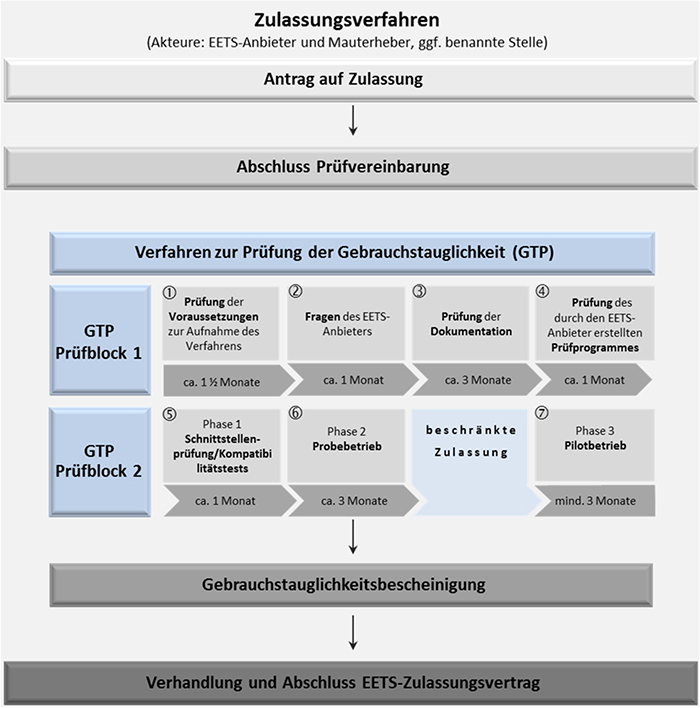
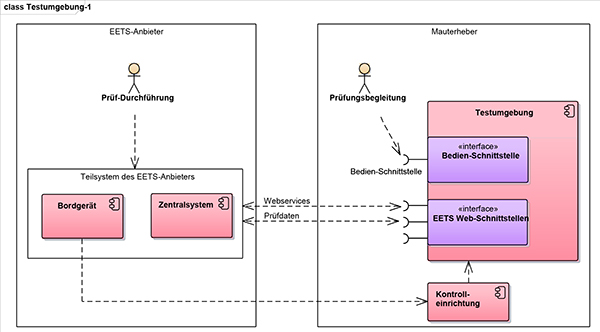
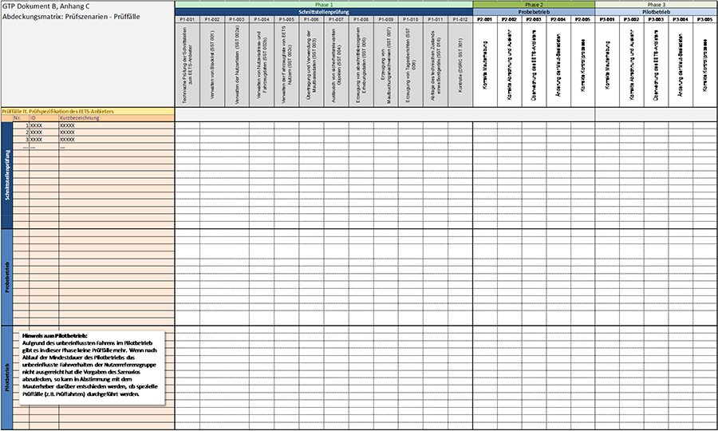
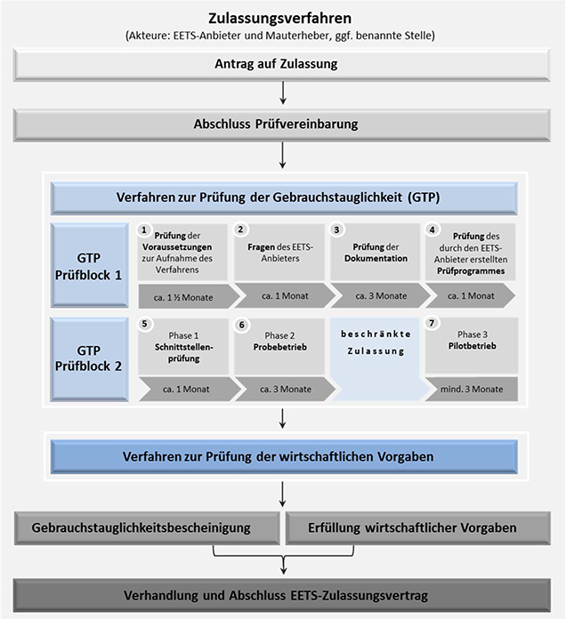

# Vereinbarung über die Durchführung des Prüfverfahrens zur Erbringung mautdienstbezogener Leistungen (EEMD-ZVAnl I)

Ausfertigungsdatum
:   2018-03-20

Fundstelle
:   BAnz: AT 27.03.2018 V2

Zuletzt geändert durch
:   Art. 1 Nr. 1 V v. 20.3.2019 BAnz AT 26.03.2019 V1

Änderung durch
:   Art. 2 V v. 25.10.2021 BAnz AT 29.10.2021 V2 mWv 30.10.2021 noch nicht berücksichtigt

## Anlage I Prüfvereinbarung

(Fundstelle: BAnz AT 27.03.2018 V2)

Vereinbarung
über die Durchführung
des Prüfverfahrens zur Erbringung mautdienstbezogener Leistungen
(Prüfvereinbarung)
**Prüfvereinbarung**
## zwischen

der Bundesrepublik Deutschland, vertreten durch das Bundesministerium
für Verkehr und digitale Infrastruktur (BMVI), dieses vertreten durch
das Bundesamt für Güterverkehr (BAG), Werderstraße 34, 50672 Köln,
dieses wiederum vertreten durch seinen Präsidenten

– Mauterheber –

und

(Name Anbieter), (Adresse Anbieter), vertreten durch (Vertretung
Anbieter), (registriert gemäß Artikel 3 der Entscheidung 2009/750/EG
in …) (Nachweis der Registrierung)

– Anbieter –

**Inhaltsverzeichnis**
##

*    *   §  1

    *   Gegenstand der Vereinbarung

*    *   §  2

    *   Vertragsbestandteile

*    *   §  3

    *   Ablauf des Prüfverfahrens

*    *   §  4

    *   Zeit- und Projektplan

*    *   §  5

    *   Austausch von Daten

*    *   §  6

    *   Mauterhebung und Mautauskehr

*    *   §  7

    *   Sicherheiten

*    *   §  8

    *   Versicherungen

*    *   §  9

    *   Abtretungsverbot und Verbot der Schuld- und Vertragsübernahme

*    *   § 10

    *   Entgeltpflicht

*    *   § 11

    *   Sicherstellung der Rückwirkungsfreiheit

*    *   § 12

    *   Mitwirkungspflichten

*    *   § 13

    *   Finanzielle Ausstattung des Anbieters

*    *   § 14

    *   Datenschutz

*    *   § 15

    *   Datensicherheit

*    *   § 16

    *   Aufbewahrung von vertraulichen Daten

*    *   § 17

    *   Geheimhaltung und Vertraulichkeit

*    *   § 18

    *   Gewerbliche Schutzrechte

*    *   § 19

    *   Eigentum

*    *   § 20

    *   Haftung

*    *   § 21

    *   Freistellung

*    *   § 22

    *   Vertragsstrafen

*    *   § 23

    *   Beginn und Beendigung der Vereinbarung

*    *   § 24

    *   Anpassungen der Vereinbarung

*    *   § 25

    *   Streitbeilegung

*    *   § 26

    *   Anwendbares Recht und Gerichtsstand

*    *   § 27

    *   Schriftverkehr

*    *   § 28

    *   Schriftform

*    *   § 29

    *   Salvatorische Klausel

*    *   Anlagen

##

## § 1 Gegenstand der Vereinbarung

(1) Diese Prüfvereinbarung („Vereinbarung“) regelt auf der Grundlage
von § 10 des Mautsystemgesetzes (MautSysG) und § 4d des
Bundesfernstraßenmautgesetzes (BFStrMG) sowie der dazu erlassenen
Rechtsverordnungen die Rechte und Pflichten des Anbieters und des
Mauterhebers im Zusammenhang mit der Durchführung des Prüfverfahrens
für das EETS-Gebiet BFStrMG. Soweit nicht ausdrücklich geregelt, sind
Rechte und Pflichten des Anbieters gegenüber Nutzern sowie die
zwischen Anbieter und Nutzern geltenden vertraglichen und sonstigen
Vereinbarungen nicht Gegenstand dieser Vereinbarung.

(2) Gegenstand dieser Vereinbarung ist insbesondere die Gewährleistung
der Sicherheit der Daten und des Datenschutzes. Daten im Sinne dieser
Vereinbarung sind alle Informationen jeglicher Art in elektronischer,
Papier- oder sonstiger Form (insgesamt: „Daten“).

(3) Diese Vereinbarung begründet keinen Anspruch des Anbieters auf
Gewährung des Zugangs zum EETS-Gebiet BFStrMG oder auf Abschluss eines
Zulassungsvertrags mit dem Mauterheber. Ansprüche des Anbieters gegen
den Mauterheber bei Unterbrechung, Verzögerung oder Beendigung des
Prüfverfahrens bestehen nicht.

(4) Vorbehaltlich der in dieser Vereinbarung enthaltenen Definitionen
gelten für diese Vereinbarung die im Glossar nach (Anlage 6)
enthaltenen Definitionen.

## § 2 Vertragsbestandteile

(1) Bestandteile dieses Vertrags sind

–   der Nachweis der Registrierung als Anbieter nach § 4 MautSysG,

–   die Zusatzvereinbarung (Anlage 1), soweit von den Parteien als
    erforderlich erachtet,

–   Verfahren zur Feststellung der Gebrauchstauglichkeit Dokumente A und B
    (Anlagen 2 und 3),

–   der Zeit- und Projektplan (Anlage 4),

–   die Entgeltordnung (Anlage 5),

–   das Glossar (Anlage 6),

–   die Erklärung über die Gewährung einer Bankgarantie oder eines
    gleichwertigen Finanzinstruments,

–   gegebenenfalls Erklärungen/Schriftwechsel (Anlage 7).

(2) Bei Widersprüchen in diesem Vertrag gelten nacheinander

–   dieser Vertrag,

–   die Zusatzvereinbarung (Anlage 1),

–   gegebenenfalls Erklärungen/Schriftwechsel (Anlage 7),

–   Verfahren zur Feststellung der Gebrauchstauglichkeit Dokumente A und B
    (Anlagen 2 und 3),

–   der Zeit- und Projektplan (Anlage 4),

–   das Glossar (Anlage 6).

## § 3 Ablauf des Prüfverfahrens

Der Ablauf des Prüfverfahrens für das EETS-Gebiet BFStrMG ist im
BFStrMG und in der Verordnung über die Zulassung von Anbietern
mautdienstbezogener Leistungen für das EETS-Gebiet
Bundesfernstraßenmautgesetz (EEMD-ZV) festgelegt.

## § 4 Zeit- und Projektplan

(1) Nach Abschluss dieser Vereinbarung werden Anbieter und Mauterheber
für das Verfahren zur Feststellung der Gebrauchstauglichkeit und für
das Verfahren zur Prüfung der Erfüllung der wirtschaftlichen Vorgaben
gemäß den Regelungen dieses Paragraphen einen Zeit- und Projektplan
vereinbaren, in dem die Meilensteine der einzelnen
Verfahrensabschnitte sowie die Zeitabläufe konkretisiert sind. Der
Zeit- und Projektplan wird Teil dieser Vereinbarung (Anlage 4).

(2) Der Anbieter wird einen Vorschlag für den Zeit- und Projektplan
erstellen. Der Mauterheber wird diesen Vorschlag prüfen und Änderungen
mit dem Anbieter abstimmen.

(3) Der Anbieter darf von den Festlegungen des Zeit- und Projektplans
nur aus wichtigem Grund und nur mit Zustimmung des Mauterhebers
abweichen. Die Regelungen zur Haftung des Anbieters gemäß § 20 bleiben
hiervon unberührt. Sofern der Mauterheber einer Abweichung von den
Festlegungen des Zeit- und Projektplans nicht zugestimmt hat, bleibt
auch das Recht des Mauterhebers zur Kündigung dieser Vereinbarung nach
§ 23 von den Regelungen dieses Paragraphen unberührt. Der Mauterheber
ist von der Erfüllung seiner Verpflichtungen nach dieser Vereinbarung
so lange frei, bis der Anbieter die ihm nach dem Zeit- und Projektplan
obliegenden Verpflichtungen erfüllt hat.

## § 5 Austausch von Daten

(1) Nach Abschluss dieser Vereinbarung tauschen die Parteien nach
Maßgabe des Zeit- und Projektplans die zum Nachweis der Erfüllung der
Vorgaben für das EETS-Gebiet BFStrMG erforderlichen Daten aus.

(2) Der Anbieter übermittelt dem Mauterheber die Dokumente, die zum
Nachweis der Erfüllung der Vorgaben für das EETS-Gebiet BFStrMG
erforderlich sind in elektronischer Form und in deutscher Sprache. Der
Mauterheber kann zusätzlich die Vorlage der Dokumente in Papierform
verlangen.

(3) Der Anbieter soll sich hinsichtlich des Inhalts, der Struktur und
des Umfangs der Dokumente gemäß Absatz 2 an den Empfehlungen zur
Dokumentation des Teilsystems des Anbieters orientieren, die Teil der
Vorgaben für das EETS-Gebiet BFStrMG sind.

(4) Der Mauterheber übermittelt dem Anbieter insbesondere folgende
Dokumente:

–   Empfehlungen zur Dokumentation des Teilsystems des EETS-Anbieters,

–   Spezifikation der Schnittstellen des Mauterhebers,

–   Verfahrensbeschreibung für die Durchführung der
    Gebrauchstauglichkeitsprüfung,

–   Muster-Zulassungsvertrag.

(5) Jede Partei bestätigt den Eingang von Dokumenten schriftlich
gegenüber der jeweils anderen Partei. Nach Erhalt der Dokumente prüfen
die Parteien die Dokumente auf ihre Vollständigkeit und fordern
gegebenenfalls fehlende Dokumente, Dokumententeile oder andere für den
Nachweis der Erfüllung der Vorgaben für das EETS-Gebiet BFStrMG
wesentliche Informationen bei der jeweils anderen Partei an. Erkennt
eine Partei erst im Verlaufe des weiteren Verfahrens, dass Dokumente,
Dokumententeile oder andere wesentliche Informationen fehlen, so hat
sie diese unverzüglich bei der jeweils anderen Partei anzufordern.

(6) Wird eine Partei zur Ergänzung der für die Durchführung des
Prüfverfahrens erforderlichen Dokumente durch die andere Partei
aufgefordert, so trägt sie dafür Sorge, dass die fehlenden Dokumente,
Dokumententeile oder für den Nachweis der Erfüllung der Vorgaben für
das EETS-Gebiet BFStrMG wesentliche Informationen der anderen Partei
zur Verfügung gestellt werden. Diese Verpflichtung gilt nicht für den
Mauterheber, wenn er zur Herausgabe von Dokumenten, Dokumententeilen
oder wesentlichen Informationen aus gesetzlichen oder sonstigen
rechtlichen Gründen nicht berechtigt ist. Der Mauterheber ist von der
Erfüllung seiner Verpflichtungen nach dieser Vereinbarung so lange
frei, bis ihm der Anbieter sämtliche für die Durchführung des
Prüfverfahrens erforderlichen Dokumente vollständig zur Verfügung
gestellt hat.

## § 6 Mauterhebung und Mautauskehr

(1) Der Anbieter ist im Rahmen des Prüfverfahrens nur nach
schriftlicher Erlaubnis des Mauterhebers und nur in dem in der
Erlaubnis festgelegten Umfang zur Mitwirkung an der Erhebung der Maut
im Geltungsbereich des EETS-Gebiets BFStrMG befugt.

(2) Soweit der Anbieter nach Absatz 1 Maut im Geltungsbereich des
EETS-Gebiets BFStrMG an der Erhebung der Maut mitwirkt, kehrt er diese
gemäß der Vorgaben für das EETS-Gebiet BFStrMG an den Mauterheber aus.

(3) Der Anbieter muss sicherstellen, dass die Zahlungsvorgänge
zwischen ihm, seinen Nutzern und dem Mauterheber so ausgestaltet sind,
dass in jedem Fall, auch im Fall der Insolvenz oder drohender
Insolvenz des Anbieters, die Sicherheit der vollständigen Auskehr der
Mauteinnahmen nicht gefährdet ist.

## § 7 Sicherheiten

(1) Der Anbieter wird dem Mauterheber unverzüglich nach Abschluss
dieser Vereinbarung die Garantieerklärung einer Bank oder den Nachweis
eines gleichwertigen Finanzinstruments in Höhe der erwarteten
monatlichen Durchschnittssumme für Mauttransaktionen und Zahlungen
gemäß § 19 Absatz 1 MautSysG übergeben, die den Mauterheber
berechtigt, für alle Ansprüche aus dieser Vereinbarung, insbesondere
für die an den Mauterheber auszukehrenden Mauteinnahmen, Zahlungen auf
erstes Anfordern zu erhalten. Für die Prognose wird ein
Betrachtungszeitraum von 12 Monaten zugrunde gelegt. Die Wirksamkeit
der Bankgarantie oder des gleichwertigen Finanzinstruments kann bis
zum Beginn des Pilotbetriebs aufschiebend bedingt sein.

(2) Die Bankgarantie muss von einem Kreditinstitut gegeben werden, das
seinen Sitz oder seine Niederlassung in der Europäischen Union oder in
der EFTA hat. Das Kreditinstitut muss ein Investmentgrade-Rating für
Langfristverbindlichkeiten von mindestens A3 (Moody´s) bzw. A- (S&P
oder Fitch) aufweisen und für Kurzfristverbindlichkeiten von
mindestens P2 (Moody´s) bzw. A-2 (S&P) bzw. F-2 (Fitch) aufweisen.
Verschlechtert sich das Rating des Kreditinstituts während der
Laufzeit der Bankgarantie, sodass die vorstehend genannten
Mindestanforderungen nicht mehr erfüllt sind, ist der Anbieter
verpflichtet, unverzüglich, spätestens aber innerhalb eines Monats
nach Bekanntwerden des schlechteren Ratings, eine Bankgarantie eines
Kreditinstituts, das die in diesem Absatz genannten Mindestvorgaben
erfüllt, zu übergeben.

(3) Sofern ein anderes Finanzinstrument als eine Bankgarantie zur
Sicherung der Mauteinnahmen vorgehalten wird, muss dieses einer
Bankgarantie, die die genannten Kriterien in Absatz 1 erfüllt,
gleichwertig sein. Ein Finanzinstrument ist gleichwertig, wenn es
denselben Grad an Sicherheit wie eine Bankgarantie bietet. Dies kann
insbesondere der Fall sein, wenn die Gesellschafter des Anbieters eine
Kapitalintakthalteerklärung in Bezug auf den Anbieter abgeben und eine
der zu besichernden Summe angemessene finanzielle Leistungsfähigkeit
besitzen. Die Entscheidung über die Gleichwertigkeit steht im Ermessen
des Bundesamtes für Güterverkehr.

(4) Die Garantieerklärung oder der Nachweis eines gleichwertigen
Finanzinstruments muss vom Anbieter in deutscher Sprache oder in einer
amtlich beglaubigten Übersetzung übergeben werden. Sollte die
Bankgarantieerklärung oder die Laufzeit des gleichwertigen
Finanzinstruments befristet sein, ist der Anbieter verpflichtet,
spätestens zwei Kalendermonate vor Ablauf des Geltungszeitraums eine
Verlängerung dieser Bankgarantieerklärung oder des gleichwertigen
Finanzinstruments vorzulegen. Legt der Anbieter die Verlängerung der
Bankgarantie oder des gleichwertigen Finanzinstruments nicht
rechtzeitig vor, ist der Mauterheber – unbeschadet seines Rechts zur
Beendigung dieser Vereinbarung nach § 23 – von der Erfüllung seiner
Verpflichtungen nach dieser Vereinbarung so lange frei, bis der
Anbieter die Verlängerung der Bankgarantieerklärung oder des
gleichwertigen Finanzinstruments vorgelegt hat

## § 8 Versicherungen

(1) Der Anbieter ist verpflichtet, für die im Rahmen dieser
Vereinbarung ausgeführten Tätigkeiten auf eigene Kosten eine
Betriebshaftpflichtversicherung mit mindestens den folgenden Inhalten
abzuschließen und während der Laufzeit dieser Vereinbarung
aufrechtzuerhalten:

a)  Betriebsbeschreibung: „Mauterhebung als EETS-Anbieter auf den Straßen
    des EETS-Mautgebiets BFStrMG inklusive aller betriebs- und
    branchenüblichen, betriebs- und branchennotwendigen und im Betrieb der
    Versicherungsnehmerin bestehenden Zusatzrisiken“,

b)  Deckung für gesetzliche Haftpflichtansprüche wegen Personen-, Sach-
    und daraus folgenden Vermögensschäden mit einer Deckungssumme von
    mindestens 15 Mio. Euro (in Worten: fünfzehn Millionen Euro) je
    Schadensfall.

(2) Errichtet oder betreibt der Anbieter im EETS-Gebiet BFStrMG
straßenseitige Einrichtungen, ist er verpflichtet, die
geschäftsüblichen Versicherungen abzuschließen und für die Dauer der
Errichtung oder des Betriebs aufrechtzuerhalten. Die Versicherungen
müssen Personen-, Sach- und daraus folgende Vermögensschäden abdecken.
Die Mindestversicherungssumme für Versicherungen nach diesem Absatz
beträgt 2,5 Mio. Euro (in Worten: zweieinhalb Millionen Euro) je
Schadensfall.

(3) Der Mauterheber kann eine Erhöhung der Versicherungssumme
verlangen, wenn dies angesichts veränderter Schadensszenarien
angemessen ist.

(4) Der Anbieter legt dem Mauterheber nach Abschluss dieser
Vereinbarung die Nachweise des Versicherungsabschlusses und des
Versicherungsumfangs unverzüglich, unaufgefordert und in deutscher
Sprache oder mit einer amtlichen beglaubigten Übersetzung vor. Dies
gilt auch im Fall der Anpassung von Versicherungen.

(5) Die Ansprüche auf Leistungen aus den Versicherungen nach den
Absätzen 1 und 2 tritt der Anbieter zur Sicherung der
Haftungsansprüche des Mauterhebers an diesen ab. In den Versicherungen
nach den Absätzen 1 und 2 ist vorzusehen, dass der Mauterheber vom
Versicherer über etwaige Versicherungsleistungen an den Anbieter
unmittelbar in Kenntnis gesetzt wird. Der Anbieter ist zum Einzug der
Versicherungsleistungen berechtigt und verpflichtet sich, die
Versicherungsleistung umgehend zur vollständigen Beseitigung und
vollständigen Wiederherstellung der Funktionsfähigkeit des vom Schaden
betroffenen Teils zu verwenden. Im Falle der Verletzung dieser Pflicht
ist der Mauterheber zur Offenlegung der Abtretung und zum Widerruf der
nach Satz 3 erteilten Einziehungsberechtigung berechtigt. Eine
Abtretung oder Verpfändung von Versicherungsansprüchen an Dritte ist
nur mit vorheriger Zustimmung des Mauterhebers zulässig.

## § 9 Abtretungsverbot und Verbot der Schuld- und Vertragsübernahme

Der Anbieter ist nicht berechtigt, ohne vorherige schriftliche
Zustimmung des Mauterhebers Rechte aus dieser Vereinbarung an Dritte
abzutreten. Dies gilt auch für die Übernahme von Verpflichtungen des
Anbieters aus dieser Vereinbarung durch Dritte sowie eine vollständige
Übernahme dieser Vereinbarung des Anbieters durch Dritte. Die
Erteilung der Zustimmung steht im freien Ermessen des Mauterhebers.

## § 10 Entgeltpflicht

Der Anbieter trägt die Kosten für die Durchführung des Prüfverfahrens.
Das Entgelt bestimmt sich nach der Entgeltordnung (Anlage 5).

## § 11 Sicherstellung der Rückwirkungsfreiheit

(1) Der Anbieter ist verpflichtet, die Rückwirkungsfreiheit der
verwendeten Systeme und eingebrachten Komponenten im Hinblick auf die
ungestörte Funktion der Systeme des Mauterhebers, des nationalen
Betreibers und der von ihm betriebenen Kontrolleinrichtungen zu jedem
Zeitpunkt zu gewährleisten. Er steht für die jederzeitige
Rückwirkungsfreiheit gemäß Satz 1 ein.

(2) Ist nach den Feststellungen des Mauterhebers die
Rückwirkungsfreiheit gemäß Absatz 1 nicht gewährleistet und droht
daraus ein Schaden für die ungestörte Funktion der Systeme des
Mauterhebers zu entstehen, so ist der Anbieter verpflichtet, alle
erforderlichen Maßnahmen zu ergreifen, um den Eintritt solcher Schäden
sicher auszuschließen. Der Mauterheber ist berechtigt, das
Prüfverfahren so lange auszusetzen bis der Anbieter nachgewiesen hat,
dass der Eintritt eines Schadens ausgeschlossen ist.

## § 12 Mitwirkungspflichten

(1) Anbieter und Mauterheber sowie die von diesen hinzugezogenen
Personen und Unternehmen arbeiten während der Durchführung des
Prüfverfahrens, insbesondere während des Verfahrens zur Prüfung der
Erfüllung aller Vorgaben für das EETS-Gebiet BFStrMG, zusammen. Der
Mauterheber stellt dem Anbieter solche Informationen zur Verfügung,
die für die Vertragserfüllung erforderlich sind und seinem
unmittelbaren Einwirkungsrecht unterliegen.

(2) Anbieter und Mauterheber informieren die jeweils andere Partei
unverzüglich und nachvollziehbar über Störungen während der
Durchführung des Prüfverfahrens. Der Mauterheber ist berechtigt, das
Prüfverfahren so lange auszusetzen, bis der Anbieter nachgewiesen hat,
dass nicht unerhebliche Störungen ausgeschlossen sind.

## § 13 Finanzielle Ausstattung des Anbieters

Der Anbieter ist verpflichtet, auf Verlangen des Mauterhebers ihm
diejenigen Unterlagen zur Information vorzulegen, die er zum Nachweis
seiner finanziellen Leistungsfähigkeit gemäß Artikel 3 Buchstabe d der
Entscheidung 2009/750/EG im Rahmen seiner Registrierung verwendet hat.
Die Unterlagen gemäß Satz 1 sind in deutscher Sprache oder in einer
amtlich beglaubigten Übersetzung vorzulegen.

## § 14 Datenschutz

(1) Der Anbieter stellt sicher, dass er bei der Durchführung des
Prüfverfahrens jederzeit alle Anforderungen des Datenschutzes erfüllt.
Dazu gehören insbesondere die spezialgesetzlichen Vorgaben des
MautSysG, des BFStrMG und – soweit das MautSysG und das BFStrMG keine
abschließende Regelung treffen – ergänzend die Bestimmungen des
Bundesdatenschutzgesetzes (BDSG) sowie ab dem 25. Mai 2018 die
Bestimmungen der Europäischen Datenschutz-Grundverordnung (EU-DSGVO).
Diese Verpflichtung des Anbieters gilt unabhängig davon, ob der
Anbieter selbst in den Anwendungsbereich solcher
Datenschutzbestimmungen fällt. Die Pflicht des Anbieters zur
Einhaltung nationaler Datenschutzbestimmungen des Staates, in dem er
niedergelassen ist oder in dem er Daten erhebt oder verarbeitet,
bleibt unberührt. Im Zweifel haben das MautSysG, das BFStrMG und −
soweit das MautSysG und das BFStrMG keine abschließende Regelung
treffen − ergänzend die Bestimmungen des BDSG sowie − soweit anwendbar
− weitere spezialgesetzliche deutsche oder supranationale
Datenschutzvorschriften und ab dem 25. Mai 2018 die Bestimmungen der
EU-DSGVO, Vorrang vor anderen nationalen Datenschutzbestimmungen.

(2) Soweit sich der Anbieter bei der Durchführung des Prüfverfahrens
eines Dritten bedient, verpflichtet sich der Anbieter unabhängig
davon, in welchem Land dieser Dritte seine Leistungen erbringt, dafür
zu sorgen, dass die vom Anbieter einzuhaltenden datenschutzrechtlichen
Standards auch von dem Dritten eingehalten werden.

(3) Die Regelungen dieses Paragraphen gelten auch im Falle der
Beendigung dieser Vereinbarung oder nach Abschluss eines
Zulassungsvertrags zwischen Anbieter und Mauterheber fort.

## § 15 Datensicherheit

(1) Der Anbieter wird seine Datensysteme und Schnittstellen so
ausgestalten, dass während des Prüfverfahrens zu jeder Zeit und
uneingeschränkt ein verlustfreier und sicherer elektronischer
Datenaustausch möglich ist.

(2) Der Mauterheber wird dem Anbieter die für das Prüfverfahren
erforderlichen Daten zugänglich machen und während des Prüfverfahrens
im erforderlichen Umfang aktualisieren und ergänzen.

(3) Der Anbieter verpflichtet sich, während des gesamten
Prüfverfahrens und bis zu dem Zeitpunkt, in dem die Daten mit
Zustimmung des Mauterhebers gemäß § 16 unwiderruflich gelöscht oder
vernichtet werden, sicherzustellen, dass der Schutz der
personenbezogenen und personenbeziehbaren Daten den Anforderungen des
deutschen und europäischen Datenschutzrechts entspricht. Der Anbieter
wird darüber hinaus jederzeit die erforderlichen technischen und
organisatorischen Sicherheitsmaßnahmen nach dem aktuellen Stand der
Technik ergreifen, um die seinem Zugriff unterliegenden Daten,
Prozesse und Systeme sowie den Datenaustausch mit dem Mauterheber zu
schützen, sodass jederzeit hinsichtlich Vertraulichkeit, Verfügbarkeit
und Integrität der Daten, Prozesse und Systeme ein dem im Einzelfall
festgestellten Schutzbedarf entsprechender Schutz vor technischer oder
organisatorischer Kompromittierung gewährleistet ist. Dabei ist für
alle Vorgänge, die

a)  personenbezogene und personenbeziehbare Daten und

b)  den Datenaustausch oder Systemberührungen mit dem Mauterheber
    betreffen,

von dem jeweils höchsten Schutzbedarf auszugehen. Der Anbieter wird
insbesondere jederzeit die erforderlichen technischen und
organisatorischen Sicherheitsmaßnahmen ergreifen, um alle beteiligten
Daten, Systeme und Prozesse zu schützen, zu überwachen und bei
Kenntnis eines realisierten oder potenziellen Verlustes der
Vertraulichkeit, Verfügbarkeit oder Integrität von Daten, Systemen,
oder Prozessen (insgesamt „Sicherheitsvorfall“) den Mauterheber
unverzüglich zu informieren und unverzüglich in der jeweils
erforderlichen Art und Weise zu reagieren, sodass insbesondere der
Sicherheitsvorfall ausgeräumt oder seine Auswirkungen sowie damit
verbundene Schäden und Beeinträchtigungen des Mauterhebers oder
Dritter soweit wie möglich begrenzt und reduziert werden. Der
Mauterheber kann verlangen, auf Veranlassung des Anbieters das
Informationsschutz-Management-System des Anbieters im Rahmen eines
Audits von einem externen Sachverständigen prüfen zu lassen.

(4) Der Anbieter haftet dem Mauterheber für jegliche mittelbaren und
unmittelbaren Schäden, die dem Mauterheber aufgrund von
Sicherheitsvorfällen aus dem Verantwortungsbereich des Anbieters
entstehen; dies gilt nicht, soweit er die Pflichtverletzung nicht zu
vertreten hat. Die Haftung schließt die dem Mauterheber entgangenen
Mauteinnahmen ein. Der Anbieter übernimmt zudem die Kosten einer
Wiederinstandsetzung, Reparatur oder sonstigen Überprüfung des Systems
des Mauterhebers, die aufgrund von Sicherheitsvorfällen aus dem
Verantwortungsbereich des Anbieters entstanden sind. Sollten aufgrund
von Sicherheitsvorfällen aus dem Verantwortungsbereich des Anbieters
Dritte Ansprüche gegenüber dem Mauterheber geltend machen, stellt der
Anbieter den Mauterheber gemäß § 21 im dort geregelten Umfang von
diesen Ansprüchen frei.

(5) Die Regelungen dieses Paragraphen gelten auch im Falle der
Beendigung dieser Vereinbarung oder nach Abschluss eines
Zulassungsvertrags zwischen Anbieter und Mauterheber fort.

## § 16 Aufbewahrung von vertraulichen Daten

(1) Die vertraulichen Daten sind bis zu ihrer Vernichtung, Löschung
oder Rückgabe sicher aufzubewahren bzw. zu speichern und vor dem Ein-
und Zugriff Dritter zu schützen.

(2) In diesem Zeitraum verpflichtet sich der Anbieter, die
vertraulichen Daten in einer Weise aufzubewahren, dass sie von Dritten
nicht eingesehen, verändert, kopiert, entwendet oder vernichtet werden
können. Der Anbieter stellt zu diesem Zweck insbesondere sicher, dass
seine Datensicherungssysteme einen Ein- und Zugriff durch Dritte
verlässlich ausschließen.

(3) Der Anbieter wird die vertraulichen Daten einschließlich aller
Sicherungskopien nur mit Zustimmung des Mauterhebers vernichten oder
löschen und dabei insbesondere gewährleisten, dass Vertraulichkeit im
Sinne des § 17 Absatz 4 jederzeit eingehalten wird und Dritte auch
nach Vernichtung oder Löschung keinen Zugang zu diesen Daten erlangen.
Soweit die Löschung von Daten erforderlich ist, wird der Anbieter
diese Löschung in einer Weise vornehmen, die eine Wiederherstellung
der Daten technisch ausschließt, die vorgenommenen Maßnahmen
dokumentieren und sie auf Verlangen dem Mauterheber nachweisen.

(4) Sollten entgegen den Verpflichtungen dieses Paragraphen
vertrauliche Daten abhandenkommen, kopiert werden oder sonst
unberechtigt eingesehen werden, haftet der Anbieter dem Mauterheber
für die daraus entstehenden Schäden und stellt den Mauterheber gemäß §
21 im dort geregelten Umfang von allen Ansprüchen frei. Dies gilt
nicht, soweit er die Pflichtverletzung nicht zu vertreten hat.

(5) Nach Beendigung des Prüfverfahrens sind auf Verlangen einer Partei
alle vertraulichen Daten im Sinne des § 17 an diese zurückzugeben oder
– soweit dies nach Art der Daten nicht möglich ist – nachweislich zu
löschen oder auf andere Weise zu vernichten. Dies gilt nicht, soweit
ein berechtigtes Interesse an der Aufbewahrung der vertraulichen Daten
im Hinblick auf eine spätere Rekonstruktion des Prüfverfahrens bei
Streitfällen dargelegt wird. In diesem Falle sind die Daten
zurückzugeben oder nachweislich zu löschen, wenn sie für diesen Zweck
nicht mehr erforderlich sind.

(6) Für die Regelungen dieses Paragraphen gelten § 17 Absatz 3 und 8
entsprechend.

## § 17 Geheimhaltung und Vertraulichkeit

(1) Die Parteien werden alle Daten, die ihnen vor Beginn oder während
der Durchführung des Prüfverfahrens zur Verfügung gestellt werden oder
die sie im Zusammenhang mit dieser Vereinbarung oder dem Prüfverfahren
in sonstiger Weise erlangt haben (insgesamt: „vertrauliche Daten“),
vertraulich behandeln und sie Dritten nicht zugänglich machen. Als
vertrauliche Daten gelten auch solche Daten, die die Parteien selbst
im Rahmen der Durchführung des Prüfverfahrens erstellt oder erhoben
haben und die mit dem Mautdienst, den ihm zugrunde liegenden
Parametern, den technischen Spezifikationen, wirtschaftlichen Vorgaben
oder den Parteien selbst in Verbindung stehen. Die Verpflichtung zur
Vertraulichkeit gilt auch nach Beendigung dieser Vereinbarung oder
nach Abschluss eines Zulassungsvertrags zwischen Anbieter und
Mauterheber fort.

(2) Die vertraulichen Daten dürfen von den Parteien ausschließlich für
den Zweck der Durchführung des Prüfverfahrens verwendet werden.

(3) Nicht als Dritte im Sinne dieses Paragraphen gelten auf Seiten des
Anbieters solche Personen, die

a)  mit Aufgaben befasst sind, die im Zusammenhang mit dieser Vereinbarung
    oder dem Prüfverfahren stehen und/oder bestimmungsgemäß mit der
    Erfüllung der nach dieser Vereinbarung gegenüber dem Mauterheber
    geschuldeten Verpflichtungen beschäftigt sind,

b)  gegenüber dem Anbieter zur Vertraulichkeit insbesondere auch bezüglich
    der vertraulichen Daten verpflichtet sind und

c)  die vertraulichen Daten zur Ausführung der ihnen zugewiesenen Aufgaben
    benötigen.

Die Weiterreichung an mit dem Anbieter im Konzernverbund stehende
Unternehmen („Konzernunternehmen“) ist gestattet, wenn und soweit dies
zur konzerninternen Prüfung erforderlich ist und zuvor den beteiligten
Konzernunternehmen vollumfänglich die nach diesem Abschnitt bestehende
Vertraulichkeitsverpflichtung auferlegt worden ist.

(4) Der Anbieter führt eine Liste der Personen in Konzernunternehmen,
die Zugang zu vertraulichen Daten haben und legt diese dem Mauterheber
in regelmäßigen Abständen sowie jederzeit auf Verlangen des
Mauterhebers vor.

(5) Der Anbieter ist verpflichtet, Personen, die Zugang zu
vertraulichen Daten haben, in gleichem Umfang und unter Androhung
einer spürbaren Vertragsstrafe mit unmittelbarer Wirkung zu Gunsten
des Mauterhebers Vertraulichkeitsverpflichtungen aufzuerlegen und dies
auf Verlangen des Mauterhebers unverzüglich nachzuweisen.

(6) Der Anbieter ist verpflichtet dafür Sorge zu tragen, dass die
Konzernunternehmen die Verpflichtung nach Absatz 5 ebenfalls erfüllen.

(7) Der Anbieter steht für die Einhaltung der ihm hiernach auferlegten
und den Personen und Konzernunternehmen aufzuerlegenden
Verschwiegenheitsverpflichtung ein.

(8) Nicht als Dritte im Sinne dieses Paragraphen gelten auf Seiten des
Mauterhebers solche Personen, die

a)  mit Aufgaben befasst sind, die im Zusammenhang mit dieser Vereinbarung
    oder dem Prüfverfahren stehen und/oder bestimmungsgemäß mit der
    Erfüllung der nach dieser Vereinbarung dem Mauterheber obliegenden
    Verpflichtungen beschäftigt sind,

b)  gegenüber dem Mauterheber zur Vertraulichkeit insbesondere auch
    bezüglich der vertraulichen Daten verpflichtet sind und

c)  die vertraulichen Daten zur Ausführung der ihnen obliegenden Aufgaben
    benötigen.

(9) Nicht als vertrauliche Daten gelten alle Daten, die zum Zeitpunkt
der Weitergabe oder sonstigen Zugänglichmachung der Öffentlichkeit
bereits nachweislich allgemein bekannt sind, ohne dass dies auf einer
Verletzung dieser Vertraulichkeitsvereinbarung beruht.

(10) Eine Verletzung vertraglicher Vertraulichkeits- und
Geheimhaltungsvereinbarungen durch eine Partei liegt nicht vor, wenn
die jeweils andere Partei einer Veröffentlichung der konkreten
vertraulichen Daten zuvor schriftlich zugestimmt hat.

(11) Gesetzliche Aufbewahrungs- oder Offenlegungspflichten bleiben
unberührt.

(12) Die Anwendbarkeit der – auch strafrechtlichen – Bestimmungen des
Datenschutzgesetzes und anderer Rechtsvorschriften zum Schutz der
Vertraulichkeit und die Geltendmachung von Unterlassungs- sowie von
weitergehenden Schadensersatzansprüchen des Mauterhebers bleiben von
den Regelungen dieses Paragraphen unberührt.

(13) Die Regelungen dieses Paragraphen gelten auch im Falle der
Beendigung dieser Vereinbarung oder nach Abschluss eines
Zulassungsvertrags zwischen Anbieter und Mauterheber fort.

## § 18 Gewerbliche Schutzrechte

(1) Der Anbieter hat keine Rechte in Bezug auf gewerbliche
Schutzrechte und Urheberrechte (gemeinsam: „Schutzrechte“) des
Mauterhebers oder der Betreibergesellschaft. Soweit nachfolgend nicht
ein anderes geregelt ist, werden an den Anbieter unter dieser
Vereinbarung keine Schutzrechte lizenziert.

(2) Sollten beim Anbieter im Zusammenhang mit dem Prüfverfahren
Schutzrechte bestehen oder entstehen, deren Nutzung für den
Mauterheber im Zusammenhang mit der Erbringung mautdienstbezogener
Leistungen im EETS-Gebiet BFStrMG von praktischer Bedeutung ist, räumt
der Anbieter dem Mauterheber bereits jetzt ab dem Zeitpunkt der
Entstehung dieser Schutzrechte ein einfaches Nutzungsrecht
einschließlich des Rechts zur Unterlizenzierung für das EETS-Gebiet
BFStrMG in dem zeitlichen und inhaltlichen Umfang ein, der für das
Verhältnis zwischen Anbieter und Mauterheber erforderlich ist. Soweit
es sich um Schutzrechte Dritter handelt, steht der Anbieter dafür ein,
dass er zur Unterlizenzierung berechtigt ist.

(3) Soweit beim Mauterheber im Zusammenhang mit dem Prüfverfahren
Schutzrechte entstehen, deren Nutzung für den Anbieter im Zusammenhang
mit der Erbringung mautdienstbezogener Leistungen im EETS-Gebiet
BFStrMG erforderlich ist, hat der Anbieter einen Anspruch auf
Einräumung eines einfachen Nutzungsrechts für das EETS-Gebiet BFStrMG,
in dem zeitlichen und inhaltlichen Umfang, der für das Verhältnis
zwischen Anbieter und Mauterheber erforderlich ist. Eine
Unterlizenzierung bedarf der vorherigen schriftlichen Genehmigung des
Mauterhebers. Der Anbieter steht dem Mauterheber für die Erfüllung der
Pflicht gemäß Satz 2 ein.

## § 19 Eigentum

(1) Jede Partei bleibt unabhängig von Art und Umfang des
Zusammenwirkens von Einrichtungen und Gegenständen der Parteien
jeweils Eigentümer der von ihnen bereitgestellten Einrichtungen und
Gegenstände.

(2) Soweit im Rahmen des Prüfverfahrens vom Anbieter Einrichtungen und
Gegenstände mit dem Grund und Boden des Mauterhebers verbunden werden,
wird bereits jetzt vereinbart, dass solche Einrichtungen und
Gegenstände nur zu dem vorübergehenden Zweck mit dem Grund und Boden
verbunden sind. Der Anbieter hat dafür Sorge zu tragen, gegebenenfalls
gesonderte Absprachen und Vereinbarungen mit den jeweils zuständigen
Landesverwaltungen zu treffen bzw. abzuschließen.

## § 20 Haftung

(1) Der Anbieter haftet bei Verletzung gesetzlicher oder vertraglicher
Verpflichtungen nach den allgemeinen gesetzlichen Bestimmungen für
Vorsatz und Fahrlässigkeit. Er haftet für die Rückwirkungsfreiheit der
von ihm im Rahmen des Verfahrens zur Feststellung der
Gebrauchstauglichkeit verwendeten Systeme und eingebrachten
Komponenten im Hinblick auf die ungestörte Funktion der Systeme des
Mauterhebers, des nationalen Betreibers und der von ihm betriebenen
Kontrolleinrichtungen und für die inhaltliche Richtigkeit aller im
Rahmen des Prüfverfahrens übermittelten Daten. Soweit der Anbieter in
dieser Vereinbarung explizit oder aus den Umständen ersichtlich eine
Einstandspflicht übernommen hat, haftet er dem Mauterheber auch
verschuldensunabhängig.

(2) Für das Tun oder Unterlassen seiner Arbeitnehmer, freien
Mitarbeiter, gesetzlichen Vertreter, des eingesetzten Personals und
seiner Erfüllungsgehilfen (einschließlich aller Unterauftragnehmer,
Unter-Unterauftragnehmer und Bestandsunterauftragnehmer) sowie deren
Arbeitnehmer, freie Mitarbeiter, eingesetztes Personal und
gesetzlichen Vertreter haftet der Anbieter gegenüber dem Mauterheber
in gleichem Umfang wie für eigenes Tun oder Unterlassen. Soweit der
Anbieter in dieser Vereinbarung explizit oder aus den Umständen
ersichtlich eine Einstandspflicht übernommen hat, haftet er unabhängig
davon, ob die in Satz 1 genannten Personen die Verletzung
vertraglicher Pflichten zu vertreten haben. Soweit dem Mauterheber
aufgrund der Verletzung vertraglicher Pflichten durch die in Satz 1
genannten Personen ein Schadensersatzanspruch gegen den Anbieter
zusteht, tritt der Anbieter etwaige gegenüber diesen bestehende
Ansprüche auf Aufforderung des Mauterhebers erfüllungshalber an diesen
ab. § 278 Satz 2 BGB ist ausgeschlossen.

(3) Der Mauterheber haftet nur für Schäden des Anbieters aus der
Verletzung des Lebens, des Körpers, der Gesundheit, aus der Verletzung
wesentlicher Vertragspflichten sowie darüber hinaus für sonstige
Schäden, die auf einer vorsätzlichen oder grob fahrlässigen
Pflichtverletzung des Mauterhebers, seiner gesetzlichen Vertreter oder
Erfüllungsgehilfen beruhen. Wesentliche Vertragspflichten sind solche,
die zur Erreichung des Vertragsziels notwendig sind. Im Übrigen ist
die Haftung des Mauterhebers ausgeschlossen. Für die vorsätzliche oder
fahrlässige Verletzung wesentlicher Vertragspflichten haftet der
Mauterheber nur auf den vertragstypischen, vorhersehbaren Schaden.
Dies gilt nicht, wenn es sich um Schadenersatzansprüche des Anbieters
aus einer Verletzung des Lebens, des Körpers oder der Gesundheit
handelt. Wenn Ansprüche direkt gegen die gesetzlichen Vertreter und
Erfüllungsgehilfen des Mauterhebers geltend gemacht werden, gelten die
Einschränkungen aus den Sätzen 1 bis 5 auch für diese.

(4) Ansprüche des Anbieters gegen den Mauterheber wegen des
Abschlusses von Prüfvereinbarungen und Zulassungsverträgen mit anderen
Anbietern sind ausgeschlossen. Der Mauterheber haftet dem Anbieter
nicht für Schäden, die diesem mittelbar oder unmittelbar durch die
Tätigkeit anderer Anbieter entstanden sind, unabhängig davon, ob der
andere Anbieter hierbei gesetzliche oder vertragliche Verpflichtungen
verletzt hat.

(5) Der Mauterheber haftet nicht für eine Einschränkung oder Schäden
des EETS-Anbieters aufgrund

a)  von Maßnahmen des Baus, Betriebs, der Reparatur oder der Unterhaltung
    von Straßen des mautpflichtigen Straßennetzes,

b)  von Änderungen, Beschränkungen oder Einschränkungen des
    mautpflichtigen Streckennetzes,

c)  aus der Bereitstellung und Durchführung der EETS-Mauterkennung für
    EETS-Anbieter durch einen dritten Dienstleister.

(6) Das Recht des Mauterhebers, wegen der Verletzung von Pflichten aus
dieser Vereinbarung Vertragsstrafen zu erheben, bleibt von der
Regelung dieses Paragraphen unberührt.

## § 21 Freistellung

(1) Der Anbieter stellt den Mauterheber, die beim Mauterheber
beschäftigten oder eingesetzten Personen sowie die vom Mauterheber im
Zusammenhang mit dem Prüfverfahren hinzugezogenen oder beschäftigten
Personen und Unternehmen (gemeinsam: die „Freistellungsberechtigten“)
vollumfänglich von allen Ansprüchen frei, die aufgrund von
Verletzungen dieser Vereinbarung durch den Anbieter im Zusammenhang
mit der Durchführung des Prüfverfahrens von Dritten einschließlich
anderer Anbieter gegen die Freistellungsberechtigten geltend gemacht
werden. Der Freistellungsanspruch nach diesem Abschnitt erfasst auch
alle Schäden und Kosten, die den Freistellungsberechtigten in Folge
der Inanspruchnahme im Sinne dieses Paragraphen entstehen.

(2) Der Anbieter wird dem Mauterheber im Fall der Inanspruchnahme den
zur Befriedigung des geltend gemachten Anspruchs erforderlichen Betrag
zur Verfügung stellen. Sollten Anbieter und Mauterheber
übereinstimmend davon ausgehen, dass die Ansprüche unberechtigt
geltend gemacht wurden, wird der Mauterheber etwaige Regressansprüche
gegen den Anspruchsteller an den Anbieter abtreten.

(3) Die Freistellung des Mauterhebers nach Absatz 1 und die
Zurverfügungstellung des Betrags an den Mauterheber nach Absatz 2
erfolgen auf erstes Anfordern.

## § 22 Vertragsstrafen

(1) Für jeden schuldhaften Verstoß gegen die Regelungen zum
Datenschutz gemäß § 14, zur Datensicherheit gemäß § 15 und zur
Geheimhaltung und Vertraulichkeit gemäß § 17 dieser Vereinbarung
verwirkt der Anbieter eine Vertragsstrafe in Höhe von 50 000 Euro.

(2) Die Summe der Vertragsstrafen nach Absatz 1 darf einen Betrag in
Höhe von 1 % der erwarteten jährlichen Mauteinnahmen des Anbieters für
das EETS-Gebiet BFStrMG im Jahr nicht überschreiten.

(3) Die jährlichen vom Anbieter für das EETS-Gebiet BFStrMG
auszukehrenden Mauteinnahmen betragen im ersten Jahr nach
Vertragsschluss Euro (einzufügen ist die Summe, die der Anbieter als
erwarteten Schätzwert angibt). Ab dem zweiten Jahr nach
Vertragsschluss entsprechen diese dem Wert der Mauteinnahmen der dem
Zeitpunkt des Pflichtverstoßes vorangegangenen 12 Monate.

(4) Die Vertragsstrafe ist auf erstes schriftliches Anfordern des
Mauterhebers unverzüglich auszuzahlen.

(5) Der Mauterheber ist berechtigt, Vertragsstrafen auch nach
Beendigung dieses Vertrags geltend zu machen.

(6) Sonstige Ansprüche des Mauterhebers, insbesondere auf Erfüllung,
auf Schadensersatz oder auf Beendigung der Prüfvereinbarung bleiben
unberührt. Vertragsstrafen werden auf Schadensersatzansprüche
angerechnet, wenn und soweit sie auf demselben Sachverhalt beruhen.

## § 23 Beginn und Beendigung der Vereinbarung

(1) Diese Vereinbarung tritt am Tag ihrer Unterzeichnung durch beide
Parteien in Kraft.

(2) Diese Vereinbarung endet mit dem einvernehmlichen Ende der
Durchführung des Prüfverfahrens, mit der Kündigung durch eine der
Parteien oder mit Inkrafttreten eines Zulassungsvertrags zwischen dem
Anbieter und Mauterheber. Davon unberührt bleiben die Regelungen in
den §§ 14 bis 17.

(3) Eine Kündigung dieser Vereinbarung ist dem Anbieter jederzeit, dem
Mauterheber nur aus wichtigem Grund möglich. Ein wichtiger Grund liegt
vor, wenn dem Mauterheber unter Berücksichtigung aller Umstände des
Einzelfalls und unter Abwägung der beiderseitigen Interessen die
Fortsetzung des Vertragsverhältnisses bis zur vereinbarten Beendigung
oder bis zum Ablauf einer Kündigungsfrist nicht zugemutet werden kann,
insbesondere,

a)  weil die Registrierung des Anbieters gemäß § 4 MautSysG oder bei der
    zuständigen Behörde eines anderen Mitgliedstaats der Europäischen
    Union oder eines anderen Vertragsstaats des Abkommens über den
    Europäischen Wirtschaftsraum weggefallen ist oder die sachlichen
    Voraussetzungen hierfür vorliegen,

b)  die Prüfung der Zulassungsvoraussetzungen nach § 10 Absatz 2 Satz 1
    MautSysG ergeben hat, dass diese nicht vorliegen und nicht geschaffen
    werden können,

c)  wenn es wiederholt zu nicht unerheblichen Verzögerungen der
    Durchführung des Prüfverfahrens kommt, die der Anbieter zu vertreten
    hat,

d)  wenn der Anbieter gegen seine Verpflichtung zur unverzüglichen und
    vollständigen Auskehr der Maut gemäß § 6 Absatz 2 verstößt oder die
    Sicherheit der Mauteinnahmen gemäß § 6 Absatz 3 nicht oder nicht mehr
    gewährleistet ist,

e)  wenn der Anbieter seine Verpflichtungen aus § 7 dieser Vereinbarung
    nicht erfüllt,

f)  wenn der Anbieter nicht nur vorübergehend den Versicherungsschutz
    gemäß § 8 dieser Vereinbarung nicht oder nicht in ausreichender Weise
    besitzt,

g)  wenn der Anbieter ohne vorherige Zustimmung des Mauterhebers nach § 9
    Rechte aus dieser Vereinbarung an Dritte abgetreten hat,

h)  wenn der Anbieter seine Verpflichtung zur Rückwirkungsfreiheit seines
    Mautdienst-Teilsystems gemäß § 11 dieser Vereinbarung verletzt und dem
    Mauterheber dadurch ein nicht unerheblicher Schaden entstanden ist,

i)  wenn der Anbieter in nicht unerheblicher Weise gegen seine
    Verpflichtungen zur Gewährleistung des Datenschutzes gemäß § 14 dieser
    Vereinbarung verstoßen hat,

j)  wenn der Anbieter in nicht unerheblicher Weise gegen seine
    Verpflichtungen zur Gewährleistung der Datensicherheit gemäß § 15
    dieser Vereinbarung verstoßen hat,

k)  wenn der Anbieter in nicht unerheblicher Weise gegen seine
    Verpflichtungen im Zusammenhang mit der Aufbewahrung von vertraulichen
    Unterlagen gemäß § 16 dieser Vereinbarung verstoßen hat,

l)  wenn der Anbieter wiederholt, d. h. nach einem einmaligen Verstoß
    erneut in nicht unerheblicher Weise gegen die Regelungen zur
    Geheimhaltung und Vertraulichkeit gemäß § 17 dieser Vereinbarung
    verstoßen hat,

    Liegt ein wichtiger Grund für die Kündigung durch den Mauterheber vor,
    ist der Mauterheber zur Kündigung ohne Einhaltung einer Frist
    berechtigt.

(4) Die Kündigung dieser Vereinbarung ist durch schriftliche Erklärung
auszusprechen und ist der jeweils anderen Partei per
Einschreiben/Rückschein zuzustellen.

## § 24 Anpassungen der Vereinbarung

(1) Der Anbieter ist verpflichtet, mit dem Mauterheber diejenigen
Änderungen und/oder Ergänzungen zu dieser Vereinbarung zu vereinbaren,
die aufgrund von Änderungen des geltenden Rechts erforderlich sind.
Stimmt der Anbieter den erforderlichen Vereinbarungsanpassungen nicht
oder nicht innerhalb angemessener Frist zu, ist der Mauterheber von
der Erfüllung eigener Verpflichtungen nach dieser Vereinbarung so
lange frei, bis die erforderlichen Änderungen und/oder Ergänzungen
vereinbart sind.

(2) Wird einer Partei die Erfüllung einer ihrer nach der Vereinbarung
obliegenden Verpflichtung infolge höherer Gewalt oder anderer objektiv
unabwendbarer Ereignisse zeitweise unmöglich, so ruhen die betroffenen
Rechte und Pflichten der Parteien für den entsprechenden Zeitraum.

## § 25 Streitbeilegung

(1) Den Parteien steht es frei, im Falle von Streitigkeiten über den
Inhalt oder die Auslegung dieser Vereinbarung die Vermittlungsstelle
nach den §§ 28 ff. MautSysG anzurufen.

(2) Die Anrufung der Vermittlungsstelle hindert nicht die
Inanspruchnahme von gerichtlichen Rechtsschutzmöglichkeiten in
Deutschland oder auf Ebene der Europäischen Union.

## § 26 Anwendbares Recht und Gerichtsstand

(1) Diese Vereinbarung und ihre Auslegung unterliegen deutschem Recht.

(2) Gerichtsstand ist Köln.

## § 27 Schriftverkehr

(1) Sämtliche Mitteilungen aus oder im Zusammenhang mit dieser
Vereinbarung sind schriftlich und in deutscher Sprache abzufassen.

(2) Mitteilungen oder förmliche Zustellungen an den Mauterheber im
Zusammenhang mit dieser Vereinbarung sind an die folgende Anschrift zu
richten:
Bundesamt für Güterverkehr (BAG)
Werderstraße 34
50672 Köln

(3) Mitteilungen an den Anbieter im Zusammenhang mit dieser
Vereinbarung sind an die folgende Anschrift zu richten:
Anbieter: (Name und Adresse Anbieter), (Empfangsberechtigter)

(4) Für förmliche Zustellungen an den Anbieter im Zusammenhang mit
dieser Vereinbarung muss der Anbieter einen
Zustellungsbevollmächtigten mit Sitz in Deutschland nennen. Förmliche
Zustellungen an den Anbieter sind an die folgende Anschrift zu
richten:
(Zustellungsbevollmächtigter in Deutschland)

(5) Die Parteien werden einander Änderungen der Angaben nach den
Absätzen 2 bis 4, insbesondere in der Person der Empfangs- und
Zustellungsbevollmächtigten, unverzüglich mitteilen.

## § 28 Schriftform

Änderungen und Ergänzungen dieser Vereinbarung bedürfen der
Schriftform, soweit nicht eine notarielle Beurkundung gesetzlich oder
nach dieser Vereinbarung erforderlich ist. Dies gilt auch für die
Aufhebung des Schriftformerfordernisses. Die Anwendung von § 126
Absatz 3 BGB ist ausgeschlossen. Sämtliche Änderungen und Ergänzungen
sind in deutscher Sprache abzufassen.

## § 29 Salvatorische Klausel

Sollten einzelne Bestimmungen dieser Vereinbarung unwirksam oder
undurchführbar sein, so berührt dies nicht die Wirksamkeit der übrigen
Bestimmungen. Die unwirksame oder undurchführbare Bestimmung ist durch
eine solche zu ersetzen, die dem entspricht, was die Parteien
vereinbart hätten, wenn sie die Unwirksamkeit oder Undurchführbarkeit
bei Abschluss dieser Vereinbarung erkannt hätten.

Unterschriften

## (XXXX) Anlagen:

–   Anlage 1: gegebenenfalls Zusatzvereinbarung

–   Anlage 2: Verfahren zur Feststellung der Gebrauchstauglichkeit −
    Dokument A – Verfahrensbeschreibung

–   Anlage 3: Verfahren zur Feststellung der Gebrauchstauglichkeit –
    Dokument B – Prüfkonzept

–   Anlage 4: Zeit- und Projektplan gemäß (§ 4)

–   Anlage 5: Entgeltordnung

–   Anlage 6: Glossar

–   Anlage 7: gegebenenfalls Erklärungen/Schriftwechsel

zur Vereinbarung über die Durchführung des Prüfverfahrens
zur Erbringung mautdienstbezogener Leistungen

## Anlage 1 (Prüfvereinbarung)

(Fundstelle: BAnz AT 27.03.2018 V 2)

## **Zusatzvereinbarung**

[Soweit von den Parteien als erforderlich erachtet.]

## Anlage 2 zur Prüfvereinbarung

(Fundstelle: BAnz AT 27.03.2018 V 2)

## **Bundesrepublik Deutschland**

## **vertreten durch das**

## **Bundesministerium für Verkehr und digitale Infrastruktur (BMVI)**

## **dieses vertreten durch das**

**Bundesamt für Güterverkehr (BAG)**
##

## **Europäischer elektronischer Mautdienst (EETS)**

Verfahren zur Feststellung der Gebrauchstauglichkeit
– Dokument A –
Verfahrensbeschreibung
## **Stand: 4. Oktober 2017**

## **Inhaltsverzeichnis**

**1 Ziele und Grundlagen des Dokuments**

1\.1 Zielsetzung

1\.2 Aufbau des Dokuments

1\.3 Zielgruppe

1\.4 Gebrauchstauglichkeitsprüfung im Rahmen des EETS-
Zulassungsverfahrens

1\.5 Übersicht über das Verfahren zur Feststellung der
Gebrauchstauglichkeit

1\.6 Hinweise zu den genannten Fristen

1\.7 Änderung des Verfahrens zur Feststellung der Gebrauchstauglichkeit
und Anpassung der Verfahrensbeschreibung

**2 Aufgaben und Verantwortlichkeiten**

2\.1 Mauterheber

2\.2 EETS-Anbieter

**3 Beschreibung des Verfahrens**

3\.1 Überblick

3\.2 GTP Prüfblock 1

3\.3 GTP-Prüfblock 2

3\.4 Ausstellung der Gebrauchstauglichkeitsbescheinigung

3\.5 Aufrechterhaltung der Gebrauchstauglichkeit

3\.6 Abbruch und Wiederaufnahme des Verfahrens

**4 Vorgaben für die Prüfungen**

4\.1 Planungsunterlagen für den Prüfblock 2

4\.2 Zentralsystem des EETS-Anbieters

4\.3 Bordgeräte des EETS-Anbieters

4\.4 Vorgaben für Teilnahme an Prüfungen

4\.5 Vorgaben für Prüf- und Abschlussberichte

## Abbildungsverzeichnis

Abbildung 1: Einbettung der Gebrauchstauglichkeitsprüfung in den
Ablauf des EETS-Zulassungsverfahrens

## Tabellenverzeichnis

Tabelle 1: Übersicht über das Verfahren zur Feststellung der
Gebrauchstauglichkeit

## Dokumentenhistorie

*    *   Version

    *   Datum

    *   Bearbeiter

    *   Bearbeitung/Änderung

*    *   0.93

    *   23.08.2012

    *   RT

    *   Inhaltliche Überarbeitung, Wegfall der Annahmeprüfung, sprachliche
        Bearbeitung

*    *   0.94

    *   13.11.2014

    *   BAG

    *   Grundlegende Überarbeitung

*    *   1.00

    *   04.10.2017

    *   BAG, RT

    *   Grundlegende Überarbeitung

*    *   1.1

    *   05.10.2018

    *   BAG, RT

    *   Ergänzung Kompatibilitätstests

## **1 Ziele und Grundlagen des Dokuments**

1\.1 Zielsetzung

Das vorliegende Dokument konkretisiert das Verfahren zur Feststellung
der Gebrauchstauglichkeit (Gebrauchstauglichkeitsprüfung). Der
Mauterheber legt darin den Ablauf und die technischen und
organisatorischen Rahmenbedingungen für diese Prüfung fest, und es
bildet die Grundlage für die Abstimmung des Prüfprogramms, sodass alle
an dem Verfahren Beteiligten rechtzeitig und im notwendigen Umfang
ihre Vorbereitungen zur Durchführung der Prüfung treffen können.

Darüber hinaus bildet die konkrete Beschreibung des Verfahrens die
Grundlage für eine Gleichbehandlung der EETS-Anbieter beziehungsweise
Hersteller von Interoperabilitätskomponenten auf der Basis der jeweils
gültigen Vorgaben für das EETS-Gebiet BFStrMG.

Die in diesem Dokument getroffenen Regelungen sind für die in Nummer
1\.3 genannten Akteure bindend.

1\.2 Aufbau des Dokuments

Nummer 1 erläutert neben der Zielsetzung des Dokumentes und der
Benennung der Zielgruppe die Einordnung der
Gebrauchstauglichkeitsprüfung in das EETS-Zulassungsverfahren. Ziel
des Verfahrens ist der Abschluss eines Vertrags zwischen Mauterheber
und EETS-Anbieter.

Nummer 2 benennt die Akteure und deren Hauptaufgaben.

In Nummer 3 erfolgt eine detaillierte Beschreibung des Verfahrens mit
den Voraussetzungen für die einzelnen Prüfblöcke und Prüfphasen sowie
Regelungen zur Aufrechterhaltung der Gebrauchstauglichkeit nach
Änderungen.

Nummer 4 definiert die wesentlichen Vorgaben für die Prüfungen.

Nähere Angaben zu den einzelnen Prüfphasen sind in Dokument B –
Prüfkonzept zusammengefasst.

1\.3 Zielgruppe

Gemäß Anhang IV, Nummer 2 der Entscheidung 2009/750/EG kann das
Verfahren zur Feststellung der Gebrauchstauglichkeit entweder

a)  bilateral in Zusammenarbeit zwischen Mauterheber und EETS-Anbieter
    oder

b)  unter Einschaltung einer notifizierten Stelle durchgeführt werden.

Das Verfahren richtet sich an:

–   die EETS-Anbieter

–   die Hersteller von Interoperabilitätskomponenten

–   den Mauterheber.

Aus Gründen der Vereinfachung gelten die Formulierungen für den EETS-
Anbieter ebenso wie für die Hersteller von
Interoperabilitätskomponenten.

1\.4 Gebrauchstauglichkeitsprüfung im Rahmen des EETS-
Zulassungsverfahrens

Voraussetzung für die Einleitung des in deutscher Sprache zu führenden
EETS-Zulassungsverfahrens ist die erfolgreiche und gültige
Registrierung des EETS-Anbieters. Ein EETS-Anbieter kann nach seiner
Registrierung beim Mauterheber einen Antrag auf Abschluss eines
Zulassungsvertrags stellen. Damit wird das EETS-Zulassungsverfahren
eingeleitet. Beide Parteien schließen zunächst die Vereinbarung über
das EETS-Zulassungsverfahren, die Gebrauchstauglichkeitsprüfung sowie
die Prüfung der wirtschaftlichen Vorgaben und weitere Rechte und
Pflichten zu Zeitplan und Kosten ab (Prüfvereinbarung).

Das Zulassungsverfahren gilt als erfolgreich beendet, sobald der EETS-
Zulassungsvertrag geschlossen ist. Eine Voraussetzung dafür ist die
Erlangung der Gebrauchstauglichkeitsbescheinigung.

In folgendem Schaubild wird der Ablauf des EETS-Vertragsverfahrens
grafisch dargestellt:

Abbildung 1: Einbettung der Gebrauchstauglichkeitsprüfung in den
Ablauf des EETS-Zulassungsverfahrens

1\.5 Übersicht über das Verfahren zur Feststellung der
Gebrauchstauglichkeit

Die Gebrauchstauglichkeitsprüfung ist in zwei Prüfblöcke unterteilt.
Der Prüfblock 1 umfasst die Prüfung der Dokumentation des Teilsystems
des EETS-Anbieters. Der Abschluss von Prüfblock 1 ist Voraussetzung
für den Beginn von Prüfblock 2.

Prüfblock 2 umfasst drei Prüfphasen. Die Prüfungen finden in
bestimmten Systemumgebungen statt, um den laufenden Wirkbetrieb nicht
zu gefährden und möglichst realistische Prüfergebnisse zu erhalten.

–   Für die Schnittstellenprüfung (Phase 1) stellt der Mauterheber eine
    Testumgebung zur Verfügung. Der EETS-Anbieter kann für Phase 1 ein
    wirkbetriebsnahes Erprobungssystem einsetzen, das jedoch identische
    Software- und vergleichbare Hardwarestände wie das Wirkbetriebssystem
    aufweisen muss. Anderenfalls hat er sein Wirkbetriebssystem zur
    Verfügung zu stellen.
    Die Kompatibilitätstests werden parallel zur Schnittstellenprüfung
    durchgeführt und sollen die Kompatibilität der Bordgeräte der EETS-
    Anbieter mit den Kontrolleinrichtungen des deutschen Mautsystems
    nachweisen.

–   Für die Durchführung des Probebetriebs (Phase 2) setzt der Mauterheber
    ein wirkbetriebsnahes Erprobungssystem ein. Der EETS-Anbieter muss
    wiederum ein wirkbetriebsnahes Erprobungssystem oder das eigene
    Wirkbetriebssystem verwenden. Es gelten dieselben Bedingungen wie für
    Phase 1.

–   Der Pilotbetrieb (Phase 3) erfolgt ausschließlich in der
    Wirkbetriebsumgebung mit den Wirkbetriebssystemen von Mauterheber und
    EETS-Anbieter.

Für den Übergang von einer Phase in die nächste müssen die Kriterien
für die Quality Gates 2 bis 4 zwingend erfüllt sein. Der Abschluss von
Prüfblock 2 ist Voraussetzung für die Ausstellung der
Gebrauchstauglichkeitsbescheinigung.

Die Prüfblöcke sind in der folgenden Tabelle einschließlich der
Quality Gates und der Systemumgebungen dargestellt:
Tabelle 1: Übersicht über das Verfahren zur Feststellung der
Gebrauchstauglichkeit

*    *   Prüfblock

    *   Phase

    *   Bezeichnung

    *   Systeme und Systemumgebung

*    *   Umgebung

    *   Beteiligte Systeme

*    *   Mauterheber

    *   EETS-Anbieter

*    *   1

    *   –

    *   Dokumentenprüfung

    *   –

    *   –

    *   –

*    *   Quality Gate 1

*    *   2

    *   1

    *   Schnittstellenprüfung

    *   Schnittstellenprüfumgebung

    *   Testumgebung

    *   wirkbetriebsnahes Erprobungssystem oder Wirkbetriebssystem

*    *   Kompatibilitätstests

    *   Kompatibilitätstestumgebung

    *   Testumgebung des Betreibers Toll Collect

    *   wirkbetriebsnahes Erprobungssystem oder Wirkbetriebssystem

*    *   Quality Gate 2

*    *   2

    *   Probebetrieb

    *   Probebetriebsumgebung

    *   wirkbetriebsnahes Erprobungssystem

    *   wirkbetriebsnahes Erprobungssystem oder Wirkbetriebssystem

*    *   Quality Gate 3

*    *   3

    *   Pilotbetrieb

    *   Wirkbetriebsumgebung

    *   Wirkbetriebssystem

    *   Wirkbetriebssystem

*    *   Quality Gate 4

1\.6 Hinweise zu den genannten Fristen

In der folgenden Beschreibung des Verfahrens werden Fristen
festgelegt, in denen der Mauterheber die jeweils genannten Aktivitäten
oder Aufgaben abschließt. Der Mauterheber behält sich ausdrücklich
vor, diese Fristen im Einzelfall auch zu verlängern.

1\.7 Änderung des Verfahrens zur Feststellung der Gebrauchstauglichkeit
und Anpassung der Verfahrensbeschreibung

Der Mauterheber kann das Verfahren zur Feststellung der
Gebrauchstauglichkeit ändern. Das ist z. B. erforderlich, wenn mit dem
aktuellen Verfahren die Gebrauchstauglichkeit des Teilsystems des
EETS-Anbieters nicht oder nicht vollständig geprüft werden kann. Eine
Änderung des Verfahrens kann auch von EETS-Anbietern oder Dritten beim
Mauterheber beantragt werden. Der Mauterheber prüft den
Änderungsantrag und teilt dem Antragsteller das Ergebnis mit.

Der Mauterheber dokumentiert die Änderung des Verfahrens in der
Verfahrensbeschreibung und stellt die geänderte Version allen
Beteiligten zur Verfügung.

Der Mauterheber behält sich vor, eine Verfahrensänderung auch während
einer Gebrauchstauglichkeitsprüfung vorzunehmen. Er kann dazu die
laufende Prüfung unterbrechen und vom EETS-Anbieter die Fortsetzung
unter den geänderten Bedingungen verlangen. Darüber hinaus kann er vom
EETS-Anbieter die Wiederholung von bereits durchgeführten Prüfungen
verlangen, wenn Zweifel an der Gebrauchstauglichkeit unter den
veränderten Verfahrensbedingungen bestehen.

## **2 Aufgaben und Verantwortlichkeiten**

2\.1 Mauterheber

Der Mauterheber prüft die Dokumentation des Teilsystems des EETS-
Anbieters und teilt ihm das Ergebnis der Prüfung mit.

Der Mauterheber prüft das durch den EETS-Anbieter erstellte
Prüfprogramm und berücksichtigt dabei die Ergebnisse der
Konformitätsprüfung. Bei der Gebrauchstauglichkeitsprüfung werden
daher die Baumusterspezifikationen nicht erneut bewertet, es sei denn
es gibt Hinweise darauf, dass eventuelle Interoperabilitätsprobleme
mit diesen Spezifikationen zusammenhängen. Nach erfolgreicher Prüfung
stimmt der Mauterheber dem Prüfprogramm zu.

Der Mauterheber begleitet und beaufsichtigt die Prüfungen in allen
Phasen und bewertet die vorgelegten Prüfergebnisse auf
Gebrauchstauglichkeit. Zu Beginn jeder Prüfphase stellt der
Mauterheber sein dafür erforderliches System zur Verfügung,
verifiziert die korrekte Funktion und überprüft die Anbindung
innerhalb der Umgebung. Im Anschluss meldet er die Prüfbereitschaft an
den EETS-Anbieter.

Der Mauterheber unterstützt den EETS-Anbieter bei der Fehleranalyse.

Bei Bedarf plant der Mauterheber Inspektionen und führt diese nach
Abstimmung mit dem EETS-Anbieter durch und teilt dem EETS-Anbieter die
Ergebnisse mit.

Wird auch die letzte Phase dieses Verfahrens positiv abgeschlossen,
wird davon ausgegangen, dass alle Anforderungen des Mauterhebers
erfüllt sind. Dieser stellt dann eine
Gebrauchstauglichkeitsbescheinigung aus.

Der Mauterheber ist verpflichtet, Änderungen an seinem EETS-Teilsystem
rechtzeitig allen EETS-Anbietern, die mit der
Gebrauchstauglichkeitsprüfung begonnen oder diese bereits
abgeschlossen haben, mitzuteilen, falls dadurch Anpassungen an deren
Teilsystemen erforderlich werden.

Falls Änderungen am Verfahren zur Gebrauchstauglichkeit erforderlich
sind, ist der Mauterheber für die Aktualisierung der
Verfahrensbeschreibung verantwortlich (siehe Nummer 1.7).

2\.2 EETS-Anbieter

Der EETS-Anbieter übermittelt die Dokumentation seines Teilsystems an
den Mauterheber.

Nach erfolgreicher Prüfung der Dokumentation erstellt der EETS-
Anbieter nach den Vorgaben ein Prüfprogramm und stimmt dieses mit dem
Mauterheber ab. Bei der Festlegung des Prüfumfangs und der Prüfinhalte
werden die Ergebnisse der Konformitätsprüfung berücksichtigt.

Der EETS-Anbieter führt in allen drei Phasen die Prüfungen durch und
überwacht sein Teilsystem. Zu Beginn jeder Prüfphase stellt er das
erforderliche System zur Verfügung, verifiziert die korrekte Funktion,
überprüft die Anbindung innerhalb der Umgebung und meldet
Prüfbereitschaft an den Mauterheber. Der EETS-Anbieter dokumentiert
die Prüfergebnisse und übermittelt sie an den Mauterheber zur
Bewertung. Der EETS-Anbieter ist dafür verantwortlich, dass für die
Prüfungen ausreichend geschultes Personal in den folgenden
Aufgabenbereichen zur Verfügung steht:

–   Konfiguration und Bedienung der Bordgeräte

–   Fahrten für Phasen 1 und 2, Nutzerreferenzgruppe für Phase 3

–   Bedienung der Benutzerschnittstellen des Zentralsystems

–   Betreuung der Betriebsprozesse

–   Koordinierung der Prüfaktivitäten mit dem Mauterheber.

Es ist Aufgabe des EETS-Anbieters, die Inspektionen durch
Bereitstellen entsprechender Ressourcen und Informationen zu
unterstützen. Falls er Unterauftragnehmer (Dienstleister und
Lieferanten) einsetzt, ist er für die Koordinierung und Kooperation
seiner Unterauftragnehmer verantwortlich.

Nach erfolgreicher Gebrauchstauglichkeitsprüfung ist der EETS-Anbieter
verpflichtet, dem Mauterheber rechtzeitig Änderungen an seinem
Teilsystem, die das EETS-Gebiet BFStrMG betreffen, anzuzeigen.

## **3 Beschreibung des Verfahrens**

3\.1 Überblick

Für die erstmalige Feststellung der Gebrauchstauglichkeit muss jeder
EETS-Anbieter vor Abschluss des EETS-Zulassungsvertrags das Verfahren
gemäß den Nummern 3.2 und 3.3 vollständig durchlaufen.

Innerhalb der einzelnen Phasen kann der Mauterheber auch Inspektionen
beim EETS-Anbieter bzw. in dessen Teilsystem zur Überprüfung der
Erfüllung seiner Vorgaben durchführen.

Das Verfahren kann abgebrochen werden, wenn grundlegende Vorgaben des
Mauterhebers nachweislich nicht erfüllt wurden. Die Kriterien für
einen Abbruch sowie die Regelungen zur Wiederaufnahme des Verfahrens
sind in Nummer 3.6 enthalten.

Ändern sich nach erfolgreicher Durchführung des
Gebrauchstauglichkeitsverfahrens die Vorgaben des Mauterhebers oder
die Versionsstände des EETS-Teilsystems von Mauterheber oder EETS-
Anbieter bzw. die Komponenten eines Teilsystems, so behält sich der
Mauterheber vor, die Gebrauchstauglichkeit erneut zu prüfen. Dazu
müssen die system- und verfahrenstechnischen Änderungen im Hinblick
auf eine teilweise oder vollständige Wiederholung des Verfahrens
bewertet und gemäß Nummer 3.5 geregelt werden. Das Verfahren muss auch
bei einem begründeten Verdacht auf Nichteinhaltung der Vorgaben
wiederholt werden. Wird der Nachweis der Funktions- und
Leistungsfähigkeit und der Betriebsfähigkeit des Teilsystems des EETS-
Anbieters bei der Wiederholung des Verfahrens nicht erbracht, wird die
Gebrauchstauglichkeitsbescheinigung widerrufen.

Die gesamte Kommunikation einschließlich Schriftverkehr zwischen
Mauterheber und EETS-Anbieter erfolgt in deutscher Sprache.

3\.2 GTP Prüfblock 1

3\.2.1 Prüfung der Voraussetzungen zur Aufnahme des Verfahrens

Die Aufnahme des Verfahrens erfolgt auf Antrag eines EETS-Anbieters.
Der Antrag ist in schriftlicher Form an den Mauterheber zu richten.
Dem Antrag sind eine Kopie der Registrierungsbescheinigung und die EG-
Konformitätserklärungen der Interoperabilitätskomponenten gemäß
Entscheidung 2009/750/EG Anhang IV Nummer 3 einschließlich
Versionsstand der jeweiligen Interoperabilitätskomponenten beizufügen.

Falls der Nachweis der Gebrauchstauglichkeit nicht vom EETS-Anbieter
selbst, sondern von einem Hersteller oder einem Bevollmächtigten
erbracht werden soll, ist dem Antrag ein Nachweis beizufügen, dass die
Registrierungsbescheinigung ohne Einschränkung auch für den Hersteller
oder den Bevollmächtigten verbindlich ist.

Der Mauterheber prüft den Antrag und teilt dem Antragsteller innerhalb
von zwei Wochen nach Eingang des Antrags das Ergebnis einer Prüfung
schriftlich mit.

Falls die Prüfung ergibt, dass die Voraussetzungen zur Aufnahme des
Verfahrens nicht erfüllt sind, wird der Mauterheber die Gründe dafür
schriftlich darlegen. Der Antragsteller hat im Anschluss die
Möglichkeit, den Antrag nachzubessern und erneut einzureichen.

3\.2.2 Fragen des EETS-Anbieters

Der EETS-Anbieter hat die Möglichkeit, schriftlich Fragen an den
Mauterheber zu stellen. Der Mauterheber nimmt innerhalb von vier
Wochen nach Eingang der Fragen schriftlich Stellung. Falls er von
seinem Recht zur Verlängerung der Frist Gebrauch macht, wird er den
EETS-Anbieter innerhalb der 4-Wochen-Frist über den Stand der
Bearbeitung und den voraussichtlichen Termin für die Antwort
informieren.

In Einzelfällen bietet der Mauterheber zur Klärung der Fragen
Abstimmungstermine an. Der EETS-Anbieter kann auch selbst um einen
Abstimmungstermin beim Mauterheber nachsuchen. In so einem Fall
entscheidet der Mauterheber über einen Termin zur Abstimmung. Die
Einladung zu einem Abstimmungsgespräch erfolgt grundsätzlich durch den
Mauterheber.

3\.2.3 Prüfung der Dokumentation

Der EETS-Anbieter übermittelt die Dokumentation seines Teilsystems an
den Mauterheber. Die Dokumentation enthält Darstellungen zu seinen
Geschäftsprozessen sowie Grobbeschreibungen der Systembestandteile.
Zudem dokumentiert der EETS-Anbieter nachvollziehbar die Einhaltung
der Vorgaben des Mauterhebers in tabellarischer Form. Bei der
Erstellung der Dokumentation seines Teilsystems soll sich der EETS-
Anbieter an den „Empfehlungen zur Dokumentation“ (Dokument 4.4 der
Gebietsvorgaben) orientieren.

Die Dokumentation des Teilsystems wird vom EETS-Anbieter schriftlich
und elektronisch an den Mauterheber übergeben. Der Eingang der
Dokumentation wird durch den Mauterheber bestätigt.

Zunächst prüft der Mauterheber die vom EETS-Anbieter übermittelte
Dokumentation auf Vollständigkeit, Nachvollziehbarkeit und
Plausibilität. Details zu den Schwerpunkten der Prüfungen sind im
Dokument B zusammengefasst. Die Ergebnisse der Prüfung der
Dokumentation werden dem EETS-Anbieter innerhalb von 12 Wochen nach
Eingang schriftlich mitgeteilt.

Fällt die Prüfung der Dokumentation durch den Mauterheber nicht
positiv aus, wird dieser die Gründe dafür schriftlich darlegen.
Gegebenenfalls wird er Nachbesserungen der Dokumentation oder weitere
Nachweise fordern. Der EETS-Anbieter hat dann die Möglichkeit,
Nachbesserungen vorzunehmen und die überarbeitete Dokumentation unter
Kennzeichnung der vorgenommenen Änderungen wiederum schriftlich und
elektronisch an den Mauterheber zu übergeben.

Der Eingang der überarbeiteten Dokumentation wird durch den
Mauterheber bestätigt. Das Ergebnis der Nachprüfung teilt der
Mauterheber dem EETS-Anbieter innerhalb von sechs Wochen nach Eingang
der überarbeiteten Dokumentation schriftlich mit.

3\.2.4 Prüfung des durch den EETS-Anbieter erstellten Prüfprogramms

Die Planung und Erstellung des Prüfprogramms obliegt dem EETS-
Anbieter. Der Mauterheber definiert jedoch Vorgaben (Mindestkriterien)
bezüglich Art und Umfang der Prüfungen. Diese sind in Dokument B
zusammengefasst. Für die erste Prüfphase sind die Prüffallvorgaben in
einem Prüfkatalog (Anhang zum Dokument B Prüfkonzept) festgelegt. Für
die zweite und dritte Phase gibt der Mauterheber Prüfszenarien vor.
Diese Prüfszenarien und die Prüffallvorgaben hat der EETS-Anbieter in
seinem Prüfprogramm zu berücksichtigen. Außerdem werden die Ergebnisse
der Konformitätsprüfung betrachtet.

Falls der EETS-Anbieter im Rahmen der Erstellung des Prüfprogramms
eine Diskrepanz zwischen den Inhalten der Prüffallvorgaben im
Prüfkatalog und den Festlegungen in Dokument B bzw. den im
Rahmendokument EETS-Schnittstellen referenzierten
Schnittstellenspezifikationen feststellt, gelten die Festlegungen in
den übergreifenden Dokumenten. Die entsprechenden Prüffälle in dem
durch den EETS-Anbieter zu erstellenden Prüfprogramm haben sich in
diesem Fall an den übergreifenden Dokumenten zu orientieren, sind dem
Mauterheber mitzuteilen und in dem Prüfprogramm kenntlich zu machen,
sodass diese im Rahmen der Abstimmungen zwischen Mauterheber und EETS-
Anbieter gesondert bewertet werden können. Diese Regelung gilt auch
für den Fall, wenn der EETS-Anbieter im Rahmen der Erstellung des
Prüfprogramms eine nicht ausreichende inhaltliche Abdeckung der
Prüffallvorgaben zu den Festlegungen in den übergreifenden Dokumenten
identifiziert. In diesem Fall hat der EETS-Anbieter entsprechende
Prüffälle zu definieren und diese gegenüber dem Mauterheber kenntlich
zu machen.

Das Prüfprogramm wird nur für den Versionsstand der Komponenten, für
die eine Konformitätserklärung aus der Registrierung vorliegt, und für
den Versionsstand des Teilsystems des EETS-Anbieters, die der Prüfung
der Dokumentation dessen Teilsystems zugrunde lag, durchgeführt.

Der EETS-Anbieter legt dem Mauterheber das Prüfprogramm in
schriftlicher und elektronischer Form vor. Der Mauterheber bestätigt
den Eingang des Prüfprogramms und prüft dieses auf Vollständigkeit,
Nachvollziehbarkeit und Plausibilität. Der Mauterheber teilt dem EETS-
Anbieter innerhalb von drei Wochen nach Eingang des Prüfprogramms das
Ergebnis seiner Prüfung mit. Bei einem positiven Ergebnis stimmen
Mauterheber und EETS-Anbieter den Zeitplan für die Durchführung des
Prüfprogramms und die einzuhaltenden Fristen miteinander ab. Das
Ergebnis der Abstimmung wird von den Beteiligten spätestens innerhalb
von zwei Wochen schriftlich bestätigt.

Führt die Prüfung des Programms durch den Mauterheber nicht zu einem
positiven Ergebnis, so wird dieser die Gründe dafür in der
schriftlichen Mitteilung darlegen. Gegebenenfalls wird der Mauterheber
Nachbesserungen fordern. Der EETS-Anbieter hat dann die Möglichkeit,
Nachbesserungen vorzunehmen und das überarbeitete Prüfprogramm
wiederum in schriftlicher und elektronischer Form an den Mauterheber
zu übergeben.

Der Eingang des überarbeiteten Prüfprogramms wird durch den
Mauterheber bestätigt. Für die Prüfung des Programms und die
Abstimmung des Zeitplans gelten die oben genannten Fristen.

3\.3 GTP Prüfblock 2

3\.3.1 Phase 1 Schnittstellenprüfung

Die Durchführung des Prüfprogramms beginnt mit der Überprüfung der
Schnittstellen und den initialen Funktionsprüfungen. Voraussetzung für
diese Prüfungen ist, dass das Teilsystem des EETS-Anbieters
vollständig errichtet und alle Schnittstellen zum EETS-Teilsystem des
Mauterhebers funktionsbereit sind. Für die Durchführung der Prüfungen
stellt der Mauterheber eine Testumgebung zur Verfügung, die alle
Schnittstellen entsprechend seiner Schnittstellenspezifikation
bereitstellt.

Ziel dieser Prüfphase ist der Nachweis der Funktionsfähigkeit der
Schnittstellen zwischen den EETS-Teilsystemen von EETS-Anbieter und
Mauterheber sowie der Nachweis der korrekten Implementierung
ausgewählter (Teil-)Prozesse im System des EETS-Anbieters.

Die Fristen zur Durchführung, Auswertung und Bewertung der einzelnen
Prüffälle werden im Rahmen der Abstimmung des Programms (siehe Nummer
3\.2.4) verbindlich festgelegt. Das Prüfkonzept einschließlich der
Mindest-Prüfszenarien und Prüffallvorgaben ist in Dokument B
beschrieben.

Die Prüffälle werden durch den EETS-Anbieter gegebenenfalls mit
Unterstützung des Mauterhebers durchgeführt und dokumentiert. Der
EETS-Anbieter stellt dem Mauterheber die Prüfprotokolle mit allen
Prüfergebnissen zur Bewertung zur Verfügung. Bei berechtigten und
schwerwiegenden Zweifeln an dem Erfolg der Schnittstellenprüfung und
der initialen Funktionsprüfungen kann der Mauterheber zusätzliche
Nachweise verlangen und die Aufnahme des Probebetriebs bis zur
Ausräumung dieser Zweifel untersagen.

3\.3.1.1 Kompatibilitätstests

Parallel zur Phase 1 (Schnittstellenprüfungen) werden
Kompatibilitätstests mit den Bordgeräten des EETS-Anbieters und den
Kontrolleinrichtungen des deutschen Mautsystems (Kontrollsäule,
Kontrollbrücke, Kontrollfahrzeug einschließlich der Handgeräte)
durchgeführt. Ziel der Kompatibilitätstests ist der funktionale und
betriebliche Nachweis des korrekten Kommunikationsverhaltens zwischen
den Bordgeräten des EETS-Anbieters und den Kontrolleinrichtungen des
deutschen Mautsystems. Zu diesem Zweck werden unter anderem
funktionale Tests unter Berücksichtigung unterschiedlicher Szenarien,
Kommunikationszonentests und Tests zur Prüfung der stabilen und
robusten Kommunikation zwischen den EETS-Bordgeräten und den
Kontrolleinrichtungen durchgeführt.

Die Kompatibilitätstests werden durch den Betreiber der
Kontrolleinrichtungen im Auftrag des Mauterhebers auf Basis eines
Testfallkatalogs geplant und durchgeführt. Der EETS-Anbieter hat die
Möglichkeit, die Tests zu begleiten.

Zur Durchführung der Kompatibilitätstests muss der EETS-Anbieter dem
Mauterheber mindestens zehn Fahrzeuggeräte bereitstellen, deren Typ
für die spätere Nutzung im Wirkbetrieb im EETS-Gebiet BFStrMG
vorgesehen sind. Sofern der EETS-Anbieter die Nutzung
unterschiedlicher Bordgerätetypen beabsichtigt, müssen diese vom EETS-
Anbieter ebenfalls berücksichtigt werden. Der Softwarestand der zur
Verfügung gestellten Bordgeräte soll dem für den Wirkbetrieb geplanten
Stand entsprechen und die Vorgaben der Schnittstelle 301, Dokument
4\.3.1 in der aktuell gültigen Fassung erfüllen.

Sofern erforderlich, können weitere Mitwirkungsleistungen vom EETS-
Anbieter notwendig sein, um die Kompatibilitätstests zeitlich
effizient und in ausreichendem Umfang durchführen zu können. Hierzu
gehört auch die kurzfristige Behebung von im Rahmen der
Kompatibilitätstests festgestellten Auffälligkeiten oder Fehlern in
den Bordgeräten des EETS-Nutzers.

3\.3.2 Phase 2 Probebetrieb

Ziel der zweiten Prüfphase ist es, alle Einrichtungen und Prozesse des
Teilsystems des EETS-Anbieters auf die Erfüllung der Vorgaben des
Mauterhebers zu prüfen. Dabei muss sowohl die Funktionsfähigkeit als
auch die Betriebsfähigkeit des Teilsystems nachgewiesen werden.

Dazu werden Prüfungen durchgeführt, in deren Rahmen unter anderem eine
anteilige Befahrung des mautpflichtigen Streckennetzes erfolgt.
Darüber hinaus wird nachgewiesen, dass auch andere, gegebenenfalls vom
EETS-Anbieter vorgesehene Dienste, den Betrieb des Lkw-Mautsystems im
EETS-Gebiet BFStrMG nicht stören.

Die Fristen zur Durchführung, Auswertung und Bewertung der einzelnen
Prüffälle werden im Rahmen der Abstimmung für das Prüfprogramm (siehe
Nummer 3.2.4) verbindlich festgelegt. Das Prüfkonzept einschließlich
der Mindestanzahl an Prüfszenarien ist im Dokument B beschrieben.

Die Prüffälle werden durch den EETS-Anbieter durchgeführt und
dokumentiert. Der Mauterheber behält sich vor, an der Durchführung der
Prüffälle des EETS-Anbieters teilzunehmen. Der EETS-Anbieter stellt
dem Mauterheber die Prüfprotokolle mit allen Prüfergebnissen zur
Bewertung zur Verfügung. Bei berechtigten und schwerwiegenden Zweifeln
an dem Erfolg des Probebetriebs kann der Mauterheber zusätzliche
Nachweise verlangen und die Aufnahme des Pilotbetriebs bis zur
Ausräumung dieser Zweifel untersagen.

3\.3.3 Phase 3 Pilotbetrieb

Der Pilotbetrieb bildet die dritte und letzte Prüfphase des
Prüfprogramms wird vollständig in den Wirkbetriebsumgebungen von
Mauterheber und EETS-Anbieter durchgeführt.

Ziel des Pilotbetriebs ist es, alle Einrichtungen und Prozesse des
Teilsystems des EETS-Anbieters auf Erfüllung der Vorgaben des
Mauterhebers zu prüfen. Dabei muss sowohl die Funktionsfähigkeit und
Leistungsfähigkeit als auch die Betriebsfähigkeit des Teilsystems im
Wirkbetrieb nachgewiesen werden. Zu diesem Zweck werden Prüfungen mit
einer hinreichenden Anzahl von Bordgeräten in Fahrzeugen, die von
EETS-Nutzern, die einen Vertrag mit dem jeweiligen EETS-Anbieter
geschlossen haben, im gesamten EETS-Gebiet BFStrMG durchgeführt.

Die Fristen zur Durchführung, Auswertung und Bewertung des
Pilotbetriebs einschließlich der einzelnen Prüffälle werden im Rahmen
der Abstimmung mit dem Programm (siehe Nummer 3.2.4) verbindlich
festgelegt. Das Prüfkonzept einschließlich der mindestens
vorzusehenden Prüfszenarien ist in Dokument B beschrieben.

Die Prüffälle werden durch den EETS-Anbieter unter Begleitung des
Mauterhebers durchgeführt und dokumentiert. Der EETS-Anbieter stellt
dem Mauterheber die Prüfprotokolle, die die vollständigen
Prüfergebnisse enthalten, zur Bewertung zur Verfügung. Bei
berechtigten und schwerwiegenden Zweifeln an dem Erfolg des
Pilotbetriebs kann der Mauterheber zusätzliche Nachweise verlangen und
die Ausstellung der Gebrauchstauglichkeitsbescheinigung bis zur
Ausräumung dieser Zweifel versagen.

3\.4 Ausstellung der Gebrauchstauglichkeitsbescheinigung

Die Gebrauchstauglichkeitsbescheinigung wird vom Mauterheber nach dem
erfolgreichen Abschluss des Pilotbetriebs ausgestellt. Sie gilt für
den darin dokumentierten

–   Stand der Vorgaben des Mauterhebers für die Prüfungen einschließlich
    dem Stand der Verfahrensbeschreibung,

–   Versionsstand des EETS-Teilsystems des Mauterhebers, mit dem das
    Verfahren durchgeführt wurde,

–   Versionsstand der Komponenten des Teilsystems des EETS-Anbieters gemäß
    Konformitätserklärung des EETS-Anbieters sowie

–   Versionsstand des Teilsystems des EETS-Anbieters, für das das
    Verfahren durchgeführt wurde.

3\.5 Aufrechterhaltung der Gebrauchstauglichkeit

Es ist unter Umständen möglich, dass zur Aufrechterhaltung der
Gebrauchstauglichkeit eine erneute Prüfung eines Teils oder des
gesamten Teilsystems eines EETS-Anbieters notwendig wird. Mögliche
Gründe sind in Nummer 3.5.1 beschrieben.

3\.5.1 Gründe für eine erneute Prüfung

3\.5.1.1 Änderungen des Verfahrens zur Feststellung der
Gebrauchstauglichkeit

Erfolgt eine Änderung des Verfahrens zur Feststellung der
Gebrauchstauglichkeit nach Ausstellung der
Gebrauchstauglichkeitsbescheinigung, prüft der Mauterheber die
möglichen Auswirkungen der Verfahrensänderung auf die bescheinigte
Gebrauchstauglichkeit. Bestehen begründete Zweifel, dass die
Gebrauchstauglichkeit unter den geänderten Prüfbedingungen nicht oder
nicht ausreichend gegeben sein könnte, kann der Mauterheber vom EETS-
Anbieter eine partielle oder vollständige Wiederholung der Prüfung
verlangen.

3\.5.1.2 Grundlegende Änderungen im EETS-Teilsystem des Mauterhebers

Durch den Betrieb des Teilsystems des Mauterhebers ist zu erwarten,
dass sich im Laufe der Zeit Systemänderungen ergeben. Auslöser für
Systemänderungen können z. B. betriebliche Optimierungsmaßnahmen oder
neue gesetzliche Vorgaben sein.

Über Änderungen im EETS-Teilsystem des Mauterhebers (Software-Release,
Hardware-technische Implementierungen), die für die Schnittstellen zu
den Teilsystemen der EETS-Anbieter und/oder deren Prozesse bedeutsam
sein können, oder über geplante Änderungen der Vorgaben wird der
Mauterheber die EETS-Anbieter informieren. Daraufhin müssen diese
gegebenenfalls Anpassungen an ihren Teilsystemen (Systemspezifikation,
Implementierung, Test und Dokumentation) und/oder Prozessdefinitionen
vornehmen.

3\.5.1.3 Grundlegende Änderungen im Teilsystem des EETS-Anbieters

Beabsichtigt der EETS-Anbieter, in der Betriebsphase an seinem
Teilsystem Änderungen vorzunehmen (z. B. betriebliche Optimierungen,
Software-Releases im Zentralsystem oder am Bordgerät), die die initial
geprüften Funktionen des Teilsystems oder die Schnittstellen zum
Mauterheber betreffen können, so hat er dies dem Mauterheber so früh
wie möglich, mindestens aber drei Monate vorher anzuzeigen.

3\.5.1.4 Begründeter Verdacht des Mauterhebers auf Nichterfüllung
seiner Vorgaben

Ergeben sich aus der laufenden Überwachung Hinweise, die den Verdacht
auf Nichteinhaltung der Vorgaben des Mauterhebers durch den EETS-
Anbieter begründen, kann der Mauterheber die Behebung dieser Mängel am
Teilsystem des EETS-Anbieters verlangen.

3\.5.2 Bewertung der Anpassungen am Teilsystem des EETS-Anbieters

Werden die durchgeführten Anpassungen oder Hinweise auf
Nichteinhaltung von Vorgaben vom Mauterheber als derart gravierend
eingestuft, dass die Prüfaussagen der ursprünglichen
Gebrauchstauglichkeitsbescheinigung nicht mehr als gültig akzeptiert
werden können, sind die entsprechenden Teile der Prüfung zumindest für
die von den Anpassungen betroffenen Systemteile erneut durchzuführen
und die Systemteile und die dadurch tangierten Prüfszenarien exakt
festzustellen und abzugrenzen.

3\.5.3 Wiederholung des Verfahrens

Die erneute Durchführung des Verfahrens orientiert sich an denselben
Phasenschritten wie die initiale Durchführung, sofern relevant.
Sämtliche in der Bewertung der Änderungen als relevant eingestuften
Prüfszenarien aller Prüfphasen müssen komplett durchlaufen werden.

Falls die erneute Prüfung nicht innerhalb von drei Monaten erfolgreich
abgeschlossen werden kann oder der EETS-Anbieter nicht bereit ist,
diese Prüfung zu wiederholen, wird der Mauterheber die
Gebrauchstauglichkeitsbescheinigung widerrufen.

3\.6 Abbruch und Wiederaufnahme des Verfahrens

Stellt sich während der Prüfung zur Feststellung der
Gebrauchstauglichkeit heraus, dass nach Einschätzung des Mauterhebers
die Voraussetzungen für ein erfolgreiches Durchlaufen des Verfahrens
nicht mehr gegeben sind, z. B. aufgrund

–   des Widerrufs der Konformitätserklärung zu einer
    Interoperabilitätskomponente,

–   der Änderung des Versionsstandes der Komponenten des Teilsystems des
    EETS-Anbieters gegenüber dem in der Konformitätserklärung des EETS-
    Anbieters genannten Versionsstand,

–   der Nichteinhaltung der Vereinbarung über das EETS-Zulassungsverfahren
    durch den EETS-Anbieter, gravierender Beanstandungen, wodurch
    wesentliche Teilkomponenten neu entwickelt oder im Wesentlichen
    modifiziert werden müssen,

–   der grundsätzlichen Nichterfüllbarkeit wesentlicher Vorgaben des
    Mauterhebers durch das Teilsystem des EETS-Anbieters,

so wird das Verfahren durch den Mauterheber abgebrochen. Der
Mauterheber teilt dem EETS-Anbieter die Gründe für den Abbruch des
Verfahrens schriftlich innerhalb von drei Werktagen mit.

Eine Wiederaufnahme des Verfahrens kann erst dann erfolgen, wenn alle
Voraussetzungen wieder erfüllt sind. Zur Wiederaufnahme des Verfahrens
gelten dieselben Regelungen wie für die erstmalige Feststellung der
Gebrauchstauglichkeit (vgl. Nummer 3.2).

## **4 Vorgaben für die Prüfungen**

4\.1 Planungsunterlagen für den Prüfblock 2

Der EETS-Anbieter übernimmt in Abstimmung mit dem Mauterheber die
Planung für das Prüfprogramm. Die Planungsunterlagen müssen mindestens
die folgenden Informationen enthalten:

–   das Prüfprogramm

–   zeitliche Planung für

    –   Aufbau der Prüfumgebungen für alle drei Prüfphasen

    –   Prüfablauf für alle drei Prüfphasen mit Bezug auf das Prüfprogramm

–   Berichtswesen

–   Organigramm des Prüfteams des EETS-Anbieters.

Eine detaillierte Planung für die Durchführung der einzelnen
Prüfphasen erfolgt während der Vorbereitung und vor der Aufnahme der
jeweiligen Phasen.

Bei der zeitlichen Planung ist insbesondere zu beachten, dass der
Pilotbetrieb (Phase 3) mindestens eine Änderung der Mautbasisdaten
umfasst und nach der Änderung noch mindestens sechs Wochen fortgeführt
wird.

4\.2 Zentralsystem des EETS-Anbieters

Für die Phasen 1 und 2 kann der EETS-Anbieter ein wirkbetriebsnahes
Erprobungssystem einsetzen, das identische Software- und vergleichbare
Hardwarestände wie das Wirkbetriebssystem aufweisen muss. Anderenfalls
muss er sein eigenes Wirkbetriebssystem für die Durchführung der
Phasen 1 und 2 verwenden. In dem letzteren Fall ist jedoch
sicherzustellen, dass dadurch keine Einschränkungen des Prüfprogramms
entstehen.

Die Phase 3 ist zwingend mit dem Wirkbetriebssystem des EETS-Anbieters
durchzuführen.

Falls Prozesse und Verfahren eingesetzt werden, die von den für den
Wirkbetrieb vorgegebenen Prozessen und Verfahren abweichen, ist dies
vorab mit dem Mauterheber abzustimmen.

Der EETS-Anbieter hat spätestens zu Beginn des ersten Prüfblocks eine
eindeutige Dokumentation seines Zentralsystems mit Beschreibung der
Hardware und Konfiguration sowie eine Auflistung aller Software-
Komponenten und -module einschließlich eindeutiger
Versionsbezeichnungen zur Verfügung zu stellen. Diese Dokumentation
ist bei jeglichen Änderungen des Zentralsystems während und nach
Abschluss der Gebrauchstauglichkeitsprüfung zu aktualisieren. Alle
Änderungen sind detailliert zu dokumentieren, und jede Änderung ist
hinsichtlich der möglichen Auswirkungen zu bewerten.

4\.3 Bordgeräte des EETS-Anbieters

Alle Prüfphasen sind mit den für den Wirkbetrieb bestimmten
Bordgeräten des EETS-Anbieters durchzuführen. In keiner der Prüfphasen
dürfen Simulatoren, spezielle Testversionen oder Vorserien-Exemplare
eingesetzt werden.

Die Anzahl der in den Prüfphasen einzusetzenden Bordgeräte ist
abhängig von der jeweiligen Phase der Prüfung und wird in Dokument B
dargestellt.

Falls der EETS-Anbieter gleichzeitig Bordgeräte verschiedener
Hersteller oder unterschiedliche Varianten beziehungsweise Versionen
eines Bordgeräts einsetzt, gelten die nachfolgenden Vorgaben sinngemäß
für jeden Bordgeräte-Typ sowie jede Version beziehungsweise Variante.

Spätestens zu Beginn der Phase 3 hat der EETS-Anbieter mindestens drei
Exemplare jedes von ihm eingesetzten Bordgerätetyps in der aktuellen
Konfiguration beziehungsweise Version an den Mauterheber zu übergeben.
Bei neu hinzukommenden Bordgerätetypen ist der EETS-Anbieter
verpflichtet, dem Mauterheber ebenfalls drei Exemplare zur Verfügung
zu stellen. Die übergebenen Exemplare verbleiben dauerhaft und
zeitlich unbegrenzt beim Mauterheber und müssen vom EETS-Anbieter
ständig auf aktuellem Stand gehalten werden (Software- und
Betriebsdaten).

Der EETS-Anbieter hat spätestens zu Beginn des ersten Prüfblocks eine
eindeutige Dokumentation der von ihm eingesetzten Bordgeräte zur
Verfügung zu stellen. Diese Dokumentation ist bei jeglichen Änderungen
der Bordgeräte während und nach Abschluss der
Gebrauchstauglichkeitsprüfung zu aktualisieren. Alle Änderungen sind
detailliert zu dokumentieren, insbesondere ist jede Änderung
hinsichtlich der möglichen Auswirkungen auf die Gebrauchstauglichkeit
und Interoperabilität mit dem EETS-Teilsystem des Mauterhebers zu
bewerten.

4\.4 Vorgaben für Teilnahme an Prüfungen

Die Prüfungen zur Validierung durch Betriebsbewährung finden räumlich
verteilt statt. Dementsprechend wird in den nachfolgenden Abschnitten
geregelt, wer bei den Prüfungen am jeweiligen (Stand-)Ort anwesend
sein darf bzw. muss.

4\.4.1 Phase 1

An den Prüfungen der Phase 1 sind das Zentralsystem und die Bordgeräte
des EETS-Anbieters sowie die Testumgebung des Mauterhebers beteiligt.

Der EETS-Anbieter kann die Prüfungen in der Schnittstellentestumgebung
des Mauterhebers ausschließlich über die vom Mauterheber definierten
technischen und organisatorischen Schnittstellen begleiten.

Der Mauterheber ist berechtigt, die laufenden Prüfungen sowohl am
Zentralsystem als auch an den Bordgeräten des EETS-Anbieters zu
begleiten. Gleiches gilt auch für die Fahrszenarien. Die
Kompatibilitätstests können vom EETS-Anbieter begleitet werden (siehe
Nummer 3.3.1.1).

4\.4.2 Phase 2

An Phase 2 sind das Zentralsystem und die Bordgeräte des EETS-
Anbieters sowie ein wirkbetriebsnahes Erprobungssystem des
Mauterhebers beteiligt.

Der EETS-Anbieter kann die Prüfungen in der Probebetriebsumgebung des
Mauterhebers ausschließlich über die vom Mauterheber definierten
technischen und organisatorischen Schnittstellen begleiten.

Der Mauterheber ist berechtigt, die laufenden Prüfungen sowohl im
Zentralsystem als auch an den Bordgeräten des EETS-Anbieters zu
begleiten. Daraus folgt, dass der Mauterheber auch während der
Durchführung von Fahrszenarien die Fahrten begleiten darf.

4\.4.3 Phase 3

An den Prüfungen der Phase 3 sind das Zentralsystem und die Bordgeräte
des EETS-Anbieters sowie das Wirkbetriebssystem des Mauterhebers
beteiligt.

Der EETS-Anbieter kann die Prüfungen in der Wirkbetriebsumgebung des
Mauterhebers ausschließlich über die vom Mauterheber definierten
technischen und organisatorischen Schnittstellen begleiten.

Der Mauterheber ist berechtigt, die laufenden Prüfungen sowohl im
Zentralsystem als auch an den Bordgeräten des EETS-Anbieters zu
begleiten. Daraus folgt, dass der Mauterheber auch während der
Durchführung von Fahrszenarien die Fahrten begleiten darf.

4\.5 Vorgaben für Prüf- und Abschlussberichte

Der EETS-Anbieter ist in allen Phasen für die Erstellung des
Prüfprogramms und für die Durchführung der Prüffälle verantwortlich.
Daher obliegt es dem EETS-Anbieter, für jeden Prüffall ein
Prüfprotokoll zu erstellen.

Der EETS-Anbieter hat für

–   jeden Prüffall ein separates Prüfprotokoll

und zusätzlich für

–   jedes Prüfszenario einen separaten Prüfbericht sowie

–   für jede der drei Prüfphasen einen Abschlussbericht

zu erstellen.

Sämtliche Prüfprotokolle und Prüfberichte sind grundsätzlich innerhalb
einer Woche nach Abschluss der Prüfungen (Prüffälle und Prüfszenarien)
in elektronischer Form bereitzustellen und müssen vom jeweiligen in
den Planungsunterlagen genannten Prüfverantwortlichen eigenhändig
unterschrieben sein.

Spätestens zwei Wochen nach Abschluss aller Prüfungen und Inspektionen
einer Prüfphase legt der EETS-Anbieter dem Mauterheber seinen
Abschlussbericht für diese Prüfphase vor. In diesem Abschlussbericht
sind auch die vom Mauterheber festgestellten Testergebnisse zu den
Prüfprotokollen und Prüfberichten zu dokumentieren.

Die detaillierten Anforderungen an die Inhalte aller geforderten
Protokolle und Berichte sind in Dokument B zu finden.

Um die Nachvollziehbarkeit der Prüfergebnisse zu gewährleisten, muss
der EETS-Anbieter alle zum Nachweis der Gebrauchstauglichkeit
anfallenden Prüfdokumente und Prüfdaten fünf Jahre archivieren.

## Anlage 3 zur Prüfvereinbarung

(Fundstelle: BAnz AT 27.03.2018 V 2)

## **Bundesrepublik Deutschland**

## **vertreten durch das**

## **Bundesministerium für Verkehr und digitale Infrastruktur (BMVI)**

## **dieses vertreten durch das**

## **Bundesamt für Güterverkehr (BAG)**

## **Europäischer elektronischer Mautdienst (EETS)**

Verfahren zur Feststellung der Gebrauchstauglichkeit
– Dokument B –
Prüfkonzept
## **Stand: 4. Oktober 2017**

## **Inhaltsverzeichnis**

Inhaltsverzeichnis

Abbildungsverzeichnis

Tabellenverzeichnis

Dokumentenhistorie

**1 Einleitung**

1\.1 Zielsetzung des Dokuments

1\.2 Referenzen/Grundlagen

1\.3 Überblick/Aufbau des Dokuments

**2 Allgemeine Voraussetzungen**

2\.1 Vorgaben und daraus abgeleitete Prüfverfahren

2\.2 Prüforganisation und -planung

2\.3 Durchführung von Inspektionen

2\.4 Verantwortlichkeiten

2\.5 Kriterien für das Bestehen von Prüfungen

2\.6 Unterbrechung und Wiederaufnahme der Prüfungen

2\.7 Prüfergebnisse

2\.8 Quality Gates

2\.9 Kriterien für den Abbruch von Prüfungen

2\.10 Risikomanagement

**3 Prüfung der Dokumentation des Teilsystems des EETS-Anbieters
(Prüfblock 1)**

3\.1 Übersicht Prüfszenario

3\.2 Schwerpunkte der Prüfung

3\.3 Quality Gate – QG1

**4 Schnittstellenprüfung und initiale fachliche Funktionsprüfungen
(Prüfblock 2 – Phase 1)**

4\.1 Prüfgegenstand und Ziel

4\.2 Prüforganisation, -umgebung und Rahmenbedingungen

4\.3 Vorgehensweise und Dokumentation

4\.4 Übersicht über die Prüfszenarien

4\.5 Quality Gate – QG2

**5 Probebetrieb (Prüfblock 2 – Phase 2)**

5\.1 Prüfgegenstand und Ziel

5\.2 Prüforganisation, -umgebung und Rahmenbedingungen

5\.3 Übersicht Prüfszenarien

5\.3.1 P2-001 – korrekte Mauterhebung

5\.3.2 P2-002 – korrekte Abrechnung und Auskehr

5\.3.3 P2-003 – Überwachung des EETS-Anbieters

5\.3.4 P2-004 – Änderung der Maut-Basisdaten

5\.3.5 P2-005 – korrekte Kontrollprozesse

5\.4 Quality Gate – QG3

**6 Pilotbetrieb (Prüfblock 2 – Phase 3)**

6\.1 Prüfgegenstand und Ziel

6\.2 Prüforganisation, -umgebung und Rahmenbedingungen

6\.3 Übersicht Prüfszenarien

6\.3.1 P3-001 – korrekte Mauterhebung

6\.3.2 P3-002 – korrekte Abrechnung und Auskehr

6\.3.3 P3-003 – Überwachung des EETS-Anbieters

6\.3.4 P3-004 – Änderung der Maut-Basisdaten

6\.3.5 P3-005 – korrekte Kontrollprozesse

6\.4 Quality Gate – QG4

*    *   Anhang A:

    *   Vorgaben für Prüfprotokolle und -berichte

*    *   Anhang A.1:

    *   Prüfprotokoll für den einzelnen Prüffall (Phasen 1 und 2)

*    *   Anhang A.2:

    *   Prüfbericht für Prüfszenario

*    *   Anhang A.3:

    *   Abschlussbericht für jede Prüfphase

*    *   Anhang B:

    *   Prüffallvorgaben Schnittstellenprüfung

*    *   Anhang C:

    *   Abdeckungsmatrix Prüfszenarien – Prüffälle

## Abbildungsverzeichnis

Abbildung 1: Testumgebung Phase 1

## Tabellenverzeichnis

*    *   Tabelle 1:

    *   Prüfszenario für die Dokumentenprüfung

*    *   Tabelle 2:

    *   Schwerpunkte bei der Prüfung der Dokumentation

*    *   Tabelle 3:

    *   Verantwortlichkeit für die Ausrüstung der Prüfumgebung

*    *   Tabelle 4:

    *   Liste der Prüfszenarien für Phase 1 – Schnittstellentest

*    *   Tabelle 5:

    *   Struktur der Prüffallvorgaben

*    *   Tabelle 6:

    *   Liste der Prüfszenarien für Phase 2 – Probebetrieb

*    *   Tabelle 7:

    *   Liste der Prüfszenarien für Phase 3 – Pilotbetrieb

## Dokumentenhistorie

*    *   Version

    *   Datum

    *   Bearbeiter

    *   Bearbeitung/Änderung

*    *   0.01

    *   02.11.2010

    *   BAG, TÜV

    *   Erstellung Gliederungsentwurf

*    *   0.91

    *   17.07.2012

    *   RTDE

    *   Fertigstellung

*    *   0.93

    *   13.05.2013

    *   RTDE

    *   Komplettüberarbeitung zur Anpassung an veränderte Rahmenbedingungen

*    *   0.94

    *   13.11.2014

    *   BAG

    *   Anpassung an aktuelle Version der Gebietsvorgaben

*    *   1.00

    *   04.10.2017

    *   BAG, RT

    *   Grundlegende Überarbeitung: Anpassung an aktuelle
        Schnittstellenversionen und Umstellung der Prüfumgebung beim BAG.

*    *   1.1

    *   05.10.2018

    *   BAG, RT

    *   Ergänzung um Kompatibilitätstests

*    *   1.2

    *   26.02.2019

    *   BAG, RT

    *   Anpassung 6.4

## **1 Einleitung**

1\.1 Zielsetzung des Dokuments

Das vorliegende Prüfkonzept enthält die inhaltlichen Vorgaben für die
Feststellung der Gebrauchstauglichkeit und gibt die Rahmenbedingungen
für das vom EETS-Anbieter zu erstellende Prüfprogramm vor.

1\.2 Referenzen/Grundlagen

Dem Prüfkonzept liegen das in Dokument A – Verfahrensbeschreibung
beschriebene Verfahren der Gebrauchstauglichkeitsprüfung sowie die
Vorgaben für das EETS-Gebiet BFStrMG zugrunde. Alle dort vorgenommenen
Festlegungen gelten übergreifend für die Inhalte des Prüfkonzepts und
für das durch den EETS-Anbieter zu erstellende Prüfprogramm.

1\.3 Überblick/Aufbau des Dokuments

Das Prüfkonzept ist gemäß der in Dokument A festgelegten Inhalte der
Prüfblöcke „Prüfung der Dokumentation“ (Prüfblock 1) und „Durchführung
des Prüfprogramms“ (Prüfblock 2) aufgebaut.

Nummer 2 beschreibt allgemeine, für alle Prüfungen im Rahmen der
Gebrauchstauglichkeitsprüfung geltende Vorgaben und Voraussetzungen.

Nummer 3 beschreibt die Vorgaben für die Prüfung der Dokumentation des
Teilsystems des EETS-Anbieters (Prüfblock 1).

Nummer 4 enthält die Vorgaben für die Schnittstellenprüfung und
initiale fachliche Funktionsprüfungen (Prüfblock 2 – Phase 1).

Nummer 5 enthält die Vorgaben für den Probebetrieb (Prüfblock 2 –
Phase 2).

Nummer 6 enthält die Vorgaben für den Pilotbetrieb (Prüfblock 2 –
Phase 3).

Im Prüfkatalog sind spezifische Vorgaben der für die
Schnittstellenprüfung (Prüfblock 2 – Phase 1) relevanten Prüfszenarien
zusammengefasst. Die Vorgaben für die Tests zum Nachweis der
Kompatibilität zwischen den Bordgeräten des EETS-Anbieters und den
Kontrolleinrichtungen des deutschen Mautsystems werden in einem
gesonderten Testkatalog dokumentiert.

## **2 Allgemeine Voraussetzungen**

2\.1 Vorgaben und daraus abgeleitete Prüfverfahren

Das Prüfkonzept basiert auf den Vorgaben für das EETS-Gebiet BFStrMG
und enthält Prüfszenarien und Prüffallvorgaben, die anhand der in
Dokument A definierten Stufen des Verfahrens zur Feststellung der
Gebrauchstauglichkeit strukturiert sind.

Der Mauterheber behält sich im Einzelfall vor, dem Prüfkonzept weitere
Inhalte hinzuzufügen und/oder bereits festgeschriebene Inhalte
abzuändern.

2\.2 Prüforganisation und -planung

Das vom EETS-Anbieter erstellte Prüfprogramm bildet die Grundlage für
die Organisation und Planung aller Prüfphasen. Im Rahmen der
Abstimmung des Prüfprogramms werden die zeitliche Planung des
Prüfablaufs und die Spezifikation der Prüffälle mit Bezug auf die in
diesem Dokument vorgegebenen Prüfszenarien und Prüffallvorgaben der
einzelnen Prüfphasen festgelegt.

In diesem Kontext werden auch die Termine für die Bereitstellung des
Prüfprogramms und für die Bereitstellung und Beschaffung des
Prüfgeräts (Bordgeräte etc.) seitens des EETS-Anbieters festgelegt.

Zur Vorbereitung jeder einzelnen Prüfphase übermittelt der EETS-
Anbieter dem Mauterheber die konkrete Planung zur Vorbereitung,
Durchführung und Nachbereitung der Prüfungen.

Übergreifend gelten alle in Dokument A genannten Fristen.

2\.3 Durchführung von Inspektionen

Zu jedem Zeitpunkt der Gebrauchstauglichkeitsprüfung kann der
Mauterheber Inspektionen beim EETS-Anbieter durchführen, wenn aus
seiner Sicht andere Prüfmethoden unzureichend sind, die Einhaltung der
Vorgaben des Mauterhebers zu bewerten.

Der Mauterheber kündigt dem EETS-Anbieter die Durchführung einer
Inspektion an und gibt ihm die Inhalte der Inspektion sowie Hinweise
zu den vom EETS-Anbieter bereitzustellenden Unterlagen bekannt. Die
relevanten Unterlagen müssen dem Mauterheber mindestens zwei Wochen
nach Mitteilung bereitgestellt werden.

Anhand der Unterlagen identifiziert der Mauterheber die Schwerpunkte
für die Inspektionstätigkeiten. Auf Grundlage der identifizierten
Schwerpunkte stimmen beide Parteien Ort und Zeit der Inspektionen ab.

Die Inspektionen werden durch den Mauterheber mit Unterstützung des
EETS-Anbieters durchgeführt.

Die Ergebnisse der Inspektionen haben bei der Entscheidung über die
Gebrauchstauglichkeit, bezogen auf die Quality Gates, denselben
Stellenwert wie die Ergebnisse der Prüfungen der einzelnen Prüfphasen
(Schnittstellenprüfungen, Probebetrieb und Pilotbetrieb). Die
Bewertung der Ergebnisse der Inspektionen erfolgt in einem vom
Mauterheber zu erstellenden Inspektionsbericht.

2\.4 Verantwortlichkeiten

Der Mauterheber hat innerhalb der Prüfungen folgende Aufgaben und
Verantwortlichkeiten:

–   Bereitstellung seines Teilsystems als Teil der Prüfumgebung für die
    jeweilige Prüfphase

–   Bereitstellung und Einbindung der Systemzugangsschlüssel und
    sicherheitsrelevanten Informationen

–   Benennung von Ansprechpartnern

–   Begleitung und Beaufsichtigung der Prüfdurchführung

–   Bereitstellung aller in den Systemen des Mauterhebers erzeugten und
    für die Auswertung der Prüfung erforderlichen Daten

–   Unterstützung des EETS-Anbieters bei der Fehleranalyse

–   Bewertung und Abnahme der Prüfergebnisse: der Mauterheber stellt seine
    Bewertung zu den durch den EETS-Anbieter erstellten Prüfprotokollen
    und Prüfberichten dem EETS-Anbieter zur Verfügung, sodass dieser
    spätestens zwei Wochen nach Abschluss aller Prüfungen und Inspektionen
    einer Prüfphase dem Mauterheber seinen Abschlussbericht für diese
    Prüfphase vorlegen kann (vgl. Dokument A, Nummer 4.5).

Die Aufgaben und Verantwortlichkeiten des EETS-Anbieters innerhalb der
Prüfungen lauten wie folgt:

–   Bereitstellung seines Teilsystems und Anbindung in der Prüfumgebung
    für die jeweilige Prüfphase

–   Bereitstellung und Einbindung der Systemzugangsschlüssel und
    sicherheitsrelevanten Informationen

–   Bereitstellung von Prüfgeräten (Bordgeräte etc.) und Ressourcen

–   Organisation und Durchführung der Prüfungen auf Basis des abgestimmten
    Prüfprogramms

–   Beschaffung, Zusammenstellung und Prüfung auf Vollständigkeit aller
    relevanten Prüfdaten

–   Dokumentation und Bereitstellung der Prüfergebnisse.

2\.5 Kriterien für das Bestehen von Prüfungen

Für alle Prüfungen (Prüfszenarien, Prüffälle und Inspektionen) gelten
die gleichen unten aufgeführten Bewertungskriterien.

Kriterien für eine bestandene Prüfung sind:

–   Alle Prüfkriterien sind erfüllt und

–   es sind keine Fehler aufgetreten.

In allen anderen Fällen kann eine Prüfung als nicht bestanden gewertet
werden.

2\.6 Unterbrechung und Wiederaufnahme der Prüfungen

Die Durchführung der Prüfungen ist so zu planen, dass sie in
angemessener Zeit, mit angemessenen technischen und personellen
Ressourcen durchgeführt werden kann. Eine kontinuierliche Durchführung
wird bevorzugt.

Für den Fall, dass einzelne Prüfungen aus nicht vorhersehbaren Gründen
unterbrochen werden müssen, ist der Mauterheber unverzüglich zu
informieren. Das weitere Vorgehen legt der Mauterheber in Abstimmung
mit dem EETS-Anbieter fest.

In begründeten Ausnahmefällen ist eine Unterbrechung der Prüfung
möglich. Eine Unterbrechung ist im Prüfprotokoll zu dokumentieren, und
der Aufsatzpunkt zur Wiederaufnahme der Prüfung ist zu beschreiben.

Sämtliche Prüfdaten müssen im Fall einer Unterbrechung und
Wiederaufnahme einer Prüfung durch den EETS-Anbieter archiviert
werden. Den Prüfdaten müssen in diesem Fall eindeutige Kennnummern
(IDs) zugewiesen und diese in den Prüfprotokollen entsprechend
referenziert werden.

2\.7 Prüfergebnisse

Es gelten die Vorgaben für die Dokumentation der Prüfergebnisse aus
Anhang A. Die entsprechende Detailtiefe für die Dokumentation ist den
Prüfszenarien zu entnehmen.

Darüber hinausgehende Anforderungen sind in den Beschreibungen der
jeweiligen Prüfszenarien definiert.

2\.8 Quality Gates

Die folgenden Quality Gates definieren die Kriterien für das Bestehen
eines Prüfblocks beziehungsweise einer Prüfphase der
Gebrauchstauglichkeitsprüfung:

–   QG1 (Prüfung der Dokumentation des Teilsystems des EETS-Anbieters)

–   QG2 (Schnittstellenprüfung und initiale fachliche Funktionsprüfungen)

–   QG3 (Probebetrieb)

–   QG4 (Pilotbetrieb)

Für das Bestehen des Quality Gates in Prüfblock 1 gelten die folgenden
Kriterien:

–   Der EETS-Anbieter muss mit der Dokumentation seines Teilsystems
    nachweisen, dass er die Vorgaben des Mauterhebers erfüllt
    beziehungsweise in welcher Form er beabsichtigt, die Erfüllung der
    Vorgaben des Mauterhebers sicherzustellen.

Für das Bestehen der Quality Gates in Prüfblock 2 (QG2 bis QG4) gelten
folgende Kriterien:

–   Alle Prüfszenarien müssen durch das Prüfprogramm des EETS-Anbieters
    vollständig abgedeckt sein. Die Abdeckung ist in einer Kreuz-
    Referenztabelle zu dokumentieren, so wie sie im Anhang C angefügt ist.

–   Alle Prüffälle aus dem Prüfprogramm des EETS-Anbieters müssen
    durchgeführt und bestanden sein (außer für QG4-Pilotbetrieb, da hier
    nicht basierend auf Prüffällen getestet wird). Die
    Kompatibilitätstests, die parallel zu der Schnittstellenprüfung
    durchgeführt werden, müssen erfolgreich bestanden sein.

–   Für jede Prüfung muss die erforderliche Dokumentation der
    Prüfergebnisse gemäß den Vorgaben aus Anhang A vorliegen.

–   Für jede Prüfung liegt innerhalb von zwei Wochen eine abschließende
    Bewertung des Mauterhebers vor.

–   Prüfprotokolle für jeden Prüffall (QG2 und QG3)

–   Prüfberichte für jedes Prüfszenario (QG2, QG3 und QG4)

–   Abschlussbericht für die Prüfphase (QG2, QG3 und QG4)

–   Falls in der entsprechenden Phase Inspektionen durchgeführt wurden,
    müssen diese erfolgreich abgeschlossen sein.

Voraussetzung für den Übergang in eine nächste Prüfphase ist, dass im
Rahmen der durchgeführten Prüfungen keine Fehler gemäß Nummer 2.5
festgestellt wurden. Alle im Rahmen einer Prüfphase aufgetretenen
Fehler müssen im Rahmen derselben Prüfphase behoben und nachgeprüft
worden sein. Abhängig von der Komplexität und dem Umfang der
Änderungen am Teilsystem des EETS-Anbieters müssen eventuell auch
Prüfungen aus vorherigen Prüfphasen wiederholt werden.

2\.9 Kriterien für den Abbruch von Prüfungen

Der Mauterheber kann einzelne Prüfungen, Prüfphasen oder im
schwerwiegenden Fall auch die Gebrauchstauglichkeitsprüfung abbrechen,
wenn:

–   der EETS-Anbieter seine im zwischen Mauterheber und EETS-Anbieter
    abgestimmten Prüfprogramm festgelegten Verpflichtungen verletzt,

–   im Rahmen der Prüfungen ein derart kritisches Fehleraufkommen
    auftritt, sodass die Prüfungen nicht mit vertretbarem Aufwand
    termingerecht durchgeführt werden können oder ein negatives
    Prüfergebnis absehbar wird oder

–   sich begründete Zweifel an der Qualität des Teilsystems des EETS-
    Anbieters einstellen.

Abbrüche und Wiederaufnahme von Prüfungen durch den EETS-Anbieter sind
nur in Abstimmung mit dem Mauterheber zulässig. Daraus kann sich
gegebenenfalls die Notwendigkeit zur Neuplanung des Prüfprogramms
ergeben.

2\.10 Risikomanagement

Dem EETS-Anbieter wird empfohlen, ein Risikomanagement für das gesamte
Prüfprogramm durchzuführen. Ein geeignetes Risikomanagement kann sich
z. B. an den folgenden internationalen Standards orientieren:

–   ISO 31000 Risk management – Principles and guidelines

–   ISO/IEC 16085:2006 Systems and software engineering – Life cycle
    processes – Risk management

–   ISO/IEC 15288:2016 Systems and software engineering – System life
    cycle processes.

## **3 Prüfung der Dokumentation des Teilsystems des EETS-Anbieters
(Prüfblock 1)**

3\.1 Übersicht Prüfszenario

Prüfblock 1 umfasst das folgende Prüfszenario:

*    *   Prüfszenario

    *   Beschreibung

*    *   P0-001

    *   Prüfung der Dokumentation des Teilsystems des EETS-Anbieters

Tabelle 1: Prüfszenario für die Dokumentenprüfung

Mit Hilfe der Dokumentenprüfung des EETS-Anbieters soll die Einhaltung
der für das BFStrMG geltenden Gebietsvorgaben bewertet werden. Der
Mauterheber prüft dabei, ob und wie der EETS-Anbieter beabsichtigt,
die Vorgaben des Mauterhebers zu erfüllen. Je besser die Dokumentation
die Erfüllung der Gebietsvorgaben beschreibt, desto zügiger kann die
Dokumentenprüfung abgeschlossen werden, da Rückfragen aufgrund von
Unklarheiten oder Nachforderung von weiteren Dokumenten vermieden
werden können. Grundsätzlich werden alle in der Dokumentation
enthaltenen Informationen und Beschreibungen hinsichtlich ihrer
Nachvollziehbarkeit und Korrektheit geprüft. Die Prüfungsschwerpunkte
für jede einzelne Vorgabe sind in Nummer 3.2 beschrieben.

Hinsichtlich der beizustellenden Dokumentation muss der EETS-Anbieter
Folgendes berücksichtigen:

–   Die Dokumente müssen in deutscher Sprache bereitgestellt werden.

–   Es ist eine tabellarische Aufstellung zu liefern, aus der für jede
    einzelne Gebietsvorgabe hervorgeht, in welchem der eingereichten
    Dokumente inkl. Kapitelangabe, Informationen zu finden sind, die die
    Erfüllung der jeweiligen Gebietsvorgabe beschreiben. Wenn die
    Erfüllung der Vorgabe nicht durch den Verweis auf entsprechende
    Dokumente erbracht werden kann, ist in der Tabelle eine
    aussagekräftige textuelle Erläuterung als Nachweis anzuführen.

–   EETS-Anbieter sollen auf bereits existierende Dokumente zurückgreifen
    und eine Auflistung aller bereitgestellten Dokumente liefern. Die
    Auflistung dient der Prüfung auf Vollständigkeit und als Basis für die
    erforderliche Referenzierung der Dokumente in tabellarischer
    Aufstellung.

–   Es ist ein Sicherheitskonzept vorzulegen, aus dem Informationen über
    das Sicherheitsmanagement, erkannte Bedrohungen der Prozesse und IT-
    Systeme des EETS-Anbieters und entsprechende Sicherheitsmaßnahmen
    hervorgehen.

Es wird empfohlen, dass die vom EETS-Anbieter bereitzustellende
Dokumentation inhaltlich Folgendes umfasst:

1)  Aussagekräftige Beschreibungen der mautrelevanten Geschäftsprozesse
    des EETS-Anbieters.

2)  Beschreibungen der Betriebsprozesse und der betrieblichen
    Organisation. Dabei sollte insbesondere die Ausgestaltung der IT-
    Serviceprozesse und die Organisationseinheiten des EETS-Anbieters, die
    für den Betrieb seines Teilsystems verantwortlich sind, einschließlich
    ihrer Aufgaben und Funktionen sowie ihrer Einbindung in die
    Gesamtorganisation, beschrieben werden.

3)  Ein Datenschutzkonzept, in dem der EETS-Anbieter ausführlich auf den
    Schutz von personenbezogenen und personenbeziehbaren Daten in seinem
    Teilsystem eingeht und die Umsetzung der für ihn geltenden Vorgaben
    zum Datenschutz beschreibt.

4)  Eine High-Level-Systemdokumentation, die einen funktionalen Überblick
    über die vom EETS-Anbieter eingesetzten mautrelevanten IT-Komponenten,
    deren Schnittstellen und Hauptdatenflüsse gibt.

5)  Ein Risikomanagementplan in dem der EETS-Anbieter beschreibt, welche
    technischen, prozessualen, organisatorischen und finanziellen Risiken
    für seinen Geschäftsbetrieb bestehen und welche Maßnahmen zur
    Minimierung der Eintrittswahrscheinlichkeit bzw. Maßnahmen zur
    Reduktion der Risikoauswirkungen vorgesehen werden.

6)  Ein Systemweiterentwicklungskonzept, welches das angewandte
    Vorgehensmodell des EETS-Anbieters bei der Umsetzung von Veränderungen
    und Erweiterungen seines technischen Systems beschreibt. Aus dem
    Konzept soll ersichtlich sein, welche Phasen (z. B. Spezifikation,
    Test, Integration, Abnahme) bei einer Weiterentwicklung des Systems
    durchlaufen werden und in welchem zeitlichen Rahmen und welcher
    Regelmäßigkeit (z. B. feste Releasetermine) Weiterentwicklungsvorhaben
    umgesetzt werden.

3\.2 Schwerpunkte der Prüfung

In der nachfolgenden Tabelle sind die Schwerpunkte aufgeführt, die bei
der Dokumentenprüfung vorrangig betrachtet werden. Der Mauterheber
prüft in dieser Phase anhand der Dokumentation des Teilsystems des
EETS-Anbieters, ob und wie der EETS-Anbieter beabsichtigt, die
Vorgaben des Mauterhebers zu erfüllen.

*    *   Vorgabe

    *   Schwerpunkte der Prüfung

    *   Kategorie

*    *   Nr.

    *   Kurzbeschreibung

*    *   wirtschaftliche Vorgaben

*    *   1

    *   Sicherheit – Bankgarantie oder gleichwertiges Finanzinstrument

    *   Prüfung der ausreichenden Höhe der initialen Bankgarantie
        Prüfung Kreditinstitut: „Europäischer Pass“, Rating-Wert für
        Langfrist- und Kurzfristverbindlichkeiten mindestens der
        Kreditqualitätsstufe 2 der harmonisierten Ratingskala des Rahmenwerks
        für Bonitätsbeurteilungen im Eurosystem
        Prüfung, dass es sich um eine revolvierende Bankgarantie auf erstes
        Anfordern handelt
        Prüfung des Prozesses, der die aktuelle Höhe der Bankgarantie
        ermittelt und eine Anpassung auslöst

    *   finanzielle Vorgabe

*    *   2

    *   Gebühren

    *   Prüfung vor jeder Verfahrensphase, ob Gebührenzahlungen gemäß
        Entgeltordnung geleistet wurden

    *   finanzielle Vorgabe

*    *   3

    *   Mautauskehr

    *   Prüfung, ob die Risikobetrachtung des EETS-Anbieters alle verlangten
        Haftungsrisiken mit abdeckt

    *   finanzielle Vorgabe

*    *   4

    *   Verlust von Mauteinnahmen

    *   Prüfung, ob das Risiko abgedeckt ist (siehe Prüfung zur Bankgarantie)

    *   finanzielle Vorgabe

*    *   5

    *   gesamtschuldnerische Haftung

    *   Prüfung des Prozesses, der die Umsetzung der Vorgabe betrifft,
        insbesondere zum Nachweis, dass es sich nicht um das Bordgerät des
        EETS-Anbieters handelt bzw. eine Nutzung ausgeschlossen war

    *   finanzielle Vorgabe

*    *   6

    *   Verzug

    *   Prüfung der Prozesse, die die Zahlungsfristen betreffen, insbesondere
        das Vorhandensein eines „Prozesszweiges“, der die Verzugszinsen
        berücksichtigt
        Berücksichtigung des korrekten Basiszinssatzes der Deutschen
        Bundesbank

    *   finanzielle Vorgabe

*    *   7

    *   Beachtung des Haushaltsrechts

    *   Prüfung, dass der EETS-Anbieter die Einhaltung der in der Vorgabe
        genannten Ordnungen, Vorschriften etc. akzeptiert

    *   Vorgabe zu Abrechnungswesen, Zahlungs- und Fakturierungsgrundsätzen

*    *   8

    *   Berechnung der Mauteinnahmen

    *   Prüfung, ob die Berechnung der Mauteinnahmen in Euro erfolgt

    *   Vorgabe zu Abrechnungswesen, Zahlungs- und Fakturierungsgrundsätzen

*    *   9

    *   Mauterhebung und Mautauskehr

    *   Prüfung des Prozesses zur Buchung auf das Abwicklungskonto
        Prüfung der Einhaltung der Zeitvorgaben bzw. Fristen bei den
        verschiedenen Zahlungsarten hinsichtlich der Buchungen

    *   Vorgabe zu Abrechnungswesen, Zahlungs- und Fakturierungsgrundsätzen

*    *   10

    *   Mautabrechnung

    *   Prüfung des Abrechnungsprozesses auf Vollständigkeit
        Prüfung wie der Abrechnungsprozess qualitätsgesichert wird, damit eine
        korrekte Abrechnung der Maut in allen Fallkonstellationen
        sichergestellt wird
        Prüfung, wie mit Fehlern umgegangen wird

    *   Vorgabe zu Abrechnungswesen, Zahlungs- und Fakturierungsgrundsätzen

*    *   11

    *   Bericht über Mauteinnahmen

    *   Prüfung Tagesbericht auf Übereinstimmung Layout und Format, inklusive
        der rechnungsbegründenden Unterlagen
        Prüfung des Prozesses der sicherstellt, dass die Zeitvorgabe
        eingehalten wird
        Prüfung der Einhaltung der vom Mauterheber vorgegebenen Spezifikation
        zum Tagesbericht (siehe Vorgabe 16)

    *   Vorgabe zu Abrechnungswesen, Zahlungs- und Fakturierungsgrundsätzen

*    *   12

    *   Überwachung des EETS-Anbieters

    *   Prüfung der Einhaltung der vom Mauterheber vorgegebenen Spezifikation
        der Schnittstellen – abschnittsbezogene Erhebungsdaten,
        Mautbuchungsnachweise
        Prüfung, ob ein Archivierungsprozess für die oben genannten Daten
        vorgesehen ist und ob die Mindestspeicherdauer von vier Monaten
        berücksichtigt wird

    *   Vorgabe zu Abrechnungswesen, Zahlungs- und Fakturierungsgrundsätzen

*    *   13

    *   manuelle Korrektur von Daten

    *   Prüfung, ob ein Prozess vorgesehen ist, mit dem eine manuelle
        Korrektur von abrechnungsrelevanten Daten vorgenommen werden kann. Der
        EETS-Anbieter muss berücksichtigen, dass der Auslöser für einen
        solchen Korrekturprozess auch der Mauterheber sein kann
        Prüfung, ob dieser Prozess die Revisionsfestigkeit, die eindeutige
        Nachvollziehbarkeit von vorgenommenen Änderungen, sicherstellt
        Prüfung, wie sichergestellt wird, dass dieser Prozess vor Missbrauch
        zuverlässig geschützt wird

    *   Vorgabe zu Abrechnungswesen, Zahlungs- und Fakturierungsgrundsätzen

*    *   technisch-organisatorische Vorgaben

*    *   14

    *   Kompatibilität der EETS-Teilsysteme

    *   Die Prüfung erstreckt sich auf die gesamte Dokumentation unter dem
        Aspekt des Zusammenspiels der beiden Teilsysteme. Eine spezielle
        Prüfung auf einzelne Aspekte ist hier nicht zielführend. Die Prüfung
        geht über die Schnittstellenprüfung (siehe Vorgabe 16) hinaus

    *   Vorgabe zum Zusammenwirken der Teilsysteme des EETS-Anbieters und des
        Mauterhebers

*    *   15

    *   Beeinflussung des nationalen Mautsystems

    *   Prüfung, ob das Teilsystem des EETS-Anbieters das EETS-Teilsystem des
        Mauterhebers, das Kontrollsystem oder externe Anwendungen negativ
        beeinflusst

    *   Vorgabe zum Zusammenwirken der Teilsysteme des EETS-Anbieters und des
        Mauterhebers

*    *   16

    *   Funktionen des EETS-
        Teilsystems

    *   Prüfung, ob alle Geschäftsprozesse vollständig und plausibel
        beschrieben sind
        Prüfung, ob die Spezifikation des Teilsystems des EETS-Anbieters alle
        für die Erbringung des EETS erforderlichen Einrichtungen umfasst

    *   Vorgabe zum Zusammenwirken der Teilsysteme des EETS-Anbieters und des
        Mauterhebers

*    *   17

    *   Zeitbasis

    *   Prüfung, ob ein Prozess zur Sicherstellung der Verwendung der
        Zeitbasis des EETS-Teilsystems des Mauterhebers vorgesehen ist und ob
        dieser plausibel die Einhaltung der Vorgabe belegt
        Prüfung, welche Maßnahmen zur Qualitätssicherung vorgesehen sind

    *   Vorgabe zum Zusammenwirken der Teilsysteme des EETS-Anbieters und des
        Mauterhebers

*    *   18

    *   Schnittstellen

    *   Prüfung, ob alle vom Mauterheber vorgegebenen Schnittstellen
        berücksichtigt und korrekt spezifiziert wurden
        Die Prüfung bezieht sich auf die Inhalte, die Formate und die
        Übertragung der jeweiligen Datenobjekte. Maßgeblich sind die in den
        Vorgaben für das EETS-Gebiet genannten Datenobjekte des Mauterhebers

    *   Vorgabe zum Zusammenwirken der Teilsysteme des EETS-Anbieters und des
        Mauterhebers

*    *   19

    *   Schwarze Liste

    *   Prüfung, ob ein Prozess vorgesehen ist, der sicherstellt, dass
        Einträge auf der Schwarzen Liste (Blacklist) nur dann vorgenommen
        werden, wenn das Bordgerät tatsächlich gesperrt ist. Dabei ist darauf
        zu achten, dass alle denkbaren Fälle (z. B. technischer Defekt des
        Bordgeräts, Bordgerät kann per GSM nicht erreicht werden) in dem
        Prozess berücksichtigt sind
        Prüfung der Spezifikation des Bordgeräts dahingehend, ob unterbunden
        wird, dass die Erhebungsbereitschaft signalisiert wird, obwohl der
        EETS-Anbieter das Gerät gesperrt hat
        Prüfung auf vollständige Übermittlung der Blacklist

    *   Vorgabe zum Zusammenwirken der Teilsysteme des EETS-Anbieters und des
        Mauterhebers

*    *   20

    *   Nutzerliste

    *   Prüfung auf regelmäßige Übermittlung der Nutzerliste im vorgegebenen
        Format zur Wahrnehmung der hoheitlichen Aufgaben im Rahmen der
        Kontrolle und Ahndung durch den Mauterheber

    *   Vorgabe zum Zusammenwirken der Teilsysteme des EETS-Anbieters und des
        Mauterhebers

*    *   21

    *   Trustobjects

    *   Prüfung, ob vorgesehen ist, dass sicherheitsrelevante Daten
        (Trustobjects) über die Schnittstelle 004 ausgetauscht werden

    *   Vorgabe zum Zusammenwirken der Teilsysteme des EETS-Anbieters und des
        Mauterhebers

*    *   22

    *   abschnittsbezogene Erhebungsdaten

    *   Prüfung, ob vorgesehen ist, dass abschnittsbezogene Erhebungsdaten
        regelmäßig über die Schnittstelle 006 an den Mauterheber übermittelt
        werden

    *   Vorgabe zum Zusammenwirken der Teilsysteme des EETS-Anbieters und des
        Mauterhebers

*    *   23

    *   Mautbuchungsnachweise

    *   Prüfung, ob vorgesehen ist, dass Mautbuchungsnachweise regelmäßig über
        die Schnittstelle 007 an den Mauterheber übermittelt werden

    *   Vorgabe zum Zusammenwirken der Teilsysteme des EETS-Anbieters und des
        Mauterhebers

*    *   24

    *   Tagesbericht

    *   Prüfung, ob vorgesehen ist, dass der EETS-Anbieter dem Mauterheber
        werktäglich bis 15.00 Uhr MEZ/MASZ einen Tagesbericht über die
        Schnittstelle 008 die an den Mauterheber ausgekehrten Mauteinnahmen
        übermittelt

    *   Vorgabe zum Zusammenwirken der Teilsysteme des EETS-Anbieters und des
        Mauterhebers

*    *   25

    *   nicht übermittelte Mautbuchungsnachweise

    *   Prüfung, ob eine organisatorische Schnittstelle für die Entgegennahme
        von Zahlungsaufforderungen des Mauterhebers wegen nachweislich nicht
        übermittelter Mautbuchungsnachweise vorhanden ist

    *   Vorgabe zum Zusammenwirken der Teilsysteme des EETS-Anbieters und des
        Mauterhebers

*    *   26

    *   nicht einbringliche Nacherhebungen

    *   Prüfung, ob eine organisatorische Schnittstelle für die Entgegennahme
        von Zahlungsaufforderungen des Mauterhebers an den EETS-Anbieter wegen
        nicht einbringlicher Nacherhebungen vorhanden ist

    *   Vorgabe zum Zusammenwirken der Teilsysteme des EETS-Anbieters und des
        Mauterhebers

*    *   Technisch-organisatorische Vorgaben

*    *   27

    *   Maut-Basisdaten

    *   Prüfung, ob der EETS-Anbieter eine Schnittstelle zur Entgegennahme von
        Maut-Basisdaten vorhält

    *   Vorgabe zum Zusammenwirken der Teilsysteme des EETS-Anbieters und des
        Mauterhebers

*    *   28

    *   Überwachungsreports

    *   Prüfung der Systemdokumentation und Systemspezifikation hinsichtlich
        der vollständigen Abdeckung aller mit dem EETS-Anbieter im Vertrag
        vereinbarten Überwachungsdaten

    *   Vorgabe zum Zusammenwirken der Teilsysteme des EETS-Anbieters und des
        Mauterhebers

*    *   29

    *   DSRC-Daten

    *   Prüfung, ob der EETS-Anbieter dem Mauterheber die zur Kontrolle
        erforderlichen DSRC-Daten über eine 5,8-GHz-Schnittstelle (SST 301)
        überträgt

    *   Vorgabe zum Zusammenwirken der Teilsysteme des EETS-Anbieters und des
        Mauterhebers

*    *   30

    *   Gebührenklassen

    *   Prüfung der Spezifikation dahingehend, in welcher Form die
        veränderlichen, gebührenrelevanten Parameter deklariert werden
        Prüfung des Verfahrens zur Zuordnung der statischen,
        gebührenrelevanten Parameter
        Prüfung des Verfahrens zur Zuordnung der mautrelevanten
        Gebührenklassen, insbesondere hinsichtlich der Maßnahmen zur
        Sicherstellung, dass die bei der Einfahrt in den mautpflichtigen
        Streckenabschnitt gültigen gebührenrelevanten Parameter verwendet
        werden

    *   Vorgabe zu Mauterhebung, Kontrolle und Überwachung

*    *   31

    *   Ort der Mauterhebung

    *   Prüfung des Verfahrens zur Unterscheidung von mautpflichtigen und
        nicht mautpflichtigen Fahrten, auch unter Berücksichtigung der
        Behandlung von Ausnahmen von der regulären Gebührenpflicht
        Prüfung des Verfahrens zur Erkennung eines mautpflichtigen Abschnitts,
        insbesondere dahingehend, ob eine Erkennung bei Fahrten außerhalb des
        mautpflichtigen Streckennetzes ausgeschlossen wird
        Prüfung des Verfahrens zur Behandlung von Fahrtunterbrechungen
        innerhalb eines mautpflichtigen Streckenabschnitts, insbesondere
        dahingehend, ob eine mehrfache Mauterhebung ausgeschlossen wird
        Prüfung des Verfahrens zur Erkennung eines mautpflichtigen Abschnitts,
        insbesondere dahingehend, ob ungerechtfertigte Mauterhebungen bei
        veränderten Spurführungen im Bereich von Baustellen ausgeschlossen
        werden

    *   Vorgabe zu Mauterhebung, Kontrolle und Überwachung

*    *   32

    *   abschnittsweise Mauterhebung

    *   Prüfung des Verfahrens zur Erkennung eines mautpflichtigen
        Streckenabschnitts, insbesondere dahingehend, in welcher Form die
        Erhebung auch in als besonders kritisch eingeschätzten Fahrsituationen
        (z. B. Grenzübertritte, Wendemöglichkeiten, extrem kurze und extrem
        lange Abschnitte, Tunnel und Einschnitte) sichergestellt wird
        Prüfung des Prozesses zur Entgegennahme und Verarbeitung der Maut-
        Basisdaten
        Prüfung des Verfahrens zur Zuordnung der bei der Einfahrt in den
        mautpflichtigen Streckenabschnitt gültigen, gebührenrelevanten
        Parameter
        Prüfung des Verfahrens zur korrekten Rundung der Mautgebühren

    *   Vorgabe zu Mauterhebung, Kontrolle und Überwachung

*    *   33

    *   Zuordnung der Mauterhebung

    *   Prüfung der Verfahren und Prozesse zur Sicherstellung der
        eineindeutigen Zuordnung jeder Mauterhebung zu einem amtlichen
        Kennzeichen einschließlich der Nationalität des mautpflichtigen
        Fahrzeugs

    *   Vorgabe zu Mauterhebung, Kontrolle und Überwachung

*    *   34

    *   Zuordnung des Bordgeräts

    *   Prüfung der Verfahren und Prozesse zur Sicherstellung der
        eineindeutigen Zuordnung von Bordgerät, Fahrzeug und amtlichem
        Kennzeichen einschließlich der Nationalität des mautpflichtigen
        Fahrzeugs, auch für den Fall, dass ein EETS-Nutzer Verträge mit
        mehreren Anbietern abgeschlossen hat

    *   Vorgabe zu Mauterhebung, Kontrolle und Überwachung

*    *   35

    *   Funktionsfähigkeit der Bordgeräte

    *   Es soll anhand der Systemdokumentation und der Dokumentation von durch
        den Hersteller/EETS-Anbieter durchgeführter Tests überprüft werden, ob
        alle für den Betrieb im EETS-Gebiet BFStrMG notwendigen Funktionen
        vollständig und korrekt spezifiziert und auf ihre Basisfunktionalität
        hin geprüft wurden. Dies beinhaltet auch ein Monitoring der Bordgeräte

    *   Vorgabe zu Mauterhebung, Kontrolle und Überwachung

*    *   36

    *   Erhebungsbereitschaft des Bordgeräts

    *   Prüfung, dass eine angemessene, korrekte und eindeutige Signalisierung
        der Erhebungsbereitschaft durch das Bordgerät vorgesehen ist

    *   Vorgabe zu Mauterhebung, Kontrolle und Überwachung

*    *   37

    *   Benutzerschnittstelle der Bordgeräte

    *   Prüfung der Systemdokumentation, der Benutzeranleitungen der
        Bordgeräte und der Systemspezifikation hinsichtlich der vollständigen
        und korrekten Benutzerschnittstelle zur Eingabe und Anzeige aller
        variablen Deklarationsparameter (dies kann umfassen: Zug-Gewicht,
        Anhänger, Achszahl, Kennzeichen, emissions-relevante Parameter – je
        nachdem ob und wie der EETS-Anbieter z. B. Wechselkennzeichen erlaubt)

    *   Vorgabe zu Mauterhebung, Kontrolle und Überwachung

*    *   38

    *   Sicherstellung korrekter Mauterhebung

    *   Prüfung des Prozesses zur Information der Nutzer im Fall eines
        Ausfalls oder einer Störung des Teilsystems des EETS-Anbieters,
        insbesondere dahingehend, in welcher Form dem Nutzer derartige
        Ausfälle oder Störungen mitgeteilt werden und in welcher Form auf die
        Nutzung eines alternativen Einbuchungsverfahrens hingewiesen wird
        Prüfung, ob die Spezifikation des EETS-Anbieters ein alternatives
        Einbuchungsverfahren vorsieht, falls ja, Prüfung ob dieses die Vorgabe
        der Gewährleistung der Möglichkeit zur Kontrolle (Vorgabe 28) erfüllt

    *   Vorgabe zu Mauterhebung, Kontrolle und Überwachung

*    *   39

    *   Anpassungen des EETS-Teilsystems

    *   Prüfung der technischen und organisatorischen Verfahren und Prozesse
        zur Anpassung des Teilsystems des EETS-Anbieters für alle in den
        Vorgaben aufgeführten Änderungs- und Anpassungsszenarien unter
        besonderer Berücksichtigung der Maßnahmen, die den störungsfreien
        Betrieb des Teilsystems des EETS-Anbieters sicherstellen
        Prüfung der Angaben des EETS-Anbieters, wie für die verschiedenen
        Anpassungsfälle die jeweils vom Mauterheber vorgegebenen
        Vorankündigungs-, Reaktions- und Anpassungszeiten eingehalten werden
        sollen

    *   Vorgabe zu Mauterhebung, Kontrolle und Überwachung

*    *   40

    *   zeitlich begrenzte Veränderungen

    *   Prüfung des Verfahrens zur Erkennung eines mautpflichtigen
        Streckenabschnitts, insbesondere dahingehend, in welcher Form die
        korrekte Erkennung auch im Fall zeitlich begrenzter Veränderungen
        gewährleistet wird

    *   Vorgabe zu Mauterhebung, Kontrolle und Überwachung

*    *   41

    *   Unterstützung der
        Kontrollprozesse

    *   Prüfung der Verfahren und Prozesse zur Unterstützung der
        Kontrollprozesse des Mauterhebers, insbesondere bzgl. der
        Bereitstellung von Beteiligtendaten und der geplanten Maßnahmen zur
        Information der Nutzer bzgl. der bestehenden gesetzlichen Ausnahmen
        von der Mautpflicht

    *   Vorgabe zu Mauterhebung, Kontrolle und Überwachung

*    *   42

    *   Datenübermittlung für
        Kontrollzwecke

    *   Prüfung der Verfahren und Prozesse zur Bereitstellung der Daten für
        die Kontrolle
        Prüfung, durch welche Prozesse oder Maßnahmen die Eindeutigkeit der
        Daten gewährleistet wird

    *   Vorgabe zu Mauterhebung, Kontrolle und Überwachung

*    *   43

    *   Ermöglichung der Kontrolle

    *   Prüfung der Verfahren und Prozesse, mit denen gewährleistet wird, dass
        jedes mautpflichtige Fahrzeug auf jedem mautpflichtigen
        Streckenabschnitt kontrolliert werden kann

    *   Vorgabe zu Mauterhebung, Kontrolle und Überwachung

*    *   44

    *   Information über technische Probleme

    *   Prüfung des Prozesses zur Meldung von Fehlern und Ausfällen
        Prüfung der Maßnahmen zur Qualitätssicherung, einschließlich der durch
        die Qualitätssicherung erfassten Systemkomponenten, Prozesse und
        Schnittstellen und der dafür erfassten Daten

    *   Vorgabe zu Mauterhebung, Kontrolle und Überwachung

*    *   45

    *   Sicherheit – Gefahren für Menschen, Sachgüter und Umwelt

    *   Für die in Verkehr gebrachten Geräte sollte dies bereits durch die
        entsprechenden Konformitätsnachweise der Baumuster erbracht sein. Es
        soll hier durch Sichtung der Dokumentation ermittelt werden, ob durch
        die vorgesehene Art der Inverkehrbringung, Installation und des
        Betriebs potenzielle Gefahrensituationen identifizierbar sind

    *   Vorgabe zu Mauterhebung, Kontrolle und Überwachung

*    *   46

    *   Verkehrssicherheit

    *   Prüfung, ob der EETS-Anbieter die Vorschriften der einschlägigen
        nationalen Gesetzgebung einhält, sodass von seinen Einrichtungen keine
        Gefahren für Menschen, Sachgüter und Umwelt ausgehen
        Prüfung, ob die Verkehrssicherheit sowie der Ausbau und die Erhaltung
        des mautpflichtigen Streckennetzes und des übrigen Straßennetzes durch
        das Teilsystem des EETS-Anbieters inklusive eventueller
        straßenseitiger Einrichtungen nicht eingeschränkt wird

    *   Vorgabe zu Mauterhebung, Kontrolle und Überwachung

*    *   47

    *   Einbauten in Fahrbahn

    *   Prüfung, ob das System des EETS-Anbieters ohne Einbauten in die
        Fahrbahn zur Kanalisierung des Verkehrs auskommt

    *   Vorgabe zu Mauterhebung, Kontrolle und Überwachung

*    *   48

    *   Kommunikation mit straßenseitigen Einrichtungen

    *   Die korrekte Implementierung einer zur SST 301 konformen DSRC-
        Schnittstelle wird bereits durch den Konformitätsnachweis belegt. Hier
        wird nur geprüft, dass in der Systemspezifikation auch die
        anforderungsgerechte Implementierung des erweiterten DSRC-
        Kontrolldatensatzes vorgesehen ist.

    *   Vorgabe zu Mauterhebung, Kontrolle und Überwachung

*    *   49

    *   gebührenrelevante Parameter

    *   Prüfung, ob laut Systemspezifikation und Systemdokumentation die nicht
        variablen, gebührenrelevanten Parameter (komplementär zu Nummer 37 –
        also z. B. Kennzeichen, falls keine Wechselkennzeichen oder mehrere
        Fahrzeuge pro Bordgerät erlaubt sind) gesichert gegen Veränderungen
        hinterlegt sind.
        Ist ein Prozess vorgesehen, der bei der Erfassung und Hinterlegung
        dieser Parameter eine Validierung vorsieht (Abgleich mit
        Fahrzeugpapieren, Anfrage beim nationalen Fahrzeugregister der
        jeweiligen Zulassungsstelle)?

    *   Vorgabe zu Mauterhebung, Kontrolle und Überwachung

*    *   50

    *   Änderung von Parametern

    *   Prüfung der Systemdokumentation, der Benutzeranleitungen der
        Bordgeräte und der Systemspezifikation hinsichtlich der
        Implementierung der Benutzerschnittstelle ohne Erfordernis von aktiven
        Interaktionen (Eingaben, Bestätigungen) des Fahrers während der Fahrt.
        Alle notwendigen Parameter müssen entweder statisch im Fahrzeuggerät
        hinterlegt sein oder aber vor Fahrtantritt durch den Fahrer deklariert
        sein. Die variablen Parameter können sich nur während einer
        Fahrtunterbrechung ändern (Trailer, Lift-Achsen); dann muss auch die
        Umdeklaration während dieser Fahrtunterbrechung erfolgen.

    *   Vorgabe zu Mauterhebung, Kontrolle und Überwachung

*    *   51

    *   Sicherung von Daten

    *   Prüfung der Systemdokumentation und Systemspezifikation: Sind
        angemessene Sicherheitsmaßnahmen gegen bekannte Bedrohungen der
        Sicherheit enthalten (z. B. in Anlehnung an den „Security Framework“
        Standard, vgl. ISO 19299)

    *   Vorgabe zu Mauterhebung, Kontrolle und Überwachung

*    *   52

    *   Missbrauchsschutz

    *   Prüfung der Systemdokumentation und Systemspezifikation hinsichtlich
        der voraussichtlichen Wirksamkeit der dort vorgesehenen Maßnahmen
        (vgl. ISO 19299)

    *   Vorgabe zu Mauterhebung, Kontrolle und Überwachung

*    *   53

    *   Überwachung interner Einrichtungen des EETS-Anbieters

    *   Prüfung der Systemdokumentation und Systemspezifikation hinsichtlich
        der vorgesehenen Maßnahmen zur Überwachung

    *   Vorgabe zu Mauterhebung, Kontrolle und Überwachung

*    *   54

    *   Qualitätsparameter

    *   Prüfung, ob vorgesehen ist, dass der EETS-Anbieter die
        Qualitätsparameter erfüllt und entsprechende technische und
        organisatorische Maßnahmen ergriffen hat

    *   Vorgabe zu Qualitätsanforderungen

*    *   55

    *   System zur Qualitätsmessung

    *   Prüfung, ob der EETS-Anbieter ein System zur Messung und Überwachung
        der Qualität seines Systems und seiner Prozesse unterhält,
        kontinuierlich anwendet und Maßnahmen gegen Qualitätsverschlechterung
        ergreift

    *   Vorgabe zu Qualitätsanforderungen

Tabelle 2: Schwerpunkte bei der Prüfung der Dokumentation

Der Mauterheber fasst die Ergebnisse der Dokumentenprüfung in einem
Prüfbericht zusammen. In dem Prüfbericht ist für jede Vorgabe
vermerkt, ob basierend auf der vom EETS-Anbieter vorgelegten
Dokumentation von einer Erfüllung der Vorgabe ausgegangen werden kann.

3\.3  Quality Gate – QG1

Für das Bestehen des ersten Prüfblocks „Dokumentationsprüfung“ gelten
die in Nummer 2.8 genannten Kriterien.

## **4 Schnittstellenprüfung und initiale fachliche Funktionsprüfungen
(Prüfblock 2 – Phase 1)**

4\.1 Prüfgegenstand und Ziel

Im Rahmen der Schnittstellenprüfung und der initialen fachlichen
Funktionsprüfungen (Phase 1) erfolgt die Überprüfung der grundlegenden
Funktionalität des Teilsystems des EETS-Anbieters, bestehend aus:

–   der Feststellung des robusten, korrekten und vollständigen
    Datenaustausches über alle für die Phase 1 relevanten Schnittstellen
    des Teilsystems des EETS-Anbieters und des EETS-Teilsystems des
    Mauterhebers (siehe Tabelle 3)

–   dem Nachweis einfacher funktionaler Abläufe im Teilsystem des EETS-
    Anbieters.

Ziel der Prüfung ist die Feststellung dieser grundlegenden
Funktionalität.

Voraussetzung für die Aufnahme der Phase 1 ist das Bestehen des
Quality Gates 1 gemäß Nummer 3.3 und die Verfügbarkeit der für den
Schnittstellentest benötigten Ressourcen.

Der erfolgreiche Abschluss der Phase 1 ist Voraussetzung für den
Beginn des Probebetriebs (Phase 2).

Prüfgegenstand ist das Teilsystem des EETS-Anbieters. Zur Prüfung wird
die Testumgebung des Mauterhebers verwendet. Parallel zur
Schnittstellenprüfung erfolgen Kompatibilitätstests mit den
Bordgeräten des EETS-Anbieters und den Kontrolleinrichtungen des
deutschen Mautsystems. Die Planung und Durchführung dieser Tests
erfolgt durch den Betreiber der Kontrolleinrichtungen im Auftrag des
Mauterhebers auf Grundlage eines separaten Testfallkatalogs. Der EETS-
Anbieter hat die Möglichkeit, diese Tests zu begleiten. Das Ziel und
die Vorgaben für die Kompatibilitätstests sind in Nummer 3.3.1.21,
Dokument A – Verfahrensbeschreibung beschrieben.

4\.2 Prüforganisation, -umgebung und Rahmenbedingungen

Der EETS-Anbieter benennt die verantwortlichen Ansprechpartner für die
Durchführung und Koordinierung der Prüfaktivitäten. Mauterheber und
EETS-Anbieter sorgen dafür, dass die jeweils genannten
Verantwortlichen für die gesamte Schnittstellenprüfung zur Verfügung
stehen.

Die in der Phase 1 verwendete Prüfumgebung – die
Schnittstellenprüfumgebung – besteht seitens des Mauterhebers aus der
Testumgebung und seitens des EETS-Anbieters aus einem
wirkbetriebsnahen Erprobungssystem oder seinem Wirkbetriebssystem.

Die Systeme sind über die technischen Schnittstellen gekoppelt.

Die folgende Abbildung veranschaulicht die verwendete Prüfumgebung:

Abbildung 1: Testumgebung Phase 1

Testumgebung des Mauterhebers – die Testumgebung repräsentiert das
EETS-Teilsystem des Mauterhebers, sie umfasst:

–   Wirksystem-identische Schnittstellen vom EETS-Teilsystem des
    Mauterhebers zum Teilsystem des EETS-Anbieters (diese Schnittstelle
    beinhaltet neben den Schnittstellen zwischen den Zentralsystemen auch
    die DSRC-Schnittstelle SST 301 zwischen dem Bordgerät des EETS-
    Anbieters und den Kontrolleinrichtungen des Mauterhebers)

–   Bedienschnittstelle für die Prüfungsbegleitung.

Teilsystem des EETS-Anbieters – wirkbetriebsnahes Erprobungssystem des
EETS-Anbieters in der Wirkbetriebskonfiguration oder
Wirkbetriebssystem unter folgenden Randbedingungen:

–   Eingriffe in die Software des Teilsystems des EETS-Anbieters sind nach
    Absprache mit dem Mauterheber zur Behebung von Fehlern zulässig.
    Weiterhin müssen in Abstimmung mit dem Mauterheber die erneut zu
    durchlaufenden Prüffälle festgelegt werden.

–   Die Anpassung der Konfiguration ist in Abstimmung mit dem Mauterheber
    zulässig.

–   Es kommen die für den Wirkbetrieb bestimmten Bordgeräte des EETS-
    Anbieters zum Einsatz.

–   Der EETS-Anbieter muss sicherstellen, dass ausschließlich Daten zur
    Testumgebung des Mauterhebers gesendet werden, die im Rahmen der
    Prüfungen erzeugt werden.

Die im Rahmen der Phase 1 zwischen EETS-Anbieter und Mauterheber
ausgetauschten Schlüssel unterliegen auf Seite des Mauterhebers keinem
besonderen Schutzbedürfnis.

Die Durchführung der Prüfungen erfolgt unter Verwendung der folgenden
Ausrüstung. Die hier genannten Verantwortlichkeiten gelten in
Ergänzung zu den in Kapitel 2.4 genannten Verantwortlichkeiten
speziell für diese Prüfphase.

*    *   Ausrüstung

    *   Verantwortlich

*    *   Bereitstellung der für die Durchführung der Kontrolle notwendigen
        Einrichtungen.

    *   Mauterheber

*    *   Bereitstellung, Betrieb und Administration einer Testumgebung zur
        Entgegennahme von Daten des EETS-Anbieters an den technischen
        Schnittstellen (z. B. abschnittsbezogene Erhebungsdaten, DSRC-Daten).

    *   Mauterheber

*    *   Betriebsbereites Zentralsystem im wirkbetriebsnahen Erprobungssystem
        oder im Wirkbetriebssystem des EETS-Anbieters.

    *   EETS-Anbieter

*    *   In Fahrzeugen verbaute Bordgeräte in ausreichender Zahl.
        Die Anzahl ist im Prüfprogramm zu dokumentieren und mit dem
        Mauterheber abzustimmen.

    *   EETS-Anbieter

Tabelle 3: Verantwortlichkeit für die Ausrüstung der Prüfumgebung

Die Prüfungen der Phase 1 erfolgen unter folgenden Prüfbedingungen:

–   Fahrtests unter realen Verkehrsbedingungen auf öffentlichen Straßen

–   Betrachtung des Teilsystems des EETS-Anbieters als Blackbox, d. h. die
    Betrachtung erfolgt anhand des Verhaltens an der Schnittstelle
    zwischen EETS-Anbieter und Mauterheber

–   keine Durchführung von Last- oder Performancetests in dieser Phase.

Die Definition der Vorgaben für die Prüfungen erfolgt unter
Berücksichtigung folgender Randbedingungen:

–   korrekter und vollständiger Datenaustausch an den zentralseitigen
    Schnittstellen zum Mauterheber und an den DSRC-Empfangseinheiten des
    Mauterhebers

–   Kompatibilität des Teilsystems des EETS-Anbieters mit dem EETS-
    Teilsystem des Mauterhebers

–   ergänzende Negativtests in Form von Stichproben zum Nachweis der
    Robustheit des Teilsystems des EETS-Anbieters gegenüber vom Regelfall
    abweichendem Verhalten des EETS-Teilsystems des Mauterhebers

–   Eingangsdaten für die Prüffallvorgaben werden vom Mauterheber
    definiert

–   Dateneinspeisung erfolgt ausschließlich über folgende Schnittstellen:
    Standard-Benutzerschnittstellen des Teilsystems des EETS-Anbieters,
    Schnittstellen der Testumgebung und Bordgeräte.

4\.3 Vorgehensweise und Dokumentation

Basis für die Prüfungen in dieser Phase ist das Prüfprogramm des EETS-
Anbieters, das mindestens aus den Prüffallvorgaben des Mauterhebers
abgeleitet ist.

Die im Prüfkatalog (Anhang B) vom Mauterheber vorgegebenen
Prüffallvorgaben werden durch den EETS-Anbieter – sofern nötig –
konkretisiert und im Rahmen der Erstellung des Prüfprogramms
spezifiziert und dokumentiert.

Weitere Prüffälle, die nicht durch Prüffallvorgaben abgedeckt sind,
dürfen in Abstimmung mit dem Mauterheber ergänzend in das Prüfprogramm
aufgenommen werden.

Sofern der EETS-Anbieter andere Dienste, basierend auf dem Teilsystem
zur Mauterhebung, vorsieht, sind diese im Prüfprogramm des EETS-
Anbieters entsprechend zu berücksichtigen. D. h., diese Dienste sind
bei der Durchführung der Prüffälle, wie im realen Betrieb zu erwarten,
parallel zu betreiben.

Die Prüffälle werden dann gemäß ihrer Beschreibung im Prüfprogramm des
EETS-Anbieters durchgeführt, in der die durchzuführenden Schritte
detailliert beschrieben sind. Die bei der Durchführung über die
Schnittstellen vom Teilsystem des EETS-Anbieters zur Testumgebung
übertragenen Daten werden in der Testumgebung aufgezeichnet.

Für alle Prüfszenarien ist ein erwartetes Ergebnis definiert, das als
Referenz für die Auswertung verwendet wird.

Der EETS-Anbieter ist für die Durchführung aller Prüfaktivitäten und
damit auch für die Dokumentation der Prüfergebnisse in Form von
Prüfprotokollen, Prüfberichten und Abschlussbericht verantwortlich.

Der EETS-Anbieter muss sich die notwendigen Informationen zur
Dokumentation der Prüfergebnisse, die für jedes Prüfszenario notwendig
sind, aus seinem Teilsystem und dem Teilsystem des Mauterhebers
(Testumgebung) beschaffen.

4\.4 Übersicht über die Prüfszenarien

Für die Phase 1 definiert der Mauterheber Prüffallvorgaben für die in
dieser Phase durchzuführenden Prüfungen.

Die Prüffallvorgaben des Mauterhebers sind in folgenden Szenarien
gruppiert:

*    *   Prüf-
        szenario

    *   Bezeichnung

    *   Schwerpunkt der Prüfung

*    *   P1-001

    *   technische Prüfung der Schnittstellen zum EETS-Anbieter (SST 001, SST
        002, SST 006, SST 007, SST 008, SST 099)

    *   korrekter Kommunikationsablauf

*    *   P1-002

    *   Verwalten der Blacklist (SST 001)

    *   Vollständigkeit und fachliche Korrektheit der Blacklist

*    *   P1-003

    *   Verwalten der Whitelist (SST 002a)

    *   Vollständigkeit und fachliche Korrektheit der Fahrzeug- und
        Bordgerätedaten

*    *   P1-004

    *   Verwalten von Nutzeradress- und Fahrzeugdaten (SST 002b)

    *   Vollständigkeit und fachliche Korrektheit der Nutzeradress- und
        Fahrzeugdaten

*    *   P1-005

    *   Verwalten der Fahrzeugliste von EETS-Nutzern (SST 002c)

    *   Vollständigkeit und fachliche Korrektheit der Fahrzeugliste von EETS-
        Nutzern

*    *   P1-006

    *   Übertragung und Verwendung der Maut-Basisdaten (SST 003)

    *   Korrektheit der Übernahme der erhaltenen Maut-Basisdaten übergreifend
        prüfen

*    *   P1-007

    *   Austausch von sicherheitsrelevanten Objekten (SST 004)

    *   korrekter Austausch und Verwendung sicherheitsrelevanter Objekte

*    *   P1-008

    *   Erzeugung von abschnittsbezogenen Erhebungsdaten (SST 006)

    *   fachliche Korrektheit der abschnittsbezogenen Erhebungsdaten

*    *   P1-009

    *   Erzeugung von Mautbuchungsnachweisen (SST 007)

    *   fachliche Korrektheit der Mautbuchungsnachweise

*    *   P1-010

    *   Erzeugung von Tagesberichten (SST 008)

    *   fachliche Korrektheit der Tagesberichte

*    *   P1-011

    *   Abfrage des technischen Zustands eines Bordgeräts (SST 016)

    *   fachliche Korrektheit der übertragenen Daten zum technischen Zustand
        des Bordgeräts

*    *   P1-012

    *   Kontrolle (DSRC SST 301)

    *   Korrektheit der DSRC-Daten

Tabelle 4: Liste der Prüfszenarien für Phase 1 – Schnittstellentest

Im Prüfkatalog finden sich die relevanten Informationen und
vollständigen Definitionen zu den in den oben aufgeführten
Prüfszenarien gruppierten Prüffallvorgaben:

*    *   ID:

    *   eindeutige Kennzeichnung der Prüffallvorgabe

*    *   Beschreibung:

    *   fachliche Beschreibung der Prüffallvorgabe

*    *   Prüfkriterien:

    *   Prüfkriterien, die vom EETS-Anbieter zu prüfen sind

*    *   Vorbedingungen:

    *   vor Start der Durchführung einer Prüffallvorgabe herzustellender
        Zustand

*    *   Erwartetes Ergebnis:

    *   nach Durchführung der Prüffallvorgabe vorliegendes Ergebnis

*    *   Eingabedaten:

    *   für die Durchführung der Prüffallvorgabe notwendige Daten

*    *   Akteur:

    *   die für die Prüffall-Durchführung aktiv Tätigen

*    *   Bemerkungen:

    *   zusätzliche Informationen zur Prüffallvorgabe

Tabelle 5: Struktur der Prüffallvorgaben

4\.5 Quality Gate – QG 2

Für das Bestehen der Schnittstellenprüfung und den Übergang in die
nächste Prüfphase gelten die in Nummer 2.8 genannten Kriterien.

## **5 Probebetrieb (Prüfblock 2 – Phase 2)**

5\.1 Prüfgegenstand und Ziel

Im Rahmen des Probebetriebs (Phase 2) erfolgt eine Überprüfung des
Teilsystems des EETS-Anbieters, für die der Mauterheber ein
wirkbetriebsnahes Erprobungssystem und der EETS-Anbieter ein
wirkbetriebsnahes Erprobungssystem oder sein Wirkbetriebssystem
verwenden.

Voraussetzung für die Aufnahme der Phase 2 ist der in Nummer 4.5
beschriebene, erfolgreiche Abschluss der Phase 1 und die Verfügbarkeit
der für den Probebetrieb benötigten Ressourcen.

Ziel des Probebetriebs ist die Überprüfung der Funktions- und
Betriebsfähigkeit des Teilsystems des EETS-Anbieters in Hinblick auf
die Erfüllung der Vorgaben des Mauterhebers. Ein weiteres Ziel ist die
Sicherstellung, dass das Teilsystem des EETS-Anbieters das nationale
deutsche Mautsystem und die Teilsysteme anderer EETS-Anbieter nicht
negativ beeinflusst.

Der erfolgreiche Abschluss der Phase 2 ist Voraussetzung für den
Eintritt in die dritte Prüfphase, den Pilotbetrieb.

5\.2 Prüforganisation, -umgebung und Rahmenbedingungen

Der EETS-Anbieter benennt die verantwortlichen Ansprechpartner für die
Durchführung und Koordinierung der Prüfaktivitäten. Mauterheber und
EETS-Anbieter sorgen dafür, dass die jeweils genannten
Verantwortlichen für den gesamten Probebetrieb zur Verfügung stehen.

Die Probebetriebsumgebung unterstützt alle für diese Prüfphase
relevanten Verfahren und Prozesse des EETS-Anbieters und des
Mauterhebers.

Der EETS-Anbieter stellt dazu sein wirkbetriebsnahes Erprobungssystem
oder alternativ sein Wirkbetriebssystem zur Verfügung, welches über
die technischen Schnittstellen an das wirkbetriebsnahe
Erprobungssystem des Mauterhebers angebunden wird. Zu diesem Zweck
werden zwischen EETS-Anbieter und Mauterheber die notwendigen
Systemzugangsschlüssel und weitere notwendige und sicherheitsrelevante
Informationen ausgetauscht.

Nach erfolgter Anbindung der Systeme wird die Funktionsfähigkeit der
Probebetriebsumgebung verifiziert, erst dann können die Prüfungen
beginnen.

Die Prüfungen werden durch Fahrten im mautpflichtigen Streckennetz,
Teilen des nicht mautpflichtigen Streckennetzes und auf ausgewählten
Referenzstrecken durchgeführt. Die genaue Ausprägung der Fahrten wird
im vom EETS-Anbieter vorgelegten Prüfprogramm abgestimmt und
festgelegt.

Für die Durchführung der anteiligen Befahrung des mautpflichtigen
Streckennetzes kann der EETS-Anbieter PKW mit eingebautem Bordgerät
einsetzen. Allerdings ist für das Prüfszenario P2-005 „korrekte
Kontrollprozesse“ zwingend der Einsatz von mautpflichtigen LKWs
vorzusehen.

5\.3 Übersicht Prüfszenarien

Die in der folgenden Tabelle dargestellten Szenarien bilden die
Grundlage für die Prüfungen, die im Rahmen des Programms zur
Betriebsbewährung des Teilsystems des EETS-Anbieters abgedeckt und
durchgeführt werden müssen.

*    *   Prüfszenario

    *   Beschreibung

*    *   P2-001

    *   korrekte Mauterhebung

*    *   P2-002

    *   korrekte Abrechnung und Auskehr

*    *   P2-003

    *   Überwachung des EETS-Anbieters

*    *   P2-004

    *   Änderung der Maut-Basisdaten

*    *   P2-005

    *   korrekte Kontrollprozesse

Tabelle 6: Liste der Prüfszenarien für Phase 2 – Probebetrieb

In den folgenden Nummern werden die einzelnen Prüfszenarien
beschrieben. Übergreifend gelten für alle Szenarien die Inhalte der
Nummer 5.2.

5\.3.1 P2-001 – korrekte Mauterhebung

In diesem Szenario wird geprüft, ob die Mauterhebung als
übergreifender Prozess technisch funktioniert und fachlich korrekt
erfolgt. Es werden Fahrtests auf Basis einer abgestimmten
Streckenplanung im realen Streckennetz durchgeführt, mit dem Ziel, die
erforderlichen Prüfkriterien abzudecken. Der EETS-Anbieter stellt
Fahrzeuge mit eingebautem Bordgerät inklusive Fahrpersonal in
ausreichender Anzahl zur Verfügung.

Der Mauterheber behält sich vor, einige Fahrzeuge des EETS-Anbieters
parallel mit Geräten für Referenzmessungen auszustatten. Er behält
sich ebenfalls vor, Prüffahrten zu begleiten. Während des
Probebetriebs werden Kontrollen auf Basis der Kontrollprozesse des
Mauterhebers durchgeführt. Sie dienen dazu, die Mauterhebung und die
Abrechnungsdaten zu verifizieren.

Die Auswertung der erhobenen Daten erfolgt auf Einzeldatenbasis.

Das Prüfszenario ist in zwei Teile unterteilt:

Teil A): Durchführung von Fahrten auf dem mautpflichtigen Streckennetz

Teil B): Durchführung von nicht mautpflichtigen Fahrten.

5\.3.1.1 Vorgaben für die Prüffälle

Die folgenden Vorgaben müssen mindestens in den vom EETS-Anbieter zu
erstellenden Prüffällen berücksichtigt werden:

Vorgaben für Teil A – Fahrten auf dem mautpflichtigen Streckennetz:

1.  Befahrung von mindestens 10 % des mautpflichtigen Streckennetzes

2.  Fahrten auf besonderen Strecken:

    –   4-streifige Bundesstraßen

    –   2-streifige Bundesstraßen

    –   Sonnborner Kreuz mit vier verschiedenen Fahrtkombinationen

    –   Kreuz Wuppertal-Nord mit vier verschiedenen Fahrtkombinationen

    –   Maschener Kreuz mit vier verschiedenen Fahrtkombinationen

    –   Baustellen

    –   Wenden an Rastplätzen mit Wendemöglichkeit

    –   mindestens drei Tunneldurchfahrten mit mindestens je 500 m Länge,
        davon eine mit einer Abzweigung im Tunnel.

3.  Bei den durchzuführenden Fahrten sollen alle Gewichts-, Schadstoff-
    und Achsklassen angewendet werden. Es sind jedoch nicht alle denkbaren
    Kombinationen erforderlich.

4.  Bei den durchzuführenden Fahrten ist jeweils auf einem Parkplatz durch
    Aufnahme und durch Abhängen eines Anhängers die Achs- und
    Gewichtsklasse zu ändern.

5.  Nachstehende Fälle sind zu berücksichtigen: Fahrzeugverkauf mit
    Bordgerät, Tausch des Bordgeräts in einem Fahrzeug, Weitergabe des
    Bordgeräts an ein anderes Fahrzeug. Diesbezügliche Fahrten sind vor
    und nach den Fällen durchzuführen.

6.  Es ist eine Fahrtunterbrechung auf einem Autobahnparkplatz von
    mindestens 72 Stunden vorzusehen, die zu einer Zwangsbeendigung der
    Fahrt führt.

Vorgaben für Teil B – nicht mautpflichtige Fahrten:

7.  drei Fahrten auf nicht mautpflichtigen Strecken, die parallel zu
    mautpflichtigen Strecken verlaufen

8.  Fahrten mit Fahrzeugen, die in Deutschland nicht mautpflichtig sind,
    aber trotzdem eine aktive EETS-OBU haben, da sie in anderen Ländern
    mautpflichtig sind.

5\.3.1.2 Kriterien

Voraussetzung für das Bestehen des Prüfszenarios ist die Erfüllung
aller Vorgaben und der nachstehenden Kriterien:

–   korrekte Erkennung und Mauterhebung auf Basis der einzelnen
    mautpflichtigen und nicht mautpflichtigen Streckenabschnitte
    (getrennte Ermittlung der Maut für jeden Streckenabschnitt)

–   nicht mautpflichtige Fahrzeuge dürfen keine Maut erheben

–   korrekte Anwendung der Mautrundungsregel

–   korrekte Zuordnung von genau einem Mautbuchungsnachweis zu einer Fahrt

–   eineindeutige Zuordnung von Kennzeichen (inkl. Nationalität) und
    Fahrzeug

–   eineindeutige Zuordnung von Bordgerät zu Fahrzeug

–   Bereitstellung der Daten an den Schnittstellen gemäß
    Schnittstellenspezifikation.

5\.3.1.3 Vorbereitung

Vorbereitung des EETS-Anbieters

–   Planung der einzelnen Prüffahrten in Bezug auf die Vorgaben pro Fahrt

–   Erstellung einer Streckenplanung unter Angabe der einzusetzenden
    technischen und personellen Ressourcen und Übermittlung der Planung an
    den Mauterheber.

Vorbereitung des Mauterhebers

–   Bereitstellung und Einbau von Geräten für Referenzmessungen (parallel
    zu den Bordgeräten des EETS-Anbieters)

–   Abstimmung der Planung mit dem EETS-Anbieter.

5\.3.1.4 Durchführung

Durchführung EETS-Anbieter

–   Der EETS-Anbieter führt die Prüffahrten auf Basis der abgestimmten
    Streckenplanung hinsichtlich aller Prüfkriterien sowie für Teil A als
    auch für Teil B durch.

Durchführung Mauterheber

–   gegebenenfalls Begleitung der Prüffahrten.

5\.3.1.5 Bewertung

Die Bewertung erfolgt auf Basis der Auswertung der erhobenen Daten.

Prüfung des EETS-Anbieters

Der EETS-Anbieter gleicht mindestens folgende Daten pro Fahrt
miteinander ab:

–   Solldaten (sämtliche Details zur Streckenvorgabe und zum erwarteten
    Ergebnis einer Prüffahrt)

–   Übereinstimmung der abschnittsbezogenen Erhebungsdaten mit den Angaben
    in den Mautbuchungsnachweisen

–   Abgleich der Zeitstempel in allen Daten, die an den Schnittstellen
    übergeben werden.

Ausgewiesen werden müssen mindestens die Details pro Fahrt, die zum
Nachweis der Prüfkriterien (siehe Nummer 5.3.2.3) erforderlich sind.
Die Bereitstellung von zusätzlichen Daten (z. B. Logdateien) durch den
EETS-Anbieter ist erlaubt, falls sie zur angemessenen Bewertung des
Prüffalls beitragen.

Es ist vom EETS-Anbieter nachzuweisen, dass mindestens 10 % des
mautpflichtigen Streckennetzes befahren wurden.

Der EETS-Anbieter stellt dem Mauterheber das Ergebnis gemäß Anhang A
zur Verfügung.

Prüfung des Mauterhebers

Der Mauterheber prüft folgende Punkte:

–   Auswertung des EETS-Anbieters über die korrekte Mauterhebung

–   Abgleich der abschnittsbezogenen Erhebungsdaten und der
    Mautbuchungsnachweise im wirkbetriebsnahen Erprobungssystem

–   gegebenenfalls zur jeweiligen Prüffahrt gehörige Daten der Geräte für
    die Referenzmessung.

5\.3.2 P2-002 – korrekte Abrechnung und Auskehr

In diesem Prüfszenario wird die korrekte Abrechnung sowie die korrekte
Auskehr an den Mauterheber auf Einzeldatenbasis mit realen Fahrdaten
geprüft. Die Datenbasis der Fahrten, die im Prüfszenario P2-001
durchgeführt werden, kann verwendet werden.

Der EETS-Anbieter prüft den Tagesbericht mit sämtlichen
rechnungsbegründenden Unterlagen (Mautbuchungsnachweisen) gegen den
ausgekehrten Betrag auf dem Abwicklungskonto. Zudem erfolgt ein
Abgleich mit den abschnittsbezogenen Erhebungsdaten. Die Prüfung
erfolgt auf Einzeldatenbasis, damit der übergreifende Prozess von der
Mauteinnahme bis zur Auskehr nachverfolgt werden kann. Gegebenenfalls
müssen Prozessschritte bei Banken simuliert werden, das heißt
Einnahmen und Zahlungseingänge müssen simuliert werden, um den Prozess
mit realen Wertstellungsfristen vollständig abzudecken. Das
Prüfszenario wird ohne realen Geldverkehr durchgeführt.

Es sind sämtliche Fristen zur Auskehr und Wertstellung zu
berücksichtigen. Es werden ausschließlich reale Fristen geprüft,
Fristverkürzungen sind nicht vorgesehen.

Die Prüfung erfolgt mit realen Fahrdaten und realen, im System
hinterlegten Fristen zur Wertstellung. Eine Simulation ist nur dann
zulässig, wenn dies vorher mit dem Mauterheber abgestimmt wurde, und
zwar dann, wenn ein Zahlungsverkehr Geldfluss/Zahlungseingänge
vorgesehen ist, das Prüfszenario ansonsten aber ohne realen
Geldverkehr abläuft.

5\.3.2.1 Vorgaben für die Prüffälle

Die folgenden Vorgaben müssen in den vom EETS-Anbieter zu erstellenden
Prüffällen berücksichtigt werden:

Manuelle Korrektur abrechnungsrelevanter Daten:

–   manuelle Korrektur von abrechnungsrelevanten Daten, bevor diese an den
    Mauterheber übermittelt worden sind

–   manuelle Korrektur von abrechnungsrelevanten Daten, nachdem diese an
    den Mauterheber übermittelt worden sind

–   manuelle Korrektur von abrechnungsrelevanten Daten, bevor diese an den
    Mauterheber übermittelt worden sind, bei erneuter Veränderung
    (Durchführung der Korrektur von bereits korrigierten Daten)

–   Berücksichtigung von möglichen Fehlerquellen aus der Mauterhebung (z.
    B. Verwendung einer unbekannten Abschnitts-ID).

5\.3.2.2 Kriterien

Prüfkriterien für die Korrektheit der Abrechnung

–   Berechnung erfolgt in Euro

–   Übereinstimmung der abschnittsbezogenen Erhebungsdaten mit den Angaben
    in den Mautbuchungsnachweisen und dem Tagesbericht

–   Übereinstimmung der Details des simulierten Zahlungseingangs mit der
    Summe auf dem Abwicklungskonto.

Prüfkriterien für die Korrektheit der Auskehr

–   fachlich korrekte, vollständige und fristgerechte Auskehr des
    Gesamtbetrags

–   korrekte Berücksichtigung aller Wertstellungsfristen und Fälligkeiten
    für das Abwicklungskonto

–   regelmäßige Erstellung und fristgerechte Übermittlung des
    Tagesberichts (spätestens 15.00 Uhr MEZ)

–   regelmäßige Erstellung und Übermittlung der dazugehörigen,
    rechnungsbegründenden Unterlagen (Mautbuchungsnachweise).

5\.3.2.3 Vorbereitung

Vorbereitung des EETS-Anbieters

–   Planung des Prüfszenarios auf Basis der erwarteten Datenbasis aus
    P2-001

–   alternativ: Planung der einzelnen Prüffahrten in Bezug auf die
    Vorgaben.

Vorbereitung des Mauterhebers

–   Einrichtung und Einbindung eines Abwicklungskontos für EETS-Anbieter

–   Vorbereitung der Simulation von Eingangs-Zahlverkehr (z. B.
    Austauschen der Bankverbindung mit dem EETS-Anbieter).

5\.3.2.4 Durchführung

Der EETS-Anbieter führt die Auskehr an den Mauterheber als
übergreifenden Prozess regelmäßig und mit realen Wertstellungsfristen
durch. Alle zur Prüfung relevanten Daten für die Auskehr werden
prozesskonform verarbeitet. Der EETS-Anbieter übermittelt eine E-Mail
mit den normalerweise in einer Überweisung enthaltenen Daten.
Anschließend erfolgt die Auswertung der Daten.

5\.3.2.5 Bewertung

Der EETS-Anbieter gleicht folgende Daten pro Prüffahrt miteinander ab:

–   Details der abschnittsbezogenen Erhebungsdaten

–   Details des Mautbuchungsnachweises pro Fahrt

–   Details des Tagesberichts pro Fahrt

–   Der EETS-Anbieter stellt dem Mauterheber das Ergebnis gemäß Anhang A
    zur Verfügung.

Der Mauterheber prüft folgende Punkte:

–   Auswertung des EETS-Anbieters über die korrekte Abrechnung und Auskehr

–   Abgleich der Mautbuchungsnachweise mit der simulierten Überweisung.

5\.3.3 P2-003 – Überwachung des EETS-Anbieters

Ziel dieses Prüfszenarios ist es, einerseits die technisch und
fachlich korrekte Durchführung der Überwachungsprozesse des EETS-
Anbieters gemäß SST 013 zu prüfen (im Folgenden Teil A), andererseits
die Auswirkungen von möglichen Störungen im System des EETS-Anbieters
auf den Mauterheber zu prüfen (im Folgenden Teil B). Dazu werden zwei
Prüfziele gesetzt:

Teil A: Prüfungen im Regelbetrieb

–   Prüfung der technisch und fachlich korrekten Implementierung der
    Überwachungsprozesse beim EETS-Anbieter in einem dauerhaften
    Regelbetrieb

–   Prüfung der Anwendung der SST 013.

Teil B: Prüfungen im Störungsbetrieb

–   Prüfung der Überwachungsprozesse und des Monitoring bei Systemausfall
    des EETS-Anbieters durch Auslösung von Störungen

–   Prüfung der internen Überwachung des EETS-Anbieters durch Auslösung
    von Störungen.

Dieses Prüfszenario sollte nicht parallel zu den restlichen Szenarien
der Prüfphase durchgeführt werden, da negative Auswirkungen auf deren
Testverlauf nicht ausgeschlossen werden können. Sinnvoll ist eine
Durchführung am Ende der Prüfphase.

5\.3.3.1 Vorgaben für die Prüffälle

Die folgenden Vorgaben müssen in den vom EETS-Anbieter zu erstellenden
Prüffällen berücksichtigt werden:

–   Durchführung von Störungen in Teilbereichen des Teilsystems des EETS-
    Anbieters, die von der Überwachung betroffen sind (dezentrale und
    zentrale Systeme, Einrichtungen und Prozesse)

–   Durchführung von Störungen an den Schnittstellen des Teilsystems des
    EETS-Anbieters zum Teilsystem des Mauterhebers

–   Durchführung von Störungen an den Bordgeräten (z. B. Unterbrechung der
    Stromversorgung, Abdeckung des GSM- und GPS-Signals)

–   Es werden alle Bordgeräte verwendet, die in den anderen Szenarien der
    Prüfphase 2 eingesetzt wurden

–   Verwaltung aller Soft- und Hardware Konfigurationsstände
    Die Bordgeräte werden überwacht, Änderungen und Fehlverhalten werden
    dokumentiert.

5\.3.3.2  Kriterien

Für Teil A:

–   regelmäßige und vollständige Bereitstellung der Überwachungsreports
    über die SST 013, vollständiges Monitoring des EETS-Anbieters

–   Monitoring aller Bordgeräte durch den EETS-Anbieter; bei Problemen
    Darstellung des Fehlers.

Für Teil B:

–   Prüfung, dass die Betriebsbereitschaft des Teilsystems des EETS-
    Anbieters umgehend wiederhergestellt werden kann

–   Überwachung aller dezentralen und zentralen Systeme, Einrichtungen und
    Prozesse durch den EETS-Anbieter.

5\.3.3.3 Vorbereitung

Vorbereitung des EETS-Anbieters

–   Planung der einzelnen Störungsszenarien in Bezug auf die abzudeckenden
    Kriterien

–   fristgemäße Bereitstellung von Ressourcen.

Vorbereitung des Mauterhebers

–   Abstimmung der Planung mit dem EETS-Anbieter insbesondere hinsichtlich
    Durchführung der Störungsszenarien.

5\.3.3.4 Durchführung

Durchführung durch den EETS-Anbieter

Für Teil A:

–   Der EETS-Anbieter kontrolliert dazu alle eingesetzten Bordgeräte und
    steuert deren Einsatz.

–   Er verwaltet während der gesamten Prüfphase eine Liste mit einer
    Übersicht über alle verwendeten Bordgeräte (inkl. Hardware- und
    Softwarestand) sowie der damit durchgeführten Prüfungen,
    Prüfergebnisse und Fehlermeldungen sowie das Monitoring über den
    Gesamtbestand der Bordgeräte.

–   Es werden während der gesamten Laufzeit des Probebetriebs
    Überwachungsdaten generiert und alle Überwachungsprozesse werden
    angewendet.

Für Teil B:

–   Es werden auf Basis der Planung gezielte Störungen im Teilsystem des
    EETS-Anbieters ausgelöst, die anhand der bereitgestellten
    Überwachungsdaten plausibilisiert werden. Der EETS-Anbieter nennt dazu
    Art und Dauer der Störung.

Durchführung durch den Mauterheber

Für Teil A:

–   Der Mauterheber prüft die vollständige Bereitstellung des Reports der
    SST 013.

Für Teil B:

–   Der Mauterheber prüft die dazugehörigen Überwachungsdaten und gleicht
    diese mit den Störungsdaten ab.

5\.3.3.5 Bewertung

Die Auswertung erfolgt auf Basis der Überwachungsdaten und der
Störungsinformationen des EETS-Anbieters. Zu jeder erfolgten Störung
müssen sämtliche Überwachungsdaten vorgelegt und miteinander
abgeglichen werden.

Der EETS-Anbieter stellt dem Mauterheber das Ergebnis in Form eines
Prüfberichts gemäß Anhang A zur Verfügung.

Der Mauterheber verifiziert die Angaben des EETS-Anbieters.

5\.3.3.6 Kriterien für Unterbrechung und Wiederaufnahme der Prüfungen

Die Prüfungen zu Teil A können daher an sich nicht unterbrochen
werden. Da Bordgeräte verwendet werden, die in anderen Prüfszenarien
zum Einsatz kommen, kann es sein, dass in dem anderen Prüfszenario die
Prüfung unterbrochen wird. Für diesen Fall sind die betroffenen
Bordgeräte während der Unterbrechung an einem gesicherten Ort
aufzubewahren inklusive ihres dokumentierten Software- und
Hardwarestands.

Die Prüfungen zu Teil B enthalten Störungsprüfungen, das heißt, die
einzelnen Durchführungen der Störungen müssen einzeln vollständig
durchgeführt und beendet worden sein. Zwischen den einzelnen
Störungsprüfungen können jedoch Unterbrechungen sein.

5\.3.4 P2-004 – Änderung der Maut-Basisdaten

In diesem Szenario wird geprüft, ob die über die SST 003
bereitgestellten Maut-Basisdaten korrekt verwendet werden. Die
fachliche und funktionale Korrektheit muss sowohl während als auch
nach Änderungen der Maut-Basisdaten nachgewiesen werden. Dazu wird der
Prozess der Änderung der Maut-Basisdaten im Teilsystem des EETS-
Anbieters vollständig durchgeführt. Der Mauterheber gibt die
Änderungen vor.

5\.3.4.1 Vorgaben für die Prüffälle

Die folgenden Vorgaben müssen mindestens in den vom EETS-Anbieter zu
erstellenden Prüffällen berücksichtigt werden:

Das Prüfszenario P2-004 darf nicht während der Befahrung für P2-001
und P2-002 durchgeführt werden, damit die Bewertung dieser Szenarien
(aufgrund gleichbleibender Maut-Basisdaten) erleichtert wird.

Es müssen Fahrten unter den folgenden Sonderkonstellationen
durchgeführt werden:

–   eine Fahrt speziell über den Gültigkeitsbeginn der neuen Betriebsdaten
    hinaus (Start vor und Ende nach Gültigkeitsbeginn)

–   eine Fahrt, die nach dem Gültigkeitsbeginn der neuen Betriebsdaten
    startet

–   es müssen Fahrten durchgeführt werden, die neue oder weggefallene
    Abschnitte berühren.

5\.3.4.2 Kriterien

Es müssen folgende Prüfkriterien berücksichtigt werden:

–   Einhaltung von Gültigkeiten (z. B. Überlappung des
    Gültigkeitszeitraums während einer Fahrt)

–   korrekter Abgleich von abschnittsbezogenen Erhebungsdaten,
    Mautbuchungsnachweisen, Tagesbericht und den Daten des GPS-
    Referenzsystems pro Bordgerät und Fahrt.

5\.3.4.3 Vorbereitung

Vorbereitung durch den EETS-Anbieter

Der EETS-Anbieter stellt zur Vorbereitung sicher, dass:

–   die Prüffälle auf Basis der festgelegten Kriterien spezifiziert und
    mit dem Mauterheber abgestimmt sind,

–   die Maut-Basisdaten vor Beginn der Änderung mit den Maut-Basisdaten
    des Mauterhebers identisch sind und

–   Prüffälle mit erwartetem Ergebnis zur Mauterhebung (auf Basis neuer
    Maut-Basisdaten) festgelegt sind.

Vorbereitung durch den Mauterheber

–   Abstimmung über den Zeitpunkt der Bereitstellung und den
    Gültigkeitsbeginn der neuen Maut-Basisdaten zwischen dem Mauterheber
    und dem EETS-Anbieter.

–   Der Mauterheber bereitet die Änderungen der Maut-Basisdaten zur
    Übergabe an den EETS-Anbieter vor. Dabei werden folgende
    Konstellationen berücksichtigt:

–   Änderung der Tarife für existierende Abschnitte

–   Entfernen von existierenden mautpflichtigen Abschnitten

–   Hinzufügen neuer mautpflichtiger Abschnitte.

5\.3.4.4 Durchführung

Durchführung durch den EETS-Anbieter

–   Der EETS-Anbieter stellt die Änderung in sein Teilsystem ein.

–   Der EETS-Anbieter bereitet seine Fahrzeuge und Bordgeräte vor.

–   Der EETS-Anbieter fährt gemäß Streckenplanung.

Durchführung durch den Mauterheber

–   Die geänderten Maut-Basisdaten werden dem EETS-Anbieter vom
    Mauterheber über die SST 003 bereitgestellt.

5\.3.4.5 Bewertung

Der EETS-Anbieter stellt dem Mauterheber das Ergebnis seiner Bewertung
in Form eines Prüfberichts zur Verfügung.

Die Bewertung erfolgt durch den Mauterheber auf Basis der Auswertung
der erhobenen Daten. Die Korrektheit der Maut-Basisdaten vor und nach
Gültigkeitsbeginn wird geprüft. Die Prüfung der Vollständigkeit und
Konsistenz der Daten erfolgt anhand von:

–   abschnittsbezogenen Erhebungsdaten,

–   korrekten Mautbuchungsnachweisen,

–   Tagesberichten und

–   Daten des GPS-Referenzsystems pro Bordgerät und Fahrt.

5\.3.5 P2-005 – korrekte Kontrollprozesse

Die Korrektheit der Kontrollprozesse wird im Rahmen von Fahrten mit
Kontrollen im realen Verkehr geprüft. Dazu werden vom EETS-Anbieter
verschiedene Fahrten zur Prüfung der DSRC-Kommunikation durchgeführt.

Das Prüfszenario umfasst die Erkennung (DSRC-Kommunikation des
Bordgerätes mit den Kontrolleinrichtungen) bis zur
Sachverhaltsfeststellung. Dies deckt den Prozess der Datenerhebung vom
Bordgerät des EETS-Anbieters bis zum zentralseitigen Eingang beim
Mauterheber ab. Berücksichtigt werden alle Einrichtungen der
automatischen, portablen und manuellen Kontrolle.

Einrichtungen der Betriebskontrolle werden nicht berücksichtigt.

5\.3.5.1 Vorgaben für die Prüffälle

Die Prüffälle müssen mindestens die folgenden Vorgaben abdecken:

–   Varianten der mautrelevanten Daten (Informationen über die
    Erhebungsbereitschaft des Bordgeräts, alle Achs- und Gewichtsklassen,
    eindeutige Merkmale zur Identifizierung des Fahrzeugs, Kfz-
    Kennzeichen, Nationalität)

–   Blacklist: Durchführung von Fahrten mit Fahrzeugen, die auf der
    Blacklist stehen

–   Befahrung von Strecken mit den vom Mauterheber für dieses Prüfszenario
    bereitgestellten Kontrolleinrichtungen

–   Fahrzeug eines gebietsfremden Nutzers

–   Es sind, soweit verfügbar und nach Anforderung durch den Mauterheber,
    alle Einrichtungen der Kontrolle zu berücksichtigen (automatische
    Kontrolle, Kontrollsäule, Einrichtungen der manuellen Kontrolle und
    portable Kontrolle).

5\.3.5.2 Kriterien

Die folgenden Prüfkriterien gelten für alle Kontrollarten:

–   korrekte Funktionalität der DSRC-Schnittstelle an den Bordgeräten

–   Fähigkeit, dass jedes mautpflichtige Fahrzeug auf jedem
    mautpflichtigen Streckenabschnitt (Stichprobe) kontrolliert werden
    kann

–   Das Teilsystem des EETS-Anbieters darf das Lkw-Mautsystem des
    Mauterhebers und insbesondere das Kontrollsystem nicht negativ
    beeinflussen

–   Verwendung der korrekten Zeitbasis (UTC).

5\.3.5.3 Vorbereitung

Vorbereitung durch den EETS-Anbieter

–   Vorbereitung der Bordgeräte auf Basis der geforderten Vorgaben für
    dieses Prüfszenario.

–   Streckenplanung auf Basis der vom Mauterheber bekannt gegebenen
    Kontrollorte zur Abdeckung der Prüfkriterien in den Prüffällen
    (abgestimmt mit dem Mauterheber).

–   Der EETS-Anbieter stellt eine Blacklist bereit.

Vorbereitung durch den Mauterheber

–   Bereitstellung der Kontrolleinrichtungen.

–   Bekannt geben der Kontrollorte.

–   Laden der Blacklist auf die Kontrolleinrichtung.

–   Operative Unterstützung des EETS-Anbieters bei der Durchführung der
    Prüfung.

5\.3.5.4 Durchführung

Durchführung durch den EETS-Anbieter

–   Der EETS-Anbieter führt die Fahrten durch.

Durchführung durch den Mauterheber

–   Der Mauterheber bedient die Kontrolleinrichtungen.

–   Auslesung der DSRC-Daten der Bordgeräte des EETS-Anbieters aus:

    –   der automatischen Kontrolle,

    –   der Kontrollsäule,

    –   der stationären Kontrolle mit automatischer Vorauswahl,

    –   der manuellen Kontrolle,

    –   der portablen Kontrolle.

–   Nutzung der DSRC-Daten zentralseitig bei der manuellen Nachbearbeitung
    im Rahmen der Sachverhaltsfeststellung.

–   Durchführung EETS-Halterdatenabfrage über die SST 002b und 002c.

–   Der Mauterheber stellt dem EETS-Anbieter die von ihm erhobenen und für
    die Auswertung der Prüfung erforderlichen DSRC-Daten zur Verfügung.

–   Der Mauterheber dokumentiert alle während der Durchführung der
    Prüffälle auftretenden Auffälligkeiten (z. B. fortwährende
    Verbindungsabbrüche in der Kontrollkommunikation).

5\.3.5.5 Bewertung

Zur Auswertung werden folgende Daten miteinander abgeglichen:

Der EETS-Anbieter anhand der bereitgestellten DSRC-Daten:

–   Abgleich der DSRC-Daten (Informationen über die Erhebungsbereitschaft
    des Bordgeräts, variable Mautparameter, Parameter der
    Fahrzeugklassifizierung, eindeutige Merkmale zur Identifizierung des
    Fahrzeugs, Kfz-Kennzeichen, Nationalität) mit den Erhebungsdaten

–   Whitelist (Informationen zu den Fahrzeugen und Bordgeräten vom EETS-
    Anbieter)

–   Blacklist (gesperrte Bordgeräte)

–   Plausibilisierung des Zeitstempels der DSRC-Daten mit den
    Erhebungsdaten.

Der Mauterheber:

–   Übereinstimmung der Angaben in den Prüfprotokollen und im Prüfbericht
    mit den Feststellungen des Mauterhebers während der Durchführung der
    Prüffälle

–   Durchführung einer EETS-Halterdatenabfrage über SST 002b zu einem
    Fahrzeug eines gebietsfremden Nutzers über die Schnittstelle des EETS-
    Teilsystems des Mauterhebers (Adressabfrage).

5\.4 Quality Gate – QG3

Für das Bestehen des Probebetriebs und den Übergang in die nächste
Prüfphase gelten die in Nummer 2.8 genannten Kriterien.

## **6 Pilotbetrieb (Prüfblock 2 – Phase 3)**

6\.1 Prüfgegenstand und Ziel

Im Rahmen der dritten Prüfphase, des Pilotbetriebs, erfolgt eine
Überprüfung des Teilsystems des EETS-Anbieters in der
Wirkbetriebsumgebung des Mauterhebers und des EETS-Anbieters.

Der EETS-Anbieter stellt eine Nutzerreferenzgruppe bereit, die im
Rahmen des Pilotbetriebs wirkbetriebskonform Maut im EETS-Gebiet
BFStrMG erhebt. Die Nutzerreferenzgruppe ist eine ausgewählte Gruppe
von Nutzern des EETS-Anbieters, die grundsätzlich aus
Transportunternehmen des gewerblichen Güterkraftverkehrs besteht.
Diese ausgewählte Gruppe von Nutzern muss beim EETS-Anbieter für den
EETS-Dienst registriert und bereit sein, am Pilotbetrieb teilzunehmen.
Die Nutzerreferenzgruppe hat zum Ziel, ein realistisches Fahrverhalten
im Pilotbetrieb abzubilden. Sie muss so ausgewählt sein, dass sie die
Vorgaben abdeckt. Vorgaben sind z. B. eine bestimmte Anzahl von
Kilometern, die im EETS-Gebiet BFStrMG während der Dauer des
Pilotbetriebs zurückzulegen sind.

Voraussetzung für die Aufnahme der Phase 3 ist der in Nummer 5.4
beschriebene, erfolgreiche Abschluss der Phase 2 und die Verfügbarkeit
der für die Prüfphase benötigten Ressourcen.

Ziel des Pilotbetriebs ist die Überprüfung der Funktionsfähigkeit des
Teilsystems des EETS-Anbieters auf Basis der übergreifenden Prozesse
des Mauterhebers und des EETS-Anbieters sowie die Erfüllung der
Vorgaben des Mauterhebers. Ein weiteres Ziel ist die Sicherstellung,
dass das Teilsystem des EETS-Anbieters das nationale deutsche
Mautsystem und gegebenenfalls die Teilsysteme anderer EETS-Anbieter
nicht negativ beeinflusst.

Mit dem erfolgreichen Abschluss der Phase 3 ist das Prüfprogramm
beendet und die Voraussetzung für die Feststellung der
Gebrauchstauglichkeit gegeben.

6\.2 Prüforganisation, -umgebung und Rahmenbedingungen

Der EETS-Anbieter benennt die verantwortlichen Ansprechpartner für die
Durchführung und Koordinierung der Prüfaktivitäten. Mauterheber und
EETS-Anbieter sorgen dafür, dass die jeweils genannten
Verantwortlichen für den gesamten Pilotbetrieb zur Verfügung stehen.

Im Pilotbetrieb werden die Wirkbetriebsumgebungen des EETS-Anbieters
und des Mauterhebers verwendet.

Dabei gelten insbesondere die folgenden Randbedingungen des
Wirkbetriebs:

–   Alle Schnittstellen des EETS-Anbieters zu Dritten sind in Betrieb (z.
    B. Banken, Kreditkartengesellschaften, Erfüllungsstellen,
    Verrechnungsstellen, Kundenbetreuung).

–   Das Teilsystem des EETS-Anbieters befindet sich im regulären
    Systembetrieb inklusive aller Betriebsprozesse, wie z. B. Betrieb und
    Wartung zentraler und dezentraler Komponenten sowie Release- und
    Changemanagement.

–   Es gelten die Regelungen der zwischen Mauterheber und EETS-Anbieter
    getroffenen EETS-Prüfvereinbarung.

–   Die vertraglich vereinbarten SLAs zwischen EETS-Anbieter und
    Mauterheber sowie Dritten sind wirksam (z. B. Überwachung der
    Erfassungsquote).

–   Es gelten die für den Wirkbetrieb vereinbarten Bestimmungen bezüglich
    Datenschutz und Datensicherheit.

–   Es gelten die vereinbarten Fristen, wie z. B. Wertstellungs- und
    Archivierungsfristen.

Die Prüfungen werden durch Fahrten im gesamten mautpflichtigen
Streckennetz durchgeführt.

Der EETS-Anbieter ist für die Bereitstellung von technischen und
personellen Ressourcen für die Durchführung des Pilotbetriebs
verantwortlich, insbesondere für die Bereitstellung und Ausstattung
der Nutzerreferenzgruppe sowie für die Wartung der Bordgeräte.

Vorgaben für die Nutzerreferenzgruppe:

–   Anzahl der Fahrzeuge: mindestens 60 und maximal 2 000 Fahrzeuge

–[^F801812_01_BJNR608620018BJNE003402124]
   Verteilung der Bordgerätetypen: minimal 15 Fahrzeuge pro Gerätetyp

–   Anzahl der zu erreichenden DSRC-Kontakte mit Kontrolleinrichtungen des
    Mauterhebers: 5 000

–   Quote der Abdeckung der mautpflichtigen Streckenabschnitte: 75 % bei
    Autobahnen und 10 % der Bundesstraßen.

Die Zeitdauer des Pilotbetriebs beträgt mindestens drei Monate.

Bei der Erstellung des Prüfprogramms ist sicherzustellen, dass der
Pilotbetrieb mindestens eine Änderung der Maut-Basisdaten umfasst
(einschließlich Nachlauf zur Berücksichtigung der Wertstellungsfrist).

Sollten sich Änderungen an den mautbezogenen Rahmenbedingungen
(mautpflichtiges Streckennetz, mautpflichtige Fahrzeuge) ergeben,
behält sich der Mauterheber eine Anpassung des Mengengerüsts vor.

Der Pilotbetrieb ist ein laufender Betrieb mit Quotenermittlung. Er
darf als Gesamtphase vom EETS-Anbieter nicht unterbrochen werden.

Der Mauterheber darf die Prüfung stoppen, falls begründete Zweifel an
der Qualität der Prüfdaten und Prozesse bestehen.

Sollten im Rahmen des Pilotbetriebs eine negative Beeinflussung des
Wirkbetriebs des Mauterhebers und/oder EETS-Teilsysteme anderer EETS-
Anbieter oder eine Gefährdung der Mauteinnahmen festgestellt werden,
kann der Mauterheber den Pilotbetrieb mit sofortiger Wirkung
abbrechen.

Wird während der Prüfungen festgestellt, dass die Qualität oder
Fahrleistung der Nutzerreferenzgruppe nicht ausreichend ist, ist der
EETS-Anbieter verpflichtet, Maßnahmen zur Erhöhung der Qualität oder
Fahrleistung zu ergreifen. Sollte dies nicht erfolgen, so kann der
Mauterheber den Pilotbetrieb abbrechen.

6\.3 Übersicht Prüfszenarien

Die in der folgenden Tabelle dargestellten Szenarien bilden die
Grundlage für die Prüfungen, die im Rahmen des Programms zur
Validierung durch Betriebsbewährung des Teilsystems des EETS-Anbieters
abgedeckt und durchgeführt werden müssen.

*    *   Prüfszenario

    *   Beschreibung

*    *   P3-001

    *   korrekte Mauterhebung

*    *   P3-002

    *   korrekte Abrechnung und Auskehr

*    *   P3-003

    *   Überwachung des EETS-Anbieters

*    *   P3-004

    *   Änderung der Maut-Basisdaten

*    *   P3-005

    *   korrekte Kontrollprozesse

Tabelle 7: Liste der Prüfszenarien für Phase 3 – Pilotbetrieb

In den folgenden Abschnitten werden die einzelnen Prüfszenarien
beschrieben.

6\.3.1 P3-001 – korrekte Mauterhebung

In diesem Szenario wird geprüft, ob die Mauterhebung unter
Wirkbetriebsbedingungen als übergreifender Prozess technisch
funktioniert und fachlich korrekt erfolgt.

Der EETS-Anbieter stellt eine Nutzerreferenzgruppe in ausreichender
Größe zur Verfügung. Der EETS-Anbieter ist verantwortlich für die
Nutzerreferenzgruppe hinsichtlich der Einhaltung der Vorgaben für die
Anzahl der verwendeten Fahrzeuge mit eingebautem Bordgerät und der
erbrachten Fahrleistungen. Die Nutzerreferenzgruppe fährt mit
mautpflichtigen Fahrzeugen und Bordgeräten unter den Regeln für die
Teilnahme am Wirkbetrieb (z. B. Mitwirkungspflicht und korrekte
Selbstdeklaration). Der EETS-Anbieter trägt dafür Sorge, dass die
Nutzerreferenzgruppe bezüglich der Teilnahme am Pilotbetrieb
ausreichend informiert ist.

Alle Fahrten, die im Rahmen des Pilotbetriebs durchgeführt werden,
müssen in diesem Szenario geprüft werden. Zusätzlich überwacht der
EETS-Anbieter die Nutzerreferenzgruppe hinsichtlich der Erfüllung der
Prüfkriterien. Können die Kriterien nicht vollständig von der
Nutzerreferenzgruppe abgedeckt werden, so können vom EETS-Anbieter zur
Abdeckung dieser Prüfkriterien in Abstimmung mit dem Mauterheber
besondere Nutzer eingesetzt werden.

Der Mauterheber behält sich vor, den EETS-Anbieter aufzufordern,
einige Fahrzeuge seiner Nutzerreferenzgruppe parallel mit vom
Mauterheber bereitgestellten Geräten für Referenzmessungen
auszustatten.

Während des Pilotbetriebs werden Kontrollen auf Basis der
Kontrollprozesse des Mauterhebers durchgeführt. Sie dienen dazu, die
Mauterhebung und die Abrechnungsdaten zu verifizieren.

Die Auswertung der erhobenen Daten erfolgt auf Einzeldatenbasis.

Das Prüfszenario umfasst die Prüfung der korrekten Mauterhebung über
alle EETS-Nutzerkonten. Die Nutzerreferenzgruppe repräsentiert im
Pilotbetrieb die Gruppe der späteren EETS-Nutzer und verhält sich
wirkbetriebskonform. Insofern handelt es sich um ein vom Prüfvorgang
unbeeinflusstes Fahr- und Nutzerverhalten.

Wenn nach Ablauf der Mindestdauer des Pilotbetriebs das unbeeinflusste
Fahrverhalten der Nutzerreferenzgruppe nicht ausgereicht hat die
Vorgaben des Szenarios abzudecken, so kann in Abstimmung mit dem
Mauterheber darüber entschieden werden, ob spezielle Prüffahrten
durchzuführen sind, oder ob auf den Nachweis der Erfüllung der Vorgabe
verzichtet werden kann.

6\.3.1.1 Vorgaben für das Szenario

Der EETS-Anbieter beachtet, dass mit den Fahrten der
Nutzerreferenzgruppe die folgenden Datenvarianten abgedeckt werden:

–   Es sind alle Gewichts- und Achsklassen sowie mindestens zwei
    verschiedene Schadstoffklassen abzudecken.

–   Jedes Fahrzeug darf nur ein Bordgerät des EETS-Anbieters enthalten.

–   Änderung der Achszahl durch Anhängen und Abkoppeln von Anhängern bzw.
    Wechsel eines Aufliegers bei einer Fahrtunterbrechung auf einem
    Rastplatz.

6\.3.1.2 Kriterien

–   Übermittlung einer vollständigen Nutzerliste durch den EETS-Anbieter

–   Prüfung aller Mautbuchungsnachweise auf korrekte Anwendung der
    Mauttarife

–   Übereinstimmung der Mautbuchungsnachweise mit den abschnittsbezogenen
    Erhebungsdaten

–   eindeutige Zuordnung von Kennzeichen (inkl. Nationalität) und Fahrzeug

–   eindeutige Zuordnung von Bordgerät zu Fahrzeug

–   korrekte Mauterhebung unter Berücksichtigung aller Vorgaben für das
    Prüfszenario

–   korrekte Erkennung und Mauterhebung auf Basis der einzelnen
    mautpflichtigen und nicht mautpflichtigen Streckenabschnitte
    (getrennte Ermittlung der Maut für jeden Streckenabschnitt).

6\.3.1.3 Vorbereitung

Vorbereitung des EETS-Anbieters

–   Die Nutzerreferenzgruppe wird bereitgestellt.

–   Alle internen Prozesse des EETS-Anbieters sowie die Schnittstellen zum
    Mauterheber sind technisch und prozessual implementiert und
    wirkbetriebsbereit.

Vorbereitung des Mauterhebers

–   Alle internen Prozesse des Mauterhebers sowie die Schnittstellen zum
    EETS-Anbieter sind technisch und prozessual implementiert und im
    Wirkbetrieb.

6\.3.1.4 Durchführung

Die Nutzerreferenzgruppe fährt während des Pilotbetriebs auf dem
mautpflichtigen Streckennetz.

Der EETS-Anbieter überwacht die Nutzerreferenzgruppe hinsichtlich der
Abdeckung der Vorgaben (siehe Nummer 6.3.1.1).

6\.3.1.5 Bewertung

Die Bewertung erfolgt auf Basis der Auswertung der erhobenen Daten.

Die Prüfergebnisse werden vom EETS-Anbieter hinsichtlich der Erfüllung
der Vorgaben des Prüfszenarios sowie der Prüfkriterien bewertet und
gemäß Anhang A dokumentiert.

Die Gesamtbewertung erfolgt abschließend durch den Mauterheber. Dabei
umfasst die Prüfung mindestens, dass die vom EETS-Anbieter vorgelegten
Prüfergebnisse hinsichtlich der Prüfkriterien abgeglichen, bewertet
sowie dokumentiert werden.

6\.3.2 P3-002 – korrekte Abrechnung und Auskehr

In diesem Prüfszenario wird die korrekte Abrechnung sowie die korrekte
Auskehr an den Mauterheber auf Einzeldatenbasis mit realen Fahrdaten
geprüft. Der EETS-Anbieter prüft den Tagesbericht mit sämtlichen
rechnungsbegründenden Unterlagen (Mautbuchungsnachweisen) gegen den
ausgekehrten Betrag auf dem Abwicklungskonto. Zudem erfolgt ein
Abgleich mit den abschnittsbezogenen Erhebungsdaten. Die Prüfung
erfolgt auf Einzeldatenbasis, damit der vollständige Prozess von der
Mauteinnahme bis zur Auskehr nachverfolgt werden kann. Die
Zahlungseingänge müssen wirkbetriebskonform ablaufen und die reale
Wertstellungsfrist berücksichtigen. Das Prüfszenario wird mit realem
Geldverkehr durchgeführt.

6\.3.2.1 Vorgaben für das Szenario

Es gibt keine besonderen Vorgaben für dieses Szenario.

6\.3.2.2 Kriterien

Prüfkriterien für die Korrektheit der Abrechnung

–   rechtzeitige und vollständige Abrechnung der Mauteinnahmen bei
    Fälligkeit

–   Berechnung erfolgt in Euro

–   taggenaue Buchung der Forderung auf das Abwicklungskonto

–   Vollständigkeit der Abrechnung

–   Übereinstimmung der abschnittsbezogenen Erhebungsdaten mit den Angaben
    in den Mautbuchungsnachweisen

–   Methodik der Zinsberechnung.

Prüfkriterien für die Korrektheit der Auskehr

–   fachlich korrekte und vollständige Auskehr des Gesamtbetrags (Prüfung
    der Auskehr der Mauteinnahmen an den Mauterheber in voller Höhe über
    die gesamte Laufzeit im Pilotbetrieb [Vollständigkeitsnachweis])

–   korrekte Berücksichtigung der Wertstellungsfrist und Fälligkeit für
    das Abwicklungskonto

–   regelmäßige Erstellung und fristgerechte Übermittlung des
    Tagesberichts (spätestens 15.00 Uhr MEZ)

–   regelmäßige Erstellung und fristgerechte Übermittlung der
    dazugehörigen, rechnungsbegründenden Unterlagen
    (Mautbuchungsnachweise).

6\.3.2.3 Vorbereitung

Vorbereitung des EETS-Anbieters

–   Einrichten und Einbinden eines Abwicklungskontos

–   Anbindung an den wirkbetrieblichen Zahlverkehr sowie an alle
    relevanten internen und externen Schnittstellen.

6\.3.2.4 Durchführung

Der EETS-Anbieter führt die Abrechnung sowie die Auskehr an den
Mauterheber regelmäßig und mit der realen Wertstellungsfrist durch.

Alle Wirkbetriebsprozesse müssen regelkonform zur Anwendung kommen.
Anschließend erfolgt die Auswertung der Daten nach den definierten
Kriterien.

6\.3.2.5 Bewertung

Die Bewertung erfolgt auf Basis der Auswertung der erhobenen Daten.

Die Prüfergebnisse werden vom EETS-Anbieter hinsichtlich der Erfüllung
der Vorgaben des Prüfszenarios sowie der Prüfkriterien bewertet und
gemäß Anhang A dokumentiert.

Die Gesamtbewertung erfolgt abschließend durch den Mauterheber.

6\.3.3 P3-003 – Überwachung des EETS-Anbieters

Ziel dieses Prüfszenarios ist es, einerseits die technisch und
fachlich korrekte Durchführung der Überwachung des EETS-Anbieters
gemäß SST 013 zu prüfen, andererseits die Auswirkungen von möglichen
Störungen im System des EETS-Anbieters auf den Mauterheber zu prüfen.
Dazu werden folgende Prüfungen durchgeführt:

–   Prüfung der Überwachung und der technisch und fachlich korrekten
    Implementierung der Überwachungsprozeduren beim EETS-Anbieter in einem
    dauerhaften Regelbetrieb

–   Prüfung der Anwendung der SST 013.

Es darf nicht simuliert werden. Es dürfen keine Datenbearbeitung und
-extraktion erfolgen, wenn diese nicht in definierten,
nachvollziehbaren Betriebsprozessen vorgesehen sind.

6\.3.3.1 Vorgaben für das Prüfszenario

Folgende Vorgabe muss vom EETS-Anbieter berücksichtigt werden: Der
EETS-Anbieter muss die Überwachungsdaten (Überwachungsreports) dem
Mauterheber regelmäßig in korrekter und vollständiger Form über die
SST 013 bereitstellen.

6\.3.3.2 Kriterien

Es gelten folgende Prüfkriterien:

–   Regulär auftretende Störungen im Pilotbetrieb wurden durch den EETS-
    Anbieter mit den definierten Mitteln überwacht, erfasst und
    ausgewertet.

–   Die Überwachungsdaten wurden dem Mauterheber regelmäßig, vollständig
    und korrekt bereitgestellt.

–   Die Überwachungsreports spiegeln die durch den Mauterheber
    wahrgenommenen Entwicklungen und Vorkommnisse (z. B. Störungen) im
    Teilsystem des EETS-Anbieters in korrekter Form wider.

6\.3.3.3 Vorbereitung

Die Prozesse des EETS-Anbieters zur Überwachung und Bereitstellung von
Überwachungsdaten (Überwachungsreports) sind definiert und
übergreifend implementiert.

6\.3.3.4 Durchführung

Während der gesamten Laufzeit des Pilotbetriebs werden unter
Wirkbetriebsbedingungen seitens des EETS-Anbieters Überwachungsdaten
(Überwachungsreports) generiert und alle Überwachungsprozesse
durchgeführt.

6\.3.3.5 Bewertung

Die Auswertung erfolgt auf Basis der vom EETS-Anbieter übermittelten
Überwachungsdaten (Überwachungsreports).

Die Prüfergebnisse werden vom EETS-Anbieter hinsichtlich der Erfüllung
der Vorgaben des Prüfszenarios sowie der Prüfkriterien bewertet und
gemäß Anhang A dokumentiert.

Die Gesamtbewertung erfolgt abschließend durch den Mauterheber.

6\.3.4 P3-004 – Änderung der Maut-Basisdaten

In diesem Szenario wird die Prüfung durchgeführt, ob die Anwendung der
Maut-Basisdaten beim EETS-Anbieter korrekt verläuft. Die Korrektheit
muss sowohl während als auch nach Änderungen der Maut-Basisdaten
fachlich und funktional nachgewiesen werden. Dazu wird unter
Wirkbetriebsbedingungen der Prozess der Änderung der Maut-Basisdaten
durchgeführt.

Ausgangspunkt für die Prüfung ist, dass die korrekte Verwendung der
aktuellen Maut-Basisdaten nachgewiesen wird. Anschließend wird im
Rahmen einer regulären Aktualisierung der Maut-Basisdaten diese
Änderung auch im Teilsystem des EETS-Anbieters durchgeführt. Dabei
müssen die entsprechenden Vorgaben berücksichtigt werden (siehe Nummer
6\.3.5.1).

6\.3.4.1 Vorgaben für das Prüfszenario

Die folgenden Vorgaben müssen vom EETS-Anbieter berücksichtigt werden:

–   Der Pilotbetrieb muss eine Änderung der Maut-Basisdaten während der
    Laufzeit umfassen.

–   Der Pilotbetrieb muss nach der Änderung der Maut-Basisdaten mindestens
    sechs Wochen weiterlaufen, um die Stabilität der Änderung insbesondere
    hinsichtlich der Auskehr nachzuweisen.

6\.3.4.2 Kriterien

Es müssen folgende Prüfkriterien berücksichtigt werden:

–   Einhaltung von Fristen

–   Einhaltung von Gültigkeiten (z. B. Überlappung des
    Gültigkeitszeitraums während einer Fahrt).

6\.3.4.3 Vorbereitung

Der EETS-Anbieter stellt zur Vorbereitung sicher, dass:

–   die Prüfplanung die Vorgaben berücksichtigt und

–   die aktuellen Maut-Basisdaten korrekt verwendet werden.

6\.3.4.4 Durchführung

Die geänderten Maut-Basisdaten werden dem EETS-Anbieter vom
Mauterheber über die SST 003 bereitgestellt. Der EETS-Anbieter
arbeitet die Änderungen in seinem Teilsystem ein. Nach dem Stichtag
der geänderten Maut-Basisdaten werden Fahrten durchgeführt,
abschnittsbezogene Erhebungsdaten bereitgestellt und
Mautbuchungsnachweise versandt.

6\.3.4.5 Bewertung

Die Bewertung erfolgt auf Basis der Auswertung der erhobenen Daten.

Die Prüfergebnisse werden vom EETS-Anbieter hinsichtlich der Erfüllung
der Vorgaben des Prüfszenarios sowie der Prüfkriterien bewertet und
gemäß Anhang A dokumentiert.

Die Gesamtbewertung erfolgt abschließend durch den Mauterheber.

Es werden die Korrektheit der Maut-Basisdaten jeweils vor und nach
Gültigkeitsbeginn der Änderung sowie die Vollständigkeit und
Konsistenz der nachstehenden Daten geprüft:

–   abschnittsbezogene Erhebungsdaten

–   Mautbuchungsnachweise

–   Tagesberichte

–   gegebenenfalls Daten des GPS-Referenzsystems.

6\.3.5 P3-005 – korrekte Kontrollprozesse

Die Korrektheit der Kontrollprozesse wird im Rahmen von Fahrten mit
Kontrollen im realen Verkehr im Pilotbetrieb geprüft.

Das Prüfszenario umfasst die Erkennung (DSRC-Kommunikation des
Bordgeräts mit den Kontrolleinrichtungen) bis zur
Sachverhaltsfeststellung. Dies deckt den Prozess der Datenerhebung vom
Bordgerät des EETS-Anbieters bis zum zentralseitigen Eingang beim
Mauterheber ab. Berücksichtigt werden alle Einrichtungen der
automatischen, portablen und manuellen Kontrolle.

Einrichtungen der Betriebskontrolle werden nicht berücksichtigt.

6\.3.5.1 Vorgaben für das Prüfszenario

Da die Kontrollprozesse mit realen Fahrten im Pilotbetrieb geprüft
werden, gibt es keine besonderen Vorgaben.

6\.3.5.2 Kriterien

Folgende Prozesse müssen unterstützt werden:

–   Sachverhaltsermittlung (Bereitstellung der Nachweise über die
    Erfüllung der Mitwirkungspflicht)

–   Nacherhebungsverfahren (Unterstützung bei der Ermittlung der
    Beteiligtendaten)

–   Ordnungswidrigkeitsverfahren (Unterstützung bei der Ermittlung der
    Beteiligtendaten).

6\.3.5.3 Vorbereitung

Der EETS-Anbieter bereitet die Bordgeräte für den Pilotbetrieb vor.

6\.3.5.4 Durchführung

Die Nutzerreferenzgruppe des EETS-Anbieters befährt das mautpflichtige
Streckennetz. Der EETS-Anbieter stellt eine Blacklist bereit.

Der Mauterheber führt alle relevanten Kontrollarten durch und
ermittelt die dabei entstehenden Sachverhalte im Rahmen der
übergreifenden Kontrollprozesse. Die Kontrolleure des Mauterhebers
erfassen und dokumentieren dabei besondere Vorkommnisse und
Auffälligkeiten in Bezug auf den Pilot-EETS-Anbieter (z. B.
fortwährende Verbindungsabbrüche in der Kontrollkommunikation).

6\.3.5.5 Bewertung

Die Prüfergebnisse werden vom Mauterheber hinsichtlich der Erfüllung
der Vorgaben des Prüfszenarios sowie der Prüfkriterien bewertet und
dokumentiert.

6\.4 Quality Gate – QG4

Das Quality Gate 4 schreibt die Kriterien für die Ausgangsqualität des
Teilsystems des EETS-Anbieters nach dem Pilotbetrieb vor.

Für das Bestehen des Pilotbetriebs gelten die in Nummer 2.8 genannten
Kriterien sowie die Erfüllung der durch den Mauterheber festgestellten
Quoten bezüglich der Güte der Mauterhebung und der Kontrolle.

## Anhang A: Vorgaben für Prüfprotokolle und -berichte

Dieser Anhang enthält die detaillierten Anforderungen an die Inhalte
aller Protokolle und Berichte, die im Rahmen der
Gebrauchstauglichkeitsprüfung zu erstellen sind.

## Anhang A.1: Prüfprotokoll für den einzelnen Prüffall (Phase 1 und
2)

Die Durchführung von durch den EETS-Anbieter erstellten Prüffällen ist
in den Phasen 1 und 2 relevant. Für jeden Prüffall ist ein separates
Prüfprotokoll zu erstellen, welches das abschließende Prüfergebnis
dieses Prüffalls dokumentiert. Alle Detailinformationen zu den
Prüfbedingungen und Ereignissen während der Prüfdurchführung müssen in
das Prüfprotokoll aufgenommen werden.

Das Prüfprotokoll muss mindestens die folgenden Inhalte umfassen:

–   eindeutige Referenznummer für das Prüfprotokoll
    Diese sollte sich zusammensetzen aus der Nummer des Prüffalls gemäß
    dem abgestimmten Prüfprogramm, einem eindeutigen Bezeichner des EETS-
    Anbieters und einem eindeutigen Suffix (z. B. Zeitstempel).

–   Datum der Fertigstellung des Prüfprotokolls

–   Prüfzeitraum (Datum und Uhrzeit von Beginn und Ende der Prüfungen)

–   Angabe des Prüfszenarios

–   Angaben zum EETS-Anbieter inklusive Firmenname und Anschrift

–   Angaben zum Verantwortlichen für die Durchführung der Prüfung und
    Erstellung des Prüfprotokolls

–   Angaben zu den Teilnehmern an der Prüfung (vom EETS-Anbieter und vom
    Mauterheber)

–   eindeutige Konfigurations-, beziehungsweise Versionsbezeichnung aller
    beteiligten Teilsysteme des EETS-Anbieters (Zentralsystem und
    verwendete Bordgeräte)

–   aktuelle Prüfbedingungen (Informationen zu eingesetzten Fahrzeugen,
    Bordgeräten und Systemen sowie zu Teststrecken und weiteren
    Umgebungsbedingungen)

–   besondere Beobachtungen, die für Analyse und Auswertung sowie für die
    Bestimmung des Prüfergebnisses relevant sein könnten

ausschließlich Phase 1:

–   Bewertung der Prüfabdeckung: Welche Prüffallvorgaben werden durch den
    Prüffälle abgedeckt?

–   Angabe des Standes des verwendeten Prüfkatalogs (Anhang B –
    Prüfkatalog)

Ergebnis für die Prüffallvorgaben mit:

–   festgestellten Übereinstimmungen mit dem erwarteten Ergebnis je
    Prüffallvorgabe

–   festgestellten Abweichungen von den Prüffallvorgaben inklusive
    Bewertung der festgestellten Abweichungen

–   Kommunikationsabläufen gemäß Schnittstellen des EETS-Anbieters in
    maschinenlesbarem Format

–   Bewertungsvorschlag des EETS-Anbieters („bestanden“ oder „nicht
    bestanden“)

–   abschließender Zusammenfassung des Prüfergebnisses

    Falls die Prüffallvorgabe trotz festgestellter Abweichungen als
    „bestanden“ eingestuft wird, müssen die Abweichungen in Form einer
    Risikoanalyse bewertet und das Ergebnis begründet werden.

ausschließlich Phase 2 und 3:

–   Bewertung der Prüfabdeckung: Welche Vorgabe(n) des Prüfszenarios
    werden durch den Prüffall abgedeckt?

–   festgestellte Übereinstimmungen mit den Vorgaben beziehungsweise
    erwarteten Ergebnissen

–   festgestellte Abweichungen von den Vorgaben beziehungsweise erwarteten
    Ergebnissen inklusive Bewertung der festgestellten Abweichungen

–   abschließende Zusammenfassung des Prüfergebnisses

    Falls der Prüffall trotz festgestellter Abweichungen als „bestanden“
    eingestuft wird, müssen die Abweichungen in Form einer Risikoanalyse
    bewertet und das Ergebnis begründet werden

–   Unterschrift des Verantwortlichen für die Erstellung des
    Prüfprotokolls.

Zusätzlich sollte das Prüfprotokoll ausreichend Platz vorsehen für:

–   Kommentare des Mauterhebers, insbesondere zu der Bewertung der
    Prüfabdeckung und eventuell festgestellter Abweichungen sowie dem
    Prüfergebnis, inkl. Name des Kommentierenden

–   Bewertung des Mauterhebers einzelner Prüffälle

–   Unterschrift des Mauterhebers.

## Anhang A.2: Prüfbericht für Prüfszenario

Für jedes Prüfszenario ist ein separater Prüfbericht zu erstellen, der
das abschließende Prüfergebnis dieses Szenarios in Form einer
Übersicht dokumentiert und mindestens die folgenden Inhalte umfasst:

–   eindeutige Referenznummer für den Prüfbericht

    Diese sollte sich zusammensetzen aus der Nummer des Prüfszenarios,
    einem eindeutigen Bezeichner des EETS-Anbieters und einem eindeutigen
    Suffix (z. B. Zeitstempel).

–   Datum der Fertigstellung des Berichts

–   Angabe des Prüfszenarios

–   Angaben zum EETS-Anbieter inklusive Firmenname und Anschrift

–   Angaben zum Verantwortlichen für die Erstellung des Prüfberichts

–   eindeutige Konfigurations- beziehungsweise Versionsbezeichnung aller
    beteiligten Teilsysteme des EETS-Anbieters (Zentralsystem und
    verwendete Bordgeräte)
    Falls während der Prüfung mehr als eine Konfiguration beziehungsweise
    Version der Teilsysteme des EETS-Anbieters zum Einsatz kam, sind hier
    alle Konfigurations- beziehungsweise Versionsbezeichnungen
    aufzuführen.

–   eindeutige Konfigurations- oder Versionsbezeichnung des Mauterhebers

–   Für die Phase 1 und 2 muss der Prüfbericht eine Übersicht mit allen im
    Rahmen des Prüfszenarios durchgeführten Prüffällen enthalten. Für
    jeden Prüffall muss die Liste folgende Informationen enthalten:

    –   Nummer des Prüffalls gemäß des abgestimmten Prüfprogramms

    –   Prüfergebnis (Bestanden/Nicht bestanden)

    –   Abweichungen festgestellt (Ja/Nein)

    –   eindeutige Referenznummer für das entsprechende Umgebungsprotokoll
        bzw. Prüfprotokoll.

–   Für Phase 1 und 2 muss eine Bewertung der Prüfabdeckung erfolgen: Wie
    deckt die Gesamtheit der Prüffälle das Prüfszenario und die zugrunde
    liegenden Prüffallvorgaben ab?

–   Für die Phase 3 muss der Prüfbericht eine Übersicht aller Vorgaben des
    Prüfszenarios enthalten. Für jede Vorgabe muss nachvollziehbar
    erläutert werden, in welcher Form und zu welchem Zeitpunkt sie durch
    das Fahrverhalten der Nutzerreferenzgruppe, durch die Prozesse im
    Teilsystem des EETS-Anbieters oder durch die Prozesse des Mauterhebers
    (z. B. im Kontrollbereich) erfüllt wurde. Für jede Vorgabe muss die
    Liste folgende Informationen enthalten:

    –   Beschreibung der Vorgabe

    –   Beschreibung der Art und Weise der Erfüllung

    –   Zeitpunkt der Erfüllung

    –   Beschreibung eventuell festgestellter Abweichungen.

–   Abschließende Zusammenfassung des Prüfergebnisses für das
    Prüfszenario:

    Falls das Prüfszenario trotz festgestellter Abweichungen in einzelnen
    Prüffällen oder trotz unvollständiger Abdeckung als „Bestanden“
    eingestuft wird, müssen die Abweichungen beziehungsweise der
    Abdeckungsgrad in Form einer Risikoanalyse bewertet und das Ergebnis
    ausführlich begründet werden.

–   Gegebenenfalls Beschreibungen der Maßnahmen, mit denen die
    Abweichungen behoben werden sollen.

–   Unterschrift des Verantwortlichen für die Erstellung des Prüfberichts.

Zusätzlich sollte der Prüfbericht ausreichend Platz vorsehen für:

–   Kommentare des Mauterhebers, insbesondere zu der Bewertung der
    Prüfabdeckung und eventuell festgestellter Abweichungen sowie dem
    Prüfergebnis

–   Unterschrift des Mauterhebers.

## Anhang A.3: Abschlussbericht für jede Prüfphase

Für jede Prüfphase ist ein separater Abschlussbericht zu erstellen,
der das abschließende Prüfergebnis dieser Phase dokumentiert. Der
Abschlussbericht enthält eine Übersicht über alle in der Phase
durchgeführten Prüfungen und Inspektionen und umfasst mindestens die
folgenden Inhalte:

–   eindeutige Referenznummer für den Abschlussbericht
    Diese sollte sich zusammensetzen aus der Bezeichnung der Prüfphase,
    einem eindeutigen Bezeichner des EETS-Anbieters und einem eindeutigen
    Suffix (z. B. Zeitstempel).

–   Datum der Fertigstellung des Berichts

–   Angabe der Prüfphase

–   Angaben zum EETS-Anbieter inklusive Firmenname und Anschrift

–   Angaben zum Verantwortlichen für die Erstellung des Abschlussberichts

–   für Phase 1: Übersicht über die Durchführung aller Prüffallvorgaben
    inklusive Ergebnis

–   Übersicht mit allen im Rahmen der Prüfphase durchgeführten
    Prüfszenarien; für jedes Prüfszenario muss die Liste folgende
    Informationen enthalten:

    –   Nummern der Prüfszenarien und Prüfergebnis (Bestanden/Nicht bestanden)

    –   Abweichungen festgestellt (Ja/Nein)

    –   Prüfabdeckung unvollständig (Ja/Nein)

    –   eindeutige Referenznummer für den entsprechenden Prüfbericht;

–   sofern Inspektionen durchgeführt wurden: Übersicht mit allen im Rahmen
    der Prüfphase durchgeführten Inspektionen; für jede Inspektion muss
    die Liste folgende Informationen enthalten:

    –   erfolgreich abgeschlossen (Ja/Nein)

    –   eindeutige Referenznummer des zugeordneten Inspektionsberichts;

–   abschließende Zusammenfassung des Prüfergebnisses für die Prüfphase

    Falls die Prüfphase trotz festgestellter Abweichungen oder trotz
    unvollständiger Abdeckung in einzelnen Prüfszenarien als „Bestanden“
    eingestuft wird, müssen die Abweichungen beziehungsweise der
    Abdeckungsgrad in Form einer Risikoanalyse bewertet und das Ergebnis
    ausführlich begründet werden.

–   Unterschrift des Verantwortlichen für die Erstellung des
    Abschlussberichts

Nachdem der EETS-Anbieter den Abschlussbericht zur Verfügung gestellt
hat, erstellt der Mauterheber einen eigenen Abschlussbericht.

## Anhang B: Prüffallvorgaben Schnittstellenprüfung

Bundesrepublik Deutschland
vertreten durch das
Bundesministerium für Verkehr und digitale Infrastruktur (BMVI)
dieses vertreten durch das
Bundesamt für Güterverkehr (BAG)
**Europäischer elektronischer Mautdienst (EETS)**
##

Verfahren zur Feststellung der Gebrauchstauglichkeit
Anhang B – Prüfkatalog
## **zum Dokument B – Prüfkonzept**

## **Stand: 27. November 2017**

## **Inhaltsverzeichnis**

**1 Einleitung**

1\.1 Zielsetzung des Dokuments

1\.2 Referenzen und Grundlagen

1\.3 Überblick und Aufbau des Dokuments

**2 Aufbau der Prüffallvorgaben**

2\.1 Kategorien von Prüffallvorgaben

2\.2 Struktur der Prüffallvorgaben

**3 Übersicht Prüffallvorgaben**

**4 Vorgehensweise bei der Durchführung der Prüffallvorgaben**

**5 Prüffallvorgaben zu technischen Schnittstellentests**

**6 Prüffallvorgaben zu fachlichen Tests**

6\.1 Whitelist

6\.2 Blacklist

6\.3 User-Details

6\.4 User-IDs eines EETS-Nutzers

6\.5 Abschnittsbezogene Erhebungsdaten

6\.6 Mautbuchungsnachweise

6\.7 Tagesberichte

6\.8 DSRC-Kontrolldaten

6\.9 Mautbasisdaten

6\.10 Trust Objects

6\.11 Technischer Zustand Bordgerät

**7 Prüffallvorgaben-übergreifend zu verwendende Daten**

7\.1 Stammdaten

7\.2 Fahrszenarien

## Tabellenverzeichnis

*    *   Tabelle  1:

    *   Kategorien von Prüffallvorgaben

*    *   Tabelle  2:

    *   Struktur der Prüffallvorgabe

*    *   Tabelle  3:

    *   Übersicht Prüffallvorgaben

*    *   Tabelle  4:

    *   Prüffallvorgabe: Übertragung einer leeren EETS-Blacklist

*    *   Tabelle  5:

    *   Prüffallvorgabe: Erfolgreiche Übertragung einer leeren EETS-Whitelist

*    *   Tabelle  6:

    *   Prüffallvorgabe: Erfolgreiche Übertragung eines Tagesberichts ohne
        Auskehr

*    *   Tabelle  7:

    *   Prüffallvorgabe: Kommunikationsablauf gemäß
        Schnittstellenspezifikationen

*    *   Tabelle  8:

    *   Prüffallvorgabe: Kommunikationsablauf bei Nichtverfügbarkeit

*    *   Tabelle  9:

    *   Prüffallvorgabe: Neuanlage eines Nutzers mit einem Fahrzeug

*    *   Tabelle 10:

    *   Prüffallvorgabe: Neuanlage mehrerer Nutzer mit mehreren Fahrzeugen

*    *   Tabelle 11:

    *   Prüffallvorgabe: Abmelden eines Fahrzeugs

*    *   Tabelle 12:

    *   Prüffallvorgabe: Neues Bordgerät für ein bestehendes Fahrzeug

*    *   Tabelle 13:

    *   Prüffallvorgabe: Sperrung eines Bordgeräts

*    *   Tabelle 14:

    *   Prüffallvorgabe: Sperrung mehrerer Bordgeräte

*    *   Tabelle 15:

    *   Prüffallvorgabe: Entsperrung eines Bordgeräts

*    *   Tabelle 16:

    *   Prüffallvorgabe: Entsperrung mehrerer Bordgeräte

*    *   Tabelle 17:

    *   Prüffallvorgabe: Abfrage von Adressdaten zu einer User-ID

*    *   Tabelle 18:

    *   Prüffallvorgabe: Übertragung von Fahrzeugdaten zu einer User-ID

*    *   Tabelle 19:

    *   Prüffallvorgabe: Verschiedene Abfragen zu mehreren User-IDs

*    *   Tabelle 20:

    *   Prüffallvorgabe: Abfrage nach Änderung der Fahrzeugdaten

*    *   Tabelle 21:

    *   Prüffallvorgabe: Abfrage des mautpflichtigen Fahrzeugbestands zu einer
        User-ID

*    *   Tabelle 22:

    *   Prüffallvorgabe: Abfrage des mautpflichtigen Fahrzeugbestands zu
        mehreren User-IDs

*    *   Tabelle 23:

    *   Prüffallvorgabe: Erhebung bei einer Fahrt mit einer Ein- und einer
        Ausfahrt

*    *   Tabelle 24:

    *   Prüffallvorgabe: Erhebung bei einer Fahrt mit einer Ein-, einer Durch-
        und einer Ausfahrt

*    *   Tabelle 25:

    *   Prüffallvorgabe: Erhebung bei einer Fahrt mit zwei Ein- und Ausfahrten
        und einer Durchfahrt

*    *   Tabelle 26:

    *   Prüffallvorgabe: Erhebung mit Änderung der Achsklasse

*    *   Tabelle 27:

    *   Prüffallvorgabe: Erhebung mit Änderung der Gewichtsklasse mit Änderung
        der Mautpflicht

*    *   Tabelle 28:

    *   Prüffallvorgabe: Erhebung und Sperrung eines Bordgeräts

*    *   Tabelle 29:

    *   Prüffallvorgabe: Erhebung mit erhöhten Mautbeträgen nach Update der
        Mautbasisdaten

*    *   Tabelle 30:

    *   Prüffallvorgabe: Erhebung mit Orts- und Zeitklassen nach Update der
        Mautbasisdaten

*    *   Tabelle 31:

    *   Prüffallvorgabe: Erhebung mit Änderung der Gewichtsklasse nach
        Einführung einer neuen Gewichtsklasse

*    *   Tabelle 32:

    *   Prüffallvorgabe: Mautbuchungsnachweis für eine Fahrt mit einer Ein-
        und einer Ausfahrt

*    *   Tabelle 33:

    *   Prüffallvorgabe: Mautbuchungsnachweis bei einer Fahrt mit einer Ein-,
        einer Durch- und einer Ausfahrt

*    *   Tabelle 34:

    *   Prüffallvorgabe: Mautbuchungsnachweis für eine Fahrt mit zwei Ein- und
        Ausfahrten und einer Durchfahrt

*    *   Tabelle 35:

    *   Prüffallvorgabe: Mautbuchungsnachweis für eine Fahrt mit Änderung der
        Achsklasse

*    *   Tabelle 36:

    *   Prüffallvorgabe: Mautbuchungsnachweis für eine Fahrt mit Änderung der
        Gewichtsklasse

*    *   Tabelle 37:

    *   Prüffallvorgabe: Mautbuchungsnachweis für eine Fahrt mit Sperrung
        eines Bordgeräts

*    *   Tabelle 38:

    *   Prüffallvorgabe: Mautbuchungsnachweis für eine Fahrt mit erhöhten
        Mautbeträgen nach Update der Mautbasisdaten

*    *   Tabelle 39:

    *   Prüffallvorgabe: Mautbuchungsnachweise für Fahrten mit verschiedenen
        Orts- und Zeitklassen

*    *   Tabelle 40:

    *   Prüffallvorgabe: Mautbuchungsnachweise für zwei Fahrten mit Änderung
        der Gewichtsklasse

*    *   Tabelle 41:

    *   Prüffallvorgabe: Tagesberichte

*    *   Tabelle 42:

    *   Prüffallvorgabe: Portable Kontrolle

*    *   Tabelle 43:

    *   Prüffallvorgabe: Manuelle Kontrolle

*    *   Tabelle 44:

    *   Prüffallvorgabe: Automatische Kontrolle

*    *   Tabelle 45:

    *   Prüffallvorgabe: Kontrollsäule

*    *   Tabelle 46:

    *   Prüffallvorgabe: Kontrolle vor und nach Änderung der Achsklasse

*    *   Tabelle 47:

    *   Prüffallvorgabe: Kontrolle vor und nach Änderung der Gewichtsklasse

*    *   Tabelle 48:

    *   Prüffallvorgabe: Kontrolle vor und nach Sperrung des Bordgeräts

*    *   Tabelle 49:

    *   Prüffallvorgabe: Übertragung von Mautbasisdaten vom Mauterheber zum
        EETS-Anbieter

*    *   Tabelle 50:

    *   Prüffallvorgabe: Übertragung von Transportschlüsseln vom Mauterheber
        zum EETS-Anbieter

*    *   Tabelle 51:

    *   Prüffallvorgabe: Übertragung von Transportschlüsseln vom EETS-Anbieter
        zum Mauterheber

*    *   Tabelle 52:

    *   Prüffallvorgabe: Übertragung von Zertifikaten vom Mauterheber zum
        EETS-Anbieter

*    *   Tabelle 53:

    *   Prüffallvorgabe: Übertragung von Zertifikaten vom EETS-Anbieter zum
        Mauterheber

*    *   Tabelle 54:

    *   Prüffallvorgabe: Übertragung von Masterkeys vom EETS-Anbieter zum
        Mauterheber

*    *   Tabelle 55:

    *   Prüffallvorgabe: Anfrage zum technischen Zustand eines Bordgeräts

*    *   Tabelle 56:

    *   Stammdatenzuordnung

*    *   Tabelle 57:

    *   EETS-Nutzerdaten Teil 1

*    *   Tabelle 58:

    *   EETS-Nutzerdaten Teil 2

*    *   Tabelle 59:

    *   Fahrzeugdaten Teil 1

*    *   Tabelle 60:

    *   Fahrzeugdaten Teil 2

*    *   Tabelle 61:

    *   Fahrzeugdaten Teil 3

*    *   Tabelle 62:

    *   Update der Tarifparameter

*    *   Tabelle 63:

    *   Update Orts- und Zeitklassen

*    *   Tabelle 64:

    *   Fahrszenarien

## Dokumentenhistorie

*    *   Version

    *   Datum

    *   Bearbeiter

    *   Bearbeitung/Änderung

*    *   0.1

    *   26.09.2011

    *   EETS Projektteam

    *   Erstellung

*    *   1.2

    *   13.11.2014

    *   BAG

    *   Redaktionelle Überarbeitung

*    *   1.32

    *   22.09.2015

    *   EETS Projektteam

    *   Anpassung Integration WS-3.2.0.1:

        –   Redaktionelle Überarbeitung

        –   Versionen SST-EETS-Anbieter

*    *   1.33

    *   12.10.2015

    *   EETS Projektteam

    *   Überarbeitung der Formulierung in Aktionsbeschreibung der
        Prüffallvorgaben P1-AED-006-007 und P1-MBN-007-007

*    *   1.34

    *   02.11.2015

    *   EETS Projektteam

    *   Entfernen der Hinweise auf Tarifkategorie, Zeit- und Ortsklassen in
        den Prüffallvorgaben P1-AED-006-007 und P1-MBN-007-007 und
        Beschreibung Fahrszenario FS\_07 sowie der Anschlussstellennummern

*    *   1.35

    *   15.04.2016

    *   EETS Projektteam

    *   Überarbeiten der Prüffallvorgaben P1-AED-006-007 und P1-MBN-007-007
        und Solldaten bzgl. mautreiner Fahrten bei Orts- und
        Zeitklassenwechsel

*    *   2.00

    *   04.10.2017

    *   BAG, RT

    *   Grundlegende Überarbeitung: Anpassung an aktuelle
        Schnittstellenversionen und Umstellung der Prüfumgebung beim BAG

*    *   2.1

    *   27.11.2017

    *   BAG, RT

    *   Spezifizierung P1-KON-301-006

## **1 Einleitung**

1\.1 Zielsetzung des Dokuments

Der vorliegende Prüfkatalog enthält die Prüffallvorgaben, deren
Erfüllung im Rahmen der Feststellung der Gebrauchstauglichkeit in
Prüfblock 2, Phase 1 nachzuweisen ist. In diesem Katalog finden sich
die relevanten Informationen zu den in Dokument B (Prüfkonzept)
aufgeführten Prüfszenarien in Form von Prüffallvorgaben.

Die Prüffallvorgaben müssen im Rahmen der Erstellung der
Prüfspezifikation durch den EETS-Anbieter konkretisiert und in seiner
Prüfspezifikation dokumentiert werden. Im Rahmen der Erstellung der
Prüfspezifikation durch den EETS-Anbieter ist eine Gruppierung
mehrerer Prüffallvorgaben des Mauterhebers in einem Prüffall des EETS-
Anbieters zulässig.

1\.2 Referenzen und Grundlagen

Dem Prüfkatalog liegen das Dokument B (Prüfkonzept) des Verfahrens der
Gebrauchstauglichkeitsprüfung sowie die im Rahmendokument EETS-
Schnittstellen aufgeführten Schnittstellenspezifikationen zwischen
EETS-Anbieter und Mauterheber zugrunde. Alle dort vorgenommenen
Festlegungen gelten übergreifend für die Inhalte des Prüfkatalogs und
für die durch den EETS-Anbieter zu erstellende Prüfspezifikation. Die
in den Schnittstellenspezifikationen definierten und verwendeten
Datentypen sowie Fehlercodes werden im vorliegenden Prüfkatalog ohne
weitere Erläuterung verwendet.

1\.3 Überblick und Aufbau des Dokuments

Der Prüfkatalog umfasst die Prüffallvorgaben für die Durchführung des
Prüfprogramms (Prüfblock 2), Schnittstellenprüfung (Phase 1).

Zunächst wird mit Nummer 1 eine Einleitung in das Dokument gegeben.
Nummer 2 beschreibt den Aufbau der im Prüfkatalog enthaltenen
Prüffallvorgaben, bevor Nummer 3 eine Übersicht über die
Prüffallvorgaben gibt, die in den einzelnen Szenarien der
Schnittstellenprüfung durchzuführen sind. Im Anschluss daran wird in
Nummer 4 die Vorgehensweise bei der Durchführung der Prüffallvorgaben
beschrieben. Nummer 5 enthält die Prüffallvorgaben zu technischen
Schnittstellentests und Nummer 6 die Prüffallvorgaben zu fachlichen
Tests. In Nummer 7 werden die zur Durchführung der Prüffallvorgaben zu
verwendenden Daten beschrieben.

## **2 Aufbau der Prüffallvorgaben**

2\.1 Kategorien von Prüffallvorgaben

Die Prüffallvorgaben sind in zwei Kategorien strukturiert:

*    *   Kategorie von Prüffallvorgaben

    *   Beschreibung

*    *   Technische Schnittstellentests

    *   Prüffallvorgaben dieser Kategorie sollen den robusten, korrekten und
        vollständigen Datenaustausch über alle relevanten Schnittstellen des
        Teilsystems des EETS-Anbieters und des EETS-Teilsystems des
        Mauterhebers feststellen.
        Bezeichner für Messages, Attribute und Fehlercodes, welche in diesen
        Prüffallvorgaben verwendet werden, sind den entsprechenden
        Schnittstellenspezifikationen inkl. deren Anhänge entnommen.

*    *   Fachliche Tests

    *   Prüffallvorgaben dieser Kategorie sollen die grundlegende
        Funktionalität des Teilsystems des EETS-Anbieters prüfen und den
        Nachweis einfacher funktionaler Abläufe im Teilsystem des EETS-
        Anbieters erbringen.

Tabelle 1: Kategorien von Prüffallvorgaben

2\.2 Struktur der Prüffallvorgaben

Jede Prüffallvorgabe ist folgendermaßen strukturiert:

*    *   Attributname

    *   Beschreibung

*    *   ID:

    *   Eindeutige
        Kennzeichnung                        der Prüffallvorgabe
        Der Bezeichner hat folgende Struktur: P1-XXX-YYY-ZZZ mit folgender
        Bedeutung:

*    *   XXX

    *   Hauptkategorie (2 bis 3 Zeichen) für die Prüffallvorgaben:

*    *   SST
        BL
        WL
        UDA
        FBH
        AED
        MBN
        TB
        KON
        TRO
        MBD
        TZB

    *   Kategorie „Technische Schnittstellentests“
        Fachlicher Bereich „Blacklist“
        Fachlicher Bereich „Whitelist“
        Fachlicher Bereich „User-Details“-Anfragen
        Fachlicher Bereich „Fahrzeugbestand eines Halters“
        Fachlicher Bereich „abschnittsbezogene Erhebungsdaten“
        Fachlicher Bereich „Mautbuchungsnachweise“
        Fachlicher Bereich „Tagesbericht“
        Fachlicher Bereich „Kontrolle“
        Fachlicher Bereich „Trust Objects“
        Fachlicher Bereich „Mautbuchungsdaten“
        Fachlicher Bereich „Technischer Zustand eines Bordgeräts (EETS)“

*    *   YYYY

    *   Diese Unterkategorie entspricht der Nummer der betroffenen
        Schnittstelle (3 bis 4 Zeichen). Ausnahme: Die Kennzeichnung „00X“
        wird für schnittstellenübergreifende Prüffallvorgaben verwendet.

*    *   ZZZ

    *   Eindeutige dreistellige Nummer innerhalb der Unterkategorie

*    *   Beschreibung:

    *   Fachliche Beschreibung der Prüffallvorgabe

*    *   Prüfkriterien:

    *   Prüfkriterien, die vom EETS-Anbieter zu prüfen sind

*    *   Vorbedingungen:

    *   Vor Start der Durchführung einer Prüffallvorgabe herzustellender
        Zustand

*    *   Erwartetes Ergebnis:

    *   Nach Durchführung der Prüffallvorgabe vorliegendes Ergebnis

*    *   Eingabedaten:

    *   Für die Durchführung der Prüffallvorgabe notwendige Daten

*    *   Akteur:

    *   Die für die Durchführung der Prüffallvorgaben aktiv Tätigen

*    *   Bemerkungen:

    *   Zusätzliche Informationen zur Prüffallvorgabe

Tabelle 2: Struktur der Prüffallvorgabe

## **3 Übersicht Prüffallvorgaben**

Die folgende Tabelle zeigt eine Übersicht, welche Prüffallvorgaben in
den einzelnen Szenarien der Schnittstellenprüfung und der initialen
fachlichen Prüfung in Phase 1 durch den EETS-Anbieter nachzuweisen
sind.

*    *   Szenario

    *   Prüffallvorgabe – Bezeichnung

    *   Prüffallvorgabe-ID

*    *   P1-001

    *   Technische Prüfung der Schnittstellen zum EETS-Anbieter
        (SST 001, SST 002, SST 006, SST 007, SST 008, SST 099)

    *

*    *
    *   Übertragung einer leeren EETS-Blacklist

    *   P1-SST-001-001

*    *   Übertragung einer leeren EETS-Whitelist

    *   P1-SST-002a-001

*    *   Übertragung eines Tagesberichts ohne Auskehr

    *   P1-SST-008-001

*    *   Kommunikationsablauf gemäß Schnittstellenspezifikationen

    *   P1-SST-00X-001

*    *   Kommunikationsablauf bei Nichtverfügbarkeit

    *   P1-SST-00X-002

*    *   P1-002

    *   Verwalten der Blacklist (SST 001)

    *

*    *
    *   Sperrung eines Bordgeräts

    *   P1-BL-001-001

*    *   Sperrung mehrerer Bordgeräte

    *   P1-BL-001-002

*    *   Entsperrung eines Bordgeräts

    *   P1-BL-001-003

*    *   Entsperrung mehrerer Bordgeräte

    *   P1-BL-001-004

*    *   P1-003

    *   Verwalten der Whitelist (SST 002a)

    *

*    *
    *   Neuanlage eines Nutzers mit einem Fahrzeug

    *   P1-WL-002a-001

*    *   Neuanlage mehrerer Nutzer mit mehreren Fahrzeugen

    *   P1-WL-002a-002

*    *   Abmelden eines Fahrzeugs

    *   P1-WL-002a-003

*    *   Neues Bordgerät für ein bestehendes Fahrzeug

    *   P1-WL-002a-004

*    *   P1-004

    *   Verwalten der Nutzeradress- und Fahrzeugdaten (SST 002b)

    *

*    *
    *   Abfrage von Adressdaten zu einer User-ID

    *   P1-UDA-002b-001

*    *   Abfrage von Fahrzeugdaten zu einer User-ID

    *   P1-UDA-002b-002

*    *   Verschiedene Abfragen zu mehreren User-IDs

    *   P1-UDA-002b-003

*    *   Abfrage nach Änderung der Fahrzeugdaten

    *   P1-UDA-002b-004

*    *   P1-005

    *   Verwalten der Fahrzeugliste von EETS-Nutzern (SST 002c)

    *

*    *
    *   Abfrage des mautpflichtigen Fahrzeugbestands zu einer User-ID

    *   P1-FBH-002c-001

*    *   Abfrage des mautpflichtigen Fahrzeugbestands zu mehreren User-IDs

    *   P1-FBH-002c-002

*    *   P1-006

    *   Übertragung und Verwendung der Mautbasisdaten (SST 003)

    *

*    *
    *   Übertragung von Mautbasisdaten vom Mauterheber zum EETS-Anbieter

    *   P1-MBD-003-001

*    *   Erhebung mit erhöhten Mautbeträgen nach Update der Mautbasisdaten

    *   P1-AED-006-007

*    *   Mautbuchungsnachweis für eine Fahrt mit erhöhten Mautbeträgen nach
        Update

    *   P1-MBN-007-007

*    *   Erhebung mit Orts- und Zeitklassen nach Update der Mautbasisdaten

    *   P1-AED-006-008

*    *   Mautbuchungsnachweise für eine Fahrt mit verschiedenen Orts- und
        Zeitklassen

    *   P1-MBN-007-008

*    *   P1-007

    *   Austausch von sicherheitsrelevanten Objekten (SST 004)

    *

*    *
    *   Übertragung von Transportschlüsseln vom Mauterheber zum EETS-Anbieter

    *   P1-TRO-004-001

*    *   Übertragung von Transportschlüsseln vom EETS-Anbieter zum Mauterheber

    *   P1-TRO-004-002

*    *   Übertragung von Zertifikaten vom Mauterheber zum EETS-Anbieter

    *   P1-TRO-004-003

*    *   Übertragung von Zertifikaten vom EETS-Anbieter zum Mauterheber

    *   P1-TRO-004-004

*    *   Übertragung von Masterkeys vom EETS-Anbieter zum Mauterheber

    *   P1-TRO-004-005

*    *   P1-008

    *   Erzeugung von abschnittsbezogenen Erhebungsdaten (SST 006)

    *

*    *
    *   Erhebung bei einer Fahrt mit einer Ein- und einer Ausfahrt

    *   P1-AED-006-001

*    *   Erhebung bei einer Fahrt mit einer Ein-, einer Durch- und einer
        Ausfahrt

    *   P1-AED-006-002

*    *   Erhebung bei einer Fahrt mit zwei Ein- und Ausfahrten und einer
        Durchfahrt

    *   P1-AED-006-003

*    *   Erhebung mit Änderung der Achsklasse

    *   P1-AED-006-004

*    *   Erhebung mit Änderung der Gewichtsklasse und Änderung der Mautpflicht

    *   P1-AED-006-005

*    *   Erhebung und Sperrung eines Bordgeräts

    *   P1-AED-006-006

*    *   Erhebung mit erhöhten Mautbeträgen nach Update der Mautbasisdaten

    *   P1-AED-006-007

*    *   Erhebung mit Orts- und Zeitklassen nach Update der Mautbasisdaten

    *   P1-AED-006-008

*    *   Erhebung mit Änderung der Gewichtsklasse nach Einführung einer neuen
        Gewichtsklasse

    *   P1-AED-006-009

*    *   P1-009

    *   Erzeugung von Mautbuchungsnachweisen (SST 007)

    *

*    *
    *   Mautbuchungsnachweis für eine Fahrt mit einer Ein- und einer Ausfahrt

    *   P1-MBN-007-001

*    *   Mautbuchungsnachweis für eine Fahrt mit einer Ein-, einer Durch- und
        einer Ausfahrt

    *   P1-MBN-007-002

*    *   Mautbuchungsnachweis für eine Fahrt mit zwei Ein- und Ausfahrten und
        einer Durchfahrt

    *   P1-MBN-007-003

*    *   Mautbuchungsnachweis für eine Fahrt mit Änderung der Achsklasse

    *   P1-MBN-007-004

*    *   Mautbuchungsnachweis für eine Fahrt mit Änderung der Gewichtsklasse
        und Änderung der Mautpflicht

    *   P1-MBN-007-005

*    *   Mautbuchungsnachweis für eine Fahrt mit Sperrung eines Bordgeräts

    *   P1-MBN-007-006

*    *   Mautbuchungsnachweis für eine Fahrt mit erhöhten Mautbeträgen nach
        Update der Mautbasisdaten

    *   P1-MBN-007-007

*    *   Mautbuchungsnachweise für eine Fahrt mit verschiedenen Orts- und
        Zeitklassen

    *   P1-MBN-007-008

*    *   Mautbuchungsnachweise für zwei Fahrten mit Änderung der Gewichtsklasse

    *   P1-MBN-007-009

*    *   P1-010

    *   Erzeugung von Tagesberichten (SST 008)

    *

*    *
    *   Tagesberichte für die durchgeführten Fahrten

    *   P1-TB-008-001

*    *   P1-011

    *   Abfrage des technischen Zustands eines Bordgeräts (SST 016)

    *

*    *
    *   Anfrage zum technischen Zustand eines Bordgeräts durch den Mauterheber

    *   P1-TZB-016-001

*    *   P1-012

    *   Kontrolle (DSRC SST 301)

    *

*    *
    *   Portable Kontrolle

    *   P1-KON-301-001

*    *   Manuelle Kontrolle

    *   P1-KON-301-002

*    *   Automatische Kontrolle

    *   P1-KON-301-003

*    *   Kontrollsäule

    *   P1-KON-301-004

*    *   Kontrolle vor und nach Änderung der Achsklasse

    *   P1-KON-301-005

*    *   Kontrolle vor und nach Änderung der Gewichtsklasse

    *   P1-KON-301-006

*    *   Kontrolle vor und nach Sperrung des Bordgeräts

    *   P1-KON-301-007

Tabelle 3: Übersicht Prüffallvorgaben

Anmerkungen zu Tabelle 3:

–   Die korrekte und vollständige Kommunikation des EETS-Anbieters über
    die Schnittstelle SST 301 wird nicht in separaten Prüffallvorgaben
    beschrieben, sondern erfolgt im Rahmen der Kontrolle der DSRC-Daten in
    Verbindung mit der Konformitätserklärung.

## **4 Vorgehensweise bei der Durchführung der Prüffallvorgaben**

Die vorgegebenen Prüffallvorgaben werden durch den EETS-Anbieter
konkretisiert und im Rahmen der Erstellung des Prüfprogramms in seiner
Prüfspezifikation in Prüffälle umgesetzt. Der EETS-Anbieter kann
mehrere Prüffallvorgaben in einem Prüffall zusammenfassen. Die
Durchführungsreihenfolge der Prüffallvorgaben ist initial in Tabelle 5
festgelegt.

*    *   Lfd. Nr.

    *   ID

    *   Bezeichnung

*    *   1

    *   P1-TRO-004-001

    *   Übertragung von Transportschlüsseln vom Mauterheber zum EETS-Anbieter

*    *   2

    *   P1-TRO-004-002

    *   Übertragung von Transportschlüsseln vom EETS-Anbieter zum Mauterheber

*    *   3

    *   P1-TRO-004-003

    *   Übertragung von Zertifikaten vom Mauterheber zum EETS-Anbieter

*    *   4

    *   P1-TRO-004-004

    *   Übertragung von Zertifikaten vom EETS-Anbieter zum Mauterheber

*    *   5

    *   P1-TRO-004-005

    *   Übertragung von Masterkeys vom EETS-Anbieter zum Mauterheber

*    *   6

    *   P1-MBD-003-001

    *   Übertragung von Mautbasisdaten vom Mauterheber zum EETS-Anbieter

*    *   7

    *   P1-SST-001-001

    *   Übertragung einer leeren EETS-Blacklist

*    *   8

    *   P1-SST-002a-001

    *   Übertragung einer leeren EETS-Whitelist

*    *   9

    *   P1-SST-008-001

    *   Übertragung eines Tagesberichts ohne Auskehr

*    *   10

    *   P1-WL-002a-001

    *   Neuanlage eines Nutzers mit einem Fahrzeug

*    *   11

    *   P1-WL-002a-002

    *   Neuanlage mehrerer Nutzer mit mehreren Fahrzeugen

*    *   12

    *   P1-WL-002a-003

    *   Abmelden eines Fahrzeugs

*    *   13

    *   P1-WL-002a-004

    *   Neues Bordgerät für ein bestehendes Fahrzeug

*    *   14

    *   P1-UDA-002b-001

    *   Abfragen von Adressdaten zu einer User-ID

*    *   15

    *   P1-UDA-002b-002

    *   Abfragen von Fahrzeugdaten zu einer User-ID

*    *   16

    *   P1-UDA-002b-003

    *   Verschiedene Abfragen zu mehreren User-IDs

*    *   17

    *   P1-UDA-002b-004

    *   Abfrage nach Änderung der Fahrzeugdaten

*    *   18

    *   P1-FBH-002c-001

    *   Abfrage des mautpflichtigen Fahrzeugbestands zu einer User-ID

*    *   19

    *   P1-FBH-002c-002

    *   Abfrage des mautpflichtigen Fahrzeugbestands zu mehreren User-IDs

*    *   20

    *   P1-BL-001-001

    *   Sperrung eines Bordgeräts

*    *   21

    *   P1-BL-001-002

    *   Sperrung mehrerer Bordgeräte

*    *   22

    *   P1-BL-001-003

    *   Entsperrung eines Bordgeräts

*    *   23

    *   P1-BL-001-004

    *   Entsperrung mehrerer Bordgeräte

*    *   24

    *   P1-AED-006-001

    *   Erhebung bei einer Fahrt mit einer Ein- und einer Ausfahrt

*    *   25

    *   P1-MBN-007-001

    *   Mautbuchungsnachweis für eine Fahrt mit einer Ein- und einer Ausfahrt

*    *   26

    *   P1-AED-006-002

    *   Erhebung bei einer Fahrt mit einer Ein-, einer Durch- und einer
        Ausfahrt

*    *   27

    *   P1-MBN-007-002

    *   Mautbuchungsnachweis für eine Fahrt mit einer Ein-, einer Durch- und
        einer Ausfahrt

*    *   28

    *   P1-AED-006-003

    *   Erhebung bei einer Fahrt mit zwei Ein- und Ausfahrten und einer
        Durchfahrt

*    *   29

    *   P1-MBN-007-003

    *   Mautbuchungsnachweis für eine Fahrt mit zwei Ein- und Ausfahrten und
        einer Durchfahrt

*    *   30

    *   P1-AED-006-004

    *   Erhebung mit Änderung der Achsklasse

*    *   31

    *   P1-MBN-007-004

    *   Mautbuchungsnachweis für eine Fahrt mit Änderung der Achsklasse

*    *   32

    *   P1-AED-006-005

    *   Erhebung mit Änderung der Gewichtsklasse und Änderung der Mautpflicht

*    *   33

    *   P1-MBN-007-005

    *   Mautbuchungsnachweis für eine Fahrt mit Änderung der Gewichtsklasse
        und Änderung der Mautpflicht

*    *   34

    *   P1-AED-006-006

    *   Erhebung und Sperrung eines Bordgeräts

*    *   35

    *   P1-MBN-007-006

    *   Mautbuchungsnachweis für eine Fahrt mit Sperrung eines Bordgeräts

*    *   36

    *   P1-AED-006-007

    *   Erhebung mit erhöhten Mautbeträgen nach Update der Mautbasisdaten

*    *   37

    *   P1-MBN-007-007

    *   Mautbuchungsnachweis für eine Fahrt mit erhöhten Mautbeträgen nach
        Update der Mautbasisdaten

*    *   38

    *   P1-AED-006-008

    *   Erhebung mit Orts- und Zeitklassen nach Update der Mautbasisdaten

*    *   39

    *   P1-AED-006-009

    *   Erhebung mit Änderung der Gewichtsklasse nach Einführung einer neuen
        Gewichtsklasse

*    *   40

    *   P1-MBN-007-008

    *   Mautbuchungsnachweise für Fahrten mit verschiedenen Orts- und
        Zeitklassen

*    *   41

    *   P1-MBN-007-009

    *   Mautbuchungsnachweise für zwei Fahrten mit Änderung der Gewichtsklasse

*    *   42

    *   P1-TB-008-001

    *   Tagesberichte

*    *   43

    *   P1-TZB-016-001

    *   Abfrage zum technischen Zustand eines Bordgeräts durch den Mauterheber

*    *   44

    *   P1-KON-301-001

    *   Portable Kontrolle

*    *   45

    *   P1-KON-301-002

    *   Manuelle Kontrolle

*    *   46

    *   P1-KON-301-003

    *   Automatische Kontrolle

*    *   47

    *   P1-KON-301-004

    *   Kontrollsäule

*    *   48

    *   P1-KON-301-005

    *   Kontrolle vor und nach Änderung der Achsklasse

*    *   49

    *   P1-KON-301-006

    *   Kontrolle vor und nach Änderung der Gewichtsklasse

*    *   50

    *   P1-KON-301-007

    *   Kontrolle vor und nach Sperrung des Bordgeräts

*    *   51

    *   P1-SST-00X-001

    *   Kommunikationsablauf gemäß Schnittstellenspezifikationen

*    *   52

    *   P1-SST-00X-002

    *   Kommunikationsablauf bei Nichtverfügbarkeit

Tabelle 5 Initiale Durchführungsreihenfolge der Prüffallvorgaben

Folgende Randbedingungen sind zu berücksichtigen:

–   Die im Rahmen der Durchführung eines Prüffalls erzeugten Ergebnisdaten
    können prinzipiell zur Auswertung mehrerer Prüffallvorgaben
    herangezogen werden.

–   In den Prüffallvorgaben zu SST 006 und SST 007 werden identische
    Fahrszenarien verwendet. Somit muss ein Fahrszenario nur einmal
    durchgeführt werden und die hierbei erzeugten abschnittsbezogenen
    Erhebungsdaten und Mautbuchungsnachweise können zum Nachweis der
    jeweiligen Prüffallvorgabe der Schnittstellen SST 006 und SST 007
    verwendet werden.

–   Die vorgegebenen Stammdaten dürfen nur gemäß der Beschreibung in den
    Prüffallvorgaben geändert werden. Insbesondere dürfen sie nicht durch
    Testdaten, die nicht im Rahmen der Durchführung der Prüffallvorgaben
    erzeugt werden, verändert werden.

## **5 Prüffallvorgaben zu technischen Schnittstellentests**

Prüffallvorgabe: Übertragung einer leeren EETS-Blacklist

*    *   ID:

    *   P1-SST-001-001

*    *   Beschreibung:

    *   Das Teilsystem des EETS-Anbieters sendet die EETS-Blacklist via
        BlacklistProService ohne Einträge (leere Blacklist) an die
        Testumgebung.
        Diese Nachricht wird seitens der Testumgebung bestätigt.
        Nach der asynchronen Verarbeitung quittiert die Testumgebung die Daten
        mit einem AckADU via AckService.

*    *   Prüfkriterien:

    *   korrekter und vollständiger Kommunikationsablauf gemäß
        Schnittstellenspezifikation
        Sind keine Bordgeräte gesperrt, so wird trotzdem eine Blacklist via
        BlacklistProService übermittelt.

*    *   Vorbedingungen:

    *   Aktuell sind keine Bordgeräte im Teilsystem des EETS-Anbieters
        gesperrt (die Blacklist ist leer).

*    *   Erwartetes Ergebnis:

    *   Die korrekte Verwendung folgender Nachricht:

        –   Nachricht sendApdu vom EETS-Anbieter über BlacklistProService (SST001)
            ohne Einträge

        –   Annahmebestätigung der Nachricht durch die Antwort-Nachricht
            sendApduResponse vom BAG über BlacklistProService (SST001) ohne Apdu-
            Element

        –   Bestätigung der fachlichen Korrektheit dieser Nachricht durch die
            Nachricht sendApdu vom BAG über AckService (SST099) ohne Fehler
            (Issues)

        –   Antwort-Nachricht sendApduResponse vom EETS-Anbieter über AckService
            (SST099) ohne Apdu-Element

*    *   Eingabedaten:

    *   keine

*    *   Akteur:

    *   EETS-Anbieter (Senden einer leeren Blacklist)

*    *   Bemerkungen:

    *   keine

Tabelle 4 Prüffallvorgabe: Übertragung einer leeren EETS-Blacklist

Prüffallvorgabe: Übertragung einer leeren EETS-Whitelist

*    *   ID:

    *   P1-SST-002a-001

*    *   Beschreibung:

    *   Das Teilsystem des EETS-Anbieters sendet die EETS-Whitelist via
        WhitelistProService ohne Einträge (leere Whitelist) zur Testumgebung.
        Die Nachricht wird seitens der Testumgebung bestätigt.
        Nach der asynchronen Verarbeitung quittiert die Testumgebung die Daten
        mit einem AckADU via AckService.

*    *   Prüfkriterien:

    *   korrekter und vollständiger Kommunikationsablauf gemäß
        Schnittstellenspezifikation
        Liegen keine Nutzer, Fahrzeuge, Bordgeräte im Teilsystem des EETS-
        Anbieters vor, so wird trotzdem eine Whitelist via WhitelistProService
        übermittelt.

*    *   Vorbedingungen:

    *   Im Teilsystem des EETS-Anbieters sind keine Nutzer, Fahrzeuge,
        Bordgeräte angelegt.

*    *   Erwartetes Ergebnis:

    *   Die korrekte Verwendung folgender Nachrichten:

        –   Nachricht sendApdu vom EETS-Anbieter über WhitelistProService
            (SST002a) ohne Einträge

        –   Annahmebestätigung der Nachricht durch die Antwort-Nachricht
            sendApduResponse vom BAG über WhitelistProService (SST002a) ohne Apdu-
            Element

        –   Bestätigung der fachlichen Korrektheit dieser Nachricht durch die
            Nachricht sendApdu vom BAG über AckService (SST099) ohne Fehler
            (Issues)

        –   Antwort-Nachricht sendApduResponse vom EETS-Anbieter über AckService
            (SST099) ohne Apdu-Element

*    *   Eingabedaten:

    *   keine

*    *   Akteur:

    *   EETS-Anbieter (Senden einer leeren Whitelist)

*    *   Bemerkungen:

    *   keine

Tabelle 5 Prüffallvorgabe: Erfolgreiche Übertragung einer leeren EETS-
Whitelist

Prüffallvorgabe: Übertragung eines Tagesberichts ohne Auskehr

*    *   ID:

    *   P1-SST-008-001

*    *   Beschreibung:

    *   Das Teilsystem des EETS-Anbieters sendet im Rahmen der täglichen
        Übertragung die PaymentAnnouncementADUs ohne Auskehrinformation via
        TagesberichtProService zur Testumgebung.
        Die Nachricht wird seitens der Testumgebung bestätigt.
        Nach der asynchronen Verarbeitung quittiert die Testumgebung die Daten
        mit einem AckADU via AckService.

*    *   Prüfkriterien:

    *   korrekter und vollständiger Kommunikationsablauf gemäß
        Schnittstellenspezifikation
        Liegen keine Auskehrinformationen zu einem Stichtag vor, so werden
        trotzdem PaymentAnnouncementADUs via TagesberichtProService
        übermittelt.

*    *   Vorbedingungen:

    *   Es liegen im Teilsystem des EETS-Anbieters keine Auskehrinformationen
        für den Tagesbericht zum betreffenden Stichtag vor.

*    *   Erwartetes Ergebnis:

    *   Die korrekte Verwendung folgender Nachrichten:

        –   Nachricht sendApdu vom EETS-Anbieter über TagesberichtProService
            (SST008) ohne Auskehr

        –   Annahmebestätigung der Nachricht durch die Antwort-Nachricht
            sendApduResponse vom BAG über TagesberichtProService (SST008) ohne
            Apdu-Element

        –   Bestätigung der fachlichen Korrektheit dieser Nachricht durch die
            Nachricht sendApdu vom BAG über AckService (SST099) ohne Fehler
            (Issues)

        –   Antwort-Nachricht sendApduResponse vom EETS-Anbieter über AckService
            (SST099) ohne Apdu-Element

*    *   Eingabedaten:

    *   keine

*    *   Akteur:

    *   EETS-Anbieter (Senden einer Nachricht ohne Auskehr)

*    *   Bemerkungen:

    *   keine

Tabelle 6 Prüffallvorgabe: Erfolgreiche Übertragung eines
Tagesberichts ohne Auskehr

Prüffallvorgabe: Kommunikationsablauf gemäß
Schnittstellenspezifikationen

*    *   ID:

    *   P1-SST-00X-001

*    *   Beschreibung:

    *   Das Teilsystem des EETS-Anbieters tauscht im Rahmen der Durchführung
        der Prüffallvorgaben

        –   P1-BL-001-001

        –   P1-WL-002a-001

        –   P1-UDA-002b-001

        –   P1-FBH-002c-001

        –   P1-AED-006-002

        –   P1-MBN-007-002

        –   P1-TB-008-001

        Nachrichten mit der Testumgebung gemäß der Spezifikation der Web-
        Schnittstelle zum EETS-Anbieter aus.

*    *   Prüfkriterien:

    *   korrekter und vollständiger Kommunikationsablauf je Schnittstelle
        gemäß Schnittstellenspezifikationen anhand der oben genannten
        Prüffallvorgaben

*    *   Vorbedingungen:

    *   Die oben genannten Prüffallvorgaben sind bereits durchgeführt und
        erfolgreich bestanden.

*    *   Erwartetes Ergebnis:

    *   An den Schnittstellen SST001, SST002a, SST006, SST007, SST008 wird
        jeweils folgende Nachrichtensequenz ausgetauscht:

        –   Nachricht sendApdu vom EETS-Anbieter über den entsprechenden Web-
            Service

        –   Annahmebestätigung der Nachricht durch die Antwort-Nachricht
            sendApduResponse vom BAG über den entsprechenden Web-Service ohne
            Apdu-Element

        –   Bestätigung der fachlichen Korrektheit dieser Nachricht durch die
            Nachricht sendApdu vom BAG über AckService (SST099) ohne Fehler
            (Issues)

        –   Antwort-Nachricht sendApduResponse vom EETS-Anbieter über AckService
            (SST099) ohne Apdu-Element

        An den Schnittstellen SST002b und SST002c wird jeweils folgende
        Nachrichtensequenz ausgetauscht:

        –   Anfrage-Nachricht sendApdu vom BAG über den entsprechenden Web-Service
            mit RequestADUs

        –   Antwort-Nachricht sendApduResponse vom EETS-Anbieter über den
            entsprechenden Web-Service ohne Apdu-Element

        –   Nachricht sendApdu vom EETS-Anbieter über den entsprechenden Web-
            Service mit angefragten Daten

        –   Antwort-Nachricht sendApduResponse vom BAG mit AckADUs ohne Fehler
            bzw. Warnungen

*    *   Eingabedaten:

    *   keine

*    *   Akteur:

    *   EETS-Anbieter (Nachrichtenaustausch hat bereits in den oben genannten
        Prüffallvorgaben stattgefunden)

*    *   Bemerkungen:

    *   keine

Tabelle 7 Prüffallvorgabe: Kommunikationsablauf gemäß
Schnittstellenspezifikationen

Prüffallvorgaben: Kommunikationsablauf bei Nichtverfügbarkeit

*    *   ID:

    *   P1-SST-00X-002

*    *   Beschreibung:

    *   Das Teilsystem des EETS-Anbieters tauscht im Rahmen der Durchführung
        der Prüffallvorgaben

        –   P1-WL-002a-002

        –   P1-BL-001-002

        –   P1-AED-006-003

        –   P1-MBN-007-003

        –   P1-TB-008-001

        Nachrichten mit der Testumgebung gemäß der Spezifikation der Web-
        Schnittstelle zum EETS-Anbieter aus. Zum Zeitpunkt der erwarteten
        Datenübertragung durch den EETS-Anbieter ist der Web-Server der
        Testumgebung vorübergehend nicht erreichbar, sodass das Teilsystem des
        EETS-Anbieters die Datenübertragung wiederholt (Retries).

*    *   Prüfkriterien:

    *   korrekte Wiederholung der Datenübertragung und erfolgreiche
        Datenübertragung gemäß Spezifikation der Web-Schnittstellen zum EETS-
        Anbieter

*    *   Vorbedingungen:

    *   Der Web-Server der Testumgebung ist während der Durchführung der oben
        genannten Prüffallvorgaben vorübergehend nicht erreichbar.

*    *   Erwartetes Ergebnis:

    *   Alle Nachrichten wurden erfolgreich (nach Wiederverfügbarkeit des Web-
        Servers) vom EETS-Anbieter übertragen. Der EETS-Anbieter wiederholt
        die nicht erfolgreiche Nachrichtenübertragung mit identischer
        Nachrichten-ID.

*    *   Eingabedaten:

    *   keine

*    *   Akteur:

    *   EETS-Anbieter (Nachrichtenaustausch hat bereits in den oben genannten
        Prüffallvorgaben stattgefunden)

*    *   Bemerkungen:

    *   Die Durchführung der oben genannten Prüffallvorgaben muss zur
        Herstellung der Vorbedingung in enger Abstimmung mit dem Mauterheber
        erfolgen.

Tabelle 8 Prüffallvorgabe: Kommunikationsablauf bei Nichtverfügbarkeit

## **6 Prüffallvorgaben zu fachlichen Tests**

6\.1 Whitelist

Prüffallvorgabe: Neuanlage eines Nutzers mit einem Fahrzeug

*    *   ID:

    *   P1-WL-002a-001

*    *   Beschreibung:

    *   Ein neuer Nutzer meldet ein mautpflichtiges Fahrzeug beim EETS-
        Anbieter an. Das Fahrzeug erhält ein Fahrzeuggerät des EETS-Anbieters.
        Die entsprechenden Daten werden im System des EETS-Anbieters angelegt.
        Der EETS-Anbieter sendet bei seiner täglichen Übertragung der
        Whitelist die neuen Daten an die Testumgebung.

*    *   Prüfkriterien:

    *   korrekte und vollständige Übertragung aller im System des EETS-
        Anbieters angelegten User-IDs

*    *   Vorbedingungen:

    *   keine

*    *   Erwartetes Ergebnis:

    *   Die neu angelegten Nutzer- und Fahrzeug-IDs liegen zeitgerecht und
        korrekt in der Testumgebung des Mauterhebers vor.

*    *   Eingabedaten:

    *   Im Teilsystem des EETS-Anbieters werden die Stammdaten für einen neuen
        Nutzer NZ\_01, dem Fahrzeug FZ\_01 und dazugehörigem Bordgerät BG\_01
        mit den im Kapitel 7 beschriebenen Inhalten neu angelegt.

*    *   Akteur:

    *   EETS-Anbieter (Anlegen der Stammdaten und Versenden der Whitelist)

*    *   Bemerkungen:

    *   keine

Tabelle 9 Prüffallvorgabe: Neuanlage eines Nutzers mit einem Fahrzeug

Prüffallvorgabe: Neuanlage mehrerer Nutzer mit mehreren Fahrzeugen

*    *   ID:

    *   P1-WL-002a-002

*    *   Beschreibung:

    *   Im System des EETS-Anbieters werden sieben neue Nutzer und 13
        mautpflichtige Fahrzeuge mit neuen Bordgeräten angelegt. Den einzelnen
        Nutzern sind dabei bis zu drei Fahrzeuge zugeordnet. Falls der EETS-
        Anbieter gleichzeitig Bordgeräte verschiedener Hersteller oder
        unterschiedliche Varianten beziehungsweise Versionen eines Bordgeräts
        verwendet, sind diese hier einzusetzen.
        Der EETS-Anbieter sendet bei seiner täglichen Übertragung der
        Whitelist die neuen Daten an die Testumgebung. Im System bereits
        angelegte Datensätze werden dabei im Rahmen der Komplettübertragung
        ebenfalls mit übertragen.
        Während der Übertragung ist der Web-Server der Testumgebung
        vorübergehend nicht verfügbar. Eine erfolgreiche Übertragung der Daten
        erfolgt nach Wiedererreichbarkeit des Web-Servers.

*    *   Prüfkriterien:

    *   korrekte und vollständige Übertragung aller im System des EETS-
        Anbieters angelegten User-IDs

*    *   Vorbedingungen:

    *   Der Nutzer NZ\_01 mit dem Fahrzeug FZ\_01 und dem dazugehörigen
        Bordgerät BG\_01 wurden bereits im Teilsystem des EETS-Anbieters
        angelegt und per Whitelist mindestens einmal an die Testumgebung
        übertragen.

*    *   Erwartetes Ergebnis:

    *   Die korrekten Nutzer- und Fahrzeug-IDs der sieben neuen Nutzer und der
        13 Fahrzeuge liegen zeitgerecht und vollständig in der Testumgebung
        vor. Die im System des EETS-Anbieters bereits vorher angelegten
        Datensätze werden im Rahmen der Komplettübertragung ebenfalls mit
        übertragen.

*    *   Eingabedaten:

    *   Im Teilsystem des EETS-Anbieters werden die Stammdaten für die sieben
        neuen Nutzer NZ\_02 – NZ\_08, den 13 Fahrzeugen FZ\_02 – FZ\_14 und
        den dazugehörigen Bordgeräten BG\_02 – BG\_14 mit den im Kapitel 7
        beschriebenen Inhalten neu angelegt.

*    *   Akteur:

    *   EETS-Anbieter (Anlegen der Stammdaten und Versenden der Whitelist).
        Mauterheber (vorübergehende Nichtverfügbarkeit des Web-Servers
        herstellen).

*    *   Bemerkungen:

    *   keine

Tabelle 10 Prüffallvorgabe: Neuanlage mehrerer Nutzer mit mehreren
Fahrzeugen

Prüffallvorgabe: Abmelden eines Fahrzeugs

*    *   ID:

    *   P1-WL-002a-003

*    *   Beschreibung:

    *   Der EETS-Anbieter meldet ein Fahrzeug mit zugehörigem Bordgerät in
        seinem System ab.
        Das Teilsystem des EETS-Anbieters sendet bei seiner täglichen
        Übertragung der Whitelist den betreffenden Datensatz nicht mehr an die
        Testumgebung.

*    *   Prüfkriterien:

    *   korrekte und vollständige Übertragung der geänderten Whitelist

*    *   Vorbedingungen:

    *   Der Nutzer NZ\_08 mit dem Fahrzeug FZ\_13 und dem dazugehörigem
        Bordgerät BG\_13 wurden bereits im Teilsystem des EETS-Anbieters
        angelegt und per Whitelist mindestens einmal an die Testumgebung
        übertragen.

*    *   Erwartetes Ergebnis:

    *   Der Datensatz mit dem abgemeldeten Fahrzeug wird nicht mehr mit der
        Whitelist an die Testumgebung übertragen.

*    *   Eingabedaten:

    *   Im Teilsystem des EETS-Anbieters wird das Fahrzeug FZ\_13 abgemeldet.

*    *   Akteur:

    *   EETS-Anbieter (Abmelden des Fahrzeugs).

*    *   Bemerkungen:

    *   keine

Tabelle 11 Prüffallvorgabe: Abmelden eines Fahrzeugs

Prüffallvorgabe: Neues Bordgerät für ein bestehendes Fahrzeug

*    *   ID:

    *   P1-WL-002a-004

*    *   Beschreibung:

    *   In einem Fahrzeug muss ein defektes Bordgerät ausgetauscht werden.
        Der EETS-Anbieter löscht das defekte Bordgerät in seinem System und
        trägt das neue Bordgerät für das bestehende Fahrzeug ein. Die PAN wird
        dabei übernommen.
        Der EETS-Anbieter sendet bei seiner täglichen Übertragung der
        Whitelist die Änderung an die Testumgebung.

*    *   Prüfkriterien:

    *   korrekte und vollständige Übertragung der geänderten Whitelist

*    *   Vorbedingungen:

    *   Im Teilsystem des EETS-Anbieters ist das FZ\_14 mit mit NZ\_08 und
        BG\_14 konfiguriert und wurde mit der Whitelist bereits an die
        Testumgebung übertragen.

*    *   Erwartetes Ergebnis:

    *   Die geänderten Daten liegen zeitgerecht und vollständig in der
        Testumgebung vor.

*    *   Eingabedaten:

    *   Im Teilsystem des EETS-Anbieters wird bei Fahrzeug FZ\_14 das
        bestehende Bordgerät BG\_14 durch BG\_15 ersetzt.

*    *   Akteur:

    *   EETS-Anbieter (Ändern der Bordgeräte-ID in den Stammdaten).

*    *   Bemerkungen:

    *   keine

Tabelle 12 Prüffallvorgabe: Neues Bordgerät für ein bestehendes
Fahrzeug

6\.2 Blacklist

Prüffallvorgabe: Sperrung eines Bordgeräts

*    *   ID:

    *   P1-BL-001-001

*    *   Beschreibung:

    *   Der EETS-Anbieter setzt ein Bordgerät in seinem Teilsystem auf die
        EETS-Blacklist.
        Das Teilsystem des EETS-Anbieters übermittelt die EETS-Blacklist mit
        Informationen zum gesperrten Bordgerät an die Testumgebung.

*    *   Prüfkriterien:

    *   korrekte Sperrung des Bordgeräts

*    *   Vorbedingungen:

    *   Das verwendete Bordgerät BG\_06 ist für das Fahrzeug FZ\_06
        konfiguriert und aktuell nicht gesperrt.
        Es befindet sich auf der Whitelist und ist in der Testumgebung bekannt
        (Übertragung über
        SST 002a                        hat stattgefunden).

*    *   Erwartetes Ergebnis:

    *   Die Sperrung des Bordgeräts wurde durchgeführt und nur dieses
        Bordgerät befindet sich auf der Blacklist.

*    *   Eingabedaten:

    *   Im Teilsystem des EETS-Anbieters wird das Bordgerät BG\_06 auf die
        EETS-Blacklist gesetzt. Ein Sperrgrund ist anzugeben.

*    *   Akteur:

    *   EETS-Anbieter (Setzen des Bordgeräts auf die Blacklist).

*    *   Bemerkungen:

    *   keine

Tabelle 13 Prüffallvorgabe: Sperrung eines Bordgeräts

Prüffallvorgabe: Sperrung mehrerer Bordgeräte

*    *   ID:

    *   P1-BL-001-002

*    *   Beschreibung:

    *   Der EETS-Anbieter setzt 4 Bordgeräte in seinem Teilsystem auf die
        EETS-Blacklist.
        Das Teilsystem des EETS-Anbieters übermittelt die EETS-Blacklist mit
        Informationen zu den gesperrten Bordgeräten an die Testumgebung.
        Während der Übertragung ist der Web-Server der Testumgebung
        vorübergehend nicht verfügbar. Eine erfolgreiche Übertragung der Daten
        erfolgt nach Wiedererreichbarkeit des Web-Servers.

*    *   Prüfkriterien:

    *   korrekte Sperrung der Bordgeräte

*    *   Vorbedingungen:

    *   Die verwendeten Bordgeräte, BG\_07, BG\_08, BG\_09 und BG\_11 sind
        aktuell nicht gesperrt. (Das Bordgerät BG\_06 ist bereits gesperrt,
        siehe Prüffallvorgabe P1-BL-001-001).
        Die Bordgeräte befinden sich auf der Whitelist und sind in der
        Testumgebung bekannt (Übertragung über SST 002a hat stattgefunden).

*    *   Erwartetes Ergebnis:

    *   Die Sperrung der entsprechenden Bordgeräte wurde durchgeführt und
        diese sind in der übermittelten Blacklist vollständig und korrekt
        enthalten.

*    *   Eingabedaten:

    *   Im Teilsystem des EETS-Anbieters werden die Bordgeräte BG\_07, BG\_08,
        BG\_09 und BG\_11 auf die EETS-Blacklist gesetzt. Die Sperrgründe sind
        anzugeben.

*    *   Akteur:

    *   EETS-Anbieter (Setzen der Bordgeräte auf die Blacklist).
        Mauterheber (vorübergehende Nichtverfügbarkeit des Web-Servers
        herstellen).

*    *   Bemerkungen:

    *   keine

Tabelle 14 Prüffallvorgabe: Sperrung mehrerer Bordgeräte

Prüffallvorgabe: Entsperrung eines Bordgeräts

*    *   ID:

    *   P1-BL-001-003

*    *   Beschreibung:

    *   Der EETS-Anbieter löscht ein Bordgerät in seinem Teilsystem von der
        EETS-Blacklist.
        Das Teilsystem des EETS-Anbieters übermittelt die EETS-Blacklist ohne
        Information zum entsperrten Bordgerät an die Testumgebung
        In der Blacklist der Testumgebung wird daraufhin der Datensatz zum
        betroffenen Bordgerät mit einem Gültigkeitsende versehen.

*    *   Prüfkriterien:

    *   korrekte Entsperrung des Bordgeräts

*    *   Vorbedingungen:

    *   Das verwendete Bordgerät BG\_06 ist aktuell gesperrt.

*    *   Erwartetes Ergebnis:

    *   Die Entsperrung des Bordgeräts BG\_06 wurde korrekt durchgeführt und
        dieses Bordgerät befindet sich nicht mehr auf der übermittelten
        Blacklist.

*    *   Eingabedaten:

    *   Im Teilsystem des EETS-Anbieters wird das Bordgerät BG\_06 von der
        EETS-Blacklist gelöscht.

*    *   Akteur:

    *   EETS-Anbieter (Entsperren des Bordgeräts).

*    *   Bemerkungen:

    *   keine

Tabelle 15 Prüffallvorgabe: Entsperrung eines Bordgeräts

Prüffallvorgabe: Entsperrung mehrerer Bordgeräte

*    *   ID:

    *   P1-BL-001-004

*    *   Beschreibung:

    *   Der EETS-Anbieter löscht 3 Bordgeräte in seinem Teilsystem von der
        EETS-Blacklist.
        Das Teilsystem des EETS-Anbieters übermittelt die EETS-Blacklist ohne
        Informationen zu den entsperrten Bordgeräten an die Testumgebung.
        In der Blacklist der Testumgebung werden daraufhin die Datensätze zu
        den betroffenen Bordgeräten mit einem Gültigkeitsende versehen.

*    *   Prüfkriterien:

    *   korrekte Entsperrung der Bordgeräte

*    *   Vorbedingungen:

    *   Die verwendeten Bordgeräte BG\_07, BG\_08, BG\_09 und BG\_11 sind
        aktuell gesperrt.

*    *   Erwartetes Ergebnis:

    *   Die Entsperrung der Bordgeräte wurde vollständig und korrekt
        durchgeführt und diese Bordgeräte befinden sich nicht mehr auf der
        übermittelten Blacklist. Bordgerät BG\_08 befindet sich weiterhin auf
        der Blacklist.

*    *   Eingabedaten:

    *   Im Teilsystem des EETS-Anbieters werden die Bordgeräte BG\_07, BG\_09
        und BG\_11 von der EETS-Blacklist gelöscht.

*    *   Akteur:

    *   EETS-Anbieter (Entsperren der Bordgeräte).

*    *   Bemerkungen:

    *   keine

Tabelle 16 Prüffallvorgabe: Entsperrung mehrerer Bordgeräte

6\.3 User-Details

Prüffallvorgabe: Abfrage von Adressdaten zu einer User-ID

*    *   ID:

    *   P1-UDA-002b-001

*    *   Beschreibung:

    *   Der Mauterheber sendet eine Abfrage für die Adressdaten zu einer User-
        ID.
        Das Teilsystem des EETS-Anbieters übermittelt dann die gewünschten
        Adressdaten an die Testumgebung.

*    *   Prüfkriterien:

    *   korrekte, vollständige und zeitgerechte Beantwortung der Abfrage der
        Adressdaten

*    *   Vorbedingungen:

    *   Zum Nutzer wurde das Fahrzeug FZ\_07 im Teilsystem des EETS-Anbieters
        angelegt und die User-ID wurde über die Whitelist an die Testumgebung
        übertragen.

*    *   Erwartetes Ergebnis:

    *   Die korrekten Adressdaten des Nutzers für die angefragte User-ID
        liegen nach Versand durch das Teilsystem des EETS-Anbieters in der
        Testumgebung vollständig und korrekt vor.

*    *   Eingabedaten:

    *   Im Teilsystem des EETS-Anbieters wird die Abfrage zu Adressdaten für
        den Nutzer von Fahrzeug FZ\_07 bearbeitet und versendet.

*    *   Akteur:

    *   Mauterheber (Stellen der Abfrage für Adressdaten für den Nutzer von
        Fahrzeug FZ\_07),
        EETS-Anbieter (Beantworten der Abfrage).

*    *   Bemerkungen:

    *   keine

Tabelle 17 Prüffallvorgabe: Abfrage von Adressdaten zu einer User-ID

Prüffallvorgabe: Abfrage von Fahrzeugdaten zu einer User-ID

*    *   ID:

    *   P1-UDA-002b-002

*    *   Beschreibung:

    *   Der Mauterheber sendet eine Abfrage für die Fahrzeugdaten zu einer
        User-ID.
        Das Teilsystem des EETS-Anbieters übermittelt dann die gewünschten
        Fahrzeugdaten an die Testumgebung.

*    *   Prüfkriterien:

    *   korrekte, vollständige und zeitgerechte Beantwortung der Abfrage zu
        Fahrzeugdaten

*    *   Vorbedingungen:

    *   Zum Nutzer wurde das Fahrzeug FZ\_08 im Teilsystem des EETS-Anbieters
        angelegt und die User-ID wurde über die Whitelist an die Testumgebung
        übertragen.

*    *   Erwartetes Ergebnis:

    *   Die korrekten und vollständigen Fahrzeugdaten des Nutzers für die
        angefragte User-ID liegen nach Versand durch das Teilsystem des EETS-
        Anbieters in der Testumgebung vor.

*    *   Eingabedaten:

    *   Im Teilsystem des EETS-Anbieters wird die Abfrage zu den Fahrzeugdaten
        für FZ\_08 bearbeitet und versendet.

*    *   Akteur:

    *   Mauterheber (Stellen der Abfrage für die Fahrzeugdaten für das
        FZ\_08),
        EETS-Anbieter (Beantworten der Abfrage).

*    *   Bemerkungen:

    *   keine

Tabelle 18 Prüffallvorgabe: Übertragung von Fahrzeugdaten zu einer
User-ID

Prüffallvorgabe: Verschiedene Abfragen zu mehreren User-IDs

*    *   ID:

    *   P1-UDA-002b-003

*    *   Beschreibung:

    *   Der Mauterheber sendet Abfragen für Fahrzeug- und Adressdaten zu
        verschiedenen User-IDs.
        Das Teilsystem des EETS-Anbieters übermittelt dann die gewünschten
        Fahrzeug- und Adressdaten an die Testumgebung.

*    *   Prüfkriterien:

    *   korrekte, vollständige und zeitgerechte Beantwortung der Abfrage zu
        Fahrzeug- und Adressdaten

*    *   Vorbedingungen:

    *   Zu unterschiedlichen Nutzern wurden die Fahrzeugen FZ\_01 bis FZ\_06,
        FZ\_10, FZ\_11 und FZ\_12 im Teilsystem des EETS-Anbieters angelegt
        und die User-IDs wurden über die Whitelist an die Testumgebung
        übertragen.

*    *   Erwartetes Ergebnis:

    *   Die korrekten Fahrzeug- und Adressdaten für die angefragten User-IDs
        liegen nach Versand durch das Teilsystem des EETS-Anbieters in der
        Testumgebung vollständig vor.

*    *   Eingabedaten:

    *   Im Teilsystem des EETS-Anbieters wird die Abfrage zu den Fahrzeugdaten
        für die Fahrzeuge FZ\_01 bis FZ\_06, den Fahrzeug- und Adressdaten für
        die Fahrzeuge FZ\_10, FZ\_11 und FZ\_12 bearbeitet und und versendet.

*    *   Akteur:

    *   Mauterheber (Stellen der Abfragen für die Fahrzeugdaten der Fahrzeuge
        FZ\_01 bis FZ\_06, FZ\_10, FZ\_11 und FZ\_12 und die Adressdaten für
        die Nutzer der Fahrzeuge FZ\_10, FZ\_11 und FZ\_12),
        EETS-Anbieter (Beantworten der Abfragen).

*    *   Bemerkungen:

    *   keine

Tabelle 19 Prüffallvorgabe: Verschiedene Abfragen zu mehreren User-IDs

Prüffallvorgabe: Abfrage nach Änderung der Fahrzeugdaten

*    *   ID:

    *   P1-UDA-002b-004

*    *   Beschreibung:

    *   Der EETS-Anbieter ändert Fahrzeugdaten in seinem Teilsystem.
        Der Mauterheber sendet eine Abfrage für die Fahrzeugdaten zu einer
        User-ID.

*    *   Prüfkriterien:

    *   korrekte, vollständige und zeitgerechte Beantwortung der Abfrage zu
        Fahrzeugdaten

*    *   Vorbedingungen:

    *   Zum Nutzer wurde das Fahrzeug FZ\_12 im Teilsystem des EETS-Anbieters
        angelegt und die User-ID wurde über die Whitelist an die Testumgebung
        übertragen. Die Fahrzeugdaten zu diesem Fahrzeug wurden bereits einmal
        abgefragt.

*    *   Erwartetes Ergebnis:

    *   Die geänderten Fahrzeugdaten für die angefragte User-ID liegen nach
        Versand durch das Teilsystem des EETS-Anbieters in der Testumgebung
        vollständig und korrekt vor.

*    *   Eingabedaten:

    *   Der EETS-Anbieter ändert das Leergewicht auf 7 t und das zulässige
        Gesamtgewicht auf 13,5 t.
        Im Teilsystem des EETS-Anbieters wird die Abfrage zu Fahrzeugdaten für
        den Nutzer von Fahrzeug FZ\_12 bearbeitet und versendet.

*    *   Akteur:

    *   Mauterheber (Stellen der Abfrage für Fahrzeugdaten von FZ\_12),
        EETS-Anbieter (Ändern der Fahrzeugdaten und Beantworten der Abfrage).

*    *   Bemerkungen:

    *   Ein Vergleich der Daten vorher/nachher ist möglich, da die geänderten
        Fahrzeugdaten in der Testumgebung Datenbank historisiert werden.

Tabelle 20 Prüffallvorgabe: Abfrage nach Änderung der Fahrzeugdaten

6\.4 User-IDs eines EETS-Nutzers

Prüffallvorgabe: Abfrage des mautpflichtigen Fahrzeugbestands zu einer
User-ID

*    *   ID:

    *   P1-FBH-002c-001

*    *   Beschreibung:

    *   Der Mauterheber stellt eine Abfrage zum Fahrzeugbestand eines Nutzers.
        Der EETS-Anbieter sendet den Fahrzeugbestand des entsprechenden
        Nutzers an die Testumgebung.

*    *   Prüfkriterien:

    *   korrekte, vollständige und zeitgerechte Beantwortung der Abfrage zum
        Fahrzeugbestand des Nutzers

*    *   Vorbedingungen:

    *   Zum Nutzer wurden die Fahrzeuge FZ\_06, FZ\_07 und FZ\_08 im
        Teilsystem des EETS-Anbieters angelegt und die User-IDs wurden über
        die Whitelist an die Testumgebung übertragen.

*    *   Erwartetes Ergebnis:

    *   Der korrekte und vollständige Fahrzeugbestand des Nutzers für die
        angefragte User-ID liegt nach Versand durch das Teilsystem des EETS-
        Anbieters in der Testumgebung vor.

*    *   Eingabedaten:

    *   Im Teilsystem des EETS-Anbieters wird die Abfrage zum Fahrzeugbestand
        für den Nutzer NZ\_05 bearbeitet und versendet.

*    *   Akteur:

    *   Mauterheber (Stellen der Abfrage zum Fahrzeugbestand für den Nutzer
        von Fahrzeug FZ\_06),
        EETS-Anbieter (Beantworten der Abfrage).

*    *   Bemerkungen:

    *   keine

Tabelle 21 Prüffallvorgabe: Abfrage des mautpflichtigen
Fahrzeugbestands zu einer User-ID

Prüffallvorgabe: Abfrage des mautpflichtigen Fahrzeugbestands zu
mehreren User-IDs

*    *   ID:

    *   P1-FBH-002c-002

*    *   Beschreibung:

    *   Der Mauterheber stellt eine Abfrage zum Fahrzeugbestand mehrerer
        Nutzer.
        Der EETS-Anbieter sendet den Fahrzeugbestand an die Testumgebung.

*    *   Prüfkriterien:

    *   korrekte, vollständige und zeitgerechte Beantwortung der Abfrage zum
        Fahrzeugbestand der Nutzer

*    *   Vorbedingungen:

    *   Im Teilsystem des EETS-Anbieters liegen keine unbeantworteten
        Fahrzeugbestandsabfragen vor.
        Zu unterschiedlichen Nutzern wurden die Fahrzeuge FZ\_01, FZ\_02,
        FZ\_04, FZ\_11 und FZ\_12 im Teilsystem des EETS-Anbieters angelegt
        und bereits mit der Whitelist an die Testumgebung übertragen.

*    *   Erwartetes Ergebnis:

    *   Die korrekten und vollständigen Fahrzeugbestände für die angefragten
        User-IDs liegen nach Versand durch das Teilsystem des EETS-Anbieters
        in der Testumgebung vor.

*    *   Eingabedaten:

    *   Im Teilsystem des EETS-Anbieters werden die Fahrzeugbestandsabfragen
        für die Nutzer NZ\_01 und NZ\_02 bearbeitet und und versendet.

*    *   Akteur:

    *   Mauterheber (Stellen der Fahrzeugbestandsabfragen für die Nutzer der
        Fahrzeuge FZ\_01 und FZ\_04),
        EETS-Anbieter (Beantworten der Abfragen).

*    *   Bemerkungen:

    *   keine

Tabelle 22 Prüffallvorgabe: Abfrage des mautpflichtigen
Fahrzeugbestands zu mehreren User-IDs

6\.5 Abschnittsbezogene Erhebungsdaten

Prüffallvorgabe: Erhebung bei einer Fahrt mit einer Ein- und einer
Ausfahrt

*    *   ID:

    *   P1-AED-006-001

*    *   Beschreibung:

    *   Der Nutzer fährt mit dem Fahrzeug ohne Anhänger eine definierte
        Strecke mit einer Ein- und einer Ausfahrt ab.
        Das Teilsystem des EETS-Anbieters generiert die abschnittsbezogenen
        Erhebungsdaten und übermittelt sie an die Testumgebung. Die
        Erhebungsdaten entsprechen der vorgegebenen Konfiguration des
        Bordgeräts und dem definierten Fahrszenario.

*    *   Prüfkriterien:

    *   korrekte, vollständige und rechtzeitige Übermittlung der
        abschnittsbezogenen Erhebungsdaten nach der Befahrung des Szenarios

*    *   Vorbedingungen:

    *   Es wird die aktuelle Version der Mautbasisdaten verwendet.
        Das verwendete Bordgerät BG\_01 ist betriebsbereit, aktuell nicht
        gesperrt und die gebührenrelevanten Fahrzeugparameter sind korrekt
        deklariert.
        Die Stammdaten zu Nutzer NZ\_01, Fahrzeug FZ\_01 und Bordgerät BG\_01
        wurden im Teilsystem des EETS-Anbieters angelegt und die User-ID und
        die fahrzeugbezogenen Details sind in der Testumgebung bekannt
        (Übertragung über SST 002a und SST 002b hat stattgefunden).

*    *   Erwartetes Ergebnis:

    *   Die korrekten abschnittsbezogenen Erhebungsdaten für die definierte
        Fahrt liegen zeitgerecht und vollständig in der Testumgebung nach
        Versand durch das Teilsystem des EETS-Anbieters vor.

*    *   Eingabedaten:

    *   Der Nutzer NZ\_01 fährt das Fahrszenario FS\_01 mit dem Fahrzeug
        FZ\_01 (kein Anhänger, Bordgerät BG\_01) ab.

*    *   Akteur:

    *   EETS-Anbieter (Durchführen des Fahrszenarios und Versenden der
        abschnittsbezogenen Erhebungsdaten).

*    *   Bemerkungen:

    *   keine

Tabelle 23 Prüffallvorgabe: Erhebung bei einer Fahrt mit einer Ein-
und einer Ausfahrt

Prüffallvorgabe: Erhebung bei einer Fahrt mit einer Ein-, einer Durch-
und einer Ausfahrt

*    *   ID:

    *   P1-AED-006-002

*    *   Beschreibung:

    *   Der Nutzer fährt mit dem Fahrzeug ohne Anhänger eine definierte
        Strecke mit einer Ein-, einer Durch- und einer Ausfahrt ab.
        Das Teilsystem des EETS-Anbieters generiert die abschnittsbezogenen
        Erhebungsdaten und übermittelt sie an die Testumgebung. Die
        Erhebungsdaten entsprechen der vorgegebenen Konfiguration des
        Bordgeräts und dem definierten Fahrszenario.

*    *   Prüfkriterien:

    *   korrekte, vollständige und rechtzeitige Übermittlung der
        abschnittsbezogenen Erhebungsdaten nach der Befahrung des Szenarios

*    *   Vorbedingungen:

    *   Es wird die aktuelle Version der Mautbasisdaten verwendet.
        Das verwendete Bordgerät BG\_02 ist betriebsbereit, aktuell nicht
        gesperrt und die gebührenrelevanten Fahrzeugparameter sind korrekt
        deklariert.
        Die Stammdaten zu Nutzer NZ\_01, Fahrzeug FZ\_02 und Bordgerät BG\_02
        wurden im Teilsystem des EETS-Anbieters angelegt und die User-ID und
        die fahrzeugbezogenen Details sind in der Testumgebung bekannt
        (Übertragung über SST 002a und SST 002b hat stattgefunden).

*    *   Erwartetes Ergebnis:

    *   Die korrekten abschnittsbezogenen Erhebungsdaten für die definierte
        Fahrt liegen zeitgerecht und vollständig in der Testumgebung nach
        Versand durch das Teilsystem des EETS-Anbieters vor.

*    *   Eingabedaten:

    *   Der Nutzer NZ\_01 fährt das Fahrszenario FS\_02 mit dem Fahrzeug
        FZ\_02 (kein Anhänger, Bordgerät BG\_02) ab.

*    *   Akteur:

    *   EETS-Anbieter (Durchführen des Fahrszenarios und Versenden der
        abschnittsbezogenen Erhebungsdaten).

*    *   Bemerkungen:

    *   keine

Tabelle 24 Prüffallvorgabe: Erhebung bei einer Fahrt mit einer Ein-,
einer Durch- und einer Ausfahrt

Prüffallvorgabe: Erhebung bei einer Fahrt mit zwei Ein- und Ausfahrten
und einer Durchfahrt

*    *   ID:

    *   P1-AED-006-003

*    *   Beschreibung:

    *   Der Nutzer fährt mit dem Fahrzeug mit einem 2-Achs-Anhänger eine
        definierte Strecke mit zwei Ein- und Ausfahrten und einer Durchfahrt
        ab.
        Das Teilsystem des EETS-Anbieters generiert die abschnittsbezogenen
        Erhebungsdaten und übermittelt sie an die Testumgebung. Die
        Erhebungsdaten entsprechen der vorgegebenen Konfiguration des
        Bordgeräts und dem definierten Fahrszenario. Während der Übertragung
        ist der Web-Server der Testumgebung vorübergehend nicht verfügbar.
        Eine erfolgreiche Übertragung der Daten erfolgt nach
        Wiedererreichbarkeit des Web-Servers.

*    *   Prüfkriterien:

    *   korrekte, vollständige und rechtzeitige Übermittlung der
        abschnittsbezogenen Erhebungsdaten nach der Befahrung des Szenarios

*    *   Vorbedingungen:

    *   Es wird die aktuelle Version der Mautbasisdaten verwendet.
        Das verwendete Bordgerät BG\_03 ist betriebsbereit, aktuell nicht
        gesperrt und die gebührenrelevanten Fahrzeugparameter sind korrekt
        deklariert.
        Die Stammdaten zu Nutzer NZ\_03, Fahrzeug FZ\_03 und Bordgerät BG\_03
        wurden im Teilsystem des EETS-Anbieters angelegt und die User-ID und
        die fahrzeugbezogenen Details sind in der Testumgebung bekannt
        (Übertragung über SST 002a und SST 002b hat stattgefunden).

*    *   Erwartetes Ergebnis:

    *   Die korrekten abschnittsbezogenen Erhebungsdaten für die definierte
        Fahrt liegen zeitgerecht und vollständig in der Testumgebung nach
        Versand durch das Teilsystem des EETS-Anbieters vor.

*    *   Eingabedaten:

    *   Der Nutzer NZ\_03 fährt das Fahrszenario FS\_03 mit dem Fahrzeug
        FZ\_03 (2-Achs-Anhänger, Bordgerät BG\_03) ab.

*    *   Akteur:

    *   EETS-Anbieter (Durchführen des Fahrszenarios und Versenden der
        abschnittsbezogenen Erhebungsdaten).
        Mauterheber (vorübergehende Nichtverfügbarkeit des Web-Servers
        herstellen).

*    *   Bemerkungen:

    *   keine

Tabelle 25 Prüffallvorgabe: Erhebung bei einer Fahrt mit zwei Ein- und
Ausfahrten und einer Durchfahrt

Prüffallvorgabe: Erhebung mit Änderung der Achsklasse

*    *   ID:

    *   P1-AED-006-004

*    *   Beschreibung:

    *   Der Nutzer fährt mit dem Fahrzeug ohne Anhänger eine definierte
        Strecke ab. Die Achsklasse des Fahrzeugs ändert sich während der
        Testdurchführung durch Ankoppeln eines 3-Achs-Anhängers.
        Das Teilsystem des EETS-Anbieters generiert die abschnittsbezogenen
        Erhebungsdaten und übermittelt sie an die Testumgebung. Die
        Erhebungsdaten entsprechen den vorgegebenen Konfigurationen des
        Bordgeräts und dem definierten Fahrszenario.

*    *   Prüfkriterien:

    *   korrekte, vollständige und rechtzeitige Übermittlung der
        abschnittsbezogenen Erhebungsdaten nach der Befahrung des Szenarios

*    *   Vorbedingungen:

    *   Es wird die aktuelle Version der Mautbasisdaten verwendet.
        Das verwendete Bordgerät BG\_04 ist betriebsbereit, aktuell nicht
        gesperrt und die gebührenrelevanten Fahrzeugparameter sind korrekt
        deklariert.
        Die Stammdaten zu Nutzer NZ\_02, Fahrzeug FZ\_04 und Bordgerät BG\_04
        wurden im Teilsystem des EETS-Anbieters angelegt und die User-ID und
        die fahrzeugbezogenen Details sind in der Testumgebung bekannt
        (Übertragung über SST 002a und SST 002b hat stattgefunden).

*    *   Erwartetes Ergebnis:

    *   Die korrekten abschnittsbezogenen Erhebungsdaten für die definierte
        Fahrt liegen zeitgerecht und vollständig in der Testumgebung nach
        Versand durch das Teilsystem des EETS-Anbieters vor.

*    *   Eingabedaten:

    *   Der Nutzer NZ\_02 fährt das Fahrszenario FS\_04 mit dem Fahrzeug
        FZ\_04 (Bordgerät BG\_04) ab. Bis zum Rasthof Frechen Nord erfolgt die
        Fahrt ohne Anhänger. Nach Erreichen des Rasthofs Frechen Nord wird die
        Achszahl auf fünf Achsen deklariert (3-Achs-Anhänger wird
        angekoppelt).

*    *   Akteur:

    *   EETS-Anbieter (Durchführen des Fahrszenarios und Versenden der
        abschnittsbezogenen Erhebungsdaten).

*    *   Bemerkungen:

    *   keine

Tabelle 26 Prüffallvorgabe: Erhebung mit Änderung der Achsklasse

Prüffallvorgabe: Erhebung mit Änderung der Gewichtsklasse und Änderung
der Mautpflicht

*    *   ID:

    *   P1-AED-006-005

*    *   Beschreibung:

    *   Der Nutzer fährt mit dem Fahrzeug und einem 2-Achs-Anhänger eine
        definierte Strecke ab. Die Gewichtsklasse des Fahrzeugs ändert sich
        während der Testdurchführung durch Abkoppeln des 2-Achs-Anhängers.
        Das Teilsystem des EETS-Anbieters generiert die abschnittsbezogenen
        Erhebungsdaten und übermittelt sie an die Testumgebung. Die
        Erhebungsdaten entsprechen den vorgegebenen Konfigurationen des
        Bordgeräts und dem definierten Fahrszenario.

*    *   Prüfkriterien:

    *   korrekte, vollständige und rechtzeitige Übermittlung der
        abschnittsbezogenen Erhebungsdaten nach der Befahrung des Szenarios

*    *   Vorbedingungen:

    *   Es wird die aktuelle Version der Mautbasisdaten verwendet.
        Das verwendete Bordgerät BG\_05 ist betriebsbereit, aktuell nicht
        gesperrt und die gebührenrelevanten Fahrzeugparameter sind korrekt
        deklariert.
        Die Stammdaten zu Nutzer NZ\_04, Fahrzeug FZ\_05 und Bordgerät BG\_05
        wurden im Teilsystem des EETS-Anbieters angelegt und die User-ID und
        die fahrzeugbezogenen Details sind in der Testumgebung bekannt
        (Übertragung über SST 002a und SST 002b hat stattgefunden).

*    *   Erwartetes Ergebnis:

    *   Die korrekten abschnittsbezogenen Erhebungsdaten für die definierte
        Fahrt liegen zeitgerecht und vollständig in der Testumgebung nach
        Versand durch das Teilsystem des EETS-Anbieters vor.

*    *   Eingabedaten:

    *   Der Nutzer NZ\_04 fährt das Fahrszenario FS\_05 mit dem Fahrzeug
        FZ\_05 (Bordgerät BG\_05) ab. Bis zum Rasthof Frechen Nord erfolgt die
        Fahrt mit einem 2-Achs-Anhänger. Nach Erreichen des Rasthofs Frechen
        Nord wird das Fahrzeuggewicht < 7,5 t deklariert (Anhänger wird
        abgekoppelt).

*    *   Akteur:

    *   EETS-Anbieter (Durchführen des Fahrszenarios und Versenden der
        abschnittsbezogenen Erhebungsdaten).

*    *   Bemerkungen:

    *   keine

Tabelle 27 Prüffallvorgabe: Erhebung mit Änderung der Gewichtsklasse
mit Änderung der Mautpflicht

Prüffallvorgabe: Erhebung und Sperrung eines Bordgeräts

*    *   ID:

    *   P1-AED-006-006

*    *   Beschreibung:

    *   Der Nutzer fährt mit dem Fahrzeug eine definierte Strecke ab. Der
        EETS-Anbieter sperrt das Bordgerät (LED rot, Status NoGo) während der
        Testdurchführung und setzt es danach auf die Blacklist.
        Das Teilsystem des EETS-Anbieters generiert die abschnittsbezogenen
        Erhebungsdaten bis zum Zeitpunkt der Sperrung des Bordgeräts und
        übermittelt sie an die Testumgebung. Die Erhebungsdaten entsprechen
        der vorgegebenen Konfiguration des Bordgeräts und dem definierten
        Fahrszenario.

*    *   Prüfkriterien:

    *   korrekte, vollständige und rechtzeitige Übermittlung der
        abschnittsbezogenen Erhebungsdaten nach der Befahrung des Szenarios

*    *   Vorbedingungen:

    *   Es wird die aktuelle Version der Mautbasisdaten verwendet.
        Das verwendete Bordgerät BG\_06 ist betriebsbereit, aktuell nicht
        gesperrt und die gebührenrelevanten Fahrzeugparameter sind korrekt
        deklariert.
        Die Stammdaten zu Nutzer NZ\_05, Fahrzeug FZ\_06 und Bordgerät BG\_06
        wurden im Teilsystem des EETS-Anbieters angelegt und die User-ID und
        die fahrzeugbezogenen Details sind in der Testumgebung bekannt
        (Übertragung über SST 002a und SST 002b hat stattgefunden).

*    *   Erwartetes Ergebnis:

    *   Die korrekten abschnittsbezogenen Erhebungsdaten für die definierte
        Fahrt bis zum Zeitpunkt der Sperrung des Bordgeräts liegen zeitgerecht
        und vollständig in der Testumgebung nach Versand durch das Teilsystem
        des EETS-Anbieters vor. Nach dem Zeitpunkt der Sperrung des Bordgeräts
        wurden keine Erhebungsdaten generiert und an die Testumgebung
        übermittelt.

*    *   Eingabedaten:

    *   Der Nutzer NZ\_05 fährt das Fahrszenario FS\_06 mit dem Fahrzeug
        FZ\_06 (kein Anhänger, Bordgerät BG\_06) ab.
        Der EETS-Anbieter sperrt das Bordgerät nach Erreichen des Rasthofs
        Frechen Nord und setzt es danach auf die Blacklist. Die Fahrt wird
        entsprechend des Fahrszenrios FS\_06 anschließend fortgeführt.

*    *   Akteur:

    *   EETS-Anbieter (Durchführen des Fahrszenarios und Versenden der
        abschnittsbezogenen Erhebungsdaten).

*    *   Bemerkungen:

    *   keine

Tabelle 28 Prüffallvorgabe: Erhebung und Sperrung eines Bordgeräts

Prüffallvorgabe: Erhebung mit erhöhten Mautbeträgen nach Update der
Mautbasisdaten

*    *   ID:

    *   P1-AED-006-007

*    *   Beschreibung:

    *   Nach einer Erhöhung der Mautsätze pro Kilometer fährt der Nutzer mit
        dem Fahrzeug ohne Anhänger eine definierte Strecke ab. Es ist eine
        Wiederholung einer bereits durchgeführten Fahrt.
        Das Teilsystem des EETS-Anbieters generiert die abschnittsbezogenen
        Erhebungsdaten und übermittelt sie an die Testumgebung. Die
        Erhebungsdaten entsprechen der vorgegebenen Konfiguration des
        Bordgeräts und dem definierten Fahrszenario.

*    *   Prüfkriterien:

    *   korrekte, vollständige und rechtzeitige Übermittlung der
        abschnittsbezogenen Erhebungsdaten nach der Befahrung des Szenarios

*    *   Vorbedingungen:

    *   Es wird die veränderte Version der Mautbasisdaten mit erhöhten
        Mautsätzen pro Kilometer verwendet. Die Veränderungen sind in Nummer
        7\.1.3 beschrieben.
        Das verwendete Bordgerät BG\_01 ist betriebsbereit, aktuell nicht
        gesperrt und die gebührenrelevanten Fahrzeugparameter sind korrekt
        deklariert.
        Die Stammdaten zu Nutzer NZ\_01, Fahrzeug FZ\_01 und Bordgerät BG\_01
        wurden im Teilsystem des EETS-Anbieters angelegt und die User-ID und
        die fahrzeugbezogenen Details sind in der Testumgebung bekannt
        (Übertragung über SST 002a und SST 002b hat stattgefunden).

*    *   Erwartetes Ergebnis:

    *   Die korrekten abschnittsbezogenen Erhebungsdaten für die definierte
        Fahrt liegen zeitgerecht und vollständig in der Testumgebung nach
        Versand durch das Teilsystem des EETS-Anbieters vor.

*    *   Eingabedaten:

    *   Der Nutzer NZ\_01 fährt das Fahrszenario FS\_01 mit dem Fahrzeug
        FZ\_01 (kein Anhänger, Bordgerät BG\_01) ab.

*    *   Akteur:

    *   Mauterheber (Bereitstellen eines Updates der Mautbasisdatenversion
        über SST 003),
        EETS-Anbieter (Durchführen des Fahrszenarios nach Update der
        Mautbasisdaten und Versenden der abschnittsbezogenen Erhebungsdaten).

*    *   Bemerkungen:

    *   Hier ist eine besondere zeitliche Planung bezüglich der zu
        verwendenden Mautbasisdaten erforderlich.

Tabelle 29 Prüffallvorgabe: Erhebung mit erhöhten Mautbeträgen nach
Update der Mautbasisdaten

Prüffallvorgabe: Erhebung mit Orts- und Zeitklassen nach Update der
Mautbasisdaten

*    *   ID:

    *   P1-AED-006-008

*    *   Beschreibung:

    *   Der EETS-Nutzer fährt mit dem Fahrzeug ohne Anhänger eine definierte
        Strecke zweimal zu unterschiedlichen Zeiten ab. Dabei wird eine
        veränderte Version der Mautbasisdaten mit Orts- und Zeitklassen
        verwendet.
        Das Teilsystem des EETS-Anbieters generiert die abschnittsbezogenen
        Erhebungsdaten und übermittelt sie an die Testumgebung. Die
        Erhebungsdaten entsprechen der vorgegebenen Konfiguration des
        Bordgeräts und dem definierten Fahrszenario.

*    *   Prüfkriterien:

    *   korrekte, vollständige und rechtzeitige Übermittlung der
        abschnittsbezogenen Erhebungsdaten nach der Befahrung des Szenarios

*    *   Vorbedingungen:

    *   Es wird die veränderte Version der Mautbasisdaten verwendet (geänderte
        Zeit- und Ortsklassen). Die Veränderungen sind in Nummer 7.1.3
        beschrieben.
        Das verwendete Bordgerät BG\_04 ist betriebsbereit, aktuell nicht
        gesperrt und die gebührenrelevanten Fahrzeugparameter sind korrekt
        deklariert.
        Die Stammdaten zu Nutzer NZ\_02, Fahrzeug FZ\_04 und Bordgerät BG\_04
        wurden im Teilsystem des EETS-Anbieters angelegt und die User-ID und
        die fahrzeugbezogenen Details sind in der Testumgebung bekannt
        (Übertragung über SST 002a und SST 002b hat stattgefunden).

*    *   Erwartetes Ergebnis:

    *   Die korrekten abschnittsbezogenen Erhebungsdaten für die definierte
        Fahrt liegen zeitgerecht und vollständig in der Testumgebung nach
        Versand durch das Teilsystem des EETS-Anbieters vor.

*    *   Eingabedaten:

    *   Der Nutzer NZ\_02 fährt das Fahrszenario FS\_07 mit dem Fahrzeug
        FZ\_04 (kein Anhänger, Bordgerät BG\_04) ab.

*    *   Akteur:

    *   Mauterheber (Bereitstellen eines Updates der Mautbasisdatenversion
        über SST 003),
        EETS-Anbieter (Durchführen des Fahrszenarios nach Update der
        Mautbasisdaten und Versenden der abschnittsbezogenen Erhebungsdaten).

*    *   Bemerkungen:

    *   Hier ist eine besondere zeitliche Planung bezüglich der zu
        verwendenden Mautbasisdaten erforderlich.

Tabelle 30 Prüffallvorgabe: Erhebung mit Orts- und Zeitklassen nach
Update der Mautbasisdaten

Prüffallvorgabe: Erhebung mit Änderung der Gewichtsklasse nach
Einführung einer neuen Gewichtsklasse

*    *   ID:

    *   P1-AED-006-009

*    *   Beschreibung:

    *   Der Nutzer fährt mit dem Fahrzeug ohne Anhänger eine definierte
        Strecke mit einer Ein-, einer Durch- und einer Ausfahrt ab. Die
        gleiche Strecke wird ein zweites Mal mit Anhänger befahren.
        Das Teilsystem des EETS-Anbieters generiert die abschnittsbezogenen
        Erhebungsdaten und übermittelt sie an die Testumgebung. Die
        Erhebungsdaten entsprechen der vorgegebenen Konfiguration des
        Bordgeräts und dem definierten Fahrszenario.

*    *   Prüfkriterien:

    *   korrekte, vollständige und rechtzeitige Übermittlung der
        abschnittsbezogenen Erhebungsdaten nach der Befahrung des Szenarios

*    *   Vorbedingungen:

    *   Es wird die veränderte Version der Mautbasisdaten verwendet (geänderte
        Zeit-, Orts- und Gewichtsklassen). Die Veränderungen sind in Nummer
        7\.1.3 beschrieben.
        Das verwendete Bordgerät BG\_02 ist betriebsbereit, aktuell nicht
        gesperrt und die gebührenrelevanten Fahrzeugparameter sind korrekt
        deklariert.
        Die Stammdaten zu Nutzer NZ\_01, Fahrzeug FZ\_02 und Bordgerät BG\_02
        wurden im Teilsystem des EETS-Anbieters angelegt und die User-ID und
        die fahrzeugbezogenen Details sind in der Testumgebung bekannt
        (Übertragung über SST 002a und SST 002b hat stattgefunden).

*    *   Erwartetes Ergebnis:

    *   Die korrekten abschnittsbezogenen Erhebungsdaten für die definierte
        Fahrt liegen zeitgerecht und vollständig in der Testumgebung nach
        Versand durch das Teilsystem des EETS-Anbieters vor.

*    *   Eingabedaten:

    *   Der Nutzer NZ\_01 fährt das Fahrszenario FS\_08 mit dem Fahrzeug
        FZ\_02 (kein Anhänger, Bordgerät BG\_02) ab.

*    *   Akteur:

    *   EETS-Anbieter (Durchführen des Fahrszenarios und Versenden der
        abschnittsbezogenen Erhebungsdaten).

*    *   Bemerkungen:

    *   keine

Tabelle 31 Prüffallvorgabe: Erhebung mit Änderung der Gewichtsklasse
nach Einführung einer neuen Gewichtsklasse

6\.6 Mautbuchungsnachweise

Für die in diesem Kapitel beschriebenen Prüffallvorgaben können
dieselben Fahrten wie bei den abschnittsbezogenen Erhebungsdaten
(Nummer 6.5) verwendet werden.

Prüffallvorgabe: Mautbuchungsnachweis für eine Fahrt mit einer Ein-
und einer Ausfahrt

*    *   ID:

    *   P1-MBN-007-001

*    *   Beschreibung:

    *   Der Nutzer fährt mit dem Fahrzeug ohne Anhänger eine definierte
        Strecke mit einer Ein- und einer Ausfahrt ab.
        Das Teilsystem des EETS-Anbieters generiert die abschnittsbezogenen
        Erhebungsdaten. Diese entsprechen der vorgegebenen Konfiguration des
        Bordgeräts und dem definierten Fahrszenario. Für diese Fahrt wird der
        Mautbuchungsnachweis übermittelt.

*    *   Prüfkriterien:

    *   korrekte, vollständige und rechtzeitige Übermittlung der
        Mautbuchungsnachweise nach der Befahrung des Szenarios

*    *   Vorbedingungen:

    *   Es wird die aktuelle Version der Mautbasisdaten verwendet.
        Das verwendete Bordgerät BG\_01 ist betriebsbereit, aktuell nicht
        gesperrt und die gebührenrelevanten Fahrzeugparameter sind korrekt
        deklariert.
        Die Stammdaten zu Nutzer NZ\_01, Fahrzeug FZ\_01 und Bordgerät BG\_01
        wurden im Teilsystem des EETS-Anbieters angelegt und die User-ID und
        die fahrzeugbezogenen Details sind in der Testumgebung bekannt
        (Übertragung über SST 002a und SST 002b hat stattgefunden).

*    *   Erwartetes Ergebnis:

    *   Die korrekten Mautbuchungsnachweise für die definierte Fahrt liegen
        zeitgerecht und vollständig in der Testumgebung nach Versand durch das
        Teilsystem des EETS-Anbieters vor.

*    *   Eingabedaten:

    *   Der Nutzer NZ\_01 fährt das Fahrszenario FS\_01 mit dem Fahrzeug
        FZ\_01 (kein Anhänger, Bordgerät BG\_01) ab.

*    *   Akteur:

    *   EETS-Anbieter (Durchführen des Fahrszenarios und Versenden der
        Mautbuchungsnachweise).

*    *   Bemerkungen:

    *   keine

Tabelle 32 Prüffallvorgabe: Mautbuchungsnachweis für eine Fahrt mit
einer Ein- und einer Ausfahrt

Prüffallvorgabe: Mautbuchungsnachweis für eine Fahrt mit einer Ein-,
einer Durch- und einer Ausfahrt

*    *   ID:

    *   P1-MBN-007-002

*    *   Beschreibung:

    *   Der Nutzer fährt mit dem Fahrzeug ohne Anhänger eine definierte
        Strecke mit einer Ein-, einer Durch- und einer Ausfahrt ab.
        Das Teilsystem des EETS-Anbieters generiert die abschnittsbezogenen
        Erhebungsdaten. Diese entsprechen der vorgegebenen Konfiguration des
        Bordgeräts und dem definierten Fahrszenario. Für diese Fahrt wird der
        Mautbuchungsnachweis übermittelt.

*    *   Prüfkriterien:

    *   korrekte, vollständige und rechtzeitige Übermittlung der
        Mautbuchungsnachweise nach der Befahrung des Szenarios

*    *   Vorbedingungen:

    *   Es wird die aktuelle Version der Mautbasisdaten verwendet.
        Das verwendete Bordgerät BG\_02 ist betriebsbereit, aktuell nicht
        gesperrt und die gebührenrelevanten Fahrzeugparameter sind korrekt
        deklariert.
        Die Stammdaten zu Nutzer NZ\_01, Fahrzeug FZ\_02 und Bordgerät BG\_02
        wurden im Teilsystem des EETS-Anbieters angelegt und die User-ID und
        die fahrzeugbezogenen Details sind in der Testumgebung bekannt
        (Übertragung über SST 002a und SST 002b hat stattgefunden).

*    *   Erwartetes Ergebnis:

    *   Die korrekten Mautbuchungsnachweise für die definierte Fahrt liegen
        zeitgerecht und vollständig in der Testumgebung nach Versand durch das
        Teilsystem des EETS-Anbieters vor.

*    *   Eingabedaten:

    *   Der Nutzer NZ\_01 fährt das Fahrszenario FS\_02 mit dem Fahrzeug
        FZ\_02 (kein Anhänger, Bordgerät BG\_02) ab.

*    *   Akteur:

    *   EETS-Anbieter (Durchführen des Fahrszenarios und Versenden der
        Mautbuchungsnachweise).

*    *   Bemerkungen:

    *   keine

Tabelle 33 Prüffallvorgabe: Mautbuchungsnachweis bei einer Fahrt mit
einer Ein-, einer Durch- und einer Ausfahrt

Prüffallvorgabe: Mautbuchungsnachweis für eine Fahrt mit zwei Ein- und
Ausfahrten und einer Durchfahrt

*    *   ID:

    *   P1-MBN-007-003

*    *   Beschreibung:

    *   Der Nutzer fährt mit dem Fahrzeug mit einem 2-Achs-Anhänger eine
        definierte Strecke mit zwei Ein- und Ausfahrten und einer Durchfahrt
        ab.
        Das Teilsystem des EETS-Anbieters generiert die abschnittsbezogenen
        Erhebungsdaten. Diese entsprechen der vorgegebenen Konfiguration des
        Bordgeräts und dem definierten Fahrszenario. Für diese Fahrt werden
        die Mautbuchungsnachweise übermittelt. Während der Übertragung ist der
        Web-Server der Testumgebung vorübergehend nicht verfügbar. Eine
        erfolgreiche Übertragung der Daten erfolgt nach Wiedererreichbarkeit
        des Web-Servers.

*    *   Prüfkriterien:

    *   korrekte, vollständige und rechtzeitige Übermittlung der
        Mautbuchungsnachweise nach der Befahrung des Szenarios

*    *   Vorbedingungen:

    *   Es wird die aktuelle Version der Mautbasisdaten verwendet.
        Das verwendete Bordgerät BG\_03 ist betriebsbereit, aktuell nicht
        gesperrt und die gebührenrelevanten Fahrzeugparameter sind korrekt
        deklariert.
        Die Stammdaten zu Nutzer NZ\_03, Fahrzeug FZ\_03 und Bordgerät BG\_03
        wurden im Teilsystem des EETS-Anbieters angelegt und die User-ID und
        die fahrzeugbezogenen Details sind in der Testumgebung bekannt
        (Übertragung über SST 002a und SST 002b hat stattgefunden).

*    *   Erwartetes Ergebnis:

    *   Die korrekten Mautbuchungsnachweise für die definierte Fahrt liegen
        zeitgerecht und vollständig in der Testumgebung nach Versand durch das
        Teilsystem des EETS-Anbieters vor.

*    *   Eingabedaten:

    *   Der Nutzer NZ\_03 fährt das Fahrszenario FS\_03 mit dem Fahrzeug
        FZ\_03 (2-Achs-Anhänger, Bordgerät BG\_03) ab.

*    *   Akteur:

    *   EETS-Anbieter (Durchführen des Fahrszenarios und Versenden der
        Mautbuchungsnachweise),
        Mauterheber (vorübergehende Nichtverfügbarkeit des Web-Servers
        herstellen).

*    *   Bemerkungen:

    *   keine

Tabelle 34 Prüffallvorgabe: Mautbuchungsnachweis für eine Fahrt mit
zwei Ein- und Ausfahrten und einer Durchfahrt

Prüffallvorgabe: Mautbuchungsnachweis für eine Fahrt mit Änderung der
Achsklasse

*    *   ID:

    *   P1-MBN-007-004

*    *   Beschreibung:

    *   Der Nutzer fährt mit dem Fahrzeug ohne Anhänger eine definierte
        Strecke ab. Die Achsklasse des Fahrzeugs ändert sich während der
        Testdurchführung durch Ankoppeln eines 3-Achs-Anhängers.
        Das Teilsystem des EETS-Anbieters generiert die abschnittsbezogenen
        Erhebungsdaten. Diese entsprechen den vorgegebenen Konfigurationen des
        Bordgeräts und dem definierten Fahrszenario. Für diese Fahrt werden
        die Mautbuchungsnachweise übermittelt.

*    *   Prüfkriterien:

    *   korrekte, vollständige und rechtzeitige Übermittlung der
        Mautbuchungsnachweise nach der Befahrung des Szenarios

*    *   Vorbedingungen:

    *   Es wird die aktuelle Version der Mautbasisdaten verwendet.
        Das verwendete Bordgerät BG\_04 ist betriebsbereit, aktuell nicht
        gesperrt und die gebührenrelevanten Fahrzeugparameter sind korrekt
        deklariert.
        Die Stammdaten zu Nutzer NZ\_02, Fahrzeug FZ\_04 und Bordgerät BG\_04
        wurden im Teilsystem des EETS-Anbieters angelegt und die User-ID und
        die fahrzeugbezogenen Details sind in der Testumgebung bekannt
        (Übertragung über SST 002a und SST 002b hat stattgefunden).

*    *   Erwartetes Ergebnis:

    *   Die korrekten Mautbuchungsnachweise für die definierte Fahrt liegen
        zeitgerecht und vollständig in der Testumgebung nach Versand durch das
        Teilsystem des EETS-Anbieters vor.

*    *   Eingabedaten:

    *   Der Nutzer NZ\_02 fährt das Fahrszenario FS\_04 mit dem Fahrzeug
        FZ\_04 (Bordgerät BG\_04) ab. Bis zum Rasthof Frechen Nord erfolgt die
        Fahrt ohne Anhänger. Nach Erreichen des Rasthofs Frechen Nord wird die
        Achszahl auf fünf Achsen deklariert (3-Achs-Anhänger wird
        angekoppelt).

*    *   Akteur:

    *   EETS-Anbieter (Durchführen des Fahrszenarios und Versenden der
        Mautbuchungsnachweise).

*    *   Bemerkungen:

    *   keine

Tabelle 35 Prüffallvorgabe: Mautbuchungsnachweis für eine Fahrt mit
Änderung der Achsklasse

Prüffallvorgabe: Mautbuchungsnachweis für eine Fahrt mit Änderung der
Gewichtsklasse und Änderung der Mautpflicht

*    *   ID:

    *   P1-MBN-007-005

*    *   Beschreibung:

    *   Der Nutzer fährt mit dem Fahrzeug und einem 2-Achs-Anhänger eine
        definierte Strecke ab. Die Gewichtsklasse des Fahrzeugs ändert sich
        während der Testdurchführung durch Abkoppeln des 2-Achs-Anhängers.
        Das Teilsystem des EETS-Anbieters generiert die abschnittsbezogenen
        Erhebungsdaten. Diese entsprechen der vorgegebenen Konfiguration des
        Bordgeräts und dem definierten Fahrszenario. Für diese Fahrt wird der
        Mautbuchungsnachweis übermittelt.

*    *   Prüfkriterien:

    *   korrekte, vollständige und rechtzeitige Übermittlung des
        Mautbuchungsnachweises nach der Befahrung des Szenarios

*    *   Vorbedingungen:

    *   Es wird die aktuelle Version der Mautbasisdaten verwendet.
        Das verwendete Bordgerät BG\_05 ist betriebsbereit, aktuell nicht
        gesperrt und die gebührenrelevanten Fahrzeugparameter sind korrekt
        deklariert.
        Die Stammdaten zu Nutzer NZ\_04, Fahrzeug FZ\_05 und Bordgerät BG\_05
        wurden im Teilsystem des EETS-Anbieters angelegt und die User-ID und
        die fahrzeugbezogenen Details sind in der Testumgebung bekannt
        (Übertragung über SST 002a und SST 002b hat stattgefunden).

*    *   Erwartetes Ergebnis:

    *   Die korrekten Mautbuchungsnachweise für die definierte Fahrt liegen
        zeitgerecht und vollständig in der Testumgebung nach Versand durch das
        Teilsystem des EETS-Anbieters vor.

*    *   Eingabedaten:

    *   Der Nutzer NZ\_04 fährt das Fahrszenario FS\_05 mit dem Fahrzeug
        FZ\_05 (Bordgerät BG\_05) ab. Bis zum Rasthof Frechen Nord erfolgt die
        Fahrt mit einem 2-Achs-Anhänger. Nach Erreichen des Rasthofs Frechen
        Nord wird das Fahrzeuggewicht < 7,5 t deklariert. (Anhänger wird
        abgekoppelt und das Fahrzeug ist somit nicht mehr mautpflichtig).

*    *   Akteur:

    *   EETS-Anbieter (Durchführen des Fahrszenarios und Versenden der
        Mautbuchungsnachweise).

*    *   Bemerkungen:

    *   keine

Tabelle 36 Prüffallvorgabe: Mautbuchungsnachweis für eine Fahrt mit
Änderung der Gewichtsklasse

Prüffallvorgabe: Mautbuchungsnachweis für eine Fahrt mit Sperrung
eines Bordgeräts

*    *   ID:

    *   P1-MBN-007-006

*    *   Beschreibung:

    *   Der Nutzer fährt mit dem Fahrzeug eine definierte Strecke ab. Der
        EETS-Anbieter setzt das Bordgerät während der Testdurchführung auf die
        Blacklist.
        Das Teilsystem des EETS-Anbieters generiert die abschnittsbezogenen
        Erhebungsdaten. Diese entsprechen der vorgegebenen Konfiguration des
        Bordgeräts und dem definierten Fahrszenario. Für diese Fahrt wird der
        Mautbuchungsnachweis übermittelt.

*    *   Prüfkriterien:

    *   korrekte, vollständige und rechtzeitige Übermittlung der
        Mautbuchungsnachweise nach der Befahrung des Szenarios

*    *   Vorbedingungen:

    *   Es wird die aktuelle Version der Mautbasisdaten verwendet.
        Das verwendete Bordgerät BG\_06 ist betriebsbereit, aktuell nicht
        gesperrt und die gebührenrelevanten Fahrzeugparameter sind korrekt
        deklariert.
        Die Stammdaten zu Nutzer NZ\_05, Fahrzeug FZ\_06 und Bordgerät BG\_06
        wurden im Teilsystem des EETS-Anbieters angelegt und die User-ID und
        die fahrzeugbezogenen Details sind in der Testumgebung bekannt
        (Übertragung über SST 002a und SST 002b hat stattgefunden).

*    *   Erwartetes Ergebnis:

    *   Der korrekte Mautbuchungsnachweis für die definierte Fahrt liegt
        zeitgerecht und vollständig in der Testumgebung nach Versand durch das
        Teilsystem des EETS-Anbieters vor.

*    *   Eingabedaten:

    *   Der Nutzer NZ\_05 fährt das Fahrszenario FS\_06 mit dem Fahrzeug
        FZ\_06 (kein Anhänger, Bordgerät BG\_06) ab.
        Der EETS-Anbieter setzt Bordgerät nach Erreichen des Rasthofs Frechen
        Nord auf die Blacklist. Die Fahrt wird entsprechend des Fahrszenrios
        FS\_06 anschließend fortgeführt.

*    *   Akteur:

    *   EETS-Anbieter (Durchführen des Fahrszenarios und Versenden der
        Mautbuchungsnachweise).

*    *   Bemerkungen:

    *   keine

Tabelle 37 Prüffallvorgabe: Mautbuchungsnachweis für eine Fahrt mit
Sperrung eines Bordgeräts

Prüffallvorgabe: Mautbuchungsnachweis für eine Fahrt mit erhöhten
Mautbeträgen nach Update der Mautbasisdaten

*    *   ID:

    *   P1-MBN-007-007

*    *   Beschreibung:

    *   Nach einer Erhöhung der Mautsätze pro Kilometer fährt der Nutzer mit
        dem Fahrzeug ohne Anhänger eine definierte Strecke ab. Es ist eine
        Wiederholung einer bereits durchgeführten Fahrt.
        Das Teilsystem des EETS-Anbieters generiert die abschnittsbezogenen
        Erhebungsdaten. Diese entsprechen der vorgegebenen Konfiguration des
        Bordgeräts und dem definierten Fahrszenario. Für diese Fahrt wird der
        Mautbuchungsnachweis übermittelt.

*    *   Prüfkriterien:

    *   korrekte, vollständige und rechtzeitige Übermittlung des
        Mautbuchungsnachweises nach der Befahrung des Szenarios

*    *   Vorbedingungen:

    *   Es wird die veränderte Version der Mautbasisdaten mit erhöhten
        Mautsätzen pro Kilometer verwendet. Die Veränderungen sind in Nummer
        7\.1.3 beschrieben.
        Das verwendete Bordgerät BG\_01 ist betriebsbereit, aktuell nicht
        gesperrt und die gebührenrelevanten Fahrzeugparameter sind korrekt
        deklariert.
        Die Stammdaten zu Nutzer NZ\_01, Fahrzeug FZ\_01 und Bordgerät BG\_01
        wurden im Teilsystem des EETS-Anbieters angelegt und die User-ID und
        die fahrzeugbezogenen Details sind in der Testumgebung bekannt
        (Übertragung über SST 002a und SST 002b hat stattgefunden).

*    *   Erwartetes Ergebnis:

    *   Der korrekte Mautbuchungsnachweis für die definierte Fahrt liegt
        zeitgerecht und vollständig in der Testumgebung nach Versand durch das
        Teilsystem des EETS-Anbieters vor.

*    *   Eingabedaten:

    *   Der Nutzer NZ\_01 fährt das Fahrszenario FS\_01 mit dem Fahrzeug
        FZ\_01 (kein Anhänger, Bordgerät BG\_01) ab.

*    *   Akteur:

    *   Mauterheber (Bereitstellen eines Updates der Mautbasisdatenversion
        über SST 003),
        EETS-Anbieter (Durchführen des Fahrszenarios nach Update der
        Mautbasisdaten und Versenden der Mautbuchungsnachweise).

*    *   Bemerkungen:

    *   Hier ist eine besondere zeitliche Planung bezüglich der zu
        verwendenden Mautbasisdaten erforderlich.

Tabelle 38 Prüffallvorgabe: Mautbuchungsnachweis
für eine Fahrt mit erhöhten Mautbeträgen nach Update der
Mautbasisdaten

Prüffallvorgabe: Mautbuchungsnachweise für Fahrten mit verschiedenen
Orts- und Zeitklassen

*    *   ID:

    *   P1-MBN-007-008

*    *   Beschreibung:

    *   Der EETS-Nutzer fährt mit dem Fahrzeug ohne Anhänger eine definierte
        Strecke im mautpflichtigen Bereich des Mauterhebers zweimal zu
        unterschiedlichen Zeiten ab. Dabei wird eine veränderte Version der
        Mautbasisdaten mit Orts- und Zeitklassen verwendet.
        Das Teilsystem des EETS-Anbieters generiert die abschnittsbezogenen
        Erhebungsdaten. Diese entsprechen der vorgegebenen Konfiguration des
        Bordgeräts und dem definierten Fahrszenario.

*    *   Prüfkriterien:

    *   korrekte, vollständige und rechtzeitige Übermittlung der
        Mautbuchungsnachweise nach der Befahrung des Szenarios

*    *   Vorbedingungen:

    *   Es wird die veränderte Version der Mautbasisdaten verwendet (geänderte
        Zeit- und Ortsklassen). Die Veränderungen sind in Nummer 7.1.3
        beschrieben.
        Das verwendete Bordgerät BG\_04 ist betriebsbereit, aktuell nicht
        gesperrt und die gebührenrelevanten Fahrzeugparameter sind korrekt
        deklariert.
        Die Stammdaten zu Nutzer NZ\_02, Fahrzeug FZ\_04 und Bordgerät BG\_04
        wurden im Teilsystem des EETS-Anbieters angelegt und die User-ID und
        die fahrzeugbezogenen Details sind in der Testumgebung bekannt
        (Übertragung über SST 002a und SST 002b hat stattgefunden).

*    *   Erwartetes Ergebnis:

    *   Die korrekten Mautbuchungsnachweise für die definierte Fahrt liegen
        vollständig und zeitgerecht in der Testumgebung nach Versand durch das
        Teilsystem des EETS-Anbieters vor.

*    *   Eingabedaten:

    *   Der Nutzer NZ\_02 fährt Fahrszenario FS\_07 mit dem Fahrzeug FZ\_04
        (kein Anhänger, Bordgerät BG\_04) ab.

*    *   Akteur:

    *   Mauterheber (Bereitstellen eines Updates der Mautbasisdatenversion
        über SST 003),
        EETS-Anbieter (Durchführen des Fahrszenarios nach Update der
        Mautbasisdaten und Versenden der Mautbuchungsnachweise).

*    *   Bemerkungen:

    *   Hier ist eine besondere zeitliche Planung bezüglich der zu
        verwendenden Mautbasisdaten erforderlich.

Tabelle 39 Prüffallvorgabe: Mautbuchungsnachweise für Fahrten mit
verschiedenen Orts- und Zeitklassen

Prüffallvorgabe: Mautbuchungsnachweise für zwei Fahrten mit Änderung
der Gewichtsklasse

*    *   ID:

    *   P1-MBN-007-009

*    *   Beschreibung:

    *   Der Nutzer fährt mit dem Fahrzeug ohne Anhänger eine definierte
        Strecke mit einer Ein-, einer Durch- und einer Ausfahrt ab. Die
        gleiche Strecke wird ein zweites Mal mit Anhänger befahren.
        Das Teilsystem des EETS-Anbieters generiert die abschnittsbezogenen
        Erhebungsdaten. Diese entsprechen der vorgegebenen Konfiguration des
        Bordgeräts und dem definierten Fahrszenario. Für diese Fahrt wird der
        Mautbuchungsnachweis übermittelt.

*    *   Prüfkriterien:

    *   korrekte, vollständige und rechtzeitige Übermittlung der
        Mautbuchungsnachweise nach der Befahrung des Szenarios

*    *   Vorbedingungen:

    *   Es wird die veränderte Version der Mautbasisdaten verwendet (geänderte
        Zeit-, Orts- und Gewichtsklassen). Die Veränderungen sind in Nummer
        7\.1.3 beschrieben.
        Das verwendete Bordgerät BG\_02 ist betriebsbereit, aktuell nicht
        gesperrt und die gebührenrelevanten Fahrzeugparameter sind korrekt
        deklariert.
        Die Stammdaten zu Nutzer NZ\_01, Fahrzeug FZ\_02 und Bordgerät BG\_02
        wurden im Teilsystem des EETS-Anbieters angelegt und die User-ID und
        die fahrzeugbezogenen Details sind in der Testumgebung bekannt
        (Übertragung über SST 002a und SST 002b hat stattgefunden).

*    *   Erwartetes Ergebnis:

    *   Die korrekten Mautbuchungsnachweise für die definierten Fahrten liegen
        zeitgerecht und vollständig in der Testumgebung nach Versand durch das
        Teilsystem des EETS-Anbieters vor.

*    *   Eingabedaten:

    *   Der Nutzer NZ\_01 fährt das Fahrszenario FS\_08 mit dem Fahrzeug
        FZ\_02 (kein Anhänger, Bordgerät BG\_02) ab.

*    *   Akteur:

    *   EETS-Anbieter (Durchführen des Fahrszenarios und Versenden der
        Mautbuchungsnachweise).

*    *   Bemerkungen:

    *   keine

Tabelle 40 Prüffallvorgabe: Mautbuchungsnachweise für zwei Fahrten mit
Änderung der Gewichtsklasse

6\.7 Tagesberichte

Prüffallvorgabe: Tagesberichte für die durchgeführten Fahrten

*    *   ID:

    *   P1-TB-008-001

*    *   Beschreibung:

    *   Für die im Rahmen der Prüffallvorgaben P1-AED-006-001 bis
        P1-AED-006-009 durchgeführten Fahrten und versendeten
        Mautbuchungsnachweise (P1-MBN-007-001 bis P1-MBN-007-009) werden die
        Tagesberichte seitens des EETS-Anbieters erstellt und versendet.
        Während der Übertragung der Tagesberichte ist der Web-Server der
        Testumgebung vorübergehend nicht verfügbar. Eine erfolgreiche
        Übertragung der Daten erfolgt nach Wiedererreichbarkeit des Web-
        Servers.

*    *   Prüfkriterien:

    *   korrekte, vollständige und rechtzeitige Übermittlung Tagesberichte

*    *   Vorbedingungen:

    *   Fahrten wurden durchgeführt und Mautbuchungsnachweise übermittelt.

*    *   Erwartetes Ergebnis:

    *   Die korrekten Tagesberichte zu den übermittelten
        Mautbuchungsnachweisen liegen vollständig und zeitgerecht in der
        Testumgebung vor.

*    *   Eingabedaten:

    *   keine

*    *   Akteur:

    *   EETS-Anbieter (Erstellen und Versenden der Tagesberichte),
        Mauterheber (vorübergehende Nichtverfügbarkeit des Web-Servers
        herstellen).

*    *   Bemerkungen:

    *   keine

Tabelle 41 Prüffallvorgabe: Tagesberichte

6\.8 DSRC-Kontrolldaten

Prüffallvorgabe: Portable Kontrolle

*    *   ID:

    *   P1-KON-301-001

*    *   Beschreibung:

    *   Der EETS-Nutzer fährt mit dem Fahrzeug eine noch festzulegende Strecke
        im mautpflichtigen Bereich des Mauterhebers ab.
        Das Teilsystem des EETS-Anbieters erhebt die Maut.
        Während der Fahrt werden die zur Kontrolle relevanten Attribute aus
        dem Bordgerät über die portable Kontrolle ausgelesen und anschließend
        in die Testumgebung importiert.
        Der ausgelesene Kontrolldatensatz entspricht der vorgegebenen
        Konfiguration des Bordgerätes.

*    *   Prüfkriterien:

    *   Vollständige und korrekte Übermittlung der Kontrolldaten

*    *   Vorbedingungen:

    *   Das verwendete Bordgerät BG\_01 ist betriebsbereit und aktuell nicht
        gesperrt.
        Die Stammdaten zu Nutzer NZ\_01, Fahrzeug FZ\_01 und Bordgerät BG\_01
        wurden im Teilsystem des EETS-Anbieters angelegt und die User-ID und
        die fahrzeugbezogenen Details sind in der Testumgebung bekannt
        (Übertragung über SST 002a und SST 002b hat stattgefunden).
        Die portable Kontrolleinrichtung des Mauterhebers ist einsatzbereit.

*    *   Erwartetes Ergebnis:

    *   Zu dem durchgeführten Kontrollfall liegt ein vollständiger und
        korrekter DSRC-Datensatz in der Testumgebung vor.

*    *   Eingabedaten:

    *   Der Nutzer NZ\_01 fährt eine noch festzulegende Strecke mit dem
        Fahrzeug FZ\_01 (Bordgerät BG\_01) ab.

*    *   Akteur:

    *   Mauterheber (Bereitstellen einer portablen Kontrolleinrichtung und
        Festlegen der abzufahrenden Strecke),
        EETS-Anbieter (Abfahren der festgelegten Strecke zum festgelegten
        Termin).

*    *   Bemerkungen:

    *   Prüffallvorgabe wird zurzeit nicht durchgeführt.

Tabelle 42 Prüffallvorgabe: Portable Kontrolle

Prüffallvorgabe: Manuelle Kontrolle

*    *   ID:

    *   P1-KON-301-002

*    *   Beschreibung:

    *   Der EETS-Nutzer fährt mit dem Fahrzeug eine vom Mauterheber noch
        festzulegende Strecke im mautpflichtigen Bereich des Mauterhebers ab.
        Das Teilsystem des EETS-Anbieters erhebt die Maut.
        Während der Fahrt werden die zur Kontrolle relevanten Attribute aus
        dem Bordgerät über die manuelle Kontrolle mit einem Kontrollfahrzeug
        ausgelesen und anschließend in die Testumgebung importiert.
        Der ausgelesene Kontrolldatensatz entspricht der vorgegebenen
        Konfiguration des Bordgerätes.

*    *   Prüfkriterien:

    *   Vollständige und korrekte Übermittlung der Kontrolldaten

*    *   Vorbedingungen:

    *   Das verwendete Bordgerät BG\_02 ist betriebsbereit und aktuell nicht
        gesperrt. Die gebührenrelevanten Fahrzeugparameter wurden deklariert.
        Die Stammdaten zu Nutzer NZ\_01, Fahrzeug FZ\_02 und Bordgerät BG\_02
        wurden im Teilsystem des EETS-Anbieters angelegt und die User-ID und
        die fahrzeugbezogenen Details sind in der Testumgebung bekannt
        (Übertragung über SST 002a und SST 002b hat stattgefunden).
        Ein Kontrollfahrzeug des Mauterhebers ist für den Test einsatzbereit.

*    *   Erwartetes Ergebnis:

    *   Zu dem durchgeführten Kontrollfall liegt ein vollständiger und
        korrekter DSRC-Datensatz in der Testumgebung vor.

*    *   Eingabedaten:

    *   Der Nutzer NZ\_01 fährt eine noch festzulegende Strecke mit dem
        Fahrzeug FZ\_02 (Bordgerät BG\_02) ab.

*    *   Akteur:

    *   Mauterheber (Bereitstellen eines Kontrollfahrzeugs, Festlegen der
        abzufahrenden Strecke und der Kontrollpunkte),
        EETS-Anbieter (Abfahren der festgelegten Strecke zum festgelegten
        Termin).

*    *   Bemerkungen:

    *   keine

Tabelle 43 Prüffallvorgabe: Manuelle Kontrolle

Prüffallvorgabe: Automatische Kontrolle

*    *   ID:

    *   P1-KON-301-003

*    *   Beschreibung:

    *   Der EETS-Nutzer fährt mit dem Fahrzeug eine vom Mauterheber noch
        festzulegende Strecke im mautpflichtigen Bereich des Mauterhebers ab.
        Das Teilsystem des EETS-Anbieters erhebt die Maut.
        Während der Fahrt werden die zur Kontrolle relevanten Attribute aus
        dem Bordgerät über die automatische Kontrolle (Kontrollbrücke)
        ausgelesen und anschließend in die Testumgebung importiert.
        Der ausgelesene Kontrolldatensatz entspricht der vorgegebenen
        Konfiguration des Bordgerätes.

*    *   Prüfkriterien:

    *   Vollständige und korrekte Übermittlung der Kontrolldaten

*    *   Vorbedingungen:

    *   Das verwendete Bordgerät BG\_03 ist betriebsbereit und aktuell nicht
        gesperrt. Die gebührenrelevanten Fahrzeugparameter wurden deklariert.
        Die Stammdaten zu Nutzer NZ\_03, Fahrzeug FZ\_03 und Bordgerät BG\_03
        wurden im Teilsystem des EETS-Anbieters angelegt und die User-ID und
        die fahrzeugbezogenen Details sind in der Testumgebung bekannt
        (Übertragung über SST 002a und SST 002b hat stattgefunden).
        Die automatische Kontrolle ist einsatzbereit.

*    *   Erwartetes Ergebnis:

    *   Zu dem durchgeführten Kontrollfall liegt ein vollständiger und
        korrekter DSRC-Datensatz in der Testumgebung vor.

*    *   Eingabedaten:

    *   Der Nutzer NZ\_03 fährt eine noch festzulegende Strecke mit dem
        Fahrzeug FZ\_03 (Bordgerät BG\_03) ab.

*    *   Akteur:

    *   Mauterheber (Bereitstellen einer Kontrollbrücke und Festlegen der
        abzufahrenden Strecke),
        EETS-Anbieter (Abfahren der festgelegten Strecke zum festgelegten
        Termin).

*    *   Bemerkungen:

    *   keine

Tabelle 44 Prüffallvorgabe: Automatische Kontrolle

Prüffallvorgabe: Kontrollsäule

*    *   ID:

    *   P1-KON-301-004

*    *   Beschreibung:

    *   Der EETS-Nutzer fährt mit dem Fahrzeug eine vom Mauterheber noch
        festzulegende Strecke im mautpflichtigen Bereich des Mauterhebers ab.
        Das Teilsystem des EETS-Anbieters erhebt die Maut.
        Während der Fahrt werden die zur Kontrolle relevanten Attribute aus
        dem Bordgerät über die Kontrollsäule ausgelesen und anschließend in
        die Testumgebung importiert.
        Der ausgelesene Kontrolldatensatz entspricht der vorgegebenen
        Konfiguration des Bordgerätes.

*    *   Prüfkriterien:

    *   Vollständige und korrekte Übermittlung der Kontrolldaten

*    *   Vorbedingungen:

    *   Das verwendete Bordgerät BG\_03 ist betriebsbereit und aktuell nicht
        gesperrt. Die gebührenrelevanten Fahrzeugparameter wurden deklariert.
        Die Stammdaten zu Nutzer NZ\_03, Fahrzeug FZ\_03 und Bordgerät BG\_03
        wurden im Teilsystem des EETS-Anbieters angelegt und die User-ID und
        die fahrzeugbezogenen Details sind in der Testumgebung bekannt
        (Übertragung über SST 002a und SST 002b hat stattgefunden).
        Die Kontrollsäule ist einsatzbereit.

*    *   Erwartetes Ergebnis:

    *   Zu dem durchgeführten Kontrollfall liegt ein vollständiger und
        korrekter DSRC-Datensatz in der Testumgebung vor.

*    *   Eingabedaten:

    *   Der Nutzer NZ\_03 fährt eine noch festzulegende Strecke mit dem
        Fahrzeug FZ\_03 (Bordgerät BG\_03) ab.

*    *   Akteur:

    *   Mauterheber (Bereitstellen einer Kontrollsäule und Festlegen der
        abzufahrenden Strecke),
        EETS-Anbieter (Abfahren der festgelegten Strecke zum festgelegten
        Termin).

*    *   Bemerkungen:

    *   keine

Tabelle 45 Prüffallvorgabe: Kontrollsäule

Prüffallvorgabe: Kontrolle vor und nach Änderung der Achsklasse

*    *   ID:

    *   P1-KON-301-005

*    *   Beschreibung:

    *   Der EETS-Nutzer fährt mit dem Fahrzeug eine definierte Strecke im
        mautpflichtigen Bereich des Mauterhebers ab.
        Das Teilsystem des EETS-Anbieters erhebt die Maut.
        Die Achsklasse des Fahrzeugs wird während der Testdurchführung
        geändert.
        Die zur Kontrolle relevanten Attribute werden einmal vor der Änderung
        der Achsklasse auf dem Parkplatz und ein zweites Mal nach Abschluss
        der Fahrt aus dem Bordgerät ausgelesen und anschließend in die
        Testumgebung importiert. Der jeweils ausgelesene Kontrolldatensatz
        entspricht der vorgegebenen Konfiguration des Bordgerätes.

*    *   Prüfkriterien:

    *   Vollständige und korrekte Übermittlung der Kontrolldaten

*    *   Vorbedingungen:

    *   Das verwendete Bordgerät BG\_04 ist betriebsbereit und aktuell nicht
        gesperrt. Die gebührenrelevanten Fahrzeugparameter wurden deklariert.
        Die Stammdaten zu Nutzer NZ\_02, Fahrzeug FZ\_04 und Bordgerät BG\_04
        wurden im Teilsystem des EETS-Anbieters angelegt und die User-ID und
        die fahrzeugbezogenen Details sind in der Testumgebung bekannt
        (Übertragung über SST 002a und SST 002b hat stattgefunden).
        Ein Kontrollfahrzeug des Mauterhebers ist für den Test ist
        einsatzbereit.

*    *   Erwartetes Ergebnis:

    *   Zu den durchgeführten Kontrollfällen liegen vollständige und korrekte
        DSRC-Datensätze in der Testumgebung vor.

*    *   Eingabedaten:

    *   Der Nutzer NZ\_02 fährt das Fahrszenario FS\_04 mit dem Fahrzeug
        FZ\_04 (Bordgerät BG\_04) ab. Bis zum Rasthof Frechen Nord erfolgt die
        Fahrt ohne Anhänger. Nach Erreichen des Rasthofes Frechen Nord wir die
        Achszahl auf 5 Achsen deklariert. (3-Achs-Anhänger wird angekoppelt).

*    *   Akteur:

    *   Mauterheber (Bereitstellen eines Kontrollfahrzeugs und Festlegen der
        Kontrollpunkte),
        EETS-Anbieter (Abfahren der festgelegten Strecke zum festgelegten
        Termin).

*    *   Bemerkungen:

    *   keine

Tabelle 46 Prüffallvorgabe: Kontrolle vor und nach Änderung der
Achsklasse

Prüffallvorgabe: Kontrolle vor und nach Änderung der Gewichtsklasse

*    *   ID:

    *   P1-KON-301-006

*    *   Beschreibung:

    *   Der EETS-Nutzer fährt mit dem Fahrzeug eine definierte Strecke im
        mautpflichtigen Bereich des Mauterhebers ab.
        Das Teilsystem des EETS-Anbieters erhebt die Maut.
        Die Gewichtsklasse des Fahrzeugs wird während der Testdurchführung
        geändert.
        Die zur Kontrolle relevanten Attribute werden einmal vor der Änderung
        der Gewichtsklasse und ein zweites Mal nach Abschluss der Fahrt aus
        dem Bordgerät ausgelesen und anschließend in die Testumgebung
        importiert. Der jeweils ausgelesene Kontrolldatensatz entspricht der
        vorgegebenen Konfiguration des Bordgerätes.

*    *   Prüfkriterien:

    *   Vollständige und korrekte Übermittlung der Kontrolldaten

*    *   Vorbedingungen:

    *   Das verwendete Bordgerät BG\_05 ist betriebsbereit und aktuell nicht
        gesperrt. Die gebührenrelevanten Fahrzeugparameter wurden deklariert.
        Die Stammdaten zu Nutzer NZ\_04, Fahrzeug FZ\_05 und Bordgerät BG\_05
        wurden im Teilsystem des EETS-Anbieters angelegt und die User-ID und
        die fahrzeugbezogenen Details sind in der Testumgebung bekannt
        (Übertragung über SST 002a und SST 002b hat stattgefunden).
        Ein Kontrollfahrzeug des Mauterhebers ist für den Test ist
        einsatzbereit.

*    *   Erwartetes Ergebnis:

    *   Zu den durchgeführten Kontrollfällen liegen vollständige und korrekte
        DSRC-Datensätze in der Testumgebung vor.
        Bei der Auswertung der DSRC-Datensätze muss für den Fahrtanteil bis
        zum Rasthof Frechen Nord das Attribut VehicleClass im Bereich
        LocalVehicleClass den Wert xx0x´B enthalten und das Datenelement
        statusIndicator im Attribut ExtendedOBEStatusHistory den Wert „go“ (1)
        enthalten.
        Bei der Auswertung der DSRC-Datensätze muss für den Fahrtanteil ab dem
        Rasthof Frechen Nord das Attribut VehicleClass im Bereich
        LocalVehicleClass den Wert xx1x´B enthalten und das Datenelement
        statusIndicator im Attribut ExtendedOBEStatusHistory den Wert „go“ (1)
        enthalten.

*    *   Eingabedaten:

    *   Der Nutzer NZ\_04 fährt Fahrszenario FS\_05 mit dem Fahrzeug FZ\_05
        (Bordgerät BG\_05) ab. Bis zum Rasthof Frechen Nord erfolgt die Fahrt
        mit einem 2-Achs-Anhänger. Nach Erreichen des Rasthofes Frechen Nord
        wird das Fahrzeuggewicht auf < 7,5t deklariert (Anhänger wird
        abgekoppelt).

*    *   Akteur:

    *   Mauterheber (Bereitstellen eines Kontrollfahrzeugs und Festlegen der
        Kontrollpunkte),
        EETS-Anbieter (Abfahren der festgelegten Strecke zum festgelegten
        Termin).

*    *   Bemerkungen:

    *   Erwartetes Ergebnis entspricht der Erwartung in den nachfolgenden
        Prüfphasen und im Wirkbetrieb.

Tabelle 47 Prüffallvorgabe: Kontrolle vor und nach Änderung der
Gewichtsklasse

Prüffallvorgabe: Kontrolle vor und nach Sperrung des Bordgerätes

*    *   ID:

    *   P1-KON-301-007

*    *   Beschreibung:

    *   Der EETS-Nutzer fährt mit dem Fahrzeug eine definierte Strecke im
        mautpflichtigen Bereich des Mauterhebers ab.
        Das Teilsystem des EETS-Anbieters erhebt die Maut.
        Der EETS-Anbieter setzt das Bordgerät während der Testdurchführung auf
        die Blacklist.
        Die zur Kontrolle relevanten Attribute werden einmal vor der Sperrung
        und ein zweites Mal nach Abschluss der Fahrt aus dem Bordgerät
        ausgelesen und anschließend in die Testumgebung importiert. Der
        jeweils ausgelesene Kontrolldatensatz entspricht der vorgegebenen
        Konfiguration des Bordgerätes.

*    *   Prüfkriterien:

    *   Vollständige und korrekte Übermittlung der Kontrolldaten

*    *   Vorbedingungen:

    *   Das verwendete Bordgerät BG\_06 ist betriebsbereit und aktuell nicht
        gesperrt. Die gebührenrelevanten Fahrzeugparameter wurden deklariert.
        Die Stammdaten zu Nutzer NZ\_05, Fahrzeug FZ\_06 und Bordgerät BG\_06
        wurden im Teilsystem des EETS-Anbieters angelegt und die User-ID und
        die fahrzeugbezogenen Details sind in der Testumgebung bekannt
        (Übertragung über SST 002a und SST 002b hat stattgefunden).
        Ein Kontrollfahrzeug des Mauterhebers ist für den Test ist
        einsatzbereit.

*    *   Erwartetes Ergebnis:

    *   Zu den durchgeführten Kontrollfällen liegen vollständige und korrekte
        DSRC-Datensätze in der Testumgebung vor.

*    *   Eingabedaten:

    *   Der Nutzer NZ\_05 fährt das Fahrszenario FS\_06 mit dem Fahrzeug
        FZ\_06 (Bordgerät BG\_06) ab.
        Der EETS-Anbieter setzt Bordgerät nach Erreichen des Rasthofes Frechen
        Nord auf die Blacklist.

*    *   Akteur:

    *   Mauterheber (Bereitstellen eines Kontrollfahrzeugs und Festlegen der
        Kontrollpunkte),
        EETS-Anbieter (Abfahren der festgelegten Strecke zum festgelegten
        Termin).

*    *   Bemerkungen:

    *   keine

Tabelle 48 Prüffallvorgabe: Kontrolle vor und nach Sperrung des
Bordgerätes

6\.9 Mautbasisdaten

Prüffallvorgabe: Übertragung von Mautbasisdaten vom Mauterheber zum
EETS-Anbieter

*    *   ID:

    *   P1-MBD-003-001

*    *   Beschreibung:

    *   Die Mautbasisdaten werden vom Mauterheber an den EETS-Anbieter über
        die technische Schnittstelle (SST) 003 versendet und im System des
        EETS-Anbieters verarbeitet.

*    *   Prüfkriterien:

    *   Empfang und Verarbeitung der vom Mauterheber übermittelten
        Mautbasisdaten

*    *   Vorbedingungen:

    *   Die technische SST 003 zwischen dem EETS-Anbieter und dem Mauterheber
        ist betriebsbereit

*    *   Erwartetes Ergebnis:

    *
        –   Die Mautbasisdaten können vom EETS-Anbieter verarbeitet werden.

        –   Die vom Mauterheber über die technische SST 003 an den EETS-Anbieter
            übertragenen und vom EETS-Anbieter empfangenen und verarbeiteten
            Mautbasisdaten (z. B. Mauttabelle und Tarifmodell) sind korrekt und
            vollständig. D. h. die Mautbasisdaten im Teilsystem des Mauterhebers
            und im System des EETS-Anbieters sind identisch.

*    *   Eingabedaten:

    *   Die aktuellen Mautbasisdaten bzw. die Mautbasisdaten mit Update

*    *   Akteur:

    *   Mauterheber (Versenden der Mautbasisdaten),
        EETS-Anbieter (Empfang und Verarbeiten der Daten)

*    *   Bemerkungen:

    *   Diese Schnittstelle ist eine technische Schnittstelle.

Tabelle 49 Prüffallvorgabe: Übertragung von Mautbasisdaten vom
Mauterheber zum EETS-Anbieter

6\.10 Trust Objects

Prüffallvorgabe: Übertragung von Transportschlüsseln vom Mauterheber
zum EETS-Anbieter

*    *   ID:

    *   P1-TRO-004-001

*    *   Beschreibung:

    *   Folgende Transportschlüssel sind vom Mauterheber auf organisatorischem
        Wege einzeln an den EETS-Anbieter zu übertragen:

        –   KPUB\_BAG\_ENC

        –   KPUB\_BAG\_SIG

        Der Mauterheber sendet den Fingerabdruck der Transportschlüssel per
        Brief und die Nachrichten als Dateien per Datenträger oder E-Mail zum
        EETS-Anbieter. Diese Nachrichten enthalten jeweils einen
        Transportschlüssel. Der EETS-Anbieter verifiziert den Fingerabdruck
        der Transportschlüssel, bindet die Transportschlüssel in sein
        Teilsystem ein und bestätigt die Akzeptanz und Einsatzbereitschaft mit
        unsignierten Quittierungsnachrichten.
        Der Mauterheber nimmt die Quittierungen zur Kenntnis.

*    *   Prüfkriterien:

    *   korrekte und vollständige Übertragung von Transportschlüsseln vom
        Mauterheber zum EETS-Anbieter,
        Quittierung durch den EETS-Anbieter

*    *   Vorbedingungen:

    *   Der Mauterheber hat folgende Trust-Objects generiert:

        –   KPUB\_BAG\_ENC

        –   KPUB\_BAG\_SIG

*    *   Erwartetes Ergebnis:

    *   Der EETS-Anbieter erhält vom Mauterheber die folgenden
        Transportschlüssel:

        –   KPUB\_BAG\_ENC

        –   KPUB\_BAG\_SIG

        Der Mauterheber erhält vom EETS-Anbieter eine vollständige Quittierung
        aller vom Mauterheber an den EETS-Anbieter übertragenen
        Transportschlüssel ohne Ablehnung.

*    *   Eingabedaten:

    *   Der Mauterheber übermittelt folgende Trust-Objects:

        –   KPUB\_BAG\_ENC

        –   KPUB\_BAG\_SIG

*    *   Akteur:

    *   Mauterheber (Übertragung der Transportschlüssel),
        EETS-Anbieter (Quittierung)

*    *   Bemerkungen:

    *   keine

Tabelle 50 Prüffallvorgabe: Übertragung von Transportschlüsseln vom
Mauterheber zum EETS-Anbieter

Prüffallvorgabe: Übertragung von Transportschlüsseln vom EETS-Anbieter
zum Mauterheber

*    *   ID:

    *   P1-TRO-004-002

*    *   Beschreibung:

    *   Folgender Transportschlüssel wird vom EETS-Anbieter auf
        organisatorischem Wege an den Mauterheber übertragen:

        –   KPUB\_EP\_SIG

        Der EETS-Anbieter sendet den Fingerabdruck des Transportschlüssels per
        Brief und die Nachricht als Datei per Datenträger oder E-Mail zum
        Mauterheber. Diese Nachricht enthält den Transportschlüssel.
        Der Mauterheber verifiziert den Fingerabdruck des Transportschlüssels,
        bindet den Transportschlüssel in sein Teilsystem ein und bestätigt die
        Akzeptanz und Einsatzbereitschaft mit einer unsignierten
        Quittierungsnachricht.
        Der EETS-Anbieter nimmt die Quittierung zur Kenntnis.

*    *   Prüfkriterien:

    *   korrekte und vollständige Übertragung von Transportschlüsseln vom
        EETS-Anbieter zum Mauterheber, Quittierung durch den Mauterheber

*    *   Vorbedingungen:

    *   Der EETS-Anbieter hat folgende Trust-Objects generiert:

        –   KPUB\_EP\_SIG

*    *   Erwartetes Ergebnis:

    *   Der Mauterheber erhält vom EETS-Anbieter den folgenden
        Transportschlüssel in vollständiger und korrekter Form:

        –   KPUB\_EP\_SIG

        Der EETS-Anbieter erhält vom Mauterheber eine vollständige Quittierung
        aller vom EETS-Anbieter an den Mauterheber übertragenen
        Transportschlüssel ohne Ablehnung.

*    *   Eingabedaten:

    *   Der EETS-Anbieter übermittelt folgendes Trust-Object:

        –   KPUB\_EP\_SIG

*    *   Akteur:

    *   EETS-Anbieter (Übertragung der Transportschlüssel),
        Mauterheber (Quittierung)

*    *   Bemerkungen:

    *   keine

Tabelle 51 Prüffallvorgabe: Übertragung von Transportschlüsseln vom
EETS-Anbieter zum Mauterheber

Prüffallvorgabe: Übertragung von Zertifikaten vom Mauterheber zum
EETS-Anbieter

*    *   ID:

    *   P1-TRO-004-003

*    *   Beschreibung:

    *   Folgende Zertifikate sind vom Mauterheber auf organisatorischem Wege
        an den EETS-Anbieter zu übertragen:

        –   CERT\_BAG\_HTTPS

        –   CERT\_BAG\_MAIL

        –   CERT\_BAG\_NSIG

        –   CERT\_TA\_BAG

        –   CERT\_ROOT\_BAG

        Der Mauterheber sendet die signierten Nachrichten als Datei per
        Datenträger oder E-Mail zum EETS-Anbieter. Diese Nachrichten enthalten
        jeweils ein Zertifikat.
        Der EETS-Anbieter verifiziert die Signatur der Nachrichten, verteilt
        die Zertifikate auf die betroffenen Schnittstellen in seinem
        Teilsystem und bestätigt die Akzeptanz und Einsatzbereitschaft mit
        signierten Quittierungsnachrichten.
        Der Mauterheber verifiziert die Signatur der Quittierungsnachrichten
        und nimmt die Quittierungen zur Kenntnis.

*    *   Prüfkriterien:

    *   korrekte und vollständige Übertragung von Zertifikaten vom Mauterheber
        zum EETS-Anbieter, signierte Quittierung durch den EETS-Anbieter,
        Einsatzbereitschaft der Transportschlüssel

*    *   Vorbedingungen:

    *   Der Mauterheber hat folgende Trust-Objects generiert:

        –   CERT\_BAG\_HTTPS

        –   CERT\_BAG\_MAIL

        –   CERT\_BAG\_NSIG

        –   CERT\_TA\_BAG

        –   CERT\_ROOT\_BAG

        Die folgenden Trust-Objekts sind beim Mauterheber einsatzbereit:

        –   private Transportschlüssel

        –   öffentliche Transportschlüssel des EETS-Anbieters

        Die folgenden Trust-Objekts sind beim EETS-Anbieter einsatzbereit:

        –   private Transportschlüssel

        –   öffentliche Transportschlüssel des Mauterhebers

*    *   Erwartetes Ergebnis:

    *   Der EETS-Anbieter erhält vom Mauterheber die folgenden Zertifikate:

        –   CERT\_BAG\_HTTPS

        –   CERT\_BAG\_MAIL

        –   CERT\_BAG\_NSIG

        –   CERT\_TA\_BAG

        –   CERT\_ROOT\_BAG

        Der Mauterheber erhält vom EETS-Anbieter eine signierte Quittierung
        ohne Ablehnung.

*    *   Eingabedaten:

    *   Der Mauterheber übermittelt folgende Trust-Objekts:

        –   CERT\_BAG\_HTTPS

        –   CERT\_BAG\_MAIL

        –   CERT\_BAG\_NSIG

        –   CERT\_TA\_BAG

        –   CERT\_ROOT\_BAG

*    *   Akteur:

    *   Mauterheber (Übertragung der Zertifikate),
        EETS-Anbieter (Quittierung)

*    *   Bemerkungen:

    *   keine

Tabelle 52 Prüffallvorgabe: Übertragung von Zertifikaten vom
Mauterheber zum EETS-Anbieter

Prüffallvorgabe: Übertragung von Zertifikaten vom EETS-Anbieter zum
Mauterheber

*    *   ID:

    *   P1-TRO-004-004

*    *   Beschreibung:

    *   Folgende Zertifikate sind vom EETS-Anbieter auf organisatorischem Wege
        einzeln an den Mauterheber zu übertragen:

        –   CERT\_EP\_HTTPS

        –   CERT\_EP\_MAIL

        –   CERT\_EP\_NSIG

        –   CERT\_TA\_EP

        –   CERT\_ROOT\_EP

        Der EETS-Anbieter sendet die signierten Nachrichten mit den
        Zertifikaten als Datei per Datenträger oder E-Mail zum Mauterheber.
        Diese Nachrichten enthalten jeweils ein Zertifikat.
        Der Mauterheber verifiziert die Signatur der Nachrichten, verteilt die
        Zertifikate auf die betroffenen Schnittstellenkomponenten in seiner
        Testumgebung und bestätigt die Akzeptanz und Einsatzbereitschaft mit
        signierten Quittierungsnachrichten.
        Der EETS-Anbieter verifiziert die Signatur der Quittierungsnachrichten
        und nimmt die Quittierungen zur Kenntnis.
        Die korrekte und vollständige Einsatzbereitschaft der ausgetauschten
        Zertifikate wird durch Prüfung der Kommunikation für alle relevanten
        Schnittstellen (SST001, SST002a/b/c, SST003, SST006, SST007, SST008,
        SST016, SST099) verifiziert.

*    *   Prüfkriterien:

    *   korrekte und vollständige Übertragung von Zertifikaten vom EETS-
        Anbieter zum Mauterheber, Quittierung durch den Mauterheber,
        Einsatzbereitschaft der Transportschlüssel, Einsatzbereitschaft der
        Zertifikate

*    *   Vorbedingungen:

    *   Die folgenden Trust-Objekts sind beim Mauterheber einsatzbereit:

        –   private Transportschlüssel

        –   öffentliche Transportschlüssel des EETS-Anbieters

        Der EETS-Anbieter hat folgende Trust-Objekts generiert:

        –   CERT\_EP\_HTTPS

        –   CERT\_EP\_MAIL

        –   CERT\_EP\_NSIG

        –   CERT\_TA\_EP

        –   CERT\_ROOT\_EP

        Die folgenden Trust-Objekts sind beim EETS-Anbieter einsatzbereit:

        –   private Transportschlüssel

        –   öffentliche Transportschlüssel des Mauterhebers

        –   Zertifikate des Mauterhebers

            –   CERT\_BAG\_HTTPS

            –   CERT\_BAG\_MAIL

            –   CERT\_BAG\_NSIG

            –   CERT\_TA\_BAG

            –   CERT\_ROOT\_BAG

*    *   Erwartetes Ergebnis:

    *   Der Mauterheber erhält vom EETS-Anbieter die folgenden Zertifikate:

        –   CERT\_EP\_HTTPS

        –   CERT\_EP\_MAIL

        –   CERT\_EP\_NSIG

        –   CERT\_TA\_EP

        –   CERT\_ROOT\_EP

        Der EETS-Anbieter erhält vom Mauterheber eine signierte Quittierung
        ohne Ablehnung.
        Die betreffenden Schnittstellen (siehe Beschreibung der
        Prüffallvorgabe) können mit den ausgetauschten Zertifikaten
        vollständig und korrekt betrieben werden.

*    *   Eingabedaten:

    *   Der EETS-Anbieter übermittelt folgende Trust-Objekts:

        –   CERT\_EP\_HTTPS

        –   CERT\_EP\_MAIL

        –   CERT\_EP\_NSIG

        –   CERT\_TA\_EP

        –   CERT\_ROOT\_EP

*    *   Akteur:

    *   EETS-Anbieter (Übertragung der Zertifikate),
        Mauterheber (Quittierung)

*    *   Bemerkungen:

    *   keine

Tabelle 53 Prüffallvorgabe: Übertragung von Zertifikaten vom EETS-
Anbieter zum Mauterheber

Prüffallvorgabe: Übertragung von Masterkeys vom EETS-Anbieter zum
Mauterheber

*    *   ID:

    *   P1-TRO-004-005

*    *   Beschreibung:

    *   Folgende Masterkeys sind vom EETS-Anbieter auf organisatorischem Wege
        an den Mauterheber zu übertragen:

        –   KM\_CONTROL\_MAC1

        –   KM\_STB\_MAC1

        –   KM\_CONTROL\_AC

        –   KM\_STB\_AC

        Der EETS-Anbieter sendet signierte Nachrichten als Dateien per
        Datenträger oder E-Mail zum Mauterheber. Diese Nachrichten enthalten
        jeweils einen verschlüsselten Masterkey.
        Der Mauterheber verifiziert jeweils die Signatur der Nachrichten,
        entschlüsselt die Masterkeys, verteilt die Kontroll-Masterkeys auf die
        Kontrolleinheiten der Testumgebung und bestätigt die Akzeptanz und
        Einsatzbereitschaft mit signierten Quittierungsnachrichten.
        Der EETS-Anbieter verifiziert die Signatur der Quittungsnachrichten
        und nimmt jeweils die Quittierung zur Kenntnis.
        Die abgeleiteten Kontroll-Schlüssel werden vom EETS-Anbieter in die
        Bordgeräte einpersonalisiert.
        Die Einsatzbereitschaft der Masterkeys KM\_CONTROL\_MAC1 und
        KM\_CONTROL\_AC wird durch Prüfung der Kommunikation über SST301
        (DSRC-Kontrolldaten) verifiziert.
        Die MAC1-Prüfung für DSRC-Kontrolldaten wird vom Mauterheber
        durchgeführt.

*    *   Prüfkriterien:

    *   korrekte und vollständige Übertragung von Masterkeys vom EETS-Anbieter
        zum Mauterheber, Quittierung durch den Mauterheber,
        Einsatzbereitschaft der Transportschlüssel, erfolgreiche MAC1-Prüfung
        der DSRC-Kontrolldaten

*    *   Vorbedingungen:

    *   Die folgenden Trust-Objekts sind beim Mauterheber einsatzbereit:

        –   private Transportschlüssel

        –   öffentliche Transportschlüssel des EETS-Anbieters

        Der EETS-Anbieter hat folgende Trust-Objekts generiert:

        –   KM\_CONTROL\_MAC1

        –   KM\_STB\_MAC1

        –   KM\_CONTROL\_AC

        –   KM\_STB\_AC

        –   deren abgeleitete CONTROL-Schlüssel

        Die folgenden Trust-Objects sind beim EETS-Anbieter einsatzbereit:

        –   private Transportschlüssel

        –   öffentliche Transportschlüssel des Mauterhebers

*    *   Erwartetes Ergebnis:

    *   Der Mauterheber erhält vom EETS-Anbieter die folgenden Masterkeys:

        –   KM\_CONTROL\_MAC1

        –   KM\_STB\_MAC1

        –   KM\_CONTROL\_AC

        –   KM\_STB\_AC

        Der EETS-Anbieter erhält vom Mauterheber eine signierte Quittierung
        ohne Ablehnung.
        Die DSRC-Schnittstelle zu den Kontrolleinheiten kann mit den
        übermittelten Masterkeys KM\_CONTROL\_MAC1 und KM\_CONTROL\_AC
        vollständig und korrekt betrieben werden.
        Die MAC1-Prüfung der DSRC-Kontrolldaten ist erfolgreich.

*    *   Eingabedaten:

    *   Der EETS-Anbieter übermittelt folgende Trust-Objekts:

        –   KM\_CONTROL\_MAC1

        –   KM\_STB\_MAC1

        –   KM\_CONTROL\_AC

        –   KM\_STB\_AC

*    *   Akteur:

    *   EETS-Anbieter (Übertragung der Masterkeys),
        Mauterheber (Quittierung)

*    *   Bemerkungen:

    *   Stützbaken werden in Phase 1 der Gebrauchstauglichkeitsprüfung nicht
        betrachtet. Daher entfällt die Verifikation der Masterkeys durch
        Prüfung der Kommunikation an dieser Schnittstelle (SST303).

Tabelle 54 Prüffallvorgabe: Übertragung von Masterkeys vom EETS-
Anbieter zum Mauterheber

6\.11 Technischer Zustand Bordgerät

Prüffallvorgabe: Abfrage zum technischen Zustand eines Bordgeräts

*    *   ID:

    *   P1-TZB-016-001

*    *   Beschreibung:

    *   Aufgrund der Vorgangsbearbeitung Rückerstattung und Reklamationen
        werden vom Mauterheber Informationen zum technischen Zustand zu einem
        Bordgerät benötigt. Diese werden organisatorisch via E-Mail durch den
        Mauterheber beim EETS-Anbieter mit Vergabe eines eindeutigen
        Aktenzeichens angefragt.
        Der EETS-Anbieter ermittelt die benötigten Informationen zu dem
        Bordgerät und sendet diese per E-Mail unter Angabe des Aktenzeichens
        an den Mauterheber zurück.

*    *   Prüfkriterien:

    *   Die durch den Mauterheber ausgelöste Abfrage zum technischen Zustand
        eines Bordgeräts wird durch den EETS-Anbieter korrekt per E-Mail
        beantwortet.

*    *   Vorbedingungen:

    *   Das Bordgerät, auf welches sich die Abfrage bezieht, hat im
        angefragten Zeitraum mindestens einen Zustandswechsel in der
        Empfangsbereitschaft.

*    *   Erwartetes Ergebnis:

    *   Die Antwort-E-Mail des EETS-Anbieters mit den Informationen zum
        angefragten Bordgerät wird innerhalb von drei Werktagen vom
        Mauterheber empfangen. Die seitens des EETS-Anbieters ermittelten
        Informationen werden dem Mauterheber korrekt und vollständig über den
        vorgesehenen Übertragungsweg bereitgestellt.

*    *   Eingabedaten:

    *   Der EETS-Anbieter nutzt folgende, per E-Mail vom Mauterheber
        erhaltenen Angaben, um in seinem System die benötigten Informationen
        zu dem angefragten Bordgerät zu ermitteln:

        –   ID des Bordgeräts

        –   ID des EETS-Users

        –   KFZ-Kennzeichen (einschließlich der Nationalität)

        –   Zeitraum, zu dem der Mauterheber Angaben erwartet

        –   Firmenname (sofern angegeben)

*    *   Akteur:

    *   Mauterheber (Abfrage zum technischen Zustand),
        EETS-Anbieter (Antwort per E-Mail)

*    *   Bemerkungen:

    *   keine

Tabelle 55 Prüffallvorgabe: Anfrage zum technischen Zustand eines
Bordgeräts

## **7 Prüffallvorgaben-übergreifend zu verwendende Daten**

7\.1 Stammdaten

Zur Durchführung der Prüffallvorgaben kommen vorgegebene Daten für
fiktive EETS-Nutzer zur Verwendung, denen Fahrzeuge und Bordgeräte
zugeordnet sind. Die nachfolgende Tabelle zeigt die zu verwendende
Konstellation von Nutzer, Fahrzeug und Bordgerät:

*    *   Lfd. Nr.

    *   Nutzer

    *   Fahrzeug

    *   Bordgerät

*    *   1

    *   NZ\_01

    *   FZ\_01

    *   BG\_01

*    *   2

    *   NZ\_01

    *   FZ\_02

    *   BG\_02

*    *   3

    *   NZ\_03

    *   FZ\_03

    *   BG\_03

*    *   4

    *   NZ\_02

    *   FZ\_04

    *   BG\_04

*    *   5

    *   NZ\_04

    *   FZ\_05

    *   BG\_05

*    *   6

    *   NZ\_05

    *   FZ\_06

    *   BG\_06

*    *   7

    *   NZ\_05

    *   FZ\_07

    *   BG\_07

*    *   8

    *   NZ\_05

    *   FZ\_08

    *   BG\_08

*    *   9

    *   NZ\_06

    *   FZ\_09

    *   BG\_09

*    *   10

    *   NZ\_07

    *   FZ\_10

    *   BG\_10

*    *   11

    *   NZ\_02

    *   FZ\_11

    *   BG\_11

*    *   12

    *   NZ\_02

    *   FZ\_12

    *   BG\_12

*    *   13

    *   NZ\_08

    *   FZ\_13

    *   BG\_13

*    *   14

    *   NZ\_08

    *   FZ\_14

    *   BG\_14

Tabelle 56: Stammdatenzuordnung

Jeder Nutzer, jedes Fahrzeug und jedes Bordgerät wird in dieser
Tabelle durch einen eindeutigen Bezeichner identifiziert. Details zu
jedem Nutzer beziehungsweise jedem Fahrzeug werden nachfolgend
beschrieben. Zu den Bordgeräten, die EETS-Anbieter spezifisch sind,
werden außer der eindeutigen Zuordnung zum jeweiligen Fahrzeug keine
weiteren Vorgaben gemacht.

7\.1.1 Adressdaten der EETS-Nutzer

Die nachfolgende Übersicht zeigt die fiktiven EETS-Nutzer, die der
EETS-Anbieter in seinem Teilsystem zur Durchführung der Prüffälle zu
verwenden hat. Die Nutzer werden im Rahmen der Durchführung der
Prüffallvorgaben zur Schnittstelle SST 002 angelegt. Zur
Referenzierung ist jedem Nutzer eine eindeutige Nutzer-ID zugeordnet.
Die Attribute sind durch die Schnittstellspezifikation „SST 002b -
User-Details“ definiert.

*    *   Nutzer-ID

    *   NZ\_01

    *   NZ\_02

    *   NZ\_03

    *   NZ\_04

    *   NZ\_05

*    *   addresseeRoleDescriptor

    *   –

    *   –

    *   z.Hd.

    *   –

    *   z.Hd.

*    *   organisationName

    *   Musterfirma AG

    *   –

    *   Export Russia

    *   –

    *   Müller Import Gmbh

*    *   organisationUnit

    *   Abteilung Muster

    *   –

    *   –

    *   –

    *   –

*    *   Function

    *   –

    *   –

    *   –

    *   –

    *   Geschäftsführung

*    *   formOfAddress

    *   –

    *   Herr

    *   Mr.

    *   Mr.

    *   Frau

*    *   Qualification

    *   –

    *   Dr.

    *   –

    *   –

    *   Dr.

*    *   Surname

    *   -–

    *   Mustermann

    *   Iwanow

    *   Lindeberg

    *   Müller Sander

*    *   givenName

    *   –

    *   Max

    *   Iwan

    *   Johan Wolfgang

    *   Miriam

*    *   deliveryServicePoint

    *   Postfach 22399

    *   –

    *   –

    *   –

    *   Postfach 99888

*    *   Thoroughfare

    *   –

    *   Musterstrasse 11

    *   Krasnaja Ploschtschad 3

    *   Södra Tollgatan 3

    *   –

*    *   postCode

    *   89073

    *   70771

    *   109012

    *   21140

    *   10875

*    *   Town

    *   Ulm

    *   Leinfelden-Echterdingen

    *   Moskau

    *   Malmö

    *   Berlin

*    *   Region

    *   Baden-Württemberg

    *   Baden-Württemberg

    *   –

    *   –

    *   Berlin

*    *   Country

    *   Deutschland

    *   Deutschland

    *   Russia

    *   Sweden

    *   Deutschland

*    *   phoneInternationalDiallingCode

    *   +49

    *   +49

    *   +370

    *   +46

    *   +49

*    *   phoneDiallingCode

    *   123

    *   731

    *   495

    *   234

    *   30

*    *   phoneSubscriberNumber

    *   4567890

    *   8237896

    *   66778899

    *   2376587

    *   5553310

*    *   mobileInternationalDiallingCode

    *   –

    *   +49

    *   +370

    *   +46

    *   +49

*    *   mobileDiallingCode

    *   –

    *   980

    *   495

    *   10

    *   171

*    *   mobileSubscriberNumber

    *   –

    *   3465686

    *   5565342

    *   5656464

    *   12345678

*    *   faxInternationalDiallingCode

    *   +49

    *   +49

    *   +370

    *   +46

    *   –

*    *   faxDiallingCode

    *   123

    *   731

    *   495

    *   234

    *   –

*    *   faxSubscriberNumber

    *   45678910

    *   82378910

    *   66778810

    *   2376510

    *   –

*    *   Email

    *   info@musterfirma.de

    *   max.mustermann@mustermann.com

    *   –

    *   j.lindeberg@lindeberg.com

    *   miriam.mueller@mueller-gmbh.de

Tabelle 57: EETS-Nutzerdaten Teil 1

*    *   Nutzer-ID

    *   NZ\_06

    *   NZ\_07

    *   NZ\_08

    *   NZ\_09

    *   NZ\_10

*    *   addresseeRoleDescriptor

    *   –

    *   –

    *   z.Hd.

    *   z.Hd.

    *   –

*    *   organisationName

    *   –

    *   –

    *   Beispiel AG

    *   KaKi GmbH

    *   –

*    *   organisationUnit

    *   –

    *   –

    *   Abteilung Beispiel

    *   –

    *   –

*    *   Function

    *   –

    *   –

    *   –

    *   Geschäftsführung

    *   –

*    *   formOfAddress

    *   –

    *   Mr.

    *   Mrs.

    *   Frau

    *   Herr

*    *   Qualification

    *   –

    *   –

    *   Dr.

    *   –

    *   –

*    *   Surname

    *   Hofer

    *   Herodias

    *   Scholz

    *   Kandlein

    *   Geiseler

*    *   givenName

    *   Heinz

    *   Aristotélis

    *   Clément

    *   Kirsten

    *   Franz

*    *   deliveryServicePoint

    *   –

    *   –

    *   Postfach 12345

    *   –

    *   Postfach 33468

*    *   Thoroughfare

    *   Am Europaplatz 1

    *   Leoforos Syngrou

    *   –

    *   Uranusstraße 24

    *   –

*    *   postCode

    *   A-1220

    *   105 64

    *   50672

    *   06118

    *   89073

*    *   Town

    *   Wien

    *   Athen

    *   Köln

    *   Halle/Saale

    *   Ulm

*    *   Region

    *   –

    *   –

    *   Nordrhein-Westfalen

    *   Sachsen-Anhalt

    *   –

*    *   Country

    *   Österreich

    *   Greece

    *   Deutschland

    *   Deutschland

    *   –

*    *   phoneInternationalDiallingCode

    *   +43

    *   –

    *   –

    *   +49

    *   +49

*    *   phoneDiallingCode

    *   70231

    *   –

    *   –

    *   345

    *   731

*    *   phoneSubscriberNumber

    *   13765

    *   –

    *   –

    *   5534051

    *   2435687

*    *   mobileInternationalDiallingCode

    *   +43

    *   –

    *   –

    *   +49

    *   –

*    *   mobileDiallingCode

    *   664

    *   –

    *   –

    *   169

    *   –

*    *   mobileSubscriberNumber

    *   1553765

    *   –

    *   –

    *   88779060726488

    *   –

*    *   faxInternationalDiallingCode

    *   +43

    *   –

    *   –

    *   –

    *   –

*    *   faxDiallingCode

    *   70231

    *   –

    *   –

    *   –

    *   –

*    *   faxSubscriberNumber

    *   13765

    *   –

    *   –

    *   –

    *   –

*    *   Email

    *   hofer.heinz@hofer.at

    *   –

    *   karsten.scholz@beispiel-ag.de

    *   –

    *   franz.geiseler@geiseler.com

Tabelle 58: EETS-Nutzerdaten Teil 2

7\.1.2 Fahrzeugdaten der EETS-Nutzer

Die nachfolgende Übersicht zeigt die fiktiven Fahrzeuge, die der EETS-
Anbieter in seinem Teilsystem zur Durchführung der Prüffälle zu
verwenden hat. Die Fahrzeuge werden im Rahmen der Durchführung der
Prüffallvorgaben zur Schnittstelle SST 002 angelegt. Zur
Referenzierung ist jedem Fahrzeug eine eindeutige Fahrzeug-ID
zugeordnet. Die Attribute sind durch die Schnittstellspezifikation
„SST 002b - User-Details“ bzw. „SST 006 - Abschnittsbezogene
Erhebungsdaten“ definiert. Nicht vorgegebene Attributwerte sind EETS-
Anbieter spezifisch zu füllen. Weitere durch die
Schnittstellenspezifikation definierte, aber hier nicht aufgeführte
Attribute, sind für die Prüfung nicht relevant.

*    *   Fahrzeug-ID

    *   FZ\_01

    *   FZ\_02

    *   FZ\_03

    *   FZ\_04

    *   FZ\_05

*    *   Pan

    *
    *
    *
    *
    *

*    *   validityBegin

    *
    *
    *
    *
    *

*    *   countryCode

    *   DE

    *   SE

    *   RU

    *   AT

    *   DE

*    *   alphabetIndicator

    *   latinAlphabetNo1

    *   latinAlphabetNo1

    *   latinAlphabetNo1

    *   latinAlphabetNo1

    *   latinAlphabetNo1

*    *   licencePlateNumber

    *   SK K 2512

    *   CGJ 666

    *   A798AP 177

    *   K510BV

    *   MÜ BY 2698

*    *   obeId

    *
    *
    *
    *
    *

*    *   euroValue

    *   Eev

    *   euro-4

    *   euro-3

    *   euro-2

    *   euro-1

*    *   vehicleIdentificationNumber

    *   WVWZZZ1JZ3W386752

    *   WDD1690071J236589

    *   W0L000051T2123456

    *   WP0000051T2123456

    *   WVWZZZ1JZ3W123456

*    *   vehicleMaxLadenWeight (10 kg)

    *   1400

    *   1450

    *   1800

    *   1300

    *   749

*    *   vehicleTrainMaximumWeight (10 kg)

    *   3300

    *   3400

    *   4000

    *   2600

    *   1800

*    *   vehicleWeightUnladen (10 kg)

    *   700

    *   730

    *   750

    *   760

    *   500

*    *   tractorAxles

    *   2

    *   2

    *   3

    *   2

    *   2

*    *   dieselEmissionValues: unitType

    *   mg-kWh

    *   mg-kWh

    *   mg-kWh

    *   mg-kWh

    *   mg-kWh

*    *   dieselEmissionValues: value

    *   15

    *   19

    *   90

    *   140

    *   350

*    *   vehicleSpecificCharacteristics: engineCharacteristics

    *   4

    *   4

    *   4

    *   4

    *   4

*    *   vehicleSpecificCharacteristics: descriptiveCharacteristics

    *   0

    *   0

    *   0

    *   0

    *   0

*    *   vehicleSpecificCharacteristics: characteristicsFutureUse

    *   0

    *   0

    *   0

    *   0

    *   0

*    *   pmfRequired

    *   0

    *   0

    *   0

    *   0

    *   0

*    *   EuropeanVehicleGroup

    *   Group 5

    *   Group 5

    *   Group 5

    *   Group 5

    *   Group 4 bzw. 5

Tabelle 59: Fahrzeugdaten Teil 1

*    *   Fahrzeug-ID

    *   FZ\_06

    *   FZ\_07

    *   FZ\_08

    *   FZ\_09

    *   FZ\_10

*    *   Pan

    *
    *
    *
    *
    *

*    *   validityBegin

    *
    *
    *
    *
    *

*    *   countryCode

    *   FR

    *   SK

    *   ES

    *   GR

    *   DE

*    *   alphabetIndicator

    *   latinAlphabetNo1

    *   latinAlphabetNo1

    *   latinAlphabetNo1

    *   latinAlphabetNo1

    *   latinAlphabetNo1

*    *   licencePlateNumber

    *   AB 836 RT

    *   BA 485AS

    *   5776 CNS

    *   IZB 4320

    *   SK KR 49

*    *   obeId

    *
    *
    *
    *
    *

*    *   euroValue

    *   euro-1

    *   euro-3

    *   noEntry

    *   euro-5

    *   euro-2

*    *   vehicleIdentificationNumber

    *   WVMZZZ1JZ3H246891

    *   WDD1690071F236666

    *   WVWZZZ5KZ3M123456

    *   WDD1690071B237676

    *   WVWZZZ1JZ3W123459

*    *   vehicleMaxLadenWeight

    *   1750

    *   1700

    *   1350

    *   1750

    *   1740

*    *   vehicleTrainMaximumWeight

    *   2590

    *   2600

    *   3200

    *   3950

    *   3940

*    *   vehicleWeightUnladen

    *   950

    *   740

    *   710

    *   740

    *   730

*    *   tractorAxles

    *   2

    *   2

    *   2

    *   3

    *   3

*    *   dieselEmissionValues: unitType

    *   mg-kWh

    *   mg-kWh

    *   mg-kWh

    *   mg-kWh

    *   mg-kWh

*    *   dieselEmissionValues: value

    *   340

    *   85

    *   14

    *   13

    *   135

*    *   vehicleSpecificCharacteristics: engineCharacteristics

    *   4

    *   4

    *   4

    *   4

    *   4

*    *   vehicleSpecificCharacteristics: descriptiveCharacteristics

    *   0

    *   0

    *   0

    *   0

    *   0

*    *   vehicleSpecificCharacteristics: characteristicsFutureUse

    *   0

    *   0

    *   0

    *   0

    *   0

*    *   pmfRequired

    *   0

    *   0

    *   0

    *   0

    *   0

*    *   EuropeanVehicleGroup

    *   Group 5

    *   Group 5

    *   Group 5

    *   Group 5

    *   Group 5

Tabelle 60: Fahrzeugdaten Teil 2

*    *   Fahrzeug-ID

    *   FZ\_11

    *   FZ\_12

    *   FZ\_13

    *   FZ\_14

*    *   Pan

    *
    *
    *
    *

*    *   validityBegin

    *
    *
    *
    *

*    *   countryCode

    *   SE

    *   DE

    *   DE

    *   DE

*    *   alphabetIndicator

    *   latinAlphabetNo1

    *   latinAlphabetNo1

    *   latinAlphabetNo1

    *   latinAlphabetNo1

*    *   licencePlateNumber

    *   PCJ948

    *   UL LA 33

    *   BC LF 456

    *   HDH OW 99

*    *   obeId

    *
    *
    *
    *

*    *   euroValue

    *   euro-4

    *   euro-4

    *   euro-3

    *   euro-3

*    *   vehicleIdentificationNumber

    *   WDD1690071X568863

    *   WVMZZZ1JZ3W776259

    *   WVMYYY1JZ3W565135

    *   WVMXXX1JZ3W731686

*    *   vehicleMaxLadenWeight

    *   1730

    *   1300

    *   1290

    *   1280

*    *   vehicleTrainMaximumWeight

    *   3930

    *   3100

    *   2100

    *   2050

*    *   vehicleWeightUnladen

    *   720

    *   690

    *   680

    *   670

*    *   tractorAxles

    *   3

    *   2

    *   2

    *   2

*    *   dieselEmissionValues: unitType

    *   mg-kWh

    *   mg-kWh

    *   mg-kWh

    *   mg-km

*    *   dieselEmissionValues: value

    *   18

    *   17

    *   20

    *   20

*    *   vehicleSpecificCharacteristics: engineCharacteristics

    *   4

    *   4

    *   4

    *   4

*    *   vehicleSpecificCharacteristics: descriptiveCharacteristics

    *   0

    *   0

    *   0

    *   0

*    *   vehicleSpecificCharacteristics: characteristicsFutureUse

    *   0

    *   0

    *   0

    *   0

*    *   pmfRequired

    *   0

    *   0

    *   1

    *   1

*    *   EuropeanVehicleGroup

    *   Group 5

    *   Group 5

    *   Group 5

    *   Group 5

Tabelle 61: Fahrzeugdaten Teil 3

7\.1.3 Update Mautbasisdaten

Für das Betriebsdaten-Update sind gegenüber der aktuellen Version
folgende Änderungen in den Mautbasisdaten vorzusehen:

Änderung der Tarifparameter:

*    *   Inhalt

    *   Beschreibung

    *   Wert

*    *   Erhöhung Mauttarif

    *   Erhöhung der Infrastrukturkosten je km:

    *   + 0,022 €

*    *   Ortsklasse 2

    *   Erhöhung der luftverschmutzungsabhängigen Kosten je km:

    *   + 0,012 €

*    *   Ortsklasse 3

    *   Erhöhung der lärmabhängigen Kosten je km:

    *   + 0,017 €

*    *   Zeitklasse 2

    *   Zuschlag auf den Mautsatz ab 12.00 Uhr:

    *   + 50 %

Tabelle 62: Update der Tarifparameter

Berücksichtigung der Orts- und Zeitklassen in den Mautbasisdaten:

*    *   ID

    *   Von

    *   Bis

    *   Ortsklasse

    *   Zeitklasse

*    *   4116

    *   Köln-West, Kreuz

    *   Frechen

    *   1

    *   1

*    *   830

    *   Frechen

    *   Köln-West, Kreuz

    *   1

    *   1

*    *   2556

    *   Köln-West, Kreuz

    *   Köln-Klettenberg

    *   2

    *   2

*    *   1060

    *   Köln-Klettenberg

    *   Containerbahnhof Köln-Eifeltor

    *   2

    *   2

*    *   3906

    *   Containerbahnhof Köln-Eifeltor

    *   Köln-Süd, Kreuz

    *   2

    *   2

*    *   2021

    *   Köln-Süd, Kreuz

    *   Containerbahnhof Köln-Eifeltor

    *   2

    *   2

*    *   3903

    *   Containerbahnhof Köln-Eifeltor

    *   Köln-Klettenberg

    *   2

    *   2

*    *   1175

    *   Köln-Klettenberg

    *   Köln-West, Kreuz

    *   2

    *   2

*    *   3967

    *   Köln-Bayenthal

    *   Köln-Süd, Kreuz

    *   3

    *   1

*    *   3660

    *   Köln-Süd, Kreuz

    *   Köln-Bayenthal

    *   3

    *   1

Tabelle 63: Update Orts- und Zeitklassen

Einführung einer neuen Gewichtsklasse (GK3) für Fahrzeuge über 18 t:
Tarif + 0,05 €

7\.2 Fahrszenarien

Die nachfolgenden Fahrszenarien beschreiben die in den
Prüffallvorgaben durchzuführenden Fahrten:

*    *   FS\_ID

    *   Szenario

    *   Bemerkung

    *   Vorgaben

*    *   FS\_01

    *   Erzeugung von abschnittsbezogenen Erhebungsdaten durch das Befahren
        einer Einfahrt und einer Ausfahrt des mautpflichtigen Bereichs der
        A555

        –   ohne Konfigurationsänderungen

        –   eine Einfahrt

        –   eine Ausfahrt

    *
    *   Zugfahrzeug ohne Anhänger
        Deklaration Gewicht: ≥ 7,5 t
        Deklaration Achszahl: zwei
        Einfahrt*                        Wesseling
        Ausfahrt*                        Bornheim (Rhld.)

*    *   FS\_02

    *   Erzeugung von abschnittsbezogenen Erhebungsdaten durch das Befahren
        einer Einfahrt, Durchfahrt und einer Ausfahrt des mautpflichtigen
        Bereichs der A555

        –   ohne Konfigurationsänderungen

        –   eine Einfahrt

        –   eine Durchfahrt

        –   eine Ausfahrt

    *
    *   Zugfahrzeug ohne Anhänger
        Deklaration Gewicht: ≥ 7,5 t
        Deklaration Achszahl: zwei
        Einfahrt*                        Bornheim (Rhld.)
        Durchfahrt*                        Wesseling
        Ausfahrt*                        Godorf

*    *   FS\_03

    *   Erzeugung von abschnittsbezogenen Erhebungsdaten durch das Befahren
        von Einfahrt, Durchfahrt und Ausfahrt des mautpflichtigen Bereichs der
        A555

        –   ohne Konfigurationsänderungen

        –   eine Einfahrt

        –   eine Durchfahrt

        –   eine Ausfahrt

        –   eine Einfahrt

        –   eine Ausfahrt

    *
    *   Zugfahrzeug mit 2-Achs-Anhänger
        Deklaration Gewicht: ≥ 7,5 t
        Deklaration Achszahl: fünf
        Einfahrt*                        Godorf
        Durchfahrt*                        Wesseling
        Ausfahrt*                        Bornheim (Rhld.)
        Einfahrt*                        Bornheim (Rhld.) (Richtung Köln)
        Ausfahrt*                        Wesseling

*    *   FS\_04

    *   Erzeugung von abschnittsbezogenen Erhebungsdaten durch das Befahren
        einer Einfahrt, Durchfahrten und einer Ausfahrt des mautpflichtigen
        Bereichs der A4

        –   Änderung der Fahrzeugparameter während der Fahrt

        –   Änderung der Achszahl von zwei auf fünf

        –   eine Einfahrt

        –   vier Durchfahrten (drei Durchfahrten, dann Änderung der
            Fahrzeugparameter, dann eine Durchfahrt)

        –   eine Ausfahrt

    *   Änderung der Parameter müssen bei Stillstand des Fahrzeugs, d. h. auf
        einem öffentlichen Parkplatz durchgeführt werden.

    *   Zugfahrzeug ohne Anhänger
        Deklaration Gewicht: ≥ 7,5 t
        Deklaration Achszahl: zwei
        Einfahrt*                        Containerbahnhof Köln-Eifeltor (in
        Richtung Aachen)
        Durchfahrt*                        Köln-Klettenberg
        Durchfahrt*                        Köln-West, Kreuz
        Durchfahrt*                        Frechen Nord
        – Rasthof Frechen Nord
        3-Achs-Anhänger wird angekoppelt
        Deklaration Gewicht: ≥ 7,5 t
        Deklaration Achszahl: fünf
        Durchfahrt*                        Kerpen, Kreuz
        Ausfahrt*                        Kerpen

*    *   FS\_05

    *   Erzeugung von abschnittsbezogenen Erhebungsdaten durch das Befahren
        einer Einfahrt, Durchfahrten und einer Ausfahrt des mautpflichtigen
        Bereichs der A4

        –   Änderung der Fahrzeugparameter während der Fahrt

        –   Änderung der Achsklasse (Achszahl vier auf Achszahl zwei)

        –   Änderung der Gewichtsklasse (< 7,5 t)

        –   eine Einfahrt

        –   vier Durchfahrten (drei Durchfahrten, dann Änderung der
            Fahrzeugparameter, dann eine Durchfahrt)

        –   eine Ausfahrt

    *   Änderung der Parameter müssen bei Stillstand des Fahrzeugs, d. h. auf
        einem öffentlichen Parkplatz durchgeführt werden.

    *   Zugfahrzeug mit 2-Achs-Anhänger
        Deklaration Gewicht: ≥ 7,5 t
        Deklaration Achszahl: vier
        Einfahrt*                        Containerbahnhof Köln-Eifeltor (in
        Richtung Aachen)
        Durchfahrt*                        Köln-Klettenberg
        Durchfahrt*                        Köln-West, Kreuz
        Durchfahrt*                        Frechen Nord
        – Rasthof Frechen Nord
        2-Achs-Anhänger wird abgekoppelt
        Deklaration Gewicht: < 7,5 t
        Deklaration Achszahl: zwei
        Durchfahrt*                        Kerpen, Kreuz
        Ausfahrt*                        Kerpen

*    *   FS\_06

    *   Erzeugung von abschnittsbezogenen Erhebungsdaten durch das Befahren
        einer Einfahrt, Durchfahrten und einer Ausfahrt des mautpflichtigen
        Bereichs der A4

        –   Bordgerät wird gesperrt

        –   eine Einfahrt

        –   vier Durchfahrten (drei Durchfahrten, dann Sperrung des Bordgeräts,
            dann eine Durchfahrt)

        –   eine Ausfahrt

    *
    *   Zugfahrzeug ohne Anhänger
        Deklaration Gewicht: ≥ 7,5 t
        Deklaration Achszahl: zwei
        Einfahrt*                        Containerbahnhof Köln-Eifeltor (in
        Richtung Aachen)
        Durchfahrt*                        Köln-Klettenberg
        Durchfahrt*                        Köln-West, Kreuz
        Durchfahrt*                        Frechen Nord
        – Rasthof Frechen Nord
        Bordgerät wird auf die Blacklist gesetzt
        Durchfahrt*                        Kerpen, Kreuz
        Ausfahrt*                        Kerpen

*    *   FS\_07

    *   Erzeugung von abschnittsbezogenen Erhebungsdaten durch das Befahren
        einer Einfahrt, Durchfahrten und einer Ausfahrt des mautpflichtigen
        Bereichs der A555, A4 und A1

        –   von 00.00 bis 11.59 Uhr

            –   zwei Einfahrten

            –   acht Durchfahrten

            –   zwei Einfahrten

        –   von 12.00 bis 23.59 Uhr
            (gleiche Strecke)

            –   zwei Einfahrten

            –   acht Durchfahrten

            –   zwei Einfahrten

    *
    *   Zugfahrzeug ohne Anhänger
        Deklaration Gewicht: ≥ 7,5 t
        Deklaration Achszahl: zwei
        ab 00.00 bis 11.59 Uhr
        Einfahrt*                        Köln-Bayenthal (A555)
        Durchfahrt*                        Köln-Süd, Kreuz (A4 in Richtung
        Aachen)
        Durchfahrt*                        Containerbahnhof Köln-Eifeltor
        Durchfahrt*                        Köln-Klettenberg
        Durchfahrt*                        Köln-West, Kreuz (A1 in Richtung
        Euskirchen)
        Ausfahrt*                        Frechen
        Einfahrt*                        Frechen
        Durchfahrt*                        Köln-West, Kreuz
        Durchfahrt*                        Köln-Klettenberg
        Durchfahrt*                        Containerbahnhof Köln-Eifeltor
        Durchfahrt*                        Köln-Süd, Kreuz
        Ausfahrt*                        Köln-Bayenthal
        ab 12.00 bis 23.59 Uhr
        Einfahrt*                        Köln-Bayenthal (A555)
        Durchfahrt*                        Köln-Süd, Kreuz (A4 in Richtung
        Aachen)
        Durchfahrt*                        Containerbahnhof Köln-Eifeltor
        Durchfahrt*                        Köln-Klettenberg
        Durchfahrt*                        Köln-West, Kreuz (A1 in Richtung
        Euskirchen)
        Ausfahrt*                        Frechen
        Einfahrt*                        Frechen
        Durchfahrt*                        Köln-West, Kreuz
        Durchfahrt*                        Köln-Klettenberg
        Durchfahrt*                        Containerbahnhof Köln-Eifeltor
        Durchfahrt*                        Köln-Süd, Kreuz
        Ausfahrt*                        Köln-Bayenthal

*    *   FS\_08

    *   erste Fahrt:
        Erzeugung von abschnittsbezogenen Erhebungsdaten durch das Befahren
        einer Einfahrt, Durchfahrt und einer Ausfahrt des mautpflichtigen
        Bereichs der A555 ohne Anhänger

        –   ohne Konfigurationsänderungen

        –   eine Einfahrt

        –   eine Durchfahrt

        –   eine Ausfahrt

        zweite Fahrt:
        Erzeugung von abschnittsbezogenen Erhebungsdaten durch das Befahren
        einer Einfahrt, Durchfahrt und einer Ausfahrt des mautpflichtigen
        Bereichs der A555 mit Anhänger

        –   Änderung der Achsklasse (Achszahl zwei auf Achszahl vier) und Änderung
            der Gewichtsklasse (> 18 t) eine Einfahrt

        –   eine Durchfahrt

        –   eine Ausfahrt

    *   Änderung der Parameter muss vor Beginn der zweiten Fahrt durchgeführt
        werden.

    *   erste Fahrt:
        Zugfahrzeug ohne Anhänger
        Deklaration Gewicht: ≥ 7,5 t, < 18 t
        Deklaration Achszahl: zwei
        Einfahrt*                        Bornheim (Rhld.)
        Durchfahrt*                        Wesseling
        Ausfahrt*                        Godorf
        zweite Fahrt:
        Zugfahrzeug mit Anhänger
        Deklaration Gewicht: > 18 t
        Deklaration Achszahl: vier
        Einfahrt*                        Bornheim (Rhld.)
        Durchfahrt*                        Wesseling
        Ausfahrt*                        Godorf

Tabelle 64: Fahrszenarien

## Anhang C: Abdeckungsmatrix Prüfszenarien – Prüffälle

    Auslaufende Gerätetypen müssen in der Nutzerreferenzgruppe nicht
    berücksichtigt werden, wenn der EETS-Anbieter plausibel darlegen kann,
    dass er sie bis zum Zeitpunkt der Erteilung der endgültigen
    Betriebserlaubnis aus seiner Flotte entfernt haben wird.
[^F801812_01_BJNR608620018BJNE003402124]: 
zur Vereinbarung über die Durchführung des Prüfverfahrens

## Anlage 4 zur Erbringung mautdienstbezogener Leistungen (Prüfvereinbarung)

(Fundstelle: BAnz AT 27.03.2018 V 2)

## **Zeit- und Projektplan**

(Nach Abschluss der Prüfvereinbarung beizufügen.)

zur Vereinbarung über die Durchführung des Prüfverfahrens

## Anlage 5 zur Erbringung mautdienstbezogener Leistungen (Prüfvereinbarung)

(Fundstelle: BAnz AT 27.03.2018 V 2)

## **Entgeltordnung**

## **1 Vorbemerkung**

Im Rahmen der Durchführung des Zulassungsverfahrens zur Erbringung
mautdienstbezogener Leistungen auf dem EETS-Gebiet BFStrMG sind vom
BAG Gebühren für die Geltendmachung individuell zurechenbarer
öffentlicher Leistungen zu erheben.

Das Zulassungsverfahren gliedert sich in folgende Phasen:

## **2 Gebühren**

Von einem EETS-Anbieter, der das Zulassungsverfahren durchläuft, sind
die nachfolgend genannten Pauschalbeträge zu entrichten:

*    *
    *   Verfahrensphase

    *   Pauschalentgelt

*    *   a.

    *   vor Beginn der Prüfung der Voraussetzungen und Dokumentation
        (GTP Prüfblock 1, Nummer 1, 2 und 3)

    *   35 000 €

*    *   b

    *   vor Beginn der Prüfung der wirtschaftlichen Vorgaben

    *   30 000 €

*    *   b.

    *   vor Beginn der Prüfung des Prüfprogramms
        (GTP Prüfblock 1, Nummer 4)

    *   35 000 €

*    *   c.

    *   vor Beginn der Schnittstellenprüfung
        (GTP Prüfblock 2, Nummer 5)

    *   50 000 €

*    *   d.

    *   vor Beginn des Probebetriebs
        (GTP Prüfblock, Nummer 6)

    *   50 000 €

*    *   e.

    *   vor Beginn des Pilotbetriebs
        (GTP Prüfblock, Nummer 7)

    *   50 000 €

*    *   **Gesamtbetrag:**

    *   **250 000 €**

## **3 Fälligkeit**

Diese Pauschalbeträge sind jeweils vor Beginn der zugehörigen
Verfahrensphase fällig. Das BAG fordert einen EETS-Anbieter vor jeder
Verfahrensphase schriftlich zur Zahlung des Betrags auf. Die
Verfahrensphase wird vom BAG erst nach Eingang der entsprechenden
Zahlung eingeleitet.

## **4 Erneute Durchführung des Verfahrens**

Es ist möglich, dass eine erneute Prüfung eines Teils oder des
gesamten Teilsystems eines EETS-Anbieters notwendig wird. Dies ist der
Fall, wenn

–   der Anbieter Änderungen an seinem EETS-Teilsystem vornimmt, die
    Auswirkungen auf die Gebrauchstauglichkeit haben können,

–   der Mauterheber Änderungen an seinem EETS-Teilsystem oder am EETS-
    Gebiet BFStrMG vornimmt, die Auswirkungen auf die
    Gebrauchstauglichkeit haben können,

–   der Betreiber des Mautsystems Änderungen am Mautsystem vornimmt, die
    Auswirkungen auf die Gebrauchstauglichkeit haben können,

–   bei der Durchführung des EETS im EETS-Gebiet BFStrMG nachhaltige
    technische Probleme auftreten,

–   das Verfahren zur Feststellung der Gebrauchstauglichkeit wesentlich
    geändert wird oder

–   bei begründetem Verdacht des Mauterhebers auf Nichterfüllung der
    Vorgaben durch den Anbieter.

Werden die durchgeführten Anpassungen oder Hinweise auf
Nichteinhaltung von Vorgaben vom Mauterheber als derart gravierend
eingestuft, dass die ursprünglichen Prüfaussagen nicht mehr als gültig
akzeptiert werden können, sind die entsprechenden Teile der Prüfung
zumindest für die von den Anpassungen betroffenen Systemteile erneut
durchzuführen und die Systemteile und die dadurch tangierten
Prüfszenarien exakt festzustellen und abzugrenzen.

Die erneute Durchführung des Verfahrens zur Gebrauchstauglichkeit
orientiert sich an denselben Phasen wie die initiale Durchführung.
Sämtliche in der Bewertung der Änderungen als relevant eingestuften
Prüfszenarien aller Verfahrensphasen müssen komplett durchlaufen
werden. Die erneute Durchführung des Verfahrens zur
Gebrauchstauglichkeit wird dem EETS-Anbieter berechnet, es sei denn,
Änderungen im System des Mauterhebers sind ursächlich für die erneute
Durchführung des Verfahrens. Sollte eine Verfahrensphase von der
erneuten Durchführung nicht betroffen sein, ist der entsprechende
Pauschalbetrag nicht zu entrichten. Sollte eine der Verfahrensphasen
von der erneuten Durchführung teilweise betroffen sein, ist der
Pauschalbetrag nach billigem Ermessen des Mauterhebers anteilig zu
entrichten.

zur Vereinbarung über die Durchführung des Prüfverfahrens

## Anlage 6 zur Erbringung mautdienstbezogener Leistungen (Prüfvereinbarung)

(Fundstelle: BAnz AT 27.03.2018 V 2)

## **Glossar**

*    *   Begriff

    *   Definition

*    *   Anbieter

    *   Rechtsperson, die in einem Mitgliedsstaat niedergelassen und gemäß den
        Anforderungen der Entscheidung 2009/750/EG registriert ist und einem
        EETS-Nutzer Zugang zum EETS gewährt.

*    *   Auskehr der Maut

    *   Bezeichnet die Abführung von streckenbezogenen Mauteinnahmen vom
        Anbieter an den Mauterheber.

*    *   Bankgarantie

    *   Zahlungsgarantie einer Bank, mit der diese die finanzielle Absicherung
        ihres Kunden, für einen eventuellen Schaden einzustehen, übernimmt.

*    *   BDSG

    *   Bundesdatenschutzgesetz.

*    *   Benannte Stelle

    *   Siehe notifizierte Stelle.

*    *   Betreibergesellschaft

    *   Gesellschaft, die nach den Vorschriften des BFStrMG mit der Mitwirkung
        an der Erhebung der Maut für die Benutzung des mautpflichtigen
        Streckennetzes im Geltungsbereich des BFStrMG beauftragt ist.

*    *   Betreiber des Mautsystems

    *   Siehe Betreibergesellschaft.

*    *   BFStrMG

    *   Bundesfernstraßenmautgesetz.

*    *   BGB

    *   Bürgerliches Gesetzbuch.

*    *   EETS

    *   Abkürzung für European Electronic Toll Service. Steht für Europäischer
        Elektronischer Mautdienst (EEMD).

*    *   EETS-Anbieter

    *   Siehe Anbieter.

*    *   EETS-Gebiet

    *   Mautgebiet, für das die Richtlinie 2004/52/EG gilt.

*    *   EETS-Gebiet BFStrMG

    *   Gebiet des EETS in Deutschland, in dem Maut auf Grundlage des BFStrMG
        erhoben wird.

*    *   Gebrauchstauglichkeit

    *   Fähigkeit von im EETS integrierten Interoperabilitätskomponenten,
        während des Betriebs in Verbindung mit dem System des Mauterhebers ein
        bestimmtes Leistungsniveau zu erreichen und aufrechtzuerhalten. Dies
        entspricht der Erfüllung der technischen Vorgaben, die in den Vorgaben
        für das Gebiet BFStrMG definiert sind.

*    *   Kapitalintakthalteerklärung

    *   Verpflichtung der Gesellschafter, gesamt- und einzelschuldnerisch
        weiteres Eigenkapital bereitzustellen.

*    *   Maut

    *   Gebühr für die Benutzung des mautpflichtigen Streckennetzes durch
        schwere Nutzfahrzeuge auf der Grundlage des BFStrMG.

*    *   Mautdienstregister

    *   Auch: EETS-Register
        Nationales elektronisches Mautregister zum EETS gemäß Artikel 19 der
        Entscheidung 2009/750/EG.

*    *   Mautdienst-Teilsystem

    *   Ein Mautdienst-Teilsystem umfasst Einrichtungen und Prozesse zur
        Erhebung der Maut.

*    *   Mauterheber

    *   Englisch: Toll Charger.
        Eine öffentliche oder private Stelle, die für den Verkehr von
        Fahrzeugen in einem Mautgebiet Maut erhebt.

*    *   MautSysG

    *   Mautsystemgesetz.

*    *   Mauttransaktion

    *   Einzelner Erhebungsvorgang in einem elektronischen
        Mauterhebungssystem.

*    *   Muster-Zulassungsvertrag

    *   Siehe Zulassungsvertrag.

*    *   Nationales duales
        Mauterhebungssystem

    *   Umfasst alle Einrichtungen und Prozesse des Betreibers gemäß § 4
        Absatz 3 BFStrMG zur Erhebung der Maut im gesamten mautpflichtigen
        Streckennetz im Geltungsbereich des BFStrMG.

*    *   Notifizierte Stelle

    *   Vom Mitgliedsstaat benannte notifizierte Stelle mit den in Artikel 17
        der Entscheidung 2009/750/EG beschriebenen Aufgaben und
        Zuständigkeiten.

*    *   Nutzer

    *   Natürliche oder juristische Person, die mit einem EETS-Anbieter einen
        Vertrag schließt, um Zugang zum EETS zu erhalten.

*    *   Rückwirkungsfreiheit

    *   Das Mautdienst-Teilsystem des EETS-Anbieters und seine Systeme,
        Komponenten, Anlagen und Einrichtungen müssen so spezifiziert,
        entwickelt und betrieben werden, dass sie nicht durch andere Geräte
        oder Funkanwendungen gestört werden können und ihrerseits nicht andere
        Geräte oder Funkanwendungen stören.

*    *   Verfahren zur Feststellung der
        Gebrauchstauglichkeit

    *   Summe aller Aktivitäten des Mauterhebers, eines EETS-Anbieters und
        gegebenenfalls einer benannten Stelle, die erforderlich sind, um für
        das technische System des EETS-Anbieters den Nachweis der
        Gebrauchstauglichkeit zu erbringen.

*    *   Verfahren zur Prüfung
        der Erfüllung der wirtschaftlichen Vorgaben

    *   Summe aller Aktivitäten des Mauterhebers und eines EETS-Anbieters, die
        erforderlich sind, um den Nachweis der Einhaltung der wirtschaftlichen
        Vorgaben zu erbringen.

*    *   Vermittlungsstelle

    *   Vermittlungsstelle mit der Aufgabe, die Vermittlung bei Streitigkeiten
        im Zusammenhang mit der Zulassung nach § 10 MautSysG und der
        beschränkten Zulassung nach § 11 MautSysG zu erleichtern.

*    *   Vorgaben für das EETS-Gebiet BFStrMG

    *   Durch die „Verordnung über die Vorgaben für das EETS-Gebiet
        Bundesfernstraßenmautgesetz (EEMD-Gebietsvorgabenverordnung – GVV)“
        verbindlich erlassene Vorgaben für das EETS-Gebiet BFStrMG. Diese
        umfassen:

        –   wirtschaftliche Vorgaben

        –   finanzielle Vorgaben

        –   Vorgaben zu Abrechnungswesen, Zahlungs- und Fakturierungsgrundsätzen

        –   technisch-organisatorische Vorgaben

        –   Vorgaben zum Zusammenwirken der Teilsysteme des EETS-Anbieters und des
            Mauterhebers

        –   Vorgaben zu Mauterhebung, Kontrolle und Überwachung

        –   Vorgaben zu Qualitätsanforderungen

*    *   Zulassungsvertrag

    *   Vertrag für die Zulassung zum EETS im EETS-Gebiet BFStrMG.

zur Vereinbarung über die Durchführung des Prüfverfahrens

## Anlage 7 zur Erbringung mautdienstbezogener Leistungen (Prüfvereinbarung)

(Fundstelle: BAnz AT 27.03.2018 V 2)

## **Erklärungen/Schriftwechsel**

(Gegebenenfalls beizufügen.)

