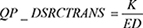
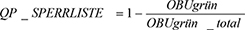
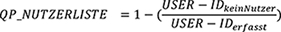
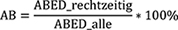
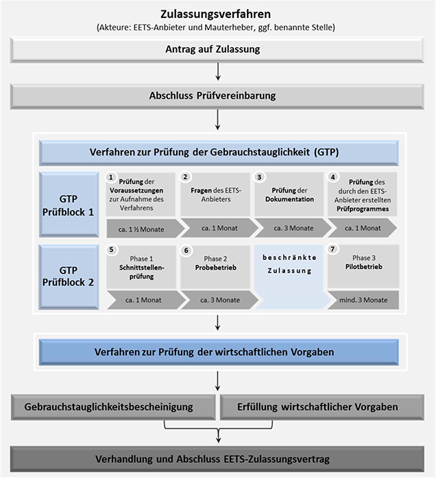

# Vertrag über Die Durchführung des Europäischen elektronischen Mautdienstes auf Bundesfernstraßen im Geltungsbereich des Bundesfernstraßenmautgesetzes (EEMD-ZVAnl II)

Ausfertigungsdatum
:   2018-03-20

Fundstelle
:   BAnz: AT 27.03.2018 V2

Zuletzt geändert durch
:   Art. 1 V v. 1.7.2020 BAnz AT 31.08.2020 V2

Änderung durch
:   Art. 2 V v. 25.10.2021 BAnz AT 29.10.2021 V2 mWv 30.10.2021 noch nicht berücksichtigt

## Anlage II (Zulassungsvertrag)

(Fundstelle: BAnz AT 26.03.2019 V 1)

Vertrag
über die Durchführung
des Europäischen elektronischen Mautdienstes
auf Bundesfernstraßen im Geltungsbereich des
Bundesfernstraßenmautgesetzes
## **(EETS-Zulassungsvertrag)**

## **EETS-Zulassungsvertrag**

zwischen

der Bundesrepublik Deutschland, vertreten durch das Bundesministerium
für Verkehr und digitale Infrastruktur (BMVI), dieses vertreten durch
das Bundesamt für Güterverkehr (BAG), Werderstraße 34, 50672 Köln,
dieses wiederum vertreten durch seinen Präsidenten

– Mauterheber –

und

[Name Anbieter], [Adresse Anbieter], vertreten durch [Vertretung
Anbieter], [registriert gemäß Artikel 3 der Entscheidung 2009/750/EG
in …] [Nachweis der Registrierung]

– Anbieter –

## **Inhaltsverzeichnis**

*    *   Präambel

*    *   §  1

    *   Vertragsgegenstand

*    *   §  2

    *   Vertragsbestandteile

*    *   §  3

    *   Zusicherungen des Anbieters/Wechsel eines wirtschaftlich Berechtigten

*    *   §  4

    *   Einschaltung Dritter

*    *   §  5

    *   Auskehr der Mauteinnahmen an den Mauterheber

*    *   §  6

    *   Sicherheiten

*    *   §  7

    *   Versicherungen

*    *   §  8

    *   Abtretungsverbot und Verbot der Schuld- und Vertragsübernahme

*    *   §  9

    *   Aufrechnungs- und Zurückbehaltungsrechte, Verbot der Besicherung

*    *   § 10

    *   Mitwirkungspflichten

*    *   § 11

    *   Nachweis- und Informationspflichten des Anbieters

*    *   § 12

    *   Zutritts- und Einsichtsrechte des Mauterhebers

*    *   § 13

    *   Datenschutz

*    *   § 14

    *   Datensicherheit

*    *   § 15

    *   Aufbewahrung von vertraulichen Daten

*    *   § 16

    *   Geheimhaltung und Vertraulichkeit

*    *   § 17

    *   Qualitätsanforderungen

*    *   § 18

    *   Übertragung von Datenobjekten

*    *   § 19

    *   Einstandspflicht für geschuldete Maut

*    *   § 20

    *   Vergütung

*    *   § 21

    *   Rechnungsstellung

*    *   § 22

    *   Allgemeine Abrechnungs- und Zahlungsbestimmungen

*    *   § 23

    *   Erneute Durchführung des Verfahrens zur Feststellung der
        Gebrauchstauglichkeit

*    *   § 24

    *   Haftung und Gewährleistung

*    *   § 25

    *   Freistellung

*    *   § 26

    *   Gewerbliche Schutzrechte

*    *   § 27

    *   Vertragsstrafen

*    *   § 28

    *   Laufzeit und Beendigung des Vertrags

*    *   § 29

    *   Verfahren nach Vertragsbeendigung

*    *   § 30

    *   Sperrung von Bordgeräten

*    *   § 31

    *   Vertragsanpassungen

*    *   § 32

    *   Höhere Gewalt

*    *   § 33

    *   Streitbeilegung

*    *   § 34

    *   Anwendbares Recht und Gerichtsstand

*    *   § 35

    *   Vertragskosten

*    *   § 36

    *   Schriftverkehr

*    *   § 37

    *   Schriftform

*    *   § 38

    *   Sofortige Vollstreckung

*    *   § 39

    *   Salvatorische Klausel

*    *   Anlagen

## Präambel

Die Richtlinie 2004/52/EG des Europäischen Parlaments und des Rates
vom 29. April 2004 über die Interoperabilität elektronischer
Mautsysteme in der Gemeinschaft und die Entscheidung 2009/750/EG der
Kommission vom 6. Oktober 2009 über die Festlegung der Merkmale des
europäischen elektronischen Mautdienstes und seiner technischen
Komponenten in Verbindung mit dem Mautsystemgesetz (MautSysG) und dem
Bundesfernstraßenmautgesetz (BFStrMG), die durch Gesetz vom 5.
Dezember 2014 eingeführt bzw. geändert worden sind, bilden die
rechtlichen Grundlagen für die Implementierung des europäischen
elektronischen Mautdienstes (EETS) in der Bundesrepublik Deutschland.

Ziel des EETS ist es, den Nutzern den Zugang zum gesamten
mautpflichtigen europäischen Straßennetz mit nur einem Vertrag und nur
einem Bordgerät eines Anbieters zu ermöglichen.

## § 1 Vertragsgegenstand

(1) Dieser EETS-Zulassungsvertrag („Vertrag“) regelt die Rechte und
Pflichten des Anbieters und des Mauterhebers im Zusammenhang mit der
Durchführung des EETS auf mautpflichtigen Bundesfernstraßen im
Geltungsbereich des BFStrMG („EETS-Gebiet BFStrMG“) nach § 4f Absatz 1
BFStrMG. Soweit nicht ausdrücklich geregelt, sind Rechte und Pflichten
des Anbieters gegenüber Nutzern sowie die zwischen Anbieter und
Nutzern geltenden vertraglichen und sonstigen Vereinbarungen nicht
Gegenstand dieses Vertrags.

(2) Dem Anbieter wird auf der Grundlage dieses Vertrags Zugang zum
EETS-Gebiet BFStrMG gewährt. Zu den Pflichten des Anbieters im EETS-
Gebiet BFStrMG gehört insbesondere die fortlaufende Erfüllung der
jeweils geltenden Bestimmungen zur Interoperabilität der
elektronischen Mautsysteme in der Europäischen Union und der jeweils
geltenden Rechtsvorschriften der Bundesrepublik Deutschland im
Zusammenhang mit der Erhebung, Vereinnahmung und Auskehr der Maut im
EETS-Gebiet BFStrMG, insbesondere der Vorgaben der Verordnung über die
Vorgaben für das EETS-Gebiet Bundesfernstraßenmautgesetz (EEMD-
Gebietsvorgabenverordnung – GVV) (nachfolgend: „Vorgaben für das EETS-
Gebiet BFStrMG“).

(3) Auf der Grundlage dieses Vertrags wird dem Anbieter gestattet, im
Auftrag seiner Nutzer die von diesen für die Nutzung des
mautpflichtigen Streckennetzes innerhalb des EETS-Gebiets BFStrMG
geschuldete Maut einzunehmen. Eine weitergehende Aufgabenübertragung
an den Anbieter findet nicht statt.

(4) Der Anbieter ist verpflichtet, die Mauteinnahmen an den
Mauterheber auszukehren.

(5) Gegenstand dieses Vertrags ist insbesondere auch die
Gewährleistung der Sicherheit der Daten und des Datenschutzes. Daten
im Sinne dieses Vertrags sind alle Informationen jeglicher Art in
elektronischer, Papier- und sonstiger Form (insgesamt „Daten“).

(6) Vorbehaltlich der in diesem Vertrag enthaltenen Definitionen
gelten für diesen Vertrag die im Glossar nach Anlage 7 enthaltenen
Definitionen.

## § 2 Vertragsbestandteile

(1) Bestandteile dieses Vertrags sind

–   die Zusatzvereinbarung (Anlage 1),

–   die Bankgarantie oder das gleichwertige Finanzinstrument (Anlage 2),

–   die Erklärung zur Beteiligungsstruktur des Anbieters (Anlage 3),

–   die Gebrauchstauglichkeitsbescheinigung, ausgestellt durch den
    Mauterheber oder eine notifizierte Stelle (Anlage 4),

–   die Qualitätsparameter für EETS-Anbieter (Anlage 5),

–   die Entgeltordnung (Anlage 6),

–   das Glossar (Anlage 7),

–   gegebenenfalls Erklärungen/Schriftwechsel (Anlage 8).

(2) Bei Widersprüchen in diesem Vertrag gelten nacheinander

–   dieser Vertrag,

–   die Zusatzvereinbarung (Anlage 1),

–   gegebenenfalls Erklärungen/Schriftwechsel (Anlage 8),

–   die Gebrauchstauglichkeitsbescheinigung, ausgestellt durch den
    Mauterheber oder eine notifizierte Stelle (Anlage 4),

–   das Glossar (Anlage 7).

## § 3 Zusicherungen des Anbieters/Wechsel eines wirtschaftlich Berechtigten

(1) Der Anbieter versichert, dass er entsprechend Artikel 3 der
Entscheidung 2009/750/EG registriert ist und belegt die Registrierung
bei Vertragsschluss. Der Anbieter muss dem Mauterheber unverzüglich
mitteilen, wenn seine Registrierung widerrufen oder aus anderem Grund
nicht mehr gültig ist oder ein Verfahren zum Widerruf der
Registrierung von der zuständigen Stelle eingeleitet worden ist. Auf
Verlangen des Mauterhebers muss der Anbieter das Vorliegen seiner
Registrierung nachweisen.

(2) Der Anbieter versichert, dass die nachfolgenden Angaben am Tag der
Unterzeichnung dieses Vertrags vollständig und richtig sind:

a)  Der Anbieter ist nach den auf ihn anwendbaren gesetzlichen
    Bestimmungen ordnungsgemäß gegründet worden und besteht wirksam.

b)  Der Anbieter ist uneingeschränkt berechtigt, diesen Vertrag
    abzuschließen und durchzuführen und besitzt alle hierzu erforderlichen
    Zustimmungen.

c)  Der Abschluss und die Durchführung dieses Vertrags verletzen nicht die
    Satzung, Gesellschafterbeschlüsse oder eine Geschäftsordnung des
    Anbieters.

d)  Der Abschluss und die Durchführung dieses Vertrags verletzen nicht für
    den Anbieter verbindliche Rechtsvorschriften oder gerichtliche oder
    behördliche Entscheidungen, Verfügungen oder sonstige Regelungen.

e)  Es sind keine Insolvenz-, Reorganisations- oder ähnliche Verfahren im
    In- oder Ausland über das Vermögen des Anbieters beantragt oder
    eröffnet worden, auch wurden keine Zwangsvollstreckungs- oder ähnliche
    Maßnahmen in das Vermögen oder einzelne Vermögensgegenstände des
    Anbieters beantragt oder eingeleitet. Es bestehen keine Umstände,
    denen zufolge die Eröffnung solcher Verfahren gerechtfertigt wäre.
    Insbesondere ist der Anbieter nicht überschuldet oder zahlungsunfähig
    und es liegt auch kein Fall drohender Zahlungsunfähigkeit oder
    Überschuldung vor. Der Anbieter hat weder seine Zahlungen eingestellt
    noch Schuldenbereinigungsabkommen oder ähnliche Vereinbarungen mit
    Gläubigern abgeschlossen oder angeboten.

f)  Die in Anlage 3 dargestellte Übersicht über die
    gesellschaftsrechtlichen Beteiligungsverhältnisse des Anbieters
    („Beteiligungsstruktur“) ist richtig und vollständig.

## § 4 Einschaltung Dritter

(1) Der Anbieter hat alle vertraglichen Leistungen selbst zu erbringen
und muss alle vom Mauterheber gestellten Vorgaben zu jedem Zeitpunkt
vollständig erfüllen. Soweit sich der Anbieter für die Erfüllung
seiner vertraglichen Verpflichtungen der Leistungen Dritter bedient,
hat er dies dem Mauterheber unverzüglich und unaufgefordert
anzuzeigen. Wesentliche Änderungen bei der Inanspruchnahme von
Leistungen Dritter sind dem Mauterheber unverzüglich und
unaufgefordert bekannt zu geben.

(2) Der Anbieter haftet für das Tun oder Unterlassen Dritter, derer er
sich für die Erbringung der vertraglichen Leistung und zur Erfüllung
der Vorgaben bedient, gegenüber dem Mauterheber in gleichem Umfang wie
für eigenes Tun oder Unterlassen.

(3) Soweit sich der Anbieter für die Erbringung der vertraglichen
Leistung und zur Erfüllung der Vorgaben Dritter bedient, hat er
sicherzustellen, dass auch diese alle Pflichten dieses Vertrags
erfüllen und der Mauterheber ihnen gegenüber alle Rechte, die ihm nach
diesem Vertrag gegenüber dem Anbieter zustehen, ausüben kann. Der
Anbieter wird den Dritten zu diesem Zwecke die ihm gegenüber dem
Mauterheber bestehenden Pflichten auferlegen. Der Anbieter haftet für
die Einhaltung der den Dritten aufzuerlegenden Pflichten gegenüber dem
Mauterheber. Dies gilt nicht, soweit weder der Dritte noch der
Anbieter die Pflichtverletzung zu vertreten haben.

## § 5 Auskehr der Mauteinnahmen an den Mauterheber

(1) Die Auskehr der Mauteinnahmen erfolgt auf das Konto der
Bundeskasse Trier – Deutsche Bundesbank Saarbrücken, IBAN
DE81 5900 0000 0059 0010 20, BIC MARKDEF1590; Stichwort Lkw-Maut. Der
Anbieter unterwirft sich gegenüber dem Mauterheber der sofortigen
Vollstreckung nach Maßgabe des § 61 des Verwaltungsverfahrensgesetzes
(VwVfG).

(2) Die Pflichten des Anbieters im Zusammenhang mit der Auskehr der
Mauteinnahmen sowie den einzelnen Vorgaben zu Abrechnungswesen,
Zahlungs- und Fakturierungsgrundsätzen in Bezug auf die Mauteinnahmen
sind in den Vorgaben für das EETS-Gebiet BFStrMG festgelegt.

(3) Der Anbieter muss sicherstellen, dass die Zahlungsvorgänge
zwischen ihm, seinen Nutzern und dem Mauterheber so ausgestaltet sind,
dass in jedem Fall, auch im Fall der Insolvenz oder drohender
Insolvenz des Anbieters, die Sicherheit der vollständigen Auskehr der
Mauteinnahmen nicht gefährdet ist.

## § 6 Sicherheiten

(1) Der Anbieter muss dem Mauterheber vor Abschluss dieses Vertrags
eine Garantie einer Bank oder den Nachweis eines gleichwertigen
Finanzinstruments in Höhe der erwarteten Durchschnittssumme der pro
Monat für das EETS-Gebiet BFStrMG insgesamt auszukehrenden
Mauteinnahmen und Zahlungen gemäß § 19 Absatz 1 MautSysG übergeben,
(„Bankgarantie“/„Revolvierende Bankgarantie“). Für die Prognose wird
ein Betrachtungszeitraum von zwölf Monaten zugrunde gelegt. Die
Bankgarantie und das gleichwertige Finanzinstrument dienen der
Sicherung aller Ansprüche des Mauterhebers aus oder im Zusammenhang
mit diesem Vertrag. Sie müssen eine Zahlung auf erstes Anfordern
vorsehen.

(2) Die Bankgarantie muss von einem Kreditinstitut gegeben werden, das
seinen Sitz oder seine Niederlassung in der Europäischen Union oder in
der EFTA hat. Das Kreditinstitut muss ein Investmentgrade-Rating für
Langfristverbindlichkeiten von mindestens A3 (Moody´s) bzw. A- (S&P
oder Fitch) aufweisen und für Kurzfristverbindlichkeiten von
mindestens P2 (Moody´s) bzw. A-2 (S&P) bzw. F-2 (Fitch) aufweisen.
Verschlechtert sich das Rating des Kreditinstituts während der
Laufzeit der Bankgarantie, sodass die vorstehend genannten
Mindestanforderungen nicht mehr erfüllt sind, ist der Anbieter
verpflichtet, unverzüglich, spätestens aber innerhalb eines Monats
nach Bekanntwerden des schlechteren Ratings, eine Bankgarantie eines
Kreditinstituts, das die in diesem Absatz genannten Mindestvorgaben
erfüllt, zu übergeben.

(3) Sofern ein anderes Finanzinstrument als eine Bankgarantie zur
Sicherung der Mauteinnahmen vorgehalten wird, muss dieses einer
Bankgarantie, die die genannten Kriterien in Absatz 2 erfüllt,
gleichwertig sein. Ein Finanzinstrument ist gleichwertig, wenn es
denselben Grad an Sicherheit wie eine Bankgarantie bietet. Dies kann
insbesondere der Fall sein, wenn die Gesellschafter des Anbieters eine
Kapitalintakthalteerklärung in Bezug auf den Anbieter abgeben und eine
der zu besichernden Summe angemessene finanzielle Leistungsfähigkeit
besitzen. Die Entscheidung über die Gleichwertigkeit steht im Ermessen
des Bundesamtes für Güterverkehr.

(4) Die Garantieerklärung oder der Nachweis eines gleichwertigen
Finanzinstruments muss vom Anbieter in deutscher Sprache oder in einer
amtlich beglaubigten Übersetzung übergeben werden. Die Laufzeit der
Bankgarantie oder des gleichwertigen Finanzinstruments muss mindestens
zwölf Monate betragen. Sollte die Bankgarantie oder die Laufzeit des
gleichwertigen Finanzinstruments befristet sein, ist der Anbieter
verpflichtet, spätestens sechs Kalendermonate vor Ablauf des
Geltungszeitraums eine Verlängerung der Bankgarantie oder des
gleichwertigen Finanzinstruments vorzulegen.

(5) Der Anbieter muss die Höhe der Bankgarantie oder des
gleichwertigen Finanzinstruments mindestens alle zwölf Monate an die
von ihm in den vorausgegangenen zwölf Monaten im Durchschnitt pro
Monat für das EETS-Gebiet BFStrMG insgesamt auszukehrenden
Mauteinnahmen sowie Zahlungen nach § 19 Absatz 1 dieses Vertrags
anpassen. Der Anbieter muss die Bankgarantie oder das gleichwertige
Finanzinstrument innerhalb von zwei Wochen nach Aufforderung durch den
Mauterheber anpassen, wenn die vom Anbieter für das EETS-Gebiet
BFStrMG im Monat auszukehrenden Mauteinnahmen sowie Zahlungen nach §
19 Absatz 1 dieses Vertrags in sechs aufeinander folgenden Monaten im
Durchschnitt pro Monat den Wert übersteigen, der der Berechnung der
Höhe der Bankgarantie oder des gleichwertigen Finanzinstruments
zugrunde gelegt worden ist. Das Gleiche gilt, wenn die vom Anbieter
für das EETS-Gebiet BFStrMG im Monat auszukehrenden Mauteinnahmen
sowie Zahlungen nach § 19 Absatz 1 dieses Vertrags zehn Prozent des
Wertes übersteigen, der der Berechnung der Höhe der Bankgarantie oder
des gleichwertigen Finanzinstruments zugrunde gelegt worden ist. Auf
Verlangen des Mauterhebers muss der Anbieter die Bankgarantie oder das
gleichwertige Finanzinstrument auch dann anpassen, wenn sich die
Mautsätze und die Mautpflicht, die der Berechnung der Höhe der
Bankgarantie oder des gleichwertigen Finanzinstruments zugrunde gelegt
wurden, wesentlich ändern. Der Mauterheber bestimmt den Zeitpunkt, zu
dem die angepasste Bankgarantie oder das gleichwertige
Finanzinstrument vom Anbieter vorgelegt werden muss. Der Anbieter ist
berechtigt, vom Mauterheber eine Anpassung der Bankgarantie oder des
gleichwertigen Finanzinstruments zu verlangen, wenn die auszukehrenden
Mauteinnahmen sowie Zahlungen nach § 19 Absatz 1 dieses Vertrags in
sechs aufeinander folgenden Monaten im Durchschnitt pro Monat den Wert
unterschreiten, der der Berechnung der Höhe der Bankgarantie oder des
gleichwertigen Finanzinstruments zugrunde gelegt worden ist.

(6) Als Verlängerung im Sinne dieses Paragraphen gilt auch die
Erneuerung einer Bankgarantie oder eines gleichwertigen
Finanzinstruments, wobei eine erneuerte Bankgarantie oder das
gleichwertige Finanzinstrument denselben Anforderungen genügen muss
als wäre sie eine ursprüngliche Bankgarantie oder ein gleichwertiges
Finanzinstrument.

## § 7 Versicherungen

(1) Der Anbieter ist verpflichtet, für die im Rahmen dieses Vertrags
ausgeführten Tätigkeiten auf eigene Kosten eine
Betriebshaftpflichtversicherung mit mindestens den folgenden Inhalten
abzuschließen und während der Laufzeit dieses Vertrags
aufrechtzuerhalten:

a)  Betriebsbeschreibung: „Mauterhebung als EETS-Anbieter auf den Straßen
    des EETS-Mautgebiets BFStrMG inklusive aller betriebs- und
    branchenüblichen, betriebs- und branchennotwendigen und im Betrieb der
    Versicherungsnehmerin bestehenden Zusatzrisiken,

b)  Deckung für gesetzliche Haftpflichtansprüche wegen Personen-, Sach-
    und daraus folgenden Vermögensschäden mit einer Deckungssumme von
    mindestens 15 Mio. Euro (in Worten: Fünfzehn Millionen Euro) je
    Schadensfall.

(2) Errichtet oder betreibt der Anbieter im EETS-Gebiet BFStrMG
straßenseitige Einrichtungen, ist er verpflichtet, die
geschäftsüblichen Versicherungen abzuschließen und für die Dauer der
Errichtung oder des Betriebs aufrechtzuerhalten. Die Versicherungen
müssen Personen-, Sach- und daraus folgende Vermögensschäden abdecken.
Die Mindestversicherungssumme für Versicherungen nach diesem Absatz
beträgt 2,5 Mio Euro (in Worten: Zweieinhalb Millionen Euro) je
Schadensfall.

(3) Der Mauterheber kann eine Erhöhung der Versicherungssumme
verlangen, wenn dies angesichts veränderter Schadensszenarien
angemessen ist.

(4) Der Anbieter legt dem Mauterheber die Nachweise des
Versicherungsabschlusses und des Versicherungsumfangs unverzüglich,
unaufgefordert und in deutscher Sprache oder mit einer amtlichen
beglaubigten Übersetzung vor. Dies gilt auch im Falle der Anpassung
von Versicherungen.

(5) Die Ansprüche auf Leistungen aus den Versicherungen nach den
Absätzen 1 und 2 tritt der Anbieter zur Sicherung der
Haftungsansprüche des Mauterhebers an diesen ab. In den Versicherungen
nach den Absätzen 1 und 2 ist vorzusehen, dass der Mauterheber vom
Versicherer über etwaige Versicherungsleistungen an den Anbieter
unmittelbar in Kenntnis gesetzt wird. Der Anbieter ist zum Einzug der
Versicherungsleistungen berechtigt und verpflichtet sich, die
Versicherungsleistung umgehend zur vollständigen Beseitigung und
vollständigen Wiederherstellung der Funktionsfähigkeit des vom Schaden
betroffenen Teils zu verwenden. Im Falle der Verletzung dieser Pflicht
ist der Mauterheber zur Offenlegung der Abtretung und zum Widerruf der
nach Satz 3 erteilten Einziehungsberechtigung berechtigt. Eine
Abtretung oder Verpfändung von Versicherungsansprüchen an Dritte ist
nur mit vorheriger Zustimmung des Mauterhebers zulässig.

## § 8 Abtretungsverbot und Verbot der Schuld- und Vertragsübernahme

Der Anbieter ist nicht berechtigt, ohne vorherige schriftliche
Zustimmung des Mauterhebers Rechte aus diesem Vertrag an Dritte
abzutreten. Dies gilt auch für die Übernahme von Verpflichtungen des
Anbieters aus diesem Vertrag durch Dritte sowie eine vollständige
Vertragsübernahme dieses Vertrags vom Anbieter durch Dritte. Die
Erteilung der Zustimmung steht im freien Ermessen des Mauterhebers.

## § 9 Aufrechnungs- und Zurückbehaltungsrechte, Verbot der Besicherung

(1) Dem Anbieter steht hinsichtlich der an den Mauterheber
auszukehrenden Mauteinnahmen weder ein Aufrechnungs- noch ein
Zurückbehaltungsrecht zu. Eine Verrechnung der an den Mauterheber
auszukehrenden Mauteinnahmen mit bestehenden Ansprüchen des Anbieters
gegen den Mauterheber – insbesondere mit dem Vergütungsanspruch gemäß
§ 20 dieses Vertrags – ist nicht gestattet. Die Sätze 1 und 2 gelten
nicht für unbestrittene oder rechtskräftig festgestellte Forderungen
des Anbieters gegen den Mauterheber.

(2) Dem Anbieter ist es untersagt, die dem Mauterheber zustehenden
Mauteinnahmen zum Gegenstand einer Verpfändung oder Besicherung zu
machen oder auf sonstige Weise mit Rechten Dritter zu belasten.

## § 10 Mitwirkungspflichten

(1) Der Mauterheber informiert den Anbieter über relevante Änderungen
des EETS-Registers sowie über relevante bevorstehende
Rechtsänderungen. Dies entbindet den Anbieter nicht von der Pflicht,
sich regelmäßig über Änderungen des EETS-Registers und anderer
Grundlagen für die Durchführung des EETS im EETS-Gebiet BFStrMG zu
informieren und die Richtigkeit und Vollständigkeit der ihm zur
Verfügung gestellten Informationen zu überprüfen.

(2) Der Mauterheber informiert den Anbieter über bevorstehende
Änderungen am nationalen dualen Mauterhebungssystem, am Kontrollsystem
oder am EETS-Teilsystem eines anderen Anbieters, die direkt oder
indirekt Auswirkungen auf das EETS-Teilsystem des Anbieters haben
könnten. Dies gilt insbesondere für Maßnahmen und Ereignisse, die dazu
geeignet sind, die Zahl der Nutzer des Anbieters dauerhaft oder
vorübergehend nicht unerheblich zu reduzieren.

(3) Unbeschadet besonderer Pflichten der Vertragsparteien, die sich
aus diesem Vertrag oder aus den dem EETS zugrunde liegenden
Rechtsvorschriften resultieren, arbeiten die Vertragsparteien
zusammen, um Beeinträchtigungen des Lkw-Mautsystems (BFStrMG) und der
Sicherheit der Mauteinnahmen abzuwenden bzw. unverzüglich in der
erforderlichen Art und Weise zu beseitigen.

(4) Soweit für die Durchführung des EETS die Errichtung von baulichen
Anlagen im EETS-Gebiet BFStrMG durch den Anbieter notwendig ist, wird
der Mauterheber den Anbieter – soweit erforderlich – bei der
Errichtung unterstützen. Die Kosten für die Planung, Genehmigung,
Errichtung und den Betrieb baulicher Anlagen im EETS-Gebiet BFStrMG
durch den Anbieter trägt der Anbieter. Eine Haftung des Mauterhebers
im Zusammenhang mit der Errichtung und dem Betrieb baulicher Anlagen
im EETS-Gebiet BFStrMG durch den Anbieter ist ausgeschlossen.

## § 11 Nachweis- und Informationspflichten des Anbieters

(1) Der Anbieter muss dem Mauterheber jede Änderung an seinem EETS-
Teilsystem, die Auswirkung auf die Erfüllung der Vorgaben für das
EETS-Gebiet BFStrMG haben kann, unverzüglich und unaufgefordert
anzeigen.

(2) Der Anbieter muss dem Mauterheber jederzeit auf schriftliche
Anfrage des Mauterhebers unverzüglich alle Daten zum Nachweis der
Erfüllung der Vorgaben für das EETS-Gebiet BFStrMG und der sonstigen
vertraglichen Pflichten übermitteln.

(3) Der Anbieter muss den Mauterheber unverzüglich und unaufgefordert
über alle Änderungen im Zusammenhang mit den in § 3 dieses Vertrags
gegebenen Zusicherungen informieren.

(4) Der Anbieter ist verpflichtet, dem Mauterheber jederzeit auf
Anforderung Daten und Nachweise zur Identifizierung der natürlichen
oder juristischen Personen, die einen bestimmenden Einfluss auf den
Anbieter ausüben („wirtschaftlich Berechtigte“) zur Verfügung zu
stellen. Hierzu zählen insbesondere natürliche oder juristische
Personen, die unmittelbar oder mittelbar mindestens 25 Prozent der
Kapitalanteile an dem Anbieter halten oder kontrollieren oder
mindestens 25 Prozent von dessen Stimmrechten kontrollieren.

(5) Der Anbieter ist verpflichtet, dem Mauterheber alle Maßnahmen,
insbesondere Anteilsübertragungen oder umwandlungsrechtliche
Maßnahmen, die zu einer unmittelbaren oder mittelbaren Änderung eines
wirtschaftlich Berechtigten führen, unverzüglich anzuzeigen.

(6) Der Anbieter ist verpflichtet den Mauterheber unverzüglich über
alle Maßnahmen oder Ereignisse zu informieren, die direkt oder
indirekt Auswirkungen auf das nationale duale Mauterhebungssystem, das
Kontrollsystem oder das EETS-Teilsystem des Mauterhebers haben
könnten.

## § 12 Zutritts- und Einsichtsrechte des Mauterhebers

(1) Der Anbieter muss dem Mauterheber oder einer von diesem benannten
Stelle zur Überwachung der Einhaltung der Vorgaben und der
vertraglichen Pflichten des Anbieters nach vorheriger Ankündigung und
während der üblichen Geschäftszeiten uneingeschränkten Zutritt zu
seinen Geschäftsräumen und sonstigen Einrichtungen gewähren.

(2) Der Anbieter muss dem Mauterheber oder einer von diesem benannten
Stelle nach vorheriger Ankündigung und während der üblichen
Geschäftszeiten Einsicht in alle Daten gewähren, die zur Überwachung
der Einhaltung der Vorgaben für das EETS-Gebiet BFStrMG und der
vertraglichen Pflichten des Anbieters erforderlich sind.

(3) Der Anbieter muss die Rechte nach den Absätzen 1 und 2 auch dem
Bundesministerium der Finanzen, dem Bundesrechnungshof und sonstigen
staatlichen Stellen einräumen, soweit diese im Rahmen ihrer Befugnisse
tätig werden.

(4) Der Anbieter muss in Verträgen mit Dritten im Sinne von § 4 gemäß
den Absätzen 1 und 2 entsprechende Zutritts-, Einsichts- und
Zugriffsrechte zugunsten des Mauterhebers, einer von diesem
beauftragten Stelle, dem Bundesministerium der Finanzen, dem
Bundesrechnungshof und sonstigen staatlichen Stellen vereinbaren.

## § 13 Datenschutz

(1) Der Anbieter stellt sicher, dass er bei der Durchführung des EETS
jederzeit alle Anforderungen des Datenschutzes erfüllt. Dazu gehören
insbesondere die europarechtlichen Anforderungen und die
spezialgesetzlichen Anforderungen des MautSysG, des BFStrMG und –
soweit das MautSysG und das BFStrMG keine abschließende Regelung
treffen – ergänzend die Bestimmungen des Bundesdatenschutzgesetzes
(BDSG) sowie die Bestimmungen der Europäischen Datenschutz-
Grundverordnung (EU-DSGVO). Diese Verpflichtung des Anbieters
gegenüber dem Mauterheber gilt unabhängig davon, ob der Anbieter
selbst in den Anwendungsbereich solcher Datenschutzbestimmungen fällt.
Die Pflicht des Anbieters zur Einhaltung nationaler
Datenschutzbestimmungen des Staates, in dem er niedergelassen ist oder
in dem er Daten erhebt oder verarbeitet, bleibt unberührt. Im Zweifel
haben das MautSysG, das BFStrMG und – soweit das MautSysG und das
BFStrMG keine abschließende Regelung treffen – ergänzend die
Bestimmungen des BDSG sowie – soweit anwendbar – weitere
spezialgesetzliche deutsche oder supranationale
Datenschutzvorschriften die Bestimmungen der EU-DSGVO, Vorrang vor
anderen nationalen Datenschutzbestimmungen.

(2) Die Art und Weise der Sicherstellung der Einhaltung
datenschutzrechtlicher Anforderungen ist in dem der
Gebrauchstauglichkeitsbescheinigung für den Anbieter zugrunde gelegten
Datenschutzkonzept des Anbieters dokumentiert.

(3) Soweit sich der Anbieter bei der Einrichtung, Durchführung oder
Beendigung des EETS eines Dritten bedient, verpflichtet er sich
unabhängig davon, in welchem Land dieser Dritte seine Leistungen
erbringt, dafür zu sorgen, dass die vom Anbieter einzuhaltenden
datenschutzrechtlichen Anforderungen gemäß Absatz 1 auch von dem
Dritten eingehalten werden. § 4 bleibt unberührt.

(4) Die Regelungen dieses Paragraphen gelten auch im Falle der
Beendigung dieses Vertrags fort.

## § 14 Datensicherheit

(1) Zum Zwecke des elektronischen Austauschs der für die Durchführung
des EETS erforderlichen Daten wird der Mauterheber den Anbieter über
die für den Austausch erforderlichen System- und
Schnittstellenspezifikationen in Kenntnis setzen, soweit der Anbieter
über diese Daten nicht bereits aufgrund des EETS-Prüfverfahrens
verfügt. Der Anbieter wird seine Datensysteme und -schnittstellen so
ausgestalten, dass auf der Grundlage der vom Mauterheber zur Verfügung
gestellten Spezifikationen zu jeder Zeit und uneingeschränkt ein
verlustfreier, sicherer Datenaustausch möglich ist. Die Sicherheit der
Datenübermittlung ist in dem der Gebrauchstauglichkeitsbescheinigung
für den Anbieter zugrunde gelegten Datensicherheitskonzept des
Anbieters dokumentiert.

(2) Der Mauterheber wird dem Anbieter im Wege der elektronischen
Datenübermittlung die für die Durchführung des EETS erforderlichen
Daten zugänglich machen und während der Durchführung des EETS durch
den Anbieter aktualisieren und ergänzen. Dies betrifft insbesondere
die für die Mauterhebung erforderlichen Datensätze und Kodierungen.

(3) Der Anbieter verpflichtet sich, während der gesamten
Vertragslaufzeit und bis zu dem Zeitpunkt, in dem die Daten mit
Zustimmung des Mauterhebers gemäß § 15 unwiderruflich gelöscht werden,
sicherzustellen, dass der Schutz der personenbezogenen und
personenbeziehbaren Daten den Anforderungen des deutschen und
europäischen Datenschutzrechts entspricht. Der Anbieter wird darüber
hinaus jederzeit die erforderlichen technischen und organisatorischen
Sicherheitsmaßnahmen nach dem aktuellen Stand der Technik ergreifen,
um die seinem Zugriff unterliegenden Daten, Prozesse und Systeme sowie
den Datenaustausch mit dem Mauterheber zu schützen, sodass jederzeit
hinsichtlich Vertraulichkeit, Verfügbarkeit und Integrität der Daten,
Prozesse und Systeme ein dem im Einzelfall festgestellten Schutzbedarf
entsprechender Schutz vor technischer oder organisatorischer
Kompromittierung gewährleistet ist. Dabei ist für alle Vorgänge, die

a)  personenbezogene und personenbeziehbare Daten und

b)  den Datenaustausch oder Systemberührungen mit dem Mauterheber
    betreffen,

von dem jeweils höchsten Schutzbedarf auszugehen. Der Anbieter
verpflichtet sich insbesondere, jederzeit die erforderlichen
technischen und organisatorischen Sicherheitsmaßnahmen einzusetzen, um
alle beteiligten Daten, Systeme und Prozesse zu schützen, zu
überwachen und bei Kenntnis eines realisierten oder potenziellen
Verlustes der Vertraulichkeit, Verfügbarkeit oder Integrität von
Daten, Systemen, oder Prozessen (insgesamt „Sicherheitsvorfälle“) den
Mauterheber unverzüglich zu informieren und unverzüglich in der
jeweils erforderlichen Art und Weise zu reagieren, sodass insbesondere
der Sicherheitsvorfall ausgeräumt oder seine Auswirkungen sowie damit
verbundene Schäden und Beeinträchtigungen des Mauterhebers oder
Dritter weitestmöglich begrenzt und reduziert werden. Der Mauterheber
kann verlangen, auf Veranlassung des Anbieters das Informationsschutz-
Management-System des Anbieters im Rahmen eines Audits von einem
externen Sachverständigen prüfen zu lassen.

(4) Der Anbieter haftet dem Mauterheber für jegliche mittelbaren und
unmittelbaren Schäden, die dem Mauterheber aufgrund von
Sicherheitsvorfällen aus dem Verantwortungsbereich des Anbieters
entstehen; dies gilt nicht soweit der Anbieter die Pflichtverletzung
nicht zu vertreten hat. Die Haftung schließt die dem Mauterheber
entgangenen Mauteinnahmen ein. Der Anbieter übernimmt zudem die Kosten
einer Wiederinstandsetzung, Reparatur oder sonstigen Überprüfung des
Systems des Mauterhebers, die aufgrund von Sicherheitsvorfällen aus
dem Verantwortungsbereich des Anbieters entstanden sind. Sollten
aufgrund von Sicherheitsvorfällen aus dem Verantwortungsbereich des
Anbieters Dritte Ansprüche gegenüber dem Mauterheber geltend machen,
stellt der Anbieter den Mauterheber gemäß § 25 im dort geregelten
Umfang von diesen Ansprüchen frei.

(5) Die Regelungen dieses Paragraphen gelten auch nach Beendigung
dieses Vertrags fort.

## § 15 Aufbewahrung von vertraulichen Daten

(1) Der Anbieter verpflichtet sich, alle im Zusammenhang mit der
Einrichtung, Durchführung und Beendigung des EETS erstellten oder
erlangten vertraulichen Daten, die zur uneingeschränkten Überprüfung
der Leistungen des Anbieters und vollständigen Erhebung, Vereinnahmung
und Auskehr der Maut an den Mauterheber erforderlich sind,
entsprechend den gesetzlichen Bestimmungen, insbesondere den
Bestimmungen des Datenschutzes und der Bundeshaushaltsordnung,
aufzubewahren.

(2) Der Anbieter verpflichtet sich, die vertraulichen Daten in einer
Weise aufzubewahren, dass sie von Dritten nicht eingesehen, verändert,
kopiert, entwendet oder vernichtet werden können. Der Anbieter wird zu
diesem Zweck die erforderlichen technischen und organisatorischen
Sicherheitsmaßnahmen ergreifen, um einen Zugriff auf vertrauliche
Daten durch Dritte verlässlich auszuschließen. Zur Absicherung gegen
Datenverluste nimmt der Anbieter kontinuierlich Sicherungskopien der
relevanten Daten vor.

(3) Auf Verlangen des Mauterhebers wird der Anbieter dem Mauterheber
die vertraulichen Daten in geeigneter Form zugänglich machen. Auf
Verlangen des Mauterhebers wird dies in elektronischer Form geschehen.
Der Mauterheber ist berechtigt, das Datenformat für die Übermittlung
der Daten nach billigem Ermessen festzulegen. Der Anbieter ist
verpflichtet, auch in diesem Fall die in diesem Vertrag im Übrigen
geregelten Bestimmungen zur Datensicherheit einzuhalten.

(4) Der Anbieter wird die vertraulichen Daten einschließlich aller
Sicherungskopien vor Ablauf der gesetzlichen Aufbewahrungsfristen nur
mit Zustimmung des Mauterhebers vernichten oder löschen und dabei
insbesondere gewährleisten, dass die Vertraulichkeit im Sinne des § 16
jederzeit eingehalten wird und Dritte auch nach Vernichtung oder
Löschung keinen Zugang zu diesen Daten erlangen. Soweit die
Vernichtung oder Löschung von Daten erforderlich ist, wird der
Anbieter dies in einer Weise vornehmen, die eine Wiederherstellung der
Daten technisch ausschließt, die vorgenommenen Maßnahmen dokumentieren
und sie auf Verlangen dem Mauterheber nachweisen.

(5) Sollten entgegen den Verpflichtungen dieses Paragraphen
vertrauliche Daten abhandenkommen, kopiert werden oder sonst
unberechtigt eingesehen werden, haftet der Anbieter dem Mauterheber
für die daraus entstehenden Schäden und stellt die
Freistellungsberechtigten gemäß § 25 im dort geregelten Umfang von
allen Ansprüchen Dritter frei. Dies gilt nicht, soweit er die
Pflichtverletzung nicht zu vertreten hat.

(6) Der Anbieter muss auf Verlangen des Mauterhebers vertrauliche
Daten im Sinne des § 16, die der Mauterheber ihm zur Verfügung
gestellt hat, an diesen zurückgeben, soweit sie für die Durchführung
des EETS nicht mehr erforderlich sind. Soweit eine Rückgabe nach Art
der Daten nicht möglich ist, sind diese nachweislich in der in Absatz
4 Satz 2 beschriebenen Weise zu löschen bzw. zu vernichten. Dies gilt
nicht, soweit ein berechtigtes Interesse an der Aufbewahrung der
vertraulichen Daten im Hinblick auf eine spätere Rekonstruktion bei
Streitfällen dargelegt wird. In diesem Falle sind die Daten
zurückzugeben oder nachweislich zu löschen, wenn sie für diesen Zweck
nicht mehr erforderlich sind.

(7) Für die Regelungen dieses Paragraphen gelten § 16 Absatz 3 und
Absatz 8 dieses Vertrags entsprechend.

(8) Die Regelungen dieses Paragraphen gelten auch im Falle der
Beendigung dieses Vertrags fort.

## § 16 Geheimhaltung und Vertraulichkeit

(1) Anbieter und Mauterheber werden alle Daten, die ihnen im
Zusammenhang mit der Einrichtung, Durchführung und Beendigung des EETS
von der anderen Vertragspartei direkt oder indirekt zugänglich gemacht
werden, oder die ihnen in diesem Zusammenhang auf sonstige Weise zur
Kenntnis gelangt sind (insgesamt: „vertrauliche Daten“), vertraulich
behandeln und sie Dritten nicht zugänglich machen. Als vertrauliche
Daten gelten auch solche Daten, die Anbieter oder Mauterheber selbst
im Zusammenhang mit dem EETS erstellt oder erhoben haben und die mit
dem EETS, den ihm zugrunde liegenden Parametern, den technischen
Spezifikationen, wirtschaftlichen Vorgaben oder den Vertragsparteien
selbst in Verbindung stehen.

(2) Die vertraulichen Daten dürfen von den Vertragsparteien
ausschließlich für den Zweck der Durchführung des EETS verwendet
werden.

(3) Nicht als Dritte im Sinne dieses Paragraphen gelten auf Seiten des
Anbieters solche Personen, die

a)  mit Aufgaben befasst sind, die im Zusammenhang mit diesem Vertrag oder
    der Durchführung des EETS stehen und/oder bestimmungsgemäß mit der
    Erfüllung der nach diesem Vertrag gegenüber dem Mauterheber
    geschuldeten Verpflichtungen beschäftigt sind,

b)  gegenüber dem Anbieter zur Vertraulichkeit insbesondere auch bezüglich
    der vertraulichen Daten verpflichtet sind und

c)  die vertraulichen Daten zur Ausführung der ihnen zugewiesenen Aufgaben
    benötigen.

Die Weiterreichung an mit dem Anbieter im Konzernverbund stehende
Unternehmen („Konzernunternehmen“) ist gestattet, wenn und soweit dies
zur konzerninternen Prüfung erforderlich ist und den beteiligten
Konzernunternehmen vollumfänglich die nach diesem Abschnitt bestehende
Vertraulichkeitsverpflichtung auferlegt worden ist.

(4) Der Anbieter führt eine Liste der Personen in Konzernunternehmen,
die Zugang zu vertraulichen Daten haben und legt diese dem Mauterheber
in regelmäßigen Abständen sowie jederzeit auf Verlangen des
Mauterhebers vor.

(5) Der Anbieter ist verpflichtet, Personen, die Zugang zu
vertraulichen Daten haben, in gleichem Umfang und unter Androhung
einer dem gefährdeten Rechtsgut angemessenen, spürbaren Vertragsstrafe
mit unmittelbarer Wirkung zu Gunsten des Mauterhebers
Vertraulichkeitsverpflichtungen aufzuerlegen und dies auf Verlangen
des Mauterhebers unverzüglich nachzuweisen.

(6) Der Anbieter ist verpflichtet, dafür Sorge zu tragen, dass die
Konzernunternehmen die Verpflichtung nach Absatz 5 ebenfalls erfüllen.

(7) Der Anbieter steht für die Einhaltung der ihm hiernach auferlegten
und den Personen und Konzernunternehmen aufzuerlegenden
Verschwiegenheitsverpflichtung ein.

(8) Nicht als Dritte im Sinne dieses Paragraphen gelten auf Seiten des
Mauterhebers solche Personen, die

a)  mit Aufgaben befasst sind, die im Zusammenhang mit diesem Vertrag oder
    der Durchführung des EETS in sonstiger Weise stehen und/oder
    bestimmungsgemäß mit der Erfüllung der nach diesem Vertrag dem
    Mauterheber obliegenden Verpflichtungen beschäftigt sind,

b)  gegenüber dem Mauterheber zur Vertraulichkeit insbesondere auch
    bezüglich der vertraulichen Daten verpflichtet sind und

c)  die vertraulichen Daten zur Ausführung der ihnen obliegenden Aufgaben
    benötigen.

(9) Nicht als vertrauliche Daten gelten alle Daten, die zum Zeitpunkt
der Weitergabe oder sonstigen Zugänglichmachung der Öffentlichkeit
bereits nachweislich allgemein bekannt sind, ohne dass dies auf einer
Verletzung dieser Vertraulichkeitsvereinbarung beruht.

(10) Eine Verletzung vertraglicher Vertraulichkeits- und
Geheimhaltungsvereinbarungen durch eine Partei liegt nicht vor, wenn
die jeweils andere Vertragspartei einer Veröffentlichung der konkreten
vertraulichen Daten zuvor schriftlich zugestimmt hat.

(11) Gesetzliche Aufbewahrungs- oder Offenlegungspflichten bleiben
unberührt.

(12) Die Anwendbarkeit der – auch strafrechtlichen – Bestimmungen des
Datenschutzgesetzes und anderer Rechtsvorschriften zum Schutz der
Vertraulichkeit und die Geltendmachung von Unterlassungs- sowie von
weitergehenden Schadensersatzansprüchen des Mauterhebers bleiben von
Vorstehendem unberührt.

(13) Die Verpflichtung zur Vertraulichkeit gilt auch nach Beendigung
dieses Vertrags fort.

## § 17 Qualitätsanforderungen

(1) Der Anbieter muss beim Betrieb seines EETS-Teilsystems die
folgenden Qualitätsparameter erfüllen:

a)  Der Anbieter muss eine Erfassungsquote von mindestens 99,5 %
    erreichen. Mit der Erfassungsquote wird die Qualität der korrekten
    Erkennung befahrener Abschnitte des mautpflichtigen Straßennetzes
    ermittelt.

b)  Der Anbieter muss eine DSRC-Quote von mindestens 98,5 % erreichen. Die
    DSRC-Quote wird durch die Messung der korrekten DSRC-Kommunikation der
    EETS-Fahrzeuggeräte mit den Kontrolleinrichtungen des Mauterhebers
    ermittelt, wobei alle abrechnungsrelevanten Daten (Fahrzeugparameter
    und Vertragsparameter) korrekt und vollständig übermittelt werden
    müssen.

c)  Der Anbieter muss eine Sperrlistenquote von mindestens 99,9 %
    erreichen. Die Sperrlistenquote bestimmt sich aus der Messung der
    Anzahl der Fahrzeuge, deren Bordgeräte die Erhebungsbereitschaft
    signalisieren (Zustand grün), jedoch auf der Sperrliste aufgeführt
    sind.

d)  Der Anbieter muss eine Nutzerlistenquote von mindestens 99,9 %
    erreichen. Die Nutzerlistenquote wird aus der Messung der Qualität der
    Erstellung und Übermittlung der Nutzerliste vom Anbieter an den
    Mauterheber ermittelt.

e)  Der Anbieter muss eine Quote für abschnittsbezogene Erhebungsdaten von
    mindestens 99 % erreichen. Die Quote für abschnittsbezogene
    Erhebungsdaten wird durch die Messung der Korrektheit und
    Rechtzeitigkeit der Übermittlung von abschnittsbezogenen
    Erhebungsdaten (ABED) bestimmt.

Die Einzelheiten zur Messung und Bewertung der einzelnen
Qualitätsparameter sind in den Qualitätsparametern für EETS-Anbieter
(Anlage 5) geregelt.

(2) Der Anbieter ermöglicht dem Mauterheber oder von ihm beauftragten
Dritten Zugang zu den Räumlichkeiten und technischen Systemen, um
Audits über die ordnungsgemäße Einhaltung der Gebietsvorgaben
durchzuführen.

Die Einzelheiten zu den Auditbestimmungen sind in den
Qualitätsparametern für EETS-Anbieter Anlage 5 geregelt.

## § 18 Übertragung von Datenobjekten

(1) Der Anbieter ist verantwortlich für die Richtigkeit und
Vollständigkeit der von ihm übermittelten Datenobjekte und trägt das
Risiko für die fehlerhafte und unvollständige Übermittlung der
Datenobjekte an den Mauterheber. Die Datenobjekte gelten vom Anbieter
an den Mauterheber als übermittelt, wenn der Mauterheber den Empfang
der Datenobjekte elektronisch quittiert hat.

(2) Der Mauterheber ist verantwortlich für die Richtigkeit und
Vollständigkeit der von ihm übermittelten Datenobjekte und trägt das
Risiko für die fehlerhafte und unvollständige Übermittlung der
Datenobjekte an den Anbieter. Die Verpflichtung des Anbieters, die ihm
übermittelten Datenobjekte auf Vollständigkeit und Richtigkeit zu
überprüfen, bleibt hiervon unberührt. Hätte der Anbieter die
Unrichtigkeit oder Unvollständigkeit der ihm übermittelten
Datenobjekte erkennen können, entfällt die Verantwortung des
Mauterhebers.

## § 19 Einstandspflicht für geschuldete Maut

(1) Der Anbieter haftet gegenüber dem Mauterheber für die im EETS-
Gebiet BFStrMG geschuldete Maut der Nutzer, die er dem Mauterheber in
seinen Nutzerlisten nach § 4j BFStrMG gemeldet hat oder hätte melden
müssen. Die Haftung umfasst auch die nach § 8 BFStrMG geschuldete
Maut, sofern der Nutzer diese nicht entrichtet („Mautausfallhaftung“).

(2) Die Haftung des Anbieters nach Absatz 1 gilt
verschuldensunabhängig und unabhängig davon, ob Nutzer des Anbieters
oder Dritte die ihnen im Rahmen des EETS obliegenden Pflichten nicht
erfüllt haben. Ansprüche des Anbieters gegen seine Nutzer oder Dritte
bleiben hiervon unberührt.

(3) Die Haftung des Anbieters für die geschuldete Maut eines Nutzers
nach Absatz 1 endet erst, nachdem der Anbieter

a)  das Bordgerät dieses Nutzers gesperrt hat und

b)  dieses Bordgerät auf der Liste gesperrter Bordgeräte („Schwarze
    Liste“) nach § 26 MautSysG eingetragen und dem Mauterheber diese Liste
    übermittelt hat. Die maximale Zeit zwischen den Übermittlungen darf 24
    Stunden nicht überschreiten.

Die Haftung nach Absatz 1 entfällt nicht für weitere Bordgeräte, die
der Anbieter dem Mauterheber in seinen Nutzerlisten nach § 4j BFStrMG
für diesen Nutzer gemeldet hat.

(4) Der Anbieter darf ein Bordgerät erst auf die Schwarze Liste
setzen, wenn er das Bordgerät gesperrt hat. Der Anbieter muss seinen
Nutzer auf geeignete Weise über die Sperrung des Bordgerätes
informieren. Das Bordgerät muss dem Nutzer im Fall der Sperrung
anzeigen, dass es nicht erhebungsbereit ist. Der Anbieter muss ein
Bordgerät von der Schwarzen Liste entfernen, wenn er das Bordgerät
wieder entsperrt hat.

## § 20 Vergütung

(1) Der Mauterheber zahlt dem Anbieter eine variable
kalendermonatliche Vergütung, deren Höhe sich aus der EETS-
Anbietervergütung nach Absatz 2 und der Bordgeräte-Vergütung nach
Absatz 3 berechnet. Das Risiko, dass sich die Summe der wertgestellten
Zahlungen und damit die nach diesem § 20 zu bemessende EETS-
Anbietervergütung anders entwickelt als bei Vertragsabschluss
angenommen, trägt, unabhängig von der Ursache, ausschließlich der
Anbieter.

(2) Die Höhe der EETS-Anbietervergütung im jeweiligen
Betrachtungszeitraum t berechnet sich wie folgt:

EV
(t)              = (Z
(t)              – R
(t)             )*              p

*    *   EV
        (t)

    *   = EETS-Anbietervergütung im Betrachtungszeitraum t

*    *   p

    *   = Provisionssatz in Höhe von (2,90) Prozent

*    *   Z
        (t)

    *   = auf dem Konto des Mauterhebers gemäß § 5 des EETS-Zulassungsvertrags
        und den Vorgaben der EEMD-Gebietsvorgabenverordnung in Summe
        wertgestellte Zahlungen in Euro im Betrachtungszeitraum t

*    *   R
        (t)

    *   = Betrag in Euro der gemäß Absatz 6 in der Periode t positiv
        beschiedenen Erstattungsverlangen im Betrachtungszeitraum t

Der Betrachtungszeitraum für die EETS-Anbietervergütung ist ein
Kalendermonat.

(3) Die Höhe der Bordgeräte-Vergütung bemisst sich nach der Anzahl der
im jeweiligen Kalendermonat vom Anbieter nachgewiesenen aktiven
Bordgeräte. Sie berechnet sich wie folgt:

BG
(t)              = BG\_Entgelt*              ABG
(t)

*    *   BG\_Entgelt

    *   = Entgelt je aktivem Bordgerät je Kalendermonat von 1,00 EUR

*    *   ABG
        (t)

    *   = Anzahl der nachgewiesenen aktiven Bordgeräte im jeweiligen
        Betrachtungszeitraum t

*    *   t

    *   = Betrachtungszeitraum

Ein aktives Bordgerät ist ein Bordgerät, das vom Anbieter
bereitgestellt und in ein beim Anbieter registriertes Fahrzeug
eingebaut wurde und für das für den jeweiligen Kalendermonat
mindestens einmal eine Befahrung des mautpflichtigen Streckennetzes
festgestellt wurde. Es muss ein Vertrag zwischen dem Anbieter und
seinem Nutzer über die Mauterhebung im EETS-Gebiet des
Bundesfernstraßenmautgesetzes bestehen. Die Informationen zum
Bordgerät müssen in der Nutzerliste zusammen mit der eindeutig dem
Bordgerät zugeordneten Identifikationsnummer des Bordgeräts, dem
Kennzeichen des Fahrzeugs oder der Fahrzeugkombination und der
Vertragsnummer des Nutzers über die Schnittstelle 002a übermittelt
worden sein. Eine Befahrung gilt als festgestellt, wenn für die
Identifikationsnummer des Bordgeräts und für den jeweiligen
Kalendermonat mindestens einmal die Befahrung eines mautpflichtigen
Abschnitts in den abschnittsbezogenen Erhebungsdaten über die
Schnittstelle SST 006 vom Anbieter an den Mauterheber gemeldet wurde.
Für den Zeitpunkt der Befahrung gilt der Zeitstempel mit dem Attribut
„timeWhenUsed“ in der Sequenz von „DetectedChargeObject“ in den
abschnittsbezogenen Erhebungsdaten. Für die Feststellung der Befahrung
im jeweiligen Kalendermonat werden alle abschnittsbezogenen
Erhebungsdaten verwendet, die innerhalb der vertraglich vereinbarten
Frist im System des Mauterhebers über die Schnittstelle SST 006
empfangen wurden. Der Betrachtungszeitraum für die Bordgeräte-
Vergütung ist ein Kalendermonat. Das Risiko, dass sich die Anzahl der
aktiven Bordgeräte und damit die Bordgeräte-Vergütung anders
entwickelt als bei Vertragsabschluss angenommen, trägt, unabhängig von
den Ursachen, ausschließlich der Anbieter.

(4) Der Mauterheber zahlt bei Überschreitung der „Erfassungsquote EQ“
gemäß Anlage 5 Nummer 3.1.2 in Höhe von 99,5 Prozent einen Bonus (EQ-
Bonus) gemäß folgender Formel:

EQ-Bonus
(t)              = (EQ
(t)              – 99,5 %)*              (Z
(t)              – R
(t)             )*              12,5 %

*    *   EQ
        (t)

    *   = gemäß Anlage 5 Nummer 3.1.2 ermittelte Erfassungsquote für den
        Betrachtungszeitraum in Prozent

*    *   Z
        (t)

    *   = auf dem Konto des Mauterhebers gemäß § 5 des EETS-Zulassungsvertrags
        und gemäß den Vorgaben der EEMD-Gebietsvorgabenverordnung in Summe
        wertgestellte Zahlungen in Euro im Betrachtungszeitraum

*    *   R
        (t)

    *   = Betrag in Euro der gemäß § 20 Absatz 6 des EETS-Zulassungsvertrags
        positiv beschiedenen Erstattungsverlangen im Betrachtungszeitraum

Der Betrachtungszeitraum beträgt zwölf Monate. Die Zahlung des EQ-
Bonus für den Betrachtungszeitraum an den Anbieter erfolgt auf das
jeweils in der Vergütungsrechnung angegebene Konto des Anbieters.
Sofern ein vertraglich festgelegter Betrachtungszeitraum abweichend
von Satz 2 weniger als zwölf Monate umfasst, wird der EQ-Bonus
monatsgenau anteilig gezahlt.

(5) Die EETS-Anbietervergütung wird jährlich unter Berücksichtigung
von Recht- und Zweckmäßigkeitsgesichtspunkten sowie unter
Berücksichtigung der allgemeinen Geschäftsentwicklung des Marktes der
EETS-Anbieter überprüft. § 31 dieses Vertrags gilt entsprechend.

(6) Wurde beim Mauterheber eine berechtigte Erstattung durch einen
Nutzer beantragt und wurde dieser Antrag durch das Bundesamt für
Güterverkehr positiv beschieden, mindert sich die EETS-
Anbietervergütung entsprechend. Der Mauterheber teilt dem Anbieter
jeweils bis zum siebten Werktag eines Monats für den vorangegangenen
Monat mit, wie viele Anträge auf Erstattung in welcher Höhe positiv
beschieden wurden.

## § 21 Rechnungsstellung

(1) Der Anbieter hat zur Abrechnung der Vergütung nach § 20 dieses
Vertrags eine kalendermonatliche, prüffähige Rechnung entsprechend den
nachfolgenden Absätzen auszustellen. Die Abrechnung der Vergütung
erfolgt erstmalig in dem Kalendermonat, der auf den Kalendermonat
folgt, in dem der Beginn der Vertragslaufzeit liegt.

(2) Bis spätestens zum 15. des auf den jeweils abzurechnenden
Kalendermonat folgenden Kalendermonats muss eine die Anforderungen
dieses Vertrags erfüllende Rechnung dem Mauterheber zugegangen sein.

(3) Der Mauterheber ist berechtigt die nach § 27 dieses Vertrags
verwirkten Vertragsstrafen mit den Vergütungsansprüchen der folgenden
Kalendermonate aufzurechnen.

(4) Die nach § 20 Absatz 3 dieses Vertrags vom Anbieter berechnete
Bordgeräte-Vergütung ist in der Rechnung separat auszuweisen.

(5) Die nach § 20 Absatz 4 dieses Vertrags durch den Mauterheber
mitgeteilten Erstattungsbeträge sind in der Rechnung separat
auszuweisen.

(6) Die Zahlung der Vergütung an den Anbieter erfolgt auf das jeweils
in der Rechnung angegebene Konto des Anbieters.

## § 22 Allgemeine Abrechnungs- und Zahlungsbestimmungen

(1) Alle Rechnungen müssen den zum Zeitpunkt der Ausstellung der
Rechnung geltenden Bestimmungen des deutschen Umsatzsteuergesetzes
(UStG) (insbesondere den §§ 14, 14a UStG) in seiner jeweils gültigen
Fassung entsprechen. Ist der Rechnungsempfänger zur Akzeptanz von
Rechnungen in bestimmter Form nur dann verpflichtet, wenn diese
weitere gesetzliche Anforderungen oder Vorgaben aus Rechtsverordnungen
erfüllen, sind diese Mindestanforderungen bei der Wahl der jeweiligen
Rechnungsform vom Rechnungsaussteller zu berücksichtigen. Erfüllt eine
Rechnung die vorgenannten Anforderungen nicht, ist der
Rechnungsempfänger berechtigt, die betroffene Rechnung zurückzuweisen.

(2) Alle Rechnungen sind dem Rechnungsempfänger in Papierform
vorzulegen, soweit der Mauterheber nicht gesetzlich oder durch
Rechtsverordnung verpflichtet ist, die Rechnung in einer abweichenden
Form zu akzeptieren, oder sich die Vertragsparteien vorab schriftlich
auf eine andere Form der Rechnung verständigt haben.

(3) Alle Rechnungen sind in einer Form zu erstellen, die dem
Rechnungsempfänger eine Prüfung mit zumutbarem Aufwand ermöglicht. Die
jeweilige Rechnung muss insbesondere eine leicht prüfbare und
aussagekräftige Beschreibung der abzurechnenden Leistungen enthalten.
Die für den Rechnungsempfänger zur Prüfung der jeweiligen Rechnung
notwendigen Informationen, Unterlagen und Daten (Mengenberechnungen,
usw.) sind beizufügen.

(4) Alle Rechnungen sind an den folgenden Rechnungsempfänger zu
richten:

*    *   Bundesamt für Güterverkehr
        Werderstraße 34
        50672 Köln
        Umsatzsteuer-Identifikationsnummer: DE811763109
        (stets auf allen Rechnungen anzugeben),

soweit der Mauterheber dem Anbieter nicht schriftlich einen anderen
Rechnungsempfänger mitgeteilt hat.

(5) Der Mauterheber ist jederzeit berechtigt, aus sachlichen Gründen
weitere Formerfordernisse für die Rechnungsstellung aufzustellen, die
der Anbieter sodann zu beachten hat.

(6) Der Mauterheber wird Rechnungen innerhalb einer Frist von 30 Tagen
ab Zugang prüfen. Die vorstehende Frist beginnt für jede Rechnung erst
dann zu laufen, wenn der Anbieter dem Mauterheber alle zur Prüfung der
jeweiligen Rechnung erforderlichen Informationen, Unterlagen oder
Daten zur Verfügung gestellt hat. Fehlen aus Sicht des Mauterhebers
zur Prüfung der Rechnung wesentliche, erforderliche Informationen,
Unterlagen und Daten, so wird er dies dem Anbieter mitteilen. Ergibt
die Prüfung der Rechnung, dass diese nicht ordnungsgemäß ist bzw.
Fehler oder sonstige Unstimmigkeiten bestehen, wird der Mauterheber
solche Einwendungen gegen die jeweilige Rechnung dem Anbieter
schriftlich innerhalb der Prüfungsfrist nach den Sätzen 1 und 2
mitteilen. Maßgeblich für die Fristwahrung ist der Zugang beim
Anbieter. Sollte der Anbieter mit den vom Mauterheber erhobenen
Einwendungen nicht einverstanden sein, hat er innerhalb von vier
Wochen nach Zugang der Einwendungen darzulegen, weshalb er mit den
Einwendungen des Mauterhebers nicht einverstanden ist und dies näher
zu begründen, anderenfalls gelten die Einwendungen des Mauterhebers
als anerkannt.

(7) Die abgerechneten Zahlungsansprüche des Anbieters werden nur
insoweit zur Zahlung fällig, wie der Mauterheber innerhalb der in
Absatz 6 genannten Frist keine Einwendungen erhebt oder solche
Einwendungen durch eine einvernehmliche Regelung der Vertragsparteien
oder bindende Entscheidung entsprechend den Vorgaben des § 33 oder
gemäß Absatz 6 erledigt werden. Erhebt der Mauterheber nur gegen einen
Teil der jeweiligen Rechnung Einwendungen, so ist der unstrittige Teil
nach Ablauf der Prüfungsfrist gemäß Absatz 6 zur Zahlung fällig.

(8) Gerät der Mauterheber mit der Zahlung von Vergütungsansprüchen des
Anbieters in Verzug, hat der Mauterheber Verzugszinsen nach § 288
Absatz 1 Satz 2 BGB zu zahlen.

## § 23 Erneute Durchführung des Verfahrens zur Feststellung der Gebrauchstauglichkeit

(1) Der Mauterheber kann auch nach Vertragsabschluss vom Anbieter die
erneute Durchführung des Verfahrens zur Feststellung der
Gebrauchstauglichkeit verlangen, wenn

a)  der Anbieter Änderungen an seinem EETS-Teilsystem vornimmt, die
    Auswirkungen auf die Gebrauchstauglichkeit haben können,

b)  der Mauterheber Änderungen an seinem EETS-Teilsystem oder am EETS-
    Gebiet BFStrMG vornimmt, die Auswirkungen auf die
    Gebrauchstauglichkeit haben können,

c)  der Betreiber des Mautsystems Änderungen am Mautsystem vornimmt, die
    Auswirkungen auf die Gebrauchstauglichkeit haben können,

d)  bei der Durchführung des EETS im EETS-Gebiet BFStrMG nachhaltige
    technische Probleme auftreten,

e)  das Verfahren zur Feststellung der Gebrauchstauglichkeit wesentlich
    geändert wird oder

f)  bei begründetem Verdacht des Mauterhebers auf Nichterfüllung der
    Vorgaben durch den Anbieter.

(2) Mit Zustimmung des Mauterhebers kann der Anbieter das erneute
Verfahren zur Feststellung der Gebrauchstauglichkeit auf einzelne
Bestandteile des EETS-Teilsystems des Anbieters begrenzen.

(3) Der Anbieter trägt die Kosten für die erneute Durchführung des
Verfahrens der Gebrauchstauglichkeit. Dies gilt nicht, wenn Änderungen
im System des Mauterhebers ursächlich für die erneute Durchführung der
Gebrauchstauglichkeit sind. Das Entgelt bestimmt sich nach der
Entgeltordnung der Anlage 6.

(4) Das Recht des Mauterhebers zur Kündigung dieses Vertrags bleibt
durch die Regelungen dieses Paragraphen unberührt.

## § 24 Haftung und Gewährleistung

(1) Der Anbieter haftet bei Verletzung gesetzlicher oder vertraglicher
Verpflichtungen nach den allgemeinen gesetzlichen Bestimmungen für
Vorsatz und Fahrlässigkeit. Er haftet für die Rückwirkungsfreiheit der
von ihm verwendeten Systeme und eingebrachten Komponenten im Hinblick
auf die ungestörte Funktion der Systeme des Mauterhebers, des
nationalen Betreibers und der von ihm betriebenen
Kontrolleinrichtungen, anderer Anbieter und sonstiger Dritter. Soweit
der Anbieter in diesem Vertrag explizit oder aus den Umständen
ersichtlich eine Einstandspflicht übernommen hat, haftet er dem
Mauterheber auch verschuldensunabhängig.

(2) Für das Tun oder Unterlassen seiner Arbeitnehmer, freien
Mitarbeiter, gesetzlichen Vertreter, des eingesetzten Personals und
seiner Erfüllungsgehilfen (einschließlich aller Unterauftragnehmer,
Unter-Unterauftragnehmer und Bestandsunterauftragnehmer) sowie deren
Arbeitnehmer, freie Mitarbeiter, eingesetztes Personal und gesetzliche
Vertreter, haftet der Anbieter gegenüber dem Mauterheber in gleichem
Umfang wie für eigenes Tun oder Unterlassen. Soweit der Anbieter in
diesem Vertrag explizit oder aus den Umständen ersichtlich eine
Einstandspflicht übernommen hat, haftet er unabhängig davon, ob die in
Satz 1 genannten Personen die Verletzung vertraglicher Pflichten zu
vertreten haben. Soweit dem Mauterheber aufgrund der Verletzung
vertraglicher Pflichten durch die in Satz 1 genannten Personen ein
Schadensersatzanspruch gegen den Anbieter zusteht, tritt der Anbieter
etwaige gegenüber diesen bestehende Ansprüche auf Aufforderung des
Mauterhebers erfüllungshalber an diesen ab. § 278 Satz 2 BGB ist
ausgeschlossen.

(3) Der Anbieter steht dem Mauterheber für die Richtigkeit der von ihm
in diesem Vertrag gegebenen Zusicherungen ein.

(4) Der Mauterheber haftet nur für Schäden des Anbieters aus der
Verletzung des Lebens, des Körpers, der Gesundheit, aus der Verletzung
wesentlicher Vertragspflichten sowie darüber hinaus für sonstige
Schäden, die auf einer vorsätzlichen oder grob fahrlässigen
Pflichtverletzung des Mauterhebers, seiner gesetzlichen Vertreter oder
Erfüllungsgehilfen beruhen. Wesentliche Vertragspflichten sind solche,
die zur Erreichung des Vertragsziels notwendig sind. Im Übrigen ist
die Haftung des Mauterhebers ausgeschlossen. Für die vorsätzliche oder
fahrlässige Verletzung wesentlicher Vertragspflichten haftet der
Mauterheber nur auf den vertragstypischen, vorhersehbaren Schaden.
Dies gilt nicht, wenn es sich um Schadenersatzansprüche des Anbieters
aus einer Verletzung des Lebens, des Körpers oder der Gesundheit
handelt. Wenn Ansprüche direkt gegen die gesetzlichen Vertreter und
Erfüllungsgehilfen des Mauterhebers geltend gemacht werden, gelten die
Einschränkungen aus den Sätzen 1 bis 5 auch für diese.

(5) Ansprüche des Anbieters gegen den Mauterheber wegen des
Abschlusses von EETS-Verträgen mit anderen Anbietern sind
ausgeschlossen. Der Mauterheber haftet dem Anbieter nicht für Schäden,
die diesem mittelbar oder unmittelbar durch die Tätigkeit anderer
Anbieter entstanden sind, unabhängig davon, ob der andere Anbieter
hierbei gesetzliche oder vertragliche Verpflichtungen verletzt hat.

(6) Der Mauterheber haftet nicht für eine Einschränkung oder Schäden
des Anbieters aufgrund

a)  von Maßnahmen des Baus, Betriebs, der Reparatur oder der Unterhaltung
    von Straßen des mautpflichtigen Straßennetzes,

b)  von Änderungen, Beschränkungen oder Einschränkungen des
    mautpflichtigen Streckennetzes,

c)  aus der Bereitstellung und Durchführung der EETS-Mauterkennung für
    Anbieter durch einen dritten Dienstleister.

(7) Das Recht des Mauterhebers, wegen der Verletzung von Pflichten aus
dieser Vereinbarung Vertragsstrafen zu erheben, bleibt von der
Regelung dieses Paragraphen unberührt.

## § 25 Freistellung

(1) Der Anbieter stellt den Mauterheber, die beim Mauterheber
beschäftigten oder eingesetzten Personen sowie die vom Mauterheber im
Zusammenhang mit dem EETS hinzugezogenen oder beschäftigten Personen
und Unternehmen, (gemeinsam: die „Freistellungsberechtigten“)
vollumfänglich von allen Ansprüchen frei, die Dritte, einschließlich
anderer Anbieter, im Zusammenhang mit der Durchführung des EETS durch
den Anbieter gegen die Freistellungsberechtigten geltend machen und
die auf der Verletzung von vertraglichen oder gesetzlichen Pflichten
des Anbieters beruhen. Der Freistellungsanspruch erfasst auch alle
Schäden und Kosten, die den Freistellungsberechtigten in Folge der
Inanspruchnahme durch Dritte im Sinne dieses Absatzes entstehen.

(2) Der Anbieter wird dem Mauterheber im Fall der Inanspruchnahme den
zur Befriedigung des geltend gemachten Anspruchs erforderlichen Betrag
zur Verfügung stellen. Sollten Anbieter und Mauterheber
übereinstimmend davon ausgehen, dass die Ansprüche des Dritten
unberechtigt geltend gemacht wurden, wird der Mauterheber etwaige
Regressansprüche gegen den Dritten an den Anbieter abtreten.

(3) Die Freistellung des Mauterhebers nach Absatz 1 und die
Zurverfügungstellung des Betrages an den Mauterheber nach Absatz 2
erfolgen auf erstes Anfordern.

## § 26 Gewerbliche Schutzrechte

(1) Der Anbieter hat keine Rechte in Bezug auf gewerbliche
Schutzrechte und Urheberrechte (gemeinsam: „Schutzrechte“) des
Mauterhebers oder der Betreibergesellschaft. Soweit nachfolgend nicht
ein anderes geregelt ist, werden an den Anbieter unter diesem Vertrag
keine Schutzrechte lizenziert.

(2) Sollten beim Anbieter im Zusammenhang mit der Errichtung und dem
Betrieb des EETS-Systems Schutzrechte bestehen oder entstehen, deren
Nutzung für den Mauterheber im Zusammenhang mit der Erbringung des
EETS im EETS-Gebiet BFStrMG von praktischer Bedeutung ist, räumt der
Anbieter dem Mauterheber bereits jetzt ab dem Zeitpunkt der Entstehung
dieser Schutzrechte ein einfaches Nutzungsrecht einschließlich des
Rechts zur Unterlizenzierung für das EETS-Gebiet BFStrMG, in dem
zeitlichen und inhaltlichen Umfang ein, der für das Verhältnis
zwischen Anbieter und Mauterheber erforderlich ist. Soweit es sich um
Schutzrechte Dritter handelt, steht der Anbieter dafür ein, dass er
zur Unterlizenzierung berechtigt ist.

(3) Soweit beim Mauterheber im Zusammenhang mit der Errichtung und dem
Betrieb des EETS-Systems Schutzrechte entstehen, deren Nutzung für den
Anbieter im Zusammenhang mit der Erbringung des EETS im EETS-Gebiet
BFStrMG erforderlich ist, hat der Anbieter einen Anspruch auf
Einräumung eines einfachen Nutzungsrechts für das EETS-Gebiet BFStrMG,
in dem zeitlichen und inhaltlichen Umfang, der für das Verhältnis
zwischen Anbieter und Mauterheber erforderlich ist. Eine
Unterlizenzierung bedarf der vorherigen schriftlichen Genehmigung des
Mauterhebers. Der Anbieter haftet dem Mauterheber
verschuldensunabhängig für eine Verletzung der Pflicht gemäß Satz 2.

## § 27 Vertragsstrafen

(1) Der Anbieter verwirkt eine Vertragsstrafe jeweils in Höhe von
25 000 Euro, wenn er schuldhaft

a)  entgegen § 4 Absatz 1 dieses Vertrags eine Anzeige gegenüber dem
    Mauterheber unterlassen hat,

b)  einen Versicherungsnachweis gemäß § 7 dieses Vertrags nicht, nicht
    rechtzeitig oder nicht vollständig vorlegt,

c)  entgegen § 11 Absatz 3 dieses Vertrags den Mauterheber nicht oder
    nicht rechtzeitig informiert,

d)  dem Mauterheber Informationen nach § 11 Absatz 4 nicht zur Verfügung
    stellt,

e)  dem Mauterheber Änderungen nach § 11 Absatz 5 nicht anzeigt oder

f)  die von ihm errichteten straßenseitigen Einrichtungen nicht oder nicht
    ordnungsgemäß nach § 27 Absatz 3 entsorgt.

Im Fall von Buchstabe f wird die Vertragsstrafe für jeden Tag
verwirkt, an dem der Anbieter seine vertraglichen Pflichten nicht
erfüllt.

(2) Der Anbieter verwirkt eine Vertragsstrafe jeweils in Höhe von
75 000 Euro, wenn er schuldhaft

a)  gegen Bestimmungen zum Datenschutz gemäß § 13 verstößt,

b)  gegen Bestimmungen zur Datensicherheit gemäß § 14 verstößt,

c)  gegen die Bestimmungen zur Aufbewahrung von vertraulichen Unterlagen
    gemäß § 15 dieses Vertrags verstößt oder

d)  gegen die Bestimmungen zur Geheimhaltung und Vertraulichkeit gemäß §
    16 dieses Vertrags verstößt.

(3) Der Anbieter verwirkt eine Vertragsstrafe jeweils in Höhe von 15 %
der monatlichen Vergütung gemäß § 20, mindestens aber in Höhe von
100 000 Euro, wenn er schuldhaft

a)  entgegen § 9 dieses Vertrags eine Verrechnung der an den Mauterheber
    auszukehrenden Mauteinnahmen vornimmt oder die dem Mauterheber
    zustehenden Mauteinnahmen zum Gegenstand einer Verpfändung oder
    Besicherung macht oder auf sonstige Weise mit Rechten Dritter
    belastet,

b)  entgegen § 11 Absatz 1 dieses Vertrags dem Mauterheber erhebliche
    Änderungen an seinem EETS-Teilsystem nicht anzeigt,

c)  entgegen § 11 Absatz 2 dieses Vertrags dem Mauterheber die von diesem
    angeforderten Daten nicht oder nicht rechtzeitig übermittelt,

d)  entgegen § 12 dieses Vertrags einer in § 12 genannten Stelle den
    uneingeschränkten Zutritt oder die Einsicht in Daten verweigert,

e)  entgegen § 12 Absatz 5 Verträge mit Dritten abschließt, ohne die
    Rechte nach § 12 zugunsten des Mauterhebers zu vereinbaren,

f)  entgegen § 8 dieses Vertrags eine Zustimmung des Mauterhebers nicht
    oder nicht rechtzeitig einholt,

g)  entgegen § 27 Absatz 1 nach Beendigung dieses Vertrags die Maut nicht
    vollständig auskehrt oder dem Mauterheber die für die Überprüfung nach
    § 27 Absatz 2 benötigten Daten nicht zur Verfügung stellt oder

h)  entgegen § 28 dieses Vertrags Bordgeräte nicht oder nicht rechtzeitig
    sperrt.

In den Fällen der Buchstaben g und h wird die Vertragsstrafe für jeden
Tag verwirkt, an dem der Anbieter seine vertraglichen Pflichten nicht
erfüllt.

(4) Der Anbieter verwirkt bei Unterschreitung der in Anlage 5
festgelegten Qualitätsparameter Vertragsstrafen. Die Voraussetzungen
für das Verwirken der Vertragsstrafe, die Höhe der jeweiligen
Vertragsstrafe pro Verstoß sowie der bei ihrer Ermittlung jeweils
zugrunde zu legende Betrachtungszeitraum, für den eine Vertragsstrafe
verwirkt wird, ergeben sich aus den Vorgaben in Anlage 5.

(5) Die Summe der Vertragsstrafen nach den Absätzen 1 bis 4 darf einen
Betrag in Höhe von 4 Prozent der jährlichen Vergütung des Anbieters
für das EETS-Gebiet BFStrMG pro Jahr nicht überschreiten. Von der
Regelung in Satz 1 ist die Vertragsstrafe, die der Anbieter beim
Unterschreiten des Qualitätsparameters „Erfassungsquote EQ“ gemäß
Anlage 5 Nummer 3.1.2 verwirkt, ausgenommen.

(6) Die Vertragsstrafe ist auf erstes schriftliches Anfordern des
Mauterhebers unverzüglich auszuzahlen.

(7) Der Mauterheber ist berechtigt, Vertragsstrafen auch nach
Beendigung dieses Vertrags geltend zu machen.

(8) Sonstige Ansprüche des Mauterhebers, insbesondere auf Erfüllung,
auf Schadensersatz oder auf Beendigung dieses Vertrags bleiben
unberührt. Vertragsstrafen werden auf Schadensersatzansprüche
angerechnet, wenn und soweit sie auf demselben Sachverhalt beruhen.

(9) Weder mit der Entgegennahme von Leistungen noch durch die Zahlung
der Vergütung oder sonstige Zahlungen im Zusammenhang mit diesem
Vertrag verzichtet der Mauterheber auf eine verwirkte oder künftige
Vertragsstrafe.

## § 28 Laufzeit und Beendigung des Vertrags

(1) Der Vertrag tritt zum (Datum) in Kraft und wird auf unbestimmte
Zeit geschlossen. Der Anbieter stellt den EETS für das EETS-Gebiet
BFStrMG zum (Datum) in Dienst.

(2) Der Anbieter ist zur ordentlichen Kündigung dieses Vertrags mit
einer Frist von sechs Monaten zum Monatsende berechtigt.

(3) Der Mauterheber ist zur Kündigung dieses Vertrags ohne Einhaltung
einer Frist berechtigt, wenn ein wichtiger Grund vorliegt. Ein
wichtiger Grund liegt insbesondere vor, wenn dem Mauterheber unter
Berücksichtigung aller Umstände des Einzelfalls und unter Abwägung der
beiderseitigen Interessen die Fortsetzung des Vertragsverhältnisses
bis zur vereinbarten Beendigung oder bis zum Ablauf einer
Kündigungsfrist nicht zugemutet werden kann, insbesondere

a)  weil die Registrierung des Anbieters gemäß § 4 MautSysG oder bei der
    zuständigen Behörde eines anderen Mitgliedstaates der Europäischen
    Union oder eines anderen Vertragsstaates des Abkommens über den
    Europäischen Wirtschaftsraum weggefallen ist oder die sachlichen
    Voraussetzungen hierfür vorliegen,

b)  die Prüfung der Zulassungsvoraussetzungen nach § 10 Absatz 2 Satz 1
    MautSysG ergeben hat, dass diese nicht vorliegen und nicht geschaffen
    werden können,

c)  die vom Anbieter im Rahmen von § 3 dieses Vertrags gemachten Angaben
    unkorrekt oder unvollständig gewesen sind,

d)  durch den Wechsel des wirtschaftlich Berechtigten beim Anbieter
    wesentliche Interessen der Bundesrepublik Deutschland beeinträchtigt
    werden,

e)  der Anbieter in nicht unerheblicher Weise gegen seine Verpflichtungen
    nach § 5 dieses Vertrags verstößt,

f)  der Anbieter seine Verpflichtungen aus § 6 dieses Vertrags nicht
    erfüllt,

g)  der Anbieter nicht nur vorübergehend den Versicherungsschutz nach § 7
    dieses Vertrags nicht oder in nicht ausreichender Weise besitzt,

h)  der Mauterheber seine nach § 8 dieses Vertrags erforderliche
    Zustimmung endgültig verweigert hat,

i)  der Anbieter in nicht unerheblicher Weise gegen seine Verpflichtungen
    aus § 9 dieses Vertrags verstößt,

j)  der Anbieter wiederholt und in nicht unerheblicher Weise gegen seine
    Verpflichtungen aus § 11 dieses Vertrags verstößt,

k)  der Anbieter wiederholt und in nicht unerheblicher Weise gegen seine
    Verpflichtungen aus § 12 dieses Vertrags verstößt,

l)  der Anbieter in nicht unerheblicher Weise gegen seine Verpflichtungen
    zur Gewährleistung des Datenschutzes gemäß § 13 dieses Vertrags
    verstößt,

m)  der Anbieter in nicht unerheblicher Weise gegen seine Verpflichtungen
    zur Gewährleistung der Datensicherheit gemäß § 14 dieses Vertrags
    verstößt,

n)  der Anbieter wiederholt und in nicht unerheblicher Weise gegen seine
    Verpflichtungen aus § 15 dieses Vertrags verstößt,

o)  der Anbieter wiederholt und in nicht unerheblicher Weise gegen seine
    Verpflichtungen aus § 16 dieses Vertrags verstößt; ein wichtiger Grund
    liegt auch dann vor, wenn es sich um einen einmaligen, besonders
    schwerwiegenden Verstoß gegen die Verpflichtung zur Geheimhaltung
    handelt,

p)  der Anbieter eine EETS-Erfassungsquote von 95 % innerhalb eines
    Zeitraums von zwölf Monaten in mehr als zwei Monaten oder in zwei
    aufeinanderfolgenden Monaten unterschreitet,

q)  der Anbieter eine DSRC-Quote von 96 % innerhalb eines Zeitraums von
    zwölf Monaten in mehr als zwei Monaten oder in zwei
    aufeinanderfolgenden Monaten unterschreitet,

r)  der Anbieter Nutzerlisten gemäß § 4j BFStrMG wiederholt nicht, nicht
    rechtzeitig oder nicht vollständig überträgt,

s)  der Anbieter wiederholt und in nicht unerheblichem Umfang entgegen §
    19 Bordgeräte auf die Schwarze Liste setzt, bevor er diese gesperrt
    hat,

t)  der Anbieter sich weigert, das Verfahren zur Feststellung der
    Gebrauchstauglichkeit gemäß § 21 dieses Vertrags erneut durchzuführen
    oder das Verfahren nicht zu einer Feststellung der
    Gebrauchstauglichkeit führt,

u)  der Anbieter entgegen § 12 Absatz 1 MautSysG seine Verpflichtung zur
    vollständigen Abdeckung sämtlicher EETS-Gebiete nicht oder nicht mehr
    erfüllt,

v)  aufgrund von Rechtsänderungen auf nationaler oder europäischer Ebene
    die Grundlagen der Mauterhebung im EETS-Gebiet BFStrMG oder die
    Grundlagen für die Indienststellung des EETS wegfallen,

w)  der Anbieter wiederholt und in nicht unerheblicher Weise gegen die
    Vorgaben für das EETS-Gebiet BFStrMG verstößt; ein wichtiger Grund
    liegt auch dann vor, wenn es sich um einen einmaligen, besonders
    schwerwiegenden Verstoß gegen die Vorgaben für das EETS-Gebiet BFStrMG
    handelt.

(4) Die Kündigung dieses Vertrags ist durch schriftliche Erklärung
auszusprechen und ist der jeweils anderen Vertragspartei per
Einschreiben/Rückschein zuzustellen.

## § 29 Verfahren nach Vertragsbeendigung

(1) Der Anbieter ist auch nach Beendigung dieses Vertrags
verpflichtet, die von seinen Nutzern im EETS-Gebiet BFStrMG
geschuldete Maut an den Mauterheber vollständig auszukehren. § 19 gilt
entsprechend.

(2) Der Anbieter ist auch nach Beendigung dieses Vertrags
verpflichtet, dem Mauterheber alle zur Überprüfung der vollständigen
Erhebung der Maut und Auskehr der Mauteinnahmen benötigten Daten zur
Verfügung zu stellen.

(3) Nach Beendigung dieses Vertrags muss der Anbieter von ihm
errichtete straßenseitige Einrichtungen im EETS-Gebiet BFStrMG
unverzüglich und auf eigene Kosten zurückbauen und umweltgerecht nach
den jeweils geltenden Bestimmungen entsorgen. Auf Verlangen des
Mauterhebers muss der Anbieter dem Mauterheber oder einem von ihm
benannten Dritten die vom Mauterheber schriftlich bezeichneten
straßenseitigen Einrichtungen übertragen. Regelungen über die Kosten
der Übernahme sind einer gesonderten Vereinbarung vorbehalten. Können
sich die Parteien über die Kosten für die Übernahme nicht einigen,
wird die Höhe der Kosten durch die Vermittlungsstelle nach den §§ 28
ff. MautSysG festgelegt.

## § 30 Sperrung von Bordgeräten

Im Fall der Kündigung dieses Vertrags durch eine Vertragspartei muss
der Anbieter alle von seinen Nutzern im Rahmen ihrer
Vertragsverhältnisse mit dem Anbieter verwendeten Bordgeräte für die
Nutzung im EETS-Gebiet BFStrMG spätestens bis zum Ablauf der
Kündigungsfrist, bei fristloser Kündigung unverzüglich, sperren. Im
Falle der Insolvenz oder drohender Insolvenz des Anbieters muss der
Anbieter die Bordgeräte nach Satz 1 unverzüglich sperren.

## § 31 Vertragsanpassungen

(1) Der Anbieter ist verpflichtet, mit dem Mauterheber diejenigen
Änderungen und Ergänzungen zu diesem Vertrag zu vereinbaren, die
aufgrund von Änderungen des geltenden Rechts erforderlich sind. Stimmt
der Anbieter den erforderlichen Vertragsanpassungen oder -ergänzungen
nicht oder nicht innerhalb angemessener Frist zu, ist der Mauterheber
zur Kündigung dieses Vertrags ohne Einhaltung einer Frist berechtigt.
§ 26 Absatz 4 gilt entsprechend.

(2) Unabhängig vom Wirksamwerden von Vertragsänderungen und
-ergänzungen hat der Anbieter die sich aus der Änderung geltenden
Rechts ergebenden Verpflichtungen zu erfüllen.

## § 32 Höhere Gewalt

Wird einer Vertragspartei die Erfüllung einer ihr nach diesem Vertrag
obliegenden Verpflichtung infolge höherer Gewalt oder anderer objektiv
unabwendbarer Ereignisse zeitweise oder dauernd unmöglich, informiert
sie die andere Vertragspartei unverzüglich schriftlich hierüber. Die
betroffenen Rechte und Pflichten der Vertragsparteien ruhen für den
entsprechenden Zeitraum. Das Recht zur Kündigung bleibt durch diese
Regelung unberührt.

## § 33 Streitbeilegung

(1) Den Vertragsparteien steht es frei, im Falle von Streitigkeiten
über den Inhalt oder die Auslegung dieses Vertrags die
Vermittlungsstelle nach den §§ 28 ff. MautSysG anzurufen.

(2) Die Anrufung der Vermittlungsstelle hindert nicht die
Inanspruchnahme von behördlichen oder gerichtlichen
Rechtsschutzmöglichkeiten in der Bundesrepublik Deutschland oder auf
Ebene der Europäischen Union.

## § 34 Anwendbares Recht und Gerichtsstand

(1) Dieser Vertrag und seine Auslegung unterliegen deutschem Recht.

(2) Gerichtsstand ist Köln.

## § 35 Vertragskosten

Die im Zusammenhang mit diesem Vertrag anfallenden Beurkundungskosten
trägt der Anbieter.

## § 36 Schriftverkehr

(1) Sämtliche Mitteilungen aus oder im Zusammenhang mit diesem Vertrag
sind schriftlich und in deutscher Sprache abzufassen.

(2) Mitteilungen oder förmliche Zustellungen an den Mauterheber im
Zusammenhang mit diesem Vertrag sind an die folgende Anschrift zu
richten:

Bundesamt für Güterverkehr (BAG), Werderstraße 34, 50672 Köln
(Empfangsberechtigter)

(3) Mitteilungen an den Anbieter im Zusammenhang mit diesem Vertrag
sind an die folgende Anschrift zu richten:

Anbieter: (Name und Adresse Anbieter), (Empfangsberechtigter)

(4) Für förmliche Zustellungen an den Anbieter im Zusammenhang mit
diesem Vertrag muss der Anbieter einen Zustellungsbevollmächtigten mit
Sitz in Deutschland nennen. Förmliche Zustellungen an den Anbieter
sind an die folgende Anschrift zu richten:

(Zustellungsbevollmächtigter in Deutschland)

(5) Die Vertragsparteien werden Änderungen der Anschriften nach den
Absätzen 2 bis 4, insbesondere in der Person der
Empfangsbevollmächtigten, einander unverzüglich mitteilen.

## § 37 Schriftform

Änderungen und Ergänzungen dieses Vertrags bedürfen der Schriftform,
soweit nicht eine notarielle Beurkundung gesetzlich oder nach diesem
Vertrag erforderlich ist. Dies gilt auch für die Aufhebung des
Schriftformerfordernisses. Die Anwendung von § 126 Absatz 3 BGB ist
ausgeschlossen. Sämtliche Änderungen und Ergänzungen sind in deutscher
Sprache abzufassen.

## § 38 Sofortige Vollstreckung

Der Anbieter unterwirft sich wegen des Anspruchs des Mauterhebers auf
Auskehr der Mauteinnahmen gemäß § 5 dieses Vertrags der sofortigen
Vollstreckung nach § 61 VwVfG in sein gesamtes Vermögen. Wegen der
Höhe des Anspruchs wird auf § 25 Absatz 5 dieses Vertrags verwiesen.

## § 39 Salvatorische Klausel

Sollten einzelne Bestimmungen dieses Vertrags unwirksam oder
undurchführbar sein, so berührt dies nicht die Wirksamkeit der übrigen
Vertragsbestimmungen. Die unwirksame oder undurchführbare Bestimmung
ist durch eine solche zu ersetzen, die dem entspricht, was die
Parteien vereinbart hätten, wenn sie die Unwirksamkeit oder
Undurchführbarkeit bei Abschluss dieses Vertrags erkannt hätten.

Unterschriften

## (XXXX) Anlagen

–   Anlage 1: Zusatzvereinbarung

–   Anlage 2: Bankgarantie oder gleichwertiges Finanzinstrument

–   Anlage 3: Erklärung zur Beteiligungsstruktur des Anbieters

–   Anlage 4: Gebrauchstauglichkeitsbescheinigung, ausgestellt durch den
    Mauterheber oder eine notifizierte Stelle

–   Anlage 5: Qualitätsparameter für EETS-Anbieter

–   Anlage 6: Entgeltordnung

–   Anlage 7: Glossar

–   Anlage 8: gegebenenfalls Erklärungen/Schriftwechsel

zum Vertrag über die Durchführung des Europäischen elektronischen
Mautdienstes
auf Bundesfernstraßen im Geltungsbereich des
Bundesfernstraßenmautgesetzes

## Anlage 1 (EETS-Zulassungsvertrag)

(Fundstelle: BAnz AT 26.03.2019 V 1)

## **Zusatzvereinbarung**

zwischen

der Bundesrepublik Deutschland, vertreten durch das Bundesministerium
für Verkehr und digitale Infrastruktur (BMVI), dieses vertreten durch
das Bundesamt für Güterverkehr (BAG), Werderstraße 34, 50672 Köln,
dieses wiederum vertreten durch seinen Präsidenten

– Mauterheber –

und

[Name Anbieter], [Adresse Anbieter], vertreten durch [Vertretung
Anbieter], [registriert gemäß Artikel 3 der Entscheidung 2009/750/EG
in …] [Nachweis der Registrierung]

– Anbieter –

## **Inhaltsverzeichnis**

1 Vorbemerkung

2 Schnittstellen – Übermittlungsfristen

3 Bereitstellung von EETS-Fahrzeuggeräten

## **1 Vorbemerkung**

Diese Zusatzvereinbarung ergänzt den Vertrag über die Durchführung des
Europäischen elektronischen Mautdienstes auf Bundesfernstraßen im
Geltungsbereich des Bundesfernstraßenmautgesetzes (EETS-
Zulassungsvertrag).

In der in § 1 Absatz 2 des EETS-Zulassungsvertrags in Bezug genommenen
EEMD-Gebietsvorgabenverordnung sind in Anlage 1 Nummer 2
Schnittstellen benannt, über die das Teilsystem des EETS-Anbieters
verfügen und gemäß den Vorgaben des Mauterhebers bedienen muss.
Vorgaben für die Schnittstellen mit IT-Unterstützung stellt der
Mauterheber durch die entsprechenden Spezifikationen der Datenobjekte
und der jeweiligen Schnittstellen zur Übertragung der Datenobjekte
öffentlich zur Verfügung (Schnittstellenspezifikationen).

## **2 Schnittstellen – Übermittlungsfristen**

Die untenstehenden Übermittlungsfristen zu den genannten
Schnittstellen gelten unmittelbar und ergänzen die
Schnittstellenspezifikation SST 001 bzw. konkretisieren einige der in
den Spezifikationen genannten Richtwerte der
Schnittstellenspezifikationen SST 001, 002, 006, 007 und 008.

SST 001, Blacklist (Dokument 4.3.2\_EETS\_SST\_001, Kapitel
Kommunikationsabläufe):

Die Übertragung der EETS-Blacklist vom EETS-Anbieter an den
Mauterheber erfolgt periodisch. Das Zeitintervall, nach dem eine
erneute Übertragung stattfinden muss, beträgt maximal 24 Stunden. Die
Häufigkeit wird über den Parameter „SST001-Aufruffrequenz“ angegeben
(Übermittlung einmal pro Tag. Dadurch ist gewährleistet, dass die
aktuellen Sperrinformationen zeitnah weiterverarbeitet werden können).

SST 002a, Whitelist (Dokument 4.3.3\_EETS\_SST\_002, Kapitel
Kommunikationsabläufe):

Die Whitelist wird periodisch an das EETS-Teilsystem des Mauterhebers
übermittelt. Die Häufigkeit der Übertragung ist über den Parameter
„SST002a-Aufruffrequenz“ (Übermittlung aufgrund der großen Datenmengen
frühestens alle vier Stunden, spätestens alle 24 Stunden, um die
Aktualität der Daten zu gewährleisten) gegeben.

SST 006, abschnittsbezogene Erhebungsdaten (Dokument
4\.3.4\_EETS\_SST\_006, Kapitel Kommunikationsabläufe):

Der EETS-Anbieter soll regelmäßig die abschnittsbezogenen
Erhebungsdaten übertragen, wobei die Häufigkeit über den Parameter
„SST006-Aufruffrequenz“ (Übermittlung alle 24 Stunden) gegeben ist.
Dies gilt auch, wenn die maximale Anzahl für ein Transaktions-Paket
noch nicht erreicht ist. Die Zeitdauer zwischen Befahrung eines
mautpflichtigen Abschnitts und dem Eingang der entsprechenden
abschnittsbezogenen Erhebungsdaten beim Mauterheber ist durch den
Parameter „SST006-Übermittlungsfrist“ (maximal 72 Stunden) gegeben.

SST 007, Mautbuchungsnachweise (Dokument 4.3.5\_EETS\_SST\_007,
Kapitel Kommunikationsabläufe):

Der EETS-Anbieter soll regelmäßig die Mautbuchungsnachweise
übertragen, wobei die Häufigkeit über den Parameter
„SST007-Aufruffrequenz“ (Übermittlung alle 24 Stunden) gegeben ist.
Dies gilt auch, wenn die maximale Anzahl für ein Transaktions-Paket
noch nicht erreicht ist. Die Zeitdauer zwischen erfolgreicher
Übermittlung der abschnittsbezogenen Erhebungsdaten und dem Eingang
der Mautbuchungsnachweise, in denen darauf referenziert wird, ist
durch den Parameter „SST007-Übermittlungsfrist“ (maximal 72 Stunden)
gegeben.

SST 008, Tagesberichte (Dokument 4.3.6\_EETS\_SST\_008, Kapitel
Kommunikationsabläufe):

Die Häufigkeit der Übermittlung des Tagesberichts ist über den
Parameter „SST008-Aufruffrequenz“ (werktäglich) gegeben. Das gilt auch
in den Fällen, in denen keine Auskehr vom EETS-Anbieter vorgenommen
wurde.

[…]

Dabei ist zu berücksichtigen, dass alle Berichte am auf den Stichtag
folgenden Werktag übermittelt werden müssen. Die Zeitdauer zwischen
Beginn des auf den Stichtag folgenden Werktages und Eingang des
Tagesberichts beim Mauterheber ist durch den Parameter
„SST008-Übermittlungsfrist“ (maximal 15 Stunden) gegeben.

## **3 Bereitstellung von EETS-Fahrzeuggeräten**

Sofern der Anbieter durch den Mauterheber zugelassen wurde oder sich
in der Phase 3 (Pilotbetrieb) befindet, muss er dem Mauterheber
unaufgefordert fünf (5) EETS-Fahrzeuggeräte, die jeweils den im
Produktivsystem eingesetzten Software- und Hardwarestand aufweisen zur
Verfügung stellen. Der Mauterheber wird die EETS-Fahrzeuggeräte dem
Mautbetreiber (Toll Collect) bereitstellen, damit dieser sie bei
Bedarf im Rahmen von Tests zur Sicherstellung der Rückwirkungsfreiheit
der EETS-Fahrzeuggeräte auf die Kontrolleinrichtungen des
Mautbetreibers (Toll Collect) verwenden kann. Der EETS-Anbieter ist
für die Wartung und Instandhaltung der EETS-Fahrzeuggeräte
verantwortlich.

zum Vertrag über die Durchführung
des Europäischen elektronischen Mautdienstes auf Bundesfernstraßen

## Anlage 2 im Geltungsbereich des BFStrMG (EETS-Zulassungsvertrag)

(Fundstelle: BAnz AT 27.03.2018 V 2)

## **Bankgarantie oder gleichwertiges Finanzinstrument**

[Beizufügen.]

zum Vertrag über die Durchführung
des Europäischen elektronischen Mautdienstes auf Bundesfernstraßen

## Anlage 3 im Geltungsbereich des BFStrMG (EETS-Zulassungsvertrag)

(Fundstelle: BAnz AT 27.03.2018 V 2)

## **Erklärung zur Beteiligungsstruktur des EETS-Anbieters**

[Beizufügen.]

zum Vertrag über die Durchführung
des Europäischen elektronischen Mautdienstes auf Bundesfernstraßen

## Anlage 4 im Geltungsbereich des BFStrMG (EETS-Zulassungsvertrag)

(Fundstelle: BAnz AT 27.03.2018 V 2)

## **Gebrauchstauglichkeitsbescheinigung**

[Beizufügen.]

zum Vertrag über die Durchführung des Europäischen elektronischen
Mautdienstes
auf Bundesfernstraßen im Geltungsbereich des
Bundesfernstraßenmautgesetzes

## Anlage 5 (EETS-Zulassungsvertrag)

(Fundstelle: BAnz AT 26.03.2019 V 1;
bzgl. der einzelnen Änderungen vgl. Fußnote)

## **Qualitätsparameter für EETS-Anbieter**

Vertragliche Bestimmungen
## **zur Messung und Bewertung der einzelnen Qualitätsparameter (QP)**

## **Inhaltsverzeichnis**

1 Vorbemerkung

2 Allgemeine Bestimmungen

3 Bestimmungen zu den Qualitätsparametern

3\.1 Erfassungsquote (EQ)

3\.1.1 Messdatenerhebung

3\.1.2 Messdatenauswertung

3\.2 DSRC-Quote (QP\_DSRCTRANS)

3\.2.1 Messdatenerhebung und Messdatenauswertung

3\.3 Sperrlistenquote (QP\_SPERRLISTE)

3\.4 Nutzerlistenquote (QP\_NUTZERLISTE)

3\.5 Quote für abschnittsbezogene Erhebungsdaten (QP\_ABED)

3\.6 Übermittlung von Mautbuchungsnachweisen

3\.7 Übermittlung von Tagesberichten

4 Bestimmungen zu den Audits

## **1 Vorbemerkung**

Die folgenden Regelungen definieren vertragliche Bestimmungen für den
Vertrag des Mauterhebers mit einem EETS-Anbieter hinsichtlich der
Sicherstellung der Qualitätsanforderungen, die in den Gebietsvorgaben
festgelegt wurden und das Leistungssoll beschreiben. Zur
kontinuierlichen Überprüfung der Qualität des Systems des EETS-
Anbieters werden täglich die Übertragung von Maut- bzw. Auskehrdaten
und die Einhaltung von Qualitätsparametern geprüft und gegebenenfalls
auch Audits durchgeführt.

## **2 Allgemeine Bestimmungen**

1.  Der EETS-Anbieter hat dem Mauterheber jegliche Auskünfte in
    Zusammenhang mit den von ihm betriebenen Systemen zu erteilen,
    entsprechende Erklärungen und Berichte abzugeben und auf Aufforderung
    Dritte, die in die Zertifizierung oder den Betrieb der
    Qualitätssicherungs- bzw. Qualitätsmanagementsysteme eingebunden sind,
    z. B. weil sie Zertifizierungen durchführen, zur unbeschränkten,
    direkten Auskunft gegenüber dem Mauterheber bzw. von ihm benannte
    Dritten zu verpflichten. Auf Aufforderung durch den Mauterheber hat
    der EETS-Anbieter Auditoren entsprechende – soweit aus Sicht des
    Mauterhebers erforderlich auch unbeschränkte – Einsicht in seine für
    die Erbringung der Leistung betriebenen Systeme, soweit diese zur
    Erfüllung der Gebietsvorgaben eingesetzt werden, zu gewähren.

2.  Der EETS-Anbieter erbringt gemäß seiner Verantwortlichkeit sein
    Leistungssoll qualitativ und quantitativ so vollständig, dass er die
    Erreichung der in diesem Vertrag vereinbarten Qualitätsanforderungen
    an die zu erbringende Leistung sicherstellt.

## **3 Bestimmungen zu den Qualitätsparametern**

Die folgenden definierten Qualitätsparameter werden entsprechend
dieser Anlage (Anlage 5 zum EETS-Zulassungsvertrag) berechnet und
überwacht. In dieser Anlage und im EETS-Zulassungsvertrag § 27
„Vertragsstrafen“ und § 28 „Laufzeit und Beendigung des Vertrags“
werden konkret die Auswirkungen hinsichtlich der Erfüllung und
Überschreitung bzw. Nicht-Erfüllung der Qualitätsparameter beschrieben
und bestimmt.

Folgende Qualitätsparameter werden zur Überwachung der Erfüllung des
Leistungssolls herangezogen.

3\.1 Erfassungsquote (EQ)

Die Erfassungsquote EQ berechnet sich wie folgt:

EQ = 0,9 x FM + 0,1 x FS

mit

FM (Fremdauslesung mobil): DSRC-Auslesungen mit mobilen
Kontrolleinrichtungen

FS (Fremdauslesung stationär): DSRC-Auslesungen mit ortsgebundenen
(stationären) Kontrolleinrichtungen

Für die Ermittlung der Teilquoten FM und FS gilt:

FM = MFMkorrekt / MFMgesamt x 100 %

FS = MFSkorrekt / MFSgesamt x 100 %

MFMkorrekt: Anzahl der in der Stichprobe mit mobilen Kontrollen
erfassten korrekt vorgenommenen Mauterhebungen im automatischen
Mauterhebungssystem.

MFMgesamt: Anzahl der in der Stichprobe mit mobilen Kontrollen
erfassten korrekt und nicht korrekt vorgenommenen Mauterhebungen im
automatischen Mauterhebungssystem.

MFSkorrekt: Anzahl der in der Stichprobe mit stationären Kontrollen
erfassten korrekt vorgenommenen Mauterhebungen im automatischen
Mauterhebungssystem.

MFSgesamt: Anzahl der in der Stichprobe mit stationären Kontrollen
erfassten korrekt und nicht korrekt vorgenommenen Mauterhebungen im
automatischen Mauterhebungssystem.

3\.1.1 Messdatenerhebung

Die Datenerhebung erfolgt durch DSRC-Auslesung der in den
kontrollierten Fahrzeugen eingebauten EETS-Fahrzeuggeräte. Die
Stichprobe besteht aus allen mit einem Fahrzeuggerät ausgestatteten
Fahrzeugen, bei denen eine DSRC-Auslesung erfolgreich durchgeführt
wurde und bei denen ein mautpflichtiger Abschnitt durch den
Mauterheber eindeutig bestimmt werden kann. Die Stichprobe besteht des
Weiteren nur aus jenen Fahrzeugen, in denen das Fahrzeuggerät
Erhebungsbereitschaft anzeigt.

Die Ermittlung der Erfassungsquote erfolgt auf der Basis von Daten,
die im Rahmen von stichprobenartigen Messungen unter repräsentativen
Bedingungen – im Sinne des nachfolgenden Absatzes – im gesamten
mautpflichtigen Streckennetz erhoben werden. Die Durchführung der
Stichprobenerhebung und ihre Auswertung werden nachvollziehbar
dokumentiert.

Um sicherzustellen, dass die ermittelte Quote repräsentativ für das
gesamte mautpflichtige Straßennetz ist, wird mit dem
Abschnittsgewichtungsfaktor GF die Fahrleistung auf den
Tarifabschnitten berücksichtigt. Die Fahrleistung eines Abschnitts
ergibt sich dabei aus der Anzahl von Befahrungen im vertraglich
relevanten Betrachtungszeitraum, multipliziert mit der jeweiligen
Tariflänge. Für die Ermittlung der Anzahl der Befahrungen legt der
Mauterheber die gesamten Daten aller EETS-Anbieter und des nationalen
Betreibers zu Grunde.

Aufgrund baulicher Gegebenheiten oder verkehrsrechtlicher Bestimmungen
ist unter Umständen eine Messdatenerhebung nicht an allen
mautpflichtigen Abschnitten möglich. Daraus resultierende Defizite in
der Repräsentativität werden in Kauf genommen und als durch die
fahrleistungsbezogene Gewichtung der Messfälle mittels des
Abschnittsgewichtungsfaktors ausgeglichen betrachtet.

3\.1.2 Messdatenauswertung

Eine Mauterhebung gilt als korrekt, wenn für das eindeutig
identifizierbare Fahrzeug der in den abschnittsbezogenen
Erhebungsdaten übermittelte erkannte Abschnitt dem aufgrund der DSRC-
Daten der Kontrolleinrichtungen oder speziell ausgerüsteter Fahrzeuge
des Mauterhebers bestimmten tatsächlich befahrenen Abschnitt
entspricht. Andernfalls gilt die Mauterhebung als nicht korrekt.
Ausgenommen sind jeweils diejenigen Fälle, in denen der Mautpflichtige
nachweislich gegen seine Mitwirkungspflicht verstoßen oder eine
unerlaubte Manipulation vorgenommen hat. Die Beweislast dafür liegt
beim EETS-Anbieter.

Die Erfassungsquote wird für jeden Kalendermonat durch den Mauterheber
ermittelt. Die Messdatenauswertung erfolgt durch den Mauterheber. Der
Mauterheber stellt dem EETS-Anbieter spätestens 30 Tage nach Ende des
Kalendermonats die ermittelte Erfassungsquote sowie Informationen und
die zugrunde gelegten eigenen Daten zu identifizierten Schlechtfällen
zur Verfügung. Der EETS-Anbieter kann diese Informationen und Daten
prüfen und dem Mauterheber das Ergebnis seiner Prüfung sowie
eventuelle Einwendungen innerhalb von 30 Tagen nach Übermittlung der
Ergebnisse durch den Mauterheber übermitteln. Einwendungen gegen das
vom Mauterheber übermittelte Ergebnis sind nur insoweit zulässig, als
der EETS-Anbieter nachweist, dass die Ermittlung der Erfassungsquote
entgegen den Vorgaben dieses Anhangs QP sowie gegebenenfalls der
Verfahrensbeschreibung erfolgt ist oder die zugrunde gelegten eigenen
Daten des Mauterhebers unrichtig sind. Der Mauterheber wird das
Ergebnis der Prüfung durch den EETS-Anbieter innerhalb von weiteren 14
Tagen prüfen und anschließend die Erfassungsquote für den jeweiligen
Kalendermonat endgültig feststellen.

Die Erfassungsquote wird kalendermonatlich durch den Mauterheber als
Zwischenergebnis festgestellt und auf drei Stellen nach dem Komma
kaufmännisch gerundet. Für eventuelle Vertragsstrafen ist das Ergebnis
nach oben stehender Formel unter Berücksichtigung der Werte für den
jeweiligen Betrachtungszeitraum heranzuziehen.

Basierend auf den Positionsdaten der Kontrolleinrichtung wird jedem
erhobenen Messfall ein Abschnitt zugeordnet. Ist keine eindeutige
Zuordnung zu einem Abschnitt möglich, dann wird der zugehörige
Messfall verworfen.

Einem Gutfall für die Messung der Erfassungsquote muss eine korrekte
Erhebung in allen folgenden Unterpunkten zugrunde liegen. Als
Schlechtfall gilt jeder Fall, dem in einem der folgenden Unterpunkte
keine korrekte Erhebung zugrunde liegt:

–   Eine durch den EETS-Anbieter erhobene Maut gilt im Rahmen der
    Ermittlung der Erfassungsquote als korrekt erhoben, wenn die Höhe der
    tatsächlich erhobenen Maut der Höhe der geschuldeten Maut entspricht,
    die sich bei Anwendung der Regeln zur Ermittlung der Mauthöhe, unter
    Berücksichtigung der jeweiligen Gebührenklassen des kontrollierten
    Fahrzeugs, ergibt. Die Identifizierung des kontrollierten Fahrzeugs
    erfolgt dabei ausschließlich über das Kennzeichen aus den DSRC-Daten.
    Mögliche Abweichungen des DSRC-Kennzeichens zum tatsächlich am
    Fahrzeug angebrachten Kennzeichen werden nicht berücksichtigt.

–   Maut von Falschdeklarierern gilt im Rahmen der Ermittlung der
    Erfassungsquote als korrekt erhoben, wenn der Umstand der
    Falschdeklaration aufgrund fehlerhafter Deklaration durch den
    Mautschuldner zu verantworten ist und die tatsächliche Höhe der
    erhobenen Maut den Regeln entspricht, die für die Ermittlung der
    Mauthöhe entsprechend der Deklaration des Mautschuldners gelten. Die
    Beweislast dafür liegt beim EETS-Anbieter. Mögliche Abweichungen
    zwischen der im EETS-Fahrzeuggerät hinterlegten Schadstoffklasse und
    der tatsächlichen Schadstoffklasse eines Fahrzeugs werden nicht
    berücksichtigt. Als nicht korrekt erhoben gelten im Rahmen der
    Ermittlung der Erfassungsquote alle übrigen Fälle von
    Falschdeklarationen. Ebenso werden alle übrigen Fälle von
    Nichtzahlungen bei Fahrzeugen, die mit einem EETS-Fahrzeuggerät
    ausgestattet sind und für die auf Basis des DSRC-Kennzeichens keine
    Einbuchung erfolgte, als nicht korrekt erhoben angesehen. Ausgenommen
    sind jeweils diejenigen Fälle, in denen der Mautschuldner gegen seine
    gesetzliche Mitwirkungspflicht verstößt oder eine unerlaubte
    Manipulation vorgenommen hat. Die Beweislast dafür liegt beim EETS-
    Anbieter.

–   Eine Mauterhebung gilt als korrekt, wenn für das Fahrzeug, das von der
    Kontrolleinrichtung mittels DSRC identifiziert wurde, der tatsächlich
    befahrene Abschnitt, welcher aufgrund der für die Kontrolleinrichtung
    festgestellten Positionsdaten (z. B. mittels des in den
    Kontrollfahrzeugen verbauten Erfassungsqualitäts-Geräts) ermittelt
    wurde, dem vom EETS-Anbieter in den abschnittsbezogenen Erhebungsdaten
    übermittelten erkannten Abschnitt inklusive eventueller Lückenschlüsse
    entspricht. Eine Mauterhebung gilt ebenfalls als korrekt, sofern der
    EETS-Anbieter nachweist (z. B. durch Mauterhebungsdaten), dass ein
    Fahrzeug durch die Kontrolleinrichtung mittels DSRC in Gegenrichtung
    auf einer Bundesstraße fahrend identifiziert wurde und dafür in den
    abschnittsbezogenen Erhebungsdaten des EETS-Anbieters ebenfalls der
    korrekte Abschnitt zugeordnet wurde. Andernfalls gilt die Mauterhebung
    als nicht korrekt. Ausgenommen sind jeweils diejenigen Fälle, in denen
    der Mautschuldner nachweislich gegen seine gesetzliche
    Mitwirkungspflicht verstoßen oder eine unerlaubte Manipulation
    vorgenommen hat. Die Beweislast dafür liegt beim EETS-Anbieter.

Der Mauterheber behält sich vor, weitere Details der praktischen
Umsetzung der Messdatenauswertung in einer verbindlichen
Verfahrensbeschreibung festzulegen, die sich innerhalb des in diesem
Anhang QP vorgegebenen Rahmens bewegt.

Der EETS-Anbieter muss einen Zielwert für die Erfassungsquote EQ von
mindestens 99,5 % erreichen. Falls der EETS-Anbieter einen Zielwert
von 95 % innerhalb eines Zeitraums von zwölf Monaten in mehr als zwei
Monaten oder in zwei aufeinanderfolgenden Monaten unterschreitet, ist
der Mauterheber berechtigt, den Vertrag mit dem EETS-Anbieter zu
kündigen (§ 28 Absatz 3 Satz 2 Buchstabe p des EETS-
Zulassungsvertrags).

Wird die Erfassungsquote in Höhe von 99,5 % nicht erreicht, verwirkt
der Anbieter eine Vertragsstrafe in Höhe von 0,05 % der ausgekehrten
Mauteinnahmen im relevanten Betrachtungszeitraum je angefangenem
Zehntelprozentpunkt der Unterschreitung des Zielwerts der
Erfassungsquote. Der relevante Betrachtungszeitraum beträgt zwölf
Monate. Die ausgekehrten Mauteinnahmen (ME) im jeweiligen
Betrachtungszeitraum t ermitteln sich wie folgt:

ME
(t)              = Z
(t)              – R
(t)

*    *   Z
        (t)

    *   = auf dem Konto des Mauterhebers gemäß § 5 des EETS-Zulassungsvertrags
        und gemäß den Vorgaben der EEMD-Gebietsvorgabenverordnung in Summe
        wertgestellte Zahlungen in Euro im Betrachtungszeitraum

*    *   R
        (t)

    *   = Betrag in Euro der gemäß § 20 Absatz 6 des EETS-Zulassungsvertrags
        positiv beschiedenen Erstattungsverlangen im Betrachtungszeitraum

Der Betrachtungszeitraum beträgt zwölf Monate. Sofern ein vertraglich
festgelegter Betrachtungszeitraum abweichend von Satz 2 weniger als
zwölf Monate umfasst, wird die Vertragsstrafe monatsgenau anteilig
verwirkt.

3\.2 DSRC-Quote (QP\_DSRCTRANS)

Ziel der Quote ist die Messung der korrekten DSRC-Kommunikation
zwischen den EETS-Fahrzeuggeräten mit den Kontrolleinrichtungen des
Mauterhebers, wobei alle abrechnungsrelevanten Daten
(Fahrzeugparameter und Vertragsparameter) korrekt und vollständig
übermittelt werden müssen.

Die Quote QP\_DSRCTRANS wird mit folgender Formel erhoben:

*    *        

   Für den betrachteten Zeitraum und für die betrachteten
Streckenabschnitte:

K = Anzahl der abschnittsbezogenen Erhebungsdatensätze (ABED), zu
denen ein passender DSRC-Datensatz vorliegt.

ED = Anzahl der vom EETS-Anbieter übermittelten abschnittsbezogenen
Erhebungsdatensätze von Streckenabschnitten, in denen zum Zeitpunkt
der Befahrung Kontrolleinrichtungen im Einsatz waren.

Für die Bestimmung passender Datensätze werden die Bordgeräte-ID, der
Kontrollort (mautpflichtiger Streckenabschnitt, identifiziert durch
Abschnitts-ID) und die Kontrollzeit (Datum und Uhrzeit; entspricht der
Nutzungszeit) unter Verwendung einer gewissen zeitlichen Toleranz
(Ausgangswert zehn Minuten) herangezogen. Der Mauterheber stellt
sicher, dass nur Kontrolleinrichtungen für die Betrachtung
herangezogen werden, die dem Mauterheber durch den jeweiligen
technischen Betreiber der Kontrolleinrichtung als betriebsbereit
gemeldet wurden.

3\.2.1 Messdatenerhebung und Messdatenauswertung

Die Durchführung von Messungen erfolgt durch den Mauterheber
automatisiert anhand der vom EETS-Anbieter gelieferten Daten (ABED via
Schnittstelle SST 006 und DSRC-Daten von den Kontrolleinrichtungen).
Die Messdatenerhebung erfolgt nicht anhand einer Stichprobe, sondern
es werden alle in einem Kalendermonat bzw. in einem vertraglich
relevanten Betrachtungszeitraum gelieferten Datensätze in die
Messdatenerhebung einbezogen.

Für alle berücksichtigten ABED werden zugehörige DSRC-Datensätze
gesucht,

–   mit übereinstimmender Fahrzeuggeräte-ID

–   mit übereinstimmendem Kontrollort (mautpflichtiger Abschnitt,
    identifiziert durch die Abschnitts-ID)

–   mit übereinstimmender Uhrzeit, wobei für die Suche eine Toleranz von ±
    zehn (10) Minuten zu Anwendung kommt.

Als Gutfälle fließen in die Größe K alle aufgefundenen zugehörigen
DSRC-Datensätze ein, die vollständig abgeschlossen wurden. Fehlende,
nicht abgeschlossene und unvollständige DSRC-Datensätze fließen nicht
als Gutfälle ein.

Bei der Ermittlung der Variable ED fließen keine Fälle auf
mautpflichtigen Abschnitten ein, bei denen die Möglichkeit besteht,
dass ein Fahrzeug eine Teilbefahrung ausführt und dabei nicht die auf
diesem Abschnitt befindliche automatische Kontrolleinrichtung
passiert. Zusätzlich fließen bei Kontrollsäulen keine Fälle ein, bei
denen aufgrund der Geometrie des Abschnitts und der technischen
Eigenschaften und Position der Kontrollsäule die Möglichkeit besteht,
dass Fahrzeuge, die die Kontrollsäule nicht auf dem unmittelbar neben
der Kontrollsäule befindlichen Fahrstreifen passieren, nicht erfasst
werden können.

Die Quote QP\_DSRCTRANS wird monatlich durch den Mauterheber
festgestellt und auf drei Stellen nach dem Komma kaufmännisch
gerundet, sofern die Zeiträume, in denen sich die Kontrollstellen im
relevanten Betrachtungszeitraum in einem betriebsbereiten Zustand
befanden, festgestellt werden können. Die DSRC-Quote für einen
vertraglich relevanten Betrachtungszeitraum von mehreren
Kalendermonaten wird ermittelt, indem die DSRC-Quote nach
obenstehender Formel unter Einbeziehung der Werte für den jeweiligen
vertraglich relevanten Betrachtungszeitraum bestimmt und auf drei
Stellen nach dem Komma kaufmännisch gerundet wird.

Die Messdatenauswertung erfolgt durch den Mauterheber. Der Mauterheber
stellt dem EETS-Anbieter spätestens 30 Tage nach Ende des
Kalendermonats die ermittelten DSRC-Quoten sowie Informationen und die
zugrunde gelegten eigenen Daten zu identifizierten Schlechtfällen zur
Verfügung. Der EETS-Anbieter kann diese Informationen und Daten prüfen
und dem Mauterheber das Ergebnis seiner Prüfung sowie eventuelle
Einwendungen innerhalb von 30 Tagen nach Übermittlung der Ergebnisse
durch den Mauterheber übermitteln. Einwendungen gegen das vom
Mauterheber übermittelte Ergebnis sind nur insoweit zulässig, als der
EETS-Anbieter nachweist, dass die Ermittlung der Quoten entgegen den
Vorgaben dieses Anhangs QP sowie gegebenenfalls der
Verfahrensbeschreibung erfolgt ist oder die zugrunde gelegten eigenen
Daten des Mauterhebers unrichtig sind. Der Mauterheber wird das
Ergebnis der Prüfung durch den EETS-Anbieter innerhalb von weiteren 14
Tagen prüfen und anschließend die Quoten für den jeweiligen
Kalendermonat endgültig feststellen.

Der Mauterheber behält sich vor, weitere Details der praktischen
Umsetzung der Messdatenerhebung und Messdatenauswertung unter
Beteiligung des Betreibers in einer verbindlichen
Verfahrensbeschreibung festzulegen, die sich innerhalb des in diesem
Anhang QP vorgegebenen Rahmens bewegt.

Der EETS-Anbieter muss einen Zielwert für die Quote QP\_DSRCTRANS von
mindestens 98,5 % erreichen. Falls der EETS-Anbieter einen Zielwert
von 96 % innerhalb eines Zeitraums von zwölf Monaten in mehr als zwei
Monaten oder in zwei aufeinanderfolgenden Monaten unterschreitet, ist
der Mauterheber berechtigt, den Vertrag mit dem EETS-Anbieter zu
kündigen (§ 28 Absatz 3 Satz 2 Buchstabe q des EETS-
Zulassungsvertrags).

Wird die DSRC-Quote in Höhe von 98,5 % nicht erreicht, dann wird eine
Vertragsstrafe wie folgt festgelegt:

Pro angefangenem Zehntelprozentpunkt Unterschreitung des Zielwertes
von 98,5 % im relevanten Betrachtungszeitraum wird eine Vertragsstrafe
in Höhe von 10 000 Euro verwirkt. Der relevante Betrachtungszeitraum
beträgt zwölf Monate.

Sofern der vertraglich relevante Betrachtungszeitraum weniger als
zwölf Monate umfasst, wird die Vertragsstrafe monatsgenau anteilig
verwirkt (pro rata temporis).

Sofern die Quote QP\_DSRCTRANS in einem relevanten
Betrachtungszeitraum durch den Mauterheber nicht festgestellt werden
konnte, entfällt für diesen relevanten Betrachtungszeitraum die
Möglichkeit der Verhängung von Vertragsstrafen in Bezug auf die Quote
QP\_DSRCTRANS bzw. einer Kündigung gemäß § 28 Absatz 3 Satz 2
Buchstabe q des EETS-Zulassungsvertrags.

3\.3 Sperrlistenquote (QP\_SPERRLISTE)

Eine wesentliche Anforderung der Gebietsvorgaben ist die technische
Sperrung eines Fahrzeuggeräts (Signalisierung fehlender
Betriebsbereitschaft im Mautgebiet Deutschland), bevor dieses durch
den EETS-Anbieter auf die Sperrliste (Blacklist) und an den
Mauterheber übermittelt wird. Dies ist wesentlich, da die Verteilung
der Sperrlisten im System des Mauterhebers nicht unmittelbar erfolgt.

Ziel der Quote ist die Messung der Anzahl der Fahrzeuge, die
Betriebsbereitschaft signalisieren (Zustand grün), jedoch auf der
Sperrliste aufgeführt sind.

Durch folgende Formel wird der Qualitätsparameter QP\_SPERRLISTE
bestimmt:

*    *        

   Für den betrachteten Zeitraum und für die betrachteten
Streckenabschnitte sind die Variablen wie folgt definiert:

OBU
grün\_total              = Anzahl erfasste betriebsbereite EETS-FzG
eines Anbieters (SST 301/ISO 12813: StatusIndicator = go (1) bedeutet
dass das FzG einen betriebsbereiten Status anzeigt).

OBU
grün              = Anzahl erfasste betriebsbereite EETS-FzG, welche
zum Zeitpunkt der Erfassung in der Sperrliste des EETS-Anbieters
aufgelistet sind.

3\.3.1 Messdatenerhebung und Messdatenauswertung

Die Durchführung von Messungen erfolgt durch den Mauterheber auf Basis
der im System des Mauterhebers vorliegenden Daten der vom EETS-
Anbieter übermittelten Sperrlisten sowie im Rahmen von Kontrollen
erfassten DSRC-Daten. Die Messdatenerhebung erfolgt nicht anhand einer
Stichprobe, sondern es werden alle in einem Kalendermonat bzw. in
einem vertraglich relevanten Betrachtungszeitraum gelieferten
Datensätze in die Messdatenerhebung einbezogen.

Dabei prüft der Mauterheber, ob für ein Bordgerät, für das DSRC-Daten
vorliegen und der Statusindikator den Wert go (1) hat, ein Eintrag auf
der zum jeweiligen Zeitpunkt der DSRC-Auslesung im System des
Mauterhebers vorliegenden Sperrliste des EETS-Anbieters vorliegt. Dies
gilt als Schlechtfall. Bei der Ermittlung der Quote QP\_SPERRLISTE
wird jedoch ein erhebungsbereites Bordgerät nicht als Schlechtfall
gewertet, wenn für dieses auf der nächsten, auf den Kontrollzeitpunkt
folgenden, vom EETS-Anbieter übermittelten Sperrliste kein Eintrag für
dieses Bordgerät mehr vorhanden war.

Die Quote QP\_SPERRLISTE wird monatlich durch den Mauterheber
festgestellt und auf drei Stellen nach dem Komma kaufmännisch
gerundet.

Die Messdatenauswertung erfolgt durch den Mauterheber. Der Mauterheber
stellt dem EETS-Anbieter spätestens 30 Tage nach Ende des
Kalendermonats die ermittelte Quote QP\_SPERRLISTE sowie Informationen
und die zugrunde gelegten eigenen Daten zu identifizierten
Schlechtfällen zur Verfügung. Der EETS-Anbieter kann diese
Informationen und Daten prüfen und dem Mauterheber das Ergebnis seiner
Prüfung sowie eventuelle Einwendungen innerhalb von 30 Tagen nach
Übermittlung der Ergebnisse durch den Mauterheber übermitteln.
Einwendungen gegen das vom Mauterheber übermittelte Ergebnis sind nur
insoweit zulässig, als der EETS-Anbieter nachweist, dass die
Ermittlung der Quote entgegen den Vorgaben dieses Anhangs QP sowie
gegebenenfalls der Verfahrensbeschreibung erfolgt ist oder die
zugrunde gelegten eigenen Daten des Mauterhebers unrichtig sind. Der
Mauterheber wird das Ergebnis der Prüfung durch den EETS-Anbieter
innerhalb von weiteren 14 Tagen prüfen und anschließend die Quote für
den jeweiligen Kalendermonat endgültig feststellen.

Der Mauterheber behält sich vor, weitere Details der praktischen
Umsetzung der Messdatenerhebung und Messdatenauswertung unter
Beteiligung des Betreibers in einer verbindlichen
Verfahrensbeschreibung festzulegen, die sich innerhalb des in diesem
Anhang QP vorgegebenen Rahmens bewegt.

Der EETS-Anbieter muss einen Zielwert für QP\_SPERRLISTE von
mindestens 99,9 % erreichen. Die Sperrlistenquote wird monatlich
gemessen, durch den Mauterheber festgestellt und auf drei Stellen nach
dem Komma kaufmännisch gerundet.

Für jeden Schlechtfall gemäß Nummer 3.3.1 Absatz 2 dieser Anlage, der
die 99,9 % im relevanten Betrachtungszeitraum unterschreitet, wird dem
EETS-Anbieter eine Vertragsstrafe von 1 000 Euro verhängt. Der
relevante Betrachtungszeitraum beträgt einen Monat.

3\.4 Nutzerlistenquote (QP\_NUTZERLISTE)

Ein Eintrag auf der Nutzerliste (Whitelist) und die korrekte und
rechtzeitige Übermittlung dieser Liste (Schnittstelle 002a) an den
Mauterheber ist technische Voraussetzung für die Akzeptanz von
abschnittsbezogenen Erhebungsdaten und Mautbuchungsnachweisen der
Nutzer. Abschnittsbezogene Erhebungsdaten von Nutzern, die nicht auf
der Liste stehen, werden abgewiesen.

Ziel der Quote ist die Messung der Qualität der Erstellung und
Übermittlung der Nutzerliste vom EETS-Anbieter an den Mauterheber. Die
Messung erfolgt unter Heranziehung von DSRC-Auslesungen von Fahrzeugen
des EETS-Anbieters und dem Vergleich mit den übermittelten Daten auf
der Nutzerliste.

Durch folgende Formel wird der Qualitätsparameter QP\_NUTZERLISTE
bestimmt:

*    *        

   Dabei sind die Variablen für den jeweilig betrachteten Zeitraum wie
folgt definiert:

USER-ID
keinNutzer              = Anzahl straßenseitig erfasster und in der
Nutzerliste unter Berücksichtigung des Gültigkeitszeitraums der
Nutzerdaten nicht gefundene User-IDs innerhalb des
Beobachtungszeitraums, wobei eine mehrfach aufgefundene User-ID nur
einmal zählt.

USER-ID
erfasst              = Anzahl straßenseitig erfasster User-IDs
innerhalb des Beobachtungszeitraums.

3\.4.1 Messdatenerhebung und Messdatenauswertung

Die Durchführung von Messungen erfolgt durch den Mauterheber auf Basis
der im System des Mauterhebers vorliegenden Daten der vom EETS-
Anbieter übermittelten Nutzerlisten sowie im Rahmen von Kontrollen
erfassten DSRC-Daten. Die Messdatenerhebung erfolgt nicht anhand einer
Stichprobe, sondern es werden alle in einem Kalendermonat bzw. in
einem vertraglich relevanten Betrachtungszeitraum gelieferten
Datensätze in die Messdatenerhebung einbezogen.

Dabei prüft der Mauterheber, ob für ein Bordgerät, für das DSRC-Daten
vorliegen und der Statusindikator den Wert go (1) hat, ein Eintrag auf
der zum jeweiligen Zeitpunkt der DSRC-Auslesung im System des
Mauterhebers vorliegenden Nutzerliste des EETS-Anbieters vorliegt.
Dies gilt als Gutfall. Alle anderen Fälle gelten als Schlechtfälle.

Die Quote QP\_NUTZERLISTE wird monatlich durch den Mauterheber
festgestellt und auf drei Stellen nach dem Komma kaufmännisch
gerundet.

Die Messdatenauswertung erfolgt durch den Mauterheber. Der Mauterheber
stellt dem EETS-Anbieter spätestens 30 Tage nach Ende des
Kalendermonats die ermittelte Quote QP\_NUTZERLISTE sowie
Informationen und die zugrunde gelegten eigenen Daten zu
identifizierten Schlechtfällen zur Verfügung. Der EETS-Anbieter kann
diese Informationen und Daten prüfen und dem Mauterheber das Ergebnis
seiner Prüfung sowie eventuelle Einwendungen innerhalb von 30 Tagen
nach Übermittlung der Ergebnisse durch den Mauterheber übermitteln.
Einwendungen gegen das vom Mauterheber übermittelte Ergebnis sind nur
insoweit zulässig, als der EETS-Anbieter nachweist, dass die
Ermittlung der Quote entgegen den Vorgaben dieses Anhangs QP sowie
gegebenenfalls der Verfahrensbeschreibung erfolgt ist oder die
zugrunde gelegten eigenen Daten des Mauterhebers unrichtig sind. Der
Mauterheber wird das Ergebnis der Prüfung durch den EETS-Anbieter
innerhalb von weiteren 14 Tagen prüfen und anschließend die Quote für
den jeweiligen Kalendermonat endgültig feststellen.

Der Mauterheber behält sich vor, weitere Details der praktischen
Umsetzung der Messdatenerhebung und Messdatenauswertung unter
Beteiligung des Betreibers in einer verbindlichen
Verfahrensbeschreibung festzulegen, die sich innerhalb des in diesem
Anhang QP vorgegebenen Rahmens bewegt.

Der EETS-Anbieter muss einen Zielwert für QP\_NUTZERLISTE von
mindestens 99,9 % erreichen. Die Nutzerlistenquote wird monatlich
gemessen, durch den Mauterheber festgestellt und auf drei Stellen nach
dem Komma kaufmännisch gerundet.

Für jeden Schlechtfall gemäß Nummer 3.4.1 Absatz 2 dieser Anlage, die
99,9 % im relevanten Betrachtungszeitraum unterschreitet, wird dem
EETS-Anbieter eine Vertragsstrafe von 500 Euro verhängt. Der relevante
Betrachtungszeitraum beträgt einen Monat.

3\.5 Quote für abschnittsbezogene Erhebungsdaten (QP\_ABED)

Die Quote der Lieferung der abschnittsbezogenen Erhebungsdaten misst,
wie viele abschnittsbezogene Erhebungsdaten innerhalb der vertraglich
vereinbarten Frist rechtzeitig im System des Mauterhebers empfangen
wurden.

Die Quote wird mit der folgenden Formel ermittelt:

*    *        

   mit

–   ABED\_rechtzeitig – rechtzeitig eingegangene ABEDs des EETS-Anbieters
    beim Mauterheber, abschnittsbezogene Erhebungsdaten (ABED) gelten als
    verspätet beim Mauterheber eingetroffen, wenn die zeitliche Differenz
    zwischen dem Zeitpunkt der Befahrung des erkannten mautpflichtigen
    Abschnitts und dem Eingang der korrekten ABED im System des
    Mauterhebers auf Ebene „DetectedChargeObject“ der Schnittstelle 006
    größer ist als die vertraglich vorgegebene Zeit. ABEDs gelten als
    nicht korrekt, wenn sie vom Mauterheber im Rahmen der fachlichen
    Prüfung mit einem Fehler an den EETS-Anbieter zurückgemeldet werden.
    Solche ABEDs werden nicht als inkorrekt gewertet, wenn sie innerhalb
    der vertraglich vereinbarten Fristen erneut und korrekt übermittelt
    werden.

–   ABED\_alle – alle im System des Mauterhebers eingegangenen ABEDs des
    EETS-Anbieters.

Die Quote der Lieferung abschnittsbezogener Erhebungsdaten wird
jeweils für einen Drei-Monatszeitraum durch den Mauterheber ermittelt.
Die Messdatenauswertung erfolgt durch den Mauterheber. Der Mauterheber
stellt dem EETS-Anbieter spätestens 30 Tage nach Ende des Drei-
Monatszeitraums die ermittelte Quote sowie Informationen und die
zugrunde gelegten eigenen Daten zu identifizierten Schlechtfällen zur
Verfügung. Der EETS-Anbieter kann diese Informationen und Daten prüfen
und dem Mauterheber das Ergebnis seiner Prüfung sowie eventuelle
Einwendungen innerhalb von 30 Tagen nach Übermittlung der Ergebnisse
durch den Mauterheber übermitteln. Einwendungen gegen das vom
Mauterheber übermittelte Ergebnis sind nur insoweit zulässig, als der
EETS-Anbieter nachweist, dass die Ermittlung der Quote entgegen den
Vorgaben dieses Anhangs QP sowie gegebenenfalls der
Verfahrensbeschreibung erfolgt ist oder die zugrunde gelegten eigenen
Daten des Mauterhebers unrichtig sind. Der Mauterheber wird das
Ergebnis der Prüfung durch den EETS-Anbieter innerhalb von weiteren 14
Tagen prüfen und anschließend die Quote für den Drei-Monatszeitraum
endgültig feststellen.

ABED, die verspätet beim Mauterheber eingetroffen sind, weil das
System des Mauterhebers für eine Entgegennahme von ABED nicht
verfügbar war, werden bei der Ermittlung der Quote nicht
berücksichtigt.

ABED, die verspätet beim Mauterheber eingetroffen sind, weil das
System des EETS-Anbieters nicht für eine Versendung von ABED verfügbar
war, weil der EETS-Anbieter Maßnahmen an diesem System unter
Einhaltung seiner vertraglichen Verpflichtungen aus dem
Zulassungsvertrag durchgeführt hat, werden bei der Ermittlung der
Quote nicht berücksichtigt.

Der Mauterheber behält sich vor, weitere Details der praktischen
Umsetzung der Messdatenerhebung und Messdatenauswertung unter
Beteiligung des EETS-Anbieters in einer verbindlichen
Verfahrensbeschreibung festzulegen, die sich innerhalb des in diesem
Anhang QP vorgegebenen Rahmens bewegt.

Der EETS-Anbieter muss einen Zielwert für QP\_ABED von mindestens 99,0
% erreichen. Die Quote zur rechtzeitigen und korrekten Übermittlung
der ABED wird monatlich durch den Mauterheber festgestellt und auf
vier Stellen nach dem Komma kaufmännisch gerundet.

Für jeden verspäteten oder inkorrekten ABED wird dem EETS-Anbieter im
relevanten Betrachtungszeitraum eine Vertragsstrafe von 1 Euro
berechnet. Der relevante Betrachtungszeitraum beträgt drei Monate. Die
Vertragsstrafe ist nicht fällig, wenn die Quote im relevanten
Betrachtungszeitraum mindestens 99,0 % beträgt.

3\.6 Übermittlung von Mautbuchungsnachweisen

Die korrekte und rechtzeitige Übermittlung von Mautbuchungsnachweisen
ist wesentlich für die Einnahmeprüfung des Mauterhebers. Da diese
jedoch auf der korrekten und rechtzeitigen Übermittlung von
abschnittsbezogenen Erhebungsdaten (ABED) beruhen, werden dafür keine
separaten Quoten berechnet.

Vielmehr werden Vertragsstrafen fällig, falls Mautbuchungsnachweise
entsprechend der Schnittstellenspezifikation 007 nicht rechtzeitig und
korrekt übermittelt werden. Mautbuchungsnachweise gelten als nicht
korrekt, wenn sie vom Mauterheber im Rahmen der fachlichen Prüfung mit
einem Fehler an den EETS-Anbieter zurückgemeldet werden.
Mautbuchungsnachweise werden nicht als inkorrekt gewertet, wenn sie
innerhalb der vertraglich vereinbarten Fristen erneut und korrekt
übermittelt werden.

Mautbuchungsnachweise, die verspätet beim Mauterheber eingetroffen
sind, weil das System des Mauterhebers für eine Entgegennahme von
Mautbuchungsnachweisen nicht verfügbar war, werden bei der Ermittlung
der Quote nicht berücksichtigt.

Je verspätetem oder inkorrektem Mautbuchungsnachweis wird dem EETS-
Anbieter eine Vertragsstrafe von 50 Euro berechnet.

3\.7 Übermittlung von Tagesberichten

Die korrekte und rechtzeitige Übermittlung von Tagesberichten ist
wesentlich für die Einnahmeprüfung des Mauterhebers. Da diese auf der
korrekten und rechtzeitigen Übermittlung von Mautbuchungsnachweisen
und damit den zugrunde liegenden abschnittsbezogenen Erhebungsdaten
(ABED) beruhen, werden dafür keine separaten Quoten berechnet.

Vielmehr werden Vertragsstrafen fällig, falls Tagesberichte
entsprechend der Schnittstellenspezifikation 008 nicht rechtzeitig und
korrekt übermittelt werden. Tagesberichte gelten als nicht korrekt,
wenn sie vom Mauterheber im Rahmen der fachlichen Prüfung mit einem
Fehler an den EETS-Anbieter zurückgemeldet werden. Tagesberichte
werden nicht als inkorrekt gewertet, wenn sie innerhalb der
vertraglich vereinbarten Fristen erneut und korrekt übermittelt
werden.

Tagesberichte, die verspätet beim Mauterheber eingetroffen sind, weil
das System des Mauterhebers für eine Entgegennahme von Tagesberichten
nicht verfügbar war, werden bei der Ermittlung der Quote nicht
berücksichtigt.

Je verspätetem oder inkorrektem Tagesbericht wird dem EETS-Anbieter
eine Vertragsstrafe von 100 Euro berechnet.

**4 Bestimmungen zu den Audits**

1.  Der Mauterheber ist berechtigt auf eigene Veranlassung und auf eigene
    Rechnung beim EETS-Anbieter Audits durch Dritte durchführen zu lassen.
    Die Audits müssen zumindest sieben Werktage vor Beginn des Audits
    durch den Mauterheber beim EETS-Anbieter angekündigt werden.

2.  Audits des Mauterhebers dienen der Überprüfung der ordnungsgemäßen
    Einhaltung der Gebietsvorgaben und umfassen insbesondere folgende
    Themen:

    –   die Beachtung der Bundeshaushaltsordnung,

    –   die Einhaltung von Datenschutzbestimmungen und die Einhaltung von
        Archivierungspflichten,

    –   die Vollständigkeit abrechnungsrelevanter Daten,

    –   Korrektheit von Nutzer- und Fahrzeugdaten in den Systemen des EETS-
        Anbieters,

    –   die Überprüfung von technischen Vorfällen und Fehlern der technischen
        Systeme des EETS-Anbieters zur Sicherstellung eines adäquaten
        Risikomanagements auf Seiten des Mauterhebers,

    –   anlassbezogene Audits beispielsweise im Zuge einer technischen
        Störung.

3.  Der EETS-Anbieter hat die Durchführung der Audits aktiv zu
    unterstützen. Dazu gehören die Bereitstellung aller angeforderten
    Informationen und die Durchführung von Interviews mit informierten und
    qualifizierten Mitarbeitern auf eigene Kosten. Außerdem sind
    Räumlichkeiten und PCs mit Zugang zu allen relevanten Daten für die
    Dauer des Audits zur Verfügung zu stellen.

4.  Zum Abschluss eines Audits wird ein Bericht erstellt, wenn notwendig
    enthält dieser klare Empfehlungen für Maßnahmen zur Behebung von
    Mängeln bezogen auf die Einhaltung der Gebietsvorgaben. Diese
    Empfehlungen sind verbindlich und müssen innerhalb der im Bericht
    verfassten Fristen entsprochen werden. Der EETS-Anbieter kann
    innerhalb von 21 Tagen nach Erhalt des Audit-Berichts Widerspruch
    einlegen und dem Mauterheber konkrete eigene Vorschläge unterbreiten,
    wie er den ordnungsgemäßen Zustand wiederherstellen wird. Der
    Mauterheber wird die Vorschläge prüfen und annehmen oder sie aus
    sachlichem Grund ablehnen.

    Wird den Empfehlungen des Audit-Berichtes innerhalb der im Bericht
    verfassten Fristen nicht entsprochen, wird für jeden Tag ab
    Fristablauf eine Vertragsstrafe in Höhe von 1 000 Euro verhängt. Im
    Falle eines erfolglosen Widerspruches gegen den Audit-Bericht gilt
    dieselbe Rechtsfolge wie in Satz 5 2. Halbsatz, wobei die im Audit-
    Bericht genannte Frist erst zu laufen beginnt, nachdem der Widerspruch
    aus sachlichem Grund abgelehnt wurde. Im Falle eines erfolgreichen
    Widerspruches gegen den Audit-Bericht wird für jeden Tag, nachdem die
    angenommenen Vorschläge nicht innerhalb der abgestimmten Fristen
    umgesetzt werden, eine Vertragsstrafe in Höhe von 1 000 Euro verhängt.

zum Vertrag über die Durchführung
des Europäischen elektronischen Mautdienstes auf Bundesfernstraßen

## Anlage 6 im Geltungsbereich des BFStrMG (EETS-Zulassungsvertrag)

(Fundstelle: BAnz AT 27.03.2018 V 2)

## **Entgeltordnung**

**1.** **Vorbemerkung**
    Im Rahmen der Durchführung des Zulassungsverfahrens zur Erbringung
    mautdienstbezogener Leistungen auf dem EETS-Gebiet BFStrMG, sind vom
    BAG Gebühren für die Geltendmachung individuell zurechenbarer
    öffentlicher Leistungen zu erheben.

    Das Zulassungsverfahren gliedert sich in folgende Phasen:

    

**2.** **Gebühren**

    Von einem EETS-Anbieter, der das Zulassungsverfahren durchläuft, sind
    die nachfolgend genannten Pauschalbeträge zu entrichten:

    *        *
        *   Verfahrensphase

        *   Pauschalentgelt

    *        *   a)

        *   vor Beginn der Prüfung der Voraussetzungen und Dokumentation
            (GTP Prüfblock 1, Nummer 1, 2 und 3)

        *   35 000 €

    *        *   b)

        *   vor Beginn der Prüfung der wirtschaftlichen Vorgaben

        *   30 000 €

    *        *   c)

        *   vor Beginn der Prüfung des Prüfprogramms
            (GTP Prüfblock 1, Nummer 4)

        *   35 000 €

    *        *   d)

        *   vor Beginn der Schnittstellenprüfung
            (GTP Prüfblock 2, Nummer 5)

        *   50 000 €

    *        *   e)

        *   vor Beginn des Probebetriebs
            (GTP Prüfblock, Nummer 6)

        *   50 000 €

    *        *   f)

        *   vor Beginn des Pilotbetriebs
            (GTP Prüfblock, Nummer 7)

        *   50 000 €

    *        *   **Gesamtbetrag:**

        *   **250 000 €**

**3.** **Fälligkeit**

    Diese Pauschalbeträge sind jeweils vor Beginn der zugehörigen
    Verfahrensphase fällig. Das BAG fordert einen EETS-Anbieter vor jeder
    Verfahrensphase schriftlich zur Zahlung des Betrags auf. Die
    Verfahrensphase wird vom BAG erst nach Eingang der entsprechenden
    Zahlung eingeleitet.

**4.** **Erneute Durchführung des Verfahrens**

    Es ist möglich, dass eine erneute Prüfung eines Teils oder des
    gesamten Teilsystems eines EETS-Anbieters notwendig wird. Dies ist der
    Fall, wenn

    –   der Anbieter Änderungen an seinem EETS-Teilsystem vornimmt, die
        Auswirkungen auf die Gebrauchstauglichkeit haben können,

    –   der Mauterheber Änderungen an seinem EETS-Teilsystem oder am EETS-
        Gebiet BFStrMG vornimmt, die Auswirkungen auf die
        Gebrauchstauglichkeit haben können,

    –   der Betreiber des Mautsystems Änderungen am Mautsystem vornimmt, die
        Auswirkungen auf die Gebrauchstauglichkeit haben können,

    –   bei der Durchführung des EETS im EETS-Gebiet BFStrMG nachhaltige
        technische Probleme auftreten,

    –   das Verfahren zur Feststellung der Gebrauchstauglichkeit wesentlich
        geändert wird oder

    –   bei begründetem Verdacht des Mauterhebers auf Nichterfüllung der
        Vorgaben durch den Anbieter.

Werden die durchgeführten Anpassungen oder Hinweise auf
Nichteinhaltung von Vorgaben vom Mauterheber als derart gravierend
eingestuft, dass die ursprünglichen Prüfaussagen nicht mehr als gültig
akzeptiert werden können, sind die entsprechenden Teile der Prüfung
zumindest für die von den Anpassungen betroffenen Systemteile erneut
durchzuführen und die diese Systemteile und die dadurch tangierten
Prüfszenarien exakt festzustellen und abzugrenzen.

Die erneute Durchführung des Verfahrens zur Gebrauchstauglichkeit
orientiert sich an denselben Phasen wie die initiale Durchführung.
Sämtliche in der Bewertung der Änderungen als relevant eingestuften
Prüfszenarien aller Verfahrensphasen müssen komplett durchlaufen
werden. Die erneute Durchführung des Verfahrens zur
Gebrauchstauglichkeit wird dem EETS-Anbieter berechnet, es sei denn,
Änderungen im System des Mauterhebers sind ursächlich für die erneute
Durchführung des Verfahrens. Sollte eine Verfahrensphase von der
erneuten Durchführung nicht betroffen sein, ist der entsprechende
Pauschalbetrag nicht zu entrichten. Sollte eine der Verfahrensphasen
von der erneuten Durchführung teilweise betroffen sein, ist der
Pauschalbetrag nach billigem Ermessen des Mauterhebers anteilig zu
entrichten.

zum Vertrag über die Durchführung
des Europäischen elektronischen Mautdienstes auf Bundesfernstraßen

## Anlage 7 im Geltungsbereich des BFStrMG (EETS-Zulassungsvertrag)

(Fundstelle: BAnz AT 27.03.2018 V 2)

## **Glossar**

*    *   Begriff

    *   Definition

*    *   Abschnittsbezogene
        Erhebungsdaten

    *   Abschnittsbezogene Erhebungsdaten resultieren aus der Erkennung
        mautpflichtiger Streckenabschnitte.

*    *   Anbieter

    *   Rechtsperson, die in einem Mitgliedsstaat niedergelassen und gemäß den
        Anforderungen der Entscheidung 2009/750/EG registriert ist und einem
        EETS-Nutzer Zugang zum EETS gewährt.

*    *   Auskehr der Maut

    *   Bezeichnet die Abführung von streckenbezogenen Mauteinnahmen vom
        Anbieter an den Mauterheber.

*    *   Bankgarantie

    *   Zahlungsgarantie einer Bank, mit der diese die finanzielle Absicherung
        ihres Kunden, für einen eventuellen Schaden einzustehen, übernimmt.

*    *   BDSG

    *   Bundesdatenschutzgesetz.

*    *   Benannte Stelle

    *   Siehe notifizierte Stelle.

*    *   Betreibergesellschaft

    *   Gesellschaft, die nach den Vorschriften des BFStrMG mit der Mitwirkung
        an der Erhebung der Maut für die Benutzung des mautpflichtigen
        Streckennetzes im Geltungsbereich des BFStrMG beauftragt ist.

*    *   Betreiber des Mautsystems

    *   Siehe Betreibergesellschaft.

*    *   BFStrMG

    *   Bundesfernstraßenmautgesetz.

*    *   BGB

    *   Bürgerliches Gesetzbuch.

*    *   Bordgerät

    *   Vollständiger Satz von Hardware- und Softwarekomponenten, der für die
        Bereitstellung des EETS erforderlich ist und der für die Sammlung,
        Speicherung und Verarbeitung sowie den Fernempfang und die
        Fernübertragung von Daten in einem Fahrzeug eingebaut ist.

*    *   DSRC

    *   Abkürzung für Dedicated Short Range Communication, steht für
        Nahbereichskommunikation.

*    *   EETS

    *   Abkürzung für European Electronic Toll Service. Steht für Europäischer
        Elektronischer Mautdienst (EEMD).

*    *   EETS-Anbieter

    *   Siehe Anbieter.

*    *   EETS-Gebiet

    *   Mautgebiet, für das die Richtlinie 2004/52/EG gilt.

*    *   EETS-Gebiet BFStrMG

    *   Gebiet des EETS in Deutschland, in dem Maut auf Grundlage des BFStrMG
        erhoben wird.

*    *   EETS-Register

    *   Auch: Mautdienstregister.
        Nationales elektronisches Mautregister zum EETS gemäß Artikel 19 der
        Entscheidung 2009/750/EG.

*    *   Erfassungsquote

    *   Maß für die Qualität des Teilsystems des EETS-Anbieters, die Nutzung
        eines mautpflichtigen Streckenabschnitts zu erkennen und entsprechend
        den gültigen gebührenpflichtigen Parametern die Maut zu erheben.

*    *   Europäischer elektronischer
        Mautdienst

    *   Deutsche Übersetzung für European Electronic Toll Service (EETS).

*    *   Gebrauchstauglichkeit

    *   Fähigkeit von im EETS integrierten Interoperabilitätskomponenten,
        während des Betriebs in Verbindung mit dem System des Mauterhebers ein
        bestimmtes Leistungsniveau zu erreichen und aufrechtzuerhalten. Dies
        entspricht der Erfüllung der technischen Vorgaben, die in den Vorgaben
        für das Gebiet BFStrMG definiert sind.

*    *   Gebrauchstauglichkeits-
        bescheinigung

    *   Bescheinigung über das Vorliegen der Gebrauchstauglichkeit. Die
        Gebrauchstauglichkeitsbescheinigung wird durch den Mauterheber oder
        eine benannte Stelle ausgestellt.

*    *   Kapitalintakthalteerklärung

    *   Verpflichtung der Gesellschafter, gesamt- und einzelschuldnerisch
        weiteres Eigenkapital bereitzustellen.

*    *   Maut

    *   Gebühr für die Benutzung des mautpflichtigen Streckennetzes durch
        schwere Nutzfahrzeuge auf der Grundlage des BFStrMG.

*    *   Mautbetreiber

    *   Siehe Betreibergesellschaft.

*    *   Mautbuchungsnachweis

    *   Meldung an den Mauterheber, in der der Verkehr eines Fahrzeugs in
        einem Mautgebiet entsprechend dem zwischen dem EETS-Anbieter um dem
        Mauterheber vereinbarten Format bestätigt wird. Diese Meldung umfasst
        abschnittsbezogene Erhebungsdaten, die die Zuordnung zu einem EETS-
        Nutzer und zu einer Fahrt ermöglichen.

*    *   Mauterheber

    *   Englisch: Toll Charger.
        Eine öffentliche oder private Stelle, die für den Verkehr von
        Fahrzeugen in einem Mautgebiet Maut erhebt.

*    *   Mautpflichtiges Straßennetz

    *   Mautpflichtige Bundesautobahnen und Bundesstraßen gemäß BFStrMG und
        Mautstreckenausdehnungsverordnung.

*    *   MautSysG

    *   Mautsystemgesetz.

*    *   Nationales duales
        Mauterhebungssystem

    *   Umfasst alle Einrichtungen und Prozesse des Betreibers gemäß § 4
        Absatz 3 BFStrMG zur Erhebung der Maut im gesamten mautpflichtigen
        Streckennetz im Geltungsbereich des BFStrMG.

*    *   Notifizierte Stelle

    *   Vom Mitgliedsstaat benannte notifizierte Stelle mit den in Artikel 17
        der Entscheidung 2009/750/EG beschriebenen Aufgaben und
        Zuständigkeiten.

*    *   Nutzer

    *   Natürliche oder juristische Person, die mit einem EETS-Anbieter einen
        Vertrag schließt, um Zugang zum EETS zu erhalten.

*    *   Nutzerlisten

    *   Listen von Merkmalen, mit deren Hilfe ein gültiges Vertragsverhältnis
        für Fahrzeuge und Bordgeräte von EETS-Nutzern abgeleitet werden kann.

*    *   Rückwirkungsfreiheit

    *   Das Mautdienst-Teilsystem des EETS-Anbieters und seine Systeme,
        Komponenten, Anlagen und Einrichtungen müssen so spezifiziert,
        entwickelt und betrieben werden, dass sie nicht durch andere Geräte
        oder Funkanwendungen gestört werden können und ihrerseits nicht andere
        Geräte oder Funkanwendungen stören.

*    *   Schwarze Liste

    *   Englisch: Blacklist.
        Liste der gesperrten Bordgeräte. Die Schwarze Liste wird vom EETS-
        Anbieter geführt und dem Mauterheber zur Verfügung gestellt.

*    *   Teilsystem

    *   Auch: Mautdienst-Teilsystem.
        Ein Teilsystem umfasst Einrichtungen und Prozesse zur Erhebung der
        Maut.

*    *   Verfahren zur Feststellung der
        Gebrauchstauglichkeit

    *   Summe aller Aktivitäten des Mauterhebers, eines EETS-Anbieters und
        gegebenenfalls einer benannten Stelle, die erforderlich sind, um für
        das technische System des EETS-Anbieters den Nachweis der
        Gebrauchstauglichkeit zu erbringen.

*    *   Vermittlungsstelle

    *   Vermittlungsstelle mit der Aufgabe, die Vermittlung bei Streitigkeiten
        im Zusammenhang mit der Zulassung nach § 10 MautSysG und der
        beschränkten Zulassung nach § 11 MautSysG zu erleichtern.

*    *   Vorgaben für das EETS-Gebiet BFStrMG

    *   Durch die „Verordnung über die Vorgaben für das EETS-Gebiet BFStrMG
        (EEMD-Gebietsvorgabenverordnung – GVV)“ verbindlich erlassene Vorgaben
        für das EETS-Gebiet BFStrMG. Diese umfassen:

        –   wirtschaftliche Vorgaben

        –   finanzielle Vorgaben

        –   Vorgaben zu Abrechnungswesen, Zahlungs- und Fakturierungsgrundsätzen

        –   technisch-organisatorische Vorgaben

        –   Vorgaben zum Zusammenwirken der Teilsysteme des EETS-Anbieters und des
            Mauterhebers

        –   Vorgaben zu Mauterhebung, Kontrolle und Überwachung

        –   Vorgaben zu Qualitätsanforderungen.

*    *   VwVfG

    *   Verwaltungsverfahrensgesetz.

*    *   Zulassungsverfahren

    *   Summe aller Aktivitäten des Mauterhebers und eines EETS-Anbieters, die
        erforderlich sind, um den Zulassungsvertrag abzuschließen.

zum Vertrag über die Durchführung
des Europäischen elektronischen Mautdienstes auf Bundesfernstraßen

## Anlage 8 im Geltungsbereich des BFStrMG (EETS-Zulassungsvertrag)

(Fundstelle: BAnz AT 27.03.2018 V 2)

## **Erklärungen/Schriftwechsel**

[Gegebenenfalls beizufügen.]

