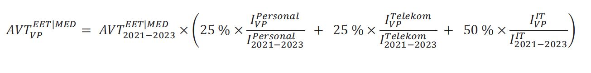

# Vertrag über Die Durchführung des Europäischen elektronischen Mautdienstes auf Bundesfernstraßen im Geltungsbereich des Bundesfernstraßenmautgesetzes (EEMD-ZVAnl II)

Ausfertigungsdatum
:   2018-03-20

Fundstelle
:   BAnz: AT 27.03.2018 V2

Zuletzt geändert durch
:   Art. 1 V v. 1.7.2020 BAnz AT 31.08.2020 V2

Änderung durch
:   Art. 2 V v. 25.10.2021 BAnz AT 29.10.2021 V2 textlich nachgewiesen, dokumentarisch noch nicht abschließend bearbeitet

## Anlage II Vertrag über die Durchführung des europäischen elektronischen Mautdienstes auf Bundesstraßen im Geltungsbereich des Bundesfernstraßenmautgesetzes (EETS-Zulassungsvertrag)

(Fundstelle: BAnz AT 29.10.2021 V2)

Vertrag
über die Durchführung
des europäischen elektronischen Mautdienstes
auf Bundesfernstraßen im Geltungsbereich des
Bundesfernstraßenmautgesetzes
## **(EETS-Zulassungsvertrag)**

## **EETS-Zulassungsvertrag**

### **zwischen**

der Bundesrepublik Deutschland, vertreten durch das Bundesministerium
für Verkehr und digitale Infrastruktur (BMVI), dieses vertreten durch
das Bundesamt für Güterverkehr (BAG), Werderstraße 34, 50672 Köln,
dieses wiederum vertreten durch seinen Präsidenten

– Mauterheber-

und

[Name Anbieter], [Adresse Anbieter], vertreten durch [Vertretung
Anbieter], [registriert gemäß Artikel 4 der Richtlinie (EU) 2019/520
in …] [Nachweis der Registrierung]

- Anbieter-

## Präambel

Die Richtlinie (EU) 2019/520 des Europäischen Parlaments und des Rates
vom 19. März 2019 über die Interoperabilität elektronischer
Mautsysteme und die Erleichterung des grenzüberschreitenden
Informationsaustauschs über die Nichtzahlung von
Straßenbenutzungsgebühren in der Union (ABl. L 91 vom 29.3.2019, S.
45), die Delegierte Verordnung (EU) 2020/203 der Kommission vom 28.
November 2019 über die Klassifizierung von Fahrzeugen, Pflichten der
Nutzer des europäischen elektronischen Mautdienstes, Anforderungen an
Interoperabilitätskomponenten und Mindesteignungskriterien für
benannte Stellen (ABl. L 43 vom 17.2.2020, S. 41) und die
Durchführungsverordnung (EU) 2020/204 der Kommission vom 28. November
2019 über detaillierte Pflichten der Anbieter des europäischen
elektronischen Mautdienstes, den Mindestinhalt der Vorgabe für das
EETS-Gebiet, elektronische Schnittstellen und Anforderungen an
Interoperabilitätskomponenten sowie zur Aufhebung der Entscheidung
2009/750/EG (ABl. L 43 vom 17.2.2020, S. 49) bilden in Verbindung mit
dem Mautsystemgesetz (MautSysG) und dem Bundesfernstraßenmautgesetz
(BFStrMG) sowie den auf ihrer Grundlage erlassenen Rechtsverordnungen
die rechtlichen Grundlagen für die Implementierung des europäischen
elektronischen Mautdienstes (EETS) in der Bundesrepublik Deutschland.

Ziel des EETS ist es, den Nutzern den Zugang zum gesamten
mautpflichtigen europäischen Straßennetz mit nur einem Vertrag und nur
einem Bordgerät eines Anbieters zu ermöglichen.

## § 1 Vertragsgegenstand

(1) Dieser EETS-Zulassungsvertrag („Vertrag“) regelt die Rechte und
Pflichten des Anbieters und des Mauterhebers im Zusammenhang mit der
Durchführung des EETS auf mautpflichtigen Bundesfernstraßen im
Geltungsbereich des BFStrMG („EETS-Gebiet BFStrMG“) nach § 4f Absatz 1
BFStrMG. Soweit nicht ausdrücklich geregelt, sind Rechte und Pflichten
des Anbieters gegenüber Nutzern sowie die zwischen Anbieter und
Nutzern geltenden vertraglichen und sonstigen Vereinbarungen nicht
Gegenstand dieses Vertrages.

(2) Dem Anbieter wird auf der Grundlage dieses Vertrages Zugang zum
EETS-Gebiet BFStrMG gewährt. Zu den Pflichten des Anbieters im EETS-
Gebiet BFStrMG gehört insbesondere die fortlaufende Erfüllung der
jeweils geltenden Bestimmungen zur Interoperabilität der
elektronischen Mautsysteme in der Europäischen Union und der jeweils
geltenden Rechtsvorschriften der Bundesrepublik Deutschland im
Zusammenhang mit der Erhebung, Vereinnahmung und Auskehr der Maut im
EETS-Gebiet BFStrMG, insbesondere der Vorgaben der Verordnung über die
Vorgaben für das EETS-Gebiet Bundesfernstraßenmautgesetz (EEMD-
Gebietsvorgabenverordnung – GVV) (nachfolgend: „Vorgaben für das EETS-
Gebiet BFStrMG“).

(3) Auf der Grundlage dieses Vertrages wird dem Anbieter gestattet, im
Auftrag seiner Nutzer die von diesen für die Nutzung des
mautpflichtigen Streckennetzes innerhalb des EETS-Gebiets BFStrMG
geschuldete Maut einzunehmen. Eine weitergehende Aufgabenübertragung
an den Anbieter findet nicht statt.

(4) Der Anbieter ist verpflichtet, die Mauteinnahmen an den
Mauterheber auszukehren.

(5) Gegenstand dieses Vertrages ist insbesondere auch die
Gewährleistung der Sicherheit der Daten und des Datenschutzes. Daten
im Sinne dieses Vertrages sind alle Informationen jeglicher Art in
elektronischer, Papier- und sonstiger Form (insgesamt „Daten“).

(6) Vorbehaltlich der in diesem Vertrag enthaltenen Definitionen
gelten für diesen Vertrag die im Glossar nach Anlage 7 enthaltenen
Definitionen.

## § 2 Vertragsbestandteile

(1) Bestandteile dieses Vertrages sind

1.  die Zusatzvereinbarung **[Anlage 1],**

2.  die Bankgarantie oder das gleichwertige Finanzinstrument **[Anlage
    2],**

3.  die Erklärung zur Beteiligungsstruktur des Anbieters **[Anlage 3],**

4.  die Gebrauchstauglichkeitsbescheinigung, ausgestellt durch den
    Mauterheber oder eine notifizierte Stelle **[Anlage 4],**

5.  die Qualitätsparameter für EETS-Anbieter **[Anlage 5],**

6.  die Entgeltordnung **[Anlage 6],**

7.  das Glossar **[Anlage 7],**

8.  gegebenenfalls Erklärungen/ Schriftwechsel **[Anlage 8] und**

9.  die Regelungen zur Vergütung **[Anlage 9].**

(2) Bei Widersprüchen in diesem Vertrag gelten nacheinander

1.  dieser Vertrag,

2.  die Zusatzvereinbarung **[Anlage 1],**

3.  gegebenenfalls Erklärungen/ Schriftwechsel **[Anlage 8],**

4.  die Gebrauchstauglichkeitsbescheinigung, ausgestellt durch den
    Mauterheber oder eine notifizierte Stelle **[Anlage 4]**
    und

5.  das Glossar **[Anlage 7].**

## § 3 Zusicherungen des Anbieters / Wechsel eines wirtschaftlich Berechtigten

(1) Der Anbieter versichert, dass er entsprechend Artikel 4 der
Richtlinie (EU) 2019/520 registriert ist, und hat die Registrierung
vor Vertragsschluss belegt. Der Anbieter muss dem Mauterheber
unverzüglich mitteilen, wenn seine Registrierung widerrufen oder aus
anderem Grund nicht mehr gültig ist oder ein Verfahren zum Widerruf
der Registrierung von der zuständigen Stelle eingeleitet worden ist.
Auf Verlangen des Mauterhebers muss der Anbieter das Vorliegen seiner
Registrierung nachweisen.

(2) Der Anbieter versichert, dass die nachfolgenden Angaben am Tag der
Unterzeichnung dieses Vertrages vollständig und richtig sind:

(a) Der Anbieter ist nach den auf ihn anwendbaren gesetzlichen
    Bestimmungen ordnungsgemäß gegründet worden und besteht wirksam.

(b) Der Anbieter ist uneingeschränkt berechtigt, diesen Vertrag
    abzuschließen und durchzuführen und besitzt alle hierzu erforderlichen
    Zustimmungen.

(c) Der Abschluss und die Durchführung dieses Vertrages verletzen nicht
    die Satzung, Gesellschafterbeschlüsse oder eine Geschäftsordnung des
    Anbieters.

(d) Der Abschluss und die Durchführung dieses Vertrages verletzen nicht
    für den Anbieter verbindliche Rechtsvorschriften oder gerichtliche
    oder behördliche Entscheidungen, Verfügungen oder sonstige Regelungen.

(e) Es sind keine Insolvenz-, Reorganisations- oder ähnliche Verfahren im
    In- oder Ausland über das Vermögen des Anbieters beantragt oder
    eröffnet worden. Auch wurden keine Zwangsvollstreckungs- oder ähnliche
    Maßnahmen in das Vermögen oder einzelne Vermögensgegenstände des
    Anbieters beantragt oder eingeleitet. Es bestehen keine Umstände,
    denen zufolge die Eröffnung solcher Verfahren gerechtfertigt wäre.
    Insbesondere ist der Anbieter nicht überschuldet oder zahlungsunfähig
    und es liegt auch kein Fall drohender Zahlungsunfähigkeit oder
    Überschuldung vor. Der Anbieter hat weder seine Zahlungen eingestellt
    noch Schuldenbereinigungsabkommen oder ähnliche Vereinbarungen mit
    Gläubigern abgeschlossen oder angeboten.

(f) Die in **[Anlage 3]**                    dargestellte Übersicht über
    die gesellschaftsrechtlichen Beteiligungsverhältnisse des Anbieters
    („Beteiligungsstruktur“) ist richtig und vollständig.

## § 4 Einschaltung Dritter

(1) Der Anbieter hat alle vertraglichen Leistungen selbst zu erbringen
und muss alle vom Mauterheber gestellten Vorgaben zu jedem Zeitpunkt
vollständig erfüllen. Soweit sich der Anbieter für die Erfüllung
seiner vertraglichen Verpflichtungen der Leistungen oder für die
Erfüllung von Vorgaben Dritter bedient, hat er dies dem Mauterheber
unverzüglich und unaufgefordert anzuzeigen. Wesentliche Änderungen bei
der Inanspruchnahme von Leistungen Dritter sind dem Mauterheber
unverzüglich und unaufgefordert bekannt zu geben.

(2) Der Anbieter haftet für das Tun oder Unterlassen Dritter, derer er
sich für die Erbringung der vertraglichen Leistung oder zur Erfüllung
der Vorgaben bedient, gegenüber dem Mauterheber in gleichem Umfang wie
für eigenes Tun oder Unterlassen.

(3) Soweit sich der Anbieter für die Erbringung der vertraglichen
Leistung oder zur Erfüllung der Vorgaben Dritter bedient, hat er
sicherzustellen, dass auch diese alle Pflichten dieses Vertrages
erfüllen und der Mauterheber ihnen gegenüber alle Rechte, die ihm nach
diesem Vertrag gegenüber dem Anbieter zustehen, ausüben kann. Der
Anbieter wird den Dritten zu diesem Zwecke die ihm gegenüber dem
Mauterheber bestehenden Pflichten auferlegen. Der Anbieter haftet für
die Einhaltung der den Dritten aufzuerlegenden Pflichten gegenüber dem
Mauterheber. Dies gilt nicht, soweit weder der Dritte noch der
Anbieter die Pflichtverletzung zu vertreten haben.

## § 5 Auskehr der Mauteinnahmen an den Mauterheber

(1) Die Auskehr der Mauteinnahmen erfolgt auf das Konto der
Bundeskasse Trier-Deutsche Bundesbank Saarbrücken, IBAN DE81 5900 0000
0059 0010 20, BIC MARKDEF1590. Der anzugebende Verwendungszweck wird
gesondert durch den Mauterheber mitgeteilt. Der Anbieter unterwirft
sich gegenüber dem Mauterheber der sofortigen Vollstreckung nach
Maßgabe des § 61 Verwaltungsverfahrensgesetz (VwVfG) in sein gesamtes
Vermögen.

(2) Die Pflichten des Anbieters im Zusammenhang mit der Auskehr der
Mauteinnahmen sowie den einzelnen Vorgaben zu Abrechnungswesen,
Zahlungs- und Fakturierungsgrundsätzen in Bezug auf die Mauteinnahmen
sind in den Vorgaben für das EETS-Gebiet BFStrMG festgelegt.

(3) Der Anbieter muss sicherstellen, dass die Zahlungsvorgänge
zwischen ihm, seinen Nutzern und dem Mauterheber so ausgestaltet sind,
dass in jedem Fall, auch im Fall der Insolvenz oder drohender
Insolvenz des Anbieters oder von ihm für die Erbringung der
vertraglichen Leistung oder zur Erfüllung der Vorgaben Dritter, die
Sicherheit der vollständigen Auskehr der Mauteinnahmen nicht gefährdet
ist.

## § 6 Sicherheiten

(1) Der Anbieter muss dem Mauterheber vor Abschluss dieses Vertrages
eine Garantie einer Bank („Bankgarantie") oder ein gleichwertiges
Finanzinstrument übergeben. Diese hat in Höhe der erwarteten
Durchschnittssumme der pro Monat für das EETS-Gebiet BFStrMG insgesamt
auszukehrenden Mauteinnahmen und Zahlungen gemäß § 19 Absatz 1
MautSysG zu sein. Für die Prognose wird ein Betrachtungszeitraum von
12 Monaten zugrunde gelegt. Die Bankgarantie oder das gleichwertige
Finanzinstrument dienen der Sicherung aller Ansprüche des Mauterhebers
aus oder im Zusammenhang mit diesem Vertrag. Sie müssen eine Zahlung
auf erstes Anfordern vorsehen und in der Regel deutschem Recht
unterliegen.

(2) Die Bankgarantie muss von einem Kreditinstitut gegeben werden, das
seinen Sitz oder seine Niederlassung in der Europäischen Union oder in
der EFTA hat. Das Kreditinstitut muss ein Investmentgrade-Rating für
Langfristverbindlichkeiten von mindestens A3 (Moody’s) bzw. A- (S & P
oder Fitch) aufweisen und für Kurzfristverbindlichkeiten von
mindestens P2 (Moody’s) bzw. A-2 (S & P) bzw. F-2 (Fitch) aufweisen.
Verschlechtert sich das Rating des Kreditinstituts während der
Laufzeit der Bankgarantie, so dass die vorstehend genannten
Mindestanforderungen nicht mehr erfüllt sind, ist der Anbieter
verpflichtet, unverzüglich, spätestens aber innerhalb eines Monats
nach Bekanntwerden des schlechteren Ratings, eine Bankgarantie eines
Kreditinstituts, das die in diesem Absatz genannten Mindestvorgaben
erfüllt, zu übergeben.

(3) Sofern ein anderes Finanzinstrument als eine Bankgarantie zur
Sicherung der Mauteinnahmen vorgehalten wird, muss dieses einer
Bankgarantie, die die genannten Kriterien in Absatz 2 erfüllt,
gleichwertig sein. Ein Finanzinstrument ist nur gleichwertig, wenn es
denselben Grad an Sicherheit wie eine Bankgarantie bietet. Dies kann
insbesondere dann der Fall sein, wenn die Gesellschafter des Anbieters
eine Kapitalintakthalteerklärung in Bezug auf den Anbieter abgeben und
eine der zu besichernden Summe angemessene finanzielle
Leistungsfähigkeit besitzen. Die Entscheidung über die
Gleichwertigkeit steht im Ermessen des Bundesamtes für Güterverkehr.
Sofern sich während der Laufzeit des gleichwertigen Finanzinstruments
die Umstände, insbesondere die finanzielle Leistungsfähigkeit des
Ausstellers, ändern, kann der Mauterheber die Anpassung des
gleichwertigen Finanzinstruments oder die Vorlage einer Bankgarantie
gemäß Absatz 1 verlangen.

(4) Die Bankgarantie oder das gleichwertige Finanzinstrument muss vom
Anbieter in deutscher Sprache oder in einer amtlich beglaubigten
Übersetzung übergeben werden. Die Laufzeit der Bankgarantie oder des
gleichwertigen Finanzinstruments muss mindestens 12 Monate betragen.
Die Bankgarantie muss sich nach zeitlichem Ablauf automatisch erneuern
(„revolvierende Bankgarantie“). Sollte die Bankgarantie oder die
Laufzeit des gleichwertigen Finanzinstruments befristet sein, ist der
Anbieter verpflichtet, spätestens sechs Kalendermonate vor Ablauf des
Geltungszeitraums eine Verlängerung der Bankgarantie oder des
gleichwertigen Finanzinstruments vorzulegen.

(5) Der Anbieter muss die Höhe der Bankgarantie oder des
gleichwertigen Finanzinstruments mindestens alle 12 Monate an die von
ihm in den vorausgegangenen 12 Monaten im Durchschnitt pro Monat für
das EETS-Gebiet BFStrMG insgesamt auszukehrenden Mauteinnahmen sowie
Zahlungen nach § 19 Absatz 1 dieses Vertrages anpassen. Der Anbieter
muss die Bankgarantie oder das gleichwertige Finanzinstrument
innerhalb von zwei Wochen nach Aufforderung durch den Mauterheber
anpassen, wenn die vom Anbieter für das EETS-Gebiet BFStrMG im Monat
auszukehrenden Mauteinnahmen sowie Zahlungen nach § 19 Absatz 1 dieses
Vertrages in sechs aufeinander folgenden Monaten im Durchschnitt pro
Monat den Wert übersteigen, der der Berechnung der Höhe der
Bankgarantie oder des gleichwertigen Finanzinstruments zugrunde gelegt
worden ist. Das gleiche gilt, wenn die vom Anbieter für das EETS-
Gebiet BFStrMG im Monat auszukehrenden Mauteinnahmen sowie Zahlungen
nach § 19 Absatz 1 dieses Vertrages zehn Prozent des Wertes
übersteigen, der der Berechnung der Höhe der Bankgarantie oder des
gleichwertigen Finanzinstruments zugrunde gelegt worden ist. Auf
Verlangen des Mauterhebers muss der Anbieter die Bankgarantie oder das
gleichwertige Finanzinstrument auch dann anpassen, wenn sich die
Mautsätze und die Mautpflicht, die der Berechnung der Höhe der
Bankgarantie oder des gleichwertigen Finanzinstruments zugrunde gelegt
wurden, ändern. Der Mauterheber bestimmt den Zeitpunkt, zu dem die
angepasste Bankgarantie oder das gleichwertige Finanzinstrument vom
Anbieter vorgelegt werden muss. Der Anbieter ist berechtigt, vom
Mauterheber eine Anpassung der Bankgarantie oder des gleichwertigen
Finanzinstruments zu verlangen, wenn die auszukehrenden Mauteinnahmen
sowie Zahlungen nach § 19 Absatz 1 in sechs aufeinander folgenden
Monaten im Durchschnitt pro Monat den Wert unterschreiten, der der
Berechnung der Höhe der Bankgarantie oder des gleichwertigen
Finanzinstruments zugrunde gelegt worden ist.

(6) Als Verlängerung im Sinne dieses Paragraphen gilt auch die Vorlage
einer neuen Bankgarantie oder eines neuen gleichwertigen
Finanzinstruments, wobei diese Bankgarantie oder dieses gleichwertige
Finanzinstrument denselben Anforderungen genügen muss als wäre sie
eine ursprüngliche Bankgarantie oder ein ursprüngliches gleichwertiges
Finanzinstrument.

## § 7 Versicherungen

(1) Der Anbieter ist verpflichtet, für die im Rahmen dieses Vertrages
ausgeführten Tätigkeiten auf eigene Kosten eine
Betriebshaftpflichtversicherung mit mindestens den folgenden Inhalten
abzuschließen und während der Laufzeit dieses Vertrages aufrecht zu
erhalten:

(a) Betriebsbeschreibung: „Mauterhebung als EETS-Anbieter auf den Straßen
    des EETS-Mautgebiets BFStrMG inklusive aller betriebs- und
    branchenüblichen, betriebs- und branchennotwendigen und im Betrieb der
    Versicherungsnehmerin bestehenden Zusatzrisiken“,

(b) (b) Deckung für gesetzliche Haftpflichtansprüche wegen Personen-,
    Sach- und daraus folgenden Vermögensschäden mit einer Deckungssumme
    von mindestens 15 Millionen Euro (in Worten: fünfzehn Millionen Euro)
    je Schadensfall. Der EETS-Anbieter muss sicherstellen, dass zu jeder
    Zeit ein ausreichender Versicherungsschutz im Sinne des Satz 1
    besteht; dies gilt auch nach Eintritt eines Versicherungsfalles und
    der Inanspruchnahme der Versicherung.

(2) Errichtet oder betreibt der Anbieter im EETS-Gebiet BFStrMG
straßenseitige Einrichtungen, ist er verpflichtet, die
geschäftsüblichen Versicherungen abzuschließen und für die Dauer der
Errichtung oder des Betriebs aufrecht zu erhalten. Die Versicherungen
müssen Personen-, Sach- und daraus folgende Vermögensschäden abdecken.
Die Mindestversicherungssumme für Versicherungen nach diesem Absatz
beträgt 2,5 Millionen Euro (in Worten: zwei Millionen
fünfhunderttausend Euro) je Schadensfall.

(3) Der Mauterheber kann eine Erhöhung der Versicherungssumme
verlangen, wenn dies angesichts veränderter Schadensszenarien
angemessen ist.

(4) Der Anbieter legt dem Mauterheber die Nachweise des
Versicherungsabschlusses und des Versicherungsumfangs unverzüglich,
unaufgefordert und in deutscher Sprache oder mit einer amtlichen
beglaubigten Übersetzung vor. Dies gilt auch im Falle der Anpassung
von Versicherungen.

(5) Die Ansprüche auf Leistungen aus den Versicherungen nach den
Absätzen 1 und 2 tritt der Anbieter zur Sicherung der
Haftungsansprüche des Mauterhebers an diesen ab. In den Versicherungen
nach den Absätzen 1 und 2 ist vorzusehen, dass der Mauterheber vom
Versicherer über etwaige Versicherungsleistungen an den Anbieter
unmittelbar in Kenntnis gesetzt wird. Der Anbieter ist zum Einzug der
Versicherungsleistungen berechtigt und verpflichtet sich, die
Versicherungsleistung umgehend zur vollständigen Beseitigung und
vollständigen Wiederherstellung der Funktionsfähigkeit des vom Schaden
betroffenen Teils zu verwenden. Im Falle der Verletzung dieser Pflicht
ist der Mauterheber zur Offenlegung der Abtretung und zum Widerruf der
nach Satz 3 erteilten Einziehungsberechtigung berechtigt. Eine
Abtretung oder Verpfändung von Versicherungsansprüchen an Dritte ist
nur mit vorheriger Zustimmung des Mauterhebers zulässig.

## § 8 Abtretungsverbot und Verbot der Schuld- und Vertragsübernahme

Der Anbieter ist nicht berechtigt, ohne vorherige schriftliche
Zustimmung des Mauterhebers Rechte aus diesem Vertrag an Dritte
abzutreten oder zu verpfänden. Dies gilt auch für die schuldbefreiende
Übernahme von Verpflichtungen des Anbieters aus diesem Vertrag durch
Dritte sowie eine vollständige Vertragsübernahme dieses Vertrages vom
Anbieter durch Dritte. Die Erteilung der Zustimmung steht im freien
Ermessen des Mauterhebers.

## § 9 Aufrechnungs- und Zurückbehaltungsrechte, Verbot der Besicherung

(1) Dem Anbieter steht hinsichtlich der an den Mauterheber
auszukehrenden Mauteinnahmen weder ein Aufrechnungs- noch ein
Zurückbehaltungsrecht zu. Eine Aufrechnung oder Verrechnung der
Ansprüche des Mauterhebers auf Auskehr von Mauteinnahmen oder Zahlung
entsprechender Beträge mit Ansprüchen des Anbieters gegen den
Mauterheber – insbesondere mit dem Vergütungsanspruch gemäß § 20 – ist
nicht gestattet. Satz 1 und 2 gelten nicht für unbestrittene oder
rechtskräftig festgestellte Forderungen des Anbieters gegen den
Mauterheber.

(2) Dem Anbieter ist es untersagt, die dem Mauterheber zustehenden
Mauteinnahmen zum Gegenstand einer Verpfändung oder Besicherung zu
machen oder auf sonstige Weise mit Rechten Dritter zu belasten.

## § 10 Mitwirkungspflichten

(1) Der Mauterheber wird den Anbieter nach Möglichkeit über relevante
Änderungen des EETS-Registers sowie anderer Grundlagen für die
Durchführung des EETS im EETS-Gebiet BFStrMG informieren. Dies
entbindet den Anbieter nicht von der Pflicht, sich regelmäßig über
solche Änderungen zu informieren und die Richtigkeit und
Vollständigkeit der ihm zur Verfügung gestellten Informationen zu
überprüfen.

(2) Der Mauterheber informiert den Anbieter über bevorstehende
Änderungen

1.  am nationalen dualen Mauterhebungssystem,

2.  am Kontrollsystem,

3.  an dem vom nationalen Betreiber im Auftrag des Mauterhebers
    betriebenen Mauterhebungsdienst oder

4.  am EETS-Teilsystem eines anderen Anbieters, die direkt oder indirekt
    Auswirkungen auf das EETS-Teilsystem des Anbieters haben könnten.

Dies gilt insbesondere für Maßnahmen und Ereignisse, die dazu geeignet
sind, die Zahl der Nutzer des Anbieters vorübergehend oder dauerhaft
erheblich zu reduzieren.

(3) Unbeschadet besonderer Pflichten der Vertragsparteien, die sich
aus diesem Vertrag oder aus den dem EETS zugrundeliegenden
Rechtsvorschriften resultieren, arbeiten die Vertragsparteien
zusammen, um Beeinträchtigungen des Lkw-Mautsystems (BFStrMG) und der
Sicherheit der Mauteinnahmen abzuwenden oder unverzüglich in der
erforderlichen Art und Weise zu beseitigen.

(4) Soweit für die Durchführung des EETS die Errichtung von baulichen
Anlagen im EETS-Gebiet BFStrMG durch den Anbieter notwendig ist, wird
der Mauterheber den Anbieter – soweit erforderlich – bei der
Errichtung unterstützen. Die Kosten für die Planung, Genehmigung,
Errichtung und den Betrieb baulicher Anlagen im EETS-Gebiet BFStrMG
durch den Anbieter trägt der Anbieter. Eine Haftung des Mauterhebers
im Zusammenhang mit der Errichtung und dem Betrieb baulicher Anlagen
im EETS-Gebiet BFStrMG durch den Anbieter ist ausgeschlossen.

(5) Soweit vom Anbieter für die Durchführung des EETS der vom
nationalen Betreiber im Auftrag des Mauterhebers betriebene
Mauterhebungsdienst genutzt wird, gelten ergänzend folgende
Mitwirkungspflichten des Mauterhebers:

(a) Der nationale Betreiber ermöglicht dem Anbieter die Anbindung an den
    Mauterhebungsdienst. Dies betrifft insbesondere die Übermittlung von
    Fahrspuren an den nationalen Betreiber über Schnittstelle 005 sowie
    die Übertragung der Informationen zu ermittelten mautpflichtigen
    Fahrten über die Schnittstelle 007R an den Anbieter.

(b) Der Mauterheber wird den Anbieter mindestens vier Wochen vor einer
    geplanten Nicht-Verfügbarkeit des Mauterhebungsdienstes über diese
    informieren.

(c) Der Mauterheber wird Reklamationen von Mautschuldnern, die ein
    Anbieter an den Mauterheber oder den nationalen Betreiber
    weiterleitet, bearbeiten, prüfen und beantworten sowie nach
    Möglichkeit entscheiden. Der Mauterheber bemüht sich, die
    Reklamationen unverzüglich, spätestens jedoch innerhalb von 14 Tagen
    nach Eingang zu bearbeiten und nach Möglichkeit zu entscheiden oder
    dem Anbieter zu antworten.

(d) Der Mauterheber wird den Anbieter im Falle von Fehlvergebührungen des
    Mauterhebungsdienstes, die dazu führen oder geführt haben, dass für
    Mautfahrten unrichtige Mautbeträge ermittelt und an Anbieter
    übermittelt wurden, unverzüglich über die Fehlvergebührung informieren
    und eine Liste übermitteln, aus der sich für jede Mautfahrt der
    korrekte Mautbetrag ergibt.

## § 11 Nachweis- und Informationspflichten des Anbieters

(1) Der Anbieter muss dem Mauterheber jede Änderung an seinem EETS-
Teilsystem, die Auswirkung auf die Erfüllung der Vorgaben für das
EETS-Gebiet BFStrMG haben kann, unverzüglich und unaufgefordert
anzeigen.

(2) Der Anbieter muss dem Mauterheber jederzeit auf schriftliche
Anfrage des Mauterhebers unverzüglich alle Daten zum Nachweis der
Erfüllung der Vorgaben für das EETS-Gebiet BFStrMG und der sonstigen
vertraglichen Pflichten übermitteln.

(3) Der Anbieter muss den Mauterheber unverzüglich und unaufgefordert
über alle Änderungen im Zusammenhang mit den in § 3 dieses Vertrages
gegebenen Zusicherungen informieren.

(4) Der Anbieter ist verpflichtet, dem Mauterheber jederzeit auf
Anforderung Daten und Nachweise zur Identifizierung der natürlichen
oder juristischen Personen, die einen bestimmenden Einfluss auf den
Anbieter ausüben („wirtschaftlich Berechtigte"), zur Verfügung zu
stellen. Hierzu zählen insbesondere natürliche oder juristische
Personen, die unmittelbar oder mittelbar mindestens 25 Prozent der
Kapitalanteile an dem Anbieter halten oder kontrollieren oder
mindestens 25 Prozent von dessen Stimmrechten kontrollieren.

(5) Der Anbieter ist verpflichtet, dem Mauterheber alle Maßnahmen,
insbesondere Anteilsübertragungen oder umwandlungsrechtliche
Maßnahmen, die zu einer unmittelbaren oder mittelbaren Änderung eines
wirtschaftlich Berechtigten führen, unverzüglich anzuzeigen.

(6) Der Anbieter ist verpflichtet, den Mauterheber unverzüglich über
alle Maßnahmen oder Ereignisse zu informieren, die direkt oder
indirekt Auswirkungen haben könnten

1.  auf das nationale duale Mauterhebungssystem,

2.  das Kontrollsystem,

3.  den vom nationalen Betreiber im Auftrag des Mauterhebers betriebenen
    Mauterhebungsdienst oder

4.  das EETS-Teilsystem des Mauterhebers.

## § 12 Zutritts- und Einsichtsrechte des Mauterhebers

(1) Der Anbieter muss dem Mauterheber oder einer von diesem benannten
Stelle zur Überwachung der Einhaltung der Vorgaben und der
vertraglichen Pflichten des Anbieters nach vorheriger Ankündigung und
während der üblichen Geschäftszeiten uneingeschränkten Zutritt zu
seinen Geschäftsräumen und sonstigen Einrichtungen gewähren.

(2) Der Anbieter muss dem Mauterheber oder einer von diesem benannten
Stelle nach vorheriger Ankündigung und während der üblichen
Geschäftszeiten Einsicht in alle Daten gewähren, die zur Überwachung
der Einhaltung der Vorgaben für das EETS-Gebiet BFStrMG und der
vertraglichen Pflichten des Anbieters erforderlich sind.

(3) Der Anbieter muss die Rechte nach den Absätzen 1 und 2 auch dem
Bundesministerium der Finanzen, dem Bundesrechnungshof und sonstigen
staatlichen Stellen einräumen, soweit diese im Rahmen ihrer Befugnisse
tätig werden.

(4) Der Anbieter muss in Verträgen mit Dritten im Sinne von § 4 gemäß
den Absätzen 1 und 2 entsprechende Zutritts-, Einsichts- und
Zugriffsrechte zugunsten des Mauterhebers, einer von diesem
beauftragten Stelle, dem Bundesministerium der Finanzen, dem
Bundesrechnungshof und sonstigen staatlichen Stellen vereinbaren.

## § 13 Datenschutz

(1) Der Anbieter stellt sicher, dass er bei der Durchführung des EETS
jederzeit alle Anforderungen des Datenschutzes erfüllt. Dazu gehören
insbesondere die europarechtlichen Anforderungen und die
spezialgesetzlichen Anforderungen des MautSysG, des BFStrMG und –
soweit das MautSysG und das BFStrMG keine abschließende Regelung
treffen – ergänzend die Bestimmungen des Bundesdatenschutzgesetzes
(BDSG) sowie die Bestimmungen der Verordnung (EU) 2016/679 des
Europäischen Parlaments und des Rates vom 27. April 2016 zum Schutz
natürlicher Personen bei der Verarbeitung personenbezogener Daten, zum
freien Datenverkehr und zur Aufhebung der Richtlinie 95/46/EG (ABl. L
119 vom 4.5.2016, S. 1; L 314 vom 22.11.2016, S. 72; L 127 vom
23\.5.2018, S. 2; L 74 vom 4.3.2021, S. 35) (Datenschutz-
Grundverordnung). Diese Verpflichtung des Anbieters gegenüber dem
Mauterheber gilt unabhängig davon, ob der Anbieter selbst in den
Anwendungsbereich solcher Datenschutzbestimmungen fällt. Die Pflicht
des Anbieters zur Einhaltung anwendbarer nationaler
Datenschutzbestimmungen anderer Staaten bleibt unberührt. Im Zweifel
sind das MautSysG, das BFStrMG und - soweit das MautSysG und das
BFStrMG keine abschließende Regelung treffen - ergänzend die
Bestimmungen des BDSG sowie - soweit anwendbar - weitere
spezialgesetzliche deutsche oder supranationale
Datenschutzvorschriften die Bestimmungen der Datenschutz-
Grundverordnung, neben anderen nationalen Datenschutzbestimmungen
einzuhalten.

(2) Die Art und Weise der Sicherstellung der Einhaltung
datenschutzrechtlicher Anforderungen ist in dem der
Gebrauchstauglichkeitsbescheinigung für den Anbieter zugrunde gelegten
Datenschutzkonzept des Anbieters zu dokumentieren.

(3) Soweit sich der Anbieter bei der Einrichtung, Durchführung oder
Beendigung des EETS eines Dritten bedient, verpflichtet er sich
unabhängig davon, in welchem Land dieser Dritte ansässig ist oder
seine Leistungen erbringt, dafür zu sorgen, dass die vom Anbieter
einzuhaltenden datenschutzrechtlichen Anforderungen gemäß Absatz 1
auch von dem Dritten eingehalten werden. § 4 bleibt unberührt.

(4) Soweit der Anbieter während des laufenden Betriebs als Teil seiner
Gesamtflotte eine permanente Nutzerreferenzflotte betreibt, ist er
verpflichtet, Erklärungen seiner Nutzer einzuholen und dem Mauterheber
vorzulegen, wonach diese darin einwilligen, dass die Daten zu den
Fahrspuren zu Analyse- und Qualitätssicherungszwecken 120 Tage lang
aufbewahrt und verarbeitet werden.

(5) Die Regelungen dieses Paragraphen gelten auch im Falle der
Beendigung dieses Vertrages fort.

## § 14 Datensicherheit

(1) Zum Zwecke des elektronischen Austauschs der für die Durchführung
des EETS erforderlichen Daten wird der Mauterheber den Anbieter über
die für den Austausch erforderlichen System- und
Schnittstellenspezifikationen in Kenntnis setzen, soweit der Anbieter
über diese Daten nicht bereits aufgrund des EETS-Prüfverfahrens
verfügt.

(2) Der Anbieter wird seine Datensysteme und -schnittstellen so
ausgestalten, dass auf der Grundlage der vom Mauterheber zur Verfügung
gestellten Spezifikationen zu jeder Zeit und uneingeschränkt ein
verlustfreier, sicherer Datenaustausch möglich ist. Die Sicherheit der
Datenübermittlung ist in dem der Gebrauchstauglichkeitsbescheinigung
für den Anbieter zugrunde gelegten Datensicherheitskonzept des
Anbieters dokumentiert.

(3) Der Mauterheber wird dem Anbieter im Wege der elektronischen
Datenübermittlung die für die Durchführung des EETS erforderlichen
Daten zugänglich machen und während der Durchführung des EETS durch
den Anbieter aktualisieren und ergänzen. Dies betrifft insbesondere
die für die Mauterhebung erforderlichen Datensätze und Kodierungen.

(4) Der Anbieter verpflichtet sich, während der gesamten
Vertragslaufzeit und bis zu dem Zeitpunkt, in dem die Daten mit
Zustimmung des Mauterhebers gemäß § 15 unwiderruflich gelöscht werden,
sicherzustellen, dass der Schutz der personenbezogenen und
personenbeziehbaren Daten den Anforderungen von § 13 entspricht. Der
Anbieter wird darüber hinaus jederzeit die erforderlichen technischen
und organisatorischen Sicherheitsmaßnahmen nach dem aktuellen Stand
der Technik ergreifen, um die seinem Zugriff unterliegenden Daten,
Prozesse und Systeme sowie den Datenaustausch mit dem Mauterheber zu
schützen, so dass jederzeit hinsichtlich Vertraulichkeit,
Verfügbarkeit und Integrität der Daten, Prozesse und Systeme ein dem
im Einzelfall festgestellten Schutzbedarf entsprechender Schutz vor
technischer oder organisatorischer Kompromittierung gewährleistet ist.
Vom jeweils höchsten Schutzbedarf ist auszugehen für alle Vorgänge,
die

1.  personenbezogene und personenbeziehbare Daten und

2.  den Datenaustausch oder Systemberührungen mit dem Mauterheber
    betreffen.

Der Anbieter verpflichtet sich insbesondere, jederzeit die
erforderlichen technischen und organisatorischen Sicherheitsmaßnahmen
einzusetzen, um alle beteiligten Daten, Systeme und Prozesse zu
schützen, zu überwachen und bei Kenntnis eines realisierten oder
potentiellen Verlustes der Vertraulichkeit, Verfügbarkeit oder
Integrität von Daten, Systemen, oder Prozessen (insgesamt
„Sicherheitsvorfälle") den Mauterheber unverzüglich zu informieren und
unverzüglich in der jeweils erforderlichen Art und Weise zu reagieren,
so dass insbesondere der Sicherheitsvorfall ausgeräumt oder seine
Auswirkungen sowie damit verbundene Schäden und Beeinträchtigungen des
Mauterhebers oder Dritter weitestmöglich begrenzt und reduziert
werden.

(5) Der Mauterheber kann verlangen, auf Veranlassung des Anbieters das
Informationsschutz-Management-System des Anbieters im Rahmen eines
Audits von einem externen Sachverständigen prüfen zu lassen.

(6) Der Anbieter haftet dem Mauterheber für jegliche mittelbaren und
unmittelbaren Schäden, die dem Mauterheber aufgrund von
Sicherheitsvorfällen aus dem Verantwortungsbereich des Anbieters
entstehen; dies gilt nicht, soweit der Anbieter die Pflichtverletzung
nicht zu vertreten hat. Die Haftung schließt die dem Mauterheber
entgangenen Mauteinnahmen ein. Der Anbieter übernimmt zudem die Kosten
einer Wiederinstandsetzung, Reparatur oder sonstigen Überprüfung des
Systems des Mauterhebers, des nationalen Betreibers und der von ihm
betriebenen Kontrolleinrichtungen, anderer Anbieter und sonstiger
Dritter, sowie des vom nationalen Betreiber im Auftrag des
Mauterhebers betriebenen Mauterhebungsdienstes, die aufgrund von
Sicherheitsvorfällen aus dem Verantwortungsbereich des Anbieters
entstanden sind. Sollten aufgrund von Sicherheitsvorfällen aus dem
Verantwortungsbereich des Anbieters Dritte Ansprüche gegenüber dem
Mauterheber geltend machen, stellt der Anbieter den Mauterheber gemäß
§ 25 im dort geregelten Umfang von diesen Ansprüchen frei.

(7) Die Regelungen dieses Paragraphen gelten auch nach Beendigung
dieses Vertrages fort.

## § 15 Aufbewahrung von vertraulichen Daten

(1) Der Anbieter verpflichtet sich, alle im Zusammenhang mit der
Einrichtung, Durchführung und Beendigung des EETS erstellten oder
erlangten vertraulichen Daten, die zur uneingeschränkten Überprüfung
der Leistungen des Anbieters und vollständigen Erhebung, Vereinnahmung
und Auskehr der Maut an den Mauterheber erforderlich sind,
entsprechend den gesetzlichen Bestimmungen, insbesondere den
Datenschutzanforderungen gemäß §13 und der Bundeshaushaltsordnung,
aufzubewahren.

(2) Der Anbieter verpflichtet sich, die vertraulichen Daten in einer
Weise aufzubewahren, dass sie von Dritten nicht eingesehen, verändert,
kopiert, entwendet oder vernichtet werden können. Der Anbieter wird zu
diesem Zweck die erforderlichen technischen und organisatorischen
Sicherheitsmaßnahmen ergreifen, um einen Zugriff auf vertrauliche
Daten durch Dritte verlässlich auszuschließen. Zur Absicherung gegen
Datenverluste nimmt der Anbieter kontinuierlich Sicherungskopien der
relevanten Daten vor.

(3) Auf Verlangen des Mauterhebers wird der Anbieter dem Mauterheber
die vertraulichen Daten in geeigneter Form zugänglich machen. Auf
Verlangen des Mauterhebers wird dies in elektronischer Form geschehen.
Der Mauterheber ist berechtigt, das Datenformat für die Übermittlung
der Daten nach billigem Ermessen festzulegen. Der Anbieter ist
verpflichtet, auch in diesem Fall die in diesem Vertrag im Übrigen
geregelten Bestimmungen zur Datensicherheit einzuhalten.

(4) Der Anbieter wird die vertraulichen Daten einschließlich aller
Sicherungskopien vor Ablauf der gesetzlich maximal zulässigen
Aufbewahrungsfristen nur mit Zustimmung des Mauterhebers vernichten
oder löschen und dabei insbesondere gewährleisten, dass die
Vertraulichkeit im Sinne des § 16 jederzeit eingehalten wird und
Dritte auch nach Vernichtung oder Löschung keinen Zugang zu diesen
Daten erlangen. Soweit die Vernichtung oder Löschung von Daten
erforderlich ist, wird der Anbieter dies in einer Weise vornehmen, die
eine Wiederherstellung der Daten technisch ausschließt, die
vorgenommenen Maßnahmen dokumentieren und sie auf Verlangen dem
Mauterheber nachweisen.

(5) Sollten entgegen den Verpflichtungen dieses Paragraphen
vertrauliche Daten abhandenkommen, kopiert werden oder sonst
unberechtigt eingesehen werden, haftet der Anbieter dem Mauterheber
für die daraus entstehenden Schäden und stellt die
Freistellungsberechtigten gemäß § 25 im dort geregelten Umfang von
allen Ansprüchen Dritter frei. Dies gilt nicht, soweit er die
Pflichtverletzung nicht zu vertreten hat.

(6) Der Anbieter muss auf Verlangen des Mauterhebers vertrauliche
Daten im Sinne des § 16, die der Mauterheber ihm zur Verfügung
gestellt hat, an diesen zurückgeben, sobald sie für die Durchführung
des EETS nicht mehr erforderlich sind. Soweit eine Rückgabe nach Art
der Daten nicht möglich ist, sind diese nachweislich in der in Absatz
4 Satz 2 beschriebenen Weise zu löschen oder zu vernichten. Dies gilt
nicht, soweit vom Anbieter ein berechtigtes Interesse an der
Aufbewahrung der vertraulichen Daten im Hinblick auf eine spätere
Rekonstruktion bei Streitfällen dargelegt wird. In diesem Falle sind
die Daten zurückzugeben oder nachweislich zu löschen, wenn sie für
diesen Zweck nicht mehr erforderlich sind.

(7) Für die Regelungen dieses Paragraphen gelten § 16 Absätze 3 und 8
entsprechend.

(8) Die Regelungen dieses Paragraphen gelten auch im Falle der
Beendigung dieses Vertrages fort.

## § 16 Geheimhaltung und Vertraulichkeit

(1) Anbieter und Mauterheber werden alle Daten, die ihnen im
Zusammenhang mit der Einrichtung, Durchführung und Beendigung des EETS
von der anderen Vertragspartei direkt oder indirekt zugänglich gemacht
werden, oder die ihnen in diesem Zusammenhang auf sonstige Weise zur
Kenntnis gelangt sind ( „vertrauliche Daten"), vertraulich behandeln
und sie Dritten nicht zugänglich machen. Vertrauliche Daten sind auch
solche Daten, die Anbieter oder Mauterheber selbst im Zusammenhang mit
dem EETS erstellt oder erhoben haben und die mit dem EETS, den ihm
zugrundeliegenden Parametern, den technischen Spezifikationen,
wirtschaftlichen Vorgaben oder den Vertragsparteien selbst in
Verbindung stehen.

(2) Die vertraulichen Daten dürfen von den Vertragsparteien
ausschließlich für den Zweck der Durchführung des EETS und dieses
Vertrages verwendet werden.

(3) Nicht als Dritte im Sinne dieses Paragraphen gelten auf Seiten des
Anbieters solche Personen, die

(a) mit Aufgaben befasst sind, die im Zusammenhang mit diesem Vertrag oder
    der Durchführung des EETS stehen und/oder bestimmungsgemäß mit der
    Erfüllung der nach diesem Vertrag gegenüber dem Mauterheber
    geschuldeten Verpflichtungen beschäftigt sind,

(b) gegenüber dem Anbieter zur Vertraulichkeit, insbesondere auch
    bezüglich der vertraulichen Daten, verpflichtet sind und

(c) die vertraulichen Daten zur Ausführung der ihnen zugewiesenen Aufgaben
    benötigen.

Die Weiterreichung an mit dem Anbieter im Konzernverbund stehende
Unternehmen („Konzernunternehmen") ist nur gestattet, sofern und
soweit dies zur konzerninternen Prüfung erforderlich ist und den
beteiligten Konzernunternehmen vollumfänglich die nach diesem
Abschnitt bestehende Vertraulichkeitsverpflichtung auferlegt worden
ist.

(4) Der Anbieter führt eine Liste der Personen in Konzernunternehmen,
die Zugang zu vertraulichen Daten haben und legt diese dem Mauterheber
jederzeit auf sein Verlangen vor.

(5) Der Anbieter ist verpflichtet, Personen, die Zugang zu
vertraulichen Daten haben, in gleichem Umfang und unter Androhung
einer dem gefährdeten Rechtsgut angemessenen, spürbaren Vertragsstrafe
mit unmittelbarer Wirkung zu Gunsten des Mauterhebers
Vertraulichkeitsverpflichtungen aufzuerlegen und dies auf Verlangen
des Mauterhebers unverzüglich nachzuweisen.

(6) Der Anbieter ist verpflichtet, dafür Sorge zu tragen, dass die
Konzernunternehmen die Verpflichtung nach Absatz 5 ebenfalls erfüllen.

(7) Der Anbieter steht für die Einhaltung der ihm hiernach auferlegten
und den Personen und Konzernunternehmen aufzuerlegenden
Vertraulichkeitsverpflichtung ein.

(8) Nicht als Dritte im Sinne dieses Paragraphen gelten auf Seiten des
Mauterhebers solche Personen, die

(a) mit Aufgaben befasst sind, die im Zusammenhang mit diesem Vertrag oder
    der Durchführung des EETS in sonstiger Weise stehen und/oder
    bestimmungsgemäß mit der Erfüllung der nach diesem Vertrag dem
    Mauterheber obliegenden Verpflichtungen beschäftigt sind,

(b) gegenüber dem Mauterheber zur Vertraulichkeit, insbesondere auch
    bezüglich der vertraulichen Daten, verpflichtet sind und

(c) die vertraulichen Daten zur Ausführung der ihnen obliegenden Aufgaben
    benötigen.

(9) Nicht als vertrauliche Daten gelten alle Daten, die zum Zeitpunkt
der Weitergabe oder sonstigen Zugänglichmachung der Öffentlichkeit
bereits nachweislich allgemein bekannt sind, ohne dass dies auf einer
Verletzung dieser Vertraulichkeitsvereinbarung beruht.

(10) Eine Verletzung vertraglicher Vertraulichkeits- und
Geheimhaltungsvereinbarungen durch eine Partei liegt nicht vor, wenn
die jeweils andere Vertragspartei einer Veröffentlichung der konkreten
vertraulichen Daten zuvor schriftlich zugestimmt hat.

(11) Gesetzliche Aufbewahrungs- oder Offenlegungspflichten bleiben
unberührt.

(12) Die Anwendbarkeit der – auch strafrechtlichen – Bestimmungen des
Bundesdatenschutzgesetzes (BDSG) und anderer Rechtsvorschriften zum
Schutz der Vertraulichkeit und die Geltendmachung von Unterlassungs-
sowie von weitergehenden Schadensersatzansprüchen des Mauterhebers
bleiben von Vorstehendem unberührt.

(13) Die Regelungen dieses Paragraphen gelten auch im Falle der
Beendigung dieses Vertrages fort.

## § 17 Qualitätsanforderungen

(1) Der Anbieter muss beim Betrieb seines EETS-Teilsystems die
folgenden Qualitätsparameter erfüllen:

(a) Der Anbieter muss eine Erfassungsquote von mindestens 99,500 %
    erreichen. Mit der Erfassungsquote wird die Qualität der korrekten
    Mauterkennung für Befahrungen des mautpflichtigen Straßennetzes,
    bezogen auf den vom EETS-Anbieter zu verantwortenden Anteil der
    Mauterhebung, ermittelt.

(b) Der Anbieter muss eine DSRC-Quote von mindestens 98,500 % erreichen.
    Die DSRC-Quote wird durch die Messung der korrekten DSRC Kommunikation
    der EETS-Fahrzeuggeräte mit den Kontrolleinrichtungen des Mauterhebers
    ermittelt, wobei alle abrechnungsrelevanten Daten (Fahrzeugparameter
    und Vertragsparameter) korrekt und vollständig übermittelt werden
    müssen.

(c) Der Anbieter muss eine Sperrlistenquote von mindestens 99,900 %
    erreichen. Die Sperrlistenquote bestimmt sich aus der Messung der
    Anzahl der Fahrzeuge, deren Bordgeräte die Erhebungsbereitschaft
    signalisieren (Zustand grün), jedoch auf der Sperrliste aufgeführt
    sind.

(d) Der Anbieter muss eine Nutzerlistenquote von mindestens 99,900 %
    erreichen. Die Nutzerlistenquote wird aus der Messung der Qualität der
    Erstellung und Übermittlung der Nutzerliste vom Anbieter an den
    Mauterheber ermittelt.

(e) Der Anbieter muss eine Quote für abschnittsbezogene Erhebungsdaten,
    die nicht vom Mauterhebungsdienst des Mauterhebers erzeugt wurden, von
    mindestens 99,000 % erreichen. Die Quote für abschnittsbezogene
    Erhebungsdaten wird durch die Messung der Korrektheit und
    Rechtzeitigkeit der Übermittlung von abschnittsbezogenen
    Erhebungsdaten (ABED) vom Anbieter an den Mauterheber bestimmt.

(f) Der Anbieter, der den Mauterhebungsdienst nutzt, muss eine Quote für
    Fahrspuren von mindestens 99,000 % erreichen. Die Quote für Fahrspuren
    wird durch die Messung der Korrektheit und Rechtzeitigkeit der
    Übermittlung von Fahrspuren über die Schnittstelle 005 vom Anbieter an
    den Mauterhebungsdienst bestimmt.

Die Einzelheiten zur Messung und Bewertung der einzelnen
Qualitätsparameter sind in den Qualitätsparametern für EETS-Anbieter
(Anlage 5) geregelt.

(2) Der Anbieter ermöglicht dem Mauterheber oder von ihm beauftragten
Dritten Zugang zu den Räumlichkeiten und technischen Systemen, um
Audits über die ordnungsgemäße Einhaltung der Gebietsvorgaben
durchzuführen.
Die Einzelheiten zu den Auditbestimmungen sind in den
Qualitätsparametern für EETS-Anbieter (Anlage 5) geregelt.

## § 18 Übertragung von Datenobjekten

(1) Der Anbieter ist verantwortlich für die Richtigkeit und
Vollständigkeit der von ihm übermittelten Datenobjekte und trägt das
Risiko für die fehlerhafte und unvollständige Übermittlung der
Datenobjekte an den Mauterheber. Die Datenobjekte gelten vom Anbieter
an den Mauterheber als übermittelt, wenn der Mauterheber den Empfang
der Datenobjekte elektronisch quittiert hat.

(2) Der Mauterheber ist verantwortlich für die Richtigkeit und
Vollständigkeit der von ihm übermittelten Datenobjekte und trägt das
Risiko für die fehlerhafte und unvollständige Übermittlung der
Datenobjekte an den Anbieter. Die Verpflichtung des Anbieters, die ihm
übermittelten Datenobjekte auf Vollständigkeit und Richtigkeit zu
überprüfen, bleibt hiervon unberührt. Hätte der Anbieter die
Unrichtigkeit oder Unvollständigkeit der ihm übermittelten
Datenobjekte erkennen können, entfällt die Verantwortung des
Mauterhebers.

## § 19 Einstandspflicht für geschuldete Maut

(1) Der Anbieter haftet gegenüber dem Mauterheber für die im EETS-
Gebiet BFStrMG geschuldete Maut der Nutzer, die er dem Mauterheber in
seinen Nutzerlisten nach § 4j BFStrMG gemeldet hat oder hätte melden
müssen. Die Haftung umfasst auch die nach § 8 BFStrMG geschuldete
Maut, sofern der Nutzer diese nicht entrichtet (
„Mautausfallhaftung“).

(2) Die Haftung des Anbieters nach Absatz 1 gilt
verschuldensunabhängig und unabhängig davon, ob Nutzer des Anbieters
oder Dritte die ihnen im Rahmen des EETS obliegenden Pflichten nicht
erfüllt haben. Ansprüche des Anbieters gegen seine Nutzer oder Dritte
bleiben hiervon unberührt.

Die Haftung des Anbieters für die geschuldete Maut eines Nutzers nach
Absatz 1 endet erst, nachdem der Anbieter

(a) das Bordgerät dieses Nutzers gesperrt hat und

(b) dieses Bordgerät auf der Liste gesperrter Bordgeräte („Sperrliste")
    nach § 26 MautSysG eingetragen und dem Mauterheber diese Liste
    übermittelt hat. Die maximale Zeit zwischen den Übermittlungen zweier
    aufeinander folgender Listen darf 24 Stunden nicht überschreiten.

Die Haftung nach Absatz 1 entfällt nicht für weitere Bordgeräte, die
der Anbieter dem Mauterheber in seinen Nutzerlisten nach § 4j BFStrMG
für diesen Nutzer gemeldet hat.

(4) Der Anbieter darf ein Bordgerät erst auf die Sperrliste setzen,
wenn er das Bordgerät gesperrt hat. Der Anbieter muss seinen Nutzer
auf geeignete Weise über die Sperrung des Bordgerätes informieren. Das
Bordgerät muss dem Nutzer im Fall der Sperrung anzeigen, dass es nicht
erhebungsbereit ist. Der Anbieter muss ein Bordgerät von der
Sperrliste entfernen, wenn er das Bordgerät wieder entsperrt hat.

## § 20 Vergütung

(1) Der Mauterheber zahlt dem Anbieter eine Vergütung, deren
Bestandteile und ihre jeweiligen Höhen für die jeweilige
Vergütungsperiode in den Regelungen zur Vergütung **[Anlage 9], Ziffer
1**              geregelt sind.

(2) Die Vergütung wird vor Ablauf der jeweiligen Vergütungsperiode
gemäß den Regelungen zur Vergütung **[Anlage 9], Ziffer 2**
überprüft. § 31 dieses Vertrags gilt entsprechend.

## § 21 Rechnungsstellung

(1) Der Anbieter hat zur Abrechnung der Vergütung nach § 20 dieses
Vertrages eine kalendermonatliche, prüffähige Rechnung entsprechend
den nachfolgenden Absätzen auszustellen. Die Abrechnung der Vergütung
erfolgt erstmalig in dem Kalendermonat, der auf den Kalendermonat
folgt, in dem der Beginn der Vertragslaufzeit liegt.

(2) Bis spätestens zum 15. des auf den jeweils abzurechnenden
Kalendermonat folgenden Kalendermonats muss eine die Anforderungen
dieses Vertrages erfüllende Rechnung dem Mauterheber zugegangen sein.

(3) Der Mauterheber ist berechtigt, die nach § 27 dieses Vertrages
verwirkten Vertragsstrafen mit den Vergütungsansprüchen der folgenden
Kalendermonate aufzurechnen.

(4) Die Bestandteile der Vergütung nach den Regelungen zur Vergütung
**[Anlage 9], Ziffer 1**              sind in der Rechnung separat
auszuweisen.

(5) Die nach den Regelungen zur Vergütung **[Anlage 9], Ziffer 1.3**
durch den Mauterheber mitgeteilten Erstattungsbeträge sowie die vom
Anbieter ausgekehrten Verzugszinsen sind in der Rechnung separat
auszuweisen.

(6) Die Zahlung der Vergütung an den Anbieter erfolgt auf das jeweils
in der Rechnung anzugebene Konto des Anbieters.

## § 22 Allgemeine Abrechnungs- und Zahlungsbestimmungen

(1) Alle Rechnungen müssen den zum Zeitpunkt der Ausstellung der
Rechnung geltenden Bestimmungen des deutschen Umsatzsteuergesetzes
(insbesondere den §§ 14, 14a UStG) entsprechen. Ist der
Rechnungsempfänger zur Akzeptanz von Rechnungen in bestimmter Form nur
dann verpflichtet, wenn diese weitere gesetzliche Anforderungen oder
Vorgaben aus Rechtsverordnungen erfüllen, sind diese
Mindestanforderungen bei der Wahl der jeweiligen Rechnungsform vom
Rechnungsaussteller zu berücksichtigen. Erfüllt eine Rechnung die
vorgenannten Anforderungen nicht, ist der Rechnungsempfänger
berechtigt, die betroffene Rechnung zurückzuweisen.

(2) Der Anbieter verpflichtet sich, Rechnungen ausschließlich als
elektronische Rechnungen im XRechnungs-XML-Format über den Zentralen
Rechnungseingang des Bundes an den Mauterheber zu richten. Rechnungen,
die entgegen Satz 1 nicht elektronisch gestellt werden, begründen
keine Fälligkeit nach § 286 Absatz 3 BGB.

(3) Alle Rechnungen sind in einer Form zu erstellen, die dem
Rechnungsempfänger eine Prüfung mit zumutbarem Aufwand ermöglicht. Die
jeweilige Rechnung muss insbesondere eine leicht prüfbare und
aussagekräftige Beschreibung der abzurechnenden Leistungen enthalten.
Die für den Rechnungsempfänger zur Prüfung der jeweiligen Rechnung
notwendigen Informationen, Unterlagen und Daten (z.B.
Mengenberechnungen.) sind beizufügen.

(4) Alle Rechnungen sind an den folgenden Rechnungsempfänger zu
richten:

*    *   Bundesamt für Güterverkehr
        Werderstr. 34
        50672 Köln

*    *   Umsatzsteuer-Identifikationsnummer: DE811763109

*    *   (stets auf allen Rechnungen anzugeben).

Dies gilt nicht, sofern der Mauterheber dem Anbieter schriftlich einen
anderen Rechnungsempfänger mitgeteilt hat.

(5) Der Mauterheber ist jederzeit berechtigt, aus sachlichen Gründen
weitere Formerfordernisse für die Rechnungsstellung aufzustellen, die
der Anbieter zu beachten hat.

(6) Der Mauterheber wird Rechnungen innerhalb einer Frist von 30 Tagen
ab Zugang prüfen. Die vorstehende Frist beginnt für jede Rechnung erst
dann zu laufen, wenn der Anbieter dem Mauterheber alle zur Prüfung der
jeweiligen Rechnung erforderlichen Informationen, Unterlagen oder
Daten zur Verfügung gestellt hat. Fehlen aus Sicht des Mauterhebers
zur Prüfung der Rechnung wesentliche, erforderliche Informationen,
Unterlagen und Daten, so wird er dies dem Anbieter mitteilen. Ergibt
die Prüfung der Rechnung, dass diese nicht ordnungsgemäß ist oder
Fehler oder sonstige Unstimmigkeiten bestehen, wird der Mauterheber
solche Einwendungen gegen die jeweilige Rechnung dem Anbieter
schriftlich innerhalb der Prüfungsfrist nach den Sätzen 1 und 2
mitteilen. Maßgeblich für die Fristwahrung ist der Zugang beim
Anbieter. Sollte der Anbieter mit den vom Mauterheber erhobenen
Einwendungen nicht einverstanden sein, hat er innerhalb von vier
Wochen nach Zugang der Einwendungen darzulegen, weshalb er mit den
Einwendungen des Mauterhebers nicht einverstanden ist und dies näher
zu begründen, anderenfalls gelten die Einwendungen des Mauterhebers
als anerkannt.

(7) Die abgerechneten Zahlungsansprüche des Anbieters werden nur
insoweit zur Zahlung fällig, wie der Mauterheber innerhalb der in
Absatz 6 genannten Frist keine Einwendungen erhebt oder solche
Einwendungen durch eine einvernehmliche Regelung der Vertragsparteien
oder bindende Entscheidung entsprechend den Vorgaben des § 33 oder
gemäß Absatz 6 erledigt werden. Erhebt der Mauterheber nur gegen einen
Teil der jeweiligen Rechnung Einwendungen, so ist der unstrittige Teil
nach Ablauf der Prüfungsfrist gemäß Absatz 6 zur Zahlung fällig.

(8) Gerät der Mauterheber mit der Zahlung von Vergütungsansprüchen des
Anbieters in Verzug, hat der Mauterheber Verzugszinsen nach § 288
Absatz 1 Satz 2 BGB zu zahlen.

## § 23 Erneute Durchführung des Verfahrens zur Feststellung der Gebrauchstauglichkeit

(1) Der Mauterheber kann auch nach Vertragsabschluss vom Anbieter die
erneute Durchführung des Verfahrens zur Feststellung der
Gebrauchstauglichkeit verlangen, wenn

(a) der Anbieter Änderungen an seinem EETS-Teilsystem vornimmt, die
    Auswirkungen auf die Gebrauchstauglichkeit haben können,

(b) der Mauterheber Änderungen an seinem EETS-Teilsystem oder am EETS-
    Gebiet BFStrMG vornimmt, die Auswirkungen auf die
    Gebrauchstauglichkeit haben können,

(c) der nationale Betreiber des Mautsystems Änderungen am Mautsystem oder
    am Mauterhebungsdienst vornimmt, die Auswirkungen auf die
    Gebrauchstauglichkeit haben können,

(d) bei der Durchführung des EETS im EETS-Gebiet BFStrMG nachhaltige
    technische Probleme auftreten,

(e) das Verfahren zur Feststellung der Gebrauchstauglichkeit wesentlich
    geändert wird oder

(f) bei begründetem Verdacht des Mauterhebers auf Nichterfüllung der
    Vorgaben durch den Anbieter.

(2) Mit Zustimmung des Mauterhebers kann der Anbieter das erneute
Verfahren zur Feststellung der Gebrauchstauglichkeit auf einzelne
Bestandteile des EETS-Teilsystems des Anbieters begrenzen.

(3) Der Anbieter trägt die Kosten für die erneute Durchführung des
Verfahrens der Gebrauchstauglichkeit. Dies gilt nicht, wenn Änderungen
im System des Mauterhebers, im System des nationalen Betreibers oder
im Mauterhebungsdienst ursächlich für die erneute Durchführung der
Gebrauchstauglichkeit sind. Das Entgelt bestimmt sich nach der
Entgeltordnung der Anlage 6.

(4) Das Recht des Mauterhebers zur Kündigung dieses Vertrages bleibt
durch die Regelungen dieses Paragraphen unberührt.

## § 24 Haftung und Gewährleistung

(1) Der Anbieter haftet bei Verletzung gesetzlicher oder vertraglicher
Verpflichtungen nach den allgemeinen gesetzlichen Bestimmungen für
Vorsatz und Fahrlässigkeit. Er haftet zudem für die
Rückwirkungsfreiheit der von ihm verwendeten Systeme und eingebrachten
Komponenten im Hinblick auf die ungestörte Funktion der Systeme des
Mauterhebers sowie des Mauterhebungsdienstes, des nationalen
Betreibers und der von ihm betriebenen Kontrolleinrichtungen, anderer
Anbieter und sonstiger Dritter. Soweit der Anbieter in diesem Vertrag
explizit oder aus den Umständen ersichtlich eine Einstandspflicht
übernommen hat, insbesondere in Form von Zusicherungen oder Garantien,
haftet er dem Mauterheber auch verschuldensunabhängig.

(2) Für das Tun oder Unterlassen seiner Arbeitnehmer, freien
Mitarbeiter, gesetzlichen Vertreter, des eingesetzten Personals und
seiner Erfüllungsgehilfen (einschließlich aller Unterauftragnehmer und
Unter-Unterauftragnehmer) sowie deren Arbeitnehmer, freie Mitarbeiter,
eingesetztes Personal und gesetzliche Vertreter, haftet der Anbieter
gegenüber dem Mauterheber in gleichem Umfang wie für eigenes Tun oder
Unterlassen. Soweit der Anbieter in diesem Vertrag explizit oder aus
den Umständen ersichtlich eine Einstandspflicht übernommen hat, haftet
er unabhängig davon, ob die in Satz 1 genannten Personen die
Verletzung vertraglicher Pflichten zu vertreten haben. Soweit dem
Mauterheber aufgrund der Verletzung vertraglicher Pflichten durch die
in Satz 1 genannten Personen ein Schadensersatzanspruch gegen den
Anbieter zusteht, tritt der Anbieter etwaige gegenüber diesen Personen
bestehende Ansprüche auf Aufforderung des Mauterhebers
erfüllungshalber an diesen ab. § 278 Satz 2 Bürgerliches Gesetzbuch
(BGB) ist ausgeschlossen.

(3) Der Anbieter steht dem Mauterheber für die Richtigkeit der von ihm
in diesem Vertrag gegebenen Zusicherungen ein.

(4) Der Mauterheber haftet nur für Schäden des Anbieters aus der
Verletzung des Lebens, des Körpers, der Gesundheit, aus der Verletzung
wesentlicher Vertragspflichten sowie darüber hinaus für sonstige
Schäden, die auf einer vorsätzlichen oder grob fahrlässigen
Pflichtverletzung des Mauterhebers, seiner gesetzlichen Vertreter oder
Erfüllungsgehilfen beruhen. Wesentliche Vertragspflichten sind solche,
die zur Erreichung des Vertragsziels notwendig sind. Im Übrigen ist
die Haftung des Mauterhebers ausgeschlossen. Für die vorsätzliche oder
fahrlässige Verletzung wesentlicher Vertragspflichten haftet der
Mauterheber nur auf den vertragstypischen, vorhersehbaren Schaden.
Dies gilt nicht, wenn es sich um Schadenersatzansprüche des Anbieters
aus einer Verletzung des Lebens, des Körpers oder der Gesundheit
handelt. Wenn Ansprüche direkt gegen die gesetzlichen Vertreter und
Erfüllungsgehilfen des Mauterhebers geltend gemacht werden, gelten die
Einschränkungen der Sätze 1 bis 5 auch für diese.

(5) Ansprüche des Anbieters gegen den Mauterheber wegen des
Abschlusses von EETS-Verträgen mit anderen Anbietern sind
ausgeschlossen. Der Mauterheber haftet dem Anbieter nicht für Schäden,
die diesem mittelbar oder unmittelbar durch die Tätigkeit anderer
Anbieter entstanden sind, unabhängig davon, ob der andere Anbieter
hierbei gesetzliche oder vertragliche Verpflichtungen verletzt hat.

(6) Der Mauterheber haftet nicht für eine Einschränkung oder Schäden
des Anbieters

(a) aufgrund von Maßnahmen des Baus, Betriebs, der Reparatur oder der
    Unterhaltung von Straßen des mautpflichtigen Straßennetzes,

(b) aufgrund von Änderungen, Beschränkungen oder Einschränkungen des
    mautpflichtigen Streckennetzes,

(c) aus der Bereitstellung und Durchführung der EETS-Mauterkennung für
    Anbieter durch einen dritten Dienstleister. Davon ausgenommen ist die
    Erbringung des Mauterhebungsdienstes durch den nationalen Betreiber im
    Auftrag des Mauterhebers.

(7) Das Recht des Mauterhebers, wegen der Verletzung von Pflichten aus
dieser Vereinbarung Vertragsstrafen zu erheben, bleibt von der
Regelung dieses Paragraphen unberührt.

## § 25 Freistellung

(1) Der Anbieter stellt den Mauterheber, die beim Mauterheber
beschäftigten oder eingesetzten Personen sowie die vom Mauterheber im
Zusammenhang mit dem EETS hinzugezogenen oder beschäftigten Personen
und Unternehmen, („Freistellungsberechtigte") vollumfänglich von allen
Ansprüchen frei, die Dritte, einschließlich anderer Anbieter, im
Zusammenhang mit der Durchführung des EETS durch den Anbieter gegen
die Freistellungsberechtigten geltend machen und die auf der
Verletzung von vertraglichen oder gesetzlichen Pflichten des Anbieters
beruhen. Der Freistellungsanspruch erfasst auch alle Schäden und
Kosten, die den Freistellungsberechtigten in Folge der Inanspruchnahme
durch Dritte im Sinne dieses Absatzes entstehen.

(2) Der Anbieter wird dem Mauterheber im Fall der Inanspruchnahme den
zur Befriedigung des geltend gemachten Anspruchs erforderlichen Betrag
zur Verfügung stellen. Sollten Anbieter und Mauterheber
übereinstimmend davon ausgehen, dass die Ansprüche des Dritten
unberechtigt geltend gemacht wurden, wird der Mauterheber etwaige
Regressansprüche gegen den Dritten an den Anbieter abtreten.

(3) Die Freistellung des Mauterhebers nach Absatz 1 und die
Zurverfügungstellung des Betrages an den Mauterheber nach Absatz 2
erfolgen auf erstes Anfordern.

## § 26 Gewerbliche Schutzrechte

(1) Der Anbieter hat keine Rechte in Bezug auf gewerbliche
Schutzrechte und Urheberrechte („Schutzrechte") des Mauterhebers oder
der Betreibergesellschaft. Soweit nachfolgend nicht ein anderes
geregelt ist, werden an den Anbieter unter diesem Vertrag keine
Schutzrechte lizenziert.

(2) Sollten beim Anbieter im Zusammenhang mit der Errichtung und dem
Betrieb des EETS-Systems Schutzrechte bestehen oder entstehen, deren
Nutzung für den Mauterheber im Zusammenhang mit der Erbringung des
EETS im EETS-Gebiet BFStrMG von praktischer Bedeutung ist, räumt der
Anbieter dem Mauterheber bereits jetzt ab dem Zeitpunkt der Entstehung
dieser Schutzrechte ein einfaches Nutzungsrecht einschließlich des
Rechts zur Unterlizenzierung für das EETS-Gebiet BFStrMG, in dem
zeitlichen und inhaltlichen Umfang ein, der für das Verhältnis
zwischen Anbieter und Mauterheber erforderlich ist. Soweit es sich um
Schutzrechte Dritter handelt, steht der Anbieter dafür ein, dass er
zur Unterlizenzierung berechtigt ist.

(3) Soweit beim Mauterheber im Zusammenhang mit der Errichtung und dem
Betrieb des EETS-Systems Schutzrechte entstehen, deren Nutzung für den
Anbieter im Zusammenhang mit der Erbringung des EETS im EETS-Gebiet
BFStrMG erforderlich ist, hat der Anbieter einen Anspruch auf
Einräumung eines einfachen Nutzungsrechts für das EETS-Gebiet BFStrMG,
in dem zeitlichen und inhaltlichen Umfang, der für das Verhältnis
zwischen Anbieter und Mauterheber erforderlich ist. Eine
Unterlizenzierung bedarf der vorherigen schriftlichen Genehmigung des
Mauterhebers. Der Anbieter haftet dem Mauterheber
verschuldensunabhängig für eine Verletzung der Pflicht gemäß Satz 2.

## § 27 Vertragsstrafen

(1) Der Anbieter verwirkt eine Vertragsstrafe jeweils in Höhe von
25 000 Euro, wenn er schuldhaft

(a) entgegen § 4 Absatz 1 dieses Vertrages eine Anzeige gegenüber dem
    Mauterheber unterlassen hat,

(b) einen Versicherungsnachweis gemäß § 7 dieses Vertrages nicht, nicht
    rechtzeitig oder nicht vollständig vorlegt,

(c) entgegen § 11 Absatz 3 dieses Vertrages den Mauterheber nicht oder
    nicht rechtzeitig informiert,

(d) dem Mauterheber Informationen nach § 11 Absatz 4 nicht zur Verfügung
    stellt,

(e) dem Mauterheber Änderungen nach § 11 Absatz 5 nicht anzeigt oder

(f) die von ihm errichteten straßenseitigen Einrichtungen nicht oder nicht
    ordnungsgemäß nach § 29 Absatz 3 entsorgt.

Im Fall von Buchstabe f wird die Vertragsstrafe für jeden Tag
verwirkt, an dem der Anbieter seine vertraglichen Pflichten nicht
erfüllt.

(2) Der Anbieter verwirkt eine Vertragsstrafe jeweils in Höhe von
75 000 Euro, wenn er schuldhaft

(a) gegen Bestimmungen zum Datenschutz gemäß § 13 verstößt,

(b) gegen Bestimmungen zur Datensicherheit gemäß § 14 verstößt,

(c) gegen die Bestimmungen zur Aufbewahrung von vertraulichen Unterlagen
    gemäß § 15 dieses Vertrages verstößt oder

(d) gegen die Bestimmungen zur Geheimhaltung und Vertraulichkeit gemäß §
    16 dieses Vertrages verstößt.

(3) Der Anbieter verwirkt eine Vertragsstrafe jeweils in Höhe von 15 %
der monatlichen Vergütung gemäß § 20, mindestens aber in Höhe von
100 000 Euro, wenn er schuldhaft

(a) entgegen § 9 dieses Vertrages eine Verrechnung der an den Mauterheber
    auszukehrenden Mauteinnahmen vornimmt oder die dem Mauterheber
    zustehenden Mauteinnahmen zum Gegenstand einer Verpfändung oder
    Besicherung macht oder auf sonstige Weise mit Rechten Dritter
    belastet,

(b) entgegen § 11 Absatz 1 dieses Vertrages dem Mauterheber erhebliche
    Änderungen an seinem EETS-Teilsystem nicht anzeigt,

(c) entgegen § 11 Absatz 2 dieses Vertrages dem Mauterheber die von diesem
    angeforderten Daten nicht oder nicht rechtzeitig übermittelt,

(d) entgegen § 12 dieses Vertrages einer in § 12 genannten Stelle den
    uneingeschränkten Zutritt oder die Einsicht in Daten verweigert,

(e) entgegen § 12 Absatz 4 Verträge mit Dritten abschließt, ohne die
    Rechte nach § 12 zugunsten des Mauterhebers zu vereinbaren,

(f) entgegen § 8 dieses Vertrages eine Zustimmung des Mauterhebers nicht
    oder nicht rechtzeitig einholt,

(g) entgegen § 29 Absatz 1 nach Beendigung dieses Vertrages die Maut nicht
    vollständig auskehrt oder dem Mauterheber die für die Überprüfung nach
    § 29 Absatz 2 benötigten Daten nicht zur Verfügung stellt oder

(h) entgegen § 30 dieses Vertrages Bordgeräte nicht oder nicht rechtzeitig
    sperrt.

In den Fällen der Buchstaben g und h wird die Vertragsstrafe für jeden
Tag verwirkt, an dem der Anbieter seine vertraglichen Pflichten nicht
erfüllt.

(3a) Der Anbieter verwirkt eine Vertragsstrafe jeweils in Höhe von 500
Euro wenn er dem Mauterheber Informationen oder Unterlagen, die der
Mauterheber für die Umsetzung der Regelungen dieser Vereinbarung
benötigt, nicht innerhalb oder verspätet zu der vom Mauterheber in
Textform gesetzten Frist bereitstellt. Eine Vertragsstrafe wird nicht
verwirkt, wenn der Anbieter einen anderen Bereitstellungstermin für
die Informationen oder Unterlagen anbietet und der Mauterheber dies
akzeptiert. Sollte der Mauterheber die Verschiebung des
Bereitstellungstermins akzeptieren, wird bei Nichteinhaltung des
Bereitstellungstermins die Vertragsstrafe aus Satz 1 verwirkt.

(4) Der Anbieter verwirkt bei Unterschreitung der in Anlage 5
festgelegten Qualitätsparameter Vertragsstrafen. Die Voraussetzungen
für das Verwirken der Vertragsstrafe, die Höhe der jeweiligen
Vertragsstrafe pro Verstoß sowie der bei ihrer Ermittlung jeweils
zugrunde zulegende Betrachtungszeitraum, für den eine Vertragsstrafe
verwirkt wird, ergeben sich aus den Vorgaben in Anlage 5.

(5) Die Summe der Vertragsstrafen nach den Absätzen 1 bis 5 darf einen
Betrag in Höhe von 10 % der jährlichen Vergütung des Anbieters für das
EETS-Gebiet BFStrMG pro Jahr – mindestens aber in Höhe von 50 000 Euro
– nicht überschreiten. Von der Regelung in Satz 1 ist die
Vertragsstrafe, die der Anbieter beim Unterschreiten des
Qualitätsparameters „Erfassungsquote EQ\_nonMED“ gemäß Ziffer 3.1.2,
bzw. „Erfassungsquote\_MED“ gemäß Ziffer 3.2.2, der Anlage 5 verwirkt,
ausgenommen.

(6) Die Vertragsstrafe ist auf erstes schriftliches Anfordern des
Mauterhebers unverzüglich auszuzahlen.

(7) Der Mauterheber ist berechtigt, Vertragsstrafen auch nach
Beendigung dieses Vertrages geltend zu machen.

(8) Sonstige Ansprüche des Mauterhebers, insbesondere auf Erfüllung,
auf Schadensersatz oder auf Beendigung dieses Vertrages bleiben
unberührt. Vertragsstrafen werden auf Schadensersatzansprüche
angerechnet, wenn und soweit sie auf demselben Sachverhalt beruhen.

(9) Weder mit der Entgegennahme von Leistungen noch durch die Zahlung
der Vergütung oder sonstige Zahlungen im Zusammenhang mit diesem
Vertrag verzichtet der Mauterheber auf eine verwirkte oder künftige
Vertragsstrafe.

## § 28 Laufzeit und Beendigung des Vertrages

(1) Der Vertrag tritt zum (Datum) in Kraft und wird auf unbestimmte
Zeit geschlossen. Der Anbieter wird den EETS für das EETS-Gebiet
BFStrMG zum vorgenannten Datum in Dienst stellen.

(2) Der Anbieter ist zur ordentlichen Kündigung dieses Vertrages mit
einer Frist von sechs Monaten zum Monatsende berechtigt.

(3) Der Mauterheber ist zur Kündigung dieses Vertrages ohne Einhaltung
einer Frist berechtigt, wenn ein wichtiger Grund vorliegt. Ein
wichtiger Grund liegt insbesondere vor, wenn dem Mauterheber unter
Berücksichtigung aller Umstände des Einzelfalls und unter Abwägung der
beiderseitigen Interessen die Fortsetzung des Vertragsverhältnisses
bis zur vereinbarten Beendigung oder bis zum Ablauf einer
Kündigungsfrist nicht zugemutet werden kann, insbesondere

(a) weil die Registrierung des Anbieters gemäß § 4 MautSysG oder bei der
    zuständigen Behörde eines anderen Mitgliedstaates der Europäischen
    Union oder eines anderen Vertragsstaates des Abkommens über den
    Europäischen Wirtschaftsraum weggefallen ist oder die sachlichen
    Voraussetzungen hierfür vorliegen,

(b) die Prüfung der Zulassungsvoraussetzungen nach § 10 Absatz 2 Satz 1
    MautSysG ergeben hat, dass diese nicht vorliegen und nicht geschaffen
    werden können,

(c) die vom Anbieter im Rahmen von § 3 dieses Vertrages gemachten Angaben
    unkorrekt oder unvollständig gewesen sind,

(d) durch den Wechsel des wirtschaftlich Berechtigten beim Anbieter
    wesentliche Interessen der Bundesrepublik Deutschland beeinträchtigt
    werden,

(e) der Anbieter in nicht unerheblicher Weise gegen seine Verpflichtungen
    nach § 5 dieses Vertrages verstößt,

(f) der Anbieter seine Verpflichtungen aus § 6 dieses Vertrages nicht
    erfüllt oder ein als Bankgarantie oder gleichwertiges Finanzinstrument
    gestelltes Instrument unwirksam oder undurchsetzbar ist oder wird oder
    ohne Ersatz endet,

(g) der Anbieter nicht nur vorübergehend den Versicherungsschutz nach § 7
    dieses Vertrages nicht oder in nicht ausreichender Weise besitzt oder
    nicht nachweist,

(h) der Mauterheber seine nach § 8 dieses Vertrages erforderliche
    Zustimmung endgültig verweigert hat,

(i) der Anbieter in nicht unerheblicher Weise gegen seine Verpflichtungen
    aus § 9 dieses Vertrages verstößt,

(j) der Anbieter wiederholt und in nicht unerheblicher Weise gegen seine
    Verpflichtungen aus § 11 dieses Vertrages verstößt,

(k) der Anbieter wiederholt und in nicht unerheblicher Weise gegen seine
    Verpflichtungen aus § 12 dieses Vertrages verstößt,

(l) der Anbieter in nicht unerheblicher Weise gegen seine Verpflichtungen
    zur Gewährleistung des Datenschutzes gemäß § 13 dieses Vertrages
    verstößt,

(m) der Anbieter in nicht unerheblicher Weise gegen seine Verpflichtungen
    zur Gewährleistung der Datensicherheit gemäß § 14 dieses Vertrages
    verstößt,

(n) der Anbieter wiederholt und in nicht unerheblicher Weise gegen seine
    Verpflichtungen aus § 15 dieses Vertrages verstößt,

(o) der Anbieter wiederholt und in nicht unerheblicher Weise gegen seine
    Verpflichtungen aus § 16 dieses Vertrages verstößt; ein wichtiger
    Grund liegt auch dann vor, wenn es sich um einen einmaligen, besonders
    schwerwiegenden Verstoß gegen die Verpflichtung zur Geheimhaltung
    handelt,

(p) der Anbieter eine EETS-Erfassungsquote von 95,000 % innerhalb eines
    Kalenderjahres in mehr als zwei Monaten oder in zwei
    aufeinanderfolgenden Monaten unterschreitet,

(q) der Anbieter eine DSRC-Quote von 96,000 % innerhalb eines
    Kalenderjahres in mehr als zwei Monaten oder in zwei
    aufeinanderfolgenden Monaten unterschreitet,

(r) der Anbieter Nutzerlisten gemäß § 4j BFStrMG wiederholt nicht, nicht
    rechtzeitig oder nicht vollständig überträgt,

(s) der Anbieter wiederholt und in nicht unerheblichem Umfang entgegen §
    19 Bordgeräte auf die Sperrliste setzt, bevor er diese gesperrt hat,

(t) der Anbieter sich weigert, das Verfahren zur Feststellung der
    Gebrauchstauglichkeit gemäß § 23 dieses Vertrages erneut
    durchzuführen, oder das Verfahren nicht zu einer Feststellung der
    Gebrauchstauglichkeit führt,

(u) der Anbieter entgegen § 12 Absatz 1 MautSysG seine Verpflichtung
    innerhalb von 36 Monaten nach seiner Registrierung Zulassungsverträge
    über alle mautpflichtigen Streckennetze mit elektronischen
    Mautsystemen im Anwendungsbereich der Richtlinie (EU) 2019/520 in
    mindestens vier Mitgliedstaaten der Europäischen Union abzuschließen,
    nicht erfüllt oder seine Verpflichtung zur Wiederherstellung der
    Abdeckung der mautpflichtigen Streckennetze nicht erfüllt,

(v) aufgrund von Rechtsänderungen auf nationaler oder europäischer Ebene
    die Grundlagen der Mauterhebung im EETS-Gebiet BFStrMG oder die
    Grundlagen für die Indienststellung des EETS wegfallen oder

(w) der Anbieter wiederholt und in nicht unerheblicher Weise gegen die
    Vorgaben für das EETS-Gebiet BFStrMG verstößt; ein wichtiger Grund
    liegt auch dann vor, wenn es sich um einen einmaligen, besonders
    schwerwiegenden Verstoß gegen die Vorgaben für das EETS-Gebiet BFStrMG
    handelt.

(4) Die Kündigung dieses Vertrages ist durch schriftliche Erklärung
auszusprechen und ist der jeweils anderen Vertragspartei per
Einschreiben / Rückschein zuzustellen.

## § 29 Verfahren nach Vertragsbeendigung

(1) Der Anbieter ist auch nach Beendigung dieses Vertrages
verpflichtet, die von seinen Nutzern im EETS-Gebiet BFStrMG
geschuldete Maut an den Mauterheber vollständig auszukehren und
sonstige bereits entstandene Ansprüche zu erfüllen. § 19 gilt
entsprechend.

(2) Der Anbieter ist auch nach Beendigung dieses Vertrages
verpflichtet, dem Mauterheber alle zur Überprüfung der vollständigen
Erhebung der Maut und Auskehr der Mauteinnahmen benötigten Daten zur
Verfügung zu stellen.

(3) Nach Beendigung dieses Vertrages muss der Anbieter von ihm
errichtete straßenseitige Einrichtungen im EETS-Gebiet BFStrMG
unverzüglich und auf eigene Kosten zurückbauen und umweltgerecht nach
den jeweils geltenden Bestimmungen entsorgen. Auf Verlangen des
Mauterhebers muss der Anbieter dem Mauterheber oder einem von ihm
benannten Dritten die vom Mauterheber schriftlich bezeichneten
straßenseitige Einrichtungen übertragen. Regelungen über die Kosten
der Übernahme sind einer gesonderten Vereinbarung vorbehalten. Können
sich die Parteien über die Kosten für die Übernahme nicht einigen,
wird die Höhe der Kosten durch die Vermittlungsstelle nach den §§ 28
bis 30 MautSysG festgelegt.

## § 30 Sperrung von Bordgeräten

Im Fall der Kündigung dieses Vertrages durch eine Vertragspartei muss
der Anbieter alle von seinen Nutzern im Rahmen ihrer
Vertragsverhältnisse mit dem Anbieter verwendeten Bordgeräte für die
Nutzung im EETS-Gebiet BFStrMG spätestens bis zum Ablauf der
Kündigungsfrist, bei fristloser Kündigung unverzüglich, sperren. Im
Falle der Insolvenz oder drohender Insolvenz des Anbieters muss der
Anbieter die Bordgeräte nach Satz 1 unverzüglich sperren.

## § 31 Vertragsanpassungen

(1) Der Anbieter ist verpflichtet, mit dem Mauterheber diejenigen
Änderungen und Ergänzungen zu diesem Vertrag zu vereinbaren, die
aufgrund von Änderungen des geltenden Rechts erforderlich sind. Stimmt
der Anbieter den erforderlichen Vertragsanpassungen oder -ergänzungen
nicht oder nicht innerhalb angemessener Frist zu, ist der Mauterheber
zur Kündigung dieses Vertrages ohne Einhaltung einer Frist berechtigt.
§ 28 Absatz 4 gilt entsprechend.

(2) Unabhängig vom Wirksamwerden von Vertragsänderungen und
-ergänzungen hat der Anbieter die sich aus der Änderung geltenden
Rechts ergebenden Verpflichtungen zu erfüllen.

## § 32 Höhere Gewalt

Wird einer Vertragspartei die Erfüllung einer ihr nach diesem Vertrag
obliegenden Verpflichtung infolge höherer Gewalt oder anderer objektiv
unabwendbarer Ereignisse zeitweise oder dauernd unmöglich, informiert
sie die andere Vertragspartei unverzüglich schriftlich hierüber. Die
betroffenen Rechte und Pflichten der Vertragsparteien ruhen für den
entsprechenden Zeitraum. Das Recht zur Kündigung bleibt durch diese
Regelung unberührt.

## § 33 Streitbeilegung

(1) Den Vertragsparteien steht es frei, im Falle von Streitigkeiten
über den Inhalt oder die Auslegung dieses Vertrages die
Vermittlungsstelle nach den §§ 28 bis 30 MautSysG anzurufen.

(2) Die Anrufung der Vermittlungsstelle hindert nicht die
Inanspruchnahme von behördlichen oder gerichtlichen
Rechtsschutzmöglichkeiten in der Bundesrepublik Deutschland oder der
Europäischen Union.

## § 34 Anwendbares Recht und Gerichtsstand

(1) Dieser Vertrag und seine Auslegung unterliegen deutschem Recht
unter Ausschluss der kollisionsrechtlichen Vorschriften und der United
Nations Convention on the International Sales of Goods (UNCISG).

(2) Ausschließlicher Gerichtsstand ist Köln.

## § 35 Schriftverkehr

(1) Sämtliche Mitteilungen gemäß oder im Zusammenhang mit diesem
Vertrag sind schriftlich und in deutscher Sprache abzufassen.

(2) Mitteilungen oder förmliche Zustellungen an den Mauterheber im
Zusammenhang mit diesem Vertrag sind an die folgende Anschrift zu
richten:
Bundesamt für Güterverkehr (BAG), Werderstraße 34, 50672 Köln
(Empfangsberechtigter).

(3) Mitteilungen an den Anbieter im Zusammenhang mit diesem Vertrag
sind an die folgende Anschrift zu richten:
Anbieter: (Name und Adresse Anbieter), (Empfangsberechtigter).

(4) Für förmliche Zustellungen an den Anbieter im Zusammenhang mit
diesem Vertrag muss der Anbieter einen Zustellungsbevollmächtigten mit
Sitz in der Bundesrepublik Deutschland nennen; ein Widerruf ist nur
durch schriftliche Mitteilung und unter Benennung eines anderen
Zustellungsbevollmächtigten mit Sitz in der Bundesrepublik Deutschland
wirksam. Förmliche Zustellungen an den Anbieter sind an die folgende
Anschrift zu richten:
(Zustellungsbevollmächtigter in der Bundesrepublik Deutschland).

(5) Die Vertragsparteien werden einander Änderungen der Anschriften
nach den Absätzen 2 bis 4, insbesondere in der Person des
Zustellungsbevollmächtigten oder des Empfangsberechtigten,
unverzüglich mitteilen.

## § 36 Schriftverkehr

Änderungen und Ergänzungen dieses Vertrages bedürfen der Schriftform,
soweit nicht eine notarielle Beurkundung gesetzlich erforderlich ist.
Dies gilt auch für die Aufhebung des Schriftformerfordernisses. Die
Anwendung von § 126 Absatz 3 BGB ist ausgeschlossen. Sämtliche
Änderungen und Ergänzungen sind in deutscher Sprache abzufassen.

## § 37 Salvatorische Klausel

Sollten einzelne Bestimmungen dieses Vertrags unwirksam oder
undurchführbar sein, so berührt dies nicht die Wirksamkeit der übrigen
Vertragsbestimmungen. Die unwirksame oder undurchführbare Bestimmung
ist durch eine solche zu ersetzen, die dem entspricht, was die
Parteien vereinbart hätten, wenn sie die Unwirksamkeit oder
Undurchführbarkeit bei Abschluss dieses Vertrags erkannt hätten.

Unterschriften

## Anlage 1 zum EETS-Zulassungsvertrag

(Fundstelle: BAnz AT 29.10.2021 V2)

## **Zusatzvereinbarung**

zwischen

der Bundesrepublik Deutschland, vertreten durch das Bundesministerium
für Verkehr und digitale Infrastruktur (BMVI), dieses vertreten durch
das Bundesamt für Güterverkehr (BAG), Werderstraße 34, 50672 Köln,
dieses wiederum vertreten durch seinen Präsidenten

- Mauterheber –

und

(Name Anbieter), (Adresse Anbieter), vertreten durch (Vertretung
Anbieter), (registriert gemäß Artikel 4 der Richtlinie (EU) 2019/520
in …) (Nachweis der Registrierung)

- Anbieter -

### **Inhaltsverzeichnis**

1   Vorbemerkung

2   Schnittstellen – Übermittlungsfristen

3   Bereitstellung von EETS-Fahrzeuggeräten

4   Technischer Service Desk des Mauterhebers und des EETS-Anbieters

### **1 Vorbemerkung**

Diese Zusatzvereinbarung ergänzt den Vertrag über die Durchführung des
Europäischen elektronischen Mautdienstes auf Bundesfernstraßen im
Geltungsbereich des Bundesfernstraßenmautgesetzes (EETS-
Zulassungsvertrag). In der in § 1 Absatz 2 des EETS-Zulassungsvertrags
in Bezug genommenen EEMD-Gebietsvorgabenverordnung sind in Anlage 1
Nummer 2 Schnittstellen benannt, über die das Teilsystem des EETS-
Anbieters verfügen muss und die gemäß den Vorgaben des Mauterhebers zu
bedienen sind. Vorgaben für die Schnittstellen mit IT-Unterstützung
stellt der Mauterheber durch die entsprechenden Spezifikationen der
Datenobjekte und der jeweiligen Schnittstellen zur Übertragung der
Datenobjekte öffentlich zur Verfügung (Schnittstellenspezifikationen).

### **2 Schnittstellen - Übermittlungsfristen**

Die untenstehenden Übermittlungsfristen zu den genannten
Schnittstellen gelten unmittelbar und ergänzen die
Schnittstellenspezifikation SST 001 und konkretisieren einige der in
den Spezifikationen genannten Richtwerte der
Schnittstellenspezifikationen SST 001, 002, 005, 006, 007 und 008.

**SST 001, Blocklist**              (Dokument 4.3.2\_EETS\_SST\_001,
Kapitel Kommunikationsabläufe): Die Übertragung der EETS-Blocklist
(Sperrliste) vom EETS-Anbieter an den Mauterheber erfolgt periodisch.
Das Zeitintervall, nach dem eine erneute Übertragung stattfinden muss,
beträgt maximal 24 Stunden.

Die Häufigkeit wird über den Parameter „SST001-Aufruffrequenz“
angegeben (Übermittlung einmal pro Tag). Dadurch ist gewährleistet,
dass die aktuellen Sperrinformationen zeitnah weiterverarbeitet werden
können.

**SST 002a, Nutzerlisten**              (Dokument
4\.3.3\_EETS\_SST\_002, Kapitel Kommunikationsabläufe): Die Nutzerliste
(Userlist) wird periodisch an das EETS-Teilsystem des Mauterhebers
übermittelt. Die Häufigkeit der Übertragung ist über den Parameter
„SST002a-Aufruffrequenz“ (Übermittlung aufgrund der großen Datenmengen
frühestens alle vier Stunden und spätestens alle 24 Stunden, um die
Aktualität der Daten zu gewährleisten) gegeben.

**SST 005, Fahrspurdaten**              (Dokument
4\.3.14\_EETS\_SST\_005, Kapitel Kommunikationsabläufe): Der EETS
Anbieter soll für Bordgeräte, die den Mauterhebungsdienst des
Mauterhebers nutzen, regelmäßig die Fahrspurdaten übertragen, wobei
die Häufigkeit über den Parameter „SST005 Aufruffrequenz“
(Übermittlung alle zwei Stunden) gegeben ist. Dies gilt auch, wenn die
maximale Anzahl für ein Transaktions-Paket noch nicht erreicht ist.
Die Zeitdauer zwischen Befahrung des EETS-Gebiets BFStrMG, das heißt
der Zeitpunkt, zu dem das EETS-Bordgerät eine Position erfasst hat,
und dem Eingang der Fahrspurdaten beim Mautbetreiber ist durch den
Parameter "SST005 Übermittlungsfrist" (maximal 72 Stunden) gegeben.

**SST 006, abschnittsbezogene Erhebungsdaten**              (Dokument
4\.3.4\_EETS\_SST\_006, Kapitel Kommunikationsabläufe): Der EETS-
Anbieter soll für Bordgeräte, die den Mauterhebungsdienst des
Mauterhebers nicht nutzen, regelmäßig die abschnittsbezogenen
Erhebungsdaten übertragen, wobei die Häufigkeit über den Parameter
„SST006-Aufruffrequenz“ (Übermittlung alle 24 Stunden) gegeben ist.
Dies gilt auch, wenn die maximale Anzahl für ein Transaktions-Paket
noch nicht erreicht ist. Die Zeitdauer zwischen Befahrung eines
mautpflichtigen Abschnitts und dem Eingang der entsprechenden
abschnittsbezogenen Erhebungsdaten beim Mauterheber ist durch den
Parameter "SST006-Übermittlungsfrist" (maximal 72 Stunden) gegeben.

**SST 007, Mautbuchungsnachweise**              (Dokument
4\.3.5\_EETS\_SST\_007, Kapitel Kommunikationsabläufe): Der EETS-
Anbieter soll für Bordgeräte, die den Mauterhebungsdienst des
Mauterhebers nicht nutzen, regelmäßig die Mautbuchungsnachweise
übertragen, wobei die Häufigkeit über den Parameter
„SST007-Aufruffrequenz“ (Übermittlung alle 24 Stunden) gegeben ist.
Dies gilt auch, wenn die maximale Anzahl für ein Transaktions-Paket
noch nicht erreicht ist. Die Zeitdauer zwischen erfolgreicher
Übermittlung der abschnittsbezogenen Erhebungsdaten und dem Eingang
der Mautbuchungsnachweise, in denen darauf referenziert wird, ist
durch den Parameter "SST007-Übermittlungsfrist" (maximal 72 Stunden)
gegeben.

**SST 008, Tagesberichte**              (Dokument
4\.3.6\_EETS\_SST\_008, Kapitel Kommunikationsabläufe): Die Häufigkeit
der Übermittlung des Tagesberichts ist über den Parameter
„SST008-Aufruffrequenz“ (werktäglich) gegeben. Das gilt auch in den
Fällen, in denen keine Auskehr vom EETS-Anbieter vorgenommen wurde.
Dabei ist zu berücksichtigen, dass alle Berichte am auf den Stichtag
folgenden Werktag übermittelt werden müssen. Die Zeitdauer zwischen
Beginn des auf den Stichtag folgenden Werktages und Eingang des
Tagesberichts beim Mauterheber ist durch den Parameter
"SST008-Übermittlungsfrist" (maximal 15 Stunden) gegeben.

### **3 Bereitstellung von EETS-Fahrzeuggeräten**

Sofern der EETS-Anbieter durch den Mauterheber zugelassen wurde oder
sich in der Phase 3 (Pilotbetrieb) befindet, muss er dem Mauterheber
unaufgefordert 25 EETS-Fahrzeuggeräte, die jeweils den im
Produktivsystem eingesetzten Software- und Hardwarestand aufweisen zur
Verfügung stellen. Der Mauterheber wird die EETS-Fahrzeuggeräte dem
nationalen Mautbetreiber (Toll Collect GmbH) bereitstellen, damit
dieser sie bei Bedarf im Rahmen von Tests zur Sicherstellung der
Rückwirkungsfreiheit der EETS-Fahrzeuggeräte auf die
Kontrolleinrichtungen des nationalen Mautbetreibers und den
Mauterhebungsdienst (MED) verwenden kann. Der EETS-Anbieter ist für
die Wartung und Instandhaltung der EETS-Fahrzeuggeräte verantwortlich.

### **4 Technischer Service Desk des Mauterhebers und des EETS-
Anbieters**

Der Mauterheber betreibt einen technischen Service Desk, der dem EETS-
Anbieter über eine zentrale E-Mailadresse sowie telefonische Hotline
zur Verfügung steht, um Störungen (Incidents), technische Probleme
oder Auffälligkeiten in Bezug auf die Schnittstellen, die
ausgetauschten Daten oder die Anbindung zwischen seinem System und den
Systemen des Mauterhebers und des nationalen Mautbetreibers zu melden.
Der Service Desk ist 24 Stunden an jedem Tag des Jahres erreichbar und
wird Meldungen unverzüglich bearbeiten.

Der EETS-Anbieter muss dem Mauterheber ebenfalls einen Service Desk
bereitstellen, um Störungen (Incidents) mit Bezug zu Schnittstellen,
den ausgetauschten Daten oder der Anbindung zwischen dem System des
Mauterhebers und des EETS-Anbieters telefonisch oder per E-Mail zu
melden. Sollte eine Störung vom Mauterheber erkannt werden, aber keine
Meldung an den EETS-Anbieters über die Störung möglich sein (zum
Beispiel außerhalb von Geschäftszeiten, Nichterreichbarkeit),
übernimmt der Mauterheber keine Haftung für Schäden oder Störungen in
den Prozessen und Systemen des EETS-Anbieters, die aus einer
unterlassenen oder verspäteten Bearbeitung der Störung durch den EETS-
Anbieter resultieren.

## Anlage 2 zum EETS-Zulassungsvertrag

(Fundstelle: BAnz AT 29.10.2021 V2)

## **Bankgarantie oder gleichwertiges Finanzinstrument**

[Beizufügen.]

## Anlage 3 zum EETS-Zulassungsvertrag

(Fundstelle: BAnz AT 29.10.2021 V2)

## **Erklärung zur Beteiligungsstruktur des EETS-Anbieters**

[Beizufügen.]

## Anlage 4 zum EETS-Zulassungsvertrag

(Fundstelle: BAnz AT 29.10.2021 V2)

## **Gebrauchstauglichkeitsbescheinigung**

[Beizufügen.]

## Anlage 5 zum EETS-Zulassungsvertrag

(Fundstelle: BAnz AT 29.10.2021 V2)

## **Qualitätsparameter für EETS-Anbieter**

## **Vertragliche Bestimmungen zur Messung und Bewertung der einzelnen
Qualitätsparameter (QP)**

### **Inhaltsverzeichnis**

1.  Vorbemerkungen

2.  Allgemeine Bestimmungen

3.  Bestimmungen zu den Qualitätsparametern

3.1 Erfassungsquote EQ\_nonMED

3.1.1 Messdatenerhebung

3.1.2 Messdatenauswertung

3.2 Erfassungsquote EQ\_MED

3.2.1 Messdatenerhebung

3.2.2 Messdatenauswertung

3.2.3 Kombinierte Erfassungsquote bei der Migration auf den MED

3.3 DSRC-Quote (QP\_DSRCTRANS)

3.3.1 Messdatenerhebung und Messdatenauswertung

3.4 Sperrlistenquote (QP\_SPERRLISTE)

3.4.1 Messdatenerhebung und Messdatenauswertung

3.5 Nutzerlistenquote (QP\_NUTZERLISTE)

3.5.1 Messdatenerhebung und Messdatenauswertung

3.6 Quote für die abschnittsbezogenen Erhebungsdaten (QP\_ABED)

3.7 Fahrspurquote (QP\_FS)

3.8 Übermittlung von Mautbuchungsnachweisen

3.9 Übermittlung von Tagesberichten

4.  Bestimmungen zu den Audits

### **1. Vorbemerkung**

Die folgenden Regelungen definieren vertragliche Bestimmungen für den
Vertrag des Mauterhebers mit einem EETS-Anbieter hinsichtlich der
Sicherstellung der Qualitätsanforderungen, die in den Gebietsvorgaben
festgelegt wurden und das Leistungssoll beschreiben. Zur
kontinuierlichen Überprüfung der Qualität des Systems des EETS-
Anbieters werden täglich die Übertragung von Maut- und Auskehrdaten
und die Einhaltung von Qualitätsparametern geprüft und ggf. auch
Audits durchgeführt. Für EETS-Anbieter, die den vom nationalen
Betreiber im Auftrag des Mauterhebers betriebenen Mauterhebungsdienst
(MED) nutzen, gelten teilweise andere Qualitätsanforderungen als für
EETS-Anbieter, die dies nicht tun. Auf diese Qualitätsanforderungen
wird im Folgenden besonders hingewiesen.

### **2. Allgemeine Bestimmungen**

1.  Der EETS-Anbieter hat dem Mauterheber jegliche Auskünfte in
    Zusammenhang mit den von ihm betriebenen Systemen zu erteilen,
    entsprechende Erklärungen und Berichte abzugeben und auf Aufforderung
    Dritte, die in die Zertifizierung oder den Betrieb der
    Qualitätssicherungs- und. Qualitätsmanagementsysteme eingebunden sind,
    zum Beispiel weil sie Zertifizierungen durchführen, zur
    unbeschränkten, direkten Auskunft gegenüber dem Mauterheber und von
    ihm benannte Dritten zu verpflichten. Auf Aufforderung durch den
    Mauterheber hat der EETS-Anbieter Auditoren entsprechende – soweit aus
    Sicht des Mauterhebers erforderlich auch unbeschränkte – Einsicht in
    seine für die Erbringung der Leistung betriebenen Systeme, soweit
    diese zur Erfüllung der Gebietsvorgaben eingesetzt werden, zu
    gewähren.

2.  Der EETS-Anbieter erbringt gemäß seiner Verantwortlichkeit sein
    Leistungssoll qualitativ und quantitativ so vollständig, dass er die
    Erreichung der in diesem Vertrag vereinbarten Qualitätsanforderungen
    an die zu erbringende Leistung sicherstellt.

### **3. Bestimmungen zu den Qualitätsparametern**

Die folgenden definierten Qualitätsparameter werden entsprechend
dieser Anlage (Anlage 5 zum EETS-Zulassungsvertrag) berechnet und
überwacht. In dieser Anlage und im EETS-Zulassungsvertrag § 27
„Vertragsstrafen“ und § 28 „Laufzeit und Beendigung des Vertrages“
werden konkret die Auswirkungen hinsichtlich der Erfüllung und
Überschreitung bzw. Nicht-Erfüllung der Qualitätsparameter beschrieben
und bestimmt.

Folgende Qualitätsparameter werden zur Überwachung der Erfüllung des
Leistungssolls herangezogen.

### **3.1 Erfassungsquote EQ\_nonMED**

Die Erfassungsquote EQ\_nonMED wird ausschließlich für EETS-Anbieter
angewendet, die den Mauterhebungsdienst des Mauterhebers nicht nutzen.

Die Erfassungsquote EQ\_nonMED dient der Bestimmung der Qualität der
korrekten Erkennung befahrener Abschnitte des mautpflichtigen
Straßennetzes.

Die Erfassungsquote EQ\_nonMED berechnet sich wie folgt:

*    *   EQ                        = 0,9 \*
        FM                        + 0,1 \*
        FS

*    *   mit

*    *   FM                         (Fremdauslesung mobil): DSRC-Auslesungen
        mit mobilen Kontrolleinrichtungen

*    *   FS                         (Fremdauslesung stationär): DSRC-
        Auslesungen mit ortsgebundenen (stationären) Kontrolleinrichtungen

*    *

*    *   Für die Ermittlung der Teilquoten
        FM                         und
        FS                         gilt:

*    *        

*    *

*    *        

*    *

*    *   MFMkorrekt                       : Anzahl der in der Stichprobe mit
        mobilen Kontrollen erfassten **korrekt**
        vorgenommenen Mauterhebungen im automatischen Mauterhebungssystem.

*    *

*    *   MFMgesamt                       : Anzahl der in der Stichprobe mit
        mobilen Kontrollen erfassten korrekt und **nicht korrekt**
        vorgenommenen Mauterhebungen im automatischen Mauterhebungssystem.

*    *

*    *   MFSkorrekt                       : Anzahl der in der Stichprobe mit
        stationären Kontrollen erfassten **korrekt**
        vorgenommenen Mauterhebungen im automatischen Mauterhebungssystem.

*    *

*    *   MFSgesamt                       : Anzahl der in der Stichprobe mit
        stationären Kontrollen erfassten korrekt und **nicht korrekt**
        vorgenommenen Mauterhebungen im automatischen Mauterhebungssystem.

### **3.1.1 Messdatenerhebung**

Die Datenerhebung erfolgt durch DSRC-Auslesung der in den
kontrollierten Fahrzeugen angebrachten EETS-Fahrzeuggeräte. Die
Stichprobe besteht aus allen mit einem EETS-Fahrzeuggerät
ausgestatteten Fahrzeugen, bei denen eine DSRC-Auslesung erfolgreich
durchgeführt wurde und bei denen ein mautpflichtiger Abschnitt durch
den Mauterheber eindeutig bestimmt werden kann. Die Stichprobe besteht
des Weiteren nur aus jenen Fahrzeugen, in denen das EETS-Fahrzeuggerät
Erhebungsbereitschaft anzeigt. Die Ermittlung der Erfassungsquote
EQ\_nonMED erfolgt auf der Basis von Daten, die im Rahmen der
Kontrolle im gesamten mautpflichtigen Streckennetz erhoben werden.

### **3.1.2 Messdatenauswertung**

Eine Mauterhebung gilt als korrekt, wenn für das eindeutig
identifizierbare Fahrzeug der in den abschnittsbezogenen
Erhebungsdaten übermittelte erkannte Abschnitt dem aufgrund der DSRC-
Daten der Kontrolleinrichtungen des Mauterhebers bestimmten
tatsächlich befahrenen Abschnitt entspricht. Andernfalls gilt die
Mauterhebung als nicht korrekt. Ausgenommen sind jeweils diejenigen
Fälle, in denen der Mautpflichtige nachweislich gegen seine
Mitwirkungspflicht verstoßen oder eine unerlaubte Manipulation
vorgenommen hat. Die Beweislast dafür liegt beim EETS-Anbieter.

Die Erfassungsquote EQ\_nonMED wird für jeden Kalendermonat durch den
Mauterheber als Zwischenergebnis ermittelt und auf drei Stellen nach
dem Komma kaufmännisch gerundet. Die Messdatenauswertung erfolgt durch
den Mauterheber. Der Mauterheber stellt dem EETS-Anbieter spätestens
30 Tage nach Ende des Kalendermonats die ermittelte Erfassungsquote
EQ\_nonMED sowie Informationen und die zugrunde gelegten eigenen Daten
zu identifizierten Schlechtfällen zur Verfügung. Der EETS-Anbieter
kann diese Informationen und Daten prüfen und dem Mauterheber das
Ergebnis seiner Prüfung sowie eventuelle Einwendungen innerhalb von 30
Tagen nach Übermittlung der Ergebnisse durch den Mauterheber
übermitteln. Einwendungen gegen das vom Mauterheber übermittelte
Ergebnis sind nur insoweit zulässig, als der EETS-Anbieter nachweist,
dass die Ermittlung der Erfassungsquote EQ\_nonMED entgegen den
Vorgaben dieses Anhangs QP sowie ggf. der Verfahrensbeschreibung
erfolgt ist oder die zugrunde gelegten eigenen Daten des Mauterhebers
unrichtig sind. Der Mauterheber wird das Ergebnis der Prüfung durch
den EETS-Anbieter innerhalb von weiteren 30 Tagen prüfen und die
Erfassungsquote EQ\_nonMED für den jeweiligen Kalendermonat endgültig
feststellen und in Form eines Berichts übermitteln.

Basierend auf den Positionsdaten der Kontrolleinrichtung wird jedem
erhobenen Messfall ein Abschnitt zugeordnet. Ist keine eindeutige
Zuordnung zu einem Abschnitt möglich, dann wird der zugehörige
Messfall verworfen.

Einem Gutfall für die Messung der Erfassungsquote EQ\_nonMED muss eine
korrekte Erhebung in allen folgenden Unterpunkten zugrunde liegen. Als
Schlechtfall gilt jeder Fall, dem mindestens in einem der folgenden
Unterpunkte keine korrekte Erhebung zugrunde liegt:

1.  Eine durch den EETS-Anbieter erhobene Maut gilt im Rahmen der
    Ermittlung der Erfassungsquote EQ\_nonMED als korrekt erhoben, wenn
    die Höhe der tatsächlich erhobenen Maut der Höhe der geschuldeten Maut
    entspricht, die sich bei Anwendung der Regeln zur Ermittlung der
    Mauthöhe, unter Berücksichtigung der jeweiligen Gebührenklassen des
    kontrollierten Fahrzeugs, ergibt. Die Identifizierung des
    kontrollierten Fahrzeugs erfolgt ausschließlich über das Kennzeichen
    aus den DSRC-Daten. Mögliche Abweichungen des DSRC-Kennzeichens zum
    tatsächlich am Fahrzeug angebrachten Kennzeichen werden nicht
    berücksichtigt. Maut von Falschdeklarierern gilt im Rahmen der
    Ermittlung der Erfassungsquote EQ\_nonMED als korrekt erhoben. Alle
    Fälle von Nichtzahlungen bei Fahrzeugen, die mit einem EETS-
    Fahrzeuggerät ausgestattet sind und für die auf Basis des DSRC-
    Kennzeichens keine Erhebung erfolgte, werden als nicht korrekt erhoben
    angesehen. Ausgenommen sind jeweils diejenigen Fälle, in denen der
    Mautschuldner gegen seine gesetzliche Mitwirkungspflicht verstößt oder
    eine unerlaubte Manipulation vorgenommen hat. Die Beweislast dafür
    liegt beim EETS-Anbieter.

2.  Eine Mauterhebung gilt als korrekt, wenn für das Fahrzeug, das von der
    Kontrolleinrichtung mittels DSRC identifiziert wurde, der tatsächlich
    befahrene Abschnitt, der aufgrund der für die Kontrolleinrichtung
    festgestellten Positionsdaten ermittelt wurde, dem vom EETS-Anbieter
    in den abschnittsbezogenen Erhebungsdaten übermittelten erkannten
    Abschnitt inklusive eventueller Lückenschlüsse entspricht.

3.  Eine Mauterhebung gilt ebenfalls als korrekt, sofern der EETS-Anbieter
    nachweist (zum Beispiel durch Mauterhebungsdaten), dass ein Fahrzeug
    durch die Kontrolleinrichtung mittels DSRC in Gegenrichtung auf einer
    Bundesstraße fahrend identifiziert wurde und dafür in den
    abschnittsbezogenen Erhebungsdaten des EETS-Anbieters ebenfalls der
    korrekte Abschnitt zugeordnet wurde. Andernfalls gilt die Mauterhebung
    als nicht korrekt. Ausgenommen sind jeweils diejenigen Fälle, in denen
    der Mautschuldner nachweislich gegen seine gesetzliche
    Mitwirkungspflicht verstoßen oder eine unerlaubte Manipulation
    vorgenommen hat. Die Beweislast dafür liegt beim EETS-Anbieter.

Der Mauterheber behält sich vor, weitere Details der praktischen
Umsetzung der Messdatenauswertung in einer verbindlichen
Verfahrensbeschreibung festzulegen, die sich innerhalb des in diesem
Anhang QP vorgegebenen Rahmens bewegt.

Der EETS-Anbieter muss einen Zielwert für **die Erfassungsquote
EQ\_nonMED**              von mindestens **99,500 %**
erreichen. Falls der EETS-Anbieter einen Zielwert von 95,000 %
innerhalb eines Kalenderjahres in mehr als zwei Monaten oder in zwei
aufeinanderfolgenden Monaten unterschreitet, ist der Mauterheber
berechtigt, den Vertrag mit dem EETS-Anbieter zu kündigen (§ 28 Absatz
3 Satz 2 Buchstabe p EETS-Zulassungsvertrag). Wird die Erfassungsquote
EQ\_nonMED in Höhe von 99,500 % nicht erreicht, verwirkt der EETS-
Anbieter eine Vertragsstrafe in Höhe von 0,05 % der ausgekehrten
Mauteinnahmen im relevanten Betrachtungszeitraum je angefangenen
Zehntelprozentpunkt der Unterschreitung des Zielwerts der
Erfassungsquote EQ\_nonMED. Der relevante Betrachtungszeitraum umfasst
das Kalenderjahr. Die ausgekehrten Mauteinnahmen (ME) im relevanten
Betrachtungszeitraum t ermitteln sich wie folgt:

*    *   ME
        t                        =
        WZ
        t                        -
        R
        t                        -
        Z
        t

*    *   WZ
        t                        =

    *   auf dem Konto des Mauterhebers gemäß § 5 des EETS-Zulassungsvertrags
        und gemäß den Vorgaben der EEMD-Gebietsvorgabenverordnung in Summe
        wertgestellte Zahlungen in Euro im Betrachtungszeitraum

*    *   R
        t                        =

    *   Betrag in Euro der gemäß Anlage 9, Nummer 1.3 des EETS-
        Zulassungsvertrags positiv beschiedenen Erstattungsverlangen im
        Betrachtungszeitraum

*    *   Z
        t                        =

    *   Betrag in Euro der im Betrachtungszeitraum vom EETS-Anbieter
        ausgekehrten Verzugszinsen

Der Betrachtungszeitraum umfasst das Kalenderjahr. Sofern ein
relevanter Betrachtungszeitraum nicht das gesamte Kalenderjahr
umfasst, wird die Vertragsstrafe monatsgenau anteilig verwirkt (pro
rata temporis).

### **3.2 Erfassungsquote EQ\_MED**

Die Erfassungsquote EQ\_MED wird ausschließlich für EETS-Anbieter
angewendet, die den Mauterhebungsdienst des Mauterhebers nutzen. Die
Erfassungsquote EQ\_MED dient der Bestimmung der Qualität der
korrekten Mauterhebung für Befahrungen des mautpflichtigen
Straßennetzes, bezogen auf den vom EETS-Anbieter zu verantwortenden
Anteil der Mauterhebung. Die Erfassungsquote EQ\_MED berechnet sich
wie folgt:

*    *   EQ                        = 0,9 \*
        FM                        + 0,1 \*
        FS

*    *   mit

*    *   FM                         (Fremdauslesung mobil): DSRC-Auslesungen
        mit mobilen Kontrolleinrichtungen

*    *   FS                         (Fremdauslesung stationär): DSRC-
        Auslesungen mit ortsgebundenen (stationären) Kontrolleinrichtungen

*    *

*    *   Für die Ermittlung der Teilquoten
        FM                         und
        FS                         gilt:

*    *        

*    *

*    *        

*    *

*    *   MFMkorrekt                       : Anzahl der in der Stichprobe mit
        mobilen Kontrollen erfassten **korrekt**
        vorgenommenen Mauterhebungen im automatischen Mauterhebungssystem.

*    *

*    *   MFMgesamt                       : Anzahl der in der Stichprobe mit
        mobilen Kontrollen erfassten korrekt und **nicht korrekt**
        vorgenommenen Mauterhebungen im automatischen Mauterhebungssystem.

*    *

*    *   MFSkorrekt                       : Anzahl der in der Stichprobe mit
        (stationären) Kontrollen erfassten **korrekt**
        vorgenommenen Mauterhebungen im automatischen Mauterhebungssystem.

*    *

*    *   MFSgesamt                       : Anzahl der in der Stichprobe mit
        (stationären) Kontrollen erfassten korrekt und **nicht korrekt**
        vorgenommenen Mauterhebungen im automatischen Mauterhebungssystem.

### **3.2.1 Messdatenerhebung**

Die Datenerhebung erfolgt durch DSRC-Auslesung der in den
kontrollierten Fahrzeugen angebrachten EETS-Fahrzeuggeräte. Die
Stichprobe besteht aus allen mit einem EETS-Fahrzeuggerät
ausgestatteten Fahrzeugen, bei denen eine DSRC-Auslesung erfolgreich
durchgeführt wurde und bei denen ein mautpflichtiger Abschnitt durch
den Mauterheber eindeutig bestimmt werden kann. Die Stichprobe besteht
des Weiteren nur aus jenen Fahrzeugen, in denen das EETS-Fahrzeuggerät
Erhebungsbereitschaft anzeigt. Die Ermittlung der Erfassungsquote
EQ\_MED erfolgt auf der Basis von Daten, die im Rahmen der Kontrolle
im gesamten mautpflichtigen Streckennetz erhoben werden.

### **3.2.2 Messdatenauswertung**

Eine Mauterhebung gilt bezogen auf den vom EETS-Anbieter zu
verantwortenden Anteil als korrekt, wenn

1.  für das eindeutig identifizierbare Fahrzeug der in den
    abschnittsbezogenen Erhebungsdaten übermittelte erkannte Abschnitt dem
    aufgrund der DSRC-Daten der Kontrolleinrichtungen des Mauterhebers
    bestimmten tatsächlich befahrenen Abschnitt entspricht, **oder**

2.  für das eindeutig identifizierbare Fahrzeug vom EETS-Anbieter
    Fahrspuren an den Mauterhebungsdienst des Mauterhebers übermittelt
    wurden, die

    a.  Positionsdaten zum Zeitpunkt der DSRC-Auslesung umfassen und

    b.  bei denen keine Abweichungen zu den im Dokument 4.3.14 (SST005, Anlage
        2 Ortungsspezifikation MED) beschriebenen Anforderungen identifiziert
        werden konnten.

Andernfalls gilt die Mauterhebung bezogen auf den vom EETS-Anbieter zu
verantwortenden Anteil als **nicht korrekt**             . Ausgenommen
sind jeweils diejenigen Fälle, in denen der Mautpflichtige
nachweislich gegen seine Mitwirkungspflicht verstoßen oder eine
unerlaubte Manipulation vorgenommen hat. Die Beweislast dafür liegt
beim EETS-Anbieter.

Die Erfassungsquote EQ\_MED wird für jeden Kalendermonat durch den
Mauterheber als Zwischenergebnis ermittelt und auf drei Stellen nach
dem Komma kaufmännisch gerundet. Die Messdatenauswertung erfolgt durch
den Mauterheber. Der Mauterheber stellt dem EETS-Anbieter spätestens
30 Tage nach Ende des Kalendermonats die ermittelte Erfassungsquote
EQ\_MED sowie Informationen und die zugrunde gelegten eigenen Daten zu
den, bezogen auf den vom EETS-Anbieter zu verantwortenden Anteil der
Mauterhebung, identifizierten Schlechtfällen zur Verfügung. Der EETS-
Anbieter kann diese Informationen und Daten prüfen und dem Mauterheber
das Ergebnis seiner Prüfung sowie eventuelle Einwendungen innerhalb
von 30 Tagen nach Übermittlung der Ergebnisse durch den Mauterheber
übermitteln. Einwendungen gegen das vom Mauterheber übermittelte
Ergebnis sind nur insoweit zulässig, als der EETS-Anbieter nachweist,
dass die Ermittlung der Erfassungsquote EQ\_MED entgegen den Vorgaben
dieses Anhangs QP sowie ggf. der Verfahrensbeschreibung erfolgt ist
oder die zugrunde gelegten eigenen Daten des Mauterhebers unrichtig
sind. Der Mauterheber wird das Ergebnis der Prüfung durch den EETS-
Anbieter innerhalb von weiteren 30 Tagen prüfen und die
Erfassungsquote EQ\_MED für den jeweiligen Kalendermonat endgültig
feststellen und in Form eines Berichts übermitteln.

Für eventuelle Vertragsstrafen ist das Ergebnis nach obenstehender
Formel unter Berücksichtigung der Werte für den jeweiligen
Betrachtungszeitraum heranzuziehen.

Basierend auf den Positionsdaten der Kontrolleinrichtung wird jedem
erhobenen Messfall ein Abschnitt zugeordnet. Ist keine eindeutige
Zuordnung zu einem Abschnitt möglich, dann wird der zugehörige
Messfall verworfen.

Einem Gutfall für die Messung der Erfassungsquote EQ\_MED muss eine
korrekte Erhebung in allen folgenden Unterpunkten zugrunde liegen. Als
Schlechtfall gilt jeder Fall, dem mindestens in einem der folgenden
Unterpunkte keine korrekte Erhebung zugrunde liegt:

1.  Die Identifizierung des kontrollierten Fahrzeugs erfolgt
    ausschließlich über das Kennzeichen aus den DSRC-Daten. Mögliche
    Abweichungen des DSRC-Kennzeichens zum tatsächlich am Fahrzeug
    angebrachten Kennzeichen werden nicht berücksichtigt. Maut von
    Falschdeklarierern gilt im Rahmen der Ermittlung der Erfassungsquote
    EQ\_MED als korrekt erhoben. Alle Fälle von Nichtzahlungen bei
    Fahrzeugen, die mit einem EETS-Fahrzeuggerät ausgestattet sind und für
    die auf Basis des DSRC-Kennzeichens keine Erhebung erfolgte, werden
    als nicht korrekt erhoben angesehen. Ausgenommen sind jeweils
    diejenigen Fälle, in denen der Mautschuldner gegen seine gesetzliche
    Mitwirkungspflicht verstößt oder eine unerlaubte Manipulation
    vorgenommen hat. Die Beweislast dafür liegt beim EETS-Anbieter.

2.  Eine Mauterhebung gilt als korrekt, wenn für das Fahrzeug, das von der
    Kontrolleinrichtung mittels DSRC identifiziert wurde, der tatsächlich
    befahrene Abschnitt, der aufgrund der für die Kontrolleinrichtung
    festgestellten Positionsdaten ermittelt wurde, dem Abschnitt in den
    abschnittsbezogenen Erhebungsdaten entspricht, der vom Mauterheber
    inklusive eventueller Lückenschlüsse erkannt wurde.

3.  Eine Mauterhebung gilt ebenfalls als korrekt, sofern der EETS-Anbieter
    nachweist (zum Beispiel durch Mautbuchungsnachweise), dass ein
    Fahrzeug durch die Kontrolleinrichtung mittels DSRC in Gegenrichtung
    auf einer Bundesstraße fahrend identifiziert wurde und dafür in den
    Mautbuchungsnachweisen des Mauterhebers ebenfalls der korrekte
    Abschnitt zugeordnet wurde. Andernfalls gilt die Mauterhebung als
    nicht korrekt. Ausgenommen sind jeweils diejenigen Fälle, in denen der
    Mautschuldner nachweislich gegen seine gesetzliche Mitwirkungspflicht
    verstoßen oder eine unerlaubte Manipulation vorgenommen hat. Die
    Beweislast dafür liegt beim EETS-Anbieter.

4.  Eine Mauterhebung gilt ebenfalls als korrekt, sofern der EETS-Anbieter
    nachweist, dass von ihm Fahrspuren an den Mauterhebungsdienst des
    Mauterhebers übermittelt wurden, die (a) Positionsdaten zum Zeitpunkt
    der DSRC-Auslesung umfassen und (b) für die keine Abweichungen von
    denen in Dokument 4.3.14 (SST005, Anlage 2 Ortungsspezifikation MED)
    beschriebenen Anforderungen identifiziert werden konnten. Ausgenommen
    sind jeweils diejenigen Fälle, in denen der Mautschuldner nachweislich
    gegen seine gesetzliche Mitwirkungspflicht verstoßen oder eine
    unerlaubte Manipulation vorgenommen hat. Die Beweislast dafür liegt
    beim EETS-Anbieter.

Der Mauterheber behält sich vor, weitere Details der praktischen
Umsetzung der Messdatenauswertung in einer verbindlichen
Verfahrensbeschreibung festzulegen, die sich innerhalb des in diesem
Anhang QP vorgegebenen Rahmens bewegt.

Der EETS-Anbieter muss einen Zielwert für die **Erfassungsquote
EQ\_MED**              von mindestens **99,500 %**
erreichen. Falls der EETS-Anbieter einen Zielwert von 95,000 %
innerhalb eines Kalenderjahres in mehr als zwei Monaten oder in zwei
aufeinanderfolgenden Monaten unterschreitet, ist der Mauterheber
berechtigt, den Vertrag mit dem EETS-Anbieter zu kündigen (§ 28 Absatz
3 Satz 2 Buchstabe p EETS-Zulassungsvertrag). Wird die Erfassungsquote
EQ\_MED in Höhe von 99,500 % nicht erreicht, verwirkt der Anbieter
eine Vertragsstrafe in Höhe von 0,05 % der ausgekehrten Mauteinnahmen
im relevanten Betrachtungszeitraum je angefangenem Zehntelprozentpunkt
der Unterschreitung des Zielwerts der Erfassungsquote EQ\_MED. Der
relevante Betrachtungszeitraum umfasst das Kalenderjahr. Die
ausgekehrten Mauteinnahmen (ME) im relevanten Betrachtungszeitraum t
ermitteln sich wie folgt:

*    *   ME
        t                        =
        WZ
        t                        -
        R
        t                        -
        Z
        t

*    *   WZ
        t                        =

    *   auf dem Konto des Mauterhebers gemäß § 5 des EETS-Zulassungsvertrags
        und gemäß den Vorgaben der EEMD-Gebietsvorgabenverordnung in Summe
        wertgestellte Zahlungen in Euro im Betrachtungszeitraum

*    *   R
        t                        =

    *   Betrag in Euro der gemäß Anlage 9 Nummer 1.3 des EETS-
        Zulassungsvertrags positiv beschiedenen Erstattungsverlangen im
        Betrachtungszeitraum

*    *   Z
        t                        =

    *   Betrag in Euro der im Betrachtungszeitraum vom EETS-Anbieter
        ausgekehrten Verzugszinsen

Der Betrachtungszeitraum umfasst das Kalenderjahr. Sofern ein
relevanter Betrachtungszeitraum nicht das gesamte Kalenderjahr
umfasst, wird die Vertragsstrafe monatsgenau anteilig verwirkt (pro
rata temporis).

### **3.2.3 Kombinierte Erfassungsquote bei der Migration auf den
MED**

Für Betrachtungszeiträume, die einen Zeitraum umfassen, in dem ein
EETS-Anbieter seine Bordgeräte auf den Mauterhebungsdienst migriert
(Migrationsphase), wird eine kombinierte Erfassungsquote ermittelt.
Die kombinierte Erfassungsquote wird nach der folgenden Formel
ermittelt:

*    *   EQ                        = 0,9 \*
        FM                        + 0,1 \*
        FS

*    *   mit

*    *   FM                         (Fremdauslesung mobil): DSRC-Auslesungen
        mit mobilen Kontrolleinrichtungen

*    *   FS                         (Fremdauslesung stationär): DSRC-
        Auslesungen mit ortsgebundenen (stationären) Kontrolleinrichtungen

*    *

*    *   Für die Ermittlung der Teilquoten
        FM                         und
        FS                         gilt:

*    *        

*    *

*    *        

*    *

*    *   MFMkorrekt                       : Anzahl der in der Stichprobe mit
        mobilen Kontrollen erfassten **korrekt**
        vorgenommenen Mauterhebungen im automatischen Mauterhebungssystem.

*    *

*    *   MFMgesamt                       : Anzahl der in der Stichprobe mit
        mobilen Kontrollen erfassten korrekt und **nicht korrekt**
        vorgenommenen Mauterhebungen im automatischen Mauterhebungssystem.

*    *

*    *   MFSkorrekt                       : MFSkorrekt: Anzahl der in der
        Stichprobe mit (stationären) Kontrollen erfassten **korrekt**
        vorgenommenen Mauterhebungen im automatischen Mauterhebungssystem.

*    *

*    *   MFSgesamt                       : Anzahl der in der Stichprobe mit
        (stationären) Kontrollen erfassten korrekt und **nicht korrekt**
        vorgenommenen Mauterhebungen im automatischen Mauterhebungssystem.

*    *   **Hinweis**                       : In die Anzahl
        MFMkorrekt                         und
        MFMgesamt                         bzw.
        MFSkorrekt                         und
        MFSgesamt                         gehen sowohl die Fälle, die im
        Betrachtungszeitraum über den MED erhoben wurden, und die Fälle, die
        im Betrachtungszeitraum mittels eigener Erkennung des EETS-Anbieters
        erhoben wurden, ein.

Die Auswertung der Messfälle von Fahrzeuggeräten, die mittels eigener
Erkennung des EETS-Anbieters erhoben wurden, erfolgt nach den Vorgaben
der Nummer 3.1.2.

Die Auswertung der Messfälle von Fahrzeuggeräten, die über den MED
erhoben wurden, erfolgt nach den Vorgaben der Nummer 3.2.2.

Für die kombinierte Erfassungsquote liegt die Zielvorgabe ebenfalls
bei 99,500 %. In Bezug auf Vertragsstrafen bei Unterschreitung der
Quote im Betrachtungszeitraum gelten die Regelungen gemäß Nummer 3.2.2
entsprechend.

### **3.3 DSRC-Quote (QP\_DSRCTRANS)**

Ziel der Quote ist die Messung der korrekten DSRC Kommunikation
zwischen den EETS-Fahrzeuggeräten mit den automatischen
Kontrolleinrichtungen des Mauterhebers, wobei alle
abrechnungsrelevanten Daten (Fahrzeugparameter und Vertragsparameter)
korrekt und vollständig übermittelt werden müssen.

Die Quote QP\_DSRCTRANS wird mit folgender Formel erhoben:

*    *        

*    *   Für den betrachteten Zeitraum und für die betrachteten
        Streckenabschnitte:

*    *   K                         = Anzahl der abschnittsbezogenen
        Erhebungsdatensätze (ABED), zu denen ein passender DSRC-Datensatz
        vorliegt.

*    *   ED                         = Anzahl der beim Mauterheber vorliegenden
        abschnittsbezogenen Erhebungsdatensätze von Streckenabschnitten, in
        denen zum Zeitpunkt der Befahrung automatische Kontrolleinrichtungen
        im Einsatz waren.

Für die Bestimmung passender Datensätze werden die Bordgeräte-ID, der
Kontrollort (mautpflichtiger Streckenabschnitt, identifiziert durch
Abschnitts-ID) und die Kontrollzeit (Datum und Uhrzeit; entspricht der
Nutzungszeit) unter Verwendung einer gewissen zeitlichen Toleranz
(Ausgangswert zehn Minuten) herangezogen. Der Mauterheber stellt
sicher, dass nur automatische Kontrolleinrichtungen für die
Betrachtung herangezogen werden, die dem Mauterheber durch den
jeweiligen technischen Betreiber der Kontrolleinrichtung als
betriebsbereit gemeldet wurden.

### **3.3.1 Messdatenerhebung und Messdatenauswertung**

Die Durchführung von Messungen erfolgt durch den Mauterheber
automatisiert anhand der bei ihm vorliegenden Daten (ABED via
Schnittstelle SST 006 und DSRC-Daten von den Kontrolleinrichtungen).
Die Messdatenerhebung erfolgt nicht anhand einer Stichprobe, sondern
es werden alle in einem Kalendermonat oder in einem vertraglich
relevanten Betrachtungszeitraum gelieferten Datensätze in die
Messdatenerhebung einbezogen.

Für alle berücksichtigten ABED werden zugehörige DSRC-Datensätze
gesucht,

1.  mit übereinstimmender Fahrzeuggeräte-ID

2.  mit übereinstimmendem Kontrollort (mautpflichtiger Abschnitt,
    identifiziert durch die Abschnitts-ID)

3.  mit übereinstimmender Uhrzeit, wobei für die Suche eine Toleranz von ±
    zehn (10) Minuten zu Anwendung kommt.

Als Gutfälle fließen in die Größe K alle aufgefundenen zugehörigen
DSRC-Datensätze ein, die vollständig abgeschlossen wurden. Fehlende,
nicht abgeschlossene und unvollständige DSRC-Datensätze fließen nicht
als Gutfälle ein.

Bei der Ermittlung der Variable ED fließen keine Fälle auf
mautpflichtigen Abschnitten ein, bei denen die Möglichkeit besteht,
dass ein Fahrzeug eine Teilbefahrung ausführt und dabei nicht die auf
diesem Abschnitt befindliche automatische Kontrolleinrichtung
passiert. Zusätzlich fließen bei Kontrollsäulen keine Fälle ein, bei
denen aufgrund der Geometrie des Abschnitts und der technischen
Eigenschaften und Position der Kontrollsäule die Möglichkeit besteht,
dass Fahrzeuge, die die Kontrollsäule nicht auf dem unmittelbar neben
der Kontrollsäule befindlichen Fahrstreifen passieren, nicht erfasst
werden können.

Die Quote QP\_DSRCTRANS wird für jeden Kalendermonat durch den
Mauterheber als Zwischenergebnis ermittelt und auf drei Stellen nach
dem Komma kaufmännisch gerundet. Die Messdatenauswertung erfolgt durch
den Mauterheber. Der Mauterheber stellt dem EETS-Anbieter spätestens
30 Tage nach Ende des Kalendermonats die ermittelten DSRC-Quoten sowie
Informationen und die zugrunde gelegten eigenen Daten zu
identifizierten Schlechtfällen zur Verfügung. Der EETS-Anbieter kann
diese Informationen und Daten prüfen und dem Mauterheber das Ergebnis
seiner Prüfung sowie eventuelle Einwendungen innerhalb von 30 Tagen
nach Übermittlung der Ergebnisse durch den Mauterheber übermitteln.
Einwendungen gegen das vom Mauterheber übermittelte Ergebnis sind nur
insoweit zulässig, als der EETS-Anbieter nachweist, dass die
Ermittlung der Quoten entgegen den Vorgaben dieses Anhangs QP sowie
ggf. der Verfahrensbeschreibung erfolgt ist oder die zugrunde gelegten
eigenen Daten des Mauterhebers unrichtig sind. Der Mauterheber wird
das Ergebnis der Prüfung durch den EETS-Anbieter innerhalb von
weiteren 30 Tagen prüfen und die Quoten für den jeweiligen
Kalendermonat endgültig feststellen und in Form eines Berichts
übermitteln.

Der Mauterheber behält sich vor, weitere Details der praktischen
Umsetzung der Messdatenerhebung und Messdatenauswertung in einer
verbindlichen Verfahrensbeschreibung festzulegen, die sich innerhalb
des in diesem Anhang QP vorgegebenen Rahmens bewegt.

Der EETS-Anbieter muss einen Zielwert für die Quote **QP\_DSRCTRANS**
von mindestens 98,500 % erreichen. Falls der EETS-Anbieter einen
Zielwert von 96,000 % innerhalb eines Kalenderjahres in mehr als zwei
Monaten oder in zwei aufeinanderfolgenden Monaten unterschreitet, ist
der Mauterheber berechtigt, den Vertrag mit dem EETS-Anbieter zu
kündigen (§ 28 Absatz 3 Satz 2 Buchstabe q EETS-Zulassungsvertrag).

Wird die DSRC-Quote in Höhe von 98,500 % nicht erreicht, dann wird
eine Vertragsstrafe wie folgt festgelegt:
Pro angefangenem Zehntelprozentpunkt Unterschreitung des Zielwertes
von 98,500 % im relevanten Betrachtungszeitraum wird eine
Vertragsstrafe in Höhe von 10 000 Euro verwirkt. Der relevante
Betrachtungszeitraum umfasst das Kalenderjahr. Sofern der vertraglich
relevante Betrachtungszeitraum nicht das gesamte Kalenderjahr umfasst,
wird die Vertragsstrafe monatsgenau anteilig verwirkt (pro rata
temporis).

Sofern die Quote QP\_DSRCTRANS in einem relevanten
Betrachtungszeitraum durch den Mauterheber nicht festgestellt werden
konnte, entfällt für diesen relevanten Betrachtungszeitraum die
Möglichkeit der Verhängung von Vertragsstrafen in Bezug auf die Quote
QP\_DSRCTRANS oder einer Kündigung gemäß § 28 Absatz 3 Satz 2
Buchstabe q EETS-Zulassungsvertrag.

### **3.4 Sperrlistenquote (QP\_SPERRLISTE)**

Eine wesentliche Anforderung der Gebietsvorgaben ist die technische
Sperrung eines EETS-Fahrzeuggeräts (Signalisierung fehlender
Betriebsbereitschaft im Mautgebiet Deutschland), bevor dieses durch
den EETS-Anbieter auf die Sperrliste (Blocklist) und an den
Mauterheber übermittelt wird. Dies ist wesentlich, da die Verteilung
der Sperrlisten im System des Mauterhebers nicht unmittelbar erfolgt.

Ziel der Quote ist die Messung der Anzahl der Fahrzeuge, die
Betriebsbereitschaft signalisieren (Zustand grün), jedoch auf der
Sperrliste aufgeführt sind.

Durch folgende Formel wird der Qualitätsparameter QP\_SPERRLISTE
bestimmt:

*    *        

*    *   Für den betrachteten Zeitraum und für die betrachteten
        Streckenabschnitte sind die Variablen wie folgt definiert:

*    *   OBU
        grün\_total                        = Anzahl erfasste betriebsbereite
        EETS-FzG eines Anbieters (SST 301/ ISO 12813: StatusIndicator = go (1)
        bedeutet, dass das FzG einen betriebsbereiten Status anzeigt).

*    *   OBU
        grün                        = Anzahl erfasste betriebsbereite EETS-
        FzG, welche zum Zeitpunkt der Erfassung in der Sperrliste des EETS-
        Anbieters aufgelistet sind.

### **3.4.1 Messdatenerhebung und Messdatenauswertung**

Die Durchführung von Messungen erfolgt durch den Mauterheber auf Basis
der im System des Mauterhebers vorliegenden Daten der vom EETS-
Anbieter übermittelten Sperrlisten sowie im Rahmen von Kontrollen
erfassten DSRC-Daten. Die Messdatenerhebung erfolgt nicht anhand einer
Stichprobe, sondern es werden alle in einem Kalendermonat oder in
einem vertraglich relevanten Betrachtungszeitraum gelieferten
Datensätze in die Messdatenerhebung einbezogen.

Dabei prüft der Mauterheber, ob für ein Bordgerät, für das DSRC-Daten
vorliegen und der Statusindikator den Wert go (1) hat, ein Eintrag auf
der zum jeweiligen Zeitpunkt der DSRC-Auslesung im System des
Mauterhebers vorliegenden Sperrliste des EETS-Anbieters vorliegt. Dies
gilt als Schlechtfall. Bei der Ermittlung der Quote QP\_SPERRLISTE
wird jedoch ein erhebungsbereites Bordgerät nicht als Schlechtfall
gewertet, wenn für dieses auf der nächsten auf den Kontrollzeitpunkt
folgenden vom EETS-Anbieter übermittelten Sperrliste kein Eintrag für
dieses Bordgerät mehr vorhanden war.

Die Quote QP\_SPERRLISTE wird für jeden Kalendermonat durch den
Mauterheber festgestellt und auf drei Stellen nach dem Komma
kaufmännisch gerundet.

Die Messdatenauswertung erfolgt durch den Mauterheber. Der Mauterheber
stellt dem EETS-Anbieter spätestens 30 Tage nach Ende des
Kalendermonats die ermittelte Quote QP\_SPERRLISTE sowie Informationen
und die zugrunde gelegten eigenen Daten zu identifizierten
Schlechtfällen zur Verfügung. Der EETS-Anbieter kann diese
Informationen und Daten prüfen und dem Mauterheber das Ergebnis seiner
Prüfung sowie eventuelle Einwendungen innerhalb von 30 Tagen nach
Übermittlung der Ergebnisse durch den Mauterheber übermitteln.
Einwendungen gegen das vom Mauterheber übermittelte Ergebnis sind nur
insoweit zulässig, als der EETS-Anbieter nachweist, dass die
Ermittlung der Quote entgegen den Vorgaben dieses Anhangs QP sowie
ggf. der Verfahrensbeschreibung erfolgt ist oder die zugrunde gelegten
eigenen Daten des Mauterhebers unrichtig sind. Der Mauterheber wird
das Ergebnis der Prüfung durch den EETS-Anbieter innerhalb von
weiteren 30 Tagen prüfen und die Quote für den jeweiligen
Kalendermonat endgültig feststellen und in Form eines Berichts
übermitteln. Der Mauterheber behält sich vor, weitere Details der
praktischen Umsetzung der Messdatenerhebung und Messdatenauswertung in
einer verbindlichen Verfahrensbeschreibung festzulegen, die sich
innerhalb des in diesem Anhang QP vorgegebenen Rahmens bewegt.

Der EETS-Anbieter muss einen Zielwert für **QP\_SPERRLISTE**
von mindestens **99,900 %**              erreichen. Die
Sperrlistenquote wird für jeden Kalendermonat gemessen, durch den
Mauterheber festgestellt und auf drei Stellen nach dem Komma
kaufmännisch gerundet.

Für jeden Schlechtfall gemäß Nummer 3.4.1 Absatz 2, der die 99,900 %
im relevanten Betrachtungszeitraum unterschreitet, wird dem EETS-
Anbieter eine Vertragsstrafe von 1 000 Euro verhängt. Der relevante
Betrachtungszeitraum beträgt 1 Kalendermonat.

### **3.5 Nutzerlistenquote (QP\_NUTZERLISTE)**

Ein Eintrag auf der Nutzerliste (Userlist) und die korrekte und
rechtzeitige Übermittlung dieser Liste (Schnittstelle 002a) an den
Mauterheber ist eine wichtige Voraussetzung für die Verarbeitung von
abschnittsbezogenen Erhebungsdaten und Mautbuchungsnachweisen der
Nutzer im System des Mauterhebers. Ziel der Quote ist die Messung der
Qualität der Erstellung und Übermittlung der Nutzerliste vom EETS-
Anbieter an den Mauterheber. Die Messung erfolgt unter Heranziehung
von DSRC-Auslesungen von Fahrzeugen des EETS-Anbieters und dem
Vergleich mit den übermittelten Daten auf der Nutzerliste.

Durch folgende Formel wird der Qualitätsparameter QP\_NUTZERLISTE
bestimmt:

*    *        

*    *   Dabei sind die Variablen für den jeweilig betrachteten Zeitraum wie
        folgt definiert:

*    *   USER-ID
        keinNutzer                        = Anzahl straßenseitig erfasster und
        in der Nutzerliste unter Berücksichtigung des Gültigkeitszeitraums der
        Nutzerdaten nicht gefundene User-IDs innerhalb des
        Beobachtungszeitraums, wobei eine mehrfach aufgefundene User-ID nur
        einmal zählt.

*    *   USER-ID
        erfasst                        = Anzahl straßenseitig erfasster User-
        IDs innerhalb des Beobachtungszeitraums.

### **3.5.1 Messdatenerhebung und Messdatenauswertung**

Die Durchführung von Messungen erfolgt durch den Mauterheber auf Basis
der im System des Mauterhebers vorliegenden Daten der vom EETS-
Anbieter übermittelten Nutzerlisten sowie im Rahmen von Kontrollen
erfassten DSRC-Daten. Die Messdatenerhebung erfolgt nicht anhand einer
Stichprobe, sondern es werden alle in einem Kalendermonat oder in
einem vertraglich relevanten Betrachtungszeitraum gelieferten
Datensätze in die Messdatenerhebung einbezogen.

Dabei prüft der Mauterheber, ob für ein Bordgerät, für das DSRC-Daten
vorliegen und der Statusindikator den Wert go (1) hat, ein Eintrag auf
der zum jeweiligen Zeitpunkt der DSRC-Auslesung im System des
Mauterhebers vorliegenden Nutzerliste des EETS-Anbieters vorliegt.
Dies gilt als Gutfall. Alle anderen Fälle gelten als Schlechtfälle.

Die Quote QP\_NUTZERLISTE wird für jeden Kalendermonat durch den
Mauterheber festgestellt und auf drei Stellen nach dem Komma
kaufmännisch gerundet.

Die Messdatenauswertung erfolgt durch den Mauterheber. Der Mauterheber
stellt dem EETS-Anbieter spätestens 30 Tage nach Ende des
Kalendermonats die ermittelte Quote QP\_NUTZERLISTE sowie
Informationen und die zugrunde gelegten eigenen Daten zu
identifizierten Schlechtfällen zur Verfügung. Der EETS-Anbieter kann
diese Informationen und Daten prüfen und dem Mauterheber das Ergebnis
seiner Prüfung sowie eventuelle Einwendungen innerhalb von 30 Tagen
nach Übermittlung der Ergebnisse durch den Mauterheber übermitteln.
Einwendungen gegen das vom Mauterheber übermittelte Ergebnis sind nur
insoweit zulässig, als der EETS-Anbieter nachweist, dass die
Ermittlung der Quote entgegen den Vorgaben dieses Anhangs QP sowie
gegebenfalls. der Verfahrensbeschreibung erfolgt ist oder die zugrunde
gelegten eigenen Daten des Mauterhebers unrichtig sind. Der
Mauterheber wird das Ergebnis der Prüfung durch den EETS-Anbieter
innerhalb von weiteren 30 Tagen prüfen und die Quote für den
jeweiligen Kalendermonat endgültig feststellen und in Form eines
Berichts übermitteln. Der Mauterheber behält sich vor, weitere Details
der praktischen Umsetzung der Messdatenerhebung und
Messdatenauswertung in einer verbindlichen Verfahrensbeschreibung
festzulegen, die sich innerhalb des in diesem Anhang QP vorgegebenen
Rahmens bewegt.

Der EETS-Anbieter muss einen Zielwert für **QP\_NUTZERLISTE**
von mindestens **99,900 %**              erreichen. Die
Nutzerlistenquote wird für jeden Kalendermonat gemessen, durch den
Mauterheber festgestellt und auf drei Stellen nach dem Komma
kaufmännisch gerundet.

Für jeden Schlechtfall gemäß Nummer 3.4.1 Absatz 2, der die 99,900 %
im relevanten Betrachtungszeitraum unterschreitet, wird dem EETS-
Anbieter eine Vertragsstrafe von 500 Euro verhängt. Der relevante
Betrachtungszeitraum beträgt 1 Kalendermonat.

### **3.6 Quote für abschnittsbezogene Erhebungsdaten (QP\_ABED)**

Die Quote für abschnittsbezogene Erhebungsdaten (QP\_ABED) wird
ausschließlich für EETS-Anbieter angewendet, die den
Mauterhebungsdienst des Mauterhebers nicht nutzen. Die Quote der
Lieferung der abschnittsbezogenen Erhebungsdaten misst, wie viele der
vom EETS-Anbieter übermittelten abschnittsbezogenen Erhebungsdaten
innerhalb der vertraglich vereinbarten Frist rechtzeitig im System des
Mauterhebers empfangen wurden.

Die Quote wird mit der folgenden Formel ermittelt:

*    *        

*    *   mit

*    *
    *
        •   ABED\_rechtzeitig                              – vom EETS-Anbieter
            erzeugte und rechtzeitig eingegangene ABEDs beim Mauterheber,
            Abschnittsbezogene Erhebungsdaten (ABED) gelten als verspätet beim
            Mauterheber eingetroffen, wenn die zeitliche Differenz zwischen dem
            Zeitpunkt der Befahrung des erkannten mautpflichtigen Abschnitts und
            dem Eingang der korrekten ABED im System des Mauterhebers auf Ebene
            "DetectedChargeObject" der Schnittstelle 006 größer ist als die
            vertraglich vorgegebene Zeit. ABEDs gelten als nicht korrekt, wenn sie
            vom Mauterheber im Rahmen der fachlichen Prüfung mit einem Fehler an
            den EETS-Anbieter zurückgemeldet werden. Solche ABEDs werden nicht als
            inkorrekt gewertet, wenn sie innerhalb der vertraglich vereinbarten
            Fristen erneut und korrekt übermittelt werden.

        •   ABED\_alle                               - alle vom EETS-Anbieter
            erzeugten und im System des Mauterhebers eingegangenen ABEDs des EETS-
            Anbieters

Die Quote der Lieferung abschnittsbezogener Erhebungsdaten wird
jeweils für den Kalendermonat durch den Mauterheber als
Zwischenergebnis ermittelt und auf drei Stellen nach dem Komma
gerundet. Die Messdatenauswertung erfolgt durch den Mauterheber. Der
Mauterheber stellt dem EETS-Anbieter spätestens 30 Tage nach Ende des
Kalendermonats die ermittelte Quote sowie Informationen und die
zugrunde gelegten eigenen Daten zu identifizierten Schlechtfällen zur
Verfügung. Der EETS-Anbieter kann diese Informationen und Daten prüfen
und dem Mauterheber das Ergebnis seiner Prüfung sowie eventuelle
Einwendungen innerhalb von 30 Tagen nach Übermittlung der Ergebnisse
durch den Mauterheber übermitteln. Einwendungen gegen das vom
Mauterheber übermittelte Ergebnis sind nur insoweit zulässig, als der
EETS-Anbieter nachweist, dass die Ermittlung der Quote entgegen den
Vorgaben dieses Anhangs QP sowie ggf. der Verfahrensbeschreibung
erfolgt ist oder die zugrunde gelegten eigenen Daten des Mauterhebers
unrichtig sind. Der Mauterheber wird das Ergebnis der Prüfung durch
den EETS-Anbieter innerhalb von weiteren 30 Tagen prüfen und die Quote
für den Kalendermonat endgültig feststellen und in Form eines Berichts
übermitteln.

ABED, die verspätet beim Mauterheber eingetroffen sind, weil das
System des Mauterhebers für eine Entgegennahme von ABED nicht
verfügbar war, werden bei der Ermittlung der Quote nicht
berücksichtigt.

ABED, die verspätet beim Mauterheber eingetroffen sind, weil das
System des EETS-Anbieters nicht für eine Versendung von ABED verfügbar
war, weil der EETS-Anbieter Maßnahmen an diesem System unter
Einhaltung seiner vertraglichen Verpflichtungen aus dem
Zulassungsvertrag durchgeführt hat, werden bei der Ermittlung der
Quote nicht berücksichtigt.

Der Mauterheber behält sich vor, weitere Details der praktischen
Umsetzung der Messdatenerhebung und Messdatenauswertung unter
Beteiligung des EETS-Anbieters in einer verbindlichen
Verfahrensbeschreibung festzulegen, die sich innerhalb des in diesem
Anhang QP vorgegebenen Rahmens bewegt.

Der EETS-Anbieter muss einen Zielwert für **QP\_ABED**
von mindestens **99,000 %**              erreichen. Die Quote zur
rechtzeitigen und korrekten Übermittlung der ABED wird für jeden
Kalendermonat durch den Mauterheber als Zwischenergebnis festgestellt
und auf drei Stellen nach dem Komma kaufmännisch gerundet.

Für jeden verspäteten oder inkorrekten ABED wird dem EETS-Anbieter im
relevanten Betrachtungszeitraum eine Vertragsstrafe von 1 Euro
berechnet. Der relevante Betrachtungszeitraum beträgt ein
Kalenderjahr. Die Vertragsstrafe ist nicht fällig, wenn die Quote im
relevanten Betrachtungszeitraum mindestens 99,000 % beträgt. Sofern
der vertraglich relevante Betrachtungszeitraum nicht das gesamte
Kalenderjahr umfasst, wird die Vertragsstrafe monatsgenau anteilig
verwirkt (pro rata temporis).

### **3.7 Fahrspurquote (QP\_FS)**

Die Fahrspurquote (QP\_FS) wird ausschließlich für EETS-Anbieter
angewendet, die den Mauterhebungsdienst des Mauterhebers nutzen.

Die Quote der Lieferung der Fahrspuren misst, wie viele Fahrspuren
rechtzeitig im System des nationalen Mautbetreibers empfangen wurden.

Die Quote wird mit der folgenden Formel ermittelt:

*    *        

*    *   mit

*    *
    *
        •   FS\_rechtzeitig                               - rechtzeitig
            eingegangene Fahrspuren des EETS-Anbieters im System des nationalen
            Mautbetreibers. Fahrspuren (FS) gelten als rechtzeitig im System des
            nationalen Mautbetreibers eingetroffen, wenn die zeitliche Differenz
            zwischen dem Zeitpunkt der ersten Position der Fahrspur und dem
            Eingang der Fahrspur im System des nationalen Mautbetreibers über die
            Schnittstelle 005 höchstens die vom Mauterheber in Anlage 1
            „Zusatzvereinbarung“ des EETS-Zulassungsvertrags vorgegebene Zeit
            beträgt. Fahrspuren gelten als nicht eingetroffen, wenn sie mit einer
            synchronen oder asynchronen Fehlermeldung quittiert werden.

        •   FS\_alle                               - alle im System des nationalen
            Mautbetreibers eingegangenen Fahrspuren des EETS-Anbieters

Die Quote der Lieferung der Fahrspuren wird jeweils für den
Kalendermonat durch den Mauterheber ermittelt. Die Messdatenauswertung
erfolgt durch den Mauterheber. Der Mauterheber stellt dem EETS-
Anbieter spätestens 30 Tage nach Ende des Kalendermonats die
ermittelte Quote sowie Informationen und die zugrunde gelegten eigenen
Daten zu identifizierten Schlechtfällen zur Verfügung. Der EETS-
Anbieter kann diese Informationen und Daten prüfen und dem Mauterheber
das Ergebnis seiner Prüfung sowie eventuelle Einwendungen innerhalb
von 30 Tagen nach Übermittlung der Ergebnisse durch den Mauterheber
übermitteln. Einwendungen gegen das vom Mauterheber übermittelte
Ergebnis sind nur insoweit zulässig, als der EETS-Anbieter nachweist,
dass die Ermittlung der Quote entgegen den Vorgaben dieses Anhangs QP
sowie ggf. der Verfahrensbeschreibung erfolgt ist oder die zugrunde
gelegten eigenen Daten des Mauterhebers unrichtig sind. Der
Mauterheber wird das Ergebnis der Prüfung durch den EETS-Anbieter
innerhalb von weiteren 30 Tagen prüfen und anschließend die Quote für
den Kalendermonat endgültig feststellen und in Form eines Berichts
übermitteln.

Fahrspuren, die verspätet im System des nationalen Mautbetreibers
eingetroffen sind, weil das System des nationalen Mautbetreibers für
eine Entgegennahme von Fahrspuren nicht verfügbar war, werden bei der
Ermittlung der Quote nicht berücksichtigt.

Fahrspuren, die verspätet im System des nationalen Mautbetreibers
eingetroffen sind, weil das System des EETS-Anbieters nicht für eine
Versendung von Fahrspuren verfügbar war, weil der EETS-Anbieter
Maßnahmen an diesem System unter Einhaltung seiner vertraglichen
Verpflichtungen aus dem Zulassungsvertrag durchgeführt hat, werden bei
der Ermittlung der Quote nicht berücksichtigt.

Der Mauterheber behält sich vor, weitere Details der praktischen
Umsetzung der Messdatenerhebung und Messdatenauswertung unter
Beteiligung des EETS-Anbieters in einer verbindlichen
Verfahrensbeschreibung festzulegen, die sich innerhalb des in diesem
Anhang QP vorgegebenen Rahmens bewegt.

Der EETS-Anbieter muss einen Zielwert für **QP\_FS**              von
mindestens **99,000 %**              erreichen. Die Fahrspurquote wird
kalendermonatlich durch den Mauterheber als Zwischenergebnis
festgestellt, auf drei Stellen nach dem Komma kaufmännisch gerundet
und dem EETS-Anbieter in Form eines Berichts zur Verfügung gestellt.

Für jede verspätete Fahrspur, die zu einer Unterschreitung des
Zielwerts der Quote von 99,000 % im relevanten Betrachtungszeitraum
führt, wird gegenüber dem EETS-Anbieter eine Vertragsstrafe von 10
Euro verhängt. Der relevante Betrachtungszeitraum beträgt ein
Kalenderjahr. Eine Vertragsstrafe ist nicht fällig, wenn die Quote im
relevanten Betrachtungszeitraum mindestens 99,000 % beträgt.

### **3.8 Übermittlung von Mautbuchungsnachweisen**

Die Vorgaben in diesem Abschnitt sowie die Vertragsstrafe für
verspätet oder inkorrekte Mautbuchungsnachweise werden ausschließlich
für EETS-Anbieter angewendet, die den Mauterhebungsdienst des
Mauterhebers nicht nutzen.

Die korrekte und rechtzeitige Übermittlung von Mautbuchungsnachweisen
ist wesentlich für die Einnahmeprüfung des Mauterhebers. Da diese
jedoch auf der korrekten und rechtzeitigen Übermittlung von
abschnittsbezogenen Erhebungsdaten (ABED) beruhen, werden dafür keine
separaten Quoten berechnet. Die Anzahl der nicht rechtzeitig und/oder
nicht korrekt übermittelten Mautbuchungsnachweise wird dem EETS-
Anbieter in Form eines monatlichen Berichts zur Verfügung gestellt.
Vielmehr werden Vertragsstrafen fällig, falls Mautbuchungsnachweise
entsprechend der Schnittstellenspezifikation 007 vom EETS-Anbieter an
den Mauterheber nicht rechtzeitig und korrekt übermittelt werden.
Mautbuchungsnachweise gelten als nicht korrekt, wenn sie vom
Mauterheber im Rahmen der fachlichen Prüfung mit einem Fehler an den
EETS-Anbieter zurückgemeldet werden. Mautbuchungsnachweise werden
nicht als inkorrekt gewertet, wenn sie innerhalb der vertraglich
vereinbarten Fristen vom EETS-Anbieter erneut und korrekt übermittelt
werden. Mautbuchungsnachweise, die vom EETS-Anbieter erzeugt und
verspätet beim Mauterheber eingetroffen sind, weil das System des
Mauterhebers für eine Entgegennahme von Mautbuchungsnachweisen nicht
verfügbar war, werden bei der Ermittlung der Quote nicht
berücksichtigt.

Je verspätetem oder inkorrektem Mautbuchungsnachweis wird dem EETS-
Anbieter eine Vertragsstrafe von 50 Euro berechnet.

### **3.9 Übermittlung von Tagesberichten**

Die korrekte und rechtzeitige Übermittlung von Tagesberichten ist
wesentlich für die Einnahmeprüfung des Mauterhebers. Dafür werden
keine separaten Quoten berechnet. Die Anzahl der nicht rechtzeitig
und/oder nicht korrekt übermittelten Tagesberichte wird dem EETS-
Anbieter in Form eines monatlichen Berichts zur Verfügung gestellt.

Vielmehr werden Vertragsstrafen fällig, falls Tagesberichte
entsprechend der Schnittstellenspezifikation 008 nicht rechtzeitig und
korrekt übermittelt werden. Tagesberichte gelten als nicht korrekt,
wenn sie vom Mauterheber im Rahmen der fachlichen Prüfung mit einem
Fehler an den EETS-Anbieter zurückgemeldet werden. Tagesberichte
werden nicht als inkorrekt gewertet, wenn sie innerhalb der
vertraglich vereinbarten Fristen erneut und korrekt übermittelt
werden. Tagesberichte, die verspätet beim Mauterheber eingetroffen
sind, weil das System des Mauterhebers für eine Entgegennahme von
Tagesberichten nicht verfügbar war, werden bei der Ermittlung der
Quote nicht berücksichtigt.

Je verspätetem oder inkorrektem Tagesbericht wird dem EETS-Anbieter
eine Vertragsstrafe von 100 Euro berechnet.

### **4. Bestimmungen zu den Audits**

1.  Der Mauterheber ist berechtigt auf eigene Veranlassung und auf eigene
    Rechnung beim EETS-Anbieter Audits durch Dritte durchführen zu lassen.
    Die Audits müssen zumindest sieben Werktage vor Beginn des Audits
    durch den Mauterheber beim EETS-Anbieter angekündigt werden.

2.  Audits des Mauterhebers dienen der Überprüfung der ordnungsgemäßen
    Einhaltung der Gebietsvorgaben und umfassen insbesondere folgende
    Themen:

    1.  die Beachtung der Bundeshaushaltsordnung,

    2.  die Einhaltung von Datenschutzbestimmungen und die Einhaltung von
        Archivierungspflichten,

    3.  die Vollständigkeit abrechnungsrelevanter Daten,

    4.  die Korrektheit von Nutzer- und Fahrzeugdaten in den Systemen des
        EETS-Anbieters,

    5.  die Überprüfung von technischen Vorfällen und Fehlern der technischen
        Systeme des EETS-Anbieters zur Sicherstellung eines adäquaten
        Risikomanagements auf Seiten des Mauterhebers,

    6.  Überprüfungen im Zuge einer technischen Störung.

3.  Der EETS-Anbieter hat die Durchführung der Audits aktiv zu
    unterstützen. Dazu gehören die Bereitstellung aller angeforderten
    Informationen und die Durchführung von Interviews mit informierten und
    qualifizierten Mitarbeitern auf eigene Kosten. Außerdem sind
    Räumlichkeiten und Computer mit Zugang zu allen relevanten Daten für
    die Dauer des Audits zur Verfügung zu stellen.

4.  Zum Abschluss eines Audits wird ein Bericht erstellt. Der Audit-
    Bericht muss klare Empfehlungen für Maßnahmen zur Behebung von Mängeln
    bezogen auf die Einhaltung der Gebietsvorgaben enthalten, sofern dies
    notwendig ist. Die Empfehlungen sind verbindlich und ihnen muss
    innerhalb der im Bericht verfassten Fristen entsprochen werden. Der
    EETS-Anbieter kann innerhalb von 21 Tagen nach Erhalt des Audit-
    Berichts Widerspruch einlegen und dem Mauterheber konkrete eigene
    Vorschläge unterbreiten, wie er den ordnungsgemäßen Zustand
    wiederherstellen wird. Der Mauterheber wird die Vorschläge prüfen und
    annehmen oder sie aus sachlichem Grund ablehnen.

    Wird den Empfehlungen des Audit-Berichtes innerhalb der im Bericht
    verfassten Fristen nicht entsprochen, wird für jeden Tag ab
    Fristablauf eine Vertragsstrafe in Höhe von 1 000 Euro verhängt. Im
    Falle eines erfolglosen Widerspruches gegen den Audit-Bericht gilt
    dieselbe Rechtsfolge wie in Satz 5, 2. Halbsatz, wobei die im Audit-
    Bericht genannte Frist erst zu laufen beginnt, nachdem der Widerspruch
    aus sachlichem Grund abgelehnt wurde. Im Falle eines erfolgreichen
    Widerspruches gegen den Audit-Bericht wird für jeden Tag, nachdem die
    angenommenen Vorschläge nicht innerhalb der abgestimmten Fristen
    umgesetzt werden, eine Vertragsstrafe in Höhe von 1 000 Euro verhängt.

## Anlage 6 zum EETS-Zulassungsvertrag

(Fundstelle: BAnz AT 29.10.2021 V 2)

## **Entgeltordnung**

### **1. Vorbemerkung**

Im Rahmen der Durchführung des Zulassungsverfahrens zur Erbringung
mautdienstbezogener Leistungen auf dem EETS-Gebiet BFStrMG, sind vom
BAG Gebühren für die Geltendmachung individuell zurechenbarer
öffentlicher Leistungen zu erheben.

Das Zulassungsverfahren gliedert sich in folgende Phasen:

### **2. Gebühren**

Von einem EETS-Anbieter, der das Zulassungsverfahren durchläuft, sind
die nachfolgend genannten Pauschalbeträge zu entrichten:

*    *
    *   Verfahrensphase

    *   Pauschalentgelt

*    *   a)

    *   vor Beginn der Prüfung der Voraussetzungen und Dokumentation (GTP
        Prüfblock 1, Nummer 1, 2, 3 und 4)

    *   22 500 Euro

*    *   b)

    *   vor Beginn der Prüfung der wirtschaftlichen Vorgaben

    *   25 500 Euro

*    *   c)

    *   vor Beginn der GTP Phase 1 (GTP Prüfblock 2, Nummer 5)

    *   143 500 Euro

*    *   d)

    *   vor Beginn des Probebetriebs (GTP Prüfblock, Nummer 6)

    *   48 500 Euro

*    *   e)

    *   vor Beginn des Pilotbetriebs (GTP Prüfblock, Nummer 7)

    *   62 000 Euro

*    *
    *   **Gesamtbetrag:**

    *   **302 000 Euro**

### **3. Fälligkeit**

Es ist möglich, dass eine erneute Prüfung eines Teils oder des
gesamten Teilsystems eines EETS-Anbieters notwendig wird. Dies ist der
Fall, wenn

1.  der Anbieter Änderungen an seinem EETS-Teilsystem vornimmt, die
    Auswirkungen auf die Gebrauchstauglichkeit haben können,

2.  der Mauterheber Änderungen an seinem EETS-Teilsystem oder am EETS-
    Gebiet BFStrMG vornimmt, die Auswirkungen auf die
    Gebrauchstauglichkeit haben können,

3.  der Betreiber des Mautsystems Änderungen am Mautsystem vornimmt, die
    Auswirkungen auf die Gebrauchstauglichkeit haben können,

4.  bei der Durchführung des EETS im EETS-Gebiet BFStrMG nachhaltige
    technische Probleme auftreten,

5.  das Verfahren zur Feststellung der Gebrauchstauglichkeit wesentlich
    geändert wird oder

6.  der begründete Verdacht des Mauterhebers auf Nichterfüllung der
    Vorgaben durch den Anbieter besteht.

Werden die durchgeführten Anpassungen oder Hinweise auf
Nichteinhaltung von Vorgaben vom Mauterheber als derart gravierend
eingestuft, dass die ursprünglichen Prüfaussagen nicht mehr als gültig
akzeptiert werden können, sind die entsprechenden Teile der Prüfung
zumindest für die von den Anpassungen betroffenen Systemteile erneut
durchzuführen und die Systemteile und die dadurch tangierten
Prüfszenarien exakt festzustellen und abzugrenzen.

Die erneute Durchführung des Verfahrens zur Gebrauchstauglichkeit
orientiert sich an denselben Phasen wie die initiale Durchführung.
Sämtliche in der Bewertung der Änderungen als relevant eingestuften
Prüfszenarien aller Verfahrensphasen müssen komplett durchlaufen
werden. Die erneute Durchführung des Verfahrens zur
Gebrauchstauglichkeit wird dem EETS-Anbieter berechnet, es sei denn,
Änderungen im System des Mauterhebers sind ursächlich für die erneute
Durchführung des Verfahrens. Sollte eine Verfahrensphase von der
erneuten Durchführung nicht betroffen sein, ist der entsprechende
Pauschalbetrag nicht zu entrichten.

Sollte eine der Verfahrensphasen von der erneuten Durchführung
teilweise betroffen sein, ist der Pauschalbetrag nach billigem
Ermessen des Mauterhebers anteilig zu entrichten.

## Anlage 7 zum EETS-Zulassungsvertrag

(Fundstelle: BAnz AT 29.10.2021 V2)

## **Glossar**

*    *   **Begriff**

    *   **Definition**

*    *   Abschnittsbezogene Erhebungsdaten

    *   Abschnittsbezogene Erhebungsdaten resultieren aus der Erkennung
        mautpflichtiger Streckenabschnitte.

*    *   Anbieter

    *   Rechtsperson, die den Nutzern durch einen Vertrag Zugang zu mehreren
        mautpflichtigen Streckennetzen gewährt, die Maut des Mautschuldners an
        die für die Erhebung der Maut in Bund und Ländern zuständige Behörde
        zahlt und im Mitgliedstaat registriert ist, in dem sie ihren Sitz oder
        eine ständige Niederlassung hat.

*    *   Auskehr der Maut

    *   Bezeichnet die Abführung von streckenbezogenen Mauteinnahmen vom
        Anbieter an den Mauterheber.

*    *   Bankgarantie

    *   Zahlungsgarantie einer Bank, mit der diese die finanzielle Absicherung
        ihres Kunden, für einen eventuellen Schaden einzustehen, übernimmt.

*    *   BDSG

    *   Bundesdatenschutzgesetz

*    *   Benannte Stelle

    *   Siehe notifizierte Stelle

*    *   Betreibergesellschaft

    *   Als Betreibergesellschaft nach den Vorschriften des BFStrMG wurde in
        Deutschland die Toll Collect GmbH mit der Mitwirkung an der Erhebung
        der Maut für die Benutzung von Bundesautobahnen und Bundesstraßen
        durch schwere Nutzfahrzeuge nach § 4 Absatz 3 Satz 1 BFStrMG
        beauftragt.

*    *   Betreiber des Mautsystems

    *   Siehe Betreibergesellschaft

*    *   BFStrMG

    *   Bundesfernstraßenmautgesetz

*    *   BGB

    *   Bürgerliches Gesetzbuch

*    *   Bordgerät

    *   Auch: Fahrzeuggerät
        Der vollständige Satz von Hardware- und Softwarekomponenten, der für
        die Bereitstellung des EETS erforderlich ist und der für die Sammlung,
        Speicherung und Verarbeitung sowie den Fernempfang und die
        Fernübertragung von Daten in einem Fahrzeug eingebaut ist oder
        mitgeführt wird.

*    *   DSRC

    *   Abkürzung für Dedicated Short Range Communication, steht für
        Nahbereichskommunikation

*    *   EETS

    *   Abkürzung für European Electronic Toll Service. Steht für Europäischer
        Elektronischer Mautdienst (EEMD).

*    *   EETS-Anbieter

    *   Siehe Anbieter

*    *   EETS-Gebiet BFStrMG

    *   Gebiet des EETS in Deutschland, in dem Maut auf Grundlage des BFStrMG
        erhoben wird.

*    *   EETS-Register

    *   Auch: Mautdienstregister.
        Nationales elektronisches Mautregister zum EETS gemäß Artikel 21 der
        Richtlinie (EU) 2019/520 und § 21 MautSysG.

*    *   Erfassungsquote

    *   Maß für die Qualität der Mauterhebung im EETS-Gebiet BFStrMG gemäß
        EETS-Zulassungsvertrag Anlage 5

*    *   EU-DSGVO

    *   Europäische Datenschutz-Grundverordnung

*    *   Europäischer elektronischer Mautdienst

    *   Deutsche Übersetzung für European Electronic Toll Service (EETS).

*    *   Fahrspur

    *   Vom EETS-Anbieter an den Mauterhebungsdienst übermittelte
        Positionsdaten

*    *   Fahrzeuggerät

    *   Auch: Bordgerät

*    *   Fehlvergebührung

    *   Eine vom Mauterhebungsdienst fehlerhaft durchgeführte Erkennung oder
        Tarifierung einer Befahrung durch ein mautpflichtiges Fahrzeug

*    *   Gebrauchstauglichkeit

    *   Fähigkeit von im EETS integrierten Interoperabilitätskomponenten,
        während des Betriebs in Verbindung mit dem System des Mauterhebers ein
        bestimmtes Leistungsniveau zu erreichen und aufrechtzuerhalten. Dies
        entspricht der Erfüllung der technischen Vorgaben, die in den Vorgaben
        für das EETS-Gebiet definiert sind.

*    *   Gebrauchstauglichkeitsbescheinigung

    *   Bescheinigung über das Vorliegen der Gebrauchstauglichkeit. Die
        Gebrauchstauglichkeitsbescheinigung wird durch den Mauterheber oder
        eine benannte Stelle ausgestellt.

*    *   Kapitalintakthalteerklärung

    *   Verpflichtung der Gesellschafter eines Unternehmens, gesamt- und
        einzelschuldnerisch weiteres Eigenkapital bereitzustellen.

*    *   Maut

    *   Gebühr für die Benutzung des mautpflichtigen Streckennetzes durch
        schwere Nutzfahrzeuge auf der Grundlage des BFStrMG

*    *   Mautbetreiber

    *   Siehe Betreibergesellschaft

*    *   Mautbuchungsnachweis

    *   Ein Mautbuchungsnachweis enthält Informationen zu einer
        mautpflichtigen Fahrt eines Nutzers

*    *   Mauterheber

    *   Englisch: Toll Charger
        Instanz, welche die Einnahmen aus der Straßenmaut beansprucht. In
        Deutschland übernimmt diese Rolle das BAG. Die Toll Collect GmbH ist
        mit Teilen dieser Rolle beliehen.

*    *   Mauterhebungsdienst

    *   Der vom nationalen Mautbetreiber im Auftrag des Mauterhebers
        betriebene Mauterhebungsdienst (MED) führt basierend auf den von EETS-
        Anbietern übermittelten GNSS-Fahrspuren und Fahrzeugparametern die
        Erkennung, Tarifierung und Fahrtenbildung von Befahrungen des
        mautpflichtigen Streckennetzes durch.

*    *   Mautpflichtiges Straßennetz

    *   Mautpflichtige Bundesautobahnen und Bundesstraßen gemäß BFStrMG

*    *   Mautschuldner

    *   Siehe Nutzer

*    *   MautSysG

    *   Mautsystemgesetz

*    *   Nationaler Mautbetreiber

    *   Siehe Betreibergesellschaft

*    *   Nationales duales Mauterhebungssystem

    *   Umfasst alle Einrichtungen und Prozesse des Betreibers gemäß § 4
        Absatz 3 BFStrMG zur Erhebung der Maut im gesamten mautpflichtigen
        Streckennetz im Geltungsbereich des BFStrMG.

*    *   Notifizierte Stelle

    *   Vom Mitgliedsstaat benannte notifizierte Stelle mit den in der
        Durchführungsverordnung (EU) 2020/204 beschriebenen Aufgaben und
        Zuständigkeiten.

*    *   Nutzer

    *   Natürliche oder juristische Person, die mit einem EETS-Anbieter einen
        Vertrag schließt, um Zugang zum EETS zu erhalten.

*    *   Nutzerlisten

    *   Die Nutzerliste wird von jedem EETS-Anbieter an den Mauterheber in
        periodischen Abständen übertragen. Sie enthält die User-IDs zu den
        Fahrzeugen, die aktuell bei dem EETS-Anbieter registriert und im EETS-
        Gebiet BFStrMG mautpflichtig sind.

*    *   Nutzerreferenzflotte

    *   Die Nutzerreferenzflotte ist eine vom EETS-Anbieter ausgewählte Gruppe
        seiner Nutzer, die grundsätzlich aus Transportunternehmen des
        gewerblichen Güterkraftverkehrs besteht. Der EETS-Anbieter kann eine
        Nutzerreferenzflotte bereitstellen, die wirkbetriebskonform
        Befahrungen durchführt und für die Maut im EETS-Gebiet BFStrMG erhoben
        wird.

*    *   Rückwirkungsfreiheit

    *   Das Mautdienst-Teilsystem des EETS-Anbieters und seine Systeme,
        Komponenten, Anlagen und Einrichtungen müssen so spezifiziert,
        entwickelt und betrieben werden, dass sie nicht durch andere Geräte
        oder Funkanwendungen gestört werden können und ihrerseits nicht andere
        Geräte oder Funkanwendungen stören.

*    *   Sperrliste

    *   Die Sperrliste ist eine vom EETS-Anbieter an den Mauterheber zu
        übermittelnde Liste seiner gesperrten Bordgeräte.
        Englisch: Blocklist

*    *   Teilsystem

    *   Auch: Mautdienst-Teilsystem
        Ein Teilsystem umfasst Einrichtungen und Prozesse zur Erhebung der
        Maut.

*    *   Verfahren zur Feststellung der Gebrauchstauglichkeit

    *   Summe aller Aktivitäten des Mauterhebers, eines EETS-Anbieters und
        gegebenenfalls einer benannten Stelle, die erforderlich sind, um für
        das technische System des EETS-Anbieters den Nachweis der
        Gebrauchstauglichkeit zu erbringen.

*    *   Vermittlungsstelle

    *   Vermittlungsstelle nach Artikel 11 der Richtlinie (EU) 2019/520 und §
        28 MautSysG mit der Aufgabe, die Vermittlung bei Streitigkeiten im
        Zusammenhang mit der Zulassung nach § 10 MautSysG und der beschränkten
        Zulassung nach § 11 MautSysG zu erleichtern.

*    *   Vorgaben für das EETS-Gebiet BFStrMG

    *   Durch die „Verordnung über die Vorgaben für das EETS-Gebiet
        Bundesfernstraßenmautgesetz (EEMD-Gebietsvorgabenverordnung – GVV)“
        verbindlich erlassene Vorgaben für das EETS-Gebiet BFStrMG. Diese
        umfassen:

        –   wirtschaftliche Vorgaben

        –   finanzielle Vorgaben

        –   Vorgaben zu Abrechnungswesen, Zahlungs- und Fakturierungsgrundsätzen

        –   technisch-organisatorische Vorgaben

        –   Vorgaben zum Zusammenwirken der Teilsysteme des EETS-Anbieters und des
            Mauterhebers

        –   Vorgaben zu Mauterhebung, Kontrolle und Überwachung

        –   Vorgaben zu Qualitätsanforderungen

*    *   VwVfG

    *   Verwaltungsverfahrensgesetz

*    *   Zulassungsverfahren

    *   Summe aller Aktivitäten des Mauterhebers und eines EETS-Anbieters, die
        erforderlich sind, um den Zulassungsvertrag abzuschließen.

## Anlage 8 zum EETS-Zulassungsvertrag

(Fundstelle: BAnz AT 29.10.2021 V2)

## **Erklärungen / Schriftwechsel**

[Gegebenenfalls beizufügen.]

## Anlage 9 zum EETS-Zulassungsvertrag

(Fundstelle: BAnz AT 29.10.2021 V2)

## **Vergütung**

Die in dieser Anlage enthaltenen Regelungen dienen als Grundlage zur
Berechnung der Vergütung des EETS-Anbieters („EETS-Vergütung“) und
sind in Zusammenhang mit § 20 des EETS-Zulassungsvertrags zu
verstehen.

### **Inhalt**

1   Bestandteile der EETS-Vergütung

1.1 Betriebsentgelt

1.2 Entgelt Automatisches Verfahren (AV-Entgelt)

1.3 Zahlungsprovisionsentgelt

1.4 Bonus (EQ-Bonus)

2.  Überprüfung des EETS-Vergütungsmodells

2.1 Indexierung des AV-Tarifs

2.2 Prüfung und Bewertung der Entwicklung des EETS in Europa

2.3 Ermittlung der Änderungspauschale

2.3.1 Überprüfung und Festlegung der Änderungspauschale

2.3.2 Änderungspauschale bei zusätzlichen Änderungsvorhaben

2.3.3 Endabrechnung der Änderungspauschale bei Vertragsbeginn während einer
    Vergütungsperiode

2.3.4 Endabrechnung der Änderungspauschale bei nicht freigegebenen
    Änderungsvorhaben

1\. Bestandteile der EETS-Vergütung

1\.1 Betriebsentgelt

Das Betriebsentgelt wird für die **Vergütungsperiode 2021-2023
(01.11.2021 – 31.12.2023)**              wie folgt festgelegt.

Das jährliche Betriebsentgelt für EETS-Anbieter, die den
Mauterhebungsdienst (MED) des Mauterhebers nicht nutzen und eine
eigene Erkennung und Tarifierung (EET) betreiben,
beträgt:

*    *   **[569 265] EUR**

Darin ist eine Änderungspauschale gemäß Nummer2.3 in Höhe von
[417 199] EUR enthalten. Das jährliche Betriebsentgelt für EETS-
Anbieter, die den Mauterhebungsdienst des Mauterhebers nutzen,
beträgt:

*    *   **[648 677] EUR**

Darin ist eine Änderungspauschale gemäß Nummer 2.3 in Höhe von
[496 610] EUR enthalten.

Jeweils 1/12 (ein Zwölftel) des jährlichen Betriebsentgelts wird dem
EETS-Anbieter kalendermonatlich zusammen mit dem AV-Entgelt und dem
Zahlungsprovisionsentgelt gezahlt. Für unvollständige Kalendermonate
wird das zu vergütende Betriebsentgelt pro rata temporis berechnet.

Im Falle der Migration eines EETS-Anbieters auf den
Mauterhebungsdienst wird ab dem nächsten vollen Kalendermonat, der auf
den vom Mauterheber festgelegten Zeitpunkt des Abschlusses der
Migration der Fahrzeuggeräteflotte auf den MED folgt, die Vergütung
gemäß BetrE
MED              gezahlt.

Die Höhe des jährlichen Betriebsentgelts wird für die nachfolgende
Vergütungsperiode gemäß den Vorgaben in Nummer 2 angepasst.

1\.2 Entgelt Automatisches Verfahren (AV-Entgelt)

Jeder EETS-Anbieter erhält vom Mauterheber in Abhängigkeit von der
Anzahl der gezählten aktiven Fahrzeuggeräte im Mautsystem ein
kalendermonatliches AV-Entgelt (AVE). Das AV-Entgelt im jeweiligen
Kalendermonat m des jeweiligen Kalenderjahres KJ ermittelt sich wie
folgt:

*    *        

   Ein aktives Fahrzeuggerät ist ein Bordgerät, das vom EETS-Anbieter
bereitgestellt und in ein beim EETS-Anbieter registriertes Fahrzeug
eingebaut wurde und für das für den jeweiligen Kalendermonat
m               des Kalenderjahres
KJ               mindestens einmal eine Befahrung des mautpflichtigen
Streckennetzes festgestellt wurde. Es muss ein Vertrag zwischen dem
EETS-Anbieter und seinem Nutzer über die Mauterhebung im EETS-Gebiet
des Bundesfernstraßenmautgesetzes (EETS-Gebiet BFStrMG) bestehen. Die
Informationen zum Bordgerät müssen in der Nutzerliste zusammen mit der
eindeutig dem Bordgerät zugeordneten Identifikationsnummer des
Bordgeräts, dem Kennzeichen des Fahrzeugs oder der Fahrzeugkombination
und der Vertragsnummer des Nutzers über die Schnittstelle 002a
übermittelt worden sein. Eine Befahrung gilt als festgestellt, wenn
für die Identifikationsnummer des Bordgeräts und für den jeweiligen
Kalendermonat mindestens einmal die Befahrung eines mautpflichtigen
Abschnitts in den abschnittsbezogenen Erhebungsdaten über die
Schnittstelle SST 006 vom EETS-Anbieter (sofern dieser den MED nicht
nutzt) oder vom nationalen Mautbetreiber (sofern der EETS-Anbieter den
MED nutzt) an den Mauterheber gemeldet wurde. Für den Zeitpunkt der
Befahrung gilt der Zeitstempel mit dem Attribut „timeWhenUsed“ in der
Sequenz von „DetectedChargeObject“ in den abschnittsbezogenen
Erhebungsdaten. Der Betrachtungszeitraum für das AV-Entgelt ist ein
Kalendermonat. Das Risiko, dass sich die Anzahl der aktiven
Fahrzeuggeräte und damit das AV-Entgelt anders entwickelt als bei
Vertragsabschluss angenommen, trägt, unabhängig von den Ursachen,
ausschließlich der EETS-Anbieter.

Für die Vergütungsperiode 2021-2023 (01.11.2021 – 31.12.2023) gelten
die folgenden AV-Tarife:

*    *   für EETS-Anbieter, die den Mauterhebungsdienst des Mauterhebers nicht
        nutzen

    *        

*    *   für EETS-Anbieter, die den Mauterhebungsdienst des Mauterhebers nutzen

    *        

   Im Falle der Migration eines EETS-Anbieters auf den
Mauterhebungsdienst wird ab dem nächsten vollen Kalendermonat, der auf
den vom Mauterheber festgelegten Zeitpunkt des Abschlusses der
Migration der Fahrzeuggeräteflotte auf den MED folgt, der für die
jeweilige Vergütungsperiode gültige AV-Tarif

Die Höhe des AV-Tarifs wird für die nachfolgende Vergütungsperiode
gemäß den Vorgaben in Nummer 2 angepasst.

1\.3 Zahlungsprovisionsentgelt

Der EETS-Anbieter erhält vom Mauterheber ein kalendermonatliches
Zahlungsprovisionsentgelt (ZlgE). Das Zahlungsprovisionsentgelt im
jeweiligen Kalendermonat m des jeweiligen Kalenderjahres KJ ermittelt
sich wie folgt:

*    *   ZlgE
        KJ,m                        =
        ZlgP
        VP                        x
        (WZ
        KJ,m                        -
        R
        KJ,m                        -
        Z
        KJ,m)

*    *   ZlgE
        KJ,m

    *   = Zahlungsprovisionsentgelt im jeweiligen Kalendermonat
        m                        des Kalenderjahres
        KJ

*    *   ZlgP
        VP

    *   = Zahlungsprovisionssatz in der Vergütungsperiode
        VP

*    *   (WZ
        KJ,m

    *   = auf dem Konto des Mauterhebers in Summe wertgestellte Zahlungen in
        Euro im jeweiligen Kalendermonat
        m                        des jeweiligen Kalenderjahres
        KJ

*    *   R
        KJ,m

    *   = Betrag in Euro der im jeweiligen Kalendermonat
        m                        des jeweiligen Kalenderjahres
        KJ                        positiv beschiedenen Erstattungsverlangen

*    *   Z
        KJ,m)

    *   = Betrag in Euro der im jeweiligen Kalendermonat
        m                        des jeweiligen Kalenderjahres
        KJ                        vom EETS-Anbieter ausgekehrten Verzugszinsen

*    *   KJ

    *   = Platzhalter für das jeweilige Kalenderjahr

*    *   m

    *   = Laufende Nummer des Kalendermonats (1-12) des jeweiligen
        Kalenderjahres
        KJ

*    *   VP

    *   = Vergütungsperiode, für die der Zahlungsprovisionssatz angewendet
        wird

Der Zahlungsprovisionssatz für die **Vergütungsperiode 2021 bis 2023
(01.11.2021 – 31.12.2023)**              beträgt:

*    *   ZlgP
        2021–2023                        = [1,57]%

Wurde beim Mauterheber eine berechtigte Erstattung durch einen Nutzer
des EETS-Anbieters beantragt und wurde dieser Antrag durch das
Bundesamt für Güterverkehr positiv beschieden, mindert sich das
Zahlungsprovisionsentgelt entsprechend. Der Mauterheber teilt dem
EETS-Anbieter jeweils bis zum siebten Werktag eines Monats für den
vorangegangenen Monat mit, wie viele Anträge auf Erstattung in welcher
Höhe (R
KJ,m             ) positiv beschieden wurden.

Die Höhe des Zahlungsprovisionssatzes wird für die nachfolgende
Vergütungsperiode gemäß den Vorgaben in Nummer 2 angepasst.

1\.4 Bonus (EQ-Bonus)

Der Mauterheber zahlt bei Überschreitung der „Erfassungsquote
EQ\_nonMED“ gemäß EETS-Zulassungsvertrag Anlage 5 Nummer 3.1 bzw. bei
Überschreitung der „Erfassungsquote EQ\_MED“ gemäß EETS-
Zulassungsvertrag Anlage 5 Nummer 3.2 in Höhe von 99,500 % einen Bonus
(EQ\_Bonus) gemäß folgender Formel:

*    *   EQ\_Bonus
        KJ                        = (
        EQ
        KJ                        - 99,5%) x (
        WZ
        KJ                        -
        R
        KJ                        -
        Z
        KJ                       ) x 12,5%

*    *   EQ
        KJ

    *   = gemäß EETS-Zulassungsvertrag Anlage 5 Nummer 3.1.2 ermittelte
        Erfassungsquote EQ\_nonMED (für EETS-Anbieter, die den MED des
        Mauterhebers während des Kalenderjahres
        KJ                        nicht nutzten) bzw. gemäß EETS-
        Zulassungsvertrag Anlage 5 Nummer 3.2.2 ermittelte Erfassungsquote
        EQ\_MED (für EETS-Anbieter, die den MED während des Kalenderjahres
        KJ                        nutzten) bzw. gemäß EETS-Zulassungsvertrag
        Anlage 5 Nummer 3.2.3 ermittelte kombinierte Erfassungsquote (für
        EETS-Anbieter, die während des Kalenderjahres
        KJ                        auf den MED migrieren) für das Kalenderjahr
        KJ                        in Prozent

*    *   WZ
        KJ

    *   = auf dem Konto des Mauterhebers in Summe wertgestellte Zahlungen in
        Euro im jeweiligen Kalenderjahr
        KJ

*    *   R
        KJ

    *   = Betrag in Euro der im jeweiligen Kalenderjahr
        KJ                        positiv beschiedenen Erstattungsverlangen

*    *   Z
        KJ

    *   = Betrag in Euro der im jeweiligen Kalenderjahr
        KJ                        vom EETS-Anbieter ausgekehrten Verzugszinsen

*    *   KJ

    *   = Platzhalter für das jeweilige Kalenderjahr

Der Betrachtungszeitraum für die Ermittlung des EQ-Bonus umfasst das
Kalenderjahr. Die Zahlung des EQ-Bonus für das Kalenderjahr an den
EETS-Anbieter erfolgt auf das jeweils in der Vergütungsrechnung
angegebene Konto des EETS-Anbieters. Sofern ein vertraglich
festgelegter Betrachtungszeitraum kein volles Kalenderjahr umfasst,
wird der EQ-Bonus monatsgenau anteilig gezahlt.

2\. Überprüfung des EETS-Vergütungsmodells

Die Höhe der einzelnen Bestandteile des EETS-Vergütungsmodells wird
durch den Mauterheber vor Ablauf der jeweils aktuellen
Vergütungsperiode überprüft. Als Ergebnis der Überprüfung können sich
Anpassungen ergeben, die in der folgenden Vergütungsperiode gültig
werden. Der Mauterheber wird die Dauer der Vergütungsperioden
zukünftig im Regelfall auf drei Kalenderjahre festlegen. Der
Mauterheber wird das angepasste EETS-Vergütungsmodell spätestens drei
Kalendermonate vor dem jeweiligen Gültigkeitsbeginn einer neuen
Vergütungsperiode an die EETS-Anbieter übermitteln.

Die Überprüfung und Anpassung des EETS-Vergütungsmodells erfolgen in
folgenden Bereichen:

1.  Indexierung des AV-Tarifs

2.  Prüfung und Bewertung der Entwicklung des EETS in Europa

3.  Ermittlung der Änderungspauschale

2\.1 Indexierung des AV-Tarifs

Die Höhe des für die Ermittlung des AV-Entgelt anzuwendenden AV-Tarifs
(AVT)              wurde für die Vergütungsperiode 2021-2023 fixiert.

Im Rahmen der Überprüfung des EETS-Vergütungsmodells wird der AV-Tarif
für die nachfolgende Vergütungsperiode entsprechend der nachfolgenden
Regelungen wertgesichert.

Die Indexierung des AV-Tarifs (
AVT
EET              und
AVT
MED             ) für eine Vergütungsperiode erfolgt immer auf Basis
des Indexwertes für das 2. Quartal des letzten Kalenderjahres der
vorangegangenen Vergütungsperiode.

Im Rahmen der Überprüfung ist der für die Vergütungsperiode 2021-2023
festgeschriebene AV Tarif
zu

1.  25 % mit dem vom Statistischen Bundesamt veröffentlichten „Index der
    durchschnittlichen Bruttomonatsverdienste der vollzeitbeschäftigten
    Arbeitnehmer nach Wirtschaftszweigen und Quartalen - Deutschland“ -
    J62 Erbringung von Dienstleistungen der Informationstechnologie, aus
    der Fachserie 16, Reihe 2.2
    (Personal)                    und

2.  25 % mit dem vom Statistischen Bundesamt veröffentlichten
    Erzeugerpreisindex für den Wirtschaftszweig „Telekommunikation“
    (WZ08-61)
    (Telekom)                    und

3.  50 % mit dem vom Statistischen Bundesamt veröffentlichten
    Erzeugerpreisindex für die Dienstleistungsart „IT-Dienstleistungen“
    (DL-IT)
    (IT)                    oder

4.  wenn diese Indizes nicht mehr veröffentlicht werden, mit den an ihre
    Stelle tretenden Indizes

zu inflationieren.

*    *        

   2.2 Prüfung und Bewertung der Entwicklung des EETS in Europa

Der Mauterheber wird die Entwicklung des EETS-Marktes in Europa
kontinuierlich beobachten und bewerten, ob im Rahmen der Überprüfung
eine Anpassung des EETS-Vergütungsmodells für die nächste
Vergütungsperiode erfolgen muss.

Der Mauterheber behält sich vor, Anpassungen am EETS-Vergütungsmodell
vorzunehmen, wenn sich Annahmen, die bei der initialen Entwicklung des
EETS-Vergütungsmodells in Bezug auf die zukünftige Entwicklung des
EETS in Europa, getroffen wurden, als nicht mehr zutreffend erweisen
oder sich sonstige relevante Rahmenbedingungen ändern.

Insbesondere wird der Mauterheber dabei die folgenden Aspekte in
seiner Prüfung berücksichtigen:

1.  die Anzahl der von EETS-Anbietern abgedeckten EETS-Gebiete,

2.  die Betrachtung von Synergieeffekten bei der Vergütung von Systemen
    und Prozessen durch verschiedene Mauterheber,

3.  die Entwicklung der Verteilung von Zahlungsmitteln und
    Zahlungsprovisionskosten,

4.  die Entwicklungen im Bereich von Fahrzeuggeräten und alternativen
    Erhebungsgeräten und

5.  die Anpassungen relevanter europäischer Vorgaben mit Bezug zum EETS,
    insbesondere

    a.  die Richtlinie (EU) 2019/520 des Europäischen Parlaments und des Rates
        vom 19. März 2019 über die Interoperabilität elektronischer
        Mautsysteme und die Erleichterung des grenzüberschreitenden
        Informationsaustauschs über die Nichtzahlung von
        Straßenbenutzungsgebühren in der Union (ABl. L 91 vom 29.3.2019, S.
        45) in der jeweils geltenden Fassung und die auf ihrer Grundlage
        erlassenen Rechtsakte sowie

    b.  die Richtlinie 1999/62/EG des Europäischen Parlaments und des Rates
        vom 17. Juni 1999 über die Erhebung von Gebühren für die Benutzung
        bestimmter Verkehrswege durch schwere Nutzfahrzeuge (ABl. L 187 vom
        20\.7.1999, S. 42) in der jeweils geltenden Fassung und die auf ihrer
        Grundlage erlassenen Rechtsakte.

In Folge der Prüfung und Bewertung der Entwicklung des EETS in Europa
kann eine Anpassung des Betriebsentgelts, des AV-Tarifs oder des
Zahlungsprovisionsentgelts erfolgen, die jeweils ab der nächsten
Vergütungsperiode gültig wird.

Im Falle der Vornahme von Änderungen wird der Mauterheber dem EETS-
Anbieter im Rahmen der Übermittlung des EETS-Vergütungsmodells für die
nachfolgende Vergütungsperiode auch Informationen zu den geänderten
Annahmen und/oder Rahmenbedingungen bereitstellen.

2\.3 Ermittlung der Änderungspauschale

EETS-Anbieter erhalten als Teil des Betriebsentgelts eine
Änderungspauschale für die Umsetzung von technischen oder prozessualen
Änderungen in ihren Systemen, die durch den Mauterheber initiiert
werden.

2\.3.1 Überprüfung und Festlegung der Änderungspauschale

Die Höhe der Änderungspauschale wurde für die Vergütungsperiode
2021-2023 fixiert. Dabei wurden für die folgenden Änderungsvorhaben
Abschätzungen des damit für die EETS-Anbieter verbundenen Aufwands
erstellt. Für die Änderungsvorhaben im Bereich B), die außer für das
Mautgebiet BFStrMG noch für weitere Mautgebiete genutzt werden können,
wurde bei der Aufwandsschätzung entsprechendes Synergiepotential
berücksichtigt. Die jeweils insgesamt abgeschätzten Aufwände werden
als Teil des Betriebsentgelts über die gesamte Dauer der
Vergütungsperiode vergütet und anteilig auf ein Kalenderjahr
berechnet, so dass sich die folgenden jährlichen Änderungspauschalen
ergeben:

*    *   **Bereich**

    *   **Änderungsvorhaben**

    *   **Jährliche Änderungspauschale**

*    *   EETS-Anbieter mit eigener Erkennung und Tarifierung

    *   EETS-Anbieter, die den Mauterhebungsdienst nutzen

*    *   A

    *   Konfigurative oder betriebliche Anpassungen an den technischen
        Anbindungen zur Produktiv- oder zu den Testumgebungen des Mauterhebers
        oder Anpassungen an den organisatorischen oder Backoffice-
        Schnittstellen zwischen EETS-Anbieter und Mauterheber

    *   48 276 EUR

    *   105 835 EUR

*    *   B

    *   Aktualisierung Schnittstelle SST301 (DSRC-Schnittstelle) auf Version
        3\.0

    *   210 813 EUR

    *   210 813 EUR

*    *   B

    *[^bjnr608630018bjne005100123_01_BJNR608630018BJNE005100123]
   Aktualisierung der Backoffice-Schnittstellen auf die neue Version des
        Standards CEN TS 16986:202X (Teil 1)

    *   69 414 EUR

    *   105 406 EUR

*    *   C

    *   Einführung einer CO2-differenzierten Bemautung auf Basis der
        aktualisierten Wegekostenrichtlinie

    *   88 696 EUR

    *   74 556 EUR

*    *
    *   **Summe**

    *   **417 199 EUR**

    *   **496 610 EUR**

Im Rahmen der Überprüfung des EETS-Vergütungsmodells wird die
Änderungspauschale für die nachfolgende Vergütungsperiode entsprechend
der nachfolgenden Regelungen überprüft und neu festgelegt.

Der Mauterheber wird Art und Umfang der von ihm für den Zeitraum der
bevorstehenden Vergütungsperiode geplanten technischen und
prozessualen Änderungen, die für das Mautgebiet BFStrMG relevant sind,
abschätzen. Ausgehend von der Abschätzung wird die als Bestandteil des
Betriebsentgelts zu vergütende Änderungspauschale festgelegt, die ab
der nächsten Vergütungsperiode gültig wird.

Der Mauterheber wird die EETS-Anbieter zum Start der Umsetzung von
Änderungsvorhaben der nachfolgenden Bereiche B) und C) in Textform
auffordern. Sofern der Mauterheber die EETS-Anbieter zum Start der
Umsetzung eines ursprünglich geplanten und in der Änderungspauschale
berücksichtigten Änderungsvorhabens während der gesamten
Vergütungsperiode nicht aufgefordert hat, wird der Mauterheber die für
dieses Änderungsvorhaben vorgesehene Vergütung und bereits an die
EETS-Anbieter gezahlte Vergütung im Rahmen einer Endabrechnung gemäß
Nummer 2.3.4 zurückfordern.

Technische und prozessuale Änderungsvorhaben, die bei der Ermittlung
der Änderungspauschale berücksichtigt werden, können sich in folgenden
Bereichen ergeben:

A)  Individuelle konfigurative oder betriebliche Anpassungen an den
    technischen Anbindungen zur Produktiv- oder zu den Testumgebungen des
    Mauterhebers oder Anpassungen an den organisatorischen oder
    Backoffice-Schnittstellen zwischen EETS-Anbieter und Mauterheber, zum
    Beispiel

    ○   Änderungen der Belegung oder der Wertebereiche einzelner Attribute

    ○   Entfall der Übermittlung eines Wertes oder des Inhalts eines Attributs

    ○   Ergänzung der Übermittlung eines gemäß dem relevanten Standard
        vorgesehenen Attributs

B)  Anpassung an oder Implementierung einer neuen Version eines
    technischen Standards, der in Anhang I der Durchführungsverordnung
    (EU) 2020/204 genannt ist, namentlich:

    ○   EN 15509

    ○   EN ISO 12813

    ○   EN ISO 13141

    ○   EN ISO 12855

    ○   CEN TS 16986

C)  Änderungen aufgrund der Umsetzung europäischer Vorgaben in nationales
    Recht. Relevante europäische Vorgaben, aus denen sich Anpassungen
    ergeben können, sind namentlich:

    ○   die Richtlinie (EU) 2019/520 des Europäischen Parlaments und des Rates
        vom 19. März 2019 über die Interoperabilität elektronischer
        Mautsysteme und die Erleichterung des grenzüberschreitenden
        Informationsaustauschs über die Nichtzahlung von
        Straßenbenutzungsgebühren in der Union (ABl. L 91 vom 29.3.2019, S.
        45) in der jeweils geltenden Fassung und die auf ihrer Grundlage
        erlassenen Rechtsakte

    ○   die Richtlinie 1999/62/EG des Europäischen Parlaments und des Rates
        vom 17. Juni 1999 über die Erhebung von Gebühren für die Benutzung
        bestimmter Verkehrswege durch schwere Nutzfahrzeuge (ABl. L 187 vom
        20\.7.1999, S. 42) in der jeweils geltenden Fassung und die auf ihrer
        Grundlage erlassenen Rechtsakte.

Dazu wird der Mauterheber eine Prognose über die von ihm innerhalb der
bevorstehenden Vergütungsperiode initiierten Änderungsvorhaben sowie
eine Abschätzung des damit für die EETS-Anbieter verbundenen Aufwands
erstellen.

Der abgeschätzte Aufwand für Bestandteile eines Änderungsvorhabens,
die außer für das Mautgebiet BFStrMG noch für weitere Mautgebiete
genutzt werden können, insbesondere
Entwicklungs-/Implementierungskosten, wird anteilig in der
Änderungspauschale angesetzt. Abgeschätzte Aufwände für Bestandteile
eines Änderungsvorhabens, die kein Synergiepotential zu anderen
Mautgebieten haben, insbesondere Aufwand für Änderungen aus dem
Bereich A) oder für individuelle Tests oder Prüfungen des Mauterhebers
werden vollständig in der Änderungspauschale berücksichtigt.

Es werden separate Aufwandsschätzungen für EETS-Anbieter, die den MED
nutzen und solche, die den MED noch nicht nutzen, durchgeführt.
Weitere Unterscheidungen werden nicht vorgenommen und es werden
insbesondere keine EETS-Anbieter individuellen Aufwandsschätzungen
durchgeführt.

Der Mauterheber wird dem EETS-Anbieter im Rahmen der Übermittlung des
EETS-Vergütungsmodells für die nachfolgende nächste Vergütungsperiode
auch Informationen zu den prognostizierten Änderungsvorhaben sowie den
jeweiligen Aufwandsschätzungen bereitstellen.

2\.3.2 Änderungspauschale bei zusätzlichen Änderungsvorhaben

Für den Fall, dass der Mauterheber während einer laufenden
Vergütungsperiode die Umsetzung eines zusätzlichen Änderungsvorhabens
durch die EETS-Anbieter initiiert, welches in der Prognose für die
Vergütungsperiode noch nicht enthalten war, wird der Mauterheber für
dieses zusätzliche Änderungsvorhaben eine Aufwandsabschätzung nach den
in Nummer 2.3.1 beschriebenen Regeln durchführen und die
Änderungspauschale während der laufenden Vergütungspauschale
entsprechend erhöhen. Ein Änderungsvorgaben ist dann zusätzlich im
Sinne des Satz 1, wenn es nicht bereits in Nummer 2.3.1 mit umfasst
ist.

2\.3.3 Endabrechnung der Änderungspauschale bei Vertragsbeginn während
einer Vergütungsperiode

Für den Fall, dass der Beginn des Zulassungsvertrags mit dem EETS-
Anbieter innerhalb einer laufenden Vergütungsperiode liegt, erhält der
EETS-Anbieter bis zum Ende der Vergütungsperiode die
Änderungspauschale in der für diese Vergütungsperiode festgelegten
Höhe als Teil des Betriebsentgelts.

Für Änderungsvorhaben aus den Bereichen B) und C) erfolgt in diesem
Fall nach Umsetzung des Änderungsvorhabens durch den EETS-Anbieter
eine Abschlussvergütung, über die der verbleibende Betrag für die
Umsetzung des Änderungsvorhabens vergütet wird, der noch nicht über
das Betriebsentgelt vergütet wurde.

Die Höhe des noch offenen Vergütungsbetrags wird für jedes
Änderungsvorhaben aus den Bereichen B) und C) wie folgt ermittelt:

*    *
    *   Abgeschätzter Gesamtaufwand für das Änderungsvorhaben

*    *   ./.

    *   seit Vertragsbeginn als Teil des Betriebsentgelts für das
        Änderungsvorhaben bereits gezahlte Vergütung

*    *   **=**

    *   **Noch offener Vergütungsbetrag für das Änderungsvorhaben**

2\.3.4 Endabrechnung der Änderungspauschale bei nicht freigegebenen
Änderungsvorhaben

Sofern der Mauterheber die EETS-Anbieter nicht zum Start der Umsetzung
eines ursprünglich geplanten und in der Änderungspauschale
berücksichtigten Änderungsvorhabens während der gesamten
Vergütungsperiode aufgefordert hat, wird der Mauterheber die in dieser
Vergütungsperiode für das ursprünglich geplante Änderungsvorhaben an
den EETS-Anbieter gezahlte Vergütung zurückfordern oder mit dem für
die kommende Vergütungsperiode geplanten Betriebsentgelt verrechnen.

Die Höhe des zurückgeforderten Vergütungsbetrags entspricht dem Teil
des Betriebsentgelts, der seit dem Vertragsbeginn an den EETS-Anbieter
für jedes betroffene Änderungsvorhaben aus den Bereichen B) und C)
gezahlt wurde.

    Das Änderungsvorhaben wird nicht vollständig in der Vergütungsperiode
    2021-2023 umgesetzt und als Teil 2 in der nachfolgenden
    Vergütungsperiode fortgesetzt.
[^bjnr608630018bjne005100123_01_BJNR608630018BJNE005100123]: 
