# Verordnung zu Einbürgerungstest und Einbürgerungskurs (EinbTestV)

Ausfertigungsdatum
:   2008-08-05

Fundstelle
:   BGBl I: 2008, 1649

Geändert durch
:   Art. 1 V v. 18.3.2013 I 585

## Eingangsformel

Auf Grund des § 10 Abs. 7 des Staatsangehörigkeitsgesetzes, der durch
Artikel 5 Nr. 7 Buchstabe c des Gesetzes vom 19. August 2007 (BGBl. I
S. 1970) eingefügt worden ist, verordnet das Bundesministerium des
Innern:

## § 1 Einbürgerungstest und Einbürgerungskurs

(1) Der bundeseinheitliche Einbürgerungstest wird mittels Fragebögen
durchgeführt, bei denen jeweils aus vier möglichen Antworten die
richtige gewählt werden muss.

(2) Die aus dem Fragenkatalog in Anlage 1 erstellten 100 Fragebögen
enthalten 33 Fragen, darunter jeweils drei aus den Fragen, die sich
auf das Bundesland beziehen, in dem der Prüfungsteilnehmer wohnt. Die
Fragebögen werden nicht veröffentlicht.

(3) Der Einbürgerungstest ist bestanden, wenn unter Aufsicht innerhalb
von 60 Minuten mindestens 17 der 33 Fragen eines Fragebogens richtig
beantwortet worden sind.

(4) Über das Bestehen wird eine Bescheinigung nach einheitlichem
Vordruck ausgestellt. Sie gilt bei Wohnsitzwechsel auch gegenüber der
dann zuständigen Behörde fort.

(5) Grundstruktur und Lerninhalte des Einbürgerungskurses ergeben sich
aus dem Rahmencurriculum in Anlage 2, das für die Durchführung von
Einbürgerungskursen verbindlich ist.

## § 2 Verfahren des Einbürgerungstests unter Mitnutzung von Prüfstellen des Bundesamtes

(1) Für die technische Durchführung des bundeseinheitlichen
Einbürgerungstests können nach Maßgabe von Verwaltungsvereinbarungen
der Länder mit dem Bundesamt für Migration und Flüchtlinge (Bundesamt)
die Prüfstellen genutzt werden, die dieses den Ländern aus dem Kreis
seiner Träger benennt, die es für seinen eigenen Test zum
Orientierungskurs nach der Integrationskursverordnung zugelassen hat
und bundesweit vorhält. Das Bundesamt stellt pro Prüfungsteilnehmer
eine Kostenpauschale von 25 Euro in Rechnung.

(2) Im Verfahren nach Absatz 1 vereinbart die Person, die den
Einbürgerungstest ablegen möchte, mit einer ihr von der zuständigen
Einbürgerungsbehörde benannten Prüfstelle einen Prüfungstermin unter
Angabe der in § 4 Satz 1 genannten Daten. Ein Anbieter eines
Einbürgerungskurses, der nicht selbst zum Kreis der vom Bundesamt
zugelassenen Prüfstellen gehört, kann für seine Teilnehmer einen
kursbezogenen Prüfungstermin mit einer Prüfstelle vereinbaren.

(3) Die Prüfstelle erhält für jeden Prüfungsteilnehmer einen der nach
§ 1 Abs. 2 Satz 1 zugelassenen Fragebögen, der nicht mit denen anderer
Prüfungsteilnehmer desselben Prüfungstermins identisch ist. Die
Identität des Prüfungsteilnehmers ist anhand eines amtlichen
Identitätspapiers zu prüfen.

## § 3 Verfahren des Einbürgerungstests über Landesstellen

In dem Fall, dass ein Land die gesamte technische Durchführung des
bundeseinheitlichen Einbürgerungstests in seinem Zuständigkeitsbereich
selbst mittels seiner Behörden oder von ihm beauftragter Stellen
organisiert, erhält es die nach § 1 Abs. 2 Satz 1 zugelassenen
Fragebögen und sorgt für den ordnungsgemäßen Prüfungsablauf
entsprechend § 2 Abs. 3 sowie für die Testauswertung und die
Ausstellung einer Bescheinigung nach einheitlichem Vordruck.

## § 4 Datenerhebung und -verarbeitung

Im Verfahren nach § 2 Abs. 1 darf das Bundesamt über die Prüfstelle
zum Zwecke der Durchführung des Einbürgerungstests und der Ausstellung
der Bescheinigung nach einheitlichem Vordruck Familiennamen, Vornamen,
Geburtsdatum, Geburtsort und Anschrift der Prüfungsteilnehmer erheben
und verwenden. Die Daten sind spätestens zwei Jahre nach Ausstellung
der Bescheinigung zu löschen.

## § 5 Inkrafttreten

Diese Verordnung tritt am 1. September 2008 in Kraft.

## Anlage 1 Gesamtkatalog der für den Einbürgerungstest zugelassenen Prüfungsfragen

(Fundstelle: Anlageband zum BGBl. I 2008 Nr. 35 Seite 4 bis 140; bzgl.
der einzelnen Änderungen vgl. Fußnote)
## Anlage 1

Gesamtkatalog
## der für den Einbürgerungstestzugelassenen Prüfungsfragen

Vorbemerkung:
Es handelt sich um insgesamt 310 Fragen, davon
300 allgemeine Fragen (Teil I):
aus den Themenfeldern des Rahmencurriculums zum Einbürgerungskurs
• „Leben in der Demokratie“,
• „Geschichte und Verantwortung“,
• „Mensch und Gesellschaft,
und
10 landesbezogene Fragen (Teil II),
die nur für das jeweilige Bundesland zu beantworten sind.

## Teil I

### Allgemeine Fragen

1.  In Deutschland dürfen Menschen offen etwas gegen die Regierung sagen,
    weil …

    *   hier Religionsfreiheit gilt.

    *   die Menschen Steuern zahlen.

    *   die Menschen das Wahlrecht haben.

    *   hier Meinungsfreiheit gilt.

2.  In Deutschland können Eltern bis zum 14. Lebensjahr ihres Kindes
    entscheiden, ob es in der Schule am …

    *   Geschichtsunterricht teilnimmt.

    *   Religionsunterricht teilnimmt.

    *   Politikunterricht teilnimmt.

    *   Sprachunterricht teilnimmt.

3.  Deutschland ist ein Rechtsstaat. Was ist damit gemeint?

    *   Alle Einwohner / Einwohnerinnen und der Staat müssen sich an die
        Gesetze halten.

    *   Der Staat muss sich nicht an die Gesetze halten.

    *   Nur Deutsche müssen die Gesetze befolgen.

    *   Die Gerichte machen die Gesetze.

4.  Welches Recht gehört zu den Grundrechten in Deutschland?

    *   Waffenbesitz

    *   Faustrecht

    *   Meinungsfreiheit

    *   Selbstjustiz

5.  Wahlen in Deutschland sind frei. Was bedeutet das?

    *   Man darf Geld annehmen, wenn man dafür einen bestimmten
        Kandidaten/eine bestimmte Kandidatin wählt.

    *   Nur Personen, die noch nie im Gefängnis waren, dürfen wählen.

    *   Der Wähler darf bei der Wahl weder beeinflusst noch zu einer
        bestimmten Stimmabgabe gezwungen werden und keine Nachteile durch die
        Wahl haben.

    *   Alle wahlberechtigten Personen müssen wählen.

6.  Wie heißt die deutsche Verfassung?

    *   Volksgesetz

    *   Bundesgesetz

    *   Deutsches Gesetz

    *   Grundgesetz

7.  Welches Recht gehört zu den Grundrechten, die nach der deutschen
    Verfassung garantiert werden? Das Recht auf …

    *   Glaubens- und Gewissensfreiheit

    *   Unterhaltung

    *   Arbeit

    *   Wohnung

8.  Was steht *nicht*                    im Grundgesetz von Deutschland?

    *   Die Würde des Menschen ist unantastbar.

    *   Alle sollen gleich viel Geld haben.

    *   Jeder Mensch darf seine Meinung sagen.

    *   Alle sind vor dem Gesetz gleich.

9.  Welches Grundrecht gilt in Deutschland *nur*                    für
    Ausländer / Ausländerinnen? Das Grundrecht auf …

    *   Schutz der Familie

    *   Menschenwürde

    *   Asyl

    *   Meinungsfreiheit

10. Was ist mit dem deutschen Grundgesetz vereinbar?

    *   die Prügelstrafe

    *   die Folter

    *   die Todesstrafe

    *   die Geldstrafe

11. Wie wird die Verfassung der Bundesrepublik Deutschland genannt?

    *   Grundgesetz

    *   Bundesverfassung

    *   Gesetzbuch

    *   Verfassungsvertrag

12. Eine Partei im Deutschen Bundestag will die Pressefreiheit abschaffen.
    Ist das möglich?

    *   Ja, wenn mehr als die Hälfte der Abgeordneten im Bundestag dafür sind.

    *   Ja, aber dazu müssen zwei Drittel der Abgeordneten im Bundestag dafür
        sein.

    *   Nein, denn die Pressefreiheit ist ein Grundrecht. Sie kann nicht
        abgeschafft werden.

    *   Nein, denn nur der Bundesrat kann die Pressefreiheit abschaffen.

13. Im Parlament steht der Begriff „Opposition“ für ...

    *   die regierenden Parteien.

    *   die Fraktion mit den meisten Abgeordneten.

    *   alle Parteien, die bei der letzten Wahl die 5 %-Hürde erreichen
        konnten.

    *   alle Abgeordneten, die nicht zu der Regierungspartei/den
        Regierungsparteien gehören.

14. Meinungsfreiheit in Deutschland heißt, dass ich …

    *   auf Flugblättern falsche Tatsachen behaupten darf.

    *   meine Meinung in Leserbriefen äußern kann.

    *   Nazi-Symbole tragen darf.

    *   Meine Meinung sagen darf, solange ich der Regierung nicht
        widerspreche.

15. Was verbietet das deutsche Grundgesetz?

    *   Militärdienst

    *   Zwangsarbeit

    *   freie Berufswahl

    *   Arbeit im Ausland

16. Wann ist die Meinungsfreiheit in Deutschland eingeschränkt?

    *   bei der öffentlichen Verbreitung falscher Behauptungen über einzelne
        Personen

    *   bei Meinungsäußerungen über die Bundesregierung

    *   bei Diskussionen über Religionen

    *   bei Kritik am Staat

17. Die deutschen Gesetze verbieten …

    *   Meinungsfreiheit der Einwohner und Einwohnerinnen.

    *   Petitionen der Bürger und Bürgerinnen.

    *   Versammlungsfreiheit der Einwohner und Einwohnerinnen.

    *   Ungleichbehandlung der Bürger und Bürgerinnen durch den Staat.

18. Welches Grundrecht ist in Artikel 1 des Grundgesetzes der
    Bundesrepublik Deutschland garantiert?

    *   die Unantastbarkeit der Menschenwürde

    *   das Recht auf Leben

    *   Religionsfreiheit

    *   Meinungsfreiheit

19. Was versteht man unter dem Recht der „Freizügigkeit“ in Deutschland?

    *   Man darf sich seinen Wohnort selbst aussuchen.

    *   Man kann seinen Beruf wechseln.

    *   Man darf sich für eine andere Religion entscheiden.

    *   Man darf sich in der Öffentlichkeit nur leicht bekleidet bewegen.

20. Eine Partei in Deutschland verfolgt das Ziel, eine Diktatur zu
    errichten. Sie ist dann …

    *   tolerant.

    *   rechtsstaatlich orientiert.

    *   gesetzestreu.

    *   verfassungswidrig.

21. Welches ist das Wappen der Bundesrepublik Deutschland?
    
    *   1

    *   2

    *   3

    *   4

22. Was für eine Staatsform hat Deutschland?

    *   Monarchie

    *   Diktatur

    *   Republik

    *   Fürstentum

23. In Deutschland sind die meisten Erwerbstätigen …

    *   in kleinen Familienunternehmen beschäftigt.

    *   ehrenamtlich für ein Bundesland tätig.

    *   selbständig mit einer eigenen Firma tätig.

    *   bei einer Firma oder Behörde beschäftigt.

24. Wie viele Bundesländer hat die Bundesrepublik Deutschland?

    *   14

    *   15

    *   16

    *   17

25. Was ist *kein*                    Bundesland der Bundesrepublik
    Deutschland?

    *   Elsass-Lothringen

    *   Nordrhein-Westfalen

    *   Mecklenburg-Vorpommern

    *   Sachsen-Anhalt

26. Deutschland ist …

    *   eine kommunistische Republik.

    *   ein demokratischer und sozialer Bundesstaat.

    *   eine kapitalistische und soziale Monarchie.

    *   ein sozialer und sozialistischer Bundesstaat.

27. Deutschland ist …

    *   ein sozialistischer Staat.

    *   ein Bundesstaat.

    *   eine Diktatur.

    *   eine Monarchie.

28. Wer wählt in Deutschland die Abgeordneten zum Bundestag?

    *   das Militär

    *   die Wirtschaft

    *   das wahlberechtigte Volk

    *   die Verwaltung

29. Welches Tier ist das Wappentier der Bundesrepublik Deutschland?

    *   Löwe

    *   Adler

    *   Bär

    *   Pferd

30. Was ist *kein*                    Merkmal unserer Demokratie?

    *   regelmäßige Wahlen

    *   Pressezensur

    *   Meinungsfreiheit

    *   verschiedene Parteien

31. Die Zusammenarbeit von Parteien zur Bildung einer Regierung nennt man
    in Deutschland …

    *   Einheit.

    *   Koalition.

    *   Ministerium.

    *   Fraktion.

32. Was ist *keine*                    staatliche Gewalt in Deutschland?

    *   Gesetzgebung

    *   Regierung

    *   Presse

    *   Rechtsprechung

33. Welche Aussage ist richtig? In Deutschland …

    *   sind Staat und Religionsgemeinschaften voneinander getrennt.

    *   bilden die Religionsgemeinschaften den Staat.

    *   ist der Staat abhängig von den Religionsgemeinschaften.

    *   bilden Staat und Religionsgemeinschaften eine Einheit.

34. Was ist Deutschland *nicht*                   ?

    *   eine Demokratie

    *   ein Rechtsstaat

    *   eine Monarchie

    *   ein Sozialstaat

35. Womit finanziert der deutsche Staat die Sozialversicherung?

    *   Kirchensteuern

    *   Sozialabgaben

    *   Spendengeldern

    *   Vereinsbeiträgen

36. Welche Maßnahme schafft in Deutschland soziale Sicherheit?

    *   die Krankenversicherung

    *   die Autoversicherung

    *   die Gebäudeversicherung

    *   die Haftpflichtversicherung

37. Wie werden die Regierungschefs / Regierungschefinnen der meisten
    Bundesländer in Deutschland genannt?

    *   Erster Minister / Erste Ministerin

    *   Premierminister / Premierministerin

    *   Senator / Senatorin

    *   Ministerpräsident / Ministerpräsidentin

38. Die Bundesrepublik Deutschland ist ein demokratischer und sozialer …

    *   Staatenverbund.

    *   Bundesstaat.

    *   Staatenbund.

    *   Zentralstaat.

39. Was hat jedes deutsche Bundesland?

    *   einen eigenen Außenminister / eine eigene Außenministerin

    *   eine eigene Währung

    *   eine eigene Armee

    *   eine eigene Regierung

40. Mit welchen Worten beginnt die deutsche Nationalhymne?

    *   Völker, hört die Signale …

    *   Einigkeit und Recht und Freiheit …

    *   Freude schöner Götterfunken …

    *   Deutschland einig Vaterland …

41. Warum gibt es in einer Demokratie mehr als eine Partei?

    *   weil dadurch die unterschiedlichen Meinungen der Bürger und
        Bürgerinnen vertreten werden

    *   damit Bestechung in der Politik begrenzt wird

    *   um politische Demonstrationen zu verhindern

    *   um wirtschaftlichen Wettbewerb anzuregen

42. Wer beschließt in Deutschland ein neues Gesetz?

    *   die Regierung

    *   das Parlament

    *   die Gerichte

    *   die Polizei

43. Wann kann in Deutschland eine Partei verboten werden?

    *   wenn ihr Wahlkampf zu teuer ist

    *   wenn sie gegen die Verfassung kämpft

    *   wenn sie Kritik am Staatsoberhaupt äußert

    *   wenn ihr Programm eine neue Richtung vorschlägt

44. Wen kann man als Bürger / Bürgerin in Deutschland *nicht*
    direkt wählen?

    *   Abgeordnete des EU-Parlaments

    *   den Bundespräsidenten / die Bundespräsidentin

    *   Landtagsabgeordnete

    *   Bundestagsabgeordnete

45. Zu welcher Versicherung gehört die Pflegeversicherung?

    *   Sozialversicherung

    *   Unfallversicherung

    *   Hausratversicherung

    *   Haftpflicht- und Feuerversicherung

46. Der deutsche Staat hat viele Aufgaben. Welche Aufgabe gehört dazu?

    *   Er baut Straßen und Schulen.

    *   Er verkauft Lebensmittel und Kleidung.

    *   Er versorgt alle Einwohner und Einwohnerinnen kostenlos mit Zeitungen.

    *   Er produziert Autos und Busse.

47. Der deutsche Staat hat viele Aufgaben. Welche Aufgabe gehört *nicht*
    dazu?

    *   Er bezahlt für alle Staatsangehörigen Urlaubsreisen.

    *   Er zahlt Kindergeld.

    *   Er unterstützt Museen.

    *   Er fördert Sportler und Sportlerinnen.

48. Welches Organ gehört *nicht*                    zu den
    Verfassungsorganen Deutschlands?

    *   der Bundesrat

    *   der Bundespräsident / die Bundespräsidentin

    *   die Bürgerversammlung

    *   die Regierung

49. Wer bestimmt in Deutschland die Schulpolitik?

    *   die Lehrer und Lehrerinnen

    *   die Bundesländer

    *   das Familienministerium

    *   die Universitäten

50. Die Wirtschaftsform in Deutschland nennt man …

    *   freie Zentralwirtschaft.

    *   soziale Marktwirtschaft.

    *   gelenkte Zentralwirtschaft.

    *   Planwirtschaft.

51. Zu einem demokratischen Rechtsstaat gehört es *nicht*
    , dass …

    *   Menschen sich kritisch über die Regierung äußern können.

    *   Bürger friedlich demonstrieren gehen dürfen.

    *   Menschen von einer Privatpolizei ohne Grund verhaftet werden.

    *   jemand ein Verbrechen begeht und deshalb verhaftet wird.

52. Was bedeutet „Volkssouveränität“? Alle Staatsgewalt geht vom …

    *   Volke aus.

    *   Bundestag aus.

    *   preußischen König aus.

    *   Bundesverfassungsgericht aus.

53. Was bedeutet „Rechtsstaat“ in Deutschland?

    *   Der Staat hat Recht.

    *   Es gibt nur rechte Parteien.

    *   Die Bürger und Bürgerinnen entscheiden über Gesetze.

    *   Der Staat muss die Gesetze einhalten.

54. Was ist *keine*                    staatliche Gewalt in Deutschland?

    *   Legislative

    *   Judikative

    *   Exekutive

    *   Direktive

55. Was zeigt dieses Bild?
    
    *   den Bundestagssitz in Berlin

    *   das Bundesverfassungsgericht in Karlsruhe

    *   das Bundesratsgebäude in Berlin

    *   das Bundeskanzleramt in Berlin

56. Welches Amt gehört in Deutschland zur Gemeindeverwaltung?

    *   Pfarramt

    *   Ordnungsamt

    *   Finanzamt

    *   Auswärtiges Amt

57. Wer wird meistens zum Präsidenten/zur Präsidentin des Deutschen
    Bundestages gewählt?

    *   der/die älteste Abgeordnete im Parlament

    *   der Ministerpräsident/die Ministerpräsidentin des größten Bundeslandes

    *   ein ehemaliger Bundeskanzler/eine ehemalige Bundeskanzlerin

    *   ein Abgeordneter/eine Abgeordnete der stärksten Fraktion

58. Wer ernennt in Deutschland die Minister / die Ministerinnen der
    Bundesregierung?

    *   der Präsident / die Präsidentin des Bundesverfassungsgerichtes

    *   der Bundespräsident / die Bundespräsidentin

    *   der Bundesratspräsident / die Bundesratspräsidentin

    *   der Bundestagspräsident / die Bundestagspräsidentin

59. Welche Parteien wurden in Deutschland 2007 zur Partei „Die Linke“?

    *   CDU und SSW

    *   PDS und WASG

    *   CSU und FDP

    *   Bündnis 90/Die Grünen und SPD

60. In Deutschland gehören der Bundestag und der Bundesrat zur …

    *   Exekutive.

    *   Legislative.

    *   Direktive.

    *   Judikative.

61. Was bedeutet „Volkssouveränität“?

    *   Der König / die Königin herrscht über das Volk.

    *   Das Bundesverfassungsgericht steht über der Verfassung.

    *   Die Interessenverbände üben die Souveränität zusammen mit der
        Regierung aus.

    *   Die Staatsgewalt geht vom Volke aus.

62. Wenn das Parlament eines deutschen Bundeslandes gewählt wird, nennt
    man das …

    *   Kommunalwahl.

    *   Landtagswahl.

    *   Europawahl.

    *   Bundestagswahl.

63. Was gehört in Deutschland *nicht*                    zur Exekutive?

    *   die Polizei

    *   die Gerichte

    *   das Finanzamt

    *   die Ministerien

64. Die Bundesrepublik Deutschland ist heute gegliedert in …

    *   vier Besatzungszonen.

    *   einen Oststaat und einen Weststaat.

    *   16 Kantone.

    *   Bund, Länder und Kommunen.

65. Es gehört *nicht*                    zu den Aufgaben des Deutschen
    Bundestages, …

    *   Gesetze zu entwerfen.

    *   die Bundesregierung zu kontrollieren.

    *   den Bundeskanzler / die Bundeskanzlerin zu wählen.

    *   das Bundeskabinett zu bilden.

66. Wer schrieb den Text zur deutschen Nationalhymne?

    *   Friedrich von Schiller

    *   Clemens Brentano

    *   Johann Wolfgang von Goethe

    *   Heinrich Hoffmann von Fallersleben

67. Was ist in Deutschland vor allem eine Aufgabe der Bundesländer?

    *   Verteidigungspolitik

    *   Außenpolitik

    *   Wirtschaftspolitik

    *   Schulpolitik

68. Warum kontrolliert der Staat in Deutschland das Schulwesen?

    *   weil es in Deutschland nur staatliche Schulen gibt

    *   weil alle Schüler und Schülerinnen einen Schulabschluss haben müssen

    *   weil es in den Bundesländern verschiedene Schulen gibt

    *   weil es nach dem Grundgesetz seine Aufgabe ist

69. Die Bundesrepublik Deutschland hat einen dreistufigen
    Verwaltungsaufbau. Wie heißt die unterste politische Stufe?

    *   Stadträte

    *   Landräte

    *   Gemeinden

    *   Bezirksämter

70. Der deutsche Bundespräsident Gustav Heinemann gibt Helmut Schmidt 1974
    die Ernennungsurkunde zum deutschen Bundeskanzler. Was gehört zu den
    Aufgaben des deutschen Bundespräsidenten / der deutschen
    Bundespräsidentin?
    
    *   Er / Sie führt die Regierungsgeschäfte.

    *   Er / Sie kontrolliert die Regierungspartei.

    *   Er / Sie wählt die Minister / Ministerinnen aus.

    *   Er / Sie schlägt den Kanzler / die Kanzlerin zur Wahl vor.

71. Wo hält sich der deutsche Bundeskanzler/die deutsche Bundeskanzlerin
    am häufigsten auf? Am häufigsten ist er/sie ...

    *   in Bonn, weil sich dort das Bundeskanzleramt und der Bundestag
        befinden.

    *   auf Schloss Meseberg, dem Gästehaus der Bundesregierung, um
        Staatsgäste zu empfangen.

    *   auf Schloss Bellevue, dem Amtssitz des Bundespräsidenten/der
        Bundespräsidentin, um Staatsgäste zu empfangen.

    *   in Berlin, weil sich dort das Bundeskanzleramt und der Bundestag
        befinden.

72. Wie heißt der jetzige Bundeskanzler / die jetzige Bundeskanzlerin von
    Deutschland?

    *   Gerhard Schröder

    *   Jürgen Rüttgers

    *   Klaus Wowereit

    *   Angela Merkel

73. Die beiden größten Fraktionen im Deutschen Bundestag heißen zurzeit …

    *   CDU/CSU und SPD.

    *   Die Linke und Bündnis 90/Die Grünen.

    *   FDP und SPD.

    *   Die Linke und FDP.

74. Wie heißt das Parlament für ganz Deutschland?

    *   Bundesversammlung

    *   Volkskammer

    *   Bundestag

    *   Bundesgerichtshof

75. Wie heißt Deutschlands heutiges Staatsoberhaupt?

    *   Joachim Gauck

    *   Norbert Lammert

    *   Wolfgang Thierse

    *   Edmund Stoiber

76. Was bedeutet die Abkürzung CDU in Deutschland?

    *   Christliche Deutsche Union

    *   Club Deutscher Unternehmer

    *   Christlicher Deutscher Umweltschutz

    *   Christlich Demokratische Union

77. Was ist die Bundeswehr?

    *   die deutsche Polizei

    *   ein deutscher Hafen

    *   eine deutsche Bürgerinitiative

    *   die deutsche Armee

78. Was bedeutet die Abkürzung SPD?

    *   Sozialistische Partei Deutschlands

    *   Sozialpolitische Partei Deutschlands

    *   Sozialdemokratische Partei Deutschlands

    *   Sozialgerechte Partei Deutschlands

79. Was bedeutet die Abkürzung FDP in Deutschland?

    *   Friedliche Demonstrative Partei

    *   Freie Deutschland Partei

    *   Führende Demokratische Partei

    *   Freie Demokratische Partei

80. Welches Gericht in Deutschland ist zuständig für die Auslegung des
    Grundgesetzes?

    *   Oberlandesgericht

    *   Amtsgericht

    *   Bundesverfassungsgericht

    *   Verwaltungsgericht

81. Wer wählt den Bundeskanzler / die Bundeskanzlerin in Deutschland?

    *   der Bundesrat

    *   die Bundesversammlung

    *   das Volk

    *   der Bundestag

82. Wer leitet das deutsche Bundeskabinett?

    *   der Bundestagspräsident/die Bundestagspräsidentin

    *   der Bundespräsident/die Bundespräsidentin

    *   der Bundesratspräsident/die Bundesratspräsidentin

    *   der Bundeskanzler/die Bundeskanzlerin

83. Wer wählt den deutschen Bundeskanzler / die deutsche Bundeskanzlerin?

    *   das Volk

    *   die Bundesversammlung

    *   der Bundestag

    *   die Bundesregierung

84. Welche Hauptaufgabe hat der deutsche Bundespräsident / die deutsche
    Bundespräsidentin? Er / Sie …

    *   regiert das Land.

    *   entwirft die Gesetze.

    *   repräsentiert das Land.

    *   überwacht die Einhaltung der Gesetze.

85. Wer bildet den deutschen Bundesrat?

    *   die Abgeordneten des Bundestages

    *   die Minister und Ministerinnen der Bundesregierung

    *   die Regierungsvertreter der Bundesländer

    *   die Parteimitglieder

86. Wer wählt in Deutschland den Bundespräsidenten / die
    Bundespräsidentin?

    *   die Bundesversammlung

    *   der Bundesrat

    *   das Bundesparlament

    *   das Bundesverfassungsgericht

87. Wer ist das Staatsoberhaupt der Bundesrepublik Deutschland?

    *   der Bundeskanzler / die Bundeskanzlerin

    *   der Bundespräsident / die Bundespräsidentin

    *   der Bundesratspräsident / die Bundesratspräsidentin

    *   der Bundestagspräsident / die Bundestagspräsidentin

88. Die parlamentarische Opposition im Deutschen Bundestag …

    *   kontrolliert die Regierung.

    *   entscheidet, wer Bundesminister / Bundesministerin wird.

    *   bestimmt, wer im Bundesrat sitzt.

    *   schlägt die Regierungschefs / Regierungschefinnen der Länder vor.

89. Wie nennt man in Deutschland die Vereinigung von Abgeordneten einer
    Partei im Parlament?

    *   Verband

    *   Ältestenrat

    *   Fraktion

    *   Opposition

90. Die deutschen Bundesländer wirken an der Gesetzgebung des Bundes mit
    durch …

    *   den Bundesrat.

    *   die Bundesversammlung.

    *   den Bundestag.

    *   die Bundesregierung.

91. In Deutschland kann ein Regierungswechsel in einem Bundesland
    Auswirkungen auf die Bundespolitik haben. Das Regieren wird …

    *   schwieriger, wenn sich dadurch die Mehrheit im Bundestag ändert.

    *   leichter, wenn dadurch neue Parteien in den Bundesrat kommen.

    *   schwieriger, wenn dadurch die Mehrheit im Bundesrat verändert wird.

    *   leichter, wenn es sich um ein reiches Bundesland handelt.

92. Was bedeutet die Abkürzung CSU in Deutschland?

    *   Christlich Sichere Union

    *   Christlich Süddeutsche Union

    *   Christlich Sozialer Unternehmerverband

    *   Christlich Soziale Union

93. Je mehr „Zweitstimmen“ eine Partei bei einer Bundestagswahl bekommt,
    desto …

    *   weniger Erststimmen kann sie haben.

    *   mehr Direktkandidaten der Partei ziehen ins Parlament ein.

    *   größer ist das Risiko, eine Koalition bilden zu müssen.

    *   mehr Sitze erhält die Partei im Parlament.

94. Ab welchem Alter darf man in Deutschland an der Wahl zum Deutschen
    Bundestag teilnehmen?

    *   16

    *   18

    *   21

    *   23

95. Was gilt für die meisten Kinder in Deutschland?

    *   Wahlpflicht

    *   Schulpflicht

    *   Schweigepflicht

    *   Religionspflicht

96. Was muss jeder deutsche Staatsbürger / jede deutsche Staatsbürgerin ab
    dem 16. Lebensjahr besitzen?

    *   einen Reisepass

    *   einen Personalausweis

    *   einen Sozialversicherungsausweis

    *   einen Führerschein

97. Was bezahlt man in Deutschland automatisch, wenn man fest angestellt
    ist?

    *   Sozialversicherung

    *   Sozialhilfe

    *   Kindergeld

    *   Wohngeld

98. Wenn Abgeordnete im Deutschen Bundestag ihre Fraktion wechseln, …

    *   dürfen sie nicht mehr an den Sitzungen des Parlaments teilnehmen.

    *   kann die Regierung ihre Mehrheit verlieren.

    *   muss der Bundespräsident/die Bundespräsidentin zuvor sein/ihr
        Einverständnis geben.

    *   dürfen die Wähler/Wählerinnen dieser Abgeordneten noch einmal wählen.

99. Wer bezahlt in Deutschland die Sozialversicherungen?

    *   Arbeitgeber / Arbeitgeberinnen und Arbeitnehmer / Arbeitnehmerinnen

    *   nur Arbeitnehmer / Arbeitnehmerinnen

    *   alle Staatsangehörigen

    *   nur Arbeitgeber / Arbeitgeberinnen

100. Was gehört nicht zur gesetzlichen Sozialversicherung?

    *   die Lebensversicherung

    *   die gesetzliche Rentenversicherung

    *   die Arbeitslosenversicherung

    *   die Pflegeversicherung

101. Gewerkschaften sind Interessenverbände der …

    *   Jugendlichen.

    *   Arbeitnehmer und Arbeitnehmerinnen.

    *   Rentner und Renterinnen.

    *   Arbeitgeber und Arbeitgeberinnen.

102. Womit kann man in der Bundesrepublik Deutschland geehrt werden, wenn
    man auf politischem, wirtschaftlichem, kulturellem, geistigem oder
    sozialem Gebiet eine besondere Leistung erbracht hat? Mit dem …

    *   Bundesverdienstkreuz

    *   Bundesadler

    *   Vaterländischen Verdienstorden

    *   Ehrentitel „Held der Deutschen Demokratischen Republik

103. Was wird in Deutschland als „Ampelkoalition“ bezeichnet? Die
    Zusammenarbeit ...

    *   der Bundestagsfraktionen von CDU und CSU

    *   von SPD, FDP und Bündnis 90/Die Grünen in einer Regierung

    *   von CSU, Die Linke und Bündnis 90/Die Grünen in einer Regierung

    *   der Bundestagsfraktionen von CDU und SPD

104. Eine Frau in Deutschland verliert ihre Arbeit. Was darf *nicht*
    der Grund für diese Entlassung sein?

    *   Die Frau ist lange krank und arbeitsunfähig.

    *   Die Frau kam oft zu spät zur Arbeit.

    *   Die Frau erledigt private Sachen während der Arbeitszeit.

    *   Die Frau bekommt ein Kind und ihr Chef weiß das.

105. Was ist eine Aufgabe von Wahlhelfern / Wahlhelferinnen in Deutschland?

    *   Sie helfen alten Menschen bei der Stimmabgabe in der Wahlkabine.

    *   Sie schreiben die Wahlbenachrichtigungen vor der Wahl.

    *   Sie geben Zwischenergebnisse an die Medien weiter.

    *   Sie zählen die Stimmen nach dem Ende der Wahl.

106. In Deutschland helfen ehrenamtliche Wahlhelfer und Wahlhelferinnen bei
    den Wahlen. Was ist eine Aufgabe von Wahlhelfern / Wahlhelferinnen?

    *   Sie helfen Kindern und alten Menschen beim Wählen.

    *   Sie schreiben Karten und Briefe mit der Angabe des Wahllokals.

    *   Sie geben Zwischenergebnisse an Journalisten weiter.

    *   Sie zählen die Stimmen nach dem Ende der Wahl.

107. Für wie viele Jahre wird der Bundestag in Deutschland gewählt?

    *   2 Jahre

    *   4 Jahre

    *   6 Jahre

    *   8 Jahre

108. Bei einer Bundestagswahl in Deutschland darf jeder wählen, der …

    *   in der Bundesrepublik Deutschland wohnt und wählen möchte.

    *   Bürger / Bürgerin der Bundesrepublik Deutschland ist und mindestens 18
        Jahre alt ist.

    *   seit mindestens 3 Jahren in der Bundesrepublik Deutschland lebt.

    *   Bürger / Bürgerin der Bundesrepublik Deutschland ist und mindestens 21
        Jahre alt ist.

109. Wie oft gibt es normalerweise Bundestagswahlen in Deutschland?

    *   alle drei Jahre

    *   alle vier Jahre

    *   alle fünf Jahre

    *   alle sechs Jahre

110. Für wie viele Jahre wird der Bundestag in Deutschland gewählt?

    *   2 Jahre

    *   3 Jahre

    *   4 Jahre

    *   5 Jahre

111. In Deutschland darf man wählen. Was bedeutet das?

    *   Alle deutschen Staatsangehörigen dürfen wählen, wenn sie das
        Mindestalter erreicht haben.

    *   Nur verheiratete Personen dürfen wählen.

    *   Nur Personen mit einem festen Arbeitsplatz dürfen wählen.

    *   Alle Einwohner und Einwohnerinnen in Deutschland müssen wählen.

112. Die Wahlen in Deutschland sind …

    *   speziell.

    *   geheim.

    *   berufsbezogen.

    *   geschlechtsabhängig.

113. Wahlen in Deutschland gewinnt die Partei, die …

    *   die meisten Stimmen bekommt.

    *   die meisten Männer mehrheitlich gewählt haben.

    *   die meisten Stimmen bei den Arbeitern / Arbeiterinnen bekommen hat.

    *   die meisten Erststimmen für ihren Kanzlerkandidaten /ihre
        Kanzlerkandidatin erhalten hat.

114. An demokratischen Wahlen in Deutschland teilzunehmen ist …

    *   eine Pflicht.

    *   ein Recht.

    *   ein Zwang.

    *   eine Last.

115. Was bedeutet „aktives Wahlrecht“ in Deutschland?

    *   Man kann gewählt werden.

    *   Man muss wählen gehen.

    *   Man kann wählen.

    *   Man muss zur Auszählung der Stimmen gehen.

116. Wenn Sie bei einer Bundestagswahl in Deutschland wählen dürfen, heißt
    das …

    *   aktive Wahlkampagne.

    *   aktives Wahlverfahren.

    *   aktiver Wahlkampf.

    *   aktives Wahlrecht.

117. Wie viel Prozent der Zweitstimmen müssen Parteien mindestens bekommen,
    um in den Deutschen Bundestag gewählt zu werden?

    *   3 %

    *   4 %

    *   5 %

    *   6 %

118. Was regelt das Wahlrecht in Deutschland?

    *   Wer wählen darf, muss wählen.

    *   Alle die wollen, können wählen.

    *   Wer nicht wählt, verliert das Recht zu wählen.

    *   Wer wählen darf, kann wählen.

119. Wahlen in Deutschland sind frei. Was bedeutet das?

    *   Alle verurteilten Straftäter / Straftäterinnen dürfen nicht wählen.

    *   Wenn ich wählen gehen möchte, muss mein Arbeitgeber / meine
        Arbeitgeberin mir frei geben.

    *   Jede Person kann ohne Zwang entscheiden, ob sie wählen möchte und wen
        sie wählen möchte.

    *   Ich kann frei entscheiden, wo ich wählen gehen möchte.

120. Das Wahlsystem in Deutschland ist ein …

    *   Zensuswahlrecht.

    *   Dreiklassenwahlrecht.

    *   Mehrheits- und Verhältniswahlrecht.

    *   allgemeines Männerwahlrecht.

121. Eine Partei möchte in den Deutschen Bundestag. Sie muss aber einen
    Mindestanteil an Wählerstimmen haben. Das heißt …

    *   5 %-Hürde.

    *   Zulassungsgrenze.

    *   Basiswert.

    *   Richtlinie.

122. Welchem Grundsatz unterliegen Wahlen in Deutschland? Wahlen in
    Deutschland sind …

    *   frei, gleich, geheim.

    *   offen, sicher, frei.

    *   geschlossen, gleich, sicher.

    *   sicher, offen, freiwillig.

123. Was ist in Deutschland die „5 %-Hürde“?

    *   Abstimmungsregelung im Bundestag für kleine Parteien

    *   Anwesenheitskontrolle im Bundestag für Abstimmungen

    *   Mindestanteil an Wählerstimmen, um ins Parlament zu kommen

    *   Anwesenheitskontrolle im Bundesrat für Abstimmungen

124. Die Bundestagswahl in Deutschland ist die Wahl …

    *   des Bundeskanzlers / der Bundeskanzlerin.

    *   der Parlamente der Länder.

    *   des Parlaments für Deutschland.

    *   des Bundespräsidenten / der Bundespräsidentin.

125. In einer Demokratie ist eine Funktion von regelmäßigen Wahlen, …

    *   die Bürger und Bürgerinnen zu zwingen, ihre Stimme abzugeben.

    *   nach dem Willen der Wählermehrheit den Wechsel der Regierung zu
        ermöglichen.

    *   im Land bestehende Gesetze beizubehalten.

    *   den Armen mehr Macht zu geben.

126. Was bekommen wahlberechtigte Bürger und Bürgerinnen in Deutschland vor
    einer Wahl?

    *   eine Wahlbenachrichtigung von der Gemeinde

    *   eine Wahlerlaubnis vom Bundespräsidenten / von der Bundespräsidentin

    *   eine Benachrichtigung von der Bundesversammlung

    *   eine Benachrichtigung vom Pfarramt

127. Warum gibt es die 5 %-Hürde im Wahlgesetz der Bundesrepublik
    Deutschland? Es gibt sie, weil …

    *   die Programme von vielen kleinen Parteien viele Gemeinsamkeiten haben.

    *   die Bürger und Bürgerinnen bei vielen kleinen Parteien die
        Orientierung verlieren können.

    *   viele kleine Parteien die Regierungsbildung erschweren.

    *   die kleinen Parteien nicht so viel Geld haben, um die Politiker und
        Politikerinnen zu bezahlen.

128. Parlamentsmitglieder, die von den Bürgern und Bürgerinnen gewählt
    werden, nennt man …

    *   Abgeordnete.

    *   Kanzler / Kanzlerinnen.

    *   Botschafter / Botschafterinnen.

    *   Ministerpräsidenten / Ministerpräsidentinnen.

129. Vom Volk gewählt wird in Deutschland …

    *   der Bundeskanzler / die Bundeskanzlerin.

    *   der Ministerpräsident / die Ministerpräsidentin eines Bundeslandes.

    *   der Bundestag.

    *   der Bundespräsident / die Bundespräsidentin.

130. Welcher Stimmzettel wäre bei einer Bundestagswahl gültig?
    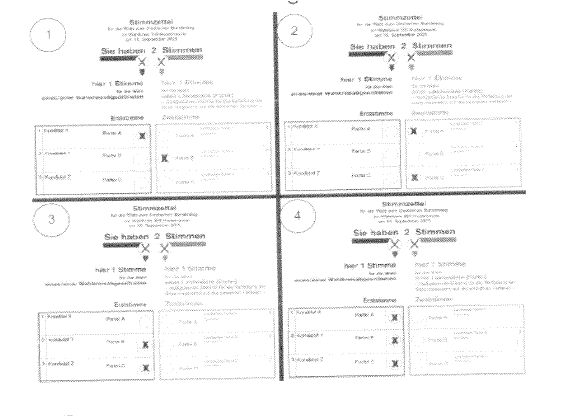
    *   1

    *   2

    *   3

    *   4

131. In Deutschland ist ein Bürgermeister / eine Bürgermeisterin …

    *   der Leiter / die Leiterin einer Schule.

    *   der Chef / die Chefin einer Bank.

    *   das Oberhaupt einer Gemeinde.

    *   der / die Vorsitzende einer Partei.

132. Viele Menschen in Deutschland arbeiten in ihrer Freizeit ehrenamtlich.
    Was bedeutet das?

    *   Sie arbeiten als Soldaten / Soldatinnen.

    *   Sie arbeiten freiwillig und unbezahlt in Vereinen und Verbänden.

    *   Sie arbeiten in der Bundesregierung.

    *   Sie arbeiten in einem Krankenhaus und verdienen dabei Geld.

133. Was ist bei Bundestags- und Landtagswahlen in Deutschland erlaubt?

    *   Der Ehemann wählt für seine Frau mit.

    *   Man kann durch Briefwahl seine Stimme abgeben.

    *   Man kann am Wahltag telefonisch seine Stimme abgeben.

    *   Kinder ab dem Alter von 14 Jahren dürfen wählen.

134. Man will die Buslinie abschaffen, mit der Sie immer zur Arbeit fahren.
    Was können Sie machen, um die Buslinie zu erhalten?

    *   Ich beteilige mich an einer Bürgerinitiative für die Erhaltung der
        Buslinie oder gründe selber eine Initiative.

    *   Ich werde Mitglied in einem Sportverein und trainiere Rad fahren.

    *   Ich wende mich an das Finanzamt, weil ich als Steuerzahler /
        Steuerzahlerin ein Recht auf die Buslinie habe.

    *   Ich schreibe einen Brief an das Forstamt der Gemeinde.

135. Wen vertreten die Gewerkschaften in Deutschland?

    *   große Unternehmen

    *   kleine Unternehmen

    *   Selbstständige

    *   Arbeitnehmer und Arbeitnehmerinnen

136. Sie gehen in Deutschland zum Arbeitsgericht bei …

    *   falscher Nebenkostenabrechnung.

    *   ungerechtfertigter Kündigung durch Ihren Chef / Ihre Chefin.

    *   Problemen mit den Nachbarn / Nachbarinnen.

    *   Schwierigkeiten nach einem Verkehrsunfall.

137. Welches Gericht ist in Deutschland bei Konflikten in der Arbeitswelt
    zuständig?

    *   das Familiengericht

    *   das Strafgericht

    *   das Arbeitsgericht

    *   das Amtsgericht

138. Was kann ich in Deutschland machen, wenn mir mein Arbeitgeber / meine
    Arbeitgeberin zu Unrecht gekündigt hat?

    *   weiter arbeiten und freundlich zum Chef / zur Chefin sein

    *   ein Mahnverfahren gegen den Arbeitgeber / die Arbeitgeberin führen

    *   Kündigungsschutzklage erheben

    *   den Arbeitgeber / die Arbeitgeberin bei der Polizei anzeigen

139. Wann kommt es in Deutschland zu einem Prozess vor Gericht? Wenn jemand
    …

    *   zu einer anderen Religion übertritt.

    *   eine Straftat begangen hat und angeklagt wird.

    *   eine andere Meinung als die der Regierung vertritt.

    *   sein Auto falsch geparkt hat und es abgeschleppt wird.

140. Was macht ein Schöffe / eine Schöffin in Deutschland? Er / Sie …

    *   entscheidet mit Richtern / Richterinnen über Schuld und Strafe.

    *   gibt Bürgern / Bürgerinnen rechtlichen Rat.

    *   stellt Urkunden aus.

    *   verteidigt den Angeklagten / die Angeklagte.

141. Wer berät in Deutschland Personen bei Rechtsfragen und vertritt sie
    vor Gericht?

    *   ein Rechtsanwalt / eine Rechtsanwältin

    *   ein Richter / eine Richterin

    *   ein Schöffe / eine Schöffin

    *   ein Staatsanwalt / eine Staatsanwältin

142. Was ist die Hauptaufgabe eines Richters / einer Richterin in
    Deutschland? Ein Richter / eine Richterin …

    *   vertritt Bürger und Bürgerinnen vor einem Gericht.

    *   arbeitet an einem Gericht und spricht Urteile.

    *   ändert Gesetze.

    *   betreut Jugendliche vor Gericht.

143. Ein Richter / eine Richterin in Deutschland gehört zur …

    *   Judikative.

    *   Exekutive.

    *   Operative.

    *   Legislative.

144. Ein Richter / eine Richterin gehört in Deutschland zur …

    *   vollziehenden Gewalt.

    *   rechtsprechenden Gewalt.

    *   planenden Gewalt.

    *   gesetzgebenden Gewalt.

145. In Deutschland wird die Staatsgewalt geteilt. Für welche Staatsgewalt
    arbeitet ein Richter / eine Richterin? Für die …

    *   Judikative

    *   Exekutive

    *   Presse

    *   Legislative

146. Wie nennt man in Deutschland ein Verfahren vor einem Gericht?

    *   Programm

    *   Prozedur

    *   Protokoll

    *   Prozess

147. Was ist die Arbeit eines Richters / einer Richterin in Deutschland?

    *   Deutschland regieren

    *   Recht sprechen

    *   Pläne erstellen

    *   Gesetze erlassen

148. Was ist eine Aufgabe der Polizei in Deutschland?

    *   das Land zu verteidigen

    *   die Bürgerinnen und Bürger abzuhören

    *   die Gesetze zu beschließen

    *   die Einhaltung von Gesetzen zu überwachen

149. Wer kann Gerichtsschöffe / Gerichtsschöffin in Deutschland werden?

    *   alle in Deutschland geborenen Einwohner / Einwohnerinnen über 18 Jahre

    *   alle deutschen Staatsangehörigen älter als 24 und jünger als 70 Jahre

    *   alle Personen, die seit mindestens 5 Jahren in Deutschland leben

    *   nur Personen mit einem abgeschlossenen Jurastudium

150. Ein Gerichtsschöffe / eine Gerichtsschöffin in Deutschland ist …

    *   der Stellvertreter / die Stellvertreterin des Stadtoberhaupts.

    *   ein ehrenamtlicher Richter / eine ehrenamtliche Richterin.

    *   ein Mitglied eines Gemeinderats.

    *   eine Person, die Jura studiert hat.

151. Wer baute die Mauer in Berlin?

    *   Großbritannien

    *   die DDR

    *   die Bundesrepublik Deutschland

    *   die USA

152. Wann waren die Nationalsozialisten mit Adolf Hitler in Deutschland an
    der Macht?

    *   1918 bis 1923

    *   1932 bis 1950

    *   1933 bis 1945

    *   1945 bis 1989

153. Was war am 8. Mai 1945?

    *   Tod Adolf Hitlers

    *   Beginn des Berliner Mauerbaus

    *   Wahl von Konrad Adenauer zum Bundeskanzler

    *   Ende des Zweiten Weltkriegs in Europa

154. Wann war der Zweite Weltkrieg zu Ende?

    *   1933

    *   1945

    *   1949

    *   1961

155. Wann waren die Nationalsozialisten in Deutschland an der Macht?

    *   1888 bis 1918

    *   1921 bis 1934

    *   1933 bis 1945

    *   1949 bis 1963

156. In welchem Jahr wurde Hitler Reichskanzler?

    *   1923

    *   1927

    *   1933

    *   1936

157. Die Nationalsozialisten mit Adolf Hitler errichteten 1933 in
    Deutschland …

    *   eine Diktatur.

    *   einen demokratischen Staat.

    *   eine Monarchie.

    *   ein Fürstentum.

158. Das „Dritte Reich“ war eine …

    *   Diktatur.

    *   Demokratie.

    *   Monarchie.

    *   Räterepublik.

159. Was gab es in Deutschland *nicht*                    während der Zeit
    des Nationalsozialismus?

    *   freie Wahlen

    *   Pressezensur

    *   willkürliche Verhaftungen

    *   Verfolgung der Juden

160. Welcher Krieg dauerte von 1939 bis 1945?

    *   der Erste Weltkrieg

    *   der Zweite Weltkrieg

    *   der Vietnamkrieg

    *   der Golfkrieg

161. Was kennzeichnete den NS-Staat? Eine Politik …

    *   des staatlichen Rassismus

    *   der Meinungsfreiheit

    *   der allgemeinen Religionsfreiheit

    *   der Entwicklung der Demokratie

162. Claus Schenk Graf von Stauffenberg wurde bekannt durch …

    *   eine Goldmedaille bei den Olympischen Spielen 1936.

    *   den Bau des Reichstagsgebäudes.

    *   den Aufbau der Wehrmacht.

    *   das Attentat auf Hitler am 20. Juli 1944.

163. In welchem Jahr zerstörten die Nationalsozialisten Synagogen und
    jüdische Geschäfte in Deutschland?

    *   1925

    *   1930

    *   1938

    *   1945

164. Was passierte am 9. November 1938 in Deutschland?

    *   Mit dem Angriff auf Polen beginnt der Zweite Weltkrieg.

    *   Die Nationalsozialisten verlieren eine Wahl und lösen den Reichstag
        auf.

    *   Jüdische Geschäfte und Synagogen werden durch Nationalsozialisten und
        ihre Anhänger zerstört.

    *   Hitler wird Reichspräsident und lässt alle Parteien verbieten.

165. Wie hieß der erste Bundeskanzler der Bundesrepublik Deutschland?

    *   Konrad Adenauer

    *   Kurt Georg Kiesinger

    *   Helmut Schmidt

    *   Willy Brandt

166. Bei welchen Demonstrationen in Deutschland riefen die Menschen „Wir
    sind das Volk“?

    *   beim Arbeiteraufstand 1953 in der DDR

    *   bei den Demonstrationen 1968 in der Bundesrepublik Deutschland

    *   bei den Anti-Atomkraft-Demonstrationen 1985 in der Bundesrepublik
        Deutschland

    *   bei den Montagsdemonstrationen 1989 in der DDR

167. Welche Länder wurden nach dem Zweiten Weltkrieg in Deutschland als
    „Alliierte Besatzungsmächte“ bezeichnet?

    *   Sowjetunion, Großbritannien, Polen, Schweden

    *   Frankreich, Sowjetunion, Italien, Japan

    *   USA, Sowjetunion, Spanien, Portugal

    *   USA, Sowjetunion, Großbritannien, Frankreich

168. Welches Land war *keine*                    „Alliierte
    Besatzungsmacht“ in Deutschland?

    *   USA

    *   Sowjetunion

    *   Frankreich

    *   Japan

169. Wann wurde die Bundesrepublik Deutschland gegründet?

    *   1939

    *   1945

    *   1949

    *   1951

170. Was gab es während der Zeit des Nationalsozialismus in Deutschland?

    *   das Verbot von Parteien

    *   das Recht zur freien Entfaltung der Persönlichkeit

    *   Pressefreiheit

    *   den Schutz der Menschenwürde

171. Soziale Marktwirtschaft bedeutet, die Wirtschaft …

    *   steuert sich allein nach Angebot und Nachfrage.

    *   wird vom Staat geplant und gesteuert, Angebot und Nachfrage werden
        nicht berücksichtigt.

    *   richtet sich nach der Nachfrage im Ausland.

    *   richtet sich nach Angebot und Nachfrage, aber der Staat sorgt für
        einen sozialen Ausgleich.

172. In welcher Besatzungszone wurde die DDR gegründet? In der …

    *   amerikanischen Besatzungszone

    *   französischen Besatzungszone

    *   britischen Besatzungszone

    *   sowjetischen Besatzungszone

173. Die Bundesrepublik Deutschland ist ein Gründungsmitglied …

    *   des Nordatlantikpakts (NATO).

    *   der Vereinten Nationen (VN).

    *   der Europäischen Union (EU).

    *   des Warschauer Pakts.

174. Wann wurde die DDR gegründet?

    *   1947

    *   1949

    *   1953

    *   1956

175. Wie viele Besatzungszonen gab es in Deutschland nach dem Zweiten
    Weltkrieg?

    *   3

    *   4

    *   5

    *   6

176. Wie waren die Besatzungszonen Deutschlands nach 1945 verteilt?
    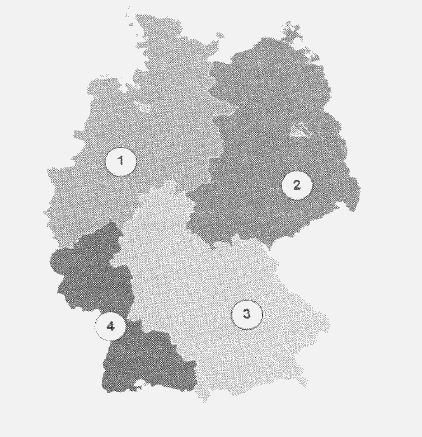
    *   1=Großbritannien, 2=Sowjetunion, 3=Frankreich, 4=USA

    *   1=Sowjetunion, 2=Großbritannien, 3=USA, 4=Frankreich

    *   1=Großbritannien, 2=Sowjetunion, 3=USA, 4=Frankreich

    *   1=Großbritannien, 2=USA, 3=Sowjetunion, 4=Frankreich

177. Welche deutsche Stadt wurde nach dem Zweiten Weltkrieg in vier
    Sektoren aufgeteilt?

    *   München

    *   Berlin

    *   Dresden

    *   Frankfurt/Oder

178. Vom Juni 1948 bis zum Mai 1949 wurden die Bürger und Bürgerinnen von
    West-Berlin durch eine Luftbrücke versorgt. Welcher Umstand war dafür
    verantwortlich?

    *   Für Frankreich war eine Versorgung der West-Berliner Bevölkerung mit
        dem Flugzeug kostengünstiger.

    *   Die amerikanischen Soldaten / Soldatinnen hatten beim Landtransport
        Angst vor Überfällen.

    *   Für Großbritannien war die Versorgung über die Luftbrücke schneller.

    *   Die Sowjetunion unterbrach den gesamten Verkehr auf dem Landwege.

179. Wie endete der Zweite Weltkrieg in Europa offiziell?

    *   mit dem Tod Adolf Hitlers

    *   durch die bedingungslose Kapitulation Deutschlands

    *   mit dem Rückzug der Deutschen aus den besetzten Gebieten

    *   durch eine Revolution in Deutschland

180. Der erste Bundeskanzler der Bundesrepublik Deutschland war …

    *   Ludwig Erhard.

    *   Willy Brandt.

    *   Konrad Adenauer.

    *   Gerhard Schröder.

181. Was wollte Willy Brandt mit seinem Kniefall 1970 im ehemaligen
    jüdischen Ghetto in Warschau ausdrücken?
    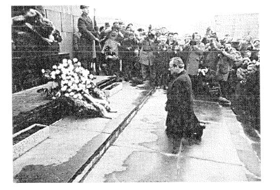
    *   Er hat sich den ehemaligen Alliierten unterworfen.

    *   Er bat Polen und die polnischen Juden um Vergebung.

    *   Er zeigte seine Demut vor dem Warschauer Pakt.

    *   Er sprach ein Gebet am Grab des Unbekannten Soldaten.

182. Welche Parteien wurden 1946 zwangsweise zur SED vereint, der
    Einheitspartei der späteren DDR?

    *   KPD und SPD

    *   SPD und CDU

    *   CDU und FDP

    *   KPD und CSU

183. Wann war in der Bundesrepublik Deutschland das „Wirtschaftswunder“?

    *   40er Jahre

    *   50er Jahre

    *   70er Jahre

    *   80er Jahre

184. Was nannten die Menschen in Deutschland sehr lange „Die Stunde Null“?

    *   Damit wird die Zeit nach der Wende im Jahr 1989 bezeichnet.

    *   Damit wurde der Beginn des Zweiten Weltkrieges bezeichnet.

    *   Darunter verstand man das Ende des Zweiten Weltkrieges und den Beginn
        des Wiederaufbaus.

    *   Damit ist die Stunde gemeint, in der die Uhr von der Sommerzeit auf
        die Winterzeit umgestellt wird.

185. Wofür stand der Ausdruck „Eiserner Vorhang“? Für die Abschottung …

    *   des Warschauer Pakts gegen den Westen

    *   Norddeutschlands gegen Süddeutschland

    *   Nazi-Deutschlands gegen die Alliierten

    *   Europas gegen die USA

186. Im Jahr 1953 gab es in der DDR einen Aufstand, an den lange Zeit in
    der Bundesrepublik Deutschland ein Feiertag erinnerte. Wann war das?

    *   1. Mai

    *   17. Juni

    *   20. Juli

    *   9. November

187. Welcher deutsche Staat hatte eine schwarz-rot-goldene Flagge mit
    Hammer, Zirkel und Ährenkranz?

    *        *            

    *        *   *

        *   Preußen

    *        *   *

        *   Bundesrepublik Deutschland

    *        *   *

        *   „Drittes Reich“

    *        *   *

        *   DDR

188. In welchem Jahr wurde die Mauer in Berlin gebaut?

    *   1953

    *   1956

    *   1959

    *   1961

189. Wann baute die DDR die Mauer in Berlin?

    *   1919

    *   1933

    *   1961

    *   1990

190. Was bedeutet die Abkürzung DDR?

    *   Dritter Deutscher Rundfunk

    *   Die Deutsche Republik

    *   Dritte Deutsche Republik

    *   Deutsche Demokratische Republik

191. Wann wurde die Mauer in Berlin für alle geöffnet?

    *   1987

    *   1989

    *   1992

    *   1995

192. Welches heutige deutsche Bundesland gehörte früher zum Gebiet der DDR?

    *   Brandenburg

    *   Bayern

    *   Saarland

    *   Hessen

193. Von 1961 bis 1989 war Berlin …

    *   ohne Bürgermeister.

    *   ein eigener Staat.

    *   durch eine Mauer geteilt.

    *   nur mit dem Flugzeug erreichbar.

194. Am 3. Oktober feiert man in Deutschland den Tag der Deutschen …

    *   Einheit.

    *   Nation.

    *   Bundesländer.

    *   Städte.

195. Welches heutige deutsche Bundesland gehörte früher zum Gebiet der DDR?

    *   Hessen

    *   Sachsen-Anhalt

    *   Nordrhein-Westfalen

    *   Saarland

196. Warum nennt man die Zeit im Herbst 1989 in der DDR „Die Wende“? In
    dieser Zeit veränderte sich die DDR politisch …

    *   von einer Diktatur zur Demokratie.

    *   von einer liberalen Marktwirtschaft zum Sozialismus.

    *   von einer Monarchie zur Sozialdemokratie.

    *   von einem religiösen Staat zu einem kommunistischen Staat.

197. Welches heutige deutsche Bundesland gehörte früher zum Gebiet der DDR?

    *   Thüringen

    *   Hessen

    *   Bayern

    *   Bremen

198. Welches heutige deutsche Bundesland gehörte früher zum Gebiet der DDR?

    *   Bayern

    *   Niedersachsen

    *   Sachsen

    *   Baden-Württemberg

199. Mit der Abkürzung „Stasi“ meinte man in der DDR …

    *   das Parlament.

    *   das Ministerium für Staatssicherheit.

    *   eine regierende Partei.

    *   das Ministerium für Volksbildung.

200. Welches heutige deutsche Bundesland gehörte früher zum Gebiet der DDR?

    *   Hessen

    *   Schleswig-Holstein

    *   Mecklenburg-Vorpommern

    *   Saarland

201. Welche der folgenden Auflistungen enthält nur Bundesländer, die zum
    Gebiet der früheren DDR gehörten?

    *   Niedersachsen, Nordrhein-Westfalen, Hessen, Schleswig-Holstein,
        Brandenburg

    *   Mecklenburg-Vorpommern, Brandenburg, Sachsen, Sachsen-Anhalt,
        Thüringen

    *   Bayern, Baden-Württemberg, Rheinland-Pfalz, Thüringen, Sachsen

    *   Sachsen, Thüringen, Hessen, Niedersachsen, Brandenburg

202. Zu wem gehörte die DDR im „Kalten Krieg“?

    *   zu den Westmächten

    *   zum Warschauer Pakt

    *   zur NATO

    *   zu den blockfreien Staaten

203. Wie hieß das Wirtschaftssystem der DDR?

    *   Marktwirtschaft

    *   Planwirtschaft

    *   Angebot und Nachfrage

    *   Kapitalismus

204. Wie wurden die Bundesrepublik Deutschland und die DDR zu einem Staat?

    *   Die Bundesrepublik Deutschland hat die DDR besetzt.

    *   Die heutigen fünf östlichen Bundesländer sind der Bundesrepublik
        Deutschland beigetreten.

    *   Die westlichen Bundesländer sind der DDR beigetreten.

    *   Die DDR hat die Bundesrepublik Deutschland besetzt.

205. Mit dem Beitritt der DDR zur Bundesrepublik Deutschland gehören die
    neuen Bundesländer nun auch …

    *   zur Europäischen Union.

    *   zum Warschauer Pakt.

    *   zur OPEC.

    *   zur Europäischen Verteidigungsgemeinschaft.

206. Was bedeutete im Jahr 1989 in Deutschland das Wort
    „Montagsdemonstration“?

    *   In der Bundesrepublik waren Demonstrationen nur am Montag erlaubt.

    *   Montags waren Demonstrationen gegen das DDR-Regime.

    *   Am ersten Montag im Monat trafen sich in der Bundesrepublik
        Deutschland Demonstranten.

    *   Montags demonstrierte man in der DDR gegen den Westen.

207. In welchem Militärbündnis war die DDR Mitglied?

    *   in der NATO

    *   im Rheinbund

    *   im Warschauer Pakt

    *   im Europabündnis

208. Was war die „Stasi“?

    *   der Geheimdienst im „Dritten Reich“

    *   eine berühmte deutsche Gedenkstätte

    *   der Geheimdienst der DDR

    *   ein deutscher Sportverein während des Zweiten Weltkrieges

209. Welches war das Wappen der Deutschen Demokratischen Republik?
    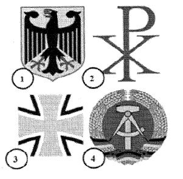
    *   1

    *   2

    *   3

    *   4

210. Was ereignete sich am 17. Juni 1953 in der DDR?

    *   der feierliche Beitritt zum Warschauer Pakt

    *   landesweite Streiks und ein Volksaufstand

    *   der 1. SED-Parteitag

    *   der erste Besuch Fidel Castros

211. Welcher Politiker steht für die „Ostverträge“?

    *   Helmut Kohl

    *   Willy Brandt

    *   Michail Gorbatschow

    *   Ludwig Erhard

212. Wie heißt Deutschland mit vollem Namen?

    *   Bundesstaat Deutschland

    *   Bundesländer Deutschland

    *   Bundesrepublik Deutschland

    *   Bundesbezirk Deutschland

213. Wie viele Einwohner hat Deutschland?

    *   70 Millionen

    *   78 Millionen

    *   82 Millionen

    *   90 Millionen

214. Welche Farben hat die deutsche Flagge?

    *   schwarz-rot-gold

    *   rot-weiß-schwarz

    *   schwarz-rot-grün

    *   schwarz-gelb-rot

215. Wer wird als „Kanzler der Deutschen Einheit“ bezeichnet?

    *   Gerhard Schröder

    *   Helmut Kohl

    *   Konrad Adenauer

    *   Helmut Schmidt

216. Welches Symbol ist im Plenarsaal des Deutschen Bundestages zu sehen?

    *        *            

    *        *   *

        *   der Bundesadler

    *        *   *

        *   die Fahne der Stadt Berlin

    *        *   *

        *   der Reichsadler

    *        *   *

        *   die Reichskrone

217. In welchem Zeitraum gab es die Deutsche Demokratische Republik (DDR)?

    *   1919 bis 1927

    *   1933 bis 1945

    *   1945 bis 1961

    *   1949 bis 1990

218. Wie viele Bundesländer kamen bei der Wiedervereinigung 1990 zur
    Bundesrepublik Deutschland hinzu?

    *   4

    *   5

    *   6

    *   7

219. Die Bundesrepublik Deutschland hat die Grenzen von heute seit …

    *   1933.

    *   1949.

    *   1971.

    *   1990.

220. Der 27. Januar ist in Deutschland ein offizieller Gedenktag. Woran
    erinnert dieser Tag?

    *   an das Ende des Zweiten Weltkrieges

    *   an die Verabschiedung des Grundgesetzes

    *   an die Wiedervereinigung Deutschlands

    *   an die Opfer des Nationalsozialismus

221. Deutschland ist Mitglied des Schengener Abkommens. Was bedeutet das?

    *   Deutsche können in viele Länder Europas ohne Passkontrolle reisen.

    *   Alle Menschen können ohne Personenkontrolle in Deutschland einreisen.

    *   Deutsche können ohne Passkontrolle in jedes Land reisen.

    *   Deutsche können in jedem Land mit dem Euro bezahlen.

222. Welches Land ist ein Nachbarland von Deutschland?

    *   Ungarn

    *   Portugal

    *   Spanien

    *   Schweiz

223. Welches Land ist ein Nachbarland von Deutschland?

    *   Rumänien

    *   Bulgarien

    *   Polen

    *   Griechenland

224. Was bedeutet die Abkürzung EU?

    *   Europäische Unternehmen

    *   Europäische Union

    *   Einheitliche Union

    *   Euro Union

225. In welchem anderen Land gibt es eine große deutschsprachige
    Bevölkerung?

    *   Tschechien

    *   Norwegen

    *   Spanien

    *   Österreich

226. Welche ist die Flagge der Europäischen Union?

    *        *   *

        *            
        *   *

        *            

    *        *   *

        *            
        *   *

        *            

    *        *   *

        *   1

    *        *   *

        *   2

    *        *   *

        *   3

    *        *   *

        *   4

227. Welches Land ist ein Nachbarland von Deutschland?

    *   Finnland

    *   Dänemark

    *   Norwegen

    *   Schweden

228. Wie wird der Beitritt der DDR zur Bundesrepublik Deutschland im Jahr
    1990 allgemein genannt?

    *   NATO-Osterweiterung

    *   EU-Osterweiterung

    *   Deutsche Wiedervereinigung

    *   Europäische Gemeinschaft

229. Welches Land ist ein Nachbarland von Deutschland?

    *   Spanien

    *   Bulgarien

    *   Norwegen

    *   Luxemburg

230. Das Europäische Parlament wird regelmäßig gewählt, nämlich alle …

    *   5 Jahre.

    *   6 Jahre.

    *   7 Jahre.

    *   8 Jahre.

231. Was bedeutet der Begriff „europäische Integration“?

    *   Damit sind amerikanische Einwanderer in Europa gemeint.

    *   Der Begriff meint den Einwanderungsstopp nach Europa.

    *   Damit sind europäische Auswanderer in den USA gemeint.

    *   Der Begriff meint den Zusammenschluss europäischer Staaten zur EU.

232. Wer wird bei der Europawahl gewählt?

    *   die Europäische Kommission

    *   die Länder, die in die EU eintreten dürfen

    *   die Abgeordneten des Europäischen Parlaments

    *   die europäische Verfassung

233. Welches Land ist ein Nachbarland von Deutschland?

    *   Tschechien

    *   Bulgarien

    *   Griechenland

    *   Portugal

234. Wo ist der Sitz des Europäischen Parlaments?

    *   London

    *   Paris

    *   Berlin

    *   Straßburg

235. Der französische Staatspräsident François Mitterrand und der deutsche
    Bundeskanzler Helmut Kohl gedenken in Verdun gemeinsam der Toten
    beider Weltkriege. Welches Ziel der Europäischen Union wird bei diesem
    Treffen deutlich?
    
    *   Freundschaft zwischen England und Deutschland

    *   Reisefreiheit in alle Länder der EU

    *   Frieden und Sicherheit in den Ländern der EU

    *   einheitliche Feiertage in den Ländern der EU

236. Wie viele Mitgliedstaaten hat die EU heute?

    *   21

    *   23

    *   25

    *   27

237. 2007 wurde das 50-jährige Jubiläum der „Römischen Verträge“ gefeiert.
    Was war der Inhalt der Verträge?

    *   Beitritt Deutschlands zur NATO

    *   Gründung der Europäischen Wirtschaftsgemeinschaft (EWG)

    *   Verpflichtung Deutschlands zu Reparationsleistungen

    *   Festlegung der Oder-Neiße-Linie als Ostgrenze

238. An welchen Orten arbeitet das Europäische Parlament?

    *   Paris, London und Den Haag

    *   Straßburg, Luxemburg und Brüssel

    *   Rom, Bern und Wien

    *   Bonn, Zürich und Mailand

239. Durch welche Verträge schloss sich die Bundesrepublik Deutschland mit
    anderen Staaten zur Europäischen Wirtschaftsgemeinschaft zusammen?

    *   durch die „Hamburger Verträge“

    *   durch die „Römischen Verträge“

    *   durch die „Pariser Verträge“

    *   durch die „Londoner Verträge“

240. Seit wann bezahlt man in Deutschland mit dem Euro in bar?

    *   1995

    *   1998

    *   2002

    *   2005

241. Frau Seger bekommt ein Kind. Was muss sie tun, um Elterngeld zu
    erhalten?

    *   Sie muss an ihre Krankenkasse schreiben.

    *   Sie muss einen Antrag bei der Elterngeldstelle stellen.

    *   Sie muss nichts tun, denn sie bekommt automatisch Elterngeld.

    *   Sie muss das Arbeitsamt um Erlaubnis bitten.

242. Wer entscheidet, ob ein Kind in Deutschland in den Kindergarten geht?

    *   der Staat

    *   die Bundesländer

    *   die Eltern/die Erziehungsberechtigten

    *   die Schulen

243. Maik und Sybille wollen mit Freunden an ihrem deutschen Wohnort eine
    Demonstration auf der Straße abhalten. Was müssen sie vorher tun?

    *   Sie müssen die Demonstration anmelden.

    *   Sie müssen nichts tun. Man darf in Deutschland jederzeit überall
        demonstrieren.

    *   Sie können gar nichts tun, denn Demonstrationen sind in Deutschland
        grundsätzlich verboten.

    *   Maik und Sybille müssen einen neuen Verein gründen, weil nur Vereine
        demonstrieren dürfen.

244. Welchen Schulabschluss braucht man normalerweise, um an einer
    Universität in Deutschland ein Studium zu beginnen?

    *   das Abitur

    *   ein Diplom

    *   die Prokura

    *   eine Gesellenprüfung

245. Wer darf in Deutschland *nicht*                    als Paar
    zusammenleben?

    *   Hans (20 Jahre) und Marie (19 Jahre)

    *   Tom (20 Jahre) und Klaus (45 Jahre)

    *   Sofie (35 Jahre) und Lisa (40 Jahre)

    *   Anne (13 Jahre) und Tim (25 Jahre)

246. Ab welchem Alter ist man in Deutschland volljährig?

    *   16

    *   18

    *   19

    *   21

247. Eine Frau ist schwanger. Sie ist kurz vor und nach der Geburt ihres
    Kindes vom Gesetz besonders beschützt. Wie heißt dieser Schutz?

    *   Elternzeit

    *   Mutterschutz

    *   Geburtsvorbereitung

    *   Wochenbett

248. Die Erziehung der Kinder ist in Deutschland vor allem Aufgabe …

    *   des Staates.

    *   der Eltern.

    *   der Großeltern.

    *   der Schulen.

249. Wer ist in Deutschland hauptsächlich verantwortlich für die
    Kindererziehung?

    *   der Staat

    *   die Eltern

    *   die Verwandten

    *   die Schulen

250. In Deutschland hat man die besten Chancen auf einen gut bezahlten
    Arbeitsplatz, wenn man …

    *   katholisch ist.

    *   gut ausgebildet ist.

    *   eine Frau ist.

    *   Mitglied einer Partei ist.

251. Wenn man in Deutschland ein Kind schlägt, …

    *   geht das niemanden etwas an.

    *   geht das nur die Familie etwas an.

    *   kann man dafür nicht bestraft werden.

    *   kann man dafür bestraft werden.

252. In Deutschland …

    *   darf man zur gleichen Zeit nur mit einem Partner / einer Partnerin
        verheiratet sein.

    *   kann man mehrere Ehepartner / Ehepartnerinnen gleichzeitig haben.

    *   darf man nicht wieder heiraten, wenn man einmal verheiratet war.

    *   darf eine Frau nicht wieder heiraten, wenn ihr Mann gestorben ist.

253. Wo müssen Sie sich anmelden, wenn Sie in Deutschland umziehen?

    *   beim Einwohnermeldeamt

    *   beim Standesamt

    *   beim Ordnungsamt

    *   beim Gewerbeamt

254. In Deutschland dürfen Ehepaare sich scheiden lassen. Meistens müssen
    sie dazu das „Trennungsjahr“ einhalten. Was bedeutet das?

    *   Der Scheidungsprozess dauert ein Jahr.

    *   Mann und Frau sind ein Jahr verheiratet, dann ist die Scheidung
        möglich.

    *   Das Besuchsrecht für die Kinder gilt ein Jahr.

    *   Mann und Frau führen mindestens ein Jahr getrennt ihr eigenes Leben.
        Danach ist die Scheidung möglich.

255. Bei Erziehungsproblemen können Eltern in Deutschland Hilfe erhalten
    vom …

    *   Ordnungsamt.

    *   Schulamt.

    *   Jugendamt.

    *   Gesundheitsamt.

256. Ein Ehepaar möchte in Deutschland ein Restaurant eröffnen. Was braucht
    es dazu unbedingt?

    *   eine Erlaubnis der Polizei

    *   eine Genehmigung einer Partei

    *   eine Genehmigung des Einwohnermeldeamts

    *   eine Gaststättenerlaubnis von der zuständigen Behörde

257. Eine erwachsene Frau möchte in Deutschland das Abitur nachholen. Das
    kann sie an …

    *   einer Hochschule.

    *   einem Abendgymnasium.

    *   einer Hauptschule.

    *   einer Privatuniversität.

258. Was darf das Jugendamt in Deutschland?

    *   Es entscheidet, welche Schule das Kind besucht.

    *   Es kann ein Kind, das geschlagen wird oder hungern muss, aus der
        Familie nehmen.

    *   Es bezahlt das Kindergeld an die Eltern.

    *   Es kontrolliert, ob das Kind einen Kindergarten besucht.

259. Das Berufsinformationszentrum BIZ bei der Bundesagentur für Arbeit in
    Deutschland hilft bei der …

    *   Rentenberechnung.

    *   Lehrstellensuche.

    *   Steuererklärung.

    *   Krankenversicherung.

260. In Deutschland hat ein Kind in der Schule…

    *   Recht auf unbegrenzte Freizeit.

    *   Wahlfreiheit für alle Fächer.

    *   Anspruch auf Schulgeld.

    *   Anwesenheitspflicht.

261. Ein Mann möchte mit 30 Jahren in Deutschland sein Abitur nachholen. Wo
    kann er das tun? An …

    *   einer Hochschule

    *   einem Abendgymnasium

    *   einer Hauptschule

    *   einer Privatuniversität

262. Was bedeutet in Deutschland der Grundsatz der Gleichbehandlung?

    *   Niemand darf z. B. wegen einer Behinderung benachteiligt werden.

    *   Man darf andere Personen benachteiligen, wenn ausreichende persönliche
        Gründe hierfür vorliegen.

    *   Niemand darf gegen Personen klagen, wenn sie benachteiligt wurden.

    *   Es ist für alle Gesetz, benachteiligten Gruppen jährlich Geld zu
        spenden.

263. In Deutschland sind Jugendliche ab 14 Jahren strafmündig. Das
    bedeutet: Jugendliche, die 14 Jahre und älter sind und gegen
    Strafgesetze verstoßen, …

    *   werden bestraft.

    *   werden wie Erwachsene behandelt.

    *   teilen die Strafe mit ihren Eltern.

    *   werden nicht bestraft.

264. Zu welchem Fest tragen Menschen in Deutschland bunte Kostüme und
    Masken?

    *   am Rosenmontag

    *   am Maifeiertag

    *   beim Oktoberfest

    *   an Pfingsten

265. Wohin muss man in Deutschland zuerst gehen, wenn man heiraten möchte?

    *   zum Einwohnermeldeamt

    *   zum Ordnungsamt

    *   zur Agentur für Arbeit

    *   zum Standesamt

266. Wann beginnt die gesetzliche Nachtruhe in Deutschland?

    *   wenn die Sonne untergeht

    *   wenn die Nachbarn schlafen gehen

    *   um 0 Uhr, Mitternacht

    *   um 22 Uhr

267. Eine junge Frau in Deutschland, 22 Jahre alt, lebt mit ihrem Freund
    zusammen. Die Eltern der Frau finden das nicht gut, weil ihnen der
    Freund nicht gefällt. Was können die Eltern tun?

    *   Sie müssen die Entscheidung der volljährigen Tochter respektieren.

    *   Sie haben das Recht, die Tochter in die elterliche Wohnung
        zurückzuholen.

    *   Sie können zur Polizei gehen und die Tochter anzeigen.

    *   Sie suchen einen anderen Mann für die Tochter.

268. Eine junge Frau will den Führerschein machen. Sie hat Angst vor der
    Prüfung, weil ihre Muttersprache *nicht*                    Deutsch
    ist. Was ist richtig?

    *   Sie muss mindestens zehn Jahre in Deutschland leben, bevor sie den
        Führerschein machen kann.

    *   Wenn sie kein Deutsch kann, darf sie keinen Führerschein haben.

    *   Sie muss den Führerschein in dem Land machen, in dem man ihre Sprache
        spricht.

    *   Sie kann die Theorie-Prüfung vielleicht in ihrer Muttersprache machen.
        Es gibt mehr als zehn Sprachen zur Auswahl.

269. In Deutschland haben Kinder ab dem Alter von drei Jahren bis zur
    Ersteinschulung einen Anspruch auf …

    *   monatliches Taschengeld.

    *   einen Platz in einem Sportverein.

    *   einen Kindergartenplatz.

    *   einen Ferienpass.

270. Die Volkshochschule in Deutschland ist eine Einrichtung …

    *   für den Religionsunterricht.

    *   nur für Jugendliche.

    *   zur Weiterbildung.

    *   nur für Rentner und Rentnerinnen.

271. Was ist in Deutschland ein Brauch zu Weihnachten?

    *   bunte Eier verstecken

    *   einen Tannenbaum schmücken

    *   sich mit Masken und Kostümen verkleiden

    *   Kürbisse vor die Tür stellen

272. Welche Lebensform ist in Deutschland *nicht*
    erlaubt?

    *   Mann und Frau sind geschieden und leben mit neuen Partnern zusammen.

    *   Zwei Frauen leben zusammen.

    *   Ein allein erziehender Vater lebt mit seinen zwei Kindern zusammen.

    *   Ein Mann ist mit zwei Frauen zur selben Zeit verheiratet.

273. Bei Erziehungsproblemen gehen Sie in Deutschland …

    *   zum Arzt / zur Ärztin.

    *   zum Gesundheitsamt.

    *   zum Einwohnermeldeamt.

    *   zum Jugendamt.

274. Sie haben in Deutschland absichtlich einen Brief geöffnet, der an eine
    andere Person adressiert ist. Was haben Sie *nicht*
    beachtet?

    *   das Schweigerecht

    *   das Briefgeheimnis

    *   die Schweigepflicht

    *   die Meinungsfreiheit

275. Was braucht man in Deutschland für eine Ehescheidung?

    *   die Einwilligung der Eltern

    *   ein Attest eines Arztes / einer Ärztin

    *   die Einwilligung der Kinder

    *   die Unterstützung eines Anwalts / einer Anwältin

276. Was sollten Sie tun, wenn Sie von Ihrem Ansprechpartner / Ihrer
    Ansprechpartnerin in einer deutschen Behörde schlecht behandelt
    werden?

    *   Ich kann nichts tun.

    *   Ich muss mir diese Behandlung gefallen lassen.

    *   Ich drohe der Person.

    *   Ich kann mich beim Behördenleiter / bei der Behördenleiterin
        beschweren.

277. Eine Frau, die ein zweijähriges Kind hat, bewirbt sich in Deutschland
    um eine Stelle. Was ist ein Beispiel für Diskriminierung? Sie bekommt
    die Stelle nur deshalb nicht, weil sie …

    *   kein Englisch spricht.

    *   zu hohe Gehaltsvorstellungen hat.

    *   keine Erfahrungen in diesem Beruf hat.

    *   Mutter ist.

278. Ein Mann im Rollstuhl hat sich auf eine Stelle als Buchhalter
    beworben. Was ist ein Beispiel für Diskriminierung? Er bekommt die
    Stelle nur deshalb nicht, weil er …

    *   im Rollstuhl sitzt.

    *   keine Erfahrung hat.

    *   zu hohe Gehaltsvorstellungen hat.

    *   kein Englisch spricht.

279. In den meisten Mietshäusern in Deutschland gibt es eine „Hausordnung“.
    Was steht in einer solchen „Hausordnung“? Sie nennt …

    *   Regeln für die Benutzung öffentlicher Verkehrsmittel.

    *   alle Mieter und Mieterinnen im Haus.

    *   Regeln, an die sich alle Bewohner und Bewohnerinnen halten müssen.

    *   die Adresse des nächsten Ordnungsamtes.

280. Wenn Sie sich in Deutschland gegen einen falschen Steuerbescheid
    wehren wollen, müssen Sie …

    *   nichts machen.

    *   den Bescheid wegwerfen.

    *   Einspruch einlegen.

    *   warten, bis ein anderer Bescheid kommt.

281. Zwei Freunde wollen in ein öffentliches Schwimmbad in Deutschland.
    Beide haben eine dunkle Hautfarbe und werden deshalb nicht
    hineingelassen. Welches Recht wird in dieser Situation verletzt? Das
    Recht auf …

    *   Meinungsfreiheit

    *   Gleichbehandlung

    *   Versammlungsfreiheit

    *   Freizügigkeit

282. Welches Ehrenamt müssen deutsche Staatsbürger/Staatsbürgerinnen
    übernehmen, wenn sie dazu aufgefordert werden?

    *   Vereinstrainer/Vereinstrainerin

    *   Wahlhelfer/Wahlhelferin

    *   Bibliotheksaufsicht

    *   Lehrer/Lehrerin

283. Was tun Sie, wenn Sie eine falsche Rechnung von einer deutschen
    Behörde bekommen?

    *   Ich lasse die Rechnung liegen.

    *   Ich lege Widerspruch bei der Behörde ein.

    *   Ich schicke die Rechnung an die Behörde zurück.

    *   Ich gehe mit der Rechnung zum Finanzamt.

284. Was man für die Arbeit können muss, ändert sich in Zukunft sehr
    schnell. Was kann man tun?

    *   Es ist egal, was man lernt.

    *   Erwachsene müssen auch nach der Ausbildung immer weiter lernen.

    *   Kinder lernen in der Schule alles, was im Beruf wichtig ist. Nach der
        Schule muss man nicht weiter lernen.

    *   Alle müssen früher aufhören zu arbeiten, weil sich alles ändert.

285. Frau Frost arbeitet als fest angestellte Mitarbeiterin in einem Büro.
    Was muss sie *nicht*                    von ihrem Gehalt bezahlen?

    *   Lohnsteuer

    *   Beiträge zur Arbeitslosenversicherung

    *   Beiträge zur Renten- und Krankenversicherung

    *   Umsatzsteuer

286. Welche Organisation in einer Firma hilft den Arbeitnehmern und
    Arbeitnehmerinnen bei Problemen mit dem Arbeitgeber / der
    Arbeitgeberin?

    *   der Betriebsrat

    *   der Betriebsprüfer / die Betriebsprüferin

    *   die Betriebsgruppe

    *   das Betriebsmanagement

287. Sie möchten bei einer Firma in Deutschland Ihr Arbeitsverhältnis
    beenden. Was müssen Sie beachten?

    *   die Gehaltszahlungen

    *   die Arbeitszeit

    *   die Kündigungsfrist

    *   die Versicherungspflicht

288. Bei welchem Amt muss man in Deutschland in der Regel seinen Hund
    anmelden?

    *   beim Finanzamt

    *   beim Einwohnermeldeamt

    *   bei der Kommune (Stadt oder Gemeinde)

    *   beim Gesundheitsamt

289. Ein Mann mit dunkler Hautfarbe bewirbt sich um eine Stelle als Kellner
    in einem Restaurant in Deutschland. Was ist ein Beispiel für
    Diskriminierung? Er bekommt die Stelle nur deshalb nicht, weil …

    *   seine Deutschkenntnisse zu gering sind.

    *   er zu hohe Gehaltsvorstellungen hat.

    *   er eine dunkle Haut hat.

    *   er keine Erfahrungen im Beruf hat.

290. Sie haben in Deutschland einen Fernseher gekauft. Zu Hause packen Sie
    den Fernseher aus, doch er funktioniert nicht. Der Fernseher ist
    kaputt. Was können Sie machen?

    *   eine Anzeige schreiben

    *   den Fernseher reklamieren

    *   das Gerät ungefragt austauschen

    *   die Garantie verlängern

291. Warum muss man in Deutschland bei der Steuererklärung aufschreiben, ob
    man zu einer Kirche gehört oder nicht? Weil ...

    *
        *            *   es eine Kirchensteuer gibt, die an die Einkommen- und Lohnsteuer
                geknüpft ist.

    *   das für die Statistik in Deutschland wichtig ist.

    *   man mehr Steuern zahlen muss, wenn man nicht zu einer Kirche gehört.

    *   die Kirche für die Steuererklärung verantwortlich ist.

292. Die Menschen in Deutschland leben nach dem Grundsatz der religiösen
    Toleranz. Was bedeutet das?

    *   Es dürfen keine Moscheen gebaut werden.

    *   Alle Menschen glauben an Gott.

    *   Jeder kann glauben, was er möchte.

    *   Der Staat entscheidet, an welchen Gott die Menschen glauben.

293. Was ist in Deutschland ein Brauch an Ostern?

    *   Kürbisse vor die Tür stellen

    *   einen Tannenbaum schmücken

    *   Eier bemalen

    *   Raketen in die Luft schießen

294. Pfingsten ist ein …

    *   christlicher Feiertag.

    *   deutscher Gedenktag.

    *   internationaler Trauertag.

    *   bayerischer Brauch.

295. Welche Religion hat die europäische und deutsche Kultur geprägt?

    *   der Hinduismus

    *   das Christentum

    *   der Buddhismus

    *   der Islam

296. In Deutschland nennt man die letzten vier Wochen vor Weihnachten …

    *   den Buß- und Bettag.

    *   das Erntedankfest.

    *   die Adventszeit.

    *   Allerheiligen.

297. Aus welchem Land sind die meisten Migranten / Migrantinnen nach
    Deutschland gekommen?

    *   Italien

    *   Polen

    *   Marokko

    *   Türkei

298. In der DDR lebten vor allem Migranten aus …

    *   Vietnam, Polen, Mosambik.

    *   Frankreich, Rumänien, Somalia.

    *   Chile, Ungarn, Simbabwe.

    *   Nordkorea, Mexiko, Ägypten.

299. Ausländische Arbeitnehmer und Arbeitnehmerinnen, die in den 50er und
    60er Jahren von der Bundesrepublik Deutschland angeworben wurden,
    nannte man …

    *   Schwarzarbeiter / Schwarzarbeiterinnen

    *   Gastarbeiter / Gastarbeiterinnen

    *   Zeitarbeiter / Zeitarbeiterinnen

    *   Schichtarbeiter / Schichtarbeiterinnen

300. Aus welchem Land kamen die ersten Gastarbeiter / Gastarbeiterinnen
    nach Deutschland?

    *   Italien

    *   Spanien

    *   Portugal

    *   Türkei

### Teil II

### Fragen für das Bundesland Baden-Württemberg

1.  Welches Wappen gehört zum Bundesland Baden-Württemberg?
    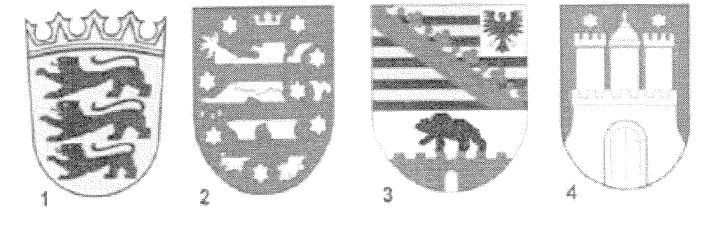
    *   1

    *   2

    *   3

    *   4

2.  Welches ist ein Landkreis in Baden-Württemberg?

    *   Demmin

    *   Neckar-Odenwald-Kreis

    *   Nordfriesland

    *   Altötting

3.  Für wie viele Jahre wird der Landtag in Baden-Württemberg gewählt?

    *   3

    *   4

    *   5

    *   6

4.  Ab welchem Alter darf man in Baden-Württemberg bei Kommunalwahlen
    wählen?

    *   14

    *   16

    *   18

    *   20

5.  Welche Farben hat die Landesflagge von Baden-Württemberg?

    *   blau-weiß-rot

    *   schwarz-gold

    *   weiß-blau

    *   grün-weiß-rot

6.  Wo können Sie sich in Baden-Württemberg über politische Themen
    informieren?

    *   beim Ordnungsamt der Gemeinde

    *   bei der Verbraucherzentrale

    *   bei der Landeszentrale für politische Bildung

    *   bei den Kirchen

7.  Die Landeshauptstadt von Baden-Württemberg heißt ...

    *   Heidelberg.

    *   Stuttgart.

    *   Karlsruhe.

    *   Mannheim.

8.  Welches Bundesland ist Baden-Württemberg?
    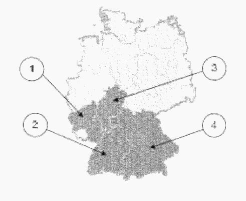
    *   1

    *   2

    *   3

    *   4

9.  Wie nennt man den Regierungschef / die Regierungschefin in Baden-
    Württemberg?

    *   Erster Minister / Erste Ministerin

    *   Premierminister / Premierministerin

    *   Bürgermeister / Bürgermeisterin

    *   Ministerpräsident / Ministerpräsidentin

10. Welchen Minister / welche Ministerin hat Baden-Württemberg *nicht*
    ?

    *   Finanzminister / Finanzministerin

    *   Justizminister / Justizministerin

    *   Innenminister / Innenministerin

    *   Außenminister / Außenministerin

### Teil II

### Fragen für das Bundesland Bayern

1.  Welches Wappen gehört zum Freistaat Bayern?
    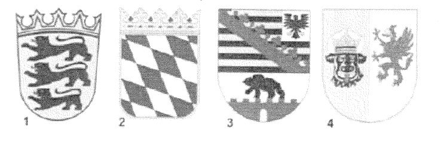
    *   1

    *   2

    *   3

    *   4

2.  Welches ist ein Landkreis in Bayern?

    *   Prignitz

    *   Rhein-Sieg-Kreis

    *   Nordfriesland

    *   Altötting

3.  Für wie viele Jahre wird der Landtag in Bayern gewählt?

    *   3

    *   4

    *   5

    *   6

4.  Ab welchem Alter darf man in Bayern bei Kommunalwahlen wählen?

    *   14

    *   16

    *   18

    *   20

5.  Welche Farben hat die Landesflagge von Bayern?

    *   blau-weiß-rot

    *   weiß-blau

    *   grün-weiß-rot

    *   schwarz-gelb

6.  Wo können Sie sich in Bayern über politische Themen informieren?

    *   beim Ordnungsamt der Gemeinde

    *   bei der Landeszentrale für politische Bildung

    *   bei der Verbraucherzentrale

    *   bei den Kirchen

7.  Die Landeshauptstadt von Bayern heißt ...

    *   Ingolstadt.

    *   Regensburg.

    *   Nürnberg.

    *   München.

8.  Welches Bundesland ist Bayern?
    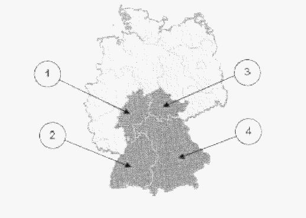
    *   1

    *   2

    *   3

    *   4

9.  Wie nennt man den Regierungschef / die Regierungschefin in Bayern?

    *   Erster Minister / Erste Ministerin

    *   Premierminister / Premierministerin

    *   Bürgermeister / Bürgermeisterin

    *   Ministerpräsident / Ministerpräsidentin

10. Welchen Minister / welche Ministerin hat Bayern *nicht*
    ?

    *   Justizminister / Justizministerin

    *   Außenminister / Außenministerin

    *   Finanzminister / Finanzministerin

    *   Innenminister / Innenministerin

### Teil II

### Fragen für das Bundesland Berlin

1.  Welches Wappen gehört zum Bundesland Berlin?
    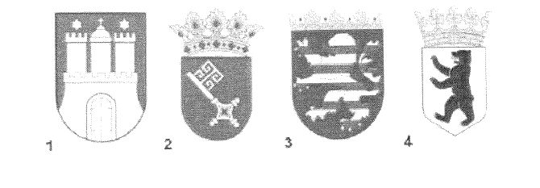
    *   1

    *   2

    *   3

    *   4

2.  Welches ist ein Bezirk von Berlin?

    *   Altona

    *   Prignitz

    *   Pankow

    *   Demmin

3.  Für wie viele Jahre wird das Landesparlament in Berlin gewählt?

    *   3

    *   4

    *   5

    *   6

4.  Ab welchem Alter darf man in Berlin bei Kommunalwahlen (Wahl der
    Bezirksverordnetenversammlung) wählen?

    *   14

    *   16

    *   18

    *   20

5.  Welche Farben hat die Landesflagge von Berlin?

    *   blau-weiß-rot

    *   weiß-rot

    *   grün-weiß-rot

    *   schwarz-gold

6.  Wo können Sie sich in Berlin über politische Themen informieren?

    *   beim Ordnungsamt der Gemeinde

    *   bei den Kirchen

    *   bei der Verbraucherzentrale

    *   bei der Landeszentrale für politische Bildung

7.  Welches Bundesland ist ein Stadtstaat?

    *   Berlin

    *   Saarland

    *   Brandenburg

    *   Hessen

8.  Welches Bundesland ist Berlin?
    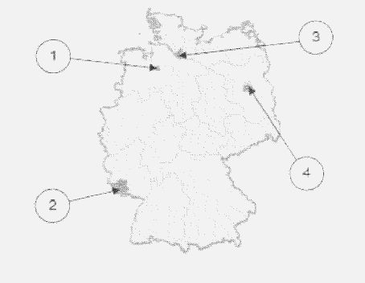
    *   1

    *   2

    *   3

    *   4

9.  Wie nennt man den Regierungschef / die Regierungschefin des
    Stadtstaates Berlin?

    *   Ministerpräsident / Ministerpräsidentin

    *   Oberbürgermeister / Oberbürgermeisterin

    *   Präsident / Präsidentin des Senats

    *   Regierender Bürgermeister / Regierende Bürgermeisterin

10. Welchen Senator / welche Senatorin hat Berlin *nicht*
    ?

    *   Finanzsenator / Finanzsenatorin

    *   Innensenator / Innensenatorin

    *   Senator / Senatorin für Außenbeziehungen

    *   Justizsenator / Justizsenatorin

### Teil II

### Fragen für das Bundesland Brandenburg

1.  Welches Wappen gehört zum Bundesland Brandenburg?
    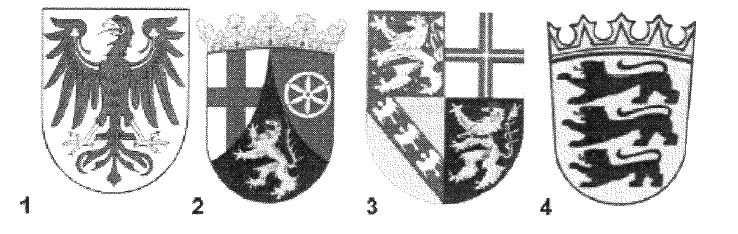
    *   1

    *   2

    *   3

    *   4

2.  Welches ist ein Landkreis in Brandenburg?

    *   Prignitz

    *   Rhein-Sieg-Kreis

    *   Vogtlandkreis

    *   Amberg-Sulzbach

2.  Für wie viele Jahre wird der Landtag in Brandenburg gewählt?

    *   3

    *   4

    *   5

    *   6

4.  Ab welchem Alter darf man in Brandenburg bei Kommunalwahlen wählen?

    *   14

    *   16

    *   18

    *   20

5.  Welche Farben hat die Landesflagge von Brandenburg?

    *   blau-weiß-rot

    *   rot-weiß

    *   grün-weiß-rot

    *   schwarz-gelb

6.  Wo können Sie sich in Brandenburg über politische Themen informieren?

    *   bei den Kirchen

    *   beim Ordnungsamt der Gemeinde

    *   bei der Landeszentrale für politische Bildung

    *   bei der Verbraucherzentrale

7.  Die Landeshauptstadt von Brandenburg heißt ...

    *   Potsdam.

    *   Cottbus.

    *   Brandenburg.

    *   Frankfurt/Oder.

8.  Welches Bundesland ist Brandenburg?
    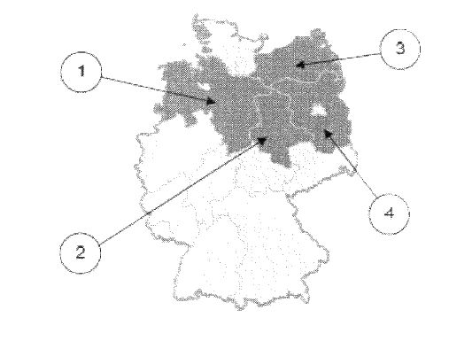
    *   1

    *   2

    *   3

    *   4

9.  Wie nennt man den Regierungschef / die Regierungschefin in
    Brandenburg?

    *   Erster Minister / Erste Ministerin

    *   Premierminister / Premierministerin

    *   Bürgermeister / Bürgermeisterin

    *   Ministerpräsident / Ministerpräsidentin

10. Welchen Minister / welche Ministerin hat Brandenburg *nicht*
    ?

    *   Justizminister / Justizministerin

    *   Außenminister / Außenministerin

    *   Finanzminister / Finanzministerin

    *   Innenminister / Innenministerin

### Teil II

### Fragen für das Bundesland Bremen

1.  Welches Wappen gehört zur Freien Hansestadt Bremen?
    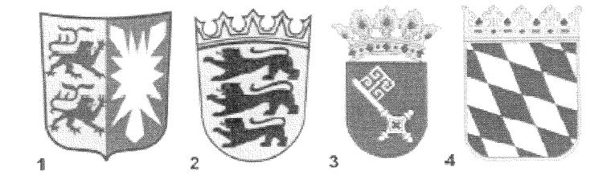
    *   1

    *   2

    *   3

    *   4

2.  Welches ist ein Stadtteil von Bremen?

    *   Altona

    *   Hemelingen

    *   Pankow

    *   Babelsberg

3.  Für wie viele Jahre wird das Landesparlament in Bremen gewählt?

    *   3

    *   4

    *   5

    *   6

4.  Ab welchem Alter darf man in Bremen bei den Wahlen zur Bürgerschaft
    (Landtag) wählen?

    *   14

    *   16

    *   18

    *   20

5.  Welche Farben hat die Landesflagge von Bremen?

    *   blau-weiß-rot

    *   rot-weiß

    *   grün-weiß-rot

    *   schwarz-gold

6.  Wo können Sie sich in Bremen über politische Themen informieren?

    *   beim Ordnungsamt der Gemeinde

    *   bei der Landeszentrale für politische Bildung

    *   bei den Kirchen

    *   bei der Verbraucherzentrale

7.  Was ist ein deutscher Stadtstaat?

    *   Bremen

    *   München

    *   Frankfurt

    *   Erfurt

8.  Welches Bundesland ist Bremen?
    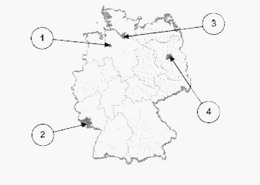
    *   1

    *   2

    *   3

    *   4

9.  Wie nennt man den Regierungschef / die Regierungschefin des
    Stadtstaates Bremen?

    *   Ministerpräsident / Ministerpräsidentin

    *   Erster Bürgermeister / Erste Bürgermeisterin

    *   Präsident / Präsidentin des Senats

    *   Regierender Bürgermeister / Regierende Bürgermeisterin

10. Welchen Senator / welche Senatorin hat Bremen *nicht*
    ?

    *   Senator / Senatorin für Außenbeziehungen

    *   Finanzsenator / Finanzsenatorin

    *   Justizsenator / Justizsenatorin

    *   Innensenator / Innensenatorin

### Teil II

### Fragen für das Bundesland Hamburg

1.  Welches Wappen gehört zur Freien und Hansestadt Hamburg?
    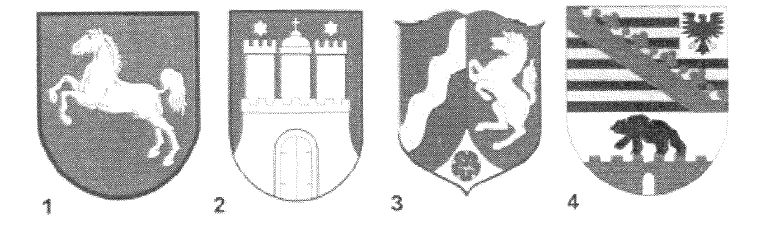
    *   1

    *   2

    *   3

    *   4

2.  Welches ist ein Bezirk von Hamburg?

    *   Altona

    *   Hemelingen

    *   Pankow

    *   Demmin

3.  Für wie viele Jahre wird das Landesparlament in Hamburg gewählt?

    *   3

    *   4

    *   5

    *   6

4.  Ab welchem Alter darf man in Hamburg bei Kommunalwahlen (Wahl der
    Bezirksversammlungen) wählen?

    *   14

    *   16

    *   18

    *   20

5.  Welche Farben hat die Landesflagge von Hamburg?

    *   blau-weiß-rot

    *   weiß-rot

    *   grün-weiß-rot

    *   schwarz-gelb

6.  Wo können Sie sich in Hamburg über politische Themen informieren?

    *   beim Ordnungsamt der Gemeinde

    *   bei der Verbraucherzentrale

    *   bei den Kirchen

    *   bei der Landeszentrale für politische Bildung

7.  Welches Bundesland ist ein Stadtstaat?

    *   Hamburg

    *   Sachsen

    *   Bayern

    *   Thüringen

8.  Welches Bundesland ist Hamburg?
    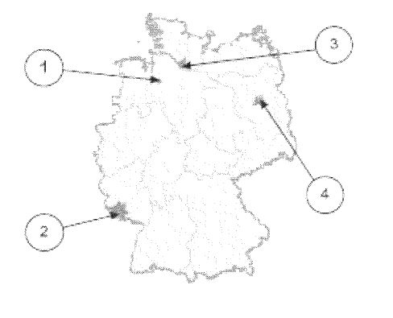
    *   1

    *   2

    *   3

    *   4

9.  Wie nennt man den Regierungschef / die Regierungschefin des
    Stadtstaates Hamburg?

    *   Ministerpräsident / Ministerpräsidentin

    *   Erster Bürgermeister / Erste Bürgermeisterin

    *   Regierender Senator / Regierende Senatorin

    *   Oberbürgermeister / Oberbürgermeisterin

10. Welchen Senator / welche Senatorin hat Hamburg *nicht*
    ?

    *   Justizsenator / Justizsenatorin

    *   Senator / Senatorin für Außenbeziehungen

    *   Finanzsenator / Finanzsenatorin

    *   Innensenator / Innensenatorin

### Teil II

### Fragen für das Bundesland Hessen

1.  Welches Wappen gehört zum Bundesland Hessen?
    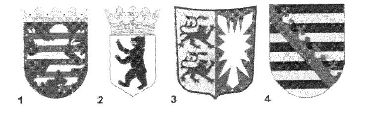
    *   1

    *   2

    *   3

    *   4

2.  Welches ist ein Landkreis in Hessen?

    *   Ammerland

    *   Altötting

    *   Prignitz

    *   Main-Taunus-Kreis

3.  Für wie viele Jahre wird der Landtag in Hessen gewählt?

    *   3

    *   4

    *   5

    *   6

4.  Ab welchem Alter darf man in Hessen bei Kommunalwahlen wählen?

    *   14

    *   16

    *   18

    *   20

5.  Welche Farben hat die Landesflagge von Hessen?

    *   blau-weiß-rot

    *   rot-weiß

    *   schwarz-gold

    *   grün-weiß-rot

6.  Wo können Sie sich in Hessen über politische Themen informieren?

    *   bei der Landeszentrale für politische Bildung

    *   bei der Verbraucherzentrale

    *   beim Ordnungsamt der Gemeinde

    *   bei den Kirchen

7.  Die Landeshauptstadt von Hessen heißt ...

    *   Kassel.

    *   Darmstadt.

    *   Frankfurt.

    *   Wiesbaden.

8.  Welches Bundesland ist Hessen?
    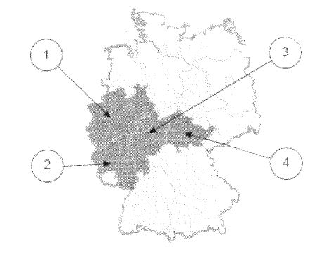
    *   1

    *   2

    *   3

    *   4

9.  Wie nennt man den Regierungschef / die Regierungschefin in Hessen?

    *   Erster Minister / Erste Ministerin

    *   Premierminister / Premierministerin

    *   Bürgermeister / Bürgermeisterin

    *   Ministerpräsident / Ministerpräsidentin

10. Welchen Minister / welche Ministerin hat Hessen *nicht*
    ?

    *   Justizminister / Justizministerin

    *   Außenminister / Außenministerin

    *   Finanzminister / Finanzministerin

    *   Innenminister / Innenministerin

### Teil II

### Fragen für das Bundesland Mecklenburg-Vorpommern

1.  Welches Wappen gehört zum Bundesland Mecklenburg-Vorpommern?

    *        *            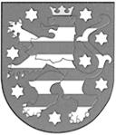
        *            
        *            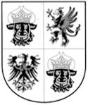
        *            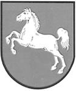

    *        *   1

        *   2

        *   3

        *   4

    *   1

    *   2

    *   3

    *   4

2.  Welches ist ein Landkreis in Mecklenburg-Vorpommern?

    *   Prignitz

    *   Demmin

    *   Vogtlandkreis

    *   Rhein-Sieg-Kreis

3.  Für wie viele Jahre wird der Landtag in Mecklenburg-Vorpommern
    gewählt?

    *   3

    *   4

    *   5

    *   6

4.  Ab welchem Alter darf man in Mecklenburg-Vorpommern bei Kommunalwahlen
    wählen?

    *   14

    *   16

    *   18

    *   20

5.  Welche Farben hat die Landesflagge von Mecklenburg-Vorpommern?

    *   schwarz-rot-gold

    *   blau-weiß-gelb-rot

    *   grün-weiß-rot

    *   schwarz-gelb

6.  Wo können Sie sich in Mecklenburg-Vorpommern über politische Themen
    informieren?

    *   bei der Landeszentrale für politische Bildung

    *   bei den Kirchen

    *   beim Ordnungsamt der Gemeinde

    *   bei der Verbraucherzentrale

7.  Die Landeshauptstadt von Mecklenburg-Vorpommern heißt ...

    *   Greifswald.

    *   Schwerin.

    *   Rostock.

    *   Wismar.

8.  Welches Bundesland ist Mecklenburg-Vorpommern?
    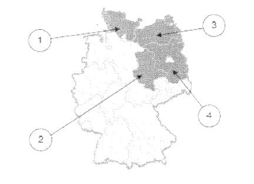
    *   1

    *   2

    *   3

    *   4

9.  Wie nennt man den Regierungschef / die Regierungschefin in
    Mecklenburg-Vorpommern?

    *   Erster Minister / Erste Ministerin

    *   Premierminister / Premierministerin

    *   Bürgermeister / Bürgermeisterin

    *   Ministerpräsident / Ministerpräsidentin

10. Welchen Minister / welche Ministerin hat Mecklenburg-Vorpommern
    *nicht*                   ?

    *   Justizminister / Justizministerin

    *   Außenminister / Außenministerin

    *   Finanzminister / Finanzministerin

    *   Innenminister / Innenministerin

### Teil II

### Fragen für das Bundesland Niedersachsen

1.  Welches Wappen gehört zum Bundesland Niedersachsen?
    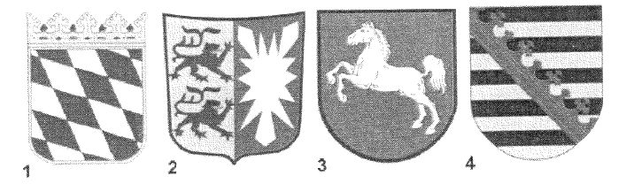
    *   1

    *   2

    *   3

    *   4

2.  Welches ist ein Landkreis in Niedersachsen?

    *   Ammerland

    *   Rhein-Sieg-Kreis

    *   Nordfriesland

    *   Vogtlandkreis

3.  Für wie viele Jahre wird der Landtag in Niedersachsen gewählt?

    *   3

    *   4

    *   5

    *   6

4.  Ab welchem Alter darf man in Niedersachsen bei Kommunalwahlen wählen?

    *   14

    *   16

    *   18

    *   20

5.  Welche Farben hat die Landesflagge von Niedersachsen?

    *   weiß-blau

    *   schwarz-rot-gold

    *   schwarz-gelb

    *   blau-weiß-rot

6.  Wo können Sie sich in Niedersachsen über politische Themen
    informieren?

    *   beim Koordinator für politische Bildung im Kultusministerium

    *   beim Ordnungsamt der Gemeinde

    *   bei der Verbraucherzentrale

    *   bei den Kirchen

7.  Die Landeshauptstadt von Niedersachsen heißt …

    *   Hannover.

    *   Braunschweig.

    *   Wolfsburg.

    *   Osnabrück.

8.  Welches Bundesland ist Niedersachsen?
    
    *   1

    *   2

    *   3

    *   4

9.  Wie nennt man den Regierungschef / die Regierungschefin in
    Niedersachsen?

    *   Erster Minister / Erste Ministerin

    *   Premierminister / Premierministerin

    *   Bürgermeister / Bürgermeisterin

    *   Ministerpräsident / Ministerpräsidentin

10. Welchen Minister / welche Ministerin hat Niedersachsen *nicht*
    ?

    *   Justizminister / Justizministerin

    *   Außenminister / Außenministerin

    *   Finanzminister / Finanzministerin

    *   Innenminister / Innenministerin

### Teil II

### Fragen für das Bundesland Nordrhein-Westfalen

1.  Welches Wappen gehört zum Bundesland Nordrhein-Westfalen?
    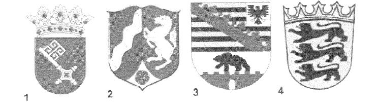
    *   1

    *   2

    *   3

    *   4

2.  Welches ist ein Landkreis in Nordrhein-Westfalen?

    *   Ammerland

    *   Rhein-Sieg-Kreis

    *   Nordfriesland

    *   Vogtlandkreis

3.  Für wie viele Jahre wird der Landtag in Nordrhein-Westfalen gewählt?

    *   3

    *   4

    *   5

    *   6

4.  Ab welchem Alter darf man in Nordrhein-Westfalen bei Kommunalwahlen
    wählen?

    *   14

    *   16

    *   18

    *   20

5.  Welche Farben hat die Landesflagge von Nordrhein-Westfalen?

    *   rot-weiß

    *   grün-weiß-rot

    *   schwarz-gold

    *   blau-weiß-rot

6.  Wo können Sie sich in Nordrhein-Westfalen über politische Themen
    informieren?

    *   bei den Kirchen

    *   beim Ordnungsamt der Gemeinde

    *   bei der Verbraucherzentrale

    *   bei der Landeszentrale für politische Bildung

7.  Die Landeshauptstadt von Nordrhein-Westfalen heißt …

    *   Köln.

    *   Bonn.

    *   Düsseldorf.

    *   Dortmund.

8.  Welches Bundesland ist Nordrhein-Westfalen?
    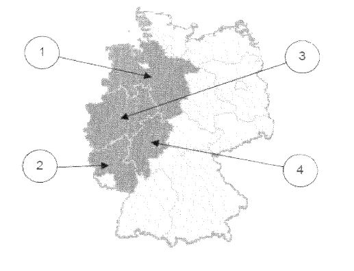
    *   1

    *   2

    *   3

    *   4

9.  Wie nennt man den Regierungschef / die Regierungschefin in Nordrhein-
    Westfalen?

    *   Erster Minister / Erste Ministerin

    *   Premierminister / Premierministerin

    *   Bürgermeister / Bürgermeisterin

    *   Ministerpräsident / Ministerpräsidentin

10. Welchen Minister / welche Ministerin hat Nordrhein-Westfalen *nicht*
    ?

    *   Justizminister / Justizministerin

    *   Außenminister / Außenministerin

    *   Finanzminister / Finanzministerin

    *   Innenminister / Innenministerin

### Teil II

### Fragen für das Bundesland Rheinland-Pfalz

1.  Welches Wappen gehört zum Bundesland Rheinland-Pfalz?
    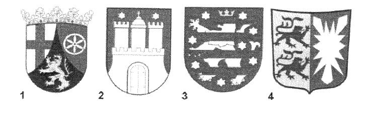
    *   1

    *   2

    *   3

    *   4

2.  Welches ist ein Landkreis in Rheinland-Pfalz?

    *   Westerwaldkreis

    *   Altötting

    *   Emsland

    *   Prignitz

3.  Für wie viele Jahre wird der Landtag in Rheinland-Pfalz gewählt?

    *   3

    *   4

    *   5

    *   6

4.  Ab welchem Alter darf man in Rheinland-Pfalz bei Kommunalwahlen
    wählen?

    *   14

    *   16

    *   18

    *   20

5.  Welche Farben hat die Landesflagge von Rheinland-Pfalz?

    *   weiß-rot

    *   schwarz-rot-gold

    *   schwarz-gelb

    *   grün-weiß-rot

6.  Wo können Sie sich in Rheinland-Pfalz über politische Themen
    informieren?

    *   bei den Kirchen

    *   bei der Verbraucherzentrale

    *   beim Ordnungsamt der Gemeinde

    *   bei der Landeszentrale für politische Bildung

7.  Die Landeshauptstadt von Rheinland-Pfalz heißt …

    *   Mainz.

    *   Kaiserslautern.

    *   Ludwigshafen.

    *   Koblenz.

8.  Welches Bundesland ist Rheinland-Pfalz?
    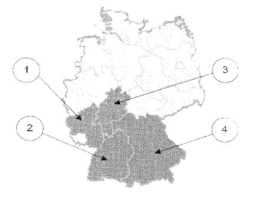
    *   1

    *   2

    *   3

    *   4

9.  Wie nennt man den Regierungschef / die Regierungschefin in Rheinland-
    Pfalz?

    *   Erster Minister / Erste Ministerin

    *   Premierminister / Premierministerin

    *   Bürgermeister / Bürgermeisterin

    *   Ministerpräsident / Ministerpräsidentin

10. Welchen Minister / welche Ministerin hat Rheinland-Pfalz *nicht*
    ?

    *   Justizminister / Justizministerin

    *   Außenminister / Außenministerin

    *   Finanzminister / Finanzministerin

    *   Innenminister / Innenministerin

### Teil II

### Fragen für das Bundesland Saarland

1.  Welches Wappen gehört zum Bundesland Saarland?
    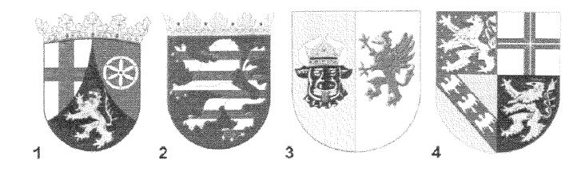
    *   1

    *   2

    *   3

    *   4

2.  Welches ist ein Landkreis im Saarland?

    *   Demmin

    *   Altötting

    *   Neunkirchen

    *   Rhein-Sieg-Kreis

3.  Für wie viele Jahre wird der Landtag des Saarlandes gewählt?

    *   3

    *   4

    *   5

    *   6

4.  Ab welchem Alter darf man im Saarland bei Kommunalwahlen wählen?

    *   14

    *   16

    *   18

    *   20

5.  Welche Farben hat die Landesflagge des Saarlandes?

    *   weiß-blau

    *   schwarz-rot-gold

    *   schwarz-gelb

    *   grün-weiß-rot

6.  Wo können Sie sich im Saarland über politische Themen informieren?

    *   bei den Kirchen

    *   bei der Landeszentrale für politische Bildung

    *   bei der Verbraucherzentrale

    *   beim Ordnungsamt der Gemeinde

7.  Die Landeshauptstadt des Saarlandes heißt …

    *   Neunkirchen.

    *   Homburg.

    *   Saarbrücken.

    *   Völklingen.

8.  Welches Bundesland ist das Saarland?
    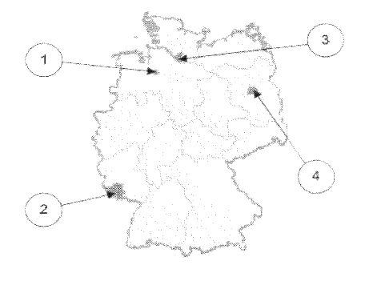
    *   1

    *   2

    *   3

    *   4

9.  Wie nennt man den Regierungschef / die Regierungschefin des
    Saarlandes?

    *   Erster Minister / Erste Ministerin

    *   Premierminister / Premierministerin

    *   Bürgermeister / Bürgermeisterin

    *   Ministerpräsident / Ministerpräsidentin

10. Welchen Minister / welche Ministerin hat das Saarland *nicht*
    ?

    *   Justizminister / Justizministerin

    *   Außenminister / Außenministerin

    *   Finanzminister / Finanzministerin

    *   Innenminister / Innenministerin

### Teil II

### Fragen für das Bundesland Sachsen

1.  Welches Wappen gehört zum Freistaat Sachsen?
    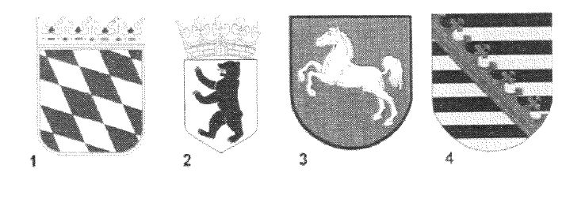
    *   1

    *   2

    *   3

    *   4

2.  Welches ist ein Landkreis in Sachsen?

    *   Vogtlandkreis

    *   Altötting

    *   Uckermark

    *   Nordfriesland

3.  Für wie viele Jahre wird der Landtag in Sachsen gewählt?

    *   3

    *   4

    *   5

    *   6

4.  Ab welchem Alter darf man in Sachsen bei Kommunalwahlen wählen?

    *   14

    *   16

    *   18

    *   20

5.  Welche Farben hat die Landesflagge von Sachsen?

    *   blau-weiß-rot

    *   weiß-grün

    *   grün-weiß-rot

    *   schwarz-gelb

6.  Wo können Sie sich in Sachsen über politische Themen informieren?

    *   bei der Landeszentrale für politische Bildung

    *   beim Ordnungsamt der Gemeinde

    *   bei den Kirchen

    *   bei der Verbraucherzentrale

7.  Die Landeshauptstadt von Sachsen heißt …

    *   Leipzig.

    *   Dresden.

    *   Chemnitz.

    *   Zwickau.

8.  Welches Bundesland ist Sachsen?
    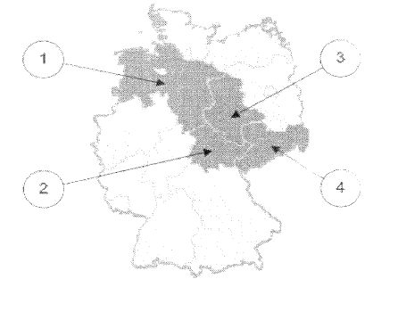
    *   1

    *   2

    *   3

    *   4

9.  Wie nennt man den Regierungschef / die Regierungschefin in Sachsen?

    *   Erster Minister / Erste Ministerin

    *   Premierminister / Premierministerin

    *   Bürgermeister / Bürgermeisterin

    *   Ministerpräsident / Ministerpräsidentin

10. Welchen Minister / welche Ministerin hat Sachsen *nicht*
    ?

    *   Justizminister / Justizministerin

    *   Außenminister / Außenministerin

    *   Finanzminister / Finanzministerin

    *   Innenminister / Innenministerin

### Teil II

### Fragen für das Bundesland Sachsen-Anhalt

1.  Welches Wappen gehört zum Bundesland Sachsen-Anhalt?
    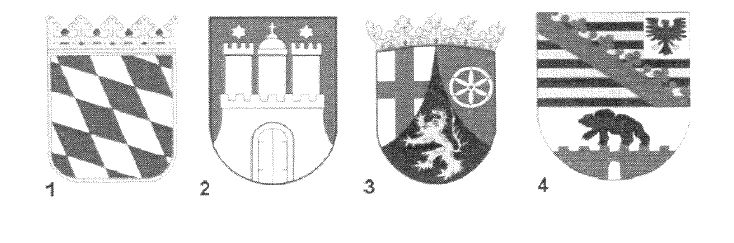
    *   1

    *   2

    *   3

    *   4

2.  Welches ist ein Landkreis in Sachsen-Anhalt?

    *   Ammerland

    *   Altötting

    *   Uckermark

    *   Börde

3.  Für wie viele Jahre wird der Landtag in Sachsen-Anhalt gewählt?

    *   3

    *   4

    *   5

    *   6

4.  Ab welchem Alter darf man in Sachsen-Anhalt bei Kommunalwahlen wählen?

    *   14

    *   16

    *   18

    *   20

5.  Welche Farben hat die Landesflagge von Sachsen-Anhalt?

    *   blau-weiß-rot

    *   gelb-schwarz

    *   grün-weiß-rot

    *   weiß-rot

6.  Wo können Sie sich in Sachsen-Anhalt über politische Themen
    informieren?

    *   bei den Kirchen

    *   bei der Landeszentrale für politische Bildung

    *   beim Ordnungsamt der Gemeinde

    *   bei der Verbraucherzentrale

7.  Die Landeshauptstadt von Sachsen-Anhalt heißt …

    *   Halle.

    *   Dessau.

    *   Magdeburg.

    *   Wittenberg.

8.  Welches Bundesland ist Sachsen-Anhalt?
    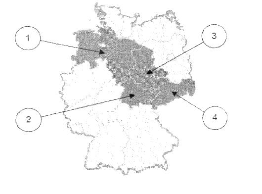
    *   1

    *   2

    *   3

    *   4

9.  Wie nennt man den Regierungschef / die Regierungschefin in Sachsen-
    Anhalt?

    *   Erster Minister / Erste Ministerin

    *   Premierminister / Premierministerin

    *   Bürgermeister / Bürgermeisterin

    *   Ministerpräsident / Ministerpräsidentin

10. Welchen Minister / welche Ministerin hat Sachsen-Anhalt *nicht*
    ?

    *   Justizminister / Justizministerin

    *   Außenminister / Außenministerin

    *   Finanzminister / Finanzministerin

    *   Innenminister / Innenministerin

### Teil II

### Fragen für das Bundesland Schleswig-Holstein

1.  Welches Wappen gehört zum Bundesland Schleswig-Holstein?
    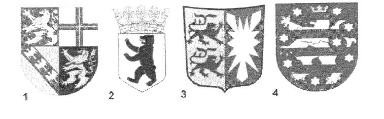
    *   1

    *   2

    *   3

    *   4

2.  Welches ist ein Landkreis in Schleswig-Holstein?

    *   Ammerland

    *   Demmin

    *   Nordfriesland

    *   Rhein-Sieg-Kreis

3.  Für wie viele Jahre wird der Landtag in Schleswig-Holstein gewählt?

    *   3

    *   4

    *   5

    *   6

4.  Ab welchem Alter darf man in Schleswig-Holstein bei Kommunalwahlen
    wählen?

    *   14

    *   16

    *   18

    *   20

5.  Welche Farben hat die Landesflagge von Schleswig-Holstein?

    *   weiß-blau

    *   blau-weiß-rot

    *   weiß-rot

    *   grün-weiß-rot

6.  Wo können Sie sich in Schleswig-Holstein über politische Themen
    informieren?

    *   bei der Verbraucherzentrale

    *   beim Ordnungsamt der Gemeinde

    *   bei der Landeszentrale für politische Bildung

    *   bei den Kirchen

7.  Die Landeshauptstadt von Schleswig-Holstein heißt …

    *   Husum.

    *   Flensburg.

    *   Lübeck.

    *   Kiel.

8.  Welches Bundesland ist Schleswig-Holstein?
    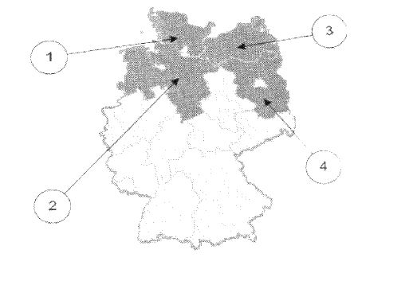
    *   1

    *   2

    *   3

    *   4

9.  Wie nennt man den Regierungschef / die Regierungschefin in Schleswig-
    Holstein?

    *   Erster Minister / Erste Ministerin

    *   Premierminister / Premierministerin

    *   Bürgermeister / Bürgermeisterin

    *   Ministerpräsident / Ministerpräsidentin

10. Welchen Minister / welche Ministerin hat Schleswig-Holstein *nicht*
    ?

    *   Justizminister / Justizministerin

    *   Außenminister / Außenministerin

    *   Finanzminister / Finanzministerin

    *   Innenminister / Innenministerin

### Teil II

### Fragen für das Bundesland Thüringen

1.  Welches Wappen gehört zum Freistaat Thüringen?
    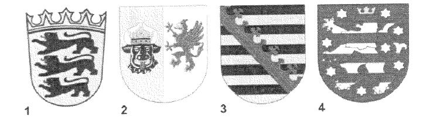
    *   1

    *   2

    *   3

    *   4

2.  Welches ist ein Landkreis in Thüringen?

    *   Ammerland

    *   Altötting

    *   Nordfriesland

    *   Wartburgkreis

3.  Für wie viele Jahre wird der Landtag in Thüringen gewählt?

    *   3

    *   4

    *   5

    *   6

4.  Ab welchem Alter darf man in Thüringen bei Kommunalwahlen wählen?

    *   14

    *   16

    *   18

    *   20

5.  Welche Farben hat die Landesflagge von Thüringen?

    *   blau-weiß-rot

    *   weiß-rot

    *   grün-weiß-rot

    *   schwarz-gold

6.  Wo können Sie sich in Thüringen über politische Themen informieren?

    *   bei den Kirchen

    *   bei der Verbraucherzentrale

    *   bei der Landeszentrale für politische Bildung

    *   beim Ordnungsamt der Gemeinde

7.  Die Landeshauptstadt von Thüringen heißt …

    *   Eisenach.

    *   Erfurt.

    *   Gera.

    *   Jena.

8.  Welches Bundesland ist Thüringen?
    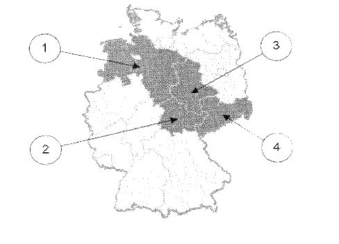
    *   1

    *   2

    *   3

    *   4

9.  Wie nennt man den Regierungschef / die Regierungschefin in Thüringen?

    *   Erster Minister / Erste Ministerin

    *   Premierminister / Premierministerin

    *   Bürgermeister / Bürgermeisterin

    *   Ministerpräsident / Ministerpräsidentin

10. Welchen Minister / welche Ministerin hat Thüringen *nicht*
    ?

    *   Justizminister / Justizministerin

    *   Außenminister / Außenministerin

    *   Finanzminister / Finanzministerin

    *   Innenminister / Innenministerin

## Anlage 2 Rahmencurriculum für den Einbürgerungskurs

(Fundstelle: Anlageband zum BGBl. I 2008 Nr. 35 Seite 141 bis 174)
**Inhalt**

*    *
    *
    *   Seite

*    *   I.

    *   Übergreifende Zielvorstellung

    *   144

*    *
    *
    *

*    *   II.

    *   Maßgaben für das Curriculum

    *   144

*    *
    *   1) Verknüpfung mit dem Integrationskurs / Orientierungskurs

    *   144

*    *
    *   2) Aufbau des Curriculums

    *   145

*    *
    *   3) Voraussetzungen auf Seiten der Teilnehmer

    *   147

*    *
    *   4) Methodisch-didaktische Prinzipien im Einbürgerungskurs

    *   147

*    *
    *   5) Kursumfang

    *   149

*    *
    *   6) Gestaltung der Unterrichtszeiten

    *   149

*    *
    *
    *

*    *   III.

    *   Themenbereiche und Lernziele (Module)

    *   151

*    *
    *   Modul I:

    *   Einführung

    *   151

*    *
    *   Modul II:

    *   Leben in der Demokratie

    *   152

*    *
    *
    *   Teil 1: Demokratie und Teilhabe an der politischen Gestaltung

    *   152

*    *
    *
    *   Teil 2: Rechte und Pflichten

    *   157

*    *
    *
    *   Teil 3: Konfliktlösung in der demokratischen Gesellschaft

    *   161

*    *
    *
    *   Teil 4: Besonderheiten des Bundeslandes

    *   164

*    *
    *   Modul III:

    *   Geschichte und Verantwortung

    *   166

*    *
    *   Modul IV:

    *   Mensch und Gesellschaft

    *   171

*    *
    *   Modul V:

    *   Kursabschluss

    *   174

**I. Übergreifende Zielvorstellungen**
Nach dem von der Konferenz der Innenminister und -senatoren der Länder
am 31. Mai/1. Juni 2007 in Berlin gebilligten Konzept
„Bundeseinheitliche Standards für das Einbürgerungsverfahren“ ist die
Vermittlung staatsbürgerlichen Grundwissens sowie der Grundsätze und
Werte unserer Verfassung das Ziel des Einbürgerungskurses. Die dort
vermittelten Kenntnisse dienen dem Erwerb des für das Bekenntnis zum
Grundgesetz notwendigen Verständnisses von Prinzipien und Aufbau des
deutschen Staatswesens sowie der damit in Zusammenhang stehenden
gesellschaftspolitischen Prozesse. Der Einbürgerungskurs soll die
Einbürgerungsbewerber in die Lage versetzen, ihre staatsbürgerlichen
Rechte und Pflichten erkennen und aktiv wahrnehmen zu können. Das
Rahmencurriculum trägt dieser Zielsetzung in Aufbau und Ausgestaltung
Rechnung.
**II. Maßgaben für das Curriculum**
**1) Verknüpfung mit dem Integrationskurs/Orientierungskurs**
Der Einbürgerungskurs baut auf den Themen des Orientierungskurses nach
§ 43 Abs. 3 Satz 1 des Aufenthaltsgesetzes auf. Er umfasst somit die
Themenbereiche „Leben in der Demokratie“ (im Orientierungskurs:
„Politik in der Demokratie“), „Geschichte und Verantwortung“ und
„Mensch und Gesellschaft“. Während der Orientierungskurs vor allem
grundlegende Kenntnisse vermittelt, behandelt der Einbürgerungskurs
die Themenbereiche erweiternd, vertiefend und mit Blick auf zukünftige
staatsbürgerliche Handlungsmöglichkeiten. Der Schwerpunkt liegt dabei
im Bereich „Leben in der Demokratie“. Behandelt werden sollen
insbesondere die Themen:

▪   Demokratie,

▪   Grundrechte,

▪   Konfliktlösung in der demokratischen Gesellschaft,

▪   Rechtsstaat,

▪   Sozialstaat,

▪   Verantwortung des Einzelnen für das Gemeinwohl,

▪   Teilhabe an der politischen Gestaltung,

▪   Gleichberechtigung von Mann und Frau,

▪   Staatssymbole.

**2) Aufbau des Curriculums**
Das Curriculum gliedert sich in die nachfolgenden fünf Module:

*    *   Modul I:

    *   Einführung in den Kurs

*    *   Modul II:

    *   Leben in der Demokratie

*    *
    *   Teil 1:

    *   Demokratie und Teilhabe an der politischen Gestaltung

*    *
    *   Teil 2:

    *   Rechte und Pflichten

*    *
    *   Teil 3:

    *   Konfliktlösung in der demokratischen Gesellschaft

*    *
    *   Teil 4:

    *   Besonderheiten des Bundeslandes

*    *   Modul III:

    *   Geschichte und Verantwortung

*    *   Modul IV:

    *   Mensch und Gesellschaft

*    *   Modul V:

    *   Kursabschluss

Die Lerninhalte der Module II bis IV sind um Schlüsselthemen
angeordnet. Diese umfassen die Kerninhalte des Einbürgerungskurses,
mit denen die notwendigen Kenntnisse und das zugehörige
Verständniswissen erworben werden sollen. Die Schlüsselthemen stehen
mit den weiteren Lerninhalten in enger inhaltlicher Verbindung. Von
ihnen ausgehend sollen die Einzelthemen des jeweiligen Moduls im
Unterricht behandelt werden.
Die Auswahl der im Curriculum vorgegebenen Themen für den
Einbürgerungskurs orientiert sich an der Fragestellung, welche
konkreten Lerninhalte unter die Vorgaben „staatsbürgerliches
Grundwissen“ sowie „Grundsätze und Werte unserer Verfassung“ fallen.
Lerninhalte mit speziellem Bundeslandbezug werden berücksichtigt,
allerdings nur solche, die in Zusammenhang mit demokratischen
Teilhabemöglichkeiten stehen. Die länderspezifischen Lerninhalte
können in Kooperation mit den Landeszentralen für politische Bildung
entwickelt werden.
a. Leben in der Demokratie
Der Bereich „Leben in der Demokratie“ bildet den Kernbereich des
Einbürgerungskurses. Die Lerninhalte sind auf die späteren
staatsbürgerlichen Partizipationsmöglichkeiten der
Einbürgerungsbewerber ausgerichtet. Das heißt, dass vor allem Art und
Bedeutung der verschiedenen Beteiligungsformen am politisch-
gesellschaftlichen Leben in Deutschland (Wahlen, Partei- und
Vereinsmitgliedschaften etc.) aufgezeigt werden sollen. Darauf
aufbauend ist der Rahmen darzustellen, innerhalb dessen sich die
Partizipation des Neubürgers am Gemeinwesen vollzieht, nämlich die
grundlegenden Prinzipien, Werte und Normen (Grundrechte, Rechte und
Pflichten, Konfliktlösung), die zentralen Funktionsmechanismen der
parlamentarischen Demokratie sowie ihr Aufbau und ihre Strukturen.
b. Geschichte und Verantwortung
Für das Verstehen der bundesrepublikanischen Gegenwart sollen wichtige
Stationen der jüngeren deutschen Geschichte, insbesondere der Weg zur
parlamentarischen Demokratie, als Wissenshintergrund vermittelt
werden. Dabei wird Bezug genommen auf das Parlament in der Paulskirche
1848/49 und seinen Einfluss auf das Grundgesetz sowie auf die
unterschiedliche Stellung der Volksvertretung im deutschen Kaiserreich
und in der Weimarer Republik. Am Beispiel der nationalsozialistischen
Diktatur werden die Folgen der Negierung von Rechtsstaatlichkeit und
Demokratie und die daraus resultierende Verantwortung zum Erhalt der
demokratischen Verfassung aufgezeigt. Als wichtige Stationen der
deutschen Nachkriegsgeschichte sollen neben der Gründung der
Bundesrepublik die Themen DDR, deutsche Teilung und Wiedervereinigung
vermittelt werden. Grundsätzlich sollen nicht historische Daten,
sondern geschichtliche Zusammenhänge im Mittelpunkt dieses Kursmoduls
stehen.
Da die Geschichte Deutschlands ganz wesentlich durch Zuwanderung
geprägt worden ist, wird auch das Thema Migrationsgeschichte in den
Themenkatalog aufgenommen. Dieses Thema stellt zudem einen guten
Anknüpfungspunkt an die persönliche Migrationsgeschichte der
Kursteilnehmer dar.
Der Entwicklungsprozess der Bundesrepublik Deutschland soll im
Zusammenhang mit dem Fortgang der europäischen Einigung und der
wachsenden Bedeutung der europäischen Integration vermittelt werden.
Daneben erhält dieses Thema seine Relevanz durch die Tatsache, dass
Ausländer mit der Einbürgerung nicht nur deutsche Staatsangehörige,
sondern – sofern es sich um Drittstaatsangehörige handelt – auch EU-
Bürger werden.
c. Mensch und Gesellschaft
In diesem Themenfeld wird auf grundlegende Aspekte der
gesellschaftlichen Kultur bzw. des gesellschaftlichen Zusammenlebens
in Deutschland eingegangen. Diese thematische Ausrichtung trägt auch
der Prägung Deutschlands durch Migrationsprozesse Rechnung, weshalb
die an dieser Stelle im Konzept benannten Lerninhalte dem Kernbestand
staatsbürgerlichen Grundwissens zugerechnet werden.
Wichtige Inhalte aus dem Modul „Leben in der Demokratie“, z. B.
einzelne Grundrechte oder das Thema „Umgang mit Konflikten“, sind
aufzugreifen und in Bezug zum gesellschaftlichen Miteinander im
interkulturellen Kontext zu setzen. Neben Themen des religiösen und
kulturellen Zusammenlebens im föderalen Deutschland soll auch der
kulturelle Wandel infolge von Zuwanderung verdeutlicht werden.
Um den Blick stärker auf die gesellschaftliche Dimension von Kultur zu
richten, ist auch das Thema Bildung in den Lerninhaltekatalog
aufgenommen worden. Bildung soll als zentrale Voraussetzung zur
gleichberechtigten Teilhabe am gesellschaftlich-politischen Leben in
Deutschland vermittelt werden.
**3) Voraussetzungen auf Seiten der Teilnehmer**
a. Sprachliche Voraussetzungen
Teilnehmer am Einbürgerungskurs sollten über das Sprachniveau B1 nach
dem Gemeinsamen europäischen Referenzrahmen für Sprachen (GER)
verfügen. Nur so ist gewährleistet, dass sowohl das
Unterrichtsmaterial hinreichend verstanden als auch den Ausführungen
von Lehrkräften und Mitlernenden angemessen gefolgt werden kann.
Insbesondere im Bereich Leseverstehen sollte das Sprachniveau B1
sicher beherrscht werden.
b. Selbstständiges Lernen
Obgleich alle Inhalte des Einbürgerungstests Gegenstand des Kurses
sind, sollten die Teilnehmer in der Lage sein, sich grundlegender
Lerntechniken zu bedienen, wie etwa Nachschlagen in einem Wörterbuch
oder in Lexika, selbstständiges Mitschreiben im Unterricht,
Organisation des Arbeitsplatzes und der Arbeitsmaterialien,
selbstständiges Vor- und Nachbereiten sowie Wiederholen des
Unterrichtsstoffes. Diese Lerntechniken ermöglichen den Teilnehmern
eine individuelle und intensive Vorbereitung auf den Test über das
Geschehen im Kurs hinaus und erhöhen die Bestehenschancen bei der
abschließenden Prüfung.
c. Bereitschaft zur aktiven Mitarbeit im Kurs
Der handlungsorientierte Ansatz des Einbürgerungskurses erfordert die
Bereitschaft des Einzelnen, sich aktiv in die Gestaltung des
Unterrichtsgeschehens einzubringen. Nur so können die Teilnehmer
umfassend von der Vermittlung der Inhalte im Kurs profitieren.
**4) Methodisch-didaktische Prinzipien im Einbürgerungskurs**
Die methodisch-didaktische Ausgestaltung des Einbürgerungskurses
orientiert sich an folgenden grundlegenden Prinzipien:

▪   Teilnehmerorientierung
    Die Ausrichtung der Themen und ihre Ausgestaltung orientieren sich an
    der Lebenswelt der Teilnehmer („Anschlusslernen“). Die Erfahrungen und
    Vorkenntnisse der Teilnehmer werden stets berücksichtigt.

▪   Handlungs- und Subjektorientierung
    Die Teilnehmer sollen angeregt werden, sich aktiv in das
    Unterrichtsgeschehen einzubringen und an dessen Gestaltung zu
    partizipieren. Eine solche Aktivierung kann mittels Rollenspielen,
    Projekten etc. erreicht werden. Das Lernen wird als ganzheitlicher
    Prozess betrachtet, bei dem der Weg der Teilnehmer zur eigenständigen
    Erkenntnis im Mittelpunkt des Interesses steht.

▪   Multiperspektivische Themenaufbereitung
    Der Unterricht sollte nicht zu einer eindimensionalen Darstellung
    einer (Mehrheits-) Meinung führen, sondern kontroverse Standpunkte
    deutlich machen und diskutieren. Die Teilnehmer sollten an geeigneten
    Stellen dazu angeleitet werden, Perspektivwechsel in der Sache
    vorzunehmen und so Grundvoraussetzungen für Verständnis und Toleranz
    einzuüben.

▪   Verwendung erwachsenengerechter Unterrichtsformen
    Das Verhältnis zwischen Teilnehmern und Lehrkräften ist durch
    respektvollen Umgang im Sinne einer Lernpartnerschaft gekennzeichnet.
    Der Austausch erfolgt stets auf gleicher Augenhöhe und anerkennt die
    Kompetenzen des Gegenübers sowie ihren Nutzen für den Lernprozess.

▪   Einsatz wechselnder Sozialformen
    Der Einsatz wechselnder Sozialformen ermöglicht die Auswahl einer für
    die Vermittlung des jeweiligen Lerngegenstandes geeigneten Form, die
    zudem das selbstständige Erarbeiten von Lerninhalten durch die
    Teilnehmer fördern soll. Bei der Auswahl und Gestaltung der
    Sozialformen sind die bisherigen Lernerfahrungen und die
    Lernvoraussetzungen der Teilnehmer zu berücksichtigen.

▪   Einsatz vielfältiger Methoden
    Angesichts der Vielzahl und der Vielschichtigkeit der Themen des
    Einbürgerungskurses ist eine Vielfalt an Methoden für eine adäquate
    Vermittlung der Inhalte notwendig, deren jeweilige Auswahl im Ermessen
    der Lehrkraft steht. Methodenauswahl bedeutet auch ein Eingehen auf
    die Bedürfnisse und Bedarfe der jeweiligen Kursgruppe.

Um Faktenwissen und Wissen um Zusammenhänge im Bereich Politik,
Geschichte und Kultur verständlich vermitteln zu können, sind die im
Kurs eingesetzten Materialien unter folgenden Gesichtspunkten
aufzubereiten:

▪   Sprachlich einfache Ausdrucksweise
    Mit Rücksichtnahme auf einen unterschiedlichen Sprachstand der
    Teilnehmer im Deutschen sollten sich alle Unterrichtsmaterialien am
    Sprachniveau B1 des GER orientieren und sprachdidaktisch überarbeitet
    sein. Trotz der Notwendigkeit des Einsatzes von Fachvokabular sollte
    die im Kurs gepflegte Sprache und Ausdrucksweise möglichst einfach
    gehalten werden.

▪   Elementarisieren des Unterrichtsgegenstandes
    Der behandelte Gegenstand wird auf die grundlegenden Aspekte
    beschränkt, die zu seinem Verstehen notwendig sind.

▪   Induktives Vorgehen
    Das Erschließen des Unterrichtsstoffes sollte zumeist anhand konkreter
    Beispiele durch ein induktives Vorgehen erfolgen.

▪   Visualisieren
    Bei der Aufbereitung der Themen und Inhalte steht Anschaulichkeit im
    Mittelpunkt. Dies kann durch den Einsatz verschiedener Medien (Print,
    Film, Fernsehen, Fotos, Statistiken, Graphiken etc.) befördert werden.

**5) Kursumfang**
Der Einbürgerungskurs umfasst 60 Unterrichtseinheiten (UE) à 45
Minuten. Es wird empfohlen, eine tägliche Unterrichtszeit von 6 UE
nicht zu überschreiten. Damit wird ein entsprechender zeitlicher
Rahmen geschaffen, um die vorgesehenen Inhalte gegenüber dem 45 UE
umfassenden Orientierungskurs erweiternd und vertiefend sowie mit
Hilfe teilnehmerorientierter Methoden zu behandeln.

*    *   Modul I:

    *   Einführung (1,5 UE)

*    *   Modul II:

    *   Leben in der Demokratie (insgesamt 33 UE)

*    *
    *   Teil 1:

    *   Demokratie und Teilhabe an der politischen Gestaltung (11 UE)

*    *
    *   Teil 2:

    *   Rechte und Pflichten (9 UE)

*    *
    *   Teil 3:

    *   Konfliktlösung in der demokratischen Gesellschaft (7 UE)

*    *
    *   Teil 4:

    *   Besonderheiten des Bundeslandes (6 UE)

*    *   Modul III:

    *   Geschichte und Verantwortung (13 UE)

*    *   Modul IV:

    *   Mensch und Gesellschaft (11 UE)

*    *   Modul V:

    *   Kursabschluss (1,5 UE)

**6) Gestaltung der Unterrichtszeiten**
Auf Basis eines Kursumfangs von 60 UE à 45 Minuten können verschiedene
Zeitmodelle für die Durchführung des Einbürgerungskurses angeboten
werden, um vor allem in Regionen mit hohem Ausländeranteil und
größerem Einbürgerungspotenzial die unterschiedlichen Bedürfnisse und
Präferenzen der Teilnehmer (Berufstätige, Mütter mit Kindern etc.)
berücksichtigen zu können. Es wird folgendes differenziertes Angebot
vorgeschlagen:

▪   Kompakte Vollzeitkurse über zwei Wochen mit jeweils 30 UE (6 UE pro
    Tag), geeignet vor allem für Schnelllerner, Personen, die nicht an
    Abendkursen teilnehmen können, und Nichterwerbstätige;

▪   Teilzeitkurse in Form von Abendkursen über 15 Wochen mit jeweils 4 UE,
    geeignet vor allem für Berufstätige;

▪   Teilzeitkurse in Form von Wochenendkursen über sechs Wochenenden mit
    jeweils 10 UE, geeignet für Personen, die nicht an Abendkursen
    teilnehmen können, z. B. Beschäftigte im Schichtdienst;

▪   Vormittagskurse über drei Wochen mit jeweils 20 UE, geeignet vor allem
    für Hausfrauen/Hausmänner mit schulpflichtigen Kindern.

III. Themenbereiche und Lernziele (Module)
**Modul I: Einführung – Umfang: 1,5 UE**
Die Kursteilnehmer und Kursleiter sollen sich zunächst kennenlernen
und in einem offenen Gespräch ihre Erwartungen im Hinblick auf den
Einbürgerungskurs und die Einbürgerung artikulieren. Nach der
Vorstellung des Kursverlaufs werden erste lebensnahe Informationen in
Bezug auf die Bundesrepublik Deutschland, das jeweilige Bundesland und
die Kommune erarbeitet, um den Einstieg in das folgende Modul
vorzubereiten.
**Übergeordnete Lernziele/Schlüsselthemen**
Nach Abschluss des Moduls „Einführung“ sind folgende übergeordnete
Lernziele erreicht:
Die Kursteilnehmer (KT) ...

▪   kennen den Kursablauf.

▪   kennen die Erwartungen, die mit der Einbürgerung, der deutschen
    Staatsangehörigkeit sowie dem Einbürgerungskurs verbunden werden.

In diesem Modul steht die Auseinandersetzung mit folgenden
Schlüsselthemen im Zentrum:

▪   Erwartungen und Interessen des deutschen Staates und der Gesellschaft

    ο   bzgl. der Einbürgerung

    ο   bzgl. des Einbürgerungskurses

▪   Informationen zu Deutschland (Strukturdaten)

    ο   Daten und Fakten zum persönlichen Lebensumfeld (Stadt/Gemeinde)

    ο   Daten und Fakten zur Bundesrepublik und zu den Bundesländern

    ο   Vertiefungswissen: Bundesland

Modul II: Leben in der Demokratie – Umfang: 33 UE
**Teil 1: Demokratie und Teilhabe an der politischen Gestaltung –
Umfang: 11 UE**
Der inhaltliche Schwerpunkt liegt hier auf dem Verständnis des
Staatsaufbaus der Bundesrepublik Deutschland als Voraussetzung für
eine Teilhabe an der politischen Gestaltung. Ausgehend von dem Wissen
um die institutionelle Ordnung des politischen Systems und seine
funktionalen Zusammenhänge gilt es in den einzelnen Lernzielbereichen
ein Verständnis politischer Entscheidungsprozesse aufzubauen, das
sowohl die Entscheidungsträger und ihre Legitimation als auch die
Beteiligten an der politischen Willensbildung umfasst. Das
Kennenlernen verschiedener Elemente der demokratischen
Gesellschaftsordnung zielt dabei auf die Entwicklung oder Erweiterung
von Kompetenzen, die notwendig sind, um Partizipationsmöglichkeiten
bei der Lösung gesellschaftlicher Probleme erkennen und wahrnehmen zu
können.
**a. Übergeordnete Lernziele/Schlüsselthemen**
Nach Abschluss dieses Modulabschnitts sind die folgenden
übergeordneten Lernziele erreicht:
Die Kursteilnehmer (KT) …

▪   kennen den Aufbau des demokratischen, föderativen Systems, die
    wichtigsten Staatsorgane und Staatsämter und deren Bedeutung, die
    Staatssymbole, die Grundzüge der Parteienlandschaft und des deutschen
    Wahlsystems.

▪   erkennen die Notwendigkeit der Gewaltenteilung für die
    Funktionsfähigkeit des Rechtsstaates.

▪   kennen die Möglichkeiten zur Teilhabe an der politischen Gestaltung
    und reflektieren diesbezüglich die Vorteile, die die deutsche
    Staatsangehörigkeit mit sich bringt.

▪   wissen um die Bedeutung der gesellschaftlich-politischen Partizipation
    für das Funktionieren des demokratischen Systems.

Die übergeordneten Lernziele sollen durch die Auseinandersetzung mit
den folgenden Schlüsselthemen erreicht werden:

▪   Parlamentarische Demokratie, Staatsaufbau und föderales System der
    Bundesrepublik Deutschland

▪   Erfahrungen der Kursteilnehmer mit politischen
    Partizipationsmöglichkeiten

▪   Möglichkeiten der Beteiligung: Wahlen, Parteien, Bürgerinitiativen,
    Verbände, Vereine, politische Stiftungen, Gewerkschaften,
    Demonstrationen (Vorteile der deutschen Staatsangehörigkeit)

▪   Informationsvermittlung als Basis der Teilhabe

**b. Themen – Feinlernziele – Lerninhalte**

*    *   Thema

    *   Feinlernziele

    *   Lerninhalte

    *   Verweise

    *   UE

*    *   Demokratie und Staatsaufbau

    *   KT …

        ▪   wissen, dass Deutschland eine parlamentarische, repräsentative
            Demokratie ist.

        ▪   verstehen die Grundprinzipien der demokratischen Ordnung und wissen um
            ihre Bedeutung für Freiheit und Gerechtigkeit.

        ▪   kennen die grundlegenden Unterschiede zu totalitären Staatsformen.

        ▪   wissen, dass die zentralen Grundsätze der Demokratie im Grundgesetz
            als der Verfassung der Bundesrepublik Deutschland formuliert sind.

        ▪   kennen die Bedeutung der Gewaltenteilung für das demokratische System
            (auch im historischen Kontext).

    *
        ▪   Merkmale der Demokratie in Deutschland: repräsentativ/parlamentarisch

        ▪   Artikel 20 GG, Volkssouveränität, Repräsentativsystem,
            Mehrheitsprinzip, streitbare und wehrhafte Demokratie,
            Rechtsstaatlichkeit

        ▪   Unterschiede zur Monarchie, Diktatur

        ▪   Grundgesetz als Verfassung

        ▪   Staatsaufbau und Gewaltenteilung

    *
        ▪   III. Wurzeln der Demokratie in Deutschland vor 1945; Die Zeit des
            Nationalsozialismus und ihre Folgen

        ▪   II. 2 Grundrechte und Grundgesetz

    *   3

*    *   Föderalismus

    *   KT …

        ▪   wissen, dass es in der Bundesrepublik 16 Bundesländer gibt und kennen
            deren Namen.

        ▪   wissen, dass in jedem Bundesland ein eigenes Landesparlament und eine
            eigene Landesregierung gewählt werden.

        ▪   wissen, dass die Bundesländer über den Bundesrat bei der Gesetzgebung
            mitwirken.

    *
        ▪   Deutschland als Bundesstaat (Art. 20 Abs. 1 GG)

        ▪   Bundesrat: Mitwirkung der Bundesländer an der Gesetzgebung

    *
        ▪   III. Wurzeln der Demokratie in Deutschland vor 1945

    *   1

*    *   Die Verfassungsorgane der Bundesrepublik Deutschland und ihre Aufgaben

    *   KT…

        ▪   kennen die Verfassungsorgane der Bundesrepublik Deutschland und sind
            mit ihrer Zusammensetzung und ihren grundsätzlichen Aufgaben vertraut.

        ▪   wissen um die rechtsstaatliche Bindung und Gesetzmäßigkeit von
            Regierung und Verwaltung.

    *
        ▪   Aufgaben und Funktionen des Bundestags: Regierungsbildung,
            Gesetzgebung, Willensbildung

        ▪   Aufgaben der Bundesregierung: politische Zielsetzungen, Initiativen,
            Umsetzung von Beschlüssen

        ▪   Aufgaben und Funktionen des Bundesrats: Beteiligung der Länder und
            Kontrolle

        ▪   Aufgabe und Funktion des Bundesverfassungsgerichts: kontrolliert das
            Regierungshandeln hinsichtlich der Verfassungskonformität/Einhaltung
            von Grundrechten

        ▪   Rolle und Aufgaben des Staatsoberhaupts: Repräsentation der
            Bundesrepublik im In- und Ausland, Impulse für gesellschaftlichen
            Dialog

    *
        ▪   II. 2 Rechtsstaatsprinzip

        ▪   III. Wurzeln der Demokratie in Deutschland vor 1945; Deutschland in
            Europa

    *   3

*    *   Wahlen und Parteien

    *   KT …

        ▪   kennen und verstehen die wichtigsten Funktionen demokratischer Wahlen.

        ▪   kennen die Prinzipien des deutschen Wahlsystems.

        ▪   kennen in Grundzügen System und Ablauf der Bundestags- und
            Europawahlen.

        ▪   kennen die im Bundestag vertretenen Parteien und wissen, wie sie sich
            Informationen über sie verschaffen können.

        ▪   kennen die wesentlichen Aufgaben der Parteien im politischen
            Willensbildungsprozess und erörtern sie exemplarisch.

        ▪   kennen die wichtigsten Grundsätze des Parteiensystems.

    *
        ▪   Grundfunktion von Wahlen: Wahl/Abwahl der Regierung

        ▪   Prinzipien des deutschen Wahlsystems: allgemein, unmittelbar, frei,
            gleich, geheim

        ▪   Wahlsystem und Wahlablauf bei Bundestags- und Europawahl

        ▪   Parteien im Bundestag

        ▪   Aufgabe und Bedeutung der Parteien bei der politischen Willensbildung:
            Öffentlichkeitsarbeit, Bündelung und Artikulation von Interessen

        ▪   Wichtige Grundsätze des deutschen Parteiensystems:
            Mehrparteienprinzip, Verfassungstreue

    *
        ▪   II. 2 Bürgerrechte und weitere Grundrechte

        ▪   II. 3 Konflikte in der Politik

        ▪   III. Wurzeln der Demokratie in Deutschland vor 1945

    *   3

*    *   Staatssymbole

    *   KT …

        ▪   kennen die Staatssymbole des Bundes und den Text der Nationalhymne.

        ▪   kennen die Symbole des jeweiligen Bundeslandes.

    *
        ▪   Symbole des demokratischen Deutschland: Nationalhymne, Bundesfarben,
            Bundessiegel

        ▪   Symbole der Bundesländer

    *
        ▪   III. Wurzeln der Demokratie in Deutschland vor 1945

    *   1

**c. Schlüsselbegriffe**
Mehrheitsprinzip, Richtlinienkompetenz, Volkssouveränität,
freiheitliche demokratische Grundordnung, Rechtsstaat, Verhältniswahl,
Fünf-Prozent-Hürde, Koalition, Opposition, Vertrauensfrage,
Ehrenamt/bürgerschaftliches Engagement, Bundesstaat, Teilhabe
Modul II: Leben in der Demokratie
**Teil 2: Rechte und Pflichten – Umfang: 9 UE**
Anhand anschaulicher Beispiele werden in diesem Modul Inhalt und
Bedeutung der Grundrechte vermittelt und der Aufbau des Grundgesetzes
erläutert. Die Kursteilnehmer entwickeln praxisnah ein tieferes
Verständnis für die staatsbürgerlichen Pflichten und die Verantwortung
des Einzelnen für das Gemeinwohl. Das Zusammenspiel zwischen
Rechtsstaatsprinzip, Grundrechten, staatsbürgerlichen Pflichten und
dem Bemühen des Staates um soziale Gerechtigkeit soll reflektiert und
erörtert werden.
**a. Übergeordnete Lernziele/Schlüsselthemen**
Nach Abschluss dieses Modulabschnitts sind folgende übergeordnete
Lernziele erreicht:
Die Kursteilnehmer (KT) …

▪   kennen den Aufbau des Grundgesetzes (GG) und wissen, dass die
    Grundrechte in den Artikeln 1 bis 19 verankert sind.

▪   sind mit den Begriffen Freiheits- und Gleichheitsrechte,
    Menschenrechte und Bürgerrechte/„Deutschenrechte“ vertraut.

▪   sind besonders vertraut mit den Artikeln 1 bis 6 GG.

▪   verstehen die Bedeutung des Rechtsstaatsprinzips, den grundlegenden
    Wert gegenseitiger Toleranz und des Schutzes der Menschenwürde (Art. 1
    GG) für das friedliche Zusammenleben in der Bundesrepublik
    Deutschland.

▪   erkennen in den staatsbürgerlichen Pflichten notwendige Forderungen an
    den Einzelnen für den Erhalt des Gemeinwohls.

▪   wissen um Möglichkeiten und die Wichtigkeit, Verantwortung für das
    Gemeinwohl zu übernehmen.

▪   verstehen im Sozialstaatsprinzip das Bemühen des Staates um soziale
    Gerechtigkeit.

▪   reflektieren die persönliche Inanspruchnahme von Grundrechten anhand
    aktueller Debatten.

In diesem Kursteil steht die Auseinandersetzung mit folgenden
Schlüsselthemen im Zentrum:

▪   Aufbau des Grundgesetzes (GG)

▪   Verankerung der Grundrechte im GG: Art. 1-19

▪   Rechtsstaatsprinzip

▪   Achtung der Menschenwürde und gegenseitige Toleranz als Grundpfeiler
    des Zusammenlebens

▪   staatsbürgerliche Pflichten als Spiegel der Grund- und Menschenrechte;
    Verantwortung für das Gemeinwohl

▪   Sozialstaatsprinzip und soziale Gerechtigkeit

▪   Bezug zu aktuellen Debatten

**b. Themen – Feinlernziele – Lerninhalte**

*    *   Thema

    *   Feinlernziele

    *   Lerninhalte

    *   Verweise

    *   UE

*    *   Rechtsstaatsprinzip

    *   KT …

        ▪   verstehen, dass staatliches Handeln an Gesetze gebunden ist, dem
            Prinzip der Rechtsgleichheit unterliegt und dies durch die
            Unabhängigkeit der Gerichte gewährleistet wird.

    *
        ▪   Bindung staatlichen Handelns an Gesetze

        ▪   Rechtsschutz für alle Staatsangehörigen durch unabhängige Gerichte

        ▪   Rechtsgleichheit

    *
        ▪   II. 1 Demokratie und Staatsaufbau

        ▪   II. 3 Konflikte vor Gericht

        ▪   III. Wurzeln der Demokratie in Deutschland vor 1945; Die Zeit des
            Nationalsozialismus und ihre Folgen

    *   1

*    *   Grundrechte und Grund-gesetz

    *   KT ...

        ▪   kennen den Aufbau des Grundgesetzes.

        ▪   sind vertraut mit Inhalt und Wesen der Grundrechte, besonders der Art.
            1-6.

        ▪   reflektieren die Schranken der Grundrechte und erkennen die
            Spannungsfelder zwischen den einzelnen Grundrechten.

    *
        ▪   Menschenwürde als Leitprinzip der Verfassung (Art. 1 GG)

        ▪   Grundrechtsbindung der staatlichen Gewalt (Art. 1 Abs. 3 GG)

        ▪   Gewährleistung der allgemeinen Handlungsfreiheit und Recht auf aktive
            Gestaltung der Lebensführung (Art. 2 GG)

        ▪   Gleichheit vor dem Gesetz (Art. 3 Abs. 1 GG)

        ▪   Gleichberechtigung von Frauen und Männern (Art. 3 Abs. 2 GG)

        ▪   Diskriminierungsverbote (Art. 3 Abs. 3 GG)

        ▪   Glaubens-, Gewissens- und Bekenntnisfreiheit (Art. 4 Abs. 1 GG)

        ▪   Recht auf ungestörte Religionsausübung (Art. 4 Abs. 2 GG)

        ▪   Bedeutung der Meinungs-, Informations-, Presse-, Kunst- und
            Forschungsfreiheit (Art. 5 Abs. 1 und 3 GG) für die freiheitliche
            demokratische Grundordnung

        ▪   Ehe, Familie, nichteheliche Kinder (Art. 6 GG)

        ▪   Toleranzprinzip

        ▪   Grundrechte im Spannungsfeld zueinander (z. B. Rauchverbot,
            Lärmbelästigung, Kopftuchdebatte, Definition von Kunst,
            „Schmähkritik“)

    *
        ▪   II. 1 Wahlen und Parteien

        ▪   II. 3 Konfliktlösung

        ▪   III. Wurzeln der Demokratie in Deutschland vor 1945; Die Zeit des
            Nationalsozialismus und ihre Folgen

        ▪   IV. Familie und gesellschaftliches Zusammenleben in Deutschland;
            Bildung in Deutschland; Religiöse Vielfalt in Deutschland

    *   3

*    *   Bürgerrechte („Deutschenrechte“) und weitere Grundrechte

    *   KT …

        ▪   wissen, dass es Rechte gibt, die an die deutsche Staatsangehörigkeit
            gebunden sind, die z. T. über Art. 2 GG oder andere Gesetze auch für
            Ausländer gelten.

    *
        ▪   Staatsbürgerliche Rechte und Pflichten, Zugang zu öffentlichen Ämtern
            (Art. 33 GG)

        ▪   Begriff „Deutscher“ (Art. 116 GG)

        ▪   Wahlrecht (Art. 38 Abs. 2 GG)

        ▪   Versammlungsfreiheit (Art. 8 GG)

        ▪   Vereinigungsfreiheit (Art. 9 GG)

        ▪   Freizügigkeit im Bundesgebiet (Art. 11 Abs. 1 GG)

        ▪   Freie Berufswahl (Art. 12 Abs. 1 GG)

    *
        ▪   II. 1 Wahlen und Parteien

        ▪   III. Wurzeln der Demokratie in Deutschland vor 1945; Die Zeit des
            Nationalsozialismus und ihre Folgen

    *   2

*    *   Staatsbürgerliche Pflichten und Sozialstaat

    *   KT …

        ▪   wissen, dass an das Leben in einer Gemeinschaft zur Wahrung des
            Gemeinwohls Pflichten geknüpft sind.

        ▪   verstehen die Bedeutung von Elternpflicht, Schulpflicht, Wehrpflicht,
            Zivildienst und den Grundsatz „Eigentum verpflichtet“.

        ▪   kennen die Grundzüge des Sozialstaatsprinzips.

        ▪   wissen um die Pflichten der Bezieher von Sozialleistungen.

    *
        ▪   Gleiche Rechte und Pflichten als Staatsangehöriger (Art. 33 Abs. 1 GG)

        ▪   Elternpflicht (Art. 6 Abs. 2 GG)

        ▪   Schulpflicht (Art. 7 GG)

        ▪   Wehrpflicht, Zivildienst (Art. 12a GG)

        ▪   Eigentum verpflichtet (Art. 14 Abs. 2 und 3 GG, Art. 15 GG)

        ▪   Steuerpflicht

        ▪   Gesetzestreue

        ▪   Sozialstaatsprinzip: Fürsorgepflicht des Staates und staatliches
            Bemühen um soziale Gerechtigkeit

        ▪   Pflichten der Bezieher von Sozialleistungen

    *
    *   2

*    *   Verantwortung des Einzelnen für das Gemein-wohl

    *   KT …

        ▪   erkennen die Bedeutung staatsbürgerlicher und sonstiger Ehrenämter für
            das Gemeinwohl und wissen, wie sie Zugang zu diesen erlangen können.

    *
        ▪   Staatsbürgerliche Ehrenämter: z. B. Wahlhelfer, ehrenamtliche
            Richter/Schöffen, politisches Ehrenamt

        ▪   Sonstige Ehrenämter: Einsatz bei Katastrophenfällen (THW, DRK etc.)

        ▪   Vereine

    *
        ▪   II. 1 Wahlen und Parteien

        ▪   II. 1 Politische Teilhabe auf kommunaler Ebene

    *   1

**c. Schlüsselbegriffe**
Rechtsstaatsprinzip, Rechtsgleichheit, Menschenwürde, Toleranz,
Grundrechtsbindung, freie Persönlichkeitsentfaltung, allgemeine
Handlungsfreiheit, Gleichberechtigung, Diskriminierungsverbot,
Meinungsfreiheit, Pressefreiheit/Informationsfreiheit, Freiheit der
Wissenschaft, Schutz von Ehe und Familie,
Bürgerrechte/„Deutschenrechte“, Sozialstaatsprinzip, Fürsorgepflicht
des Staates, soziale Gerechtigkeit, Gemeinwohl, Ehrenamt, Wahlhelfer,
Schöffe(n), Katastrophenfall
Modul II: Leben in der Demokratie
**Teil 3: Konfliktlösung in der demokratischen Gesellschaft – Umfang:
7 UE**
Der Umgang mit Konflikten im demokratischen Rechtsstaat ist ein
wichtiger gesellschaftspolitischer Teilbereich, der für alle in
Deutschland lebenden Menschen unmittelbar im Alltag erfahrbar werden
kann. Daher ist es zunächst sinnvoll, sich die Bandbreite von
möglichen Konflikten und die Ebenen, auf denen sich diese abspielen
können, bewusst zu machen. Konflikte und mögliche Wege zu deren
friedlicher Lösung sollen in diesem Teil des Kurses beispielhaft
konkretisiert werden. Daraus lassen sich Grundprinzipien der
Rechtsstaatlichkeit sowie ein Verständnis des Zusammenhangs der
Lösungswege mit den Grundrechten und Werten der deutschen Verfassung
herleiten. Die Teilnehmer sollen dazu angeregt werden, die Folgen
verschiedener Wege der Konfliktbewältigung und Konfliktlösung zu
durchdenken. Der Bezug zu spezifischen Problemstellungen ihrer
Lebenswelt bildet die Leitlinie für die Auswahl des
Unterrichtsmaterials.
**a. Übergeordnete Lernziele/Schlüsselthemen**
Nach Abschluss dieses Modulabschnitts sind die folgenden
übergeordneten Lernziele erreicht:
Die Kursteilnehmer (KT) …

▪   kennen verschiedene Ebenen der Konfliktaustragung in der
    demokratischen Gesellschaft.

▪   erkennen die grundlegende Bedeutung der Verbindung von
    Rechtsstaatlichkeit, Grundrechten und Möglichkeiten der
    Konfliktaustragung für die bundesrepublikanische Gesellschaftsordnung.

▪   reflektieren verschiedene Arten des Umgangs mit Konflikten anhand
    ausgewählter Beispiele.

In diesem Kursteil steht die Auseinandersetzung mit folgenden
Schlüsselthemen im Zentrum:

▪   Möglichkeiten des Umgangs mit Konflikten

▪   Bedeutung der Grundrechte und der Rechtsstaatlichkeit für die
    Möglichkeiten der Konfliktbewältigung

**b. Themen – Feinlernziele – Lerninhalte**

*    *   Thema

    *   Feinlernziele

    *   Lerninhalte

    *   Verweise

    *   UE

*    *   Lebensweltbezogene Konflikte

    *   KT …

        ▪   kennen verschiedene Arten von lebensweltbezogenen Konflikten und deren
            Akteure.

        ▪   sind sich der Regeln und Verhaltensspielräume beim Umgang mit diesen
            Konflikten bewusst.

        ▪   reflektieren verschiedene Verfahren zur Bewältigung dieser Konflikte.

    *
        ▪   Veranschaulichung verschiedener Verfahren zur Konfliktbewältigung
            anhand lebensweltbezogener Konfliktsituationen

        ▪   Gewaltlosigkeit als Prinzip der Konfliktlösung

        ▪   Kompromisse am Ende eines Diskussionsprozesses

        ▪   Mehrheitsprinzip

    *
        ▪   IV. Familie und gesellschaftliches Zusammenleben in Deutschland

    *   3

*    *   Konflikte vor Gericht

    *   KT …

        ▪   wissen, dass Konfliktlösungen immer innerhalb des Rahmens von Recht
            und Gesetz gefunden werden müssen.

        ▪   verstehen, warum das Gewaltmonopol allein beim Staate liegen muss.

        ▪   kennen Akteure und Spielregeln einer Konfliktaustragung vor Gericht.

        ▪   reflektieren die Bedeutung von Gerichtsprozessen für die Bewältigung
            oder Lösung von Konflikten.

    *
        ▪   Bindung der Konfliktbewältigung an Recht und Gesetz

        ▪   Gewaltmonopol des Staates: Durchsetzung von Recht und Gesetz durch
            Ordnungsbehörden, Polizei und Bundespolizei

        ▪   Gerichtsprozess und Gerichtsentscheid (Beispiele)

    *
        ▪   II. 2 Rechtsstaatsprinzip

    *   2

*    *   Konflikte in der Politik

    *   KT …

        ▪   kennen eine Reihe von Beispielen für Konflikte in der Politik.

        ▪   kennen eine Reihe von Akteuren und Ebenen der Austragung politischer
            Konflikte im demokratischen Rechtsstaat.

        ▪   reflektieren demokratische Verfahren zum Umgang mit politischen
            Konflikten.

    *
        ▪   Konflikte in Innenpolitik und Außenpolitik, aktuelle Debatten

        ▪   Diskussionsprozesse in Parlamenten, Parteien, Verbänden, Vereinen und
            Medien

        ▪   Willens- und Meinungsbekundung in Demonstrationen

        ▪   Einflussmöglichkeiten über Bürgerinitiativen, Schiedsgerichte

    *
        ▪   II. 2 Rechtsstaatsprinzip

    *   2

**c. Schlüsselbegriffe**
Konfliktbewältigung, Mehrheitsprinzip, Kompromiss, Gerichtsentscheid,
Gewaltmonopol des Staates, Grundrechte, Rechtsstaatlichkeit
Modul II: Leben in der Demokratie
**Teil 4: Besonderheiten des Bundeslandes – Umfang: 6 UE**
Dieser Teil hat die bundeslandspezifische Vertiefung des Wissens um
demokratische Teilhabemöglichkeiten zum Ziel. Das einzelne Bundesland,
in dem der Einbürgerungskurs durchgeführt wird, erhält an dieser
Stelle Freiraum zur inhaltlichen Ausgestaltung unter Berücksichtigung
der übergeordneten Lernziele und Schlüsselthemen. Auf diese Weise
werden den Teilnehmern Bedeutung und Stellenwert der föderalen
Struktur Deutschlands in der Politik und im Alltag bewusst.
**a. Übergeordnete Lernziele/Schlüsselthemen**
Nach Abschluss dieses Modulabschnitts ist folgendes übergeordnete
Lernziel erreicht:
Die Kursteilnehmer (KT) …

▪   kennen spezifische Partizipationsmöglichkeiten in ihrem Bundesland.

In diesem Kursteil steht die Auseinandersetzung mit folgenden
Schlüsselthemen im Zentrum:

▪   besondere Teilhabemöglichkeiten im Bundesland

▪   kommunale Möglichkeiten der politischen Teilhabe

**b. Themen – Feinlernziele – Lerninhalte**

*    *   Thema

    *   Feinlernziele

    *   Lerninhalte

    *   Verweise

    *   UE

*    *   Politische Teilhabe auf kommunaler Ebene

    *   KT …

        ▪   kennen in Grundzügen die Gliederung und Zuständigkeiten der kommunalen
            Verwaltung.

        ▪   kennen Instrumente der Bürgerbeteiligung.

        ▪   reflektieren exemplarisch Mitwirkungsmöglichkeiten im konkreten
            Lebensumfeld.

    *
        ▪   Organe und Zuständigkeiten kommunaler Verwaltung (Grundzüge)

        ▪   Möglichkeiten der politischen Betätigung im Lebensumfeld: Arbeit in
            Vereinen, Verbänden, Parteien; Teilnahme an Wahlen; Bürgerantrag,
            -begehren, -entscheid; sachkundiger Bürger

    *
        ▪   II. 1 Wahlen und Parteien

    *   5

*    *   Volksbegehren und Volksentscheid

    *   KT ...

        ▪   kennen den Ablauf von Volksbegehren und Volksentscheid.

    *
        ▪   Themen von Volksbegehren, Durchführung, Quoren, Fristen

    *
        *   II. 1 Föderalismus

    *   1

**c. Schlüsselbegriffe**
kommunale Verwaltung, Bürgerbeteiligung, Bürgerantrag, Bürgerbegehren,
Bürgerentscheid, Volksbegehren, Volksentscheid, Quorum
**Modul III: Geschichte und Verantwortung – Umfang: 13 UE**
Zur Erlangung eines tieferen Verständnisses für die deutsche Gegenwart
und für den Prozess der Einigung Europas zur Verwirklichung von
Frieden, Freiheit und Gerechtigkeit sollen grundlegende Phasen und
Ereignisse der deutschen Geschichte und insbesondere der Vorgeschichte
der Bundesrepublik Deutschland erörtert und reflektiert werden. Dies
soll unter Bezugnahme auf die Gegenwart der Bundesrepublik Deutschland
und mit Blick auf die Ausbildung einer parlamentarischen Demokratie
erfolgen. So soll beispielsweise der Zusammenhang zwischen dem
Paulskirchenparlament 1848/49 und der Entstehung des Grundgesetzes
aufgezeigt werden. Dazu gehört auch das Wissen, dass dem Parlament im
deutschen Kaiserreich und in der Weimarer Republik jeweils eine
unterschiedliche politische Bedeutung zukam und dass mit der
nationalsozialistischen Diktatur die Prinzi-pien Demokratie und
Rechtsstaatlichkeit aufgehoben und darüber hinaus mit Terror und
menschenverachtenden Mitteln ideologische Vorstellungen durchgesetzt
wurden. Hieraus resultiert eine besondere Verantwortung für den Erhalt
der demokratischen Verfassung. Schließlich sollen Bedeutung und
Einfluss der deutschen Teilung sowie des europäischen
Einigungsprozesses auf die Gegenwart der Bundesrepublik Deutschland
verstanden und reflektiert werden.
**a. Übergeordnete Lernziele/Schlüsselthemen**
Nach Abschluss des Moduls „Geschichte und Verantwortung“ sind folgende
übergeordnete Lernziele erreicht:
Die Kursteilnehmer (KT) …

▪   lernen die Geschichte der Bundesrepublik Deutschland im historischen
    und europäischen Kontext kennen.

▪   erkennen in der gegenwärtigen gesellschaftlichen Zusammensetzung und
    politischen Verfasstheit der Bundesrepublik Deutschland das Ergebnis
    einer historischen Entwicklung.

▪   reflektieren die Migrationsgeschichte vor dem Hintergrund des
    Entwicklungsprozesses der Bundesrepublik Deutschland.

In diesem Kursteil steht die Auseinandersetzung mit folgenden
Schlüsselthemen im Zentrum:

▪   Vorstellungen der KT vom Zusammenhang von Geschichte und Gegenwart
    sowie Verortung ihrer biografischen Erfahrungen als Teil gelebter
    Geschichte

▪   die Bundesrepublik Deutschland als Ergebnis historischer Entwicklungen

▪   Einbindung der Bundesrepublik Deutschland in den europäischen Kontext

**b. Themen – Feinlernziele – Lerninhalte**

*    *   Thema

    *   Feinlernziele

    *   Lerninhalte

    *   Verweise

    *   UE

*    *   Wurzeln der Demokratie in Deutschland vor 1945

    *   KT…

        ▪   wissen, dass wichtige Elemente der bundesrepublikanischen Demokratie
            ihren Ursprung 1848/49 im Paulskirchenparlament haben.

        ▪   wissen, dass mit dem deutschen Kaiserreich zwar der Nationalstaat,
            nicht aber die parlamentarische Demokratie verwirklicht wurde.

        ▪   wissen, dass mit der Weimarer Republik erstmalig die parlamentarische
            Demokratie in Deutschland verwirklicht wurde.

    *
        ▪   Paulskirchenparlament 1848/49:

            ο   Erster Versuch zur Gründung eines demokratischen Nationalstaates in
                Deutschland

            ο   Verabschiedung einer Verfassung inkl. Grundrechte

            ο   Staatssymbolik Schwarz-Rot-Gold

            ο   Scheitern am Widerstand der herrschenden Fürsten in Deutschland

        ▪   Deutsches Kaiserreich:

            ο   Gründung des ersten deutschen Nationalstaates

            ο   allgemeines (Männer-) Wahlrecht

            ο   Parlament ohne Kompetenz zur Regierungsbildung

            ο   Ende im Ersten Weltkrieg

        ▪   Weimarer Republik:

            ο   erste parlamentarische De-mokratie

            ο   Verfassung inkl. Grundrechte

            ο   Scheitern durch soziale Not (Weltwirtschaftskrise) und politischen
                Extremismus

    *
        ▪   II. 1 Föderalismus, parlamentarische Demokratie, Wahlen und Parteien

        ▪   II. 2 Grundrechte und Grundgesetz

    *   2

*    *   Die Zeit des Nationalsozialismus und ihre Folgen

    *   KT …

        ▪   kennen den Erfahrungshintergrund der Bundesrepublik Deutschland.

        ▪   erkennen, dass die Normen und Werte der NS-Zeit im Widerspruch zum GG
            stehen.

        ▪   erkennen die große Verantwortung für einen demokratischen Neuanfang,
            der eine Wiederholung der Geschichte unmöglich machen soll.

    *
        ▪   NS-Diktatur: Aufhebung der Rechtsordnung, Gleichschaltung, Holocaust,
            Zweiter Weltkrieg, Emigration

        ▪   Besatzung durch alliierte Siegermächte 1945-1949: drei Westzonen, eine
            Ostzone, Teilung Berlins

    *
        ▪   II. 1 Demokratie und Staatsaufbau

        ▪   II. 2 Rechtsstaats-prinzip

    *   2

*    *   Gründung der Bundesrepublik Deutschland

    *   KT …

        ▪   wissen, dass mit der Gründung der Bundesrepublik die
            Rechtsstaatlichkeit wiederhergestellt wurde, die durch die NS-Diktatur
            außer Kraft gesetzt wurde.

        ▪   verstehen die bis heute damit verbundene Verantwortung.

    *
        ▪   Kapitulation

        ▪   „Stunde Null“

        ▪   Demokratischer Neubeginn: Wiederherstellung der Rechtsstaatlichkeit,
            Grundgesetz, freie Wahlen, freie Presse

    *
        ▪   II. 1 Demokratie und Staatsaufbau; Föderalismus

        ▪   II. 2 Rechtsstaatsprinzip; Grundrechte und Grundgesetz

        ▪   III. Wurzeln der Demokratie in Deutschland vor 1945

    *   1

*    *   Wichtige Stationen der Nachkriegsgeschichte

    *   KT …

        ▪   kennen die Grundzüge der historischen, politischen und
            wirtschaftlichen Entwicklung nach dem Zweiten Weltkrieg.

        ▪   wissen um die Teilung Deutschlands und die Spaltung Europas.

        ▪   kennen die Grundzüge der Entwicklung, die zur Wiedervereinigung
            Deutschlands und zur Einigung Europas geführt haben.

    *
        ▪   Aufbau der zerstörten Infrastruktur

        ▪   Kalter Krieg

        ▪   Bundesrepublik Deutschland:

            ο   Hilfe der USA (Marshall-Plan)

            ο   Einführung der Sozialen Marktwirtschaft / Währungsreform /
                „Wirtschaftswunder“

            ο   Westintegration (NATO)

            ο   Entspannungspolitik

        ▪   Deutsche Demokratische Republik:

            ο   Ostintegration (Warschauer Pakt)

            ο   Sozialistisches System, Einparteienstaat

            ο   Volksaufstand

        ▪   Eiserner Vorhang: Flüchtlinge, Mauerbau 1961

        ▪   Zerfall des Ostblocks

        ▪   Maueröffnung / Wiedervereinigung

    *
        ▪   II. 1 Föderalismus

    *   4

*    *   Deutschland in Europa

    *   KT …

        ▪   kennen die Grundzüge der Entwicklung der Europäischen Union.

        ▪   kennen die vier Freiheiten des Binnenmarktes.

        ▪   wissen, dass Drittstaatsangehörige mit der Erlangung der deutschen
            Staatsangehörigkeit auch EU-Bürger werden.

        ▪   kennen wichtige Stationen der europäischen Integration und deren
            Motive.

    *
        ▪   Überwindung alter Gegensätze

        ▪   Unionsbürgerschaft

        ▪   EWG, EG, EU

        ▪   Gemeinsamer Markt ohne Binnengrenzen: Warenverkehrsfreiheit,
            Dienstleistungsfreiheit, Niederlassungsfreiheit,
            Arbeitnehmerfreizügigkeit / Freiheit des Kapitalverkehrs

        ▪   Währungsunion und Eurozone

        ▪   EU-Erweiterung

    *
        ▪   II. 1 Wahlen und Parteien

    *   2

*    *   Migrationsgeschichte

    *   KT …

        ▪   kennen die Grundzüge der Geschichte der Migration nach Deutschland.

    *
        ▪   Verschiedene Migrantengruppen in Deutschland:

            ο   Arbeitsmigranten

            ο   (Spät-) Aussiedler / Flüchtlinge / Vertriebene

            ο   Asylbewerber / Bürgerkriegsflüchtlinge

            ο   jüdische Zuwanderer

            ο   ausländische Studierende

            ο   EU-Binnenmigranten

    *
        ▪   IV. Kultur im föderalen Deutschland

    *   2

**c. Schlüsselbegriffe**
Gründung der Bundesrepublik Deutschland, Wiederaufbau,
Wirtschaftswunder, Teilung/Wiedervereinigung Deutschlands, europäische
Einigung, demokratischer Neubeginn, Nachkriegszeit, Staatsformen,
Nationalsozialismus/NS-Diktatur, Holocaust, „Stunde Null“,
Rechtsstaatlichkeit, Währungsreform, Eiserner Vorhang, geteiltes
Deutschland, Besatzung, Europäische Union, gemeinsamer Markt,
Eurozone, EU-Erweiterung, Migrationsgeschichte, Arbeitsmigranten,
(Spät-) Aussiedler, Flüchtlinge, Vertriebene,
Asylbewerber/Bürgerkriegsflüchtlinge, jüdische Zuwanderer, Parlament
in der Paulskirche, deutsches Kaiserreich, Weimarer Republik,
Weltwirtschaftskrise
**Modul IV: Mensch und Gesellschaft – Umfang: 11 UE**
Das Modul „Mensch und Gesellschaft“ zielt auf verschiedene Aspekte des
gesellschaftlichen Zusammenlebens in Deutschland. Die Teilnehmer
setzen sich mit Interkulturalität und kulturellem Wandel auseinander.
Der Kulturbegriff ist im Sinne der Einbürgerungswilligen so
aufzufassen, dass er Bereiche einschließt, die das Leben der
Teilnehmer maßgeblich beeinflussen. Sie sollen veranlasst werden,
bisherige Erfahrungen ihres Lebens in Deutschland einzuordnen und
gezielt auf ein friedliches und gemeinschaftliches Miteinander hin zu
reflektieren. Diese Auseinandersetzung kann zu einem Nachdenken über
die eigene Verortung in diesem kulturellen Umfeld beitragen und
insbesondere den Blick auf bereits wahrgenommene oder zukünftig
wahrnehmbare Teilhabechancen lenken.
**a. Übergeordnete Lernziele/Schlüsselthemen**
Nach Abschluss des Moduls „Mensch und Gesellschaft“ sind folgende
übergeordnete Lernziele erreicht:
Die Kursteilnehmer (KT) …

▪   erkennen die Prägungen Deutschlands auch infolge von
    Migrationsprozessen.

▪   reflektieren ihre eigene Verortung in der Aufnahmegesellschaft und die
    eigene Bereitschaft, sich als Teil einer pluralistischen Gesellschaft
    zu verstehen.

In diesem Kursteil steht die Auseinandersetzung mit folgenden
Schlüsselthemen im Zentrum:

▪   regionale Vielfalt

▪   kultureller Wandel Deutschlands durch Zuwanderung und ethnische
    Minderheiten

▪   Verortung der KT in ihrem kulturellen Umfeld

▪   Formen des Zusammenlebens

▪   religiöse Vielfalt

▪   Bildung

**b. Themen – Feinlernziele – Lerninhalte**

*    *   Thema

    *   Feinlernziele

    *   Lerninhalte

    *   Verweise

    *   UE

*    *   Kultur im föderalen Deutschland

    *   KT …

        ▪   erkennen, dass die Bundesrepublik Deutschland über vielfältige
            regionale Besonderheiten und Unterschiede verfügt.

        ▪   wissen um den stetigen kulturellen Wandel und reflektieren
            gesellschaftliche Reaktionen auf diesen Wandel.

    *
        ▪   Lokale und regionale Besonderheiten in Deutschland

        ▪   Stetiger Wandel von Kultur

        ▪   Kulturelle Unterschiede und Gemeinsamkeiten im Zusammenhang mit
            Migrationsprozessen

        ▪   Interkulturalität im gesellschaftlichen Zusammenleben

    *
        ▪   III. Migrationsgeschichte

    *

*    *   Familie und gesellschaftliches Zusammenleben in Deutschland

    *   KT …

        ▪   kennen unterschiedliche Formen des Zusammenlebens von Menschen in
            Deutschland.

        ▪   kennen Aufgaben und Funktionen der Familie in Deutschland.

        ▪   reflektieren die Rollenverteilung in der Familie im Hinblick auf die
            Gleichberechtigung aller Familienmitglieder.

        ▪   erkennen die Bedeutung der Aufgabe der Erziehung von Kindern.

    *
        ▪   Familien (-formen), Ehe, Scheidung, Emanzipation der Frau

        ▪   Gleichheit, Gleichberechtigung, Antidiskriminierungsgebot

        ▪   Diskussions-, Streit- und Konfliktkultur

        ▪   Erziehung und Verantwortung

    *
        ▪   II. 3 Lebensweltbezogene Konflikte

        ▪   II. 2 Grundrechte und Grundgesetz; Rechtsstaatsprinzip

    *   3

*    *   Religiöse Vielfalt in Deutschland

    *   KT …

        ▪   wissen um die religiöse Vielfalt in Deutschland und haben einen
            Überblick über die Verbreitung verschiedener Religionen in
            Deutschland.

        ▪   reflektieren die Bedeutung der Religion im Alltag und im
            gesellschaftlichen Zusammenleben in Deutschland.

        ▪   reflektieren Toleranz als wichtigsten Grundsatz des friedlichen
            Zusammenlebens der Religionen.

    *
        ▪   Konfessionen/Religionen in Deutschland: Christentum (kath., ev.),
            Islam, Judentum u. a.

        ▪   Religionsausübung, Rolle von Religionsgemeinschaften, unterschiedliche
            Organisationsformen des religiösen Lebens in Deutschland

        ▪   Trennung von Kirche und Staat

        ▪   Interreligiöser Dialog und konfessionelle Konflikte

    *
        ▪   II. 3 Lebensweltbezogene Konflikte

    *   3

*    *   Bildung in Deutschland

    *   KT …

        ▪   kennen Informationsmöglichkeiten über Bildungsangebote.

        ▪   erkennen die Bedeutung von Bildung und lebenslangem Lernen für die
            persönliche Entwicklung und den beruflichen Erfolg in Deutschland.

        ▪   reflektieren die Verantwortung der Familie für den Bildungserfolg der
            Kinder.

    *
        ▪   Schul- und Ausbildungssystem in Deutschland

        ▪   Erwachsenenbildung

        ▪   Stellenwert und Wertschätzung von Bildung

        ▪   Bedeutung von gleichberechtigtem Zugang zu Bildung

        ▪   Gleichberechtigte Bildung von Mann und Frau

    *
    *   2

**c. Schlüsselbegriffe**
Regionale und lokale Besonderheiten, Interkulturalität, kultureller
Wandel, Diskussions-/Streit-/Konfliktkultur, Emanzipation, Toleranz,
Konfessionen, Religionen, Religionsausübung, Trennung von Kirche und
Staat, interreligiöser Dialog, Zugang zu Bildung

**Modul V: Kursabschluss – Umfang: 1,5 UE**
Der Kursabschluss gibt Raum, auf noch offengebliebene Fragen
einzugehen und die Kursteilnehmer auf das weitere Verfahren
vorzubereiten. Hier sollte auch die Möglichkeit zu einem gegenseitigen
Feedback genutzt werden. Bestandteil dessen soll eine schriftliche
Evaluation sein.
**Übergeordnete Lernziele/Schlüsselthemen**
Nach dem Modul „Kursabschluss“ sind folgende übergeordnete Lernziele
erreicht:
Die Kursteilnehmer (KT) ...

▪   wissen, welche weiteren Schritte zur Erlangung der deutschen
    Staatsangehörigkeit notwendig sind.

▪   kennen Möglichkeiten zur Weiterbildung.

In diesem Kurs steht die Auseinandersetzung mit folgenden
Schlüsselthemen im Zentrum:

▪   Einbürgerung – Wie geht es weiter?

    ο   Vorbereitung auf den Einbürgerungstest

    ο   Abschluss des Verfahrens: Einbürgerungsfeier

▪   Möglichkeiten zur Weiterbildung

    ο   Bundeszentrale/Landeszentralen für politische Bildung

    ο   Politische Stiftungen

    ο   Bildungsträger vor Ort

    ο   Literatur/Online-Angebote

▪   Feedback und Evaluation

