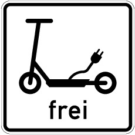
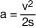
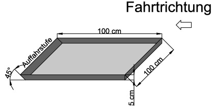
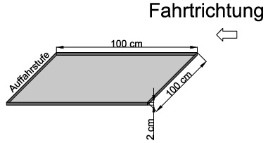
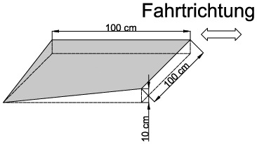
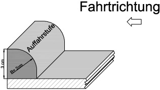

# Verordnung über die Teilnahme von Elektrokleinstfahrzeugen am Straßenverkehr (eKFV)

Ausfertigungsdatum
:   2019-06-06

Fundstelle
:   BGBl I: 2019, 756

Änderung durch
:   Art. 15 G v. 12.7.2021 I 3091 (Nr. 48) textlich nachgewiesen, dokumentarisch noch nicht abschließend bearbeitet

[^F807515_01_BJNR075610019]:     Notifiziert gemäß Richtlinie (EU) 2015/1535 des Europäischen
    Parlaments und des Rates vom 9. September 2015 über ein
    Informationsverfahren auf dem Gebiet der technischen Vorschriften und
    der Vorschriften für die Dienste der Informationsgesellschaft (ABl. L
    241 vom 17.9.2015, S. 1).

## § 1 Anwendungsbereich

(1) Elektrokleinstfahrzeuge im Sinne dieser Verordnung sind
Kraftfahrzeuge mit elektrischem Antrieb und einer bauartbedingten
Höchstgeschwindigkeit von nicht weniger als 6 km/h und nicht mehr als
20 km/h, die folgende Merkmale aufweisen:

1.  Fahrzeug ohne Sitz oder selbstbalancierendes Fahrzeug mit oder ohne
    Sitz,

2.  eine Lenk- oder Haltestange von mindestens 500 mm für Kraftfahrzeuge
    mit Sitz und von mindestens 700 mm für Kraftfahrzeuge ohne Sitz,

3.[^F807515_02_BJNR075610019BJNE000100000]
  eine Nenndauerleistung von nicht mehr als 500 Watt, oder von nicht
    mehr als 1400 Watt, wenn mindestens 60 Prozent der Leistung zur
    Selbstbalancierung verwendet werden. Die Nenndauerleistung ist nach
    dem Verfahren gemäß DIN EN 15194:2018-11
    oder den Anforderungen der Regelung Nr. 85 der Wirtschaftskommission
    der Vereinten Nationen für Europa (UNECE) – Einheitliche Bedingungen
    für die Genehmigung von Verbrennungsmotoren oder elektrischen
    Antriebssystemen für den Antrieb von Kraftfahrzeugen der Klassen M und
    N hinsichtlich der Messung der Nutzleistung und der höchsten
    30-Minuten-Leistung elektrischer Antriebssysteme (ABl. L 323 vom
    7\.11.2014, S. 52) zu bestimmen,

4.  eine Gesamtbreite von nicht mehr als 700 mm, eine Gesamthöhe von nicht
    mehr als 1400 mm und eine Gesamtlänge von nicht mehr als 2000 mm und

5.  eine maximale Fahrzeugmasse ohne Fahrer von nicht mehr als 55 kg.

(2) Ein Elektrokleinstfahrzeug ist selbstbalancierend, wenn es mit
einer integrierten elektronischen Balance-, Antriebs-, Lenk- und
Verzögerungstechnik ausgestattet ist, durch die es eigenständig in
Balance gehalten wird.

(3) Elektrokleinstfahrzeuge im Sinne der Absätze 1 und 2 dürfen nur
nach Maßgabe der folgenden Vorschriften auf öffentlichen Straßen
verwendet werden.

    Die Norm „DIN EN 15194 Fahrräder – Elektromotorisch unterstützte Räder
    – EPAC; Deutsche Fassung EN 15194:2017“ ist beim Beuth Verlag GmbH,
    Berlin, zu beziehen.
[^F807515_02_BJNR075610019BJNE000100000]: 

## § 2 Anforderungen an das Inbetriebsetzen

(1) Ein Elektrokleinstfahrzeug darf auf öffentlichen Straßen nur in
Betrieb gesetzt werden, wenn

1.  es einem Typ entspricht, für den eine Allgemeine Betriebserlaubnis
    erteilt worden ist, oder für das Fahrzeug eine Einzelbetriebserlaubnis
    erteilt worden ist,

2.  es eine gültige Versicherungsplakette für Elektrokleinstfahrzeuge nach
    § 29a der Fahrzeug-Zulassungsverordnung führt,

3.  es entsprechend § 59 Absatz 1 Satz 1, Absatz 1a erster Halbsatz,
    Absatz 1b oder 2 der Straßenverkehrs-Zulassungs-Ordnung mit einer
    Fahrzeug-Identifizierungsnummer sowie einem Fabrikschild mit folgenden
    Maßgaben gekennzeichnet ist:

    a)  als Fahrzeugtyp muss auf dem Fabrikschild „Elektrokleinstfahrzeug“
        angegeben sein,

    b)  anstelle der in § 59 Absatz 1 Satz 1 Nummer 5 und 6 der
        Straßenverkehrs-Zulassungs-Ordnung genannten Angaben muss auf dem
        Fabrikschild die bauartbedingte Höchstgeschwindigkeit und die
        Genehmigungsnummer der Allgemeinen Betriebserlaubnis oder der
        Einzelbetriebserlaubnis für das Fahrzeug angegeben sein, und

4.  es

    a)  den Anforderungen an die Verzögerungseinrichtung nach § 4,

    b)  den Anforderungen an die lichttechnischen Einrichtungen nach § 5
        Absatz 1 Satz 1 und Absatz 3,

    c)  den Anforderungen an die Einrichtung für Schallzeichen nach § 6 Satz 1
        sowie

    d)  den sonstigen Sicherheitsanforderungen nach § 7

    entspricht.

Die Datenbestätigung nach § 20 Absatz 3a Satz 1 bis 3 der
Straßenverkehrs-Zulassungs-Ordnung oder die Bescheinigung über die
Einzelbetriebserlaubnis muss für eine Inbetriebnahme aufbewahrt und
zuständigen Personen auf Verlangen zur Prüfung ausgehändigt werden.

(2) Für Elektrokleinstfahrzeuge richtet sich die Erteilung

1.  einer Allgemeinen Betriebserlaubnis nach den Anforderungen des § 20
    der Straßenverkehrs-Zulassungs-Ordnung,

2.  einer Einzelbetriebserlaubnis nach den Anforderungen des § 21 der
    Straßenverkehrs-Zulassungs-Ordnung.

Die in Satz 1 bezeichneten Erlaubnisse werden erteilt, wenn das
Fahrzeug die Anforderungen des § 1 Absatz 1 und der §§ 4 bis 7
erfüllt.

(3) Für die Wirksamkeit der Allgemeinen Betriebserlaubnis oder der
Einzelbetriebserlaubnis gilt § 19 Absatz 2 und 3 der Straßenverkehrs-
Zulassungs-Ordnung. Ist die Betriebserlaubnis nach § 19 Absatz 2 Satz
2 der Straßenverkehrs-Zulassungs-Ordnung erloschen, so darf das
Elektrokleinstfahrzeug nicht auf öffentlichen Straßen in Betrieb
gesetzt werden.

(4) Der Halter darf die Inbetriebnahme eines Elektrokleinstfahrzeugs
auf öffentlichen Straßen nicht anordnen oder zulassen, wenn das
Elektrokleinstfahrzeug die Voraussetzungen nach Absatz 1 nicht erfüllt
oder die Betriebserlaubnis nach Absatz 3 Satz 2 in Verbindung mit § 19
Absatz 2 Satz 2 der Straßenverkehrs-Zulassungs-Ordnung erloschen ist.

## § 3 Berechtigung zum Führen

Zum Führen eines Elektrokleinstfahrzeugs sind Personen berechtigt, die
das 14. Lebensjahr vollendet haben.

## § 4 Anforderungen an die Verzögerungseinrichtung

(1) Ein Elektrokleinstfahrzeug muss mit zwei voneinander unabhängigen
Bremsen im Sinne des § 65 Absatz 1 Satz 1 der Straßenverkehrs-
Zulassungs-Ordnung ausgerüstet sein, die

1.  das Fahrzeug bis zum Stillstand abbremsen können,

2.  bis zur Maximalgeschwindigkeit wirken,

3.  mindestens einen Verzögerungswert von 3,5 m/s
    2                    erreichen und

4.  jeweils einzeln bei Ausfall der jeweils anderen Bremse eine
    Mindestverzögerung von 44 Prozent der Bremswirkung nach Nummer 3
    erreichen, ohne dass das Kraftfahrzeug seine Spur verlässt.

(2) Ein drei- oder vierrädriges Elektrokleinstfahrzeug muss mit einer
fest angebrachten Einrichtung ausgerüstet sein, die das
Elektrokleinstfahrzeug festzustellen vermag.

## § 5 Anforderungen an die lichttechnischen Einrichtungen

(1) Ein Elektrokleinstfahrzeug muss mit lichttechnischen Einrichtungen
ausgerüstet sein, die den Anforderungen des § 67 Absatz 1 Satz 3 und
5, Absatz 2 Satz 2 bis 7, Absatz 3, Absatz 4 Satz 1 und 4, Absatz 6
Satz 3 der Straßenverkehrs-Zulassungs-Ordnung entsprechen und in einer
amtlich genehmigten Bauart gemäß § 22a Absatz 1 Nummer 22 der
Straßenverkehrs-Zulassungs-Ordnung ausgeführt sind, soweit in den
nachfolgenden Bestimmungen nichts Abweichendes geregelt ist. Die
lichttechnischen Einrichtungen dürfen abnehmbar sein. Als
lichttechnische Einrichtungen gelten auch Leuchtstoffe und
rückstrahlende Mittel. Schlussleuchte und Rückstrahler dürfen in einem
Gerät verbaut sein. Schlussleuchten dürfen zusätzlich mit einer
Bremslichtfunktion für rotes Licht mit einer Lichtstärke und
Lichtverteilung der Bremslichtfunktion entsprechend der Regelung Nr.
50 der Wirtschaftskommission der Vereinten Nationen für Europa (UNECE)
– Einheitliche Bedingungen für die Genehmigung von
Begrenzungsleuchten, Schlussleuchten, Bremsleuchten,
Fahrtrichtungsanzeigern und Beleuchtungseinrichtungen für das hintere
Kennzeichenschild für Fahrzeuge der Klasse L (ABl. L 97 vom 29.3.2014,
S. 1) ausgerüstet sein.

(2) Die Versorgung der Beleuchtungsanlage kann über eine Kopplung an
den Energiespeicher für den Antrieb erfolgen.

(3) Die seitliche Kennzeichnung hat mit gelben Rückstrahlern nach
beiden Seiten wirkend gemäß Nummer 18 der Technischen Anforderungen an
Fahrzeugteile bei der Bauartprüfung nach § 22a StVZO vom 5. Juli 1973
(VkBl. S. 558), die zuletzt durch die Bekanntmachung vom 23. Februar
1994 (VkBl. S. 233) geändert worden ist, oder mit ringförmig
zusammenhängenden retroreflektierenden weißen Streifen an den Reifen
oder Felgen des Vorderrades und des Hinterrades zu erfolgen. Bei
einachsigen Elektrokleinstfahrzeugen reicht die Kennzeichnung der
außenliegenden Räder.

(4) Bei Elektrokleinstfahrzeugen ist die Ausrüstung mit nach vorne und
nach hinten wirkenden Fahrtrichtungsanzeigern entsprechend § 67 Absatz
5 Satz 6 der Straßenverkehrs-Zulassungs-Ordnung zulässig. Zusätzlich

1.  dürfen auch die hinteren Fahrtrichtungsanzeiger mit der Lenkung
    mitschwenken,

2.  darf der Abstand vom hintersten Punkt des Fahrzeugs zu den
    Fahrtrichtungsanzeigern mehr als 300 mm betragen,

3.  darf die maximale Anbauhöhe der vorderen und hinteren
    Fahrtrichtungsanzeiger 1400 mm betragen,

4.  darf bei den hinteren Fahrtrichtungsanzeigern die minimale Anbauhöhe
    150 mm betragen, wenn der Vertikalwinkel der geometrischen
    Sichtbarkeit mindestens 25 Grad über der Horizontalen beträgt.

## § 6 Anforderungen an die Einrichtung für Schallzeichen

Elektrokleinstfahrzeuge müssen mit mindestens einer helltönenden
Glocke, die den Anforderungen des § 64a der Straßenverkehrs-
Zulassungs-Ordnung entspricht, ausgerüstet sein. Es dürfen auch andere
Einrichtungen für Schallzeichen angebracht sein, die der Regelung Nr.
28 der Wirtschaftskommission der Vereinten Nationen für Europa
(UN/ECE) – Einheitliche Vorschriften für die Genehmigung der
Vorrichtungen für Schallzeichen und der Kraftfahrzeuge hinsichtlich
ihrer Schallzeichen (ABl. L 323 vom 6.12.2011, S. 33) – Teil II, für
Fahrzeugklasse L3 mit einer Leistung von nicht mehr als 7 kW, sowie
dem Anhang II der delegierten Verordnung (EU) Nr. 3/2014 der
Kommission vom 24. Oktober 2013 zur Ergänzung der Verordnung (EU) Nr.
168/2013 des Europäischen Parlaments und des Rates hinsichtlich der
Anforderungen an die funktionale Sicherheit von Fahrzeugen für die
Genehmigung von zwei-oder dreirädrigen und vierrädrigen Fahrzeugen
entsprechen.

## § 7 Sonstige Sicherheitsanforderungen

Elektrokleinstfahrzeuge müssen

1.  die Tests entsprechend den Prüfanforderungen und Anforderungen an die
    Fahrdynamik nach der Anlage zu dieser Verordnung erfüllen,

2.  den Anforderungen der Regelung Nr. 10 der Wirtschaftskommission der
    Vereinten Nationen für Europa (UN/ECE) – Einheitliche Bedingungen für
    die Genehmigung der Fahrzeuge hinsichtlich der elektromagnetischen
    Verträglichkeit (ABl. L 254 vom 20.9.2012, S. 1) entsprechen,

3.  den Maßnahmen zum Schutz vor Manipulation gemäß DIN EN 15194:2018-11
    entsprechen,

4.  einen wirksamen Schutz gegen das direkte Berühren aller
    spannungsführenden Bauteile aufweisen,

5.  gegen unbeabsichtigtes Verstellen aller Bedien- und Bauteile gesichert
    sein,

6.  sowohl im Betriebszustand als auch im gegebenenfalls abweichenden
    Transportzustand so beschaffen und ausgerüstet sein, dass sie sicher
    sind, ihr verkehrsüblicher Betrieb niemanden schädigt oder mehr als
    unvermeidbar gefährdet, behindert oder belästigt und der Fahrer
    insbesondere bei Unfällen vor Verletzungen möglichst geschützt ist
    sowie das Ausmaß und die Folgen von Verletzungen möglichst gering
    bleiben,

7.  so beschaffen sein, dass sich das Bedienelement zur Steuerung der
    Motorleistung (zum Beispiel ein Drehgriff oder Knopf) innerhalb einer
    Sekunde selbständig in Nullstellung zurückstellt, wenn der Fahrer es
    loslässt. Abweichend davon muss sich der Fahrzeugantrieb bei
    selbstbalancierenden Fahrzeugen innerhalb einer Sekunde automatisch
    deaktivieren, wenn sich der Fahrer nicht auf dem Fahrzeug befindet.
    Dazu müssen selbstbalancierende Fahrzeuge mit einem System zur
    Zustandserkennung ausgerüstet sein, das erkennt, ob sich der Fahrer
    auf dem Fahrzeug befindet,

8.  so beschaffen sein, dass ihre Batterien den Sicherheitsanforderungen
    des Kapitels 4.2.3 der DIN EN 15194:2018-11 entsprechen,

9.  so beschaffen sein, dass vorhandene Standflächen aufgrund ihrer
    rutschhemmenden Oberfläche ausreichend Halt bieten.

## § 8 Personenbeförderung und Anhängerbetrieb

Die Personenbeförderung sowie der Anhängerbetrieb sind für
Elektrokleinstfahrzeuge nicht gestattet.

## § 9 Anwendung der Straßenverkehrs-Ordnung

Wer ein Elektrokleinstfahrzeug im Straßenverkehr führt, unterliegt den
Vorschriften der Straßenverkehrs-Ordnung nach Maßgabe der
nachfolgenden §§ 10 bis 13.

## § 10 Zulässige Verkehrsflächen

(1) Innerhalb geschlossener Ortschaften dürfen Elektrokleinstfahrzeuge
nur baulich angelegte Radwege, darunter auch gemeinsame Geh- und
Radwege (Zeichen 240 der Anlage 2 zur Straßenverkehrs-Ordnung) und die
dem Radverkehr zugeteilte Verkehrsfläche getrennter Rad- und Gehwege
(Zeichen 241 der Anlage 2 zur Straßenverkehrs-Ordnung), sowie
Radfahrstreifen (Zeichen 237 in Verbindung mit Zeichen 295 der Anlage
2 zur Straßenverkehrs-Ordnung) und Fahrradstraßen (Zeichen 244.1 der
Anlage 2 zur Straßenverkehrs-Ordnung) befahren. Wenn solche nicht
vorhanden sind, darf auf Fahrbahnen oder in verkehrsberuhigten
Bereichen (Zeichen 325.1 der Anlage 3 zur Straßenverkehrs-Ordnung)
gefahren werden. Anlage 3 laufende Nummer 22 Nummer 2 der
Straßenverkehrs-Ordnung findet keine Anwendung.

(2) Außerhalb geschlossener Ortschaften dürfen Elektrokleinstfahrzeuge
nur baulich angelegte Radwege, darunter auch gemeinsame Geh- und
Radwege (Zeichen 240 der Anlage 2 zur Straßenverkehrs-Ordnung) und die
dem Radverkehr zugeteilte Verkehrsfläche getrennter Rad- und Gehwege
(Zeichen 241 der Anlage 2 zur Straßenverkehrs-Ordnung), sowie
Radfahrstreifen (Zeichen 237 in Verbindung mit Zeichen 295 der Anlage
2 zur Straßenverkehrs-Ordnung), Fahrradstraßen (Zeichen 244.1 der
Anlage 2 zur Straßenverkehrs-Ordnung) und Seitenstreifen befahren.
Wenn solche nicht vorhanden sind, darf auf Fahrbahnen gefahren werden.

(3) Für das Befahren von anderen Verkehrsflächen können die
Straßenverkehrsbehörden abweichend von Absatz 1 und 2 Ausnahmen für
bestimmte Einzelfälle oder allgemein für bestimmte Antragsteller
zulassen. Eine allgemeine Zulassung von Elektrokleinstfahrzeugen auf
solchen Verkehrsflächen kann durch Anordnung des Zusatzzeichens

*    *        

*    *   „Elektrokleinstfahrzeuge frei“

bekannt gegeben werden.

## § 11 Allgemeine Verhaltensregeln

(1) Wer ein Elektrokleinstfahrzeug führt, muss einzeln hintereinander
fahren, darf sich nicht an fahrende Fahrzeuge anhängen und nicht
freihändig fahren.

(2) Mit Elektrokleinstfahrzeugen darf von dem Gebot, auf Fahrbahnen
mit mehreren Fahrstreifen möglichst weit rechts zu fahren, nicht
abgewichen werden.

(3) Sind an einem Elektrokleinstfahrzeug keine Fahrtrichtungsanzeiger
vorhanden, so muss wer ein Elektrokleinstfahrzeug führt, die
Richtungsänderung so rechtzeitig und deutlich durch Handzeichen
ankündigen, dass andere Verkehrsteilnehmer ihr Verhalten daran
ausrichten können.

(4) Wer ein Elektrokleinstfahrzeug auf Radverkehrsflächen führt, muss
auf den Radverkehr Rücksicht nehmen und erforderlichenfalls die
Geschwindigkeit an den Radverkehr anpassen. Wer ein
Elektrokleinstfahrzeug führt, muss schnellerem Radverkehr das
Überholen ohne Behinderung ermöglichen. Auf gemeinsamen Geh- und
Radwegen (Zeichen 240 der Anlage 2 zur Straßenverkehrs-Ordnung) haben
Fußgänger Vorrang und dürfen weder behindert noch gefährdet werden.
Erforderlichenfalls muss die Geschwindigkeit an den Fußgängerverkehr
angepasst werden.

(5) Für das Abstellen von Elektrokleinstfahrzeugen gelten die für
Fahrräder geltenden Parkvorschriften entsprechend.

## § 12 Besonderheiten bei angeordneten Verkehrsverboten nach der Straßenverkehrs-Ordnung

(1) Ist ein Verbot für Fahrzeuge aller Art (Zeichen 250 der Anlage 2
zur Straßenverkehrs-Ordnung) angeordnet, so dürfen
Elektrokleinstfahrzeuge dort geschoben werden.

(2) Ist ein Verbot für Kraftwagen (Zeichen 251 der Anlage 2 zur
Straßenverkehrs-Ordnung), ein Verbot für Krafträder (Zeichen 255 der
Anlage 2 zur Straßenverkehrs-Ordnung), ein Verbot für Kraftfahrzeuge
(Zeichen 260 der Anlage 2 zur Straßenverkehrs-Ordnung) oder ein Verbot
der Einfahrt (Zeichen 267 der Anlage 2 zur Straßenverkehrs-Ordnung)
angeordnet, so dürfen Elektrokleinstfahrzeuge dort nur fahren oder
einfahren, wenn dies durch das Zusatzzeichen „Elektrokleinstfahrzeuge
frei“ erlaubt ist.

(3) Ist ein Verbot für den Radverkehr (Zeichen 254 der Anlage 2 zur
Straßenverkehrs-Ordnung) angeordnet, so gilt dies auch für
Elektrokleinstfahrzeuge.

## § 13 Lichtzeichen

Elektrokleinstfahrzeuge unterfallen der Lichtzeichenregelung des § 37
Absatz 2 Nummer 5 und 6 der Straßenverkehrs-Ordnung. Dabei kommt das
Sinnbild „Radverkehr“ zur Anwendung.

## § 14 Ordnungswidrigkeiten

Ordnungswidrig im Sinne des § 24 Absatz 1 des Straßenverkehrsgesetzes
handelt, wer vorsätzlich oder fahrlässig

1.  entgegen § 2 Absatz 1 Satz 1 oder Absatz 3 Satz 2 ein
    Elektrokleinstfahrzeug in Betrieb setzt,

2.  entgegen § 2 Absatz 1 Satz 2 eine dort genannte Bestätigung oder
    Bescheinigung nicht oder nicht rechtzeitig aushändigt,

3.  entgegen § 2 Absatz 4 die Inbetriebnahme anordnet oder zulässt,

4.  entgegen § 8 eine Person befördert oder einen Anhänger betreibt,

5.  entgegen § 10 Absatz 1 Satz 1 oder Absatz 2 Satz 1 eine andere
    Verkehrsfläche befährt,

6.  entgegen § 11 Absatz 1 nicht richtig fährt, sich an ein fahrendes
    Fahrzeug anhängt oder freihändig fährt,

7.  entgegen § 11 Absatz 3 eine Richtungsänderung nicht ankündigt,

8.  entgegen § 11 Absatz 4 Satz 2 schnellerem Radverkehr das Überholen
    nicht ermöglicht oder

9.  entgegen § 11 Absatz 4 Satz 3 einen Fußgänger behindert oder
    gefährdet.

## § 15 Übergangsbestimmungen

(1) Genehmigungen, die bis zum Außerkrafttreten der
Mobilitätshilfenverordnung vom 16. Juli 2009 (BGBl. I S. 2097) erteilt
wurden, bleiben gültig. Genehmigungen auf Basis der außer Kraft
gesetzten Mobilitätshilfenverordnung dürfen nicht geändert werden.

(2) Für Elektrokleinstfahrzeuge, für die eine gültige Genehmigung
durch eine Straßenverkehrsbehörde auf Grundlage anderer Vorschriften
erteilt wurde und die den Anforderungen dieser Verordnung entsprechen,
sind die Vorschriften dieser Verordnung nach ihrem Inkrafttreten
maßgeblich.

(3) Versicherungskennzeichen, die auf Grundlage der
Mobilitätshilfenverordnung vom 16. Juli 2009 (BGBl. I S. 2097) erteilt
wurden, bleiben für das jeweilige Verkehrsjahr gültig.

(4) Das Bundesministerium für Verkehr und digitale Infrastruktur
überprüft die vorliegende Verordnung hinsichtlich ihrer Wirksamkeit,
Zielsetzung und Auswirkungen auf die Verkehrssicherheit, basierend
insbesondere auf den Ergebnissen einer wissenschaftlichen Begleitung.
Auf der Grundlage dieser Evaluierung wird das Bundesministerium für
Verkehr und digitale Infrastruktur gegebenenfalls bis zum 1. September
2023 einen Vorschlag für die Änderung dieser Verordnung vorlegen.

(zu § 7 Nummer 1)

## Anlage Prüfanforderungen und Anforderungen an die Fahrdynamik

(Fundstelle: BGBl. I 2019, 761 - 763)

**1.** **Allgemeine Prüfbedingungen**

1.1 Die Prüfungen sind auf einer Fahrbahn mit ebener, trockener und
    griffiger Beton- oder Asphaltoberfläche durchzuführen. In
    Längsrichtung darf die Prüfstrecke keine größere Steigung als 1 % und
    keine größere Schrägneigung als 3 % aufweisen.

1.2 Die Umgebungstemperatur muss zwischen 0 °C und 45 °C liegen.

1.3 Die Prüfungen dürfen nur stattfinden, wenn die Ergebnisse nicht vom
    Wind beeinflusst werden.

1.4 Bei den Prüfungen muss der Akkuladestand des Fahrzeugs mindestens 75 %
    betragen.

1.5 Bei Luftreifen ist vor den Prüfungen der vom Hersteller für den
    normalen Betrieb vorgesehene Fülldruck einzustellen.

1.6 Die Masse des Fahrzeugs muss der Masse in fahrbereitem Zustand
    entsprechen.

1.7 Bei den Prüfungen ist ein Fahrer mit einer Masse von 70 kg bis 100 kg
    vorzusehen.

**2.** **Prüfverfahren**

2.1 Bauartbedingte Höchstgeschwindigkeit

2.1.1 Zur Ermittlung der bauartbedingten Höchstgeschwindigkeit muss das zu
    prüfende Fahrzeug über eine Strecke von mindestens 50 m mit maximaler
    Antriebsleistung gefahren werden. Dabei ist die gefahrene
    Höchstgeschwindigkeit zu ermitteln. Die Prüfung ist im Anschluss in
    die entgegengesetzte Richtung der Strecke zu wiederholen.

2.1.2 Die Höchstgeschwindigkeit des Fahrzeugs wird in km/h durch eine ganze
    Zahl ausgedrückt, die dem arithmetischen Mittel der bei zwei
    aufeinanderfolgenden Prüfungen in jeweils beiden Fahrtrichtungen
    ermittelten Geschwindigkeitswerte, die nicht mehr als 10 % voneinander
    abweichen dürfen, am nächsten kommt. Liegt das arithmetische Mittel
    genau in der Mitte zwischen zwei ganzen Zahlen, so wird aufgerundet.

2.1.3 Die bei den Prüfungen ermittelte Höchstgeschwindigkeit darf von der
    angegebenen bauartbedingten Höchstgeschwindigkeit nicht mehr als 10 %
    abweichen.

2.1.4 Wenn das Elektrokleinstfahrzeug über einen eigenen
    Geschwindigkeitsmesser mit Anzeige verfügt, so kann dieser hierbei auf
    seine Genauigkeit der Anzeige überprüft werden. Wenn er eine
    Genauigkeit von maximal 10 % Toleranz nach oben und 0 % nach unten
    aufweist, kann dieser fahrzeugeigene Geschwindigkeitsmesser für alle
    weiteren Fahrtests verwendet werden, bei denen die
    Fahrzeuggeschwindigkeit relevant ist.

2.2 Verzögerung

2.2.1 Das Fahrzeug wird auf der Prüfstrecke mit der bauartbedingten
    Höchstgeschwindigkeit geradeaus gefahren. An einem festgelegten Punkt
    wird mit allen Verzögerungseinrichtungen gleichzeitig schnellstmöglich
    bis zum Stillstand maximal verzögert, solange dies ohne
    Sturzgefährdung (z. B. durch ein blockierendes Vorderrad bei
    Einspurfahrzeugen) möglich ist. Bei Sturzgefährdung muss die
    aufgebrachte Bremskraft entsprechend reduziert werden, damit das
    Fahrzeug während des Bremsvorgangs sturzfrei beherrschbar bleibt.

2.2.2 Der benötigte Anhalteweg wird auf zwei Nachkommastellen in Metern
    gemessen.

2.2.3 Die Messung ist in mindestens fünf aufeinanderfolgenden Prüfungen zu
    wiederholen.

2.2.4 Mit der nachfolgenden Formel wird die erreichte
    Durchschnittsverzögerung berechnet. Die Verzögerung des Fahrzeugs wird
    in m/s
    2                    durch eine Dezimalzahl mit einer Nachkommastelle
    ausgedrückt.

    *        *            

    *        *   a

        *   = Durchschnittsverzögerung [m/s
            2                             ]

    *        *   v

        *   = Ausgangsgeschwindigkeit [m/s]

    *        *   s

        *   = Anhalteweg [m]

    Der Wert für die jeweilige Verzögerung wird auf die erste Stelle nach
    dem Komma gerundet.

2.2.5 Zur Überprüfung der Mindestverzögerung bei Ausfall einer
    Bremseinrichtung wird:

    a)  bei unabhängig voneinander bedienbaren Bremsen der obige Fahrversuch
        wiederholt, jedoch mit dem Unterschied, dass jeweils nur eine Bremse
        jeweils in mindestens drei aufeinanderfolgenden Prüfungen betätigt
        wird;

    b)  bei kombinierten Bremseinrichtungen je eine der Bremsen geeignet außer
        Funktion gesetzt und der obige Fahrversuch wiederholt.

2.3 Fahrdynamik

2.3.1 Ergänzend zu Nummer 1.1 muss die Fahrbahn für die Fahrdynamikprüfungen
    jeweils die in den nachfolgenden Prüfungen beschriebenen
    Fahrbahnelemente aufweisen.

2.3.2 In den Prüfungen sind die Fahrbahnelemente jeweils mit der
    bauartbedingten Höchstgeschwindigkeit und mit einer Geschwindigkeit
    von 8*                    2 km/h zu befahren. Zusätzlich sind die
    Fahrbahnelemente bei den Prüfungen 1 und 2 (je nur an den
    Auffahrstufen) und 4 (mit direktem Kontakt des in Fahrtrichtung
    vorderen Rades an die Auffahrstufe/Bordsteinkante) jeweils aus dem
    Stillstand anzufahren.

2.3.3 Das Fahrzeug muss bei jeder Prüfung das jeweilige Fahrbahnelement
    vollständig überfahren und dabei jederzeit für den Fahrenden
    beherrschbar bleiben. Die vom Fahrenden gewünschte Fahrtrichtung muss
    beibehalten werden, wobei eine maximale Abweichung zwischen der Soll-
    und der Ist-Trajektorie von 20 Grad zulässig ist. Selbstbalancierende
    Fahrzeuge müssen während den Prüfungen die Balance einhalten und
    dürfen insbesondere nicht plötzlich die Selbstbalancefunktion
    deaktivieren.

2.3.4 Prüfung 1 (Vertiefung)

2.3.4.1 Aufbau des Fahrbahnelements:

    Eine Vertiefung zur Fahrebene mit den Maßen von mindestens 100 cm x
    100 cm x 5 cm (L x B x H) mit senkrechten Wänden und einer
    Ausfahrrampe im Winkel von 45 Grad.

    *        *            

    *        *   Bild 1: Vertiefung (rechts) mit Ausfahrrampe (links)

2.3.4.2 Mit dem zu prüfenden Fahrzeug ist die Vertiefung gerade über die Kante
    in Richtung Rampe parallel zur eingezeichneten Fahrtrichtung zu
    durchfahren. Bei einem mehrspurigen zu prüfenden Fahrzeug ist die
    Versuchsfahrt zusätzlich mit nur einer Spur durch die Vertiefung zu
    wiederholen.

2.3.5 Prüfung 2 (Ab- und Auffahrstufe)

2.3.5.1 Aufbau des Fahrbahnelements:

    Eine Ab- und Auffahrstufe mit 2 cm Höhendifferenz zur Fahrebene (Größe
    100 cm x 100 cm).

    *        *            

    *        *   Bild 2: Ab- und Auffahrstufe (von rechts nach links)

2.3.5.2 Mit dem zu prüfenden Fahrzeug ist die Vertiefung gerade über die Kante
    in Richtung Auffahrstufe parallel zur eingezeichneten Fahrtrichtung zu
    durchfahren. Bei einem mehrspurigen zu prüfenden Fahrzeug ist die
    Versuchsfahrt zusätzlich mit nur einer Spur durch die Vertiefung zu
    wiederholen.

2.3.6 Prüfung 3 (Einseitige Absenkung)

2.3.6.1 Aufbau des Fahrbahnelements:

    Eine Wegstrecke, auf der die Fahrebene in Fahrtrichtung linksseitig
    auf einer Länge von 100 cm um 10 cm abfällt bzw. rechtsseitig ansteigt
    (einseitige Absenkung bzw. Auffahrt).

    *        *            

    *        *   Bild 3: Einseitige Absenkung

2.3.6.2 Mit dem zu prüfenden Fahrzeug ist die einseitig abfallende Wegstrecke
    ab- und aufwärts parallel zur eingezeichneten Fahrtrichtung zu
    befahren. Das Kantenprofil des Fahrbahnelements mit einer Höhe von 10
    cm muss dabei nicht überfahren werden.

2.3.7 Prüfung 4 (Bordsteinprofil)

2.3.7.1 Aufbau des Fahrbahnelements:

    Eine Bordsteinkante mit Profil wie in Bild 4 dargestellt und einem
    Höhenunterschied zwischen Fahrbahnniveau und Bordsteinoberkante von 3
    cm.

    *        *            

    *        *   Bild 4: Bordsteinprofil

2.3.7.2 Mit dem zu prüfenden Fahrzeug ist die Bordsteinkante aufwärts unter
    einem Winkel von 90 Grad und unter einem Winkel von 45 Grad zu
    überfahren.

2.4 Antriebsdeaktivierung

2.4.1 Das Fahrzeug wird auf der Prüfstrecke mit Schrittgeschwindigkeit
    gefahren. Die fahrende Person steigt bei dieser Geschwindigkeit
    gezielt vom Fahrzeug ab und nimmt die Hände von der Lenk- oder
    Haltestange.

2.4.2 Es muss erkennbar sein, dass der Fahrzeugantrieb innerhalb von 1,0 s
    nach dem Absteigen automatisch deaktiviert wird und das Fahrzeug nicht
    motorisch betrieben weiter- oder losrollt.

2.4.3 Bei selbstbalancierenden Fahrzeugen wird zusätzlich folgender Test
    durchgeführt:

2.4.3.1 Der Prüfer steht neben dem Fahrzeug und schaltet das Fahrzeug in den
    fahrbereiten Zustand. Dann nimmt der Prüfer die Hände vom Fahrzeug und
    lässt es los.

2.4.3.2 Der Fahrzeugantrieb darf nicht aktiviert werden und das Fahrzeug darf
    nicht losfahren.

