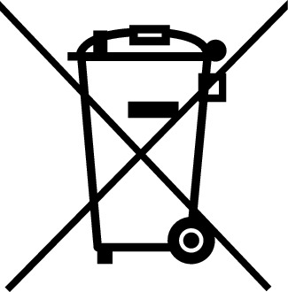

# Gesetz über das Inverkehrbringen, die Rücknahme und die umweltverträgliche Entsorgung von Elektro- und Elektronikgeräten (ElektroG 2015)

Ausfertigungsdatum
:   2015-10-20

Fundstelle
:   BGBl I: 2015, 1739

Stand: Ersetzt G 2129-43 v. 16.3.2005 I 762 (ElektroG)
Zuletzt geändert durch
:   Art. 14 G v. 12.5.2021 I 1087

Änderung durch
:   Art. 1 G v. 20.5.2021 I 1145 (Nr. 25) textlich nachgewiesen, dokumentarisch noch nicht abschließend bearbeitet

Mittelbare änderung durch
:   Art. 19 G v. 12.5.2021 I 1087 ist berücksichtigt

Änderung durch
:   Art. 23 G v. 10.8.2021 I 3436 (Nr. 53) textlich nachgewiesen, dokumentarisch noch nicht abschließend bearbeitet

## Abschnitt 1 - Allgemeine Vorschriften

### § 1 Abfallwirtschaftliche Ziele

Dieses Gesetz legt Anforderungen an die Produktverantwortung nach § 23
des Kreislaufwirtschaftsgesetzes für Elektro- und Elektronikgeräte
fest. Es bezweckt vorrangig die Vermeidung von Abfällen von Elektro-
und Elektronikgeräten und darüber hinaus die Vorbereitung zur
Wiederverwendung, das Recycling und andere Formen der Verwertung
solcher Abfälle, um die zu beseitigende Abfallmenge zu reduzieren und
dadurch die Effizienz der Ressourcennutzung zu verbessern. Um diese
abfallwirtschaftlichen Ziele zu erreichen, soll das Gesetz das
Marktverhalten der Verpflichteten regeln.

### § 2 Anwendungsbereich

(1) Dieses Gesetz gilt für sämtliche Elektro- und Elektronikgeräte.
Sie sind in die folgenden Kategorien unterteilt:

1.  Wärmeüberträger,

2.  Bildschirme, Monitore und Geräte, die Bildschirme mit einer Oberfläche
    von mehr als 100 Quadratzentimetern enthalten,

3.  Lampen,

4.  Geräte, bei denen mindestens eine der äußeren Abmessungen mehr als 50
    Zentimeter beträgt (Großgeräte),

5.  Geräte, bei denen keine der äußeren Abmessungen mehr als 50 Zentimeter
    beträgt (Kleingeräte), und

6.  kleine Geräte der Informations- und Telekommunikationstechnik, bei
    denen keine der äußeren Abmessungen mehr als 50 Zentimeter beträgt.

Elektro- und Elektronikgeräte im Sinne des Satzes 1 sind insbesondere
die in Anlage 1 aufgeführten Geräte.

(2) Dieses Gesetz gilt nicht für folgende Elektro- und
Elektronikgeräte:

1.  Geräte, die der Wahrung der wesentlichen Sicherheitsinteressen der
    Bundesrepublik Deutschland dienen, einschließlich Waffen, Munition und
    Wehrmaterial, die nur für militärische Zwecke bestimmt sind,

2.  Geräte, die

    a)  als Teil eines anderen Gerätes, das vom Geltungsbereich dieses
        Gesetzes ausgenommen ist oder nicht in den Geltungsbereich dieses
        Gesetzes fällt, in dieses eingebaut sind und

    b)  ihre Funktion nur speziell als Teil dieses anderen Gerätes erfüllen
        können,

3.  Glühlampen,

4.  Ausrüstungsgegenstände für einen Einsatz im Weltraum,

5.  ortsfeste industrielle Großwerkzeuge,

6.  ortsfeste Großanlagen; dieses Gesetz gilt jedoch für Geräte, die nicht
    speziell als Teil dieser Anlagen konzipiert und darin eingebaut sind,

7.  Verkehrsmittel zur Personen- und Güterbeförderung; dieses Gesetz gilt
    jedoch für elektrische Zweiradfahrzeuge, für die eine Typgenehmigung
    nicht erforderlich ist,

8.  bewegliche Maschinen,

9.  Geräte, die ausschließlich zu Zwecken der Forschung und Entwicklung
    speziell entworfen wurden und nur auf zwischenbetrieblicher Ebene
    bereitgestellt werden, und

10. medizinische Geräte und In-vitro-Diagnostika, bei denen jeweils zu
    erwarten ist, dass sie vor Ablauf ihrer Lebensdauer infektiös werden,
    und aktive implantierbare medizinische Geräte.

(3) Soweit dieses Gesetz keine abweichenden Vorschriften enthält, sind
das Kreislaufwirtschaftsgesetz, mit Ausnahme von § 17 Absatz 4 und §
54, und diejenigen Rechtsverordnungen in der jeweils geltenden Fassung
anzuwenden, die auf der Grundlage des Kreislaufwirtschaftsgesetzes
oder des bis zum 31. Mai 2012 geltenden Kreislaufwirtschafts- und
Abfallgesetzes erlassen wurden. Die §§ 27, 47 Absatz 1 bis 6, § 50
Absatz 3, § 59 Absatz 1 Satz 1 und Absatz 2 sowie die §§ 60, 62 und 66
des Kreislaufwirtschaftsgesetzes gelten entsprechend.
Rechtsvorschriften, die besondere Anforderungen an die Bewirtschaftung
von Altgeräten oder an die Produktkonzeption enthalten, sowie solche,
die aus Gründen der Sicherheit im Zusammenhang mit der Beförderung
gefährlicher Güter erlassen sind, bleiben unberührt. Die
Nachweispflichten nach § 50 Absatz 1 des Kreislaufwirtschaftsgesetzes
gelten nicht für die Überlassung von Altgeräten an Einrichtungen zur
Erfassung und Erstbehandlung von Altgeräten. Abweichend von Satz 1
gelten § 17 Absatz 4 Satz 1 und § 54 des Kreislaufwirtschaftsgesetzes
für aus Altgeräten ausgebaute Bauteile, Unterbaugruppen und
Verbrauchsmaterialien.

### § 3 Begriffsbestimmungen

Im Sinne dieses Gesetzes sind

1.  Elektro- und Elektronikgeräte:

    Geräte, die für den Betrieb mit Wechselspannung von höchstens 1 000
    Volt oder Gleichspannung von höchstens 1 500 Volt ausgelegt sind und

    a)  zu ihrem ordnungsgemäßen Betrieb von elektrischen Strömen oder
        elektromagnetischen Feldern abhängig sind oder

    b)  der Erzeugung, Übertragung und Messung von elektrischen Strömen und
        elektromagnetischen Feldern dienen;

2.  Geräteart:

    Zusammenfassung von Geräten innerhalb einer Kategorie, die
    hinsichtlich der Art ihrer Nutzung oder ihrer Funktionen vergleichbare
    Merkmale aufweisen;

3.  Altgeräte:

    Elektro- und Elektronikgeräte, die Abfall im Sinne des § 3 Absatz 1
    Satz 1 des Kreislaufwirtschaftsgesetzes sind, einschließlich aller
    Bauteile, Unterbaugruppen und Verbrauchsmaterialien, die zum Zeitpunkt
    des Eintritts der Abfalleigenschaft Teil des Altgerätes sind;

4.  historische Altgeräte:

    a)  Altgeräte, die vor dem 13. August 2005 in Verkehr gebracht wurden,

    b)  Leuchten aus privaten Haushalten und Photovoltaikmodule, die Altgeräte
        sind und vor dem 24. Oktober 2015 in Verkehr gebracht wurden, oder

    c)  Altgeräte, die vor dem 15. August 2018 in Verkehr gebracht wurden,
        soweit sie vom Anwendungsbereich dieses Gesetzes in der Fassung vom
        20\. Oktober 2015 nicht erfasst waren;

5.  Altgeräte aus privaten Haushalten:

    Altgeräte aus privaten Haushaltungen im Sinne des
    Kreislaufwirtschaftsgesetzes sowie Altgeräte aus sonstigen
    Herkunftsbereichen, soweit die Beschaffenheit und Menge der dort
    anfallenden Altgeräte mit der Beschaffenheit und Menge von
    üblicherweise in privaten Haushaltungen anfallenden Altgeräten
    vergleichbar ist; Elektro- und Elektronikgeräte, die potentiell sowohl
    von privaten Haushalten als auch von anderen Nutzern als privaten
    Haushalten genutzt werden, gelten, wenn sie Abfall werden, als
    Altgeräte aus privaten Haushalten;

6.  Anbieten:

    das im Rahmen einer gewerbsmäßigen Tätigkeit auf den Abschluss eines
    Kaufvertrages gerichtete Präsentieren oder öffentliche
    Zugänglichmachen von Elektro- oder Elektronikgeräten im
    Geltungsbereich dieses Gesetzes; dies umfasst auch die Aufforderung,
    ein Angebot abzugeben;

7.  Bereitstellung auf dem Markt:

    jede entgeltliche oder unentgeltliche Abgabe eines Elektro- oder
    Elektronikgerätes zum Vertrieb, Verbrauch oder zur Verwendung im
    Geltungsbereich dieses Gesetzes im Rahmen einer Geschäftstätigkeit;

8.  Inverkehrbringen:

    die erstmalige Bereitstellung eines Elektro- oder Elektronikgerätes
    auf dem Markt im Geltungsbereich dieses Gesetzes; als Inverkehrbringen
    gilt auch die erste Wiederbereitstellung eines Elektro- oder
    Elektronikgerätes auf dem Markt im Geltungsbereich dieses Gesetzes,
    das nach der erstmaligen Bereitstellung auf dem Markt aus dem
    Geltungsbereich des Gesetzes ausgeführt worden war;

9.  Hersteller:

    jede natürliche oder juristische Person oder Personengesellschaft, die
    unabhängig von der Verkaufsmethode, einschließlich der
    Fernkommunikationsmittel im Sinne des § 312c Absatz 2 des Bürgerlichen
    Gesetzbuchs,

    a)  Elektro- oder Elektronikgeräte

        aa) unter ihrem Namen oder ihrer Marke herstellt und innerhalb des
            Geltungsbereiches dieses Gesetzes anbietet oder

        bb) konzipieren oder herstellen lässt und sie unter ihrem Namen oder ihrer
            Marke innerhalb des Geltungsbereiches dieses Gesetzes anbietet,

    b)  Elektro- oder Elektronikgeräte anderer Hersteller unter ihrem eigenen
        Namen oder ihrer Marke im Geltungsbereich dieses Gesetzes anbietet
        oder gewerbsmäßig weiterverkauft, wobei der Anbieter oder
        Weiterverkäufer dann nicht als Hersteller anzusehen ist, wenn der Name
        oder die Marke des Herstellers gemäß Buchstabe a auf dem Gerät
        erscheint,

    c)  erstmals aus einem anderen Mitgliedstaat der Europäischen Union oder
        aus einem Drittland stammende Elektro- oder Elektronikgeräte auf dem
        Markt im Geltungsbereich dieses Gesetzes anbietet oder

    d)  Elektro- oder Elektronikgeräte unter Verwendung von
        Fernkommunikationsmitteln direkt Endnutzern im Geltungsbereich dieses
        Gesetzes anbietet und in einem anderen Mitgliedstaat der Europäischen
        Union oder einem Drittland niedergelassen ist;

    als Hersteller gilt zugleich auch jeder Vertreiber nach Nummer 11, der
    entgegen § 6 Absatz 2 Satz 2 Nummer 1 vorsätzlich oder fahrlässig neue
    Elektro- oder Elektronikgeräte nicht oder nicht ordnungsgemäß
    registrierter Hersteller oder von Herstellern, deren Bevollmächtigte
    nicht oder nicht ordnungsgemäß registriert sind, zum Verkauf anbietet;
    in diesem Fall gilt abweichend von Nummer 8 die Bereitstellung als
    Inverkehrbringen; Nummer 11 bleibt unberührt;

10. Bevollmächtigter:

    jede im Geltungsbereich dieses Gesetzes niedergelassene natürliche
    oder juristische Person oder Personengesellschaft, die ein Hersteller
    ohne Niederlassung im Geltungsbereich dieses Gesetzes beauftragt hat,
    in eigenem Namen sämtliche Aufgaben wahrzunehmen, um die
    Herstellerpflichten nach diesem Gesetz zu erfüllen; Bevollmächtigter
    kann auch ein Hersteller nach Nummer 9 Buchstabe c oder ein Vertreiber
    nach Nummer 11, ein Betreiber eines elektronischen Marktplatzes nach
    Nummer 11b oder ein Fulfilment-Dienstleister nach Nummer 11c sein,
    sofern die Voraussetzungen nach dem ersten Halbsatz vorliegen;

11. Vertreiber:

    jede natürliche oder juristische Person oder Personengesellschaft, die
    Elektro- oder Elektronikgeräte im Geltungsbereich dieses Gesetzes
    anbietet oder auf dem Markt bereitstellt;

11a. elektronischer Marktplatz:

    eine Website oder jedes andere Instrument, mit dessen Hilfe
    Informationen über das Internet zur Verfügung gestellt werden, die
    oder das es Herstellern oder Vertreibern, die nicht Betreiber des
    elektronischen Marktplatzes sind, ermöglicht, Elektro- und
    Elektronikgeräte in eigenem Namen im Geltungsbereich dieses Gesetzes
    anzubieten oder bereitzustellen;

11b. Betreiber eines elektronischen Marktplatzes:

    jede natürliche oder juristische Person oder Personengesellschaft, die
    einen elektronischen Marktplatz unterhält und es Dritten ermöglicht,
    auf diesem Marktplatz Elektro- und Elektronikgeräte im Geltungsbereich
    dieses Gesetzes anzubieten oder bereitzustellen;

11c. Fulfilment-Dienstleister:

    jede natürliche oder juristische Person oder Personengesellschaft, die
    im Rahmen einer Geschäftstätigkeit mindestens zwei der folgenden
    Dienstleistungen im Geltungsbereich dieses Gesetzes anbietet:
    Lagerhaltung, Verpackung, Adressierung oder Versand von Elektro- oder
    Elektronikgeräten, an denen sie kein Eigentumsrecht hat; Post-,
    Paketzustell- oder sonstige Frachtverkehrsdienstleister gelten nicht
    als Fulfilment-Dienstleister;

12. öffentlich-rechtlicher Entsorgungsträger:

    die nach Landesrecht zur Entsorgung verpflichtete juristische Person;

13. Photovoltaikmodule:

    elektrische Vorrichtungen, die zur Verwendung in einem System bestimmt
    sind und zur Erzeugung von Strom aus solarer Strahlungsenergie
    entworfen, zusammengesetzt und installiert werden;

14. Lampen:

    Einrichtungen zur Erzeugung von Licht;

15. Leuchten:

    Geräte zur Verteilung, Filterung oder Umwandlung des von einer oder
    mehreren Lampen übertragenen Lichts, die alle zur Aufnahme, zur
    Fixierung und zum Schutz der Lampen notwendigen Teile und
    erforderlichenfalls Hilfselemente zusammen mit den Vorrichtungen zu
    ihrem Anschluss an die Stromquelle umfassen; dazu gehören alle Lampen,
    sofern diese nicht entfernt werden können, ohne dass die Einheit
    dauerhaft beschädigt wird;

16. ortsfeste industrielle Großwerkzeuge:

    eine groß angelegte Anordnung von industriellen Maschinen, Geräten
    oder Bauteilen mit einer gemeinsamen Funktion für eine bestimmte
    Anwendung, die

    a)  von Fachpersonal dauerhaft an einem bestimmten Ort installiert und
        abgebaut wird und

    b)  von Fachpersonal in einer industriellen Fertigungsanlage oder einer
        Forschungs- und Entwicklungsanlage eingesetzt und instand gehalten
        wird;

17. ortsfeste Großanlagen:

    eine groß angelegte Kombination von Geräten unterschiedlicher Art und
    gegebenenfalls weiterer Einrichtungen, die

    a)  von Fachpersonal montiert, installiert und abgebaut wird,

    b)  dazu bestimmt ist, auf Dauer als Teil eines Gebäudes oder Bauwerks an
        einem vorbestimmten und eigens dafür vorgesehenen Standort betrieben
        zu werden, und

    c)  nur durch die gleichen, speziell konstruierten Geräte ersetzt werden
        kann;

18. bewegliche Maschinen:

    Maschinen mit eigener Energieversorgung, die

    a)  nicht für den Straßenverkehr bestimmt sind,

    b)  ausschließlich bei einer beruflichen Tätigkeit genutzt werden und

    c)  beim Betrieb entweder beweglich sein müssen oder kontinuierlich oder
        halbkontinuierlich zu verschiedenen festen Betriebsorten bewegt werden
        müssen;

19. medizinisches Gerät:

    ein Medizinprodukt im Sinne von Artikel 2 Nummer 1 der Verordnung (EU)
    2017/745 des Europäischen Parlaments und des Rates vom 5. April 2017
    über Medizinprodukte, zur Änderung der Richtlinie 2001/83/EG, der
    Verordnung (EG) Nr. 178/2002 und der Verordnung (EG) Nr. 1223/2009 und
    zur Aufhebung der Richtlinien 90/385/EWG und 93/42/EWG des Rates (ABl.
    L 117 vom 5.5.2017, S. 1; L 117 vom 3.5.2019, S. 9; L 334 vom
    27\.12.2019, S. 165), die durch die Verordnung (EU) 2020/561 (ABl. L
    130 vom 24.4.2020, S. 18) geändert worden ist, in der jeweils
    geltenden Fassung oder Zubehör eines Medizinproduktes im Sinne von
    Artikel 2 Nummer 2 der Verordnung (EU) 2017/745, das ein Elektro- oder
    Elektronikgerät ist;

20. In-vitro-Diagnostikum:

    ein In-vitro-Diagnostikum oder dessen Zubehör im Sinne von § 3 Nummer
    4 oder 9 des Medizinproduktegesetzes in der bis einschließlich 25. Mai
    2021 geltenden Fassung, das ein Elektro- oder Elektronikgerät ist;

21. aktives implantierbares medizinisches Gerät:

    ein aktives implantierbares Medizinprodukt im Sinne von Artikel 2
    Nummer 4 und 5 der Verordnung (EU) 2017/745, das ein Elektro- oder
    Elektronikgerät ist;

22. Erfassung

    die Sammlung sowie die Rücknahme von Altgeräten;

23. Behandlung:

    Tätigkeiten, die nach der Übergabe von Altgeräten an eine Anlage zur
    Vorbereitung zur Wiederverwendung, zur Entfrachtung von Schadstoffen,
    zur Separierung von Wertstoffen, zur Demontage, zum Schreddern, zur
    Verwertung oder zur Vorbereitung der Beseitigung durchgeführt werden,
    sowie sonstige Tätigkeiten, die der Verwertung oder Beseitigung der
    Altgeräte dienen;

24. Erstbehandlung:

    die erste Behandlung von Altgeräten, bei der die Altgeräte

    a)  zur Wiederverwendung vorbereitet oder

    b)  von Schadstoffen entfrachtet und Wertstoffe aus den Altgeräten
        separiert

    werden, einschließlich hierauf bezogener Vorbereitungshandlungen; die
    Erstbehandlung umfasst auch die Verwertungsverfahren R 12 und R 13
    nach Anlage 2 zum Kreislaufwirtschaftsgesetz; die zerstörungsfreie
    Entnahme von Lampen aus Altgeräten bei der Erfassung gilt nicht als
    Erstbehandlung; dies gilt auch für die zerstörungsfreie Entnahme von
    Altbatterien und Altakkumulatoren, die nicht vom Altgerät umschlossen
    sind, und für die zerstörungsfreie Löschung oder Vernichtung von Daten
    auf dem Altgerät;

25. Entfernen:

    die manuelle, mechanische, chemische oder metallurgische Bearbeitung
    von Altgeräten, in deren Folge im Laufe des Behandlungsverfahrens
    gefährliche Stoffe, Gemische oder Bestandteile einen unterscheidbaren
    Stoffstrom oder einen unterscheidbaren Teil eines Stoffstromes bilden;
    Stoffe, Gemische und Bestandteile gelten dann als unterscheidbar, wenn
    sie überwacht werden können, um ihre umweltgerechte Behandlung oder
    Entsorgung zu überprüfen;

26. gefährliche Stoffe oder gefährliche Gemische:

    Stoffe oder Gemische gemäß Artikel 3 der Verordnung (EG) Nr. 1272/2008
    des Europäischen Parlaments und des Rates vom 16. Dezember 2008 über
    die Einstufung, Kennzeichnung und Verpackung von Stoffen und
    Gemischen, zur Änderung und Aufhebung der Richtlinien 67/548/EWG und
    1999/45/EG und zur Änderung der Verordnung (EG) Nr. 1907/2006 (ABl. L
    353 vom 31.12.2008, S. 1), die zuletzt durch die Verordnung (EU) Nr.
    286/2011 (ABl. L 83 vom 30.3.2011, S. 1) geändert worden ist, in ihrer
    jeweils geltenden Fassung.

## Abschnitt 2 - Pflichten beim Inverkehrbringen von Elektro- und Elektronikgeräten

### § 4 Produktkonzeption

(1) Hersteller haben ihre Elektro- und Elektronikgeräte möglichst so
zu gestalten, dass insbesondere die Wiederverwendung, die Demontage
und die Verwertung von Altgeräten, ihren Bauteilen und Werkstoffen
berücksichtigt und erleichtert werden. Elektro- und Elektronikgeräte,
die vollständig oder teilweise mit Batterien oder Akkumulatoren
betrieben werden können, sind möglichst so zu gestalten, dass
Altbatterien und Altakkumulatoren durch Endnutzer problemlos und
zerstörungsfrei entnommen werden können. Sind Altbatterien oder
Altakkumulatoren nicht problemlos durch den Endnutzer entnehmbar, sind
die Elektro- und Elektronikgeräte so zu gestalten, dass die
Altbatterien und Altakkumulatoren problemlos und zerstörungsfrei und
mit handelsüblichem Werkzeug durch vom Hersteller unabhängiges
Fachpersonal entnommen werden können.

(2) Die Hersteller sollen die Wiederverwendung nicht durch besondere
Konstruktionsmerkmale oder Herstellungsprozesse verhindern, es sei
denn, dass die Konstruktionsmerkmale rechtlich vorgeschrieben sind
oder die Vorteile dieser besonderen Konstruktionsmerkmale oder
Herstellungsprozesse überwiegen, beispielsweise im Hinblick auf den
Gesundheitsschutz, den Umweltschutz oder auf Sicherheitsvorschriften.

(3) Absatz 1 Satz 2 und 3 gilt nicht für Elektro- und
Elektronikgeräte, in denen aus Gründen der Sicherheit, der Leistung,
aus medizinischen Gründen oder aus Gründen der Vollständigkeit von
Daten eine ununterbrochene Stromversorgung notwendig und eine ständige
Verbindung zwischen dem Gerät und der Batterie oder dem Akkumulator
erforderlich sind.

(4) Jeder Hersteller hat Elektro- und Elektronikgeräten, die eine
Batterie oder einen Akkumulator enthalten, Angaben beizufügen, welche
den Endnutzer informieren über

1.  den Typ und das chemische System der Batterie oder des Akkumulators
    und

2.  deren oder dessen sichere Entnahme.

Satz 1 gilt nicht für Elektro- und Elektronikgeräte nach Absatz 3.

### § 5 Einrichten der Gemeinsamen Stelle

(1) Die Hersteller oder im Fall der Bevollmächtigung nach § 8 deren
Bevollmächtigte sind verpflichtet, eine Gemeinsame Stelle
einzurichten.

(2) Ist die Gemeinsame Stelle nicht eingerichtet oder nimmt sie ihre
Aufgaben nach § 31 Absatz 5 Satz 1 oder Absatz 7 Satz 1 und 3 nicht
wahr, ist jeder Hersteller oder im Fall der Bevollmächtigung nach § 8
dessen Bevollmächtigter verpflichtet, den öffentlich-rechtlichen
Entsorgungsträgern die Kosten für die Sammlung, Sortierung und
Entsorgung seiner Altgeräte zu erstatten. Die nach Landesrecht
zuständige Behörde setzt die Kosten durch Verwaltungsakt fest.

### § 6 Registrierung

(1) Bevor ein Hersteller Elektro- oder Elektronikgeräte in Verkehr
bringt, ist er oder im Fall der Bevollmächtigung nach § 8 sein
Bevollmächtigter verpflichtet, sich bei der zuständigen Behörde mit
der Geräteart und Marke registrieren zu lassen. Der
Registrierungsantrag muss die Angaben nach Anlage 2 enthalten. Dem
Registrierungsantrag ist oder sind

1.  eine Garantie nach § 7 Absatz 1 Satz 1 oder

2.  eine Glaubhaftmachung nach § 7 Absatz 3 Satz 1 und ein
    Rücknahmekonzept nach § 7a

beizufügen. Der Hersteller oder im Fall der Bevollmächtigung nach § 8
sein Bevollmächtigter hat der zuständigen Behörde Änderungen von im
Registrierungsantrag enthaltenen Daten sowie die dauerhafte Aufgabe
des Inverkehrbringens unverzüglich mitzuteilen.

(2) Hersteller dürfen Elektro- oder Elektronikgeräte nicht in Verkehr
bringen, wenn sie oder im Fall der Bevollmächtigung nach § 8 deren
Bevollmächtigte nicht oder nicht ordnungsgemäß registriert sind. Ist
ein Hersteller oder im Fall der Bevollmächtigung nach § 8 dessen
Bevollmächtigter entgegen Absatz 1 Satz 1 nicht oder nicht
ordnungsgemäß registriert, dürfen

1.  Vertreiber die Elektro- oder Elektronikgeräte dieses Herstellers nicht
    zum Verkauf anbieten,

2.  Betreiber von elektronischen Marktplätzen das Anbieten oder
    Bereitstellen von Elektro- oder Elektronikgeräten dieses Herstellers
    nicht ermöglichen und

3.  Fulfilment-Dienstleister die Lagerhaltung, Verpackung, Adressierung
    oder den Versand in Bezug auf Elektro- oder Elektronikgeräte dieses
    Herstellers nicht vornehmen.

(3) Jeder Hersteller ist verpflichtet, beim Anbieten und auf
Rechnungen seine Registrierungsnummer anzugeben.

### § 7 Finanzierungsgarantie

(1) Jeder Hersteller oder im Fall der Bevollmächtigung nach § 8 dessen
Bevollmächtigter ist verpflichtet, der zuständigen Behörde
kalenderjährlich eine insolvenzsichere Garantie für die Finanzierung
der Rücknahme und Entsorgung der Elektro- und Elektronikgeräte
nachzuweisen, die der Hersteller nach dem 13. August 2005 im
Geltungsbereich dieses Gesetzes in Verkehr bringt oder gebracht hat
und die in privaten Haushalten genutzt werden können. Die Garantie hat
den Rückgriffsanspruch der Gemeinsamen Stelle gemäß § 34 Absatz 2 zu
sichern.

(2) Für die Garantie sind folgende Formen möglich:

1.  eine Bürgschaft auf erstes Anfordern eines Kreditinstituts oder
    Kreditversicherers,

2.  eine Garantie auf erstes Anfordern eines Kreditinstituts oder
    Kreditversicherers,

3.  die Hinterlegung von Geld zur Sicherheitsleistung im Sinne von § 232
    Absatz 1 des Bürgerlichen Gesetzbuchs nach näherer Maßgabe der
    Hinterlegungsgesetze der Länder oder

4.  die Teilnahme an Systemen, die für die Finanzierung der Entsorgung von
    Altgeräten geeignet sind; die Eignung eines solches Systems ist durch
    die zuständige Behörde gemäß § 37 Absatz 6 festzustellen.

Eine Bürgschaft oder Garantie auf erstes Anfordern kann auch
formularmäßig übernommen werden, ohne dass dadurch gegen die §§ 305
bis 310 des Bürgerlichen Gesetzbuchs verstoßen wird.

(3) Absatz 1 gilt nicht für Elektro- oder Elektronikgeräte, für die
der Hersteller oder im Fall der Bevollmächtigung nach § 8 dessen
Bevollmächtigter glaubhaft macht, dass sie ausschließlich in anderen
als privaten Haushalten genutzt werden oder dass solche Geräte
gewöhnlich nicht in privaten Haushalten genutzt werden. Die Pflicht
nach Absatz 1 gilt für Hersteller von Elektro- und Elektronikgeräten,
die nicht vom Anwendungsbereich des Elektro- und
Elektronikgerätegesetzes vom 16. März 2005 (BGBl. I S. 762), das
zuletzt durch Artikel 14 des Gesetzes vom 20. September 2013 (BGBl. I
S. 3642) geändert worden ist, erfasst waren, oder im Fall der
Bevollmächtigung nach § 8 für ihre Bevollmächtigten nur in Bezug auf
Geräte, die nach dem 24. Oktober 2015 in Verkehr gebracht wurden oder
werden. Für Hersteller von Elektro- und Elektronikgeräten, die ab dem
15\. August 2018 in den Anwendungsbereich dieses Gesetzes fallen, oder
im Fall der Bevollmächtigung nach § 8 deren Bevollmächtigte gilt
Absatz 1 in Bezug auf Geräte, die nach diesem Zeitpunkt in Verkehr
gebracht werden.

(4) Der Hersteller darf die Kosten für die Entsorgung von Elektro- und
Elektronikgeräten gegenüber dem Endkunden nicht ausweisen.

### § 7a Rücknahmekonzept

(1) Jeder Hersteller oder im Fall der Bevollmächtigung nach § 8 jeder
Bevollmächtigte ist verpflichtet, der zuständigen Behörde für die
Rücknahme und Entsorgung der Elektro- und Elektronikgeräte, für die er
glaubhaft macht, dass sie ausschließlich in anderen als privaten
Haushalten genutzt werden oder dass solche Geräte gewöhnlich nicht in
privaten Haushalten genutzt werden, ein Rücknahmekonzept vorzulegen.

(2) Das Rücknahmekonzept muss je Geräteart die folgenden Angaben
enthalten:

1.  eine Erklärung über die durch den Hersteller oder im Fall der
    Bevollmächtigung nach § 8 durch den Bevollmächtigten erfolgte
    Einrichtung von Rückgabemöglichkeiten, die den Anforderungen des § 19
    Absatz 1 Satz 1 entsprechen,

2.  im Fall der Beauftragung eines Dritten: Name und Adresse des Dritten,

3.  die Möglichkeit der Endnutzer, auf die Rückgabemöglichkeiten nach
    Nummer 1 zuzugreifen.

(3) Änderungen am Rücknahmekonzept sind der zuständigen Behörde
unverzüglich durch den Hersteller oder im Fall der Bevollmächtigung
nach § 8 durch den Bevollmächtigten mitzuteilen.

### § 8 Niederlassungspflicht, Beauftragung und Benennung eines Bevollmächtigten

(1) Ein Hersteller im Sinne von § 3 Nummer 9 Buchstabe a bis c, der
keine Niederlassung im Geltungsbereich dieses Gesetzes hat, muss einen
Bevollmächtigten beauftragen. Jeder Hersteller darf nur einen
Bevollmächtigten beauftragen. Die Beauftragung hat schriftlich und in
deutscher Sprache zu erfolgen und muss mindestens drei Monate wirksam
sein.

(2) Ein Hersteller im Sinne von § 3 Nummer 9 Buchstabe d ist
verpflichtet, einen Bevollmächtigten entsprechend Absatz 1 Satz 2 und
3 zu beauftragen.

(3) Der Hersteller hat den Bevollmächtigten der zuständigen Behörde
unverzüglich zu benennen. Bei der Benennung ist eine Kopie der
Beauftragung beizufügen. Die Benennung bedarf der Bestätigung durch
die zuständige Behörde. Sie darf nur erteilt werden, wenn die
Voraussetzungen nach Absatz 1 vorliegen und im Fall von bereits 20
demselben Bevollmächtigten erteilten Registrierungen die zuständige
Behörde den Bevollmächtigten gemäß § 37 Absatz 7 zugelassen hat. Der
Hersteller hat der zuständigen Behörde Änderungen der Beauftragung
oder Berichtigungen der Angaben unverzüglich mitzuteilen.

(4) Wird die Beauftragung des Bevollmächtigten beendet, hat der
Hersteller dies der zuständigen Behörde unverzüglich mitzuteilen. Die
Benennung endet, sobald die zuständige Behörde das Ende der
Beauftragung bestätigt. Die Pflicht des Bevollmächtigten zur Erfüllung
der während der Zeit seiner Benennung entstandenen Herstellerpflichten
bleibt unberührt. Ein Hersteller, dem die Beendigung der Benennung
durch die zuständige Behörde bestätigt wurde, hat die von ihm
belieferten Hersteller nach § 3 Nummer 9 Buchstabe c und Vertreiber
unverzüglich über das Ende der Benennung eines Bevollmächtigten zu
informieren. Solange die Benennung eines Bevollmächtigten nicht
erfolgt, obliegen die Verpflichtungen des Herstellers dem im Inland
niedergelassenen Hersteller nach § 3 Nummer 9 Buchstabe c.

(5) Eine natürliche oder juristische Person oder Personengesellschaft,
die im Geltungsbereich dieses Gesetzes niedergelassen ist und Geräte
gewerbsmäßig unter Verwendung von Fernkommunikationsmitteln in einem
anderen Mitgliedstaat der Europäischen Union, in dem sie nicht
niedergelassen ist, unmittelbar für Endnutzer bereitstellt, ist
verpflichtet, vor der Bereitstellung auf dem Markt dieses
Mitgliedstaates eine dort niedergelassene natürliche oder juristische
Person oder Personengesellschaft zu bevollmächtigen, die dort für die
Erfüllung ihrer Pflichten nach der Richtlinie 2012/19/EU des
Europäischen Parlaments und des Rates vom 4. Juli 2012 über Elektro-
und Elektronik-Altgeräte (ABl. L 197 vom 24.7.2012, S. 38)
verantwortlich ist.

### § 9 Kennzeichnung

(1) Elektro- und Elektronikgeräte, die nach den in § 3 Nummer 4
genannten Zeitpunkten in Verkehr gebracht werden, sind vor dem
Inverkehrbringen auf dem europäischen Markt dauerhaft so zu
kennzeichnen, dass der Hersteller eindeutig zu identifizieren ist und
festgestellt werden kann, dass das Gerät nach dem jeweiligen in § 3
Nummer 4 genannten Zeitpunkt erstmals auf dem europäischen Markt in
Verkehr gebracht wurde.

(2) Die Geräte nach Absatz 1 sind außerdem mit dem Symbol nach Anlage
3 dauerhaft zu kennzeichnen. Sofern es in Ausnahmefällen auf Grund der
Größe oder der Funktion des Elektro- oder Elektronikgerätes
erforderlich ist, ist das Symbol statt auf dem Gerät auf die
Verpackung, die Gebrauchsanweisung oder den Garantieschein für das
Elektro- oder Elektronikgerät aufzudrucken. Satz 2 gilt auch für die
Kennzeichnung mit Blick auf den Zeitpunkt des Inverkehrbringens nach
Absatz 1, sofern die Kennzeichnung gemeinsam mit dem Symbol nach Satz
1 erfolgt.

## Abschnitt 3 - Sammlung und Rücknahme

### § 10 Getrennte Erfassung

(1) Besitzer von Altgeräten haben diese einer vom unsortierten
Siedlungsabfall getrennten Erfassung zuzuführen. Sie haben
Altbatterien und Altakkumulatoren, die nicht vom Altgerät umschlossen
sind, sowie Lampen, die zerstörungsfrei aus dem Altgerät entnommen
werden können, vor der Abgabe an einer Erfassungsstelle vom Altgerät
zerstörungsfrei zu trennen. Satz 2 gilt nicht, soweit nach § 14 Absatz
4 Satz 4 oder Absatz 5 Satz 2 und 3 Altgeräte separiert werden, um sie
für die Wiederverwendung vorzubereiten.

(2) Die Erfassung nach Absatz 1 hat so zu erfolgen, dass die spätere
Vorbereitung zur Wiederverwendung, die Demontage und das Recycling
nicht behindert und Brandrisiken minimiert werden.

(3) Ab dem 1. Januar 2019 soll das Gesamtgewicht der erfassten
Altgeräte in jedem Kalenderjahr mindestens 65 Prozent des
Durchschnittsgewichts der Elektro- und Elektronikgeräte, die in den
drei Kalendervorjahren in Verkehr gebracht wurden, betragen.

### § 11 Verordnungsermächtigungen

Die Bundesregierung wird ermächtigt, durch Rechtsverordnung mit
Zustimmung des Bundesrates

1.  weiter gehende Anforderungen an die Durchführung und Organisation der
    getrennten Erfassung von Altgeräten, die zur Wiederverwendung
    vorbereitet werden sollen, und

2.  Anforderungen an die Zertifizierung von Betrieben, die Altgeräte zur
    Wiederverwendung vorbereiten,

festzulegen.

### Unterabschnitt 1 - Sammlung und Rücknahme von Altgeräten aus privaten Haushalten

#### § 12 Berechtigte für die Erfassung von Altgeräten aus privaten Haushalten

(1) Die Erfassung von Altgeräten aus privaten Haushalten darf nur von
öffentlich-rechtlichen Entsorgungsträgern, Vertreibern, Herstellern
oder im Fall der Bevollmächtigung nach § 8 deren Bevollmächtigten
sowie von Betreibern von nach § 21 zertifizierten
Erstbehandlungsanlagen vorgenommen werden. Die nach Satz 1 zur
Erfassung Berechtigten dürfen für die Sammlung und Rücknahme auch
Dritte beauftragen.

(2) Die Berechtigten nach Absatz 1 haben gegenüber den Endnutzern ihre
Sammel- und Rücknahmestellen durch die von der Gemeinsamen Stelle
gemäß § 31 Absatz 1 Satz 5 entworfene einheitliche Kennzeichnung
kenntlich zu machen.

#### § 13 Sammlung durch die öffentlich-rechtlichen Entsorgungsträger

(1) Die öffentlich-rechtlichen Entsorgungsträger richten im Rahmen
ihrer Pflichten nach § 20 des Kreislaufwirtschaftsgesetzes
Sammelstellen ein, an denen Altgeräte aus privaten Haushalten ihres
Gebietes angeliefert werden können (Bringsystem). § 14 Absatz 2 gilt
entsprechend. Altgeräte aus privaten Haushalten, die von
Gewerbetreibenden oder Vertreibern angeliefert werden, gelten als
Altgeräte aus privaten Haushalten des Gebietes des öffentlich-
rechtlichen Entsorgungsträgers, in dem der Gewerbetreibende oder
Vertreiber seine Niederlassung hat.

(2) Die öffentlich-rechtlichen Entsorgungsträger können die Annahme an
einzelnen Sammelstellen auf bestimmte Altgerätegruppen nach § 14
Absatz 1 Satz 1 beschränken, wenn dies aus Platzgründen unter
Berücksichtigung der sonstigen Wertstofferfassung im Einzelfall
notwendig ist und die Erfassung aller Altgerätegruppen nach § 14
Absatz 1 Satz 1 im Entsorgungsgebiet des öffentlich-rechtlichen
Entsorgungsträgers sichergestellt ist.

(3) Die öffentlich-rechtlichen Entsorgungsträger können die Altgeräte
auch bei den privaten Haushalten abholen (Holsystem). Die Anzahl der
Sammelstellen oder die Kombination mit Holsystemen ist unter
Berücksichtigung der jeweiligen Bevölkerungsdichte, der sonstigen
örtlichen Gegebenheiten und der abfallwirtschaftlichen Ziele nach den
§§ 1 und 10 Absatz 3 festzulegen.

(4) Bei der Anlieferung von Altgeräten darf kein Entgelt erhoben
werden.

(5) Die öffentlich-rechtlichen Entsorgungsträger können die kostenlose
Annahme von Altgeräten ablehnen, die auf Grund einer Verunreinigung
eine Gefahr für die Gesundheit und Sicherheit von Menschen darstellen.
Satz 1 gilt insbesondere, sofern asbesthaltige Nachtspeicherheizgeräte
nicht ordnungsgemäß durch Fachpersonal abgebaut und verpackt wurden
oder beschädigt beim öffentlich-rechtlichen Entsorgungsträger
angeliefert werden. Bei Anlieferungen von mehr als 20 Geräten der
Gruppen 1, 4 und 6 nach § 14 Absatz 1 Satz 1 sind Anlieferungsort und
-zeitpunkt vorab mit dem öffentlich-rechtlichen Entsorgungsträger
abzustimmen. Die Überlassungspflichten privater Haushaltungen nach §
17 Absatz 1 Satz 1 des Kreislaufwirtschaftsgesetzes und die
Entsorgungspflichten der öffentlich-rechtlichen Entsorgungsträger für
Abfälle aus privaten Haushaltungen nach § 20 Absatz 1 und 3 des
Kreislaufwirtschaftsgesetzes bleiben von den Sätzen 1 und 2 unberührt.

#### § 14 Bereitstellen der abzuholenden Altgeräte durch die öffentlich-rechtlichen Entsorgungsträger

(1) Die öffentlich-rechtlichen Entsorgungsträger stellen die von den
Herstellern oder im Fall der Bevollmächtigung nach § 8 von deren
Bevollmächtigten abzuholenden Altgeräte an von ihnen eingerichteten
Übergabestellen in folgenden Gruppen in geeigneten Behältnissen
unentgeltlich bereit:

1.  Gruppe 1: Wärmeüberträger,

2.  Gruppe 2: Bildschirme, Monitore und Geräte, die Bildschirme mit einer
    Oberfläche von mehr als 100 Quadratzentimetern enthalten,

3.  Gruppe 3: Lampen,

4.  Gruppe 4: Großgeräte,

5.  Gruppe 5: Kleingeräte und kleine Geräte der Informations- und
    Telekommunikationstechnik,

6.  Gruppe 6: Photovoltaikmodule.

In der Gruppe 4 sind Nachtspeicherheizgeräte, die Asbest oder
sechswertiges Chrom enthalten, und in den Gruppen 2, 4 und 5
batteriebetriebene Altgeräte getrennt von den anderen Altgeräten in
einem eigenen Behältnis zu sammeln.

(2) Die Behältnisse müssen so befüllt werden, dass ein Zerbrechen der
Altgeräte, eine Freisetzung von Schadstoffen und die Entstehung von
Brandrisiken vermieden werden. Die Altgeräte dürfen in den
Behältnissen nicht mechanisch verdichtet werden. Die Einsortierung der
Altgeräte, insbesondere der batteriebetriebenen Altgeräte, in die
Behältnisse nach Absatz 1 hat an den eingerichteten Übergabestellen
durch den öffentlich-rechtlichen Entsorgungsträger oder unter seiner
Aufsicht zu erfolgen.

(3) Die öffentlich-rechtlichen Entsorgungsträger melden der
Gemeinsamen Stelle die zur Abholung bereitgestellten Behältnisse, wenn
bei den Gruppen 1, 4 und 5 eine Abholmenge von mindestens 30
Kubikmetern pro Gruppe, bei der Gruppe 2 eine Abholmenge von
mindestens 20 Kubikmetern, bei Nachtspeicherheizgeräten in der Gruppe
4 und bei batteriebetriebenen Altgeräten der Gruppen 2, 4 und 5 eine
Abholmenge von mindestens fünf Kubikmetern, bei der Gruppe 3 eine
Abholmenge von mindestens drei Kubikmetern und bei der Gruppe 6 eine
Abholmenge von mindestens zweieinhalb Kubikmetern erreicht ist. Wenn
bei der Gruppe 4 ein Behältnis mit Nachtspeicherheizgeräten zur
Abholung bereitgestellt wird, ist dies der Gemeinsamen Stelle bei der
Meldung nach Satz 1 mitzuteilen.

(4) An der Sammelstelle sind eine Separierung von Altgeräten, eine
nachträgliche Entnahme aus den Behältnissen sowie die Entfernung von
Bauteilen aus oder von den Altgeräten unzulässig. Eine Veränderung des
Inhalts der Behältnisse bis zum Eintreffen bei der
Erstbehandlungsanlage ist unzulässig. Absatz 1 Satz 2 bleibt von dem
Verbot nach Satz 1 unberührt. Die Sätze 1 und 2 gelten nicht, wenn die
Altgeräte im Rahmen einer Kooperation nach § 17b einer
Erstbehandlungsanlage zum Zwecke der Vorbereitung zur Wiederverwendung
überlassen werden.

(5) Ein nach Landesrecht für die Verwertung und Beseitigung von
Altgeräten zuständiger öffentlich-rechtlicher Entsorgungsträger kann
sämtliche Altgeräte einer Gruppe für jeweils mindestens zwei Jahre von
der Bereitstellung zur Abholung ausnehmen (Optierung). Abweichend von
Absatz 4 Satz 1 ist im Fall der Optierung eine Separierung von
Altgeräten in der optierten Gruppe zulässig. Er hat die Altgeräte nach
Satz 1 zur Wiederverwendung vorzubereiten oder nach § 20 Absatz 2 bis
4 und § 22 Absatz 1 zu behandeln und zu verwerten.

#### § 15 Aufstellen von Behältnissen durch die Hersteller oder deren Bevollmächtigte

(1) Die Hersteller oder im Fall der Bevollmächtigung nach § 8 deren
Bevollmächtigte müssen die Behältnisse nach § 14 unentgeltlich
aufstellen und abdecken. Satz 1 gilt nicht im Fall des § 14 Absatz 5.
Die öffentlich-rechtlichen Entsorgungsträger können das Aufstellen
nicht abdeckbarer Behältnisse ablehnen und melden die Ablehnung der
zuständigen Behörde. In diesem Fall gilt das Behältnis als nicht
aufgestellt.

(2) Die Behältnisse, außer denen für die Gruppen 3 und 6, müssen für
die Aufnahme durch herkömmliche Abholfahrzeuge geeignet sein; Absatz 6
bleibt unberührt.

(3) Die Behältnisse müssen so beschaffen sein, dass die dort
enthaltenen Altgeräte bruchsicher gesammelt werden können.

(4) Die zuständige Behörde trifft die im Einzelfall erforderlichen
Anordnungen, um sicherzustellen, dass den öffentlich-rechtlichen
Entsorgungsträgern die erforderliche Menge an Behältnissen zur
Verfügung steht; hierbei berücksichtigt sie die von ihr geprüften
Berechnungen der Gemeinsamen Stelle nach § 31 Absatz 8. Hierzu melden
die öffentlich-rechtlichen Entsorgungsträger der Gemeinsamen Stelle
die erforderliche Anzahl der aufzustellenden Behältnisse. Erfolgt die
Aufstellung nicht bis zur von der zuständigen Behörde festgesetzten
Frist, gilt eine Nachfrist bis zum Ablauf des folgenden Werktages.

(5) Im Fall des § 14 Absatz 5 gelten Absatz 1 Satz 1 und Absatz 3 für
die öffentlich-rechtlichen Entsorgungsträger entsprechend.

(6) Die Bundesregierung wird ermächtigt durch Rechtsverordnung mit
Zustimmung des Bundesrates weitergehende Anforderungen an die
Behältnisse, in denen die Altgeräte gesammelt und transportiert werden
sollen, festzulegen.

#### § 16 Rücknahmepflicht der Hersteller

(1) Der Hersteller oder im Fall der Bevollmächtigung nach § 8 dessen
Bevollmächtigter ist verpflichtet, die nach § 14 Absatz 1 Satz 1
bereitgestellten Behältnisse entsprechend der Zuweisung der
zuständigen Behörde nach § 38 Absatz 3 Satz 1 unverzüglich abzuholen,
spätestens jedoch mit Ablauf der Nachfrist nach § 38 Absatz 3 Satz 2.
Für die Abholung der zugewiesenen Behältnisse gelten Absatz 5 Satz 1
und § 13 Absatz 5 Satz 1 entsprechend.

(2) Der Hersteller oder im Fall der Bevollmächtigung nach § 8 dessen
Bevollmächtigter ist verpflichtet, die nach Absatz 1 abgeholten
Altgeräte oder deren Bauteile zur Wiederverwendung vorzubereiten oder
nach § 20 Absatz 2 bis 4 und § 22 Absatz 1 zu behandeln und zu
verwerten.

(3) Der Hersteller oder im Fall der Bevollmächtigung nach § 8 dessen
Bevollmächtigter ist verpflichtet, nach Abholung der Behältnisse nach
Absatz 1 entsprechend der Anordnung der zuständigen Behörde nach § 15
Absatz 4 Satz 1 unverzüglich leere Behältnisse aufzustellen,
spätestens jedoch mit Ablauf der Nachfrist nach § 15 Absatz 4 Satz 3.

(4) Der Hersteller oder im Fall der Bevollmächtigung nach § 8 dessen
Bevollmächtigter ist verpflichtet, die Kosten der Abholung, der
Entsorgung und des Aufstellens leerer Behältnisse zu tragen.

(5) Die Hersteller oder im Fall der Bevollmächtigung nach § 8 deren
Bevollmächtigte können freiwillig individuelle oder kollektive
Rücknahmesysteme für die unentgeltliche Rückgabe von Altgeräten aus
privaten Haushalten einrichten und betreiben, sofern diese Systeme im
Einklang mit den Zielen nach § 1 stehen. Absatz 2 gilt entsprechend.
Rücknahmestellen dieser Rücknahmesysteme dürfen weder an Sammel- noch
an Übergabestellen der öffentlich-rechtlichen Entsorgungsträger nach §
13 Absatz 1 eingerichtet und betrieben werden. Bei der Rücknahme nach
Satz 1 gilt § 14 Absatz 2 entsprechend.

#### § 17 Rücknahmepflicht der Vertreiber

(1) Vertreiber mit einer Verkaufsfläche für Elektro- und
Elektronikgeräte von mindestens 400 Quadratmetern sowie Vertreiber von
Lebensmitteln mit einer Gesamtverkaufsfläche von mindestens 800
Quadratmetern, die mehrmals im Kalenderjahr oder dauerhaft Elektro-
und Elektronikgeräte anbieten und auf dem Markt bereitstellen, sind
verpflichtet,

1.  bei der Abgabe eines neuen Elektro- oder Elektronikgerätes an einen
    Endnutzer ein Altgerät des Endnutzers der gleichen Geräteart, das im
    Wesentlichen die gleichen Funktionen wie das neue Gerät erfüllt, am
    Ort der Abgabe oder in unmittelbarer Nähe hierzu unentgeltlich
    zurückzunehmen und

2.  auf Verlangen des Endnutzers Altgeräte, die in keiner äußeren
    Abmessung größer als 25 Zentimeter sind, im Einzelhandelsgeschäft oder
    in unmittelbarer Nähe hierzu unentgeltlich zurückzunehmen; die
    Rücknahme darf nicht an den Kauf eines Elektro- oder Elektronikgerätes
    geknüpft werden und ist auf drei Altgeräte pro Geräteart beschränkt.

Ort der Abgabe im Sinne von Satz 1 Nummer 1 ist auch der private
Haushalt, sofern dort durch Auslieferung die Abgabe erfolgt; in diesem
Fall ist die Abholung des Altgerätes für den Endnutzer unentgeltlich
auszugestalten. Der Vertreiber hat im Fall des Satzes 2 beim Abschluss
des Kaufvertrages für das neue Elektro- oder Elektronikgerät den
Endnutzer

1.  zu informieren über die Möglichkeit

    a)  zur unentgeltlichen Rückgabe nach Satz 1 Nummer 1 und

    b)  der unentgeltlichen Abholung des Altgerätes nach Satz 2 und

2.  nach seiner Absicht zu befragen, bei der Auslieferung des neuen Geräts
    ein Altgerät zurückzugeben.

(2) Absatz 1 gilt auch bei einem Vertrieb unter Verwendung von
Fernkommunikationsmitteln. Absatz 1 Satz 2 gilt mit der Maßgabe, dass
die unentgeltliche Abholung auf Elektro- und Elektronikgeräte der
Kategorien 1, 2 und 4 beschränkt ist. Als Verkaufsfläche im Sinne von
Absatz 1 Satz 1 erste Alternative gelten in diesem Fall alle Lager-
und Versandflächen für Elektro- und Elektronikgeräte, als
Gesamtverkaufsfläche im Sinne von Absatz 1 Satz 1 zweite Alternative
gelten in diesem Fall alle Lager- und Versandflächen. Die Rücknahme im
Fall eines Vertriebs unter Verwendung von Fernkommunikationsmitteln
ist im Fall des Absatzes 1 Satz 1 Nummer 1 für Elektro- und
Elektronikgeräte der Kategorien 3, 5 und 6 und Nummer 2 durch
geeignete Rückgabemöglichkeiten in zumutbarer Entfernung zum
jeweiligen Endnutzer zu gewährleisten.

(3) Unbeschadet der Pflichten aus den Absätzen 1 und 2 dürfen
Vertreiber Altgeräte freiwillig unentgeltlich zurücknehmen.

(4) § 13 Absatz 5 Satz 1 gilt für die Rücknahme nach den Absätzen 1
bis 3 entsprechend. Die Rücknahme durch die Vertreiber darf weder an
Sammel- noch an Übergabestellen der öffentlich-rechtlichen
Entsorgungsträger nach § 13 Absatz 1 erfolgen. Bei der Rücknahme nach
den Absätzen 1 bis 3 gilt § 14 Absatz 2 Satz 1 entsprechend. An der
Rücknahmestelle ist die Entfernung von Bauteilen aus oder von den
Altgeräten unzulässig; dies gilt nicht für die Entnahme von
Altbatterien und Altakkumulatoren sowie von Lampen. Soweit die
Vertreiber im Rahmen einer freiwilligen Rücknahme nach Absatz 3
zusätzlich zur Rücknahme nach den Absätzen 1 und 2 eine Abholleistung
beim privaten Haushalt anbieten, können sie für diese ein Entgelt
verlangen.

(5) Übergeben die Vertreiber zurückgenommene Altgeräte oder deren
Bauteile nicht den Herstellern, im Fall der Bevollmächtigung nach § 8
deren Bevollmächtigten oder den öffentlich-rechtlichen
Entsorgungsträgern, sind sie verpflichtet, die Altgeräte zur
Wiederverwendung vorzubereiten oder nach § 20 Absatz 2 bis 4 und § 22
Absatz 1 zu behandeln und zu verwerten. Für die Übergabe, Behandlung
und Entsorgung von Altgeräten nach Satz 1 darf der Vertreiber kein
Entgelt von privaten Haushalten verlangen.

#### § 17a Rücknahme durch zertifizierte Erstbehandlungsanlagen

(1) Betreiber von nach § 21 zertifizierten Erstbehandlungsanlagen
können sich freiwillig an der Rücknahme von Altgeräten beteiligen.
Macht ein Betreiber einer Erstbehandlungsanlage von dieser Möglichkeit
Gebrauch,

1.  hat er hierfür Rücknahmestellen einzurichten und

2.  darf er bei der Anlieferung von Altgeräten durch den Endnutzer kein
    Entgelt erheben.

Die Rücknahme ist auf solche Altgeräte zu beschränken, für deren
Behandlung das Zertifikat nach § 21 erteilt wurde.

(2) Die Rücknahme nach Absatz 1 darf weder an Sammel- noch an
Übergabestellen der öffentlich-rechtlichen Entsorgungsträger nach § 13
Absatz 1 erfolgen. § 14 Absatz 2 gilt entsprechend. Sofern der
Betreiber der Erstbehandlungsanlage im Rahmen der Rücknahme auch eine
Abholleistung beim privaten Haushalt anbietet, kann er für diese
Leistung ein Entgelt verlangen.

(3) Der Betreiber der Erstbehandlungsanlage ist verpflichtet, die nach
Absatz 1 zurückgenommenen Altgeräte oder deren Bauteile für die
Wiederverwendung vorzubereiten oder nach § 20 Absatz 2 bis 4 und § 22
Absatz 1 zu behandeln und zu verwerten.

#### § 17b Kooperation zwischen öffentlich-rechtlichen Entsorgungsträgern und zertifizierten Erstbehandlungsanlagen

(1) Öffentlich-rechtliche Entsorgungsträger und Betreiber von
Erstbehandlungsanlagen, die nach § 21 Absatz 2 und 4 für die
Vorbereitung zur Wiederverwendung zertifiziert sind, können zum Zweck
der Vorbereitung zur Wiederverwendung von Altgeräten eine Kooperation
vereinbaren.

(2) Die Vereinbarung muss folgende Angaben enthalten:

1.  Angaben zur Auswahl der geeigneten Altgeräte und

2.  Angaben zum Zugangsrecht von Beschäftigten der Erstbehandlungsanlage
    zur Sammelstelle des öffentlich-rechtlichen Entsorgungsträgers.

(3) Wenn eine Vereinbarung nach Absatz 1 vorliegt, hat der öffentlich-
rechtliche Entsorgungsträger die Altgeräte, die nach Durchführung der
Prüfung nach § 20 Absatz 1 Satz 2 für die Vorbereitung zur
Wiederverwendung konkret geeignet sind, dem Betreiber der
Erstbehandlungsanlage unentgeltlich zu überlassen. Der Betreiber der
Erstbehandlungsanlage hat die geeigneten Altgeräte unentgeltlich zu
übernehmen.

(4) Ergibt die Prüfung des Betreibers der Erstbehandlungsanlage, dass
sich ein Altgerät nicht für die Vorbereitung zur Wiederverwendung
eignet, hat dieser das Altgerät dem öffentlich-rechtlichen
Entsorgungsträger unentgeltlich wieder zu überlassen.

#### § 18 Informationspflichten gegenüber den privaten Haushalten

(1) Die öffentlich-rechtlichen Entsorgungsträger informieren die
privaten Haushalte über Abfallvermeidungsmaßnahmen sowie die Pflicht
nach § 10 Absatz 1. Sie informieren die privaten Haushalte darüber
hinaus über Abfallvermeidungsmaßnahmen sowie

1.  die im Gebiet des öffentlich-rechtlichen Entsorgungsträgers durch
    diesen eingerichteten und zur Verfügung stehenden Möglichkeiten der
    Rückgabe oder Sammlung von Altgeräten sowie über die Möglichkeiten der
    Abgabe von Geräten zum Zwecke der Wiederverwendung,

1a. die Pflicht der Vertreiber zur unentgeltlichen Rücknahme von
    Altgeräten nach § 17 Absatz 1 und 2,

2.  den Beitrag, den die privaten Haushalte zur Wiederverwendung, zum
    Recycling und zu anderen Formen der Verwertung von Altgeräten dadurch
    leisten, dass sie ihre Altgeräte einer getrennten Erfassung
    entsprechend den Gruppen nach § 14 Absatz 1 Satz 1 zuführen,

3.  die Notwendigkeit eines ordnungsgemäßen Abbaus sowie einer
    ordnungsgemäßen Verpackung von asbesthaltigen Nachtspeicherheizgeräten
    als Voraussetzung für eine kostenlose Abgabe bei den öffentlich-
    rechtlichen Entsorgungsträgern,

4.  die möglichen Auswirkungen, welche die Entsorgung der in den Elektro-
    und Elektronikgeräten enthaltenen gefährlichen Stoffe auf die Umwelt
    und die menschliche Gesundheit haben kann; insbesondere die Gefahren
    sowie das Brandrisiko, die auf Grund nicht ordnungsgemäß bruchsicherer
    Erfassung durch Schadstoffe entstehen können,

5.  die möglichen Auswirkungen auf die Umwelt und die menschliche
    Gesundheit einer Erfassung und Entsorgung durch Personen, die nicht
    nach § 12 zur Erfassung berechtigt sind,

6.  die möglichen Auswirkungen von illegalen Verbringungen von Altgeräten
    im Sinne der Verordnung (EG) Nr. 1013/2006 des Europäischen Parlaments
    und des Rates vom 14. Juni 2006 über die Verbringung von Abfällen
    (ABl. L 190 vom 12.7.2006, S. 1, L 318 vom 28.11.2008, S. 15, L 334
    vom 13.12.2013, S. 46), die zuletzt durch die Verordnung (EU) Nr.
    1234/2014 (ABl. L 332 vom 19.11.2014, S. 15) geändert worden ist, in
    der jeweils geltenden Fassung, insbesondere die möglichen Auswirkungen
    von illegalen Ausfuhren auf die Umwelt und die menschliche Gesundheit,

7.  die Eigenverantwortung der Endnutzer im Hinblick auf das Löschen
    personenbezogener Daten auf den zu entsorgenden Altgeräten und

8.  die Bedeutung des Symbols nach Anlage 3.

(2) Die öffentlich-rechtlichen Entsorgungsträger haben die privaten
Haushalte an der Sammelstelle über die Entnahmepflicht für
Altbatterien und Altakkumulatoren sowie für Lampen nach § 10 Absatz 1
Satz 2 und die getrennte Erfassung von batteriebetriebenen Altgeräten
nach § 14 Absatz 1 Satz 2 zu informieren.

(3) Vertreiber, die nach § 17 Absatz 1 Satz 1 zur Rücknahme von
Altgeräten verpflichtet sind, haben ab dem Zeitpunkt des Anbietens von
Elektro- oder Elektronikgeräten die privaten Haushalte durch gut
sicht- und lesbare, im unmittelbaren Sichtbereich des Kundenstroms
platzierte Schrift- oder Bildtafeln über Folgendes zu informieren:

1.  die Pflicht der Endnutzer nach § 10 Absatz 1,

2.  die Entnahmepflicht der Endnutzer für Altbatterien und
    Altakkumulatoren sowie für Lampen nach § 10 Absatz 1 Satz 2,

3.  die Pflicht der Vertreiber zur unentgeltlichen Rücknahme von
    Altgeräten nach § 17 Absatz 1 und 2,

4.  die von ihnen geschaffenen Möglichkeiten der Rückgabe von Altgeräten,

5.  die Eigenverantwortung der Endnutzer im Hinblick auf das Löschen der
    personenbezogenen Daten auf den zu entsorgenden Altgeräten und

6.  die Bedeutung des Symbols nach Anlage 3.

Vertreiber, die Elektro- oder Elektronikgeräte unter Verwendung von
Fernkommunikationsmitteln anbieten, haben die Informationen nach Satz
1 ab dem Zeitpunkt des Anbietens von Elektro- oder Elektronikgeräten
für die privaten Haushalte gut sichtbar in den von ihnen verwendeten
Darstellungsmedien zu veröffentlichen oder diese der Warensendung
schriftlich beizufügen.

(4) Hersteller oder im Fall der Bevollmächtigung nach § 8 deren
Bevollmächtigte haben ab dem Zeitpunkt des Anbietens von Elektro- oder
Elektronikgeräten die privaten Haushalte über Folgendes zu
informieren:

1.  die Pflicht der Endnutzer nach § 10 Absatz 1,

2.  die Entnahmepflicht der Endnutzer für Altbatterien und
    Altakkumulatoren sowie für Lampen nach § 10 Absatz 1 Satz 2,

3.  die Pflicht der Vertreiber zur unentgeltlichen Rücknahme von
    Altgeräten nach § 17 Absatz 1 und 2,

4.  die von ihnen geschaffenen Möglichkeiten der Rückgabe von Altgeräten,

5.  die Eigenverantwortung der Endnutzer im Hinblick auf das Löschen der
    personenbezogenen Daten auf den zu entsorgenden Altgeräten und

6.  die Bedeutung des Symbols nach Anlage 3.

Die Informationen sind den Elektro- und Elektronikgeräten in
schriftlicher Form beizufügen. Hersteller oder im Fall der
Bevollmächtigung nach § 8 deren Bevollmächtigte haben jährlich
Informationen in Bezug auf die Erfüllung der quantitativen
Zielvorgaben nach § 10 Absatz 3 und § 22 Absatz 1 zu veröffentlichen.

### Unterabschnitt 2 - Rücknahme von Altgeräten anderer Nutzer als privater Haushalte

#### § 19 Rücknahme durch den Hersteller

(1) Jeder Hersteller oder im Fall der Bevollmächtigung nach § 8 jeder
Bevollmächtigte ist verpflichtet, für Altgeräte anderer Nutzer als
privater Haushalte ab den in § 3 Nummer 4 genannten Zeitpunkten eine
zumutbare Möglichkeit zur Rückgabe zu schaffen. Eine Verpflichtung der
Endnutzer zur Überlassung der Altgeräte an den Hersteller besteht
nicht.

(2) Der Hersteller oder im Fall der Bevollmächtigung nach § 8 der
Bevollmächtigten hat die Altgeräte oder deren Bauteile im Fall der
Rücknahme nach Absatz 1 zur Wiederverwendung vorzubereiten oder nach §
20 Absatz 2 bis 4 und § 22 Absatz 1 zu behandeln und zu verwerten.
Satz 1 gilt für den Endnutzer entsprechend, sofern dieser die
Altgeräte nicht dem Hersteller überlässt.

(3) Die Kosten der Entsorgung trägt der Hersteller oder im Fall der
Bevollmächtigung nach § 8 der Bevollmächtigte. Satz 1 gilt nicht für
historische Altgeräte. Die Kosten der Entsorgung von historischen
Altgeräten hat der Endnutzer, der nicht privater Haushalt ist, zu
tragen. Hersteller oder im Fall der Bevollmächtigung nach § 8 der
Bevollmächtigte und Erwerber oder Endnutzer, der nicht privater
Haushalt ist, können von Satz 1 abweichende Vereinbarungen treffen.

(4) Der Hersteller und im Fall der Bevollmächtigung nach § 8 der
Bevollmächtigte ist verpflichtet, die finanziellen und
organisatorischen Mittel vorzuhalten, um seinen Pflichten nach den
Absätzen 1 bis 3 nachkommen zu können.

#### § 19a Informationspflichten der Hersteller

Jeder Hersteller oder im Fall der Bevollmächtigung nach § 8 jeder
Bevollmächtigte informiert die Endnutzer von Altgeräten anderer Nutzer
als privater Haushalte über die Pflicht nach § 10 Absatz 1. Er
informiert die Endnutzer darüber hinaus über

1.  die von ihm geschaffenen Möglichkeiten zur Rückgabe und Entsorgung der
    Altgeräte,

2.  die Eigenverantwortung der Endnutzer im Hinblick auf das Löschen
    personenbezogener Daten auf den zu entsorgenden Altgeräten und

3.  die Bedeutung des Symbols nach Anlage 3.

## Abschnitt 4 - Behandlungs- und Verwertungspflichten, Verbringung

### § 20 Behandlung und Beseitigung

(1) Altgeräte sind vor der Durchführung weiterer Verwertungs- oder
Beseitigungsmaßnahmen einer Erstbehandlung zuzuführen. Vor der
Erstbehandlung ist zu prüfen, ob das Altgerät oder einzelne Bauteile
einer Vorbereitung zur Wiederverwendung zugeführt werden können. Diese
Prüfung ist durchzuführen, soweit sie technisch möglich und
wirtschaftlich zumutbar ist.

(2) Die Erstbehandlung und weitere Behandlungstätigkeiten haben nach
dem Stand der Technik im Sinne des § 3 Absatz 28 des
Kreislaufwirtschaftsgesetzes zu erfolgen. Bei der Erstbehandlung sind
im Rahmen der Schadstoffentfrachtung und Wertstoffseparierung die
durch Rechtsverordnung nach § 24 Nummer 2 festgelegten Anforderungen
an die Behandlung von Altgeräten zu erfüllen. Andere
Behandlungstechniken, die mindestens das gleiche Maß an Schutz für die
menschliche Gesundheit und die Umwelt sicherstellen, können nach
Aufnahme in Anhang VII der Richtlinie 2012/19/EU entsprechend dem
Verfahren des Artikels 20 dieser Richtlinie ergänzend zu den durch
Rechtsverordnung nach § 24 Nummer 2 festgelegten Anforderungen
angewandt werden. Standorte für die Lagerung und Behandlung von
Altgeräten müssen mindestens die technischen Anforderungen nach Anlage
4 erfüllen.

(3) Die Behandlung von Altgeräten kann auch außerhalb Deutschlands
oder außerhalb der Europäischen Union durchgeführt werden. Die
Voraussetzung hierfür ist eine ordnungsgemäße Ausfuhr, die
insbesondere im Einklang steht mit

1.  der Verordnung (EG) Nr. 1013/2006 in der jeweils geltenden Fassung,

2.  der Verordnung (EG) Nr. 1418/2007 der Kommission vom 29. November 2007
    über die Ausfuhr von bestimmten in Anhang III oder IIIA der Verordnung
    (EG) Nr. 1013/2006 des Europäischen Parlaments und des Rates
    aufgeführten Abfällen, die zur Verwertung bestimmt sind, in bestimmte
    Staaten, für die der OECD-Beschluss über die Kontrolle der
    grenzüberschreitenden Verbringung von Abfällen nicht gilt (ABl. L 316
    vom 4.12.2007, S. 6), die zuletzt durch die Verordnung (EU) Nr.
    733/2014 (ABl. L 197 vom 4.7.2014, S. 10) geändert worden ist, in der
    jeweils geltenden Fassung, und

3.  dem Abfallverbringungsgesetz vom 19. Juli 2007 (BGBl. I S. 1462), das
    zuletzt durch Artikel 4 Absatz 34 des Gesetzes vom 7. August 2013
    (BGBl. I S. 3154) geändert worden ist, in der jeweils geltenden
    Fassung.

(4) Altgeräte, die nicht entsprechend den Anforderungen der Absätze 1
und 2 behandelt wurden, dürfen nicht beseitigt werden.

### § 21 Zertifizierung

(1) Die Erstbehandlung von Altgeräten darf ausschließlich durch
zertifizierte Erstbehandlungsanlagen durchgeführt werden.

(2) Der Betreiber einer Erstbehandlungsanlage ist verpflichtet, die
Anlage jährlich durch einen geeigneten Sachverständigen zertifizieren
zu lassen. Geeignet ist ein Sachverständiger, der

1.  nach § 36 der Gewerbeordnung öffentlich bestellt ist,

2.  als Umweltgutachter oder Umweltgutachterorganisation auf Grund einer
    Zulassung nach den §§ 9 und 10 oder nach Maßgabe des § 18 des
    Umweltauditgesetzes in der Fassung der Bekanntmachung vom 4. September
    2002 (BGBl. I S. 3490), das zuletzt durch Artikel 2 Absatz 43 des
    Gesetzes vom 7. August 2013 (BGBl. I S. 3154) geändert worden ist, in
    der jeweils geltenden Fassung, in dem Bereich tätig werden darf, der
    näher bestimmt wird durch Anhang I Abschnitt E Abteilung 38 der
    Verordnung (EG) Nr. 1893/2006 des Europäischen Parlaments und des
    Rates vom 20. Dezember 2006 zur Aufstellung der statistischen
    Systematik der Wirtschaftszweige NACE Revision 2 und zur Änderung der
    Verordnung (EWG) Nr. 3037/90 des Rates sowie einiger Verordnungen der
    EG über bestimmte Bereiche der Statistik (ABl. L 393 vom 30.12.2006,
    S. 1), die zuletzt durch die Verordnung (EG) Nr. 295/2008 (ABl. L 97
    vom 9.4.2008, S. 13) geändert worden ist, in der jeweils geltenden
    Fassung, oder

3.  in einem anderen Mitgliedstaat der Europäischen Union oder in einem
    anderen Vertragsstaat des Abkommens über den Europäischen
    Wirtschaftsraum niedergelassen ist, seine Tätigkeit im Inland nur
    vorübergehend und gelegentlich ausüben will und seine
    Berufsqualifikation vor Aufnahme der Tätigkeit entsprechend den §§ 13a
    und 13b der Gewerbeordnung hat nachprüfen lassen; Verfahren nach
    dieser Nummer können über eine einheitliche Stelle abgewickelt werden.

Der Betreiber einer Erstbehandlungsanlage hat sicherzustellen, dass
spätestens nach fünf Jahren der durchgängigen Prüfung durch denselben
Sachverständigen ein anderer Sachverständiger die Anlage zertifiziert.

(3) Der Sachverständige darf das Zertifikat für die Tätigkeiten der
Schadstoffentfrachtung und Wertstoffseparierung nur dann erteilen,
wenn

1.  in der Anlage die Durchführung der Tätigkeiten einer Erstbehandlung
    möglich ist, wobei die Durchführung der Verwertungsverfahren R 12 und
    R 13 nach Anlage 2 zum Kreislaufwirtschaftsgesetz allein nicht
    ausreichend ist,

2.  die Anlage technisch geeignet ist, die Behandlungsanforderungen nach §
    20 Absatz 2 und nach der Rechtsverordnung nach § 24 Nummer 2
    einzuhalten,

3.  der Betreiber der Anlage ein Behandlungskonzept vorlegt, das den
    Anforderungen nach Anlage 5 genügt,

4.  der Betreiber der Anlage ein Betriebstagebuch gemäß Anlage 5a führt
    und

5.  in der Anlage alle Primärdaten nach § 22 Absatz 3 Satz 1, die zur
    Berechnung und zum Nachweis der Verwertungsquoten erforderlich sind,
    sowie nach § 22 Absatz 4 Satz 1 und 2 in nachvollziehbarer Weise
    dokumentiert werden.

(4) Der Sachverständige darf das Zertifikat für die Tätigkeiten der
Vorbereitung zur Wiederverwendung nur dann erteilen, wenn

1.  in der Anlage nur Tätigkeiten der Vorbereitung zur Wiederverwendung
    durchgeführt werden,

2.  die Anlage technisch geeignet ist, die Altgeräte so zu prüfen, zu
    reinigen und zu reparieren, dass diese ohne weitere Vorbehandlung
    wieder für denselben Zweck verwendet werden können, für den sie
    ursprünglich bestimmt waren, und

3.  der Betreiber der Anlage ein Behandlungskonzept vorlegt, das den
    Anforderungen der Anlage 5, mit Ausnahme der Nummer 4 Buchstabe b und
    der Nummer 5 Buchstabe b, genügt.

Absatz 3 Nummer 4 gilt entsprechend. Absatz 3 Nummer 5 gilt mit der
Maßgabe, dass an der Anlage alle Primärdaten nach § 22 Absatz 3 Satz 1
in nachvollziehbarer Weise zu dokumentieren sind.

(5) Das Zertifikat gilt längstens 18 Monate.

(6) Der Sachverständige hat bei Beanstandungen dem Betreiber zur
Erfüllung der Voraussetzungen nach Absatz 3 oder 4 eine dreimonatige
Frist zu setzen, die nicht verlängert werden darf.

(7) Bei der Überprüfung der Voraussetzungen nach Absatz 3 oder 4 durch
den Sachverständigen sind die Ergebnisse von Prüfungen zu
berücksichtigen, die durchgeführt wurden

1.  von einem unabhängigen Umweltgutachter oder einer
    Umweltgutachterorganisation im Rahmen einer Prüfung gemäß Artikel 4
    Absatz 5 und Artikel 6 Absatz 1 Buchstabe a der Verordnung (EG) Nr.
    1221/2009 des Europäischen Parlaments und des Rates vom 25. November
    2009 über die freiwillige Teilnahme von Organisationen an einem
    Gemeinschaftssystem für Umweltmanagement und Umweltbetriebsprüfung und
    zur Aufhebung der Verordnung (EG) Nr. 761/2001, sowie der Beschlüsse
    der Kommission 2001/681/EG und 2006/193/EG (ABl. L 342 vom 22.12.2009,
    S. 1),

2.[^F816356_02_BJNR173910015BJNE002201311]
  von einer nach DIN EN ISO/IEC 17021
[^F816356_03_BJNR173910015BJNE002201311]
    akkreditierten Stelle im Rahmen der Zertifizierung eines
    Qualitätsmanagements nach DIN EN ISO 9001
[^F816356_04_BJNR173910015BJNE002201311]
    oder 9004
    oder

3.  auf Grund wasserrechtlicher Vorschriften von Sachverständigen im
    Rahmen der Überprüfung von Anlagen zum Umgang mit wassergefährdenden
    Stoffen im Sinne des Wasserhaushaltsgesetzes.

§ 22 Absatz 2 Satz 1, 2 und 4 und Absatz 3 Satz 2 der
Entsorgungsfachbetriebeverordnung vom 2. Dezember 2016 (BGBl. I S.
2770), die durch Artikel 2 Absatz 2 des Gesetzes vom 5. Juli 2017
(BGBl. I S. 2234) geändert worden ist, gilt entsprechend. Im
Zertifikat ist auszuweisen, ob die Anlage nach Absatz 3 oder Absatz 4
zertifiziert wurde. Sofern Zertifizierungen nach den Absätzen 3 und 4
für eine Anlage erteilt werden, sind jeweils getrennte Zertifikate zu
erstellen.

(8) Behandlungsanlagen gelten als Erstbehandlungsanlage im Sinne
dieses Gesetzes zertifiziert, wenn

1.  der Betrieb Entsorgungsfachbetrieb ist und

2.  die Einhaltung der Anforderungen dieses Gesetzes

    a)  geprüft ist und

    b)  im Überwachungsbericht nach § 23 in Verbindung mit Anlage 2 der
        Entsorgungsfachbetriebeverordnung sowie im Zertifikat nach § 56 Absatz
        3 des Kreislaufwirtschaftsgesetzes in Verbindung mit Anlage 3 der
        Entsorgungsfachbetriebeverordnung ausgewiesen ist.

Absatz 7 Satz 3 bleibt unberührt. Im Fall des Satzes 1 kann das
Betriebstagebuch nach Anlage 5a gemeinsam mit dem Betriebstagebuch
nach § 5 der Entsorgungsfachbetriebeverordnung geführt werden.

    Konformitätsbewertung – Anforderungen an Stellen, die
    Managementsysteme auditieren und zertifizieren, Ausgabe November 2015,
    zu beziehen über die Beuth Verlag GmbH, Berlin.
[^F816356_02_BJNR173910015BJNE002201311]:     Qualitätsmanagementsysteme – Anforderungen, Ausgabe November 2015, zu
    beziehen über die Beuth Verlag GmbH, Berlin.
[^F816356_03_BJNR173910015BJNE002201311]:     Leiten und Lenken für den nachhaltigen Erfolg einer Organisation – ein
    Qualitätsmanagementansatz, Ausgabe Dezember 2009, zu beziehen über die
    Beuth Verlag GmbH, Berlin.
[^F816356_04_BJNR173910015BJNE002201311]: 

### § 22 Verwertung

(1) Altgeräte sind so zu behandeln, dass

1.  bei Altgeräten der Kategorien 1 und 4

    a)  der Anteil der Verwertung mindestens 85 Prozent beträgt und

    b)  der Anteil der Vorbereitung zur Wiederverwendung und des Recyclings
        mindestens 80 Prozent beträgt,

2.  bei Altgeräten der Kategorie 2

    a)  der Anteil der Verwertung mindestens 80 Prozent beträgt und

    b)  der Anteil der Vorbereitung zur Wiederverwendung und des Recyclings
        mindestens 70 Prozent beträgt,

3.  bei Altgeräten der Kategorien 5 und 6

    a)  der Anteil der Verwertung mindestens 75 Prozent beträgt und

    b)  der Anteil der Vorbereitung zur Wiederverwendung und des Recyclings
        mindestens 55 Prozent beträgt und

4.  bei Altgeräten der Kategorie 3 der Anteil des Recyclings mindestens 80
    Prozent beträgt.

(2) Der nach Absatz 1 jeweils geforderte Anteil wird dadurch
berechnet, indem für jede Gerätekategorie die Masse der Materialien,
die von Altgeräten stammen und die nach ordnungsgemäßer Erstbehandlung
einem Verwertungsverfahren zugeführt werden, durch die Masse aller
getrennt erfassten Altgeräte dieser Gerätekategorie geteilt wird.
Vorbereitende Maßnahmen einschließlich Sortierung, Lagerung,
Demontage, Schreddern oder andere Vorbehandlungen zur Entfernung von
Abfallmaterialien, die nicht für eine spätere Weiterverarbeitung
bestimmt sind, vor der Verwertung gelten nicht als
Verwertungsverfahren und bleiben bei der Berechnung der Anteile nach
Absatz 1 unberücksichtigt. Bei der Berechnung der jeweiligen
Verwertungsvorgaben nach Absatz 1 ist der Durchführungsbeschluss (EU)
2019/2193 der Kommission vom 17. Dezember 2019 zur Festlegung der
Vorschriften für die Berechnung, die Prüfung und die Übermittlung von
Daten sowie der Datenformate für die Zwecke der Richtlinie 2012/19/EU
des Europäischen Parlaments und des Rates über Elektro- und
Elektronik-Altgeräte (ABl. L 330 vom 20.12.2019, S. 72) zu
berücksichtigen.

(3) Im Rahmen der Zertifizierung nach § 21 Absatz 2 bis 4 muss der
Betreiber der Erstbehandlungsanlage nachweisen, dass er alle
Aufzeichnungen über die Masse der Altgeräte, ihrer Bauteile,
Werkstoffe und Stoffe führt, wenn diese

1.  der Erstbehandlungsanlage zugeführt werden,

2.  die Erstbehandlungsanlage verlassen,

3.  der Verwertungsanlage zugeführt werden und

4.  die Verwertungsanlage verlassen.

Die Betreiber der weiteren Behandlungs- und Verwertungsanlagen stellen
zu diesem Zweck dem Betreiber der Erstbehandlungsanlage die
entsprechenden Daten zur Verfügung. Der Betreiber einer
Erstbehandlungsanlage ist verpflichtet, die von ihm erfassten Daten
den öffentlich-rechtlichen Entsorgungsträgern, Herstellern, im Fall
der Bevollmächtigung nach § 8 deren Bevollmächtigten und den
Vertreibern mitzuteilen, soweit sie zur Ermittlung von Mengenströmen
diese Daten für die Erfüllung ihrer Pflichten nach den §§ 26, 27 und
29 benötigen.

(4) Bei den Aufzeichnungen nach Absatz 3 Satz 1 Nummer 2 bis 4 hat der
Betreiber der Erstbehandlungsanlage, der nach § 21 Absatz 2 und 3 für
die Schadstoffentfrachtung und Wertstoffseparierung zertifiziert ist,
gesonderte Angaben zu den in den Altgeräten enthaltenen Kunststoffen
und zu ihrem jeweiligen Anteil je Kategorie zu machen. Für die
Aufzeichnungen nach Absatz 3 Satz 1 Nummer 2 können diejenigen
Erstbehandlungsanlagen, die Altgeräte der Kategorie 4 behandeln, die
hierfür erforderlichen Daten durch einheitliche Verfahren ermitteln.
Die Aufzeichnungen zu Kunststoffen nach Absatz 3 Satz 1 Nummer 3 und 4
sind in Recycling und sonstige Verwertung zu differenzieren. Absatz 3
Satz 2 gilt entsprechend. Der Betreiber der Erstbehandlungsanlage
übermittelt die Daten nach den Sätzen 1 und 3 jährlich bis zum Ablauf
des 30. April des Folgejahres an das Umweltbundesamt. Das
Umweltbundesamt kann die Übermittlungsform, eine bestimmte
Verschlüsselung und einheitliche Datenformate vorgeben. Die Vorgaben
sind auf den Internetseiten des Umweltbundesamtes zu veröffentlichen.
Die Bundesregierung überprüft bis zum Ablauf des 31. Dezember 2024
unter Berücksichtigung des Standes der Technik und auf der Grundlage
der abfallwirtschaftlichen Entwicklung, ob und inwieweit eine
Recyclingquote für Kunststoffe aus Altgeräten einzuführen ist.

(5) Altgeräte, die aus der Europäischen Union ausgeführt werden,
dürfen nur dann bei der Berechnung der in Absatz 1 festgelegten
Anteile berücksichtigt werden, wenn

1.  die Ausfuhr entsprechend § 20 Absatz 3 erfolgt und

2.  der Exporteur im Einklang mit der Verordnung (EG) Nr. 1013/2006 und
    der Verordnung (EG) Nr. 1418/2007 bewiesen hat, dass die Behandlung
    unter Bedingungen erfolgt ist, die den Anforderungen nach § 20
    gleichwertig sind.

### § 23 Anforderungen an die Verbringung

(1) Gebrauchte Elektro- und Elektronikgeräte, bei denen es sich
möglicherweise um Altgeräte handelt, dürfen nur nach Maßgabe der
Anlage 6 in den, aus dem und durch den Geltungsbereich dieses Gesetzes
verbracht werden.

(2) Die zuständigen Landesbehörden sowie die zuständigen Behörden nach
§ 14 Absatz 1 und 2 Satz 1 des Abfallverbringungsgesetzes überwachen
die Einhaltung der Vorgaben des Absatzes 1. § 11 Absatz 2 Satz 2 und 3
des Abfallverbringungsgesetzes gilt entsprechend.

(3) Die Kosten angemessener Analysen und Kontrollen, einschließlich
der Lagerungskosten, von gebrauchten Elektro- und Elektronikgeräten,
bei denen es sich vermutlich um Altgeräte handelt, können denjenigen
Herstellern oder im Fall der Bevollmächtigung nach § 8 deren
Bevollmächtigten, den in ihrem Namen oder Auftrag handelnden Dritten
oder anderen Personen auferlegt werden, die die Verbringung von
gebrauchten Elektro- und Elektronikgeräten, bei denen es sich
vermutlich um Altgeräte handelt, veranlassen.

(4) Es wird widerlegbar vermutet, dass ein Gegenstand ein Altgerät ist
und eine illegale Verbringung vorliegt, wenn

1.  die entsprechenden Unterlagen gemäß Anlage 6 zum Nachweis, dass es
    sich bei einem Gegenstand um ein gebrauchtes Elektro- oder
    Elektronikgerät und nicht um ein Altgerät handelt, fehlen; für diese
    Unterlagen hat der Besitzer, der die Beförderung veranlasst, zu
    sorgen,

2.  die vorgelegten Unterlagen nicht ausreichend zur Beurteilung sind,
    oder

3.  ein angemessener Schutz vor Beschädigung bei der Beförderung und beim
    Be- und Entladen, insbesondere durch ausreichende Verpackung und eine
    geeignete Stapelung der Ladung, fehlt; für den angemessenen Schutz hat
    der Besitzer, der die Beförderung veranlasst, zu sorgen.

In diesem Fall gelten die Artikel 24 und 25 der Verordnung (EG) Nr.
1013/2006.

(5) Die zuständigen Behörden nach § 14 Absatz 1 und 2 Satz 1 des
Abfallverbringungsgesetzes überwachen die Verbringung von Altgeräten,
insbesondere Ausfuhren aus der Europäischen Union, gemäß der
Verordnung (EG) Nr. 1013/2006, der Verordnung (EG) Nr. 1418/2007 und
dem Abfallverbringungsgesetz. § 11 Absatz 2 Satz 2 und 3 des
Abfallverbringungsgesetzes gilt entsprechend.

### § 24 Verordnungsermächtigungen

Die Bundesregierung wird ermächtigt, durch Rechtsverordnung mit
Zustimmung des Bundesrates

1.  die näheren Anforderungen an die Prüfung nach § 20 Absatz 1 durch
    öffentlich-rechtliche Entsorgungsträger, Vertreiber, Hersteller, deren
    Bevollmächtigte und Behandlungsanlagen,

2.  weiter gehende Anforderungen an die Behandlung von Altgeräten,
    einschließlich der Verwertung, des Recyclings und der Vorbereitung zur
    Wiederverwendung, sowie Anforderungen an den Schutz personenbezogener
    Daten bei der Vorbereitung zur Wiederverwendung,

3.  die näheren Anforderungen an den Nachweis nach § 22 Absatz 5 Nummer 2,
    insbesondere Kriterien zur Beurteilung der Frage, ob die vorgenommene
    Behandlung den Anforderungen nach § 20 gleichwertig ist, und

4.  zusätzliche Inspektions- und Überwachungsvorschriften bezüglich
    Verbringungen und einheitliche Bedingungen für die Durchführung von
    Anlage 6 Nummer 2

festzulegen.

## Abschnitt 5 - Anzeige-, Mitteilungs- und Informationspflichten

### § 25 Anzeigepflichten der öffentlich-rechtlichen Entsorgungsträger und der Betreiber von Erstbehandlungsanlagen

(1) Jeder öffentlich-rechtliche Entsorgungsträger hat die von ihm
eingerichteten Übergabestellen der zuständigen Behörde anzuzeigen.
Änderungen im Hinblick auf die angezeigten Übergabestellen sind
unverzüglich anzuzeigen. Die Absicht der Optierung nach § 14 Absatz 5
Satz 1 hat der nach Landesrecht für die Verwertung und Beseitigung von
Altgeräten zuständige öffentlich-rechtliche Entsorgungsträger der
zuständigen Behörde sechs Monate vor Beginn der eigenverantwortlichen
Entsorgung anzuzeigen. Der Anzeige sind die Anschrift sowie
Kontaktinformationen des optierenden öffentlich-rechtlichen
Entsorgungsträgers beizufügen.

(2) Betreiber einer Erstbehandlungsanlage haben der zuständigen
Behörde für jeden zertifizierten Standort die Behandlungstätigkeit
anzuzeigen, bevor sie diese aufnehmen. Die Anzeige muss die Anschrift
sowie die Kontaktinformationen des Betreibers, das Zertifikat nach §
21 und Angaben über die Art der Tätigkeiten sowie die behandelten
Kategorien enthalten. Nach der Anzeige erfolgte Erneuerungen des
Zertifikats sind der zuständigen Behörde unverzüglich zu übermitteln.
Die Aufgabe der Behandlungstätigkeit ist der zuständigen Behörde
unverzüglich mitzuteilen.

### § 26 Mitteilungspflichten der öffentlich-rechtlichen Entsorgungsträger

(1) Jeder öffentlich-rechtliche Entsorgungsträger hat der Gemeinsamen
Stelle im Fall der Optierung nach § 14 Absatz 5 Satz 1 Folgendes
mitzuteilen:

1.  monatlich die von ihm je Gruppe und Kategorie an die
    Erstbehandlungsanlage abgegeben Altgeräte,

2.  die von ihm je Kategorie im Kalenderjahr zur Wiederverwendung
    vorbereiteten Altgeräte,

2a. die von ihm je Kategorie im Kalenderjahr recycelten Altgeräte,

3.  die von ihm je Kategorie im Kalenderjahr verwerteten Altgeräte,

4.  die von ihm je Kategorie im Kalenderjahr beseitigten Altgeräte und

5.  die von ihm je Kategorie im Kalenderjahr in Länder der Europäischen
    Union oder in Drittstaaten zur Behandlung ausgeführten Altgeräte.

Bei diesen Mitteilungen sind in den Kategorien 4 und 5
Photovoltaikmodule und andere Altgeräte gesondert auszuweisen. Soweit
die öffentlich-rechtlichen Entsorgungsträger im jeweiligen Monat keine
Altgeräte an die Erstbehandlungsanlage abgeben, ist der Betrag mit
null anzugeben (Nullmenge). Die Mitteilungen in den Fällen des Satzes
1 Nummer 1 haben bis zum 15. des Monats, der auf den Monat folgt, für
den die jeweiligen Angaben mitzuteilen sind, zu erfolgen. Die
Mitteilungen nach Satz 1 Nummer 2 bis 5 müssen der Gemeinsamen Stelle
bis zum 30. April des darauf folgenden Kalenderjahres vorliegen. Die
Mitteilungen müssen die Formatvorgaben der Gemeinsamen Stelle gemäß §
33 Absatz 1 Satz 4 erfüllen.

(2) Bei den Mitteilungen nach Absatz 1 ist das Gewicht anzugeben.
Soweit das nicht möglich ist, genügt eine fundierte Schätzung. Die
Gemeinsame Stelle kann verlangen, dass die Angaben nach Absatz 1 Satz
1 durch einen unabhängigen Sachverständigen innerhalb einer
angemessenen Frist bestätigt werden. Sie ist berechtigt, für diese
Bestätigung die Prüfkriterien festzulegen.

(3) Jeder öffentlich-rechtliche Entsorgungsträger hat darüber hinaus
der Gemeinsamen Stelle jährlich bis zum 30. April die im
vorangegangenen Kalenderjahr bei den Erstbehandlungsanlagen
zusammengefassten Mengen nach § 22 Absatz 3 nach Gewicht zu melden.

(4) Ist die Gemeinsame Stelle nicht eingerichtet, teilt der
öffentlich-rechtliche Entsorgungsträger die Daten nach den Absätzen 1
bis 3 der zuständigen Behörde mit.

### § 27 Mitteilungspflichten der Hersteller

(1) Jeder Hersteller oder im Fall der Bevollmächtigung nach § 8 dessen
Bevollmächtigter hat der Gemeinsamen Stelle zu den in Absatz 2
genannten Zeitpunkten unter Angabe seiner Registrierungsnummer und des
Berichtszeitraumes Folgendes gemäß den Sätzen 2 und 3 mitzuteilen:

1.  monatlich die vom Hersteller je Geräteart in Verkehr gebrachten
    Elektro- und Elektronikgeräte; die Menge der vom Hersteller in Verkehr
    gebrachten Geräte, für die eine Garantie nach § 7 Absatz 1 Satz 1
    erforderlich ist, ist gesondert auszuweisen,

2.  monatlich die je Geräteart ins Ausland verbrachten Elektro- und
    Elektronikgeräte, die zuvor vom Hersteller nach Nummer 1 in Verkehr
    gebracht worden sind; dabei sind zurückgenommene gebrauchte Elektro-
    und Elektronikgeräte, die nach der Rücknahme ins Ausland ausgeführt
    werden, gesondert auszuweisen,

3.  unverzüglich nach jeder Abholung die von ihm je Gruppe nach § 16
    Absatz 1 Satz 1 bei den öffentlich-rechtlichen Entsorgungsträgern
    abgeholten Altgeräte,

4.  monatlich die von ihm je Geräteart nach § 16 Absatz 5 zurückgenommenen
    Altgeräte,

5.  die von ihm je Geräteart und Kategorie im Kalenderjahr
    zurückgenommenen Altgeräte, für die keine Garantie nach § 7 Absatz 1
    Satz 1 erforderlich ist,

6.  die von ihm je Kategorie im Kalenderjahr zur Wiederverwendung
    vorbereiteten Altgeräte,

6a. die von ihm je Kategorie im Kalenderjahr recycelten Altgeräte,

7.  die von ihm je Kategorie im Kalenderjahr verwerteten Altgeräte,

8.  die von ihm je Kategorie im Kalenderjahr beseitigten Altgeräte und

9.  die von ihm je Kategorie im Kalenderjahr in Länder der Europäischen
    Union oder in Drittstaaten zur Behandlung ausgeführten Altgeräte.

Bei diesen Mitteilungen sind in den Kategorien 4 und 5
Photovoltaikmodule und andere Altgeräte gesondert auszuweisen. Soweit
der Hersteller keine Geräte in Verkehr gebracht hat, ist der Betrag
mit null anzugeben (Nullmenge). Die Mitteilungen müssen die
Formatvorgaben der Gemeinsamen Stelle gemäß § 33 Absatz 1 Satz 4
erfüllen.

(2) Die Mitteilungen in den Fällen des Absatzes 1 Satz 1 Nummer 1, 2
und 4 haben bis zum 15. des Monats, der auf den Monat folgt, für den
die jeweiligen Angaben mitzuteilen sind, zu erfolgen. Es können
abweichende Mitteilungszeiträume mit der Gemeinsamen Stelle vereinbart
werden. Sofern keine Garantie nach § 7 Absatz 1 Satz 1 erforderlich
ist, erfolgt die Mitteilung nach Absatz 1 Satz 1 Nummer 1 und 2
jährlich bis zum 30. April des darauf folgenden Kalenderjahres. Die
Mitteilungen nach Absatz 1 Satz 1 Nummer 5 bis 9 müssen der
Gemeinsamen Stelle bis zum 30. April des darauf folgenden
Kalenderjahres vorliegen.

(3) Bei den Mitteilungen nach Absatz 1 ist das Gewicht anzugeben.
Soweit das nicht möglich ist, genügt eine fundierte Schätzung. Die
Gemeinsame Stelle kann verlangen, dass die Angaben nach Absatz 1 Satz
1 durch einen unabhängigen Sachverständigen innerhalb einer
angemessenen Frist bestätigt werden. Sie ist berechtigt, für diese
Bestätigung die Prüfkriterien festzulegen.

(4) Jeder Hersteller oder im Fall der Bevollmächtigung nach § 8 dessen
Bevollmächtigter hat darüber hinaus der Gemeinsamen Stelle jährlich
bis zum 30. April die im vorangegangenen Kalenderjahr bei den
Erstbehandlungsanlagen zusammengefassten Mengen nach § 22 Absatz 3
nach Gewicht zu melden. Die Mitteilung nach Satz 1 sowie nach Absatz 1
Satz 1 Nummer 3 bis 9 hat auch abzugeben, wer zu irgendeinem Zeitpunkt
des Zeitraums, auf den sich die Mitteilung bezieht, Hersteller oder
Bevollmächtigter war, zum Zeitpunkt der Abgabe an die Gemeinsame
Stelle aber nicht mehr als Hersteller oder Bevollmächtigter
registriert ist. Die Gemeinsame Stelle eröffnet jedem Hersteller oder
im Fall der Bevollmächtigung nach § 8 dessen Bevollmächtigtem die
Möglichkeit, die Mitteilungen mindestens bis zum 30. April des Jahres,
das auf das Jahr folgt, in dem die Registrierung des Herstellers oder
im Fall der Bevollmächtigung nach § 8 dessen Bevollmächtigten
weggefallen ist, abzugeben.

(5) Ist die Gemeinsame Stelle nicht eingerichtet, teilt der Hersteller
oder im Fall der Bevollmächtigung nach § 8 dessen Bevollmächtigter die
Daten nach den Absätzen 1 bis 4 der zuständigen Behörde mit.

### § 28 Informationspflichten der Hersteller gegenüber Wiederverwendungseinrichtungen und Behandlungsanlagen

(1) Jeder Hersteller hat den Wiederverwendungseinrichtungen und den
Behandlungsanlagen Informationen über die Wiederverwendung, die
Vorbereitung zur Wiederverwendung und die Behandlung für jeden in
Verkehr gebrachten Typ neuer Elektro- und Elektronikgeräte kostenlos
zur Verfügung zu stellen.

(2) Die Informationen sind innerhalb eines Jahres nach dem
Inverkehrbringen des jeweiligen Gerätes in Form von Handbüchern oder
elektronisch zur Verfügung zu stellen. Die Informationen sind in
deutscher oder englischer Sprache zu verfassen.

(3) Aus den Informationen muss sich ergeben, welche verschiedenen
Bauteile und Werkstoffe die Elektro- und Elektronikgeräte enthalten
und an welcher Stelle sich in den Elektro- und Elektronikgeräten
gefährliche Stoffe und Gemische befinden. Die Pflicht nach Satz 1
besteht nur, soweit dies für die Wiederverwendungseinrichtungen und
die Behandlungsanlagen erforderlich ist, um den Bestimmungen dieses
Gesetzes nachkommen zu können.

### § 29 Mitteilungspflichten der Vertreiber

(1) Jeder Vertreiber hat der Gemeinsamen Stelle im Fall des § 17
Absatz 5 bis zum 30. April des folgenden Kalenderjahres Folgendes
gemäß Satz 2 mitzuteilen:

1.  die von ihm je Kategorie im Kalenderjahr zurückgenommenen Altgeräte,

2.  die von ihm je Kategorie im Kalenderjahr zur Wiederverwendung
    vorbereiteten Altgeräte,

2a. die von ihm je Kategorie im Kalenderjahr recycelten Altgeräte,

3.  die von ihm je Kategorie im Kalenderjahr verwerteten Altgeräte,

4.  die von ihm je Kategorie im Kalenderjahr beseitigten Altgeräte und

5.  die von ihm je Kategorie im Kalenderjahr in Länder der Europäischen
    Union oder in Drittstaaten zur Behandlung ausgeführten Altgeräte.

Bei diesen Mitteilungen sind in den Kategorien 4 und 5
Photovoltaikmodule und andere Altgeräte gesondert auszuweisen. Die
Mitteilungen müssen die Formatvorgaben der Gemeinsamen Stelle gemäß §
33 Absatz 1 Satz 4 erfüllen.

(2) Bei den Mitteilungen nach Absatz 1 ist das Gewicht anzugeben.
Soweit das nicht möglich ist, genügt eine fundierte Schätzung. Die
Gemeinsame Stelle kann verlangen, dass die Angaben nach Absatz 1 Satz
1 durch einen unabhängigen Sachverständigen innerhalb einer
angemessenen Frist bestätigt werden. Sie ist berechtigt, für diese
Bestätigung die Prüfkriterien festzulegen.

(3) Jeder Vertreiber hat im Fall des § 17 Absatz 5 darüber hinaus der
Gemeinsamen Stelle jährlich bis zum 30. April die im vorangegangenen
Kalenderjahr bei den Erstbehandlungsanlagen zusammengefassten Mengen
nach § 22 Absatz 3 nach Gewicht zu melden.

(4) Ist die Gemeinsame Stelle nicht eingerichtet, teilt der Vertreiber
die Daten nach den Absätzen 1 bis 3 der zuständigen Behörde mit.

### § 30 Mitteilungspflichten der Betreiber von Erstbehandlungsanlagen

(1) Jeder Betreiber einer Erstbehandlungsanlage hat im Fall der
Rücknahme nach § 17a, der Übernahme nach § 17b und der Entsorgung im
Auftrag von Endnutzern nach § 19 Absatz 2 Satz 2 der Gemeinsamen
Stelle bis zum Ablauf des 30. April des folgenden Kalenderjahres
Folgendes gemäß den Sätzen 2 und 3 mitzuteilen:

1.  die von ihm je Kategorie im Kalenderjahr angenommenen Altgeräte,

2.  die von ihm je Kategorie im Kalenderjahr zur Wiederverwendung
    vorbereiteten Altgeräte,

3.  die von ihm je Kategorie im Kalenderjahr recycelten Altgeräte,

4.  die von ihm je Kategorie im Kalenderjahr verwerteten Altgeräte,

5.  die von ihm je Kategorie im Kalenderjahr beseitigten Altgeräte und

6.  die von ihm je Kategorie im Kalenderjahr in Länder der Europäischen
    Union oder in Drittstaaten zur Behandlung ausgeführten Altgeräte.

Bei diesen Mitteilungen sind in den Kategorien 4 und 5
Photovoltaikmodule und andere Altgeräte gesondert auszuweisen. Die
Mitteilungen nach Satz 1 sind nach den jeweiligen Rücknahme-,
Übernahme- und Entsorgungswegen nach Satz 1 zu trennen. Die
Mitteilungen müssen die Formatvorgaben der Gemeinsamen Stelle gemäß §
33 Absatz 1 Satz 4 erfüllen.

(2) Bei den Mitteilungen nach Absatz 1 ist das Gewicht anzugeben.
Soweit das nicht möglich ist, genügt eine fundierte Schätzung. Die
Gemeinsame Stelle kann verlangen, dass die Angaben nach Absatz 1 durch
einen unabhängigen Sachverständigen innerhalb einer angemessenen Frist
bestätigt werden. Sie ist berechtigt, für diese Bestätigung die
Prüfkriterien festzulegen.

(3) Ist die Gemeinsame Stelle nicht eingerichtet, teilt die
Erstbehandlungsanlage die Daten nach den Absätzen 1 und 2 der
zuständigen Behörde mit.

## Abschnitt 6 - Gemeinsame Stelle

### § 31 Aufgaben der Gemeinsamen Stelle

(1) Die Gemeinsame Stelle unterstützt die zuständige Behörde bei der
Vorbereitung ihrer Entscheidungen nach § 15 Absatz 4 Satz 1 und § 37
Absatz 1, 5 und 6 sowie § 38 Absatz 3 und 4. Sie ist verpflichtet, der
zuständigen Behörde Auskunft zu erteilen über die Mitteilungen der
öffentlich-rechtlichen Entsorgungsträger nach § 26, der Hersteller
oder im Fall der Bevollmächtigung nach § 8 deren Bevollmächtigter nach
§ 27, der Vertreiber nach § 29 sowie der Betreiber von
Erstbehandlungsanlagen nach § 30 und über die Berechnung nach den
Absätzen 5 bis 7. Die Gemeinsame Stelle unterrichtet die öffentlich-
rechtlichen Entsorgungsträger, Hersteller oder im Fall der
Bevollmächtigung nach § 8 deren Bevollmächtigte, Vertreiber und
Betreiber von Erstbehandlungsanlagen in geeigneter Weise über die
Aufgaben und Pflichten aus diesem Gesetz. Die Gemeinsame Stelle
informiert die Endnutzer über

1.  deren Pflicht nach § 10 Absatz 1,

2.  die Rückgabemöglichkeiten für Altgeräte,

3.  die Eigenverantwortung der Endnutzer im Hinblick auf das Löschen
    personenbezogener Daten auf den zu entsorgenden Altgeräten und

4.  die Bedeutung des Symbols nach Anlage 3.

Die Gemeinsame Stelle hat eine einheitliche Kennzeichnung für Sammel-
und Rücknahmestellen zu entwerfen, diese den Sammel- und
Rücknahmestellen unentgeltlich zur Verfügung zu stellen und bei den
Sammel- und Rücknahmestellen dauerhaft für deren Nutzung zu werben.

(2) Die Gemeinsame Stelle erfasst die Mitteilungen der zuständigen
Behörde nach § 38 Absatz 1. Sie veröffentlicht die registrierten
Hersteller und die registrierten Bevollmächtigten mit den von diesen
vertretenen Herstellern mit der Marke, Geräteart und
Registrierungsnummer einschließlich des Registrierungsdatums sowie das
Bundesland und die Postleitzahl vom Sitz des Herstellers oder im Fall
der Bevollmächtigung nach § 8 des Bevollmächtigten im Internet. Für
Hersteller oder Bevollmächtigte, deren Registrierung bei der
zuständigen Behörde beendet ist, ist zusätzlich das Datum des
Marktaustritts anzugeben. Die im Internet veröffentlichten Daten nach
den Sätzen 2 und 3 sind dort drei Jahre nach dem Ende der
Registrierung des Herstellers oder des Bevollmächtigten zu löschen.

(3) Die Gemeinsame Stelle erfasst die Mitteilungen der zuständigen
Behörde nach § 38 Absatz 2. Sie veröffentlicht ein Verzeichnis der
Betreiber von Erstbehandlungsanlagen. Dabei hat sie je
Erstbehandlungsanlage die abfallwirtschaftliche Tätigkeit und die
behandelten Kategorien anzugeben. Sofern kein gültiges Zertifikat
durch die Erstbehandlungsanlage nach § 25 Absatz 2 übermittelt wurde,
ist der Eintrag aus dem Verzeichnis zu löschen.

(4) Die Gemeinsame Stelle nimmt die Meldungen der öffentlich-
rechtlichen Entsorgungsträger nach § 14 Absatz 3 sowie § 15 Absatz 4
Satz 2 entgegen. Sie erfasst und prüft darüber hinaus die Mitteilungen
der öffentlich-rechtlichen Entsorgungsträger nach § 26, der Hersteller
nach § 27, der Vertreiber nach § 29 sowie der Betreiber von
Erstbehandlungsanlagen nach § 30.

(5) Die Gemeinsame Stelle berechnet den Anteil der Altgeräte, die von
jedem registrierten Hersteller oder im Fall der Bevollmächtigung nach
§ 8 dessen Bevollmächtigtem bei den öffentlich-rechtlichen
Entsorgungsträgern abzuholen sind, und meldet die Ergebnisse der
Berechnung der zuständigen Behörde. Für historische Altgeräte
berechnet sich die Verpflichtung jedes Herstellers oder im Fall der
Bevollmächtigung nach § 8 dessen Bevollmächtigten nach seinem Anteil
am gesamten im jeweiligen Meldezeitraum in Verkehr gebrachten Gewicht
an Elektro- und Elektronikgeräten pro Geräteart. Für die Elektro- und
Elektronikgeräte, die keine historischen Altgeräte sind, berechnet
sich die Verpflichtung nach Wahl des Herstellers oder im Fall der
Bevollmächtigung nach § 8 seines Bevollmächtigten nach

1.  dem Anteil seiner eindeutig identifizierbaren Altgeräte an der
    gesamten Altgerätemenge pro Geräteart; der Anteil ist durch Sortierung
    oder nach wissenschaftlich anerkannten, statistischen Methoden
    nachzuweisen, oder

2.  seinem Anteil am Gesamtgewicht von Elektro- und Elektronikgeräten pro
    Geräteart, die von den Herstellern, die diese Berechnungsmethode
    wählen, im jeweiligen Meldezeitraum in Verkehr gebracht wurden.

(6) Die Grundlage für die Berechnung sind die Mitteilungen der
Hersteller oder im Fall der Bevollmächtigung nach § 8 deren
Bevollmächtigter nach § 27 Absatz 1 Satz 1 Nummer 1 und Absatz 3 Satz
1 bis 4. Dabei sind die nach § 27 Absatz 1 Satz 1 Nummer 2
mitgeteilten Mengen zu berücksichtigen. Berichtigungen der
Mitteilungen nach § 27 Absatz 1 Satz 1 Nummer 1 und 2 werden
berücksichtigt. Kommt der Hersteller seiner Meldepflicht nicht nach,
kann die Gemeinsame Stelle die Menge seiner in Verkehr gebrachten
Elektro- und Elektronikgeräte schätzen. Das Gewicht der von einem
Hersteller oder im Fall der Bevollmächtigung nach § 8 dessen
Bevollmächtigtem nach § 27 Absatz 1 Satz 1 Nummer 4 zurückgenommenen
Altgeräte derjenigen Gerätearten, für die eine Garantie nach § 7
Absatz 1 nachzuweisen ist, wird auf seinen jeweiligen Anteil nach
Absatz 5 Satz 2 oder 3 angerechnet. Satz 3 gilt entsprechend. Die
Gemeinsame Stelle kann der zuständigen Behörde die von einzelnen
Herstellern oder im Fall der Bevollmächtigung nach § 8 deren
Bevollmächtigten nach § 27 Absatz 1 Satz 1 Nummer 2 und 4 mitgeteilten
Mengen zur Entscheidung über die Berücksichtigung oder Anrechnung im
Sinne der Sätze 2 und 5 vorlegen. Für nicht sortier- oder
identifizierbare Altgeräte gilt Absatz 5 Satz 2 entsprechend.

(7) Die Gemeinsame Stelle berechnet die zeitlich und örtlich
gleichmäßige Verteilung der Abholpflicht auf alle registrierten
Hersteller und Bevollmächtigten auf der Basis einer wissenschaftlich
anerkannten Berechnungsweise, die durch ein Gutachten eines
unabhängigen Sachverständigen bestätigt wurde. Die Berechnungsweise
ist im Internet zu veröffentlichen. Die Gemeinsame Stelle meldet der
zuständigen Behörde die ermittelte Abholpflicht sowie das in der
Gruppe 4 zur Abholung bereitgestellte Behältnis mit
Nachtspeicherheizgeräten.

(8) Die Absätze 5 bis 7 gelten für die Berechnung der Verpflichtung
zum Aufstellen von neuen Behältnissen nach § 15 Absatz 4 Satz 1
entsprechend.

### § 32 Mitteilungen der Gemeinsamen Stelle an das Umweltbundesamt, Landesbehörden und andere öffentliche Stellen

(1) Die Gemeinsame Stelle erstellt jährlich ein Verzeichnis sämtlicher
registrierter Hersteller und Bevollmächtigter und leitet dieses dem
Umweltbundesamt zu.

(2) Die Gemeinsame Stelle teilt dem Umweltbundesamt darüber hinaus
jährlich jeweils bis zum 1. Juli bezogen auf das vorangegangene
Kalenderjahr Folgendes gemäß den Sätzen 3 und 4 mit:

1.  die von sämtlichen Herstellern je Geräteart und Kategorie im
    Geltungsbereich dieses Gesetzes in Verkehr gebrachten Elektro- und
    Elektronikgeräte,

2.  die von sämtlichen Herstellern oder im Fall der Bevollmächtigung nach
    § 8 deren Bevollmächtigten je Kategorie ins Ausland verbrachten
    Elektro- und Elektronikgeräte, die zuvor vom Hersteller nach Nummer 1
    in Verkehr gebracht wurden,

3.  die von sämtlichen öffentlich-rechtlichen Entsorgungsträgern je Gruppe
    und Kategorie nach § 14 Absatz 5 gesammelten Altgeräte,

4.  die von sämtlichen Herstellern oder im Fall der Bevollmächtigung nach
    § 8 deren Bevollmächtigten je Gruppe und Kategorie bei den öffentlich-
    rechtlichen Entsorgungsträgern abgeholten Altgeräte,

5.  die von sämtlichen Herstellern oder im Fall der Bevollmächtigung nach
    § 8 deren Bevollmächtigten je Geräteart und Kategorie nach § 16 Absatz
    5 zurückgenommenen Altgeräte,

6.  die von sämtlichen Herstellern oder im Fall der Bevollmächtigung nach
    § 8 deren Bevollmächtigten je Geräteart und Kategorie zurückgenommenen
    Altgeräte, für die keine Garantie nach § 7 Absatz 1 Satz 1
    erforderlich ist,

7.  die von sämtlichen Vertreibern je Kategorie zurückgenommenen
    Altgeräte, die nach § 17 Absatz 5 Satz 1 nicht an Hersteller, deren
    Bevollmächtigte oder öffentlich-rechtliche Entsorgungsträger übergeben
    werden,

7a. die von sämtlichen Betreibern von Erstbehandlungsanlagen je Kategorie
    nach § 17a zurückgenommenen Altgeräte,

7b. die von sämtlichen Betreibern von Erstbehandlungsanlagen je Kategorie
    nach § 17b übernommenen Altgeräte,

7c. die von sämtlichen Betreibern von Erstbehandlungsanlagen je Kategorie
    von Endnutzern nach § 19 Absatz 2 Satz 2 übernommenen Altgeräte,

8.  die von sämtlichen öffentlich-rechtlichen Entsorgungsträgern,
    Herstellern, im Fall der Bevollmächtigung nach § 8 deren
    Bevollmächtigten, Vertreibern und Betreibern von
    Erstbehandlungsanlagen je Kategorie zur Wiederverwendung vorbereiteten
    Altgeräte,

8a. die von sämtlichen öffentlich-rechtlichen Entsorgungsträgern,
    Herstellern, im Fall der Bevollmächtigung nach § 8 deren
    Bevollmächtigten, Vertreibern und Betreibern von
    Erstbehandlungsanlagen je Kategorie recycelten Altgeräte,

9.  die von sämtlichen öffentlich-rechtlichen Entsorgungsträgern,
    Herstellern, im Fall der Bevollmächtigung nach § 8 deren
    Bevollmächtigten, Vertreibern und Betreibern von
    Erstbehandlungsanlagen je Kategorie verwerteten Altgeräte,

10. die von sämtlichen öffentlich-rechtlichen Entsorgungsträgern,
    Herstellern, im Fall der Bevollmächtigung nach § 8 deren
    Bevollmächtigten, Vertreibern und Betreibern von
    Erstbehandlungsanlagen je Kategorie beseitigten Altgeräte,

11. die von sämtlichen öffentlich-rechtlichen Entsorgungsträgern,
    Herstellern, im Fall der Bevollmächtigung nach § 8 deren
    Bevollmächtigten, Vertreibern und Betreibern von
    Erstbehandlungsanlagen je Kategorie in Länder der Europäischen Union
    oder in Drittstaaten zur Behandlung ausgeführten Altgeräte.

Bei diesen Mitteilungen sind in den Kategorien 4 und 5
Photovoltaikmodule und andere Altgeräte gesondert auszuweisen. Bei den
Mitteilungen ist das Gewicht anzugeben. Soweit das nicht möglich ist,
genügt eine fundierte Schätzung.

(3) Darüber hinaus meldet die Gemeinsame Stelle dem Umweltbundesamt
jährlich bis zum 1. Juli die von den öffentlich-rechtlichen
Entsorgungsträgern nach § 26 Absatz 3, den Herstellern oder im Fall
der Bevollmächtigung nach § 8 deren Bevollmächtigten nach § 27 Absatz
4 und den Vertreibern nach § 29 Absatz 3 gemeldeten Mengen.

(4) Die Gemeinsame Stelle ist ferner befugt, anderen nach Landesrecht
für den Vollzug dieses Gesetzes zuständigen Behörden und öffentlich-
rechtlichen Entsorgungsträgern auf deren Verlangen die zur Erfüllung
ihrer jeweiligen Aufgabe erforderlichen Auskünfte und Angaben
mitzuteilen. Die Kosten für eine solche Mitteilung sind ihr zu
erstatten. Für die Mitteilung solcher Auskünfte und Angaben gelten die
§§ 4 bis 7 des Verwaltungsverfahrensgesetzes entsprechend.

(5) Für die Zusammenarbeit und den Informationsaustausch mit Behörden
und Stellen anderer Mitgliedstaaten der Europäischen Union zum Vollzug
der Richtlinie 2012/19/EU, insbesondere mit Registern anderer
Mitgliedstaaten, gelten die §§ 8a bis 8e des
Verwaltungsverfahrensgesetzes entsprechend. Zur Zusammenarbeit und zum
Informationsaustausch gehört auch die Gewährung des Zugangs zu den
einschlägigen Unterlagen und Informationen über die Ergebnisse von
Inspektionen. Für die Zusammenarbeit und den Informationsaustausch
sind vorrangig elektronische Kommunikationsmittel zu nutzen.

### § 33 Befugnisse der Gemeinsamen Stelle

(1) Die Gemeinsame Stelle ist berechtigt, die Zuordnung der Geräte zu
den Gerätearten festzulegen. Sie legt bei einer Neuzuordnung der
Geräte zu den Gerätearten fest, welchen Gerätearten der Neuzuordnung
die Gerätearten der bisherigen Zuordnung für die Zukunft entsprechen.
Diese Entsprechung wirkt auch für die unter der bisherigen Zuordnung
gestellten Garantien nach § 7 Absatz 1. Sie kann für die Mitteilungen
nach § 26 Absatz 1 bis 3, § 27 Absatz 1 bis 4, § 29 Absatz 1 bis 4 und
§ 30 Absatz 1 und 2 die Übermittlungsform, eine bestimmte
Verschlüsselung und einheitliche Datenformate vorgeben. Die Vorgaben
sind auf den Internetseiten der Gemeinsamen Stelle zu veröffentlichen.

(2) Die Gemeinsame Stelle darf Verträge über die Erbringung von
Entsorgungsdienstleistungen mit Entsorgungsunternehmen weder schließen
noch vermitteln.

(3) Die Gemeinsame Stelle kann von der zuständigen Behörde Ersatz für
Kosten verlangen, die ihr für die

1.  Ausübung der Befugnisse nach Absatz 1,

2.  Leistungen nach den §§ 31 und 32 Absatz 1, 2, 3 und 5,

3.  Abwicklung der Erstattungs- und Rückgriffsansprüche nach § 34,

4.  Gewährleistung der Mitwirkung an der Regelsetzung nach § 35 Absatz 1
    Satz 1 Nummer 3,

5.  Gewährleistung des Schutzes personenbezogener Daten sowie von
    Betriebs- und Geschäftsgeheimnissen nach § 35 Absatz 1 Satz 1 Nummer 4
    und

6.  Einrichtung des Beirats nach § 35 Absatz 2

entstehen. Dieser Anspruch richtet sich im Fall der Beleihung gegen
die Beliehene. Kosten im Sinne des § 9 Absatz 1 des
Bundesgebührengesetzes sind auch die nach Satz 1 zu ersetzenden
Kosten.

### § 34 Rückgriffsanspruch der Gemeinsamen Stelle

(1) Sofern in einer bestimmten Geräteart die Registrierung des letzten
registrierten Herstellers oder im Fall der Bevollmächtigung nach § 8
dessen Bevollmächtigten, der die Berechnung seiner Verpflichtung gemäß
§ 31 Absatz 5 Satz 3 Nummer 2 gewählt hat, aufgehoben wird, erstattet
die Gemeinsame Stelle den öffentlich-rechtlichen Entsorgungsträgern
kalenderjährlich die Kosten für die Entsorgung derjenigen Altgeräte
dieser Geräteart, die keine historischen Altgeräte sind. Die
Erstattungspflicht nach Satz 1 gilt nicht, soweit der öffentlich-
rechtliche Entsorgungsträger nach § 14 Absatz 5 Satz 1 und § 25 Absatz
1 Satz 3 für die Gruppe optiert hat, in der Altgeräte dieser Geräteart
erfasst werden.

(2) Der Gemeinsamen Stelle steht im Hinblick auf die Erstattung nach
Absatz 1 ein Anspruch auf Ausgleich der Kosten gegen die natürlichen
und juristischen Personen und Personengesellschaften zu, die vor der
Meldung nach § 14 Absatz 3 als Hersteller oder Bevollmächtigte
registriert waren (ehemalige Hersteller) und die Berechnung nach § 31
Absatz 5 Satz 3 Nummer 2 gewählt hatten.

(3) Die Gemeinsame Stelle ist berechtigt, die von den öffentlich-
rechtlichen Entsorgungsträgern geltend gemachten Kosten auf ihre
Erforderlichkeit und Angemessenheit zu prüfen. Sofern die insgesamt
für eine bestimmte Geräteart geltend gemachten Kosten der öffentlich-
rechtlichen Entsorgungsträger die Höhe der gesamten für diese
Geräteart für das Kalenderjahr erhaltenen Zahlungen in Erfüllung des
Rückgriffsanspruchs nach Absatz 2 oder der verwerteten Garantien im
Sinne des § 7 Absatz 1 übersteigen, ist die Gemeinsame Stelle zur
entsprechenden Kürzung des Erstattungsanspruchs des jeweiligen
öffentlich-rechtlichen Entsorgungsträgers berechtigt. Der
Erstattungsanspruch der öffentlich-rechtlichen Entsorgungsträger
erlischt, sofern er nicht bis zum 30. April des darauf folgenden
Kalenderjahres bei der Gemeinsamen Stelle für eine bestimmte Geräteart
und in bestimmter Höhe geltend gemacht ist. Die Sätze 1 bis 3 und die
Absätze 1 und 2 gelten für Altgeräte eines Herstellers entsprechend,
sofern die Registrierung dieses Herstellers oder im Fall der
Bevollmächtigung nach § 8 dessen Bevollmächtigten, der die Berechnung
nach § 31 Absatz 5 Satz 3 Nummer 1 gewählt hat, aufgehoben wird.

(4) Der Rückgriffsanspruch der Gemeinsamen Stelle nach Absatz 2
entsteht und ist fällig mit der Geltendmachung des
Erstattungsanspruchs der öffentlich-rechtlichen Entsorgungsträger
gegenüber der Gemeinsamen Stelle. Für die Berechnung der Höhe des
Rückgriffsanspruchs der Gemeinsamen Stelle gilt § 31 Absatz 5 Satz 3
mit der Maßgabe, dass anstatt auf die im jeweiligen Meldezeitraum in
Verkehr gebrachte Menge an Elektro- und Elektronikgeräten auf die
kumulierte Menge der Elektro- und Elektronikgeräte abzustellen ist,
die keine historischen Altgeräte sind und deren mittlere Lebensdauer
noch nicht abgelaufen ist.

(5) Die Gemeinsame Stelle kann ihren Rückgriffsanspruch nach Absatz 2
oder den Anspruch gegen den Garantiegeber unter der gewährten
Sicherheit im Insolvenzverfahren über das Vermögen eines registrierten
oder ehemaligen Herstellers oder Garantiegebers als Insolvenzforderung
anmelden, die dazugehörigen Sicherheiten geltend machen und deren
weitere Durchsetzung betreiben. Soweit der Erstattungsanspruch des
öffentlich-rechtlichen Entsorgungsträgers gegenüber der Gemeinsamen
Stelle noch nicht geltend gemacht ist, gelten der Rückgriffsanspruch
der Gemeinsamen Stelle und der Anspruch der Gemeinsamen Stelle gegen
den Garantiegeber unter der gewährten Sicherheit im Insolvenzverfahren
eines registrierten oder ehemaligen Herstellers oder Garantiegebers
als auf die Geltendmachung dieses Erstattungsanspruchs aufschiebend
bedingte Insolvenzforderungen nach den §§ 38 und 45 der
Insolvenzordnung.

(6) Ist die Gemeinsame Stelle nicht eingerichtet oder nimmt sie die
Aufgaben nach Absatz 1 nicht wahr, ist im Fall des Absatzes 1 jeder
ehemalige Hersteller verpflichtet, den öffentlich-rechtlichen
Entsorgungsträgern die Kosten für die Entsorgung der Altgeräte
entsprechend dem Rückgriffsanspruch der Gemeinsamen Stelle zu
erstatten. Die nach Landesrecht zuständige Behörde setzt die Kosten
durch Verwaltungsakt fest.

### § 35 Organisation der Gemeinsamen Stelle

(1) Die Gemeinsame Stelle muss durch Satzung, Gesellschaftsvertrag
oder sonstige Regelung

1.  ihre in § 31 Absatz 1 Satz 2 und Absatz 2, 5 bis 7 und § 32 Absatz 1,
    2 und 3 genannten Aufgaben verbindlich festlegen,

2.  ihre Organisation und Ausstattung so ausgestalten, dass eine
    ordnungsgemäße Erfüllung ihrer Aufgaben sichergestellt ist,

3.  gewährleisten, dass sie für alle Hersteller oder im Fall der
    Bevollmächtigung nach § 8 für deren Bevollmächtigte zu gleichen
    Bedingungen zugänglich ist und alle Hersteller oder im Fall der
    Bevollmächtigung nach § 8 deren Bevollmächtigte an der internen
    Regelsetzung mitwirken können, und

4.  gewährleisten, dass die Vorschriften zum Schutz personenbezogener
    Daten sowie von Betriebs- und Geschäftsgeheimnissen eingehalten
    werden.

Die Satzung, der Gesellschaftsvertrag oder die sonstige Regelung ist
im Internet zu veröffentlichen.

(2) Die Gemeinsame Stelle richtet einen Beirat ein. Dem Beirat müssen
Vertreter der Hersteller, im Fall der Bevollmächtigung nach § 8 der
Bevollmächtigten, der Vertreiber, der öffentlich-rechtlichen
Entsorgungsträger, des Bundes und der Länder sowie der
Entsorgungswirtschaft und der Umwelt- und Verbraucherschutzverbände
angehören. Der Beirat gibt sich eine Geschäftsordnung.

## Abschnitt 7 - Zuständige Behörde

### § 36 Zuständige Behörde

Zuständige Behörde ist das Umweltbundesamt.

### § 37 Aufgaben der zuständigen Behörde im Zusammenhang mit der Registrierung

(1) Die zuständige Behörde registriert den Hersteller auf dessen
Antrag mit der Marke, der Firma, dem Ort der Niederlassung oder dem
Sitz, der Anschrift, dem Namen des Vertretungsberechtigten sowie der
Geräteart und erteilt eine Registrierungsnummer. Im Fall des § 8
Absatz 1 und 2 registriert die zuständige Behörde den Bevollmächtigten
mit den in Satz 1 genannten Angaben sowie den Kontaktdaten des
vertretenen Herstellers und erteilt je vertretenem Hersteller eine
Registrierungsnummer. Ist eine Garantie nach § 7 Absatz 1
erforderlich, darf die Registrierung nur erfolgen, wenn sie der
Hersteller oder im Fall der Bevollmächtigung nach § 8 dessen
Bevollmächtigter nachweist. Sofern der Hersteller Elektro- oder
Elektronikgeräte in Verkehr zu bringen beabsichtigt, für die er
glaubhaft macht, dass sie ausschließlich in anderen als privaten
Haushalten oder gewöhnlich nicht in privaten Haushalten genutzt
werden, darf die Registrierung nur erteilt werden, wenn ein
Rücknahmekonzept nach § 7a durch den Hersteller oder im Fall der
Bevollmächtigung nach § 8 durch den Bevollmächtigten vorgelegt wurde.

(2) Die zuständige Behörde nimmt die Benennung des Bevollmächtigten
nach § 8 Absatz 3 Satz 1 und die Beendigung der Beauftragung nach § 8
Absatz 4 Satz 1 entgegen. Sie bestätigt dem Hersteller und dem
Bevollmächtigten die Benennung oder Änderung der Beauftragung, soweit
die Voraussetzungen nach § 8 Absatz 1 und 2 vorliegen, und die
Beendigung der Beauftragung.

(3) Antrag und Übermittlung der Nachweise nach den Absätzen 1, 2 und 4
erfolgen über das auf der Internetseite der zuständigen Behörde zur
Verfügung gestellte elektronische Datenverarbeitungssystem nach
Maßgabe der jeweils geltenden Verfahrensanweisung für das
elektronische Datenverarbeitungssystem. Die zuständige Behörde kann
Ausnahmen von Satz 1 zulassen. Sie kann für die sonstige Kommunikation
mit den Herstellern oder im Fall der Bevollmächtigung nach § 8 mit
deren Bevollmächtigten die elektronische Übermittlung, eine bestimmte
Verschlüsselung sowie die Eröffnung eines Zugangs für die Übermittlung
elektronischer Dokumente verlangen. Die Verfahrensanweisung nach Satz
1 und die Anforderungen nach Satz 3 sind auf der Internetseite der
zuständigen Behörde zu veröffentlichen. Auf dieser Internetseite ist
eine Verknüpfung zu den nationalen Registern anderer Mitgliedstaaten
vorzusehen.

(4) Die Registrierung gilt auch für und gegen den
Gesamtrechtsnachfolger des Herstellers oder im Fall der
Bevollmächtigung nach § 8 des Bevollmächtigten. Im Fall einer nur
teilweisen Gesamtrechtsnachfolge bedarf der Übergang der Zustimmung
der zuständigen Behörde. Für die Zustimmung gelten die
Registrierungsvoraussetzungen nach den Absätzen 1 und 3 entsprechend.

(5) Die zuständige Behörde kann unbeschadet des § 49 des
Verwaltungsverfahrensgesetzes die Registrierung einschließlich der
Registrierungsnummer widerrufen, wenn

1.  der Hersteller oder im Fall der Bevollmächtigung nach § 8 dessen
    Bevollmächtigter keine nach § 7 Absatz 1 erforderliche Garantie
    vorlegt,

1a. der Hersteller oder im Fall der Bevollmächtigung nach § 8 dessen
    Bevollmächtigter kein nach § 7a erforderliches Rücknahmekonzept
    vorlegt,

2.  der Hersteller im Fall des § 8 Absatz 1 oder 2 der zuständigen Behörde
    das Ende der Beauftragung nach § 8 Absatz 4 Satz 1 mitgeteilt hat,

3.  der Hersteller entgegen § 9 Elektro- und Elektronikgeräte wiederholt
    nicht oder nicht richtig kennzeichnet,

4.  der Hersteller oder im Fall der Bevollmächtigung nach § 8 dessen
    Bevollmächtigter seine Abholpflichten nach § 16 Absatz 1 Satz 1 oder
    Aufstellungspflichten nach § 16 Absatz 3 schwerwiegend verletzt,

5.  der Hersteller oder im Fall der Bevollmächtigung nach § 8 dessen
    Bevollmächtigter entgegen § 27 Absatz 3 Satz 3 seine Angaben
    wiederholt nicht fristgerecht durch einen unabhängigen
    Sachverständigen bestätigen lässt oder

6.  über das Vermögen des Herstellers oder im Fall der Bevollmächtigung
    nach § 8 des Bevollmächtigten das Insolvenzverfahren eröffnet wird
    oder dessen Eröffnung mangels Masse abgelehnt wird.

In den Fällen der Nummer 6 sind bei der Eröffnung des
Insolvenzverfahrens über das Vermögen des Herstellers die
Registrierung und die Registrierungsnummer zu widerrufen, sofern der
Insolvenzverwalter oder bei Anordnung der Eigenverwaltung der
Hersteller nicht unverzüglich gegenüber der zuständigen Behörde
verbindlich erklärt, den Herstellerpflichten nach diesem Gesetz
nachzukommen. Satz 2 gilt entsprechend, soweit im Fall der
Bevollmächtigung nach § 8 das Insolvenzverfahren über das Vermögen des
Bevollmächtigten eröffnet wird. Die zuständige Behörde kann ferner
unbeschadet des § 49 des Verwaltungsverfahrensgesetzes die
Registrierung im Hinblick auf die registrierte Geräteart mit Wirkung
für die Zukunft ändern, soweit dies auf Grund einer Neuzuordnung der
Geräte zu den Gerätearten gemäß § 33 Absatz 1 Satz 1 erforderlich ist.

(6) Die zuständige Behörde stellt auf Antrag der natürlichen oder
juristischen Person oder Personengesellschaft, die Herstellern oder im
Fall der Bevollmächtigung nach § 8 die Bevollmächtigten die Teilnahme
an einem System im Sinne des § 7 Absatz 2 Satz 1 Nummer 4 anbieten
möchte, fest, dass das System für die Finanzierung der Entsorgung von
Altgeräten im Sinne des § 7 Absatz 1 Satz 1 in einem bestimmten
Kalenderjahr geeignet ist. Absatz 4 gilt entsprechend. Die
Feststellung ist auf der Internetseite der zuständigen Behörde zu
veröffentlichen und ab der Veröffentlichung wirksam.

(7) Die zuständige Behörde lässt auf Antrag einen Bevollmächtigten für
mehr als 20 zeitgleich wirksame Registrierungen im Sinne des § 6
Absatz 1 Satz 1 zu, wenn der Antragsteller die notwendige Gewähr für
die ordnungsgemäße Erfüllung der Herstellerpflichten bietet. Der
Antragsteller bietet die notwendige Gewähr, wenn

1.  die Personen, die nach dem Gesetz, dem Gesellschaftsvertrag oder der
    Satzung die Geschäftsführung und Vertretung ausüben, zuverlässig sind
    und die für ihren Tätigkeitsbereich erforderliche Fachkunde aufweisen
    und

2.  der Antragsteller die zur ordnungsgemäßen Erfüllung der
    Herstellerpflichten notwendige Ausstattung und Organisation hat.

Die Zulassung ist auf die nach Ausstattung und Organisation des
Bevollmächtigten tragbare Höchstzahl von Registrierungen zu begrenzen.

### § 38 Weitere Aufgaben der zuständigen Behörde

(1) Die zuständige Behörde teilt der Gemeinsamen Stelle die von ihr
registrierten Hersteller und Bevollmächtigten mit. Sie übermittelt
dabei die Angaben nach § 37 Absatz 1 Satz 1 und 2 und teilt die nach §
6 Absatz 1 Satz 4 angezeigten Änderungen mit. Die zuständige Behörde
übermittelt der Gemeinsamen Stelle die Garantienachweise nach § 7
Absatz 1. Sie teilt der Gemeinsamen Stelle darüber hinaus mit, welche
Registrierungen aufgehoben wurden, sobald die Aufhebung
bestandskräftig ist. Die Mitteilungen der zuständigen Behörde an die
Gemeinsame Stelle haben den Formatvorgaben nach § 33 Absatz 1 Satz 4
zu entsprechen.

(2) Die zuständige Behörde nimmt folgende Meldungen und Anzeigen
entgegen:

1.  die Meldungen der öffentlich-rechtlichen Entsorgungsträger nach § 15
    Absatz 1 Satz 3,

2.  die Anzeigen der öffentlich-rechtlichen Entsorgungsträger nach § 25
    Absatz 1 und

3.  die Anzeigen und Übermittlungen der Betreiber von
    Erstbehandlungsanlagen nach § 25 Absatz 2.

Für diese Meldungen und Anzeigen gilt § 37 Absatz 3 Satz 1 bis 4
entsprechend. Die zuständige Behörde teilt die Meldungen und Anzeigen
der Gemeinsamen Stelle mit. Die Mitteilungen der zuständigen Behörde
an die Gemeinsame Stelle sollen den Formatvorgaben nach § 33 Absatz 1
Satz 4 entsprechen. Die zuständige Behörde prüft die Anzeigen nach §
25 Absatz 1 Satz 3 auf Plausibilität, insbesondere im Hinblick auf die
Zuständigkeit des öffentlich-rechtlichen Entsorgungsträgers. Die
zuständige Behörde prüft die Anzeigen nach § 25 Absatz 2 auf
Plausibilität, insbesondere im Hinblick auf die Gültigkeit des
übermittelten Zertifikats.

(3) Erhält die zuständige Behörde eine Meldung der Gemeinsamen Stelle
nach § 31 Absatz 7 Satz 3, trifft sie die im Einzelfall erforderlichen
Anordnungen zur Sicherstellung der Erfüllung der Pflichten nach § 16
Absatz 1 und Absatz 2; hierbei berücksichtigt sie die von ihr
geprüften Berechnungen der Gemeinsamen Stelle nach § 31 Absatz 5 bis
7\. Erfolgt die Abholung nicht bis zur von der zuständigen Behörde
festgesetzten Frist, gilt eine Nachfrist bis zum Ablauf des folgenden
Werktages. Bei der Zuweisung informiert sie den jeweiligen
verpflichteten Hersteller oder dessen Bevollmächtigten über die
Bereitstellung eines Behältnisses für Nachtspeicherheizgeräte in der
Gruppe 4.

(4) Die zuständige Behörde entscheidet auf Vorlage der Gemeinsamen
Stelle nach § 31 Absatz 6 Satz 7 gegenüber dem Hersteller oder im Fall
der Bevollmächtigung nach § 8 dessen Bevollmächtigten über die
Berücksichtigung oder Anrechnung mitgeteilter Mengen bei der
Berechnung nach § 31 Absatz 5.

### § 38a Vollständig automatisierter Erlass von Verwaltungsakten

Verwaltungsakte der zuständigen Behörde nach § 15 Absatz 4 Satz 1 und
nach den §§ 37 und 38 können unbeschadet des § 24 Absatz 1 Satz 3 des
Verwaltungsverfahrensgesetzes vollständig durch automatische
Einrichtungen erlassen werden, sofern kein Anlass besteht, den
Einzelfall durch Amtsträger zu bearbeiten.

### § 39 Zusammenarbeit mit anderen Behörden

(1) Die zuständige Behörde ist befugt, anderen nach Landesrecht für
den Vollzug dieses Gesetzes zuständigen Behörden und öffentlich-
rechtlichen Entsorgungsträgern auf deren Verlangen die zur Erfüllung
ihrer jeweiligen Aufgabe erforderlichen Auskünfte und Angaben
mitzuteilen. Die Kosten für eine solche Mitteilung sind ihr zu
erstatten, soweit die Auskünfte und Angaben nicht für den Vollzug
dieses Gesetzes erforderlich sind oder diese nur mit unverhältnismäßig
großem Aufwand zusammengestellt werden können.

(2) Für die Zusammenarbeit und den Informationsaustausch mit anderen
Behörden und Stellen anderer Mitgliedstaaten der Europäischen Union
zum Vollzug der Richtlinie 2012/19/EU, insbesondere mit Registern der
anderen Mitgliedstaaten, gelten die §§ 8a bis 8e des
Verwaltungsverfahrensgesetzes entsprechend. Zur Zusammenarbeit und zum
Informationsaustausch gehört auch die Gewährung des Zugangs zu den
einschlägigen Unterlagen und Informationen über die Ergebnisse von
Inspektionen. Für die Verwaltungszusammenarbeit und den
Informationsaustausch sind vorrangig elektronische
Kommunikationsmittel zu nutzen.

## Abschnitt 8 - Beleihung

### § 40 Ermächtigung zur Beleihung

(1) Die zuständige Behörde wird ermächtigt, eine juristische Person
des Privatrechts, eine rechtsfähige Personengesellschaft oder eine
andere geeignete Stelle, die von Herstellern und Bevollmächtigten als
Gemeinsame Stelle errichtet wird, mit den Aufgaben nach § 15 Absatz 4
Satz 1 und den §§ 37 bis 39 zu beleihen. Die Aufgaben schließen die
Vollstreckung, die Rücknahme und den Widerruf der hierzu ergehenden
Verwaltungsakte ein. § 33 Absatz 2 gilt nicht, sofern zur
Vollstreckung einer Anordnung nach § 15 Absatz 4 Satz 1 oder § 38
Absatz 3 Satz 1 der Abschluss oder die Vermittlung von Verträgen mit
Entsorgungsunternehmen erforderlich ist. Die zu Beleihende hat die
notwendige Gewähr für die ordnungsgemäße Erfüllung der ihr
übertragenen Aufgaben zu bieten. Sie bietet die notwendige Gewähr,
wenn

1.  die Personen, die nach Gesetz, dem Gesellschaftsvertrag oder der
    Satzung die Geschäftsführung und Vertretung ausüben, zuverlässig und
    fachlich geeignet sind,

2.  sie die zur Erfüllung ihrer Aufgaben notwendige Ausstattung und
    Organisation hat und

3.  sichergestellt ist, dass die Vorschriften zum Schutz personenbezogener
    Daten sowie von Betriebs- oder Geschäftsgeheimnissen eingehalten
    werden.

Die Beliehene darf nur die in diesem Gesetz genannten und durch die
Beleihung übertragenen Aufgaben wahrnehmen. Sofern die Voraussetzungen
für eine Beleihung nach dem Batteriegesetz vom 25. Juni 2009 (BGBl. I
S. 1582), das zuletzt durch Artikel 1 des Gesetzes vom 3. November
2020 (BGBl. I S. 2280) geändert worden ist, in der jeweils geltenden
Fassung vorliegen, darf die nach Satz 1 Beliehene auch die im
Batteriegesetz genannten und durch die Beleihung nach dem
Batteriegesetz übertragenen Aufgaben wahrnehmen.

(2) Die zuständige Behörde kann der Beliehenen die Befugnis
übertragen, für die Erfüllung der in Absatz 1 genannten Aufgaben
Gebühren und Auslagen nach dem Bundesgebührengesetz zu erheben und
festzulegen, wie die Gebühren und Auslagen vom Gebührenschuldner zu
zahlen sind. Soweit bei der Beliehenen im Rahmen der Erfüllung der
Aufgaben nach Absatz 1 Aufwand für nicht individuell zurechenbare
öffentliche Leistungen oder sonstiger Aufwand entsteht, der nicht
durch die Gebühren- und Auslagenerhebung der Beliehenen gedeckt ist,
oder die Befugnis nach Satz 1 nicht übertragen wird, ersetzt die
zuständige Behörde der Beliehenen die für die Erfüllung der Aufgaben
nach Absatz 1 entstehenden Kosten und Auslagen.

(3) Die Beleihung ist durch die zuständige Behörde im Bundesanzeiger
bekannt zu machen.

### § 41 Aufsicht

(1) Die Beliehene untersteht der Rechts- und Fachaufsicht der
zuständigen Behörde.

(2) Erfüllt die Beliehene die ihr übertragenen Aufgaben nicht oder
nicht ausreichend, ist die zuständige Behörde befugt, die Aufgaben
selbst durchzuführen oder im Einzelfall durch einen Beauftragten
durchführen zu lassen.

(3) Die zuständige Behörde kann von der Beliehenen Ersatz für die
Kosten verlangen, die ihr für die Rechts- und Fachaufsicht nach Absatz
1 entstehen. Der Anspruch darf der Höhe nach die im Haushaltsplan des
Bundes für die Durchführung der Rechts- und Fachaufsicht
veranschlagten Einnahmen nicht übersteigen.

### § 42 Beendigung der Beleihung

(1) Die Beleihung endet, wenn die Beliehene aufgelöst ist.

(2) Die zuständige Behörde kann unbeschadet des § 49 des
Verwaltungsverfahrensgesetzes die Beleihung widerrufen, wenn die
Beliehene die übertragenen Aufgaben nicht sachgerecht wahrnimmt.

(3) Die Beliehene kann die Beendigung der Beleihung jederzeit
schriftlich von der zuständigen Behörde verlangen. Dem Begehren ist
innerhalb einer angemessenen Frist zu entsprechen, die zur Übernahme
und Fortführung der Aufgabenerfüllung nach § 15 Absatz 4 Satz 1 und
den §§ 37 bis 39 durch die zuständige Behörde erforderlich ist.

## Abschnitt 9 - Schlussbestimmungen

### § 43 Beauftragung Dritter

Soweit sich die nach diesem Gesetz Verpflichteten zur Erfüllung ihrer
Pflichten Dritter bedienen, gilt § 22 Satz 2 und 3 des
Kreislaufwirtschaftsgesetzes entsprechend.

### § 44 Widerspruch und Klage

(1) Gegen Verwaltungsakte nach § 15 Absatz 4 Satz 1 oder § 38 Absatz 3
ist ein Widerspruchsverfahren ausgeschlossen.

(2) Die Klage gegen eine Anordnung nach § 15 Absatz 4 Satz 1 oder nach
§ 38 Absatz 3 hat keine aufschiebende Wirkung.

### § 45 Bußgeldvorschriften

(1) Ordnungswidrig handelt, wer vorsätzlich oder fahrlässig

1.  entgegen § 6 Absatz 1 Satz 1 sich nicht oder nicht rechtzeitig
    registrieren lässt,

2.  entgegen § 6 Absatz 1 Satz 4 oder § 8 Absatz 3 Satz 5 oder Absatz 4
    Satz 1 eine Mitteilung nicht, nicht richtig oder nicht rechtzeitig
    macht,

3.  entgegen § 6 Absatz 2 Satz 1 ein Elektro- oder Elektronikgerät in
    Verkehr bringt,

4.  entgegen § 6 Absatz 2 Satz 2 Nummer 1 ein Elektro- oder
    Elektronikgerät zum Verkauf anbietet,

4a. entgegen § 6 Absatz 2 Satz 2 Nummer 2 das Anbieten oder Bereitstellen
    eines Elektro- oder Elektronikgerätes ermöglicht,

4b. entgegen § 6 Absatz 2 Satz 2 Nummer 3 die Lagerhaltung, Verpackung,
    Adressierung oder den Versand eines Elektro- oder Elektronikgerätes
    vornimmt,

5.  entgegen § 6 Absatz 3 die Registrierungsnummer nicht ausweist,

6.  entgegen § 7 Absatz 4 die dort genannten Kosten ausweist,

7.  entgegen § 8 Absatz 3 Satz 1 oder Absatz 5 einen Bevollmächtigten
    nicht benennt,

8.  entgegen § 9 Elektro- oder Elektronikgeräte nicht oder nicht richtig
    kennzeichnet,

9.  entgegen § 12 Satz 1 eine Erfassung durchführt,

10. entgegen § 16 Absatz 1 Satz 1 ein dort genanntes Behältnis nicht oder
    nicht rechtzeitig abholt,

11. (weggefallen)

12. (weggefallen)

13. entgegen § 16 Absatz 3 ein leeres Behältnis nicht oder nicht
    rechtzeitig aufstellt,

13a. entgegen § 17 Absatz 1 Satz 1 Nummer 1 oder 2 erster Halbsatz ein
    Altgerät nicht, nicht richtig, nicht vollständig oder nicht
    rechtzeitig zurücknimmt,

13b. entgegen § 18 Absatz 3 oder Absatz 4 Satz 1 die privaten Haushalte
    nicht, nicht richtig, nicht vollständig, nicht in der vorgeschriebenen
    Weise oder nicht rechtzeitig informiert,

14. entgegen § 21 Absatz 1 ohne Zertifizierung eine Erstbehandlung
    durchführt,

14a. entgegen § 23 Absatz 1 in Verbindung mit Anlage 6 Nummer 3 Stufe 1
    Buchstabe a Satz 2 nicht dafür sorgt, dass eine Prüfung oder Bewertung
    durch eine Elektrofachkraft oder eine zertifizierte
    Erstbehandlungsanlage durchgeführt wird, oder

15. entgegen § 27 Absatz 1 Satz 1, § 29 Absatz 1 Satz 1 oder § 30 Absatz 1
    Satz 1 eine Mitteilung nicht, nicht richtig, nicht vollständig oder
    nicht rechtzeitig macht.

(2) Die Ordnungswidrigkeit kann in den Fällen des Absatzes 1 Nummer 1
bis 9, 12 und 13a mit einer Geldbuße bis zu hunderttausend Euro, in
den übrigen Fällen mit einer Geldbuße bis zu zehntausend Euro geahndet
werden.

(3) Verwaltungsbehörde im Sinne des § 36 Absatz 1 Nummer 1 des
Gesetzes über Ordnungswidrigkeiten ist in den Fällen des Absatzes 1
Nummer 1 bis 5, 7, 10, 13 und 15 das Umweltbundesamt. Für die
Zusammenarbeit und den Informationsaustausch mit anderen Behörden, die
Sanktionen im Sinne von Artikel 22 der Richtlinie 2012/19/EU verhängen
oder Inspektionen und Überwachungen im Sinne von Artikel 23 der
Richtlinie 2012/19/EU durchführen, gelten die §§ 8a bis 8e des
Verwaltungsverfahrensgesetzes. Zur Zusammenarbeit und zum
Informationsaustausch gehört auch die Gewährung des Zugangs zu den
einschlägigen Unterlagen und Informationen über die Ergebnisse von
Inspektionen. Für die Verwaltungszusammenarbeit und den
Informationsaustausch sind auch elektronische Kommunikationsmittel zu
nutzen.

(4) In den Fällen des Absatzes 3 Satz 1 fließen auch die im
gerichtlichen Verfahren angeordneten Geldbußen und die Geldbeträge,
deren Einziehung nach § 29a des Gesetzes über Ordnungswidrigkeiten
gerichtlich angeordnet wurde, derjenigen Bundeskasse zu, die auch die
der Staatskasse auferlegten Kosten trägt.

### § 46 Übergangsvorschriften

(1) Abweichend von § 6 Absatz 1 Satz 3 haben Hersteller, die vor dem
1\. Januar 2022 bereits registriert sind, bis zum Ablauf des 30. Juni
2022 der zuständigen Behörde ein Rücknahmekonzept vorzulegen.

(2) § 6 Absatz 2 Nummer 2 und 3 gilt erst ab dem 1. Januar 2023.

(3) Abweichend von § 8 Absatz 3 Satz 4 ist eine Zulassung des
Bevollmächtigten nach § 37 Absatz 7 erst ab dem 1. Januar 2023
erforderlich.

(4) Abweichend von § 9 Absatz 2 Satz 1 ist für Elektro- und
Elektronikgeräte, die bis zum Ablauf des 31. Dezember 2022 in Verkehr
gebracht werden oder wurden und für die eine Garantie nach § 7 Absatz
1 nicht erforderlich ist, eine Kennzeichnung mit dem Symbol nach
Anlage 3 nicht erforderlich.

(5) Vertreiber von Lebensmitteln, die nach § 17 Absatz 1 und 2 zur
Rücknahme verpflichtet sind, müssen die Rücknahmestellen bis zum
Ablauf des 30. Juni 2022 einrichten.

(6) Für Erstbehandlungsanlagen, die bis zum Ablauf des 31. Dezember
2021 bereits nach § 21 des Elektro- und Elektronikgerätegesetzes in
der bis zum Ablauf des 31. Dezember 2021 geltenden Fassung
zertifiziert sind, ist § 21 Absatz 3 und 4 erstmals ab der Erneuerung
des Zertifikats anzuwenden.

(7) § 22 Absatz 4 Satz 4 gilt erstmals für das Berichtsjahr 2022.

(8) Betreiber von Erstbehandlungsanlagen, die bereits nach § 25 Absatz
4 des Elektro- und Elektronikgerätegesetzes in der bis zum Ablauf des
31\. Dezember 2021 geltenden Fassung angezeigt sind, haben bis zum
Ablauf des 30. Juni 2022 der zuständigen Behörde ein aktuelles
Zertifikat vorzulegen.

(9) Bei der Ermittlung der Abhol- und Aufstellungspflicht bleiben ab
dem 1. Februar 2016 vorangegangene Abhol- und Aufstellungspflichten
außer Betracht, soweit sie im Hinblick auf die Gruppen nach § 9 Absatz
4 Satz 1 Nummer 2 bis 5 des Elektro- und Elektronikgerätegesetzes vom
16\. März 2005 ermittelt worden sind. Satz 2 gilt für die Gruppen nach
§ 14 Absatz 1 Nummer 1, 3 und 5 dieses Gesetzes in der Fassung vom 20.
Oktober 2015 im Hinblick auf die vor dem 1. Dezember 2018 ermittelten
Abhol- und Aufstellungspflichten entsprechend.

(zu § 2 Absatz 1)

### Anlage 1 Nicht abschließende Liste mit Elektro- und Elektronikgeräten, die unter die Kategorien des § 2 Absatz 1 fallen

(Fundstelle: BGBl. I 2021, 1155 - 1156)

**1.** **Wärmeüberträger**

    Kühlschränke

    Gefriergeräte

    Geräte zur automatischen Abgabe von Kaltprodukten

    Klimageräte

    Entfeuchter

    Wärmepumpen

    Wärmepumpentrockner

    ölgefüllte Radiatoren

    Boiler

    Warmwasserspeicher

    sonstige Wärmeüberträger, bei denen andere Flüssigkeiten als Wasser
    für die Wärmeübertragung verwendet werden

**2.** **Bildschirme, Monitore und Geräte, die Bildschirme mit einer
    Oberfläche von mehr als 100 Quadratzentimetern enthalten**

    Bildschirme

    Fernsehgeräte

    LCD-Fotorahmen und digitale Bilderrahmen

    Monitore

    Laptops

    Notebooks

    Tablets und Tablet-PCs

**3.** **Lampen**

    stabförmige Leuchtstofflampen

    Kompaktleuchtstofflampen

    Leuchtstofflampen

    Entladungslampen (einschließlich Hochdruck-Natriumdampflampen und
    Metalldampflampen)

    Niederdruck-Natriumdampflampen

    LED-Lampen

**4.** **Großgeräte**

    Waschmaschinen

    Wäschetrockner

    Geschirrspüler

    Elektroherde und Elektrobacköfen

    Elektrokochplatten

    Leuchten

    Ton- oder Bildwiedergabegeräte

    Musikausrüstung (mit Ausnahme von Kirchenorgeln)

    Geräte zum Stricken und Weben

    Großrechner

    Großdrucker

    Kopiergeräte

    Geldspielautomaten

    medizinische Großgeräte

    große Überwachungs- und Kontrollinstrumente

    große Produkt- und Geldausgabeautomaten

    große Photovoltaikmodule

    Nachtspeicherheizgeräte

    große Antennen

    Pedelecs

    Elektrokleinstfahrzeuge mit zwei Rädern und ohne Sitz

**5.** **Kleingeräte**

    Staubsauger

    Teppichkehrmaschinen

    Nähmaschinen

    Leuchten

    Mikrowellengeräte

    Lüftungsgeräte

    Bügeleisen

    Toaster

    elektrische Messer

    Wasserkocher

    Uhren

    Fitness- und Gesundheitsarmbänder

    elektrische Rasierapparate

    Waagen

    Haar- und Körperpflegegeräte

    Radiogeräte

    Videokameras

    Videorekorder

    Hi-Fi-Anlagen

    Musikinstrumente

    Ton- oder Bildwiedergabegeräte

    elektrisches und elektronisches Spielzeug

    Sportgeräte

    Fahrrad-, Tauch-, Lauf-, Rudercomputer

    Rauchmelder

    Heizregler

    Thermostate

    elektrische und elektronische Kleinwerkzeuge

    medizinische Kleingeräte

    kleine Überwachungs- und Kontrollinstrumente

    kleine Produktausgabeautomaten

    Kleingeräte mit eingebauten Photovoltaikmodulen

    kleine Photovoltaikmodule

    Antennen

    Adapter

    Reisestecker

    Steckdosen

    konfektionierte Stromkabel

    HDMI-, Audio- und Videokabel

    Schmelzsicherungen

    Bekleidung mit elektrischen Funktionen

    elektrische Zigaretten

    elektronische Antriebe für Möbel

    Bekleidung mit elektrischen Funktionen (z.B. Heiz-, Massage- oder
    Leuchtfunktionen)

    Schuhe mit Leuchtfunktionen

    beleuchtete Fliesen

    Drohnen

    Tonerkartuschen und Druckerpatronen

**6.** **Kleine IT- und Telekommunikationsgeräte (keine äußere Abmessung
    beträgt mehr als 50 cm)**

    Mobiltelefone

    GPS-Geräte

    Taschenrechner

    Router

    PCs

    Drucker

    Telefone

    Kommunikationsantennen

    Telefon- und Netzwerkadapter

    USB-Kabel

    Netzwerkkabel

(zu § 6 Absatz 1)

### Anlage 2 Angaben bei der Registrierung

(Fundstelle: BGBl. I 2021, 1156)

Bei der Registrierung zu machende Angaben:

1.  Name, Firmenname und Anschrift des Herstellers oder des gemäß § 8
    benannten Bevollmächtigten (Postleitzahl und Ort, Straße und
    Hausnummer, Land, Telefon- und Faxnummer, E-Mail-Adresse sowie Angabe
    einer vertretungsberechtigten Person); im Fall eines Bevollmächtigten
    auch den Namen und die Kontaktdaten des Herstellers, der vertreten
    wird

2.  nationale Kennnummer des Herstellers, einschließlich der europäischen
    oder nationalen Steuernummer des Herstellers

3.  Kontaktperson des Herstellers oder des gemäß § 8 benannten
    Bevollmächtigten (Name, Postleitzahl und Ort, Straße und Hausnummer,
    Land, Telefonnummer, E-Mail-Adresse)

4.  Kategorie des Elektro- oder Elektronikgerätes nach Anlage 1

5.  Art des Elektro- oder Elektronikgerätes (Gerät zur Nutzung in privaten
    Haushalten oder zur Nutzung in anderen als privaten Haushalten)

6.  Marke und Geräteart des Elektro- und Elektronikgerätes

7.  für den Nachweis nach § 7 Angaben darüber, ob der Hersteller seine
    Verpflichtungen durch eine individuelle Garantie oder ein kollektives
    System erfüllt, einschließlich Informationen über
    Sicherheitsleistungen

8.  Rücknahmekonzept nach § 7a für Elektro- und Elektronikgeräte für die
    Nutzung in anderen als privaten Haushalten

9.  verwendete Verkaufsmethode (zum Beispiel Fernabsatz, Tätigkeiten im
    Sinne des § 3 Nummer 9)

10. im Fall des Vertriebs über Fernkommunikationsmittel in andere
    Mitgliedstaaten der Europäischen Union: Liste der Mitgliedstaaten und
    Name des jeweils benannten Bevollmächtigten in den Mitgliedstaaten, in
    denen der Hersteller Elektro- oder Elektronikgeräte über
    Fernkommunikationsmittel vertreibt

11. Erklärung, dass die Angaben der Wahrheit entsprechen

### Anlage 3 (zu § 9 Absatz 2)

(Fundstelle: BGBl. I 2015, 1763)

## Symbol zur Kennzeichnung von Elektro- und Elektronikgeräten

Das Symbol für die getrennte Erfassung von Elektro- und
Elektronikgeräten stellt eine durchgestrichene Abfalltonne auf Rädern
dar (siehe unten). Dieses Symbol ist sichtbar, erkennbar und dauerhaft
anzubringen.

(zu § 20 Absatz 2 Satz 4)

### Anlage 4 Technische Anforderungen an Standorte für die Lagerung und Behandlung von Altgeräten

(Fundstelle: BGBl. I 2015, 1766;
bzgl. der einzelnen Änderungen vgl. Fußnote)

1.  Standorte für die Lagerung (einschließlich der Zwischenlagerung) von
    Elektro- und Elektronik-Altgeräten vor ihrer Behandlung (unbeschadet
    der Deponieverordnung):

    a)  geeignete Bereiche mit undurchlässiger Oberfläche und
        Auffangeinrichtungen mit gegebenenfalls Abscheidern für auslaufende
        Flüssigkeiten und fettlösende Reinigungsmittel und

    b)  geeignete Bereiche mit wetterbeständiger Abdeckung.

2.  Standorte und Einrichtungen für die Behandlung von Elektro- und
    Elektronik-Altgeräten:

    a)  Waagen zur Bestimmung des Gewichts der behandelten Altgeräte,

    b)  geeignete Bereiche mit undurchlässiger Oberfläche und
        wasserundurchlässiger Abdeckung sowie Auffangeinrichtungen mit
        gegebenenfalls Abscheidern für auslaufende Flüssigkeiten und
        fettlösende Reinigungsmittel,

    c)  geeigneter Lagerraum für demontierte Einzelteile, Bauteile sowie
        schadstoffhaltige Fraktionen; dabei sind schadstoffhaltige Fraktionen
        witterungsgeschützt zu lagern,

    d)  geeignete Behälter für die Lagerung von Batterien und Akkumulatoren,
        PCB/PCT-haltigen Kondensatoren und anderen gefährlichen Abfällen wie
        beispielsweise radioaktive Abfälle,

    e)  Ausrüstung für die Behandlung von Wasser im Einklang mit Gesundheits-
        und Umweltvorschriften.

(zu § 21 Absatz 3 Nummer 3 und Absatz 4 Nummer 3)

### Anlage 5 Behandlungskonzept

(Fundstelle: BGBl. I 2021, 1157)

Der Betreiber einer Erstbehandlungsanlage hat ein Behandlungskonzept
zu erstellen und bei der Zertifizierung nach § 21 dem Sachverständigen
vorzulegen. Das Behandlungskonzept kann in Papierform oder
elektronisch erstellt und geführt werden. Es hat folgende Angaben zu
enthalten:

1.  Name des zu zertifizierenden Betriebs und Adresse des Standortes

2.  abfallwirtschaftliche Tätigkeit und behandelte Gerätekategorien nach §
    2 Absatz 1 Satz 2

3.  bewirtschaftete Altgeräte

    a)  Herkunft der Altgeräte (öffentlich-rechtlicher Entsorgungsträger,
        Hersteller, Vertreiber, Eigenrücknahme nach § 17a, Übernahme nach §
        17b, Entsorgung für einen entsorgungspflichtigen Besitzer nach § 19)

    b)  Verbleib der Altgeräte (Rückgabe an den öffentlich-rechtlichen
        Entsorgungsträger, Übergabe an eine zertifizierte
        Erstbehandlungsanlage, Übergabe an Behandlungs- und
        Verwertungsanlagen, Eigenvermarktung zur Wiederverwendung
        vorbereiteter Elektro- und Elektronikgeräte, Übergabe an Vertreiber
        von zur Wiederverwendung vorbereiteter Elektro- und Elektronikgeräte)

4.  technische und personelle Ausstattung des Standortes

    a)  Prüf- und Arbeitsplätze

    b)  Anlagentechnik

    c)  personelle Ausstattung

5.  Verfahrensablauf

    a)  Sichtprüfung, Funktionsprüfung, Sicherheitsprüfung, Datenlöschung und,
        wenn erforderlich, Reparaturmaßnahmen

    b)  Maßnahmen für die Einhaltung der in der Rechtsverordnung nach § 24
        Nummer 2 enthaltenen Anforderungen

    c)  Darstellung der Arbeitsanweisungen einschließlich Kriterien zur
        Identifikation von Schad- und Wertstoffen für die jeweiligen Abläufe

Bei Änderungen der enthaltenen Angaben ist das Behandlungskonzept zu
aktualisieren.

(zu § 21 Absatz 3 Nummer 4 und Absatz 4 Satz 2)

### Anlage 5a Betriebstagebuch

(Fundstelle: BGBl. I 2021, 1157)

Der Betreiber einer Erstbehandlungsanlage hat ein Betriebstagebuch zu
führen. Das Betriebstagebuch hat alle Informationen zu enthalten, die
für den Nachweis einer ordnungsgemäßen Bewirtschaftung von Altgeräten
wesentlich sind, insbesondere folgende Informationen:

1.  Angaben über Art, Menge, Herkunft, Kategorie und, sofern eine
    Behandlung von Altgeräten erfolgt, die durch einen öffentlich-
    rechtlichen Entsorgungsträger gesammelt wurden, auch die Sammelgruppe
    der der Erstbehandlungsanlage zugeführten Altgeräte

2.  Angaben über Art, Menge, Verbleib und Kategorie der die
    Erstbehandlungsanlage verlassenden Altgeräte, ihrer Bauteile,
    Werkstoffe und Stoffe

3.  Angaben über Art, Menge und Kategorie der zur Behandlung ins Ausland
    ausgeführten Altgeräte

4.  Angaben zur jeweiligen Arbeitsplatzunterweisung der Mitarbeiter

5.  besondere Vorkommnisse, insbesondere Betriebsstörungen, die
    Auswirkungen auf die ordnungsgemäße Bewirtschaftung von Altgeräten
    haben können, einschließlich der möglichen Ursachen und der zur
    Abhilfe getroffenen Maßnahmen

6.  Ergebnisse von anlagen- und stoffbezogenen Kontrolluntersuchungen
    einschließlich Funktionskontrollen im Rahmen der Eigen- und
    Fremdkontrollen

7.  kalenderjährlich: Jahresbilanz über zugeführte Altgeräte und
    verlassende Altgeräte, Bauteile, Werkstoffe und Stoffe, unterteilt
    nach Herkunft und vorgenommener abfallwirtschaftlicher Tätigkeit.

§ 5 Absatz 2 und 3 der Entsorgungsfachbetriebeverordnung gilt
entsprechend.

### Anlage 6 (zu § 23 Absatz 1)

(Fundstelle: BGBl. I 2015, 1767 - 1768)

Mindestanforderungen an die Verbringung von
## gebrauchten Elektro- und Elektronikgeräten, bei denen es sich
möglicherweise um Altgeräte handelt

1.  In Fällen, in denen der Besitzer eines Gegenstands behauptet,
    gebrauchte Elektro- und Elektronikgeräte und nicht Elektro- und
    Elektronik-Altgeräte verbringen zu wollen oder zu verbringen, hat der
    Besitzer

    a)  zur Unterscheidung zwischen gebrauchten Geräten und Altgeräten
        folgende Belege zum Nachweis dieser Behauptung zur Verfügung zu halten
        und auf Verlangen unverzüglich einer nach § 23 Absatz 2 zuständigen
        Behörde vorzulegen:

        aa) eine Kopie der Rechnung und des Vertrags über den Kauf der Elektro-
            und Elektronikgeräte oder die Übertragung des Eigentums daran, aus der
            hervorgeht, dass die Geräte für die direkte Wiederverwendung bestimmt
            und voll funktionsfähig sind,

        bb) den Beleg einer Bewertung oder Prüfung in Form einer Kopie der
            Aufzeichnungen (Prüfbescheinigung, Nachweis der Funktionalität) zu
            jedem Packstück innerhalb der Sendung zusammen mit einem Protokoll,
            das sämtliche Aufzeichnungen gemäß Nummer 3 enthält, und

        cc) eine Erklärung des Besitzers, der die Beförderung der Elektro- und
            Elektronikgeräte veranlasst, aus der hervorgeht, dass es sich bei
            keinem der Materialien oder Geräte in der Sendung um Abfall im Sinne
            von Artikel 3 Nummer 1 der Richtlinie 2008/98/EG des Europäischen
            Parlaments und des Rates vom 19. November 2008 über Abfälle und zur
            Aufhebung bestimmter Richtlinien (ABl. L 312 vom 22.11.2008, S. 3)
            handelt,

        und

    b)  für angemessenen Schutz vor Beschädigung bei der Beförderung und beim
        Be- und Entladen zu sorgen, insbesondere durch ausreichende Verpackung
        und eine geeignete Stapelung der Ladung.

2.  Nummer 1 Buchstabe a Doppelbuchstabe aa und bb sowie Nummer 3 gelten
    nicht, wenn durch schlüssige Unterlagen belegt wird, dass die
    Verbringung im Rahmen einer zwischenbetrieblichen Übergabevereinbarung
    erfolgt und dass

    a)  Elektro- und Elektronikgeräte als fehlerhaft zur Instandsetzung im
        Rahmen der Gewährleistung oder Garantie mit der Absicht der
        Wiederverwendung an den Hersteller oder einen in seinem Namen
        handelnden Dritten zurückgesendet werden oder

    b)  gebrauchte Elektro- und Elektronikgeräte für die gewerbliche Nutzung
        zur Überholung oder Reparatur im Rahmen eines gültigen Vertrags mit
        der Absicht der Wiederverwendung an den Hersteller oder einen in
        seinem Namen handelnden Dritten oder eine Einrichtung von Dritten in
        Staaten versendet werden, für die der OECD-Beschluss im Sinne von
        Artikel 2 Nummer 17 der Verordnung (EG) Nr. 1013/2006 gilt, oder

    c)  fehlerhafte gebrauchte Elektro- und Elektronikgeräte für die
        gewerbliche Nutzung, beispielsweise medizinische Geräte oder Teile
        davon, im Rahmen eines gültigen Vertrags zur Fehler-
        Ursachen-Analyse an                          den Hersteller oder einen
        in seinem Namen handelnden Dritten versendet werden, sofern eine
        solche Analyse nur vom Hersteller oder von in seinem Namen handelnden
        Dritten durchgeführt werden kann.

3.  Zum Nachweis dafür, dass es sich bei den in Nummer 1 genannten
    Gegenständen, die verbracht werden sollen oder verbracht werden, um
    gebrauchte Elektro- und Elektronikgeräte und nicht um Altgeräte
    handelt, hat der Besitzer, der die Beförderung veranlasst, dafür zu
    sorgen, dass gebrauchte Elektro- und Elektronikgeräte vor ihrer
    Verbringung die folgenden Stufen zur Prüfung und Aufzeichnung der
    Prüfungsergebnisse durchlaufen:

    **Stufe 1: Prüfung**

    a)  Die Funktionsfähigkeit ist zu prüfen und das Vorhandensein
        gefährlicher Stoffe ist zu bewerten, wobei es von der Art des Elektro-
        bzw. Elektronikgerätes abhängt, welche Prüfungen durchgeführt werden.
        Die Prüfung und Bewertung ist durch eine Elektrofachkraft oder durch
        eine zertifizierte Erstbehandlungsanlage durchzuführen. Für die
        meisten gebrauchten Elektro- und Elektronikgeräte reicht es, die
        Funktionsfähigkeit der Hauptfunktionen zu prüfen.

    b)  Die Ergebnisse der Bewertung und Prüfung sind aufzuzeichnen.

    **Stufe 2:** **Aufzeichnung des Prüfungsergebnisses**

    a)  Die Aufzeichnung ist sicher, aber nicht dauerhaft entweder auf dem
        Elektro- bzw. Elektronikgerät selbst (falls ohne Verpackung) oder auf
        der Verpackung anzubringen, damit sie gelesen werden kann, ohne dass
        das Gerät ausgepackt werden muss.

    b)  Die Aufzeichnung muss folgende Angaben enthalten:

        aa) Bezeichnung des Gerätes (wenn in Anlage 1 aufgeführt mit Angabe der
            Kategorie gemäß § 2 Absatz 1 Satz 1);

        bb) Identifikationsnummer des Gegenstands
            (Typennummer)                                (soweit vorhanden);

        cc) Herstellungsjahr (soweit bekannt);

        dd) Name und Anschrift des Unternehmens, das für den Nachweis der
            Funktionsfähigkeit zuständig ist;

        ee) Ergebnisse der unter Stufe 1 beschriebenen Prüfung (einschließlich des
            Datums der Funktionsfähigkeitsprüfung);

        ff) Art der durchgeführten Prüfung.

4.  Zusätzlich zu den unter den Nummern 1 bis 3 verlangten Unterlagen muss
    der Besitzer, der die Beförderung veranlasst, dafür sorgen, dass jeder
    Ladung (z. B. Versandcontainer, Lastwagen) gebrauchter Elektro- und
    Elektronikgeräte Folgendes beigelegt wird:

    a)  ein einschlägiges Beförderungsdokument, beispielsweise CMR-
        Frachtbrief;

    b)  eine Erklärung des Besitzers, der die Beförderung veranlasst, zu
        seiner Verantwortung für die Verbringung.

