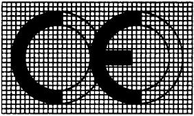

# Gesetz über die elektromagnetische Verträglichkeit von Betriebsmitteln (EMVBG)

Ausfertigungsdatum
:   2008-02-26

Fundstelle
:   BGBl I: 2008, 220

Zuletzt geändert durch
:   Art. 1 G v. 20.4.2012 I 606

[^f770791_01_BJNR022000008]:     Dieses Gesetz dient der Umsetzung der Richtlinie 2004/108/EG des
    Europäischen Parlaments und des Rates vom 15. Dezember 2004 zur
    Angleichung der Rechtsvorschriften der Mitgliedstaaten über die
    elektromagnetische Verträglichkeit und zur Aufhebung der Richtlinie
    89/336/EWG (ABl. EU Nr. L 390 S. 24).

## Abschnitt 1 - Anforderungen an Betriebsmittel

### § 1 Anwendungsbereich

(1) Dieses Gesetz gilt für alle Betriebsmittel, die elektromagnetische
Störungen verursachen können oder deren Betrieb durch
elektromagnetische Störungen beeinträchtigt werden kann.

(2) Unberührt bleiben

1.  die Vorschriften des Geräte- und Produktsicherheitsgesetzes,

2.  die Rechtsvorschriften, die das Inverkehrbringen, die Weitergabe, die
    Ausstellung, die Inbetriebnahme und den Betrieb von Betriebsmitteln
    regeln, und

3.  die eisenbahnrechtlichen Vorschriften über Anforderungen an Geräte
    sowie über die Prüfung, Zulassung und Überwachung von Geräten zur
    Gewährleistung eines sicheren Eisenbahnbetriebs.

### § 2 Ausnahmen

(1) Dieses Gesetz gilt nicht für:

1.  Betriebsmittel, die vom Gesetz über Funkanlagen und
    Telekommunikationsendeinrichtungen erfasst werden,

2.  luftfahrttechnische Erzeugnisse, Teile und Ausrüstungen nach der
    Verordnung (EG) Nr. 1592/2002 des Europäischen Parlaments und des
    Rates vom 15. Juli 2002 zur Festlegung gemeinsamer Vorschriften für
    die Zivilluftfahrt und zur Errichtung einer Europäischen Agentur für
    Flugsicherheit (ABl. EG Nr. L 240 S. 1), zuletzt geändert durch
    Verordnung (EG) Nr. 1701/2003 der Kommission vom 24. September 2003
    (ABl. EU Nr. L 243 S. 5),

3.  Betriebsmittel, die aufgrund ihrer physikalischen Eigenschaften

    a)  eine so niedrige elektromagnetische Emission haben oder in so geringem
        Umfang zur elektromagnetischen Emission beitragen, dass ein
        bestimmungsgemäßer Betrieb von Funk- und Telekommunikationsgeräten und
        sonstigen Betriebsmitteln möglich ist,

    b)  und die unter Einfluss der bei ihrem Einsatz üblichen
        elektromagnetischen Störungen ohne unzumutbare Beeinträchtigung
        betrieben werden können,

4.  Funkgeräte und Bausätze, die von Funkamateuren nach § 2 Nr. 1 des
    Amateurfunkgesetzes zusammengebaut werden, und handelsübliche Geräte,
    die von Funkamateuren zur Nutzung durch Funkamateure umgebaut werden,

5.  Betriebsmittel, die ausschließlich zur Erfüllung militärischer
    zwischenstaatlicher Verpflichtungen oder ihrer Bauart nach zur
    Verwendung für Zwecke der Verteidigung bestimmt sind oder die für die
    Verfolgung von Straftaten und Ordnungswidrigkeiten oder für die
    öffentliche Sicherheit eingesetzt werden.

(2) Entsprechend gelten jedoch

1.  im Fall des Satzes 1 Nummer 1 die §§ 14 bis 19,

2.  in den Fällen des Satzes 1 Nummer 2, 3 und 5 der § 14 Absatz 6 bis 12
    und die §§ 15 bis 17 sowie

3.  im Fall des Satzes 1 Nummer 4 der § 14 Absatz 6 bis 12 und die §§ 15
    bis 19.

### § 3 Begriffsbestimmungen

Im Sinne dieses Gesetzes

1.  sind Betriebsmittel Geräte und ortsfeste Anlagen;

2.  ist Gerät

    a)  ein für den Endnutzer bestimmtes fertiges Produkt mit einer
        eigenständigen Funktion oder eine als Funktionseinheit in den Handel
        gebrachte Verbindung solcher Produkte, das oder die elektromagnetische
        Störungen verursachen kann oder können oder dessen oder deren Betrieb
        durch elektromagnetische Störungen beeinträchtigt werden kann,

    b)  ein Bauteil oder eine Baugruppe, die jeweils dazu bestimmt sind, vom
        Endnutzer in ein Gerät eingebaut zu werden, und die elektromagnetische
        Störungen verursachen können oder deren Betrieb durch
        elektromagnetische Störungen beeinträchtigt werden kann,

    c)  ein serienmäßig vorbereiteter Baukasten, der nach der Montage eine
        eigenständige Funktion erfüllt und elektromagnetische Störungen
        verursachen kann,

    d)  eine bewegliche Anlage in Form einer Verbindung von Geräten oder
        weiteren Einrichtungen, die für den Betrieb an verschiedenen Orten
        bestimmt ist;

3.  ist ortsfeste Anlage eine besondere Verbindung von Geräten
    unterschiedlicher Art oder weiteren Einrichtungen mit dem Zweck, auf
    Dauer an einem vorbestimmten Ort betrieben zu werden;

4.  ist elektromagnetische Verträglichkeit die Fähigkeit eines
    Betriebsmittels, in seiner elektromagnetischen Umgebung
    zufriedenstellend zu arbeiten, ohne elektromagnetische Störungen zu
    verursachen, die für andere in dieser Umgebung vorhandene
    Betriebsmittel unannehmbar wären;

5.  ist elektromagnetische Störung jede elektromagnetische Erscheinung,
    die die Funktion eines Betriebsmittels beeinträchtigen könnte; eine
    elektromagnetische Störung kann ein elektromagnetisches Rauschen, ein
    unerwünschtes Signal oder eine Veränderung des Ausbreitungsmediums
    sein;

6.  ist Störfestigkeit die Fähigkeit eines Betriebsmittels, unter Einfluss
    einer elektromagnetischen Störung ohne Funktionsbeeinträchtigung zu
    arbeiten;

7.  ist elektromagnetische Umgebung die Summe aller elektromagnetischen
    Erscheinungen, die an einem bestimmten Ort festgestellt werden kann;

8.  ist Hersteller diejenige natürliche oder juristische Person oder
    rechtsfähige Personengesellschaft, die für den Entwurf oder die
    Fertigung eines Gerätes verantwortlich ist oder die sich durch die
    Ausstellung einer Konformitätserklärung im eigenen Namen oder das
    Anbringen ihres Namens, ihrer Marke oder eines anderen
    unterscheidungskräftigen Kennzeichens als Hersteller ausgibt;
    Hersteller ist auch, wer aus bereits gefertigten Endprodukten ein
    neues Gerät herstellt oder wer ein Gerät verändert, umbaut oder
    anpasst;

9.  ist Inverkehrbringen das erstmalige Bereitstellen eines Gerätes im
    Markt der Mitgliedstaaten der Europäischen Union und der anderen
    Vertragsstaaten des Abkommens über den Europäischen Wirtschaftsraum
    zum Zwecke seines Vertriebs oder seines Betriebs auf dem Gebiet eines
    dieser Staaten; das Inverkehrbringen bezieht sich dabei auf jedes
    einzelne Gerät, unabhängig vom Fertigungszeitpunkt und -ort und davon,
    ob es in Einzel- oder Serienfertigung hergestellt wurde;
    Inverkehrbringen ist nicht das Aufstellen und Vorführen eines Gerätes
    auf Ausstellungen und Messen;

10. ist Senderbetreiber derjenige, dem zum Betreiben von Sendefunkgeräten
    oder Funknetzen Frequenzen zugeteilt sind;

11. sind allgemein anerkannte Regeln der Technik technische Festlegungen
    für Verfahren, Einrichtungen und Betriebsweisen, die nach herrschender
    Auffassung der beteiligten Kreise geeignet sind, die
    elektromagnetische Verträglichkeit zu gewährleisten, und die sich in
    der Praxis bewährt haben;

12. ist harmonisierte Norm eine von einer anerkannten Normenorganisation
    im Rahmen eines Auftrags der Kommission zur Erstellung einer
    europäischen Norm nach dem Verfahren der Richtlinie 98/34/EG des
    Europäischen Parlaments und des Rates vom 22. Juni 1998 über ein
    Informationsverfahren auf dem Gebiet der Normen und technischen
    Vorschriften (ABl. EG Nr. L 204 S. 37), geändert durch Richtlinie
    98/48/EG des Europäischen Parlaments und des Rates vom 22. Juli 1998
    (ABl. EG Nr. L 217 S. 18), festgelegte technische Spezifikation, deren
    Einhaltung nicht zwingend vorgeschrieben ist.

### § 4 Grundlegende Anforderungen

(1) Betriebsmittel müssen nach den allgemein anerkannten Regeln der
Technik so entworfen und gefertigt sein, dass

1.  die von ihnen verursachten elektromagnetischen Störungen kein Niveau
    erreichen, bei dem ein bestimmungsgemäßer Betrieb von Funk- und
    Telekommunikationsgeräten oder anderen Betriebsmitteln nicht möglich
    ist;

2.  sie gegen die bei bestimmungsgemäßem Betrieb zu erwartenden
    elektromagnetischen Störungen hinreichend unempfindlich sind, um ohne
    unzumutbare Beeinträchtigung bestimmungsgemäß arbeiten zu können.

(2) Ortsfeste Anlagen müssen zusätzlich zu den Anforderungen nach
Absatz 1 nach den allgemein anerkannten Regeln der Technik installiert
werden. Die zur Gewährleistung der grundlegenden Anforderungen
angewandten allgemein anerkannten Regeln der Technik sind zu
dokumentieren.

### § 5 Vermutungswirkung

Stimmt ein Betriebsmittel mit den einschlägigen harmonisierten Normen
überein, so wird widerleglich vermutet, dass das Betriebsmittel mit
den von diesen Normen abgedeckten grundlegenden Anforderungen des § 4
übereinstimmt. Diese Vermutung der Konformität beschränkt sich auf den
Geltungsbereich der angewandten harmonisierten Normen und gilt nur
innerhalb des Rahmens der von diesen harmonisierten Normen abgedeckten
grundlegenden Anforderungen.

### § 6 Inverkehrbringen, Inbetriebnahme und Betrieb

(1) Betriebsmittel dürfen nur in Verkehr gebracht, weitergegeben oder
in Betrieb genommen werden, wenn sie bei ordnungsgemäßer Installierung
und Wartung sowie bestimmungsgemäßer Verwendung mit den grundlegenden
Anforderungen nach § 4 Abs. 1 übereinstimmen. Geräte dürfen nur in
Verkehr gebracht werden, wenn sie ein Konformitätsbewertungsverfahren
nach § 7 durchlaufen haben und die Anforderungen nach § 8 Abs. 1 und §
9 erfüllt sind.

(2) Werden in Verkehr gebrachte Geräte so umgebaut oder angepasst,
dass sich die elektromagnetische Verträglichkeit verschlechtert,
gelten sie als neue Geräte, wenn sie erneut in Verkehr gebracht
werden.

(3) Die Bundesregierung wird ermächtigt, in einer Rechtsverordnung,
die nicht der Zustimmung des Bundesrates bedarf, Regelungen zum Schutz
von öffentlichen Telekommunikationsnetzen sowie zum Schutz von Sende-
und Empfangsfunkanlagen zu treffen, die in definierten
Frequenzspektren zu Sicherheitszwecken betrieben werden.

### § 7 Konformitätsbewertungsverfahren für Geräte

(1) Werden Geräte in Verkehr gebracht, ist die Übereinstimmung mit den
grundlegenden Anforderungen nach § 4 Abs. 1 nach dem Verfahren der
Absätze 2 und 3 nachzuweisen.

(2) Der Hersteller hat anhand einer Untersuchung der maßgebenden
Erscheinungen die elektromagnetische Verträglichkeit des Gerätes zu
bewerten, um festzustellen, ob es mit den grundlegenden Anforderungen
nach § 4 Abs.1 übereinstimmt. Die sachgerechte Anwendung aller
einschlägigen harmonisierten Normen ist der Bewertung der
elektromagnetischen Verträglichkeit gleichwertig. Bei der Bewertung
sind alle bei bestimmungsgemäßem Betrieb üblichen Bedingungen zu
berücksichtigen. Kann ein Gerät in verschiedenen Konfigurationen
betrieben werden, so muss die Bewertung bestätigen, dass das Gerät mit
den grundlegenden Anforderungen nach § 4 Abs.1 in allen
Konfigurationen übereinstimmt, die der Hersteller als typisch für die
bestimmungsgemäße Verwendung bezeichnet.

(3) Der Hersteller hat die technischen Unterlagen nach Anlage 1 zu
erstellen, mit denen nachgewiesen wird, dass das Gerät mit den
grundlegenden Anforderungen nach § 4 Abs. 1 übereinstimmt. Zur
Bescheinigung dieser Übereinstimmung stellt er oder sein in der
Gemeinschaft ansässiger Bevollmächtigter eine EG-Konformitätserklärung
nach Anlage 1 aus. Der Hersteller oder sein Bevollmächtigter in der
Gemeinschaft haben die technischen Unterlagen und die EG-
Konformitätserklärung mindestens zehn Jahre lang nach Fertigung des
letzten Gerätes für die Bundesnetzagentur zur Einsicht bereitzuhalten.
Sind weder der Hersteller noch sein Bevollmächtigter in der
Gemeinschaft ansässig, fällt diese Verpflichtung der Person zu, die
für das Inverkehrbringen des Gerätes auf dem Gemeinschaftsmarkt
verantwortlich ist.

(4) Zusätzlich zu dem Verfahren nach den Absätzen 2 und 3 kann der
Hersteller oder sein in der Gemeinschaft ansässiger Bevollmächtigter
die technischen Unterlagen der benannten Stelle mit dem Antrag auf
ihre Bewertung vorlegen. Dabei teilt er mit, welche Aspekte der
grundlegenden Anforderungen zu bewerten sind. Die benannte Stelle
prüft, ob die technischen Unterlagen in angemessener Weise die
Übereinstimmung mit den zu bewertenden Anforderungen nachweisen. Ist
dies der Fall, bestätigt die benannte Stelle dem Hersteller oder
seinem in der Gemeinschaft ansässigen Bevollmächtigten, dass das Gerät
mit den bewerteten Anforderungen übereinstimmt. Der Hersteller fügt
die Bestätigung den technischen Unterlagen hinzu.

### § 8 CE-Kennzeichnung

(1) Geräte, deren Übereinstimmung mit den grundlegenden Anforderungen
nach § 4 im Verfahren nach § 7 nachgewiesen wurde, sind vom Hersteller
oder seinem in der Gemeinschaft ansässigen Bevollmächtigten mit der
CE-Kennzeichnung nach Anlage 2 zu versehen.

(2) Es dürfen keine Kennzeichnungen angebracht werden, deren Bedeutung
oder Gestalt mit der Bedeutung oder Gestalt der CE-Kennzeichnung
verwechselt werden kann. Andere Kennzeichnungen dürfen auf dem Gerät,
der Verpackung oder der Gebrauchsanleitung nur angebracht werden, wenn
sie die Sicht- und Lesbarkeit der CE-Kennzeichnung nicht
beeinträchtigen.

### § 9 Sonstige Kennzeichen und Informationen

(1) Zur Identifizierung muss jedes Gerät mit der Typbezeichnung, der
Baureihe, der Seriennummer oder mit anderen Angaben gekennzeichnet
sein, die die Zuordnung des Gerätes zu einer EG-Konformitätserklärung
ermöglichen.

(2) Zu jedem Gerät sind auf dem Gerät, seiner Verpackung oder den
beigegebenen Unterlagen der Name und die Anschrift des Herstellers
anzugeben. Ist der Hersteller nicht in der Gemeinschaft ansässig, sind
auch der Name und die Anschrift seines in der Europäischen Union
ansässigen Bevollmächtigten oder der Person anzugeben, die für das
Inverkehrbringen des Gerätes in der Gemeinschaft verantwortlich ist.

(3) Der Hersteller muss auf dem Gerät, seiner Verpackung oder den
beigegebenen Unterlagen Angaben über besondere Vorkehrungen machen,
die bei Montage, Installierung, Wartung oder Betrieb des Gerätes zu
treffen sind, damit es nach Inbetriebnahme mit den grundlegenden
Anforderungen des § 4 Abs. 1 übereinstimmt. Bei Geräten für
nichtgewerbliche Nutzer müssen diese Angaben in deutscher Sprache
abgefasst sein.

(4) Bei Geräten, deren Übereinstimmung mit den grundlegenden
Anforderungen nach § 4 Abs. 1 in Wohngebieten nicht gewährleistet ist,
ist auf diese Nutzungsbeschränkung in einer vor dem Erwerb erkennbaren
Form hinzuweisen.

(5) Jedem Gerät ist eine Gebrauchsanleitung mit allen Informationen
beizufügen, die zur bestimmungsgemäßen Nutzung erforderlich sind. Bei
Geräten für nichtgewerbliche Nutzer muss diese Gebrauchsanleitung in
deutscher Sprache abgefasst sein.

### § 10 Benannte Stellen

(1) Eine benannte Stelle muss folgende Anforderungen erfüllen:

1.  Sie muss über ausreichend Personal, Mittel und Ausrüstung verfügen.

2.  Ihr Personal muss fachlich kompetent und beruflich zuverlässig sein.

3.  Sie muss bei der Durchführung der Prüfungen und der Abfassung der
    Berichte, die in diesem Gesetz vorgesehen sind, unabhängig sein.

4.  Ihre Führungskräfte und ihr technisches Personal müssen unabhängig von
    Stellen, Gruppen oder Personen sein, die ein direktes oder indirektes
    Interesse an den zu prüfenden Betriebsmitteln haben.

5.  Ihr Personal muss zur Wahrung des Betriebs- und Geschäftsgeheimnisses
    verpflichtet sein.

6.  Sie muss angemessen haftpflichtversichert sein.

Bei der Bundesnetzagentur kann ein Antrag auf Anerkennung als benannte
Stelle gestellt werden. Die Bundesnetzagentur prüft, ob die
Anforderungen nach Satz 1 und die Anforderungen der Rechtsverordnung
nach Absatz 2 eingehalten sind. Die Bundesnetzagentur überprüft
regelmäßig, ob die benannte Stelle die Anforderungen nach Satz 1
weiterhin erfüllt.

(2) Das Bundesministerium für Wirtschaft und Technologie wird
ermächtigt, durch Rechtsverordnung, die nicht der Zustimmung des
Bundesrates bedarf, die näheren Anforderungen und das Verfahren für
die Anerkennung und den Widerruf der Anerkennung von benannten Stellen
zu regeln.

(3) Für Konformitätsbewertungsstellen für die Durchführung von
Konformitätsbewertungen nach Drittstaatenabkommen gelten die Absätze 1
und 2 entsprechend.

### § 11 Besondere Regelungen

(1) Während der Entwicklung und Erprobung von Betriebsmitteln hat der
Hersteller Vorkehrungen zu treffen, um elektromagnetische Störungen
von Betriebsmitteln zu vermeiden, die von Dritten betrieben werden.

(2) Auf Messen und Ausstellungen dürfen Hersteller, ihre
Bevollmächtigten oder Importeure Betriebsmittel, die den Vorschriften
dieses Gesetzes nicht entsprechen, aufstellen und vorführen, wenn sie
die Betriebsmittel mit dem Hinweis versehen, dass diese Betriebsmittel
erst in Verkehr gebracht oder in Betrieb genommen werden dürfen, wenn
sie mit den Vorschriften dieses Gesetzes übereinstimmen. Die
Verantwortlichen nach Satz 1 müssen geeignete Maßnahmen zur Vermeidung
elektromagnetischer Störungen treffen. Verursachen die Betriebsmittel
elektromagnetische Störungen, müssen die Verantwortlichen nach Satz 1
diese unverzüglich durch geeignete Maßnahmen beseitigen.

### § 12 Ortsfeste Anlagen

(1) Ortsfeste Anlagen müssen so betrieben und gewartet werden, dass
sie mit den grundlegenden Anforderungen nach § 4 Abs. 1 und 2 Satz 1
übereinstimmen. Dafür ist der Betreiber verantwortlich. Er hat die
Dokumentation nach § 4 Abs. 2 Satz 2 für Kontrollen der
Bundesnetzagentur zur Einsicht bereitzuhalten, solange die ortsfeste
Anlage in Betrieb ist. Die Dokumentation muss dem aktuellen
technischen Zustand der Anlage entsprechen.

(2) Ein Gerät, das zum Einbau in eine bestimmte ortsfeste Anlage
vorgesehen und im Handel nicht erhältlich ist, braucht die in den §§
4, 7, 8 und 9 Abs. 3 bis 5 festgelegten Anforderungen nicht zu
erfüllen. Dem Gerät sind Unterlagen beizufügen, aus denen sich ergibt,

1.  für welche ortsfeste Anlage das Gerät bestimmt ist,

2.  unter welchen Voraussetzungen diese ortsfeste Anlage
    elektromagnetische Verträglichkeit besitzt und

3.  welche Vorkehrungen beim Einbau in diese ortsfeste Anlage zu treffen
    sind, damit diese mit den grundlegenden Anforderungen nach § 4
    übereinstimmt.

## Abschnitt 2 - Marktaufsicht der Bundesnetzagentur

### § 13 Aufgaben und Zuständigkeiten der Bundesnetzagentur

(1) Die Bundesnetzagentur für Elektrizität, Gas, Telekommunikation,
Post und Eisenbahnen (Bundesnetzagentur) führt dieses Gesetz aus,
soweit gesetzlich nichts anderes bestimmt ist.

(2) Die Bundesnetzagentur nimmt insbesondere folgende Aufgaben wahr:

1.  in Verkehr zu bringende oder in Verkehr gebrachte Geräte auf
    Einhaltung der Anforderungen nach § 4 und §§ 7 bis 9 zu prüfen und bei
    Nichteinhaltung die Maßnahmen nach § 14 zu veranlassen;

2.  auf Messen und Ausstellungen aufgestellte und vorgeführte Geräte auf
    Einhaltung der Anforderungen nach § 11 Abs. 2 zu prüfen und bei
    Nichteinhaltung die Maßnahmen nach § 14 Abs. 4 zu veranlassen;

3.  ortsfeste Anlagen auf die Übereinstimmung mit den grundlegenden
    Anforderungen zu überprüfen und die Erfüllung dieser Anforderungen
    herbeizuführen, wenn es Anzeichen gibt, dass sie nicht mit den
    grundlegenden Anforderungen nach § 4 übereinstimmen;

4.  elektromagnetische Unverträglichkeiten einschließlich Funkstörungen
    aufzuklären und Abhilfemaßnahmen in Zusammenarbeit mit den Beteiligten
    zu veranlassen;

5.  Einzelaufgaben aufgrund der Richtlinie 2004/108/EG, anderer EG-
    Richtlinien und Abkommen mit Drittstaaten in Bezug auf die
    elektromagnetische Verträglichkeit gegenüber der Kommission der
    Europäischen Gemeinschaften und den Mitgliedstaaten der Europäischen
    Union und den anderen Vertragsstaaten des Abkommens über den
    Europäischen Wirtschaftsraum wahrzunehmen;

6.  im Bereich der technischen Normung zur elektromagnetischen
    Verträglichkeit von Betriebsmitteln in nationalen und internationalen
    Normungsgremien mitzuarbeiten und diesbezüglich für andere zuständige
    Bundesbehörden unterstützend tätig zu sein;

7.  die Anerkennung und Überwachung von benannten Stellen nach § 10
    durchzuführen;

8.  die Verordnung nach § 6 Abs. 3 zu vollziehen.

### § 14 Befugnisse der Bundesnetzagentur

(1) Die Bundesnetzagentur ist befugt,

1.  in Verkehr zu bringende oder in Verkehr gebrachte Geräte
    stichprobenweise auf Einhaltung der Anforderungen nach § 4 und §§ 7
    bis 9 zu prüfen,

2.  in Verkehr zu bringende oder in Verkehr gebrachte Geräte im Sinne des
    Gesetzes über Funkanlagen und Telekommunikationsendeinrichtungen
    stichprobenweise auf Einhaltung der dort geregelten Anforderungen zu
    prüfen,

3.  auf Messen und Ausstellungen aufgestellte und vorgeführte Geräte auf
    Einhaltung der Anforderungen nach § 11 Abs. 2 sowie Geräte im Sinne
    des Gesetzes über Funkanlagen und Telekommunikationsendeinrichtungen
    auf Einhaltung der Anforderungen des dortigen § 13 zu prüfen,

4.  für ortsfeste Anlagen bei Vorliegen gegenteiliger Anhaltspunkte den
    Nachweis der Übereinstimmung mit den grundlegenden Anforderungen zu
    verlangen, eine Überprüfung der Anlagen vorzunehmen und die Erfüllung
    der grundlegenden Anforderungen anzuordnen.

(2) Stellt die Bundesnetzagentur fest, dass ein Gerät, für das die CE-
Kennzeichnung nach diesem Gesetz oder dem Gesetz über Funkanlagen und
Telekommunikationsendeinrichtungen vorgeschrieben ist, nicht mit der
CE-Kennzeichnung versehen ist, so trifft sie alle erforderlichen
Maßnahmen, um das Inverkehrbringen oder die Weitergabe des
betreffenden Gerätes einzuschränken, zu unterbinden oder rückgängig zu
machen oder seinen freien Warenverkehr einzuschränken. Diese Maßnahmen
können gegen jeden, der das Gerät in Verkehr bringt oder weitergibt,
gerichtet werden.

(3) Stellt die Bundesnetzagentur fest, dass ein Gerät mit CE-
Kennzeichnung nicht den nach Absatz 1 Nr. 1 oder Nr. 2 zu prüfenden
Anforderungen entspricht, so erlässt sie die erforderlichen
Anordnungen, um diesen Mangel zu beheben und einen weiteren Verstoß zu
verhindern. Wenn der Mangel nicht behoben wird, trifft die
Bundesnetzagentur alle erforderlichen Maßnahmen, um das
Inverkehrbringen oder die Weitergabe des betreffenden Gerätes
einzuschränken, zu unterbinden oder rückgängig zu machen. Die
Anordnungen und Maßnahmen nach Satz 1 und 2 können gegen den
Hersteller, seinen Bevollmächtigten mit Niederlassung in einem
Mitgliedstaat der Europäischen Union oder einem anderen Vertragsstaat
des Abkommens über den Europäischen Wirtschaftsraum und den Importeur,
die Maßnahmen nach Satz 2 auch gegen jeden, der das Gerät weitergibt,
gerichtet werden.

(4) Stellt die Bundesnetzagentur im Fall des Absatzes 1 Nr. 3 fest,
dass ein Gerät nicht den dort genannten Anforderungen entspricht,
erlässt sie die erforderlichen Anordnungen, um diesen Mangel zu
beheben. Wenn der Mangel nicht behoben wird, veranlasst die
Bundesnetzagentur die Außerbetriebnahme des Gerätes.

(5) Stellt die Bundesnetzagentur fest, dass auf einem Gerät, seiner
Verpackung, der Gebrauchsanleitung oder dem Garantieschein eine
Kennzeichnung angebracht ist, deren Bedeutung oder Gestalt mit der
Bedeutung oder Gestalt der CE-Kennzeichnung verwechselt werden kann,
trifft sie alle erforderlichen Maßnahmen, um das Inverkehrbringen oder
die gewerbliche Weitergabe des betreffenden Gerätes einzuschränken, zu
unterbinden oder seinen freien Warenverkehr einzuschränken. Diese
Maßnahmen können gegen jeden, der das Gerät in Verkehr bringt oder
weitergibt, gerichtet werden.

(6) Die Bundesnetzagentur ist befugt, die notwendigen Maßnahmen zur
Klärung von elektromagnetischen Unverträglichkeiten zu ergreifen. Sie
kann

1.  zum Schutz von zu Sicherheitszwecken verwendeten Empfangs- oder
    Sendefunkgeräten und -anlagen und den zugehörigen Funkdiensten,

2.  zum Schutz öffentlicher Telekommunikationsnetze,

3.  zum Schutz von Leib oder Leben einer Person oder von Sachen von
    bedeutendem Wert oder

4.  zum Schutz vor Auswirkungen von Betriebsmitteln, die nicht den
    Vorschriften dieses Gesetzes oder anderen Gesetzen mit Festlegungen
    zur elektromagnetischen Verträglichkeit genügen,

besondere Maßnahmen für das Betreiben von Betriebsmitteln an einem
bestimmten Ort anordnen oder alle erforderlichen Maßnahmen treffen, um
das Betreiben von Betriebsmitteln an einem bestimmten Ort zu
verhindern. Sie kann ihre Maßnahmen an den Betreiber oder an den
Eigentümer eines Betriebsmittels oder an beide richten. Liegen bei
elektromagnetischen Unverträglichkeiten die Eingriffsvoraussetzungen
nach Satz 2 nicht vor, ist die Bundesnetzagentur befugt, bei
bestehenden oder vorhersehbaren Problemen in Zusammenhang mit der
elektromagnetischen Verträglichkeit an einem bestimmten Ort unter
Abwägung der Interessen der Beteiligten die notwendigen Maßnahmen zur
Ermittlung ihrer Ursache durchzuführen und Abhilfemaßnahmen in
Zusammenarbeit mit den Beteiligten zu veranlassen. Zivilrechtliche
Ansprüche bleiben unberührt. Bei elektromagnetischen
Unverträglichkeiten arbeitet die Bundesnetzagentur mit den Beteiligten
zusammen. Sie legt die allgemein anerkannten Regeln der Technik zu
Grunde und kann insbesondere die geltenden technischen Normen
heranziehen.

(7) Besteht aufgrund einer elektromagnetischen Störung

1.  eine Gefahr für Leib oder Leben einer Person oder für fremde Sachen
    von bedeutendem Wert,

2.  eine erhebliche Beeinträchtigung der Nutzung eines öffentlichen
    Telekommunikationsnetzes oder

3.  eine Beeinträchtigung eines zu Sicherheitszwecken verwendeten
    Empfangs- oder Sendefunkgerätes

und ist die Ursache der Störung nicht auf anderem Wege zu ermitteln,
sind die Bediensteten der Bundesnetzagentur befugt, sich Kenntnis von
dem Inhalt und den näheren Umständen der Telekommunikation zu
verschaffen; die Aufzeichnung des Inhalts ist unzulässig. Das
Grundrecht des Fernmeldegeheimnisses nach Artikel 10 des Grundgesetzes
wird nach Maßgabe des Satzes 1 eingeschränkt.

(8) Eine Maßnahme nach Absatz 7 ist unverzüglich zu unterbrechen,
soweit und solange tatsächliche Anhaltspunkte für die Annahme
vorliegen, dass das Gespräch den Kernbereich privater Lebensgestaltung
betrifft. Dennoch erlangte Erkenntnisse aus dem Kernbereich privater
Lebensgestaltung dürfen nicht verwertet werden und sind unverzüglich
zu löschen. Die Tatsache ihrer Erlangung und Löschung ist aktenkundig
zu machen.

(9) Die durch eine Maßnahme nach Absatz 7 erlangten Daten sind als
solche zu kennzeichnen. Sie dürfen nur zur Ermittlung und Unterbindung
der elektromagnetischen Störung verwendet werden. Abweichend von Satz
2 dürfen die Daten von der Bundesnetzagentur an die
Strafverfolgungsbehörden übermittelt werden, soweit dies für die
Verfolgung einer in § 100a der Strafprozessordnung genannten Straftat
erforderlich ist. Die Bundesnetzagentur darf die Daten ferner
abweichend von Satz 2 an die Polizeivollzugsbehörden übermitteln,
soweit bestimmte Tatsachen die Annahme rechtfertigen, dass die
Kenntnis der Daten zur Abwehr einer Gefahr für Leib, Leben, Gesundheit
oder Freiheit einer Person oder bedeutende Sach- und Vermögenswerte
erforderlich ist. Die Strafverfolgungsbehörden und die
Polizeivollzugsbehörden haben die Kennzeichnung der Daten
aufrechtzuerhalten. Das Grundrecht des Fernmeldegeheimnisses nach
Artikel 10 des Grundgesetzes wird nach Maßgabe der Sätze 3 und 4
eingeschränkt. Die Übermittlung nach den Sätzen 3 und 4 bedarf der
gerichtlichen Zustimmung. Satz 7 gilt nicht, wenn Gefahr im Verzug
gegeben ist. Für das Verfahren nach Satz 7 gelten die Vorschriften des
Gesetzes über die Angelegenheiten der freiwilligen Gerichtsbarkeit
entsprechend. Zuständig ist das Amtsgericht, in dessen Bezirk die
Bundesnetzagentur ihren Sitz hat.

(10) Die durch eine Maßnahme nach Absatz 7 Betroffenen sind spätestens
nach Abschluss der Störungsunterbindung zu benachrichtigen, soweit sie
bekannt sind oder ihre Identifizierung ohne unverhältnismäßige weitere
Ermittlungen möglich ist und nicht überwiegende schutzwürdige Belange
anderer Personen entgegenstehen. Dabei ist auf die Möglichkeit der
Inanspruchnahme nachträglichen Rechtsschutzes und die dafür jeweils
vorgesehene Frist hinzuweisen. In den Fällen des Absatzes 9 Satz 3
erfolgt die Benachrichtigung durch die Strafverfolgungsbehörde
entsprechend den Vorschriften des Strafverfahrensrechts. In den Fällen
des Absatzes 9 Satz 4 erfolgt die Benachrichtigung durch die
Polizeivollzugsbehörde nach den für diese maßgebenden Vorschriften;
enthalten diese keine Bestimmungen zu Benachrichtigungspflichten, sind
die Vorschriften des Strafverfahrensrechts entsprechend anzuwenden.

(11) Die durch eine Maßnahme nach Absatz 7 erlangten Daten sind
unverzüglich zu löschen, wenn sie für die Ermittlung oder Unterbindung
der Störung und für eine gerichtliche Überprüfung der Maßnahme nicht
mehr benötigt werden. Die Löschung ist aktenkundig zu machen. Soweit
die Löschung lediglich für eine gerichtliche Überprüfung
zurückgestellt ist, sind die Daten zu sperren. Sie dürfen ohne
Einwilligung des Betroffenen nur zu diesem Zweck verwendet werden;
Absatz 9 Satz 3 bis 10 bleibt unberührt.

(12) Unter den in Absatz 7 genannten Voraussetzungen sind die
Bediensteten der Bundesnetzagentur befugt, Grundstücke, Räumlichkeiten
und Wohnungen zu betreten, auf oder in denen aufgrund tatsächlicher
Anhaltspunkte die Ursache störender Aussendungen zu vermuten ist.
Durchsuchungen dürfen nur durch den Richter, bei Gefahr im Verzug auch
durch den verantwortlichen Bediensteten der Bundesnetzagentur
schriftlich angeordnet werden. Maßnahmen nach den Sätzen 1 und 2
sollen nur nach vorheriger Anhörung des Betroffenen erfolgen, es sei
denn, die Maßnahme würde dadurch unangemessen verzögert. Das
Grundrecht der Unverletzlichkeit der Wohnung nach Artikel 13 des
Grundgesetzes wird nach Maßgabe der Sätze 1 und 2 eingeschränkt.

### § 15 Auskunfts- und Beteiligungspflicht

(1) Diejenigen, die Betriebsmittel in Verkehr bringen, anbieten,
ausstellen, betreiben oder die Weitergabe vermittelnd unterstützen,
und die benannten Stellen haben der Bundesnetzagentur auf Verlangen
die zur Erfüllung ihrer Aufgaben erforderlichen Auskünfte zu erteilen
und sonstige Unterstützung zu gewähren. Die nach Satz 1 Verpflichteten
können die Auskunft auf solche Fragen verweigern, deren Beantwortung
sie selbst oder einen in § 52 Abs. 1 der Strafprozessordnung
bezeichneten Angehörigen der Gefahr der Verfolgung wegen einer
Straftat oder eines Verfahrens nach dem Gesetz über
Ordnungswidrigkeiten aussetzen würde.

(2) Die Beauftragten der Bundesnetzagentur dürfen Betriebsgrundstücke,
Betriebs- und Geschäftsräume sowie Fahrzeuge, auf oder in denen
Betriebsmittel oder Geräte im Sinne des Gesetzes über Funkanlagen und
Telekommunikationsendeinrichtungen geprüft, hergestellt, angeboten
oder zum Zwecke des Inverkehrbringens oder der Weitergabe gelagert
werden, ausgestellt sind oder betrieben werden, während der Geschäfts-
und Betriebszeiten betreten, die Geräte besichtigen und prüfen, zur
Prüfung betreiben lassen und unentgeltlich vorübergehend zu Prüf- und
Kontrollzwecken entnehmen. Die nach Absatz 1 Auskunftspflichtigen
haben diese Maßnahmen zu dulden.

### § 16 Zwangsgeld

Zur Durchsetzung der Anordnungen nach § 14 Abs. 2 bis 6 und 12 sowie §
15 und der Anordnungen aufgrund der Verordnung nach § 6 Abs. 3 kann
die Bundesnetzagentur ein Zwangsgeld bis zu fünfhunderttausend Euro
festsetzen und vollstrecken.

### § 17 Kostenregelung

(1) Die Bundesnetzagentur erhebt für die folgenden Amtshandlungen
Gebühren und Auslagen:

1.  Maßnahmen nach § 14 Abs. 1 bis 5 gegen denjenigen, der Geräte in der
    Bundesrepublik Deutschland auf dem Markt der Europäischen Union
    bereitgestellt hat, wenn ein Verstoß gegen die §§ 6 bis 9 und § 12
    Abs. 2 festgestellt wurde,

2.  Maßnahmen zur Störungsermittlung oder -beseitigung nach § 14 Absatz 6
    und 7 gegenüber den Betreibern von Betriebsmitteln, die schuldhaft
    entgegen den Vorschriften aus der nach § 6 Absatz 3 in Kraft
    getretenen Rechtsverordnung oder die entgegen den Vorschriften des § 6
    Absatz 1, § 11 Absatz 2 und § 12 Absatz 1 betrieben werden,

3.  Entscheidungen über die Anerkennung von benannten Stellen nach § 10
    Abs. 1 Satz 2 und 3 und Überprüfungsmaßnahmen nach § 10 Abs. 1 Satz 4;
    Kosten werden auch dann erhoben, wenn ein Antrag auf Vornahme einer
    Amtshandlung nach Beginn der sachlichen Bearbeitung, jedoch vor deren
    Beendigung zurückgenommen worden ist. Dies gilt für
    Konformitätsbewertungsstellen nach § 10 Abs. 3 entsprechend.

(2) Das Bundesministerium für Wirtschaft und Technologie wird
ermächtigt, im Einvernehmen mit dem Bundesministerium der Finanzen,
durch Rechtsverordnung, die nicht der Zustimmung des Bundesrates
bedarf,

1.  die gebührenpflichtigen Tatbestände nach Absatz 1 sowie die Höhe der
    hierfür zu erhebenden Gebühren näher zu bestimmen und dabei feste
    Sätze auch in Form von Gebühren nach Zeitaufwand oder Rahmensätze
    vorzusehen,

2.  eine bestimmte Zahlungsweise der Gebühren anzuordnen und

3.  das Nähere zur Ermittlung des Verwaltungsaufwands nach Absatz 3 Satz 2
    zu bestimmen.

(3) Die Gebühren nach Absatz 1 werden zur Deckung des
Verwaltungsaufwands erhoben. Zur Ermittlung des Verwaltungsaufwands
sind die Kosten, die nach betriebswirtschaftlichen Grundsätzen als
Einzel- und Gemeinkosten zurechenbar und ansatzfähig sind,
insbesondere Personal- und Sachkosten sowie kalkulatorische Kosten,
zugrunde zu legen. Die Vorschriften des Verwaltungskostengesetzes
gelten ergänzend.

(4) Das Bundesministerium für Wirtschaft und Technologie kann die
Ermächtigung nach Absatz 2 durch Rechtsverordnung, die nicht der
Zustimmung des Bundesrates bedarf, unter Sicherstellung der
Einvernehmensregelung auf die Bundesnetzagentur übertragen. Eine
Rechtsverordnung der Bundesnetzagentur, ihre Änderung und ihre
Aufhebung bedarf des Einvernehmens mit dem Bundesministerium für
Wirtschaft und Technologie und dem Bundesministerium der Finanzen.

### § 18 Vorverfahren

(1) Widerspruch und Klage gegen Entscheidungen der Bundesnetzagentur
haben keine aufschiebende Wirkung.

(2) Die Kosten des Vorverfahrens richten sich nach § 146 des
Telekommunikationsgesetzes.

### § 19 Beitragsregelung

(1) Senderbetreiber haben zur Abgeltung der Kosten

1.  für die Sicherstellung der elektromagnetischen Verträglichkeit und
    insbesondere eines störungsfreien Funkempfangs zur Aufgabenerledigung
    nach § 14 Abs. 6 Satz 2, soweit nicht bereits der Gebührentatbestand
    nach § 17 Abs. 1 Nr. 2 erfüllt ist,

2.  für Maßnahmen nach § 14 Abs. 1 bis 5, soweit nicht bereits der
    Gebührentatbestand nach § 17 Abs. 1 Nr. 1 erfüllt ist,

einen Jahresbeitrag zu entrichten.

(2) Das Bundesministerium für Wirtschaft und Technologie wird
ermächtigt, im Einvernehmen mit dem Bundesministerium der Finanzen
durch Rechtsverordnung, die nicht der Zustimmung des Bundesrates
bedarf, den Kreis der Beitragspflichtigen, die Beitragssätze und das
Verfahren der Beitragserhebung einschließlich der Zahlungsweise und
der Zahlungsfristen zu bestimmen. Die Anteile an den Gesamtkosten im
Sinne von Absatz 1 werden den einzelnen Nutzergruppen so weit wie
möglich aufwandsbezogen zugeordnet. Der auf das Allgemeininteresse
entfallende Kostenanteil ist beitragsmindernd zu berücksichtigen. Die
Nutzergruppen ergeben sich aus der Frequenzzuweisung. Innerhalb der
Nutzergruppen erfolgt die Aufteilung entsprechend der Frequenznutzung.
Das Bundesministerium für Wirtschaft und Technologie kann die
Ermächtigung nach Satz 1 durch Rechtsverordnung unter Sicherstellung
der Einvernehmensregelung auf die Bundesnetzagentur übertragen. Eine
Rechtsverordnung nach Satz 6 einschließlich ihrer Aufhebung bedarf des
Einvernehmens mit dem Bundesministerium für Wirtschaft und Technologie
und dem Bundesministerium der Finanzen.

## Abschnitt 3 - Bußgeldvorschriften

### § 20 Bußgeldvorschriften

(1) Ordnungswidrig handelt, wer vorsätzlich oder fahrlässig

1.  entgegen § 6 Abs. 1 Satz 1 ein Gerät in Verkehr bringt, gewerbsmäßig
    weitergibt oder in Betrieb nimmt,

2.  entgegen § 6 Abs. 1 Satz 2 ein Gerät in Verkehr bringt,

3.  einer vollziehbaren Anordnung aufgrund einer Rechtsverordnung nach § 6
    Abs. 3 zuwiderhandelt, soweit die Rechtsverordnung für einen
    bestimmten Tatbestand auf diese Bußgeldvorschrift verweist,

4.  entgegen § 7 Abs. 3 Satz 3 eine technische Unterlage oder eine EG-
    Konformitätserklärung für ein Gerät nicht oder nicht mindestens zehn
    Jahre lang bereithält,

5.  entgegen § 8 Abs. 2 eine Kennzeichnung anbringt,

6.  entgegen § 12 Abs. 1 Satz 1 eine ortsfeste Anlage nicht richtig
    betreibt oder

7.  entgegen § 12 Abs. 1 Satz 3 eine technische Dokumentation nicht oder
    nicht für die vorgeschriebene Dauer bereithält.

(2) Die Ordnungswidrigkeit kann in den Fällen des Absatzes 1 Nr. 1, 2,
5 und 6 mit einer Geldbuße bis zu fünfzigtausend Euro, in den übrigen
Fällen mit einer Geldbuße bis zu zehntausend Euro geahndet werden.

(3) Geräte, auf die sich eine Ordnungswidrigkeit nach Absatz 1 Nr. 1,
2 oder 5 bezieht, können eingezogen werden.

(4) Verwaltungsbehörde im Sinne des § 36 Abs. 1 Nr.1 des Gesetzes über
Ordnungswidrigkeiten ist die Bundesnetzagentur.

## Abschnitt 4 - Schlussbestimmungen

### § 21 Übergangsbestimmungen

(1) Geräte, die den Bestimmungen des Gesetzes über die
elektromagnetische Verträglichkeit von Geräten vom 18. September 1998
(BGBl. I S. 2882), zuletzt geändert durch Artikel 279 der Verordnung
vom 31. Oktober 2006 (BGBl. I S. 2407), entsprechen und vor dem 20.
Juli 2009 in Verkehr gebracht oder in Betrieb genommen wurden, dürfen
weiter vertrieben oder betrieben werden.

(2) Ortsfeste Anlagen dürfen so lange weiter betrieben werden, wie ihr
Standort unverändert bleibt. Änderungen müssen gemäß § 12 Abs. 1 Satz
3 und 4 dokumentiert werden.

### § 22 Aufhebung und Änderungen von Rechtsvorschriften

-

### § 23 Neufassung der Beleihungs- und Anerkennungs-Verordnung

Das Bundesministerium für Wirtschaft und Technologie kann den Wortlaut
der Beleihungs- und Anerkennungs-Verordnung in der vom Inkrafttreten
dieses Gesetzes an geltenden Fassung im Bundesgesetzblatt bekannt
machen.

### § 24 Inkrafttreten, Außerkrafttreten

Dieses Gesetz tritt am Tag nach der Verkündung in Kraft.

### Anlage 1 Technische Unterlagen, EG-Konformitätserklärung

(Fundstelle: BGBl. I 2008, 231; bzgl. der einzelnen Änderungen vgl.
Fußnote)

### **1. Technische Unterlagen**

Anhand der technischen Unterlagen muss es möglich sein, die
Übereinstimmung des Gerätes mit den grundlegenden Anforderungen nach §
4 Abs. 1 zu beurteilen. Sie müssen sich auf die Konstruktion und die
Fertigung des Gerätes erstrecken und insbesondere Folgendes umfassen:

a)  eine allgemeine Beschreibung des Gerätes;

b)  einen Nachweis der Übereinstimmung des Gerätes mit den angewandten
    harmonisierten Normen;

c)  falls der Hersteller harmonisierte Normen nicht oder nur teilweise
    angewandt hat, eine Beschreibung und Erläuterung der zur
    Übereinstimmung mit den grundlegenden Anforderungen nach § 4 Abs. 1
    getroffenen Vorkehrungen; die Beschreibung muss insbesondere die nach
    § 7 Abs. 2 vorgenommene Bewertung der elektromagnetischen
    Verträglichkeit, die Ergebnisse der Entwurfsberechnungen, die
    durchgeführten Prüfungen und die Prüfberichte umfassen;

d)  eine Erklärung der benannten Stelle, sofern eine Bewertung nach § 7
    Abs. 4 erfolgt ist.

**2. EG-Konformitätserklärung**

Die EG-Konformitätserklärung muss mindestens folgende Angaben
enthalten:

a)  einen Verweis auf die Richtlinie 2004/108/EG;

b)  die Identifizierung des Gerätes, für das sie abgegeben wird, nach § 9
    Absatz 1;

c)  Namen und Anschrift des Herstellers und gegebenenfalls seines in der
    Gemeinschaft ansässigen Bevollmächtigten;

d)  die Fundstellen der Spezifikationen, mit denen das Gerät übereinstimmt
    und aufgrund deren die Konformität mit den Bestimmungen der Richtlinie
    2004/108/EG erklärt wird;

e)  Datum der Erklärung;

f)  Namen und Unterschrift der für den Hersteller oder seinen
    Bevollmächtigten zeichnungsberechtigten Person.

### Anlage 2 CE-Kennzeichnung

( Fundstelle: BGBl. I 2008, 232 )
Die CE-Kennzeichnung besteht aus den Buchstaben „CE“ mit folgendem
Schriftbild:

Bei Verkleinerung oder Vergrößerung müssen die Proportionen gewahrt
bleiben. Die CE-Kennzeichnung muss mindestens 5 mm hoch sein.

Die CE-Kennzeichnung ist auf dem Gerät oder auf dessen Typenschild
anzubringen. Ist dies wegen der Beschaffenheit des Gerätes nicht
möglich, ist die CE-Kennzeichnung auf der Verpackung oder auf den
Begleitunterlagen anzubringen.

Wird ein Gerät neben der Richtlinie 2004/108/EG auch von anderen
europäischen Richtlinien erfasst, die andere Anforderungen regeln und
ebenfalls die CE-Kennzeichnung vorsehen, bedeutet die CE-
Kennzeichnung, dass das Gerät auch mit den Anforderungen dieser
Richtlinien übereinstimmt.

Kann der Hersteller nach einer oder mehreren dieser Richtlinien
während einer Übergangsfrist wählen, welche der bestehenden Regelungen
er anwendet, so bescheinigt die CE-Kennzeichnung lediglich die
Übereinstimmung mit den Anforderungen der vom Hersteller angewandten
Richtlinien. In diesem Fall müssen die dem Gerät beiliegenden
Unterlagen, Hinweise oder Anleitungen die Nummern der jeweils
angewandten Richtlinien entsprechend ihrer Veröffentlichung im
Amtsblatt der Europäischen Union tragen.

