# Verordnung über die Beiträge zur Entschädigungseinrichtung deutscher Banken GmbH (EntschBeitrV)

Ausfertigungsdatum
:   1999-07-10

Fundstelle
:   BGBl I: 1999, 1540

Zuletzt geändert durch
:   Art. 1 V v. 12.12.2011 I 2684

## Eingangsformel

Auf Grund des § 8 Abs. 3 Satz 1 und 2 des Einlagensicherungs- und
Anlegerentschädigungsgesetzes vom 16. Juli 1998 (BGBl. I S. 1842)
verordnet das Bundesministerium der Finanzen nach Anhörung der
Entschädigungseinrichtung deutscher Banken GmbH:

## § 1 Jahresbeitrag

(1) Institute, die der Entschädigungseinrichtung deutscher Banken GmbH
zugeordnet sind, haben an die Entschädigungseinrichtung spätestens
jeweils am 30. September einen Jahresbeitrag zu leisten. Der
Jahresbeitrag eines Instituts beträgt 0,016 Prozent der Bilanzposition
„Verbindlichkeiten gegenüber Kunden“ seines letzten vor dem 1. Juli
aufgestellten Jahresabschlusses multipliziert mit dem Bonitätsfaktor
dieses Instituts gemäß § 4 Absatz 2 oder 3, mindestens jedoch 15 000
Euro. Bei der Bemessung des Beitrags können folgende, in der
Bilanzposition "Verbindlichkeiten gegenüber Kunden" enthaltene Posten
unberücksichtigt bleiben:

1.  Hypotheken-Namenspfandbriefe,

2.  öffentliche Namenspfandbriefe,

3.  andere Namensschuldverschreibungen, welche die Voraussetzungen des
    Artikels 22 Abs. 4 Satz 1 und 2 der Richtlinie 85/611/EWG vom 20.
    Dezember 1985 zur Koordinierung der Rechts- und
    Verwaltungsvorschriften betreffend bestimmte Organismen für gemeinsame
    Anlagen in Wertpapieren (ABl. EG Nr. L 375 S. 3) erfüllen,

4.  Verbindlichkeiten gegenüber Kapitalanlagegesellschaften einschließlich
    der von ihnen verwalteten Sondervermögen, gegenüber
    Investmentaktiengesellschaften und gegenüber Organismen für gemeinsame
    Anlagen in Wertpapieren mit Sitz im Ausland,

5.  Verbindlichkeiten gegenüber privaten und öffentlich-rechtlichen
    Versicherungsunternehmen,

6.  Verbindlichkeiten gegenüber dem Bund, einem Land, einem rechtlich
    unselbständigen Sondervermögen des Bundes oder eines Landes, einer
    kommunalen Gebietskörperschaft, einem anderen Staat oder einer
    Regionalregierung oder örtlichen Gebietskörperschaft eines anderen
    Staates,

7.  Verbindlichkeiten gegenüber Unternehmen, die mit dem Institut einen
    Konzern im Sinne des § 18 des Aktiengesetzes, ohne daß es auf die
    Rechtsform ankommt, bilden,

8.  Verbindlichkeiten aus Wertpapierpensionsgeschäften,

9.  Rücklieferungsverpflichtungen aus Wertpapierleihgeschäften,

10. Verbindlichkeiten, die nicht auf die Währung eines Mitgliedstaates der
    Europäischen Union oder Euro lauten, und

11. bei Bausparkassen betragsmäßig das Zehnfache der Mittel, die dem
    Sonderposten "Fonds zur bauspartechnischen Absicherung" nach § 6 Abs.
    1 des Gesetzes über Bausparkassen zugeführt sind.

Macht ein Institut von der Möglichkeit nach Satz 3 Gebrauch, hat es
einen von einem Wirtschaftsprüfer oder einer
Wirtschaftsprüfungsgesellschaft bestätigten Nachweis über die Höhe der
Abzugspositionen zu erbringen, soweit diese nicht aus der Bilanz des
Instituts ersichtlich sind.

(1a) Bei einem Institut, das zwingend einer anderen
Entschädigungseinrichtung im Sinne des Artikels 3 Absatz 1 der
Richtlinie 94/19/EG des Europäischen Parlaments und des Rates vom 30.
Mai 1994 über Einlagensicherungssysteme (ABl. L 135 vom 31.5.1994, S.
5) oder des Artikels 2 Absatz 1 der Richtlinie 97/9/EG des
Europäischen Parlaments und des Rates vom 3. März 1997 über Systeme
für die Entschädigung der Anleger (ABl. L 84 vom 26.3.1997, S. 22)
angehört, können auf Antrag bei der Bemessung des Jahresbeitrags von
der Bilanzposition „Verbindlichkeiten gegenüber Kunden“ diejenigen
Verbindlichkeiten abgezogen werden, die vom Schutzumfang der anderen
Entschädigungseinrichtung umfasst sind. Macht ein Institut von der
Möglichkeit nach Satz 1 Gebrauch, hat es einen von einem
Wirtschaftsprüfer oder einer Wirtschaftsprüfungsgesellschaft
bestätigten Nachweis über die Höhe der Abzugspositionen zu erbringen,
soweit diese nicht aus der Bilanz des Instituts ersichtlich sind.

(2) Anstelle des Jahresbeitrags nach Absatz 1 können Institute einen
Jahresbeitrag in Höhe von 1,1 Prozent des potentiellen Umfangs der
Entschädigungsansprüche nach § 4 des Einlagensicherungs- und
Anlegerentschädigungsgesetzes zum Zeitpunkt des letzten vor dem 1.
Juli aufgestellten Jahresabschlusses multipliziert mit ihrem
Bonitätsfaktor gemäß § 4 Absatz 2 oder 3, mindestens jedoch 15 000
Euro leisten, sofern sie den von einem Wirtschaftsprüfer oder einer
Wirtschaftsprüfungsgesellschaft bestätigten Nachweis über diesen
potentiellen Umfang gegenüber der Entschädigungseinrichtung jährlich
bis zum 30. Juni erbringen.

(3) Beitragspflichtig sind alle Institute, die der
Entschädigungseinrichtung im jeweiligen Abrechnungsjahr zugeordnet
sind oder zugeordnet waren, unabhängig von der Dauer der Zuordnung.

(4) Die Beitragspflicht eines Instituts endet, sobald

1.  die Bundesanstalt für Finanzdienstleistungsaufsicht den
    Entschädigungsfall nach § 5 Absatz 1 des Einlagensicherungs- und
    Anlegerentschädigungsgesetzes festgestellt hat und diese Feststellung
    unanfechtbar geworden ist oder

2.  die Erlaubnis des Instituts aufgehoben oder zurückgegeben worden ist.

(5) Der Jahresbeitrag eines Instituts beträgt höchstens 0,6 Prozent
seines haftenden Eigenkapitals nach § 10 Absatz 2 Satz 2 des
Kreditwesengesetzes.

## § 2 Einmalige Zahlung

(1) Institute, die nach dem 1. August 1998 der
Entschädigungseinrichtung zugeordnet sind, haben neben dem
Jahresbeitrag nach § 1 eine einmalige Zahlung in Höhe von 0,1 Prozent
der Bilanzposition ‚Verbindlichkeiten gegenüber Kunden‘ auf der
Grundlage ihres letzten Jahresabschlusses zu leisten, wenn sie als
Einlagenkreditinstitut gemäß § 1 Absatz 1 Nummer 1 des
Einlagensicherungs- und Anlegerentschädigungsgesetzes bereits
Jahresabschlüsse für drei volle Geschäftsjahre aufgestellt haben. § 1
Absatz 1a gilt entsprechend. Anstelle der einmaligen Zahlung nach den
Sätzen 1 und 2 können die Institute eine einmalige Zahlung in Höhe von
12 Prozent des potenziellen Umfangs der Entschädigungsansprüche nach §
4 des Einlagensicherungs- und Anlegerentschädigungsgesetzes zum
Zeitpunkt des letzten Jahresabschlusses leisten, sofern sie den von
einem Wirtschaftsprüfer oder einer Wirtschaftsprüfungsgesellschaft
bestätigten Nachweis über diesen potenziellen Umfang gegenüber der
Entschädigungseinrichtung erbringen. Die einmalige Zahlung beträgt in
jedem Fall mindestens 30 000 Euro. Die einmalige Zahlung wird mit
Bekanntgabe des Bescheides über die einmalige Zahlung fällig.

(2) Institute, die noch keine Jahresabschlüsse für drei volle
Geschäftsjahre als Einlagenkreditinstitut gemäß § 1 Abs. 1 Nr. 1 des
Einlagensicherungs- und Anlegerentschädigungsgesetzes aufgestellt
haben, sind verpflichtet, die einmalige Zahlung nach Absatz 1 auf der
Grundlage des Jahresabschlusses des dritten vollen Geschäftsjahres,
mindestens jedoch in Höhe von 30 000 Euro zu leisten. Bei Zuordnung
zur Entschädigungseinrichtung haben diese Institute eine Vorauszahlung
in Höhe der Mindestzahlung von 30 000 Euro zu leisten. Die
Vorauszahlung wird mit Bekanntgabe eines vorläufigen Bescheides über
die einmalige Zahlung fällig. Nach Vorlage des Jahresabschlusses für
das dritte volle Geschäftsjahr als Einlagenkreditinstitut gemäß § 1
Abs. 1 Nr. 1 des Einlagensicherungs- und Anlegerentschädigungsgesetzes
ist eine sich ergebende Differenz nachzuentrichten, die mit
Bekanntgabe des endgültigen Bescheides über die einmalige Zahlung
fällig wird. Die Verpflichtung nach Satz 4 besteht auch, wenn das
Institut vor Erreichen des dritten vollen Geschäftsjahres aus der
Entschädigungseinrichtung ausscheidet. Ist das Institut im Zeitpunkt
der Erstellung des Jahresabschlusses für das dritte volle
Geschäftsjahr nicht mehr im räumlichen Geltungsbereich des
Einlagensicherungs- und Anlegerentschädigungsgesetzes tätig, tritt an
die Stelle des Jahresabschlusses für das dritte volle Geschäftsjahr
der Jahresabschluss für das volle Geschäftsjahr, in welchem das
Institut letztmalig ganzzeitig im räumlichen Geltungsbereich des
Einlagensicherungs- und Anlegerentschädigungsgesetzes tätig war.

(3) Für die Berechnung der einmaligen Zahlung hat das Institut nach
Aufforderung durch die Entschädigungseinrichtung die zugrunde zu
legende Bilanz der Entschädigungseinrichtung unverzüglich, spätestens
innerhalb von zwei Wochen, zur Verfügung zu stellen.

## § 3 Modifikation der einmaligen Zahlung

(1) Der Entschädigungseinrichtung zugeordnete Institute, die durch
Neugründung im Wege der Verschmelzung aus vormals der
Entschädigungseinrichtung angehörenden Instituten entstanden sind,
sind von der einmaligen Zahlung befreit, sofern die vormals der
Entschädigungseinrichtung angehörenden Institute im Aufnahmejahr
bereits Jahresbeiträge geleistet haben.

(2) Haben die vormals der Entschädigungseinrichtung angehörenden
Institute im Aufnahmejahr noch keine Jahresbeiträge geleistet, ist das
zugeordnete Institut verpflichtet, eine einmalige Zahlung in Höhe
eines Jahresbeitrags gemäß § 1 Absatz 1 und 1a oder Absatz 2 auf der
Grundlage der Abschlussbilanzen der vormaligen Institute, die Mitglied
der Entschädigungseinrichtung waren, zu leisten.

(3) Die Absätze 1 und 2 gelten entsprechend für zugeordnete Institute,
die im Wege der Spaltung oder sonst durch Übertragung des Vermögens
entstanden sind. Im Fall der Spaltung ist die Zahlung nach Absatz 2
von den beteiligten Instituten anteilig zu leisten.

## § 4 (weggefallen)

## § 4 Ermittlung des Bonitätsfaktors

(1) Die Entschädigungseinrichtung hat zum Zwecke der Ermittlung des
Bonitätsfaktors eine Bonitätseinschätzung der beitragspflichtigen
Institute vorzunehmen. Sie hat für jedes Institut eine Bonitätsnote zu
ermitteln, die zu 50 Prozent auf einer auf Kennzahlen bezogenen
Bonitätseinschätzung nach § 5 und zu 50 Prozent auf einer
Bonitätseinschätzung auf Grundlage von Ratings nach § 6 beruhen muss.

(2) Aus der Bonitätsnote ergibt sich der für die Beitragsbemessung
maßgebliche Bonitätsfaktor des jeweiligen Instituts sodann wie folgt:

*    *   Bonitätsnote

    *   1

    *   2

    *   3

    *   4

    *   5

    *   6

    *   7

    *   8

    *   9

*    *   Bonitätsfaktor

    *   0,75

    *   0,9

    *   1,0

    *   1,1

    *   1,25

    *   1,4

    *   1,6

    *   1,8

    *   2,0

(3) Für neu gegründete Institute gilt in den ersten zwei vollständigen
Geschäftsjahren abweichend von den Absätzen 1 und 2 der Bonitätsfaktor
1,1. Die §§ 5 bis 7 sind insoweit nicht anzuwenden.

## § 5 Bonitätseinschätzung auf Grundlage von Kennzahlen

(1) Die Entschädigungseinrichtung nimmt die Bonitätseinschätzung auf
Grundlage von Kennzahlen des Instituts bezüglich seiner Vermögens-,
Finanz- und Ertragslage nach Maßgabe der Anlage 1 zu dieser Verordnung
vor.

(2) Die Institute sind verpflichtet, der Entschädigungseinrichtung zur
Erstellung der Bonitätseinschätzung die folgenden Unterlagen und Daten
zu übermitteln:

1.  den Jahresabschluss im Sinne des § 26 Absatz 1 Satz 1 und 2 des
    Kreditwesengesetzes des vor dem 1. März des jeweiligen
    Abrechnungsjahres abgeschlossenen Geschäftsjahres sowie des Vorjahres
    beziehungsweise die entsprechenden Vermögensübersichten mit Aufwands-
    und Ertragsrechnung und Anhang gemäß § 53 Absatz 2 Nummer 2 des
    Kreditwesengesetzes,

2.  den Übersichtsbogen zu den Eigenmitteln gemäß § 10 in Verbindung mit §
    10a des Kreditwesengesetzes (Meldebogen E UEB oder Q UEB nach Anlage 3
    der Solvabilitätsverordnung) zum Bilanzstichtag des vor dem 1. März
    des jeweiligen Abrechnungsjahres abgeschlossenen Geschäftsjahres sowie
    zum Bilanzstichtag des Vorjahres und

3.  den ausgefüllten Fragebogen der Entschädigungseinrichtung zur Erhebung
    ergänzender Angaben.

Der Jahresabschluss beziehungsweise die Vermögensübersicht sollen mit
einem uneingeschränkten Bestätigungsvermerk des Abschlussprüfers
versehen sein. Ein Jahresabschluss beziehungsweise eine
Vermögensübersicht mit eingeschränktem Bestätigungsvermerk wird von
der Entschädigungseinrichtung nur berücksichtigt, wenn sich die
Einwendungen des Abschlussprüfers nicht auf die für die
Bonitätseinschätzung maßgeblichen Kennzahlen nach Anlage 1 Nummer 1
beziehen.

## § 6 Bonitätseinschätzung auf Grundlage von Ratings

(1) Die Entschädigungseinrichtung nimmt die Bonitätseinschätzung auf
Grundlage von Ratings nach Maßgabe der Anlage 2 zu dieser Verordnung
vor.

(2) Der Bonitätseinschätzung dürfen nur Ratingergebnisse von aktuellen
Kreditratings eines anerkannten Ratingunternehmens in Form von
Vollratings mit einem Prognosezeitraum von einem Jahr zugrunde gelegt
werden. Aktuelle Ratings im Sinne des Satzes 1 sind solche, die im
Auftrag des Instituts oder eines Dritten in Bezug auf die Bonität des
Instituts ab dem 1. Juli des vorangegangenen Abrechnungsjahres und bis
spätestens zum 30. Juni des laufenden Abrechnungsjahres erstellt
worden sind und deren jeweiliger Prognosezeitraum noch nicht
abgelaufen ist. Liegen mehrere Ratingergebnisse im Sinne der Sätze 1
und 2 für ein Institut vor, werden diese von der
Entschädigungseinrichtung nach Maßgabe der Anlage 2 zu dieser
Verordnung gewichtet.

(3) Anerkannte Ratingunternehmen im Sinne des Absatzes 2 Satz 1 sind
Unternehmen, die als Ratingagenturen gemäß Artikel 14 der Verordnung
(EG) Nr. 1060/2009 des Europäischen Parlaments und des Rates vom 16.
September 2009 über Ratingagenturen (ABl. L 302 vom 17.11.2009, S. 1,
L 350 vom 29.12.2009, S. 59 und L 145 vom 31.5.2011, S. 57) in der
jeweils geltenden Fassung registriert oder gemäß Artikel 5 dieser
Verordnung zertifiziert sind und

1.  seit mindestens fünf Jahren Erfahrung mit dem Kreditrating von
    Einlagenkreditinstituten haben oder

2.  seit mindestens zehn Jahren Bonitätseinschätzungen für
    Sicherungseinrichtungen von Einlagenkreditinstituten vorgenommen
    haben.

(4) Jede Bonitätsbeurteilungskategorie, die von einem anerkannten
Ratingunternehmen verwendet wird, ordnet die Entschädigungseinrichtung
einer in § 4 Absatz 2 genannten Bonitätsnote zu. Bei der Zuordnung
wendet die Entschädigungseinrichtung die in § 54 Absatz 3 bis 6 der
Solvabilitätsverordnung geregelten Grundsätze entsprechend an. Die
Entschädigungseinrichtung veröffentlicht die Zuordnung im Internet.

(5) Die Institute sind verpflichtet, der Entschädigungseinrichtung zur
Erstellung der Bonitätseinschätzung alle auf sie bezogenen aktuellen
Ratings im Sinne des Absatzes 2 Satz 1 und 2 zu übermitteln. Sofern
Institute nicht über ein aktuelles Rating verfügen, sind sie
verpflichtet, ein solches zur Vorlage bei der
Entschädigungseinrichtung einzuholen. Satz 2 gilt nicht für Institute
im Sinne des § 53 Absatz 1 Satz 1 des Kreditwesengesetzes, die ein
Rating ihres Unternehmens mit Sitz im Ausland vorlegen, wenn dieses
Rating die Anforderungen des Absatzes 2 Satz 1 und 2 erfüllt.

## § 7 Vorlagepflicht, vorläufige Festsetzung und Ausschlussfrist

(1) Die Institute sind verpflichtet, der Entschädigungseinrichtung die
zur Bestimmung der Bilanzposition „Verbindlichkeiten gegenüber Kunden“
und der Bonitätsnote gemäß § 1 Absatz 1 Satz 2, § 5 Absatz 2 und § 6
Absatz 5 erforderlichen Informationen und Unterlagen bis zum 1. Juli
des jeweiligen Abrechnungsjahres zu übermitteln. Legt ein Institut die
erforderlichen Informationen und Unterlagen innerhalb der Frist des
Satzes 1 nicht oder nicht vollständig vor, ist die
Entschädigungseinrichtung befugt, den Jahresbeitrag vorläufig
festzusetzen. Legt ein Institut den für die Bestimmung der
Bilanzposition „Verbindlichkeiten gegenüber Kunden“ erforderlichen
Jahresabschluss im Sinne des § 1 Absatz 1 Satz 2 nicht fristgerecht
vor oder ergibt sich aus dem vorgelegten Jahresabschluss nicht die
Bilanzposition „Verbindlichkeiten gegenüber Kunden“, ist die
Entschädigungseinrichtung befugt, diese Position unter
Berücksichtigung des Umfangs und der Struktur der Geschäfte des
Instituts und einer Gruppe vergleichbarer Institute anhand geeigneter
Unterlagen zu schätzen. Legt ein Institut die für die
Bonitätseinschätzung erforderlichen Informationen und Unterlagen gemäß
§ 5 Absatz 2 und § 6 Absatz 5 nicht fristgerecht vor, gilt für das
Institut bezogen auf das aktuelle Abrechnungsjahr die Bonitätsnote 9.

(2) Informationen und Unterlagen gemäß Absatz 1 Satz 1, die nach dem
31\. Dezember des jeweils folgenden Abrechnungsjahres vorgelegt werden,
werden nicht mehr berücksichtigt. Nach Ablauf dieser Frist setzt die
Entschädigungseinrichtung den Beitrag abschließend unter
Berücksichtigung der bis zum 31. Dezember vorgelegten Unterlagen zur
Bilanzposition „Verbindlichkeiten gegenüber Kunden“ fest; die
Bonitätsnote gemäß Absatz 1 Satz 4 gilt als endgültige Bonitätsnote,
soweit das Institut die erforderlichen Angaben und Unterlagen für die
Bonitätseinschätzung bis zum Ablauf der Frist nicht nachgereicht hat.

(3) Die in Absatz 2 Satz 1 genannte Frist ist eine Ausschlussfrist.

## § 8 Übergangsvorschrift

(1) § 1 in der ab dem 26. August 2009 geltenden Fassung ist erstmals
auf die Erhebung von Jahresbeiträgen für das Abrechnungsjahr 2008/2009
anzuwenden.

(2) Bei Instituten, die der Entschädigungseinrichtung vor dem 26.
August 2009 zugeordnet worden sind, ist die einmalige Zahlung weiter
nach den §§ 2 und 3 dieser Verordnung in der bis zum 25. August 2009
geltenden Fassung zu erheben.

(3) § 1 in der ab dem 16. Dezember 2011 geltenden Fassung ist erstmals
auf die Erhebung von Jahresbeiträgen für das Abrechnungsjahr 2011/2012
anzuwenden. Die einmalige Zahlung ist bei Instituten, die der
Entschädigungseinrichtung vor dem 16. Dezember 2011 zugeordnet worden
sind, weiter nach den §§ 2 und 3 dieser Verordnung in der bis zum 15.
Dezember 2011 geltenden Fassung zu erheben.

## § 9 Inkrafttreten

Diese Verordnung tritt am Tage nach der Verkündung in Kraft.

## Anlage 1 (zu § 5 Absatz 1 und 2 Satz 3)

(Fundstelle: BGBl. I 2011, 2687 - 2688)

## **Bonitätseinschätzung auf der Grundlage von Kennzahlen**

1.  Folgende Kennzahlen gehen in die kennzahlenbezogene
    Bonitätseinschätzung ein:

    *        *   Kennzahlen

        *   Gewicht

        *   Quotienten

    *        *   Kernkapitalquote

        *   0,61 %

        *            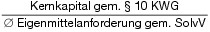

    *        *   Eigenmittelquote

        *   4,30 %

        *            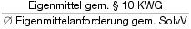

    *        *   Risikovorsorgequote

        *   6,81 %

        *            

    *        *   Risikozuführungsquote

        *   3,64 %

        *            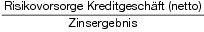

    *        *   Eigenkapitalrentabilität

        *   3,96 %

        *            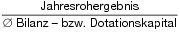

    *        *   Bruttorentabilität

        *   4,94 %

        *            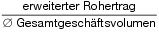

    *        *   Kostendeckungsquote

        *   2,71 %

        *            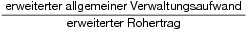

    *        *   Nettorentabilität

        *   1,84 %

        *            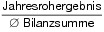

    *        *   Liquiditätsquote

        *   9,21 %

        *            

    *        *   Refinanzierungsquote

        *   5,33 %

        *            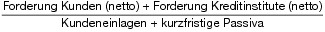

    *        *   Bestandssensitivität Wertpapiere

        *   6,06 %

        *            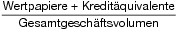

    *        *   Ergebnissensitivität Wertpapiere

        *   0,59 %

        *            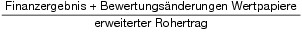

    *        *
        *   50,00 %

        *

   Der Anteil der Kennzahlen an der Bonitätsnote gemäß § 4 Absatz 1 Satz
    2 ergibt sich aus deren Gewicht gemäß Spalte 2 der vorstehenden
    Tabelle.

2.  Beschreibung der Kennzahlenquotienten gemäß Spalte 3 der vorstehenden
    Tabelle:

    –   Kernkapital gem. § 10 KWG: Kernkapital gemäß den Angaben im
        Übersichtsbogen zu den Eigenmitteln nach § 10 in Verbindung mit § 10a
        KWG (Meldebogen E UEB oder Q UEB ID-Nummer 1.4 der Anlage 3 zur SolvV)

    –   Ø Eigenmittelanforderung gem. SolvV: (Vorjahr + Berichtsjahr)/2 gemäß
        den Angaben im Übersichtsbogen zu den Eigenmitteln nach § 10 in
        Verbindung mit § 10a KWG (Meldebogen E UEB oder Q UEB ID-Nummer 2 der
        Anlage 3 zur SolvV)

    –   Eigenmittel gem. § 10 KWG: Eigenmittel insgesamt gemäß den Angaben im
        Übersichtsbogen zu den Eigenmitteln nach § 10 in Verbindung mit § 10a
        KWG (Meldebogen E UEB oder Q UEB ID-Nummer 1 der Anlage 3 zur SolvV)

    –   Bestand Risikovorsorge Kundenforderungen: Bestand
        Einzelwertberichtigung Kunden + Bestand Pauschalwertberichtigung
        Kunden

    –   Forderungen Kunden (brutto): Bilanzposition Forderungen an Kunden
        zuzüglich des Bestandes Einzel- und Pauschalwertberichtigung Kunden
        und versteuerter Vorsorgereserven

    –   Risikovorsorge Kreditgeschäft (netto): Saldiertes Bewertungsergebnis
        im Kreditgeschäft ohne Berücksichtigung einer Kompensation mit dem
        Bewertungsergebnis von Wertpapieren der Liquiditätsreserve
        (Überkreuzkompensation)

    –   Zinsergebnis: Saldo aus der Position Zinserträge gemäß § 28 RechKredV
        und Zinsaufwand gemäß § 29 RechKredV (ohne Berücksichtigung von
        laufenden Erträgen aus Aktien und anderen nicht festverzinslichen
        Wertpapieren, Beteiligungen, Anteilen an verbundenen Unternehmen)

    –   Jahresrohergebnis: Ergebnis der normalen Geschäftstätigkeit vor
        Steuern zuzüglich des außerordentlichen Ergebnisses

    –   Ø Bilanz- bzw. Dotationskapital: (Vorjahr + Berichtsjahr)/2,
        Eigenkapital gemäß Formblatt 1 der RechKredV

    –   Erweiterter Rohertrag: Ergebnis der normalen Geschäftstätigkeit vor
        Steuern bereinigt um das Bewertungsergebnis im Kreditgeschäft, die
        allgemeinen Verwaltungsaufwendungen sowie Abschreibungen und
        Wertberichtigungen auf immaterielle Anlagewerte und Sachanlagen

    –   Ø Gesamtgeschäftsvolumen: (Vorjahr + Berichtsjahr)/2, Brutto-
        Bilanzsumme (=Bilanzsumme inkl. Risikovorsorgebestand) + andere
        außerbilanzielle Geschäfte inkl. Rückstellungen gemäß § 19 Absatz 1
        KWG

    –   Erweiterter allgemeiner Verwaltungsaufwand: Allgemeiner
        Verwaltungsaufwand gemäß § 31 RechKredV + Abschreibungen und
        Wertberichtigungen auf immaterielle Anlagewerte und Sachanlagen gemäß
        Formblatt 2 der RechKredV + ertragsunabhängige Steuern gemäß Formblatt
        2 der RechKredV

    –   Ø Bilanzsumme: (Vorjahr + Berichtsjahr)/2, Bilanzsumme gemäß
        Bilanzausweis

    –   Liquide Aktiva: Barreserve + refinanzierbare Schuldtitel + Forderungen
        Kunden und Kreditinstitute mit einer Restlaufzeit bis drei Monaten +
        Wertpapiere der Liquiditätsreserve + Wertpapiere des Handelsbestandes

    –   Kundeneinlagen: Verbindlichkeiten gegenüber Kunden mit einer
        Restlaufzeit von bis zu drei Monaten

    –   Kurzfristige Passiva: Verbindlichkeiten gegenüber Kreditinstituten mit
        einer Restlaufzeit von bis zu drei Monaten + Handelspassiva +
        verbriefte Verbindlichkeiten mit einer Restlaufzeit bis drei Monaten

    –   Forderung Kunden (netto): Forderung Kunden gemäß Bilanzausweis

    –   Forderung Kreditinstitute (netto): Forderung Kreditinstitute gemäß
        Bilanzausweis

    –   Wertpapiere: Schuldverschreibungen und andere festverzinsliche
        Wertpapiere + Aktien und andere nicht festverzinsliche Wertpapiere +
        Handelsbestand (alle gemäß Bilanzausweis)

    –   Kreditäquivalente: Beträge, mit denen Derivate als Kredit nach den §§
        13 bis 13b und 14 KWG anzurechnen sind (gemäß GroMiKV)

    –   Finanzergebnis: Nettoertrag aus Finanzgeschäften gemäß Formblatt 2 der
        RechKredV

    –   Bewertungsänderungen Wertpapiere: Bewertungsergebnis der Wertpapiere
        der Liquiditätsreserve (analog § 32 RechKredV) + Bewertungsergebnis
        der Wertpapiere des Anlagevermögens (analog § 33 RechKredV).

3.  Grundlage für die Ermittlung der Kennzahlen sind die Verhältnisse der
    Vermögens-, Finanz- und Ertragslage zum Ende des letzten vor dem 1.
    März des jeweiligen Abrechnungsjahres abgeschlossenen Geschäftsjahres.
    Die nach Nummer 1 zu berücksichtigenden Finanzdaten basieren auf dem
    Jahresabschluss des Instituts gemäß § 5 Absatz 2 Satz 1 und 2 bzw. den
    entsprechenden Vermögensübersichten mit Aufwands- und Ertragsrechnung
    und Anhang gemäß § 53 Absatz 2 Nummer 2 KWG. Bei Anwendung der so
    genannten Waiver-Regelung gemäß § 2a KWG werden für die Kennzahlen
    Kernkapitalquote und Eigenmittelquote die Relationen auf Konzernebene
    berücksichtigt. Bei Instituten, die unter die Regelungen des § 53c
    Nummer 2 KWG fallen, werden für die Kennzahlen Kernkapitalquote und
    Eigenmittelquote die Relationen der Zentrale berücksichtigt.

4.  Die Kennzahlen werden unter Anwendung mathematisch-statistischer
    Verfahren (Diskriminanz-Analyse) zu einer optimierten Funktion
    entwickelt, die im Rahmen regelmäßiger Validierungs- und Backtesting-
    Verfahren soweit erforderlich angepasst und weiterentwickelt wird.

## Anlage 2 (zu § 6 Absatz 1)

(Fundstelle: BGBl. I 2011, 2689)

## **Bonitätseinschätzung auf Grundlage von Ratings**

Die Ratingergebnisse fließen in Form eines gewichteten Durchschnitts
in die Bonitätsnote ein. Die Gewichtung mehrerer einfließender
Ratingergebnisse richtet sich nach deren Aktualität. Je jünger das
Ratingergebnis ist, desto stärker ist sein Gewicht. Die Berechnung des
gewichteten Durchschnitts erfolgt in vier Schritten:

**Schritt 1**

Bestimmung des Alters aller für ein Institut zu berücksichtigenden
Ratings mit einer Laufzeit von*              365 Tagen:

F(Alter aller Ratings) =

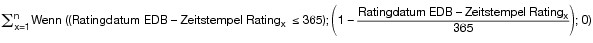
**Schritt 2**

Bestimmung des Gewichts des Ratings, bezogen auf jedes für ein
Institut zu berücksichtigende Rating:

F(Gewicht des Ratings
x             ) =

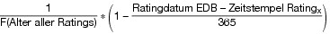
Die Summe aus den einzelnen Gewichten der Ratings muss immer 1
ergeben.

**Schritt 3**

Bestimmung des gewichteten Durchschnitts des Ratings, bezogen auf
jedes für ein Institut zu berücksichtigende Rating:

F(gewichteter Durchschnitt des Ratings
x             ) =
Punktwert Rating
x             \* F(Gewicht des Ratings
x             )

**Schritt 4**

Bestimmung des gewichteten Durchschnitts der Ratings:

F(gewichteter Durchschnitt der Ratings) =
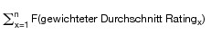
Für die Bestimmung in den Schritten 1 bis 4 sind folgende Parameter zu
berücksichtigen:

–   Ratingdatum EDB = Erstellungszeitpunkt des EdB-Ratings

–   Zeitstempel Rating
    x                    = Veröffentlichungsdatum je Rating

–   x = Rating 1, Rating 2, …, Rating n

–   Dem Ratingergebnis wird über eine Transformationsmatrix ein
    entsprechender Punktwert zugeordnet.

–   Alter des Ratings
    x                    = (Ratingdatum EDB – Zeitstempel Rating
    x                   )

    Die Ergebnisse des Ratings werden unter Anwendung mathematisch-
    statistischer Verfahren (Diskriminanz-Analyse) zu einer optimierten
    Funktion entwickelt, die im Rahmen regelmäßiger Validierungs- und
    Backtesting-Verfahren soweit erforderlich angepasst und
    weiterentwickelt wird.

