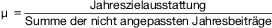
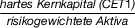
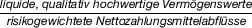
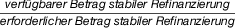

# Verordnung über die Finanzierung der Entschädigungseinrichtung deutscher Banken GmbH und der Entschädigungseinrichtung des Bundesverbandes Öffentlicher Banken Deutschlands GmbH (EntschFinV)

Ausfertigungsdatum
:   2016-01-05

Fundstelle
:   BGBl I: 2016, 9

## Eingangsformel

Auf Grund des § 33 Absatz 1 Satz 1 Nummer 1 bis 3 und 6 des
Einlagensicherungsgesetzes vom 28. Mai 2015 (BGBl. I S. 786) verordnet
das Bundesministerium der Finanzen nach Anhörung der
Entschädigungseinrichtung deutscher Banken GmbH und der
Entschädigungseinrichtung des Bundesverbandes Öffentlicher Banken
Deutschlands GmbH:

## Teil 1 - Allgemeine Vorschriften

### § 1 Anwendungsbereich und Verordnungsgegenstand

(1) Diese Verordnung gilt für

1.  die Entschädigungseinrichtung deutscher Banken GmbH und die
    Entschädigungseinrichtung des Bundesverbandes Öffentlicher Banken
    Deutschlands GmbH (Entschädigungseinrichtungen) sowie

2.  CRR-Kreditinstitute im Sinne des § 1 des Einlagensicherungsgesetzes,
    die einer Entschädigungseinrichtung zugeordnet sind.

(2) Diese Verordnung regelt das Nähere über die Finanzierung der
Entschädigungseinrichtungen und trifft nähere Bestimmungen über

1.  die Methoden der Beitragsbemessung nach § 19 Absatz 2 bis 4 des
    Einlagensicherungsgesetzes,

2.  die Berechnung und Erhebung der Beiträge und Zahlungen,

3.  die Erhebung von Verzugszinsen für verspätet geleistete Beiträge und
    Zahlungen sowie

4.  die Berücksichtigung von Zahlungsverpflichtungen und dazugehörigen
    Finanzsicherheiten.

### § 2 Begriffsbestimmungen

(1) Gedeckte Einlagen eines CRR-Kreditinstituts im Sinne dieser
Verordnung sind die nach § 8 Absatz 1 des Einlagensicherungsgesetzes
gedeckten Einlagen.

(2) Zahlungsverpflichtungen im Sinne dieser Verordnung sind die
vertraglich begründeten Zahlungspflichten der CRR-Kreditinstitute, die
als verfügbare Finanzmittel der Entschädigungseinrichtung nach § 18
Absatz 2 des Einlagensicherungsgesetzes berücksichtigt werden können.

(3) Finanzsicherheiten im Sinne dieser Verordnung sind risikoarme
Schuldtitel oder Barsicherheiten.

(4) Risikoarme Schuldtitel im Sinne dieser Verordnung sind
Vermögenswerte im Sinne des § 18 Absatz 1 Satz 2 des
Einlagensicherungsgesetzes, die nach § 28 Absatz 1 als
Finanzsicherheiten für Zahlungsverpflichtungen zugelassen sind.

(5) Barsicherheiten im Sinne dieser Verordnung sind Barsicherheiten im
Sinne des Artikels 2 Absatz 1 Buchstabe d der Richtlinie 2002/47/EG
des Europäischen Parlaments und des Rates vom 6. Juni 2002 über
Finanzsicherheiten (ABl. L 168 vom 27.6.2002, S. 43), die durch die
Richtlinie 2014/59/EU (ABl. L 173 vom 12.6.2014, S. 190) geändert
worden ist, soweit diese Barsicherheiten nach § 28 Absatz 1 als
Finanzsicherheit für Zahlungsverpflichtungen zugelassen sind.

## Teil 2 - Beiträge und Zahlungen

### Kapitel 1 - Jahresbeitrag

#### Abschnitt 1 - Beitragspflicht und Beitragserhebung

##### § 3 Beitragspflicht

(1) CRR-Kreditinstitute, die der Entschädigungseinrichtung im
jeweiligen Abrechnungsjahr zugeordnet sind, sind nach Maßgabe des § 26
Absatz 1 Satz 1 des Einlagensicherungsgesetzes zur Zahlung eines
Jahresbeitrags verpflichtet. Der Jahresbeitrag vermindert sich für
CRR-Kreditinstitute, die vom 1. Oktober bis zum 31. Dezember vor
Beitragsfälligkeit aus der Entschädigungseinrichtung ausscheiden, um
75 Prozent, für CRR-Kreditinstitute, die vom 1. Januar bis zum 31.
März vor Beitragsfälligkeit ausscheiden, um 50 Prozent und für CRR-
Kreditinstitute, die vom 1. April bis zum 30. Juni vor
Beitragsfälligkeit ausscheiden, um 25 Prozent.

(2) Die Beitragspflicht eines CRR-Kreditinstituts endet, sobald die
Erlaubnis des CRR-Kreditinstituts erloschen oder unanfechtbar
aufgehoben worden ist.

##### § 4 Beitragsbescheid und Zahlungsverpflichtung

(1) Die Entschädigungseinrichtung erhebt den Jahresbeitrag zum Ende
eines Abrechnungsjahres durch einen Beitragsbescheid.

(2) Die Höhe des festzusetzenden Beitrags ergibt sich aus dem
Jahresbeitrag abzüglich des Betrags, den das CRR-Kreditinstitut durch
die Übernahme einer Zahlungsverpflichtung nach den §§ 19 bis 22
erbringt.

(3) Der durch die Übernahme einer Zahlungsverpflichtung zu erbringende
Betrag darf nach Absatz 2 nur abgezogen werden, wenn die
Voraussetzungen für die Übernahme einer Zahlungsverpflichtung nach den
§§ 19 und 20 vorliegen. Stellt die Entschädigungseinrichtung nach
Festsetzung des Beitrags nach Absatz 2 fest, dass die Voraussetzungen
für die Übernahme einer Zahlungsverpflichtung nicht vorgelegen haben,
oder ist der Vertrag über die Zahlungsverpflichtung nichtig oder
beendet, setzt die Entschädigungseinrichtung den von der
Zahlungsverpflichtung umfassten Betrag durch einen ergänzenden
Beitragsbescheid fest.

(4) Der Beitrag wird mit Bekanntgabe des Beitragsbescheids nach Absatz
1 oder eines ergänzenden Beitragsbescheids nach Absatz 3 fällig.

#### Abschnitt 2 - Risikoorientierte Beitragsbemessung

##### Titel 1 - Allgemeine Vorschriften

###### § 5 Beitragsbemessung und Zuschlag für Verwaltungskosten

(1) Der Jahresbeitrag eines CRR-Kreditinstituts ist nach § 7 so zu
bemessen, dass mit der Summe aller Jahresbeiträge mindestens die
Jahreszielausstattung nach § 6 erreicht wird.

(2) Der Jahresbeitrag beträgt

1.  für CRR-Kreditinstitute, die der Entschädigungseinrichtung deutscher
    Banken GmbH zugeordnet sind, mindestens 20 000 Euro und

2.  für CRR-Kreditinstitute, die der Entschädigungseinrichtung des
    Bundesverbandes Öffentlicher Banken Deutschlands GmbH zugeordnet sind,
    mindestens
    6 500 Euro;                    besteht für das CRR-Kreditinstitut eine
    Anstaltslast, Gewährträgerhaftung oder Refinanzierungsgarantie,
    beträgt der Jahresbeitrag mindestens 3 250 Euro.

(3) Zusätzlich zum Jahresbeitrag kann zur Deckung der
Verwaltungskosten und sonstigen Kosten, die der
Entschädigungseinrichtung im Rahmen ihrer Tätigkeit entstehen, ein
pauschalierter Kostenzuschlag erhoben werden. Der Kostenzuschlag darf

1.  für CRR-Kreditinstitute, die der Entschädigungseinrichtung der
    deutschen Banken GmbH zugeordnet sind, 12 500 Euro und

2.  für CRR-Kreditinstitute, die der Entschädigungseinrichtung des
    Bundesverbandes Öffentlicher Banken Deutschlands GmbH zugeordnet sind,
    40 000 Euro

jeweils zuzüglich 0,5 Prozent des Jahresbeitrags des CRR-
Kreditinstituts nicht überschreiten. Der Kostenzuschlag wird mit dem
jeweiligen Jahresbeitrag im Beitragsbescheid festgesetzt und getrennt
ausgewiesen. Die Entschädigungseinrichtung kann einen Kostenzuschlag
auch für solche Abrechnungsjahre erheben, in denen kein Jahresbeitrag
erhoben wird.

###### § 6 Jahreszielausstattung

(1) Um sicherzustellen, dass die Zielausstattung nach § 17 Absatz 2
Satz 1 des Einlagensicherungsgesetzes erreicht wird, ermittelt die
Entschädigungseinrichtung im jeweiligen Abrechnungsjahr eine
Jahreszielausstattung.

(2) Die Jahreszielausstattung ist bis zum 15. August eines jeden
Jahres zu ermitteln. Hierzu wird der Differenzbetrag zwischen den zu
diesem Zeitpunkt vorhandenen verfügbaren Finanzmitteln und der
Zielausstattung durch die Anzahl der Jahre geteilt, die bis zum Ende
des jeweils geltenden Ansparzeitraums im Sinne des § 17 Absatz 2 und 3
des Einlagensicherungsgesetzes verbleiben.

(3) Ein nach § 17 Absatz 3 des Einlagensicherungsgesetzes neu zu
bestimmender Ansparzeitraum beginnt mit dem Abrechnungsjahr, das auf
das Abrechnungsjahr folgt, in dem die Unterschreitung der
Zielausstattung eingetreten ist. Der neue Ansparzeitraum darf sechs
Jahre nicht überschreiten.

(4) Die der Berechnung nach Absatz 1 zugrunde zu legende
Jahreszielausstattung ist jährlich auf Grundlage der gedeckten
Einlagen aller CRR-Kreditinstitute zum Stand vom 31. Dezember des
Vorjahres zu bestimmen.

(5) Die Entschädigungseinrichtung kann die Jahreszielausstattung
konjunkturbedingt erhöhen oder absenken. Hierbei sind die jeweilige
Phase des Konjunkturzyklus und die möglichen Auswirkungen
prozyklischer Beiträge auf die wirtschaftliche Situation der CRR-
Kreditinstitute zu berücksichtigen.

(6) Die Jahreszielausstattung kann um einen pauschalen Zuschlag erhöht
werden, wenn dies im Hinblick auf ein prognostiziertes Wachstum der
gedeckten Einlagen bis zum Erreichen der Zielausstattung erforderlich
erscheint.

###### § 7 Berechnungsformel

(1) Der Jahresbeitrag wird nach der folgenden Formel berechnet:
C
i              = max {MC
i              ; (CR x ARW
i              x CD
i              x µ)}
Die Faktoren haben folgende Bedeutung:

*    *   C
        i                        =

    *   Jahresbeitrag des CRR-Kreditinstituts,

*    *   MC
        i                        =

    *   Mindestbeitrag gemäß § 5 Absatz 2,

*    *   CR =

    *   Beitragsrate,

*    *   ARW
        i                        =

    *   aggregiertes Risikogewicht des CRR-Kreditinstituts,

*    *   CD
        i                        =

    *   gedeckte Einlagen des CRR-Kreditinstituts,

*    *   µ =

    *   Korrekturfaktor.

Der Jahresbeitrag ist der höhere Betrag, entweder der Mindestbetrag MC
i              oder das Ergebnis der Formel CR x ARW
i              x CD
i              x µ.

(2) Die Beitragsrate ist für alle CRR-Kreditinstitute einer
Entschädigungseinrichtung einheitlich. Die Entschädigungseinrichtung
ermittelt die Beitragsrate jährlich zum 15. August, indem die nach § 6
ermittelte Jahreszielausstattung durch die Summe der gedeckten
Einlagen aller CRR-Kreditinstitute zum Stand vom 31. Dezember des
Vorjahres geteilt wird.

(3) Das aggregierte Risikogewicht des CRR-Kreditinstituts ist ein
Prozentwert, der anhand mehrerer Risikoindikatoren gemäß den §§ 8 bis
12 ermittelt wird.

(4) Die gedeckten Einlagen des CRR-Kreditinstituts sind die zum Stand
vom 31. Dezember des Vorjahres bei dem CRR-Kreditinstitut vorhandenen
und nach § 17 Absatz 4 des Einlagensicherungsgesetzes zu meldenden
gedeckten Einlagen.

(5) Mit dem Korrekturfaktor passt die Entschädigungseinrichtung die
Summe der Jahresbeiträge aller CRR-Kreditinstitute, die sich bei der
Berechnung der Jahresbeiträge auf Grundlage der Beitragsrate, des
aggregierten Risikogewichts und der gedeckten Einlagen eines jeden
CRR-Kreditinstituts nach der Formel C
i              = CR x ARW
i              x CD
i              ergeben würden (nicht angepasste Jahresbeiträge), an
die Jahreszielausstattung an. Der Korrekturfaktor wird nach der
folgenden Formel ermittelt:
Die Entschädigungseinrichtung ist berechtigt, den Korrekturfaktor zu
verringern oder zu erhöhen, wenn dies aufgrund einer Entwicklung des
Konjunkturzyklus und der prozyklischen Wirkung der Jahresbeiträge
erforderlich ist.

##### Titel 2 - Bestimmung des aggregierten Risikogewichts für CRR-Kreditinstitute, die der Entschädigungseinrichtung deutscher Banken GmbH zugeordnet sind

###### § 8 Bestimmung des aggregierten Risikogewichts

(1) Für CRR-Kreditinstitute, die der Entschädigungseinrichtung
deutscher Banken GmbH zugeordnet sind, wird das aggregierte
Risikogewicht auf der Grundlage einer Bonitätsnote bestimmt. Die
Bonitätsnote beruht auf einer Risikoeinschätzung des CRR-
Kreditinstituts durch die Entschädigungseinrichtung auf der Grundlage
von Risikokategorien und Risikoindikatoren nach Maßgabe der §§ 9 und
10 sowie nach Maßgabe der Anlage 1.

(2) Aus der Bonitätsnote ergibt sich das aggregierte Risikogewicht wie
folgt:

*    *   Bonitätsnote

    *   0

    *   1

    *   2

    *   3

    *   4

    *   5

    *   6

    *   7

    *   8

    *   9

*    *   Aggregiertes
        Risikogewicht

    *   50 %

    *   75 %

    *   90 %

    *   100 %

    *   110 %

    *   125 %

    *   140 %

    *   160 %

    *   180 %

    *   200 %

(3) Für neu gegründete CRR-Kreditinstitute gilt bis einschließlich der
Vollendung des zweiten vollständigen Geschäftsjahres abweichend von
den Absätzen 1 und 2 ein aggregiertes Risikogewicht von 110 Prozent.

###### § 9 Risikokategorien, Risikoindikatoren und Risikogewichtung

(1) Für die Einschätzung des Risikos des CRR-Kreditinstituts legt die
Entschädigungseinrichtung deutscher Banken GmbH die folgenden
Risikokategorien zugrunde:

1.  Kapital,

2.  Liquidität und Refinanzierung,

3.  Qualität der Vermögensanlage,

4.  Geschäftsmodell und Management sowie

5.  Verlustrisiko der Entschädigungseinrichtung.

Den Risikokategorien sind jeweils Risikoindikatoren gemäß Anlage 1
zugeordnet.

(2) Die Gewichtung der Risikokategorien und Risikoindikatoren und die
Ermittlung der Bonitätsnote erfolgt nach Maßgabe von Anlage 1.

(3) Das Nähere zur Risikoeinschätzung für die Risikokategorien nach
Absatz 1 bestimmt sich nach Anlage 1. Die Risikoeinschätzung für die
Risikokategorie nach Absatz 1 Nummer 4 erfolgt auch auf der Grundlage
von Ratings nach § 10.

###### § 10 Risikoeinschätzung auf der Grundlage von Ratings

(1) Für die Risikoeinschätzung auf Grundlage von Ratings dürfen nur
Ratingergebnisse von aktuellen Kreditratings eines anerkannten
Ratingunternehmens in Form von Vollratings mit einem Prognosezeitraum
von einem Jahr zugrunde gelegt werden. Aktuelle Ratings sind solche,
die im Auftrag des CRR-Kreditinstituts oder eines Dritten in Bezug auf
die Bonität des CRR-Kreditinstituts erstellt worden und am 31. Mai des
jeweiligen Abrechnungsjahres gültig sind. Aktuelle Ratings von CRR-
Kreditinstituten im Sinne des § 53 Absatz 1 Satz 1 des
Kreditwesengesetzes sind auch solche, die in Bezug auf die Bonität
ihres Unternehmens im Ausland erstellt worden sind.

(2) Anerkannte Ratingunternehmen sind Unternehmen, die als
Ratingagenturen

1.  gemäß Artikel 14 der Verordnung (EG) Nr. 1060/2009 des Europäischen
    Parlaments und des Rates vom 16. September 2009 über Ratingagenturen
    (ABl. L 302 vom 17.11.2009, S. 1, L 350 vom 29.12.2009, S. 59, L 145
    vom 31.5.2011, S. 57) in der jeweils geltenden Fassung registriert
    oder

2.  gemäß Artikel 5 der Verordnung (EG) Nr. 1060/2009 zertifiziert sind
    und die

3.  seit mindestens fünf Jahren Erfahrung mit dem Kreditrating von CRR-
    Kreditinstituten haben oder seit mindestens zehn Jahren
    Bonitätseinschätzungen für Sicherungseinrichtungen von CRR-
    Kreditinstituten vorgenommen haben.

Die CRR-Kreditinstitute haben der Entschädigungseinrichtung deutscher
Banken GmbH auf Anforderung in geeigneter Weise nachzuweisen, dass die
Voraussetzungen nach Satz 1 Nummer 1 und 2 vorliegen.

(3) Jeder Bonitätsbeurteilungskategorie, die von einem anerkannten
Ratingunternehmen verwendet wird, ordnet die Entschädigungseinrichtung
deutscher Banken GmbH eine Ratingnotenklasse nach denjenigen
Grundsätzen zu, die in Artikel 136 der Verordnung (EU) Nr. 575/2013
des Europäischen Parlaments und des Rates vom 26. Juni 2013 über
Aufsichtsanforderungen an Kreditinstitute und Wertpapierfirmen und zur
Änderung der Verordnung (EU) Nr. 648/2012 (ABl. L 176 vom 27.6.2013,
S. 1, L 208 vom 2.8.2013, S. 68, L 321 vom 30.11.2013, S. 6, L 193 vom
21\.7.2015, S. 166), die durch die Delegierte Verordnung (EU) 2015/62
(ABl. L 11 vom 17.1.2015, S. 37) geändert worden ist, geregelt sind.
Die Entschädigungseinrichtung deutscher Banken GmbH veröffentlicht die
Zuordnung auf ihrer Internetseite.

(4) Die CRR-Kreditinstitute sind verpflichtet, der
Entschädigungseinrichtung deutscher Banken GmbH zur Erstellung der
Risikoeinschätzung alle auf sie bezogenen aktuellen Ratings im Sinne
des Absatzes 1 zu übermitteln. Sofern CRR-Kreditinstitute nicht über
ein aktuelles Rating verfügen, sind sie verpflichtet, ein solches
einzuholen. Satz 2 gilt nicht für CRR-Kreditinstitute im Sinne des §
53 Absatz 1 Satz 1 des Kreditwesengesetzes, die alle Ratings ihres
Unternehmens mit Sitz im Ausland vorlegen, wenn diese Ratings die
Anforderungen des Absatzes 1 erfüllen.

##### Titel 3 - Bestimmung des aggregierten Risikogewichts für CRR-Kreditinstitute, die der Entschädigungseinrichtung des Bundesverbandes Öffentlicher Banken Deutschlands GmbH zugeordnet sind

###### § 11 Bestimmung des aggregierten Risikogewichts

(1) Für CRR-Kreditinstitute, die der Entschädigungseinrichtung des
Bundesverbandes Öffentlicher Banken Deutschlands GmbH zugeordnet sind,
wird das aggregierte Risikogewicht auf der Grundlage einer
Risikoklasse bestimmt. Die Risikoklasse beruht auf einer
Risikoeinschätzung des CRR-Kreditinstituts durch die
Entschädigungseinrichtung des Bundesverbandes Öffentlicher Banken
Deutschlands GmbH auf der Grundlage von Risikokategorien und
Risikoindikatoren nach Maßgabe des § 12 und nach Maßgabe der Anlage 2.

(2) Aus der Risikoklasse ergibt sich das aggregierte Risikogewicht wie
folgt:

*    *   Risikoklasse

    *   0

    *   1

    *   2

    *   3

    *   4

    *   5

*    *   Aggregiertes Risikogewicht

    *   50 %

    *   75 %

    *   100 %

    *   125 %

    *   150 %

    *   200 %

(3) Für neu gegründete CRR-Kreditinstitute gilt bis einschließlich der
Vollendung des zweiten vollständigen Geschäftsjahres abweichend von
den Absätzen 1 und 2 ein aggregiertes Risikogewicht von 125 Prozent.

###### § 12 Risikokategorien, Risikoindikatoren und Risikogewichtung

(1) Für die Einschätzung des Risikos eines CRR-Kreditinstituts legt
die Entschädigungseinrichtung des Bundesverbandes Öffentlicher Banken
Deutschlands GmbH die folgenden Risikokategorien zugrunde:

1.  Kapital,

2.  Liquidität und Refinanzierung,

3.  Qualität der Vermögensanlage,

4.  Geschäftsmodell und Management sowie

5.  Verlustrisiko der Entschädigungseinrichtung.

Den Risikokategorien sind jeweils Risikoindikatoren gemäß Anlage 2
zugeordnet.

(2) Die Gewichtung der Risikokategorien und Risikoindikatoren und die
Aggregation der Risikoindikatoren zu einem aggregierten Risikowert
erfolgt nach Maßgabe der Anlage 2.

### Kapitel 2 - Einmalige Zahlung

#### § 13 Zahlungspflicht

(1) CRR-Kreditinstitute, die einer Entschädigungseinrichtung neu
zugeordnet werden, haben neben dem Jahresbeitrag eine nach Maßgabe des
§ 14 berechnete einmalige Zahlung zu leisten.

(2) Von der Pflicht, eine einmalige Zahlung zu leisten sind CRR-
Kreditinstitute befreit, die

1.  vor dem Inkrafttreten des Einlagensicherungsgesetzes der
    Entschädigungseinrichtung zugeordnet wurden und eine einmalige Zahlung
    an diese geleistet haben auf der Grundlage des § 8 Absatz 2 Satz 4 des
    Einlagensicherungs- und Anlegerentschädigungsgesetzes vom 16. Juli
    1998 (BGBl. I S. 1842), das zuletzt durch Artikel 2 des Gesetzes vom
    28\. Mai 2015 (BGBl. I S. 786) geändert worden ist, in Verbindung mit

    a)  § 2 Absatz 1 Satz 1 oder Absatz 2 Satz 4 der Verordnung über die
        Beiträge zur Entschädigungseinrichtung deutscher Banken GmbH vom 10.
        Juli 1999 (BGBl. I S. 1540), die zuletzt durch Artikel 5 der
        Verordnung vom 30. Januar 2014 (BGBl. I S. 322) geändert worden ist,
        oder mit

    b)  § 2 Absatz 1 der Verordnung über die Beiträge zur
        Entschädigungseinrichtung des Bundesverbandes Öffentlicher Banken
        Deutschlands GmbH vom 10. Juli 1999 (BGBl. I S. 1538), die zuletzt
        durch Artikel 4 der Verordnung vom 30. Januar 2014 (BGBl. I S. 322)
        geändert worden ist,

oder

2.  durch Umwandlung aus CRR-Kreditinstituten, die vormals der
    Entschädigungseinrichtung angehört haben, entstanden sind, sofern
    diese CRR-Kreditinstitute im Aufnahmejahr bereits Jahresbeiträge
    geleistet haben.

#### § 14 Bemessung und Fälligkeit

(1) Die einmalige Zahlung beträgt 0,2 Prozent der gedeckten Einlagen,
die bei dem CRR-Kreditinstitut am 31. Dezember des Vorjahres vorhanden
waren, mindestens jedoch 25 000 Euro.

(2) Die einmalige Zahlung wird mit der Bekanntgabe des Bescheids
fällig.

### Kapitel 3 - Verfahrensregeln

#### § 15 Vorlage- und Nachweispflichten

(1) Die Entschädigungseinrichtung bestimmt die Modalitäten der nach §
17 Absatz 4 des Einlagensicherungsgesetzes vorgeschriebenen Meldung
zur Höhe der gedeckten Einlagen und veröffentlicht sie auf ihrer
Internetseite. Die CRR-Kreditinstitute haben der
Entschädigungseinrichtung die sachliche und rechnerische Richtigkeit
der übermittelten Informationen zu bestätigen. Die
Entschädigungseinrichtung kann die Richtigkeit der Meldung prüfen.

(2) CRR-Kreditinstitute sind verpflichtet, der
Entschädigungseinrichtung zur Bemessung des Jahresbeitrags zum 30.
Juni des jeweiligen Abrechnungsjahres folgende Daten und Unterlagen zu
übermitteln:

1.  den Jahresabschluss im Sinne des § 26 Absatz 1 Satz 1 und 2 des
    Kreditwesengesetzes des Geschäftsjahres, das vor dem 1. März des
    jeweiligen Abrechnungsjahres abgeschlossen worden ist, und des
    Vorjahres,

2.  die Meldungen nach den Vorgaben der Durchführungsverordnung (EU) Nr.
    680/2014 der Kommission vom 16. April 2014 zur Festlegung technischer
    Durchführungsstandards für die aufsichtlichen Meldungen der Institute
    gemäß der Verordnung (EU) Nr. 575/2013 des Europäischen Parlaments und
    des Rates (ABl. L 191 vom 28.6.2014, S. 1) und der
    Durchführungsverordnung (EU) 2015/79 der Kommission vom 18. Dezember
    2014 zur Änderung der Durchführungsverordnung (EU) Nr. 680/2014 zur
    Festlegung technischer Durchführungsstandards für die aufsichtlichen
    Meldungen der Institute gemäß der Verordnung (EU) Nr. 575/2013 des
    Europäischen Parlaments und des Rates in Bezug auf die Belastung von
    Vermögenswerten, ein einheitliches Datenpunktmodell und
    Validierungsregeln (ABl. L 14 vom 21.1.2015, S. 1) zum Bilanzstichtag
    des Geschäftsjahres, das vor dem 1. März des jeweiligen
    Abrechnungsjahres abgeschlossenen worden ist, und zum Bilanzstichtag
    des Vorjahres,

3.  den Übersichtsbogen zu den Eigenmitteln gemäß Artikel 72 der
    Verordnung (EU) Nr. 575/2013 in Verbindung mit § 10a des
    Kreditwesengesetzes zum Bilanzstichtag des Geschäftsjahres, das vor
    dem 1. März des jeweiligen Abrechnungsjahres abgeschlossen worden ist,
    und zum Bilanzstichtag des Vorjahres,

4.  den Meldebogen zu den Finanzinformationen gemäß § 25 Absatz 1 Satz 1
    des Kreditwesengesetzes zum Bilanzstichtag des Geschäftsjahres, das
    vor dem 1. März des jeweiligen Abrechnungsjahres abgeschlossen worden
    ist, und zum Bilanzstichtag des Vorjahres sowie

5.  den ausgefüllten Fragebogen der Entschädigungseinrichtung zur Erhebung
    ergänzender Angaben zum Bilanzstichtag des Geschäftsjahres, das vor
    dem 1. März des jeweiligen Abrechnungsjahres abgeschlossen worden ist,
    und zum Bilanzstichtag des Vorjahres.

(3) CRR-Kreditinstitute, die der Entschädigungseinrichtung deutscher
Banken GmbH zugeordnet sind, sind verpflichtet, der
Entschädigungseinrichtung zusätzlich folgende Daten und Unterlagen bis
zum 30. Juni des jeweiligen Abrechnungsjahres zu übermitteln:

1.  die Vermögensübersicht mit Aufwands- und Ertragsrechnung und für
    Zweigstellen von Unternehmen mit Sitz im Ausland den Anhang gemäß § 53
    Absatz 2 Nummer 2 des Kreditwesengesetzes und

2.  zur Erstellung der Risikoeinschätzung alle auf sie bezogenen aktuellen
    Ratings oder die zur Vorlage bei der Entschädigungseinrichtung
    eingeholten Ratings im Sinne des § 10.

(4) Die Unterlagen nach Absatz 2 Nummer 1 und Absatz 3 Nummer 1 müssen
mit einem uneingeschränkten Bestätigungsvermerk des Abschlussprüfers
versehen sein. Ein Jahresabschluss oder eine Vermögensübersicht mit
eingeschränktem Bestätigungsvermerk wird von der
Entschädigungseinrichtung nur berücksichtigt, wenn sich die
Einwendungen des Abschlussprüfers nicht auf die Risikoindikatoren und
Risikokategorien beziehen, die für die Risikoeinschätzung nach den §§
8 bis 12 sowie nach den Anlagen 1 und 2 maßgeblich sind.

(5) Die Absätze 2 bis 4 gelten nicht für neu gegründete CRR-
Kreditinstitute, deren aggregiertes Risikogewicht sich nach § 8 Absatz
3 oder § 11 Absatz 3 richtet.

(6) Die Pflichten nach Absatz 2 bis 4 bestehen auch nach Erreichen der
Zielausstattung gemäß § 17 Absatz 2 Satz 1 des
Einlagensicherungsgesetzes.

#### § 16 Vorläufige und endgültige Festsetzung

(1) Legt ein CRR-Kreditinstitut die zur Bemessung des Jahresbeitrags
erforderlichen Daten und Unterlagen nicht rechtzeitig oder nicht
vollständig vor, ist die Entschädigungseinrichtung befugt, den
Jahresbeitrag nach Maßgabe der Absätze 2 bis 4 zu bemessen und
vorläufig festzusetzen. Der Beitrag wird mit Bekanntgabe des
Beitragsbescheids fällig.

(2) Sofern der Entschädigungseinrichtung die Höhe der nach § 17 Absatz
4 des Einlagensicherungsgesetzes zu meldenden gedeckten Einlagen eines
CRR-Kreditinstituts zum 15. August des jeweiligen Abrechnungsjahres
nicht vorliegen, schätzt sie den Umfang der gedeckten Einlagen und
legt der Bemessung des vorläufigen Jahresbeitrags das 1,35fache des
geschätzten Umfangs der gedeckten Einlagen zugrunde. Bei der Schätzung
der gedeckten Einlagen sind der Umfang und die Struktur der Geschäfte
des CRR-Kreditinstituts und einer Gruppe vergleichbarer CRR-
Kreditinstitute anhand geeigneter Unterlagen zu berücksichtigen.

(3) Legt ein CRR-Kreditinstitut die für die Erstellung der
Risikoeinschätzung erforderlichen Daten und Unterlagen gemäß § 15
Absatz 2 und 3 nicht rechtzeitig oder nicht vollständig vor, schätzt
die Entschädigungseinrichtung das Risiko des CRR-Kreditinstituts und
legt der Bemessung des vorläufigen Jahresbeitrags die nächsthöhere
Bonitätsnote nach § 8 Absatz 2 oder die nächsthöhere Risikoklasse nach
§ 11 Absatz 2 zugrunde. Bei der Schätzung des Risikos des CRR-
Keditinstituts sind die Bonitätsnoten oder Risikoklassen des CRR-
Kreditinstituts aus den letzten beiden vorangegangenen
Abrechnungsjahren und der Entschädigungseinrichtung aufgrund
geeigneter Unterlagen bekanntgewordene Änderungen in den Verhältnissen
der Vermögens-, Finanz- und Ertragslage des CRR-Kreditinstituts zu
berücksichtigen.

(4) Die Entschädigungseinrichtung bestimmt den Jahresbeitrag des CRR-
Kreditinstituts unter Berücksichtigung der bis spätestens zum 31.
Dezember nachgereichten Daten und Unterlagen neu und setzt den Beitrag
endgültig fest.

(5) Die nach den Absätzen 2 und 3 bestimmten Werte gelten als
endgültig, soweit das CRR-Kreditinstitut die erforderlichen Daten und
Unterlagen bis zum Ablauf der Frist des Absatzes 4 nicht nachgereicht
hat.

(6) Das CRR-Kreditinstitut hat eine Differenz zwischen dem vorläufig
festgesetzten Jahresbeitrag und dem endgültig festgesetzten
Jahresbeitrag nachzuentrichten. Die Differenzzahlung wird mit der
Bekanntgabe des endgültigen Bescheids über den Jahresbeitrag fällig.

#### § 17 Ausschlussfrist

(1) Daten und Unterlagen, die nach dem 31. Dezember des jeweils
folgenden Abrechnungsjahres vorgelegt werden, berücksichtigt die
Entschädigungseinrichtung für die Zwecke der Beitragsbemessung zu
Gunsten der CRR-Kreditinstitute nicht mehr.

(2) Die in Absatz 1 genannte Frist ist eine Ausschlussfrist.

#### § 18 Verzugszinsen

Wird bis zum Ablauf eines Monats nach dem Fälligkeitstag der jeweilige
Beitrag, ein vorläufiger Beitrag oder die jeweilige Zahlung nicht
entrichtet, erhebt die Entschädigungseinrichtung Verzugszinsen. Die
Entschädigungseinrichtung sieht von der Erhebung von Verzugszinsen ab,
sofern die Verzugszinsen 50 Euro nicht überschreiten. Ergänzend gelten
die Vorschriften des Bürgerlichen Gesetzbuchs zum Schuldnerverzug
entsprechend.

## Teil 3 - Zahlungsverpflichtungen und Finanzsicherheiten

### Kapitel 1 - Zahlungsverpflichtungen

#### § 19 Gestattung der Übernahme von Zahlungsverpflichtungen

(1) Die Entschädigungseinrichtung kann den ihr zugeordneten CRR-
Kreditinstituten gestatten, in einem Abrechnungsjahr bis zu 30 Prozent
ihres Jahresbeitrags durch Übernahme einer vertraglichen
Zahlungsverpflichtung zu erbringen. Die Übernahme einer
Zahlungsverpflichtung muss allen CRR-Kreditinstituten, die der
Entschädigungseinrichtung die nach § 17 Absatz 4 des
Einlagensicherungsgesetzes und nach § 15 Absatz 2 bis 4 erforderlichen
Daten und Unterlagen bis zum 15. August des Abrechnungsjahres
vollständig zur Verfügung gestellt haben, in Höhe des gleichen
Prozentsatzes vom jeweiligen Jahresbeitrag gestattet werden. Ein
Anspruch der CRR-Kreditinstitute auf Gestattung der Übernahme einer
Zahlungsverpflichtung besteht weder dem Grunde noch der Höhe nach.

(2) Abweichend von Absatz 1 Satz 1 kann die Entschädigungseinrichtung
den ihr zugeordneten CRR-Kreditinstituten gestatten, in einem
Abrechnungsjahr bis zu 100 Prozent ihres Jahresbeitrags durch
Übernahme einer Zahlungsverpflichtung zu erbringen, wenn

1.  die verfügbaren Finanzmittel der Entschädigungseinrichtung abzüglich
    der von den CRR-Kreditinstituten insgesamt übernommenen
    Zahlungsverpflichtungen mindestens 70 Prozent der Zielausstattung
    erreicht haben und

2.  die den CRR-Kreditinstituten insgesamt gestatteten
    Zahlungsverpflichtungen nach der Beitragserhebung in dem
    Abrechnungsjahr 30 Prozent der verfügbaren Finanzmittel nicht
    überschreiten würden.

Dem einzelnen CRR-Kreditinstitut darf die Übernahme einer
Zahlungsverpflichtung nach Satz 1 nur gestattet werden, soweit die von
dem CRR-Kreditinstitut insgesamt übernommenen Zahlungsverpflichtungen
nicht mehr als 30 Prozent des Anteils des CRR-Kreditinstituts an den
verfügbaren Finanzmitteln betragen.

#### § 20 Voraussetzungen für die Übernahme von Zahlungsverpflichtungen

Die Übernahme einer Zahlungsverpflichtung in einem Abrechnungsjahr
setzt voraus, dass ein CRR-Kreditinstitut

1.  mit der Entschädigungseinrichtung einen Rahmenvertrag über
    Zahlungsverpflichtungen nach § 21 und einen Rahmenvertrag über
    Finanzsicherheiten nach § 27 abgeschlossen hat, die einmalig,
    spätestens aber bis zum 30. Juni eines Abrechnungsjahres abzuschließen
    sind, und

2.  bis spätestens zum 1. September des jeweiligen Abrechnungsjahres mit
    der Entschädigungseinrichtung für das Abrechnungsjahr die Übernahme
    einer Zahlungsverpflichtung nach § 22 vereinbart und die
    Zahlungsverpflichtung durch Leistung von Finanzsicherheiten nach
    Maßgabe des § 26 abgesichert hat.

Die in Satz 1 genannten Fristen sind Ausschlussfristen. Ein CRR-
Kreditinstitut ist nicht verpflichtet, eine Zahlungsverpflichtung zu
erbringen.

#### § 21 Rahmenvertrag über Zahlungsverpflichtungen

(1) Der Rahmenvertrag bildet die Grundlage für den Abschluss von
Verträgen über die Übernahme von Zahlungsverpflichtungen nach § 22 in
den einzelnen Abrechnungsjahren. Im Rahmenvertrag sind der Inhalt der
Verträge und das Verfahren zum Abschluss der Verträge zu regeln.

(2) Die Entschädigungseinrichtung verwendet für den Rahmenvertrag ein
einheitliches Vertragsmuster. Das Vertragsmuster ist der Bundesanstalt
anzuzeigen.

(3) Der Rahmenvertrag ist von den gesetzlichen Vertretern des CRR-
Kreditinstituts zu unterzeichnen. Das CRR-Kreditinstitut hat der
Entschädigungseinrichtung die Vertretungsbefugnis der für sie
handelnden Personen in geeigneter Weise nachzuweisen. Soweit die
Verträge über Zahlungsverpflichtungen nach § 22 auf Seiten des CRR-
Kreditinstituts nicht von den gesetzlichen Vertretern des CRR-
Kreditinstituts abgeschlossen werden sollen, sind die
vertretungsberechtigten Personen im Rahmenvertrag zu bestimmen.

#### § 22 Verträge über die Übernahme von Zahlungsverpflichtungen

(1) Auf der Grundlage des Rahmenvertrags sind in den jeweiligen
Abrechnungsjahren einzelne Verträge über die Übernahme von
Zahlungsverpflichtungen abzuschließen. Diese Verträge müssen
insbesondere regeln, dass

1.  sich die Höhe der Zahlungsverpflichtungen danach richtet, in welcher
    Höhe die Entschädigungseinrichtung gemäß § 19 die Erbringung von
    Jahresbeträgen durch Zahlungsverpflichtungen gestattet hat;

2.  Zahlungsverpflichtungen unwiderruflich und unkündbar sind;

3.  die jeweilige Zahlungsverpflichtung durch bestimmte Finanzsicherheiten
    nach Maßgabe der §§ 25 bis 30 besichert wird;

4.  sich das CRR-Kreditinstitut der sofortigen Vollstreckung bezüglich der
    Zahlungsverpflichtung unterwirft (§ 61 Absatz 1 des
    Verwaltungsverfahrensgesetzes);

5.  die Übertragung von Verträgen über Zahlungsverpflichtungen auf andere
    CRR-Kreditinstitute nach Maßgabe des § 24 zulässig ist;

6.  das CRR-Kreditinstitut gegenüber der Entschädigungseinrichtung zur
    Anzeige aller Umstände nach Maßgabe des § 31 verpflichtet ist und

7.  Verträge über die Übernahme von Zahlungsverpflichtungen den Erlass von
    Beitragsbescheiden in Höhe der durch die Zahlungsverpflichtungen
    erbrachten Beträge nach § 4 Absatz 1 entbehrlich machen (§ 54 Satz 2
    des Verwaltungsverfahrensgesetzes).

(2) Die Entschädigungseinrichtung verwendet für die Verträge über die
Übernahme von Zahlungsverpflichtungen ein einheitliches
Vertragsmuster, das als Anlage zu dem Rahmenvertrag nach § 21
vereinbart wird. Das Vertragsmuster ist der Bundesanstalt anzuzeigen.

#### § 23 Anforderung und Fälligkeit der Zahlung

(1) Die Entschädigungseinrichtung fordert die Zahlung aus der
Zahlungsverpflichtung ganz oder in Teilbeträgen an, wenn sie die
Zahlung zur Entschädigung der Einleger nach den §§ 5 bis 9 des
Einlagensicherungsgesetzes oder für die Leistung eines
Ausgleichsbetrags gemäß § 145 des Sanierungs- und Abwicklungsgesetzes
im Rahmen der Abwicklung eines CRR-Kreditinstituts benötigt. Mit
Zugang der Anforderung bei den CRR-Kreditinstituten wird die Zahlung
fällig.

(2) Die Entschädigungseinrichtung soll die Zahlung von allen CRR-
Kreditinstituten, die Zahlungsverpflichtungen übernommen haben, in
jeweils anteilig gleicher Höhe anfordern, wenn die Summe aller
Zahlungsverpflichtungen 30 Prozent der verfügbaren Finanzmittel
übersteigt und der Anteil der Zahlungsverpflichtungen an den
verfügbaren Finanzmitteln nicht anderweitig reduziert werden kann.

(3) Die Entschädigungseinrichtung soll die Zahlung von einem einzelnen
CRR-Kreditinstitut, das eine Zahlungsverpflichtung übernommen hat,
anfordern,

1.  soweit die Summe der Zahlungsverpflichtungen des CRR-Kreditinstituts
    30 Prozent des Anteils des CRR-Kreditinstituts an den verfügbaren
    Finanzmitteln übersteigt und nicht anderweitig reduziert werden kann;

2.  soweit das CRR-Kreditinstitut weitere Finanzsicherheiten nach § 27
    Absatz 3 Nummer 5 nicht, nicht fristgerecht oder nicht vollständig
    leistet;

3.  soweit das CRR-Kreditinstitut Finanzsicherheiten nicht, nicht
    fristgerecht oder nicht vollständig gemäß § 27 Absatz 3 Nummer 6
    ersetzt;

4.  wenn die Erlaubnis des CRR-Kreditinstituts erloschen oder aufgehoben
    worden ist;

5.  wenn gegenüber dem CRR-Kreditinstitut Sanierungsmaßnahmen im Sinne des
    Artikels 2 der Richtlinie 2001/24/EG des Europäischen Parlaments und
    des Rates vom 4. April 2001 über die Sanierung und Liquidation von
    Kreditinstituten (ABl. L 125 vom 5.5.2001, S. 15), die durch die
    Richtlinie
    2014/59/EU                    (ABl. L 173 vom 12.6.2014, S. 190)
    geändert worden ist, angeordnet werden, nicht aber wenn
    Frühinterventionsmaßnahmen oder Krisenmanagementmaßnahmen im Sinne der
    Artikel 27 und 2 Absatz 1 Nummer 102 der Richtlinie 2014/59/EU des
    Europäischen Parlaments und des Rates vom 15. Mai 2014 zur Festlegung
    eines Rahmens für die Sanierung und Abwicklung von Kreditinstituten
    und Wertpapierfirmen und zur Änderung der Richtlinie
    82/891/EWG                    des Rates, der Richtlinien
    2001/24/EG,                    2002/47/EG, 2004/25/EG, 2005/56/EG,
    2007/36/EG, 2011/35/EU, 2012/30/EU und 2013/36/EU sowie der
    Verordnungen (EU) Nr. 1093/2010 und (EU)
    Nr. 648/2012                    des Europäischen Parlaments und des
    Rates (ABl. L 173 vom 12.6.2014, S. 190) angeordnet werden;

6.  wenn über das Vermögen des CRR-Kreditinstituts ein
    Liquidationsverfahren im Sinne des Artikels 2 der Richtlinie
    2001/24/EG nach Maßgabe der jeweils maßgeblichen gesetzlichen
    Bestimmungen eröffnet wird.

(4) Die Anforderung nach den Absätzen 1 bis 3 erfolgt schriftlich,
elektronisch oder mündlich unter Benennung des Anlasses für die
Anforderung gemäß Absatz 1 Satz 1 gegen Empfangsbestätigung des CRR-
Kreditinstituts. Über Satz 1 hinaus ist eine Begründung der
Anforderung nicht erforderlich.

(5) Soweit ein CRR-Kreditinstitut einen Teil des Jahresbeitrags, der
für die Bemessung von Sonderbeiträgen und Sonderzahlungen nach § 27
Absatz 3 Satz 1 des Einlagensicherungsgesetzes maßgeblich ist, durch
Übernahme eine Zahlungsverpflichtung erbracht hat, gilt die
Zahlungsverpflichtung für die Zwecke der Bemessung der Sonderbeiträge
oder der Sonderzahlung als fällig, sobald der nach § 4 Absatz 1 durch
Beitragsbescheid festgesetzte Beitragsteil fällig geworden ist. Absatz
1 Satz 2 bleibt unberührt.

#### § 24 Übertragung von Zahlungsverpflichtungen

(1) Die CRR-Kreditinstitute sind berechtigt, Verträge über die
Übernahme von Zahlungsverpflichtungen nach § 22 mit Zustimmung der
Entschädigungseinrichtung auf andere CRR-Kreditinstitute, die mit der
Entschädigungseinrichtung Rahmenverträge nach § 21 abgeschlossen
haben, zu übertragen. Das übernehmende CRR-Kreditinstitut muss alle
Verpflichtungen aus dem Vertrag über die Übernahme von
Zahlungsverpflichtungen uneingeschränkt übernehmen und sich
insbesondere gegenüber der Entschädigungseinrichtung bezüglich der
übernommenen Zahlungsverpflichtung der sofortigen Vollstreckung
unterwerfen. Das übernehmende CRR-Kreditinstitut muss mit Übertragung
in die Stellung des übertragenden CRR-Kreditinstituts hinsichtlich der
für die übertragenen Zahlungsverpflichtungen nach den §§ 26 und 27
geleisteten Finanzsicherheiten eintreten, soweit das übernehmende CRR-
Kreditinstitut nicht eigene Finanzsicherheiten nach Maßgabe des § 27
stellt.

(2) Die Entschädigungseinrichtung soll die Zustimmung zu einer
Übertragung nach Absatz 1 erteilen, wenn

1.  das übernehmende CRR-Kreditinstitut zugleich alle oder einen
    wesentlichen Teil der gedeckten Einlagen des übertragenden CRR-
    Kreditinstituts durch Gesamt- oder Einzelrechtsnachfolge übernimmt,

2.  die Zahlungsverpflichtungen des übernehmenden CRR-Kreditinstituts nach
    der Übertragung 30 Prozent der Summe der von dem übernehmenden CRR-
    Kreditinstitut erhobenen Jahresbeiträge nicht übersteigen und

3.  die Voraussetzungen nach Absatz 1 Satz 2 und 3 gegeben sind.

(3) Überträgt ein CRR-Kreditinstitut einen Teil der gedeckten Einlagen
auf ein CRR-Kreditinstitut, das der anderen Entschädigungseinrichtung
zugeordnet ist, gelten die Absätze 1 und 2 entsprechend mit der
Maßgabe, dass die Übertragung der Zahlungsverpflichtungen und der
diesbezüglichen Finanzsicherheiten durch eine Vereinbarung im Sinne
des § 32 Absatz 1 Nummer 2 erfolgt.

### Kapitel 2 - Finanzsicherheiten

#### § 25 Besicherung von Zahlungsverpflichtungen

Das CRR-Kreditinstitut hat zur Absicherung der Zahlungsverpflichtungen
Finanzsicherheiten zu leisten. Der Marktwert der Finanzsicherheiten
abzüglich eines Bewertungsabschlags nach § 30 (Anrechnungswert) muss
fortwährend der Summe der von dem CRR-Kreditinstitut übernommenen
Zahlungsverpflichtungen entsprechen.

#### § 26 Leistung von Finanzsicherheiten

(1) Finanzsicherheiten dürfen ausschließlich risikoarme Schuldtitel
oder Barsicherheiten sein. Die Entschädigungseinrichtung kann in den
einzelnen Abrechnungsjahren bestimmen, dass die Finanzsicherheiten in
einem bestimmten Verhältnis oder ausschließlich in Form von
risikoarmen Schuldtiteln oder Barsicherheiten zu leisten sind. Ein
Anspruch der CRR-Kreditinstitute, die Finanzsicherheiten anteilig oder
vollständig in Form von risikoarmen Schuldtiteln oder Barsicherheiten
leisten zu dürfen, besteht nicht.

(2) Die Finanzsicherheiten müssen für die Entschädigungseinrichtung
verfügbar und realisierbar sein, ohne dass vorrangige Rechte Dritter
einer Verwertung der Vermögenswerte entgegenstehen. Insbesondere
dürfen sie nicht mit Rechten Dritter belastet sein und Dritte dürfen
nicht berechtigt sein, einer Verwertung der Vermögenswerte zu
widersprechen oder mit Erfolg eigene Ansprüche an diesen
Vermögenswerten geltend zu machen.

(3) Die Leistung von Finanzsicherheiten kann durch
Vollrechtsübertragung oder Verpfändung erfolgen. Ein Anspruch der CRR-
Kreditinstitute auf Gestattung einer der beiden Formen der Leistung
von Finanzsicherheiten besteht nicht.

(4) Für den Fall der Leistung von Finanzsicherheiten durch
Vollrechtsübertragung sind die risikoarmen Schuldtitel oder
Barsicherheiten in das Eigentum der Entschädigungseinrichtung auf ein
Wertpapierdepot oder Konto der Entschädigungseinrichtung zu
übertragen.

(5) Für den Fall der Leistung von Finanzsicherheiten durch Verpfändung
müssen die Finanzsicherheiten auf ein Wertpapierdepot oder Konto des
sicherungsgebenden CRR-Kreditinstituts, das bei einem von der
Entschädigungseinrichtung benannten CRR-Kreditinstitut oder der
Deutschen Bundesbank geführt wird, übertragen und der
Entschädigungseinrichtung verpfändet werden.

#### § 27 Rahmenvertrag über Finanzsicherheiten

(1) Grundlage für die Leistung von Finanzsicherheiten im Zusammenhang
mit dem Abschluss von Verträgen über die Übernahme von
Zahlungsverpflichtungen in einzelnen Abrechnungsjahren nach § 26 ist
ein Rahmenvertrag über Finanzsicherheiten. Im Rahmenvertrag sind der
Inhalt sowie das Verfahren zur Leistung von Finanzsicherheiten
abschließend zu regeln. Der Rahmenvertrag ist von den gesetzlichen
Vertretern des CRR-Kreditinstituts zu unterzeichnen. Das CRR-
Kreditinstitut hat der Entschädigungseinrichtung die
Vertretungsbefugnis in geeigneter Weise nachzuweisen.

(2) Die Entschädigungseinrichtung verwendet für die Leistung von
Finanzsicherheiten durch Vollrechtsübertragung und durch Verpfändung
jeweils unterschiedliche Rahmenverträge mit jeweils einheitlichem
Vertragsmuster. Die Vertragsmuster sind der Bundesanstalt anzuzeigen.

(3) Der Rahmenvertrag über Finanzsicherheiten muss insbesondere
regeln,

1.  welche risikoarmen Schuldtitel oder Barsicherheiten Gegenstand der
    Finanzsicherheiten sein dürfen;

2.  dass der Anrechnungswert der Finanzsicherheit fortwährend insgesamt
    mindestens der Summe aller von einem CRR-Kreditinstitut übernommenen
    Zahlungsverpflichtungen entsprechen muss;

3.  dass das CRR-Kreditinstitut zusichert, dass als Finanzsicherheit
    gestellte Vermögenswerte nicht Dritten anderweitig als Sicherheit
    gestellt oder zur Absicherung anderer Verbindlichkeiten gegenüber der
    Entschädigungseinrichtung belastet wurden oder werden;

4.  dass das CRR-Kreditinstitut ab Bestellung nicht länger berechtigt sein
    soll, über die dieser Finanzsicherheit zugrunde liegenden
    Vermögenswerte zu verfügen, wenn die Finanzsicherheit in Form eines
    Pfandrechts geleistet wird;

5.  dass das CRR-Kreditinstitut berechtigt ist, Finanzsicherheiten
    unbeschadet der Nummer 7 auszutauschen, soweit die Voraussetzungen der
    Nummern 1 und 2 fortwährend erfüllt sind;

6.  dass das CRR-Kreditinstitut, wenn der Anrechnungswert der Summe aller
    geleisteten Finanzsicherheiten unter die Summe aller von einem CRR-
    Kreditinstitut übernommenen Zahlungsverpflichtungen (Unterdeckung)
    fällt, verpflichtet ist, weitere Finanzsicherheiten mit einem
    Anrechnungswert zu übertragen, der den Betrag der Unterdeckung
    zumindest erreicht, oder das CRR-Kreditinstitut die Verpflichtung
    abwenden kann, indem es die Zahlungsverpflichtungen in Höhe der
    Unterdeckung durch Zahlung an die Entschädigungseinrichtung erfüllt;

7.  dass das CRR-Kreditinstitut eine Finanzsicherheit durch andere
    geeignete Finanzsicherheiten ersetzt, sofern diese fällig geworden
    ist, die Anforderungen nach § 28 Absatz 1 nicht mehr erfüllt oder in
    anderen Fällen, über die sich das CRR-Kreditinstitut und die
    Entschädigungseinrichtung verständigt haben;

8.  dass die Entschädigungseinrichtung die Finanzsicherheiten nach § 33
    verwertet, wenn das CRR-Kreditinstitut den unter der
    Zahlungsverpflichtung geschuldeten Betrag bei Anforderung einer
    Zahlung nach § 23 nicht, nicht fristgerecht oder nicht vollständig
    leistet, und

9.  dass etwaige Erträge aus den Finanzsicherheiten dem CRR-Kreditinstitut
    zustehen.

#### § 28 Zulässige Finanzsicherheiten

(1) Die Entschädigungseinrichtung kann die als Finanzsicherheiten
zulässigen risikoarmen Schuldtitel oder Barsicherheiten einschränken
oder konkretisieren. Dabei berücksichtigt sie Kredit- und Marktrisiken
der Emittenten, die Liquidität der entsprechenden Instrumente und
Konzentrations- und Währungsrisiken. Die Entschädigungseinrichtung
veröffentlicht die zulässigen risikoarmen Schuldtitel oder
Barsicherheiten auf ihrer Internetseite.

(2) Die Entschädigungseinrichtung trifft geeignete Vorkehrungen, um
etwaige Risiken aufgrund eines Unterschieds zwischen den Währungen der
gedeckten Einlagen und der von den CRR-Kreditinstituten gestellten
Finanzsicherheiten zu begrenzen.

#### § 29 Verwaltung von Finanzsicherheiten

(1) Die Entschädigungseinrichtung kann einen Dritten mit der
Verwaltung der Finanzsicherheiten beauftragen. Hierzu ist eine
Vereinbarung zwischen der Entschädigungseinrichtung, dem CRR-
Kreditinstitut und dem Sicherheitenverwalter abzuschließen.

(2) Die Kosten der Sicherheitenverwaltung sind von den CRR-
Kreditinstituten zu tragen. Erfolgt die Sicherheitenverwaltung durch
einen Dritten, ist die Kostentragungspflicht der CRR-Kreditinstitute
in der Vereinbarung zu regeln.

#### § 30 Bewertungsabschläge, Bewertung

(1) Die Entschädigungseinrichtung legt Bewertungsabschläge für die
gestellten Finanzsicherheiten fest und veröffentlicht sie auf ihrer
Internetseite.

(2) Sie wendet diese zur Ermittlung des Anrechnungswertes der
Finanzsicherheiten an. Auf in Euro geleistete Barsicherheiten wird
kein Bewertungsabschlag vorgenommen.

(3) Die Bewertungsabschläge berücksichtigen die Kredit-, Markt- und
Liquiditätsrisiken der betreffenden Finanzsicherheiten, eine
Einschätzung der erwarteten Verluste im Rahmen einer Verwertung und
des erwarteten Zeitrahmens bis zum Abschluss der Verwertung der
Finanzsicherheiten. In Abhängigkeit von der Art des Emittenten und
seiner Bonitätseinstufung, der Laufzeit der risikoarmen Schuldtitel
und der Währung, in welcher die Finanzsicherheiten begeben sind,
können sich unterschiedliche Bewertungsabschläge ergeben.

(4) Die Entschädigungseinrichtung stellt sicher, dass die gestellten
Finanzsicherheiten arbeitstäglich bewertet werden. Nicht in Euro
denominierte Beträge sind in Euro umzurechnen.

### Kapitel 3 - Anzeigepflicht, Ausscheiden und Verwertung

#### § 31 Anzeige- und Informationspflichten

(1) Ein CRR-Kreditinstitut, das eine Zahlungsverpflichtung nach § 19
übernommen hat, ist verpflichtet, der Entschädigungseinrichtung
unverzüglich alle Umstände anzuzeigen, die die Fähigkeit des CRR-
Kreditinstituts beeinträchtigen könnten, der Zahlungsverpflichtung
oder dem Rahmenvertrag über Finanzsicherheiten nachzukommen.

(2) Anzeigepflichtig sind insbesondere

1.  Herabstufungen des CRR-Kreditinstituts durch externe Ratingagenturen
    in beauftragten Ratings,

2.  wesentliche aufsichtsrechtliche oder geschäftliche Veränderungen und

3.  Verschlechterungen der als Finanzsicherheiten überlassenen risikoarmen
    Schuldtitel.

(3) Die Entschädigungseinrichtung kann den CRR-Kreditinstituten im
Rahmenvertrag weitere Anzeige- oder Informationspflichten in Bezug auf
die gestellten Finanzsicherheiten auferlegen.

#### § 32 Zuordnung zu einer anderen Entschädigungseinrichtung, Ausscheiden aus der Entschädigungseinrichtung

(1) Wechselt ein CRR-Kreditinstitut nach § 24 Absatz 2 oder 3 des
Einlagensicherungsgesetzes die Entschädigungseinrichtung und werden
Beiträge nach § 25 Absatz 2 des Einlagensicherungsgesetzes übertragen,
so kann die bisherige Entschädigungseinrichtung

1.  die auf Zahlungsverpflichtungen bezogenen Finanzsicherheiten verwerten
    und den Verwertungserlös auf die andere Entschädigungseinrichtung
    übertragen oder

2.  mit dem CRR-Kreditinstitut und der anderen Entschädigungseinrichtung
    die Übernahme der Zahlungsverpflichtungen und der diesbezüglichen
    Finanzsicherheiten vereinbaren.

(2) Beruht der Wechsel der Entschädigungseinrichtung auf einer
Abwicklungsmaßnahme im Sinne des § 2 Absatz 3 Nummer 5 des Sanierungs-
und Abwicklungsgesetzes, setzt sich die bisherige
Entschädigungseinrichtung vor ihrer Entscheidung über den Umgang mit
den Zahlungsverpflichtungen nach Absatz 1 mit der Abwicklungsbehörde
ins Benehmen. Die Entscheidung der bisherigen
Entschädigungseinrichtung hat den Abwicklungszielen nach § 67 des
Sanierungs- und Abwicklungsgesetzes einschließlich des Schutzes der
Einleger Rechnung zu tragen.

(3) Scheidet ein CRR-Kreditinstitut aus der Entschädigungseinrichtung
aus, stellt die Entschädigungseinrichtung die Verfügbarkeit der von
dem CRR-Kreditinstitut übernommenen Zahlungsverpflichtungen sicher,
soweit diese nicht nach Absatz 1 Nummer 2 von einer anderen
Entschädigungseinrichtung übernommen werden. Hierzu kann die
Entschädigungseinrichtung

1.  die Zahlungsverpflichtungen des CRR-Kreditinstituts fällig stellen,

2.  erlauben, dass die durch das CRR-Kreditinstitut übernommenen
    Zahlungsverpflichtungen trotz der Beendigung fortbestehen und diese zu
    einem von der Entschädigungseinrichtung bestimmten
    Fälligkeitszeitpunkt erfüllt werden müssen, oder

3.  einer Übertragung der Zahlungsverpflichtungen auf einen
    Rechtsnachfolger nach § 24 zustimmen.

Die Entschädigungseinrichtung soll bei der Entscheidung nach Satz 2
diejenige Maßnahme wählen, die das CRR-Kreditinstitut am geringsten
belastet.

#### § 33 Verwertung und Freigabe von Finanzsicherheiten

(1) Liegen die Voraussetzungen für eine Verwertung der
Finanzsicherheiten nach § 27 Absatz 3 Nummer 8 vor, so veräußert die
Entschädigungseinrichtung die Finanzsicherheit im Einklang mit dem
Rahmenvertrag oder eignet sich diese an.

(2) Erfüllt ein CRR-Kreditinstitut eine Zahlungsverpflichtung nach §
23, so hebt die Entschädigungseinrichtung das Pfandrecht an den
Finanzsicherheiten auf oder überträgt die Finanzsicherheiten an das
CRR-Kreditinstitut zurück, soweit die Finanzsicherheiten nicht zur
Besicherung fortbestehender Zahlungsverpflichtungen erforderlich sind.

## Teil 4 - Übergangs- und Schlussbestimmungen

### § 34 Übergangsvorschriften

(1) Jahresbeiträge für vor dem 30. September 2015 endende
Abrechnungsjahre und einmalige Zahlungen für vor dem 30. September
2014 endende Abrechnungsjahre werden nach der EdB-Beitragsverordnung
oder der EdVÖB-Beitragsverordnung in ihrer jeweils bis zum Ablauf des
11\. Januar 2016 geltenden Fassung erhoben.

(2) Die §§ 3 bis 12 sind erstmals auf den Jahresbeitrag für das am 30.
September 2016 endende Abrechnungsjahr anzuwenden.

(3) Die Entschädigungseinrichtung ist berechtigt, in dem
Abrechnungsjahr, in dem der Ansparzeitraum nach § 17 Absatz 2 des
Einlagensicherungsgesetzes endet, zum 31. März eine Vorauszahlung auf
den Jahresbeitrag zu erheben, wenn nur so die Zielausstattung
rechtzeitig erreicht werden kann. Die Vorauszahlung ist in Höhe des im
vorherigen Abrechnungsjahr erhobenen Jahresbeitrags zu erheben. Für
die Vorauszahlung kann die Übernahme einer Zahlungsverpflichtung
gestattet werden. Das Abrechnungsjahr nach Satz 1 gilt als volles Jahr
bis zum Ende des Ansparzeitraums im Sinne des § 6 Absatzes 2 und 3.

### § 35 Inkrafttreten, Außerkrafttreten

Diese Verordnung tritt am Tag nach der Verkündung in Kraft.
Gleichzeitig treten die EdB-Beitragsverordnung vom 10. Juli 1999
(BGBl. I S. 1540), die zuletzt durch Artikel 5 der Verordnung vom 30.
Januar 2014 (BGBl. I S. 322) geändert worden ist, und die EdVÖB-
Beitragsverordnung vom 10. Juli 1999 (BGBl. I S. 1538), die zuletzt
durch Artikel 4 der Verordnung vom 30. Januar 2014 (BGBl. I S. 322)
geändert worden ist, außer Kraft.

(zu § 8 Absatz 1 und § 9)

### Anlage 1 Risikoeinschätzung auf der Grundlage von Risikokategorien und Risikoindikatoren für CRR-Kreditinstitute, die der Entschädigungseinrichtung deutscher Banken GmbH zugeordnet sind

(Fundstelle: BGBl. I 2016, 21 - 23)

I.  **Risikokategorien und Risikoindikatoren**

    Folgende Risikokategorien und -indikatoren gehen in die
    Risikoeinschätzung mit folgender Gewichtung ein:

    *        *   Risikokategorien und
            Risikoindikatoren

        *   Gewichtung

        *   Beschreibung

    *        *   1.

        *   Kapital

        *   18 %

        *

    *        *   1.1

        *   Verschuldungsquote
            (Leverage                              Ratio)

        *   9 %

        *            

    *        *   1.2

        *   Harte Kernkapitalquote (CET1-Quote)

        *   9 %

        *            

    *        *   2.

        *   Liquidität,
            Refinanzierung

        *   18 %

        *

    *        *   2.1

        *   Liquiditätsdeckungsquote (LCR, Liquidity
            Coverage                              Ratio)

        *   18 %
            Ab 2019:
            9%

        *            

    *        *   2.2

        *   Strukturelle Liquiditätsquote (NSFR, Net
            Stable                              Funding Ratio)

        *   0 %
            Ab 2019:
            9 %

        *   Ab 2019:
            

    *        *   3.

        *   Qualität der
            Vermögenslage

        *   13 %

        *

    *        *   3.1

        *   Quote notleidender
            Kredite                              (NPL-Quote, Non Performing Loans
            Ratio)

        *   13 %

        *            

    *        *   4.

        *   Geschäftsmodell und
            Management

        *   38 %

        *

    *        *   4.1

        *   Verhältnis risikogewichtete Aktiva (RWA,
            Risk-weighted Assets)
            zur Bilanzsumme

        *   6,5 %

        *            

    *        *   4.2

        *   Vermögensrendite
            (RoaA, Return                              on average Assets)

        *   6,5 %

        *            

    *        *   4.3

        *   Rating

        *   25 %
            Für Bausparkassen, sofern die Quote
            gemäß                              Ziffer 4.4 gewählt wird:
            18,5 %

        *   Rating

    *        *   4.4

        *   Quote Fonds zur
            bauspartechnischen                              Absicherung (FbtA-
            Quote) im Sinne des § 6 Absatz 2 des Bausparkassengesetzes

        *   Optional für Bausparkassen:
            6,5 %

        *            

    *        *   5.

        *   Verlustrisiko der Entschädigungseinrichtung deutscher Banken GmbH

        *   13 %

        *

    *        *   5.1

        *   Potenzielle Verlustquote

        *   13 %

        *            

    *        *   Summe

        *   100 %

        *

   Der Anteil der Risikoindikatoren an der Bonitätsnote gemäß § 8 Absatz
    2 ergibt sich aus deren Gewichtung gemäß Spalte 2 der vorstehenden
    Tabelle.

II. **Beschreibung der Risikoindikatoren gemäß Spalte 3 der Tabelle unter
    Ziffer I**

    1.1 Verschuldungsquote gemäß der Durchführungsverordnung (EU) Nr.
        680/2014, Template C 47.00 Zeile 340 Spalte 010.

    1.2 Harte Kernkapitalquote gemäß Durchführungsverordnung (EU) Nr.
        680/2014, Template C 03.00 Zeile 010 Spalte 010.

        Bei Anwendung der sogenannten Waiver-Regelung gemäß § 2a des
        Kreditwesengesetzes in Verbindung mit Artikel 7 der Verordnung (EU)
        Nr. 575/2013 wird für die Kennzahl die Quote auf Konzernebene
        berücksichtigt.

        Bei CRR-Kreditinstituten, die unter die Regelungen des § 53c Nummer 2
        des Kreditwesengesetzes fallen, wird für die Kennzahl die Quote der
        Kreditinstitutsgruppe berücksichtigt.

    2.1 LCR gemäß Durchführungsverordnung (EU) Nr. 680/2014, Template C 76.00.

        Bei Anwendung der sogenannten Waiver-Regelung gemäß § 2a des
        Kreditwesengesetzes in Verbindung mit Artikel 8 der Verordnung (EU)
        Nr. 575/2013 wird für die Kennzahl die Quote auf Konzernebene
        berücksichtigt.

    2.2 Strukturelle Liquiditätsquote

        Gemäß dem vom Basler Ausschuss für Bankenaufsicht am 22. Juni 2015
        veröffentlichten „Net Stable Funding Ratio disclosure standard“ ist
        für Meldezeiträume nach dem 1. Januar 2018 eine verpflichtende
        Offenlegung der NSFR (Net Stable Funding Ratio) vorgesehen. Ab 2019
        wird die NSFR gemäß Durchführungsverordnung (EU) Nr. 680/2014 mit 9
        Prozent gewichtet.

        Bei Anwendung der sogenannten Waiver-Regelung gemäß § 2a des
        Kreditwesengesetzes in Verbindung mit Artikel 8 der Verordnung (EU)
        Nr. 575/2013 wird für die Kennzahl die Quote auf Konzernebene
        berücksichtigt.

    3.1 Quote notleidender Kredite gemäß Finanz- und
        Risikotragfähigkeitsinformationenverordnung, Meldebogen zu den
        Finanzinformationen gemäß § 25 Absatz 1 Satz 1 des Kreditwesengesetzes

        In Verzug geratene Kredite (ohne Kredite, für die eine
        Einzelwertberichtigung gebildet wurde) abzüglich hierfür bestehender
        Sicherheiten plus einzelwertberichtigte Kredite vor Absetzung von
        Einzelwertberichtigungen abzüglich hierfür bestehender Sicherheiten im
        Verhältnis zur Höhe des Kreditvolumens.

    4.1 Verhältnis risikogewichtete Aktiva zur Bilanzsumme

        Risikogewichtete Aktiva (RWA): Gesamtrisikobetrag gemäß
        Durchführungsverordnung (EU) Nr. 680/2014,Template C 02.00 Zeile 010
        Spalte 010.

        Bilanzsumme gemäß aufgestelltem Jahresabschluss gemäß Ziffer III. Bei
        Anwendung der sogenannten Waiver-Regelung gemäß § 2a des
        Kreditwesengesetzes in Verbindung mit Artikel 7 der Verordnung (EU)
        Nr. 575/2013 wird für die Kennzahl die Quote auf Konzernebene
        berücksichtigt.

        Bei CRR-Kreditinstituten, die unter die Regelungen des § 53c Nummer 2
        des Kreditwesengesetzes fallen, wird für die Kennzahl die Quote der
        Kreditinstitutsgruppe berücksichtigt.

    4.2 Vermögensrendite

        Ergebnis der normalen Geschäftstätigkeit laut Formblatt Gewinn-und-
        Verlust-Rechnung Position 19 gemäß der Kreditinstituts-
        Rechnungslegungsverordnung, korrigiert um Erhöhungen oder
        Verminderungen der Vorsorgereserven nach § 340f des Handelsgesetzbuchs
        und des Sonderpostens nach § 340g des Handelsgesetzbuchs.

        Die durchschnittliche Bilanzsumme ist das arithmetische Mittel der
        Bilanzsumme gemäß aufgestelltem Jahresabschluss und der Bilanzsumme
        des aufgestellten Jahresabschlusses, der dem Vorjahresabschluss
        vorangeht.

    4.3 Rating

        Das Rating basiert auf makro- und mikroökonomischen Aspekten, die
        quantitativ und qualitativ begründet werden. Beurteilungsebenen sind
        neben dem Marktumfeld, die Finanz-, Vermögens- und Ertragslage, das
        Geschäftsmodell und die Strategie sowie die Unternehmensstruktur und
        das Management des CRR-
        Kreditinstituts.                          Darüber hinaus wird die
        Risikolage beurteilt.

        Für Bausparkassen besteht die Option, neben dem Rating die
        geschäftsmodell-spezifische FbtA-Quote unter Ziffer 4.4 zu wählen. Bei
        Wahl dieser Option verringert sich das Gewicht des Ratings auf 18,5
        Prozent.

    4.4 Fonds zur bauspartechnischen Absicherung gemäß § 6 Absatz 2 des
        Bausparkassengesetzes im Verhältnis zu den Bauspareinlagen.

        Für Bausparkassen besteht die Option, neben dem Rating unter Ziffer
        4\.3 die FbtA-Quote zu wählen.

    5.1 Potenzielle Verlustquote

        Buchwert unbelastete Vermögenswerte gemäß Durchführungsverordnung (EU)
        Nr. 2015/79, Template F 32.01 Zeile 010 Spalte 060 im Verhältnis zu
        den gedeckten Einlagen gemäß Meldung der CRR-Kreditinstitute nach § 17
        Absatz 4 Satz 1 des Einlagensicherungsgesetzes.

        Bei Anwendung der sogenannten Waiver-Regelung gemäß § 2a des
        Kreditwesengesetzes in Verbindung mit Artikel 7 der Verordnung (EU)
        Nr. 575/2013 wird für die Kennzahl die Quote auf Konzernebene
        berücksichtigt.

III. **Grundlage für die Ermittlung der Risikoindikatoren**

    Grundlage für die Ermittlung der Risikoindikatoren sind die
    Verhältnisse der Vermögens-, Finanz- und Ertragslage des CRR-
    Kreditinstituts zum Ende des letzten vor dem 1. März des jeweiligen
    Abrechnungsjahres abgeschlossenen Geschäftsjahres. Die nach dieser
    Anlage zu berücksichtigenden Finanzdaten basieren auf dem
    Jahresabschluss des CRR-Kreditinstituts bzw. den entsprechenden
    Vermögensübersichten mit Aufwands- und Ertragsrechnung und Anhang
    gemäß § 53 Absatz 2 Nummer 2 des Kreditwesengesetzes.

IV. **Ermittlung der Bonitätsnote**

    Die Bonitätsnote nach § 8 Absatz 2 wird wie folgt ermittelt:

    1.  Die Risikoindikatoren werden gemäß Spalte 3 der Tabelle unter Ziffer I
        berechnet.

    2.  Der errechnete Risikoindikatorwert bestimmt die Höhe des individuellen
        Risikowerts (IRS) eines Risikoindikators. Die IRS bewegen sich
        zwischen der Risikoausprägung 0 für „sehr geringes Risiko“ und 100 für
        „sehr hohes Risiko“.

    3.  Der IRS jedes Risikoindikators wird mit der jeweiligen
        Indikatorgewichtung gemäß Spalte 2 der Tabelle unter Ziffer I
        multipliziert. Die gewichteten IRS werden aufsummiert und entsprechend
        ihrem Summenwert einer Bonitätsnote zwischen 0 für „höchste Bonität“
        und 9 für „schwächste Bonität“ gemäß § 8 Absatz 2 zugeordnet.

(zu § 11 Absatz 1 und § 12)

### Anlage 2 Risikoeinschätzung auf der Grundlage von Risikokategorien und Risikoindikatoren für CRR-Kreditinstitute, die der Entschädigungseinrichtung des Bundesverbandes Öffentlicher Banken Deutschlands GmbH zugeordnet sind

(Fundstelle: BGBl. I 2016, 24 - 26)

I.  **Risikokategorien und Risikoindikatoren**

    Folgende Risikokategorien und -indikatoren gehen in die
    Risikoeinschätzung mit folgender Gewichtung ein:

    *        *   Risikokategorien und
            Risikoindikatoren

        *   Gewichtung

        *   Beschreibung

    *        *   1.

        *   Kapital

        *   21 %

        *

    *        *   1.1

        *   Verschuldungsquote
            (Leverage Ratio)

        *   10,5 %

        *            

    *        *   1.2

        *   Harte Kernkapitalquote
            (CET1 Quote)

        *   10,5 %

        *            

    *        *   2.

        *   Liquidität und
            Refinanzierung

        *   18 %

        *

    *        *   2.1

        *   Liquiditätsdeckungsquote (LCR, Liquidity
            Coverage Ratio)

        *   18 %
            Ab 2019:
            9 %

        *            

    *        *   2.2

        *   Strukturelle Liquiditätsquote (NSFR, Net Stable
            Funding Ratio)

        *   0 %
            Ab 2019:
            9 %

        *   Ab 2019:
            

    *        *   3.

        *   Qualität der
            Vermögenslage

        *   15 %

        *

    *        *   3.1

        *   Quote notleidender
            Kredite (NPL-Quote, Non-Performing Loans Ratio)

        *   15 %

        *            

    *        *   4.

        *   Geschäftsmodell und
            Management

        *   31 %

        *

    *        *   4.1

        *   Verhältnis risikogewichtete Aktiva (RWA,
            Risk-weighted Assets) zur Bilanzsumme

        *   8 %

        *            

    *        *   4.2

        *   Vermögensrendite (RoaA, Return on average Assets)

        *   8 %

        *            

    *        *   4.3

        *   Anstaltslast, Gewährträgerhaftung oder Refinanzierungsgarantie

        *   15 %

        *   Vorliegen (ja/nein)

    *        *   5.

        *   Verlustrisiko der Entschädigungseinrichtung des Bundesverbandes
            Öffentlicher Banken Deutschlands GmbH

        *   15 %

        *

    *        *   5.1

        *   potenzielle Verlustquote

        *   15 %

        *            

    *        *   Summe

        *   100 %

        *

   Der Anteil der Risikoindikatoren an der Risikoklasse gemäß § 11 Absatz
    2 ergibt sich aus deren Gewichtung gemäß Spalte 2 der vorstehenden
    Tabelle.

II. **Beschreibung der Risikoindikatoren gemäß Spalte 3 der Tabelle unter
    Ziffer I**

    1.1 Verschuldungsquote gemäß Durchführungsverordnung (EU) Nr. 680/2014,
        Template C 47.00 Zeile 340 Spalte 010.

    1.2 Harte Kernkapitalquote gemäß der Durchführungsverordnung (EU) Nr.
        680/2014, Template C 03.00 Zeile 010 Spalte 010.

        Bei Anwendung der sogenannten Waiver-Regelung gemäß § 2a des
        Kreditwesengesetzes in Verbindung mit Artikel 7 der Verordnung (EU)
        Nr. 575/2013 wird für die Kennzahl die Quote auf Konzernebene
        berücksichtigt.

    2.1 LCR gemäß der Durchführungsverordnung (EU) Nr. 680/2014, Template C
        76\.00 Zeile 030 Spalte 010.

        Bei Anwendung der sogenannten Waiver-Regelung gemäß § 2a des
        Kreditwesengesetzes in Verbindung mit Artikel 8 der Verordnung (EU)
        Nr. 575/2013 wird für die Kennzahl die Quote auf Konzernebene
        berücksichtigt.

    2.2 Strukturelle Liquiditätsquote

        Gemäß dem vom Basler Ausschuss für Bankenaufsicht am 22. Juni 2015
        veröffentlichten „Net Stable Funding Ratio disclosure standard“ ist
        für Meldezeiträume nach dem 1. Januar 2018 eine verpflichtende
        Offenlegung der NSFR (Net Stable Funding Ratio) vorgesehen. Ab 2019
        wird die NSFR gemäß Durchführungsverordnung (EU) Nr. 680/2014 mit 9
        Prozent gewichtet.

        Bei Anwendung der sogenannten Waiver-Regelung gemäß § 2a des
        Kreditwesengesetzes in Verbindung mit Artikel 8 der Verordnung (EU)
        Nr. 575/2013 wird für die Kennzahl die Relation auf Konzernebene
        berücksichtigt.

    3.1 Quote notleidender Kredite gemäß Finanz- und
        Risikotragfähigkeitsinformationenverordnung, Meldebogen zu den
        Finanzinformationen gemäß § 25 Absatz 1 Satz 1 des Kreditwesengesetzes

        In Verzug geratene Kredite (ohne Kredite, für die eine
        Einzelwertberichtigung gebildet wurde) und einzelwertberichtigte
        Kredite vor Absetzung von Einzelwertberichtigungen, wobei gebildete
        Einzelwertberichtigungen und bankübliche Sicherheiten unberücksichtigt
        bleiben.

    4.1 Verhältnis risikogewichtete Aktiva zur Bilanzsumme

        Risikogewichtete Aktiva (RWA): Gesamtrisikobetrag gemäß
        Durchführungsverordnung (EU) Nr. 680/2014,Template C 02.00 Zeile 010
        Spalte 010.

        Bilanzsumme gemäß aufgestelltem Jahresabschluss gemäß Ziffer III. Bei
        Anwendung der sogenannten Waiver-Regelung gemäß § 2a des
        Kreditwesengesetzes in Verbindung mit Artikel 7 der Verordnung (EU)
        Nr. 575/2013 wird für die Kennzahl die Quote auf Konzernebene
        berücksichtigt.

    4.2 Vermögensrendite

        Ergebnis der normalen Geschäftstätigkeit laut Formblatt Gewinn-und-
        Verlust-Rechnung Position 19 gemäß der Kreditinstituts-
        Rechnungslegungsverordnung, korrigiert um Erhöhungen oder
        Verminderungen der Vorsorgereserven nach § 340f des Handelsgesetzbuchs
        und des Sonderpostens nach § 340g des Handelsgesetzbuchs.

        Die durchschnittliche Bilanzsumme ist das arithmetische Mittel der
        Bilanzsumme gemäß aufgestelltem Jahresabschluss und der Bilanzsumme
        des aufgestellten Jahresabschlusses, der dem Vorjahresabschluss
        vorangeht.

    4.3 Anstaltslast, Gewährträgerhaftung oder Refinanzierungsgarantie einer
        Förderbank können von staatlicher Seite in Form der Anstaltslast,
        Gewährträgerhaftung oder Refinanzierungsgarantie gewährt worden sein.

    5.1 Potenzielle Verlustquote

        Buchwert unbelastete Vermögenswerte gemäß Durchführungsverordnung (EU)
        Nr. 2015/79, Template F 32.01 Zeile 010 Spalte 060, im Verhältnis zu
        den gedeckten Einlagen zum 31. Dezember gemäß Meldung der CRR-
        Kreditinstitute nach § 17 Absatz 4 Satz 1 des
        Einlagensicherungsgesetzes.

        Bei Anwendung der sogenannten Waiver-Regelung gemäß § 2a des
        Kreditwesengesetzes in Verbindung mit Artikel 7 der Verordnung (EU)
        Nr. 575/2013 wird für die Kennzahl die Quote auf Konzernebene
        berücksichtigt.

III. **Grundlage für die Ermittlung der Risikoindikatoren**

    Grundlage für die Ermittlung der Risikoindikatoren sind die
    Verhältnisse der Vermögens-, Finanz- und Ertragslage des CRR-
    Kreditinstituts zum Ende des letzten vor dem 1. März des jeweiligen
    Abrechnungsjahres abgeschlossenen Geschäftsjahres. Die nach dieser
    Anlage zu berücksichtigenden Finanzdaten basieren auf dem
    aufgestellten Jahresabschluss und dem aufsichtlichen Meldewesen des
    CRR-Kreditinstituts.

IV. **Ermittlung der Risikoklassen**

    Die Risikoklasse nach § 11 Absatz 2 wird wie folgt ermittelt:

    1.  Die Risikoindikatoren werden gemäß Spalte 3 der Tabelle unter Ziffer I
        berechnet.

    2.  Anhand des jeweiligen Risikoindikatorwerts wird das CRR-Kreditinstitut
        mit Ausnahme des Indikators unter Ziffer 4.3 gemäß Ziffer I in eine
        von drei Risikoausprägungen (gut/normal/schlecht) eingeordnet; für den
        Risikoindikator unter Ziffer 4.3 gemäß Ziffer I erfolgt die Einordnung
        in eine von zwei Risikoausprägungen (gut/normal).

    3.  Die Risikoausprägung bestimmt die Höhe des individuellen Risikowerts
        (IRS) eines Risikoindikators. Der IRS beträgt für die Risikoausprägung
        „gut“ 0, für „normal“ 50 und für „schlecht“ 100.

    4.  Der IRS jedes Risikoindikators wird mit der jeweiligen
        Indikatorgewichtung gemäß Spalte 2 der Tabelle unter Ziffer I
        multipliziert und innerhalb der einzelnen Risikokategorien gemäß
        Spalte 1 der Tabelle unter Ziffer I aufsummiert, um den IRS einer
        Risikokategorie zu bestimmen.

    5.  Die gewichteten und aufsummierten IRS werden entsprechend ihrem
        Summenwert einer Risikoklasse gemäß § 11 Absatz 2 zwischen 0 für
        „geringstes Risiko“ und 5 für „höchstes Risiko“ zugeordnet.

