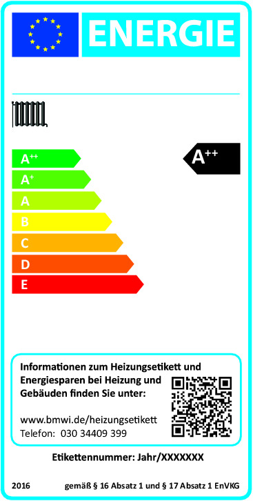
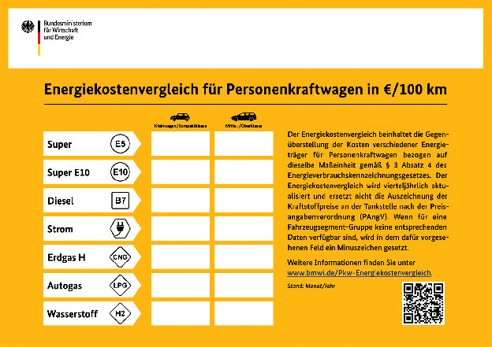

# Gesetz zur Kennzeichnung von energieverbrauchsrelevanten Produkten, Kraftfahrzeugen und Reifen mit Angaben über den Verbrauch an Energie und an anderen wichtigen Ressourcen (EnVKG 2012)

Ausfertigungsdatum
:   2012-05-10

Fundstelle
:   BGBl I: 2012, 1070

Zuletzt geändert durch
:   Art. 6 G v. 8.8.2020 I 1728

Änderung durch
:   Art. 10a G v. 16.7.2021 I 3026 (Nr. 47) textlich nachgewiesen, dokumentarisch noch nicht abschließend bearbeitet

## Abschnitt 1 - Allgemeine Vorschriften

### § 1 Anwendungsbereich

(1) Dieses Gesetz ist anzuwenden für die Kennzeichnung von neu in
Verkehr gebrachten Produkten mit Angaben über den Verbrauch an Energie
und an anderen wichtigen Ressourcen sowie Kohlendioxid-Emissionen
mittels Verbrauchskennzeichnung, sonstigen Produktinformationen und
Angaben in der Werbung und in sonstigen Werbeinformationen. Neben den
Angaben im Sinne des Satzes 1 sind auch Angaben über die Auswirkungen
von Produkten auf den Verbrauch an Energie und auf andere wichtige
Ressourcen vom Anwendungsbereich dieses Gesetzes erfasst.

(2) Dieses Gesetz ist für gebrauchte Produkte anzuwenden, soweit

1.  es sich um Heizgeräte im Sinne von Artikel 1 der delegierten
    Verordnung (EU) Nr. 811/2013 der Kommission vom 18. Februar 2013 zur
    Ergänzung der Richtlinie 2010/30/EU des Europäischen Parlaments und
    des Rates im Hinblick auf die Energiekennzeichnung von
    Raumheizgeräten, Kombiheizgeräten, Verbundanlagen aus Raumheizgeräten,
    Temperaturreglern und Solareinrichtungen sowie von Verbundanlagen aus
    Kombiheizgeräten, Temperaturreglern und Solareinrichtungen (ABl. L 239
    vom 6.9.2013, S. 1), die zuletzt durch die delegierte Verordnung (EU)
    Nr. 518/2014 (ABl. L 147 vom 17.5.2014, S. 1) geändert worden ist,
    handelt,

2.  es sich um Heizkessel für gasförmige und flüssige Brennstoffe handelt
    und

3.  diese eine Nennleistung von bis zu 400 Kilowatt besitzen.

(3) Dieses Gesetz ist nicht anzuwenden für

1.  gebrauchte Produkte mit Ausnahme der in Absatz 2 genannten,

2.  Etiketten, Beschriftungen, Leistungsschilder oder sonstige
    Informationen und Zeichen, die aus Sicherheitsgründen an Produkten
    angebracht werden, und

3.  Produkte, die ausschließlich zur Verwendung für militärische Zwecke
    bestimmt sind.

### § 2 Begriffsbestimmungen

Im Sinne dieses Gesetzes

1.  ist Produkt der Oberbegriff für

    a)  energieverbrauchsrelevante Produkte; dies umfasst Gegenstände, deren
        Nutzung den Verbrauch von Energie beeinflusst und die in Verkehr
        gebracht oder in Betrieb genommen werden, einschließlich Produktteile,
        die

        aa) zum Einbau in ein energieverbrauchsrelevantes Produkt bestimmt sind,

        bb) als Einzelteile für Endverbraucher in Verkehr gebracht werden oder in
            Betrieb genommen werden und

        cc) getrennt auf ihre Umweltverträglichkeit geprüft werden können;

    b)  Kraftfahrzeuge im Sinne des Artikels 2 Nummer 1 der Richtlinie
        1999/94/EG des Europäischen Parlaments und des Rates vom 13. Dezember
        1999 über die Bereitstellung von Verbraucherinformationen über den
        Kraftstoffverbrauch und CO
        2                         -Emissionen beim Marketing für neue
        Personenkraftwagen (ABl. L 12 vom 18.1.2000, S. 16), die zuletzt durch
        die Verordnung (EG) Nr. 1137/2008 (ABl. L 311 vom 21.11.2008, S. 1)
        geändert worden ist;

    c)  Reifen im Sinne der Artikel 2 und 3 Nummer 1 der Verordnung (EG) Nr.
        1222/2009 des Europäischen Parlaments und des Rates vom 25. November
        2009 über die Kennzeichnung von Reifen in Bezug auf die
        Kraftstoffeffizienz und andere wesentliche Parameter (ABl. L 342 vom
        22\.12.2009, S. 46), die zuletzt durch die Verordnung (EU) Nr. 228/2011
        (ABl. L 62 vom 9.3.2011, S. 1) geändert worden ist;

2.  ist Verordnung der Europäischen Union

    a)  ein delegierter Rechtsakt in der Rechtsform der Verordnung im Sinne
        des Artikels 10 der Richtlinie 2010/30/EU des Europäischen Parlaments
        und des Rates vom 19. Mai 2010 über die Angabe des Verbrauchs an
        Energie und anderen Ressourcen durch energieverbrauchsrelevante
        Produkte mittels einheitlicher Etiketten und Produktinformationen
        (ABl. L 153 vom 18.6.2010, S. 1) oder

    b)  die Verordnung (EG) Nr. 1222/2009;

3.  ist Verbrauchskennzeichnung

    die Kennzeichnung von Produkten mit Angaben über den Verbrauch an
    Energie und an anderen wichtigen Ressourcen sowie über CO
    2                   -Emissionen und mit sonstigen zusätzlichen Angaben
    mittels einheitlicher Etiketten, Aufkleber oder Hinweise;

4.  sind sonstige Produktinformationen

    Materialien, wie Datenblätter, Aushänge am Verkaufsort oder Leitfäden,
    die Informationen über den Verbrauch an Energie und an anderen
    wichtigen Ressourcen sowie über CO
    2                   -Emissionen oder zusätzliche Angaben enthalten;

5.  sind zusätzliche Angaben

    weitere Angaben über die Leistung und die Merkmale eines Produkts, die
    sich auf dessen Verbrauch an Energie, den Verbrauch an anderen
    wichtigen Ressourcen oder den CO
    2                   -Ausstoß beziehen oder die für die Beurteilung des
    Verbrauchers von Nutzen sind und auf messbaren Daten beruhen;

6.  sind sonstige Werbeinformationen

    a)  technische Werbematerialien im Sinne des Artikels 3 Nummer 4 der
        Verordnung (EG) Nr. 1222/2009;

    b)  die in einer Rechtsverordnung nach § 4 geregelten technischen
        Werbeschriften, Werbematerialien und Werbeschriften;

7.  gilt als Wirtschaftsakteur

    der Lieferant, der Hersteller des Kraftfahrzeugs, deren
    Bevollmächtigter oder bevollmächtigter Vertreter, der Importeur und
    der Händler von Produkten;

8.  gilt als Lieferant

    der Hersteller oder dessen Bevollmächtigter in der Europäischen Union
    oder im Europäischen Wirtschaftsraum oder der Importeur, der das
    energieverbrauchsrelevante Produkt oder den Reifen in der Europäischen
    Union oder im Europäischen Wirtschaftsraum in Verkehr bringt oder das
    energieverbrauchsrelevante Produkt in Betrieb nimmt; in Ermangelung
    dessen gilt als Lieferant jede natürliche oder juristische Person, die
    das energieverbrauchsrelevante Produkt oder den Reifen in Verkehr
    bringt oder das energieverbrauchsrelevante Produkt in Betrieb nimmt;

9.  ist Hersteller des Kraftfahrzeugs

    der in der Zulassungsbescheinigung Teil I genannte Hersteller oder,
    wenn dieser nicht in Deutschland ansässig ist, dessen bevollmächtigter
    Vertreter;

10. ist Bevollmächtigter oder bevollmächtigter Vertreter

    jede in der Europäischen Union oder einem Vertragsstaat des
    Europäischen Wirtschaftsraums ansässige natürliche oder juristische
    Person, die der Hersteller schriftlich beauftragt hat, in seinem Namen
    bestimmte Aufgaben wahrzunehmen, um seine Verpflichtungen nach diesem
    Gesetz und der einschlägigen Gesetzgebung der Europäischen Union zu
    erfüllen;

11. ist Importeur

    jede in der Europäischen Union oder einem Vertragsstaat des
    Europäischen Wirtschaftsraums ansässige natürliche oder juristische
    Person, die ein Produkt aus einem Staat, der nicht der Europäischen
    Union oder dem Europäischen Wirtschaftsraum angehört, in Verkehr
    bringt;

12. ist Händler

    a)  jede natürliche oder juristische Person, die ein
        energieverbrauchsrelevantes Produkt dem Endverbraucher zum Kauf, zum
        Abschluss eines Mietvertrages oder ähnlicher entgeltlicher
        Gebrauchsüberlassung anbietet oder ausstellt;

    b)  jede natürliche oder juristische Person in der Lieferkette, die Reifen
        im Sinne des Artikels 3 Nummer 9 der Verordnung (EG) Nr. 1222/2009 auf
        dem Markt bereitstellt, mit Ausnahme des Lieferanten oder des
        Importeurs;

    c)  jede natürliche oder juristische Person, die in Deutschland neue
        Kraftfahrzeuge im Sinne von Nummer 1 Buchstabe b ausstellt oder zum
        Kauf oder Leasing anbietet;

13. ist Bereitstellung auf dem Markt

    jede entgeltliche oder unentgeltliche Abgabe eines Produkts zum
    Vertrieb, Verbrauch oder zur Verwendung auf dem Markt der Europäischen
    Union oder eines Vertragsstaates des Abkommens über den Europäischen
    Wirtschaftsraum im Rahmen einer Geschäftstätigkeit;

14. ist Inverkehrbringen

    die erstmalige entgeltliche oder unentgeltliche Bereitstellung eines
    Produkts auf dem Markt der Europäischen Union oder in einem der
    Vertragsstaaten des Europäischen Wirtschaftsraums zum Vertrieb oder
    zur Verwendung des Produkts innerhalb der Europäischen Union,
    unabhängig von der Art des Vertriebs;

15. ist Anbieten

    das Anbieten eines Produkts zum Kauf, zum Abschluss eines
    Mietvertrages oder ähnlicher entgeltlicher Gebrauchsüberlassung an den
    Endverbraucher;

16. ist Ausstellen

    das Aufstellen oder Vorführen von Produkten für den Endverbraucher am
    Verkaufsort zu Werbezwecken;

17. ist Rückruf

    jede Maßnahme, die darauf abzielt, die Rückgabe eines dem
    Endverbraucher bereitgestellten Produkts zu erwirken;

18. ist Rücknahme

    jede Maßnahme, mit der verhindert werden soll, dass ein Produkt, das
    sich in der Lieferkette befindet, auf dem Markt bereitgestellt wird;

19. ist Marktüberwachung

    jede von den zuständigen Behörden durchgeführte Tätigkeit und von
    ihnen getroffene Maßnahme, durch die sichergestellt werden soll, dass
    ein Produkt mit den Anforderungen dieses Gesetzes übereinstimmt;

20. ist Marktüberwachungsbehörde

    jede Behörde, die für die Durchführung der Marktüberwachung zuständig
    ist;

21. ist akkreditierte Konformitätsbewertungsstelle

    eine Stelle, die Konformitätsbewertungen einschließlich
    Kalibrierungen, Prüfungen, Zertifizierungen und Inspektionen
    durchführt und über eine Akkreditierung einer nationalen
    Akkreditierungsstelle nach Artikel 4 Absatz 1 der Verordnung (EG) Nr.
    765/2008 des Europäischen Parlaments und des Rates vom 9. Juli 2008
    über die Vorschriften für die Akkreditierung und Marktüberwachung im
    Zusammenhang mit der Vermarktung von Produkten und zur Aufhebung der
    Verordnung (EWG) Nr. 339/93 des Rates (ABl. L 218 vom 13.8.2008, S.
    30) verfügt;

22. ist notifizierte Stelle

    eine Stelle, die Konformitätsbewertungen durchführt und der
    Europäischen Kommission von einem Mitgliedstaat der Europäischen Union
    oder einem anderen Vertragsstaat des Abkommens über den Europäischen
    Wirtschaftsraum auf Grund eines europäischen Rechtsaktes mitgeteilt
    worden ist;

23. sind öffentlich bestellte und vereidigte Sachverständige

    Sachverständige im Sinne der §§ 36 und 36a der Gewerbeordnung;

24. sind die für die Kontrolle der Außengrenzen zuständigen Behörden

    die Zollbehörden gemäß § 17 Absatz 2 Satz 2 des
    Zollverwaltungsgesetzes,

25. ist Tankstelle eine öffentliche Tankanlage mit Personal, an der über
    eine ortsfeste Vorrichtung Kraftstoffe für Personenkraftwagen
    abgegeben werden können;

26. ist Mehrproduktzapfsäule eine Anlage zur Abgabe des Kraftstoffes, die
    mehrere Kraftstoffarten über getrennte Zapfventile bereitstellen kann;
    dabei ist unerheblich, ob an der Mehrproduktzapfsäule ein oder mehrere
    Kraftfahrzeuge gleichzeitig tanken können;

27. ist Energiekostenvergleich die Darstellung der auf Kostenbasis
    normierten Energieverbrauchsangaben;

28. ist Tankstellenbetreiber, wer die tatsächliche oder rechtliche
    Möglichkeit hat, die notwendigen Entscheidungen im Hinblick auf die
    Anzeige des Energiekostenvergleiches gemäß Anlage 4 zu treffen.

## Abschnitt 2 - Neu in Verkehr gebrachte Produkte

### § 3 Allgemeine Anforderungen an die Verbrauchskennzeichnung, an sonstige Produktinformationen sowie an Informationen in der Werbung und in sonstigen Werbeinformationen

(1) Ein Produkt darf nur dann angeboten oder ausgestellt werden, wenn

1.  die nach einer Rechtsverordnung gemäß § 4 oder einer Verordnung der
    Europäischen Union erforderlichen Angaben über den Verbrauch an
    Energie und an anderen wichtigen Ressourcen sowie CO
    2                   -Emissionen und gegebenenfalls diesbezügliche
    zusätzliche Angaben dem Endverbraucher mittels Verbrauchskennzeichnung
    beim Anbieten oder Ausstellen des Produkts zur Kenntnis gebracht
    werden, indem

    a)  der Händler die Verbrauchskennzeichnung an der in einer
        Rechtsverordnung nach § 4 oder einer Verordnung der Europäischen Union
        vorgeschriebenen Stelle deutlich sichtbar anbringt,

    b)  der Hersteller des Kraftfahrzeugs oder der Lieferant die
        Verbrauchskennzeichnung nach Maßgabe einer Rechtsverordnung nach § 4
        oder einer Verordnung der Europäischen Union mitliefert, anbringt, dem
        Händler zur Verfügung stellt oder dem Händler die erforderlichen
        Angaben zur Verfügung stellt;

2.  Informationen über den Verbrauch an Energie und an anderen wichtigen
    Ressourcen sowie CO
    2                   -Emissionen und gegebenenfalls diesbezügliche
    zusätzliche Angaben vom Hersteller des Kraftfahrzeugs, vom Lieferanten
    oder vom Händler nach Maßgabe einer Rechtsverordnung nach § 4 oder
    einer Verordnung der Europäischen Union mittels
    Verbrauchskennzeichnung oder in anderer Form in den Fällen
    bereitgestellt werden, in denen der Endverbraucher das Produkt nicht
    ausgestellt sieht; dies umfasst insbesondere das Anbieten von
    Produkten über den Versandhandel, in Katalogen, über das Internet oder
    Telefonmarketing.

(2) Sind in einer Rechtsverordnung nach § 4 oder einer Verordnung der
Europäischen Union Anforderungen an sonstige Produktinformationen
festgelegt, haben der Hersteller des Kraftfahrzeugs, der Lieferant
oder der Händler diese in der vorgeschriebenen Form und zu dem
vorgeschriebenen Zeitpunkt bereitzustellen, indem

a)  der Lieferant produktbezogene Datenblätter bereitstellt oder diese in
    Produktbroschüren aufnimmt,

b)  der Lieferant und der Händler Informationen im Sinne von Artikel 5
    Absatz 3 und Artikel 6 der Verordnung (EG) Nr. 1222/2009 zur Verfügung
    stellen,

c)  der Händler einen Aushang am Verkaufsort anbringt und der Hersteller
    des Kraftfahrzeugs und der Händler einen Leitfaden am Verkaufsort auf
    Anfrage unverzüglich und unentgeltlich aushändigen.

(3) Soweit in einer Rechtsverordnung nach § 4 oder einer Verordnung
der Europäischen Union Anforderungen an die Werbung festgelegt sind,
haben der Hersteller des Kraftfahrzeugs, der Lieferant und der Händler
die hierin genannten Angaben zu machen. Das gilt entsprechend für
sonstige Werbeinformationen.

(4) Zur Umsetzung der Richtlinie 2014/94/EU des Europäischen
Parlaments und des Rates vom 22. Oktober 2014 über den Aufbau der
Infrastruktur für alternative Kraftstoffe (ABl. L 307 vom 28.10.2014,
S. 1), die durch die Delegierte Verordnung (EU) 2018/674 (ABl. L 114
vom 4.5.2018, S. 1) geändert worden ist, und um künftige
Kaufentscheidungen der Verbraucher bei der Personenkraftfahrzeugwahl
zu unterstützen, haben die Tankstellenbetreiber von Tankstellen mit
mehr als sechs Mehrproduktzapfsäulen sicherzustellen, dass während der
Geschäftszeiten der Tankstelle ein Energiekostenvergleich nach den
Maßgaben des Artikels 1 der Durchführungsverordnung (EU) 2018/732 der
Kommission vom 17. Mai 2018 über eine gemeinsame Methode für den auf
eine Maßeinheit bezogenen Preisvergleich für alternative Kraftstoffe
gemäß der Richtlinie 2014/94/EU des Europäischen Parlaments und des
Rates (ABl. L 123 vom 18.5.2018, S. 85), die durch die
Durchführungsverordnung (EU) 2020/858 (ABl. L 195 vom 19.6.2020, S.
57) geändert worden ist, und nach den nachfolgenden Bestimmungen
angebracht ist:

1.  der Energiekostenvergleich ist gemäß dem Muster in Anlage 4 durch
    sichtbaren Aushang entweder an mindestens der Hälfte der
    Mehrproduktzapfsäulen oder an einer gut sichtbaren Stelle im Bereich
    des Zahlungsortes anzubringen, dabei sollte das Format an den
    Mehrproduktzapfsäulen DIN A3 und im Bereich des Zahlungsortes
    mindestens DIN A2 sein; bei einer digitalen Darstellung muss eine
    Bildschirmgröße von mindestens 19 Zoll sichergestellt werden, wobei
    der Energiekostenvergleich mindestens alle 2,5 Minuten für jeweils
    30 Sekunden angezeigt werden muss;

2.  der Energiekostenvergleich nach Satz 2 ist jeweils bis zum vierten
    Werktag nach einem Quartalsbeginn zu aktualisieren.

Die amtliche Veröffentlichung des Energiekostenvergleiches erfolgt auf
der Internetseite des Bundesministeriums für Wirtschaft und Energie
jeweils spätestens vier Wochen vor Quartalsbeginn. Der nach
Landesrecht zuständigen Behörde obliegt die Überwachung der Erfüllung
der Pflichten nach Satz 1.

### § 4 Ermächtigung zum Erlass von Rechtsverordnungen

(1) Das Bundesministerium für Wirtschaft und Energie wird ermächtigt,
in Rechtsverordnungen mit Zustimmung des Bundesrates Folgendes
festzulegen:

1.  produktspezifische Anforderungen an die Kennzeichnung von Produkten
    mit Angaben über den Verbrauch an Energie und an anderen wichtigen
    Ressourcen sowie über CO
    2                   -Emissionen und zusätzliche Angaben,

2.  Anforderungen zur Umsetzung, Konkretisierung und Durchführung der von
    der Europäischen Union auf dem Gebiet der Verbrauchskennzeichnung
    erlassenen Rechtsvorschriften,

um Verbraucher besser zu informieren und sie dadurch zu sparsamerem
Verbrauch an Energie und an anderen wichtigen Ressourcen sowie zur
Reduktion der CO
2             -Emissionen anzuhalten.

(2) Durch Rechtsverordnung nach Absatz 1 kann bestimmt werden, dass

1.  bei energieverbrauchsrelevanten Produkten und Bestandteilen von
    energieverbrauchsrelevanten Produkten Angaben über den Verbrauch an
    Energie und an anderen wichtigen Ressourcen oder Angaben über die
    Auswirkungen dieser Produkte auf den Verbrauch an Energie und auf
    andere wichtige Ressourcen sowie zusätzliche Angaben über die
    energieverbrauchsrelevanten Produkte zu machen sind,

2.  bei Kraftfahrzeugen Angaben über den Kraftstoffverbrauch und die CO
    2                   -Emissionen, über den Verbrauch an Energie und an
    anderen wichtigen Ressourcen und zusätzliche Angaben über die
    Kraftfahrzeuge zu machen sind,

3.  bei Reifen Angaben in Bezug auf die Kraftstoffeffizienz und
    zusätzliche Angaben zu machen sind.

(3) Rechtsverordnungen nach den Absätzen 1 und 2 können insbesondere
Folgendes regeln:

1.  die Arten der erfassten energieverbrauchsrelevanten Produkte,
    Kraftfahrzeuge und Reifen,

2.  bei energieverbrauchsrelevanten Produkten

    a)  Inhalt und Form der Verbrauchskennzeichnung, der sonstigen
        Produktinformationen, der zusätzlichen Angaben sowie sonstiger
        Nachweise,

    b)  Aufbewahrungs- und Mitteilungspflichten von technischen
        Dokumentationen,

    c)  die Angaben, die nach Absatz 2 in der Werbung und in technischen
        Werbeschriften zu machen sind,

3.  bei Kraftfahrzeugen Inhalt und Form der Verbrauchskennzeichnung, der
    sonstigen Produktinformationen und der zusätzlichen Angaben wie

    a)  Hinweisschilder oder Bildschirmanzeigen am Kraftfahrzeug oder in
        dessen Nähe am Angebots- oder Verkaufsort,

    b)  Zusammenstellung von Angaben über verschiedene Kraftfahrzeuge oder
        Kraftfahrzeuggruppen durch Aushänge, Schautafeln oder
        Bildschirmanzeigen am Angebots- oder Verkaufsort,

    c)  Zusammenstellung von Angaben über am Markt angebotene Kraftfahrzeuge
        in regelmäßigen Abständen sowie deren Veröffentlichung und Verteilung,

    d)  die Angaben, die nach Absatz 2 in der Werbung und in sonstigen
        Werbeinformationen zu machen sind,

4.  bei Reifen

    a)  Inhalt und Form der Verbrauchskennzeichnung, der sonstigen
        Produktinformationen, der zusätzlichen Angaben sowie sonstiger
        Nachweise,

    b)  Aufbewahrungs- und Mitteilungspflichten von technischen Unterlagen,

    c)  die Angaben, die nach Absatz 2 in technischem Werbematerial zu machen
        sind,

5.  die Messnormen und -verfahren, die zur Feststellung und Überprüfung
    der Konformität der nach den Absätzen 2 und 3 Nummer 1 bis 4 gemachten
    Angaben anzuwenden sind, sowie die vom jeweils betroffenen
    Wirtschaftsakteur bereitzuhaltenden Unterlagen,

6.  die Bestimmung von zuständigen Stellen und Behörden sowie deren
    Befugnisse, insbesondere Befugnisse zur Verhinderung einer
    missbräuchlichen Verwendung von Bezeichnungen,

7.  die Festlegung der Pflichten der Wirtschaftsakteure, die im
    Zusammenhang mit dem Inverkehrbringen von Produkten, der
    Bereitstellung von Produkten auf dem Markt oder der Inbetriebnahme von
    Produkten sowie beim Anbieten oder Ausstellen von Produkten
    einzuhalten sind.

(4) Rechtsverordnungen über die Verbrauchskennzeichnung ergehen

1.  bei energieverbrauchsrelevanten Produkten im Einvernehmen mit dem
    Bundesministerium für Arbeit und Soziales, dem Bundesministerium für
    Umwelt, Naturschutz und nukleare Sicherheit sowie dem
    Bundesministerium für Verkehr und digitale Infrastruktur,

2.  bei Kraftfahrzeugen im Einvernehmen mit dem Bundesministerium für
    Umwelt, Naturschutz und nukleare Sicherheit sowie dem
    Bundesministerium für Verkehr und digitale Infrastruktur.

### § 5 Zuständigkeit für die Marktüberwachung und Zusammenarbeit; Verordnungsermächtigung

(1) Die Marktüberwachung obliegt vorbehaltlich des Satzes 3 den nach
Landesrecht zuständigen Behörden. Im Anwendungsbereich der Pkw-
Energieverbrauchskennzeichnungsverordnung vom 28. Mai 2004 (BGBl. I S.
1037), die zuletzt durch Artikel 1 der Verordnung vom 22. August 2011
(BGBl. I S. 1756, 2095) geändert worden ist, hat das Kraftfahrt-
Bundesamt den zuständigen Marktüberwachungsbehörden die für die
Marktüberwachung erforderlichen Informationen auf Anfrage zu
übermitteln. Zuständigkeiten des Kraftfahrt-Bundesamtes nach dem
Gesetz über die Errichtung eines Kraftfahrt-Bundesamtes in der im
Bundesgesetzblatt Teil III, Gliederungsnummer 9230-1, veröffentlichten
bereinigten Fassung, das zuletzt durch Artikel 26 des Gesetzes vom 8.
November 2011 (BGBl. I S. 2178) geändert worden ist, bleiben
unberührt.

(2) Die in Absatz 1 genannten Marktüberwachungsbehörden arbeiten mit
den für die Kontrolle der Außengrenzen zuständigen Behörden gemäß
Kapitel III Abschnitt 3 der Verordnung (EG) Nr. 765/2008 zusammen. Im
Rahmen dieser Zusammenarbeit können die für die Kontrolle der
Außengrenzen zuständigen Behörden auf Ersuchen den
Marktüberwachungsbehörden die Informationen, die sie bei der
Überführung von Produkten in den zollrechtlich freien Verkehr erlangt
haben und die für die Aufgabenerfüllung der Marktüberwachungsbehörden
erforderlich sind, übermitteln.

(3) Die Marktüberwachungsbehörden und die für die Kontrolle der
Außengrenzen zuständigen Behörden wahren Betriebs- und
Geschäftsgeheimnisse und unterliegen den für sie geltenden
Vorschriften zum Schutz personenbezogener Daten.

(4) Die Marktüberwachungsbehörden können, soweit das Landesrecht
nichts Gegenteiliges bestimmt, für Aufgaben bei der Durchführung von
Verfahren zur Feststellung der Übereinstimmung mit den Anforderungen
dieses Gesetzes, einer Rechtsverordnung nach § 4 oder einer Verordnung
der Europäischen Union folgende Stellen und Personen heranziehen oder
beauftragen:

1.  akkreditierte Konformitätsbewertungsstellen,

2.  nach anderen Rechtsvorschriften notifizierte Stellen,

3.  sonstige in gleicher Weise kompetente Stellen,

4.  öffentlich bestellte und vereidigte Sachverständige oder

5.  sonstige in gleicher Weise geeignete Sachverständige.

Absatz 1 Satz 2 sowie die Absätze 2 und 3 gelten für die in Absatz 4
genannten Stellen entsprechend.

(5) Die Landesregierungen werden ermächtigt, durch Rechtsverordnung
die in Absatz 4 Nummer 1 bis 5 genannten Stellen mit der teilweisen
oder vollständigen Überwachung der Anforderungen dieses Gesetzes,
einer Rechtsverordnung nach § 4 oder einer Verordnung der Europäischen
Union zu beleihen.

### § 6 Marktüberwachungskonzept

(1) Die Marktüberwachungsbehörden haben für die in einer
Rechtsverordnung nach § 4 oder einer Verordnung der Europäischen Union
genannten Produkte in Bezug auf die in diesen Rechtsvorschriften
genannten Anforderungen und den Anforderungen dieses Gesetzes mit
Ausnahme von § 3 Absatz 4 eine wirksame Marktüberwachung auf der
Grundlage eines Marktüberwachungskonzepts zu gewährleisten. Das
Marktüberwachungskonzept soll insbesondere Folgendes umfassen:

1.  die Erhebung und Auswertung von Informationen zur Ermittlung von
    Mängelschwerpunkten und Warenströmen,

2.  die Aufstellung, regelmäßige Anpassung und Durchführung von
    Marktüberwachungsprogrammen, auf deren Grundlage die Produkte
    überprüft werden können, und

3.  die regelmäßige, mindestens alle vier Jahre erfolgende Überprüfung und
    Bewertung der Wirksamkeit des Überwachungskonzepts.

(2) Die zuständigen obersten Landesbehörden stellen die Koordinierung
der Marktüberwachung sowie die Entwicklung und Fortschreibung des
Marktüberwachungskonzepts sicher.

(3) Die Länder stellen die Marktüberwachungsprogramme nach Absatz 1
Nummer 2 der Öffentlichkeit in nicht personenbezogener Form auf
elektronischem Weg und gegebenenfalls in anderer Form zur Verfügung.

### § 7 Vermutungswirkung

Werden die in diesem Gesetz, einer Rechtsverordnung nach § 4 oder
einer Verordnung der Europäischen Union festgelegten
Verbrauchskennzeichnungen für Produkte und sonstige
Produktinformationen verwendet, so wird bis zum Beweis des Gegenteils
vermutet, dass diese den dort genannten Anforderungen entsprechen.

### § 8 Stichprobenkontrollen und Marktüberwachungsmaßnahmen

(1) Die Marktüberwachungsbehörden kontrollieren anhand angemessener
Stichproben auf geeignete Weise und in angemessenem Umfang, ob die
Anforderungen dieses Gesetzes mit Ausnahme von § 3 Absatz 4, einer
Rechtsverordnung nach § 4 oder einer Verordnung der Europäischen Union
an die Verbrauchskennzeichnung, sonstige Produktinformationen sowie an
die Werbung und sonstige Werbeinformationen erfüllt sind. Sofern es im
Einzelfall angezeigt und erforderlich ist, überprüfen die
Marktüberwachungsbehörden die erforderlichen Unterlagen oder führen
physische Kontrollen und Laborprüfungen durch. Weitergehende
Marktüberwachungsmaßnahmen in anderen Rechtsvorschriften bleiben
unberührt.

(2) Die Marktüberwachungsbehörden treffen die erforderlichen
Maßnahmen, wenn sie den begründeten Verdacht haben, dass die
Verbrauchskennzeichnung oder sonstige Produktinformationen nicht die
Anforderungen dieses Gesetzes, einer Rechtsverordnung nach § 4 oder
einer Verordnung der Europäischen Union erfüllen. Sie sind
insbesondere befugt,

1.  anzuordnen, dass ein Produkt von einer der in § 5 Absatz 4 Nummer 1
    bis 5 genannten Stellen oder Personen überprüft wird,

2.  für den zur Prüfung zwingend erforderlichen Zeitraum vorübergehend zu
    verbieten, dass ein Produkt angeboten oder ausgestellt wird, sofern
    dies nach der Art des Produkts und dem Ausmaß der zu erwartenden
    wirtschaftlichen Einbußen zumutbar ist.

Die Marktüberwachungsbehörde widerruft oder ändert eine Maßnahme nach
den Sätzen 1 und 2, wenn der Wirtschaftsakteur nachweist, dass er
wirksame Maßnahmen ergriffen hat.

(3) Stellen die Marktüberwachungsbehörden anhand der nach Absatz 1
oder 2 oder § 10 erfolgten Überprüfungen fest, dass die
Verbrauchskennzeichnung oder sonstige Produktinformationen nicht den
Anforderungen dieses Gesetzes, einer Rechtsverordnung nach § 4 oder
einer Verordnung der Europäischen Union entsprechen, so treffen sie
die erforderlichen Maßnahmen. Sie sind insbesondere befugt,

1.  Maßnahmen anzuordnen, die gewährleisten, dass eine unrichtige oder
    unvollständige Verbrauchskennzeichnung oder sonstige
    Produktinformationen korrigiert werden,

2.  Maßnahmen anzuordnen, die gewährleisten, dass ein Produkt erst dann
    angeboten oder ausgestellt wird, wenn die in einer Rechtsverordnung
    nach § 4 oder in einer Verordnung der Europäischen Union festgelegten
    Anforderungen erfüllt sind.

Die Marktüberwachungsbehörde widerruft oder ändert eine Maßnahme nach
den Sätzen 1 und 2, wenn der Wirtschaftsakteur nachweist, dass er
wirksame Maßnahmen ergriffen hat.

(4) Bei Fortdauern des nach Absatz 3 festgestellten Verstoßes treffen
die Marktüberwachungsbehörden die erforderlichen Maßnahmen. Sie sind
insbesondere befugt

1.  das Anbieten oder Ausstellen eines Produkts zu untersagen,

2.  das Inverkehrbringen eines Produkts zu untersagen,

3.  die Rücknahme oder den Rückruf eines Produkts anzuordnen oder diese
    sicherzustellen,

4.  zu untersagen, dass ein energieverbrauchsrelevantes Produkt im Sinne
    des § 2 Nummer 4 der Energieverbrauchskennzeichnungsverordnung vom 30.
    Oktober 1997 (BGBl. I S. 2616), die zuletzt durch Artikel 2 des
    Gesetzes vom 10. Mai 2012 (BGBl. I S. 1070) geändert worden ist, in
    Betrieb genommen wird.

Die Marktüberwachungsbehörde widerruft oder ändert eine Maßnahme nach
den Sätzen 1 und 2, wenn der Wirtschaftsakteur nachweist, dass er
wirksame Maßnahmen ergriffen hat.

(5) Beschließt die Marktüberwachungsbehörde, ein Produkt, das in einem
anderen Mitgliedstaat der Europäischen Union oder einem Vertragsstaat
des Abkommens über den Europäischen Wirtschaftsraum hergestellt wurde,
vom Markt zu nehmen, das Inverkehrbringen oder die Inbetriebnahme des
Produkts zu untersagen oder dessen Anbieten oder Ausstellen zu
untersagen, so hat sie den betroffenen Wirtschaftsakteur hiervon in
Kenntnis zu setzen.

(6) Die Marktüberwachungsbehörden informieren und unterstützen sich
gegenseitig bei Marktüberwachungsmaßnahmen nach den Absätzen 1 bis 4.

### § 9 Adressaten der Stichprobenkontrollen und Marktüberwachungsmaßnahmen

(1) Die Stichprobenkontrollen und Maßnahmen der
Marktüberwachungsbehörden im Sinne des § 8 Absatz 1 bis 4 sind gegen
den jeweils betroffenen Wirtschaftsakteur gerichtet.

(2) Der nach Absatz 1 betroffene Wirtschaftsakteur ist vor Erlass
einer Maßnahme nach § 8 Absatz 2 bis 4 gemäß § 28 des
Verwaltungsverfahrensgesetzes mit der Maßgabe anzuhören, dass die
Anhörungsfrist nicht kürzer als zehn Tage sein darf. Wurde eine
Maßnahme getroffen, ohne dass der Wirtschaftsakteur gehört wurde, wird
ihm so schnell wie möglich Gelegenheit gegeben, sich zu äußern. Die
Maßnahme wird daraufhin umgehend überprüft.

(3) Für alle Marktüberwachungsmaßnahmen nach § 8 Absatz 2 bis 4 gilt §
59 der Verwaltungsgerichtsordnung entsprechend.

### § 10 Betretensrechte, Befugnisse und Duldungspflichten

(1) Die Marktüberwachungsbehörden und ihre Beauftragten sind, soweit
dies zur Erfüllung ihrer Aufgaben erforderlich ist, befugt, zu den
üblichen Betriebs- und Geschäftszeiten Geschäftsräume oder
Betriebsgrundstücke zu betreten, in oder auf denen im Rahmen einer
Geschäftstätigkeit Produkte im Anwendungsbereich dieses Gesetzes

1.  hergestellt werden,

2.  zum Zwecke der Bereitstellung auf dem Markt lagern,

3.  angeboten werden oder

4.  ausgestellt sind.

(2) Die Marktüberwachungsbehörden und ihre Beauftragten sind befugt,
die Produkte zu besichtigen, zu prüfen oder prüfen zu lassen. Hat die
Prüfung ergeben, dass die Anforderungen an die Verbrauchskennzeichnung
oder an sonstige Produktinformationen im Sinne dieses Gesetzes, einer
Rechtsverordnung nach § 4 oder einer Verordnung der Europäischen Union
nicht erfüllt sind, so können die Marktüberwachungsbehörden die Kosten
für Besichtigungen und Prüfungen vom jeweils betroffenen
Wirtschaftsakteur verlangen, der das Produkt herstellt, zum Zwecke der
Bereitstellung auf dem Markt lagert, anbietet oder ausstellt.

(3) Die Marktüberwachungsbehörden und ihre Beauftragten können Proben
entnehmen, Muster verlangen und die für ihre Aufgabenerfüllung
erforderlichen Unterlagen und Informationen anfordern. Die Proben,
Muster, Unterlagen und Informationen sind unentgeltlich zur Verfügung
zu stellen. Ist die unentgeltliche Überlassung wirtschaftlich nicht
zumutbar, ist auf Verlangen eine angemessene Entschädigung zu leisten.

(4) Der betroffene Wirtschaftsakteur hat die Maßnahmen nach den
Absätzen 1 und 2 zu dulden und die Marktüberwachungsbehörden sowie
deren Beauftragte zu unterstützen. Er ist verpflichtet, den
Marktüberwachungsbehörden auf Verlangen die Auskünfte zu erteilen, die
zur Erfüllung ihrer Aufgaben erforderlich sind. Er kann die Auskunft
zu Fragen verweigern, deren Beantwortung ihn oder einen seiner in §
383 Absatz 1 Nummer 1 bis 3 der Zivilprozessordnung bezeichneten
Angehörigen der Gefahr aussetzen würde, wegen einer Straftat oder
Ordnungswidrigkeit verfolgt zu werden. Er ist über sein Recht zur
Auskunftsverweigerung zu belehren.

(5) Die Absätze 1 bis 4 gelten entsprechend für Geschäftsräume oder
Betriebsgrundstücke, in oder auf denen im Rahmen einer
Geschäftstätigkeit energieverbrauchsrelevante Produkte im Sinne des §
2 Nummer 4 der Energieverbrauchskennzeichnungsverordnung in Betrieb
genommen werden.

### § 11 Meldeverfahren

(1) Trifft die Marktüberwachungsbehörde Maßnahmen nach § 8 Absatz 4,
durch die das Anbieten oder Ausstellen eines Produkts untersagt wird,
informiert sie hierüber unter Angabe der Gründe und soweit
erforderlich einschließlich personenbezogener Daten

1.  für den Bereich der Verbrauchskennzeichnung von
    energieverbrauchsrelevanten Produkten die beauftragte Stelle im Sinne
    des § 13 und

2.  für den Bereich der Verbrauchskennzeichnung von Kraftfahrzeugen und
    Reifen das Bundesministerium für Wirtschaft und Energie.

(2) Für den Bereich der Verbrauchskennzeichnung von
energieverbrauchsrelevanten Produkten überprüft die beauftragte Stelle
im Sinne des § 13 die eingegangene Meldung nach Absatz 1 Nummer 1 auf
Vollständigkeit und Schlüssigkeit und informiert soweit erforderlich
einschließlich personenbezogener Daten das Bundesministerium für
Wirtschaft und Energie über die Meldung nach Absatz 1 Nummer 1 und
leitet diese soweit erforderlich einschließlich personenbezogener
Daten unverzüglich der Europäischen Kommission und den Mitgliedstaaten
der Europäischen Union und den Vertragsstaaten des Abkommens über den
Europäischen Wirtschaftsraum zu. Die beauftragte Stelle informiert
soweit erforderlich einschließlich personenbezogener Daten das
Bundesministerium für Wirtschaft und Energie und die
Marktüberwachungsbehörden über Meldungen der Kommission oder eines
anderen Mitgliedstaates der Europäischen Union oder eines
Vertragsstaates des Abkommens über den Europäischen Wirtschaftsraum.

(3) Für den Bereich der Verbrauchskennzeichnung von Kraftfahrzeugen
und Reifen überprüft das Bundesministerium für Wirtschaft und Energie
die nach Absatz 1 Nummer 2 eingegangene Meldung auf Vollständigkeit
und Schlüssigkeit und leitet diese soweit erforderlich einschließlich
personenbezogener Daten unverzüglich der Europäischen Kommission und
den Mitgliedstaaten der Europäischen Union und den Vertragsstaaten des
Abkommens über den Europäischen Wirtschaftsraum zu. Das
Bundesministerium für Wirtschaft und Energie informiert soweit
erforderlich einschließlich personenbezogener Daten die
Marktüberwachungsbehörden über Meldungen der Kommission oder eines
anderen Mitgliedstaates der Europäischen Union oder eines
Vertragsstaates des Abkommens über den Europäischen Wirtschaftsraum.

(4) Für den Informationsaustausch sind so weit wie möglich
elektronische Kommunikationsmittel zu benutzen.

### § 12 Berichtspflichten

(1) Die zuständigen obersten Landesbehörden berichten jährlich in
nicht personenbezogener Form über die ergriffenen Vollzugsmaßnahmen
und Tätigkeiten zur Durchsetzung der in diesem Gesetz oder auf Grund
dieses Gesetzes festgelegten Anforderungen. Sie übermitteln diese
Berichte

1.  der beauftragten Stelle im Sinne des § 13 für den Bereich der
    Verbrauchskennzeichnung von energieverbrauchsrelevanten Produkten,

2.  dem Bundesministerium für Wirtschaft und Energie für den Bereich der
    Verbrauchskennzeichnung von Kraftfahrzeugen und Reifen sowie des
    Energiekostenvergleiches gemäß § 3 Absatz 4.

(2) Die zuständigen obersten Landesbehörden überprüfen regelmäßig die
Funktionsweise der Marktüberwachungstätigkeiten und informieren
hierüber in nicht personenbezogener Form

1.  die beauftragte Stelle im Sinne des § 13 für den Bereich der
    Verbrauchskennzeichnung von energieverbrauchsrelevanten Produkten,

2.  das Bundesministerium für Wirtschaft und Energie für den Bereich der
    Verbrauchskennzeichnung von Kraftfahrzeugen und Reifen.

(3) Die beauftragte Stelle im Sinne des § 13 erstellt alle vier Jahre
einen Bericht, in dem sie in nicht personenbezogener Form Folgendes
zusammenfasst:

1.  die ihr übermittelten Informationen über die ergriffenen
    Vollzugsmaßnahmen sowie

2.  die Überprüfung und Bewertung der Funktionsweise der
    Überwachungstätigkeiten für den Bereich der Verbrauchskennzeichnung
    von energieverbrauchsrelevanten Produkten.

(4) Die beauftragte Stelle übermittelt den Bericht an die Europäische
Kommission und stellt ihn der Öffentlichkeit in nicht
personenbezogener Form auf elektronischem Weg und gegebenenfalls in
anderer Form zur Verfügung. Der erste Bericht muss spätestens bis zum
19\. Juni 2014 der Europäischen Kommission übermittelt werden.

### § 13 Beauftragte Stelle

Beauftragte Stelle für die Verbrauchskennzeichnung von
energieverbrauchsrelevanten Produkten im Anwendungsbereich der
Energieverbrauchskennzeichnungsverordnung ist die Bundesanstalt für
Materialforschung und -prüfung.

### § 14 Aufgaben der beauftragten Stelle

(1) Die Aufgaben der beauftragten Stelle umfassen

1.  das Meldeverfahren im Sinne des § 11 Absatz 2,

2.  die Berichtspflichten im Sinne des § 12 Absatz 3 und 4.

(2) Die beauftragte Stelle unterstützt die Marktüberwachungsbehörden
bei der Entwicklung und Durchführung des Überwachungskonzepts nach § 6
Absatz 1 sowie bei technischen oder wissenschaftlichen Fragestellungen
für den Bereich der Verbrauchskennzeichnung von
energieverbrauchsrelevanten Produkten.

(3) Die beauftragte Stelle stellt ein umfassendes Informationsangebot
zu den Anforderungen an die Energieverbrauchskennzeichnung zusammen
mit dem Ziel, die Wirtschaft, insbesondere kleine und mittlere
Unternehmen sowie Kleinstunternehmen, dabei zu unterstützen, die
Anforderungen einer Rechtsverordnung nach § 4 oder einer Verordnung
der Europäischen Union zu erfüllen.

(4) Die beauftragte Stelle unterstützt das Bundesministerium für
Wirtschaft und Energie im Prozess der Verabschiedung von Verordnungen
der Europäischen Union auf der Grundlage des Artikels 10 der
Richtlinie 2010/30/EU.

### § 15 Bußgeldvorschriften; Verordnungsermächtigung

(1) Ordnungswidrig handelt, wer vorsätzlich oder fahrlässig

1.  einer Rechtsverordnung nach § 4 oder einer vollziehbaren Anordnung auf
    Grund einer solchen Rechtsverordnung zuwiderhandelt, soweit die
    Rechtsverordnung für einen bestimmten Tatbestand auf diese
    Bußgeldvorschrift verweist,

1a. entgegen § 3 Absatz 4 Satz 1 nicht sicherstellt, dass ein
    Energiekostenvergleich angebracht ist,

2.  einer vollziehbaren Anordnung nach § 10 Absatz 3 Satz 1
    zuwiderhandelt,

3.  entgegen § 10 Absatz 4 Satz 1 eine Maßnahme nicht duldet,

4.  entgegen § 10 Absatz 4 Satz 2 eine Auskunft nicht, nicht richtig,
    nicht vollständig oder nicht rechtzeitig erteilt, oder

5.  einer unmittelbar geltenden Vorschrift in Rechtsakten der Europäischen
    Gemeinschaft oder der Europäischen Union zuwiderhandelt, die
    inhaltlich einer Regelung entspricht, zu der die in Nummer 1 genannten
    Vorschriften ermächtigen, soweit eine Rechtsverordnung nach Absatz 3
    für einen bestimmten Tatbestand auf diese Bußgeldvorschrift verweist.

(2) Die Ordnungswidrigkeit kann mit einer Geldbuße bis zu
fünfzigtausend Euro geahndet werden.

(3) Das Bundesministerium für Wirtschaft und Energie wird ermächtigt,
soweit dies zur Durchsetzung der Rechtsakte der Europäischen
Gemeinschaft oder der Europäischen Union erforderlich ist, durch
Rechtsverordnung mit Zustimmung des Bundesrates die Tatbestände zu
bezeichnen, die als Ordnungswidrigkeit nach Absatz 1 Nummer 5 geahndet
werden können.

## Abschnitt 3 - Gebrauchte Produkte

### § 16 Berechtigung zur Verbrauchskennzeichnung

(1) Heizungsinstallateure, Schornsteinfeger gemäß § 2 des
Schornsteinfeger-Handwerksgesetzes vom 26. November 2008 (BGBl. I S.
2242), das zuletzt durch Artikel 284 der Verordnung vom 31. August
2015 (BGBl. I S. 1474) geändert worden ist, Gebäudeenergieberater des
Handwerks und Ausstellungsberechtigte nach § 88 Absatz 1 und 2 des
Gebäudeenergiegesetzes vom 8. August 2020 (BGBl. I S. 1728) sind
berechtigt, auf Heizgeräten nach § 1 Absatz 2 ein Etikett nach dem
Muster in Anlage 1 oder 2 anzubringen, wenn sie mit dem Eigentümer
oder Mieter des jeweiligen Gerätes in einem bestehenden
Vertragsverhältnis mit Bezug zu den Heizgeräten oder zur energetischen
Sanierung des Gesamtgebäudes stehen oder wenn sie vom Eigentümer oder
Mieter mit der Untersuchung der Heizgeräte beauftragt worden sind. Bei
der Anbringung des Etiketts sind die Vorgaben nach § 18 Absatz 1 zu
berücksichtigen.

(2) Die Berechtigten nach Absatz 1 dürfen Etiketten nur nach den
zeitlichen Vorgaben der Anlage 3 vergeben.

### § 17 Verpflichtung zur Verbrauchskennzeichnung

(1) Der zuständige bevollmächtigte Bezirksschornsteinfeger hat im
Anschluss an die Feuerstättenschau nach § 14 des Schornsteinfeger-
Handwerksgesetzes auf jedem Heizgerät nach § 1 Absatz 2 ein Etikett
nach dem Muster in Anlage 1 oder 2 anzubringen, wobei die Vorgaben
nach § 18 Absatz 1 zu berücksichtigen sind. Dabei sind im Rahmen eines
ersten Überprüfungszyklus der Feuerstättenschau die Heizgeräte mit
einem Baujahr bis einschließlich 1994 und in einem zweiten
Überprüfungszyklus die Heizgeräte mit einem Baujahr bis einschließlich
2008 zu etikettieren. Danach sind die Heizgeräte zu etikettieren, die
bei der Feuerstättenschau bezogen auf das Baujahr mindestens 15 Jahre
alt sind. Ist ein Heizgerät bereits etikettiert worden, so entfällt
die Pflicht nach Satz 1. Sie entfällt auch dann, wenn das Etikett in
einem weiteren Überprüfungszyklus nicht mehr vorhanden ist. Die sich
aus dem Gebäudeenergiegesetz vom 8. August 2020 (BGBl. I S. 1728)
ergebenden Pflichten des bevollmächtigten Bezirksschornsteinfegers
bleiben von der Verpflichtung nach Satz 1 unberührt.

(2) Hat ein bevollmächtigter Bezirksschornsteinfeger ein Etikett nach
Absatz 1 angebracht, so darf er innerhalb eines Zeitraums von sechs
Kalendermonaten nach Anbringen des Etiketts mit dem jeweiligen
Eigentümer des Heizgerätes keine Gespräche über den Verkauf eines
neuen Heizgerätes führen oder ihm ein entsprechendes Angebot
unterbreiten.

(3) Der bevollmächtigte Bezirksschornsteinfeger nach Absatz 1 erhält
vom Bundesamt für Wirtschaft und Ausfuhrkontrolle eine angemessene
Aufwandsentschädigung für

1.  das Anbringen des Etiketts an dem Heizgerät,

2.  die Übergabe der geeigneten Informationsbroschüre und

3.  die Information des Eigentümers oder des Mieters über die
    Energieeffizienz des Heizgerätes.

### § 18 Verfahren zur Verbrauchskennzeichnung und Überprüfung

(1) Bei der Verbrauchskennzeichnung haben die Berechtigten nach § 16
Absatz 1 und die Verpflichteten nach § 17 Absatz 1

1.  zur Feststellung der Energieeffizienzklasse des Heizgerätes die zu
    diesem Zweck auf der Internetseite des Bundesministeriums für
    Wirtschaft und Energie zur Verfügung gestellten Computerprogramme oder
    Anwendungen einzusetzen,

2.  dem Eigentümer oder dem Mieter die geeigneten Informationsbroschüren
    des Bundesministeriums für Wirtschaft und Energie zu übergeben und

3.  den Eigentümer oder den Mieter beim Anbringen des Etiketts über die
    Energieeffizienz des Heizgerätes zu informieren.

Das Etikett ist von den Berechtigten nach § 16 Absatz 1 und den
Verpflichteten nach § 17 Absatz 1 deutlich sichtbar auf der Außenseite
der Gerätefront anzubringen.

(2) Bei der Vergabe des Etiketts ist bis einschließlich zum 25.
September 2019 das Etikett nach dem Muster in Anlage 1 und ab dem 26.
September 2019 das Etikett nach dem Muster in Anlage 2 zu verwenden.

(3) Das Bundesamt für Wirtschaft und Ausfuhrkontrolle ist berechtigt,
die Vergabe des Etiketts stichprobenhaft zu überprüfen.

### § 19 Kostenfreiheit und Duldungspflicht

(1) Für den Eigentümer und den Mieter eines Heizgerätes nach § 1
Absatz 2 ist das Anbringen des Etiketts und die Information nach § 18
Absatz 1 durch den Berechtigten nach § 16 Absatz 1 oder den
Verpflichteten nach § 17 Absatz 1 kostenfrei.

(2) Der Eigentümer und der Mieter eines Heizgerätes nach § 1 Absatz 2
haben das Anbringen des Etiketts nach § 16 Absatz 1 oder § 17 Absatz 1
zu dulden.

(zu § 16 Absatz 1 Satz 1 und § 17 Absatz 1 Satz 1)

### Anlage 1 Musteretikett für Heizgeräte zur Verwendung bis einschließlich 25. September 2019

(Fundstelle: BGBl. I 2015, 2197)

(zu § 16 Absatz 1 Satz 1 und § 17 Absatz 1 Satz 1)

### Anlage 2 Musteretikett für Heizgeräte zur Verwendung ab 26. September 2019

(Fundstelle: BGBl. I 2015, 2198)

(zu § 16 Absatz 2)

### Anlage 3 Zeitliche Vorgabe zur Etikettierung

(Fundstelle: BGBl. I 2015, 2199)
Ab den folgenden Jahren kann das Etikett durch die in § 16 Absatz 1
genannten Berechtigten auf Heizgeräte der nachstehenden Baujahre
angebracht werden:

*    *   laufende Nummer

    *   ab dem Jahr

    *   Etikettierung auf Heizgeräten der Baujahre

*    *   1.

    *   2016

    *   bis einschließlich 1986

*    *   2.

    *   2017

    *   bis einschließlich 1991

*    *   3.

    *   2018

    *   bis einschließlich 1993

*    *   4.

    *   2019

    *   bis einschließlich 1995

*    *   5.

    *   2020

    *   bis einschließlich 1997

*    *   6.

    *   2021

    *   bis einschließlich 2001

*    *   7.

    *   2022

    *   bis einschließlich 2005

*    *   8.

    *   2023

    *   bis einschließlich 2008

*    *   9.

    *   2024

    *   ab 2009, sofern sie mindestens 15 Jahre alt sind

(zu § 3 Absatz 4)

### Anlage 4 Poster zum Energiekostenvergleich

(Fundstelle: BGBl. I 3062, 3063)

Vorlage DIN A2

Vorlage DIN A3

