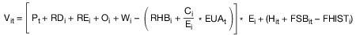

# Gesetz über die Elektrizitäts- und Gasversorgung (EnWG 2005)

Ausfertigungsdatum
:   2005-07-07

Fundstelle
:   BGBl I: 2005, 1970 (3621)

Stand: Zuletzt geändert Art. 84 G v. 10.8.2021 I 3436
Dieses Gesetz dient der Umsetzung der Richtlinie 2003/54/EG des
Europäischen Parlaments und des Rates vom 26. Juni 2003 über
gemeinsame Vorschriften für den Elektrizitätsbinnenmarkt und zur
Aufhebung der Richtlinie 96/92/EG (ABl. EU Nr. L 176 S. 37), der
Richtlinie 2003/55/EG des Europäischen Parlaments und des Rates vom
26\. Juni 2003 über gemeinsame Vorschriften für den Erdgasbinnenmarkt
und zur Aufhebung der Richtlinie 98/30/EG (ABl. EU Nr. L 176 S. 57),
der Richtlinie 2004/67/EG des Rates vom 26. April 2004 über Maßnahmen
zur Gewährleistung der sicheren Erdgasversorgung (ABl. EU Nr. L 127 S.
92) und der Richtlinie 2006/32/EG des Europäischen Parlaments und des
Rates vom 5. April 2006 über Endenergieeffizienz und
Energiedienstleistungen und zur Aufhebung der Richtlinie 93/76/EWG des
Rates (ABl. EU Nr. L 114 S. 64).

## Teil 1 - Allgemeine Vorschriften

### § 1 Zweck und Ziele des Gesetzes

(1) Zweck des Gesetzes ist eine möglichst sichere, preisgünstige,
verbraucherfreundliche, effiziente und umweltverträgliche
leitungsgebundene Versorgung der Allgemeinheit mit Elektrizität, Gas
und Wasserstoff, die zunehmend auf erneuerbaren Energien beruht.

(2) Die Regulierung der Elektrizitäts- und Gasversorgungsnetze dient
den Zielen der Sicherstellung eines wirksamen und unverfälschten
Wettbewerbs bei der Versorgung mit Elektrizität und Gas und der
Sicherung eines langfristig angelegten leistungsfähigen und
zuverlässigen Betriebs von Energieversorgungsnetzen.

(3) Zweck dieses Gesetzes ist ferner die Umsetzung und Durchführung
des Europäischen Gemeinschaftsrechts auf dem Gebiet der
leitungsgebundenen Energieversorgung.

(4) Um den Zweck des Absatzes 1 auf dem Gebiet der leitungsgebundenen
Versorgung der Allgemeinheit mit Elektrizität zu erreichen, verfolgt
dieses Gesetz insbesondere die Ziele,

1.  die freie Preisbildung für Elektrizität durch wettbewerbliche
    Marktmechanismen zu stärken,

2.  den Ausgleich von Angebot und Nachfrage nach Elektrizität an den
    Strommärkten jederzeit zu ermöglichen,

3.  dass Erzeugungsanlagen, Anlagen zur Speicherung elektrischer Energie
    und Lasten insbesondere möglichst umweltverträglich, netzverträglich,
    effizient und flexibel in dem Umfang eingesetzt werden, der
    erforderlich ist, um die Sicherheit und Zuverlässigkeit des
    Elektrizitätsversorgungssystems zu gewährleisten, und

4.  den Elektrizitätsbinnenmarkt zu stärken sowie die Zusammenarbeit
    insbesondere mit den an das Gebiet der Bundesrepublik Deutschland
    angrenzenden Staaten sowie mit dem Königreich Norwegen und dem
    Königreich Schweden zu intensivieren.

### § 1a Grundsätze des Strommarktes

(1) Der Preis für Elektrizität bildet sich nach wettbewerblichen
Grundsätzen frei am Markt. Die Höhe der Preise für Elektrizität am
Großhandelsmarkt wird regulatorisch nicht beschränkt.

(2) Das Bilanzkreis- und Ausgleichsenergiesystem hat eine zentrale
Bedeutung für die Gewährleistung der
Elektrizitätsversorgungssicherheit. Daher sollen die Bilanzkreistreue
der Bilanzkreisverantwortlichen und eine ordnungsgemäße
Bewirtschaftung der Bilanzkreise sichergestellt werden.

(3) Es soll insbesondere auf eine Flexibilisierung von Angebot und
Nachfrage hingewirkt werden. Ein Wettbewerb zwischen effizienten und
flexiblen Erzeugungsanlagen, Anlagen zur Speicherung elektrischer
Energie und Lasten, eine effiziente Kopplung des Wärme- und des
Verkehrssektors mit dem Elektrizitätssektor sowie die Integration der
Ladeinfrastruktur für Elektromobile in das
Elektrizitätsversorgungssystem sollen die Kosten der Energieversorgung
verringern, die Transformation zu einem umweltverträglichen,
zuverlässigen und bezahlbaren Energieversorgungssystem ermöglichen und
die Versorgungssicherheit gewährleisten.

(4) Elektrizitätsversorgungsnetze sollen bedarfsgerecht unter
Berücksichtigung des Ausbaus der Stromerzeugung aus erneuerbaren
Energien nach § 4 des Erneuerbare-Energien-Gesetzes, der
Versorgungssicherheit sowie volkswirtschaftlicher Effizienz ausgebaut
werden.

(5) Die Transparenz am Strommarkt soll erhöht werden.

(6) Als Beitrag zur Verwirklichung des Elektrizitätsbinnenmarktes
sollen eine stärkere Einbindung des Strommarktes in die europäischen
Strommärkte und eine stärkere Angleichung der Rahmenbedingungen in den
europäischen Strommärkten, insbesondere mit den an das Gebiet der
Bundesrepublik Deutschland angrenzenden Staaten sowie dem Königreich
Norwegen und dem Königreich Schweden, angestrebt werden. Es sollen die
notwendigen Verbindungsleitungen ausgebaut, die Marktkopplung und der
grenzüberschreitende Stromhandel gestärkt sowie die Regelenergiemärkte
und die vortägigen und untertägigen Spotmärkte stärker integriert
werden.

### § 2 Aufgaben der Energieversorgungsunternehmen

(1) Energieversorgungsunternehmen sind im Rahmen der Vorschriften
dieses Gesetzes zu einer Versorgung im Sinne des § 1 verpflichtet.

(2) Die Verpflichtungen nach dem Erneuerbare-Energien-Gesetz und nach
dem Kraft-Wärme-Kopplungsgesetz bleiben vorbehaltlich des § 13, auch
in Verbindung mit § 14, unberührt.

### § 3 Begriffsbestimmungen

Im Sinne dieses Gesetzes bedeutet

1.  Abrechnungsinformationen

    Informationen, die üblicherweise in Rechnungen über die
    Energiebelieferung von Letztverbrauchern zur Ermittlung des
    Rechnungsbetrages enthalten sind, mit Ausnahme der
    Zahlungsaufforderung selbst,

1a. Aggregatoren

    natürliche oder juristische Personen oder rechtlich unselbständige
    Organisationseinheiten eines Energieversorgungsunternehmens, die eine
    Tätigkeit ausüben, bei der Verbrauch oder Erzeugung von elektrischer
    Energie in Energieanlagen oder in Anlagen zum Verbrauch elektrischer
    Energie auf einem Elektrizitätsmarkt gebündelt angeboten werden,

1b. Ausgleichsleistungen

    Dienstleistungen zur Bereitstellung von Energie, die zur Deckung von
    Verlusten und für den Ausgleich von Differenzen zwischen Ein- und
    Ausspeisung benötigt wird, zu denen insbesondere auch Regelenergie
    gehört,

1c. Ausspeisekapazität

    im Gasbereich das maximale Volumen pro Stunde in Normkubikmeter, das
    an einem Ausspeisepunkt aus einem Netz oder Teilnetz insgesamt
    ausgespeist und gebucht werden kann,

1d. Ausspeisepunkt

    ein Punkt, an dem Gas aus einem Netz oder Teilnetz eines
    Netzbetreibers entnommen werden kann,

2.  Betreiber von Elektrizitätsversorgungsnetzen

    natürliche oder juristische Personen oder rechtlich unselbständige
    Organisationseinheiten eines Energieversorgungsunternehmens, die
    Betreiber von Übertragungs- oder Elektrizitätsverteilernetzen sind,

3.  Betreiber von Elektrizitätsverteilernetzen

    natürliche oder juristische Personen oder rechtlich unselbständige
    Organisationseinheiten eines Energieversorgungsunternehmens, die die
    Aufgabe der Verteilung von Elektrizität wahrnehmen und verantwortlich
    sind für den Betrieb, die Wartung sowie erforderlichenfalls den Ausbau
    des Verteilernetzes in einem bestimmten Gebiet und gegebenenfalls der
    Verbindungsleitungen zu anderen Netzen,

4.  Betreiber von Energieversorgungsnetzen

    Betreiber von Elektrizitätsversorgungsnetzen oder
    Gasversorgungsnetzen,

5.  Betreiber von Fernleitungsnetzen

    Betreiber von Netzen, die Grenz- oder Marktgebietsübergangspunkte
    aufweisen, die insbesondere die Einbindung großer europäischer
    Importleitungen in das deutsche Fernleitungsnetz gewährleisten, oder
    natürliche oder juristische Personen oder rechtlich unselbstständige
    Organisationseinheiten eines Energieversorgungsunternehmens, die die
    Aufgabe der Fernleitung von Erdgas wahrnehmen und verantwortlich sind
    für den Betrieb, die Wartung sowie erforderlichenfalls den Ausbau
    eines Netzes,

    a)  das der Anbindung der inländischen Produktion oder von LNG-Anlagen an
        das deutsche Fernleitungsnetz dient, sofern es sich hierbei nicht um
        ein vorgelagertes Rohrleitungsnetz im Sinne von Nummer 39 handelt,
        oder

    b)  das an Grenz- oder Marktgebietsübergangspunkten Buchungspunkte oder
        -zonen aufweist, für die Transportkunden Kapazitäten buchen können,

6.  Betreiber von Gasspeicheranlagen

    natürliche oder juristische Personen oder rechtlich unselbständige
    Organisationseinheiten eines Energieversorgungsunternehmens, die die
    Aufgabe der Speicherung von Erdgas wahrnehmen und für den Betrieb
    einer Gasspeicheranlage verantwortlich sind,

7.  Betreiber von Gasversorgungsnetzen

    natürliche oder juristische Personen oder rechtlich unselbständige
    Organisationseinheiten eines Energieversorgungsunternehmens, die
    Gasversorgungsnetze betreiben,

8.  Betreiber von Gasverteilernetzen

    natürliche oder juristische Personen oder rechtlich unselbständige
    Organisationseinheiten eines Energieversorgungsunternehmens, die die
    Aufgabe der Verteilung von Gas wahrnehmen und verantwortlich sind für
    den Betrieb, die Wartung sowie erforderlichenfalls den Ausbau des
    Verteilernetzes in einem bestimmten Gebiet und gegebenenfalls der
    Verbindungsleitungen zu anderen Netzen,

9.  Betreiber von LNG-Anlagen

    natürliche oder juristische Personen oder rechtlich unselbständige
    Organisationseinheiten eines Energieversorgungsunternehmens, die die
    Aufgabe der Verflüssigung von Erdgas oder der Einfuhr, Entladung und
    Wiederverdampfung von verflüssigtem Erdgas wahrnehmen und für den
    Betrieb einer LNG-Anlage verantwortlich sind,

10. Betreiber von Übertragungsnetzen

    natürliche oder juristische Personen oder rechtlich unselbständige
    Organisationseinheiten eines Energieversorgungsunternehmens, die die
    Aufgabe der Übertragung von Elektrizität wahrnehmen und die
    verantwortlich sind für den Betrieb, die Wartung sowie
    erforderlichenfalls den Ausbau des Übertragungsnetzes in einem
    bestimmten Gebiet und gegebenenfalls der Verbindungsleitungen zu
    anderen Netzen,

10a. Betreiber von Übertragungsnetzen mit Regelzonenverantwortung

    die Unternehmen 50Hertz Transmission GmbH, Amprion GmbH, TenneT TSO
    GmbH und TransnetBW GmbH sowie ihre Rechtsnachfolger,

10b. Betreiber von Wasserstoffnetzen

    natürliche oder juristische Personen, die die Aufgabe des Transports
    oder der Verteilung von Wasserstoff wahrnehmen und verantwortlich sind
    für den Betrieb, die Wartung sowie erforderlichenfalls den Ausbau des
    Wasserstoffnetzes,

10c. Betreiber von Wasserstoffspeicheranlagen

    natürliche oder juristische Personen oder rechtlich unselbständige
    Organisationseinheiten eines Energieversorgungsunternehmens, die die
    Aufgabe der Speicherung von Wasserstoff wahrnehmen und für den Betrieb
    einer Wasserstoffspeicheranlage verantwortlich sind,

10d. Bilanzkreis

    im Elektrizitätsbereich innerhalb einer Regelzone die Zusammenfassung
    von Einspeise- und Entnahmestellen, die dem Zweck dient, Abweichungen
    zwischen Einspeisungen und Entnahmen durch ihre Durchmischung zu
    minimieren und die Abwicklung von Handelstransaktionen zu ermöglichen,

10e. Bilanzzone

    im Gasbereich der Teil eines oder mehrerer Netze, in dem Ein- und
    Ausspeisepunkte einem bestimmten Bilanzkreis zugeordnet werden können,

10f. Biogas

    Biomethan, Gas aus Biomasse, Deponiegas, Klärgas und Grubengas sowie
    Wasserstoff, der durch Wasserelektrolyse erzeugt worden ist, und
    synthetisch erzeugtes Methan, wenn der zur Elektrolyse eingesetzte
    Strom und das zur Methanisierung eingesetzte Kohlendioxid oder
    Kohlenmonoxid jeweils nachweislich weit überwiegend aus erneuerbaren
    Energiequellen im Sinne der Richtlinie 2009/28/EG (ABl. L 140 vom
    5\.6.2009, S. 16) stammen,

11. dezentrale Erzeugungsanlage

    eine an das Verteilernetz angeschlossene verbrauchs- und lastnahe
    Erzeugungsanlage,

12. Direktleitung

    eine Leitung, die einen einzelnen Produktionsstandort mit einem
    einzelnen Kunden verbindet, oder eine Leitung, die einen
    Elektrizitätserzeuger und ein Elektrizitätsversorgungsunternehmen zum
    Zwecke der direkten Versorgung mit ihrer eigenen Betriebsstätte,
    Tochterunternehmen oder Kunden verbindet, oder eine zusätzlich zum
    Verbundnetz errichtete Gasleitung zur Versorgung einzelner Kunden,

13. Eigenanlagen

    Anlagen zur Erzeugung von Elektrizität zur Deckung des Eigenbedarfs,
    die nicht von Energieversorgungsunternehmen betrieben werden,

13a. Einspeisekapazität

    im Gasbereich das maximale Volumen pro Stunde in Normkubikmeter, das
    an einem Einspeisepunkt in ein Netz oder Teilnetz eines Netzbetreibers
    insgesamt eingespeist werden kann,

13b. Einspeisepunkt

    ein Punkt, an dem Gas an einen Netzbetreiber in dessen Netz oder
    Teilnetz übergeben werden kann, einschließlich der Übergabe aus
    Speichern, Gasproduktionsanlagen, Hubs oder Misch- und
    Konversionsanlagen,

14. Energie

    Elektrizität, Gas und Wasserstoff, soweit sie zur leitungsgebundenen
    Energieversorgung verwendet werden,

15. Energieanlagen

    Anlagen zur Erzeugung, Speicherung, Fortleitung oder Abgabe von
    Energie, soweit sie nicht lediglich der Übertragung von Signalen
    dienen, dies schließt die Verteileranlagen der Letztverbraucher sowie
    bei der Gasversorgung auch die letzte Absperreinrichtung vor der
    Verbrauchsanlage ein,

15a. Energiederivat

    ein in Abschnitt C Nummer 5, 6 oder 7 des Anhangs I der Richtlinie
    2004/39/EG des Europäischen Parlaments und des Rates vom 21. April
    2004 über Märkte für Finanzinstrumente, zur Änderung der Richtlinien
    85/611/EWG und 93/6/EWG des Rates und der Richtlinie 2000/12/EG des
    Europäischen Parlaments und des Rates und zur Aufhebung der Richtlinie
    93/22/EWG des Rates (ABl. L 145 vom 30.4.2001, S. 1, ABl. L 45 vom
    16\.2.2005, S. 18) in der jeweils geltenden Fassung genanntes
    Finanzinstrument, sofern dieses Instrument auf Elektrizität oder Gas
    bezogen ist,

15b. Energieeffizienzmaßnahmen

    Maßnahmen zur Verbesserung des Verhältnisses zwischen Energieaufwand
    und damit erzieltem Ergebnis im Bereich von Energieumwandlung,
    Energietransport und Energienutzung,

15c. Energielieferant

    Gaslieferant oder Stromlieferant,

15d. Energiespeicheranlagen

    Anlagen, die elektrische Energie zum Zwecke der elektrischen,
    chemischen, mechanischen oder physikalischen Zwischenspeicherung
    verbrauchen und als elektrische Energie erzeugen oder in einer anderen
    Energieform wieder abgeben,

16. Energieversorgungsnetze

    Elektrizitätsversorgungsnetze und Gasversorgungsnetze über eine oder
    mehrere Spannungsebenen oder Druckstufen mit Ausnahme von
    Kundenanlagen im Sinne der Nummern 24a und 24b sowie im Rahmen von
    Teil 5 dieses Gesetzes Wasserstoffnetze,

17. Energieversorgungsnetze der allgemeinen Versorgung

    Energieversorgungsnetze, die der Verteilung von Energie an Dritte
    dienen und von ihrer Dimensionierung nicht von vornherein nur auf die
    Versorgung bestimmter, schon bei der Netzerrichtung feststehender oder
    bestimmbarer Letztverbraucher ausgelegt sind, sondern grundsätzlich
    für die Versorgung jedes Letztverbrauchers offen stehen,

18. Energieversorgungsunternehmen

    natürliche oder juristische Personen, die Energie an andere liefern,
    ein Energieversorgungsnetz betreiben oder an einem
    Energieversorgungsnetz als Eigentümer Verfügungsbefugnis besitzen; der
    Betrieb einer Kundenanlage oder einer Kundenanlage zur betrieblichen
    Eigenversorgung macht den Betreiber nicht zum
    Energieversorgungsunternehmen,

18a. Energieversorgungsvertrag

    ein Vertrag über die Lieferung von Elektrizität oder Gas, mit Ausnahme
    von Energiederivaten,

18b. Erlösobergrenze

    Obergrenzen der zulässigen Gesamterlöse eines Netzbetreibers aus den
    Netzentgelten,

18c. erneuerbare Energien

    Energien im Sinne des § 3 Nummer 21 des Erneuerbare-Energien-Gesetzes,

18d. Erzeugungsanlage

    Anlage zur Erzeugung von elektrischer Energie,

18e. europäische Strommärkte

    die Strommärkte der Mitgliedstaaten der Europäischen Union sowie der
    Schweizerischen Eidgenossenschaft und des Königreichs Norwegen,

19. Fernleitung

    der Transport von Erdgas durch ein Hochdruckfernleitungsnetz, mit
    Ausnahme von vorgelagerten Rohrleitungsnetzen, um die Versorgung von
    Kunden zu ermöglichen, jedoch nicht die Versorgung der Kunden selbst,

19a. Gas

    Erdgas, Biogas, Flüssiggas im Rahmen der §§ 4 und 49 sowie, wenn sie
    in ein Gasversorgungsnetz eingespeist werden, Wasserstoff, der durch
    Wasserelektrolyse erzeugt worden ist, und synthetisch erzeugtes
    Methan, das durch wasserelektrolytisch erzeugten Wasserstoff und
    anschließende Methanisierung hergestellt worden ist,

19b. Gaslieferant

    natürliche und juristische Personen, deren Geschäftstätigkeit ganz
    oder teilweise auf den Vertrieb von Gas zum Zwecke der Belieferung von
    Letztverbrauchern ausgerichtet ist,

19c. Gasspeicheranlage

    eine einem Gasversorgungsunternehmen gehörende oder von ihm betriebene
    Anlage zur Speicherung von Gas, einschließlich des zu Speicherzwecken
    genutzten Teils von LNG-Anlagen, jedoch mit Ausnahme des Teils, der
    für eine Gewinnungstätigkeit genutzt wird, ausgenommen sind auch
    Einrichtungen, die ausschließlich Betreibern von Leitungsnetzen bei
    der Wahrnehmung ihrer Aufgaben vorbehalten sind,

19d. Gasverbindungsleitungen mit Drittstaaten

    Fernleitungen zwischen einem Mitgliedstaat der Europäischen Union und
    einem Drittstaat bis zur Grenze des Hoheitsgebietes der
    Mitgliedstaaten oder dem Küstenmeer dieses Mitgliedstaates,

20. Gasversorgungsnetze

    alle Fernleitungsnetze, Gasverteilernetze, LNG-Anlagen oder
    Gasspeicheranlagen, die für den Zugang zur Fernleitung, zur Verteilung
    und zu LNG-Anlagen erforderlich sind und die einem oder mehreren
    Energieversorgungsunternehmen gehören oder von ihm oder von ihnen
    betrieben werden, einschließlich Netzpufferung und seiner Anlagen, die
    zu Hilfsdiensten genutzt werden, und der Anlagen verbundener
    Unternehmen, ausgenommen sind solche Netzteile oder Teile von
    Einrichtungen, die für örtliche Produktionstätigkeiten verwendet
    werden,

20a. grenzüberschreitende Elektrizitätsverbindungsleitungen

    Übertragungsleitungen zur Verbundschaltung von Übertragungsnetzen
    einschließlich aller Anlagengüter bis zum jeweiligen
    Netzverknüpfungspunkt, die eine Grenze zwischen Mitgliedstaaten oder
    zwischen einem Mitgliedstaat und einem Staat, der nicht der
    Europäischen Union angehört, queren oder überspannen und einzig dem
    Zweck dienen, die nationalen Übertragungsnetze dieser Staaten zu
    verbinden,

21. Großhändler

    natürliche oder juristische Personen mit Ausnahme von Betreibern von
    Übertragungs-, Fernleitungs-, Wasserstoff- sowie Elektrizitäts- und
    Gasverteilernetzen, die Energie zum Zwecke des Weiterverkaufs
    innerhalb oder außerhalb des Netzes, in dem sie ansässig sind, kaufen,

21a. H-Gasversorgungsnetz

    ein Gasversorgungsnetz zur Versorgung von Kunden mit H-Gas,

22. Haushaltskunden

    Letztverbraucher, die Energie überwiegend für den Eigenverbrauch im
    Haushalt oder für den einen Jahresverbrauch von 10 000 Kilowattstunden
    nicht übersteigenden Eigenverbrauch für berufliche,
    landwirtschaftliche oder gewerbliche Zwecke kaufen,

23. Hilfsdienste

    sämtliche zum Betrieb eines Übertragungs- oder
    Elektrizitätsverteilernetzes erforderlichen Dienste oder sämtliche für
    den Zugang zu und den Betrieb von Fernleitungs- oder
    Gasverteilernetzen oder LNG-Anlagen oder Gasspeicheranlagen
    erforderlichen Dienste, einschließlich Lastausgleichs- und
    Mischungsanlagen, jedoch mit Ausnahme von Anlagen, die ausschließlich
    Betreibern von Fernleitungsnetzen für die Wahrnehmung ihrer Aufgaben
    vorbehalten sind,

23a. Kleinstunternehmen

    ein Unternehmen, das weniger als zehn Personen beschäftigt und dessen
    Jahresumsatz oder dessen Jahresbilanzsumme 2  Millionen Euro nicht
    überschreitet,

24. Kunden

    Großhändler, Letztverbraucher und Unternehmen, die Energie kaufen,

24a. Kundenanlagen

    Energieanlagen zur Abgabe von Energie,

    a)  die sich auf einem räumlich zusammengehörenden Gebiet befinden,

    b)  mit einem Energieversorgungsnetz oder mit einer Erzeugungsanlage
        verbunden sind,

    c)  für die Sicherstellung eines wirksamen und unverfälschten Wettbewerbs
        bei der Versorgung mit Elektrizität und Gas unbedeutend sind und

    d)  jedermann zum Zwecke der Belieferung der angeschlossenen
        Letztverbraucher im Wege der Durchleitung unabhängig von der Wahl des
        Energielieferanten diskriminierungsfrei und unentgeltlich zur
        Verfügung gestellt werden,

24b. Kundenanlagen zur betrieblichen Eigenversorgung

    Energieanlagen zur Abgabe von Energie,

    a)  die sich auf einem räumlich zusammengehörenden Betriebsgebiet
        befinden,

    b)  mit einem Energieversorgungsnetz oder mit einer Erzeugungsanlage
        verbunden sind,

    c)  fast ausschließlich dem betriebsnotwendigen Transport von Energie
        innerhalb des eigenen Unternehmens oder zu verbundenen Unternehmen
        oder fast ausschließlich dem der Bestimmung des Betriebs geschuldeten
        Abtransport in ein Energieversorgungsnetz dienen und

    d)  jedermann zum Zwecke der Belieferung der an sie angeschlossenen
        Letztverbraucher im Wege der Durchleitung unabhängig von der Wahl des
        Energielieferanten diskriminierungsfrei und unentgeltlich zur
        Verfügung gestellt werden,

24c. L-Gasversorgungsnetz

    ein Gasversorgungsnetz zur Versorgung von Kunden mit L-Gas,

24d. landseitige Stromversorgung

    die mittels einer Standardschnittstelle von Land aus erbrachte
    Stromversorgung von Seeschiffen oder Binnenschiffen am Liegeplatz,

24e. Landstromanlagen

    die Gesamtheit der technischen Infrastruktur aus den technischen
    Anlagen zur Frequenz- und Spannungsumrichtung, der
    Standardschnittstelle einschließlich der zugehörigen
    Verbindungsleitungen, die

    a)  sich in einem räumlich zusammengehörigen Gebiet in oder an einem Hafen
        befinden und

    b)  ausschließlich der landseitigen Stromversorgung von Schiffen dienen,

25. Letztverbraucher

    Natürliche oder juristische Personen, die Energie für den eigenen
    Verbrauch kaufen; auch der Strombezug der Ladepunkte für Elektromobile
    und der Strombezug für Landstromanlagen steht dem Letztverbrauch im
    Sinne dieses Gesetzes und den auf Grund dieses Gesetzes erlassenen
    Verordnungen gleich,

26. LNG-Anlage

    eine Kopfstation zur Verflüssigung von Erdgas oder zur Einfuhr,
    Entladung und Wiederverdampfung von verflüssigtem Erdgas; darin
    eingeschlossen sind Hilfsdienste und die vorübergehende Speicherung,
    die für die Wiederverdampfung und die anschließende Einspeisung in das
    Fernleitungsnetz erforderlich sind, jedoch nicht die zu
    Speicherzwecken genutzten Teile von LNG-Kopfstationen,

26a. Messstellenbetreiber

    ein Netzbetreiber oder ein Dritter, der die Aufgabe des
    Messstellenbetriebs wahrnimmt,

26b. Messstellenbetrieb

    der Einbau, der Betrieb und die Wartung von Messeinrichtungen,

26c. Messung

    die Ab- und Auslesung der Messeinrichtung sowie die Weitergabe der
    Daten an die Berechtigten,

27. Netzbetreiber

    Netz- oder Anlagenbetreiber im Sinne der Nummern 2 bis 5, 7 und 8, 10
    und 10a,

28. Netznutzer

    natürliche oder juristische Personen, die Energie in ein
    Elektrizitäts- oder Gasversorgungsnetz einspeisen oder daraus
    beziehen,

29. Netzpufferung

    die Speicherung von Gas durch Verdichtung in Fernleitungs- und
    Verteilernetzen, ausgenommen sind Einrichtungen, die Betreibern von
    Fernleitungsnetzen bei der Wahrnehmung ihrer Aufgaben vorbehalten
    sind,

29a. neue Infrastruktur

    eine Infrastruktur, die nach dem 12. Juli 2005 in Betrieb genommen
    worden ist,

29b. oberste Unternehmensleitung

    Vorstand, Geschäftsführung oder ein Gesellschaftsorgan mit
    vergleichbaren Aufgaben und Befugnissen,

29c. örtliches Verteilernetz

    ein Netz, das überwiegend der Belieferung von Letztverbrauchern über
    örtliche Leitungen, unabhängig von der Druckstufe oder dem Durchmesser
    der Leitungen, dient; für die Abgrenzung der örtlichen Verteilernetze
    von den vorgelagerten Netzebenen wird auf das Konzessionsgebiet
    abgestellt, in dem ein Netz der allgemeinen Versorgung im Sinne des §
    18 Abs. 1 und des § 46 Abs. 2 betrieben wird einschließlich von
    Leitungen, die ein örtliches Verteilernetz mit einem benachbarten
    örtlichen Verteilernetz verbinden,

30. Regelzone

    im Bereich der Elektrizitätsversorgung das Netzgebiet, für dessen
    Primärregelung, Sekundärregelung und Minutenreserve ein Betreiber von
    Übertragungsnetzen im Rahmen der Union für die Koordinierung des
    Transports elektrischer Energie (UCTE) verantwortlich ist,

31. selbstständige Betreiber von grenzüberschreitenden
    Elektrizitätsverbindungsleitungen

    Betreiber von Übertragungsnetzen, die eine oder mehrere
    grenzüberschreitende Elektrizitätsverbindungsleitungen betreiben, ohne

    a)  Betreiber von Übertragungsnetzen mit Regelzonenverantwortung zu sein,
        oder

    b)  mit einem Betreiber von Übertragungsnetzen mit Regelzonenverantwortung
        im Sinne des Artikels 3 Absatz 2 der Verordnung (EG) Nr. 139/2004 des
        Rates vom 20. Januar 2004 über die Kontrolle von
        Unternehmenszusammenschlüssen (ABl. L 24 vom 29.1.2004, S. 1)
        verbunden zu sein,

31a. Stromlieferanten

    natürliche und juristische Personen, deren Geschäftstätigkeit ganz
    oder teilweise auf den Vertrieb von Elektrizität zum Zwecke der
    Belieferung von Letztverbrauchern ausgerichtet ist,

31b. Stromliefervertrag mit dynamischen Tarifen

    ein Stromliefervertrag mit einem Letztverbraucher, in dem die
    Preisschwankungen auf den Spotmärkten, einschließlich der Day-Ahead-
    und Intraday-Märkte, in Intervallen widergespiegelt werden, die
    mindestens den Abrechnungsintervallen des jeweiligen Marktes
    entsprechen,

31c. Teilnetz

    im Gasbereich ein Teil des Transportgebiets eines oder mehrerer
    Netzbetreiber, in dem ein Transportkunde gebuchte Kapazitäten an Ein-
    und Ausspeisepunkten flexibel nutzen kann,

31d. Transportkunde

    im Gasbereich Großhändler, Gaslieferanten einschließlich der
    Handelsabteilung eines vertikal integrierten Unternehmens und
    Letztverbraucher,

31e. Transportnetzbetreiber

    jeder Betreiber eines Übertragungs- oder Fernleitungsnetzes,

31f. Transportnetz

    jedes Übertragungs- oder Fernleitungsnetz,

32. Übertragung

    der Transport von Elektrizität über ein Höchstspannungs- und
    Hochspannungsverbundnetz einschließlich grenzüberschreitender
    Verbindungsleitungen zum Zwecke der Belieferung von Letztverbrauchern
    oder Verteilern, jedoch nicht die Belieferung der Kunden selbst,

33. Umweltverträglichkeit

    dass die Energieversorgung den Erfordernissen eines nachhaltigen,
    insbesondere rationellen und sparsamen Umgangs mit Energie genügt,
    eine schonende und dauerhafte Nutzung von Ressourcen gewährleistet ist
    und die Umwelt möglichst wenig belastet wird, der Nutzung von Kraft-
    Wärme-Kopplung und erneuerbaren Energien kommt dabei besondere
    Bedeutung zu,

33a. Unternehmensleitung

    die oberste Unternehmensleitung sowie Personen, die mit
    Leitungsaufgaben für den Transportnetzbetreiber betraut sind und auf
    Grund eines Übertragungsaktes, dessen Eintragung im Handelsregister
    oder einem vergleichbaren Register eines Mitgliedstaates der
    Europäischen Union gesetzlich vorgesehen ist, berechtigt sind, den
    Transportnetzbetreiber gerichtlich und außergerichtlich zu vertreten,

34. Verbindungsleitungen

    Anlagen, die zur Verbundschaltung von Elektrizitätsnetzen dienen, oder
    eine Fernleitung, die eine Grenze zwischen Mitgliedstaaten quert oder
    überspannt und einzig dem Zweck dient, die nationalen
    Fernleitungsnetze dieser Mitgliedstaaten zu verbinden,

35. Verbundnetz

    eine Anzahl von Übertragungs- und Elektrizitätsverteilernetzen, die
    durch eine oder mehrere Verbindungsleitungen miteinander verbunden
    sind, oder eine Anzahl von Gasversorgungsnetzen, die miteinander
    verbunden sind,

36. Versorgung

    die Erzeugung oder Gewinnung von Energie zur Belieferung von Kunden,
    der Vertrieb von Energie an Kunden und der Betrieb eines
    Energieversorgungsnetzes,

37. Verteilung

    der Transport von Elektrizität mit hoher, mittlerer oder niederer
    Spannung über Elektrizitätsverteilernetze oder der Transport von Gas
    über örtliche oder regionale Leitungsnetze, um die Versorgung von
    Kunden zu ermöglichen, jedoch nicht die Belieferung der Kunden selbst;
    der Verteilung von Gas dienen auch solche Netze, die über
    Grenzkopplungspunkte verfügen, über die ausschließlich ein anderes,
    nachgelagertes Netz aufgespeist wird,

38. vertikal integriertes Energieversorgungsunternehmen

    ein in der Europäischen Union im Elektrizitäts- oder Gasbereich
    tätiges Unternehmen oder eine Gruppe von Elektrizitäts- oder
    Gasunternehmen, die im Sinne des Artikels 3 Absatz 2 der Verordnung
    (EG) Nr. 139/2004 des Rates vom 20. Januar 2004 über die Kontrolle von
    Unternehmenszusammenschlüssen (ABl. L 24 vom 29.1.2004, S. 1)
    miteinander verbunden sind, wobei das betreffende Unternehmen oder die
    betreffende Gruppe in der Europäischen Union im Elektrizitätsbereich
    mindestens eine der Funktionen Übertragung oder Verteilung und
    mindestens eine der Funktionen Erzeugung oder Vertrieb von
    Elektrizität oder im Erdgasbereich mindestens eine der Funktionen
    Fernleitung, Verteilung, Betrieb einer LNG-Anlage oder Speicherung und
    gleichzeitig eine der Funktionen Gewinnung oder Vertrieb von Erdgas
    wahrnimmt,

38a. volatile Erzeugung

    Erzeugung von Strom aus Windenergieanlagen und aus solarer
    Strahlungsenergie,

38b. vollständig integrierte Netzkomponenten

    Netzkomponenten, die in das Übertragungs- oder Verteilernetz
    integriert sind, einschließlich Energiespeicheranlagen, und die
    ausschließlich der Aufrechterhaltung des sicheren und zuverlässigen
    Netzbetriebs und nicht der Bereitstellung von Regelenergie oder dem
    Engpassmanagement dienen,

39. vorgelagertes Rohrleitungsnetz

    Rohrleitungen oder ein Netz von Rohrleitungen, deren Betrieb oder Bau
    Teil eines Öl- oder Gasgewinnungsvorhabens ist oder die dazu verwendet
    werden, Erdgas von einer oder mehreren solcher Anlagen zu einer
    Aufbereitungsanlage, zu einem Terminal oder zu einem an der Küste
    gelegenen Endanlandeterminal zu leiten, mit Ausnahme solcher Netzteile
    oder Teile von Einrichtungen, die für örtliche Produktionstätigkeiten
    verwendet werden,

39a. Wasserstoffnetz

    ein Netz zur Versorgung von Kunden ausschließlich mit Wasserstoff, das
    von der Dimensionierung nicht von vornherein nur auf die Versorgung
    bestimmter, schon bei der Netzerrichtung feststehender oder
    bestimmbarer Kunden ausgelegt ist, sondern grundsätzlich für die
    Versorgung jedes Kunden offensteht, dabei umfasst es unabhängig vom
    Durchmesser Wasserstoffleitungen zum Transport von Wasserstoff nebst
    allen dem Leitungsbetrieb dienenden Einrichtungen, insbesondere
    Entspannungs-, Regel- und Messanlagen sowie Leitungen oder
    Leitungssysteme zur Optimierung des Wasserstoffbezugs und der
    Wasserstoffdarbietung,

39b. Wasserstoffspeicheranlagen

    eine einem Energieversorgungsunternehmen gehörende oder von ihm
    betriebene Anlage zur Speicherung von Wasserstoff, mit Ausnahme von
    Einrichtungen, die ausschließlich Betreibern von Wasserstoffnetzen bei
    der Wahrnehmung ihrer Aufgaben vorbehalten sind,

40. Winterhalbjahr

    der Zeitraum vom 1. Oktober eines Jahres bis zum 31. März des
    Folgejahres.

### § 3a Verhältnis zum Eisenbahnrecht

Dieses Gesetz gilt auch für die Versorgung von Eisenbahnen mit
leitungsgebundener Energie, insbesondere Fahrstrom, soweit im
Eisenbahnrecht nichts anderes geregelt ist.

### § 4 Genehmigung des Netzbetriebs

(1) Die Aufnahme des Betriebs eines Energieversorgungsnetzes bedarf
der Genehmigung durch die nach Landesrecht zuständige Behörde. Über
die Erteilung der Genehmigung entscheidet die nach Landesrecht
zuständige Behörde innerhalb von sechs Monaten nach Vorliegen
vollständiger Antragsunterlagen.

(2) Die Genehmigung nach Absatz 1 darf nur versagt werden, wenn der
Antragsteller nicht die personelle, technische und wirtschaftliche
Leistungsfähigkeit und Zuverlässigkeit besitzt, um den Netzbetrieb
entsprechend den Vorschriften dieses Gesetzes auf Dauer zu
gewährleisten. Unter den gleichen Voraussetzungen kann auch der
Betrieb einer in Absatz 1 genannten Anlage untersagt werden, für
dessen Aufnahme keine Genehmigung erforderlich war.

(3) Im Falle der Gesamtrechtsnachfolge oder der Rechtsnachfolge nach
dem Umwandlungsgesetz oder in sonstigen Fällen der rechtlichen
Entflechtung des Netzbetriebs nach § 7 oder den §§ 8 bis 10 geht die
Genehmigung auf den Rechtsnachfolger über.

(4) Die nach Landesrecht zuständige Behörde kann bei einem Verstoß
gegen Absatz 1 den Netzbetrieb untersagen oder den Netzbetreiber durch
andere geeignete Maßnahmen vorläufig verpflichten, ein Verhalten
abzustellen, das einen Versagungsgrund im Sinne des Absatzes 2
darstellen würde.

(5) Das Verfahren nach Absatz 1 kann über eine einheitliche Stelle
abgewickelt werden.

### § 4a Zertifizierung und Benennung des Betreibers eines Transportnetzes

(1) Der Betrieb eines Transportnetzes bedarf der Zertifizierung durch
die Regulierungsbehörde. Das Zertifizierungsverfahren wird auf Antrag
des Transportnetzbetreibers oder des Transportnetzeigentümers, auf
begründeten Antrag der Europäischen Kommission oder von Amts wegen
eingeleitet. Transportnetzbetreiber oder Transportnetzeigentümer haben
den Antrag auf Zertifizierung bis spätestens 3. März 2012 zu stellen.

(2) Transportnetzbetreiber haben dem Antrag alle zur Prüfung des
Antrags erforderlichen Unterlagen beizufügen. Die Unterlagen sind der
Regulierungsbehörde auf Anforderung auch elektronisch zur Verfügung zu
stellen.

(3) Die Regulierungsbehörde erteilt die Zertifizierung des
Transportnetzbetreibers, wenn der Transportnetzbetreiber nachweist,
dass er entsprechend den Vorgaben der §§ 8 oder 9 oder der §§ 10 bis
10e organisiert ist.

(4) Die Zertifizierung kann mit Nebenbestimmungen verbunden werden,
soweit dies erforderlich ist, um zu gewährleisten, dass die Vorgaben
der §§ 8 oder 9 oder der §§ 10 bis 10e erfüllt werden.

(5) Die Regulierungsbehörde erstellt innerhalb eines Zeitraums von
vier Monaten ab Einleitung des Zertifizierungsverfahrens einen
Entscheidungsentwurf und übersendet diesen unverzüglich der
Europäischen Kommission zur Abgabe einer Stellungnahme. Die
Regulierungsbehörde hat der Europäischen Kommission mit der
Übersendung des Entscheidungsentwurfs nach Satz 1 alle
Antragsunterlagen nach Absatz 2 zur Verfügung zu stellen.

(6) Die Regulierungsbehörde hat binnen zwei Monaten nach Zugang der
Stellungnahme der Europäischen Kommission oder nach Ablauf der Frist
des Artikels 51 Absatz 1 der Verordnung (EU) Nr. 2019/943 des
Europäischen Parlaments und des Rates vom 5. Juni 2019 über den
Elektrizitätsbinnenmarkt (ABl. L 158 vom 14.6.2019, S. 54) oder des
Artikels 3 Absatz 1 der Verordnung (EG) Nr. 715/2009 des Europäischen
Parlaments und des Rates vom 13. Juli 2009 über die Bedingungen für
den Zugang zu den Erdgasfernleitungsnetzen und zur Aufhebung der
Verordnung (EG) Nr. 1775/2005 (ABl. L 211 vom 14.8.2009, S. 36, L 229
vom 1.9.2009, S. 29), ohne dass der Regulierungsbehörde eine
Stellungnahme der Europäischen Kommission zugegangen ist, eine
Entscheidung zu treffen. Hat die Europäische Kommission eine
Stellungnahme übermittelt, berücksichtigt die Regulierungsbehörde
diese so weit wie möglich in ihrer Entscheidung. Die Entscheidung wird
zusammen mit der Stellungnahme der Europäischen Kommission im
Amtsblatt der Bundesnetzagentur in nicht personenbezogener Form
bekannt gegeben. Trifft die Regulierungsbehörde innerhalb der Frist
nach Satz 1 keine Entscheidung, gilt der betreffende
Transportnetzbetreiber bis zu einer Entscheidung der
Regulierungsbehörde als zertifiziert.

(7) Mit der Bekanntgabe der Zertifizierung im Amtsblatt der
Bundesnetzagentur ist der Antragsteller als Transportnetzbetreiber
benannt. Die Regulierungsbehörde teilt der Europäischen Kommission die
Benennung mit. Die Benennung eines Unabhängigen Systembetreibers im
Sinne des § 9 erfordert die Zustimmung der Europäischen Kommission.

(8) Artikel 51 der Verordnung (EU) Nr. 2019/943 und Artikel 3 der
Verordnung (EG) Nr. 715/2009 bleiben unberührt.

### § 4b Zertifizierung in Bezug auf Drittstaaten

(1) Beantragt ein Transportnetzbetreiber oder ein
Transportnetzeigentümer, der von einer oder mehreren Personen aus
einem oder mehreren Staaten, die nicht der Europäischen Union oder dem
Europäischen Wirtschaftsraum angehören (Drittstaaten), allein oder
gemeinsam kontrolliert wird, die Zertifizierung, teilt die
Regulierungsbehörde dies der Europäischen Kommission mit.
Transportnetzbetreiber oder Transportnetzeigentümer haben den Antrag
auf Zertifizierung bis spätestens 3. März 2013 bei der
Regulierungsbehörde zu stellen.

(2) Wird ein Transportnetzbetreiber oder ein Transportnetzeigentümer
von einer oder mehreren Personen aus einem oder mehreren Drittstaaten
allein oder gemeinsam kontrolliert, ist die Zertifizierung nur zu
erteilen, wenn der Transportnetzbetreiber oder der
Transportnetzeigentümer den Anforderungen der §§ 8 oder 9 oder der §§
10 bis 10e genügt und das Bundesministerium für Wirtschaft und Energie
feststellt, dass die Erteilung der Zertifizierung die Sicherheit der
Elektrizitäts- oder Gasversorgung der Bundesrepublik Deutschland und
der Europäischen Union nicht gefährdet. Der Antragsteller hat mit der
Antragstellung nach Absatz 1 zusätzlich beim Bundesministerium für
Wirtschaft und Energie die zur Beurteilung der Auswirkungen auf die
Versorgungssicherheit erforderlichen Unterlagen einzureichen.

(3) Das Bundesministerium für Wirtschaft und Energie übermittelt der
Regulierungsbehörde binnen drei Monaten nach Eingang der vollständigen
erforderlichen Unterlagen nach Absatz 2 Satz 2 seine Bewertung, ob die
Erteilung der Zertifizierung die Sicherheit der Elektrizitäts- oder
Gasversorgung der Bundesrepublik Deutschland und der Europäischen
Union gefährdet. Bei seiner Bewertung der Auswirkungen auf die
Versorgungssicherheit berücksichtigt das Bundesministerium für
Wirtschaft und Energie

1.  die Rechte und Pflichten der Europäischen Union gegenüber diesem
    Drittstaat, die aus dem Völkerrecht, auch aus einem Abkommen mit einem
    oder mehreren Drittstaaten, dem die Union als Vertragpartei angehört
    und in dem Fragen der Energieversorgungssicherheit behandelt werden,
    erwachsen;

2.  die Rechte und Pflichten der Bundesrepublik Deutschland gegenüber
    diesem Drittstaat, die aus einem mit diesem Drittstaat geschlossenen
    Abkommen erwachsen, soweit sie mit dem Unionsrecht in Einklang stehen,
    und

3.  andere besondere Umstände des Einzelfalls und des betreffenden
    Drittstaats.

(4) Vor einer Entscheidung der Regulierungsbehörde über die
Zertifizierung des Betriebs eines Transportnetzes bitten
Regulierungsbehörde und Bundesministerium für Wirtschaft und Energie
die Europäische Kommission um Stellungnahme, ob der
Transportnetzbetreiber oder der Transportnetzeigentümer den
Anforderungen der §§ 8 oder 9 oder der §§ 10 bis 10e genügt und eine
Gefährdung der Energieversorgungssicherheit der Europäischen Union auf
Grund der Zertifizierung ausgeschlossen ist.

(5) Die Regulierungsbehörde hat innerhalb von zwei Monaten, nachdem
die Europäische Kommission ihre Stellungnahme vorgelegt hat oder
nachdem die Frist des Artikels 53 Absatz 6 der Richtlinie (EU)
2019/944 des Europäischen Parlaments und des Rates vom 5. Juni 2019
mit gemeinsamen Vorschriften für den Elektrizitätsbinnenmarkt und zur
Änderung der Richtlinie 2012/27/EU (ABl. L 158 vom 14.6.2019, S. 125;
L 15 vom 20.1.2020, S. 8) oder des Artikels 11 Absatz 6 der Richtlinie
2009/73/EG des Europäischen Parlaments und des Rates vom 13. Juli 2009
über gemeinsame Vorschriften für den Erdgasbinnenmarkt und zur
Aufhebung der Richtlinie 2003/55/EG (ABl. L 211 vom 14.8.2009, S. 55)
abgelaufen ist, ohne dass die Europäische Kommission eine
Stellungnahme vorgelegt hat, über den Antrag auf Zertifizierung zu
entscheiden. Die Regulierungsbehörde hat in ihrer Entscheidung der
Stellungnahme der Europäischen Kommission so weit wie möglich Rechnung
zu tragen. Die Bewertung des Bundesministeriums für Wirtschaft und
Energie ist Bestandteil der Entscheidung der Regulierungsbehörde.

(6) Die Regulierungsbehörde hat der Europäischen Kommission
unverzüglich die Entscheidung zusammen mit allen die Entscheidung
betreffenden wichtigen Informationen mitzuteilen.

(7) Die Regulierungsbehörde hat ihre Entscheidung zusammen mit der
Stellungnahme der Europäischen Kommission im Amtsblatt der
Bundesnetzagentur in nicht personenbezogener Form zu veröffentlichen.
Weicht die Entscheidung von der Stellungnahme der Europäischen
Kommission ab, ist mit der Entscheidung die Begründung für diese
Entscheidung mitzuteilen und zu veröffentlichen.

### § 4c Pflichten der Transportnetzbetreiber

Die Transportnetzbetreiber haben die Regulierungsbehörde unverzüglich
über alle geplanten Transaktionen und Maßnahmen sowie sonstige
Umstände zu unterrichten, die eine Neubewertung der
Zertifizierungsvoraussetzungen nach den §§ 4a und 4b erforderlich
machen können. Sie haben die Regulierungsbehörde insbesondere über
Umstände zu unterrichten, in deren Folge eine oder mehrere Personen
aus einem oder mehreren Drittstaaten allein oder gemeinsam die
Kontrolle über den Transportnetzbetreiber erhalten. Die
Regulierungsbehörde hat das Bundesministerium für Wirtschaft und
Energie und die Europäische Kommission unverzüglich über Umstände nach
Satz 2 zu informieren. Das Bundesministerium für Wirtschaft und
Energie kann bei Vorliegen von Umständen nach Satz 2 seine Bewertung
nach § 4b Absatz 1 widerrufen.

### § 4d Widerruf der Zertifizierung nach § 4a, nachträgliche Versehung mit Auflagen

Die Regulierungsbehörde kann eine Zertifizierung nach § 4a oder § 4b
widerrufen oder erweitern oder eine Zertifizierung nachträglich mit
Auflagen versehen sowie Auflagen ändern oder ergänzen, soweit auf
Grund geänderter tatsächlicher Umstände eine Neubewertung der
Zertifizierungsvoraussetzungen erforderlich wird. Die
Regulierungsbehörde kann eine Zertifizierung auch nachträglich mit
Auflagen versehen sowie Auflagen ändern oder ergänzen. Insbesondere
kann sie dem Transportnetzbetreiber Maßnahmen aufgeben, die
erforderlich sind, um zu gewährleisten, dass der
Transportnetzbetreiber die Anforderungen der §§ 8 bis 10e erfüllt. §
65 bleibt unberührt.

### § 5 Anzeige der Energiebelieferung

Energieversorgungsunternehmen, die Haushaltskunden mit Energie
beliefern, müssen die Aufnahme und Beendigung der Tätigkeit sowie
Änderungen ihrer Firma bei der Regulierungsbehörde unverzüglich
anzeigen; ausgenommen ist die Belieferung von Haushaltskunden
ausschließlich innerhalb einer Kundenanlage oder eines geschlossenen
Verteilernetzes sowie über nicht auf Dauer angelegte Leitungen. Eine
Liste der angezeigten Unternehmen wird von der Regulierungsbehörde
laufend auf ihrer Internetseite veröffentlicht; veröffentlicht werden
die Firma und die Adresse des Sitzes der angezeigten Unternehmen. Mit
der Anzeige der Aufnahme der Tätigkeit ist das Vorliegen der
personellen, technischen und wirtschaftlichen Leistungsfähigkeit sowie
der Zuverlässigkeit der Geschäftsleitung darzulegen. Die
Regulierungsbehörde kann die Ausübung der Tätigkeit jederzeit ganz
oder teilweise untersagen, wenn die personelle, technische oder
wirtschaftliche Leistungsfähigkeit oder Zuverlässigkeit nicht
gewährleistet ist. Die Sätze 3 und 4 gelten nicht für
Energieversorgungsunternehmen mit Sitz in einem anderen Mitgliedstaat
der Europäischen Union, wenn das Energieversorgungsunternehmen von der
zuständigen Behörde des Herkunftsmitgliedstaats ordnungsgemäß
zugelassen worden ist.

### § 5a Speicherungspflichten, Veröffentlichung von Daten

(1) Energieversorgungsunternehmen, die Energie an Kunden verkaufen,
haben die hierfür erforderlichen Daten über sämtliche mit
Großhandelskunden und Transportnetzbetreibern sowie im Gasbereich mit
Betreibern von Gasspeicheranlagen und LNG-Anlagen im Rahmen von
Energieversorgungsverträgen und Energiederivaten getätigte
Transaktionen für die Dauer von fünf Jahren zu speichern und sie auf
Verlangen der Regulierungsbehörde, dem Bundeskartellamt, den
Landeskartellbehörden sowie der Europäischen Kommission zu
übermitteln, soweit dies für deren jeweilige Aufgabenerfüllung
erforderlich ist. Daten im Sinne des Satzes 1 sind genaue Angaben zu
den Merkmalen der Transaktionen wie Laufzeit-, Liefer- und
Abrechnungsbestimmungen, Menge, Datum und Uhrzeit der Ausführung,
Transaktionspreise und Angaben zur Identifizierung des betreffenden
Vertragspartners sowie entsprechende Angaben zu sämtlichen offenen
Positionen und nicht abgerechneten Energieversorgungsverträgen und
Energiederivaten.

(2) Die Regulierungsbehörde kann Informationen nach Absatz 1 in nicht
personenbezogener Form veröffentlichen, wenn damit keine
wirtschaftlich sensiblen Daten über einzelne Marktakteure oder
einzelne Transaktionen preisgegeben werden. Satz 1 gilt nicht für
Informationen über Energiederivate. Die Regulierungsbehörde stellt vor
der Veröffentlichung das Einvernehmen mit dem Bundeskartellamt her.

(3) Soweit sich aus dem

1.  Wertpapierhandelsgesetz,

2.  den Artikeln 72 bis 76 der Delegierten Verordnung (EU) 2017/565 der
    Kommission vom 25. April 2016 zur Ergänzung der Richtlinie 2014/65/EU
    des Europäischen Parlaments und des Rates in Bezug auf die
    organisatorischen Anforderungen an Wertpapierfirmen und die
    Bedingungen für die Ausübung ihrer Tätigkeit sowie in Bezug auf die
    Definition bestimmter Begriffe für die Zwecke der genannten Richtlinie
    (ABl. L 87 vom 31.3.2017, S. 1), in der jeweils geltenden Fassung,
    oder

3.  handels- oder steuerrechtlichen Bestimmungen Pflichten zur
    Aufbewahrung ergeben, die mit den Pflichten nach Absatz 1 vergleichbar
    sind, ist das Energieversorgungsunternehmen insoweit von den Pflichten
    zur Aufbewahrung gemäß Absatz 1 befreit.

### § 5b Anzeige von Verdachtsfällen, Verschwiegenheitspflichten

(1) Personen, die beruflich Transaktionen mit
Energiegroßhandelsprodukten arrangieren, dürfen ausschließlich
Personen, die auf Grund ihres Berufs einer gesetzlichen
Verschwiegenheitspflicht unterliegen, und staatliche Stellen von einer
Anzeige gemäß Artikel 15 Satz 1 der Verordnung (EU) Nr. 1227/2011 des
Europäischen Parlaments und des Rates vom 25. Oktober 2011 über die
Integrität und Transparenz des Energiegroßhandelsmarkts (ABl. L 326
vom 8.12.2011, S. 1) oder von einer daraufhin eingeleiteten
Untersuchung oder einem daraufhin eingeleiteten Ermittlungsverfahren
in Kenntnis setzen. Die Bundesnetzagentur kann Inhalt und
Ausgestaltung der Vorkehrungsmaßnahmen und Verfahren nach Artikel 15
Satz 2 der Verordnung (EU) Nr. 1227/2011 durch Festlegung nach § 29
Absatz 1 näher bestimmen. Für die zur Auskunft nach Artikel 15 Satz 1
verpflichtete Person gilt § 55 der Strafprozessordnung entsprechend.

(2) Ergreift die Bundesnetzagentur Maßnahmen wegen eines möglichen
Verstoßes gegen ein Verbot nach Artikel 3 oder Artikel 5 der
Verordnung (EU) Nr. 1227/2011, so dürfen die Adressaten dieser
Maßnahmen ausschließlich Personen, die auf Grund ihres Berufs einer
gesetzlichen Verschwiegenheitspflicht unterliegen, und staatliche
Stellen von diesen Maßnahmen oder von einem daraufhin eingeleiteten
Ermittlungsverfahren in Kenntnis setzen.

## Teil 2 - Entflechtung

### Abschnitt 1 - Gemeinsame Vorschriften für Verteilernetzbetreiber und Transportnetzbetreiber

#### § 6 Anwendungsbereich und Ziel der Entflechtung

Vertikal integrierte Energieversorgungsunternehmen und rechtlich
selbstständige Betreiber von Elektrizitäts- und Gasversorgungsnetzen,
die im Sinne des § 3 Nummer 38 mit einem vertikal integrierten
Energieversorgungsunternehmen verbunden sind, sind zur Gewährleistung
von Transparenz sowie diskriminierungsfreier Ausgestaltung und
Abwicklung des Netzbetriebs verpflichtet. Um dieses Ziel zu erreichen,
müssen sie die Unabhängigkeit der Netzbetreiber von anderen
Tätigkeitsbereichen der Energieversorgung nach den §§ 6a bis 10e
sicherstellen. Die §§ 9 bis 10e sind nur auf solche Transportnetze
anwendbar, die am 3. September 2009 im Eigentum eines vertikal
integrierten Unternehmens standen.

(2) Die in engem wirtschaftlichem Zusammenhang mit der rechtlichen und
operationellen Entflechtung eines Verteilnetzes, eines Transportnetzes
oder eines Betreibers von Gasspeicheranlagen nach § 7 Absatz 1 und §§
7a bis 10e übertragenen Wirtschaftsgüter gelten als Teilbetrieb im
Sinne der §§ 15, 16, 18, 20 und 24 des Umwandlungssteuergesetzes. Satz
1 gilt nur für diejenigen Wirtschaftsgüter, die unmittelbar auf Grund
des Organisationsakts der Entflechtung übertragen werden. Für die
Anwendung des § 15 Absatz 1 Satz 1 des Umwandlungssteuergesetzes gilt
auch das Vermögen als zu einem Teilbetrieb gehörend, das der
übertragenden Körperschaft im Rahmen des Organisationsakts der
Entflechtung verbleibt. § 15 Absatz 2 und § 22 des
Umwandlungssteuergesetzes, § 34 Absatz 7a des
Körperschaftsteuergesetzes sowie § 6 Absatz 3 Satz 2 und Absatz 5 Satz
4 bis 6 sowie § 16 Absatz 3 Satz 3 und 4 des Einkommensteuergesetzes
sind auf Maßnahmen nach Satz 1 nicht anzuwenden, sofern diese Maßnahme
von Transportnetzbetreibern im Sinne des § 3 Nummer 31f oder
Betreibern von Gasspeicheranlagen bis zum 3. März 2012 ergriffen
worden sind. Satz 4 gilt bezüglich des § 22 des
Umwandlungssteuergesetzes und der in § 34 Absatz 7a des
Körperschaftsteuergesetzes genannten Fälle nur für solche mit der
siebenjährigen Sperrfrist behafteten Anteile, die zu Beginn der
rechtlichen oder operationellen Entflechtung bereits bestanden haben
und deren Veräußerung unmittelbar auf Grund des Organisationsakts der
Entflechtung erforderlich ist. Für den Erwerber der Anteile gilt Satz
4 nicht und dieser tritt bezüglich der im Zeitpunkt der Veräußerung
der Anteile noch laufenden Sperrfrist unter
Besitzzeitanrechnung              in die Rechtsstellung des
Veräußerers ein. Bei der Prüfung der Frage, ob die Voraussetzungen für
die Anwendung der Sätze 1 und 2 vorliegen, leistet die
Regulierungsbehörde den Finanzbehörden Amtshilfe (§ 111 der
Abgabenordnung).

(3) Erwerbsvorgänge im Sinne des § 1 des Grunderwerbsteuergesetzes,
die sich für Verteilernetzbetreiber, Transportnetzbetreiber oder
Betreiber von Gasspeicheranlagen aus der rechtlichen oder
operationellen Entflechtung nach § 7 Absatz 1 und den §§ 7a bis 10e
ergeben, sind von der Grunderwerbsteuer befreit. Absatz 2 Satz 4 und 7
gelten entsprechend.

(4) Die Absätze 2 und 3 gelten nicht für diejenigen Unternehmen, die
eine rechtliche Entflechtung auf freiwilliger Grundlage vornehmen.

#### § 6a Verwendung von Informationen

(1) Unbeschadet gesetzlicher Verpflichtungen zur Offenbarung von
Informationen haben vertikal integrierte
Energieversorgungsunternehmen, Transportnetzeigentümer, Netzbetreiber,
Gasspeicheranlagenbetreiber sowie Betreiber von LNG-Anlagen
sicherzustellen, dass die Vertraulichkeit wirtschaftlich sensibler
Informationen, von denen sie in Ausübung ihrer Geschäftstätigkeit als
Transportnetzeigentümer, Netzbetreiber, Gasspeicheranlagenbetreiber
sowie Betreiber von LNG-Anlagen Kenntnis erlangen, gewahrt wird.

(2) Legen das vertikal integrierte Energieversorgungsunternehmen,
Transportnetzeigentümer, Netzbetreiber, ein
Gasspeicheranlagenbetreiber oder ein Betreiber von LNG-Anlagen über
die eigenen Tätigkeiten Informationen offen, die wirtschaftliche
Vorteile bringen können, so stellen sie sicher, dass dies in nicht
diskriminierender Weise erfolgt. Sie stellen insbesondere sicher, dass
wirtschaftlich sensible Informationen gegenüber anderen Teilen des
Unternehmens vertraulich behandelt werden.

#### § 6b Rechnungslegung und Buchführung

(1) Vertikal integrierte Energieversorgungsunternehmen im Sinne des §
3 Nummer 38, einschließlich rechtlich selbständiger Unternehmen, die
zu einer Gruppe verbundener Elektrizitäts- oder Gasunternehmen gehören
und mittelbar oder unmittelbar energiespezifische Dienstleistungen
erbringen, und rechtlich selbständige Netzbetreiber sowie Betreiber
von Gasspeicheranlagen haben ungeachtet ihrer Eigentumsverhältnisse
und ihrer Rechtsform einen Jahresabschluss und Lagebericht nach den
für Kapitalgesellschaften geltenden Vorschriften des Ersten, Dritten
und Vierten Unterabschnitts des Zweiten Abschnitts des Dritten Buchs
des Handelsgesetzbuchs aufzustellen, prüfen zu lassen und
offenzulegen; § 264 Absatz 3 und § 264b des Handelsgesetzbuchs sind
insoweit nicht anzuwenden. Handelt es sich bei dem Unternehmen nach
Satz 1 um eine Personenhandelsgesellschaft oder das Unternehmen eines
Einzelkaufmanns, dürfen das sonstige Vermögen der Gesellschafter oder
des Einzelkaufmanns (Privatvermögen) nicht in die Bilanz und die auf
das Privatvermögen entfallenden Aufwendungen und Erträge nicht in die
Gewinn- und Verlustrechnung aufgenommen werden.

(2) Im Anhang zum Jahresabschluss sind die Geschäfte größeren Umfangs
mit verbundenen oder assoziierten Unternehmen im Sinne von § 271
Absatz 2 oder § 311 des Handelsgesetzbuchs gesondert auszuweisen.
Hierbei sind insbesondere Leistung und Gegenleistung anzugeben.

(3) Unternehmen nach Absatz 1 Satz 1 haben zur Vermeidung von
Diskriminierung und Quersubventionierung in ihrer internen
Rechnungslegung jeweils getrennte Konten für jede ihrer Tätigkeiten in
den nachfolgend aufgeführten Bereichen so zu führen, wie dies
erforderlich wäre, wenn diese Tätigkeiten von rechtlich
selbstständigen Unternehmen ausgeführt würden:

1.  Elektrizitätsübertragung;

2.  Elektrizitätsverteilung;

3.  Gasfernleitung;

4.  Gasverteilung;

5.  Gasspeicherung;

6.  Betrieb von LNG-Anlagen;

7.  Entwicklung, Verwaltung oder Betrieb von Ladepunkten für Elektromobile
    nach § 7c Absatz 2.

Tätigkeit im Sinne dieser Bestimmung ist auch jede wirtschaftliche
Nutzung eines Eigentumsrechts an Elektrizitäts- oder
Gasversorgungsnetzen, Gasspeichern, LNG-Anlagen oder Ladepunkten für
Elektromobile nach § 7c Absatz 2. Für die anderen Tätigkeiten
innerhalb des Elektrizitätssektors und innerhalb des Gassektors sind
Konten zu führen, die innerhalb des jeweiligen Sektors zusammengefasst
werden können. Für Tätigkeiten außerhalb des Elektrizitäts- und
Gassektors sind ebenfalls eigene Konten zu führen, die zusammengefasst
werden können. Soweit eine direkte Zuordnung zu den einzelnen
Tätigkeiten nicht möglich ist oder mit unvertretbarem Aufwand
verbunden wäre, hat die Zuordnung durch Schlüsselung zu den Konten,
die sachgerecht und für Dritte nachvollziehbar sein muss, zu erfolgen.
Mit der Aufstellung des Jahresabschlusses ist für jeden der genannten
Tätigkeitsbereiche jeweils eine den in Absatz 1 Satz 1 genannten
Vorschriften entsprechende Bilanz und Gewinn- und Verlustrechnung
(Tätigkeitsabschluss) aufzustellen und dem Abschlussprüfer zur Prüfung
vorzulegen. Dabei sind in der Rechnungslegung die Regeln,
einschließlich der Abschreibungsmethoden, anzugeben, nach denen die
Gegenstände des Aktiv- und Passivvermögens sowie die Aufwendungen und
Erträge den gemäß Satz 1 bis 4 geführten Konten zugeordnet worden
sind.

(4) Die gesetzlichen Vertreter haben den Tätigkeitsabschluss
unverzüglich, jedoch spätestens vor Ablauf des zwölften Monats des dem
Abschlussstichtag nachfolgenden Geschäftsjahres, gemeinsam mit dem
nach Absatz 1 Satz 1 in Verbindung mit § 325 des Handelsgesetzbuchs
offenzulegenden Jahresabschluss beim Betreiber des Bundesanzeigers
elektronisch einzureichen. Er ist unverzüglich im Bundesanzeiger
bekannt machen zu lassen. § 326 des Handelsgesetzbuchs ist insoweit
nicht anzuwenden.

(5) Die Prüfung des Jahresabschlusses gemäß Absatz 1 umfasst auch die
Einhaltung der Pflichten zur Rechnungslegung nach Absatz 3. Dabei ist
neben dem Vorhandensein getrennter Konten auch zu prüfen, ob die
Wertansätze und die Zuordnung der Konten sachgerecht und
nachvollziehbar erfolgt sind und der Grundsatz der Stetigkeit beachtet
worden ist. Im Bestätigungsvermerk zum Jahresabschuss ist anzugeben,
ob die Vorgaben nach Absatz 3 eingehalten worden sind.

(6) Unbeschadet der besonderen Pflichten des Prüfers nach Absatz 5
kann die Regulierungsbehörde zusätzliche Bestimmungen gegenüber dem
Unternehmen nach Absatz 1 Satz 1 durch Festlegung nach § 29 Absatz 1
treffen, die vom Prüfer im Rahmen der Jahresabschlussprüfung über die
nach Absatz 1 anwendbaren Prüfungsvoraussetzungen hinaus zu
berücksichtigen sind. Sie kann insbesondere zusätzliche Schwerpunkte
für die Prüfungen festlegen. Eine solche Festlegung muss spätestens
sechs Monate vor dem Bilanzstichtag des jeweiligen Kalenderjahres
ergehen.

(7) Der Auftraggeber der Prüfung des Jahresabschlusses hat der
Regulierungsbehörde unverzüglich nach Feststellung des
Jahresabschlusses eine Ausfertigung des Berichts über die Prüfung des
Jahresabschlusses nach § 321 des Handelsgesetzbuchs (Prüfungsbericht)
einschließlich erstatteter Teilberichte zu übersenden. Der
Prüfungsbericht ist fest mit dem geprüften Jahresabschluss, dem
Lagebericht und den erforderlichen Tätigkeitsabschlüssen zu verbinden.
Der Bestätigungsvermerk oder der Vermerk über die Versagung sind im
Prüfungsbericht wiederzugeben. Der Lagebericht muss auf die
Tätigkeiten nach Absatz 3 Satz 1 eingehen. Geschäftsberichte zu den in
Absatz 3 Satz 1 und 2 aufgeführten Tätigkeitsbereichen sind von den
Unternehmen auf ihrer Internetseite zu veröffentlichen.
Tätigkeitsabschlüsse zu den Tätigkeitsbereichen, die nicht in Absatz 3
Satz 1 aufgeführt sind, hat die Regulierungsbehörde als
Geschäftsgeheimnisse zu behandeln. Prüfberichte von solchen
Unternehmen nach Absatz 1 Satz 1, die mittelbar oder unmittelbar
energiespezifische Dienstleistungen erbringen, sind der
Regulierungsbehörde zu übersenden, die für das regulierte Unternehmen
nach § 54 Absatz 1 zuständig ist.

(8) Unternehmen, die nur deshalb als vertikal integriertes
Energieversorgungsunternehmen im Sinne des § 3 Nummer 38 einzuordnen
sind, weil sie auch Betreiber eines geschlossenen Verteilernetzes
sind, und ihre Abschlussprüfer sind von den Verpflichtungen nach den
Absätzen 4 und 7 ausgenommen. Die Befugnisse der Regulierungsbehörde
insbesondere nach § 110 Absatz 4 bleiben unberührt.

#### § 6c Ordnungsgeldvorschriften

(1) Die Ordnungsgeldvorschriften der §§ 335 bis 335b des
Handelsgesetzbuchs sind auf die Verletzung der Pflichten zur
Offenlegung des Jahresabschlusses und Lageberichts nach § 6b Absatz 1
Satz 1 oder des Tätigkeitsabschlusses nach § 6b Absatz 4 entsprechend
anzuwenden. Offenlegung im Sinne des § 325 Absatz 1 Satz 1 des
Handelsgesetzbuchs ist die Einreichung und Bekanntmachung des
Jahresabschlusses einschließlich des Tätigkeitsabschlusses gemäß § 6b
Absatz 1 Satz 1, Absatz 4 dieses Gesetzes. Das Ordnungsgeldverfahren
kann durchgeführt werden

1.  bei einer juristischen Person gegen die juristische Person oder die
    Mitglieder des vertretungsberechtigten Organs;

2.  bei einer Personenhandelsgesellschaft im Sinne des § 264a Absatz 1 des
    Handelsgesetzbuchs gegen die Personenhandelsgesellschaft oder gegen
    die in § 335b Satz 2 des Handelsgesetzbuchs genannten Personen;

3.  bei einer Personenhandelsgesellschaft, die nicht in Nummer 2 genannt
    ist, gegen die Personenhandelsgesellschaft oder den oder die
    vertretungsbefugten Gesellschafter;

4.  bei einem Unternehmen, das in der Rechtsform des Einzelkaufmanns
    betrieben wird, gegen den Inhaber oder dessen gesetzlichen Vertreter.

§ 329 des Handelsgesetzbuchs ist entsprechend anzuwenden.

(2) Die nach § 54 Absatz 1 zuständige Regulierungsbehörde übermittelt
dem Betreiber des Bundesanzeigers einmal pro Kalenderjahr Name und
Anschrift der ihr bekannt werdenden Unternehmen nach § 6b Absatz 1
Satz 1.

#### § 6d Betrieb eines Kombinationsnetzbetreibers

Der gemeinsame Betrieb eines Transport- sowie eines Verteilernetzes
durch denselben Netzbetreiber ist zulässig, soweit dieser
Netzbetreiber die Bestimmungen der §§ 8 oder 9 oder §§ 10 bis 10e
einhält.

### Abschnitt 2 - Entflechtung von Verteilernetzbetreibern und Betreibern von Gasspeicheranlagen

#### § 7 Rechtliche Entflechtung von Verteilernetzbetreibern

(1) Vertikal integrierte Energieversorgungsunternehmen haben
sicherzustellen, dass Verteilernetzbetreiber, die mit ihnen im Sinne
von § 3 Nummer 38 verbunden sind, hinsichtlich ihrer Rechtsform
unabhängig von anderen Tätigkeitsbereichen der Energieversorgung sind.
Betreiber von Elektrizitätsverteilernetzen sind nicht berechtigt,
Eigentümer einer Energiespeicheranlage zu sein oder eine solche zu
errichten, zu verwalten oder zu betreiben.

(2) Vertikal integrierte Energieversorgungsunternehmen, an deren
Elektrizitätsverteilernetz weniger als 100 000 Kunden unmittelbar oder
mittelbar angeschlossen sind, sind hinsichtlich der Betreiber von
Elektrizitätsverteilernetzen, die mit ihnen im Sinne von § 3 Nummer 38
verbunden sind, von den Verpflichtungen nach Absatz 1 ausgenommen.
Satz 1 gilt für Gasverteilernetze entsprechend.

#### § 7a Operationelle Entflechtung von Verteilernetzbetreibern

(1) Unternehmen nach § 6 Absatz 1 Satz 1 haben die Unabhängigkeit
ihrer im Sinne von § 3 Nummer 38 verbundenen Verteilernetzbetreiber
hinsichtlich der Organisation, der Entscheidungsgewalt und der
Ausübung des Netzgeschäfts nach Maßgabe der folgenden Absätze
sicherzustellen.

(2) Für Personen, die für den Verteilernetzbetreiber tätig sind,
gelten zur Gewährleistung eines diskriminierungsfreien Netzbetriebs
folgende Vorgaben:

1.  Personen, die mit Leitungsaufgaben für den Verteilernetzbetreiber
    betraut sind oder die Befugnis zu Letztentscheidungen besitzen, die
    für die Gewährleistung eines diskriminierungsfreien Netzbetriebs
    wesentlich sind, müssen für die Ausübung dieser Tätigkeiten einer
    betrieblichen Einrichtung des Verteilernetzbetreibers angehören und
    dürfen keine Angehörigen von betrieblichen Einrichtungen des vertikal
    integrierten Energieversorgungsunternehmens sein, die direkt oder
    indirekt für den laufenden Betrieb in den Bereichen der Gewinnung,
    Erzeugung oder des Vertriebs von Energie an Kunden zuständig sind.

2.  Personen, die in anderen Teilen des vertikal integrierten
    Energieversorgungsunternehmens sonstige Tätigkeiten des Netzbetriebs
    ausüben, sind insoweit den fachlichen Weisungen der Leitung des
    Verteilernetzbetreibers zu unterstellen.

(3) Unternehmen nach § 6 Absatz 1 Satz 1 haben geeignete Maßnahmen zu
treffen, um die berufliche Handlungsunabhängigkeit der Personen zu
gewährleisten, die mit Leitungsaufgaben des Verteilernetzbetreibers
betraut sind.

(4) Vertikal integrierte Energieversorgungsunternehmen haben zu
gewährleisten, dass die Verteilernetzbetreiber tatsächliche
Entscheidungsbefugnisse in Bezug auf die für den Betrieb, die Wartung
und den Ausbau des Netzes erforderlichen Vermögenswerte des vertikal
integrierten Energieversorgungsunternehmens besitzen und diese im
Rahmen der Bestimmungen dieses Gesetzes unabhängig von der Leitung und
den anderen betrieblichen Einrichtungen des vertikal integrierten
Energieversorgungsunternehmens ausüben können. Das vertikal
integrierte Energieversorgungsunternehmen hat sicherzustellen, dass
der Verteilernetzbetreiber über die erforderliche Ausstattung in
materieller, personeller, technischer und finanzieller Hinsicht
verfügt, um tatsächliche Entscheidungsbefugnisse nach Satz 1 effektiv
ausüben zu können. Zur Wahrnehmung der wirtschaftlichen Befugnisse der
Leitung des vertikal integrierten Energieversorgungsunternehmens und
seiner Aufsichtsrechte über die Geschäftsführung des
Verteilernetzbetreibers im Hinblick auf dessen Rentabilität ist die
Nutzung gesellschaftsrechtlicher Instrumente der Einflussnahme und
Kontrolle, unter anderem der Weisung, der Festlegung allgemeiner
Verschuldungsobergrenzen und der Genehmigung jährlicher Finanzpläne
oder gleichwertiger Instrumente, insoweit zulässig, als dies zur
Wahrnehmung der berechtigten Interessen des vertikal integrierten
Energieversorgungsunternehmens erforderlich ist. Dabei ist die
Einhaltung der §§ 11 bis 16a sicherzustellen. Weisungen zum laufenden
Netzbetrieb sind nicht erlaubt; ebenfalls unzulässig sind Weisungen im
Hinblick auf einzelne Entscheidungen zu baulichen Maßnahmen an
Energieanlagen, solange sich diese Entscheidungen im Rahmen eines vom
vertikal integrierten Energieversorgungsunternehmen genehmigten
Finanzplans oder gleichwertigen Instruments halten.

(5) Vertikal integrierte Energieversorgungsunternehmen sind
verpflichtet, für die mit Tätigkeiten des Netzbetriebs befassten
Mitarbeiter ein Programm mit verbindlichen Maßnahmen zur
diskriminierungsfreien Ausübung des Netzgeschäfts
(Gleichbehandlungsprogramm) festzulegen, den Mitarbeitern dieses
Unternehmens und der Regulierungsbehörde bekannt zu machen und dessen
Einhaltung durch eine natürliche oder juristische Person
(Gleichbehandlungsbeauftragter) zu überwachen. Pflichten der
Mitarbeiter und mögliche Sanktionen sind festzulegen. Der
Gleichbehandlungsbeauftragte legt der Regulierungsbehörde jährlich
spätestens zum 31. März einen Bericht über die nach Satz 1 getroffenen
Maßnahmen des vergangenen Kalenderjahres vor und veröffentlicht ihn in
nicht personenbezogener Form. Der Gleichbehandlungsbeauftragte des
Verteilernetzbetreibers ist in seiner Aufgabenwahrnehmung vollkommen
unabhängig. Er hat Zugang zu allen Informationen, über die der
Verteilernetzbetreiber und etwaige verbundene Unternehmen verfügen,
soweit dies zu Erfüllung seiner Aufgaben erforderlich ist.

(6) Verteilernetzbetreiber, die Teil eines vertikal integrierten
Energieversorgungsunternehmens sind, haben in ihrem
Kommunikationsverhalten und ihrer Markenpolitik zu gewährleisten, dass
eine Verwechslung zwischen Verteilernetzbetreiber und den
Vertriebsaktivitäten des vertikal integrierten
Energieversorgungsunternehmens ausgeschlossen ist.

(7) Vertikal integrierte Energieversorgungsunternehmen, an deren
Elektrizitätsverteilernetz weniger als 100 000 Kunden unmittelbar oder
mittelbar angeschlossen sind, sind hinsichtlich der Betreiber von
Elektrizitätsverteilernetzen, die mit ihnen im Sinne von § 3 Nummer 38
verbunden sind, von den Verpflichtungen nach Absatz 1 bis 6
ausgenommen. Satz 1 gilt entsprechend für Gasverteilernetze.

#### § 7b Entflechtung von Gasspeicheranlagenbetreibern und Transportnetzeigentümern

Auf Transportnetzeigentümer, soweit ein Unabhängiger Systembetreiber
im Sinne des § 9 benannt wurde, und auf Betreiber von
Gasspeicheranlagen, die Teil eines vertikal integrierten
Energieversorgungsunternehmens sind und zu denen der Zugang technisch
und wirtschaftlich erforderlich ist für einen effizienten Netzzugang
im Hinblick auf die Belieferung von Kunden, sind § 7 Absatz 1 und § 7a
Absatz 1 bis 5 entsprechend anwendbar.

#### § 7c Ausnahme für Ladepunkte für Elektromobile; Verordnungsermächtigung

(1) Betreiber von Elektrizitätsverteilernetzen dürfen weder Eigentümer
von Ladepunkten für Elektromobile sein noch diese Ladepunkte
entwickeln, verwalten oder betreiben. Satz 1 ist nicht für private
Ladepunkte für Elektromobile anzuwenden, die für den Eigengebrauch des
Betreibers von Elektrizitätsverteilernetzen bestimmt sind.

(2) Abweichend von Absatz 1 Satz 1 sind Betreiber von
Elektrizitätsverteilernetzen befugt, in ihrem Netzgebiet das Eigentum
an Ladepunkten für Elektromobile zu halten oder diese Ladepunkte zu
entwickeln, zu verwalten oder zu betreiben, sofern in Fällen
regionalen Marktversagens, das nach Durchführung eines offenen,
transparenten und diskriminierungsfreien Ausschreibungsverfahrens
durch eine kommunale Gebietskörperschaft festgestellt worden ist, die
Bundesnetzagentur nach Maßgabe der Bedingungen einer aufgrund des
Absatzes 3 erlassenen Rechtsverordnung ihre Genehmigung dazu erteilt
hat. Im Falle einer Genehmigung hat die Bundesnetzagentur den
Betreiber des Elektrizitätsverteilernetzes zu verpflichten, Dritten
den Zugang zu den Ladepunkten zu angemessenen und
diskriminierungsfreien Bedingungen zu gewähren. Die Voraussetzungen
für den Fortbestand einer Genehmigung sind mindestens alle fünf Jahre
durch die Regulierungsbehörde zu überprüfen.

(3) Das Bundesministerium für Wirtschaft und Energie wird ermächtigt,
im Einvernehmen mit dem Bundesministerium für Verkehr und digitale
Infrastruktur durch Rechtsverordnung mit Zustimmung des Bundesrates
die Voraussetzungen einer Genehmigung nach Absatz 2 festzulegen und
das Ausschreibungsverfahren näher zu bestimmen. Insbesondere können
durch Rechtsverordnung Regelungen getroffen werden,

1.  zu der Bestimmung eines Bedarfs und eines regionalen Marktversagens im
    Hinblick auf den Ladeinfrastrukturaufbau, insbesondere hinsichtlich
    der Abgrenzung des betroffenen Gebiets und der bereits bestehenden
    Ladepunkte, einschließlich der Festlegung von
    Ausschreibungsbedingungen und -verfahren,

2.  zu den Anforderungen an ein Ausschreibungsverfahren nach Absatz 2 Satz
    1 sowie den Voraussetzungen und dem Verfahren für Genehmigungen der
    Regulierungsbehörde sowie

3.  zu der regelmäßigen Überprüfung und Bewertung nach Erteilung einer
    Genehmigung, ob Dritte in der Lage sind, Eigentümer von Ladepunkten zu
    sein oder diese zu entwickeln, zu betreiben oder zu verwalten, sowie
    zu möglichen Folgemaßnahmen einschließlich einer mindestens
    schrittweisen Einstellung der von Absatz 1 erfassten Tätigkeiten des
    Betreibers von Elektrizitätsverteilernetzen.

### Abschnitt 3 - Besondere Entflechtungsvorgaben für Transportnetzbetreiber

#### § 8 Eigentumsrechtliche Entflechtung

(1) Vertikal integrierte Energieversorgungsunternehmen haben sich nach
Maßgabe der folgenden Absätze zu entflechten, soweit sie nicht von
einer der in § 9 oder den §§ 10 bis 10e enthaltenen Möglichkeiten
Gebrauch machen.

(2) Der Transportnetzbetreiber hat unmittelbar oder vermittelt durch
Beteiligungen Eigentümer des Transportnetzes zu sein. Personen, die
unmittelbar oder mittelbar die Kontrolle über ein Unternehmen ausüben,
das eine der Funktionen Gewinnung, Erzeugung oder Vertrieb von Energie
an Kunden wahrnimmt, sind nicht berechtigt, unmittelbar oder mittelbar
Kontrolle über einen Betreiber eines Transportnetzes oder ein
Transportnetz oder Rechte an einem Betreiber eines Transportnetzes
oder einem Transportnetz auszuüben. Personen, die unmittelbar oder
mittelbar die Kontrolle über einen Transportnetzbetreiber oder ein
Transportnetz ausüben, sind nicht berechtigt, unmittelbar oder
mittelbar Kontrolle über ein Unternehmen, das eine der Funktionen
Gewinnung, Erzeugung oder Vertrieb von Energie an Kunden wahrnimmt,
oder Rechte an einem solchen Unternehmen auszuüben. Insbesondere sind
Übertragungsnetzbetreiber nicht berechtigt, Eigentümer einer
Energiespeicheranlage zu sein oder eine solche zu errichten, zu
verwalten oder zu betreiben. Personen, die unmittelbar oder mittelbar
die Kontrolle über ein Unternehmen ausüben, das eine der Funktionen
Gewinnung, Erzeugung oder Vertrieb von Energie an Kunden wahrnimmt,
oder Rechte an einem solchen Unternehmen ausüben, sind nicht
berechtigt, Mitglieder des Aufsichtsrates oder der zur gesetzlichen
Vertretung berufenen Organe eines Betreibers von Transportnetzen zu
bestellen. Personen, die Mitglied des Aufsichtsrates oder der zur
gesetzlichen Vertretung berufenen Organe eines Unternehmens sind, das
eine Funktion der Gewinnung, Erzeugung oder Vertrieb von Energie an
Kunden wahrnimmt, sind nicht berechtigt, Mitglied des Aufsichtsrates
oder der zur gesetzlichen Vertretung berufenen Organe des
Transportnetzbetreibers zu sein. Rechte im Sinne von Satz Satz 2, 3
und 5 sind insbesondere:

1.  die Befugnis zur Ausübung von Stimmrechten, soweit dadurch wesentliche
    Minderheitsrechte vermittelt werden, insbesondere in den in § 179
    Absatz 2 des Aktiengesetzes, § 182 Absatz 1 des Aktiengesetzes sowie §
    193 Absatz 1 des Aktiengesetzes geregelten oder vergleichbaren
    Bereichen,

2.  die Befugnis, Mitglieder des Aufsichtsrates oder der zur gesetzlichen
    Vertretung berufenen Organe zu bestellen,

3.  das Halten einer Mehrheitsbeteiligung.

Die Verpflichtung nach Satz 1 gilt als erfüllt, wenn zwei oder mehr
Unternehmen, die Eigentümer von Transportnetzen sind, ein
Gemeinschaftsunternehmen gründen, das in zwei oder mehr
Mitgliedstaaten als Betreiber für die betreffenden Transportnetze
tätig ist. Ein anderes Unternehmen darf nur dann Teil des
Gemeinschaftsunternehmens sein, wenn es nach den Vorschriften dieses
Abschnitts entflochten und zertifiziert wurde. Transportnetzbetreiber
haben zu gewährleisten, dass sie über die finanziellen, materiellen,
technischen und personellen Mittel verfügen, die erforderlich sind, um
die Aufgaben nach Teil 3 Abschnitt 1 bis 3 wahrzunehmen.

(3) Im unmittelbaren Zusammenhang mit einem Entflechtungsvorgang nach
Absatz 1 dürfen weder wirtschaftlich sensible Informationen nach § 6a,
über die ein Transportnetzbetreiber verfügt, der Teil eines vertikal
integrierten Unternehmens war, an Unternehmen übermittelt werden, die
eine der Funktionen Gewinnung, Erzeugung oder Vertrieb von Energie an
Kunden wahrnehmen, noch ein Personalübergang vom
Transportnetzbetreiber zu diesen Unternehmen stattfinden.

#### § 9 Unabhängiger Systembetreiber

(1) Ein Unabhängiger Systembetreiber kann nach Maßgabe dieser
Vorschrift benannt werden

1.  für ein Transportnetz, wenn dieses am 3. September 2009 im Eigentum
    eines vertikal integrierten Energieversorgungsunternehmens stand, oder

2.  für ein Fernleitungsnetz, das Deutschland mit einem Drittstaat
    verbindet, in Bezug auf den Abschnitt von der Grenze des deutschen
    Hoheitsgebietes bis zum ersten Kopplungspunkt mit dem deutschen Netz,
    wenn das Fernleitungsnetz am 23. Mai 2019 im Eigentum eines vertikal
    integrierten Energieversorgungsunternehmens stand.

Unternehmen, die einen Antrag auf Zertifizierung des Betriebs eines
Unabhängigen Systembetreibers stellen, haben die Unabhängigkeit des
Transportnetzbetreibers nach Maßgabe der Absätze 2 bis 6
sicherzustellen.

(2) Auf Unabhängige Systembetreiber ist § 8 Absatz 2 Satz 2, 3, 5 und
6 entsprechend anzuwenden, dabei ist auf Unabhängige Systembetreiber
im Elektrizitätsbereich auch § 8 Absatz 2 Satz 4 entsprechend
anwendbar. Er hat über die materiellen, finanziellen, technischen und
personellen Mittel zu verfügen, die erforderlich sind, um die Aufgaben
des Transportnetzbetreibers nach Teil 3 Abschnitt 1 bis 3
wahrzunehmen. Der Unabhängige Systembetreiber ist verpflichtet, den
von der Regulierungsbehörde überwachten zehnjährigen
Netzentwicklungsplan nach den §§ 12a bis 12f oder § 15a umzusetzen.
Der Unabhängige Systembetreiber hat in der Lage zu sein, den
Verpflichtungen, die sich aus der Verordnung (EU) 2019/943 oder der
Verordnung (EG) Nr. 715/2009 ergeben, auch hinsichtlich der
Zusammenarbeit der Übertragungs- oder Fernleitungsnetzbetreiber auf
europäischer und regionaler Ebene, nachkommen zu können.

(3) Der Unabhängige Systembetreiber hat den Netzzugang für Dritte
diskriminierungsfrei zu gewähren und auszugestalten. Er hat
insbesondere Netzentgelte zu erheben, Engpasserlöse einzunehmen, das
Transportnetz zu betreiben, zu warten und auszubauen, sowie im Wege
einer Investitionsplanung die langfristige Fähigkeit des
Transportnetzes zur Befriedigung einer angemessenen Nachfrage zu
gewährleisten. Der Unabhängige Systembetreiber hat im
Elektrizitätsbereich neben den Aufgaben nach Satz 1 und 2 auch die
Rechte und Pflichten, insbesondere Zahlungen, im Rahmen des
Ausgleichsmechanismus zwischen Übertragungsnetzbetreibern nach Artikel
49 der Verordnung (EU) 2019/943 wahrzunehmen. Der Unabhängige
Systembetreiber trägt die Verantwortung für Planung, einschließlich
der Durchführung der erforderlichen Genehmigungsverfahren, Bau und
Betrieb der Infrastruktur. Der Transportnetzeigentümer ist nicht nach
Satz 1 bis 4 verpflichtet.

(4) Der Eigentümer des Transportnetzes und das vertikal integrierte
Energieversorgungsunternehmen haben im erforderlichen Umfang mit dem
Unabhängigen Systembetreiber zusammenzuarbeiten und ihn bei der
Wahrnehmung seiner Aufgaben, insbesondere durch Zurverfügungstellung
der dafür erforderlichen Informationen, zu unterstützen. Sie haben die
vom Unabhängigen Systembetreiber beschlossenen und im
Netzentwicklungsplan nach den §§ 12a bis 12f oder § 15a für die
folgenden drei Jahre ausgewiesenen Investitionen zu finanzieren oder
ihre Zustimmung zur Finanzierung durch Dritte, einschließlich des
Unabhängigen Systembetreibers, zu erteilen. Die
Finanzierungsvereinbarungen sind von der Regulierungsbehörde zu
genehmigen. Der Eigentümer des Transportnetzes und das vertikal
integrierte Energieversorgungsunternehmen haben die notwendigen
Sicherheitsleistungen, die zur Erleichterung der Finanzierung eines
notwendigen Netzausbaus erforderlich sind, zur Verfügung zu stellen,
es sei denn, der Eigentümer des Transportnetzes oder das vertikal
integrierte Energieversorgungsunternehmen haben der Finanzierung durch
einen Dritten, einschließlich dem Unabhängigen Systembetreiber,
zugestimmt. Der Eigentümer des Transportnetzes hat zu gewährleisten,
dass er dauerhaft in der Lage ist, seinen Verpflichtungen nach Satz 1
bis 3 nachzukommen.

(5) Der Eigentümer des Transportnetzes und das vertikal integrierte
Energieversorgungsunternehmen haben den Unabhängigen Systembetreiber
von jeglicher Haftung für Sach-,Personen- und Vermögensschäden
freizustellen, die durch das vom Unabhängigen Systembetreiber
betriebenen Transportnetz verursacht werden, es sei denn, die
Haftungsrisiken betreffen die Wahrnehmung der Aufgaben nach Absatz 3
durch den Unabhängigen Systembetreiber.

(6) Betreibt der Unabhängige Systembetreiber die Transportnetze
mehrerer Eigentümer von Transportnetzen, sind die Voraussetzungen der
Absätze 1 bis 5 im Verhältnis zwischen dem Unabhängigen
Systembetreiber und dem jeweiligen Eigentümer von Transportnetzen oder
dem jeweiligen vertikal integrierten Unternehmen jeweils zu erfüllen.

#### § 10 Unabhängiger Transportnetzbetreiber

(1) Vertikal integrierte Energieversorgungsunternehmen können einen
Unabhängigen Transportnetzbetreiber nach Maßgabe dieser Bestimmung
sowie der §§ 10a bis 10e benennen:

1.  für ein Transportnetz, wenn es am 3. September 2009 im Eigentum des
    vertikal integrierten Energieversorgungsunternehmens stand, oder

2.  für ein Fernleitungsnetz, das Deutschland mit einem Drittstaat
    verbindet, in Bezug auf den Abschnitt von der Grenze des deutschen
    Hoheitsgebietes bis zum ersten Kopplungspunkt mit dem deutschen Netz,
    wenn das Fernleitungsnetz am 23. Mai 2019 im Eigentum des vertikal
    integrierten Energieversorgungsunternehmens stand.

Der Unabhängige Transportnetzbetreiber hat neben den Aufgaben nach
Teil 3 Abschnitt 1 bis 3 mindestens für folgende Bereiche
verantwortlich zu sein:

1.  die Vertretung des Unabhängigen Transportnetzbetreibers gegenüber
    Dritten und der Regulierungsbehörde,

2.  die Vertretung des Unabhängigen Transportnetzbetreibers innerhalb des
    Europäischen Verbunds der Übertragungs- oder
    Fernleitungsnetzbetreiber,

3.  die Erhebung aller transportnetzbezogenen Entgelte, einschließlich der
    Netzentgelte, sowie gegebenenfalls anfallender Entgelte für
    Hilfsdienste, insbesondere für Gasaufbereitung und die Beschaffung
    oder Bereitstellung von Ausgleichs- oder Verlustenergie,

4.  die Einrichtung und den Unterhalt solcher Einrichtungen, die
    üblicherweise für mehrere Teile des vertikal integrierten Unternehmens
    tätig wären, insbesondere eine eigene Rechtsabteilung und eigene
    Buchhaltung sowie die Betreuung der beim Unabhängigen
    Transportnetzbetreiber vorhandenen Informationstechnologie-
    Infrastruktur,

5.  die Gründung von geeigneten Gemeinschaftsunternehmen, auch mit anderen
    Transportnetzbetreibern, mit Energiebörsen und anderen relevanten
    Akteuren, mit dem Ziel die Entwicklung von regionalen Strom- oder
    Gasmärkten zu fördern, die Versorgungssicherheit zu gewährleisten oder
    den Prozess der Liberalisierung der Energiemärkte zu erleichtern.

(2) Vertikal integrierte Energieversorgungsunternehmen haben die
Unabhängigkeit ihrer im Sinne von § 3 Nummer 38 verbundenen
Unabhängigen Transportnetzbetreiber hinsichtlich der Organisation, der
Entscheidungsgewalt und der Ausübung des Transportnetzgeschäfts nach
Maßgabe der §§ 10a bis 10e zu gewährleisten. Vertikal integrierte
Energieversorgungsunternehmen haben den Unabhängigen
Transportnetzbetreiber in einer der nach Artikel 1 der Richtlinie
2009/101/EG des Europäischen Parlaments und des Rates vom 16.
September 2009 zur Koordinierung der Schutzbestimmungen, die in den
Mitgliedstaaten Gesellschaften im Sinne des Artikels 48 Absatz 2 des
Vertrags im Interesse der Gesellschafter sowie Dritter vorgeschrieben
sind, um diese Bestimmungen gleichwertig zu gestalten (ABl. L 258 vom
1\.10.2009, S. 11) zulässigen Rechtsformen zu organisieren.

#### § 10a Vermögenswerte, Anlagen, Personalausstattung, Unternehmensidentität des Unabhängigen Transportnetzbetreibers

(1) Unabhängige Transportnetzbetreiber müssen über die finanziellen,
technischen, materiellen und personellen Mittel verfügen, die zur
Erfüllung der Pflichten aus diesem Gesetz und für den
Transportnetzbetrieb erforderlich sind. Unabhängige
Transportnetzbetreiber haben, unmittelbar oder vermittelt durch
Beteiligungen, Eigentümer an allen für den Transportnetzbetrieb
erforderlichen Vermögenswerten, einschließlich des Transportnetzes, zu
sein.

(2) Personal, das für den Betrieb des Transportnetzes erforderlich
ist, darf nicht in anderen Gesellschaften des vertikal integrierten
Energieversorgungsunternehmens oder deren Tochtergesellschaften
angestellt sein. Arbeitnehmerüberlassungen des Unabhängigen
Transportnetzbetreibers an das vertikal integrierte
Energieversorgungsunternehmen sowie des vertikal integrierten
Energieversorgungsunternehmens an den Unabhängigen
Transportnetzbetreiber sind unzulässig.

(3) Das vertikal integrierte Energieversorgungsunternehmen oder eines
seiner Tochterunternehmen hat die Erbringung von Dienstleistungen
durch eigene oder in seinem Auftrag handelnde Personen für den
Unabhängigen Transportnetzbetreiber zu unterlassen. Die Erbringung von
Dienstleistungen für das vertikal integrierte
Energieversorgungsunternehmen durch den Unabhängigen
Transportnetzbetreiber ist nur zulässig, soweit

1.  die Dienstleistungen grundsätzlich für alle Nutzer des Transportnetzes
    diskriminierungsfrei zugänglich sind und der Wettbewerb in den
    Bereichen Erzeugung, Gewinnung und Lieferung weder eingeschränkt,
    verzerrt oder unterbunden wird;

2.  die vertraglichen Bedingungen für die Erbringung der Dienstleistung
    durch den Unabhängigen Transportnetzbetreiber für das vertikal
    integrierte Energieversorgungsunternehmen der Regulierungsbehörde
    vorgelegt und von dieser geprüft wurden und

3.  die Dienstleistungen weder die Abrechnung erbrachter Dienstleistungen
    gegenüber dem Kunden für das vertikal integrierte Unternehmen im
    Bereich der Funktionen Erzeugung, Gewinnung, Verteilung, Lieferung von
    Elektrizität oder Erdgas oder Speicherung von Erdgas noch andere
    Dienstleistungen umfasst, deren Wahrnehmung durch den Unabhängigen
    Transportnetzbetreiber geeignet ist, Wettbewerber des vertikal
    integrierten Unternehmens zu diskriminieren.

Die Befugnisse der Regulierungsbehörde nach § 65 bleiben unberührt.

(4) Der Unabhängige Transportnetzbetreiber hat sicherzustellen, dass
hinsichtlich seiner Firma, seiner Kommunikation mit Dritten sowie
seiner Markenpolitik und Geschäftsräume eine Verwechslung mit dem
vertikal integrierten Energieversorgungsunternehmen oder einem seiner
Tochterunternehmen ausgeschlossen ist.

(5) Unabhängige Transportnetzbetreiber müssen die gemeinsame Nutzung
von Anwendungssystemen der Informationstechnologie mit dem vertikal
integrierten Energieversorgungsunternehmen unterlassen, soweit diese
Anwendungen der Informationstechnologie auf die unternehmerischen
Besonderheiten des Unabhängigen Transportnetzbetreibers oder des
vertikal integrierten Energieversorgungsunternehmens angepasst wurden.
Unabhängige Transportnetzbetreiber haben die gemeinsame Nutzung von
Infrastruktur der Informationstechnologie mit anderen Teilen des
vertikal integrierten Energieversorgungsunternehmens zu unterlassen,
es sei denn, die Infrastruktur

1.  befindet sich außerhalb der Geschäftsräume des Unabhängigen
    Transportnetzbetreibers und des vertikal integrierten Unternehmens und

2.  wird von Dritten zur Verfügung gestellt und betrieben.

Unabhängige Transportnetzbetreiber und vertikal integrierte
Energieversorgungsunternehmen haben sicherzustellen, dass sie in Bezug
auf Anwendungssysteme der Informationstechnologie und Infrastruktur
der Informationstechnologie, die sich in Geschäfts- oder Büroräumen
des Unabhängigen Transportnetzbetreibers oder des vertikal
integrierten Energieversorgungsunternehmens befindet, nicht mit
denselben Beratern oder externen Auftragnehmern zusammenarbeiten.

(6) Unabhängiger Transportnetzbetreiber und andere Teile des vertikal
integrierten Energieversorgungsunternehmens haben die gemeinsame
Nutzung von Büro- und Geschäftsräumen, einschließlich der gemeinsamen
Nutzung von Zugangskontrollsystemen, zu unterlassen.

(7) Der Unabhängige Transportnetzbetreiber hat die Rechnungslegung von
anderen
Abschlussprüfern              als denen prüfen zu lassen, die die
Rechnungsprüfung beim vertikal integrierten
Energieversorgungsunternehmen oder einem seiner Teile durchführen. Der
Abschlussprüfer des vertikal integrierten
Energieversorgungsunternehmens kann Einsicht in Teile der Bücher des
Unabhängigen Transportnetzbetreibers nehmen, soweit dies zur Erteilung
des Konzernbestätigungsvermerks im Rahmen der Vollkonsolidierung des
vertikal integrierten Energieversorgungsunternehmens erforderlich ist.
Der Abschlussprüfer ist verpflichtet, aus der Einsicht in die Bücher
des Unabhängigen Transportnetzbetreibers gewonnene Erkenntnisse und
wirtschaftlich sensible Informationen vertraulich zu behandeln und sie
insbesondere nicht dem vertikal integrierten
Energieversorgungsunternehmen mitzuteilen.

#### § 10b Rechte und Pflichten im vertikal integrierten Unternehmen

(1) Vertikal integrierte Energieversorgungsunternehmen müssen
gewährleisten, dass Unabhängige Transportnetzbetreiber wirksame
Entscheidungsbefugnisse in Bezug auf die für den Betrieb, die Wartung
und den Ausbau des Netzes erforderlichen Vermögenswerte des vertikal
integrierten Energieversorgungsunternehmens besitzen und diese im
Rahmen der Bestimmungen dieses Gesetzes unabhängig von der Leitung und
den anderen betrieblichen Einrichtungen des vertikal integrierten
Energieversorgungsunternehmens ausüben können. Unabhängige
Transportnetzbetreiber müssen insbesondere die Befugnis haben, sich
zusätzliche Finanzmittel auf dem Kapitalmarkt durch Aufnahme von
Darlehen oder durch eine Kapitalerhöhung zu beschaffen. Satz 1 und 2
gelten unbeschadet der Entscheidungen des Aufsichtsrates nach § 10d.

(2) Struktur und Satzung des Unabhängigen Transportnetzbetreibers
haben die Unabhängigkeit des Transportnetzbetreibers vom vertikal
integrierten Unternehmen im Sinne der §§ 10 bis 10e sicherzustellen.
Vertikal integrierte Energieversorgungsunternehmen haben jegliche
unmittelbare oder mittelbare Einflussnahme auf das laufende Geschäft
des Unabhängigen Transportnetzbetreibers oder den Netzbetrieb zu
unterlassen; sie unterlassen ebenfalls jede unmittelbare oder
mittelbare Einflussnahme auf notwendige Tätigkeiten zur Erstellung des
zehnjährigen Netzentwicklungsplans nach den §§ 12a bis 12f oder § 15a
durch den Unabhängigen Transportnetzbetreiber.

(3) Tochterunternehmen des vertikal integrierten Unternehmens, die die
Funktionen Erzeugung, Gewinnung oder Vertrieb von Energie an Kunden
wahrnehmen, dürfen weder direkt noch indirekt Anteile am
Transportnetzbetreiber halten. Der Transportnetzbetreiber darf weder
direkt oder indirekt Anteile an Tochterunternehmen des vertikal
integrierten Unternehmens, die die Funktionen Erzeugung, Gewinnung
oder Vertrieb von Energie an Kunden wahrnehmen, halten noch Dividenden
oder andere finanzielle Zuwendungen von diesen Tochterunternehmen
erhalten. Insbesondere sind Übertragungsnetzbetreiber nicht
berechtigt, Eigentümer einer Energiespeicheranlage zu sein oder eine
solche zu errichten, zu verwalten oder zu betreiben.

(4) Der Unabhängige Transportnetzbetreiber hat zu gewährleisten, dass
er jederzeit über die notwendigen Mittel für die Errichtung, den
Betrieb und den Erhalt eines sicheren, leistungsfähigen und
effizienten Transportnetzes verfügt.

(5) Das vertikal integrierte Energieversorgungsunternehmen und der
Unabhängige Transportnetzbetreiber haben bei zwischen ihnen
bestehenden kommerziellen und finanziellen Beziehungen, einschließlich
der Gewährung von Krediten an das vertikal integrierte
Energieversorgungsunternehmen durch den Unabhängigen
Transportnetzbetreiber, marktübliche Bedingungen einzuhalten. Der
Transportnetzbetreiber hat alle kommerziellen oder finanziellen
Vereinbarungen mit dem vertikal integrierten
Energieversorgungsunternehmen der Regulierungsbehörde in der
Zertifizierung zur Genehmigung vorzulegen. Die Befugnisse der Behörde
zur Überprüfung der Pflichten aus Teil 3 Abschnitt 3 bleiben
unberührt. Der Unabhängige Transportnetzbetreiber hat diese
kommerziellen und finanziellen Beziehungen mit dem vertikal
integrierten Energieversorgungsunternehmen umfassend zu dokumentieren
und die Dokumentation der Regulierungsbehörde auf Verlangen zur
Verfügung zu stellen.

(6) Die organschaftliche Haftung der Mitglieder von Organen des
vertikal integrierten Unternehmens für Vorgänge in Bereichen, auf die
diese Mitglieder nach diesem Gesetz keinen Einfluss ausüben durften
und tatsächlich keinen Einfluss ausgeübt haben, ist ausgeschlossen.

#### § 10c Unabhängigkeit des Personals und der Unternehmensleitung des Unabhängigen Transportnetzbetreibers

(1) Der Unabhängige Transportnetzbetreiber hat der Regulierungsbehörde
die Namen der Personen, die vom Aufsichtsrat als oberste
Unternehmensleitung des Transportnetzbetreibers ernannt oder bestätigt
werden, sowie die Regelungen hinsichtlich der Funktion, für die diese
Personen vorgesehen sind, die Laufzeit der Verträge mit diesen
Personen, die jeweiligen Vertragsbedingungen sowie eine eventuelle
Beendigung der Verträge mit diesen Personen unverzüglich mitzuteilen.
Im Falle einer Vertragsbeendigung hat der Unabhängige
Transportnetzbetreiber der Regulierungsbehörde die Gründe, aus denen
die Vertragsbeendigung vorgesehen ist, vor der Entscheidung
mitzuteilen. Entscheidungen und Regelungen nach Satz 1 werden erst
verbindlich, wenn die Regulierungsbehörde innerhalb von drei Wochen
nach Zugang der Mitteilung des Unabhängigen Transportnetzbetreibers
keine Einwände gegen die Entscheidung erhebt. Die Regulierungsbehörde
kann ihre Einwände gegen die Entscheidung nur darauf stützen, dass
Zweifel bestehen an:

1.  der beruflichen Unabhängigkeit einer ernannten Person der obersten
    Unternehmensleitung oder

2.  der Berechtigung einer vorzeitigen Vertragsbeendigung.

(2) Die Mehrheit der Angehörigen der Unternehmensleitung des
Transportnetzbetreibers darf in den letzten drei Jahren vor einer
Ernennung nicht bei einem Unternehmen des vertikal integrierten
Unternehmens, das im Elektrizitätsbereich eine der Funktionen
Erzeugung, Verteilung, Lieferung oder Kauf von Elektrizität und im
Erdgasbereich eine der Funktionen Gewinnung, Verteilung, Lieferung,
Kauf, Betrieb einer LNG-Anlage oder Speicherung von Erdgas wahrnimmt
oder kommerzielle, technische oder wartungsbezogene Aufgaben im
Zusammenhang mit diesen Funktionen erfüllt, oder einem
Mehrheitsanteilseigner dieser Unternehmen angestellt gewesen sein oder
Interessen- oder Geschäftsbeziehungen zu einem dieser Unternehmen
unterhalten haben. Die verbleibenden Angehörigen der
Unternehmensleitung des Unabhängigen Transportnetzbetreibers dürfen in
den letzten sechs Monaten vor einer Ernennung keine Aufgaben der
Unternehmensleitung oder mit der Aufgabe beim Unabhängigen
Transportnetzbetreiber vergleichbaren Aufgabe bei einem Unternehmen
des vertikal integrierten Unternehmens, das im Elektrizitätsbereich
eine der Funktionen Erzeugung, Verteilung, Lieferung oder Kauf von
Elektrizität und im Erdgasbereich eine der Funktionen Gewinnung,
Verteilung, Lieferung, Kauf, Betrieb einer LNG-Anlage oder Speicherung
von Erdgas wahrnimmt oder kommerzielle, technische oder
wartungsbezogene Aufgaben im Zusammenhang mit diesen Funktionen
erfüllt, oder einem Mehrheitsanteilseigner dieser Unternehmen
wahrgenommen haben. Die Sätze 1 und 2 finden auf Ernennungen, die vor
dem 3. März 2012 wirksam geworden sind, keine Anwendung.

(3) Der Unabhängige Transportnetzbetreiber hat sicherzustellen, dass
seine Unternehmensleitung und seine Beschäftigten weder beim vertikal
integrierten Energieversorgungsunternehmen oder einem seiner Teile,
außer dem Unabhängigen Transportnetzbetreiber, angestellt sind noch
Interessen- oder Geschäftsbeziehungen zum vertikal integrierten
Energieversorgungsunternehmen oder einem dieser Teile unterhalten.
Satz 1 umfasst nicht die zu marktüblichen Bedingungen erfolgende
Belieferung von Energie für den privaten Verbrauch.

(4) Der Unabhängige Transportnetzbetreiber und das vertikal
integrierte Energieversorgungsunternehmen haben zu gewährleisten, dass
Personen der Unternehmensleitung und die übrigen Beschäftigten des
Unabhängigen Transportnetzbetreibers nach dem 3. März 2012 keine
Anteile des vertikal integrierten Energieversorgungsunternehmens oder
eines seiner Unternehmensteile erwerben, es sei denn, es handelt sich
um Anteile des Unabhängigen Transportnetzbetreibers. Personen der
Unternehmensleitung haben Anteile des vertikal integrierten
Energieversorgungsunternehmens oder eines seiner Unternehmensteile,
die vor dem 3. März 2012 erworben wurden, bis zum 31. März 2016 zu
veräußern. Der Unabhängige Transportnetzbetreiber hat zu
gewährleisten, dass die Vergütung von Personen, die der
Unternehmensleitung angehören, nicht vom wirtschaftlichen Erfolg,
insbesondere dem Betriebsergebnis, des vertikal integrierten
Energieversorgungsunternehmens oder eines seiner Tochterunternehmen,
mit Ausnahme des Unabhängigen Transportnetzbetreibers, abhängig ist.

(5) Personen der Unternehmensleitung des Unabhängigen
Transportnetzbetreibers dürfen nach Beendigung des
Vertragsverhältnisses zum Unabhängigen Transportnetzbetreiber für vier
Jahre nicht bei anderen Unternehmen des vertikal integrierten
Unternehmens, die im Elektrizitätsbereich eine der Funktionen
Erzeugung, Verteilung, Lieferung oder Kauf von Elektrizität und im
Erdgasbereich eine der Funktionen Gewinnung, Verteilung, Lieferung,
Kauf oder Speicherung von Erdgas wahrnehmen oder kommerzielle,
technische oder wartungsbezogene Aufgaben im Zusammenhang mit diesen
Funktionen erfüllen, oder bei Mehrheitsanteilseignern dieser
Unternehmen des vertikal integrierten Energieversorgungsunternehmens
angestellt sein oder Interessens- oder Geschäftsbeziehungen zu diesen
Unternehmen oder deren Mehrheitsanteilseignern unterhalten, es sei
denn, das Vertragsverhältnis zum Unabhängigen Transportnetzbetreiber
wurde vor dem 3. März 2012 beendet.

(6) Absatz 2 Satz 1 sowie Absatz 3 und 5 gelten für Personen, die der
obersten Unternehmensleitung unmittelbar unterstellt und für Betrieb,
Wartung oder Entwicklung des Netzes verantwortlich sind, entsprechend.

#### § 10d Aufsichtsrat des Unabhängigen Transportnetzbetreibers

(1) Der Unabhängige Transportnetzbetreiber hat über einen Aufsichtsrat
nach Abschnitt 2 des Teils 4 des Aktiengesetzes zu verfügen.

(2) Entscheidungen, die Ernennungen, Bestätigungen,
Beschäftigungsbedingungen für Personen der Unternehmensleitung des
Unabhängigen Transportnetzbetreibers, einschließlich Vergütung und
Vertragsbeendigung, betreffen, werden vom Aufsichtsrat getroffen. Der
Aufsichtsrat entscheidet, abweichend von § 119 des Aktiengesetzes,
auch über die Genehmigung der jährlichen und langfristigen Finanzpläne
des Unabhängigen Transportnetzbetreibers, über die Höhe der
Verschuldung des Unabhängigen Transportnetzbetreibers sowie die Höhe
der an die Anteilseigner des Unabhängigen Transportnetzbetreibers
auszuzahlenden Dividenden. Entscheidungen, die die laufenden Geschäfte
des Transportnetzbetreibers, insbesondere den Netzbetrieb sowie die
Aufstellung des zehnjährigen Netzentwicklungsplans nach den §§ 12a bis
12f oder nach § 15a betreffen, sind ausschließlich von der
Unternehmensleitung des Unabhängigen Transportnetzbetreibers zu
treffen.

(3) § 10c Absatz 1 bis 5 gilt für die Hälfte der Mitglieder des
Aufsichtrats des Unabhängigen Transportnetzbetreibers abzüglich einem
Mitglied entsprechend. § 10c Absatz 1 Satz 1 und 2 sowie Satz 4 Nummer
2 gilt für die übrigen Mitglieder des Aufsichtsrates des Unabhängigen
Transportnetzbetreibers entsprechend.

#### § 10e Gleichbehandlungsprogramm und Gleichbehandlungsbeauftragter des Unabhängigen Transportnetzbetreibers

(1) Unabhängige Transportnetzbetreiber haben ein Programm mit
verbindlichen Maßnahmen zur diskriminierungsfreien Ausübung des
Betriebs des Transportnetzes festzulegen (Gleichbehandlungsprogramm),
den Mitarbeitern bekannt zu machen und der Regulierungsbehörde zur
Genehmigung vorzulegen. Im Programm sind Pflichten der Mitarbeiter und
mögliche Sanktionen festzulegen.

(2) Unbeschadet der Befugnisse der Regulierungsbehörde wird die
Einhaltung des Programms fortlaufend durch eine natürliche oder
juristische Person (Gleichbehandlungsbeauftragter des Unabhängigen
Transportnetzbetreibers) überwacht. Der Gleichbehandlungsbeauftragte
des Unabhängigen Transportnetzbetreibers wird vom nach § 10d
gebildeten Aufsichtsrat des unabhängigen Transportnetzbetreibers
ernannt. § 10c Absatz 1 bis 5 gilt für den
Gleichbehandlungsbeauftragten des Unabhängigen Transportnetzbetreibers
entsprechend, § 10c Absatz 2 Satz 1 und 2 gilt nicht entsprechend,
wenn der Unabhängige Transportnetzbetreiber eine natürliche Person zum
Gleichbehandlungsbeauftragten des Unabhängigen Transportnetzbetreibers
bestellt hat. Der Gleichbehandlungsbeauftragte des Unabhängigen
Transportnetzbetreibers ist der Leitung des Unabhängigen
Transportnetzbetreibers unmittelbar zu unterstellen und in dieser
Funktion weisungsfrei. Er darf wegen der Erfüllung seiner Aufgaben
nicht benachteiligt werden. Der Unabhängige Transportnetzbetreiber hat
dem Gleichbehandlungsbeauftragten des Unabhängigen
Transportnetzbetreibers die zur Erfüllung seiner Aufgaben notwendigen
Mittel zur Verfügung zu stellen. Der Gleichbehandlungsbeauftragte des
Unabhängigen Transportnetzbetreibers kann vom Unabhängigen
Transportnetzbetreiber Zugang zu allen für die Erfüllung seiner
Aufgaben erforderlichen Daten sowie, ohne Vorankündigung, zu den
Geschäftsräumen des Unabhängigen Transportnetzbetreibers verlangen;
der Unabhängige Transportnetzbetreiber hat diesem Verlangen des
Gleichbehandlungsbeauftragten des Unabhängigen Transportnetzbetreibers
zu entsprechen.

(3) Der Aufsichtsrat des Unabhängigen Transportnetzbetreibers hat die
Ernennung des Gleichbehandlungsbeauftragten des Unabhängigen
Transportnetzbetreibers der Regulierungsbehörde unverzüglich
mitzuteilen. Die Ernennung nach Absatz 2 Satz 2 wird erst nach
Zustimmung der Regulierungsbehörde wirksam. Die Zustimmung zur
Ernennung ist von der Regulierungsbehörde, außer im Falle fehlender
Unabhängigkeit oder fehlender fachlicher Eignung der vom Unabhängigen
Transportnetzbetreiber zur Ernennung vorgeschlagenen Person, zu
erteilen. Die Auftragsbedingungen oder Beschäftigungsbedingungen des
Gleichbehandlungsbeauftragten des Unabhängigen
Transportnetzbetreibers, einschließlich der Dauer seiner Bestellung,
sind von der Regulierungsbehörde zu genehmigen.

(4) Der Gleichbehandlungsbeauftragte des Unabhängigen
Transportnetzbetreibers hat der Regulierungsbehörde regelmäßig Bericht
zu erstatten. Er erstellt einmal jährlich einen Bericht, in dem die
Maßnahmen zur Durchführung des Gleichbehandlungsprogramms dargelegt
werden, und legt ihn der Regulierungsbehörde spätestens zum 30.
September eines Jahres vor. Er unterrichtet die Regulierungsbehörde
fortlaufend über erhebliche Verstöße bei der Durchführung des
Gleichbehandlungsprogramms sowie über die finanziellen und
kommerziellen Beziehungen, insbesondere deren Änderungen, zwischen dem
vertikal integrierten Energieversorgungsunternehmen und dem
Unabhängigen Transportnetzbetreiber. Er berichtet dem Aufsichtsrat des
Unabhängigen Transportnetzbetreibers und gibt der obersten
Unternehmensleitung Empfehlungen zum Gleichbehandlungsprogramm und
seiner Durchführung.

(5) Der Gleichbehandlungsbeauftragte des Unabhängigen
Transportnetzbetreibers hat der Regulierungsbehörde alle
Entscheidungen zum Investitionsplan oder zu Einzelinvestitionen im
Transportnetz spätestens dann zu übermitteln, wenn die
Unternehmensleitung des Transportnetzbetreibers diese Entscheidungen
dem Aufsichtsrat zuleitet. Der Gleichbehandlungsbeauftragte des
Unabhängigen Transportnetzbetreibers hat die Regulierungsbehörde
unverzüglich zu informieren, wenn das vertikal integrierte Unternehmen
in der Gesellschafter- oder Hauptversammlung des
Transportnetzbetreibers durch das Abstimmungsverhalten der von ihm
ernannten Mitglieder einen Beschluss herbeigeführt oder die Annahme
eines Beschlusses verhindert und auf Grund dessen Netzinvestitionen,
die nach dem zehnjährigen Netzentwicklungsplan in den folgenden drei
Jahren durchgeführt werden sollten, verhindert oder hinausgezögert
werden.

(6) Der Gleichbehandlungsbeauftragte des Unabhängigen
Transportnetzbetreibers ist berechtigt, an allen Sitzungen der
Unternehmensleitung, des Aufsichtsrats oder der Gesellschafter- oder
Hauptversammlung teilzunehmen. In den Sitzungen des Aufsichtsrats ist
dem Gleichbehandlungsbeauftragten des Unabhängigen
Transportnetzbetreibers ein eigenes Rederecht einzuräumen. Der
Gleichbehandlungsbeauftragte des Unabhängigen Transportnetzbetreibers
hat an allen Sitzungen des Aufsichtsrates teilzunehmen, die folgende
Fragen behandeln:

1.  Netzzugangsbedingungen nach Maßgabe der Verordnung (EU) 2019/943 und
    der Verordnung (EG) Nr. 715/2009 (ABl. L 211 vom 14.8.2009, S. 36),
    insbesondere soweit die Beratungen Fragen zu Netzentgelten, Leistungen
    im Zusammenhang mit dem Zugang Dritter, der Kapazitätsvergabe und dem
    Engpassmanagement, Transparenz, Systemdienstleistungen, Ausgleich von
    Energieverlusten und Sekundärmärkte betreffen,

2.  Vorhaben für den Betrieb, die Wartung und den Ausbau des
    Transportnetzes, insbesondere hinsichtlich der notwendigen
    Investitionen für den Netzanschluss und Netzverbund, in neue
    Transportverbindungen, für die Kapazitätsausweitung und die
    Verstärkung vorhandener Kapazitäten oder

3.  den Verkauf oder Erwerb von Energie, die für den Betrieb des
    Transportnetzes erforderlich ist.

(7) Nach vorheriger Zustimmung der Regulierungsbehörde kann der
Aufsichtsrat den Gleichbehandlungsbeauftragten des Unabhängigen
Transportnetzbetreibers abberufen. Die Abberufung hat aus Gründen
mangelnder Unabhängigkeit oder mangelnder fachlicher Eignung auf
Verlangen der Regulierungsbehörde zu erfolgen.

## Teil 3 - Regulierung des Netzbetriebs

### Abschnitt 1 - Aufgaben der Netzbetreiber

#### § 11 Betrieb von Energieversorgungsnetzen

(1) Betreiber von Energieversorgungsnetzen sind verpflichtet, ein
sicheres, zuverlässiges und leistungsfähiges Energieversorgungsnetz
diskriminierungsfrei zu betreiben, zu warten und bedarfsgerecht zu
optimieren, zu verstärken und auszubauen, soweit es wirtschaftlich
zumutbar ist. Sie haben insbesondere die Aufgaben nach den §§ 12 bis
16a zu erfüllen. Sie nehmen diese Aufgaben für ihr
Energieversorgungsnetz in eigener Verantwortung wahr. Sie kooperieren
und unterstützen sich bei der Wahrnehmung dieser Aufgaben; dies ist
insbesondere für Maßnahmen anzuwenden, die sich auf das Netz eines
anderen Betreibers von Energieversorgungsnetzen auswirken können. Die
Verpflichtungen sind auch anzuwenden im Rahmen der Wahrnehmung der
wirtschaftlichen Befugnisse der Leitung des vertikal integrierten
Energieversorgungsunternehmens und seiner Aufsichtsrechte nach § 7a
Absatz 4 Satz 3. Der Ausbau eines L-Gasversorgungsnetzes ist nicht
bedarfsgerecht im Sinne von Satz 1, wenn er auf Grund von
Netzanschlüssen erfolgen muss, zu deren Einräumung der Betreiber des
L-Gasversorgungsnetzes nicht nach den §§ 17 und 18 verpflichtet war.

(1a) Der Betrieb eines sicheren Energieversorgungsnetzes umfasst
insbesondere auch einen angemessenen Schutz gegen Bedrohungen für
Telekommunikations- und elektronische Datenverarbeitungssysteme, die
für einen sicheren Netzbetrieb notwendig sind. Die Regulierungsbehörde
erstellt hierzu im Benehmen mit dem Bundesamt für Sicherheit in der
Informationstechnik einen Katalog von Sicherheitsanforderungen und
veröffentlicht diesen. Der Katalog der Sicherheitsanforderungen
enthält auch Regelungen zur regelmäßigen Überprüfung der Erfüllung der
Sicherheitsanforderungen. Ein angemessener Schutz des Betriebs eines
Energieversorgungsnetzes liegt vor, wenn dieser Katalog der
Sicherheitsanforderungen eingehalten und dies vom Betreiber
dokumentiert worden ist. Die Einhaltung kann von der
Regulierungsbehörde überprüft werden. Zu diesem Zwecke kann die
Regulierungsbehörde nähere Bestimmungen zu Format, Inhalt und
Gestaltung der Dokumentation nach Satz 4 treffen.

(1b) Betreiber von Energieanlagen, die durch Inkrafttreten der
Rechtsverordnung gemäß § 10 Absatz 1 des BSI-Gesetzes vom 14. August
2009 (BGBl. I S. 2821), das zuletzt durch Artikel 8 des Gesetzes vom
17\. Juli 2015 (BGBl. I S. 1324) geändert worden ist, in der jeweils
geltenden Fassung als Kritische Infrastruktur bestimmt wurden und an
ein Energieversorgungsnetz angeschlossen sind, haben innerhalb einer
von der Regulierungsbehörde festzulegenden Frist einen angemessenen
Schutz gegen Bedrohungen für Telekommunikations- und elektronische
Datenverarbeitungssysteme zu gewährleisten, die für einen sicheren
Anlagenbetrieb notwendig sind. Die Regulierungsbehörde erstellt hierzu
im Benehmen mit dem Bundesamt für Sicherheit in der
Informationstechnik einen Katalog von Sicherheitsanforderungen, in den
auch die Bestimmung der Frist nach Satz 1 aufzunehmen ist, und
veröffentlicht diesen. Für Telekommunikations- und elektronische
Datenverarbeitungssysteme von Anlagen nach § 7 Absatz 1 des
Atomgesetzes haben Vorgaben auf Grund des Atomgesetzes Vorrang. Die
für die nukleare Sicherheit zuständigen Genehmigungs- und
Aufsichtsbehörden des Bundes und der Länder sind bei der Erarbeitung
des Katalogs von Sicherheitsanforderungen zu beteiligen. Der Katalog
von Sicherheitsanforderungen enthält auch Regelungen zur regelmäßigen
Überprüfung der Erfüllung der Sicherheitsanforderungen. Ein
angemessener Schutz des Betriebs von Energieanlagen im Sinne von Satz
1 liegt vor, wenn dieser Katalog eingehalten und dies vom Betreiber
dokumentiert worden ist. Die Einhaltung kann von der Bundesnetzagentur
überprüft werden. Zu diesem Zwecke kann die Regulierungsbehörde nähere
Bestimmungen zu Format, Inhalt und Gestaltung der Dokumentation nach
Satz 6 treffen.

(1c) Betreiber von Energieversorgungsnetzen und von solchen
Energieanlagen, die durch Inkrafttreten der Rechtsverordnung gemäß §
10 Absatz 1 des BSI-Gesetzes als Kritische Infrastruktur bestimmt
wurden, haben

1.  Störungen der Verfügbarkeit, Integrität, Authentizität und
    Vertraulichkeit ihrer informationstechnischen Systeme, Komponenten
    oder Prozesse, die zu einem Ausfall oder einer erheblichen
    Beeinträchtigung der Funktionsfähigkeit des Energieversorgungsnetzes
    oder der betreffenden Energieanlage geführt haben,

2.  erhebliche Störungen der Verfügbarkeit, Integrität, Authentizität und
    Vertraulichkeit ihrer informationstechnischen Systeme, Komponenten
    oder Prozesse, die zu einem Ausfall oder einer erheblichen
    Beeinträchtigung der Funktionsfähigkeit des Energieversorgungsnetzes
    oder der betreffenden Energieanlage führen können,

über die Kontaktstelle unverzüglich an das Bundesamt für Sicherheit in
der Informationstechnik zu melden.

Die Meldung muss Angaben zu der Störung, zu möglichen
grenzübergreifenden Auswirkungen sowie zu den technischen
Rahmenbedingungen, insbesondere der vermuteten oder tatsächlichen
Ursache und der betroffenen Informationstechnik, enthalten. Die
Nennung des Betreibers ist nur dann erforderlich, wenn die Störung
tatsächlich zu einem Ausfall oder einer Beeinträchtigung der
Funktionsfähigkeit der Kritischen Infrastruktur geführt hat. Das
Bundesamt für Sicherheit in der Informationstechnik hat die Meldungen
unverzüglich an die Bundesnetzagentur weiterzuleiten. Das Bundesamt
für Sicherheit in der Informationstechnik und die Bundesnetzagentur
haben sicherzustellen, dass die unbefugte Offenbarung der ihnen nach
Satz 1 zur Kenntnis gelangten Angaben ausgeschlossen wird. Zugang zu
den Akten des Bundesamtes für Sicherheit in der Informationstechnik
sowie zu den Akten der Bundesnetzagentur in Angelegenheiten nach § 11
Absatz 1a bis Absatz 1c wird nicht gewährt. § 29 des
Verwaltungsverfahrensgesetzes bleibt unberührt. § 8e Absatz 1 des BSI-
Gesetzes ist entsprechend anzuwenden.

(1d) Betreiber von Energieversorgungsnetzen und von solchen
Energieanlagen, die durch Inkrafttreten der Rechtsverordnung gemäß §
10 Absatz 1 des BSI-Gesetzes als Kritische Infrastruktur bestimmt
wurden, haben spätestens ab dem 1. Mai 2023 in ihren
informationstechnischen Systemen, Komponenten oder Prozessen, die für
die Funktionsfähigkeit der von ihnen betriebenen
Energieversorgungsnetze oder Energieanlagen maßgeblich sind, in
angemessener Weise Systeme zur Angriffserkennung einzusetzen. Die
eingesetzten Systeme zur Angriffserkennung müssen geeignete Parameter
und Merkmale aus dem laufenden Betrieb kontinuierlich und automatisch
erfassen und auswerten. Sie sollten dazu in der Lage sein, fortwährend
Bedrohungen zu identifizieren und zu vermeiden sowie für eingetretene
Störungen geeignete Beseitigungsmaßnahmen vorsehen. Dabei soll der
Stand der Technik eingehalten werden. Der Einsatz von Systemen zur
Angriffserkennung ist angemessen, wenn der dafür erforderliche Aufwand
nicht außer Verhältnis zu den möglichen Folgen eines Ausfalls oder
einer Beeinträchtigung des betroffenen Energieversorgungsnetzes oder
der betroffenen Energieanlage steht.

(1e) Betreiber von Energieversorgungsnetzen und Energieanlagen, die
nach der Rechtsverordnung gemäß § 10 Absatz 1 des BSI-Gesetzes als
Kritische Infrastruktur gelten, haben dem Bundesamt für Sicherheit in
der Informationstechnik erstmalig am 1. Mai 2023 und danach alle zwei
Jahre die Erfüllung der Anforderungen nach Absatz 1d nachzuweisen. Das
Bundesamt für Sicherheit in der Informationstechnik hat die hierfür
eingereichten Nachweisdokumente unverzüglich an die Bundesnetzagentur
weiterzuleiten. Das Bundesamt für Sicherheit in der
Informationstechnik und die Bundesnetzagentur haben sicherzustellen,
dass die unbefugte Offenbarung der ihnen nach Satz 1 zur Kenntnis
gelangten Angaben ausgeschlossen wird. Das Bundesamt für Sicherheit in
der Informationstechnik kann bei Mängeln in der Umsetzung der
Anforderungen nach Absatz 1d oder in den Nachweisdokumenten nach Satz
1 im Einvernehmen mit der Bundesnetzagentur die Beseitigung der Mängel
verlangen.

(2) Für einen bedarfsgerechten, wirtschaftlich zumutbaren Ausbau der
Elektrizitätsversorgungsnetze nach Absatz 1 Satz 1 können Betreiber
von Elektrizitätsversorgungsnetzen den Berechnungen für ihre
Netzplanung die Annahme zugrunde legen, dass die prognostizierte
jährliche Stromerzeugung je unmittelbar an ihr Netz angeschlossener
Anlage zur Erzeugung von elektrischer Energie aus Windenergie an Land
oder solarer Strahlungsenergie um bis zu 3 Prozent reduziert werden
darf (Spitzenkappung). Betreiber von Elektrizitätsversorgungsnetzen,
die für ihre Netzplanung eine Spitzenkappung zugrunde gelegt haben,
müssen dies

1.  auf ihrer Internetseite veröffentlichen,

2.  dem Betreiber des vorgelagerten Elektrizitätsversorgungsnetzes, dem
    Betreiber des Übertragungsnetzes, der Bundesnetzagentur sowie der
    zuständigen Landesregulierungsbehörde unverzüglich mitteilen und

3.  im Rahmen der Netzplanung für einen sachkundigen Dritten
    nachvollziehbar dokumentieren.

Die Dokumentation nach Satz 2 Nummer 3 muss der Bundesnetzagentur, der
zuständigen Landesregulierungsbehörde, dem Betreiber des vorgelagerten
Elektrizitätsversorgungsnetzes, dem Betreiber des Übertragungsnetzes,
einem Einspeisewilligen sowie einem an das Netz angeschlossenen
Anlagenbetreiber auf Verlangen unverzüglich vorgelegt werden. Die §§
13 und 14 und § 11 des Erneuerbare-Energien-Gesetzes bleiben
unberührt. Ein Betreiber des Elektrizitätsversorgungsnetzes, der
Kosten für die Reduzierung der Einspeisung von mehr als 3 Prozent der
jährlichen Stromerzeugung einer Anlage zur Erzeugung von Strom aus
erneuerbaren Energien, Grubengas oder Kraft-Wärme-Kopplung bei der
Ermittlung seiner Netzentgelte in Ansatz bringt, muss der
Bundesnetzagentur sowie der zuständigen Landesregulierungsbehörde den
Umfang der und die Ursachen für die Reduzierung der Einspeisung
mitteilen und im Fall einer Spitzenkappung die Dokumentation nach Satz
2 Nummer 3 vorlegen.

(3) In Rechtsverordnungen über die Regelung von Vertrags- und
sonstigen Rechtsverhältnissen können auch Regelungen zur Haftung der
Betreiber von Energieversorgungsnetzen aus Vertrag und unerlaubter
Handlung für Sach- und Vermögensschäden, die ein Kunde durch
Unterbrechung der Energieversorgung oder durch Unregelmäßigkeiten in
der Energieversorgung erleidet, getroffen werden. Dabei kann die
Haftung auf vorsätzliche oder grob fahrlässige Verursachung beschränkt
und der Höhe nach begrenzt werden. Soweit es zur Vermeidung
unzumutbarer wirtschaftlicher Risiken des Netzbetriebs im Zusammenhang
mit Verpflichtungen nach § 13 Absatz 2, § 13b Absatz 5 und § 13f
Absatz 1, auch in Verbindung mit § 14, und § 16 Absatz 2 und 2a, auch
in Verbindung mit § 16a, erforderlich ist, kann die Haftung darüber
hinaus vollständig ausgeschlossen werden.

#### § 11a Ausschreibung von Energiespeicheranlagen, Festlegungskompetenz

(1) Der Betreiber eines Elektrizitätsversorgungsnetzes kann die
Errichtung, die Verwaltung und den Betrieb einer im Eigentum eines
Dritten stehenden Energiespeicheranlage, die elektrische Energie
erzeugt, in einem offenen, transparenten und diskriminierungsfreien
Verfahren ausschreiben, wenn diese Energiespeicheranlage notwendig
ist, damit der Betreiber eines Elektrizitätsversorgungsnetzes seinen
Verpflichtungen nach § 11 Absatz 1 Satz 1 in effizienter Weise
nachkommen kann. Der Betreiber eines Elektrizitätsversorgungsnetzes
darf einen Zuschlag in einem nach Satz 1 durchgeführten
Ausschreibungsverfahren nicht an einen Dritten erteilen, wenn dieser
die mit der Energiespeicheranlage im Sinne von Satz 1 angebotene
Dienstleistung unter Berücksichtigung der Anforderungen an die
Gewährleistung der Sicherheit und Zuverlässigkeit des
Elektrizitätsversorgungssystems nicht zu angemessenen Kosten oder
nicht rechtzeitig erbringen kann. Angemessen sind die Kosten, wenn sie
die Kosten für die Errichtung, die Verwaltung und den Betrieb einer
vergleichbaren Energiespeicheranlage im Eigentum eines Netzbetreibers
nicht übersteigen.

(2) Der Dritte kann die Anlage nach Absatz 1 Satz 1 so planen und
errichten, dass deren Leistungsfähigkeit die durch den Netzbetreiber
gesetzten Anforderungen übertrifft. Wird die Anlage zeitweise oder
dauerhaft nicht für die Erfüllung der Vereinbarung nach Absatz 1
benötigt, dürfen Leistung und Arbeit in diesem Umfang durch den
Dritten auf den Strommärkten veräußert werden.

(3) Die Bundesnetzagentur wird ermächtigt, durch Festlegung nach § 29
Absatz 1 dem Betreiber eines Elektrizitätsversorgungsnetzes Vorgaben
zur näheren Ausgestaltung des Ausschreibungsverfahrens nach Absatz 1
zu machen.

#### § 11b Ausnahme für Energiespeicheranlagen, Festlegungskompetenz

(1) Der Betreiber eines Elektrizitätsversorgungsnetzes darf abweichend
von Teil 2 Abschnitt 2 und 3 Eigentümer sein von
Energiespeicheranlagen, die elektrische Energie erzeugen, oder solche
errichten, verwalten oder betreiben, sofern

1.  die Regulierungsbehörde dies nach Absatz 2 auf Antrag des
    Netzbetreibers genehmigt hat oder

2.  die Regulierungsbehörde dies für Energiespeicheranlagen, die
    vollständig integrierte Netzkomponenten darstellen, durch Festlegung
    gegenüber allen oder einer Gruppe von Netzbetreibern nach § 29 Absatz
    1 gestattet hat; sofern eine vollständig integrierte Netzkomponente
    nicht bereits von einer solchen Festlegung erfasst wird, bleibt der
    Regulierungsbehörde eine Genehmigung auf Antrag des Netzbetreibers im
    Einzelfall unbenommen.

(2) Die Regulierungsbehörde erteilt ihre Genehmigung nach Absatz 1
Nummer 1, wenn

1.  der Betreiber eines Elektrizitätsversorgungsnetzes nachgewiesen hat,
    dass die Energiespeicheranlage im Sinne von Absatz 1

    a)  notwendig ist, damit er seinen Verpflichtungen gemäß § 11 Absatz 1
        Satz 1 in effizienter Weise nachkommen kann,

    b)  neben der bestimmungsgemäßen Nutzung nach Buchstabe a nicht verwendet
        wird, um Leistung oder Arbeit ganz oder teilweise auf den Strommärkten
        zu kaufen oder zu verkaufen, und

2.  der Betreiber eines Elektrizitätsversorgungsnetzes ein offenes,
    transparentes und diskriminierungsfreies Ausschreibungsverfahren nach
    § 11a durchgeführt hat, dessen Bedingungen die Regulierungsbehörde im
    Hinblick auf das technische Einsatzkonzept der Energiespeicheranlage
    im Sinne von Absatz 1 geprüft hat, und

    a)  der Betreiber eines Elektrizitätsversorgungsnetzes den Zuschlag nach
        § 11a Absatz 1 zur Errichtung, zur Verwaltung oder zum Betrieb der
        Energiespeicheranlage im Sinne von Absatz 1 nicht an einen Dritten
        erteilen konnte, oder

    b)  sich nach Erteilung des Zuschlags an einen Dritten herausstellt, dass
        dieser die mit der Energiespeicheranlage im Sinne von Absatz 1
        angebotene Dienstleistung nicht oder nicht rechtzeitig erbringen kann.

(3) Soweit eine Genehmigung unter den Voraussetzungen des Absatzes 2
erteilt wurde, führt die Regulierungsbehörde fünf Jahre nach der
Inbetriebnahme der Energiespeicheranlage im Sinne von Absatz 1 und
danach in regelmäßigen Abständen von höchstens fünf Jahren eine
öffentliche Konsultation durch. Dabei ermittelt die
Regulierungsbehörde, ob Dritte zu angemessenen Kosten unter
Berücksichtigung der Anforderungen an die Gewährleistung der
Sicherheit und Zuverlässigkeit des Elektrizitätsversorgungssystems in
der Lage sind, Eigentümer dieser Energiespeicheranlage im Sinne von
Absatz 1 zu sein, diese zu verwalten und zu betreiben. Kann die
Regulierungsbehörde dies mit hinreichender Wahrscheinlichkeit
feststellen, verpflichtet sie den Betreiber eines
Elektrizitätsversorgungsnetzes, den Betrieb und die Verwaltung der
Energiespeicheranlage im Sinne von Absatz 1 gemäß § 11a in Verbindung
mit Absatz 2 Nummer 2 auszuschreiben und nach Erteilung eines
Zuschlags an einen Dritten innerhalb von 12 Monaten einzustellen,
sofern Belange der Versorgungssicherheit nicht entgegenstehen. Mit dem
Betrieb der Energiespeicheranlage im Sinne von Absatz 1 ist auch das
Eigentum gegen Zahlung des Restbuchwertes zu übertragen. Mit
Übertragung des Eigentums erlischt auch die Genehmigung nach Absatz 2.
Die Verpflichtung nach den Sätzen 3 und 4 kann mit Nebenbestimmungen
versehen werden. Nach erfolgter Eigentumsübertragung darf die Leistung
oder Arbeit der Energiespeicheranlage im Sinne von Absatz 1 weder ganz
noch teilweise auf den Strommärkten veräußert werden, solange über die
Energiespeicheranlage im Sinne von Absatz 1 ein Dienstleistungsvertrag
mit dem Betreiber eines Elektrizitätsversorgungsnetzes besteht,
mindestens aber für die Dauer von fünf Jahren, nachdem erstmalig eine
Ausschreibung nach Satz 3 für die Energiespeicheranlage im Sinne von
Absatz 1 durchgeführt wurde.

(4) Während des üblichen kalkulatorischen Abschreibungszeitraums für
Batteriespeicheranlagen ist Absatz 3 nicht anzuwenden, sofern es sich
um Batteriespeicheranlagen im Eigentum

1.  eines Übertragungsnetzbetreibers handelt, für die eine
    Investitionsentscheidung bis zum 31. Dezember 2024 erfolgt, oder eines
    Verteilernetzbetreibers handelt, für die eine Investitionsentscheidung
    bis zum 4. Juli 2019 erfolgte, und

2.  die spätestens zwei Jahre nach der Investitionsentscheidung an das
    Elektrizitätsversorgungsnetz angeschlossen wurden oder werden und die
    ausschließlich der reaktiven unmittelbaren Wiederherstellung des
    sicheren und zuverlässigen Netzbetriebs durch netzbezogene Maßnahmen
    nach § 13 Absatz 1 Satz 1 Nummer 1 dienen.

Die Wiederherstellungsmaßnahme gemäß Satz 1 Nummer 2 beginnt
unmittelbar nach Eintritt der Störung und endet, sobald das Problem
durch Maßnahmen gemäß § 13 Absatz 1 Satz 1 Nummer 2 und 3 behoben
werden kann.

(5) Die Bundesnetzagentur wird ermächtigt, durch Festlegung nach § 29
Absatz 1 Vorgaben zur näheren Ausgestaltung der Genehmigungsverfahren
nach Absatz 1 Nummer 1 in Verbindung mit den Absätzen 2 und 3 sowie
nach Absatz 1 Nummer 2 zweiter Halbsatz zu treffen.

#### § 12 Aufgaben der Betreiber von Elektrizitätsversorgungsnetzen, Verordnungsermächtigung

(1) Betreiber von Übertragungsnetzen haben die Energieübertragung
durch das Netz unter Berücksichtigung des Austauschs mit anderen
Verbundnetzen zu regeln und mit der Bereitstellung und dem Betrieb
ihrer Übertragungsnetze im nationalen und internationalen Verbund zu
einem sicheren und zuverlässigen Elektrizitätsversorgungssystem in
ihrer Regelzone und damit zu einer sicheren Energieversorgung
beizutragen. Betreiber von Übertragungsnetzen können vereinbaren, die
Regelverantwortung für ihre Netze auf einen Betreiber von
Übertragungsnetzen zu übertragen. Mit der Übertragung der
Regelverantwortung erhält der verantwortliche Netzbetreiber die
Befugnisse der §§ 13 bis 13b. Die Übertragung der Regelverantwortung
ist der Regulierungsbehörde spätestens sechs Monate vorher anzuzeigen.
Die Regulierungsbehörde kann zur Verringerung des Aufwandes für
Regelenergie und zur Förderung von einheitlichen Bedingungen bei der
Gewährung des Netzzugangs durch Festlegung nach § 29 Absatz 1 die
Betreiber von Übertragungsnetzen verpflichten, eine einheitliche
Regelzone zu bilden.

(2) Betreiber von Übertragungsnetzen haben Betreibern eines anderen
Netzes, mit dem die eigenen Übertragungsnetze technisch verbunden
sind, die notwendigen Informationen bereitzustellen, um den sicheren
und effizienten Betrieb, den koordinierten Ausbau und den Verbund
sicherzustellen.

(3) Betreiber von Übertragungsnetzen haben dauerhaft die Fähigkeit des
Netzes sicherzustellen, die Nachfrage nach Übertragung von
Elektrizität zu befriedigen und insbesondere durch entsprechende
Übertragungskapazität und Zuverlässigkeit des Netzes zur
Versorgungssicherheit beizutragen. Dafür können sie im Rahmen des
technisch Möglichen auch geeignete technische Anlagen etwa zur
Bereitstellung von nicht frequenzgebundenen Systemdienstleistungen
nutzen, die keine Anlagen zur Erzeugung elektrischer Energie sind.
Hierbei hat eine Abwägung mit einer marktgestützten Beschaffung nach
§ 12h zu erfolgen.

(3a) Um die technische Sicherheit und die Systemstabilität zu
gewährleisten, wird das Bundesministerium für Wirtschaft und Energie
ermächtigt, durch Rechtsverordnung technische Anforderungen an Anlagen
zur Erzeugung elektrischer Energie, insbesondere an Anlagen nach dem
Erneuerbare-Energien-Gesetz und dem Kraft-Wärme-Kopplungsgesetz,
vorzugeben sowie Netzbetreiber und Anlagenbetreiber zu verpflichten,
Anlagen, die bereits vor dem 1. Januar 2012 in Betrieb genommen worden
sind, entsprechend nachzurüsten sowie anlagenbezogene Daten, die zur
Durchführung und Kontrolle des Nachrüstungsprozesses erforderlich
sind, bereitzustellen und auszuwerten und Regelungen zur Kostentragung
zu treffen.

(3b) Betreiber von Übertragungsnetzen berichten der
Regulierungsbehörde auf deren Anforderung über die Sicherheit,
Zuverlässigkeit und Leistungsfähigkeit ihres Energieversorgungsnetzes
im Sinne von § 11 sowie über die Sicherheit und Zuverlässigkeit des
Elektrizitätsversorgungssystems im Sinne von Absatz 1 Satz 1 und
Absatz 3. Bei einer Anforderung nach Satz 1 bestimmt die
Regulierungsbehörde,

1.  zu welchem Zeitpunkt und für welchen Zeitraum berichtet werden soll,

2.  ob die Betreiber von Übertragungsnetzen einzeln oder gemeinsam
    berichten sollen,

3.  ob und in welchem Umfang Betreiber von Verteilernetzen an der
    Erstellung des Berichts zu beteiligen sind,

4.  zu welchen Themen berichtet werden soll und

5.  ob und zu welchen Themen die Betreiber von Übertragungsnetzen
    Maßnahmen einschließlich Alternativen vorschlagen sollen, die sie zur
    Erfüllung ihrer Aufgaben künftig für erforderlich halten; dies kann
    auch Vorsorgemaßnahmen und Pilotprojekte umfassen.

(3c) Betreiber von Verteilernetzen berichten der Regulierungsbehörde
auf deren Anforderung über die Sicherheit, Zuverlässigkeit und
Leistungsfähigkeit ihres Energieversorgungsnetzes im Sinne von § 11.
Absatz 3b Satz 2 ist entsprechend anzuwenden.

(4) Die folgenden natürlichen oder juristischen Personen müssen den
Betreibern von Elektrizitätsversorgungsnetzen auf deren Verlangen
unverzüglich die Informationen einschließlich etwaiger Betriebs- und
Geschäftsgeheimnisse bereitstellen, die notwendig sind, damit die
Elektrizitätsversorgungsnetze sicher und zuverlässig betrieben,
gewartet und ausgebaut werden können:

1.  die Betreiber von Erzeugungsanlagen,

2.  die Betreiber von Anlagen zur Speicherung von elektrischer Energie,

3.  die Betreiber von Elektrizitätsverteilernetzen,

4.  die Betreiber von Gasversorgungsnetzen,

5.  industrielle und gewerbliche Letztverbraucher,

6.  Anbieter von Lastmanagement und

7.  Großhändler oder Lieferanten von Elektrizität.

Zu den bereitzustellenden Informationen zählen insbesondere
Stammdaten, Planungsdaten und Echtzeitdaten.

(5) Die Betreiber von Elektrizitätsversorgungsnetzen müssen

1.  sicherstellen, dass die Betriebs- und Geschäftsgeheimnisse, die ihnen
    nach Absatz 4 Satz 1 zur Kenntnis gelangen, ausschließlich so zu den
    dort genannten Zwecken genutzt werden, dass deren unbefugte
    Offenbarung ausgeschlossen ist,

2.  die nach Absatz 4 erhaltenen Informationen in anonymisierter Form an
    die Bundesnetzagentur jeweils auf deren Verlangen für die Zwecke des
    Monitorings nach § 51 übermitteln,

3.  neben den nach Nummer 2 zu übermittelnden Informationen an die
    Bundesnetzagentur jeweils auf deren Verlangen weitere verfügbare und
    für die Zwecke des Monitorings nach § 51 erforderliche Informationen
    und Analysen übermitteln, insbesondere verfügbare Informationen und
    eine gemeinsam von den Betreibern von Übertragungsnetzen in einer von
    der Bundesnetzagentur zu bestimmenden Form zu erstellende Analyse zu
    den grenzüberschreitenden Verbindungsleitungen sowie zu Angebot und
    Nachfrage auf den europäischen Strommärkten, zu der Höhe und der
    Entwicklung der Gesamtlast in den Elektrizitätsversorgungsnetzen in
    den vergangenen zehn Jahren im Gebiet der Bundesrepublik Deutschland
    und zur Sicherheit, Zuverlässigkeit und Leistungsfähigkeit der
    Energieversorgungsnetze einschließlich des Netzbetriebs,

4.  der Bundesnetzagentur jeweils auf deren Verlangen in einer von ihr zu
    bestimmenden Frist und Form für die Zwecke des Berichts nach § 63
    Absatz 3a Informationen und Analysen zu der Mindesterzeugung
    insbesondere aus thermisch betriebenen Erzeugungsanlagen und aus
    Anlagen zur Speicherung von elektrischer Energie sowie Informationen
    und geeignete Analysen zur Entwicklung der Mindesterzeugung
    übermitteln und

5.  der Bundesnetzagentur jeweils jährlich auf deren Verlangen in einer
    von ihr zu bestimmenden Frist und Form für die Zwecke des Monitorings
    nach § 51a die Unternehmen und Vereinigungen von Unternehmen nennen,
    die einen Stromverbrauch von mehr als 20 Gigawattstunden jährlich
    haben.

(5a) Die Bundesnetzagentur übermittelt die nach Absatz 5 zum Zwecke
des Monitorings der Versorgungssicherheit nach § 51 und zur Erfüllung
der Berichterstattungspflicht nach § 63 Absatz 2 Satz 1 Nummer 2
erhobenen Daten an das Bundesministerium für Wirtschaft und Energie
auf dessen Verlangen.

(6) Die Regulierungsbehörde wird ermächtigt, nach § 29 Absatz 1
Festlegungen zu treffen zur näheren Bestimmung des Kreises der nach
Absatz 4 Satz 1 Verpflichteten, zum Inhalt und zur Methodik, zu den
Details der Datenweitergabe und zum Datenformat der Bereitstellung an
die Betreiber von Elektrizitätsversorgungsnetzen.

(7) Die Regulierungsbehörde, das Bundesministerium für Wirtschaft und
Energie sowie die Betreiber von Elektrizitätsversorgungsnetzen sollen
anstelle der Abfrage nach den Absätzen 4 und 5 das
Marktstammdatenregister nach § 111e nutzen, sobald und soweit ihnen
das Marktstammdatenregister den Zugriff auf Daten im Sinne der Absätze
4 und 5 eröffnet.

#### § 12a Szenariorahmen für die Netzentwicklungsplanung

(1) Die Betreiber von Übertragungsnetzen mit Regelzonenverantwortung
erarbeiten alle zwei Jahre einen gemeinsamen Szenariorahmen, der
Grundlage für die Erarbeitung des Netzentwicklungsplans nach § 12b und
des Offshore-Netzentwicklungsplans nach § 17b ist. Der Szenariorahmen
umfasst mindestens drei Entwicklungspfade (Szenarien), die für die
mindestens nächsten zehn und höchstens 15 Jahre die Bandbreite
wahrscheinlicher Entwicklungen im Rahmen der mittel- und langfristigen
energiepolitischen Ziele der Bundesregierung abdecken. Eines der
Szenarien muss die wahrscheinliche Entwicklung für die mindestens
nächsten 15 und höchstens zwanzig Jahre darstellen. Für den
Szenariorahmen legen die Betreiber von Übertragungsnetzen mit
Regelzonenverantwortung angemessene Annahmen für die jeweiligen
Szenarien zu Erzeugung, Versorgung, Verbrauch von Strom sowie dessen
Austausch mit anderen Ländern sowie zur Spitzenkappung nach § 11
Absatz 2 zu Grunde und berücksichtigen geplante Investitionsvorhaben
der europäischen Netzinfrastruktur.

(2) Die Betreiber von Übertragungsnetzen mit Regelzonenverantwortung
legen der Regulierungsbehörde den Entwurf des Szenariorahmens
spätestens bis zum 10. Januar eines jeden geraden Kalenderjahres,
beginnend mit dem Jahr 2016, vor. Die Regulierungsbehörde macht den
Entwurf des Szenariorahmens auf ihrer Internsetseite öffentlich
bekannt und gibt der Öffentlichkeit, einschließlich tatsächlicher und
potenzieller Netznutzer, den nachgelagerten Netzbetreibern, sowie den
Trägern öffentlicher Belange Gelegenheit zur Äußerung.

(3) Die Regulierungsbehörde genehmigt den Szenariorahmen unter
Berücksichtigung der Ergebnisse der Öffentlichkeitsbeteiligung. Die
Regulierungsbehörde kann durch Festlegung nach § 29 Absatz 1 nähere
Bestimmungen zu Inhalt und Verfahren der Erstellung des
Szenariorahmens, insbesondere zum Betrachtungszeitraum nach Absatz 1
Satz 2 und 3, treffen.

#### § 12b Erstellung des Netzentwicklungsplans durch die Betreiber von Übertragungsnetzen

(1) Die Betreiber von Übertragungsnetzen mit Regelzonenverantwortung
legen der Regulierungsbehörde auf der Grundlage des Szenariorahmens
einen gemeinsamen nationalen Netzentwicklungsplan zur Bestätigung vor.
Der gemeinsame nationale Netzentwicklungsplan muss alle wirksamen
Maßnahmen zur bedarfsgerechten Optimierung, Verstärkung und zum Ausbau
des Netzes enthalten, die spätestens zum Ende des
Betrachtungszeitraums im Sinne des § 12a Absatz 1 Satz 2 für einen
sicheren und zuverlässigen Netzbetrieb erforderlich sind. Die
Betreiber von Übertragungsnetzen mit Regelzonenverantwortung müssen im
Rahmen der Erstellung des Netzentwicklungsplans die Regelungen zur
Spitzenkappung nach § 11 Absatz 2 bei der Netzplanung anwenden. Der
Netzentwicklungsplan enthält darüber hinaus folgende Angaben:

1.  alle Netzausbaumaßnahmen, die in den nächsten drei Jahren ab
    Feststellung des Netzentwicklungsplans durch die Regulierungsbehörde
    für einen sicheren und zuverlässigen Netzbetrieb erforderlich sind,

2.  einen Zeitplan für alle Netzausbaumaßnahmen sowie

3.
    a)  Netzausbaumaßnahmen als Pilotprojekte für eine verlustarme Übertragung
        hoher Leistungen über große Entfernungen,

    b)  den Einsatz von Hochtemperaturleiterseilen als Pilotprojekt mit einer
        Bewertung ihrer technischen Durchführbarkeit und Wirtschaftlichkeit
        sowie

    c)  das Ergebnis der Prüfung des Einsatzes von neuen Technologien als
        Pilotprojekte einschließlich einer Bewertung der technischen
        Durchführbarkeit und Wirtschaftlichkeit,

4.  den Stand der Umsetzung des vorhergehenden Netzentwicklungsplans und
    im Falle von Verzögerungen, die dafür maßgeblichen Gründe der
    Verzögerungen,

5.  Angaben zur zu verwendenden Übertragungstechnologie,

6.  Darlegung der in Betracht kommenden anderweitigen
    Planungsmöglichkeiten von Netzausbaumaßnahmen,

7.  beginnend mit der Vorlage des ersten Entwurfs des
    Netzentwicklungsplans im Jahr 2018 alle wirksamen Maßnahmen zur
    bedarfsgerechten Optimierung, Verstärkung und zum Ausbau der Offshore-
    Anbindungsleitungen in der ausschließlichen Wirtschaftszone und im
    Küstenmeer einschließlich der Netzanknüpfungspunkte an Land, die bis
    zum Ende des Betrachtungszeitraums nach § 12a Absatz 1 Satz 2 für
    einen schrittweisen, bedarfsgerechten und wirtschaftlichen Ausbau
    sowie einen sicheren und zuverlässigen Betrieb der Offshore-
    Anbindungsleitungen sowie zum Weitertransport des auf See erzeugten
    Stroms oder für eine Anbindung von Testfeldern im Sinne des § 3 Nummer
    9 des Windenergie-auf-See-Gesetzes (Testfeld-Anbindungsleitungen)
    erforderlich sind; für die Maßnahmen nach dieser Nummer werden Angaben
    zum geplanten Zeitpunkt der Fertigstellung vorgesehen; hierbei müssen
    die Festlegungen des zuletzt bekannt gemachten
    Flächenentwicklungsplans nach den §§ 4 bis 8 des Windenergie-auf-See-
    Gesetzes zu Grunde gelegt werden.

Die Betreiber von Übertragungsnetzen mit Regelzonenverantwortung
nutzen bei der Erarbeitung des Netzentwicklungsplans eine geeignete
und für einen sachkundigen Dritten nachvollziehbare Modellierung des
deutschen Übertragungsnetzes. Der Netzentwicklungsplan berücksichtigt
den gemeinschaftsweiten Netzentwicklungsplan nach Artikel 8 Absatz 3b
der Verordnung (EG) Nr. 714/2009 und vorhandene Offshore-Netzpläne.

(2) Der Netzentwicklungsplan umfasst alle Maßnahmen, die nach den
Szenarien des Szenariorahmens erforderlich sind, um die Anforderungen
nach Absatz 1 Satz 2 zu erfüllen. Dabei ist dem Erfordernis eines
sicheren und zuverlässigen Netzbetriebs in besonderer Weise Rechnung
zu tragen.

(3) Die Betreiber von Übertragungsnetzen mit Regelzonenverantwortung
veröffentlichen den Entwurf des Netzentwicklungsplans vor Vorlage bei
der Regulierungsbehörde auf ihren Internetseiten und geben der
Öffentlichkeit, einschließlich tatsächlicher oder potenzieller
Netznutzer, den nachgelagerten Netzbetreibern sowie den Trägern
öffentlicher Belange und den Energieaufsichtsbehörden der Länder
Gelegenheit zur Äußerung. Dafür stellen sie den Entwurf des
Netzentwicklungsplans und alle weiteren erforderlichen Informationen
im Internet zur Verfügung. Die Betreiber von Übertragungsnetzen mit
Regelzonenverantwortung sollen den Entwurf des Netzentwicklungsplans
spätestens bis zum 10. Dezember eines jeden geraden Kalenderjahres,
beginnend mit dem Jahr 2016, veröffentlichen. Die Betreiber von
Elektrizitätsversorgungsnetzen sind verpflichtet, mit den Betreibern
von Übertragungsnetzen mit Regelzonenverantwortung in dem Umfang
zusammenzuarbeiten, der erforderlich ist, um eine sachgerechte
Erstellung des Netzentwicklungsplans zu gewährleisten; sie sind
insbesondere verpflichtet, den Betreibern von Übertragungsnetzen mit
Regelzonenverantwortung für die Erstellung des Netzentwicklungsplans
notwendige Informationen auf Anforderung unverzüglich zur Verfügung zu
stellen.

(4) Dem Netzentwicklungsplan ist eine zusammenfassende Erklärung
beizufügen über die Art und Weise, wie die Ergebnisse der
Beteiligungen nach § 12a Absatz 2 Satz 2 und § 12b Absatz 3 Satz 1 in
dem Netzentwicklungsplan berücksichtigt wurden und aus welchen Gründen
der Netzentwicklungsplan nach Abwägung mit den geprüften, in Betracht
kommenden anderweitigen Planungsmöglichkeiten gewählt wurde.

(5) Die Betreiber von Übertragungsnetzen mit Regelzonenverantwortung
legen den konsultierten und überarbeiteten Entwurf des
Netzentwicklungsplans der Regulierungsbehörde unverzüglich nach
Fertigstellung, jedoch spätestens zehn Monate nach Genehmigung des
Szenariorahmens gemäß § 12a Absatz 3 Satz 1, vor.

#### § 12c Prüfung und Bestätigung des Netzentwicklungsplans durch die Regulierungsbehörde

(1) Die Regulierungsbehörde prüft die Übereinstimmung des
Netzentwicklungsplans mit den Anforderungen gemäß § 12b Absatz 1, 2
und 4. Sie kann Änderungen des Entwurfs des Netzentwicklungsplans
durch die Betreiber von Übertragungsnetzen mit Regelzonenverantwortung
verlangen. Die Betreiber von Übertragungsnetzen mit
Regelzonenverantwortung stellen der Regulierungsbehörde auf Verlangen
die für ihre Prüfungen erforderlichen Informationen zur Verfügung.
Bestehen Zweifel, ob der Netzentwicklungsplan mit dem
gemeinschaftsweit geltenden Netzentwicklungsplan in Einklang steht,
konsultiert die Regulierungsbehörde die Agentur für die Zusammenarbeit
der Energieregulierungsbehörden.

(2) Zur Vorbereitung eines Bedarfsplans nach § 12e erstellt die
Regulierungsbehörde frühzeitig während des Verfahrens zur Erstellung
des Netzentwicklungsplans nach § 12b einen Umweltbericht, der den
Anforderungen des § 40 des Gesetzes über die
Umweltverträglichkeitsprüfung entsprechen muss. Der Umweltbericht nach
Satz 1 bezieht den Umweltbericht zum Flächenentwicklungsplan nach § 6
Absatz 4 des Windenergie-auf-See-Gesetzes ein und kann auf zusätzliche
oder andere als im Umweltbericht zum Flächenentwicklungsplan nach § 6
Absatz 4 des Windenergie-auf-See-Gesetzes enthaltene erhebliche
Umweltauswirkungen beschränkt werden. Der Umweltbericht nach Satz 1
kann sich auf den Bereich des Festlands und des Küstenmeeres
beschränken. Die Betreiber von Übertragungsnetzen mit
Regelzonenverantwortung stellen der Regulierungsbehörde die hierzu
erforderlichen Informationen zur Verfügung.

(3) Nach Abschluss der Prüfung nach Absatz 1 beteiligt die
Regulierungsbehörde unverzüglich die Behörden, deren Aufgabenbereich
berührt wird, und die Öffentlichkeit. Maßgeblich sind die Bestimmungen
des Gesetzes über die Umweltverträglichkeitsprüfung, soweit sich aus
den nachfolgenden Vorschriften nicht etwas anderes ergibt. Gegenstand
der Beteiligung ist der Entwurf des Netzentwicklungsplans und in den
Fällen des § 12e zugleich der Umweltbericht. Die Unterlagen für die
Strategische Umweltprüfung sowie der Entwurf des Netzentwicklungsplans
sind für eine Frist von sechs Wochen am Sitz der Regulierungsbehörde
auszulegen und darüber hinaus auf ihrer Internetseite öffentlich
bekannt zu machen. Die betroffene Öffentlichkeit kann sich zum Entwurf
des Netzentwicklungsplans und zum Umweltbericht bis einen Monat nach
Ende der Auslegung äußern.

(4) Die Regulierungsbehörde soll den Netzentwicklungsplan unter
Berücksichtigung des Ergebnisses der Behörden- und
Öffentlichkeitsbeteiligung mit Wirkung für die Betreiber von
Übertragungsnetzen spätestens bis zum 31. Dezember eines jeden
ungeraden Kalenderjahres, beginnend mit dem Jahr 2017, bestätigen. Die
Bestätigung ist nicht selbstständig durch Dritte anfechtbar.

(5) Die Betreiber von Übertragungsnetzen mit Regelzonenverantwortung
sind verpflichtet, den entsprechend Absatz 1 Satz 2 geänderten
Netzentwicklungsplan der Regulierungsbehörde unverzüglich vorzulegen.

(6) Bei Fortschreibung des Netzentwicklungsplans kann sich die
Beteiligung der Öffentlichkeit, einschließlich tatsächlicher und
potenzieller Netznutzer, der nachgelagerten Netzbetreiber sowie der
Träger öffentlicher Belange nach § 12a Absatz 2, § 12b Absatz 3 und §
12c Absatz 3 auf Änderungen gegenüber dem zuletzt genehmigten
Szenariorahmen oder dem zuletzt bestätigten Netzentwicklungsplan
beschränken. Ein vollständiges Verfahren nach den §§ 12a bis 12c
Absatz 1 bis 5 muss mindestens alle vier Jahre sowie in den Fällen des
§ 12e Absatz 1 Satz 3 durchgeführt werden.

(7) Die Regulierungsbehörde kann durch Festlegung nach § 29 Absatz 1
nähere Bestimmungen zu Inhalt und Verfahren der Erstellung des
Netzentwicklungsplans sowie zur Ausgestaltung des nach Absatz 3, § 12a
Absatz 2 und § 12b Absatz 3 durchzuführenden Verfahrens zur
Beteiligung der Öffentlichkeit treffen.

(8) Die Regulierungsbehörde kann bei Bestätigung des
Netzentwicklungsplans oder durch gesonderte Entscheidung bestimmen,
wer für die Durchführung einer im Netzentwicklungsplan bestätigten
Maßnahme als Vorhabenträger ganz oder teilweise verantwortlich ist.
Hierbei berücksichtigt die Regulierungsbehörde ausschließlich Belange,
die im öffentlichen Interesse eine möglichst zügige, effiziente und
umweltschonende Durchführung der Maßnahmen erwarten lassen. Dazu
gehören Vorschläge im Netzentwicklungsplan und etwaige Vereinbarungen
von Übertragungsnetzbetreibern zur Bestimmung eines oder mehrerer
Vorhabenträger; in diesem Fall ist durch die Übertragungsnetzbetreiber
darzulegen, dass durch eine solche anteilige Zuweisung eine möglichst
zügige und effiziente Durchführung der Maßnahme erreicht werden kann.
Darüber hinaus kann sie insbesondere berücksichtigen

1.  ob ein Vorhabenträger bereits für ein Vorhaben nach dem
    Energieleitungsausbaugesetz oder dem Bundesbedarfsplangesetz
    verantwortlich ist und die bestätigte Maßnahme mit diesem Vorhaben
    gemeinsam realisiert werden soll,

2.  ob durch die Durchführung einer Maßnahme durch einen Vorhabenträger
    oder durch eine gemeinsame Durchführung der Maßnahme durch mehrere
    Vorhabenträger die Ziele nach Satz 2 besser erreicht werden können,

3.  die personelle, technische und wirtschaftliche Leistungsfähigkeit und
    Zuverlässigkeit eines Vorhabenträgers,

4.  die bisherigen Fortschritte eines Vorhabenträgers bei der Realisierung
    von Vorhaben nach dem Energieleitungsausbaugesetz und dem
    Bundesbedarfsplangesetz,

5.  in welchem Umfang der Vorhabenträger neben der Durchführung der
    Maßnahme im Übrigen für Netzausbauvorhaben verantwortlich ist oder
    sein wird.

Vorhabenträger für im Netzentwicklungsplan bestätigte Leitungen zur
Höchstspannungs-Gleichstrom-Übertragung, für welche noch kein Antrag
auf Bundesfachplanung nach § 6 Absatz 1
Netzausbaubeschleunigungsgesetz oder in den Fällen des § 5a des
Netzausbaubeschleunigungsgesetzes kein Antrag auf
Planfeststellungsbeschluss für das Gesamtvorhaben oder Teile davon
gestellt wurde, ist im Geltungsbereich des
Netzausbaubeschleunigungsgesetzes der Übertragungsnetzbetreiber, in
dessen Regelzone der südliche Netzverknüpfungspunkt der Leitung
gelegen ist. Vorhabenträger für im Netzentwicklungsplan bestätigte
Offshore-Anbindungsleitungen ist entsprechend § 17d Absatz 1 der
Übertragungsnetzbetreiber, in dessen Regelzone der landseitige
Netzverknüpfungspunkt gelegen ist. Die Bundesnetzagentur kann bei der
Bestätigung des Netzentwicklungsplans oder durch gesonderte
Entscheidung abweichend von den Sätzen 5 und 6 den Vorhabenträger nach
den Sätzen 1 bis 4 bestimmen, um eine möglichst zügige, effiziente und
umweltschonende Durchführung der Maßnahmen sicherzustellen.

#### § 12d Umsetzungsbericht der Übertragungsnetzbetreiber und Monitoring durch die Regulierungsbehörde

(1) Die Betreiber von Übertragungsnetzen mit Regelzonenverantwortung
legen der Regulierungsbehörde jeweils spätestens bis zum 30. September
eines jeden geraden Kalenderjahres, beginnend mit dem Jahr 2018, einen
gemeinsamen Umsetzungsbericht vor, den diese prüft. Der
Umsetzungsbericht muss folgende Angaben enthalten:

1.  Angaben zum Stand der Umsetzung des zuletzt bestätigten
    Netzentwicklungsplans,

2.  im Fall von Verzögerungen der Umsetzung die dafür maßgeblichen Gründe,

3.  Angaben zu den Risiken, die Verzögerungen hervorrufen können, und
    Vorschläge für Maßnahmen, um diese Risiken zu verringern, und

4.  Angaben zu Möglichkeiten, um die Umsetzung zu beschleunigen, und
    Vorschläge für Maßnahmen, um diese Möglichkeiten zu nutzen.

Die Regulierungsbehörde veröffentlicht den Umsetzungsbericht und gibt
allen tatsächlichen und potenziellen Netznutzern Gelegenheit zur
Äußerung.

(2) Die Regulierungsbehörde führt fortlaufend ein Monitoring über die
Planung und den Stand der Umsetzung der Maßnahmen zur Optimierung, zur
Verstärkung und zum Ausbau des Übertragungsnetzes durch und informiert
hierüber regelmäßig die Öffentlichkeit. Die Betreiber von
Übertragungsnetzen und die Behörden stellen der Regulierungsbehörde
die für das Monitoring notwendigen Informationen in geeigneter Form
zur Verfügung.

#### § 12e Bundesbedarfsplan

(1) Die Regulierungsbehörde übermittelt den Netzentwicklungsplan
mindestens alle vier Jahre der Bundesregierung als Entwurf für einen
Bundesbedarfsplan. Die Bundesregierung legt den Entwurf des
Bundesbedarfsplans mindestens alle vier Jahre dem Bundesgesetzgeber
vor. Die Regulierungsbehörde hat auch bei wesentlichen Änderungen des
Netzentwicklungsplans gemäß Satz 1 zu verfahren.

(2) Die Regulierungsbehörde kennzeichnet in ihrem Entwurf für einen
Bundesbedarfsplan die länderübergreifenden und grenzüberschreitenden
Höchstspannungsleitungen sowie die Anbindungsleitungen von den
Offshore-Windpark-Umspannwerken zu den Netzverknüpfungspunkten an
Land. Dem Entwurf ist eine Begründung beizufügen. Die Vorhaben des
Bundesbedarfsplans entsprechen den Zielsetzungen des § 1 dieses
Gesetzes.

(3) (weggefallen)

(4) Mit Erlass des Bundesbedarfsplans durch den Bundesgesetzgeber wird
für die darin enthaltenen Vorhaben die energiewirtschaftliche
Notwendigkeit und der vordringliche Bedarf festgestellt. Die
Feststellungen sind für die Betreiber von Übertragungsnetzen sowie für
die Planfeststellung und die Plangenehmigung nach den §§ 43 bis 43d
und §§ 18 bis 24 des Netzausbaubeschleunigungsgesetzes
Übertragungsnetz verbindlich.

(5) Für die Änderung von Bundesbedarfsplänen gilt § 37 Satz 1 des
Gesetzes über die Umweltverträglichkeitsprüfung. Soweit danach keine
Pflicht zur Durchführung einer Strategischen Umweltprüfung besteht,
findet § 12c Absatz 2 keine Anwendung.

#### § 12f Herausgabe von Daten

(1) Die Regulierungsbehörde stellt dem Bundesministerium für
Wirtschaft und Energie sowie dem Umweltbundesamt Daten, die für
digitale Netzberechnungen erforderlich sind, insbesondere Einspeise-
und Lastdaten sowie Impedanzen und Kapazitäten von Leitungen und
Transformatoren, einschließlich unternehmensbezogener Daten und
Betriebs- und Geschäftsgeheimnisse zur Verfügung, soweit dies zur
Erfüllung ihrer jeweiligen Aufgaben erforderlich ist.

(2) Die Regulierungsbehörde gibt auf Antrag insbesondere
netzknotenpunktscharfe Einspeise- und Lastdaten sowie Informationen zu
Impedanzen und Kapazitäten von Leitungen und Transformatoren an Dritte
heraus, die die Fachkunde zur Überprüfung der Netzplanung und ein
berechtigtes Interesse gegenüber der Regulierungsbehörde nachweisen
sowie die vertrauliche Behandlung der Informationen zusichern oder die
Berechtigung zum Umgang mit Verschlusssachen mit einem
Geheimhaltungsgrad nach § 12g Absatz 4 in Verbindung mit § 4 des
Sicherheitsüberprüfungsgesetzes haben. Die Daten sind in einem
standardisierten, elektronisch verarbeitbaren Format zur Verfügung zu
stellen. Daten, die Betriebs- und Geschäftsgeheimnisse darstellen,
dürfen von der Regulierungsbehörde nicht herausgegeben werden. In
diesem Fall hat die Regulierungsbehörde typisierte und anonymisierte
Datensätze an den Antragsteller herauszugeben.

#### § 12g Schutz europäisch kritischer Anlagen, Verordnungsermächtigung

(1) Zum Schutz des Übertragungsnetzes bestimmt die Regulierungsbehörde
alle zwei Jahre diejenigen Anlagen oder Teile von Anlagen des
Übertragungsnetzes, deren Störung oder Zerstörung erhebliche
Auswirkungen in mindestens zwei Mitgliedstaaten der Europäischen Union
haben kann (europäisch kritische Anlage). Die Bestimmung erfolgt durch
Festlegung nach dem Verfahren des § 29. Zur Vorbereitung der
Festlegung haben die Betreiber von Übertragungsnetzen der
Regulierungsbehörde einen Bericht vorzulegen, in dem Anlagen ihres
Netzes, deren Störung oder Zerstörung erhebliche Auswirkungen in
mindestens zwei Mitgliedstaaten haben kann, vorgeschlagen werden und
dies begründet wird. Der Bericht kann auch von allen Betreibern
gemeinsam erstellt und vorgelegt werden.

(2) Betreiber von Übertragungsnetzen haben zum Schutz ihrer gemäß
Absatz 1 Satz 1 bestimmten Anlagen Sicherheitspläne zu erstellen sowie
Sicherheitsbeauftragte zu bestimmen und der Regulierungsbehörde
nachzuweisen.

(3) Die Bundesregierung wird ermächtigt, durch Rechtsverordnung ohne
Zustimmung des Bundesrates Einzelheiten zu dem Verfahren der
Festlegung und zum Bericht gemäß Absatz 1 sowie zu den
Sicherheitsplänen und Sicherheitsbeauftragten nach Absatz 2 zu regeln.

(4) Die für die Festlegung gemäß Absatz 1 Satz 2 erforderlichen
Informationen, der Bericht der Betreiber nach Absatz 1 Satz 3 sowie
die Sicherheitspläne nach Absatz 2 sind als Verschlusssache mit dem
geeigneten Geheimhaltungsgrad im Sinne von § 4 des
Sicherheitsüberprüfungsgesetzes einzustufen.

#### § 12h Marktgestützte Beschaffung nicht frequenzgebundener Systemdienstleistungen

(1) Betreiber von Übertragungsnetzen mit Regelzonenverantwortung und
Betreiber von Elektrizitätsverteilernetzen sind verpflichtet, für ihr
jeweiliges Netz in einem transparenten, diskriminierungsfreien und
marktgestützten Verfahren folgende Systemdienstleistungen zu
beschaffen:

1.  Dienstleistungen zur Spannungsregelung,

2.  Trägheit der lokalen Netzstabilität,

3.  Kurzschlussstrom,

4.  dynamische Blindstromstützung,

5.  Schwarzstartfähigkeit und

6.  Inselbetriebsfähigkeit.

Dabei darf die Beschaffung dieser Systemdienstleistungen nur erfolgen,
soweit diese für einen sicheren, zuverlässigen und effizienten
Netzbetrieb erforderlich sind.

(2) Betreiber von Elektrizitätsverteilernetzen haben diese
Systemdienstleistungen nur zu beschaffen, soweit sie diese in ihrem
eigenen Netz benötigen oder die Systemdienstleistungen im Einvernehmen
mit den Betreibern von Übertragungsnetzen mit Regelzonenverantwortung
beschafft werden.

(3) Die Verpflichtung nach Absatz 1 Satz 1 ist nicht für
Systemdienstleistungen aus vollständig integrierten Netzkomponenten
anzuwenden.

(4) Die Bundesnetzagentur kann Ausnahmen von der Verpflichtung der
marktgestützten Beschaffung von Systemdienstleistungen nach § 29
Absatz 1 festlegen, wenn diese wirtschaftlich nicht effizient ist; sie
kann auch einzelne Spannungsebenen ausnehmen. Erstmalig trifft die
Bundesnetzagentur Entscheidungen über Ausnahmen bis zum 31. Dezember
2020 ohne Anhörung. Gewährt sie eine Ausnahme, überprüft sie ihre
Einschätzung spätestens alle drei Jahre und veröffentlicht das
Ergebnis.

(5) Soweit die Bundesnetzagentur keine Ausnahmen nach Absatz 4
festlegt, hat sie die Spezifikationen und technischen Anforderungen
der transparenten, diskriminierungsfreien und marktgestützten
Beschaffung der jeweiligen Systemdienstleistung, vorbehaltlich des
Absatzes 4, nach § 29 Absatz 1 festzulegen. Die Spezifikationen und
technischen Anforderungen müssen sicherstellen, dass sich alle
Marktteilnehmer wirksam und diskriminierungsfrei beteiligen können;
dies schließt Anbieter erneuerbarer Energien, Anbieter dezentraler
Erzeugung, Anbieter von Laststeuerung und Energiespeicherung sowie
Anbieter ein, die in der Aggregierung tätig sind. Die Spezifikationen
und technischen Anforderungen sollen sicherstellen, dass die
marktgestützte Beschaffung der jeweiligen Systemdienstleistung nicht
zu einer Reduzierung der Einspeisung vorrangberechtigter Elektrizität
führt. Die Spezifikationen und technischen Anforderungen wirken auf
eine größtmögliche Effizienz der Beschaffung und des Netzbetriebs hin.

(6) Statt einer Festlegung nach Absatz 5 kann die Bundesnetzagentur
die Betreiber von Übertragungs- und Verteilernetzen auffordern,
jeweils gemeinsam Spezifikationen und technische Anforderungen in
einem transparenten Verfahren, an dem alle relevanten Netznutzer und
Betreiber von Elektrizitätsversorgungsnetzen teilnehmen können, zu
erarbeiten oder zu überarbeiten. Diese Spezifikationen und technischen
Anforderungen sind der Bundesnetzagentur zur Genehmigung vorzulegen;
dabei sind die Anforderungen nach Absatz 5 Satz 2 bis 4 entsprechend
anzuwenden. Die Bundesnetzagentur hat von ihr genehmigte
Spezifikationen und technische Anforderungen zu veröffentlichen.

(7) Die Verpflichtungen zur marktgestützten Beschaffung von
Systemdienstleistungen nach Absatz 1 sind ausgesetzt, bis die
Bundesnetzagentur die Spezifikationen und technischen Anforderungen
erstmals nach Absatz 5 festgelegt oder nach Absatz 6 genehmigt hat.

(8) Die Betreiber von Elektrizitätsversorgungsnetzen sind
verpflichtet, alle erforderlichen Informationen untereinander
auszutauschen und sich abzustimmen, damit die Ressourcen optimal
genutzt sowie die Netze sicher und effizient betrieben werden und die
Marktentwicklung erleichtert wird.

(9) Hat die Bundesnetzagentur für Systemdienstleistungen nach Absatz 1
Satz 1 Nummer 5 eine Ausnahme nach Absatz 4 festgelegt oder, sofern
sie von einer Ausnahme abgesehen hat, noch keine Spezifikationen und
technischen Anforderungen nach Absatz 5 festgelegt oder nach Absatz 6
genehmigt, sind die Betreiber von Übertragungsnetzen mit
Regelzonenverantwortung und die Betreiber von
Elektrizitätsverteilernetzen berechtigt, Betreiber von
Erzeugungsanlagen oder Anlagen zur Speicherung elektrischer Energie
zur Vorhaltung der Schwarzstartfähigkeit ihrer Anlagen zu
verpflichten. Die Verpflichtung zur Vorhaltung der
Schwarzstartfähigkeit umfasst auch die Durchführung von
Schwarzstartversuchen und Betriebsversuchen im Sinne der genehmigten
vertraglichen Modalitäten für Anbieter von Systemdienstleistungen zum
Netzwiederaufbau nach Artikel 4 Absatz 2 Buchstabe b und Absatz 4 der
Verordnung (EU) 2017/2196 der Kommission vom 24. November 2017 zur
Festlegung eines Netzkodex über den Notzustand und den
Netzwiederaufbau des Übertragungsnetzes (ABl. L 312 vom 28.11.2017, S.
54). Die Verpflichtung der Betreiber der Erzeugungsanlagen oder
Anlagen zur Speicherung elektrischer Energie ist erforderlich, sofern
andernfalls die Sicherheit oder Zuverlässigkeit des
Elektrizitätsversorgungssystems gefährdet wäre. Im Falle der
Verpflichtung nach Satz 1 kann der Betreiber der Erzeugungsanlage oder
der Anlage zur Speicherung elektrischer Energie eine angemessene
Vergütung geltend machen, die entsprechend § 13c Absatz 1 bestimmt
wird. § 13c Absatz 5 ist entsprechend anzuwenden.

#### § 13 Systemverantwortung der Betreiber von Übertragungsnetzen

(1) Sofern die Sicherheit oder Zuverlässigkeit des
Elektrizitätsversorgungssystems in der jeweiligen Regelzone gefährdet
oder gestört ist, sind die Betreiber der Übertragungsnetze berechtigt
und verpflichtet, die Gefährdung oder Störung zu beseitigen durch

1.  netzbezogene Maßnahmen, insbesondere durch Netzschaltungen,

2.  marktbezogene Maßnahmen, insbesondere durch den Einsatz von
    Regelenergie, Maßnahmen nach § 13a Absatz 1, vertraglich vereinbarte
    abschaltbare und zuschaltbare Lasten, Information über Engpässe und
    das Management von Engpässen sowie

3.  zusätzliche Reserven, insbesondere die Netzreserve nach § 13d und die
    Kapazitätsreserve nach § 13e.

Bei strom- und spannungsbedingten Anpassungen der
Wirkleistungserzeugung oder des Wirkleistungsbezugs sind abweichend
von Satz 1 von mehreren geeigneten Maßnahmen nach Satz 1 Nummer 2 und
3 die Maßnahmen auszuwählen, die voraussichtlich insgesamt die
geringsten Kosten verursachen. Maßnahmen gegenüber Anlagen zur
Erzeugung oder Speicherung von elektrischer Energie mit einer
Nennleistung unter 100 Kilowatt, die durch einen Netzbetreiber
jederzeit fernsteuerbar sind, dürfen die Betreiber von
Übertragungsnetzen unabhängig von den Kosten nachrangig ergreifen.

(1a) Im Rahmen der Auswahlentscheidung nach Absatz 1 Satz 2 sind die
Verpflichtungen nach § 11 Absatz 1 und 3 des Erneuerbare-Energien-
Gesetzes einzuhalten, indem für Maßnahmen zur Reduzierung der
Wirkleistungserzeugung von Anlagen nach § 3 Nummer 1 des Erneuerbare-
Energien-Gesetzes kalkulatorische Kosten anzusetzen sind, die anhand
eines für alle Anlagen nach § 3 Nummer 1 des Erneuerbare-Energien-
Gesetzes einheitlichen kalkulatorischen Preises zu bestimmen sind. Der
einheitliche kalkulatorische Preis ist so zu bestimmen, dass die
Reduzierung der Wirkleistungserzeugung der Anlagen nach § 3 Nummer 1
des Erneuerbare-Energien-Gesetzes nur erfolgt, wenn dadurch in der
Regel ein Vielfaches an Reduzierung von nicht vorrangberechtigter
Erzeugung ersetzt werden kann (Mindestfaktor). Der Mindestfaktor nach
Satz 2 beträgt mindestens fünf und höchstens fünfzehn; Näheres
bestimmt die Bundesnetzagentur nach § 13j Absatz 5 Nummer 2.

(1b) Im Rahmen der Auswahlentscheidung nach Absatz 1 Satz 2 sind die
Verpflichtungen nach § 3 Absatz 2 des Kraft-Wärme-Kopplungsgesetzes
einzuhalten, indem für Maßnahmen zur Reduzierung der
Wirkleistungserzeugung von hocheffizienten KWK-Anlagen in Bezug auf
die Erzeugung von KWK-Strom nach § 3 Absatz 2 des Kraft-Wärme-
Kopplungsgesetzes

1.  die tatsächlichen Kosten anzusetzen sind, soweit eine Zahlung nach
    § 8a oder § 8b des Kraft-Wärme-Kopplungsgesetzes in Verbindung mit der
    KWK-Ausschreibungsverordnung oder nach Absatz 6a in Anspruch genommen
    wurde, und

2.  kalkulatorische Kosten in entsprechender Anwendung von Absatz 1a
    anzusetzen sind, wenn kein Fall nach Nummer 1 vorliegt und die
    kalkulatorischen Kosten die tatsächlichen Kosten übersteigen, wobei
    der Mindestfaktor mindestens das Fünffache und höchstens das
    Fünfzehnfache beträgt.

(1c) Im Rahmen der Auswahlentscheidung nach Absatz 1 Satz 2 sind bei
Maßnahmen zur Erhöhung der Erzeugungsleistung von Anlagen der
Netzreserve nach § 13d kalkulatorische Kosten anzusetzen, die anhand
eines für alle Anlagen einheitlichen kalkulatorischen Preises zu
bestimmen sind. Übersteigen die tatsächlichen Kosten die
kalkulatorischen Kosten, sind die tatsächlichen Kosten anzusetzen. Der
einheitliche kalkulatorische Preis ist so zu bestimmen, dass ein
Einsatz der Anlagen der Netzreserve in der Regel nachrangig zu dem
Einsatz von Anlagen mit nicht vorrangberechtigter Einspeisung erfolgt
und in der Regel nicht zu einer höheren Reduzierung der
Wirkleistungserzeugung der Anlagen nach § 3 Nummer 1 des Erneuerbare-
Energien-Gesetzes führt als bei einer Auswahlentscheidung nach den
tatsächlichen Kosten. Der einheitliche kalkulatorische Preis
entspricht mindestens dem höchsten tatsächlichen Preis, der für die
Erhöhung der Erzeugungsleistung von Anlagen mit nicht
vorrangberechtigter Einspeisung, die nicht zur Netzreserve zählen,
regelmäßig aufgewendet wird.

(2) Lässt sich eine Gefährdung oder Störung der Sicherheit oder
Zuverlässigkeit des Elektrizitätsversorgungssystems durch Maßnahmen
nach Absatz 1 nicht oder nicht rechtzeitig beseitigen, so sind die
Betreiber der Übertragungsnetze im Rahmen der Zusammenarbeit nach § 12
Absatz 1 berechtigt und verpflichtet, sämtliche Stromerzeugung,
Stromtransite und Strombezüge in ihren Regelzonen den Erfordernissen
eines sicheren und zuverlässigen Betriebs des Übertragungsnetzes
anzupassen oder diese Anpassung zu verlangen. Bei einer erforderlichen
Anpassung von Stromerzeugung und Strombezügen sind insbesondere die
betroffenen Betreiber von Elektrizitätsverteilernetzen und
Stromhändler – soweit möglich – vorab zu informieren.

(3) Soweit die Einhaltung der in den Absätzen 1 und 2 genannten
Verpflichtungen die Beseitigung einer Gefährdung oder Störung
verhindern würde, kann ausnahmsweise von ihnen abgewichen werden. Ein
solcher Ausnahmefall liegt insbesondere vor, soweit die Betreiber von
Übertragungsnetzen zur Gewährleistung der Sicherheit und
Zuverlässigkeit des Elektrizitätsversorgungssystems auf die
Mindesteinspeisung aus bestimmten Anlagen angewiesen sind und keine
technisch gleich wirksame andere Maßnahme verfügbar ist (netztechnisch
erforderliches Minimum). Bei Maßnahmen nach den Absätzen 1 und 2 sind
die Auswirkungen auf die Sicherheit und Zuverlässigkeit des
Gasversorgungssystems auf Grundlage der von den Betreibern der
Gasversorgungsnetze nach § 12 Absatz 4 Satz 1 bereitzustellenden
Informationen angemessen zu berücksichtigen.

(4) Eine Gefährdung der Sicherheit oder Zuverlässigkeit des
Elektrizitätsversorgungssystems in der jeweiligen Regelzone liegt vor,
wenn örtliche Ausfälle des Übertragungsnetzes oder kurzfristige
Netzengpässe zu besorgen sind oder zu besorgen ist, dass die Haltung
von Frequenz, Spannung oder Stabilität durch die Betreiber von
Übertragungsnetzen nicht im erforderlichen Maße gewährleistet werden
kann.

(5) Im Falle einer Anpassung nach Absatz 2 Satz 1 ruhen bis zur
Beseitigung der Gefährdung oder Störung alle hiervon jeweils
betroffenen Leistungspflichten. Satz 1 führt grundsätzlich nicht zu
einer Aussetzung der Abrechnung der Bilanzkreise durch den Betreiber
eines Übertragungsnetzes. Soweit bei Vorliegen der Voraussetzungen
nach Absatz 2 Maßnahmen getroffen werden, ist insoweit die Haftung für
Vermögensschäden ausgeschlossen. Im Übrigen bleibt § 11 Absatz 3
unberührt. Die Sätze 3 und 4 sind für Entscheidungen des Betreibers
von Übertragungsnetzen im Rahmen von § 13b Absatz 5, § 13f Absatz 1
und § 16 Absatz 2a entsprechend anzuwenden.

(6) Die Beschaffung von Ab- oder Zuschaltleistung über vertraglich
vereinbarte ab- oder zuschaltbare Lasten nach Absatz 1 Satz 1 Nummer 2
erfolgt durch die Betreiber von Übertragungsnetzen in einem
diskriminierungsfreien und transparenten Ausschreibungsverfahren, bei
dem die Anforderungen, die die Anbieter von Ab- oder Zuschaltleistung
für die Teilnahme erfüllen müssen, soweit dies technisch möglich ist,
zu vereinheitlichen sind. Die Betreiber von Übertragungsnetzen haben
für die Ausschreibung von Ab- oder Zuschaltleistung aus ab- oder
zuschaltbaren Lasten eine gemeinsame Internetplattform einzurichten.
Die Einrichtung der Plattform nach Satz 2 ist der Regulierungsbehörde
anzuzeigen. Die Betreiber von Übertragungsnetzen sind unter Beachtung
ihrer jeweiligen Systemverantwortung verpflichtet, zur Senkung des
Aufwandes für Ab- und Zuschaltleistung unter Berücksichtigung der
Netzbedingungen zusammenzuarbeiten.

(6a) Die Betreiber von Übertragungsnetzen können mit Betreibern von
KWK-Anlagen vertragliche Vereinbarungen zur Reduzierung der
Wirkleistungseinspeisung aus der KWK-Anlage und gleichzeitigen
bilanziellen Lieferung von elektrischer Energie für die
Aufrechterhaltung der Wärmeversorgung nach Absatz 1 Satz 1 Nummer 2
schließen, wenn die KWK-Anlage

1.  technisch unter Berücksichtigung ihrer Größe und Lage im Netz geeignet
    ist, zur Beseitigung von Gefährdungen oder Störungen der Sicherheit
    oder Zuverlässigkeit des Elektrizitätsversorgungssystems aufgrund von
    Netzengpässen im Höchstspannungsnetz effizient beizutragen,

2.  sich im Zeitpunkt des Vertragsabschlusses innerhalb der Bundesrepublik
    Deutschland, aber außerhalb der Südregion nach der Anlage 1 des
    Kohleverstromungsbeendigungsgesetzes vom 8. August 2020 (BGBl. I S.
    1818), das zuletzt durch Artikel 26 Absatz 2 des Gesetzes vom 3. Juni
    2021 (BGBl. I S. 1534) geändert worden ist, befindet,

3.  vor dem 14. August 2020 in Betrieb genommen worden ist und

4.  eine installierte elektrische Leistung von mehr als 500 Kilowatt hat.

In der vertraglichen Vereinbarung nach Satz 1 ist zu regeln, dass

1.  die Reduzierung der Wirkleistungseinspeisung und die bilanzielle
    Lieferung von elektrischer Energie zum Zweck der Aufrechterhaltung der
    Wärmeversorgung abweichend von § 3 Absatz 1 und 2 des Kraft-Wärme-
    Kopplungsgesetzes und als Maßnahme nach Absatz 1 Satz 1 Nummer 2
    durchzuführen ist,

2.  für die Maßnahme nach Nummer 1 zwischen dem Betreiber des
    Übertragungsnetzes und dem Betreiber der KWK-Anlage unter Anrechnung
    der bilanziellen Lieferung elektrischer Energie ein angemessener
    finanzieller Ausgleich zu leisten ist, der den Betreiber der KWK-
    Anlage wirtschaftlich weder besser noch schlechter stellt, als er ohne
    die Maßnahme stünde, dabei ist § 13a Absatz 2 bis 4 entsprechend
    anzuwenden, und

3.  die erforderlichen Kosten für die Investition für die elektrische
    Wärmeerzeugung, sofern sie nach dem Vertragsschluss entstanden sind,
    vom Betreiber des Übertragungsnetzes einmalig erstattet werden.

Die Betreiber der Übertragungsnetze müssen sich bei der Auswahl der
KWK-Anlagen, mit denen vertragliche Vereinbarungen nach den Sätzen 1
und 2 geschlossen werden, auf die KWK-Anlagen beschränken, die
kostengünstig und effizient zur Beseitigung von Netzengpässen
beitragen können. Die vertragliche Vereinbarung muss mindestens für
fünf Jahre abgeschlossen werden und kann höchstens eine Geltungsdauer
bis zum 31. Dezember 2028 haben; sie ist mindestens vier Wochen vor
dem Abschluss der Bundesnetzagentur und spätestens vier Wochen nach
dem Abschluss den anderen Betreibern von Übertragungsnetzen zu
übermitteln. Sie dürfen nur von Übertragungsnetzbetreibern aufgrund
von Engpässen im Übertragungsnetz abgeschlossen werden, § 14 Absatz 1
Satz 1 findet insoweit keine Anwendung. Die installierte elektrische
Leistung von Wärmeerzeugern, die aufgrund einer vertraglichen
Vereinbarung mit den KWK-Anlagen nach den Sätzen 1 und 2 installiert
wird, darf 2 Gigawatt nicht überschreiten.

(7) Über die Gründe von durchgeführten Anpassungen und Maßnahmen sind
die hiervon unmittelbar Betroffenen und die Regulierungsbehörde
unverzüglich zu informieren. Auf Verlangen sind die vorgetragenen
Gründe zu belegen.

(8) Reichen die Maßnahmen nach Absatz 2 nach Feststellung eines
Betreibers von Übertragungsnetzen nicht aus, um eine
Versorgungsstörung für lebenswichtigen Bedarf im Sinne des § 1 des
Energiesicherungsgesetzes abzuwenden, muss der Betreiber von
Übertragungsnetzen unverzüglich die Regulierungsbehörde unterrichten.

(9) Zur Vermeidung schwerwiegender Versorgungsstörungen müssen die
Betreiber von Übertragungsnetzen alle zwei Jahre eine
Schwachstellenanalyse erarbeiten und auf dieser Grundlage notwendige
Maßnahmen treffen. Das Personal in den Steuerstellen ist entsprechend
zu unterweisen. Über das Ergebnis der Schwachstellenanalyse und die
notwendigen Maßnahmen hat der Betreiber eines Übertragungsnetzes alle
zwei Jahre jeweils zum 31. August der Regulierungsbehörde zu
berichten.

(10) Die Betreiber von Übertragungsnetzen erstellen jährlich gemeinsam
für die nächsten fünf Jahre eine Prognose des Umfangs von Maßnahmen
nach den Absätzen 1 und 2, die aufgrund von Netzengpässen notwendig
sind, und übermitteln diese jedes Jahr spätestens zum 1. Juli an die
Bundesnetzagentur. Die zugrunde liegenden Annahmen, Parameter und
Szenarien für die Prognose nach Satz 1 sind der im jeweiligen Jahr
erstellten Systemanalyse und den in dem jeweiligen Jahr oder einem
Vorjahr erstellten ergänzenden Analysen nach § 3 Absatz 2 der
Netzreserveverordnung zu entnehmen. Die Prognose nach Satz 1 enthält
eine Schätzung der Kosten. Die Bundesnetzagentur veröffentlicht die
Prognose nach Satz 1.

#### § 13a Erzeugungsanpassung und ihr bilanzieller und finanzieller Ausgleich

(1) Betreiber von Anlagen zur Erzeugung oder Speicherung von
elektrischer Energie mit einer Nennleistung ab 100 Kilowatt sowie von
Anlagen zur Erzeugung oder Speicherung von elektrischer Energie, die
durch einen Netzbetreiber jederzeit fernsteuerbar sind, sind
verpflichtet, auf Aufforderung durch Betreiber von Übertragungsnetzen
die Wirkleistungs- oder Blindleistungserzeugung oder den
Wirkleistungsbezug anzupassen oder die Anpassung zu dulden. Eine
Anpassung umfasst auch die Aufforderung einer Einspeisung oder eines
Bezugs aus Anlagen, die

1.  derzeit keine elektrische Energie erzeugen oder beziehen und
    erforderlichenfalls erst betriebsbereit gemacht werden müssen oder

2.  zur Erfüllung der Anforderungen einer Erzeugung oder eines Bezugs eine
    geplante Revision verschieben müssen.

(1a) Der Bilanzkreisverantwortliche der betroffenen Einspeise- oder
Entnahmestelle hat einen Anspruch auf einen bilanziellen Ausgleich der
Maßnahme gegen den Übertragungsnetzbetreiber, der den Betreiber der
Anlage nach Absatz 1 zur Anpassung aufgefordert oder die Anpassung
durchgeführt hat. Der Übertragungsnetzbetreiber hat einen Anspruch
gegen den Bilanzkreisverantwortlichen auf Abnahme des bilanziellen
Ausgleichs. Ist der Strom nach § 59 des Erneuerbare-Energien-Gesetzes
zu vermarkten, erfolgt der bilanzielle Ausgleich abweichend von Satz 1
mit dem Bilanzkreis, über den der Übertragungsnetzbetreiber die
Vermarktung durchführt. Der Übertragungsnetzbetreiber muss den
Bilanzkreisverantwortlichen unverzüglich über den geplanten Zeitpunkt,
den Umfang und die Dauer der Anpassung unterrichten. Der
Übertragungsnetzbetreiber muss den Bilanzkreisverantwortlichen und den
Betreiber der Anlage nach Absatz 1 unverzüglich über die tatsächlichen
Zeitpunkte, den jeweiligen Umfang, die Dauer und die Gründe der
Anpassung unterrichten.

(2) Eine nach Absatz 1 Satz 1 vorgenommene Anpassung ist zwischen dem
Betreiber des Übertragungsnetzes und dem Betreiber der Anlage zur
Erzeugung oder Speicherung von elektrischer Energie angemessen
finanziell auszugleichen. Der finanzielle Ausgleich ist angemessen,
wenn er den Betreiber der Anlage unter Anrechnung des bilanziellen
Ausgleichs nach Absatz 1a wirtschaftlich weder besser noch schlechter
stellt, als er ohne die Maßnahme stünde. Ein angemessener finanzieller
Ausgleich nach Satz 1 umfasst folgende Bestandteile, wenn und soweit
diese durch die jeweilige Anpassung der Wirkleistungs- oder
Blindleistungserzeugung oder des Wirkleistungsbezugs auf Anforderung
des Betreibers eines Übertragungsnetzes verursacht worden sind:

1.  die notwendigen Auslagen für die tatsächlichen Anpassungen der
    Erzeugung (Erzeugungsauslagen) oder des Bezugs,

2.  den Werteverbrauch der Anlage für die tatsächlichen Anpassungen der
    Erzeugung oder des Bezugs (anteiligen Werteverbrauch),

3.  die nachgewiesenen entgangenen Erlösmöglichkeiten, wenn und soweit
    diese die Summe der nach den Nummern 1 und 2 zu erstattenden Kosten
    übersteigen,

4.  die notwendigen Auslagen für die Herstellung der Betriebsbereitschaft
    nach Absatz 1 Satz 2 Nummer 1 oder die Verschiebung einer geplanten
    Revision nach Absatz 1 Satz 2 Nummer 2 und

5.  im Fall der Reduzierung der Wirkleistungserzeugung aus Anlagen nach §
    3 Nummer 1 des Erneuerbare-Energien-Gesetzes oder von KWK-Strom im
    Sinne des § 3 Absatz 1 des Kraft-Wärme-Kopplungsgesetzes die
    entgangenen Einnahmen zuzüglich der zusätzlichen Aufwendungen.

Ersparte Aufwendungen erstattet der Anlagenbetreiber an den
zuständigen Betreiber eines Übertragungsnetzes. Abweichend von Satz 2
ist der bilanzielle Ausgleich nach Absatz 1a nicht anzurechnen, wenn
der Strom nach § 59 des Erneuerbare-Energien-Gesetzes zu vermarkten
ist.

(3) Grundlage für die Bestimmung des anteiligen Werteverbrauchs nach
Absatz 2 Satz 2 Nummer 2 sind die handelsrechtlichen Restwerte und
handelsrechtlichen Restnutzungsdauern in Jahren; für die Bestimmung
des anteiligen Werteverbrauchs für die Anlage oder Anlagenteile ist
als Schlüssel das Verhältnis aus den anrechenbaren Betriebsstunden im
Rahmen von Maßnahmen nach Absatz 1 Satz 1 und den für die Anlage bei
der Investitionsentscheidung betriebswirtschaftlich geplanten
Betriebsstunden zugrunde zu legen.

(4) Weitergehende Kosten, die dem Anlagenbetreiber auch ohne die
Anforderung nach Absatz 1 Satz 1 entstehen, insbesondere
Betriebsbereitschaftsauslagen und eine Verzinsung des gebundenen
Kapitals, werden nicht erstattet.

(5) Maßnahmen nach Absatz 1 erfolgen in Abstimmung mit dem Betreiber
desjenigen Netzes, in das die Anlage eingebunden ist, und allen
zwischengelagerten Netzbetreibern, durch die das Anschlussnetz mit dem
Netz des anfordernden Netzbetreibers verbunden ist, sowie allen
vorgelagerten Netzbetreibern, die durch die Maßnahme betroffen sind.
Trifft ein nachgelagerter Netzbetreiber in seinem Netz Maßnahmen nach
Absatz 1 und konkurrieren diese Maßnahmen mit Maßnahmen des
vorgelagerten Netzbetreibers nach Absatz 1, so sollen insoweit die
Maßnahmen des nachgelagerten Netzbetreibers in der Regel Vorrang
haben. Der Betreiber eines Übertragungsnetzes, in dessen Netz die
Ursache für eine Maßnahme nach Absatz 1 liegt, muss dem Netzbetreiber,
der die Maßnahme ausführt oder nach § 14 Absatz 1c Satz 1 zu ihr
auffordert, die Kosten für den bilanziellen und finanziellen Ausgleich
nach Abzug entstandener Erlöse ersetzen, soweit kein Anspruch nach §
14 Absatz 1c Satz 2 besteht.

#### § 13b Stilllegungen von Anlagen

(1) Betreiber von Anlagen zur Erzeugung oder Speicherung elektrischer
Energie mit einer Nennleistung ab 10 Megawatt sind verpflichtet,
vorläufige oder endgültige Stilllegungen ihrer Anlage oder von
Teilkapazitäten ihrer Anlage dem systemverantwortlichen Betreiber des
Übertragungsnetzes und der Bundesnetzagentur möglichst frühzeitig,
mindestens aber zwölf Monate vorher anzuzeigen; dabei ist anzugeben,
ob und inwieweit die Stilllegung aus rechtlichen, technischen oder
betriebswirtschaftlichen Gründen erfolgen soll. Vorläufige und
endgültige Stilllegungen ohne vorherige Anzeige und vor Ablauf der
Frist nach Satz 1 sind verboten, wenn ein Weiterbetrieb technisch und
rechtlich möglich ist. Eine Stilllegung von Anlagen vor Ablauf der
Frist nach den Sätzen 1 und 2 ist zulässig, wenn der Betreiber eines
Übertragungsnetzes hierdurch keine Gefährdung oder Störung der
Sicherheit oder Zuverlässigkeit des Elektrizitätsversorgungssystems
erwartet und er dem Anlagenbetreiber dies nach Absatz 2 Satz 1
mitgeteilt hat.

(2) Der systemverantwortliche Betreiber des Übertragungsnetzes prüft
nach Eingang der Anzeige einer Stilllegung nach Absatz 1 Satz 1
unverzüglich, ob die Anlage systemrelevant ist, und teilt dem
Betreiber der Anlage und der Bundesnetzagentur das Ergebnis seiner
Prüfung unverzüglich schriftlich oder elektronisch mit. Eine Anlage
ist systemrelevant, wenn ihre Stilllegung mit hinreichender
Wahrscheinlichkeit zu einer nicht unerheblichen Gefährdung oder
Störung der Sicherheit oder Zuverlässigkeit des
Elektrizitätsversorgungssystems führen würde und diese Gefährdung oder
Störung nicht durch andere angemessene Maßnahmen beseitigt werden
kann. Die Begründung der Notwendigkeit der Ausweisung einer
systemrelevanten Anlage im Fall einer geplanten vorläufigen oder
endgültigen Stilllegung soll sich aus der Systemanalyse der Betreiber
von Übertragungsnetzen oder dem Bericht der Bundesnetzagentur nach § 3
der Netzreserveverordnung ergeben. Die Begründung kann sich auf die
Liste systemrelevanter Gaskraftwerke nach § 13f Absatz 1 stützen.

(3) Mit Ausnahme von Revisionen und technisch bedingten Störungen sind
vorläufige Stilllegungen Maßnahmen, die bewirken, dass die Anlage
nicht mehr anfahrbereit gehalten wird, aber innerhalb eines Jahres
nach Anforderung durch den Betreiber eines Übertragungsnetzes nach
Absatz 4 Satz 3 wieder betriebsbereit gemacht werden kann, um eine
geforderte Anpassung ihrer Einspeisung nach § 13a Absatz 1 umzusetzen.
Endgültige Stilllegungen sind Maßnahmen, die den Betrieb der Anlage
endgültig ausschließen oder bewirken, dass eine Anpassung der
Einspeisung nicht mehr innerhalb eines Jahres nach einer Anforderung
nach Absatz 4 erfolgen kann, da die Anlage nicht mehr innerhalb dieses
Zeitraums betriebsbereit gemacht werden kann.

(4) Vorläufige Stilllegungen von Anlagen, die nach Absatz 1 Satz 1 zur
vorläufigen Stilllegung angezeigt wurden, sind auch nach Ablauf der in
der Anzeige genannten Frist nach Absatz 1 Satz 1 verboten, solange und
soweit der systemverantwortliche Betreiber des Übertragungsnetzes die
Anlage nach Absatz 2 Satz 2 als systemrelevant ausweist. Die
Ausweisung erfolgt für eine Dauer von 24 Monaten; zeigt der Betreiber
einer Anlage für den Zeitraum nach Ablauf der 24 Monate die geplante
vorläufige Stilllegung nach § 13b Absatz 1 Satz 1 erneut an und wird
das Fortbestehen der Systemrelevanz der Anlage durch eine Prüfung des
regelzonenverantwortlichen Betreibers eines Übertragungsnetzes
festgestellt, erfolgt jede erneute Ausweisung der Anlage als
systemrelevant jeweils für einen Zeitraum von bis zu 24 Monaten. Der
Betreiber einer Anlage, deren vorläufige Stilllegung nach Satz 1
verboten ist, muss die Betriebsbereitschaft der Anlage für Anpassungen
der Einspeisung nach § 13a Absatz 1 weiter vorhalten oder
wiederherstellen. Der Betreiber einer vorläufig stillgelegten Anlage,
die nach Absatz 2 Satz 2 systemrelevant ist, muss für die Durchführung
von Maßnahmen nach § 13 Absatz 1 Nummer 2 und 3 und § 13a Absatz 1 auf
Anforderung durch den Betreiber des Übertragungsnetzes und
erforderlichenfalls in Abstimmung mit dem Betreiber desjenigen Netzes,
in das die Anlage eingebunden ist, die Anlage betriebsbereit machen.

(5) Endgültige Stilllegungen von Anlagen zur Erzeugung oder
Speicherung elektrischer Energie mit einer Nennleistung ab 50 Megawatt
sind auch nach Ablauf der in der Anzeige genannten Frist nach Absatz 1
Satz 1 verboten, solange und soweit

1.  der systemverantwortliche Betreiber des Übertragungsnetzes die Anlage
    als systemrelevant ausweist,

2.  die Ausweisung durch die Bundesnetzagentur genehmigt worden ist und

3.  ein Weiterbetrieb technisch und rechtlich möglich ist.

Der Betreiber des Übertragungsnetzes hat den Antrag auf Genehmigung
der Ausweisung nach Prüfung der Anzeige einer Stilllegung unverzüglich
bei der Bundesnetzagentur zu stellen und zu begründen. Er hat dem
Anlagenbetreiber unverzüglich eine Kopie von Antrag und Begründung zu
übermitteln. Die Bundesnetzagentur hat den Antrag zu genehmigen, wenn
die Anlage systemrelevant nach Absatz 2 Satz 2 ist. Die Genehmigung
kann unter Bedingungen erteilt und mit Auflagen verbunden werden. Hat
die Bundesnetzagentur über den Antrag nicht innerhalb einer Frist von
drei Monaten nach Vorliegen der vollständigen Unterlagen entschieden,
gilt die Genehmigung als erteilt, es sei denn,

1.  der Antragsteller hat einer Verlängerung der Frist zugestimmt oder

2.  die Bundesnetzagentur kann wegen unrichtiger Angaben oder wegen einer
    nicht rechtzeitig erteilten Auskunft keine Entscheidung treffen und
    sie hat dies den Betroffenen vor Ablauf der Frist unter Angabe der
    Gründe mitgeteilt.

Die Vorschriften des Verwaltungsverfahrensgesetzes über die
Genehmigungsfiktion sind entsprechend anzuwenden. Die Ausweisung
erfolgt in dem Umfang und für den Zeitraum, der erforderlich ist, um
die Gefährdung oder Störung abzuwenden. Sie soll eine Dauer von 24
Monaten nicht überschreiten, es sei denn, die Systemrelevanz der
Anlage wird durch eine Systemanalyse des regelzonenverantwortlichen
Betreibers eines Übertragungsnetzes für einen längeren Zeitraum oder
für einen Zeitpunkt, der nach dem Zeitraum von 24 Monaten liegt,
nachgewiesen und von der Bundesnetzagentur bestätigt. Der Betreiber
des Übertragungsnetzes hat dem Betreiber der Anlage die Ausweisung mit
der Begründung unverzüglich nach Genehmigung durch die
Bundesnetzagentur mitzuteilen. Der Betreiber einer Anlage, deren
endgültige Stilllegung nach Satz 1 verboten ist, muss die Anlage
zumindest in einem Zustand erhalten, der eine Anforderung zur weiteren
Vorhaltung oder Wiederherstellung der Betriebsbereitschaft nach Absatz
4 ermöglicht, sowie auf Anforderung des Betreibers eines
Übertragungsnetzes die Betriebsbereitschaft der Anlage für Anpassungen
der Einspeisung weiter vorhalten oder wiederherstellen, soweit dies
nicht technisch oder rechtlich ausgeschlossen ist.

(6) Die Absätze 1 bis 5 gelten nicht für die stillzulegenden Anlagen
nach § 13g. § 42 des Kohleverstromungsbeendigungsgesetzes bleibt
unberührt.

#### § 13c Vergütung bei geplanten Stilllegungen von Anlagen

(1) Fordert der Betreiber eines Übertragungsnetzes den Betreiber einer
Anlage, die andernfalls auf Grund einer vorläufigen Stilllegung im
erforderlichen Zeitraum nicht anfahrbereit wäre, nach § 13b Absatz 4
dazu auf, die Betriebsbereitschaft der Anlage für Anpassungen der
Einspeisung weiter vorzuhalten oder wiederherzustellen, kann der
Betreiber als angemessene Vergütung geltend machen:

1.  die für die Vorhaltung und die Herstellung der Betriebsbereitschaft
    notwendigen Auslagen (Betriebsbereitschaftsauslagen); im Rahmen der
    Betriebsbereitschaftsauslagen

    a)  werden die einmaligen Kosten für die Herstellung der
        Betriebsbereitschaft der Anlage berücksichtigt; Kosten in diesem Sinn
        sind auch die Kosten erforderlicher immissionsschutzrechtlicher
        Prüfungen sowie die Kosten der Reparatur außergewöhnlicher Schäden,
        und

    b)  wird ein Leistungspreis für die Bereithaltung der betreffenden Anlage
        gewährt; hierbei werden die Kosten berücksichtigt, die dem Betreiber
        zusätzlich und fortlaufend auf Grund der Vorhaltung der Anlage für die
        Netzreserve nach § 13d entstehen; der Leistungspreis kann als
        pauschalierter Betrag (Euro je Megawatt) zu Vertragsbeginn auf
        Grundlage von jeweils ermittelten Erfahrungswerten der Anlage
        festgelegt werden; die Bundesnetzagentur kann die der Anlage
        zurechenbaren Gemeinkosten eines Betreibers bis zu einer Höhe von 5
        Prozent der übrigen Kosten dieser Nummer pauschal anerkennen; der
        Nachweis höherer Gemeinkosten durch den Betreiber ist möglich;

2.  die Erzeugungsauslagen und

3.  den anteiligen Werteverbrauch.

Betriebsbereitschaftsauslagen nach Satz 1 Nummer 1 sind zu erstatten,
wenn und soweit diese ab dem Zeitpunkt der Ausweisung der
Systemrelevanz der Anlage durch den Betreiber eines Übertragungsnetzes
anfallen und der Vorhaltung und dem Einsatz als Netzreserve im Sinne
von § 13d Absatz 1 Satz 1 zu dienen bestimmt sind. Grundlage für die
Bestimmung des anteiligen Werteverbrauchs nach Satz 1 Nummer 3 sind
die handelsrechtlichen Restwerte und handelsrechtlichen
Restnutzungsdauern in Jahren; für die Bestimmung des anteiligen
Werteverbrauchs für die Anlage oder Anlagenteile ist als Schlüssel das
Verhältnis aus den anrechenbaren Betriebsstunden im Rahmen von
Maßnahmen nach § 13a Absatz 1 Satz 2 und den für die Anlage bei der
Investitionsentscheidung betriebswirtschaftlich geplanten
Betriebsstunden zugrunde zu legen. Im Rahmen der Erzeugungsauslagen
wird ein Arbeitspreis in Form der notwendigen Auslagen für eine
Einspeisung der Anlage gewährt.

(2) Nimmt der Betreiber der Anlage im Sinn von § 13b Absatz 4 Satz 1
den Betreiber des Übertragungsnetzes auf Zahlung der
Betriebsbereitschaftsauslagen nach Absatz 1 Satz 1 Nummer 1 in
Anspruch, darf ab diesem Zeitpunkt die Anlage für die Dauer der
Ausweisung der Anlage als systemrelevant durch den Betreiber eines
Übertragungsnetzes ausschließlich nach Maßgabe der von den Betreibern
von Übertragungsnetzen angeforderten Systemsicherheitsmaßnahmen
betrieben werden. Wird die Anlage nach Ablauf der Dauer der Ausweisung
als systemrelevant wieder eigenständig an den Strommärkten eingesetzt,
ist der Restwert der investiven Vorteile, die der Betreiber der Anlage
erhalten hat, zu erstatten. Maßgeblich ist der Restwert zu dem
Zeitpunkt, ab dem die Anlage wieder eigenständig an den Strommärkten
eingesetzt wird.

(3) Der Betreiber einer Anlage, deren endgültige Stilllegung nach §
13b Absatz 5 Satz 1 verboten ist, kann als angemessene Vergütung für
die Verpflichtung nach § 13b Absatz 5 Satz 11 von dem jeweiligen
Betreiber eines Übertragungsnetzes geltend machen:

1.  die Kosten für erforderliche Erhaltungsmaßnahmen nach § 13b Absatz 5
    Satz 11 (Erhaltungsauslagen),

2.  die Betriebsbereitschaftsauslagen im Sinn von Absatz 1 Satz 1 Nummer 1
    und Satz 2,

3.  Erzeugungsauslagen im Sinne von Absatz 1 Satz 1 Nummer 2 und Satz 4
    und

4.  Opportunitätskosten in Form einer angemessenen Verzinsung für
    bestehende Anlagen, wenn und soweit eine verlängerte Kapitalbindung in
    Form von Grundstücken und weiterverwertbaren technischen Anlagen oder
    Anlagenteilen auf Grund der Verpflichtung für die Netzreserve besteht.

Erhaltungs- und Betriebsbereitschaftsauslagen nach Satz 1 Nummer 1 und
2 sind zu erstatten, wenn und soweit diese ab dem Zeitpunkt der
Ausweisung der Systemrelevanz durch den Betreiber eines
Übertragungsnetzes nach § 13b Absatz 5 anfallen und der Vorhaltung und
dem Einsatz als Netzreserve zu dienen bestimmt sind. Der
Werteverbrauch der weiterverwertbaren technischen Anlagen oder der
Anlagenteile ist nur erstattungsfähig, wenn und soweit die technischen
Anlagen in der Netzreserve tatsächlich eingesetzt werden; für die
Bestimmung des anteiligen Werteverbrauchs ist Absatz 1 Satz 3
anzuwenden. Weitergehende Kosten, insbesondere Kosten, die auch im
Fall einer endgültigen Stilllegung angefallen wären, sind nicht
erstattungsfähig.

(4) Nimmt der Betreiber der Anlage, deren endgültige Stilllegung nach
§ 13b Absatz 5 Satz 1 verboten ist, den Betreiber des
Übertragungsnetzes auf Zahlung der Erhaltungsauslagen oder der
Betriebsbereitschaftsauslagen nach Absatz 3 Satz 1 Nummer 1 und 2
sowie Satz 2 in Anspruch, darf die Anlage bis zu ihrer endgültigen
Stilllegung ausschließlich nach Maßgabe der von den Betreibern von
Übertragungsnetzen angeforderten Systemsicherheitsmaßnahmen betrieben
werden. Wird die Anlage endgültig stillgelegt, so ist der Restwert der
investiven Vorteile bei wiederverwertbaren Anlagenteilen, die der
Betreiber der Anlage im Rahmen der Erhaltungsauslagen nach Absatz 3
Satz 1 Nummer 1 und der Betriebsbereitschaftsauslagen im Sinne von
Absatz 1 Satz 1 Nummer 1 erhalten hat, zu erstatten. Maßgeblich ist
der Restwert zu dem Zeitpunkt, ab dem die Anlage nicht mehr als
Netzreserve vorgehalten wird. Der Umfang der Vergütung nach Absatz 3
wird in den jeweiligen Verträgen zwischen den Betreibern der Anlagen
und den Betreibern der Übertragungsnetze auf Grundlage der
Kostenstruktur der jeweiligen Anlage nach Abstimmung mit der
Bundesnetzagentur festgelegt.

(5) Die durch die Absätze 1 bis 4 entstehenden Kosten der Betreiber
von Übertragungsnetzen werden durch Festlegung der Bundesnetzagentur
zu einer freiwilligen Selbstverpflichtung der Betreiber von
Übertragungsnetzen nach § 11 Absatz 2 Satz 4 und § 32 Absatz 1 Nummer
4 der Anreizregulierungsverordnung in der jeweils geltenden Fassung
als verfahrensregulierte Kosten nach Maßgabe der hierfür geltenden
Vorgaben anerkannt.

(6) Die Absätze 1 bis 5 gelten nicht für die stillzulegenden Anlagen
nach § 13g.

#### § 13d Netzreserve

(1) Die Betreiber von Übertragungsnetzen halten nach § 13b Absatz 4
und 5 sowie nach Maßgabe der Netzreserveverordnung Anlagen zum Zweck
der Gewährleistung der Sicherheit und Zuverlässigkeit des
Elektrizitätsversorgungssystems insbesondere für die Bewirtschaftung
von Netzengpässen und für die Spannungshaltung und zur Sicherstellung
eines möglichen Versorgungswiederaufbaus vor (Netzreserve). Die
Netzreserve wird gebildet aus

1.  Anlagen, die derzeit nicht betriebsbereit sind und auf Grund ihrer
    Systemrelevanz auf Anforderung der Betreiber von Übertragungsnetzen
    wieder betriebsbereit gemacht werden müssen,

2.  systemrelevanten Anlagen, für die die Betreiber eine vorläufige oder
    endgültige Stilllegung nach § 13b Absatz 1 Satz 1 angezeigt haben, und

3.  geeigneten Anlagen im europäischen Ausland.

(2) Betreiber von bestehenden Anlagen, die als Netzreserve zur
Gewährleistung der Sicherheit und Zuverlässigkeit des
Elektrizitätsversorgungssystems verpflichtet worden sind, können unter
den Voraussetzungen des § 13e und den Regelungen der Rechtsverordnung
nach § 13h auch an dem Verfahren der Beschaffung der Kapazitätsreserve
teilnehmen. Sind bestehende Anlagen der Netzreserve im Rahmen des
Beschaffungsverfahrens erfolgreich, erhalten sie ihre Vergütung
ausschließlich nach den Bestimmungen zur Kapazitätsreserve. Sie müssen
weiterhin auf Anweisung der Betreiber von Übertragungsnetzen ihre
Einspeisung nach § 13a Absatz 1 sowie § 7 der Netzreserveverordnung
anpassen.

(3) Unbeschadet der gesetzlichen Verpflichtungen erfolgen die Bildung
der Netzreserve und der Einsatz der Anlagen der Netzreserve auf
Grundlage des Abschlusses von Verträgen zwischen Betreibern von
Übertragungsnetzen und Anlagenbetreibern in Abstimmung mit der
Bundesnetzagentur nach Maßgabe der Bestimmungen der
Netzreserveverordnung. Erzeugungsanlagen im Ausland können nach den
Vorgaben der Rechtsverordnung nach § 13i Absatz 3 vertraglich gebunden
werden.

#### § 13e Kapazitätsreserve

(1) Die Betreiber von Übertragungsnetzen halten Reserveleistung vor,
um im Fall einer Gefährdung oder Störung der Sicherheit oder
Zuverlässigkeit des Elektrizitätsversorgungssystems
Leistungsbilanzdefizite infolge des nicht vollständigen Ausgleichs von
Angebot und Nachfrage an den Strommärkten im deutschen
Netzregelverbund auszugleichen (Kapazitätsreserve). Die
Kapazitätsreserve wird ab dem Winterhalbjahr 2020/2021 außerhalb der
Strommärkte gebildet. Die Anlagen der Kapazitätsreserve speisen
ausschließlich auf Anforderung der Betreiber von Übertragungsnetzen
ein. Für die Kapazitätsreserve steht die Reduktion des
Wirkleistungsbezugs der Einspeisung von Wirkleistung gleich.

(2) Die Bildung der Kapazitätsreserve erfolgt im Rahmen eines
wettbewerblichen Ausschreibungsverfahrens oder eines diesem
hinsichtlich Transparenz und Nichtdiskriminierung gleichwertigen
wettbewerblichen Verfahrens (Beschaffungsverfahren). Die Betreiber der
Übertragungsnetze führen das Beschaffungsverfahren ab dem Jahr 2019 in
regelmäßigen Abständen durch. In der Kapazitätsreserve werden Anlagen
mit folgender Reserveleistung gebunden:

1.  für die Leistungserbringung ab dem Winterhalbjahr 2020/2021 eine
    Reserveleistung von 2 Gigawatt,

2.  für die Leistungserbringung ab dem Winterhalbjahr 2022/2023 eine
    Reserveleistung in Höhe von 2 Gigawatt vorbehaltlich einer Anpassung
    nach Absatz 5.

Anlagen können wiederholt an dem Beschaffungsverfahren teilnehmen und
in der Kapazitätsreserve gebunden werden.

(3) Die Betreiber der Anlagen der Kapazitätsreserve erhalten eine
jährliche Vergütung, deren Höhe im Rahmen des Beschaffungsverfahrens
nach Absatz 2 ermittelt wird. Die Vergütung umfasst alle Kosten,
soweit sie nicht aufgrund einer Verordnung nach § 13h gesondert
erstattet werden, einschließlich der Kosten für

1.  die Vorhaltung der Anlage, die auch die Kosten für den Stromverbrauch
    der Anlage selbst, für auf Grund anderer gesetzlicher Vorschriften
    notwendige Anfahrvorgänge sowie für die Instandhaltung der Anlage und
    Nachbesserungen umfassen, sowie

2.  den Werteverbrauch durch den Einsatz der Anlage.

Die Betreiber von Übertragungsnetzen dürfen die ihnen auf Grund der
Durchführung der Rechtsverordnung nach § 13h entstehenden Kosten nach
Abzug der entstehenden Erlöse über die Netzentgelte geltend machen.
Die Kosten nach Satz 3 gelten als dauerhaft nicht beeinflussbare
Kostenanteile nach § 11 Absatz 2 Satz 1 der
Anreizregulierungsverordnung. Die Betreiber von Übertragungsnetzen
müssen den unterschiedlichen Umfang der nach Satz 3 bei jedem
Betreiber eines Übertragungsnetzes verbleibenden Kosten nach Maßgabe
der von ihnen oder anderen Netzbetreibern im Bereich ihres
Übertragungsnetzes an Letztverbraucher gelieferten Strommengen über
eine finanzielle Verrechnung untereinander ausgleichen. Betreiber von
Übertragungsnetzen, die bezogen auf die an Letztverbraucher
gelieferten Strommengen im Bereich ihres Netzes höhere Zahlungen zu
leisten hatten, als es dem Durchschnitt aller Letztverbraucher
entspricht, haben einen finanziellen Anspruch auf Belastungsausgleich,
bis alle Betreiber von Übertragungsnetzen eine Belastung tragen, die
dem Durchschnitt aller Betreiber von Übertragungsnetzen entspricht.

(4) Die Betreiber von Anlagen, die in der Kapazitätsreserve gebunden
sind,

1.  dürfen die Leistung oder Arbeit dieser Anlagen weder ganz noch
    teilweise auf den Strommärkten veräußern (Vermarktungsverbot) und

2.  müssen diese Anlagen endgültig stilllegen, sobald die Anlagen nicht
    mehr in der Kapazitätsreserve gebunden sind (Rückkehrverbot), wobei
    Absatz 2 Satz 4 sowie die Regelungen zur Stilllegung von
    Erzeugungsanlagen nach den §§ 13b und 13c sowie zur Netzreserve nach §
    13d unberührt bleiben; Betreiber von Lasten müssen diese nicht
    endgültig stilllegen, dürfen aber mit den Lasten endgültig nicht mehr
    an den Ausschreibungen auf Grund einer Verordnung nach § 13i Absatz 1
    und 2 teilnehmen.

Das Vermarktungsverbot und das Rückkehrverbot gelten auch für
Rechtsnachfolger des Betreibers sowie im Fall einer Veräußerung der
Anlage für deren Erwerber sowie für die Betreiber von
Übertragungsnetzen.

(5) Das Bundesministerium für Wirtschaft und Energie überprüft den
Umfang der Kapazitätsreserve bis zum 31. Oktober 2018 und dann
mindestens alle zwei Jahre auf Basis des Berichts zum Monitoring der
Versorgungssicherheit nach § 63 Absatz 2 Satz 1 Nummer 2 und
entscheidet, ob eine Anpassung des Umfangs erforderlich ist. Die
Entscheidung ist zu begründen und zu veröffentlichen. Eine eventuell
erforderliche Anpassung des Umfangs der Kapazitätsreserve erfolgt
durch oder auf Grund der Rechtsverordnung nach § 13h oder durch
Festlegung der Bundesnetzagentur nach § 13j Absatz 4. Eine
Entscheidung, durch die die gebundene Reserveleistung 5 Prozent der
durchschnittlichen Jahreshöchstlast im Gebiet der Bundesrepublik
Deutschland übersteigen würde, darf nur durch Rechtsverordnung nach §
13h ergehen; diese Rechtsverordnung bedarf der Zustimmung des
Bundestages. Der zugrunde zu legende Wert der durchschnittlichen
Jahreshöchstlast errechnet sich als Durchschnittswert aus der für das
Gebiet der Bundesrepublik Deutschland für das Jahr, in dem die
Erhöhung erstmals stattfinden soll, sowie das Folgejahr
prognostizierten Jahreshöchstlast. Die Prognosen sind aus dem
jährlichen Bericht der Bundesnetzagentur nach § 3 Absatz 1 der
Netzreserveverordnung zu entnehmen. Der Jahreshöchstlastwert umfasst
auch Netzverluste.

#### § 13f Systemrelevante Gaskraftwerke

(1) Betreiber von Übertragungsnetzen können eine Anlage zur Erzeugung
von elektrischer Energie aus Gas mit einer Nennleistung ab 50 Megawatt
ganz oder teilweise als systemrelevantes Gaskraftwerk ausweisen,
soweit eine Einschränkung der Gasversorgung dieser Anlage mit
hinreichender Wahrscheinlichkeit zu einer nicht unerheblichen
Gefährdung oder Störung der Sicherheit oder Zuverlässigkeit des
Elektrizitätsversorgungssystems führt. Die Ausweisung erfolgt in dem
Umfang und für den Zeitraum, der erforderlich ist, um die Gefährdung
oder Störung abzuwenden. Sie soll eine Dauer von 24 Monaten nicht
überschreiten, es sei denn, die Systemrelevanz der Anlage wird durch
eine Systemanalyse des regelzonenverantwortlichen Betreibers eines
Übertragungsnetzes für einen längeren Zeitraum nachgewiesen und von
der Bundesnetzagentur bestätigt. Die Ausweisung bedarf der Genehmigung
der Bundesnetzagentur. Der Betreiber des Übertragungsnetzes hat den
Antrag auf Genehmigung unverzüglich nach der Ausweisung bei der
Bundesnetzagentur zu stellen und zu begründen. Er hat dem
Anlagenbetreiber unverzüglich eine Kopie von Antrag und Begründung zu
übermitteln. Die Bundesnetzagentur hat den Antrag zu genehmigen, wenn
die Anlage systemrelevant im Sinne der Sätze 1 und 2 ist. § 13b Absatz
5 Satz 5 bis 7 ist entsprechend anzuwenden. Der Betreiber des
Übertragungsnetzes hat die Ausweisung eines systemrelevanten
Gaskraftwerks nach Genehmigung durch die Bundesnetzagentur
unverzüglich dem Betreiber der Anlage, den betroffenen Betreibern von
Gasversorgungsnetzen sowie dem Betreiber des
Elektrizitätsversorgungsnetzes, an das die Anlage angeschlossen ist,
mitzuteilen und zu begründen. Die Betreiber von Übertragungsnetzen
haben eine Liste mit den systemrelevanten Kraftwerken aufzustellen,
diese Liste, falls erforderlich, zu aktualisieren und der
Bundesnetzagentur unverzüglich vorzulegen.

(2) Soweit die Ausweisung einer Anlage genehmigt worden ist, sind
Betreiber der Erzeugungsanlagen verpflichtet, soweit technisch und
rechtlich möglich sowie wirtschaftlich zumutbar, eine Absicherung der
Leistung im erforderlichen Umfang durch Inanspruchnahme der
vorhandenen Möglichkeiten für einen Brennstoffwechsel vorzunehmen.
Fallen bei dem Betreiber der Erzeugungsanlage in diesem Zusammenhang
Mehrkosten für einen Brennstoffwechsel an, sind diese durch den
jeweiligen Betreiber eines Übertragungsnetzes zu erstatten. Soweit ein
Brennstoffwechsel nicht möglich ist, ist dies gegenüber der
Bundesnetzagentur zu begründen und kurzfristig dazulegen, mit welchen
anderen Optimierungs- oder Ausbaumaßnahmen der Kapazitätsbedarf
befriedigt werden kann. Die durch den Brennstoffwechsel oder andere
Optimierungs- oder Ausbaumaßnahmen entstehenden Kosten des Betreibers
von Übertragungsnetzen werden durch Festlegung der Bundesnetzagentur
zu einer freiwilligen Selbstverpflichtung der Betreiber von
Übertragungsnetzen nach § 11 Absatz 2 Satz 4 und § 32 Absatz 1 Nummer
4 der Anreizregulierungsverordnung in ihrer jeweils geltenden Fassung
als verfahrensregulierte Kosten nach Maßgabe der hierfür geltenden
Vorgaben anerkannt.

#### § 13g Stilllegung von Braunkohlekraftwerken

(1) Als Beitrag zur Erreichung der nationalen und europäischen
Klimaschutzziele müssen die folgenden Erzeugungsanlagen bis zu dem
genannten Kalendertag vorläufig stillgelegt werden (stillzulegende
Anlagen), um die Kohlendioxidemissionen im Bereich der
Elektrizitätsversorgung zu verringern:

1.  bis zum 1. Oktober 2016: Kraftwerk Buschhaus,

2.  bis zum 1. Oktober 2017:

    a)  Block P des Kraftwerks Frimmersdorf und

    b)  Block Q des Kraftwerks Frimmersdorf,

3.  bis zum 1. Oktober 2018:

    a)  Block E des Kraftwerks Niederaußem,

    b)  Block F des Kraftwerks Niederaußem und

    c)  Block F des Kraftwerks Jänschwalde,

4.  bis zum 1. Oktober 2019:

    a)  Block C des Kraftwerks Neurath und

    b)  Block E des Kraftwerks Jänschwalde.

Die stillzulegenden Anlagen dürfen jeweils ab dem in Satz 1 genannten
Kalendertag für vier Jahre nicht endgültig stillgelegt werden. Nach
Ablauf der vier Jahre müssen sie endgültig stillgelegt werden.

(2) Die stillzulegenden Anlagen stehen jeweils ab dem in Absatz 1 Satz
1 genannten Kalendertag bis zu ihrer endgültigen Stilllegung
ausschließlich für Anforderungen der Betreiber von Übertragungsnetzen
nach Maßgabe des § 1 Absatz 6 der Elektrizitätssicherungsverordnung
zur Verfügung (Sicherheitsbereitschaft). Dabei dürfen die Betreiber
von Übertragungsnetzen die stillzulegenden Anlagen nur entsprechend
den zeitlichen Vorgaben nach Absatz 3 Satz 1 anfordern.

(3) Während der Sicherheitsbereitschaft müssen die Betreiber der
stillzulegenden Anlagen jederzeit sicherstellen, dass die
stillzulegenden Anlagen die folgenden Voraussetzungen erfüllen:

1.  die stillzulegenden Anlagen müssen bei einer Vorwarnung durch den
    zuständigen Betreiber eines Übertragungsnetzes innerhalb von 240
    Stunden betriebsbereit sein und

2.  die stillzulegenden Anlagen müssen nach Herstellung ihrer
    Betriebsbereitschaft ab Anforderung durch den zuständigen Betreiber
    eines Übertragungsnetzes innerhalb von 11 Stunden auf
    Mindestteilleistung und innerhalb von weiteren 13 Stunden auf
    Nettonennleistung angefahren werden können.

Die Betreiber der stillzulegenden Anlagen müssen dem zuständigen
Betreiber eines Übertragungsnetzes vor Beginn der
Sicherheitsbereitschaft nachweisen, dass ihre stillzulegenden Anlagen
die Voraussetzungen nach Satz 1 Nummer 2 erfüllen.

(4) Während der Sicherheitsbereitschaft darf in den stillzulegenden
Anlagen Strom nur im Fall eines Einsatzes nach Absatz 2 Satz 1 oder im
Fall eines mit dem zuständigen Betreiber eines Übertragungsnetzes
abgestimmten Probestarts erzeugt werden. Die Betreiber von
Übertragungsnetzen müssen die aus den stillzulegenden Anlagen
eingespeisten Strommengen in ihren Bilanzkreisen führen, dürfen die
Strommengen aber nicht auf den Strommärkten veräußern. Die Betreiber
von Übertragungsnetzen informieren die Marktteilnehmer unverzüglich
und auf geeignete Art und Weise über die Vorwarnung und die
Anforderung zur Einspeisung einer stillzulegenden Anlage.

(5) Die Betreiber der stillzulegenden Anlagen erhalten für die
Sicherheitsbereitschaft und die Stilllegung einer Anlage eine
Vergütung nach Maßgabe des Absatzes 7 Satz 1 bis 4 in Höhe der Erlöse,
die sie mit der stillzulegenden Anlage in den Strommärkten während der
Sicherheitsbereitschaft erzielt hätten, abzüglich der kurzfristig
variablen Erzeugungskosten. Die Höhe der Vergütung für jede
stillzulegende Anlage ergibt sich aus der Formel in der Anlage zu
diesem Gesetz. Wenn eine stillzulegende Anlage bei einer Vorwarnung
durch den Betreiber eines Übertragungsnetzes nicht innerhalb von 288
Stunden ab der Vorwarnung nach Absatz 3 Satz 1 Nummer 1 betriebsbereit
ist oder nicht innerhalb der Anfahrzeiten nach Absatz 3 Satz 1 Nummer
2 die angeforderte Leistung im Bereich der üblichen Schwankungen
einspeist, verringert sich die Vergütung für die stillzulegende Anlage

1.  auf null ab dem 13. Tag, wenn und solange die Voraussetzungen aus
    arbeitsschutz- oder immissionsschutzrechtlichen Gründen nicht erfüllt
    werden, oder

2.  um jeweils 10 Prozent in einem Jahr der Sicherheitsbereitschaft, wenn
    die Voraussetzungen aus anderen Gründen nicht erfüllt werden.

Wenn eine stillzulegende Anlage die Voraussetzungen der
Sicherheitsbereitschaft vorübergehend nicht erfüllen kann, verringert
sich die Vergütung ebenfalls ab dem 13. Tag solange auf null, bis die
Voraussetzungen wieder erfüllt werden können. Dies gilt nicht für mit
dem Betreiber eines Übertragungsnetzes abgestimmte Wartungs- und
Instandsetzungsarbeiten. Unbeschadet der Sätze 1 bis 5 werden den
Betreibern der stillzulegenden Anlagen nach Maßgabe des Absatzes 7
Satz 5 die im Fall einer Vorwarnung oder der Anforderung zur
Einspeisung durch den Betreiber eines Übertragungsnetzes oder im Fall
eines Probestarts entstehenden Erzeugungsauslagen erstattet.

(6) Eine stillzulegende Anlage kann abweichend von Absatz 1 Satz 2 mit
Ablauf des ersten Jahres der Sicherheitsbereitschaft endgültig
stillgelegt werden, wenn der Betreiber das dem zuständigen Betreiber
eines Übertragungsnetzes spätestens ein halbes Jahr vorher anzeigt.
Der Betreiber der vorzeitig endgültig stillgelegten Anlage erhält nach
der vorzeitigen endgültigen Stilllegung nur noch eine einmalige
Abschlussvergütung nach Maßgabe des Absatzes 7 Satz 1, 2 und 6. Diese
Abschlussvergütung wird pauschal festgesetzt und entspricht der
Vergütung, die dem Betreiber für die stillzulegende Anlage im ersten
Jahr der Sicherheitsbereitschaft erstattet wurde. Unbeschadet des
Satzes 1 kann eine stillzulegende Anlage auf Antrag des Betreibers und
nach Genehmigung durch die Bundesnetzagentur jederzeit endgültig
stillgelegt werden, wenn sie die Voraussetzungen der
Sicherheitsbereitschaft dauerhaft nicht oder nur unter
unverhältnismäßigem Aufwand erfüllen kann; in diesem Fall entfällt mit
Wirkung ab der endgültigen Stilllegung der Vergütungsanspruch nach
Absatz 5 für diese stillzulegende Anlage; die Sätze 2 und 3 finden in
diesem Fall keine Anwendung.

(7) Die Höhe der Vergütung nach Absatz 5 oder 6 wird durch die
Bundesnetzagentur festgesetzt. Der Betreiber einer stillzulegenden
Anlage hat gegen den zuständigen Betreiber eines Übertragungsnetzes
einen Vergütungsanspruch in der von der Bundesnetzagentur
festgesetzten Höhe. Die Vergütung nach Absatz 5 Satz 1 und 2 wird
jährlich im Voraus gezahlt, zahlbar monatlich in zwölf gleichen
Abschlägen. Die endgültige Abrechnung eines Bereitschaftsjahres
erfolgt – soweit erforderlich – spätestens zum 1. Januar des folgenden
Kalenderjahres. Die Erzeugungsauslagen nach Absatz 5 Satz 6 werden von
den Betreibern der Übertragungsnetze nach Ablauf eines
Bereitschaftsjahres spätestens zum 1. Januar des folgenden
Kalenderjahres gesondert erstattet. Die Vergütung nach Absatz 6 wird
nach Ablauf des ersten Bereitschaftsjahres spätestens zum 1. Januar
des folgenden Kalenderjahres abgerechnet. Die Betreiber von
Übertragungsnetzen rechnen Bilanzkreisunterspeisungen und
Bilanzkreisüberspeisungen für die Fahrplanviertelstunden, in denen
eine Anforderung zur Einspeisung erfolgt ist, im Rahmen der
Ausgleichsenergieabrechnung nach § 8 Absatz 2 der
Stromnetzzugangsverordnung ab. Die Betreiber von Übertragungsnetzen
dürfen die ihnen nach den Absätzen 5 und 6 entstehenden Kosten nach
Abzug der entstehenden Erlöse über die Netzentgelte geltend machen.
Die Kosten mit Ausnahme der Erzeugungsauslagen nach Absatz 5 Satz 6
gelten als dauerhaft nicht beeinflussbare Kostenanteile nach § 11
Absatz 2 Satz 1 der Anreizregulierungsverordnung. Im Übrigen ist § 13e
Absatz 3 Satz 5 und 6 entsprechend anzuwenden.

(8) Das Bundesministerium für Wirtschaft und Energie überprüft im
Einvernehmen mit dem Bundesministerium für Umwelt, Naturschutz und
nukleare Sicherheit bis zum 30. Juni 2018, in welchem Umfang
Kohlendioxidemissionen durch die Stilllegung der stillzulegenden
Anlagen zusätzlich eingespart werden. Sofern bei der Überprüfung zum
30\. Juni 2018 absehbar ist, dass durch die Stilllegung der
stillzulegenden Anlagen nicht 12,5 Millionen Tonnen
Kohlendioxidemissionen ab dem Jahr 2020 zusätzlich eingespart werden,
legt jeder Betreiber von stillzulegenden Anlagen bis zum 31. Dezember
2018 in Abstimmung mit dem Bundesministerium für Wirtschaft und
Energie einen Vorschlag vor, mit welchen geeigneten zusätzlichen
Maßnahmen er beginnend ab dem Jahr 2019 jährlich zusätzliche
Kohlendioxidemissionen einsparen wird. Die zusätzlichen Maßnahmen
aller Betreiber von stillzulegenden Anlagen müssen insgesamt dazu
führen, dass dadurch zusammen mit der Stilllegung der stillzulegenden
Anlagen 12,5 Millionen Tonnen Kohlendioxid im Jahr 2020 zusätzlich
eingespart werden, wobei die Betreiber gemeinsam zusätzlich zu den
Einsparungen durch die Stilllegung der stillzulegenden Anlagen nicht
mehr als insgesamt 1,5 Millionen Tonnen Kohlendioxid einsparen müssen.
Sofern keine Einigung zu den zusätzlichen Maßnahmen erreicht wird,
kann die Bundesregierung nach Anhörung der Betreiber durch
Rechtsverordnung nach § 13i Absatz 5 weitere Maßnahmen zur
Kohlendioxideinsparung in der Braunkohlewirtschaft erlassen.

(9) (weggefallen)

#### § 13h Verordnungsermächtigung zur Kapazitätsreserve

(1) Zur näheren Bestimmung der Kapazitätsreserve nach § 13e wird das
Bundesministerium für Wirtschaft und Energie ermächtigt, durch
Rechtsverordnung, die nicht der Zustimmung des Bundesrates bedarf,
insbesondere Regelungen vorzusehen

1.  zur Konkretisierung der Anlagen, aus denen Reserveleistung für die
    Kapazitätsreserve gebunden werden kann,

2.  zu der Menge an Reserveleistung, die in der Kapazitätsreserve gebunden
    wird, und zu den Zeitpunkten der Leistungserbringung, abweichend von §
    13e Absatz 2 Satz 3 und bis zur Grenze nach § 13e Absatz 5 Satz 4,

3.  zur Anpassung des Umfangs der Kapazitätsreserve in Ergänzung zu den
    Anforderungen in § 13e Absatz 5,

4.  zum Verhältnis der Kapazitätsreserve zu netz- und marktbezogenen
    Maßnahmen nach § 13 sowie zu den Anlagen der Netzreserve im Sinne des
    § 13d Absatz 1,

5.  zu der Aktivierung und dem Abruf (Einsatz) der Anlagen, insbesondere
    um zu gewährleisten, dass die Anlagen der Kapazitätsreserve
    elektrische Energie ausschließlich auf Anforderung der Betreiber von
    Übertragungsnetzen einspeisen und die Betreiber der Anlagen die
    Reserveleistung nicht an den Strommärkten veräußern,

6.  zu Art, Zeitpunkt, Zeitraum sowie Häufigkeit, Form und Inhalt des
    Beschaffungsverfahrens, insbesondere

    a)  zu der jeweils zu beschaffenden Reserveleistung,

    b)  zur zeitlichen Staffelung der zu beschaffenden Reserveleistung in
        Teilmengen,

    c)  zu den Vorlaufzeiten und zu den Zeitpunkten der tatsächlichen
        Bereitstellung der Reserveleistung, die nach bestehenden oder neu zu
        errichtenden Kapazitätsreserveanlagen differenziert werden können,

    d)  zur Preisbildung für die Bereitstellung und die Verfügbarkeit der
        Reserveleistung, einschließlich der Festlegung von Mindest- und
        Höchstpreisen,

    e)  zum Ablauf des Beschaffungsverfahrens,

    f)  zur Nachbeschaffung von Reserveleistung, insbesondere wenn die
        insgesamt zu beschaffende Reserveleistung voraussichtlich nicht
        erreicht wird, ein Vertrag während der Verpflichtung zur Vorhaltung
        der Reserveleistung beendet wird oder die Funktionsprüfung trotz
        Nachbesserungsmöglichkeit nicht erfolgreich ist,

7.  zu den Anforderungen für die Teilnahme an dem Beschaffungsverfahren
    und für die Anlagen, insbesondere

    a)  Mindestanforderungen an die Eignung der Teilnehmer,

    b)  Anforderungen an die Lage, Größe und die Eignung der Anlagen oder
        Teilkapazitäten der Anlage, um die Sicherheit und Zuverlässigkeit des
        Elektrizitätsversorgungssystems im Fall von Leistungsbilanzdefiziten
        zu gewährleisten,

    c)  Anforderungen zur Netz- oder Systemintegration der Anlagen der
        Kapazitätsreserve,

    d)  Anforderungen an das Vorliegen von Genehmigungen bei Anlagen,

    e)  Anforderungen an die Anlagen zur Einhaltung des Rückkehrverbotes sowie
        zu Art, Form, Inhalt und Höhe von Sicherheiten, die von allen
        Teilnehmern des Beschaffungsverfahrens oder im Fall der
        Zuschlagserteilung zu leisten sind, um eine Inbetriebnahme sowie die
        Vorhaltung und den Einsatz der Anlage der Kapazitätsreserve
        sicherzustellen und zu gewährleisten, dass die Anlagen der
        Kapazitätsreserve bis zu ihrer endgültigen Stilllegung auch im Fall
        einer Veräußerung der Anlage nur außerhalb der Strommärkte eingesetzt
        werden, sowie Anforderungen an die entsprechenden Regelungen zur
        teilweisen oder vollständigen Rückgewährung dieser Sicherheiten,

    f)  festzulegen, wie Teilnehmer an dem Beschaffungsverfahren die
        Einhaltung der Anforderungen nach den Buchstaben a bis e nachweisen
        müssen,

8.  zu Form, Inhalt und Zeitpunkt der Zuschlagserteilung bei einem
    Beschaffungsverfahren und zu den Kriterien für die Zuschlagserteilung,

9.  zur Berücksichtigung der durch die Kapazitätsreserve entstehenden
    Kosten der Betreiber von Übertragungsnetzen und zu den Anforderungen
    an einen Kostenausgleichsmechanismus zwischen den Betreibern der
    Übertragungsnetze,

10. zu der durch einen Zuschlag vergebenen Vergütung einschließlich der
    Vergütungsbestandteile, insbesondere zu regeln, dass die Vergütung für
    die Vorhaltung der Reserveleistung als Leistungspreis in Euro pro
    Megawatt zu zahlen ist,

11. zu den Kosten, die den Betreibern von Anlagen der Kapazitätsreserve
    gesondert zu erstatten sind, zur Abgrenzung zwischen
    erstattungsfähigen Kostenpositionen, nicht erstattungsfähigen
    Kostenpositionen und Vergütungsbestandteilen sowie zur Abgeltung der
    Kosten durch einen pauschalen Vergütungssatz,

12. zum Verfahren der Abrechnung der Kosten für die Vorhaltung und den
    Einsatz der Anlagen der Kapazitätsreserve durch die Betreiber der
    Übertragungsnetze,

13. zum Verfahren der Anpassung bestehender Verträge bei der Erteilung
    eines Zuschlags für Anlagen, die nach § 13a Absatz 1, § 13b oder § 13d
    sowie der Netzreserveverordnung als Netzreserve verpflichtet und an
    das Netz angeschlossen sind,

14. zur Dauer der vertraglichen Verpflichtung bei bestehenden und neu zu
    errichtenden Anlagen der Kapazitätsreserve,

15. zu der Art, den Kriterien, den Bedingungen, dem Umfang und der
    Reihenfolge des Einsatzes der Anlagen der Kapazitätsreserve,
    einschließlich des Einsatzes geeigneter Anlagen der Kapazitätsreserve
    für die Netzreserve, durch die Betreiber der Übertragungsnetze,

16. zur Sicherstellung, dass die Anlagen der Kapazitätsreserve den
    Betreibern der Übertragungsnetze im Bedarfsfall für den Einsatz zur
    Verfügung stehen, sowie zur Vermeidung von Wettbewerbsverzerrungen auf
    den Strommärkten, einschließlich der Untersagung des Betriebs der
    Anlage,

17. zu den Anforderungen, die bei Anlagen der Kapazitätsreserve
    sicherstellen sollen, dass die Anlagen von den Betreibern der
    Übertragungsnetze im Bedarfsfall eingesetzt werden können,
    insbesondere für den Fall, dass eine Anlage nicht oder verspätet
    aktiviert worden ist oder nicht in einem ausreichenden Umfang
    einspeist, und zu den Anforderungen, die bei neu zu errichtenden
    Anlagen die Inbetriebnahme sicherstellen sollen, insbesondere für den
    Fall, dass eine Anlage nicht oder verspätet in Betrieb genommen worden
    ist,

    a)  zu einem Verfahren für Probeabrufe, für einen Funktionstest der
        Anlagen und für Nachbesserungen in angemessener Frist, um die
        Betriebsbereitschaft und rechtzeitige Aktivierbarkeit der Anlagen zu
        gewährleisten, insbesondere

        aa) die Möglichkeit vorzusehen, einen Vertrag mit einem Betreiber einer
            Anlage bei Vorliegen wichtiger Gründe zu beenden,

        bb) Regelungen zur nachträglichen Beschaffung von Anlagen der
            Kapazitätsreserve vorzusehen und

        cc) eine Pflicht zu einer Geldzahlung oder zur Reduzierung der Vergütung
            vorzusehen und deren Höhe und die Voraussetzungen für die
            Zahlungspflicht zu regeln,

    b)  zum Vorgehen bei erfolglosen Probeabrufen, Funktionstests oder
        Einsätzen, insbesondere

        aa) bei der unterlassenen oder verspäteten Aktivierung einer Anlage oder
            bei der unterlassenen Inbetriebnahme einer neu errichteten Anlage eine
            Pflicht zu einer Geldzahlung vorzusehen und deren Höhe und die
            Voraussetzungen für die Zahlungspflicht zu regeln,

        bb) Kriterien für einen Ausschluss von Bietern bei künftigen Beschaffungen
            der Kapazitätsreserve zu regeln und

        cc) die Möglichkeit vorzusehen, die im Rahmen des Beschaffungsverfahrens
            zu zahlende Vergütung nach Ablauf einer angemessenen Frist nicht mehr
            zu zahlen oder zu verringern und danach die Reserveleistung erneut zu
            vergeben, oder die Dauer oder Höhe der Vergütung nach Ablauf einer
            angemessenen Frist zu verringern,

18. zu der Art, der Form und dem Inhalt der Veröffentlichungen der
    Bekanntmachung von Beschaffungsverfahren, der abgegebenen Gebote und
    den Ergebnissen der Beschaffungsverfahren,

19. zu den Informationen, die zur Durchführung der Nummern 1 bis 14 zu
    übermitteln sind, und zum Schutz der in diesem Zusammenhang
    übermittelten Betriebs- und Geschäftsgeheimnisse,

20. zur Bestimmung, wie der nach § 13e Absatz 5 Satz 5 bis 7 zugrunde zu
    legende Wert der durchschnittlichen Jahreshöchstlast berechnet wird
    und worauf er sich bezieht,

21. welche Daten übermittelt werden müssen und wer als Verantwortlicher
    zur Übermittlung verpflichtet ist,

22. zur Gewährleistung von Datensicherheit und Datenschutz; dies umfasst
    insbesondere Regelungen zum Schutz personenbezogener Daten im
    Zusammenhang mit den nach Nummer 18 zu übermittelnden Daten
    einschließlich Aufklärungs-, Auskunfts- und Löschungspflichten,

23. zu Art und Form der Veröffentlichung und Zustellung von Entscheidungen
    der Bundesnetzagentur im Anwendungsbereich der Rechtsverordnung nach
    diesem Absatz, insbesondere eine öffentliche Bekanntmachung
    vorzusehen.

(2) Das Bundesministerium für Wirtschaft und Energie wird ermächtigt,
durch Rechtsverordnung, die nicht der Zustimmung des Bundesrates
bedarf, die Bundesnetzagentur zu ermächtigen, im Anwendungsbereich der
Kapazitätsreserve zur näheren Bestimmung der Regelungen nach Absatz 1
Nummer 1 bis 20 Festlegungen nach § 29 Absatz 1 zu treffen.

#### § 13i Weitere Verordnungsermächtigungen

(1) Die Bundesregierung kann zur Verwirklichung einer effizienten
Beschaffung und zur Verwirklichung einheitlicher Anforderungen im
Sinne von § 13 Absatz 6 Satz 1 in einer Rechtsverordnung ohne
Zustimmung des Bundesrates und mit Zustimmung des Bundestages Regeln
für ein sich wiederholendes oder für einen bestimmten Zeitraum
geltendes Ausschreibungsverfahren zur Beschaffung von Ab- und
Zuschaltleistung vorsehen. Die Zustimmung des Bundestages gilt mit
Ablauf der sechsten Sitzungswoche nach Zuleitung des
Verordnungsentwurfs der Bundesregierung an den Bundestag als erteilt.
In der Rechtsverordnung können insbesondere Regelungen getroffen
werden

1.  zu technischen Anforderungen an Ab- oder Zuschaltleistung aus ab- oder
    zuschaltbaren Lasten,

2.  zu Anforderungen an eine Rahmenvereinbarung, die zur Teilnahme an
    einem Ausschreibungsverfahren berechtigt,

3.  zum Verfahren der Angebotserstellung und der Zuschlagserteilung,

4.  zum Abruf der Ab- oder Zuschaltleistung und

5.  für einen rückwirkenden Wegfall der Vergütung für ab- oder
    zuschaltbare Lasten bei vorsätzlicher oder grob fahrlässiger
    Verletzung der Pflichten nach dieser Rechtsverordnung.

Daneben können in der Rechtsverordnung den Anbietern von Ab- oder
Zuschaltleistung aus ab- oder zuschaltbaren Lasten Meldepflichten
bezüglich der Verfügbarkeit der Ab- oder Zuschaltleistung gegenüber
den Betreibern von Übertragungsnetzen auferlegt werden. Zudem können
zivilrechtliche Regelungen für den Fall einer vorsätzlichen oder grob
fahrlässigen Verletzung der Pflichten nach dieser Rechtsverordnung
vorgesehen werden.

(2) Die Bundesregierung kann die Betreiber von Übertragungsnetzen
durch Rechtsverordnung mit Zustimmung des Bundestages verpflichten,
Ausschreibungen nach § 13 Absatz 6 Satz 1 für wirtschaftlich und
technisch sinnvolle Angebote wiederholend oder für einen bestimmten
Zeitraum durchzuführen und auf Grund der Ausschreibungen eingegangene
Angebote zum Erwerb von Ab- oder Zuschaltleistung aus ab- oder
zuschaltbaren Lasten bis zu einer Gesamtab- oder Zuschaltleistung von
jeweils 3 000 Megawatt anzunehmen; die Rechtsverordnung bedarf nicht
der Zustimmung des Bundesrates. Die Zustimmung des Bundestages gilt
mit Ablauf der sechsten Sitzungswoche nach Zuleitung des
Verordnungsentwurfs der Bundesregierung an den Bundestag als erteilt.
Als wirtschaftlich sinnvoll gelten Angebote zum Erwerb der Lasten, für
die eine Vergütung zu zahlen ist, die die Kosten für die
Versorgungsunterbrechungen nicht übersteigt, zu denen es ohne die
Nutzung der zu- oder abschaltbaren Lasten kommen könnte. Als technisch
sinnvoll gelten Angebote über ab- und zuschaltbare Lasten, durch die
Ab- und Zuschaltungen für eine Mindestleistung von 5 Megawatt
innerhalb von maximal 15 Minuten herbeigeführt werden können und die
geeignet sind, zur Sicherheit und Zuverlässigkeit des
Elektrizitätsversorgungssystems in der jeweiligen Regelzone
beizutragen. In der Rechtsverordnung können auch näher geregelt werden

1.  die technischen Anforderungen an Ab- oder Zuschaltleistung aus ab-
    oder zuschaltbaren Lasten,

2.  die Anforderungen an die Verträge über den Erwerb von Ab- und
    Zuschaltleistung aus ab- und zuschaltbaren Lasten,

3.  Rechte und Pflichten der Vertragsparteien,

4.  die Kriterien für wirtschaftliche und technisch sinnvolle Angebote im
    Sinn der Sätze 3 und 4,

5.  Regelungen zur näheren Ausgestaltung von Berichtspflichten der
    Bundesnetzagentur gegenüber dem Bundesministerium für Wirtschaft und
    Energie über die Anwendung der Verordnung und

6.  die Ausgestaltung und Höhe der Vergütung.

Zahlungen und Aufwendungen der Betreiber von Übertragungsnetzen, die
im Zusammenhang mit der Ausschreibung und dem Erwerb von Ab- oder
Zuschaltleistung aus ab- oder zuschaltbaren Lasten stehen, gleichen
die Betreiber von Übertragungsnetzen über eine finanzielle Verrechnung
monatlich untereinander aus, ein Belastungsausgleich erfolgt dabei
entsprechend den §§ 26, 28 und 30 des Kraft-Wärme-Kopplungsgesetzes in
der jeweils geltenden Fassung; Näheres zum Belastungsausgleich und zu
seiner Abwicklung regelt die Rechtsverordnung nach Satz 1. In der
Rechtsverordnung nach Satz 1 können dabei auch Bestimmungen vorgesehen
werden, dass die Bundesnetzagentur durch Festlegung nach § 29 Absatz 1
Entscheidungen trifft über

1.  Einzelheiten der Ermittlung und Verrechnung der Zahlungen und zur
    Erhebung der Umlage nach Satz 6,

2.  die Änderung der vorgegebenen Gesamtabschaltleistung,

3.  die geographische Beschränkung von Ausschreibungen und

4.  die Veröffentlichung von Daten zur Schaffung von Markttransparenz.

(3) Die Bundesregierung wird ermächtigt, durch Rechtsverordnungen, die
nicht der Zustimmung des Bundesrates bedürfen,

1.  Bestimmungen zu treffen

    a)  zur näheren Bestimmung des Adressatenkreises nach § 13a Absatz 1 und §
        13b Absatz 4 und 5,

    b)  zur näheren Bestimmung der Kriterien einer systemrelevanten Anlage
        nach § 13b Absatz 2 Satz 2,

    c)  zu den Kriterien vorläufiger und endgültiger Stilllegungen und zu dem
        Umgang mit geplanten Stilllegungen von Erzeugungsanlagen nach den §§
        13b und 13c,

    d)  zu den Verpflichtungen der Betreiber von Anlagen zur Erzeugung oder
        Speicherung elektrischer Energie im Sinne von § 13a Absatz 1 und § 13b
        Absatz 4 und 5,

    e)  zu der Vergütung bei geplanten Stilllegungen von Anlagen, abweichend
        von § 13c, und den Kriterien einer angemessenen Vergütung bei
        geplanten Stilllegungen von Erzeugungsanlagen nach § 13c,

    f)  zum Einsatz von Anlagen in dem Vierjahreszeitraum nach § 13c Absatz 2
        sowie

    g)  zur Berechnung des finanziellen Ausgleichs nach § 13a Absatz 2 Satz 3
        Nummer 5,

2.  Regelungen vorzusehen für ein transparentes Verfahren zur Bildung und
    zur Beschaffung einer Netzreserve aus Anlagen nach § 13d Absatz 1 zum
    Zwecke der Gewährleistung der Sicherheit und Zuverlässigkeit des
    Elektrizitätsversorgungssystems, zu den Kriterien einer angemessenen
    Vergütung, zu den Anforderungen an diese Anlagen sowie zu dem Einsatz
    der Anlagen in der Netzreserve; hierbei können für die Einbeziehung
    neu zu errichtender Anlagen auch regionale Kernanteile und
    Ausschreibungsverfahren vorgesehen werden,

3.  Regelungen zu vertraglichen Vereinbarungen nach § 13 Absatz 6a
    vorzusehen, insbesondere Regelungen für die Auswahl der geeigneten
    KWK-Anlagen festzulegen.

(4) In Rechtsverordnungen nach Absatz 3 können der Bundesnetzagentur
Kompetenzen übertragen werden im Zusammenhang mit der Festlegung des
erforderlichen Bedarfs an Netzreserve sowie zum Verfahren und zu
möglichen Präqualifikationsbedingungen für den in Absatz 3 Nummer 2
genannten Beschaffungsprozess.

(5) Die Bundesregierung wird ermächtigt, durch Rechtsverordnung, die
nicht der Zustimmung des Bundesrates bedarf, Regelungen zur weiteren
Einsparung von bis zu 1,5 Millionen Tonnen Kohlendioxid zusätzlich im
Jahr 2020 in der Braunkohlewirtschaft nach Maßgabe des § 13g Absatz 8
vorzusehen, wenn und soweit das zur Erreichung der angestrebten
Kohlendioxideinsparung in der Braunkohlewirtschaft von 12,5 Millionen
Tonnen zusätzlich im Jahr 2020 erforderlich ist. Durch die Regelungen
der Verordnung muss sichergestellt werden, dass die zusätzliche
Einsparung von 12,5 Millionen Tonnen Kohlendioxid im Jahr 2020 so weit
wie möglich erreicht wird, die Betreiber gemeinsam aber insgesamt
nicht mehr als 1,5 Millionen Tonnen Kohlendioxid zusätzlich im Jahr
2020 einsparen müssen.

#### § 13j Festlegungskompetenzen

(1) Die Regulierungsbehörde wird ermächtigt, nach § 29 Absatz 1
Festlegungen zu treffen zur näheren Bestimmung des Adressatenkreises
nach § 13a Absatz 1 Satz 1, zu erforderlichen technischen
Anforderungen, die gegenüber den Betreibern betroffener Anlagen
aufzustellen sind, zu Methodik und Datenformat der Anforderung durch
den Betreiber von Übertragungsnetzen. Zur Bestimmung des finanziellen
Ausgleichs nach § 13a Absatz 2 kann die Regulierungsbehörde weitere
Vorgaben im Wege einer Festlegung nach § 29 Absatz 1 machen,
insbesondere

1.  dass sich die Art und Höhe des finanziellen Ausgleichs danach
    unterscheiden, ob es sich um eine Wirk- oder Blindleistungseinspeisung
    oder einen Wirkleistungsbezug oder um eine leistungserhöhende oder
    leistungsreduzierende Maßnahme handelt,

2.  zu einer vereinfachten Bestimmung der notwendigen Auslagen für die
    tatsächlichen Anpassungen der Einspeisung (Erzeugungsauslagen) oder
    des Bezugs nach § 13a Absatz 2 Satz 2 Nummer 1; der finanzielle
    Ausgleich nach § 13a Absatz 2 Satz 3 Nummer 1 kann ganz oder teilweise
    als Pauschale für vergleichbare Kraftwerkstypen ausgestaltet werden,
    wobei der pauschale finanzielle Ausgleich die individuell
    zuzurechnenden Kosten im Einzelfall nicht abdecken muss; für die
    Typisierung sind geeignete technische Kriterien heranzuziehen; die
    Regulierungsbehörde kann vorsehen, dass in Einzelfällen, in denen der
    pauschale finanzielle Ausgleich eine unbillige Härte darstellen würde
    und ein Anlagenbetreiber individuell höhere zurechenbare Auslagen
    nachweist, die über der pauschale finanzielle Ausgleich hinausgehenden
    Kosten erstattet werden können,

3.  zu der Ermittlung der anrechenbaren Betriebsstunden nach § 13a Absatz
    3,

4.  zu der Ermittlung und zu dem Nachweis der entgangenen
    Erlösmöglichkeiten nach § 13a Absatz 2 Satz 3 Nummer 3, wobei zwischen
    Erzeugungsanlagen und Anlagen zur Speicherung elektrischer Energie
    unterschieden werden kann,

5.  zu der Bemessung der ersparten Erzeugungsaufwendungen nach § 13a
    Absatz 2 Satz 4 und

6.  zu einer vereinfachten Bestimmung der zum Zeitpunkt der
    Investitionsentscheidung betriebswirtschaftlich geplanten
    Betriebsstunden nach § 13a Absatz 3; die betriebswirtschaftlich
    geplanten Betriebsstunden können als Pauschale für vergleichbare
    Kraftwerkstypen ausgestaltet werden; dabei sind die üblichen
    Betriebsstunden eines vergleichbaren Kraftwerkstyps zum Zeitpunkt der
    Investitionsentscheidung zugrunde zu legen.

Die Regulierungsbehörde erhebt bei den Betreibern von Anlagen zur
Erzeugung oder Speicherung elektrischer Energie die für die
Festlegungen nach Satz 2 und für die Prüfung der angemessenen
Vergütung notwendigen Daten einschließlich etwaiger Betriebs- und
Geschäftsgeheimnisse. Die Betreiber sind insoweit zur Auskunft
verpflichtet. Die Regulierungsbehörde kann Festlegungen nach § 29
Absatz 1 zu dem Umfang, Zeitpunkt und der Form der zu erhebenden und
mitzuteilenden Daten, insbesondere zu den zulässigen Datenträgern und
Übertragungswegen, treffen.

(2) Die Bundesnetzagentur kann durch Festlegung nach § 29 Absatz 1
nähere Bestimmungen treffen,

1.  in welchem Umfang, in welcher Form und innerhalb welcher Frist die
    Netzbetreiber Maßnahmen nach § 13 Absatz 1 und 2, deren Gründe und die
    zugrunde liegenden vertraglichen Regelungen der Bundesnetzagentur
    mitteilen und auf einer gemeinsamen Internetplattform veröffentlichen
    müssen,

1a. in welchen Verfahren, Fristen und welcher Form die Unterrichtung nach
    § 13a Absatz 1a Satz 4 und 5 vorzunehmen ist,

2.  zu den Kriterien für die nach § 13 Absatz 3 Satz 1 geltenden
    Ausnahmefälle,

3.  zur näheren Ausgestaltung und Abgrenzung der Gründe für Stilllegungen
    nach § 13b Absatz 1 Satz 1 zweiter Halbsatz,

4.  zur Ermittlung der anrechenbaren Betriebsstunden nach § 13c Absatz 1
    Satz 3 und Absatz 3 Satz 3 zweiter Halbsatz,

5.  zu den Kriterien eines systemrelevanten Gaskraftwerks nach § 13f
    Absatz 1,

6.  zur Form der Ausweisung von systemrelevanten Gaskraftwerken nach § 13f
    Absatz 1 und zur nachträglichen Anpassung an neuere Erkenntnisse,

7.  zur Begründung und Nachweisführung nach § 13f,

8.  zur angemessenen Erstattung von Mehrkosten nach § 13f Absatz 2 Satz 2,
    die auch nach pauschalierten Maßgaben erfolgen kann, und

9.  zur näheren Bestimmung der Verpflichteten nach § 13f Absatz 2.

(3) Solange und soweit der Verordnungsgeber nach § 13i Absatz 3 keine
abweichenden Regelungen getroffen hat, wird die Regulierungsbehörde
ermächtigt, nach § 29 Absatz 1 Festlegungen zu den in § 13i Absatz 3
Nummer 1 genannten Punkten zu treffen. Die Regulierungsbehörde wird
darüber hinaus ermächtigt, nach § 29 Absatz 1 Festlegungen zu treffen

1.  zu erforderlichen technischen und zeitlichen Anforderungen, die
    gegenüber den nach § 13a Absatz 1 und § 13b Absatz 1, 4 und 5
    betroffenen Betreibern von Erzeugungsanlagen aufzustellen sind,

2.  zur Methodik und zum Datenformat der Anforderung durch Betreiber von
    Übertragungsnetzen,

3.  zur Form der Ausweisung nach § 13b Absatz 2 und Absatz 5 Satz 1 sowie
    zur nachträglichen Anpassung an neuere Erkenntnisse und

4.  zur Begründung und Nachweisführung nach den §§ 13b und 13c.

(4) Die Bundesnetzagentur kann den Umfang der Kapazitätsreserve nach
Maßgabe der Rechtsverordnung nach § 13h durch Festlegung nach § 29
Absatz 1 anpassen, wenn eine Entscheidung nach § 13e Absatz 5 dies
vorsieht oder eine Entscheidung der Europäischen Kommission über die
beihilferechtliche Genehmigung der Kapazitätsreserve einen geringeren
Umfang vorsieht.

(5) Die Bundesnetzagentur kann durch Festlegungen nach § 29 Absatz 1
insbesondere unter Berücksichtigung der Ziele des § 1 frühestens mit
Wirkung zum 1. Oktober 2021 nähere Bestimmungen treffen zu

1.  einem abweichenden kalkulatorischen Mindestpreis nach § 13 Absatz 1c
    Satz 4 in der auf Grund des Artikels 1 Nummer 9 des Gesetzes vom 13.
    Mai 2019 (BGBl. I S. 706) ab dem 1. Oktober 2021 geltenden Fassung,

2.  der Bestimmung der kalkulatorischen Kosten und kalkulatorischen Preise
    nach § 13 Absatz 1a bis 1c in der auf Grund des Artikels 1 Nummer 9
    des Gesetzes vom 13. Mai 2019 (BGBl. I S. 706) ab dem 1. Oktober 2021
    geltenden Fassung, einschließlich Vorgaben zur Veröffentlichung durch
    die Netzbetreiber, und

3.  dem bilanziellen Ausgleich nach § 13a Absatz 1a in der auf Grund des
    Artikels 1 Nummer 10 des Gesetzes vom 13. Mai 2019 (BGBl. I S. 706) ab
    dem 1. Oktober 2021 geltenden Fassung.

(6) Die Bundesnetzagentur erlässt durch Festlegungen nach § 29 Absatz
1 insbesondere unter Berücksichtigung der Ziele des § 1 frühestens mit
Wirkung zum 1. Oktober 2021 nähere Bestimmungen zu

1.  dem Mindestfaktor nach § 13 Absatz 1a in der auf Grund des Artikels 1
    Nummer 9 des Gesetzes vom 13. Mai 2019 (BGBl. I S. 706) ab dem 1.
    Oktober 2021 geltenden Fassung, wobei dieser nicht weniger als das
    Fünffache und nicht mehr als das Fünfzehnfache betragen darf, und

2.  dem Mindestfaktor nach § 13 Absatz 1b Nummer 2 in der auf Grund des
    Artikels 1 Nummer 9 des Gesetzes vom 13. Mai 2019 (BGBl. I S. 706) ab
    dem 1. Oktober 2021 geltenden Fassung, wobei dieser nicht weniger als
    das Fünffache und nicht mehr als das Fünfzehnfache betragen darf.

Die Festlegung der Mindestfaktoren nach Satz 1 erfolgt im Einvernehmen
mit dem Umweltbundesamt. Die erstmalige Festlegung der Mindestfaktoren
soll bis zum 1. Dezember 2020 erfolgen.

(7) Die Bundesnetzagentur kann durch Festlegungen nach § 29 Absatz 1
unter besonderer Berücksichtigung der Ziele des § 1 abweichend von
§ 13 Absatz 6a Satz 5 bestimmen, dass Betreiber eines
Elektrizitätsverteilernetzes, an das mindestens 100 000 Kunden
unmittelbar oder mittelbar angeschlossen sind, vertragliche
Vereinbarungen nach § 13 Absatz 6a unter entsprechender Anwendung der
dortigen Vorgaben zur Beseitigung von Engpässen in ihrem
Hochspannungsnetz schließen können. Hierzu kann sie nähere
Bestimmungen zu Inhalt und Verfahren treffen, insbesondere

1.  über Art und Umfang des Nachweises, ob die Anlage nach § 13 Absatz 6a
    Satz 1 Nummer 1 geeignet ist, zur Beseitigung von Gefährdungen oder
    Störungen der Sicherheit oder Zuverlässigkeit des
    Elektrizitätsversorgungssystems aufgrund von Netzengpässen im
    Hochspannungsnetz des Verteilernetzbetreibers effizient beizutragen,

2.  über Ausnahmen von den Vorgaben des § 13 Absatz 6a Satz 1 Nummer 2,

3.  über den Nachweis, dass weder das Netz während der Dauer der
    Vertragslaufzeit im erforderlichen Umfang nach dem Stand der Technik
    optimiert, verstärkt oder ausgebaut werden kann noch andere geeignete
    Maßnahmen zur effizienten Beseitigung des Engpasses verfügbar sind,

4.  dass der Betreiber des Übertragungsnetzes, in dessen Netz das
    Elektrizitätsverteilernetz unmittelbar oder mittelbar technisch
    eingebunden ist, der Vereinbarung zustimmt, wobei die Zustimmung nur
    aus netztechnischen Gründen verweigert werden kann, und

5.  dass der Betreiber der KWK-Anlage nicht im Sinne des Artikels 3 Absatz
    2 der Verordnung (EG) Nr. 139/2004 des Rates vom 20. Januar 2004 über
    die Kontrolle von Unternehmenszusammenschlüssen (ABl. L 24 vom
    29\.1.2004, S. 1) mit dem Betreiber eines Elektrizitätsverteilernetzes
    verbunden sein darf.

Die Ermächtigung nach Satz 1 ist darauf beschränkt, dass Netzengpässe
im Sinne des § 13 Absatz 6a Satz 1 Nummer 1 und Satz 5 im
Hochspannungsnetz auftreten.

#### § 13k (weggefallen)

#### § 14 Aufgaben der Betreiber von Elektrizitätsverteilernetzen

(1) Die §§ 12, 13 bis 13c und die auf Grundlage des § 13i Absatz 3
erlassenen Rechtsverordnungen gelten für Betreiber von
Elektrizitätsverteilernetzen im Rahmen ihrer Verteilungsaufgaben
entsprechend, soweit sie für die Sicherheit und Zuverlässigkeit der
Elektrizitätsversorgung in ihrem Netz verantwortlich sind. § 13 Absatz
9 ist mit der Maßgabe anzuwenden, dass die Betreiber von
Elektrizitätsverteilernetzen nur auf Anforderung der
Regulierungsbehörde die Schwachstellenanalyse zu erstellen und über
das Ergebnis zu berichten haben.

(1a) (weggefallen)

(1b) (weggefallen)

(1c) Die Betreiber von Elektrizitätsverteilernetzen sind verpflichtet,
auf Aufforderung eines Betreibers von Übertragungsnetzen oder eines
nach Absatz 1 Satz 1 verantwortlichen Betreibers von
Elektrizitätsverteilernetzen, in dessen Netz sie unmittelbar oder
mittelbar technisch eingebunden sind, nach dessen Vorgaben und den
dadurch begründeten Vorgaben eines Betreibers von vorgelagerten
Elektrizitätsverteilernetzen in ihrem Elektrizitätsverteilernetz
eigene Maßnahmen nach § 13 Absatz 1 und 2 auszuführen; dabei sind die
§§ 12 und 13 bis 13c entsprechend anzuwenden. Soweit auf Grund der
Aufforderung nach Satz 1 strom- und spannungsbedingte Anpassungen der
Wirkleistungserzeugung oder des Wirkleistungsbezugs nach § 13a Absatz
1 durchgeführt werden, hat der Betreiber des
Elektrizitätsverteilernetzes einen Anspruch gegen den ihn
auffordernden Netzbetreiber auf bilanziellen und finanziellen Ersatz
entsprechend den Vorgaben nach Satz 1. Der ihn auffordernde
Netzbetreiber hat einen Anspruch auf Abnahme des bilanziellen
Ersatzes.

(2) Betreiber von Elektrizitätsverteilernetzen haben in Ergänzung zur
Berichtspflicht nach § 14d oder in begründeten Einzelfällen auf
Verlangen der Regulierungsbehörde innerhalb von zwei Monaten einen
Bericht über den Netzzustand und die Umsetzung der Netzausbauplanung
zu erstellen und ihr diesen vorzulegen. Die Regulierungsbehörde kann
Vorgaben zu Frist, Form, Inhalt und Art der Übermittlung des Berichts
machen. Die Regulierungsbehörde kann den Bericht auf bestimmte Teile
des Elektrizitätsverteilernetzes beschränken. Die Regulierungsbehörde
kann durch Festlegung nach § 29 Absatz 1 zum Inhalt des Berichts
nähere Bestimmungen treffen.

(3) Die Betreiber von Elektrizitätsverteilernetzen haben für ihr
Netzgebiet in Zusammenarbeit mit den Betreibern von Fernwärme- und
Fernkältesystemen mindestens alle vier Jahre das Potenzial der
Fernwärme- und Fernkältesysteme für die Erbringung marktbezogener
Maßnahmen nach § 13 Absatz 1 Satz 1 Nummer 2 zu bewerten. Dabei haben
sie auch zu prüfen, ob die Nutzung des ermittelten Potenzials
gegenüber anderen Lösungen unter Berücksichtigung der Zwecke des § 1
Absatz 1 vorzugswürdig wäre.

#### § 14a Steuerbare Verbrauchseinrichtungen in Niederspannung; Verordnungsermächtigung

Betreiber von Elektrizitätsverteilernetzen haben denjenigen
Lieferanten und Letztverbrauchern im Bereich der Niederspannung, mit
denen sie Netznutzungsverträge abgeschlossen haben, ein reduziertes
Netzentgelt zu berechnen, wenn mit ihnen im Gegenzug die netzdienliche
Steuerung von steuerbaren Verbrauchseinrichtungen, die über einen
separaten Zählpunkt verfügen, vereinbart wird. Als steuerbare
Verbrauchseinrichtung im Sinne von Satz 1 gelten auch Elektromobile.
Die Bundesregierung wird ermächtigt, durch Rechtsverordnung mit
Zustimmung des Bundesrates die Verpflichtung nach den Sätzen 1 und 2
näher zu konkretisieren, insbesondere einen Rahmen für die Reduzierung
von Netzentgelten und die vertragliche Ausgestaltung vorzusehen sowie
Steuerungshandlungen zu benennen, die dem Netzbetreiber vorbehalten
sind, und Steuerungshandlungen zu benennen, die Dritten, insbesondere
dem Lieferanten, vorbehalten sind. Sie hat hierbei die weiteren
Anforderungen des Messstellenbetriebsgesetzes an die Ausgestaltung der
kommunikativen Einbindung der steuerbaren Verbrauchseinrichtungen zu
beachten.

#### § 14b Steuerung von vertraglichen Abschaltvereinbarungen, Verordnungsermächtigung

Soweit und solange es der Vermeidung von Engpässen im vorgelagerten
Netz dient, können Betreiber von Gasverteilernetzen an
Ausspeisepunkten von Letztverbrauchern, mit denen eine vertragliche
Abschaltvereinbarung zum Zweck der Netzentlastung vereinbart ist, ein
reduziertes Netzentgelt berechnen. Das reduzierte Netzentgelt muss die
Wahrscheinlichkeit der Abschaltung angemessen widerspiegeln. Die
Betreiber von Gasverteilernetzen haben sicherzustellen, dass die
Möglichkeit von Abschaltvereinbarungen zwischen Netzbetreiber und
Letztverbraucher allen Letztverbrauchern diskriminierungsfrei
angeboten wird. Die grundsätzliche Pflicht der Betreiber von
Gasverteilernetzen, vorrangig nicht unterbrechbare Verträge anzubieten
und hierfür feste Bestellleistungen nachzufragen, bleibt hiervon
unberührt. Die Bundesregierung wird ermächtigt, durch
Rechtsverordnung, die nicht der Zustimmung des Bundesrates bedarf, zur
näheren Konkretisierung der Verpflichtung für Betreiber von
Gasverteilernetzen und zur Regelung näherer Vorgaben für die
vertragliche Gestaltung der Abschaltvereinbarung Bestimmungen zu
treffen

1.  über Kriterien, für Kapazitätsengpässe in Netzen, die eine Anpassung
    der Gasausspeisungen zur sicheren und zuverlässigen Gasversorgung
    durch Anwendung der Abschaltvereinbarung erforderlich macht,

2.  über Kriterien für eine Unterversorgung der Netze, die eine Anpassung
    der Gasausspeisungen zur sicheren und zuverlässigen Gasversorgung
    durch Anwendung der Abschaltvereinbarung erforderlich macht und

3.  für die Bemessung des reduzierten Netzentgelts.

#### § 14c Marktgestützte Beschaffung von Flexibilitätsdienstleistungen im Elektrizitätsverteilernetz; Festlegungskompetenz

(1) Betreiber von Elektrizitätsverteilernetzen, die
Flexibilitätsdienstleistungen für ihr Netz beschaffen, um die
Effizienz bei Betrieb und Ausbau ihres Verteilernetzes zu verbessern,
haben dies in einem transparenten, diskriminierungsfreien und
marktgestützten Verfahren durchzuführen. Die §§ 13, 13a, 14 Absatz 1
und 1a sowie § 14a bleiben unberührt. Dienstleistungen nach § 12h sind
keine Flexibilitätsdienstleistungen im Sinne des Satzes 1.

(2) Spezifikationen für die Beschaffung von
Flexibilitätsdienstleistungen müssen gewährleisten, dass sich alle
Marktteilnehmer wirksam und diskriminierungsfrei beteiligen können.
Die Betreiber von Elektrizitätsverteilernetzen haben in einem
transparenten Verfahren Spezifikationen für die Beschaffung von
Flexibilitätsdienstleistungen und für geeignete standardisierte
Marktprodukte zu erarbeiten, die von der Bundesnetzagentur zu
genehmigen sind.

(3) Abweichend von Absatz 2 kann die Bundesnetzagentur durch
Festlegung nach § 29 Absatz 1 Spezifikationen für die Beschaffung von
Flexibilitätsdienstleistungen und geeignete standardisierte
Marktprodukte vorgeben.

(4) Die Bundesnetzagentur kann für bestimmte
Flexibilitätsdienstleistungen eine Ausnahme von der Verpflichtung zur
marktgestützten Beschaffung festlegen, sofern eine solche Beschaffung
nicht wirtschaftlich effizient ist oder zu schwerwiegenden
Marktverzerrungen oder zu stärkeren Engpässen führen würde.

#### § 14d Netzausbaupläne, Verordnungsermächtigung; Festlegungskompetenz

(1) Betreiber von Elektrizitätsverteilernetzen haben der
Regulierungsbehörde alle zwei Jahre einen Plan für ihr jeweiliges
Elektrizitätsverteilernetz vorzulegen (Netzausbauplan). Informationen
der Netznutzer zu geplanten Netzanschlussbegehren sollen in die
Netzausbauplanung angemessen einbezogen werden. Die
Regulierungsbehörde kann Anpassungen des Netzausbauplans verlangen.

(2) Zur Erstellung eines Netzausbauplans teilen die Betreiber von
Elektrizitätsverteilernetzen das Gebiet der Bundesrepublik Deutschland
in geographisch abgrenzbare und räumlich zusammenhängende Gebiete
(Planungsregion) auf. Die innerhalb einer Planungsregion angesiedelten
Betreiber von Elektrizitätsverteilernetzen haben sich zu den
Grundlagen ihrer Netzausbauplanung abzustimmen. Die
Regulierungsbehörde kann auf Antrag oder von Amts wegen die Aufnahme
eines Betreibers eines Elektrizitätsverteilernetzes in eine
Planungsregion anordnen. Betreiber von Elektrizitätsverteilernetzen
einer Planungsregion stimmen unter Einbeziehung der
Übertragungsnetzbetreiber ein Regionalszenario ab, welches gemeinsame
Grundlage der jeweiligen Netzausbaupläne der Betreiber von
Elektrizitätsverteilernetzen in der Planungsregion ist.

(3) Der Netzausbauplan enthält insbesondere folgende Angaben:

1.  Netzkarten des Hochspannungsnetzes und der Umspannstationen auf
    Mittelspannung mit den Engpassregionen des jeweiligen Netzes,

2.  Planungsgrundlagen einschließlich gesonderter Angaben zum Anschluss
    neuer dezentraler Erzeugungskapazitäten sowie von Lasten und
    Ladepunkten für Elektrofahrzeuge für die in den nächsten fünf Jahren,
    im Hochspannungsnetz in den nächsten zehn Jahren, zu erwartenden Ein-
    und Ausspeisungen,

3.  die geplanten Optimierungs-, Verstärkungs- und Ausbaumaßnahmen,
    insbesondere diejenigen Maßnahmen, für die die notwendigen öffentlich-
    rechtlichen Planungs- oder Genehmigungsverfahren bereits eingeleitet
    wurden, dabei ist zusätzlich anzugeben, ob und zu welchem Zeitpunkt
    durch den Betreiber eines Elektrizitätsverteilernetzes bereits
    Investitionsentscheidungen bezüglich dieser Maßnahmen getroffen wurden
    und bis zu welchem Zeitpunkt der Betreiber des
    Elektrizitätsverteilernetzes von der tatsächlichen Durchführung einer
    Maßnahme ausgeht,

4.  eine detaillierte Darlegung der engpassbehafteten Leitungsabschnitte
    und der jeweilig geplanten Optimierungs-, Verstärkungs- und
    Ausbaumaßnahmen,

5.  den Bedarf an nicht frequenzgebundenen Systemdienstleistungen und die
    geplante Deckung des Bedarfes und

6.  der Umfang, in dem von dem Instrument der Spitzenkappung nach § 11
    Absatz 2 Gebrauch gemacht werden soll.

Die Darstellung der Angaben nach Satz 1 muss so ausgestaltet sein,
dass ein sachkundiger Dritter nachvollziehen kann,

1.  welche Veränderungen der Kapazitäten für Leitungstrassen und
    Umspannstationen sowie bei nicht frequenzgebundenen
    Systemdienstleistungen mit den geplanten Maßnahmen einhergehen,

2.  welche Alternativen der Betreiber von Elektrizitätsverteilernetzen
    geprüft hat,

3.  welcher Bedarf an Systemdienstleistungen und
    Flexibilitätsdienstleistungen nach Realisierung der Maßnahmen
    verbleibt und

4.  welche Kosten voraussichtlich entstehen.

Die Regulierungsbehörde kann Vorgaben zu Frist, Form, Inhalt und Art
der Übermittlung des Netzausbauplans machen.

(4) Die Regulierungsbehörde kann durch Festlegung nach § 29 Absatz 1
nähere Bestimmungen zu den Absätzen 1 bis 3 treffen. Zumindest den
Netznutzern der Hochspannungsebene und den Übertragungsnetzbetreibern
ist Gelegenheit zur Stellungnahme zu dem sie betreffenden
Netzausbauplan zu geben.

(5) Bei der Planung des Elektrizitätsverteilernetzausbaus haben
Betreiber von Elektrizitätsverteilernetzen die Möglichkeiten von
Energieeffizienz- und Nachfragesteuerungsmaßnahmen zu berücksichtigen.
Die Bundesregierung wird ermächtigt, durch Rechtsverordnung ohne
Zustimmung des Bundesrates allgemeine Grundsätze für die
Berücksichtigung der in Satz 1 genannten Belange festzulegen.

(6) Die Absätze 1 bis 4 sind nicht anzuwenden auf Betreiber von
Elektrizitätsverteilernetzen, an deren Elektrizitätsverteilernetz
weniger als 100 000 Kunden unmittelbar oder mittelbar angeschlossen
sind. Satz 1 ist nicht anzuwenden, wenn in dem
Elektrizitätsverteilernetz die technisch mögliche Stromerzeugung der
beiden vorherigen Jahre aus Windenergie an Land oder aus solarer
Strahlungsenergie aus den an das Elektrizitätsverteilernetz
angeschlossenen Anlagen auf Veranlassung des jeweiligen Betreibers
eines Elektrizitätsverteilernetzes um jeweils mehr als 5 Prozent
gekürzt wurde.

#### § 14e Gemeinsame Internetplattform; Festlegungskompetenz

(1) Betreiber von Elektrizitätsverteilernetzen sind verpflichtet, ab
dem 1. Januar 2023 eine gemeinsame Internetplattform mit nicht
personenbezogenen Daten einzurichten und zu betreiben. Bei der
Errichtung und bei dem Betrieb der gemeinsamen Internetplattform sind
die geltenden Rechtsvorschriften zur Datensicherheit und zum Schutz
von Betriebs- und Geschäftsgeheimnissen zu beachten sowie die
erforderlichen technischen und organisatorischen Maßnahmen zu deren
Sicherstellung zu ergreifen.

(2) Anschlussnehmer sind berechtigt, ihre Informationen zu geplanten,
aber noch nicht beantragten, oder geplanten und bereits beantragten
Netzanschlussbegehren an ein Netz der nach Absatz 1 verpflichteten
Betreiber von Elektrizitätsverteilernetzen über die gemeinsame
Internetplattform in nicht personenbezogener Form zu übermitteln. Die
Beteiligung nach § 14d Absatz 4 Satz 2 hat über die gemeinsame
Internetplattform zu erfolgen.

(3) Betreiber von Elektrizitätsverteilernetzen veröffentlichen unter
Beachtung des Absatzes 1 Satz 2 auf der gemeinsamen Internetplattform
in nicht personenbezogener Form zumindest

1.  das jeweilige Regionalszenario nach § 14d Absatz 2 Satz 4,

2.  den jeweiligen Netzausbauplan nach § 14d Absatz 1,

3.  die wesentlichen Inhalte der nach Absatz 2 Satz 1 übermittelten
    Informationen sowie

4.  die Stellungnahmen nach Absatz 2 Satz 2.

(4) Die Regulierungsbehörde ist auf die Veröffentlichungen nach Absatz
3 in geeigneter Weise hinzuweisen. Sie kann neben der Vorlage des
Netzausbauplans auch die Übermittlung einer nicht personenbezogenen
Zusammenfassung der Anschlussbegehren und der Stellungnahmen in
Textform verlangen.

(5) § 14d Absatz 6 Satz 1 ist entsprechend anzuwenden. Die
Regulierungsbehörde kann durch Festlegung nach § 29 Absatz 1 nähere
Bestimmungen zu den Absätzen 1 bis 4 treffen.

#### § 15 Aufgaben der Betreiber von Fernleitungsnetzen

(1) Betreiber von Fernleitungsnetzen haben den Gastransport durch ihr
Netz unter Berücksichtigung der Verbindungen mit anderen Netzen zu
regeln und mit der Bereitstellung und dem Betrieb ihrer
Fernleitungsnetze im nationalen und internationalen Verbund zu einem
sicheren und zuverlässigen Gasversorgungssystem in ihrem Netz und
damit zu einer sicheren Energieversorgung beizutragen.

(2) Um zu gewährleisten, dass der Transport und die Speicherung von
Erdgas in einer mit dem sicheren und effizienten Betrieb des
Verbundnetzes zu vereinbarenden Weise erfolgen kann, haben Betreiber
von Fernleitungsnetzen, Speicher- oder LNG-Anlagen jedem anderen
Betreiber eines Gasversorgungsnetzes, mit dem die eigenen
Fernleitungsnetze oder Anlagen technisch verbunden sind, die
notwendigen Informationen bereitzustellen. Betreiber von
Übertragungsnetzen sind verpflichtet, Betreibern von
Fernleitungsnetzen unverzüglich die Informationen einschließlich
etwaiger Betriebs- und Geschäftsgeheimnisse bereitzustellen, die
notwendig sind, damit die Fernleitungsnetze sicher und zuverlässig
betrieben, gewartet und ausgebaut werden können. Die Betreiber von
Fernleitungsnetzen haben sicherzustellen, ihnen nach Satz 2 zur
Kenntnis gelangte Betriebs- und Geschäftsgeheimnisse ausschließlich so
zu den dort genannten Zwecken zu nutzen, dass deren unbefugte
Offenbarung ausgeschlossen ist.

(3) Betreiber von Fernleitungsnetzen haben dauerhaft die Fähigkeit
ihrer Netze sicherzustellen, die Nachfrage nach
Transportdienstleistungen für Gas zu befriedigen und insbesondere
durch entsprechende Transportkapazität und Zuverlässigkeit der Netze
zur Versorgungssicherheit beizutragen.

#### § 15a Netzentwicklungsplan der Fernleitungsnetzbetreiber

(1) Die Betreiber von Fernleitungsnetzen haben in jedem geraden
Kalenderjahr einen gemeinsamen nationalen Netzentwicklungsplan zu
erstellen und der Regulierungsbehörde unverzüglich vorzulegen,
erstmals zum 1. April 2016. Dieser muss alle wirksamen Maßnahmen zur
bedarfsgerechten Optimierung, Verstärkung und zum bedarfsgerechten
Ausbau des Netzes und zur Gewährleistung der Versorgungssicherheit
enthalten, die in den nächsten zehn Jahren netztechnisch für einen
sicheren und zuverlässigen Netzbetrieb erforderlich sind. Insbesondere
ist in den Netzentwicklungsplan aufzunehmen, welche
Netzausbaumaßnahmen in den nächsten drei Jahren durchgeführt werden
müssen, und ein Zeitplan für die Durchführung aller
Netzausbaumaßnahmen. Bei der Erarbeitung des Netzentwicklungsplans
legen die Betreiber von Fernleitungsnetzen angemessene Annahmen über
die Entwicklung der Gewinnung, der Versorgung, des Verbrauchs von Gas
und seinem Austausch mit anderen Ländern zugrunde und berücksichtigen
geplante Investitionsvorhaben in die regionale und gemeinschaftsweite
Netzinfrastruktur sowie in Bezug auf Gasspeicheranlagen und LNG-
Wiederverdampfungsanlagen sowie die Auswirkungen denkbarer Störungen
der Versorgung (Szenariorahmen). Der Netzentwicklungsplan
berücksichtigt den gemeinschaftsweiten Netzentwicklungsplan nach
Artikel 8 Absatz 3b der Verordnung (EG) Nr. 715/2009. Die Betreiber
von Fernleitungsnetzen veröffentlichen den Szenariorahmen und geben
der Öffentlichkeit und den nachgelagerten Netzbetreibern Gelegenheit
zur Äußerung, sie legen den Entwurf des Szenariorahmens der
Regulierungsbehörde vor. Die Regulierungsbehörde bestätigt den
Szenariorahmen unter Berücksichtigung der Ergebnisse der
Öffentlichkeitsbeteiligung.

(2) Betreiber von Fernleitungsnetzen haben der Öffentlichkeit und den
nachgelagerten Netzbetreibern vor der Vorlage des Entwurfs des
Netzentwicklungsplans bei der Regulierungsbehörde Gelegenheit zur
Äußerung zu geben. Hierzu stellen die Betreiber von Fernleitungsnetzen
die erforderlichen Informationen auf ihrer Internetseite zur
Verfügung. Betreiber von Fernleitungsnetzen nutzen bei der Erarbeitung
des Netzentwicklungsplans eine geeignete und allgemein
nachvollziehbare Modellierung der deutschen Fernleitungsnetze. Dem
Netzentwicklungsplan ist eine zusammenfassende Erklärung beizufügen
über die Art und Weise, wie die Ergebnisse der
Öffentlichkeitsbeteiligung in dem Netzentwicklungsplan berücksichtigt
wurden und aus welchen Gründen der Netzentwicklungsplan nach Abwägung
mit den geprüften, in Betracht kommenden anderweitigen
Planungsmöglichkeiten gewählt wurde. Der aktuelle Netzentwicklungsplan
muss den Stand der Umsetzung des vorhergehenden Netzentwicklungsplans
enthalten. Haben sich Maßnahmen verzögert, sind die Gründe der
Verzögerung anzugeben.

(3) Die Regulierungsbehörde hört zum Entwurf des Netzentwicklungsplans
alle tatsächlichen und potenziellen Netznutzer an und veröffentlicht
das Ergebnis. Personen und Unternehmen, die den Status potenzieller
Netznutzer beanspruchen, müssen diesen Anspruch darlegen. Die
Regulierungsbehörde ist befugt, von den Betreibern von
Fernleitungsnetzen sämtliche Daten zu verarbeiten, die zur Prüfung
erforderlich sind, ob der Netzentwicklungsplan den Anforderungen nach
Absatz 1 Satz 2 und 5 sowie nach Absatz 2 entspricht. Bestehen
Zweifel, ob der Netzentwicklungsplan mit dem gemeinschaftsweit
geltenden Netzentwicklungsplan in Einklang steht, konsultiert die
Regulierungsbehörde die Agentur für die Zusammenarbeit der
Energieregulierungsbehörden. Die Regulierungsbehörde kann innerhalb
von drei Monaten nach Veröffentlichung des Konsultationsergebnisses
von den Betreibern von Fernleitungsnetzen Änderungen des
Netzentwicklungsplans verlangen, diese sind von den Betreibern von
Fernleitungsnetzen innerhalb von drei Monaten umzusetzen. Die
Regulierungsbehörde kann bestimmen, welcher Betreiber von
Fernleitungsnetzen für die Durchführung einer Maßnahme aus dem
Netzentwicklungsplan verantwortlich ist. Verlangt die
Regulierungsbehörde keine Änderungen innerhalb der Frist nach Satz 3
und 4, ist der Netzentwicklungsplan für die Betreiber von
Fernleitungsnetzen verbindlich.

(4) Betreiber von Gasverteilernetzen sind verpflichtet, mit den
Betreibern von Fernleitungsnetzen in dem Umfang zusammenzuarbeiten,
der erforderlich ist, um eine sachgerechte Erstellung der
Netzentwicklungspläne zu gewährleisten; sie sind insbesondere
verpflichtet, den Betreibern von Fernleitungsnetzen für die Erstellung
des Netzentwicklungsplans erforderliche Informationen unverzüglich zur
Verfügung zu stellen.

(5) Die Regulierungsbehörde kann durch Festlegung nach § 29 Absatz 1
zu Inhalt und Verfahren des Netzentwicklungsplans sowie zur
Ausgestaltung der von den Fernleitungsnetzbetreibern durchzuführenden
Konsultationsverfahren nähere Bestimmungen treffen.

(6) Nach der erstmaligen Durchführung des Verfahrens nach Absatz 1 und
2 kann sich die Öffentlichkeitsbeteiligung auf Änderungen gegenüber
dem zuletzt bestätigten Szenariorahmen oder dem zuletzt
veröffentlichten Netzentwicklungsplan beschränken. Ein vollständiges
Verfahren muss mindestens alle vier Jahre durchgeführt werden.

#### § 15b Umsetzungsbericht der Fernleitungsnetzbetreiber

Betreiber von Fernleitungsnetzen legen der Regulierungsbehörde in
jedem ungeraden Kalenderjahr, erstmals zum 1. April 2017, einen
gemeinsamen Umsetzungsbericht vor, den diese prüft. Dieser Bericht
muss Angaben zum Stand der Umsetzung des zuletzt veröffentlichten
Netzentwicklungsplans und im Falle von Verzögerungen der Umsetzung die
dafür maßgeblichen Gründe enthalten. Die Regulierungsbehörde
veröffentlicht den Umsetzungsbericht und gibt allen tatsächlichen und
potenziellen Netznutzern Gelegenheit zur Äußerung.

#### § 16 Systemverantwortung der Betreiber von Fernleitungsnetzen

(1) Sofern die Sicherheit oder Zuverlässigkeit des
Gasversorgungssystems in dem jeweiligen Netz gefährdet oder gestört
ist, sind Betreiber von Fernleitungsnetzen berechtigt und
verpflichtet, die Gefährdung oder Störung durch

1.  netzbezogene Maßnahmen und

2.  marktbezogene Maßnahmen, wie insbesondere den Einsatz von
    Ausgleichsleistungen, vertragliche Regelungen über eine Abschaltung
    und den Einsatz von Speichern,

zu beseitigen.

(2) Lässt sich eine Gefährdung oder Störung durch Maßnahmen nach
Absatz 1 nicht oder nicht rechtzeitig beseitigen, so sind Betreiber
von Fernleitungsnetzen im Rahmen der Zusammenarbeit nach § 15 Abs. 1
berechtigt und verpflichtet, sämtliche Gaseinspeisungen, Gastransporte
und Gasausspeisungen in ihren Netzen den Erfordernissen eines sicheren
und zuverlässigen Betriebs der Netze anzupassen oder diese Anpassung
zu verlangen. Bei einer erforderlichen Anpassung von Gaseinspeisungen
und Gasausspeisungen sind die betroffenen Betreiber von anderen
Fernleitungs- und Gasverteilernetzen und Gashändler soweit möglich
vorab zu informieren.

(2a) Bei Maßnahmen nach den Absätzen 1 und 2 sind Auswirkungen auf die
Sicherheit und Zuverlässigkeit des Elektrizitätsversorgungssystems auf
Grundlage der von den Betreibern von Übertragungsnetzen nach § 15
Absatz 2 bereitzustellenden Informationen angemessen zu
berücksichtigen. Der Gasbezug einer Anlage, die als systemrelevantes
Gaskraftwerk nach § 13f ausgewiesen ist, darf durch eine Maßnahme nach
Absatz 1 nicht eingeschränkt werden, soweit der Betreiber des
betroffenen Übertragungsnetzes die weitere Gasversorgung der Anlage
gegenüber dem Betreiber des Fernleitungsnetzes anweist. Der Gasbezug
einer solchen Anlage darf durch eine Maßnahme nach Absatz 2 nur
nachrangig eingeschränkt werden, soweit der Betreiber des betroffenen
Übertragungsnetzes die weitere Gasversorgung der Anlage gegenüber dem
Betreiber des Fernleitungsnetzes anweist. Eine Anweisung der
nachrangigen Einschränkbarkeit systemrelevanter Gaskraftwerke nach
Satz 3 ist nur zulässig, wenn der Betreiber des betroffenen
Übertragungsnetzes zuvor alle verfügbaren netz- und marktbezogenen
Maßnahmen nach § 13 Absatz 1 ausgeschöpft hat und eine Abwägung der
Folgen weiterer Anpassungen von Stromeinspeisungen und Stromabnahmen
im Rahmen von Maßnahmen nach § 13 Absatz 2 mit den Folgen weiterer
Anpassungen von Gaseinspeisungen und Gasausspeisungen im Rahmen von
Maßnahmen nach Absatz 2 eine entsprechende Anweisung angemessen
erscheinen lassen.

(3) Im Falle einer Anpassung nach Absatz 2 ruhen bis zur Beseitigung
der Gefährdung oder Störung alle hiervon jeweils betroffenen
Leistungspflichten. Satz 1 führt nicht zu einer Aussetzung der
Abrechnung der Bilanzkreise durch den Marktgebietsverantwortlichen.
Soweit bei Vorliegen der Voraussetzungen nach den Absätzen 2 und 2a
Maßnahmen getroffen werden, ist insoweit die Haftung für
Vermögensschäden ausgeschlossen. Im Übrigen bleibt § 11 Absatz 3
unberührt.

(4) Über die Gründe von durchgeführten Anpassungen und Maßnahmen sind
die hiervon unmittelbar Betroffenen und die Regulierungsbehörde
unverzüglich zu informieren. Auf Verlangen sind die vorgetragenen
Gründe zu belegen.

(5) (weggefallen)

#### § 16a Aufgaben der Betreiber von Gasverteilernetzen

Die §§ 15 und 16 Abs. 1 bis 4 gelten für Betreiber von
Gasverteilernetzen im Rahmen ihrer Verteilungsaufgaben entsprechend,
soweit sie für die Sicherheit und Zuverlässigkeit der Gasversorgung in
ihrem Netz verantwortlich sind. § 16 Abs. 5 ist mit der Maßgabe
anzuwenden, dass die Betreiber von Gasverteilernetzen nur auf
Anforderung der Regulierungsbehörde eine Schwachstellenanalyse zu
erstellen und über das Ergebnis zu berichten haben.

### Abschnitt 2 - Netzanschluss

#### § 17 Netzanschluss, Verordnungsermächtigung

(1) Betreiber von Energieversorgungsnetzen haben Letztverbraucher,
gleich- oder nachgelagerte Elektrizitäts- und Gasversorgungsnetze
sowie -leitungen, Ladepunkte für Elektromobile, Erzeugungs- und
Gasspeicheranlagen sowie Anlagen zur Speicherung elektrischer Energie
zu technischen und wirtschaftlichen Bedingungen an ihr Netz
anzuschließen, die angemessen, diskriminierungsfrei, transparent und
nicht ungünstiger sind, als sie von den Betreibern der
Energieversorgungsnetze in vergleichbaren Fällen für Leistungen
innerhalb ihres Unternehmens oder gegenüber verbundenen oder
assoziierten Unternehmen angewendet werden. Diese Pflicht besteht
nicht für Betreiber eines L-Gasversorgungsnetzes hinsichtlich eines
Anschlusses an das L-Gasversorgungsnetz, es sei denn, die beantragende
Partei weist nach, dass ihr der Anschluss an ein H-Gasversorgungsnetz
aus wirtschaftlichen oder technischen Gründen unmöglich oder
unzumutbar ist. Hat die beantragende Partei diesen Nachweis erbracht,
bleibt der Betreiber des L-Gasversorgungsnetzes berechtigt, den
Anschluss an das L-Gasversorgungsnetz unter den Voraussetzungen von
Absatz 2 zu verweigern. Die Sätze 2 und 3 sind nicht anzuwenden, wenn
der Anschluss bis zum 21. Dezember 2018 beantragt wurde.

(2) Betreiber von Energieversorgungsnetzen können einen Netzanschluss
nach Absatz 1 Satz 1 verweigern, soweit sie nachweisen, dass ihnen die
Gewährung des Netzanschlusses aus betriebsbedingten oder sonstigen
wirtschaftlichen oder technischen Gründen unter Berücksichtigung des
Zwecks des § 1 nicht möglich oder nicht zumutbar ist. Die Ablehnung
ist in Textform zu begründen. Auf Verlangen der beantragenden Partei
muss die Begründung im Falle eines Kapazitätsmangels auch
aussagekräftige Informationen darüber enthalten, welche Maßnahmen und
damit verbundene Kosten zum Ausbau des Netzes im Einzelnen
erforderlich wären, um den Netzanschluss durchzuführen; die Begründung
kann nachgefordert werden. Für die Begründung nach Satz 3 kann ein
Entgelt, das die Hälfte der entstandenen Kosten nicht überschreiten
darf, verlangt werden, sofern auf die Entstehung von Kosten zuvor
hingewiesen worden ist.

(2a) (weggefallen)

(2b) (weggefallen)

(3) Die Bundesregierung wird ermächtigt, durch Rechtsverordnung mit
Zustimmung des Bundesrates

1.  Vorschriften über die technischen und wirtschaftlichen Bedingungen für
    einen Netzanschluss nach Absatz 1 Satz 1 oder Methoden für die
    Bestimmung dieser Bedingungen zu erlassen und

2.  zu regeln, in welchen Fällen und unter welchen Voraussetzungen die
    Regulierungsbehörde diese Bedingungen oder Methoden festlegen oder auf
    Antrag des Netzbetreibers genehmigen kann.

Insbesondere können durch Rechtsverordnungen nach Satz 1 unter
angemessener Berücksichtigung der Interessen der Betreiber von
Energieversorgungsnetzen und der Anschlussnehmer

1.  die Bestimmungen der Verträge einheitlich festgesetzt werden,

2.  Regelungen über den Vertragsabschluss, den Gegenstand und die
    Beendigung der Verträge getroffen werden und

3.  festgelegt sowie näher bestimmt werden, in welchem Umfang und zu
    welchen Bedingungen ein Netzanschluss nach Absatz 2 zumutbar ist;
    dabei kann auch das Interesse der Allgemeinheit an einer möglichst
    kostengünstigen Struktur der Energieversorgungsnetze berücksichtigt
    werden.

#### § 17a Bundesfachplan Offshore des Bundesamtes für Seeschifffahrt und Hydrographie

(1) Das Bundesamt für Seeschifffahrt und Hydrographie erstellt in
jedem geraden Kalenderjahr, beginnend mit dem Jahr 2016, im
Einvernehmen mit der Bundesnetzagentur und in Abstimmung mit dem
Bundesamt für Naturschutz und den Küstenländern einen Offshore-
Netzplan für die ausschließliche Wirtschaftszone der Bundesrepublik
Deutschland (Bundesfachplan Offshore). Der Bundesfachplan Offshore
enthält Festlegungen zu:

1.  Windenergieanlagen auf See im Sinne des § 3 Nummer 49 des Erneuerbare-
    Energien-Gesetzes, die in räumlichem Zusammenhang stehen und für
    Sammelanbindungen geeignet sind,

2.  Trassen oder Trassenkorridoren für Anbindungsleitungen für
    Windenergieanlagen auf See,

3.  den Orten, an denen die Anbindungsleitungen die Grenze zwischen der
    ausschließlichen Wirtschaftszone und dem Küstenmeer überschreiten,

4.  Standorten von Konverterplattformen oder Umspannanlagen,

5.  Trassen oder Trassenkorridoren für grenzüberschreitende
    Stromleitungen,

6.  Trassen oder Trassenkorridoren zu oder für mögliche Verbindungen der
    in den Nummern 1, 2, 4 und 5 genannten Anlagen und Trassen oder
    Trassenkorridore untereinander,

7.  standardisierten Technikvorgaben und Planungsgrundsätzen.

Das Bundesamt für Seeschifffahrt und Hydrographie prüft bei der
Erstellung des Bundesfachplans Offshore, ob einer Festlegung nach Satz
2 überwiegende öffentliche oder private Belange entgegenstehen. Es
prüft insbesondere

1.  die Übereinstimmung mit den Erfordernissen der Raumordnung im Sinne
    von § 3 Absatz 1 Nummer 1 des Raumordnungsgesetzes vom 22. Dezember
    2008 (BGBl. I S. 2986), das zuletzt durch Artikel 9 des Gesetzes vom
    31\. Juli 2009 (BGBl. I S. 2585) geändert worden ist,

2.  die Abstimmung mit anderen raumbedeutsamen Planungen und Maßnahmen im
    Sinne von § 3 Absatz 1 Nummer 6 des Raumordnungsgesetzes und

3.  etwaige ernsthaft in Betracht kommende Alternativen von Trassen,
    Trassenkorridoren oder Standorten.

(2) Soweit nicht die Voraussetzungen für eine Ausnahme von der
Verpflichtung zur Durchführung einer strategischen Umweltprüfung nach
§ 37 des Gesetzes über die Umweltverträglichkeitsprüfung vorliegen,
führt das Bundesamt für Seeschifffahrt und Hydrographie unverzüglich
nach Einleitung des Verfahrens nach Absatz 1 einen Anhörungstermin
durch. In dem Anhörungstermin sollen Gegenstand und Umfang der in
Absatz 1 Satz 2 genannten Festlegungen erörtert werden. Insbesondere
soll erörtert werden, in welchem Umfang und Detaillierungsgrad Angaben
in den Umweltbericht nach § 40 des Gesetzes über die
Umweltverträglichkeitsprüfung aufzunehmen sind. Der Anhörungstermin
ist zugleich die Besprechung im Sinne des § 39 Absatz 4 Satz 2 des
Gesetzes über die Umweltverträglichkeitsprüfung. § 7 Absatz 2 des
Netzausbaubeschleunigungsgesetzes Übertragungsnetz gilt für den
Anhörungstermin entsprechend mit der Maßgabe, dass der jeweiligen
Ladung geeignete Vorbereitungsunterlagen beizufügen sind und Ladung
sowie Übersendung dieser Vorbereitungsunterlagen auch elektronisch
erfolgen können. Das Bundesamt für Seeschifffahrt und Hydrographie
legt auf Grund der Ergebnisse des Anhörungstermins einen
Untersuchungsrahmen für den Bundesfachplan Offshore nach
pflichtgemäßem Ermessen fest.

(3) Soweit nicht die Voraussetzungen für eine Ausnahme von der
Verpflichtung zur Durchführung einer strategischen Umweltprüfung nach
§ 37 des Gesetzes über die Umweltverträglichkeitsprüfung vorliegen,
erstellt das Bundesamt für Seeschifffahrt und Hydrographie frühzeitig
während des Verfahrens zur Erstellung des Bundesfachplans Offshore
einen Umweltbericht, der den Anforderungen des § 40 des Gesetzes über
die Umweltverträglichkeitsprüfung entsprechen muss. Die Betreiber von
Übertragungsnetzen und von Windenergieanlagen auf See stellen dem
Bundesamt für Seeschifffahrt und Hydrographie die hierzu
erforderlichen Informationen zur Verfügung.

(4) Das Bundesamt für Seeschifffahrt und Hydrographie beteiligt die
Behörden, deren Aufgabenbereich berührt ist, und die Öffentlichkeit zu
dem Entwurf des Bundesfachplans Offshore und des Umweltberichts nach
den Bestimmungen des Gesetzes über die Umweltverträglichkeitsprüfung.
Bei Fortschreibung kann sich die Beteiligung der Öffentlichkeit sowie
der Träger öffentlicher Belange auf Änderungen gegenüber dem zuletzt
öffentlich bekannt gemachten Bundesfachplan Offshore beschränken; ein
vollständiges Verfahren nach Satz 1 muss mindestens alle vier Jahre
durchgeführt werden. Im Übrigen ist § 12c Absatz 3 entsprechend
anzuwenden.

(5) Der Bundesfachplan Offshore entfaltet keine Außenwirkungen und ist
nicht selbständig durch Dritte anfechtbar. Er ist für die
Planfeststellungs- und Genehmigungsverfahren nach den Bestimmungen der
Seeanlagenverordnung vom 23. Januar 1997 (BGBl. I S. 57) in der
jeweils geltenden Fassung verbindlich.

(6) Die Bundesnetzagentur kann nach Aufnahme einer Leitung in den
Bundesnetzplan nach § 17 des Netzausbaubeschleunigungsgesetzes
Übertragungsnetz den nach § 17d Absatz 1 anbindungsverpflichteten
Übertragungsnetzbetreiber durch Bescheid auffordern, innerhalb einer
zu bestimmenden angemessenen Frist den erforderlichen Antrag auf
Planfeststellung oder Plangenehmigung der Leitung nach den
Bestimmungen der Seeanlagenverordnung zu stellen.

(7) Ab dem 31. Dezember 2017 erstellt das Bundesamt für Seeschifffahrt
und Hydrographie keinen Bundesfachplan Offshore mehr.

#### § 17b Offshore-Netzentwicklungsplan

(1) Die Betreiber von Übertragungsnetzen legen der Regulierungsbehörde
auf der Grundlage des Szenariorahmens nach § 12a einen gemeinsamen
Offshore-Netzentwicklungsplan für die ausschließliche Wirtschaftszone
der Bundesrepublik Deutschland und das Küstenmeer bis einschließlich
der Netzanknüpfungspunkte an Land zusammen mit dem nationalen
Netzentwicklungsplan nach § 12b zur Bestätigung vor. Der gemeinsame
nationale Offshore-Netzentwicklungsplan muss unter Berücksichtigung
der Festlegungen des jeweils aktuellen Bundesfachplans Offshore im
Sinne des § 17a mit einer zeitlichen Staffelung alle wirksamen
Maßnahmen zur bedarfsgerechten Optimierung, Verstärkung und zum Ausbau
der Offshore-Anbindungsleitungen enthalten, die spätestens zum Ende
des Betrachtungszeitraums im Sinne des § 12a Absatz 1 Satz 2 für einen
schrittweisen, bedarfsgerechten und wirtschaftlichen Ausbau sowie
einen sicheren und zuverlässigen Betrieb der Offshore-
Anbindungsleitungen erforderlich sind. Dabei sind insbesondere die in
§ 4 Nummer 2 des Erneuerbare-Energien-Gesetzes sowie die in § 1 des
Windenergie-auf-See-Gesetzes geregelten Ziele für einen stetigen und
kosteneffizienten Ausbau der Windenergie auf See zugrunde zu legen und
die Verteilung des Zubaus nach § 27 Absatz 4 des Windenergie-auf-See-
Gesetzes zu berücksichtigen.

(2) Der Offshore-Netzentwickungsplan enthält für alle Maßnahmen nach
Absatz 1 Satz 2 Angaben zum geplanten Zeitpunkt der Fertigstellung und
sieht verbindliche Termine für den Beginn der Umsetzung vor. Dabei
legen die Betreiber von Übertragungsnetzen die im Szenariorahmen nach
§ 12a von der Regulierungsbehörde genehmigten Erzeugungskapazitäten
zugrunde und berücksichtigen die zu erwartenden Planungs-, Zulassungs-
und Errichtungszeiten sowie die am Markt verfügbaren
Errichtungskapazitäten. Kriterien für die zeitliche Abfolge der
Umsetzung können insbesondere der Realisierungsfortschritt der
anzubindenden Windenergieanlagen auf See, die effiziente Nutzung der
zu errichtenden Anbindungskapazität, die räumliche Nähe zur Küste
sowie die geplante Inbetriebnahme der Netzanknüpfungspunkte sein. Bei
der Aufstellung des Offshore-Netzentwicklungsplans berücksichtigen die
Betreiber von Übertragungsnetzen weitgehend technische
Standardisierungen unter Beibehaltung des technischen Fortschritts.
Dem Offshore-Netzentwicklungsplan sind Angaben zum Stand der Umsetzung
des vorhergehenden Offshore-Netzentwicklungsplans und im Falle von
Verzögerungen die dafür maßgeblichen Gründe der Verzögerung
beizufügen. Der Entwurf des Offshore-Netzentwicklungsplans muss im
Einklang stehen mit dem Entwurf des Netzentwicklungsplans nach § 12b
und hat den gemeinschaftsweiten Netzentwicklungsplan nach Artikel 8
Absatz 3b der Verordnung (EG) Nr. 714/2009 zu berücksichtigen.

(3) Der Offshore-Netzentwicklungsplan enthält Festlegungen, in welchem
Umfang die Anbindung von bestehenden Projekten im Sinn des § 26 Absatz
2 des Windenergie-auf-See-Gesetzes ausnahmsweise über einen anderen im
Bundesfachplan Offshore nach § 17a festgelegten Cluster gemäß § 17d
Absatz 3 erfolgen kann.

(4) § 12b Absatz 3 bis 5 ist entsprechend anzuwenden.

(5) Ab dem 1. Januar 2018 legen die Betreiber von Übertragungsnetzen
keinen Offshore-Netzentwicklungsplan mehr vor.

#### § 17c Prüfung und Bestätigung des Offshore-Netzentwicklungsplans durch die Regulierungsbehörde sowie Offshore-Umsetzungsbericht der Übertragungsnetzbetreiber

(1) Die Regulierungsbehörde prüft in Abstimmung mit dem Bundesamt für
Seeschifffahrt und Hydrographie die Übereinstimmung des Offshore-
Netzentwicklungsplans mit den Anforderungen nach § 17b. Im Übrigen ist
§ 12c entsprechend anzuwenden. Die Bestätigung des Offshore-
Netzentwicklungsplans erfolgt für Maßnahmen nach § 17b Absatz 1 Satz
2, deren geplanter Zeitpunkt der Fertigstellung nach dem Jahr 2025
liegt, unter dem Vorbehalt der entsprechenden Festlegung der
jeweiligen Offshore-Anbindungsleitung im Flächenentwicklungsplan nach
§ 5 des Windenergie-auf-See-Gesetzes.

(2) Die Regulierungsbehörde kann in Abstimmung mit dem Bundesamt für
Seeschifffahrt und Hydrographie eine bereits erfolgte Bestätigung des
Offshore-Netzentwicklungsplans nach Bekanntmachung der Zuschläge nach
§ 34 des Windenergie-auf-See-Gesetzes aus dem Gebotstermin vom 1.
April 2018 ändern, soweit der anbindungsverpflichtete
Übertragungsnetzbetreiber die betreffende Offshore-Anbindungsleitung
noch nicht beauftragt hat und die Änderung für eine geordnete und
effiziente Nutzung und Auslastung der Offshore-Anbindungsleitung
erforderlich ist.

(3) Die Betreiber von Übertragungsnetzen legen der Regulierungsbehörde
jeweils spätestens bis zum 30. September eines jeden geraden
Kalenderjahres, beginnend mit dem Jahr 2018, einen gemeinsamen
Offshore-Umsetzungsbericht vor, den diese in Abstimmung mit dem
Bundesamt für Seeschifffahrt und Hydrographie prüft. Dieser Bericht
muss Angaben zum Stand der Umsetzung des zuletzt bestätigten Offshore-
Netzentwicklungsplans und im Falle von Verzögerungen der Umsetzung die
dafür maßgeblichen Gründe enthalten. Die Regulierungsbehörde
veröffentlicht den Umsetzungsbericht und gibt allen tatsächlichen und
potenziellen Netznutzern Gelegenheit zur Äußerung. Ab dem Jahr 2020
ist kein Offshore-Umsetzungsbericht mehr von den
Übertragungsnetzbetreibern vorzulegen.

#### § 17d Umsetzung der Netzentwicklungspläne und des Flächenentwicklungsplans

(1) Betreiber von Übertragungsnetzen, in deren Regelzone die
Netzanbindung von Windenergieanlagen auf See erfolgen soll
(anbindungsverpflichteter Übertragungsnetzbetreiber), haben die
Offshore-Anbindungsleitungen entsprechend den Vorgaben des Offshore-
Netzentwicklungsplans und ab dem 1. Januar 2019 entsprechend den
Vorgaben des Netzentwicklungsplans und des Flächenentwicklungsplans
gemäß § 5 des Windenergie-auf-See-Gesetzes zu errichten und zu
betreiben. Sie haben mit der Umsetzung der Netzanbindungen von
Windenergieanlagen auf See entsprechend den Vorgaben des Offshore-
Netzentwicklungsplans und ab dem 1. Januar 2019 entsprechend den
Vorgaben des Netzentwicklungsplans und des Flächenentwicklungsplans
gemäß § 5 des Windenergie-auf-See-Gesetzes zu beginnen und die
Errichtung der Netzanbindungen von Windenergieanlagen auf See zügig
voranzutreiben. Eine Offshore-Anbindungsleitung nach Satz 1 ist ab dem
Zeitpunkt der Fertigstellung ein Teil des Energieversorgungsnetzes.

(2) Der anbindungsverpflichtete Übertragungsnetzbetreiber beauftragt
die Offshore-Anbindungsleitung so rechtzeitig, dass die
Fertigstellungstermine in den im Flächenentwicklungsplan und im
Netzentwicklungsplan dafür festgelegten Kalenderjahren einschließlich
des Quartals im jeweiligen Kalenderjahr liegen. Der
anbindungsverpflichtete Übertragungsnetzbetreiber beauftragt die
Offshore-Anbindungsleitung nicht, bevor die Eignung einer durch sie
anzubindenden Fläche zur Nutzung von Windenergie auf See gemäß § 12
des Windenergie-auf-See-Gesetzes festgestellt wurde. In diesem Fall
beauftragt er die Offshore-Anbindungsleitung unverzüglich nach der
Eignungsfeststellung. Er kann die Offshore-Anbindungsleitung
abweichend von Satz 2 bereits nach der Bekanntmachung des Verfahrens
zur Voruntersuchung einer Fläche nach § 12 Absatz 1 des Windenergie-
auf-See-Gesetzes beauftragen, wenn die Fläche im
Flächenentwicklungsplan festgelegt ist und anderenfalls die Einhaltung
der Fertigstellungstermine nach Satz 1 nicht gewährleistet ist. Der
anbindungsverpflichtete Übertragungsnetzbetreiber hat nach
Auftragsvergabe die Daten der voraussichtlichen Fertigstellungstermine
der Offshore-Anbindungsleitung der Regulierungsbehörde bekannt zu
machen und auf seiner Internetseite zu veröffentlichen. Soweit eine
landseitige Maßnahme im Sinn des § 12b Absatz 2 Satz 1 erforderlich
ist,

1.  um die Offshore-Anbindungsleitung unmittelbar ausgehend vom
    Netzverknüpfungspunkt an das bestehende landseitige Übertragungsnetz
    anzubinden und

2.  um mindestens 70 Prozent der Kapazität der Offshore-Anbindungsleitung
    im Kalenderjahr nach dem voraussichtlichen Fertigstellungstermin
    übertragen zu können,

hat der anbindungsverpflichtete Übertragungsnetzbetreiber gegenüber
der Regulierungsbehörde bis zum Zeitpunkt der Bekanntmachung der
Ausschreibung eine Stellungnahme abzugeben, wenn die Maßnahme im Sinn
des § 12b Absatz 2 Satz 1 zum voraussichtlichen Fertigstellungstermin
der Offshore-Anbindungsleitung nicht in Betrieb gehen wird und keine
geeigneten Alternativen umsetzbar sind. Nach Bekanntmachung der
voraussichtlichen Fertigstellungstermine nach Satz 5 hat der
anbindungsverpflichtete Übertragungsnetzbetreiber mit den Betreibern
der Windenergieanlage auf See, die gemäß der §§ 23 oder 34 des
Windenergie-auf-See-Gesetzes einen Zuschlag erhalten haben oder denen
nach Maßgabe einer Festlegung nach § 70 Absatz 2 Satz 4 Nummer 2 des
Windenergie-auf-See-Gesetzes Kapazität auf einer Testfeld-
Anbindungsleitung zugewiesen wurde, jeweils einen
Realisierungsfahrplan abzustimmen, der die zeitliche Abfolge für die
einzelnen Schritte zur Errichtung der Windenergieanlage auf See und
zur Herstellung des Netzanschlusses enthält. Dabei sind die Fristen
zur Realisierung der Windenergieanlage auf See gemäß § 59 des
Windenergie-auf-See-Gesetzes und die Vorgaben gemäß § 5 Absatz 1
Nummer 4 des Windenergie-auf-See-Gesetzes im Flächenentwicklungsplan
zu berücksichtigen. Der anbindungsverpflichtete
Übertragungsnetzbetreiber und der Betreiber der Windenergieanlage auf
See haben sich regelmäßig über den Fortschritt bei der Errichtung der
Windenergieanlage auf See und der Herstellung des Netzanschlusses zu
unterrichten; mögliche Verzögerungen oder Abweichungen vom
Realisierungsfahrplan nach Satz 6 sind unverzüglich mitzuteilen. Die
bekannt gemachten voraussichtlichen Fertigstellungstermine können nur
mit Zustimmung der Regulierungsbehörde im Benehmen mit dem Bundesamt
für Seeschifffahrt und Hydrographie geändert werden; die
Regulierungsbehörde trifft die Entscheidung nach pflichtgemäßem
Ermessen und unter Berücksichtigung der Interessen der Beteiligten und
der volkswirtschaftlichen Kosten. 30 Monate vor Eintritt der
voraussichtlichen Fertigstellung werden die bekannt gemachten
Fertigstellungstermine jeweils verbindlich. Die Sätze 2, 3 und 7 sind
nicht auf Testfeld-Anbindungsleitungen anzuwenden.

(3) Betreiber von Windenergieanlagen auf See mit einem Zuschlag nach
den §§ 23 oder 34 des Windenergie-auf-See-Gesetzes erhalten
ausschließlich eine Kapazität auf der Offshore-Anbindungsleitung, die
zur Anbindung des entsprechenden Clusters im Bundesfachplan Offshore
nach § 17a oder der entsprechenden Fläche im Flächenentwicklungsplan
nach § 5 des Windenergie-auf-See-Gesetzes vorgesehen ist.
Ausnahmsweise kann eine Anbindung über einen anderen im Bundesfachplan
Offshore nach § 17a festgelegten Cluster erfolgen, sofern dies im
Bundesfachplan Offshore und im Offshore-Netzentwicklungsplan
ausdrücklich vorgesehen ist und dies für eine geordnete und effiziente
Nutzung und Auslastung der Offshore-Anbindungsleitungen erforderlich
ist.

(4) Die Regulierungsbehörde kann im Benehmen mit dem Bundesamt für
Seeschifffahrt und Hydrographie dem Betreiber einer Windenergieanlage
auf See, der über zugewiesene Netzanbindungskapazität verfügt, die
Netzanbindungskapazität entziehen und ihm Netzanbindungskapazität auf
einer anderen Offshore-Anbindungsleitung zuweisen
(Kapazitätsverlagerung), soweit dies einer geordneten und effizienten
Nutzung und Auslastung von Offshore-Anbindungsleitungen dient und
soweit dem die Bestimmungen des Bundesfachplans Offshore und ab dem 1.
Januar 2019 des Netzentwicklungsplans und des Flächenentwicklungsplans
gemäß § 5 des Windenergie-auf-See-Gesetzes nicht entgegenstehen. Vor
der Entscheidung sind der betroffene Betreiber einer Windenergieanlage
auf See und der betroffene anbindungsverpflichtete
Übertragungsnetzbetreiber zu hören.

(5) Die zugewiesene Netzanbindungskapazität besteht, soweit und
solange ein Planfeststellungsbeschluss oder eine Plangenehmigung für
die Windenergieanlagen auf See wirksam ist. Wird ein Zuschlag nach den
§§ 23 oder 34 des Windenergie-auf-See-Gesetzes unwirksam, entfällt die
zugewiesene Netzanbindungskapazität auf der entsprechenden Offshore-
Anbindungsleitung, die zur Anbindung der Fläche vorgesehen ist. Die
Regulierungsbehörde teilt dem anbindungsverpflichteten
Übertragungsnetzbetreiber unverzüglich die Unwirksamkeit eines
Zuschlags mit und ergreift im Benehmen mit dem Bundesamt für
Seeschifffahrt und Hydrographie angemessene Maßnahmen für eine
geordnete und effiziente Nutzung und Auslastung der betroffenen
Offshore-Anbindungsleitung. Vor der Entscheidung ist der betroffene
anbindungsverpflichtete Übertragungsnetzbetreiber zu hören.

(6) Anbindungsverpflichtete Übertragungsnetzbetreiber sind gegenüber
dem Inhaber einer Genehmigung zum Bau von Windenergieanlagen auf See
im Küstenmeer nach dem Bundes-Immissionsschutzgesetz verpflichtet, die
Netzanbindung von dem Umspannwerk der Windenergieanlagen auf See bis
zu dem technisch und wirtschaftlich günstigsten Verknüpfungspunkt des
nächsten Übertragungsnetzes auf die technisch und wirtschaftlich
günstigste Art und Weise zu errichten und zu betreiben. Inhaber einer
Genehmigung zum Bau von Windenergieanlagen auf See im Küstenmeer nach
dem Bundes-Immissionsschutzgesetz haben einen Anspruch auf Anbindung
nach Satz 1 nur dann, wenn der auf der Fläche im Küstenmeer erzeugte
Strom ausschließlich im Wege der sonstigen Direktvermarktung nach
§ 21a des Erneuerbare-Energien-Gesetzes veräußert wird und eine
Sicherheit entsprechend § 21 des Windenergie-auf-See-Gesetzes bezogen
auf die genehmigte Höhe der zu installierenden Leistung an die
Bundesnetzagentur zur Sicherung von Ansprüchen des
anbindungsverpflichteten Übertragungsnetzbetreibers nach Absatz 9
geleistet wurde. § 31 Absatz 3 bis 5 des Erneuerbaren-Energien-
Gesetzes ist entsprechend anzuwenden. Absatz 2 Satz 5 ist entsprechend
für Netzanbindungen nach Satz 1 anzuwenden. Die
Anbindungsverpflichtung entfällt, wenn Vorgaben des
Flächenentwicklungsplans entgegenstehen oder der
anbindungsverpflichtete Übertragungsnetzbetreiber gegenüber der
Bundesnetzagentur eine Stellungnahme nach Satz 4 und Absatz 2 Satz 5
abgibt. Eine Netzanbindung nach Satz 1 ist ab dem Zeitpunkt der
Fertigstellung ein Teil des Energieversorgungsnetzes.

(7) Nachdem die Bundesnetzagentur auf Antrag des Inhabers der
Genehmigung bestätigt hat, dass der Nachweis über eine bestehende
Finanzierung für die Errichtung von Windenergieanlagen auf See in dem
Umfang der genehmigten Anlagen gemäß den Vorgaben des § 59 Absatz 2
Satz 1 Nummer 2 des Windenergie-auf-See-Gesetzes gegenüber der
Bundesnetzagentur erbracht worden ist, beauftragt der
anbindungsverpflichtete Übertragungsnetzbetreiber unverzüglich die
Netzanbindung nach Absatz 6. Der anbindungsverpflichtete
Übertragungsnetzbetreiber hat nach Auftragsvergabe den
voraussichtlichen Fertigstellungstermin der Netzanbindung der
Bundesnetzagentur bekannt zu machen und auf seiner Internetseite zu
veröffentlichen. Der bekannt gemachte voraussichtliche
Fertigstellungstermin kann nur mit Zustimmung der Regulierungsbehörde
verschoben werden, dabei trifft die Regulierungsbehörde die
Entscheidung nach pflichtgemäßem Ermessen und unter Berücksichtigung
der Interessen der Beteiligten und der volkswirtschaftlichen Kosten.
30 Monate vor Eintritt der voraussichtlichen Fertigstellung wird der
bekannt gemachte Fertigstellungstermin verbindlich.

(8) Nach Bekanntmachung des voraussichtlichen Fertigstellungstermins
nach Absatz 7 Satz 4 hat der anbindungsverpflichtete
Übertragungsnetzbetreiber mit dem Inhaber der Genehmigung zum Bau von
Windenergieanlagen auf See im Küstenmeer nach dem Bundes-
Immissionsschutzgesetz einen Realisierungsfahrplan abzustimmen, der
die zeitliche Abfolge für die einzelnen Schritte zur Errichtung der
Windenergieanlage auf See und zur Herstellung des Netzanschlusses
einschließlich eines Anschlusstermins enthält. Der Inhaber der
Genehmigung für die Errichtung der Windenergieanlagen auf See muss

1.  spätestens sechs Monate vor dem verbindlichen Fertigstellungstermin
    gegenüber der Bundesnetzagentur den Nachweis erbringen, dass mit der
    Errichtung der Windenergieanlagen begonnen worden ist,

2.  spätestens zum verbindlichen Fertigstellungstermin gegenüber der
    Bundesnetzagentur den Nachweis erbringen, dass die technische
    Betriebsbereitschaft mindestens einer Windenergieanlage auf See
    einschließlich der zugehörigen parkinternen Verkabelung hergestellt
    worden ist, und

3.  innerhalb von sechs Monaten nach dem verbindlichen
    Fertigstellungstermin gegenüber der Bundesnetzagentur den Nachweis
    erbringen, dass die technische Betriebsbereitschaft der
    Windenergieanlagen auf See insgesamt hergestellt worden ist; diese
    Anforderung ist erfüllt, wenn die installierte Leistung der
    betriebsbereiten Anlagen mindestens zu 95 Prozent der genehmigten
    installierten Leistung entspricht.

Der anbindungsverpflichtete Übertragungsnetzbetreiber und der
Betreiber der Windenergieanlage auf See haben sich regelmäßig über den
Fortschritt bei der Errichtung der Windenergieanlage auf See und der
Herstellung des Netzanschlusses zu unterrichten, dabei sind mögliche
Verzögerungen oder Abweichungen vom Realisierungsfahrplan unverzüglich
auch der Bundesnetzagentur mitzuteilen.

(9) Der Inhaber der Genehmigung zum Bau von Windenergieanlagen auf See
im Küstenmeer nach dem Bundes-Immissionsschutzgesetz muss an den
anbindungsverpflichteten Übertragungsnetzbetreiber eine Pönale
leisten, wenn er gegen die Fristen nach Absatz 8 Satz 2 verstößt. Die
Höhe der Pönale entspricht

1.  bei Verstößen gegen Absatz 8 Satz 2 Nummer 1 70 Prozent der nach
    Absatz 6 Satz 2 zu leistenden Sicherheit,

2.  bei Verstößen gegen Absatz 8 Satz 2 Nummer 2 70 Prozent der
    verbleibenden Sicherheit und

3.  bei Verstößen gegen Absatz 8 Satz 2 Nummer 3 dem Wert, der sich aus
    dem Betrag der verbleibenden Sicherheit multipliziert mit dem
    Quotienten aus der installierten Leistung der nicht betriebsbereiten
    Windenergieanlagen und der genehmigten zu installierenden Leistung
    ergibt.

§ 65 des Windenergie-auf-See-Gesetzes ist entsprechend anzuwenden.
Unbeschadet der Pönale nach Satz 1 entfällt der Anspruch nach Absatz 6
Satz 1 bei einem Verstoß gegen Absatz 8 Satz 2 Nummer 1. § 59 Absatz
2a des Windenergie-auf-See-Gesetzes ist entsprechend anzuwenden.

(10) Die Regulierungsbehörde kann durch Festlegung nach § 29 Absatz 1
nähere Bestimmungen treffen

1.  zur Umsetzung des Netzentwicklungsplans und des
    Flächenentwicklungsplans gemäß § 5 des Windenergie-auf-See-Gesetzes,
    zu den erforderlichen Schritten, die die Betreiber von
    Übertragungsnetzen zur Erfüllung ihrer Pflichten nach Absatz 1 zu
    unternehmen haben, und zu deren zeitlicher Abfolge; dies schließt
    Festlegungen zur Ausschreibung und Vergabe von Anbindungsleitungen,
    zur Vereinbarung von Realisierungsfahrplänen nach Absatz 2 Satz 5, zur
    Information der Betreiber der anzubindenden Windenergieanlagen auf See
    und zu einem Umsetzungszeitplan ein, und

2.  zum Verfahren zur Kapazitätsverlagerung nach Absatz 4 und im Fall der
    Unwirksamkeit des Zuschlags nach Absatz 5; dies schließt Festlegungen
    zur Art und Ausgestaltung der Verfahren sowie zu möglichen
    Sicherheitsleistungen oder Garantien ein.

Festlegungen nach Nummer 2 erfolgen im Einvernehmen mit dem Bundesamt
für Seeschifffahrt und Hydrographie.

(11) § 65 Absatz 2a ist entsprechend anzuwenden, wenn der
anbindungsverpflichtete Übertragungsnetzbetreiber eine Leitung, die
entsprechend den Vorgaben des Netzentwicklungsplans und des
Flächenentwicklungsplans nach § 5 des Windenergie-auf-See-Gesetzes
nach Absatz 1 errichtet werden muss, nicht entsprechend diesen
Vorgaben errichtet.

#### § 17e Entschädigung bei Störungen oder Verzögerung der Anbindung von Offshore-Anlagen

(1) Ist die Einspeisung aus einer betriebsbereiten Windenergieanlage
auf See länger als zehn aufeinander folgende Tage wegen einer Störung
der Netzanbindung nicht möglich, so kann der Betreiber der
Windenergieanlage auf See von dem nach § 17d Absatz 1 und 6
anbindungsverpflichteten Übertragungsnetzbetreiber ab dem elften Tag
der Störung unabhängig davon, ob der anbindungsverpflichtete
Übertragungsnetzbetreiber die Störung zu vertreten hat, für
entstandene Vermögensschäden eine Entschädigung in Höhe von 90 Prozent
des nach § 19 des Erneuerbare-Energien-Gesetzes im Fall der
Direktvermarktung bestehenden Zahlungsanspruchs abzüglich 0,4 Cent pro
Kilowattstunde verlangen. Bei der Ermittlung der Höhe der
Entschädigung nach Satz 1 ist für jeden Tag der Störung, für den der
Betreiber der Windenergieanlage auf See eine Entschädigung erhält, die
durchschnittliche Einspeisung einer vergleichbaren Anlage in dem
entsprechenden Zeitraum der Störung zugrunde zu legen. Soweit
Störungen der Netzanbindung an mehr als 18 Tagen im Kalenderjahr
auftreten, besteht der Anspruch abweichend von Satz 1 unmittelbar ab
dem 19. Tag im Kalenderjahr, an dem die Einspeisung auf Grund der
Störung der Netzanbindung nicht möglich ist. Soweit der
anbindungsverpflichtete Übertragungsnetzbetreiber eine Störung der
Netzanbindung vorsätzlich herbeigeführt hat, kann der Betreiber der
Windenergieanlage auf See von dem anbindungsverpflichteten
Übertragungsnetzbetreiber abweichend von Satz 1 ab dem ersten Tag der
Störung die Erfüllung des vollständigen, nach § 19 des Erneuerbare-
Energien-Gesetzes im Fall der Direktvermarktung bestehenden
Zahlungsanspruchs abzüglich 0,4 Cent pro Kilowattstunde verlangen.
Darüber hinaus ist eine Inanspruchnahme des anbindungsverpflichteten
Übertragungsnetzbetreibers für Vermögensschäden auf Grund einer
gestörten Netzanbindung ausgeschlossen. Der Anspruch nach Satz 1
entfällt, soweit der Betreiber der Windenergieanlage auf See die
Störung zu vertreten hat.

(2) Ist die Einspeisung aus einer betriebsbereiten Windenergieanlage
auf See nicht möglich, weil die Netzanbindung nicht zu dem
verbindlichen Fertigstellungstermin nach § 17d Absatz 2 Satz 9 und
Absatz 7 Satz 4 fertiggestellt ist, so kann der Betreiber der
Windenergieanlage auf See ab dem Zeitpunkt der Herstellung der
Betriebsbereitschaft der Windenergieanlage auf See, frühestens jedoch
ab dem 91. Tag nach dem verbindlichen Fertigstellungstermin, eine
Entschädigung entsprechend Absatz 1 Satz 1 und 2 verlangen. Soweit der
anbindungsverpflichtete Übertragungsnetzbetreiber die nicht
rechtzeitige Fertigstellung der Netzanbindung vorsätzlich
herbeigeführt hat, kann der Betreiber der Windenergieanlage auf See
von dem anbindungsverpflichteten Übertragungsnetzbetreiber abweichend
von Satz 1 ab dem ersten Tag nach dem verbindlichen
Fertigstellungstermin die Erfüllung des vollständigen, nach § 19 des
Erneuerbare-Energien-Gesetzes im Fall der Direktvermarktung
bestehenden Zahlungsanspruchs abzüglich 0,4 Cent pro Kilowattstunde
verlangen. Darüber hinaus ist eine Inanspruchnahme des
anbindungsverpflichteten Übertragungsnetzbetreibers für
Vermögensschäden auf Grund einer nicht rechtzeitig fertiggestellten
Netzanbindung ausgeschlossen. Für den Anspruch auf Entschädigung nach
diesem Absatz ist von einer Betriebsbereitschaft der Windenergieanlage
auf See im Sinne von Satz 1 auch auszugehen, wenn das Fundament der
Windenergieanlage auf See und die für die Windenergieanlage auf See
vorgesehene Umspannanlage zur Umwandlung der durch eine
Windenergieanlage auf See erzeugten Elektrizität auf eine höhere
Spannungsebene errichtet sind und von der Herstellung der
tatsächlichen Betriebsbereitschaft zur Schadensminderung abgesehen
wurde. Der Betreiber der Windenergieanlage auf See hat sämtliche
Zahlungen nach Satz 1 zuzüglich Zinsen zurückzugewähren, soweit die
Windenergieanlage auf See nicht innerhalb einer angemessenen, von der
Regulierungsbehörde festzusetzenden Frist nach Fertigstellung der
Netzanbindung die technische Betriebsbereitschaft tatsächlich
hergestellt hat; die §§ 286, 288 und 289 Satz 1 des Bürgerlichen
Gesetzbuchs sind entsprechend anwendbar. Dem verbindlichen
Fertigstellungstermin nach § 17d Absatz 2 Satz 9 steht der
Fertigstellungstermin aus der unbedingten Netzanbindungszusage gleich,
wenn die unbedingte Netzanbindungszusage dem Betreiber der
Windenergieanlage auf See bis zum 29. August 2012 erteilt wurde oder
dem Betreiber der Windenergieanlage auf See zunächst eine bedingte
Netzanbindungszusage erteilt wurde und er bis zum 1. September 2012
die Kriterien für eine unbedingte Netzanbindungszusage nachgewiesen
hat. Erhält der Betreiber einer Windenergieanlage auf See erst ab
einem Zeitpunkt nach dem verbindlichen Fertigstellungstermin einen
Zuschlag nach § 23 oder § 34 des Windenergie-auf-See-Gesetzes, so ist
dieser Absatz mit der Maßgabe anzuwenden, dass der Zeitpunkt, ab dem
nach § 24 Absatz 1 Nummer 2 oder § 37 Absatz 1 Nummer 1 des
Windenergie-auf-See-Gesetzes der Anspruch auf die Marktprämie nach §
19 des Erneuerbare-Energien-Gesetzes frühestens beginnt, dem
verbindlichen Fertigstellungstermin gleichsteht. Auf Zuschläge nach §
34 des Windenergie-auf-See-Gesetzes ist Satz 1 in der am 9. Dezember
2020 geltenden Fassung anzuwenden.

(3) Ist die Einspeisung aus einer betriebsbereiten Windenergieanlage
auf See an mehr als zehn Tagen im Kalenderjahr wegen betriebsbedingten
Wartungsarbeiten an der Netzanbindung nicht möglich, so kann der
Betreiber der Windenergieanlage auf See ab dem elften Tag im
Kalenderjahr, an dem die Netzanbindung auf Grund der betriebsbedingten
Wartungsarbeiten nicht verfügbar ist, eine Entschädigung entsprechend
Absatz 1 Satz 1 in Anspruch nehmen. Bei der Berechnung der Tage nach
Satz 1 werden die vollen Stunden, in denen die Wartungsarbeiten
vorgenommen werden, zusammengerechnet.

(3a) Die Absätze 1 bis 3 sind für Windenergieanlagen auf See, die in
einer Ausschreibung nach Teil 3 des Windenergie-auf-See-Gesetzes
bezuschlagt wurden, mit der Maßgabe anzuwenden, dass die Entschädigung
90 Prozent des nach dem Windenergie-auf-See-Gesetz jeweils
einschlägigen anzulegenden Werts, mindestens aber 90 Prozent des
Monatsmarktwerts im Sinne der Anlage 1 Nummer 2.2.3 des Erneuerbare-
Energien-Gesetzes beträgt.

(4) Die Entschädigungszahlungen nach den Absätzen 1 bis 3a
einschließlich der Kosten für eine Zwischenfinanzierung sind bei der
Ermittlung der Kosten des Netzbetriebs zur Netzentgeltbestimmung nicht
zu berücksichtigen.

(5) Auf Vermögensschäden auf Grund einer nicht rechtzeitig
fertiggestellten oder gestörten Netzanbindung im Sinne des Absatzes 1
oder des Absatzes 2 ist § 32 Absatz 3 und 4 nicht anzuwenden.

(6) Der Betreiber der Windenergieanlage auf See hat dem
anbindungsverpflichteten Übertragungsnetzbetreiber mit dem Tag, zu dem
die Entschädigungspflicht des anbindungsverpflichteten
Übertragungsnetzbetreibers nach Absatz 1 oder Absatz 2 dem Grunde nach
beginnt, mitzuteilen, ob er die Entschädigung nach den Absätzen 1 bis
2 begehrt oder ob die Berücksichtigung der im Sinne des Absatzes 1
oder des Absatzes 2 verzögerten oder gestörten Einspeisung nach § 50
Absatz 4 Satz 1 des Erneuerbare-Energien-Gesetzes erfolgen soll.

#### § 17f Belastungsausgleich

(1) Die Betreiber von Übertragungsnetzen sind verpflichtet, den
unterschiedlichen Umfang ihrer Kosten für Entschädigungszahlungen nach
§ 17e, einschließlich der Kosten für eine Zwischenfinanzierung sowie
für Maßnahmen aus einem der Bundesnetzagentur vorgelegten
Schadensminderungskonzept nach Absatz 3 Satz 2 und 3 und abzüglich
anlässlich des Schadensereignisses nach § 17e erhaltener
Vertragsstrafen, Versicherungsleistungen oder sonstiger Leistungen
Dritter, nach Maßgabe der von ihnen oder anderen Netzbetreibern im
Bereich ihres Übertragungsnetzes an Letztverbraucher gelieferten
Strommengen über eine finanzielle Verrechnung untereinander
auszugleichen. Gleiches gilt für die Kosten nach § 17d Absatz 1 und 6
und nach den §§ 17a und 17b sowie für die Kosten des § 12b Absatz 1
Satz 3 Nummer 7 sowie des Flächenentwicklungsplans nach § 5 des
Windenergie-auf-See-Gesetzes. Die Kosten nach den Sätzen 1 und 2
können als Aufschlag auf die Netzentgelte anteilig auf
Letztverbraucher umgelegt werden. Die §§ 26, 28 und 30 des Kraft-
Wärme-Kopplungsgesetzes sind entsprechend anzuwenden, soweit sich aus
den Absätzen 2 bis 6 oder einer Rechtsverordnung nach § 17j nichts
anderes ergibt.

(2) Soweit der anbindungsverpflichtete Übertragungsnetzbetreiber die
Störung der Netzanbindung im Sinne von § 17e Absatz 1 oder die nicht
rechtzeitige Fertigstellung der Anbindungsleitung im Sinne von § 17e
Absatz 2 vorsätzlich verursacht hat, ist der anbindungsverpflichtete
Übertragungsnetzbetreiber nicht berechtigt, einen Belastungsausgleich
nach Absatz 1 Satz 1 zu verlangen. Soweit der anbindungsverpflichtete
Übertragungsnetzbetreiber die Störung der Netzanbindung im Sinne von §
17e Absatz 1 oder die nicht rechtzeitige Fertigstellung der
Anbindungsleitung im Sinne von § 17e Absatz 2 fahrlässig verursacht
hat, trägt dieser an den nach Absatz 1 Satz 1 auszugleichenden Kosten
einen Eigenanteil, der nicht dem Belastungsausgleich nach Absatz 1
Satz 1 unterliegt und der bei der Ermittlung der Netzentgelte nicht zu
berücksichtigen ist,

1.  in Höhe von 20 Prozent für den Teil der nach Absatz 1 Satz 1
    auszugleichenden Kosten bis zu einer Höhe von 200 Millionen Euro im
    Kalenderjahr,

2.  darüber hinaus in Höhe von 15 Prozent für den Teil der nach Absatz 1
    Satz 1 auszugleichenden Kosten, die 200 Millionen Euro übersteigen,
    bis zu einer Höhe von 400 Millionen Euro im Kalenderjahr,

3.  darüber hinaus in Höhe von 10 Prozent für den Teil der nach Absatz 1
    Satz 1 auszugleichenden Kosten, die 400 Millionen Euro übersteigen,
    bis zu einer Höhe von 600 Millionen Euro im Kalenderjahr,

4.  darüber hinaus in Höhe von 5 Prozent für den Teil der nach Absatz 1
    Satz 1 auszugleichenden Kosten, die 600 Millionen Euro übersteigen,
    bis zu einer Höhe von 1 000 Millionen Euro im Kalenderjahr.

Bei fahrlässig, jedoch nicht grob fahrlässig verursachten Schäden ist
der Eigenanteil des anbindungsverpflichteten
Übertragungsnetzbetreibers nach Satz 2 auf 17,5 Millionen Euro je
Schadensereignis begrenzt. Soweit der Betreiber einer
Windenergieanlage auf See einen Schaden auf Grund der nicht
rechtzeitigen Herstellung oder der Störung der Netzanbindung erleidet,
wird vermutet, dass zumindest grobe Fahrlässigkeit des
anbindungsverpflichteten Übertragungsnetzbetreibers vorliegt.

(3) Der anbindungsverpflichtete Übertragungsnetzbetreiber hat alle
möglichen und zumutbaren Maßnahmen zu ergreifen, um einen
Schadenseintritt zu verhindern, den eingetretenen Schaden unverzüglich
zu beseitigen und weitere Schäden abzuwenden oder zu mindern. Der
anbindungsverpflichtete Übertragungsnetzbetreiber hat bei
Schadenseintritt unverzüglich der Bundesnetzagentur ein Konzept mit
den geplanten Schadensminderungsmaßnahmen nach Satz 1 vorzulegen und
dieses bis zur vollständigen Beseitigung des eingetretenen Schadens
regelmäßig zu aktualisieren. Die Bundesnetzagentur kann bis zur
vollständigen Beseitigung des eingetretenen Schadens Änderungen am
Schadensminderungskonzept nach Satz 2 verlangen. Der
anbindungsverpflichtete Übertragungsnetzbetreiber kann einen
Belastungsausgleich nach Absatz 1 Satz 1 nur verlangen, soweit er
nachweist, dass er alle möglichen und zumutbaren
Schadensminderungsmaßnahmen nach Satz 1 ergriffen hat. Der
anbindungsverpflichtete Übertragungsnetzbetreiber hat den
Schadenseintritt, das der Bundesnetzagentur vorgelegte
Schadensminderungskonzept nach Satz 2 und die ergriffenen
Schadensminderungsmaßnahmen zu dokumentieren und darüber auf seiner
Internetseite zu informieren.

(4) Die finanzielle Verrechnung nach Absatz 1 Satz 1 und 2 erfolgt
anhand der zu erwartenden Kosten für das folgende Kalenderjahr und des
Saldos der Einnahmen und Ausgaben des vorangegangenen Kalenderjahres.

(5) Netzbetreiber sind berechtigt, die Kosten für geleistete
Entschädigungszahlungen, soweit diese dem Belastungsausgleich
unterliegen und nicht erstattet worden sind, für Ausgleichszahlungen
sowie für die Kosten nach § 17d Absatz 1 und 6, den §§ 17a und 17b
sowie für die Kosten nach § 12b Absatz 1 Satz 3 Nummer 7 und des
Flächenentwicklungsplans nach § 5 des Windenergie-auf-See-Gesetzes als
Aufschlag auf die Netzentgelte gegenüber Letztverbrauchern geltend zu
machen. Für den Aufschlag nach Satz 1 sind die §§ 26a bis 28 und 30
des Kraft-Wärme-Kopplungsgesetzes entsprechend anzuwenden. Der
rechnerische Anteil des Aufschlags, der auf in den Aufschlag
einfließende Kosten für geleistete Entschädigungszahlungen entfällt,
darf höchstens 0,25 Cent pro Kilowattstunde betragen.

(6) Für Entschädigungszahlungen nach § 17e, die wegen einer
Überschreitung der zulässigen Höchstwerte nach Absatz 5 bei der
Berechnung des Aufschlags auf die Netzentgelte in einem Kalenderjahr
nicht in Ansatz gebracht werden können, findet keine finanzielle
Verrechnung zwischen den Betreibern von Übertragungsnetzen nach Absatz
1 Satz 1 statt; der betroffene anbindungsverpflichtete
Übertragungsnetzbetreiber kann diese Kosten einschließlich der Kosten
für eine Zwischenfinanzierung bei dem Belastungsausgleich in den
folgenden Kalenderjahren geltend machen.

(7) Die Übertragungsnetzbetreiber sind verpflichtet, die für den
Belastungsausgleich erforderlichen Aufschläge auf die Netzentgelte
sowie die für die Berechnung maßgeblichen Daten spätestens zum 15.
Oktober eines Jahres für das Folgejahr im Internet zu veröffentlichen.

#### § 17g Haftung für Sachschäden an Windenergieanlagen auf See

Die Haftung des anbindungsverpflichteten Übertragungsnetzbetreibers
gegenüber Betreibern von Windenergieanlagen auf See für nicht
vorsätzlich verursachte Sachschäden ist je Schadensereignis insgesamt
begrenzt auf 100 Millionen Euro. Übersteigt die Summe der
Einzelschäden bei einem Schadensereignis die Höchstgrenze nach Satz 1,
so wird der Schadensersatz in dem Verhältnis gekürzt, in dem die Summe
aller Schadensersatzansprüche zur Höchstgrenze steht.

#### § 17h Abschluss von Versicherungen

Anbindungsverpflichtete Übertragungsnetzbetreiber sollen
Versicherungen zur Deckung von Vermögens- und Sachschäden, die beim
Betreiber von Offshore-Anlagen auf Grund einer nicht rechtzeitig
fertiggestellten oder gestörten Anbindung der Offshore-Anlage an das
Übertragungsnetz des anbindungsverpflichteten
Übertragungsnetzbetreibers entstehen, abschließen. Der Abschluss einer
Versicherung nach Satz 1 ist der Regulierungsbehörde nachzuweisen.

#### § 17i Evaluierung

Das Bundesministerium für Wirtschaft und Energie überprüft im
Einvernehmen mit dem Bundesministerium der Justiz und für
Verbraucherschutz bis zum 31. Dezember 2015 die praktische Anwendung
und die Angemessenheit der §§ 17e bis 17h. Die Evaluierung umfasst
insbesondere die erfolgten Entschädigungszahlungen an Betreiber von
Windenergieanlagen auf See, den Eigenanteil der
anbindungsverpflichteten Übertragungsnetzbetreiber an
Entschädigungszahlungen, die Maßnahmen und Anreize zur Minderung
eventueller Schäden und zur Kostenkontrolle, das Verfahren zum
Belastungsausgleich, die Höhe des Aufschlags auf die Netzentgelte für
Letztverbraucher für Strombezüge aus dem Netz der allgemeinen
Versorgung und den Abschluss von Versicherungen.

#### § 17j Verordnungsermächtigung

Das Bundesministerium für Wirtschaft und Energie wird ermächtigt, im
Einvernehmen mit dem Bundesministerium der Justiz und für
Verbraucherschutz, durch Rechtsverordnung ohne Zustimmung des
Bundesrates die nähere Ausgestaltung der Methode des
Belastungsausgleichs nach § 17f sowie der Wälzung der dem
Belastungsausgleich unterliegenden Kosten auf Letztverbraucher und
ihre Durchführung sowie die Haftung des anbindungsverpflichteten
Übertragungsnetzbetreibers und Vorgaben an Versicherungen nach § 17h
zu regeln. Durch Rechtsverordnung nach Satz 1 können insbesondere
Regelungen getroffen werden

1.  zur Ermittlung der Höhe der Ausgleichsbeträge; dies schließt
    Regelungen ein

    a)  zu Kriterien für eine Prognose der zu erwartenden Kosten für das
        folgende Kalenderjahr,

    b)  zu dem Ausgleich des Saldos aus tatsächlichen und prognostizierten
        Kosten,

    c)  zur Verwaltung der Ausgleichsbeträge durch die
        Übertragungsnetzbetreiber sowie

    d)  zur Übermittlung der erforderlichen Daten;

2.  zur Schaffung und Verwaltung einer Liquiditätsreserve durch die
    Übertragungsnetzbetreiber;

3.  zur Wälzung der dem Belastungsausgleich nach § 17f unterliegenden
    Kosten der Übertragungsnetzbetreiber auf Letztverbraucher; dies
    schließt Regelungen zu Höchstgrenzen der für den Belastungsausgleich
    erforderlichen Aufschläge auf die Netzentgelte der Letztverbraucher
    ein;

4.  zur Verteilung der Kostenbelastung zwischen Netzbetreibern; dies
    schließt insbesondere Regelungen zur Zwischenfinanzierung und zur
    Verteilung derjenigen Kosten ein, die im laufenden Kalenderjahr auf
    Grund einer Überschreitung der Prognose oder einer zulässigen
    Höchstgrenze nicht berücksichtigt werden können;

5.  zu näheren Anforderungen an Schadensminderungsmaßnahmen einschließlich
    Regelungen zur Zumutbarkeit dieser Maßnahmen und zur Tragung der aus
    ihnen resultierenden Kosten;

6.  zu Veröffentlichungspflichten der anbindungsverpflichteten
    Übertragungsnetzbetreiber hinsichtlich eingetretener Schäden nach §
    17e Absatz 1 und 2, der durchgeführten Schadensminderungsmaßnahmen und
    der dem Belastungsausgleich unterliegenden Entschädigungszahlungen;

7.  zu Anforderungen an die Versicherungen nach § 17h hinsichtlich
    Mindestversicherungssumme und Umfang des notwendigen
    Versicherungsschutzes.

#### § 18 Allgemeine Anschlusspflicht

(1) Abweichend von § 17 haben Betreiber von Energieversorgungsnetzen
für Gemeindegebiete, in denen sie Energieversorgungsnetze der
allgemeinen Versorgung von Letztverbrauchern betreiben, allgemeine
Bedingungen für den Netzanschluss von Letztverbrauchern in
Niederspannung oder Niederdruck und für die Anschlussnutzung durch
Letztverbraucher zu veröffentlichen sowie zu diesen Bedingungen
jedermann an ihr Energieversorgungsnetz anzuschließen und die Nutzung
des Anschlusses zur Entnahme von Energie zu gestatten. Diese Pflichten
bestehen nicht, wenn

1.  der Anschluss oder die Anschlussnutzung für den Betreiber des
    Energieversorgungsnetzes aus wirtschaftlichen Gründen nicht zumutbar
    ist oder

2.  ab dem 21. Dezember 2018 der Anschluss an ein L-Gasversorgungsnetz
    beantragt wird und der Betreiber des L-Gasversorgungsnetzes nachweist,
    dass der beantragenden Partei auch der Anschluss an ein
    H-Gasversorgungsnetz technisch möglich und wirtschaftlich zumutbar
    ist.

In der Regel sind die Kosten für die Herstellung eines Anschlusses an
ein H-Gasversorgungsnetz wirtschaftlich zumutbar im Sinne von Satz 2
Nummer 2, wenn sie die Kosten für die Herstellung eines Anschlusses an
ein L-Gasversorgungsnetz nicht wesentlich übersteigen. Satz 2 Nummer 2
und Satz 3 sind nicht anzuwenden, wenn der technische
Umstellungstermin gemäß § 19a Absatz 1 Satz 5 im Gebiet des
beantragten Anschlusses bereits zu veröffentlichen ist und der
Gesamtbedarf an L-Gas in dem betreffenden L-Gasversorgungsnetz durch
den Anschluss nur unwesentlich erhöht wird.

(2) Wer zur Deckung des Eigenbedarfs eine Anlage zur Erzeugung von
Elektrizität auch in Verbindung mit einer Anlage zur Speicherung
elektrischer Energie betreibt oder sich von einem Dritten an das
Energieversorgungsnetz anschließen lässt, kann sich nicht auf die
allgemeine Anschlusspflicht nach Absatz 1 Satz 1 berufen. Er kann aber
einen Netzanschluss unter den Voraussetzungen des § 17 verlangen. Satz
1 gilt nicht für die Deckung des Eigenbedarfs von Letztverbrauchern
aus Anlagen der Kraft-Wärme-Kopplung bis 150 Kilowatt elektrischer
Leistung und aus erneuerbaren Energien.

(3) Die Bundesregierung kann durch Rechtsverordnung mit Zustimmung des
Bundesrates die Allgemeinen Bedingungen für den Netzanschluss und
dessen Nutzung bei den an das Niederspannungs- oder Niederdrucknetz
angeschlossenen Letztverbrauchern angemessen festsetzen und hierbei
unter Berücksichtigung der Interessen der Betreiber von
Energieversorgungsnetzen und der Anschlussnehmer

1.  die Bestimmungen über die Herstellung und Vorhaltung des
    Netzanschlusses sowie die Voraussetzungen der Anschlussnutzung
    einheitlich festsetzen,

2.  Regelungen über den Vertragsabschluss und die Begründung des
    Rechtsverhältnisses der Anschlussnutzung, den Übergang des
    Netzanschlussvertrages im Falle des Überganges des Eigentums an der
    angeschlossenen Kundenanlage, den Gegenstand und die Beendigung der
    Verträge oder der Rechtsverhältnisse der Anschlussnutzung treffen und

3.  die Rechte und Pflichten der Beteiligten einheitlich festlegen.

Das Interesse des Anschlussnehmers an kostengünstigen Lösungen ist
dabei besonders zu berücksichtigen. Die Sätze 1 und 2 gelten
entsprechend für Bedingungen öffentlich-rechtlich gestalteter
Versorgungsverhältnisse mit Ausnahme der Regelung des
Verwaltungsverfahrens.

#### § 19 Technische Vorschriften

(1) Betreiber von Elektrizitätsversorgungsnetzen sind verpflichtet,
unter Berücksichtigung der nach § 17 festgelegten Bedingungen und der
allgemeinen technischen Mindestanforderungen nach Absatz 4 für den
Netzanschluss von Erzeugungsanlagen, Anlagen zur Speicherung
elektrischer Energie Elektrizitätsverteilernetzen, Anlagen direkt
angeschlossener Kunden, Verbindungsleitungen und Direktleitungen
technische Mindestanforderungen an deren Auslegung und deren Betrieb
festzulegen und im Internet zu veröffentlichen.

(2) Betreiber von Gasversorgungsnetzen sind verpflichtet, unter
Berücksichtigung der nach § 17 festgelegten Bedingungen für den
Netzanschluss von LNG-Anlagen, dezentralen Erzeugungsanlagen und
Gasspeicheranlagen, von anderen Fernleitungs- oder Gasverteilernetzen
und von Direktleitungen technische Mindestanforderungen an die
Auslegung und den Betrieb festzulegen und im Internet zu
veröffentlichen. Betreiber von Gasversorgungsnetzen, an deren
Gasversorgungsnetz mehr als 100 000 Kunden unmittelbar oder mittelbar
angeschlossen sind oder deren Netz über das Gebiet eines Landes
hinausreicht, haben die technischen Mindestanforderungen rechtzeitig
durch Veröffentlichung auf ihrer Internetseite öffentlich zu
konsultieren.

(3) Die technischen Mindestanforderungen nach den Absätzen 1 und 2
müssen die Interoperabilität der Netze sicherstellen sowie sachlich
gerechtfertigt und nichtdiskriminierend sein. Die Interoperabilität
umfasst insbesondere die technischen Anschlussbedingungen und die
Bedingungen für netzverträgliche Gasbeschaffenheiten unter Einschluss
von Gas aus Biomasse oder anderen Gasarten, soweit sie technisch und
ohne Beeinträchtigung der Sicherheit in das Gasversorgungsnetz
eingespeist oder durch dieses Netz transportiert werden können. Für
die Gewährleistung der technischen Sicherheit gilt § 49 Absatz 2 bis
4\.

(4) Die Betreiber von Elektrizitätsversorgungsnetzen erstellen
gemeinsam allgemeine technische Mindestanforderungen. Der Verband der
Elektrotechnik Elektronik Informationstechnik e. V. wird als
beauftragte Stelle bestimmt, um die allgemeinen technischen
Mindestanforderungen zu verabschieden

1.  nach Artikel 7 Absatz 1 der Verordnung (EU) 2016/631 der Kommission
    vom 14. April 2016 zur Festlegung eines Netzkodex mit
    Netzanschlussbestimmungen für Stromerzeuger (ABl. L 112 vom 27.4.2016,
    S. 1),

2.  nach Artikel 6 Absatz 1 der Verordnung (EU) 2016/1388 der Kommission
    vom 17. August 2016 zur Festlegung eines Netzkodex für den
    Lastanschluss (ABl. L 223 vom 18.8.2016, S. 10) und

3.  nach Artikel 5 Absatz 1 der Verordnung (EU) 2016/1447 der Kommission
    vom 26. August 2016 zur Festlegung eines Netzkodex mit
    Netzanschlussbestimmungen für Hochspannungs-Gleichstrom-
    Übertragungssysteme und nichtsynchrone Stromerzeugungsanlagen mit
    Gleichstromanbindung (ABl. L 241 vom 8.9.2016, S. 1).

(5) Die Mindestanforderungen nach Absatz 4 sind der
Regulierungsbehörde und dem Bundesministerium für Wirtschaft und
Energie vor deren Verabschiedung mitzuteilen. Das Bundesministerium
für Wirtschaft und Energie unterrichtet die Europäische Kommission
nach Artikel 4 und Artikel 5 der Richtlinie (EU) 2015/1535 des
Europäischen Parlaments und des Rates vom 9. September 2015 über ein
Informationsverfahren auf dem Gebiet der technischen Vorschriften und
der Vorschriften für die Dienste der Informationsgesellschaft (ABl. L
241 vom 17.9.2015, S. 1). Die Verabschiedung der Mindestanforderungen
darf nicht vor Ablauf der jeweils maßgeblichen Fristen nach Artikel 6
dieser Richtlinie erfolgen.

#### § 19a Umstellung der Gasqualität; Verordnungsermächtigung

(1) Stellt der Betreiber eines Gasversorgungsnetzes die in seinem Netz
einzuhaltende Gasqualität auf Grund eines von einem oder mehreren
Fernleitungsnetzbetreibern veranlassten und netztechnisch
erforderlichen Umstellungsprozesses dauerhaft von L-Gas auf H-Gas um,
hat er die notwendigen technischen Anpassungen der Netzanschlüsse,
Kundenanlagen und Verbrauchsgeräte auf eigene Kosten vorzunehmen.
Diese Kosten werden bis einschließlich 31. Dezember 2016 auf alle
Gasversorgungsnetze innerhalb des Marktgebiets umgelegt, in dem das
Gasversorgungsnetz liegt. Ab dem 1. Januar 2017 sind diese Kosten
bundesweit auf alle Gasversorgungsnetze unabhängig vom Marktgebiet
umzulegen. Die näheren Modalitäten der Berechnung sind der
Kooperationsvereinbarung nach § 20 Absatz 1b und § 8 Absatz 6 der
Gasnetzzugangsverordnung vorbehalten. Betreiber von
Gasversorgungsnetzen haben den jeweiligen technischen
Umstellungstermin zwei Jahre vorher auf ihrer Internetseite zu
veröffentlichen und die betroffenen Anschlussnehmer entsprechend
schriftlich zu informieren; hierbei ist jeweils auch auf den
Kostenerstattungsanspruch nach Absatz 3 hinzuweisen.

(2) Der Netzbetreiber teilt der zuständigen Regulierungsbehörde
jährlich bis zum 31. August mit, welche notwendigen Kosten ihm im
vorherigen Kalenderjahr durch die Umstellung entstanden sind und
welche notwendigen Kosten ihm im folgenden Kalenderjahr planmäßig
entstehen werden. Die Regulierungsbehörde kann Entscheidungen durch
Festlegung nach § 29 Absatz 1 darüber treffen, in welchem Umfang
technische Anpassungen der Netzanschlüsse, Kundenanlagen und
Verbrauchsgeräte notwendig im Sinne des Absatzes 1 Satz 1 sind.
Daneben ist die Regulierungsbehörde befugt, gegenüber einem
Netzbetreiber festzustellen, dass bestimmte Kosten nicht notwendig
waren. Der Netzbetreiber hat den erforderlichen Nachweis über die
Notwendigkeit zu führen. Kosten, deren fehlende Notwendigkeit die
Regulierungsbehörde festgestellt hat, dürfen nicht umgelegt werden.

(3) Installiert der Eigentümer einer Kundenanlage oder eines
Verbrauchsgeräts mit ordnungsgemäßem Verwendungsnachweis auf Grund des
Umstellungsprozesses nach Absatz 1 ein Neugerät, welches im Rahmen der
Umstellung nicht mehr angepasst werden muss, so hat der Eigentümer
gegenüber dem Netzbetreiber, an dessen Netz die Kundenanlage oder das
Verbrauchsgerät angeschlossen ist, einen Kostenerstattungsanspruch.
Dieser Erstattungsanspruch entsteht nur dann, wenn die Installation
nach dem Zeitpunkt der Veröffentlichung gemäß Absatz 1 Satz 5 und vor
der Anpassung des Verbrauchsgeräts auf die neue Gasqualität im
jeweiligen Netzgebiet erfolgt. Der Erstattungsanspruch beträgt 100
Euro für jedes Neugerät. Der Eigentümer hat gegenüber dem
Netzbetreiber die ordnungsgemäße Verwendung des Altgeräts und die
Anschaffung des Neugeräts nachzuweisen. Absatz 1 Satz 3 und Absatz 2
sind entsprechend anzuwenden. Das Bundesministerium für Wirtschaft und
Energie wird ermächtigt, im Einvernehmen mit dem Bundesministerium der
Justiz und für Verbraucherschutz durch Rechtsverordnung das Nähere zu
darüber hinausgehenden Kostenerstattungsansprüchen für technisch nicht
anpassbare Kundenanlagen oder Verbrauchsgeräte zu regeln. Das
Bundesministerium für Wirtschaft und Energie kann die Ermächtigung
nach Satz 6 durch Rechtsverordnung unter Sicherstellung der
Einvernehmensregelung auf die Bundesnetzagentur übertragen. Die
Pflichten nach den §§ 72 und 73 des Gebäudeenergiegesetzes vom 8.
August 2020 (BGBl. I S. 1728) bleiben unberührt.

(4) Anschlussnehmer oder -nutzer haben dem Beauftragten oder
Mitarbeiter des Netzbetreibers den Zutritt zu ihrem Grundstück und zu
ihren Räumen zu gestatten, soweit dies für die nach Absatz 1
durchzuführenden Handlungen erforderlich ist. Die Anschlussnehmer und
-nutzer sind vom Netzbetreiber vorab zu benachrichtigen. Die
Benachrichtigung kann durch schriftliche Mitteilung an die jeweiligen
Anschlussnehmer oder -nutzer oder durch Aushang am oder im jeweiligen
Haus erfolgen. Sie muss mindestens drei Wochen vor dem
Betretungstermin erfolgen; mindestens ein kostenfreier Ersatztermin
ist anzubieten. Der Beauftragte oder Mitarbeiter des Netzbetreibers
muss sich entsprechend ausweisen. Die Anschlussnehmer und -nutzer
haben dafür Sorge zu tragen, dass die Netzanschlüsse, Kundenanlagen
und Verbrauchsgeräte während der durchzuführenden Handlungen
zugänglich sind. Soweit und solange Netzanschlüsse, Kundenanlagen oder
Verbrauchsgeräte zum Zeitpunkt der Umstellung aus Gründen, die der
Anschlussnehmer oder -nutzer zu vertreten hat, nicht angepasst werden
können, ist der Betreiber des Gasversorgungsnetzes berechtigt, den
Netzanschluss und die Anschlussnutzung zu verweigern. Hinsichtlich der
Aufhebung der Unterbrechung des Anschlusses und der Anschlussnutzung
ist § 24 Absatz 5 der Niederdruckanschlussverordnung entsprechend
anzuwenden. Das Grundrecht der Unverletzlichkeit der Wohnung (Artikel
13 des Grundgesetzes) wird durch Satz 1 eingeschränkt.

### Abschnitt 3 - Netzzugang

#### § 20 Zugang zu den Energieversorgungsnetzen

(1) Betreiber von Energieversorgungsnetzen haben jedermann nach
sachlich gerechtfertigten Kriterien diskriminierungsfrei Netzzugang zu
gewähren sowie die Bedingungen, einschließlich möglichst bundesweit
einheitlicher Musterverträge, Konzessionsabgaben und unmittelbar nach
deren Ermittlung, aber spätestens zum 15. Oktober eines Jahres für das
Folgejahr Entgelte für diesen Netzzugang im Internet zu
veröffentlichen. Sind die Entgelte für den Netzzugang bis zum 15.
Oktober eines Jahres nicht ermittelt, veröffentlichen die Betreiber
von Energieversorgungsnetzen die Höhe der Entgelte, die sich
voraussichtlich auf Basis der für das Folgejahr geltenden
Erlösobergrenze ergeben wird. Sie haben in dem Umfang
zusammenzuarbeiten, der erforderlich ist, um einen effizienten
Netzzugang zu gewährleisten. Sie haben ferner den Netznutzern die für
einen effizienten Netzzugang erforderlichen Informationen zur
Verfügung zu stellen. Die Netzzugangsregelung soll
massengeschäftstauglich sein.

(1a) Zur Ausgestaltung des Rechts auf Zugang zu
Elektrizitätsversorgungsnetzen nach Absatz 1 haben Letztverbraucher
von Elektrizität oder Lieferanten Verträge mit denjenigen
Energieversorgungsunternehmen abzuschließen, aus deren Netzen die
Entnahme und in deren Netze die Einspeisung von Elektrizität erfolgen
soll (Netznutzungsvertrag). Werden die Netznutzungsverträge von
Lieferanten abgeschlossen, so brauchen sie sich nicht auf bestimmte
Entnahmestellen zu beziehen (Lieferantenrahmenvertrag).
Netznutzungsvertrag oder Lieferantenrahmenvertrag vermitteln den
Zugang zum gesamten Elektrizitätsversorgungsnetz. Alle Betreiber von
Elektrizitätsversorgungsnetzen sind verpflichtet, in dem Ausmaß
zusammenzuarbeiten, das erforderlich ist, damit durch den Betreiber
von Elektrizitätsversorgungsnetzen, der den Netznutzungs- oder
Lieferantenrahmenvertrag abgeschlossen hat, der Zugang zum gesamten
Elektrizitätsversorgungsnetz gewährleistet werden kann. Der Netzzugang
durch die Letztverbraucher und Lieferanten setzt voraus, dass über
einen Bilanzkreis, der in ein vertraglich begründetes
Bilanzkreissystem nach Maßgabe einer Rechtsverordnung über den Zugang
zu Elektrizitätsversorgungsnetzen einbezogen ist, ein Ausgleich
zwischen Einspeisung und Entnahme stattfindet.

(1b) Zur Ausgestaltung des Zugangs zu den Gasversorgungsnetzen müssen
Betreiber von Gasversorgungsnetzen Einspeise- und Ausspeisekapazitäten
anbieten, die den Netzzugang ohne Festlegung eines
transaktionsabhängigen Transportpfades ermöglichen und unabhängig
voneinander nutzbar und handelbar sind. Zur Abwicklung des Zugangs zu
den Gasversorgungsnetzen ist ein Vertrag mit dem Netzbetreiber, in
dessen Netz eine Einspeisung von Gas erfolgen soll, über
Einspeisekapazitäten erforderlich (Einspeisevertrag). Zusätzlich muss
ein Vertrag mit dem Netzbetreiber, aus dessen Netz die Entnahme von
Gas erfolgen soll, über Ausspeisekapazitäten abgeschlossen werden
(Ausspeisevertrag). Wird der Ausspeisevertrag von einem Lieferanten
mit einem Betreiber eines Verteilernetzes abgeschlossen, braucht er
sich nicht auf bestimmte Entnahmestellen zu beziehen. Alle Betreiber
von Gasversorgungsnetzen sind verpflichtet, untereinander in dem
Ausmaß verbindlich zusammenzuarbeiten, das erforderlich ist, damit der
Transportkunde zur Abwicklung eines Transports auch über mehrere,
durch Netzkopplungspunkte miteinander verbundene Netze nur einen
Einspeise- und einen Ausspeisevertrag abschließen muss, es sei denn,
diese Zusammenarbeit ist technisch nicht möglich oder wirtschaftlich
nicht zumutbar. Sie sind zu dem in Satz 5 genannten Zweck
verpflichtet, bei der Berechnung und dem Angebot von Kapazitäten, der
Erbringung von Systemdienstleistungen und der Kosten- oder
Entgeltwälzung eng zusammenzuarbeiten. Sie haben gemeinsame
Vertragsstandards für den Netzzugang zu entwickeln und unter
Berücksichtigung von technischen Einschränkungen und wirtschaftlicher
Zumutbarkeit alle Kooperationsmöglichkeiten mit anderen Netzbetreibern
auszuschöpfen, mit dem Ziel, die Zahl der Netze oder Teilnetze sowie
der Bilanzzonen möglichst gering zu halten. Betreiber von über
Netzkopplungspunkte verbundenen Netzen haben bei der Berechnung und
Ausweisung von technischen Kapazitäten mit dem Ziel
zusammenzuarbeiten, in möglichst hohem Umfang aufeinander abgestimmte
Kapazitäten in den miteinander verbundenen Netzen ausweisen zu können.
Bei einem Wechsel des Lieferanten kann der neue Lieferant vom
bisherigen Lieferanten die Übertragung der für die Versorgung des
Kunden erforderlichen, vom bisherigen Lieferanten gebuchten Ein- und
Ausspeisekapazitäten verlangen, wenn ihm die Versorgung des Kunden
entsprechend der von ihm eingegangenen Lieferverpflichtung ansonsten
nicht möglich ist und er dies gegenüber dem bisherigen Lieferanten
begründet. Betreiber von Fernleitungsnetzen sind verpflichtet, die
Rechte an gebuchten Kapazitäten so auszugestalten, dass sie den
Transportkunden berechtigen, Gas an jedem Einspeisepunkt für die
Ausspeisung an jedem Ausspeisepunkt ihres Netzes oder, bei dauerhaften
Engpässen, eines Teilnetzes bereitzustellen (entry-exit System).
Betreiber eines örtlichen Verteilernetzes haben den Netzzugang nach
Maßgabe einer Rechtsverordnung nach § 24 über den Zugang zu
Gasversorgungsnetzen durch Übernahme des Gases an Einspeisepunkten
ihrer Netze für alle angeschlossenen Ausspeisepunkte zu gewähren.

(1c) Verträge nach den Absätzen 1a und 1b dürfen das Recht zum Wechsel
des Messstellenbetreibers nach den Vorschriften des
Messstellenbetriebsgesetzes weder behindern noch erschweren. Verträge
nach Absatz 1a müssen Verträge mit Aggregatoren nach § 41c
ermöglichen, sofern dem die technischen Anforderungen des
Netzbetreibers nicht entgegenstehen.

(1d) Der Betreiber des Energieversorgungsnetzes, an das eine
Kundenanlage oder eine Kundenanlage zur betrieblichen Eigenversorgung
angeschlossen ist, hat den Zählpunkt zur Erfassung der durch die
Kundenanlage aus dem Netz der allgemeinen Versorgung entnommenen und
in das Netz der allgemeinen Versorgung eingespeisten Strommenge
(Summenzähler) sowie alle Zählpunkte bereitzustellen, die für die
Gewährung des Netzzugangs für Unterzähler innerhalb der Kundenanlage
im Wege der Durchleitung (bilanzierungsrelevante Unterzähler)
erforderlich sind. Bei der Belieferung der Letztverbraucher durch
Dritte findet im erforderlichen Umfang eine Verrechnung der Zählwerte
über Unterzähler statt. Bei nicht an ein Smart-Meter-Gateway
angebundenen Unterzählern ist eine Verrechnung von Leistungswerten,
die durch standardisierte Lastprofile nach § 12 Absatz 1 der
Stromnetzzugangsverordnung ermittelt werden, mit am Summenzähler
erhobenen 15-minütigen Leistungswerten des Summenzählers aus einer
registrierenden Lastgangmessung zulässig.

(2) Betreiber von Energieversorgungsnetzen können den Zugang nach
Absatz 1 verweigern, soweit sie nachweisen, dass ihnen die Gewährung
des Netzzugangs aus betriebsbedingten oder sonstigen Gründen unter
Berücksichtigung des Zwecks des § 1 nicht möglich oder nicht zumutbar
ist. Die Ablehnung ist in Textform zu begründen und der
Regulierungsbehörde unverzüglich mitzuteilen. Auf Verlangen der
beantragenden Partei muss die Begründung im Falle eines
Kapazitätsmangels auch aussagekräftige Informationen darüber
enthalten, welche Maßnahmen und damit verbundene Kosten zum Ausbau des
Netzes erforderlich wären, um den Netzzugang zu ermöglichen; die
Begründung kann nachgefordert werden. Für die Begründung nach Satz 3
kann ein Entgelt, das die Hälfte der entstandenen Kosten nicht
überschreiten darf, verlangt werden, sofern auf die Entstehung von
Kosten zuvor hingewiesen worden ist.

#### § 20a Lieferantenwechsel

(1) Bei einem Lieferantenwechsel hat der neue Lieferant dem
Letztverbraucher unverzüglich in Textform zu bestätigen, ob und zu
welchem Termin er eine vom Letztverbraucher gewünschte Belieferung
aufnehmen kann.

(2) Das Verfahren für den Wechsel des Lieferanten oder des Aggregators
darf drei Wochen, gerechnet ab dem Zeitpunkt des Zugangs der Anmeldung
zur Netznutzung durch den neuen Lieferanten bei dem Netzbetreiber, an
dessen Netz die Entnahmestelle angeschlossen ist, nicht überschreiten.
Der Netzbetreiber ist verpflichtet, den Zeitpunkt des Zugangs zu
dokumentieren. Eine von Satz 1 abweichende längere Verfahrensdauer ist
nur zulässig, soweit die Anmeldung zur Netznutzung sich auf einen
weiter in der Zukunft liegenden Liefertermin bezieht. Ab dem 1. Januar
2026 muss der technische Vorgang des Stromlieferantenwechsels binnen
24 Stunden vollzogen und an jedem Werktag möglich sein.

(3) Der Lieferantenwechsel oder der Wechsel des Aggregators dürfen für
den Letztverbraucher mit keinen zusätzlichen Kosten verbunden sein.

(4) Erfolgt der Lieferantenwechsel nicht innerhalb der in Absatz 2
vorgesehenen Frist, so kann der Letztverbraucher von dem Lieferanten
oder dem Netzbetreiber, der die Verzögerung zu vertreten hat,
Schadensersatz nach den §§ 249 ff. des Bürgerlichen Gesetzbuchs
verlangen. Der Lieferant oder der Netzbetreiber trägt die Beweislast,
dass er die Verzögerung nicht zu vertreten hat.

#### § 21 Bedingungen und Entgelte für den Netzzugang

(1) Die Bedingungen und Entgelte für den Netzzugang müssen angemessen,
diskriminierungsfrei, transparent und dürfen nicht ungünstiger sein,
als sie von den Betreibern der Energieversorgungsnetze in
vergleichbaren Fällen für Leistungen innerhalb ihres Unternehmens oder
gegenüber verbundenen oder assoziierten Unternehmen angewendet und
tatsächlich oder kalkulatorisch in Rechnung gestellt werden.

(2) Die Entgelte werden auf der Grundlage der Kosten einer
Betriebsführung, die denen eines effizienten und strukturell
vergleichbaren Netzbetreibers entsprechen müssen, unter
Berücksichtigung von Anreizen für eine effiziente Leistungserbringung
und einer angemessenen, wettbewerbsfähigen und risikoangepassten
Verzinsung des eingesetzten Kapitals gebildet, soweit in einer
Rechtsverordnung nach § 24 nicht eine Abweichung von der
kostenorientierten Entgeltbildung bestimmt ist. Soweit die Entgelte
kostenorientiert gebildet werden, dürfen Kosten und
Kostenbestandteile, die sich ihrem Umfang nach im Wettbewerb nicht
einstellen würden, nicht berücksichtigt werden. Die notwendigen
Investitionen in die Netze müssen so vorgenommen werden können, dass
die Lebensfähigkeit der Netze gewährleistet ist.

(3) Betreiber von Energieversorgungsnetzen sind verpflichtet, die für
ihr Netz geltenden Netzentgelte auf ihren Internetseiten zu
veröffentlichen und auf Anfrage jedermann unverzüglich in Textform
mitzuteilen. Die Veröffentlichung der geltenden Netzentgelte hat in
einem Format zu erfolgen, das eine automatisierte Auslesung der
veröffentlichten Daten ermöglicht.

#### § 21a Regulierungsvorgaben für Anreize für eine effiziente Leistungserbringung; Verordnungsermächtigung

(1) Soweit eine kostenorientierte Entgeltbildung im Sinne des § 21
Abs. 2 Satz 1 erfolgt, können nach Maßgabe einer Rechtsverordnung nach
Absatz 6 Satz 1 Nr. 1 Netzzugangsentgelte der Betreiber von
Energieversorgungsnetzen abweichend von der Entgeltbildung nach § 21
Abs. 2 bis 4 auch durch eine Methode bestimmt werden, die Anreize für
eine effiziente Leistungserbringung setzt (Anreizregulierung).

(2) Die Anreizregulierung beinhaltet die Vorgabe von Obergrenzen, die
in der Regel für die Höhe der Netzzugangsentgelte oder die
Gesamterlöse aus Netzzugangsentgelten gebildet werden, für eine
Regulierungsperiode unter Berücksichtigung von Effizienzvorgaben. Die
Obergrenzen und Effizienzvorgaben sind auf einzelne Netzbetreiber oder
auf Gruppen von Netzbetreibern sowie entweder auf das gesamte
Elektrizitäts- oder Gasversorgungsnetz, auf Teile des Netzes oder auf
die einzelnen Netz- und Umspannebenen bezogen. Dabei sind Obergrenzen
mindestens für den Beginn und das Ende der Regulierungsperiode
vorzusehen. Vorgaben für Gruppen von Netzbetreibern setzen voraus,
dass die Netzbetreiber objektiv strukturell vergleichbar sind.

(3) Die Regulierungsperiode darf zwei Jahre nicht unterschreiten und
fünf Jahre nicht überschreiten. Die Vorgaben können eine zeitliche
Staffelung der Entwicklung der Obergrenzen innerhalb einer
Regulierungsperiode vorsehen. Die Vorgaben bleiben für eine
Regulierungsperiode unverändert, sofern nicht Änderungen staatlich
veranlasster Mehrbelastungen auf Grund von Abgaben oder der Abnahme-
und Vergütungspflichten nach dem Erneuerbare-Energien-Gesetz und dem
Kraft-Wärme-Kopplungsgesetz oder anderer, nicht vom Netzbetreiber zu
vertretender, Umstände eintreten. Falls Obergrenzen für
Netzzugangsentgelte gesetzt werden, sind bei den Vorgaben die
Auswirkungen jährlich schwankender Verbrauchsmengen auf die
Gesamterlöse der Netzbetreiber (Mengeneffekte) zu berücksichtigen.

(4) Bei der Ermittlung von Obergrenzen sind die durch den jeweiligen
Netzbetreiber beeinflussbaren Kostenanteile und die von ihm nicht
beeinflussbaren Kostenanteile zu unterscheiden. Der nicht
beeinflussbare Kostenanteil an dem Gesamtentgelt wird nach § 21 Abs. 2
ermittelt; hierzu zählen insbesondere Kostenanteile, die auf nicht
zurechenbaren strukturellen Unterschieden der Versorgungsgebiete, auf
gesetzlichen Abnahme- und Vergütungspflichten, Konzessionsabgaben und
Betriebssteuern beruhen. Ferner gelten Mehrkosten für die Errichtung,
den Betrieb oder die Änderung eines Erdkabels, das nach § 43 Absatz 1
Satz 1 Nummer 2 und Absatz 2 Satz 1 Nummer 2 planfestgestellt worden
ist, gegenüber einer Freileitung bei der Ermittlung von Obergrenzen
nach Satz 1 als nicht beeinflussbare Kostenanteile. Soweit sich
Vorgaben auf Gruppen von Netzbetreibern beziehen, gelten die
Netzbetreiber als strukturell vergleichbar, die unter Berücksichtigung
struktureller Unterschiede einer Gruppe zugeordnet worden sind. Der
beeinflussbare Kostenanteil wird nach § 21 Abs. 2 bis 4 zu Beginn
einer Regulierungsperiode ermittelt. Effizienzvorgaben sind nur auf
den beeinflussbaren Kostenanteil zu beziehen. Die Vorgaben für die
Entwicklung oder Festlegung der Obergrenze innerhalb einer
Regulierungsperiode müssen den Ausgleich der allgemeinen
Geldentwertung unter Berücksichtigung eines generellen sektoralen
Produktivitätsfaktors vorsehen.

(5) Die Effizienzvorgaben für eine Regulierungsperiode werden durch
Bestimmung unternehmensindividueller oder gruppenspezifischer
Effizienzziele auf Grundlage eines Effizienzvergleichs unter
Berücksichtigung insbesondere der bestehenden Effizienz des jeweiligen
Netzbetriebs, objektiver struktureller Unterschiede, der
inflationsbereinigten Produktivitätsentwicklung, der
Versorgungsqualität und auf diese bezogener Qualitätsvorgaben sowie
gesetzlicher Regelungen bestimmt. Qualitätsvorgaben werden auf der
Grundlage einer Bewertung von Zuverlässigkeitskenngrößen oder
Netzleistungsfähigkeitskenngrößen ermittelt, bei der auch
Strukturunterschiede zu berücksichtigen sind. Bei einem Verstoß gegen
Qualitätsvorgaben können auch die Obergrenzen zur Bestimmung der
Netzzugangsentgelte für ein Energieversorgungsunternehmen gesenkt
werden. Die Effizienzvorgaben müssen so gestaltet und über die
Regulierungsperiode verteilt sein, dass der betroffene Netzbetreiber
oder die betroffene Gruppe von Netzbetreibern die Vorgaben unter
Nutzung der ihm oder ihnen möglichen und zumutbaren Maßnahmen
erreichen und übertreffen kann. Die Methode zur Ermittlung von
Effizienzvorgaben muss so gestaltet sein, dass eine geringfügige
Änderung einzelner Parameter der zugrunde gelegten Methode nicht zu
einer, insbesondere im Vergleich zur Bedeutung, überproportionalen
Änderung der Vorgaben führt.

(5a) Neben den Vorgaben nach Absatz 5 können auch Regelungen zur
Verringerung von Kosten für das Engpassmanagement in den
Übertragungsnetzen und hierauf bezogene Referenzwerte vorgesehen
werden. Referenzwerte können auf der Grundlage von Kosten für das
Engpassmanagement ermittelt werden. Bei Unter- oder Überschreitung der
Referenzwerte können auch die Obergrenzen zur Bestimmung der
Netzzugangsentgelte für ein Energieversorgungsunternehmen angepasst
werden. Dabei können auch gemeinsame Anreize für alle Betreiber von
Übertragungsnetzen mit Regelzonenverantwortung vorgesehen werden und
Vorgaben für eine Aufteilung der Abweichungen von einem Referenzwert
erfolgen. Eine Aufteilung nach Satz 4 kann nach den §§ 26, 28 und 30
des Kraft-Wärme-Kopplungsgesetzes erfolgen.

(6) Die Bundesregierung wird ermächtigt, durch Rechtsverordnung mit
Zustimmung des Bundesrates

1.  zu bestimmen, ob und ab welchem Zeitpunkt Netzzugangsentgelte im Wege
    einer Anreizregulierung bestimmt werden,

2.  die nähere Ausgestaltung der Methode einer Anreizregulierung nach den
    Absätzen 1 bis 5a und ihrer Durchführung zu regeln sowie

3.  zu regeln, in welchen Fällen und unter welchen Voraussetzungen die
    Regulierungsbehörde im Rahmen der Durchführung der Methoden
    Festlegungen treffen und Maßnahmen des Netzbetreibers genehmigen kann.

Insbesondere können durch Rechtsverordnung nach Satz 1

1.  Regelungen zur Festlegung der für eine Gruppenbildung relevanten
    Strukturkriterien und über deren Bedeutung für die Ausgestaltung von
    Effizienzvorgaben getroffen werden,

2.  Anforderungen an eine Gruppenbildung einschließlich der dabei zu
    berücksichtigenden objektiven strukturellen Umstände gestellt werden,
    wobei für Betreiber von Übertragungsnetzen gesonderte Vorgaben
    vorzusehen sind,

3.  Mindest- und Höchstgrenzen für Effizienz- und Qualitätsvorgaben
    vorgesehen und Regelungen für den Fall einer Unter- oder
    Überschreitung sowie Regelungen für die Ausgestaltung dieser Vorgaben
    einschließlich des Entwicklungspfades getroffen werden,

4.  Regelungen getroffen werden, unter welchen Voraussetzungen die
    Obergrenze innerhalb einer Regulierungsperiode auf Antrag des
    betroffenen Netzbetreibers von der Regulierungsbehörde abweichend vom
    Entwicklungspfad angepasst werden kann,

5.  Regelungen zum Verfahren bei der Berücksichtigung der Inflationsrate
    unter Einbeziehung der Besonderheiten der Einstandspreisentwicklung
    und des Produktivitätsfortschritts in der Netzwirtschaft getroffen
    werden,

6.  nähere Anforderungen an die Zuverlässigkeit einer Methode zur
    Ermittlung von Effizienzvorgaben gestellt werden,

7.  Regelungen getroffen werden, welche Kostenanteile dauerhaft oder
    vorübergehend als nicht beeinflussbare Kostenanteile gelten,

8.  Regelungen getroffen werden, die eine Begünstigung von Investitionen
    vorsehen, die unter Berücksichtigung des Zwecks des § 1 zur
    Verbesserung der Versorgungssicherheit dienen,

9.  Regelungen für die Bestimmung von Zuverlässigkeitskenngrößen für den
    Netzbetrieb unter Berücksichtigung der Informationen nach § 51 und
    deren Auswirkungen auf die Regulierungsvorgaben getroffen werden,
    wobei auch Senkungen der Obergrenzen zur Bestimmung der
    Netzzugangsentgelte vorgesehen werden können,

10. Regelungen zur Erhebung der für die Durchführung einer
    Anreizregulierung erforderlichen Daten durch die Regulierungsbehörde
    getroffen werden,

11. Regelungen zur angemessenen Berücksichtigung eines Zeitversatzes
    zwischen dem Anschluss von Anlagen nach dem Erneuerbare-Energien-
    Gesetz und dem Ausbau der Verteilernetze im Effizienzvergleich
    getroffen werden und

12. Regelungen zur Referenzwertermittlung bezogen auf die Verringerung von
    Kosten für Engpassmanagement sowie zur näheren Ausgestaltung der
    Kostenbeteiligung der Betreiber von Übertragungsnetzen mit
    Regelzonenverantwortung bei Über- und Unterschreitung dieser
    Referenzwerte einschließlich des Entwicklungspfades, wobei auch
    Anpassungen der Obergrenzen durch Erhöhungen oder Senkungen vorgesehen
    werden können, getroffen werden.

(7) In der Rechtsverordnung nach Absatz 6 Satz 1 sind nähere
Regelungen für die Berechnung der Mehrkosten von Erdkabeln nach Absatz
4 Satz 3 zu treffen.

#### § 21b (weggefallen)

#### § 21c (weggefallen)

#### § 21d (weggefallen)

#### § 21e (weggefallen)

#### § 21f (weggefallen)

#### § 21g (weggefallen)

#### § 21h (weggefallen)

#### § 21i (weggefallen)

#### § 22 Beschaffung der Energie zur Erbringung von Ausgleichsleistungen

(1) Betreiber von Energieversorgungsnetzen haben die Energie, die sie
zur Deckung von Verlusten und für den Ausgleich von Differenzen
zwischen Ein- und Ausspeisung benötigen, nach transparenten, auch in
Bezug auf verbundene oder assoziierte Unternehmen
nichtdiskriminierenden und marktorientierten Verfahren zu beschaffen.
Dem Ziel einer möglichst preisgünstigen Energieversorgung ist bei der
Ausgestaltung der Verfahren, zum Beispiel durch die Nutzung
untertäglicher Beschaffung, besonderes Gewicht beizumessen, sofern
hierdurch nicht die Verpflichtungen nach den §§ 13, 16 und 16a
gefährdet werden.

(2) Bei der Beschaffung von Regelenergie durch die Betreiber von
Übertragungsnetzen ist ein diskriminierungsfreies und transparentes
Ausschreibungsverfahren anzuwenden, bei dem die Anforderungen, die die
Anbieter von Regelenergie für die Teilnahme erfüllen müssen, soweit
dies technisch möglich ist, von den Betreibern von Übertragungsnetzen
zu vereinheitlichen sind. Die Betreiber von Übertragungsnetzen haben
für die Ausschreibung von Regelenergie eine gemeinsame
Internetplattform einzurichten. Die Einrichtung der Plattform nach
Satz 2 ist der Regulierungsbehörde anzuzeigen. Die Betreiber von
Übertragungsnetzen sind unter Beachtung ihrer jeweiligen
Systemverantwortung verpflichtet, zur Senkung des Aufwandes für
Regelenergie unter Berücksichtigung der Netzbedingungen
zusammenzuarbeiten. Die Regulierungsbehörde kann zur Verwirklichung
einer effizienten Beschaffung und der in § 1 Absatz 1 genannten Zwecke
durch Festlegung nach § 29 Absatz 1 abweichend von Satz 1 auch andere
transparente, diskriminierungsfreie und marktorientierte Verfahren zur
Beschaffung von Regelenergie vorsehen.

#### § 23 Erbringung von Ausgleichsleistungen

Sofern den Betreibern von Energieversorgungsnetzen der Ausgleich des
Energieversorgungsnetzes obliegt, müssen die von ihnen zu diesem Zweck
festgelegten Regelungen einschließlich der von den Netznutzern für
Energieungleichgewichte zu zahlenden Entgelte sachlich gerechtfertigt,
transparent, nichtdiskriminierend und dürfen nicht ungünstiger sein,
als sie von den Betreibern der Energieversorgungsnetze in
vergleichbaren Fällen für Leistungen innerhalb ihres Unternehmens oder
gegenüber verbundenen oder assoziierten Unternehmen angewendet und
tatsächlich oder kalkulatorisch in Rechnung gestellt werden. Die
Entgelte sind auf der Grundlage einer Betriebsführung nach § 21 Abs. 2
kostenorientiert festzulegen und zusammen mit den übrigen Regelungen
im Internet zu veröffentlichen.

#### § 23a Genehmigung der Entgelte für den Netzzugang

(1) Soweit eine kostenorientierte Entgeltbildung im Sinne des § 21
Abs. 2 Satz 1 erfolgt, bedürfen Entgelte für den Netzzugang nach § 21
einer Genehmigung, es sei denn, dass in einer Rechtsverordnung nach §
21a Abs. 6 die Bestimmung der Entgelte für den Netzzugang im Wege
einer Anreizregulierung durch Festlegung oder Genehmigung angeordnet
worden ist.

(2) Die Genehmigung ist zu erteilen, soweit die Entgelte den
Anforderungen dieses Gesetzes und den auf Grund des § 24 erlassenen
Rechtsverordnungen entsprechen. Die genehmigten Entgelte sind
Höchstpreise und dürfen nur überschritten werden, soweit die
Überschreitung ausschließlich auf Grund der Weitergabe nach Erteilung
der Genehmigung erhöhter Kostenwälzungssätze einer vorgelagerten Netz-
oder Umspannstufe erfolgt; eine Überschreitung ist der
Regulierungsbehörde unverzüglich anzuzeigen.

(3) Die Genehmigung ist mindestens sechs Monate vor dem Zeitpunkt
schriftlich oder elektronisch zu beantragen, an dem die Entgelte
wirksam werden sollen. Dem Antrag sind die für eine Prüfung
erforderlichen Unterlagen beizufügen; auf Verlangen der
Regulierungsbehörde haben die Antragsteller Unterlagen auch
elektronisch zu übermitteln. Die Regulierungsbehörde kann ein Muster
und ein einheitliches Format für die elektronische Übermittlung
vorgeben. Die Unterlagen müssen folgende Angaben enthalten:

1.  eine Gegenüberstellung der bisherigen Entgelte sowie der beantragten
    Entgelte und ihrer jeweiligen Kalkulation,

2.  die Angaben, die nach Maßgabe der Vorschriften über die
    Strukturklassen und den Bericht über die Ermittlung der Netzentgelte
    nach einer Rechtsverordnung über die Entgelte für den Zugang zu den
    Energieversorgungsnetzen nach § 24 erforderlich sind, und

3.  die Begründung für die Änderung der Entgelte unter Berücksichtigung
    der Regelungen nach § 21 und einer Rechtsverordnung über die Entgelte
    für den Zugang zu den Energieversorgungsnetzen nach § 24.

Die Regulierungsbehörde hat dem Antragsteller den Eingang des Antrags
zu bestätigen. Sie kann die Vorlage weiterer Angaben oder Unterlagen
verlangen, soweit dies zur Prüfung der Voraussetzungen nach Absatz 2
erforderlich ist; Satz 5 gilt für nachgereichte Angaben und Unterlagen
entsprechend. Das Bundesministerium für Wirtschaft und Energie wird
ermächtigt, durch Rechtsverordnung mit Zustimmung des Bundesrates das
Verfahren und die Anforderungen an die nach Satz 4 vorzulegenden
Unterlagen näher auszugestalten.

(4) Die Genehmigung ist zu befristen und mit einem Vorbehalt des
Widerrufs zu versehen; sie kann unter Bedingungen erteilt und mit
Auflagen verbunden werden. Trifft die Regulierungsbehörde innerhalb
von sechs Monaten nach Vorliegen der vollständigen Unterlagen nach
Absatz 3 keine Entscheidung, so gilt das beantragte Entgelt als unter
dem Vorbehalt des Widerrufs für einen Zeitraum von einem Jahr
genehmigt. Satz 2 gilt nicht, wenn

1.  das beantragende Unternehmen einer Verlängerung der Frist nach Satz 2
    zugestimmt hat oder

2.  die Regulierungsbehörde wegen unrichtiger Angaben oder wegen einer
    nicht rechtzeitig erteilten Auskunft nicht entscheiden kann und dies
    dem Antragsteller vor Ablauf der Frist unter Angabe der Gründe
    mitgeteilt hat.

(5) Ist vor Ablauf der Befristung oder vor dem Wirksamwerden eines
Widerrufs nach Absatz 4 Satz 1 oder 2 eine neue Genehmigung beantragt
worden, so können bis zur Entscheidung über den Antrag die bis dahin
genehmigten Entgelte beibehalten werden. Ist eine neue Entscheidung
nicht rechtzeitig beantragt, kann die Regulierungsbehörde unter
Berücksichtigung der §§ 21 und 30 sowie der auf Grund des § 24
erlassenen Rechtsverordnungen ein Entgelt als Höchstpreis vorläufig
festsetzen.

#### § 23b Veröffentlichungen der Regulierungsbehörde; Festlegungskompetenz

(1) Die Regulierungsbehörde veröffentlicht auf ihrer Internetseite,
einschließlich etwaiger darin enthaltener Betriebs- und
Geschäftsgeheimnisse, unternehmensbezogen in nicht anonymisierter
Form:

1.  die gemäß § 21a Absatz 2 durch die Regulierungsbehörde für eine
    Regulierungsperiode vorgegebenen kalenderjährlichen Erlösobergrenzen
    und, sofern abweichend, die zur Entgeltbildung vom Netzbetreiber
    herangezogene angepasste kalenderjährliche Erlösobergrenze jeweils als
    Summenwert,

2.  den jährlichen Aufschlag auf die Erlösobergrenze für Kapitalkosten,
    die aufgrund von nach dem Basisjahr getätigten Investitionen in den
    Bestand betriebsnotwendiger Anlagegüter entstehen, als Summenwert,

3.  die nach § 21a Absatz 4 in der vorgegebenen kalenderjährlichen
    Erlösobergrenze enthaltenen dauerhaft nicht beeinflussbaren sowie
    volatilen Kostenanteile sowie jeweils deren jährliche Anpassung durch
    den Netzbetreiber als Summenwert,

4.  die nach § 21a Absatz 4 zu berücksichtigenden jährlichen
    beeinflussbaren und vorübergehend nicht beeinflussbaren
    Kostenbestandteile als Summenwert,

5.  die in der vorgegebenen kalenderjährlichen Erlösobergrenze enthaltenen
    Kosten aufgrund von Forschungs- und Entwicklungsvorhaben im Rahmen der
    staatlichen Energieforschungsförderung, welche durch eine zuständige
    Behörde eines Landes oder des Bundes, insbesondere des
    Bundesministeriums für Wirtschaft und Energie oder des
    Bundesministeriums für Bildung und Forschung bewilligt wurde und
    fachlich betreut werden, sowie deren jährliche Anpassung durch den
    Netzbetreiber als Summenwert,

6.  die Werte der nach § 21a Absatz 3 Satz 4 zu berücksichtigenden
    Mengeneffekte,

7.  die gemäß § 21a Absatz 5 ermittelten unternehmensindividuellen
    Effizienzwerte sowie die hierbei erhobenen, geprüften und verwendeten
    Parameter zur Abbildung struktureller Unterschiede und die
    Aufwandsparameter,

8.  das in den Entscheidungen nach § 21a ermittelte Ausgangsniveau, die
    bei der Ermittlung der kalkulatorischen Eigenkapitalverzinsung
    eingeflossenen Bilanzpositionen sowie die bei der Ermittlung der
    kalkulatorischen Gewerbesteuer verwendete Messzahl sowie den Hebesatz,
    dabei ist gleiches anzuwenden für die in das Ausgangsniveau nach § 21a
    eingeflossenen Kosten oder Kostenbestandteile, die aufgrund einer
    Überlassung
    betriebsnotwendiger                    Anlagegüter durch Dritte
    anfallen,

9.  jährliche tatsächliche Kosten der genehmigten Investitionsmaßnahmen
    für die Erweiterung und Umstrukturierung in die Transportnetze jeweils
    als Summenwert,

10. die ermittelten Kennzahlen zur Versorgungsqualität sowie die
    ermittelten Kennzahlenvorgaben zur Netzzuverlässigkeit und
    Netzleistungsfähigkeit einschließlich der zur Bestimmung der
    Strukturparameter verwendeten Größen und der daraus abgeleiteten
    Strukturparameter selbst und die Abweichungen der Netzbetreiber von
    diesen Kennzahlenvorgaben wie auch die daraus resultierenden Zu- oder
    Abschläge auf die Erlösobergrenzen,

11. Summe der Kosten für das Engpassmanagement nach § 21a Absatz 5a,
    einschließlich der Summe der saldierten geleisteten und erhaltenen
    Zahlungen für den finanziellen Ausgleich nach § 13a Absatz 2 und 5
    Satz 3 sowie für den finanziellen Ersatz nach § 14 Absatz 1c Satz 2,

12. die jährliche Entwicklung der Summe der Kosten für die folgenden
    Systemdienstleistungen der Übertragungsnetzbetreiber,

    a)  für Kraftwerksreserven der Transportnetzbetreiber Strom nach den
        §§ 13b, 13d, 13e und 13g sowie

    b)  für die gesicherte Versorgung von Kraftwerken mit Gas außerhalb der
        Netzreserve nach § 13f,

13. die Daten, die bei der Ermittlung des generellen sektoralen
    Produktivitätsfaktors Verwendung finden,

14. die in der Entscheidung nach § 23 der Anreizregulierungsverordnung
    genannten Daten, ausgenommen Betriebs- und Geschäftsgeheimnisse
    Dritter,

15. Kosten für die erforderliche Inanspruchnahme vorgelagerter Netzebenen
    als Summenwert und

16. Kosten für die an Betreiber einer dezentralen Erzeugungsanlage und an
    vorgelagerte Netzbetreiber aufgrund von dezentraler Einspeisung
    gezahlten vermiedenen Netzentgelte als Summenwert.

Von einer Veröffentlichung der Daten nach Satz 1 Nummer 7, 8 und 12
ist abzusehen, wenn durch die Veröffentlichung Rückschlüsse auf Kosten
oder Preise Dritter möglich sind.

(2) Sonstige Befugnisse der Regulierungsbehörde, Informationen und
Daten zu veröffentlichen sowie im Einzelfall oder durch Festlegung
nach § 29 Absatz 1 die Veröffentlichung von Informationen und Daten
anzuordnen, bleiben unberührt.

(3) Die Regulierungsbehörde kann die Betreiber von
Energieversorgungsnetzen durch Festlegungen nach § 29 Absatz 1
verpflichten, die Daten nach Absatz 1 an sie zu übermitteln sowie
Vorgaben zu Umfang, Zeitpunkt und Form der mitzuteilenden Daten,
insbesondere zu den zulässigen Datenformaten, Datenträgern und
Übertragungswegen treffen.

#### § 23c Veröffentlichungspflichten der Netzbetreiber

(1) Betreiber von Elektrizitätsversorgungsnetzen haben jeweils zum 1.
April eines Jahres folgende Strukturmerkmale ihres Netzes und
netzrelevanten Daten auf ihrer Internetseite zu veröffentlichen:

1.  die Stromkreislänge jeweils der Kabel- und Freileitungen in der
    Niederspannungs-, Mittelspannungs-, Hoch- und Höchstspannungsebene zum
    31\. Dezember des Vorjahres,

2.  die installierte Leistung der Umspannebenen zum 31. Dezember des
    Vorjahres,

3.  die im Vorjahr entnommene Jahresarbeit in Kilowattstunden pro Netz-
    und Umspannebene,

4.  die Anzahl der Entnahmestellen jeweils für alle Netz- und
    Umspannebenen,

5.  die Einwohnerzahl im Netzgebiet von Betreibern von
    Elektrizitätsversorgungsnetzen der Niederspannungsebene zum 31.
    Dezember des Vorjahres,

6.  die versorgte Fläche zum 31. Dezember des Vorjahres,

7.  die geographische Fläche des Netzgebietes zum 31. Dezember des
    Vorjahres,

8.  jeweils zum 31. Dezember des Vorjahres die Anzahl der Entnahmestellen
    mit einer viertelstündlichen registrierenden Leistungsmessung oder
    einer Zählerstandsgangmessung und die Anzahl der sonstigen
    Entnahmestellen,

9.  den Namen des grundzuständigen Messstellenbetreibers sowie

10. Ansprechpartner im Unternehmen für Netzzugangsfragen.

(2) Betreiber von Übertragungsnetzen sind ferner verpflichtet,
folgende netzrelevanten Daten unverzüglich und in geeigneter Weise,
zumindest auf ihrer Internetseite, zu veröffentlichen und zwei Jahre
verfügbar zu halten:

1.  die Summe der Stromabgaben aus dem Übertragungsnetz über direkt
    angeschlossene Transformatoren und Leitungen an
    Elektrizitätsverteilernetze und Letztverbraucher (vertikale Netzlast)
    viertelstundenscharf in Megawatt pro Viertelstunde,

2.  die Jahreshöchstlast pro Netz- und Umspannebene sowie den Lastverlauf
    als viertelstündige Leistungsmessung,

3.  die Netzverluste,

4.  den viertelstündigen Regelzonensaldo in Megawattstunden pro
    Viertelstunde sowie die tatsächlich abgerufene Minutenreserve,

5.  die grenzüberschreitenden Lastflüsse zusammengefasst je Kuppelstelle
    inklusive einer Vorschau auf die Kapazitätsvergabe,

6.  die marktrelevanten Ausfälle und Planungen für Revisionen der
    Übertragungsnetze,

7.  die Mengen und die durchschnittlichen jährlichen Beschaffungspreise
    der Verlustenergie und

8.  Daten zur prognostizierten Einspeisung von Windenergie und
    Solarenergie auf Grundlage der vortägigen Prognosen, die auch die
    Betreiber von Übertragungsnetzen verwenden, und zur tatsächlichen
    Einspeisung anhand der Daten, die die Betreiber von Übertragungsnetzen
    untereinander verrechnen in Megawatt pro Viertelstunde.

(3) Betreiber von Elektrizitätsverteilernetzen sind ferner
verpflichtet, folgende netzrelevanten Daten unverzüglich in geeigneter
Weise, zumindest auf ihrer Internetseite, zu veröffentlichen:

1.  die Jahreshöchstlast pro Netz- und Umspannebene sowie den Lastverlauf
    als viertelstündige Leistungsmessung,

2.  die Netzverluste,

3.  die Summenlast der nicht leistungsgemessenen Kunden und die Summenlast
    der Netzverluste,

4.  die Summenlast der Fahrplanprognosen für Lastprofilkunden und die
    Restlastkurve der Lastprofilkunden bei Anwendung des analytischen
    Verfahrens,

5.  die Höchstentnahmelast und der Bezug aus der vorgelagerten Netzebene,

6.  die Summe aller Einspeisungen pro Spannungsebene und im zeitlichen
    Verlauf und

7.  die Mengen und Preise der Verlustenergie.

(4) Betreiber von Gasversorgungsnetzen haben jeweils zum 1. April
eines Jahres folgende Strukturmerkmale ihres Netzes und netzrelevanten
Daten auf ihrer Internetseite zu veröffentlichen:

1.  die Länge des Gasleitungsnetzes jeweils getrennt für die Niederdruck-,
    Mitteldruck- und Hochdruckebene zum 31. Dezember des Vorjahres,

2.  die Länge des Gasleitungsnetzes in der Hochdruckebene nach
    Leitungsdurchmesserklassen,

3.  die im Vorjahr durch Weiterverteiler und Letztverbraucher entnommene
    Jahresarbeit in Kilowattstunden oder in Kubikmetern,

4.  die Anzahl der Ausspeisepunkte jeweils für alle Druckstufen,

5.  die zeitgleiche Jahreshöchstlast aller Entnahmen in Megawatt oder
    Kubikmetern pro Stunde und den Zeitpunkt des jeweiligen Auftretens,

6.  die Zuordenbarkeit jeder Entnahmestelle zu einem oder mehreren
    Marktgebieten,

7.  die Mindestanforderungen an allgemeine Geschäftsbedingungen für Ein-
    oder Ausspeiseverträge und an Bilanzkreisverträge sowie die
    Kooperationsvereinbarungen zum Netzzugang sowie

8.  für den Netzanschluss von Biogas- und LNG-Anlagen neben den in § 19
    Absatz 2 aufgeführten Angaben ferner, unter Wahrung von Betriebs- und
    Geschäftsgeheimnissen, die für die Prüfung des Netzanschlussbegehrens
    erforderlichen Angaben, die standardisierten Bedingungen für den
    Netzanschluss und eine laufend aktualisierte, übersichtliche
    Darstellung der Netzauslastung in ihrem gesamten Netz einschließlich
    der Kennzeichnung tatsächlicher oder zu erwartender Engpässe.

(5) Betreiber von Fernleitungsnetzen sind ferner verpflichtet,
folgende netzrelevanten Daten unverzüglich und in geeigneter Weise,
zumindest auf ihrer Internetseite, zu veröffentlichen:

1.  eine unter Betreibern angrenzender Netze abgestimmte einheitliche
    Bezeichnung für Netzkopplungspunkte oder Ein- oder Ausspeisezonen,
    unter denen dort Kapazität gebucht werden kann,

2.  einmal jährlich Angaben über Termine von Kapazitätsversteigerungen auf
    der Kapazitätsbuchungsplattform, mindestens für die nächsten fünf
    Jahre im Voraus,

3.  Angaben zu den Erlösen aus der Vermarktung von Kapazitäten mittels
    einer Auktionierung auf der Kapazitätsbuchungsplattform sowie

4.  Angaben über die Ermittlung und Berechnung der Lastflusssimulation
    sowie mindestens einmal jährlich eine Dokumentation der durchgeführten
    kapazitätserhöhenden Maßnahmen und ihrer jeweiligen Kosten.

Die Veröffentlichungspflichten der Fernleitungsnetzbetreiber nach
Anhang I zur Verordnung (EG) Nr. 715/2009 bleiben unberührt.

(6) Betreiber von Gasverteilernetzen sind ferner verpflichtet,
folgende netzrelevanten Daten unverzüglich und in geeigneter Weise,
zumindest auf ihrer Internetseite, zu veröffentlichen:

1.  die Gasbeschaffenheit bezüglich des Brennwerts „H
    s,n                   “ sowie am zehnten Werktag des Monats den
    Abrechnungsbrennwert des Vormonats an allen Ein- und Ausspeisepunkten,

2.  Regeln für den Anschluss anderer Anlagen und Netze an das vom
    Netzbetreiber betriebene Netz sowie Regeln für den Zugang solcher
    Anlagen und Netze zu dem vom Netzbetreiber betriebenen Netz,

3.  im örtlichen Verteilnetz die zur Anwendung kommenden
    Standardlastprofile sowie

4.  im örtlichen Verteilnetz eine Karte, auf der schematisch erkennbar
    ist, welche Bereiche in einem Gemeindegebiet an das örtliche
    Gasverteilernetz angeschlossen sind.

(7) Die Veröffentlichung der Angaben nach den Absätzen 1 bis 6 hat in
einem gängigen Format zu erfolgen, für Angaben nach Absatz 5 ist zudem
eine automatisierte Auslesung der veröffentlichten Daten von der
Internetseite zu ermöglichen. Die Angaben nach den Absätzen 2, 3,
Absatz 4 Nummer 7 und 8 sowie den Absätzen 5 und 6 sind bei Änderungen
unverzüglich anzupassen, mindestens monatlich oder, falls es die
Verfügbarkeit kurzfristiger Dienstleistungen erfordert, täglich.
Fernleitungsnetzbetreiber haben die Angaben auf ihrer Internetseite
zusätzlich in englischer Sprache zu veröffentlichen.

#### § 23d Verordnungsermächtigung zur Transparenz der Kosten und Entgelte für den Zugang zu Energieversorgungsnetzen

Das Bundesministerium für Wirtschaft und Energie wird ermächtigt,
durch Rechtsverordnung, die der Zustimmung des Bundesrates bedarf,
Regelungen zur Veröffentlichung weiterer Daten zu den Kosten und
Entgelten für den Zugang zu Gas- und Elektrizitätsversorgungsnetzen,
einschließlich etwaiger Betriebs- und Geschäftsgeheimnisse, durch die
Regulierungsbehörde, Unternehmen oder Vereinigungen von Unternehmen zu
treffen, soweit die Veröffentlichung die Interessen der Betroffenen am
Schutz ihrer Betriebs- und Geschäftsgeheimnisse nicht unangemessen
beeinträchtigt und erforderlich ist für die Nachvollziehbarkeit der
Regulierung, insbesondere des Effizienzvergleichs sowie der Kosten der
Energiewende.

#### § 24 Regelungen zu den Netzzugangsbedingungen, Entgelten für den Netzzugang sowie zur Erbringung und Beschaffung von Ausgleichsleistungen; Verordnungsermächtigung

Die Bundesregierung wird ermächtigt, durch Rechtsverordnung mit
Zustimmung des Bundesrates

1.  die Bedingungen für den Netzzugang einschließlich der Beschaffung und
    Erbringung von Ausgleichsleistungen oder Methoden zur Bestimmung
    dieser Bedingungen sowie Methoden zur Bestimmung der Entgelte für den
    Netzzugang gemäß den §§ 20 bis 23 festzulegen, wobei die Entgelte für
    den Zugang zu Übertragungsnetzen teilweise oder vollständig auch
    bundesweit einheitlich festgelegt werden können,

2.  zu regeln, in welchen Fällen und unter welchen Voraussetzungen die
    Regulierungsbehörde diese Bedingungen oder Methoden festlegen oder auf
    Antrag des Netzbetreibers genehmigen kann,

3.  zu regeln, in welchen Sonderfällen der Netznutzung und unter welchen
    Voraussetzungen die Regulierungsbehörde im Einzelfall individuelle
    Entgelte für den Netzzugang genehmigen oder untersagen kann und wie
    Erstattungspflichten der Transportnetzbetreiber für entgangene Erlöse
    von Betreibern nachgelagerter Verteilernetze, die aus individuellen
    Netzentgelten für die Netznutzung folgen, ausgestaltet werden können
    und wie die daraus den Transportnetzbetreibern entstehenden Kosten als
    Aufschlag auf die Netzentgelte anteilig auf die Letztverbraucher
    umgelegt werden können, sowie

4.  zu regeln, in welchen Fällen die Regulierungsbehörde von ihren
    Befugnissen nach § 65 Gebrauch zu machen hat.

Insbesondere können durch Rechtsverordnungen nach Satz 1

1.  die Betreiber von Energieversorgungsnetzen verpflichtet werden, zur
    Schaffung möglichst einheitlicher Bedingungen bei der Gewährung des
    Netzzugangs in näher zu bestimmender Weise, insbesondere unter
    gleichberechtigtem Einbezug der Netznutzer, zusammenzuarbeiten,

2.  die Rechte und Pflichten der Beteiligten, insbesondere die
    Zusammenarbeit und Pflichten der Betreiber von
    Energieversorgungsnetzen, einschließlich des Austauschs der
    erforderlichen Daten und der für den Netzzugang erforderlichen
    Informationen, einheitlich festgelegt werden,

2a. die Rechte der Verbraucher bei der Abwicklung eines Anbieterwechsels
    festgelegt werden,

3.  die Art sowie die Ausgestaltung des Netzzugangs und der Beschaffung
    und Erbringung von Ausgleichsleistungen einschließlich der hierfür
    erforderlichen Verträge und Rechtsverhältnisse und des
    Ausschreibungsverfahrens auch unter Abweichung von § 22 Absatz 2 Satz
    2 festgelegt werden, die Bestimmungen der Verträge und die
    Ausgestaltung der Rechtsverhältnisse einheitlich festgelegt werden
    sowie Regelungen über das Zustandekommen, den Inhalt und die
    Beendigung der Verträge und Rechtsverhältnisse getroffen werden, wobei
    insbesondere auch Vorgaben für die Verträge und Rechtsverhältnisse
    zwischen Letztverbrauchern, Lieferanten und beteiligten
    Bilanzkreisverantwortlichen bei der Erbringung von Regelleistung
    gemacht werden können,

3a. im Rahmen der Ausgestaltung des Netzzugangs zu den
    Gasversorgungsnetzen für Anlagen zur Erzeugung von Biogas im Rahmen
    des Auswahlverfahrens bei drohenden Kapazitätsengpässen sowie beim
    Zugang zu örtlichen Verteilernetzen Vorrang gewährt werden,

3b. die Regulierungsbehörde befugt werden, die Zusammenfassung von
    Teilnetzen, soweit dies technisch möglich und wirtschaftlich zumutbar
    ist, anzuordnen,

4.  Regelungen zur Ermittlung der Entgelte für den Netzzugang getroffen
    werden, wobei

    a)  vorgesehen werden kann, dass insbesondere Kosten des Netzbetriebs, die
        zuordenbar durch die Integration von dezentralen Anlagen zur Erzeugung
        aus erneuerbaren Energiequellen verursacht werden, bundesweit umgelegt
        werden können,

    b)  vorzusehen ist, dass die Grundlage für die Ermittlung der Entgelte für
        den Zugang zu den Übertragungsnetzen zwar getrennt für jeden
        Übertragungsnetzbetreiber kostenorientiert nach § 21a ermittelt wird,
        aber die Höhe der Entgelte für den Zugang zu den Übertragungsnetzen ab
        dem 1. Januar 2019 teilweise und ab dem 1. Januar 2023 vollständig
        bundesweit einheitlich festgelegt wird und Mehr- oder Mindererlöse,
        die den Übertragungsnetzbetreiber dadurch entstehen, durch eine
        finanzielle Verrechnung zwischen ihnen ausgeglichen oder bundesweit
        umgelegt werden sowie der bundeseinheitliche Mechanismus hierfür näher
        ausgestaltet wird,

    c)  die Methode zur Bestimmung der Entgelte so zu gestalten ist, dass eine
        Betriebsführung nach § 21 Absatz 2 gesichert ist und die für die
        Betriebs- und Versorgungssicherheit sowie die Funktionsfähigkeit der
        Netze notwendigen Investitionen in die Netze gewährleistet sind und
        Anreize zu netzentlastender Energieeinspeisung und netzentlastendem
        Energieverbrauch gesetzt werden, und

    d)  vorgesehen werden kann, inwieweit Kosten, die auf Grundlage einer
        Vereinbarung eines Betreibers von Übertragungsnetzen mit Dritten
        entstehen, bei der Bestimmung der Netzkosten zu berücksichtigen sind,

4a. Regelungen zur Steigerung der Kosteneffizienz von Maßnahmen für Netz-
    und Systemsicherheit nach § 13 vorgesehen werden,

5.  bei einer Regelung nach Satz 1 Nummer 3 vorsehen, dass ein
    Belastungsausgleich entsprechend den §§ 26, 28 und 30 des Kraft-Wärme-
    Kopplungsgesetzes vom 21. Dezember 2015 (BGBl. I S. 2498), das durch
    Artikel 14 des Gesetzes vom 29. August 2016 (BGBl. I S. 2034) geändert
    worden ist, erfolgen kann, wobei dieser Belastungsausgleich mit der
    Maßgabe erfolgen kann, dass sich das Netzentgelt für selbstverbrauchte
    Strombezüge, die über 1 Gigawattstunde hinausgehen, an dieser
    Abnahmestelle höchstens um 0,05 Cent je Kilowattstunde und für
    Unternehmen des produzierenden Gewerbes, deren Stromkosten für
    selbstverbrauchten Strom im vorangegangenen Geschäftsjahr 4 Prozent
    des Umsatzes im Sinne von § 277 Absatz 1 des Handelsgesetzbuchs
    überstiegen, für die über 1 Gigawattstunde hinausgehenden
    selbstverbrauchten Strombezüge um höchstens 0,025 Cent je
    Kilowattstunde erhöhen,

6.  Regelungen darüber getroffen werden, welche netzbezogenen und sonst
    für ihre Kalkulation erforderlichen Daten die Betreiber von
    Energieversorgungsnetzen erheben und über welchen Zeitraum sie diese
    aufbewahren müssen.

Im Falle des Satzes 2 Nr. 1 und 2 ist das Interesse an der
Ermöglichung eines effizienten und diskriminierungsfreien Netzzugangs
im Rahmen eines möglichst transaktionsunabhängigen Modells unter
Beachtung der jeweiligen Besonderheiten der Elektrizitäts- und
Gaswirtschaft besonders zu berücksichtigen; die Zusammenarbeit soll
dem Ziel des § 1 Abs. 2 dienen. Regelungen nach Satz 2 Nr. 3 können
auch weitere Anforderungen an die Zusammenarbeit der Betreiber von
Übertragungsnetzen bei der Beschaffung von Regelenergie und zur
Verringerung des Aufwandes für Regelenergie sowie in Abweichung von §
22 Absatz 2 Satz 1 Bedingungen und Methoden für andere effiziente,
transparente, diskriminierungsfreie und marktorientierte Verfahren zur
Beschaffung von Regelenergie vorsehen. Regelungen nach Satz 2 Nr. 4
können nach Maßgabe des § 120 vorsehen, dass Entgelte nicht nur auf
der Grundlage von Ausspeisungen, sondern ergänzend auch auf der
Grundlage von Einspeisungen von Energie berechnet und in Rechnung
gestellt werden, wobei bei Einspeisungen von Elektrizität aus
dezentralen Erzeugungsanlagen auch eine Erstattung eingesparter
Entgelte für den Netzzugang in den vorgelagerten Netzebenen vorgesehen
werden kann.

#### § 24a Schrittweise Angleichung der Übertragungsnetzentgelte, Bundeszuschüsse

(1) Eine Rechtsverordnung nach § 24 Satz 2 Nummer 4 Buchstabe b zur
schrittweisen bundesweit einheitlichen Festlegung der Netzentgelte der
Übertragungsnetzbetreiber kann insbesondere

1.  vorsehen, dass für einen schrittweise steigenden Anteil der
    Übertragungsnetzkosten ein bundeseinheitlicher Netzentgeltanteil
    bestimmt wird oder ein schrittweise größer werdender prozentualer
    Aufschlag oder Abschlag auf die Netzentgelte der
    Übertragungsnetzbetreiber erfolgt, bis ein bundeseinheitliches
    Übertragungsnetzentgelt erreicht ist,

2.  Entlastungsregelungen für die stromkostenintensive Industrie vorsehen,
    sofern die Voraussetzung des § 118 Absatz 24 nicht eingetreten ist.

(2) Mit Wirkung ab dem Jahr 2023 soll ein angemessener Zuschuss, den
der Bund für ein Kalenderjahr zu den Kosten der
Übertragungsnetzbetreiber mit Regelverantwortung zahlt, für das
jeweilige Kalenderjahr mindernd in die Ermittlung der
bundeseinheitlichen Übertragungsnetzentgelte einbezogen werden, die
auf Grundlage der Rechtsverordnung nach § 24 Satz 2 Nummer 4 Buchstabe
b erfolgt; die Rechtsverordnung soll bis zum 31. Dezember 2022
entsprechend ergänzt werden. In der Rechtsverordnung nach § 24 Satz 2
Nummer 4 Buchstabe b sollen nähere Bestimmungen getroffen werden, wie
der Zuschuss bei der Ermittlung des bundeseinheitlichen
Übertragungsnetzentgelts, das auf Grundlage der Erlösobergrenzen der
Übertragungsnetzbetreiber mit Regelzonenverantwortung ermittelt wird,
mindernd zu berücksichtigen ist. Dabei soll insbesondere auch geregelt
werden, ob der Zuschuss des Bundes

1.  rechnerisch von dem Gesamtbetrag der in die Ermittlung der
    bundeseinheitlichen Übertragungsnetzentgelte einfließenden
    Erlösobergrenzen oder darin enthaltener Kostenpositionen abgezogen
    wird oder

2.  vorrangig zur Deckung in der Rechtsverordnung näher bestimmter,
    tatsächlicher Kostenpositionen der Übertragungsnetzbetreiber
    anzusetzen ist.

#### § 25 Ausnahmen vom Zugang zu den Gasversorgungsnetzen im Zusammenhang mit unbedingten Zahlungsverpflichtungen

Die Gewährung des Zugangs zu den Gasversorgungsnetzen ist im Sinne des
§ 20 Abs. 2 insbesondere dann nicht zumutbar, wenn einem
Gasversorgungsunternehmen wegen seiner im Rahmen von
Gaslieferverträgen eingegangenen unbedingten Zahlungsverpflichtungen
ernsthafte wirtschaftliche und finanzielle Schwierigkeiten entstehen
würden. Auf Antrag des betroffenen Gasversorgungsunternehmens
entscheidet die Regulierungsbehörde, ob die vom Antragsteller
nachzuweisenden Voraussetzungen des Satzes 1 vorliegen. Die Prüfung
richtet sich nach Artikel 48 der Richtlinie 2009/73/EG (ABl. L 211 vom
14\.8.2009, S. 94). Das Bundesministerium für Wirtschaft und Energie
wird ermächtigt, durch Rechtsverordnung, die nicht der Zustimmung des
Bundesrates bedarf, die bei der Prüfung nach Artikel 48 der Richtlinie
2009/73/EG anzuwendenden Verfahrensregeln festzulegen. In der
Rechtsverordnung nach Satz 4 kann vorgesehen werden, dass eine
Entscheidung der Regulierungsbehörde, auch abweichend von den
Vorschriften dieses Gesetzes, ergehen kann, soweit dies in einer
Entscheidung der Kommission der Europäischen Gemeinschaften vorgesehen
ist.

#### § 26 Zugang zu den vorgelagerten Rohrleitungsnetzen und zu Gasspeicheranlagen im Bereich der leitungsgebundenen Versorgung mit Erdgas

Der Zugang zu den vorgelagerten Rohrleitungsnetzen und zu
Gasspeicheranlagen erfolgt abweichend von den §§ 20 bis 24 auf
vertraglicher Grundlage nach Maßgabe der §§ 27 und 28.

#### § 27 Zugang zu den vorgelagerten Rohrleitungsnetzen

(1) Betreiber von vorgelagerten Rohrleitungsnetzen haben anderen
Unternehmen das vorgelagerte Rohrleitungsnetz für Durchleitungen zu
Bedingungen zur Verfügung zu stellen, die angemessen und nicht
ungünstiger sind, als sie von ihnen in vergleichbaren Fällen für
Leistungen innerhalb ihres Unternehmens oder gegenüber verbundenen
oder assoziierten Unternehmen tatsächlich oder kalkulatorisch in
Rechnung gestellt werden. Dies gilt nicht, soweit der Betreiber
nachweist, dass ihm die Durchleitung aus betriebsbedingten oder
sonstigen Gründen unter Berücksichtigung des Zwecks des § 1 nicht
möglich oder nicht zumutbar ist. Die Ablehnung ist in Textform zu
begründen. Die Verweigerung des Netzzugangs nach Satz 2 ist nur
zulässig, wenn einer der in Artikel 20 Abs. 2 Satz 3 Buchstabe a bis d
der Richtlinie 2003/55/EG genannten Gründe vorliegt. Das
Bundesministerium für Wirtschaft und Energie wird ermächtigt, durch
Rechtsverordnung mit Zustimmung des Bundesrates die Bedingungen des
Zugangs zu den vorgelagerten Rohrleitungsnetzen und die Methoden zur
Berechnung der Entgelte für den Zugang zu den vorgelagerten
Rohrleitungsnetzen unter Berücksichtigung des Zwecks des § 1
festzulegen.

(2) Bei grenzüberschreitenden Streitigkeiten über den Zugang zu
vorgelagerten Rohrleitungsnetzen konsultiert die Regulierungsbehörde
betroffene Mitgliedstaaten und Drittstaaten nach Maßgabe des
Verfahrens nach Artikel 34 Absatz 4 der Richtlinie 2009/73/EG in der
Fassung der Richtlinie (EU) 2019/692 des Europäischen Parlaments und
des Rates vom 17. April 2019 zur Änderung der Richtlinie 2009/73/EG
des Europäischen Parlaments und des Rates vom 13. Juli 2009 über
gemeinsame Vorschriften für den Erdgasbinnenmarkt und zur Aufhebung
der Richtlinie 2003/55/EG (ABl. L 211 vom 14.8.2009, S. 94), die
zuletzt durch die Richtlinie (EU) 2019/692 (ABl. L 117 vom 3.5.2019,
S. 1) geändert worden ist.

#### § 28 Zugang zu Gasspeicheranlagen; Verordnungsermächtigung

(1) Betreiber von Gasspeicheranlagen haben anderen Unternehmen den
Zugang zu ihren Gasspeicheranlagen und Hilfsdiensten zu angemessenen
und diskriminierungsfreien technischen und wirtschaftlichen
Bedingungen zu gewähren, sofern der Zugang für einen effizienten
Netzzugang im Hinblick auf die Belieferung der Kunden technisch oder
wirtschaftlich erforderlich ist. Der Zugang zu einer Gasspeicheranlage
gilt als technisch oder wirtschaftlich erforderlich für einen
effizienten Netzzugang im Hinblick auf die Belieferung von Kunden,
wenn es sich bei der Gasspeicheranlage um einen Untergrundspeicher,
mit Ausnahme von unterirdischen Röhrenspeichern, handelt. Der Zugang
ist im Wege des verhandelten Zugangs zu gewähren.

(2) Betreiber von Gasspeicheranlagen können den Zugang nach Absatz 1
verweigern, soweit sie nachweisen, dass ihnen der Zugang aus
betriebsbedingten oder sonstigen Gründen unter Berücksichtigung des
Zwecks des § 1 nicht möglich oder nicht zumutbar ist. Die Ablehnung
ist in Textform zu begründen.

(3) Betreiber von Gasspeicheranlagen sind verpflichtet, den Standort
der Gasspeicheranlage, Informationen über verfügbare Kapazitäten,
darüber, zu welchen Gasspeicheranlagen verhandelter Zugang zu gewähren
ist, sowie ihre wesentlichen Geschäftsbedingungen für den
Speicherzugang im Internet zu veröffentlichen. Dies betrifft
insbesondere die verfahrensmäßige Behandlung von
Speicherzugangsanfragen, die Beschaffenheit des zu speichernden Gases,
die nominale Arbeitsgaskapazität, die Ein- und Ausspeicherungsperiode,
soweit für ein Angebot der Betreiber von Gasspeicheranlagen
erforderlich, sowie die technisch minimal erforderlichen Volumen für
die Ein- und Ausspeicherung. Die Betreiber von Gasspeicheranlagen
konsultieren bei der Ausarbeitung der wesentlichen
Geschäftsbedingungen die Speichernutzer.

(4) Das Bundesministerium für Wirtschaft und Energie wird ermächtigt,
durch Rechtsverordnung mit Zustimmung des Bundesrates die technischen
und wirtschaftlichen Bedingungen sowie die inhaltliche Gestaltung der
Verträge über den Zugang zu den Gasspeicheranlagen zu regeln.

#### § 28a Neue Infrastrukturen

(1) Verbindungsleitungen zwischen Deutschland und anderen Staaten oder
LNG- und Gasspeicheranlagen können von der Anwendung der §§ 8 bis 10e
sowie §§ 20 bis 28 befristet ausgenommen werden, wenn

1.  durch die Investition der Wettbewerb bei der Gasversorgung und die
    Versorgungssicherheit verbessert werden,

2.  es sich um größere neue Infrastrukturanlagen im Sinne des Artikel 36
    Absatz 1 der Richtlinie 2009/73/EG handelt, bei denen insbesondere das
    mit der Investition verbundene Risiko so hoch ist, dass die
    Investition ohne eine Ausnahmegenehmigung nicht getätigt würde,

3.  die Infrastruktur Eigentum einer natürlichen oder juristischen Person
    ist, die entsprechend der §§ 8 bis 10e von den Netzbetreibern getrennt
    ist, in deren Netzen die Infrastruktur geschaffen wird,

4.  von den Nutzern dieser Infrastruktur Entgelte erhoben werden und

5.  die Ausnahme sich nicht nachteilig auf den Wettbewerb auf den
    jeweiligen Märkten, die wahrscheinlich von der Investition betroffen
    sein werden, auf das effiziente Funktionieren des Erdgasbinnenmarktes,
    auf das effiziente Funktionieren der betroffenen regulierten Netze
    oder auf die Erdgasversorgungssicherheit der Europäischen Union
    auswirkt.

(2) Absatz 1 gilt auch für Kapazitätsaufstockungen bei vorhandenen
Infrastrukturen, die insbesondere hinsichtlich ihres
Investitionsvolumens und des zusätzlichen Kapazitätsvolumens bei
objektiver Betrachtung wesentlich sind, und für Änderungen dieser
Infrastrukturen, die die Erschließung neuer Gasversorgungsquellen
ermöglichen.

(3) Auf Antrag des betroffenen Gasversorgungsunternehmens entscheidet
die Regulierungsbehörde, ob die vom Antragsteller nachzuweisenden
Voraussetzungen nach Absatz 1 oder 2 vorliegen. Die Prüfung und das
Verfahren richten sich nach Artikel 36 Absatz 3 bis 9 der Richtlinie
2009/73/EG. Die Regulierungsbehörde hat eine Entscheidung über einen
Antrag nach Satz 1 nach Maßgabe einer endgültigen Entscheidung der
Kommission nach Artikel 36 Absatz 9 der Richtlinie 2009/73/EG zu
ändern oder aufzuheben; die §§ 48 und 49 des
Verwaltungsverfahrensgesetzes bleiben unberührt.

(4) Die Entscheidungen werden von der Regulierungsbehörde auf ihrer
Internetseite veröffentlicht.

#### § 28b Bestandsleitungen zwischen Deutschland und einem Drittstaat

(1) Gasverbindungsleitungen mit einem Drittstaat im Sinne des Artikels
49a der Richtlinie 2009/73/EG, die vor dem 23. Mai 2019 fertiggestellt
wurden, werden von der Regulierungsbehörde auf Antrag des Betreibers
dieser Gasverbindungsleitung in Bezug auf die im Hoheitsgebiet
Deutschlands befindlichen Leitungsabschnitte von der Anwendung der §§
8 bis 10e sowie der §§ 20 bis 28 befristet freigestellt, wenn

1.  der erste Kopplungspunkt der Leitung mit dem Netz eines
    Mitgliedstaates in Deutschland liegt,

2.  objektive Gründe für eine Freistellung vorliegen, insbesondere

    a)  die Ermöglichung der Amortisierung der getätigten Investitionen oder

    b)  Gründe der Versorgungssicherheit, und

3.  die Freistellung sich nicht nachteilig auf den Wettbewerb auf dem
    Erdgasbinnenmarkt in der Europäischen Union und dessen effektives
    Funktionieren auswirkt und die Versorgungssicherheit in der
    Europäischen Union nicht beeinträchtigt wird.

Satz 1 ist nicht anzuwenden auf Fernleitungen mit Drittstaaten, die im
Rahmen einer mit der Europäischen Union geschlossenen Vereinbarung zur
Umsetzung der Richtlinie 2009/73/EG verpflichtet sind und diese
Richtlinie wirksam umgesetzt haben.

(2) Der Antragsteller hat dem Antrag alle zur Prüfung des Antrags
erforderlichen Unterlagen beizufügen. Mit dem Antrag sind zum Nachweis
der Voraussetzungen nach Absatz 1 Satz 1 Nummer 2 und 3 Gutachten
einzureichen, die durch fachkundige und unabhängige Sachverständige
erstellt worden sein müssen. Die Gutachten sollen insbesondere zu der
Frage Stellung nehmen, ob Nebenbestimmungen nach Absatz 7 zur
Einhaltung der Voraussetzungen nach Absatz 1 Satz 1 Nummer 2 und 3
beitragen können. Die Fachkunde und Unabhängigkeit der
Sachverständigen sind im Rahmen der Antragstellung gesondert
nachzuweisen. Der Antrag und die für die Entscheidung erforderlichen
Nachweise müssen spätestens 30 Tage nach dem 12. Dezember 2019 bei der
Regulierungsbehörde eingehen. Verspätet eingereichte oder
unvollständige Antragsunterlagen können zur Ablehnung des Antrags
führen. Die Antragsunterlagen sind der Regulierungsbehörde auf
Anforderung auch elektronisch zur Verfügung zu stellen.

(3) Die Entscheidung über den Antrag auf Freistellung nach Absatz 1
Satz 1 ist bis zum 24. Mai 2020 zu treffen.

(4) Die Dauer der Freistellung nach Absatz 1 Satz 1 bemisst sich nach
den objektiven Gründen nach Absatz 1 Satz 1 Nummer 3. Sie darf 20
Jahre nicht überschreiten.

(5) Die Freistellung nach Absatz 1 Satz 1 kann auf Antrag über die
Dauer nach Absatz 4 hinaus verlängert werden, wenn dies nach Absatz 1
Satz 1 Nummer 2 und 3 gerechtfertigt ist. Absatz 2 Satz 1 bis 4, 6 und
7 ist entsprechend anzuwenden. Der Antrag auf Verlängerung und die für
die Entscheidung erforderlichen Nachweise müssen spätestens ein Jahr
vor Ablauf der Freistellungsregelung bei der Regulierungsbehörde
eingegangen sein.

(6) Das Verfahren richtet sich im Übrigen nach Artikel 49a Absatz 2
der Richtlinie 2009/73/EG.

(7) Entscheidungen über Anträge auf Freistellung nach Absatz 1 Satz 1
oder auf Verlängerung der Freistellung nach Absatz 5 Satz 1 können mit
Nebenbestimmungen versehen werden, die zur Einhaltung der
Voraussetzungen nach Absatz 1 Satz 1 Nummer 2 und 3 erforderlich sind.
Die §§ 48 und 49 des Verwaltungsverfahrensgesetzes bleiben unberührt.

(8) Entscheidungen über Anträge auf Freistellung nach Absatz 1 Satz 1
oder auf Verlängerung der Freistellung nach Absatz 5 Satz 1 sind von
der Regulierungsbehörde an die Kommission zu übermitteln und auf der
Internetseite der Regulierungsbehörde zu veröffentlichen.

#### § 28c Technische Vereinbarungen über den Betrieb von Gasverbindungsleitungen mit Drittstaaten

Betreiber von Fernleitungsnetzen können technische Vereinbarungen über
den Betrieb von Fernleitungen mit Fernleitungsnetzbetreibern in
Drittstaaten abschließen, sofern diese deutschem oder europäischem
Recht nicht widersprechen. Bestehende und neu abgeschlossene
Vereinbarungen sind der Regulierungsbehörde anzuzeigen.

### Abschnitt 3a - Sondervorschriften für selbstständige Betreiber von grenzüberschreitenden Elektrizitätsverbindungsleitungen

#### § 28d Anwendungsbereich

Die Vorschriften dieses Abschnitts sind für grenzüberschreitende
Elektrizitätsverbindungsleitungen eines selbstständigen Betreibers
anzuwenden, die Bestandteil eines durch die Bundesnetzagentur nach
§ 12c Absatz 4 Satz 1, Absatz 1 Satz 1 in Verbindung mit § 12b Absatz
1, 2 und 4 bestätigten Netzentwicklungsplans sind.

#### § 28e Grundsätze der Netzkostenermittlung

Für die Ermittlung der Netzkosten für die Errichtung und den Betrieb
von grenzüberschreitenden Elektrizitätsverbindungsleitungen sind die
Grundsätze des § 21 Absatz 2 anzuwenden.

#### § 28f Feststellung der Netzkosten durch die Bundesnetzagentur

(1) Die Bundesnetzagentur stellt auf Antrag die Höhe der Netzkosten
des selbstständigen Betreibers von grenzüberschreitenden
Elektrizitätsverbindungsleitungen für ein abgelaufenes Kalenderjahr
fest. Die Feststellung erfolgt nach Maßgabe des § 28e und der in § 28i
Absatz 1 Nummer 1 genannten Rechtsverordnung. Bei der Feststellung
kann die Bundesnetzagentur nachweislich vorliegende wirtschaftliche,
technische oder betriebliche Besonderheiten bei der Errichtung oder
dem Betrieb von grenzüberschreitenden
Elektrizitätsverbindungsleitungen berücksichtigen.

(2) Der selbstständige Betreiber von grenzüberschreitenden
Elektrizitätsverbindungsleitungen hat die Feststellung für ein
abgelaufenes Kalenderjahr spätestens sechs Monate nach dem Ablauf des
entsprechenden Kalenderjahres schriftlich oder elektronisch zu
beantragen. Der Antrag muss alle für eine Prüfung erforderlichen
Unterlagen einschließlich einer nachvollziehbaren Darlegung über die
Höhe der Netzkosten enthalten. Zur Darlegung der Höhe der Netzkosten
ist insbesondere für jede grenzüberschreitende
Elektrizitätsverbindungsleitung ein separater Tätigkeitsabschluss
vorzulegen. § 6b Absatz 1 bis 3 und Absatz 5 bis 7 ist entsprechend
anzuwenden. Auf Verlangen der Regulierungsbehörde hat der
Antragsteller die Unterlagen elektronisch zu übermitteln. Die
Regulierungsbehörde kann die Vorlage weiterer Angaben oder Unterlagen
verlangen, soweit sie diese für ihre Prüfung benötigt.

(3) Bei der Feststellung geht die Bundesnetzagentur von einer
gleichmäßigen Tragung der Kosten für die Errichtung und den Betrieb
grenzüberschreitender Elektrizitätsverbindungsleitungen zwischen den
Ländern aus, die mittels einer grenzüberschreitenden
Elektrizitätsverbindungsleitung verbunden sind, soweit nicht eine
abweichende Vereinbarung zwischen diesen Ländern getroffen wurde. Eine
von der Kostentragung zu gleichen Teilen abweichende Aufteilung der
Kosten bedarf einer Vereinbarung zwischen der Bundesnetzagentur und
den zuständigen Regulierungsbehörden der betroffenen Mitgliedstaaten
oder Drittstaaten.

#### § 28g Zahlungsanspruch zur Deckung der Netzkosten

(1) Dem selbstständigen Betreiber von grenzüberschreitenden
Elektrizitätsverbindungsleitungen steht jährlich ein Zahlungsanspruch
gegen den Betreiber von Übertragungsnetzen mit Regelzonenverantwortung
zu, an dessen Netz die grenzüberschreitenden
Elektrizitätsverbindungsleitungen angeschlossen sind. Die Höhe des
Zahlungsanspruchs richtet sich nach den zu erwartenden
anerkennungsfähigen Netzkosten der grenzüberschreitenden
Elektrizitätsverbindungsleitung für das folgende Kalenderjahr und dem
Saldo nach Absatz 3. Mindestens sechs Monate vor Beginn des jeweiligen
Kalenderjahres übermittelt der selbstständige Betreiber von
grenzüberschreitenden Elektrizitätsverbindungsleitungen dem
betroffenen Betreiber von Übertragungsnetzen mit
Regelzonenverantwortung eine nachvollziehbare Prognose über die Höhe
der Kosten nach Satz 2 sowie einen Nachweis über die festgestellten
Kosten nach Absatz 3. Die Regelung des § 28f Absatz 3 ist auf die zu
erwartenden Kosten nach Satz 2 entsprechend anzuwenden.

(2) Der Zahlungsanspruch entsteht mit Beginn des Kalenderjahres. Er
ist in zwölf monatlichen Raten zu erfüllen, die jeweils am 15. des
Folgemonats fällig werden.

(3) Der in Höhe des durchschnittlich gebundenen Kapitals verzinste
Saldo der nach § 28f Absatz 1 festgestellten Netzkosten eines
Kalenderjahres und der für dieses Kalenderjahr an den selbstständigen
Betreiber einer grenzüberschreitenden Elektrizitätsverbindungsleitung
nach Absatz 1 ausgezahlten Summe ist im auf die Feststellung folgenden
oder im nächstmöglichen Kalenderjahr unter Verzinsung durch
gleichmäßige Auf- oder Abschläge auf die Raten nach Absatz 2 Satz 2 zu
verrechnen. Der durchschnittlich gebundene Betrag ergibt sich aus dem
Mittelwert von Jahresanfangs- und Jahresendbestand. Die Verzinsung
nach Satz 1 richtet sich nach dem auf die letzten zehn abgeschlossenen
Kalenderjahre bezogenen Durchschnitt der von der Deutschen Bundesbank
veröffentlichten Umlaufrendite festverzinslicher Wertpapiere
inländischer Emittenten.

(4) Ist eine grenzüberschreitende Elektrizitätsverbindungsleitung
eines selbstständigen Betreibers an die Netze mehrerer Betreiber von
Übertragungsnetzen mit Regelzonenverantwortung angeschlossen, hat
jeder einzelne von ihnen nur den Anteil der nach § 28f festgestellten
Netzkosten auszuzahlen, der auf seine Regelzone entfällt.

(5) Der Betreiber von Übertragungsnetzen mit Regelzonenverantwortung
bringt die Kosten, die ihm durch die Erfüllung des Zahlungsanspruchs
nach Absatz 1 entstehen, nach Maßgabe der Rechtsverordnung nach § 28i
Absatz 1 Nummer 2 Buchstabe a, als Teil seiner Erlösobergrenze in die
Netzentgeltbildung ein.

#### § 28h Anspruch auf Herausgabe von Engpasserlösen

(1) Der selbstständige Betreiber von grenzüberschreitenden
Elektrizitätsverbindungsleitungen ist verpflichtet, die in einem
Kalenderjahr eingenommenen Erlöse aus der Bewirtschaftung von
Engpässen in Höhe der Quote nach § 28f Absatz 3 zur Verwendung im
Sinne von Artikel 19 Absatz 2 und 3 der Verordnung (EU) 2019/943 an
den nach § 28g Absatz 1 zahlungspflichtigen Betreiber von
Übertragungsnetzen mit Regelzonenverantwortung herauszugeben. Durch
den Erhalt oder die Verwendung der nach Satz 1 herausgegebenen
Engpasserlöse darf den Betreibern von Übertragungsnetzen mit
Regelzonenverantwortung weder ein wirtschaftlicher Vorteil noch ein
wirtschaftlicher Nachteil erwachsen; insbesondere sind sie bei der
Berechnung des zu verzinsenden eingesetzten Kapitals nach § 21 Absatz
2 so zu stellen, als hätten sie die Engpasserlöse nicht erhalten.

(2) Der sich aus der Pflicht nach Absatz 1 ergebende Anspruch des
regelzonenverantwortlichen Übertragungsnetzbetreibers wird mit Beginn
des Jahres fällig, welches auf das Jahr folgt, in dem der
selbstständige Betreiber von grenzüberschreitenden
Elektrizitätsverbindungsleitungen die Engpasserlöse erzielt hat.

(3) Der selbstständige Betreiber von grenzüberschreitenden
Elektrizitätsverbindungsleitungen teilt der Bundesnetzagentur und dem
Betreiber von Übertragungsnetzen mit Regelzonenverantwortung jährlich
spätestens bis zum 30. September eines Jahres die voraussichtliche
Höhe der im laufenden Kalenderjahr vereinnahmten Erlöse aus Engpässen
mit.

(4) Sind mehrere Betreiber von Übertragungsnetzen mit
Regelzonenverantwortung gegenüber dem selbstständigen Betreiber von
grenzüberschreitenden Elektrizitätsverbindungsleitungen nach § 28g
Absatz 4 zahlungspflichtig, hat jeder einzelne von ihnen nur Anspruch
auf die Herausgabe des auf seine Regelzone entfallenden Anteils der
Engpasserlöse.

#### § 28i Verordnungsermächtigung

(1) Die Bundesregierung wird ermächtigt, durch Rechtsverordnung mit
Zustimmung des Bundesrates

1.  die Methode zur Berechnung der Netzkosten des selbstständigen
    Betreibers von grenzüberschreitenden Elektrizitätsverbindungsleitungen
    den Grundsätzen des § 28e entsprechend festzulegen,

2.  zu bestimmen, dass als dauerhaft nicht beeinflussbare Kostenanteile im
    Sinne von § 21a Absatz 4 anzusehen sind

    a)  Kosten des Betreibers von Übertragungsnetzen mit
        Regelzonenverantwortung aus der Erfüllung des Zahlungsanspruchs nach §
        28g sowie

    b)  Erlöse des Betreibers von Übertragungsnetzen mit
        Regelzonenverantwortung aus der Erfüllung des Anspruchs auf Herausgabe
        von Engpasserlösen nach § 28h,

3.  zu regeln, dass Kosten nach Nummer 2 Buchstabe a abweichend von § 24
    Satz 2 Nummer 4 bereits ab dem 27. Juli 2021 vollständig in den
    bundeseinheitlich gebildeten Anteil der Übertragungsnetzentgelte
    einzubeziehen sind,

4.  einen Verteilungsschlüssel vorzusehen, aus dem sich ergibt, zu welchem
    Anteil mehrere Betreiber von Übertragungsnetzen mit
    Regelzonenverantwortung nach § 28g Absatz 4 zahlungspflichtig und nach
    § 28h Absatz 4 herausgabeberechtigt sind.

(2) Das Bundesministerium für Wirtschaft und Energie wird ermächtigt,
durch Rechtsverordnung mit Zustimmung des Bundesrates das Verfahren
und die Anforderungen an die nach § 28f Absatz 2 Satz 2 vorzulegenden
Unterlagen näher auszugestalten.

### Abschnitt 3b - Regulierung von Wasserstoffnetzen

#### § 28j Anwendungsbereich der Regulierung von Wasserstoffnetzen

(1) Auf Errichtung, Betrieb und Änderung von Wasserstoffnetzen sind
die Teile 5, 7 und 8, die §§ 113a bis 113c sowie, sofern der Betreiber
eine wirksame Erklärung nach Absatz 3 gegenüber der Bundesnetzagentur
abgegeben hat, die §§ 28k bis 28q anzuwenden. Im Übrigen ist dieses
Gesetz nur anzuwenden, sofern dies ausdrücklich bestimmt ist.

(2) § 28n ist für die Betreiber von Wasserstoffspeicheranlagen
entsprechend anzuwenden, sofern der Betreiber eine Erklärung
entsprechend Absatz 3 Satz 1 gegenüber der Bundesnetzagentur abgegeben
hat. § 28j Absatz 3 Satz 3 und 4 ist entsprechend anzuwenden.

(3) Betreiber von Wasserstoffnetzen können gegenüber der
Bundesnetzagentur schriftlich oder durch Übermittlung in
elektronischer Form erklären, dass ihre Wasserstoffnetze der
Regulierung nach diesem Teil unterfallen sollen. Die Erklärung wird
wirksam, wenn erstmalig eine positive Prüfung der Bedarfsgerechtigkeit
nach § 28p vorliegt. Die Erklärung ist unwiderruflich und gilt ab dem
Zeitpunkt der Wirksamkeit unbefristet für alle Wasserstoffnetze des
erklärenden Betreibers. Die Bundesnetzagentur veröffentlicht die Liste
der regulierten Betreiber von Wasserstoffnetzen auf ihrer
Internetseite.

(4) Betreiber von Wasserstoffnetzen sind verpflichtet, untereinander
in dem Ausmaß zusammenzuarbeiten, das erforderlich ist, um eine
betreiberübergreifende Leitungs- und Speicherinfrastruktur für
Wasserstoff sowie deren Nutzung durch Dritte zu realisieren.

#### § 28k Rechnungslegung und Buchführung

(1) Betreiber von Wasserstoffnetzen haben, auch wenn sie nicht in der
Rechtsform einer Kapitalgesellschaft oder Personenhandelsgesellschaft
im Sinne des § 264a Absatz 1 des Handelsgesetzbuchs betrieben werden,
einen Jahresabschluss und Lagebericht nach den für
Kapitalgesellschaften geltenden Vorschriften des Ersten, Dritten und
Vierten Unterabschnitts des Zweiten Abschnitts des Dritten Buchs des
Handelsgesetzbuchs aufzustellen, prüfen zu lassen und offenzulegen.
§ 264 Absatz 3 und § 264b des Handelsgesetzbuchs sind insoweit nicht
anzuwenden. § 6b Absatz 1 Satz 2, Absatz 2, 6 und 7 ist entsprechend
anzuwenden.

(2) Betreiber von Wasserstoffnetzen, die neben dem Betrieb von
Wasserstoffnetzen weitere Tätigkeiten ausüben, haben zur Vermeidung
von Diskriminierung und Quersubventionierung in ihrer internen
Rechnungslegung ein eigenes Konto für die Tätigkeit des Betriebs von
Wasserstoffnetzen so zu führen, wie dies erforderlich wäre, wenn diese
Tätigkeit von rechtlich selbständigen Unternehmen ausgeführt würde.
Tätigkeit im Sinne dieser Bestimmung ist auch die wirtschaftliche
Nutzung eines Eigentumsrechts. Mit der Aufstellung des
Jahresabschlusses ist für den Betrieb von Wasserstoffnetzen ein den in
Absatz 1 Satz 1 genannten Vorschriften entsprechender
Tätigkeitsabschluss aufzustellen und dem Abschlussprüfer des
Jahresabschlusses zur Prüfung vorzulegen. § 6b Absatz 3 bis 7 ist
entsprechend anzuwenden.

#### § 28l Ordnungsgeldvorschriften

(1) Die Ordnungsgeldvorschriften der §§ 335 bis 335b des
Handelsgesetzbuchs sind auf die Verletzung der Pflichten zur
Offenlegung des Jahresabschlusses und Lageberichts nach § 28k Absatz 1
Satz 1 oder des Tätigkeitsabschlusses nach § 28k Absatz 2 Satz 4 in
Verbindung mit § 6b Absatz 4 entsprechend anzuwenden. § 6c Absatz 1
Satz 2 bis 4 ist entsprechend anzuwenden.

(2) Die Bundesnetzagentur übermittelt dem Betreiber des
Bundesanzeigers einmal pro Kalenderjahr Name und Anschrift der ihr
bekanntwerdenden Unternehmen, die

1.  nach § 28k Absatz 1 Satz 1 zur Offenlegung eines Jahresabschlusses und
    Lageberichts verpflichtet sind;

2.  nach § 28k Absatz 2 Satz 4 in Verbindung mit § 6b Absatz 4 zur
    Offenlegung eines Tätigkeitsabschlusses verpflichtet sind.

#### § 28m Entflechtung

(1) Betreiber von Wasserstoffnetzen sind zur Gewährleistung von
Transparenz sowie diskriminierungsfreier Ausgestaltung und Abwicklung
des Netzbetriebs verpflichtet. Um dieses Ziel zu erreichen, haben sie
die Unabhängigkeit des Netzbetriebs von der Wasserstofferzeugung, der
Wasserstoffspeicherung sowie vom Wasserstoffvertrieb sicherzustellen.
Betreibern von Wasserstoffnetzen ist es nicht gestattet, Eigentum an
Anlagen zur Wasserstofferzeugung, zur Wasserstoffspeicherung oder zum
Wasserstoffvertrieb zu halten oder diese zu errichten oder zu
betreiben.

(2) Unbeschadet gesetzlicher Verpflichtungen zur Offenbarung von
Informationen haben Betreiber von Wasserstoffnetzen sicherzustellen,
dass die Vertraulichkeit wirtschaftlich sensibler Informationen
gewahrt wird, von denen sie in Ausübung ihrer Geschäftstätigkeit
Kenntnis erlangen. Legen Betreiber von Wasserstoffnetzen Informationen
über die eigenen Tätigkeiten offen, haben sie zu gewährleisten, dass
dies diskriminierungsfrei erfolgt. Sie haben insbesondere
sicherzustellen, dass wirtschaftlich sensible Informationen gegenüber
verbundenen Unternehmen vertraulich behandelt werden.

#### § 28n Anschluss und Zugang zu den Wasserstoffnetzen; Verordnungsermächtigung

(1) Betreiber von Wasserstoffnetzen haben Dritten den Anschluss und
den Zugang zu ihren Wasserstoffnetzen zu angemessenen und
diskriminierungsfreien Bedingungen zu gewähren, sofern der Anschluss
oder der Zugang für Dritte erforderlich sind. Der Netzzugang,
einschließlich der damit zusammenhängenden Aspekte des
Netzanschlusses, ist im Wege des verhandelten Zugangs zu gewähren.

(2) Betreiber von Wasserstoffnetzen können den Anschluss oder den
Zugang verweigern, soweit sie nachweisen, dass ihnen der Anschluss
oder der Zugang aus betriebsbedingten oder sonstigen wirtschaftlichen
oder technischen Gründen nicht möglich oder nicht zumutbar ist. Die
Ablehnung ist in Textform zu begründen.

(3) Die Betreiber von Wasserstoffnetzen sind verpflichtet, ihre
geltenden Geschäftsbedingungen für den Netzzugang auf der
Internetseite des jeweiligen Betreibers zu veröffentlichen. Dies
umfasst insbesondere

1.  die Entgelte für den Netzzugang,

2.  die verfahrensmäßige Behandlung von Netzzugangsanfragen.

Auf Anfrage haben die Betreiber von Wasserstoffnetzen Angaben über die
für die Dauer des begehrten Netzzugangs nutzbaren Kapazitäten und
absehbaren Engpässe zu machen sowie ausreichende Informationen an den
Zugangsbegehrenden zu übermitteln, damit der Transport, die Entnahme
oder die Einspeisung von Wasserstoff unter Gewährleistung eines
sicheren und leistungsfähigen Betriebs des Wasserstoffnetzes
durchgeführt werden kann.

(4) Die Bundesregierung wird ermächtigt, durch Rechtsverordnung mit
Zustimmung des Bundesrates

1.  Vorschriften über die technischen und wirtschaftlichen Bedingungen für
    den Anschluss und Zugang zu den Wasserstoffnetzen einschließlich der
    Regelungen zum Ausgleich des Wasserstoffnetzes zu erlassen und

2.  zu regeln, in welchen Fällen und unter welchen Voraussetzungen die
    Regulierungsbehörde diese Bedingungen festlegen oder auf Antrag des
    Netzbetreibers genehmigen kann.

#### § 28o Bedingungen und Entgelte für den Netzzugang; Verordnungsermächtigung

(1) Für die Bedingungen und Entgelte für den Netzzugang zu
Wasserstoffnetzen ist § 21 nach Maßgabe der Sätze 2 bis 5 entsprechend
anzuwenden. Die Anreizregulierung nach § 21a sowie die Genehmigung von
Entgelten nach § 23a ist auf Betreiber von Wasserstoffnetzen nicht
anzuwenden. Ihre Kosten werden jährlich anhand der zu erwartenden
Kosten für das folgende Kalenderjahr sowie der Differenz zwischen den
erzielten Erlösen und den tatsächlichen Kosten aus Vorjahren ermittelt
und über Entgelte erlöst. Kosten dürfen nur insoweit geltend gemacht
werden, als eine positive Bedarfsprüfung nach § 28p vorliegt. Die
Kosten nach Satz 3 werden durch die Bundesnetzagentur nach § 29 Absatz
1 festgelegt oder genehmigt.

(2) Die Bundesregierung wird ermächtigt, durch Rechtsverordnung mit
Zustimmung des Bundesrates

1.  die Bedingungen und Methoden zur Ermittlung der Kosten und Entgelte
    nach Absatz 1 näher auszugestalten sowie

2.  Regelungen darüber zu treffen, welche netzbezogenen und sonst für die
    Kalkulation der Kosten erforderlichen Daten die Betreiber von
    Wasserstoffnetzen erheben und für welchen Zeitraum sie diese
    aufbewahren müssen.

#### § 28p Ad-hoc Prüfung der Bedarfsgerechtigkeit von Wasserstoffnetzinfrastrukturen

(1) Die Betreiber von Wasserstoffnetzen haben der Bundesnetzagentur
schriftlich oder durch Übermittlung in elektronischer Form die
Unterlagen vorzulegen, die für die Prüfung der Bedarfsgerechtigkeit
von einzelnen Wasserstoffnetzinfrastrukturen erforderlich sind. Die
Bundesnetzagentur kann die Vorlage ergänzender Unterlagen anfordern.

(2) Grundlage der Prüfung der Bedarfsgerechtigkeit der
Wasserstoffnetzinfrastrukturen durch die Bundesnetzagentur ist
insbesondere ein zwischen Netznutzer und Netzbetreiber abgestimmter
Realisierungsfahrplan bezüglich der Wasserstoffinfrastruktur im Rahmen
eines verhandelten Netzzugangs. Die Prüfung der Bedarfsgerechtigkeit
nach Satz 1 umfasst auch die Feststellung der energiewirtschaftlichen
Notwendigkeit der Wasserstoffnetzinfrastruktur.

(3) Bei Wasserstoffnetzinfrastruktur, für die ein positiver
Förderbescheid nach den Förderkriterien der nationalen
Wasserstoffstrategie der Bundesregierung ergangen ist, liegt in der
Regel eine Bedarfsgerechtigkeit vor. Gleiches ist anzuwenden bezüglich
einer möglichen Wasserstoffnetzinfrastruktur, die im Zusammenhang mit
der Festlegung von sonstigen Energiegewinnungsbereichen im Sinne des
§ 3 Nummer 8 des Windenergie-auf-See-Gesetzes entsteht.

(4) Im Fall der Umstellung einer Erdgasinfrastruktur im
Fernleitungsnetz muss bezüglich der umzustellenden
Wasserstoffnetzinfrastruktur nachgewiesen worden sein, dass die
Erdgasinfrastruktur aus dem Fernleitungsnetz herausgenommen werden
kann.

(5) Die Bundesnetzagentur hat über die Bedarfsgerechtigkeit der
Wasserstoffnetzinfrastruktur innerhalb von vier Monaten nach Eingang
der in Absatz 1 genannten Informationen zu entscheiden. Ist nach
Ablauf der Frist nach Satz 1 keine Entscheidung der Bundesnetzagentur
erfolgt, ist die Bedarfsgerechtigkeit als gegeben anzusehen.

#### § 28q Bericht zur erstmaligen Erstellung des Netzentwicklungsplans Wasserstoff

(1) Die Betreiber von Wasserstoffnetzen, die eine Erklärung nach § 28j
Absatz 3 abgegeben haben, und die Betreiber von Fernleitungsnetzen
haben der Bundesnetzagentur in jedem geraden Kalenderjahr erstmals
drei Monate nach Vorlage des Netzentwicklungsplans Gas im Jahr 2022,
spätestens aber zum 1. September 2022, gemeinsam einen Bericht zum
aktuellen Ausbaustand des Wasserstoffnetzes und zur Entwicklung einer
zukünftigen Netzplanung Wasserstoff mit dem Zieljahr 2035 vorzulegen.
Betreiber von Wasserstoffnetzen, die keine Erklärung nach § 28j Absatz
3 abgegeben haben, sind verpflichtet, mit den nach Satz 1
verpflichteten Betreibern von Wasserstoffnetzen in dem Umfang
zusammenzuarbeiten, der erforderlich ist, um eine sachgerechte
Erstellung dieses Berichts zu gewährleisten; sie sind insbesondere
verpflichtet, den nach Satz 1 verpflichteten Betreibern von
Wasserstoffnetzen die für die Erstellung des Berichts erforderlichen
Informationen unverzüglich zur Verfügung zu stellen.

(2) Der Bericht umfasst mögliche Kriterien zur Berücksichtigung von
Wasserstoff-Projekten sowie Anforderungen zur Ermittlung von
Ausbaumaßnahmen. Diese Kriterien enthalten insbesondere die
Anforderungen einer zukünftigen Bestimmung von Standorten für Power-
to-Gas-Anlagen sowie Aufkommensquellen und Abnahmeregionen für
Wasserstoff, wobei auch Wasserstoffspeicheranlagen zu berücksichtigen
sind. In dem Bericht wird auch auf etwaige Wechselwirkungen und
Schnittstellen mit dem Netzentwicklungsplan Gas der
Fernleitungsnetzbetreiber einschließlich der notwendigen Umrüstung von
Erdgasleitungen sowie auf etwaige Wechselwirkungen und Schnittstellen
mit dem Netzentwicklungsplan Strom der Übertragungsnetzbetreiber
eingegangen.

(3) Die Bundesnetzagentur kann auf der Grundlage des Berichts
Empfehlungen für die rechtliche Implementierung eines verbindlichen
Netzentwicklungsplans Wassersstoff abgeben.

### Abschnitt 4 - Befugnisse der Regulierungsbehörde, Sanktionen

#### § 29 Verfahren zur Festlegung und Genehmigung

(1) Die Regulierungsbehörde trifft Entscheidungen in den in diesem
Gesetz benannten Fällen und über die Bedingungen und Methoden für den
Netzanschluss oder den Netzzugang nach den in § 17 Abs. 3, § 21a Abs.
6 und § 24 genannten Rechtsverordnungen durch Festlegung gegenüber
einem Netzbetreiber, einer Gruppe von oder allen Netzbetreibern oder
den sonstigen in der jeweiligen Vorschrift Verpflichteten oder durch
Genehmigung gegenüber dem Antragsteller.

(2) Die Regulierungsbehörde ist befugt, die nach Absatz 1 von ihr
festgelegten oder genehmigten Bedingungen und Methoden nachträglich zu
ändern, soweit dies erforderlich ist, um sicherzustellen, dass sie
weiterhin den Voraussetzungen für eine Festlegung oder Genehmigung
genügen. Die §§ 48 und 49 des Verwaltungsverfahrensgesetzes bleiben
unberührt.

(3) Die Bundesregierung kann das Verfahren zur Festlegung oder
Genehmigung nach Absatz 1 sowie das Verfahren zur Änderung der
Bedingungen und Methoden nach Absatz 2 durch Rechtsverordnung mit
Zustimmung des Bundesrates näher ausgestalten. Dabei kann insbesondere
vorgesehen werden, dass Entscheidungen der Regulierungsbehörde im
Einvernehmen mit dem Bundeskartellamt ergehen.

#### § 30 Missbräuchliches Verhalten eines Netzbetreibers

(1) Betreibern von Energieversorgungsnetzen ist ein Missbrauch ihrer
Marktstellung verboten. Ein Missbrauch liegt insbesondere vor, wenn
ein Betreiber von Energieversorgungsnetzen

1.  Bestimmungen der Abschnitte 2 und 3 oder der auf Grund dieser
    Bestimmungen erlassenen Rechtsverordnungen nicht einhält,

2.  andere Unternehmen unmittelbar oder mittelbar unbillig behindert oder
    deren Wettbewerbsmöglichkeiten ohne sachlich gerechtfertigten Grund
    erheblich beeinträchtigt,

3.  andere Unternehmen gegenüber gleichartigen Unternehmen ohne sachlich
    gerechtfertigten Grund unmittelbar oder mittelbar unterschiedlich
    behandelt,

4.  sich selbst oder mit ihm nach § 3 Nr. 38 verbundenen Unternehmen den
    Zugang zu seinen intern genutzten oder am Markt angebotenen Waren und
    Leistungen zu günstigeren Bedingungen oder Entgelten ermöglicht, als
    er sie anderen Unternehmen bei der Nutzung der Waren und Leistungen
    oder mit diesen in Zusammenhang stehenden Waren oder gewerbliche
    Leistungen einräumt, sofern der Betreiber des Energieversorgungsnetzes
    nicht nachweist, dass die Einräumung ungünstigerer Bedingungen
    sachlich gerechtfertigt ist,

5.  ohne sachlich gerechtfertigten Grund Entgelte oder sonstige
    Geschäftsbedingungen für den Netzzugang fordert, die von denjenigen
    abweichen, die sich bei wirksamem Wettbewerb mit hoher
    Wahrscheinlichkeit ergeben würden; hierbei sind insbesondere die
    Verhaltensweisen von Unternehmen auf vergleichbaren Märkten und die
    Ergebnisse von Vergleichsverfahren nach § 21 zu berücksichtigen;
    Entgelte, die die Obergrenzen einer dem betroffenen Unternehmen
    erteilten Genehmigung nach § 23a nicht überschreiten, und im Falle der
    Durchführung einer Anreizregulierung nach § 21a Entgelte, die für das
    betroffene Unternehmen für eine Regulierungsperiode vorgegebene
    Obergrenzen nicht überschreiten, gelten als sachlich gerechtfertigt
    oder

6.  ungünstigere Entgelte oder sonstige Geschäftsbedingungen fordert, als
    er sie selbst auf vergleichbaren Märkten von gleichartigen Abnehmern
    fordert, es sei denn, dass der Unterschied sachlich gerechtfertigt
    ist.

Satz 2 Nr. 5 gilt auch für die Netze, in denen nach einer
Rechtsverordnung nach § 24 Satz 2 Nr. 5 vom Grundsatz der
Kostenorientierung abgewichen wird. Besondere Rechtsvorschriften über
den Missbrauch der Marktstellung in solchen Netzen bleiben unberührt.

(2) Die Regulierungsbehörde kann einen Betreiber von
Energieversorgungsnetzen, der seine Stellung missbräuchlich ausnutzt,
verpflichten, eine Zuwiderhandlung gegen Absatz 1 abzustellen. Sie
kann den Unternehmen alle Maßnahmen aufgeben, die erforderlich sind,
um die Zuwiderhandlung wirksam abzustellen. Sie kann insbesondere

1.  Änderungen verlangen, soweit die gebildeten Entgelte oder deren
    Anwendung sowie die Anwendung der Bedingungen für den Anschluss an das
    Netz und die Gewährung des Netzzugangs von der genehmigten oder
    festgelegten Methode oder den hierfür bestehenden gesetzlichen
    Vorgaben abweichen, oder

2.  in Fällen rechtswidrig verweigerten Netzanschlusses oder Netzzugangs
    den Netzanschluss oder Netzzugang anordnen.

(3) Soweit ein berechtigtes Interesse besteht, kann die
Regulierungsbehörde auch eine Zuwiderhandlung feststellen, nachdem
diese beendet ist.

#### § 31 Besondere Missbrauchsverfahren der Regulierungsbehörde

(1) Personen und Personenvereinigungen, deren Interessen durch das
Verhalten eines Betreibers von Energieversorgungsnetzen erheblich
berührt werden, können bei der Regulierungsbehörde einen Antrag auf
Überprüfung dieses Verhaltens stellen. Diese hat zu prüfen, inwieweit
das Verhalten des Betreibers von Energieversorgungsnetzen mit den
Vorgaben in den Bestimmungen der Abschnitte 2 und 3 oder der auf
dieser Grundlage erlassenen Rechtsverordnungen sowie den nach § 29
Abs. 1 festgelegten oder genehmigten Bedingungen und Methoden
übereinstimmt. Soweit das Verhalten des Betreibers von
Energieversorgungsnetzen nach § 23a genehmigt ist, hat die
Regulierungsbehörde darüber hinaus zu prüfen, ob die Voraussetzungen
für eine Aufhebung der Genehmigung vorliegen. Interessen der
Verbraucherzentralen und anderer Verbraucherverbände, die mit
öffentlichen Mitteln gefördert werden, werden im Sinne des Satzes 1
auch dann erheblich berührt, wenn sich die Entscheidung auf eine
Vielzahl von Verbrauchern auswirkt und dadurch die Interessen der
Verbraucher insgesamt erheblich berührt werden.

(2) Ein Antrag nach Absatz 1 bedarf neben dem Namen, der Anschrift und
der Unterschrift des Antragstellers folgender Angaben:

1.  Firma und Sitz des betroffenen Netzbetreibers,

2.  das Verhalten des betroffenen Netzbetreibers, das überprüft werden
    soll,

3.  die im Einzelnen anzuführenden Gründe, weshalb ernsthafte Zweifel an
    der Rechtmäßigkeit des Verhaltens des Netzbetreibers bestehen und

4.  die im Einzelnen anzuführenden Gründe, weshalb der Antragsteller durch
    das Verhalten des Netzbetreibers betroffen ist.

Sofern ein Antrag nicht die Voraussetzungen des Satzes 1 erfüllt,
weist die Regulierungsbehörde den Antrag als unzulässig ab.

(3) Die Regulierungsbehörde entscheidet innerhalb einer Frist von zwei
Monaten nach Eingang des vollständigen Antrags. Diese Frist kann um
zwei Monate verlängert werden, wenn die Regulierungsbehörde
zusätzliche Informationen anfordert. Mit Zustimmung des Antragstellers
ist eine weitere Verlängerung dieser Frist möglich. Betrifft ein
Antrag nach Satz 1 die Entgelte für den Anschluss größerer neuer
Erzeugungsanlagen oder Anlagen zur Speicherung elektrischer Energie
sowie Gasspeicheranlagen, so kann die Regulierungsbehörde die Fristen
nach den Sätzen 1 und 2 verlängern.

(4) Soweit ein Verfahren nicht mit einer den Beteiligten zugestellten
Entscheidung nach § 73 Abs. 1 abgeschlossen wird, ist seine Beendigung
den Beteiligten schriftlich oder elektronisch mitzuteilen. Die
Regulierungsbehörde kann die Kosten einer Beweiserhebung den
Beteiligten nach billigem Ermessen auferlegen.

#### § 32 Unterlassungsanspruch, Schadensersatzpflicht

(1) Wer gegen eine Vorschrift der Abschnitte 2 und 3, eine auf Grund
der Vorschriften dieser Abschnitte erlassene Rechtsverordnung oder
eine auf Grundlage dieser Vorschriften ergangene Entscheidung der
Regulierungsbehörde verstößt, ist dem Betroffenen zur Beseitigung
einer Beeinträchtigung und bei Wiederholungsgefahr zur Unterlassung
verpflichtet. Der Anspruch besteht bereits dann, wenn eine
Zuwiderhandlung droht. Die Vorschriften der Abschnitte 2 und 3 dienen
auch dann dem Schutz anderer Marktbeteiligter, wenn sich der Verstoß
nicht gezielt gegen diese richtet. Ein Anspruch ist nicht deswegen
ausgeschlossen, weil der andere Marktbeteiligte an dem Verstoß
mitgewirkt hat.

(2) Die Ansprüche aus Absatz 1 können auch von rechtsfähigen Verbänden
zur Förderung gewerblicher oder selbständiger beruflicher Interessen
geltend gemacht werden, soweit ihnen eine erhebliche Zahl von
Unternehmen angehört, die Waren oder Dienstleistungen gleicher oder
verwandter Art auf demselben Markt vertreiben, soweit sie insbesondere
nach ihrer personellen, sachlichen und finanziellen Ausstattung
imstande sind, ihre satzungsmäßigen Aufgaben der Verfolgung
gewerblicher oder selbständiger beruflicher Interessen tatsächlich
wahrzunehmen und soweit die Zuwiderhandlung die Interessen ihrer
Mitglieder berührt.

(3) Wer einen Verstoß nach Absatz 1 vorsätzlich oder fahrlässig
begeht, ist zum Ersatz des daraus entstehenden Schadens verpflichtet.
Geldschulden nach Satz 1 hat das Unternehmen ab Eintritt des Schadens
zu verzinsen. Die §§ 288 und 289 Satz 1 des Bürgerlichen Gesetzbuchs
finden entsprechende Anwendung.

(4) Wird wegen eines Verstoßes gegen eine Vorschrift der Abschnitte 2
und 3 Schadensersatz begehrt, ist das Gericht insoweit an die
Feststellung des Verstoßes gebunden, wie sie in einer
bestandskräftigen Entscheidung der Regulierungsbehörde getroffen
wurde. Das Gleiche gilt für entsprechende Feststellungen in
rechtskräftigen Gerichtsentscheidungen, die infolge der Anfechtung von
Entscheidungen nach Satz 1 ergangen sind.

(5) Die Verjährung eines Schadensersatzanspruchs nach Absatz 3 wird
gehemmt, wenn die Regulierungsbehörde wegen eines Verstoßes im Sinne
des Absatzes 1 ein Verfahren einleitet. § 204 Abs. 2 des Bürgerlichen
Gesetzbuchs gilt entsprechend.

#### § 33 Vorteilsabschöpfung durch die Regulierungsbehörde

(1) Hat ein Unternehmen vorsätzlich oder fahrlässig gegen eine
Vorschrift der Abschnitte 2 und 3, eine auf Grund der Vorschriften
dieser Abschnitte erlassene Rechtsverordnung oder eine auf Grundlage
dieser Vorschriften ergangene Entscheidung der Regulierungsbehörde
verstoßen und dadurch einen wirtschaftlichen Vorteil erlangt, kann die
Regulierungsbehörde die Abschöpfung des wirtschaftlichen Vorteils
anordnen und dem Unternehmen die Zahlung des entsprechenden
Geldbetrags auferlegen.

(2) Absatz 1 gilt nicht, sofern der wirtschaftliche Vorteil durch
Schadensersatzleistungen oder durch die Verhängung der Geldbuße oder
die Anordnung der Einziehung von Taterträgen abgeschöpft ist. Soweit
das Unternehmen Leistungen nach Satz 1 erst nach der
Vorteilsabschöpfung erbringt, ist der abgeführte Geldbetrag in Höhe
der nachgewiesenen Zahlungen an das Unternehmen zurückzuerstatten.

(3) Wäre die Durchführung der Vorteilsabschöpfung eine unbillige
Härte, soll die Anordnung auf einen angemessenen Geldbetrag beschränkt
werden oder ganz unterbleiben. Sie soll auch unterbleiben, wenn der
wirtschaftliche Vorteil gering ist.

(4) Die Höhe des wirtschaftlichen Vorteils kann geschätzt werden. Der
abzuführende Geldbetrag ist zahlenmäßig zu bestimmen.

(5) Die Vorteilsabschöpfung kann nur innerhalb einer Frist von bis zu
fünf Jahren seit Beendigung der Zuwiderhandlung und längstens für
einen Zeitraum von fünf Jahren angeordnet werden.

(6) Die Absätze 1 bis 5 gelten entsprechend für Verstöße gegen die
Artikel 3 und 5 der Verordnung (EU) Nr. 1227/2011 oder gegen eine auf
Grundlage dieser Vorschriften ergangene Entscheidung der
Bundesnetzagentur.

#### § 34 (aufgehoben)

-

#### § 35 Monitoring und ergänzende Informationen

(1) Die Regulierungsbehörde führt zur Wahrnehmung ihrer Aufgaben nach
diesem Gesetz, insbesondere zur Herstellung von Markttransparenz sowie
zur Wahrnehmung ihrer Aufgaben nach dem
Kohleverstromungsbeendigungsgesetz vom 8. August 2020 (BGBl. I S.
1818), ein Monitoring durch über

1.  die Regeln für das Management und die Zuweisung von
    Verbindungskapazitäten; dies erfolgt in Abstimmung mit der
    Regulierungsbehörde oder den Regulierungsbehörden der Mitgliedstaaten,
    mit denen ein Verbund besteht;

2.  die Mechanismen zur Behebung von Kapazitätsengpässen im nationalen
    Elektrizitäts- und Gasversorgungsnetz und bei den
    Verbindungsleitungen;

3.  die Zeit, die von Betreibern von Übertragungs-, Fernleitungs- und
    Verteilernetzen für die Herstellung von Anschlüssen und Reparaturen
    benötigt wird;

4.  die Veröffentlichung angemessener Informationen über
    Verbindungsleitungen, Netznutzung und Kapazitätszuweisung für
    interessierte Parteien durch die Betreiber von Übertragungs-,
    Fernleitungs- und Verteilernetzen unter Berücksichtigung der
    Notwendigkeit, nicht statistisch aufbereitete Einzeldaten als
    Geschäftsgeheimnisse zu behandeln;

5.  die technische Zusammenarbeit zwischen Betreibern von
    Übertragungsnetzen innerhalb und außerhalb der Europäischen
    Gemeinschaft;

6.  die Bedingungen und Tarife für den Anschluss neuer
    Elektrizitätserzeuger unter besonderer Berücksichtigung der Kosten und
    der Vorteile der verschiedenen Technologien zur Elektrizitätserzeugung
    aus erneuerbaren Energien, der dezentralen Erzeugung und der Kraft-
    Wärme-Kopplung;

7.  die Bedingungen für den Zugang zu Gasspeicheranlagen nach den §§ 26
    und 28 und insbesondere über Veränderungen der Situation auf dem
    Speichermarkt, mit dem Ziel, dem Bundesministerium für Wirtschaft und
    Energie eine Überprüfung der Regelungen im Hinblick auf den Zugang zu
    Gasspeicheranlagen zu ermöglichen, sowie die Netzzugangsbedingungen
    für Anlagen zur Erzeugung von Biogas und die Zahl der Biogas in das
    Erdgasnetz einspeisenden Anlagen, die eingespeiste Biogasmenge in
    Kilowattstunden und die nach § 20b der Gasnetzentgeltverordnung
    bundesweit umgelegten Kosten;

8.  den Umfang, in dem die Betreiber von Übertragungs-, Fernleitungs- und
    Verteilernetzen ihren Aufgaben nach den §§ 11 bis 16a nachkommen;

9.  die Erfüllung der Verpflichtungen nach § 42;

10. Preise für Haushaltskunden, einschließlich von Vorauszahlungssystemen,
    Marktangebot von und Preisvolatilität bei Verträgen mit dynamischen
    Stromtarifen, Lieferanten- und Produktwechsel, Unterbrechung der
    Versorgung gemäß § 19 der Stromgrundversorgungsverordnung oder der
    Gasgrundversorgungsverordnung, Beschwerden von Haushaltskunden, die
    Wirksamkeit und die Durchsetzung von Maßnahmen zum Verbraucherschutz
    im Bereich Elektrizität oder Gas, Wartungsdienste am Hausanschluss
    oder an Messeinrichtungen sowie die Dienstleistungsqualität der Netze;

11. den Bestand und die geplanten Stilllegungen von Erzeugungskapazitäten,
    die Möglichkeit und die vorhandenen Kapazitäten für einen
    Brennstoffwechsel zur Absicherung der Leistung der
    Erzeugungskapazitäten, die Investitionen in die Erzeugungskapazitäten
    mit Blick auf die Versorgungssicherheit sowie den Bestand, die
    bereitgestellte Leistung, die gelieferte Strommenge sowie den
    voraussichtlichen Zeitpunkt der Außerbetriebnahme von Speichern mit
    einer Nennleistung von mehr als 10 Megawatt;

12. den Grad der Transparenz, auch der Großhandelspreise, sowie den Grad
    und die Wirksamkeit der Marktöffnung und den Umfang des Wettbewerbs
    auf Großhandels- und Endkundenebene sowie an Elektrizitäts- und
    Erdgasbörsen, soweit diese Aufgabe nicht durch Gesetz einer anderen
    Stelle übertragen wurde,

13. die Entwicklung der Ausschreibungen abschaltbarer Lasten durch die
    Betreiber von Übertragungsnetzen nach § 13 Absatz 6 Satz 1,
    insbesondere soweit die Bundesregierung mit Zustimmung des Bundestages
    eine entsprechende Rechtsverordnung nach § 13i Absatz 1 und 2 erlassen
    hat.

(1a) Die Regulierungsbehörde kann für die Erstellung des Berichts nach
§ 63 Absatz 3a sowie zur Überwachung von Verpflichtungen nach § 13,
insbesondere ob eine Abweichung nach § 13 Absatz 3 vorliegt, von den
Betreibern von Erzeugungsanlagen und von Anlagen zur Speicherung
elektrischer Energie ergänzende Informationen erheben, insbesondere

1.  Betriebskenndaten der Anlagen sowie

2.  Daten zur Bereitstellung von elektrischer Leistung auf Grund sonstiger
    Verdienstmöglichkeiten.

(2) Zur Durchführung des Monitoring und zur Erhebung der ergänzenden
Informationen gelten die Befugnisse nach § 69 entsprechend.

## Teil 4 - Energielieferung an Letztverbraucher

### § 36 Grundversorgungspflicht

(1) Energieversorgungsunternehmen haben für Netzgebiete, in denen sie
die Grundversorgung von Haushaltskunden durchführen, Allgemeine
Bedingungen und Allgemeine Preise für die Versorgung in Niederspannung
oder Niederdruck öffentlich bekannt zu geben und im Internet zu
veröffentlichen und zu diesen Bedingungen und Preisen jeden
Haushaltskunden zu versorgen. Die Veröffentlichungen im Internet
müssen einfach auffindbar sein und unmissverständlich verdeutlichen,
dass es sich um die Preise und Bedingungen der Belieferung in der
Grundversorgung handelt. Die Pflicht zur Grundversorgung besteht
nicht, wenn die Versorgung für das Energieversorgungsunternehmen aus
wirtschaftlichen Gründen nicht zumutbar ist.

(2) Grundversorger nach Absatz 1 ist jeweils das
Energieversorgungsunternehmen, das die meisten Haushaltskunden in
einem Netzgebiet der allgemeinen Versorgung beliefert. Betreiber von
Energieversorgungsnetzen der allgemeinen Versorgung nach § 18 Abs. 1
sind verpflichtet, alle drei Jahre jeweils zum 1. Juli, erstmals zum
1\. Juli 2006, nach Maßgabe des Satzes 1 den Grundversorger für die
nächsten drei Kalenderjahre festzustellen sowie dies bis zum 30.
September des Jahres im Internet zu veröffentlichen und der nach
Landesrecht zuständigen Behörde schriftlich mitzuteilen. Die nach
Landesrecht zuständige Behörde kann die zur Sicherstellung einer
ordnungsgemäßen Durchführung des Verfahrens nach den Sätzen 1 und 2
erforderlichen Maßnahmen treffen. Über Einwände gegen das Ergebnis der
Feststellungen nach Satz 2, die bis zum 31. Oktober des jeweiligen
Jahres bei der nach Landesrecht zuständigen Behörde einzulegen sind,
entscheidet diese nach Maßgabe der Sätze 1 und 2. Stellt der
Grundversorger nach Satz 1 seine Geschäftstätigkeit ein, so gelten die
Sätze 2 und 3 entsprechend.

(3) Im Falle eines Wechsels des Grundversorgers infolge einer
Feststellung nach Absatz 2 gelten die von Haushaltskunden mit dem
bisherigen Grundversorger auf der Grundlage des Absatzes 1
geschlossenen Energielieferverträge zu den im Zeitpunkt des Wechsels
geltenden Bedingungen und Preisen fort.

(4) Die Absätze 1 bis 3 gelten nicht für geschlossene Verteilernetze.

### § 37 Ausnahmen von der Grundversorgungspflicht

(1) Wer zur Deckung des Eigenbedarfs eine Anlage zur Erzeugung von
Energie betreibt oder sich von einem Dritten versorgen lässt, hat
keinen Anspruch auf eine Grundversorgung zu dem Allgemeinen Preis nach
§ 36 Absatz 1 Satz 1. Er kann aber eine Grundversorgung durch eine
Zusatz- und Reserveversorgung in dem Umfang und zu den Bedingungen
verlangen, die für den Grundversorger wirtschaftlich zumutbar sind.
Satz 1 gilt nicht für Eigenanlagen, die ausschließlich der
Sicherstellung des Energiebedarfs bei Aussetzen der öffentlichen
Energieversorgung dienen, wenn sie außerhalb ihrer eigentlichen
Bestimmung nicht mehr als 15 Stunden monatlich zur Erprobung betrieben
werden.

(2) Reserveversorgung ist für den Grundversorger im Sinne des Absatzes
1 Satz 2 nur zumutbar, wenn sie den laufend durch Eigenanlagen
gedeckten Bedarf für den gesamten Haushalt umfasst und ein fester, von
der jeweils gebrauchten Energiemenge unabhängiger angemessener
Leistungspreis mindestens für die Dauer eines Jahres bezahlt wird.
Hierbei ist von der Möglichkeit gleichzeitiger Inbetriebnahme
sämtlicher an das Leitungsnetz im Grundversorgungsgebiet nach § 36
Absatz 1 Satz 1 angeschlossener Reserveanschlüsse auszugehen und der
normale, im gesamten Niederspannungs- oder Niederdruckleitungsnetz des
Grundversorgungsgebietes vorhandene Ausgleich der Einzelbelastungen
zugrunde zu legen.

(3) Das Bundesministerium für Wirtschaft und Energie kann durch
Rechtsverordnung mit Zustimmung des Bundesrates regeln, in welchem
Umfang und zu welchen Bedingungen eine Grundversorgung nach Absatz 1
Satz 2 wirtschaftlich zumutbar ist. Dabei sind die Interessen der
Energieversorgungsunternehmen und der Haushaltskunden unter Beachtung
des Zwecks des § 1 angemessen zu berücksichtigen.

### § 38 Ersatzversorgung mit Energie

(1) Sofern Letztverbraucher über das Energieversorgungsnetz der
allgemeinen Versorgung in Niederspannung oder Niederdruck Energie
beziehen, ohne dass dieser Bezug einer Lieferung oder einem bestimmten
Liefervertrag zugeordnet werden kann, gilt die Energie als von dem
Unternehmen geliefert, das nach § 36 Abs. 1 berechtigt und
verpflichtet ist. Die Bestimmungen dieses Teils gelten für dieses
Rechtsverhältnis mit der Maßgabe, dass der Grundversorger berechtigt
ist, für diese Energielieferung gesonderte Allgemeine Preise zu
veröffentlichen und für die Energielieferung in Rechnung zu stellen.
Für Haushaltskunden dürfen die Preise die nach § 36 Abs. 1 Satz 1
nicht übersteigen.

(2) Das Rechtsverhältnis nach Absatz 1 endet, wenn die
Energielieferung auf der Grundlage eines Energieliefervertrages des
Kunden erfolgt, spätestens aber drei Monate nach Beginn der
Ersatzenergieversorgung. Das Energieversorgungsunternehmen kann den
Energieverbrauch, der auf die nach Absatz 1 bezogenen Energiemengen
entfällt, auf Grund einer rechnerischen Abgrenzung schätzen und den
ermittelten anteiligen Verbrauch in Rechnung stellen.

### § 39 Allgemeine Preise und Versorgungsbedingungen

(1) Das Bundesministerium für Wirtschaft und Energie kann im
Einvernehmen mit dem
Bundesministerium der Justiz und für Verbraucherschutz
durch Rechtsverordnung mit Zustimmung des Bundesrates die Gestaltung
der Allgemeinen Preise nach § 36 Abs. 1 und § 38 Abs. 1 des
Grundversorgers unter Berücksichtigung des § 1 Abs. 1 regeln. Es kann
dabei Bestimmungen über Inhalt und Aufbau der Allgemeinen Preise
treffen sowie die tariflichen Rechte und Pflichten der
Elektrizitätsversorgungsunternehmen und ihrer Kunden regeln.

(2) Das Bundesministerium für Wirtschaft und Energie kann im
Einvernehmen mit dem
Bundesministerium der Justiz und für Verbraucherschutz
durch Rechtsverordnung mit Zustimmung des Bundesrates die allgemeinen
Bedingungen für die Belieferung von Haushaltskunden in Niederspannung
oder Niederdruck mit Energie im Rahmen der Grund- oder
Ersatzversorgung angemessen gestalten und dabei die Bestimmungen der
Verträge einheitlich festsetzen und Regelungen über den
Vertragsabschluss, den Gegenstand und die Beendigung der Verträge
treffen sowie Rechte und Pflichten der Vertragspartner festlegen.
Hierbei sind die beiderseitigen Interessen angemessen zu
berücksichtigen. Die Sätze 1 und 2 gelten entsprechend für Bedingungen
öffentlich-rechtlich gestalteter Versorgungsverhältnisse mit Ausnahme
der Regelung des Verwaltungsverfahrens.

### § 40 Inhalt von Strom- und Gasrechnungen; Festlegungskompetenz

(1) Rechnungen für Energielieferungen an Letztverbraucher müssen
einfach und verständlich sein. Sie sind dem Letztverbraucher auf
dessen Wunsch verständlich und unentgeltlich zu erläutern. Der
Rechnungsbetrag und das Datum der Fälligkeit des Rechnungsbetrages
müssen deutlich erkennbar und hervorgehoben sein.

(2) Energielieferanten sind verpflichtet, in ihren Rechnungen für
Energielieferungen an Letztverbraucher gesondert auszuweisen

1.  ihren Namen, ihre ladungsfähige Anschrift und das zuständige
    Registergericht sowie Angaben, die eine unverzügliche telefonische und
    elektronische Kontaktaufnahme ermöglichen, einschließlich der Adresse
    der elektronischen Post und einer Telefonnummer der Kunden-Hotline,

2.  die belieferte Verbrauchsstelle des Letztverbrauchers einschließlich
    der zur Bezeichnung der Entnahmestelle verwendeten
    Identifikationsnummer,

3.  die Vertragsdauer und die geltenden Preise,

4.  den nächstmöglichen Kündigungstermin und die Kündigungsfrist,

5.  den zuständigen Messstellenbetreiber sowie die für die Belieferung
    maßgebliche Identifikationsnummer und die Codenummer des
    Netzbetreibers,

6.  bei einer Verbrauchsabrechnung den Anfangszählerstand und den
    Endzählerstand des abgerechneten Zeitraums, den ermittelten Verbrauch
    im Abrechnungszeitraum sowie die Art, wie der Zählerstand ermittelt
    wurde,

7.  den auch in grafischer Form dargestellten Vergleich des ermittelten
    Verbrauchs zu dem Verbrauch des vergleichbaren Vorjahreszeitraums,

8.  den auch in grafischer Form dargestellten Vergleich des eigenen
    Jahresverbrauchs zu dem Jahresverbrauch von Vergleichskundengruppen,

9.  die Rechte der Letztverbraucher im Hinblick auf
    Streitbeilegungsverfahren, die ihnen im Streitfall zur Verfügung
    stehen, einschließlich der für Verbraucherbeschwerden nach § 111b
    einzurichtenden Schlichtungsstelle und deren Anschrift,

10. die Kontaktdaten des Verbraucherservice der Bundesnetzagentur für den
    Bereich Elektrizität und Gas,

11. Informationen über Kontaktstellen, darunter Internetadressen, zur
    Beratung in Energieangelegenheiten,

12. Hinweise zu der Verfügbarkeit und den Möglichkeiten eines
    Lieferantenwechsels sowie Informationen über mit einem
    Vertrauenszeichen versehene Preisvergleichsinstrumente für
    Vertragsangebote der Stromlieferanten nach § 41c sowie

13. die einschlägige Tarif- oder Produktbezeichnung sowie den Hinweis, ob
    die Belieferung im Rahmen der Grundversorgung oder außerhalb der
    Grundversorgung erfolgt ist.

Wenn der Energielieferant den Letztverbraucher im Vorjahreszeitraum
nicht beliefert hat, ist der vormalige Energielieferant verpflichtet,
dem neuen Energielieferanten den Verbrauch des vergleichbaren
Vorjahreszeitraums mitzuteilen.

(3) Energielieferanten sind verpflichtet, in den Rechnungen folgende
Belastungen gesondert auszuweisen, soweit sie Kalkulationsbestandteile
der in die Rechnung einfließenden Preise sind:

1.  die Stromsteuer nach § 3 des Stromsteuergesetzes vom 24. März 1999
    (BGBl. I S. 378; 2000 I S. 147) oder die Energiesteuer nach § 2 des
    Energiesteuergesetzes vom 15. Juli 2006 (BGBl. I S. 1534; 2008 I S.
    660, 1007) in der jeweils geltenden Fassung,

2.  die Konzessionsabgabe nach Maßgabe des § 4 Absatz 1 und 2 der
    Konzessionsabgabenverordnung vom 9. Januar 1992 (BGBl. I S. 12, 407),
    die zuletzt durch Artikel 3 Absatz 4 der Verordnung vom 1. November
    2006 (BGBl. I S. 2477) geändert worden ist,

3.  jeweils gesondert die Umlagen und Aufschläge nach § 17f Absatz 5 sowie
    nach § 60 Absatz 1 des Erneuerbare-Energien-Gesetzes, § 26 des Kraft-
    Wärme-Kopplungsgesetzes, § 19 Absatz 2 der Stromnetzentgeltverordnung
    und § 18 der Verordnung zu abschaltbaren Lasten vom 28. Dezember 2012
    (BGBl. I S. 2998) in der jeweils geltenden Fassung,

4.  jeweils gesondert die Netzentgelte und, soweit sie Gegenstand des
    Liefervertrages sind, die Entgelte des Messstellenbetreibers oder des
    Betreibers von Energieversorgungsnetzen für den Messstellenbetrieb und
    die Messung,

5.  bei Gasrechnungen bis zum 31. Dezember 2025 die Kosten in Cent pro
    Kilowattstunde für den Erwerb von Emissionszertifikaten nach dem
    Brennstoffemissionshandelsgesetz vom 12. Dezember 2019 (BGBl. I S.
    2728) in der jeweils geltenden Fassung.

(4) Energielieferanten haben für Letztverbraucher die für die
Forderungen maßgeblichen Berechnungsfaktoren in Rechnungen vollständig
und in allgemein verständlicher Form unter Verwendung standardisierter
Begriffe und Definitionen auszuweisen.

(5) Die Bundesnetzagentur kann Entscheidungen über die Konkretisierung
des Mindestinhalts von Rechnungen nach den Absätzen 1 bis 3 sowie
Näheres zum standardisierten Format nach Absatz 4 durch Festlegung
nach § 29 Absatz 1 gegenüber den Energielieferanten treffen.

### § 40a Verbrauchsermittlung für Strom- und Gasrechnungen

(1) Der Energielieferant ist berechtigt, zur Ermittlung des Verbrauchs
nach § 40 Absatz 2 Satz 1 Nummer 6 für die Zwecke der Abrechnung

1.  die Ablesewerte oder rechtmäßig ermittelte Ersatzwerte zu verwenden,
    die er vom Messstellenbetreiber oder Netzbetreiber erhalten hat,

2.  die Messeinrichtung selbst abzulesen oder

3.  die Ablesung der Messeinrichtung vom Letztverbraucher mittels eines
    Systems der regelmäßigen Selbstablesung und Übermittlung der
    Ablesewerte durch den Letztverbraucher zu verlangen, sofern keine
    Fernübermittlung der Verbrauchsdaten erfolgt.

Haushaltskunden können einer Selbstablesung im Einzelfall
widersprechen, wenn sie ihnen nicht zumutbar ist. Der Energielieferant
hat bei einem berechtigten Widerspruch nach Satz 2 eine eigene
Ablesung der Messeinrichtung nach Satz 1 Nummer 2 vorzunehmen und darf
hierfür kein gesondertes Entgelt verlangen. Bei einer Messung mit
einem intelligenten Messsystem nach § 2 Satz 1 Nummer 7 des
Messstellenbetriebsgesetzes und bei registrierender Lastgangmessung
sind die Werte nach Satz 1 Nummer 1 vorrangig zu verwenden. Der
Energielieferant hat in der Rechnung anzugeben, wie ein von ihm
verwendeter Zählerstand ermittelt wurde.

(2) Soweit ein Letztverbraucher für einen bestimmten
Abrechnungszeitraum trotz entsprechender Verpflichtung keine
Ablesedaten übermittelt hat oder der Energielieferant aus anderen
Gründen, die er nicht zu vertreten hat, den tatsächlichen Verbrauch
nicht ermitteln kann, dürfen die Abrechnung oder die
Abrechnungsinformation auf einer Verbrauchsschätzung beruhen, die
unter angemessener Berücksichtigung der tatsächlichen Verhältnisse zu
erfolgen hat. In diesem Fall hat der Energielieferant den geschätzten
Verbrauch unter ausdrücklichem und optisch besonders hervorgehobenem
Hinweis auf die erfolgte Verbrauchsabschätzung und den einschlägigen
Grund für deren Zulässigkeit sowie die der Schätzung zugrunde gelegten
Faktoren in der Rechnung anzugeben und auf Wunsch des
Letztverbrauchers in Textform und unentgeltlich zu erläutern.

### § 40b Rechnungs- und Informationszeiträume

(1) Energielieferanten sind verpflichtet, den Energieverbrauch nach
ihrer Wahl in Zeitabschnitten abzurechnen, die ein Jahr nicht
überschreiten dürfen, ohne hierfür ein Entgelt in Rechnung zu stellen.
Sie sind verpflichtet, allen Letztverbrauchern anzubieten

1.  eine monatliche, vierteljährliche oder halbjährliche Abrechnung,

2.  die unentgeltliche elektronische Übermittlung der Abrechnungen und
    Abrechnungsinformationen sowie

3.  mindestens einmal jährlich die unentgeltliche Übermittlung der
    Abrechnungen und Abrechnungsinformationen in Papierform.

Sofern der Letztverbraucher keinen Abrechnungszeitraum bestimmt,
bleibt es bei der Wahl des Zeitraums durch den Energielieferanten. Im
Falle einer Beendigung des Lieferverhältnisses sind Energielieferanten
zur unentgeltlichen Erstellung einer Abschlussrechnung verpflichtet.
Auf Wunsch des Letztverbrauchers sind Abrechnungen oder
Abrechnungsinformationen elektronisch zu übermitteln.

(2) Energielieferanten haben Letztverbrauchern, bei denen keine
Fernübermittlung der Verbrauchsdaten erfolgt und die sich für eine
elektronische Übermittlung nach Absatz 1 Satz 2 Nummer 2 entschieden
haben, Abrechnungsinformationen mindestens alle sechs Monate oder auf
Verlangen einmal alle drei Monate unentgeltlich zur Verfügung zu
stellen.

(3) Energielieferanten haben Letztverbrauchern, bei denen eine
Fernübermittlung der Verbrauchsdaten erfolgt, eine monatliche
Abrechnungsinformation unentgeltlich zur Verfügung zu stellen, dabei
kann dies über das Internet oder andere geeignete elektronische Medien
erfolgen.

(4) Abrechnungsinformationen erfolgen auf Grundlage des nach § 40a
ermittelten Verbrauchs.

(5) Energielieferanten sind auf Verlangen eines von ihnen belieferten
Letztverbrauchers verpflichtet, ergänzende Informationen zu dessen
Verbrauchshistorie, soweit verfügbar, dem Letztverbraucher selbst und
zusätzlich auch einem vom Letztverbraucher benannten Dritten zur
Verfügung zu stellen. Die ergänzenden Informationen müssen kumulierte
Daten mindestens für die vorangegangenen drei Jahre umfassen,
längstens für den Zeitraum seit Beginn des Energieliefervertrages, und
den Intervallen der Abrechnungsinformationen entsprechen.

### § 40c Zeitpunkt und Fälligkeit von Strom- und Gasrechnungen

(1) Rechnungsbeträge und Abschläge werden zu dem von dem
Energielieferanten angegebenen Zeitpunkt, frühestens jedoch zwei
Wochen nach Zugang der Zahlungsaufforderung fällig.

(2) Energielieferanten sind verpflichtet, dem Letztverbraucher die
Rechnung spätestens sechs Wochen nach Beendigung des abzurechnenden
Zeitraums und eine Abschlussrechnung spätestens sechs Wochen nach
Beendigung des Lieferverhältnisses zur Verfügung zu stellen. Erfolgt
eine Stromabrechnung nach § 40b Absatz 1 monatlich, beträgt die Frist
für diese Abrechnung drei Wochen.

(3) Ergibt sich aus der Abrechnung ein Guthaben für den
Letztverbraucher, ist dieses von dem Energielieferanten vollständig
mit der nächsten Abschlagszahlung zu verrechnen oder binnen zwei
Wochen auszuzahlen. Guthaben, die aus einer Abschlussrechnung folgen,
sind binnen zwei Wochen auszuzahlen.

### § 41 Energielieferverträge mit Letztverbrauchern

(1) Verträge über die Belieferung von Letztverbrauchern mit Energie
müssen einfach und verständlich sein. Die Verträge müssen insbesondere
Angaben enthalten über

1.  den Namen und die Anschrift des Energielieferanten,

2.  die belieferte Verbrauchsstelle des Letztverbrauchers einschließlich
    der zur Bezeichnung der Entnahmestelle verwendeten
    Identifikationsnummer,

3.  den Vertragsbeginn, die Vertragsdauer sowie die Bedingungen für eine
    Verlängerung und Beendigung des Vertrags,

4.  zu erbringende Leistungen einschließlich damit gebündelter Produkte
    oder Leistungen sowie angebotener Wartungsdienste, wobei insbesondere
    anzugeben ist, ob der Messstellenbetrieb und hierfür anfallende
    Entgelte von den vertraglichen Leistungen umfasst sind,

5.  die Preise, Preisanpassung, Kündigungstermine und Kündigungsfristen
    sowie das Rücktrittsrecht des Kunden,

6.  die einschlägige Tarif- bzw. Produktbezeichnung sowie den Hinweis, ob
    die Belieferung im Rahmen der Grundversorgung oder außerhalb der
    Grundversorgung erfolgt ist,

7.  den Zeitpunkt der Abrechnungen und die Zahlungsweise,

8.  Haftungs- und Entschädigungsregelungen bei Nichteinhaltung vertraglich
    vereinbarter Leistungen, wozu auch ungenaue oder verspätete
    Abrechnungen zählen,

9.  den unentgeltlichen und zügigen Lieferantenwechsel,

10. die Art und Weise, wie aktuelle Informationen über die geltenden
    Tarife, Wartungsentgelte und gebündelte Produkte oder Leistungen
    erhältlich sind,

11. Informationen über die Rechte der Letztverbraucher im Hinblick auf
    Verbraucherbeschwerden und Streitbeilegungsverfahren, die ihnen im
    Streitfall zur Verfügung stehen, einschließlich der für
    Verbraucherbeschwerden nach § 111b einzurichtenden Schlichtungsstelle
    mit deren Anschrift und Webseite, und Informationen über die
    Verpflichtung des Energielieferanten zur Teilnahme am
    Schlichtungsverfahren sowie

12. die Kontaktdaten des Verbraucherservice der Bundesnetzagentur für den
    Bereich Elektrizität und Gas.

Die Informationspflichten nach den Artikeln 246 und 246a des
Einführungsgesetzes zum Bürgerlichen Gesetzbuche bleiben unberührt.

(2) Den Letztverbrauchern sind vor Vertragsschluss verschiedene
Zahlungsmöglichkeiten anzubieten. Unterschiede bei Zahlungsarten oder
Vorauszahlungssystemen müssen objektiv, diskriminierungsfrei und
verhältnismäßig sein. Letztverbrauchern in Rechnung gestellte Kosten
für die Nutzung der unterschiedlichen Zahlungsarten oder
Vorauszahlungssysteme dürfen die unmittelbaren Kosten, die dem
Zahlungsempfänger für die Nutzung der jeweiligen Zahlungsart oder
eines Vorauszahlungssystems entstehen, nicht übersteigen.

(3) Energielieferanten sind verpflichtet, in an Letztverbraucher
gerichtetem Werbematerial sowie auf ihrer Internetseite allgemeine
Informationen zu den Bestimmungen nach Absatz 1 Satz 2 anzugeben.

(4) Den Letztverbrauchern ist innerhalb einer angemessenen Frist nach
dem Vertragsschluss eine knappe, leicht verständliche und klar
gekennzeichnete Zusammenfassung der wichtigsten Vertragsbedingungen
zur Verfügung zu stellen. Die Zusammenfassung hat insbesondere zu
enthalten

1.  die Kontaktdaten des Energielieferanten,

2.  die Verbrauchsstelle,

3.  geltende Preise,

4.  den voraussichtlichen Belieferungsbeginn,

5.  die Kündigungsfrist sowie

6.  etwaige Bonusvereinbarungen und Mindestvertragslaufzeiten.

(5) Energielieferanten, die sich im Vertrag das Recht vorbehalten
haben, die Vertragsbedingungen einseitig zu ändern, haben
Letztverbraucher rechtzeitig, in jedem Fall vor Ablauf einer
Abrechnungsperiode, auf einfache und verständliche Weise über die
beabsichtigte Ausübung eines Rechts auf Änderung der Preise oder
sonstiger Vertragsbedingungen und über die Rechte der Letztverbraucher
zur Vertragsbeendigung zu unterrichten. Über Preisänderungen ist
spätestens zwei Wochen, bei Haushaltskunden spätestens einen Monat,
vor Eintritt der beabsichtigten Änderung zu unterrichten. Die
Unterrichtung hat unmittelbar zu erfolgen sowie auf verständliche und
einfache Weise unter Hinweis auf Anlass, Voraussetzungen und Umfang
der Preisänderungen. Übt der Energielieferant ein Recht zur Änderung
der Preise oder sonstigen Vertragsbedingungen aus, kann der
Letztverbraucher den Vertrag ohne Einhaltung einer Frist zum Zeitpunkt
des Wirksamwerdens der Änderungen kündigen, ohne dass vom
Energielieferanten hierfür ein gesondertes Entgelt verlangt werden
darf. Eine Änderung der Vertragsbedingungen liegt auch bei einer
Anpassung der vertraglichen Leistungen vor.

(6) Bei unveränderter Weitergabe von umsatzsteuerlichen Mehr- oder
Minderbelastungen, die sich aus einer gesetzlichen Änderung der
geltenden Umsatzsteuersätze ergeben, bedarf es keiner Unterrichtung
nach Absatz 5 Satz 1 und 2; dabei entsteht kein außerordentliches
Kündigungsrecht nach Absatz 5 Satz 4.

(7) Stromlieferverträge dürfen keine vertraglichen Regelungen
enthalten, die dem Letztverbraucher den Erwerb oder die Veräußerung
von Stromdienstleistungen, die nicht Vertragsgegenstand sind, von
einem anderen oder an ein anderes Elektrizitätsversorgungsunternehmen
untersagen. Stromdienstleistungen nach Satz 1 umfassen auch
vertragliche Vereinbarungen über eine Aggregierung. Letztverbraucher
sind verpflichtet, ihren Stromlieferanten den Abschluss einer
vertraglichen Vereinbarung mit einem Dritten über eine Aggregierung
unverzüglich mitzuteilen.

### § 41a Lastvariable, tageszeitabhängige oder dynamische und sonstige Stromtarife

(1) Stromlieferanten haben, soweit technisch machbar und
wirtschaftlich zumutbar, für Letztverbraucher von Elektrizität einen
Tarif anzubieten, der einen Anreiz zu Energieeinsparung oder Steuerung
des Energieverbrauchs setzt. Tarife im Sinne von Satz 1 sind
insbesondere lastvariable oder tageszeitabhängige Tarife.
Stromlieferanten haben daneben für Haushaltskunden mindestens einen
Tarif anzubieten, für den die Datenaufzeichnung und -übermittlung auf
die Mitteilung der innerhalb eines bestimmten Zeitraums verbrauchten
Gesamtstrommenge begrenzt bleibt.

(2) Stromlieferanten, die zum 31. Dezember eines Jahres mehr als
200 000 Letztverbraucher beliefern, sind im Folgejahr verpflichtet,
den Abschluss eines Stromliefervertrages mit dynamischen Tarifen für
Letztverbraucher anzubieten, die über ein intelligentes Messsystem im
Sinne des Messstellenbetriebsgesetzes verfügen. Die Stromlieferanten
haben die Letztverbraucher über die Kosten sowie die Vor- und
Nachteile des Vertrags nach Satz 1 umfassend zu unterrichten sowie
Informationen über den Einbau eines intelligenten Messsystems im Sinne
des Messstellenbetriebsgesetzes anzubieten. Die Verpflichtung nach
Satz 1 gilt ab dem 1. Januar 2022 für alle Stromlieferanten, die zum
31\. Dezember eines Jahres mehr als 100 000 Letztverbraucher beliefern,
und ab dem 1. Januar 2025 für alle Stromlieferanten, die bis zum 31.
Dezember eines Jahres mehr als 50 000 Letztverbraucher beliefern.

### § 41b Energielieferverträge mit Haushaltskunden außerhalb der Grundversorgung; Verordnungsermächtigung

(1) Energielieferverträge mit Haushaltskunden außerhalb der
Grundversorgung und deren Kündigung durch den Energielieferanten
bedürfen der Textform. Der Energielieferant hat dem Haushaltskunden
dessen Kündigung innerhalb einer Woche nach Zugang unter Angabe des
Vertragsendes in Textform zu bestätigen.

(2) Haushaltskunden sind vier Wochen vor einer geplanten
Versorgungsunterbrechung wegen Nichtzahlung in geeigneter Weise über
Möglichkeiten zur Vermeidung der Versorgungsunterbrechung zu
informieren, die für den Haushaltskunden keine Mehrkosten verursachen.
Dazu können gehören

1.  Hilfsangebote zur Abwendung einer Versorgungsunterbrechung wegen
    Nichtzahlung,

2.  Vorauszahlungssysteme,

3.  Informationen zu Energieaudits,

4.  Informationen zu Energieberatungsdiensten,

5.  alternative Zahlungspläne verbunden mit einer Stundungsvereinbarung,

6.  Hinweis auf staatliche Unterstützungsmöglichkeiten der sozialen
    Mindestsicherung oder

7.  eine Schuldnerberatung.

Die Informationen müssen deutlich und leicht verständlich die Maßnahme
selbst sowie die Konsequenzen aufzeigen.

(3) Wird eine Voraus- oder Abschlagszahlung vereinbart, muss sich
diese nach dem Verbrauch des vorhergehenden Abrechnungszeitraums oder
dem durchschnittlichen Verbrauch vergleichbarer Kunden richten. Macht
der Haushaltskunde glaubhaft, dass sein Verbrauch erheblich geringer
ist, so ist dies bei der Bemessung angemessen zu berücksichtigen. Eine
bei Vertragsabschluss vereinbarte Voraus- oder Abschlagszahlung wird
bei der Belieferung von Haushaltskunden nicht vor Beginn der Lieferung
fällig.

(4) Haushaltskunden sind im Falle eines Wohnsitzwechsels zu einer
außerordentlichen Kündigung ihres bisherigen Liefervertrages unter
Einhaltung einer Kündigungsfrist von sechs Wochen berechtigt. Die
Kündigung kann mit Wirkung zum Zeitpunkt des Auszugs oder mit Wirkung
zu einem späteren Zeitpunkt erklärt werden. Die Sätze 1 und 2 sind
nicht anzuwenden, wenn der bisherige Energielieferant dem
Haushaltskunden binnen zwei Wochen nach Erhalt der Kündigung in
Textform eine Fortsetzung des Liefervertrages an dessen neuem Wohnsitz
zu den bisherigen Vertragsbedingungen anbietet und die Belieferung an
der neuen Entnahmestelle möglich ist. Zu diesem Zwecke hat der
Haushaltskunde in seiner außerordentlichen Kündigung seine zukünftige
Anschrift oder eine zur Bezeichnung seiner zukünftigen Entnahmestelle
verwendete Identifikationsnummer mitzuteilen.

(5) Das Bundesministerium für Wirtschaft und Energie kann im
Einvernehmen mit dem Bundesministerium der Justiz und für
Verbraucherschutz durch Rechtsverordnung mit Zustimmung des
Bundesrates

1.  nähere Regelungen für die Belieferung von Haushaltskunden mit Energie
    außerhalb der Grundversorgung treffen,

2.  die Bestimmungen der Verträge einheitlich festsetzen und insbesondere
    Regelungen über den Vertragsabschluss, den Gegenstand und die
    Beendigung der Verträge treffen sowie

3.  Rechte und Pflichten der Vertragspartner festlegen.

Hierbei sind die beiderseitigen Interessen angemessen zu
berücksichtigen. Die jeweils in Anhang I der Richtlinie (EU) 2019/944
und der Richtlinie 2009/73/EG vorgesehenen Maßnahmen sind zu beachten.

### § 41c Vergleichsinstrumente bei Energielieferungen

(1) Die Bundesnetzagentur stellt nach den Absätzen 3 und 4 sicher,
dass Haushaltskunden und Kleinstunternehmen, die einen
voraussichtlichen Jahresverbrauch von weniger als 100 000
Kilowattstunden haben, unentgeltlich Zugang zu mindestens einem
unabhängigen Vergleichsinstrument haben, mit dem sie verschiedene
Stromlieferanten und deren Angebote, einschließlich der Angebote für
Verträge mit dynamischen Stromtarifen, in Bezug auf die Preise und die
Vertragsbedingungen vergleichen und beurteilen können.

(2) Das Vergleichsinstrument nach Absatz 1 muss

1.  unabhängig von den Energielieferanten und -erzeugern betrieben werden
    und sicherstellen, dass die Energielieferanten bei den Suchergebnissen
    gleichbehandelt werden;

2.  die Inhaber und Betreiber des Vergleichsinstruments sowie dessen
    Finanzierung und eventuelle Kontrolleure eindeutig offenlegen;

3.  klare und objektive Kriterien enthalten, auf die sich der Vergleich
    stützt, und diese offenlegen;

4.  eine leicht verständliche und eindeutige Sprache verwenden sowie
    barrierefrei zugänglich sein;

5.  korrekte und aktuelle Informationen bereitstellen und den Zeitpunkt
    der letzten Aktualisierung angeben;

6.  allen Energielieferanten offenstehen und eine breite Palette an
    Angeboten umfassen, die den Gesamtmarkt abdeckt; falls die angebotenen
    Informationen keine vollständige Marktübersicht darstellen, ist eine
    eindeutige diesbezügliche Erklärung auszugeben, bevor die Ergebnisse
    angezeigt werden;

7.  ein wirksames Verfahren für die Meldung falscher Informationen zu
    veröffentlichten Angeboten und weiteren Angaben und deren zügiger
    Korrektur vorsehen;

8.  unentgeltlich Preise, Tarife und Vertragsbedingungen von den
    verschiedenen Angeboten verschiedener Stromlieferanten vergleichen,
    die Kunden zur Verfügung stehen;

9.  den Schutz personenbezogener Daten gewährleisten.

(3) Vergleichsinstrumente, die den Anforderungen nach Absatz 2
entsprechen, erhalten auf Antrag des Anbieters des
Vergleichsinstruments von der Bundesnetzagentur ein Vertrauenszeichen.
Die Bundesnetzagentur überprüft die fortlaufende Erfüllung der
Voraussetzungen und entzieht das Vertrauenszeichen bei gravierenden
Verstößen, denen innerhalb einer angemessenen Frist nicht abgeholfen
wird. Die Bundesnetzagentur kann die Vergabe des Vertrauenszeichens
nach Satz 1 und die Überprüfung und die Entziehung nach Satz 2 an
einen geeigneten Dritten übertragen; dabei ist die Bundesnetzagentur
berechtigt, den beliehenen Dritten im Weisungswege zur rechtmäßigen
Aufgabenerfüllung anzuhalten. Falls derartige Vergleichsinstrumente im
Markt nicht angeboten werden oder ein Vertrauenszeichen hierfür nicht
beantragt wurde, schreibt die Bundesnetzagentur die Leistung aus.

(4) Die Bundesnetzagentur kann Absatz 3 analog auch auf
Vergleichsinstrumente anwenden, die den Vergleich von verschiedenen
Energielieferanten und deren Angeboten in Bezug auf die Preise und die
Vertragsbedingungen für die Lieferung von Erdgas an Haushaltskunden
und Kleinstunternehmen betreffen, um sicherzustellen, dass
Haushaltskunden und Kleinstunternehmen unentgeltlich Zugang zu
mindestens einem solchen unabhängigen Vergleichsinstrument haben.

(5) Dritte dürfen Informationen, die von Energielieferanten
veröffentlicht werden, zur Bereitstellung unabhängiger
Vergleichsinstrumente nutzen. Energielieferanten müssen eine
kostenlose Nutzung unmittelbar angebotsrelevanter Informationen in
offenen Datenformaten ermöglichen.

### § 41d Erbringung von Dienstleistungen außerhalb bestehender Liefer- oder Bezugsverträge; Festlegungskompetenz

(1) Großhändler und Lieferanten von Elektrizität sowie betroffene
Bilanzkreisverantwortliche haben es Betreibern einer Erzeugungsanlage
und Letztverbrauchern, sofern deren Stromeinspeisung und Stromentnahme
jeweils durch eine Zählerstandsgangmessung im Sinne des § 2 Satz 2
Nummer 27 des Messstellenbetriebsgesetzes oder durch eine
viertelstündige registrierende Leistungsmessung gemessen wird, auf
Verlangen gegen angemessenes Entgelt zu ermöglichen, Dienstleistungen
hinsichtlich von Mehr- oder Mindererzeugung sowie von Mehr- oder
Minderverbrauch elektrischer Arbeit unabhängig von einem bestehenden
Liefer- oder Bezugsvertrag gegenüber Dritten und über einen anderen
Bilanzkreis zu erbringen. Ein Entgelt ist angemessen, wenn es den
Großhändler und Lieferanten von Elektrizität und den
Bilanzkreisverantwortlichen, dessen Bilanzkreis die Einspeise- oder
Entnahmestelle des Betreibers einer Erzeugungsanlage oder des
Letztverbrauchers zugeordnet ist, wirtschaftlich so stellt, wie sie
ohne die Erbringung der Dienstleistungen durch Betreiber einer
Erzeugungsanlage oder den Letztverbraucher stünden.

(2) Ein vertraglicher Ausschluss der Rechte nach Absatz 1 Satz 1 ist
unwirksam. Wird von den Rechten nach Absatz 1 Satz 1 im Rahmen eines
Vertragsverhältnisses erstmalig Gebrauch gemacht, ist ein Großhändler
oder Lieferant von Elektrizität berechtigt, den Liefer- oder
Bezugsvertrag außerordentlich mit einer Frist von drei Kalendermonaten
zum Monatsende zu kündigen. Das außerordentliche Kündigungsrecht nach
Satz 2 ist ausgeschlossen, sofern eine Belieferung von Haushaltskunden
erfolgt.

(3) Die Bundesnetzagentur ist berechtigt, durch Festlegung nach § 29
Absatz 1 die in den Absätzen 1 und 2 geregelten Rechte und Pflichten,
auch in Bezug auf die Einbeziehung eines Aggregators, näher zu
konkretisieren, insbesondere

1.  zum Austausch erforderlicher Informationen,

2.  zur Bilanzierung der Energiemengen, wobei sie insbesondere festlegen
    kann, dass durch Dienstleistungen im Sinne von Absatz 1 Satz 1
    verursachte Bilanzkreisabweichungen bilanziell auszugleichen sind,

3.  zu technischen und administrativen Anforderungen oder Verfahren und

4.  zum angemessenen Entgelt nach Absatz 1 Satz 2, wobei sie insbesondere
    festlegen kann, dass ein Entgelt angemessen ist, wenn es auch einen
    administrativen Aufwand umfasst.

### § 41e Verträge zwischen Aggregatoren und Betreibern einer Erzeugungsanlage oder Letztverbrauchern

(1) Verträge zwischen Aggregatoren und Betreibern einer
Erzeugungsanlage oder Letztverbrauchern über Dienstleistungen
hinsichtlich von Mehr- oder Mindererzeugung sowie von Mehr- oder
Minderverbrauch elektrischer Arbeit nach § 41d Absatz 1 Satz 1
bedürfen der Textform. Der Aggregator hat den Betreiber der
Erzeugungsanlage oder Letztverbraucher vor Vertragsschluss umfassend
über die Bedingungen zu informieren, die sich aus einem
Vertragsschluss nach § 41d Absatz 1 ergeben.

(2) Letztverbraucher haben das Recht, von dem Aggregator auf Verlangen
mindestens einmal in jedem Abrechnungszeitrum unentgeltlich alle sie
betreffenden Laststeuerungsdaten oder Daten über die gelieferte und
verkaufte Energie zu erhalten.

### § 42 Stromkennzeichnung, Transparenz der Stromrechnungen, Verordnungsermächtigung

(1) Elektrizitätsversorgungsunternehmen sind verpflichtet, in oder als
Anlage zu ihren Rechnungen an Letztverbraucher und in an diese
gerichtetem Werbematerial sowie auf ihrer Website für den Verkauf von
Elektrizität anzugeben:

1.  den Anteil der einzelnen Energieträger (Kernkraft, Kohle, Erdgas und
    sonstige fossile Energieträger, Mieterstrom, finanziert aus der EEG-
    Umlage, erneuerbare Energien mit Herkunftsnachweis, nicht finanziert
    aus der EEG-Umlage) an dem Gesamtenergieträgermix, den der Lieferant
    im Land des Liefervertrags im letzten oder vorletzten Jahr verwendet
    hat; spätestens ab 1. November eines Jahres sind jeweils die Werte des
    vorangegangenen Kalenderjahres anzugeben;

2.  Informationen über die Umweltauswirkungen zumindest in Bezug auf
    Kohlendioxidemissionen (CO
    2                   -Emissionen) und radioaktiven Abfall, die auf den
    in Nummer 1 genannten Gesamtenergieträgermix zur Stromerzeugung
    zurückzuführen sind.

(2) Die Informationen zu Energieträgermix und Umweltauswirkungen sind
mit den entsprechenden Durchschnittswerten der Stromerzeugung in
Deutschland zu ergänzen und verbraucherfreundlich und in angemessener
Größe in grafisch visualisierter Form darzustellen.

(3) Sofern ein Elektrizitätsversorgungsunternehmen im Rahmen des
Verkaufs an Letztverbraucher eine Produktdifferenzierung mit
unterschiedlichem Energieträgermix vornimmt, gelten für diese Produkte
sowie für den verbleibenden Energieträgermix die Absätze 1 und 2
entsprechend mit der Maßgabe, dass zusätzlich zu den Energieträgern
nach Absatz 1 Nummer 1 der Anteil der erneuerbaren Energien,
finanziert aus der EEG-Umlage als Energieträger anzugeben ist.
Elektrizitätsversorgungsunternehmen, die keine Produktdifferenzierung
mit unterschiedlichen Energieträgermixen vornehmen, weisen den
Gesamtenergieträgermix unter Einbeziehung des Anteils der
„erneuerbaren Energien, finanziert aus der EEG-Umlage“ als
„Unternehmensverkaufsmix“ aus. Die Verpflichtungen nach den Absätzen 1
und 2 bleiben davon unberührt.

(4) Bei Strommengen, die nicht eindeutig erzeugungsseitig einem der in
Absatz 1 Nummer 1 genannten Energieträger zugeordnet werden können,
ist der ENTSO-E-Energieträgermix für Deutschland unter Abzug der nach
Absatz 5 Nummer 1 und 2 auszuweisenden Anteile an Strom aus
erneuerbaren Energien zu Grunde zu legen. Soweit mit angemessenem
Aufwand möglich, ist der ENTSO-E-Mix vor seiner Anwendung so weit zu
bereinigen, dass auch sonstige Doppelzählungen von Strommengen
vermieden werden. Zudem ist die Zusammensetzung des nach Satz 1 und 2
berechneten Energieträgermixes aufgeschlüsselt nach den in Absatz 1
Nummer 1 genannten Kategorien zu benennen.

(5) Eine Verwendung von Strom aus erneuerbaren Energien zum Zweck der
Stromkennzeichnung nach Absatz 1 Nummer 1 und Absatz 3 liegt nur vor,
wenn das Elektrizitätsversorgungsunternehmen

1.  Herkunftsnachweise für Strom aus erneuerbaren Energien verwendet, die
    durch die zuständige Behörde nach § 79 Absatz 4 des Erneuerbare-
    Energien-Gesetzes entwertet wurden,

2.  Strom, der aus der EEG-Umlage finanziert wird, unter Beachtung der
    Vorschriften des Erneuerbare-Energien-Gesetzes ausweist oder

3.  Strom aus erneuerbaren Energien als Anteil des nach Absatz 4
    berechneten Energieträgermixes nach Maßgabe des Absatz 4 ausweist.

Elektrizitätsversorgungsunternehmen sind berechtigt, für den Anteil
von Strom aus erneuerbaren Energien, finanziert aus der EEG-Umlage,
unter Beachtung der Vorschriften des Erneuerbare-Energien-Gesetzes in
der Stromkennzeichnung auszuweisen, in welchem Umfang dieser
Stromanteil in regionalem Zusammenhang zum Stromverbrauch erzeugt
worden ist, wenn Regionalnachweise durch die zuständige Behörde nach §
79a Absatz 4 des Erneuerbare-Energien-Gesetzes entwertet wurden.

(6) Erzeuger und Vorlieferanten von Strom haben im Rahmen ihrer
Lieferbeziehungen den nach Absatz 1 Verpflichteten auf Anforderung die
Daten so zur Verfügung zu stellen, dass diese ihren
Informationspflichten genügen können.

(7) Elektrizitätsversorgungsunternehmen sind verpflichtet, einmal
jährlich zur Überprüfung der Richtigkeit der Stromkennzeichnung die
nach den Absätzen 1 bis 4 gegenüber den Letztverbrauchern anzugebenden
Daten sowie die der Stromkennzeichnung zugrunde liegenden Strommengen
der Bundesnetzagentur zu melden. Die Bundesnetzagentur übermittelt die
Daten zum Zwecke der Überprüfung des Anteils an erneuerbaren Energien
einschließlich unternehmensbezogener Daten und Betriebs- und
Geschäftsgeheimnissen an das Umweltbundesamt. Die Bundesnetzagentur
kann Vorgaben zum Format, Umfang und Meldezeitpunkt machen. Stellt sie
Formularvorlagen bereit, sind die Daten in dieser Form elektronisch zu
übermitteln.

(8) Das Bundesministerium für Wirtschaft und Energie wird ermächtigt,
im Einvernehmen mit dem Bundesministerium der Justiz und für
Verbraucherschutz durch Rechtsverordnung, die nicht der Zustimmung des
Bundesrates bedarf, Vorgaben zur Darstellung der Informationen nach
den Absätzen 1 bis 4, insbesondere für eine bundesweit vergleichbare
Darstellung, und zur Bestimmung des Energieträgermixes für Strom, der
nicht eindeutig erzeugungsseitig zugeordnet werden kann, abweichend
von Absatz 4 sowie die Methoden zur Erhebung und Weitergabe von Daten
zur Bereitstellung der Informationen nach den Absätzen 1 bis 4
festzulegen. Solange eine Rechtsverordnung nicht erlassen wurde, ist
die Bundesnetzagentur berechtigt, die Vorgaben nach Satz 1 durch
Festlegung nach § 29 Absatz 1 zu bestimmen.

### § 42a Mieterstromverträge

(1) Für die Belieferung von Letztverbrauchern mit Mieterstrom im Sinn
von § 21 Absatz 3 des Erneuerbare-Energien-Gesetzes sind vorbehaltlich
der Absätze 2 bis 4 die Vorschriften dieses Gesetzes anzuwenden.

(2) Ein Vertrag über die Belieferung von Letztverbrauchern mit
Mieterstrom (Mieterstromvertrag) darf nicht Bestandteil eines Vertrags
über die Miete von Wohnräumen sein. Bei einem Verstoß gegen dieses
Verbot ist der Mieterstromvertrag nichtig. Die §§ 814 und 817 Satz 2
des Bürgerlichen Gesetzbuchs sind nicht anzuwenden. Sofern der Mieter
dem Vermieter Wertersatz für den gelieferten Strom zu leisten hat,
beträgt der Wert höchstens 75 Prozent des in dem jeweiligen Netzgebiet
geltenden Grundversorgungstarifs, auf Basis des Grund- und
Arbeitspreises, und nicht mehr als der im Mieterstromvertrag
vereinbarte Preis. Satz 1 gilt nicht

1.  für Mietverhältnisse nach § 549 Absatz 2 Nummer 1 und 2 des
    Bürgerlichen Gesetzbuchs in der am 1. Juni 2015 gültigen Fassung,

2.  für Mietverhältnisse, auf die die Ausnahmen des § 11 Absatz 1 Nummer 2
    der Heizkostenverordnung in der Fassung der Bekanntmachung vom 5.
    Oktober 2009 (BGBl. I S. 3250) Anwendung finden.

Der Mieterstromvertrag muss die umfassende Versorgung des
Letztverbrauchers mit Strom auch für die Zeiten vorsehen, in denen
kein Mieterstrom geliefert werden kann. Bei einer Beendigung des
Vertrags über die Miete von Wohnräumen endet der Mieterstromvertrag,
ohne dass es einer ausdrücklichen Kündigung bedarf, mit der Rückgabe
der Wohnung.

(3) Bei einem Mieterstromvertrag ist eine die andere Vertragspartei
länger als ein Jahr bindende Laufzeit des Vertrags unwirksam. Die
stillschweigende Verlängerung des Vertragsverhältnisses um mehr als
ein Jahr oder eine längere Kündigungsfrist als drei Monate vor Ablauf
der zunächst vorgesehenen oder stillschweigend verlängerten
Vertragsdauer sind unwirksam. Eine Bestimmung, durch die das
Kündigungsrecht während der Dauer des Mietverhältnisses ausgeschlossen
oder beschränkt wird, ist unwirksam.

(4) Der für den Mieterstrom und den zusätzlichen Strombezug nach
Absatz 2 Satz 6 zu zahlende Preis darf 90 Prozent des in dem
jeweiligen Netzgebiet geltenden Grundversorgungstarifs, auf Basis des
Grund- und Arbeitspreises, nicht übersteigen. Wird der Höchstpreis
nach Satz 1 überschritten, erfolgt eine Herabsetzung auf den Preis,
der diesem Höchstpreis entspricht.

## Teil 5 - Planfeststellung, Wegenutzung

### § 43 Erfordernis der Planfeststellung

(1) Die Errichtung und der Betrieb sowie die Änderung von folgenden
Anlagen bedürfen der Planfeststellung durch die nach Landesrecht
zuständige Behörde:

1.  Hochspannungsfreileitungen, ausgenommen Bahnstromfernleitungen, mit
    einer Nennspannung von 110 Kilovolt oder mehr,

2.  Hochspannungsleitungen, die zur Netzanbindung von Windenergieanlagen
    auf See im Sinne des § 3 Nummer 49 des Erneuerbare-Energien-Gesetzes
    im Küstenmeer als Seekabel und landeinwärts als Freileitung oder
    Erdkabel bis zu dem technisch und wirtschaftlich günstigsten
    Verknüpfungspunkt des nächsten Übertragungs- oder Verteilernetzes
    verlegt werden sollen,

3.  grenzüberschreitende Gleichstrom-Hochspannungsleitungen, die nicht
    unter Nummer 2 fallen und die im Küstenmeer als Seekabel verlegt
    werden sollen, sowie deren Fortführung landeinwärts als Freileitung
    oder Erdkabel bis zu dem technisch und wirtschaftlich günstigsten
    Verknüpfungspunkt des nächsten Übertragungs- oder Verteilernetzes,

4.  Hochspannungsleitungen nach § 2 Absatz 5 und 6 des
    Bundesbedarfsplangesetzes,

5.  Gasversorgungsleitungen mit einem Durchmesser von mehr als 300
    Millimetern und

6.  Anbindungsleitungen von LNG-Anlagen an das Fernleitungsnetz mit einem
    Durchmesser von mehr als 300 Millimetern.

Leitungen nach § 2 Absatz 1 des Netzausbaubeschleunigungsgesetzes
Übertragungsnetz bleiben unberührt.

(2) Auf Antrag des Trägers des Vorhabens können durch Planfeststellung
durch die nach Landesrecht zuständige Behörde zugelassen werden:

1.  die für den Betrieb von Energieleitungen notwendigen Anlagen,
    insbesondere Konverterstationen, Phasenschieber, Verdichterstationen,
    Umspannanlagen und Netzverknüpfungspunkte, soweit sie in das
    Planfeststellungsverfahren für die Energieleitung integriert werden;
    dabei ist eine nachträgliche Integration in die Entscheidung zur
    Planfeststellung durch Planergänzungsverfahren möglich, solange die
    Entscheidung zur Planfeststellung gilt,

2.[^F807051_1_BJNR197010005BJNE005007118]
  die Errichtung und der Betrieb sowie die Änderung eines Erdkabels für
    Hochspannungsleitungen mit einer Nennspannung von 110 Kilovolt im
    Küstenbereich von Nord- und Ostsee, die in einem 20 Kilometer breiten
    Korridor, der längs der Küstenlinie landeinwärts verläuft, verlegt
    werden sollen; Küstenlinie ist die in der Seegrenzkarte Nummer 2920
    „Deutsche Nordseeküste und angrenzende Gewässer“, Ausgabe 1994, XII,
    und in der Seegrenzkarte Nummer 2921 „Deutsche Ostseeküste und
    angrenzende Gewässer“, Ausgabe 1994, XII, des Bundesamtes für
    Seeschifffahrt und Hydrographie jeweils im Maßstab 1 : 375 000
    dargestellte Küstenlinie,

3.  die Errichtung und der Betrieb sowie die Änderung eines Erdkabels mit
    einer Nennspannung von 110 Kilovolt oder mehr zur Anbindung von
    Kraftwerken oder Pumpspeicherkraftwerken an das
    Elektrizitätsversorgungsnetz,

4.  die Errichtung und der Betrieb sowie die Änderung eines sonstigen
    Erdkabels für Hochspannungsleitungen mit einer Nennspannung von 110
    Kilovolt oder weniger, ausgenommen Bahnstromfernleitungen,

5.  die Errichtung und der Betrieb sowie die Änderung einer Freileitung
    mit einer Nennspannung von unter 110 Kilovolt oder einer
    Bahnstromfernleitung, sofern diese Leitungen mit einer Leitung nach
    Absatz 1 Satz 1 Nummer 1, 2 oder 3 auf einem Mehrfachgestänge geführt
    werden und in das Planfeststellungsverfahren für diese Leitung
    integriert werden; Gleiches gilt für Erdkabel mit einer Nennspannung
    von unter 110 Kilovolt, sofern diese im räumlichen und zeitlichen
    Zusammenhang mit der Baumaßnahme eines Erdkabels nach Absatz 1 Satz 1
    Nummer 2 bis 4 oder nach den Nummern 2 bis 4 mit verlegt werden,

6.  Leerrohre, die im räumlichen und zeitlichen Zusammenhang mit der
    Baumaßnahme eines Erdkabels nach Absatz 1 Satz 1 Nummer 2 bis 4 oder
    nach den Nummern 2 bis 4 mit verlegt werden,

7.  die Errichtung und der Betrieb sowie die Änderung von
    Energiekopplungsanlagen und

8.  die Errichtung und der Betrieb sowie die Änderung von
    Großspeicheranlagen mit einer Nennleistung ab 50 Megawatt, soweit sie
    nicht § 126 des Bundesberggesetzes unterfallen.

Satz 1 ist für Erdkabel auch bei Abschnittsbildung anzuwenden, wenn
die Erdverkabelung in unmittelbarem Zusammenhang mit dem beantragten
Abschnitt einer Freileitung steht.

(3) Bei der Planfeststellung sind die von dem Vorhaben berührten
öffentlichen und privaten Belange im Rahmen der Abwägung zu
berücksichtigen.

(4) Für das Planfeststellungsverfahren sind die §§ 72 bis 78 des
Verwaltungsverfahrensgesetzes nach Maßgabe dieses Gesetzes anzuwenden.

(5) Die Maßgaben sind entsprechend anzuwenden, soweit das Verfahren
landesrechtlich durch ein Verwaltungsverfahrensgesetz geregelt ist.

*_\_\__\_\__\_\__*

    Amtlicher Hinweis: Zu beziehen beim Bundesamt für Seeschifffahrt und
    Hydrographie, Bernhard-Nocht-Straße 78, 20359 Hamburg und in der
    Deutschen Nationalbibliothek archivmäßig gesichert niedergelegt.
[^F807051_1_BJNR197010005BJNE005007118]: 

### § 43a Anhörungsverfahren

Für das Anhörungsverfahren gilt § 73 des Verwaltungsverfahrensgesetzes
mit folgenden Maßgaben:

1.  Der Plan ist gemäß § 73 Absatz 2 des Verwaltungsverfahrensgesetzes
    innerhalb von zwei Wochen nach Zugang auszulegen.

2.  Die Einwendungen und Stellungnahmen sind dem Vorhabenträger und den
    von ihm Beauftragten zur Verfügung zu stellen, um eine Erwiderung zu
    ermöglichen; datenschutzrechtliche Bestimmungen sind zu beachten; auf
    Verlangen des Einwenders sollen dessen Name und Anschrift unkenntlich
    gemacht werden, wenn diese zur ordnungsgemäßen Durchführung des
    Verfahrens nicht erforderlich sind; auf diese Möglichkeit ist in der
    öffentlichen Bekanntmachung hinzuweisen.

3.  Ein Erörterungstermin findet nicht statt, wenn

    a)  Einwendungen gegen das Vorhaben nicht oder nicht rechtzeitig erhoben
        worden sind,

    b)  die rechtzeitig erhobenen Einwendungen zurückgenommen worden sind,

    c)  ausschließlich Einwendungen erhoben worden sind, die auf
        privatrechtlichen Titeln beruhen, oder

    d)  alle Einwender auf einen Erörterungstermin verzichten.

    Findet keine Erörterung statt, so hat die Anhörungsbehörde ihre
    Stellungnahme innerhalb von sechs Wochen nach Ablauf der
    Einwendungsfrist abzugeben und sie der Planfeststellungsbehörde
    zusammen mit den sonstigen in § 73 Absatz 9 des
    Verwaltungsverfahrensgesetzes aufgeführten Unterlagen zuzuleiten.

4.  Soll ein ausgelegter Plan geändert werden, so kann im Regelfall von
    der Erörterung im Sinne des § 73 Absatz 6 des
    Verwaltungsverfahrensgesetzes und des § 18 Absatz 1 Satz 4 des
    Gesetzes über die Umweltverträglichkeitsprüfung abgesehen werden.

### § 43b Planfeststellungsbeschluss, Plangenehmigung

Für Planfeststellungsbeschluss und Plangenehmigung gelten die §§ 73
und 74 des Verwaltungsverfahrensgesetzes mit folgenden Maßgaben:

1.  Bei Planfeststellungen für Vorhaben im Sinne des § 43 Absatz 1 Satz 1
    wird

    a)  für ein bis zum 31. Dezember 2010 beantragtes Vorhaben für die
        Errichtung und den Betrieb sowie die Änderung von
        Hochspannungsfreileitungen oder Gasversorgungsleitungen, das der im
        Hinblick auf die Gewährleistung der Versorgungssicherheit dringlichen
        Verhinderung oder Beseitigung längerfristiger Übertragungs-,
        Transport- oder Verteilungsengpässe dient,

    b)  für ein Vorhaben, das in der Anlage zum Energieleitungsausbaugesetz
        vom 21. August 2009 (BGBl. I S. 2870) in der jeweils geltenden Fassung
        aufgeführt ist,

    die Öffentlichkeit einschließlich der Vereinigungen im Sinne von § 73
    Absatz 4 Satz 5 des Verwaltungsverfahrensgesetzes ausschließlich
    entsprechend § 18 Absatz 2 des Gesetzes über die
    Umweltverträglichkeitsprüfung mit der Maßgabe einbezogen, dass die
    Gelegenheit zur Äußerung einschließlich Einwendungen und
    Stellungnahmen innerhalb eines Monats nach der Einreichung des
    vollständigen Plans für eine Frist von sechs Wochen zu gewähren ist.

2.  Verfahren zur Planfeststellung oder Plangenehmigung bei Vorhaben,
    deren Auswirkungen über das Gebiet eines Landes hinausgehen, sind
    zwischen den zuständigen Behörden der beteiligten Länder abzustimmen.

### § 43c Rechtswirkungen der Planfeststellung und Plangenehmigung

Für die Rechtswirkungen der Planfeststellung und Plangenehmigung gilt
§ 75 des Verwaltungsverfahrensgesetzes mit folgenden Maßgaben:

1.  Wird mit der Durchführung des Plans nicht innerhalb von zehn Jahren
    nach Eintritt der Unanfechtbarkeit begonnen, so tritt er außer Kraft,
    es sei denn, er wird vorher auf Antrag des Trägers des Vorhabens von
    der Planfeststellungsbehörde um höchstens fünf Jahre verlängert.

2.  Vor der Entscheidung nach Nummer 1 ist eine auf den Antrag begrenzte
    Anhörung nach den für die Planfeststellung oder für die
    Plangenehmigung vorgeschriebenen Verfahren durchzuführen.

3.  Für die Zustellung und Auslegung sowie die Anfechtung der Entscheidung
    über die Verlängerung sind die Bestimmungen über den
    Planfeststellungsbeschluss entsprechend anzuwenden.

4.  (weggefallen)

### § 43d Planänderung vor Fertigstellung des Vorhabens

Für die Planergänzung und das ergänzende Verfahren im Sinne des § 75
Abs. 1a Satz 2 des Verwaltungsverfahrensgesetzes und für die
Planänderung vor Fertigstellung des Vorhabens gilt § 76 des
Verwaltungsverfahrensgesetzes mit der Maßgabe, dass im Falle des § 76
Abs. 1 des Verwaltungsverfahrensgesetzes von einer Erörterung im Sinne
des § 73 Abs. 6 des Verwaltungsverfahrensgesetzes und des § 18 Absatz
1 Satz 4 des Gesetzes über die Umweltverträglichkeitsprüfung abgesehen
werden kann. Im Übrigen gelten für das neue Verfahren die Vorschriften
dieses Gesetzes.

### § 43e Rechtsbehelfe

(1) Die Anfechtungsklage gegen einen Planfeststellungsbeschluss oder
eine Plangenehmigung hat keine aufschiebende Wirkung. Der Antrag auf
Anordnung der aufschiebenden Wirkung der Anfechtungsklage gegen einen
Planfeststellungsbeschluss oder eine Plangenehmigung nach § 80 Abs. 5
Satz 1 der Verwaltungsgerichtsordnung kann nur innerhalb eines Monats
nach der Zustellung des Planfeststellungsbeschlusses oder der
Plangenehmigung gestellt und begründet werden. Darauf ist in der
Rechtsbehelfsbelehrung hinzuweisen. § 58 der
Verwaltungsgerichtsordnung gilt entsprechend.

(2) Treten später Tatsachen ein, die die Anordnung der aufschiebenden
Wirkung rechtfertigen, so kann der durch den
Planfeststellungsbeschluss oder die Plangenehmigung Beschwerte einen
hierauf gestützten Antrag nach § 80 Abs. 5 Satz 1 der
Verwaltungsgerichtsordnung innerhalb einer Frist von einem Monat
stellen und begründen. Die Frist beginnt mit dem Zeitpunkt, in dem der
Beschwerte von den Tatsachen Kenntnis erlangt.

(3) Der Kläger hat innerhalb einer Frist von sechs Wochen die zur
Begründung seiner Klage dienenden Tatsachen und Beweismittel
anzugeben. § 87b Abs. 3 der Verwaltungsgerichtsordnung gilt
entsprechend.

(4) Für Energieleitungen, die nach § 43 Absatz 1 Satz 1 Nummer 2
planfestgestellt werden, sowie für Anlagen, die für den Betrieb dieser
Energieleitungen notwendig sind und die nach § 43 Absatz 2 Satz 1
Nummer 1 planfestgestellt werden, ist § 50 Absatz 1 Nummer 6 der
Verwaltungsgerichtsordnung anzuwenden. § 50 Absatz 1 Nummer 6 der
Verwaltungsgerichtsordnung ist auch anzuwenden für auf diese
Energieleitungen und auf für deren Betrieb notwendige Anlagen bezogene
Zulassungen des vorzeitigen Baubeginns und Anzeigeverfahren sowie für
Genehmigungen nach dem Bundes-Immissionsschutzgesetz für Anlagen, die
für den Betrieb dieser Energieleitungen notwendig sind.

### § 43f Änderungen im Anzeigeverfahren

(1) Unwesentliche Änderungen oder Erweiterungen können anstelle des
Planfeststellungsverfahrens durch ein Anzeigeverfahren zugelassen
werden. Eine Änderung oder Erweiterung ist nur dann unwesentlich, wenn

1.  nach dem Gesetz über die Umweltverträglichkeitsprüfung oder nach
    Absatz 2 hierfür keine Umweltverträglichkeitsprüfung durchzuführen
    ist,

2.  andere öffentliche Belange nicht berührt sind oder die erforderlichen
    behördlichen Entscheidungen vorliegen und sie dem Plan nicht
    entgegenstehen und

3.  Rechte anderer nicht beeinträchtigt werden oder mit den vom Plan
    Betroffenen entsprechende Vereinbarungen getroffen werden.

(2) Abweichend von den Vorschriften des Gesetzes über die
Umweltverträglichkeitsprüfung ist eine Umweltverträglichkeitsprüfung
für die Änderung oder Erweiterung nicht durchzuführen bei

1.  Änderungen des Betriebskonzepts,

2.  Umbeseilungen oder

3.  Zubeseilungen.

Satz 1 ist nur anzuwenden, wenn die nach Landesrecht zuständige
Behörde feststellt, dass die Vorgaben der §§ 3, 3a und 4 der
Verordnung über elektromagnetische Felder und die Vorgaben der
Technischen Anleitung zum Schutz gegen Lärm vom 26. August 1998 (GMBl
S. 503) in der jeweils geltenden Fassung eingehalten sind. Satz 1
Nummer 2 und 3 ist ferner jeweils nur anzuwenden, sofern einzeln oder
im Zusammenwirken mit anderen Vorhaben eine erhebliche
Beeinträchtigung eines Natura 2000-Gebiets oder eines bedeutenden
Brut- oder Rastgebiets geschützter Vogelarten nicht zu erwarten ist.
Satz 1 Nummer 3 ist bei Höchstspannungsfreileitungen mit einer
Nennspannung von 220 Kilovolt oder mehr ferner nur anzuwenden, wenn
die Zubeseilung eine Länge von höchstens 15 Kilometern hat.

(3) Abweichend von Absatz 1 Satz 2 Nummer 2 kann eine Änderung oder
Erweiterung auch dann im Anzeigeverfahren zugelassen werden, wenn die
nach Landesrecht zuständige Behörde im Einvernehmen mit der
zuständigen Immissionsschutzbehörde feststellt, dass die Vorgaben nach
den §§ 3, 3a und 4 der Verordnung über elektromagnetische Felder und
die Vorgaben der Technischen Anleitung zum Schutz gegen Lärm vom 26.
August 1998 (GMBl S. 503) in der jeweils geltenden Fassung eingehalten
sind, und wenn weitere öffentliche Belange nicht berührt sind oder die
hierfür erforderlichen behördlichen Entscheidungen vorliegen und sie
dem Plan nicht entgegenstehen.

(4) Der Vorhabenträger zeigt gegenüber der nach Landesrecht
zuständigen Behörde die von ihm geplante Maßnahme an. Der Anzeige sind
in ausreichender Weise Erläuterungen beizufügen, aus denen sich
ergibt, dass die geplante Änderung oder Erweiterung den
Voraussetzungen der Absätze 1 bis 3 genügt. Insbesondere bedarf es
einer Darstellung zu den zu erwartenden Umweltauswirkungen. Die nach
Landesrecht zuständige Behörde entscheidet innerhalb eines Monats, ob
anstelle des Anzeigeverfahrens ein Plangenehmigungs- oder
Planfeststellungsverfahren durchzuführen ist oder die Maßnahme von
einem förmlichen Verfahren freigestellt ist. Prüfgegenstand ist nur
die jeweils angezeigte Änderung oder Erweiterung; im Falle des
Absatzes 2 Satz 1 Nummer 1 bedarf es keiner Prüfung der dinglichen
Rechte anderer. Die Entscheidung ist dem Vorhabenträger bekannt zu
machen.

(5) Für die Zwecke dieses Paragrafen sind die Begriffsbestimmungen des
§ 3 Nummer 1 des Netzausbaubeschleunigungsgesetzes Übertragungsnetz
entsprechend anzuwenden.

### § 43g Projektmanager

Die nach Landesrecht zuständige Behörde kann einen Dritten, der als
Verwaltungshelfer beschäftigt werden kann, mit der Vorbereitung und
Durchführung von Verfahrensschritten wie

1.  der Erstellung von Verfahrensleitplänen unter Bestimmung von
    Verfahrensabschnitten und Zwischenterminen,

2.  der Fristenkontrolle,

3.  der Koordinierung von erforderlichen Sachverständigengutachten,

4.  dem Qualitätsmanagement der Anträge und Unterlagen der Vorhabenträger,

5.  der Koordinierung der Enteignungs- und Entschädigungsverfahren nach
    den §§ 45 und 45a,

6.  dem Entwurf eines Anhörungsberichtes,

7.  der ersten Auswertung der eingereichten Stellungnahmen,

8.  der organisatorischen Vorbereitung eines Erörterungstermins und

9.  der Leitung des Erörterungstermins

auf Vorschlag oder mit Zustimmung des Trägers des Vorhabens und auf
dessen Kosten beauftragen. Die Entscheidung über den
Planfeststellungsantrag liegt allein bei der zuständigen Behörde.

### § 43h Ausbau des Hochspannungsnetzes

Hochspannungsleitungen auf neuen Trassen mit einer Nennspannung von
110 Kilovolt oder weniger sind als Erdkabel auszuführen, soweit die
Gesamtkosten für Errichtung und Betrieb des Erdkabels die Gesamtkosten
der technisch vergleichbaren Freileitung den Faktor 2,75 nicht
überschreiten und naturschutzfachliche Belange nicht entgegenstehen;
die für die Zulassung des Vorhabens zuständige Behörde kann auf Antrag
des Vorhabenträgers die Errichtung als Freileitung zulassen, wenn
öffentliche Interessen nicht entgegenstehen. Soll der Neubau einer
Hochspannungsleitung weit überwiegend in oder unmittelbar neben einer
Bestandstrasse durchgeführt werden, handelt es sich nicht um eine neue
Trasse im Sinne des Satzes 1.

### § 43i Überwachung

(1) Die für die Zulassung des Vorhabens zuständige Behörde hat durch
geeignete Überwachungsmaßnahmen sicherzustellen, dass das Vorhaben im
Einklang mit den umweltbezogenen Bestimmungen des
Planfeststellungsbeschlusses oder der Plangenehmigung durchgeführt
wird; dies gilt insbesondere für Bestimmungen zu umweltbezogenen
Merkmalen des Vorhabens, dem Standort des Vorhabens, für Maßnahmen,
mit denen erhebliche nachteilige Umweltauswirkungen ausgeschlossen,
vermindert oder ausgeglichen werden sollen, für bodenschonende
Maßnahmen sowie für Ersatzmaßnahmen bei Eingriffen in Natur und
Landschaft. Die Überwachung nach diesem Absatz kann dem Vorhabenträger
aufgegeben werden. Bereits bestehende Überwachungsmechanismen, Daten
und Informationsquellen können für die Überwachungsmaßnahmen genutzt
werden.

(2) Die für die Zulassung des Vorhabens zuständige Behörde kann die
erforderlichen Maßnahmen treffen, um sicherzustellen, dass das
Vorhaben im Einklang mit den umweltbezogenen Bestimmungen des
Planfeststellungsbeschlusses oder der Plangenehmigung durchgeführt
wird.

(3) § 28 des Gesetzes über die Umweltverträglichkeitsprüfung ist nicht
anzuwenden.

### § 43j Leerrohre für Hochspannungsleitungen

Bei Vorhaben im Sinne von § 43 Absatz 1 Satz 1 Nummer 2 bis 4 oder
Absatz 2 Satz 1 Nummer 2 bis 4 können Leerrohre nach § 43 Absatz 2
Satz 1 Nummer 6 in ein Planfeststellungsverfahren einbezogen werden,
wenn

1.  die Leerrohre im räumlichen und zeitlichen Zusammenhang mit der
    Baumaßnahme eines Erdkabels verlegt werden und

2.  die zuständige Behörde anhand der Umstände des Einzelfalls davon
    ausgehen kann, dass die Leerrohre innerhalb von 15 Jahren nach der
    Planfeststellung zur Durchführung einer Stromleitung im Sinne von § 43
    Absatz 1 Satz 1 Nummer 2 bis 4 oder Absatz 2 Satz 1 Nummer 2 bis 4
    genutzt werden.

Gegenstand des Planfeststellungsverfahrens und des
Planfeststellungsbeschlusses sind die Verlegung der Leerrohre, die
spätere Durchführung der Stromleitung und deren anschließender
Betrieb. Für die Nutzung der Leerrohre zur Durchführung einer
Stromleitung und zu deren anschließendem Betrieb bedarf es keines
weiteren Genehmigungsverfahrens, wenn mit der Durchführung der
Stromleitung innerhalb der Frist des § 43c Nummer 1 begonnen wird und
sich die im Planfeststellungsverfahren zugrunde gelegten Merkmale des
Vorhabens nicht geändert haben. Die Einbeziehung von Leerrohren nach
Satz 1 kann auf einzelne Abschnitte des betroffenen Vorhabens
beschränkt werden.

### § 43k Zurverfügungstellung von Geodaten

Soweit für die Planfeststellung, die Plangenehmigung oder das
Anzeigeverfahren Geodaten, die bei einer Behörde oder einem Dritten
zur Erfüllung öffentlicher Aufgaben vorhanden sind, benötigt werden,
sind diese Daten auf Verlangen dem Vorhabenträger, den von ihm
Beauftragten oder den zuständigen Planfeststellungsbehörden der Länder
für die Zwecke der Planfeststellung, der Plangenehmigung oder des
Anzeigeverfahrens zur Verfügung zu stellen. Der Betreiber von
Einheiten Kritischer Infrastrukturen im Sinne von § 2 Absatz 5 der
Verordnung zur Bestimmung Kritischer Infrastrukturen nach dem BSI-
Gesetz kann die Herausgabe von Geodaten verweigern, wenn diese Daten
besonders schutzbedürftig sind. Der Betreiber kann in diesem Fall die
Geodaten über ein geeignetes Verfahren zur Verfügung stellen, wenn ihm
die Datenhoheit über seine Geodaten garantiert wird. Die §§ 8 und 9
des Umweltinformationsgesetzes und entsprechende Regelungen des
Landesrechts bleiben unberührt.

### § 43l Regelungen zum Auf- und Ausbau von Wasserstoffnetzen

(1) Der Begriff der Gasversorgungsleitung in Teil 5 dieses Gesetzes
umfasst auch Wasserstoffnetze.

(2) Die Errichtung und der Betrieb sowie die Änderung von
Wasserstoffleitungen einschließlich der Anbindungsleitungen von
Anlandungsterminals für Wasserstoff mit einem Durchmesser von mehr als
300 Millimetern bedürfen der Planfeststellung durch die nach
Landesrecht für Verfahren nach § 43 Absatz 1 Satz 1 Nummer 5
zuständige Behörde. Anlage 1 Nummer 19.2 des Gesetzes über die
Umweltverträglichkeitsprüfung ist auf Wasserstoffnetze entsprechend
anzuwenden.

(3) Auf Antrag des Trägers des Vorhabens kann die nach Landesrecht für
Verfahren nach § 43 Absatz 1 Satz 1 Nummer 5 zuständige Behörde die
Errichtung und den Betrieb sowie die Änderung von Wasserstoffleitungen
einschließlich der Anbindungsleitungen von Anlandungsterminals für
Wasserstoff mit einem Durchmesser von 300 Millimeter oder weniger
durch Planfeststellung zulassen. § 43 Absatz 2 Satz 1 Nummer 1 bleibt
unberührt.

(4) Behördliche Zulassungen für die Errichtung, die Änderung und den
Betrieb einer Gasversorgungsleitung für Erdgas einschließlich der für
den Betrieb notwendigen Anlagen, soweit sie in ein
Planfeststellungsverfahren integriert wurden und keine nach dem
Bundes-Immissionsschutzgesetz genehmigungsbedürftigen Anlagen sind,
gelten auch als Zulassung für den Transport von Wasserstoff. Das
Gleiche ist für Gasversorgungsleitungen für Erdgas anzuwenden, für die
zum Zeitpunkt der Errichtung ein Anzeigenvorbehalt bestand. Die §§ 49
und 113c bleiben unberührt. Für erforderliche Änderungen oder
Erweiterungen von Gasversorgungsleitungen zur Ermöglichung des
Transports von Wasserstoff bleibt § 43f unberührt. Änderungen und
Erweiterungen nach Satz 4 stehen Änderungen des Betriebskonzepts nach
§ 43f Absatz 2 Nummer 1 gleich.

(5) Absatz 4 ist entsprechend anzuwenden auf behördliche Zulassungen
und Anzeigenvorbehalte für Gas-, Wasserstoff- und Produktleitungen auf
Grundlage eines anderen Gesetzes.

(6) Die anlagenbezogenen Regelungen des Bundes-
Immissionsschutzgesetzes bleiben unberührt.

(7) Der in § 35 Absatz 1 Nummer 3 des Baugesetzbuches verwendete
Begriff des Gases sowie der in § 1 Nummer 14 der
Raumordnungsverordnung genannte Begriff der Gasleitungen umfassen auch
Wasserstoffnetze.

(8) Die Absätze 1 bis 7 sind entsprechend anzuwenden für Maßnahmen bei
Errichtung und Betrieb sowie bei Änderungen und Erweiterungen von
Gasversorgungsleitungen einschließlich der Anbindungsleitungen von
LNG-Terminals sowie Nebenanlagen, die der Vorbereitung auf einen
Transport von Wasserstoff dienen.

### § 44 Vorarbeiten

(1) Eigentümer und sonstige Nutzungsberechtigte haben zur Vorbereitung
der Planung und der Baudurchführung eines Vorhabens oder von
Unterhaltungsmaßnahmen notwendige Vermessungen, Boden- und
Grundwasseruntersuchungen einschließlich der vorübergehenden
Anbringung von Markierungszeichen, bauvorbereitende Maßnahmen zur
bodenschonenden Bauausführung, Kampfmitteluntersuchungen und
archäologische Voruntersuchungen sowie sonstige Vorarbeiten durch den
Träger des Vorhabens oder von ihm Beauftragte zu dulden. Weigert sich
der Verpflichtete, Maßnahmen nach Satz 1 zu dulden, so kann die nach
Landesrecht zuständige Behörde auf Antrag des Trägers des Vorhabens
gegenüber dem Eigentümer und sonstigen Nutzungsberechtigten die
Duldung dieser Maßnahmen anordnen.

(2) Die Absicht, solche Arbeiten auszuführen, ist dem Eigentümer oder
sonstigen Nutzungsberechtigten mindestens zwei Wochen vor dem
vorgesehenen Zeitpunkt unmittelbar oder durch ortsübliche
Bekanntmachung in den Gemeinden, in denen die Vorarbeiten
durchzuführen sind, durch den Träger des Vorhabens bekannt zu geben.

(3) Entstehen durch eine Maßnahme nach Absatz 1 einem Eigentümer oder
sonstigen Nutzungsberechtigten unmittelbare Vermögensnachteile, so hat
der Träger des Vorhabens eine angemessene Entschädigung in Geld zu
leisten. Kommt eine Einigung über die Geldentschädigung nicht
zustande, so setzt die nach Landesrecht zuständige Behörde auf Antrag
des Trägers des Vorhabens oder des Berechtigten die Entschädigung
fest. Vor der Entscheidung sind die Beteiligten zu hören.

### § 44a Veränderungssperre, Vorkaufsrecht

(1) Vom Beginn der Auslegung der Pläne im Planfeststellungsverfahren
oder von dem Zeitpunkt an, zu dem den Betroffenen Gelegenheit gegeben
wird, den Plan einzusehen, dürfen auf den vom Plan betroffenen Flächen
bis zu ihrer Inanspruchnahme wesentlich wertsteigernde oder die
geplante Baumaßnahmen erheblich erschwerende Veränderungen nicht
vorgenommen werden (Veränderungssperre). Veränderungen, die in
rechtlich zulässiger Weise vorher begonnen worden sind,
Unterhaltungsarbeiten und die Fortführung einer bisher ausgeübten
Nutzung werden davon nicht berührt. Unzulässige Veränderungen bleiben
bei Anordnungen nach § 74 Abs. 2 Satz 2 des
Verwaltungsverfahrensgesetzes und im Entschädigungsverfahren
unberücksichtigt.

(2) Dauert die Veränderungssperre über vier Jahre, im Falle von
Hochspannungsleitungen über fünf Jahre, können die Eigentümer für die
dadurch entstandenen Vermögensnachteile Entschädigung verlangen. Sie
können ferner die Vereinbarung einer beschränkt persönlichen
Dienstbarkeit für die vom Plan betroffenen Flächen verlangen, wenn es
ihnen mit Rücksicht auf die Veränderungssperre wirtschaftlich nicht
zuzumuten ist, die Grundstücke in der bisherigen oder einer anderen
zulässigen Art zu benutzen. Kommt keine Vereinbarung nach Satz 2
zustande, so können die Eigentümer die entsprechende Beschränkung des
Eigentums an den Flächen verlangen. Im Übrigen gilt § 45.

(3) In den Fällen des Absatzes 1 Satz 1 steht dem Träger des Vorhabens
an den betroffenen Flächen ein Vorkaufsrecht zu.

### § 44b Vorzeitige Besitzeinweisung

(1) Ist der sofortige Beginn von Bauarbeiten geboten und weigert sich
der Eigentümer oder Besitzer, den Besitz eines für den Bau, die
Änderung oder Betriebsänderung von Hochspannungsfreileitungen,
Erdkabeln oder Gasversorgungsleitungen im Sinne des § 43 benötigten
Grundstücks durch Vereinbarung unter Vorbehalt aller
Entschädigungsansprüche zu überlassen, so hat die Enteignungsbehörde
den Träger des Vorhabens auf Antrag nach Feststellung des Plans oder
Erteilung der Plangenehmigung in den Besitz einzuweisen. Der
Planfeststellungsbeschluss oder die Plangenehmigung müssen vollziehbar
sein. Weiterer Voraussetzungen bedarf es nicht.

(1a) Der Träger des Vorhabens kann verlangen, dass nach Abschluss des
Anhörungsverfahrens gemäß § 43a eine vorzeitige Besitzeinweisung
durchgeführt wird. In diesem Fall ist der nach dem Verfahrensstand zu
erwartende Planfeststellungsbeschluss dem vorzeitigen
Besitzeinweisungsverfahren zugrunde zu legen. Der
Besitzeinweisungsbeschluss ist mit der aufschiebenden Bedingung zu
erlassen, dass sein Ergebnis durch den Planfeststellungsbeschluss
bestätigt wird. Anderenfalls ist das vorzeitige
Besitzeinweisungsverfahren auf der Grundlage des ergangenen
Planfeststellungsbeschlusses zu ergänzen.

(2) Die Enteignungsbehörde hat spätestens sechs Wochen nach Eingang
des Antrags auf Besitzeinweisung mit den Beteiligten mündlich zu
verhandeln. Hierzu sind der Antragsteller und die Betroffenen zu
laden. Dabei ist den Betroffenen der Antrag auf Besitzeinweisung
mitzuteilen. Die Ladungsfrist beträgt drei Wochen. Mit der Ladung sind
die Betroffenen aufzufordern, etwaige Einwendungen gegen den Antrag
vor der mündlichen Verhandlung bei der Enteignungsbehörde
einzureichen. Die Betroffenen sind außerdem darauf hinzuweisen, dass
auch bei Nichterscheinen über den Antrag auf Besitzeinweisung und
andere im Verfahren zu erledigende Anträge entschieden werden kann.

(3) Soweit der Zustand des Grundstücks von Bedeutung ist, hat die
Enteignungsbehörde diesen bis zum Beginn der mündlichen Verhandlung in
einer Niederschrift festzustellen oder durch einen Sachverständigen
ermitteln zu lassen. Den Beteiligten ist eine Abschrift der
Niederschrift oder des Ermittlungsergebnisses zu übersenden.

(4) Der Beschluss über die Besitzeinweisung ist dem Antragsteller und
den Betroffenen spätestens zwei Wochen nach der mündlichen Verhandlung
zuzustellen. Die Besitzeinweisung wird in dem von der
Enteignungsbehörde bezeichneten Zeitpunkt wirksam. Dieser Zeitpunkt
soll auf höchstens zwei Wochen nach Zustellung der Anordnung über die
vorzeitige Besitzeinweisung an den unmittelbaren Besitzer festgesetzt
werden. Durch die Besitzeinweisung wird dem Besitzer der Besitz
entzogen und der Träger des Vorhabens Besitzer. Der Träger des
Vorhabens darf auf dem Grundstück das im Antrag auf Besitzeinweisung
bezeichnete Bauvorhaben durchführen und die dafür erforderlichen
Maßnahmen treffen.

(5) Der Träger des Vorhabens hat für die durch die vorzeitige
Besitzeinweisung entstehenden Vermögensnachteile Entschädigung zu
leisten, soweit die Nachteile nicht durch die Verzinsung der
Geldentschädigung für die Entziehung oder Beschränkung des Eigentums
oder eines anderen Rechts ausgeglichen werden. Art und Höhe der
Entschädigung sind von der Enteignungsbehörde in einem Beschluss
festzusetzen.

(6) Wird der festgestellte Plan oder die Plangenehmigung aufgehoben,
so sind auch die vorzeitige Besitzeinweisung aufzuheben und der
vorherige Besitzer wieder in den Besitz einzuweisen. Der Träger des
Vorhabens hat für alle durch die Besitzeinweisung entstandenen
besonderen Nachteile Entschädigung zu leisten.

(7) Ein Rechtsbehelf gegen eine vorzeitige Besitzeinweisung hat keine
aufschiebende Wirkung. Der Antrag auf Anordnung der aufschiebenden
Wirkung nach § 80 Abs. 5 Satz 1 der Verwaltungsgerichtsordnung kann
nur innerhalb eines Monats nach der Zustellung des
Besitzeinweisungsbeschlusses gestellt und begründet werden.

### § 44c Zulassung des vorzeitigen Baubeginns

(1) In einem Planfeststellungs- oder Plangenehmigungsverfahren kann
die für die Feststellung des Plans oder für die Erteilung der
Plangenehmigung zuständige Behörde vorläufig zulassen, dass bereits
vor Feststellung des Plans oder der Erteilung der Plangenehmigung in
Teilen mit der Errichtung oder Änderung eines Vorhabens im Sinne des §
43 Absatz 1 Satz 1 Nummer 1 bis 6 und Absatz 2 einschließlich der
Vorarbeiten begonnen wird, wenn

1.  unter Berücksichtigung der Stellungnahmen der Träger öffentlicher
    Belange einschließlich der Gebietskörperschaften mit einer
    Entscheidung im Planfeststellungs- oder Plangenehmigungsverfahren
    zugunsten des Vorhabenträgers gerechnet werden kann,

2.  der Vorhabenträger ein berechtigtes oder ein öffentliches Interesse an
    der Zulassung des vorzeitigen Baubeginns darlegt,

3.  der Vorhabenträger nur Maßnahmen durchführt, die reversibel sind,

4.  der Vorhabenträger über die für die Maßnahmen notwendigen privaten
    Rechte verfügt und

5.  der Vorhabenträger sich verpflichtet,

    a)  alle Schäden zu ersetzen, die bis zur Entscheidung im
        Planfeststellungs- oder Plangenehmigungsverfahren durch die Maßnahmen
        verursacht worden sind, und

    b)  sofern kein Planfeststellungsbeschluss oder keine Plangenehmigung
        erfolgt, den früheren Zustand wiederherzustellen.

Ausnahmsweise können irreversible Maßnahmen zugelassen werden, wenn
sie nur wirtschaftliche Schäden verursachen und für diese Schäden eine
Entschädigung in Geld geleistet wird. Die Zulassung des vorzeitigen
Baubeginns erfolgt auf Antrag des Vorhabenträgers und unter dem
Vorbehalt des Widerrufs. § 44 bleibt unberührt.

(2) Die für die Feststellung des Plans oder für die Erteilung der
Plangenehmigung zuständige Behörde kann die Leistung einer Sicherheit
verlangen, soweit dies erforderlich ist, um die Erfüllung der
Verpflichtungen des Vorhabenträgers nach Absatz 1 Satz 1 Nummer 5
sowie Absatz 1 Satz 2 zu sichern. Soweit die zugelassenen Maßnahmen
durch die Planfeststellung oder Plangenehmigung für unzulässig erklärt
sind, ordnet die Behörde gegenüber dem Träger des Vorhabens an, den
früheren Zustand wiederherzustellen. Dies gilt auch, wenn der Antrag
auf Planfeststellung oder Plangenehmigung zurückgenommen wurde.

(3) Die Entscheidung über die Zulassung des vorzeitigen Baubeginns ist
den anliegenden Gemeinden und den Beteiligten zuzustellen.

(4) Widerspruch und Anfechtungsklage gegen die Zulassung des
vorzeitigen Baubeginns haben keine aufschiebende Wirkung.

### § 45 Enteignung

(1) Die Entziehung oder die Beschränkung von Grundeigentum oder von
Rechten am Grundeigentum im Wege der Enteignung ist zulässig, soweit
sie zur Durchführung

1.  eines Vorhabens nach § 43 oder § 43b Nr. 1, für das der Plan
    festgestellt oder genehmigt ist, oder

2.  eines sonstigen Vorhabens zum Zwecke der Energieversorgung

erforderlich ist.

(2) Einer weiteren Feststellung der Zulässigkeit der Enteignung bedarf
es in den Fällen des Absatzes 1 Nummer 1 nicht; der festgestellte oder
genehmigte Plan ist dem Enteignungsverfahren zugrunde zu legen und für
die Enteignungsbehörde bindend. Hat sich ein Beteiligter mit der
Übertragung oder Beschränkung des Eigentums oder eines anderen Rechtes
schriftlich einverstanden erklärt, kann das Entschädigungsverfahren
unmittelbar durchgeführt werden. Die Zulässigkeit der Enteignung in
den Fällen des Absatzes 1 Nr. 2 stellt die nach Landesrecht zuständige
Behörde fest.

(3) Das Enteignungsverfahren wird durch Landesrecht geregelt.

### § 45a Entschädigungsverfahren

Soweit der Vorhabenträger auf Grund eines Planfeststellungsbeschlusses
oder einer Plangenehmigung verpflichtet ist, eine Entschädigung in
Geld zu leisten, und über die Höhe der Entschädigung keine Einigung
zwischen dem Betroffenen und dem Träger des Vorhabens zustande kommt,
entscheidet auf Antrag eines der Beteiligten die nach Landesrecht
zuständige Behörde; für das Verfahren und den Rechtsweg gelten die
Enteignungsgesetze der Länder entsprechend.

### § 45b Parallelführung von Planfeststellungs- und Enteignungsverfahren

Der Träger des Vorhabens kann verlangen, dass nach Abschluss der
Anhörung ein vorzeitiges Enteignungsverfahren durchgeführt wird. Dabei
ist der nach dem Verfahrensstand zu erwartende
Planfeststellungsbeschluss dem Enteignungsverfahren zugrunde zu legen.
Der Enteignungsbeschluss ist mit der aufschiebenden Bedingung zu
erlassen, dass sein Ergebnis durch den Planfeststellungsbeschluss
bestätigt wird. Anderenfalls ist das Enteignungsverfahren auf der
Grundlage des ergangenen Planfeststellungsbeschlusses zu ergänzen.

### § 46 Wegenutzungsverträge

(1) Gemeinden haben ihre öffentlichen Verkehrswege für die Verlegung
und den Betrieb von Leitungen, einschließlich Fernwirkleitungen zur
Netzsteuerung und Zubehör, zur unmittelbaren Versorgung von
Letztverbrauchern im Gemeindegebiet diskriminierungsfrei durch Vertrag
zur Verfügung zu stellen. Unbeschadet ihrer Verpflichtungen nach Satz
1 können die Gemeinden den Abschluss von Verträgen ablehnen, solange
das Energieversorgungsunternehmen die Zahlung von Konzessionsabgaben
in Höhe der Höchstsätze nach § 48 Absatz 2 verweigert und eine
Einigung über die Höhe der Konzessionsabgaben noch nicht erzielt ist.

(2) Verträge von Energieversorgungsunternehmen mit Gemeinden über die
Nutzung öffentlicher Verkehrswege für die Verlegung und den Betrieb
von Leitungen, die zu einem Energieversorgungsnetz der allgemeinen
Versorgung im Gemeindegebiet gehören, dürfen höchstens für eine
Laufzeit von 20 Jahren abgeschlossen werden. Werden solche Verträge
nach ihrem Ablauf nicht verlängert, so ist der bisher
Nutzungsberechtigte verpflichtet, seine für den Betrieb der Netze der
allgemeinen Versorgung im Gemeindegebiet notwendigen
Verteilungsanlagen dem neuen Energieversorgungsunternehmen gegen
Zahlung einer wirtschaftlich angemessenen Vergütung zu übereignen. Das
neue Energieversorgungsunternehmen kann statt der Übereignung
verlangen, dass ihm der Besitz hieran eingeräumt wird. Für die
wirtschaftlich angemessene Vergütung ist der sich nach den zu
erzielenden Erlösen bemessende objektivierte Ertragswert des
Energieversorgungsnetzes maßgeblich. Die Möglichkeit zur Einigung auf
eine anderweitig basierte Vergütung bleibt unberührt.

(3) Die Gemeinden machen spätestens zwei Jahre vor Ablauf von
Verträgen nach Absatz 2 das Vertragsende und einen ausdrücklichen
Hinweis auf die nach § 46a von der Gemeinde in geeigneter Form zu
veröffentlichenden Daten sowie den Ort der Veröffentlichung durch
Veröffentlichung im Bundesanzeiger bekannt. Wenn im Gemeindegebiet
mehr als 100 000 Kunden unmittelbar oder mittelbar an das
Versorgungsnetz angeschlossen sind, hat die Bekanntmachung zusätzlich
im Amtsblatt der Europäischen Union zu erfolgen. Beabsichtigen
Gemeinden eine Verlängerung von Verträgen nach Absatz 2 vor Ablauf der
Vertragslaufzeit, so sind die bestehenden Verträge zu beenden und die
vorzeitige Beendigung sowie das Vertragsende nach Maßgabe der Sätze 1
und 2 öffentlich bekannt zu geben.

(4) Die Gemeinde ist bei der Auswahl des Unternehmens den Zielen des §
1 Absatz 1 verpflichtet. Unter Wahrung netzwirtschaftlicher
Anforderungen, insbesondere der Versorgungssicherheit und der
Kosteneffizienz, können auch Angelegenheiten der örtlichen
Gemeinschaft berücksichtigt werden. Bei der Gewichtung der einzelnen
Auswahlkriterien ist die Gemeinde berechtigt, den Anforderungen des
jeweiligen Netzgebietes Rechnung zu tragen. Die Gemeinde hat jedem
Unternehmen, das innerhalb einer von der Gemeinde in der
Bekanntmachung nach Absatz 3 Satz 1 oder 3 gesetzten Frist von
mindestens drei Kalendermonaten ein Interesse an der Nutzung der
öffentlichen Verkehrswege bekundet, die Auswahlkriterien und deren
Gewichtung in Textform mitzuteilen.

(5) Die Gemeinde hat die Unternehmen, deren Angebote nicht angenommen
werden sollen, über die Gründe der vorgesehenen Ablehnung ihres
Angebots und über den frühesten Zeitpunkt des beabsichtigten
Vertragsschlusses in Textform zu informieren. Die Gemeinde macht bei
Neuabschluss oder Verlängerung von Verträgen nach Absatz 2 ihre
Entscheidung unter Angabe der maßgeblichen Gründe öffentlich bekannt.

(6) Die Absätze 2 bis 5 finden für Eigenbetriebe der Gemeinden
entsprechende Anwendung.

(7) Die Aufgaben und Zuständigkeiten der Kartellbehörden nach dem
Gesetz gegen Wettbewerbsbeschränkungen bleiben unberührt.

### § 46a Auskunftsanspruch der Gemeinde

Der bisherige Nutzungsberechtigte ist verpflichtet, der Gemeinde
spätestens ein Jahr vor Bekanntmachung der Gemeinde nach § 46 Absatz 3
diejenigen Informationen über die technische und wirtschaftliche
Situation des Netzes zur Verfügung zu stellen, die für eine Bewertung
des Netzes im Rahmen einer Bewerbung um den Abschluss eines Vertrages
nach § 46 Absatz 2 Satz 1 erforderlich sind. Zu den Informationen über
die wirtschaftliche Situation des Netzes gehören insbesondere

1.  die im Zeitpunkt der Errichtung der Verteilungsanlagen jeweils
    erstmalig aktivierten Anschaffungs- und Herstellungskosten gemäß § 255
    des Handelsgesetzbuchs,

2.  das Jahr der Aktivierung der Verteilungsanlagen,

3.  die jeweils in Anwendung gebrachten betriebsgewöhnlichen
    Nutzungsdauern und

4.  die jeweiligen kalkulatorischen Restwerte und Nutzungsdauern laut den
    betreffenden Bescheiden der jeweiligen Regulierungsbehörde.

Die Bundesnetzagentur kann im Einvernehmen mit dem Bundeskartellamt
Entscheidungen über den Umfang und das Format der zur Verfügung zu
stellenden Daten durch Festlegung gegenüber den
Energieversorgungsunternehmen treffen.

### § 47 Rügeobliegenheit, Präklusion

(1) Jedes beteiligte Unternehmen kann eine Rechtsverletzung durch
Nichtbeachtung der Grundsätze eines transparenten und
diskriminierungsfreien Verfahrens nach § 46 Absatz 1 bis 4 nur geltend
machen, soweit es diese nach Maßgabe von Absatz 2 gerügt hat. Die Rüge
ist in Textform gegenüber der Gemeinde zu erklären und zu begründen.

(2) Rechtsverletzungen, die aufgrund einer Bekanntmachung nach § 46
Absatz 3 erkennbar sind, sind innerhalb der Frist aus § 46 Absatz 4
Satz 4 zu rügen. Rechtsverletzungen, die aus der Mitteilung nach § 46
Absatz 4 Satz 4 erkennbar sind, sind innerhalb von 15 Kalendertagen ab
deren Zugang zu rügen. Rechtsverletzungen im Rahmen der
Auswahlentscheidung, die aus der Information nach § 46 Absatz 5 Satz 1
erkennbar sind, sind innerhalb von 30 Kalendertagen ab deren Zugang zu
rügen. Erfolgt eine Akteneinsicht nach Absatz 3, beginnt die Frist
nach Satz 3 für den Antragsteller erneut ab dem ersten Tag, an dem die
Gemeinde die Akten zur Einsichtnahme bereitgestellt hat.

(3) Zur Vorbereitung einer Rüge nach Absatz 2 Satz 3 hat die Gemeinde
jedem beteiligten Unternehmen auf Antrag Einsicht in die Akten zu
gewähren und auf dessen Kosten Ausfertigungen, Auszüge oder
Abschriften zu erteilen. Der Antrag auf Akteneinsicht ist in Textform
innerhalb einer Woche ab Zugang der Information nach § 46 Absatz 5
Satz 1 zu stellen. Die Gemeinde hat die Einsicht in die Unterlagen zu
versagen, soweit dies zur Wahrung von Betriebs- oder
Geschäftsgeheimnissen geboten ist.

(4) Hilft die Gemeinde der Rüge nicht ab, so hat sie das rügende
Unternehmen hierüber in Textform zu informieren und ihre Entscheidung
zu begründen.

(5) Beteiligte Unternehmen können gerügte Rechtsverletzungen, denen
die Gemeinde nicht abhilft, nur innerhalb von 15 Kalendertagen ab
Zugang der Information nach Absatz 4 vor den ordentlichen Gerichten
geltend machen. Es gelten die Vorschriften der Zivilprozessordnung
über das Verfahren auf Erlass einer einstweiligen Verfügung. Ein
Verfügungsgrund braucht nicht glaubhaft gemacht zu werden.

(6) Ein Vertrag nach § 46 Absatz 2 darf erst nach Ablauf der Fristen
aus Absatz 2 Satz 3 und Absatz 5 Satz 1 geschlossen werden.

### § 48 Konzessionsabgaben

(1) Konzessionsabgaben sind Entgelte, die
Energieversorgungsunternehmen für die Einräumung des Rechts zur
Benutzung öffentlicher Verkehrswege für die Verlegung und den Betrieb
von Leitungen, die der unmittelbaren Versorgung von Letztverbrauchern
im Gemeindegebiet mit Energie dienen, entrichten. Eine Versorgung von
Letztverbrauchern im Sinne dieser Vorschrift liegt auch vor, wenn ein
Weiterverteiler über öffentliche Verkehrswege mit Elektrizität oder
Gas beliefert wird, der diese Energien ohne Benutzung solcher
Verkehrswege an Letztverbraucher weiterleitet.

(2) Die Bundesregierung kann durch Rechtsverordnung mit Zustimmung des
Bundesrates die Zulässigkeit und Bemessung der Konzessionsabgaben
regeln. Es kann dabei jeweils für Elektrizität oder Gas, für
verschiedene Kundengruppen und Verwendungszwecke und gestaffelt nach
der Einwohnerzahl der Gemeinden unterschiedliche Höchstsätze in Cent
je gelieferter Kilowattstunde festsetzen.

(3) Konzessionsabgaben sind in der vertraglich vereinbarten Höhe von
dem Energieversorgungsunternehmen zu zahlen, dem das Wegerecht nach §
46 Abs. 1 eingeräumt wurde.

(4) Die Pflicht zur Zahlung der vertraglich vereinbarten
Konzessionsabgaben besteht auch nach Ablauf des Wegenutzungsvertrages
bis zur Übertragung der Verteilungsanlagen auf einen neuen
Vertragspartner nach § 46 Absatz 2 fort. Satz 1 gilt nicht, wenn die
Gemeinde es unterlassen hat, ein Verfahren nach § 46 Absatz 3 bis 5
durchzuführen.

## Teil 6 - Sicherheit und Zuverlässigkeit der Energieversorgung

### § 49 Anforderungen an Energieanlagen

(1) Energieanlagen sind so zu errichten und zu betreiben, dass die
technische Sicherheit gewährleistet ist. Dabei sind vorbehaltlich
sonstiger Rechtsvorschriften die allgemein anerkannten Regeln der
Technik zu beachten.

(2) Die Einhaltung der allgemein anerkannten Regeln der Technik wird
vermutet, wenn bei Anlagen zur Erzeugung, Fortleitung und Abgabe von

1.  Elektrizität die technischen Regeln des Verbandes der Elektrotechnik
    Elektronik Informationstechnik e. V.,

2.  Gas und Wasserstoff die technischen Regeln des Deutschen Vereins des
    Gas- und Wasserfaches e. V.

eingehalten worden sind. Die Bundesnetzagentur kann zu Grundsätzen und
Verfahren der Einführung technischer Sicherheitsregeln, insbesondere
zum zeitlichen Ablauf, im Verfahren nach § 29 Absatz 1 nähere
Bestimmungen treffen, soweit die technischen Sicherheitsregeln den
Betrieb von Energieversorgungsnetzen betreffen. Dabei hat die
Bundesnetzagentur die Grundsätze des DIN Deutsches Institut für
Normung e. V. zu berücksichtigen.

[^F807051_2_BJNR197010005BJNE005609377]
(2a) Unbeschadet sonstiger Anforderungen nach Absatz 1 müssen bei der
Errichtung oder Erneuerung von Anlagen zur landseitigen
Stromversorgung für den Seeverkehr die technischen Spezifikationen der
Norm IEC/ISO/IEEE 80005-1, Edition 1.0, Juli 2012,
eingehalten werden, soweit sie auf die landseitige Stromversorgung
anwendbar sind.

(3) Bei Anlagen oder Bestandteilen von Anlagen, die nach den in einem
anderen Mitgliedstaat der Europäischen Union oder in einem anderen
Vertragsstaat des Abkommens über den Europäischen Wirtschaftsraum
geltenden Regelungen oder Anforderungen rechtmäßig hergestellt und in
den Verkehr gebracht wurden und die gleiche Sicherheit gewährleisten,
ist davon auszugehen, dass die Anforderungen nach Absatz 1 an die
Beschaffenheit der Anlagen erfüllt sind. In begründeten Einzelfällen
ist auf Verlangen der nach Landesrecht zuständigen Behörde
nachzuweisen, dass die Anforderungen nach Satz 1 erfüllt sind.

(4) Das Bundesministerium für Wirtschaft und Energie wird ermächtigt,
zur Gewährleistung der technischen Sicherheit, der technischen und
betrieblichen Flexibilität von Energieanlagen sowie der
Interoperabilität von Ladepunkten für Elektromobile durch
Rechtsverordnung mit Zustimmung des Bundesrates

1.  Anforderungen an die technische Sicherheit dieser Anlagen, ihre
    Errichtung und ihren Betrieb festzulegen;

2.  das Verwaltungsverfahren zur Sicherstellung der Anforderungen nach
    Nummer 1 zu regeln, insbesondere zu bestimmen,

    a)  dass und wo die Errichtung solcher Anlagen, ihre Inbetriebnahme, die
        Vornahme von Änderungen oder Erweiterungen und sonstige die Anlagen
        betreffenden Umstände angezeigt werden müssen,

    b)  dass der Anzeige nach Buchstabe a bestimmte Nachweise beigefügt werden
        müssen und

    c)  dass mit der Errichtung und dem Betrieb der Anlagen erst nach Ablauf
        bestimmter Prüffristen begonnen werden darf;

3.  Prüfungen vor Errichtung und Inbetriebnahme und Überprüfungen der
    Anlagen vorzusehen und festzulegen, dass diese Prüfungen und
    Überprüfungen durch behördlich anerkannte Sachverständige zu erfolgen
    haben;

4.  behördliche Anordnungsbefugnisse festzulegen, insbesondere die
    Befugnis, den Bau und den Betrieb von Energieanlagen zu untersagen,
    wenn das Vorhaben nicht den in der Rechtsverordnung geregelten
    Anforderungen entspricht;

5.  zu bestimmen, welche Auskünfte die zuständige Behörde vom Betreiber
    der Energieanlage gemäß Absatz 6 Satz 1 verlangen kann;

6.  die Einzelheiten des Verfahrens zur Anerkennung von Sachverständigen,
    die bei der Prüfung der Energieanlagen tätig werden, sowie der Anzeige
    der vorübergehenden Tätigkeit von Sachverständigen aus anderen
    Mitgliedstaaten der Europäischen Union oder eines Vertragsstaates des
    Abkommens über den Europäischen Wirtschaftsraum zu bestimmen;

7.  Anforderungen sowie Meldepflichten festzulegen, die Sachverständige
    nach Nummer 6 und die Stellen, denen sie angehören, erfüllen müssen,
    insbesondere zur Gewährleistung ihrer fachlichen Qualifikation,
    Unabhängigkeit und Zuverlässigkeit;

8.  Anforderungen an die technische und betriebliche Flexibilität neuer
    Anlagen zur Erzeugung von Energie zu treffen.

Die Regelungen des Erneuerbare-Energien-Gesetzes und des Kraft-Wärme-
Kopplungsgesetzes bleiben davon unberührt.

(4a) Das Bundesministerium für Wirtschaft und Energie wird ermächtigt,
durch Rechtsverordnung mit Zustimmung des Bundesrates einen Ausschuss
zur Beratung in Fragen der technischen Sicherheit von
Gasversorgungsnetzen und Gas-Direktleitungen einschließlich der dem
Leitungsbetrieb dienenden Anlagen einzusetzen. Diesem Ausschuss kann
insbesondere die Aufgabe übertragen werden, vorzuschlagen, welches
Anforderungsprofil Sachverständige, die die technische Sicherheit
dieser Energieanlagen prüfen, erfüllen müssen, um den in einer
Verordnung nach Absatz 4 festgelegten Anforderungen zu genügen. Das
Bundesministerium für Wirtschaft und Energie kann das
Anforderungsprofil im Bundesanzeiger veröffentlichen. In den Ausschuss
sind sachverständige Personen zu berufen, insbesondere aus dem Kreis

1.  der Sachverständigen, die bei der Prüfung der Energieanlagen tätig
    werden,

2.  der Stellen, denen Sachverständige nach Nummer 1 angehören,

3.  der zuständigen Behörden und

4.  der Betreiber von Energieanlagen.

(5) Die nach Landesrecht zuständige Behörde kann im Einzelfall die zur
Sicherstellung der Anforderungen an die technische Sicherheit von
Energieanlagen erforderlichen Maßnahmen treffen.

(6) Die Betreiber von Energieanlagen haben auf Verlangen der nach
Landesrecht zuständigen Behörde Auskünfte über technische und
wirtschaftliche Verhältnisse zu geben, die zur Wahrnehmung der
Aufgaben nach Absatz 5 erforderlich sind. Der Auskunftspflichtige kann
die Auskunft auf solche Fragen verweigern, deren Beantwortung ihn
selbst oder einen der in § 383 Abs. 1 Nr. 1 bis 3 der
Zivilprozessordnung bezeichneten Angehörigen der Gefahr
strafrechtlicher Verfolgung oder eines Verfahrens nach dem Gesetz über
Ordnungswidrigkeiten aussetzen würde.

(7) Die von der nach Landesrecht zuständigen Behörde mit der Aufsicht
beauftragten Personen sind berechtigt, Betriebsgrundstücke,
Geschäftsräume und Einrichtungen der Betreiber von Energieanlagen zu
betreten, dort Prüfungen vorzunehmen sowie die geschäftlichen und
betrieblichen Unterlagen der Betreiber von Energieanlagen einzusehen,
soweit dies zur Wahrnehmung der Aufgaben nach Absatz 5 erforderlich
ist.

*_\_\__\_\__\_\__*

    Amtlicher Hinweis: Die Norm ist bei der Beuth Verlag GmbH, Berlin, zu
    beziehen.
[^F807051_2_BJNR197010005BJNE005609377]: 

### § 50 Vorratshaltung zur Sicherung der Energieversorgung

Das Bundesministerium für Wirtschaft und Energie wird ermächtigt, zur
Sicherung der Energieversorgung durch Rechtsverordnung mit Zustimmung
des Bundesrates

1.  Vorschriften zu erlassen über die Verpflichtung von
    Energieversorgungsunternehmen sowie solcher Eigenerzeuger von
    Elektrizität, deren Kraftwerke eine elektrische Nennleistung von
    mindestens 100 Megawatt aufweisen, für ihre Anlagen zur Erzeugung von

    a)  Elektrizität ständig diejenigen Mengen an Mineralöl, Kohle oder
        sonstigen fossilen Brennstoffen,

    b)  Gas aus Flüssiggas ständig diejenigen Mengen an Flüssiggas

    als Vorrat zu halten, die erforderlich sind, um 30 Tage ihre
    Abgabeverpflichtungen an Elektrizität oder Gas erfüllen oder ihren
    eigenen Bedarf an Elektrizität decken zu können,

2.  Vorschriften zu erlassen über die Freistellung von einer solchen
    Vorratspflicht und die zeitlich begrenzte Freigabe von Vorratsmengen,
    soweit dies erforderlich ist, um betriebliche Schwierigkeiten zu
    vermeiden oder die Brennstoffversorgung aufrechtzuerhalten,

3.  den für die Berechnung der Vorratsmengen maßgeblichen Zeitraum zu
    verlängern, soweit dies erforderlich ist, um die Vorratspflicht an
    Rechtsakte der Europäischen Gemeinschaften über Mindestvorräte
    fossiler Brennstoffe anzupassen.

### § 51 Monitoring der Versorgungssicherheit

(1) Die Bundesnetzagentur führt in Abstimmung mit dem
Bundesministerium für Wirtschaft und Energie fortlaufend ein
Monitoring der Versorgungssicherheit nach den Absätzen 2 bis 4 durch.
Die §§ 73, 75 bis 89 und 106 bis 108 sind entsprechend anzuwenden. Bei
der Durchführung des Monitorings nach den Absätzen 3 und 4
berücksichtigt die Bundesnetzagentur die nach § 12 Absatz 4 und 5
übermittelten Informationen.

(2) Das Monitoring nach Absatz 1 betrifft im Bereich der Versorgung
mit Erdgas insbesondere

1.  das heutige und künftige Verhältnis zwischen Angebot und Nachfrage auf
    dem deutschen Markt und auf dem internationalen Markt,

2.  bestehende sowie in der Planung und im Bau befindliche
    Produktionskapazitäten und Transportleitungen,

3.  die erwartete Nachfrageentwicklung,

4.  die Qualität und den Umfang der Netzwartung,

5.  eine Analyse von Netzstörungen und von Maßnahmen der Netzbetreiber zur
    kurz- und längerfristigen Gewährleistung der Sicherheit und
    Zuverlässigkeit des Gasversorgungssystems,

6.  Maßnahmen zur Bedienung von Nachfragespitzen und zur Bewältigung von
    Ausfällen eines oder mehrerer Versorger sowie

7.  das verfügbare Angebot auch unter Berücksichtigung der
    Bevorratungskapazität und des Anteils von Einfuhrverträgen mit einer
    Lieferzeit von mehr als zehn Jahren (langfristiger
    Erdgasliefervertrag) sowie deren Restlaufzeit.

(3) Das Monitoring nach Absatz 1 betrifft im Bereich der Versorgung
mit Elektrizität insbesondere

1.  das heutige und künftige Verhältnis zwischen Angebot und Nachfrage auf
    den europäischen Strommärkten mit Auswirkungen auf das Gebiet der
    Bundesrepublik Deutschland als Teil des Elektrizitätsbinnenmarktes,

2.  bestehende sowie in der Planung und im Bau befindliche
    Erzeugungskapazitäten unter Berücksichtigung von Erzeugungskapazitäten
    für die Netzreserve nach § 13d sowie die Kapazitätsreserve nach § 13e
    und Anlagen zur Speicherung von elektrischer Energie,

3.  bestehende Verbindungsleitungen sowie in der Planung oder im Bau
    befindliche Vorhaben einschließlich der in den Anlagen zum
    Energieleitungsausbaugesetz und zum Bundesbedarfsplangesetz genannten
    Vorhaben,

4.  die erwartete Nachfrageentwicklung,

5.  die Qualität und den Umfang der Netzwartung,

6.  eine Analyse von Netzstörungen und von Maßnahmen der Betreiber von
    Elektrizitätsversorgungsnetzen zur kurz- und längerfristigen
    Gewährleistung der Sicherheit und Zuverlässigkeit des
    Elektrizitätsversorgungssystems einschließlich des Einsatzes von
    Erzeugungskapazität im Rahmen der Netzreserve nach § 13d sowie der
    Kapazitätsreserve nach § 13e und

7.  Maßnahmen zur Bedienung von Nachfragespitzen und zur Bewältigung von
    Ausfällen eines oder mehrerer Versorger.

Bei dem Monitoring sind auch grenzüberschreitende Ausgleichseffekte
bei erneuerbaren Energien, Lasten und Kraftwerksausfällen sowie der
heutige und künftige Beitrag von Lastmanagement und von
Netzersatzanlagen zur Versorgungssicherheit sowie Anpassungsprozesse
an den Strommärkten auf Basis von Preissignalen zu analysieren und zu
berücksichtigen. Zudem sollen mögliche Hemmnisse für die Nutzung von
Lastmanagement und von Netzersatzanlagen dargestellt werden.

(4) Das Monitoring nach Absatz 3 umfasst Märkte und Netze und wird in
den Berichten nach § 63 integriert dargestellt.

(4a) Das Monitoring der Versorgungssicherheit an den Strommärkten nach
Absatz 3 erfolgt auf Basis von

1.  Indikatoren, die zur Messung der Versorgungssicherheit an den
    europäischen Strommärkten mit Auswirkungen auf das Gebiet der
    Bundesrepublik Deutschland als Teil des Elektrizitätsbinnenmarktes
    geeignet sind, sowie

2.  Schwellenwerten, bei deren Überschreiten oder Unterschreiten eine
    Prüfung und bei Bedarf eine Umsetzung angemessener Maßnahmen zur
    Gewährleistung der Versorgungssicherheit erfolgt.

Die Messung der Versorgungssicherheit an den Strommärkten nach Satz 1
erfolgt auf Grundlage wahrscheinlichkeitsbasierter Analysen. Die
Anforderungen der Verordnung (EU) 2019/943, insbesondere nach den
Artikeln 23 und 24 für Abschätzungen der Angemessenheit der
Ressourcen, sind einzuhalten. Die Analysen nach Satz 2 erfolgen nach
dem Stand der Wissenschaft. Sie erfolgen insbesondere auf Basis eines
integrierten Investitions- und Einsatzmodells, das wettbewerbliches
Marktverhalten und Preisbildung auf dem deutschen und europäischen
Strommarkt abbildet; dabei sind auch kritische historische Wetter- und
Lastjahre, ungeplante Kraftwerksausfälle sowie zeitliche und
technische Restriktionen beim Kraftwerkszubau zu berücksichtigen.

(4b) Zum Monitoring der Versorgungssicherheit nach Absatz 3 mit Bezug
auf die Netze erfolgt eine Analyse, inwieweit aktuell und zukünftig
die Sicherheit, Zuverlässigkeit und Leistungsfähigkeit der
Elektrizitätsversorgungsnetze gewährleistet ist und ob Maßnahmen zur
kurz- und längerfristigen Gewährleistung der Sicherheit und
Zuverlässigkeit des Elektrizitätsversorgungssystems im Sinne von § 12
Absatz 1 Satz 1 und Absatz 3 erforderlich sind. Bei der Analyse nach
Satz 1 ist die langfristige Netzanalyse der Betreiber der
Übertragungsnetze nach § 34 Absatz 1 des
Kohleverstromungsbeendigungsgesetzes zu berücksichtigen, soweit diese
vorliegt. In diesem Rahmen ist auch zu untersuchen, inwieweit
netztechnische Aspekte die Ergebnisse der Analysen nach Absatz 4a
beeinflussen. Die Bundesnetzagentur legt dem Bundesministerium für
Wirtschaft und Energie bis zum 31. Oktober 2020 einen Bericht über die
auf die Netze bezogene Analyse nach Satz 1 vor.

(5) Bei dem Monitoring nach den Absätzen 3 und 4 werden die Betreiber
von Übertragungsnetzen sowie das Bundesministerium für Wirtschaft und
Energie regelmäßig bei allen wesentlichen Verfahrensschritten
einbezogen. Die Regulierungsbehörde übermittelt auf Verlangen dem
Bundesministerium für Wirtschaft und Energie die bei ihr verfügbaren
und zur Beobachtung und Bewertung der Versorgungssicherheit
notwendigen Daten. Das Bundesministerium für Wirtschaft und Energie
darf diese Daten einschließlich der unternehmensbezogenen Daten an
beauftragte Dritte zu Zwecken der Aus- und Bewertung übermitteln,
sofern die vertrauliche Behandlung der Daten gewährleistet ist.

### § 51a Monitoring des Lastmanagements

(1) Die Regulierungsbehörde kann zur Durchführung des Monitorings nach
§ 51 ein Monitoring des Beitrags von Lastmanagement zur
Versorgungssicherheit durchführen. Dazu kann die Regulierungsbehörde
von Unternehmen und Vereinigungen von Unternehmen, die einen
jährlichen Stromverbrauch von mehr als 50 Gigawattstunden haben,
Informationen verlangen, die erforderlich sein können, um den heutigen
und künftigen Beitrag von Lastmanagement im Adressatenkreis für die
Versorgungssicherheit an den Strommärkten zu analysieren. Auf
Verlangen des Bundesministeriums für Wirtschaft und Energie muss die
Regulierungsbehörde die Informationen einholen und diesem in
angemessener Frist sowie in geeigneter Form zur Verfügung stellen.

(2) Die Regulierungsbehörde soll das Marktstammdatenregister nach §
111e nutzen, sobald und soweit darin Daten im Sinne des Absatzes 1
gespeichert sind.

### § 52 Meldepflichten bei Versorgungsstörungen

Betreiber von Energieversorgungsnetzen haben der Bundesnetzagentur bis
zum 30. April eines Jahres über alle in ihrem Netz im letzten
Kalenderjahr aufgetretenen Versorgungsunterbrechungen einen Bericht
vorzulegen. Dieser Bericht hat mindestens folgende Angaben für jede
Versorgungsunterbrechung zu enthalten:

1.  den Zeitpunkt und die Dauer der Versorgungsunterbrechung,

2.  das Ausmaß der Versorgungsunterbrechung und

3.  die Ursache der Versorgungsunterbrechung.

In dem Bericht hat der Netzbetreiber die auf Grund des
Störungsgeschehens ergriffenen Maßnahmen zur Vermeidung künftiger
Versorgungsstörungen darzulegen. Darüber hinaus ist in dem Bericht die
durchschnittliche Versorgungsunterbrechung in Minuten je
angeschlossenem Letztverbraucher für das letzte Kalenderjahr
anzugeben. Die Bundesnetzagentur kann Vorgaben zur formellen
Gestaltung des Berichts machen sowie Ergänzungen und Erläuterungen des
Berichts verlangen, soweit dies zur Prüfung der
Versorgungszuverlässigkeit des Netzbetreibers erforderlich ist.
Sofortige Meldepflichten für Störungen mit überregionalen Auswirkungen
richten sich nach § 13 Absatz 8.

### § 53 Ausschreibung neuer Erzeugungskapazitäten im Elektrizitätsbereich

Sofern die Versorgungssicherheit im Sinne des § 1 durch vorhandene
Erzeugungskapazitäten oder getroffene Energieeffizienz- und
Nachfragesteuerungsmaßnahmen allein nicht gewährleistet ist, kann die
Bundesregierung durch Rechtsverordnung mit Zustimmung des Bundesrates
ein Ausschreibungsverfahren oder ein diesem hinsichtlich Transparenz
und Nichtdiskriminierung gleichwertiges Verfahren auf der Grundlage
von Kriterien für neue Kapazitäten oder Energieeffizienz- und
Nachfragesteuerungsmaßnahmen vorsehen, die das Bundesministerium für
Wirtschaft und Energie im Bundesanzeiger veröffentlicht.

### § 53a Sicherstellung der Versorgung von Haushaltskunden mit Erdgas

Gasversorgungsunternehmen haben zu gewährleisten, dass mindestens in
den in Artikel 6 Absatz 1 der Verordnung (EU) 2017/1938 des
Europäischen Parlaments und des Rates vom 25. Oktober 2017 über
Maßnahmen zur Gewährleistung der sicheren Gasversorgung und zur
Abschaffung der Verordnung (EU) Nr. 994/2010 (Abl. L 280 vom
28\.10.2017, S. 1) genannten Fällen versorgt werden die von ihnen
direkt belieferten

1.  Haushaltskunden sowie weitere Letztverbraucher im Erdgasverteilernetz,
    bei denen standardisierte Lastprofile anzuwenden sind, oder
    Letztverbraucher im Erdgasverteilernetz, die Haushaltskunden zum
    Zwecke der Wärmeversorgung beliefern und zwar zu dem Teil, der für die
    Wärmelieferung benötigt wird,

2.  grundlegenden soziale Dienste im Sinne des Artikels 2 Nummer 4 der
    Verordnung (EU) 2017/1938 des Europäischen Parlaments und des Rates
    vom 25. Oktober 2017 im Erdgasverteilernetz und im Fernleitungsnetz,

3.  Fernwärmeanlagen, soweit sie Wärme an Kunden im Sinne der Nummern 1
    und 2 liefern, an ein Erdgasverteilernetz oder ein Fernleitungsnetz
    angeschlossen sind und keinen Brennstoffwechsel vornehmen können, und
    zwar zu dem Teil, der für die Wärmelieferung benötigt wird.

Darüber hinaus haben Gasversorgungsunternehmen im Falle einer
teilweisen Unterbrechung der Versorgung mit Erdgas oder im Falle
außergewöhnlich hoher Gasnachfrage Kunden im Sinne des Satzes 1 Nummer
1 bis 3 mit Erdgas zu versorgen, solange die Versorgung aus
wirtschaftlichen Gründen zumutbar ist. Zur Gewährleistung einer
sicheren Versorgung von Kunden im Sinne des Satzes 1 Nummer 1 und 2
mit Erdgas kann insbesondere auf marktbasierte Maßnahmen
zurückgegriffen werden.

### § 53b (weggefallen)

## Teil 7 - Behörden

### Abschnitt 1 - Allgemeine Vorschriften

#### § 54 Allgemeine Zuständigkeit

(1) Die Aufgaben der Regulierungsbehörde nehmen die Bundesnetzagentur
für Elektrizität, Gas, Telekommunikation, Post und Eisenbahnen
(Bundesnetzagentur) und nach Maßgabe des Absatzes 2 die
Landesregulierungsbehörden wahr.

(2) Den Landesregulierungsbehörden obliegt

1.  die Genehmigung der Entgelte für den Netzzugang nach § 23a,

2.  die Genehmigung oder Festlegung im Rahmen der Bestimmung der Entgelte
    für den Netzzugang im Wege einer Anreizregulierung nach § 21a,

3.  die Genehmigung oder Untersagung individueller Entgelte für den
    Netzzugang, soweit diese in einer nach § 24 Satz 1 Nr. 3 erlassenen
    Rechtsverordnung vorgesehen sind,

4.  die Überwachung der Vorschriften zur Entflechtung nach § 6 Abs. 1 in
    Verbindung mit den §§ 6a bis 7a,

5.  die Überwachung der Vorschriften zur Systemverantwortung der Betreiber
    von Energieversorgungsnetzen nach § 14 Absatz 1 und 3, §§ 14a, 14b und
    15 bis 16a,

6.  die Überwachung der Vorschriften zum Netzanschluss nach den §§ 17 und
    18 mit Ausnahme der Vorschriften zur Festlegung oder Genehmigung der
    technischen und wirtschaftlichen Bedingungen für einen Netzanschluss
    oder die Methoden für die Bestimmung dieser Bedingungen durch die
    Regulierungsbehörde, soweit derartige Vorschriften in einer nach § 17
    Abs. 3 Satz 1 Nr. 2 erlassenen Rechtsverordnung vorgesehen sind,

7.  die Überwachung der technischen Vorschriften nach § 19,

8.  die Missbrauchsaufsicht nach den §§ 30 und 31 sowie die
    Vorteilsabschöpfung nach § 33,

9.  die Entscheidung über das Vorliegen der Voraussetzungen nach § 110
    Absatz 2 und 4 ,

10. die Festlegung und Feststellung der notwendigen technischen
    Anpassungen und Kosten im Rahmen der Umstellung der Gasqualität nach §
    19a Absatz 2,

11. die Veröffentlichung nach § 23b Absatz 1, mit Ausnahme von § 23b
    Absatz 1 Satz 1 Nummer 7 und 10 bis 13, die zugleich auch die
    Bundesnetzagentur wahrnehmen kann, und

12. die Genehmigung der vollständig integrierten Netzkomponenten nach §
    11b Absatz 1 Nummer 2 zweiter Halbsatz.

soweit Energieversorgungsunternehmen betroffen sind, an deren
Elektrizitäts- oder Gasverteilernetz jeweils weniger als 100 000
Kunden unmittelbar oder mittelbar angeschlossen sind. Satz 1 gilt
nicht, wenn ein Elektrizitäts- oder Gasverteilernetz über das Gebiet
eines Landes hinausreicht. Satz 1 Nummer 6, 7 und 8 gilt nicht, soweit
die Erfüllung der Aufgaben mit dem Anschluss von Biogasanlagen im
Zusammenhang steht. Für die Feststellung der Zahl der angeschlossenen
Kunden sind die Verhältnisse am 13. Juli 2005 für das Jahr 2005 und
das Jahr 2006 und danach diejenigen am 31. Dezember eines Jahres
jeweils für die Dauer des folgenden Jahres maßgeblich. Begonnene
behördliche oder gerichtliche Verfahren werden von der Behörde
beendet, die zu Beginn des behördlichen Verfahrens zuständig war.

(3) Weist eine Vorschrift dieses Gesetzes eine Zuständigkeit nicht
einer bestimmten Behörde zu, so nimmt die Bundesnetzagentur die in
diesem Gesetz der Behörde übertragenen Aufgaben und Befugnisse wahr.
Ist zur Wahrung gleichwertiger wirtschaftlicher Verhältnisse im
Bundesgebiet eine bundeseinheitliche Festlegung nach § 29 Absatz 1
erforderlich, so nimmt die Bundesnetzagentur die in diesem Gesetz oder
auf Grund dieses Gesetzes vorgesehenen Festlegungsbefugnisse wahr. Sie
ist insbesondere zuständig für die bundesweit einheitliche Festlegung

1.  von Preisindizes nach den Verordnungen nach § 24,

2.  von Eigenkapitalzinssätzen nach den Verordnungen nach § 24,

3.  von Vorgaben zur Erhebung von Vergleichsparametern zur Ermittlung der
    Effizienzwerte sowie zur angemessenen Berücksichtigung eines
    Zeitverzugs beim Ausbau der Verteilernetze im Effizienzvergleich nach
    den Verordnungen nach § 21a Absatz 6,

4.  des generellen sektoralen Produktivitätsfaktors nach den Verordnungen
    nach § 21a Absatz 6,

5.  Methoden zur Bestimmung des Qualitätselementes aufgrund einer
    Verordnung nach § 21a Absatz 6 und

6.  von Vorgaben betreffend das Verfahren für die Genehmigung von
    vollständig integrierten Netzkomponenten nach § 11b Absatz 5 zweite
    Alternative in Verbindung mit Absatz 1 Nummer 2 zweiter Halbsatz.

Beabsichtigt die Bundesnetzagentur bundeseinheitliche Festlegungen im
Sinne des Satzes 2 zu treffen, die nicht die in Satz 3 genannten
Bereiche betreffen, hat sie vor einer Festlegung den Länderausschuss
bei der Bundesnetzagentur mit dem geplanten Inhalt der angestrebten
Festlegung zu befassen. Die Bundesnetzagentur berücksichtigt die
mehrheitliche Auffassung des Länderausschusses bei der
Bundesnetzagentur bei ihrer Festlegung so weit wie möglich.

#### § 54a Zuständigkeiten gemäß der Verordnung (EU) 2017/1938, Verordnungsermächtigung

(1) Das Bundesministerium für Wirtschaft und Energie ist zuständige
Behörde für die Durchführung der in der Verordnung (EU) 2017/1938
festgelegten Maßnahmen. Die §§ 3, 4 und 16 des
Energiesicherungsgesetzes 1975 vom 20. Dezember 1974 (BGBl. I S.
3681), das zuletzt durch Artikel 164 der Verordnung vom 31. Oktober
2006 (BGBl. I S. 2407) geändert worden ist, und die §§ 5, 8 und 21 des
Wirtschaftssicherstellungsgesetzes in der Fassung der Bekanntmachung
vom 3. Oktober 1968 (BGBl. I S. 1069), das zuletzt durch Artikel 134
der Verordnung vom 31. Oktober 2006 (BGBl. I S. 2407) geändert worden
ist, bleiben hiervon unberührt.

(2) Folgende in der Verordnung (EU) 2017/1938 bestimmte Aufgaben
werden auf die Bundesnetzagentur übertragen:

1.  die Durchführung der Risikobewertung gemäß Artikel 7,

2.  folgende Aufgaben betreffend den Ausbau bidirektionaler Lastflüsse:
    die Aufgaben im Rahmen des Verfahrens gemäß Anhang III, die
    Überwachung der Erfüllung der Verpflichtung nach Artikel 5 Absatz 4,
    Aufgaben gemäß Artikel 5 Absatz 8 sowie

3.  die in Artikel 5 Absatz 1 und 8 Unterabsatz 1 genannten Aufgaben.

Die Bundesnetzagentur nimmt diese Aufgaben unter der Aufsicht des
Bundesministeriums für Wirtschaft und Energie wahr. Die Zuständigkeit
des Bundesministeriums für Wirtschaft und Energie gemäß Absatz 1 für
Regelungen im Hinblick auf die in Artikel 5 Absatz 1 bis 3 und Artikel
6 in Verbindung mit Artikel 2 Nummer 5 der Verordnung (EU) 2017/1938
genannten Standards bleibt hiervon unberührt.

(3) Die Bestimmung der wesentlichen Elemente, die im Rahmen der
Risikobewertung zu berücksichtigen und zu untersuchen sind,
einschließlich der Szenarien, die gemäß Artikel 7 Absatz 4 Buchstabe c
der Verordnung (EU) 2017/1938 zu analysieren sind, bedarf der
Zustimmung des Bundesministeriums für Wirtschaft und Energie. Die
Bundesnetzagentur kann durch Festlegung gemäß § 29 Einzelheiten zu
Inhalt und Verfahren der Übermittlung von Informationen gemäß Artikel
7 Absatz 6, zum Verfahren gemäß Anhang III sowie zur Kostenaufteilung
gemäß Artikel 5 Absatz 7 der Verordnung (EU) 2017/1938 regeln.

(4) Das Bundesministerium für Wirtschaft und Energie wird ermächtigt,
durch Rechtsverordnung, die nicht der Zustimmung des Bundesrates
bedarf:

1.  zum Zwecke der Durchführung der Verordnung (EU) 2017/1938 weitere
    Aufgaben an die Bundesnetzagentur zu übertragen,

2.  Verfahren und Zuständigkeiten von Bundesbehörden bezüglich der
    Übermittlung von Daten gemäß Artikel 14 der Verordnung (EU) 2017/1938
    festzulegen sowie zu bestimmen, welchen Erdgasunternehmen die dort
    genannten Informationspflichten obliegen,

3.  Verfahren und Inhalt der Berichtspflichten gemäß Artikel 10 Absatz 1
    Buchstabe k der Verordnung (EU) 2017/1938 festzulegen sowie

4.  weitere Berichts- und Meldepflichten zu regeln, die zur Bewertung der
    Gasversorgungssicherheitslage erforderlich sind.

#### § 54b Zuständigkeiten gemäß der Verordnung (EU) 2019/941, Verordnungsermächtigung

(1) Das Bundesministerium für Wirtschaft und Energie ist zuständige
Behörde für die Durchführung der in der Verordnung (EU) 2019/941 des
Europäischen Parlaments und des Rates vom 5. Juni 2019 über die
Risikovorsorge im Elektrizitätssektor und zur Aufhebung der Richtlinie
2005/89/EG (ABl. L 158 vom 14.6.2019, S. 1) festgelegten Maßnahmen.
Die §§ 3, 4 und 16 des Energiesicherungsgesetzes 1975 und die §§ 5, 8
und 21 des Wirtschaftssicherstellungsgesetzes bleiben hiervon
unberührt.

(2) Folgende in der Verordnung (EU) 2019/941 bestimmte Aufgaben werden
auf die Bundesnetzagentur übertragen:

1.  die Mitwirkung an der Bestimmung regionaler Szenarien für
    Stromversorgungskrisen nach Artikel 6 der Verordnung (EU) 2019/941 und

2.  die Bestimmung von nationalen Szenarien für Stromversorgungskrisen
    nach Artikel 7 der Verordnung (EU) 2019/941.

(3) Das Bundesministerium für Wirtschaft und Energie wird ermächtigt,
durch Rechtsverordnung, die nicht der Zustimmung des Bundesrates
bedarf, zum Zwecke der Durchführung der Verordnung (EU) 2019/941
weitere Aufgaben an die Bundesnetzagentur zu übertragen.

(4) Die Bundesnetzagentur nimmt diese Aufgaben unter der Aufsicht des
Bundesministeriums für Wirtschaft und Energie wahr. Die Bestimmung der
im Sinne des Artikels 7 der Verordnung (EU) 2019/941 wichtigsten
nationalen Szenarien für Stromversorgungskrisen bedarf der Zustimmung
des Bundesministeriums für Wirtschaft und Energie.

#### § 55 Bundesnetzagentur, Landesregulierungsbehörde und nach Landesrecht zuständige Behörde

(1) Für Entscheidungen der Regulierungsbehörde nach diesem Gesetz
gelten hinsichtlich des behördlichen und gerichtlichen Verfahrens die
Vorschriften des Teiles 8, soweit in diesem Gesetz nichts anderes
bestimmt ist. Leitet die Bundesnetzagentur ein Verfahren ein, führt
sie Ermittlungen durch oder schließt sie ein Verfahren ab, so
benachrichtigt sie gleichzeitig die Landesregulierungsbehörden, in
deren Gebiet die betroffenen Unternehmen ihren Sitz haben.

(2) Leitet die nach Landesrecht zuständige Behörde ein Verfahren nach
§ 4 oder § 36 Abs. 2 ein, führt sie nach diesen Bestimmungen
Ermittlungen durch oder schließt sie ein Verfahren ab, so
benachrichtigt sie unverzüglich die Bundesnetzagentur, sofern deren
Aufgabenbereich berührt ist.

#### § 56 Tätigwerden der Bundesnetzagentur beim Vollzug des europäischen Rechts

(1) Die Bundesnetzagentur nimmt die Aufgaben wahr, die den
Regulierungsbehörden der Mitgliedstaaten mit folgenden Rechtsakten
übertragen sind:

1.  Verordnung (EU) 2019/943 des Europäischen Parlaments und des Rates vom
    5\. Juni 2019 über den Elektrizitätsbinnenmarkt und den auf Grundlage
    dieser Verordnung erlassenen Verordnungen der Europäischen Kommission
    sowie den auf Grundlage des Artikels 6 oder des Artikels 18 der
    Verordnung (EG) Nr. 714/2009 erlassenen Verordnungen der Europäischen
    Kommission,

2.  Verordnung (EG) Nr. 715/2009 und den auf Grundlage des Artikels 6 oder
    Artikels 23 dieser Verordnung erlassenen Verordnungen der Europäischen
    Kommission,

3.  Verordnung (EU) 2017/1938,

4.  Verordnung (EU) Nr. 1227/2011,

5.  Verordnung (EU) Nr. 347/2013,

6.  Verordnung (EU) 2019/941 und

7.  Verordnung (EU) 2019/942 des Europäischen Parlaments und des Rates vom
    5\. Juni 2019 zur Gründung einer Agentur der Europäischen Union für die
    Zusammenarbeit der Energieregulierungsbehörden.

Zur Erfüllung dieser Aufgaben hat die Bundesnetzagentur die
Befugnisse, die ihr auf Grund der in Satz 1 genannten Verordnungen und
bei der Anwendung dieses Gesetzes zustehen. Es sind die
Verfahrensvorschriften dieses Gesetzes anzuwenden.

(2) Die Bundesnetzagentur nimmt die Aufgaben wahr, die den
Mitgliedstaaten mit der Verordnung (EU) 2015/1222 der Europäischen
Kommission und mit Artikel 15 Absatz 2 der Verordnung (EU) 2019/943
des Europäischen Parlamentes und des Rates vom 5. Juni 2019 über den
Elektrizitätsbinnenmarkt übertragen worden sind. Absatz 1 Satz 2 und 3
ist entsprechend anzuwenden.

#### § 57 Zusammenarbeit mit Regulierungsbehörden anderer Mitgliedstaaten, der Agentur für die Zusammenarbeit der Energieregulierungsbehörden und der Europäischen Kommission

(1) Die Bundesnetzagentur arbeitet zum Zwecke der Anwendung
energierechtlicher Vorschriften mit den Regulierungsbehörden anderer
Mitgliedstaaten, der Agentur für die Zusammenarbeit der
Energieregulierungsbehörden und der Europäischen Kommission zusammen.
Bei Fragen der Gasinfrastruktur, die in einen Drittstaat hinein- oder
aus einem Drittstaat herausführt, kann die Regulierungsbehörde, wenn
der erste Kopplungspunkt im Hoheitsgebiet Deutschlands liegt, mit den
zuständigen Behörden des betroffenen Drittstaates nach Maßgabe des
Verfahrens nach Artikel 41 Absatz 1 der Richtlinie 2009/73/EG
zusammenarbeiten.

(2) Bei der Wahrnehmung der Aufgaben nach diesem Gesetz oder den auf
Grund dieses Gesetzes erlassenen Verordnungen kann die
Bundesnetzagentur Sachverhalte und Entscheidungen von
Regulierungsbehörden anderer Mitgliedstaaten berücksichtigen, soweit
diese Auswirkungen im Geltungsbereich dieses Gesetzes haben können.
Die Bundesnetzagentur kann auf Antrag eines Netzbetreibers und mit
Zustimmung der betroffenen Regulierungsbehörden anderer
Mitgliedstaaten von der Regulierung von Anlagen oder Teilen eines
grenzüberschreitenden Energieversorgungsnetzes absehen, soweit dieses
Energieversorgungsnetz zu einem weit überwiegenden Teil außerhalb des
Geltungsbereichs dieses Gesetzes liegt und die Anlage oder der im
Geltungsbereich dieses Gesetzes liegende Teil des
Energieversorgungsnetzes keine hinreichende Bedeutung für die
Energieversorgung im Inland hat. Satz 2 gilt nur, soweit die Anlage
oder der im Geltungsbereich dieses Gesetzes liegende Teil der
Regulierung durch eine Regulierungsbehörde eines anderen
Mitgliedstaates unterliegt und dies zu keiner wesentlichen
Schlechterstellung der Betroffenen führt. Ebenso kann die
Bundesnetzagentur auf Antrag eines Netzbetreibers und mit Zustimmung
der betroffenen Regulierungsbehörden anderer Mitgliedstaaten die
Vorschriften dieses Gesetzes auf Anlagen oder Teile eines
grenzüberschreitenden Energieversorgungsnetzes, die außerhalb des
Geltungsbereichs dieses Gesetzes liegen und eine weit überwiegende
Bedeutung für die Energieversorgung im Inland haben, anwenden, soweit
die betroffenen Regulierungsbehörden anderer Mitgliedstaaten von einer
Regulierung absehen und dies zu keiner wesentlichen Schlechterstellung
der Betroffenen führt.

(3) Um die Zusammenarbeit bei der Regulierungstätigkeit zu verstärken,
kann die Bundesnetzagentur mit Zustimmung des Bundesministeriums für
Wirtschaft und Energie allgemeine Kooperationsvereinbarungen mit
Regulierungsbehörden anderer Mitgliedstaaten schließen.

(4) Die Bundesnetzagentur kann im Rahmen der Zusammenarbeit nach
Absatz 1 den Regulierungsbehörden anderer Mitgliedstaaten, der Agentur
für die Zusammenarbeit der Energieregulierungsbehörden und der
Europäischen Kommission die für die Aufgabenerfüllung dieser Behörden
aus dem Recht der Europäischen Union erforderlichen Informationen
übermitteln, soweit dies erforderlich ist, damit diese Behörden ihre
Aufgaben aus dem Recht der Europäischen Union erfüllen können. Bei der
Übermittlung von Informationen nach Satz 1 kennzeichnet die
Bundesnetzagentur vertrauliche Informationen.

(5) Soweit die Bundesnetzagentur im Rahmen der Zusammenarbeit nach
Absatz 1 Informationen von den Regulierungsbehörden anderer
Mitgliedstaaten, der Agentur für die Zusammenarbeit der
Energieregulierungsbehörden oder der Europäischen Kommission erhält,
stellt sie eine vertrauliche Behandlung aller als vertraulich
gekennzeichneten Informationen sicher. Die Bundesnetzagentur ist dabei
an dasselbe Maß an Vertraulichkeit gebunden wie die übermittelnde
Behörde oder die Behörde, welche die Informationen erhoben hat. Die
Regelungen über die Rechtshilfe in Strafsachen sowie Amts- und
Rechtshilfeabkommen bleiben unberührt.

#### § 57a Überprüfungsverfahren

(1) Die Bundesnetzagentur kann die Agentur für die Zusammenarbeit der
Energieregulierungsbehörden um eine Stellungnahme dazu ersuchen, ob
eine von einer anderen nationalen Regulierungsbehörde getroffene
Entscheidung im Einklang mit der Richtlinie (EU) 2019/944, der
Richtlinie 2009/73/EG, der Verordnung (EU) 2019/943, der Verordnung
(EG) Nr. 715/2009 oder den nach diesen Vorschriften erlassenen
Leitlinien steht.

(2) Die Bundesnetzagentur kann der Europäischen Kommission jede
Entscheidung einer Regulierungsbehörde eines anderen Mitgliedstaates
mit Belang für den grenzüberschreitenden Handel innerhalb von zwei
Monaten ab dem Tag, an dem die fragliche Entscheidung ergangen ist,
zur Prüfung vorlegen, wenn die Bundesnetzagentur der Auffassung ist,
dass die Entscheidung der anderen Regulierungsbehörde nicht mit den
gemäß der Richtlinie 2009/73/EG oder der Verordnung (EG) Nr. 715/2009
erlassenen Leitlinien oder mit den gemäß der Richtlinie (EU) 2019/944
oder Kapitel VII der Verordnung (EU) 2019/943 erlassenen Netzkodizes
und Leitlinien in Einklang steht.

(3) Die Bundesnetzagentur ist befugt, eine eigene Entscheidung
nachträglich zu ändern, soweit dies erforderlich ist, um einer
Stellungnahme der Agentur für die Zusammenarbeit der
Energieregulierungsbehörden zu genügen nach

1.  Artikel 63 Absatz 2 der Richtlinie (EU) 2019/944,

2.  Artikel 43 Absatz 2 der Richtlinie 2009/73/EG oder

3.  Artikel 6 Absatz 5 der Verordnung (EU) 2019/942.

Die §§ 48 und 49 des Verwaltungsverfahrensgesetzes bleiben unberührt.

(4) Die Bundesnetzagentur ist befugt, jede eigene Entscheidung auf das
Verlangen der Europäischen Kommission nach Artikel 63 Absatz 6
Buchstabe b der Richtlinie (EU) 2019/944 oder Artikel 43 Absatz 6
Buchstabe b der Richtlinie 2009/73/EG nachträglich zu ändern oder
aufzuheben.

(5) Die Regelungen über die Rechtshilfe in Strafsachen sowie Amts- und
Rechtshilfeabkommen bleiben unberührt.

#### § 57b Zuständigkeit für regionale Koordinierungszentren; Festlegungskompetenz

(1) Die Bundesnetzagentur ist die zuständige Behörde für die in der
Netzregion eingerichteten regionalen Koordinierungszentren im Sinne
des Artikels 35 in Verbindung mit Artikel 37 der Verordnung (EU)
2019/943 des Europäischen Parlaments und des Rates vom 5. Juni 2019
über den Elektrizitätsbinnenmarkt.

(2) Folgende Aufgaben werden auf die Bundesnetzagentur übertragen:

1.  Billigung des Vorschlags zur Einrichtung eines regionalen
    Koordinierungszentrums,

2.  Genehmigung der Ausgaben, die im Zusammenhang mit den Tätigkeiten der
    regionalen Koordinierungszentren von den Übertragungsnetzbetreibern
    entstehen und bei der Entgeltberechnung berücksichtigt werden, soweit
    sie vernünftig und angemessen sind,

3.  Genehmigung des Verfahrens zur kooperativen Entscheidungsfindung,

4.  Sicherstellung entsprechender personeller, technischer, materieller
    und finanzieller Ausstattung der regionalen Koordinierungszentren, die
    zur Erfüllung ihrer Pflichten und zur unabhängigen und unparteiischen
    Wahrnehmung ihrer Aufgaben erforderlich sind,

5.  Unterbreitung von Vorschlägen zur Übertragung etwaiger zusätzlichen
    Aufgaben oder Befugnisse an die regionalen Koordinierungszentren,

6.  Sicherstellung der Erfüllung der Verpflichtungen durch die regionalen
    Koordinierungszentren, die sich aus den einschlägigen Rechtsakten
    ergeben,

7.  Überwachung der Netzkoordination, die durch die regionalen
    Koordinierungszentren geleistet wird und Berichterstattung an die
    Agentur für die Zusammenarbeit der Energieregulierungsbehörden.

(3) Die Bundesnetzagentur kann zur Durchführung der ihr nach Absatz 2
dieser Vorschrift übertragenen Aufgaben nach § 29 Absatz 1
Festlegungen treffen und Genehmigungen erteilen.

#### § 58 Zusammenarbeit mit den Kartellbehörden

(1) In den Fällen des § 65 in Verbindung mit den §§ 6 bis 6b, 7 bis 7b
und 9 bis 10e, des § 25 Satz 2, des § 28a Abs. 3 Satz 1, des § 56 in
Verbindung mit Artikel 17 Absatz 1 Buchstabe a der Verordnung (EG) Nr.
714/2009 und von Entscheidungen, die nach einer Rechtsverordnung nach
§ 24 Satz 1 Nr. 2 in Verbindung mit Satz 2 Nr. 5 vorgesehen sind,
entscheidet die Bundesnetzagentur im Einvernehmen mit dem
Bundeskartellamt, wobei jedoch hinsichtlich der Entscheidung nach § 65
in Verbindung mit den §§ 6 bis 6a, 7 bis 7b und 9 bis 10e das
Einvernehmen nur bezüglich der Bestimmung des Verpflichteten und
hinsichtlich der Entscheidung nach § 28a Abs. 3 Satz 1 das
Einvernehmen nur bezüglich des Vorliegens der Voraussetzungen des §
28a Absatz 1 Nummer 1 und 5, jeweils ausgenommen die Voraussetzungen
der Versorgungssicherheit, des effizienten Funktionierens der
betroffenen regulierten Netze sowie der Erdgasversorgungssicherheit
der Europäischen Union erforderlich ist. Trifft die Bundesnetzagentur
Entscheidungen nach den Bestimmungen des Teiles 3, gibt sie dem
Bundeskartellamt und der Landesregulierungsbehörde, in deren
Bundesland der Sitz des betroffenen Netzbetreibers belegen ist,
rechtzeitig vor Abschluss des Verfahrens Gelegenheit zur
Stellungnahme.

(2) Führt die nach dem Gesetz gegen Wettbewerbsbeschränkungen
zuständige Kartellbehörde im Bereich der leitungsgebundenen Versorgung
mit Elektrizität und Gas Verfahren nach den §§ 19, 20 und 29 des
Gesetzes gegen Wettbewerbsbeschränkungen, Artikel 102 des Vertrages
über die Arbeitsweise der Europäischen Union oder nach § 40 Abs. 2 des
Gesetzes gegen Wettbewerbsbeschränkungen durch, gibt sie der
Bundesnetzagentur rechtzeitig vor Abschluss des Verfahrens Gelegenheit
zur Stellungnahme.

(2a) Absatz 2 gilt entsprechend, wenn die Bundesanstalt für
Finanzdienstleistungsaufsicht ein Verfahren im Bereich der
leitungsgebundenen Versorgung mit Elektrizität oder Gas einleitet.

(2b) Die Bundesnetzagentur arbeitet mit der Europäischen Kommission
bei der Durchführung von wettbewerblichen Untersuchungen durch die
Europäische Kommission im Bereich der leitungsgebundenen Versorgung
mit Elektrizität und Gas zusammen.

(3) Bundesnetzagentur und Bundeskartellamt wirken auf eine
einheitliche und den Zusammenhang mit dem Gesetz gegen
Wettbewerbsbeschränkungen wahrende Auslegung dieses Gesetzes hin.

(4) Die Regulierungsbehörden und die Kartellbehörden können unabhängig
von der jeweils gewählten Verfahrensart untereinander Informationen
einschließlich personenbezogener Daten und Betriebs- und
Geschäftsgeheimnisse austauschen, soweit dies zur Erfüllung ihrer
jeweiligen Aufgaben erforderlich ist, sowie diese in ihren Verfahren
verwerten. Beweisverwertungsverbote bleiben unberührt.

#### § 58a Zusammenarbeit zur Durchführung der Verordnung (EU) Nr. 1227/2011

(1) Zur Durchführung der Verordnung (EU) Nr. 1227/2011 arbeitet die
Bundesnetzagentur mit der Bundesanstalt für
Finanzdienstleistungsaufsicht, mit dem Bundeskartellamt sowie mit den
Börsenaufsichtsbehörden und den Handelsüberwachungsstellen zusammen.

(2) Die Bundesnetzagentur und die dort eingerichtete
Markttransparenzstelle, die Bundesanstalt für
Finanzdienstleistungsaufsicht, das Bundeskartellamt, die
Börsenaufsichtsbehörden und die Handelsüberwachungsstellen haben
einander unabhängig von der jeweils gewählten Verfahrensart solche
Informationen, Beobachtungen und Feststellungen einschließlich
personenbezogener Daten sowie Betriebs- und Geschäftsgeheimnisse
mitzuteilen, die für die Erfüllung ihrer jeweiligen Aufgaben
erforderlich sind. Sie können diese Informationen, Beobachtungen und
Feststellungen in ihren Verfahren verwerten. Beweisverwertungsverbote
bleiben unberührt.

(3) Ein Anspruch auf Zugang zu den in Absatz 2 und in Artikel 17 der
Verordnung (EU) Nr. 1227/2011 genannten amtlichen Informationen
besteht über den in Artikel 17 Absatz 3 der Verordnung (EU) Nr.
1227/2011 bezeichneten Fall hinaus nicht.

(4) Die Bundesnetzagentur kann zur Durchführung der Verordnung (EU)
Nr. 1227/2011 durch Festlegungen nach § 29 Absatz 1 nähere
Bestimmungen treffen, insbesondere zur Verpflichtung zur
Veröffentlichung von Informationen nach Artikel 4 der Verordnung (EU)
Nr. 1227/2011, zur Registrierung der Marktteilnehmer nach Artikel 9
Absatz 4 und 5 und zur Datenmeldung nach Artikel 8 Absatz 1 oder
Absatz 5 der Verordnung (EU) Nr. 1227/2011, soweit nicht die
Europäische Kommission entgegenstehende Vorschriften nach Artikel 8
Absatz 2 oder Absatz 6 der Verordnung (EU) Nr. 1227/2011 erlassen hat.
Festlegungen, die nähere Bestimmungen zu den Datenmeldepflichten nach
Artikel 8 der Verordnung (EU) Nr. 1227/2011 treffen, erfolgen mit
Zustimmung der Markttransparenzstelle.

#### § 58b Beteiligung der Bundesnetzagentur und Mitteilungen in Strafsachen

(1) Die Staatsanwaltschaft informiert die Bundesnetzagentur über die
Einleitung eines Ermittlungsverfahrens, welches Straftaten nach § 95a
oder § 95b betrifft. Werden im Ermittlungsverfahren Sachverständige
benötigt, können fachkundige Mitarbeiter der Bundesnetzagentur
herangezogen werden. Erwägt die Staatsanwaltschaft, das Verfahren
einzustellen, so hat sie die Bundesnetzagentur zu hören.

(2) Das Gericht teilt der Bundesnetzagentur in einem Verfahren,
welches Straftaten nach § 95a oder § 95b betrifft, den Termin zur
Hauptverhandlung mit.

(3) Der Bundesnetzagentur ist auf Antrag Akteneinsicht zu gewähren, es
sei denn, schutzwürdige Interessen des Betroffenen stehen dem entgegen
oder der Untersuchungserfolg der Ermittlungen wird dadurch gefährdet.

(4) In Strafverfahren, die Straftaten nach § 95a oder § 95b zum
Gegenstand haben, ist der Bundesnetzagentur im Fall der Erhebung der
öffentlichen Klage Folgendes zu übermitteln:

1.  die Anklageschrift oder eine an ihre Stelle tretende Antragsschrift,

2.  der Antrag auf Erlass eines Strafbefehls und

3.  die das Verfahren abschließende Entscheidung mit Begründung; ist gegen
    die Entscheidung ein Rechtsmittel eingelegt worden, ist sie unter
    Hinweis darauf zu übermitteln.

In Verfahren wegen leichtfertig begangener Straftaten wird die
Bundesnetzagentur über die in den Nummern 1 und 2 bestimmten
Übermittlungen nur dann informiert, wenn aus der Sicht der
übermittelnden Stelle unverzüglich Entscheidungen oder andere
Maßnahmen der Bundesnetzagentur geboten sind.

### Abschnitt 2 - Bundesbehörden

#### § 59 Organisation

(1) Die Entscheidungen der Bundesnetzagentur nach diesem Gesetz werden
von den Beschlusskammern getroffen. Satz 1 gilt nicht für

1.  die Erstellung und Überprüfung von Katalogen von
    Sicherheitsanforderungen nach § 11 Absatz 1a und 1b,

2.  die Aufgaben nach § 11 Absatz 2,

2a. die Anforderung der Berichte und die Überwachung der Berichtspflichten
    nach § 12 Absatz 3b und 3c,

3.  die Datenerhebung zur Erfüllung von Berichtspflichten einschließlich
    der Anforderung von Angaben nach § 12 Absatz 5 Satz 1 Nummer 4,

4.  die Aufgaben nach den §§ 12a bis 12f,

4a. die Überwachung der Vorgaben nach § 13 Absatz 3 Satz 4 und 5,

5.  Entscheidungen nach § 13b Absatz 5, § 13e Absatz 5, § 13f Absatz 1, §
    13g Absatz 6, auf Grund einer Verordnung nach § 13h Absatz 1 Nummer 1
    bis 8, 10 und 11 sowie 12 bis 23, Festlegungen auf Grund § 13h Absatz
    2 zur näheren Bestimmung der Regelungen nach § 13h Absatz 1 Nummer 1
    bis 8, 10 und 11 sowie 12 bis 20,

6.  Entscheidungen, die auf Grund von Verordnungen nach § 13i Absatz 3
    Nummer 1 Buchstabe a, b, c, f sowie Nummer 2 und Absatz 4 getroffen
    werden, mit Ausnahme der Kriterien einer angemessenen Vergütung,

7.  Festlegungen nach § 13j Absatz 2 Nummer 3, 5 bis 7 und 9, Absatz 3
    Satz 1 in Verbindung mit § 13i Absatz 3 Nummer 1 Buchstabe a, b, c und
    f, § 13j Absatz 3 Satz 2 hinsichtlich des § 13b sowie nach § 13j
    Absatz 4, 5, 7 Nummer 1 und 2 und Absatz 6,

8.  Aufgaben nach § 14 Absatz 2 und den §§ 14c bis 14e,

9.  die Aufgaben nach den §§ 15a, 15b,

10. die Aufgaben nach den §§ 17a bis 17c,

11. Aufgaben nach den §§ 28p und 28q sowie Aufgaben nach § 41c,

12. Datenerhebungen zur Wahrnehmung der Aufgaben nach § 54a Absatz 2,
    Entscheidungen im Zusammenhang mit dem Ausbau bidirektionaler
    Gasflüsse nach § 54a Absatz 2 in Verbindung mit Artikel 5 Absatz 4 und
    8 Unterabsatz 1 sowie Anhang III der Verordnung (EU) 2017/1938 sowie
    Festlegungen gemäß § 54a Absatz 3 Satz 2 mit Ausnahme von Festlegungen
    zur Kostenaufteilung,

13. Entscheidungen im Zusammenhang mit der Überwachung der
    Energiegroßhandelsmärkte nach § 56 Absatz 1 Satz 1 Nummer 4 in
    Verbindung mit der Verordnung (EU) Nr. 1227/2011 sowie Festlegungen
    gemäß § 5b Absatz 1 Satz 2 und § 58a Absatz 4,

14. Entscheidungen auf der Grundlage der Artikel 9, 65 und 68 der
    Verordnung (EU) 2015/1222 der Kommission vom 24. Juli 2015 zur
    Festlegung einer Leitlinie für die Kapazitätsvergabe und das
    Engpassmanagement (ABl. L 197 vom 25.7.2015, S. 24),

15. Entscheidungen zur Durchsetzung der Verpflichtungen für
    Datenlieferanten nach Artikel 4 Absatz 6 der Verordnung (EU) Nr.
    543/2013,

16. die Erhebung von Gebühren nach § 91,

17. Vollstreckungsmaßnahmen nach § 94,

18. die Aufgaben und Festlegungen im Zusammenhang mit der nationalen
    Informationsplattform nach § 111d,

19. die Aufgaben im Zusammenhang mit dem Marktstammdatenregister nach den
    §§ 111e und 111f,

20. Entscheidungen auf der Grundlage der Artikel 4, 30 und 36 der
    Verordnung (EU) 2016/1719 der Kommission vom 26. September 2016 zur
    Festlegung einer Leitlinie für die Vergabe langfristiger Kapazität
    (ABl. L 259 vom 27.9.2016, S. 42; L 267 vom 18.10.2017, S. 17),

21. Entscheidungen auf der Grundlage der Artikel 6 und 7 der Verordnung
    (EU) 2017/1485 der Kommission vom 2. August 2017 zur Festlegung einer
    Leitlinie für den Übertragungsnetzbetrieb (ABl. L 220 vom 25.8.2017,
    S. 1), mit Ausnahme der Durchführung von Streitbeilegungsverfahren
    gemäß Artikel 6 Absatz 10 der Verordnung (EU) 2017/1485,

22. Entscheidungen auf der Grundlage des Artikels 4 der Verordnung (EU)
    2017/2196 der Kommission vom 24. November 2017 zur Festlegung eines
    Netzkodex über den Notzustand und den Netzwiederaufbau des
    Übertragungsnetzes (ABl. L 312 vom 28.11.2017, S. 54; L 31 vom
    1\.2.2019, S. 108), mit Ausnahme der Durchführung von
    Streitbeilegungsverfahren gemäß Artikel 4 Absatz 8 der Verordnung (EU)
    2017/2196,

23. Entscheidungen auf der Grundlage der Artikel 11, 13, 15, 16, 17 und 35
    der Verordnung (EU) 2019/943,

24. die Überprüfung der Einhaltung der Vorgaben, die sich aus einer
    Verordnung aufgrund von § 49 Absatz 4 hinsichtlich der technischen
    Sicherheit und Interoperabilität von Ladepunkten ergeben, und

25. Entscheidungen nach den §§ 11a und 11b.

Die Beschlusskammern werden nach Bestimmung des Bundesministeriums für
Wirtschaft und Energie gebildet.

(2) Die Beschlusskammern entscheiden in der Besetzung mit einem oder
einer Vorsitzenden und zwei Beisitzenden. Vorsitzende und Beisitzende
müssen Beamte sein und die Befähigung zum Richteramt oder für eine
Laufbahn des höheren Dienstes haben.

(3) Die Mitglieder der Beschlusskammern dürfen weder ein Unternehmen
der Energiewirtschaft innehaben oder leiten noch dürfen sie Mitglied
des Vorstandes oder Aufsichtsrates eines Unternehmens der
Energiewirtschaft sein oder einer Regierung oder einer gesetzgebenden
Körperschaft des Bundes oder eines Landes angehören.

#### § 60 Aufgaben des Beirates

Der Beirat nach § 5 des Gesetzes über die Bundesnetzagentur für
Elektrizität, Gas, Telekommunikation, Post und Eisenbahnen hat die
Aufgabe, die Bundesnetzagentur bei der Erstellung der Berichte nach §
63 Absatz 3 zu beraten. Er ist gegenüber der Bundesnetzagentur
berechtigt, Auskünfte und Stellungnahmen einzuholen. Die
Bundesnetzagentur ist insoweit auskunftspflichtig.

#### § 60a Aufgaben des Länderausschusses

(1) Der Länderausschuss nach § 8 des Gesetzes über die
Bundesnetzagentur für Elektrizität, Gas, Telekommunikation, Post und
Eisenbahnen (Länderausschuss) dient der Abstimmung zwischen der
Bundesnetzagentur und den Landesregulierungsbehörden mit dem Ziel der
Sicherstellung eines bundeseinheitlichen Vollzugs.

(2) Vor dem Erlass von Allgemeinverfügungen, insbesondere von
Festlegungen nach § 29 Abs. 1, und Verwaltungsvorschriften, Leitfäden
und vergleichbaren informellen Regelungen durch die Bundesnetzagentur
nach den Teilen 2 und 3 ist dem Länderausschuss Gelegenheit zur
Stellungnahme zu geben. In dringlichen Fällen können
Allgemeinverfügungen erlassen werden, ohne dass dem Länderausschuss
Gelegenheit zur Stellungnahme gegeben worden ist; in solchen Fällen
ist der Länderausschuss nachträglich zu unterrichten.

(3) Der Länderausschuss ist berechtigt, im Zusammenhang mit dem Erlass
von Allgemeinverfügungen im Sinne des Absatzes 2 Auskünfte und
Stellungnahmen von der Bundesnetzagentur einzuholen. Die
Bundesnetzagentur ist insoweit auskunftspflichtig.

(4) Der Bericht der Bundesnetzagentur nach § 112a Abs. 1 zur
Einführung einer Anreizregulierung ist im Benehmen mit dem
Länderausschuss zu erstellen. Der Länderausschuss ist zu diesem Zwecke
durch die Bundesnetzagentur regelmäßig über Stand und Fortgang der
Arbeiten zu unterrichten. Absatz 3 gilt entsprechend.

#### § 61 Veröffentlichung allgemeiner Weisungen des Bundesministeriums für Wirtschaft und Energie

Soweit das Bundesministerium für Wirtschaft und Energie der
Bundesnetzagentur allgemeine Weisungen für den Erlass oder die
Unterlassung von Verfügungen nach diesem Gesetz erteilt, sind diese
Weisungen mit Begründung im Bundesanzeiger zu veröffentlichen.

#### § 62 Gutachten der Monopolkommission

(1) Die Monopolkommission erstellt alle zwei Jahre ein Gutachten, in
dem sie den Stand und die absehbare Entwicklung des Wettbewerbs und
die Frage beurteilt, ob funktionsfähiger Wettbewerb auf den Märkten
der leitungsgebundenen Versorgung mit Elektrizität und Gas in der
Bundesrepublik Deutschland besteht, die Anwendung der Vorschriften
dieses Gesetzes über die Regulierung und Wettbewerbsaufsicht würdigt
und zu sonstigen aktuellen wettbewerbspolitischen Fragen der
leitungsgebundenen Versorgung mit Elektrizität und Gas Stellung nimmt.
Das Gutachten soll in dem Jahr abgeschlossen sein, in dem kein
Hauptgutachten nach § 44 des Gesetzes gegen Wettbewerbsbeschränkungen
vorgelegt wird. Die Monopolkommission kann Einsicht nehmen in die bei
der Bundesnetzagentur geführten Akten einschließlich der Betriebs- und
Geschäftsgeheimnisse, soweit dies zur ordnungsgemäßen Erfüllung ihrer
Aufgaben erforderlich ist. Für den vertraulichen Umgang mit den Akten
gilt § 46 Absatz 3 des Gesetzes gegen Wettbewerbsbeschränkungen
entsprechend.

(2) Die Monopolkommission leitet ihre Gutachten der Bundesregierung
zu. Die Bundesregierung legt Gutachten nach Absatz 1 Satz 1 den
gesetzgebenden Körperschaften unverzüglich vor und nimmt zu ihnen in
angemessener Frist Stellung. Die Gutachten werden von der
Monopolkommission veröffentlicht. Bei Gutachten nach Absatz 1 Satz 1
erfolgt dies zu dem Zeitpunkt, zu dem sie von der Bundesregierung der
gesetzgebenden Körperschaft vorgelegt werden.

#### § 63 Berichterstattung

(1) Die Bundesregierung berichtet dem Bundestag jährlich über den
Netzausbau, den Kraftwerksbestand sowie Energieeffizienz und die sich
daraus ergebenden Herausforderungen und legt erforderliche
Handlungsempfehlungen vor (Monitoringbericht). Bei der Erstellung des
Berichts nach Satz 1 hat das Bundesministerium für Wirtschaft und
Energie die Befugnisse nach den §§ 12a, 12b, 14 Absatz 1a und 1b, den
§§ 68, 69 und 71.

(2) Die Bundesnetzagentur erstellt bis zum 31. Oktober 2021 und dann
mindestens alle zwei Jahre jeweils die folgenden Berichte:

1.  einen Bericht zum Stand und zur Entwicklung der Versorgungssicherheit
    im Bereich der Versorgung mit Erdgas sowie

2.  einen Bericht zum Stand und zur Entwicklung der Versorgungssicherheit
    im Bereich der Versorgung mit Elektrizität.

Zusätzlich zu den Berichten nach Satz 1 veröffentlicht das
Bundesministerium für Wirtschaft und Energie einmalig zum 31. Oktober
2020 eine Abschätzung der Angemessenheit der Ressourcen gemäß den
Anforderungen der Verordnung (EU) 2019/943. Diese Analyse ist ab 2021
in den Bericht nach Satz 1 Nummer 2 zu integrieren. In die Berichte
nach Satz 1 sind auch die Erkenntnisse aus dem Monitoring der
Versorgungssicherheit nach § 51 sowie getroffene oder geplante
Maßnahmen aufzunehmen. In den Berichten nach Satz 1 stellt die
Bundesnetzagentur jeweils auch dar, inwieweit Importe zur
Sicherstellung der Versorgungssicherheit in Deutschland beitragen. Das
Bundesministerium für Wirtschaft und Energie stellt zu den Berichten
nach Satz 1 Einvernehmen innerhalb der Bundesregierung her. Die
Bundesregierung veröffentlicht die Berichte der Bundesnetzagentur nach
Satz 1 und legt dem Bundestag erstmals zum 31. Dezember 2021 und dann
mindestens alle vier Jahre Handlungsempfehlungen vor.

(2a) Das Bundesministerium für Wirtschaft und Energie veröffentlicht
jeweils bis zum 31. Juli 2017 und 31. Dezember 2018 sowie für die
Dauer des Fortbestehens der Maßnahmen nach den §§ 13a bis 13d sowie
13f, 13i und 13j sowie § 16 Absatz 2a mindestens alle zwei Jahre
jeweils einen Bericht über die Wirksamkeit und Notwendigkeit dieser
Maßnahmen einschließlich der dafür entstehenden Kosten. Ab dem Jahr
2020 umfasst der Bericht auch auf Grundlage der Überprüfungen nach §
13e Absatz 5 die Wirksamkeit und Notwendigkeit von Maßnahmen nach §
13e oder der Rechtsverordnung nach § 13h einschließlich der für die
Maßnahmen entstehenden Kosten. Das Bundesministerium für Wirtschaft
und Energie evaluiert in dem zum 31. Dezember 2022 zu
veröffentlichenden Bericht auch, ob eine Fortgeltung der Regelungen
nach Satz 1 und der Netzreserveverordnung über den 31. Dezember 2023
hinaus zur Gewährleistung der Sicherheit oder Zuverlässigkeit des
Elektrizitätsversorgungssystems weiterhin notwendig ist.

(3) Die Bundesnetzagentur veröffentlicht jährlich einen Bericht über
ihre Tätigkeit sowie im Einvernehmen mit dem Bundeskartellamt, soweit
wettbewerbliche Aspekte betroffen sind, über das Ergebnis ihrer
Monitoring-Tätigkeit und legt ihn der Europäischen Kommission und der
Europäischen Agentur für die Zusammenarbeit der
Energieregulierungsbehörden vor. In den Bericht ist der vom
Bundeskartellamt im Einvernehmen mit der Bundesnetzagentur, soweit
Aspekte der Regulierung der Leitungsnetze betroffen sind, erstellte
Bericht über das Ergebnis seiner Monitoring-Tätigkeit nach § 48 Absatz
3 in Verbindung mit § 53 Absatz 3 Satz 1 des Gesetzes gegen
Wettbewerbsbeschränkungen aufzunehmen (Monitoringbericht
Elektrizitäts- und Gasmarkt). In den Bericht sind allgemeine Weisungen
des Bundesministeriums für Wirtschaft und Energie nach § 61
aufzunehmen.

(3a) Die Regulierungsbehörde veröffentlicht bis zum 31. März 2017, bis
zum 30. Juni 2019 und dann mindestens alle zwei Jahre auf Grundlage
der Informationen und Analysen nach § 12 Absatz 5 Satz 1 Nummer 4 und
nach § 35 Absatz 1a jeweils einen Bericht über die Mindesterzeugung,
über die Faktoren, die die Mindesterzeugung in den letzten zwei Jahren
maßgeblich beeinflusst haben, sowie über den Umfang, in dem die
Einspeisung aus erneuerbaren Energien durch diese Mindesterzeugung
beeinflusst worden ist (Bericht über die Mindesterzeugung). In den
Bericht nach Satz 1 ist auch die zukünftige Entwicklung der
Mindesterzeugung aufzunehmen.

(4) Die Bundesnetzagentur kann in ihrem Amtsblatt oder auf ihrer
Internetseite jegliche Information veröffentlichen, die für
Haushaltskunden Bedeutung haben kann, auch wenn dies die Nennung von
Unternehmensnamen beinhaltet. Sonstige Rechtsvorschriften, namentlich
zum Schutz personenbezogener Daten und zum Presserecht, bleiben
unberührt.

(4a) (weggefallen)

(5) Das Statistische Bundesamt unterrichtet die Europäische Kommission
alle drei Monate über in den vorangegangenen drei Monaten getätigte
Elektrizitätseinfuhren in Form physikalisch geflossener Energiemengen
aus Ländern außerhalb der Europäischen Union.

#### § 64 Wissenschaftliche Beratung

(1) Die Bundesnetzagentur kann zur Vorbereitung ihrer Entscheidungen
oder zur Begutachtung von Fragen der Regulierung wissenschaftliche
Kommissionen einsetzen. Ihre Mitglieder müssen auf dem Gebiet der
leitungsgebundenen Energieversorgung über besondere
volkswirtschaftliche, betriebswirtschaftliche, verbraucherpolitische,
technische oder rechtliche Erfahrungen und über ausgewiesene
wissenschaftliche Kenntnisse verfügen.

(2) Die Bundesnetzagentur darf sich bei der Erfüllung ihrer Aufgaben
fortlaufend wissenschaftlicher Unterstützung bedienen. Diese betrifft
insbesondere

1.  die regelmäßige Begutachtung der volkswirtschaftlichen,
    betriebswirtschaftlichen, technischen und rechtlichen Entwicklung auf
    dem Gebiet der leitungsgebundenen Energieversorgung,

2.  die Aufbereitung und Weiterentwicklung der Grundlagen für die
    Gestaltung der Regulierung des Netzbetriebs, die Regeln über den
    Netzanschluss und -zugang sowie den Kunden- und Verbraucherschutz.

#### § 64a Zusammenarbeit zwischen den Regulierungsbehörden

(1) Die Bundesnetzagentur und die Landesregulierungsbehörden
unterstützen sich gegenseitig bei der Wahrnehmung der ihnen nach § 54
obliegenden Aufgaben. Dies gilt insbesondere für den Austausch der für
die Wahrnehmung der Aufgaben nach Satz 1 notwendigen Informationen.

(2) Die Landesregulierungsbehörden unterstützen die Bundesnetzagentur
bei der Wahrnehmung der dieser nach den §§ 35, 60, 63 und 64
obliegenden Aufgaben; soweit hierbei Aufgaben der
Landesregulierungsbehörden berührt sind, gibt die Bundesnetzagentur
den Landesregulierungsbehörden auf geeignete Weise Gelegenheit zur
Mitwirkung. Dies kann auch über den Länderausschuss nach § 60a
erfolgen.

## Teil 8 - Verfahren und Rechtsschutz bei überlangen Gerichtsverfahren

### Abschnitt 1 - Behördliches Verfahren

#### § 65 Aufsichtsmaßnahmen

(1) Die Regulierungsbehörde kann Unternehmen oder Vereinigungen von
Unternehmen verpflichten, ein Verhalten abzustellen, das den
Bestimmungen dieses Gesetzes sowie den auf Grund dieses Gesetzes
ergangenen Rechtsvorschriften entgegensteht. Sie kann hierzu alle
erforderlichen Abhilfemaßnahmen verhaltensorientierter oder
struktureller Art vorschreiben, die gegenüber der festgestellten
Zuwiderhandlung verhältnismäßig und für eine wirksame Abstellung der
Zuwiderhandlung erforderlich sind. Abhilfemaßnahmen struktureller Art
können nur in Ermangelung einer verhaltensorientierten Abhilfemaßnahme
von gleicher Wirksamkeit festgelegt werden oder wenn letztere im
Vergleich zu Abhilfemaßnahmen struktureller Art mit einer größeren
Belastung für die beteiligten Unternehmen verbunden wäre.

(2) Kommt ein Unternehmen oder eine Vereinigung von Unternehmen seinen
Verpflichtungen nach diesem Gesetz oder den auf Grund dieses Gesetzes
erlassenen Rechtsverordnungen nicht nach, so kann die
Regulierungsbehörde die Maßnahmen zur Einhaltung der Verpflichtungen
anordnen.

(2a) Hat ein Betreiber von Transportnetzen aus anderen als zwingenden,
von ihm nicht zu beeinflussenden Gründen eine Investition, die nach
dem Netzentwicklungsplan nach § 12c Absatz 4 Satz 1 und 3 oder § 15a
in den folgenden drei Jahren nach Eintritt der Verbindlichkeit nach §
12c Absatz 4 Satz 1 oder § 15a Absatz 3 Satz 8 durchgeführt werden
musste, nicht durchgeführt, fordert die Regulierungsbehörde ihn mit
Fristsetzung zur Durchführung der betreffenden Investition auf, sofern
die Investition unter Zugrundelegung des jüngsten
Netzentwicklungsplans noch relevant ist. Um die Durchführung einer
solchen Investition sicherzustellen, kann die Regulierungsbehörde nach
Ablauf der Frist nach Satz 1 ein Ausschreibungsverfahren zur
Durchführung der betreffenden Investition durchführen oder den
Transportnetzbetreiber verpflichten, eine Kapitalerhöhung im Hinblick
auf die Finanzierung der notwendigen Investitionen durchzuführen und
dadurch unabhängigen Investoren eine Kapitalbeteiligung zu
ermöglichen. Die Regulierungsbehörde kann durch Festlegung nach § 29
Absatz 1 zum Ausschreibungsverfahren nähere Bestimmungen treffen.

(3) Soweit ein berechtigtes Interesse besteht, kann die
Regulierungsbehörde auch eine Zuwiderhandlung feststellen, nachdem
diese beendet ist.

(4) § 30 Abs. 2 bleibt unberührt.

(5) Die Absätze 1 und 2 sowie die §§ 68, 69 und 71 sind entsprechend
anzuwenden auf die Überwachung von Bestimmungen dieses Gesetzes und
von auf Grund dieser Bestimmungen ergangenen Rechtsvorschriften durch
die nach Landesrecht zuständige Behörde, soweit diese für die
Überwachung der Einhaltung dieser Vorschriften zuständig ist und
dieses Gesetz im Einzelfall nicht speziellere Vorschriften über
Aufsichtsmaßnahmen enthält.

(6) Die Bundesnetzagentur kann gegenüber Personen, die gegen
Vorschriften der Verordnung (EU) Nr. 1227/2011 verstoßen, sämtliche
Maßnahmen nach den Absätzen 1 bis 3 ergreifen, soweit sie zur
Durchsetzung der Vorschriften der Verordnung (EU) Nr. 1227/2011
erforderlich sind.

#### § 66 Einleitung des Verfahrens, Beteiligte

(1) Die Regulierungsbehörde leitet ein Verfahren von Amts wegen oder
auf Antrag ein.

(2) An dem Verfahren vor der Regulierungsbehörde sind beteiligt,

1.  wer die Einleitung eines Verfahrens beantragt hat,

2.  natürliche und juristische Personen, gegen die sich das Verfahren
    richtet,

3.  Personen und Personenvereinigungen, deren Interessen durch die
    Entscheidung erheblich berührt werden und die die Regulierungsbehörde
    auf ihren Antrag zu dem Verfahren beigeladen hat, wobei Interessen der
    Verbraucherzentralen und anderer Verbraucherverbände, die mit
    öffentlichen Mitteln gefördert werden, auch dann erheblich berührt
    werden, wenn sich die Entscheidung auf eine Vielzahl von Verbrauchern
    auswirkt und dadurch die Interessen der Verbraucher insgesamt
    erheblich berührt werden.

(3) An Verfahren vor den nach Landesrecht zuständigen Behörden ist
auch die Regulierungsbehörde beteiligt.

#### § 66a Vorabentscheidung über Zuständigkeit

(1) Macht ein Beteiligter die örtliche oder sachliche Unzuständigkeit
der Regulierungsbehörde geltend, so kann die Regulierungsbehörde über
die Zuständigkeit vorab entscheiden. Die Verfügung kann selbständig
mit der Beschwerde angefochten werden.

(2) Hat ein Beteiligter die örtliche oder sachliche Unzuständigkeit
der Regulierungsbehörde nicht geltend gemacht, so kann eine Beschwerde
nicht darauf gestützt werden, dass die Regulierungsbehörde ihre
Zuständigkeit zu Unrecht angenommen hat.

#### § 67 Anhörung, mündliche Verhandlung

(1) Die Regulierungsbehörde hat den Beteiligten Gelegenheit zur
Stellungnahme zu geben.

(2) Vertretern der von dem Verfahren berührten Wirtschaftskreise kann
die Regulierungsbehörde in geeigneten Fällen Gelegenheit zur
Stellungnahme geben.

(3) Auf Antrag eines Beteiligten oder von Amts wegen kann die
Regulierungsbehörde eine öffentliche mündliche Verhandlung
durchführen. Für die Verhandlung oder für einen Teil davon ist die
Öffentlichkeit auszuschließen, wenn sie eine Gefährdung der
öffentlichen Ordnung, insbesondere der Sicherheit des Staates, oder
die Gefährdung eines wichtigen Betriebs- oder Geschäftsgeheimnisses
besorgen lässt.

(4) Die §§ 45 und 46 des Verwaltungsverfahrensgesetzes sind
anzuwenden.

#### § 68 Ermittlungen

(1) Die Regulierungsbehörde kann alle Ermittlungen führen und alle
Beweise erheben, die erforderlich sind.

(2) Für den Beweis durch Augenschein, Zeugen und Sachverständige sind
§ 372 Abs. 1, §§ 376, 377, 378, 380 bis 387, 390, 395 bis 397, 398
Abs. 1, §§ 401, 402, 404, 404a, 406 bis 409, 411 bis 414 der
Zivilprozessordnung sinngemäß anzuwenden; Haft darf nicht verhängt
werden. Für die Entscheidung über die Beschwerde ist das
Oberlandesgericht zuständig.

(3) Über die Zeugenaussage soll eine Niederschrift aufgenommen werden,
die von dem ermittelnden Mitglied der Regulierungsbehörde und, wenn
ein Urkundsbeamter zugezogen ist, auch von diesem zu unterschreiben
ist. Die Niederschrift soll Ort und Tag der Verhandlung sowie die
Namen der Mitwirkenden und Beteiligten ersehen lassen.

(4) Die Niederschrift ist dem Zeugen zur Genehmigung vorzulesen oder
zur eigenen Durchsicht vorzulegen. Die erteilte Genehmigung ist zu
vermerken und von dem Zeugen zu unterschreiben. Unterbleibt die
Unterschrift, so ist der Grund hierfür anzugeben.

(5) Bei der Vernehmung von Sachverständigen sind die Bestimmungen der
Absätze 3 und 4 anzuwenden.

(6) Die Regulierungsbehörde kann das Amtsgericht um die Beeidigung von
Zeugen ersuchen, wenn sie die Beeidigung zur Herbeiführung einer
wahrheitsgemäßen Aussage für notwendig erachtet. Über die Beeidigung
entscheidet das Gericht.

(7) Die Bundesnetzagentur darf personenbezogene Daten, die ihr zur
Durchführung der Verordnung (EU) Nr. 1227/2011 mitgeteilt werden, nur
verarbeiten, soweit dies zur Erfüllung der in ihrer Zuständigkeit
liegenden Aufgaben und für die Zwecke der Zusammenarbeit nach Artikel
7 Absatz 2 und Artikel 16 der Verordnung (EU) Nr. 1227/2011
erforderlich ist.

(8) Die Bundesnetzagentur kann zur Erfüllung ihrer Aufgaben auch
Wirtschaftsprüfer oder Sachverständige als Verwaltungshelfer bei
Ermittlungen oder Überprüfungen einsetzen.

#### § 68a Zusammenarbeit mit der Staatsanwaltschaft

Die Bundesnetzagentur hat Tatsachen, die den Verdacht einer Straftat
nach § 95a oder § 95b begründen, der zuständigen Staatsanwaltschaft
unverzüglich anzuzeigen. Sie kann die personenbezogenen Daten der
betroffenen Personen, gegen die sich der Verdacht richtet oder die als
Zeugen in Betracht kommen, der Staatsanwaltschaft übermitteln, soweit
dies für Zwecke der Strafverfolgung erforderlich ist. Die
Staatsanwaltschaft entscheidet über die Vornahme der erforderlichen
Ermittlungsmaßnahmen, insbesondere über Durchsuchungen, nach den
Vorschriften der Strafprozessordnung. Die Befugnisse der
Bundesnetzagentur nach § 56 Absatz 1 Satz 2 und § 69 Absatz 3 und 11
bleiben hiervon unberührt, soweit

1.  sie für die Durchführung von Verwaltungsmaßnahmen oder die
    Zusammenarbeit nach Artikel 7 Absatz 2 und Artikel 16 der Verordnung
    (EU) Nr. 1227/2011 erforderlich sind und

2.  eine Gefährdung des Untersuchungszwecks von Ermittlungen der
    Strafverfolgungsbehörden oder der für Strafsachen zuständigen Gerichte
    nicht zu erwarten ist.

#### § 69 Auskunftsverlangen, Betretungsrecht

(1) Soweit es zur Erfüllung der in diesem Gesetz der
Regulierungsbehörde übertragenen Aufgaben erforderlich ist, kann die
Regulierungsbehörde bis zur Bestandskraft ihrer Entscheidung

1.  von Unternehmen und Vereinigungen von Unternehmen Auskunft über ihre
    technischen und wirtschaftlichen Verhältnisse sowie die Herausgabe von
    Unterlagen verlangen; dies umfasst auch allgemeine Marktstudien, die
    der Regulierungsbehörde bei der Erfüllung der ihr übertragenen
    Aufgaben, insbesondere bei der Einschätzung oder Analyse der
    Wettbewerbsbedingungen oder der Marktlage, dienen und sich im Besitz
    des Unternehmens oder der Vereinigung von Unternehmen befinden;

2.  von Unternehmen und Vereinigungen von Unternehmen Auskunft über die
    wirtschaftlichen Verhältnisse von mit ihnen nach Artikel 3 Abs. 2 der
    Verordnung (EG) Nr. 139/2004 verbundenen Unternehmen sowie die
    Herausgabe von Unterlagen dieser Unternehmen verlangen, soweit sie die
    Informationen zur Verfügung haben oder soweit sie auf Grund
    bestehender rechtlicher Verbindungen zur Beschaffung der verlangten
    Informationen über die verbundenen Unternehmen in der Lage sind;

3.  bei Unternehmen und Vereinigungen von Unternehmen innerhalb der
    üblichen Geschäftszeiten die geschäftlichen Unterlagen einsehen und
    prüfen.

Gegenüber Wirtschafts- und Berufsvereinigungen der Energiewirtschaft
gilt Satz 1 Nr. 1 und 3 entsprechend hinsichtlich ihrer Tätigkeit,
Satzung und Beschlüsse sowie Anzahl und Namen der Mitglieder, für die
die Beschlüsse bestimmt sind.

(2) Die Inhaber der Unternehmen oder die diese vertretenden Personen,
bei juristischen Personen, Gesellschaften und nichtrechtsfähigen
Vereinen die nach Gesetz oder Satzung zur Vertretung berufenen
Personen, sind verpflichtet, die verlangten Unterlagen herauszugeben,
die verlangten Auskünfte zu erteilen, die geschäftlichen Unterlagen
zur Einsichtnahme vorzulegen und die Prüfung dieser geschäftlichen
Unterlagen sowie das Betreten von Geschäftsräumen und -grundstücken
während der üblichen Geschäftszeiten zu dulden.

(3) Personen, die von der Regulierungsbehörde mit der Vornahme von
Prüfungen beauftragt sind, dürfen Betriebsgrundstücke, Büro- und
Geschäftsräume und Einrichtungen der Unternehmen und Vereinigungen von
Unternehmen während der üblichen Geschäftszeiten betreten. Das
Betreten ist außerhalb dieser Zeit oder wenn die Geschäftsräume sich
in einer Wohnung befinden ohne Einverständnis nur insoweit zulässig
und zu dulden, wie dies zur Verhütung von dringenden Gefahren für die
öffentliche Sicherheit und Ordnung erforderlich ist und wie bei der
auskunftspflichtigen Person Anhaltspunkte für einen Verstoß gegen
Artikel 3 oder 5 der Verordnung (EU) Nr. 1227/2011 vorliegen. Das
Grundrecht des Artikels 13 des Grundgesetzes wird insoweit
eingeschränkt.

(4) Durchsuchungen können nur auf Anordnung des Amtsgerichts, in
dessen Bezirk die Durchsuchung erfolgen soll, vorgenommen werden.
Durchsuchungen sind zulässig, wenn zu vermuten ist, dass sich in den
betreffenden Räumen Unterlagen befinden, die die Regulierungsbehörde
nach Absatz 1 einsehen, prüfen oder herausverlangen darf. Auf die
Anfechtung dieser Anordnung finden die §§ 306 bis 310 und 311a der
Strafprozessordnung entsprechende Anwendung. Bei Gefahr im Verzuge
können die in Absatz 3 bezeichneten Personen während der Geschäftszeit
die erforderlichen Durchsuchungen ohne richterliche Anordnung
vornehmen. An Ort und Stelle ist eine Niederschrift über die
Durchsuchung und ihr wesentliches Ergebnis aufzunehmen, aus der sich,
falls keine richterliche Anordnung ergangen ist, auch die Tatsachen
ergeben, die zur Annahme einer Gefahr im Verzuge geführt haben. Das
Grundrecht der Unverletzlichkeit der Wohnung (Artikel 13 Abs. 1 des
Grundgesetzes) wird insoweit eingeschränkt.

(5) Gegenstände oder geschäftliche Unterlagen können im erforderlichen
Umfang in Verwahrung genommen werden oder, wenn sie nicht freiwillig
herausgegeben werden, beschlagnahmt werden. Dem von der Durchsuchung
Betroffenen ist nach deren Beendigung auf Verlangen ein Verzeichnis
der in Verwahrung oder Beschlag genommenen Gegenstände, falls dies
nicht der Fall ist, eine Bescheinigung hierüber zu geben.

(6) Zur Auskunft Verpflichtete können die Auskunft auf solche Fragen
verweigern, deren Beantwortung sie selbst oder in § 383 Abs. 1 Nr. 1
bis 3 der Zivilprozessordnung bezeichnete Angehörige der Gefahr
strafrechtlicher Verfolgung oder eines Verfahrens nach dem Gesetz über
Ordnungswidrigkeiten aussetzen würde. Die durch Auskünfte oder
Maßnahmen nach Absatz 1 erlangten Kenntnisse und Unterlagen dürfen für
ein Besteuerungsverfahren oder ein Bußgeldverfahren wegen einer
Steuerordnungswidrigkeit oder einer Devisenzuwiderhandlung sowie für
ein Verfahren wegen einer Steuerstraftat oder einer Devisenstraftat
nicht verwendet werden; die §§ 93, 97, 105 Abs. 1, § 111 Abs. 5 in
Verbindung mit § 105 Abs. 1 sowie § 116 Abs. 1 der Abgabenordnung sind
insoweit nicht anzuwenden. Satz 2 gilt nicht für Verfahren wegen einer
Steuerstraftat sowie eines damit zusammenhängenden
Besteuerungsverfahrens, wenn an deren Durchführung ein zwingendes
öffentliches Interesse besteht, oder bei vorsätzlich falschen Angaben
der Auskunftspflichtigen oder der für sie tätigen Personen.

(7) Die Bundesnetzagentur fordert die Auskünfte nach Absatz 1 Nr. 1
durch Beschluss, die Landesregulierungsbehörde fordert sie durch
schriftliche Einzelverfügung an. Darin sind die Rechtsgrundlage, der
Gegenstand und der Zweck des Auskunftsverlangens anzugeben und eine
angemessene Frist zur Erteilung der Auskunft zu bestimmen.

(8) Die Bundesnetzagentur ordnet die Prüfung nach Absatz 1 Satz 1 Nr.
3 durch Beschluss mit Zustimmung des Präsidenten oder der Präsidentin,
die Landesregulierungsbehörde durch schriftliche Einzelverfügung an.
In der Anordnung sind Zeitpunkt, Rechtsgrundlage, Gegenstand und Zweck
der Prüfung anzugeben.

(9) Soweit Prüfungen einen Verstoß gegen Anordnungen oder
Entscheidungen der Regulierungsbehörde ergeben haben, hat das
Unternehmen der Regulierungsbehörde die Kosten für diese Prüfungen zu
erstatten.

(10) Lassen Umstände vermuten, dass der Wettbewerb im
Anwendungsbereich dieses Gesetzes beeinträchtigt oder verfälscht ist,
kann die Regulierungsbehörde die Untersuchung eines bestimmten
Wirtschaftszweiges oder einer bestimmten Art von Vereinbarungen oder
Verhalten durchführen. Im Rahmen dieser Untersuchung kann die
Regulierungsbehörde von den betreffenden Unternehmen die Auskünfte
verlangen, die zur Durchsetzung dieses Gesetzes und der Verordnung
(EG) Nr. 1228/2003 erforderlich sind und die dazu erforderlichen
Ermittlungen durchführen. Die Absätze 1 bis 9 sowie die §§ 68 und 71
sowie 72 bis 74 gelten entsprechend.

(11) Die Bundesnetzagentur kann von allen natürlichen und juristischen
Personen Auskünfte und die Herausgabe von Unterlagen verlangen sowie
Personen laden und vernehmen, soweit Anhaltspunkte dafür vorliegen,
dass dies für die Überwachung der Einhaltung der Artikel 3 und 5 der
Verordnung (EU) Nr. 1227/2011 erforderlich ist. Sie kann insbesondere
die Angabe von Bestandsveränderungen in Energiegroßhandelsprodukten
sowie Auskünfte über die Identität weiterer Personen, insbesondere der
Auftraggeber und der aus Geschäften berechtigten oder verpflichteten
Personen, verlangen. Die Absätze 1 bis 9 sowie die §§ 68 und 71 sowie
72 bis 74 sind anzuwenden. Gesetzliche Auskunfts- oder
Aussageverweigerungsrechte sowie gesetzliche
Verschwiegenheitspflichten bleiben unberührt.

#### § 70 Beschlagnahme

(1) Die Regulierungsbehörde kann Gegenstände, die als Beweismittel für
die Ermittlung von Bedeutung sein können, beschlagnahmen. Die
Beschlagnahme ist dem davon Betroffenen unverzüglich bekannt zu geben.

(2) Die Regulierungsbehörde hat binnen drei Tagen um die richterliche
Bestätigung des Amtsgerichts, in dessen Bezirk die Beschlagnahme
vorgenommen ist, nachzusuchen, wenn bei der Beschlagnahme weder der
davon Betroffene noch ein erwachsener Angehöriger anwesend war oder
wenn der Betroffene und im Falle seiner Abwesenheit ein erwachsener
Angehöriger des Betroffenen gegen die Beschlagnahme ausdrücklich
Widerspruch erhoben hat.

(3) Der Betroffene kann gegen die Beschlagnahme jederzeit um die
richterliche Entscheidung nachsuchen. Hierüber ist er zu belehren.
Über den Antrag entscheidet das nach Absatz 2 zuständige Gericht.

(4) Gegen die richterliche Entscheidung ist die Beschwerde zulässig.
Die §§ 306 bis 310 und 311a der Strafprozessordnung gelten
entsprechend.

#### § 71 Betriebs- oder Geschäftsgeheimnisse

Zur Sicherung ihrer Rechte nach § 30 des Verwaltungsverfahrensgesetzes
haben alle, die nach diesem Gesetz zur Vorlage von Informationen
verpflichtet sind, unverzüglich nach der Vorlage diejenigen Teile zu
kennzeichnen, die Betriebs- oder Geschäftsgeheimnisse enthalten. In
diesem Fall müssen sie zusätzlich eine Fassung vorlegen, die aus ihrer
Sicht ohne Preisgabe von Betriebs- oder Geschäftsgeheimnissen
eingesehen werden kann. Erfolgt dies nicht, kann die
Regulierungsbehörde von ihrer Zustimmung zur Einsicht ausgehen, es sei
denn, ihr sind besondere Umstände bekannt, die eine solche Vermutung
nicht rechtfertigen. Hält die Regulierungsbehörde die Kennzeichnung
der Unterlagen als Betriebs- oder Geschäftsgeheimnisse für
unberechtigt, so muss sie vor der Entscheidung über die Gewährung von
Einsichtnahme an Dritte die vorlegenden Personen hören.

#### § 71a Netzentgelte vorgelagerter Netzebenen

Soweit Entgelte für die Nutzung vorgelagerter Netzebenen im
Netzentgelt des Verteilernetzbetreibers enthalten sind, sind diese von
den Landesregulierungsbehörden zugrunde zu legen, soweit nicht etwas
anderes durch eine sofort vollziehbare oder bestandskräftige
Entscheidung der Bundesnetzagentur oder ein rechtskräftiges Urteil
festgestellt worden ist.

#### § 72 Vorläufige Anordnungen

Die Regulierungsbehörde kann bis zur endgültigen Entscheidung
vorläufige Anordnungen treffen.

#### § 73 Verfahrensabschluss, Begründung der Entscheidung, Zustellung

(1) Entscheidungen der Regulierungsbehörde sind zu begründen und mit
einer Belehrung über das zulässige Rechtsmittel den Beteiligten nach
den Vorschriften des Verwaltungszustellungsgesetzes zuzustellen. § 5
Abs. 4 des Verwaltungszustellungsgesetzes und § 178 Abs. 1 Nr. 2 der
Zivilprozessordnung sind entsprechend anzuwenden auf Unternehmen und
Vereinigungen von Unternehmen. Entscheidungen, die gegenüber einem
Unternehmen mit Sitz im Ausland ergehen, stellt die
Regulierungsbehörde der Person zu, die das Unternehmen der
Regulierungsbehörde als im Inland zustellungsbevollmächtigt benannt
hat. Hat das Unternehmen keine zustellungsbevollmächtigte Person im
Inland benannt, so stellt die Regulierungsbehörde die Entscheidungen
durch Bekanntmachung im Bundesanzeiger zu.

(1a) Werden Entscheidungen der Regulierungsbehörde durch Festlegung
nach § 29 Absatz 1 oder durch Änderungsbeschluss nach § 29 Absatz 2
gegenüber allen oder einer Gruppe von Netzbetreibern oder von
sonstigen Verpflichteten einer Vorschrift getroffen, kann die
Zustellung nach Absatz 1 Satz 1 durch öffentliche Bekanntmachung
ersetzt werden. Die öffentliche Bekanntmachung wird dadurch bewirkt,
dass der verfügende Teil der Festlegung oder des Änderungsbeschlusses,
die Rechtsbehelfsbelehrung und ein Hinweis auf die Veröffentlichung
der vollständigen Entscheidung auf der Internetseite der
Regulierungsbehörde im Amtsblatt der Regulierungsbehörde bekannt
gemacht werden. Die Festlegung oder der Änderungsbeschluss gilt mit
dem Tag als zugestellt, an dem seit dem Tag der Bekanntmachung im
Amtsblatt der Regulierungsbehörde zwei Wochen verstrichen sind;
hierauf ist in der Bekanntmachung hinzuweisen. § 41 Absatz 4 Satz 4
des Verwaltungsverfahrensgesetzes gilt entsprechend. Für
Entscheidungen der Regulierungsbehörde in Auskunftsverlangen gegenüber
einer Gruppe von Unternehmen gelten die Sätze 1 bis 5 entsprechend,
soweit den Entscheidungen ein einheitlicher Auskunftszweck zugrunde
liegt.

(2) Soweit ein Verfahren nicht mit einer Entscheidung abgeschlossen
wird, die den Beteiligten nach Absatz 1 zugestellt wird, ist seine
Beendigung den Beteiligten mitzuteilen.

(3) Die Regulierungsbehörde kann die Kosten einer Beweiserhebung den
Beteiligten nach billigem Ermessen auferlegen.

#### § 74 Veröffentlichung von Verfahrenseinleitungen und Entscheidungen

Die Einleitung von Verfahren nach § 29 Abs. 1 und 2 und Entscheidungen
der Regulierungsbehörde auf der Grundlage des Teiles 3 sind auf der
Internetseite und im Amtsblatt der Regulierungsbehörde zu
veröffentlichen. Im Übrigen können Entscheidungen von der
Regulierungsbehörde veröffentlicht werden.

### Abschnitt 2 - Beschwerde

#### § 75 Zulässigkeit, Zuständigkeit

(1) Gegen Entscheidungen der Regulierungsbehörde ist die Beschwerde
zulässig. Sie kann auch auf neue Tatsachen und Beweismittel gestützt
werden.

(2) Die Beschwerde steht den am Verfahren vor der Regulierungsbehörde
Beteiligten zu.

(3) Die Beschwerde ist auch gegen die Unterlassung einer beantragten
Entscheidung der Regulierungsbehörde zulässig, auf deren Erlass der
Antragsteller einen Rechtsanspruch geltend macht. Als Unterlassung
gilt es auch, wenn die Regulierungsbehörde den Antrag auf Erlass der
Entscheidung ohne zureichenden Grund in angemessener Frist nicht
beschieden hat. Die Unterlassung ist dann einer Ablehnung gleich zu
achten.

(4) Über die Beschwerde entscheidet ausschließlich das für den Sitz
der Regulierungsbehörde zuständige Oberlandesgericht, in den Fällen
des § 51 ausschließlich das für den Sitz der Bundesnetzagentur
zuständige Oberlandesgericht, und zwar auch dann, wenn sich die
Beschwerde gegen eine Verfügung des Bundesministeriums für Wirtschaft
und Energie richtet. § 36 der Zivilprozessordnung gilt entsprechend.

#### § 76 Aufschiebende Wirkung

(1) Die Beschwerde hat keine aufschiebende Wirkung, soweit durch die
angefochtene Entscheidung nicht eine Entscheidung zur Durchsetzung der
Verpflichtungen nach den §§ 7 bis 7b und 8 bis 10d getroffen wird.

(2) Wird eine Entscheidung, durch die eine vorläufige Anordnung nach §
72 getroffen wurde, angefochten, so kann das Beschwerdegericht
anordnen, dass die angefochtene Entscheidung ganz oder teilweise erst
nach Abschluss des Beschwerdeverfahrens oder nach Leistung einer
Sicherheit in Kraft tritt. Die Anordnung kann jederzeit aufgehoben
oder geändert werden.

(3) § 72 gilt entsprechend für das Verfahren vor dem
Beschwerdegericht. Dies gilt nicht für die Fälle des § 77.

#### § 77 Anordnung der sofortigen Vollziehung und der aufschiebenden Wirkung

(1) Die Regulierungsbehörde kann in den Fällen des § 76 Abs. 1 die
sofortige Vollziehung der Entscheidung anordnen, wenn dies im
öffentlichen Interesse oder im überwiegenden Interesse eines
Beteiligten geboten ist.

(2) Die Anordnung nach Absatz 1 kann bereits vor der Einreichung der
Beschwerde getroffen werden.

(3) Auf Antrag kann das Beschwerdegericht die aufschiebende Wirkung
ganz oder teilweise wiederherstellen, wenn

1.  die Voraussetzungen für die Anordnung nach Absatz 1 nicht vorgelegen
    haben oder nicht mehr vorliegen oder

2.  ernstliche Zweifel an der Rechtmäßigkeit der angefochtenen Verfügung
    bestehen oder

3.  die Vollziehung für den Betroffenen eine unbillige, nicht durch
    überwiegende öffentliche Interessen gebotene Härte zur Folge hätte.

In den Fällen, in denen die Beschwerde keine aufschiebende Wirkung
hat, kann die Regulierungsbehörde die Vollziehung aussetzen. Die
Aussetzung soll erfolgen, wenn die Voraussetzungen des Satzes 1 Nr. 3
vorliegen. Das Beschwerdegericht kann auf Antrag die aufschiebende
Wirkung ganz oder teilweise anordnen, wenn die Voraussetzungen des
Satzes 1 Nr. 2 oder 3 vorliegen.

(4) Der Antrag nach Absatz 3 Satz 1 oder 4 ist schon vor Einreichung
der Beschwerde zulässig. Die Tatsachen, auf die der Antrag gestützt
wird, sind vom Antragsteller glaubhaft zu machen. Ist die Entscheidung
der Regulierungsbehörde schon vollzogen, kann das Gericht auch die
Aufhebung der Vollziehung anordnen. Die Wiederherstellung und die
Anordnung der aufschiebenden Wirkung können von der Leistung einer
Sicherheit oder von anderen Auflagen abhängig gemacht werden. Sie
können auch befristet werden.

(5) Entscheidungen nach Absatz 3 Satz 1 und Beschlüsse über Anträge
nach Absatz 3 Satz 4 können jederzeit geändert oder aufgehoben werden.

#### § 78 Frist und Form

(1) Die Beschwerde ist binnen einer Frist von einem Monat bei der
Regulierungsbehörde schriftlich einzureichen. Die Frist beginnt mit
der Zustellung der Entscheidung der Regulierungsbehörde. Es genügt,
wenn die Beschwerde innerhalb der Frist bei dem Beschwerdegericht
eingeht.

(2) Ergeht auf einen Antrag keine Entscheidung, so ist die Beschwerde
an keine Frist gebunden.

(3) Die Beschwerde ist zu begründen. Die Frist für die
Beschwerdebegründung beträgt einen Monat; sie beginnt mit der
Einlegung der Beschwerde und kann auf Antrag von dem oder der
Vorsitzenden des Beschwerdegerichts verlängert werden.

(4) Die Beschwerdebegründung muss enthalten

1.  die Erklärung, inwieweit die Entscheidung angefochten und ihre
    Abänderung oder Aufhebung beantragt wird,

2.  die Angabe der Tatsachen und Beweismittel, auf die sich die Beschwerde
    stützt.

(5) Die Beschwerdeschrift und die Beschwerdebegründung müssen durch
einen Rechtsanwalt unterzeichnet sein; dies gilt nicht für Beschwerden
der Regulierungsbehörde.

#### § 79 Beteiligte am Beschwerdeverfahren

(1) An dem Verfahren vor dem Beschwerdegericht sind beteiligt

1.  der Beschwerdeführer,

2.  die Regulierungsbehörde,

3.  Personen und Personenvereinigungen, deren Interessen durch die
    Entscheidung erheblich berührt werden und die die Regulierungsbehörde
    auf ihren Antrag zu dem Verfahren beigeladen hat.

(2) Richtet sich die Beschwerde gegen eine Entscheidung einer nach
Landesrecht zuständigen Behörde, ist auch die Regulierungsbehörde an
dem Verfahren beteiligt.

#### § 80 Anwaltszwang

Vor dem Beschwerdegericht müssen die Beteiligten sich durch einen
Rechtsanwalt als Bevollmächtigten vertreten lassen. Die
Regulierungsbehörde kann sich durch ein Mitglied der Behörde vertreten
lassen.

#### § 81 Mündliche Verhandlung

(1) Das Beschwerdegericht entscheidet über die Beschwerde auf Grund
mündlicher Verhandlung; mit Einverständnis der Beteiligten kann ohne
mündliche Verhandlung entschieden werden.

(2) Sind die Beteiligten in dem Verhandlungstermin trotz rechtzeitiger
Benachrichtigung nicht erschienen oder gehörig vertreten, so kann
gleichwohl in der Sache verhandelt und entschieden werden.

#### § 82 Untersuchungsgrundsatz

(1) Das Beschwerdegericht erforscht den Sachverhalt von Amts wegen.

(2) Der oder die Vorsitzende hat darauf hinzuwirken, dass Formfehler
beseitigt, unklare Anträge erläutert, sachdienliche Anträge gestellt,
ungenügende tatsächliche Angaben ergänzt, ferner alle für die
Feststellung und Beurteilung des Sachverhalts wesentlichen Erklärungen
abgegeben werden.

(3) Das Beschwerdegericht kann den Beteiligten aufgeben, sich
innerhalb einer zu bestimmenden Frist über aufklärungsbedürftige
Punkte zu äußern, Beweismittel zu bezeichnen und in ihren Händen
befindliche Urkunden sowie andere Beweismittel vorzulegen. Bei
Versäumung der Frist kann nach Lage der Sache ohne Berücksichtigung
der nicht beigebrachten Unterlagen entschieden werden.

(4) Wird die Anforderung nach § 69 Abs. 7 oder die Anordnung nach § 69
Abs. 8 mit der Beschwerde angefochten, hat die Regulierungsbehörde die
tatsächlichen Anhaltspunkte glaubhaft zu machen. § 294 Abs. 1 der
Zivilprozessordnung findet Anwendung.

#### § 83 Beschwerdeentscheidung

(1) Das Beschwerdegericht entscheidet durch Beschluss nach seiner
freien, aus dem Gesamtergebnis des Verfahrens gewonnenen Überzeugung.
Der Beschluss darf nur auf Tatsachen und Beweismittel gestützt werden,
zu denen die Beteiligten sich äußern konnten. Das Beschwerdegericht
kann hiervon abweichen, soweit Beigeladenen aus wichtigen Gründen,
insbesondere zur Wahrung von Betriebs- oder Geschäftsgeheimnissen,
Akteneinsicht nicht gewährt und der Akteninhalt aus diesen Gründen
auch nicht vorgetragen worden ist. Dies gilt nicht für solche
Beigeladene, die an dem streitigen Rechtsverhältnis derart beteiligt
sind, dass die Entscheidung auch ihnen gegenüber nur einheitlich
ergehen kann.

(2) Hält das Beschwerdegericht die Entscheidung der
Regulierungsbehörde für unzulässig oder unbegründet, so hebt es sie
auf. Hat sich die Entscheidung vorher durch Zurücknahme oder auf
andere Weise erledigt, so spricht das Beschwerdegericht auf Antrag
aus, dass die Entscheidung der Regulierungsbehörde unzulässig oder
unbegründet gewesen ist, wenn der Beschwerdeführer ein berechtigtes
Interesse an dieser Feststellung hat.

(3) Hat sich eine Entscheidung nach den §§ 29 bis 31 wegen
nachträglicher Änderung der tatsächlichen Verhältnisse oder auf andere
Weise erledigt, so spricht das Beschwerdegericht auf Antrag aus, ob,
in welchem Umfang und bis zu welchem Zeitpunkt die Entscheidung
begründet gewesen ist.

(4) Hält das Beschwerdegericht die Ablehnung oder Unterlassung der
Entscheidung für unzulässig oder unbegründet, so spricht es die
Verpflichtung der Regulierungsbehörde aus, die beantragte Entscheidung
vorzunehmen.

(5) Die Entscheidung ist auch dann unzulässig oder unbegründet, wenn
die Regulierungsbehörde von ihrem Ermessen fehlsamen Gebrauch gemacht
hat, insbesondere wenn sie die gesetzlichen Grenzen des Ermessens
überschritten oder durch die Ermessensentscheidung Sinn und Zweck
dieses Gesetzes verletzt hat.

(6) Der Beschluss ist zu begründen und mit einer Rechtsmittelbelehrung
den Beteiligten zuzustellen.

#### § 83a Abhilfe bei Verletzung des Anspruchs auf rechtliches Gehör

(1) Auf die Rüge eines durch eine gerichtliche Entscheidung
beschwerten Beteiligten ist das Verfahren fortzuführen, wenn

1.  ein Rechtsmittel oder ein anderer Rechtsbehelf gegen die Entscheidung
    nicht gegeben ist und

2.  das Gericht den Anspruch dieses Beteiligten auf rechtliches Gehör in
    entscheidungserheblicher Weise verletzt hat.

Gegen eine der Entscheidung vorausgehende Entscheidung findet die Rüge
nicht statt.

(2) Die Rüge ist innerhalb von zwei Wochen nach Kenntnis von der
Verletzung des rechtlichen Gehörs zu erheben; der Zeitpunkt der
Kenntniserlangung ist glaubhaft zu machen. Nach Ablauf eines Jahres
seit Bekanntgabe der angegriffenen Entscheidung kann die Rüge nicht
mehr erhoben werden. Formlos mitgeteilte Entscheidungen gelten mit dem
dritten Tage nach Aufgabe zur Post als bekannt gegeben. Die Rüge ist
schriftlich oder zur Niederschrift des Urkundsbeamten der
Geschäftsstelle bei dem Gericht zu erheben, dessen Entscheidung
angegriffen wird. Die Rüge muss die angegriffene Entscheidung
bezeichnen und das Vorliegen der in Absatz 1 Satz 1 Nr. 2 genannten
Voraussetzungen darlegen.

(3) Den übrigen Beteiligten ist, soweit erforderlich, Gelegenheit zur
Stellungnahme zu geben.

(4) Ist die Rüge nicht statthaft oder nicht in der gesetzlichen Form
oder Frist erhoben, so ist sie als unzulässig zu verwerfen. Ist die
Rüge unbegründet, weist das Gericht sie zurück. Die Entscheidung
ergeht durch unanfechtbaren Beschluss. Der Beschluss soll kurz
begründet werden.

(5) Ist die Rüge begründet, so hilft ihr das Gericht ab, indem es das
Verfahren fortführt, soweit dies aufgrund der Rüge geboten ist. Das
Verfahren wird in die Lage zurückversetzt, in der es sich vor dem
Schluss der mündlichen Verhandlung befand. Im schriftlichen Verfahren
tritt an die Stelle des Schlusses der mündlichen Verhandlung der
Zeitpunkt, bis zu dem Schriftsätze eingereicht werden können. Für den
Ausspruch des Gerichts ist § 343 der Zivilprozessordnung anzuwenden.

(6) § 149 Abs. 1 Satz 2 der Verwaltungsgerichtsordnung ist
entsprechend anzuwenden.

#### § 84 Akteneinsicht

(1) Die in § 79 Abs. 1 Nr. 1 und 2 und Abs. 2 bezeichneten Beteiligten
können die Akten des Gerichts einsehen und sich durch die
Geschäftsstelle auf ihre Kosten Ausfertigungen, Auszüge und
Abschriften erteilen lassen. § 299 Abs. 3 der Zivilprozessordnung gilt
entsprechend.

(2) Einsicht in Vorakten, Beiakten, Gutachten und Auskünfte sind nur
mit Zustimmung der Stellen zulässig, denen die Akten gehören oder die
die Äußerung eingeholt haben. Die Regulierungsbehörde hat die
Zustimmung zur Einsicht in ihre Unterlagen zu versagen, soweit dies
aus wichtigen Gründen, insbesondere zur Wahrung von Betriebs- oder
Geschäftsgeheimnissen, geboten ist. Wird die Einsicht abgelehnt oder
ist sie unzulässig, dürfen diese Unterlagen der Entscheidung nur
insoweit zugrunde gelegt werden, als ihr Inhalt vorgetragen worden
ist. Das Beschwerdegericht kann die Offenlegung von Tatsachen oder
Beweismitteln, deren Geheimhaltung aus wichtigen Gründen, insbesondere
zur Wahrung von Betriebs- oder Geschäftsgeheimnissen, verlangt wird,
nach Anhörung des von der Offenlegung Betroffenen durch Beschluss
anordnen, soweit es für die Entscheidung auf diese Tatsachen oder
Beweismittel ankommt, andere Möglichkeiten der Sachaufklärung nicht
bestehen und nach Abwägung aller Umstände des Einzelfalles die
Bedeutung der Sache das Interesse des Betroffenen an der Geheimhaltung
überwiegt. Der Beschluss ist zu begründen. In dem Verfahren nach Satz
4 muss sich der Betroffene nicht anwaltlich vertreten lassen.

(3) Den in § 79 Abs. 1 Nr. 3 bezeichneten Beteiligten kann das
Beschwerdegericht nach Anhörung des Verfügungsberechtigten
Akteneinsicht in gleichem Umfang gewähren.

#### § 85 Geltung von Vorschriften des Gerichtsverfassungsgesetzes und der Zivilprozessordnung

Für Verfahren vor dem Beschwerdegericht gelten, soweit nicht anderes
bestimmt ist, entsprechend

1.  die Vorschriften der §§ 169 bis 201 des Gerichtsverfassungsgesetzes
    über Öffentlichkeit, Sitzungspolizei, Gerichtssprache, Beratung und
    Abstimmung sowie über den Rechtsschutz bei überlangen
    Gerichtsverfahren;

2.  die Vorschriften der Zivilprozessordnung über Ausschließung und
    Ablehnung eines Richters, über Prozessbevollmächtigte und Beistände,
    über die Zustellung von Amts wegen, über Ladungen, Termine und
    Fristen, über die Anordnung des persönlichen Erscheinens der Parteien,
    über die Verbindung mehrerer Prozesse, über die Erledigung des Zeugen-
    und Sachverständigenbeweises sowie über die sonstigen Arten des
    Beweisverfahrens, über die Wiedereinsetzung in den vorigen Stand gegen
    die Versäumung einer Frist sowie über den elektronischen
    Rechtsverkehr.

### Abschnitt 3 - Rechtsbeschwerde

#### § 86 Rechtsbeschwerdegründe

(1) Gegen die in der Hauptsache erlassenen Beschlüsse der
Oberlandesgerichte findet die Rechtsbeschwerde an den
Bundesgerichtshof statt, wenn das Oberlandesgericht die
Rechtsbeschwerde zugelassen hat.

(2) Die Rechtsbeschwerde ist zuzulassen, wenn

1.  eine Rechtsfrage von grundsätzlicher Bedeutung zu entscheiden ist oder

2.  die Fortbildung des Rechts oder die Sicherung einer einheitlichen
    Rechtsprechung eine Entscheidung des Bundesgerichtshofs erfordert.

(3) Über die Zulassung oder Nichtzulassung der Rechtsbeschwerde ist in
der Entscheidung des Oberlandesgerichts zu befinden. Die
Nichtzulassung ist zu begründen.

(4) Einer Zulassung zur Einlegung der Rechtsbeschwerde gegen
Entscheidungen des Beschwerdegerichts bedarf es nicht, wenn einer der
folgenden Mängel des Verfahrens vorliegt und gerügt wird:

1.  wenn das beschließende Gericht nicht vorschriftsmäßig besetzt war,

2.  wenn bei der Entscheidung ein Richter mitgewirkt hat, der von der
    Ausübung des Richteramtes kraft Gesetzes ausgeschlossen oder wegen
    Besorgnis der Befangenheit mit Erfolg abgelehnt war,

3.  wenn einem Beteiligten das rechtliche Gehör versagt war,

4.  wenn ein Beteiligter im Verfahren nicht nach Vorschrift des Gesetzes
    vertreten war, sofern er nicht der Führung des Verfahrens ausdrücklich
    oder stillschweigend zugestimmt hat,

5.  wenn die Entscheidung auf Grund einer mündlichen Verhandlung ergangen
    ist, bei der die Vorschriften über die Öffentlichkeit des Verfahrens
    verletzt worden sind, oder

6.  wenn die Entscheidung nicht mit Gründen versehen ist.

#### § 87 Nichtzulassungsbeschwerde

(1) Die Nichtzulassung der Rechtsbeschwerde kann selbständig durch
Nichtzulassungsbeschwerde angefochten werden.

(2) Über die Nichtzulassungsbeschwerde entscheidet der
Bundesgerichtshof durch Beschluss, der zu begründen ist. Der Beschluss
kann ohne mündliche Verhandlung ergehen.

(3) Die Nichtzulassungsbeschwerde ist binnen einer Frist von einem
Monat schriftlich bei dem Oberlandesgericht einzulegen. Die Frist
beginnt mit der Zustellung der angefochtenen Entscheidung.

(4) Für die Nichtzulassungsbeschwerde gelten die §§ 77, 78 Abs. 3, 4
Nr. 1 und Abs. 5, §§ 79, 80, 84 und 85 Nr. 2 dieses Gesetzes sowie die
§§ 192 bis 201 des Gerichtsverfassungsgesetzes über die Beratung und
Abstimmung sowie über den Rechtsschutz bei überlangen
Gerichtsverfahren entsprechend. Für den Erlass einstweiliger
Anordnungen ist das Beschwerdegericht zuständig.

(5) Wird die Rechtsbeschwerde nicht zugelassen, so wird die
Entscheidung des Oberlandesgerichts mit der Zustellung des Beschlusses
des Bundesgerichtshofs rechtskräftig. Wird die Rechtsbeschwerde
zugelassen, so beginnt mit der Zustellung des Beschlusses des
Bundesgerichtshofs der Lauf der Beschwerdefrist.

#### § 88 Beschwerdeberechtigte, Form und Frist

(1) Die Rechtsbeschwerde steht der Regulierungsbehörde sowie den am
Beschwerdeverfahren Beteiligten zu.

(2) Die Rechtsbeschwerde kann nur darauf gestützt werden, dass die
Entscheidung auf einer Verletzung des Rechts beruht; die §§ 546, 547
der Zivilprozessordnung gelten entsprechend.

(3) Die Rechtsbeschwerde ist binnen einer Frist von einem Monat
schriftlich bei dem Oberlandesgericht einzulegen. Die Frist beginnt
mit der Zustellung der angefochtenen Entscheidung.

(4) Der Bundesgerichtshof ist an die in der angefochtenen Entscheidung
getroffenen tatsächlichen Feststellungen gebunden, außer wenn in Bezug
auf diese Feststellungen zulässige und begründete
Rechtsbeschwerdegründe vorgebracht sind.

(5) Für die Rechtsbeschwerde gelten im Übrigen die §§ 76, 78 Abs. 3, 4
Nr. 1 und Abs. 5, §§ 79 bis 81 sowie §§ 83 bis 85 entsprechend. Für
den Erlass einstweiliger Anordnungen ist das Beschwerdegericht
zuständig.

### Abschnitt 4 - Gemeinsame Bestimmungen

#### § 89 Beteiligtenfähigkeit

Fähig, am Verfahren vor der Regulierungsbehörde, am
Beschwerdeverfahren und am Rechtsbeschwerdeverfahren beteiligt zu
sein, sind außer natürlichen und juristischen Personen auch
nichtrechtsfähige Personenvereinigungen.

#### § 90 Kostentragung und -festsetzung

Im Beschwerdeverfahren und im Rechtsbeschwerdeverfahren kann das
Gericht anordnen, dass die Kosten, die zur zweckentsprechenden
Erledigung der Angelegenheit notwendig waren, von einem Beteiligten
ganz oder teilweise zu erstatten sind, wenn dies der Billigkeit
entspricht. Hat ein Beteiligter Kosten durch ein unbegründetes
Rechtsmittel oder durch grobes Verschulden veranlasst, so sind ihm die
Kosten aufzuerlegen. Juristische Personen des öffentlichen Rechts und
Behörden können an Stelle ihrer tatsächlichen notwendigen Aufwendungen
für Post- und Telekommunikationsdienstleistungen den in Nummer 7002
der Anlage 1 des Rechtsanwaltsvergütungsgesetzes vom 5. Mai 2004
(BGBl. I S. 718, 788), das zuletzt durch Artikel 24 Absatz 8 des
Gesetzes vom 25. Juni 2021 (BGBl. I S. 2154) geändert worden ist,
bestimmten Höchstsatz der Pauschale fordern. Im Übrigen gelten die
Vorschriften der Zivilprozessordnung über das
Kostenfestsetzungsverfahren und die Zwangsvollstreckung aus
Kostenfestsetzungsbeschlüssen entsprechend.

#### § 90a (weggefallen)

#### § 91 Gebührenpflichtige Handlungen

(1) Die Regulierungsbehörde erhebt Kosten (Gebühren und Auslagen) für
folgende gebührenpflichtige Leistungen:

1.  Zertifizierungen nach § 4a Absatz 1;

2.  Untersagungen nach § 5 Satz 4;

3.  Amtshandlungen auf Grund von § 33 Absatz 1 und § 36 Absatz 2 Satz 3;

4.  Amtshandlungen auf Grund der §§ 7c, 11a, 11b, 12a, 12c, 12d, 13b, 14
    Absatz 2, § 14c Absatz 2 bis 4, § 14d Absatz 4, § 14e Absatz 5, der §§
    15a, 15b, 17c, 17d, 19a Absatz 2, der §§ 21a, 23a, 28a Absatz 3, § 28b
    Absatz 1 und 5, § 28f Absatz 1, § 28o Absatz 1, § 28p Absatz 1 und 5,
    der §§ 29, 30 Absatz 2 und 3, der §§ 41c, 57 Absatz 2 Satz 2 und 4, §
    57b sowie der §§ 65, 110 Absatz 2 und 4;

5.  Amtshandlungen auf Grund des § 31 Absatz 2 und 3;

6.  Amtshandlungen auf Grund einer Rechtsverordnung nach § 12g Absatz 3
    und § 24 Satz 1 Nummer 3;

7.  Amtshandlungen auf Grund des § 56;

8.  Erteilung von beglaubigten Abschriften aus den Akten der
    Regulierungsbehörde und die Herausgabe von Daten nach § 12f Absatz 2;

9.  Registrierung der Marktteilnehmer nach Artikel 9 Absatz 1 der
    Verordnung (EU) Nr. 1227/2011.

Daneben werden als Auslagen die Kosten für weitere Ausfertigungen,
Kopien und Auszüge sowie die in entsprechender Anwendung des
Justizvergütungs- und -entschädigungsgesetzes zu zahlenden Beträge
erhoben. Für Entscheidungen, die durch öffentliche Bekanntmachung nach
§ 73 Absatz 1a zugestellt werden, werden keine Gebühren erhoben.
Abweichend von Satz 3 kann eine Gebühr erhoben werden, wenn die
Entscheidung zu einem überwiegenden Anteil an einen bestimmten
Adressatenkreis gerichtet ist und die Regulierungsbehörde diesem die
Entscheidung oder einen schriftlichen Hinweis auf die öffentliche
Bekanntmachung förmlich zustellt.

(2) Gebühren und Auslagen werden auch erhoben, wenn ein Antrag auf
Vornahme einer in Absatz 1 bezeichneten Amtshandlung abgelehnt wird.
Wird ein Antrag zurückgenommen oder im Falle des Absatzes 1 Satz 1
Nummer 5 beiderseitig für erledigt erklärt, bevor darüber entschieden
ist, so ist die Hälfte der Gebühr zu entrichten.

(2a) Tritt nach Einleitung eines Missbrauchsverfahrens nach § 30
Absatz 2 dadurch Erledigung ein, dass die Zuwiderhandlung abgestellt
wird, bevor eine Verfügung der Regulierungsbehörde ergangen ist, so
ist die Hälfte der Gebühr zu entrichten.

(3) Die Gebührensätze sind so zu bemessen, dass die mit den
Amtshandlungen verbundenen Kosten gedeckt sind. Darüber hinaus kann
der wirtschaftliche Wert, den der Gegenstand der gebührenpflichtigen
Handlung hat, berücksichtigt werden. Ist der Betrag nach Satz 1 im
Einzelfall außergewöhnlich hoch, kann die Gebühr aus Gründen der
Billigkeit ermäßigt werden.

(4) Zur Abgeltung mehrfacher gleichartiger Amtshandlungen können
Pauschalgebührensätze, die den geringen Umfang des
Verwaltungsaufwandes berücksichtigen, vorgesehen werden.

(5) Gebühren dürfen nicht erhoben werden

1.  für mündliche und schriftliche Auskünfte und Anregungen;

2.  wenn sie bei richtiger Behandlung der Sache nicht entstanden wären.

(6) Kostenschuldner ist

1.  (weggefallen)

2.  in den Fällen des Absatzes 1 Satz 1 Nummer 1 bis 4, 6 bis 8, wer durch
    einen Antrag die Tätigkeit der Regulierungsbehörde veranlasst hat,
    oder derjenige, gegen den eine Verfügung der Regulierungsbehörde
    ergangen ist;

2a. in den Fällen des Absatzes 1 Satz 1 Nummer 5 der Antragsteller, wenn
    der Antrag abgelehnt wird, oder der Netzbetreiber, gegen den eine
    Verfügung nach § 31 Absatz 3 ergangen ist; wird der Antrag teilweise
    abgelehnt, sind die Kosten verhältnismäßig zu teilen; einem
    Beteiligten können die Kosten ganz auferlegt werden, wenn der andere
    Beteiligte nur zu einem geringen Teil unterlegen ist; erklären die
    Beteiligten übereinstimmend die Sache für erledigt, tragen sie die
    Kosten zu gleichen Teilen;

3.  in den Fällen des Absatzes 1 Satz 1 Nummer 9, wer die Herstellung der
    Abschriften oder die Herausgabe von Daten nach § 12f Absatz 2
    veranlasst hat;

4.  in den Fällen des Absatzes 1 Satz 4 derjenige, dem die
    Regulierungsbehörde die Entscheidung oder einen schriftlichen Hinweis
    auf die öffentliche Bekanntmachung förmlich zugestellt hat;

5.  in den Fällen des Absatzes 2a der Betreiber von
    Energieversorgungsnetzen, gegen den ein Missbrauchsverfahren nach § 30
    Absatz 2 bereits eingeleitet war.

Kostenschuldner ist auch, wer die Zahlung der Kosten durch eine vor
der Regulierungsbehörde abgegebene oder ihr mitgeteilte Erklärung
übernommen hat oder wer für die Kostenschuld eines anderen kraft
Gesetzes haftet. Mehrere Kostenschuldner haften als Gesamtschuldner.

(7) Eine Festsetzung von Kosten ist bis zum Ablauf des vierten
Kalenderjahres nach Entstehung der Schuld zulässig
(Festsetzungsverjährung). Wird vor Ablauf der Frist ein Antrag auf
Aufhebung oder Änderung der Festsetzung gestellt, ist die
Festsetzungsfrist so lange gehemmt, bis über den Antrag unanfechtbar
entschieden wurde. Der Anspruch auf Zahlung von Kosten verjährt mit
Ablauf des fünften Kalenderjahres nach der Festsetzung
(Zahlungsverjährung). Im Übrigen gilt § 20 des
Verwaltungskostengesetzes in der bis zum 14. August 2013 geltenden
Fassung.

(8) Das Bundesministerium für Wirtschaft und Energie wird ermächtigt,
im Einvernehmen mit dem Bundesministerium der Finanzen durch
Rechtsverordnung mit Zustimmung des Bundesrates die Gebührensätze und
die Erhebung der Gebühren vom Gebührenschuldner in Durchführung der
Vorschriften der Absätze 1 bis 6 sowie die Erstattung der Auslagen für
die in § 73 Abs. 1 Satz 4 und § 74 Satz 1 bezeichneten
Bekanntmachungen und Veröffentlichungen zu regeln, soweit es die
Bundesnetzagentur betrifft. Hierbei kann geregelt werden, auf welche
Weise der wirtschaftliche Wert des Gegenstandes der jeweiligen
Amtshandlung zu ermitteln ist. Des Weiteren können in der Verordnung
auch Vorschriften über die Kostenbefreiung von juristischen Personen
des öffentlichen Rechts, über die Verjährung sowie über die
Kostenerhebung vorgesehen werden.

(8a) Für die Amtshandlungen der Landesregulierungsbehörden werden die
Bestimmungen nach Absatz 8 durch Landesrecht getroffen.

(9) Das Bundesministerium für Wirtschaft und Energie wird ermächtigt,
durch Rechtsverordnung mit Zustimmung des Bundesrates das Nähere über
die Erstattung der durch das Verfahren vor der Regulierungsbehörde
entstehenden Kosten nach den Grundsätzen des § 90 zu bestimmen.

(10) Für Leistungen der Regulierungsbehörde in Bundeszuständigkeit
gilt im Übrigen das Verwaltungskostengesetz in der bis zum 14. August
2013 geltenden Fassung.

#### § 92 (weggefallen)

#### § 93 Mitteilung der Bundesnetzagentur

Die Bundesnetzagentur veröffentlicht einen jährlichen Überblick über
ihre Verwaltungskosten und die insgesamt eingenommenen Abgaben. Soweit
erforderlich, werden Gebühren- und Beitragssätze in den Verordnungen
nach § 91 Abs. 8 und § 92 Abs. 3 für die Zukunft angepasst.

### Abschnitt 5 - Sanktionen, Bußgeldverfahren

#### § 94 Zwangsgeld

Die Regulierungsbehörde kann ihre Anordnungen nach den für die
Vollstreckung von Verwaltungsmaßnahmen geltenden Vorschriften
durchsetzen. Sie kann auch Zwangsmittel gegen juristische Personen des
öffentlichen Rechts anwenden. Die Höhe des Zwangsgeldes beträgt
mindestens 1 000 Euro und höchstens zehn Millionen Euro.

#### § 95 Bußgeldvorschriften

(1) Ordnungswidrig handelt, wer vorsätzlich oder fahrlässig

1.  ohne Genehmigung nach § 4 Abs. 1 ein Energieversorgungsnetz betreibt,

1a. ohne eine Zertifizierung nach § 4a Absatz 1 Satz 1 ein Transportnetz
    betreibt,

1b. entgegen § 4c Satz 1 oder Satz 2 die Regulierungsbehörde nicht, nicht
    richtig, nicht vollständig oder nicht rechtzeitig unterrichtet,

1c. (weggefallen)

1d. (weggefallen)

2.  entgegen § 5 Satz 1, § 13b Absatz 1 Satz 1 erster Halbsatz oder § 113c
    Absatz 3 Satz 1 eine Anzeige nicht, nicht richtig, nicht vollständig
    oder nicht rechtzeitig erstattet,

2a. entgegen § 11 Absatz 1a oder 1b den Katalog von
    Sicherheitsanforderungen nicht, nicht richtig, nicht vollständig oder
    nicht rechtzeitig einhält,

2b. entgegen § 11 Absatz 1c eine Meldung nicht, nicht richtig, nicht
    vollständig oder nicht rechtzeitig vornimmt,

3.  einer vollziehbaren Anordnung nach

    a)  § 5 Satz 4, § 12c Absatz 1 Satz 2, § 15a Absatz 3 Satz 5, § 65 Abs. 1
        oder 2 oder § 69 Absatz 7 Satz 1, Absatz 8 Satz 1 oder Absatz 11 Satz
        1 oder Satz 2 oder

    b)  § 30 Abs. 2

    zuwiderhandelt,

3a. entgegen § 5a Absatz 1 Satz 1 dort genannten Daten nicht, nicht
    richtig, nicht vollständig oder nicht rechtzeitig übermittelt,

3b. entgegen § 12b Absatz 5, § 12c Absatz 5 oder § 15a Absatz 1 Satz 1
    einen Entwurf oder einen Netzentwicklungsplan nicht oder nicht
    rechtzeitig vorlegt,

3c. entgegen § 12g Absatz 1 Satz 3 in Verbindung mit einer
    Rechtsverordnung nach Absatz 3 einen Bericht nicht, nicht richtig,
    nicht vollständig oder nicht rechtzeitig vorlegt,

3d. entgegen § 12g Absatz 2 in Verbindung mit einer Rechtsverordnung nach
    Absatz 3 einen Sicherheitsplan nicht, nicht richtig, nicht vollständig
    oder nicht rechtzeitig erstellt oder einen Sicherheitsbeauftragten
    nicht oder nicht rechtzeitig bestimmt,

3e. (weggefallen)

3f. entgegen § 13b Absatz 1 Satz 2 oder Absatz 5 Satz 1 eine dort genannte
    Anlage stilllegt,

3g. entgegen § 13e Absatz 4 Satz 1 Nummer 1 Erzeugungsleistung oder
    Erzeugungsarbeit veräußert,

3h. entgegen § 13e Absatz 4 Satz 1 Nummer 2 oder § 13g Absatz 1 Satz 1
    oder 3 eine dort genannte Anlage nicht oder nicht rechtzeitig
    stilllegt,

3i. entgegen § 13g Absatz 4 Satz 1 Strom erzeugt,

4.  entgegen § 30 Abs. 1 Satz 1 eine Marktstellung missbraucht oder

5.  einer Rechtsverordnung nach

    a)  § 17 Abs. 3 Satz 1 Nr. 1, § 24 Satz 1 Nr. 1 oder § 27 Satz 5, soweit
        die Rechtsverordnung Verpflichtungen zur Mitteilung, Geheimhaltung,
        Mitwirkung oder Veröffentlichung enthält,

    b)  § 17 Abs. 3 Satz 1 Nr. 2, § 21a Abs. 6 Satz 1 Nr. 3, § 24 Satz 1 Nr. 2
        oder 3 oder § 29 Abs. 3,

    c)  § 49 Abs. 4 oder § 50,

    d)  § 111f Nummer 1 bis 3, 5 bis 7, 10 oder Nummer 14 Buchstabe b oder

    e)  § 111f Nummer 8 Buchstabe a oder Buchstabe b, Nummer 9 oder Nummer 13

    oder einer vollziehbaren Anordnung auf Grund einer solchen
    Rechtsverordnung zuwiderhandelt, soweit die Rechtsverordnung für einen
    bestimmten Tatbestand auf diese Bußgeldvorschrift verweist.

(1a) Ordnungswidrig handelt, wer vorsätzlich oder leichtfertig

1.  entgegen § 5b Absatz 1 Satz 1 oder Absatz 2 eine andere Person in
    Kenntnis setzt oder

2.  entgegen § 12 Absatz 5 Satz 1 Nummer 2 oder Nummer 3 eine dort
    genannte Information nicht, nicht richtig, nicht vollständig oder
    nicht rechtzeitig übermittelt.

(1b) Ordnungswidrig handelt, wer entgegen Artikel 5 in Verbindung mit
Artikel 2 Nummer 2 Buchstabe a der Verordnung (EU) Nr. 1227/2011 des
Europäischen Parlaments und des Rates vom 25. Oktober 2011 über die
Integrität und Transparenz des Energiegroßhandelsmarkts (ABl. L 326
vom 8.12.2011, S. 1) eine Marktmanipulation auf einem
Energiegroßhandelsmarkt vornimmt.

(1c) Ordnungswidrig handelt, wer gegen die Verordnung (EU) Nr.
1227/2011 verstößt, indem er vorsätzlich oder leichtfertig

1.  als Person nach Artikel 3 Absatz 2 Buchstabe e

    a)  entgegen Artikel 3 Absatz 1 Buchstabe b eine Insiderinformation an
        Dritte weitergibt oder

    b)  entgegen Artikel 3 Absatz 1 Buchstabe c einer anderen Person empfiehlt
        oder sie dazu verleitet, ein Energiegroßhandelsprodukt zu erwerben
        oder zu veräußern,

2.  entgegen Artikel 4 Absatz 1 Satz 1 eine Insiderinformation nicht,
    nicht richtig, nicht vollständig oder nicht unverzüglich nach
    Kenntniserlangung bekannt gibt,

3.  entgegen Artikel 4 Absatz 2 Satz 2 eine Insiderinformation nicht,
    nicht richtig, nicht vollständig oder nicht rechtzeitig übermittelt,

4.  entgegen Artikel 4 Absatz 3 Satz 1 die Bekanntgabe einer
    Insiderinformation nicht sicherstellt,

5.  entgegen Artikel 4 Absatz 3 Satz 2 nicht dafür sorgt, dass eine
    Insiderinformation bekannt gegeben wird,

6.  entgegen Artikel 5 in Verbindung mit Artikel 2 Nummer 2 Buchstabe b
    Satz 1 eine Marktmanipulation auf einem Energiegroßhandelsmarkt
    vornimmt,

7.  entgegen Artikel 8 Absatz 1 Satz 1 in Verbindung mit einer Verordnung
    nach Artikel 8 Absatz 2 Satz 1 eine dort genannte Aufzeichnung nicht,
    nicht richtig, nicht vollständig oder nicht rechtzeitig übermittelt,

8.  entgegen Artikel 8 Absatz 5 Satz 1 in Verbindung mit einer Verordnung
    nach Artikel 8 Absatz 6 Satz 1 eine dort genannte Information nicht,
    nicht richtig, nicht vollständig oder nicht rechtzeitig übermittelt
    oder

9.  entgegen Artikel 15 Absatz 1 die Bundesnetzagentur als nationale
    Regulierungsbehörde nicht, nicht richtig, nicht vollständig oder nicht
    rechtzeitig informiert.

(1d) Ordnungswidrig handelt, wer gegen die Verordnung (EU) Nr.
1227/2011 verstößt, indem er vorsätzlich oder fahrlässig

1.  entgegen Artikel 9 Absatz 1 Satz 1 sich nicht oder nicht rechtzeitig
    bei der Bundesnetzagentur registrieren lässt oder

2.  entgegen Artikel 9 Absatz 1 Satz 2 sich bei mehr als einer nationalen
    Regulierungsbehörde registrieren lässt.

(1e) Ordnungswidrig handelt, wer gegen die Verordnung (EU) 2019/943
des Europäischen Parlaments und des Rates verstößt, indem er
vorsätzlich oder fahrlässig die den Marktteilnehmern zur Verfügung zu
stellende Verbindungskapazität zwischen Gebotszonen über das nach
Artikel 15 Absatz 2 und Artikel 16 Absatz 3, 4, 8 und 9 der Verordnung
(EU) 2019/943 des Europäischen Parlaments und des Rates vorgesehene
Maß hinaus einschränkt.

(2) Die Ordnungswidrigkeit kann in den Fällen des Absatzes 1 Nummer 3f
bis 3i mit einer Geldbuße bis zu fünf Millionen Euro, in den Fällen
des Absatzes 1 Nummer 1a, Nr. 3 Buchstabe b, Nr. 4 und 5 Buchstabe b,
der Absätze 1b und 1c Nummer 2 und 6 mit einer Geldbuße bis zu einer
Million Euro, über diesen Betrag hinaus bis zur dreifachen Höhe des
durch die Zuwiderhandlung erlangten Mehrerlöses, in den Fällen des
Absatzes 1 Nummer 5 Buchstabe e mit einer Geldbuße bis zu
dreihunderttausend Euro, in den Fällen des Absatzes 1 Nummer 5
Buchstabe d mit einer Geldbuße bis zu fünfzigtausend Euro, in den
Fällen des Absatzes 1 Nr. 5 Buchstabe a sowie des Absatzes 1a Nummer 2
und des Absatzes 1c Nummer 7 und 8 mit einer Geldbuße bis zu
zehntausend Euro und in den übrigen Fällen mit einer Geldbuße bis zu
hunderttausend Euro geahndet werden. Die Höhe des Mehrerlöses kann
geschätzt werden. Gegenüber einem Transportnetzbetreiber oder
gegenüber einem vertikal integrierten Energieversorgungsunternehmen
und jedem seiner Unternehmensteile kann über Satz 1 hinaus in Fällen
des Absatzes 1 Nummer 3 Buchstabe b und des Absatzes 1e eine höhere
Geldbuße verhängt werden. Diese darf

1.  in Fällen des Absatzes 1 Nummer 3 Buchstabe b 10 Prozent des
    Gesamtumsatzes, den der Transportnetzbetreiber oder das vertikal
    integrierte Energieversorgungsunternehmen einschließlich seiner
    Unternehmensteile in dem der Behördenentscheidung vorausgegangenen
    Geschäftsjahr weltweit erzielt hat, nicht übersteigen oder

2.  in Fällen des Absatzes 1e 10 Prozent des Gesamtumsatzes, den der
    Transportnetzbetreiber oder das vertikal integrierte
    Energieversorgungsunternehmen einschließlich seiner Unternehmensteile
    in dem der Behördenentscheidung vorausgegangenen Geschäftsjahr
    weltweit erzielt hat, abzüglich der Umlagen nach § 26 des Kraft-Wärme-
    Kopplungsgesetzes vom 21. Dezember 2015 (BGBl. I S. 2498) in der
    jeweils geltenden Fassung und der Umlagen nach den §§ 60 bis 61 des
    Erneuerbare-Energien-Gesetzes vom 21. Juli 2014 (BGBl. I S. 1066) in
    der jeweils geltenden Fassung nicht übersteigen.

Die Höhe des Gesamtumsatzes kann geschätzt werden. Ein durch die
Zuwiderhandlung erlangter Mehrerlös bleibt unberücksichtigt.

(3) Die Regulierungsbehörde kann allgemeine Verwaltungsgrundsätze über
die Ausübung ihres Ermessens bei der Bemessung der Geldbuße festlegen.

(4) Die Verjährung der Verfolgung von Ordnungswidrigkeiten nach Absatz
1 richtet sich nach den Vorschriften des Gesetzes über
Ordnungswidrigkeiten. Die Verfolgung der Ordnungswidrigkeiten nach
Absatz 1 Nummer 3 Buchstabe b und Nummer 4 und 5 verjährt in fünf
Jahren.

(5) Verwaltungsbehörde im Sinne des § 36 Absatz 1 Nummer 1 des
Gesetzes über Ordnungswidrigkeiten ist in den Fällen des Absatzes 1
Nummer 2b das Bundesamt für Sicherheit in der Informationstechnik, im
Übrigen die nach § 54 zuständige Behörde.

#### § 95a Strafvorschriften

(1) Mit Freiheitsstrafe bis zu fünf Jahren oder mit Geldstrafe wird
bestraft, wer eine in § 95 Absatz 1b oder Absatz 1c Nummer 6
bezeichnete vorsätzliche Handlung begeht und dadurch auf den Preis
eines Energiegroßhandelsprodukts einwirkt.

(2) Ebenso wird bestraft, wer gegen die Verordnung (EU) Nr. 1227/2011
des Europäischen Parlaments und des Rates vom 25. Oktober 2011 über
die Integrität und Transparenz des Energiegroßhandelsmarkts (ABl. L
326 vom 8.12.2011, S. 1) verstößt, indem er

1.  entgegen Artikel 3 Absatz 1 Buchstabe a eine Insiderinformation nutzt
    oder

2.  als Person nach Artikel 3 Absatz 2 Buchstabe a, b, c oder Buchstabe d
    oder Absatz 5

    a)  entgegen Artikel 3 Absatz 1 Buchstabe b eine Insiderinformation an
        Dritte weitergibt oder

    b)  entgegen Artikel 3 Absatz 1 Buchstabe c einer anderen Person empfiehlt
        oder sie dazu verleitet, ein Energiegroßhandelsprodukt zu erwerben
        oder zu veräußern.

(3) In den Fällen des Absatzes 2 ist der Versuch strafbar.

(4) Handelt der Täter in den Fällen des Absatzes 2 Nummer 1
leichtfertig, so ist die Strafe Freiheitsstrafe bis zu einem Jahr oder
Geldstrafe.

#### § 95b Strafvorschriften

Mit Freiheitsstrafe bis zu einem Jahr oder mit Geldstrafe wird
bestraft, wer

1.  entgegen § 12 Absatz 5 Satz 1 Nummer 1 nicht sicherstellt, dass ein
    Betriebs- und Geschäftsgeheimnis ausschließlich in der dort genannten
    Weise genutzt wird, oder

2.  eine in § 95 Absatz 1b oder Absatz 1c Nummer 2 oder Nummer 6
    bezeichnete vorsätzliche Handlung beharrlich wiederholt.

#### § 96 Zuständigkeit für Verfahren wegen der Festsetzung einer Geldbuße gegen eine juristische Person oder Personenvereinigung

Die Regulierungsbehörde ist für Verfahren wegen der Festsetzung einer
Geldbuße gegen eine juristische Person oder Personenvereinigung (§ 30
des Gesetzes über Ordnungswidrigkeiten) in Fällen ausschließlich
zuständig, denen

1.  eine Straftat, die auch den Tatbestand des § 95 Abs. 1 Nr. 4
    verwirklicht, oder

2.  eine vorsätzliche oder fahrlässige Ordnungswidrigkeit nach § 130 des
    Gesetzes über Ordnungswidrigkeiten, bei der eine mit Strafe bedrohte
    Pflichtverletzung auch den Tatbestand des § 95 Abs. 1 Nr. 4
    verwirklicht,

zugrunde liegt. Dies gilt nicht, wenn die Behörde das § 30 des
Gesetzes über Ordnungswidrigkeiten betreffende Verfahren an die
Staatsanwaltschaft abgibt.

#### § 97 Zuständigkeiten im gerichtlichen Bußgeldverfahren

Sofern die Regulierungsbehörde als Verwaltungsbehörde des
Vorverfahrens tätig war, erfolgt die Vollstreckung der Geldbuße und
des Geldbetrages, dessen Einziehung nach § 29a des Gesetzes über
Ordnungswidrigkeiten angeordnet wurde, durch die Regulierungsbehörde
als Vollstreckungsbehörde auf Grund einer von dem Urkundsbeamten der
Geschäftsstelle des Gerichts zu erteilenden, mit der Bescheinigung der
Vollstreckbarkeit versehenen beglaubigten Abschrift der Urteilsformel
entsprechend den Vorschriften über die Vollstreckung von
Bußgeldbescheiden. Die Geldbußen und die Geldbeträge, deren Einziehung
nach § 29a des Gesetzes über Ordnungswidrigkeiten angeordnet wurde,
fließen der Bundeskasse zu, die auch die der Staatskasse auferlegten
Kosten trägt.

#### § 98 Zuständigkeit des Oberlandesgerichts im gerichtlichen Verfahren

(1) Im gerichtlichen Verfahren wegen einer Ordnungswidrigkeit nach §
95 entscheidet das Oberlandesgericht, in dessen Bezirk die zuständige
Regulierungsbehörde ihren Sitz hat; es entscheidet auch über einen
Antrag auf gerichtliche Entscheidung (§ 62 des Gesetzes über
Ordnungswidrigkeiten) in den Fällen des § 52 Abs. 2 Satz 3 und des §
69 Abs. 1 Satz 2 des Gesetzes über Ordnungswidrigkeiten. § 140 Abs. 1
Nr. 1 der Strafprozessordnung in Verbindung mit § 46 Abs. 1 des
Gesetzes über Ordnungswidrigkeiten findet keine Anwendung.

(2) Das Oberlandesgericht entscheidet in der Besetzung von drei
Mitgliedern mit Einschluss des vorsitzenden Mitglieds.

#### § 99 Rechtsbeschwerde zum Bundesgerichtshof

Über die Rechtsbeschwerde (§ 79 des Gesetzes über
Ordnungswidrigkeiten) entscheidet der Bundesgerichtshof. Hebt er die
angefochtene Entscheidung auf, ohne in der Sache selbst zu
entscheiden, so verweist er die Sache an das Oberlandesgericht, dessen
Entscheidung aufgehoben wird, zurück.

#### § 100 Wiederaufnahmeverfahren gegen Bußgeldbescheid

Im Wiederaufnahmeverfahren gegen den Bußgeldbescheid der
Regulierungsbehörde (§ 85 Abs. 4 des Gesetzes über
Ordnungswidrigkeiten) entscheidet das nach § 98 zuständige Gericht.

#### § 101 Gerichtliche Entscheidungen bei der Vollstreckung

Die bei der Vollstreckung notwendig werdenden gerichtlichen
Entscheidungen (§ 104 des Gesetzes über Ordnungswidrigkeiten) werden
von dem nach § 98 zuständigen Gericht erlassen.

### Abschnitt 6 - Bürgerliche Rechtsstreitigkeiten

#### § 102 Ausschließliche Zuständigkeit der Landgerichte

(1) Für bürgerliche Rechtsstreitigkeiten, die sich aus diesem Gesetz
ergeben, sind ohne Rücksicht auf den Wert des Streitgegenstandes die
Landgerichte ausschließlich zuständig. Satz 1 gilt auch, wenn die
Entscheidung eines Rechtsstreits ganz oder teilweise von einer
Entscheidung abhängt, die nach diesem Gesetz zu treffen ist.

(2) Die Rechtsstreitigkeiten sind Handelssachen im Sinne der §§ 93 bis
114 des Gerichtsverfassungsgesetzes.

#### § 103 Zuständigkeit eines Landgerichts für mehrere Gerichtsbezirke

(1) Die Landesregierungen werden ermächtigt, durch Rechtsverordnung
bürgerliche Rechtsstreitigkeiten, für die nach § 102 ausschließlich
die Landgerichte zuständig sind, einem Landgericht für die Bezirke
mehrerer Landgerichte zuzuweisen, wenn eine solche Zusammenfassung der
Rechtspflege, insbesondere der Sicherung einer einheitlichen
Rechtsprechung, dienlich ist. Die Landesregierungen können die
Ermächtigung auf die Landesjustizverwaltungen übertragen.

(2) Durch Staatsverträge zwischen Ländern kann die Zuständigkeit eines
Landgerichts für einzelne Bezirke oder das gesamte Gebiet mehrerer
Länder begründet werden.

(3) Die Parteien können sich vor den nach den Absätzen 1 und 2
bestimmten Gerichten auch anwaltlich durch Personen vertreten lassen,
die bei dem Gericht zugelassen sind, vor das der Rechtsstreit ohne die
Regelung nach den Absätzen 1 und 2 gehören würde.

#### § 104 Benachrichtigung und Beteiligung der Regulierungsbehörde

(1) Das Gericht hat die Regulierungsbehörde über alle
Rechtsstreitigkeiten nach § 102 Abs. 1 zu unterrichten. Das Gericht
hat der Regulierungsbehörde auf Verlangen Abschriften von allen
Schriftsätzen, Protokollen, Verfügungen und Entscheidungen zu
übersenden.

(2) Der Präsident oder die Präsidentin der Regulierungsbehörde kann,
wenn er oder sie es zur Wahrung des öffentlichen Interesses als
angemessen erachtet, aus den Mitgliedern der Regulierungsbehörde eine
Vertretung bestellen, die befugt ist, dem Gericht schriftliche
Erklärungen abzugeben, auf Tatsachen und Beweismittel hinzuweisen, den
Terminen beizuwohnen, in ihnen Ausführungen zu machen und Fragen an
Parteien, Zeugen und Sachverständige zu richten. Schriftliche
Erklärungen der vertretenden Personen sind den Parteien von dem
Gericht mitzuteilen.

#### § 105 Streitwertanpassung

(1) Macht in einer Rechtsstreitigkeit, in der ein Anspruch nach dem §
32 geltend gemacht wird, eine Partei glaubhaft, dass die Belastung mit
den Prozesskosten nach dem vollen Streitwert ihre wirtschaftliche Lage
erheblich gefährden würde, so kann das Gericht auf ihren Antrag
anordnen, dass die Verpflichtung dieser Partei zur Zahlung von
Gerichtskosten sich nach einem ihrer Wirtschaftslage angepassten Teil
des Streitwerts bemisst. Das Gericht kann die Anordnung davon abhängig
machen, dass die Partei glaubhaft macht, dass die von ihr zu tragenden
Kosten des Rechtsstreits weder unmittelbar noch mittelbar von einem
Dritten übernommen werden. Die Anordnung hat zur Folge, dass die
begünstigte Partei die Gebühren ihres Rechtsanwalts ebenfalls nur nach
diesem Teil des Streitwerts zu entrichten hat. Soweit ihr Kosten des
Rechtsstreits auferlegt werden oder soweit sie diese übernimmt, hat
sie die von dem Gegner entrichteten Gerichtsgebühren und die Gebühren
seines Rechtsanwalts nur nach dem Teil des Streitwerts zu erstatten.
Soweit die außergerichtlichen Kosten dem Gegner auferlegt oder von ihm
übernommen werden, kann der Rechtsanwalt der begünstigten Partei seine
Gebühren von dem Gegner nach dem für diesen geltenden Streitwert
beitreiben.

(2) Der Antrag nach Absatz 1 kann vor der Geschäftsstelle des Gerichts
zur Niederschrift erklärt werden. Er ist vor der Verhandlung zur
Hauptsache anzubringen. Danach ist er nur zulässig, wenn der
angenommene oder festgesetzte Streitwert später durch das Gericht
heraufgesetzt wird. Vor der Entscheidung über den Antrag ist der
Gegner zu hören.

### Abschnitt 7 - Gemeinsame Bestimmungen für das gerichtliche Verfahren

#### § 106 Zuständiger Senat beim Oberlandesgericht

(1) Die nach § 91 des Gesetzes gegen Wettbewerbsbeschränkungen bei den
Oberlandesgerichten gebildeten Kartellsenate entscheiden über die nach
diesem Gesetz den Oberlandesgerichten zugewiesenen Rechtssachen sowie
in den Fällen des § 102 über die Berufung gegen Endurteile und die
Beschwerde gegen sonstige Entscheidungen in bürgerlichen
Rechtsstreitigkeiten.

(2) Die §§ 92 und 93 des Gesetzes gegen Wettbewerbsbeschränkungen
gelten entsprechend.

#### § 107 Zuständiger Senat beim Bundesgerichtshof

(1) Der nach § 94 des Gesetzes gegen Wettbewerbsbeschränkungen beim
Bundesgerichtshof gebildete Kartellsenat entscheidet über folgende
Rechtsmittel:

1.  in Verwaltungssachen über die Rechtsbeschwerde gegen Entscheidungen
    der Oberlandesgerichte (§§ 86 und 88) und über die
    Nichtzulassungsbeschwerde (§ 87);

2.  in Bußgeldverfahren über die Rechtsbeschwerde gegen Entscheidungen der
    Oberlandesgerichte (§ 99);

3.  in bürgerlichen Rechtsstreitigkeiten, die sich aus diesem Gesetz
    ergeben,

    a)  über die Revision einschließlich der Nichtzulassungsbeschwerde gegen
        Endurteile der Oberlandesgerichte,

    b)  über die Sprungrevision gegen Endurteile der Landgerichte,

    c)  über die Rechtsbeschwerde gegen Beschlüsse der Oberlandesgerichte in
        den Fällen des § 574 Abs. 1 der Zivilprozessordnung.

(2) § 94 Abs. 2 des Gesetzes gegen Wettbewerbsbeschränkungen gilt
entsprechend.

#### § 108 Ausschließliche Zuständigkeit

Die Zuständigkeit der nach diesem Gesetz zur Entscheidung berufenen
Gerichte ist ausschließlich.

## Teil 9 - Sonstige Vorschriften

### § 109 Unternehmen der öffentlichen Hand, Geltungsbereich

(1) Dieses Gesetz findet auch Anwendung auf Unternehmen, die ganz oder
teilweise im Eigentum der öffentlichen Hand stehen oder die von ihr
verwaltet oder betrieben werden.

(2) Dieses Gesetz findet Anwendung auf alle Verhaltensweisen, die sich
im Geltungsbereich dieses Gesetzes auswirken, auch wenn sie außerhalb
des Geltungsbereichs dieses Gesetzes veranlasst werden.

### § 110 Geschlossene Verteilernetze

(1) § 7 Absatz 1 Satz 2, § 7c Absatz 1, die §§ 12h, 14 Absatz 2, die
§§ 14a, 14c, 14d, 14e, 18, 19, 21a, 22 Absatz 1, die §§ 23a und 32
Absatz 2 sowie die §§ 33, 35 und 52 sind auf den Betrieb eines
geschlossenen Verteilernetzes nicht anzuwenden.

(2) Die Regulierungsbehörde stuft ein Energieversorgungsnetz, mit dem
Energie zum Zwecke der Ermöglichung der Versorgung von Kunden in einem
geografisch begrenzten Industrie- oder Gewerbegebiet oder einem Gebiet
verteilt wird, in dem Leistungen gemeinsam genutzt werden, als
geschlossenes Verteilernetz ein, wenn

1.  die Tätigkeiten oder Produktionsverfahren der Anschlussnutzer dieses
    Netzes aus konkreten technischen oder sicherheitstechnischen Gründen
    verknüpft sind oder

2.  mit dem Netz in erster Linie Energie an den Netzeigentümer oder
    -betreiber oder an mit diesen verbundene Unternehmen verteilt wird;
    maßgeblich ist der Durchschnitt der letzten drei Kalenderjahre;
    gesicherte Erkenntnisse über künftige Anteile sind zu berücksichtigen.

Die Einstufung erfolgt nur, wenn keine Letztverbraucher, die Energie
für den Eigenverbrauch im Haushalt kaufen, über das Netz versorgt
werden oder nur eine geringe Zahl von solchen Letztverbrauchern, wenn
diese ein Beschäftigungsverhältnis oder eine vergleichbare Beziehung
zum Eigentümer oder Betreiber des Netzes unterhalten.

(3) Die Einstufung erfolgt auf Antrag des Netzbetreibers. Der Antrag
muss folgende Angaben enthalten:

1.  Firma und Sitz des Netzbetreibers und des Netzeigentümers,

2.  Angaben nach § 23c Absatz 1 oder § 23c Absatz 4 Nummer 1 bis 5,

3.  Anzahl der versorgten Haushaltskunden,

4.  vorgelagertes Netz einschließlich der Spannung oder des Drucks, mit
    der oder dem das Verteilernetz angeschlossen ist,

5.  weitere Verteilernetze, die der Netzbetreiber betreibt.

Das Verteilernetz gilt ab vollständiger Antragstellung bis zur
Entscheidung der Regulierungsbehörde als geschlossenes Verteilernetz.

(4) Jeder Netznutzer eines geschlossenen Verteilernetzes kann eine
Überprüfung der Entgelte durch die Regulierungsbehörde verlangen; § 31
findet insoweit keine Anwendung. Es wird vermutet, dass die Bestimmung
der Netznutzungsentgelte den rechtlichen Vorgaben entspricht, wenn der
Betreiber des geschlossenen Verteilernetzes kein höheres Entgelt
fordert als der Betreiber des vorgelagerten Energieversorgungsnetzes
für die Nutzung des an das geschlossene Verteilernetz angrenzenden
Energieversorgungsnetzes der allgemeinen Versorgung auf gleicher Netz-
oder Umspannebene; grenzen mehrere Energieversorgungsnetze der
allgemeinen Versorgung auf gleicher Netz- oder Umspannebene an, ist
das niedrigste Entgelt maßgeblich. § 31 Absatz 1, 2 und 4 sowie § 32
Absatz 1 und 3 bis 5 finden entsprechend Anwendung.

### § 111 Verhältnis zum Gesetz gegen Wettbewerbsbeschränkungen

(1) Die §§ 19, 20 und 29 des Gesetzes gegen Wettbewerbsbeschränkungen
sind nicht anzuwenden, soweit durch dieses Gesetz oder auf Grund
dieses Gesetzes erlassener Rechtsverordnungen ausdrücklich
abschließende Regelungen getroffen werden. Die Aufgaben und
Zuständigkeiten der Kartellbehörden bleiben unberührt.

(2) Die Bestimmungen des Teiles 3 und die auf Grundlage dieser
Bestimmungen erlassenen Rechtsverordnungen sind abschließende
Regelungen im Sinne des Absatzes 1 Satz 1.

(3) In Verfahren der Kartellbehörden nach den §§ 19, 20 und 29 des
Gesetzes gegen Wettbewerbsbeschränkungen, die Preise von
Energieversorgungsunternehmen für die Belieferung von
Letztverbrauchern betreffen, deren tatsächlicher oder kalkulatorischer
Bestandteil Netzzugangsentgelte im Sinne des § 20 Abs. 1 sind, sind
die von Betreibern von Energieversorgungsnetzen nach § 20 Abs. 1
veröffentlichten Netzzugangsentgelte als rechtmäßig zugrunde zu legen,
soweit nicht ein anderes durch eine sofort vollziehbare oder
bestandskräftige Entscheidung der Regulierungsbehörde oder ein
rechtskräftiges Urteil festgestellt worden ist.

### § 111a Verbraucherbeschwerden

Energieversorgungsunternehmen, Messstellenbetreiber und
Messdienstleister (Unternehmen) sind verpflichtet, Beanstandungen von
Verbrauchern im Sinne des § 13 des Bürgerlichen Gesetzesbuchs
(Verbraucher) insbesondere zum Vertragsabschluss oder zur Qualität von
Leistungen des Unternehmens (Verbraucherbeschwerden), die den
Anschluss an das Versorgungsnetz, die Belieferung mit Energie sowie
die Messung der Energie betreffen, innerhalb einer Frist von vier
Wochen ab Zugang beim Unternehmen zu beantworten. Wird der
Verbraucherbeschwerde durch das Unternehmen nicht abgeholfen, hat das
Unternehmen die Gründe in Textform darzulegen und auf das
Schlichtungsverfahren nach § 111b unter Angabe der Anschrift und der
Webseite der Schlichtungsstelle hinzuweisen. Das Unternehmen hat
zugleich anzugeben, dass es zur Teilnahme am Schlichtungsverfahren
verpflichtet ist. Das Unternehmen hat auf seiner Webseite auf das
Schlichtungsverfahren nach § 111b, die Anschrift und die Webseite der
Schlichtungsstelle sowie seine Pflicht zur Teilnahme am
Schlichtungsverfahren hinzuweisen. Das mit der Beanstandung befasste
Unternehmen hat andere Unternehmen, die an der Belieferung des
beanstandenden Verbrauchers bezüglich des Anschlusses an das
Versorgungsnetz, der Belieferung mit Energie oder der Messung der
Energie beteiligt sind, über den Inhalt der Beschwerde zu informieren,
wenn diese Unternehmen der Verbraucherbeschwerde abhelfen können.

### § 111b Schlichtungsstelle, Verordnungsermächtigung

(1) Zur Beilegung von Streitigkeiten zwischen Unternehmen und
Verbrauchern über den Anschluss an das Versorgungsnetz, die
Belieferung mit Energie sowie die Messung der Energie kann die
anerkannte oder beauftragte Schlichtungsstelle angerufen werden.
Sofern ein Verbraucher eine Schlichtung bei der Schlichtungsstelle
beantragt, ist das Unternehmen verpflichtet, an dem
Schlichtungsverfahren teilzunehmen. Der Antrag des Verbrauchers auf
Einleitung des Schlichtungsverfahrens ist erst zulässig, wenn das
Unternehmen im Verfahren nach § 111a der Verbraucherbeschwerde nicht
abgeholfen hat. Die Schlichtungsstelle kann andere Unternehmen, die an
der Belieferung des den Antrag nach Satz 2 stellenden Verbrauchers
bezüglich des Anschlusses an das Versorgungsnetz, der Belieferung mit
Energie oder der Messung der Energie beteiligt sind, als Beteiligte im
Schlichtungsverfahren hinzuziehen. Das Recht der Beteiligten, die
Gerichte anzurufen oder ein anderes Verfahren nach diesem Gesetz zu
beantragen, bleibt unberührt.

(2) Sofern wegen eines Anspruchs, der durch das Schlichtungsverfahren
betroffen ist, ein Mahnverfahren eingeleitet wurde, soll der das
Mahnverfahren betreibende Beteiligte auf Veranlassung der
Schlichtungsstelle das Ruhen des Mahnverfahrens bewirken.

(3) Das Bundesministerium für Wirtschaft und Energie kann im
Einvernehmen mit dem Bundesministerium der Justiz und für
Verbraucherschutz eine privatrechtlich organisierte Einrichtung als
zentrale Schlichtungsstelle zur außergerichtlichen Beilegung von
Streitigkeiten nach Absatz 1 anerkennen. Die Anerkennung ist im
Bundesanzeiger bekannt zu machen und der Zentralen Anlaufstelle für
Verbraucherschlichtung nach § 32 Absatz 2 und 4 des
Verbraucherstreitbeilegungsgesetzes vom 19. Februar 2016 (BGBl. I S.
254), das durch Artikel 1 des Gesetzes vom 30. November 2019 (BGBl. I
S. 1942) geändert worden ist, mitzuteilen.

(4) Eine privatrechtlich organisierte Einrichtung kann nach Absatz 3
Satz 1 als Schlichtungsstelle anerkannt werden, wenn sie die
Voraussetzungen für eine Anerkennung als Verbraucherschlichtungsstelle
nach dem Verbraucherstreitbeilegungsgesetz erfüllt, soweit das
Energiewirtschaftsgesetz keine abweichenden Regelungen trifft.

(5) Die anerkannte Schlichtungsstelle hat dem Bundesministerium für
Wirtschaft und Energie und dem Bundesministerium der Justiz und für
Verbraucherschutz jährlich über ihre Organisations- und Finanzstruktur
zu berichten. § 34 des Verbraucherstreitbeilegungsgesetzes bleibt
unberührt.

(6) Die anerkannte Schlichtungsstelle kann für ein
Schlichtungsverfahren von den nach Absatz 1 Satz 2 und 4 beteiligten
Unternehmen ein Entgelt erheben. Die Höhe des Entgelts nach Satz 1
muss im Verhältnis zum Aufwand der anerkannten Schlichtungsstelle
angemessen sein und den ordnungsgemäßen Geschäftsbetrieb
sicherstellen. Bei offensichtlich missbräuchlichen Anträgen nach
Absatz 1 Satz 2 kann auch von dem Verbraucher ein Entgelt verlangt
werden, welches 30 Euro nicht überschreiten darf. Einwände gegen
Rechnungen berechtigen gegenüber der anerkannten Schlichtungsstelle
zum Zahlungsaufschub oder zur Zahlungsverweigerung nur, soweit die
ernsthafte Möglichkeit eines offensichtlichen Fehlers besteht. Für
Streitigkeiten über Schlichtungsentgelte ist örtlich ausschließlich
das Gericht zuständig, in dessen Bezirk die anerkannte
Schlichtungsstelle ihren Sitz hat.

(7) Solange keine privatrechtlich organisierte Einrichtung als
Schlichtungsstelle nach Absatz 4 anerkannt worden ist, hat das
Bundesministerium für Wirtschaft und Energie die Aufgaben der
Schlichtungsstelle durch Rechtsverordnung im Einvernehmen mit dem
Bundesministerium der Justiz und für Verbraucherschutz ohne Zustimmung
des Bundesrates einer Bundesoberbehörde oder Bundesanstalt
(beauftragte Schlichtungsstelle) zuzuweisen und deren Verfahren sowie
die Erhebung von Gebühren und Auslagen zu regeln. Soweit dieses Gesetz
keine abweichenden Regelungen trifft, muss die beauftragte
Schlichtungsstelle die Anforderungen nach dem
Verbraucherstreitbeilegungsgesetz erfüllen.

(8) Die anerkannte und die beauftragte Schlichtungsstelle sind
Verbraucherschlichtungsstellen nach dem
Verbraucherstreitbeilegungsgesetz. Das
Verbraucherstreitbeilegungsgesetz ist anzuwenden, soweit das
Energiewirtschaftsgesetz keine abweichenden Regelungen trifft. Die
Schlichtungsstellen sollen regelmäßig Schlichtungsvorschläge von
allgemeinem Interesse für den Verbraucher auf ihrer Webseite
veröffentlichen.

(9) Die Befugnisse der Regulierungsbehörden auf der Grundlage dieses
Gesetzes sowie der Kartellbehörden auf Grundlage des Gesetzes gegen
Wettbewerbsbeschränkungen bleiben unberührt.

### § 111c Zusammentreffen von Schlichtungsverfahren und Missbrauchs- oder Aufsichtsverfahren

(1) Erhält die Schlichtungsstelle Kenntnis davon, dass gegen den
Betreiber eines Energieversorgungsnetzes im Zusammenhang mit dem
Sachverhalt, der einem Antrag auf Durchführung eines
Schlichtungsverfahrens nach § 111b zugrunde liegt, ein
Missbrauchsverfahren nach § 30 Absatz 2 oder ein besonderes
Missbrauchsverfahren nach § 31 oder gegen ein Unternehmen (§ 111a Satz
1) ein Aufsichtsverfahren nach § 65 eingeleitet worden ist, ist das
Schlichtungsverfahren auszusetzen. Die Schlichtungsstelle teilt den
Parteien mit, dass sich die Dauer des Schlichtungsverfahrens wegen
besonderer Schwierigkeit der Streitigkeit verlängert.

(2) Das nach Absatz 1 ausgesetzte Schlichtungsverfahren ist mit
Abschluss des Missbrauchsverfahrens oder Aufsichtsverfahrens
unverzüglich fortzusetzen.

(3) Die Schlichtungsstelle und die Regulierungsbehörden können
untereinander Informationen einschließlich personenbezogener Daten
über anhängige Schlichtungs- und Missbrauchsverfahren austauschen,
soweit dies zur Erfüllung ihrer jeweiligen Aufgaben erforderlich ist.
Es ist sicherzustellen, dass die Vertraulichkeit wirtschaftlich
sensibler Daten im Sinne des § 6a gewahrt wird.

## Teil 9a - Transparenz

### § 111d Einrichtung einer nationalen Informationsplattform

(1) Die Bundesnetzagentur errichtet und betreibt spätestens ab dem 1.
Juli 2017 eine elektronische Plattform, um der Öffentlichkeit
jederzeit die aktuellen Informationen insbesondere zu der Erzeugung
von Elektrizität, der Last, der Menge der Im- und Exporte von
Elektrizität, der Verfügbarkeit von Netzen und von
Energieerzeugungsanlagen sowie zu Kapazitäten und der Verfügbarkeit
von grenzüberschreitenden Verbindungsleitungen zur Verfügung zu
stellen (nationale Informationsplattform). Zu dem Zweck nach Satz 1
veröffentlicht sie auf der nationalen Informationsplattform in einer
für die Gebotszone der Bundesrepublik Deutschland aggregierten Form
insbesondere die Daten, die

1.  von den Betreibern von Übertragungsnetzen nach Artikel 4 Absatz 1 in
    Verbindung mit den Artikeln 6 bis 17 der Verordnung (EU) Nr. 543/2013
    der Kommission vom 14. Juni 2013 über die Übermittlung und die
    Veröffentlichung von Daten in Strommärkten und zur Änderung des
    Anhangs I der Verordnung (EG) Nr. 714/2009 des Europäischen Parlaments
    und des Rates (ABl. L 163 vom 15.6.2013, S. 1; Transparenzverordnung)
    an den Europäischen Verbund der Übertragungsnetzbetreiber (ENTSO-
    Strom) übermittelt und von ENTSO-Strom veröffentlicht werden oder

2.  von Primäreigentümern im Sinne von Artikel 2 Nummer 23 nach Artikel 4
    Absatz 2 der Transparenzverordnung an ENTSO-Strom übermittelt und von
    ENTSO-Strom veröffentlicht werden.

Die Bundesnetzagentur kann über die Daten nach Satz 2 hinaus
zusätzliche ihr vorliegende Daten veröffentlichen, um die Transparenz
im Strommarkt zu erhöhen.

(2) Die Bundesnetzagentur kann die Übermittlung der Daten nach Absatz
1 Satz 2 von den Betreibern von Übertragungsnetzen sowie den
Primäreigentümern im Sinne von Absatz 1 Satz 2 verlangen. In diesem
Fall müssen die Betreiber von Übertragungsnetzen sowie die
Primäreigentümer auf Verlangen der Bundesnetzagentur dieser die Daten
nach Absatz 1 Satz 2 über eine zum automatisierten Datenaustausch
eingerichtete Schnittstelle innerhalb der von der Bundesnetzagentur
gesetzten Frist zur Verfügung stellen. Die Möglichkeit der Betreiber
von Übertragungsnetzen, Informationen zu Anlagen und deren Standorten
nach Artikel 10 Absatz 4 und nach Artikel 11 Absatz 4 Satz 2 der
Transparenzverordnung nicht anzugeben, bleibt hiervon unberührt. Die
Bundesnetzagentur darf die ihr nach Satz 1 zur Kenntnis gelangten
Daten, die Betriebs-und Geschäftsgeheimnisse enthalten, nur in
anonymisierter Form veröffentlichen. Die Bundesnetzagentur darf Daten,
die geeignet sind, die Sicherheit oder Zuverlässigkeit des
Elektrizitätsversorgungssystems oder die Sicherheit und Ordnung zu
gefährden, oder die europäische kritische Anlagen betreffen, nur im
Einvernehmen mit den Betreibern der Übertragungsnetze veröffentlichen;
Absatz 4 Satz 1 bleibt hiervon unberührt.

(3) Die Bundesnetzagentur soll die in Absatz 1 Satz 2 und 3 genannten
Daten in einer für die Gebotszone der Bundesrepublik Deutschland
aggregierten Form und in deutscher Sprache unter Berücksichtigung der
in der Transparenzverordnung festgelegten Zeitpunkte veröffentlichen,
soweit dies jeweils technisch möglich ist. Die Art der
Veröffentlichung der Daten soll in einer für die Öffentlichkeit
verständlichen Darstellung und in leicht zugänglichen Formaten
erfolgen, um die Öffentlichkeit besser in die Lage zu versetzen, die
Informationen des Strommarktes und die Wirkungszusammenhänge
nachvollziehen zu können. Die Daten müssen frei zugänglich sein und
von den Nutzern gespeichert werden können.

(4) Die Bundesnetzagentur wird ermächtigt, wenn die nach den Nummern 1
und 3 zu übermittelnden Daten für den Zweck der nationalen
Informationsplattform erforderlich sind und soweit diese Daten bei den
Betreibern der Elektrizitätsversorgungsnetze vorliegen, Festlegungen
nach § 29 Absatz 1 zu treffen insbesondere

1.  zur Übermittlung von Daten und zu der Form der Übermittlung durch die
    Betreiber von Elektrizitätsversorgungsnetzen,

2.  zu den Zeitpunkten der Übermittlung der Daten unter Berücksichtigung
    der in der Transparenzverordnung festgelegten Zeitpunkte sowie

3.  zur Übermittlung von Daten zu Erzeugungseinheiten mit einer
    installierten Erzeugungskapazität zwischen 10 Megawatt und 100
    Megawatt.

### § 111e Marktstammdatenregister

(1) Die Bundesnetzagentur errichtet und betreibt ein elektronisches
Verzeichnis mit energiewirtschaftlichen Daten
(Marktstammdatenregister). Das Marktstammdatenregister dient dazu,

1.  die Verfügbarkeit und Qualität der energiewirtschaftlichen Daten zur
    Unterstützung des Zwecks und der Ziele nach § 1 für die im
    Energieversorgungssystem handelnden Personen sowie für die zuständigen
    Behörden zur Wahrnehmung ihrer gesetzlichen Aufgaben zu verbessern,

2.  den Aufwand zur Erfüllung von Meldepflichten zu verringern und

2a. die Prozesse der Energieversorgung durchgängig zu digitalisieren und
    dafür insbesondere den Netzanschluss und den Anlagenbetrieb im
    Hinblick auf Energievermarktung, Förderung, Abrechnung und die
    Besteuerung auf eine einheitliche Datenbasis zu stellen,

3.  die Transformation des Energieversorgungssystems gegenüber der
    Öffentlichkeit transparent darzustellen.

Die Bundesnetzagentur stellt durch fortlaufende Weiterentwicklung
sicher, dass das Marktstammdatenregister jederzeit dem Stand der
digitalen Technik und den Nutzungsgewohnheiten in Onlinesystemen
entspricht.

(2) Das Marktstammdatenregister umfasst folgende Daten über die
Unternehmen und Anlagen der Elektrizitäts- und Gaswirtschaft:

1.  in der Elektrizitätswirtschaft insbesondere Daten über

    a)  Anlagen zur Erzeugung und Speicherung von elektrischer Energie sowie
        deren Betreiber,

    b)  Betreiber von Elektrizitätsversorgungsnetzen und

    c)  Bilanzkreisverantwortliche und

2.  in der Gaswirtschaft insbesondere Daten über

    a)  Gasproduktionsanlagen und Gasspeicheranlagen sowie deren Betreiber,

    b)  Betreiber von Gasversorgungsnetzen,

    c)  Marktgebietsverantwortliche und

    d)  Bilanzkreisverantwortliche.

(3) Die Bundesnetzagentur muss bei der Errichtung und bei dem Betrieb
des Marktstammdatenregisters

1.  europarechtliche und nationale Regelungen hinsichtlich der
    Vertraulichkeit, des Datenschutzes und der Datensicherheit beachten
    sowie

2.  die erforderlichen technischen und organisatorischen Maßnahmen zur
    Sicherstellung von Datenschutz und Datensicherheit ergreifen, und zwar

    a)  unter Beachtung der Artikel 24, 25 und 32 der Verordnung (EU) 2016/679
        des Europäischen Parlaments und des Rates vom 27. April 2016 zum
        Schutz natürlicher Personen bei der Verarbeitung personenbezogener
        Daten, zum freien Datenverkehr und zur Aufhebung der Richtlinie
        95/46/EG (Datenschutz-Grundverordnung) (ABl. L 119 vom 4.5.2016, S. 1;
        L 314 vom 22.11.2016, S. 72; L 127 vom 23.5.2018, S. 2) in der jeweils
        geltenden Fassung und

    b)  unter Berücksichtigung der einschlägigen Standards und Empfehlungen
        des Bundesamtes für Sicherheit in der Informationstechnik.

(4) Die Bundesnetzagentur muss in einem nach der Rechtsverordnung nach
§ 111f Nummer 8 Buchstabe c zu bestimmenden Umfang Behörden den Zugang
zum Marktstammdatenregister eröffnen, soweit diese Behörden die
gespeicherten Daten zur Erfüllung ihrer jeweiligen Aufgaben benötigen.
Daten, die im Marktstammdatenregister erfasst sind, sollen von
Organisationseinheiten in Behörden, die für die Überwachung und den
Vollzug energierechtlicher Bestimmungen zuständig sind oder Daten zu
energiestatistischen Zwecken benötigen, nicht erneut erhoben werden,
soweit

1.  die organisatorischen und technischen Voraussetzungen für den Zugriff
    auf das Marktstammdatenregister gewährleistet sind,

2.  nicht zur Umsetzung europäischen Rechts eine eigenständige
    Datenerhebung erforderlich ist und

3.  die jeweils benötigten Daten nach Maßgabe der Rechtsverordnung nach §
    111f vollständig und richtig an das Marktstammdatenregister
    übermittelt worden sind.

(5) Die Bundesnetzagentur nimmt ihre Aufgaben und Befugnisse nach den
Absätzen 1 bis 4 sowie nach der Rechtsverordnung nach § 111f nur im
öffentlichen Interesse wahr.

(6) Die Bundesnetzagentur berichtet der Bundesregierung erstmals zum
31\. Dezember 2022 und danach alle zwei Jahre über den aktuellen Stand
und Fortschritt des Marktstammdatenregisters. Im Bericht ist
insbesondere darauf einzugehen, wie das Marktstammdatenregister
technisch weiterentwickelt wurde, wie die Nutzung des Registers und
der registrierten Daten zur Erfüllung von Meldepflichten beigetragen
haben, wie durch die Digitalisierung die Prozesse der
Energieversorgung vereinfacht wurden und welche organisatorischen und
technischen Maßnahmen zur Verbesserung der öffentlichen
Datenverfügbarkeit getroffen wurden.

### § 111f Verordnungsermächtigung zum Marktstammdatenregister

Zur näheren Ausgestaltung des Marktstammdatenregisters wird das
Bundesministerium für Wirtschaft und Energie ermächtigt, durch
Rechtsverordnung ohne Zustimmung des Bundesrates zu regeln:

1.  zur Umsetzung des § 111e Absatz 2 die registrierungspflichtigen
    Personen und die zu erfassenden Energieanlagen,

2.  welche weiteren Personen registriert und welche weiteren Anlagen zur
    Erreichung der Zwecke nach § 111e Absatz 1 erfasst werden müssen oder
    können; dies sind insbesondere:

    a)  Personen:

        aa) Betreiber von geschlossenen Verteilernetzen,

        bb) Direktvermarktungsunternehmer nach § 5 Nummer 10 des Erneuerbare-
            Energien-Gesetzes,

        cc) Strom- und Gaslieferanten, die Letztverbraucher beliefern,

        dd) Messstellenbetreiber,

        ee) Marktteilnehmer nach Artikel 2 Nummer 7 der Verordnung (EU) Nr.
            1227/2011 des Europäischen Parlaments und des Rates über die
            Integrität und Transparenz des Energiegroßhandelsmarkts,

        ff) Betreiber von organisierten Marktplätzen nach Artikel 2 Nummer 4 der
            Durchführungsverordnung (EU) Nr. 1348/2014 der Kommission vom 17.
            Dezember 2014 über die Datenmeldung gemäß Artikel 8 Absatz 2 und 6 der
            Verordnung (EU) Nr. 1227/2011 des Europäischen Parlaments und des
            Rates über die Integrität und Transparenz des Energiegroßhandelsmarkts
            (ABl. L 363 vom 18.12.2014, S. 121),

    b)  Anlagen, wobei auch ihre Betreiber zur Registrierung verpflichtet
        werden können:

        aa) energiewirtschaftlich relevante Energieverbrauchsanlagen,

        bb) Netzersatzanlagen,

        cc) Ladepunkte für Elektromobile,

3.  die Erfassung öffentlich-rechtlicher Zulassungen für Anlagen und die
    Registrierung ihrer Inhaber,

4.  die Registrierung von Behörden, die energiewirtschaftliche Daten zur
    Erfüllung ihrer jeweiligen Aufgaben benötigen,

5.  die Voraussetzungen und den Umfang einer freiwilligen Registrierung
    von Personen, die nicht nach den Nummern 1 bis 3 hierzu verpflichtet
    sind,

6.  welche Daten übermittelt werden müssen und wer zur Übermittlung
    verpflichtet ist, wobei mindestens folgende Daten zu übermitteln sind,
    soweit diese nicht bereits der Bundesnetzagentur vorliegen; in diesen
    Fällen kann eine Speicherung der Daten im Marktstammdatenregister ohne
    ihre Übermittlung geregelt werden:

    a)  der Name des Übermittelnden, seine Anschrift, seine Telefonnummer und
        seine E-Mail-Adresse,

    b)  der Standort der Anlage,

    c)  die genutzten Energieträger,

    d)  die installierte Leistung der Anlage,

    e)  technische Eigenschaften der Anlage,

    f)  Daten zum Energieversorgungsnetz, an das die Anlage angeschlossen ist,

7.  das Verfahren der Datenübermittlung einschließlich

    a)  Anforderungen an die Art, die Formate und den Umfang der zu
        übermittelnden Daten,

    b)  der anzuwendenden Fristen und Übergangfristen,

    c)  Regelungen zur Übernahme der Verantwortung für die Richtigkeit der
        Daten in Fällen, in denen nach Nummer 6 zweiter Halbsatz die Daten
        ohne ihre vorherige Übermittlung im Marktstammdatenregister
        gespeichert werden,

7a. die Überprüfung der im Marktstammdatenregister gespeicherten Daten
    einschließlich der hierzu erforderlichen Mitwirkungspflichten von
    Personen nach Nummer 1 und 2,

8.  die Nutzung des Marktstammdatenregisters einschließlich der
    Möglichkeit zum automatisierten Abruf von Daten durch

    a)  die zur Registrierung verpflichteten Personen einschließlich ihrer
        Rechte, bestimmte Daten einzusehen und diese zu bestimmten Zwecken zu
        nutzen,

    b)  freiwillig registrierte Personen,

    c)  Behörden einschließlich

        aa) ihrer Befugnis, bestimmte Daten einzusehen und zum Abgleich mit
            eigenen Registern und Datensätzen oder sonst zur Erfüllung ihrer
            Aufgaben zu nutzen,

        bb) der Regelung, welche Behörden in den Anwendungsbereich des § 111e
            Absatz 4 fallen, sowie bei Behörden nach § 111e Absatz 4 Satz 2 die
            Rechte der Dateninhaber, die Übermittlung von Daten an diese Behörden
            zu verweigern, wenn die Voraussetzungen des § 111e Absatz 4 Satz 2
            erfüllt sind; hierfür sind angemessene Übergangsfristen vorzusehen,
            die es den betroffenen Behörden erlauben, ihrerseits die
            organisatorischen und technischen Maßnahmen zur Anpassung eigener
            Prozesse, Register und Datenbanken zu ergreifen,

9.  die Art und den Umfang der Veröffentlichung der im
    Marktstammdatenregister gespeicherten Daten unter Beachtung
    datenschutzrechtlicher Anforderungen, der Anforderungen an die
    Sicherheit und Zuverlässigkeit des Energieversorgungssystems sowie
    unter Wahrung von Betriebs- und Geschäftsgeheimnissen,

10. die Pflichten der für die Übermittlung der Daten Verantwortlichen, die
    im Marktstammdatenregister gespeicherten Daten bei Änderungen zu
    aktualisieren,

11. die Rechtsfolgen in Fällen der Nichteinhaltung von Verpflichtungen auf
    Grund einer Rechtsverordnung nach den Nummern 1, 2, 3, 6 und 7; dies
    umfasst insbesondere Regelungen, wonach die Inanspruchnahme einzelner
    oder sämtlicher der folgenden Förderungen und Begünstigungen die
    Datenübermittlung an das Marktstammdatenregister voraussetzt, wenn und
    soweit die betreffenden Bestimmungen dies zulassen, wobei angemessene
    Übergangsfristen vorzusehen sind:

    a)  die finanzielle Förderung nach § 19 des Erneuerbare-Energien-Gesetzes,

    b)  die Zahlung des Zuschlags nach § 7 des Kraft-Wärme-Kopplungsgesetzes,

    c)  die Zahlung vermiedener Netznutzungsentgelte nach § 18 der
        Stromnetzentgeltverordnung,

    d)  Begünstigungen

        aa) nach § 60 Absatz 3, den §§ 61, 104 Absatz 3 des Erneuerbare-Energien-
            Gesetzes,

        bb) nach § 26 Absatz 2 des Kraft-Wärme-Kopplungsgesetzes,

        cc) nach § 19 Absatz 2 und 3 der Stromnetzentgeltverordnung,

        dd) nach den §§ 20 und 20a der Gasnetzentgeltverordnung und nach § 35 der
            Gasnetzzugangsverordnung,

        ee) nach den §§ 3, 3a, 44, 46, 47, 53a und 53b des Energiesteuergesetzes
            sowie

        ff) nach § 9 des Stromsteuergesetzes,

12. nähere Vorgaben zu den Folgen fehlerhafter Eintragungen einschließlich
    Regelungen über Aufgaben und Befugnisse der Bundesnetzagentur zur
    Sicherung der Datenqualität,

13. nähere Vorgaben zur Gewährleistung von Datensicherheit und
    Datenschutz; dies umfasst insbesondere Regelungen zum Schutz
    personenbezogener Daten im Zusammenhang mit den nach Nummer 6 zu
    übermittelnden Daten einschließlich Aufklärungs-, Auskunfts- und
    Löschungspflichten,

14. die Ermächtigung der Bundesnetzagentur, durch Festlegung nach § 29
    Absatz 1 unter Beachtung der Zwecke des § 111e Absatz 1 sowie der
    Anforderungen des Datenschutzes zu regeln:

    a)  Definitionen der registrierungspflichtigen Personen sowie der zu
        übermittelnden Daten,

    b)  weitere zu übermittelnde Daten, einschließlich der hierzu
        Verpflichteten,

    c)  dass abweichend von einer Rechtsverordnung nach Nummer 3 oder einer
        Festlegung nach Buchstabe a bestimmte Daten nicht mehr zu übermitteln
        sind oder bestimmte Personen, Einrichtungen oder öffentlich-rechtliche
        Zulassungen nicht mehr registriert werden müssen, soweit diese nicht
        länger zur Erreichung der Ziele nach § 111e Absatz 1 Satz 2
        erforderlich sind; hiervon ausgenommen sind die nach Nummer 6 zweiter
        Halbsatz mindestens zu übermittelnden Daten.

## Teil 10 - Evaluierung, Schlussvorschriften

### § 112 Evaluierungsbericht

Die Bundesregierung hat den gesetzgebenden Körperschaften bis zum 1.
Juli 2007 einen Bericht über die Erfahrungen und Ergebnisse mit der
Regulierung vorzulegen (Evaluierungsbericht). Sofern sich aus dem
Bericht die Notwendigkeit von gesetzgeberischen Maßnahmen ergibt, soll
die Bundesregierung einen Vorschlag machen. Der Bericht soll
insbesondere

1.  Vorschläge für Methoden der Netzregulierung enthalten, die Anreize zur
    Steigerung der Effizienz des Netzbetriebs setzen,

2.  Auswirkungen der Regelungen dieses Gesetzes auf die
    Umweltverträglichkeit der Energieversorgung darlegen,

3.  Auswirkungen der Netzregulierung sowie der Regelungen nach Teil 4 auf
    die Letztverbraucher untersuchen,

4.  eine Prüfung beinhalten, ob für die Planung des Verteilernetzausbaus
    die Aufnahme einer Ermächtigung zum Erlass einer Rechtsverordnung
    notwendig wird um sicherzustellen, dass nachfragesteuernde und
    effizienzsteigernde Maßnahmen angemessen beachtet werden,

5.  die Bedingungen der Beschaffung und des Einsatzes von
    Ausgleichsenergie darstellen sowie gegebenenfalls Vorschläge zur
    Verbesserung des Beschaffungsverfahrens, insbesondere der gemeinsamen
    regelzonenübergreifenden Ausschreibung, und zu einer möglichen
    Zusammenarbeit der Betreiber von Übertragungsnetzen zur weiteren
    Verringerung des Aufwandes für Regelenergie machen,

6.  die Möglichkeit der Einführung eines einheitlichen Marktgebiets bei
    Gasversorgungsnetzen erörtern und Vorschläge zur Entwicklung eines
    netzübergreifenden Regelzonenmodells bei
    Elektrizitätsversorgungsnetzen prüfen sowie

7.  den Wettbewerb bei Gasspeichern und die Netzzugangsbedingungen für
    Anlagen zur Erzeugung von Biogas prüfen.

### § 112a Bericht der Bundesnetzagentur zur Einführung einer Anreizregulierung

(1) Die Bundesnetzagentur hat der Bundesregierung bis zum 1. Juli 2006
einen Bericht zur Einführung der Anreizregulierung nach § 21a
vorzulegen. Dieser Bericht hat ein Konzept zur Durchführung einer
Anreizregulierung zu enthalten, das im Rahmen der gesetzlichen
Vorgaben umsetzbar ist. Zur Vorbereitung und zur Erstellung des
Berichts stehen der Bundesnetzagentur die Ermittlungsbefugnisse nach
diesem Gesetz zu.

(2) Die Bundesnetzagentur soll den Bericht unter Beteiligung der
Länder, der Wissenschaft und der betroffenen Wirtschaftskreise
erstellen sowie die internationalen Erfahrungen mit
Anreizregulierungssystemen berücksichtigen. Sie gibt den betroffenen
Wirtschaftskreisen nach der Erstellung eines Berichtsentwurfs
Gelegenheit zur Stellungnahme; sie veröffentlicht die erhaltenen
Stellungnahmen im Internet. Unterlagen der betroffenen
Wirtschaftskreise zur Entwicklung einer Methodik der Anreizregulierung
sowie der Stellungnahme nach Satz 2 sind von den Regelungen nach § 69
Abs. 1 Satz 1 Nr. 1 und 3 sowie Satz 2 ausgenommen.

(3) Die Bundesnetzagentur hat der Bundesregierung zwei Jahre nach der
erstmaligen Bestimmung von Netzzugangsentgelten im Wege einer
Anreizregulierung nach § 21a einen Bericht über die Erfahrungen damit
vorzulegen. Die Bundesregierung hat den Bericht binnen dreier Monate
an den Deutschen Bundestag weiterzuleiten; sie kann ihm eine
Stellungnahme hinzufügen.

### § 112b Berichte des Bundesministeriums für Wirtschaft und Energie sowie der Bundesnetzagentur zur Evaluierung der Wasserstoffnetzregulierung

(1) Das Bundesministerium für Wirtschaft und Energie veröffentlicht
bis zum 31. Dezember 2022 ein Konzept zum weiteren Aufbau des
deutschen Wasserstoffnetzes. Das Konzept soll im Lichte sich
entwickelnder unionsrechtlicher Grundlagen vor dem Hintergrund des
Ziels einer Anpassung des regulatorischen Rahmens zur gemeinsamen
Regulierung und Finanzierung der Gas- und der Wasserstoffnetze
Überlegungen zu einer Transformation von Gasnetzen zu
Wasserstoffnetzen einschließlich einer schrittweise integrierten
Systemplanung beinhalten.

(2) Die Bundesnetzagentur hat der Bundesregierung bis zum 30. Juni
2025 einen Bericht über die Erfahrungen und Ergebnisse mit der
Regulierung von Wasserstoffnetzen sowie Vorschläge zu deren weiterer
Ausgestaltung vorzulegen. In diesem Bericht ist darauf einzugehen,
welche Erfahrungen mit der Regulierung von Gasversorgungsnetzen im
Hinblick auf die Beimischung von Wasserstoff gesammelt wurden und
insbesondere welche Auswirkungen auf die Netzentgelte sich hieraus
ergeben haben.

### § 113 Laufende Wegenutzungsverträge

Laufende Wegenutzungsverträge, einschließlich der vereinbarten
Konzessionsabgaben, bleiben unbeschadet ihrer Änderung durch die §§
36, 46 und 48 im Übrigen unberührt.

### § 113a Überleitung von Wegenutzungsrechten auf Wasserstoffleitungen

(1) Ist nach bestehenden Gestattungsverträgen, beschränkt persönlichen
Dienstbarkeiten oder sonstigen Vereinbarungen, die keine Eintragung
einer beschränkt persönlichen Dienstbarkeit vorsehen, für Grundstücke,
die Errichtung und der Betrieb von Gasversorgungsleitungen gestattet,
so sind diese im Zweifel so auszulegen, dass von ihnen auch die
Errichtung und der Betrieb der Leitungen zum Transport von Wasserstoff
umfasst ist. Dies umfasst auch die Begriffe „Gasleitung“,
„Ferngasleitung“ oder „Erdgasleitung“.

(2) Solange zugunsten der Betreiber von Energieversorgungsnetzen
Wegenutzungsverträge im Sinne des § 46 für Gasleitungen einschließlich
Fernwirkleitungen zur Netzsteuerung und Zubehör bestehen, gelten diese
auch für Transport und Verteilung von Wasserstoff bis zum Ende ihrer
vereinbarten Laufzeit fort.

(3) Werden die Voraussetzungen nach Absatz 2 Satz 1 nicht mehr
erfüllt, haben die Gemeinden dem Betreiber des Wasserstoffnetzes ihre
öffentlichen Verkehrswege auf Basis von Wegenutzungsverträgen nach
§ 46 zur Verfügung zu stellen, die für einzelne oder alle Gase im
Sinne dieses Gesetzes gelten, einschließlich der Gestattungen nach
§ 46 Absatz 1 Satz 1 für Wasserstoffleitungen, und deren Bedingungen
nicht schlechter sein dürfen als die der Verträge nach Absatz 2 Satz
1\.

### § 113b Umstellung von Erdgasleitungen im Netzentwicklungsplan Gas der Fernleitungsnetzbetreiber

Fernleitungsnetzbetreiber können im Rahmen des Netzentwicklungsplans
Gas gemäß § 15a Gasversorgungsleitungen kenntlich machen, die
perspektivisch auf eine Wasserstoffnutzung umgestellt werden könnten.
Es ist darzulegen, dass im Zeitpunkt einer Umstellung solcher
Leitungen auf Wasserstoff sichergestellt ist, dass das verbleibende
Fernleitungsnetz die dem Szenariorahmen zugrunde gelegten
Kapazitätsbedarfe erfüllen kann; hierfür kann der Netzentwicklungsplan
Gas zusätzliche Ausbaumaßnahmen des Erdgasnetzes in einem
geringfügigen Umfang ausweisen. Die Entscheidung nach § 15a Absatz 3
Satz 5 kann mit Nebenbestimmungen verbunden werden, soweit dies
erforderlich ist, um zu gewährleisten, dass die Vorgaben des Satzes 2
erfüllt werden.

### § 113c Übergangsregelungen zu Sicherheitsanforderungen; Anzeigepflicht und Verfahren zur Prüfung von Umstellungsvorhaben

(1) Für Wasserstoffleitungen, die für einen maximal zulässigen
Betriebsdruck von mehr als 16 Bar ausgelegt sind, ist die
Gashochdruckleitungsverordnung vom 18. Mai 2011 (BGBl. I S. 928), die
zuletzt durch Artikel 24 des Gesetzes vom 13. Mai 2019 (BGBl. I S.
706) geändert worden ist, entsprechend anzuwenden.

(2) Bis zum Erlass von technischen Regeln für Wasserstoffanlagen ist
§ 49 Absatz 2 entsprechend anzuwenden, wobei die technischen Regeln
des Deutschen Vereins des Gas- und Wasserfaches e. V. auf
Wasserstoffanlagen unter Beachtung der spezifischen Eigenschaften des
Wasserstoffes sinngemäß anzuwenden sind. Die zuständige Behörde kann
die Einhaltung der technischen Anforderungen nach § 49 Absatz 1
regelmäßig überprüfen. § 49 Absatz 5 bis 7 bleibt unberührt.

(3) Die Umstellung einer Leitung für den Transport von Erdgas auf den
Transport von Wasserstoff ist der zuständigen Behörde mindestens acht
Wochen vor dem geplanten Beginn der Umstellung unter Beifügung aller
für die Beurteilung der Sicherheit erforderlichen Unterlagen
schriftlich oder durch Übermittlung in elektronischer Form anzuzeigen
und zu beschreiben. Der Anzeige ist die gutachterliche Äußerung eines
Sachverständigen beizufügen, aus der hervorgeht, dass die angegebene
Beschaffenheit der genutzten Leitung den Anforderungen des § 49 Absatz
1 entspricht. Die zuständige Behörde kann die geplante Umstellung
innerhalb einer Frist von acht Wochen beanstanden, wenn die angegebene
Beschaffenheit der zu nutzenden Leitung nicht den Anforderungen des
§ 49 Absatz 1 entspricht. Die Frist beginnt, sobald die vollständigen
Unterlagen und die gutachterliche Äußerung der zuständigen Behörde
vorliegen.

### § 114 Wirksamwerden der Entflechtungsbestimmungen

Auf Rechnungslegung und interne Buchführung findet § 10 erstmals zu
Beginn des jeweils ersten vollständigen Geschäftsjahres nach
Inkrafttreten dieses Gesetzes Anwendung. Bis dahin sind die §§ 9 und
9a des Energiewirtschaftsgesetzes vom 24. April 1998 (BGBl. I S. 730),
das zuletzt durch Artikel 1 des Gesetzes vom 20. Mai 2003 (BGBl. I S.
686) geändert worden ist, weiter anzuwenden.

### § 115 Bestehende Verträge

(1) Bestehende Verträge über den Netzanschluss an und den Netzzugang
zu den Energieversorgungsnetzen mit einer Laufzeit bis zum Ablauf von
sechs Monaten nach Inkrafttreten dieses Gesetzes bleiben unberührt.
Verträge mit einer längeren Laufzeit sind spätestens sechs Monate nach
Inkrafttreten einer zu diesem Gesetz nach den §§ 17, 18 oder 24
erlassenen Rechtsverordnung an die jeweils entsprechenden Vorschriften
dieses Gesetzes und die jeweilige Rechtsverordnung nach Maßgabe dieser
Rechtsverordnung anzupassen, soweit eine Vertragspartei dies verlangt.
§ 19 Absatz 1 in Verbindung mit Absatz 2 Nummer 1 des Gesetzes gegen
Wettbewerbsbeschränkungen findet nach Maßgabe des § 111 Anwendung.

(1a) Abweichend von Absatz 1 Satz 2 sind die dort genannten Verträge
hinsichtlich der Entgelte, soweit diese nach § 23a zu genehmigen sind,
unabhängig von einem Verlangen einer Vertragspartei anzupassen.

(2) Bestehende Verträge über die Belieferung von Letztverbrauchern mit
Energie im Rahmen der bis zum Inkrafttreten dieses Gesetzes
bestehenden allgemeinen Versorgungspflicht mit einer Laufzeit bis zum
Ablauf von sechs Monaten nach Inkrafttreten dieses Gesetzes bleiben
unberührt. Bis dahin gelten die Voraussetzungen des § 310 Abs. 2 des
Bürgerlichen Gesetzbuchs als erfüllt, sofern die bestehenden Verträge
im Zeitpunkt des Inkrafttretens dieses Gesetzes diese Voraussetzungen
erfüllt haben. Verträge mit einer längeren Laufzeit sind spätestens
sechs Monate nach Inkrafttreten einer zu diesem Gesetz nach § 39 oder
§ 41 erlassenen Rechtsverordnung an die jeweils entsprechenden
Vorschriften dieses Gesetzes und die jeweilige Rechtsverordnung nach
Maßgabe dieser Rechtsverordnung anzupassen.

(3) Bestehende Verträge über die Belieferung von Haushaltskunden mit
Energie außerhalb der bis zum Inkrafttreten dieses Gesetzes
bestehenden allgemeinen Versorgungspflicht mit einer Restlaufzeit von
zwölf Monaten nach Inkrafttreten dieses Gesetzes bleiben unberührt.
Bis dahin gelten die Voraussetzungen des § 310 Abs. 2 des Bürgerlichen
Gesetzbuchs als erfüllt, sofern die bestehenden Verträge im Zeitpunkt
des Inkrafttretens dieses Gesetzes diese Voraussetzungen erfüllt
haben. Verträge mit einer längeren Laufzeit sind spätestens zwölf
Monate nach Inkrafttreten einer zu diesem Gesetz nach § 39 oder § 41
erlassenen Rechtsverordnung an die entsprechenden Vorschriften dieses
Gesetzes und die jeweilige Rechtsverordnung nach Maßgabe dieser
Rechtsverordnung anzupassen. Sonstige bestehende Lieferverträge
bleiben im Übrigen unberührt.

### § 116 Bisherige Tarifkundenverträge

Unbeschadet des § 115 sind die §§ 10 und 11 des
Energiewirtschaftsgesetzes vom 24. April 1998 (BGBl. I S. 730), das
zuletzt durch Artikel 126 der Verordnung vom 25. November 2003 (BGBl.
I S. 2304) geändert worden ist, sowie die Verordnung über Allgemeine
Bedingungen für die Elektrizitätsversorgung von Tarifkunden vom 21.
Juni 1979 (BGBl. I S. 684), zuletzt geändert durch Artikel 17 des
Gesetzes vom 9. Dezember 2004 (BGBl. I S. 3214), und die Verordnung
über Allgemeine Bedingungen für die Gasversorgung von Tarifkunden vom
21\. Juni 1979 (BGBl. I S. 676), zuletzt geändert durch Artikel 18 des
Gesetzes vom 9. Dezember 2004 (BGBl. I S. 3214), auf bestehende
Tarifkundenverträge, die nicht mit Haushaltskunden im Sinne dieses
Gesetzes abgeschlossen worden sind, bis zur Beendigung der bestehenden
Verträge weiter anzuwenden. Bei Änderungen dieser Verträge und bei
deren Neuabschluss gelten die Bestimmungen dieses Gesetzes sowie der
auf Grund dieses Gesetzes erlassenen Rechtsverordnungen.

### § 117 Konzessionsabgaben für die Wasserversorgung

Für die Belieferung von Letztverbrauchern im Rahmen der öffentlichen
Wasserversorgung gilt § 48 entsprechend.

### § 117a Regelung bei Stromeinspeisung in geringem Umfang

Betreiber

1.  von Anlagen im Sinne des § 3 Nummer 1 des Erneuerbare-Energien-
    Gesetzes mit einer elektrischen Leistung von bis zu 500 Kilowatt oder

2.  von Anlagen im Sinne des § 2 Nummer 14 des Kraft-Wärme-
    Kopplungsgesetzes mit einer elektrischen Leistung von bis zu 500
    Kilowatt,

die nur deswegen als Energieversorgungsunternehmen gelten, weil sie
Elektrizität nach den Vorschriften des Erneuerbare-Energien-Gesetzes
oder des Kraft-Wärme-Kopplungsgesetzes in ein Netz einspeisen oder im
Sinne des § 3 Nummer 16 des Erneuerbare-Energien-Gesetzes direkt
vermarkten, sind hinsichtlich dieser Anlagen von den Bestimmungen des
§ 10 Abs. 1 ausgenommen. Mehrere Anlagen zur Erzeugung von Strom aus
solarer Strahlungsenergie gelten unabhängig von den
Eigentumsverhältnissen und ausschließlich zum Zweck der Ermittlung der
elektrischen Leistung im Sinne des Satzes 1 Nummer 1 als eine Anlage,
wenn sie sich auf demselben Grundstück oder sonst in unmittelbarer
räumlicher Nähe befinden und innerhalb von zwölf aufeinanderfolgenden
Kalendermonaten in Betrieb genommen worden sind. Satz 1 gilt nicht,
wenn der Betreiber ein vertikal integriertes Unternehmen ist oder im
Sinne des § 3 Nr. 38 mit einem solchen verbunden ist. Bilanzierungs-,
Prüfungs- und Veröffentlichungspflichten aus sonstigen Vorschriften
bleiben unberührt. Mehrere Anlagen im Sinne des Satzes 1 Nr. 1 und 2,
die unmittelbar an einem Standort miteinander verbunden sind, gelten
als eine Anlage, wobei die jeweilige elektrische Leistung
zusammenzurechnen ist.

### § 117b Verwaltungsvorschriften

Die Bundesregierung erlässt mit Zustimmung des Bundesrates allgemeine
Verwaltungsvorschriften über die Durchführung der Verfahren nach den
§§ 43 bis 43d sowie 43f und 43g, insbesondere über

1.  die Vorbereitung des Verfahrens,

2.  den behördlichen Dialog mit dem Vorhabenträger und der Öffentlichkeit,

3.  die Festlegung des Prüfungsrahmens,

4.  den Inhalt und die Form der Planunterlagen,

5.  die Einfachheit, Zweckmäßigkeit und Zügigkeit der Verfahrensabläufe
    und der vorzunehmenden Prüfungen,

6.  die Durchführung des Anhörungsverfahrens,

7.  die Einbeziehung der Umweltverträglichkeitsprüfung in das Verfahren,

8.  die Beteiligung anderer Behörden und

9.  die Bekanntgabe der Entscheidung.

### § 118 Übergangsregelungen

(1) (weggefallen)

(2) (weggefallen)

(3) (weggefallen)

(4) (weggefallen)

(5) (weggefallen)

(6) Nach dem 31. Dezember 2008 neu errichtete Anlagen zur Speicherung
elektrischer Energie, die ab 4. August 2011, innerhalb von 15 Jahren
in Betrieb genommen werden, sind für einen Zeitraum von 20 Jahren ab
Inbetriebnahme hinsichtlich des Bezugs der zu speichernden
elektrischen Energie von den Entgelten für den Netzzugang
freigestellt. Pumpspeicherkraftwerke, deren elektrische Pump- oder
Turbinenleistung nachweislich um mindestens 7,5 Prozent oder deren
speicherbare Energiemenge nachweislich um mindestens 5 Prozent nach
dem 4. August 2011 erhöht wurden, sind für einen Zeitraum von zehn
Jahren ab Inbetriebnahme hinsichtlich des Bezugs der zu speichernden
elektrischen Energie von den Entgelten für den Netzzugang
freigestellt. Die Freistellung nach Satz 1 wird nur gewährt, wenn die
elektrische Energie zur Speicherung in einem elektrischen, chemischen,
mechanischen oder physikalischen Stromspeicher aus einem Transport-
oder Verteilernetz entnommen und die zur Ausspeisung zurückgewonnene
elektrische Energie zeitlich verzögert wieder in dasselbe Netz
eingespeist wird. Die Freistellung nach Satz 2 setzt voraus, dass auf
Grund vorliegender oder prognostizierter Verbrauchsdaten oder auf
Grund technischer oder vertraglicher Gegebenheiten offensichtlich ist,
dass der Höchstlastbeitrag der Anlage vorhersehbar erheblich von der
zeitgleichen Jahreshöchstlast aller Entnahmen aus dieser Netz- oder
Umspannebene abweicht. Sie erfolgt durch Genehmigung in entsprechender
Anwendung der verfahrensrechtlichen Vorgaben nach § 19 Absatz 2 Satz 3
bis 5 und 8 bis 10 der Stromnetzentgeltverordnung. Als Inbetriebnahme
gilt der erstmalige Bezug von elektrischer Energie für den
Probebetrieb, bei bestehenden Pumpspeicherkraftwerken der erstmalige
Bezug nach Abschluss der Maßnahme zur Erhöhung der elektrischen Pump-
oder Turbinenleistung und der speicherbaren Energiemenge. Die Sätze 2
und 3 sind nicht für Anlagen anzuwenden, in denen durch
Wasserelektrolyse Wasserstoff erzeugt oder in denen Gas oder Biogas
durch wasserelektrolytisch erzeugten Wasserstoff und anschließende
Methanisierung hergestellt worden ist. Diese Anlagen sind zudem von
den Einspeiseentgelten in das Gasnetz, an das sie angeschlossen sind,
befreit. Die Betreiber von Übertragungsnetzen haben ab dem 1. Januar
2023 nachgelagerten Betreibern von Elektrizitätsverteilernetzen
entgangene Erlöse zu erstatten, die aus der Freistellung von den
Entgelten für den Netzzugang von Anlagen nach Satz 7 resultieren,
soweit sie durch Wasserelektrolyse Wasserstoff erzeugen. Satz 9 ist
für nach dem 1. Januar 2023 neu errichtete Anlagen nur anzuwenden,
wenn der zuständige Betreiber von Übertragungsnetzen dem Anschluss der
Anlage an das Verteilernetz zugestimmt hat. § 19 Absatz 2 Satz 14 und
15 der Stromnetzentgeltverordnung ist für die Zahlungen nach Satz 9
entsprechend anzuwenden.

(7) (weggefallen)

(8) (weggefallen)

(9) (weggefallen)

(10) (weggefallen)

(11) (weggefallen)

(12) Auf Windenergieanlagen auf See, die bis zum 29. August 2012 eine
unbedingte oder eine bedingte Netzanbindungszusage erhalten haben und
im Falle der bedingten Netzanbindungszusage spätestens zum 1.
September 2012 die Voraussetzungen für eine unbedingte
Netzanbindungszusage nachgewiesen haben, ist § 17 Absatz 2a und 2b in
der bis zum 28. Dezember 2012 geltenden Fassung anzuwenden.

(13) (weggefallen)

(14) (weggefallen)

(15) Für § 6c in der durch das Gesetz zur Änderung des
Handelsgesetzbuchs vom 4. Oktober 2013 (BGBl. I S. 3746) geänderten
Fassung gilt Artikel 70 Absatz 3 des Einführungsgesetzes zum
Handelsgesetzbuch entsprechend.

(16) (weggefallen)

(17) (weggefallen)

(18) (weggefallen)

(19) (weggefallen)

(20) Der Offshore-Netzentwicklungsplan für das Zieljahr 2025 enthält
alle Maßnahmen, die erforderlich sind, um einen hinreichenden
Wettbewerb unter den bestehenden Projekten im Rahmen der Ausschreibung
nach § 26 des Windenergie-auf-See-Gesetzes zu gewährleisten. Der
Offshore-Netzentwicklungsplan für das Zieljahr 2025 soll für die
Ostsee die zur Erreichung der in § 27 Absatz 3 und 4 des Windenergie-
auf-See-Gesetzes festgelegten Menge erforderlichen Maßnahmen mit einer
geplanten Fertigstellung ab dem Jahr 2021 vorsehen, jedoch eine
Übertragungskapazität von 750 Megawatt insgesamt nicht überschreiten.
Der Offshore-Netzentwicklungsplan für das Zieljahr 2025 soll für die
Nordsee die zur Erreichung der Verteilung nach § 27 Absatz 4 des
Windenergie-auf-See-Gesetzes erforderlichen Maßnahmen mit einer
geplanten Fertigstellung ab dem Jahr 2022 vorsehen.

(21) Für Windenergieanlagen auf See, die eine unbedingte
Netzanbindungszusage nach Absatz 12 oder eine Kapazitätszuweisung nach
§ 17d Absatz 3 Satz 1 in der am 31. Dezember 2016 geltenden Fassung
erhalten haben, sind die §§ 17d und 17e in der am 31. Dezember 2016
geltenden Fassung anzuwenden.

(22) § 13 Absatz 6a ist nach dem 31. Dezember 2023 nicht mehr
anzuwenden. Zuvor nach § 13 Absatz 6a geschlossene Verträge laufen bis
zum Ende der vereinbarten Vertragslaufzeit weiter. Nach § 13 Absatz 6a
in der Fassung bis zum 27. Juli 2021 geschlossene Verträge laufen bis
zum Ende der vereinbarten Vertragslaufzeit weiter.

(23) § 47 ist auf Verfahren zur Vergabe von Wegenutzungsrechten zur
leitungsgebundenen Energieversorgung, in denen am 3. Februar 2017 von
der Gemeinde bereits Auswahlkriterien samt Gewichtung im Sinne des §
46 Absatz 4 Satz 4 bekannt gegeben wurden, mit der Maßgabe anwendbar,
dass die in § 47 Absatz 2 Satz 1 bis 3 genannten Fristen mit Zugang
einer Aufforderung zur Rüge beim jeweiligen Unternehmen beginnen.

(24) § 17f Absatz 5 Satz 2 darf erst nach der beihilferechtlichen
Genehmigung durch die Europäische Kommission und für die Dauer der
Genehmigung angewendet werden.

(25) Stromerzeugungsanlagen im Sinne der Verordnung (EU) 2016/631 sind
als bestehend anzusehen, sofern sie bis zum 31. Dezember 2020 in
Betrieb genommen wurden und für sie vor dem 27. April 2019

1.  eine Baugenehmigung oder eine Genehmigung nach dem Bundes-
    Immissionsschutzgesetz erteilt wurde oder

2.  der Anschluss an das Netz begehrt wurde und eine Baugenehmigung oder
    eine Genehmigung nach dem Bundes-Immissionsschutzgesetz nicht
    erforderlich ist.

Der Betreiber der Anlage kann auf die Einstufung als Bestandsanlage
verzichten. Der Verzicht ist schriftlich gegenüber dem Netzbetreiber
zu erklären.

(25a) Auf Maßnahmen nach § 13 Absatz 1, die vor dem 1. Oktober 2021
durchgeführt worden sind, ist § 13a in der bis zum 30. September 2021
geltenden Fassung anzuwenden. Für Anlagen nach § 3 Nummer 1 des
Erneuerbare-Energien-Gesetzes, die nach dem am 31. Dezember 2011
geltenden Inbetriebnahmebegriff nach dem Erneuerbare-Energien-Gesetz
vor dem 1. Januar 2012 in Betrieb genommen worden sind, und für KWK-
Anlagen, die vor dem 1. Januar 2012 in Betrieb genommen worden sind,
ist § 13a Absatz 2 Satz 3 Nummer 5 mit der Maßgabe anzuwenden, dass
für die Bestimmung des angemessenen finanziellen Ausgleichs 100
Prozent der entgangenen Einnahmen anzusetzen sind.

(26) Bis zum 31. Dezember 2023 ist in dem Netzentwicklungsplan nach §
12b höchstens eine Testfeld-Anbindungsleitung mit einer
Anschlusskapazität von höchstens 300 Megawatt erforderlich.

(27) Auf Anträge nach § 28a Absatz 3 Satz 1, die vor dem 12. Dezember
2019 bei der Regulierungsbehörde eingegangen sind, sind die bis zum
Ablauf des 11. Dezember 2019 geltenden Vorschriften weiter anzuwenden.

(28) Die Verpflichtung nach § 14c Absatz 1 ist für die jeweilige
Flexibilitätsdienstleistung ausgesetzt, bis die Bundesnetzagentur
hierfür erstmals Spezifikationen nach § 14c Absatz 2 genehmigt oder
nach § 14c Absatz 3 festgelegt hat.

(29) Bis zur erstmaligen Erstellung der Netzausbaupläne nach § 14d ab
dem Jahr 2022 kann die Regulierungsbehörde von den nach § 14d
verpflichteten Betreibern von Elektrizitätsverteilernetzen
Netzausbaupläne nach § 14d Absatz 1 und 3 verlangen.

(30) Die Bundesnetzagentur soll eine Festlegung nach § 41d Absatz 3
erstmalig bis zum 31. Dezember 2022 erlassen.

(31) Die bundesweit einheitliche Festlegung von Methoden zur
Bestimmung des Qualitätselements nach § 54 Absatz 3 Satz 3 Nummer 4
ist erstmals zum 1. Januar 2024 durchzuführen.

(32) § 6b Absatz 3 sowie die §§ 28k und 28l in der ab dem 27. Juli
2021 geltenden Fassung sind erstmals auf Jahresabschlüsse sowie
Tätigkeitsabschlüsse für das nach dem 31. Dezember 2020 beginnende
Geschäftsjahr anzuwenden.

(33) Für besondere netztechnische Betriebsmittel, für die bis zum 30.
November 2020 ein Vergabeverfahren begonnen wurde, ist § 11 Absatz 3
in der bis zum 27. Juli 2021 geltenden Fassung anzuwenden. Satz 1 ist
auch anzuwenden, wenn ein bereits vor dem 30. November 2020 begonnenes
Vergabeverfahren aufgrund rechtskräftiger Entscheidung nach dem 30.
November 2020 neu durchgeführt werden muss.

(34) Ladepunkte, die von Betreibern von Elektrizitätsverteilernetzen
bereits vor dem 27. Juli 2021 entwickelt, verwaltet oder betrieben
worden sind, gelten bis zum 31. Dezember 2023 als aufgrund eines
regionalen Marktversagens im Sinne von § 7c Absatz 2 Satz 1 genehmigt.
Betreiber von Elektrizitätsverteilernetzen haben ihre Tätigkeiten in
Bezug auf diese Ladepunkte der Bundesnetzagentur in Textform bis zum
31\. Dezember 2023 anzuzeigen und bis zum 31. Dezember 2023
einzustellen, wenn nicht die Bundesnetzagentur zuvor eine Genehmigung
nach § 7c Absatz 2 erteilt hat. Der Zugang zu diesen Ladepunkten ist
Dritten zu angemessenen und diskriminierungsfreien Bedingungen zu
gewähren.

### § 119 Verordnungsermächtigung für das Forschungs- und Entwicklungsprogramm „Schaufenster intelligente Energie – Digitale Agenda für die Energiewende“

(1) Die Bundesregierung wird ermächtigt, durch Rechtsverordnung ohne
Zustimmung des Bundesrates für Teilnehmer an dem von der
Bundesregierung geförderten Forschungs- und Entwicklungsprogramm
„Schaufenster intelligente Energie – Digitale Agenda für die
Energiewende“ Regelungen zu treffen, die von den in Absatz 2 Nummer 1
bis 3 genannten Vorschriften abweichen oder Zahlungen im Rahmen dieser
Vorschriften erstatten. Die Regelungen dürfen in folgenden Fällen
getroffen werden:

1.  im Fall von Maßnahmen zur Gewährleistung der Sicherheit oder
    Zuverlässigkeit des Elektrizitätsversorgungssystems nach § 13 Absatz 1
    bis 2 und § 14 Absatz 1,

2.  im Fall von Maßnahmen, die netzbezogene oder marktbezogene Maßnahmen
    des Netzbetreibers nach § 13 Absatz 1 bis 2 und § 14 Absatz 1
    vermeiden, oder

3.  in Bezug auf Zeiträume, in denen der Wert der Stundenkontrakte für die
    Preiszone Deutschland am Spotmarkt der Strombörse im Sinn des § 3
    Nummer 43a des Erneuerbare-Energien-Gesetzes in der Auktion des
    Vortages oder des laufenden Tages null oder negativ ist.

(1a) Die Bundesregierung wird ermächtigt, durch Rechtsverordnung ohne
Zustimmung des Bundesrates in den in Absatz 1 genannten Fällen und
unter den in den Absätzen 3 bis 5 genannten Voraussetzungen zu regeln,
dass

1.  bei Netzengpässen im Rahmen von § 13 Absatz 1 die Einspeiseleistung
    nicht durch die Reduzierung der Erzeugungsleistung der Anlage, sondern
    durch die Nutzung von Strom in einer zuschaltbaren Last reduziert
    werden kann, sofern die eingesetzte Last den Strombezug nicht nur
    zeitlich verschiebt und die entsprechende entlastende physikalische
    Wirkung für das Stromnetz gewahrt ist, oder

2.  von der Berechnung der Entschädigung nach § 13a Absatz 2 Satz 3 Nummer
    5 abgewichen werden kann.

(2) In der Rechtsverordnung können von den in den Nummern 1 bis 3
genannten Vorschriften abweichende Regelungen oder Regelungen zur
Erstattung von Zahlungen im Rahmen dieser Verordnung getroffen werden

1.  zur Erstattung von Netznutzungsentgelten oder einer abweichenden
    Ermittlung der Netznutzungsentgelte durch den Netzbetreiber bei einem
    Letztverbraucher, soweit es um die Anwendung von § 17 Absatz 2 sowie
    von § 19 Absatz 2 Satz 1 und 2 der Stromnetzentgeltverordnung geht,

2.  für Anlagen zur Stromspeicherung oder zur Umwandlung elektrischer
    Energie in einen anderen Energieträger eine Befreiung von der Pflicht
    zur Zahlung oder eine Erstattung

    a)  der Netzentgelte nach § 17 Absatz 1 und § 19 Absatz 2 Satz 15 und
        Absatz 4 der Stromnetzentgeltverordnung,

    b)  eines Aufschlags auf Netzentgelte nach § 17f Absatz 5 Satz 1 und

    c)  der Umlage nach § 18 Absatz 1 Satz 2 der Verordnung zu abschaltbaren
        Lasten

    vorzusehen,

3.  zur Beschaffung von ab- und zuschaltbaren Lasten auch ohne Einrichtung
    einer gemeinsamen Internetplattform aller Verteilernetzbetreiber nach
    § 14 Absatz 1 Satz 1 in Verbindung mit § 13 Absatz 6.

(3) Regelungen nach Absatz 2 dürfen nur getroffen werden, wenn

1.  sie zur Sammlung von Erfahrungen und Lerneffekten im Sinn der Ziele
    des Förderprogramms nach Absatz 4 beitragen,

2.  sichergestellt wird, dass bei Anwendung dieser abweichenden Regelungen

    a)  resultierende finanzielle Veränderungen auf den Ausgleich von
        wirtschaftlichen Nachteilen der Teilnehmer nach Absatz 1 beschränkt
        werden, die bei der Anwendung des Rechts ohne diese abweichende
        Regelung entstanden wären,

    b)  beim Ausgleich von wirtschaftlichen Vor- und Nachteilen gegebenenfalls
        entstandene wirtschaftliche Vorteile und daraus folgende Gewinne an
        den Netzbetreiber zur Minderung seines Netzentgelts abgeführt werden,
        an dessen Netz die jeweilige Anlage angeschlossen ist, und

3.  diese Regelungen auf die Teilnehmer an dem Förderprogramm beschränkt
    sind und spätestens am 30. Juni 2022 auslaufen.

(4) Die Ziele des Förderprogramms im Sinn des Absatzes 3 Nummer 1 sind

1.  ein effizienter und sicherer Netzbetrieb bei hohen Anteilen
    erneuerbarer Energien,

2.  die Hebung von Effizienz- und Flexibilitätspotenzialen markt- und
    netzseitig,

3.  ein effizientes und sicheres Zusammenspiel aller Akteure im
    intelligenten Energienetz,

4.  die effizientere Nutzung der vorhandenen Netzstruktur sowie

5.  die Verringerung von Netzausbaubedarf auf der Verteilnetzebene.

(5) In der Rechtsverordnung darf die Bundesregierung die Anzeige,
Überwachung und Kontrolle der Befreiungen oder Erstattungen aufgrund
von abweichenden Regelungen im Rahmen des Forschungs- und
Entwicklungsprogramms „Schaufenster intelligente Energie – Digitale
Agenda für die Energiewende“ sowie die mit Absatz 3 Nummer 2
verbundenen Aufgaben der Bundesnetzagentur oder Netzbetreibern
übertragen.

### § 120 Schrittweiser Abbau der Entgelte für dezentrale Einspeisung; Übergangsregelung

(1) Bei Einspeisungen von Elektrizität aus dezentralen
Erzeugungsanlagen darf in einer Rechtsverordnung nach § 24 Satz 5
keine Erstattung eingesparter Entgelte für den Netzzugang vorgesehen
werden

1.  für Erzeugungsanlagen, die ab dem 1. Januar 2023 in Betrieb genommen
    worden sind,

2.  für Anlagen mit volatiler Erzeugung, die ab dem 1. Januar 2018 in
    Betrieb genommen worden sind.

(2) Wird eine Erzeugungsanlage nach dem für sie maßgeblichen in Absatz
1 genannten Zeitpunkt an eine Netz- oder Umspannebene angeschlossen,
die ihrer bisherigen Anschlussebene nachgelagert ist, erhält sie keine
Entgelte für dezentrale Einspeisung mehr. Eine Erzeugungsanlage, die
am 31. Dezember 2016 allein an die Höchstspannungsebene angeschlossen
war, erhält ab dem 22. Juli 2017 auch dann keine Entgelte für
dezentrale Einspeisung, wenn sie nach dem 31. Dezember 2016 an eine
nachgelagerte Netz- oder Umspannebene angeschlossen worden ist oder
wird.

(3) Für Anlagen mit volatiler Erzeugung dürfen ab dem 1. Januar 2020
keine Entgelte für dezentrale Erzeugung mehr gezahlt werden. Die
Rechtsverordnung nach § 24 kann vorsehen, dass die Höhe der Entgelte
für dezentrale Einspeisungen aus solchen Anlagen bis dahin stufenweise
abgesenkt wird und dies näher ausgestalten. Die Absenkung kann,
ausgehend von dem sich unter Beachtung der Absätze 4 und 5 ergebenden
Wert, in prozentualen Schritten oder anteilig erfolgen.

(4) Bei der Ermittlung der Entgelte für dezentrale Einspeisungen, die
für den Zeitraum ab dem 1. Januar 2018 gezahlt werden, sind als
Obergrenze diejenigen Netzentgelte der vorgelagerten Netz- oder
Umspannebene zugrunde zu legen, die für diese Netz- oder Umspannebene
am 31. Dezember 2016 anzuwenden waren. Satz 1 ist auch für
Erzeugungsanlagen anzuwenden, die nach dem 31. Dezember 2016 in
Betrieb genommen worden sind oder werden.

(5) Bei der Ermittlung der Obergrenzen nach Absatz 4 sind ab dem 1.
Januar 2018 von den Erlösobergrenzen der jeweiligen
Übertragungsnetzbetreiber, so wie sie den jeweiligen Netzentgelten für
das Kalenderjahr 2016 zugrunde lagen, die Kostenbestandteile nach §
17d Absatz 7 dieses Gesetzes und § 2 Absatz 5 des
Energieleitungsausbaugesetzes in Abzug zu bringen, die in die
Netzentgelte eingeflossen sind. Für die Zwecke der
Berechnungsgrundlage zur Ermittlung der Entgelte für dezentrale
Einspeisungen sind die Netzentgelte für das Kalenderjahr 2016 auf
dieser Grundlage neu zu berechnen. Die Übertragungsnetzbetreiber sind
verpflichtet, diese fiktiven Netzentgelte gemeinsam mit der
Veröffentlichung ihrer Netzentgelte nach § 20 Absatz 1 Satz 1 und 2
auf ihrer Internetseite zu veröffentlichen und als
Berechnungsgrundlage für die Ermittlung der Entgelte für dezentrale
Einspeisung zu kennzeichnen.

(6) Für die Höhe der Obergrenze, die bei der Ermittlung der Entgelte
für dezentrale Einspeisung nach Absatz 4 zugrunde zu legen ist, sind
die Netzentgelte des Netzbetreibers maßgebend, an dessen Netz der
Anlagenbetreiber am 31. Dezember 2016 angeschlossen war.

(7) Die für den jeweiligen Verteilernetzbetreiber nach Absatz 4
geltenden Obergrenzen sind je Netz- und Umspannebene den nach Absatz 5
ermittelten Obergrenzen der Übertragungsnetzbetreiber entsprechend
anzupassen und unter Berücksichtigung dieser Absenkungen ebenfalls neu
zu ermitteln. Nachgelagerte Verteilernetzbetreiber berücksichtigen
dabei ebenfalls die Obergrenzen nach Satz 1 eines vorgelagerten
Verteilernetzbetreibers. Die Netzbetreiber sind verpflichtet, ihre
jeweiligen nach Satz 1 ermittelten Netzentgelte je Netz- und
Umspannebene gemeinsam mit ihren Netzentgelten nach § 20 Absatz 1 Satz
1 und 2 auf ihrer Internetseite zu veröffentlichen und als
Berechnungsgrundlage für die Ermittlung der Entgelte für dezentrale
Einspeisungen zu kennzeichnen und für die Kalkulation der vermiedenen
gewälzten Kosten heranzuziehen.

(8) In einer Rechtsverordnung nach § 24 Satz 5 kann die Ermittlung der
Entgelte für dezentrale Einspeisung nach den Absätzen 1 bis 7 und 9
näher geregelt werden. Insbesondere können in der Rechtsverordnung die
Ergebnisse der fiktiven Ermittlung nach Absatz 5 für
Übertragungsnetzbetreiber festgelegt werden. Dabei können kaufmännisch
gerundete Prozentangaben festgelegt werden.

### Anlage (zu § 13g) Berechnung der Vergütung

(Fundstelle: BGBl. I 2016, 1809 - 1810)

1.  Die Entschädigung der Betreiber von stillzulegenden Anlagen nach § 13g
    wird nach folgender Formel festgesetzt:

    

2.  Ergibt sich bei der Berechnung der Summe aus H
    it                    + FSB
    it                    − FHIST
    i                    ein Wert kleiner null, wird der Wert der Summe
    mit null festgesetzt.

3.  Im Sinne dieser Anlage ist oder sind:

        V
    it  die Vergütung, die ein Betreiber für eine stillzulegende Anlage i in
        einem Jahr t der Sicherheitsbereitschaft erhält, in Euro,

        P
    t   der rechnerisch ermittelte jahresdurchschnittliche Preis aller
        verfügbaren Handelstage im Zeitraum vom 1. Oktober 2014 bis zum 30.
        September 2015 für die beiden für das jeweilige Jahr der
        Sicherheitsbereitschaft t relevanten Phelix-Base-Futures am
        Terminmarkt der Energiebörse European Energy Exchange AG in Leipzig
        für die jeweilige Preiszone in Euro je Megawattstunde; der Preis für
        die Lieferung im ersten für das jeweilige Sicherheitsbereitschaftsjahr
        relevanten Kalenderjahr geht dabei zu einem Viertel und der Preis für
        die Lieferung im darauffolgenden Kalenderjahr zu drei Vierteln in die
        Berechnung ein; soweit an der Energiebörse noch kein Preis des Futures
        für ein relevantes Lieferjahr ermittelt wurde, wird der Preis für das
        letzte verfügbare relevante Lieferjahr in Ansatz gebracht,

        RD
    i   die für eine stillzulegende Anlage i von dem Betreiber nachgewiesenen
        Erlöse für Anpassungen der Einspeisung nach § 13a als jährlicher
        Durchschnitt der Jahre 2012 bis 2014 in Euro je Megawattstunde,

        RE
    i   die für eine stillzulegende Anlage i von dem Betreiber nachgewiesenen
        Regelenergieerlöse als jährlicher Durchschnitt der Jahre 2012 bis 2014
        in Euro je Megawattstunde,

        O
    i   die für eine stillzulegende Anlage i von dem Betreiber nachgewiesenen
        Optimierungsmehrerlöse in den Jahren 2012 bis 2014 gegenüber dem
        jahresdurchschnittlichen Spotmarktpreis als jährlicher Durchschnitt
        der Jahre 2012 bis 2014 in Euro je Megawattstunde,

        W
    i   die für eine stillzulegende Anlage i von dem Betreiber nachgewiesenen
        Wärmelieferungserlöse als jährlicher Durchschnitt der Jahre 2012 bis
        2014 in Euro je Megawattstunde,

        RHB
    i   die für eine stillzulegende Anlage i von dem Betreiber nachgewiesenen
        kurzfristig variablen Betriebskosten für Brennstoffe, Logistik sowie
        sonstige Roh-, Hilfs- und Betriebsstoffe zur Erzeugung einer
        Megawattstunde Strom als jährlicher Durchschnitt der Jahre 2012 bis
        2014 in Euro je Megawattstunde; bei konzernintern bezogenen
        Lieferungen und Leistungen bleiben etwaige Margen außer Betracht
        (Zwischenergebniseliminierung); wenn Kraftwerksbetrieb und
        Tagebaubetrieb bei verschiedenen Gesellschaften liegen, sind für
        Brennstoffe und Logistik die variablen Förder- und Logistikkosten der
        Tagebaugesellschaften zu berücksichtigen; im Falle eines
        Eigentümerwechsels in den Jahren 2012 oder 2013 kann der Betreiber auf
        die Daten aus dem Jahr 2014 abstellen, wobei konzerninterne
        Eigentümerwechsel nicht berücksichtigt werden; bei den variablen
        Logistikkosten kann ausnahmsweise auf die Belieferung mit Braunkohle
        aus dem nächstgelegenen Tagebau abgestellt werden, sofern die
        Belieferung in dem maßgeblichen Zeitraum zu mehr als 60 Prozent aus
        diesem Tagebau erfolgte; bei den variablen Brennstoffkosten kann bei
        einer Mischbelieferung aus verschiedenen Tagebauen ein Tagebau
        unberücksichtigt bleiben, wenn dieser Tagebau im maßgeblichen Zeitraum
        zu mehr als 90 Prozent ausgekohlt war,

        C
    i   die für eine stillzulegende Anlage i von dem Betreiber nachgewiesenen
        Kohlendioxidemissionen als jährlicher Durchschnitt der Jahre 2012 bis
        2014 in Tonnen Kohlendioxid; im Falle eines Eigentümerwechsels in den
        Jahren 2012 oder 2013 kann der Betreiber auf die Daten aus dem Jahr
        2014 abstellen, wobei konzerninterne Eigentümerwechsel nicht
        berücksichtigt werden,

        E
    i   die für eine stillzulegende Anlage i von dem Betreiber nachgewiesene
        an das Netz der allgemeinen Versorgung und in Eigenversorgungsnetze
        abgegebene Strommenge der stillzulegenden Anlage (Netto-
        Stromerzeugung) als jährlicher Durchschnitt der Jahre 2012 bis 2014 in
        Megawattstunden; im Falle eines Eigentümerwechsels in den Jahren 2012
        oder 2013 kann der Betreiber auf die Daten aus dem Jahr 2014
        abstellen, wobei konzerninterne Eigentümerwechsel nicht berücksichtigt
        werden,

        EUA
    t   der rechnerisch ermittelte jahresdurchschnittliche Preis aller
        verfügbaren Handelstage im Zeitraum vom 1. Oktober 2014 bis zum 30.
        September 2015 für die beiden für das jeweilige Jahr der
        Sicherheitsbereitschaft t relevanten Jahresfutures für
        Emissionsberechtigungen (EUA) am Terminmarkt der Energiebörse European
        Energy Exchange AG in Leipzig für die jeweilige Preiszone in Euro je
        Tonne Kohlendioxid; der Preis für die Lieferung im ersten für das
        jeweilige Sicherheitsbereitschaftsjahr relevanten Kalenderjahr geht
        dabei zu einem Viertel und der Preis für die Lieferung im
        darauffolgenden Kalenderjahr zu drei Vierteln in die Berechnung ein;
        soweit an der Energiebörse noch kein Preis des Jahresfutures für ein
        relevantes Lieferjahr ermittelt wurde, wird der Preis für das letzte
        verfügbare relevante Lieferjahr in Ansatz gebracht,

        H
    it  die für eine stillzulegende Anlage i in einem Jahr t der
        Sicherheitsbereitschaft von dem Betreiber nachgewiesenen Kosten zur
        Herstellung der Sicherheitsbereitschaft mit Blick auf die Stilllegung
        in Euro; in der Sicherheitsbereitschaft werden auch nachgewiesene
        Kosten zur Herstellung der Sicherheitsbereitschaft berücksichtigt, die
        vor Beginn der Sicherheitsbereitschaft entstanden sind,

        FSB
    it  die für eine stillzulegende Anlage i in einem Jahr t der
        Sicherheitsbereitschaft von dem Betreiber nachgewiesenen fixen
        Betriebskosten während der Sicherheitsbereitschaft in Euro; in der
        Sicherheitsbereitschaft werden auch nachgewiesene fixe Betriebskosten
        der Sicherheitsbereitschaft berücksichtigt, die vor Beginn der
        Sicherheitsbereitschaft entstanden sind,

        FHIST
    i   die für eine stillzulegende Anlage i von dem Betreiber nachgewiesenen
        fixen Betriebskosten ohne Tagebau und Logistik als jährlicher
        Durchschnitt der Jahre 2012 bis 2014 in Euro; im Falle eines
        Eigentümerwechsels in den Jahren 2012 oder 2013 kann der Betreiber auf
        die Daten aus dem Jahr 2014 abstellen, wobei konzerninterne
        Eigentümerwechsel nicht berücksichtigt werden,

    i   die jeweilige stillzulegende Anlage und

    t   das jeweilige Jahr der Sicherheitsbereitschaft, das sich jeweils auf
        den Zeitraum vom 1. Oktober bis 30. September erstreckt.

